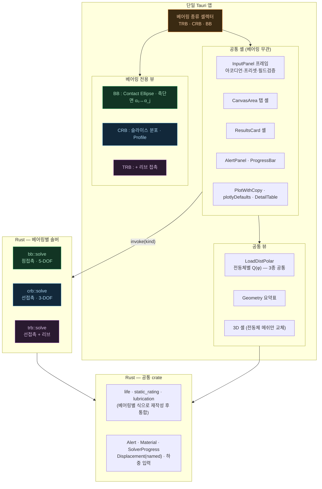
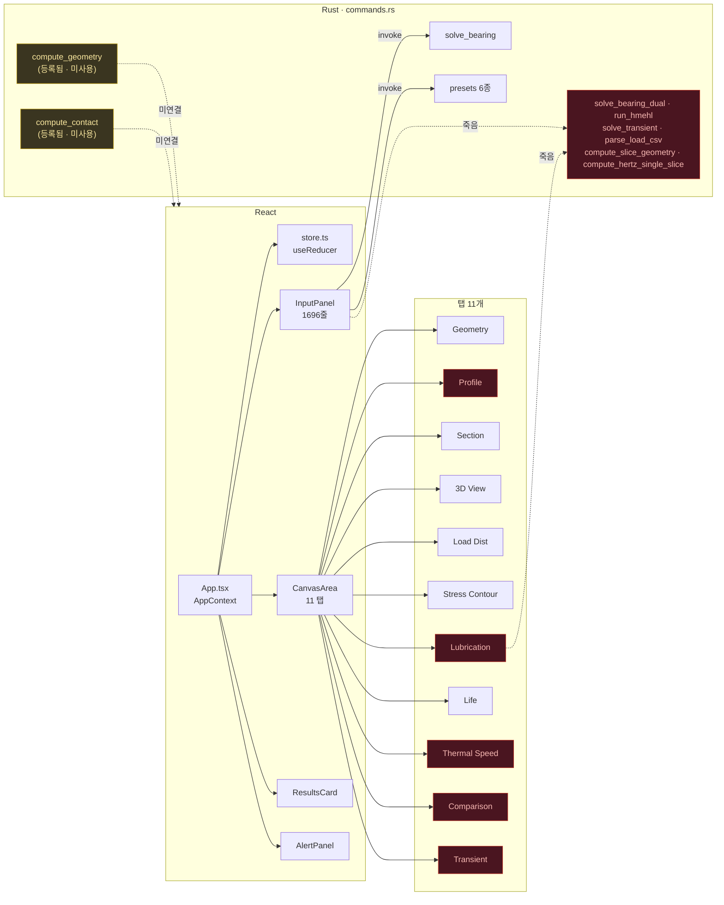
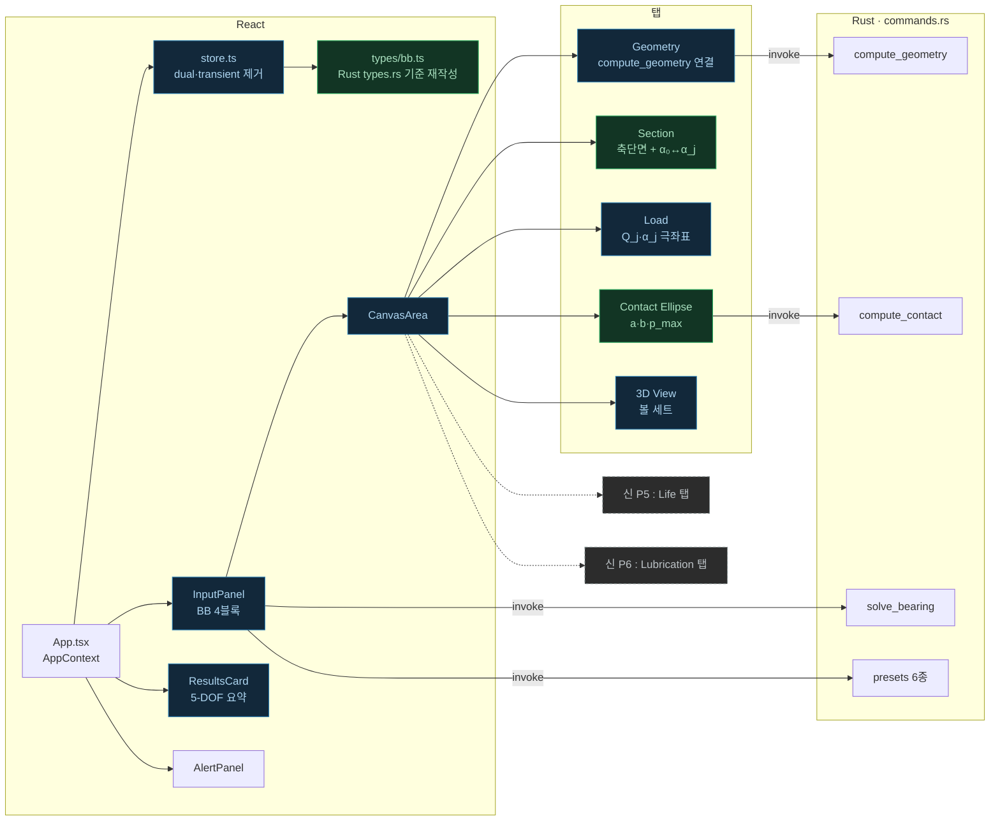
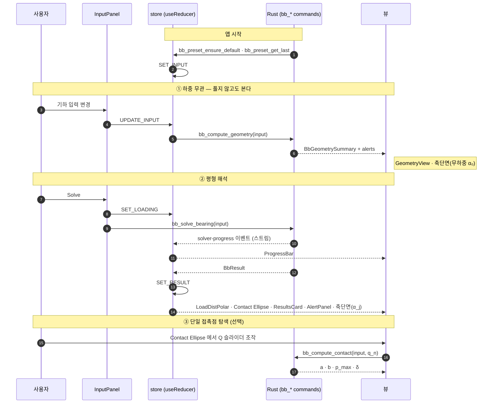

# BB Contact Analysis System — 개발 계획서 (ACBB)

> CRB-main 의 SW 체계를 모태로 **단열 앵귤러콘택트 볼베어링(ACBB)** 해석 SW 를 개발하기 위한 실행 계획.
>
> - **작성일**: 2026-08-20
> - **수식 근거**: [BB_Development_Theory.md](BB_Development_Theory.md) — **본 계획서는 수식을 새로 정의하지 않는다.** 모든 식은 Theory 의 절·식 번호로 참조한다.
> - **모태**: `d:/AI/AI_Seminar_CRB/CRB-main` (Phase 4 스냅샷)
> - **작업 로그**: [BB_Development_Action.md](BB_Development_Action.md)

---

## 1. 결정 사항 (확정)

| ID | 항목 | 결정 | 근거·비고 |
|---|---|---|---|
| **D-1** | 평형 DOF | **코드는 5-DOF 로 1회 구현.** 검증만 2단계로 — **P3-1**(`DofMask::ISO_3DOF` 구속 → Level C·D-1) → **P3-2**(`FULL` 해방 → Level D-2) | ISO 16281 A.1 이 확장 허용. Harris Table 7.4 대조는 3-DOF 상태여야 성립. `bearing.rs` 는 두 번 쓰지 않는다 |
| **D-2** | 베어링 범위 | **단열 ACBB + 축방향 예압** | 복열 조합(DB/DF/DT)·4점접촉은 범위 밖 (§8.2) |
| **D-3** | 고속 효과 | **경고만** — `n·D_pw > 1×10⁶ mm/min` 시 "정적 가정 범위 밖" 표시, 계산은 수행 | ISO 16281 A.4 는 식을 주지 않음 (Theory §5) |
| **D-4** | 접촉응력 | **구현** — Harris Ch.6 (6.38)~(6.46) 로 `a`, `b`, `p_H,max` 산출 | Theory §6. T-4 해소됨 |
| **D-5** | 하이브리드 볼 | **제외** (강제 볼만) | ISO 가 하이브리드 `a_ISO` 를 정의하지 않음 (Theory §7.7) |
| **D-6** | 윤활 계층 | **`κ` + 점접촉 유막(Hamrock-Dowson elliptical)** | HMEHL·조도·열보정 전체 이식은 범위 밖 |
| **D-7** | 좌표계 축 명명 | **ISO 규약 — X = 회전축** | Theory 의 ISO 식을 치환 없이 전사. CRB/TRB 의 `Z = 축방향` 과 다름 (§3.4) |
| **D-8** | `φ_j` 원점 | **고정** `φ_j = 2π(j−1)/Z` + **위상 스윕 옵션** 별도 제공 | CRB 의 하중방향 정렬은 5-DOF 에서 worst-case 를 보장하지 못함 (§3.4.3) |
| **D-9a** | 틸트 **키네마틱** 팔 | **`R_i`** (식 A.4) | CRB 의 `d_pw/2` 는 볼에서 틸트 감도를 과소평가. ISO (A.2)(A.5) = Harris *Adv* (1.13)(1.14) |
| **D-9b** | **모멘트** 팔 (`M_y`·`M_z`) | **`R_i`** — 키네마틱 팔과 통일 | 가상일·기하 분석 결과 `R_i` 가 공액 (Theory §4.5). Harris & Mindel (89)(90) 5-DOF 원전과 일치. ISO (A.8) 의 `D_pw/2` 는 피치원 근사이며 Annex A 는 informative |
| **D-9c** | 틸트 항 | **선형화** `R_i γ` (사인 없음) | 원전 둘 다 선형(Harris *Adv* 1.13 · H&M 81). 5-DOF 성분별 사인은 문헌에도 없고 엄밀하지도 않다. `R_i` 와 함께 가상일 공액을 정확히 만족 |
| **D-10** | 단위 | **솔버 내부 `mm`·`N`·`rad`**, UI 경계에서 `μm`·`kN`·`°` 변환 | `c_P` [N/mm^1.5], `Σρ` [1/mm], Harris 0,0236 계수가 모두 mm·N 기준 |
| **P-1** | Phase 구성 | 솔버 **수직 관통** P1→P6, 각 Phase 말미에 검증 Level 부착 | |
| **P-2** | 프론트엔드 | **솔버 완성 후 마지막(P6)**. 그때까지 `@ts-nocheck` stub 유지 | CRB 가 Phase 1 에서 쓴 방식 |

---

## 2. 범위

> 🏷️ **계열 / 변종 층위 (§3.6.1.3)**: 코드·문서·커맨드 이름의 `BB` 는 **볼 계열(family)** 을 뜻하고,
> 아래 범위는 **변종(variant) 층위**의 서술이다. 층위가 다를 뿐 모순이 아니다.
> 변종은 `BallBearingKind { Acbb, Dgbb, FourPoint }` 로 구분하며, **현재 검증 완료 범위는 `Acbb` 뿐**이다.
> `Dgbb` 는 솔버 코어가 이미 동작하나 수명 계수 미확보, `FourPoint` 는 평형 미구현이라
> `validate()` 에서 명시적으로 거부한다.

### 2.1 포함

- 단열 **ACBB** (초기 접촉각 α₀ ≠ 0), 강제 볼·강제 레이스웨이
- 축방향 예압 (음의 운전 클리어런스 또는 예압 하중 입력)
- 5-DOF 정적 평형 (δx, δy, δz, γy, γz) — ISO 3-DOF 를 부분집합으로 포함
- 점접촉 타원 Hertz: `χ`, `c_P`, `δ`, `a`, `b`, `p_H,max`
- 볼별 운전 접촉각 `α_j`, 볼 하중 `Q_j`
- ISO 16281 §5.2 기준수명 `L_10r`, 수정 기준수명 `L_nmr`
- ISO 281 `C_r`, `C_u`, `a_ISO`, `κ`
- 점접촉 EHL 유막 `h_c`, `h_min`, `Λ`

### 2.2 제외 (명시적)

| 항목 | 사유 | 재검토 시점 |
|---|---|---|
| 복열 조합 (DB/DF/DT) | D-2 | 단열 완성 후 |
| 4점접촉 (QJ) | D-2. ISO §5.1 이 복열 ACBB 근사를 허용하므로 복열 구현 시 자동 확보 | 복열 이후 |
| DGBB 전용 UI | ACBB 코드의 α₀ = 0 특수 케이스로 자연 포함 (Theory §10.2) | — |
| 스러스트 볼베어링 | 식 (3)(4)(12)(16), `a_ISO` (37)~(39) 별도 분기 필요 | 미정 |
| 원심·자이로 (고속) | D-3. ISO 식 부재 | 필요 시 Jones(1960) 도입 |
| 하이브리드 볼 | D-5 | — |
| HMEHL·혼합윤활·열보정 | D-6 | — |
| 과도해석(transient), WEC | 초기 범위 밖 | — |
| 마찰·토크 | 초기 범위 밖. 확보 문헌 3편은 후속용 | — |

---

## 3. 아키텍처

### 3.1 계층 구조 (CRB 3계층 → BB 2계층)

```
Level 1 (Bearing)  5-DOF 평형 → 볼별 δ_j, α_j, Q_j        ← 유지·개편
Level 2 (Ball)     단일 점접촉 (타원 Hertz)                ← 신규 (CRB Level 2·3 통합 대체)
                   ※ 슬라이스 계층 없음
```

CRB 의 Level 2(롤러 축방향 하중분포) + Level 3(슬라이스 Hertz) 이 **볼에서는 단일 점접촉 하나로 축약**된다. Gen1/Gen3 이중 모드 개념 자체가 소멸한다.

### 3.2 모듈 처분

> **시드 시점 `mod.rs` 실태 (2026-08-20 조사)**: 아래 "시드 상태" 열은 BB 시드(CRB Phase 4 스냅샷) 시점에 **실제로 컴파일되고 있었는지** 를 뜻한다. 비활성 모듈은 CRB 화 과정에서 주석 처리된 상태로, **컴파일된 적이 없다.**

| 파일 | 시드 상태 | 처분 | Phase |
|---|---|---|---|
| `types.rs` | 활성 | 재작성 | P1 |
| `geometry.rs` | 활성 | 재작성 | P1 |
| `hertz.rs` | 활성 | **P1 에서 일시 비활성화** → 재작성 후 재활성화 | P1(비활성)/P2 |
| `bearing.rs` | 활성 | **P1 에서 일시 비활성화** → 재작성 후 재활성화 | P1(비활성)/P3 |
| `life.rs` | **비활성** | 재활성화 + 재작성 (ISO §5.3 → §5.2) | P4 |
| `static_rating.rs` | **비활성** | 재활성화 + 계수 교체 (ISO 76 볼) | P4 |
| `lubrication.rs` | **비활성** | 재활성화 + 부분 재사용 (§3.3) | P5 |
| `gen1.rs`, `gen3.rs`, `beam.rs` | 활성 | **삭제 완료** | P1 ✅ |
| `rib_contact.rs` | 비활성 | **삭제 완료** (`hertz_elliptical_coefficients` 이관 후) | P1 ✅ |
| `hmehl.rs`, `transient.rs`, `transient_io.rs`, `wec_risk.rs` | 비활성 | **삭제 완료** | P1 ✅ |

### 3.3 CRB 에서 그대로 재사용 가능한 자산 (조사 완료)

코드를 직접 확인해 **볼에 바로 쓸 수 있는 것**을 확정했다. 재작성하지 말고 이관한다.

| 자산 | CRB 위치 | BB 이관처 | 근거 |
|---|---|---|---|
| `hertz_elliptical_coefficients(r_x, r_y)` | `rib_contact.rs:125` | `hertz.rs` | Brewe-Hamrock 근사. 계수 `1.0339/0.6360`, `1.5277/0.6023`, `1.0003/0.5968` 가 **Harris (6.33)~(6.35) 와 정확히 일치** (Theory §6.4). `χ` 초기값·검산용 |
| `hamrock_dowson_elliptical(u,g,w,k)` | `lubrication.rs:2562` | `lubrication.rs` 유지 | Hamrock & Dowson (1981) Eqs 7.31/7.33 **타원 접촉 원식**. 볼이 본토라 CRB 보다 오히려 자연스러움 |
| `viscosity_at_temp`, Walther/Roelands 점도 | `lubrication.rs` | 유지 | 접촉 형상 무관 |
| `κ`, `ν₁` (ISO 281 27~29) | `life.rs` | 유지 | 접촉 형상 무관 |
| `e_C` 표 | `life.rs` | 유지 | 접촉 형상 무관 |
| Newton-Raphson 수치 유틸, 수렴 판정 | `bearing.rs` | 참고 재사용 | 구조만 |
| Tauri command 배선, 결과 직렬화 패턴 | `lib.rs`, `commands` | 유지 | |

> ⚠️ **재사용 자산 2개가 비활성 모듈 안에 있다 (2026-08-20 조사)**: `hamrock_dowson_elliptical`(`lubrication.rs`)과 `κ`·`ν₁`·`e_C`(`life.rs`)는 시드 시점에 `mod.rs` 에서 주석 처리돼 **컴파일된 적이 없다.** 따라서 P4·P5 는 "이관"이 아니라 **"재활성화 → 컴파일 통과 → 검증"** 순서로 시작해야 하며, 그 비용을 Phase 산정에 포함해야 한다. (`hertz_elliptical_coefficients` 는 P1 에서 이관 완료 — 순수 함수라 무비용이었다.)
>
> ⚠️ 반대로 **재사용하면 안 되는 것**: `a_ISO` 롤러 계수(1.5859/1.3993/1.2348, 지수 0.4·−9.185) — 볼은 (31)~(33) 의 2.5671/2.2649/1.9987, 지수 0.83·1/3·−9.3 이다 (Theory §7.8). `C_u` 롤러 계수 0.2453·`C_0/8.2` → 볼은 0.2288·`C_0/22`.

### 3.4 좌표계 · 단위 규약 (D-7 ~ D-10)

#### 3.4.1 축 정의 — ISO 16281 규약 채택

ISO 16281:2025 Clause 4 및 Figure A.1 a) (ISO p.22 / PDF p.28, 육안 확인 완료):

```
        Z ⊗ ────→ X          X = 베어링 회전축
          │                  Y = 반경방향 (도면상 아래)
          ↓ Y                Z = 반경방향 (지면 속), 우수좌표계
```

| 미지수 | 물리 | 축 | 잔차 | ISO 대응 |
|---|---|---|---|---|
| `δ_x` | 축방향 변위 | X | `F_x` | `δ_a` — 식 (A.7) |
| `δ_y` | 반경 변위 1 | Y | `F_y` | `δ_r` — 식 (A.6) |
| `δ_z` | 반경 변위 2 | Z | `F_z` | (5-DOF 확장) |
| `γ_y` | 미스얼라인먼트 (about Y) | — | `M_y` | (5-DOF 확장) |
| `γ_z` | 미스얼라인먼트 (about Z) | — | `M_z` | `ψ` — 식 (A.8) |

5-DOF 일반화 (Theory §4.2, §4.3 의 (A.2)(A.5) 확장):

```
반경 성분  R_j = A cos α₀ + δ_y cos φ_j + δ_z sin φ_j
축   성분  X_j = A sin α₀ + δ_x − R_i (γ_z cos φ_j − γ_y sin φ_j)

δ_j = max(0, √(R_j² + X_j²) − A)          α_j = atan2(X_j, R_j)
Q_j = c_P δ_j^(3/2)

잔차   F_x = Σ Q_j sin α_j
       F_y = Σ Q_j cos α_j cos φ_j
       F_z = Σ Q_j cos α_j sin φ_j
       M_y = −R_i Σ Q_j sin α_j sin φ_j
       M_z = +R_i Σ Q_j sin α_j cos φ_j
```

> **팔은 `R_i` 로 통일, 틸트는 선형화** (D-9b·D-9c, 2026-08-20 확정).
> 이 형태는 **Harris & Mindel (1973) 식 (81)(82)(86)~(90) 의 정적 환원형과 동일**하며
> **가상일 공액**이라 야코비안이 대칭이다. 근거는 Theory §4.4 확정 블록 · §4.5 분석.
>
> ISO (A.8) 은 모멘트 팔에 `D_pw/2` 를 쓰므로 본 구현과 다르다. Annex A 가 informative 이고
> A.1 이 확장을 명시 허용하므로 규격 준거는 유지된다. 편차는 약 0,5 % (Theory §4.5 편차표).

**구속 `δ_z = γ_y = 0` → ISO 식 (A.2)(A.5)(A.6)(A.7)(A.8) 과 항등.** 이 항등성이 Level D-2 의 판정 기준이다.

> ⚠️ **CRB/TRB 계보와 축 이름이 다르다.** CRB 코드는 `X = 수평 반경, Y = 수직 반경, Z = 샤프트축` (`types.rs` D5) 이고 `Manual/09` 도 `δz = axial` 로 서술한다. **CRB 코드를 참고할 때 축 이름을 그대로 옮기면 안 된다.** 대응: `CRB X → BB Y`, `CRB Y → BB Z`, `CRB Z → BB X`, `CRB γ_x → BB γ_y`.
>
> 또한 CRB 는 이미 3-DOF `(δx, δy, γx)` 로 축소된 상태(D6/D7)라 **재사용할 5-DOF 구조 자체가 없다.** `bearing.rs` 는 알고리즘(Newton-Raphson·line search·step limiting) 구조만 참고하고 수식은 Theory 에서 직접 옮긴다.

#### 3.4.2 틸트 모멘트 팔 — `R_i` (D-9)

$$R_i = \frac{D_{pw}}{2} + \left(r_i - \frac{D_w}{2}\right)\cos\alpha_0 \qquad \text{(Theory §2.3, 식 A.4)}$$

볼의 틸트는 **홈 곡률중심**을 움직이므로 피치반경이 아니라 `R_i` 가 모멘트 팔이다. CRB 의 `d_pw/2` 를 쓰면 틸트 감도가 과소평가된다 (예: `D_w` = 20 mm, `r_i` = 0,52 `D_w`, α₀ = 25° → 약 +0,36 mm 차이).

#### 3.4.3 볼 각위치 `φ_j` (D-8)

$$\varphi_j = \frac{2\pi(j-1)}{Z}, \qquad j = 1 \ldots Z$$

**고정 원점**을 쓴다 (`φ_1 = 0` 이 `δ_y` = Y축 방향). 검증 재현성을 위해 ISO 정식화를 그대로 따른다.

CRB 의 `φ_load = atan2(F_y, F_x)` 하중방향 정렬은 **채택하지 않는다.** 5-DOF 에서는 반경하중 방향과 모멘트 축이 독립이라 단일 정렬각으로 worst-case 를 보장할 수 없기 때문이다.

대신 **케이지 위상 스윕**을 별도 기능으로 제공한다:

```
for φ₀ in linspace(0, 2π/Z, n_phase):     // 기본 n_phase = 36
    φ_j = φ₀ + 2π(j−1)/Z
    해석 → Q_max, p_H,max, L_10r 기록
출력: 각 지표의 최악값 + 발생 위상
```

볼 해석은 `O(Z)` 라 36회 스윕도 밀리초 단위로 끝난다 (Theory §8). 기본 해석은 `φ₀ = 0` 단일 실행, 스윕은 사용자 토글.

#### 3.4.4 단위 (D-10)

| 위치 | 길이 | 힘 | 모멘트 | 각도 | 응력 |
|---|---|---|---|---|---|
| **솔버 내부** | **mm** | **N** | **N·mm** | **rad** | MPa |
| UI / JSON 경계 | μm (변위), mm (기하) | kN | N·m | ° | MPa |

내부를 ISO 단위로 통일하는 이유: `c_P` [N/mm^(3/2)], `Σρ` [1/mm], Harris (6.39) 의 `0,0236`, (6.43) 의 `2,79×10⁻⁴` 가 모두 mm·N 기준이다. 지수가 `3/2`, `2/3`, `1/3` 로 분수라 중간 단위환산이 끼면 실수가 나기 쉽다.

**변환은 입출력 경계 한 곳에서만** 수행한다 (`commands` 계층). 솔버 내부에는 `1000.0` 같은 환산 상수가 등장하지 않아야 한다 — 이를 Level A 의 점검 항목으로 둔다.

---

### 3.5 데이터 모델 스케치 (P1 에서 확정)

```rust
struct BallBearingGeometry {
    d_w:      f64,   // 볼 직경 D_w [mm]
    d_pw:     f64,   // 피치직경 D_pw [mm]
    z:        u32,   // 볼 수 Z
    r_i:      f64,   // 내륜 홈 곡률반경 [mm]  (기본 0.52 D_w, Theory §2.4)
    r_e:      f64,   // 외륜 홈 곡률반경 [mm]  (기본 0.53 D_w)
    alpha_nom: f64,  // 공칭 접촉각 α [rad]  — 정격하중용 (ISO 281)
    clearance: Clearance,  // 운전 클리어런스 또는 예압
}

enum Clearance {
    Diametral(f64),      // G_r op [mm], 음수면 예압
    InitialAngle(f64),   // α₀ [rad] 직접 입력 → G_r op 역산
    AxialPreload(f64),   // 예압 하중 F_a0 [N] → P3 에서 δ_a0 로 변환
}

/// 하중 무관 전처리 결과 (해석당 1회, Theory §8)
struct ContactPrecomputed {
    a_dist:  f64,   // A = r_i + r_e − D_w
    alpha_0: f64,   // 초기 접촉각
    r_i_c:   f64,   // R_i
    gamma:   f64,   // γ = D_w cos α / D_pw
    sum_rho_i: f64, sum_rho_e: f64,
    chi_i:  f64, chi_e: f64,      // (E.1) 해
    k_i: f64, e_i: f64,           // K(χ_i), E(χ_i)
    k_e: f64, e_e: f64,
    c_p:    f64,                  // 스프링상수 (40)
}

struct BallResult {
    phi:    f64,   // 각위치 ϕ_j
    delta:  f64,   // 탄성변형 δ_j  (A.2)
    alpha:  f64,   // 운전 접촉각 α_j (A.5)
    q:      f64,   // 볼 하중 Q_j
    a_i: f64, b_i: f64, p_h_i: f64,   // 내륜 접촉타원·응력
    a_e: f64, b_e: f64, p_h_e: f64,   // 외륜
    loaded: bool,
}

/// 5-DOF 내륜 변위 — ISO 규약 (D-7). 단위 mm / rad (D-10)
struct BearingDisplacement {
    d_x: f64,   // 축방향 (X = 회전축)   ≡ ISO δ_a
    d_y: f64,   // 반경 (Y)              ≡ ISO δ_r
    d_z: f64,   // 반경 (Z)              — 5-DOF 확장
    g_y: f64,   // 틸트 about Y          — 5-DOF 확장
    g_z: f64,   // 틸트 about Z          ≡ ISO ψ
}

/// DOF 구속 마스크 — ISO 3-DOF 모드 검증용 (Level D-1)
struct DofMask { d_x: bool, d_y: bool, d_z: bool, g_y: bool, g_z: bool }
// ISO 3-DOF 모드 = { d_x: free, d_y: free, d_z: fixed(0), g_y: fixed(0), g_z: free }
```

> **3-DOF ↔ 5-DOF 호환 규약**: §3.4.1 참조. `d_z = g_y = 0` 구속이 ISO 식과 항등해야 하며, 이 항등성이 P3 Level D-2 의 판정 기준이다.

---

### 3.6 프론트엔드 구조 — TRB 현행 ↔ BB 목표

> 조사일 2026-08-21. 신 Phase 4 착수 전 전수 조사 결과.
>
> ⚠️ **전제 정정**: `src/` 는 CRB 가 아니라 **TRB(테이퍼 롤러) 코드**다. 앱 타이틀이
> `TRB Contact Analysis`, 프로젝트 저장 확장자가 `.trb.json`, `alpha_rib`·`r_rib_circ`·
> 리브 접촉 로직이 곳곳에 남아 있다. 모든 파일 헤더에 `// CRB Phase 1.4 stub … Phase 6
> 에서 정식 재작성 예정` 주석이 붙어 있고, 그 "Phase 6" 이 지금의 **신 Phase 4** 다.

> **읽는 순서**
>
> | § | 무엇을 답하는가 |
> |---|---|
> | **3.6.1** | **먼저 읽어야 하는 것** — 세 SW(TRB·CRB·BB)를 언젠가 합친다는 전제에서 나오는 설계 기준. 충돌 지점, 공통↔전용 경계, 명명 규약, 지금 지불할 비용 |
> | **3.6.2** | 왜 바꾸는가 — TRB 와 ACBB 의 물리가 어떻게 다르고, 그것이 화면에 어떻게 나타나는가 |
> | **3.6.3** | 지금 무엇이 있는가 — 전 44파일 진단, 구조 다이어그램, 대체 판정, 상태·타입 현황 |
> | **3.6.4** | 무엇을 만드는가 — 탭 구성, **각 뷰가 어느 Level 을 눈으로 검증하는가**, 데이터 흐름 |
> | **3.6.5** | 어떤 순서로 만드는가 — Phase 4 작업 분해 |
>
> 3.6.1 을 앞에 둔 이유는 **명명·경계 결정이 3.6.3~3.6.5 의 모든 선택을 제약**하기 때문이다.
> 뒤에 두면 「왜 이 이름인가」를 매번 앞으로 되짚어야 한다.

#### 3.6.1 통합을 전제로 한 설계 기준

> 조사일 2026-08-21. CRB 저장소(`d:/AI/AI_Seminar_CRB/CRB-main`) 전수 조사 결과.
> 세 SW(TRB · CRB · BB)를 **언젠가 하나로 합친다**는 전제에서 나오는 기준을 먼저 못박는다.
> 이 절의 결정이 §3.6.3~3.6.5 의 모든 선택을 제약한다.

> ### 📌 확정 사항 (2026-08-21)
>
> | 항목 | 결정 | 이유 |
> |---|---|---|
> | **프론트 재작성 범위** | **BB 전용** (원안 유지) | 「가벼운 개별 개발」이 현 단계의 목적. CRB 프론트는 별도로 |
> | **통합 대비 수준** | **레벨 1 — 경계만 지키기** | 추상화 장치를 만들지 않는다. 통합 때 **조용히 틀릴 것만** 지금 막는다 |
> | **규약 SSOT** | **BB (ISO X축 · N·mm·rad)** | 유일하게 규격 근거가 있고 기계 검사로 강제된다 (3.6.1.8) |
> | **통합 목표 형태** | **단일 앱 + 베어링 종류 선택** | 3.6.1.5 |
> | **중복 9 830줄** | **BB 에서 삭제** | 발견 ② · 3.6.1.7 |
> | **`displacement`** | **named struct 로 지금 변경** | 충돌 3 · 3.6.1.7 |
> | **BB 계열 내부 변종** | **`BallBearingKind` enum** (ACBB·DGBB·4PCBB). 폴더 분리 없음 | §3.6.1.3 |
> | **명명·접두사 층위** | **계열 `bb_`** · 파일 평탄화 · 전용물만 `Bb` 접두 | §3.6.1.6 |
> | **경계 강제** | **ESLint `no-restricted-imports` + A-8 확장 3항목** | §3.6.1.6 |


##### 3.6.1.1 현황과 두 가지 발견

세 SW 는 **TRB(원본) → CRB(파생) → BB(파생)** 계보다. 지금은 **경량화를 위해 개별 개발**하되,
추후 **하나의 SW 로 통합**해 「베어링 종류를 고르면 바로 결과를 보는」 형태를 목표로 한다.

파생 방식은 CRB Plan Phase 0 이 규정한 **「전체 복사 후 이름만 바꾸고 diff 로 갈라내기」**다.
조사에서 이 방식의 현재 상태가 두 가지 형태로 드러났다.

> 🔴 **발견 ① — CRB `src/` 와 BB `src/` 는 byte-identical 이다.**
> `diff -rq` 가 차이를 하나도 내지 않는다. 41개 프론트 파일의 줄수가 전부 일치하고
> `package.json` 은 `"name"` 한 줄(`crb-app` ↔ `bb-app`)만 다르다.
> **BB 는 Rust 솔버만 포팅했고 프론트는 CRB 사본 그대로**다.
>
> → §3.6.3.1 의 인벤토리(11 067줄 · `@ts-nocheck` 13 · 죽은 `invoke` 6종)는
> **CRB 에도 글자 그대로 적용된다.** 신 Phase 4 는 BB 전용으로 진행하기로 했으나,
> 그 산출물이 **CRB 프론트 재작성의 사실상 설계도**라는 점은 기록해 둔다.

> 🔴 **발견 ② — `life.rs`(1085) · `static_rating.rs`(304) · `lubrication.rs`(8441) 합계 9 830줄이 두 저장소에 완전히 동일한 사본으로 존재하며, 양쪽 모두 비활성이다.**
> 세 파일 모두 **롤러 기준 TRB 판**이고 `solver/mod.rs` 에서 주석 처리되어 컴파일되지 않는다.
> BB 는 신 P5(수명)·P6(윤활)에서 **ISO 16281 §5.2 볼 식으로 새로 쓴다.**
> → **BB 저장소에서 삭제한다** (Plan 이 명시한 「주석처리 금지, 삭제」 원칙, P1 과 동일). git 에 남는다.


**선례가 주는 교훈 — CRB Plan §2.1·§2.2 의 사전 판정 vs 실제**


CRB Plan 은 TRB→CRB 전환 시 모듈별 변경강도를 🔴대규모 / 🟡중간 / 🟢불변 3색으로 사전 판정했다.
**「무엇을 공통으로 뒀는가」의 실제 선례**이므로 그 정확도를 대조한다.

| CRB Plan 예측 | 실제 (BB 시점) |
|---|---|
| `hertz.rs` 「🟢 거의 불변」 | BB 와 **1 013줄 차이** — line ↔ point contact 는 사실상 별개 |
| `gen1.rs` 「🟢 거의 불변」 | BB 에 **아예 없다** |
| `ProfileView` 「🟢 거의 불변」 | `@ts-nocheck` stub 로 전락 |
| `ResultCharts`·`ContourMap`·`ComparisonView` 「🟢 불변」 | 실제 파일은 **2줄짜리 re-export 껍데기** |

> **「전체 복사 후 diff 로 갈라내기」는 3번째 파생에서 이미 한계에 도달했다.**
> 증거는 발견 ② — 동일 사본 9 830줄이 양쪽에서 비활성인 채 중복 유지되고 있었다.
> 사전 「🟢 불변」 판정이 네 건이나 빗나간 이유는 **접촉 물리가 바뀌면 그 위에 얹힌 모든 것이 바뀌기 때문**이며,
> 이는 §3.6.2 대비표가 이미 예고한 바다.


##### 3.6.1.2 충돌 지점 (확인된 8건)

| # | 항목 | CRB | BB | 심각도 | 해소 시점 |
|---|---|---|---|:---:|---|
| 1 | **커맨드 이름** | `solve_bearing` · `compute_slice_geometry` · `presets::*` | 동일 이름 | 🟠 | 통합 (`generate_handler!` 즉시 충돌). `solve_roller_*` 6종은 이름에 `roller` 가 있어 **충돌 없음** |
| 2 | **`BearingResult`** | `mode`·`life`·`static_rating`·`thermal_speed`·`f_a_induced_kn` | `phase_sweep`·`elapsed_ms` | 🟠 | 통합 |
| 3 | 🔴 **`displacement: [f64;5]`** | `[δx, δy, **δz=0**, γx, **γy=0**]` — **실제로는 3-DOF**, `bearing.rs:325` 에서 2칸을 하드코딩 0 으로 패딩 | `[δx, δy, δz, γy, γz]` — 진짜 5-DOF | 🔴🔴 | **지금** (레벨 1) |
| 4 | **단위** | 입력 kN → 내부 **N + μm** → 출력 **kN + μm + `N/μm`** 혼성 | **N·mm·rad 엄격** (D-10, A-8 기계검사) | 🔴 | 통합 (SSOT 는 지금 명문화) |
| 5 | **좌표계** | **X=수평 radial, Y=수직(중력), Z=샤프트축** (`types.rs:34` D5) | **X=회전축**, Y·Z 반경 (ISO 16281, D-7) | 🔴 | 통합 (SSOT 는 지금 명문화) |
| 6 | **각도 입력 단위** | `gamma` 가 **arcmin** → rad → **μm/mm** 3단 환산 (`types.rs:456`, `bearing.rs:106`) | rad 단일 | 🟡 | 통합 |
| 7 | **프리셋 저장소** | `app_data_dir()/presets` 고정, 페이로드는 `BearingInput` 직렬화. **베어링 종류 필드 없음** | 동일 (사본) | 🔴 | **지금** — 같은 디렉터리에서 섞이고 serde 가 조용히 잘못 역직렬화한다 |
| 8 | **프로젝트 파일** | `.trb.json`, `PROJECT_VERSION = 1`, **베어링 종류 필드 없음** | 동일 (사본) | 🟠 | **지금** |

**3번이 가장 위험하다.** 두 배열이 모양이 같아 컴파일러도 TypeScript 도 구분하지 못하는데,
**인덱스 3이 CRB 는 `γx`, BB 는 `γy`** 다. 게다가 CRB 의 `[2]`·`[4]` 는 항상 0 인 죽은 슬롯이라
인덱스를 맞추려는 시도 자체가 무의미하다. → **배열을 named struct 로 바꾸는 것이 유일한 방어**다.


##### 3.6.1.3 BB 계열 내부 확장 — ACBB · DGBB · 4PCBB

> **확정 (2026-08-21)**: `BB` 는 **계열(family) 이름**이고, 변종은 **`BallBearingKind` enum 한 개**로
> 구분한다. 변종별 폴더·모듈을 파지 않는다.


**① 명명 층위는 3단이다**

```
계열 (family)        변종 (variant)              배열 (arrangement)
─────────────        ──────────────────          ──────────────────
Ball  →  BB          ACBB · DGBB · 4PCBB         단열 · DB / DF / DT
Roller → CRB·TRB     CRB · TRB · SRB · NRB       단열 · 복열
```

현재 이름들(`bb-app`, `BallBearingGeometry`, `BB_Development_*.md`, `bb_` 커맨드 접두)은
**계열 층위**다. Plan §2 가 범위를 "단열 ACBB" 로 좁혀 적은 것과 코드 이름 사이에 층위 불일치가
있었으므로 여기서 정리한다 — **코드는 계열 이름, 범위 문서는 변종 이름**이며 모순이 아니다.


**② 근거 — 현 솔버는 이미 DGBB 를 푼다**

| 근거 | 내용 |
|---|---|
| **Level C-7 픽스처** | 「반경하중이면 반대편 볼이 뜬다」를 재현하려고 **α₀ = 0 · 클리어런스 0** 으로 교체했고, Action 에 「고전적 반경 하중구간은 **DGBB** 에서 나타난다」로 기록했다 |
| **`geometry.rs` (A.1)** | `α₀ = arccos(1 − G_r / 2A)` — `G_r = 0` 이면 `α₀ = 0`. **DGBB 는 ACBB 의 α₀ = 0 특수해**다 |
| **ISO 16281** | Annex A.2 는 "radial ball bearings" 로 **DGBB·ACBB 를 함께** 다룬다. 분기가 규격에도 없다 |

즉 `bearing.rs` · `hertz.rs` · `geometry.rs` 는 **그대로 DGBB 에 쓰인다.**


**③ 변종별 차이 — 코어가 아니라 주변부다**

| 항목 | ACBB | DGBB | 4PCBB |
|---|---|---|---|
| 초기 접촉각 `α₀` | ≠ 0 (공칭각 지정) | **0** (클리어런스에서 유도) | ≠ 0, **볼당 2쌍** |
| 궤도 곡률중심 | 궤도당 **1개** | 궤도당 **1개** | 궤도당 **2개** (고딕 아치) |
| 볼당 접촉점 | 2 (내·외륜) | 2 | **최대 4**, 하중에 따라 **2점 ↔ 4점 전환** |
| 점접촉 Hertz | 동일 | 동일 | 동일 |
| 5-DOF 평형식 | 현행 | **현행 그대로** | **신규** (접촉쌍이 2배, 전환 판정 필요) |
| ISO 281 `X`/`Y` | Table 3 (α 별) | Table 3 (α = 0 행) | ISO §5.1 근사 |
| `f_c` 표 열 | 접촉각별 | α = 0 | 근사 |
| **현 코드 재사용률** | — | **≈ 100 %** | **기하·접촉 100 %, 평형 신규** |

> **DGBB 에 필요한 것은 수명 계수(`X`/`Y`/`f_c` 열 선택)와 UI 기본값뿐이며, 둘 다 신 P5(수명)·P4(프론트) 범위 안에 있다.**
> 4PCBB 만 새 평형 모듈(`four_point.rs`)이 필요하고, 그것도 `hertz.rs`·`util.rs` 를 그대로 쓴다.


**④ 왜 폴더를 파지 않는가**

`bb/acbb/`·`bb/dgbb/` 로 미리 나누면 DGBB 착수 시 **거의 동일한 코드가 복사**된다.
그것이 §3.6.1.1 이 기록한 **이 프로젝트가 세 번 물린 방식**(TRB → CRB → BB 전체 복사)이다.
변종 간 재사용률이 ≈ 100 % 인데 폴더를 나누는 것은 **중복을 제도화**하는 것과 같다.

**대신 이렇게 한다.**

```rust
/// 볼베어링 변종 (계열 = BB). 기하·접촉·평형은 공유하고, 변종은 데이터로 구분한다.
pub enum BallBearingKind {
    /// 각접촉 — α₀ ≠ 0. 현재 검증 완료 범위
    Acbb,
    /// 심구 — α₀ = 0 인 Acbb 의 특수해. 솔버 코어 동일
    Dgbb,
    /// 4점접촉 — 궤도당 곡률중심 2개, 볼당 최대 4접촉. 평형 모듈 신규 필요
    FourPoint,
}
```

- 지금은 `Acbb` 만 **검증 완료**다. `Dgbb` 는 코어가 이미 동작하나 **수명 계수 미확보**,
  `FourPoint` 는 **평형 미구현**이다. 이 상태를 `validate()` 에서 명시적으로 거부해
  「되는 줄 알았는데 안 되는」 상황을 막는다.
- 배열(DB/DF/DT 복열)은 **직교하는 축**이며 Theory §8.2 확장 후보 1번이다. 변종 enum 과 별도 필드로 둔다.

---


##### 3.6.1.4 공통 ↔ 전용 경계 (4계층)

**① 솔버 모듈**

| 판정 | 모듈 | 근거 |
|---|---|---|
| **공통 (통합 시 crate 후보)** | ~~`life.rs`(1085)~~ · ~~`static_rating.rs`(304)~~ · ~~`lubrication.rs`(8441)~~ | **CRB·BB 에 byte-identical 사본.** BB 에서는 삭제 — 볼 식으로 새로 쓴다 (발견 ②) |
| **공통 후보** | `transient*.rs` · `wec_risk.rs` · `hmehl.rs` | 시간적분·위험도·EHL 프레임은 형상 무관. BB 는 P1 에서 이미 삭제 |
| **의미공통·형태상이** | `hertz.rs` · `bearing.rs` | 개념은 같으나 line↔point contact, DOF·잔차식 상이. **CRB Plan 은 `hertz.rs` 를 「🟢 거의 불변」으로 예측했으나 실제 1 013줄 차이** |
| **롤러 전용** | `geometry.rs`(슬라이스·크라우닝) · `gen1.rs` · `gen3.rs` · `beam.rs` · `rib_contact.rs` | 볼에 대응물 없음 |
| **볼 전용** | `util.rs`(432, BB only) | CRB 에 대응물 없음 |

**② 타입** (CRB `types.rs` 67항목 기준)

| 판정 | 대표 타입 |
|---|---|
| **공통** | `SolverProgress`·`ProgressReporter`·`Alert`·`AlertLevel`·`Material`·윤활/마찰 열거형 11종·`LubricationRegime`·`RiskLevel`·`SolverMode`·`RunMode`·`LifeMethod`·`StaticRatingResult`·`ThermalSpeedResult` |
| **의미공통·형태상이** | `MacroGeometry`·`OperatingConditions`·`BearingInput`·`BearingEquilibrium`·`GeometrySummary`·`BearingResult`·`FatigueLifeResult`·`AngularLoadPoint` |
| **롤러 전용** | `SliceGeometry`·`SliceContactResult`·`RollerProfile`·`CrownType`·`RacewayProfile`·`Rib*` 4종·`RollerResult`·`BeamType`·`RollerKinematicState`·`SkfTrbSeriesEnum` |

> ⚠️ CRB `GeometrySummary` 에 **TRB 잔재**가 남아 있다 — `roller_taper_angle_deg`·`cone_angle_deg`
> 가 CRB 에서 항상 0 이다. `BearingResult.f_a_induced_kn` 주석도 "paired TRB arrangement" 를
> 그대로 언급한다. **파생이 두 세대 지나면서 죽은 필드가 누적되고 있다.**

**③ 커맨드**

| 판정 | 커맨드 |
|---|---|
| **이름 충돌** | `solve_bearing` · `compute_slice_geometry` · `presets::*`(7종) |
| 충돌 없음 | `solve_roller_gen1/gen3` 계열 6종 — 이름에 `roller` 가 박혀 있다 |
| **의미공통** | `compute_hertz_single_slice` — 유일하게 `BearingInput` 비의존, 순수 스칼라 시그니처 |

**④ 프론트 뷰** — §3.6.3.1 등급과 통합 관점을 겹치면

| 통합 판정 | 컴포넌트 |
|---|---|
| **공통** | `AlertPanel` · `ProgressBar` · `charts/PlotWithCopy` · `charts/plotlyDefaults` · `shared/DetailTable` · `CanvasArea`(셸) · `ResultsCard`(셸) · `InputPanel`(아코디언·프리셋·검증 **프레임워크만**) |
| **공통 (분할 후)** | `LoadDistChart` → **`LoadDistPolar`(공통) + `ContactDetailPanel`(전용)** — 3.6.1.1 |
| **베어링 전용** | BB: Contact Ellipse · BB 축단면 / CRB·TRB: 슬라이스 분포 · `ProfileView` / TRB: 리브 접촉 |


**`LoadDistChart` — 「3종 공통」 가설의 실제 판정**

**`LoadDistChart` 가 이 교훈의 축소판이다.** 「3종 공통」 가설은 **부분 성립**한다:

| 구간 | 내용 | 볼 적용 |
|---|---|---|
| 극좌표 envelope · barpolar · 전동체 인덱스 막대 | `psi_deg` vs `Q` | ✅ **그대로** — 전동체 각위치별 하중은 3종 공통 개념 |
| 변위·강성 테이블 | `displacement[2]`(δz) 등 | ⚠️ **CRB 에서 이미 항상 0 인 죽은 표시.** BB 는 인덱스 의미가 다르다 |
| `slice_results.map(p_max_k)` · `SliceContactTable` · "Slices in contact" | 슬라이스 상세 | ❌ 롤러 전용 |
| `RibContactDetail` | 리브 힘·타원반경·스핀모멘트 | ❌❌ **이중 사장** — 리브는 CRB 에서 영구 삭제 대상인데 UI 에 남아 있다 |

455줄 중 앞 절반만 공통이고 뒤 절반은 볼은 물론 **현재 CRB 에서도 유효하지 않다.**
→ **`LoadDistPolar`(공통) + `ContactDetailPanel`(전용) 로 분할**한다 (3.6.1.7).

---


##### 3.6.1.5 통합 아키텍처 — 단일 앱 + 베어링 종류 선택



핵심은 **`SEL` 하나가 「입력 폼 · 탭 구성 · 결과 뷰 · 호출 커맨드」 네 가지를 동시에 바꾼다**는 것이다.
그러려면 결과 타입이 **판별 가능**해야 한다 → 3.6.1.7 의 `kind` 판별자.


##### 3.6.1.6 명명 규약

> **원칙**: 「중립 이름 + 폴더로만 구분」은 이 프로젝트에서 **세 번 실패했다.**
>
> | 사례 | 결과 |
> |---|---|
> | `src/` 전 파일이 `types/bearing.ts`·`InputPanel/index.tsx` 같은 중립명 | **CRB 인 줄 알았는데 TRB** 였고, §3.6.3.1 를 쓰면서야 발견 |
> | `.trb.json` | BB 저장소가 **TRB 확장자로 저장** 중 |
> | `SkfTrbSeriesEnum` · `roller_taper_angle_deg` | CRB 에 TRB 이름·죽은 필드가 남아 항상 0 |
>
> → **전용물에는 이름 자체에 소속을 박는다.** 접두사 층위는 **계열(`bb`)** 로 한다 —
> 변종이 늘어도 이름을 바꿀 필요가 없고, 솔버가 실제로 볼 계열 공통이므로 정확하다.


**① 대상별 규칙**

| 대상 | 규칙 | 예 | 근거 |
|---|---|---|---|
| **Tauri 커맨드** | **`bb_` 접두 필수** | `bb_solve_bearing` · `bb_compute_geometry` · `bb_compute_contact` · `bb_preset_*` | **전역 평면 네임스페이스** — Rust 모듈 경로가 통하지 않아 `generate_handler!` 에서 즉시 충돌한다. 선택이 아니라 하드 제약 |
| **Rust 모듈** | **`solver/common/` ↔ `solver/bb/` 로 분리** | `solver/common/{util,types}.rs`<br/>`solver/bb/{types,geometry,hertz,bearing}.rs` | **프론트(`src/common` ↔ `src/bb`)와 대칭**을 이룬다. BB Rust 에도 진짜 공통물이 있다 — `util.rs`(E*·곡률합성·타원적분·Gauss-Legendre·스플라인)는 **접촉 형상과 무관**하다. `commands.rs`·`presets.rs` 는 Tauri 계층이라 최상위 유지 |
| **crate lib 이름** | `app_lib` → **`bb_core`** | `use bb_core::solver::…` | Tauri 템플릿 기본값이라 유일하게 중립적이었다. 통합 시 crate 를 나누면 세 번 충돌한다 |
| **Rust 타입** | **`Bearing` → `Bb` 치환** + 중립명에 **`Bb` 접두**. 공통물과 이름에 `Ball` 이 든 것은 무접두 | `BearingInput`→**`BbInput`** · `BearingResult`→**`BbResult`** · `GeometrySummary`→**`BbGeometrySummary`**<br/>유지: `Alert`·`Material`·`BallBearingGeometry`·`BallResult` | **14개 타입이 이름 중립 + CRB 에도 같은 개념 존재**. 모듈 경로는 컴파일 시점만 구분하고 **hover·에러메시지·스택트레이스·생성 TS·grep 에는 맨 이름만 나온다** — `index.tsx` 문제와 같은 구조. `Bearing` 접두는 어차피 정보가 0 이므로(전부 베어링) 치환이 자연스럽다 |
| **프론트 폴더** | `src/common/` ↔ `src/bb/` | — | §3.6.1.7 |
| **프론트 파일** | **평탄화** + **전용물에만 `Bb` 접두**. 하위 파일이 여럿인 것만 폴더 | `src/common/LoadDistPolar.tsx`<br/>`src/bb/BbContactEllipseView.tsx`<br/>`src/bb/BbSectionView.tsx` | `index.tsx` 관행은 에디터 탭·검색결과에서 **전부 `index.tsx` 로 보여** 구분이 불가능하다. 현 16개 중 하위파일이 있는 것은 `InputPanel`·`TransientView` 둘뿐 |
| **프론트 타입** | `src/common/types.ts` + `src/bb/types.ts` | — | `types/bearing.ts` 784줄을 대체 |
| **테스트** | 현 `<대상>_level_<등급>.rs` 유지 | `equilibrium_level_d3.rs` | `tests/` 는 crate 내부라 충돌하지 않는다 |
| **문서** | `BB_Development_*.md` 유지 (**계열**) | — | 변종이 늘어도 문서를 쪼갤 이유가 없다. 범위는 본문에 명시 |
| **프로젝트 파일** | `.bb.json` + **`bearing_kind` 필드**(변종까지) | `{"bearing_family":"bb","bearing_kind":"acbb",…}` | 충돌 8. 확장자는 계열, 필드는 변종 |
| **프리셋** | `presets/bb/` 하위 + 페이로드에 `kind` | — | 충돌 7 — 같은 디렉터리에서 섞이면 serde 가 조용히 잘못 읽는다 |

> **접두 판정 규칙**: 「이름만 보고 어느 계열인지 알 수 없고, **다른 계열에도 같은 개념이 존재**하면」 → `Bb` 접두.
> 이름에 이미 `Ball` 이 있거나 계열 무관이면 → 무접두.
>
> | 분류 | 타입 | 조치 |
> |---|---|:---:|
> | 진짜 공통 (6) | `SolverProgress` · `ProgressReporter`/`NoopReporter` · `Material` · `Alert` · `AlertLevel` · `SolverError` | 무접두, **`solver/common/` 으로 이동** |
> | 이름에 계열 있음 (2) | `BallBearingGeometry` · `BallResult` | 무접두, `bb/` |
> | 🔴 중립명 (14) | `BearingInput` · `BearingResult` · `BearingEquilibrium` · `GeometryDerived` · `GeometrySummary` · `ContactDerived` · `SolverParams` · `OperatingConditions` · `ClearanceSpec` · `PreloadModel` · `PhaseSweep` · `PhaseSweepResult` · `Dof` · `DofMask` | **`Bb` 접두**, `bb/` |
>
> ⚠️ `Displacement`·`DofMask` 는 BB 가 규약 SSOT 이나(§3.6.1.8) **물리적 위치는 `bb/`** 에 둔다.
> CRB·TRB 가 실제로 채택하는 시점에 `common/` 으로 승격한다 — 쓰는 곳이 하나뿐인데 미리 공통에 두면 근거 없는 추상화가 된다.


**② 기계적 강제 — 규율이 아니라 도구가 지킨다**

Level A-8(단위 접미사 기계 검사)이 **실제 오류를 3회 잡았다**(`c_p_n_per_mm15` 누락, `elapsed_ms` 환산,
`* 1000.0` 혼입). 같은 방식을 경계에도 적용한다.

| 장치 | 검사 내용 | 위치 |
|---|---|---|
| **ESLint `no-restricted-imports`** | `src/common/**` 이 `src/bb/**` 를 import 하면 **에러** | `eslint.config.js` |
| **A-8 확장 ①** | `Displacement` 의 전 필드가 단위 접미사를 갖는가 (`dx_mm`·`ry_rad`) | `tests/geometry_level_a.rs` |
| **A-8 확장 ②** | `BearingInput`·`BearingResult` 에 `kind` 판별자가 존재하는가 | 〃 |
| **A-8 확장 ③** | 솔버 소스에 `trb`·`roller`·`slice`·`rib` 식별자가 남아 있지 않은가 | 〃 |

> ③ 이 특히 중요하다. CRB 가 `SkfTrbSeriesEnum`·`roller_taper_angle_deg` 를 두 세대째 끌고 있는 것이
> **사람 규율로는 못 막는다**는 증거다.


**③ `Displacement` named struct 의 부수 효과**

현재 `displacement: [f64; 5]` 는 배열이라 **D-10 단위 접미사 검사(A-8)를 우회**하고 있다.
named struct 로 바꾸면 `pub … : f64` 가 되어 자동으로 검사 대상이 된다:

```rust
/// 5-DOF 평형 변위 (D-7 좌표계: X = 회전축).
/// ⚠ CRB 의 `[f64;5]` 는 `[δx, δy, δz=0, γx, γy=0]` 로 **인덱스 3의 의미가 다르다**.
///    배열을 쓰면 타입 검사를 통과하면서 조용히 틀린다 (§3.6.1.2 충돌 3).
pub struct Displacement {
    pub dx_mm: f64,
    pub dy_mm: f64,
    pub dz_mm: f64,
    pub ry_rad: f64,
    pub rz_rad: f64,
}
```

**의도치 않게 얻는 이득이다** — 지금 배열은 단위 검사의 사각지대였다.

---


##### 3.6.1.7 레벨 1 — 지금 지불할 비용

**원칙**: 「가벼운 개별 개발」이 목적이므로 **추상화 장치를 만들지 않는다.**
대신 **통합 시점에 조용히 틀릴 수 있는 것만** 지금 막는다.

| 항목 | 조치 | 비용 | 왜 지금인가 | 단계 |
|---|---|:---:|---|:---:|
| **중복 삭제** | `life.rs`·`static_rating.rs`·`lubrication.rs` 9 830줄 제거 | 0 | 발견 ②. 비활성 롤러 코드이며 BB 는 볼 식으로 새로 쓴다. **「살아있는 코드」로 오해될 위험 제거** | P4-S0 |
| **`displacement` named struct** | `[f64;5]` → `Displacement { dx, dy, dz, ry, rz }` | 필드 5 + 호출부·테스트 | **충돌 3 의 유일한 방어.** 인덱스 3이 CRB 는 `γx`, BB 는 `γy` 인데 타입으로 안 잡힌다. **프론트 타입을 지금 쓰므로 지금이 가장 싸다** | P4-S0 |
| **폴더 경계** | `src/common/` ↔ `src/bb/` 분리 | 거의 0 | S1 에서 어차피 전 파일을 옮긴다. 나중에 나누려면 다시 옮겨야 한다 | P4-S1 |
| **`kind` 판별자** | `BearingInput`·`BearingResult` 에 `kind: 'BB'` (Rust `#[serde(tag)]`) | 거의 0 | **충돌 2·7 을 컴파일러·serde 가 대신 잡는다** | P4-S1 |
| **프리셋 태그** | 저장 JSON 에 `bearing_type` + 서브디렉터리 분리 | 작음 | 충돌 7 — 지금 안 넣으면 **이미 저장된 프리셋이 통합 후 잘못 읽힌다** | P4-S5 |
| **프로젝트 파일** | `.trb.json` → `.bb.json`, `bearing_type` 필드 | 작음 | 충돌 8 | P4-S5 |
| **`LoadDistChart` 분할** | `LoadDistPolar`(공통) + 전용 패널 | 작음 | S4 에서 어차피 재작성한다. 분할해 두면 통합 시 공통부를 그대로 든다 | P4-S4 |
| **명명 규약** | 커맨드 `bb_` 접두 · 파일 평탄화 · 전용물 `Bb` 접두 (§3.6.1.6) | 작음 | **커맨드는 전역 평면 네임스페이스라 접두가 하드 제약.** 지금 BB 커맨드는 3개뿐이고 프론트가 아직 호출하지 않아 비용 ≈ 0 | P4-S1 |
| **경계 기계 강제** | ESLint `no-restricted-imports` + A-8 확장 3항목 (§3.6.1.6) | 작음 | A-8 이 이미 실제 오류를 3회 잡았다. **규율로는 못 막는다** — CRB 가 TRB 식별자를 두 세대째 끌고 있는 것이 증거 | P4-S1 |
| **규약 명문화** | 「BB 가 좌표·단위 SSOT」 고정 | 0 | 3.6.1.8 | 완료 |

**지금 하지 않는 것** (통합 시점으로 보류): 커맨드 네임스페이스 분리 · 공통 crate 추출 ·
베어링 디스크립터 레지스트리 · TRB/CRB 의 좌표·단위 이관 · 베어링별 비교 기능.


##### 3.6.1.8 규약 SSOT 와 보류 목록

> ### 📌 **BB 규약이 통합 SW 의 표준이다**
>
> | 항목 | 표준 | 근거 |
> |---|---|---|
> | **좌표계** | **X = 회전축**, Y·Z 반경 (우수좌표계) | **ISO 16281 A.2.2 규약.** CRB 의 `Z = 샤프트축`은 TRB 승계일 뿐 규격 근거가 없다 |
> | **단위** | 솔버 내부 **N · mm · rad**. μm·kN·° 환산은 `commands` 경계에서만 | D-10. **Level A-8 이 솔버 소스를 `include_str!` 해 기계 검사**한다 — 세 SW 중 유일하게 강제되고 있다 |
> | **자유도** | `(δx, δy, δz, γy, γz)` 5-DOF, **named struct** | CRB 는 3-DOF 를 5칸에 패딩 중이라 확장이 필요한 쪽이다 |
>
> 통합 시 **TRB·CRB 가 맞추는 부담을 진다.** CRB 는 kN·μm·arcmin 3단 환산과
> `N/μm` 혼성 단위(`k_radial`)를 쓰고 있어 이관 작업이 작지 않다 — 이 사실을 여기 기록해 둔다.

**통합 착수 시점으로 보류하는 결정**

| # | 결정 | 선택지 |
|---|---|---|
| U-1 | 커맨드 네임스페이스 | `bb::solve_bearing` 접두 ↔ `solve_bearing(kind, input)` 단일 진입 |
| U-2 | 공통 crate 추출 범위 | 수명·정정격만 ↔ 윤활·과도·위험도 포함 |
| U-3 | 저장소 형태 | 모노레포 통합 ↔ 워크스페이스 crate 분리 유지 |
| U-4 | CRB·TRB 의 좌표·단위 이관 시기 | 통합 직전 일괄 ↔ 각 SW Phase 중 점진 |
| U-5 | 베어링별 비교 기능 | 선택만 ↔ 나란히 비교 (결과 스키마 요구가 크게 달라짐) |
| U-6 | CRB 프론트 재작성 | 본 Phase 4 산출물을 이식 ↔ CRB 에서 독립 수행 |


---

#### 3.6.2 왜 바꾸는가 — TRB ↔ ACBB 물리 대비

프론트의 모든 뷰는 **롤러 선접촉**을 전제로 설계되어 있다. 볼로 바뀌면 그 전제가 사라진다.

| # | 개념 | TRB (현행 프론트의 전제) | ACBB (BB 솔버) | 프론트에 미치는 영향 |
|---|---|---|---|---|
| 1 | **접촉 형태** | 선접촉. 롤러 유효길이 `L_we` 를 `n_slices` 로 분할, 슬라이스별 `q_k`·`b_k`·`p_k` | **점접촉 1개.** 타원 `(a, b, p_max)` 가 볼당 내륜·외륜 2쌍 | 축방향 분포 차트가 **전멸**한다. 대신 **타원 형상 뷰**가 필요 |
| 2 | **접촉각** | 롤러 경사 `γ = (α_i+α_o)/2` — 기하로 **고정** | 볼별 `α_j` 가 **하중에 따라 변한다** (`α_j = atan2(X_j, R_j)`) | CRB·TRB 에 없던 자유도. **`α_j(φ)` 곡선**과 단면도의 `α₀ ↔ α_j` 겹쳐그리기가 신설 대상 |
| 3 | **회전축** | **Z** 축 | **X** 축 (ISO 규약, D-7) | 3D 뷰·단면도의 좌표 전면 교체. `CRB X→BB Y`, `CRB Y→BB Z`, `CRB Z→BB X` |
| 4 | **평형 자유도** | 결과 표시는 사실상 반경 위주 | **5-DOF** `(δ_x, δ_y, δ_z, γ_y, γ_z)` | 결과 카드가 **5성분 + 접촉각 범위 + 수렴정보**로 재구성 |
| 5 | **해석 모드** | Gen1(독립 슬라이스) ↔ Gen3(빔 결합) **이중 모드** | **단일 모드** (D-1) | `ComparisonView`·`DualModeToggle`·`RollerComparisonChart` 의 **존재 이유 소멸** |
| 6 | **리브 접촉** | 대단부 리브 = **타원 점접촉** (별도 뷰) | 리브 없음 | 뷰는 죽지만 **코드는 산다** — 이 저장소에서 유일하게 타원 점접촉 히트맵을 그린다 (§3.6.3.3) |
| 7 | **프로파일** | 크라우닝 `Δz(x)` — 로그/원호/포물선/커스텀 **곡선** | **오스큘레이션 스칼라 2개** `f_i = r_i/D_w`, `f_e = r_e/D_w` | **그릴 자유도 자체가 없다.** `ProfileView` 는 개조 불가 |
| 8 | **수명** | 슬라이스(라미나)별 수명 적산 | 볼별 `Q_ci`/`Q_ce` → ISO 16281 §5.2 | `LifeChart` 는 신 **P5** 에서 신규. 지금은 대상 아님 |
| 9 | **윤활** | HMEHL · 마이크로피팅 · 리브 EHL · 슬라이스 유막 | 점접촉 Hamrock-Dowson (`κ`, `Λ`) | `LubricationView` 2 439줄이 **전부 폐기 모듈 참조**. 신 **P6** 에서 신규 |
| 10 | **과도 / 열속도** | transient 솔버, ISO 15312 | **폐기** (Plan §2) | `TransientView`·`ThermalSpeedView` 삭제 |

> **요약**: 1·2·7 이 이번 Phase 의 핵심이다. 「축방향 분포가 사라지고 타원 형상이 들어오며,
> 접촉각이 상수에서 변수가 된다」 — 이 세 문장이 프론트 변경안 전체를 결정한다.

**이 표는 볼 계열 전체(§3.6.1.3)에 적용된다.** DGBB 는 `α₀ = 0` 인 특수해라 **10행 전부 그대로**이고,
4PCBB 만 1행(접촉 형태)에서 갈라진다 — 궤도당 곡률중심이 2개라 **볼당 접촉이 최대 4개**가 되므로
접촉타원 뷰가 볼당 2개 → 4개로 늘어난다. 나머지 9행은 4PCBB 에도 그대로 성립한다.
즉 **지금 만드는 뷰는 볼 계열 전체의 자산**이며, 변종 확장 시 추가되는 것은 타원 개수뿐이다.

> ### 🔎 이 표가 CRB Plan 의 오판을 설명한다
>
> §3.6.1.1 이 기록한 「🟢 불변」 예측 4건의 빗나감은 우연이 아니다.
> **1행(접촉 형태)이 바뀌면 그 위에 얹힌 모든 것이 바뀐다** — `hertz.rs`(6행 근처)도,
> `ProfileView`(7행)도, `ResultCharts`(1행)도 전부 1행의 종속물이었다.
> 모듈을 하나씩 보고 「이건 안 바뀌겠지」라고 판단했기 때문에 빗나갔고,
> **물리 대비표를 먼저 그렸다면 예측할 수 있었다.**


#### 3.6.3 현행 진단

> §3.6.1 의 경계·명명 기준과 §3.6.2 의 물리 대비를 **현재 코드에 실제로 대어 본 결과**다.
> 등급 A(재활용) / B(개조) / C(대체) / D(삭제) 는 §3.6.1.4 의 공통↔전용 경계와 일관되게 매겼다.

##### 3.6.3.1 인벤토리 (전 44파일, 11 067줄)

`invoke` 열의 ~~취소선~~ 은 **등록 해제된 죽은 커맨드**다. 등급은 A 재활용 / B 개조 / C 대체 / D 삭제.

**components/ (32파일 · 9 868줄)**

| 파일 | 줄수 | nocheck | invoke | 등급 | 근거 |
|---|---:|:---:|---|:---:|---|
| `AlertPanel/index.tsx` | 41 | | | **A** | `alerts[{level, category, message}]` → BB 는 `{level, code, message}`. `category`→`code` 한 줄 |
| `ProgressBar.tsx` | 41 | | | **A** | `listen('solver-progress')` 만 사용. 물리 무관 |
| `charts/PlotWithCopy.tsx` | 158 | | | **A** | Plotly 래퍼 + 우클릭 데이터 복사(TSV/CSV/JSON) |
| `charts/plotlyDefaults.ts` | 35 | | | **A** | `darkLayout` / `plotConfig` / viridis |
| `shared/DetailTable.tsx` | 26 | | | **A** | 순수 표시 컴포넌트 |
| `CanvasArea/index.tsx` | 89 | | | **B** | 탭 셸 유지. 11탭 중 4개 제거 + 신설 (§3.6.4.1) |
| `GeometryView/index.tsx` | 326 | ✓ | | **B** | `DetailTable` 나열 구조 유지. `l_we`·`d_we`·리브·크라우닝 행 → `A`·`α₀`·`f_i/f_e`·`Σρ`·`γ`·`g_r_op`·`n·D_pw` (BB `GeometrySummary` 와 거의 1:1) |
| `ResultsCard/index.tsx` | 492 | ✓ | | **B** | 접이식 사이드바 셸 유지. 표시 물리량 교체 (5-DOF 변위·`α_j` 범위·`Q_max`·`loaded_count`·`p_max`) |
| `BearingView3D/index.tsx` | 262 | ✓ | | **B** | R3F/three 뼈대 유지. 테이퍼 롤러 메쉬 → `sphereGeometry`, 축 Z→X |
| `InputPanel/index.tsx` | **1696** | ✓ | presets 6 · `solve_bearing` · ~~`solve_bearing_dual`~~ ~~`parse_load_csv`~~ ~~`solve_transient`~~ | **B** | 아코디언·프리셋·필드검증 **프레임워크가 자산**. Geometry/Profile/Transient/Dual 섹션 대량 삭제 + BB 4블록 재매핑 → **실질 절반 재작성** |
| `InputPanel/FieldGroup.tsx` | 68 | | | **B** | 필드 그룹 프리미티브. 라벨·단위만 |
| `charts/LoadDistChart.tsx` | 455 | ✓ | | **B** | 원주방향 `Q(ψ)` 극좌표/막대 골격 우수. `rollers[].q_total` → `ball_results[].q_n`, 축방향 서브플롯 제거, **`α_j(φ)` 곡선 추가** |
| `charts/StressContourChart.tsx` | 508 | | | **B** | 히트맵 인프라 유지. (슬라이스 × 접촉폭) 격자 → 단일 타원 내 `p(x,y)`, 내/외륜 탭 유지 |
| `charts/RibContactDetailChart.tsx` | 354 | ✓ | | **B ⭐** | **이 저장소에서 유일하게 이미 타원 점접촉 히트맵을 그린다.** 리브 접촉 → 볼–궤도 접촉 치환이 최단 경로 |
| `ProfileView/index.tsx` | 590 | ✓ | | **C** | 대비표 #7 — 그릴 자유도 자체가 없음 (§3.6.3.3) |
| `SectionView2D/index.tsx` | 447 | ✓ | | **C** | 형상 계산부(사다리꼴 롤러·리브·γ 경사축) 약 200줄 폐기. **치수선 헬퍼는 살릴 값어치 있음** (§3.6.3.3) |
| `LubricationView/index.tsx` | **2439** | ✓ | ~~`run_hmehl`~~ | **C** | 최대 파일이자 최대 사망자. 참조 모듈 전부 폐기. 신 P6 에서 요약 카드 수준으로 신규 |
| `charts/LifeChart.tsx` | 349 | ✓ | | **C** | `result.life` 없음. 신 P5 에서 레이아웃만 참고 |
| `charts/ContactPatchChart.tsx` | 145 | | | **C** | 슬라이스를 x축으로 쓰는 패치 컨투어. `RibContactDetailChart` 로 대체됨 |
| `ComparisonView/index.tsx` | 2 | | | **D** | re-export 스텁. Gen1/Gen3 폐기 |
| `ContourMap/index.tsx` | 2 | | | **D** | re-export 스텁 (실체 없음) |
| `ResultCharts/index.tsx` | 2 | | | **D** | re-export 스텁 |
| `DualModeToggle.tsx` | 30 | | | **D** | Gen1/Gen3 토글 그 자체 |
| `ThermalSpeedView/index.tsx` | 133 | | | **D** | `result.thermal_speed` 없음. 대응 모듈 폐기 |
| `TransientView/index.tsx` | 66 | | | **D** | transient 폐기 |
| `TransientView/SliceSlidingContour.tsx` | 168 | | | **D** | 슬라이스 개념 자체 |
| `TransientView/RollerDynamicsChart.tsx` | 157 | | | **D** | 롤러 동역학 |
| `TransientView/DamageRiskView.tsx` | 127 | | | **D** | WEC 위험도 — 모듈 폐기 |
| `TransientView/TransientTimeChart.tsx` | 105 | ✓ | | **D** | 시간이력 |
| `charts/ComparisonChart.tsx` | 239 | | | **D** | Gen1/Gen3 비교 |
| `charts/RollerComparisonChart.tsx` | 160 | ✓ | | **D** | Gen1 vs Gen3 롤러 오버레이 |
| `charts/RollerDetailChart.tsx` | 156 | ✓ | | **D** | 단일 롤러 슬라이스 분포 |

**components/ 밖 (12파일 · 1 199줄)**

| 파일 | 줄수 | invoke | 등급 | 근거 |
|---|---:|---|:---:|---|
| `types/bearing.ts` | **784** | | **C** | **전부 TRB.** Rust `types.rs` 기준 전면 재작성. 살아남는 것은 `Alert`·`AlertLevel`·`Material` 정도. **프론트 전환의 첫 작업** |
| `store.ts` | 80 | | **B** | `useReducer` + Context 1개. **구조가 좋아 유지.** dual/transient 필드·액션 3종만 제거 |
| `App.tsx` | 100 | | **B** | Context 제공 + 레이아웃. 타이틀 `TRB` → `BB` |
| `defaults.ts` | 124 | | **C** | TRB 기본 입력값. BB 스키마로 교체 |
| `project.ts` | 34 | | **B** | `.trb.json` → `.bb.json` |
| `hooks/useActiveResult.ts` | 11 | | **B** | dual 분기 제거 시 `state.result` 반환 한 줄. **호출부 유지 위해 남기는 편이 diff 가 작다** |
| `hooks/useSolver.ts` | 56 | ~~`compute_slice_geometry`~~ ~~`compute_hertz_single_slice`~~ | **D** | 둘 다 죽은 커맨드. 어디서도 import 되지 않음 |
| `main.tsx` | 10 | | **A** | 엔트리 |

**집계**: A 6 · B 12 · C 6 · D 14 (스텁 3 포함) · 기타 6.
`@ts-nocheck` **13파일**. **죽은 `invoke` 6종** — `solve_bearing_dual` · `parse_load_csv` · `solve_transient` · `run_hmehl` · `compute_slice_geometry` · `compute_hertz_single_slice`.

> ⚠️ **등록만 되고 아무도 호출하지 않는 커맨드 2종**: `compute_geometry` · `compute_contact`.
> 신 `GeometryView` 와 접촉타원 뷰의 **연결 지점**이다.


##### 3.6.3.2 구조 다이어그램

**현행** — 붉은 노드가 죽은 경로다.



**목표** — 초록이 신설, 파랑이 개조, 회색이 유지.




##### 3.6.3.3 대체 판정 상세 — `ProfileView` 와 `SectionView2D`

**`ProfileView` (590줄) — 개조 불가, 삭제**

내용은 롤러 유효길이 `L_we` 를 x축으로 하는 `Δz(x)` 프로파일 5종(롤러 크라우닝 / 내륜 궤도 /
외륜 궤도 / 내륜 합성 / 외륜 합성)이고, 코어는 `Δz = δ_c·(2x/L_we)²` 류의 크라우닝 식과
로그 크라운·다항식·커스텀 보간이다. x 격자는 `solver.n_slices` 로 나눈다.

BB 에서 이 뷰의 기반이 **전부 소멸**한다:

| | 이유 |
|---|---|
| (a) | 볼은 점접촉이라 **"축방향 위치 x" 가 없다** |
| (b) | 크라우닝·로그 프로파일·엣지응력 완화는 **선접촉 엣지로딩 대책**이라 대응 개념이 없다 |
| (c) | `n_slices` 가 BB `SolverParams` 에 **존재하지 않는다** |
| (d) | 볼–궤도 형상은 **스칼라 2개(`f_i`, `f_e`)로 완결**된다 — 곡선을 그릴 자유도 자체가 없다 |

살릴 것은 SVG 차트 셸(축 스케일링·주석·우클릭 복사)뿐이고 그것은 `PlotWithCopy` 로 이미 대체된다.
→ **Profile 탭을 Contact Ellipse View 로 교체**한다. 볼 `j` 선택 → 내/외륜 접촉타원 2개를
실제 축척으로 겹쳐 그리고(`a`, `b`, `a/b`, `p_max`) 궤도 홈폭 대비 장축 침범(truncation) 경고를 표시.
**`RibContactDetailChart` 를 개조하는 편이 `ProfileView` 를 고치는 것보다 훨씬 빠르다.**

**`SectionView2D` (447줄) — 형상부는 폐기, 그러나 새 뷰의 값어치가 크다**

현행은 TRB 축방향 반단면 SVG 다. `computeSectionGeometry()` 가 롤러 축 경사 `γ = (α_i+α_o)/2` 를
잡고 사다리꼴 롤러 4점 폴리곤, 내륜(리브 팁·리브 배면 8점)/외륜(6점) 폴리라인, 접촉선, 리브 라인,
리브 접촉점(`h_c`, `α_rib`, `r_rib_circ`)까지 그린다 — **형상 로직 대부분이 테이퍼+리브 전용**이다.

| 살아남는 것 | 죽는 것 |
|---|---|
| `viewBox` + `scale(1,-1)` 좌표 뒤집기 · 치수선/지시선 `Annotations` 유틸 · `d`/`D`/`B`/`D_pw` 스케일 계산 | 사다리꼴 롤러 · `γ` 경사축 · 리브 전체 · `α_i`/`α_o` 이중 접촉각 · `d_we_max/min` · `l_we` |

**BB 축단면 뷰는 오히려 TRB 보다 정보량이 많다:**

- 볼은 **원**(반경 `D_w/2`, 중심 `r = D_pw/2`), 궤도는 홈반경 `r_i`/`r_e` 의 **원호** (폴리곤 아님)
- 곡률중심 `O_i`·`O_e` 를 찍고 그 사이 거리 **`A = r_i + r_e − D_w`** 를 도시
  → **단면도가 곧 BB 해석의 교과서 그림**이 된다 (Theory §2 의 (A.3) 그 자체)
- 무하중 `α₀` 선과 하중 후 `α_j` 선을 **겹쳐** 그려 **대비표 #2 의 새 자유도**를 시각화
- 축을 **X = 회전축**으로 잡고 `δ_x` 를 화살표로

→ **새 파일로 작성하되 `Annotations`/치수선 헬퍼와 `viewBox` 셋업은 복사**한다.
형상 계산부 약 200줄은 통째로 버린다.


##### 3.6.3.4 상태 · 타입 현황과 변경 방침

**`store.ts` (80줄) — 구조 유지, 사망 항목만 제거**

| 항목 | 조치 |
|---|---|
| `AppState.dualResult` · `dualViewMode` · `transientResult` | 삭제 |
| `SET_DUAL_RESULT` · `SET_DUAL_VIEW_MODE` · `SET_TRANSIENT_RESULT` | 삭제 (액션 12종 → 9종) |
| `CanvasTab` 유니온 | 11 → 5 (안 A 기준) |
| `SET_RESULT` 의 `dualResult: null` | 정리 |
| 나머지 (`useReducer` + Context 1개, props drilling 없음) | **그대로 유지** — 구조가 좋다 |

**`types/bearing.ts` (784줄) — 전면 재작성**

Rust `src-tauri/src/solver/types.rs` 가 단일 진리원(SSOT)이다. 프론트가 참조하는
`result.life` · `result.film_thickness` · `result.thermal_speed` · `result.rollers[].slices[]` 는
BB `BearingResult` 에 **하나도 없다**. 현재 `BearingResult` 는

```ts
{ geometry: GeometrySummary, equilibrium: BearingEquilibrium,
  phase_sweep: PhaseSweepResult | null, alerts: Alert[], elapsed_ms: number }
```

뿐이며, `BearingEquilibrium.ball_results[]` 가 볼별 `(φ_j, δ_j, α_j, Q_j, loaded, a/b/p_max × 2)` 를 담는다.

> ⚠️ **스키마 드리프트가 이번 Phase 순서 변경의 유일한 리스크**다 (CLAUDE.md 체크리스트 1번).
> 신 P5(수명)·P6(윤활)에서 `BearingResult` 에 필드가 **추가**되면 TS 타입을 다시 손대야 한다.
> 방지책은 P4-S1 착수 전에 결정한다.


#### 3.6.4 뷰 · 탭 구성과 검증 임무

> 신 Phase 4 의 목적은 **「접촉/하중 해석을 눈으로 먼저 검증」**이다.
> 따라서 탭 구성보다 먼저 정해야 할 것은 **각 뷰가 어느 검증 Level 을 대신 보는가**다 (3.6.4.2).
> 검증 임무가 없는 뷰는 이번 Phase 에 넣지 않는다.
>
> **확정안은 §3.6.4.3(최소 변경)이다.** §3.6.4.1 의 3안은 검토 이력으로 남긴다.

##### 3.6.4.1 탭 구성 — 3안 병기 〔검토 이력〕

> ⚠️ **이 절은 검토 이력이다.** 2026-08-23 에 **최소 변경 방침**으로 결정되어
> 안 A~C 중 어느 것도 지금은 채택하지 않는다 → **§3.6.4.3 이 확정안**이다.
> 실사용 SW 로 전환할 때 안 A 로 넘어간다 (§3.6.4.6).

현행 11탭 중 **4탭이 즉시 사망**(`Profile`·`Thermal Speed`·`Comparison`·`Transient`)하고
2탭이 **후속 Phase 로 이월**(`Life`→P5, `Lubrication`→P6)한다. 남는 5탭을 어떻게 구성할지 3안.

| 현행 탭 | 안 A (5탭 · 이월 숨김) | 안 B (7탭 · 자리 확보) | 안 C (4탭 · 초집중) |
|---|---|---|---|
| Geometry | ✅ 개조 | ✅ 개조 | ✅ 개조 |
| Profile | ➡ **Contact Ellipse 로 교체** | ➡ **Contact Ellipse 로 교체** | ➡ **Contact Ellipse 로 교체** |
| Section | 🔄 **BB 축단면 신규** | 🔄 **BB 축단면 신규** | 🔄 **BB 축단면 신규** |
| 3D View | ✅ 개조 | ✅ 개조 | ❌ 이번엔 제외 |
| Load Distribution | ✅ 개조 (+`α_j(φ)`) | ✅ 개조 (+`α_j(φ)`) | ✅ 개조 (+`α_j(φ)`) |
| Stress Contour | 🔀 Contact Ellipse 에 흡수 | 🔀 Contact Ellipse 에 흡수 | 🔀 흡수 |
| Lubrication | ❌ 숨김 (P6 에서 부활) | ⏳ 빈 탭 "P6 예정" | ❌ 숨김 |
| Life | ❌ 숨김 (P5 에서 부활) | ⏳ 빈 탭 "P5 예정" | ❌ 숨김 |
| Thermal Speed / Comparison / Transient | ❌ 삭제 | ❌ 삭제 | ❌ 삭제 |
| **결과 탭 수** | **5** | **7** | **4** |

| | 장점 | 단점 |
|---|---|---|
| **안 A** | 화면에 **동작하는 것만** 남아 검증에 집중된다. 빈 탭이 없어 「이건 왜 비어 있지」가 생기지 않는다 | P5·P6 에서 `CanvasArea` 와 `CanvasTab` 타입을 다시 건드린다 (각 2줄) |
| **안 B** | 최종 형태가 처음부터 보인다. P5·P6 는 컴포넌트만 갈아끼우면 됨 | **빈 탭 2개가 계속 보인다.** 검증용 화면에 노이즈. 「미구현」 표시를 별도로 만들어야 함 |
| **안 C** | 가장 빠르다. 3D 는 미세한 수치 차이를 못 읽으므로 검증 가치가 낮다 | 볼 배치·접촉각의 **공간적 직관**을 잃는다. 3D 개조는 262줄로 크지 않다 |

> **권장: 안 A.** 「접촉/하중을 먼저 눈으로 검증한다」가 이 Phase 의 목적이므로,
> 화면에 **검증 가능한 것만** 두는 편이 목적에 맞다. P5·P6 의 탭 추가 비용은 각 2줄이다.


##### 3.6.4.2 검증 매핑 — 뷰 ↔ Level

수치 시험은 **틀린 값**을 잡는다. 그림은 **틀린 모양**을 잡는다. 둘은 겹치지 않는다.
아래는 각 뷰가 어느 Level 결과를 육안으로 재확인하고, **깨졌을 때 화면에 어떤 징후로 나타나는가**다.

| 뷰 | 육안으로 재확인하는 것 | 대응 Level | 깨졌을 때의 징후 |
|---|---|---|---|
| `GeometryView` | `A` · `α₀` · `Σρ_i/e` · `F(ρ)` · `R_i` · `γ` · `n·D_pw` | **A** (16) | `Σρ` 가 음수 · `α₀` 가 공칭각과 다름 · 오스큘레이션이 0,5 미만 |
| `LoadDistPolar` — `Q_j(φ)` 극좌표 | 하중구간의 **방위**와 폭 · 대칭성 · 위상 주기 | **C-4**(회전 불변) · **C-5**(위상 스윕) · **C-7**(하중구간) · **D-2b/2c**(방향 불변) | 하중구간이 하중 방향과 어긋남 · 위상 스윕 주기가 `2π/Z` 가 아님 · 반경하중인데 전 볼 균등 |
| `LoadDistPolar` — `α_j(φ)` 곡선 | **접촉각이 볼마다 다르고 하중에 따라 변한다**는 사실 자체 | **D-1**(α 40,2°→39,5°) · **C-2**(하중하 `α_j > α₀`) | `α_j` 가 전부 같은 값이면 틸트가 반영되지 않은 것 |
| **Contact Ellipse** | `a`/`b` 실제 축척 · 타원비 · `p_max` · 1500 MPa 초과 표시 · 궤도 홈폭 침범 | **B**(Harris Table 6.1) · **B-3**(1973 Fig. 15 실기) | 타원비가 1 에 가까움(χ 해 오류) · 내·외륜 타원이 뒤바뀜 |
| **BB 축단면** (`α₀` ↔ `α_j` 겹쳐그리기) | 하중 후 접촉각이 벌어지는 방향 · `A = r_i + r_e − D_w` · `δ_x` | **D-1** · **D-2d**(틸트축 정합) | `α_j` 선이 `α₀` 와 겹치면 하중이 안 걸린 것 · 틸트 방향이 모멘트와 반대 |
| `ResultsCard` (5-DOF 5성분) | 대칭 하중에서 `δ_z`·`γ_y` 가 0 인가 · 수렴 반복수·잔차 | **D-2a**(축퇴 항등성) · **C-8**(수렴 보고) | 0 이어야 할 성분이 유한값 → 대칭성 붕괴 |
| `AlertPanel` | `HIGH_SPEED` · `CONTACT_STRESS_OVER_FATIGUE_LIMIT` · `NOT_CONVERGED` | **D-2f**(경계 동작) · **C-8** | 경고가 상시 켜짐 / 상시 꺼짐 |

> ### 🔎 이 표가 필요한 이유 — 실제 사례
>
> P3-2 보강에서 **Theory §4.4 의 모멘트 부호 오기**를 잡는 데 `d3e` 라는 **전용 시험을 따로 설계**해야 했다.
> 만약 `LoadDistPolar` 가 있었다면 어땠을까 — `M_y` 부호가 반대면 `γ_y` 가 반대로 서므로
> **최대하중 볼이 정반대 방위에 선다.** 극좌표 그림에서 즉시 보이는 종류다.
> 「시각화가 검증 수단」(§4 Phase 순서 변경 사유 ③)은 이 표가 있어야 근거가 된다.

##### 3.6.4.3 탭별 처분 — 최소 변경 방침 (확정 2026-08-23)

> **현 단계의 성격**: 프론트엔드 개발과 **수치 솔버 검증**을 동시에 한다.
> 화면은 **솔버가 맞는지 보기 위한 도구**이지 완성품이 아니다.
> 따라서 §3.6.4.1 의 안 A(5탭 · 14파일 삭제)를 **지금은 채택하지 않고 변경을 최소화**한다.
>
> **판단 근거**: 변경이 적을수록 문제가 났을 때 **「솔버가 틀린 건가, 내가 화면을 잘못 만든 건가」**
> 가 명확하다. 삭제는 git 으로 되돌릴 수 있지만, **검증 중에 원인이 섞이면 되돌릴 수 없다.**

**최소 변경이 실제로 가능한 이유**

| 사실 | 함의 |
|---|---|
| 손대지 않을 뷰 대부분이 **`@ts-nocheck`** | 타입 검사가 꺼져 있어 **`npm run build` 는 통과**한다. 런타임에만 깨지는데 **이미 깨져 있다**(죽은 `invoke` 6종) |
| `store.ts` 의 `result: BearingResult` | 여기만은 **반드시** `BbResult` 로 바꿔야 한다 — `bb_solve_bearing` 반환형이 바뀌었다 |
| 그 결과 | store 를 바꿔도 `@ts-nocheck` 뷰들은 **컴파일이 깨지지 않는다.** 최소 변경이 성립하는 지점이다 |

→ 기존 TRB 타입(`types/bearing.ts` 784줄)을 **지우지 않고** `src/bb/types.ts` 를 새로 두어
**개조 뷰만 그것을 쓰게 하는 공존 전략**을 택한다.

**처분표 — 탭 11개 + 상시 요소 4개**

| 대상 | 처분 | 산출 | 근거 |
|---|---|---|---|
| **Geometry** | 🔧 **개조** | `bb/BbGeometryView.tsx` | BB `BbGeometrySummary` 와 거의 1:1. `bb_compute_geometry` 첫 연결 지점 |
| **Load Distribution** | 🔧 **개조 + 접촉타원 통합** | `bb/BbLoadDistView.tsx` | **핵심 검증 뷰.** `Q_j(φ)` 극좌표 · `α_j(φ)` 곡선 · 접촉타원 **형상** |
| **Stress Contour** | 🔧 **개조** | `bb/BbStressContourView.tsx` | 타원 **내부** 압력분포. `RibContactDetailChart`(유일한 타원 히트맵 자산) 개조 |
| Profile · Section · 3D View | ⬜ **일단 둠** | — | 회색 표시. 대체 대상이나 지금은 미변경 |
| Life · Lubrication | ⬜ **일단 둠** | — | 각각 신 P5 · P6 소관 |
| Thermal Speed · Comparison · Transient | ⬜ **일단 둠** | — | 폐기 예정이나 **지금 지우지 않는다** |
| **InputPanel** (상시) | ➕ **신규 (기존 유지)** | `bb/BbInputPanel.tsx` | 입력 없이는 솔버를 못 돌린다. **1 696줄 개조보다 작게 새로 만드는 편이 변경량이 훨씬 적다** |
| 🔴 **ResultsCard** (상시) | ➕ **신규 (기존 유지)** | `bb/BbResultsCard.tsx` | `result.life`·`static_rating`·`k_radial` 등이 **BB 에 하나도 없어** 그대로 두면 **런타임 사망**. 탭이 아니라 회색 처리로 피할 수 없다 |
| **AlertPanel** (상시) | 🔧 **한 줄** | 기존 파일 | `alert.category` → `code`. 안 고치면 경고가 빈 칸으로 뜬다 |
| **`App.tsx` 헤더** (상시) | 🔧 **한 줄** | 기존 파일 | `TRB Contact Analysis` / `Tapered Roller Bearing` 이 화면 최상단에 박혀 있다 |
| **`CanvasArea`** | 🔧 **배선 + 회색** | 기존 파일 | BB 탭 3개 연결 + 미개조 8탭 회색 표시 |
| **`store.ts`** | 🔧 **타입 교체** | 기존 파일 | `result: BbResult`. dual/transient 필드는 **지금 건드리지 않는다** |

**미개조 탭의 동작**: 회색으로 표시하되 **클릭은 허용**하고 내용은 그대로 둔다.
누르면 기존 화면(비어 있거나 깨진 상태)이 뜬다. 배지로 「TRB 잔존」임을 알린다 —
**나중에 개조할 목록이 화면에 그대로 보이는 부수 효과**가 있다.

**변경 규모 대비**

| | 안 A (구 계획) | **최소 변경 (확정)** |
|---|---:|---:|
| 신규 | 2 | **7** |
| 개조 | 12 | **5** (한 줄짜리 2건 포함) |
| **삭제** | **14** | **0** |
| 손대는 파일 합계 | **26** | **12** |

##### 3.6.4.4 Load Distribution ↔ Stress Contour 역할 분담

접촉타원을 Load Distribution 에 통합하면 Stress Contour 와 겹친다. **형상 ↔ 압력분포**로 가른다.

| | `BbLoadDistView` | `BbStressContourView` |
|---|---|---|
| 성격 | **전 볼을 한눈에** (분포) | **볼 하나를 자세히** (상세) |
| 내용 | `Q_j(φ)` 극좌표 · `α_j(φ)` 곡선 · 접촉타원 **형상**(`a`·`b`·비율, 볼별 비교) | 선택한 볼의 타원 **내부** `p(x,y) = p_max·√(1−(x/a)²−(y/b)²)` 히트맵, 내/외륜 탭 |
| 대응 Level | **C-4·C-5·C-7 · D-1 · D-2b~d** | **B**(Harris Table 6.1) · **B-3**(1973 Fig. 15 실기) |
| 기반 | `charts/LoadDistChart` 개조 | `charts/RibContactDetailChart` 개조 |

> `RibContactDetailChart`(354줄)는 **이 저장소에서 유일하게 이미 타원 점접촉 히트맵을 그린다**(§3.6.3.1).
> 리브 접촉을 볼–궤도 접촉으로 치환하는 것이 새로 만드는 것보다 빠르다.

##### 3.6.4.5 `src/bb/` 이동 범위

**개조물만** 옮긴다. 기존 `src/components/` 는 그대로 둔다.

```
src/
  bb/                       ← BB 전용. 이 안에 있는 것만 BB 로 검증된다
    types.ts                  Rust solver/bb/types.rs 대응
    BbInputPanel.tsx
    BbGeometryView.tsx
    BbLoadDistView.tsx
    BbStressContourView.tsx
    BbResultsCard.tsx
  components/               ← TRB 잔존. 회색 탭들이 여기를 쓴다
  types/bearing.ts          ← TRB 타입 784줄, 지우지 않는다
  store.ts                  ← result 타입만 교체
```

**폴더만 보고 「검증된 것 / 잔존물」이 갈린다.** §3.6.1.6 명명 규약의 목적이 그대로 달성된다.
공통 유틸(`PlotWithCopy`·`plotlyDefaults`·`DetailTable`)은 **`components/` 에 그대로 두고 import 해 쓴다** —
지금 `common/` 으로 옮기면 기존 뷰 5개의 import 가 깨지고, 그것은 최소 변경 방침에 어긋난다.

##### 3.6.4.6 언제 안 A 로 넘어가는가

솔버 검증이 끝나고 **실사용 SW 로 전환할 때**다. 그 시점에 한꺼번에 처리한다:

- D등급 14파일 삭제 · `types/bearing.ts` 784줄 제거 · `@ts-nocheck` 전면 해제
- 공통 유틸을 `src/common/` 으로 승격 (Rust `solver/{common,bb}` 와 대칭)
- `store.ts` 의 dual/transient 필드·액션 3종 제거

지금 그것을 하지 않는 이유는 **검증 중에는 변경이 적을수록 원인 분리가 쉽기 때문**이며,
기술적 어려움 때문이 아니다. 이 문단이 그 판단을 남긴다.

##### 3.6.4.7 데이터 흐름 — command → store → view



**세 커맨드의 역할이 다르다** — 지금 코드만 봐서는 구분되지 않으므로 여기 명시한다.

| 커맨드 | 하중 의존 | 언제 호출하나 | 비고 |
|---|:---:|---|---|
| `bb_compute_geometry` | ✗ | 기하 입력이 바뀔 때마다 | **평형을 풀지 않고** 기하·경고를 미리 본다. Level A 를 화면으로 확인하는 경로 |
| `bb_solve_bearing` | ✓ | Solve 버튼 | 5-DOF 평형 + 위상 스윕. `ball_results[]` 에 볼별 `a`·`b`·`p_max` 가 **이미 들어 있다** |
| `bb_compute_contact` | ✓ (스칼라 `Q`) | 사용자가 임의 `Q` 를 넣어볼 때 | **평형과 무관한 단일 접촉점 계산.** 평형 결과를 그리는 데는 필요 없다 |

> ⚠️ `bb_compute_contact` 를 접촉타원 뷰의 **주 데이터원으로 쓰면 안 된다.**
> 평형 해의 `Q_j` 는 이미 `BbResult.ball_results[]` 에 있고, 거기서 나온 `a`·`b`·`p_max` 를 그려야
> **화면과 검증 결과가 같은 숫자**가 된다. `bb_compute_contact` 는 what-if 탐색 전용이다.

---

#### 3.6.5 작업 분해 (신 Phase 4)

> S0 는 **완료**(2026-08-23, 커밋 `02b5cad`·`cd70300`·`14daf15`·`fbd9eeb`).
> S1~S5 는 **§3.6.4.3 최소 변경 방침**에 맞춰 재작성했다.

**S0 — 통합·확장 대비 선반영 ✅ 완료**

| 단계 | 내용 | 결과 |
|---|---|---|
| **S0-1** | 비활성 중복 3파일(`life`·`static_rating`·`lubrication`) 삭제 | **−9 830줄** |
| **S0-2** | `solver/{common,bb}/` 재편 · `app_lib` → `bb_core` · A-8 경로 갱신 | 재수출 편법 없음 |
| **S0-3** | 타입 접두사 규칙 적용 (중립명 14개 → `Bb`) | 무접두 8개 유지 |
| **S0-4** | `Displacement` named struct · `BallBearingKind` enum + `validate()` 게이트 | **A-8 단위검사 자동 편입 실측 확인** |

`cargo test` **118 → 120**, clippy 0. src-tauri **15 691 → 6 065줄**.

**S1~S5 — 프론트 (최소 변경)**

| 단계 | 내용 | 산출 | DoD |
|---|---|---|---|
| **S1** | **기반** — `src/bb/` 신설 · `bb/types.ts`(Rust `solver/bb/types.rs` 대응, **`displacement` 배열→객체 반영**) · `store.ts` `result: BbResult` · 커맨드 `bb_` 접두 반영 · **`App.tsx` 헤더 TRB→BB** · **`AlertPanel` `category`→`code`** · `CanvasArea` 미개조 8탭 회색 표시 · **ESLint 경계 규칙 + A-8 확장** | 경계 확립 | `npm run build` + `npm run lint` 통과 |
| **S2** | **입력** — `bb/BbInputPanel.tsx` 신규 (기하·재질·하중 5성분·솔버 파라미터 · `BbClearanceSpec` 3종 · `BbPreloadModel` 2종 · `BbDofMask` · 위상 스윕). 기존 `InputPanel` 은 그대로 둔다 | `BbInput` 생성 | `bb_solve_bearing` 왕복 성공 |
| **S3** | **요약** — `bb/BbGeometryView.tsx`(개조, **`bb_compute_geometry` 첫 연결**) · `bb/BbResultsCard.tsx` 신규(5-DOF 5성분·`Q_max`·접촉볼 수·`α_j` 범위·`p_max`·수렴정보) | 기하·요약 확인 | **Level A** 결과가 화면과 일치 · **D-2a** 의 `δ_z`·`γ_y` = 0 을 육안 확인 |
| **S4** | **핵심 검증 뷰** — `bb/BbLoadDistView.tsx` : `Q_j(φ)` 극좌표 + **`α_j(φ)` 곡선** + 접촉타원 **형상**(`a`·`b`·비율) | 하중분포 검증 | **C-4·C-5·C-7 · D-1 · D-2b~d** 가 화면과 일치 |
| **S5** | **응력** — `bb/BbStressContourView.tsx` : 선택 볼의 타원 **내부** `p(x,y)` 히트맵 (`RibContactDetailChart` 개조), 내/외륜 탭 | 접촉응력 검증 | **B · B-3** 이 화면과 일치 |

**Phase DoD**: `npm run build` + `npm run lint` 통과 · **`src/bb/` 의 5개 뷰가 실제 솔버 출력으로 동작** ·
`src/bb/**` 의 `@ts-nocheck` 0 · **§3.6.4.2 검증 매핑의 전 항목을 화면에서 확인**.

> ⚠️ 미개조 8탭과 `components/` 의 `@ts-nocheck` 는 **이번 Phase 의 DoD 대상이 아니다** (§3.6.4.6).

**미결정 (S1 착수 전)**

| # | 항목 | 선택지 |
|---|---|---|
| ① | TS 타입 동기화 방식 | `ts-rs` 로 Rust→TS 자동생성 ↔ 수작업 + 정합 테스트 |
| ② | 시각 확인 절차 | Claude 는 서버를 직접 띄우지 않는다(CLAUDE.md 필수 준수 1). 빌드·린트만 자동, 화면은 사용자 확인 ↔ 골든 픽스처 스냅샷 추가 |

---

## 4. Phase 계획

### Phase 1 — 데이터 모델 + 기하 (Theory §2)

**작업**
1. 롤러 전용 모듈 삭제: `gen1.rs`, `gen3.rs`, `beam.rs`, `hmehl.rs`, `transient*.rs`, `wec_risk.rs`
2. `rib_contact.rs` 에서 `hertz_elliptical_coefficients` 를 `hertz.rs` 로 이관 후 파일 삭제
3. `types.rs` 재작성 — §3.4 스케치 확정. 슬라이스·프로파일·rib·Gen 모드 필드 전면 제거
4. `geometry.rs` 재작성 — `A`(A.3), `α₀`(A.1), `R_i`(A.4), `γ`, `Σρ_i/Σρ_e`(E.4)(E.5), `F_i(ρ)/F_e(ρ)`(E.6)(E.7)
5. **`hertz.rs`·`bearing.rs` 를 `mod.rs` 에서 일시 비활성화** — `types.rs` 를 ACBB 로 재작성하면 두 모듈이 즉시 컴파일 불가가 된다(둘 다 `SliceGeometry`·`SliceContactResult`·`RollerProfile` 소비). 재작성은 각각 P2·P3 이므로 그때까지 주석 처리. 이에 따라 `commands.rs` 의 `compute_slice_geometry`·`compute_hertz_single_slice`·`solve_bearing`·`solve_bearing_dual` 4개 command 와 `lib.rs` 등록도 함께 해제한다.
   → **P1 종료 시점의 상태**: 컴파일되는 솔버는 `types`+`geometry` 뿐, Tauri command 는 preset 7종만. 앱은 빌드되나 해석 기능은 일시적으로 0. (CRB 가 자기 Phase 1 에서 쓴 하이브리드 stub 과 동일 수법)
6. ~~**단위 경계 계층 신설** — `commands` 에 `μm·kN·° ↔ mm·N·rad` 변환을 모음~~
   → **불필요해져 취소** (P1-S3 결정). 단일 구조체를 내부 단위로 두고 **필드명에 단위 접미사**
   (`_mm`·`_n`·`_nmm`·`_rad`·`_mpa`)를 붙이는 방식을 택했으므로 JSON 계약 자체가 mm·N·rad 다.
   변환은 UI 표시 시점에만 일어나며 Rust 쪽에 변환 계층이 존재하지 않는다.
   **환산 상수의 유일한 허용 장소는 `util.rs` 의 명시적 변환 함수**(현재 `sphere_mass_g` 의
   mm³→cm³ 하나뿐)이며, 이를 Level A 의 A-8 테스트가 기계적으로 강제한다.
7. `mod.rs` 정리, 프론트엔드 `@ts-nocheck` stub 로 빌드 그린 확보
8. TypeScript 타입 미러 갱신 (축 이름은 ISO 규약, D-7)

> ⚠️ **grep 에 안 걸리는 μm 스케일 매직넘버 3건** (2026-08-20 조사). mm 전환 시 놓치면 Jacobian·수렴이 조용히 깨진다 — P3 재작성 시 반드시 확인:
> `bearing.rs:58 FD_STEP_DISP = 0.01 [μm]` → `1e-5` / `bearing.rs:218 .clamp(5.0, 30.0)` → `0.005~0.03` / `bearing.rs:284 .max(1e3) // 1 kN·mm`

**산출물**: `cargo build` + `npm run build` 통과, Level A 통과

**Level A 검증 — 기하**

| 항목 | 방법 | 판정 |
|---|---|---|
| `A`, `α₀`, `R_i` | 손계산 대조 | rel. err < 1e-12 |
| `α₀` 왕복 | `G_r op → α₀ → G_r op` | 항등 |
| `Σρ`, `F(ρ)` | 차원 검사 + `F(ρ) ∈ [0,1)` 범위 | 만족 |
| `r_i = 0.52 D_w`, `r_e = 0.53 D_w` 기본값 | Annex B.1/B.2 | 일치 |
| 예압 표현 | `G_r op < 0` → `α₀ > 0` 단조 증가 | 단조 |
| **`R_i` (D-9)** | (A.4) 로 산출. `R_i > D_pw/2` 이고 α₀ 증가 시 감소 | 부등식·단조 |
| **단위 청정성 (D-10)** | `solver/` 전체에 `1000.0`·`1e3`·`1e-3` 환산 상수가 **0회** 등장 | grep 0건 |
| **축 명명 (D-7)** | 필드명이 `d_x`(축) / `d_y`,`d_z`(반경) / `g_y`,`g_z` 인지 | 일치 |

**DoD**: Level A 전 항목 통과, 삭제 모듈이 어디에서도 참조되지 않음, 환산 상수가 `util.rs` 밖에 없음(A-8 로 기계 검증)

---

### Phase 2 — 점접촉 Hertz (Theory §3, §6)

**작업**
0. `hertz.rs` 재작성 후 `mod.rs` 에서 **재활성화**, `commands.rs` 에 점접촉 command 신설
1. 완전타원적분 `K(χ)`, `E(χ)` — AGM 및 수치적분 2방식 구현 (교차검증용). **저장소에 기존 구현이 없음이 확인됨** — `rib_contact.rs` 의 Brewe-Hamrock 은 회귀 근사이지 정확값이 아니다
2. `χ` 솔버 — (E.1) 비선형 방정식. Brewe-Hamrock (6.33) 을 초기값으로
3. `c_P` (40) — 하중 무관 상수로 캐시
4. `Q = c_P δ^1.5` / 역함수 `δ = (Q/c_P)^(2/3)`
5. `a`, `b` (6.38)(6.40), `p_H,max = 3Q/(2πab)` (6.25)
6. `σ_Hu = 1500 MPa` 대비 판정 플래그

**Level B 검증 — 점접촉** ★ 가장 강력한 검증 단계

| 항목 | 방법 | 판정 |
|---|---|---|
| `K`, `E` 극한 | `χ = 1` 에서 `K = E = π/2` | rel. err < 1e-12 |
| `K`, `E` 2방식 | AGM vs 수치적분 | rel. err < 1e-10 |
| **`a*`, `b*`, `δ*`** | **Harris Table 6.1 (24행) 대조** (Theory §6.5) | rel. err < 1e-3 |
| ISO ↔ Harris 전사 대조 | ISO (36) `δ_i` vs Harris (6.42) `δ`. ⚠ **두 식은 대수적으로 동일**하므로 물리 교차가 아니라 **전사·구현 검증**이다 | rel. err < 1e-10 |
| **ISO 내부 일관성** | (36)+(37) 합 vs (39)+(40) 의 `c_P` 경로. ISO 의 `1,48` 이 `π/√4,5` 의 절사라 **0,065 % 편차가 규격상 존재**한다 | rel. err < 1e-3 |
| `c_P` 차원 | `Q = c_P δ^1.5` 단위 N/mm^1.5 | 일치 |
| Brewe-Hamrock 근사 | 자체 `χ` 솔버 대비 `1 ≤ χ ≤ 10` | 오차 < 3 % (Harris 명시 범위) |

**DoD**: Level B 전 항목 통과. 특히 **Harris Table 6.1 대조**가 통과해야 P3 진행 — 이것이 P2 의 유일한 외부 골든값이다

---

### Phase 3 — 평형 솔버 (Theory §4)

`bearing.rs` 는 **5-DOF 구조로 한 번만 작성**한다. 나뉘는 것은 검증이다 (D-1).
`DofMask` 로 자유도를 구속·해방하며 두 단계를 통과시킨다.

---

#### Phase 3-1 — 3-DOF 구속 검증 ★ 프로젝트 최대 마일스톤

`DofMask::ISO_3DOF` (`δ_z = γ_y = 0`) 상태로 **ISO 16281 A.2.2 와 항등**임을 확인하고,
유일한 외부 문헌 검증인 Harris Table 7.4 를 통과시킨다.

**작업**
0. `bearing.rs` 재작성 후 `mod.rs` 에서 **재활성화**, `commands.rs` 에 평형 command 신설
1. `bearing.rs` — **5-DOF 구조** + `DofMask` 구속 지원 (§3.5). 구속 자유도는 잔차·야코비안에서 행/열 제거
2. `δ_j`·`α_j` 의 5-DOF 일반화 — **§3.4.1 의 식 그대로**. 틸트 팔은 `R_i` (D-9)
3. 잔차 5개: `F_x, F_y, F_z, M_y, M_z` (구속 시 해당 성분 비활성)
4. `φ_j = 2π(j−1)/Z` 고정 원점 (D-8)
5. **비접촉 클리핑** (`δ_j < 0 → 0`) — active set 또는 스무딩 (T-3). *수렴의 전제라 P3-1 필수*
6. **축방향 예압**: `F_a0` → 초기 `δ_x` 로 변환하는 사전 해석 (D-2). *Level C 판정 항목이라 P3-1 필수*
7. **케이지 위상 스윕** (§3.4.3) — `φ₀` 를 `[0, 2π/Z)` 로 `n_phase` 분할, 최악값·발생위상 출력.
   *Level D-1 의 `Q_max` 대조 기준이라 P3-1 필수*

**Level C 검증 — 해석해 (`ISO_3DOF` 구속)**

| 항목 | 조건 | 판정 |
|---|---|---|
| 순수 축하중 | `F_y = F_z = 0, M = 0` → 모든 볼 동일 `δ_j`, `α_j` | 대칭성 완전 일치 |
| 축하중 해석해 | `F_x = Z c_P δ^1.5 sin α_j`, `α_j` 단일 미지수 | 잔차 < 1e-10 |
| 예압 무하중 | `F_ext = 0` 인 예압 상태 → 모든 볼 균등 하중 | 균등 |
| 회전 불변성 | 반경하중을 `Δφ` 회전 + `φ₀` 를 같은 각 회전 → `Q_j` 분포 동일 | rel. err < 1e-10 |
| 위상 스윕 | `φ₀` 스윕 시 `Q_max` 가 주기 `2π/Z` 로 진동, 최악값이 극값 | 주기성 확인 |

**Level D-1 검증 — Harris 대조** ★ 유일한 외부 검증

- 구속: **2-DOF 무정렬 마스크** (`δ_x`·`δ_y` 자유, `δ_z`·`γ_y`·`γ_z` 모두 `Prescribed(0)`).
  ⚠ `ISO_3DOF` 가 아니다 — **Harris Table 7.4 는 미스얼라인먼트를 두지 않은 2-DOF 표**이므로,
  `γ_z` 까지 구속해야 표와 같은 문제를 푼다 (P3-1-S3 에서 확인·정정)
- **`φ` 기준 주의 (D-8)**: Harris Table 7.4 는 `Q_max` 를 최대하중 볼 기준으로 정의한다.
  고정 원점(`φ_1 = 0`)에서는 볼이 정확히 하중 방향에 없을 수 있으므로,
  **위상 스윕으로 얻은 `Q_max` 최악값**을 대조에 쓴다
- 스윕: **`F_r tan α / F_a` 를 진입축으로** 표의 유한 점에 맞춰 변화.
  ⚠ `ε` 를 진입축으로 쓰면 안 된다 — 표의 `ε` 열은 2,5 위가 성겨(2,5 → 5,0 → ∞) 보간이 거칠다.
  Harris Fig. 7.14 도 `F_r tanα/F_a` 를 가로축으로 쓴다
- 대조: `J_r(ε)`, `J_a(ε)`, `Q_max`
- **사용 식**: `Q_max = F_r /(J_r(ε)·Z·cos α)` — 원서 (7.70) 의 `sin α` 는 오식 (Theory §9.1 주의 1)
- **판정**: 오차 ≤ 5 %. Harris 는 모든 볼의 접촉각을 동일하다고 가정하므로 완전 일치는 원리상 불가 (Theory §9.1 주의 2)

**DoD**: Level C 전 항목 + Level D-1 통과

> 🚦 **무인 진행 중단 게이트**. P3-1 통과는 외부 문헌 검증 통과를 뜻하므로, **여기서 멈추고 Level D-1 의 14개 점 오차를 사용자에게 보고**한 뒤 P3-2 진행 여부를 확인받는다. 오차가 5 % 를 넘을 경우 원인이 수식 해석인지 구현인지는 자의적으로 판단하지 않는다.

---

#### Phase 3-2 — 5-DOF 해방 검증

`DofMask::FULL` 로 전 자유도를 풀고, 3-DOF 해가 5-DOF 의 부분집합임을 기계적으로 확인한다.

**작업**

> ⚠ **정정 (P3-2 착수 시점)**: 아래 1~3 은 **P3-1 에서 이미 구현되었다.** D-1 결정이
> 「코드는 5-DOF 로 1회 구현」이었으므로 `bearing.rs` 는 처음부터 `FULL` 경로였고,
> 하중 입력도 `[F_x, F_y, F_z, M_y, M_z]` 로 열려 있었으며, 고속 경고도
> `geometry::collect_geometry_alerts` 에 들어 있었다. **P3-2 의 실질은 4 + Level D-2 다.**

1. ~~`DofMask::FULL` 경로 활성화 — 5×5 야코비안~~ → P3-1 선행 완료 (`bearing.rs`)
2. ~~임의 방향 반경하중·2축 모멘트 입력 경로 정리~~ → P3-1 선행 완료 (`OperatingConditions`)
3. ~~`n·D_pw > 1e6 mm/min` 경고 (D-3)~~ → P3-1 선행 완료 (`HIGH_SPEED`)
4. 수렴 강건성 — 격자 스윕으로 **실패율을 먼저 측정**한다. 실패가 없으면 튜닝하지 않는다
   (실패 없는 솔버의 스텝 제한·line search 파라미터를 손대는 것은 자의적 변경이다)

**Level D-2 검증 — 5-DOF 해방**

| 항목 | 방법 | 판정 |
|---|---|---|
| **축퇴 항등성** | 하중을 `F_x`·`F_y`·`M_z` 로 한정(x–y 평면 대칭 → `F_z`·`M_y` 잔차 항등 0)하고 `ISO_3DOF` 구속 해를 `FULL` 로 자유 계산 → 같은 해에 수렴 (`δ_z → 0`, `γ_y → 0`). **성분별 상대오차 금지** — 0 인 성분끼리 비교하게 되므로 해 벡터 크기를 공통 분모로 | rel. err < 1e-8 |
| 반경하중 방향 불변 | `F_y` 만 / `F_z` 만 / 45° 합성 → 크기 동일 시 위상 스윕 `Q_max` 동일 | rel. err < 1e-8 |
| 모멘트 축 불변 | `M_z` 만 / `M_y` 만 → 크기 동일 시 결과가 90° 회전 대칭 | rel. err < 1e-8 |
| 2축 모멘트 | `M_y`, `M_z` 합성 시 하중분포 비대칭 방향이 합성 모멘트 축과 정합 | 물리적 정합 |
| 수렴 강건성 | **물리적 유효 격자**(모든 점에 `F_x > 0` · 클리어런스 0 → 접촉 보장) 전수 스윕. 접촉 볼 0 개 조합은 오류가 아니라 자명해(Level C-8b)이므로 격자에서 제외하고 사유를 명시 | 실패율 **0 %** |
| 고속 경고 | `n·D_pw` 가 1e6 을 넘을 때만 경고 발생 | 경계 동작 |

**DoD**: Level D-2 전 항목 통과

---

> ### 🔀 Phase 순서 변경 (2026-08-21)
>
> 원안은 `P4 수명 → P5 윤활 → P6 프론트` 였다. **프론트를 맨 앞으로 옮긴다.**
>
> | 근거 | 내용 |
> |---|---|
> | ① 윤활은 **착수 불가** | 구 P5 에 걸린 **T-8**(Hamrock-Dowson 계수 원전 미확보)이 미해소다. 원서 없이 계수를 쓰는 것은 근거기반 원칙 위반 |
> | ② 백엔드가 **이미 준비됨** | `commands.rs` 에 `compute_geometry`·`compute_contact`·`solve_bearing` 등록 완료. 프론트가 붙을 자리가 비어 있다 |
> | ③ 시각화가 **검증 수단** | P3-2 보강에서 드러난 Theory §4.4 모멘트 부호 오기는 `Q_j`·`α_j` 극좌표 분포에서 즉시 보이는 종류다. 수치 시험은 D-3e 라는 전용 시험을 따로 설계해야 잡았다 |

> ⚠ **재작업 리스크와 그 완화**: 구 P4/P5 에서 `BearingResult` 에 필드가 **추가**되면 TS 타입을 다시 손봐야 한다(CLAUDE.md 체크리스트 1번). 그래서 신 P4 의 범위를 **접촉/하중 검증 뷰로 한정**한다 — `equilibrium`·`ball_results`·`phase_sweep`·`alerts` 는 P3 에서 확정되어 이후 Phase 가 **덮어쓰지 않고 추가만** 하므로 재작업 대상이 아니다. 수명 뷰·윤활 뷰는 각각 신 P5·P6 에 붙인다.

### Phase 4 — 프론트엔드 (접촉/하중 검증 뷰) 〔구 Phase 6〕

> 📐 **구조 설계는 §3.6 에 있다** — TRB 현행 ↔ BB 목표 대비, 전 44파일 인벤토리,
> 구조 다이어그램(현행/목표), 탭 구성 3안, `ProfileView`·`SectionView2D` 대체 판정,
> 상태·타입 변경. 아래는 **작업 순서만** 적는다.

**작업 — 전체는 §3.6.5 에 있다** (S0-1 ~ S5 · 9단계)

| 단계 | 요지 |
|---|---|
| **S0-1~4** ✅ | 레벨 1 선반영 — 중복 9 830줄 삭제 · `solver/{common,bb}/` 재편 · `app_lib`→`bb_core` · 타입 접두사 · `Displacement`/`BallBearingKind`. **완료 2026-08-23, 120 tests** |
| **S1** | 기반 — `src/bb/` 신설 · `bb/types.ts` · `store.ts` 타입 교체 · 헤더/AlertPanel 한 줄 · 미개조 8탭 회색 · **ESLint + A-8 확장** |
| **S2~S3** | `BbInputPanel` **신규** → `BbGeometryView` 개조 · `BbResultsCard` **신규** |
| **S4** | **핵심 검증 뷰** — `BbLoadDistView` : `Q_j(φ)` · `α_j(φ)` · 접촉타원 **형상** |
| **S5** | `BbStressContourView` : 타원 **내부** `p(x,y)` 히트맵 |

> 각 단계의 산출·DoD 와 **각 뷰가 어느 Level 을 눈으로 검증하는지**(§3.6.4.2)는 §3.6 을 볼 것.
> 여기에 표를 중복해 두면 §3.6.5 와 어긋난다.

**DoD**: `npm run build` + `npm run lint` 통과, 살아남은 전 뷰가 실제 솔버 출력으로 동작, `@ts-nocheck` 0, 죽은 `invoke` 0

> ⚠️ **미결정 (S1 착수 전)**: ① TS 타입 동기화 방식(`ts-rs` 자동생성 ↔ 수작업+정합테스트) ② 시각 확인 절차 — Claude 는 서버를 직접 띄우지 않는다(CLAUDE.md 필수 준수 1)
>
> 탭 구성·삭제 시점은 **2026-08-23 최소 변경 방침으로 확정**되었다 (§3.6.4.3) — 삭제는 0건이다.

> 🔗 **통합 관점은 §3.6.1** (충돌 8건 · 공통↔전용 경계 · 레벨 1 비용 · BB 규약 SSOT) · **BB 계열 확장은 §3.6.1.3** (ACBB·DGBB·4PCBB 변종 enum) · **명명 규약은 §3.6.1.6**.

---

### Phase 5 — 정격하중 및 수명 (Theory §7) 〔구 Phase 4〕

**작업**
1. `C_r` (ISO 281 1/2) + `b_m` Table 1 + **`f_c` Table 2 (40행, 선형보간)**
2. `X`, `Y`, `e` Table 3 — 접촉각·상대축하중 2중 보간
3. `Q_ci`, `Q_ce` (1)(2) — 내륜 0.407 / 외륜 0.389, 중괄호 지수 ±10/3
4. `Q_ei`, `Q_ee` (5)(7) — 내륜 회전·외륜 정지 기본
5. `L_10r` (9), `P_ref r` (11)
6. `C_u` — 정밀법 (B.1)(B.9)(B.10)(B.11) 및 간이법 (B.18)(B.19)
7. `κ` (27)~(29), `a_ISO` **볼 계수** (31)~(33) + 상한 50 / `κ` 클램프 / EP 규칙
8. `L_nmr` (13)
9. `static_rating.rs` — ISO 76 볼 계수로 교체

**Level E 검증 — 수명**

| 항목 | 방법 | 판정 |
|---|---|---|
| `f_c` 보간 | Table 2 격자점 재현 + γ=0.19 최대 60.0 | 격자점 완전 일치 |
| `X/Y/e` 보간 | Table 3 격자점 재현, α ≥ 20° 상수 확인 | 완전 일치 |
| `C_r` 역검증 | 제조사 카탈로그 ACBB 3종 이상의 `C_r` 재현 | 오차 ≤ 5 % (T-6) |
| `C_u` 2경로 | 정밀법(B.1) vs 간이법(B.18) | 동일 오더, 편차 기록 |
| `a_ISO` 경계 | `κ = 0.1/0.4/1/4` 경계 연속성, 상한 50 | 연속·클램프 동작 |
| 수명 단조성 | 하중↑ → `L_10r`↓, 지수 −3 스케일링 | 단조·지수 일치 |
| 롤러 계수 오용 방지 | `a_ISO`·`C_u` 계수가 볼 값인지 단위 테스트로 고정 | 통과 |

**DoD**: Level E 전 항목 통과. 카탈로그 역검증 최소 3종

---

### Phase 6 — 윤활 (D-6) 〔구 Phase 5〕

**작업**
1. `κ`, `ν₁` 는 P4 에서 이미 확보 → 재사용
2. `hamrock_dowson_elliptical` 이관 (§3.3) — U, G, W 무차원수를 **점접촉 볼 기준**으로 재정의
3. 볼 운동학: 케이지 속도, 볼–레이스웨이 인입속도 `u_m` (내륜·외륜 각각)
4. `h_c`, `h_min`, `Λ = h_min/σ` 산출 및 윤활 영역 분류

**Level F 검증 — 윤활**

| 항목 | 방법 | 판정 |
|---|---|---|
| `h_min` 크기 | 통상 ACBB 운전조건에서 0.05 ~ 2 μm | 범위 내 |
| `h_c/h_min` 비 | 1.1 ~ 1.5 | 범위 내 |
| `κ ≈ Λ^1.3` | ISO 281 §9.3.3.3.2 관계 | 정합 |
| 운동학 | 외륜 고정 시 `ω_cage = ω_i(1−γ)/2` | 일치 |
| 문헌 대조 | biboulet-houpert 2010 Part 2 (점접촉) | 정성 정합 |

> 🚦 **착수 게이트 (미해소)**: Hamrock & Dowson (1981) 원서가 저장소에 없다. CRB 구현의 계수(2.69/0.67/0.53/−0.067, 3.63/0.68/0.49/−0.073)는 코드 주석의 인용에 의존한다. P5 착수 전 원전 또는 Harris Ch.12/Hamrock(2004) 로 **계수 육안 확인** 필요 → 신규 항목 **T-8**.

**DoD**: Level F 통과, T-8 해소

---

## 5. 검증 매트릭스 요약

| Level | Phase | 대상 | 외부 근거 |
|---|---|---|---|
| A | P1 | 기하 | 해석적 항등 |
| **B** | P2 | 점접촉 | **Harris Table 6.1 (양방향)** |
| C | **P3-1** | 평형 해석해 (`ISO_3DOF` 구속) | 대칭성·해석해 |
| **D-1** | **P3-1** | 통합 (3-DOF 구속) ★ 중단 게이트 | **Harris Table 7.4** |
| D-2 | **P3-2** | 5-DOF 해방 | 축퇴 항등성 |
| E | **P5** | 수명 | ISO 표 재현 + 카탈로그 |
| F | **P6** | 윤활 | 문헌 정성 대조 |
| **G** | **P4** | **프론트 — 접촉/하중 시각 검증** | 솔버 출력의 육안 정합 |

> **외부 문헌 검증은 B 와 D-1 두 곳**이다. ISO 16281:2025 에는 수치 예제가 없다(전문 검색 0건, Theory §9.2).

---

## 6. 리스크

| 리스크 | 영향 | 대응 |
|---|---|---|
| 비접촉 클리핑의 비평활성 (T-3) | Newton 수렴 실패 | **P3-1** Level C 에서 조기 노출. active set / 스무딩 / line search |
| Harris 접촉각 고정 가정 | Level D-1 이 5 % 이내로 안 들어옴 | 저하중 영역에서 먼저 대조. 편차의 하중 의존성을 기록해 원인 분리 |
| `γ` 를 `α` 로 고정 (T-2) | 고하중에서 `c_P` 편차 | ISO 준거 유지(α 고정). `α_j` 기준 재계산과의 차이를 민감도로 정량화 |
| 카탈로그 `C_r` 역검증 실패 (P5) | `f_c` 보간 또는 `r_i/r_e` 가정 오류 | 제조사 실제 홈 반경 확보. ISO/TR 8646 감소 보정 미확보(T-9) |
| CRB 잔존 코드의 암묵적 롤러 가정 | 조용한 오류 | P1 에서 관련 모듈 **삭제**(주석처리 금지) |
| H-D 계수 원전 미확인 (T-8) | 유막 정확도 | **P6** 착수 전 해소. 미해소가 순서 변경의 직접 사유 |

---

## 7. 미해결 항목 갱신

Theory §11 기준. **T-1, T-4, T-5 는 해소됨**(원문 육안 확인).

| ID | 상태 | Phase |
|---|---|---|
| T-2 `γ` 갱신 여부 | 열림 — 민감도로 판단 | P2/P3 |
| T-3 클리핑 비평활 | 열림 — 구현 과제 | **P3-1** (수렴의 전제) |
| T-6 ISO 수치예제 부재 | 열림 — 카탈로그로 대체 | **P5** |
| T-7 고속 정식화 부재 | 보류 (D-3 = 경고만, **P3-2** 에서 경고만 구현) | P3-2 |
| ~~T-10~~ | ✅ 해소 — Harris & Mindel (1973) 확보·정독 | — |
| ~~T-11~~ | ✅ 해소 — 모멘트 팔 `R_i` 통일 확정 | — |
| **T-8** *(신규)* | Hamrock-Dowson 타원 계수 원전 미확인 | **P6** — 이 항목이 미해소여서 윤활을 맨 뒤로 미뤘다 |
| **T-9** *(신규)* | ISO/TR 8646:1985 미확보 — 홈 반경 초과 시 `f_c` 감소 보정 불가 | **P5** |

---

## 8. 다음 단계

### 8.1 즉시

**Phase 3 완결 (2026-08-21).** P1·P2·P3-1·P3-2(+보강) 완료, 테스트 118개 전량 통과.
외부 문헌 검증 3곳 통과 — Level B(Harris Table 6.1) · **B-3**(Harris & Mindel 1973 Fig. 15 실기 점접촉) · **D-1**(Harris Table 7.4) · **D-3**(Harris & Mindel 1973 식 (81)~(90), 유일한 5-DOF 근거).

다음은 **신 Phase 4 — 프론트엔드**. 범위·기술 결정은 착수 전 별도 확인.

### 8.2 완료 후 확장 후보 (우선순위 순)

1. **복열 조합 (DB/DF/DT)** — ISO 식 (10)(14)(15) 및 Harris Table 7.5 검증값이 이미 Theory 에 전개되어 있어 추가 조사 불필요
2. **4점접촉 (QJ)** — 1번 완료 시 ISO §5.1 근사로 자동 확보
3. 마찰·토크 — 확보 문헌 3편 활용
4. 고속 원심·자이로 (T-7)
5. 스러스트 볼베어링
