# ROLLING ELEMENT BEARING DYNAMICS

T. A. HARRIS and M. H. MINDEL

SKF Industries, Inc., Philadelphia, Pa. (U.S.A.)

(Received October 24, 1972)

## SUMMARY

Ball and roller bearings are basically simple mechanisms, yet their use in applications involving high speed, high temperatures, heavy or unusual loading requires a precise definition of performance undeterminable using the analytical methods of manufacturers' catalogs and handbooks. To analyze bearing performance in such applications requires the employment of techniques involving elemental kinematics, kinetics, theory of elasticity, hydrodynamic and elastohydrodynamic lubrication, friction and heat transfer. In this discussion the pertinent relationships for the evaluation of rolling element bearing dynamic performance in any application are presented. Owing to the number and complexity of the equations, digital computer programs are required to obtain problem solutions. Sample outputs from such programs are presented.

## 1. INTRODUCTION

Ball and roller bearings are simple mechanisms, yet, the prediction of performance under many conditions of operation can be as difficult as determining the correct trajectory of a space vehicle to the moon. In most applications, simplifications of governing kinematic, kinetic, rheological and thermal relationships can be employed to predict adequately bearing endurance, deflections and temperature. Alternatively, conditions of very heavy applied loading, high speed, operation in an extreme temperature or pressure environment, support by flexible structures, etc. require detailed analysis utilizing substantial analytical skills and digital computers to predict performance accurately.

Rolling element bearing friction forces, and hence temperature, are functions of rolling element speeds. Conversely, rolling element speeds are functions of friction forces and moments. Moreover, friction forces are functions of nearly minute contact deformations. The lątter are functions of contact angles and inertial loading, which, in turn, are related to speeds. Thus, the interaction of many phenomena determines ball and roller bearing dynamic performance characteristics.

## 2. ROLLING ELEMENT KINETICS

## 2.1 Balls

## 2.1.1 Normal forces, contact angles and deformations

Forces and moment loads applied to a rolling element bearing are transmitted to the rolling elements along lines normal to the rolling element and raceway contact surfaces. The angle between the normal force and a plane perpendicular to the bearing axis of rotation is the contact angle. See Fig. 1. The projection of a ball/raceway contact surface upon a plane perpendicular to the contact force is an ellipse. The approach of the bearing raceway body (ring) toward the center of the ball is the contact deformation. According to ref. 1 for a ball at azimuth location j (Fig. 2) this is given by

$$
\delta _ { \mathrm { m j } } = { \textstyle \frac { 1 } { 2 } } \delta _ { \mathrm { m j } } ^ { * } \left[ \frac { 3 Q _ { \mathrm { m j } } ( 1 - \xi ^ { 2 } ) } { E } \right] ^ { 3 } \left( \Sigma \rho _ { \mathrm { m j } } \right) ^ { \ddag } \qquad \mathrm { j } = 1 , Z ; ~ \mathrm { m } = 1 , 2\tag{1}
$$

where

$$
\delta _ { \mathrm { m j } } ^ { * } = \frac { 2 \mathcal { F } _ { \mathrm { m j } } } { \pi } \left[ \frac { \pi } { 2 \varepsilon _ { \mathrm { m j } } ^ { 2 } \mathcal { E } _ { \mathrm { m j } } } \right] ^ { \ddag }\tag{2}
$$

$$
\Sigma \ \rho _ { \mathrm { m j } } = { \frac { 1 } { D } } \left( 4 - { \frac { 1 } { f _ { \mathrm { m } } } } - { \frac { 2 \mathsf { c } _ { \mathrm { m } } \gamma _ { \mathrm { m j } } } { 1 + \mathsf { c } _ { \mathrm { m } } \gamma _ { \mathrm { m j } } } } \right) \qquad \mathsf { c } _ { 1 } = 1 , \mathsf { c } _ { 2 } = - 1\tag{3}
$$

$$
\varepsilon _ { \mathrm { m j } } = \frac { a _ { \mathrm { m j } } } { b _ { \mathrm { m j } } }\tag{4}
$$

$$
\gamma _ { \mathrm { m j } } = { \frac { D \cos \alpha _ { \mathrm { m j } } } { e } }\tag{5}
$$

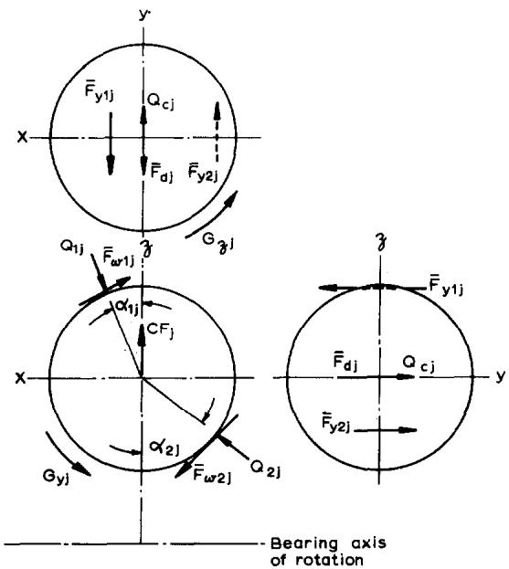  
Fig. 1. Forces and moments acting on a ball.

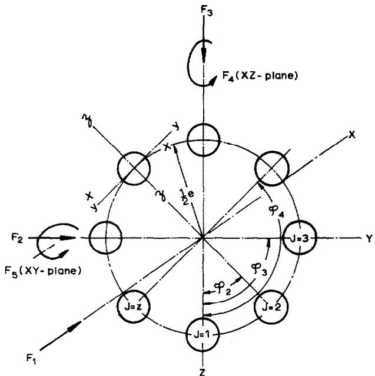  
Fig. 2. Bearing operating in YZ-plane.

$$
f _ { \mathrm { m } } = \frac { r _ { \mathrm { g m } } } { D }\tag{6}
$$

$$
a _ { \mathrm { m j } } = a _ { \mathrm { m j } } ^ { * } \left[ { \frac { { \hat { 3 } } Q _ { \mathrm { m j } } { \left( 1 - \xi ^ { 2 } \right) } } { E \Sigma \rho _ { \mathrm { m j } } } } \right] ^ { \ddag }\tag{7}
$$

$$
b _ { \mathrm { m j } } = b _ { \mathrm { m j } } ^ { * } \left[ \frac { 3 Q _ { \mathrm { m j } } ( 1 - \xi ^ { 2 } ) } { E \Sigma \rho _ { \mathrm { m j } } } \right] ^ { \ddag }\tag{8}
$$

$$
a _ { \mathrm { m j } } ^ { * } = \left( \frac { 2 \varepsilon _ { \mathrm { m j } } ^ { 2 } \mathcal { E } _ { \mathrm { m j } } } { \pi } \right) ^ { \dagger }\tag{9}
$$

$$
b _ { \mathrm { m j } } ^ { * } = \left( \frac { 2 \mathcal { E } _ { \mathrm { m j } } } { \pi \varepsilon _ { \mathrm { m j } } } \right) ^ { \frac { 1 } { \xi } }\tag{10}
$$

Figure 3 shows the relationship between the contact deformations, contact angles and bearing ring deflections for a ball in a high speed, angular-contact bearing. Using Fig. 3, the inner raceway/ball and outer raceway/ball contact angles can be defined as follows

$$
{ \alpha } _ { { \bf m } ; } = \arctan \mathrm { ~ } \frac { \nu _ { \mathrm { m } } A _ { 1 ; } + c _ { \mathrm { m } } X _ { 1 ; } } { \nu _ { \mathrm { m } } A _ { 2 ; } + c _ { \mathrm { m } } X _ { 2 ; } } \mathrm { m } = 1 , 2 ; \mathrm { ~ } \nu _ { 1 } = 0 ; \mathrm { ~ } \nu _ { 2 } = 1 ; \mathrm { ~ } \mathtt { c } _ { 1 } = 1 ; \mathrm { ~ } \mathtt { c } _ { 2 } = - 1\tag{11}
$$

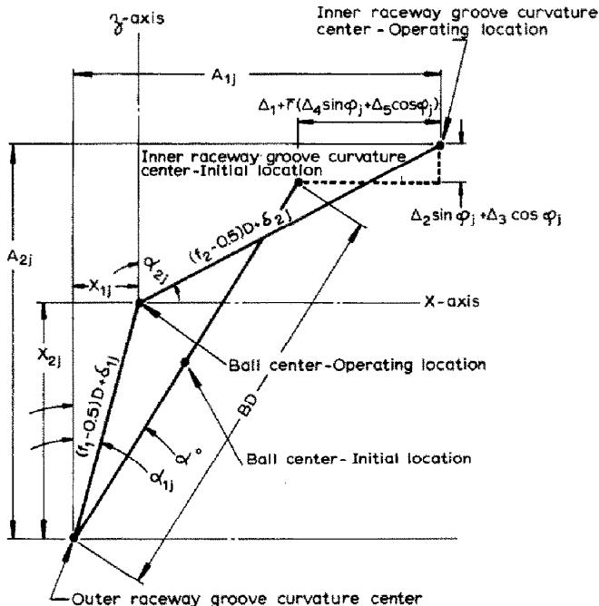  
Fig. 3. Contact angle, deformation and displacement geometry.

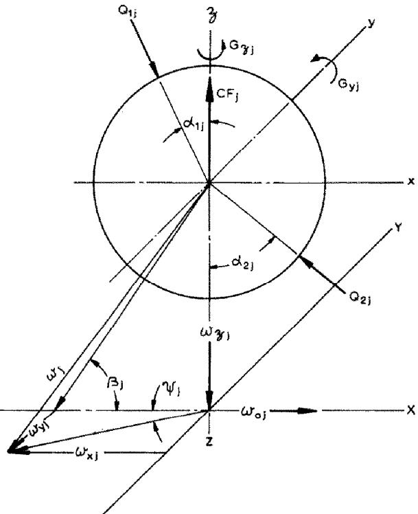  
Fig. 4. Ball speeds and inertial loading

From Fig. 3, the following relationship can also be developed

$$
\sum _ { \bf { k } = 1 } ^ { \bf { k } } [ \nu _ { \bf { m } } A _ { \bf { k } \mathrm { { j } } } + \mathrm { c } _ { \bf { m } } X _ { \bf { k } \mathrm { { j } } } ] ^ { 2 } - [ ( f _ { \mathrm { m } } - \textstyle \frac { 1 } { 2 } ) D + \delta _ { \mathrm { { m } } \mathrm { { j } } } ] ^ { 2 } = 0\tag{12}
$$

## 2.1.2 Speeds

A ball constrained between two raceways operating with relative rotational motion about the bearing axis of rotation (Fig. 2), orbits the bearing axis and simultaneously rotates about an axis passing through the ball center. The latter axis (ball speed vector) can assume pitch and yaw angles relative to an axis parallel to the bearing axis of rotation and passing through the ball center. It is convenient to define a rotating set of coordinate axes $x , y , z$ for a ball relative to a fixed set for the bearing X, Y, Z where the x-axis is parallel to the X-axis. From Fig. 4 it can be determined that

$$
\omega _ { \mathrm { j } } = ( \omega _ { x \mathrm { j } } ^ { 2 } + \omega _ { y \mathrm { j } } ^ { 2 } + \omega _ { z \mathrm { j } } ^ { 2 } ) ^ { \pm }\tag{13}
$$

$$
\beta _ { \mathrm { j } } = \arctan \left( \frac { \omega _ { z \mathrm { j } } } { \omega _ { x \mathrm { j } } } \right)\tag{14}
$$

$$
\psi _ { \mathrm { j } } = \arctan \left( \frac { \omega _ { \mathrm { y j } } } { \omega _ { \mathrm { x j } } } \right)\tag{15}
$$

For a bearing operating with Coulomb friction; i.e., friction force independent of speed, it is likely that $\omega _ { \mathrm { { y j } } } = 0$ and therefore $\psi _ { \mathrm { j } }$ yaw angle, does not exist.

## 2.1.3 Friction forces

2.1.3.1 Elastohydrodynamic lubrication. If bearing internal speeds are sufficient and fluid lubricant is in adequate supply, a lubricating film, several microinches thick, can separate “contacting" balls and raceways. For an elliptical point contact Archard et al.² give the following equation

$$
h _ { \mathrm { m j } } = 2 . 0 4 \left( \frac { \lambda _ { 0 } \eta _ { 0 } U _ { \mathrm { m j } } } { \left[ 1 + \frac { 2 \overline { { R } } _ { \mathrm { y m j } } } { 3 \overline { { R } } _ { \mathrm { w m } } } \right] } \times \left[ \frac { E } { Q _ { \mathrm { m j } } ( 1 - \xi ^ { 2 } ) } \right] ^ { 0 . 1 } \right) ^ { 0 . 7 4 } \ : \overline { { R } } _ { \mathrm { y m j } } ^ { 0 . 4 0 7 }\tag{16}
$$

where

$$
U _ { \mathbf { m } \mathbf { j } } = \frac { D } { 4 } \bigg [ \omega _ { \mathbf { m } \mathbf { j } } \Big ( \frac { 1 } { \gamma } + \mathrm { c } _ { \mathbf { m } } \cos \alpha _ { \mathbf { m } \mathbf { j } } \Big ) + \omega _ { x \mathbf { j } } \cos \alpha _ { \mathbf { m } \mathbf { j } } + \omega _ { z \mathbf { j } } \sin \alpha _ { \mathbf { m } \mathbf { j } } \bigg ]\tag{17}
$$

$$
\omega _ { \mathrm { m j } } = \mathrm { c } _ { \mathrm { m } } \left( \omega _ { \mathrm { o j } } - \Omega _ { \mathrm { m } } \right)\tag{18}
$$

$$
\bar { R } _ { \mathrm { w m } } = \frac { f _ { \mathrm { m } } D } { 2 f _ { \mathrm { m } } - 1 }\tag{19}
$$

$$
\overline { { R } } _ { y m j } = \frac { D } { 2 } \left( 1 + { \bf c _ { m } } \gamma ^ { \prime } \cos { \alpha _ { m j } } \right)\tag{20}
$$

$$
\gamma ^ { \prime } = D / e\tag{21}
$$

Cheng³ gives a similar formulation for isothermal film thickness; however, it is more complex.

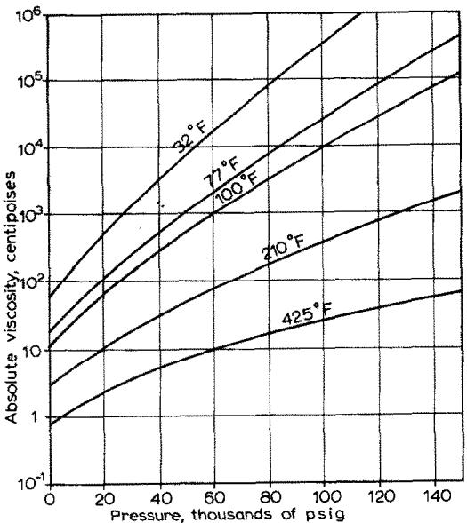  
Fig. 5. MIL-L-7808 lubricant viscosity vs. pressure and temperature.

A Newtonian fluid is one which acts according to the following rule

$$
\tau = \eta \hat { o } u / \hat { o } z\tag{22}
$$

Many rolling element bearing lubricants can be characterized as Newtonian, at least at a given pressure-temperature condition. Since in a rolling contact, the lubricating film is extremely thin, a linear sliding velocity gradient· across the gap between “rolling" surfaces appears reasonable. Therefore, eqn. (22) becomes

$$
\tau = \eta v / h\tag{23}
$$

A typical curve of viscosity η versus pressure and temperature is given by Fig. 5 taken from ref. 4. For an assumed isothermal condition, approximation to curves similar to those of Fig. 5 is

$$
\eta = \mathbb { c } _ { 1 } e ^ { ( \mathbb { c } _ { 2 } + \mathbb { c } _ { 3 } \sigma ) ^ { 1 } / 2 }\tag{24}
$$

For a location in an elliptical contact area, pressure is defined by

$$
\sigma = \frac { 3 Q _ { \mathrm { m j } } } { 2 \pi a _ { \mathrm { m j } } b _ { \mathrm { m j } } } ( 1 - s ^ { 2 } - t ^ { 2 } ) ^ { \frac { 1 } { 2 } }\tag{25}
$$

where

$$
s = w / a _ { \mathrm { m j } } , \quad t = y / b _ { \mathrm { m j } }\tag{26}
$$

Sliding velocity v in a ball/raceway elliptical contact area depends upon contact angles, deflections, raceway and ball surface velocities and assumes a unique value at each point. Figures 6 and 7 illustrate the radius from the ball center to a point on a contact surface. From Figs. 6 and 7, eqn. (27) can be developed

$$
r _ { w \mathrm { m j } } = \left\{ \left[ ( R _ { \mathrm { m } } ^ { 2 } - w ^ { 2 } ) ^ { \frac { 1 } { 2 } } - ( R _ { \mathrm { m } } ^ { 2 } - a _ { \mathrm { m j } } ^ { 2 } ) ^ { \frac { 1 } { 2 } } + \left( \frac { D ^ { 2 } } { 4 } - a _ { \mathrm { m j } } ^ { 2 } \right) ^ { \frac { 1 } { 2 } } \right] ^ { 2 } + w ^ { 2 } \right\} ^ { \frac { 1 } { 2 } }\tag{27}
$$

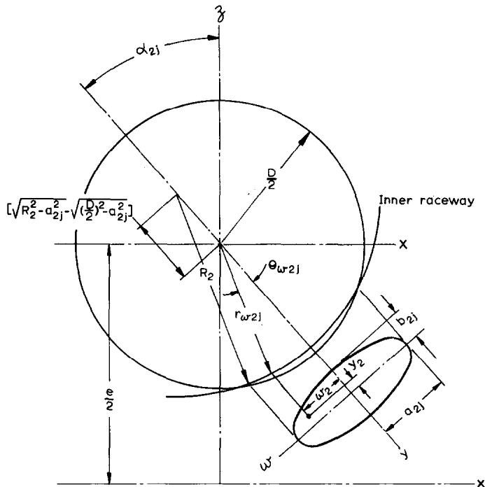  
Fig. 6. Inner raceway/ball contact geometry.

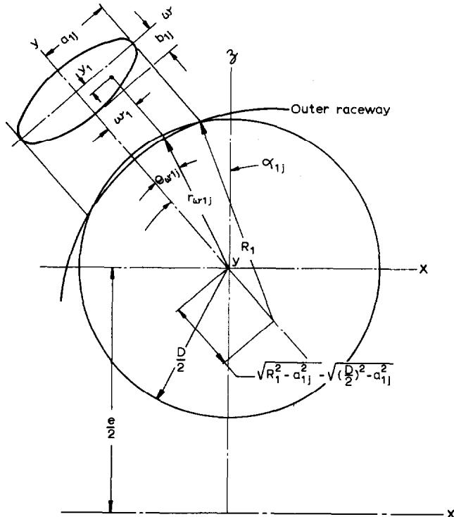  
Fig. 7. Outer raceway/ball contact geometry.

$$
R _ { \mathrm { m } } = { \frac { 2 f _ { \mathrm { m } } D } { 2 f _ { \mathrm { m } } + 1 } }\tag{28}
$$

The angle between the radius and the normal to the center of the contact ellipse is

$$
\theta _ { w \mathrm { m j } } = \arctan \ \left( \frac { w } { r _ { w \mathrm { m j } } } \right)\tag{29}
$$

Therefore, the sliding velocities in the y-direction are given by

$$
\begin{array} { r l } & { v _ { \mathrm { y m j } } = \omega _ { \mathrm { m j } } \left[ \frac { e } { 2 } + \mathrm { c } _ { \mathrm { m } } r _ { w \mathrm { m j } } \cos \left( \alpha _ { \mathrm { m j } } + \theta _ { w \mathrm { m j } } \right) \right] } \\ & { \qquad - \omega _ { x \mathrm { j } } r _ { w \mathrm { m j } } \cos \left( \alpha _ { \mathrm { m j } } + \theta _ { w \mathrm { m j } } \right) - \omega _ { z \mathrm { j } } r _ { w \mathrm { m j } } \sin \left( \alpha _ { \mathrm { m j } } + \theta _ { w \mathrm { m j } } \right) } \end{array}\tag{30}
$$

In the direction of the major axis of the contact ellipse, sliding velocity is approximated by

$$
\begin{array} { r } { v _ { \mathrm { w m j } } = { \frac { 1 } { 2 } } D \omega _ { y \mathrm { j } } } \end{array}\tag{31}
$$

Using the foregoing formulae, the component friction forces acting on an elliptical contact area are defined as follows

$$
\begin{array} { r } { \Vec { F } _ { y m j } = a _ { \mathrm { m j } } b _ { \mathrm { m j } } \int _ { - 1 } ^ { + 1 } \mathop { \int } _ { - ( 1 - s ^ { 2 } ) ^ { 1 } } ^ { + ( 1 - s ^ { 2 } ) ^ { 1 } / 2 } \tau _ { y m j } \mathrm { d } t \mathrm { d } s } \end{array}\tag{32}
$$

$$
\begin{array} { r } { \bar { F } _ { w \mathrm { m j } } = a _ { \mathrm { m j } } b _ { \mathrm { m j } } \int _ { - 1 } ^ { + 1 } \ d t \int _ { - ( 1 - t ^ { 2 } ) ^ { 1 } j _ { 2 } } ^ { + ( 1 - t ^ { 2 } ) ^ { 1 } j _ { 2 } } \ d \tau _ { w \mathrm { m j } } \mathrm d s \mathrm d t } \end{array}\tag{33}
$$

The resultant friction force acting on the contact is

$$
\overline { { F } } _ { \mathrm { m j } } = ( \overline { { F } } _ { y \mathrm { m j } } ^ { 2 } + \overline { { F } } _ { w \mathrm { m j } } ^ { 2 } ) ^ { \frac { 1 } { 2 } }\tag{34}
$$

2.1.3.2 Coulomb friction forces. For a ball/raceway contact operating with minimal elastohydrodynamic lubricant film thickness or with dry film lubrication, the Coulomb friction law may be applied; i.e.,

$$
\tau = \mu \sigma\tag{35}
$$

In this case the magnitude of the frictional stress is not directly affected by sliding velocity; however, the frictional stress direction opposes the sliding velocity direction. Therefore, the determination of sliding velocity direction in the contact is necessary. Figure 8 from ref. 5 illustrates that as a function of ball/raceway speeds and deflections, a contact area can be divided into, at most, three zones of sliding. The pitch angle of the ball speed vector and ball/raceway contact angles are important factors in the determination of the zones of sliding.

It can be determined that:

$$
\begin{array} { r } { \overline { { F } } _ { \mathrm { y m j } } = 2 \mu a _ { \mathrm { m j } } b _ { \mathrm { m j } } \left\{ \displaystyle \int _ { - 1 } ^ { T _ { 1 \mathrm { m } } } \int _ { 0 } ^ { ( 1 - s ^ { 2 } ) _ { \mathrm { l } _ { 2 } } ^ { 1 / 2 } } \mathrm { d } t \mathrm { d } s - \int _ { T _ { 1 \mathrm { m } } } ^ { T _ { 2 \mathrm { m } } } \int _ { 0 } ^ { ( 1 - s ^ { 2 } ) _ { \mathrm { l } _ { 2 } } ^ { 1 / 2 } } \mathrm { d } t \mathrm { d } s \right. \qquad ( 3 \mathrm { m } ^ { - 1 } ) ^ { 3 / 2 } \mathrm { d } s ^ { 2 } \mathrm { d } t \mathrm { d } s } \\ { \left. \qquad + \displaystyle \int _ { T _ { 2 \mathrm { m } } } ^ { 1 } \int _ { 0 } ^ { ( 1 - s ^ { 2 } ) _ { \mathrm { l } _ { 2 } } ^ { 3 / 2 } } \mathrm { d } t \mathrm { d } s - \int _ { T _ { 2 \mathrm { m } } } ^ { T _ { 2 \mathrm { m } } } \int _ { 0 } ^ { ( 1 - s ^ { 2 } ) _ { \mathrm { l } _ { 2 } } ^ { 3 / 2 } } \mathrm { d } t \mathrm { d } s \right. } \end{array}\tag{6}
$$

where

$$
T _ { \mathrm { k m } } = w _ { \mathrm { k m } } / a _ { \mathrm { m j } } \qquad \mathrm { k = 1 , 2 }\tag{37}
$$

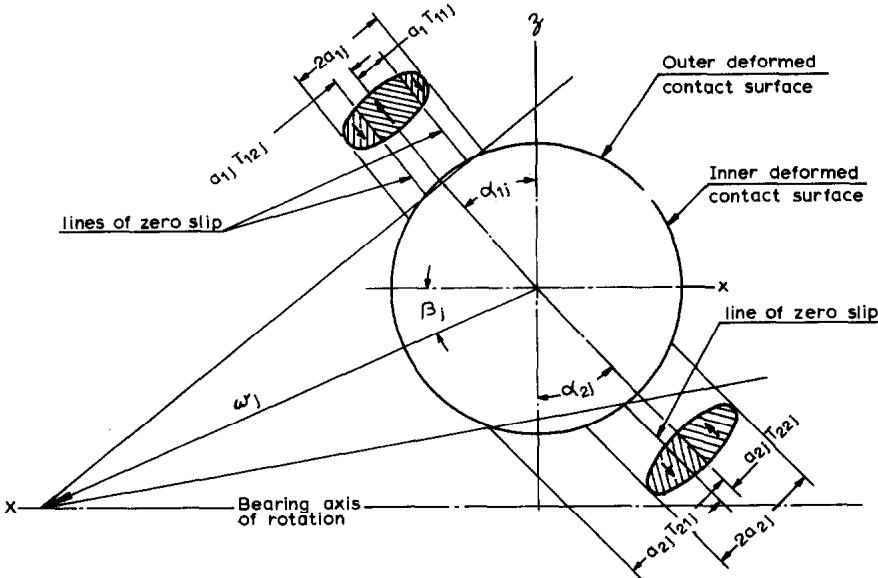  
Fig. 8. Contact areas, rolling lines and slip directions.

Reference 5 indicates a method to determine values of $T _ { \mathbf { k m } }$ Substitution of eqn. (25) into (36) yields:

$$
\small \overline { { F } } _ { \mathrm { y m j } } = 3 \mu Q _ { \mathrm { m j } } \mathrm { c _ { m } } \left[ \frac { 2 } { 3 } + \sum _ { \mathrm { k = 1 } } ^ { \mathrm { k = 2 } } \mathrm { c _ { k } } T _ { \mathrm { k m } } \left( 1 - \frac { T _ { \mathrm { k m } } ^ { 2 } } { 3 } \right) \right]\tag{38}
$$

The friction force resisting sliding motion parallel to the major axis of the contact ellipse is :

$$
\mathcal { \overline { { F } } } _ { w \mathrm { m j } } = \mu Q _ { \mathrm { m j } }\tag{39}
$$

## 2.1.4 Lubricant drag force.

In a fluid-lubricated ball bearing application, the ball orbits the bearing axis, moving through space filled with a lubricant-gas mixture. This mixture and orbital motion effect a drag force on the ball which can be described empirically as follows

$$
\overline { { F } } _ { \mathrm { d j } } = \frac { \pi \rho C _ { \mathrm { d } } D ^ { 2 } ( e \omega _ { 1 \mathrm { j } } ) ^ { 1 . 9 5 } } { 3 2 \ g }\tag{40}
$$

Approximate values of the drag coefficient can be obtained from ref. 6. In eqn. (40) fluid density $\pmb { \rho }$ is the mixture density. It is approximated by the quantity (lubricant weight contained within the bearing boundary dimensions) ÷ (the free space volume within the boundary dimensions).

## 2.1.5 Ball-cage normal force

A ball exerts a force $Q _ { \mathrm { c j } }$ on the cage (retainer) if in the absence of the cage web constraint it would tend to orbit the bearing axis faster than cage speed $\omega _ { \mathfrak { c } } .$ Conversely, the cage pushes the ball with a force $- Q _ { \odot }$ if in the absence of the cage web constraint, the ball orbiting speed tends to be less than cage speed.

## 2.1.6 Ball-cage friction force

In a fluid-lubricated bearing, the ball-cage normal force effects a friction force $F _ { \mathrm { c j } } ,$ the magnitude of which can be estimated using hydrodynamic or elastohydrodynamic lubrication theory depending upon the conformity of the cage pocket to the ball surface. For a dry film-lubricated bearing, ball-cage friction force is simply $\mu _ { \mathfrak { c } } Q _ { \mathfrak { c } \mathbf { j } }$

## 2.1.7 Inertial forces and moments

Owing to ball orbital motion, a centrifugal force obtains whose magnitude is given by :

$$
C F _ { \mathrm { j } } { = } { \textstyle { \frac { 1 } { 2 } } } m e \omega _ { \circ \mathrm { j } } ^ { 2 }\tag{41}
$$

Additionally, due to orbital motion and simultaneous rotation about the ball z-axis, a primary gyroscopic moment occurs about the ball y-axis

$$
G _ { y \mathbf { j } } = J \omega _ { \mathbf { \circ } \mathbf { j } } \omega _ { z \mathbf { j } }\tag{42}
$$

If speed $\omega _ { \mathbf { y } \mathbf { j } }$ exists, then a secondary gyroscopic moment occurs about the z-axis

$$
G _ { z \mathrm { j } } = J \omega _ { \circ \mathrm { j } } \omega _ { \mathbf { y } \mathrm { j } }\tag{43}
$$

## 2.1.8 Equilibrium of forces and moments

In a given direction, the forces acting on a ball constrained by the raceway or cage equilibrate to zero. If the constraint is absent ; $\textstyle e . g .$ , the ball does not contact the cage, an acceleration or deceleration results. It is convenient to choose the directional axes of the set of rotating coordinates $x , y , z$ for the required balance. Therefore from Fig. 1

$$
\sum _ { \mathbf { m } = 1 } ^ { \mathbf { m } = 2 } \mathbf { c _ { \mathbf { m } } } ( Q _ { \mathbf { m j } } \cos \alpha _ { \mathbf { m j } } - \widetilde { F } _ { \mathbf { w m j } } \sin \alpha _ { \mathbf { m j } } ) - C F _ { \mathbf { j } } - F _ { \mathbf { c j } } = 0\tag{44}
$$

$$
\sum _ { \mathbf { m } = 1 } ^ { \mathbf { m } = 2 } \mathbf { c _ { \mathbf { m } } } ( Q _ { \mathbf { m } \mathrm { j } } \sin \alpha _ { \mathbf { m } \mathrm { j } } + \bar { F } _ { w \mathrm { m j } } \cos \alpha _ { \mathbf { m } \mathrm { j } } ) = 0\tag{45}
$$

$$
\sum _ { \mathfrak { m } = 1 } ^ { \mathfrak { m } = 2 } \mathrm { c } _ { \mathfrak { m } } \bar { F } _ { \mathfrak { y m j } } + \bar { F } _ { \mathrm { d j } } - Q _ { \mathfrak { c j } } = \frac { 1 } { 2 } m e \mathrm { d } \omega _ { \mathfrak { o j } } / \mathrm { d } t\tag{46}
$$

In eqn. (46) for steady state ring rotation the right hand side may be replaced as follows

$$
\sum _ { \mathbf { m } = 1 } ^ { \mathbf { m } = 2 } \mathbf { c _ { \mathbf { m } } } \widehat { F } _ { y \mathbf { m } \mathbf { j } } + \widetilde { F } _ { \mathbf { d } \mathbf { j } } - Q _ { \mathbf { c } \mathbf { j } } = \frac { 1 } { 2 } m e \omega _ { \mathbf { o j } } \mathbf { d } \omega _ { \mathbf { o j } } / \mathbf { d } \varphi\tag{47}
$$

When cage/ball contact is absent, $\varrho _ { \mathrm { c j } } { = } 0$ ; when such contact occurs, $\omega _ { \circ \mathbf { j } } = \omega _ { \mathsf { c } }$

In a given plane, the moments acting on a ball about its center generally do not equilibrate to zero; rather, they cause an angular acceleration proportional to the ball mass moment of inertia. The principal planes in the set of rotating coordinates are selected for the required balance. Therefore, from Fig. 1

$$
\frac { D } { 2 } \sum _ { \mathbf { m } = 1 } ^ { \mathbf { m } = 2 } \breve { F } _ { w \mathbf { m } \mathbf { j } } - G _ { y \mathbf { j } } = J \omega _ { \mathbf { o j } } \mathrm { d } \omega _ { y \mathbf { j } } / \mathrm { d } \varphi\tag{48}
$$

For Coulomb friction operation, the right hand side of eqn. (48) is zero if the coefficient of friction is sufficiently great.

For fluid-lubricated bearings, the friction moments about the x-axis and $z \mathbf { \cdot }$ axis are obtained by integration of the product of friction stress and the corresponding moment arm over the contact ellipse

$$
M _ { \mathrm { x m j } } = a _ { \mathrm { m j } } b _ { \mathrm { m j } } \int _ { - 1 } ^ { 1 } \int _ { - ( 1 - s ^ { 2 } ) ! _ { 2 } } ^ { ( 1 - s ^ { 2 } ) ! _ { 2 } } \tau _ { \mathrm { y m j } } r _ { \mathrm { w m j } } \cos { ( \alpha _ { \mathrm { m j } } + \theta _ { \mathrm { w m j } } ) } \mathrm { d } t \mathrm { d } s\tag{49}
$$

$$
M _ { z \mathrm { m j } } = a _ { \mathrm { m j } } b _ { \mathrm { m j } } \int _ { - 1 } ^ { 1 } \int _ {  { \mathbb { \Gamma } } - ( 1 - s ^ { 2 } ) ^ { 1 / 2 } } ^ { ( 1 - s ^ { 2 } ) ^ { 1 / 2 } } \tau _ { y \mathrm { m j } } r _ { w \mathrm { m j } } \sin { ( \alpha _ { \mathrm { m j } } + \theta _ { w \mathrm { m j } } ) } \mathrm { d } t \mathrm { d } s\tag{50}
$$

For Coulomb friction the integration process yields

$$
\begin{array} { c } { { M _ { \mathrm { { x m j } } } = \displaystyle \frac { 3 \mu Q _ { \mathrm { { m j } } } D \mathrm { { c } } _ { \mathrm { { m } } } } { 2 } \bigg \{ \frac { 2 } { 3 } \cos \alpha _ { \mathrm { { m j } } } + \sum _ { \mathrm { { k = 1 } } } ^ { \mathrm { { k = 2 } } } \mathrm { { c } } _ { \mathrm { { k } } } T _ { \mathrm { { k } } { \mathrm { m j } } } \left[ \left( 1 - \frac { T _ { \mathrm { { k } } { \mathrm { m j } } } ^ { 2 } } { 3 } \right) \cos \alpha _ { \mathrm { { m j } } } \right. } } \\ { { \displaystyle \left. - \frac { a _ { \mathrm { { m j } } } T _ { \mathrm { { k } } { \mathrm { m j } } } } { D } \left( 1 - \frac { T _ { \mathrm { { k } } { \mathrm { m j } } } ^ { 2 } } { 2 } \right) \sin \alpha _ { \mathrm { { m j } } } \right] \bigg \} } } \end{array}\tag{51}
$$

$$
\begin{array} { c } { { M _ { \mathrm { z m j } } = \displaystyle \frac { 3 \mu Q _ { \mathrm { m j } } D \mathsf { c } _ { \mathrm { m } } \mathrm { \Lambda } _ { / 2 } ^ { \mathrm { \Lambda } } } { 2 } \mathrm { s i n } \alpha _ { \mathrm { m j } } + \displaystyle \sum _ { \mathrm { ~ k = 1 ~ } } ^ { \mathrm { k = 2 } } \mathsf { c } _ { \mathrm { k } } T _ { \mathrm { k m j } } \left[ \left( 1 - \mathrm { \frac { ~ T _ { \mathrm { k m j } } ^ { 2 } } { 3 } } \right) \sin { \alpha _ { \mathrm { m j } } } \right. } } \\ { { \displaystyle \phantom { \frac { 1 } { 2 } } \left. + \frac { a _ { \mathrm { m j } } T _ { \mathrm { k m j } } } { D } \left( 1 - \mathrm { \frac { ~ T _ { \mathrm { k m j } } ^ { 2 } } { 2 } } \right) \cos { \alpha _ { \mathrm { m j } } } \right] \Biggl \} } } \end{array}\tag{52}
$$

Using eqns. (49)-(52) the following moment balances can be obtained

$$
\sum _ { \mathbf { m } = 1 } ^ { \mathbf { m } = 2 } M _ { x \mathbf { m } \mathbf { j } } - \frac { D } { 2 } \bar { F } _ { x \mathrm { c j } } = J \omega _ { \mathbf { o j } } \mathrm { d } \omega _ { x \mathbf { j } } / \mathrm { d } \varphi\tag{53}
$$

$$
\sum _ { \mathbf { m } = 1 } ^ { \mathbf { m } = 2 } M _ { z \mathbf { m } \mathbf { j } } - \frac { D } { 2 } \ : \bar { F } _ { z \mathbf { c } \mathbf { j } } - G _ { z \mathbf { j } } = J \omega _ { \mathbf { 0 } \mathbf { j } } \mathrm { d } \omega _ { z \mathbf { j } } / \mathrm { d } \varphi\tag{54}
$$

For known values of bearing deflections and cage speed, eqns. (12), (44)–(46), (48), (53) and (54) can be solved for unknown values of $Q _ { \mathrm { m j } } , \alpha _ { \mathrm { m j } } , \omega _ { x \mathrm { j } } , \omega _ { y \mathrm { j } } , \omega _ { z \mathrm { j } } , \omega _ { \mathrm { o j } }$ and $\overline { { F } } _ { \mathbf { c j } } .$ The complexity of the system of simultaneous equations requires the use of a digital computer to obtain the solution. Owing to the non-linearity of the equations in the unknown variables, an iterative technique such as Newton-Raphson is employed.

## 2.2 Rollers

## 2.2.1 Normal forces and deformations

A roller may be characterized by Fig. 9; it rotates about an axis inclined to the x-axis and its lateral surface is a portion of a curved surface of revolution. This surface is arbitrarily shaped, and for purpose of analysis a roller is divided into a number of laminae, each having identical width $W _ { \mathbf { m } }$ . It is assumed that because contact deformations are small, each laminum deflects independently of its neighbors; $i . e . ,$ no shear effects are assumed to occur between laminae.

Lundberg? developed the following load-deflection relationship for a roller in contact with a raceway such that a uniform load per unit length occurs along the length of contact

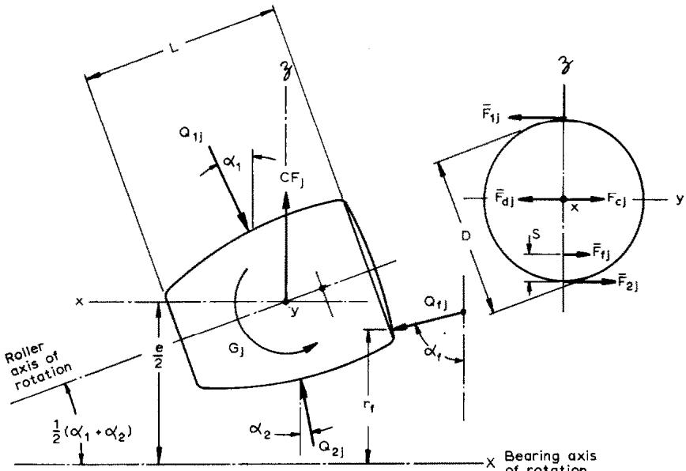  
Fig. 9. Roller forces and geometry.

$$
\delta _ { \mathrm { m j } } = \frac { 2 Q _ { \mathrm { m j } } ( 1 - \xi ^ { 2 } ) } { \pi E l _ { \mathrm { m j } } } \ln \left[ \frac { \pi E l _ { \mathrm { m j } } ^ { 2 } } { Q _ { \mathrm { m j } } ( 1 - \xi ^ { 2 } ) ( 1 + \mathrm { c } _ { \mathrm { m } } \gamma _ { \mathrm { m } } ) } \right]\tag{55}
$$

In terms of load per unit length acting on a particular laminum, eqn. (55) becomes

$$
\delta _ { \mathrm { k m j } } = \frac { 2 q _ { \mathrm { k m j } } ( 1 - \xi ^ { 2 } ) } { \pi E } \ln \left[ \frac { \pi E l _ { \mathrm { m j } } } { { \bf q _ { \mathrm { k m j } } } ( 1 - \xi ^ { 2 } ) ( 1 + { \mathrm { c } } _ { \mathrm { m } } \gamma _ { \mathrm { m } } ) } \right]\tag{56}
$$

where $l _ { \mathrm { { m j } } }$ is the actual length of contact. The roller load is

$$
Q _ { \mathrm { m j } } = W _ { \mathrm { m } } \sum _ { \bf k = 1 } ^ { \bf k } { \bf q } _ { \bf k m j }\tag{57}
$$

## 2.2.2 Roller alignment

Rollers are constrained by raceways and guide flanges to move in a prescribed path; therefore, the inner and outer raceway contact angles are substantially constant. On the other hand, a roller axis can pitch through a small angle $\zeta _ { \mathrm { j } }$ relative to the contact angle to achieve a balance of moments about the roller centroid in a plane passing simultaneously through the roller and bearing axes of rotation. The maximum normal displacement owing to roller pitch is equal to $\boldsymbol { l } _ { \mathrm { m j } } \boldsymbol { Q } _ { \mathrm { j } }$

## 2.2.3 Crowning

When a cylindrical roller is pressed into a raceway of different axial length, stress concentrations develop at the contact extremities as shown by Fig. 10. To relieve these stresses, crowning shown by Fig. 11 is used. Crown radius is large compared to the roller diameter, such that crown drop at the roller ends is slight; but, sufficient

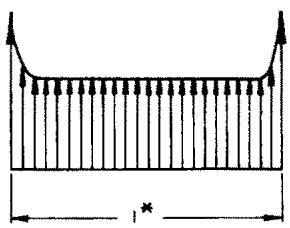  
(a)

(a)  
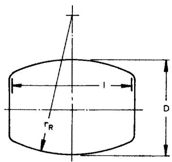

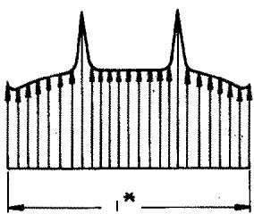

(b)  
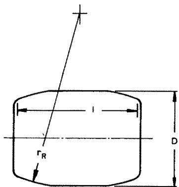  
(a)  
Fig, 10. Roller raceway stress concentrations; (a) straight roller edge stress concentrations, (b) partially crowned roller stress concentrations. l\* effective length of roller-raceway contact.

Fig. 11. (a) Spherical roller (fully crowned), (b) partially crowned cylindrical roller (crowned radius is greatly exaggerated for clarity).

to minimize edge loading. It is noted from Fig. 10 that stress concentrations tend to occur at the blend points of crown and flat surfaces.

## 2.2.4 Contact deformation with roller pitch and crowning

At a given azimuth, the contact deformation varies as a function of axial position. Assuming a contact is divided into N laminae each of width $W _ { \mathrm { m } } \left( l = W _ { \mathrm { m } } N \right)$ the contact deformation at the axial mid point of a given laminum is

$$
\begin{array} { r l } & { \delta _ { \mathbf { k m j } } = U _ { \mathbf { m j } } - \mathsf { c } _ { \mathbf { m } } W _ { \mathbf { m } } \big ( \mathbf { k } - \frac { 1 } { 2 } \big ) \big [ \nu _ { \mathbf { m } } \big ( A _ { 4 } \cos \varphi _ { \mathbf { j } } + \ldots \sin \varphi _ { \mathbf { j } } \big ) + \zeta _ { \mathbf { j } } \big ] - C D _ { \mathbf { k m } } } \\ & { \qquad \delta _ { \mathbf { k m j } } \gtrsim 0 } \\ & { \qquad 1 \leqslant \mathbf { k } \leqslant N } \\ & { \qquad \mathsf { c } _ { \mathbf { l } } = 1 ; \mathsf { c } _ { 2 } = - 1 } \\ & { \qquad \nu _ { \mathbf { l } } = 0 ; \nu _ { 2 } = 1 } \end{array}\tag{58}
$$

where $\pmb { { \cal A } } _ { 4 }$ and $\pmb { { \cal A } } _ { 5 }$ are angular displacement (misalignment) of the bearing inner raceway relative to the outer raceway. Figure 12 illustrates the components of eqn. (58). The variables $U _ { \mathbf { m j } }$ are the relative normal displacements of the roller axis toward the bearing raceways.

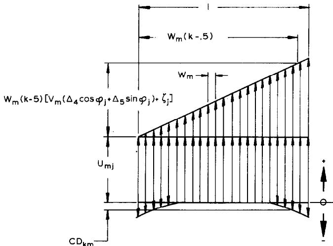  
Fig. 12. Components of roller deflection due to radial load, misalignment and crowning.

At a given azimuth, contact deformation varies with axial location in the contact zone. The interference at the midpoint of the contact is a function of bearing inner ring displacements relative to the outer ring and may be equated to the sum of the inner and outer contact deformations

$$
A _ { \mathrm { j } } = \sum _ { \mathfrak { m } = 1 } ^ { \mathfrak { m } = 2 } \delta _ { \mathrm { k m } } ,\tag{59}
$$

For completeness, the thicknesses of the lubricant films might be included in eqn.   
(59); e.g.

$$
A _ { \mathrm { j } } = \sum _ { \mathrm { m } = 1 } ^ { \mathrm { m } = 2 } \left( \delta _ { \mathrm { k m j } } + h _ { \mathrm { m j } } \right)\tag{60}
$$

Lubricant film thickness is generally at least two orders of magnitude less than the mean contact deformations and can usually be neglected in this portion of analysis. (The same is true concerning ball/raceway contacts ; i.e. eqn. (12).)

## 2.2.5 Friction forces

2.2.5.1 Elastohydrodynamic lubrication. According to Dowson et $a l . ^ { 8 }$ the minimum lubricant film thickness in a rolling line contact is defined by

$$
h _ { \mathrm { m j } } = 1 . 6 \left( \frac { \lambda E } { 1 - \xi ^ { 2 } } \right) ^ { 0 . 6 } \frac { \bar { u } _ { \mathrm { m j } } ^ { 0 . 7 } \ : \overline { { R } } _ { \mathrm { m } } } { \bar { Q } _ { \mathrm { m j } } ^ { 0 . 1 3 } }\tag{61}
$$

$$
\bar { u } _ { \mathrm { m j } } = \frac { \eta _ { 0 } \bigl ( 1 - \xi ^ { 2 } \bigr ) } { 4 E \overline { { R } } _ { \mathrm { m } } } \left[ \omega _ { \mathrm { m j } } \left( \frac { 1 } { \gamma ^ { \prime } } + \mathrm { ~ c _ { m } ~ } \cos \mathrm { ~ } \alpha _ { \mathrm { m j } } \right) + \omega _ { \mathrm { j } } \right]\tag{61}
$$

$$
\bar { Q } _ { \mathrm { m j } } = \frac { Q _ { \mathrm { m j } } ( 1 - \xi ^ { 2 } ) } { l _ { \mathrm { m j } } E \bar { R } _ { \mathrm { m } } }\tag{63}
$$

$$
\overline { { R } } _ { \mathrm { m } } = \frac { D } { 2 } \left( 1 + \mathrm { c } _ { \mathrm { m } } \gamma _ { \mathrm { m } } \right)\tag{64}
$$

Others have developed formulae similar to the foregoing; however, eqn. (61) is used herein.

Friction stress can be described, as for an elliptical contact area, by eqn. (23). For a laminum, the pressure distribution is given by

$$
\sigma _ { \mathrm { k m j } } = { \frac { 2 q _ { \mathrm { k m j } } } { \pi b _ { \mathrm { k m j } } } } ( 1 - t ^ { 2 } ) ^ { \frac { 1 } { 2 } }\tag{65}
$$

$$
\begin{array} { r l } { b _ { \mathbf { k m j } } } & { = \displaystyle \lbrace \frac { 8 q _ { \mathbf { k m j } } \left( 1 - \xi ^ { 2 } \right) } { \pi E \Sigma \rho _ { \mathbf { k m } } } \rbrace ^ { \frac { 1 } { 2 } } } \end{array}\tag{66}
$$

$$
\Sigma \rho _ { \mathrm { k m } } { = } \frac { 2 } { D _ { \mathrm { k } } ( 1 { + } \mathrm { c } _ { \mathrm { m } } \gamma _ { \mathrm { k m } } ) } + \frac { 1 } { r _ { \mathrm { k R } } } - \frac { 1 } { r _ { \mathrm { k m } } }\tag{67}
$$

Using eqns. (24) and (65), lubricant viscosity can be defined at any point in a roller/ raceway contact.

Sliding velocity at a given point in a contact depends upon roller speeds, raceway speed and geometry of the deformed bodies. Palmgrenº states that $\frac { 2 } { 3 }$ of the contact deformation occurs in the roller and $\textstyle { \frac { 1 } { 3 } }$ in the raceway body. Therefore,

$$
v _ { \mathrm { k m j } } = { \textstyle \frac { 1 } { 2 } } \{ \left[ e _ { \bf k } + \mathrm { c } _ { \mathrm { m } } ( D _ { \bf k } + { \textstyle \frac { 1 } { 3 } } \delta _ { \bf k m j } ) \right] - \omega _ { \bf j } \big ( { D _ { \bf k } - { \textstyle \frac { 2 } { 3 } } } \delta _ { \bf k m j } \big ) \}\tag{68}
$$

Using eqns. (24), (61) and (68) the friction forces acting in the contacts are obtained by numerical integration

$$
\bar { F } _ { \mathrm { m j } } = 2 W _ { \mathrm { m } } \sum _ { \bf k = 1 } ^ { \bf k = \cal N } b _ { \bf k m j } \int _ { 0 } ^ { 1 } \tau _ { \bf k m j } \mathrm { d } t\tag{69}
$$

2.2.5.2 Coulomb friction. As for ball/raceway contacts with Coulomb friction, eqn. (35) describes the shear stress acting on the contact. It is also necessary to determine the zones of sliding. Friction forces are obtained by integration of shear stresses over the contact area such that

$$
\begin{array} { r l r } { \left. { \overline { { F } } _ { \mathrm { m j } } = 2 \mu \mathsf { c } _ { \mathrm { m } } W _ { \mathrm { m } } \left\{ \begin{array} { l l } { \displaystyle \sum _ { \mathrm { k = 1 } } ^ { k = T _ { \mathrm { 1 m } } N } b _ { \mathrm { k m j } } \int _ { 0 } ^ { 1 } \sigma _ { \mathrm { k m j } } \mathrm { d } t } \\ { \displaystyle - \sum _ { \mathrm { k = T } _ { \mathrm { 1 m } } N } b _ { \mathrm { k m j } } \int _ { 0 } ^ { 1 } \sigma _ { \mathrm { k m j } } \mathrm { d } t \ + \sum _ { \mathrm { ~ k = } T _ { 2 } \mathrm { m } N } ^ { \mathrm { ~ k = } N } b _ { \mathrm { k m j } } } _ { 0 } ^ { 1 } \sigma _ { \mathrm { k m j } } \mathrm { d } t } \end{array} } } & {\right\ } & \\ & { } & { - \sum _ { \mathrm { ~ k = } T _ { \mathrm { 1 m } } N } ^ { \mathrm { ~ k = } T _ { \mathrm { 2 m } } N } b _ { \mathrm { k m j } } \int _ { 0 } ^ { 1 } \sigma _ { \mathrm { k m j } } \mathrm { d } t \ + \sum _ { \mathrm { ~ k = } T _ { 2 } \mathrm { m } N } ^ { \mathrm { ~ k = } N } b _ { \mathrm { k m j } } \int _ { 0 } ^ { 1 } \sigma _ { \mathrm { k m j } } \mathrm { d } t \right\} } \end{array}\tag{70}
$$

## 2.2.6 Lubricant drag force

Similar to eqn. (40), lubricant drag force acting on a roller in a fluid-lubricated bearing is given by

$$
\overline { { F } } _ { \mathbf { d j } } = \frac { \rho D L C _ { \mathbf { d } } ( e \omega _ { 1 \mathbf { j } } ) ^ { 1 . 9 5 } } { 1 6 g }\tag{71}
$$

## 2.2.7 Inertial forces and moments

Equation (41) can be used to calculate roller centrifugal force due to orbital

speed. Roller gyroscopic moment is given by

$$
G _ { \mathrm { j } } = J \omega _ { \circ \mathrm { j } } \omega _ { \mathrm { j } } \sin \left[ { \textstyle { \frac { 1 } { 2 } } } ( \alpha _ { 1 } + \alpha _ { 2 } ) \right]\tag{72}
$$

## 2.2.8 Skewing (yaw) moments

Owing to axial variation of frictional stresses acting on the roller/raceway contacts, a skewing moment occurs about the roller centroid, tending to cause yaw of the roller axis. This skewing moment is resisted by the cage web elements, the roller guide flanges or both elements in consort. The magnitude of skewing moment resisted by the cage web is

$$
M _ { \mathrm { s j } } = 2 \sum _ { \mathrm { m } = 1 } ^ { \mathrm { m } = 2 } W _ { \mathrm { m } } ^ { 2 } \sum _ { \mathrm { k } = 1 } ^ { \mathrm { k } = N } \bigg ( b _ { \mathrm { k m j } } [ \mathrm { k } - \textstyle \frac { 1 } { 2 } ( N + 1 ) ] \bigg ) \int _ { 0 } ^ { 1 } \tau _ { \mathrm { k m j } } \mathrm { d } t \bigg ) - \frac { 1 } { 2 } \mu _ { \mathrm { f j } } L Q _ { \mathrm { f j } }\tag{73}
$$

The flange coefficient of friction can be estimated using elastohydrodynamic lubrication theory for fluid-lubricated bearings or a constant value can be used for Coulomb friction. To determine the yaw angle, deflection of the cage web element must be considered. This is not within the scope in this discussion.

## 2.2.9 Equilibrium of forces and moments

In each principal direction, the forces acting on a roller constrained by raceways, guide flanges or cage equilibrate to zero. If the roller does not contact the cage web, an acceleration or deceleration results in the y-direction. From Fig. 9,

$$
\sum _ { \mathbf { m } = 1 } ^ { \mathbf { m } = 2 } \mathsf { c } _ { \mathbf { m } } \mathsf { Q } _ { \mathbf { m } \mathbf { j } } \cos \alpha _ { \mathbf { m } } - C F _ { \mathbf { j } } + Q _ { \mathbf { f } \mathbf { j } } \cos \alpha _ { \mathbf { f } } = 0\tag{74}
$$

$$
\sum _ { \mathbf { m } = 1 } ^ { \mathbf { m } = 2 } \mathsf { c } _ { \mathbf { m } } Q _ { \mathbf { m } \mathbf { j } } \sin \alpha _ { \mathbf { m } } - Q _ { \mathbf { f } \mathbf { j } } \sin \alpha _ { \mathbf { f } } = 0\tag{75}
$$

$$
\sum _ { \mathfrak { m } = 1 } ^ { \mathfrak { m } = 2 } \mathbf { c } _ { \mathfrak { m } } \breve { F } _ { \mathfrak { m } \mathfrak { j } } + \breve { F } _ { \mathrm { d } \mathfrak { j } } - Q _ { \mathfrak { c } \mathfrak { j } } - \mu _ { \mathrm { f } } Q _ { \mathfrak { f } \mathfrak { j } } = \frac { 1 } { 2 } { m e } \omega _ { \mathfrak { o j } } \mathrm { d } \omega _ { \mathfrak { o j } } / \mathrm { d } \varphi\tag{76}
$$

When cage/roller contact is absent, $\varrho _ { \mathrm { c j } } = 0$ ; when such contact occurs $\omega _ { \circ \mathrm { j } } = \omega _ { \circ }$

For fluid-lubricated bearings, friction moments about the roller axis are obtained by integration of the product of friction stress and the corresponding roller radius

$$
M _ { \mathrm { m j } } = W _ { \mathrm { m } } \sum _ { \bf k = 1 } ^ { \bf k } b _ { \bf k m j } D _ { \bf k } \int _ { \bf \epsilon _ { 0 } } ^ { \bf 1 } \tau _ { \bf k m j } \mathrm { d } t\tag{77}
$$

For Coulomb friction

$$
\begin{array} { r l } & { M _ { \mathrm { m j } } = \mu c _ { \mathrm { m } } W _ { \mathrm { m } } \bigg \{ \underset { \mathrm { { k = 1 } } } { \overset { \mathrm { \bf t = ~ } T _ { 1 \mathrm { m } } N } { \sum } } D _ { \mathrm { k } } b _ { \mathrm { k m j } } \bigg \} _ { 0 } ^ { 1 } \sigma _ { \mathrm { k m j } } \mathrm { d } t } \\ & { \qquad - \underset { \mathrm { { \bf t = ~ } T _ { 1 \mathrm { m } } } N } { \overset { \mathrm { \bf t = ~ } T _ { 2 \mathrm { m } } N } { \sum } } D _ { \mathrm { k } } b _ { \mathrm { k m j } } \bigg \} _ { 0 } ^ { 1 } \sigma _ { \mathrm { k m j } } \mathrm { d } t + \underset { \mathrm { { \bf t = ~ } T _ { 2 \mathrm { m } } } N } { \overset { \mathrm { \bf t = ~ } N } { \sum } } D _ { \mathrm { k } } b _ { \mathrm { k m j } } \bigg \{ \underset { 0 } { \overset { \mathrm { \bf t = ~ } T _ { 1 \mathrm { m } } j } { \sum } } } \end{array}\tag{78}
$$

Using eqns. (77) or (78), the following moment balance is obtained

$$
\sum _ { \mathbf { m } = 1 } ^ { \mathbf { m } = 2 } M _ { \mathbf { m } \mathbf { j } } - \frac { 1 } { 2 } D \bar { F } _ { \mathbf { c j } } - \mu _ { \mathbf { f j } } Q _ { \mathbf { f j } } \bigl ( \frac { 1 } { 2 } D - S \bigr ) = J \omega _ { \mathbf { o j } } \mathrm { d } \omega _ { \mathbf { j } } / \mathrm { d } \varphi\tag{79}
$$

Additionally, the moments in the $\pmb { X } \mathbf { - } \pmb { x }$ plane must balance. Therefore

$$
\sum _ { \mathrm { m } = 1 } ^ { \mathrm { m } = 2 } \mathbb { c } _ { \mathrm { m } } W _ { \mathrm { m } } ^ { 2 } \sum _ { \mathrm { \bf ~ k } = 1 } ^ { \mathrm { \bf ~ k } = N } \mathrm {  ~ \lambda ~ } _ { \mathrm { k m j } } \bigl [ \mathrm { \bf k } - \frac { 1 } { 2 } \bigl ( N + 1 \bigr ) \bigr ] - G _ { \mathrm { j } } - \bigl ( \frac { 1 } { 2 } D - S \bigr ) Q _ { \mathrm { f j } } = 0\tag{80}
$$

Equations (59), (74)–(76), (79) and (80) can be solved for the unknown values of $U _ { \mathrm { m j } } , \zeta _ { \mathrm { j } } , Q _ { \mathrm { f j } } , \omega _ { \mathrm { j } } , \omega _ { \mathrm { o j } }$ and $\varrho _ { \mathrm { c j } }$ , if values of bearing ring relative displacements and cage speed are known or assumed.

## 3. BEARING RING LOADING AND DISPLACEMENTS

## 3.1 Applied loading

As shown by Fig. 2 axial (thrust) loading $\boldsymbol { F } _ { 1 }$ can be applied to the bearing along the X-axis. Additionally, radial load applied in the YZ-plane can be resolved into components $F _ { 2 }$ and ${ { \cal F } } _ { 3 }$ acting along the Y-axis and Z-axis respectively. If axial load is applied' at a distance from the X-axis, an overturning moment results, the components of which are $\pmb { F _ { 4 } }$ and $\pmb { F _ { 5 } }$ in the XZ-plane and XY-plane respectively. Similarly, moments resulting from eccentrically applied radial loading can be resolved into $F _ { 4 }$ and $F _ { 5 }$ components.

## 3.2 Displacements

Owing to applied loading, the bearing inner ring is displaced relative to the outer ring as shown by Fig. 13. Five displacements $\pmb { \mathscr { \Delta } } _ { \mathbf { i } }$ corresponding to the five loading directions are required to define the position, assumed by the inner ring, necessary to achieve an internal distribution of load which equilibrates the applied loading.

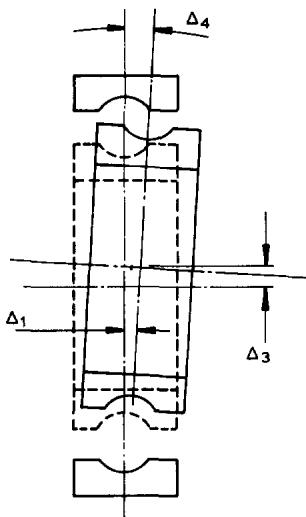  
Fig. 13. Displacements of an inner ring outer ring fixed due to combined radial axial and moment loading.

## 3.3 Ball bearings

3.3.1 Interference

Due to bearing ring displacements, the “squeeze” on a ball at each azimuth can be different. Equation (1) shows that contact deformation and ball/raceway load are related; therefore, ball/raceway load distribution is determined by the bearing ring displacements. For a given azimuth, the ball “squeeze" or interference is defined as follows

$$
A _ { 1 { \bf j } } = B D ~ \sin ~ \alpha ^ { \circ } + A _ { 1 } + \tilde { r } \left( A _ { 4 } \cos ~ \varphi _ { \bf j } + A _ { 5 } ~ \sin ~ \varphi _ { \bf j } \right)\tag{81}
$$

$$
A _ { 2 \mathrm { j } } = B D \cos \alpha ^ { \circ } + A _ { 2 } \sin \varphi _ { \mathrm { j } } + A _ { 3 } \cos \varphi _ { \mathrm { j } }\tag{82}
$$

$$
\begin{array} { r l } { { \tilde { r } } \ } & { { } = { \frac { 1 } { 2 } } e + ( f _ { 2 } - { \frac { 1 } { 2 } } ) D \ \cos \ \alpha ^ { \circ } } \end{array}\tag{83}
$$

$$
\alpha ^ { \circ } \ = \operatorname { a r c c o s } \ \left( 1 \ - \frac { p _ { \mathrm { d } } } { 2 B D } \right)\tag{84}
$$

$$
\begin{array} { r l } { B } & { { } = f _ { 1 } + f _ { 2 } - 1 } \end{array}\tag{85}
$$

## 3.3.2 Equilibrium

In each principal direction, the applied loading must equilibrate the sum of the inner raceway contact load components in that direction. Therefore:

$$
F _ { 1 } = \sum _ { \mathrm { j } = 1 } ^ { \mathrm { j } = Z } ( Q _ { 2 \mathrm { j } } \sin \alpha _ { 2 \mathrm { j } } + \overline { { F } } _ { w 2 \mathrm { j } } \cos \alpha _ { 2 \mathrm { j } } )\tag{86}
$$

$$
F _ { 2 } = \sum _ { \mathrm { j } = 1 } ^ { \mathrm { j } = 2 } \left( Q _ { \mathrm { 2 j } } \cos \alpha _ { \mathrm { 2 j } } - \overline { { F } } _ { w 2 \mathrm { j } } \sin \alpha _ { \mathrm { 2 j } } \right) \sin \varphi _ { \mathrm { j } }\tag{87}
$$

$$
F _ { 3 } = \sum _ { \mathrm { j } = 1 } ^ { \mathrm { j } = Z } ( Q _ { 2 \mathrm { j } } \cos \alpha _ { 2 \mathrm { j } } - \overline { { F } } _ { w 2 \mathrm { j } } \sin \alpha _ { 2 \mathrm { j } } ) \cos \varphi _ { \mathrm { j } }\tag{88}
$$

$$
F _ { 4 } = \sum _ { \mathrm { j } = 1 } ^ { \mathrm { j } = Z } [ \bar { r } ( Q _ { 2 \mathrm { j } } \sin \alpha _ { 2 \mathrm { j } } + \bar { F } _ { w 2 \mathrm { j } } \cos \alpha _ { 2 \mathrm { j } } ) - f _ { 2 } D \vec { F } _ { w 2 \mathrm { j } } ] \cos \varphi _ { \mathrm { j } }\tag{89}
$$

$$
F _ { 5 } = \sum _ { \mathrm { j } = 1 } ^ { \mathrm { j } = Z } [ \hat { r } ( Q _ { 2 \mathrm { j } } \sin \alpha _ { 2 \mathrm { j } } + \overline { { F } } _ { w 2 \mathrm { j } } \cos \alpha _ { 2 \mathrm { j } } ) - f _ { 2 } D \overline { { F } } _ { w 2 \mathrm { j } } ] \sin \varphi _ { \mathrm { j } }\tag{90}
$$

## 3.4 Roller bearings

3.4.1 Interference

Figure 12 illustrates roller bearing interference at a given azimuth.

$$
A _ { 1 { \bf j } } = A _ { 1 } + { \frac { 1 } { 2 } } ( e - D ) ( A _ { 4 } | \cos \varphi _ { \bf j } | + A _ { 5 } | \sin \varphi _ { \bf j } | )\tag{91}
$$

$$
A _ { 2 \mathrm { j } } = A _ { 2 } \sin \varphi _ { \mathrm { i } } + A _ { 3 } \cos \varphi _ { \mathrm { j } } - { \textstyle \frac { 1 } { 2 } } p _ { \mathrm { d } }\tag{92}
$$

$$
A _ { \mathrm { j } } ~ = A _ { \mathrm { 1 j } } \sin \left[ { \textstyle { \frac { 1 } { 2 } } } ( \alpha _ { 1 } + \alpha _ { 2 } ) \right] + A _ { \mathrm { 2 j } } \cos \left[ { \textstyle { \frac { 1 } { 2 } } } ( \alpha _ { 1 } + \alpha _ { 2 } ) \right]\tag{93}
$$

3.4.2 Equilibrium

$$
\bar { F } _ { 1 } = \sum _ { \mathrm { j } = 1 } ^ { \mathrm { j } = Z } ( Q _ { 2 \mathrm { j } } \sin \alpha _ { \mathrm { 2 } } + Q _ { \mathrm { f j } } \sin \alpha _ { \mathrm { f } } )\tag{94}
$$

$$
F _ { 2 } = \sum _ { \mathrm { j } = 1 } ^ { \mathrm { j } = Z } \left( Q _ { \mathrm { 2 j } } \cos \alpha _ { \mathrm { 2 } } - Q _ { \mathrm { f j } } \cos \alpha _ { \mathrm { f } } \right) \sin \varphi _ { \mathrm { j } }\tag{95}
$$

$$
F _ { 3 } = \sum _ { \mathrm { j } = 1 } ^ { \mathrm { j } = Z } \left( Q _ { \mathrm { 2 j } } \cos \alpha _ { \mathrm { 2 } } - Q _ { \mathrm { f j } } \cos \alpha _ { \mathrm { f } } \right) \cos \varphi _ { \mathrm { j } }\tag{96}
$$

$$
F _ { 4 } = \sum _ { \bf j = 1 } ^ { \bf j } \left\{ { \frac { e } { 2 } } Q _ { 2 3 } \sin \alpha _ { 2 } + W _ { 2 } ^ { 2 } \cos \alpha _ { 2 } \sum _ { \bf k = 1 } ^ { \bf k = N } q _ { \bf k 2 j } \left[ { \bf k - \frac { 1 } { 2 } ( \cal N + 1 ) } \right] \right.\tag{97}
$$

$$
+ \left( r _ { \mathrm { f } } \sin \alpha _ { \mathrm { f } } - \textstyle { \frac { 1 } { 2 } } L \cot \alpha _ { \mathrm { f } } \right) Q _ { \mathrm { f j } } \Biggr \} \cos \varphi _ { \mathrm { j } }
$$

$$
\begin{array} { r } { F _ { 5 } = \displaystyle \sum _ { \mathrm { j } = 1 } ^ { \mathrm { j } = Z } \Biggl \{ \frac { e } { 2 } Q _ { 2 \mathrm { j } } \sin \alpha _ { 2 } + W _ { 2 } ^ { 2 } \cos \alpha _ { 2 } \displaystyle \sum _ { \mathrm { k } = 1 } ^ { \mathrm { k } = N } q _ { \mathrm { k } 2 \mathrm { j } } \left[ \mathrm { k } - \frac { 1 } { 2 } ( N + 1 ) \right] } \\ { + \left( r _ { \mathrm { f } } \sin \alpha _ { \mathrm { f } } - \frac { 1 } { 2 } L \cot \alpha _ { \mathrm { f } } \right) Q _ { \mathrm { f j } } \Biggr \} \sin \varphi _ { \mathrm { j } } } \end{array}\tag{98}
$$

## 4. CAGE SPEED

## 4.1 Cage rail/ring land force

Three basic cage types are used in ball and roller bearings :

(1) Ball riding (BR) or Roller riding (RR)

(2) Inner ring land riding (IRL).

(3) Outer ring land riding (ØRL)

These are illustrated schematically by Fig. 14. BR and RR cages are usually of relatively inexpensive manufacture and are usually not used in critical applications. The choice of an IRL or ØRL cage depends largely upon the application and designer preference. An IRL cage is driven by a force between the cage rail and inner ring land as well as by the rolling elements. ORL cage speed is retarded by cage rail/outer ring land drag force. The magnitude of the drag or drive force between the cage rail and ring land depends upon the resultant of the cage/rolling element loading, the eccentricity of the cage axis of rotation and the speed of the cage relative to the ring on which it is piloted. If the cage rail/ring land normal force is substantial, hydrodynamic short bearing theory (ref. 10) might be used to establish the friction force $\overline { { \widehat { F } } } _ { \mathbf { C L } }$ . For a properly balanced cage and a very small resultant cage/rolling element load, Petroff's law can be applied; $\scriptstyle { e , g } .$

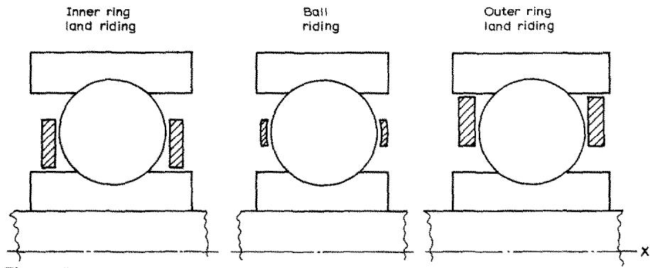  
Fig. 14. Cage types.

$$
\widetilde { F } _ { \mathrm { C L } } = \eta _ { 0 } \ : \frac { \pi W _ { \mathrm { C R } } \mathrm { c } _ { \mathrm { m } } D _ { \mathrm { C R } } ( \omega _ { \mathrm { c } } - \Omega _ { \mathrm { m } } ) } { 1 - \displaystyle \frac { D _ { 1 } } { D _ { 2 } } }\tag{99}
$$

where $D _ { 2 }$ is the larger of the cage rail and ring land diameters and $D _ { 1 }$ is the smaller.

## 4.2 Cage torque balance

For steady state operation, the sum of the torques acting on the cage is zero. Therefore,

$$
e \sum _ { \mathbf { j } = 1 } ^ { \mathbf { j } = Z } F _ { \mathbf { c j } } \pm D _ { \mathrm { C R } } \overline { { F } } _ { \mathrm { C L } } = 0\tag{100}
$$

## 5. BEARING SYSTEM SOLUTION

## 5.1 Clearance

For ball bearings, eqns. (86)-(90) and (100) can be solved for the displacements $\pmb { A _ { \mathrm { i } } }$ and cage speed $\omega _ { \mathrm { c } } .$ For roller bearings eqns. (94)–(98) plus (100) must be solved. It can be seen from eqn. (84) for ball bearings that the initial contact angle $\alpha ^ { \circ }$ is a func-

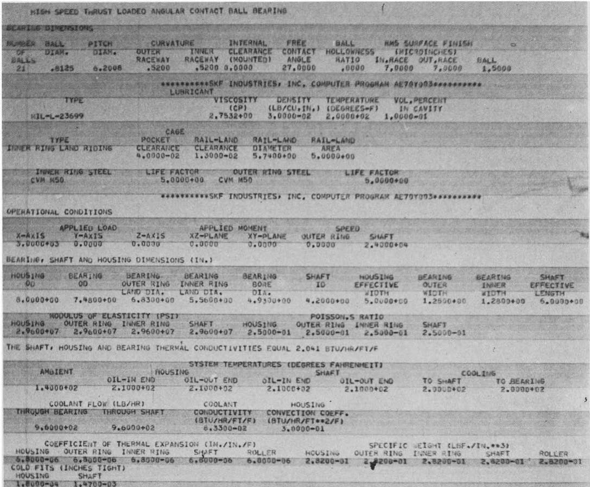

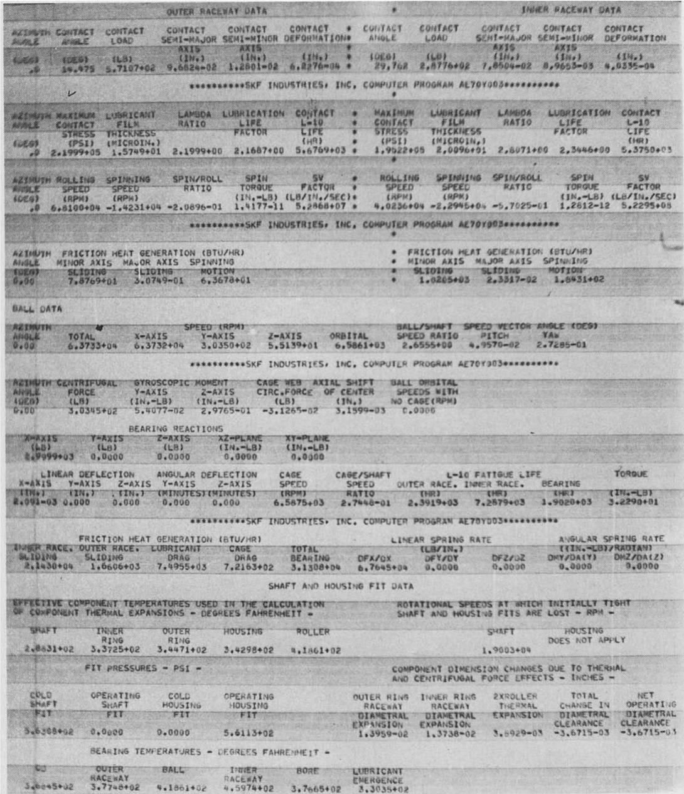  
Fig. 15. Computer program sample output for ball bearing applications.

tion of diametral clearance $\pmb { p _ { \mathrm { d } } } .$ Also for roller bearings interference is a function of clearance. Since clearance is a function of bearing operating temperatures, ring speeds and ball orbital speed, which in turn are indirect functions of clearance, it is essential (1) that the temperatures assumed for operating clearance, lubricant film thickness and traction calculations be consistent with actual operating temperatures and (2) that assumed ring centrifugal expansions be consistent with calculated cage speed.

## 5.2 Friction heat generation

## 5.2.1 Rolling element/raceway sliding

Frictional heat is generated due to sliding motion between rolling elements and raceways. For both ball and roller bearings eqn. (101) defines the rate of heat generated at a single contact due to sliding in the y-direction

$$
H _ { \mathrm { 1 m j } } = 0 . 3 8 5 \int \tau _ { \mathrm { y m j } } v _ { \mathrm { y m j } } \mathrm { d } A\tag{101}
$$

For ball bearings, heat generated by sliding due to gyroscopic motion is

$$
H _ { 2 \mathrm { m j } } = 0 . 1 9 2 5 \ D \omega _ { y \mathrm { j } } \overleftrightarrow { F } _ { \mathrm { w m j } }\tag{102}
$$

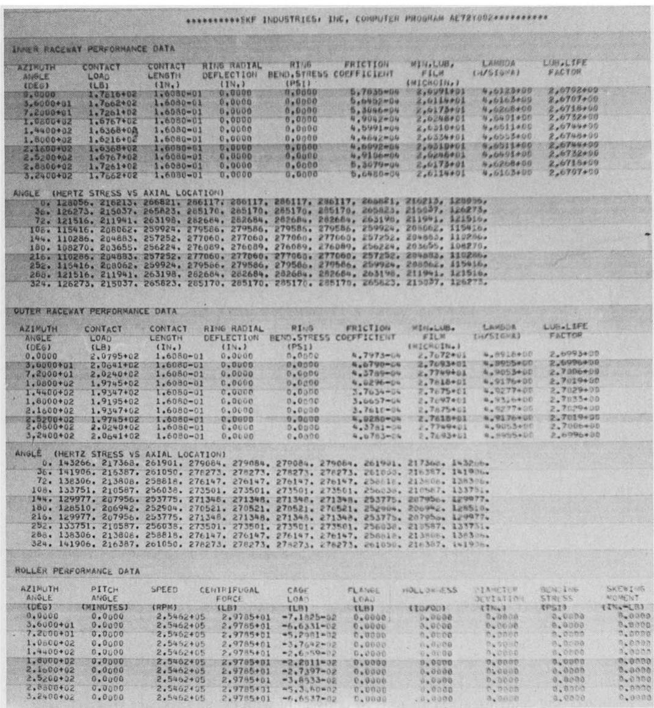  
Fig. 16. (For caption see page 334.)

## 5.2.2 Lubricant drag on rolling elements

Heat generated by lubricant drag acting on orbiting balls or rollers can be approximated by

$$
H _ { \mathrm { d j } } = 0 . 1 9 2 5 e \overline { { F } } _ { \mathrm { d j } } ( \omega _ { \mathrm { o j } } - \Omega _ { \mathrm { i } } ) ^ { 0 . 8 1 }\tag{103}
$$

## 5.2.3 Cage rail/ring land friction

For a bearing with a land riding cage, the heat generated by friction between the cage rail and ring land is given by

$$
H _ { \mathrm { C L } } = 0 . 1 9 2 5 D _ { \mathrm { C R } } \widetilde { F } _ { \mathrm { C L } } [ \mathrm { c } _ { \mathrm { m } } ( \omega _ { \mathrm { c } } - \Omega _ { \mathrm { m } } ) ]\tag{104}
$$

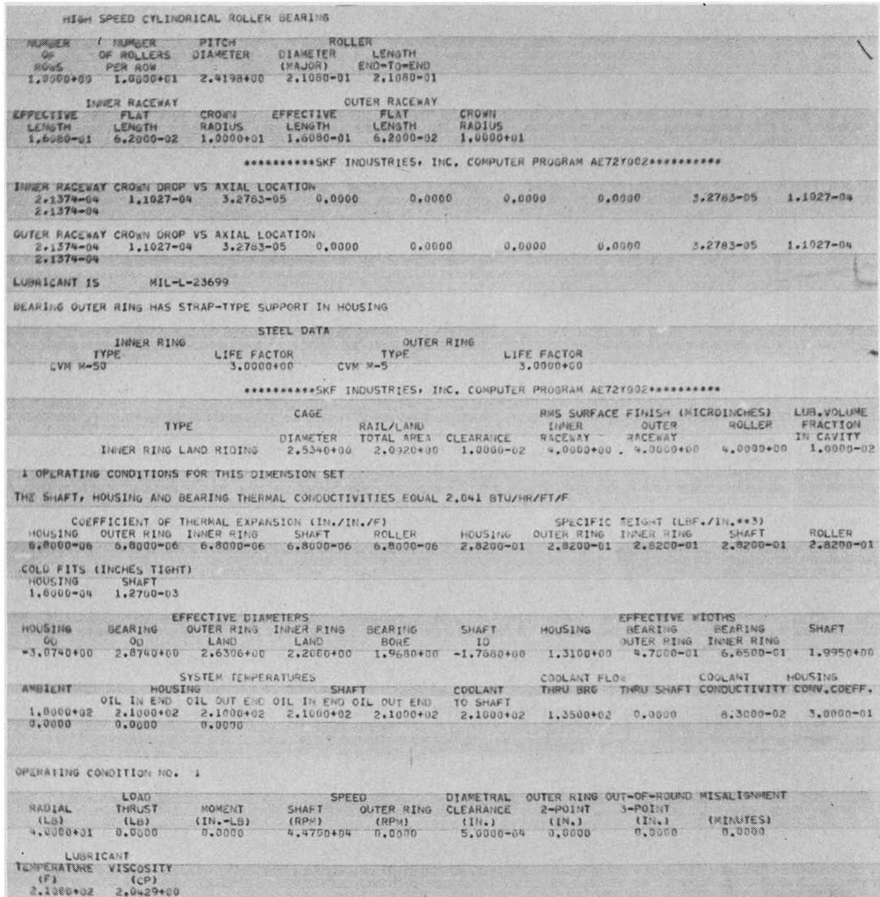  
Fig. 16. (Continued; for caption see page 334.)

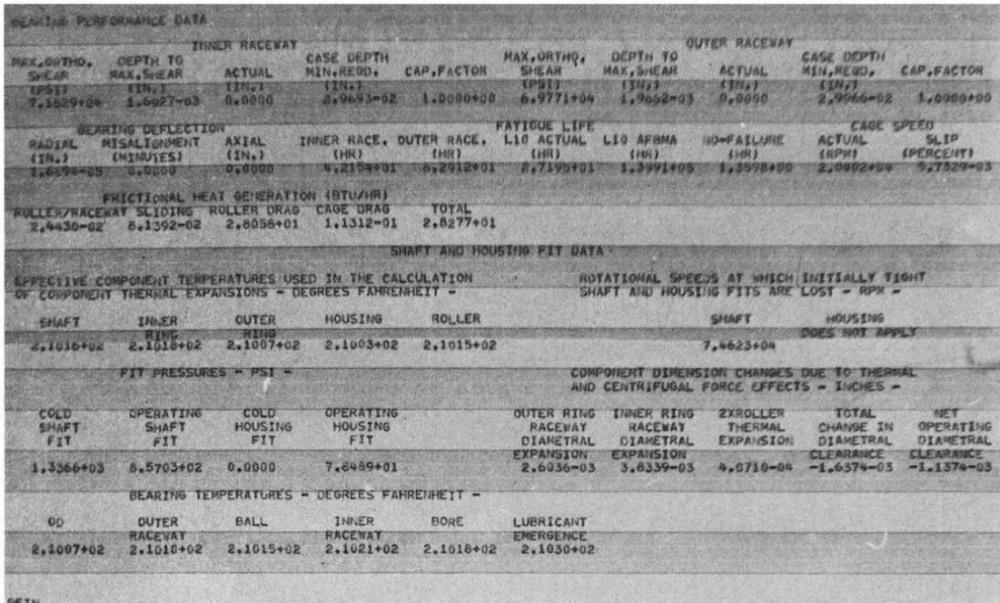  
Fig. 16. Computer program sample output for roller bearing applications.  
5.2.4 Rolling element/cage sliding

Frictional heat generation caused by rolling element sliding in the cage pocket is estimated as follows

$$
H _ { \mathrm { c j } } = 0 . 3 8 5 \mu _ { \mathrm { c j } } Q _ { \mathrm { c j } } \omega _ { \mathrm { j } }\tag{105}
$$

## 5.2.5 Roller end/flange sliding

Frictional heat is generated in roller bearings owing to relative motion between the roller ends and the guide flange. For a single roller end/flange contact this heat generation rate is estimated in eqn. (106) below

$$
H _ { \mathrm { t j } } = 0 . 3 8 5 \mu _ { \mathrm { f j } } Q _ { \mathrm { f j } } \lbrack r _ { \mathrm { f } } \omega _ { \mathrm { m j } } - ( \textstyle { \frac { 1 } { 2 } } D - S ) \omega _ { \mathrm { j } } \rbrack\tag{106}
$$

## 5.3 Temperatures

When frictional heat generation rates have been estimated, bearing-shaft housing system temperatures can be determined using numerical methods of analysis detailed in ref. 1. If calculated temperatures of bearing rings and lubricant are not consistent with the original assumptions, then the entire calculational procedure must be repeated using new values of temperature based upon the last set of calculated temperatures. This process is continued until a consistent set of kinetic and thermal conditions has been determined.

## 5.4 Closure

To perform the calculations specified in the foregoing discussion separate computer programs were developed for ball bearing and roller bearing performance evaluation. Each of these computer programs contains approximately 3500 variable

size source statements, requiring several years each to develop to the present level of sophistication. Figures 15 and 16 show sample output from these computer programs for ball and roller bearing applications respectively.

## NOMENCLATURE

Symbol Description A component of interference at azimuth j; in. a semi-major axis of a contact ellipse; in. B $f _ { 1 } + f _ { 2 } - 1$ $\pmb { b }$ semi-minor axis of a contact ellipse; in $C _ { \mathbf { k } }$ viscosity constants 1, 2 and 3 $_ { C D }$ crown drop; in. $C _ { d }$ drag coefficient $C F$ centrifugal force constant; c1 = 1, c₂= −1 D rolling element diameter; in. E Young's modulus; p.s.i. e pitch diameter; in. $\boldsymbol { \vartheta }$ complete elliptical integral of the 2nd kind $\widetilde { F }$ friction force; lb. $\pmb { F }$ applied force or moment; lb. or in. lb. f raceway groove curvature radius ÷ D $\mathcal { F }$ complete elliptical integral of the 1st kind G gyroscopic moment ; in. lb. g gravitational constant; in./sec² H heat generation rate; Btu/h h lubricant film thickness; in. J mass moment of inertia; in. lb. $\mathsf { s e c } ^ { 2 }$ $L$ roller total length; in. length of roller/raceway contact; in M moment ; in. Ib. m rolling element mass ; Ib. $\sec ^ { 2 } / \mathrm { i n } .$ N total number of roller/raceway contact laminae Pd diametral clearance; in. Q contact normal load; lb. load per unit length; Ib./in. R radius of deformed surface; in. r radius; in. radius to locus of inner raceway groove curvature centers; in. S distance from raceway to roller end contact point on flange; in. U radial portion of contact deformation in a roller/raceway contact; in. u mean value of contact surface velocities; in./sec. v sliding velocity; in./sec W width or thickness; in. w distance measured from the center of a contact ellipse along the major axi X component of ball displacement ; in.

x distance from ball center measured along x-axis; in.   
y distance from ball center (or contact ellipse center) measured along (or in a direction parallel to) the x-axis; in.   
Z number of rolling elements   
α contact angle; degrees or radians   
α° free contact angle; degrees or radians   
β ball speed vector pitch angle; radians   
γ Dcosα/e   
γ′ D/e   
Δ bearing displacement; in. or radians   
δ contact deformation; in.   
ε a/b   
ζ roller relative pitch angle; radians   
η lubricant viscosity; lb./sec/in.²   
ηo lubricant viscosity at atmospheric pressure; lb./sec/in.²   
θ angle between the radius to point w on a contact ellipse and the radius to the center of the ellipse; radians   
λ pressure coefficient of viscosity; in.2/lb.   
μ coefficient of friction   
ν constants; v₁ =0, v₂= 1   
u Poisson's ratio   
ρ density of lubricant-gas mixture; lb./in.³   
σ normal (contact) stress; p.s.i.   
∑ρ total curvature; in.-1   
τ lubricant frictional (shear) stress; p.s.i.   
φ azimuth; degrees or radians   
ψ ball speed vector yaw angle; radians   
Ω ring speed; radians/sec   
ω speed ; radians/sec   
Subscript Reference   
C cage   
CR cage rail   
d lubricant drag or diametral   
f flange   
gij grimuth locatio number   
k contact laminum number   
L ring land   
m raceway; outer = 1; inner=2   
0 orbital motion   
R roller   
w direction along contact ellipse major axis   
x direction parallel to (or about) x-axis   
y direction parallel to (or about) y-axis   
z direction parallel to (or about) z-axis

## REFERENCES

1 T. Harris, Rolling Bearing Analysis, Wiley-Interscience, New York, 1966.

2 J. Archard and E. Cowking, Elastohydrodynamic lubrication at point contacts, Proc, Inst. Mech. Engrs., 180 (3B) (1965–1966) 47–56.

3 H. Cheng, A numerical solution of the elastohydrodynamic film thickness in an elliptical contact, Trans. ASME Ser. F., J. Lubric. Technol., (1970) 155.

4 M. Hersey and R. Hopkins, Viscosity of lubricants under pressure, ASME Res. Comm. Lub., 1954.

5 T. Harris, Ball motions in thrust-loaded, angular-contact bearings with coulomb friction, Trans. ASME Ser. F., J. Lubric. Technol., 93 (1) (1971) 32–38.

6 V. Streeter, Fluid Mechanics, McGraw-Hill, New York, 1951, pp. 313–314.

7 G. Lundberg and H. Sjovall, Stress and Deformation in Elastic Contacts, Inst. Theory of Elasticity and Strength of Mater., Chalmers Inst. Technol., Gothenburg, Sweden, Publ. No. 4, 1958.

8 D. Dowson and G. Higginson, Theory of roller bearing lubrication and deformation, Proc. Inst. Mech. Engrs., 177 (1963) 58–69.

9 A. Palmgren, Ball and Roller Bearing Engineering, 3rd edn., Burbank, 1959.

10 E. Bisson and W. Anderson, Advanced Bearing Technology, NASA SP-38, 1964.

## ADDITIONAL REFERENCES

A. Jones, Ball motion and sliding friction in ball bearings, Trans. ASME Ser. D., J. Basic Eng., 31 (1) (1959) 1-12.

T. Harris, An analytical method to predict skidding in thrust-loaded, angular-contact ball bearings, Trans. ASME Ser. F., J. Lubric. Technol., 93 (1) (1971) 17–24.

T. Harris, Effect of misalignment on the fatigue life of cylindrical roller bearings having crowned rolling members, Trans. ASME Ser. F., J. Lubric. Technol., 91 (2) (1969) 294–300.

T. Harris, Endurance of a thrust-loaded, double row, radial cylindrical roller bearing, Wear, 18 (1971) 429–438.
