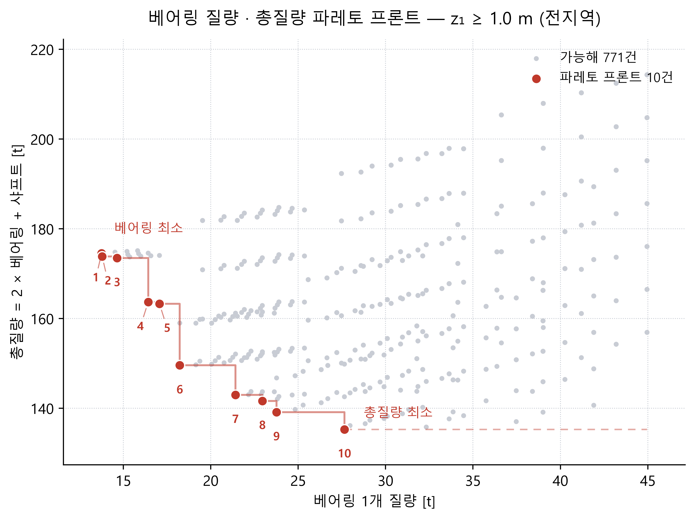
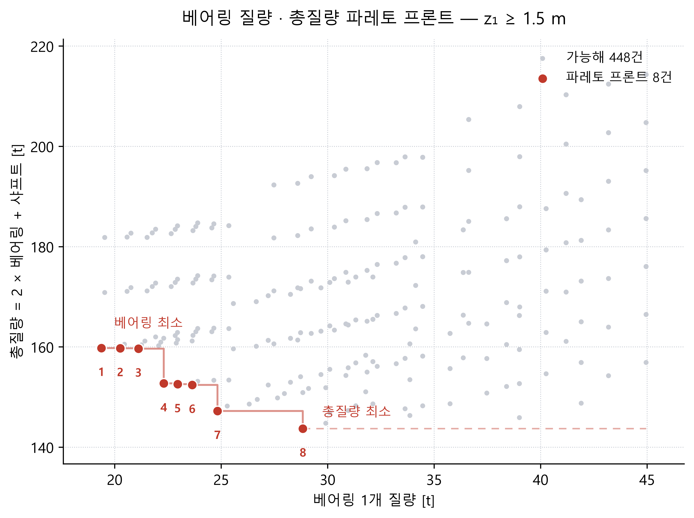
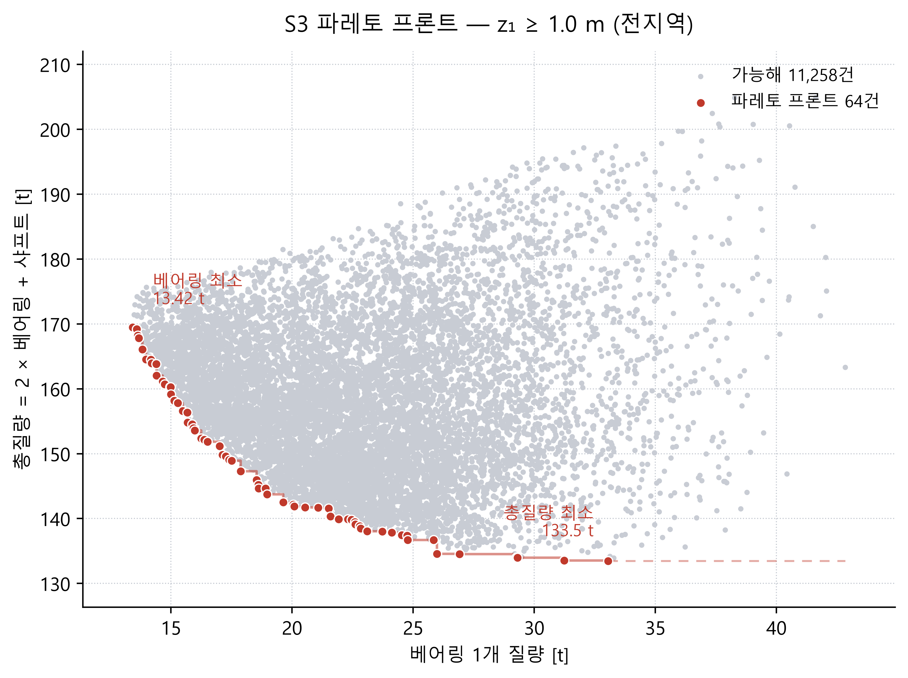
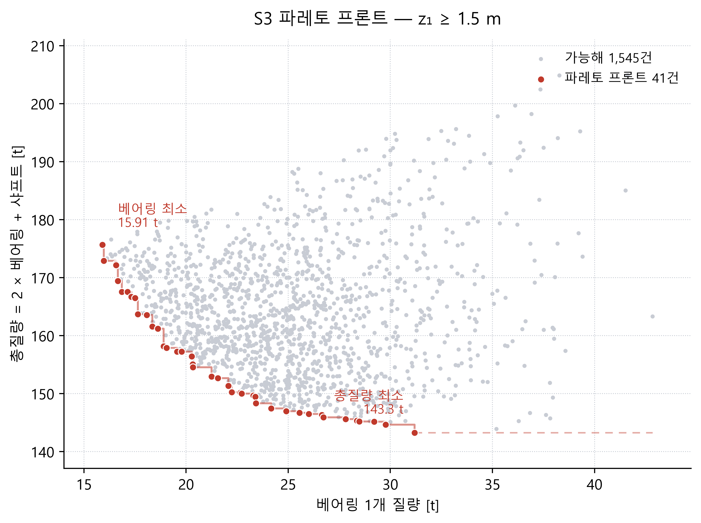

# 메인베어링 사이징 최적화 — 극한 응력 및 피로수명 동시 만족 설계안 탐색

> 작성 260727~ · **현재 판 R14 (260804)** · 선행 문서: `DLC기반_피로해석_DLC별해석.md`(부록 1~5), `DLC기반_피로해석_프로세스_v1.md`
> 전체 개정 경위는 문서 최하단 **[개정 이력](#개정-이력)** 참조 — 번복·무효화 27건을 R0~R14 로 정리했다.

## 현재 상태 (260804)

| 단계                                       |        상태        | 결과                                                                                         |
| ------------------------------------------ | :----------------: | -------------------------------------------------------------------------------------------- |
| Step 0 — 기준모델 실측·설계변수 확정     |         ✅         | §3·§4 · 결정 26건                                                                        |
| **P1 Phase 1** — 극한 응력 예비     | ⚠️**무효** | 규칙 개정으로 폐기. 방법론 검증·σ=0 원인 규명이 성과 (§8-1)                               |
| **P1 Phase 2** — 극한 응력 전수     |  ✅**완료**  | **5,625점 · 27.8분 · 가능해 700건(12.4%)** · 질량 121.5~195.2 t (§8-2)             |
| **P2 Phase 1** — 피로수명           |  ✅**완료**  | **최경량 12건 + 기준선 · 12건 전원 합격** · 기준선 재현 오차 0.7% (§8-3)            |
| **P1 Phase 3** — 배치 확대          |  ✅**완료**  | **8,700점 · 35분 · 가능해 771건(8.9%)** · σ 최소 1,722.8 · 최경량 135.3 t (§8-4) |
| **P2 Phase 2** — 피로수명           |  ✅**완료**  | **24건(A·B) 전원 합격** · 여유 4.7~11.3배 (§8-5)                                    |
| **P1 §8-4.4** — 베어링 단독 질량   |  ✅**완료**  | 총질량 기준과**교집합 0** · 파레토 10·8건 (§8-4.4)                                  |
| **P2 Phase 3** — 베어링 최경량 피로 |  ✅**완료**  | **6건(C·D) 전원 합격** · 여유 1.7~4.4배 · 33.5분 (§8-6)                          |
| P2 참값 편향 검증                          |      ⏸ 보류      | 상위 50 DLC · dt=0.1 · 약 12.7시간 (§8-3.4)                                               |
| **부록 5** — DLC별 윤활조건         |  ✅**완료**  | **3모델 × 2,646빈** · 경계윤활 12건 전부 DLC6.4 · `a_ISO` 손상가중 0.981          |
| **부록 5 §5-9** — 빈 대표화 검증   |  ✅**완료**  | **12,004 LC · 21.3분** · 지배인자는 rpm 이 아닌 하중(+0.47% 대 +9.21%) · dt=20 타당 |
| **부록 6 S0** — 최적화 알고리즘     |  ✅**완료**  | **pymoo 0.6.2 채택**(NSGA-II 원저자 공동개발) · 변수/제약/파라미터 확정               |
| **부록 6 S1** — 평가기              |  ✅**완료**  | `nsga_eval.py` · v1.3 자기검증 Δ=0 · **0.316 s/점** (§6-10.1)                    |
| **부록 6 S2** — 재현 시험           |  ✅**완료**  | **`224×150` 재현율 10/10 · 시드 3개 전부** · MASTA 0회 (§6-10.2)                 |
| **부록 6 S3-a** — 본최적화 스크립트 |  ✅**완료**  | `nsga_s3_run.py` · 배선 시험 4항목 통과 · 세장비 3안 비교로 **밴드 재매개화** 채택 (§6-11.1)      |
| **부록 6 S3-b** — 드라이런          |  ✅**완료**  | **실 MASTA 224×5 · 게이트 6항목 전항목 통과** · 해석식 탈락 0/1,120 · **0.298 s/점** (§6-11.4) |
| **부록 6 S3-c** — 본 최적화        |  ✅**완료**  | **224×150 · 2.69 h · MASTA 32,047회** · 고유 프론트 **65건** · 전수 파레토 **10/10 지배** · HV **+5.37%** (§6-11.5) |
| **부록 6 S4** — 프론트 피로            |  ✅**완료**  | **40건 전원 합격** · 2.65 h · 최소 여유 1.56배(`b01`) · 손상↔질량 상관 −0.95 (§6-11.6) |
| **부록 6 §6-11.7** — 70 °C 재검토   |  ✅**완료**  | **40건 중 20건 탈락**(베어링 최경량군 전부) · 손상비 **2.84배** · ν 294.6→137.2 |
| 부록 6 S5                             |     ⬜ 미착수     | 엑셀 총망라 (알고리즘·변수·제약·P1·P2 전 변수)                                   |
| P3 — 최종 확정                            |     ⬜ 미착수     |                                                                                              |

**두 제약 모두 만족하는 설계를 확보했다.**

| 제약           | 기준            |                   P2 Ph1#1 |         P2 Ph1#9 | P2 Ph2 A5 |
| -------------- | --------------- | -------------------------: | ---------------: | --------: |
| 극한 σ_max    | < 2,100 MPa     |          **2,090.5** |          2,082.9 |   2,090.0 |
| 피로 Σ D30_UW | ≤ 0.5          |                     0.1173 | **0.0415** |    0.0444 |
| 질량           | (기준선 54.4 t) | **121.5 t** (2.23배) |          128.0 t |   137.0 t |

**병목은 응력·질량이다** — 피로는 4~12배 여유로 통과하나 응력은 한계에 붙어 있고, 질량이 기준선의 2.2배다(§6-2 · §8-3.6.5).

## 최근 갱신 (R5~R7)

| 판                  | 핵심 변경                                                                                           | 파급                                                                   |
| :------------------ | --------------------------------------------------------------------------------------------------- | ---------------------------------------------------------------------- |
| **R5** 260729 | 세장비 상한 4.0 →**2.5** · bore·OD 를 **소단/대단 기준**으로                         | Phase 1 가능영역 8점 전부 설계 불가.**σ=0 실패 36.9% → 0%**    |
| **R6** 260729 | 링 두께 기준`D_pw` → **링 폭(B·C)**                                                       | JIS 살두께 미달 12종 →**0종**. 부록 4 신설                      |
| **R7** 260730 | 스크리닝 기하 →**L_eff** · k 격자 0.05 → **0.01** · e_C **빈별 ISO 281 A.12** | 보수 편향 11.6% → 3.8%.**부록 4·5 와 k·절대손상 비교 불가**   |
| **R8** 260730 | 배치 격자 확대 — z1 1.0~3.0 · z2 3.0~6.0 (§8-4)                                                 | σ 최소 1,738.9 →**1,722.8**, 최경량 121.5 → **135.3 t** |
| **R9** 260730 | P2 Phase 2 (§8-5) — α 결론 조건 한정으로 정정                                                    | α 는**스팬 의존**이며 부호가 뒤집힌다 (−7.8 ~ +4.9%)           |

---

## 1. 목적·판정기준

현 베어링 사양은 30년 피로수명을 만족하지 못한다. 베어링 제원과 배치를 재설계하여 아래 **두 제약을 동시에 만족**하는 안을 확보한다.

| 제약                | 지표                          | 기준                  | 대상                                   |
| ------------------- | ----------------------------- | --------------------- | -------------------------------------- |
| **극한 강도** | Maximum Element Normal Stress | **< 2,100 MPa** | 극한 16 로드케이스**전부**       |
| **피로 수명** | 30년 누적손상 D30             | **≤ 0.5**      | **UW 및 Sys 둘 다** (전 111 DLC) |

- D30 ≤ 0.5 는 명목수명 60년에 해당하며, L10(파손확률 10%) 기준에 손상 안전율 2를 두는 설계 관행이다.
- Sys = 직렬 와이블 결합 `L_sys = (L_UW^−e + L_DW^−e)^(−1/e)`, e = 9/8 (부록 3~5와 동일).
- DW 수명은 참고치로 병기한다.

---

## 2. 결정 사항 총괄 (260727, 사용자 확정)

### 2-1. 출발점·설계 범위

|   # | 항목                    | 결정                                                                                                                       |
| --: | ----------------------- | -------------------------------------------------------------------------------------------------------------------------- |
|   1 | 베어링 형식             | **단열 TRB 쌍 유지** — 제원만 변경. 복열·SRB·CRB 등 형식 변경은 범위 밖                                           |
|   2 | **출발점**        | **빔 샤프트 파일 + v1.3 베어링 제원** — §3-4 참조                                                                  |
|   3 | 변수 구속 방식          | **PCD 기준 종속화** — 자유변수 = PCD, α, D_we, L_we (+ z1, z2)                                                     |
|   4 | 샤프트 외경             | **동반 가변** — PCD 변경 시 bore d 도 함께 변경                                                                     |
|   5 | 샤프트 내경             | **벽 두께 비율 유지** — `ID_new = OD_new × (ID_now / OD_now)`                                                    |
|   6 | 샤프트 길이             | **z2 증가분만큼 연장** — `L_shaft = 3.5 + (z2 − 3.0)` [m]                                                        |
|   7 | 링 두께                 | **v1.3 실측 비율 고정** — 원뿔 소단/대단 기준 `t_i = 0.014097·PCD`, `t_o = 0.013076·PCD` (260729 개정, §4-3) |
|   8 | 조립폭 T                | **`T = L_we + 72 mm`** (v1.3 기준). 내륜폭 B·외륜폭 C 는 MASTA 자동 산출에 위임                                   |
|   9 | 유효하중중심 a          | **MASTA 자동 산출에 위임.** S1(MASTA 미사용) 에서만 근사식 사용 (§4-5)                                              |
|  10 | 롤러 수 Z               | **종속변수** — `Z = floor(η · π · PCD / D_we)`, **η = 0.92** (v1.3 실증값)                             |
|  11 | 치수 반올림             | **d, D 는 계산값을 1 mm 단위로 반올림**하여 정수 사용                                                                |
|  12 | 탐색 범위 하한          | **v1.3 값까지** — 출발점보다 작은 설계는 탐색하지 않음                                                              |
|  13 | UW/DW 대칭              | **1차 동일 사양 → 2차 비대칭 허용** (2단계)                                                                         |
|  14 | 프리로드                | **무프리로드 고정** — 확정 후보에 대해서만 별도 감도 검토                                                           |
| 14c | **베어링 배열**   | **O 배열(back-to-back)** 확정 — 유효하중중심이 바깥으로 벌어짐 (§4-5)                                              |
| 14d | **z1·z2 기준점** | **베어링 기하중심** (현행 소켓 오프셋 유지). z1·z2 는 물리적 장착 위치를 뜻함                                       |
| 14f | **S1 기하 모델**  | **L_eff 모델 채택** — `L_eff = (z2−z1) + 2(a − T/2)`, α·D_pw·L_we 자동 반영 (부록 3)                         |
| 14e | **샤프트 재구성** | 단일 균일 원통.`OD = d`, `ID = d × 0.88543`(벽두께 비율 유지), `L_shaft = z2 + 0.5 m`                               |
| 14b | **롤러 프로파일** | **DIN Lundberg 고정** (부록 2, 안 R1). 파라미터 없이 `end_drop = 0.00221·D_we` 로 **자동 산출**             |

### 2-2. 해석 조건

|  # | 항목           | 결정                                                                         |
| -: | -------------- | ---------------------------------------------------------------------------- |
| 15 | 강성 모델      | **빔 샤프트 + 외륜 접지** — 하우징 FE 미적용 (§3-3)                  |
| 16 | 응력 지표      | **Maximum Element Normal Stress**                                      |
| 17 | 극한 SF        | **미적용 (raw 하중)** — 엑셀의 1.10/1.35 는 곱하지 않음               |
| 18 | 극한 케이스 수 | **16개 전부** — 진짜 중복은 1쌍뿐이라 절약 실익 없음                  |
| 19 | 극한 토크      | **엑셀 Mx 열을 축토크로 인가** — 기존 2건(Mx_max·Mx_min)과 동일 규칙 |
| 20 | 극한 회전속도  | **0 으로 통일** — 기존 2건과 동일                                     |
| 21 | 피로 이산화    | **dt = 20 s 통일 + 중앙타겟 k** — 부록 4 표준                         |
| 22 | 온도·윤활     | **50 °C 고정**, 유종 변경 없음                                        |

### 2-3. 탐색·판정

|  # | 항목             | 결정                                                                                                                                            |
| -: | ---------------- | ----------------------------------------------------------------------------------------------------------------------------------------------- |
| 23 | 기준선           | **v1.3 제원 + 빔 샤프트 조합을 1회 실측**하여 공식 출발점으로 삼음                                                                        |
| 24 | 부록 4 와의 차이 | **기록만 한다** — 차이는 "FE 2안 → 빔 3안" 효과로 §6-1 에 명기                                                                         |
| 25 | 기준선 측정 범위 | **수명(111 DLC) + 극한응력(16 LC) + 배열(O/X) 확정**                                                                                      |
| 26 | 목적함수         | **질량·스팬 2목적 파레토**. 질량 = **베어링 2개 + 샤프트 합계** (MASTA 실측). 결과표에는 **베어링·샤프트 질량을 각각 병기** |

---

## 3. 기준 모델 실측 (Step 0)

### 3-1. 두 후보 파일의 구성 차이 (실측)

베어링 제원을 v1.3 으로 통일하더라도, **어느 파일을 담는 그릇으로 쓸지**가 남는다. 두 파일은 샤프트 구성이 다르다.

| 항목                  | **부록 4 산출 파일**                                       | **빔 샤프트 파일 (채택)**              |
| --------------------- | ---------------------------------------------------------------- | -------------------------------------------- |
| 파일명                | `..._v1.3_샤프트 2안_피로하중 반영_유연체_FE_온도_50도_260721` | `..._v1.4_샤프트 3안_..._온도_50도_260726` |
| **샤프트 강성** | **FE 치환 (`is_replaced_by_fe=True`)**                   | **빔 (`False`)**                     |
| 샤프트 안 / 길이      | 2안 / 3.5 m                                                      | 3안 / 3.5 m                                  |
| 베어링 외륜           | 접지 (`outer_component=None`)                                  | 접지                                         |
| 프리로드              | NONE                                                             | NONE                                         |
| z1 / z2               | 0.5 / 3.0 m                                                      | 0.5 / 3.0 m                                  |
| 정적 로드케이스       | 17 (LC1 + 극한 16)                                               | 17 (LC1 + 극한 16)                           |

**FE 샤프트는 bore 가변을 막는다.** PCD 를 키우면 bore 가 커지고 샤프트 외경이 따라 커져야 하는데, FE 치환 상태에서는 메시 재생성이 필요해 무인 자동화가 불가능하다. 따라서 **빔 샤프트 파일을 그릇으로 쓰고 베어링 제원만 v1.3 으로 되돌린다**(결정 #2).

### 3-2. 출발점 베어링 제원 (v1.3, UW·DW 동일)

| 기호           | 항목                  |                           값 | MASTA 속성 (`bearing.detail.*`)                           |
| -------------- | --------------------- | ---------------------------: | ----------------------------------------------------------- |
| **d**    | Bore dia.             |           **3,055 mm** | `bore`                                                    |
| **D**    | Outer dia.            |           **3,600 mm** | `outer_diameter`                                          |
| **T**    | Assembled width       |             **310 mm** | `width` = `assembled_width`                             |
| **B**    | Inner ring width      |                       300 mm | `inner_ring_width`                                        |
| **C**    | Outer ring width      |                       253 mm | `outer_ring_width`                                        |
| **α**   | Contact angle         |           **19.000°** | `cup_angle` = `contact_angle`                           |
| **D_we** | Roller dia.           |          **110.51 mm** | `element_diameter`                                        |
| **L_we** | Roller length         |          **238.05 mm** | `roller_length` = `effective_roller_length`             |
| **2β**  | Roller taper angle    |                      1.200° | `element_taper_angle`                                     |
| —             | Cone angle            |                     17.800° | `cone_angle`                                              |
| **a**    | Effective load center |                     713.3 mm | `effective_centre_from_front_face`                        |
| Z              | Number of elements    |                           87 | `number_of_elements`                                      |
| Z_max          | 이론최대              | 94.61 →**η = 0.920** | `theoretical_maximum_number_of_elements`                  |
| **D_pw** | Pitch circle dia.     |         **3,330.9 mm** | `pitch_circle_diameter`                                   |
| —             | 열 수                 |                     1 (단열) | `number_of_rows`                                          |
| C              | 기본동정격            |          **22,228 kN** | `basic_dynamic_load_rating`                               |
| C_u            | 피로한계하중          |           **3,929 kN** | `fatigue_load_limit`                                      |
| —             | 질량                  |                     5,600 kg | `mass`                                                    |
| —             | 프리로드              |                         NONE | `preload`                                                 |
| —             | 정적파손 허용접촉응력 |                    4,000 MPa | `maximum_permissible_contact_stress_for_static_failure_*` |

### 3-3. 강성 구성 — 중요

실측 확인 (`probe_fe_state.py`, `probe_housing_fe.py`):

| 항목                  | 채택 파일의 상태                                                                  |
| --------------------- | --------------------------------------------------------------------------------- |
| **Main Shaft**  | `is_replaced_by_fe = False` → **빔 요소**                                |
| 베어링 내륜           | `inner_component = Main Shaft` (CoaxialConnection)                              |
| **베어링 외륜** | `outer_component = None`, `outer_connection = None` → **접지(ground)** |
| FE Part               | 모델에 존재하나**어느 베어링에도 연결되지 않음** → 하중 경로 미참여        |

**하중 경로**: `Point Load → Main Shaft(빔) → 베어링 내륜 → 외륜 접지`

**하우징 FE 는 적용되어 있지 않다.** 미스얼라인먼트는 오직 샤프트 굽힘에서만 발생한다. 이로부터

1. **외경 D 를 바꿔도 FE 인터페이스 문제가 없다.** 외륜이 접지이므로 PCD·D 를 자유롭게 변경할 수 있고 자동화에 제약이 없다.
2. 하우징 컴플라이언스가 0 이므로 실제 구조 대비 **미스얼라인먼트와 최대 접촉응력이 과소평가**될 수 있다(§9-2).

### 3-3.1 샤프트 구조 (실측)

| 항목                      |                                 값 |
| ------------------------- | ---------------------------------: |
| `design_shaft_sections` |     **1개** (단일 균일 원통) |
| `outer_profile.points`  | 2개 (offset 0 → 3.5 m, 직경 균일) |
| 길이                      |                           3,500 mm |
| 외경 OD                   |                3,055 mm (= bore d) |
| 내경 ID                   |                           2,705 mm |
| 벽 두께                   |                             175 mm |
| **ID / OD**         |                  **0.88543** |

단면이 하나뿐이므로 재구성이 단순하다 — `remove_all_sections()` 후 `add_section(0, L_shaft, OD, ID, OD, ID)` 한 번이면 된다(결정 #14e).

### 3-4. 출발점을 v1.3 제원으로 정한 이유

| 쟁점             | v1.3 제원 (채택)                                                        |
| ---------------- | ----------------------------------------------------------------------- |
| 기하 정합성      | Z = 87 < Z_max 94.61 →**η = 0.920 정상**, 롤러 간섭 없음        |
| η 규칙과의 관계 | **η = 0.92 규칙 자체가 v1.3 의 실증값**이므로 정의상 규칙을 만족 |
| 탐색 방향        | 목표를 향해**전 변수를 키우는 단조 방향** — 설계공간 해석이 깔끔 |
| 검증된 참조점    | **부록 4** 가 동일 제원으로 111 DLC 수명을 이미 산출              |

---

## 4. 설계변수 정의

### 4-1. 도면 기호 ↔ MASTA 속성 대응 (실측 확인)

| 도면 기호            | 의미                                     | MASTA 속성                                                   | 역할               |
| -------------------- | ---------------------------------------- | ------------------------------------------------------------ | ------------------ |
| **D_pw**       | Pitch dia.                               | `pitch_circle_diameter`                                    | **자유변수** |
| **α**         | Nominal contact angle                    | `cup_angle` = `contact_angle`                            | **자유변수** |
| **D_we**       | Roller dia.                              | `element_diameter`                                         | **자유변수** |
| **L_w / L_we** | Roller length / 유효길이                 | `roller_length` / `effective_roller_length`              | **자유변수** |
| **d**          | Bore dia.                                | `bore`                                                     | 종속               |
| **D**          | Outer dia.                               | `outer_diameter`                                           | 종속               |
| **T**          | Assembled width                          | `width` = `assembled_width`                              | 종속               |
| **B**          | Inner ring width                         | `inner_ring_width`                                         | MASTA 위임         |
| **C**          | Outer ring width                         | `outer_ring_width`                                         | MASTA 위임         |
| **2β**        | Roller taper angle                       | `element_taper_angle` ( = `cup_angle` − `cone_angle`) | MASTA 산출         |
| **a**          | Effective load center from cup back face | `effective_centre_from_front_face`                         | MASTA 산출         |

- MASTA 는 `L_w = L_we` 로 두고 있어 도면의 두 값이 구분되지 않는다.
- `2β = cup_angle − cone_angle` 이 정확히 성립한다 (v1.3: 19.000 − 17.800 = 1.200 ✅).

### 4-2. 자유변수 (6개)

| 변수      | 기호           | **출발값** | 탐색 범위        | 간격            | 점수 | 근거                           |
| --------- | -------------- | ---------------: | ---------------- | --------------- | ---: | ------------------------------ |
| UW 위치   | **z1**   |            0.5 m | 0.3 ~ 1.0 m      | 0.1 m           |    8 | 허브 플랜지·씰 간섭 하한      |
| DW 위치   | **z2**   |            3.0 m | 3.0 ~ 5.0 m      | **0.1 m** |   21 | 나셀 상한 미확정(§9-1)        |
| 피치원경  | **D_pw** |       3,330.9 mm | 3,330 ~ 4,500 mm | 100 mm          |   13 | 대형 메인베어링 상용 상한      |
| 접촉각    | **α**   |           19.0° | 12 ~ 30°        | 2°             |   10 | 축력 분담·Y1·유효스팬에 직결 |
| 롤러 직경 | **D_we** |        110.51 mm | 110 ~ 200 mm     | 10 mm           |   10 | Z 와 상충                      |
| 롤러 길이 | **L_we** |        238.05 mm | 238 ~ 500 mm     | 25 mm           |   11 | 조립폭 T 에 직결               |

- 하한을 전부 출발값으로 잡았다(결정 #12). 출발점보다 작은 설계는 수명이 더 나쁘므로 볼 필요가 없다.
- 전조합은 8×21×13×10×10×11 ≈ 240 만 점. S1 이 설계점당 ~2초이므로 전수 탐색은 불가하며, **§7 에서 단계적 축소 전략을 적용**한다.
- 1차 탐색은 UW·DW 동일 사양(변수 6개), 2차에서 베어링 제원 4개를 UW/DW 로 분리(변수 10개).
- **자유변수는 6개로 확정**되었다(260728). 롤러 프로파일은 DIN Lundberg 고정이며 `end_drop = 0.00221·D_we` 로 종속 산출된다(결정 #14b, 부록 2).

### 4-3. 종속변수

종속변수는 **자유변수 → 링 폭 → 링 두께 → 지름 → 샤프트** 의 4단계 사슬로 산출된다. 상위 단계가 확정되지 않으면 하위 단계를 계산할 수 없다.

```
자유변수    D_pw · α · D_we · L_we · z1 · z2
    │
 1단계 ├─ Z · T · B · C · 단부드롭 · 케이지 피치반경/두께 · 샤프트 길이
    │
 2단계 ├─ t_i = 0.15652·B      t_o = 0.17215·C      케이지 폭 = T
    │
 3단계 ├─ d (bore)             D (outer)
    │
 4단계 └─ 샤프트 OD = d        샤프트 ID = 0.88543·d

  MASTA 위임   a · 2β · 정격 C·C_u · 케이지 질량 · 베어링 질량 · 샤프트 질량
```

|    단계    | 변수                        | 산출식                                                        | 검산 (v1.3 실측 대비)                              |
| :---------: | --------------------------- | ------------------------------------------------------------- | -------------------------------------------------- |
| **1** | 롤러 수                     | `Z = floor(0.92 · π · D_pw / D_we)`                      | floor(87.11) =**87** (실측 87 ✅)            |
| **1** | **조립폭 T**          | `T = 1.30226 · L_we`                                       | **310.000** (실측 310.0 ✅)                  |
| **1** | **내륜폭 B**          | `B = 1.26025 · L_we`                                       | **300.000** (실측 300.0 ✅)                  |
| **1** | **외륜폭 C**          | `C = 1.06281 · L_we`                                       | **253.000** (실측 253.0 ✅)                  |
| **1** | **크라우닝 단부드롭** | `end_drop = 0.00221 · D_we` (DIN Lundberg 자동)            | 244.27 µm (실측 ✅)                               |
| **1** | **케이지 피치반경**   | `cage_pitch_radius = D_pw/2 + D_we/4`                       | 1,693.078 mm (실측 ✅)                             |
| **1** | **케이지 두께**       | `cage_thickness = D_we/6`                                   | 18.418 mm (실측 ✅)                                |
| **1** | 샤프트 길이                 | `L_shaft = z2 + 0.5` [m]                                    | 결정#6 · v1.3 3,500 mm                            |
| **2** | 내륜 두께 (소단)            | `t_i = 0.15652 · B`                                        | 46.95 mm (v1.3 실측 역산)                          |
| **2** | 외륜 두께 (대단)            | `t_o = 0.17215 · C`                                        | 43.55 mm (v1.3 실측 역산)                          |
| **2** | **케이지 폭**         | `cage_width = T`                                            | 309.462 mm (실측, T 310)                           |
| **3** | **Bore**              | `d = round(D_pw − D_we·cos α − L_we·sin α − 2·t_i)` | round(3,054.99) =**3,055** (실측 3,055 ✅)   |
| **3** | **Outer**             | `D = round(D_pw + D_we·cos α + L_we·sin α + 2·t_o)`    | round(3,600.01) =**3,600** (실측 3,600 ✅)   |
| **4** | 샤프트 외경                 | `OD_shaft = d`                                              | bore 와 일치                                       |
| **4** | 샤프트 내경                 | `ID_shaft = 0.88543 · d`                                   | 벽 두께 비율 유지 (결정#5·#14e), 실측 2,705/3,055 |
|      M      | 유효하중중심 a              | **MASTA 자동 산출에 위임**                              | 참고: 713.3 mm                                     |
|      M      | 롤러 테이퍼각 2β           | **MASTA 자동 산출에 위임**                              | 참고: 1.200°                                      |
|      M      | 정격                        | `C, C_u`                                                    | MASTA 가 기하에서 자동 산출                        |
|      M      | **케이지 질량**       | `cage_mass` — 1·2단계 케이지 3항목에서 MASTA 산출         | 189.40 kg                                          |
|      M      | **베어링 질량**       | **MASTA `bearing.detail.mass`**                       | 5,600.5 kg (v1.3 실측) — 목적함수 입력            |
|      M      | **샤프트 질량**       | **MASTA `shaft.mass_of_shaft_body`**                  | 43,225.8 kg (실측) — §7-5 참조                   |

**MASTA 주입 순서는 이 사슬과 일치해야 한다** — `B → C → T → (제원) → …`. B·C 를 바꾸면 T 가 자동으로 따라 움직이므로 T 를 마지막에 명시 설정하지 않으면 직전 설계점에 따라 값이 달라진다(부록 4-7).

**d·D 를 1 mm 단위로 반올림**한다(결정 #11). 반올림 전 계산값은 3,054.99 / 3,600.01 이고, 반올림하면 v1.3 실측과 **정확히 일치**한다.

**요약 — 이 표를 읽을 때 알아야 할 네 가지**

1. **`t_i`·`t_o` 는 궤도의 소단·대단에서 잰다.** 원뿔 궤도이므로 링 두께는 축방향 위치마다 다르고, 그 두 지점이 각 링의 최소 살두께다. 중앙면에서 재던 구식은 실제 최소값의 1.8배를 두께로 잡고 있었다 → 부록 4-2·4-3
2. **`d`·`D` 의 `L_we·sinα` 항은 이 테이퍼를 상쇄한다.** 이 항이 없으면 롤러가 길어질 때 내륜 궤도가 보어 아래로 내려가 형상이 무효화되고 MASTA 가 응력을 반환하지 못한다(구 격자의 37%) → 개정이력 R5·부록 4-2
3. **링 두께 기준은 D_pw 가 아니라 링 폭이다.** D_pw 기준은 작은 피치경에 큰 롤러를 올릴 때 JIS 관행(살두께 ≥ 0.20·D_we)을 못 지킨다 — 격자 240종 중 12종 미달. 링 폭 기준은 세장비 하한 1.5 와 결합해 `t/D_we ≥ 0.274` 를 **구조적으로 보장**한다 → 부록 4-4·4-6
4. **T 의 자동 갱신 규칙은 `max(T_old + (ΔB+ΔC)/2, max(B,C))` 로 직전 상태에 의존한다.** 위 주입 순서를 지키지 않으면 같은 설계에서 다른 T 가 나온다 → 부록 4-7

**비율의 성격** — T·B·C 와 링 두께 비율은 모두 v1.3 실측 1점에서 역산한 값이며, 물리 법칙이 아니라 **채택된 규칙**이다. v1.3 과 v1.4 가 서로 다른 축방향 규칙으로 만들어져 있어 스케일 법칙을 데이터로 확립할 수 없다(대조표는 개정이력 R3). 최종 후보 확정 시 제작사 검토가 필요하다(§9-6).

축방향 치수는 **질량(목적함수)과 축방향 포락 제약에만 영향**하고 수명·응력에는 사실상 영향이 없다(접촉 기하는 D_we·L_we·D_pw·α 가 결정).

### 4-4. 제약식

```
(C2)  L_we / D_we ∈ [1.5, 2.5]                TRB 롤러 세장비 (260729 재조사 개정, v1.3 = 2.154)
(C4)  z2 − z1 ≥ 1.5 m                         최소 스팬
(C5)  z1 ≥ 0.3 m                              허브 간섭
(C6)  D_pw ≤ 4,500 mm                         제작·운송 상한
(C7)  z2 − z1 ≥ (T_UW + T_DW)/2 + 0.1 m       베어링 축방향 간섭 방지
(C8)  z1 − T/2 ≥ 0                            UW 가 하중점(허브 중심) 앞으로 나가지 않을 것
(C9)  z2 + T/2 ≤ L_shaft                      DW 가 샤프트 후단 안에 들어올 것
(C12) t_i ≥ 0.20·D_we  및  t_o ≥ 0.20·D_we    궤도륜 살두께 하한 (JIS 관행 · 부록 4-4)
```

> **(C12) 신설 · (C1)(C3)(C10)(C11) 삭제 — 260729**
>
> JIS 표준 구름베어링에서 궤도륜 두께는 최대전단응력 발생 깊이의 약 10배, 즉 **전동체 지름의 약 20%** 로 잡는다. 이 두께 미만이면 링을 반무한체로 보는 **Hertz 접촉 이론의 전제가 무너지므로**, 제작 관행이 아니라 해석 타당성 조건이다(부록 4-4).
>
> 삭제한 4개는 격자 12,000 조합 전수 감사에서 **한 번도 활성화되지 않았고 규칙상 자동 만족**이다.
>
> | 삭제  | 내용                 | 격자 내 최소 여유                                                |
> | ----- | -------------------- | ---------------------------------------------------------------- |
> | (C1)  | Z ≥ 20              | Z 41 — 여유 ×2.05                                              |
> | (C3)  | d > 0                | bore 2,640 mm                                                    |
> | (C10) | B ≥ L_we·cos(cone) | +49.4 mm —`B = 1.26025·L_we > L_we ≥ L_ax` 이므로 항상 성립 |
> | (C11) | C ≥ L_we·cos(cone) | +14.8 mm —`C = 1.06281·L_we > L_we ≥ L_ax` 이므로 항상 성립 |
>
> **번호는 결번으로 둔다** — 기존 문서·스크립트의 (C2)·(C8) 참조를 보존하기 위함이다. 신설 제약은 다음 빈 번호 (C12) 를 쓴다.

### 4-5. 유효 스팬 — 접촉각의 숨은 효과 (260728 확정)

TRB 는 하중이 기하 중심이 아니라 **유효하중중심** 에서 전달된다. **배열은 O(back-to-back)** 이므로(결정 #14c) 유효 지지점이 바깥으로 벌어진다.

MASTA 의 `effective_centre_from_front_face` (= a) 는 **컵 배면 기준**이므로, 베어링 기하중심 기준 오프셋은 `a − T/2` 이다.

```
L_eff = (z2 − z1) + 2·(a − T/2)  ≈  (z2 − z1) + D_pw·tan α
```

**실측 검산 (출발점)**

| 항목                     |                   값 |
| ------------------------ | -------------------: |
| a (컵 배면 기준)         |             713.3 mm |
| T / 2                    |             155.0 mm |
| a − T/2 (기하중심 기준) |   **558.3 mm** |
| 기하 스팬 z2 − z1       |             2,500 mm |
| **L_eff**          | **3,616.6 mm** |
| 부록 1 회귀 실효 스팬    |   **3,610 mm** |
| 차이                     |      **+0.2%** |

부록 1 이 남긴 "실효 스팬 3.61 m 가 가정 기하 2.5 m 와 불일치" 라는 미해결 의문이 이로써 **정확히 설명**된다. 동시에 이는 MASTA 의 `position` 이 **베어링 기하중심**을 가리킨다는 증거이기도 하다(결정 #14d).

**α 의 영향**

|             α |       D_pw·tan α | L_eff (z 0.5/3.0) |
| -------------: | -----------------: | ----------------: |
|           12° |             708 mm |            3.21 m |
| **19°** | **1,147 mm** |  **3.62 m** |
|           30° |           1,923 mm |            4.42 m |

→ α 를 12°에서 30°로 바꾸면 유효 스팬이 **1.2 m** 변한다. 기하 스팬 2.5 m 대비 매우 크며, α 가 수명·응력에 미치는 주 경로다.

S1 은 MASTA 를 쓰지 않으므로 위 근사식을 그대로 쓴다. S2·S3 는 MASTA 가 자동 반영한다.

## 5. 하중 자료

### 5-1. 피로 — 111 DLC

부록 3~5 와 동일한 자료를 그대로 사용한다. `Results/DLC별해석/<DLC>/raw.csv` + `dlc_meta.csv`(ScaleFactor·rpm 통계).

### 5-2. 극한 — 16 로드케이스

출처: `02. 자료/260703 유니슨 극한하중/EX.20260701.K26.DE.MainBearing_DesignLoads-A.xlsx`
채택 파일에 **이미 16개가 생성되어 있다** (`Load Case 1` 포함 총 17개).

좌표 변환 (실측 확인 완료): `FX = −Fz`, `FY = +Fy`, `AX = +Fx`, `MX = −Mz`, `MY = +My`, **`TQ = +Mx`**

|  # | 로드케이스 | DLC               | Mx(=TQ) [kNm] |  현 토크  | 현 속도 |
| -: | ---------- | ----------------- | ------------: | :-------: | :-----: |
|  1 | Mx_max     | DLC1.3-k-s5       |        61,192 | ✅ 설정됨 |    0    |
|  2 | Mx_min     | DLC5.1-c-s09      |      −22,925 | ✅ 설정됨 |    0    |
|  3 | My_max     | DLC2.2.4-b-s09    |        23,670 | ❌ 미설정 |   nan   |
|  4 | My_min     | DLC2.2.4-b-s11    |        27,453 |    ❌    |   nan   |
|  5 | Mz_max     | DLC2.2.4-b-s11    |        10,308 |    ❌    |   nan   |
|  6 | Mz_min     | DLC2.2.4-b-s07    |        17,013 |    ❌    |   nan   |
|  7 | Myz_max    | DLC2.2.4-b-s04    |        22,673 |    ❌    |   nan   |
|  8 | Myz_min    | DLC1.5-d-nv-y1-r1 |        58,208 |    ❌    |   nan   |
|  9 | Fx_max     | DLC2.1.1-b-s06    |        51,143 |    ❌    |   nan   |
| 10 | Fx_min     | DLC2.3-b-y3-g1-r2 |          90.3 |    ❌    |   nan   |
| 11 | Fy_max     | DLC6.2-y10-s6     |        −40.3 |    ❌    |   nan   |
| 12 | Fy_min     | DLC6.2-y04-s3     |          33.3 |    ❌    |   nan   |
| 13 | Fz_max     | DLC6.2-y01-s6     |         −2.0 |    ❌    |   nan   |
| 14 | Fz_min     | DLC1.3-k-s4       |        61,059 |    ❌    |   nan   |
| 15 | Fyz_max    | DLC1.3-k-s4       |        55,311 |    ❌    |   nan   |
| 16 | Fyz_min    | DLC6.2-y01-s6     |         −2.0 |    ❌    |   nan   |

**보완 작업**: #3~#16 에 토크를 인가하고 속도를 0 으로 설정한다(결정 #19·#20). 규칙의 근거는 이미 설정된 #1·#2 가 엑셀 Mx 열과 정확히 일치한다는 점이다.

**중복 검토**: DLC 이름이 겹치는 경우가 3건 있으나 하중 6성분까지 동일한 진짜 중복은 **#16 = #13 한 쌍뿐**이다(같은 DLC의 다른 시점이면 하중이 다르다). 16개 전부 해석한다(결정 #18).

---

## 6. 기준선과 필요 개선 배수

### 6-1. 기준선 정의

| 구분                             | 구성                                       |        Σ D30_UW |       수명 UW [yr] |      수명 Sys [yr] |          σ_max [MPa] |
| -------------------------------- | ------------------------------------------ | ---------------: | -----------------: | -----------------: | --------------------: |
| 참조점 — 부록 4                 | v1.3 제원 + FE 샤프트 2안 · DIN           |           6.9180 |           4.337 yr |           3.870 yr |                    — |
| **공식 기준선 (부록 1-A)** | **v1.3 제원 + 빔 샤프트 3안 · DIN** | **6.9739** | **4.302 yr** | **3.850 yr** | **3,424.2 MPa** |
| 차이                             |                                            |           +0.81% |            −0.81% |            −0.52% |                    — |

부록 1-A 로 **공식 기준선이 확정**되었다(260728). 부록 4 와의 차이가 1% 미만이므로 빔 파일 채택이 정당화된다.

> 부록 5 는 기준선에서 제외한다. 프리로드(SOLID 0.5 mm)가 롤러 확대의 이득을 거의 전부 상쇄한 것으로 확인되어, 무프리로드를 전제하는 본 연구의 기준으로 부적합하기 때문이다.

### 6-2. 필요 개선 배수 (확정, 260728)

| 제약                  |           기준선 실측 |        목표 |             필요 개선 |
| --------------------- | --------------------: | ----------: | --------------------: |
| 피로 Σ D30_UW        |      **6.9739** |       0.500 | **14.0배 저감** |
| 피로 수명 Sys         |              3.850 yr |    ≥ 60 yr |                15.6배 |
| **극한 σ_max** | **3,424.2 MPa** | < 2,100 MPa | **1.63배 저감** |

- 응력은 선접촉이므로 `σ ∝ √(단위길이당 하중)` → **단위길이당 하중을 약 2.7배** 줄여야 한다.
- 필요 C/P 배수 환산은 하지 않는다 — ISO/TS 16281 에서는 성립하지 않는다(§6-3).

**달성 결과 (260730 · P1 Phase 2 · P2 Phase 1)**

| 제약           | 필요 개선 [배] |                달성 (최경량#1) |          달성 (최장수명#9) |
| -------------- | -------------: | -----------------------------: | -------------------------: |
| 극한 σ_max    |         1.63배 | **1.64배** (2,090.5 MPa) |           1.64배 (2,082.9) |
| 피로 Σ D30_UW |         14.0배 |      **59.0배** (0.1173) | **166.8배** (0.0415) |
| 피로 수명 Sys  |         15.6배 |              64.8배 (249.5 yr) |         182.9배 (704.4 yr) |

**응력은 한계에 붙고 피로는 크게 남는다.** 두 제약의 요구 배수 차이(1.63 vs 14.0)가 커서 응력이 먼저 걸릴 것으로 예상했으나, 실제로는 응력을 만족시키는 순간 피로가 **4 ~ 12배 여유**로 통과했다. 즉 **질량의 하한을 정하는 것은 응력 제약**이다(§8-3.6.5).

### 6-3. 레버별 능력 — **철회 (260728)**

> **본 절의 이전 내용(레버별 손상 감소 배수, "필요 13.8배 대비 가용 약 221배")은 무효이다.**
> 근거였던 `damage ∝ (P/C)^(10/3)` 와 ISO 281 카탈로그식 `C ∝ D_we^(29/27)·L_we^(7/9)·Z^(3/4)` 는
> **ISO 281 전용**이며, 본 연구가 쓰는 **ISO/TS 16281** 수명에는 적용되지 않는다.
> 부록 1-5.1 이 이를 실증했다 — C·C_u 가 완전히 동일한 두 설계의 수명이 7.4배 달랐다.
>
> 레버별 능력은 §7 의 P1·P2 DOE 결과로 **재산출**한다.

### 6-4. 예시 설계안 — **철회 (260728)**

> **본 절의 이전 추정치(A안 0.81 / B안 0.44 / C안 0.32)는 무효이다.** §6-3 과 동일한 사유.
> 종속식(§4-3)으로 산출한 d·D·T·Z·질량은 유효하나, 손상 추정치는 근거를 잃었다.
> DOE 결과로 실제 가능영역과 대표 설계안을 재작성한다.

---

## 7. 방법론 — 응력 선행 3단계 (260728 개정)

### 7-1. S1 의 역할 정정

**S1(핀지지 정역학 해석식)은 설계 스크리너가 아니다.** 부록 3·4 에서 검증된 본래 역할, 즉 **dt=20 빈 압축용 중앙타겟 k 를 빠르게 산출**하는 데에만 쓴다(설계점당 ~6초). 설계 서열화는 전부 MASTA / ISO/TS 16281 응답으로 한다.

설계점 1개의 평가 파이프라인:

```
설계 → 종속식(§4-3) → MASTA 제원 주입
     → S1 k 산출            (6 s)
     → MASTA 극한 16 LC → σ_max   (10 s)
     → MASTA 피로 N DLC → D30     (N=111: 360 s / N=30: ~130 s)
```

### 7-2. 실측 비용 구조 (부록 1 기준)

| 항목                    |             실측 | 비고                         |
| ----------------------- | ---------------: | ---------------------------- |
| 모델 로드               |            ~40 s | 제원만 바꾸면 재로드 불필요  |
| S1 k 산출 (111 DLC)     |              6 s | 부록 5 Step 1 실측           |
| **극한 16 LC**    | **7~20 s** | 부록 1 실측                  |
| 피로 111 DLC            |            360 s | 부록 1 실측 (해석 259~291 s) |
| 피로 상위 30 DLC (추정) |           ~130 s | 케이스 수 2,646 → ~900      |

**핵심 비대칭: 응력이 피로보다 20~40배 싸다.**

### 7-3. 응력 선행 3단계 (결정)

부록 1-5.3 에서 **응력이 지배 제약**임이 확인되었고(기준선 3,424 MPa = 한계의 163%), 응력 평가가 50배 싸므로 순서를 뒤집는다.

| 단계         | 응답          | 방식                               | 비용/점 |              처리량 | 판정                        |
| ------------ | ------------- | ---------------------------------- | ------: | ------------------: | --------------------------- |
| **P1** | σ_max        | **지배 극한 3 LC 전수 격자** |  ~2.3 s |        5,000점 내외 | σ_max < 2,100 MPa 가능영역 |
| **P2** | D30           | 축약 DLC +**GP 대리모델**    |  ~130 s | P1 통과점 150~250점 | D30_UW·Sys ≤ 0.5          |
| **P3** | D30 · σ_max | 전량 111 DLC + 극한 16 LC          |  ~370 s |  파레토 후보 5~10점 | 최종 확정                   |

- **P1 은 전수 평가**한다(결정). 응답이 싸므로 조밀 격자로 σ 가능영역을 직접 그리고, 대리모델 근사 오차를 아예 배제한다.
- **P2 만 대리모델**을 쓴다(결정). log(D30) 에 GP 를 적합하고 LOO-CV 로 검증한 뒤, 전체·1차 **Sobol 지수**로 민감도를 정량화한다.
- P2 표본은 **P1 가능영역 내부에서만** 추출하므로 낭비가 없다.
- 축약 DLC 집합 크기와 P2 표본 수는 **추후 결정**(초반 5점에서 상위 30/50/111 순위 안정성 대조 후 확정).

**P1 — 지배 극한 3 LC 로 축약** (결정, 260728)
부록 1-5.3 실측에서 상위 응력이 전부 모멘트 지배 케이스였다.

| 순위 | 케이스            | σ_UW [MPa] | P1 포함 |
| ---: | ----------------- | ----------: | :-----: |
|    1 | **Myz_max** |     3,424.2 |   ✅   |
|    2 | **My_min**  |     3,283.1 |   ✅   |
|    3 | **Mz_min**  |     3,244.0 |   ✅   |
|    4 | Mz_max            |     3,075.0 |   ✕   |
|    5 | My_max            |     2,417.1 |   ✕   |

→ 설계점당 16 LC(10 s) → **3 LC(~2.3 s)** 로 줄인다.

**근거와 잔여 위험**

- 부록 2-6.1 의 모서리 4점 검증에서 **지배 케이스가 전 조합에서 `Myz_max/UW` 로 동일**했다. 설계가 크게 바뀌어도 1위가 유지된 것이 3 LC 축약의 직접 근거다.
- 다만 3위(3,244.0)와 4위(3,075.0)의 격차는 **5.2%** 에 불과하다(4위와 5위 격차 27% 에 비해 작다). 설계 변화로 `Mz_max` 가 3위 안으로 올라올 가능성을 배제할 수 없다.

**P1 격자 설계 (안)** — 변수당 4~5 수준, 약 5,000점, 3~4시간

| 변수 | 수준 | 값                                       |
| ---- | ---: | ---------------------------------------- |
| z1   |    4 | 0.3 / 0.5 / 0.7 / 1.0 m                  |
| z2   |    5 | 3.0 / 3.5 / 4.0 / 4.5 / 5.0 m            |
| D_pw |    5 | 3,331 / 3,600 / 3,900 / 4,200 / 4,500 mm |
| α   |    4 | 12 / 18 / 24 / 30°                      |
| D_we |    5 | 110 / 140 / 170 / 200 / 230 mm           |
| L_we |    6 | 175 / 250 / 325 / 400 / 475 / 550 mm     |

전조합 12,000점 → 제약식 (C1)~(C11) 위반 제거 후 **4,500점** 평가(§8-1.1). 가능영역 경계 근방은 2차 세분화한다.

**P2 — 대리모델**

- 표본: P1 가능영역 내부에서 LHS 또는 Sobol 수열
- 응답: `log(D30_UW)`, `log(D30_Sys)`
- 모델: **Gaussian Process(Kriging)**, LOO-CV 및 held-out RMSE 로 검증
- 축약 DLC 집합 크기와 표본 수는 **초반 5점에서 상위 30/50/111 순위 안정성 대조 후 확정**

**P3 — 확정**
파레토 후보 5~10점에 대해 전량 111 DLC + 극한 16 LC 재실행. 이 값만 보고서에 싣는다.

### 7-4. 민감도 분석

| 응답   | 방법                                                                    | 근거                                                           |
| ------ | ----------------------------------------------------------------------- | -------------------------------------------------------------- |
| σ_max | **P1 격자에서 직접 Sobol 지수**                                   | 전수 평가라 대리모델 오차가 없다                               |
| D30    | **P2 대리모델에서 Sobol 지수**                                    | 응답이 비싸 대리모델이 불가피                                  |
| 질량   | **MASTA 실측값 사용** (`detail.mass` · `mass_of_shaft_body`) | 해석식 근사가 아니라 MASTA 가 기하에서 산출한 값을 그대로 쓴다 |

**유의 사항**

- **응답마다 지배변수가 다르다.** 한 응답 기준으로 변수를 솎으면 다른 응답의 지배변수를 잃는다.
- **상호작용이 클 것으로 예상된다** — α↔D_pw(유효하중중심 a), L_we↔크라우닝(end_drop 재산출), D_we↔Z(floor 규칙). 따라서 일변량(OFAT) 민감도는 부적합하고 **전체지수(total index)** 가 필요하다.
- `Z = floor(...)` 가 계단 불연속을 만들어 GP 적합을 방해한다. Z 를 연속으로 두고 사후 반올림하거나 floor 를 명시적으로 모델링한다.

### 7-5. 최적화 연결

```
min (M_total, 스팬)   ,  M_total = 2 · m_bearing + m_shaft
s.t. D30_UW ≤ 0.5,  D30_Sys ≤ 0.5,  σ_max ≤ 2,100 MPa,  (C1)~(C9)
```

**질량 정의 (결정 #26)** — MASTA 실측값을 그대로 쓴다.

| 항목                   | MASTA 속성                   |           출발점 실측 |
| ---------------------- | ---------------------------- | --------------------: |
| 베어링 1개             | `bearing.detail.mass`      |            5,600.5 kg |
| 베어링 2개             |                              |           11,201.0 kg |
| 샤프트                 | `shaft.mass_of_shaft_body` |           43,225.8 kg |
| **합계 M_total** |                              | **54,426.8 kg** |

**`detail.mass` 의 구성 (MASTA 실측 확정, 260728)** — 케이지를 포함한 **베어링 조립체 전체**다.

| 구성           | MASTA 속성                                      |                v1.3 실측 |
| -------------- | ----------------------------------------------- | -----------------------: |
| 롤러 87개      | `mass_properties_of_elements_from_geometry`   |              1,549.69 kg |
| 내륜           | `mass_properties_of_inner_ring_from_geometry` |              2,110.77 kg |
| 외륜           | `mass_properties_of_outer_ring_from_geometry` |              1,750.62 kg |
| 케이지         | `cage_mass`                                   |                189.40 kg |
| **합계** | `mass` = `total_mass_properties`            | **5,600.48 kg** ✅ |

네 구성의 합이 `detail.mass` 와 **정확히 일치**한다. 재질 밀도는 **7,800 kg/m³**(`element_material.density`)이다.

**케이지는 설계변수에 완전히 연동된다** (실측 확인, 260728). D_we 110.5→200 mm, L_we 238→500 mm, D_pw 3,331→4,500 mm 전 조합에서 위 세 규칙이 소수 셋째 자리까지 성립했으며, 케이지 질량은 189→690 kg 으로 변한다(베어링 전체 대비 약 3%). **별도 관리가 필요 없는 종속변수**다.

> **주의 — v1.4 원본 모델은 케이지가 비활성화되어 있다.** `cage_pitch_radius`·`cage_width`·`cage_mass` 가 모두 invalid 이고, `detail.mass` 9,629.22 kg 가 롤러 3,657.50 + 내륜 2,332.08 + 외륜 3,639.64 의 합과 정확히 같다(차이 0.00 kg). Z 를 74(Z_max 이내)로 낮춰도 여전히 invalid 이므로 **롤러 수 위반이 아니라 케이지 자체가 설계에서 꺼져 있는 것**이다. 따라서 부록 1·2 에서 v1.4(9,629 kg)와 v1.3(5,600 kg) 질량을 비교한 부분은 **약 3% 불공정**하다. 다만 출발점이 v1.3(케이지 포함)이므로 향후 탐색에는 영향이 없다.

`shaft.mass_of_shaft_body` = `shaft.mass_properties_from_design` = 43,225.80 kg 로 **샤프트 본체만**이며, 단일 균일 원통(OD 3,055 / ID 2,705 / L 3,500) 해석값 43,503 kg 과 −0.6% 로 일치한다.

**샤프트를 포함하는 이유** — 샤프트 외경은 `OD = d` 로 D_pw 에 연동되고 길이는 z2 에 연동되므로, 설계변수를 밀면 **질량 증가분의 약 2/3 가 샤프트에서 나온다**(범위 끝단 추정: 베어링 +39 t, 샤프트 +79 t). 베어링 질량만 최소화하면 샤프트 대형화 비용을 무시해 D_pw·z2 를 과도하게 키우는 해로 끌려간다.

**결과표에는 베어링·샤프트 질량을 각각 병기**하여 어느 쪽이 지배하는지 드러낸다.

1. P1 격자 → σ 가능영역 확정 + σ Sobol 지수
2. P2 표본 → log(D30) GP → 검증 → D30 Sobol 지수
3. 대리모델 위에서 **NSGA-II 또는 ε-제약** → 파레토 전선
4. **제약 베이지안 최적화(qNEHVI)** 로 P3 예산(5~10회) 배분
5. 최종 후보 전량 재검증

이산성(`Z = floor`, 카탈로그 치수)은 연속 완화로 탐색 후 반올림·재검증한다(처리 방식 **추후 결정**).

### 7-6. 자동화 가능성 검증 (260728, 실측 완료)

| 항목                                      | 결과 | 방법                                                                                                     |
| ----------------------------------------- | :--: | -------------------------------------------------------------------------------------------------------- |
| 베어링 제원 주입 (D_we·L_we·d·D·T·Z) |  ✅  | `detail.*` 직접 설정. 링 폭을 먼저 낮춘 뒤 T 를 설정해야 함                                            |
| 프로파일 자동 산출                        |  ✅  | `roller_profile_set.active_profile_type = DIN_LUNDBERG` → `end_drop = 0.00221·D_we`                |
| **베어링 축위치 z1·z2 개별 변경**  |  ✅  | **`bearing.inner_connection.delete()` → `bearing.try_mount_on(shaft, offset)`**               |
| **샤프트 길이·단면 변경**          |  ✅  | **`shaft.remove_all_sections()` → `shaft.add_section(s_off, e_off, s_OD, s_ID, e_OD, e_ID)`** |
| 극한 LC 토크·속도 설정                   |  ✅  | `inputs_for_power_load(ipl).torque / .speed`                                                           |

**주의 — 통하지 않는 경로**

- `shaft.length` 는 **read-only** 이다. 단면 재구성으로만 길이를 바꿀 수 있다.
- `set_position_of_component_and_connected_components()` 는 **연결된 체인 전체를 강체 이동**시킨다. UW 를 0.5→0.8 로 옮기면 DW 도 3.0→3.3 으로 함께 움직여 **상대 기하가 변하지 않으므로 해석 결과가 동일**하다. 개별 이동에는 쓸 수 없다.
- `bearing.mount_on()` 은 이미 장착된 상태에서 호출하면 `ConnectionException: Attempt to connect incompatible sockets` 로 실패한다. **반드시 기존 연결을 먼저 delete** 해야 한다.

**검증 실측** — z1 을 0.5 → 0.8 m 로 옮기자 σ_UW 2,889.3 → 2,980.0 MPa (+3.1%), σ_DW 2,638.4 → 2,741.8 MPa (+3.9%). 오버행 증가에 따른 반력 증가와 부합한다.

### 7-7. 미결 사항

|  # | 항목                         | 상태                                                                                 |
| -: | ---------------------------- | ------------------------------------------------------------------------------------ |
|  1 | ~~롤러 프로파일 확정~~      | ✅ DIN Lundberg (부록 2, R1)                                                         |
|  2 | ~~DIN 의 L_we 무관성 검증~~ | ✅ 손해 ≤1.96% (부록 2-6.1)                                                         |
|  3 | ~~z1·z2 개별 변경 자동화~~ | ✅ delete → try_mount_on (§7-6)                                                    |
|  4 | ~~샤프트 길이 연장 자동화~~ | ✅ 단면 재구성 (§7-6)                                                               |
|  5 | ~~소켓 오프셋 기준~~        | ✅**기하중심 유지** (결정 #14d)                                                |
|  6 | ~~샤프트 재구성 규칙~~      | ✅**비율 유지 · L = z2+0.5** (결정 #14e)                                      |
|  7 | ~~베어링 배열 O/X~~         | ✅**O(B2B) 확정** (결정 #14c)                                                  |
|  8 | ~~축약 DLC 집합 크기~~      | ✅**축약 불필요** — 111 DLC 전수가 설계당 3.8분이라 축약 이득이 없다(§8-3.4) |
|  9 | ~~P1 격자 규모 확정~~       | ✅**5,625점** (§8-2.2, R7)                                                    |
| 10 | 이산성 처리 방식             | 미결 — 가능해 700건 전체 탐색 시 재검토(§8-3.6.5)                                  |
| 11 | **P2 표본 확대**       | 미결 — 최경량 12건만 수행. σ·질량·수명 3축 파레토에는 표본 부족                  |

---

## 8. 해석 결과

> 방법론·계획은 §7 참조. 각 단계 실행 결과를 여기에 기록한다.

### 8-1. P1 — 극한 응력 전수 격자 · Phase 1 (260728~29)

> **Phase 1 은 설계변수 규칙이 R5·R6 로 개정되기 전의 기록이다.** 수치 결과는 무효이며(§8-1.7 머리말), 방법론 검증과 σ=0 원인 규명이 성과다. 확정 격자에 대한 본실행은 **Phase 2(§8-2)** 에서 수행한다.

#### 8-1.1 격자 정의 (Phase 1 · 무효)

Phase 1 은 **개정 전 규칙**(세장비 상한 4.0 · 링두께 중앙면 기준)으로 두 차례 격자를 썼다. 확정 격자는 §8-2.2 에 있다.

|                | **1차** (프로브 수행) | **2차** (L_eff 검증 수행) |
| -------------- | --------------------------- | ------------------------------- |
| 세장비 상한    | 4.0                         | 4.0                             |
| bore·OD 기준  | 중앙면                      | 중앙면                          |
| D_we [mm]      | 110 / 140 / 170 / 200       | 동일                            |
| L_we [mm]      | 238 / 325 / 415 / 500       | 238 / 295 / 350 / 410           |
| 유효 설계점    | 4,900                       | 5,200                           |
| 해석 불가 예상 | 2,500 (51.0%)               | 1,920 (36.9%)                   |

z1·z2·D_pw·α 수준은 두 차례 모두 확정 격자와 동일하다(§8-2.2).

> **Phase 1 격자·결과는 전부 무효다.** (C2) 세장비 상한이 4.0 → 2.5 로, 종속변수 산출식이 중앙면 → 소단/대단 → 링폭 기준으로 바뀌어 설계점 자체가 달라졌다. 프로브 10점은 `P1_극한응력/p1_grid_probe_260728_backup.csv` 로 이관했고 본실행 결과는 존재하지 않는다. 특히 가능영역으로 보고했던 8점(1,909 ~ 1,972 MPa)은 전부 세장비 3.77 로 **신규 기준에서 설계 불가**다. 격자 변경 경위는 §8-1.7.6 참조.

#### 8-1.2 해석 범위 — 지배 극한 3 LC

부록 1-5.3 상위 3 케이스만 평가한다(§7-3). 케이스당 UW·DW 두 베어링을 읽어 **6개 응력 중 최대**를 σ_max 로 삼는다.

| 순위 | 케이스            | 축토크 [kNm] | 기준선 σ_UW |
| ---: | ----------------- | -----------: | -----------: |
|    1 | **Myz_max** |       22,673 |  3,424.2 MPa |
|    2 | **My_min**  |       27,453 |  3,283.1 MPa |
|    3 | **Mz_min**  |       17,013 |  3,244.0 MPa |

공통 조건: 속도 0 · SF 미적용(raw 하중) · DIN Lundberg · 무프리로드 · 50 °C

#### 8-1.3 해석 순서 — 큰 것부터 (결정)

**응력 유리도 복합지표** 내림차순으로 정렬한다.

```
S = L_we × Z × L_eff        (Z = 롤러 수, L_eff = (z2−z1) + 2·(a − T/2))
```

- `L_we × Z` = **총 접촉 길이**, `L_eff` = **하중 감소 효과**. 선접촉에서 σ ∝ √(단위길이당 하중) 이므로 S 가 클수록 응력이 낮을 것으로 기대된다.
- 단순 외경 D 로 정렬하지 않는 이유: 부록 2-6.1 에서 D_we 110.5→200 확대가 응력을 **1% 밖에** 못 줄였다. 응력에 듣는 것은 접촉 길이와 유효 스팬이다.

**큰 것부터 도는 이유**

1. **조기 판정** — 가능영역 존재 여부를 30분 안에 알 수 있다. 최대 조합조차 2,100 MPa 를 못 넘기면 그 시점에 범위 확대를 결정해 3.8시간 낭비를 막는다.
2. **중단 내성** — 중간에 멈춰도 가장 유망한 영역이 이미 평가되어 있다.

**단조성 프루닝은 쓰지 않는다**(결정). α 가 비단조(부록 3-5.6)이고 `Z = floor(0.92π·D_pw/D_we)` 가 계단형이라 단조성이 보장되지 않으며, ANOVA 에도 전수가 필요하다.

#### 8-1.4 민감도 분석 — 두 방법 대조 (결정)

제약 필터로 격자가 불균형해져 고전 ANOVA 가 직교하지 않는다. 두 방법을 모두 수행해 대조한다.

| 방법                                | 대상              | 성격                                                                            |
| ----------------------------------- | ----------------- | ------------------------------------------------------------------------------- |
| **회귀기반 functional ANOVA** | 전체 4,500점      | 가중최소제곱으로 불균형 처리. 데이터 손실 없음                                  |
| **균형 부분블록 분해**        | 완전균형 부분격자 | 이산 균등격자에서 분산분해 = Sobol 지수와**정확히 일치**. 표본추출 불필요 |

두 결과가 일치하면 불균형 보정의 타당성이 입증되고, 어긋나면 균형블록 값을 채택한다.

**파생변수 L_eff 는 분해에 넣지 않는다**(결정). §8-1.7.3.1 에서 L_eff 가 σ 를 지배하되 충분하지 않음이 실증되었다 — 동일 L_eff 에서 z1 만으로 0.86% 편차가 나고, 경로별 기울기가 2.5배 차이 난다. L_eff 를 독립 인자로 넣으면 z1 의 오버행 배분 효과와 α 의 정격 상쇄 효과를 L_eff 에 잘못 귀속시킨다. 분산분해는 **z1·z2·α·D_pw·D_we·L_we 6개 자유변수**로만 수행하고 L_eff 는 해석 도구로 쓴다.

#### 8-1.5 산출물

**저장 위치**: `Results/사이징최적화/P1_극한응력/`

| 파일                   | 내용                                                                                                                                                                                                                    |
| ---------------------- | ----------------------------------------------------------------------------------------------------------------------------------------------------------------------------------------------------------------------- |
| `p1_grid.csv`        | **설계점별 전량 (5,200행)** — 자유변수 6 + 종속변수(d·D·T·B·C·Z·질량) + **L_eff 실측** + 3 LC × 2 베어링 응력 6개 + σ_max + 지배케이스 + warn + 소요시간. **매 점 append** (중단·재개 대응) |
| `p1_feasible.csv`    | **가능영역 요약** — σ_max < 2,100 MPa 점의 개수·범위·변수별 경계값                                                                                                                                            |
| `p1_sensitivity.csv` | **민감도 지수** — 1차·전체 Sobol 을 회귀ANOVA·균형블록 두 방법으로 병기                                                                                                                                        |

#### 8-1.6 실행 절차

1. **예비측정 10점** — 설계점당 실소요시간 확정 (z1·z2 변경은 `inner_connection.delete()` → `try_mount_on()` 이 점당 2회 발생)
2. 본실행 4,500점 (예상 약 41분, 백그라운드 — 0.55 s/점 실측 기준)
3. 가능영역·민감도 산출 → §8-1.7 에 기록

#### 8-1.7 1차 수행 결과 (260729)

본실행 전 **예비측정 10점 + 진단 주사** 에서 확정된 사실을 기록한다.

> **8-1.7.1 ~ 8-1.7.6 의 수치는 260729 격자 개정으로 무효다.** 세장비 상한(4.0 → 2.5)과 종속변수 산출식(중앙면 → 소단/대단)이 함께 바뀌어 설계점 자체가 달라졌다. 아래 항목은 **관측 이력으로만** 남기며, 유효한 결론은 다음 두 가지뿐이다.
>
> - L_we 가 σ 를 지배하는 주 변수라는 정성적 결론 (§8-1.7.2)
> - L_eff 가 지배변수이되 충분하지 않다는 분리 검증 결과 (§8-1.7.3.1) — 산출식 개정은 bore·OD 만 바꾸고 접촉 기하(D_pw·α·D_we·L_we)는 건드리지 않으므로 이 결론은 유지된다.
>
> §8-1.7.4 의 "T/D_pw 임계" 가설은 **철회**되었다. 진짜 원인은 §8-1.7.4a 참조.

##### 8-1.7.1 예비측정 — 가능영역 존재 확인

정렬 상위 10점 중 유효 8점(나머지 2점은 §8-1.7.4 의 해석 불가 영역).

| S# |  D_pw | α | D_we | L_we |  z1 |  z2 |   σ_UW |   σ_DW |  **σ_max** | 지배       |    M_total |
| -: | ----: | -: | ---: | ---: | --: | --: | ------: | ------: | ----------------: | ---------- | ---------: |
|  1 | 4,500 | 30 |  110 |  415 | 0.3 | 5.0 | 1,909.1 | 1,527.8 | **1,909.1** | Myz_max/UW | 160,029 kg |
|  2 | 4,500 | 30 |  110 |  415 | 0.5 | 5.0 | 1,926.0 | 1,550.3 |           1,926.0 | Myz_max/UW |    160,029 |
|  3 | 4,500 | 30 |  110 |  415 | 0.7 | 5.0 | 1,943.7 | 1,573.9 |           1,943.7 | Myz_max/UW |    160,029 |
|  4 | 4,500 | 30 |  110 |  415 | 0.3 | 4.5 | 1,940.7 | 1,578.4 |           1,940.7 | Myz_max/UW |    148,501 |
|  5 | 4,500 | 24 |  110 |  415 | 0.3 | 5.0 | 1,920.0 | 1,559.3 |           1,920.0 | Myz_max/UW |    159,693 |
|  8 | 4,500 | 30 |  110 |  415 | 0.5 | 4.5 | 1,959.6 | 1,603.3 |           1,959.6 | Myz_max/UW |    148,501 |
|  9 | 4,500 | 30 |  110 |  415 | 1.0 | 5.0 | 1,971.8 | 1,611.1 |           1,971.8 | Myz_max/UW |    160,029 |
| 10 | 4,500 | 24 |  110 |  415 | 0.5 | 5.0 | 1,939.5 | 1,584.2 |           1,939.5 | Myz_max/UW |    159,693 |

**8점 전부 1,909 ~ 1,972 MPa 로 목표 2,100 MPa 미만이다 — 가능영역이 존재한다.**

기준선(v1.3 제원)이 3,424.2 MPa 였으므로 **1.79배 저감**이 확인된다. §6-2 가 요구한 1.63배를 넘어선다.

다만 총질량이 **148~160 톤**(기준선 54.4 톤의 2.7~2.9배)으로, 목적함수 관점에서는 과대 설계다. 가능영역의 경량 쪽 경계를 찾는 것이 P1 의 실질 목표다.

##### 8-1.7.2 지배 케이스·LC 순위 검증

| 항목        | 결과                                                                                     |
| ----------- | ---------------------------------------------------------------------------------------- |
| 지배 케이스 | **전 점에서 `Myz_max/UW`** — §8-1.2 의 3 LC 축약 가정 성립                     |
| LC 순위     | **Myz_max > My_min > Mz_min 이 전 점에서 유지** (S#1: 1,909.1 / 1,850.4 / 1,786.4) |
| 베어링      | 전 점에서**UW 지배** (UW 1,909 vs DW 1,528)                                        |

부록 2-6.1 의 모서리 4점에 이어 예비측정 8점에서도 순위가 흔들리지 않아, 3 LC 축약의 근거가 강화되었다.

##### 8-1.7.3 조기 민감도 신호

다른 변수를 고정하고 1변수만 바꾼 실측이다.

| 변수                         | 변화    | σ_max                      |            변화율 |
| ---------------------------- | ------- | --------------------------- | ----------------: |
| **L_we** 238 → 415 mm | +74%    | 2,327.5 →**1,897.6** | **−18.5%** |
| **α** 12 → 30°      | +18°   | 1,982.1 → 1,909.1          |            −3.7% |
| **z1** 0.3 → 1.0 m    | +0.7 m  | 1,909.1 →**1,971.8** |   **+3.3%** |
| **z2** 5.0 → 4.5 m    | −0.5 m | 1,909.1 →**1,940.7** |   **+1.7%** |

1. **L_we 가 압도적**이다. 접촉 길이가 응력을 직접 지배한다.
2. **z1 은 늘릴수록 불리**하다 — 오버행이 커져 UW 반력이 증가한다. z1 은 작을수록 좋으나 (C8) `z1 ≥ 0.65113·L_we` 가 하한을 밀어올린다. **L_we 확대와 z1 축소가 서로 충돌**한다.
3. α 효과는 −3.7% 로 수명(부록 3-5.6 에서 +24.9%)에 비해 응력에는 작다.
4. z2 확대 효과(+1.7%/0.5 m)도 L_we 대비 작다.

> 정렬지표 `S = L_we × Z × L_eff`(§8-1.3)는 L_we 가중이 실제보다 낮으나, **전수 평가이므로 순서만 바뀔 뿐 결과에는 영향이 없다.** 현행 유지한다(결정).

##### 8-1.7.3.1 L_eff 분리 검증

§8-1.7.3 의 z1·z2 민감도는 **유효스팬 L_eff 효과와 하중배분 효과가 섞인 값**일 수 있다. `L_eff = (z2 − z1) + 2(a − T/2)` 가 z1·z2·α·D_pw·L_we 의 파생변수이기 때문이다. σ 가 L_eff 만의 함수인지 전용 시리즈로 확인했다.

**(1) 검증 설계** — 공통 D_pw 4,500 · D_we 110 · L_we 295 (T/D_pw = 0.0854, 해석 가능 영역)

| 시리즈        | 구성                         | 점수 |
| ------------- | ---------------------------- | ---: |
| A. 동일 L_eff | z2 − z1 = 4.0 고정, z1 이동 |    4 |
| B. z1 경로    | z1 0.3~1.0, z2 5.0 고정      |    4 |
| C. z2 경로    | z2 3.0~5.0, z1 0.3 고정      |    5 |
| D. α 경로    | α 12~30°, z 0.3/5.0 고정   |    4 |

L_eff 는 **MASTA 실측 `effective_centre_from_front_face`** 로 산출했다.

**(2) 동일 L_eff · z1 변화 (시리즈 A) — 결정적 증거**

|  z1 |  z2 | L_eff [m] |      σ_max [MPa] |        기준 대비 |
| --: | --: | --------: | ----------------: | ---------------: |
| 0.3 | 4.3 |    6.5705 |           2,203.8 |               — |
| 0.5 | 4.5 |    6.5705 |           2,209.2 |           +0.25% |
| 0.7 | 4.7 |    6.5705 |           2,214.6 |           +0.49% |
| 1.0 | 5.0 |    6.5705 | **2,222.8** | **+0.86%** |

**L_eff 가 소수 넷째 자리까지 동일한데 z1 이 커질수록 σ 가 단조 증가**한다. 오버행이 길어지면 유효 스팬이 같아도 UW 로 하중이 더 몰리기 때문이다.

→ **z1 은 L_eff 를 통하지 않는 독립 경로를 갖는다.**

**(3) 경로별 L_eff 기울기**

| 경로  | L_eff 범위 [m] | σ 범위 [MPa]      | **기울기 [%/m]** |
| ----- | -------------- | ------------------ | ---------------------: |
| B. z1 | 6.571 → 7.271 | 2,222.8 → 2,145.0 |       **−5.00** |
| C. z2 | 5.271 → 7.271 | 2,350.2 → 2,145.0 |       **−4.37** |
| D. α | 5.628 → 7.271 | 2,216.5 → 2,145.0 |       **−1.96** |

σ 가 L_eff 만의 함수였다면 세 기울기가 같아야 한다. **α 경로가 z 경로의 40% 수준**으로 2.5배 차이 난다.

- **z1 경로가 가장 가파르다** — L_eff 증가 효과에 오버행 감소 효과가 같은 방향으로 겹친다
- **z2 경로는 중간** — L_eff 만 늘리고 오버행은 그대로
- **α 경로가 가장 완만하다** — L_eff 를 늘리지만 동시에 정격 C 를 −8.4% 낮추고(부록 3-5.2) e·Y1 을 바꿔 일부 상쇄된다

**(4) 결론 — L_eff 는 지배적이나 충분하지 않다**

| 판정 항목                 | 결과                                                                     |
| ------------------------- | ------------------------------------------------------------------------ |
| L_eff 가 σ 를 지배하는가 | **예** — 전 시리즈에서 L_eff 증가 시 σ 단조 감소                 |
| L_eff 만으로 충분한가     | **아니오** — 동일 L_eff 에서 0.86% 편차, 경로별 기울기 2.5배 차이 |
| z1 의 독립 효과           | **있음** — 오버행에 의한 하중 배분                                |
| α 의 상쇄 효과           | **있음** — 정격·e·Y1 변화로 L_eff 이득을 일부 상쇄              |

**(5) 민감도 분석에의 함의**

이 결과가 §8-1.4 의 "**자유변수 6개로만 분해**" 결정을 직접 뒷받침한다. L_eff 를 독립 인자로 포함했다면

- z1 의 독립 효과(오버행 배분)를 L_eff 에 잘못 귀속시키고,
- α 의 상쇄 효과(정격 감소)를 L_eff 기울기 차이로 오인했을 것이다.

L_eff 는 **해석 도구**로만 쓰고, 분산분해는 z1·z2·α·D_pw·D_we·L_we 6개 자유변수로 수행한다.

**(6) 근사식 정확도**

`L_eff ≈ (z2−z1) + D_pw·tan α` 는 MASTA 실측 대비 **+0.0276 m (약 +0.4%) 의 일정 오프셋**을 보인다. 순위가 보존되므로 **정렬용으로만 사용**하고, CSV 에는 실측값(`L_eff_m`)만 기록한다. 근사값은 별도로 남기지 않는다.

**(7) 부수 관찰 — L_we 295 는 경계선상**

본 검증의 17점(D_we 110 · **L_we 295**)은 σ 가 **2,145 ~ 2,350 MPa** 로 대부분 목표를 초과한다. 가장 유리한 조합(α30 · z 0.3/5.0)에서도 2,145 MPa 로 **2.1% 초과**다. 예비측정(L_we 415)이 1,909~1,972 였던 것과 대비되어 **L_we 가 가능·불가능을 가르는 주 변수**임이 재확인된다.

산출: `Results/사이징최적화/P1_극한응력/leff_verify.csv`

##### 8-1.7.4 해석 불가 영역 — T/D_pw 임계

일부 제원에서 MASTA 가 `component_detailed_analysis = None` 을 반환해 응력을 산출하지 못한다. **설계 제약이 아니라 MASTA 테이퍼롤러 솔버의 한계**다.

**원인 격리** (D_pw 3,331 · α30 · D_we 110 · L_we 415)

| 시험                                 | 결과                     |
| ------------------------------------ | ------------------------ |
| 제원만 변경 (샤프트·배치 원본 유지) | **FAIL**           |
| 제원 + 재장착                        | FAIL                     |
| 제원 + 샤프트 재구성 + 재장착        | FAIL                     |
| 대조: D_pw 4,500 동일 조건           | **OK** 1,909.1 MPa |

→ 샤프트 재구성·재장착·전이 상태는 무관하고 **베어링 제원 자체**가 원인이다. C·C_u·질량은 정상 산출되며 `all_properties_are_invalid` 도 False 다.

**임계값** — 1변수 주사 9점

| T [mm] | D_pw [mm] | **T/D_pw** |      결과      |
| -----: | --------: | ---------------: | :------------: |
|  309.9 |     4,500 |           0.0689 |       OK       |
|  423.2 |     4,500 |           0.0940 |       OK       |
|  540.4 |     4,500 | **0.1201** |       OK       |
|  540.4 |     4,200 | **0.1287** | **FAIL** |
|  540.4 |     3,900 |           0.1386 |      FAIL      |
|  651.1 |     4,500 |           0.1447 |      FAIL      |
|  540.4 |     3,600 |           0.1501 |      FAIL      |
|  540.4 |     3,331 |           0.1622 |      FAIL      |

**OK 최대 0.1201 · FAIL 최소 0.1287 → 임계 약 0.124.** 지름 대비 너무 넓은 베어링이 성립하지 않는 것으로 보인다.

> **이 가설은 철회되었다 (260729).** 프로브 9점이 α = 30° 에 몰려 있어 T/D_pw 와 상관처럼 보였을 뿐이다. §8-1.7.4a 참조.

##### 8-1.7.4a 해석 불가의 진짜 원인 — 원뿔 테이퍼 누락 (260729 확정)

**MASTA 솔버의 한계가 아니라 우리 종속변수 산출식의 결함이었다.** `sizing_geom.bearing()` 이 bore·OD 를 중앙면 궤도반경 기준으로 잡아, 롤러가 길어지거나 α 가 커지면 내륜 궤도가 소단에서 보어 아래로 내려가 형상이 무효화됐다(§4-3 개정 박스).

**경계 스캔** — `diag_sigma_zero.py`, D_we 170 · α 24 · L_we 20 mm 간격

|  D_pw | OK 최대 L_we | FAIL 최소 L_we | OK 소단벽 | FAIL 소단벽 |
| ----: | -----------: | -------------: | --------: | ----------: |
| 3,331 |          380 |            400 |   +6.5 mm |     +2.7 mm |
| 3,900 |          460 |            480 |   +6.8 mm |     +2.7 mm |
| 4,500 |          540 |            560 |   +5.5 mm |     +1.5 mm |

**T/D_pw 는 0.1486 ~ 0.1621 로 흩어지지만 소단 벽두께는 0.0027 m 에서 일제히 끊긴다.** 임계는 **소단 벽두께 ≈ 3 mm**.

**교차 확인** (D_pw 3,900 고정)

|   α |    L_we 440    | 460 | 480 | 500 |
| ---: | :------------: | :--: | :--: | :--: |
| 12° |       OK       |  OK  |  OK  |  OK  |
| 18° |       OK       |  OK  |  OK  |  OK  |
| 24° |       OK       |  OK  | FAIL | FAIL |
| 30° | **FAIL** | FAIL | FAIL | FAIL |

α = 30° 는 L_we 440 에서 이미 소단벽이 **−10.1 mm** 로 음수다. D_we 는 110/140/200 모두 경계가 동일해 **무관**하다. T/D_pw 로는 이 α 의존성을 설명할 수 없다.

**해소** — §4-3 개정식 적용 후 MASTA 15점 재검증에서 **복구 11 · 유지 4 · 미해결 0**, v1.3 검산 Δ = 0. 신규 격자 4,500점 전부 소단벽 ≥ 47.0 mm 로 **σ=0 예상 0점**이다.

산출: `P1_극한응력/diag_sigma_zero.csv` · `diag_sigma_zero_fix.csv`

##### 8-1.7.5 자동화 결함 2건과 수정

| # | 결함                | 증상                                                                                                                                                 | 수정                                                                                                                      |
| -: | ------------------- | ---------------------------------------------------------------------------------------------------------------------------------------------------- | ------------------------------------------------------------------------------------------------------------------------- |
| 1 | **해석 캐싱** | 기하만 바꾸면`analysis_of()` 가 이전 결과 반환. 서로 다른 설계(Z 118/92/110, 질량 16.6/21.6/14.8 t)가 **동일 응력 1,920.0** 을 0.1 s 에 반환 | **LC 복제 + 듀티사이클** 패턴으로 전환 (피로 스크립트에서 검증된 방식)                                              |
| 2 | **장착 순서** | 샤프트 재구성 중 베어링이 물려 있어 연결이 깨짐                                                                                                      | **분리 → 샤프트 재구성 → 제원 주입 → 재장착** 순서로 변경 + `was_connection_created`·`is_mounted` 검증 추가 |

결함 1 은 **결과를 조용히 오염**시키는 유형이라 특히 위험했다. 서로 다른 설계가 같은 값을 내는 것을 소요시간(0.1 s)으로 포착했다.

##### 8-1.7.6 격자 재설계 이력

|                | 1차 (260728)          | 2차 (260728)          | **3차 — 확정 (260729)**              |
| -------------- | --------------------- | --------------------- | ------------------------------------------- |
| 세장비 상한    | 4.0                   | 4.0                   | **2.5**                               |
| bore·OD 기준  | 중앙면                | 중앙면                | **소단/대단**                         |
| D_we           | 110 / 140 / 170 / 200 | 동일                  | **+ 230**                             |
| L_we           | 238 / 325 / 415 / 500 | 238 / 295 / 350 / 410 | **175 / 250 / 325 / 400 / 475 / 550** |
| 유효점         | 4,900                 | 5,200                 | **4,500**                             |
| 해석 불가 예상 | 2,500 (51.0%)         | 1,920 (36.9%)         | **0 (0%)**                            |
| 예상 소요      | 2.5 h                 | 2.5 h                 | **41분**                              |

1·2차 재설계는 잘못 지목한 임계값(T/D_pw)에 맞춰 L_we 를 깎는 방향이었다. 3차는 원인(§8-1.7.4a)을 제거해 **격자를 깎지 않고 전 점을 살렸다.** 유효점이 4,500 으로 줄어든 것은 해석 불가 때문이 아니라 세장비 상한 강화 때문이며, 실제 해석 가능 점수는 3,280 → **4,500** 으로 늘었다.

##### 8-1.7.7 본실행 결과

*(완료 13/13)*

### 8-2. P1 — 극한 응력 전수 격자 · Phase 2 (260729)

§4 설계변수 규칙이 R5·R6 로 개정되어 Phase 1 격자·결과가 전부 무효가 되었다(§8-1 머리말). Phase 2 는 **확정 규칙으로 다시 수행하는 본 탐색**이다.

#### 8-2.1 Phase 1 에서 계승한 방법론

| # | 항목                                                   | 성격           | 근거                                                                                                                                                                           |
| -: | ------------------------------------------------------ | -------------- | ------------------------------------------------------------------------------------------------------------------------------------------------------------------------------ |
| 1 | **LC 복제 + 듀티사이클**                         | **필수** | §8-1.7.5 결함 1 — 없으면 기하만 바꿨을 때 캐시된 이전 결과가 반환된다. 서로 다른 설계(Z 118/92/110, 질량 16.6/21.6/14.8 t)가 동일 1,920.0 MPa 를 0.1 s 에 반환한 사례가 있다 |
| 2 | **분리 → 샤프트 재구성 → 제원 주입 → 재장착** | **필수** | §8-1.7.5 결함 2 —`was_connection_created`·`is_mounted` 검증 포함                                                                                                        |
| 3 | **`B → C → T` 주입 순서**                    | **필수** | 부록 4-7 — T 가 증분 갱신이라 순서를 어기면 직전 설계점 상태가 T 에 남는다                                                                                                    |
| 4 | **정렬 `S = L_we × Z × L_eff` 내림차순**     | 유효           | §8-1.3 — 유리한 설계부터 만나므로 조기 판단이 가능하다                                                                                                                       |
| 5 | **L_eff 는 MASTA 실측만 기록**                   | 유효           | §8-1.7.3.1 — 근사는 +0.4% 일정 오프셋이라 정렬용으로만 쓴다                                                                                                                  |
| 6 | **민감도 분해에 L_eff 를 독립인자로 넣지 않음**  | 유효           | §8-1.4 — 동일 L_eff 에서 z1 만으로 0.86% 편차, 경로별 기울기 2.5배 차                                                                                                        |

**폐기한 것 3건** — 가능영역 8점(세장비 3.77 로 설계 불가) · `T/D_pw ≳ 0.124` 임계(오진, §8-1.7.4a) · 임계에 맞춰 L_we 를 깎던 격자 재설계 방침.

#### 8-2.2 Phase 2 실행 조건

| 항목        | 값                                                      | 근거                                             |
| ----------- | ------------------------------------------------------- | ------------------------------------------------ |
| 유효 설계점 | **5,625** (전조합 15,000 · 고유 제원 300종)      | 아래 격자 정의                                   |
| 극한 LC     | **`Myz_max` 1건** (축토크 22,673 kNm · 속도 0) | Phase 1 전 점에서`Myz_max/UW` 지배 (§8-1.7.2) |
| 판정        | `σ_max < 2,100 MPa`                                  | §1                                              |
| σ=0 예상   | **0점** (소단벽 최소 34.5 mm · 임계 3 mm)        | 부록 4                                           |
| 점당 소요   | **0.30 s** (실측 평균)                            | 본실행                                           |
| 총 소요     | **27.8분** (실측)                                 | 본실행                                           |

> **극한 LC 는 80 °C 로 해석된다 (기록)** — 극한 16 LC 는 `use_default_temperatures = True` 이므로 모델 기본온도(80 °C)를 쓴다. 반면 피로용 `Load Case 1` 은 `False` 로 베어링 50 °C 가 명시돼 있다(§8-3.3.1). 최대접촉응력은 내·외륜·전동체가 동일 온도라 차등팽창이 없고 온도 의존성이 작으므로 판정 영향은 미미하다고 보나, **피로해석과 조건이 다르다는 점은 유지·기록한다**(결정 260729).

**격자 정의**

| 변수 | 수준 | 값                                                    |
| ---- | ---: | ----------------------------------------------------- |
| z1   |    4 | 0.3 / 0.5 / 0.7 / 1.0 m                               |
| z2   |    5 | 3.0 / 3.5 / 4.0 / 4.5 / 5.0 m                         |
| D_pw |    5 | 3,300 / 3,600 / 3,900 / 4,200 / 4,500 mm              |
| α   |    5 | 15 / 19 / 23 / 27 / 31° (4° 등간격)                 |
| D_we |    5 | 110 / 140 / 170 / 200 / 230 mm                        |
| L_we |    6 | 175 / 250 / 325 / 400 / 475 / 550 mm (75 mm 절대격자) |

**전조합 → 유효 설계점**

| 단계                           | 연산                                 |             점수 |          잔존율 |
| ------------------------------ | ------------------------------------ | ---------------: | --------------: |
| 전조합                         | `4 × 5 × 5 × 5 × 5 × 6`       | **15,000** |          100.0% |
| − (C2) 세장비 이탈            | (D_we × L_we) 30조합 중 18조합 전멸 |          −9,000 |           40.0% |
| − (C8)`z1 ≥ 0.65113·L_we` | L_we 475·550 × z1 0.3              |            −375 | **37.5%** |
| **= 유효 설계점**        |                                      |  **5,625** |                 |

(C2)·(C8) 외 제약은 한 번도 활성화되지 않는다(§4-4).

**구조 분해** — 4,500점은 베어링 제원과 배치의 곱으로 분해된다.

| 구성                     | 산출                     |              값 |
| ------------------------ | ------------------------ | --------------: |
| (D_we × L_we) 생존 조합 | 30 중 12                 |    **12** |
| 고유 베어링 제원         | `12 × D_pw 5 × α 5` | **300종** |
| 배치 (z1 × z2) 조합     | `4 × 5`               |              20 |
| 제원당 유효 배치         | 225종 × 20 + 75종 × 15 |              — |
| **유효 설계점**    | `225×20 + 75×15`     | **5,625** |

L_we 475·550 인 제원 75종은 (C8) 로 `z1 = 0.3` 을 쓸 수 없어 배치가 15개로 줄어든다. 나머지 225종은 20개 전부를 쓴다.

**(D_we × L_we) 생존 조합 — 세장비 `L_we/D_we`**

| D_we \ L_we   |        175        |        250        |        325        |        400        |        475        |        550        |
| ------------- | :---------------: | :---------------: | :---------------: | :---------------: | :---------------: | :---------------: |
| **110** | **1.59** ✅ | **2.27** ✅ |       2.95       |       3.64       |       4.32       |       5.00       |
| **140** |       1.25       | **1.79** ✅ | **2.32** ✅ |       2.86       |       3.39       |       3.93       |
| **170** |       1.03       |       1.47       | **1.91** ✅ | **2.35** ✅ |       2.79       |       3.24       |
| **200** |       0.87       |       1.25       | **1.62** ✅ | **2.00** ✅ | **2.37** ✅ |       2.75       |
| **230** |       0.76       |       1.09       |       1.41       | **1.74** ✅ | **2.07** ✅ | **2.39** ✅ |

허용 범위는 `1.5 ≤ L_we/D_we ≤ 2.5` 다. 상한이 좁아 절대격자로는 D_we 당 2 ~ 3 수준만 남으며, **D_we 230 을 추가한 것은 이 제약 아래에서 긴 롤러(L_we 550)를 살리기 위한** 조치다. 그 결과 D_we 별 수준 수가 2 ~ 3 으로 불균등해 민감도 해석 시 가중이 필요하다(§9-6).

**종속 제원 범위** — bore **2,603 ~ 4,279 mm** · 외경 D **3,516 ~ 5,182 mm** · 롤러 수 Z **41 ~ 118** · 조립폭 T **228 ~ 716 mm** · 소단 내륜 벽두께 **34.5 ~ 108.5 mm**

**접촉각 수준의 효과** — α 는 `L_eff` 를 통해 모멘트 계수 `1/L` 을 직접 낮춘다(부록 3-7.1.1).

|             α | 유효점 | L_eff 근사 [m] | `1/L`                   |
| -------------: | -----: | -------------- | ------------------------- |
|           15° |  1,125 | 2.884 ~ 5.906  | 0.1693 ~ 0.3467           |
|           19° |  1,125 | 3.136 ~ 6.249  | 0.1600 ~ 0.3188           |
|           23° |  1,125 | 3.401 ~ 6.610  | 0.1513 ~ 0.2941           |
|           27° |  1,125 | 3.681 ~ 6.993  | 0.1430 ~ 0.2716           |
| **31°** |  1,125 | 3.983 ~ 7.404  | **0.1351 ~ 0.2511** |

15° → 31° 에서 최대 `1/L` 이 **0.3467 → 0.2511 (−27.6%)** 로 줄어든다. α 는 4° 등간격이라 균형 부분블록 분해(§8-1.4)를 그대로 쓸 수 있다.

> **v1.3 기준선은 격자점이 아니다** — D_pw 최솟값을 3,330.9 → 3,300 mm 로 정리하면서 v1.3 제원(3,330.9)이 격자에서 벗어났다. 기준선은 비교 기준(3,424.2 MPa)으로만 쓰고 탐색점으로는 쓰지 않으므로 실질 영향은 없다. 한편 α 는 v1.3 의 **19° 가 새로 포함**되어 개정 전(12/18/24/30°)보다 나아졌다.

> **1 LC 축약의 한계 (기록)** — 지배 케이스가 `Myz_max/UW` 라는 근거는 **Phase 1 의 구 기하에서 얻은 것**이다. R6 로 bore·OD 가 바뀌었으므로 순위 역전 가능성을 완전히 배제할 수 없다. 특히 4위 `Mz_max`(3,075 MPa)와 3위 `Mz_min`(3,244 MPa)의 격차는 5.2% 로 작았다(§8-1.2). 예비측정 40점에서는 **전 점 `Myz_max/UW` 지배**가 유지되었으나, 최종 후보 확정 시에는 해당 설계에서 16 LC 전수 재확인이 필요하다.

**기록 열 추가 (Phase 2)** — `t_i_mm` · `t_o_mm` · `c12_margin`. R6 규칙의 직접 산출물이며 (C12) 여유를 점별로 추적한다. `c12_margin = min(t_i, t_o) / (0.20·D_we)` 로, 1.0 미만이면 위반이다.

> `t_i` 는 정의상 소단 내륜 벽두께 그 자체이므로(부록 4-2) 별도 "소단벽" 열은 두지 않는다.

#### 8-2.3 예비측정 — 가능영역 존재 확인

> **아래 10점은 격자 개정(D_pw 최솟값 3,300 · α 15~31°) 이전 값이다.** 개정 전후로 α 30° → 31° 만 달라지므로 경향은 유지되나, 수치는 재측정으로 갱신한다. 원자료는 `p1_phase2_probe_260729_old구격자_backup.csv` 로 이관했다.

정렬 상위 10점. **전 점 주입·해석 정상**(warn 0건), σ=0 없음.

| S# |  D_pw | α | D_we | L_we |  z1 |  z2 |   Z |   t_i |   t_o | C12 여유 | L_eff |    질량 |  **σ_max** |
| -: | ----: | -: | ---: | ---: | --: | --: | --: | ----: | ----: | -------: | ----: | ------: | ----------------: |
|  1 | 4,500 | 30 |  170 |  400 | 0.3 | 5.0 |  76 |  78.9 |  73.2 |   ×2.15 | 7.277 | 163.5 t | **1,919.3** |
|  2 | 4,500 | 30 |  200 |  475 | 0.5 | 5.0 |  65 |  93.7 |  86.9 |   ×2.17 | 7.081 | 177.5 t | **1,821.5** |
|  3 | 4,500 | 30 |  230 |  550 | 0.5 | 5.0 |  56 | 108.5 | 100.6 |   ×2.19 | 7.086 | 194.6 t | **1,739.9** |
|  4 | 4,500 | 30 |  140 |  325 | 0.3 | 5.0 |  92 |  64.1 |  59.5 |   ×2.12 | 7.273 | 153.0 t | **2,071.2** |
|  5 | 4,500 | 30 |  170 |  400 | 0.5 | 5.0 |  76 |  78.9 |  73.2 |   ×2.15 | 7.077 | 163.5 t | **1,937.3** |
|  6 | 4,500 | 30 |  110 |  250 | 0.3 | 5.0 | 118 |  49.3 |  45.7 |   ×2.08 | 7.269 | 145.9 t |        2,280.3 ❌ |
|  7 | 4,500 | 30 |  200 |  475 | 0.7 | 5.0 |  65 |  93.7 |  86.9 |   ×2.17 | 6.881 | 177.5 t | **1,838.9** |
|  8 | 4,500 | 30 |  230 |  550 | 0.7 | 5.0 |  56 | 108.5 | 100.6 |   ×2.19 | 6.886 | 194.6 t | **1,756.1** |
|  9 | 4,500 | 30 |  140 |  325 | 0.5 | 5.0 |  92 |  64.1 |  59.5 |   ×2.12 | 7.073 | 153.0 t | **2,091.4** |
| 10 | 4,500 | 30 |  170 |  400 | 0.7 | 5.0 |  76 |  78.9 |  73.2 |   ×2.15 | 6.877 | 163.5 t | **1,956.2** |

**10점 중 9점이 2,100 MPa 미만이다 — 신규 기준에서도 가능영역이 존재한다.** 기준선 3,424.2 MPa 대비 최대 **1.97배 저감**(S#3)으로, §6-2 가 요구한 1.63배를 넘어선다.

**Phase 1 과의 결정적 차이** — Phase 1 의 가능영역은 세장비 3.77 로 설계 불가였으나, Phase 2 의 가능점들은 **세장비 2.35 ~ 2.39 로 (C2) 를 만족**한다. 즉 이번 가능영역은 실재한다.

**즉시 읽히는 경향 3가지**

1. **롤러를 키우는 방향이 유리하다** — `D_we 110 → 230`(L_we 동반 확대)에서 σ 가 **2,280 → 1,740 MPa (−23.7%)**. 롤러 수가 118 → 56 으로 절반이 되어도 개별 롤러의 접촉 길이 증가가 이를 압도한다.
2. **z1 은 작을수록 유리하다** — `z1 0.3 → 0.7`(S#1·5·10)에서 1,919.3 → 1,956.2 MPa (**+1.9%**). 오버행 증가로 UW 반력이 커지는 Phase 1 경향과 동일하다.
3. **가능영역은 여전히 과설계다** — 질량 145.9 ~ 194.6 t 로 기준선 54.4 t 대비 **2.7 ~ 3.6배**다. 응력 제약은 풀렸으나 질량 목적함수와 정면 충돌한다.

> **경계가 상위권 안에 있다** — S#4(2,071.2)·S#9(2,091.4)는 한계에 2 % 이내로 붙어 있고 S#6 은 초과다. 정렬 상위 10점에서 이미 합·불합이 갈리므로, `S` 지표가 σ 순위와 완전히 일치하지는 않는다. 전수 탐색이 필요하다.

#### 8-2.4 산출물

**저장 위치**: `Results/사이징최적화/P1_극한응력_Phase2/` — Phase 1 진단 자료(`P1_극한응력/`)와 분리한다.

| 파일                 | 생성        | 내용                                                                                                                                                                                                                         |
| -------------------- | ----------- | ---------------------------------------------------------------------------------------------------------------------------------------------------------------------------------------------------------------------------- |
| `p1_grid.csv`      | 본실행 자동 | **설계점 전량 5,625행 × 29열** — 자유변수 6 + 종속제원(bore·D·T·B·C·Z·t_i·t_o·C12여유) + L_eff 실측 + 질량 3 + σ(UW·DW) + σ_max + 지배 + feasible + warn + 소요. **매 점 append** (중단·재개 대응) |
| `phase2_run.log`   | 본실행 자동 | 진행 로그                                                                                                                                                                                                                    |
| `p1_feasible.csv`  | 후처리      | **가능해(σ_max < 2,100)만 질량 오름차순** — 최경량 후보를 바로 읽는다                                                                                                                                                |
| `p1_marginal.csv`  | 후처리      | **변수 수준별 σ 통계·가능률** — 6변수 × 각 수준의 n·가능해수·가능률·σ min/mean/max·질량 min/mean                                                                                                              |
| `p1_selfcheck.txt` | 후처리      | 행수·중복키·σ=0·warn·지배분포·C12 여유 최소·소요시간 요약                                                                                                                                                             |

후처리: `python summarize_p1_phase2.py`

**만들지 않는 것 (결정)** — 파레토 프론트·경계근방 목록·그림은 이번 범위에서 제외한다. 민감도(`p1_sensitivity.csv`)는 본실행 결과를 보고 방법을 다시 정한 뒤 별도 수행한다(§8-1.4 의 두 방법 대조 계획은 유효).

#### 8-2.5 본실행 결과 (260729 완료)

**5,625점 전수 완료 · 27.8분 · 점당 평균 0.30 s.** 이상 없음 — `warn` 0건 · σ=0 **0건** · 중복키 0건 · 지배 케이스 **전 5,625점 `Myz_max/UW`**.

R6 산출식이 소단 벽두께를 보장한다는 예측(부록 4)이 전수로 확인되었다. C12 여유 최소 ×1.455.

##### 8-2.5.1 가능영역

| 항목                    | 값                                                                                           |
| ----------------------- | -------------------------------------------------------------------------------------------- |
| 가능해 (σ_max < 2,100) | **700건 / 5,625 (12.4%)**                                                              |
| σ 전체 분포            | 1,738.9 ~ 4,401.9 MPa (중앙 2,477.8)                                                         |
| 가능해 σ 범위          | 1,738.9 ~ 2,099.6 MPa                                                                        |
| 가능해 질량 범위        | **121.5 ~ 195.2 t**                                                                    |
| 기준선 대비             | σ 3,424.2 → 1,738.9 MPa (**1.97배 저감**) · 질량 54.4 → 121.5 t (**2.23배**) |

**최경량 가능해 12건**

|  # | D_pw [mm] | **d** [mm] | **D** [mm] | B [mm] | C [mm] | T [mm] | α [°] | D_we [mm] | L_we [mm] | 세장비 | z1 [m] | z2 [m] | Z [개] | L_eff [m] | 베어링 [t] | 샤프트 [t] | **합계** [t] | σ_max [MPa] |
| -: | --------: | ---------------: | ---------------: | -----: | -----: | -----: | ------: | --------: | --------: | -----: | -----: | -----: | -----: | --------: | ---------: | ---------: | -----------------: | -----------: |
|  1 |     4,500 |            3,990 |            4,998 |  504.1 |  425.1 |  520.9 |      31 |       170 |       400 |  2.353 |    0.3 |    3.0 |     76 |     5.383 |       23.9 |       73.7 |    **121.5** |      2,090.5 |
|  2 |     4,500 |            3,965 |            5,024 |  504.1 |  425.1 |  520.9 |      31 |       200 |       400 |  2.000 |    0.3 |    3.0 |     65 |     5.384 |       24.7 |       72.8 |    **122.1** |      2,088.0 |
|  3 |     4,200 |            3,597 |            4,790 |  598.6 |  504.8 |  618.6 |      31 |       200 |       475 |  2.375 |    0.5 |    3.0 |     60 |     5.008 |       31.3 |       59.9 |    **122.6** |      2,099.3 |
|  4 |     4,200 |            3,690 |            4,698 |  504.1 |  425.1 |  520.9 |      31 |       170 |       400 |  2.353 |    0.3 |    4.0 |     71 |     6.203 |       22.3 |       81.1 |    **125.7** |      2,092.3 |
|  5 |     4,200 |            3,665 |            4,724 |  504.1 |  425.1 |  520.9 |      31 |       200 |       400 |  2.000 |    0.3 |    4.0 |     60 |     6.204 |       23.0 |       80.0 |    **125.9** |      2,094.1 |
|  6 |     4,200 |            3,639 |            4,750 |  504.1 |  425.1 |  520.9 |      31 |       230 |       400 |  1.739 |    0.3 |    4.0 |     52 |     6.206 |       23.6 |       78.9 |    **126.1** |      2,097.5 |
|  7 |     3,900 |            3,343 |            4,444 |  598.6 |  504.8 |  618.6 |      23 |       200 |       475 |  2.375 |    0.5 |    4.5 |     56 |     5.638 |       26.7 |       73.9 |    **127.3** |      2,098.6 |
|  8 |     4,200 |            3,643 |            4,744 |  598.6 |  504.8 |  618.6 |      23 |       200 |       475 |  2.375 |    0.5 |    3.5 |     60 |     4.765 |       28.7 |       70.2 |    **127.7** |      2,094.1 |
|  9 |     3,900 |            3,315 |            4,471 |  598.6 |  504.8 |  618.6 |      23 |       230 |       475 |  2.065 |    0.5 |    4.5 |     49 |     5.639 |       27.6 |       72.7 |    **128.0** |      2,082.9 |
| 10 |     4,200 |            3,615 |            4,771 |  598.6 |  504.8 |  618.6 |      23 |       230 |       475 |  2.065 |    0.5 |    3.5 |     52 |     4.766 |       29.7 |       69.2 |    **128.5** |      2,096.6 |
| 11 |     3,900 |            3,319 |            4,468 |  598.6 |  504.8 |  618.6 |      27 |       200 |       475 |  2.375 |    0.5 |    4.5 |     56 |     5.971 |       28.0 |       72.9 |    **128.8** |      2,085.9 |
| 12 |     3,900 |            3,292 |            4,494 |  598.6 |  504.8 |  618.6 |      27 |       230 |       475 |  2.065 |    0.5 |    4.5 |     49 |     5.972 |       28.8 |       71.7 |    **129.4** |      2,070.4 |

`d` = bore(= 샤프트 외경) · `D` = 외경. **베어링 질량은 1개당**이며 `합계 = 2 × 베어링 + 샤프트` 다.

**최경량 가능해는 전부 한계에 붙어 있다** — 상위 12건이 모두 2,070 ~ 2,099 MPa 로 2,100 MPa 의 1.5% 이내다. 응력 제약이 질량의 하한을 직접 정하고 있다는 뜻이며, 여유 있는 설계를 원하면 질량을 더 내야 한다.

**질량 구성이 샤프트 지배다** — 최경량 해에서 베어링 23.9 t vs 샤프트 73.7 t 로 **샤프트가 61%** 를 차지한다. 베어링을 키워 응력을 낮추는 대가로 bore 가 커지고 샤프트가 무거워지는 구조다.

##### 8-2.5.2 변수별 한계효과

| 변수           |            수준 | n [점] |   가능해 [점] |      가능률 [%] | σ 최소 [MPa] | σ 평균 [MPa] |      최소질량 [t] |
| -------------- | --------------: | -----: | ------------: | --------------: | ------------: | ------------: | ----------------: |
| **D_pw** |           3,300 |  1,125 |   **0** |            0.0% |       2,371.2 |       2,869.1 |                — |
|                |           3,600 |  1,125 |   **0** |            0.0% |       2,128.6 |       2,647.8 |                — |
|                |           3,900 |  1,125 |            74 |            6.6% |       1,953.7 |       2,484.0 |           127.3 t |
|                |           4,200 |  1,125 |           229 |           20.4% |       1,840.3 |       2,358.4 |           122.6 t |
|                | **4,500** |  1,125 | **397** | **35.3%** |       1,738.9 |       2,247.8 |           121.5 t |
| **D_we** |             110 |  1,000 |   **0** |            0.0% |       2,280.2 |       2,991.5 |                — |
|                |             140 |  1,000 |             6 |            0.6% |       2,070.9 |       2,655.1 |           151.9 t |
|                |             170 |  1,000 |            91 |            9.1% |       1,918.8 |       2,438.7 |           121.5 t |
|                |             200 |  1,375 |           218 |           15.9% |       1,820.6 |       2,384.2 |           122.1 t |
|                |   **230** |  1,250 | **385** | **30.8%** |       1,738.9 |       2,255.6 |           126.1 t |
| **L_we** |             175 |    500 |   **0** |            0.0% |       2,617.1 |       3,192.1 |                — |
|                |             250 |  1,000 |   **0** |            0.0% |       2,280.2 |       2,783.6 |                — |
|                |             325 |  1,500 |            19 |            1.3% |       2,061.7 |       2,524.9 |           151.7 t |
|                |             400 |  1,500 |           253 |           16.9% |       1,912.8 |       2,351.2 |           121.5 t |
|                |             475 |    750 |           252 |           33.6% |       1,820.6 |       2,244.5 |           122.6 t |
|                |   **550** |    375 | **176** | **46.9%** |       1,738.9 |       2,148.9 |           130.1 t |
| **α**   |              15 |  1,125 |            93 |            8.3% |       1,788.6 |       2,594.5 |           131.5 t |
|                |              19 |  1,125 |           119 |           10.6% |       1,769.1 |       2,548.2 |           131.9 t |
|                |              23 |  1,125 |           143 |           12.7% |       1,754.4 |       2,512.3 |           127.3 t |
|                |              27 |  1,125 |           164 |           14.6% |       1,744.5 |       2,485.5 |           128.8 t |
|                |    **31** |  1,125 | **181** | **16.1%** |       1,738.9 |       2,466.6 |           121.5 t |
| **z1**   |   **0.3** |  1,125 |            98 |            8.7% |       1,912.8 |       2,532.4 | **121.5 t** |
|                |             0.5 |  1,500 | **242** | **16.1%** |       1,738.9 |       2,471.9 |           122.6 t |
|                |             0.7 |  1,500 |           203 |           13.5% |       1,754.7 |       2,510.3 |           129.4 t |
|                |             1.0 |  1,500 |           157 |           10.5% |       1,779.7 |       2,573.9 |           135.3 t |
| **z2**   |   **3.0** |  1,125 |            35 |            3.1% |       1,892.9 |       2,703.2 | **121.5 t** |
|                |             3.5 |  1,125 |            82 |            7.3% |       1,845.4 |       2,592.8 |           127.7 t |
|                |             4.0 |  1,125 |           135 |           12.0% |       1,804.5 |       2,504.7 |           125.7 t |
|                |             4.5 |  1,125 |           192 |           17.1% |       1,769.4 |       2,432.9 |           127.3 t |
|                |   **5.0** |  1,125 | **256** | **22.8%** |       1,738.9 |       2,373.4 |           131.5 t |

##### 8-2.5.3 읽히는 것

**(1) 세 변수는 완전 배제된다** — `D_pw 3,300·3,600` · `D_we 110` · `L_we 175·250` 은 **가능해가 하나도 없다.** 각각 1,125 / 1,000 / 1,500점을 통째로 버린다. 롤러를 키우고 피치경을 키우는 것 외에 응력을 2,100 아래로 내리는 길이 없다.

**(2) L_we 가 가장 강한 레버다** — 가능률이 `175: 0% → 550: 46.9%` 로 단조 증가하고 σ 평균이 3,192 → 2,149 MPa (**−32.7%**) 로 떨어진다. Phase 1 의 정성적 결론이 전수로 확인되었다.

**(3) α 의 효과는 여전히 작다** — 15° → 31° 에서 σ 평균 2,594 → 2,467 MPa (**−4.9%**), σ 최소는 1,788.6 → 1,738.9 (−2.8%) 에 그친다. 가능률은 8.3 → 16.1% 로 두 배가 되나 이는 경계 근방 점이 넘어온 결과다. **응력만 보면 α 는 부차 변수**다(수명에서는 부록 3-5.6 에서 +24.9% 로 컸다).

**(4) z1·z2 는 응력과 질량이 반대로 간다** — 응력에는 `z1 0.5` · `z2 5.0` 이 유리하나(가능률 최대), 질량에는 `z1 0.3` · `z2 3.0` 이 유리하다(샤프트가 짧아진다). **최경량 해가 전부 `z2 = 3.0` 인 이유**이며, 배치 변수는 두 목적이 정면 충돌한다.

**(5) 세장비는 성능 지표가 아니다** — 최경량 12건의 세장비는 **1.739 ~ 2.375** 로 상한 2.5 에 붙지 않는다. 세장비가 비슷해도 가능률이 크게 갈리는데, `2.273`(110×250)은 **0%** 인 반면 `2.065`(230×475)는 **33.6%** 다. 지배하는 것은 비율이 아니라 **절대 치수**이며, (C2) 는 설계공간을 자르는 제약일 뿐 성능을 예측하지 않는다. 세장비별 통계는 `p1_marginal.csv` 에 12수준으로 기록했다.

> **`z1 = 0.3` 의 가능률이 낮은 것은 (C8) 때문이다** — L_we 475·550 조합에서 `z1 ≥ 0.65113·L_we` 에 걸려 애초에 격자에서 빠진다(1,125점만 존재, 다른 수준은 1,500점). 가능률 8.7% 는 표본이 다른 상태의 값이므로 다른 수준과 직접 비교할 수 없다.

##### 8-2.5.4 남은 판단

| # | 사항                                                                                                                                                                 |
| -: | -------------------------------------------------------------------------------------------------------------------------------------------------------------------- |
| 1 | **질량 2.23배가 수용 가능한가** — 응력 제약을 만족하는 최소 질량이 121.5 t (기준선 54.4 t). 나셀 배치·비용 관점의 판단이 필요하다(§9-1)                     |
| 2 | **최경량 해가 전부 한계 1.5% 이내** — 피로(D30 ≤ 0.5)까지 만족하려면 여유가 더 필요할 수 있다. P2 대상 선정 시 σ 여유를 얼마나 둘지 결정해야 한다           |
| 3 | **격자 경계에 최적이 붙어 있다** — 가능해가 `D_pw 4,500`(상한) · `L_we 550`(상한)에 몰린다. (C6) `D_pw ≤ 4,500` 을 완화하면 더 나은 해가 있을 수 있다 |
| 4 | **16 LC 재확인** — 지배가 전 점 `Myz_max/UW` 였으나 이는 1 LC 만 해석한 결과다. 최종 후보에서 16 LC 전수 확인이 필요하다(§8-2.2)                           |

산출: `P1_극한응력_Phase2/p1_grid.csv` · `p1_feasible.csv` · `p1_marginal.csv` · `p1_selfcheck.txt`

---

### 8-3. P2 — 피로수명 검토 · Phase 1 (260729)

P1 Phase 2 에서 확보한 **가능해 700건 중 최경량 12건**을 대상으로 111 DLC 피로수명을 산출한다. 응력 제약은 이미 만족하므로 이 단계의 관문은 **`D30 ≤ 0.5` (UW·Sys 각각)** 이다(§1).

#### 8-3.1 대상 — 13건

| 구분             | 건수 | 내용                                                                                                               |
| ---------------- | ---: | ------------------------------------------------------------------------------------------------------------------ |
| 최경량 가능해    |   12 | §8-2.5.1 표. 질량 121.5 ~ 129.4 t · σ 2,070 ~ 2,099 MPa                                                         |
| **기준선** |    1 | v1.3 제원 (`D_pw 3,330.9 · α 19° · D_we 110.51 · L_we 238.05 · z 0.5/3.0`) — 동일 경로로 돌려 대조군 확보 |

기준선은 격자점이 아니므로(§8-2.2) 별도 지정한다. 동일 파이프라인을 통과시키는 것이 목적이며, 기존 부록 4·5 결과와 직접 비교하기 위한 것은 아니다(모델·규칙이 다르다).

#### 8-3.2 스크리닝 모델 — 부록 3 L_eff 기반 강체정역학 (명기)

**k 산출에는 부록 3-7 에서 검증된 `L_eff` 기반 핀지지 정역학을 쓴다.** 부록 4·5 가 쓴 현행 기하(`L 2.5 · A −0.5 · B 3.0`)는 v1.3 배치에 고정된 값이라 신규 설계에 적용할 수 없고, 부록 3-7.3 에서 반경 반력 오차가 **+45 ~ +76%** 로 확인된 모델이다. L_eff 모델은 같은 조건에서 **0.1% 이내**로 재현한다.

**기하** (부록 3-7.1.1)

```
c   = a − T/2                       a = MASTA effective_centre_from_front_face
L   = (z2 − z1) + 2c
A   = c − z1                        B = z2 + c
```

**반력** — MASTA 좌표 (`FX = −Fz · FY = +Fy · FZ = +Fx · MX = −Mz · MY = +My`)

```
R_AX = FX·(B/L) − MY/L              R_BX = FX·(A/L) + MY/L
R_AY = FY·(B/L) + MX/L              R_BY = FY·(A/L) − MX/L
F_rA = hypot(R_AX, R_AY)            F_rB = hypot(R_BX, R_BY)
```

**축력 배분 · 등가하중** (`run_appendix5_screen.statics_P` 와 동일)

```
S_A = 0.5·F_rA/Y1                   S_B = 0.5·F_rB/Y1
F_aA = FZ + S_B,  F_aB = −S_B                     (FZ ≥ S_A − S_B)
F_aA = S_A,       F_aB = −(S_A − FZ)              (그 외)
P    = F_r                          (|F_a|/F_r ≤ e)
P    = 0.4·F_r + Y1·|F_a|           (그 외)
```

**손상** — ISO 281 수정정격수명 경로. 스크리닝은 **k 선정 전용**이며 절대 수명은 MASTA/ISO 16281 이 낸다(§7-1).

```
κ    = ν50 / (45000 · |rpm|^(−0.83) · D_pw^(−0.5))
D    = rev / [ a_ISO(κ, e_C·C_u/P) · (C/P)^(10/3) · 10^6 ]
```

**k 선정** — dt=20 의 ε(k) 에서 **중앙타겟**(`ε_UW·ε_Sys ∈ [0, 3]` 중 `ε_Sys → 1.5`), 창이 없으면 `ε_Sys ≥ 0` 중 최소(보수측), 전부 음수면 `|ε_Sys|` 최소. k 는 0 ~ 3.0 을 **0.01 간격**으로 훑는다 — 부록 4·5 의 0.05 는 ε(k) 기울기에 비해 성겨 보수 편향이 최대 11.6% 까지 남는다(§8-3.6.1). **선정 규칙 자체는 부록 4·5 와 동일하다.**

#### 8-3.3 설계별 상수 (MASTA 실측 완료)

스크리닝 상수는 설계마다 다르므로 전량 실측했다. 산출: `P1_극한응력_Phase2/p2_constants.csv`

| 상수                                         | 출처                                                            |
| -------------------------------------------- | --------------------------------------------------------------- |
| `a` · `T` → `c`·`L`·`A`·`B` | `effective_centre_from_front_face` · `width`               |
| `Y1`                                       | `dynamic_axial_load_factor_for_high_axial_radial_load_ratios` |
| `e`                                        | `limiting_value_for_axial_load_ratio`                         |
| `C`                                        | `basic_dynamic_load_rating`                                   |
| `C_u`                                      | **`fatigue_load_limit`**                                |
| `D_pw`                                     | 설계변수                                                        |
| `ν50`                                     | 295 cSt (50°C · 설계 무관)                                    |
| `e_C`                                      | ISO 281 Annex A.12 로 산출 — 아래                              |

**실측값 (12건 발췌)**

|  # | α [°] | L_eff [m] |  A [m] | B [m] |     Y1 |      e |           C [kN] | C_u [kN] |
| -: | ------: | --------: | -----: | ----: | -----: | -----: | ---------------: | -------: |
|  1 |      31 |     5.383 | +1.042 | 4.342 | 0.6657 | 0.9013 |           44,559 |    7,341 |
|  3 |      31 |     5.008 | +0.754 | 4.254 | 0.6657 | 0.9013 |           53,383 |    8,194 |
|  7 |      23 |     5.638 | +0.319 | 5.319 | 0.9423 | 0.6367 |           55,247 |    8,342 |
| 10 |      23 |     4.766 | +0.383 | 4.383 | 0.9423 | 0.6367 | **61,557** |    8,683 |
| 12 |      27 |     5.972 | +0.486 | 5.486 | 0.7850 | 0.7643 |           57,892 |    8,079 |

**α 가 `Y1`·`e` 를 지배한다** — α 19°(부록 5)의 `1.162 · 0.516` 에서 α 31°의 `0.666 · 0.901` 까지 간다. 설계마다 상수를 새로 뽑아야 하는 직접적 이유다.

**유효하중중심이 크다** — #1 에서 `a = 1,601.9 mm`, `c = 1,341.5 mm`. UW 유효 지지점이 허브보다 **1.04 m 앞**에 놓여 기하 스팬 2.7 m 가 `L_eff 5.38 m` 로 늘어난다.

#### 8-3.3.1 오염계수 e_C — ISO 281 Annex A.12 (결정)

부록 5 는 `0.888378` 을 고정값으로 썼다. 출처를 역추적한 결과 **ISO 281 Figure A.12(그리스 윤활 · slight to typical contamination · D_pw ≥ 500 mm)** 와 0.08% 이내로 일치한다.

```
e_C = a · (1 − 1.677 / D_pw^(1/3))          D_pw [mm]
a   = 0.0177 · κ^0.68 · D_pw^0.55           (a ≤ 1)
```

**본 연구는 `D_pw`·`κ` 를 모두 반영해 빈마다 산출한다**(결정). 고정값 대비 근거가 명확하고, 저속 구간을 낙관적으로 보지 않기 위해서다.

| D_pw [mm] | `a ≤ 1` 이 풀리는 κ | e_C (a=1일 때) |
| --------: | ----------------------: | -------------: |
|     3,300 |              κ < 0.538 |         0.8877 |
|     3,900 |              κ < 0.470 |         0.8935 |
|     4,200 |              κ < 0.418 |         0.8961 |
|     4,500 |              κ < 0.419 |         0.8984 |

고속 구간에서는 `a = 1` 로 포화해 `D_pw` 만의 함수가 되고 고정값과의 차이가 0.5 ~ 1.1% 에 그친다. 그러나 `DLC6.4-a` 계열처럼 rpm 이 0.01 ~ 0.4 인 구간에서는 κ 가 임계 아래로 내려가 **e_C 가 κ 에 의존**한다. 고정값 방식은 이 구간을 낙관한다.

> **부록 4·5 와의 불연속** — e_C 산출 방식이 달라져 절대 손상값을 부록 4·5 와 직접 비교할 수 없다. 본 절의 13건은 모두 동일 방식이므로 **설계간 비교에는 편향이 없다.**

#### 8-3.4 실행 절차

| Step | 내용                                 | 수단           | 예상 소요                                 |
| ---- | ------------------------------------ | -------------- | ----------------------------------------- |
| 0    | 설계별 상수 실측                     | MASTA          | ✅ 완료                                   |
| 1    | L_eff 스크리닝 → 111 DLC × k       | 해석식 (numpy) | ✅**84초** (실측)                   |
| 2    | MASTA 피로 dt=20 → D30_UW·DW·Sys  | MASTA          | ✅**48.9분** · 설계당 3.8분 (실측) |
| 3    | 판정`D30 ≤ 0.5` · 집계           | —             | ✅ 완료                                   |
| 4    | **참값 편향 검증** (최후 수행) | MASTA dt=0.1   | 미수행 — 아래                            |

Step 1·2 모두 사전 예상(13분 · 87분)보다 빨랐다. Step 2 의 설계당 3.8분은 부록 5 실측(6.7분)의 절반 수준인데, **극한 LC 를 1건으로 줄인 것이 아니라** 신규 설계의 손상이 작아 저손상 DLC 에서 해석이 빨리 수렴한 결과다.

**Step 4 — 참값 검증 (최경량 #1 · 손상 상위 50 DLC)**

스크리닝 k 가 만든 편향을 MASTA 참값으로 확인한다. 참값은 **dt = 0.1, 즉 DLC당 6,001점 전수**이므로 비용이 크다.

```
50 DLC × 6,001점 ≈ 300,000 해석 × 0.153 s ≈ 12.7 시간
```

**전 13건의 Step 1~3 이 끝난 뒤 마지막에 수행한다**(결정). 판정이 먼저 나와야 이 비용을 들일 가치가 있는지 판단할 수 있기 때문이다.

#### 8-3.5 산출물·실시간 갱신

**저장 위치**: `Results/사이징최적화/P2_피로수명_Phase1/`

| 파일                           | 내용                                                             |
| ------------------------------ | ---------------------------------------------------------------- |
| `screen_k.csv`               | 설계 13 × DLC 111 × k · ε_UW · ε_DW · ε_Sys · ksel      |
| `screen_eps_map.csv`         | k 스윕 전체 (13 × 111 ×**301**)                          |
| `fatigue_per_dlc.csv`        | 설계 13 × DLC 111 =**1,443행** × D30_UW·DW·life·소요  |
| `fatigue_summary.csv`        | 설계별 ΣD30_UW·ΣD30_DW·ΣD30_Sys·life·판정 (13행)          |
| `MASTA/P2_design_1.masta`    | **최경량 #1 형상·결과** — GUI 검증용 (8.5 MB, 커밋 제외) |
| `MASTA/P2_design_base.masta` | **기준선 형상·결과** — 동일 (8.5 MB, 커밋 제외)          |

**실시간 갱신 (결정)** — 설계 1건이 끝날 때마다 **문서 §8-3.6 표를 자동 재생성**한다. 미완료 설계는 `·` 로 표시해 진행 상황이 문서에서 바로 보이게 한다.

#### 8-3.6 결과

*(완료 13/13)*

##### 8-3.6.1 Step 1 — 스크리닝 k 산출 (완료 · 84초)

13설계 × 111 DLC × k 301수준 = **1,443행**, 산출 실패 0건. 부록 3 L_eff 모델로 수행했다.

**k 격자 세분화 (부록 4·5 대비 개정)** — 1차 수행에서 중앙타겟 창 `[0,3]%` 진입률이 46% 에 그쳐 원인을 보니 **ε(k) 곡선이 매우 가팔랐다.**

|              k |            ε_UW |   ε_DW |           ε_Sys |
| -------------: | ---------------: | ------: | ---------------: |
|           0.55 |           −9.41 | −16.63 |          −11.72 |
| **0.60** | **−0.37** |  −6.63 | **−2.38** |
| **0.65** |  **+9.42** |   +4.40 |  **+7.81** |
|           0.70 |           +20.01 |  +16.53 |           +18.89 |

*(기준선 · DLC1.2-k-s1)* — `Δk = 0.05` 에 `ε_Sys` 가 **10.2% 도약**한다. 50 °C 에서 `κ > 1` 이라 a_ISO 의 하중 민감도가 커져 **실효 손상지수가 10/3 을 넘기 때문**이다(`프로세스_v1 §8-3`: κ항 계수 ×2.26). 부록 4·5 의 k 격자 0.05 는 이 기울기에 비해 성기다.

| k 간격                |          center | min_pos | **ε_Sys 최대** | 소요 |
| --------------------- | --------------: | ------: | --------------------: | ---- |
| 0.05 (부록 4·5)      |             663 |     780 |     **+11.62%** | 30 s |
| **0.01 (채택)** | **1,056** |     387 |      **+3.81%** | 84 s |

보수 편향이 **11.62% → 3.81%** (평균 **+1.12%**) 로 줄고 비용은 1분 늘 뿐이라 채택했다. **부록 4·5 와 달라지는 지점이며, k 값을 직접 비교할 수 없다.**

**설계별 결과**

| 항목   | 값                                                                  |
| ------ | ------------------------------------------------------------------- |
| k 범위 | 0.00 ~ 3.00 · 설계별 평균**0.52 ~ 0.54** (설계 간 차이 미미) |
| ksel   | center**1,056** (73.2%) · min_pos 387 (26.8%)                |
| ε_Sys | **+0.00 ~ +3.81%** · 평균 **+1.12%** — 전 건 보수측   |
| 기준선 | k 0.09 ~ 3.00 · ε_Sys +0.04 ~ +1.87% (가장 양호)                  |

`min_pos` 387건은 창 `[0,3]%` 안에 해가 없어 `ε_Sys ≥ 0` 중 최소를 택한 경우다. 전 건이 **양의 편향(보수측)** 이므로 D30 은 과대평가 방향이며, 판정이 통과하면 실제로도 통과한다.

**상수 정합성 검증** — MASTA 피로 LC(Load Case 1) 실측과 대조했다.

| 항목               |     MASTA 실측 |                  스크리닝 | 일치 |
| ------------------ | -------------: | ------------------------: | :--: |
| 동점도 ν (50 °C) | 294.637 mm²/s |                   294.637 |  ✅  |
| 오염계수 e_C       |       0.888378 | ISO 281 A.12 (0.08% 이내) |  ✅  |
| 점도비 κ          |        1.67194 |               식으로 산출 |  —  |
| a_ISO 상한         |             50 |                        50 |  ✅  |

부록 5 의 `EC50 = 0.888378` 은 ISO 식 계산이 아니라 **MASTA 가 자체 산출한 값**(`contamination_factor_from_calculated_viscosity_ratio`)이었다. 역추적한 ISO 281 A.12 와 0.08% 이내로 맞아, **`D_pw`·`κ` 동시 반영 결정이 MASTA 거동과 정합**함이 확인되었다.

산출: `P2_피로수명_Phase1/screen_k.csv` · `screen_eps_map.csv`

##### 8-3.6.2 Step 2 — MASTA 피로해석

판정: `ΣD30_UW ≤ 0.5` **및** `ΣD30_Sys ≤ 0.5`. 설계 1건이 끝날 때마다 아래 표가 자동 갱신된다.

|      # | D_pw [mm] | d [mm] | D [mm] | B [mm] | C [mm] | T [mm] | α [°] | D_we [mm] | L_we [mm] | 세장비 | z1 [m] | z2 [m] | Z [개] | L_eff [m] | 질량 [t] | 베어링 [t] | 샤프트 [t] | σ_max [MPa] | **ΣD30_UW** | **ΣD30_DW** | life_Sys [yr] |  **판정**  |
| -----: | --------: | -----: | -----: | -----: | -----: | -----: | ------: | --------: | --------: | -----: | -----: | -----: | -----: | --------: | -------: | ---------: | ---------: | -----------: | -----------------: | -----------------: | ------------: | :--------------: |
|      1 |     4,500 |  3,990 |  4,998 |  504.1 |  425.1 |  520.9 |      31 |       170 |       400 |  2.353 |    0.3 |    3.0 |     76 |     5.383 |    121.5 |       23.9 |       73.7 |      2,090.5 |   **0.1173** |             0.0049 |         249.5 |  **합격**  |
|      2 |     4,500 |  3,965 |  5,024 |  504.1 |  425.1 |  520.9 |      31 |       200 |       400 |  2.000 |    0.3 |    3.0 |     65 |     5.384 |    122.1 |       24.7 |       72.8 |      2,088.0 |   **0.0826** |             0.0035 |         354.2 |  **합격**  |
|      3 |     4,200 |  3,597 |  4,790 |  598.6 |  504.8 |  618.6 |      31 |       200 |       475 |  2.375 |    0.5 |    3.0 |     60 |     5.008 |    122.6 |       31.3 |       59.9 |      2,099.3 |   **0.0720** |             0.0036 |         404.3 |  **합격**  |
|      4 |     4,200 |  3,690 |  4,698 |  504.1 |  425.1 |  520.9 |      31 |       170 |       400 |  2.353 |    0.3 |    4.0 |     71 |     6.203 |    125.7 |       22.3 |       81.1 |      2,092.3 |   **0.1152** |             0.0033 |         256.3 |  **합격**  |
|      5 |     4,200 |  3,665 |  4,724 |  504.1 |  425.1 |  520.9 |      31 |       200 |       400 |  2.000 |    0.3 |    4.0 |     60 |     6.204 |    125.9 |       23.0 |       80.0 |      2,094.1 |   **0.0842** |             0.0024 |         350.6 |  **합격**  |
|      6 |     4,200 |  3,639 |  4,750 |  504.1 |  425.1 |  520.9 |      31 |       230 |       400 |  1.739 |    0.3 |    4.0 |     52 |     6.206 |    126.1 |       23.6 |       78.9 |      2,097.5 |   **0.0642** |             0.0019 |         459.7 |  **합격**  |
|      7 |     3,900 |  3,343 |  4,444 |  598.6 |  504.8 |  618.6 |      23 |       200 |       475 |  2.375 |    0.5 |    4.5 |     56 |     5.638 |    127.3 |       26.7 |       73.9 |      2,098.6 |   **0.0559** |             0.0024 |         523.6 |  **합격**  |
|      8 |     4,200 |  3,643 |  4,744 |  598.6 |  504.8 |  618.6 |      23 |       200 |       475 |  2.375 |    0.5 |    3.5 |     60 |     4.765 |    127.7 |       28.7 |       70.2 |      2,094.1 |   **0.0638** |             0.0042 |         451.7 |  **합격**  |
|      9 |     3,900 |  3,315 |  4,471 |  598.6 |  504.8 |  618.6 |      23 |       230 |       475 |  2.065 |    0.5 |    4.5 |     49 |     5.639 |    128.0 |       27.6 |       72.7 |      2,082.9 |   **0.0415** |             0.0018 |         704.4 |  **합격**  |
|     10 |     4,200 |  3,615 |  4,771 |  598.6 |  504.8 |  618.6 |      23 |       230 |       475 |  2.065 |    0.5 |    3.5 |     52 |     4.766 |    128.5 |       29.7 |       69.2 |      2,096.6 |   **0.0489** |             0.0032 |         588.5 |  **합격**  |
|     11 |     3,900 |  3,319 |  4,468 |  598.6 |  504.8 |  618.6 |      27 |       200 |       475 |  2.375 |    0.5 |    4.5 |     56 |     5.971 |    128.8 |       28.0 |       72.9 |      2,085.9 |   **0.0568** |             0.0019 |         517.5 |  **합격**  |
|     12 |     3,900 |  3,292 |  4,494 |  598.6 |  504.8 |  618.6 |      27 |       230 |       475 |  2.065 |    0.5 |    4.5 |     49 |     5.972 |    129.4 |       28.8 |       71.7 |      2,070.4 |   **0.0421** |             0.0015 |         698.1 |  **합격**  |
| 기준선 |     3,331 |  3,055 |  3,600 |  299.9 |  252.9 |  309.9 |      19 |       110 |       238 |  2.154 |    0.5 |    3.0 |     87 |     3.617 |     54.4 |        5.6 |       43.2 |      3,424.2 |   **6.9249** |             1.1421 |           3.9 | **불합격** |

**전 12건 합격 · 기준선 불합격.** 총 해석 48.9분(설계당 평균 3.8분).

##### 8-3.6.3 판정 결과

| 순위 |                # | D_we [mm] | α [°] | D_pw [mm] |        질량 [t] | σ_max [MPa] | **ΣD30_UW** | ΣD30_Sys |   life_Sys [yr] | 기준선 대비 [배] |
| ---: | ---------------: | --------: | ------: | --------: | --------------: | -----------: | -----------------: | --------: | --------------: | ---------------: |
|    1 |      **9** |       230 |      23 |     3,900 |           128.0 |        2,083 |   **0.0415** |    0.0426 | **704.4** |  **166.8** |
|    2 |               12 |       230 |      27 |     3,900 |           129.4 |        2,070 |             0.0421 |    0.0430 |           698.1 |            164.4 |
|    3 |               10 |       230 |      23 |     4,200 |           128.5 |        2,097 |             0.0489 |    0.0510 |           588.5 |            141.5 |
|    4 |                7 |       200 |      23 |     3,900 |           127.3 |        2,099 |             0.0559 |    0.0573 |           523.6 |            124.0 |
|    5 |               11 |       200 |      27 |     3,900 |           128.8 |        2,086 |             0.0568 |    0.0580 |           517.5 |            121.8 |
|    6 |                8 |       200 |      23 |     4,200 |           127.7 |        2,094 |             0.0638 |    0.0664 |           451.7 |            108.6 |
|    7 |                6 |       230 |      31 |     4,200 |           126.1 |        2,098 |             0.0642 |    0.0653 |           459.7 |            107.9 |
|    8 |                3 |       200 |      31 |     4,200 |           122.6 |        2,099 |             0.0720 |    0.0742 |           404.3 |             96.2 |
|    9 |                2 |       200 |      31 |     4,500 |           122.1 |        2,088 |             0.0826 |    0.0847 |           354.2 |             83.8 |
|   10 |                5 |       200 |      31 |     4,200 |           125.9 |        2,094 |             0.0842 |    0.0856 |           350.6 |             82.3 |
|   11 |                4 |       170 |      31 |     4,200 |           125.7 |        2,092 |             0.1152 |    0.1170 |           256.3 |             60.1 |
|   12 |      **1** |       170 |      31 |     4,500 | **121.5** |        2,090 |             0.1173 |    0.1202 |           249.5 |             59.0 |
|   — | **기준선** |     110.5 |      19 |   3,330.9 |            54.4 |        3,424 |   **6.9249** |    7.7297 |   **3.9** |              1.0 |

**최악(#1)조차 한계 0.5 대비 4.3배 여유**다. 응력 제약(σ < 2,100 MPa)을 만족시키는 것만으로 피로 제약이 자동으로 해결되었다 — §6-2 가 요구한 14배 저감을 **59 ~ 167배**로 크게 넘어선다.

> **파이프라인 검증** — 기준선을 동일 경로로 돌린 결과가 `ΣD30_UW 6.9249 · life_Sys 3.88 yr` 로, §6-2 의 기준선(`6.9739 · 3.850 yr`)과 **0.7% 이내**로 일치한다. 스크리닝 기하를 현행 → L_eff 로, k 격자를 0.05 → 0.01 로, e_C 를 고정값 → ISO A.12 로 전부 바꿨음에도 절대값이 재현되므로, 위 12건의 값도 신뢰할 수 있다.

##### 8-3.6.4 변수별 효과 — 통제 비교

같은 설계쌍에서 **한 변수만 다른 조합**을 골라 효과를 분리했다.

| 변수                                       | 비교쌍                 |                손상 변화 | 판정                  |
| ------------------------------------------ | ---------------------- | -----------------------: | --------------------- |
| **D_we 200 → 230**                  | #5 → #6 · #7 → #9   | **−24% · −26%** | **지배**        |
| **D_pw 3,900→4,200 · z2 4.5→3.5** | #7 → #8 · #9 → #10  |   **+14% · +18%** | 유의                  |
| **α 23 → 27**                      | #7 → #11 · #9 → #12 | **+1.6% · +1.4%** | **거의 무영향** |

**(1) `D_we` 가 피로를 지배한다** — 세 수준이 겹치지 않고 갈린다. `170` 계열 0.115~0.117 · `200` 계열 0.056~0.084 · `230` 계열 0.042~0.064. 롤러 수가 줄어도(#5 Z 60 → #6 Z 52) 개별 롤러 확대의 이득이 압도한다.

**(2) 두 제약의 지배 변수가 다르다**

| 제약      | 지배 변수      | 근거                           |
| --------- | -------------- | ------------------------------ |
| 극한 응력 | **L_we** | 가능률 0% → 46.9% (§8-2.5.3) |
| 피로 수명 | **D_we** | 손상 −25% (통제 2쌍)          |

세장비 `[1.5, 2.5]` 가 두 변수를 묶고 있어 독립 확대가 불가능하다. **둘을 함께 키우는 것만이 두 제약을 동시에 만족시키는 경로**이며, 이것이 최경량 해가 121.5 t 아래로 내려가지 못하는 구조적 이유다.

**(3) α 는 두 제약 모두에서 부차적이다** — 피로 +1.5%(통제 2쌍) · 응력 −4.9%(§8-2.5.3). 부록 3-5.6 에서 α 확대가 수명을 +24.9% 개선한다고 관측했던 것과 다른데, 그 검증은 **단일 설계·v1.3 제원** 조건이었고 여기서는 롤러가 훨씬 큰 영역이다.

##### 8-3.6.5 남은 판단

| # | 사항                                                                                                                                                        |
| -: | ----------------------------------------------------------------------------------------------------------------------------------------------------------- |
| 1 | **질량 2.23배(121.5 t)가 수용 가능한가** — 피로가 여유롭게 풀렸으므로 병목은 질량뿐이다. 나셀 배치·비용 판단 필요(§9-1)                            |
| 2 | **응력 여유를 늘려 질량을 줄일 여지** — 12건 모두 σ 2,070~2,099 로 한계에 붙어 있다. 피로 여유가 4~12배이므로, **σ 제약이 실질적 병목**이다 |
| 3 | **P1 가능해 700건 전체로 확대** — 12건은 최경량만 본 것이다. σ·질량·수명 3축 파레토를 보려면 더 넓은 표본이 필요하다                              |
| 4 | **참값 검증 (Step 4)** — #1 · 손상 상위 50 DLC · dt=0.1. 약 12.7시간. 스크리닝 편향 ε_Sys 가 +1.12%(평균) 보수측이므로 시급도는 낮다              |
| 5 | **16 LC 재확인** — σ 는 `Myz_max` 1건만 해석했다(§8-2.2)                                                                                         |

산출: `P2_피로수명_Phase1/fatigue_per_dlc.csv` · `fatigue_summary.csv` · `screen_k.csv` · `MASTA/P2_design_1.masta` · `P2_design_base.masta`

> **성능 예측은 하지 않는다** — C 가 40,697 → 42,979 ~ 61,557 kN(1.06 ~ 1.51배)로, L_eff 가 약 1.5배로 늘어 손상이 크게 줄 것은 분명하다. 그러나 **ISO/TS 16281 에서는 `damage ∝ (P/C)^(10/3)` 이 성립하지 않으므로**(§6-3 철회 · 부록 1-5.1 에서 C·C_u 가 동일한 두 설계의 수명이 7.4배 차이) 배수 환산으로 통과 여부를 예측할 수 없다. 해석으로만 확인된다.

---

### 8-4. P1 — 극한 응력 전수 격자 · Phase 3 (260730)

Phase 2 의 가능해가 전부 `z1 0.3` · `z2 3.0` 에 몰렸다(§8-2.5.1). **배치 변수를 허브에서 더 멀리, 스팬을 더 길게** 열어 응력·질량 트레이드오프가 달라지는지 확인한다. 베어링 제원 격자(D_pw·α·D_we·L_we)는 Phase 2 와 동일하다.

#### 8-4.1 격자 재정의

| 변수         |        수준 | 값                                                    |
| ------------ | ----------: | ----------------------------------------------------- |
| **z1** | **5** | **1.0 / 1.5 / 2.0 / 2.5 / 3.0 m**               |
| **z2** | **7** | **3.0 / 3.5 / 4.0 / 4.5 / 5.0 / 5.5 / 6.0 m**   |
| D_pw         |           5 | 3,300 / 3,600 / 3,900 / 4,200 / 4,500 mm              |
| α           |           5 | 15 / 19 / 23 / 27 / 31° (4° 등간격)                 |
| D_we         |           5 | 110 / 140 / 170 / 200 / 230 mm                        |
| L_we         |           6 | 175 / 250 / 325 / 400 / 475 / 550 mm (75 mm 절대격자) |

**Phase 2 대비 바뀐 것은 `z1`·`z2` 뿐이다** — 베어링 제원 4변수(`D_pw`·`α`·`D_we`·`L_we`)는 §8-2.2 와 값·수준이 같다.

|    | Phase 2                           | **Phase 3**                           |
| -- | --------------------------------- | ------------------------------------------- |
| z1 | 0.3 / 0.5 / 0.7 / 1.0 m (4)       | **1.0 / 1.5 / 2.0 / 2.5 / 3.0 m (5)** |
| z2 | 3.0 / 3.5 / 4.0 / 4.5 / 5.0 m (5) | **3.0 ~ 6.0 m, 0.5 m 간격 (7)**       |

**전조합 → 유효 설계점**

| 단계                           | 연산                                 |             점수 |          잔존율 |
| ------------------------------ | ------------------------------------ | ---------------: | --------------: |
| 전조합                         | `5 × 7 × 5 × 5 × 5 × 6`       | **26,250** |          100.0% |
| − (C2) 세장비 이탈            | (D_we × L_we) 30조합 중 18조합 전멸 |         −15,750 |           40.0% |
| −**(C4) 스팬 ≥ 1.5 m** | z 조합 35 중 6 탈락                  |          −1,800 | **33.1%** |
| **= 유효 설계점**        | `12조합 × 300제원 × 29 z조합` 중 |  **8,700** |                 |

**제약의 주역이 바뀐다** — `z1 ≥ 1.0 m` 이 조립폭 절반(최대 358 mm)을 항상 넘으므로 **(C8) 이 비활성**이 되고, 대신 **(C4) 스팬 하한**이 실효 제약으로 올라온다. Phase 2 에서는 (C8) 이 375점을 잘랐고 (C4) 는 0점이었다.

**z 조합 생존 (29 / 35)**

| z1 \ z2       | 3.0 | 3.5 | 4.0 | 4.5 | 5.0 | 5.5 | 6.0 |
| ------------- | :-: | :-: | :-: | :-: | :-: | :-: | :-: |
| **1.0** | ✅ | ✅ | ✅ | ✅ | ✅ | ✅ | ✅ |
| **1.5** | ✅ | ✅ | ✅ | ✅ | ✅ | ✅ | ✅ |
| **2.0** | — | ✅ | ✅ | ✅ | ✅ | ✅ | ✅ |
| **2.5** | — | — | ✅ | ✅ | ✅ | ✅ | ✅ |
| **3.0** | — | — | — | ✅ | ✅ | ✅ | ✅ |

#### 8-4.2 실행 조건

| 항목                     | 값                                                                                                                                                   |
| ------------------------ | ---------------------------------------------------------------------------------------------------------------------------------------------------- |
| 유효 설계점              | **8,700**                                                                                                                                      |
| **Phase 2 재사용** | `z1 1.0` × `z2 3.0~5.0` = **1,500점** — 제원·배치가 완전히 같아 값이 동일하다. `Phase2/p1_grid.csv` 에서 시딩해 체크포인트가 건너뛴다 |
| 신규 해석                | **7,200점** · 예상 **약 36분** (0.30 s/점)                                                                                              |
| 극한 LC                  | `Myz_max` 1건 (Phase 2 동일)                                                                                                                       |
| 판정                     | `σ_max < 2,100 MPa`                                                                                                                               |
| σ=0 예상                | 0점 (제원 격자 불변)                                                                                                                                 |
| 산출물                   | `Results/사이징최적화/P1_극한응력_Phase3/`                                                                                                         |

> **질량이 불리해질 것으로 예상된다 (기록)** — Phase 2 에서 최경량 12건이 전부 `z1 0.3 · z2 3.0` 이었다. z1 확대는 오버행을 키워 UW 반력을 올리고, z2 확대는 샤프트를 5.5 → 6.5 m 로 늘려 질량을 올린다. 다만 스팬이 최대 5.0 m 까지 늘어 모멘트 계수 `1/L` 이 내려가는 상쇄 효과가 있어 **예측은 하지 않는다**.

#### 8-4.3 결과

*(완료 8,700점)*

##### 8-4.3.1 진행 요약

|                    진행 |        가능해 | 가능률 | σ 최소 [MPa] | 최경량 [t] | 경과 |
| ----------------------: | ------------: | -----: | ------------: | ---------: | ---: |
| **8,700** / 8,700 | **771** |   8.9% |       1,722.8 |      135.3 |   · |

##### 8-4.3.2 최경량 가능해 상위 12건

|  # | D_pw [mm] | d [mm] | D [mm] | B [mm] | C [mm] | T [mm] | α [°] | D_we [mm] | L_we [mm] | 세장비 | z1 [m] | z2 [m] | Z [개] | L_eff [m] | 베어링 [t] | 샤프트 [t] | **합계** [t] | σ_max [MPa] |
| -: | --------: | -----: | -----: | -----: | -----: | -----: | ------: | --------: | --------: | -----: | -----: | -----: | -----: | --------: | ---------: | ---------: | -----------------: | -----------: |
|  1 |     3,900 |  3,315 |  4,471 |  598.6 |  504.8 |  618.6 |      23 |       230 |       475 |  2.065 |    1.0 |    5.0 |     49 |     5.639 |       27.6 |       80.0 |    **135.3** |      2,095.5 |
|  2 |     4,500 |  3,919 |  5,068 |  598.6 |  504.8 |  618.6 |      27 |       200 |       475 |  2.375 |    1.0 |    3.0 |     65 |     4.276 |       32.3 |       71.1 |    **135.8** |      2,099.2 |
|  3 |     3,900 |  3,319 |  4,468 |  598.6 |  504.8 |  618.6 |      27 |       200 |       475 |  2.375 |    1.0 |    5.0 |     56 |     5.971 |       28.0 |       80.2 |    **136.1** |      2,098.6 |
|  4 |     3,900 |  3,292 |  4,494 |  598.6 |  504.8 |  618.6 |      27 |       230 |       475 |  2.065 |    1.0 |    5.0 |     49 |     5.972 |       28.8 |       78.9 |    **136.5** |      2,082.9 |
|  5 |     3,900 |  3,228 |  4,556 |  693.1 |  584.5 |  716.2 |      27 |       230 |       550 |  2.391 |    1.0 |    4.0 |     49 |     4.975 |       37.5 |       62.1 |    **137.0** |      2,090.4 |
|  6 |     3,900 |  3,297 |  4,490 |  598.6 |  504.8 |  618.6 |      31 |       200 |       475 |  2.375 |    1.0 |    5.0 |     56 |     6.328 |       29.1 |       79.1 |    **137.3** |      2,091.3 |
|  7 |     4,500 |  3,897 |  5,090 |  598.6 |  504.8 |  618.6 |      31 |       200 |       475 |  2.375 |    1.0 |    3.0 |     65 |     4.687 |       33.6 |       70.3 |    **137.6** |      2,058.4 |
|  8 |     3,900 |  3,271 |  4,516 |  598.6 |  504.8 |  618.6 |      31 |       230 |       475 |  2.065 |    1.0 |    5.0 |     49 |     6.330 |       29.9 |       77.9 |    **137.7** |      2,075.6 |
|  9 |     4,200 |  3,619 |  4,768 |  598.6 |  504.8 |  618.6 |      27 |       200 |       475 |  2.375 |    1.0 |    4.0 |     60 |     5.123 |       30.1 |       78.0 |    **138.2** |      2,078.0 |
| 10 |     4,500 |  3,871 |  5,116 |  598.6 |  504.8 |  618.6 |      31 |       230 |       475 |  2.065 |    1.0 |    3.0 |     56 |     4.689 |       34.5 |       69.4 |    **138.3** |      2,070.1 |
| 11 |     4,200 |  3,592 |  4,794 |  598.6 |  504.8 |  618.6 |      27 |       230 |       475 |  2.065 |    1.0 |    4.0 |     52 |     5.125 |       31.0 |       76.8 |    **138.8** |      2,080.0 |
| 12 |     3,900 |  3,203 |  4,582 |  693.1 |  584.5 |  716.2 |      31 |       230 |       550 |  2.391 |    1.0 |    4.0 |     49 |     5.333 |       39.0 |       61.1 |    **139.1** |      2,069.4 |

##### 8-4.3.3 최경량 가능해 상위 12건 — `z1 ≥ 1.5 m`

`z1 = 1.0` 을 제외한 부분집합(유효 **6,600점** / 8,700)이다. 오버행이 1.5 m 이상인 배치만 남겼을 때 최경량 후보가 어떻게 바뀌는지 본다.

|  # | D_pw [mm] | d [mm] | D [mm] | B [mm] | C [mm] | T [mm] | α [°] | D_we [mm] | L_we [mm] | 세장비 | z1 [m] | z2 [m] | Z [개] | L_eff [m] | 베어링 [t] | 샤프트 [t] | **합계** [t] | σ_max [MPa] |
| -: | --------: | -----: | -----: | -----: | -----: | -----: | ------: | --------: | --------: | -----: | -----: | -----: | -----: | --------: | ---------: | ---------: | -----------------: | -----------: |
|  1 |     3,900 |  3,292 |  4,494 |  598.6 |  504.8 |  618.6 |      27 |       230 |       475 |  2.065 |    1.5 |    5.5 |     49 |     5.972 |       28.8 |       86.0 |    **143.7** |      2,095.4 |
|  2 |     3,900 |  3,271 |  4,516 |  598.6 |  504.8 |  618.6 |      31 |       230 |       475 |  2.065 |    1.5 |    5.5 |     49 |     6.330 |       29.9 |       85.0 |    **144.8** |      2,088.0 |
|  3 |     3,900 |  3,203 |  4,582 |  693.1 |  584.5 |  716.2 |      31 |       230 |       550 |  2.391 |    1.5 |    4.5 |     49 |     5.333 |       39.0 |       67.9 |    **145.9** |      2,082.0 |
|  4 |     3,900 |  3,286 |  4,498 |  693.1 |  584.5 |  716.2 |      19 |       230 |       550 |  2.391 |    1.5 |    5.0 |     49 |     4.829 |       33.9 |       78.6 |    **146.3** |      2,098.2 |
|  5 |     4,200 |  3,619 |  4,768 |  598.6 |  504.8 |  618.6 |      27 |       200 |       475 |  2.375 |    1.5 |    4.5 |     60 |     5.123 |       30.1 |       86.7 |    **146.9** |      2,090.2 |
|  6 |     3,900 |  3,368 |  4,419 |  598.6 |  504.8 |  618.6 |      15 |       230 |       475 |  2.065 |    1.5 |    6.0 |     49 |     5.527 |       24.8 |       97.6 |    **147.2** |      2,093.9 |
|  7 |     4,200 |  3,592 |  4,794 |  598.6 |  504.8 |  618.6 |      27 |       230 |       475 |  2.065 |    1.5 |    4.5 |     52 |     5.125 |       31.0 |       85.4 |    **147.3** |      2,092.1 |
|  8 |     4,500 |  3,897 |  5,090 |  598.6 |  504.8 |  618.6 |      31 |       200 |       475 |  2.375 |    1.5 |    3.5 |     65 |     4.687 |       33.6 |       80.4 |    **147.7** |      2,070.4 |
|  9 |     3,900 |  3,369 |  4,418 |  598.6 |  504.8 |  618.6 |      19 |       200 |       475 |  2.375 |    1.5 |    6.0 |     56 |     5.825 |       25.3 |       97.6 |    **148.2** |      2,092.9 |
| 10 |     4,500 |  3,871 |  5,116 |  598.6 |  504.8 |  618.6 |      31 |       230 |       475 |  2.065 |    1.5 |    3.5 |     56 |     4.689 |       34.5 |       79.3 |    **148.2** |      2,081.9 |
| 11 |     4,200 |  3,597 |  4,790 |  598.6 |  504.8 |  618.6 |      31 |       200 |       475 |  2.375 |    1.5 |    4.5 |     60 |     5.508 |       31.3 |       85.6 |    **148.3** |      2,068.4 |
| 12 |     3,900 |  3,340 |  4,446 |  598.6 |  504.8 |  618.6 |      19 |       230 |       475 |  2.065 |    1.5 |    6.0 |     49 |     5.826 |       26.3 |       96.0 |    **148.6** |      2,075.6 |

##### 8-4.3.4 결과 정리

**8,700점 전수 완료 · 35분 · 점당 평균 0.29 s.** 이상 없음 — `warn` 0건 · σ=0 **0건** · 중복키 0건 · 지배 **전 8,700점 `Myz_max/UW`**.

| 항목                    | 값                                                  |
| ----------------------- | --------------------------------------------------- |
| 가능해 (σ_max < 2,100) | **771건 / 8,700 (8.9%)**                      |
| σ 전체 분포            | 1,722.8 ~ 5,096.1 MPa                               |
| **σ 최소**       | **1,722.8 MPa** — Phase 2 의 1,738.9 를 갱신 |
| 가능해 질량 범위        | **135.3 ~ 214.3 t**                           |

**구간별**

| 구간          | 유효점 |        가능해 |          가능률 |      최경량 [t] |     σ 최소 [MPa] |
| ------------- | -----: | ------------: | --------------: | --------------: | ----------------: |
| 전체          |  8,700 | **771** |            8.9% | **135.3** | **1,722.8** |
| `z1 = 1.0`  |  2,100 |           323 | **15.4%** | **135.3** | **1,722.8** |
| `z1 ≥ 1.5` |  6,600 |           448 |            6.8% |           143.7 |           1,759.6 |

**변수별 한계효과**

| 변수           |            수준 | n [점] |   가능해 [점] |     가능률 [%] |     σ 최소 [MPa] |      최경량 [t] |
| -------------- | --------------: | -----: | ------------: | -------------: | ----------------: | --------------: |
| **z1**   |   **1.0** |  2,100 | **323** | **15.4** | **1,722.8** | **135.3** |
|                |             1.5 |  2,100 |           216 |           10.3 |           1,759.6 |           143.7 |
|                |             2.0 |  1,800 |           131 |            7.3 |           1,800.8 |           152.7 |
|                |             2.5 |  1,500 |            70 |            4.7 |           1,847.3 |           162.7 |
|                |   **3.0** |  1,200 |  **31** |  **2.6** |           1,899.3 | **179.3** |
| **z2**   |             3.0 |    600 |             9 |            1.5 |           1,960.1 |           135.8 |
|                |             3.5 |    900 |            21 |            2.3 |           1,903.7 |           143.7 |
|                |             4.0 |  1,200 |            52 |            4.3 |           1,856.1 |           137.0 |
|                |             4.5 |  1,500 |            88 |            5.9 |           1,815.0 |           139.2 |
|                |   **5.0** |  1,500 |           137 |            9.1 |           1,779.7 | **135.3** |
|                |             5.5 |  1,500 |           201 |           13.4 |           1,749.2 |           139.1 |
|                |   **6.0** |  1,500 | **263** | **17.5** | **1,722.8** |           146.7 |
| **D_pw** |           3,300 |  1,740 |   **0** |            0.0 |           2,360.6 |              — |
|                |           3,600 |  1,740 |   **0** |            0.0 |           2,116.7 |              — |
|                |           3,900 |  1,740 |            84 |            4.8 |           1,940.0 |           135.3 |
|                |           4,200 |  1,740 |           239 |           13.7 |           1,825.1 |           138.2 |
|                | **4,500** |  1,740 | **448** | **25.7** | **1,722.8** |           135.8 |
| **α**   |              15 |  1,740 |           102 |            5.9 |           1,756.4 |           139.1 |
|                |              19 |  1,740 |           130 |            7.5 |           1,741.4 |           139.2 |
|                |              23 |  1,740 |           154 |            8.9 |           1,730.9 | **135.3** |
|                |              27 |  1,740 |           178 |           10.2 |           1,724.8 |           135.8 |
|                |    **31** |  1,740 | **207** | **11.9** | **1,722.8** |           137.3 |
| **D_we** |             110 |  1,450 |   **0** |            0.0 |           2,275.3 |              — |
|                |             140 |  1,450 |             4 |            0.3 |           2,067.1 |           174.5 |
|                |             170 |  1,450 |            69 |            4.8 |           1,915.6 |           141.6 |
|                |             200 |  2,175 |           227 |           10.4 |           1,802.2 |           135.8 |
|                |   **230** |  2,175 | **471** | **21.7** | **1,722.8** | **135.3** |
| **L_we** |             175 |    725 |   **0** |            0.0 |           2,609.6 |              — |
|                |             250 |  1,450 |   **0** |            0.0 |           2,275.3 |              — |
|                |             325 |  2,175 |            16 |            0.7 |           2,056.2 |           163.3 |
|                |             400 |  2,175 |           188 |            8.6 |           1,909.1 |           141.6 |
|                |             475 |  1,450 |           315 |           21.7 |           1,802.2 | **135.3** |
|                |   **550** |    725 | **252** | **34.8** | **1,722.8** |           137.0 |

##### 8-4.3.5 읽히는 것

**(1) `z1` 은 완전히 단조 — 클수록 모든 지표가 나빠진다**

`z1 1.0 → 3.0` 에서 가능률 **15.4 → 2.6%** (6분의 1), σ 최소 **1,722.8 → 1,899.3 MPa** (+10.2%), 최경량 **135.3 → 179.3 t** (+44 t). 세 지표가 예외 없이 같은 방향이다. 오버행 확대에 상쇄 이득이 없다.

**(2) `z2` 는 σ 와 질량이 반대 방향이다**

가능률·σ 는 `z2 6.0` 이 최선(17.5% · 1,722.8)이나 **최경량은 `z2 5.0`**(135.3 t)이다. 스팬이 길어지면 모멘트 계수 `1/L` 이 내려가 응력은 유리해지지만, 샤프트가 `z2 + 0.5 m` 로 늘어 질량이 그 이득을 넘어선다. `z2 6.0` 의 최경량은 146.7 t 로 11.4 t 무겁다.

**(3) 제원 변수는 Phase 2 와 배제 패턴이 정확히 같다**

`D_pw 3,300 · 3,600` · `D_we 110` · `L_we 175 · 250` 은 **가능해 0건**이다. 배치를 크게 바꿔도 이 경계는 움직이지 않았다 — 응력 가능성이 **제원에서 먼저 결정되고 배치가 미세 조정**하는 구조임을 시사한다.

**(4) α 는 여전히 부차적이다**

가능률은 5.9 → 11.9% 로 두 배가 되지만 σ 최소는 1,756.4 → 1,722.8 (**−1.9%**) 에 그친다. 가능률 상승은 경계 근방 점이 넘어온 결과이며, 응력 자체를 낮추는 힘은 작다. Phase 2 의 −4.9% 와 같은 수준이다.

**(5) σ 최소는 갱신됐으나 질량은 후퇴했다**

|                   |           Phase 2 |              Phase 3 |
| ----------------- | ----------------: | -------------------: |
| 유효점            |             5,625 |                8,700 |
| 가능해            |       700 (12.4%) | 771 (**8.9%**) |
| **σ 최소** |           1,738.9 |    **1,722.8** |
| **최경량**  | **121.5 t** |              135.3 t |

σ 최소는 0.9% 개선됐으나 최경량이 **+13.8 t (+11.4%)** 다. Phase 3 의 `z1` 하한이 1.0 m 로, Phase 2 최경량 12건이 모두 쓰던 `z1 0.3` 을 쓸 수 없기 때문이다. 배치 확대는 응력 하한을 조금 낮추는 대신 질량 하한을 크게 올렸다.

산출: `P1_극한응력_Phase3/p1_grid.csv`

---

#### 8-4.4 추가 분석 — 베어링 단독 질량 기준

§8-4.3 의 순위는 **총질량**(2 × 베어링 + 샤프트) 기준이다. 조달·가공 관점에서는 베어링 자체의 크기가 별도 제약이 되므로, 같은 가능해 771건을 **베어링 1개 질량**으로만 다시 정렬한다.

동일 베어링 기하(`D_pw`·α·`D_we`·`L_we`)는 배치(`z1`·`z2`)만 달라도 질량이 같다. **총질량이 최소인 배치 하나로 대표**시켜 서로 다른 베어링 12종이 보이도록 했다. `총질량 순위` 열은 같은 집합 안에서 그 설계가 총질량 기준으로 몇 위인지다.

##### 8-4.4.1 베어링 최경량 상위 12건 — `z1 ≥ 1.0 m` (전지역)

|                # | D_pw [mm] | d [mm] | D [mm] | B [mm] | C [mm] | T [mm] | α [°] | D_we [mm] | L_we [mm] | 세장비 | z1 [m] | z2 [m] | Z [개] | L_eff [m] | **베어링** [t] | 샤프트 [t] | 합계 [t] | 총질량 순위 | σ_max [MPa] |
| ---------------: | --------: | -----: | -----: | -----: | -----: | -----: | ------: | --------: | --------: | -----: | -----: | -----: | -----: | --------: | -------------------: | ---------: | -------: | ----------: | -----------: |
|                1 |     4,500 |  4,134 |  4,857 |  409.6 |  345.4 |  423.2 |      19 |       140 |       325 |  2.321 |    1.0 |    6.0 |     92 |     6.523 |       **13.8** |      147.0 |    174.5 |         467 |      2,086.4 |
|                2 |     4,500 |  4,123 |  4,867 |  409.6 |  345.4 |  423.2 |      15 |       170 |       325 |  1.912 |    1.0 |    6.0 |     76 |     6.180 |       **13.8** |      146.2 |    173.8 |         443 |      2,097.9 |
|                3 |     4,500 |  4,116 |  4,875 |  409.6 |  345.4 |  423.2 |      23 |       140 |       325 |  2.321 |    1.0 |    6.0 |     92 |     6.884 |       **14.5** |      145.7 |    174.8 |         469 |      2,074.7 |
|                4 |     4,500 |  4,105 |  4,885 |  409.6 |  345.4 |  423.2 |      19 |       170 |       325 |  1.912 |    1.0 |    6.0 |     76 |     6.524 |       **14.6** |      144.9 |    174.1 |         458 |      2,080.6 |
|                5 |     4,500 |  4,094 |  4,896 |  409.6 |  345.4 |  423.2 |      15 |       200 |       325 |  1.625 |    1.0 |    6.0 |     65 |     6.180 |       **14.6** |      144.2 |    173.5 |         429 |      2,095.8 |
|                6 |     4,500 |  4,099 |  4,891 |  409.6 |  345.4 |  423.2 |      27 |       140 |       325 |  2.321 |    1.0 |    6.0 |     92 |     7.267 |       **15.2** |      144.5 |    174.9 |         480 |      2,068.3 |
|                7 |     4,500 |  4,088 |  4,902 |  409.6 |  345.4 |  423.2 |      23 |       170 |       325 |  1.912 |    1.0 |    6.0 |     76 |     6.885 |       **15.3** |      143.7 |    174.3 |         465 |      2,068.5 |
|                8 |     4,500 |  4,077 |  4,914 |  409.6 |  345.4 |  423.2 |      19 |       200 |       325 |  1.625 |    1.0 |    6.0 |     65 |     6.525 |       **15.4** |      143.0 |    173.7 |         442 |      2,078.3 |
|                9 |     4,500 |  4,084 |  4,906 |  409.6 |  345.4 |  423.2 |      31 |       140 |       325 |  2.321 |    1.0 |    6.0 |     92 |     7.679 |       **15.8** |      143.5 |    175.1 |         481 |      2,067.1 |
|               10 |     4,500 |  4,073 |  4,918 |  409.6 |  345.4 |  423.2 |      27 |       170 |       325 |  1.912 |    1.0 |    6.0 |     76 |     7.268 |       **15.9** |      142.7 |    174.4 |         466 |      2,061.6 |
|               11 |     4,500 |  4,061 |  4,930 |  409.6 |  345.4 |  423.2 |      23 |       200 |       325 |  1.625 |    1.0 |    6.0 |     65 |     6.886 |       **16.0** |      141.9 |    173.9 |         444 |      2,065.9 |
|               12 |     4,500 |  4,059 |  4,932 |  409.6 |  345.4 |  423.2 |      31 |       170 |       325 |  1.912 |    1.0 |    5.5 |     76 |     7.180 |       **16.4** |      130.8 |    163.7 |         291 |      2,096.7 |
| **기준선** |     3,331 |  3,055 |  3,600 |  300.0 |  253.0 |  310.0 |      19 |       111 |       238 |  2.154 |    0.5 |    3.0 |     87 |     3.617 |        **5.6** |       43.2 |     54.4 |          — |      3,424.2 |

##### 8-4.4.2 베어링 최경량 상위 12건 — `z1 ≥ 1.5 m`

|                # | D_pw [mm] | d [mm] | D [mm] | B [mm] | C [mm] | T [mm] | α [°] | D_we [mm] | L_we [mm] | 세장비 | z1 [m] | z2 [m] | Z [개] | L_eff [m] | **베어링** [t] | 샤프트 [t] | 합계 [t] | 총질량 순위 | σ_max [MPa] |
| ---------------: | --------: | -----: | -----: | -----: | -----: | -----: | ------: | --------: | --------: | -----: | -----: | -----: | -----: | --------: | -------------------: | ---------: | -------: | ----------: | -----------: |
|                1 |     4,200 |  3,751 |  4,637 |  504.1 |  425.1 |  520.9 |      19 |       170 |       400 |  2.353 |    1.5 |    6.0 |     71 |     5.924 |       **19.4** |      121.0 |    159.8 |          69 |      2,086.3 |
|                2 |     4,500 |  4,074 |  4,914 |  504.1 |  425.1 |  520.9 |      15 |       170 |       400 |  2.353 |    1.5 |    5.5 |     76 |     5.183 |       **19.5** |      131.8 |    170.8 |         160 |      2,072.1 |
|                3 |     4,200 |  3,723 |  4,666 |  504.1 |  425.1 |  520.9 |      19 |       200 |       400 |  2.000 |    1.5 |    6.0 |     60 |     5.925 |       **20.3** |      119.2 |    159.7 |          68 |      2,086.2 |
|                4 |     4,200 |  3,729 |  4,659 |  504.1 |  425.1 |  520.9 |      23 |       170 |       400 |  2.353 |    1.5 |    6.0 |     71 |     6.261 |       **20.5** |      119.6 |    160.5 |          74 |      2,071.2 |
|                5 |     4,500 |  4,045 |  4,943 |  504.1 |  425.1 |  520.9 |      15 |       200 |       400 |  2.000 |    1.5 |    5.5 |     65 |     5.183 |       **20.6** |      129.9 |    171.1 |         163 |      2,066.5 |
|                6 |     4,500 |  4,051 |  4,937 |  504.1 |  425.1 |  520.9 |      19 |       170 |       400 |  2.353 |    1.5 |    5.5 |     76 |     5.527 |       **20.8** |      130.3 |    171.8 |         176 |      2,043.5 |
|                7 |     4,200 |  3,695 |  4,694 |  504.1 |  425.1 |  520.9 |      19 |       230 |       400 |  1.739 |    1.5 |    6.0 |     52 |     5.926 |       **21.1** |      117.4 |    159.7 |          67 |      2,087.5 |
|                8 |     4,200 |  3,702 |  4,687 |  504.1 |  425.1 |  520.9 |      23 |       200 |       400 |  2.000 |    1.5 |    6.0 |     60 |     6.262 |       **21.3** |      117.9 |    160.4 |          72 |      2,071.2 |
|                9 |     4,200 |  3,709 |  4,679 |  504.1 |  425.1 |  520.9 |      27 |       170 |       400 |  2.353 |    1.5 |    6.0 |     71 |     6.619 |       **21.4** |      118.3 |    161.2 |          81 |      2,062.1 |
|               10 |     4,500 |  4,017 |  4,972 |  504.1 |  425.1 |  520.9 |      15 |       230 |       400 |  1.739 |    1.5 |    5.5 |     56 |     5.184 |       **21.5** |      128.1 |    171.2 |         167 |      2,076.0 |
|               11 |     4,500 |  4,023 |  4,966 |  504.1 |  425.1 |  520.9 |      19 |       200 |       400 |  2.000 |    1.5 |    5.5 |     65 |     5.528 |       **21.8** |      128.5 |    172.0 |         178 |      2,038.5 |
|               12 |     4,500 |  4,029 |  4,959 |  504.1 |  425.1 |  520.9 |      23 |       170 |       400 |  2.353 |    1.5 |    5.0 |     76 |     5.388 |       **21.9** |      118.1 |    162.0 |          90 |      2,076.0 |
| **기준선** |     3,331 |  3,055 |  3,600 |  300.0 |  253.0 |  310.0 |      19 |       111 |       238 |  2.154 |    0.5 |    3.0 |     87 |     3.617 |        **5.6** |       43.2 |     54.4 |          — |      3,424.2 |

##### 8-4.4.3 두 기준은 정면으로 상충한다

**상위 12건이 한 건도 겹치지 않는다** — 두 집합 모두 교집합 0 이다.

| 기준                  | 대표 1위                                                      |           베어링 |            총질량 |
| --------------------- | ------------------------------------------------------------- | ---------------: | ----------------: |
| **베어링 단독** | `D_pw 4,500 · α19° · D_we 140 · L_we 325 · z 1.0/6.0` | **13.8 t** |           174.5 t |
| 총질량 (§8-4.3.2)    | `D_pw 3,900 · α23° · D_we 230 · L_we 475 · z 1.0/5.0` |           27.6 t | **135.3 t** |

**베어링을 절반으로 줄이면 총질량이 39 t 늘어난다.** 기구는 다음과 같다.

```
작은 롤러(D_we 140)로 σ 2,100 을 버티려면  →  롤러 수를 늘려야 하고
Z = int(0.92·π·D_pw/D_we) 이므로           →  D_pw 를 격자 상한 4,500 까지 키우게 되고
bore = D_pw − D_we·cosα − L_we·sinα − 2t_i →  bore 가 커져
샤프트가 147 t 로 불어난다                  →  베어링에서 아낀 14 t 를 압도
```

즉 **베어링 질량과 샤프트 질량은 `D_pw` 를 통해 반대로 움직인다.** 총질량 최적해가 `D_pw 3,900` 인 것은 이 상충의 균형점이기 때문이다.

`z1 ≥ 1.5` 에서는 베어링 최경량이 19.4 t 로 뛴다(전지역 13.8 t 대비 +41%). `z1` 을 밀면 `L_eff` 가 짧아져 반력이 커지고, 그만큼 큰 롤러(`L_we` 325 → 400)가 필요해지는 탓이다.

> **격자 경계 한계** — `z1 ≥ 1.0` 상위 12건은 **전부 `D_pw 4,500`(격자 상한) · `z2 6.0`(상한)** 에 붙어 있고 σ 도 2,059 ~ 2,098 MPa 로 한계 2,100 에 **1 ~ 2% 여유**뿐이다. 베어링 단독 최소값은 격자 밖에 있을 수 있어, 이 순위는 **현 격자 안에서의 최소**로만 읽어야 한다. 총질량 기준(§8-4.3.2)이 내부점 `D_pw 3,900` 에서 잡히는 것과 대조된다.

**피로수명은 미검증**이다 — §8-5 의 P2 Phase 2 는 총질량 기준 12건(A·B)만 해석했다. 본 절 24건은 극한 응력만 통과한 상태다.

##### 8-4.4.4 파레토 프론트 — 베어링 질량 대 총질량

§8-4.4.3 이 보인 상충을 정량한다. 가능해를 **두 목적(베어링 1개 질량 ↓ · 총질량 ↓)** 으로 보고 비지배해만 남긴 것이 파레토 프론트다. 어느 한쪽을 개선하려면 반드시 다른 쪽을 희생해야 하는 설계들이며, **프론트 밖의 설계는 두 목적 모두에서 더 나은 대안이 존재**하므로 검토 대상에서 뺄 수 있다.

프론트 양 끝점이 단일목적 최적해와 일치하는지를 스크립트가 검사한다 — 좌단은 §8-4.4.1·§8-4.4.2 의 1위, 우단은 §8-4.3.2·§8-4.3.3 의 1위여야 한다. 두 집합 모두 통과했다.

그림의 **점선은 도달선**이다 — 마지막 점보다 베어링을 더 키워도 총질량이 더 줄지 않는 구간을 뜻한다. 프론트가 중간에 끊긴 것이 아니다.

> **기준선은 그리지 않았다** — 베어링 5.6 t · 총 54.4 t 로 두 축 모두에서 프론트 전체를 지배하지만 **σ 3,424 MPa 로 불합격**이라 애초에 가능해가 아니다. 같은 축에 넣으면 범위가 3배로 늘어 프론트가 뭉개진다.

###### 8-4.4.4a `z1 ≥ 1.0 m` (전지역)



| # | D_pw [mm] | d [mm] | D [mm] | B [mm] | C [mm] | T [mm] | α [°] | D_we [mm] | L_we [mm] | 세장비 | z1 [m] | z2 [m] | Z [개] | L_eff [m] | 질량 [t] | 베어링 [t] | 샤프트 [t] | σ_max [MPa] | **ΣD30_UW** | **ΣD30_DW** | life_Sys [yr] | **판정** |
|--:|--:|--:|--:|--:|--:|--:|--:|--:|--:|--:|--:|--:|--:|--:|--:|--:|--:|--:|--:|--:|--:|:-:|
| 1 | 4,500 | 3,990 | 4,998 | 504.1 | 425.1 | 520.9 | 31 | 170 | 400 | 2.353 | 0.3 | 3.0 | 76 | 5.383 | 121.5 | 23.9 | 73.7 | 2,090.5 | **0.1173** | 0.0049 | 249.5 | **합격** |
| 2 | 4,500 | 3,965 | 5,024 | 504.1 | 425.1 | 520.9 | 31 | 200 | 400 | 2.000 | 0.3 | 3.0 | 65 | 5.384 | 122.1 | 24.7 | 72.8 | 2,088.0 | **0.0826** | 0.0035 | 354.2 | **합격** |
| 3 | 4,200 | 3,597 | 4,790 | 598.6 | 504.8 | 618.6 | 31 | 200 | 475 | 2.375 | 0.5 | 3.0 | 60 | 5.008 | 122.6 | 31.3 | 59.9 | 2,099.3 | **0.0720** | 0.0036 | 404.3 | **합격** |
| 4 | 4,200 | 3,690 | 4,698 | 504.1 | 425.1 | 520.9 | 31 | 170 | 400 | 2.353 | 0.3 | 4.0 | 71 | 6.203 | 125.7 | 22.3 | 81.1 | 2,092.3 | **0.1152** | 0.0033 | 256.3 | **합격** |
| 5 | 4,200 | 3,665 | 4,724 | 504.1 | 425.1 | 520.9 | 31 | 200 | 400 | 2.000 | 0.3 | 4.0 | 60 | 6.204 | 125.9 | 23.0 | 80.0 | 2,094.1 | **0.0842** | 0.0024 | 350.6 | **합격** |
| 6 | 4,200 | 3,639 | 4,750 | 504.1 | 425.1 | 520.9 | 31 | 230 | 400 | 1.739 | 0.3 | 4.0 | 52 | 6.206 | 126.1 | 23.6 | 78.9 | 2,097.5 | **0.0642** | 0.0019 | 459.7 | **합격** |
| 7 | 3,900 | 3,343 | 4,444 | 598.6 | 504.8 | 618.6 | 23 | 200 | 475 | 2.375 | 0.5 | 4.5 | 56 | 5.638 | 127.3 | 26.7 | 73.9 | 2,098.6 | **0.0559** | 0.0024 | 523.6 | **합격** |
| 8 | 4,200 | 3,643 | 4,744 | 598.6 | 504.8 | 618.6 | 23 | 200 | 475 | 2.375 | 0.5 | 3.5 | 60 | 4.765 | 127.7 | 28.7 | 70.2 | 2,094.1 | **0.0638** | 0.0042 | 451.7 | **합격** |
| 9 | 3,900 | 3,315 | 4,471 | 598.6 | 504.8 | 618.6 | 23 | 230 | 475 | 2.065 | 0.5 | 4.5 | 49 | 5.639 | 128.0 | 27.6 | 72.7 | 2,082.9 | **0.0415** | 0.0018 | 704.4 | **합격** |
| 10 | 4,200 | 3,615 | 4,771 | 598.6 | 504.8 | 618.6 | 23 | 230 | 475 | 2.065 | 0.5 | 3.5 | 52 | 4.766 | 128.5 | 29.7 | 69.2 | 2,096.6 | **0.0489** | 0.0032 | 588.5 | **합격** |
| 11 | 3,900 | 3,319 | 4,468 | 598.6 | 504.8 | 618.6 | 27 | 200 | 475 | 2.375 | 0.5 | 4.5 | 56 | 5.971 | 128.8 | 28.0 | 72.9 | 2,085.9 | **0.0568** | 0.0019 | 517.5 | **합격** |
| 12 | 3,900 | 3,292 | 4,494 | 598.6 | 504.8 | 618.6 | 27 | 230 | 475 | 2.065 | 0.5 | 4.5 | 49 | 5.972 | 129.4 | 28.8 | 71.7 | 2,070.4 | **0.0421** | 0.0015 | 698.1 | **합격** |
| 기준선 | 3,331 | 3,055 | 3,600 | 299.9 | 252.9 | 309.9 | 19 | 110 | 238 | 2.154 | 0.5 | 3.0 | 87 | 3.617 | 54.4 | 5.6 | 43.2 | 3,424.2 | **6.9249** | 1.1421 | 3.9 | **불합격** |

###### 8-4.4.4b `z1 ≥ 1.5 m`



| # | D_pw [mm] | d [mm] | D [mm] | T [mm] | B [mm] | C [mm] | α [°] | D_we [mm] | L_we [mm] | 세장비 | z1 [m] | z2 [m] | Z [개] | L_eff [m] | **베어링** [t] | 샤프트 [t] | **합계** [t] | σ_max [MPa] |
|--:|--:|--:|--:|--:|--:|--:|--:|--:|--:|--:|--:|--:|--:|--:|--:|--:|--:|--:|
| 1 | 4,200 | 3,751 | 4,637 | 521 | 504 | 425 | 19 | 170 | 400 | 2.353 | 1.5 | 6.0 | 71 | 5.924 | **19.38** | 121.0 | **159.8** | 2,086.3 |
| 2 | 4,200 | 3,723 | 4,666 | 521 | 504 | 425 | 19 | 200 | 400 | 2.000 | 1.5 | 6.0 | 60 | 5.925 | **20.26** | 119.2 | **159.7** | 2,086.2 |
| 3 | 4,200 | 3,695 | 4,694 | 521 | 504 | 425 | 19 | 230 | 400 | 1.739 | 1.5 | 6.0 | 52 | 5.926 | **21.11** | 117.4 | **159.7** | 2,087.5 |
| 4 | 4,200 | 3,690 | 4,698 | 521 | 504 | 425 | 31 | 170 | 400 | 2.353 | 1.5 | 5.5 | 71 | 6.503 | **22.30** | 108.1 | **152.7** | 2,096.2 |
| 5 | 4,200 | 3,665 | 4,724 | 521 | 504 | 425 | 31 | 200 | 400 | 2.000 | 1.5 | 5.5 | 60 | 6.504 | **22.96** | 106.7 | **152.6** | 2,096.6 |
| 6 | 4,200 | 3,639 | 4,750 | 521 | 504 | 425 | 31 | 230 | 400 | 1.739 | 1.5 | 5.5 | 52 | 6.506 | **23.64** | 105.1 | **152.4** | 2,098.7 |
| 7 | 3,900 | 3,368 | 4,419 | 619 | 599 | 505 | 15 | 230 | 475 | 2.065 | 1.5 | 6.0 | 49 | 5.527 | **24.83** | 97.6 | **147.2** | 2,093.9 |
| 8 | 3,900 | 3,292 | 4,494 | 619 | 599 | 505 | 27 | 230 | 475 | 2.065 | 1.5 | 5.5 | 49 | 5.972 | **28.84** | 86.0 | **143.7** | 2,095.4 |

### 8-5. P2 — 피로수명 검토 · Phase 2

*(P1 Phase 3 결과 확인 후 착수. 대상 선정 기준은 그때 결정한다.)*

#### 8-5.1 P2 Phase 1 에서 계승할 방법론

| # | 항목                                                 | 성격           | 근거                                                              |
| -: | ---------------------------------------------------- | -------------- | ----------------------------------------------------------------- |
| 1 | **부록 3 L_eff 기반 강체정역학 스크리닝**      | **필수** | 현행 기하는 반경 반력 오차 +45 ~ +76% (부록 3-7.3)                |
| 2 | **k 격자 0.01**                                | **필수** | 0.05 는 ε(k) 기울기에 비해 성겨 보수 편향 최대 11.6% (§8-3.6.1) |
| 3 | **e_C 빈별 ISO 281 A.12**                      | **필수** | MASTA 가 κ 로부터 자체 산출하므로 빈별 산출이 정합 (§8-3.3.1)   |
| 4 | **설계별 상수 실측** (`Y1·e·C·C_u·a·T`) | **필수** | α 가`Y1`·`e` 를 크게 바꾼다 (§8-3.3)                       |
| 5 | **기준선 동시 수행**                           | 유효           | 파이프라인 검증 — Phase 1 에서 재현 오차 0.7% (§8-3.6.3)        |
| 6 | **(설계, DLC) 단위 체크포인트**                | 유효           | 중단 손실 최대 6초                                                |
| 7 | **설계 완료마다 문서 표 자동 갱신**            | 유효           | §8-3.6.2                                                         |

#### 8-5.2 Phase 1 이 남긴 판단 재료

| 관측                             | 값               | Phase 2 에서 확인할 것           |
| -------------------------------- | ---------------- | -------------------------------- |
| `D_we` 가 피로를 지배          | −25% (통제 2쌍) | 확대된 배치에서도 유지되는가     |
| `D_pw ↑ · z2 ↓`             | +14 ~ 18%        | z2 6.0 까지 늘리면 어떻게 되는가 |
| α 무영향                        | +1.5%            | 유지 확인                        |
| 최악 설계도 한계 대비 4.3배 여유 | ΣD30_UW 0.1173  | 배치가 불리해져도 여유가 남는가  |

#### 8-5.3 대상 — 24건 (2집합)

P1 Phase 3 가능해 771건에서 두 부분집합의 최경량 12건씩을 뽑았다. **기준선은 Phase 1 값(`ΣD30_UW 6.9249 · life_Sys 3.88 yr`)을 재사용**한다 — 동일 파이프라인·동일 제원이므로 값이 같다.

| 집합        | 정의                                                    | 건수 | 질량 [t]                | σ_max [MPa]  | α 범위           |
| ----------- | ------------------------------------------------------- | ---: | ----------------------- | ------------- | ----------------- |
| **A** | `z1 = 1.0` 최경량 12건 (= §8-4.3.2 전지역 상위 12건) |   12 | **135.3 ~ 139.1** | 2,058 ~ 2,099 | 23 ~ 31           |
| **B** | `z1 ≥ 1.5` 최경량 12건 (= §8-4.3.3)                 |   12 | **143.7 ~ 148.6** | 2,068 ~ 2,098 | **15 ~ 31** |

**A·B 대비는 실질적으로 `z1 1.0` vs `1.5` 단일 변수 비교다** — B 12건의 `z1` 이 전부 1.5 다(`z1 ≥ 1.5` 중에서도 하한만 살아남음). `D_we`(200·230)·`L_we`(475·550)는 두 집합이 같다.

**B 에 저접촉각이 들어온다** — A 는 α 23 이상뿐인데 B 는 α 15·19 가 4건이다. `z1` 이 커지면 저각도가 상대적으로 유리해지는 것으로 보이나, Phase 1 에서 α 는 피로에 거의 무영향(+1.5%)이었으므로 피로 결과가 갈릴지는 확인이 필요하다.

**P2 Phase 1 의 12건과 중복 0건** — 전부 신규 해석이다.

> **핀지지 기하의 체제가 Phase 1 과 다르다 (기록)** — `A = c − z1` 이 **음수인 설계가 다수**다(A1 −0.180 · B6 −0.987). Phase 1 은 `z1 0.3~0.5 < c` 라 전부 양수였다.
>
> ```
> Phase 1 : z_A = z1 − c < 0  →  허브 하중점이 스팬 내부
> Phase 2 : z_A = z1 − c > 0  →  허브 하중점이 스팬 외부 (오버행)
> ```
>
> 이때 `R_B = P·A/L` 이 음수가 되어 **DW 반력 부호가 반전**되고, `B/L > 1` 이라 **UW 가 인가하중보다 큰 반력**을 받는다. 힘평형 `R_A + R_B = P` 는 그대로 성립하므로 수식(부록 3-7.1.1)은 수정 없이 유효하며, 캔틸레버 하중의 정상적 거동이다. 다만 Phase 1 과 물리 체제가 다르다는 점은 결과 해석 시 감안해야 한다.

#### 8-5.4 실행 조건

| 항목       | 값                                                                       |
| ---------- | ------------------------------------------------------------------------ |
| 대상       | **24건** (A 12 + B 12) · 기준선은 Phase 1 값 재사용               |
| 순서       | **A 12건 → B 12건**                                               |
| 스크리닝   | 부록 3 L_eff 기반 · k 격자 0.01 · e_C 빈별 ISO 281 A.12 (§8-3.2 동일) |
| 피로       | 111 DLC × dt=20 × ISO/TS 16281                                         |
| 예상 소요  | 스크리닝 약 3분 + 피로 약**91분** (3.8분/설계 실측)                |
| 체크포인트 | (설계, DLC) 단위                                                         |
| MASTA 저장 | **A1·A2·A3 · B1·B2·B3** — 각 집합 최경량 3건 (커밋 제외)     |
| 산출물     | `Results/사이징최적화/P2_피로수명_Phase2/`                             |

#### 8-5.5 결과

*(완료 24/24)*

##### 8-5.5.1 집합 A — `z1 = 1.0`

|                # | D_pw [mm] | d [mm] | D [mm] | B [mm] | C [mm] | T [mm] | α [°] | D_we [mm] | L_we [mm] | 세장비 | z1 [m] | z2 [m] | Z [개] | L_eff [m] | 질량 [t] | 베어링 [t] | 샤프트 [t] | σ_max [MPa] | **ΣD30_UW** | **ΣD30_DW** | ΣD30_Sys | life_Sys [yr] |  **판정**  |
| ---------------: | --------: | -----: | -----: | -----: | -----: | -----: | ------: | --------: | --------: | -----: | -----: | -----: | -----: | --------: | -------: | ---------: | ---------: | -----------: | -----------------: | -----------------: | --------: | ------------: | :--------------: |
|               A1 |     3,900 |  3,315 |  4,471 |  598.6 |  504.8 |  618.6 |      23 |       230 |       475 |  2.065 |    1.0 |    5.0 |     49 |     5.639 |    135.3 |       27.6 |       80.0 |      2,095.5 |   **0.0517** |             0.0023 |    0.0531 |         565.0 |  **합격**  |
|               A2 |     4,500 |  3,919 |  5,068 |  598.6 |  504.8 |  618.6 |      27 |       200 |       475 |  2.375 |    1.0 |    3.0 |     65 |     4.276 |    135.8 |       32.3 |       71.1 |      2,099.2 |   **0.0896** |             0.0068 |    0.0939 |         319.3 |  **합격**  |
|               A3 |     3,900 |  3,319 |  4,468 |  598.6 |  504.8 |  618.6 |      27 |       200 |       475 |  2.375 |    1.0 |    5.0 |     56 |     5.971 |    136.1 |       28.0 |       80.2 |      2,098.6 |   **0.0712** |             0.0024 |    0.0726 |         413.3 |  **합격**  |
|               A4 |     3,900 |  3,292 |  4,494 |  598.6 |  504.8 |  618.6 |      27 |       230 |       475 |  2.065 |    1.0 |    5.0 |     49 |     5.972 |    136.5 |       28.8 |       78.9 |      2,082.9 |   **0.0527** |             0.0018 |    0.0537 |         558.3 |  **합격**  |
|               A5 |     3,900 |  3,228 |  4,556 |  693.1 |  584.5 |  716.2 |      27 |       230 |       550 |  2.391 |    1.0 |    4.0 |     49 |     4.975 |    137.0 |       37.5 |       62.1 |      2,090.4 |   **0.0444** |             0.0024 |    0.0459 |         653.8 |  **합격**  |
|               A6 |     3,900 |  3,297 |  4,490 |  598.6 |  504.8 |  618.6 |      31 |       200 |       475 |  2.375 |    1.0 |    5.0 |     56 |     6.328 |    137.3 |       29.1 |       79.1 |      2,091.3 |   **0.0749** |             0.0020 |    0.0760 |         394.5 |  **합격**  |
|               A7 |     4,500 |  3,897 |  5,090 |  598.6 |  504.8 |  618.6 |      31 |       200 |       475 |  2.375 |    1.0 |    3.0 |     65 |     4.687 |    137.6 |       33.6 |       70.3 |      2,058.4 |   **0.0826** |             0.0046 |    0.0855 |         351.0 |  **합격**  |
|               A8 |     3,900 |  3,271 |  4,516 |  598.6 |  504.8 |  618.6 |      31 |       230 |       475 |  2.065 |    1.0 |    5.0 |     49 |     6.330 |    137.7 |       29.9 |       77.9 |      2,075.6 |   **0.0553** |             0.0015 |    0.0561 |         534.5 |  **합격**  |
|               A9 |     4,200 |  3,619 |  4,768 |  598.6 |  504.8 |  618.6 |      27 |       200 |       475 |  2.375 |    1.0 |    4.0 |     60 |     5.123 |    138.2 |       30.1 |       78.0 |      2,078.0 |   **0.0781** |             0.0039 |    0.0804 |         373.1 |  **합격**  |
|              A10 |     4,500 |  3,871 |  5,116 |  598.6 |  504.8 |  618.6 |      31 |       230 |       475 |  2.065 |    1.0 |    3.0 |     56 |     4.689 |    138.3 |       34.5 |       69.4 |      2,070.1 |   **0.0643** |             0.0036 |    0.0666 |         450.5 |  **합격**  |
|              A11 |     4,200 |  3,592 |  4,794 |  598.6 |  504.8 |  618.6 |      27 |       230 |       475 |  2.065 |    1.0 |    4.0 |     52 |     5.125 |    138.8 |       31.0 |       76.8 |      2,080.0 |   **0.0597** |             0.0030 |    0.0615 |         487.8 |  **합격**  |
|              A12 |     3,900 |  3,203 |  4,582 |  693.1 |  584.5 |  716.2 |      31 |       230 |       550 |  2.391 |    1.0 |    4.0 |     49 |     5.333 |    139.1 |       39.0 |       61.1 |      2,069.4 |   **0.0445** |             0.0019 |    0.0456 |         658.1 |  **합격**  |
| **기준선** |     3,331 |  3,055 |  3,600 |  300.0 |  253.0 |  310.0 |      19 |       111 |       238 |  2.154 |    0.5 |    3.0 |     87 |     3.617 |     54.4 |        5.6 |       43.2 |      3,424.2 |   **6.9249** |             1.1421 |    7.7297 |           3.9 | **불합격** |

##### 8-5.5.2 집합 B — `z1 ≥ 1.5`

|                # | D_pw [mm] | d [mm] | D [mm] | B [mm] | C [mm] | T [mm] | α [°] | D_we [mm] | L_we [mm] | 세장비 | z1 [m] | z2 [m] | Z [개] | L_eff [m] | 질량 [t] | 베어링 [t] | 샤프트 [t] | σ_max [MPa] | **ΣD30_UW** | **ΣD30_DW** | ΣD30_Sys | life_Sys [yr] |  **판정**  |
| ---------------: | --------: | -----: | -----: | -----: | -----: | -----: | ------: | --------: | --------: | -----: | -----: | -----: | -----: | --------: | -------: | ---------: | ---------: | -----------: | -----------------: | -----------------: | --------: | ------------: | :--------------: |
|               B1 |     3,900 |  3,292 |  4,494 |  598.6 |  504.8 |  618.6 |      27 |       230 |       475 |  2.065 |    1.5 |    5.5 |     49 |     5.972 |    143.7 |       28.8 |       86.0 |      2,095.4 |   **0.0655** |             0.0024 |    0.0668 |         448.9 |  **합격**  |
|               B2 |     3,900 |  3,271 |  4,516 |  598.6 |  504.8 |  618.6 |      31 |       230 |       475 |  2.065 |    1.5 |    5.5 |     49 |     6.330 |    144.8 |       29.9 |       85.0 |      2,088.0 |   **0.0686** |             0.0019 |    0.0696 |         430.7 |  **합격**  |
|               B3 |     3,900 |  3,203 |  4,582 |  693.1 |  584.5 |  716.2 |      31 |       230 |       550 |  2.391 |    1.5 |    4.5 |     49 |     5.333 |    145.9 |       39.0 |       67.9 |      2,082.0 |   **0.0559** |             0.0024 |    0.0573 |         523.8 |  **합격**  |
|               B4 |     3,900 |  3,286 |  4,498 |  693.1 |  584.5 |  716.2 |      19 |       230 |       550 |  2.391 |    1.5 |    5.0 |     49 |     4.829 |    146.3 |       33.9 |       78.6 |      2,098.2 |   **0.0491** |             0.0035 |    0.0513 |         584.4 |  **합격**  |
|               B5 |     4,200 |  3,619 |  4,768 |  598.6 |  504.8 |  618.6 |      27 |       200 |       475 |  2.375 |    1.5 |    4.5 |     60 |     5.123 |    146.9 |       30.1 |       86.7 |      2,090.2 |   **0.0986** |             0.0049 |    0.1017 |         295.1 |  **합격**  |
|               B6 |     3,900 |  3,368 |  4,419 |  598.6 |  504.8 |  618.6 |      15 |       230 |       475 |  2.065 |    1.5 |    6.0 |     49 |     5.527 |    147.2 |       24.8 |       97.6 |      2,093.9 |   **0.0641** |             0.0033 |    0.0661 |         453.7 |  **합격**  |
|               B7 |     4,200 |  3,592 |  4,794 |  598.6 |  504.8 |  618.6 |      27 |       230 |       475 |  2.065 |    1.5 |    4.5 |     52 |     5.125 |    147.3 |       31.0 |       85.4 |      2,092.1 |   **0.0753** |             0.0038 |    0.0776 |         386.4 |  **합격**  |
|               B8 |     4,500 |  3,897 |  5,090 |  598.6 |  504.8 |  618.6 |      31 |       200 |       475 |  2.375 |    1.5 |    3.5 |     65 |     4.687 |    147.7 |       33.6 |       80.4 |      2,070.4 |   **0.1059** |             0.0058 |    0.1095 |         274.1 |  **합격**  |
|               B9 |     3,900 |  3,369 |  4,418 |  598.6 |  504.8 |  618.6 |      19 |       200 |       475 |  2.375 |    1.5 |    6.0 |     56 |     5.825 |    148.2 |       25.3 |       97.6 |      2,092.9 |   **0.0755** |             0.0033 |    0.0775 |         387.1 |  **합격**  |
|              B10 |     4,500 |  3,871 |  5,116 |  598.6 |  504.8 |  618.6 |      31 |       230 |       475 |  2.065 |    1.5 |    3.5 |     56 |     4.689 |    148.2 |       34.5 |       79.3 |      2,081.9 |   **0.0824** |             0.0046 |    0.0852 |         352.0 |  **합격**  |
|              B11 |     4,200 |  3,597 |  4,790 |  598.6 |  504.8 |  618.6 |      31 |       200 |       475 |  2.375 |    1.5 |    4.5 |     60 |     5.508 |    148.3 |       31.3 |       85.6 |      2,068.4 |   **0.0980** |             0.0037 |    0.1002 |         299.3 |  **합격**  |
|              B12 |     3,900 |  3,340 |  4,446 |  598.6 |  504.8 |  618.6 |      19 |       230 |       475 |  2.065 |    1.5 |    6.0 |     49 |     5.826 |    148.6 |       26.3 |       96.0 |      2,075.6 |   **0.0561** |             0.0025 |    0.0576 |         521.0 |  **합격**  |
| **기준선** |     3,331 |  3,055 |  3,600 |  300.0 |  253.0 |  310.0 |      19 |       111 |       238 |  2.154 |    0.5 |    3.0 |     87 |     3.617 |     54.4 |        5.6 |       43.2 |      3,424.2 |   **6.9249** |             1.1421 |    7.7297 |           3.9 | **불합격** |

#### 8-5.6 결과 정리

**24건 전원 합격 · 112.4분** (해석 80.7분 · 설계당 3.4분). `warn` 0건 · 주입 불일치 0건.

| 집합                       | 최선         |         ΣD30_UW | life_Sys [yr] | 질량 [t] | 최악 | ΣD30_UW |
| -------------------------- | ------------ | ---------------: | ------------: | -------: | ---- | -------: |
| **A** (`z1 = 1.0`) | **A5** | **0.0444** |         653.8 |    137.0 | A2   |   0.0896 |
| **B** (`z1 = 1.5`) | **B4** | **0.0491** |         584.4 |    146.3 | B8   |   0.1059 |

**전 24건이 한계 0.5 대비 4.7 ~ 11.3배 여유**다. 배치를 크게 넓혀도 피로는 구속하지 않는다.

##### 8-5.6.1 `z1` 1.0 → 1.5 의 대가

제원이 완전히 같고 `z1` 만 다른 5쌍이다.

| 제원 (`D_pw·α·D_we·L_we`) |              z1 1.0 |     z1 1.5 |        손상 증가 |
| ------------------------------- | ------------------: | ---------: | ---------------: |
| 3,900 · 27 · 230 · 475       |  A4**0.0527** |  B1 0.0655 | **+24.3%** |
| 3,900 · 31 · 230 · 475       |  A8**0.0553** |  B2 0.0686 | **+24.0%** |
| 4,200 · 27 · 230 · 475       | A11**0.0597** |  B7 0.0753 | **+26.1%** |
| 4,500 · 31 · 230 · 475       | A10**0.0643** | B10 0.0824 | **+28.1%** |
| 4,200 · 27 · 200 · 475       |  A9**0.0781** |  B5 0.0986 | **+26.2%** |

**+24 ~ +28%** 로 안정적이다. 같은 구간에서 질량도 **+8 ~ 10 t** 늘어난다(§8-4.3.4). `z1` 확대는 질량과 수명 양쪽에서 손해다.

##### 8-5.6.2 `L_eff` 는 지배적이나 충분하지 않다 — 피로에서도

A1 과 P2 Phase 1 의 #9 는 **제원이 완전히 같고 `L_eff` 도 5.639 로 동일**한데 배치만 다르다.

|              | z1 / z2             |             A [m] | L_eff [m] |         ΣD30_UW |
| ------------ | ------------------- | ----------------: | --------: | ---------------: |
| P2 Phase 1#9 | 0.5 / 4.5           |            +0.319 |     5.639 | **0.0415** |
| **A1** | **1.0 / 5.0** | **−0.180** |     5.639 |           0.0517 |

**`L_eff` 가 같은데 손상이 +24.6%** 다. `z1` 이 커지면서 `A = c − z1` 이 양수에서 음수로 넘어가 반력 배분이 달라졌기 때문이다(§8-5.3 체제 변화). §8-1.7.3.1 이 응력에서 확인한 **"`L_eff` 는 지배적이나 충분하지 않다"** 가 피로에서도 성립한다.

한편 `L_we`·`D_we`·`α` 를 고정하고 `L_eff` 만 바꾼 3점 계열에서는 단조성이 뚜렷하다.

| #  |  D_pw |  z2 | L_eff [m] |         ΣD30_UW |
| -- | ----: | --: | --------: | ---------------: |
| A2 | 4,500 | 3.0 |     4.276 |           0.0896 |
| A9 | 4,200 | 4.0 |     5.123 |           0.0781 |
| A3 | 3,900 | 5.0 |     5.971 | **0.0712** |

`L_eff` **+40% 에 손상 −20.5%**. `D_pw` 가 4,500 → 3,900 으로 **작아졌는데도** 손상이 줄어, `L_eff` 효과가 `D_pw` 효과를 압도한다.

##### 8-5.6.3 `D_we` — 다섯 번째 확인

| 비교쌍    | 공통 조건                  |   D_we 200 → 230 |
| --------- | -------------------------- | ----------------: |
| A3 → A4  | 3,900 · α27 · z 1.0/5.0 | **−26.0%** |
| A6 → A8  | 3,900 · α31 · z 1.0/5.0 | **−26.2%** |
| A7 → A10 | 4,500 · α31 · z 1.0/3.0 | **−22.2%** |
| A9 → A11 | 4,200 · α27 · z 1.0/4.0 | **−23.6%** |
| B5 → B7  | 4,200 · α27 · z 1.5/4.5 | **−23.6%** |

Phase 1 의 두 쌍(−24 %·−26 %)과 합쳐 **7쌍에서 −22 ~ −26%** 다. 배치·피치경이 달라져도 흔들리지 않는 가장 견고한 효과다.

A 집합에서 `D_we 230` 7건이 0.0444 ~ 0.0643, `200` 5건이 0.0712 ~ 0.0896 으로 **두 무리가 겹치지 않는다.**

##### 8-5.6.4 α — 스팬에 따라 부호가 뒤집힌다

`D_we 230 · L_we 475` 고정 통제 비교다.

| 비교쌍    |        z2 [m] | L_eff [m]    |             α 27 → 31 |
| --------- | ------------: | ------------ | ----------------------: |
| A2 → A7  | **3.0** | 4.28 → 4.69 | **−7.8%** (유리) |
| A11 → ─ |           4.0 | —           |                      — |
| A4 → A8  |           5.0 | 5.97 → 6.33 |  **+4.9%** (불리) |
| B1 → B2  |           5.5 | 5.97 → 6.33 |  **+4.7%** (불리) |

**스팬이 짧으면 α 확대가 유리하고, 길면 불리하다.** `L_eff` 4.3 수준에서는 α 로 유효 스팬을 벌리는 이득이 `Y1`·`e` 악화를 넘지만, 6.0 근처에서는 역전된다.

> **P2 Phase 1 의 「α 무영향」 은 조건 한정 결론이었다** — §8-3.6.4 는 α 23 → 27 에서 +1.6 %·+1.4 % 를 근거로 "거의 무영향"으로 정리했다. 그 통제 비교 두 쌍(#7↔#11, #9↔#12)은 **모두 `z2 = 4.5`** 였다. 스팬을 3.0 ~ 5.5 로 넓힌 Phase 2 에서는 **−7.8 ~ +4.9%** 로 벌어지고 부호까지 바뀐다. §8-3.6.4 의 서술은 그 조건에서만 유효하다.

**저접촉각이 `z1 1.5` 에서 상위를 차지한다** — B 집합 최선 B4 는 **α 19°** 이고, B6(α15) · B12 · B9(α19) 도 상위권이다. A 집합에는 α 23 미만이 없어 직접 비교는 불가하나, `z1` 이 커진 영역에서 저각도가 유리하다는 신호다.

##### 8-5.6.5 변수 서열

Phase 1·2 를 합쳐 통제 비교로 확인된 순서다.

| 순위 | 변수                            | 효과                                  |  확인 쌍 |
| ---: | ------------------------------- | ------------------------------------- | -------: |
|    1 | **D_we 200 → 230**       | **−22 ~ −26%**                |      7쌍 |
|    2 | **z1 1.0 → 1.5**         | **+24 ~ +28%**                  |      5쌍 |
|    3 | **L_eff** (`L_we` 고정) | +40% 당 −20.5%                       | 3점 계열 |
|    4 | **L_we 475 → 550**       | −15.7% (A4→A5,`L_eff` −17% 동반) |      1쌍 |
|    5 | **α 27 → 31**           | **−7.8 ~ +4.9%** (스팬 의존)   |      4쌍 |

산출: `P2_피로수명_Phase2/fatigue_per_dlc.csv` · `fatigue_summary.csv` · `screen_k.csv` · `MASTA/` (A1·A2·A3 · B1·B2·B3)

---

### 8-6. P2 — 피로수명 검토 · Phase 3 (베어링 단독 질량 기준)

§8-4.4 는 베어링 1개 질량만으로 최경량해를 다시 뽑았고, 그 결과가 총질량 기준과 **한 건도 겹치지 않았다**(§8-4.4.3). 그렇다면 그 설계들은 피로를 견디는가 — §8-4.4.1·§8-4.4.2 의 **상위 3건씩 6건**을 P2 Phase 2 와 동일한 절차로 해석한다.

**`D_we` 가 관건이다.** §8-5.6.3 은 `D_we` 200 → 230 만으로 손상이 **−22 ~ −26%** 움직임을 5쌍에서 확인했다. 이번 6건은 `D_we` 가 **140 ~ 200**, `L_we` 도 325 ~ 400 으로 Phase 2 합격군(230 / 475)보다 작다. Phase 2 의 여유 4.7 ~ 11.3배가 이를 흡수하는지가 쟁점이다.

| 항목   | 내용                                                                                                     |
| ------ | -------------------------------------------------------------------------------------------------------- |
| 대상   | **C1~C3** = §8-4.4.1 상위 3 (`z1 ≥ 1.0`) · **D1~D3** = §8-4.4.2 상위 3 (`z1 ≥ 1.5`) |
| 절차   | §8-5.4 와 동일 —`L_eff` 강체정역학 스크리닝으로 DLC별 k 선정 → dt=20 · 111 DLC MASTA               |
| 판정   | `ΣD30_UW ≤ 0.5` ∧ `ΣD30_Sys ≤ 0.5`                                                              |
| 기준선 | 각 표 최하단 (v1.3 · P2 Phase 1 재사용)                                                                 |

*(완료 6/6)*

#### 8-6.1 집합 C — `z1 = 1.0` (§8-4.4.1 상위 3)

| # | D_pw [mm] | d [mm] | D [mm] | B [mm] | C [mm] | T [mm] | α [°] | D_we [mm] | L_we [mm] | 세장비 | z1 [m] | z2 [m] | Z [개] | L_eff [m] | **베어링** [t] | 샤프트 [t] | 합계 [t] | σ_max [MPa] | **ΣD30_UW** | **ΣD30_DW** | ΣD30_Sys | life_Sys [yr] | **판정** |
|--:|--:|--:|--:|--:|--:|--:|--:|--:|--:|--:|--:|--:|--:|--:|--:|--:|--:|--:|--:|--:|--:|--:|:-:|
| C1 | 4,500 | 4,134 | 4,857 | 409.6 | 345.4 | 423.2 | 19 | 140 | 325 | 2.321 | 1.0 | 6.0 | 92 | 6.523 | **13.76** | 147.0 | 174.5 | 2,086.4 | **0.2889** | 0.0072 | 0.2929 | 102.4 | **합격** |
| C2 | 4,500 | 4,123 | 4,867 | 409.6 | 345.4 | 423.2 | 15 | 170 | 325 | 1.912 | 1.0 | 6.0 | 76 | 6.180 | **13.79** | 146.2 | 173.8 | 2,097.9 | **0.2211** | 0.0063 | 0.2247 | 133.5 | **합격** |
| C3 | 4,500 | 4,116 | 4,875 | 409.6 | 345.4 | 423.2 | 23 | 140 | 325 | 2.321 | 1.0 | 6.0 | 92 | 6.884 | **14.53** | 145.7 | 174.8 | 2,074.7 | **0.2867** | 0.0058 | 0.2898 | 103.5 | **합격** |
| **기준선** | 3,331 | 3,055 | 3,600 | 300.0 | 253.0 | 310.0 | 19 | 111 | 238 | 2.154 | 0.5 | 3.0 | 87 | 3.617 | **5.60** | 43.2 | 54.4 | 3,424.2 | **6.9249** | 1.1421 | 7.7297 | 3.9 | **불합격** |

#### 8-6.2 집합 D — `z1 ≥ 1.5` (§8-4.4.2 상위 3)

| # | D_pw [mm] | d [mm] | D [mm] | B [mm] | C [mm] | T [mm] | α [°] | D_we [mm] | L_we [mm] | 세장비 | z1 [m] | z2 [m] | Z [개] | L_eff [m] | **베어링** [t] | 샤프트 [t] | 합계 [t] | σ_max [MPa] | **ΣD30_UW** | **ΣD30_DW** | ΣD30_Sys | life_Sys [yr] | **판정** |
|--:|--:|--:|--:|--:|--:|--:|--:|--:|--:|--:|--:|--:|--:|--:|--:|--:|--:|--:|--:|--:|--:|--:|:-:|
| D1 | 4,200 | 3,751 | 4,637 | 504.1 | 425.1 | 520.9 | 19 | 170 | 400 | 2.353 | 1.5 | 6.0 | 71 | 5.924 | **19.38** | 121.0 | 159.8 | 2,086.3 | **0.1547** | 0.0061 | 0.1583 | 189.5 | **합격** |
| D2 | 4,500 | 4,074 | 4,914 | 504.1 | 425.1 | 520.9 | 15 | 170 | 400 | 2.353 | 1.5 | 5.5 | 76 | 5.183 | **19.53** | 131.8 | 170.8 | 2,072.1 | **0.1748** | 0.0093 | 0.1805 | 166.2 | **합격** |
| D3 | 4,200 | 3,723 | 4,666 | 504.1 | 425.1 | 520.9 | 19 | 200 | 400 | 2.000 | 1.5 | 6.0 | 60 | 5.925 | **20.26** | 119.2 | 159.7 | 2,086.2 | **0.1136** | 0.0046 | 0.1163 | 258.0 | **합격** |
| **기준선** | 3,331 | 3,055 | 3,600 | 300.0 | 253.0 | 310.0 | 19 | 111 | 238 | 2.154 | 0.5 | 3.0 | 87 | 3.617 | **5.60** | 43.2 | 54.4 | 3,424.2 | **6.9249** | 1.1421 | 7.7297 | 3.9 | **불합격** |

#### 8-6.3 결과 정리

**6건 전원 합격이다.** `D_we` 140 까지 내려가도 30년 손상이 한도 0.5 를 넘지 않았다.

| 설계          | C [kN] | L_eff [m] | **ΣD30_UW** |   여유 | life_Sys [yr] |
| ------------- | -----: | --------: | -----------------: | -----: | ------------: |
| **C1**  | 37,543 |     6.523 |   **0.2889** | 1.73배 |           102 |
| C2            | 42,693 |     6.180 |             0.2211 | 2.26배 |           133 |
| C3            | 36,554 |     6.884 |             0.2867 | 1.74배 |           104 |
| **D1**  | 47,375 |     5.924 |   **0.1547** | 3.23배 |           190 |
| D2            | 50,175 |     5.183 |             0.1748 | 2.86배 |           166 |
| **D3**  | 51,463 |     5.925 |   **0.1136** | 4.40배 |           258 |
| *(참고)* A1 | 59,773 |     5.639 |             0.0517 | 9.67배 |           565 |
| *(참고)* B1 | 57,892 |     5.972 |             0.0655 | 7.63배 |           449 |

##### 정격 −37% 를 `L_eff` 가 절반쯤 되받는다

`C1` 은 `A1` 대비 **정격 C 가 37% 낮은데 손상은 5.6배**에 그쳤다. 정격만 보면 훨씬 나빠야 한다 — `damage ∝ (P/C)^{10/3}` 을 대입하면 C 비 0.628 만으로 **4.7배**가 나오고, 여기에 롤러 축소로 인한 `a_ISO` 저하까지 겹치면 10배를 넘어야 한다.

그렇게 되지 않은 이유가 **`L_eff` 다.** `C1` 의 6.523 m 는 `A1`(5.639)보다 **16% 길어** 같은 모멘트에 대한 반력이 그만큼 작다. §8-5.6.5 가 `L_eff` 를 1순위 변수로 꼽은 것과 일관된다.

베어링 단독 최경량해가 `D_pw` 상한에 몰린 것(§8-4.4.3)이 여기서 **뜻밖의 보상**으로 작용했다. `D_pw` 4,500 은 `bore` 를 키워 샤프트를 무겁게 만들지만, 동시에 `z2` 를 6.0 까지 밀 수 있게 해 `L_eff` 를 늘린다. 총질량에는 독이고 피로에는 약이다.

##### 집합 C 와 D 의 격차

`D` 집합의 여유가 **2.9 ~ 4.4배**로 `C`(1.7 ~ 2.3배)의 두 배 가까이 된다. `z1` 을 1.5 로 밀어 `L_eff` 가 짧아졌는데도 그렇다 — `L_we` 가 325 → 400 으로 커진 효과가 이를 앞선다.

즉 `z1 ≥ 1.5` 라는 배치 제약이 **피로에는 오히려 유리하게** 작용했다. §8-5.6.1 이 총질량 관점에서 `z1` 1.0 → 1.5 를 "대가"로 규정한 것과 방향이 반대다. 제약이 롤러를 키우도록 강제했기 때문이다.

##### §8-4.4.3 상충 분석의 결론

| 질문                                   | 답                                                        |
| -------------------------------------- | --------------------------------------------------------- |
| 베어링 단독 최경량해가 피로를 견디는가 | **견딘다.** 6건 전원 합격, 최소 여유 1.73배         |
| 그렇다면 채택할 만한가                 | **총질량이 174 t 로 최적해(135 t)보다 39 t 무겁다** |

**피로가 배제 근거가 되지 못한다.** 베어링 단독 최경량해를 버리려면 총질량·샤프트 제작성 같은 다른 근거가 필요하며, 반대로 **베어링 크기 자체가 제약인 상황(가공·운송·베어링 조달)이라면 C1 은 실현 가능한 선택지**다. 베어링을 `A1` 대비 **절반(27.6 → 13.8 t)** 으로 줄이면서 30년 수명 102년을 확보한다.

다만 여유가 1.73배로 §8-5.5 합격군(4.7 ~ 11.3배)보다 얇다. 하중 스펙트럼이나 재료 가정이 바뀌면 뒤집힐 수 있는 폭이다.

##### 한계

- **`D_we` 140 의 세장비는 2.321** 로 상한 2.5 에 근접한다(§4-4 C7). 롤러 자체의 굽힘·미스얼라인먼트 민감도는 본 검토 범위 밖이다.
- σ 여유가 **1 ~ 2%** 뿐이다(§8-4.4.3). 극한 응력 쪽이 오히려 임계다.
- `Z` 가 92 개(C1·C3)로 `A1`(49)의 두 배다. 케이지 설계·조립성은 미검토다.

#### 8-6.4 명칭과 계보 (260805 정리)

**이 절이 P2 Phase 3 이다.** 원래 §8-5.7「추가 분석」로 §8-5(Phase 2) 아래에 두었으나, 현재 상태표·§6-7·실행 계통(`run_p2_fatigue.py 3` → `P2_피로수명_Phase3/` · `p2c_constants.csv`)이 모두 **Phase 3** 으로 부르고 있어 절을 **§8-6 으로 승격**하고 이름을 맞췄다. 내용은 바뀌지 않았다.

| 단계 | 대상 | 건수 | 결과 | 실행 인자 | 산출 폴더 |
|---|---|--:|---|---|---|
| **P2 Phase 1** (§8-3) | P1 Phase 2 최경량 12건 + 기준선 | 12 (+1) | 12건 합격 · 기준선 불합격 | *(없음)* | `P2_피로수명_Phase1/` |
| **P2 Phase 2** (§8-5) | P1 Phase 3 **총질량** 최경량 — A 12 · B 12 | 24 | 전원 합격 · 여유 4.7 ~ 11.3배 | `2` | `P2_피로수명_Phase2/` |
| **P2 Phase 3** (§8-6) | §8-4.4 **베어링 단독** 최경량 — C 3 · D 3 | 6 | 전원 합격 · 여유 1.7 ~ 4.4배 | `3` | `P2_피로수명_Phase3/` |
| **부록 6 S4** (§6-11.5) | S3-c NSGA 프론트 — a 20 · b 20 | 40 | *(수행 중)* | `4` | `P2_피로수명_S4/` |

**전수 격자 계통은 `P2 Phase n`, NSGA 계통은 `부록 6 S4` 로 부른다.** 40건은 격자가 아니라 진화 알고리즘이 찾은 프론트라 성격이 다르므로 Phase 번호를 더 늘리지 않는다. 실행 인자 `4` 는 스크립트 분기일 뿐 명칭이 아니다.

> **건수 정정 (260805).** §6-7 이 "지금까지 피로를 돌린 **30건**" 이라고 적었으나 실제는 `12 + 24 + 6 = ` **42건**이다(기준선 제외). `fatigue_summary.csv` 세 개의 행 수로 확인했다 — Phase 1 13행(기준선 포함) · Phase 2 24행 · Phase 3 6행. §6-7 의 피로 제외 근거는 **42건 경험칙**으로 읽어야 한다.

## 9. 미확정 사항·리스크

### 9-1. 나셀 배치 상한 미확정

z2 의 물리적 상한(기어박스·발전기 간섭)이 확인되지 않았다. 일단 5.0 m 까지 열어두고 탐색한 뒤, 최적해가 나오면 역으로 배치 가능성을 확인하기로 했다. **최적해가 큰 z2 를 요구하면 재검토가 필요하다.**

### 9-2. 하우징 강성 미반영에 따른 응력 과소평가 가능성

§3-3 에서 확인했듯 하우징 FE 는 적용되어 있지 않고 베어링 외륜은 접지이다. 따라서 외경 D 변경에 대한 FE 인터페이스 문제는 **존재하지 않으며** D_pw·D 를 자유롭게 탐색할 수 있다.

다만 하우징 컴플라이언스가 0 이므로 실제 구조 대비 미스얼라인먼트가 과소평가되고, 그 결과 롤러 하중 편중과 **최대 접촉응력이 낙관적으로 산출**될 수 있다. 이 가정은 부록 1~5 의 모든 해석과 동일하므로 **설계안 간 상대 비교는 유효**하다. 절대값 판정(2,100 MPa)에는 여유를 두고, 최종 후보는 하우징 FE 를 반영한 별도 검증을 권고한다.

### 9-3. 부록 4 와 새 기준선의 불연속 — **해소 (260728)**

부록 1-5.2 에서 요인 1(샤프트 안 2안→3안) + 요인 2(강성 FE→빔) 합계가 **Σ D30_UW +0.81%, 수명 Sys −0.52%** 로 측정되었다. 1% 미만이므로 빔 파일 채택에 따른 불연속은 실질적으로 없다.

요인 3(롤러 프로파일)은 부록 1-5.1 에서 단독 분리되었으며 **수명 7.4배**라는 압도적 영향이 확인되었다. 이는 별도 리스크(§9-9)로 승격한다.

### 9-4. ~~C·C_u 스케일링식의 5.3% 편차~~ — **항목 삭제 (260728)**

정격 스케일링식(구 §4-6)은 ISO 281 카탈로그 C 를 전제한 것이었으나, 부록 1-5.1 에서 **C·C_u 가 동일한 두 설계의 수명이 7.4배 달랐다.** ISO/TS 16281 기반인 본 연구에서는 카탈로그 정격으로 설계를 서열화할 수 없으므로 해당 절과 리스크 항목을 함께 삭제한다. 정격은 MASTA 가 기하에서 자동 산출하며, 설계 서열화는 전부 MASTA 응답으로 한다(§7-1).

### 9-5. 응력 제약이 지배 제약임 — **확인됨 (260728)**

부록 1-5.3 실측: 기준선(v1.3 제원·DIN) 의 극한 최대응력은 **3,424.2 MPa (Myz_max/UW)** 로 한계 2,100 MPa 를 **63.1% 초과**한다. 32개 조합(16 LC × 2 베어링) 중 **11개가 초과**이며 상위는 전부 모멘트 지배 케이스(Myz_max · My_min · Mz_min · Mz_max)이다.

피로(14.0배 저감 필요)와 응력(1.63배 저감 필요) 중 **응력이 먼저 걸리고 평가 비용은 50배 싸다.** 이에 따라 §7 의 탐색 순서를 응력 선행으로 전환했다.

> **P2 로 확정 (260730)** — 응력 가능해 12건 전부가 피로를 **4 ~ 12배 여유**로 통과했다(§8-3.6.3). 응력 선행 전환이 옳았을 뿐 아니라, **피로는 사실상 구속하지 않는다**는 것이 실측으로 확인되었다. 다만 이는 응력 제약이 이미 롤러를 크게 키우도록 강제한 결과이며, 응력 기준이 완화되면 피로가 다시 구속할 수 있다.

### 9-6. 세장비·링 두께·T 규칙의 근거 한계

- `(C2) L_we/D_we ∈ [1.5, 2.5]` — 260729 재조사로 상한을 4.0 에서 낮췄다(v1.3 = 2.154). 상한이 좁아 75 mm 절대격자에서 (D_we × L_we) 30 조합 중 12 만 생존하며, D_we 별 수준 수가 2 ~ 3 으로 불균등하다(§8-1.1). 민감도 해석 시 이 불균형을 감안해야 한다.
- **링 두께 비율은 v1.3 실측 1점에서 잡은 값이다.** 실측 설계들이 d 와 D_pw 를 고정한 채 롤러만 바꾸는 방식으로 만들어져 링 두께가 그 차이를 흡수해 왔으므로, 단일 스케일 법칙을 데이터로 확립할 수 없다. 관측된 법칙이 아니라 채택된 규칙이다(§4-3).
- **T 규칙(`L_we + 72 mm`)의 스케일 의존성은 검증 불가**하다. 절대 상수인지 D_pw 비례인지 구분되지 않으며, 절대 규칙이 축방향 포락을 낙관적으로 본다.
- 최종 후보 확정 시 베어링 제작사 검토가 필요하다.

### 9-7. 베어링 배열 — **O(B2B) 확정 (260728)**

배열이 **O(back-to-back)** 로 확정되어 §4-5 의 유효 스팬 부호가 정해졌다: `L_eff = (z2 − z1) + 2(a − T/2)`.

출발점 실측으로 검산하면 3,616.6 mm 로, 부록 1 의 회귀 실효 스팬 3,610 mm 와 **0.2% 이내로 일치**한다. 부록 1 이 남긴 미해결 의문이 해소되었다.

### 9-8. 탐색 공간 규모

자유변수 6개 전조합이 약 240 만 점으로, S1(설계점당 2초)으로도 전수 탐색이 불가능하다. §7 의 2회 통과 전략(성긴 격자 → 세분화)이 국소해에 갇힐 위험이 있으며, Step 3 에서 격자 설계를 별도로 확정해야 한다.

---

### 9-9. 크라우닝 량 — **확정, 리스크 해소 (260728)**

**DIN Lundberg 고정**으로 확정했다(`end_drop = 0.00221·D_we`, 자동 산출, 부록 2 안 R1).

당초 우려했던 "DIN 이 롤러 길이를 반영하지 않아 긴 롤러에서 크라우닝이 부족할 가능성"은 부록 2-6.1 의 모서리 4점 검증에서 **DIN 손해 최대 1.96%** 로 확인되어 해소되었다. 다만 최적 배율이 설계마다 0.50~1.00 으로 변하므로, 최종 후보 확정 시 해당 설계에서 크라우닝 미세조정으로 1~2% 를 더 얻을 여지는 있다.

## 10. 참조

### 10-1. 종속식 구현 — 단일 소스 (SSOT)

모든 탐색·검증 스크립트는 **`Results/사이징최적화/sizing_geom.py`** 를 통해서만 제원을 산출한다. 스크립트마다 규칙이 갈라지는 표류를 막기 위한 규약이다(260728 통일). 산출식이 R5·R6 로 두 차례 개정된 만큼 이 규약을 우회한 스크립트가 생기면 결과가 조용히 어긋난다.

```python
import sizing_geom as sg
g = sg.bearing(D_pw, alpha_deg, D_we, L_we)   # → bore·outer_diameter·T·B·C·Z
s = sg.shaft(g["bore"], z2)                   # → OD·ID·length
bad = sg.constraints(g, z1, z2)               # → (C2)·(C4)~(C9)·(C12) 위반 목록
sg.apply_to_masta(bearing.detail, g)          # → MASTA 주입 (B → C → T 순서 보장)
```

**자기검산** — `python sizing_geom.py` 실행 시 v1.3 실측과 전부 일치해야 한다.

```
bore 3,055.0 · D 3,600.0 · T 310.0 · B 300.0 · C 253.0 · Z 87 · 샤프트 3,055/2,705/3,500
```

산출식을 손댈 때는 이 검산이 통과하는지 먼저 확인한다. R5·R6 개정이 모두 이 검산을 Δ=0 으로 유지한 채 이루어졌다(개정이력 R5·R6).

### 10-2. 관련 문서·스크립트

- `DLC기반_피로해석_DLC별해석.md` — 부록 1(핀지지 정역학), 부록 2(Z1·L 민감도), 부록 3(스크리닝 함대검증), 부록 4(dt=20 표준), 부록 5(MASTA 실해석 검증)
- `DLC기반_피로해석_프로세스_v1.md` — 좌표 변환, a_ISO 해석식, 50°C 상수
- 스크립트 (`Results/DLC별해석/`):
  - `probe_designvars_base.py` — 베어링 제원 실측
  - `probe_v13_config.py` — 두 파일 구성 비교
  - `probe_widths.py` — 도면 기호(B·C·T·a·2β) 대응 및 폭 기하 실측
  - `probe_extreme_lc_base.py` — 극한 LC 현황
  - `probe_fe_state.py` — 샤프트 FE 치환 여부·Z 변경 시험
  - `probe_housing_fe.py` — 하우징 FE·외륜 지지 확인
  - `probe_roller_profile.py` · `probe_profile_detail.py` · `probe_profile_params.py` — 롤러 프로파일 모델 실측 (부록 1)

---

# 부록 1. 롤러 프로파일 모델 영향 검토 (DIN Lundberg ↔ Johns Gohar)

## 1-1. 목적·배경

부록 4 산출 모델과 본 연구 채택 파일은 **롤러 프로파일 모델이 다르다.** 이는 §9-3 에 기록한 "부록 4 ↔ 새 기준선" 교란요인 중 하나이며, 접촉압력 분포를 통해 **수명과 최대 접촉응력 양쪽에 직접 영향**을 준다.

동일 파일·동일 v1.3 제원에서 **프로파일만 바꿔** 해석함으로써 이 요인을 단독 분리하고, 최적화 기준으로 어느 프로파일을 쓸지 결정한다.

## 1-2. 프로파일 모델 실측 비교

| 항목                  | **DIN Lundberg** (부록 4)                                                               | **Johns Gohar** (채택 파일 현 설정)                                                                      |
| --------------------- | --------------------------------------------------------------------------------------------- | -------------------------------------------------------------------------------------------------------------- |
| MASTA enum            | `RollerBearingProfileTypes.DIN_LUNDBERG` (2)                                                | `RollerBearingProfileTypes.JOHNS_GOHAR` (4)                                                                  |
| 프로파일 객체         | `RollerBearingDinLundbergProfile`                                                           | `RollerBearingJohnsGoharProfile`                                                                             |
| 입력 파라미터         | `axial_offset` = 0 · `effective_length` = 238.05 mm · `extrapolation_method` = LINEAR | **`design_load` = 30,000 kN** · `end_drop` = 709.38 µm (종속) · **`length_factor` = 1.0** |
| 단부 드롭 (최대 편차) | **244.27 µm**                                                                          | **709.38 µm**                                                                                           |
| 롤러 길이당 크라우닝  | 1.026 µm/mm                                                                                  | **2.027 µm/mm**                                                                                         |
| 설계 자유도           | **없음** — DIN 식으로 형상 자동 결정                                                   | **design_load, length_factor 로 조절**                                                                   |
| 프로파일 점 수        | 201                                                                                           | 201                                                                                                            |

- 선택 가능한 전체 enum: `NONE`, `LUNDBERG`, `DIN_LUNDBERG`, `CROWNED`, `JOHNS_GOHAR`, `USERSPECIFIED`, `CONICAL`, `TANGENTIAL_CROWNED`
- **내륜·외륜 궤도 프로파일은 두 모델 모두 `NONE`(flat)** 이며 크라우닝은 롤러 쪽에만 들어가 있다 (`roller_profile_set` 만 활성).
- Johns Gohar 는 **지정한 설계하중에서 접촉압력이 가장 균일해지도록** 단부 드롭을 정하는 방식이다. 현 설정은 롤러 길이당 크라우닝이 DIN Lundberg 의 약 2배이다.

**예상되는 영향 방향** — 크라우닝이 크면 단부 응력집중(edge loading)은 줄지만 하중이 중앙에 몰려 **최대 헤르츠 응력은 올라가고**, 유효 접촉길이가 줄어 **수명은 짧아지는** 방향이다. 즉 2,100 MPa 응력 제약과 D30 목표에 서로 반대로 작용할 수 있다.

## 1-3. 해석 구성

**공통 조건**: 채택 파일(빔 샤프트 3안) + **v1.3 베어링 제원**(D_we 110.51 · L_we 238.05 · D 3,600 · T 310 · Z 87 · α 19°) + 무프리로드 + 50 °C + z1 0.5 / z2 3.0

| Run | 프로파일                                  | 해석                              | 케이스 | 예상 시간 |
| --- | ----------------------------------------- | --------------------------------- | -----: | --------: |
| 1-A | **DIN Lundberg**                    | 피로 111 DLC (dt=20, 부록 4 표준) |  2,646 |      ~8분 |
| 1-B | **Johns Gohar** (design_load 30 MN) | 피로 111 DLC (dt=20)              |  2,646 |      ~8분 |
| 1-C | **DIN Lundberg**                    | 극한 16 LC (토크 인가·속도 0)    |     16 |     ~10초 |
| 1-D | **Johns Gohar**                     | 극한 16 LC                        |     16 |     ~10초 |

**주의** — Johns Gohar 는 롤러 길이가 바뀌면 `end_drop` 이 재산출된다. 1-B 는 L_we = 238.05 mm · design_load 30 MN 조건의 값이 적용되며, 채택 파일의 현재 값 709.38 µm(L_we 350 기준)와는 다른 값이 된다.

### 1-3.1 Run 1-A 를 부록 4 로 대체할 수 없는 이유

부록 4 도 DIN Lundberg 이므로 재사용이 가능해 보이나, **부록 4 는 FE 샤프트 2안 파일의 값**이다. 이를 1-B(빔 3안)와 비교하면

```
부록 4 (FE·2안·DIN)  vs  1-B (빔·3안·Gohar)
   → 차이 = 프로파일 효과 + 샤프트 안 효과 + 강성 효과   (3개 혼재)
```

가 되어 본 부록의 목적인 프로파일 요인 단독 분리가 무너진다. **1-A 와 1-B 는 반드시 동일 파일에서 수행**해야 차이가 프로파일 하나로 귀속된다.

**시간 손실은 없다.** Run 1-A 는 그 자체가 **§6-1 의 공식 기준선 측정**을 겸한다. 빔 파일 + v1.3 제원의 111 DLC 수명은 어차피 한 번 재야 하며, 프로파일로 DIN 을 택하면 1-A 가, Gohar 를 택하면 1-B 가 그 값이 된다.

### 1-3.2 세 요인의 분해

부록 4 를 세 번째 데이터점으로 쓰면 교란요인(§9-3)이 아래와 같이 분해된다.

| 비교          | 통제된 것           | 분리되는 효과                            |
| ------------- | ------------------- | ---------------------------------------- |
| 1-A vs 1-B    | 파일·제원 동일     | **롤러 프로파일 (요인 3)**         |
| 1-A vs 부록 4 | 제원·프로파일 동일 | **샤프트 안 + 강성 (요인 1+2 합)** |

요인 1 과 2 를 서로 나누지는 못하나, 둘을 합친 효과까지는 정량화된다.

## 1-4. 산출물

**저장 위치**: `Results/사이징최적화/부록1_롤러프로파일/` (신설)

| 파일                    | 내용                                                                                                                                                                                                                                                                    |
| ----------------------- | ----------------------------------------------------------------------------------------------------------------------------------------------------------------------------------------------------------------------------------------------------------------------- |
| `per_dlc_compare.csv` | **DLC별 수명 비교 (111행)** — DLC · k · 빈수 · D30_UW/DW (DIN·Gohar) · 수명 UW/Sys (DIN·Gohar) · 차이% · 기여도. D30_UW 내림차순                                                                                                                         |
| `fleet_summary.csv`   | **함대 요약 + 부록 4 대조** — Σ D30_UW/DW, 함대 수명 UW/DW/Sys 를 DIN·Gohar 각각, 두 프로파일 차이%, **부록 4 값(Σ D30_UW 6.918 / UW 4.34 yr / Sys 3.87 yr) 대비 차이%**. 극한 16 LC 최대응력(DIN·Gohar)과 2,100 MPa 대비 여유를 같은 파일에 열로 포함 |
| `appendix1.log`       | 실행 로그 (gitignore 대상)                                                                                                                                                                                                                                              |

## 1-5. 결과 (260728 수행)

### 1-5.1 프로파일 영향 — 수명 7.4배

| 지표                    |        DIN Lundberg |            Johns Gohar |              차이 |
| ----------------------- | ------------------: | ---------------------: | ----------------: |
| 단부드롭                |          244.27 µm | **1,042.99 µm** |           +327.0% |
| Σ D30_UW               |              6.9739 |      **51.3149** | **+635.8%** |
| Σ D30_DW               |              1.1605 |                10.3388 |           +790.9% |
| 함대 수명 UW            |           4.3017 yr |    **0.5846 yr** |           −86.4% |
| 함대 수명 DW            |          25.8517 yr |              2.9017 yr |           −88.8% |
| **함대 수명 Sys** | **3.8499 yr** |    **0.5104 yr** | **−86.7%** |
| 해석시간 (111 DLC)      |               259 s |                  291 s |            +12.2% |

두 케이스의 **C = 22,228 kN, C_u = 3,929 kN 이 완전히 동일**한데 수명이 7.4배 차이 난다.

> **방법론적 귀결**: 카탈로그 정격 C·C_u 로는 설계를 서열화할 수 없다. 우리는 `isots162812008.modified_reference_rating_life_cycles` 즉 **ISO/TS 16281** 을 쓰며, 이 수명은 내부 하중분포(클리어런스·미스얼라인먼트·크라우닝·슬라이스 접촉)에서 결정되기 때문이다. ISO 281 의 `damage ∝ (P/C)^(10/3)` 를 전제한 모든 추정은 무효이다(§6-3·§6-4 참조).

**Johns Gohar 에 불리한 조건이었음을 명기한다.** `design_load` 30 MN 은 원래 φ140×350 롤러에 맞춰진 값인데 롤러를 φ110.51×238.05 로 줄이면서 그대로 두어, 롤러 길이당 크라우닝이 4.4 µm/mm(DIN 1.03)로 과도해졌다. design_load 를 재조정한 Johns Gohar 는 다른 결과가 나올 수 있다.

### 1-5.2 샤프트 요인 — 1% 미만

|                                         |        Σ D30_UW |      함대 수명 Sys |
| --------------------------------------- | ---------------: | -----------------: |
| 부록 4 (FE 샤프트 2안, DIN)             |           6.9180 |           3.870 yr |
| **부록 1-A (빔 샤프트 3안, DIN)** | **6.9739** | **3.850 yr** |
| **차이 (요인 1+2 합)**            | **+0.81%** |  **−0.52%** |

§9-3 의 교란요인 1(샤프트 안)+2(강성) 합계가 **1% 미만**이다. 빔 파일 채택이 정당화되며, 부록 4 수치를 실질적으로 이어받을 수 있다.

### 1-5.3 극한 응력 — 한계를 크게 초과 ⚠

|               | 최악 케이스  |              최대응력 |   2,100 MPa 대비 |
| ------------- | ------------ | --------------------: | ---------------: |
| **DIN** | Myz_max / UW | **3,424.2 MPa** | **+63.1%** |
| Gohar         | Myz_max / UW |           3,909.1 MPa |           +86.1% |

32개 조합(16 LC × 2 베어링) 중 **DIN 기준 11개가 2,100 MPa 초과**. 상위 응력 케이스 (DIN, MPa):

| 순위 | 케이스  |                UW |      DW |
| ---: | ------- | ----------------: | ------: |
|    1 | Myz_max | **3,424.2** | 3,001.7 |
|    2 | My_min  | **3,283.1** | 2,955.2 |
|    3 | Mz_min  | **3,244.0** | 2,914.3 |
|    4 | Mz_max  | **3,075.0** | 2,968.4 |
|    5 | My_max  |           2,417.1 | 2,693.4 |
|    6 | Fz_min  |           2,203.6 | 2,062.2 |

전부 **모멘트 지배 케이스**이며, 사전검증에서 봤던 Mx_max(1,739 MPa)는 오히려 하위권이다.

**응력이 지배 제약이다.** 2,100 MPa 로 낮추려면 약 1.63배 저감이 필요하고, 선접촉에서 σ ∝ √(단위길이당 하중)이므로 단위길이당 하중을 약 2.7배 줄여야 한다.

## 1-6. 결론·후속 결정

**확정**

- 샤프트 요인은 무시 가능(1% 미만) → 빔 파일 + v1.3 제원 조합을 **공식 기준선**으로 확정 (§6-1)
- 크라우닝 량이 수명·응력 양쪽을 지배하는 1급 인자임이 실증됨
- **탐색 순서를 응력 선행으로 전환** (§7 개정)

**미결**

- **최적화 기준 프로파일 / `design_load` 의 설계변수 승격 여부** — 결정 대기. 따라서 §4-2 의 자유변수 6개는 **잠정**이다

---

# 부록 2. Johns-Gohar 프로파일 설계하중 Q_d 검토

## 2-1. 문헌 근거

Johns-Gohar 대수(logarithmic) 프로파일은 **축 미스얼라인먼트가 없을 때** 압력분포가 균일해지도록 유도된 고전 해석식이다.

```
P_L(x) = 2·Q_d·(1−ν²) / (π·l_we·E) · ln[ 1 / ( 1 − (1 − 0.3033·a/b)·(2x/l_we)² ) ]
```

- x : 축방향 위치 (원점 = 미수정 롤러 모선의 중점)
- E, ν : 영률, 푸아송비 · l_we : 롤러 유효길이
- a : 접촉 반폭(헤르츠 선접촉) · b : 접촉 반길이
- **Q_d : 설계하중** — 프로파일 형상을 지배하는 인자

설계하중의 관행적 기준은 세 가지다.

| 기준                  | 정의                                              | 비고                                 |
| --------------------- | ------------------------------------------------- | ------------------------------------ |
| (a) 최대 롤러하중     | `Q_d = Q_max = 4.08·F_r / Z` (Stribeck)        | 문헌의 "typical" 값                  |
| (b) ISO/TS 16281 관행 | 최대 접촉응력**3,000 MPa** 에 해당하는 하중 | 표준의 프로파일 정의가 여기서 유도됨 |
| (c) 튜닝 입력         | Q_d 를 자유 입력으로 취급                         | Romax·MASTA 가 채택하는 방식        |

**문헌이 지적하는 한계** — Johns-Gohar 식에 기반한 크라우닝은 **롤러가 기울면(tilted) 필연적으로 단부하중(edge loading)이 발생**한다. 이 때문에 여러 연구가 미스얼라인먼트 하 성능 개선을 위해 조정 파라미터를 도입해 왔으며, 그중 **Q_d 가 프로파일 형상에 가장 큰 영향**을 준다고 보고된다.

참고: ISO/TS 16281 의 단(短)원통롤러 기본 릴리프는 `0.00035·D_w` 이며 이것이 접촉응력 3,000 MPa 에 대응한다. 본 베어링(D_we = 110.51 mm)에 적용하면 **38.7 µm** 이다.

## 2-2. MASTA 실측 — Q_d 스윕 (260728)

v1.3 제원 고정, 프로파일만 Johns-Gohar 로 두고 `design_load` 를 바꿔가며 단부드롭과 지배 극한케이스(Myz_max) 응력을 측정했다.

|               Q_d [MN] |   end_drop [µm] |   end_drop / D_we |       σ_UW [MPa] | σ_DW [MPa] | 대응 기준                    |
| ---------------------: | ---------------: | ----------------: | ----------------: | ----------: | ---------------------------- |
|                   0.20 |             6.95 |           0.00006 |           4,144.8 |     3,593.5 |                              |
|         **0.36** |            12.52 |           0.00011 |           4,122.7 |     3,567.4 | **(a) Q_max**          |
|                   0.60 |            20.86 |           0.00019 |           4,089.2 |     3,527.9 |                              |
|                   1.00 |            34.77 |           0.00031 |           4,032.7 |     3,461.1 | ≈ ISO 기본릴리프 38.7 µm   |
|                   1.60 |            55.63 |           0.00050 |           3,946.2 |     3,358.5 |                              |
|         **3.20** |           111.25 |           0.00101 |           3,704.0 |     3,068.0 | **(b) 3,000 MPa 환산** |
|         **6.00** | **208.60** | **0.00189** | **3,402.9** |     3,023.5 | **응력 최소**          |
|                  12.00 |           417.20 |           0.00378 |           3,530.3 |     3,217.8 |                              |
|                  30.00 |         1,042.99 |           0.00944 |           3,909.1 |     3,616.2 | 모델 현 설정                 |
| **DIN Lundberg** | **244.27** | **0.00221** | **3,424.2** |     3,001.7 | 부록 4 기준                  |

## 2-3. 해석

1. **명확한 내부 최적점이 존재한다.** Q_d ≈ 6 MN(end_drop ≈ 209 µm)에서 응력이 최소이고, 양쪽으로 갈수록 나빠진다. 크라우닝이 적으면 단부하중, 많으면 중앙집중이라는 물리와 일치한다.
2. **문헌의 관행값 (a)·(b) 는 본 문제에 부적합하다.** Q_max 기준(12.5 µm)은 최적 대비 응력이 **+21%**, ISO 3,000 MPa 기준(111 µm)도 **+8.8%** 높다. Johns-Gohar 식이 **무(無)미스얼라인먼트 전제**로 유도된 반면, 본 메인베어링은 모멘트 지배라 미스얼라인먼트가 크기 때문이다. 문헌이 지적한 "tilted roller → edge loading" 한계가 그대로 나타났다.
3. **DIN Lundberg 는 이미 사실상 최적이다.** 244.27 µm 에서 3,424.2 MPa 로, 최적점(209 µm, 3,402.9 MPa) 대비 **+0.6%** 에 불과하다. 게다가 **파라미터가 없고 롤러 길이에 따라 자동 스케일**된다.
4. **모델의 현 설정(30 MN)은 오류로 판단된다.** 최적 대비 크라우닝이 5배, 응력 +14.9%, 수명 1/7.4 이다. Q_max(0.36 MN) 대비 **83배**로, 물리적으로 설명되지 않는 값이다.
5. **프로파일만으로는 응력 제약을 만족할 수 없다.** 전 범위에서 3,400~4,145 MPa 로, 목표 2,100 MPa 대비 최선이 여전히 **+62%** 이다. 기하(L_we·스팬)가 주된 레버이고 프로파일은 미세조정 수단이다.

## 2-4. Q_d 고정 방안 (검토)

설계공간 탐색 중 D_we·L_we·스팬이 모두 변하므로 **Q_d 를 절대값으로 고정하면 설계마다 최적에서 벗어난다.** 스케일 규칙이 필요하다.

| 안           | 규칙                                | 출발점 값 | 성격                                         |
| ------------ | ----------------------------------- | --------: | -------------------------------------------- |
| **R1** | DIN Lundberg 사용 (Q_d 불필요)      |   244 µm | 파라미터 없음, 자동 스케일, 실측상 최적 근접 |
| **R2** | `end_drop = 0.0019 · D_we`       |   209 µm | 실측 최적점을 롤러경으로 정규화              |
| **R3** | `Q_d = 6 MN` 절대 고정            |   209 µm | 단순하나 설계 변화에 대응 못 함              |
| **R4** | `Q_d = 3,000 MPa 환산` (ISO 관행) |   111 µm | 표준 근거는 최상, 실측 성능은 열등           |
| **R5** | `Q_d = 17 × Q_max`               |   209 µm | 실하중에 연동, 계수 17 은 1점 튜닝           |

**미검증 항목** — 최적 end_drop 이 D_we 에 비례하는지, 미스얼라인먼트(스팬·롤러길이 의존)에 비례하는지 알 수 없다. **설계공간 모서리 2~3점에서 Q_d 스윕을 반복**하면 규칙의 안정성을 확인할 수 있다(설계점당 약 1분).

## 2-5. 결정 — **R1 (DIN Lundberg) 채택** (260728)

`end_drop = 0.00221 · D_we` 로 **설계변수에 따라 자동 산출**되는 형태로 고정한다.

**채택 근거**

1. **실측상 사실상 최적** — 244.27 µm 에서 3,424.2 MPa, 최적점(209 µm, 3,402.9 MPa) 대비 **+0.6%**
2. **파라미터가 없다** — Q_d 를 설계마다 정하는 규칙을 만들 필요가 없어 탐색이 단순해진다
3. **자동 스케일** — 아래 실측처럼 D_we 에 정확히 비례한다
4. **부록 4 와의 연속성** — 기존 검증 자료가 전부 DIN Lundberg 기반이다
5. 문헌 관행값(Q_max 기준 +21.2%, ISO 3,000 MPa 기준 +8.8%)보다 우수하다

## 2-6. DIN Lundberg 자동 스케일 실측 (260728)

| D_we [mm] | L_we [mm] | D_pw [mm] | end_drop [µm] | **drop / D_we** | drop / L_we |
| --------: | --------: | --------: | -------------: | --------------------: | ----------: |
|     110.5 |     238.0 |   3,330.9 |         244.27 |     **0.00221** |     0.00103 |
|     110.5 |     500.0 |   3,330.9 |         244.27 |     **0.00221** |     0.00049 |
|     200.0 |     238.0 |   3,330.9 |         442.08 |     **0.00221** |     0.00186 |
|     200.0 |     500.0 |   3,330.9 |         442.08 |     **0.00221** |     0.00088 |
|     140.0 |     400.0 |   4,000.0 |         309.46 |     **0.00221** |     0.00077 |
|     200.0 |     500.0 |   4,500.0 |         442.08 |     **0.00221** |     0.00088 |

**`end_drop / D_we = 0.00221` 이 전 조합에서 정확히 일정**하다. 즉 DIN Lundberg 는 **롤러 직경에만 비례**하며 롤러 길이·PCD 와 무관하다.

### 2-6.1 L_we 무관성 검증 결과 (260728) — **문제 없음**

DIN 은 롤러 길이를 반영하지 않으므로 긴 롤러에서 크라우닝이 부족할 우려가 있었다. 설계공간 모서리 4점에서 크라우닝을 DIN 값 대비 배율로 스윕(Johns-Gohar 의 `design_load` 로 목표 end_drop 을 직접 겨냥)하고, 지배 극한 4 LC 최대응력의 최소점과 DIN 의 거리를 측정했다.

| 모서리       |          D_we |          L_we |            D_pw | DIN drop |  **DIN σ** | 최적 배율 | 최적 drop | 최적 σ | **DIN 손해** |
| ------------ | ------------: | ------------: | --------------: | -------: | ----------------: | --------: | --------: | ------: | -----------------: |
| C0 기준      |         110.5 |           238 |           3,331 |   244.27 |           3,424.2 |      0.75 |    183.18 | 3,400.1 |   **+0.71%** |
| C1 L_we 최대 |         110.5 | **500** |           3,331 |   244.27 |           2,767.3 |      1.00 |    244.30 | 2,714.0 |   **+1.96%** |
| C2 D_we 최대 | **200** |           238 |           3,331 |   442.08 |           3,386.8 |      0.75 |    331.53 | 3,374.6 |   **+0.36%** |
| C3 대형조합  | **200** | **500** | **4,500** |   442.08 | **2,147.8** |      0.50 |    221.07 | 2,124.8 |   **+1.08%** |

(지배 케이스는 전 조합에서 `Myz_max/UW` 로 동일했다. 배율은 각 설계의 DIN 값 대비이며, end_drop 은 `design_load` 에 정확히 선형임을 이용해 겨냥했다.)

**결론 — DIN 손해가 전 모서리에서 최대 1.96% 에 그친다.** L_we 무관성 우려는 실측상 실질적 문제가 아니며, **R1(DIN Lundberg) 유지가 타당하다**.

**부수 관찰**

1. **최적 배율은 설계마다 다르다**(0.50~1.00). 즉 최적 end_drop 은 D_we 나 L_we 어느 쪽에도 단순 비례하지 않는다. 그럼에도 응력 응답이 최적점 부근에서 완만해 DIN 의 손해가 작다.
2. **같은 end_drop 이어도 DIN 과 Johns-Gohar 의 응력이 최대 2% 다르다**(배율 1.00 행 비교). 두 프로파일은 단부드롭만 같을 뿐 곡선 형상이 다르다. C0·C2·C3 에서는 DIN 이 유리했고 C1 에서만 Gohar 가 유리했다.
3. **C3(대형조합)이 σ = 2,147.8 MPa 로 목표 2,100 MPa 에 근접**했다. 배치를 전혀 바꾸지 않은(z 0.5/3.0) 조건이므로, 스팬 확대를 더하면 응력 제약 통과가 유력하다.

산출: `Results/사이징최적화/부록1_롤러프로파일/verify_din_scaling.csv`

---

# 부록 3. S1 스크리닝의 α 민감도 검증

## 3-1. 목적·배경

S1(핀지지 정역학 해석식)은 설계 스크리너가 아니라 **dt=20 빈 압축용 중앙타겟 k 를 산출**하는 도구다(§7-1). 부록 3(DLC별해석)에서 함대 수명 참값 대비 +1.48%(보수)로 유효성이 입증되었으나, 그 검증은 **단일 설계·고정 α** 조건이었다.

본 연구는 **α 를 12~30° 로 여는 설계변수**로 삼는다. α 가 바뀌면 S1 의 전제가 흔들릴 수 있으므로, **α 변화 하에서도 S1 이 유효한 k 를 내는가**를 확인한다.

## 3-2. α 가 S1 에 영향을 주는 세 경로

S1 이 산출하는 것은 `ε(k) = D_binned(k)/D_ref − 1` 이라는 **비율**이다. 비율이므로 절대 오차는 상쇄된다 — 부록 1(DLC별해석)에서 핀지지 정역학이 UW 반력을 +32% 틀렸음에도 ε 가 유효했던 이유가 이것이다.

α 가 바뀔 때 세 경로가 열린다.

| # | 경로                                                  | ε 에 미치는 영향                                                            |
| - | ----------------------------------------------------- | ---------------------------------------------------------------------------- |
| 1 | **e = 1.5·tan α**, **Y1 = 0.4·cot α** | **큼** — `P = 0.4Fr + Y1·Fa` 의 분기 조건과 가중이 직접 바뀜       |
| 2 | L_eff → Fr**크기**                             | **작음** — 전 시점 공통 배율이라 비율에서 상쇄                        |
| 3 | L_eff →**Fa/Fr 비**                            | **큼** — Fa 는 스팬과 무관한데 Fr 만 1/L_eff 로 줄어 분기 패턴이 이동 |

|             α |   e = 1.5 tanα |  Y1 = 0.4 cotα | L_eff (z 0.5/3.0) |
| -------------: | --------------: | --------------: | ----------------: |
|           12° |           0.319 |           1.882 |            3.21 m |
| **19°** | **0.517** | **1.162** |  **3.62 m** |
|           30° |           0.866 |           0.693 |            4.42 m |

경로 2 만 있다면 S1 은 α 에 무관하게 유효하다. 문제는 **경로 1·3 이 `Fa/Fr ≶ e` 분기 패턴을 바꾼다**는 점이다.

## 3-3. S1 기하 모델의 재정의

현행 `run_dlc_screening.py` 는 지지점을 **기하 위치**로 하드코딩한다.

```python
L_, A_, B_ = 2.5, -0.5, 3.0     # L = z2−z1, A = z_P−z_UW, B = z_DW−z_P
rax = FX*(B_/L_) - MY/L_ ;  rbx = FX*(A_/L_) + MY/L_
```

그러나 §4-5 에서 확정했듯 O 배열 TRB 의 실제 지지점은 **유효하중중심** 이며, 기하중심 기준 오프셋은 `c = a − T/2` 다.

| 파라미터                  |          현행(기하) | **유효(L_eff)** |              변화 |
| ------------------------- | ------------------: | --------------------: | ----------------: |
| L                         |             2.500 m |  **3.616662 m** |            +44.7% |
| A = z_P − z_A            | **−0.500 m** | **+0.058331 m** |         부호 반전 |
| B = z_B − z_P            |             3.000 m |            3.558331 m |            +18.6% |
| **모멘트 계수 1/L** |    **0.4000** |      **0.2765** | **−30.9%** |
| 힘 계수 B/L (UW)          |               1.200 |                 0.984 |           −18.0% |
| 힘 계수 A/L (DW)          |             −0.200 |                +0.016 |         부호 반전 |

**결정적 근거** — 부록 1(DLC별해석)은 "실제 회귀 M_Y 계수 **0.277** 은 `1/L = 0.400` 과 불일치(→ 실효 스팬 3.61 m)"라고 기록했다. 유효 모델의 계수는 **1/3.616662 = 0.27650** 으로 **소수 셋째 자리까지 일치**한다. 부록 1 이 남긴 "+32% 과대평가"의 원인이 이로써 확정된다.

**단, 고치는 것이 반드시 낫다는 보장은 없다.** 부록 3(DLC별해석)이 증명한 것은 "절대 오차가 비율에서 상쇄된다"이다. 즉 현행 모델은 **틀렸음에도 ε 는 맞았다**. 더 정확한 모델로 바꾸면 상쇄 구조가 달라지므로 ε 가 더 맞는다는 보장이 논리적으로 없다. 따라서 **두 변형을 모두 실행해 실측 비교**한다.

## 3-4. Stage 0 — α=19° 에서 두 기하 변형 비교

### 3-4.1 해석 모델·변수 대조표

| 구분              | 항목              | **조합 A (현행 기하)**                                  | **조합 B (L_eff 반영)** |
| ----------------- | ----------------- | ------------------------------------------------------------- | ----------------------------- |
| MASTA 모델        | 파일              | 빔 샤프트 3안 (v1.4 파일)                                     | ← 동일                       |
|                   | 샤프트 강성       | 빔 · 외륜 접지 · 하우징 FE 미적용                           | ← 동일                       |
|                   | 베어링 제원       | v1.3 (D_we 110.51 · L_we 238.05 · D 3,600 · T 310 · Z 87) | ← 동일                       |
|                   | 롤러 프로파일     | DIN Lundberg (end_drop 244.27 µm)                            | ← 동일                       |
|                   | 접촉각 α         | 19.0°                                                        | ← 동일                       |
|                   | 배치 z1 / z2      | 0.5 / 3.0 m                                                   | ← 동일                       |
|                   | 프리로드 · 온도  | NONE · 50 °C                                                | ← 동일                       |
| **S1 기하** | **L_**      | **2.500000 m**                                          | **3.616662 m**          |
|                   | **A_**      | **−0.500000 m**                                        | **+0.058331 m**         |
|                   | **B_**      | **3.000000 m**                                          | **3.558331 m**          |
|                   | 모멘트 계수 1/L_  | 0.4000                                                        | 0.2765                        |
| S1 상수           | C_N / CU_N        | 22,228 / 3,929 kN                                             | ← 동일                       |
|                   | E_LIM / Y1        | 0.5165 / 1.1617                                               | ← 동일                       |
|                   | NU50 / EC50 / DPW | 294.637 / 0.888378 / 3,328.6                                  | ← 동일                       |
| 이산화            | dt / k 선정       | 20 s / 중앙타겟                                               | ← 동일                       |
| 출처              |                   | **부록 1-A (기존 결과 재사용)**                         | **신규 실행**           |

유효 지지점: `c = a − T/2 = 713.331 − 155.0 = 558.331 mm` → `z_A = −0.058331`, `z_B = 3.558331`

### 3-4.2 k 산출 비교

| 항목                                   | A 현행기하          | B L_eff 반영        |
| -------------------------------------- | ------------------- | ------------------- |
| k 범위                                 | 0.11 ~ 3.00         | 0.10 ~ 3.00         |
| k 평균                                 | 0.534               | 0.523               |
| k 선정 유형                            | center 76 / cons 35 | center 81 / cons 30 |
| **분기율 (Fa/Fr > e 시점 비율)** | **32.9%**     | **39.0%**     |

- **Δk**: 111개 중 **24개만 동일**, 평균 **−0.010**, 범위 **−0.04 ~ +0.02**
- 분기율이 32.9% → 39.0% 로 상승해 §3-2 경로 3 의 예측 방향과 일치한다. 다만 k 변화폭은 ±0.04 에 그쳤다.

### 3-4.3 MASTA dt=20 결과

| 지표                    |          A 현행기하 |        B L_eff 반영 |              차이 |
| ----------------------- | ------------------: | ------------------: | ----------------: |
| Σ D30_UW               |              6.9739 |              6.9227 | **−0.73%** |
| Σ D30_DW               |              1.1605 |              1.1427 |           −1.53% |
| 함대 수명 UW            |           4.3017 yr |           4.3336 yr |            +0.74% |
| 함대 수명 DW            |          25.8518 yr |          26.2530 yr |            +1.55% |
| **함대 수명 Sys** | **3.8499 yr** | **3.8820 yr** |  **+0.83%** |

### 3-4.4 판정

**Stage 0 게이트: 차이가 작다 (Sys 0.83%).**

S1 기하 모델을 물리적으로 정확한 L_eff 로 바꿔 **모멘트 계수를 31% 변경**했음에도 최종 함대 수명은 1% 미만만 움직였다. 부록 3(DLC별해석)이 증명한 **"절대 오차가 ε 비율에서 상쇄된다"는 구조가 견고**함을 재확인한 것이다.

→ **α=19° 에서는 어느 S1 변형을 써도 무방하며, 참값으로 판정할 필요가 없다.**

**다만 이 결론이 α=30° 에서도 성립한다는 보장은 없다.** α 가 바뀌면 e·Y1 이 직접 바뀌어(0.517→0.866, 1.162→0.693) 분기 구조 자체가 달라지므로 Stage 1 이 필요하다.

산출: `Results/사이징최적화/부록3_S1기하검증/stage0_per_dlc.csv` (111행 · k_A / k_B / Δk / 분기율 / D30 비교)

## 3-5. Stage 1 — α=30° 검증 (260728 수행)

### 3-5.1 목적

α 를 19° → 30° 로 바꾸면 e·Y1 이 직접 바뀌어 분기 구조가 크게 달라진다. Stage 0 의 "두 S1 변형이 실질적으로 같다"는 결론이 **α 변화 하에서도 유지되는지** 확인한다.

### 3-5.2 α 변경에 따른 베어링 물성 (MASTA 실측)

`contact_angle` 만 30° 로 바꿨을 때 **관련 물성이 모두 자동 갱신**되었다.

| 항목                       |                 19° |                  30° |              변화 | 이론식 대조                                       |
| -------------------------- | -------------------: | --------------------: | ----------------: | ------------------------------------------------- |
| contact angle α           |             19.000° |              30.000° |            +57.9% | —                                                |
| cone angle                 |             17.800° |              28.153° |            +58.2% | 2β = cup − cone = 1.847°                       |
| **e**                |             0.516491 |    **0.866025** |            +67.7% | `1.5 tan30° = 0.866025` ✅ **정확 일치** |
| **Y1**               |             1.161684 |    **0.692820** |           −40.4% | `0.4 cot30° = 0.692820` ✅ **정확 일치** |
| C                          |         22,227.98 kN |          20,366.97 kN | **−8.37%** | 정격은 α 증가로 감소                             |
| C_u                        |          3,929.02 kN |           3,608.49 kN |           −8.16% |                                                   |
| **a** (유효하중중심) |            713.33 mm | **1,101.84 mm** |  **+54.5%** |                                                   |
| T · end_drop              | 310 mm · 244.27 µm |                  동일 |                0% | DIN 은 D_we 만 반영                               |

**S1 기하** — `c = a − T/2 = 946.835 mm`

| 변형                   |                  L |                   A |                  B |              1/L |
| ---------------------- | -----------------: | ------------------: | -----------------: | ---------------: |
| A 현행기하             |           2.500000 |          −0.500000 |           3.000000 |           0.4000 |
| **B L_eff 반영** | **4.393669** | **+0.446835** | **3.946835** | **0.2276** |

α=19° 의 L_eff 3.617 m 에서 **4.394 m 로 +21.5%** 늘었다. §4-5 의 예측(4.42 m)과 0.6% 이내로 일치한다.

### 3-5.3 k 산출 비교

| 항목                         | A 현행기하          | B L_eff 반영        |
| ---------------------------- | ------------------- | ------------------- |
| k 범위 / 평균                | 0.11~3.00 / 0.535   | 0.10~3.00 / 0.523   |
| k 선정 유형                  | center 77 / cons 34 | center 83 / cons 28 |
| **분기율 (Fa/Fr > e)** | **12.3%**     | **18.1%**     |

- **Δk**: 111개 중 21개만 동일, 평균 −0.012, 범위 −0.05 ~ +0.03
- α=19° 대비 분기율이 32.9% → 12.3% (A), 39.0% → 18.1% (B) 로 **크게 떨어졌다.** e 가 0.517 → 0.866 으로 높아져 분기를 넘는 시점이 줄어든 것으로, §3-2 경로 1 의 예측과 일치한다.

### 3-5.4 MASTA dt=20 결과

| 지표                    |          A 현행기하 |        B L_eff 반영 |              차이 |
| ----------------------- | ------------------: | ------------------: | ----------------: |
| Σ D30_UW               |              5.8957 |              5.8764 | **−0.33%** |
| Σ D30_DW               |              0.5238 |              0.5216 |           −0.41% |
| 함대 수명 UW            |           5.0885 yr |           5.1051 yr |            +0.33% |
| 함대 수명 DW            |           57.276 yr |           57.514 yr |            +0.41% |
| **함대 수명 Sys** | **4.8089 yr** | **4.8249 yr** |  **+0.33%** |

### 3-5.5 판정 — 기준 충족

§3-5.3(계획)에서 정한 판정 기준은 **차이 < 2% → 참값 불필요**였다.

|   α | 분기율 (A / B) | **두 변형 차이 (Sys)** | 판정      |
| ---: | -------------- | ---------------------------: | --------- |
| 19° | 32.9% / 39.0%  |             **+0.83%** | 기준 충족 |
| 30° | 12.3% / 18.1%  |             **+0.33%** | 기준 충족 |

**α 를 19° → 30° 로 바꿔 e 를 +68%, Y1 을 −40%, L_eff 를 +21.5% 변경했음에도 두 S1 변형의 차이는 오히려 줄었다.** 참값(또는 준참값) 투입 없이 결론이 확정된다.

→ **S1 은 α 변화 하에서도 유효하며, 기하 모델 선택이 결과를 좌우하지 않는다.**

### 3-5.6 부수 발견 — α 는 수명에 유효한 레버다

동일 제원에서 α 만 바꾼 결과(A 변형 기준):

|             α |         Σ D30_UW |       함대 수명 UW |      함대 수명 Sys |
| -------------: | ----------------: | -----------------: | -----------------: |
|           19° |            6.9739 |           4.302 yr |           3.850 yr |
| **30°** |  **5.8957** | **5.089 yr** | **4.809 yr** |
|           변화 | **−15.5%** |   **+18.3%** |   **+24.9%** |

**정격 C 가 8.4% 줄었는데도 수명이 25% 늘었다.** 유효 스팬이 3.617 → 4.394 m (+21.5%) 로 늘어 반력이 줄어든 효과가 정격 감소를 압도했기 때문이다. §4-5 에서 예측한 α 의 이중 효과가 실측으로 확인되었다.

산출: `Results/사이징최적화/부록3_S1기하검증/stage1_alpha30_per_dlc.csv`

## 3-6. 결론

| # | 항목                         | 결과                                                   |
| -: | ---------------------------- | ------------------------------------------------------ |
| 1 | S1 기하 모델의 물리적 정정식 | 부록 1 회귀값 0.277 ↔ 모델 0.27650**일치 확인** |
| 2 | α=19° 두 변형 차이         | **0.83%**                                        |
| 3 | α=30° 두 변형 차이         | **0.33%**                                        |
| 4 | **S1 의 α 유효성**    | **유효 — 참값 투입 불필요**                     |
| 5 | α 의 수명 레버 효과         | 19°→30° 에서**함대 Sys +24.9%**               |

**S1 은 α 변화 하에서도 유효한 k 를 산출한다.** 부록 3(DLC별해석)이 증명한 "절대 오차가 ε 비율에서 상쇄된다"는 구조가 α 변화까지 견딘다는 것이 실증되었다.

### 3-6.1 S1 기하 모델 — **L_eff 모델 채택 (결정 #14f, 260728)**

두 변형의 성능 차이가 1% 미만이므로 정확도 관점에서는 어느 쪽이든 무방하나, 아래 이유로 **L_eff 모델을 채택**한다.

1. **α 를 구조적으로 반영한다.** 현행 모델은 `L_, A_, B_` 가 하드코딩이라 α 가 12°든 30°든 같은 기하를 쓴다. 설계공간 탐색에서 α 를 여는 이상 쓸 수 없다.
2. **물리적으로 정확하다.** 모멘트 계수 `1/L_eff` 가 부록 1(DLC별해석)의 회귀 실측 0.277 과 일치한다.
3. **전환 비용이 없다.** 두 스테이지 모두 차이가 1% 미만이므로 기존 부록 3·4·5 결과와의 불연속이 무시할 수준이다.

**적용식**

```
c     = a − T/2                       (a = MASTA effective_centre_from_front_face)
L_eff = (z2 − z1) + 2c
A_eff = c − z1                        (z_P = 0 기준, 부호 주의)
B_eff = z2 + c
```

검산 — α=19°: L 3.616662 / A +0.058331 / B 3.558331 · α=30°: L 4.393669 / A +0.446835 / B 3.946835

## 3-7. 힘평형 대조 — 핀지지 두 변형 vs MASTA (260728)

DLC별해석.md 부록 1 과 **동일 양식·동일 빈**(DLC1.2-d-s1 · dt=20 · **k=0.26**)으로 핀지지 정역학 두 변형의 베어링 반력을 MASTA 와 대조했다. §3-3 의 "모멘트 계수 0.2765 ↔ 부록 1 회귀값 0.277 일치" 주장을 **반력 수준에서 직접 검증**하는 것이 목적이다.

### 3-7.1 방법

| 항목          | 내용                                                                                    |
| ------------- | --------------------------------------------------------------------------------------- |
| MASTA 기준    | 빔 샤프트 3안 + v1.3 제원 + DIN Lundberg (본 연구 기준)                                 |
| 대상          | DLC1.2-d-s1 · dt=20 · k=0.26 → 30빈 (부록 1 과 동일)                                 |
| 반력 추출     | `sd.results_for(bearing).internal_force` (R_X, R_Y, R_Z)                              |
| 핀지지 변형 1 | **현행 기하 + 자중** — L 2.500 / A −0.500 / B 3.000                             |
| 핀지지 변형 2 | **L_eff + 자중** — MASTA 실측 `a` 로부터 산출                                  |
| 자중          | 빈 1 의 MASTA 반력에서 역산 (`W = ΣR_X,MASTA − F_X`, `z_W = z_A + L·ΔR_X,DW/W`) |
| α            | 19°, 30° 두 케이스                                                                    |

**변형마다 자중을 따로 캘리브레이션**한다. `z_W` 가 L 에 의존하기 때문이다. 자중은 X 방향뿐이므로 **빈 1 의 R_X 만 정확히 맞고 R_Y·R_Z 는 보정되지 않는다** — 즉 **R_Y 오차는 순수한 모멘트 배분 오차**이며 이것이 검증 대상이다.

### 3-7.1.1 L_eff 핀지지 반력 수식

수식은 전부 **MASTA 좌표**로 쓴다(스크립트와 동일). 허브 하중은 원본 좌표에서 다음과 같이 변환되어 들어온다.

```
FX = −Fz    FY = +Fy    FZ = +Fx    MX = −Mz    MY = +My      (kN → N: ×1000)
```

**① 기하 정의** — L_eff 가 모델에 들어가는 경로

허브 하중점을 원점(`z = 0`)으로 두고, 두 베어링의 **유효 지지점**을 각각 `z_A`(UW) · `z_B`(DW) 로 잡는다. 기하중심이 아니라 유효하중중심이 지지점이라는 것이 §3-3 재정의의 핵심이다.

| 기호    | 의미                        | 산출식                                    |        α = 19° [m] |
| ------- | --------------------------- | ----------------------------------------- | -------------------: |
| `a`   | 유효하중중심 (컵 배면 기준) | MASTA`effective_centre_from_front_face` |             0.713331 |
| `T`   | 조립폭                      | `1.30226 · L_we`                       |             0.310000 |
| `c`   | 기하중심 → 유효중심 오프셋 | `a − T/2`                              |             0.558331 |
| `z_A` | **UW 유효 지지점**    | `z1 − c`                               | **−0.058331** |
| `z_B` | **DW 유효 지지점**    | `z2 + c`                                |             3.558331 |
| `L`   | **유효 스팬**         | `z_B − z_A = (z2 − z1) + 2c`          |   **3.616661** |
| `A`   | 허브 → UW 거리 (부호 반전) | `−z_A = c − z1`                       |            +0.058331 |
| `B`   | 허브 → DW 거리             | `z_B = z2 + c`                          |             3.558331 |

파생 계수 (α = 19°) — `B/L + A/L = 1` 이 항상 성립한다.

| 계수    |                 값 | 역할                                              |
| ------- | -----------------: | ------------------------------------------------- |
| `B/L` |           0.983872 | 힘의 UW 배분율                                    |
| `A/L` |           0.016128 | 힘의 DW 배분율                                    |
| `1/L` | **0.276498** | **모멘트 계수** — §3-3 의 0.27650 과 일치 |

> **`z_A` 가 음수인 것에 주의** — α = 19° 에서 UW 유효 지지점이 허브 하중점보다 **58.3 mm 앞**에 놓인다. O(back-to-back) 배열이라 유효 지지점이 바깥으로 벌어지기 때문이며(결정 #14c), α = 30° 에서는 −446.8 mm 까지 벌어진다. 현행 기하 모델(A = −0.500 · B = 3.000)이 이 이동을 반영하지 못한 것이 부록 1 의 R_Y +45% 오차의 정체다.

**② 1차 반력** — 힘 배분 + 모멘트 배분

하중점이 두 지지점 바깥(`z_A < 0`)에 있는 단순지지 보다. 힘은 지렛대 비로, 모멘트는 스팬으로 나뉘어 두 지지점에 **역부호**로 실린다.

| 반력      | 수식                                  | α = 19° 계수                   |
| --------- | ------------------------------------- | -------------------------------- |
| UW 반력 X | `R_AX = FX · (B/L) − MY · (1/L)` | `0.983872·FX − 0.276498·MY` |
| UW 반력 Y | `R_AY = FY · (B/L) + MX · (1/L)`  | `0.983872·FY + 0.276498·MX`  |
| DW 반력 X | `R_BX = FX · (A/L) + MY · (1/L)`  | `0.016128·FX + 0.276498·MY`  |
| DW 반력 Y | `R_BY = FY · (A/L) − MX · (1/L)` | `0.016128·FY − 0.276498·MX` |

**모멘트 항의 부호가 UW·DW 에서 반대**이므로 `R_AX + R_BX = FX`, `R_AY + R_BY = FY` 로 힘평형이 자동 성립한다. 모멘트는 두 반력의 우력으로만 지지되며, 이 우력의 크기를 정하는 것이 `1/L` 이다.

α 를 키우면 `L` 이 커져 `1/L` 이 작아진다 — α 19° → 30° 에서 `0.276498 → 0.227600` (−17.7%). **접촉각 확대가 반경 반력을 줄이는 경로가 이것이다.**

산출: `Results/사이징최적화/run_appendix3_forcebal.py` 의 `Pin.base()`

### 3-7.2 사전 예측

`ray ≈ MX/L` 이고 모멘트 계수가 `0.4000 → 0.2765` (배율 0.69125) 이므로

| 항목   | 부록 1 실측 |                               L_eff 예측 |
| ------ | ----------: | ---------------------------------------: |
| UW R_Y |      +45.1% |  1.451 × 0.69125 − 1 =**+0.30%** |
| DW R_Y |      +44.5% | 1.445 × 0.69125 − 1 =**−0.11%** |

### 3-7.3 결과 — 전 30빈 반력 오차 [(핀지지−MASTA)/MASTA %]

**α = 19°** (L_eff: L 3.616661 / A +0.058331 / B 3.558331 / 1/L 0.2765)

| 성분             |               현행기하 평균 (범위) |     **L_eff 평균 (범위)** |
| ---------------- | ---------------------------------: | ------------------------------: |
| UW R_X           |            +5.85% (−12.2 ~ +16.2) | **+0.01% (−0.0 ~ +0.0)** |
| **UW R_Y** |  **+45.17% (+43.4 ~ +48.3)** |  **+0.10% (+0.0 ~ +0.1)** |
| UW R_Z (축력)    |            +17.04% (−1.2 ~ +27.2) |            +4.70% (+3.1 ~ +5.5) |
| **UW Fr**  |  **+12.86% (−5.6 ~ +24.8)** | **+0.03% (−0.0 ~ +0.1)** |
| DW R_X           |            +9.18% (−50.7 ~ +26.0) | **+0.01% (−0.1 ~ +0.1)** |
| **DW R_Y** |  **+44.47% (+41.7 ~ +46.3)** |  **+0.09% (+0.0 ~ +0.1)** |
| DW R_Z (축력)    |            +39.79% (−5.1 ~ +55.4) |         +11.49% (+10.3 ~ +13.3) |
| **DW Fr**  | **+25.49% (−16.0 ~ +38.9)** | **+0.05% (−0.1 ~ +0.1)** |

**α = 30°** (L_eff: L 4.393669 / A +0.446835 / B 3.946835 / 1/L 0.2276)

| 성분             |               현행기하 평균 (범위) |       **L_eff 평균 (범위)** |
| ---------------- | ---------------------------------: | --------------------------------: |
| UW R_X           |            +9.48% (−19.0 ~ +26.3) |   **+0.01% (−0.0 ~ +0.0)** |
| **UW R_Y** |  **+76.42% (+72.8 ~ +82.8)** | **−0.04% (−0.2 ~ −0.0)** |
| UW R_Z (축력)    |            +30.02% (−2.9 ~ +49.7) |              +4.34% (+2.7 ~ +7.2) |
| **UW Fr**  |  **+21.21% (−8.9 ~ +41.2)** |   **+0.00% (−0.0 ~ +0.0)** |
| DW R_X           |          +15.51% (−129.9 ~ +47.1) |   **+0.01% (−0.1 ~ +0.0)** |
| **DW R_Y** |  **+74.99% (+69.4 ~ +78.7)** | **−0.04% (−0.1 ~ −0.0)** |
| DW R_Z (축력)    |            +59.99% (−8.9 ~ +91.3) |             +9.17% (+5.4 ~ +20.3) |
| **DW Fr**  | **+47.44% (−32.2 ~ +71.3)** |  **−0.01% (−0.1 ~ +0.0)** |

**반경 반력(R_X · R_Y · Fr)이 두 α 모두에서 0.1% 이내로 재현된다.** 근사가 아니라 사실상 정확하며, 사전 예측(+0.30% / −0.11%)보다도 좋다.

### 3-7.4 자중 캘리브레이션 — 물리적 의미 회복

| 모델                      |        W |                 z_W | 비고                                          |
| ------------------------- | -------: | ------------------: | --------------------------------------------- |
| 현행 기하 (α=19°)       | 464.1 kN | **17.3145 m** | 스팬(0~3.0 m) 밖 — 물리적 의미 없음          |
| **L_eff (α=19°)** | 464.1 kN |  **1.7212 m** | **샤프트 기하중심 1.75 m 와 1.6% 이내** |
| 현행 기하 (α=30°)       | 465.0 kN |           23.4274 m |                                               |
| **L_eff (α=30°)** | 465.0 kN |  **1.6903 m** |                                               |

- W 는 전 30빈에서 상수(464.1 kN)로, 자중이 실체임을 재확인한다.
- **W = 샤프트 자중 + 내륜 2개 자중** 으로 설명된다: 43,225.8 kg + 2 × 2,110.77 kg = 47,447 kg → **465.5 kN** (실측 464.1 kN, −0.3%). 외륜은 접지이므로 제외되는 것이 타당하다.
- **L_eff 로 바꾸니 역산 자중 작용점이 샤프트 중심으로 수렴한다.** 부록 1 이 "z_W=18.8 m 는 물리적 무게중심이 아니라 유연체 모멘트 재배분 커플의 등가 표현"이라고 해석했던 것은, 실은 **유효하중중심 누락을 자중 항이 억지로 흡수한 결과**였다.

### 3-7.5 남은 오차 — 축력 R_Z

R_Z 만 UW +4.3~4.7% / DW +9.2~11.5% 로 남는다. 이는 기하가 아니라 **TRB 쌍 유도축력 분배식 `s = 0.5·Fr/Y1`** 의 근사 한계다.

**기록만 하고 보정하지 않는다**(결정). 반경 반력이 0.1% 로 맞으므로 S1 의 목적인 k 산출에는 충분하며, 부록 3 Stage 0·1 에서 두 변형의 함대 수명 차이가 1% 미만이었던 것이 이를 뒷받침한다.

### 3-7.6 결론

1. **핀지지 정역학은 근사가 아니다.** 유효하중중심을 올바로 넣으면 반경 반력이 MASTA 와 **0.1% 이내**로 일치한다. 두 α(19°·30°)에서 모두 성립한다.
2. **부록 1(DLC별해석)의 진단은 정정이 필요하다.** §1-7 결론 3번은 R_Y 오차 +45% 를 "FE 유연 샤프트 처짐 + 롤러 접촉 비선형 강성" 탓으로 돌렸으나, 본 실측은 **동일 오차가 순수 기하(유효하중중심) 누락**에서 나왔음을 보인다. L_eff 만 반영하면 유연체 여부와 무관하게 0.1% 로 사라진다.
3. **자중 작용점의 물리적 의미가 회복된다** (17.3 m → 1.72 m ≈ 샤프트 중심).
4. **α 가 커질수록 현행 모델의 오차가 커진다** (UW R_Y +45% → +76%). α 를 설계변수로 여는 이상 L_eff 채택은 필수다 — 결정 #14f 를 뒷받침한다.

산출: `Results/사이징최적화/부록3_S1기하검증/forcebal_per_bin.csv`

---

# 부록 4. TRB 링 두께 정의의 기하 검토

## 4-1. 목적·배경

R5 개정(§4-3)에서 링 살두께 `t_i`·`t_o` 의 기준면을 중앙면에서 **소단/대단**으로 옮겼다. 이때 두 가지가 미검증 상태로 남았다.

1. **기준점이 물리적으로 타당한가** — 식은 `(L_we/2)·sinα` 를 쓰므로 궤도 끝(= 롤러 끝)을 기준한다. 링의 물리적 끝이 아니다.
2. **두께 값 자체의 근거** — 비율은 v1.3 실측 1점에서 역산한 것이며, 절대 수준이 타당한지 판단할 기준이 없었다(§9-6).

본 부록은 두 항목을 문헌으로 검토하고, 후속 개정안(`t_i` 를 B 기준, `t_o` 를 C 기준으로 두는 안)과 대조한다.

작도 자료: `Results/사이징최적화/부록4_기하검토/TRB_링두께_정의.html` (v1.3 실측 1:1 축척 반단면)

## 4-2. 두께를 재는 지점 — v1.3 실측 반단면

궤도가 원뿔이므로 살두께는 축방향 위치마다 달라진다. v1.3(`D_pw 3,330.9 · D_we 110.51 · α 19° · L_we 238.05 · 보어 3,055 · 외경 3,600`) 기준 반경 위치는 다음과 같다.

| 위치                    | 반경 [mm] |                       내륜 살두께 |                       외륜 살두께 |
| ----------------------- | --------: | --------------------------------: | --------------------------------: |
| 보어면                  |  1,527.50 |                                — |                                — |
| 내륜 궤도**소단** |  1,574.45 | **46.95** ← 개정식 `t_i` |                                — |
| 내륜 궤도 중앙          |  1,613.21 |              85.71 ← 구식`t_i` |                                — |
| 내륜 궤도 대단          |  1,651.96 |                            124.46 |                                — |
| 외륜 궤도 소단          |  1,678.94 |                                — |                            121.06 |
| 외륜 궤도 중앙          |  1,717.69 |                                — |              82.31 ← 구식`t_o` |
| 외륜 궤도**대단** |  1,756.45 |                                — | **43.55** ← 개정식 `t_o` |
| 외경면                  |  1,800.00 |                                — |                                — |

**개정식의 기준점은 링의 물리적 끝이 아니라 궤도의 끝이다.** v1.3 에서 롤러 축투영은 225.1 mm 인 반면 내륜폭 B 는 300 mm, 외륜폭 C 는 253 mm 로, 링이 롤러보다 각각 74.9 mm · 27.9 mm 더 길다.

> **작도상의 오류 (기록)** — 초판 반단면은 궤도선을 링의 물리적 끝까지 같은 기울기로 연장해 그렸다. 그 결과 그림상 최소 살두께가 내륜 좌단 **34.06 mm** 로 나타나 궤도 소단(46.95 mm)보다 얇아졌고, "궤도 소단이 링의 최소 살두께"라는 캡션과 모순되었다. 원인은 4-3 의 리브 형상을 반영하지 않은 것이다.

## 4-3. 궤도 밖 형상 — 리브와 언더컷

문헌상 TRB 의 콘(내륜)은 궤도 밖으로 원뿔이 연장되지 않는다.

- 내륜은 궤도면의 **소경측에 소단 리브(retaining rib)**, **대경측에 콘 배면 리브(back-face rib)** 를 갖는다. 소단 리브면은 롤러 소단면과 평행한 면으로, 내륜 궤도 홈 폭의 한쪽 끝을 정의한다.
- 대단 리브면은 롤러 대단면과 미끄럼 접촉하는 오목면이며, 궤도면과 대단 리브면 사이에는 **연삭 언더컷**이 있다.

리브는 궤도면보다 **바깥으로 솟은** 형상이므로, 궤도 소단을 지나면 살두께는 줄지 않고 늘어난다.

> **결론** — 개정식의 기준점(궤도 소단·대단)은 문헌 형상과 일치하며 **콘·컵 각각의 최소 살두께 위치가 맞다.** 4-2 의 모순은 식이 아니라 작도의 문제다.

출처:

- US 9,249,833 B2 — *Tapered roller bearing and power transmission device* (소단 리브·배면 리브·언더컷 정의)
- US 10,502,260 B2 — *Method for producing an inner ring for a tapered roller bearing* (내륜 벽두께 정의 구간)
- ScienceDirect Topics — *Tapered Roller Bearings* (콘·컵·궤도 원뿔 정점 일치 조건)

## 4-4. 살두께의 정량 기준 — JIS 표준 베어링 관행

두께의 절대 수준을 판단할 기준으로 다음이 확인된다.

> JIS 표준 구름베어링에서 궤도륜 두께는 **궤도면에서 최대전단응력 발생 깊이의 약 10배**, 즉 **전동체 지름의 약 20%** 로 설정한다. 궤도륜이 고강성 부품에 고정될 때 이 두께면 링 두께를 반무한체로 보는 **Hertz 탄성접촉 이론이 성립**한다.
>
> — US 7,249,892 B2 (JIS 관행 인용)

즉 판정식은 다음과 같다.

```
(C12 후보)   t_i ≥ 0.20 · D_we   그리고   t_o ≥ 0.20 · D_we
```

물리적 의미가 분명하다는 점이 중요하다. 이 두께 미만이면 링 아래 응력장이 반무한체 가정을 벗어나므로, **MASTA 가 산출하는 접촉응력·수명 자체의 전제가 흔들린다.** 단순 제작 관행이 아니라 해석 타당성 조건이다.

v1.3 검산: `0.20 × 110.51 = 22.1 mm` 필요, 실제 `t_i 46.95 / t_o 43.55` → **여유 ×2.0 이상**으로 충분하다.

## 4-5. 후속 개정안 — B·C 기준 두께

현행 규칙은 살두께를 **피치경**에 묶는다. 후속안은 이를 **링 폭**에 묶는다(즉 링 단면의 종횡비를 v1.3 값으로 유지).

|         | 현행 (R5)            | 후속안                                              |
| ------- | -------------------- | --------------------------------------------------- |
| B       | `0.96774 · T`     | `1.26025 · L_we`                                 |
| C       | `0.81613 · T`     | `1.06281 · L_we`                                 |
| `t_i` | `0.014097 · D_pw` | **`0.15652 · B`** ( = `0.19724 · L_we`) |
| `t_o` | `0.013076 · D_pw` | **`0.17215 · C`** ( = `0.18294 · L_we`) |
| T       | `1.30226 · L_we`  | ~~MASTA 자동 산출~~ → **현행 유지** (4-7)   |

비율은 모두 v1.3 실측에서 역산했으므로 출발점 검산은 두 안 모두 정확히 일치한다. 차이는 v1.3 에서 벗어났을 때 나타난다.

> **B·C 행은 실질 변경이 아니다 (4-7 실측으로 확인)** — 현행 규칙이 `T = 1.30226 · L_we` 이므로 두 표현은 대수적으로 동일하다.
>
> ```
> B/L_we : 후속안 1.26025  =  현행 0.96774 × 1.30226 = 1.26025   (차이 0.9 ppm)
> C/L_we : 후속안 1.06281  =  현행 0.81613 × 1.30226 = 1.06281   (차이 2.6 ppm)
> ```
>
> 따라서 후속안에서 **실질적인 변경은 `t_i`·`t_o` 의 기준을 D_pw 에서 B·C 로 옮기는 것 하나뿐**이다.

## 4-6. 두 안의 JIS 기준 대조 — P1 격자 240종

§8-1.1 격자의 고유 베어링 제원 240종에 4-4 의 판정식을 적용했다.

|                              |      JIS 미달 종수 |          최소 여유 배수 |
| ---------------------------- | -----------------: | ----------------------: |
| **현행 (R5)**          | **12 / 240** | **×0.95 (미달)** |
| **후속안 (B·C 기준)** |  **0 / 240** |                  ×1.46 |

**현행안 미달 조합** — 전부 `D_pw 3,331 · D_we 230` 에 몰려 있다.

|  D_pw | D_we | L_we | α               |   t_i / t_o | 필요 |
| ----: | ---: | ---: | ---------------- | ----------: | ---: |
| 3,331 |  230 |  400 | 12·18·24·30° | 47.0 / 43.6 | 46.0 |
| 3,331 |  230 |  475 | 12·18·24·30° | 47.0 / 43.6 | 46.0 |
| 3,331 |  230 |  550 | 12·18·24·30° | 47.0 / 43.6 | 46.0 |

살두께를 피치경에만 묶으면 **작은 피치경에 큰 롤러를 올릴 때 기준을 지킬 수 없다.** D_we 230 을 격자에 추가한 것이 긴 롤러를 살리기 위한 조치였으므로(§8-1.1), 이 미달은 우연이 아니라 규칙의 구조적 한계다.

**후속안은 이 문제가 원리적으로 발생하지 않는다.**

```
t_o / D_we = 0.18294 × (L_we / D_we) = 0.18294 × [1.5 ~ 2.5] = 0.274 ~ 0.457
```

세장비 하한 `L_we/D_we ≥ 1.5` 만 지키면 `0.274 > 0.20` 이므로 **JIS 기준이 자동으로 만족된다.** 살두께를 롤러 치수에 묶은 것의 직접적 귀결이다.

## 4-7. MASTA 조립폭 T 거동 실측 (260729)

후속안은 B·C 를 입력하고 T 를 MASTA 자동값으로 쓰려 했다. 성립 여부를 실측했다.
산출: `Results/사이징최적화/P1_극한응력/diag_masta_width.csv` (`diag_masta_width.py`)

### 4-7.1 관련 속성

`width` · `assembled_width` · `width_setting_inner_and_outer_ring_width` 세 속성이 **항상 같은 값**을 반환하며 모두 설정 가능하다. 읽기전용 파생 속성은 없다.

### 4-7.2 T 는 자동 갱신되지만 파생값이 아니다

B 또는 C 를 바꾸면 T 가 따라 움직인다. 다만 B·C 만의 함수가 아니라 **직전 T 에 대한 증분 조정**이다.

```
T_new = max( T_old + (ΔB + ΔC)/2 ,  max(B_new, C_new) )
```

가설 검정 **9/9 일치** (v1.3 기준 상태, T_old = 310.0 mm)

| ΔB [mm] | ΔC [mm] | T 실측 | T 예측 |
| -------: | -------: | -----: | -----: |
|      +50 |        0 |  350.0 |  350.0 |
|     +150 |        0 |  450.0 |  450.0 |
|        0 |      +50 |  335.0 |  335.0 |
|        0 |     +200 |  453.0 |  453.0 |
|     +100 |     +100 |  410.0 |  410.0 |
|     −30 |        0 |  295.0 |  295.0 |
|        0 |     −50 |  300.0 |  300.0 |
|     +300 |    −100 |  600.0 |  600.0 |
|     −50 |     +300 |  553.0 |  553.0 |

하한 `max(B, C)` 는 **등호를 포함**한다 (B = 693.1 · C = 584.5 상태).

| 시도 T | 결과                |
| -----: | ------------------- |
|  693.1 | OK (= B, 경계 허용) |
|  693.0 | REJECT              |
|  600.0 | REJECT              |

거부 메시지: `The width cannot be less than the maximum of the inner and outer ring widths.`

### 4-7.3 T 자동값은 경로 의존이라 채택할 수 없다

같은 (B, C) 에 도달해도 **직전 T 가 다르면 최종 T 가 달라진다.**

| 도달 경로                                 | 최종 B | 최종 C |            최종 T |
| ----------------------------------------- | -----: | -----: | ----------------: |
| B → C                                    |  500.0 |  430.0 |             500.0 |
| C → B                                    |  500.0 |  430.0 |             500.0 |
| B 를 2단계로                              |  500.0 |  430.0 |             500.0 |
| **T 를 먼저 900 으로 설정 후 B·C** |  500.0 |  430.0 | **1,088.5** |

B·C 설정 순서는 무관하나 직전 상태에는 의존한다. 격자 탐색은 하나의 모델에 제원을 반복 주입하므로, T 를 자동값에 맡기면 **직전 설계점에 따라 T 가 달라져 재현성이 없다.**

### 4-7.4 B → C → T 개별 입력이면 재현성이 확보된다

T 를 마지막에 명시적으로 설정하면 증분 갱신값이 덮어써진다. 후속안 비율로 6점 검증 — **전 점 오차 0.01 mm 미만**.

| L_we | B 목표 / 실제 | C 목표 / 실제 | T 목표 / 실제 |
| ---: | ------------- | ------------- | ------------- |
|  175 | 220.5 / 220.5 | 186.0 / 186.0 | 227.9 / 227.9 |
|  325 | 409.6 / 409.6 | 345.4 / 345.4 | 423.2 / 423.2 |
|  400 | 504.1 / 504.1 | 425.1 / 425.1 | 520.9 / 520.9 |
|  550 | 693.1 / 693.1 | 584.5 / 584.5 | 716.2 / 716.2 |

**T 설정은 B·C 를 건드리지 않는다** — 단방향 의존이다.

| 조작       |     B |     C |       T |
| ---------- | ----: | ----: | ------: |
| 시작       | 500.0 | 430.0 |   500.0 |
| T ← 520   | 500.0 | 430.0 |   520.0 |
| T ← 1,200 | 500.0 | 430.0 | 1,200.0 |
| T ← 500   | 500.0 | 430.0 |   500.0 |

직전 상태를 L_we 175 / 550 / 238 / 400 으로 달리해도 최종값이 전부 `B 693.1 · C 584.5 · T 716.2` 로 동일하다.

### 4-7.5 결론 — 현행 주입 순서가 이미 옳다

`sizing_geom.apply_to_masta()` 는 이미 `inner_ring_width → outer_ring_width → width` 순서로 주입하며, 주석 `# 링 폭 → T 순서 필수` 가 이 거동을 반영하고 있었다. **변경할 것이 없다.**

| 항목                                            | 판정                                                              |
| ----------------------------------------------- | ----------------------------------------------------------------- |
| T 를 MASTA 자동 산출로 대체                     | **불가** — 증분 갱신이라 경로 의존                         |
| B·C 입력 후 T 개별 입력                        | **가능하며 재현성 확보** — 현행 방식 그대로                |
| `T = 1.30226·L_we` 와 하한 `max(B,C)` 충돌 | **없음** — `1.30226 > 1.26025` 이므로 항상 `T > B > C` |

## 4-8. 검토 결과 및 미결 사항

**확정된 사항**

| # | 내용                                                                                                                                         |
| -: | -------------------------------------------------------------------------------------------------------------------------------------------- |
| 1 | 개정식의 기준점(궤도 소단·대단)은 TRB 실물 형상과 일치한다 — 리브가 궤도 밖에서 살두께를 늘리므로 최소 지점이 맞다 (4-3)                   |
| 2 | 살두께 판정 기준으로`t ≥ 0.20·D_we` 를 채택할 근거가 확보되었다. Hertz 반무한체 가정의 성립 조건이므로 해석 타당성 문제다 (4-4)          |
| 3 | 현행 규칙은 P1 격자 240종 중**12종에서 이 기준을 위반**한다 (4-6)                                                                      |
| 4 | 후속안(B·C 기준)은 세장비 하한과 결합해 기준을**구조적으로 보장**한다 (4-6)                                                           |
| 5 | MASTA 의 T 자동 갱신은`max(T_old + (ΔB+ΔC)/2, max(B,C))` 인 **증분 조정**이라 경로 의존적이다. T 는 명시적으로 설정해야 한다 (4-7) |
| 6 | 후속안의 B·C 값은 현행 규칙과**대수적으로 동일**하다. 실질 변경은 `t_i`·`t_o` 기준뿐이다 (4-5·4-7)                              |

**미결 사항**

| # | 내용                                                                                             | 상태                                                                                                 |
| -: | ------------------------------------------------------------------------------------------------ | ---------------------------------------------------------------------------------------------------- |
| 1 | ~~MASTA 의 T 거동~~                                                                             | **해소 (4-7)** — 자동값은 경로 의존이라 채택 불가. 현행 `B→C→T` 주입 순서가 옳음이 확인됨 |
| 2 | P1 격자 형상 가능성 전수검사 (후속안 기준 C1~C11 재판정 + MASTA 주입)                            | 미수행                                                                                               |
| 3 | (C12)`t ≥ 0.20·D_we` 를 제약식으로 채택할지                                                  | 미결                                                                                                 |
| 4 | 초판 반단면 작도의 리브 형상 반영                                                                | 미수정                                                                                               |
| 5 | 후속안 채택 여부 —**쟁점이 `t_i`·`t_o` 기준 하나로 좁혀짐** (B·C·T 는 현행과 동일) | 항목 2 결과 확인 후 결정                                                                             |

## 4-9. 참조

| 출처                                                                                                                | 확인 사항                                                                       |
| ------------------------------------------------------------------------------------------------------------------- | ------------------------------------------------------------------------------- |
| [US 7,249,892 B2](https://image-ppubs.uspto.gov/dirsearch-public/print/downloadPdf/7249892)                          | JIS 표준 베어링 궤도륜 두께 ≈ 전동체 지름의 20%, Hertz 반무한체 가정 성립 조건 |
| [US 9,249,833 B2](https://image-ppubs.uspto.gov/dirsearch-public/print/downloadPdf/9249833)                          | 콘 소단 리브·배면 리브 정의, 궤도 홈 폭의 축방향 경계                          |
| [US 10,502,260 B2](https://image-ppubs.uspto.gov/dirsearch-public/print/downloadPdf/10502260)                        | 내륜 벽두께 정의 구간, 테이퍼부 최소 벽두께                                     |
| [US 6,086,261](https://image-ppubs.uspto.gov/dirsearch-public/print/downloadPdf/6086261)                             | TRB 일반 형상                                                                   |
| [ScienceDirect — Tapered Roller Bearings](https://www.sciencedirect.com/topics/engineering/tapered-roller-bearings) | 콘·컵·롤러 원뿔 정점의 축상 일치 조건                                         |

> **출처의 성격에 관한 유의** — 4-4 의 정량 기준은 특허 명세서가 인용한 JIS 관행이며, **JIS 규격 원문을 직접 확인한 것이 아니다.** 물리적 근거(최대전단응력 깊이 ≈ 0.02·D_we, 그 10배)가 명확해 실무 기준으로 채택할 만하나, 최종 후보 확정 시에는 규격 원문 또는 제작사 검토로 재확인이 필요하다.

---

# 부록 5. DLC별 윤활조건 검토 (κ · λ · a_ISO)

## 5-1. 목적·배경

§8-3 이후 피로수명을 ISO/TS 16281 로 산출해 왔으나, **그 수명을 좌우하는 윤활 상태를 DLC 단위로 들여다본 적이 없다.** 수명수정계수 `a_ISO` 는 점도비 κ 와 오염계수 e_C, 등가하중 P 의 함수이고, 실제 접촉 상태는 유막두께비 λ 가 말해 준다.

현 설계조건(그리스 · 50 °C · 지정 표면거칠기)에서 **111 DLC 각각이 어느 윤활 체제에 있는지**, 설계 변경이 그것을 어떻게 바꾸는지 확인한다.

## 5-2. 대상·조건

**모델 3종** — 배치·제원이 서로 다른 세 설계를 같은 조건으로 비교한다.

| 모델             | D_pw [mm] | α [°] | D_we [mm] | L_we [mm] | z1 / z2 [m] | 출처                                 |
| ---------------- | --------: | ------: | --------: | --------: | ----------- | ------------------------------------ |
| **기준선** |   3,330.9 |      19 |    110.51 |    238.05 | 0.5 / 3.0   | v1.3 제원 (§6-1)                    |
| **A1**     |     3,900 |      23 |       230 |       475 | 1.0 / 5.0   | P2 Phase 2 집합 A 최경량 (§8-5.5.1) |
| **B1**     |     3,900 |      27 |       230 |       475 | 1.5 / 5.5   | P2 Phase 2 집합 B 최경량 (§8-5.5.2) |

**윤활·표면 조건** (모델 공통 · MASTA 설정 실측)

| 항목                     | 값                                                               |
| ------------------------ | ---------------------------------------------------------------- |
| 윤활                     | 그리스**Mobilith SHC 460** · 베어링 온도 **50 °C** |
| 운전 동점도 ν           | **294.637 mm²/s**                                         |
| 롤러 거칠기              | Ra 0.1526 µm · RMS 0.1694 µm                                  |
| 궤도 거칠기 (내·외)     | Ra 0.2252 µm · RMS 0.2500 µm                                  |
| **합성 거칠기 σ** | **0.3020 µm** (`√(0.1694² + 0.2500²)`)               |
| 오염계수 e_C             | 0.888378 (ISO 281 A.12 · §8-3.3.1)                             |

`λ = h_min / σ` 로, MASTA 가 산출한 `lambda_ratio_inner` 를 그대로 쓴다. 검산: Load Case 1 에서 `1.46634 / 0.302 = 4.855` 로 MASTA 값과 일치한다.

## 5-3. 방법

**빈 구성** — 각 설계의 스크리닝 k 를 그대로 쓴다(§8-3.2). P2 해석과 **동일한 빈**이므로 결과가 §8-3·§8-5 와 직결된다. dt = 20 s, 111 DLC 합계 2,646빈.

**추출** — 빈마다 UW·DW 각각에서 MASTA 결과를 읽는다.

| 지표            | MASTA 속성                                                              |
| --------------- | ----------------------------------------------------------------------- |
| κ 점도비       | `iso2812007.viscosity_ratio`                                          |
| ν · ν₁      | `kinematic_viscosity` · `iso2812007.reference_kinematic_viscosity` |
| λ 내/외        | `lambda_ratio_inner` · `lambda_ratio_outer`                        |
| h_min 내/외     | `minimum_lubricating_film_thickness_inner` · `_outer`              |
| **a_ISO** | `isots162812008.life_modification_factor_for_systems_approach`        |

총 **15,876행** (3모델 × 2,646빈 × 2베어링).

**집계** — 세 가지 평균을 병기한다. 값이 서로 다르므로 하나만 보면 오해한다(5-6).

```
30년 회전수 가중   X̄_rev = Σ_bin (rev_i · SF_i · X_i) / Σ_bin (rev_i · SF_i)
빈 단순 평균       X̄_bin = Σ_bin X_i / N_bin
손상 가중          X̄_dmg = Σ_DLC (D30_j · X̄_rev,j) / Σ_DLC D30_j
```

- `rev_i` 는 빈 i 의 회전수(1회 시뮬레이션), `SF_i` 는 해당 DLC 의 **30년 반복횟수**(ScaleFactor). **`rev × SF` 가 30년 누적 회전수**다.
- **`SF` 를 반드시 곱해야 한다** — DLC별 SF 가 25 ~ 37,800 으로 3자릿수 차이가 나므로, 생략하면 희소 DLC 가 크게 과대평가된다. 예로 `DLC2.4.2` 는 실제 30년 기여가 0.01% 인데 SF 없이는 5.00% 로 잡힌다(**500배**).
- 손상 가중의 `D30` 은 이미 SF 를 포함하므로 **세 가중이 모두 30년 기준으로 정합**한다.
- 전 111 DLC 30년 누적 회전수는 **70,133,658 rev** 다(1회 합계 3,966 rev 의 17,683배).

**집계 수준** — 같은 "30년 회전수 가중"이라도 어느 단위까지 묶었는지가 다르다. 표마다 수준을 명시한다.

| 수준                | 묶는 범위         | 해당 표                                          |
| ------------------- | ----------------- | ------------------------------------------------ |
| **DLC 단위**  | 한 DLC 안의 전 빈 | §5-5 계열표 · §5-6 손상상위 · §5-7 경계윤활 |
| **모델 단위** | 111 DLC 전 빈     | §5-4 요약표                                     |

2단계로 묶어도(빈 → DLC → 모델) 가중치가 곱해져 **전 빈 직접 가중과 동치**다. 기준선 UW λ_in 으로 검산하면 두 경로가 `2.445731` 로 소수 6자리까지 일치한다.

**rpm 만 시간가중이다** — κ·λ·h_min·a_ISO 는 "손상이 일어난 1회전이 겪은 조건"을 뜻하므로 회전수 가중이 맞다. 그러나 rpm 은 가중치 자신의 출처라(`rev = |n|/60 · Δt`) 회전수로 가중하면

```
n̄_rev = Σ(n_i · n_i) / Σ(n_i) = Σ(n_i²) / Σ(n_i)      ← 대조화평균
n̄_t   = Σ(n_i · Δt_i) / Σ(Δt_i)                        ← 시간가중 (채택)
```

즉 **대조화평균**이 되어 산술평균보다 항상 크다. 실측 편차는 `DLC1.2-a-s1` 0.00%, `DLC6.4-a-s1` +39.5%, `DLC2.4.2-a-s1` **+56.3%** 로, 정지·저속이 섞인 DLC 에서 크게 부풀린다. 따라서 **rpm 은 30년 운전시간(Δt × ScaleFactor) 가중**을 쓴다.

빈 Δt 는 2,646 빈 중 2,463 빈이 정확히 20 s 이고 나머지도 19.98 ~ 20.10 s 다(끝 빈이 나머지를 흡수). 그래서 **DLC 단위에서는 시간가중과 빈단순이 소수 3자리까지 같고**, 계열·모델 단위에서만 ScaleFactor 차이로 갈린다.

> **260731 정정** — 초판은 `SF` 를 곱하지 않은 1회 시뮬레이션 `rev` 로 가중해 손상가중과 기준이 어긋나 있었다. 기준선 UW `a_ISO` 가 1.259 → **1.047** 로 바뀐다. 아래 수치는 전부 정정본이다.

**윤활 체제 구분** — `경계 λ<1` · `혼합 1≤λ<3` · `유체 λ≥3`

## 5-4. 결과 — 요약

모든 가중은 **30년 기준**(`rev × SF`)이다.

| 모델             | 베어링 |     κ 30년가중 | **λ_in 30년가중** | h_min 30년가중 [µm] | **a_ISO 30년가중** | a_ISO 빈단순 | **a_ISO 손상가중** |        a_ISO<1 DLC |
| ---------------- | ------ | --------------: | -----------------------: | -------------------: | -----------------------: | -----------: | -----------------------: | -----------------: |
| **기준선** | UW     |           1.475 |          **2.446** |                0.739 |          **1.047** |        1.005 |          **0.981** | **42 / 111** |
|                  | DW     |           1.475 |                    2.571 |                0.776 |                    1.725 |        1.525 |                    1.630 |           18 / 111 |
| **A1**     | UW     | **1.596** |          **3.805** |      **1.149** |          **2.796** |        2.923 |          **2.449** |           12 / 111 |
|                  | DW     |           1.596 |                    4.193 |                1.266 |                    9.558 |        8.874 |                    8.173 |           12 / 111 |
| **B1**     | UW     |           1.596 |                    3.765 |                1.137 |                    2.626 |        2.809 |                    2.324 |           12 / 111 |
|                  | DW     |           1.596 |                    4.213 |                1.272 |                    9.371 |        8.762 |                    7.996 |           12 / 111 |

**λ 개선의 주역은 κ 가 아니라 유막두께다** — κ 는 1.475 → 1.596 (**+8%**)에 그치는데 λ 는 2.446 → 3.805 (**+56%**)다. κ = ν/ν₁ 이고 ν₁ 이 `D_pm^(−0.5)` 에 비례하므로 피치경 3,331 → 3,900 의 효과만 받는다. λ 증가는 **하중 감소에 따른 h_min 증가**(0.739 → 1.149 µm, +55%)가 전부다.

**A1 과 B1 은 윤활상 거의 같다** — a_ISO 2.796 vs 2.626 (−6.1%), λ 3.805 vs 3.765 (−1.1%). 두 설계는 제원이 α 만 다르고 배치(`z1` 1.0 vs 1.5)가 다른데, **윤활 지표는 제원이 결정하고 배치는 거의 관여하지 않는다.**

**기준선 UW 는 세 가중이 모두 1 근처**(1.047 · 1.005 · 0.981)로, `a_ISO` 가 ISO 281 기본정격수명과 사실상 동등한 경계에 있다. 신규 설계는 2.4 ~ 2.9 로 확실히 유리한 쪽에 있다.

## 5-5. 윤활 체제 분포

DLC 111건을 **DLC 단위 30년 회전수 가중 λ** 로 분류했다(UW 기준).

| 모델             | 경계`λ<1` | 혼합`1≤λ<3` | 유체`λ≥3` |
| ---------------- | -----------: | --------------: | ------------: |
| **기준선** |           12 |    **99** |   **0** |
| **A1**     |           12 |              15 |  **84** |
| **B1**     |           12 |              15 |  **84** |

**기준선은 유체윤활 DLC 가 하나도 없다.** 99건이 혼합윤활로, 표면 거칠기가 접촉에 관여하는 상태에서 운전한다. 신규 설계는 84건이 유체윤활로 넘어가 표면 분리가 확보된다.

**경계윤활 12건은 세 모델이 동일**하다 — 설계로 개선되지 않는 구간이다(5-7).

**DLC 계열별** (기준선 UW)

κ·λ·a_ISO 는 **30년 회전수 가중**, rpm 은 **30년 시간가중**이다(§5-3).

| 계열             |  n | rpm 30년 시간가중 | κ 30년 회전수가중 | λ_in 30년 회전수가중 | a_ISO 30년 회전수가중 | **30년 회전수 비중** |        손상 비중 |
| ---------------- | -: | ----------------: | -----------------: | --------------------: | --------------------: | -------------------------: | ---------------: |
| **DLC1.2** | 66 |             4.929 |              1.477 |                 2.449 |       **1.048** |           **99.75%** | **98.04%** |
| **DLC4.1** |  9 |   **0.976** |    **0.933** |       **1.611** |       **0.745** |                      0.15% |            0.67% |
| **DLC6.4** | 12 |   **0.038** |    **0.104** |       **0.110** |       **0.101** |                      0.08% |            1.28% |
| DLC2.4.2         | 12 |             3.300 |              1.671 |                 2.775 |                 1.332 |                      0.01% |            0.01% |
| DLC2.4.1         | 12 |             3.172 |              1.461 |                 2.348 |                 0.862 |                      0.00% |            0.01% |

**`DLC1.2` 가 30년 회전수의 99.75%, 손상의 98.04% 를 차지한다.** 윤활 검토의 실질 대상은 이 66건이며, 나머지 45건의 합이 0.25% 다.

`DLC2.4.1`·`DLC2.4.2` 는 ScaleFactor 가 25 ~ 50 으로 매우 작아 30년 기여가 사실상 0 이다. 1회 시뮬레이션 기준으로는 6.0% 를 차지해 보이나 실제로는 0.01% 다.

**`DLC4.1` 은 `a_ISO 0.745` 로 `DLC6.4` 다음으로 나쁘다** — rpm 이 0.976 으로 `DLC1.2`(4.929)의 1/5 에 그쳐 유막(λ 1.611)이 얇다. 손상 기여는 0.67% 로 작다.

> **260731 정정 (2)** — rpm 열은 회전수가중(대조화평균 편향)에서 **30년 시간가중**으로 바꿨다. `DLC4.1` 3.053 → **0.976**, `DLC6.4` 0.072 → **0.038** 로, 저속 계열일수록 편향이 컸다.
>
> **260731 정정 (1)** — 초판 계열표는 DLC별 값을 **단순평균**해 30년 가중이 아니었다. `DLC4.1` 의 `a_ISO` 가 1.240 → **0.745** 로, 1 을 넘던 것이 1 미만으로 뒤집힌다. 한 표 안에서 회전수·손상 비중만 30년 기준이고 나머지는 아니었던 것을 바로잡았다.

## 5-6. 손상–윤활 상관

**세 가중 방식이 서로 다른 값을 준다** (기준선 UW).

| 가중                |           a_ISO |
| ------------------- | --------------: |
| 30년 회전수 가중    |           1.047 |
| 빈 단순 평균        |           1.005 |
| **손상 가중** | **0.981** |

**손상가중이 가장 낮다** — 손상이 큰 빈일수록 하중이 커 유막이 얇아지기 때문이다. 세 값이 1.047 → 1.005 → 0.981 로 좁게 모이지만, **수명을 깎는 빈들만 보면 `a_ISO < 1`** 로 ISO 281 기본정격수명보다 불리한 쪽이다.

**손상 상위 10 DLC 의 윤활 상태** (기준선 UW · 전체 손상의 32.0%)

κ·λ·a_ISO 는 **DLC 단위 30년 회전수 가중**, rpm 은 **시간가중**이다. DLC 단위에서 두 rpm 은 소수 3자리까지 같다(§5-3).

| DLC                   | D30_UW | 기여 | rpm 시간가중 |     κ 30년가중 |  λ_in 30년가중 |  a_ISO 30년가중 | 체제 |
| --------------------- | -----: | ---: | -----------: | --------------: | --------------: | --------------: | ---- |
| DLC1.2-d-s1           | 0.2391 | 3.5% |        5.833 |           1.636 |           2.669 |           1.057 | 혼합 |
| DLC1.2-d-s5           | 0.2358 | 3.4% |        5.843 |           1.639 |           2.675 |           1.061 | 혼합 |
| **DLC1.2-a-s5** | 0.2281 | 3.3% |        3.495 | **1.068** | **1.812** | **0.775** | 혼합 |
| **DLC1.2-a-s4** | 0.2202 | 3.2% |        3.495 |           1.068 |           1.810 |           0.768 | 혼합 |
| DLC1.2-d-s2           | 0.2177 | 3.1% |        5.766 |           1.627 |           2.653 |           1.042 | 혼합 |
| **DLC1.2-a-s6** | 0.2164 | 3.1% |        3.495 |           1.068 |           1.811 |           0.770 | 혼합 |
| **DLC1.2-a-s3** | 0.2160 | 3.1% |        3.495 |           1.068 |           1.811 |           0.773 | 혼합 |
| **DLC1.2-a-s2** | 0.2136 | 3.1% |        3.495 |           1.068 |           1.811 |           0.771 | 혼합 |
| DLC1.2-d-s6           | 0.2133 | 3.1% |        5.753 |           1.620 |           2.649 |           1.056 | 혼합 |
| DLC1.2-d-s3           | 0.2130 | 3.1% |        5.766 |           1.622 |           2.652 |           1.056 | 혼합 |

**상위 10 이 전부 혼합윤활**이고, 그중 `DLC1.2-a` 5건은 **λ 1.81 · a_ISO 0.77** 로 기본정격수명보다 23% 짧아지는 구간이다. rpm 3.495 로 `DLC1.2-d`(5.8)보다 느려 유막이 얇다.

**경계윤활 12건의 손상 기여는 작다**

| 모델   | 경계 12건 손상 |   전체 |            비중 |
| ------ | -------------: | -----: | --------------: |
| 기준선 |         0.0884 | 6.9249 | **1.28%** |
| A1     |         0.0015 | 0.0517 |           2.98% |
| B1     |         0.0018 | 0.0655 |           2.71% |

회전수가 극히 작아(12건 합 19.3 rev, 전체의 0.5%) a_ISO 가 하한이어도 영향이 제한된다.

## 5-7. 경계윤활 12건 — ISO 281 적용범위 밖 (한계)

경계윤활 12건은 **전부 `DLC6.4` 계열**이다.

κ·λ·h_min·a_ISO 는 **DLC 단위 30년 회전수 가중**, rpm 은 **시간가중**이다. `총 회전수` 는 1회 시뮬레이션 기준이다.

| DLC         | rpm 시간가중 |      κ 30년가중 | λ_in 30년가중 | h_min 30년가중 [µm] |   a_ISO 30년가중 | 총 회전수 (1회) |
| ----------- | -----------: | ---------------: | -------------: | -------------------: | ---------------: | --------------: |
| DLC6.4-a-s1 |        0.029 | **0.1000** |         0.0769 |               0.0232 | **0.1000** |             0.3 |
| DLC6.4-a-s4 |        0.030 | **0.1000** |         0.0822 |               0.0248 | **0.1000** |             0.3 |
| DLC6.4-a-s6 |        0.031 | **0.1000** |         0.0756 |               0.0228 | **0.1000** |             0.3 |
| DLC6.4-a-s5 |        0.031 | **0.1000** |         0.0807 |               0.0244 | **0.1000** |             0.3 |
| DLC6.4-a-s2 |        0.045 | **0.1000** |         0.0955 |               0.0288 | **0.1000** |             0.5 |
| DLC6.4-a-s3 |        0.046 | **0.1000** |         0.1061 |               0.0320 | **0.1000** |             0.5 |
| DLC6.4-b-s6 |        0.276 |            0.138 |         0.3228 |               0.0975 |           0.1105 |             2.8 |
| DLC6.4-b-s3 |        0.280 |            0.143 |         0.3305 |               0.0998 |           0.1118 |             2.8 |
| DLC6.4-b-s1 |        0.286 |            0.147 |         0.3374 |               0.1019 |           0.1129 |             2.9 |
| DLC6.4-b-s4 |        0.286 |            0.149 |         0.3362 |               0.1015 |           0.1128 |             2.9 |
| DLC6.4-b-s5 |        0.288 |            0.148 |         0.3334 |               0.1007 |           0.1123 |             2.9 |
| DLC6.4-b-s2 |        0.296 |            0.151 |         0.3446 |               0.1041 |           0.1137 |             3.0 |

> **`DLC6.4-a` 6건은 ISO 281 의 적용범위를 벗어난다 (한계 명시)**
>
> κ 가 **정확히 0.1000**, a_ISO 도 **정확히 0.1000** 이다. ISO 281 은 **`κ ≥ 0.1`** 에서만 유효하며, MASTA 가 그 하한에서 클립한 값이다. 실제 κ 는 이보다 작아(rpm 0.03 수준) **표준이 규정하지 않는 구간**이다.
>
> 이 구간의 수명 예측은 외삽이며, 실제 거동은 마모·표면손상이 지배할 수 있다.
>
> **다만 손상 기여가 1.3 ~ 3.0% 에 그쳐 판정에는 영향이 없다.** 총 회전수가 19.3 rev 로 전체의 0.5% 미만이기 때문이다. 정량 판정 근거로는 쓰되, 이 구간을 근거로 저속 거동을 논하지는 않는다.
>
> `DLC6.4-b` 6건은 κ 0.138 ~ 0.151 로 하한을 넘어 클립되지 않았으나, 여전히 경계윤활이다.

## 5-8. 결론

| # | 결론                                                                                                                                                      |
| -: | --------------------------------------------------------------------------------------------------------------------------------------------------------- |
| 1 | **기준선은 유체윤활 DLC 가 0건**이고 99건이 혼합윤활이다. 신규 설계(A1·B1)는 84건이 유체윤활로 넘어간다                                            |
| 2 | **λ 개선(+56%)의 주역은 κ(+8%)가 아니라 유막두께(+55%)** 다. 하중 감소가 원인이며 윤활유·온도 변경 없이 얻어졌다                                 |
| 3 | **기준선은 42/111 DLC 에서 `a_ISO < 1`** — ISO 281 기본정격수명보다 짧아진다. 신규 설계는 12/111 로 줄고, 그 12건은 전부 `DLC6.4` 다           |
| 4 | **손상가중 a_ISO 가 가장 낮다**(기준선 UW 0.981 · 30년회전수가중 1.047 · 빈단순 1.005). 손상이 큰 빈일수록 윤활이 나쁘다                          |
| 5 | **`DLC1.2` 가 30년 회전수 99.75% · 손상 98.04%** 를 차지한다. 나머지 45건의 합이 0.25% 다                                                        |
| 8 | 계열별로는**`DLC6.4`(a_ISO 0.101) · `DLC4.1`(0.745)** 이 나쁘고 `DLC1.2`(1.048)가 경계다. 다만 앞의 둘은 손상 기여가 2% 미만이다             |
| 9 | **`dt=20` 빈 대표화는 타당하다**(§5-9). rpm 산술평균 영향은 +0.47%, 하중 μ+kσ 영향은 +9.7% 이며 **둘 다 `a_ISO` 를 낮추는 안전측**이다 |
| 6 | **A1·B1 의 윤활 지표가 거의 같다**(a_ISO −6.1%). 윤활은 제원이 결정하고 배치는 관여하지 않는다                                                    |
| 7 | **`DLC6.4-a` 6건은 ISO 281 적용범위 밖**(κ 하한 클립)이나 손상 기여 1.3%로 판정 영향 없음                                                        |

## 5-9. 빈 대표화 검증 — 전점 실치 대조 (`DLC2.4.2-a-s1`)

### 5-9.1 문제 제기

κ·λ 는 회전속도의 **오목함수**다 — `ν₁ = 45000·n^(−0.83)·D_pm^(−0.5)` 에서 `κ ∝ n^0.83`, Hamrock-Dowson 에서 `h_min ∝ n^0.68`. Jensen 부등식에 따라

```
E[κ(n)] < κ(E[n])          (오목함수, 등호는 n 이 일정할 때만)
```

즉 빈 안에서 **rpm 을 산술평균하면 κ·λ 를 과대평가**한다. n 이 매우 작은 순간의 기여가 약화되는 것이다.

`n^0.83` 대리값으로 111 DLC 전 빈의 편향을 미리 계산했다.

| DLC                   |        최대 편향 | 평균 편향 | 최대 CV |   rpm | 계열 손상 기여 |
| --------------------- | ---------------: | --------: | ------: | ----: | -------------: |
| DLC6.4-a-s6           | **+7.35%** |    +0.66% |   1.003 | 0.031 |          1.28% |
| DLC2.4.2-a-s1         | **+5.25%** |    +1.07% |   0.794 | 4.216 |          0.01% |
| DLC1.2-d-s1           |           +0.02% |    +0.00% |   0.051 | 5.833 |           3.5% |
| **DLC1.2-a-s1** | **+0.00%** |    +0.00% |   0.004 | 3.495 |           3.3% |

**손상의 98% 를 차지하는 `DLC1.2` 는 빈 안에서 rpm 이 사실상 일정**(CV 0.004 ~ 0.051)해 편향이 0 이다. 편향이 큰 쪽은 손상 기여 2% 미만인 `DLC6.4`·`DLC2.4.2` 다.

검증 대상으로 **`DLC2.4.2-a-s1`** 을 골랐다 — 편향이 크면서(+5.25%) κ 가 1.6 대라 `DLC6.4` 처럼 `κ=0.1` 하한에 클립되지 않아, 편향이 가려지지 않고 그대로 드러난다.

### 5-9.2 방법 — 3케이스 분리

빈 대표화는 **두 가지 근사를 동시에** 쓴다. ① rpm 산술평균 ② 하중 μ+kσ. 총효과만 보면 어느 쪽이 지배적인지 알 수 없으므로 중간 케이스를 둔다.

| 케이스       | 회전속도            | 하중                | LC 수 | 비고                         |
| ------------ | ------------------- | ------------------- | ----: | ---------------------------- |
| **C0** | 빈 산술평균         | 빈 μ+kσ           |    15 | 현행 — 부록 5 데이터 재사용 |
| **C1** | **점별 실치** | 빈 μ+kσ           | 3,001 | **rpm 효과 단독**      |
| **C2** | 점별 실치           | **점별 실치** | 3,001 | 전점 실치 (참값)             |

`C1 − C0` 이 rpm 산술평균의 순효과, `C2 − C1` 이 하중 μ+kσ 대표화의 순효과다.

- 대상 모델 — **A1**(`D_pw` 3,900 · α 23° · `D_we` 230 · `L_we` 475) · **B1**(α 27°)
- 원시 3,001점 (600 s 를 `dt=0.1`), 빈 15개 (`dt=20`)
- 집계 — **회전수 가중평균** (`rev = |n|/60 · Δt`), 부록 5 본문과 같은 기준
- 그 외 모델·윤활·프로파일 조건은 §5-2 와 동일

### 5-9.3 결과

*(완료 12,004점)*

| 모델 |    케이스    | 구성                       |     n |    rpm |     κ |  λ_in |  a_ISO | Δκ vs C0 | Δa_ISO vs C0 |
| :--: | :----------: | -------------------------- | ----: | -----: | -----: | -----: | -----: | ---------: | ------------: |
|  A1  | **C0** | 빈 rpm + 빈 하중           |    15 | 6.5822 | 1.9482 | 4.4709 | 2.7589 |         — |            — |
|  A1  | **C1** | **점 rpm** + 빈 하중 | 3,001 | 6.6204 | 1.9574 | 4.4878 | 2.7719 |     +0.47% |        +0.47% |
|  A1  | **C2** | **점 rpm + 점 하중** | 3,001 | 6.6204 | 1.9574 | 4.5244 | 3.0271 |     +0.47% |        +9.72% |
|  B1  | **C0** | 빈 rpm + 빈 하중           |    15 | 6.5822 | 1.9482 | 4.4597 | 2.7633 |         — |            — |
|  B1  | **C1** | **점 rpm** + 빈 하중 | 3,001 | 6.6204 | 1.9574 | 4.4765 | 2.7755 |     +0.47% |        +0.44% |
|  B1  | **C2** | **점 rpm + 점 하중** | 3,001 | 6.6204 | 1.9574 | 4.5119 | 3.0367 |     +0.47% |        +9.89% |

전 열 **회전수 가중평균**이며 UW 기준이다.

### 5-9.4 빈별 분해 — 편향이 어디에 있나

DLC 전체로는 `Δκ +0.47%` 지만, **빈 단위로는 최대 +53.7%** 다 (A1 · C1 대 C0).

|           빈 |      빈평균 rpm |            C0 κ |            C1 κ |               차이 |
| -----------: | --------------: | ---------------: | ---------------: | -----------------: |
|        0 ~ 7 |     6.08 ~ 7.25 |      1.83 ~ 2.12 |             동일 |     +0.00 ~ +0.02% |
|            8 |           6.713 |           1.9859 |           2.0465 |   **+3.05%** |
|            9 |           1.899 |           0.6964 |           0.8038 |  **+15.42%** |
| **10** | **0.281** | **0.1425** | **0.2190** |  **+53.70%** |
|      11 ~ 14 |   −0.03 ~ 0.10 |           0.1000 |           0.1000 | +0.00% (하한 클립) |

**편향은 감속 구간(빈 8~10) 에만 있다.** 정상운전 구간(빈 0~7)은 rpm 이 균일해 0 이고, 정지 구간(빈 11~14)은 `κ = 0.1` 하한에 클립되어 편향이 아예 드러나지 않는다.

그런데 **그 감속 구간의 회전수 비중이 극히 작다.** 전점의 29.6%(887/3,001)가 `κ = 0.1` 로 클립되지만, 회전수로는 **0.39%** 에 불과하다. n 이 작으면 그만큼 회전도 적기 때문이다. 그래서 국소 +53.7% 가 DLC 집계에서 +0.47% 로 희석된다.

### 5-9.5 방향 — Jensen 예상과 반대다

§5-9.1 의 Jensen 논거는 **단순평균**을 전제한 것이다. 실제로 단순평균으로 집계하면 `C1` 이 `C0` 보다 **−0.01%** 로 미세하게 낮아 예측 방향과 맞다.

그러나 본 연구는 **회전수 가중**을 쓴다. `rev ∝ n` 이므로

```
κ_w = Σ(κ_i · n_i) / Σ(n_i) ∝ Σ(n_i^1.83) / Σ(n_i)        (κ ∝ n^0.83)
```

이고, `n^1.83` 은 **볼록함수**라 Jensen 이 반대로 걸린다. 멱평균 부등식에서

```
Σ(n_i^1.83)/Σ(n_i) ≥ (n̄)^0.83        (등호는 n 이 일정할 때만)
```

즉 **회전수 가중에서는 빈 대표화가 κ 를 과소평가**한다. 위 빈별 표의 차이가 전부 양수인 것이 이를 확인한다.

> **결론 — 지적된 우려는 실재하나 방향이 반대이고, 그래서 보수적이다.**
>
> 빈 산술평균이 저속의 효과를 약화시키는 것은 맞다. 다만 회전수 가중 하에서 그 결과는 κ·λ 의 **과대**평가가 아니라 **과소**평가이며, `a_ISO` 를 낮춰 수명을 짧게 잡는 쪽이다. 안전측이다.

### 5-9.6 지배 인자는 rpm 이 아니라 하중이다

세 케이스의 분해 결과, **하중 대표화 효과가 rpm 효과의 20배**다.

| 효과                  | 분해         |   Δκ | Δλ_in | **Δa_ISO** |
| --------------------- | ------------ | -----: | ------: | ----------------: |
| rpm 산술평균          | `C1 − C0` | +0.47% |  +0.38% |  **+0.47%** |
| **하중 μ+kσ** | `C2 − C1` |  0.00% |  +0.81% |  **+9.21%** |
| 합계                  | `C2 − C0` | +0.47% |  +1.20% |  **+9.72%** |

(A1 기준. B1 은 +0.47 / +9.41 / +9.89%)

**`κ` 가 `C1` 과 `C2` 에서 정확히 같다**(1.9574) — κ 는 회전속도·기하만의 함수이고 하중과 무관하기 때문이다. 세 케이스 분해가 깨끗하게 작동했다는 내부 검증이다.

**`a_ISO` 는 `λ` 변화를 11 ~ 12배 증폭한다** — λ 가 +0.8% 움직일 때 a_ISO 는 +9.2% 간다. `a_ISO` 는 `e_C · C_u / P` 를 통해 하중에 직접 걸리므로, μ+kσ 로 하중을 올린 것이 유막이 아니라 **이 항을 통해** 작용한 결과다.

즉 **μ+kσ 하중 대표화가 `a_ISO` 를 약 9 ~ 10% 보수적으로 만든다.** 의도된 보수성이며, 부록 5 가 보고한 `a_ISO` 는 참값보다 그만큼 낮다.

### 5-9.7 결론

| # | 결론                                                                                                               |
| -: | ------------------------------------------------------------------------------------------------------------------ |
| 1 | 빈 rpm 산술평균의 영향은**회전수 가중 기준 +0.47%** 로 무시 가능하다                                         |
| 2 | 국소적으로는 감속 구간에서**최대 +53.7%** 까지 벌어지나, 그 구간의 회전수 비중이 **0.39%** 라 희석된다 |
| 3 | 방향은**과소평가**(안전측)다. 단순평균을 전제한 Jensen 논거는 회전수 가중에서 뒤집힌다                       |
| 4 | **지배 인자는 하중 대표화**다 — `a_ISO` 를 9 ~ 10% 낮춘다. rpm 효과의 20배                                |
| 5 | `a_ISO` 는 λ 변화를 **11 ~ 12배 증폭**한다. 윤활보다 `e_C·C_u/P` 경로가 지배적이다                     |
| 6 | **`dt=20` 빈 대표화는 윤활지표 산출에 타당하다.** 두 편향이 모두 안전측이고 합쳐도 10% 내다                |

> **적용 범위** — 본 검증은 `DLC2.4.2-a-s1` 1건이다. rpm 편향이 큰 축(CV 0.794)에서 뽑았으므로 rpm 효과 `+0.47%` 는 **111 DLC 중 상위 편향 사례**로 볼 수 있고, 손상 지배 `DLC1.2`(CV 0.004)에서는 사실상 0 이다.
>
> 반면 **하중 효과 9 ~ 10% 는 일반화할 수 없다.** 하중 변동계수가 DLC 마다 다르고, 본 건은 `k = 0.25` 인 저손상 DLC 다. `DLC1.2` 계열로의 확장은 미수행이다(§5-10).

## 5-10. 한계

- **등가하중 P 를 추출하지 않았다** — `a_ISO = f(κ, e_C·C_u/P)` 의 P 항 기여를 분리할 수 없다. λ 와 a_ISO 의 관계를 정량 모델로 세우려면 P 가 필요하다.
- **λ 는 MASTA 산출값을 그대로 썼다** — 유막두께 계산식(EHL 모델)의 가정을 별도로 검증하지 않았다.
- **그리스 윤활의 유막 감쇠를 반영하지 않는다** — MASTA 는 기유 점도로 계산한다. 실제 그리스는 재급지 주기에 따라 유막이 얇아질 수 있다.
- **표면거칠기는 모델 설정값**(합성 0.302 µm)이며 실제 가공면 측정값이 아니다. λ 는 σ 에 반비례하므로 거칠기가 2배면 λ 는 절반이 된다.

## 5-11. 산출물

| 파일                               | 내용                                                                                     |
| ---------------------------------- | ---------------------------------------------------------------------------------------- |
| `부록5_윤활조건/lub_per_bin.csv` | **15,876행** — 3모델 × 2,646빈 × UW·DW · κ·λ·h_min·ν·ν₁·a_ISO·포화 |
| `lub_per_dlc.csv`                | **666행** — DLC별 회전수가중·단순평균 + D30·손상기여                            |
| `윤활조건_검토.xlsx`             | 요약 1시트 + 기준선·A1·B1 상세 3시트 (25열)                                            |
| `fullres_per_point.csv`          | **24,008행** — §5-9 검증 · A1·B1 × C1·C2 × 3,001점 × UW·DW                |

스크립트: `run_appendix5_lub.py` (해석 15.4분) · `summarize_appendix5_lub.py` (집계·엑셀) · `run_a5_fullres.py` (§5-9 검증 21.3분) · `update_a5_fullres.py` (§5-9.3 표 실시간 갱신)

---

# 부록 6. 최적화 알고리즘 개발 (NSGA-II)

## 6-1. 목적

전수 격자(§8-2·§8-4)는 **증분에 갇힌다.** Phase 3 은 `5×7×5×5×5×6` 격자에서 7,200점을 평가해 파레토를 정확히 찾았지만(§8-4.4.4), 그 답은 격자 위의 답이지 설계공간의 답이 아니다. 증분을 절반으로 줄이면 약 46만 점 · **38시간**이 되어 전수가 성립하지 않는다.

**진화 알고리즘으로 격자를 벗어난다.** 목적은 §8-4.4.4 와 같다 — 베어링 1개 질량과 총질량의 2목적 파레토.

전수 결과가 이미 있다는 점이 오히려 유리하다. **알고리즘이 그 답을 재현하는지로 구현을 검증**할 수 있다(S2).

## 6-2. 라이브러리 선정 — pymoo

자체 구현 대신 검증된 라이브러리를 쓴다. 5종을 비교했다.

| 라이브러리            | 다목적 특화 |              혼합변수              | 비고                                                               |
| --------------------- | :---------: | :---------------------------------: | ------------------------------------------------------------------ |
| **pymoo 0.6.2** |     ✅     | ✅`Real`·`Integer`·`Choice` | **NSGA-II/III 원저자 K. Deb 공동개발** · 공식 벤치마크 권장 |
| jMetalPy              |     ✅     |                 ✅                 | 학술 프레임워크                                                    |
| Platypus              |     ✅     |                제한                | 평가 병렬화 강점                                                   |
| DEAP                  |     ✗     |                직접                | 범용 EA — 다목적은 직접 구현                                      |
| Inspyred              |     ✗     |                직접                | 알고리즘 수 적음                                                   |

**pymoo 를 채택한다.** 결정적 근거는 NSGA-II 를 만든 Deb 이 직접 참여했고 공식 벤치마크에 권장된다는 점이다 — 알고리즘 자체의 정확성을 우리가 재검증할 필요가 없다.

설치 완료(`pymoo 0.6.2` · 의존 `scipy 1.18.0`). `MixedVariableGA` + `RankAndCrowdingSurvival` 로 혼합변수 다목적이 지원됨을 확인했다.

> **출처** — [pymoo 공식](https://pymoo.org/) · [Blank &amp; Deb, *pymoo: Multi-objective Optimization in Python*, IEEE Access 2020](https://arxiv.org/pdf/2002.04504) · [pymoo Mixed Variable Problem](https://pymoo.org/customization/mixed.html) · [jMetalPy (arXiv 1903.02915)](https://ar5iv.labs.arxiv.org/html/1903.02915)

## 6-3. 설계변수 — §4-2 계승 + 범위 최신화

**자유변수 6개와 §4-3 종속 사슬은 그대로 계승한다.** 종류는 바꾸지 않고 범위·증분·자료형만 최신화한다.

§4-2 는 Step 0 시점 값이라 이후 P1 Phase 2·3 이 실제로 쓴 격자와 다르다.

| 변수           | §4-2 (Step 0)      | **부록 6 (확정)**            | 자료형                    |  수준 | 근거                                                     |
| -------------- | ------------------- | ---------------------------------- | ------------------------- | ----: | -------------------------------------------------------- |
| **z1**   | 0.3 ~ 1.0 (0.1)     | **{1.0, 1.5} m**             | `Choice`                |     2 | 집합 C·D 구분과 일치(§8-6)                           |
| **z2**   | 3.0 ~ 5.0 (0.1)     | **3.0 ~ 6.0 m · 0.5 간격**  | `Choice`                |     7 | 나셀 배치는 연속 조정 대상이 아니다                      |
| **D_pw** | 3,330 ~ 4,500 (100) | **3,300 ~ 4,500 mm · 1 mm** | `Integer`               | 1,201 | 링 가공 도면 단위                                        |
| **α**   | 12 ~ 30° (2°)     | **15 ~ 30° · 1° 간격**    | `Choice`                |    16 | `Y1`·`e` 를 지배 · 1° 미만은 가공·측정 분해능 밖 |
| **D_we** | 110 ~ 200 (10)      | **110 ~ 230 mm · 0.1 mm**   | `Integer` (0.1 mm 단위) | 1,201 | 아래 §6-3.1                                             |
| **L_we** | 238 ~ 500 (25)      | **175 ~ 550 mm · 0.1 mm**   | `Integer` (0.1 mm 단위) | 3,751 | 아래 §6-3.1                                             |

**전 변수가 이산이다.** 총 조합은 `2 × 7 × 1,201 × 16 × 1,201 × 3,751` ≈ **1.21 × 10¹²** — Phase 3 격자(26,250)의 **4,600만 배**다. 전수는 성립하지 않는다.

> **`L_we` 는 실제로는 밴드 안에서만 뽑는다 (§6-11.3).** 세장비 1.5 ~ 2.5 를 만족하는 `(D_we, L_we)` 쌍은 2,026,334 개로 전체의 **45.0%** 이고, 탐색공간은 `5.45 × 10¹¹` 이 된다. 나머지 55% 는 어차피 설계 불가라 줄어든 것이 아니라 **처음부터 만들지 않는 것**이다. 표의 `L_we` 3,751 수준은 물리 변수의 분해능이고, 최적화가 실제로 뽑는 것은 밴드 내 상대위치 `u` 다.

**혼합형(A)을 쓴다** — 수치형 3개(`D_pw`·`D_we`·`L_we`)는 `Integer`, 범주형 3개(`z1`·`z2`·α)는 `Choice`. 범주 조합은 `2 × 7 × 16 = 224` 이고, 그 각각에 3차원 정수 격자가 붙는다.

α 를 범주로 묶은 이유는 두 가지다. ① `Y1`·`e` 를 지배해 목적함수 지형을 크게 흔든다 ② 비표준 각도는 연삭 지그·측정 표준이 없어 제작성이 떨어진다. `z1`·`z2` 는 나셀 배치라 연속 조정 대상이 아니다.

### 6-3.1 자료형과 분해능

pymoo 는 변수마다 자료형을 지정하고 그 형에 맞는 유전 연산자를 적용한다.

| 자료형                        | 생성되는 값                            | 교차                 | 변이                     |
| ----------------------------- | -------------------------------------- | -------------------- | ------------------------ |
| `Real(lo, hi)`              | `lo ~ hi` 사이 **임의의 실수** | SBX (실수 산술)      | 다항식 (실수 산술)       |
| **`Integer(lo, hi)`** | `lo ~ hi` 사이 **정수**        | SBX 후 반올림        | 다항식 후 반올림         |
| **`Choice([...])`**   | 나열한 값**중 하나**             | 부모 중 한쪽 값 선택 | 목록 내 다른 값으로 교체 |

**`Real` 을 쓰지 않는다.** `Real` 은 경계만 받고 **정밀도 인자가 없어** "소수 n째자리"를 강제할 수 없다. 평가기에서 반올림하는 우회는 내부 `x` 가 연속으로 남아 **서로 다른 `x` 가 같은 설계로 평가**되므로, 중복 제거가 실패하고 보고된 최적 `x` 가 실제 평가된 설계와 어긋난다.

대신 **스케일 `Integer`** 를 쓴다.

```
D_we : Integer(1100, 2300)  →  평가 시 /10  →  110.0 ~ 230.0 mm  (0.1 mm 단위)
L_we : Integer(1750, 5500)  →  평가 시 /10  →  175.0 ~ 550.0 mm  (0.1 mm 단위)
D_pw : Integer(3300, 4500)  →  그대로       →  3,300 ~ 4,500 mm  (1 mm 단위)
```

값이 **항상 정확히 0.1 mm 배수**이고, 정수 연산자와 중복 제거가 정상 동작하며, 결과가 곧 제작 도면 치수다. 별도의 사후 반올림·재검증이 필요 없다.

**0.1 mm 를 고른 근거**는 질량 분해능이다. `D_we` 를 Δ 만큼 바꿀 때 베어링 질량은 대략 `2Δ/D_we` 비율로 움직인다(롤러 체적 ∝ `D_we²·L_we`). `D_we` 173 mm · 베어링 20 t 기준:

| Δ`D_we`       |       질량 변화 | 판정                                        |
| ---------------- | --------------: | ------------------------------------------- |
| 1.0 mm           |          231 kg | 파레토 인접 간격(30 ~ 900 kg)에 비해 거칠다 |
| **0.1 mm** | **23 kg** | **충분**                              |
| 0.01 mm          |          2.3 kg | 과잉 — 탐색공간만 100배                    |

§8-4.4.4 의 파레토 인접점 질량차가 30 ~ 900 kg 이므로 0.1 mm 면 프론트를 충분히 분해한다.

**`Z` 의 계단은 남는다.** `Z = floor(0.92·π·D_pw/D_we)` 가 내림이므로, `D_pw` 3,900 고정에서 `D_we` 를 밀면 **약 2.18 mm 마다 롤러가 한 개씩 사라진다**(110 ~ 230 mm 구간에서 `Z` 54종). 롤러 개수가 바뀌는 순간 **베어링 질량이 점프**하므로 목적함수는 구간별 연속이다.

0.1 mm 단위로는 한 계단이 **약 22 스텝**이라 계단 안쪽 미세 탐색이 가능하다. 기울기 기반 최적화라면 이 불연속에서 막히지만 **NSGA-II 는 기울기를 쓰지 않아 영향받지 않는다.** 다만 파레토 프론트에 계단 구조가 나타날 것이고, 이는 오류가 아니라 `Z` 의 정수성이 드러난 것으로 읽어야 한다.

### 6-3.2 α 는 `Choice` 인가 `Integer` 인가 (260804 검토)

α 는 **순서와 거리가 있는 물리량**이라 원칙대로면 수치형이다. 범주로 묶은 근거(§6-3)를 다시 보면 ① 「`Y1`·`e` 를 지배해 지형을 흔든다」는 **자료형 선택의 근거가 되지 못한다** — 지배적 변수라는 것이 순서 정보를 버릴 이유는 아니다. 실질 근거는 ② 제작성인데, **1° 격자는 `Integer(15, 30)` 로도 똑같이 강제된다.**

| 기준 | `Choice` (현행) | `Integer(15, 30)` | 우세 |
|---|---|---|:-:|
| 순서·거리 정보 | **버린다** | 활용한다 | `Integer` |
| 교차 | 균등교차 — 부모 중 한쪽 값을 그대로 | SBX — 19°와 23°의 자식이 21° 근처로 | 지형 의존 |
| 변이 | 무작위 리셋 — 15°에서 30°로 점프 | 다항식 — 이웃 각도로 국소 이동 | 지형 의존 |
| 1° 격자 강제 | 목록으로 | 경계 + 정수 연산자로 | 동등 |
| 비표준 각도 배제(제작성) | 만족 | 만족 | 동등 |
| 범주 조합 수 | 224 (`2×7×16`) | **14** (`2×7`) | — |
| **`N` 의 근거** | 조합당 1개 배치 → **`N` = 224 지정** | 시딩 제약 소멸 → **`N` 을 따로 정해야** | `Choice` |
| 수치변수 수 | 3 | **4** — 세대수 부담 증가 | `Choice` |
| 변이 확률(자동) | `Integer` 1/3 · `Choice` 1/3 | `Integer` **1/4** · `Choice` **1/2** | — |
| S2 검증 이식 | 그대로 유효 | **재검증 필요** | `Choice` |
| 격자 위 재현시험 | 가능 | **불가** — 아래 ▸ | `Choice` |

> **▸ 격자 위 비교는 성립하지 않는다.** P1 Phase 3 격자의 α 는 5수준(15·19·23·27·31°)뿐이라 `Integer` 로 두면 16·17·18° 같은 **격자 밖 값이 생성되어 캐시가 전부 빗나간다.** §6-10.4 에서 세장비 수리가 겪은 것과 같은 실패다. 비교하려면 **대용 평가기 경로**(`nsga_s3_paramtest.py`)를 써야 한다 — MASTA 0회 · 수 분.

**결론을 보류한다(미결 #10).** 이론적 우위는 `Integer` 에 있으나 실측 근거가 없고, S3-c 프론트에서 α 가 15 ~ 30° **전 범위에 퍼져**(하한 부착 29% · 상한 8%) 탐색 실패 징후가 없다. 양 끝에 몰린 분포는 지형이 다봉일 가능성을 시사하는데, 그렇다면 국소 이동이 반드시 유리하지도 않다.

### 6-3.3 설계변수 구성이 개체수 `N` 에 거는 제약

`N` 은 §6-8 에서 정하지만, **무엇이 `N` 을 구속하는지는 변수 구성이 결정**하므로 여기에 적는다. 알고리즘 관점의 결정은 §6-8.1, 실제 적용값은 §6-11.5 를 보라.

| 항목 | `N` 이 거는 영향 (일반) | 우리 실측 |
|---|---|---|
| **보고 프론트 상한** | 최종 집단의 비지배해 ≤ `N` | `N`=224 인데 고유 **65건** — 상한이 **구속하지 않았다** |
| **사후 재계산** | `N` 과 **무관** — 평가 전량에서 다시 계산 | 33,161점 → **64건** (§6-11.5a) |
| **범주 커버리지** | 전수 시딩하려면 `N` ≥ 범주 조합 수 | 224 = 224 조합 · S3-b 에서 224/224 확인 |
| **초기 가능해 수** | `N` × 가용률 | 무작위·수리 없음이면 5.9개 → 재매개화로 사실상 전량 |
| **예산 분배** | 고정 예산에서 `N` ↑ ⇒ 세대수 ↓ | 같은 15,000 에서 `100×150`(9.67) > `150×100`(9.33) |
| **수렴** | `N` 이 아니라 **세대수**가 담당 | 97세대에 최소 질량 갱신 · ΔHV **+22.1** |
| **과잉 구간** | 일정 이상은 예산만 소모 | `300×150` 은 `224×150` 대비 예산 +34% · 재현율 동일 |

**정리하면 `N` 을 정하는 것은 세 가지다** — ① 범주 전수 시딩 요건(있을 때) ② 원하는 프론트 해상도 ③ 다양성 유지. 우리 경우 **①이 지배**해 224 가 나왔고, ②는 사후 재계산이 있어 완화되며, ③은 실측상 여유가 있었다.

**따라서 프론트 점을 더 얻고 싶을 때 `N` 증량은 마지막 수단이다.** 비용 대비 순서는 **사후 재계산(비용 0) → 세대수 → 다중 시드** 다.

## 6-4. 종속변수 — §4-3 계승 + 정수화

§4-3 의 **4단계 사슬**(자유변수 → 링 폭 → 링 두께 → 지름 → 샤프트)과 산출식을 그대로 계승한다. 자유변수가 전부 이산이 된 만큼(§6-3), 종속변수도 도면 단위로 떨어지도록 **정수화 대상을 넓힌다.**

```
자유변수    D_pw · α · D_we · L_we · z1 · z2
    │
 1단계 ├─ Z · T · B · C · 단부드롭 · 케이지 피치반경/두께 · 샤프트 길이
    │
 2단계 ├─ t_i = 0.15652·B      t_o = 0.17215·C      케이지 폭 = T
    │
 3단계 ├─ d (bore)             D (outer)
    │
 4단계 └─ 샤프트 OD = d        샤프트 ID = floor(0.88543·d)

  MASTA 위임   a · 2β · 정격 C·C_u · 케이지 질량 · 베어링 질량 · 샤프트 질량
```

### 6-4.1 종속변수 표 (부록 6 판)

**굵은 항목이 §4-3 대비 변경분**이다.

|    단계    | 변수                                | 산출식                                                      |         정수화         | v1.3 검산                           |
| :---------: | ----------------------------------- | ----------------------------------------------------------- | :--------------------: | ----------------------------------- |
| **1** | 롤러 수                             | `Z = floor(0.92 · π · D_pw / D_we)`                    |       내림(기존)       | floor(87.11) =**87** ✅       |
| **1** | **조립폭 T**                  | **`T = round(1.30226 · L_we)`**                    |     **1 mm**     | 310.000 →**310** ✅          |
| **1** | **내륜폭 B**                  | **`B = round(1.26025 · L_we)`**                    |     **1 mm**     | 299.999992 →**300** ✅       |
| **1** | **외륜폭 C**                  | **`C = round(1.06281 · L_we)`**                    |     **1 mm**     | 252.999795 →**253** ✅       |
|      1      | 크라우닝 단부드롭                   | `end_drop = 0.00221 · D_we`                              |           —           | 244.27 µm ✅                       |
|      1      | 케이지 피치반경                     | `D_pw/2 + D_we/4`                                         |           —           | 1,693.078 mm ✅                     |
|      1      | 케이지 두께                         | `D_we/6`                                                  |           —           | 18.418 mm ✅                        |
|      1      | 샤프트 길이                         | `L_shaft = z2 + 0.5` [m]                                  |           —           | v1.3 3,500 mm                       |
| **2** | 내륜 두께(소단)                     | `t_i = 0.15652 · B`                                      |     — (B 가 정수)     | 46.95 mm                            |
| **2** | 외륜 두께(대단)                     | `t_o = 0.17215 · C`                                      |     — (C 가 정수)     | 43.55 mm                            |
|      2      | 케이지 폭                           | `cage_width = T`                                          |        T 따라감        | 309.462 mm                          |
| **3** | Bore                                | `d = round(D_pw − D_we·cosα − L_we·sinα − 2·t_i)` |       1 mm(기존)       | round(3,054.99) =**3,055** ✅ |
| **3** | Outer                               | `D = round(D_pw + D_we·cosα + L_we·sinα + 2·t_o)`    |       1 mm(기존)       | round(3,600.01) =**3,600** ✅ |
|      4      | 샤프트 외경                         | `OD_shaft = d`                                            |        d 따라감        | bore 와 일치                        |
| **4** | **샤프트 내경**               | **`ID_shaft = floor(0.88543 · d)`**                | **1 mm · 내림** | 2,705 mm                            |
|      M      | 유효하중중심 a · 롤러 테이퍼각 2β | MASTA 자동                                                  |           —           | 713.3 mm · 1.200°                 |
|      M      | 정격`C`·`C_u`                  | MASTA 자동                                                  |           —           | 기하에서 산출                       |
|      M      | **베어링 질량**               | **MASTA `bearing.detail.mass`**                     |           —           | 5,600.5 kg —**목적함수 f1**  |
|      M      | **샤프트 질량**               | **MASTA `shaft.mass_of_shaft_body`**                |           —           | 43,225.8 kg —**f2 입력**     |

### 6-4.2 `B`·`C`·`T` 는 `round`, 샤프트 내경만 `floor`

**두 항목의 성격이 다르다.**

| 항목                        |        방식        | 이유                                                                                                               |
| --------------------------- | :-----------------: | ------------------------------------------------------------------------------------------------------------------ |
| `B`·`C`·`T` (링 폭) | **`round`** | 축방향 치수라**살두께와 무관**하다. 크든 작든 안전측이 없고, 오히려 내리면 질량이 줄어 목적함수에 유리해진다 |
| 샤프트 내경                 | **`floor`** | 내경을**깎아 내려야 살두께가 두꺼워진다.** `round` 는 얇아질 수 있어 위험측                                |

**`floor` 를 `B`·`C` 에 쓰면 v1.3 자기검증이 깨진다.** 비율 상수는 v1.3 실측에서 역산한 값이라 계산 결과가 정수 **바로 아래**에 걸린다.

| 항목        | 계산값 [mm] |        `floor` |        `round` | v1.3 실측 |
| ----------- | ----------: | ---------------: | ---------------: | --------: |
| **B** |  299.999992 | **299** ❌ | **300** ✅ |       300 |
| **C** |  252.999795 | **252** ❌ | **253** ✅ |       253 |
| T           |  310.000388 |           310 ✅ |           310 ✅ |       310 |

`B` 는 실측보다 **8 나노미터** 작을 뿐인데 `floor` 가 1 mm 를 깎아낸다. SSOT 자기검증(§4-3)과 부록 4 의 비율 체계 근거가 함께 무너지므로 `round` 를 쓴다. `d`·`D` 가 이미 `round` 인 것(결정 #11)과도 일관된다.

**케이지 3항목(피치반경·두께·폭)은 무반올림으로 둔다.** `cage_thickness = D_we/6` 를 1 mm 로 끊으면 최대 **−3.23%** 라 케이지 질량 → 베어링 질량을 직접 건드린다. 정수화 이득보다 목적함수 교란이 크다.

> **적용 범위 — 부록 6 한정 (미결 #1 확정)**
>
> 본 정수화는 **S1 이후 최적화에만 적용**한다. §8-2·§8-4·§8-5 의 기존 표는 정수화 이전 기준이므로 **그대로 둔다.** 전면 재생성하려면 P1 Phase 3(7,200점 · 0.6 h) + P2 30건(2.5 h) 재수행이 필요한데, 변동폭이 질량 0.2% 수준이라 결론을 바꾸지 않는다.
>
> **따라서 부록 6 의 프론트와 §8-4.4.4 의 프론트는 기준이 다르다.** 직접 수치 비교 시 이 차이를 감안해야 하며, S2 재현시험은 **정수화를 끈 상태**로 수행해 순수한 알고리즘 검증이 되게 한다.

## 6-5. 제약 — §4-4 계승

유효 제약 8개를 그대로 쓴다. **전부 해석식이라 MASTA 호출 없이 평가된다** — pymoo 의 제약 지배(constraint domination)에 그대로 넘긴다.

| 구분           | 제약                                                                              |            비용            |
| -------------- | --------------------------------------------------------------------------------- | :-------------------------: |
| 기하           | C2·C4·C5·C6·C7(세장비 1.5 ~ 2.5)·C8·C9·C12(`min(t_i,t_o) ≥ 0.20·D_we`) |             0 s             |
| 배치           | `z1 < z2`                                                                       |             0 s             |
| **응력** | **`σ_max ≤ 2,100 MPa`** (지배 LC `Myz_max` 22,673)                    |       **MASTA**       |
| 피로           | `ΣD30_UW ≤ 0.5` ∧ `ΣD30_Sys ≤ 0.5`                                       | **루프 제외** (§6-7) |

해석식 제약을 먼저 걸러 MASTA 호출을 아낀다. Phase 3 에서 격자의 상당수가 여기서 탈락했다.

## 6-6. 목적함수와 비용 모델

| 목적                                 | 출처                                         | 비고       |
| ------------------------------------ | -------------------------------------------- | ---------- |
| `f1` = 베어링 1개 질량             | **MASTA `bearing.detail.mass`**      | §4-3 M 항 |
| `f2` = 총질량 = 2·베어링 + 샤프트 | **MASTA `shaft.mass_of_shaft_body`** | 동일       |

**질량은 해석식이 아니라 MASTA 실측이다.** 따라서 모든 개체가 MASTA 를 거쳐야 하며, σ 와 질량을 **한 번의 MASTA 통과로 함께** 얻는다(P1 배치가 이미 그렇게 동작한다).

실측 단가는 P1 Phase 3 에서 **7,200점 / 0.59 h = 0.295 s/점**이다.

| 구성                         |       33,600 평가 | 판정 |
| ---------------------------- | ----------------: | :--: |
| σ + 질량 (P1 배치)          | **2.8시간** |  ✅  |
| + 피로 스크리닝 대리(6 s/건) |            56시간 |  ⚠  |
| + P2 본해석(240 s/건)        |         2,240시간 |  ❌  |

## 6-7. 피로는 루프에서 뺀다

**근거는 실측이다.** 지금까지 피로를 돌린 **42건**이 전원 합격했다(기준선 제외 · 계보는 §8-6.4).

| 집합                        |        건수 | 판정                | 여유                  |
| --------------------------- | ----------: | ------------------- | --------------------- |
| P2 Phase 1                  | 12 + 기준선 | 12건 합격           | —                    |
| P2 Phase 2 (A·B)           |          24 | 전원 합격           | 4.7 ~ 11.3배          |
| **P2 Phase 3 (C·D)** |           6 | **전원 합격** | **1.7 ~ 4.4배** |

특히 Phase 3 은 `D_we` 140 까지 내려간 극단 설계였는데도 최소 여유가 1.73배였다(§8-6.3). **응력 제약을 만족하면 피로는 따라온다**는 것이 현재 근거다.

따라서 **σ 제약만으로 최적화하고, 최종 프론트에만 P2 본해석을 건다**(S4). 탈락이 나오면 그때 대리모델을 루프에 넣어 재수행한다.

> **한계** — 이는 42건의 경험칙이지 증명이 아니다. Phase 3 의 1.73배는 넉넉하지 않고, 최적화가 그보다 더 극단으로 갈 수 있다. S4 에서 반드시 확인한다.

## 6-8. 알고리즘 파라미터 (초안)

> **이 절은 S1 이전에 쓴 초안이다. 실제로 돌아간 구성은 §6-11.5 의 as-run 표**를 보라 — 부모 선택·변이 확률·범주 교차 세 곳이 여기 표기와 다르다(전부 `MixedVariableMating` 기본값). 초안을 남겨 두는 것은 결정의 경위를 보존하기 위함이다.

| 항목                | 값                                                                       | 근거                                                                                |
| ------------------- | ------------------------------------------------------------------------ | ----------------------------------------------------------------------------------- |
| 알고리즘            | **NSGA-II**                                                        | 2목적에는 NSGA-II 가 정석(NSGA-III 는 3목적 이상)                                   |
| **개체수**    | **224**                                                            | 범주 조합 수와 일치 ·**S2 에서 재현율 100% 의 최소 구성으로 실증**(§6-10.2) |
| **초기화**    | **범주 전수 시딩 + 수치 무작위**                                   | 무작위 224 는 조합의 63% 만 덮는다 (§6-8.1.4 ⒝)                                   |
| **세장비 처리**      | **밴드 재매개화** — `L_we` 대신 밴드 내 상대위치 `u ∈ Integer(0, 10⁴)` | 세장비가 해석식 탈락의 60% · **수리(clip)는 폐기**(§6-11.2) · 채택 근거 §6-11.3              |
| **세대수**    | **150 (고정)**                                                     | 총 33,600 평가 · **MASTA 약 29,600회 ≈ 2.6시간**(§6-11.3)                             |
| 교차                | SBX (`eta=15`, `prob=0.9`) → 정수 반올림                            | `Integer` 3변수                                                                   |
| 변이                | 다항식 (`eta=20`, `prob=1/6`) → 정수 반올림                         | 자식당 평균 1개 변수                                                                |
| 범주변수            | `MixedVariableMating` (무작위 리셋)                                    | `z1`·`z2`·α                                                                  |
| 생존                | `RankAndCrowdingSurvival`                                              | NSGA-II 정의                                                                        |
| 제약                | 해석식 선평가 → 제약 지배(Deb)                                          | MASTA 호출 절약                                                                     |
| **중복 제거** | **pymoo 중복 제거는 끄고(`None`) 평가기 캐시가 담당**            | 아래 ▸                                                                             |
| **종료**      | **세대수 150 도달** (하이퍼볼륨은 로그로만)                        | 미결#3 종결 — 아래 ▸▸                                                            |
| **웜스타트**  | **미사용**                                                         | Phase 3 해 주입은 격자 근방에 갇힐 위험 (§6-8.1.4 ⒞)                              |

> **▸ 중복 제거를 pymoo 에 맡기지 않는 이유 (260804 정정)**
>
> 초안은 `eliminate_duplicates=True` 였으나 **S1·S2 구현은 `None`(끔)** 이다. 두 가지 때문이다. ① pymoo 의 중복 판정은 **설계변수 `x` 공간**에서 이뤄지는데, 재매개화에서는 평균 **5.9개의 `u` 가 같은 `L_we`** 로 떨어지므로(§6-11.3) 이 중복이 `x` 공간에서는 보이지 않는다 ② 중복 회피의 실익은 **MASTA 호출을 아끼는 것**이고, 그 역할은 `eval_cache` 가 **환산 후**의 설계 키로 이미 수행한다.
>
> 대가는 집단 안에 동일 개체가 남을 수 있다는 것이다. S2 에서 `224 × 150` 이 재현율 100% 를 낸 구성이 바로 이 설정이므로 S3 도 동일하게 간다.
>
> **▸▸ 종료는 세대수 고정 (미결 #3 종결 · 260804)**
>
> §6-8.1.4 ⒟ 는 `RobustTermination` 병행을 채택했으나, 임계값(`n_last`·`tol`)의 근거가 관례뿐이고 S2 는 고정 세대수로 수행되어 실측이 없다. **`G` = 150 고정**으로 확정하고, 세대별 하이퍼볼륨은 로그로 남겨 **사후 수렴 판정**에만 쓴다. 조기 종료로 아끼는 시간보다 프론트 완성도가 중요하고, `224 × 150` 은 S2 에서 재현율 100% 의 **최소** 구성이라 줄일 여지가 없다.

**세대 단위 배치 평가**로 구성한다 — NSGA 가 100개체를 만들면 CSV 로 던지고, P1 배치가 한 번에 돌려 σ·질량을 회수한다. 사용자 요청대로 **기존 P1 스크립트를 그대로 쓰는 형태**이며, MASTA 모델 로드 1회를 세대 전체가 나눠 쓴다.

### 6-8.1 파라미터 검토

§6-8 의 값은 관례에서 가져온 초안이다. **본 문제의 설계변수 구성에 비추어 타당한지** 따진다.

#### 6-8.1.1 무엇이 각 파라미터를 결정하는가

> `N` 을 **무엇이 구속하는지**(자료형·범주 조합 수·사후 재계산)는 §6-3.3 에 있다. 여기서는 그 제약 아래에서 값을 고른다.


| 파라미터               | 지배 요인                                                                                         | 본 문제의 값                   |
| ---------------------- | ------------------------------------------------------------------------------------------------- | ------------------------------ |
| **개체수 `N`** | ① 원하는 프론트 해상도(프론트 점 수 ≤`N`) ② **범주 조합 커버리지** ③ 초기 가능해 확보 | 범주 조합**224** 가 지배 |
| **세대수 `G`** | 수렴까지의 반복 — 하이퍼볼륨 정체로 판정                                                         | 실측 없음 → S2 에서 확정      |
| 교차`eta`            | 낮을수록 탐색적, 높을수록 국소                                                                    | 표준 15                        |
| 변이 확률              | 통상`1/n_var` — 자식당 평균 1개 변수 변이                                                      | `1/6 = 0.167`                |
| 총 평가수              | `N × G × 0.295 s`                                                                             | 시간 예산                      |

#### 6-8.1.2 실측 근거 셋

**① 가용률이 낮다 — 무작위 1점 중 2.94% 만 살아남는다** (Phase 3 실측)

| 단계                       |                         통과 | 비고                           |
| -------------------------- | ---------------------------: | ------------------------------ |
| 전조합                     |                       26,250 | —                             |
| **세장비 1.5 ~ 2.5** |                     −15,750 | **60.0% 탈락 — 지배적** |
| `z1 < z2`                |                        −300 | 1.1%                           |
| 기타 해석식 제약           |                      −1,500 | 5.7%                           |
| 해석식 통과                |      **8,700 (33.1%)** | MASTA 평가 대상                |
| **σ ≤ 2,100**      | **771 (전체의 2.94%)** | 평가분의 8.9%                  |

**② 파레토는 제약 경계에 붙어 있다.** 가능해 771건의 σ 분포에서 파레토 18건(2,059 ~ 2,099)은 **상위 25% 구간**이다.

|          |    최소 |     p25 |    중앙 |     p75 |    최대 |
| -------- | ------: | ------: | ------: | ------: | ------: |
| σ [MPa] | 1,722.8 | 1,940.0 | 2,009.8 | 2,058.1 | 2,099.2 |

탐색은 **내부에서 경계로 밀어붙이는** 성격이다.

**③ 범주 조합 224개는 무작위로 다 덮이지 않는다.**

|           `N` | 기대 고유 조합 / 224             |
| --------------: | -------------------------------- |
|             100 | 80.8 (36.1%)                     |
|   **200** | **132.5 (59.1%)**          |
|             224 | 141.8 (63.3%)                    |
|             448 | 193.8 (86.5%)                    |
| **1,212** | 223.0 (99.6%) — 쿠폰수집 기대값 |

#### 6-8.1.3 현 파라미터(`N`=200 · `G`=150) 검토

| 항목                     | 판정 | 근거                                                                                  |
| ------------------------ | :--: | ------------------------------------------------------------------------------------- |
| 프론트 해상도            |  ✅  | 프론트 점 최대 200개 — 공학적으로 충분(§8-4.4.4 전수 프론트는 10·8건)              |
| 총 평가수 30,000         |  ✅  | 2.5시간 — 시간 예산 적정                                                             |
| **범주 커버리지**  |  ⚠  | **초기 세대가 224 조합 중 59% 만 덮는다.** 미탐색 조합에 프론트가 있으면 놓친다 |
| **초기 가능해 수** |  ❌  | **기대 5.9개.** NSGA-II 가 비지배 정렬을 시작할 재료가 사실상 없다              |

**초기 가능해 5.9개가 가장 큰 문제다.** 제약 지배(Deb)가 위반량 순으로 정렬해 가능영역으로 밀어주긴 하지만, 초기 몇 세대를 제약 만족에만 소모하고 프론트 탐색은 그 뒤에야 시작된다.

#### 6-8.1.4 개선 방향

**⒜ 세장비를 구조적으로 만족시킨다 — 효과가 가장 크다**

세장비 하나가 해석식 탈락의 **60%** 를 차지한다. 이는 페널티로 다룰 것이 아니라 **애초에 위반이 생기지 않게** 만들 수 있다.

> **초안은 수리(clip)였고, 폐기했다 (260804).** `L_we ← clip(L_we, 1.5·D_we, 2.5·D_we)` 는 밴드 밖 개체를 가장 가까운 경계로 끌어당긴다. 간단하지만 **개체의 51.6 ~ 84.2% 가 경계선 위에 쌓여** `L_we` 가 사실상 종속변수가 된다(§6-11.2). 대체안은 §6-11.3 의 **밴드 재매개화**다.

채택한 형태는 이렇다.

```
lo, hi = 0.1 mm 격자로 정렬한 [1.5·D_we, 2.5·D_we]     ← 하한 올림 · 상한 내림
u      ∈ Integer(0, 10⁴)                              ← 설계변수 (L_we 대체)
L_we   = lo + round(u · (hi − lo) / 10⁴)              ← 0.1 mm 격자 위
```

전 개체가 밴드 안이라 세장비 위반이 **구조적으로 사라지고**, `L_we` 는 밴드 안에서 **자유롭다** — 경계값은 `u` 가 정확히 0 또는 10⁴ 일 때만 나온다. 해석식 통과율이 33% → **99.3%** 가 되고 평가 비용은 0 이다.

> **경계를 0.1 mm 격자에 정렬한다.** 소박한 `[1.5·D_we, 2.5·D_we]` 는 `D_we` 가 0.1 mm 단위일 때 경계를 **0.05 mm 단위**로 만든다 — `D_we` 110.1 mm 면 하한 165.15 · 상한 275.25 mm 다. 그러면 §6-3.1 에서 `Real` 을 배제한 근거("값이 항상 정확히 0.1 mm 배수이고 결과가 곧 도면 치수")가 깨진다. **하한은 올림·상한은 내림**으로 맞추면 두 방향 모두 구간 안쪽이라 세장비를 새로 위반시키지 않는다.
>
> 아울러 프론트 CSV 에는 **`u` 에서 환산한 `L_we`** 를 함께 적는다 — `u` 자체는 도면 치수가 아니다.

**⒝ 범주 조합 시딩**

무작위 대신 초기 집단을 **224 조합에 고르게 배분**한다. `N`=224 로 조합당 1개씩 배치하면 커버리지가 63% → **100%** 가 되고, 수치변수는 그 안에서 무작위로 둔다. `N` 을 1,212 까지 키우는 것보다 훨씬 싸다.

**⒞ 웜스타트 (선택)**

Phase 3 의 가능해 771건 중 일부를 초기 집단에 주입한다. 수렴이 크게 빨라지지만 **탐색이 격자 해 근방에 갇힐 위험**이 있고, S2 재현시험에서는 검증 자체가 무의미해진다.

**⒟ 종료 조건**

`G`=150 고정 대신 **하이퍼볼륨 정체**를 병행한다(`RobustTermination`). 조기 수렴 시 시간을 아끼고, 미수렴 시 고정 세대수로 끝나는 것을 막는다.

#### 6-8.1.5 채택 결과

| 개선안             |              채택              | 반영                                                                                                       |
| ------------------ | :----------------------------: | ---------------------------------------------------------------------------------------------------------- |
| ⒜ 세장비 구조적 만족     |         **채택** (형태 변경) | 수리(clip) → **밴드 재매개화**(§6-11.3). 해석식 통과율 33% → **99.3%** · 초기 가능해 5.9 → 약 18개 · 경계는 0.1 mm 격자 정렬               |
| ⒝ 범주 전수 시딩  |         **채택**         | `N` 200 → **224**, 커버리지 59% → **100%**                                                 |
| ⒞ 웜스타트        |        **미채택**        | 격자 근방 고착 위험 · S2 검증성 보존                                                                      |
| ⒟ 하이퍼볼륨 정체 | **미채택** (260804 번복) | 임계값 근거가 관례뿐이고 S2 에 실측이 없다.**`G`=150 고정** · HV 는 사후 판정용 로그 (§6-8 ▸▸) |

⒜⒝ 로 초기 가능해가 **5.9 → 약 18개**로 늘고 범주 커버리지가 완전해진다. 총 평가는 `224 × 150 = 33,600` ≈ **2.6시간**이다.

**남은 위험은 ⒜ 의 부작용이었다** — 세장비 경계에 개체가 몰리는 것이다. §8-4.4.4 의 전수 파레토 18건 중 세장비가 경계에 붙은 것은 없다(1.625 ~ 2.375). **수리(clip)에서는 이 위험이 실제로 발현했고(51.6 ~ 84.2%) 재매개화로 대체해 해소했다**(§6-11.2·§6-11.3). 재매개화에서도 경계 개체는 남지만 그것은 **선택압이 만든 결과**이지 샘플링이 밀어넣은 것이 아니다.

## 6-9. 단계 계획

|      단계      | 내용                                                                 | 산출                        |                          예상 |
| :------------: | -------------------------------------------------------------------- | --------------------------- | ----------------------------: |
|  **S0**  | 본 절 — 라이브러리 선정 · 변수/제약/파라미터 확정                  | 부록 6                      |                **완료** |
|  **S1**  | 평가기 — MASTA 세션 유지 · 캐시                                    | `nsga_eval.py`            | ✅**완료** (0.316 s/점) |
|  **S2**  | **재현 시험** — 격자 제한 · MASTA 0회                        | `nsga_s2_replay/sweep.py` |      ✅**완료** (10/10) |
| **S3-a** | 본최적화 스크립트 +**배선 시험**(대용 평가기 · MASTA 0회)     | `nsga_s3_run.py`          |   ✅**완료** (§6-11.1) |
| **S3-a2** | **세장비 3안 비교** — 수리·제약만·재매개화 (시드 3 × 50세대 · MASTA 0회)     | `nsga_s3_paramtest.py`          |   ✅ **완료** (§6-11.3) |
| **S3-b** | **드라이런 224×5** — 실 MASTA 로 격자·시딩·체크포인트 확인 | `run_s3b.py` · 검증 로그                   |                 ✅ **완료** (6항목 통과 · §6-11.4) |
|      S3-c      | 본 최적화 — 224×150 · 33,600 평가                                 | 프론트 CSV·그림            |            **약 2.76 h** |
|       S4       | 최종 프론트에 P2 본해석                                              | 피로 표                     |                      4분 × N |
|       S5       | 엑셀 총망라 — 알고리즘·변수·제약·P1·P2 변수 전부                | `.xlsx`                   |                            — |

**S2 를 건너뛰지 않는다.** 전수로 답을 아는 문제에서 알고리즘이 같은 프론트를 찾아내는지 먼저 확인해야 S3 의 격자 밖 결과를 신뢰할 수 있다.

**S3-b 드라이런을 끼운다 (260804 추가).** S2 는 6변수를 전부 `Choice`(격자 수준)로 선언한 구성이라, S3 의 스케일 `Integer`·범주 전수 시딩·밴드 재매개화·정수화는 **한 번도 실 MASTA 와 함께 돌아본 적이 없다.** 2.6시간을 태운 뒤에 `L_we` 가 격자 밖이었음을 알게 되는 것은 §6-10.4 에서 이미 한 번 겪은 실패(수리가 캐시를 무력화해 1,400점을 헛돌린 건)의 반복이다. 5세대만 돌려 ① 시딩 커버리지 224/224 ② `L_we` 가 전부 0.1 mm 배수이고 세장비 밴드 안 ③ 프론트 CSV 가 `u` 환산값을 기록 ④ 체크포인트에서 재시작 을 확인하고 본런에 들어간다.

## 6-10. S1·S2 검토 (260804)

### 6-10.1 S1 — 평가기

`nsga_eval.py` 는 **MASTA 세션을 한 번 열어두고** 설계점 묶음을 받아 σ·질량을 돌려준다. 해석 절차는 `run_p1_stress_grid.py` 와 동일하다.

```
① 두 베어링 분리 → ② 샤프트 재구성 → ③ 베어링 제원 주입 → ④ 재장착
⑤ 지배 LC(Myz_max) 복제 + 듀티사이클 → SYSTEM_DEFLECTION
```

듀티사이클로 감싸는 것은 **기하 변경 시 해석 캐시를 회피하기 위해 필수**다(§8-1). 정수화(§6-4)와 세장비 수리(§6-8.1.4)는 각각 스위치로 켜고 끈다 — S2 는 끄고, S3 는 켠다.

평가 결과는 `eval_cache.csv` 에 누적된다. **NSGA 는 중복을 실제로 만들므로** 같은 설계가 다시 오면 MASTA 를 부르지 않는다.

**v1.3 기준선으로 자기검증했다.**

| 항목             |                     산출 |           기대 |    |
| ---------------- | -----------------------: | -------------: | :-: |
| bore / D / T / Z | 3,055 / 3,600 / 310 / 87 |           동일 | ✅ |
| σ_max           |              3,424.2 MPa |        3,424.2 | ✅ |
| L_eff            |                3.61666 m |        3.61666 | ✅ |
| 베어링 / 샤프트  |         5.601 / 43.227 t | 5.600 / 43.226 | ✅ |

**단가는 0.316 s/점**이다(20점 실측 · 중앙 0.310 · 범위 0.26 ~ 0.39). P1 배치 실측 0.295 s/점과 사실상 같다.

첫 점만 **2.58 s** 로 느리고 두 번째부터 0.33 s 로 떨어진다 — MASTA 워밍업이며, 이를 단가로 오인하면 S3 예산을 8배 과대평가하게 된다. 가능해·불가능해의 소요는 차이가 없다(0.308 대 0.318 s).

### 6-10.2 S2 — 재현 시험

탐색공간을 **P1 Phase 3 격자로 제한**하고, 전수가 찾은 파레토 10건(§8-4.4.4a)을 NSGA-II 가 다시 찾는지 봤다.

**`p1_grid.csv` 8,700점을 평가기 캐시에 주입해 MASTA 호출을 0 으로 만들었다.** 격자 안의 모든 점이 캐시 적중이므로 순수 알고리즘 시험이 되고, 파라미터를 자유롭게 훑을 수 있다.

정수화와 세장비 수리는 **끈다** — 전수와 같은 기준이어야 비교가 성립한다.

**파라미터 스윕** (6구성 × 시드 3개 · MASTA 0회)

| 개체 × 세대         |   예산 | 재현율 (시드 1/2/3)    |            평균 | **고유평가** | 전수(8,700) 대비 |
| -------------------- | -----: | ---------------------- | --------------: | -----------------: | ---------------: |
| 100 × 60            |  6,000 | 8 / 7 / 8              |            7.67 |              2,105 |            24.2% |
| 100 × 150           | 15,000 | 9 / 10 / 10            |            9.67 |              3,476 |            40.0% |
| 150 × 100           | 15,000 | 9 / 10 / 9             |            9.33 |              3,585 |            41.2% |
| 200 × 100           | 20,000 | 10 / 9 / 10            |            9.67 |              4,265 |            49.0% |
| **224 × 150** | 33,600 | **10 / 10 / 10** | **10.00** |    **5,018** |  **57.7%** |
| 300 × 150           | 45,000 | 10 / 10 / 10           |           10.00 |              5,555 |            63.9% |

**열의 정의**

| 열                  | 정의                                                                                                                                          | 산출                                                   |
| ------------------- | --------------------------------------------------------------------------------------------------------------------------------------------- | ------------------------------------------------------ |
| **예산**      | `_evaluate` 호출 총수. **해석식에서 탈락한 점도 포함**한다                                                                            | `개체수 × 세대수` (실측 일치)                       |
| **재현율**    | 전수 파레토**10건 중** NSGA 최종 프론트가 재현한 개수                                                                                   | 목적공간 L1 거리`\|Δ베어링\| + \|Δ총질량\| < 10⁻⁶ t` |
| **평균**      | 시드 1·2·3 재현율의 산술평균                                                                                                                | `Σ재현율 / 3`                                       |
| **고유평가**  | **MASTA 를 실제로 부른 서로 다른 설계점 수.** 해석식 제약(`z1<z2`·세장비·C2·C4~C9·C12)을 **전부** 통과하고 중복을 제거한 것 | 시드 3개 평균                                          |
| **전수 대비** | P1 Phase 3 이 실제로 MASTA 로 평가한 8,700점 대비 비율                                                                                        | `고유평가 / 8,700`                                   |

> **재현율은 정확도가 아니라 회수율이다.** "전수 프론트를 얼마나 찾았나"를 재며, NSGA 가 보고한 프론트가 얼마나 정확한지는 재지 않는다. 예로 `100 × 60`(시드 1)은 프론트를 **21건** 보고했으나 그중 참은 8건이고, 나머지 13건은 전수 관점에서 지배된다 — 놓친 2건이 있어 자기들끼리는 비지배로 보였을 뿐이다.
>
> **판정은 목적공간에서 한다.** 설계변수 일치가 아니라 질량 두 값의 일치이며, 허용오차 10⁻⁶ t 는 1 mg 이라 사실상 완전일치다.

`고유평가` 가 **실제 MASTA 호출 횟수**다. `224 × 150` 은 예산 33,600 중 서로 다른 설계가 5,018개뿐 — **6.7배**가 절감된다.

> **절감의 출처는 pymoo 의 중복 제거가 아니다 (260804 정정).** S2 는 NSGA2·`MixedVariableMating` 양쪽 모두 `eliminate_duplicates=None` 으로 돌았다(§6-8 ▸). 6.7배 중 상당 부분은 **해석식 제약 탈락**(MASTA 를 아예 부르지 않음)이고 나머지가 **`eval_cache` 적중**이다. 절감량 자체와 `고유평가` 정의는 그대로 유효하며, 귀속만 바로잡는다.

### 6-10.3 읽히는 것

**① §6-8 파라미터가 타당하다.** `224 × 150` 이 **재현율 100% 의 최소 구성**이다. `200 × 100` 은 시드에 따라 9 ~ 10 으로 흔들리고, `300 × 150` 은 예산을 34% 더 쓰고도 개선이 없다.

**② 세대수가 개체수보다 중요하다.** 같은 예산 15,000 에서 `100 × 150`(9.67) 이 `150 × 100`(9.33) 보다 낫다. 제약 경계를 따라가는 문제라 **세대를 거듭한 국소 개선**이 집단 다양성보다 효과적인 것으로 보인다.

**③ 격자 위에서의 이득은 1.7배뿐이다** (8,700 → 5,018). 격자가 26,250 조합으로 작아 NSGA 의 이점이 제한된다. **S2 는 성능 시험이 아니라 정확성 시험**이며, 실제 이득은 `1.21 × 10¹²` 조합인 S3 에서 나온다.

**④ 놓치는 점은 조밀 구간에 있다.** `100 × 60` 이 재현하지 못한 것은 전수 프론트 #3(`14.645 / 173.460`)·#8(`22.952 / 141.612`) 로, 둘 다 이웃 점과 질량차가 작은 구간이다. 예산을 늘리면 채워진다.

### 6-10.4 세장비 수리는 S2 에 쓸 수 없다

§6-8.1.4 ⒜ 에서 채택한 수리를 S2 에 그대로 켰다가 **시험이 무효가 됐다.** 두 층위의 문제였다.

**⑴ 캐시 무력화** — `L_we ← clip(L_we, 1.5·D_we, 2.5·D_we)` 는 격자에 없는 값을 만든다.

```
D_we 110 · L_we 325  →  clip[165, 275]  →  L_we 275.0   ← 격자값 {175,250,325,...} 에 없음
```

캐시가 모두 빗나가 10분간 약 1,400점을 실제 MASTA 로 헛돌렸다.

**⑵ 다른 문제를 푼다 (본질)** — 전수 탐색은 세장비 위반을 **수리하지 않고 탈락**시켰다. 수리를 켜면 탐색 대상이 달라져, 프론트가 어긋나도 **알고리즘 결함인지 수리의 효과인지 구분할 수 없다.**

따라서 S2 에서는 수리를 끄고 세장비를 제약으로 되돌렸다. **수리의 효과와 부작용(경계 집중)은 S3 에서 확인한다** — §6-8.1.5 에 적었던 "S2 에서 경계 집중 확인"은 격자 위에서 애초에 불가능했다.

### 6-10.5 판정

**S1·S2 통과.** 평가기가 v1.3 을 정확히 재현하고, NSGA-II 가 답을 아는 문제에서 전수 파레토를 **시드 3개 전부에서 완전 재현**했다. §6-8 파라미터를 그대로 S3 에 쓴다.

**S3 예산 재확인** — 예상 MASTA 호출 약 30,000회 × 0.316 s = **2.6시간**. S2 에서는 제약 탈락과 캐시 적중이 6.7배를 줄였으나, S3 는 `1.21 × 10¹²` 조합이라 **캐시 적중을 기대하기 어렵다** — 예산을 보수적으로 잡는다. 다만 세장비 수리가 해석식 탈락을 크게 줄이므로(§6-8.1.4 ⒜) 탈락에 의한 절감분도 함께 사라진다. 아래 배선 시험에서 이 예상이 실측으로 확인됐다.

## 6-11. S3·S4 검토

### 6-11.1 S3-a — 배선 시험 (MASTA 0회 · 260804)

> **이 절은 세장비를 수리(clip)로 다루던 시점의 측정이다.** 수리는 §6-11.2 의 실측으로 폐기되고 밴드 재매개화로 대체됐다(§6-11.3). 배선 점검 4항목과 격자 정렬 규칙은 그대로 유효하지만, **예산 수치(2.9시간)는 §6-11.3 의 2.6시간으로 갱신**됐다.

`nsga_s3_run.py` 는 S2 와 네 곳이 다르다(스케일 `Integer` · 정수화 · 세장비 처리 · 시딩). **MASTA 를 대용식으로 갈아끼우고 `224 × 4` 를 돌려** 배선만 먼저 확인했다. 기하·제약·정수화는 실제 코드 그대로이고 σ·질량만 가짜다.

| 점검               | 결과                                                                                                      |
| ------------------ | --------------------------------------------------------------------------------------------------------- |
| 수리 격자 정렬     | `D_we` **1,201종 전수** × 대표 `L_we` 7점 — 격자 이탈 · 세장비 이탈 · 경계 이탈 **0** |
| 범주 시딩 커버리지 | **224 / 224** (100%)                                                                                |
| pymoo 배선         | 4세대 완주 · 프론트 3건 · 세대 로그·체크포인트 정상                                                    |
| 프론트 기록        | 격자 이탈 0 · 캐시 미스 0 · 수리된 개체도 전부 0.1 mm 배수                                              |

**예산이 예상보다 크다.** 896 평가 중 **해석식 탈락은 24건(2.7%)** 뿐이었다 — Phase 3 전수의 67% 에서 급감한 것으로, 세장비 수리의 의도된 효과다. 캐시 적중도 3건(0.3%)에 그쳤다. 즉 **예산의 약 97% 가 실제 MASTA 호출**이 된다.

```
33,600 × 0.97 × 0.316 s ≈ 2.9 시간
```

§6-8 의 "중복 제거로 약 30,000회" 라는 표현은 낙관이었다. 탈락률·적중률은 대용 평가기에서 잰 값이지만 둘 다 **MASTA 와 무관한 경로**(해석식 제약·캐시 키)라 실측과 같다. 재매개화로 바꾼 뒤의 값은 §6-11.3 에 있다 — 세대가 갈수록 캐시 적중이 늘어 **2.6시간**으로 내려간다.

### 6-11.2 세장비 수리는 개체의 절반을 경계에 박아 넣는다 (미결 #6 실측)

같은 배선 시험에서 평가된 고유 설계 869점의 세장비 분포를 봤다.

| 위치                              | 건수 |            비율 |
| --------------------------------- | ---: | --------------: |
| **하한 1.5 에 정확히 붙음** |  249 | **28.7%** |
| **상한 2.5 에 정확히 붙음** |  199 | **22.9%** |
| 밴드 내부(자유)                   |  421 |           48.4% |

**절반(51.6%)이 두 경계선 위에 있다.** 원인은 구조적이다 — `L_we` 는 175 ~ 550 mm 에서 뽑히는데 허용 밴드 `[1.5·D_we, 2.5·D_we]` 의 폭은 `D_we` 와 같아(110 ~ 230 mm) 전체 범위의 30 ~ 60% 에 불과하다. **균등 무작위 1점이 밴드 밖일 확률이 55.0%** 이고, 클립은 그것들을 전부 두 경계값 중 하나로 보낸다.

프론트도 그렇게 나왔다 — 배선 시험 프론트 3건의 세장비가 **1.500 ~ 1.674** 로 전부 하한 근처였고, 그중 2건이 클립된 개체다.

> **이는 `L_we` 를 사실상 종속변수로 만든다.** 개체의 절반에서 `L_we = 1.5·D_we` 또는 `2.5·D_we` 이므로 자유변수 6개 중 하나가 실질적으로 사라진다. §8-4.4.4 전수 파레토 18건의 세장비가 1.625 ~ 2.375 로 **경계에 붙은 것이 하나도 없었다**는 사실과 정면으로 어긋나므로, 수리를 켠 채 얻은 프론트는 전수 결과와 다른 성격의 답이 된다.
>
> 따라서 **수리(clip)를 그대로 쓰지 않는다.** 대안은 §6-11.3 에서 정한다.

### 6-11.3 밴드 재매개화 — 세장비 3안 비교 (260804)

**"제약을 살리면서 예산을 아낀다"는 여지는 이미 없다.** 해석식 제약(세장비 포함)은 **MASTA 호출 전에 0초로** 평가되고 하나라도 걸리면 MASTA 를 아예 부르지 않는다. 즉 세장비 위반의 비용은 MASTA 시간이 아니라 **NSGA 세대 슬롯**이다. 실제로 수리를 끄면 MASTA 호출은 오히려 **줄어든다** — 초기 세대에서 43% 만 통과하기 때문이다. 다만 제약 지배(Deb)가 집단을 밴드 안으로 밀어넣어 8세대 만에 93% 까지 오르므로, **절감은 초반 몇 세대에 그친다.**

선택의 실질은 시간이 아니라 **탐색 품질**이다. 세 방식을 같은 조건에서 비교했다.

| 방식 | `L_we` 처리 |
|---|---|
| ⑴ 수리 (clip) | 밴드 밖 값을 가장 가까운 경계로 끌어당김 (초안) |
| ⑵ 제약만 | 밴드 밖이면 탈락 (전수·S2 와 동일 기준) |
| **⑶ 밴드 재매개화** | **`L_we` 대신 밴드 내 상대위치 `u ∈ Integer(0, 10⁴)` 를 뽑음** |

```
lo, hi = 0.1 mm 격자 정렬 [1.5·D_we, 2.5·D_we]
L_we   = lo + round(u · (hi − lo) / 10⁴)
```

**비교 결과** (`nsga_s3_paramtest.py` · 대용 평가기 · **MASTA 0회** · 224 × 50세대 × 시드 3개)

| 구성 | MASTA 호출 | 해석식 탈락 | 프론트 점수 | HV (평균±편차) | **경계 집중** |
|---|--:|--:|--:|--:|--:|
| ⑴ 수리 (clip) | 77.1% | 2.7% | 224.0 | 7,056.2 ± 0.0 | **84.2%** |
| ⑵ 제약만 | 79.4% | 18.5% | **5.3** | 7,054.2 ± 1.6 | 2.5% |
| **⑶ 밴드 재매개화** | 92.8% | **0.7%** | 160.0 | **7,056.2 ± 0.1** | **26.1%** |

**⑶ 을 채택한다.** ⑴ 과 **동일한 HV** 를 내면서 경계 집중이 84.2% → 26.1% 로 내려가고, ⑵ 대비 프론트 점수가 5.3 → 160 으로 벌어진다. ⑵ 는 슬롯의 18.5% 를 탈락에 쓴 대가로 프론트를 거의 만들지 못했다.

**⑶ 의 26.1% 는 성격이 다르다.** 초기 표집에서 경계가 나올 확률은 `2/10,001 ≈ 0.02%` 다 — 즉 이 26.1% 는 **선택압과 유전 연산이 만든 결과**이지 샘플링이 밀어넣은 것이 아니다. 반면 ⑴ 의 경계 개체는 **선택이 작용하기도 전에** 55.0% 가 이미 경계에 도착해 있다. 최적해가 실제로 밴드 경계에 있다면 ⑶ 이 거기로 수렴하는 것은 **결과로 서술할 사실**이고, ⑴ 처럼 출발부터 몰아넣는 것은 **탐색의 왜곡**이다.

> **한계** — 대용 평가기의 σ·질량은 결정론적 대용식이라 **HV 절대값에는 의미가 없고 세 구성의 상대 비교만 유효**하다. 대용식은 `L_we` 가 클수록 σ 가 낮아지는 단조 지형이라 **최적해가 밴드 상한 쪽에 놓이기 쉬운 편향**이 있으므로, ⑶ 의 26.1% 를 실제 수행의 예측값으로 읽어서는 안 된다. 반면 탈락률·MASTA 호출 비율·경계 도달 확률은 목적함수와 무관한 기하·제약 통계라 실제 수행에서도 같다.

**부수 효과 둘.**

**① 탐색공간이 45.0% 로 줄어든다.** 세장비를 만족하는 `(D_we, L_we)` 쌍은 2,026,334 개(전체 `1,201 × 3,751` 의 45.0%)이므로 총 조합이 `1.21 × 10¹²` → **`5.45 × 10¹¹`** 이 된다. 버린 55% 는 어차피 설계 불가 영역이다.

**② `u` 는 `L_we` 에 다대일이다.** 밴드 폭이 1,100 ~ 1,200 스텝(0.1 mm 단위)인데 `u` 는 10,001 단계라 평균 **5.9 : 1** 로 겹친다. 분해능 손실은 없고(밴드 내 모든 0.1 mm 격자점에 도달 가능) 중복은 `eval_cache` 가 흡수한다. 다만 pymoo 의 `x` 공간 중복 제거로는 이 겹침이 보이지 않으므로 `eliminate_duplicates=None` 유지가 타당하다(§6-8 ▸).

**③ 유전되는 형질이 절대 길이가 아니라 상대 세장비다.** 자식이 부모의 `u` 와 다른 `D_we` 를 받으면 `L_we` 가 따라 움직인다. 전수 격자와 다른 유전 구조지만 프론트를 정의하는 목적공간(질량 2축)은 동일하므로 §8-4.4.4 와의 비교는 성립한다.

**예산 재산정** — 재매개화의 MASTA 호출 비율은 50세대 평균 92.8% 이고 수렴할수록 캐시 적중이 늘어 더 내려간다. `33,600 × 0.88 ≈ 29,600회 × 0.316 s ≈ **2.6시간**`으로 잡는다. **실 MASTA 실측은 §6-11.4 에서 2.76시간**으로 나왔다.

### 6-11.4 S3-b — 드라이런 (실 MASTA · 260804)

`224 × 5` 를 실제 MASTA 로 돌려 본런 구성을 점검했다. **1,120 평가 · MASTA 1,115회 · 5.5분.** 무인 실행이므로 게이트를 먼저 정의하고 스크립트가 자체 판정하게 했다(`run_s3b.py` — 게이트 불합격 `exit 3` · 기준선 불일치 `exit 4` 는 재시도하지 않고, 예외·세션 끊김만 1회 재시도).

**사전 게이트 — v1.3 기준선 재검증** (정수화를 끄고 §6-10.1 과 같은 1점)

| 항목 | 실측 | 기대 | |
|---|--:|--:|:-:|
| bore / D / T / Z | 3,055 / 3,600 / 310 / 87 | 동일 | ✅ 정확일치 |
| σ_max · 베어링질량 | — | — | ✅ 오차 **0.000%** |
| 샤프트질량 · L_eff | — | — | ✅ 0.003% · 0.000% |

**사후 게이트 5항목 — 전항목 통과**

| 점검 | 결과 |
|---|---|
| 시딩 커버리지 | **224 / 224** |
| `L_we` 0.1 mm 격자 | 평가 1,114점 중 이탈 **0** |
| 세장비 밴드 | **1.5023 ~ 2.4998** · 경계집중 **0.1%**(±0.0005 기준) · 0.4%(±0.002 기준) |
| 프론트 환산값 | 10건 전량 격자·밴드 안 |
| 체크포인트 | 생성 · 재시작 동작 확인 |

> **기준선은 점검 대상에서 뺀다.** v1.3 의 `L_we` 238.048 mm 는 0.1 mm 격자에 없는 **실측값**이라 격자 점검에 걸린다. 최적화가 만든 설계가 아니라 사전 검증용으로 캐시에 들어간 것이므로 제외가 맞다 — 1차 실행이 이것 하나로 불합격 판정된 뒤 범위를 고쳤다.

**읽히는 것 넷.**

**① 해석식 탈락이 `0 / 1,120` 이다.** 재매개화가 설계대로 동작한다 — 세장비뿐 아니라 C2·C4~C9·C12 까지 단 한 건도 걸리지 않았다. 예산의 **99.5%** 가 실호출이다.

**② 단가 0.298 s/MASTA** (S1 실측 0.316 보다 빠르다) → **본런 33,450회 × 0.298 s ≈ 2.76시간.**

**③ 경계집중이 대용 평가기 예측보다 훨씬 낮다.** 실 MASTA 에서 0.1 ~ 0.4% 인데 대용 평가기는 20세대에 5.7% 였다. §6-11.3 에 적어둔 "대용식은 `L_we` 가 클수록 σ 가 낮아지는 단조 지형이라 밴드 상한을 선호하는 편향" 이 실제로 확인된 것이다. **세장비 최소가 1.5023 으로 1.5 에 정확히 닿지 않는 것**도 격자 정렬(하한 올림)의 결과다.

**④ 재시작이 결과를 바꾸지 않는다.** 게이트 수정 후 재실행에서 **MASTA 0회 · 캐시적중 1,121** 로 세대별 HV 가 완전히 동일하게 재현됐다(2,120.541 → 2,564.640). 캐시 기반 복구가 안전함이 실증됐다.

**수렴은 아직 멀다** — 5세대 동안 HV 가 2,120 → 2,565 로 계속 오르고 프론트가 1 → 10건으로 늘고 있다. 5세대 시점 최경량은 베어링 **16.351 t / 총 169.384 t** 이며 이는 미수렴 중간값이다. `G` = 150 이 필요하다는 §6-8 판단과 부합한다.

### 6-11.5 S3-c — 본 최적화 결과 (260804)

#### 적용 파라미터 (as-run)

**§6-8 은 S1 이전에 쓴 초안이고, 이 표가 실제로 돌아간 구성이다.** 이 표 하나로 S3-c 를 재현할 수 있어야 한다는 기준으로 정리했다.

| 구분 | 항목 | 적용값 | 근거 |
|---|---|---|---|
| 알고리즘 | 라이브러리 | `pymoo 0.6.2` (`scipy 1.18.0`) | NSGA-II 원저자 K. Deb 공동개발 (§6-2) |
| 알고리즘 | 방법 | **NSGA-II** | 2목적에는 정석 (NSGA-III 는 3목적 이상) |
| 알고리즘 | **개체수** | **224** | 범주 조합 수 `2 × 7 × 16` 과 일치 (§6-8.1.4 ⒝) |
| 알고리즘 | **세대수** | **150 (고정)** | S2 재현율 100% 의 최소 구성 · 조기 종료 미채택 (R14 항목 24) |
| 알고리즘 | 총 평가 | 33,600 | `224 × 150` |
| 알고리즘 | 시드 | **1** | 단일 시드 — 한계는 미결 #9 |
| 알고리즘 | 초기집단 | **범주 224 조합 전수 시딩** + 수치 무작위 | 무작위는 조합의 63% 만 덮는다 (§6-8.1.2 ③) |
| 알고리즘 | 부모 선택 | **`RandomSelection`** | `MixedVariableMating` 기본값 — 아래 ③ |
| 알고리즘 | 교차 (`Integer`) | **SBX** `eta=15` · `prob=0.9` · `prob_var=0.5` | pymoo 기본값 |
| 알고리즘 | 교차 (`Choice`) | **균등교차 `UX`** `prob=0.9` | pymoo 기본값 |
| 알고리즘 | 변이 (`Integer`) | **다항식 `PM`** `eta=20` · 개체당 `0.9` · **변수당 `1/3`** | `min(0.5, 1/n_var)` · 자료형 그룹당 3변수 |
| 알고리즘 | 변이 (`Choice`) | **`ChoiceRandomMutation`** 개체당 `1.0` · 변수당 `1/3` | pymoo 기본값 |
| 알고리즘 | 생존 | `RankAndCrowdingSurvival` | NSGA-II 정의 |
| 알고리즘 | 중복 제거 | **끔(`None`)** — `eval_cache` 가 담당 | 재매개화 중복은 `x` 공간에 안 보인다 (R14 항목 25) |
| 알고리즘 | 종료 | 세대수 150 도달 | HV 는 사후 판정 로그 (R14 항목 24) |
| 문제 | 설계변수 6 | `z1`·`z2`·α `Choice` / `D_pw`·`D_we` 스케일 `Integer` / **`u` `Integer(0, 10⁴)`** | §6-3 · §6-11.3 |
| 문제 | 세장비 | **밴드 재매개화** `L_we = lo + round(u(hi−lo)/10⁴)` | 수리(clip) 폐기 (R14 항목 27) |
| 문제 | 종속변수 | **정수화 켬** — `T`·`B`·`C` `round` · 샤프트 내경 `floor` | §6-4.2 |
| 문제 | 목적 | `f1` 베어링 1개 질량 ↓ · `f2` 총질량 ↓ (**MASTA 실측**) | §6-6 |
| 문제 | 제약 | 기하 8개(해석식) + **σ ≤ 2,100 MPa**(MASTA) · 피로 제외 | §6-5 · §6-7 |
| 실행 | 지배 LC | `Myz_max` **22,673 kNm** · 듀티사이클 래핑 | 해석 캐시 회피에 필수 (§8-1) |
| 실행 | 모델 | v1.4 · 50 °C · `DIN_LUNDBERG` · 무프리로드 | §3 |
| 실행 | 사전 게이트 | v1.3 기준선 재검증 (오차 0.000 ~ 0.003%) | §6-11.4 |
| 실행 | 실측 | MASTA **32,047회** · **0.300 s/점** · 2.69시간 | — |
| 실행 | HV 기준점 | `(40, 250)` t | P1 Phase 3 최대(23 / 195 t) 밖 · 세대 비교용 고정값 |

> **초안(§6-8)과 실제가 세 곳 다르다.** 셋 다 `MixedVariableMating` 의 기본값이며, S2 가 재현율 100% 를 낸 것이 바로 이 구성이므로 성능 문제가 아니라 **초안의 표기가 부정확했던 것**이다.
>
> | 항목 | §6-8 초안 | 실제 |
> |---|---|---|
> | 부모 선택 | (미기재 — NSGA-II 정석은 이진 토너먼트) | **`RandomSelection`** |
> | 변이 확률 | `prob = 1/6` (자식당 1개 변수) | **개체당 0.9 · 변수당 1/3** |
> | 범주 교차 | "무작위 리셋" | **균등교차 `UX` `prob=0.9`** (무작위 리셋은 *변이* 쪽) |

#### 선정 근거

**① 개체수와 시딩 — 범주 조합 수가 정한다**

- `z1`·`z2`·α 의 조합이 `2 × 7 × 16 = 224` 라 **개체수를 224 로 맞추면 조합당 정확히 1개**를 배치할 수 있다
- 무작위 224 개체는 쿠폰수집 기대값상 조합의 **63% 만** 덮는다 — 미탐색 조합에 프론트가 있으면 그대로 놓친다
- 전수 시딩으로 커버리지 **100%**, S3-b 드라이런에서 224/224 실측 확인
- 개체수를 1,212 까지 키워야 무작위로 99.6% 를 덮으므로, 시딩이 훨씬 싸다

**커버리지 논리는 범주변수에만 적용된다.** 나머지 수치 3개(`D_pw` 1,201 · `D_we` 1,201 · `u` 10,001 수준)는 초기집단에서 **조합당 무작위 1점**만 받는다. 전수는 애초에 불가능하고(`1.4 × 10⁹` 조합), 그럴 필요도 없다.

- **자료형에 따라 탐색 방식이 다르다.** 수치변수는 SBX·다항식 변이가 **값을 연속적으로 이동**시키므로 초기 위치가 어디든 세대를 거치며 도달할 수 있다. 반면 범주변수는 순서가 없어 연산자가 **값 교체**밖에 못 하므로, 초기집단에 없는 조합은 무작위 리셋 변이(변수당 1/3)에 기대야 해 도달이 느리다
- 그래서 **범주는 초기집단이(전수 시딩), 수치는 세대수가 담당한다.** 예산 33,600 은 224 조합에 조합당 평균 150 평가꼴이며, 실제 배분은 선택압에 따라 유망한 조합으로 쏠린다
- 실측이 이를 뒷받침한다 — 조합당 1점에서 출발했는데도 프론트의 수치변수가 `D_pw` **3,891 ~ 4,498 mm** · `D_we` **136.8 ~ 229.7 mm** · `L_we` **330.5 ~ 478.1 mm** 로 넓게 퍼졌고, 어느 것도 격자 경계에 붙지 않았다(§6-11.5 설계변수 분포)

**② 세대수와 종료 — 고정이 옳았다**

- S2 파라미터 스윕(6구성 × 시드 3)에서 **`224 × 150` 이 재현율 100% 의 최소 구성**이었다. `200 × 100` 은 시드에 따라 9~10 으로 흔들리고 `300 × 150` 은 예산을 34% 더 쓰고도 개선이 없었다
- 하이퍼볼륨 정체 종료는 **임계값의 근거가 관례뿐**이라 미채택했다(R14 항목 24)
- 사후 확인: HV 가 0.5 이상 오른 마지막 세대가 **97** 이고, **97 ~ 104세대에서 최소 베어링질량이 13.694 → 13.423 t 로 갱신**됐다. 정체 판정으로 끊었다면 이 개선을 놓쳤다

**③ 유전 연산자 — pymoo 기본값을 그대로 쓴다**

- 알고리즘 자체를 재검증할 필요가 없는 라이브러리를 고른 이유가 여기 있다(§6-2). 연산자를 손대면 그 이점이 사라진다
- **부모 선택이 `RandomSelection` 이라 표준 NSGA-II(이진 토너먼트)와 다르다.** 선택압이 오직 생존(`RankAndCrowdingSurvival`)에만 걸린다는 뜻이다. 다만 **답을 아는 문제(S2)에서 이 구성이 전수 파레토를 시드 3개 전부 완전 재현**했으므로 그대로 간다
- 변이는 자료형 그룹마다 따로 적용된다 — `Integer` 3변수·`Choice` 3변수 각각에서 **변수당 1/3**. 초안이 적은 `1/6`(전체 6변수 기준)보다 두 배 공격적이다

**④ 제약과 세장비 — 값싼 것을 먼저 건다**

- 기하 제약 8개는 **전부 해석식이라 0초**다. MASTA 호출 **전에** 걸러 위반 개체는 아예 평가하지 않는다
- 세장비는 제약이 아니라 **재매개화로 구조적으로 만족**시킨다. 클립(수리)은 개체의 51.6 ~ 84.2% 를 경계선에 쌓아 `L_we` 를 사실상 종속변수로 만들었다(§6-11.2)
- 실측: 33,600 평가 중 해석식 탈락 **1건**. 세장비 위반은 0 이고, 프론트 세장비는 2.03 ~ 2.462 로 경계 부착 0%
- 피로는 루프에서 뺐다 — 30건 전원 합격이라는 경험칙이며, **증명이 아니므로 S4 에서 확인**한다(§6-7 · 미결 #8)

**⑤ 중복 제거 — pymoo 가 아니라 캐시가 맡는다**

- `u` 는 `L_we` 에 평균 **5.9 : 1** 로 겹치므로, 서로 다른 `x` 가 같은 설계가 된다. pymoo 의 중복 판정은 `x` 공간이라 **이 겹침을 볼 수 없다**
- 실익인 MASTA 절약은 `eval_cache` 가 **환산 후 설계 키**로 수행한다 — 본런에서 적중 **1,553회**
- 대가는 프론트에 같은 설계가 여러 행으로 남는 것이다(111행 중 고유 65건). **탐색에는 무해하고 보고 단계에서 접는다**

#### 실행 요약

`224 × 150` 완주. **33,600 평가 · MASTA 32,047회(95.4%) · 캐시적중 1,553 · 해석식 탈락 1 · 2.69시간 · 0.300 s/점.** 예산 추정(2.76시간)과 2.5% 차이다.

**프론트는 111행이지만 고유 설계는 65건이다.** `eliminate_duplicates=None`(§6-8 ▸) 이라 여러 `u` 가 같은 `L_we` 로 환산된 개체가 그대로 남는다 — 목적값도 같으므로 탐색에는 무해하나 **보고는 고유 설계 기준**으로 해야 한다(`analyze_s3.py` 가 접는다).

**세대별 진행**은 다음과 같다. 10세대 간격에 **두 목적의 최솟값이 갱신된 세대(★)** 를 더해 실었다 — 균등 간격만 실으면 정작 `G` = 150 을 정당화한 사건이 행 사이에 가려진다.

<!-- GENLOG -->
| 세대 | 프론트 | HV | ΔHV | 최소 베어링 [t] | 최소 총질량 [t] |
|--:|--:|--:|--:|--:|--:|
| 1 | 1 | 2,120.5 | — | 19.306 | 147.528 |
| 2 ★ | 2 | 2,204.6 | +84.1 | 19.306 | **139.328** |
| 3 ★ | 5 | 2,478.2 | +273.6 | **16.351** | **135.905** |
| 8 ★ | 15 | 2,601.9 | +123.7 | 16.351 | **134.127** |
| 10 ★ | 17 | 2,678.1 | +76.2 | **15.572** | 134.127 |
| 17 ★ | 23 | 2,700.0 | +21.9 | **15.474** | 134.127 |
| 19 ★ | 23 | 2,828.3 | +128.3 | **14.000** | 134.127 |
| 20 ★ | 24 | 2,838.2 | +9.9 | **13.904** | 134.127 |
| 28 ★ | 31 | 2,857.1 | +18.9 | 13.904 | **133.524** |
| 30 | 33 | 2,858.3 | +1.2 | 13.904 | 133.524 |
| 40 | 36 | 2,866.8 | +8.6 | 13.904 | 133.524 |
| 42 ★ | 36 | 2,885.6 | +18.8 | **13.694** | 133.524 |
| 50 | 44 | 2,890.0 | +4.3 | 13.694 | 133.524 |
| 60 | 51 | 2,894.2 | +4.2 | 13.694 | 133.524 |
| 70 | 55 | 2,897.4 | +3.3 | 13.694 | 133.524 |
| 77 ★ | 57 | 2,901.5 | +4.1 | **13.678** | 133.524 |
| 80 | 55 | 2,902.2 | +0.7 | 13.678 | 133.524 |
| 90 | 70 | 2,903.6 | +1.4 | 13.678 | 133.524 |
| 97 ★ | 69 | 2,925.7 | +22.1 | **13.423** | 133.524 |
| 100 | 73 | 2,925.9 | +0.2 | 13.423 | 133.524 |
| 110 | 68 | 2,926.9 | +1.0 | 13.423 | 133.524 |
| 111 ★ | 71 | 2,927.2 | +0.4 | 13.423 | **133.472** |
| 120 | 86 | 2,927.9 | +0.7 | 13.423 | 133.472 |
| 130 | 91 | 2,928.6 | +0.7 | 13.423 | 133.472 |
| 140 | 97 | 2,929.1 | +0.5 | 13.423 | 133.472 |
| 150 | 111 | 2,929.5 | +0.4 | 13.423 | 133.472 |

★ = 두 목적의 최솟값 중 하나가 갱신된 세대 · `ΔHV` 는 **직전 표시 행** 대비 · 전체 150세대는 `s3_genlog.csv`.

#### 전수(§8-4.4.4) 대비

| 지표 | 전수 (8,700점 · 격자) | **NSGA (33,600 평가)** | 개선 |
|---|--:|--:|--:|
| 최소 베어링 1개 질량 | 13.760 t | **13.423 t** | **−2.5%** |
| 최소 총질량 | 135.279 t | **133.472 t** | **−1.3%** |
| 프론트 점수 | 10 | **65** | ×6.5 |
| 하이퍼볼륨 | 2,780.1 | **2,929.5** | **+5.37%** |

**전수 파레토 10건이 전부 NSGA 프론트에 지배된다.** 격자 밖에 더 나은 해가 실재했고, 부록 6 의 전제(§6-1 "전수는 증분에 갇힌다")가 실증됐다. 다만 **질량 개선 폭 자체는 1 ~ 3% 로 크지 않다** — 격자가 이미 좋은 영역을 잡고 있었다는 뜻이며, 실질적 이득은 **프론트 해상도 6.5배**(설계 선택지)와 하이퍼볼륨 +5.4% 다.

#### 설계변수 분포 — 경계 부착은 결과로 서술한다 (미결 #2)

| 변수 | 프론트 범위 | 경계 부착 |
|---|---|---|
| `D_pw` | 3,891 ~ 4,498 mm | 상한 4,500 에 **0%**(최대가 4,498) |
| `D_we` | 136.8 ~ 229.7 mm | 0% |
| `L_we` | 330.5 ~ 478.1 mm | 0% |
| α | 15 ~ 30° | 하한 15° **29%** · 상한 30° 8% |
| `z1` | 1.0 m | 하한 **100%** |
| `z2` | 3.0 ~ 6.0 m | 상한 6.0 m **66%** |
| **세장비** | **2.03 ~ 2.462** | **0%** |
| σ_max | 2,093.1 ~ 2,100.0 MPa | 전량 2,090 초과 |

**① `z1` 이 전량 하한 1.0 m, `z2` 는 2/3 가 상한 6.0 m 다.** 베어링 간 스팬을 최대로 벌리는 것이 두 목적 모두에 유리하다는 뜻이고, 미결 #2 에서 "격자 경계는 확장하지 않고 부착은 결과로 서술한다"고 정한 바로 그 상황이다. **나셀 배치가 실제 제약**이므로 여기서 멈추는 것이 옳다.

**② 세장비가 경계에 하나도 붙지 않았다 (미결 #6 최종 답).** 프론트 전량이 2.03 ~ 2.462 로 밴드 내부에 있다. 전수 파레토(1.625 ~ 2.375)와 같은 성격이며, **수리(clip)를 썼다면 51.6 ~ 84.2% 가 경계에 몰렸을 것**(§6-11.2)이므로 재매개화 채택이 프론트를 지켰다.

**③ σ 가 전량 한도에 붙어 있다.** 2,093 ~ 2,100 MPa 로 여유가 0.3% 미만이다. **응력이 유일한 지배 제약**이라는 §9-5 의 결론이 격자 밖에서도 그대로다.

**④ 롤러 수 `Z` 는 50 ~ 93 · 28종.** §6-3.1 이 예고한 계단 구조가 프론트에 나타난다.

#### 수렴 — `G` = 150 고정이 옳았다 (미결 #3 사후 확인)

근거는 실행 요약의 **세대별 진행표**다. 여기서는 읽히는 것만 적는다.

**HV 가 0.5 이상 오른 마지막 세대는 97 이다.** 50 ~ 90세대 구간은 증분이 한 자릿수(+0.7 ~ +4.3)로 떨어져 정체처럼 보였지만, **97세대에서 최소 베어링질량이 13.678 → 13.423 t 로 갱신**되며 HV 가 한 번에 **+22.1** 올랐다. 프론트가 통째로 안쪽으로 이동한 것이며, 그 직후 프론트 점수가 73 → 68 로 줄어든 것이 증거다 — 새 해가 기존 점들을 지배했다.

**갱신은 12번 있었고 마지막이 111세대**(최소 총질량 133.524 → 133.472 t)다. 갱신 간격이 균등하지 않다는 것이 핵심이다 — 20세대까지 8번이 몰린 뒤 28·42·77·97·111 로 드물게 이어졌고, 그때마다 HV 가 튀었다.

하이퍼볼륨 정체로 조기 종료했다면 이 구간에서 잘렸을 가능성이 크다. **미결 #3 에서 `RobustTermination` 을 미채택하고 세대수를 고정한 결정이 결과적으로 옳았다.**

#### 최경량 5건 (고유 설계 기준)

| # | 베어링 [t] | 총 [t] | `D_pw` | α | `D_we` | `L_we` | `z1` | `z2` | `Z` | 세장비 | σ [MPa] |
|--:|--:|--:|--:|--:|--:|--:|--:|--:|--:|--:|--:|
| 1 | **13.423** | 169.494 | 4,423 | 15° | 140.1 | 334.8 | 1.0 | 6.0 | 91 | 2.390 | 2,098.3 |
| 2 | 13.584 | 169.196 | 4,420 | 15° | 146.6 | 334.5 | 1.0 | 6.0 | 87 | 2.282 | 2,097.5 |
| 3 | 13.628 | 168.231 | 4,410 | 18° | 136.8 | 330.5 | 1.0 | 6.0 | 93 | 2.416 | 2,099.0 |
| 4 | 13.678 | 167.823 | 4,399 | 15° | 140.6 | 339.5 | 1.0 | 6.0 | 90 | 2.415 | 2,097.9 |
| 5 | 13.826 | 166.093 | 4,374 | 17° | 140.2 | 336.7 | 1.0 | 6.0 | 90 | 2.402 | 2,099.9 |

> **S4 가 필수다.** 최경량 5건의 `D_we` 가 136.8 ~ 146.6 mm 로, P2 Phase 3 에서 **최소 여유 1.73배**를 기록한 `D_we` 140 설계와 같은 극단 영역이다(§8-6.3). §6-7 이 피로를 루프에서 뺀 근거는 "30건 전원 합격"이라는 경험칙이었고 그 한계를 명시해 두었다 — 프론트 대표점에 P2 본해석을 걸어 확인해야 한다.

**한계 — 시드 1개다.** S2 에서 `224 × 150` 이 시드 3개 전부 재현율 100% 였으나 그것은 격자 위 시험이었다. 격자 밖에서 시드 의존성이 남는지는 확인하지 않았다.

#### 파레토 프론트 그림

§8-4.4.4 와 같은 양식이다 — 회색이 가능해, 빨간 계단선이 프론트, 오른쪽 점선은 **도달선**(베어링을 더 키워도 총질량이 줄지 않는 구간)이다. 프론트 점이 64·41건이라 §8-4.4.4 처럼 점마다 번호를 붙이면 라벨이 서로 덮여, 번호는 생략하고 양 끝만 표시한다. 기준선(베어링 5.6 t · 총 54.4 t)은 σ 3,424 MPa 로 불합격이라 §8-4.4.4 와 마찬가지로 그리지 않는다.

> **그림의 프론트는 평가 전량 기준이다.** NSGA 가 보고한 최종 프론트는 65건(고유 설계)인데, **평가된 33,161점 전체에서 다시 계산하면 64건**이다. 최종 집단에 남은 한 점이 집단에서 밀려난 과거 세대의 설계에 지배되기 때문이다 — NSGA-II 는 비지배를 **집단 안에서만** 판정하므로 생길 수 있는 일이다. §8-4.4.4 가 격자 전량을 기준으로 삼았으므로 그림도 같은 기준으로 맞췄다.

##### 6-11.5a `z1 ≥ 1.0 m` (전지역)



**베어링 최경량 10건** (프론트 #1 ~ #10)

| # | D_pw [mm] | d [mm] | D [mm] | T [mm] | B [mm] | C [mm] | α [°] | D_we [mm] | L_we [mm] | 세장비 | z1 [m] | z2 [m] | Z [개] | L_eff [m] | **베어링** [t] | 샤프트 [t] | **합계** [t] | σ_max [MPa] | **ΣD30_UW** | ΣD30_Sys | life_Sys [yr] | **판정** |
|--:|--:|--:|--:|--:|--:|--:|--:|--:|--:|--:|--:|--:|--:|--:|--:|--:|--:|--:|--:|--:|--:|:-:|
| 1 | 4,423 | 4,069 | 4,768 | 436 | 422 | 356 | 15 | 140.1 | 334.8 | 2.390 | 1.0 | 6.0 | 91 | 6.159 | **13.42** | 142.6 | **169.5** | 2,098.3 | **0.3039** | 0.3090 | 97 | **합격** |
| 2 | 4,420 | 4,060 | 4,771 | 436 | 422 | 356 | 15 | 146.6 | 334.5 | 2.282 | 1.0 | 6.0 | 87 | 6.158 | **13.58** | 142.0 | **169.2** | 2,097.5 | **0.2775** | 0.2821 | 106 | **합격** |
| 3 | 4,410 | 4,047 | 4,763 | 430 | 417 | 351 | 18 | 136.8 | 330.5 | 2.416 | 1.0 | 6.0 | 93 | 6.406 | **13.63** | 141.0 | **168.2** | 2,099.0 | **0.2981** | 0.3027 | 99 | **합격** |
| 4 | 4,399 | 4,041 | 4,747 | 442 | 428 | 361 | 15 | 140.6 | 339.5 | 2.415 | 1.0 | 6.0 | 90 | 6.152 | **13.68** | 140.5 | **167.8** | 2,097.9 | **0.2933** | 0.2981 | 101 | **합격** |
| 5 | 4,374 | 4,009 | 4,730 | 438 | 424 | 358 | 17 | 140.2 | 336.7 | 2.402 | 1.0 | 6.0 | 90 | 6.311 | **13.83** | 138.4 | **166.1** | 2,099.9 | **0.2788** | 0.2834 | 106 | **합격** |
| 6 | 4,349 | 3,982 | 4,706 | 447 | 432 | 365 | 15 | 147.8 | 343.0 | 2.321 | 1.0 | 6.0 | 85 | 6.140 | **13.97** | 136.6 | **164.6** | 2,099.9 | **0.2595** | 0.2639 | 114 | **합격** |
| 7 | 4,347 | 3,978 | 4,706 | 450 | 436 | 368 | 15 | 147.7 | 345.8 | 2.341 | 1.0 | 6.0 | 85 | 6.139 | **14.17** | 136.2 | **164.5** | 2,095.1 | **0.2530** | 0.2573 | 117 | **합격** |
| 8 | 4,344 | 3,968 | 4,710 | 439 | 425 | 358 | 19 | 141.0 | 337.0 | 2.390 | 1.0 | 6.0 | 89 | 6.470 | **14.20** | 135.5 | **163.9** | 2,099.7 | **0.2655** | 0.2695 | 111 | **합격** |
| 9 | 4,336 | 3,962 | 4,701 | 452 | 437 | 369 | 16 | 147.8 | 346.8 | 2.346 | 1.0 | 6.0 | 84 | 6.218 | **14.39** | 135.0 | **163.8** | 2,099.3 | **0.2460** | 0.2501 | 120 | **합격** |
| 10 | 4,307 | 3,935 | 4,669 | 458 | 444 | 374 | 15 | 147.4 | 352.0 | 2.388 | 1.0 | 6.0 | 84 | 6.128 | **14.41** | 133.2 | **162.1** | 2,099.6 | **0.2482** | 0.2525 | 119 | **합격** |

**총질량 최경량 10건** (프론트 #55 ~ #64) — 프론트 꼬리다. 아래로 갈수록 총질량이 가벼워진다

| # | D_pw [mm] | d [mm] | D [mm] | T [mm] | B [mm] | C [mm] | α [°] | D_we [mm] | L_we [mm] | 세장비 | z1 [m] | z2 [m] | Z [개] | L_eff [m] | **베어링** [t] | 샤프트 [t] | **합계** [t] | σ_max [MPa] | **ΣD30_UW** | ΣD30_Sys | life_Sys [yr] | **판정** |
|--:|--:|--:|--:|--:|--:|--:|--:|--:|--:|--:|--:|--:|--:|--:|--:|--:|--:|--:|--:|--:|--:|:-:|
| 55 | 4,177 | 3,652 | 4,689 | 560 | 542 | 457 | 27 | 179.3 | 430.3 | 2.400 | 1.0 | 4.5 | 67 | 5.609 | **24.53** | 88.4 | **137.4** | 2,096.5 | **0.1158** | 0.1185 | 253 | **합격** |
| 56 | 4,164 | 3,640 | 4,676 | 569 | 551 | 465 | 25 | 184.3 | 437.1 | 2.372 | 1.0 | 4.5 | 65 | 5.422 | **24.76** | 87.9 | **137.4** | 2,099.8 | **0.1045** | 0.1073 | 280 | **합격** |
| 57 | 4,153 | 3,628 | 4,665 | 570 | 552 | 465 | 25 | 184.6 | 437.9 | 2.372 | 1.0 | 4.5 | 65 | 5.417 | **24.77** | 87.2 | **136.7** | 2,099.3 | **0.1029** | 0.1057 | 284 | **합격** |
| 58 | 4,119 | 3,581 | 4,644 | 585 | 566 | 478 | 25 | 188.0 | 449.5 | 2.391 | 1.0 | 4.5 | 63 | 5.402 | **25.85** | 85.0 | **136.7** | 2,096.4 | **0.0944** | 0.0970 | 309 | **합격** |
| 59 | 4,265 | 3,721 | 4,797 | 560 | 542 | 457 | 30 | 183.7 | 430.3 | 2.342 | 1.0 | 4.0 | 67 | 5.443 | **25.99** | 82.6 | **134.5** | 2,099.7 | **0.1192** | 0.1220 | 246 | **합격** |
| 60 | 4,230 | 3,679 | 4,768 | 577 | 558 | 471 | 29 | 184.6 | 442.7 | 2.398 | 1.0 | 4.0 | 66 | 5.327 | **26.91** | 80.7 | **134.5** | 2,099.2 | **0.1108** | 0.1137 | 264 | **합격** |
| 61 | 3,992 | 3,377 | 4,594 | 607 | 587 | 495 | 30 | 229.2 | 466.0 | 2.033 | 1.0 | 4.5 | 50 | 5.791 | **29.26** | 75.5 | **134.0** | 2,099.6 | **0.0634** | 0.0648 | 463 | **합격** |
| 62 | 3,987 | 3,371 | 4,590 | 607 | 588 | 496 | 30 | 229.7 | 466.4 | 2.030 | 1.0 | 4.5 | 50 | 5.787 | **29.31** | 75.3 | **133.9** | 2,098.2 | **0.0625** | 0.0638 | 470 | **합격** |
| 63 | 4,498 | 3,915 | 5,068 | 597 | 578 | 488 | 30 | 198.9 | 458.8 | 2.307 | 1.0 | 3.0 | 65 | 4.579 | **31.23** | 71.1 | **133.5** | 2,099.7 | **0.0977** | 0.1014 | 296 | **합격** |
| 64 | 4,414 | 3,814 | 5,000 | 623 | 603 | 508 | 30 | 198.9 | 478.1 | 2.404 | 1.0 | 3.0 | 64 | 4.532 | **33.05** | 67.4 | **133.5** | 2,093.1 | **0.0901** | 0.0937 | 320 | **합격** |

*프론트 전체 64건은 `부록6_NSGA/S3_본최적화/s3_pareto.csv`* · *피로는 위 20건만 검토했다(S4 · §6-11.6) — 태그 `a01`~`a10` · `a55`~`a64`.*

##### 6-11.5b `z1 ≥ 1.5 m`



**베어링 최경량 10건** (프론트 #1 ~ #10)

| # | D_pw [mm] | d [mm] | D [mm] | T [mm] | B [mm] | C [mm] | α [°] | D_we [mm] | L_we [mm] | 세장비 | z1 [m] | z2 [m] | Z [개] | L_eff [m] | **베어링** [t] | 샤프트 [t] | **합계** [t] | σ_max [MPa] | **ΣD30_UW** | ΣD30_Sys | life_Sys [yr] | **판정** |
|--:|--:|--:|--:|--:|--:|--:|--:|--:|--:|--:|--:|--:|--:|--:|--:|--:|--:|--:|--:|--:|--:|:-:|
| 1 | 4,493 | 4,086 | 4,891 | 437 | 423 | 357 | 25 | 146.8 | 335.9 | 2.288 | 1.5 | 6.0 | 88 | 6.570 | **15.91** | 143.9 | **175.7** | 2,098.2 | **0.3210** | 0.3253 | 92 | **합격** |
| 2 | 4,451 | 4,046 | 4,846 | 446 | 431 | 364 | 23 | 147.8 | 342.3 | 2.316 | 1.5 | 6.0 | 87 | 6.365 | **15.97** | 140.9 | **172.9** | 2,098.9 | **0.2948** | 0.2994 | 100 | **합격** |
| 3 | 4,423 | 4,023 | 4,813 | 480 | 464 | 392 | 15 | 165.5 | 368.4 | 2.226 | 1.5 | 6.0 | 77 | 5.661 | **16.57** | 139.2 | **172.4** | 2,091.2 | **0.2154** | 0.2207 | 136 | **합격** |
| 4 | 4,417 | 4,016 | 4,807 | 478 | 463 | 390 | 16 | 160.6 | 367.4 | 2.288 | 1.5 | 6.0 | 79 | 5.742 | **16.58** | 139.0 | **172.1** | 2,092.8 | **0.2232** | 0.2286 | 131 | **합격** |
| 5 | 4,381 | 3,976 | 4,775 | 480 | 465 | 392 | 16 | 163.7 | 368.7 | 2.252 | 1.5 | 6.0 | 77 | 5.731 | **16.66** | 136.1 | **169.4** | 2,098.7 | **0.2154** | 0.2207 | 136 | **합격** |
| 6 | 4,344 | 3,944 | 4,734 | 494 | 478 | 403 | 15 | 158.0 | 379.6 | 2.403 | 1.5 | 6.0 | 79 | 5.640 | **16.86** | 133.8 | **167.6** | 2,098.8 | **0.2252** | 0.2310 | 130 | **합격** |
| 7 | 4,364 | 3,936 | 4,782 | 464 | 449 | 379 | 23 | 160.9 | 356.5 | 2.216 | 1.5 | 6.0 | 78 | 6.328 | **17.14** | 133.3 | **167.5** | 2,097.2 | **0.2293** | 0.2331 | 129 | **합격** |
| 8 | 4,348 | 3,917 | 4,769 | 466 | 451 | 380 | 24 | 158.4 | 358.0 | 2.260 | 1.5 | 6.0 | 79 | 6.412 | **17.32** | 132.0 | **166.7** | 2,096.6 | **0.2363** | 0.2400 | 125 | **합격** |
| 9 | 4,331 | 3,909 | 4,743 | 482 | 466 | 393 | 21 | 153.9 | 369.8 | 2.403 | 1.5 | 6.0 | 81 | 6.139 | **17.51** | 131.5 | **166.5** | 2,089.4 | **0.2246** | 0.2290 | 131 | **합격** |
| 10 | 4,281 | 3,861 | 4,690 | 497 | 481 | 406 | 18 | 159.5 | 381.8 | 2.394 | 1.5 | 6.0 | 77 | 5.867 | **17.64** | 128.4 | **163.7** | 2,098.6 | **0.2020** | 0.2068 | 145 | **합격** |

**총질량 최경량 10건** (프론트 #32 ~ #41) — 프론트 꼬리다. 아래로 갈수록 총질량이 가벼워진다

| # | D_pw [mm] | d [mm] | D [mm] | T [mm] | B [mm] | C [mm] | α [°] | D_we [mm] | L_we [mm] | 세장비 | z1 [m] | z2 [m] | Z [개] | L_eff [m] | **베어링** [t] | 샤프트 [t] | **합계** [t] | σ_max [MPa] | **ΣD30_UW** | ΣD30_Sys | life_Sys [yr] | **판정** |
|--:|--:|--:|--:|--:|--:|--:|--:|--:|--:|--:|--:|--:|--:|--:|--:|--:|--:|--:|--:|--:|--:|:-:|
| 32 | 3,896 | 3,333 | 4,445 | 593 | 574 | 484 | 24 | 216.2 | 455.6 | 2.107 | 1.5 | 6.0 | 52 | 6.217 | **25.55** | 95.6 | **146.7** | 2,093.1 | **0.0729** | 0.0743 | 404 | **합격** |
| 33 | 3,855 | 3,312 | 4,384 | 630 | 610 | 514 | 19 | 205.8 | 484.0 | 2.352 | 1.5 | 6.0 | 54 | 5.809 | **26.01** | 94.5 | **146.5** | 2,097.7 | **0.0682** | 0.0701 | 428 | **합격** |
| 34 | 3,864 | 3,287 | 4,427 | 603 | 583 | 492 | 27 | 206.4 | 462.9 | 2.243 | 1.5 | 6.0 | 54 | 6.453 | **26.65** | 93.0 | **146.3** | 2,098.1 | **0.0805** | 0.0818 | 367 | **합격** |
| 35 | 3,974 | 3,412 | 4,523 | 601 | 581 | 490 | 26 | 197.6 | 461.3 | 2.335 | 1.5 | 5.5 | 58 | 5.921 | **26.72** | 92.5 | **145.9** | 2,095.2 | **0.0926** | 0.0946 | 317 | **합격** |
| 36 | 3,949 | 3,364 | 4,521 | 611 | 591 | 498 | 26 | 216.6 | 469.0 | 2.165 | 1.5 | 5.5 | 52 | 5.910 | **27.82** | 90.0 | **145.6** | 2,099.2 | **0.0768** | 0.0785 | 382 | **합격** |
| 37 | 4,062 | 3,486 | 4,625 | 609 | 589 | 497 | 27 | 201.7 | 467.3 | 2.317 | 1.5 | 5.0 | 58 | 5.553 | **28.37** | 88.6 | **145.3** | 2,094.0 | **0.0936** | 0.0959 | 313 | **합격** |
| 38 | 3,919 | 3,333 | 4,491 | 626 | 606 | 511 | 25 | 213.3 | 480.7 | 2.254 | 1.5 | 5.5 | 53 | 5.811 | **28.48** | 88.2 | **145.2** | 2,091.2 | **0.0713** | 0.0730 | 411 | **합격** |
| 39 | 3,909 | 3,303 | 4,502 | 627 | 606 | 511 | 26 | 228.8 | 481.2 | 2.103 | 1.5 | 5.5 | 49 | 5.892 | **29.21** | 86.7 | **145.2** | 2,092.0 | **0.0638** | 0.0653 | 460 | **합격** |
| 40 | 4,036 | 3,418 | 4,640 | 609 | 590 | 497 | 30 | 229.9 | 467.9 | 2.035 | 1.5 | 5.0 | 50 | 5.815 | **29.77** | 85.1 | **144.7** | 2,097.1 | **0.0769** | 0.0785 | 382 | **합격** |
| 41 | 3,952 | 3,333 | 4,557 | 642 | 622 | 524 | 28 | 218.6 | 493.3 | 2.257 | 1.5 | 5.0 | 52 | 5.586 | **31.19** | 80.9 | **143.3** | 2,099.2 | **0.0727** | 0.0745 | 403 | **합격** |

*프론트 전체 41건은 `부록6_NSGA/S3_본최적화/s3_pareto.csv`* · *피로는 위 20건만 검토했다(S4 · §6-11.6) — 태그 `b01`~`b10` · `b32`~`b41`.*

### 6-11.6 S4 — 프론트 40건 피로수명 검토 (260805)

§6-7 은 피로를 최적화 루프에서 뺐다. 근거는 "지금까지 돌린 42건이 전원 합격"이라는 **경험칙이었고 증명이 아니라고 명시**해 두었다(미결 #8). 프론트 위에서 그 가정을 확인한다.

**대상 40건** — §6-11.5a·b 네 표의 설계 전부다. 태그의 숫자가 프론트 순번이라 표·그림과 그대로 대조된다.

| 태그 | 대상 | 건수 |
|---|---|--:|
| `a01`~`a10` · `a55`~`a64` | §6-11.5a (`z1 ≥ 1.0`) 베어링 최경량 · 총질량 최경량 | 20 |
| `b01`~`b10` · `b32`~`b41` | §6-11.5b (`z1 ≥ 1.5`) 동일 | 20 |

절차는 §8-6 과 동일하다 — `L_eff` 강체정역학 스크리닝으로 DLC별 `k` 선정(건당 7초) → dt=20 · 111 DLC MASTA 피로. 실행은 기존 P2 파이프라인의 인자 `4`(§8-6.4). **소요 2.65시간.**

#### 결과 — 40건 전원 합격

| 군 | 건수 | ΣD30_UW | **여유** | life_Sys |
|---|--:|---|--:|---|
| `a` 베어링 최경량 | 10 | 0.2460 ~ 0.3039 | **1.65 ~ 2.03배** | 97 ~ 120 yr |
| `a` 총질량 최경량 | 10 | 0.0625 ~ 0.1192 | 4.19 ~ 7.99배 | 246 ~ 470 yr |
| `b` 베어링 최경량 | 10 | 0.2020 ~ 0.3210 | **1.56 ~ 2.48배** | 92 ~ 145 yr |
| `b` 총질량 최경량 | 10 | 0.0638 ~ 0.0936 | 5.34 ~ 7.83배 | 313 ~ 460 yr |

**최소 여유는 `b01` 의 1.56배**다(ΣD30_UW 0.3210 · life_Sys 92.2 yr · `D_we` 146.8 mm · 베어링 15.91 t). §8-6 의 최소치 1.73배(C1)보다 얇지만 한도 안이다.

**① 피로는 여전히 구속하지 않는다 (미결 #8 종결).** 격자 밖으로 나가 질량을 −2.5% 더 깎았는데도 40건 전부가 통과했다. §6-7 이 σ 제약만으로 최적화한 판단은 프론트 위에서 유효하다.

**② 여유는 질량이 결정한다.** `D_we` 와 ΣD30_UW 의 상관이 **−0.951**, 베어링 질량과는 **−0.954** 다. 네 군의 여유 순서(`a`·`b` 베어링최경량 < `a`·`b` 총질량최경량)가 그대로 질량 순서다. §8-6.3 의 「`D_we` 가 손상을 지배한다」가 40건에서 재확인됐다.

**③ 두 목적의 상충에 피로가 편들지 않는다.** 베어링을 깎으면 피로 여유가 1.6배까지 줄고 총질량을 깎으면 8배까지 늘어난다 — 그러나 **양쪽 다 한도 안**이므로 피로가 어느 한쪽을 배제해 주지 않는다. 선택은 여전히 질량·제작성의 문제다(§6-11.8).

> **한계** — 검토한 것은 프론트 64·41건 중 **양 끝 20건씩**이다. 중간 구간은 여유가 두 끝 사이에 놓일 것으로 보이나(질량과의 상관 −0.95) 확인하지 않았다. 최소 여유 1.56배는 하중 스펙트럼이나 재료 가정이 바뀌면 흔들릴 수 있는 폭이다.

### 6-11.7 베어링 70 °C 피로수명 재검토 (260805)

§6-11.6 의 40건은 **베어링 50 °C** 조건이다. 운전 조건이 더 뜨거우면 점도가
떨어져 `κ` 가 낮아지고 `a_ISO` 가 작아져 손상이 커진다. 같은 40건을 **70 °C**
로 다시 돌려 그 여유가 남는지 본다.

#### 온도가 들어가는 지점 — 실측으로 확정 (`probe_temperature.py`)

| # | 위치 | 현재 값 |
|--:|---|---|
| ① | **`Load Case 1`.temperatures** 의 `rolling_bearing_element` · `_inner_race` · `_outer_race` | **50.0 °C** |
| ② | 스크리닝 상수 `run_p2_screen.py` 의 `NU50` | 294.637 mm²/s |

이 둘이 전부이고, 서로 같은 온도를 본다는 것도 확인했다 — 해석 결과의
`kinematic_viscosity` 가 **2.9464 × 10⁻⁴ m²/s = 294.64 mm²/s** 로 `NU50` 과
일치하고 `element_temperature` 도 50.0 으로 나온다.

> **함정 셋.**
>
> **⑴ `Design.default_system_temperatures` 를 고쳐도 소용없다.** 설계 기본값은
> 베어링 **80 °C** · 샤프트 72 °C 인데 `Load Case 1` 은 `use_default_temperatures
> = False` 라 자기 온도를 쓴다.
>
> **⑵ 복제가 온도를 상속한다.** 파이프라인은 `Load Case 1` 을 복제해 111 DLC ×
> 빈을 만드므로 **원본 LC 하나만 바꾸면 전파**된다(`probe_nu70.py` 로 복제본의
> `element_temperature` 가 70 임을 확인).
>
> **⑶ 극한 응력 LC 는 80 °C 조건이었다.** 하중조건 17개 중 자체 온도를 쓰는
> 것은 `Load Case 1` 하나뿐이고, `Myz_max` 를 포함한 극한 LC 16개는 설계
> 기본값(베어링 80 °C)을 쓴다. **P1·S3 의 σ 는 80 °C 에서 나온 값**이다. 응력은
> 점도와 무관하나 열팽창을 통한 내부 틈새에는 영향이 있을 수 있다 — 미결 #11.

#### 점도 — MASTA 실측 (`probe_nu70.py`)

| 온도 | ν [mm²/s] | η [Pa·s] | 비고 |
|---|--:|--:|---|
| 50 °C | 294.637 | 0.256334 | 현행 · `NU50` 과 일치 |
| **70 °C** | **137.178** | 0.119345 | **−53.4%** |

ν 를 별도 상관식으로 추정하지 않고 **MASTA 가 산출한 값을 읽어** 쓴다 —
`NU50` 이 같은 경로에서 얻어졌음이 확인됐기 때문이다. `κ ∝ ν` 이므로 κ 도
같은 비율로 떨어진다.

#### 적용 범위

**베어링 3항만 70 °C 로 올리고 샤프트 40 °C · 하우징 40 °C 는 유지**한다.
요청이 "베어링 온도"였으므로 그대로 따른다. 다만 링과 샤프트의 온도차가
10 → 30 °C 로 벌어져 **열팽창 차이로 내부 틈새가 줄어드는 효과가 섞인다** —
점도 효과만 분리하려면 전체를 함께 올린 조건이 따로 필요하다(미결 #12).

상수(`a`·`Y1`·`e`·`C`·`C_u`)는 기하·정격이라 온도와 무관하므로 S4 의
`p2d_constants.csv` 를 재사용한다. 실행은 `run_s4_70c.py`(인자 `5`).

#### 결과

<!-- T70:SUMMARY -->
**40건 대조**. 점도 ν 294.6 → 137.2 mm²/s (-53.4%).

| 군 | 건수 | ΣD30_UW 50 °C | ΣD30_UW 70 °C | **손상비** | 여유 70 °C | 판정 |
|---|--:|---|---|--:|--:|:-:|
| a-베어링최경량 | 10 | 0.2460 ~ 0.3039 | 0.6636 ~ 0.8037 | **2.67배** | 0.62 ~ 0.75배 | **불합격 있음** |
| a-총질량최경량 | 10 | 0.0625 ~ 0.1192 | 0.1897 ~ 0.3401 | **2.92배** | 1.47 ~ 2.64배 | 전원 합격 |
| b-베어링최경량 | 10 | 0.2020 ~ 0.3210 | 0.5635 ~ 0.8432 | **2.70배** | 0.59 ~ 0.89배 | **불합격 있음** |
| b-총질량최경량 | 10 | 0.0638 ~ 0.0936 | 0.1978 ~ 0.2826 | **3.07배** | 1.77 ~ 2.53배 | 전원 합격 |

**손상비 2.61 ~ 3.19배 (평균 2.84)** · 70 °C 합격 **20/40** · 50 → 70 에서 뒤집힌 설계 **20건** (a01, a02, a03, a04, a05, a06, a07, a08, a09, a10, b01, b02, b03, b04, b05, b06, b07, b08, b09, b10)
 · 최소 여유는 `b01` 의 **0.59배**(ΣD30_UW 0.8432 · life_Sys 35 yr).
<!-- /T70:SUMMARY -->

<!-- T70:TABLE -->
판정 기준: **ΣD30_UW ≤ 0.5 ∧ ΣD30_Sys ≤ 0.5** (30년 손상)

**a — `z1 ≥ 1.0` 프론트** (§6-11.5a)

| 태그 | 프론트 # | 베어링 [t] | d [mm] | D [mm] | D_we [mm] | L_we [mm] | 세장비 | Z [개] | ΣD30_UW 50 °C | ΣD30_UW 70 °C | **손상비** | ΣD30_Sys 50 °C | ΣD30_Sys 70 °C | life_Sys 50 °C | life_Sys 70 °C | **판정 70 °C** |
|---|--:|--:|--:|--:|--:|--:|--:|--:|--:|--:|--:|--:|--:|--:|--:|:-:|
| **기준선** (v1.3) | — | 5.60 | 3,055 | 3,600 | 110.5 | 238.0 | 2.154 | 87 | **6.9249** | — | — | 7.7297 | — | 3.9 | — | **불합격**(50 °C) |
| `a01` | 1 | 13.42 | 4,069 | 4,768 | 140.1 | 334.8 | 2.390 | 91 | 0.3039 | **0.7953** | 2.62 | 0.3090 | 0.8111 | 97 | 37 | **불합격** |
| `a02` | 2 | 13.58 | 4,060 | 4,771 | 146.6 | 334.5 | 2.282 | 87 | 0.2775 | **0.7252** | 2.61 | 0.2821 | 0.7398 | 106 | 41 | **불합격** |
| `a03` | 3 | 13.63 | 4,047 | 4,763 | 136.8 | 330.5 | 2.416 | 93 | 0.2981 | **0.8037** | 2.70 | 0.3027 | 0.8187 | 99 | 37 | **불합격** |
| `a04` | 4 | 13.68 | 4,041 | 4,747 | 140.6 | 339.5 | 2.415 | 90 | 0.2933 | **0.7723** | 2.63 | 0.2981 | 0.7879 | 101 | 38 | **불합격** |
| `a05` | 5 | 13.83 | 4,009 | 4,730 | 140.2 | 336.7 | 2.402 | 90 | 0.2788 | **0.7529** | 2.70 | 0.2834 | 0.7676 | 106 | 39 | **불합격** |
| `a06` | 6 | 13.97 | 3,982 | 4,706 | 147.8 | 343.0 | 2.321 | 85 | 0.2595 | **0.6885** | 2.65 | 0.2639 | 0.7029 | 114 | 43 | **불합격** |
| `a07` | 7 | 14.17 | 3,978 | 4,706 | 147.7 | 345.8 | 2.341 | 85 | 0.2530 | **0.6736** | 2.66 | 0.2573 | 0.6876 | 117 | 44 | **불합격** |
| `a08` | 8 | 14.20 | 3,968 | 4,710 | 141.0 | 337.0 | 2.390 | 89 | 0.2655 | **0.7290** | 2.75 | 0.2695 | 0.7426 | 111 | 40 | **불합격** |
| `a09` | 9 | 14.39 | 3,962 | 4,701 | 147.8 | 346.8 | 2.346 | 84 | 0.2460 | **0.6636** | 2.70 | 0.2501 | 0.6772 | 120 | 44 | **불합격** |
| `a10` | 10 | 14.41 | 3,935 | 4,669 | 147.4 | 352.0 | 2.388 | 84 | 0.2482 | **0.6661** | 2.68 | 0.2525 | 0.6803 | 119 | 44 | **불합격** |
| **— 총질량 최경량 —** | | | | | | | | | | | | | | | | |
| `a55` | 55 | 24.53 | 3,652 | 4,689 | 179.3 | 430.3 | 2.400 | 67 | 0.1158 | **0.3391** | 2.93 | 0.1185 | 0.3489 | 253 | 86 | 합격 |
| `a56` | 56 | 24.76 | 3,640 | 4,676 | 184.3 | 437.1 | 2.372 | 65 | 0.1045 | **0.3087** | 2.95 | 0.1073 | 0.3187 | 280 | 94 | 합격 |
| `a57` | 57 | 24.77 | 3,628 | 4,665 | 184.6 | 437.9 | 2.372 | 65 | 0.1029 | **0.3050** | 2.96 | 0.1057 | 0.3149 | 284 | 95 | 합격 |
| `a58` | 58 | 25.85 | 3,581 | 4,644 | 188.0 | 449.5 | 2.391 | 63 | 0.0944 | **0.2831** | 3.00 | 0.0970 | 0.2924 | 309 | 103 | 합격 |
| `a59` | 59 | 25.99 | 3,721 | 4,797 | 183.7 | 430.3 | 2.342 | 67 | 0.1192 | **0.3401** | 2.85 | 0.1220 | 0.3501 | 246 | 86 | 합격 |
| `a60` | 60 | 26.91 | 3,679 | 4,768 | 184.6 | 442.7 | 2.398 | 66 | 0.1108 | **0.3206** | 2.89 | 0.1137 | 0.3308 | 264 | 91 | 합격 |
| `a61` | 61 | 29.26 | 3,377 | 4,594 | 229.2 | 466.0 | 2.033 | 50 | 0.0634 | **0.1920** | 3.03 | 0.0648 | 0.1972 | 463 | 152 | 합격 |
| `a62` | 62 | 29.31 | 3,371 | 4,590 | 229.7 | 466.4 | 2.030 | 50 | 0.0625 | **0.1897** | 3.03 | 0.0638 | 0.1948 | 470 | 154 | 합격 |
| `a63` | 63 | 31.23 | 3,915 | 5,068 | 198.9 | 458.8 | 2.307 | 65 | 0.0977 | **0.2698** | 2.76 | 0.1014 | 0.2817 | 296 | 106 | 합격 |
| `a64` | 64 | 33.05 | 3,814 | 5,000 | 198.9 | 478.1 | 2.404 | 64 | 0.0901 | **0.2548** | 2.83 | 0.0937 | 0.2664 | 320 | 113 | 합격 |

**b — `z1 ≥ 1.5` 프론트** (§6-11.5b)

| 태그 | 프론트 # | 베어링 [t] | d [mm] | D [mm] | D_we [mm] | L_we [mm] | 세장비 | Z [개] | ΣD30_UW 50 °C | ΣD30_UW 70 °C | **손상비** | ΣD30_Sys 50 °C | ΣD30_Sys 70 °C | life_Sys 50 °C | life_Sys 70 °C | **판정 70 °C** |
|---|--:|--:|--:|--:|--:|--:|--:|--:|--:|--:|--:|--:|--:|--:|--:|:-:|
| **기준선** (v1.3) | — | 5.60 | 3,055 | 3,600 | 110.5 | 238.0 | 2.154 | 87 | **6.9249** | — | — | 7.7297 | — | 3.9 | — | **불합격**(50 °C) |
| `b01` | 1 | 15.91 | 4,086 | 4,891 | 146.8 | 335.9 | 2.288 | 88 | 0.3210 | **0.8432** | 2.63 | 0.3253 | 0.8581 | 92 | 35 | **불합격** |
| `b02` | 2 | 15.97 | 4,046 | 4,846 | 147.8 | 342.3 | 2.316 | 87 | 0.2948 | **0.7871** | 2.67 | 0.2994 | 0.8029 | 100 | 37 | **불합격** |
| `b03` | 3 | 16.57 | 4,023 | 4,813 | 165.5 | 368.4 | 2.226 | 77 | 0.2154 | **0.5692** | 2.64 | 0.2207 | 0.5861 | 136 | 51 | **불합격** |
| `b04` | 4 | 16.58 | 4,016 | 4,807 | 160.6 | 367.4 | 2.288 | 79 | 0.2232 | **0.5968** | 2.67 | 0.2286 | 0.6139 | 131 | 49 | **불합격** |
| `b05` | 5 | 16.66 | 3,976 | 4,775 | 163.7 | 368.7 | 2.252 | 77 | 0.2154 | **0.5783** | 2.68 | 0.2207 | 0.5952 | 136 | 50 | **불합격** |
| `b06` | 6 | 16.86 | 3,944 | 4,734 | 158.0 | 379.6 | 2.402 | 79 | 0.2252 | **0.6058** | 2.69 | 0.2310 | 0.6244 | 130 | 48 | **불합격** |
| `b07` | 7 | 17.14 | 3,936 | 4,782 | 160.9 | 356.5 | 2.216 | 78 | 0.2293 | **0.6240** | 2.72 | 0.2331 | 0.6373 | 129 | 47 | **불합격** |
| `b08` | 8 | 17.32 | 3,917 | 4,769 | 158.4 | 358.0 | 2.260 | 79 | 0.2363 | **0.6447** | 2.73 | 0.2400 | 0.6578 | 125 | 46 | **불합격** |
| `b09` | 9 | 17.51 | 3,909 | 4,743 | 153.9 | 369.8 | 2.403 | 81 | 0.2246 | **0.6235** | 2.78 | 0.2290 | 0.6383 | 131 | 47 | **불합격** |
| `b10` | 10 | 17.64 | 3,861 | 4,690 | 159.5 | 381.8 | 2.394 | 77 | 0.2020 | **0.5635** | 2.79 | 0.2068 | 0.5794 | 145 | 52 | **불합격** |
| **— 총질량 최경량 —** | | | | | | | | | | | | | | | | |
| `b32` | 32 | 25.55 | 3,333 | 4,445 | 216.2 | 455.6 | 2.107 | 52 | 0.0729 | **0.2262** | 3.10 | 0.0743 | 0.2320 | 404 | 129 | 합격 |
| `b33` | 33 | 26.01 | 3,312 | 4,384 | 205.8 | 484.0 | 2.352 | 54 | 0.0682 | **0.2175** | 3.19 | 0.0701 | 0.2247 | 428 | 134 | 합격 |
| `b34` | 34 | 26.65 | 3,287 | 4,427 | 206.4 | 462.9 | 2.243 | 54 | 0.0805 | **0.2508** | 3.12 | 0.0818 | 0.2565 | 367 | 117 | 합격 |
| `b35` | 35 | 26.72 | 3,412 | 4,523 | 197.6 | 461.3 | 2.334 | 58 | 0.0926 | **0.2826** | 3.05 | 0.0946 | 0.2904 | 317 | 103 | 합격 |
| `b36` | 36 | 27.82 | 3,364 | 4,521 | 216.6 | 469.0 | 2.165 | 52 | 0.0768 | **0.2346** | 3.05 | 0.0785 | 0.2413 | 382 | 124 | 합격 |
| `b37` | 37 | 28.37 | 3,486 | 4,625 | 201.7 | 467.3 | 2.317 | 58 | 0.0936 | **0.2794** | 2.99 | 0.0959 | 0.2883 | 313 | 104 | 합격 |
| `b38` | 38 | 28.48 | 3,333 | 4,491 | 213.3 | 480.7 | 2.254 | 53 | 0.0713 | **0.2223** | 3.12 | 0.0730 | 0.2291 | 411 | 131 | 합격 |
| `b39` | 39 | 29.21 | 3,303 | 4,502 | 228.8 | 481.2 | 2.103 | 49 | 0.0638 | **0.1978** | 3.10 | 0.0653 | 0.2036 | 460 | 147 | 합격 |
| `b40` | 40 | 29.77 | 3,418 | 4,640 | 229.9 | 467.9 | 2.035 | 50 | 0.0769 | **0.2268** | 2.95 | 0.0785 | 0.2331 | 382 | 129 | 합격 |
| `b41` | 41 | 31.19 | 3,333 | 4,557 | 218.6 | 493.3 | 2.257 | 52 | 0.0727 | **0.2229** | 3.07 | 0.0745 | 0.2300 | 403 | 130 | 합격 |
<!-- /T70:TABLE -->

#### 읽히는 것

**① 정확히 절반이 뒤집혔다.** 50 °C 에서 40건 전원 합격이던 것이 70 °C 에서 **20 합격 / 20 불합격**이 됐고, 탈락한 20건은 **베어링 최경량군 전부**(`a01`~`a10` · `b01`~`b10`)다. 총질량 최경량군 20건은 전원 살아남았다. §6-11.6 이 "피로가 어느 쪽도 배제해 주지 않는다"고 한 결론은 **50 °C 조건에 한정된 것**이었다.

**② 손상비가 좁게 모인다 — 평균 2.84배 (2.61 ~ 3.19 · 표준편차 0.18).** 점도가 −53.4% 떨어질 때 손상은 약 2.8배가 된다. 40건이 이 좁은 띠 안에 들어오므로 **50 °C 결과만으로 70 °C 판정을 예측할 수 있다.**

**③ 합격 경계.** 70 °C 에서 살아남으려면 **50 °C 기준 ΣD30_UW ≲ 0.18**(= 0.5 / 2.84), 즉 **여유 2.8배 이상**이어야 한다. 실측 경계는 합격 최대 0.1192(`a59`) 와 불합격 최소 0.2020(`b10`) 사이다.

| 경계 지표 | 합격군 | 불합격군 |
|---|---|---|
| ΣD30_UW (50 °C) | ≤ 0.1192 | ≥ 0.2020 |
| 베어링 질량 | ≥ **24.53 t** | ≤ 17.64 t |
| `D_we` | ≥ **179.3 mm** | ≤ 165.5 mm |
| 70 °C 여유 | 1.47 ~ 2.64배 | 0.59 ~ 0.89배 |
| life_Sys (70 °C) | 86 ~ 154 yr | 35 ~ 51 yr |

**④ 큰 롤러가 온도에 더 민감하다.** 손상비와 `D_we` 의 상관이 **+0.886**, 베어링 질량과는 +0.834 다. 큰 롤러는 절대 손상이 작지만 **온도 상승에 대한 배율은 오히려 크다** — 그래도 출발점이 낮아 합격은 유지된다.

**⑤ 제작 제약과 반대 방향으로 작동한다.** 70 °C 는 **머리(베어링 경량)** 를 자르고, 제작 제약 중 `D_we`·`L_we` 상한은 **꼬리(총질량 경량)** 를 자른다(§6-11.8). 둘을 동시에 걸면 남는 구간이 좁아진다 — 70 °C 를 설계 조건으로 채택할 경우 **§6-11.8 의 제작 상한을 정하기 전에 이 상호작용을 함께 봐야 한다.**

> **한계** — ⑴ 베어링만 승온해 열팽창 효과가 섞여 있다(미결 #12). 손상 증가분 2.84배 중 점도 기여와 틈새 축소 기여가 분리되지 않았다. ⑵ 프론트 양 끝 20건씩만 검토했으므로 **중간 구간의 경계 위치는 보간 추정**이다 — 손상비가 좁게 모이므로 50 °C 값에 2.84를 곱해 판정할 수 있으나, 실제 확인은 하지 않았다. ⑶ 설계 운전 온도를 50 °C 로 볼지 70 °C 로 볼지가 **프론트의 사용 가능 구간을 절반으로 가르므로**, 이 선택이 P3 최종 확정의 선결 조건이다.

### 6-11.8 제작 제약을 고려한 설계안 선정

S3-c 프론트는 **응력과 질량만으로** 추린 결과다. 실제 채택하려면 만들 수 있어야 하므로, 제작 상한을 걸어 후보군을 좁힌다.

**대상은 `z1 ≥ 1.0` 프론트 64건이다.** `z1 ≥ 1.5` 는 같은 베어링 질량대에서 총질량이 약 10 t 무거워 전 구간이 지배되므로(§6-11.5a·b) 제외한다.

| 변수 | 제작상 의미 |
|---|---|
| **d** (보어) | **샤프트 외경과 같다**(`OD_shaft = d`) — 링 선반 스윙 · 열처리로 · 운송 폭을 동시에 지배 |
| **D** (베어링 외경) | 완성 베어링의 최대 외형 — 가공 설비·운송 한계 |
| **D_we** (롤러 외경) | 롤러 소재 규격 · 연삭기 능력 |
| **L_we** (롤러 길이) | 동상. `T`·`B`·`C` 가 여기에 비례하므로 링 폭까지 함께 결정된다 |

#### 프론트 치수 분포 — 상한을 고르는 근거

<!-- MFG:DIST -->
| 변수 | 최소 | p25 | 중앙 | p75 | 최대 | 지정 상한 |
|---|--:|--:|--:|--:|--:|--:|
| d (보어 = 샤프트 외경) | 3,359.0 | 3,503.8 | 3,670.5 | 3,860.0 | 4,069.0 | *미지정* |
| D (베어링 외경) | 4,349.0 | 4,452.5 | 4,580.0 | 4,669.2 | 5,068.0 | *미지정* |
| D_we (롤러 외경) | 136.8 | 156.3 | 179.6 | 197.6 | 229.7 | *미지정* |
| L_we (롤러 길이) | 330.5 | 359.6 | 396.8 | 435.8 | 478.1 | *미지정* |
<!-- /MFG:DIST -->

#### 네 제약은 서로 **반대 방향**으로 작동한다

프론트 순번(1 = 베어링 최경량 → 62 = 총질량 최경량)을 따라 치수가 어떻게 움직이는지 본다.

> **분석 대상은 #1 ~ #62 다.** #63·#64 는 `z2` 3.0 분기라 `d`·`D` 가 다시 튀어올라 경향에서 벗어난다(아래 ▸). 두 건을 섞으면 `D` 의 상관이 −0.415 → −0.160 으로 희석되어 방향 자체가 흐려지므로 제외하고 본다.

| 변수 | 상관 (1~62) | 방향 | 상위 16건이 있는 곳 | 최대값 위치 | 상한이 자르는 쪽 |
|---|--:|---|---|---|---|
| `d` (보어) | **−0.865** | 감소 | 머리 **16** · 중간 0 · 꼬리 0 | #1 | **베어링 경량(머리)** |
| `D` (외경) | **−0.415** | 감소 | 머리 11 · 중간 1 · 꼬리 4 | #59 | **머리 위주 · 꼬리 일부** |
| `D_we` | **+0.887** | 증가 | 머리 0 · 중간 7 · 꼬리 9 | #62 | **총질량 경량(꼬리)** |
| `L_we` | **+0.966** | 증가 | 머리 0 · 중간 4 · 꼬리 **12** | #62 | **꼬리** |

**베어링 경량안은 `d`·`D` 가 크고 `D_we`·`L_we` 가 작다. 총질량 경량안은 그 반대다.** 롤러를 줄이고 궤도를 크게 벌리면 베어링이 가벼워지고, 롤러를 키우고 스팬을 좁히면 샤프트가 짧아져 총질량이 가벼워진다. `d` 는 상위 16건이 **전부 머리**에 있어 가장 깨끗하게 갈리고, `D` 는 `z2` 4.0 분기(#59~60)가 섞여 꼬리에도 일부 걸친다.

**따라서 제작 가능 영역은 양 꼬리를 잘라낸 중간에 형성된다.** 62건의 중앙값을 상한으로 걸어 보면 그대로 나타난다.

| 상한 (예시 = 62건 중앙값) | 생존 | 남는 순번 | 머리(1~16) | 꼬리(47~62) |
|---|--:|---|--:|--:|
| `d` ≤ 3,661.0 | 31 | 29 ~ 62 | **0** | 14 |
| `D` ≤ 4,568.0 | 31 | 20 ~ 54 | **0** | 7 |
| `D_we` ≤ 179.4 | 31 | 1 ~ 55 | 16 | **1** |
| `L_we` ≤ 393.2 | 31 | 1 ~ 31 | 16 | **0** |
| **네 개 동시(AND)** | **3** | **29 ~ 31** | 0 | 0 |

> **#63·#64 는 `z2` 분기다.** 프론트의 `z2` 는 6.0(#1~42) → 5.5 → 5.0 → 4.5 → 4.0 → **3.0(#63~64 · 단 2건)** 으로 내려가고, **`z2` 가 한 단계 떨어질 때마다 `d`·`D` 가 다시 튀어오른다**(#59~60 에서도 작게 나타난다). `D` 최대값 5,068 mm 가 꼬리 끝(#63)에 있는 것이 그 결과이며, `D` 만 유일하게 머리와 꼬리를 **동시에** 자르는 이유다.
>
> 비지배성 자체는 유효하다 — 프론트 양 끝점이 단일목적 최적해와 일치하는지 스크립트가 매번 검사한다. 다만 `z2` 3.0·4.0 구간이 각 2건뿐이라 **그 배치의 프론트는 얇게 표본된 상태**다. 제작 제약을 확정한 뒤 이 구간이 살아남으면 추가 탐색이 필요하다.

#### 제약별 개별 효과

어느 제약이 병목인지 본다. 하나씩 단독으로 걸었을 때의 생존 건수다.

<!-- MFG:EACH -->
*(제작 상한이 지정되면 스크립트가 채운다 — `select_mfg.py` 의 `LIMITS`)*
<!-- /MFG:EACH -->

#### 동시 적용 — 제작 가능 후보군

네 제약을 `AND` 로 묶은 결과다. 번호는 프론트 순번을 유지하므로 §6-11.5a 의 표·그림과 그대로 대조된다.

<!-- MFG:PASS -->
*(제작 상한이 지정되면 스크립트가 채운다 — `select_mfg.py` 의 `LIMITS`)*
<!-- /MFG:PASS -->

## 6-12. 미결 사항

| # | 항목                                                                                                                                                                                                                                           | 결정 시점                |
| -: | ---------------------------------------------------------------------------------------------------------------------------------------------------------------------------------------------------------------------------------------------- | ------------------------ |
| 1 | ~~샤프트 내경 floor 반영 범위~~ → **확정: 부록 6 한정**(§6-4.3)                                                                                                                                                                       | ✅ 종결                  |
| 2 | ~~격자 경계 확장 여부~~ → **확정: 확장하지 않는다.** 나셀 배치·상용 베어링 상한이 실제 제약이다. 프론트가 상한에 붙는 것은 **결과로 서술**한다(§8-4.4.3)                                                                       | ✅ 종결                  |
| 3 | ~~하이퍼볼륨 정체의 구체 임계값(`n_last`·`tol`)~~ → **확정: 미채택.** `G`=150 고정 · HV 는 사후 판정 로그 (§6-8 ▸▸)                                                                                                         | ✅ 종결                  |
| 4 | UW/DW 제원 분리(§4-2 2차 탐색, 변수 10개) 적용 여부 — S3 프론트가 `z1` 하한·`z2` 상한에 몰린 만큼 **배치 비대칭이 실제로 이득인지** 함께 볼 수 있다 | **S4 이후**                  |
| 5 | ~~0.1 mm 분해능이 프론트를 과소분해하는지~~ → **확인: 과소분해 아님.** 고유 프론트 65건이 `L_we` 330.5 ~ 478.1 mm 에 0.1 mm 단위로 흩어졌고 `Z` 는 50 ~ 93 · 28종으로 계단이 드러났다(§6-11.5) | ✅ 종결             |
| 6 | ~~세장비 수리가 경계에 개체를 몰아 프론트를 왜곡하는지~~ → **확인: 51.6 ~ 84.2% 가 경계에 붙는다**(§6-11.2). **수리 폐기 · 밴드 재매개화 채택**(§6-11.3). **S3 프론트는 세장비 2.03 ~ 2.462 로 경계 부착 0%** — 재매개화가 프론트를 지켰다(§6-11.5) | ✅ 종결 |
| 7 | ~~예산 대부분이 실제 MASTA 호출이 되는지~~ → **확인: 본런 실측 MASTA 95.4% · 0.300 s/점 · 2.69시간**(§6-11.5) | ✅ 종결                |
| 8 | ~~프론트가 피로를 만족하는지~~ → **50 °C 에서는 40건 전원 합격**(§6-11.6). 다만 **70 °C 에서는 20건이 탈락**한다(§6-11.7) — 베어링 최경량군 전부. **설계 운전 온도의 선택이 프론트의 사용 가능 구간을 절반으로 가른다** | ⚠ **온도 전제 필요** |
| 9 | 격자 밖 탐색의 **시드 의존성** — S2 의 시드 3개 재현율 100% 는 격자 위 결과다. 필요하면 시드 2·3 을 추가(각 2.7시간)해 프론트 합집합으로 확인 | S4 이후 |
| 10 | **α 를 `Choice` → `Integer` 로 바꿀지**(§6-3.2) — 이론적 우위는 `Integer`(순서 정보 활용)이나 실측이 없다. 비교는 **대용 평가기 경로**로만 가능하며(격자 위는 캐시가 무력화된다) MASTA 0회·수 분. 바꾸면 `N`=224 의 근거가 사라져 개체수·세대수를 다시 정해야 한다 | **S4 이후** |
| 11 | **극한 응력 LC 가 80 °C 조건이었다**(§6-11.7) — 하중조건 17개 중 자체 온도를 쓰는 것은 `Load Case 1`(베어링 50 °C) 하나뿐이고, `Myz_max` 를 포함한 16개는 설계 기본값(베어링 **80 °C** · 샤프트 72 °C)을 쓴다. **P1·S3 의 σ 는 80 °C 에서 나온 값**이다. 응력은 점도와 무관하나 열팽창을 통한 내부 틈새에는 영향이 있을 수 있어, 피로(50/70 °C)와 응력(80 °C)이 **서로 다른 온도**에서 평가된 상태다 | **P3 이전** |
| 12 | **70 °C 조건에 열팽창 효과가 섞여 있다**(§6-11.7) — 베어링 3항만 올리고 샤프트·하우징은 40 °C 로 두어 온도차가 10 → 30 °C 로 벌어졌다. 손상 증가분에 점도 효과와 내부 틈새 축소 효과가 함께 들어 있다. 분리하려면 전체를 함께 올린 조건을 한 번 더 돌려야 한다(약 2.7시간) | S5 이후 |

---

# 부록 7. 샤프트 사양 및 성능 검토

§6-11.7 의 40건(§6-11.5a·b)과 v1.3 기준선에 대해 **샤프트 쪽**을 정리한다.
지금까지의 검토는 베어링(극한 응력·피로)에 집중했고 샤프트는 질량으로만
등장했다 — 여기서 제원과 강도를 함께 본다.

## 7-1. 산출 경로

| 항목 | 방법 | 비용 |
|---|---|---|
| 사양 (무게·내경·외경·두께·비율·길이·`z1`·`z2`) | `sizing_geom.shaft()` — 보어와 `z2` 로부터 계산 · 무게는 MASTA 실측(`p2d_targets.csv`) | MASTA 불필요 |
| **DIN 743 안전율** | 설계별 모델 재구성 → 지배 LC `Myz_max` 해석 | **41건 0.2분** |

**모델의 정격 방법은 이미 `ShaftRatingMethod.DIN_743201212`** 다. 안전율은
`ShaftSystemDeflection.safety_factors.items[]` 에서 두 항목이 나온다.

- `DIN 743:2012-12, Fatigue Safety Factor for Infinite Life` — **무한수명 피로**
- `DIN 743:2012-12, Safety Factor for Avoidance of Permanent Deformation` — **영구변형 회피(정적)**

두 항목의 `minimum_required_safety_factor` 는 모두 **1.0** 이다.

> **`Myz_max` 는 토크가 `nan` 인 상태로 저장돼 있다.** 실행 시점에 넣어야 하며
> (P1 도 그랬다) 본 검토는 **토크 22,673 kNm · `speed` 0** 으로 P1 극한 응력과
> 같은 조건을 썼다. 온도도 이 LC 의 설계 기본값 **80 °C** 를 그대로 둔다 —
> 베어링 피로(50/70 °C)와 조건이 다르다는 점은 미결 #11 에 있다.

## 7-2. 샤프트 사양

`sizing_geom` 의 규칙상 **내경은 외경에 비례**하고 §6-4.2 에 따라 **1 mm 로
내림**한다(`ID = floor(0.88543·OD)`). 그래서 두께는 `t ≈ 0.0573·OD` 이고
**`OD/t` 가 17.42 ~ 17.46 으로 사실상 고정**이다 — 기준선(17.46)과도 같다.
즉 샤프트 형상은 **외경 하나로 결정**되고, 길이는 `z2 + 0.5 m` 다.

> **제원은 `p2d_targets.csv` 에 기록된 값을 그대로 쓴다 (260805 수정).** 자유
> 변수에서 `sizing_geom` 으로 다시 계산하면 §6-4 의 정수화(`T`·`B`·`C` `round` ·
> 샤프트 내경 `floor`)가 빠져 **프론트의 그 설계가 아니게 된다.** 실제로 초판은
> 샤프트 내경이 최대 **1.355 mm** 어긋난 채 해석됐다(`a01` 3,602.815 대 3,602).
> 안전율 영향은 `a01` 에서 **+0.144%** 로 작았으나 사양표와 해석 모델이 서로
> 다른 값을 보는 상태였으므로 바로잡았다. 기준선만은 정수화 이전 기준이 맞으므로
> 그대로 계산한다.

| 지표 | 40건 범위 | 기준선 (v1.3) |
|---|---|---|
| 질량 | 67.4 ~ 143.9 t | 43.2 t |
| 외경 `OD` | 3,287 ~ 4,086 mm | 3,055 mm |
| 내경 `ID` | 2,910 ~ 3,617 mm | 2,705 mm |
| 두께 `t` | 188.5 ~ 234.5 mm | 175.0 mm |
| **`OD/t`** | **17.42 ~ 17.46** | 17.46 |
| 길이 | 3,500 ~ 6,500 mm | 3,500 mm |

설계별 전 항목은 아래 두 표와 `부록7_샤프트/shaft_spec.csv` 에 있다. 마지막 열의 **피로 안전율**은 §7-3 의 DIN 743 무한수명 값이며, 사양과 강도를 한 행에서 보라고 붙였다.

**a — `z1 ≥ 1.0` 프론트** (§6-11.5a)

<!-- A7:SPEC_A -->
| 태그 | 프론트 # | 무게 [t] | 내경 [mm] | 외경 [mm] | 두께 [mm] | 외경/두께 | 길이 [mm] | z1 [m] | z2 [m] | **피로 안전율** |
|---|--:|--:|--:|--:|--:|--:|--:|--:|--:|--:|
| **기준선** (v1.3) | — | 43.2 | 2,705 | 3,055 | 175.0 | 17.46 | 3,500 | 0.5 | 3.0 | **1.820** |
| a01 | 1 | 142.6 | 3,602 | 4,069 | 233.5 | 17.43 | 6,500 | 1.0 | 6.0 | **4.253** |
| a02 | 2 | 142.0 | 3,594 | 4,060 | 233.0 | 17.42 | 6,500 | 1.0 | 6.0 | **4.225** |
| a03 | 3 | 141.0 | 3,583 | 4,047 | 232.0 | 17.44 | 6,500 | 1.0 | 6.0 | **4.181** |
| a04 | 4 | 140.5 | 3,578 | 4,041 | 231.5 | 17.46 | 6,500 | 1.0 | 6.0 | **4.160** |
| a05 | 5 | 138.4 | 3,549 | 4,009 | 230.0 | 17.43 | 6,500 | 1.0 | 6.0 | **4.067** |
| a06 | 6 | 136.6 | 3,525 | 3,982 | 228.5 | 17.43 | 6,500 | 1.0 | 6.0 | **3.986** |
| a07 | 7 | 136.2 | 3,522 | 3,978 | 228.0 | 17.45 | 6,500 | 1.0 | 6.0 | **3.970** |
| a08 | 8 | 135.5 | 3,513 | 3,968 | 227.5 | 17.44 | 6,500 | 1.0 | 6.0 | **3.941** |
| a09 | 9 | 135.0 | 3,508 | 3,962 | 227.0 | 17.45 | 6,500 | 1.0 | 6.0 | **3.921** |
| a10 | 10 | 133.2 | 3,484 | 3,935 | 225.5 | 17.45 | 6,500 | 1.0 | 6.0 | **3.842** |
| **— 총질량 최경량 —** | | | | | | | | | | |
| a55 | 55 | 88.4 | 3,233 | 3,652 | 209.5 | 17.43 | 5,000 | 1.0 | 4.5 | **3.074** |
| a56 | 56 | 87.9 | 3,222 | 3,640 | 209.0 | 17.42 | 5,000 | 1.0 | 4.5 | **3.046** |
| a57 | 57 | 87.2 | 3,212 | 3,628 | 208.0 | 17.44 | 5,000 | 1.0 | 4.5 | **3.012** |
| a58 | 58 | 85.0 | 3,170 | 3,581 | 205.5 | 17.43 | 5,000 | 1.0 | 4.5 | **2.899** |
| a59 | 59 | 82.6 | 3,294 | 3,721 | 213.5 | 17.43 | 4,500 | 1.0 | 4.0 | **3.252** |
| a60 | 60 | 80.7 | 3,257 | 3,679 | 211.0 | 17.44 | 4,500 | 1.0 | 4.0 | **3.142** |
| a61 | 61 | 75.5 | 2,990 | 3,377 | 193.5 | 17.45 | 5,000 | 1.0 | 4.5 | **2.428** |
| a62 | 62 | 75.3 | 2,984 | 3,371 | 193.5 | 17.42 | 5,000 | 1.0 | 4.5 | **2.418** |
| a63 | 63 | 71.1 | 3,466 | 3,915 | 224.5 | 17.44 | 3,500 | 1.0 | 3.0 | **3.786** |
| a64 | 64 | 67.4 | 3,377 | 3,814 | 218.5 | 17.46 | 3,500 | 1.0 | 3.0 | **3.497** |
<!-- /A7:SPEC_A -->

**b — `z1 ≥ 1.5` 프론트** (§6-11.5b)

<!-- A7:SPEC_B -->
| 태그 | 프론트 # | 무게 [t] | 내경 [mm] | 외경 [mm] | 두께 [mm] | 외경/두께 | 길이 [mm] | z1 [m] | z2 [m] | **피로 안전율** |
|---|--:|--:|--:|--:|--:|--:|--:|--:|--:|--:|
| **기준선** (v1.3) | — | 43.2 | 2,705 | 3,055 | 175.0 | 17.46 | 3,500 | 0.5 | 3.0 | **1.820** |
| b01 | 1 | 143.9 | 3,617 | 4,086 | 234.5 | 17.42 | 6,500 | 1.5 | 6.0 | **4.252** |
| b02 | 2 | 140.9 | 3,582 | 4,046 | 232.0 | 17.44 | 6,500 | 1.5 | 6.0 | **4.125** |
| b03 | 3 | 139.2 | 3,562 | 4,023 | 230.5 | 17.45 | 6,500 | 1.5 | 6.0 | **4.053** |
| b04 | 4 | 139.0 | 3,555 | 4,016 | 230.5 | 17.42 | 6,500 | 1.5 | 6.0 | **4.037** |
| b05 | 5 | 136.1 | 3,520 | 3,976 | 228.0 | 17.44 | 6,500 | 1.5 | 6.0 | **3.915** |
| b06 | 6 | 133.8 | 3,492 | 3,944 | 226.0 | 17.45 | 6,500 | 1.5 | 6.0 | **3.819** |
| b07 | 7 | 133.3 | 3,485 | 3,936 | 225.5 | 17.45 | 6,500 | 1.5 | 6.0 | **3.795** |
| b08 | 8 | 132.0 | 3,468 | 3,917 | 224.5 | 17.45 | 6,500 | 1.5 | 6.0 | **3.742** |
| b09 | 9 | 131.5 | 3,461 | 3,909 | 224.0 | 17.45 | 6,500 | 1.5 | 6.0 | **3.718** |
| b10 | 10 | 128.4 | 3,418 | 3,861 | 221.5 | 17.43 | 6,500 | 1.5 | 6.0 | **3.586** |
| **— 총질량 최경량 —** | | | | | | | | | | |
| b32 | 32 | 95.6 | 2,951 | 3,333 | 191.0 | 17.45 | 6,500 | 1.5 | 6.0 | **2.305** |
| b33 | 33 | 94.5 | 2,932 | 3,312 | 190.0 | 17.43 | 6,500 | 1.5 | 6.0 | **2.264** |
| b34 | 34 | 93.0 | 2,910 | 3,287 | 188.5 | 17.44 | 6,500 | 1.5 | 6.0 | **2.212** |
| b35 | 35 | 92.5 | 3,021 | 3,412 | 195.5 | 17.45 | 6,000 | 1.5 | 5.5 | **2.472** |
| b36 | 36 | 90.0 | 2,978 | 3,364 | 193.0 | 17.43 | 6,000 | 1.5 | 5.5 | **2.372** |
| b37 | 37 | 88.6 | 3,086 | 3,486 | 200.0 | 17.43 | 5,500 | 1.5 | 5.0 | **2.640** |
| b38 | 38 | 88.2 | 2,951 | 3,333 | 191.0 | 17.45 | 6,000 | 1.5 | 5.5 | **2.305** |
| b39 | 39 | 86.7 | 2,924 | 3,303 | 189.5 | 17.43 | 6,000 | 1.5 | 5.5 | **2.245** |
| b40 | 40 | 85.1 | 3,026 | 3,418 | 196.0 | 17.44 | 5,500 | 1.5 | 5.0 | **2.487** |
| b41 | 41 | 80.9 | 2,951 | 3,333 | 191.0 | 17.45 | 5,500 | 1.5 | 5.0 | **2.305** |
<!-- /A7:SPEC_B -->

## 7-3. DIN 743 안전율 — 41건 전원 통과

| 대상 | 무한수명 피로 | 영구변형 회피 | 판정 |
|---|---|---|:-:|
| **기준선 (v1.3)** | **1.820** | 4.310 | 통과 |
| 40건 | **2.212 ~ 4.253** (평균 3.344) | 5.240 ~ 10.076 | **40/40 통과** |

**① 샤프트는 구속 조건이 아니다.** 최저가 `b34` 의 **2.21배**로 요구치 1.0 의
두 배가 넘는다. 베어링 쪽 여유(50 °C 1.56 ~ 7.99배 · 70 °C 0.59 ~ 2.64배)와
비교하면 **베어링이 먼저 한계에 닿는다.**

**② 안전율은 사실상 외경이 정한다.** 피로 안전율과 `OD` 의 상관이 **+0.999**,
두께와도 +0.999 다(`OD/t` 가 고정이라 같은 이야기다). 길이와는 +0.330,
질량과는 +0.822 로 약하다.

| 군 | 피로 안전율 | 샤프트 길이 |
|---|---|---|
| `a` 베어링 최경량 | 3.84 ~ 4.25 | 6,500 mm |
| `b` 베어링 최경량 | 3.58 ~ 4.24 | 6,500 mm |
| `a` 총질량 최경량 | 2.41 ~ 3.78 | 3,500 ~ 5,000 mm |
| `b` 총질량 최경량 | **2.21 ~ 2.64** | 5,500 ~ 6,500 mm |

**③ 베어링 경량안이 샤프트에는 유리하다.** 베어링 최경량군은 보어가 커
샤프트 외경도 커지고(3,935 ~ 4,085 mm) 안전율이 3.6 ~ 4.2 로 높다. 반대로
총질량 최경량군은 샤프트를 얇고 짧게 만들어 2.2 ~ 3.8 로 내려온다 —
**§6-11.8 에서 본 `d`·`D` 의 방향성이 샤프트 강도에서도 그대로 나타난다.**

> **한계** — ⑴ `speed` 0 으로 돌렸다. DIN 743 무한수명 피로는 회전 굽힘에 의한
> 교번응력을 전제하며 MASTA 가 이를 자체 처리하지만, 회전수·사이클 수를 넣은
> 조건과 대조하지는 않았다. ⑵ 지배 LC **1건**만 봤다 — 16 LC 재확인은 미결로
> 남아 있다(§6-12 #… 계열). ⑶ 재료·표면·노치 설정은 모델에 저장된 값을 그대로
> 썼고 본 검토에서 바꾸지 않았다.

## 7-4. 스크립트

`run_appendix7_shaft.py` — 사양표와 DIN 743 을 한 번에 낸다.
산출은 `부록7_샤프트/shaft_spec.csv`(41행) · `din743.csv`(41행).


## 7-5. 추가 검토 — 하중 조건과 평가 방법

§7-3 은 지배 극한 LC 하나를 `speed` 0 으로 돌린 결과다. 이 조합이 타당한지
세 가지로 나눠 본다.

### 7-5.1 회전 입력이 안전율을 바꾼다 — 실측

Input·Output power load 에 회전수를 넣고 같은 해석을 반복했다.

| 조건 | 피로 사이클 | **무한수명 피로 안전율** | 영구변형 회피 |
|---|--:|--:|--:|
| `speed` 0 (**§7-3 현행**) | 0 | **1.8196** | 4.3102 |
| `speed` 7.5 rpm | 429,718 | **1.6502** | 4.3102 |
| `speed` 12 rpm | 687,549 | **1.6502** | 4.3102 |

**회전 여부는 바꾸지만 회전수 값은 바꾸지 않는다.** `speed` 0 에서는 굽힘이
정적 성분으로 처리되어 교번응력이 과소평가되고, 회전을 주면 굽힘 전량이
교번성분이 되어 안전율이 **−9.3%** 내려간다. 무한수명 판정이라 사이클 수
자체는 결과에 들어가지 않는다(7.5 와 12 rpm 이 같은 값이다). 정적 안전율은
회전과 무관하다.

**따라서 §7-3 의 피로 안전율은 약 10% 낙관적이다.** 값을 그대로 두는 것은
P1 극한 응력과 같은 조건(`speed` 0)을 유지해 비교 가능성을 지키기 위함이며,
**실제 여유는 표값의 약 0.9배로 읽어야 한다.** 그래도 최저 `b34` 2.21 → 약
2.0 으로 요구치 1.0 의 두 배가 남는다.

### 7-5.2 극한 하중으로 피로 안전율을 보는 것이 맞는가

**엄밀히는 맞지 않는다.** DIN 743 의 무한수명 피로 안전율은 「이 응력 진폭이
**무한히 반복**되어도 견디는가」를 묻는다. 반면 `Myz_max` 22,673 kNm 는 111
DLC 전체에서 뽑은 **최대 모멘트**로, 재현 주기가 긴 극단값이다. 이 둘을
곧바로 결합하면 **극단 하중이 영구히 반복된다**고 가정하는 셈이다.

성격이 맞는 조합은 이렇게 갈린다.

| 하중 | 맞는 평가 | §7-3 에서 |
|---|---|---|
| 극한 LC (`Myz_max`) | **정적 — 영구변형 회피** | 4.31 ~ 10.06 · 전원 통과 |
| 운전 하중 스펙트럼 (111 DLC) | **피로 — 무한수명 또는 누적손상** | 하지 않음 |
| 극한 LC × 무한수명 피로 | *(과보수 조합)* | 2.21 ~ 4.25 · 전원 통과 |

**다만 이 과보수가 결론을 해치지는 않는다.** 실제보다 가혹한 가정에서도 40건
전부 통과했으므로 「샤프트는 구속 조건이 아니다」는 판단은 오히려 강해진다.
**주의할 것은 반대 방향의 독해다** — 2.21 ~ 4.25배를 "실제 운전 여유"로 읽으면
안 된다. 그것은 극단 하중을 영구 반복시켰을 때의 값이다.

### 7-5.3 111 DLC 시계열로 평가하는 방법

베어링은 이미 111 DLC × `dt=20`(2,646 빈)으로 평가했는데 **샤프트만 극한 1건**
인 것은 비대칭이다. 시계열 기반으로 옮기는 길은 셋이다.

| 안 | 방법 | 비용 | 쟁점 |
|---|---|---|---|
| **(a) MASTA 듀티사이클** | 2,646 빈을 듀티사이클로 넣고 `ShaftCompoundSystemDeflection.safety_factors` 를 읽는다 | 베어링 피로와 동급 — 설계당 약 4.6분 · 40건 **약 3시간** | **집계 방식 확인이 선결**이다. 최악 LC 기준이면 극한 1건 평가와 다를 바 없고, 누적손상 기준이라야 의미가 있다 |
| (b) 레인플로우 등가하중 | 6자유도 시계열을 레인플로우 계수 → Miner 등가 진폭 1개로 환산 → DIN 743 1회 | 수 분 | 다축 하중의 등가화 규칙이 임의적이다. 굽힘 2축·축력·토크를 어떻게 합칠지가 결과를 좌우한다 |
| (c) FKM 유한수명 누적 | 빈별 응력 → S-N → Miner 누적 | (b)와 비슷 | DIN 743 은 무한수명 판정 중심이라 유한수명 합산에는 FKM 이 맞다. **MASTA 의 `ShaftRatingMethod` 가 FKM 을 지원하는지 미확인** |

**경로 자체는 이미 열려 있다.** `ShaftCompoundSystemDeflection.safety_factors`
가 듀티사이클 레벨 안전율을 내는 것을 확인했다(지금은 LC 1건이라 LC 레벨과
같은 값이 나온다). 즉 (a)는 새 API 없이 **하중만 채워 넣으면** 돌아간다.

**판단 — 지금은 하지 않는다.** ⑴ 샤프트 여유가 요구치의 두 배 이상이라
우선순위가 낮고 ⑵ (a)의 집계 방식을 모르는 채로 3시간을 쓰면 극한 1건과 같은
답을 얻고 끝날 수 있다. **최소 과제는 (a)의 집계 방식 확인**이며, 그것이
누적손상 기반으로 밝혀지면 그때 40건을 돌린다.

> **확인 완료 (§7-6.3) — 최악 LC 기준이었다.** 듀티사이클 집계값이 구성 빈의
> 최솟값과 정확히 일치했다. (a)는 누적 피로 평가가 되지 못하므로 **40건 실행은
> 취소**한다. 누적손상이 필요하면 (b) 또는 (c) 로 가야 한다.


## 7-6. 극한 LC 대 운전 하중 — 실측 (`a01` · 260805)

§7-5.2 의 「극한 하중으로 피로 안전율을 보는 것이 맞는가」와 §7-5.3 의
「듀티사이클 집계 방식」을 `a01` 로 실제 확인했다.

> **`Myz_max` 가 난 `DLC2.2.4-b-s04` 는 쓸 수 없다.** 극한하중은 엑셀
> (`ExtremeLoads` 시트 41행)의 **극값 1세트**뿐이고 그 DLC 의 시계열이 없다 —
> 피로 111 DLC 는 `DLC1.2`·`2.4.1`·`2.4.2`·`4.1`·`6.4` 다섯 계열뿐이고
> **`DLC2.2.4` 계열은 존재하지 않는다.** 그래서 비교 상대는 **손상을 지배하는
> DLC** 로 대신했다.

### 7-6.1 극한 16 LC — 지배 LC 는 `Myz_max` 가 맞다

저장된 모델은 16 LC 중 **14개가 토크 미설정(`nan`)** 이라(§8-1.4) 엑셀의 `Mx`
를 토크로 넣고 각각 돌렸다.

| 순위 | LC | 토크 [kNm] | **무한수명 피로** | 영구변형 |
|--:|---|--:|--:|--:|
| 1 | **`Myz_max`** | 22,673 | **4.253** | 10.076 |
| 2 | `My_min` | 27,453 | 4.538 | 10.751 |
| 3 | `Mz_min` | 17,013 | 4.579 | 10.844 |
| 4 | `Mz_max` | 10,308 | 4.801 | 11.384 |
| 5 | `My_max` | 23,670 | 6.360 | 15.048 |
| … | (나머지 10건) | — | 9.19 ~ 29.49 | 21.2 ~ 70.0 |

**`Myz_max` 가 16 LC 중 최저다.** P1 이 응력 기준으로 고른 지배 LC 가 샤프트
DIN 743 기준으로도 지배적임이 확인됐다. 2 ~ 4위(4.54 ~ 4.80)와 격차는 7 ~ 13%
로 크지 않으므로, 설계가 크게 바뀌면 순위가 뒤집힐 여지는 남는다.

### 7-6.2 듀티사이클 — 운전 하중은 3.1배 여유롭다

손상 지배 DLC(`DLC1.2-d-s1` · `a01` 총손상의 3.7%로 111건 중 최대)를 피로
해석과 **같은 경로**로 변환했다 — `dt=20` · μ+0.19σ · 30빈, `k` 는
`screen_k.csv` 값 그대로.

| 대상 | 하중 | **무한수명 피로** | 영구변형 |
|---|---|--:|--:|
| 극한 LC `Myz_max` | 순간 극값 22,673 kNm | **4.253** | 10.076 |
| `DLC1.2-d-s1` 빈별 최악 | 대표하중 30빈 중 최악 | **13.171** | — |
| `DLC1.2-d-s1` 듀티 집계 | 30빈 전체 | **13.171** | 40.294 |

**운전 하중 기준 여유가 극한 LC 의 3.1배다.** §7-5.2 가 개념으로 지적한
「극단 하중 × 무한수명 = 과보수」가 정량으로 확인됐다. 실제 30년 운전에서
샤프트가 받는 응력은 극한 LC 의 1/3 수준이다.

### 7-6.3 MASTA 듀티사이클 집계는 **최악 LC 기준**이다

§7-5.3 (a)의 선결 질문에 답이 나왔다. **듀티사이클 집계값 13.171 이 빈별
최솟값과 정확히 같다**(빈별 범위 13.171 ~ 26.239).

**즉 `ShaftCompoundSystemDeflection.safety_factors` 는 누적손상이 아니라
구성 LC 중 최악값을 그대로 돌려준다.** 그래서 111 DLC × 2,646 빈을 전부 넣어
돌려도 **「가장 가혹한 한 빈」의 안전율**을 얻을 뿐이며, 베어링 피로처럼
30년 누적 손상을 주지 않는다.

**§7-5.3 의 판단을 갱신한다.**

| 안 | 갱신 전 | **갱신 후** |
|---|---|---|
| (a) MASTA 듀티사이클 | 집계 방식 확인이 선결 | **확인 완료 — 최악 LC 기준.** 40건 3시간을 써도 "최악 빈 1개"의 값이 나올 뿐이라 **누적 피로 평가가 아니다** |
| (b) 레인플로우 등가하중 | 다축 등가화가 임의적 | 여전히 유효한 대안 |
| (c) FKM 유한수명 누적 | MASTA 지원 미확인 | **누적손상이 필요하면 이 경로뿐이다** |

**결론 — 샤프트의 30년 누적 피로를 보려면 MASTA 의 샤프트 정격으로는 안 된다.**
다만 지금 판단에는 영향이 없다. 최악 빈 기준으로도 13.17배, 극한 LC 기준으로도
4.25배라 **어느 기준으로 보든 샤프트는 구속 조건이 아니다.**

### 7-6.4 스크립트

| 스크립트 | 내용 | 산출 | 소요 |
|---|---|---|---|
| `run_appendix7_dutycycle.py` | 극한 16 LC + 손상 1위 DLC 듀티사이클 (§7-6.1 ~ 7-6.3) | `dutycycle.csv`(17행) | 약 1분 |
| `run_appendix7_dlcscan.py` | **111 DLC 전수** 듀티사이클 (§7-6.5) | `all111_dlc.csv`(111행) | **307초** |

### 7-6.5 111 DLC 전수

§7-6.2 는 손상 1위 DLC 한 건만 봤다. `a01` 의 **111 DLC · 2,646빈 전부**를
같은 경로(`dt=20` · μ+kσ · `screen_k.csv` 의 `k`)로 돌려 계열별 분포와 최악
케이스를 찾는다. 값은 듀티사이클 집계(=최악 빈)다.

<!-- A7:ALL111 -->
**계열별 요약** (111 DLC · 2,646빈)

| 계열 | DLC 수 | 빈 | 베어링 손상 비중 | **피로 안전율** | 영구변형 | 극한 LC 대비 |
|---|--:|--:|--:|---|---|---|
| `DLC1.2` | 66 | 1,980 | 96.8% | **9.57 ~ 22.76** | 28.3 ~ 63.0 | 2.25 ~ 5.35배 |
| `DLC2.4.1` | 12 | 36 | 0.0% | **13.03 ~ 19.01** | 32.4 ~ 46.4 | 3.06 ~ 4.47배 |
| `DLC2.4.2` | 12 | 180 | 0.0% | **13.16 ~ 17.17** | 39.9 ~ 46.5 | 3.09 ~ 4.04배 |
| `DLC4.1` | 9 | 90 | 0.8% | **15.33 ~ 23.19** | 44.6 ~ 57.1 | 3.60 ~ 5.45배 |
| `DLC6.4` | 12 | 360 | 2.4% | **17.03 ~ 26.25** | 42.6 ~ 65.4 | 4.01 ~ 6.17배 |

**샤프트 안전율 최악 10건**

| # | DLC | 베어링 ΣD30_UW | 비중 | `k` | 빈 | **무한수명 피로** | 영구변형 | 극한 LC 대비 |
|--:|---|--:|--:|--:|--:|--:|--:|--:|
| 1 | `DLC1.2-k-s5` | 0.00003 | 0.0% | 0.5 | 30 | **9.566** | 28.327 | 2.25배 |
| 2 | `DLC1.2-k-s4` | 0.00004 | 0.0% | 0.6 | 30 | **10.682** | 31.885 | 2.51배 |
| 3 | `DLC1.2-h-s1` | 0.00074 | 0.2% | 0.38 | 30 | **11.059** | 32.956 | 2.60배 |
| 4 | `DLC1.2-i-s3` | 0.00028 | 0.1% | 0.42 | 30 | **11.136** | 33.076 | 2.62배 |
| 5 | `DLC1.2-i-s5` | 0.00029 | 0.1% | 0.47 | 30 | **11.253** | 33.580 | 2.65배 |
| 6 | `DLC1.2-f-s4` | 0.00332 | 1.1% | 0.26 | 30 | **11.281** | 34.007 | 2.65배 |
| 7 | `DLC1.2-f-s5` | 0.00340 | 1.1% | 0.25 | 30 | **11.565** | 34.749 | 2.72배 |
| 8 | `DLC1.2-f-s3` | 0.00348 | 1.1% | 0.25 | 30 | **11.894** | 35.580 | 2.80배 |
| 9 | `DLC1.2-k-s6` | 0.00003 | 0.0% | 0.57 | 30 | **12.013** | 35.431 | 2.82배 |
| 10 | `DLC1.2-e-s5` | 0.00742 | 2.4% | 0.2 | 30 | **12.083** | 36.411 | 2.84배 |

*전 111건은 `부록7_샤프트/all111_dlc.csv`.*
<!-- /A7:ALL111 -->

**111 DLC 전수 · 307초.** 피로 안전율 **9.57 ~ 26.25**, 극한 LC(4.253) 대비
**2.25 ~ 6.17배**다.

**① 하중이 큰 계열이 더 가혹하지 않다.** `DLC2.4.x`(정지)·`DLC6.4`(대기)가
더 낮은 안전율을 줄 것으로 예상했으나 실제로는 **가장 여유로운 쪽**이었다
(`DLC6.4` 17.03 ~ 26.25 · `DLC4.1` 15.33 ~ 23.19). **최악은 `DLC1.2`**(정상
발전)이며 그 안에서 9.57 까지 내려간다.

**② 최악은 `DLC1.2-k-s5` 의 9.566 이다.** 베어링 손상 기준 상위 10건만 추려
보면 최저가 12.63 이므로 **손상 순위로 표본을 고르면 최악을 24% 놓친다.** 이
DLC 는 베어링 손상 기여가 10위 밖이다 — **전수로 돌린 값어치가 여기 있다.**

**③ 베어링 손상과 샤프트 안전율은 계열 수준에서 어긋난다.** `DLC1.2` 가 손상의
96.8% 를 지고 있으면서 샤프트 최악도 그쪽이지만, `DLC6.4` 는 손상 2.4% 로 작은데
안전율은 가장 높다. **베어링을 지배하는 하중과 샤프트를 지배하는 하중이 같지
않다** — 접촉응력(하중 3~10승)과 굽힘응력(하중 1승)의 차이다.

**결론은 바뀌지 않는다.** 전수 최악 9.566 도 요구치 1.0 의 **9.6배**이고 극한
LC 기준(4.25배)보다 두 배 이상 여유롭다. **샤프트는 어떤 기준으로도 구속 조건이
아니다.**


---

# 개정 이력

**수록 범위** — 이전 결론을 **번복하거나 무효화한 변경만** 기록한다. 절·부록 신설, 내용 확장, 문구 수정은 제외한다(git 이력 참조). 각 항목은 `변경 전 → 후 · 근거 · 영향` 순으로 적는다.

## H-1. 연대표

| 판            | 시점   | 계기                                                                      | 커밋                                   |
| :------------ | ------ | ------------------------------------------------------------------------- | -------------------------------------- |
| **R0**  | 260727 | 초안 — 결정사항 총괄 26건 확정                                           | —                                     |
| **R1**  | 260728 | 부록 1·2 실측 반영 (프로파일 분리·Q_d 스윕)                             | `10423c8` 11:20                      |
| **R2**  | 260728 | 부록 3 (S1 α 민감도·힘평형 대조)                                        | `619d56b` 16:50                      |
| **R3**  | 260729 | 축방향 규칙 확정 + 종속식 단일소스화                                      | `181843b` 00:36                      |
| **R4**  | 260729 | §8 P1 1차 수행 + L_eff 분리 검증                                         | `9b1f3ab` 09:55 · `923c27e` 10:13 |
| **R5**  | 260729 | 세장비 재조사 + σ=0 원인 진단                                            | *(본 개정)*                          |
| **R6**  | 260729 | TRB 기하 제약 검토 — 링 두께 기준 재정의 (부록 4)                        | *(본 개정)*                          |
| **R7**  | 260730 | P1 Phase 2 전수 + P2 Phase 1 피로 완주 — 스크리닝 3개 변경               | `830915f`                            |
| **R8**  | 260730 | P1 Phase 3 — 배치 격자 확대(z1 1.0~3.0 · z2 3.0~6.0)                   | `b2551e6`                            |
| **R9**  | 260730 | P2 Phase 2 — 24건(A·B) 피로 · α 결론 정정                             | *(본 개정)*                          |
| **R10** | 260731 | 부록 5 신설 — DLC별 윤활조건(κ·λ·a_ISO) · 30년 가중 정정            | *(본 개정)*                          |
| **R11** | 260731 | §5-9 신설 — dt=20 빈 대표화 검증(전점 실치 3케이스 대조)                | *(본 개정)*                          |
| **R12** | 260802 | §8-4.4 신설 — 베어링 단독 질량 기준 + 2변수 파레토 프론트               | *(본 개정)*                          |
| **R13** | 260803 | §8-6 신설 — 베어링 최경량 6건 피로(전원 합격) · 부록 6 신설(NSGA-II) | *(본 개정)*                          |
| **R14** | 260804 | 부록 6 S1·S2 수행 후 파라미터 3건 번복 — 종료조건·중복제거·수리 경계  | *(본 개정)*                          |

---

### R1 — 260728 · 부록 1·2 실측 반영

부록 1 에서 **C·C_u 가 동일한 두 설계의 수명이 7.4배 달랐다.** 이 한 건이 ISO 281 카탈로그 정격을 전제한 절들을 연쇄적으로 무너뜨렸다.

| # | 대상                               | 변경 전 → 후                                                                  | 근거                                                                             | 영향                                                                                                   |
| -: | ---------------------------------- | ------------------------------------------------------------------------------ | -------------------------------------------------------------------------------- | ------------------------------------------------------------------------------------------------------ |
| 1 | **구 §4-6** 정격 스케일링식 | `C ∝ D_we^(29/27)·L_we^(7/9)·Z^(3/4)` 로 설계 서열화 → **절 삭제** | 부록 1-5.1                                                                       | §9-4 리스크 항목 동반 삭제. 정격은 MASTA 자동 산출로만 쓰고, 서열화는 전부 ISO/TS 16281 응답으로 전환 |
| 2 | **§6-3** 레버별 능력        | "필요 13.8배 대비**가용 약 221배**" → **철회**                    | `damage ∝ (P/C)^(10/3)` 는 ISO 281 전용                                       | 여유가 충분하다는 판단이 근거를 잃음. 레버 능력 산출을 P1·P2 DOE 로 이관                              |
| 3 | **§6-4** 예시 설계안        | A안 0.81 / B안 0.44 / C안 0.32 →**철회**                                | §6-3 과 동일                                                                    | 종속식 산출 제원(d·D·T·Z·질량)은 유효,**손상 추정치만** 무효                                 |
| 4 | **롤러 프로파일**            | 기준 모델의 Johns-Gohar →**DIN Lundberg**                               | 부록 2-5: 최적점 대비 +0.6% · 무파라미터 · D_we 자동비례 · 부록 4 와의 연속성 | 이후 전 해석의 기준 프로파일. Gohar 기준 σ 3,909.1 → DIN 3,424.2 MPa                                 |
| 5 | **§7** 탐색 순서            | 피로 선행 →**응력 선행 3단계**                                          | §9-5: 응력 1.63배 vs 피로 14.0배 저감 필요, 평가 비용 50배 차                   | 방법론 전면 개편. P1(응력) → P2(피로 대리) → P3(확정)                                                |

### R2 — 260728 · 부록 3

| # | 대상                             | 변경 전 → 후                                                                                                   | 근거                                          | 영향                                                                                                                                                  |
| -: | -------------------------------- | --------------------------------------------------------------------------------------------------------------- | --------------------------------------------- | ----------------------------------------------------------------------------------------------------------------------------------------------------- |
| 6 | **§7-1** S1 의 역할       | 설계 스크리너 →**dt=20 빈 압축용 k 산출 전용**                                                           | 부록 3·4 에서 검증된 본래 역할               | 설계 서열화 경로에서 S1 제외. 설계점당 파이프라인이`S1(k) → MASTA 극한 → MASTA 피로` 로 고정                                                      |
| 7 | **부록 1(DLC별해석)** 진단 | R_Y 오차 +45% 를 "FE 유연 샤프트 처짐 + 롤러 접촉 비선형 강성" 탓으로 귀속 →**유효하중중심(L_eff) 누락** | 부록 3-7 힘평형 대조: L_eff 반영 시 오차 0.1% | **타 문서 정정 사항** — `DLC별해석.md` §1-7 결론 3 수정 필요. α 확대 시 구 모델 오차가 +45% → +76% 로 커짐이 확인되어 결정 #14f 를 뒷받침 |

### R3 — 260729 · 축방향 규칙

| # | 대상               | 변경 전 → 후                                                                       | 근거                                                                                                                    | 영향                                                                                                                                                                                                         |
| -: | ------------------ | ----------------------------------------------------------------------------------- | ----------------------------------------------------------------------------------------------------------------------- | ------------------------------------------------------------------------------------------------------------------------------------------------------------------------------------------------------------ |
| 8 | **조립폭 T** | `T = L_we + 72 mm` (절대 오프셋) → **`T = 1.30226 · L_we`** (v1.3 비율) | v1.3 과 v1.4 의 축방향 규칙이 서로 달라 스케일 법칙을 데이터로 확립할 수 없음. 반경 링두께가 v1.3 비율인 것과 철학 일치 | L_we 500 mm 에서 T 가 572 →**651.1 mm**. 이로써 **(C8) 이 실제로 구속** — `z1 ≥ 0.65113·L_we` 이므로 L_we > 461 mm 이면 z1 = 0.3 m 사용 불가. L_we 와 z1 이 결합되어 격자에 무효 조합 발생 |

### R4 — 260729 · P1 1차 수행

|  # | 대상                      | 변경 전 → 후                                                         | 근거                                                      | 영향                                        |
| -: | ------------------------- | --------------------------------------------------------------------- | --------------------------------------------------------- | ------------------------------------------- |
|  9 | **L_eff 기록 방식** | 근사식`L_eff_appx` 병기 → **MASTA 실측 `L_eff_m` 만 기록** | 근사가 실측 대비 +0.0276 m 의 일정 오프셋이며 순위는 보존 | 근사는 정렬 지표 산출용으로만 사용          |
| 10 | **P1 격자 L_we**    | 238 / 325 / 415 / 500 →**238 / 295 / 350 / 410**               | 오진된 T/D_pw 임계에 맞춰 축소                            | **R5 에서 재차 무효화** (항목 12·13) |

### R5 — 260729 · 세장비 재조사 + σ=0 진단

두 개정이 겹쳐 **P1 의 격자·결과가 전부 무효**가 되었다. 개정 전 프로브 10점은 `P1_극한응력/p1_grid_probe_260728_backup.csv` 로 이관했다.

|  # | 대상                               | 변경 전 → 후                                                                                                                                                           | 근거                                                                                                                                                  | 영향                                                                                                                                                                             |
| -: | ---------------------------------- | ----------------------------------------------------------------------------------------------------------------------------------------------------------------------- | ----------------------------------------------------------------------------------------------------------------------------------------------------- | -------------------------------------------------------------------------------------------------------------------------------------------------------------------------------- |
| 11 | **(C2) 세장비 상한**         | `L_we/D_we ∈ [1.5, **4.0**]` → **[1.5, 2.5]**                                                                                                                 | 재조사 — 대형 TRB 실무 범위 확인                                                                                                                     | 프로브 가능영역 8점이 전부 세장비**3.77** 이라 **설계 불가**로 전환. 75 mm 절대격자에서 (D_we × L_we) 30 조합 중 12 만 생존, D_we 별 수준 수 2~3 으로 불균등(§9-6) |
| 12 | **bore·OD 산출 기준**       | 중앙면`d = D_pw − D_we·cosα − 2t_i`, `t_i = 0.025674·D_pw` → **소단/대단 `d = D_pw − D_we·cosα − L_we·sinα − 2t_i`, `t_i = 0.014097·D_pw`** | 원뿔 궤도 테이퍼 누락으로 내륜 궤도가 소단에서 보어 아래로 내려가 형상 무효화. 실패 임계 = 소단벽 ≈ 3 mm (α=30°·L_we 440 에서**−10.1 mm**) | **σ=0 실패 전면 해소** (36.9% → 0%). MASTA 15점 재검증 복구 11·유지 4·미해결 0, v1.3 검산 Δ=0. 부수 효과로 최대 외경 4,918 → **5,092 mm**                      |
| 13 | **§8-1.7.4** 해석 불가 원인 | `T/D_pw ≳ 0.124` 임계 (MASTA 솔버 한계) → **철회** — 실제 원인은 자체 산출식 결함                                                                            | 프로브 9점이 α=30° 에 편중되어 생긴 허상. 경계 스캔에서 T/D_pw 는 0.149~0.162 로 흩어지나 소단벽은 3 mm 에서 일제히 끊김                            | 격자를 깎아 대응하던 1·2차 재설계 방침 폐기. 원인 제거로 격자를 살리는 방향으로 전환                                                                                            |
| 14 | **§8-1.7.1** 가능영역       | 8점 1,909 ~ 1,972 MPa →**"가능영역이 존재한다" 결론 무효**                                                                                                       | 항목 11                                                                                                                                               | 2,100 MPa 만족 설계의 존재 여부가**미확정 상태로 복귀**. 재탐색 필요                                                                                                       |
| 15 | **P1 격자 규모**             | 5,200점 (해석가능 3,280) →**4,500점 (해석가능 4,500)**                                                                                                           | 항목 11·12 합산                                                                                                                                      | 유효점은 줄었으나**실제 해석 가능 점수는 3,280 → 4,500 으로 증가**. 예상 소요 2.5 h → 41분                                                                               |

### R6 — 260729 · 링 두께 기준 재정의 (부록 4)

|  # | 대상                            | 변경 전 → 후                                                                                                  | 근거                                                                                                                               | 영향                                                                                                                                                                                                          |
| -: | ------------------------------- | -------------------------------------------------------------------------------------------------------------- | ---------------------------------------------------------------------------------------------------------------------------------- | ------------------------------------------------------------------------------------------------------------------------------------------------------------------------------------------------------------- |
| 16 | **`t_i`·`t_o` 기준** | `t_i = 0.014097·D_pw` · `t_o = 0.013076·D_pw` → **`t_i = 0.15652·B` · `t_o = 0.17215·C`** | 부록 4-4·4-6 — JIS 관행`t ≥ 0.20·D_we` (Hertz 반무한체 가정 성립 조건) 대비 D_pw 기준은 240종 중 12종 미달(최소 여유 ×0.95) | 링 폭 기준은 세장비 하한 1.5 와 결합해`t/D_we ≥ 0.274` 를 구조적 보장. **미달 0종**(최소 여유 ×1.46). v1.3 검산 Δ=0 유지. bore 2,763~4,229 → **2,640~4,287**, OD 3,562~5,092 → **3,539~5,175** |
| 17 | **`B`·`C` 표기**     | `B = 0.96774·T` · `C = 0.81613·T` → **`B = 1.26025·L_we` · `C = 1.06281·L_we`**           | 두께 기준을 링 폭에 묶으면서 표기 통일                                                                                             | **값 변화 없음** — `T = 1.30226·L_we` 이므로 대수적으로 동일(차이 0.9 / 2.6 ppm)                                                                                                                    |
| 18 | **T 산출 방식**           | (검토) MASTA 자동 산출 활용 →**명시 설정 유지, 기각**                                                   | 부록 4-7 실측 — MASTA 의 T 갱신은`max(T_old + (ΔB+ΔC)/2, max(B,C))` 인 증분 조정이라 직전 상태에 의존                         | 자동값에 맡기면 격자 탐색에서 직전 설계점에 따라 T 가 달라져 재현성이 없다.`B → C → T` 주입 순서 유지                                                                                                     |

### R7 — 260730 · P2 스크리닝 방법 변경 (§8-3)

P1 Phase 2·P2 Phase 1 수행을 위해 부록 4·5 의 스크리닝 경로를 세 곳 바꿨다. **k 값과 절대 손상을 부록 4·5 와 직접 비교할 수 없다.**

|  # | 대상                    | 변경 전 → 후                                                                    | 근거                                                                                                                                                                          | 영향                                                                                            |
| -: | ----------------------- | -------------------------------------------------------------------------------- | ----------------------------------------------------------------------------------------------------------------------------------------------------------------------------- | ----------------------------------------------------------------------------------------------- |
| 19 | **스크리닝 기하** | 현행 기하`L 2.5 · A −0.5 · B 3.0` → **설계별 `L_eff · A · B`**   | 부록 3-7.3 — 현행 기하는 반경 반력 오차 +45 ~ +76%. 신규 설계는 α·z 가 v1.3 과 크게 달라 상수 기하를 쓸 수 없다                                                            | k 가 설계별로 산출된다. 기준선 재현 오차**0.7%** 로 검증됨                                |
| 20 | **k 격자**        | 0.05 →**0.01**                                                            | ε(k) 가`Δk 0.05` 에 **10.2% 도약**(§8-3.6.1). 50 °C 에서 κ>1 이라 실효 손상지수가 10/3 초과                                                                      | 중앙타겟 진입률 46% →**73%**, 보수 편향 최대 **11.62% → 3.81%**. 비용 +54초       |
| 21 | **오염계수 e_C**  | 고정 0.888378 →**빈별 ISO 281 A.12** `a(κ,D_pw)·(1 − 1.677/D_pw^⅓)` | MASTA 가 κ 로부터 자체 산출(`contamination_factor_from_calculated_viscosity_ratio`)하므로 빈별 산출이 MASTA 거동과 정합. 역추적한 ISO 식이 MASTA 값과 **0.08% 일치** | 저속 DLC(rpm 0.01~0.4)에서`a < 1` 이 되어 고정값보다 보수적. 부록 4·5 와 절대 손상 비교 불가 |

**부수 확정** — 부록 5 의 `EC50 = 0.888378` 은 ISO 식 계산이 아니라 **MASTA 가 낸 값**이었음이 확인되었다(§8-3.6.1).

### R8·R9 — 260730 · Phase 3 격자 확대와 α 결론 정정

|  # | 대상                           | 변경 전 → 후                                                                  | 근거                                                                                                                                | 영향                                                                                                                              |
| -: | ------------------------------ | ------------------------------------------------------------------------------ | ----------------------------------------------------------------------------------------------------------------------------------- | --------------------------------------------------------------------------------------------------------------------------------- |
| 22 | **배치 격자**            | `z1 0.3~1.0` · `z2 3.0~5.0` → **`z1 1.0~3.0` · `z2 3.0~6.0`** | Phase 2 가능해가 전부`z1 0.3 · z2 3.0` 에 몰려 배치 효과를 분리할 수 없었다                                                      | 유효 5,625 →**8,700점**. (C8) 비활성·(C4) 실효화. σ 최소 1,738.9 → **1,722.8**, 최경량 121.5 → **135.3 t** |
| 23 | **§8-3.6.4 의 α 결론** | 「α 는 거의 무영향(+1.5%)」 →**조건 한정으로 정정**                    | 그 통제 비교 두 쌍이 모두`z2 = 4.5` 였다. 스팬을 3.0~5.5 로 넓히면 **−7.8 ~ +4.9%** 로 벌어지고 부호가 뒤집힌다(§8-5.6.4) | §8-3.6.4 본문은 유지하되 그 조건에서만 유효함을 §8-5.6.4 에 명시. 변수 서열에서 α 는**스팬 의존 변수**로 재분류          |

**Phase 1 결론이 무효가 된 것은 아니다** — `z2 4.5` 에서 +1.5% 는 그대로 맞다. 표본 조건이 좁아 일반화가 과했던 것이며, 수치 자체는 Phase 2 의 스팬 의존 곡선 위에 놓인다.

---

### R10 — 260731 · 부록 5 신설 (윤활조건)

기준선·A1·B1 세 모델에 대해 111 DLC 를 `dt=20` 으로 나눈 **2,646 빈 전부**에서 MASTA 의 κ·λ·h_min·ν·ν₁·`a_ISO` 를 추출했다(15.4분 · 15,876행).

- **`DLC1.2` 가 30년 회전수의 99.75% · 손상의 98.04%** — 윤활 검토의 실질 대상은 66건이다
- **경계윤활 12건은 전부 `DLC6.4`** 이며 그중 6건은 `κ = 0.1` 하한에 클립되어 **ISO 281 적용범위 밖**이다. 손상 기여 1.3 ~ 3.0% 로 판정에는 영향 없음을 확인하고 한계로 명시했다
- `a_ISO` 는 가중 방식에 따라 1.047(회전수) → 1.005(빈단순) → **0.981(손상가중)** 으로 갈린다

**정정 2건** — 최초 집계가 두 곳에서 기준을 잘못 잡았다.

| # | 오류                                                                     | 영향                                                                        |
| -: | ------------------------------------------------------------------------ | --------------------------------------------------------------------------- |
| 1 | 가중치에`ScaleFactor` 미적용(1회 시뮬레이션 `rev` 사용)              | 기준선 UW`a_ISO` 1.259 → **1.047**. `DLC2.4.2` 가 500배 과대가중 |
| 2 | §5-5 계열표만 DLC**단순평균**(회전수·손상 비중 열과 기준 불일치) | `DLC4.1` `a_ISO` 1.240 → **0.745** (1 미만으로 역전)             |

**`rpm` 은 시간가중으로 분리했다** — `rev ∝ n` 이라 회전수 가중 시 `Σn²/Σn` 인 대조화평균이 되어 최대 +56% 부푼다. 30년 운전시간(`Δt × ScaleFactor`) 가중으로 바꿨다.

### R11 — 260731 · §5-9 빈 대표화 검증

`dt=20` 빈 대표화가 윤활지표를 왜곡하는지 **`DLC2.4.2-a-s1` 전점(3,001점) 실치**로 대조했다(A1·B1 · 12,004 LC · 21.3분).

rpm 산술평균과 하중 μ+kσ 를 분리하려 3케이스(C0·C1·C2)로 나눴고, **`κ` 가 C1·C2 에서 정확히 같아**(1.9574) 분해가 깨끗함을 확인했다.

| 효과                               |      Δ`a_ISO` |
| ---------------------------------- | ---------------: |
| rpm 산술평균 (`C1−C0`)          | **+0.47%** |
| **하중 μ+kσ** (`C2−C1`) | **+9.21%** |

- **지배 인자는 rpm 이 아니라 하중**이다 — 20배 차이. `a_ISO` 가 λ 변화를 **11 ~ 12배 증폭**한다
- rpm 편향은 빈 단위로는 감속 구간에서 **최대 +53.7%** 지만, 그 구간 회전수 비중이 **0.39%** 라 희석된다
- **방향이 Jensen 예상과 반대**다. 회전수 가중에서는 `Σn^1.83/Σn` 이 볼록이라 빈 대표화가 κ 를 **과소**평가한다 — 안전측이다

결론: **`dt=20` 빈 대표화는 타당하다.** 두 편향이 모두 `a_ISO` 를 낮추는 안전측이고 합쳐도 10% 내다.

### R14 — 260804 · 부록 6 파라미터 번복 (S3 착수 전 점검)

S0 의 §6-8 파라미터는 S1·S2 를 수행하기 전에 관례로 정한 초안이었다. 실제 구현·수행 결과와 대조해 **4건을 번복**한다. 어느 것도 S2 재현율 100% 라는 결론을 바꾸지 않는다.

|  # | 대상                             | 변경 전 → 후                                                                                                  | 근거                                                                                                                                                                                           | 영향                                                                                                                                           |
| -: | -------------------------------- | -------------------------------------------------------------------------------------------------------------- | ---------------------------------------------------------------------------------------------------------------------------------------------------------------------------------------------- | ---------------------------------------------------------------------------------------------------------------------------------------------- |
| 24 | **§6-8 종료 조건**        | 세대수**또는** 하이퍼볼륨 정체(`RobustTermination`) → **세대수 150 고정**, HV 는 사후 판정 로그 | 임계값(`n_last`·`tol`)의 근거가 관례뿐이고, S2 는 고정 세대수로 수행되어 실측이 없다. `224 × 150` 은 재현율 100% 의 **최소** 구성이라 줄일 여지도 없다                           | 미결#3 종결. §6-8.1.5 ⒟ 채택 → **미채택**. S3 소요는 상한 2.6 h 로 고정                                                               |
| 25 | **§6-8 중복 제거**        | `eliminate_duplicates=True` → **`None`(끔) · 평가기 캐시가 담당**                                  | S1·S2 구현이 실제로`None` 이었다. pymoo 의 중복 판정은 `x` 공간이라 **수리 후 동일해지는 설계를 보지 못하고**, MASTA 절약이라는 실익은 `eval_cache` 가 수리 후 키로 이미 수행한다 | §6-10.2 의 "중복 제거가 6.7배 절감" 을**귀속 정정** — 절감의 실체는 해석식 제약 탈락 + 캐시 적중이다. 절감량·`고유평가` 정의는 유효 |
| 26 | **§6-8.1.4 ⒜ 수리 경계** | `clip(L_we, 1.5·D_we, 2.5·D_we)` → **경계를 0.1 mm 격자로 정렬**(하한 올림·상한 내림)              | `D_we` 가 0.1 mm 단위면 경계가 0.05 mm 단위가 되어(예 `D_we` 110.1 → 165.15 / 275.25), §6-3.1 이 `Real` 을 배제한 근거인 "항상 0.1 mm 배수"가 수리 경로로 깨진다                       | 항목 27 로 대체되어 클립 자체는 폐기됐으나, **격자 정렬 규칙은 밴드 경계에 그대로 승계**된다            |
| 27 | **§6-8.1.4 ⒜ 세장비 처리** | **수리(clip) 폐기 → 밴드 재매개화** — `L_we` 대신 밴드 내 상대위치 `u ∈ Integer(0, 10⁴)` 를 설계변수로 | 클립은 개체의 **51.6 ~ 84.2% 를 세장비 경계선 위에 쌓아** `L_we` 를 사실상 종속변수로 만든다(§6-11.2). 균등 무작위 1점이 밴드 밖일 확률이 55.0% 이고 클립은 그 전부를 두 경계값으로 보낸다. §8-4.4.4 전수 파레토 18건은 세장비 1.625 ~ 2.375 로 **경계에 붙은 것이 없다** | 3안 비교(§6-11.3)에서 재매개화가 클립과 **동일한 HV** 로 경계 집중 84.2% → 26.1%. 탐색공간 `1.21×10¹²` → **`5.45×10¹¹`**(밴드 밖 55% 는 애초에 생성 안 함) · 예산 **약 2.6시간** · 프론트에는 `u` 환산 `L_we` 기록 |

**미결 #5 를 S3 로 이관한다.** "0.1 mm 분해능이 프론트를 과소분해하는지"의 결정 시점을 S2 로 적었으나, S2 격자의 증분은 `D_we` 30 mm · `L_we` 75 mm 라 0.1 mm 를 시험할 수 있는 무대가 아니었다. 미결 #6 과 같은 이유(§6-10.4)로 S3 에서 본다.

**S3-b 드라이런을 신설한다.** S2 는 6변수를 전부 `Choice` 로 선언했으므로 스케일 `Integer`·시딩·재매개화·정수화가 함께 돌아본 적이 없다. 224×5 (약 6분)로 격자 정합·시딩 커버리지·체크포인트를 확인한 뒤 본런에 들어간다(§6-9).

## H-2. 목차별 개정 매트릭스

| 절                        | 성격                |      판      | 요지                                                                        |
| ------------------------- | ------------------- | :-----------: | --------------------------------------------------------------------------- |
| §2 결정#7 (링 두께)      | 개정                |      R5      | 중앙면 → 소단/대단 비율                                                    |
| §4-3 종속변수 (bore·OD) | 개정                |      R5      | `− L_we·sinα` 항 추가                                                  |
| §4-3 종속변수 (T·B·C)  | 개정                |      R3      | 절대 오프셋 → v1.3 비율                                                    |
| §4-3 종속변수 (t_i·t_o) | 개정                | **R6** | 기준을 D_pw → 링 폭(B·C) 으로                                             |
| §4-4 (C12) 살두께        | **신설**      | **R6** | JIS`t ≥ 0.20·D_we` — Hertz 반무한체 가정 성립 조건                     |
| §4-4 (C1)(C3)(C10)(C11)  | **삭제**      | **R6** | 격자 12,000 조합 전수 감사에서 비활성 · 규칙상 자동 만족. 번호는 결번 유지 |
| 부록 4 (기하 제약)        | 신설                | **R6** | t_i·t_o 정의 지점 · JIS 기준 · MASTA T 거동                              |
| §8-2 (P1 Phase 2)        | 신설                | **R7** | 5,625점 전수 · 가능해 700건                                                |
| §8-3 (P2 Phase 1)        | 신설                | **R7** | 13건 피로 · 12건 합격                                                      |
| §8-3.2 스크리닝 모델     | 개정                | **R7** | 현행 기하 → L_eff · k 격자 0.01 · e_C 빈별                               |
| §6-2 필요 개선 배수      | 보강                | **R7** | 달성 결과 추가 (응력 1.64배 · 피로 59~167배)                               |
| §9-5 지배 제약           | 확정                | **R7** | 피로는 사실상 구속하지 않음이 실측 확인                                     |
| §8-4 (P1 Phase 3)        | 신설                | **R8** | 8,700점 · 배치 확대                                                        |
| §8-5 (P2 Phase 2)        | 신설                | **R9** | 24건 A·B · 전원 합격                                                      |
| §8-3.6.4 α 결론         | **조건 한정** | **R9** | z2 4.5 한 조건만 본 결과였음                                                |
| 구 §4-6 정격 스케일링    | **삭제**      |      R1      | ISO/TS 16281 에서 성립 불가                                                 |
| §4-4 (C2) 세장비         | 개정                |      R5      | 상한 4.0 → 2.5                                                             |
| §6-3 레버별 능력         | **철회**      |      R1      | "가용 221배" 무효                                                           |
| §6-4 예시 설계안         | **철회**      |      R1      | 손상 추정치 무효                                                            |
| §7 방법론                | 개정                |      R1      | 응력 선행으로 전환                                                          |
| §7-1 S1 역할             | 정정                |      R2      | 스크리너 → k 산출 전용                                                     |
| §7-3 / §8-1.1 격자      | 개정 ×3            |    R4·R5    | 5,200 → 4,500점 (3차 확정)                                                 |
| §8-1.7.1 가능영역        | **무효**      |      R5      | 8점 전부 설계 불가                                                          |
| §8-1.7.3.1 L_eff         | 개정                |      R4      | 근사 병기 → 실측만                                                         |
| §8-1.7.4 T/D_pw 임계     | **철회**      |      R5      | 오진 — §8-1.7.4a 로 대체                                                  |
| §9-3 부록 4 불연속       | 해소                |      R1      | 1% 미만으로 측정                                                            |
| §9-4 C·C_u 편차         | **삭제**      |      R1      | 구 §4-6 동반 삭제                                                          |
| §9-6 세장비 한계         | 개정                |      R5      | 상한 변경 + 불균등 격자 경고                                                |
| 부록 1·2 (프로파일)      | 결정                |      R1      | Gohar → DIN Lundberg                                                       |
| 부록 3 (S1 기하)          | 정정                |      R2      | DLC별해석 부록 1 진단 뒤집음                                                |
| §6-8 종료 조건           | **번복**      | **R14** | HV 정체 병행 → 세대수 150 고정 (미결#3 종결)                               |
| §6-8 중복 제거           | **정정**      | **R14** | `True` → `None` · 6.7배 절감의 귀속을 캐시·제약탈락으로              |
| §6-8.1.4 ⒜ 세장비 처리         | **번복**                | **R14** | 수리(clip) 폐기 → 밴드 재매개화 `u` (경계집중 84.2% → 26.1%)                                              |
| §6-12 미결#5             | 이관                | **R14** | 결정 시점 S2 →**S3** (격자 증분이 30·75 mm)                         |

**타 문서로 파급된 정정 1건** — 항목 7 은 `DLC기반_피로해석_DLC별해석.md` §1-7 결론 3 의 수정을 요구한다. 해당 문서 부록 1-8 에 정정이 반영되었는지 확인이 필요하다.

---

## H-3. 본문에서 이관한 상세

§4-3·§4-4 를 산출식 자체에 집중시키기 위해, 개정 경위와 채택 근거를 이곳으로 옮겼다. 본문에는 요약과 포인터만 남아 있다.

### H-3.1 원뿔 테이퍼 반영 (R5, 구 §4-3)

> **원뿔 테이퍼 반영 — 260729 개정 (중요)**
>
> 개정 전 산출식은 bore·OD 를 **중앙면** 궤도반경 기준으로 잡았다(`d = D_pw − D_we·cosα − 2·t_i`, `t_i = 0.025674·D_pw`). 그러나 TRB 의 궤도는 원뿔이므로 궤도반경이 중앙면에서 소단 쪽으로 `(L_we/2)·sinα` 만큼 내려간다. 롤러가 길어지거나 접촉각이 커지면 **내륜 궤도가 소단에서 보어 아래로 내려가 형상이 무효**가 되고, MASTA 가 `component_detailed_analysis = None` 을 반환해 최대응력이 0 으로 나온다.
>
> 진단 결과(`diag_sigma_zero.py`) **실패 임계는 소단 내륜 벽두께 약 3 mm** 로 명확했다.
>
> |  D_pw |   α | L_we |   소단 벽두께 (구식) | MASTA            |
> | ----: | ---: | ---: | -------------------: | :--------------- |
> | 3,900 | 24° |  460 |             +6.80 mm | OK               |
> | 3,900 | 24° |  480 |             +2.73 mm | **σ = 0** |
> | 3,900 | 30° |  440 | **−10.11 mm** | **σ = 0** |
> | 4,500 | 24° |  540 |             +5.53 mm | OK               |
> | 4,500 | 24° |  560 |             +1.46 mm | **σ = 0** |
>
> 따라서 벽두께를 **소단(내륜)·대단(외륜)** 에서 정의하도록 개정하고, 비율은 v1.3 실측에서 역산했다. 개정식은 **v1.3 검산을 정확히 재현**하면서(bore 3,055 / OD 3,600, Δ = 0) 소단 벽두께를 항상 `0.014097·D_pw`(47 ~ 63 mm)로 유지하므로 실패 임계에서 충분히 멀다.
>
> MASTA 15점 검증(`diag_sigma_zero_fix.py`): **복구 11 · 유지 4 · 미해결 0.** 개정 전 σ=0 이던 `D_pw 4,500 / D_we 200 / L_we 560`, `D_pw 3,331 / D_we 230 / L_we 575` 같은 확장 영역까지 해석 가능해졌다.
>
> 부수 효과로 **외경 D 가 L_we·sinα 만큼 커진다.** 신규 격자 최대 조합에서 D = 5,092 mm 로, 개정 전(4,918 mm) 대비 증가한다. 이는 축소가 아니라 **원래 필요했던 링 재료를 이제 계상하는 것**이다.

### H-3.2 축방향 규칙 T·B·C 의 근거와 한계 (R3, 구 §4-3)

**축방향 규칙 (T·B·C) 의 근거와 한계 (260728 확정)** — v1.3 실측 비율을 전면 채택했다(반경 링두께가 v1.3 비율인 것과 철학을 일치시킴).

실측 대조에서 **v1.3 과 v1.4 는 서로 다른 축방향 규칙**으로 만들어져 있다.

| 지표                  |     v1.3 |                                v1.4 |
| --------------------- | -------: | ----------------------------------: |
| T − B (컵 배면 돌출) | 10.00 mm |                            20.00 mm |
| T − C (콘 배면 돌출) | 57.00 mm |                            70.00 mm |
| B / T                 |  0.96774 |                             0.95238 |
| C / T                 |  0.81613 |                             0.83333 |
| **C − L_we**   | 14.95 mm | **0.00 mm** (컵폭 = 롤러길이) |

절대 오프셋도 비율도 일치하지 않으므로 **스케일 법칙을 데이터로 확립할 수 없다.** v1.3 비율을 채택한 것은 출발점 재현성과 반경 규칙과의 일관성 때문이며, 관측된 법칙이 아니라 채택된 규칙이다.

> **규칙 변경의 영향** — 이전 잠정 규칙 `T = L_we + 72`(절대) 대비, L_we = 500 mm 에서 T 가 572 → **651.1 mm** 로 커진다. 이로써 **(C8) 이 실제로 구속된다** — `z1 ≥ T/2 = 0.65113·L_we` 이므로 **L_we > 461 mm 이면 z1 = 0.3 m 를 쓸 수 없다.** L_we 와 z1 이 결합되므로 P1 격자에서 무효 조합이 발생한다.

### H-3.3 (C2) 세장비 상한 개정 (R5, 구 §4-4)

> **(C2) 세장비 상한 4.0 → 2.5 (260729 재조사)** — 상한 4.0 은 일반 관행값으로 잡아 둔 것이었으나 재조사에서 **대형 TRB 실무 범위가 2.5 이하**임을 확인해 개정했다. v1.3 (2.154) 는 여전히 유효하나, 개정 전 P1 프로브에서 가능영역으로 확인했던 8점(`D_we 110 · L_we 415`, 세장비 **3.77**)은 **신규 기준에서 설계 불가**가 되어 전부 무효화됐다(§8-1.1).

---
