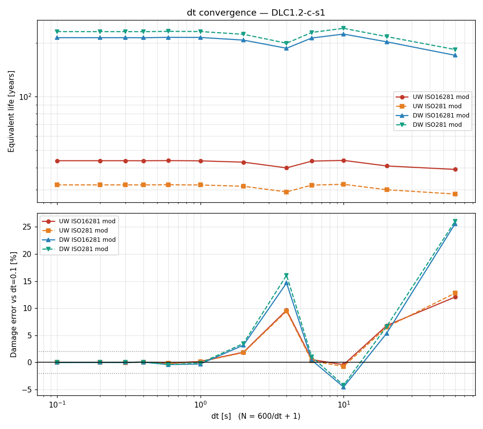
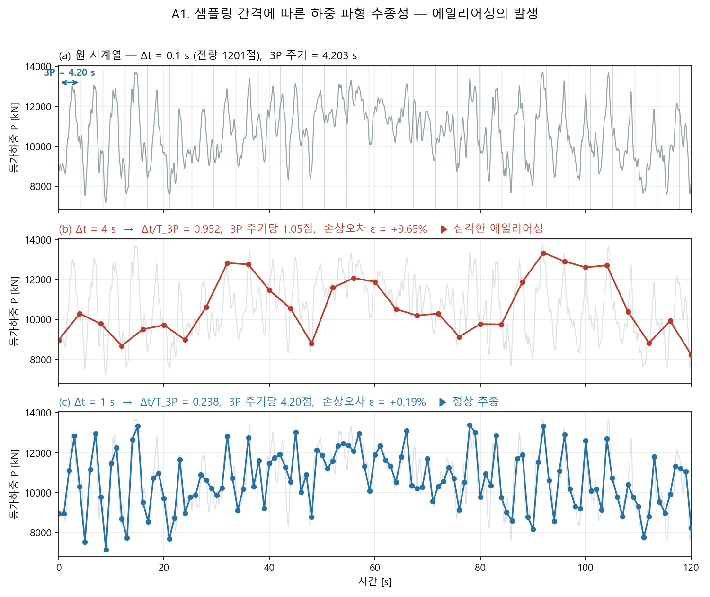

# DLC 기반 메인베어링 피로해석 프로세스

> 26MW 메인베어링에 대해 GH Bladed 시계열 하중(DLC)을 MASTA에 시간지점별로 입력·해석하여
> 베어링 수명/응력/안전율을 시계열로 산출하는 자동화 절차 정리.
> 본 문서는 실제 구현·검증(2026-07-20)으로 확인된 내용만 기록한다.

---

## 1. 개요

| 항목 | 내용 |
|------|------|
| 목적 | DLC 시계열(6001점)의 각 시간지점 하중을 MASTA 메인베어링 모델에 입력하고 System Deflection 해석을 수행하여, 점별 베어링 수명(L10)·응력·안전율을 추출 |
| 대상 모델 | `26MW_메인베어링_기본설계_v1.3_..._피로하중 반영_260720.Masta` |
| 대상 베어링 | `Main Bearing_UW`, `Main Bearing_DW` (테이퍼롤러) |
| 입력 하중 | GH Bladed 시계열 `.$150` (예: `DLC1.2-c-s1.$150`) |
| 핵심 방식 | **1점씩** 로드케이스 값만 갱신→해석→결과 추출→CSV 1행 기록 (메모리 안전, 재시작 가능) |
| 구현 | `masta_fatigue.py` (+ `masta_clr_legacy.py`) |
| 산출물 | `fatigue_<DLC명>.csv` (점 × 베어링 = 행) |

---

## 2. 실행 환경

- **MASTA 설치**: `C:\Program Files\SMT\MASTA 14.1.1` (폴더명은 `14.1.1`, `14.1` 아님)
- **mastapy**: 설치폴더의 `wheels\mastapy-14.1.1-py3-none-any.whl`을 시스템 파이썬(3.13)에 `pip install`.
- **파이썬 실행**: 한글 출력 깨짐 방지 위해 `PYTHONUTF8=1 python -X utf8 masta_fatigue.py`
- **MASTA GUI**: 해석 실행 시 대상 모델을 GUI에서 **닫아두는 것을 권장**(저장 충돌·메모리 방지). 읽기 자체는 열려 있어도 가능.

### 2.1 HASP 혼합모드 우회 (필수)

외부 파이썬에서 `mastapy.init()` 시 다음 오류가 난다:

```
System.IO.FileLoadException: Mixed mode assembly ... 'v2.0.50727' ...
  at SMT.MastaAPI.UtilityMethods.commonInitialiseApiAccess()
```

- **원인**: HASP 라이선스 래퍼 `haspdnert.dll`이 .NET 2.0(v2.0.50727) 혼합모드라, pythonnet3/clr_loader가 임베딩한 .NET 4.0 CLR에 로드 불가.
- **SMT 공식 해결책(`python.exe.config`의 `useLegacyV2RuntimeActivationPolicy`)은 pythonnet 2.x 시절 것이라 mastapy 14.x(pythonnet3/clr_loader)에서는 무효** — 실제 실측으로 확인(config를 실제 python.exe 옆에 놔도 실패).
- **적용된 해결책**: `import mastapy` **전에** ctypes로 `mscoree`를 직접 호출하여 `ICLRRuntimeInfo::BindAsLegacyV2Runtime()`으로 CLR을 로드 前에 레거시 V2 정책으로 바인딩. → `masta_clr_legacy.py`로 구현. 사용법은 **import 한 줄**:

```python
import masta_clr_legacy   # noqa: F401  ← import mastapy 보다 반드시 먼저
import mastapy
mastapy.init(r"C:\Program Files\SMT\MASTA 14.1.1")
```

---

## 3. 입력 데이터 — GH Bladed 시계열 (`.$150`)

### 3.1 파일 구조

```
[1줄] 원본 경로 (예: f:\WTGS\K26MW-150\...\DLC1.2-c-s1.$150)
[2줄] 열 번호            1  2  3  ...  8
[3줄] 열 이름            'Time from start of output' 'Rotor speed' 'Stationary shaft Mx' ...
[4줄] 단위               s  rpm  kNm  kNm  kNm  kN  kN  kN
[5줄~] 데이터 6001점 (0.1 s 간격, Fortran 지수표기 예: 0.239922E+05)
```

### 3.2 열 정의 (8열, 공백 구분)

| 열 | 이름 | 기호 | 단위 | 물리 의미 |
|----|------|------|------|-----------|
| 1 | Time from start of output | t | s | 시각(0.1 s 간격) |
| 2 | Rotor speed | rpm | rpm | 로터 회전속도 |
| 3 | Stationary shaft Mx | Mx | kNm | 축(로터축) 회전 모멘트 = **토크** |
| 4 | Stationary shaft My | My | kNm | 굽힘 모멘트 |
| 5 | Stationary shaft Mz | Mz | kNm | 굽힘 모멘트 |
| 6 | Stationary shaft Fx | Fx | kN | **축력(thrust)** |
| 7 | Stationary shaft Fy | Fy | kN | 반경 전단력 |
| 8 | Stationary shaft Fz | Fz | kN | 반경 전단력(연직, 로터 무게 성분 포함, 예 ≈ −4,965 kN) |

- 파싱은 5번째 줄부터, 공백 분리 후 float 8개. (`.$150`는 latin-1로 읽으면 안전)

---

## 4. 좌표계 및 하중 변환 ★핵심

### 4.1 두 좌표계

| 축 | 파일(GH Bladed, 정지축) | MASTA (모델) |
|----|------------------------|--------------|
| **X** | 오른쪽(수평, 샤프트 축) | **아래(연직)** |
| **Y** | 왼쪽 | 왼쪽 (파일과 동일 방향) |
| **Z** | **위(연직)** | **오른쪽(샤프트 축)** |
| 중력 | −Z (아래) | +X (아래) |

즉 물리적으로:
- **샤프트(로터) 축** = 파일 **X** = MASTA **Z**
- **연직 위** = 파일 **+Z** = MASTA **−X** (MASTA X는 아래를 향함)
- **좌우(횡)** = 파일 **Y** = MASTA **Y** (동일)

두 좌표계 모두 우수좌표계이며, 위 대응은 순수 회전(det=+1)이다.

### 4.2 하중 변환식 (부호 포함, 확정)

MASTA Point Load 입력(성분별 스칼라)에 다음과 같이 대입한다. **단위 kN→N, kNm→Nm 이므로 ×1000.**

| MASTA 입력 | ← 파일 컬럼 | 부호 | 단위변환 |
|------------|-----------|------|---------|
| `force_x`  (X, 아래) | Fz | **−** | ×1000 → N |
| `force_y`  (Y) | Fy | **+** | ×1000 → N |
| `axial_load` (Z, 축) | Fx | **+** | ×1000 → N |
| `moment_x` (X) | Mz | **−** | ×1000 → Nm |
| `moment_y` (Y) | My | **+** | ×1000 → Nm |
| `moment_z` (Z, 축토크) | **Mx** | **+** | ×1000 → Nm, **Input Power Load 토크로 인가**(§6). point load `moment_z`는 torsionally free라 무효 |

```python
# Point Load 5성분 (반경·축·굽힘)
force_x    = -Fz * 1000.0   # N
force_y    =  Fy * 1000.0   # N
axial_load =  Fx * 1000.0   # N
moment_x   = -Mz * 1000.0   # Nm
moment_y   =  My * 1000.0   # Nm
# 6번째 성분(축토크)은 point load가 아니라 Input Power Load 토크로 인가 (§6):
ipl_torque =  Mx * 1000.0   # Nm  (파일 Mx = MASTA Mz, 동일 부호)
```

### 4.3 하중 6분력 인가 방식 (point load 5 + power load 토크 1)

- MASTA 메인베어링 모델의 샤프트는 **`is_torsionally_free = True`** → point load의 축(Z) 회전 모멘트(`moment_z`)는 무효(invalid).
- 따라서 파일 6분력 중 **5개(Fx, Fy, Fz, My, Mz)는 Point Load**에, **축토크(파일 Mx = MASTA Mz)는 Input Power Load 토크**에 인가 → **6분력 전부 반영**.
- 축토크는 베어링 반경/축 하중엔 거의 기여 안 하나, **샤프트 비틀림 응력**을 만들어 **샤프트 DIN743 피로(§9)**에 필요하므로 Power Load 토크로 반영.

### 4.4 변환식 3중 교차검증 (확정 근거)

1. **좌표 기하**: 4.1의 축 대응(순수 회전)으로 직접 유도.
2. **물리 부호**:
   - 파일 Fz ≈ −4,965 kN(로터 무게, 아래) → `force_x = −Fz = +4,965 kN`, MASTA X=아래 → **하향 하중=무게** ✓
   - 파일 Fx = +3,017 kN(thrust) → `axial = +3,017 kN`, MASTA Z=풍하 축 → **축방향 추력** ✓
3. **기존 16개 극한 로드케이스 성분값과 완전 일치**:
   - `Fz_max` → force_x 최소(2,299 kN), `Fz_min` → force_x 최대(7,591 kN) ⇒ `force_x = −Fz` ✓
   - `Fy_max` → force_y = +2,579 kN, `Fy_min` → −2,538 kN ⇒ `force_y = +Fy` ✓
   - `Mz_max` → moment_x = −185,249, `Mz_min` → +183,500 ⇒ `moment_x = −Mz` ✓
   - `My_max` → moment_y = +139,746, `My_min` → −190,493 ⇒ `moment_y = +My` ✓

---

## 5. 단위 정리 ★재검토 확정

> **핵심: mastapy API는 GUI 표시단위가 아니라 SI(N, Nm)를 쓴다.**
> MASTA **GUI**는 힘=kN, 모멘트=Nm로 (비대칭) 표시/입력하지만, **API `.force`/`.moment` 값은 SI**다.
> 이 비대칭은 API로 전파되지 않으므로, 파일(kN, kNm) → API 변환은 **힘·모멘트 모두 ×1000**이다.

| 물리량 | 파일 | GUI 표시 | **API 입력(.force/.moment)** | 파일→API | GUI↔API |
|--------|------|----------|------------------------------|----------|---------|
| 힘 | kN | kN | **N** | ×1000 | API = GUI × 1000 |
| 모멘트 | kNm | Nm | **Nm** | ×1000 | API = GUI (동일) |
| **토크**(축, 파일 Mx) | kNm | Nm | **Nm** (Power Load `.torque`) | ×1000 | §6 |
| 회전속도 | rpm | rpm | **rad/s** | ×(2π/60) | §6 |
| 시각 | s | — | — | 기록용 | — |
| 응력(출력) | — | MPa 등 | **Pa** | 결과값 | — |
| 수명(출력) | — | — | cycles / **hours** | 결과값 | — |

**단위 확정 근거 (실측 readback, 물리적 유일해)**

| 케이스 | `force_x` raw | `moment_x` raw | 해석 |
|--------|--------------:|---------------:|------|
| Mx_max | 6,975,400 | −51,424,000 | N이면 6,975 kN·−51,424 kNm(타당) / kN·kNm이면 GN급(불가능) |
| Load Case 1 | 100,000 | 0 | 100 kN 플레이스홀더(N일 때만 타당) |

- **GUI 교차검증값**: GUI에서 `Load Case 1` Force X = **100 kN**, `Mx_max` Force X ≈ **6,975.4 kN** / Moment X = **−51,424,000 Nm** 로 보이면 일치.
- 파일럿 물리 타당성(접촉응력 1.3 GPa, P≈9,000 kN, s0≈10)도 힘이 N로 올바르게 입력됐음을 뒷받침.

---

## 6. 회전속도·토크 입력 (Input Power Load)

- v1.3 모델에는 **Power Load 2개**(`Input Power Load`, `Output Power Load`)가 있음.
- **속도(rad/s)와 토크(Nm)를 함께 Input Power Load에 입력** (실측: speed·torque 공존 가능, `torque_input_method=CONSTANT_TORQUE`, Output PL 별도설정 불필요):

```python
ipl = next(p for p in assembly.all_parts_of_type_power_load()
           if "input" in str(p).lower())
pll = lc.inputs_for_power_load(ipl)     # PowerLoadLoadCase
pll.speed  = rpm * (2*pi/60)            # rad/s   (베어링 수명·윤활)
pll.torque = Mx * 1000.0               # Nm      (파일 Mx=MASTA Mz, 샤프트 비틀림→DIN743)
```

- **속도 단위 = rad/s 확정**: 5.092 rpm 입력 시 `inner_ring_angular_velocity`가 정확히 **0.53320 rad/s**로 되읽힘.
- **속도>0** 필수(속도=0이면 `*_time=inf`, aISO 바닥값).
- **토크 = 파일 Mx×1000 [Nm]** (부호 그대로). 베어링 하중엔 거의 무관하나 **샤프트 비틀림 응력**을 만들어 **DIN743 피로안전율(§9)** 산출에 필수.

---

## 7. 모델 전제조건 (v1.3에서 확인)

피로 자동화를 위해 모델은 다음을 갖추어야 한다(v1.3에 반영됨, v1.2엔 없음):

- **Power Load 2개** (`Input/Output Power Load`) — 속도 입력용.
- **`Fatigue load case` design state** 안에 static 로드케이스 **`Load Case 1`** — 반복해석 드라이버.
- Point Load 1개 (하중 적용점), 베어링 2개.
- Point Load ForceSpecification = `FORCE_X_FORCE_Y` (Cartesian 성분 입력 모드).

> 참고: v1.3에는 TimeSeriesLoadCaseGroup 골격도 있으나, 본 절차는 **MASTA 네이티브 시계열 대신 정적 로드케이스 1점씩 반복**(메모리 안전) 방식을 사용한다.

---

## 8. 해석 절차 (점별 반복 루프)

각 시간지점 i에 대해:

```
(1) 파일 i행 파싱 → (t, rpm, Mx,My,Mz,Fx,Fy,Fz)  [kN, kNm]
(2) §4.2 변환 → Point Load 5성분 세팅
        pli = lc.inputs_for_point_load(point_load)
        pli.force_x.force   = -Fz*1000 ;  pli.force_y.force = Fy*1000
        pli.axial_load.force =  Fx*1000
        pli.moment_x.moment = -Mz*1000 ;  pli.moment_y.moment = My*1000
(3) 속도·토크 세팅  pll = lc.inputs_for_power_load(ipl)
        pll.speed  = rpm*2π/60   (rad/s)
        pll.torque = Mx*1000     (Nm, 축토크=MASTA Mz → 샤프트 비틀림)
(4) 해석      sd = lc.analysis_of(AnalysisType.SYSTEM_DEFLECTION)
              sd.perform_analysis()
(5) 베어링별 결과 추출 (§9.1)
              res    = sd.results_for(bearing)          # BearingSystemDeflection
              detail = res.component_detailed_analysis  # LoadedTaperRollerBearingResults
(5b) 샤프트 DIN743 피로 SF 추출
              sres = sd.results_for(shaft)              # ShaftSystemDeflection
              SF_inf = min(섹션별 피로 무한수명 SF)     # + 위치 offset
(6) CSV 1행 기록 + flush   → 다음 i
```

- 모델은 **1회만 로드**하고 값만 갱신하므로 메모리 누적 없음.
- 해석·저장은 인메모리이며 **.Masta 파일은 저장하지 않음**(읽기 전용 워크플로).

---

## 9. 출력 (CSV 열 정의)

출력은 **2개 파일**: 점별 **데이터 시트** + 베어링별 **요약 시트**. (UTF-8-BOM, 엑셀 한글 호환)

### 9.1 데이터 시트 `fatigue_<DLC명>.csv` (행 = 시간지점 × 베어링)

| 열 | 의미 | 소스/계산 |
|----|------|-----------|
| `index` | 시간지점 인덱스(0~6000) | — |
| `t_s` | 시각(s) | 파일 |
| `rpm` | 로터 속도(rpm) | 파일 |
| `rev` | **점당 회전수** = (rpm/60)×Δt | Δt=0.1s |
| `force_x_N` | MASTA 입력 X힘(N) = −Fz×1000 | §4.2 |
| `force_y_N` | MASTA 입력 Y힘(N) = +Fy×1000 | §4.2 |
| `axial_load_N` | MASTA 입력 축력(N) = +Fx×1000 | §4.2 |
| `moment_x_Nm` | MASTA 입력 X모멘트(Nm) = −Mz×1000 | §4.2 |
| `moment_y_Nm` | MASTA 입력 Y모멘트(Nm) = +My×1000 | §4.2 |
| `Moment_z_Nm` | **축토크(Nm) = +Mx×1000** (Input Power Load 토크로 인가) | §4.2·§6 |
| `bearing` | 베어링명 | — |
| `stress_inner_MPa` | 내륜 최대 접촉응력(MPa) | `maximum_normal_stress_inner` ÷1e6 |
| `stress_outer_MPa` | 외륜 최대 접촉응력(MPa) | `maximum_normal_stress_outer` ÷1e6 |
| `s0_static` | 정적안전율 s0 | `iso762006.safety_factor` |
| `L10_basic_rev` | 기본 L10(Rev) | `iso2812007.basic_rating_life_cycles` |
| `L10m_mod_rev` | 수정 L10m(Rev) | `iso2812007.modified_rating_life_cycles` |
| `L10r_rev` | ISO16281 기준 L10r(Rev) | `isots162812008.basic_reference_rating_life_cycles` |
| `L10mr_rev` | ISO16281 수정 L10mr(Rev) | `isots162812008.modified_reference_rating_life_cycles` |
| `dmg_ISO281_basic` | 점별손상 = rev / L10_basic_rev | §10 |
| `dmg_ISO281_mod` | 점별손상 = rev / L10m_mod_rev | §10 |
| `dmg_ISO16281_basic` | 점별손상 = rev / L10r_rev | §10 |
| `dmg_ISO16281_mod` | 점별손상 = rev / L10mr_rev | §10 |
| `shaft_DIN743_SF_inf` | **샤프트 DIN743:2012-12 무한수명 피로안전율**(섹션 최소) | `results_for(shaft)` |
| `shaft_SF_offset_m` | 위 최소 SF 위치(축좌표 m) | worst 섹션 offset |

- (참고) 샤프트 결과는 **점당 1값**(베어링과 무관)이라 UW/DW 두 행에 동일 기록.

### 9.2 요약 시트 `fatigue_<DLC명>_summary.csv`

**(a) 베어링 손상** (롱 포맷, 행 = 베어링 × 표준 × 수명기준 = 8행)

| 열 | 의미 |
|----|------|
| `bearing` | 베어링명 |
| `standard` | ISO281 / ISO16281 |
| `life_basis` | basic / modified |
| `sample_damage` | 표본(전체 6001점=600s) 손상 = Σ 점별손상 |
| `scale_factor` | FatigueHours의 Detail Scale Factor (30년 반복횟수) |
| `damage_30yr` | 30년 손상 = sample_damage × scale_factor |
| `SF_fatigue` | 피로안전율 = 1 / damage_30yr |
| `equiv_life_years` | 등가수명 = 30 / damage_30yr |

**(b) 샤프트 임계점** (전 시간지점 중 DIN743 피로 SF 최소인 지점)

| 열 | 의미 |
|----|------|
| `min_shaft_DIN743_SF_inf` | 전 점 최소 샤프트 피로 무한수명 SF |
| `crit_index`, `crit_t_s`, `crit_rpm` | 임계 시점 인덱스·시각·속도 |
| `crit_force_x_N … crit_Moment_z_Nm` | 임계 시점 **6-DOF 하중**(force_x/y·axial·moment_x/y/z) |
| `crit_shaft_SF_offset_m` | 임계 SF 위치 |

> **주의**: `damage_30yr` 등은 scale_factor가 **전체 600s 표본**을 가정하므로, **반드시 6001점 전량 처리** 시에만 유효(부분 처리 시 과소). 또한 이 요약은 **1개 DLC**분 → 최종 베어링 수명은 §10처럼 **111개 DLC 합산** 필요.

---

## 10. 피로 손상 계산 프로세스 (방식 A: MASTA=L10만, 외부 Miner + 발생빈도)

> MASTA는 각 시간지점의 **순간 L10(지속시간과 무관한 수명)** 만 산출한다.
> 실제 피로 수명은 여기에 **각 점의 회전수(시간)** 와 **DLC 발생빈도**를 곱해
> Miner 선형누적으로 **베어링별 총손상**을 계산해야 완성된다. (배치 구현은 이후 단계)

### 10.1 발생빈도 데이터 — `FatigueHours.txt`

위치: `02. 자료\260714 유니슨 피로하중\FatigueHours.txt` (탭 구분, 헤더 1줄 + DLC별 111행)

| 열 | 의미 | 예: DLC1.2-c-s1 |
|----|------|-----------------|
| `DLC` | 케이스명(파일명과 대응) | DLC1.2-c-s1 |
| `Detail Scale Factor` | **600s 표본이 30년간 반복되는 횟수** ≈ T₃₀yr / T_sample | 4.504E+04 (=45,040) |
| `30 year Hours` | 30년 수명 중 이 DLC 누적 운전시간(h) | 7,505.50 |
| `1 year Hours` | 연간 운전시간(h) | 250.18 |

- **파싱 주의**: 숫자 표기가 `4.504.E+04`처럼 **점이 하나 더** 있음 → `.E` → `E` 치환 후 float 변환.
- **검증**: 7,505.5 h × 3600 = 2.70×10⁷ s ÷ 600 s(표본) ≈ 4.50×10⁴ = Scale Factor → Scale Factor = 30년 반복횟수로 확인.

### 10.2 손상 계산 절차 (베어링별)

전제: `masta_fatigue.py` 출력 CSV(점별 `L10_basic_cycles`/`L10m_mod_cycles`, `rpm`).

```
1) 점별 회전수      nᵢ = (rpmᵢ / 60) × Δt        [rev]   ,  Δt = 0.1 s (파일 간격)
2) 점별 손상        ΔDᵢ = nᵢ / L10_cyclesᵢ                (기본)  또는  nᵢ / L10m_cyclesᵢ (수정)
3) 표본(600s 1회) 손상   D_sample = Σᵢ ΔDᵢ
4) 30년 손상(해당 DLC)   D_DLC = D_sample × ScaleFactor_DLC
                          (동치)  = (T₃₀yr,DLC / T_sample) × Σᵢ(Δtᵢ / L10_timeᵢ)
5) 전 DLC 합산           D_total = Σ_(모든 DLC) D_DLC          ← 베어링별
6) 판정
      D_total ≤ 1                → 30년 수명 만족
      피로 안전율  SF = 1 / D_total
      등가 설계수명 = 30년 / D_total
```

- **베어링별로 독립 계산**(Main Bearing_UW / DW 각각).
- **기본(L10) vs 수정(L10m)**: 수정수명은 aISO(윤활·신뢰도) 반영 → 통상 **L10m 기준 권장**. 두 값 모두 산출·병기.

### 10.3 산출물(권장 형식)

- **DLC별 표**: 베어링 × {`D_sample`, `ScaleFactor`, `D_DLC_basic`, `D_DLC_mod`}
- **종합 표**: 베어링 × {`D_total_basic`, `D_total_mod`, `SF_fatigue`, `등가수명(년)`}

### 10.4 주의

- **L10은 순간조건 수명(지속시간 무관)** → 반드시 회전수 nᵢ·발생빈도로 가중해야 "피로"가 됨. L10 자체를 수명으로 오해 금지.
- **모든 DLC 처리 필요**: `FatigueHours.txt`의 **111개 DLC(a~j × s1~s6 등) 전부**를 해석·합산해야 D_total 완결. 현재는 `DLC1.2-c-s1` 1개만 해석됨.
- Miner **선형누적** 가정. Scale Factor의 정확한 정의(반복횟수 vs 하중스케일)는 발주 규격과 대조 권장.
- 좌표·단위(§4·§5) 확정 전제.

---

## 11. 체크포인트 / 재시작

- 각 행에 `index`를 기록하고, 실행 시 기존 CSV의 완료 `index`를 읽어 **자동 스킵**.
- 6001점 전량은 약 30~40분(실측 점당 ~0.3s) 소요, 중단되어도 같은 명령으로 이어서 실행 가능.
- 출력 CSV는 append 모드(`utf-8-sig`). **실행 중 해당 CSV를 엑셀 등에서 열어두면 쓰기 거부(PermissionError)** → 닫아둘 것.

---

## 12. 실행 방법

```bash
# masta_fatigue.py 상단 CONFIG 확인:
#   MODEL_PATH  = ...v1.3_피로하중 반영...Masta
#   DLC_FILE    = ...\260714 유니슨 피로하중\DLC1.2-c-s1.$150
#   DRIVER_LC   = "Load Case 1"
#   POINT_SELECT= None            # 전량 6001점 (파일럿은 리스트/튜플로 부분지정)
cd "Main bearing/01. 정리/Python 자동화"
PYTHONUTF8=1 PYTHONIOENCODING=utf-8 python -X utf8 masta_fatigue.py
```

- 다른 DLC 파일 처리: `DLC_FILE`만 교체(출력 CSV는 파일명 기반 자동 명명).

---

## 13. 주의사항 / 한계

1. **속도 필수**: 속도 미입력(=0) 시 `*_time = inf`, aISO 바닥값 → 반드시 Input Power Load에 rad/s로 입력.
2. **축토크(파일 Mx=MASTA Mz)**: point load `moment_z`는 torsionally free라 무효 → **Input Power Load 토크로 인가**(§6). 베어링 하중엔 거의 무관하나 **샤프트 DIN743 피로**(§9)에 필요.
3. **부호·축 매핑은 이 모델(v1.3)의 좌표계 기준**. 모델/좌표계가 바뀌면 §4를 재검증할 것.
4. **손상 누적(Miner)은 방식 A로 §10에 정의**: MASTA는 점별 L10만 산출하고, 회전수·발생빈도(`FatigueHours.txt`) 가중 합산으로 베어링별 총손상을 외부에서 계산. (배치 구현은 이후 단계)
5. **극한 vs 피로 구분**: 기존 16개 static 케이스는 극한(ULS) 설계하중이며 본 피로 시계열과 별개 데이터.
6. **성능**: 점당 System Deflection 1회. **실측 점당 ~0.28s(워밍업 후)** → 6001점 ≈ **30~40분**. 체크포인트로 중단 대비.
7. **FE 샤프트 모델은 DIN743 미산출(알려진 제약)**: 샤프트가 FE 서브스트럭처로 대체된 모델(`is_replaced_by_fe=True`, 예 `…_유연체_FE_260721.Masta`)은 **해석적 단면 레이팅이 없어**(`shaft_section_results` invalid, `safety_factors` 0개) `shaft_DIN743_SF_inf`가 **공란**이고 요약의 샤프트 임계점도 비어 있음. **베어링 수명·손상은 정상 산출**되며 코드는 오류 없이 진행. 샤프트 DIN743 평가가 필요하면 **비-FE 모델**(`…_피로하중 반영_260720` 또는 `…_유연체_260720`) 사용.

---

## 부록 A. 파일럿 검증 결과 (DLC1.2-c-s1, 9점 표본)

| index | t(s) | rpm | bearing_speed(rad/s) | L10h(UW) | s0(UW) |
|------:|-----:|----:|---------------------:|---------:|-------:|
| 0 | 0.0 | 5.092 | 0.53320 | 2.41e8 | 10.26 |
| 3000 | 300.0 | 5.245 | 0.54927 | 5.13e7 | 6.51 |
| 6000 | 600.0 | 5.145 | 0.53874 | 1.06e8 | 8.05 |

- `bearing_speed` 되읽기 = rpm×2π/60 정확히 일치 → **속도 단위 rad/s 확정**.
- L10h가 하중 변동에 따라 변동(유한값) → 좌표변환·속도입력 정상.

## 부록 B. 관련 파일

| 파일 | 역할 |
|------|------|
| `masta_clr_legacy.py` | CLR Legacy V2 선기동(HASP 우회) 헬퍼 |
| `masta_fatigue.py` | 피로 시계열 반복해석 본체 |
| `masta_inspect*.py` | 구조·API 탐색(개발용) |
| `masta_batch.py` | 16 극한 로드케이스 일괄 추출(참고) |
| `masta_study_C1.py` | 부록 C-1/C-2 데미지 방법 비교 스터디(A/B/C) |
| `masta_statics_check.py` | 부록 C-3.6 강체 정역학 예측 vs MASTA 대조 |
| `masta_bearing_const.py` | 카탈로그 상수(C·C_u·e·d_m) 추출 |
| `masta_mechanism.py` | C-2.1 B>A 메커니즘 지표(L10r/L10·접촉요소·미스얼라인) 추출 |
| `masta_study_flex.py` | 부록 D 유연체 모델 A/B/C 전량 스터디 |
| `masta_flex_check.py` | 부록 D 유연체 샤프트 E·미스얼라인·수명비 검증 |
| `make_xlsx.py` | 데이터·요약 CSV → 단일 .xlsx(2시트) 변환 |

---

## 부록 C. 데미지 계산 방법 비교 스터디

### C-1. 데미지 계산 방법 비교 — ISO 16281 per-step vs ISO 281 per-step vs ISO 281 등가하중(LRD)

**목적**: 5자유도 시계열 하중의 베어링 피로손상을 세 방법으로 계산해 **결과·계산시간**을 정량 비교.

**조건**: DLC1.2-c-s1, **100점 표본**, 수정수명 기준, p=10/3(롤러), 회전수가중, v1.3 모델(윤활 Mobilith SHC 460). 점당 회전수 nᵢ=(rpmᵢ/60)×0.1s, N=Σnᵢ.

| 방법 | 정의 | 손상 D |
|------|------|--------|
| **A** | MASTA ISO/TS 16281 per-step (내부 하중분포·수정) | Σ nᵢ / L10mr,ᵢ |
| **B** | MASTA ISO 281 per-step (등가하중 P·수정) | Σ nᵢ / L10m,ᵢ |
| **C** | ISO 281 등가하중(LRD): Pᵢ → P_eq=[Σnᵢ·Pᵢ^p/N]^(1/p) → (C/P_eq)^p×10⁶ → ×ā_ISO | N / L10m_C |

- C의 동적정격 C는 MASTA 관계 L10=(C/P)^p 로 역산 → **22,228 kN**(리포트값 22,227.98 kN과 일치, 자기일관성 ✓). ā_ISO=회전수가중 평균.

#### 방법별 데미지 계산 알고리즘 (개조식)

기호: i = 시간지점(0…M, M=6000), p = 10/3(롤러), Δt = 0.1 s

**[공통 전처리] — 세 방법 모두 점별 MASTA 해석 결과를 사용**
1. 입력: DLC 시계열 각 점 (t_i, rpm_i, 5-DOF 하중 Fx,Fy,Fz,My,Mz)
2. 각 점 i 마다:
   - (a) 5-DOF 하중 → Point Load 세팅(§4.2), 속도 rpm_i → Input Power Load(§6)
   - (b) **System Deflection 해석 1회**(§8)
   - (c) 베어링별 결과 추출:
     - `L10m_i` = ISO281 수정수명 (`iso2812007.modified_rating_life_cycles`) [Rev]
     - `L10mr_i` = ISO16281 수정 기준수명 (`isots162812008.modified_reference_rating_life_cycles`) [Rev]
     - `P_i` = ISO281 동등가하중 (`iso2812007.dynamic_equivalent_load`) [N]
     - `aISO_i` = 수명수정계수 (`...life_modification_factor_for_systems_approach`)
     - `L10b_i` = ISO281 기본수명 (`iso2812007.basic_rating_life_cycles`) [Rev]  ← 방법 C의 C 역산용
   - (d) 점당 회전수: **n_i = (rpm_i / 60) × Δt** [Rev]
3. 전체 회전수: **N = Σ_i n_i**

**[방법 A] ISO/TS 16281 per-step + Miner**
1. 점별 손상:  ΔD_Aᵢ = n_i / **L10mr_i**
2. 표본 손상:  **D_A = Σ_i ΔD_Aᵢ**
3. 등가 L10 수명 = N / D_A ,  (30년 손상 = D_A × ScaleFactor)
- 성격: 점마다 롤러 **내부 하중분포·엣지응력·미스얼라인** 반영된 L10mr 사용(가장 상세).

**[방법 B] ISO 281 per-step + Miner**
1. 점별 손상:  ΔD_Bᵢ = n_i / **L10m_i**
2. 표본 손상:  **D_B = Σ_i ΔD_Bᵢ**
3. 등가 L10 수명 = N / D_B ,  (30년 손상 = D_B × ScaleFactor)
- 성격: 점마다 ISO281 **등가하중 P 기반** 수정수명 사용. A와 **동일 solve**, 추출 필드만 다름.

**[방법 C] ISO 281 등가하중(LRD) 단일 손상**
1. 동적정격 역산:  C_i = P_i × (L10b_i / 10⁶)^(1/p) ,  **C = mean_i(C_i)**
2. 회전수가중 등가하중:  **P_eq = [ Σ_i (n_i · P_iᵖ) / N ]^(1/p)**   ← LRD(하중-회전수 분포)의 p제곱평균
3. 회전수가중 평균 윤활계수:  **ā_ISO = Σ_i (n_i · aISO_i) / N**
4. 등가하중의 기본수명:  L10_basic(P_eq) = (C / P_eq)ᵖ × 10⁶  [Rev]
5. 등가하중의 수정수명:  **L10m_C = ā_ISO × L10_basic(P_eq)**
6. 단일 손상:  **D_C = N / L10m_C**
7. 등가 L10 수명 = N / D_C ( = L10m_C ) ,  (30년 손상 = D_C × ScaleFactor)
- 성격: 시계열을 **단일 등가하중 1점으로 축약(LRD)** → 점별 손상 합산 대신 1회 수명계산.

**[방법 간 차이 요약]**
- **A vs B**: 알고리즘 동일, **수명만 상이**(L10mr↔L10m) → 표준 차이(16281 내부분포 vs 281 등가하중).
- **B vs C**: B는 **점별 손상 합산**, C는 **등가하중 축약**. 기본수명이면 대수적으로 **D_B ≡ D_C**(∵ N·P_eqᵖ = Σn_i·P_iᵖ). 수정수명(aISO)이면 점별 aISO_i ↔ 평균 ā_ISO 상관차로 **상이**.

#### ① 계산시간 (100점 실측)

| 구간 | 시간 |
|------|------|
| 모델 로드+init | 9.9 s (1회) |
| MASTA solve 워밍업(1점) | 4.7 s |
| **MASTA solve 점당(정상)** | **280 ms** (×100 = 28 s) — **지배적** |
| 손상 집계 A / B | 26 / 25 µs |
| 손상 집계 C (P_eq 포함) | ~100 µs |

→ **세 방법 모두 점별 MASTA solve(280ms/점)를 공유**, 손상 집계는 µs급 무시가능. **계산시간은 사실상 방법 무관**(≈점수×0.28s). 등가하중법(C)도 Pᵢ를 per-step MASTA에서 얻어 **시간 절감 없음** — 절감하려면 per-step MASTA 회피(예: 강체 정역학으로 Fr/Fa 산출)가 필요하며 정확도 트레이드오프.

#### ② 손상 비교 — **방법 A(ISO16281) 기준 % 정규화** (100점 표본)

기준 = 방법 A(ISO16281 per-step) 표본손상 = **100%**. B·C는 A 대비 상대값.

| 베어링 | 방법 | 표본손상 D | **D / D_A** | 편차 | 등가 L10 (Rev) |
|--------|------|-----------:|------------:|-----:|---------------:|
| **UW** | **A** ISO16281 (기준) | 1.697e-7 | **100.0%** | — | 4.94e6 |
| UW | B ISO281 | 2.424e-7 | **142.9%** | **+42.9%** | 3.46e6 |
| UW | C 등가하중(LRD) | 2.328e-7 | **137.2%** | **+37.2%** | 3.60e6 |
| **DW** | **A** ISO16281 (기준) | 2.943e-8 | **100.0%** | — | 2.85e7 |
| DW | B ISO281 | 2.582e-8 | **87.8%** | **−12.2%** | 3.25e7 |
| DW | C 등가하중(LRD) | 2.136e-8 | **72.6%** | **−27.4%** | 3.93e7 |

- 방법 C 파라미터: UW P_eq=10,515 kN·ā_ISO=0.297 / DW P_eq=5,807 kN·ā_ISO=0.448.
- 손상↑ = 수명↓ (등가 L10은 손상의 역수). 편차 부호(+)=A보다 손상 큼(보수적).

#### ③ 정량 분석 / 해석 (A 기준)

- **A → B (표준 차이, ISO281)**: **UW +42.9% / DW −12.2%** — 방향이 **베어링마다 뒤바뀜**. UW는 ISO281이 더 보수적, DW는 ISO16281이 더 보수적. ISO16281의 내부 하중분포·엣지응력·미스얼라인 반영이 하중상태(UW 고반경하중 vs DW)에 따라 다르게 작용 → **표준 선택이 단조롭지 않으며 베어링별 검토 필요**.
- **A → C (등가하중법)**: **UW +37.2% / DW −27.4%**.
- **B → C (등가하중 단순화)**: C가 B보다 낮음(A기준 UW 137.2 vs 142.9%, DW 72.6 vs 87.8%) → 등가하중 단순화는 손상 **과소평가(비보수) 경향**. 수정수명의 점별 aISO와 평균 aISO 상관차에서 발생(기본수명이면 B≡C 항등).
- **계산시간**: 세 방법 동일(점별 MASTA 지배). **방법 선택은 정확도·보수성 문제이지 속도 문제가 아님**.

#### ④ 한계
- **100점 표본**: 방법 간 비교(비율)는 유효하나 절대 30년손상은 6001점 전량 필요. DLC 1개.
- Miner 선형누적, p=10/3, C의 aISO=회전수가중 평균 가정.
- 방향성(A↔B 역전)은 이 모델·이 DLC 기준 — 다른 DLC/모델에서 재확인 권장.

---

### C-2. A/B/C 방법 전량(6001점) 결과 — DLC1.2-c-s1

**조건**: 6001점 전량(600s 온전 표본), 수정수명, ScaleFactor=45,040(30년), v1.3(Mobilith SHC 460).
**계산시간**: 모델로드 10.4s + 점당 289 ms × 6001 = **약 29분**(집계 A/B ~2ms, C ~8ms 무시). *이 실행은 강체정역학 대조(2nd 세션)와 **동시 실행**됐으나 점당 289ms로 단독(280ms)과 유사 → 병렬 간섭 미미.*

| 베어링 | 방법 | 표본손상 D | 등가L10(Rev) | **30년손상** | **피로SF** | **등가수명(yr)** | D/D_A |
|--------|------|-----------:|-------------:|-------------:|-----------:|-----------------:|------:|
| **UW** | A ISO16281 | 1.516e-5 | 3.14e6 | **0.683** | **1.5** | **43.9** | 100% |
| UW | B ISO281 | 2.104e-5 | 2.26e6 | 0.948 | 1.1 | 31.7 | 138.8% |
| UW | C 등가하중 | 2.063e-5 | 2.31e6 | 0.929 | 1.1 | 32.3 | 136.1% |
| **DW** | A ISO16281 | 3.027e-6 | 1.57e7 | **0.136** | **7.3** | **220** | 100% |
| DW | B ISO281 | 2.884e-6 | 1.65e7 | 0.130 | 7.7 | 231 | 95.3% |
| DW | C 등가하중 | 2.633e-6 | 1.81e7 | 0.119 | 8.4 | 253 | 87.0% |

- C 파라미터: UW P_eq=11,601 kN·ā_ISO=0.264 / DW P_eq=6,846 kN·ā_ISO=0.357.

**해석 (전량 확정)**
- **UW가 임계 베어링**: 30년손상 0.68~0.95(1.0 근접), 등가수명 32~44년. **이 DLC(c-s1) 1개만으로 30년 설계수명에 근접** → 111 DLC 합산 시 초과 우려. DW는 손상 0.12~0.14·SF 7~8로 여유 큼.
- **표준 선택이 임계 판정을 바꿈**: UW를 A(16281)로 보면 SF 1.5, B/C(281)로 보면 SF 1.1. 방향은 100점과 동일(UW B/C>A, DW B/C<A).
- **B vs C**: 전량서도 C가 B보다 소폭 낮음(UW 98%, DW 91%) → 등가하중 단순화 비보수 경향 유지.
- (100점 표본 대비 비율 거의 동일: UW B/A 138.8 vs 142.9%, DW 95.3 vs 87.8% — 표본 크기 영향 작음.)

#### C-2.1 B > A 메커니즘 분석 (직관과 반대인 이유)

**의문**: 일반적으로 A(ISO16281)는 모멘트·내부분포를 고려하므로 B(ISO281)보다 손상이 클 것으로 예상. 그러나 **UW에서 B>A**(B가 +38.8% 손상 큼). 왜?

**직접 원인 — 수명(L10)이 뒤집힘** (손상 D=회전수/L10, A는 L10mr·B는 L10m 사용)

| 베어링 | 접촉요소 | 미스얼라인(rad) | L10r/L10(기본) | L10mr/L10m(수정) |
|--------|--------:|---------------:|---------------:|-----------------:|
| **UW** | **87** | 7.7e-5 | **1.542** (16281 수명↑) | 1.403 |
| DW | 34 | 7.7e-5 | 0.937 | 0.669 |

→ UW는 **16281 수명이 281보다 54% 길다** → A 손상<B → **B>A**. DW는 반대.

**메커니즘 (3가지)**
1. **하중영역(로딩 롤러 수) — 주 원인**: UW 접촉요소 87 vs DW 34 (2.5배). UW는 축+반경 고하중 → **거의 전 둘레 로딩**. ISO281 정격 C는 명목 하중분포(Stribeck) 가정, ISO16281은 실제 하중영역 적분 → 넓은 영역서 롤러가 하중을 잘 분담 → **16281 유효정격 C_ref≈26,800 kN(카탈로그 22,228 대비 +20%)** → L10r/L10=1.54의 원천.
2. **롤러 프로파일 — 조력**: `line_contact_equiv`(1.130e7)→`reference_load`(9.51e6), 프로파일이 유효하중 **16%↓** → 압력 균일화 → 16281 유리.
3. **모멘트 페널티가 발현 안 됨 — 핵심**: **미스얼라인 7.7e-5 rad(0.004°)로 극소**. **강체 샤프트**(실측 확인: 샤프트 재질=`Rigid Material 1`, `override_default_shaft_material=True`, **E=2.07×10¹⁵ Pa ≈ 강재의 10,000배** → 굽힘변형 1/10⁴, 사실상 강체)라 hub 모멘트가 베어링을 기울이는 대신 **두 베어링의 반경 힘짝(±M/L)으로 반력**됨(§C-3.6) → 베어링 틸트≈0 → 엣지응력·비대칭 롤러하중 미미 → 직관이 가정한 "모멘트→엣지→16281 보수적"이 성립 안 함. (고하중 point3000, 미스얼라인 1.2e-4에서도 L10r/L10=1.505로 여전히 16281 유리 → 확정.)

**DW가 반대(A>B)인 이유**: 좁은 하중영역(34)→하중영역 보너스 없음(L10r/L10=0.937) + **16281 수정계수 a_ISO가 더 가혹**(L10mr/L10m=0.669) → A>B.

**결론**: **281 vs 16281 보수성 순서는 보편적이지 않음.** 하중수준(하중영역 폭)·클리어런스·롤러프로파일·미스얼라인에 따라 뒤집힘. **고하중·저미스얼라인(강체)·양호 프로파일 → 16281이 오히려 덜 보수적(수명↑)** → 본 UW의 B>A. (미스얼라인이 큰 유연샤프트라면 엣지응력으로 A>B로 역전 가능 — 재확인 권장.)

---

### C-3. 방법 C-1 — 카탈로그 X·Y 기반 해석적 등가하중법 (검토·정리)

> 방법 C(현재)는 점별 P를 per-step MASTA에서 가져와 시간절감이 없었다. **방법 C-1**은
> **C·C_u·X·Y·d_m를 카탈로그 상수로, a_ISO를 등가속도로** 처리하여 **점별 MASTA를 제거**하는 것이 목표.
> 점별로 남는 유일한 입력은 **베어링 하중 Fr_i, Fa_i**(하중전달)뿐.

#### C-3.1 확보된 카탈로그 상수 (MASTA 리포트/API, 이 베어링)

| 상수 | 값 | 출처 |
|------|-----|------|
| 기본동적정격 C | **22,228 kN** | Report (22227.98) / L10=(C/P)^p 역산 일치 |
| 피로한계하중 C_u | **3,929 kN** | Report (Fatigue Load Limit 3929.02) |
| 한계 하중비 e | **0.5165** | detail.iso2812007.e_limiting_value |
| 오염계수 e_C | **0.9236** | detail.contamination_factor |
| 평균지름 d_m | ≈ **3.33 m** | 접촉지름 내 3.226 / 외 3.435 m 평균 |
| 운전 동점도 ν | **98.7 cSt** | detail.kinematic_viscosity (80°C) |
| 수명지수 p | **10/3** | 롤러 |

- 테이퍼롤러 ISO 281 X·Y 규칙(카탈로그): **Fa/Fr ≤ e → X=1, Y=0**(P=Fr) / **Fa/Fr > e → X=0.4, Y=Y1**(Y1=카탈로그, 고축하중 DLC에서만 필요).
- **이 DLC(1.2-c-s1) 핵심**: 전 점 Fa/Fr = 0.39~0.50 **< e(0.5165)** → **P_i = Fr_i (X=1,Y=0)**. MASTA도 dynamic_radial=1.0·axial=0.0로 동일 → **이 DLC에서는 카탈로그 X·Y = MASTA X·Y** (즉 방법 C-1의 P는 방법 C와 동일). 카탈로그 X·Y의 차이는 **Fa/Fr>e 인 다른 DLC**에서 비로소 나타남.

#### C-3.2 방법 C-1 알고리즘 (개조식)

전제: 점별 **베어링 하중 Fr_i, Fa_i** 확보(§C-3.3). 나머지는 전부 상수/등가.

1. 점별 등가하중(카탈로그 X·Y):
   - Fa_i/Fr_i ≤ e: **P_i = Fr_i**
   - Fa_i/Fr_i > e: **P_i = 0.4·Fr_i + Y1·Fa_i**
2. 점당 회전수 n_i=(rpm_i/60)×Δt, 전체 N=Σn_i
3. 회전수가중 등가하중: **P_eq = [Σ n_i·P_iᵖ / N]^(1/p)**
4. **등가 회전속도 n_eq = Σ n_i·rpm_i / N** → 점도비 **κ = ν / ν₁(n_eq, d_m)**
   - ν₁ = 45000·n_eq^(−0.83)·d_m^(−0.5) (n_eq<1000rpm, d_m[mm], ISO 281)
5. **a_ISO,eq = f(κ, e_C·C_u / P_eq)** — ISO 281:2007 수명수정계수(식/차트)
6. 등가 수정수명: **L10m = a_ISO,eq × (C / P_eq)ᵖ × 10⁶** [Rev]
7. 단일 손상: **D_C1 = N / L10m** (30년: ×ScaleFactor)

#### C-3.3 하중전달: 강체 정역학으로 Fr, Fa 산출 (이론)

점별 MASTA 없이 hub 5-DOF → 베어링 Fr/Fa 를 구하는 방법. 샤프트=강체 보, 축=Z, 반경평면=X–Y.
지점 A(UW)@z_A, B(DW)@z_B, 하중점@z_P. 스팬 L=z_B−z_A, a=z_P−z_A, b=z_B−z_P(오버행이면 부호有).

**(1) 반경하중 — 보 2지점 정역학 (정정 = 강성 무관, 정확)**
```
R_A,X = F_X·(b/L) − M_Y/L        R_B,X = F_X·(a/L) + M_Y/L      (합=F_X)
R_A,Y = F_Y·(b/L) + M_X/L        R_B,Y = F_Y·(a/L) − M_X/L      (합=F_Y)
Fr_A = √(R_A,X² + R_A,Y²)        Fr_B = √(R_B,X² + R_B,Y²)
```
- 원리: 횡하중은 거리 반비례 분배 + 굽힘모멘트는 ±M/L 짝힘. 모멘트 항 부호는 우수좌표 규약 확인.
- 2베어링+강체 → **반경반력 정정=정확**(강성분배 무관). 굽힘모멘트도 두 반력 짝힘으로 정확 반영.

**(2) 축하중 — 테이퍼롤러 베어링쌍 축분배 (SKF/카탈로그)**
유도축력 S = 0.5·Fr/Y (Y=축계수), S_A=0.5Fr_A/Y, S_B=0.5Fr_B/Y, 외부축력 K_a=F_Z(A를 미는 방향 가정):
```
Case 1 (K_a ≥ S_A − S_B):   Fa_A = K_a + S_B ,   Fa_B = S_B
Case 2 (K_a < S_A − S_B):   Fa_A = S_A ,         Fa_B = S_A − K_a
```
- K_a=0 → 둘 다 max(S_A,S_B)(반경유도 프리로드). 배치(O/X)·축력 방향은 모델서 확인.

**(3) 등가하중 (ISO 281, 카탈로그 X·Y)** — Fa/Fr≤e → P=Fr / Fa/Fr>e → P=0.4Fr+Y·Fa (e=0.5165, Y≈1.16(α≈19°)).

**필요 입력**: z_A,z_B,z_P(축좌표), 접촉각 α(→Y), 배치(O/X), e·Y(카탈로그).

**타당성/한계**
- 정확: 반경반력 정정. ISO281은 Fr·Fa만 쓰므로 원리상 충분.
- 무시: 베어링 틸팅모멘트 반력(ISO281 미사용→무관), 롤러 내부분포·엣지응력(ISO16281 차이 원천), 클리어런스.
- 근사: 축분배(유도축력·배치 가정) → MASTA와 차이 가능.
- **검증(C-3.6)**: MASTA per-step 반력(internal_force)과 대조하여 강체정역학 정확도 정량화.

**대안 (b) 선형 영향계수**: hub 5-DOF 성분별 단위하중 MASTA ~5–6회 → 전달행렬 [T] → 6001점=[T]×[hub_i] 중첩. 강체정역학이 부정확하면 사용.

#### C-3.4 a_ISO,eq 산출 옵션
- (i) **ISO 281 식 직접 구현**(κ 구간별 계수식) — 완전 해석적.
- (ii) **등가조건 1회 MASTA**(P_eq 상당 하중 1점 해석) → a_ISO,eq — 간단, MASTA 1회.
- (iii) 점별 aISO 회전수가중 평균(방법 C와 동일) — per-step 필요, 해석화 목적엔 부적합.

#### C-3.5 방법 C 대비 위치
- **이 DLC**: P=Fr 이므로 C-1 결과 ≈ C(정격·a_ISO 처리 방식 차이만). 별도 유의미 차이는 **고축하중 DLC**·**하중전달 해석화** 시 발생.
- **의의**: C-1은 **점별 MASTA 0회(초기 특성화 몇 회 + 순수 산술)** → A/B 대비 수백~수천배 빠름. "속도 vs 정확도" 트레이드오프의 핵심 후보.
- **다음 단계(제안)**: (1) C-3.3 하중전달 방식 결정 → (2) C-1 구현 → (3) A/B/C vs C-1 손상·시간 정량비교(부록 C-4).

#### C-3.6 강체 정역학 예측 vs MASTA 대조 (검증, 100점)

**기하(MASTA 추출)**: Point Load z=0, UW z=0.5 m, DW z=3.0 m → **오버행**(hub가 UW 외측), L=2.5 m, a=−0.5 m, b=3.0 m.

**반력 선형성 검정** — MASTA 실제 반력(`internal_force`)이 hub 5-DOF의 선형함수인가? (최소자승 R²·잔차)

| 베어링 | 성분 | R² | 잔차 RMS |
|--------|------|---:|---------:|
| UW | 반경 R_X | **1.000000** | 0.001% |
| UW | 반경 R_Y | **1.000000** | 0.002% |
| UW | 축 R_Z | 0.971 | 2.24% |
| DW | 반경 R_X | **1.000000** | 0.001% |
| DW | 반경 R_Y | **1.000000** | 0.002% |
| DW | 축 R_Z | 0.970 | 5.18% |

**결론**
- **반경하중: 강체(보) 정역학이 MASTA 반력을 완전 재현**(R²=1.0000, 잔차<0.002%). 계수구조도 보 정역학과 일치 — R_X↔(F_X, M_Y)/R_Y↔(F_Y, M_X), 교차항≈0; **UW+DW의 F_X 계수 합=1.000(힘평형), M_Y 계수 ±0.277(짝힘 상쇄)**. → **Fr는 강체정역학으로 정확 예측 가능**.
- **축하중: ~97% 선형**(잔차 2~5%) — 유도축력 케이스전환의 약한 비선형성 → §C-3.3(2) 베어링쌍식 필요, 근사로 타당.
- UW 일부 점 Fa/Fr>e(0.5165) → P≠Fr(편차 5.9%) → **카탈로그 Y 실제 필요**(C-1의 X·Y 분기 유효). DW는 P=Fr(0.0%).
- → **방법 C-1 하중전달(강체정역학) = 반경 완벽·축 근사로 검증 완료**. 완전 해석적 C-1 구현 근거 확보.

#### C-3.7 병렬 실행 (참고)
- **HASP 라이선스가 동시 API 세션 ≥2 허용** 실측(6001 스터디 + 정역학 대조 동시 실행 성공, 점당시간 간섭 미미).
- → 멀티프로세스로 6001점/111 DLC 분할 병렬 가능(masta_fatigue.py를 범위·출력 분할해 K개 실행 후 병합). K 상한=좌석수×코어.

---

## 부록 D. 유연체 샤프트 모델 분석 (강체 대비 · A/B 비교)

> 강체(C-2)와 동일 조건에서 **유연체(정상 강재) 샤프트** 모델로 A/B/C 전량(6001점) 분석 수행.
> 목적: "샤프트 유연성이 281 vs 16281 손상 방향(C-2.1의 B>A)을 바꾸는가?" 정량 검증.

### D-1. 모델 개요 (강체 vs 유연체)

| 항목 | 강체 (C-2) | **유연체 (부록 D)** |
|------|-----------|---------------------|
| 파일 | `..._피로하중 반영_260720.Masta` | `..._피로하중 반영_유연체_260720.Masta` |
| 샤프트 재질 | `Rigid Material 1` (override) | **`Default Material`** |
| 탄성계수 E | 2.07×10¹⁵ Pa (**강재 10,000×**) | **2.07×10¹¹ Pa (강재 1.00×, 정상)** |
| 샤프트 모델 | SimpleShaftDefinition 보 | 동일 (is_replaced_by_fe=False) |

- 그 외(v1.3, 윤활 Mobilith SHC 460, DLC1.2-c-s1, 6001점, 수정수명, ScaleFactor 45,040) **완전 동일**. **차이는 샤프트 E 하나뿐.**

### D-2. 미스얼라인·수명비 변화 (강체→유연)

| 지표(point0) | UW 강체 | UW 유연 | DW 강체 | DW 유연 |
|--------------|--------:|--------:|--------:|--------:|
| 미스얼라인(rad) | 7.7e-5 | **1.47e-4** (~1.9×) | 7.7e-5 | 9.8e-5 |
| 접촉요소 | 87 | 71 | 34 | 34 |
| L10r/L10(기본) | 1.542 | **1.533** | 0.937 | 0.921 |
| L10mr/L10m(수정) | 1.403 | 1.393 | 0.669 | 0.656 |

→ 유연체는 미스얼라인이 **~2배** 커지나 **여전히 극소(0.008°)**. L10r/L10은 거의 불변(UW 1.542→1.533) → **16281 유리(A손상↓) 유지**.

### D-3. A/B/C 전량(6001점) 결과 — 유연체

| 베어링 | 방법 | 표본손상 D | 등가L10(Rev) | 30년손상 | 피로SF | 등가수명(yr) | D/D_A |
|--------|------|-----------:|-------------:|---------:|-------:|-------------:|------:|
| **UW** | A ISO16281 | 1.540e-5 | 3.09e6 | **0.693** | **1.4** | **43.3** | 100% |
| UW | B ISO281 | 2.095e-5 | 2.27e6 | 0.943 | 1.1 | 31.8 | 136.1% |
| UW | C 등가하중 | 2.053e-5 | 2.32e6 | 0.925 | 1.1 | 32.4 | 133.4% |
| **DW** | A ISO16281 | 3.089e-6 | 1.54e7 | **0.139** | **7.2** | **215.6** | 100% |
| DW | B ISO281 | 2.862e-6 | 1.66e7 | 0.129 | 7.8 | 232.7 | 92.6% |
| DW | C 등가하중 | 2.612e-6 | 1.82e7 | 0.118 | 8.5 | 255.0 | 84.6% |

- C 파라미터: UW P_eq=11,587 kN·ā_ISO=0.264 / DW P_eq=6,832 kN·ā_ISO=0.357. (강체와 거의 동일)

### D-4. 강체 vs 유연체 비교 + A/B 분석 ★핵심

| 베어링 | 지표 | 강체(C-2) | 유연체(D) | 변화 |
|--------|------|----------:|----------:|------|
| **UW** | A 30년손상 | 0.683 | 0.693 | **+1.6%** |
| UW | **B/A** | 138.8% | **136.1%** | **−2.7%p** |
| UW | A 등가수명 | 43.9yr | 43.3yr | −0.6yr |
| **DW** | A 30년손상 | 0.136 | 0.139 | +2.0% |
| DW | **B/A** | 95.3% | **92.6%** | −2.7%p |

**A/B 비교 분석**
- **B > A 방향 유지**(UW): 유연체에서도 B가 A보다 36% 손상 큼. **직관(유연→미스얼라인→A>B 역전)은 발생 안 함.**
- 방향은 직관과 부합: 유연체는 미스얼라인↑ → 16281(A)이 **소폭 보수화**(A 손상 +1.6~2.0%, B/A −2.7%p). 즉 A가 B에 **아주 조금** 접근. 그러나 **크기가 미미**(~2~3%)해 순서를 못 바꿈.
- **근본 이유**: 26MW 메인샤프트가 **기하학적으로 거대**(길이 3.5 m, 대구경, 질량 43 t)해 **정상 강재라도 매우 stiff** → 굽힘 틸트가 작음(0.008° 수준). 강체(E×10⁴)와 유연(E×1)의 **상대 굽힘차는 10⁴배지만 절대 틸트는 둘 다 작음** → 엣지응력 페널티 여전히 미미 → **하중영역(87 vs 34)·롤러프로파일 효과가 계속 지배**(C-2.1).

### D-5. 결론
- **본 메인베어링 피로에서 샤프트 강체/유연 선택은 손상에 ~2~3% 영향(실질 무시가능)**. 설계판정 불변(UW SF 강체 1.5 / 유연 1.4 — 사실상 동일).
- **281 vs 16281 방향(UW B>A, DW A>B)은 샤프트 유연성에 robust** — C-2.1 메커니즘(하중영역·프로파일 지배, 미스얼라인 무시)이 유연체에서도 성립.
- 단, 이는 **거대·고강성 메인샤프트** 특성. 세장(細長)·저강성 샤프트라면 미스얼라인이 커져 A>B로 역전 가능(별도 확인 필요).

---

## 부록 E. 피로손상 수렴 연구 계획 (포인트 수 ↔ dt)

> 목적: 6001점 전량 대신 **피로손상(수명)이 수렴하는 최소 포인트 수 N**을 찾아 해석 효율화.
> 조건: 전 시간영역 커버, **dt 기준 구별**(기준 dt₀=0.1s), **큰 dt → 작은 dt**로 수렴성 체크. (본 절은 연구 **계획**; 실행은 별도.)

### E-1. 개념 — 손상률 적분의 시간 구적(quadrature)
피로손상 D = Σ_i ΔD_i = Σ_i (n_i / L10_i), n_i=(rpm_i/60)·dt 는 **손상률 ρ(t)=(rpm/60)/L10 의 시간적분 ∫ρ dt 를 dt 간격으로 근사(사각형 구적)**한 것. 
- dt=0.1s(6001점) = 최정밀 구적 = **참값(reference)**.
- dt를 키우면(포인트↓) 구적이 거칠어짐 → 수렴 오차 발생. **"몇 점이면 충분한가" = "얼마나 거친 구적이 허용되는가".**

### E-2. dt–N 관계 (균일 시간 서브샘플링)
- 전체: N₀=6001점, dt₀=0.1s, 총 T=600.0s(6000 구간).
- 조밀도 **k = dt/dt₀** (정수, k∣6000): 인덱스 **0, k, 2k, …, 6000** 균일 추출(양 끝 포함 → **전영역 커버**).
- **관계식: N = 6000/k + 1 = T/dt + 1**  (dt[s], dt↑ ⇔ N↓ 반비례).

### E-3. dt 수열 (큰→작은) 및 N

| dt (s) | 200 | 120 | 60 | 30 | 20 | 12 | 10 | 6 | 4 | 3 | 2 | 1 | 0.6 | 0.4 | 0.3 | 0.2 | **0.15** | **0.12** | 0.1 |
|--------|----:|----:|---:|---:|---:|---:|---:|--:|--:|--:|--:|--:|----:|----:|----:|----:|-------:|-------:|----:|
| k | 2000 | 1200 | 600 | 300 | 200 | 120 | 100 | 60 | 40 | 30 | 20 | 10 | 6 | 4 | 3 | 2 | **1.5*** | **1.2*** | 1 |
| **N** | 4 | 6 | 11 | 21 | 31 | 51 | 61 | 101 | 151 | 201 | 301 | 601 | 1001 | 1501 | 2001 | 3001 | **4001** | **5001** | **6001** |

- **\*k 비정수(1.5, 1.2)**: 0.1s 격자를 정수로 못 나눔 → **근사균일 라운딩 스트라이드**로 N점 추출: `idx_j = round( j · 6000/(N−1) )`, j=0…N−1 (양 끝 포함, 평균간격=dt). 손상 재계산 시 각 점 dt는 국소간격(또는 평균 dt) 사용.

**샘플링 예시** (시각 t = index × 0.1s)

| dt (s) | k | N | 샘플 index (앞부분) | 시각 t(s) (앞부분) |
|--------|---|---|--------------------|--------------------|
| **0.1** | 1 | 6001 | 0, 1, 2, 3, 4, 5, … | 0, 0.1, 0.2, 0.3, 0.4, … (**전 점**) |
| **0.15** | 1.5* | 4001 | 0, 2, 3, 5, 6, 8, 9, 11, 12, … | 0, 0.2, 0.3, 0.5, 0.6, 0.8, … (간격 **0.2/0.1 교대**, 평균 0.15) |
| **0.4** | 4 | 1501 | 0, 4, 8, 12, 16, 20, … | 0, 0.4, 0.8, 1.2, 1.6, … (**0.4 균일**) |

- 세 케이스 모두 **index 0(시작)·6000(끝, t=600s) 포함** → 전영역 커버.
- dt=0.15는 `idx_j=round(1.5·j)` → 0,2,3,5,6,…처럼 국소간격이 2·1(=0.2s·0.1s) 교대하여 평균 0.15s.
- dt=0.4는 정수 스트라이드(4)라 정확히 4간격 균일.

### E-4. 손상 재계산 & 수렴 지표
- 각 dt에서: ΔD_i=(rpm_i/60)·dt / L10_i, **D(dt)=Σ_i ΔD_i**. (30년손상=D×ScaleFactor, 등가수명=N_rev/D)
- 상대오차 **ε(dt) = [D(dt) − D_full] / D_full** (부호 유지: **음수=손상 과소=비보수**).
- 대상: **임계 베어링·방법 = UW · A(ISO16281 수정)** 우선(+ B, DW 병기).
- **수렴 판정: |ε| < 임계** 를 만족하는 **최대 dt(=최소 N)**. 임계 후보 **2%(권장)·5%(느슨)·1%(엄격)**.

### E-5. 절차
1. full 6001 **1회** 실행 → 점별 (rpm, L10_basic/mod, L10r/mr) CSV 저장(masta_fatigue.py). **이후 서브샘플·수렴계산은 순수 후처리(무해석)**.
2. E-3 각 dt로 D(dt)·ε(dt) 산출 → dt vs ε 표/그래프.
3. 위상 민감도: 시작 오프셋 j₀ 을 0…k−1 중 몇 개로 바꿔 ε 산포 확인(큰 dt에서 큼).
4. |ε|<임계 만족 최소 N 도출 → **N_conv, dt_conv, 속도이득(6001/N_conv)**.

### E-6. 검토 / 주의 (critical review)
1. **비선형·피크 지배**: 손상률 ρ ∝ P^p(p=10/3) → 고하중 순간이 손상을 지배. 균일 시간 서브샘플이 **피크를 놓치면 수렴 느림·비단조** 가능.
2. **비보수 위험(핵심)**: 피크 누락 → **손상 과소(ε<0, 비보수)**. 수렴 N은 반드시 **비보수 오차 상한**으로 관리(단순 |ε|이 아니라 ε의 음의 하한).
3. **DLC 전이성**: 피키니스가 DLC마다 달라 c-s1의 N_conv가 **모든 111 DLC에 불충분**할 수 있음 → **대표 2~3개(잔잔·피키) DLC 교차검증** 후 적용.
4. **위상 의존성**: 균일 스트라이드는 시작 오프셋 의존 → 큰 dt에서 결과 산포. (완화: 오프셋 평균 또는 미드포인트 규칙.)
5. **베어링·방법별 상이**: UW/DW, A/B 수렴 다를 수 있음 → **가장 늦게 수렴하는 조합** 기준.
6. **대안(요청 범위 밖)**: 피크보존(로드빈/레인플로우/피크삽입) 서브샘플이 시간균일보다 빠르게 수렴하나, 본 요청은 **dt기준 시간균일**이므로 기본안으로 채택하고 대안은 참고로만.

### E-7. 예상 산출물
- **dt vs ε 수렴표·그래프**(UW/DW × A/B), **권장 N_conv**(임계 2%·비보수 관리), **속도이득**.
- 확정 N_conv를 111 DLC에 적용 → 총 해석량 (N_conv/6001)배로 감소(예: N_conv=301이면 **20×** 단축).

**다음 단계**: 승인 시 E-5 절차(full 1회 + 후처리)로 실행하여 결과를 부록 E에 추가.

---

<!-- APPENDIX_F_START -->

## 부록 F. dt 수렴 스윕 결과 (실시간)

> 대상: `DLC1.2-c-s1` · 모델 `26MW_메인베어링_기본설계_v1.3_샤프트 두께,형상 2안_피로하중 반영_유연체_FE_260721.masta` · ScaleFactor 45,040(30년) · 수정수명 기준
> 주지표: **Main Bearing_UW × ISO16281 modified** (부록 E 권장). N = 600/dt + 1. 전체 완료

### F-1. dt별 등가수명 / 30년손상

| dt (s) | N | 상태 | UW ISO281m 수명(yr) | **UW ISO16281m 수명(yr)** | DW ISO281m 수명(yr) | DW ISO16281m 수명(yr) | UW ISO16281m 30년손상 |
|-------:|--:|:----:|------------------:|-------------------------:|------------------:|--------------------:|---------------------:|
| 60 | 11 | ✅ | 28.4 | **39.0** | 183.2 | 170.0 | 0.7688 |
| 20 | 31 | ✅ | 30.0 | **40.8** | 216.3 | 202.3 | 0.7354 |
| 10 | 61 | ✅ | 32.2 | **43.8** | 240.7 | 223.5 | 0.6845 |
| 6 | 101 | ✅ | 31.9 | **43.4** | 228.3 | 212.5 | 0.6909 |
| 4 | 151 | ✅ | 29.2 | **39.8** | 198.7 | 186.1 | 0.7536 |
| 2 | 301 | ✅ | 31.4 | **42.8** | 222.8 | 206.8 | 0.7003 |
| 1 | 601 | ✅ | 31.9 | **43.6** | 230.9 | 214.0 | 0.6886 |
| 0.6 | 1001 | ✅ | 32.0 | **43.7** | 231.5 | 214.2 | 0.6863 |
| 0.4 | 1501 | ✅ | 31.9 | **43.6** | 230.4 | 213.3 | 0.6878 |
| 0.3 | 2001 | ✅ | 32.0 | **43.6** | 230.6 | 213.4 | 0.6873 |
| 0.2 | 3001 | ✅ | 32.0 | **43.6** | 230.6 | 213.3 | 0.6874 |
| 0.1 | 6001 | ✅ | 32.0 | **43.6** | 230.6 | 213.4 | 0.6873 |

### F-2. 수렴오차 ε = (D(dt) − D_ref)/D_ref   (기준 dt=0.1, 음수=손상 과소=비보수)

| dt (s) | N | UW ISO16281m ε | UW ISO281m ε | DW ISO16281m ε |
|-------:|--:|---------------:|-------------:|---------------:|
| 60 | 11 | **+12.05%** | +12.77% | +25.57% |
| 20 | 31 | **+6.81%** | +6.53% | +5.39% |
| 10 | 61 | **-0.41%** | -0.73% | -4.53% |
| 6 | 101 | **+0.52%** | +0.27% | +0.42% |
| 4 | 151 | **+9.65%** | +9.45% | +14.66% |
| 2 | 301 | **+1.89%** | +1.81% | +3.19% |
| 1 | 601 | **+0.19%** | +0.14% | -0.28% |
| 0.6 | 1001 | **-0.15%** | -0.14% | -0.39% |
| 0.4 | 1501 | **+0.06%** | +0.05% | +0.05% |
| 0.3 | 2001 | **-0.00%** | -0.00% | +0.00% |
| 0.2 | 3001 | **+0.01%** | +0.01% | +0.01% |
| 0.1 | 6001 | **+0.00%** | +0.00% | +0.00% |

### F-3. 수렴 그래프



<!-- APPENDIX_F_END -->

### F-4. 수렴 판정 및 권장 dt (스윕 완료, 260721)

> ※ F-1~F-3 은 스윕 스크립트가 자동 갱신하는 구간이므로, 결론은 본 절에 별도 기록한다.

**(1) 수렴이 단조롭지 않음 — 부록 E 계획의 전제 오류**

E-2 계획은 "dt를 줄이면 단조 수렴"을 전제했으나 실측은 **비단조**:
`dt=10 s(−0.41%)` 가 `dt=4 s(+9.65%)` 보다 **정확**하고, `dt=2 s(+1.89%)` 도 `dt=6 s(+0.52%)` 보다 나쁨.
→ **큰 dt에서 오차가 작게 나오는 것은 수렴이 아니라 우연**이므로, 큰 dt 결과로 수렴을 판정하면 안 됨.

**(2) 원인: 3P 에일리어싱 (FFT로 확정)**

DLC1.2-c-s1 굽힘모멘트 M_Y 의 지배 주파수 실측:

| 순위 | 주파수 | 주기 | 1P 대비 |
|-----|-------:|-----:|--------:|
| 1 | 0.2350 Hz | **4.256 s** | **2.96배 ≈ 3P** |
| 2 | 0.2600 Hz | 3.847 s | 3.28배 |
| 3 | 0.2566 Hz | 3.897 s | 3.24배 |
| 4 | 0.2500 Hz | 4.001 s | 3.15배 |

- 평균 rpm 4.7581 → **1P 주기 12.610 s, 3P 주기 4.203 s**. 하중 에너지는 **3.55~4.45 s 대역**에 집중(3엽 로터 블레이드 통과 하중).
- **dt = 4 s 는 3P 주기(4.20~4.26 s) 한복판** → 심각한 에일리어싱 → **+9.65%**
- **dt = 2 s 는 3P 주기의 1/2(2.10 s)** → 부조파 에일리어싱 → **+1.89%** (소 dt 중 두 번째로 나쁨)
- dt = 6, 10 s 는 3P 주기의 정수배에서 벗어나 상대적으로 양호 — **우연이지 정확성이 아님**

**(3) 수렴 판정**

| dt (s) | N | UW ISO16281m ε | 판정 |
|-------:|--:|---------------:|------|
| ≥ 2 | ≤ 301 | −0.41 ~ +12.05% | ❌ **사용 금지** (3P 에일리어싱, 비단조) |
| **1** | **601** | **+0.19%** | ✅ **권장** — 6001점 대비 **10배 절감**, 오차 <0.3% |
| 0.6 | 1001 | −0.15% | ✅ |
| **0.4** | **1501** | **+0.06%** | ✅ **보수적 선택** — 4배 절감, 오차 <0.1% |
| ≤ 0.3 | ≥ 2001 | ≤ 0.01% | ✅ 사실상 기준값과 동일 |

- DW도 동일 경향 (dt=1 → −0.28%, dt=0.4 → +0.05%)
- **결론: dt = 1 s (N = 601) 채택 권장.** 계산량 1/10, 손상 오차 0.3% 미만.

**(4) 111 DLC 확장용 일반 규칙 — 이론적 배경 (설명용 상세)**

**① 문제의 성격: 피로손상은 하중의 "비선형 범함수"**

- 손상 정의: `D = ∫ dn(t) / L10(P(t))`, 여기서 `L10 = (C/P)^p·10⁶`, **p = 10/3**(롤러)
- 따라서 `D ∝ ∫ n(t)·P(t)^p dt` — 피적분함수는 **P의 3.333제곱**
- 시간이력 서브샘플링 = 이 적분의 **수치구적(numerical quadrature)**
- ⇒ "몇 점을 뽑을 것인가"는 통계 표본추출 문제가 아니라 **적분 정확도 문제**이며,
  기준은 **점 개수가 아니라 신호의 주파수 내용 대비 샘플링 주파수**임

**② 서브샘플링 오차의 두 원천**

| 원천 | 성격 | dt 의존성 |
|------|------|-----------|
| (a) **에일리어싱** (주파수 접힘) | 샘플링이 신호 주기와 정수비를 이룰 때 특정 성분이 DC로 접혀 **평균값 자체를 편향** | **비단조**, dt와 신호주기의 공약관계에서 급증 |
| (b) 구적 절단오차 | 사다리꼴 적분의 이산화 오차 | 단조, `O(dt²)` |

- 실측이 **비단조**(dt=10 s 가 dt=4 s 보다 정확)라는 사실 자체가 **(a) 에일리어싱이 지배적**임을 증명
- (b)만 작용했다면 dt가 줄수록 반드시 오차가 감소해야 하므로, 부록 E 계획의 "단조 수렴" 전제는 성립하지 않음

**③ 샘플링 정리 (Nyquist–Shannon)**

- 신호의 최고 유의 주파수를 `f_max` 라 하면, 접힘 없이 표현하려면
  `f_s = 1/dt > 2·f_max`  ⇔  `dt < 1/(2·f_max)`
- `f_max` 를 무엇으로 잡느냐가 규칙의 핵심 — 아래 ④·⑤에서 결정

**④ 풍력 로터 하중의 지배 주파수 = nP (블레이드 통과 주파수)**

- 물리: n엽 로터가 회전하며 각 블레이드가 타워·풍전단·요오차 구간을 통과 → 허브 하중에 **회전수 × n** 성분이 지배적으로 실림
- 본 DLC 실측(M_Y FFT):

| 항목 | 값 |
|------|-----|
| 평균 회전수 | 4.7581 rpm |
| 1P 주기 | 12.610 s (0.0793 Hz) |
| **3P 주기** | **4.203 s (0.2379 Hz)** |
| 최대 피크 | 0.2350 Hz → **주기 4.256 s = 1P의 2.96배** |
| 에너지 집중대역 | **3.55 ~ 4.45 s** |

- ⇒ `f_max` 의 1차 후보는 **3P = 3·rpm/60 [Hz]**



> **[그림 A1] 샘플링 간격에 따른 하중 파형 추종성 — 에일리어싱의 발생**
> (a) 원 시계열(Δt=0.1 s)에는 3P 주기 4.203 s의 진동이 뚜렷함.
> (b) **Δt=4 s (3P 주기당 1.05점)** — 샘플점이 매 주기 거의 같은 위상만 반복 추출하여, 실제 3P 진동은 사라지고
> **존재하지 않는 저주파 파형(맥놀이)** 이 만들어짐. 이 가짜 파형의 P^p 평균이 편향되어 ε=+9.65% 발생.
> (c) **Δt=1 s (3P 주기당 4.20점)** — 파형을 정상 추종하여 ε=+0.19%.
> ※ (b)의 붉은 선은 "부드러워서 좋아 보이지만" 실제 하중이 아니라 **에일리어싱 산물**이라는 점이 핵심.

**⑤ 비선형 지수 p가 고조파를 생성 → f_max 를 상향해야 함**

- 하중을 협대역 변조로 근사: `P(t) = P̄·(1 + a·cos 2πf₃ₚt)`
- 손상 피적분항 전개:
  `P^p = P̄^p·[1 + p·a·cosθ + (p(p−1)/4)·a²·cos2θ + (p(p−1)(p−2)/24)·a³·cos3θ + …]`
- ⇒ **원 신호에 없던 2f₃ₚ, 3f₃ₚ 성분이 거듭제곱 과정에서 새로 생성**됨
- 본 DLC 실측 검증 (UW, P는 L10 역산, 6001점 FFT):

| 대역 | **P** 에너지 | **P^p** 에너지 | 변화 |
|------|------------:|--------------:|-----:|
| ≤1.5×3P (기본파) | 91.96% | 89.76% | −2.20%p |
| **2차 고조파대** | 4.69% | **5.96%** | **×1.27 증폭** |
| 3차 | 1.77% | 2.10% | ×1.19 |
| 4차 이상 | 1.58% | 2.18% | ×1.38 |

- P의 변동계수 16.0% → 등가 변조깊이 **a ≈ 0.2266**
- ⇒ 비선형성이 고조파 에너지를 실제로 증폭함이 **정량 확인**됨
  (단, 절대량은 하중 자체의 광대역 성분이 더 크며, 비선형성은 이를 **추가 증폭**하는 역할)
- 누적 에너지: 기본파만 89.76% → **2차까지 95.72%** → 3차까지 97.82%

**⑥ 규칙 유도**

- ⑤에서 **2차 고조파(2·f₃ₚ)까지 해상**하는 것을 실용 기준으로 채택 (누적 95.7%)
- ③ 적용: `f_s > 2 × (2·f₃ₚ) = 4·f₃ₚ`
- ⇔ `dt < 1/(4·f₃ₚ) = T₃ₚ/4` — 즉 **3P 주기당 최소 4점**
- `T₃ₚ = (60/rpm)/3 = 20/rpm` 이므로

```
dt ≤ T₃ₚ/4 = (20/rpm)/4 = 5 / rpm_mean       [s]
```

**⑦ 실측 검증 — 이론이 관측을 설명하는가**

| dt (s) | dt / T₃ₚ (=4.203 s) | 3P당 점수 | 실측 ε | 이론 예측 |
|-------:|-------------------:|---------:|-------:|-----------|
| 4 | **0.952 ≈ 1** | 1.05 | **+9.65%** | 기본파와 정수비 → **최악의 에일리어싱** ✅ |
| 2 | **0.476 ≈ 1/2** | 2.10 | +1.89% | 부조파 에일리어싱 → 두 번째로 나쁨 ✅ |
| 6 | 1.428 | 0.70 | +0.52% | 정수비 회피 → 우연히 양호 ✅ |
| 10 | 2.379 | 0.42 | −0.41% | 정수비 회피 → 우연히 양호 ✅ |
| **1** | **0.238** | **4.20** | **+0.19%** | **기준 충족(≥4점)** ✅ |
| 0.6 | 0.143 | 7.01 | −0.15% | 3차까지 해상(≥6점) ✅ |
| 0.4 | 0.095 | 10.5 | +0.06% | 4차 이상까지 ✅ |

- 본 DLC 적용: `5 / 4.7581 = **1.05 s**` → 실측 권장값 **dt = 1 s** 와 일치 ✅
- 더 엄격히 3차 고조파까지 원하면 `dt ≤ T₃ₚ/6 = 3.33/rpm` (본 DLC 0.70 s) → dt=0.6 s 실측 −0.15% 로 정합 ✅

**⑧ 111 DLC 확장 시 적용 지침**

1. DLC별 **평균 회전수 `rpm_mean` 를 먼저 산출**
2. `dt_max = 5 / rpm_mean` 계산
3. 실제 dt 는 `dt_max` 이하이면서 원 시계열 간격(0.1 s)의 정수배로 내림
4. **추가 안전장치**: dt 가 `T₃ₚ` 의 정수배·단순분수(1, 1/2, 1/3 …)에 근접하면 한 단계 더 낮출 것
5. **고정 dt 일괄 적용 금지** — 저속 DLC는 과다 샘플링(낭비), 고속 DLC는 에일리어싱(위험)

**⑨ 적용 한계 및 주의**

- 블레이드 수가 3이 아니면 3P → **nP** 로 대체: `dt ≤ 20/(n·rpm)`
- 회전수가 크게 변동하는 DLC(기동·정지·천이)는 단일 `rpm_mean` 이 대표성을 잃음
  → **구간 분할** 후 구간별 dt 적용, 또는 최고 rpm 기준의 보수적 dt 사용
- 본 규칙은 **3P가 지배적**이라는 실측(⑤)에 근거함. 타워·드라이브트레인 공진이 3P보다 높은 주파수에서
  지배적인 DLC가 있다면 해당 DLC는 **FFT로 개별 확인** 후 dt 결정 필요
- p = 10/3(롤러) 기준. 볼 베어링(p=3)은 고조파 생성이 소폭 약하나 동일 규칙으로 보수측

---

## 부록 G. 방법 C-1 (완전 해석적 등가하중법) — 검증 결과

> **목표**: 시계열 5-DOF → 정역학 Fr·Fa → 등가하중 P → P_eq → L10 → a_ISO → 손상.
> **MASTA 점별 해석 0회**의 순수 산술로 111 DLC 확장을 가능케 하는 것이 목적. 이론 배경은 §C-3.
> **결론 요약**: a_ISO 해석식은 **완전 검증(오차 0.034%)**, 그러나 **하중전달(핀지지 정역학)이 부정확**하여
> 손상이 **+191~503% 과대**. 현 상태로는 **스크리닝 전용**이며 정량 설계 판정에는 부적합.

### G-1. 확정 상수 및 결정 사항

| 상수 | 값 | 확정 근거 |
|------|-----|----------|
| 기본동적정격 C | **22,228 kN** (UW·DW 공통) | P 역산 ↔ MASTA 실제 Fr **±0.3%** 일치 |
| 피로한계하중 C_u | 3,929 kN | MASTA Report |
| 오염계수 e_C | 0.9236 | `contamination_factor_from_calculated_viscosity_ratio` 일치 |
| 한계 하중비 e | 0.5165 → **α=19.0°, Y1=1.1617** | TRB 규칙 `e=1.5tanα`, `Y=0.4cotα` |
| D_pw | 3,328.6 mm | ν₁ 역산 (가정 3,330 대비 0.04%) |
| 운전 동점도 ν | 98.7 mm²/s (80 °C) | MASTA `kinematic_viscosity` |
| 수명지수 p | 10/3 (롤러) | — |

| # | 결정 사항 | 확정 |
|---|-----------|------|
| Q1 | 축분배 | TRB쌍 유도축력식 (본 DLC는 P=Fr이라 축 오차의 손상 영향 0) |
| Q2 | a_ISO 불일치 시 | ISO 원문식 유지 + 오차 보고 → **불일치 없어 무쟁점화** |
| Q3 | 등가화 선정 | D 오차 최소 기준 |
| Q4 | 범위 | DLC1.2-c-s1 완성 후 111 DLC 확장 |
| Q5 | 참값 | 방법 B (ISO 281 per-step) |
| Q6 | κ 하한 | 본 DLC 불필요 (rpm 3.95~5.68, κ 0.396~0.535, 저속점 0개) |

### G-2. [완료] a_ISO 해석식 검증 — 오차 0.034%

**원문**: `CRB-main/Reference/ISO_281_2007.md` §9.3.3.3.1 식(28), §9.3.4 식(34)~(36)

```
ν₁ = 45000·n^(−0.83)·D_pw^(−0.5)          [n < 1000 r/min]
κ  = ν / ν₁                                [식(27)]
a_ISO = 0.1[1 − (1.5859 − b/κ^c)·(e_C·C_u/P)^0.4]^(−9.185)      ← 반경 롤러
   (b,c) = (1.3993, 0.054381) 0.1≤κ<0.4 | (1.2348, 0.19087) 0.4≤κ<1 | (1.2348, 0.071739) 1≤κ≤4
```

> ⚠ **핵심 주의**: 롤러식 κ항에는 **지수 0.83이 없음**(볼 식 31~33 전용), 최종 지수는 **−9.185**(볼 −9.3).
> 이를 혼동하면 a_ISO가 **+47~68% 과대**해져 C-1 전체가 무효화됨 (실측 확인).

**검증 결과** (dt=0.4, 3,002점. `a_ISO,MASTA = L10m_mod/L10_basic`, a1=1)

| 베어링 | κ 범위 | e_C·C_u/P 범위 | 평균오차 | **최대 오차** |
|--------|--------|----------------|---------:|-------------:|
| UW | 0.396~0.535 | 0.223~0.590 | +0.012% | **0.016%** |
| DW | 0.396~0.535 | 0.330~**2.915** | +0.016% | **0.034%** |

- κ 두 구간(<0.4 28점, 0.4~1 1,473점) 모두 통과 → 구간 분기 검증
- `e_C·C_u/P` **13배 범위**에서 일치 → 지수 0.4 항 검증
- **부수 확인**: MASTA는 **식(27) κ=ν/ν₁ 사용**, Λ^1.3 경로 **미사용**
  (MASTA `viscosity_ratio`=0.4886412 vs 계산 0.48868 → 0.008%. `lambda_ratio`=1.1684 → Λ^1.3=1.224 ≠ 0.4886)

### G-3. [완료] 하중전달 — 핀지지 정역학 정확도 정량화

**(1) 백데이터 — 인가하중 (index=0, t=0.0 s, rpm=5.0917)**

| 대상 | 항목 | 값 |
|------|------|---:|
| Point Load | `force_x` / `force_y` / `axial_load` | 4,965,600.0 / 126,450.0 / 3,017,070.0 N |
| | `moment_x` / `moment_y` | −4,814,750.0 / −13,666,500.0 N·m |
| Input Power Load | `speed` / `torque` | 0.533198 rad/s (5.0917 rpm) / 23,992,200.0 N·m |

*베어링 반력 [kN]*

| 베어링 | 성분 | 핀지지 정역학 | MASTA | 차이 | 오차% |
|--------|:----:|-------------:|------:|-----:|------:|
| **UW** | R_X | 11,425.3 | 8,882.4 | +2,543.0 | +28.63 |
| | R_Y | −1,774.2 | −1,206.6 | −567.6 | +47.04 |
| | R_Z | 5,915.3 | 4,458.1 | +1,457.2 | +32.69 |
| | **Fr** | **11,562.2** | **8,963.9** | +2,598.3 | **+28.99** |
| **DW** | R_X | −6,459.7 | −3,492.7 | −2,967.0 | +84.95 |
| | R_Y | 1,900.6 | 1,333.0 | +567.6 | +42.58 |
| | R_Z | −2,898.2 | −1,441.0 | −1,457.2 | +101.13 |
| | **Fr** | **6,733.5** | **3,738.5** | +2,995.1 | **+80.12** |

*힘평형 [kN]* — 핀지지는 **힘평형을 정확히 만족**하나 두 베어링 간 **배분**이 다름

| 방향 | 핀지지 Σ | MASTA Σ | 인가값 |
|------|--------:|--------:|-------:|
| ΣR_X | 4,965.6 | 5,389.6 | 4,965.6 |
| ΣR_Y | 126.5 | 126.4 | 126.5 |
| ΣR_Z | 3,017.1 | 3,017.1 | 3,017.1 |

→ MASTA의 ΣR_X만 **+424.0 kN** 초과 = **자중**(수직=X축). 핀지지 정역학은 자중 미포함.

*전 구간 오차 (100점 균등표본)*

| 베어링 | R_X | R_Y | R_Z | **Fr** |
|--------|----:|----:|----:|-------:|
| UW 평균 | +30.66% | +45.14% | +36.75% | **+32.26%** (23.7~36.5) |
| DW 평균 | +79.14% | +44.64% | +80.03% | **+66.08%** (51.1~144.3) |

**(2) 원인: 베어링 틸팅모멘트 반력 → 계가 부정정**

| | 핀지지 정역학 | MASTA 실제 | 비 |
|---|---:|---:|---:|
| R_DW,Y | 1,951.2 kN | **1,333.0 kN** | 0.683 |

> ⚠ **§C-3.3 정정**: *"틸팅모멘트는 ISO 281이 쓰지 않으므로 무관"* 은 **오류**. ISO 281 **공식에 들어가지 않을 뿐**,
> 전복모멘트 중 짝힘으로 배분되는 몫을 바꾸어 **반경반력 자체를 변화**시킴. 대형 TRB 메인베어링은
> 핀조인트가 아니라 **모멘트 지지 요소**이므로 계는 **부정정(베어링 회전강성 의존)**.
>
> ⚠ **§C-3.6 정정**: *"R²=1.000000 → 강체정역학이 MASTA 반력을 완전 재현"* 은 **과잉 해석**.
> 증명된 것은 *반력이 hub 하중의 **선형함수***라는 사실뿐이며 **가정 기하(L=2.5 m)의 타당성은 아님**.
> 실제 회귀 M_Y 계수 0.277 은 `1/L = 0.400` 과 불일치(→ 실효 스팬 3.61 m).

**(3) 핀지지 기반 C-1 수명 — 방법 B 대비 오차** (dt=0.2, 3,001점, **계산 27.1 ms**)

| 항목 | UW | DW |
|------|---:|---:|
| P_eq | 15,436.0 kN | 11,036.9 kN |
| n_eq / κ | 4.8012 rpm / 0.46542 | 동일 |
| a_ISO | 0.23304 | 0.26490 |
| L10m | 7.8579e+05 Rev | 2.7327e+06 Rev |
| **D (30년)** | 2.7272 (B: 0.9386) → **+190.6%** | 0.7842 (B: 0.1301) → **+502.8%** |
| **등가수명** | 11.00 yr (B: 31.96) → **−65.6%** | 38.25 yr (B: 230.60) → **−83.4%** |

**결론**
- 하중오차(Fr +32%/+66%)가 **D ∝ P^10/3** 로 증폭 → 손상 +191%/+503%.
  검산: 1.32^3.33≈2.5(+150%), 1.66^3.33≈5.5(+450%) — 관측치와 정합
- **보수측**(손상 과대·수명 과소)이라 설계 안전측이나 편차 과도
- **속도는 방법 A/B 대비 약 3만 배** (27.1 ms vs 3,001점 ≈ 15분)
- ⇒ **스크리닝 전용**. 정량 설계 판정에 쓰려면 하중전달 정확도 개선이 선행되어야 함

**구현물**: `c1_pin.py`(백데이터+수명) · `c1_aiso.py`(ISO 281 a_ISO)

### G-4. 잔여 과제

| # | 항목 | 비고 |
|---|------|------|
| 1 | **하중전달 정확도 개선** | C-1 실용화의 **유일한 병목**. §C-3.3 대안(b) 선형 영향계수 등 검토 |
| 2 | G5 등가화 3안 비교 | κ 변동 1.353배(0.396→0.535)이고 **κ<1 경계윤활역**이라 a_ISO 민감 → 정량비교 필요 |
| 3 | 부록 C-4 작성 | A/B/C/C-1 4방법 통합 비교 (손상 % + 계산시간) |
| 4 | 111 DLC 확장 | 기동·공회전 DLC에 저속점 존재 가능 → **κ 하한 규칙 재검토** 필요 |
