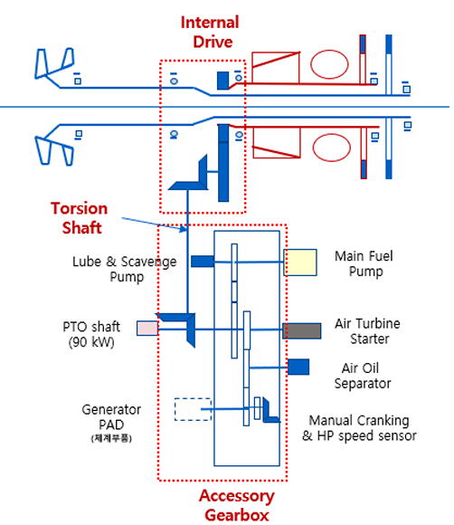
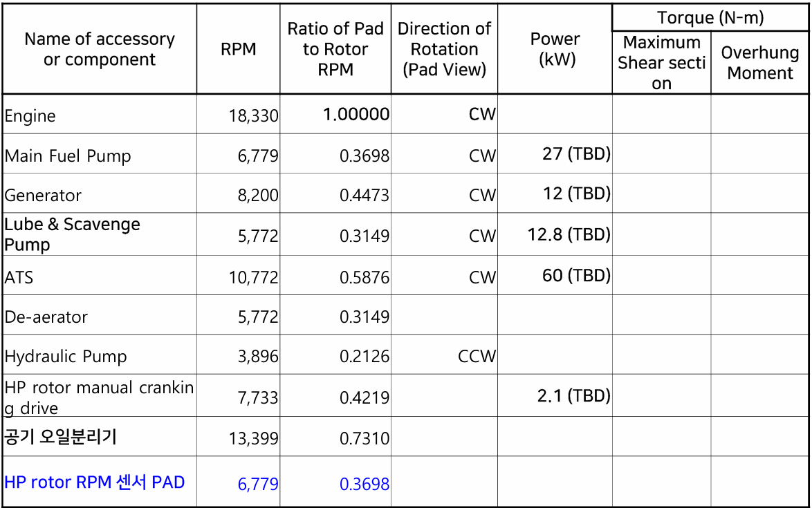
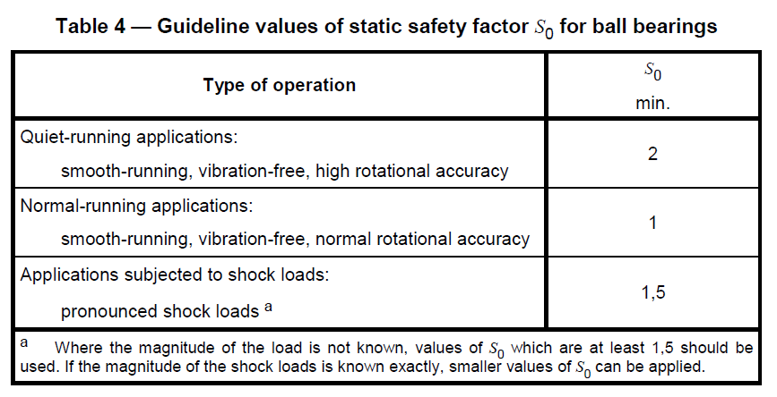

|  | **설계보고서** **10,000lb 엔진기어박스** **설계보고서** Design Report of 10,000 lbf Engine Gearbox  |
| --- | --- |

# 개정 이력

| Revision | Date | Description of Revision |
| --- | --- | --- |
| 1.0 | 2026.05.22 | 초안 작성 |
| 1.2.1 | 2026.05.25 | 이동건 작성 |
| 1.2.3 | 2026.06.04 | 이동건 작성 |
| 1.2.5 | 2026.06.10 | 이동건 작성 |
| 1.2.6 | 2026.06.12 | 회의 수정 |
| 1.2.7 | 2026.06.12 | 이동건 작성 |
|  |  |  |
|  |  |  |
|  |  |  |
|  |  |  |
|  |  |  |
|  |  |  |
|  |  |  |
|  |  |  |
|  |  |  |
|  |  |  |
|  |  |  |
|  |  |  |
|  |  |  |
|  |  |  |
|  |  |  |
|  |  |  |
|  |  |  |
|  |  |  |
|  |  |  |
|  |  |  |

# Contents

# 개요

본 문서는 “10,000 lbf급 터보팬 엔진의 기어박스 설계” 관련 연구의 설계 지침서이다. 대상은 엔진 보조 동력 인출 계통의 Inlet Gearbox (IGB), Radial Drive Shaft (RDS), Accessory Gearbox (AGB) 세 구성이며, 엔진 HP rotor에서 동력을 인출해 각 악세서리로 분배하는 흐름을 다룬다.

# 엔진기어박스 시스템 개요 및 요구도

## 시스템 구성

엔진 기어박스 시스템은 고압(HP) 로터축에서 추출한 기계적 동력을 악세서리(Accessory)까지 전달하는 동력 전달 체계로서, IGB → RDS → AGB의 직렬 경로로 구성된다. 전체 동력 전달 경로는 HP축 → IGB → RDS → AGB → 악세서리이다.

**Figure 2-1 엔진기어박스 구성도**

### IGB (Internal Gearbox, 내부 기어박스)

IGB의 역할은 HP 로터축에 직접 맞물려 동력을 추출하고, 스파이럴 베벨기어를 통해 회전축 방향을 90° 전환하여 RDS로 전달하는 것이다.

### RDS (Radial Drive Shaft, 반경 구동축)

RDS의 역할은 IGB에서 90° 전환된 동력을 엔진 스트럿 내부를 관통하여 반경 방향으로 AGB까지 전달하는 것이다.

### AGB (Accessory Gearbox, 악세서리 기어박스)

AGB의 역할은 RDS로 전달된 동력을 발전기, 연료 펌프, 유압 펌프, 윤활·scavenge 펌프 등 다수의 악세서리에 각각의 요구 회전수로 분배하는 것이다.

### 구성품별 적용 소재

**Table 2-1 구성품별 적용 소재 ****(from ADD)**

| **구성품** | **적용 소재** |
| --- | --- |
| IGB Bevel gear | Steel |
| IGB Housing | 17-4 PH |
| RDS Shaft & component | Steel |
| RDS-AGB gear | Steel |
| RDS-AGB gear Housing | 17-4 PH |
| AGB Gear | Steel |
| AGB Housing | Al 7075 |
| Main Shaft Bearing | M50 |
| 윤활유 | MIL-PRF-23699 |

## 작동 조건

회전 방향은 PAD 측에서 AGB를 바라보는 방향을 기준으로 CW/CCW를 정의한다. (from ADD)

### 시스템 동력 흐름

ADD 임무 프로파일 확정 후 갱신한다.

| **단** | **입력 [rpm]** | **입력 [N·m]** | **출력 [rpm]** | **출력 [N·m]** | **기어비** |
| --- | --- | --- | --- | --- | --- |
| 엔진 HP rotor → 평기어 |  |  |  |  |  |
| 평기어 → IGB 베벨기어 |  |  |  |  |  |
| 엔진 → AGB layshaft (전체) |  |  |  |  |  |
| 전달 동력 (ATS 제외) |  |  |  |  |  |

### 임무별 작동 조건 (Load case)

임무 프로파일은 다음 양식으로 정리한다. Load case별로 IGB/RDS/AGB 구간의 회전수·방향·동력(또는 토크)·작동시간·작동온도를 명시한다. 수명 산정과 강도 평가에 사용할 하중 스펙트럼은 본 표의 작동시간 가중으로 산출한다.

아래 표는 예시 양식이며, 수치는 ADD 임무 프로파일 확정 후 작성한다.

[IGB]

| **비행 임무(Load Case)** | **작동시간 [hr]** | **작동온도 [°C]** | **Speed [rpm]** | **Power [kW]** | **회전방향** |
| --- | --- | --- | --- | --- | --- |
| Load case 1 (예: Idle) |  |  |  |  |  |
| Load case 2 (예: Cruise) |  |  |  |  |  |
| Load case 3 (예: Max Takeoff) |  |  |  |  |  |
| Load case 4 |  |  |  |  |  |
| Load case 5 |  |  |  |  |  |

[RDS]

| **비행 임무(Load Case)** | **작동시간 [hr]** | **작동온도 [°C]** | **Speed [rpm]** | **Power [kW]** | **회전방향** |
| --- | --- | --- | --- | --- | --- |
| Load case 1 (예: Idle) |  |  |  |  |  |
| Load case 2 (예: Cruise) |  |  |  |  |  |
| Load case 3 (예: Max Takeoff) |  |  |  |  |  |
| Load case 4 |  |  |  |  |  |
| Load case 5 |  |  |  |  |  |

다음 표는 ADD에서 제시한 AGB의 악세서리별 회전수·동력 분배 양식이다.

**Table 2-2 악세서리별 회전수·동력 분배 양식**** (from ADD)**

## 인터페이스

각 서브시스템 경계에서 정의되어야 할 인터페이스 항목을 정리한다. 
세부 명세는 후속 단계에서 확정한다.

| **인터페이스** | **점검 내용** |
| --- | --- |
| 엔진 HP rotor → IGB 입력 | 축 결합방식 (스플라인 또는 플랜지) 하우징 결합방식 결합요소 요구사항 (스플라인의 경우 요구 형상/등급/백래시 등) |
| IGB 출력 → RDS 입력 | 축 결합방식 (스플라인 또는 플랜지) 하우징 결합방식 결합요소 요구사항 (스플라인의 경우 요구 형상/등급/백래시 등) |
| RDS 출력 → AGB 입력 | 축 결합방식 (스플라인 또는 플랜지) 하우징 결합방식 결합요소 요구사항 (스플라인의 경우 요구 형상/등급/백래시 등) |
| AGB 베벨기어 ↔ AGB layshaft | Layshaft 배치 레이아웃 등 |
| layshaft ↔ 내부 분배 기어 | 각 pad 위치 정보, 악세서리 요소 크기 |
| 각 pad ↔ 악세서리 | Pad 결합부 요구사항 (ex. 연결부 스플라인 내치 or 외치) |

# 공통 설계기준

본 장은 IGB·RDS·AGB 전반에 공통 적용되는 설계 요구사항과 평가 규격을 정의한다.

## 기어

### 기어 재질 및 표면처리

기어강은 구성품의 작동온도를 기준으로 선정한다. 엔진 코어 내부의 고온 환경에 놓이는 IGB 기어는 온도 한계가 높은 Pyrowear 53(AMS 6308, 약 200 °C)을, 상대적으로 저온인 AGB 기어는 AISI 9310(AMS 6265, 약 150 °C)을 적용한다[TBD]. RDS는 기어가 아닌 비틀림축이므로 기어강 선정 대상이 아니며, 축 재질은 §3.5(축)에서 정의한다. 베어링은 M50 또는 M50NiL 계열을 적용한다[TBD]. 표면처리는 침탄·연삭을 기본으로 하고 Table 3-2의 Shot peening·Superfinishing을 IGB·AGB 기어에 공통 적용한다[TBD]. 구성품별 재질·표면처리 선정 결과는 Table 3-3에 정리한다.

**Table 3-1 항공 기어 소재 후보**** **[TBD]

| **재료** | **표준·합금계** | **표면 경도** | **코어 경도** | **온도 한계** |
| --- | --- | --- | --- | --- |
| AISI 9310 | AMS 6265, Ni-Cr-Mo 침탄강 | 58~62 HRC | 34~42 HRC | 약 150 °C |
| Pyrowear 53 | AMS 6308, 고온 침탄용 | 59~64 HRC | 36~42 HRC | 약 200 °C |
| M50NiL | AMS 6278, VIM-VAR 베어링·기어강 | 58~62 HRC | 35~45 HRC | 약 315 °C |

경도 범위는 항공용 기어박스 설계 가이드라인 AGMA 911-A94 §9.11 Table 15 기준이다. 
온도 한계는 NASA TM-102529와 템퍼링 온도에 근거한 값이다.

주요 표면처리 방법과 효과는 다음 표와 같다.

**Table 3-2 표면처리 방법 및 효과**

| **표면처리** | **주효과** |
| --- | --- |
| Shot peening | root·flank 압축 잔류응력, 균열 개시 지연 |
| Superfinishing | Mechanical superfinishing (숫돌·필름 가공)
asperity 접촉 감소, 윤활막 안정화 |
| REM ISF | Chemically accelerated vibratory finishing (화학 피막 + 미디어 연마) 
조도, 피크 제거. 베벨기어 flank 적용 가능 |

**Table 3-3 구성품별 재질·표면처리 선정**** **[TBD]

| **구성품** | **기어강** | **온도 한계** | **표면처리** | **선정 근거** |
| --- | --- | --- | --- | --- |
| IGB | Pyrowear 53 | 약 200 °C | 침탄·연삭 + Shot peening + Superfinishing | 엔진 코어 내부 고온 환경 |
| AGB | AISI 9310 | 약 150 °C | 침탄·연삭 + Shot peening + Superfinishing | 상대적 저온, 비용·가공성 유리 |
| RDS | 해당 없음 (비틀림축) | — | §3.5 참조 | 기어 미적용, 축 재질은 §3.5 / Table 5-1 |

### 베벨기어 설계 제약

ISO 10300 시리즈, ISO 23509, AGMA 937-A12를 표준으로 적용한다. 
IGB 베벨기어와 AGB 베벨기어가 같은 표준을 따른다.

**Table 3-4 베벨기어 기하 제약**

| **Item** | **Limit** | **Reference** |
| --- | --- | --- |
| Virtual transverse contact ratio (εvα) | < 2 | ISO 10300-1 §1 |
| Profile shift sum (xh1 + xh2) | = 0 | ISO 10300-1 §1 |
| Mean spiral angle ((βm1 + βm2)/2) | ≤ 45° (15°~25°, in Aerospace) | ISO 10300-1 §1 AGMA 937-A12 §5.2 |
| Effective pressure angle (αe) | ≤ 30° (20°~25°, in Aerospace) | ISO 10300-1 §1 AGMA 937-A12 §5.2 |
| Face width (b) | b ≤ 13 · mmn b ≤ 0.30 · Ao b ≤ 10 · met | ISO 10300-1 §1
AGMA 937-A12 §6.1.6 |
| Min. pinion teeth (z1) | ratio 1.00~1.50에서 ≥ 13 (≥ 9 권장) | AGMA 937-A12 §6.1.5 Table 4 |
| Tooth combination (gcd(z1, z2)) | 1, hunting tooth | AGMA 937-A12 §6.1.5 |
| Face contact ratio (εvβ, mF) | ≥ 2.0 | AGMA 937-A12 §6.1.8 |
| Contact pattern | 전 load case에서 edge contact 금지 | AGMA 937-A12 §11.1.3 |
| Backlash (jn) | 모듈 크기 등 고려하여 초기 설계 | ISO 23509 §C.4.2.2 |
| Surface roughness (Ra) | ≤ 0.5 μm 권장 | AGMA 937-A12 §6.1.3.3 |
| Surface roughness (Rz) | ≤ 1.5 μm, fine grinding 하한 (ground Rz 1.125~8 μm) 또는 isotropic superfinish (Rz 0.25~2 μm) | AGMA 937-A12 §6.4.7 |

**Table 3-6 베벨기어 강도·안전계수**

| **Item** | **Limit** | **Reference** |
| --- | --- | --- |
| Bending safety factor (SF) | ≥ 1.3 | ISO 10300-1 §5.2 |
| Contact safety factor (SH) | ≥ 1.0 | ISO 10300-1 §5.2 |
| Application factor (KA) | load spectrum 반영 시 1.0, 
미확정 단계는 잠정 1.25 | ISO 10300-1 §6.3 |
| Dynamic factor (Kv) | Method B로 산정
공진 영역(0.75 < N ≤ 1.25) 운전 회피 | ISO 10300-1 §7.6.1 |

### 헬리컬 및 평기어 설계 제약

ISO 6336 시리즈를 표준으로 적용한다. IGB 평기어와 AGB 분배 기어가 같은 표준을 따른다. 
AGB 분배 기어의 pad별 ratio와 정밀도는 ADD 사양 확정 후 결정한다.

**Table 3-7 ****헬리컬 및 평기어 ****기하 제약**

| **Item** | **Limit** | **Reference** |
| --- | --- | --- |
| Normal pressure angle (αn) | 20° 표준, ISO 6336 적용 한계 ≤ 25° | ISO 6336-1 §1.1 |
| Helix angle (β) | Helical ≤ 30°. Spur 0° | ISO 6336-1 §1.1 |
| Transverse contact ratio (εα) | 1.0 ≤ εα | ISO 6336-1 §1.2 |
| Backlash (jn) | 모듈 크기 등 고려하여 초기 설계 | ISO 6336-1 §1.2 |

**Table 3-9 헬리컬 및 평기어 강도·안전계수**

| **Item** | **Limit** | **Reference** |
| --- | --- | --- |
| Bending safety factor (SF) | ≥ 1.4 | 자체 기준 |
| Contact safety factor (SH) | ≥ 1.1 | 자체 기준 |
| Application factor (KA) | load spectrum 반영 시 1.0, 
미확정 단계는 잠정 1.25 | ISO 6336-6 §5.2 |
| Dynamic factor (Kv) | Method B로 산정
공진 영역(0.75 < N ≤ 1.25) 운전 회피 | ISO 6336-1 §6 |

## 베어링

정적 안전율은 ISO 76, 피로 수명은 ISO 16281을 적용한다. 정적 안전율 1.5 이상, 피로 안전율 1.0 이상으로 한다. 접촉 응력과 thermal speed를 별도 검토하고 동력 손실을 산정한다. 접촉응력은 작동조건에 따라 edge contact이 없어야 한다.

**Figure 3-1 ISO 76 정적 안전율 기준**

## 윤활

윤활제는 MIL-PRF-23699 HTS급 합성 에스터를 적용한다. MIL-PRF-23699 계열은 5 cSt급 고온 동점도 영역의 합성 터빈 엔진 오일로, 막두께·열안정성 여유가 필요한 엔진·기어박스 적용에 적합하다. 윤활 방식은 오일 jet 윤활을 기본으로 하며, 오일이 실제 flank 접촉부와 root·flank 냉각이 필요한 위치에 도달하도록 노즐을 배치해야 한다.

## 스플라인

기본 설계는 AGMA 6123-C16을 적용한다. 스플라인 형상은 항공 기어 시스템 지침인 AGMA 911-B21 및 AGMA 911-A94 §4.3.4.1에 따라 인볼류트 스플라인을 기본으로 하며, 세부 형상 및 검사는 ANSI B92.1, ANSI B92.2M 또는 ISO 4156 중 적용 규격을 확정한다. 스플라인 강도는 tooth shear, wear/fretting, ring bursting을 각각 검토하고, 본 단계 최소 통과 기준은 각 안전율 1.0 이상으로 한다.

## 축

축 설계는 DIN 743을 기본으로 한다. NVH는 회전체 동역학 해석으로 검토하며, MASTA 모델로 임계속도와 모드 형상을 확인한다. 축 강도는 DIN 743에 따라 피로 및 정적 안전율을 산정하며, 최소 기준은 각각 1.2 이상으로 한다.

# IGB 설계

## 구조

IGB는 스파이럴 베벨기어 1쌍, 평기어 1쌍, 지지 베어링, 하우징, 윤활 노즐로 구성한다. 평기어 1쌍은 주축의 축방향 변위로부터 베벨기어를 보호하고 입력단 피치선 속도를 낮추는 역할을 한다. 다만 이로 인해 베벨기어가 주축에서 멀어지면 엔진 코어 공기 유로를 가로막는 단면적이 커지므로, 주축 거동, 주변 구조, 코어 유로 위치, 기어 크기, 정렬오차 허용량을 종합해 베벨기어 위치를 결정한다. IGB는 엔진 코어 내부에 위치하여 시스템 전체에서 가장 강한 열 환경에 노출된다.

## 설계 요구조건

**Table 4-1 IGB 설계 결정·미정 사항**

| **항목** | **결정 또는 미정** |
| --- | --- |
| Spur gear ratio |  |
| Bevel gear ratio |  |
| Gear material | Pyrowear 53 (KIMM 1차 가정) |
| 윤활유 | MIL-PRF-23699 HTS (KIMM 1차 가정) |
| 공간·장착 인터페이스 | ADD 확정 |
| 기타 사양 항목 | ADD 확정 |

## 설계 및 해석 결과

※ ADD 요구도 확정 및 설계 진행에 따라 작성한다.

# RDS 설계

## 구조

RDS는 엔진 코어를 반경 방향으로 관통하여 IGB 출력 베벨기어와 AGB 입력 베벨기어 사이를 잇는 중공 비틀림축이다. 양단은 인볼류트 스플라인으로 가공하여 축방향 미끄럼을 허용하고, 열팽창과 정렬오차, 조립 공차를 흡수한다. 축 중간의 전단목은 설정된 파단 토크를 넘으면 다른 부위보다 먼저 끊어지는 기계적 퓨즈로, 과토크로부터 AGB와 엔진을 보호한다. 중공 내부는 양 끝을 엔드 캡과 플러그로 밀폐하여 오일과 오염물의 유입을 막고 윤활제를 가두어 둔다. 코어 통과 구간에는 축 둘레를 감싸는 터널 슬리브를 두어 고온 공기로부터 축을 보호한다. RDS 자체에는 베어링을 두지 않으며, 양단 스플라인의 중심 맞춤과 인접 기어박스(IGB·AGB)의 베어링으로 지지한다. RDS는 길고 가는 고속 회전축이므로 스플라인 결합부의 fretting 마모와 전단목의 파괴 토크 설계가 핵심 설계 과제이다.

## 설계 요구조건

**Table 5-1 RDS 설계 결정**** 및 미정 사****항**

| **항목** | **결정 또는 미정** |
| --- | --- |
| 구조 유형 | quill shaft (전단목) 미적용 [TBD] |
| 단면 형상 | 중공 [TBD] |
| 길이 | 200~600 mm급 [TBD] |
| 지지 | 베벨기어 지지베어링 방식 (볼/TRB 등) 양단 스플라인 자체 정렬, 축은 별도 지지 베어링 없음 |
| 피로 사이클 (LCF, HCF) | 피로해석 사이클 필요 |
| 축 재질 | AISI 9310 또는 Pyrowear 53 [TBD] |
| 비틀림 각 허용량 | 미정 |
| 임계속도 여유 | 최대 105%까지 특이 공진이 없어야 함 |
| misalignment 허용량 | 미정 |

축 강도는 DIN 743으로 비틀림·굽힘·축인장 복합 응력, fillet 응력집중, 표면처리 영향을 검토한다.

RDS는 IGB와 AGB를 연결하는 중공축이므로, 이들의 사양이 결정되면 전체 길이, 스플라인 위치 등이 자동으로 정해진다. 전체 길이는 엔진 코어 직경 및 IGB/AGB 두께에 의해 결정되며, 스플라인 위치는 베벨기어 위치에 따라 고정된다. RDS의 회전속도는 엔진 회전속도에 IGB측 베벨기어 감속비를 곱한 값으로 결정된다.

## 설계 및 해석 결과

※ ADD 요구도 확정 및 설계 진행에 따라 작성한다.

# AGB 설계

## 구조

AGB는 헬리컬 및 평기어로 구성된 복합 기어 트레인과 경량 하우징으로 이루어지며, RDS 출력을 받아 1단 베벨기어와 내부 분배 기어를 통해 각 악세서리 pad로 동력을 분배한다. 다수 악세서리의 요구 회전수 분배, 고토크 장비의 배치 최적화, 하우징 경량화가 핵심 설계 과제이다. 본 단계 범위에서 1단 베벨기어와 내부 분배 기어의 세부 결정은 ADD 사양 확정 후 별도 설계로 진행한다.

## 설계 요구조건

**Table 6-1 AGB 설계 결정**** 및 미****정 사항**

| **항목** | **결정 또는 미정** |
| --- | --- |
| Spur gear ratio | 작동 요구조건에 따라 pad 마다 결정 |
| Bevel gear ratio | 작동 요구조건에 따라 결정 |
| Gear material | AISI 9310 |
| 윤활유 | MIL-PRF-23699 HTS |
| 공간·장착 인터페이스 | ADD 확정 |
| 기타 사양 항목 | ADD 확정 |

## 설계 및 해석 결과

AGB 설계·해석 결과를 항목별로 정리한다. 각 항목은 설계 진행에 따라 작성한다.

### 기어비

재질

형상

### 인터페이스

### 경량화

### 강도수명

### 소음진동

### 동력손실

### 열관리

### 윤활 (+30분 무윤활)

# 부록 A. 출처 검증

| **항목** | **참고 표준** | **원문 ****내용** |
| --- | --- | --- |
| Table 3-4, Backlash (jn) 
모듈 비례 최소값 | ISO 23509 §C.4.2.2 Table C.3, p.71, 73 | "Suggested minimum values of the outer backlash are given in Table C.3. … the backlash allowance is proportional to the module |
| Table 3-4, (εvα) < 2 | ISO 10300-1 §1, p.1 | "restricted to bevel gears whose virtual cylindrical gears have transverse contact ratios of εvα < 2" |
| Table 3-4, (xh1 + xh2) = 0 | ISO 10300-1 §1, p.1 | "for bevel gears the sum of profile shift coefficients of pinion and wheel is zero" |
| Table 3-4, mean spiral angle ≤ 45° | ISO 10300-1 §1, p.1 | "for large average mean spiral angles (βm1 + βm2)/2 > 45°" → 초과 시 경험적 확인 요구 |
| Table 3-4, (αe) ≤ 30° | ISO 10300-1 §1, p.1 | "for effective pressure angles αe > 30°" → 초과 시 경험적 확인 요구 |
| Table 3-4, (b) ≤ 13·mmn | ISO 10300-1 §1, p.1 | "for large facewidths b > 13 mmn, the calculated results of this document should be confirmed by experience" |
| Table 3-4, (αn) 20° | AGMA 937-A12 §6.1.9.3, p.15 | "To avoid undercut, use a 20 degree pressure angle or higher for pinions with 12 or fewer teeth." |
| Table 3-4, (βm) 15°~25° | AGMA 937-A12 §5.2, p.7 | "aerospace spiral bevels generally use higher pressure angles to reduce bending stress (20° - 25°) and lower spiral angles to reduce axial loading (15° - 25°)". 
선정 기준은 §6.1.8(face contact ratio ≈ 2.0) 병행 참조 |
| Table 3-4, (z1) ≥ 13 | AGMA 937-A12 §6.1.5 Table 4, p.13 | Table 4: ratio 1.00~1.50 → 최소 잇수 13. |
| Table 3-4, Hunting tooth | AGMA 937-A12 §6.1.5, p.13 | "the numbers of teeth in the pinion and mating gear should have no common factor." |
| Table 3-4, (b/Ao) ≤ 0.30, (b/met) ≤ 10 | AGMA 937-A12 §6.1.6, p.13 | "the face width should not exceed 30 percent of the cone distance, or 10/Pd (10 met), whichever is less." |
| Table 3-4, (εvβ, mF) ≥ 2.0 | AGMA 937-A12 §6.1.8, p.14 | "face contact ratios greater than 2.00 are suggested, but face contact ratios less than 2.00 are used successfully." |
| Table 3-4, (εvγ) ≥ 2.0 | AGMA 937-A12 §6.1.8, p.14 | 원문은 face contact ratio 기준 
total ≥ 2.0은 경험적 확인 필요 |
| Table 3-4, Contact pattern | AGMA 937-A12 §11.1.3, p.71 | "full length, full width pattern without load concentration in any area and with gradual fading of the tooth bearing at the tips and ends" |
| Table 3-4, (Ra) ≤ 0.5 μm | AGMA 937-A12 §6.1.3.3, p.11 | "Gears having a surface roughness less than 0.5 μm (20 μin) will exhibit increased load carrying capacity." |
| Table 3-4·3-7, (Rz) ≤ 1.5 μm | AGMA 937-A12 §6.4.7 Table 11, p.27 | Table 11: Ground Rz 1.125~8 μm, Isotropic superfinish Rz 0.25~2 μm |
| Table 3-1·3-3, Gear steel | AGMA 937-A12 §8.2.1 Table 18, p.52 | "The materials shown in Table 18 have been found suitable for carburized aerospace bevel gears." |
| Table 3-1, AMS cleanliness | AGMA 937-A12 §8.1.1, p.48, 50 | "Steel cleanliness should be certified in accordance with SAE AMS 2300 …" 
Grade별 AMS 2300/2301 구분은 Table 17 |
| Table 3-1·3-3, LoL 온도 한계 | AGMA 937-A12 §7.3.6, p.42 | "tempered above 232 °C (450 °F) (i.e., AMS 6308) … operating temperature limit will be determined by the temperature limit of the lubricant". |
| Table 3-6, (SF) 하한 | ISO 10300-1 §5.2, p.7 | "The minimum bending stress value SF,min should be 1,3 for spiral bevel including hypoid gears, and 1,5 for straight bevel gears" |
| Table 3-6, (SH) 하한 | ISO 10300-1 §5.2, p.7 | "Supplied gears or assembled gear drives should have a minimum safety factor for contact stress SH,min of 1,0." |
| Table 3-6, (KA) | ISO 10300-1 §6.3, p.10 | "In cases where no reliable experiences, or load spectra … are available, the calculation should use … an application factor, KA." |
| Table 3-6, (Kv) | ISO 10300-1 §7.6.1, p.13 | "a resonant vibration can cause high dynamic tooth loading; operation in this speed range should be avoided." (§7.6.1, 공진 0.75 < N ≤ 1.25) |
| Table 3-7, (εα)·(jn) | ISO 6336-1 §1.2, p.11 | 적용 제외 조건: "transverse contact ratios less than 1,0 / greater than 2,5", "when backlash is zero" |
| Table 3-7, (αn) ≤ 25°, (β) ≤ 30° | ISO 6336-1 §1.1, p.10 | "for normal working pressure angles up to 25° and reference helix angles up to 30°" |
| Table 3-9, (SF)·(SH) | ISO 6336-1 §4.1.3, p.16 | "the value of the safety factor for each mode of failure (pitting, tooth breakage) is to be agreed upon between the parties." 수치 하한 미규정 — 제조자·구매자 합의로 결정. 본 보고서는 ISO 10300-1 §5.2의 베벨 하한(1.3/1.0)을 따름 |
| Table 3-9, (KA) | ISO 6336-6 §5.2, p.11
ISO 6336-6 Annex B, p.18 | "The value KA, defined as application factor, is set equal to unity (1,0) for this calculation, as all the application load influences should be taken into account by stress levels included in the calculation method"(§5.2). |
| Table 3-9, (Kv) | ISO 6336-1 §6, p.19~20 | "the resonant forced vibration may cause high dynamic tooth loading. … operation near this speed should be avoided." |
| Table 5-1, 축 재질 | AGMA 937-A12 Table 15, p.49 | AISI 9310(침탄, main drive·accessory)·Pyrowear 53(침탄, 고온)·Nitralloy 135M(질화, accessory) 재질-열처리 분류 |
| Table 5-1, 스플라인 규격 | AGMA 911 §4.3.4.1, p.19 | "Requirements for involute splines are usually specified in … ANSI B92.1, Involute Splines and Inspection" |
| Table 3-1, 
소재 경도·온도 한계 | AGMA 911-A94 Table 15, p.49 · NASA TM-102529 | 경도는 Table 15 수치로 정렬. 온도 한계 — 150 °C: p.9 "usually around 149 °C (300 °F)" / 315 °C: p.6 "usable at emperatures to 315 °C (600 °F)" (M50 기준) / 200 °C: GMA 937 §7.3.6 템퍼링 232 °C 기반 통용값 |
| §3.2 본문, 
베어링 정적 1.5·피로 1.0 | ISO 76·ISO 16281 | 원문 확보 후 기준 확인 예정 |
| §3.5·§3.4 본문, 축 DIN 743·스플라인 SF ≥ 1.0 | DIN 743·AGMA 6123-C16 | 원문 확보 후 기준 확인 예정 |
