# Reductions in wind farm main bearing rating lives resulting from wake impingement

Julian Quick1, Edward Hart2, Marcus Binder Nilsen1, Rasmus Sode Lund1, Jaime Liew1, Piinshin Huang1, Pierre-Elouan Rethore1, Jonathan Keller3, Wooyong Song4, and Yi Guo1

1Technical University of Denmark, Lyngby, Denmark  
$^{2}$ University of Strathclyde, Glasgow, UK  
$^{3}$ National Renewable Energy Laboratory, Golden, CO, U.S.A.  
4Offshore Renewable Energy (ORE) Catapult, Blyth, UK

Correspondence: Julian Quick (juqu@dtu.dk)

Abstract. This paper studies the impacts of wake impingement on main bearing rating lives. A computational tool chain was developed to explore and quantify these effects across a wind farm populated by 10 MW wind turbines. Wind field and turbine load modelling was undertaken using the Dynamiks Python package, including application of a dynamic wake meandering model. The ISO 281 basic bearing rating life formulation was subsequently applied in order to evaluate impacts from wake effects. Analyses included a two-turbine parametric analysis, followed by a full wind farm analysis undertaken for the TotalControl 32-turbine reference wind farm, including full wind rose simulations across all operational wind speeds. Site conditions were accounted for using a Weibull wind speed distribution and a range of parametric wind direction rose models. Results indicate that wind farm main bearing rating lives are negatively impacted by the effects of wake impingement, resulting in rating life reductions for the analysed wind farm on the order of  $16\%$  on average and as much as  $20 - 25\%$ , both for the locating main bearing. Despite these high sensitivities, it is important to note that the resultant rating lives still far exceed the standard wind turbine operational lifetimes of 20-30 years. Wake impacts were also found to be asymmetrically related to the side on which the rotor is impinged, suggesting that, for the main bearing, there may be a "better" side for wake impingement to occur. Rating life sensitivities to wind rose shape were also observed. While these findings must be interpreted with due consideration for the various methodological limitations present, they provide compelling evidence that wake effects at the wind farm level should necessarily be included when undertaking main bearing operational load modelling, rating life assessment, or other load-related analyses.

# 1 Introduction

Main bearing failures remain a significant reliability challenge within the wind industry, with recent high-volume studies indicating only around half of a main bearing population's minimum design life1 (20 years) may be attained in practice (Hart et al., 2023; EPRI, 2024). It is anticipated that main bearing failure rates may grow with the increase in turbine rated power (EPRI, 2024), which is consistent with the observation that main bearing loading scales unfavorably with turbine size (Hart

et al., 2022). No principal root cause of main bearing field failures has yet been identified; observed damage modes have included those stemming from surface and subsurface initiation, stray currents, lubrication failures, overloading, and improper bearing assembly/fit (Hart et al., 2023; EPRI, 2024). Efforts are therefore ongoing to determine a set of fundamental drivers leading to premature main bearing failures and, in turn, identify strategies to resolve or ameliorate these issues.

Bearing design and selection normally includes the application of ISO standards (ISO 281 (ISO 281:2007, E) and ISO 16281), which seek to estimate lifetime across a population of identical bearings at risk from surface- and subsurface-initiated rolling contact fatigue (RCF). An important caveat to the ISO standards is that they make no claims concerning expected lifetimes for out-of-scope damage modes. Those alternative damage mechanisms tend to be difficult to model and hard to predict, hence the lack of comparable and generalized life assessment formulations. Investigations of potential causes of premature main bearing failures therefore commonly utilize the ISO standards (Zheng et al., 2020; Kenworty et al., 2023; Krathe et al., 2024; Ishihara et al., 2025). A limitation of such approaches is the resulting focus on surface and subsurface RCF and therefore the exclusion of other potentially important damage modes. However, field observations include damage that may have resulted from RCF (Hart et al., 2023), and it has not been conclusively demonstrated that RCF is not an important factor in main bearing field failures. A key question in this context is therefore: Can ISO-based main bearing rating life assessment, in conjunction with realistic system modeling, account for reported levels of main bearing failures? This gives rise to the related question: What constitutes a sufficiently realistic system model in this context? Kenworthy et al. Kenworty et al. (2023) investigated the first question by applying ISO 281 to the main bearing of an individually modelled 1.5 MW wind turbine. While the question was answered in the negative for that setup, the results included high levels of sensitivity to vertical wind shear flow asymmetry. As a result, lateral flow asymmetry caused by wake impingement from an upwind turbine was posited as a possibly overlooked life reduction factor, i.e. a potential insufficiency in its model. The current work seeks to address this by considering: For a candidate model wind farm, what is the relative change in main bearing rating life when including the effects of wake impinged operation?

The remainder of the paper is organized as follows: Sect. 2 presents and discusses relevant background information. Section 3 outlines the methods and cases examined in this study. Results are presented and discussed in Sect. 4. Finally, conclusions are presented in Sect. 5.

# 2 Background

The current section outlines relevant theory, prior work, and extant modelling capabilities which are pertinent to and/or utilized within the current study. Section 2.1 introduces the ISO 281 bearing rating life assessment standard. Section 2.2 reviews previous applications of the ISO 281 standard to wind turbine bearings. Section 2.3 discusses relevant approaches for modelling wind farms.

# 2.1 ISO 281 bearing rating life assessment

ISO 281 formulations provide an estimate of bearing life across a population of identical rolling bearings. The rating life is generally the life that  $90\%$  of the bearing population is expected to attain or exceed; equivalently, this is the point at which  $10\%$  of the population is expected to have failed. A detailed review and application case study in the context of main bearings was previously provided by Kenworty et al. (2023). The basic rating life for a radial roller bearing takes the form

$$
L _ {1 0} = \left(\frac {C _ {\mathrm {D}}}{P _ {\mathrm {e q}}}\right) ^ {1 0 / 3}, \tag {1}
$$

where  $C_{\mathrm{D}}$  is the basic dynamic load rating, generally supplied by the bearing manufacturer. The dynamic equivalent radial load,  $P_{\mathrm{eq}}$ , is calculated from the applied radial and axial bearing loads,  $F_{\mathrm{r}}$  and  $F_{\mathrm{a}}$ , as

60  $P_{\mathrm{eq}} = XF_{\mathrm{r}} + YF_{\mathrm{a}}$  (2)

Coefficient values  $X$  and  $Y$  are prescribed by ISO 281, and they depend on the bearing nominal contact angle and the load ratio  $F_{\mathrm{a}} / F_{\mathrm{r}}$ . ISO equations give  $L_{10}$  values in revolutions; these are then readily converted to units of time using the rotational speed of the wind turbine low-speed shaft.

The above equation pertains to the case of a constant applied-load combination,  $F_{\mathrm{r}}$  and  $F_{\mathrm{a}}$ . Variable operating conditions, such as those experienced by wind turbine bearings, are accommodated using an assumption of linear damage accumulation for consumed bearing life. Under this assumption, the resultant rating life,  $L_{\mathrm{res}}$ , for a bearing operated in  $n$  different sets of conditions with associated rating lives  $L_{1}, \ldots, L_{n}$  takes the form of a harmonic mean (Kenworty et al., 2023),

$$
L _ {\text {r e s}} = \frac {1}{\frac {\phi_ {1}}{L _ {1}} + \frac {\phi_ {2}}{L _ {2}} + \dots + \frac {\phi_ {n}}{L _ {n}}}, \tag {3}
$$

where  $\phi_{i}$  is the proportion of time spent in the  $i^{\mathrm{th}}$  set of conditions. The combination of condition-specific rating lives into a resultant life may be undertaken in stages. The multistage approach has been shown to be equivalent to a single simultaneous combination of all cases (Kenworty et al., 2023). This provides a convenient and staged approach to resolving the resultant bearing rating life in practice.

While ISO 16281 seeks to account for more detailed factors – such as the bearing internal load distribution, clearance and misalignment – additional detailed technical data are required. It has also been shown that the load distribution within large main bearings is highly sensitive to model fidelity, with the influence of bearing housing and turbine bedplate deflections playing an important role (Kock et al., 2019). ISO 16281 implementations should therefore ideally include such effects. As a result, and given the focus of the current study is on relative impacts from wake impingement, ISO 281 rating life formulations were used.

# 2.2 Main bearing fatigue life analysis

A number of studies have applied ISO 281 to assess main bearing rating lives. Kenworty et al. (2023), discussed previously, studied the rating life prediction for an individually modeled 1.5 MW wind turbine main bearing resulting from IEC 61400-1

and ISO 281 design processes. Rating life assessment was carried out for various combinations of bearing temperature, wind field characteristics, lubricant viscosity, and contamination levels; main bearing loading was estimated from aeroelastically derived turbine-hub loading via a static force balance at each time step. The results of this analysis implied the prescribed life assessment process did not account for reported rates of main bearing failures in 1 to  $3\mathrm{MW}$  wind turbines. It was also suggested that the impacts of wake impingement on main bearing rating life should be considered in future work. Ishihara et al. (2025) sought to quantify the role of system inertial loading on main bearing rating life by proposing a novel main bearing "pounding" model which estimates the load augmentation resulting from impact events at bearing interfaces. The potential influence on RCF life was assessed by calculating the mean inertial increase in bearing loading and the impacts of bearing clearance and passing these adjusted values into ISO 281 rating life equations. Their inclusion of inertial loading and bearing clearance significantly reduced the bearing  $L_{10}$  rating life from 144 years down to 39 years (accounting for clearance only) or 9.7 years (accounting for inertial loading and clearance). While their findings and the presented model are interesting, there are both conceptual and implementation issues present which make it difficult to determine the validity of their results. First, "pounding" of the main bearing is described as beginning once internal wear results in increased bearing clearance. However, if wear is present to this extent, then the bearing has already failed or is at least in the process of failing. Furthermore, wear is precisely one of the out-of-scope damage modes for which ISO 281 claims not to apply. Second, the pounding model clearance (which determines the gap across which the shaft can accelerate) was set by manually measuring the bearing's radial clearance uptower while the turbine was nonoperational. This is problematic, since the main bearing in question is a three-point-mounted double-row spherical roller bearing which reacts to both axial (thrust) and radial loads. Turbine thrust loading results in downwind displacement of the low-speed shaft, with a subsequent force response from the downwind bearing row Hart (2020); Guo et al. (2022); de Mello et al. (2023). Axial displacement of this kind reduces the effective bearing radial clearance during operation. This includes periods of full circumferential loading of the downwind row (Guo et al., 2022), where the effective clearance becomes zero. The value of radial clearance used for the pounding model and "life ratio" of Ishihara et al. (2025) is therefore likely excessive. For the above reasons, it is not clear to what extent the rating life results of this previous study should be considered valid or representative at this stage.

Krathe et al. (2024) investigated the sensitivity of main bearing rating life, per ISO 281, to the choice of turbulence model. The Kaimal and Mann standard kinematic turbulence models were compared, in this context, to wind fields generated via constrained extrapolation of large-eddy simulation (LES) data. A coupled medium-fidelity drivetrain model was developed and implemented in OpenFAST, including verification against a more complex multibody drivetrain model. RCF life consumption based on ISO 281 was found to be fastest for the upwind bearing by 2 orders of magnitude in their four-point drivetrain. Differences between turbulence models were found to be small  $(2 - 10\%)$  for the upwind bearing but more significant  $(10-$ $40\%)$  for the downwind bearing. Of the two standard turbulence models, the Mann model most closely re-created the rating life values obtained using LES extrapolated inflow data. This work highlighted turbulence as being an undoubtedly important and open aspect of model sufficiency in main bearing research.

Other works have implemented ISO 16281 formulations for the purposes of wind turbine main bearing rating life analysis (Zheng et al., 2020; Jiang et al., 2022a, b); however, these are principally focused on developing the modelling and analysis capabilities themselves rather than on their application to fundamental questions of failure drivers and expected field lives.

# 2.3 Modelling wind turbines, wind farms and wakes

The wind turbine wake is a downstream region of air with increased vorticity and decreased velocity, sometimes persisting for several kilometers (Dong et al., 2022). Within a wind farm, practical design and cost considerations generally result in turbines being sited at a proximity which necessitates them operating within the wake of other turbines a majority of the time. The rapid evolution of wind turbines in the past few decades towards larger and more powerful machines has resulted in increasingly complex wake dynamics. The full impacts of wake impingement on downstream turbines are not yet fully understood, but it is known that impingement can increase structural loads, reduce expected service lives, and limit energy capture (Veers et al., 2023). Loading from partial wake impingement can influence the optimal wind farm control strategy (Stanley et al., 2020a). The IEC standard has some provisions for modelling wake impacts on turbines, though these often manifest as enhanced inflow turbulence without partial wake overlap. To date, analyses of load impacts from wake impingement have generally focused on turbine blades and towers (Riva et al., 2020; Stanley et al., 2020b; Shaler et al., 2022). Where the main bearing or drivetrain has been considered, rating life impacts have not been quantified (van Binsbergen et al., 2020) or only the added turbulence aspect of wakes was modelled (Moghadam et al., 2023).  
Wake and large-scale turbine dynamics can be modelled using the Dynamiks Python package (dyn, 2025). Dynamiks is a modular framework used to simulate dynamic wind farm flows. The dynamic wake meandering model (Larsen et al., 2008; Liew et al., 2023) is used to model the turbine wakes by tracking wake particles as they convect downstream of wind turbines. The software is highly modular, allowing for the specification of custom inflow, particle motion, deficit, deflection, and superposition models. A Dynamiks site is defined in terms of the mean wind field characteristics, turbulence intensity, shear, and a turbulence field. It is common to model the turbulence field using a turbulence box generated via the Mann model (Mann, 1998). It can be configured to run simple turbine representations, or it can be coupled with the HAWC2 aeroelastic analysis software for detailed turbine simulations (Larsen and Hansen, 2007; Madsen et al., 2020).  
The distribution of wind speed and wind direction at a wind farm will strongly affect both energy yield and component reliability, especially when wake effects are considered. The two-parameter (scale  $C$  and shape  $k$ ) Weibull distribution is a standard model for representing the 10-minute mean wind speed distribution (Kenworty et al., 2023). A typical shape parameter is  $k = 2$ , and  $C$  may be estimated using  $k$  and a specified site annual mean wind speed (Gryning et al., 2016). A parametric model for describing the distribution of wind direction at a site, based on ellipse geometry, has recently been proposed (Hart, 2025). The so-called generalized elliptical wind direction rose has three parameters: a prevailing wind direction  $(\theta_{\mathrm{prev}})$ , elliptical parameter  $(a)$  and folding parameter  $(f)$ . Together, these models for parametrically describing distributions of wind speed and wind direction at a site readily enable resource characterization.

# 3 Methodology

This study was conducted in two principal stages. First, a two-turbine parametric analysis was undertaken to characterize the impacts on main bearing rating lives from a single wake for different levels of impingement and turbine separation. Second, a complete (IEC 61400-1 compliant) wake-inclusive full-wind-rose main bearing rating life assessment was undertaken for all main bearings within a 32-turbine reference wind farm. The current section details the full modelling and analysis tool chain (Sect. 3.1), followed by a description of the two-turbine parametric analysis (Sect. 3.2) and the complete wind farm analysis (Sect. 3.3).

# 3.1 Modelling tool chain

155 Various modelling tools, introduced in Sect. 2, were utilized and combined in this study. The specifics of their applications within our modelling framework are described below.

Flow field modelling: Ambient turbulence was generated via the Mann model using a length scale of  $33.6\mathrm{m}$ , the eddy lifetime parameter set to  $\Gamma = 3.9$ , and a turbulence intensity of  $5\%$ . Wake and large-scale turbine dynamics were modelled using the Dynamiks software package (dyn, 2025), including a dynamic wake meandering model (Larsen et al., 2008; Liew et al., 2023). Wake dynamics approximations used 21 radial segments, a maximum of 30 particles per turbine wake, a minimum travel distance of  $0.1D$  (where  $D$  is the turbine rotor diameter) and a maximum radius of  $294\mathrm{m}$  to model the wake profile. Overlapping wake deficits were summed linearly. These flow simulations were run using a time step of  $1\mathrm{s}$ , using the cutoff frequency suggested by Lio et al. (2021). Note, this is a far-wake model which can be considered to be effective from approximately  $3D+$  downstream of the wake-producing turbine (Quick et al., 2024).  
165 Wind turbine simulation: Within Dynamiks, each wind turbine was modelled using HAWC2 representations of the Technical University of Denmark's (DTU's) 10 MW reference wind turbine (Bak et al., 2013). Hub-centre loading time series in 6 degrees of freedom were extracted from each simulated turbine and applied to main bearing load estimation. The turbines were controlled using the DTU Basic Controller (Hansen and Henriksen, 2013). These turbine simulations were run with a time step of 0.01 s. The individual turbine wind fields were updated every 5 s to capture relevant dynamics while maintaining performance.

Main bearing load estimation: Hub loads calculated using HAWC2 were inputted to a simplified analytical drivetrain model which consists of two main bearings and a main shaft (approximated as rigid), shown in Fig. 1. This quasi-static model, previously applied by Hart et al. (2022), estimates main bearing loads via a static force and moment balance at each time step under the following assumptions:

1. All non-torque loads are reacted by the main bearings  
2. The main bearings provide force response only, i.e. they do not support moments individually  
3. The rotor-side main bearing carries the axial load

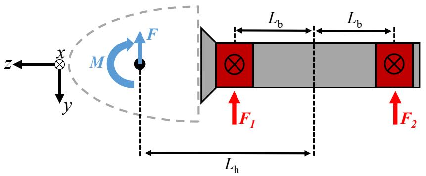  
Figure 1. Force diagram of a main shaft in a four-point support drivetrain. Note, the  $z$ -axis is aligned with the turbine drivetrain and hence sits at a tilt angle relative to the ground. Force and moment vector components (including the definition of "positive direction") at each location are defined via the depicted HAWC2 reference frame.

4. The contribution of main shaft and/or gearbox or generator weight to main bearing loads is small and may be neglected for the purposes of this "relative impacts" study.

180 The reference frame for hub loads in HAWC2 is also provided in Fig. 1 and, importantly, differs from that used in (Hart et al., 2022). The applied model has  $L_{b} = 1$  m and  $L_{h} = 3.7$  m. The main bearing force response equations in this same frame are

$$
F _ {1} ^ {x} = - \frac {1}{2} \left(\left(1 + \frac {L _ {\mathrm {h}}}{L _ {\mathrm {b}}}\right) F _ {\mathrm {h}} ^ {x} + \frac {M _ {\mathrm {h}} ^ {y}}{L _ {\mathrm {b}}}\right) \tag {4}
$$

$$
F _ {1} ^ {y} = - \frac {1}{2} \left(\left(1 + \frac {L _ {\mathrm {h}}}{L _ {\mathrm {b}}}\right) F _ {\mathrm {h}} ^ {y} - \frac {M _ {\mathrm {h}} ^ {x}}{L _ {\mathrm {b}}}\right) \tag {5}
$$

$$
F _ {2} ^ {x} = - \frac {1}{2} \left(\left(1 - \frac {L _ {\mathrm {h}}}{L _ {\mathrm {b}}}\right) F _ {\mathrm {h}} ^ {x} - \frac {M _ {\mathrm {h}} ^ {y}}{L _ {\mathrm {b}}}\right) \tag {6}
$$

185  $F_{2}^{y} = -\frac{1}{2}\left(\left(1 - \frac{L_{\mathrm{h}}}{L_{\mathrm{b}}}\right)F_{\mathrm{h}}^{y} + \frac{M_{\mathrm{h}}^{x}}{L_{\mathrm{b}}}\right)$  (7)

$$
F _ {1} ^ {z} = - F _ {\mathrm {h}} ^ {z} \tag {8}
$$

$$
F _ {2} ^ {z} = 0, \tag {9}
$$

where  $F_{\mathrm{h}}^{x,y,z}$  and  $M_{\mathrm{h}}^{x,y}$  denote the axial,  $z$ , and radial,  $x$  and  $y$ , hub-centre force and bending moment components obtained from HAWC2 models.

Main bearing rating life assessment: The modelled wind turbine drivetrains consist of a rotor-side roller bearing which supports both radial and axial loads, and a generator-side roller bearing which supports radial loads only. The relevant parameters from ISO 281 for both bearings are given in Table 1. Estimated radial loads at each bearing are combined into a radial load magnitude,

$$
F _ {r, i} = \sqrt {\left(F _ {i} ^ {x}\right) ^ {2} + \left(F _ {i} ^ {y}\right) ^ {2}} \text {f o r} i = 1 \text {a n d} 2,
$$

190 and, together with the estimated axial load, are inputted to ISO 281 basic rating life formulations (see Sect. 2.1). A rating life is calculated for each time step in any individual simulation, and a single simulation resultant rating life is calculated using Eq. (3), with equal weightings across all time steps.

Table 1. Bearing rating life parameters.  

<table><tr><td>Bearing</td><td>Nominal contact angle (deg)</td><td>Dynamic capacity, CD (MN)</td></tr><tr><td>Rotor side</td><td>22.1</td><td>56.58</td></tr><tr><td>Generator side</td><td>0</td><td>46.21</td></tr></table>

# 3.2 Two-turbine parametric analysis

The above tool chain was applied to a simple two-turbine setup to investigate rating life impacts from single wakes. This parametric analysis was performed by placing the two turbines at a downstream distance of  $5D$  from each other and then varying the cross-flow distance between the turbines (see Fig. 2a). The mean inflow direction was kept constant (from left to right in Fig. 2a) with both turbines yawed so as to face into the wind. The analysis included a total of 31 cross-flow offsets (ranging from  $-1.5D$  to  $1.5D$ ). Full sets of simulations were performed at hub-height mean wind speeds of 7.5, 11 and  $15\mathrm{m/s}$ . Furthermore, the complete analysis was completed six times, using different turbulence seeds in each case. These simulations were each run for  $2,000\mathrm{s}$ , discarding the first  $1,000\mathrm{s}$  of results before processing. The resultant rating lives were calculated for each set of input parameters and each turbulent seed individually, without further combination. The results of this analysis therefore give resultant rating lives which assume a given set of conditions hold across the full bearing lifetime. A total of 558 simulations were performed.

# 3.3 Wind farm analysis

The same tools were applied to undertake a complete wake-inclusive full-wind-rose (i.e. all wind directions) main bearing rating life assessment for all main bearings within the 32 turbine TotalControl reference wind farm (Andersen et al., 2018). The site is assumed to have the same Weibull wind speed distribution for each inflow direction, with  $k = 2$  and an annual mean wind speed of  $10\mathrm{m / s}$ . Simulations were undertaken for a total of 72 inflow directions ( $5^{\circ}$  direction bins). For each inflow direction, simulations were performed for hub-height ambient mean wind speeds from  $6\mathrm{m / s}$  to  $24\mathrm{m / s}$ , in  $2\mathrm{m / s}$  increments. These large wind farm cases were run for  $2,000\mathrm{s}$  with the first  $1,000\mathrm{s}$  being discarded, except for the cases with  $6\mathrm{m / s}$  and  $8\mathrm{m / s}$  inflow, which were run for  $3,000\mathrm{s}$  with the initial  $2,000\mathrm{s}$  being discarded. Simulations using each set of parameters were repeated six times, using a different turbulent seed for each. A total of 4,320 simulations were performed, using DTU's Sophia supercomputer (Technical University of Denmark, 2019). A flow-field visualization of one such simulation, in which the wind farm layout can also be seen, is shown in Fig. 2b. For each main bearing within the wind farm: 1) outputs of each simulation were first combined into a single simulation rating life, as previously described; 2) turbulent seed results were then combined for each value of mean wind speed, again using equal weightings; 3) a rating life combination over wind speed values was then undertaken, with weightings determined (see Kenworty et al. (2023)) using the specified Weibull distribution.

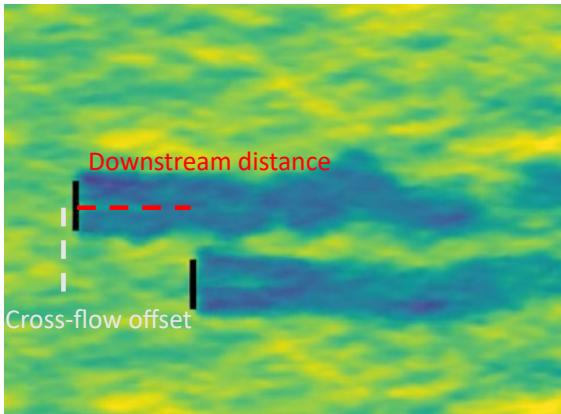  
(a) A snapshot of the two-turbine parametric analysis. The downstream distance is held at  $5D$ , and the crossflow offset distance between the turbines varied. Note, a negative cross-flow offset is shown in the figure.  
Figure 2. Layouts considered in this study.

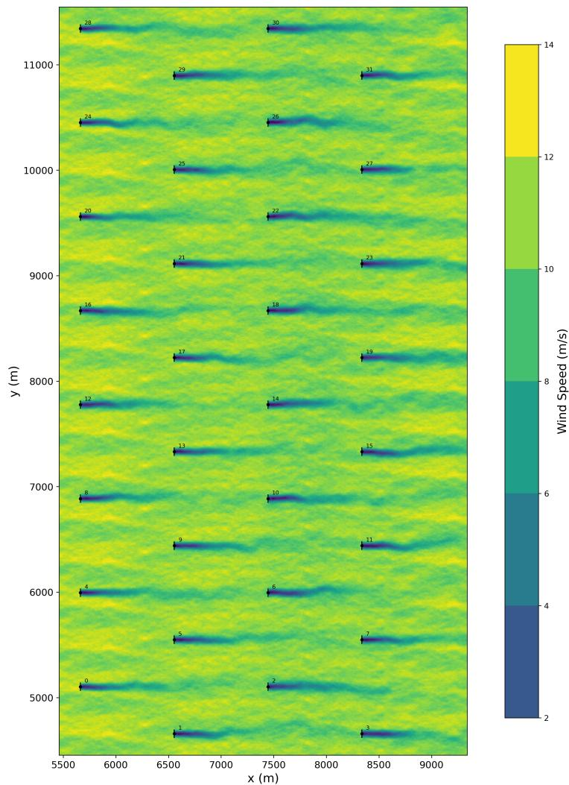  
(b) Layout and flow-field visualization of the TotalControl 32-turbine reference wind farm, including wake effects. Turbine indexes are also given.

At this stage, each bearing therefore had a single resultant main bearing rating life associated with each inflow direction. A single final resultant rating life was then determined, for each bearing, using weightings specified by a generalized elliptical wind direction rose (Hart, 2025). Given the expected sensitivity of results to wind direction, a range of direction roses were considered. Based on model fitting to data in (Hart, 2025), sensible/realistic ranges for wind rose model parameters  $a$  and  $f$  were identified  $(0.6 \leq a \leq 0.8$ ,  $0.1 \leq f \leq 0.6)$ , and results were determined for a range of wind roses which span these values

(see Fig. 3). The prevailing (highest probability) wind direction corresponded throughout to the left-to-right flow direction apparent in Fig. 2b.

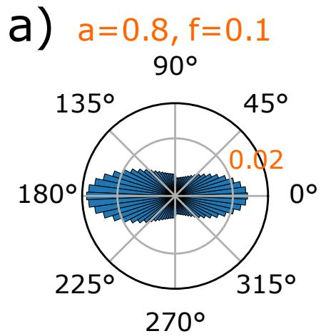

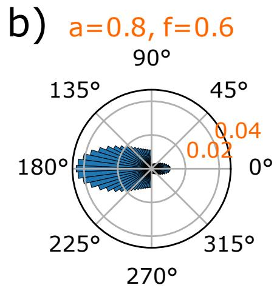

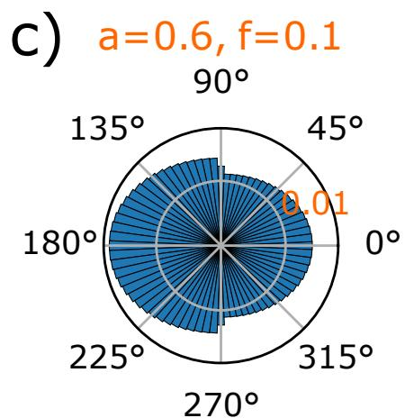  
Figure 3. Edge case wind direction roses, in terms of  $a$  and  $f$  values. The full envelope of applied wind direction roses falls between these bounding cases, each shown here with a prevailing wind direction of  $180^{\circ}$ .

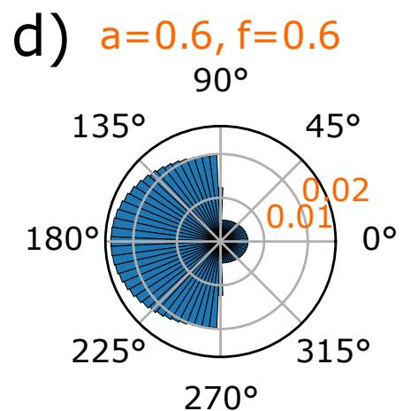

# 225 4 Results and discussion

Results are presented and discussed in the current section for both the two-turbine parametric analysis and the wind farm study. Assuming the main bearing which supports both axial and radial loads (the rotor-side bearing in the current paper) is the most common to fail, that bearing will be the main focus here.

The results of the two-turbine parametric analysis are presented in Fig. 4. Considering the (unwaked) front turbine results first, rotor- and generator-side bearing rating lives can be seen to far exceed the minimum design life of 20 years, as would be expected based on previous work (Kenworty et al., 2023). As discussed in that previous study, interpretation of such rating

lives is nuanced, since rating life formulations are generalized, simplified and do not account for all mechanisms of failure. The current analysis is, however, principally interested in the relative impacts of wake impingement in this setting as a route to considering questions of bearing load modelling sufficiency. Given the rating life results obtained for the back (waked) turbine, significant wake-driven impacts are observable. Interestingly, this includes a strong asymmetry, depending on the direction in which an offset occurs (recall that a negative offset is that shown in Fig. 2a).

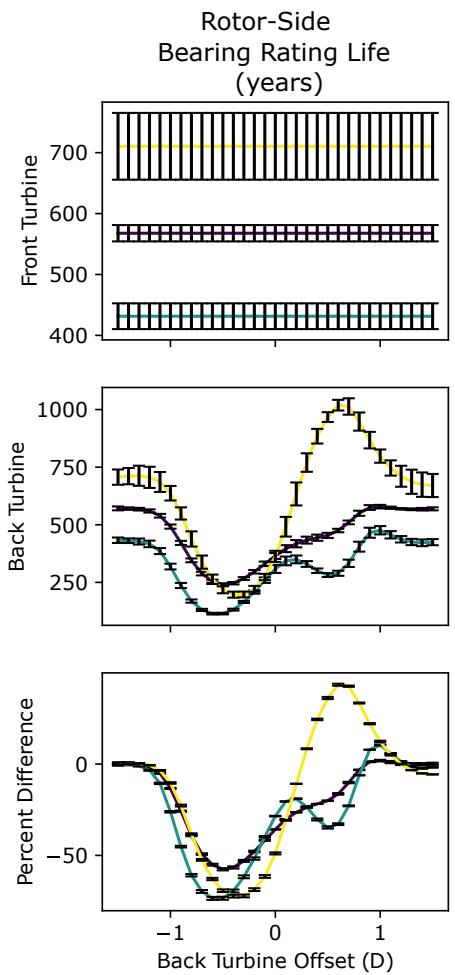  
Figure 4. Results of the two-turbine parametric analysis. Error bars indicate seed-to-seed variation across six turbulent seeds.

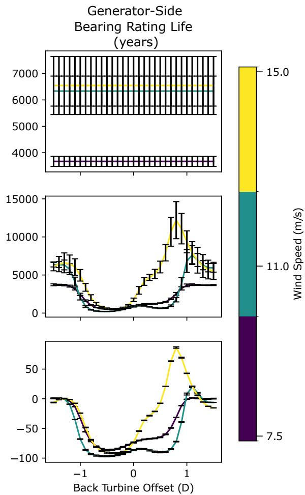

As hypothesised by Kenworty et al. (2023), wake impingement can reduce the main bearing rating life, with negative offset partial impingement  $(-0.5D)$  driving reductions of as much as  $73.5\%$  for the rotor-side bearing and  $96.7\%$  for the generator-side bearing. Despite the larger percentage reduction on the generator side, the smallest rating life is still observed for the rotor-side main bearing (116 years on the rotor side, versus 212 years on the generator side). Positive offsets, on the other hand, can either elicit a less dramatic reduction in rating life or increase rating life above that of the unwaked case (as seen for  $15\mathrm{m / s}$  wind speeds). Subsequent investigations of this phenomenon revealed these effects are the result of wake-driven

aerodynamic blade load perturbations and their interactions with rotor weight. To elaborate, a positive offset partial-wake causes the downwind turbine to experience a reduced flow velocity across downward traveling blades. Lift for such blades acts towards the ground and so augments the gravitational force. Reducing the lift on such blades therefore lessens the augmentation effect and so reduces the mean load on the hub and therefore the main bearing. This in turn causes an increase in the bearing rating life. Alternatively, a negative offset partial-wake causes the downwind turbine to experience a reduced flow velocity across upward traveling blades. Lift for such blades acts away from the ground and against the gravitational force. Reducing the lift on such blades therefore lessens the countering effect and increases the mean load on the hub and therefore the main bearing. This in turn causes a reduction in the bearing rating life. Such interactions with gravity as the principal driver of observed asymmetries is clearly demonstrated by undertaking an identical analysis in the absence of gravity. As shown in Fig. A1 (see Appendix), removing gravitational forcing removes the observed asymmetries. These results highlight the fact that, due to gravitational loading, the baseline main bearing mean load is significantly offset from zero. Subsequent effects and aerodynamic interactions therefore need to be considered relative to that nonzero starting point. Overall, the two-turbine parametric analysis results indicate that main bearing rating lives are strongly influenced by wake impingement (on the order of  $75\%$  for the axially supporting bearing), with the most significant reductions seen for partial wake impingement  $(-0.5D)$  occurring across upward traveling blades. Within a wind farm, the standard grid spacing between turbines will commonly be on the order of  $3D - 5D$ ; however, as the wind direction changes, the cross-flow offset between turbines (relative to the wind inflow direction) will vary across the full range analysed in this parametric analysis.

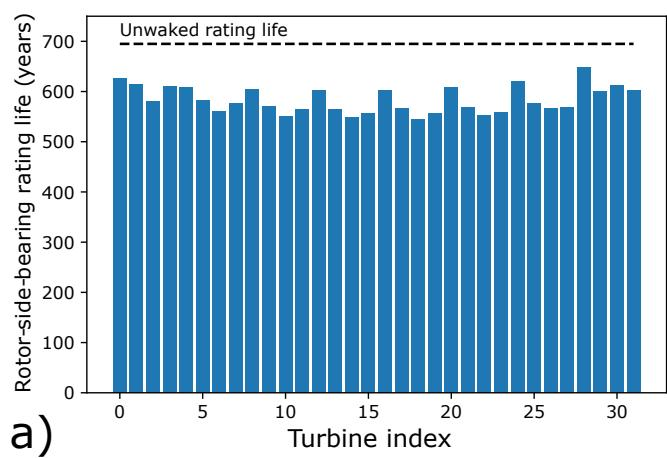  
Figure 5. a) Rating life results for all rotor-side main bearings, obtained from a wind direction rose with parameters  $a = 0.7$  and  $f = 0.35$ . The rating life corresponding to unwaked operation is also shown. b) Percentage reductions in rotor-side main bearing rating lives, for the same wind rose, relative to the unwaked rating life.

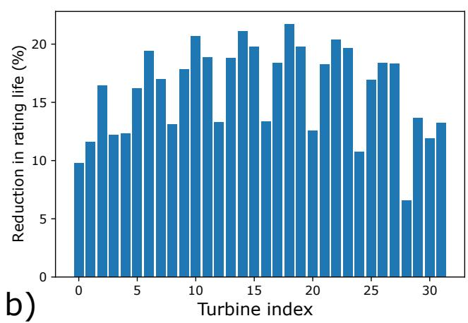

Wind farm analysis results for the axial load support rotor-side main bearing are now considered. As a baseline, the unwaked bearing rating life was determined for all bearings in the left-hand row of Fig. 2b, using all turbulence seeds and wind speeds while keeping the inflow direction fixed (left-to-right only) to ensure no wake impingement occurred. These front-row rating

lives were then averaged to obtain a single representative value for the unwaked rating life. Figure 5a presents rating life results for all turbines for the wind rose with parameters taken at the centre of each parameter range,  $a = 0.7$  and  $f = 0.35$ . The baseline unwaked rating life is also shown. Figure 5b shows the same results, expressed as the percentage reduction in main bearing rating life (due to wake impingement) relative to the unwaked case. First, it is important to note that a decrease in rotor-side main bearing rating life was obtained for every turbine in the wind farm. Therefore, while a few specific conditions were observed to result in an increase in rating life (see Fig. 4), the more common life-reducing cases appear to dominate overall. The relative rating life reductions in Fig. 5b range from  $6 - 22\%$ , with an average value of  $16\%$ . A second key takeaway is that when accounting for a representative wind direction distribution, rating life reductions were found to be smaller than the worst-case scenarios observed during the parametric analysis.

It also proves instructive to consider which turbines experience the greatest wake-driven rating life reductions. The four greatest reductions occurred, in descending order, for turbines 18, 14, 10, and 22, all of which (see Fig. 5b) are located on the wind farm interior and within the "back" interior row relative to the prevailing wind inflow direction (left-to-right in Fig. 2b). The next four greatest reductions occurred for turbines 19, 15, 23, and 6. These turbines include one in the interior back row, and the remainder in the exterior back row, relative to the prevailing wind direction. Via the folding parameter, the wind rose has therefore imposed on the wind farm a notion of "front" and "back" turbines with the most severe rating life impacts affecting the more consistently waked turbines, these being in the back rows (interior and then exterior). Additionally, these most impacted eight turbines are all centrally located with respect to the vertical ( $y$ -coordinate) layout of the farm; this is another factor leading to a greater incidence of wake-impinged operation for these turbines.

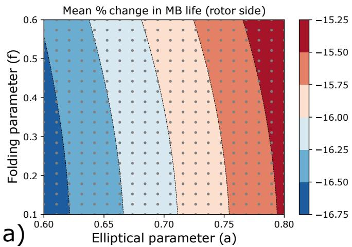  
Figure 6. a) Mean percentage change in rotor-side main bearing rating lives (relative to the unwaked case) across the wind farm, as a function of wind direction rose parameters. b) Maximum percentage reduction in rotor-side main bearing rating life (relative to the unwaked case) observed within the wind farm, as a function of wind direction rose parameters. The grey dots indicate the parameter combinations considered, and therefore the data locations used to determine the resulting contours.

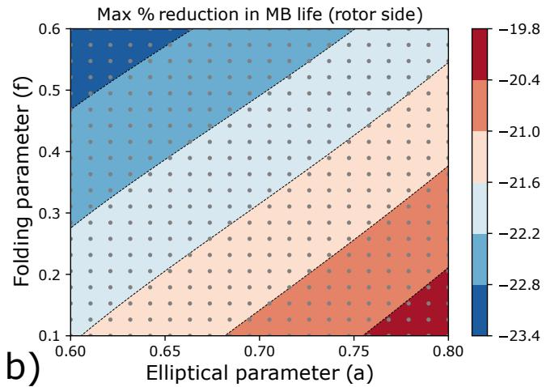

Wind farm rating lives were then determined for the full range of wind rose parameters. Figure 6 shows the results of this analysis, quantified via the mean percentage change in main bearing rating life across the wind farm (Fig. 6a) and the maximum percentage rating life reduction across the wind farm (Fig. 6b), both calculated relative to the unwaked case. Mean effects can be seen to vary little as the wind rose parameters are adjusted; the observable changes are almost entirely driven by the elliptical parameter. This result makes intuitive sense, since the folding parameter symmetrically adjusts the wind rose direction dominance. As previously described, a notion of "front" and "back" is thus being imposed on the turbines; the low sensitivity of the mean value to changes in  $f$  indicates that the (relative) rating life reductions at some locations are commensurate with the rating life increases in others. The impacts from varying  $a$  are also intuitive, given that turbine spacings are smaller in the vertical direction than in the horizontal (see Fig. 2b). This being the case, "rounder" wind roses mean more time spent with the wind directions in the vertical direction (the  $y$ -direction in Fig. 2b), where wake effects are stronger due to the smaller vertical spacing. Despite being small in magnitude, wind rose shape impacts are clearly discernible here. A different pattern emerges when considering the maximum reductions in main bearing rating lives across the wind farm (Fig. 6b). In this case we see a greater sensitivity to wind rose parameters, with maximum percentage reductions falling between  $19.8\%$  and  $23.4\%$ . Similar logic as above holds for  $a$ . For  $f$ , turbines in the more commonly waked back rows of the wind farm spend increasingly large proportions of time in more deleterious waked conditions as the value of  $f$  increases. Again, wind rose shape impacts are clearly discernible here and, interestingly, the results are approximately equally sensitive to the value of elliptical and folding parameters.

Overall, the presented results indicate that wind farm main bearing rating lives are reduced by the effects of wake impingement, resulting in rating life reductions on the order of  $16\%$  on average, and on the order of  $20 - 25\%$  at maximum (for the axially fixed main bearing). Rating life impacts were found to be asymmetrically related to the side on which impingement occurs due to differing interactions between aerodynamic force perturbations and their orientations relative to gravity. If one has a choice, the "better" side to partially wake is the one on which blades are traveling towards the ground – a result which could prove useful in the design of wake steering control algorithms. The same analysis indicated that mean bearing loading is a strong indicator for rating life impacts (as has previously been noted (Kenworty et al., 2023; Krathe et al., 2024)), which could prove useful if seeking to implement simple heuristic bearing impact metrics in layout and/or control co-design codes, similar to Stanley et al. (2023). A two-turbine parametric analysis demonstrated that the greatest reductions in rating life occur when a wake covers half of the downstream turbine rotor area  $(0.5D$  impingement), another result with the potential to inform wake steering approaches. Wind farm results indicated that rating life impacts are sensitive to the shape of the site wind rose, with the most reduced lives associated with more unidirectional wind roses, as well as those with larger probability mass in directions along which turbines are spaced more closely.

The above results must be interpreted with care and, critically, with careful consideration of the appropriate interpretation of the ISO 281 rating life, in particular regarding its limitations (see Sect. 1 and 2, and Kenworty et al. (2023)). Similarly, one must also appreciate the limitations of the present study, in which simplified (to different extents) representations were utilized for modeling the ambient wind field, wakes, wind turbines and drivetrains. As a result, and in the context of Sect. 1 and 2 discussions on modeling sufficiency, the following high-level observations and recommendations are made:

1. Wake impingement has been found to reduce ISO 281 main bearing rating lives by  $16\%$  on average, and by as much as  $20 - 25\%$  at maximum.  
2. Wake effects should be considered a necessary effect for model inclusion to help ensure the sufficiency of main bearing operational load models.  
3. If other effects (such as drivetrain elasticity, inertial loading or those which may be accounted for using ISO 16281) are also incorporated, this could conceivably result in ISO-derived (281 or 16281) rating lives which can account for the reported rates of main bearing failures. This, in turn, would be evidence in support of a view that rolling contact fatigue may in fact underpin many (or even most) main bearing failures.  
4. Future work should therefore look to establish a realistic and detailed high-fidelity modelling chain that both captures and combines the various important rating life reduction effects, which now include wake impingement, while remaining open to the possibility that alternative failure modes (not captured within rating life formulations) may still underlie a majority of main bearing failures. Validations against field data would be an important consideration during such future work.

# 5 Conclusions

This paper sought to quantify the relative change in main bearing rating lives across a wind farm when including the effects of wake-impinged operation. Beyond evaluating the extent to which wakes may be a contributing factor in premature main bearing failures, this research was also motivated by questions concerning the sufficiency of models used to assess main bearing design and reliability. Background context and modelling techniques were discussed, and a modelling tool chain was established for quantifying the effects of wake impingement on main bearing rating lives across a wind farm populated by 10 MW wind turbines. Turbine loads were computed using the Dynamiks Python package, including application of a dynamic wake meandering model. A two-turbine parametric analysis was undertaken first, showing that partial wake impingement can reduce the axially supporting main-bearing rating life associated with a single set of conditions by as much as  $50 - 75\%$ . These parametric results do not account for varying site conditions. Rating life impacts were also found to be asymmetrically related to the side on which impingement occurs, indicating that, for the main bearing, there may be a "better" side for wake impingement to occur. A full wind farm analysis was then undertaken for the TotalControl 32-turbine reference wind farm, including full wind rose simulations across all operational wind speeds. The full wind farm analysis results properly accounted for varying site conditions via a Weibull wind speed distribution and a range of parametric wind direction rose models. Results showed that, overall, the wind farm main bearing rating lives were reduced by the effects of wake impingement on the order of  $16\%$  on average and as much as  $20 - 25\%$ , both for the locating main bearing. Sensitivities of the maximum rating life reductions to the shape of the site wind rose were also discernible. It was then highlighted that these results must be interpreted with careful consideration for the limitations and appropriate interpretation of the ISO 281 rating life and with an appreciation for the modelling simplifications which are present in the overall tool chain that was applied. Based on the outlined research findings,

it was concluded that wind farm-level wake effects should necessarily be included when undertaking main bearing operational load modelling and rating life assessment. It was also recommended that a realistic and detailed high-fidelity modelling chain be developed in future work (and validated against field data) to combine various important rating life reduction effects alongside wake impingement.

# Acknowledgments

Edward Hart is funded by an EPSRC Innovation Launchpad Network+ Researcher in Residence Fellowship (EP/W037009/1), a collaboration with the Offshore Renewable Energy Catapult. This research has been supported by the SUDOCO project, which is funded through the European Union's Horizon Europe Programme under grant agreement No. 101122256. Numerical simulations were run on the Technical University of Denmark's Sophia supercomputer (Technical University of Denmark, 2019). This work was also authored in part by the National Renewable Energy Laboratory operated by the Alliance for Sustainable Energy, LLC, for the U.S. Department of Energy (DOE) under contract no. DEAC36-08GO28308. Funding was provided by the U.S. Department of Energy Office of Energy Efficiency and Renewable Energy Wind Energy Technologies Office. The views expressed in the article do not necessarily represent the views of the DOE or the U.S. Government. The U.S. Government retains and the publisher, by accepting the article for publication, acknowledges that the U.S. Government retains a nonexclusive, paid-up, irrevocable, worldwide license to publish or reproduce the published form of this work, or allow others to do so, for U.S. Government purposes.

Data availability. The scripts used to conduct this analysis are available here: https://doi.org/10.5281/zenodo.15148660

Author contributions. J.Q., E.H., and Y.G. conceived the study. J.Q., E.H., M.B.N., R.S.L., and J.L. implemented the computational framework. E.H. developed the bearing life analysis. All authors contributed to the interpretation of results and writing of the manuscript.

Competing interests. Some authors are members of the editorial board of Wind Energy Science.

# References

DYNAMIKS: Dynamic Wind System Simulator, https://gitlab.windenergy.dtu.dk/DYNAMIKS/dynamiks, version 370 0.0.4.post1.dev0+g05a10bd.d20250110, 2025.  
Andersen, S., Madariaga, A., Merz, K., Meyers, J., Munters, W., and Rodriguez, C.: TotalControl Reference Wind Power Plant - D1.03 - Horizon2020 project 727680, https://www.totalcontrolproject.eu-//media/Sites/TotalControl/Publications/Public-deliverables/ TotalControl-D1-03-Reference-Wind-Farm.ashx, 2018.  
Bak, C., Zahle, F., Bitsche, R., Kim, T., Yde, A., Henriksen, L. C., Hansen, M. H., Blasques, J. P. A. A., Gaunaa, M., and Natarajan, A.: The DTU 10-MW reference wind turbine, in: Danish wind power research 2013, 2013.  
de Mello, E., Hart, E., Guo, Y., Keller, J., Dwyer-Joyce, R., and Boateng, A.: Dynamic modelling of slip in a wind turbine spherical roller main bearing, Forschung im Ingenieurwesen, 87, 297-307, 2023.  
Dong, G., Li, Z., Qin, J., and Yang, X.: How far the wake of a wind farm can persist for?, Theoretical and Applied Mechanics Letters, 12, 100314, 2022.  
380 EPRI: Wind turbine main bearing reliability analysis, operations, and maintenance considerations. Technical report 3002029874, 2024.  
Gryning, S.-E., Floors, R., Peña, A., Batchvarova, E., and Brümmer, B.: Weibull wind-speed distribution parameters derived from a combination of wind-lidar and tall-mast measurements over land, coastal and marine sites, Boundary-Layer Meteorology, 159, 329-348, 2016.  
Guo, Y., Thomson, A., Bergua, R., Bankestrom, O., Erskine, J., and Keller, J.: Acoustic emission measurement of a wind turbine main bearing, Tech. rep., National Renewable Energy Lab.(NREL), Golden, CO (United States), 2022.  
385 Hansen, M. H. and Henriksen, L. C.: Basic DTU wind energy controller, 2013.  
Hart, E.: Developing a systematic approach to the analysis of time-varying main bearing loads for wind turbines, Wind Energy, 23, 2150-2165, 2020.  
Hart, E.: Brief communication: An elliptical parameterisation of the wind direction rose [preprint], Wind Energ. Sci. Discuss, 2025, 1-10, 2025.  
390 Hart, E., Stock, A., Elderfield, G., Elliott, R., Brasseur, J., Keller, J., Guo, Y., and Song, W.: Impacts of wind field characteristics and non-steady deterministic wind events on time-varying main-bearing loads, Wind Energy Science, 7, 1209-1226, 2022.  
Hart, E., Raby, K., Keller, J., Sheng, S., Long, H., Carroll, J., Brasseur, J., and Tough, F.: Main bearing replacement and damage-a field data study on 15 gigawatts of wind energy capacity, 2023.  
Ishihara, T., Wang, S., and Kikuchi, Y.: Fatigue prediction of wind turbine main bearing based on field measurement and three-dimensional elastic drivetrain model, Engineering Failure Analysis, 167, 108985, 2025.  
ISO 281:2007(E): ISO 281:2007(E). Rolling bearings — Dynamic load ratings and rating life, Standard, International Organization for Standardization, Geneva, CH, 2007.  
Jiang, Z., Huang, X., Liu, H., Zheng, Z., Li, S., and Du, S.: Dynamic reliability analysis of main shaft bearings in wind turbines, International Journal of Mechanical Sciences, 235, 107-721, 2022a.  
400 Jiang, Z., Huang, X., Zhu, H., Jiang, R., and Du, S.: A new method for contact characteristic analysis of the tapered roller bearing in wind turbine main shaft, Engineering Failure Analysis, 141, 106729, 2022b.  
Kenworty, J., Hart, E., Stirling, J., Stock, A., Keller, J., Guo, Y., Brasseur, J., and Evans, R.: Wind turbine main bearing rating lives as determined by IEC 61400-1 and ISO 281, Wind Energy (submitted), 2023.

Kock, S., Jacobs, G., and Bosse, D.: Determination of wind turbine main bearing load distribution, in: Journal of Physics: Conference Series, vol. 1222, p. 012030, IOP Publishing, 2019.  
Krathe, V. L., Jonkman, J., Gebel, J., Rivera-Arreba, I., Nejad, A., and Bachynski-Polic, E. E.: Investigation of main bearing fatigue estimate sensitivity to synthetic turbulence models using a novel drivetrain model implemented in OpenFAST [Preprint], 2024.  
Larsen, G. C., Madsen, H. A., Thomsen, K., and Larsen, T. J.: Wake meandering: A pragmatic approach, Wind Energy, 11, 377-395, https://doi.org/https://doi.org/10.1002/we.267, 2008.  
410 Larsen, T. J. and Hansen, A. M.: How 2 HAWC2, the user's manual, Riso National Laboratory, 1597, 2007.  
Liew, J., Gocmen, T., Lio, A. W., and Larsen, G. C.: Extending the Dynamic Wake Meandering Model in HAWC2FARM: Lillgrund Wind Farm Case Study and Validation, Wind Energy Science, 8, 1387-1402, https://doi.org/10.5194/wes-2023-14, 2023.  
Lio, W. H., Larsen, G. C., and Thorsen, G. R.: Dynamic wake tracking using a cost-effective LiDAR and Kalman filtering: Design, simulation and full-scale validation, Renewable Energy, 172, 1073-1086, 2021.  
415 Madsen, H. A., Larsen, T. J., Pirrung, G. R., Li, A., and Zahle, F.: Implementation of the blade element momentum model on a polar grid and its aeroelastic load impact, Wind Energy Science, 5, 1-27, 2020.  
Mann, J.: Wind field simulation, Probabilistic engineering mechanics, 13, 269-282, 1998.  
Moghadam, F. K., Chabaud, V., Gao, Z., and Chapaloglou, S.: Power train degradation modelling for multi-objective active power control of wind farms, Forschung im Ingenieurwesen, 87, 13-30, https://doi.org/https://doi.org/10.1007/s10010-023-00617-2, 2023.  
420 Quick, J., Mouradi, R.-S., Devesse, K., Mathieu, A., Van Der Laan, M. P., Leon, J. P. M., and Schulte, J.: Verification and Validation of Wind Farm Flow Models, in: Journal of Physics: Conference Series, vol. 2767, p. 092074, IOP Publishing, 2024.  
Riva, R., Liew, J., Friis-Møller, M., Dimitrov, N., Barlas, E., Réthore, P.-E., and Beržonskis, A.: Wind farm layout optimization with load constraints using surrogate modelling, in: Journal of Physics: Conference Series, vol. 1618, p. 042035, IOP Publishing, 2020.  
Shaler, K., Jonkman, J., Barter, G. E., Kreeft, J. J., and Muller, J. P.: Loads assessment of a fixed-bottom offshore wind farm with wake steering, Wind Energy, 25, 1530-1554, 2022.  
Stanley, A. P., King, J., Bay, C., and Ning, A.: A model to calculate fatigue damage caused by partial waking during wind farm optimization, Wind Energy Science Discussions, 2020, 1-34, 2020a.  
Stanley, A. P., King, J., and Ning, A.: Wind farm layout optimization with loads considerations, in: Journal of Physics: Conference Series, vol. 1452, p. 012072, IOP Publishing, 2020b.  
430 Stanley, A. P., Bay, C. J., and Fleming, P.: Enabling control co-design of the next generation of wind plants, Wind Energy Science Discussions, 2023, 1-12, 2023.  
Technical University of Denmark: Sophia HPC Cluster, Technical report, Research Computing at DTU, https://doi.org/10.57940/FAFC-6M81, DOI: 10.57940/FAFC-6M81, 2019.  
van Binsbergen, D. W., Wang, S., and Nejad, A. R.: Effects of induction and wake steering control on power and drivetrain responses for 10 MW floating wind turbines in a wind farm, Journal of Physics: Conference Series, 1618, 022044, https://doi.org/https://doi.org/10.1088/1742-6596/1618/2/022044, 2020.  
Veers, P., Bottasso, C., Manuel, L., Naughton, J., Pao, L., Paquette, J., Robertson, A., Robinson, M., Ananthan, S., Barlas, A., et al.: Grand Challenges in the Design, Manufacture, and Operation of Future Wind Turbine Systems, Wind Energy Science, 8, 1071-1131, 2023.  
Zheng, J., Ji, J., Yin, S., and Tong, V.-C.: Fatigue life analysis of double-row tapered roller bearing in a modern wind turbine under oscillating external load and speed, Proceedings of the Institution of Mechanical Engineers, Part C: Journal of Mechanical Engineering Science, 234, 3116-3130, 2020.

# Appendix A

The two-turbine parametric analysis was performed without a simulated gravity force. These results are shown in Fig. A1 and indicate that the previously observed asymmetries are predominantly due to interactions between aerodynamic and gravitational loads.

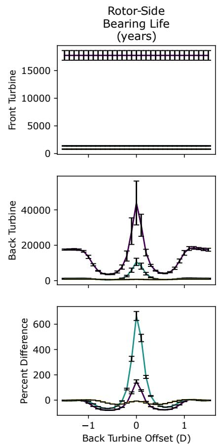  
Figure A1. Results of the two-turbine parametric analysis with gravity turned off. Error bars indicate seed-to-seed variation across six turbulent seeds.

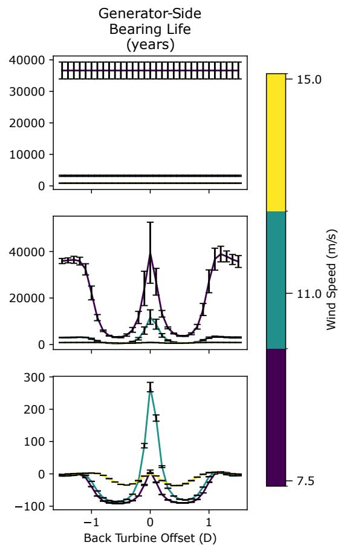