# Main bearing response in a waked 15-MW floating wind turbine in below-rated conditions

Veronica Liverud Krathe $^{1}$  · Regis Thedin $^{2}$  · Jason M. Jonkman $^{2}$  · Amir R. Nejad $^{1}$  · Erin E. Bachynski-Polic $^{1}$

Received: 26 September 2024 / Accepted: 12 February 2025  
© The Author(s) 2025

# Abstract

Increased wind turbine size raises unknowns related to structural flexibility. Moreover, moving to deeper waters, component reliability becomes more critical. This work investigates main bearing response dependence on drivetrain flexibility and wake impingement in a two-turbine wind farm. A 15-MW floating direct-drive turbine is considered. Large eddy simulations (LES) are employed to model neutral, stable and unstable atmospheric conditions at below-rated mean wind speed, while the engineering codes OpenFAST and FAST.Farm simulate turbine and wake behavior. Results indicate significant sensitivities in fatigue estimates to lateral distance between the upstream and downstream turbine. The trends are most substantial in stable conditions, where the waked downwind main bearing sees twice the fatigue damage estimates of the upstream turbine for one position and  $50\%$  for another. Main bearing fatigue sensitivity to drivetrain flexibility is minor, while properly including generator rotor inertia loads is important for the axial forces of the locating (axially fixed) bearing, especially in stable conditions.

Keywords Main bearing  $\cdot$  Floating wind turbine  $\cdot$  Wake  $\cdot$  Coupled analysis

# 1 Introduction

With rising energy demand and vast offshore areas, floating wind turbines are considered a key part of future renewable energy sources. To limit installation and maintenance costs, turbine rated capacities continue to grow, and so do the structures. Larger turbines are generally more flexible. Traditionally, drivetrain analyses are one-way cou

pled, modeled simply as a torsional spring-damper in global analyses [1]. However, for large turbines, the eigenfrequencies of drivetrain bending modes can be lower than those of the torsional mode [2], bedplate flexibility can affect drivetrain loads [3] and bearing flexibility may be necessary to include in aero-elastic (global) analysis [4].

Further from shore, reliability is key. Main bearings are receiving increased attention, with research revealing premature failure [5, 6]. Asymmetric distribution of the wind velocity across the rotor may result in larger main bearing radial forces, while axial forces are governed by the rotor-averaged wind velocity [7-10]. Asymmetric rotor loading can be caused by shear [9, 10], large coherent structures inherent in the turbulent atmospheric boundary layer [7, 8, 10] or by partial wake impingement [11].

A global model including drivetrain bending flexibility and main bearing stiffness was previously implemented in the aero-hydro-servo-elastic code OpenFAST [12] for a geared 10-MW wind turbine [10] and verified against a coupled multibody model. Here, the same method was employed for a 15-MW direct-drive floating turbine, comparing main bearing fatigue and load response to a one-way coupled model with analytical bearing load calculations. The model was further applied to evaluate the main bearing fatigue and load statistics for a waked turbine us

ing the wind farm engineering tool FAST.Farm [13]. Main bearing response depends highly on wind field characteristics [9, 10, 14], and so do the wake behavior [15, 16]. Therefore, large-eddy simulations (LES) were applied for simulating three canonical boundary layers: stable, neutral and unstable.

# 2 Methodology

# 2.1 Wind turbine model

# 2.1.1 Base case and software

The IEA 15-MW [17, 18] reference wind turbine (RWT) supported by the UMaine VolturnUS-S floating platform [19] was used as a base case. Main properties are listed in Table 1. The steel semisubmersible has three radially spaced columns connected to a center column by pontoons. The center column carries the tower and rotornacelle-assembly, including a direct-drive generator, see Fig. 1.

The turbine was modeled in the aero-hydro-servo-elastic tool OpenFAST v3.5.3 [20]. Two models were considered: One applying only a torsional degree of freedom of the drivetrain, and one that additionally includes flexible main bearings, shaft and bedplate. These models will be referred to as the rigid and flexible drivetrain models, respectively.

OpenFAST integrates various modules to model different aspects of wind turbine dynamics, such as aerodynamics (AeroDyn) and hydrodynamics (HydroDyn). For structural modeling, two modules are applied in this work: Elastodyn uses a combination of modal analysis and multibody formulation, while SubDyn is a linear finite element framework. Table 2 outlines the responsibilities of Elastodyn and SubDyn for the two models considered in this work. In short, Elastodyn takes care of the rotating components, while SubDyn handles the parts not rotating with the rotor.

The approach for modeling the flexible drivetrain was previously verified for a 10-MW bottom-fixed turbine by comparing global and main bearing response to a multi-body coupled model [10]. A visualization of the flexible drivetrain can be found in Fig. 2. The main bearings are represented by linear springs of stiffness  $\mathbf{K}_{\mathrm{MB1}}$  and  $\mathbf{K}_{\mathrm{MB2}}$  (upwind and downwind main bearing, respectively). The shaft and the bedplate are modeled using linear, flexible beams. The generator rotor and stator mass and inertia are represented by point masses  $(\mathbf{M}_{gr}$  and  $\mathbf{M}_{gs})$ . Some details are omitted for simplicity in this figure: The springs have no length and the shaft and nose coincide (but have no contact). The generator rotor mass and inertia  $\mathbf{M}_{gr}$  and stator mass  $\mathbf{M}_{gs}$  have the same center of mass, but are attached by rigid links to a point on the shaft upstream of MB1 and in the nose, respectively. As the main bearings are modeled explicitly in this setup, their forces can be obtained directly from OpenFAST simulations. The WISDEM on

Table 1 Main parameters of the IEA 15-MW floating RWT  

<table><tr><td>Hub height [m]</td><td>Rotor diameter [m]</td><td>Rated wind speed [m/s]</td><td>Rated power [MW]</td><td>Rated rotor speed [rpm]</td><td>Shaft tilt angle [°]</td><td>Water depth [m]</td></tr><tr><td>150</td><td>240</td><td>10.59</td><td>15</td><td>7.56</td><td>6.0</td><td>200</td></tr></table>

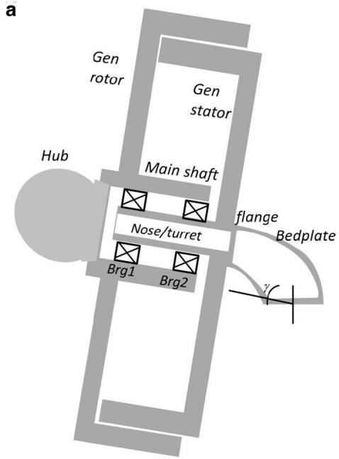  
Fig.1 The IEA 15-MW RWT. a Direct-drive layout of the IEA 15-MW RWT [17], b UMaine VolturnUS-S floating platform

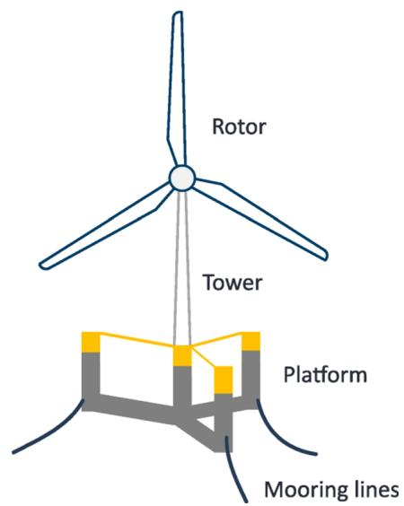  
b

Table 2 Responsibilities of SubDyn (S) and ElastoDyn (E) modules for rigid and flexible drivetrain models  

<table><tr><td>Component</td><td>Module</td><td>Rigid drivetrain</td><td>Flexible drivetrain</td></tr><tr><td>Floating platform</td><td>S</td><td>Rigid</td><td></td></tr><tr><td>Tower</td><td>S</td><td>Flexible</td><td></td></tr><tr><td>Bedplate</td><td>S</td><td>-</td><td>Flexible beam, stiff in torsion</td></tr><tr><td>Generator torque</td><td>E</td><td>✓</td><td></td></tr><tr><td>Nacelle mass and inertia</td><td>S</td><td>Point mass</td><td></td></tr><tr><td>Generator stator mass and inertia</td><td>S</td><td>In nacelle mass</td><td>Point mass</td></tr><tr><td>Generator rotor mass</td><td>S</td><td>In nacelle mass</td><td>Point mass</td></tr><tr><td>Generator rotor inertia about local x</td><td>E</td><td>✓</td><td></td></tr><tr><td>Generator rotor inertia about local y</td><td>S</td><td>In nacelle mass</td><td>Point mass</td></tr><tr><td>Main bearings</td><td>S</td><td>-</td><td>Linear springs</td></tr><tr><td>Stationary shaft</td><td>S</td><td>-</td><td>Non-rotating, flexible beam, stiff in torsion</td></tr><tr><td>Drivetrain torsional degree of freedom</td><td>E</td><td>Spring and damper</td><td></td></tr><tr><td>Rotating shaft</td><td>E</td><td>Stiff</td><td></td></tr><tr><td>Rotor</td><td>E</td><td>Modal representation</td><td></td></tr></table>

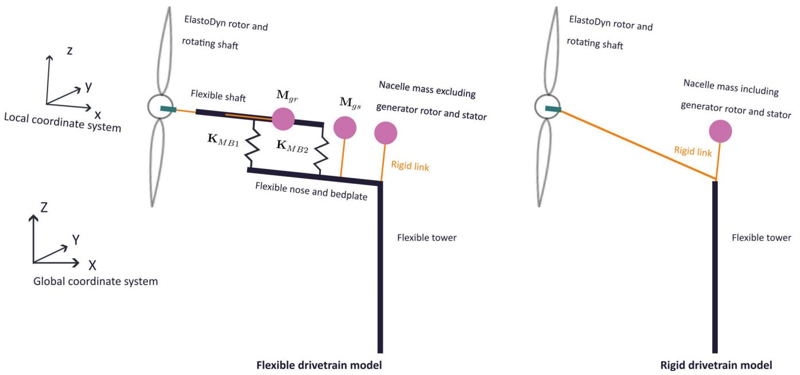  
Fig.2 Flexible and rigid drivetrain models

tology framework [18] provided the drivetrain geometric and material properties. To avoid duplicating drivetrain torsional flexibility, which is already modeled in ElastoDyn, the shaft, nose and bedplate were stiff in torsion. More details on this method are provided by Krathe et al. [10, 21].

The rigid drivetrain utilizes the traditional manner of modeling the drivetrain in OpenFAST, namely with a torsional spring and damper representing the drivetrain torsion. To obtain main bearing forces from the rigid drivetrain model, analytical equations are applied, as presented in Sect. 2.1.3.

The rest of the model follows the baseline floating 15-MW RWT [18] with a ROSCO [22] collective blade pitch and generator torque control. Potential flow tower influence

(shadow) on the inflow wind was included using a rigid tower based on tower top motions via a small customization of the OpenFAST source code. OpenFAST parameters specific for the simulations in this work are provided in Table 3.

# 2.1.2 Main bearings

For the flexible drivetrain model, stiffnesses of the main bearings were needed. There is limited information about the main bearings of the IEA 15-MW RWT. The specified bearings are an upwind locating double-row spherical roller bearing (SRB) and a downwind non-locating compact aligning roller bearing (CARB) [18].

Table 3 OpenFAST settings  

<table><tr><td>Parameter</td><td>Flexible drivetrain</td><td>Rigid drivetrain</td></tr><tr><td>SubDyn time step [s]</td><td>0.002</td><td></td></tr><tr><td>Glue-code time step [s]</td><td>0.002</td><td></td></tr><tr><td>Number of correction iterations [−]</td><td>1</td><td></td></tr><tr><td>Rayleigh damping constants, α, β [−]</td><td>0, 0</td><td></td></tr><tr><td>Critical damping of first 6 Craig-Bampton modes [%]</td><td>0.50, 0.50, 0.50, 0.90, 0.90, 0.1</td><td></td></tr><tr><td>Number of retained Craig-Bampton modes [−]</td><td>17</td><td>12</td></tr><tr><td>Frequency of upper retained Craig-Bampton mode [Hz]</td><td>21.7</td><td>18.6</td></tr></table>

Main bearing spring stiffnesses were estimated using Schaeffler's online tool [23] which calculates bearing forces and displacements based on shaft loads. No bearings with inner diameters close to the nose of the IEA 15-MW RWT (diameter of  $2200\mathrm{mm}$ ) were available, so spring stiffness of spherical roller bearings with diameters of  $1000 - 1800\mathrm{mm}$  were estimated. The spring stiffness estimates were based on curve-fitting of displacements and loads at  $40 - 120\%$  of shaft mean loads at rated wind speed, and two load cases with turbulent wind at  $12\mathrm{m / s}$  and  $20\mathrm{m / s}$  where the sum of shaft mean loads and standard deviations were considered. A linear curve was then fitted to estimate the stiffness for a  $2200\mathrm{mm}$  bearing. The spring stiffnesses are shown in Table 4. Although spherical roller bearings subjected to combined axial and radial loads may have cross-coupling stiffness coefficients [24], a sensitivity study (not presented here) showed that these off-diagonal terms had a negligible impact on the results of this work and were therefore omitted.

# 2.1.3 Analytical calculations

In the rigid drivetrain model, analytical equations were used to estimate main bearing forces. In these force and moment balance considerations, the shaft was treated as a simply supported beam with the main bearings as supports (Fig. 3).

Table 4 Main bearing spring stiffness in local coordinates  

<table><tr><td>Bearing</td><td>kxx[N/m]</td><td>kyy[N/m]</td><td>kzz[N/m]</td></tr><tr><td>MB1</td><td>2.5E9</td><td>3.6E10</td><td>3.6E10</td></tr><tr><td>MB2</td><td>0</td><td>2.9E10</td><td>2.9E10</td></tr></table>

$F_{i_s}$  and  $M_{i_s}$  represent the forces and moments acting on the shaft, including aerodynamic loads and loads due to rotor mass and inertia, with  $i = x,y,z$  being in the local coordinate system, but not rotating with the rotor. The shaft has a tilt and the platform can pitch, so that local  $x$  and  $z$  do not completely align with global  $X$  and  $Z$ . In this work, axial, lateral/transverse and vertical bearing and shaft loads refer to forces in local  $x,y$  and  $z$ , respectively. For load calculations in  $x$  and  $z$ , the generator rotor mass  $(m_{gr})$  and inertia  $(J_{gr_y})$  are included, accounting for the combined shaft tilt and instantaneous platform pitch,  $\phi$ . The parameters used in the analytical equations are listed in Table 5. Shaft mass is included similarly as generator rotor mass, with parameters  $m_{sh}$  and  $L_{1shm}$ , but omitted from Fig. 3 and the analytical equations presented here for simplicity.

The vertical forces applied from the bearings to the shaft can be calculated as presented in Eq. 1 (forces on the bearings are equal and with opposite sign).

$$
F _ {z _ {M B 1}} = \frac {- M _ {y s} - F _ {z _ {s}} (L _ {h 1} + L _ {1 2}) + m _ {g r} \left(a _ {t z} + g \cos \phi\right) \left(L _ {1 2} - L _ {1 g r m}\right) + J _ {g r y} a _ {r y}}{L _ {1 2}},
$$

$$
F _ {z _ {M B 2}} = \frac {M _ {y s} + F _ {z s} L _ {h 1} + m _ {g r} \left(a _ {t z} + g \cos \phi\right) L _ {1 g r m} - J _ {g r y} a _ {r y}}{L _ {1 2}}. \tag {2}
$$

Similarly, the bearing lateral forces on the shaft are found as:

$$
F _ {y _ {M B 1}} = \frac {M _ {z _ {s}} - F _ {y _ {s}} \left(L _ {h 1} + L _ {1 2}\right)}{L _ {1 2}}, \tag {3}
$$

$$
F _ {y _ {M B 2}} = \frac {- M _ {z _ {s}} + F _ {y _ {s}} L _ {h 1}}{L _ {1 2}}. \tag {4}
$$

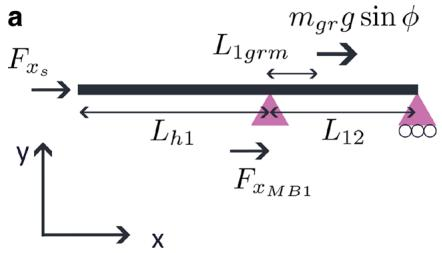  
Fig. 3 Analytical load diagram of the shaft loads in local coordinate system. a Forces in local x, b Loads in local yx-plane, c Loads in local zx-plane

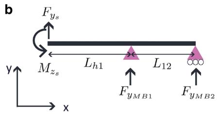

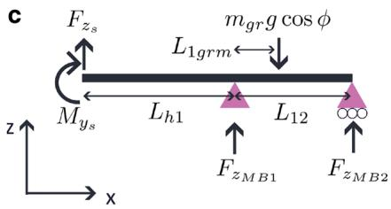

Table 5 Drivetrain geometric parameters  

<table><tr><td>Parameter</td><td>Description</td><td></td></tr><tr><td>Lh1</td><td>Distance between hub center and MB1 along shaft</td><td>4.97 m</td></tr><tr><td>L12</td><td>Distance between MB1 and MB2 along shaft</td><td>1.20 m</td></tr><tr><td>L1grm</td><td>Distance between MB1 and generator rotor center of mass</td><td>0.58 m</td></tr><tr><td>L1shm</td><td>Distance between MB1 and shaft center of mass</td><td>0.1 m</td></tr><tr><td>φ</td><td>Sum of shaft tilt and time-varying platform pitch</td><td>6° + φPtfm(t)</td></tr><tr><td>msh</td><td>Shaft mass</td><td>15733 kg</td></tr><tr><td>mgr</td><td>Generator rotor mass</td><td>130349 kg</td></tr><tr><td>Jgry</td><td>Generator rotor mass moment of inertia about local y</td><td>972877 kgm2</td></tr><tr><td>atz</td><td>Translational acceleration of the generator rotor mass in local z</td><td>atz(t)</td></tr><tr><td>atx</td><td>Translational acceleration of the generator rotor mass in local x</td><td>atz(t)</td></tr><tr><td>arv</td><td>Rotational acceleration of the generator rotor mass about local y</td><td>arv(t)</td></tr><tr><td>g</td><td>Gravitational acceleration</td><td>9.81 m/s2</td></tr></table>

Only MB1 transfers axial loads and shaft axial loads are calculated as:

$$
F _ {x _ {M B 1}} = - F _ {x _ {s}} + m _ {g r} \left(a _ {t _ {x}} - g \sin \phi\right). \tag {5}
$$

# 2.2 Fatigue calculations

This study aims to perform a comparative analysis of main bearing fatigue under various conditions. Although the fatigue damage calculation according to ISO 281 [25] may not be appropriate for detailed fatigue assessments of bearings of this size, it provides a suitable framework for comparative analysis. The basic rating life provides an indication of roller bearing fatigue damage (ISO 281 [25]):

$$
L _ {1 0} = \left(\frac {C _ {D}}{P}\right) ^ {1 0 / 3}. \tag {6}
$$

Here,  $L_{10}$  is the basic rating life at  $90\%$  reliability in  $10^{6}$  revolutions and  $C_D$  is the basic dynamic load rating.  $P$  is the dynamic equivalent radial load,

$$
P = X F _ {r} + Y F _ {a}, \tag {7}
$$

where  $F_{r} = \sqrt{F_{y}^{2} + F_{z}^{2}}$  and  $F_{a} = F_{x}$ . MB2 does not carry axial loads and hence  $P = F_{r}$ . The radial and axial load factors,  $X$  and  $Y$ , depend on the bearing nominal contact angle and the load ratio of  $e = \frac{F_{a}}{F_{r}}$  [25]. Detailed bearing design is not the scope of this work, so these quantities were estimated based on bearing catalogues from two manufac

Table 6 Main bearing dynamic load factors  

<table><tr><td></td><td colspan="2">Fa/Fr ≤ e</td><td colspan="3">Fa/Fr &gt; e</td></tr><tr><td></td><td>X</td><td>Y</td><td>X</td><td>Y</td><td>e</td></tr><tr><td>MB1 (SRB)</td><td>1</td><td>4.3</td><td>0.67</td><td>6.4</td><td>0.16</td></tr><tr><td>MB2 (CARB)</td><td>1</td><td>NA</td><td>NA</td><td>NA</td><td>NA</td></tr></table>

turers [26, 27]. Each manufacturer's three largest spherical roller bearings were considered, all with similar fatigue parameters which were also applied here, see Table 6. The reference bearings have an inner diameter of  $1200 - 1700\mathrm{mm}$  while the IEA 15-MW shaft diameter is  $2200\mathrm{mm}$ .

As first suggested by Palmgren [28], main bearing fatigue damage under time-varying loads can be estimated assuming linear damage, see Eq. 8.  $P_{i}$  is the load level at a given time step and  $l_{i}$  the number of low-speed shaft revolutions for which the load level occurs.

$$
D = \frac {1}{1 0 ^ {6} C _ {D} ^ {1 0 / 3}} \sum_ {i} ^ {N _ {t}} l _ {i} P _ {i} ^ {1 0 / 3} \tag {8}
$$

$l_{i}$  is calculated as  $l_{i} = \frac{n_{i}l_{i}}{60}$ , where  $n_i$  is the shaft speed in revolutions per minute and  $t_i$  is the time increment in seconds, here equal to the OpenFAST time step. The basic dynamic load rating was not known for the bearings in question, and therefore only normalized damage is presented in this work.

# 2.3 Load cases

Five configurations of two turbines separated by a streamwise distance of 7 rotor diameters  $(D)$  were considered. The upstream turbine is denoted  $T1$  and the downstream turbine  $T2$ . The T2 lateral position varied across five locations (Fig. 4).

One-hour simulations of three different atmospheric conditions with mean hub-height wind speed  $8\mathrm{m / s}$  were evaluated: stable, neutral and unstable. Table 7 summarizes the load cases. For each load case, two simulations were run: with a flexible drivetrain and with a rigid drivetrain. To reduce transients, the turbines see 600s of constant wind at  $8\mathrm{m / s}$  before 1 hour of turbulent wind fields are applied.

The significant wave height,  $H_{s}$ , and wave peak period,  $T_{p}$  were taken as the most probable values based on a long-term

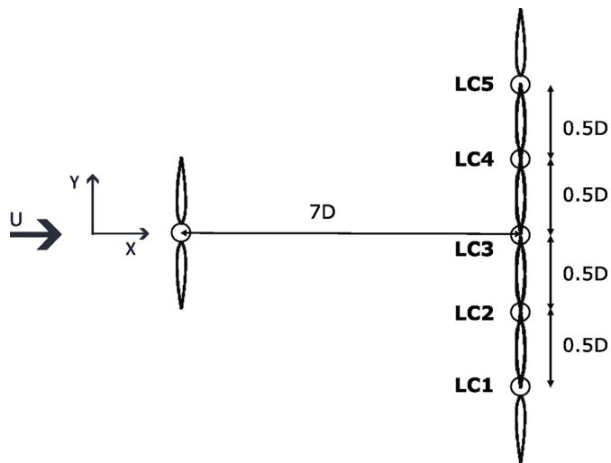  
Fig. 4 Load case setup. Mean wind direction denoted by  $U$

Table 7 Load cases  

<table><tr><td>Load case</td><td>T2 lat-eral offsets [m]</td><td>Stability condition</td><td>Uhub[m/s]</td><td>Simulat-ion time [s]</td><td>Longitudinal distance be-tween T1 and T2 [m]</td></tr><tr><td>LC1</td><td>-1D</td><td rowspan="5">Stable, neutral, unstable</td><td rowspan="5">8</td><td rowspan="5">3600</td><td rowspan="5">7D</td></tr><tr><td>LC2</td><td>-0.5D</td></tr><tr><td>LC3</td><td>0D</td></tr><tr><td>LC4</td><td>0.5D</td></tr><tr><td>LC5</td><td>1D</td></tr></table>

Table 8 Wave conditions  

<table><tr><td>Uhub [m/s]</td><td>Hs [m]</td><td>Tp [s]</td></tr><tr><td>8</td><td>2.3</td><td>10.2</td></tr></table>

joint distribution of  $U_{\mathrm{hub}}$ ,  $H_{s}$  and  $T_{p}$ . Incident waves aligned with the wind propagation direction were generated using the Pierson-Moskowitz wave spectrum [29], see Table 8. The distribution was computed for a site in the North Sea with a water depth of  $200\mathrm{m}$  [30].

# 2.4 Large eddy simulations

Turbine response depends on the incoming inflow turbulence. While simpler inflow models like the Kaimal spectrum with Davenport's coherence model are appropriate for conventionally neutral conditions, they have shortcom

ings in representing turbulence statistics of non-neutral stability scenarios. Flow fields were therefore generated using high-fidelity LES of the atmospheric boundary layer (ABL). Three canonical boundary layers were targeted: stable, moderately convective (unstable), and neutral. Elaborate descriptions of the different stability regimes are given by e.g. Holtslag [31]. In short, going from stable through neutral to unstable conditions, wind shear is reduced while turbulence intensity increases. The simulations were executed using ExaWind's AMR-Wind [32]. AMR-Wind is a massively parallel, incompressible flow solver designed to enhance the modeling and simulation capabilities of wind farm aerodynamics and turbine performance.

The simulations were set up following best practices from the wind energy community. The input parameters for each boundary layer are given in Table 9. Domain extents were set appropriate for the expected integral scales for each ABL, meaning that the unstable case had a much larger extent.

The simulations were executed until the turbulence reached a quasi-stationary state, identified by the convergence of vertical profiles and turbulence statistics. For non-neutral cases, energy is constantly being added or removed from the system (by means of a heat flux in the case of an unstable atmosphere and a cooling rate for stable), so a start time was selected where quantities fell within desired values. Further, LES was executed for 60 minutes of simulated time saving the turbulence boxes needed for FAST.Farm. Vertical profiles are shown in Fig. 5.

# 2.5 Wake modeling

FAST.Farm is a time-domain engineering code for simulating structural response and power production of multiple wind turbines in a wind farm, with each turbine modeled by OpenFAST. FAST.Farm accounts for wake effects based on the dynamic wake meandering (DWM) model introduced by Larsen et al. [13, 33], capturing wake velocity deficit, meandering, and wake-added turbulence (WAT).

FAST.Farm uses either a polar or curled wake formulation to solve velocity deficit evolution. The curled wake, which includes cross-flow effects on wake vorticities [34], forms a "kidney"-shaped wake and performs better at estimating vertical wake deflection, as shown by

Table 9 Input parameters for the ABL LES cases, used to generate inflow to FAST.Farm.  ${z}_{0}$  is the aerodynamic surface roughness and  ${z}_{i}$  is the capping inversion height  

<table><tr><td></td><td>Mean wind speed [m/s]</td><td>Ref. height [m]</td><td>z0[m]</td><td>zi[m]</td><td>Surface heat BC</td><td>Grid res. [m]</td><td colspan="3">Domain size [km]</td></tr><tr><td></td><td></td><td></td><td></td><td></td><td></td><td></td><td>x</td><td>y</td><td>z</td></tr><tr><td>Stable</td><td>8</td><td>150</td><td>0.05</td><td>450</td><td>-0.25 K/h</td><td>2.5</td><td>3.84</td><td>1.28</td><td>6.4</td></tr><tr><td>Neutral</td><td>8</td><td>150</td><td>0.75</td><td>750</td><td>-</td><td>2.5</td><td>3.84</td><td>1.28</td><td>9.6</td></tr><tr><td>Unstable</td><td>8</td><td>150</td><td>0.75</td><td>850</td><td>0.05 K-m/s</td><td>5</td><td>10.24</td><td>5.12</td><td>9.6</td></tr></table>

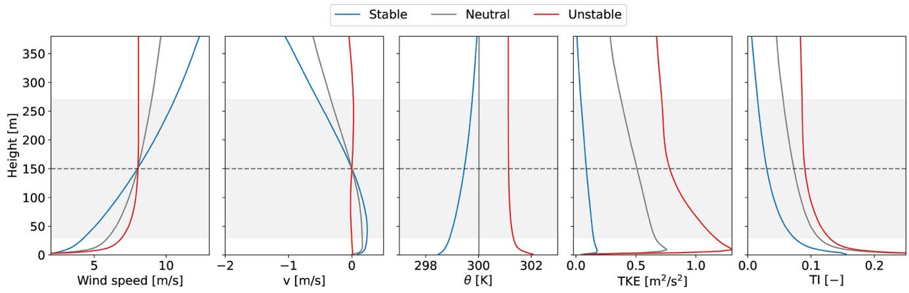  
Fig. 5 Horizontally averaged vertical profiles for the 3 cases of interest at the bottom  $380\mathrm{m}$  of the surface layer. Rotor extents are indicated by the shaded region, centered around the dashed horizontal line at hub height. The profiles did not change in any appreciable amount during the interval of interest

Table 10 Selected FAST.Farm input parameters  

<table><tr><td>Mod_Wake [-]</td><td>dr [m]</td><td>NumRadii [-]</td><td>NumPlanes [-]</td><td>f_c [Hz]</td><td>C_Meander [-]</td><td>k_VortexDecay [-]</td><td>k_vCurl [-]</td></tr><tr><td>2</td><td>16</td><td>24</td><td>400</td><td>0.007</td><td>2.1</td><td>0.0</td><td>5.0</td></tr></table>

Table 11 FAST.Farm inflow discretization  

<table><tr><td>DT_Low-VTK [s]</td><td>DT_High-VTK [s]</td><td>DS_Low [m]</td><td>DS_High [m]</td><td>Low resolution box size [m]</td><td>High resolution box size [m]</td></tr><tr><td>0.9</td><td>0.3</td><td>20</td><td>5</td><td>3720×1200×760</td><td>340×340×320</td></tr></table>

Carmo et al. [35]. Hence, the curled wake model was applied, together with wake swirl due to rotor torque. WAT, additional small-scale turbulence behind turbines, was not considered as it is not included in the current FAST.Farm release [36].

Non-default FAST.Farm parameters are listed in Table 10, and based on recommendations by Carmo et al. [35] and Thedin et al. [37], along with guidelines for the curled wake model [13]. A cut-off frequency,  $f_{c}$ , close to the surge natural frequency was applied to avoid nonphysical wake planes due to T1 floater motions, as discussed by Carmo et al. [35], and to reduce steps in the wake velocity deficit [38].

FAST.Farm inflow discretization is shown in Table 11. The curled wake model requires high temporal resolution of the low speed turbulence box (less than  $1\mathrm{s}$ ) to prevent numerical instability. As this requirement is not physics-related, the LES data (sampled at  $3\mathrm{s}$  for the low resolution box) were interpolated to achieve DT_Low-VTK = 0.9 s.

# 3 Results and discussion

# 3.1 Modal analysis

Damped natural frequencies of the flexible and rigid drivetrain models are presented in Table 12. The rigid body

modes were obtained through decay tests, whereas the tower and blade modes were found by means of linearization using ACDC [39]. To ease modal identification, the mooring lines were replaced by linear springs and aerodynamics were excluded.

The added flexibility of the drivetrain can explain the  $2 - 7\%$  differences in the asymmetric flap with pitch modes and the  $4 - 5\%$  differences in asymmetric flap with yaw modes, consistent with findings in previous work [10]. Closer investigation shows that bearing and bedplate flexibility both contribute to lowering tower and asymmetric rotor flap mode frequencies, while shaft flexibility is of less importance.

# 3.2 Wake behavior

A wake-tracking python toolbox, SAMWICH [40], was used to estimate the instantaneous wake-center, applying the constant area method [41]. Wake center time series  $(y_{c}, z_{c})$  at 6.5D downstream of T1 are shown in Fig. 6, and time-averaged velocity deficits at the same position in Fig. 7. The wake deficit is lower for unstable conditions, because of high turbulence intensity (leading to faster recovery), while mean vertical deflection is larger. The increased mean deflection despite lower wake deficit could be explained by the low shear in unstable conditions compared to stable conditions. Above hub height, higher wind speed leads to

Table 12 Damped natural frequencies of standstill floating turbine  

<table><tr><td rowspan="2">Mode</td><td rowspan="2">Description</td><td colspan="2">Damped natural frequency [Hz]</td></tr><tr><td>Rigid drivetrain model</td><td>Flexible drivetrain model</td></tr><tr><td>1</td><td>Platform surge</td><td>0.007</td><td>0.007</td></tr><tr><td>2</td><td>Platform sway</td><td>0.007</td><td>0.007</td></tr><tr><td>3</td><td>Platform yaw</td><td>0.011</td><td>0.011</td></tr><tr><td>4</td><td>Platform pitch</td><td>0.036</td><td>0.036</td></tr><tr><td>5</td><td>Platform roll</td><td>0.036</td><td>0.036</td></tr><tr><td>6</td><td>Platform heave</td><td>0.049</td><td>0.049</td></tr><tr><td>7</td><td>1st tower fore-aft</td><td>0.461</td><td>0.444</td></tr><tr><td>8</td><td>1st tower side-side</td><td>0.468</td><td>0.453</td></tr><tr><td>9</td><td>1st asymmetric blade flap with pitch</td><td>0.546</td><td>0.534</td></tr><tr><td>10</td><td>1st asymmetric blade flap with yaw</td><td>0.515</td><td>0.495</td></tr><tr><td>11</td><td>1st collective blade flap</td><td>0.602</td><td>0.597</td></tr><tr><td>12</td><td>1st collective blade edge</td><td>0.698</td><td>0.691</td></tr><tr><td>13</td><td>1st asymmetric blade edge 1</td><td>0.747</td><td>0.744</td></tr><tr><td>14</td><td>1st asymmetric blade edge 2</td><td>0.766</td><td>0.763</td></tr></table>

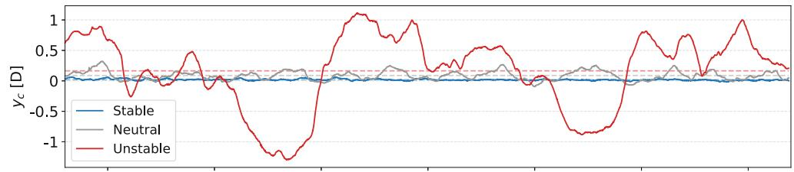  
Fig.6 Time series of wake centers. Mean positions are shown in dashed lines.  $HH$  denotes hub height

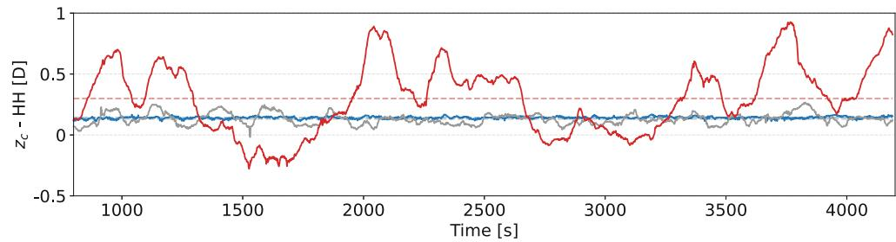

a smaller slope of vertical deflection to horizontal velocity, while the opposite occurs below hub height. As the wake is deflected upwards by the combined platform pitch and shaft tilt, the ratio of vertical to horizontal deflection above hub height becomes more important further downstream, and the slope will be larger for low shear than high shear. The higher mean vertical deflection in unstable conditions could also be explained by the surface heat flux, creating a positive, albeit small, mean vertical component in the wind. Swirl of the curled wake, and upstream turbine yaw could both contribute to the bias towards positive Y of the mean wake position in the unstable condition. However, closer investigation indicated that this offset is likely because the large, slow meandering of the wake has not statistically converged. The unstable conditions exhibit significantly more wake meandering than neutral and stable conditions.

# 3.3 Fatigue estimates

This section presents results on fatigue damage estimates of the main bearings.

# 3.3.1 Influence of drivetrain model fidelity

Figure 8 shows the fatigue of the flexible drivetrain model normalized against the rigid model. While Guo et al. [42] recommend modeling main bearing and main shaft flexibility when studying gearbox response, Wang et al. [2] found that differences in main bearing fatigue damage were less than  $6.5\%$  when comparing a coupled and a decoupled drivetrain model. For the specific drivetrain and load cases examined here, the modeling of the coupled flexible drivetrain has little influence on main bearing fatigue, with the largest difference at MB2 for T1 (1.5% difference in unstable conditions). For MB1, the variations are below  $0.5\%$ .

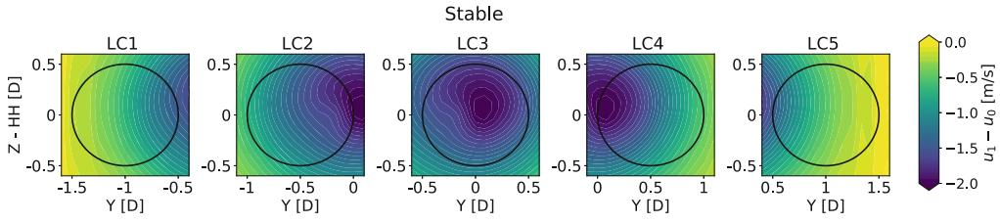  
Fig. 7 Time-averaged wake velocity deficits 6.5D downstream of T1 for each load case

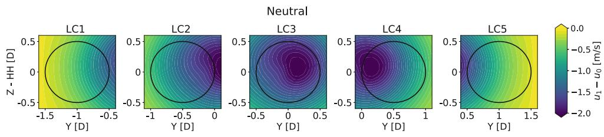

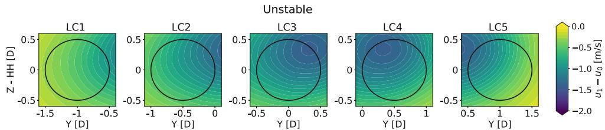

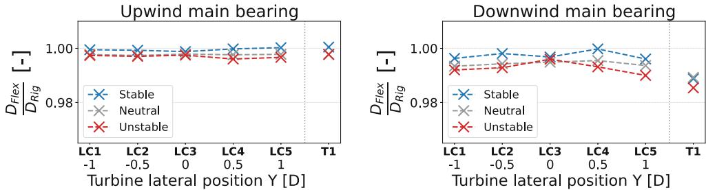  
Fig. 8 Main bearing fatigue of the flexible drivetrain model normalized against the rigid drivetrain model

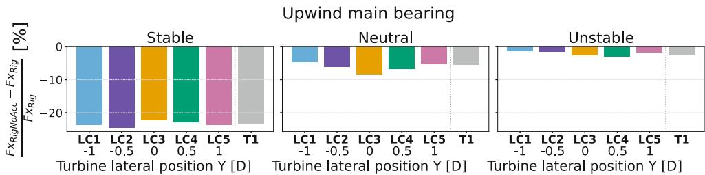  
Fig.9 Differences in standard deviations of main bearing axial loads from analytical calculations with and without acceleration terms  $(Fx_{Rig}$  and  $Fx_{RigNoAcc}$ , respectively)

While no significant effects of drivetrain flexibility on main bearing fatigue estimates were found, before concluding, bearing loads were investigated. The trends were similar for both bearings. Transverse load standard deviations were up to  $3\%$  lower for the flexible drivetrain model in stable conditions, while less than  $1.2\%$  lower for the neutral and unstable cases. Vertical load standard deviations differed most in unstable conditions, up to  $2.4\%$  lower for the flexible model, while differences were less than  $2.1\%$  for the other conditions. Upwind main bearing axial load standard deviations differed by less than  $1.8\%$ , but were

higher for the flexible drivetrain model compared to the rigid drivetrain model.

The importance of including inertia loads due to acceleration of shaft and rotor generator mass was also examined. Omitting the terms related to acceleration in Eqs. 1-5 was of minor importance for vertical load standard deviations (less than  $0.3\%$  difference), but lead to a significant reduction of axial load standard deviations of up to  $25\%$  in stable conditions,  $9\%$  in neutral conditions and  $3.3\%$  in unstable conditions, see Fig. 9. While these terms are easily implemented in analytical calculations, it is important to recognize that they are not included in the direct-drive shaft

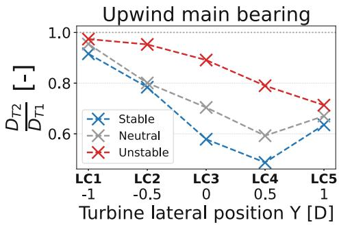  
Fig. 10 Main bearing fatigue of T2 normalized against T1 main bearing fatigue

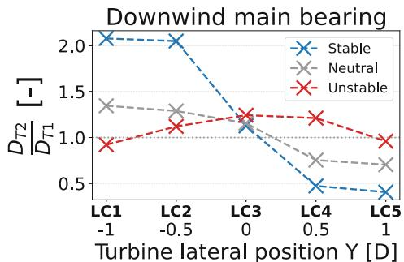

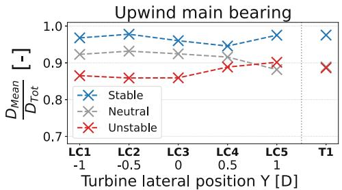  
Fig. 11 Main bearing fatigue damage from mean loads normalized against total damage

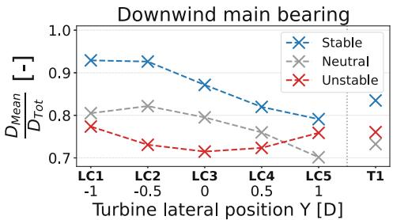

loads extracted from typical global analysis tools. The effect might be more important for floating turbines because of larger tower top motions and accelerations, and in low turbulence conditions where waves dominate platform motions. The flexible drivetrain was used for the rest of the analyses.

# 3.3.2 Influence of wakes

In Fig. 10 bearing fatigue estimates of the downwind turbines are normalized by T1 to understand the impacts of wake. The waked upwind bearings always see less damage than T1, likely due to reduced thrust. However, turbines positioned along positive Y relative to T1 experience less damage than those along negative Y, showing an asymmetric distribution.

For MB2, the damage is clearly asymmetric under stable and neutral conditions. Asymmetry of bearing lifetime was also found by Quick et al. [11] when considering a downstream distance of 3D between the turbines. Under stable conditions, the downstream turbines positioned along negative Y exhibit twice the fatigue damage of T1. The turbines along positive Y see a damage reduction of  $50\%$  compared to T1. This trend is also found for neutral conditions, and can be attributed to mean wake position and velocity deficit, further related to partial horizontal wake impingement, angle of attack and shaft tilt, discussed in Sect. 3.4. In unstable conditions, on the other hand, the waked bearings experience more fatigue when positioned directly behind T1. Increased vertical wake deflection combined with low shear in these conditions may create an unfavorable aerodynamic pitch moment, also further discussed in Sect. 3.4.

For the main bearings the quantity of the equivalent load, and therefore the mean value, is important for fatigue damage (see Eq. 8). To evaluate the importance of loads due to mean wake position relative to loads from wake dynamics, Fig. 11 presents fatigue damage calculated based on mean loads, normalized by total fatigue damage. The mean loads are considered this way: At each "time step", the mean loads averaged over the total time series are applied, while the axial and radial load factors and shaft rotational speed vary as for the original time series. From Fig. 11, it is seen that time-varying load components are more important for MB2 and in unstable conditions. In stable and neutral conditions, the mean loads are generally more important for the turbines shifted towards negative Y. In unstable conditions, the mean loads are least important for LC3. The dynamic loads have a greater impact in unstable conditions likely because the loads are larger, and peak loads are amplified by the  $10/3$  exponent. When considering fatigue from mean loads normalized against T1 (not shown here), the pattern is exactly the same as in Fig. 10, indicating that this asymmetric distribution can largely be attributed to mean wake position and wind shear.

# 3.4 Main bearing loads

Main bearing loads are presented here. Tower and blade loads are included in Appendix (Sect. 5) for information.

# 3.4.1 Mean loads

To better understand the drivers of the wake's influence on main bearing fatigue, main bearing load statistics are presented in Fig. 12. As expected, the mean axial loads of MB1

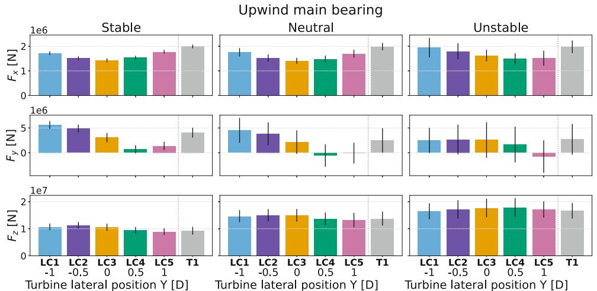  
Fig. 12 Load statistics for MB1 and MB2. Mean values are represented by colored bars, and standard deviations by black error bars

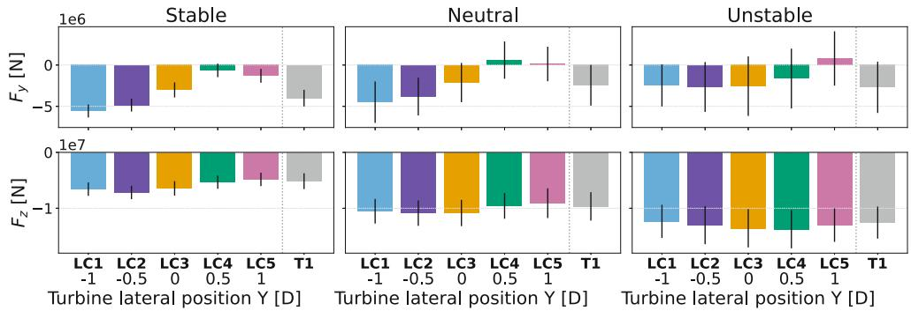  
Downwind main bearing

follow the mean position of the wake. Larger wake deficit leads to lower mean axial loads. Mean axial loads are somewhat greater in the unstable condition because of smaller velocity deficit. While axial loads are generally smaller than radial loads, their contribution to bearing fatigue is significantly amplified by the dynamic load factors, as shown in Sect. 3.3.

The mean lateral loads  $(F_{y})$  are asymmetrically distributed around T1's lateral position. Vertical mean loads  $(F_{z})$  also show asymmetry in stable and neutral conditions, with the highest loads in LC1, 2, and 3. In unstable conditions, vertical mean loads increase with lateral proximity to T1, while transverse mean loads decrease with increasing Y relative to T1. The increase in mean vertical loads with proximity to T1 in unstable conditions may result from greater vertical deflection of the wake, creating a vertical shear profile that opposes the typical atmospheric boundary layer shear. High shear has been shown to reduce main bearing fatigue of overhung rotors [9, 10] by counteracting the overturning moment from rotor weight [14]. In contrast, low shear in unstable conditions combined with inverse shear from wake velocity deficit can lead to a rotor pitch moment that adds to the already existing gravity-induced shaft moment, increasing vertical bearing loads. The shift of peak vertical loads towards positive Y in unstable conditions may be due to the mean lateral wake deflection.

The wake imposes a horizontal shear on the downstream turbines. To examine its effect on bearing loads, a simple test was conducted using a bottom-fixed turbine, without hydrodynamics, gravity, or turbulence, and with a constant wind field. One rotor side saw a wind speed of  $7\mathrm{m / s}$ , the other  $9\mathrm{m / s}$ . For a turbine with a  $6^{\circ}$  shaft tilt, lower wind speed on the falling blade side reduced mean absolute shaft yaw moment by  $10\%$  and the pitch moment by  $50\%$  compared to lower wind speed on the rising blade side. With  $0^{\circ}$  shaft tilt angle, the differences in shaft moments nearly disappeared. Increasing the tilt with  $2.4^{\circ}$  platform pitch (representative of the present load cases) magnified the differences to  $15\%$  for yaw and  $65\%$  for pitch. These dependencies of shaft moments on wake-induced horizontal shear, shaft tilt and direction of shaft rotation are caused by changes in the blade's angle of attack and relative wind velocity magnitude [43]. Floating turbines, with mean platform pitch, may amplify these effects. Shaft moments will directly impact the bearing loads, and these mechanisms contribute to explaining the asymmetric distribution of bearing loads and fatigue based on T2's lateral position.

# 3.4.2 Load variations

As discussed in Sect. 3.3.2, mean loads are important for main bearing fatigue damage, as calculated according to

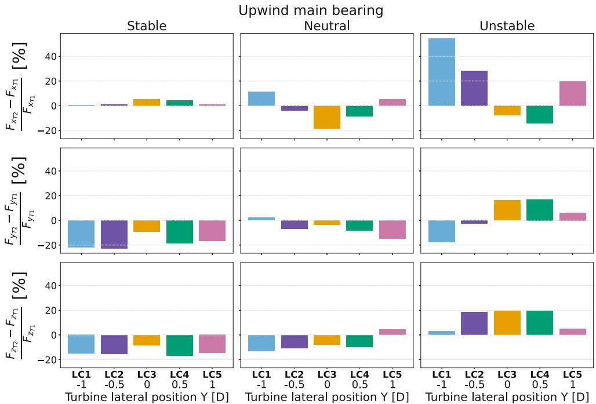  
Fig. 13 Load standard deviations of T2 normalized against T1 for MB1 and MB2

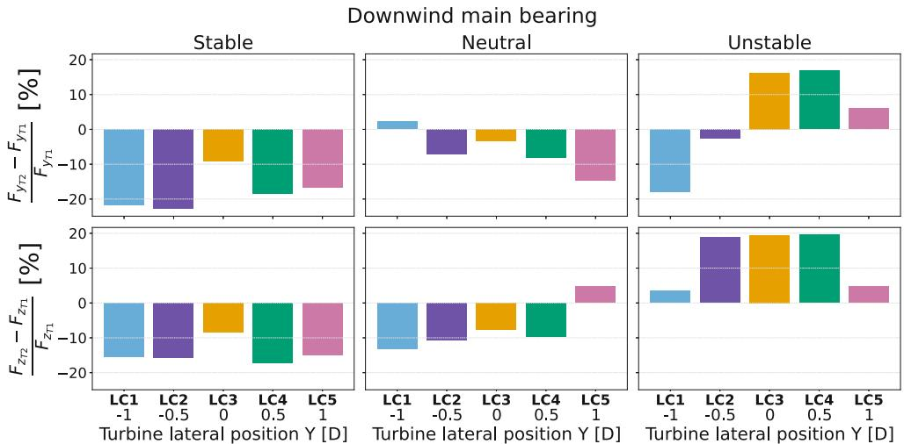

ISO 281 assuming linear damage accumulation. However, the ability of traditional fatigue calculation methodology to predict main bearing failure has been questioned [5, 8, 9]. One hypothesis suggests that time-varying aerodynamic rotor moments may cause premature failure [7, 8, 44]. To explore these loads, bearing load standard deviations and power spectral densities (PSD) are examined.

Figure 12 shows that standard deviations increase as conditions go from stable to neutral to unstable, likely driven by wake meandering, ambient turbulence intensity and coherence. To highlight wake effects, T2 standard deviations normalized against T1 are shown in Fig. 13.

In unstable conditions, axial load standard deviations are highest for turbines farthest from the time-averaged wake center, likely due to lateral wake meandering influencing averaged wind speed across the rotor. LC3 and LC4

exhibit the largest transverse and vertical load variations, while LC1 has the lowest (and lower than T1 for transverse loads). Vertical and horizontal wake meandering lead to partial waking of T2, causing fluctuating aerodynamic rotor moments, with turbines near the mean wake center experiencing moments of both signs.

In stable conditions, axial load variations are low, while neutral conditions see a similar trend as unstable. For lateral and vertical loads, both bearings exhibit similar trends in neutral and stable conditions, with lower standard deviations than T1, except for LC1 and LC5 in neutral conditions, which show slightly higher variations.

Figure 14 presents the axial and radial load spectra of MB1. MB2 had similar behavior. In neutral and unstable conditions, the low-frequent turbulence governs axial load dynamics, but in stable conditions wave frequencies become

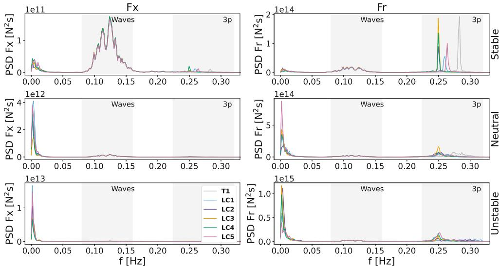  
Fig. 14 MB1 load spectra. Note the differences in scale along y  
Upwind main bearing

more important due to low turbulence. Radial load spectra in stable conditions are dominated by blade-passing frequencies (3P), with shifts with mean wind speed changes from wake velocity deficits. In unstable and neutral conditions, blade-passing frequency peaks are wider in some load cases due to variable rotor speed based on the specific controller behavior (which includes a minimum rotor speed).

# 4 Conclusion

Main bearing response to wakes was studied for a 15-MW floating direct-drive wind turbine under three atmospheric turbulence conditions with mean wind speed of  $8\mathrm{m / s}$  and five lateral T2 positions. Two global models were applied: A coupled model with a flexible drivetrain, from which main bearing loads were extracted directly, and one with only the torsional degree of freedom of the drivetrain, where bearing loads were calculated analytically. While drivetrain bending flexibility was of little importance for main bearing fatigue estimates, inertia loads due to accelerations of the direct-drive rotor generator significantly affected the bearing axial load standard deviations, especially in stable conditions. Care should be taken to properly include this mass in global analyses and analytical equations.

With regards to bearing fatigue, MB1 experiences less fatigue in waked conditions than without wake. This is due to the high weighting of axial loads in fatigue calculations combined with the reduction in thrust from wake velocity deficits. Regarding partial wake impingement, not only the degree of partial waking, but also the rotational direction of the turbine mattered, leading to an asymmetric distribution in terms of favorable locations for T2. This asymmetry was pronounced for the downwind non-locating bearing, es

picularly in stable conditions. Turbines partially waked on the blade rising side saw twice the fatigue damage of T1, while those partially waked on the blade falling side experience half the damage of T1. This effect is attributed to wake-induced horizontal shear, shaft tilt and variations in angle of attack. The asymmetry was also significant in neutral conditions. Unstable conditions, with low shear and large vertical wake deflection, resulted in more damage for turbines directly behind T1.

Mean loads are the main contributor to fatigue damage estimates under ISO 281 and linear cumulative damage assumptions, but time-varying loads may also play a role in bearing failure. Standard deviations and load spectra showed greater variations in unstable conditions. The dependence of load standard deviations on T2 position varied for the different load components. Axial load variations were larger for turbines farther from T1. Radial load variations were higher for the turbine just behind T1, except in neutral conditions where the turbines farthest from T1 had higher bearing load variations. In stable conditions, low turbulence meant wave loads dominated the bearing axial loads, while 3P loads impacted radial load variations. In neutral and unstable conditions, low-frequency turbulence, including wake meandering, was the main driver of load variance, accompanied by 3P loads.

The limitations of this study include the assumption of linear bearing stiffness and the extrapolation of bearing stiffness and dynamic load factors from smaller bearings. Additionally, using the OpenFAST BeamDyn module for blade modeling could provide more accurate results for such a large, flexible rotor, but was not practically possible to combine with the SubDyn drivetrain model. While multiple realizations are typically needed to account for the stochastic nature of turbulence and waves, this was not computationally feasible for the LES. Moreover, the influ

ence of time-varying platform motions on wake meandering was not accounted for due to software limitations. Finally, the impact of WAT was not considered, possible important mainly for time-varying bearing loads, especially for stable conditions. Recommendations for future work include using more sophisticated blade models (such as BeamDyn in OpenFAST), considering larger wind speeds, evaluating sensitivity of results to bearing stiffness, and including wake-added turbulence.

# 5 Appendix—Turbine load statistics

# 5.1 Blade loads

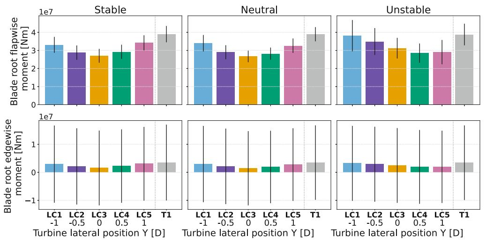  
Fig. 15 Load statistics for blade root moments. Mean values are represented by colored bars, and standard deviations by black error bars

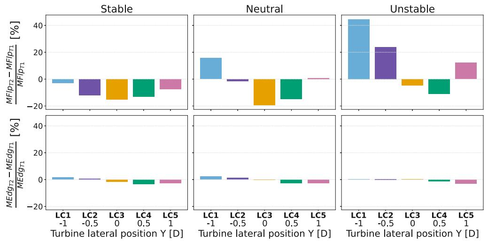  
Fig.16 Blade root moment standard deviations of T2 normalized by T1.  $MFlp$  and  $MEdg$  are the flapwise and edgewise bending moments, respectively

# 5.2 Tower loads

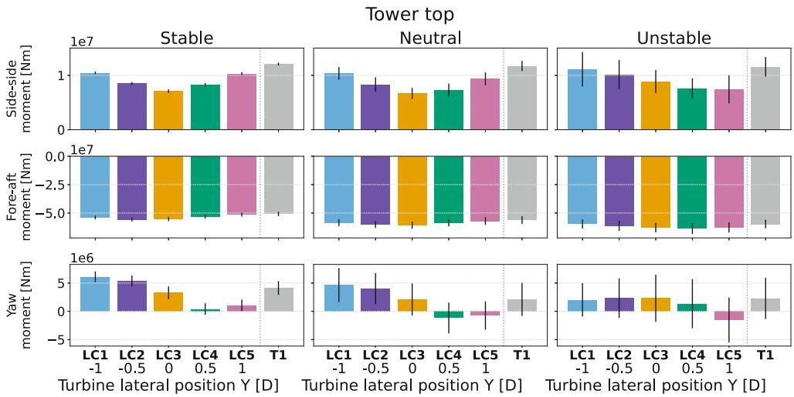  
Fig.17 Tower top moments. Mean values are represented by colored bars, and standard deviations by black error bars

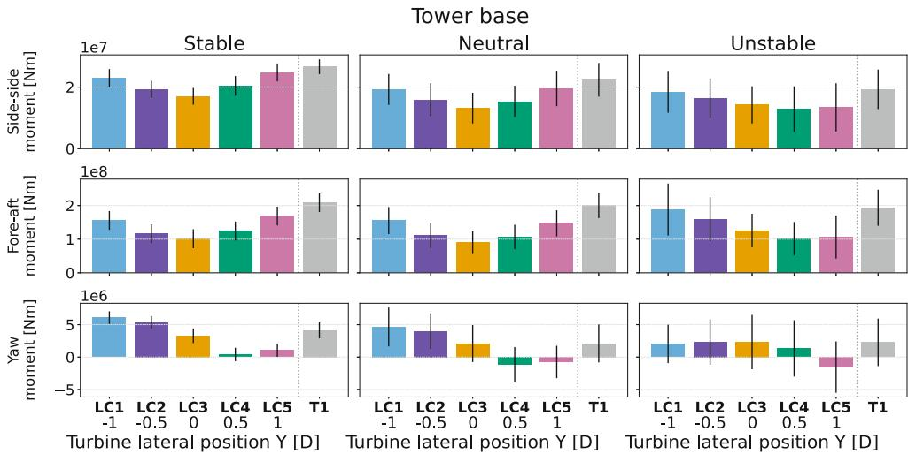  
Fig. 18 Tower base moments. Mean values are represented by colored bars, and standard deviations by black error bars

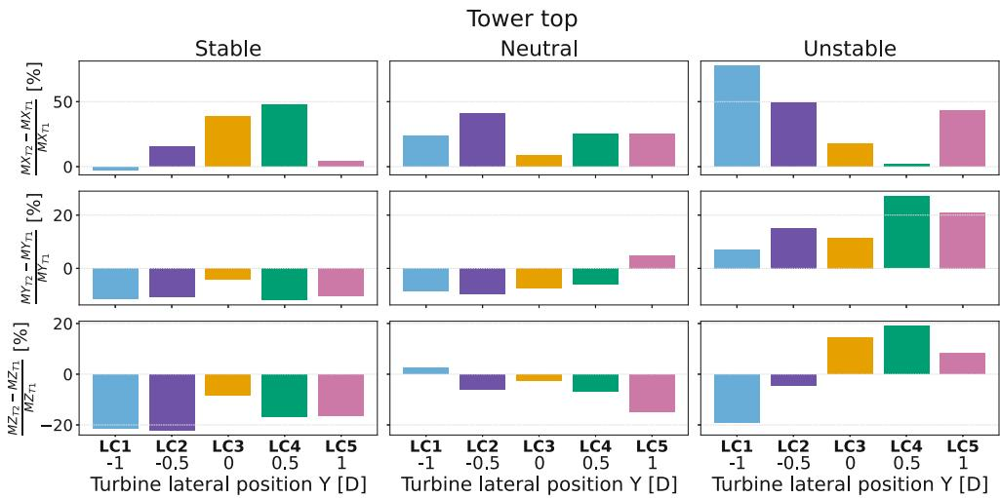  
Fig. 19 Tower top moment standard deviations of T2 normalized by T1.  $MX$ ,  $MY$  and  $MZ$  are the side-side, fore-aft and yaw bending moments, respectively

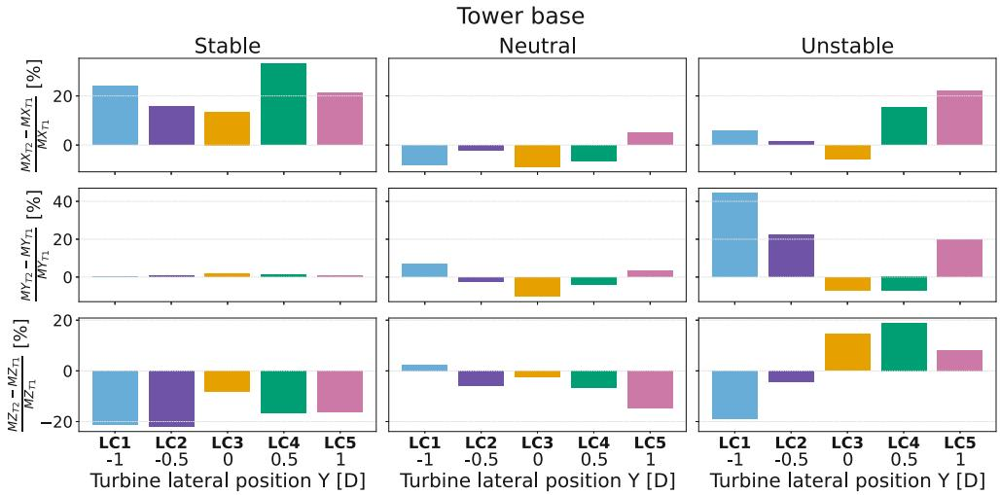  
Fig. 20 Tower base moment standard deviations of T2 normalized by T1.  $MX$ ,  $MY$  and  $MZ$  are the side-side, fore-aft and yaw bending moments, respectively

Acknowledgements The authors would like to acknowledge Lucas Carmo at NREL and Ashkan Rezaei at NTNU for discussions and guidance through parts of this work. This work is partly supported by the FME NorthWind project (grant 321954), funded by the Norwegian Research Council.

Funding Open access funding provided by NTNU Norwegian University of Science and Technology (incl St. Olavs Hospital - Trondheim University Hospital)

# Declarations

Conflict of interest On behalf of all authors, the corresponding author states that there is no conflict of interest. This work is partly supported by the FME NorthWind project (grant 321954), funded by the Norwegian Research Council. This work was authored in part by the National Renewable Energy Laboratory, operated by Alliance for Sustainable Energy, LLC, for the U.S. Department of Energy (DOE) under Contract No. DE-AC36-08GO28308. Funding provided by the U.S. Department of Energy Office of Energy Efficiency and Renewable Energy Wind Energy Technologies Office. The views expressed in the article do not necessarily represent the views of the DOE or the U.S. Government. The U.S. Government retains and the publisher, by accepting the article for publication, acknowledges that the U.S. Government retains a nonexclusive, paid-up, irrevocable, worldwide license to publish or reproduce the published form of this work, or allow others to do so, for U.S. Government purposes.

Open Access Dieser Artikel wird unter der Creative Commons Namensnennung 4.0 International Lizenz verfügbar, welche die Nutzung, Vervielfaltung, Bearbeitung, Verbreitung und Wiedergabe in jeglichem Medium und Format erlaubt, sofern Sie den/die ursprünglichen Autor(en) und die Quelle ordnungsgemäß nennen, einen Link zur Creative Commons Lizenz beifugen und angegeben, ob Änderungen vorgenommen wurden. Die in thisem Artikel enthaltenen Bilder und sonstiges Drittmaterial unterliegen ebenfalls der genannten Creative Commons Lizenz, sofern sich aus der Abbildungslegende nicht anders ergibt. Sofern das betreffende Material nicht unter der genannten Creative Commons Lizenz stehen und die betreffende Handlung nicht nach gesetzlichen Vorschriften erlaubt ist, ist für die oben aufgeführten Weiterverwendungen des Materials die Einwilligung des jeweiligen Rechteinhabers einzuholen. Weitere Details zur Lizenz entnehmen Sieitte der Lizenzinformation auf http://creativecommons.org/licenses/by/4.0/deed.de.

# References

1. Torsvik J (2020) Dynamic Analysis in Design and Operation of Large Floating Offshore Wind Turbine Drivetrains. NTNU, Trondheim (PhD thesis)  
2. Wang S, Moan T, Nejad AR (2021) A comparative study of fully coupled and de-coupled methods on dynamic behaviour of floating wind turbine drivetrains. Renewable Energy 179:1618-1635. https://doi.org/10.1016/j.renene.2021.07.136  
3. Wang SR, Nejad A, Bachynski-Polic E, Moan T (2020) Effects of bedplate flexibility on drivetrain dynamics: Case study of a 10 MW spar type floating wind turbine. Renewable Energy. https://doi.org/10.1016/j.renene.2020.07.148  
4. Torsvik J, Nejad AR, Pedersen E (2018) Main bearings in large offshore wind turbines: development trends, design and analysis requirements. J Phys: Conf Ser 1037:42020. https://doi.org/10.1088/1742-6596/1037/4/042020  
5. Hart E, Turnbull A, Feuchtwang J, McMillan D, Golysheva E, Eliott R (2019) Wind turbine main-bearing loading and wind field characteristics. Wind Energy. https://doi.org/10.1002/we.2386  
6. Hart E, Raby K, Keller J, Sheng S, Long H, Carroll J, Brasseur J, Tough F (2023) Main Bearing Replacement and Damage - A Field Data Study on 15 Gigawatts of Wind Energy Capacity. Technical report, National Renewable Energy Laboratory, Golden, CO. https://www.nrel.gov/docs/fy23osti/86228.pdf  
7. Lively AW (2017) Effects of daytime atmospheric boundary layer turbulence on the generation of nonsteady wind turbine loadings and predictive accuracy of lower order models. The Pennsylvania State University, Pennsylvania (PhD thesis)  
8. Brasseur JG, Morris J, Hart E, Amiri AK, Guo Y, Keller J (2024) Nonsteady Load Responses of Wind Turbines to Atmospheric and Mountain-Generated Turbulence Eddies, With Impacts on the Main Bearing: A Validation Study. NREL https://doi.org/10.2172/2437666 (Technical report)  
9. Kenworthy J, Hart E, Stirling J, Stock A, Keller J, Guo Y, Brasseur J, Evans R (2024) Wind turbine main bearing rating lives as determined by IEC 61400-1 and ISO 281: A critical review and exploratory case study. Wind Energy 27(2):179-197. https://doi.org/10.1002/we.2883  
10. Liverud Krathe V, Jonkman J, Gebel J, Rivera-Arreba I, Nejad A, Bachynski-Polic E (2025) Investigation of main bearing fatigue estimate sensitivity to synthetic turbulence models using a novel drivetrain model implemented in OpenFAST. Wind Energy, 28:e70005. https://doi.org/10.1002/we.70005

11. Quick J, Hart E, Sode Lund R, Liew J, Rethore P-E, Keller J, Guo Y (2023) Main bearing rating life under the influence of wind turbine wakes (Presentation). NAWEA, Denver, CO, USA  
12. Jonkman B, Platt A, Mudafort RM, Branlard E, Sprague M, Ross H, Jonkman J, Hayman G, Slaughter D, Hall M, Vijayakumar G, Buhl M, Bortolotti P, Ananthan S, Davies RSM, Rood J, Damiani R, Mendoza R, Long H, Schuenemann P, Shaler K, Housner S, Sakievich P, Wang L, Bendl K, Carmo L (2024) OpenFAST/openfast: v3.5.2. Zenodo https://doi.org/10.5281/zenodo.10530537 (https://doi.org/10.5281/zenodo.10530537)  
13. NREL (2024) FAST.Farm User's Guide and Theory Manual. NREL. https://openfast.readthedocs.io/en/main/source/user/fast.farm/index.html  
14. Hart E, Stock A, Elderfield G, Elliott R, Brasseur J, Keller J, Guo Y, Song W (2022) Impacts of wind field characteristics and non-steady deterministic wind events on time varying main-bearing loads. Wind Energy Sci Discuss 2022:1-28. https://doi.org/10.5194/wes-2022-1  
15. Rivera-Arreba I, Wise AS, Eliassen LV, Bachynski-Polic EE (2023) Effect of atmospheric stability on the dynamic wake meandering model applied to two 12 MW floating wind turbines. Wind Energy 26(12):1235-1253. https://doi.org/10.1002/we.2867  
16. Wise AS, Bachynski EE (2020) Wake meandering effects on floating wind turbines. Wind Energy 23(5):1266-1285. https://doi.org/10.1002/we.2485  
17. Gaertner E, Rinker J, Sethuraman L, Zahle F, Anderson B, Barter G, Abbas N, Meng F, Bortolotti P, Skrzypinski W, Scott G, Feil R, Bredmose H, Dykes K, Shields M, Allen C, Viselli A, Wind IEA (2020) Definition of the IEA Wind 15-Megawatt Offshore Reference Wind Turbine. Technical Report NREL/TP-5000-75698. NREL  
18. Barter G, Bortolotti P, Gaertner E, Rinker J, Abbas NJ, dzalkind, Zahle F, T-Wainwright, Branlard E, Wang L, Padron LA, Hall M, Issraman (2024) IEAWindTask37/IEA-15-240-RWT. https://github.com/IEAWindTask37/IEA-15-240-RWT https://doi.org/10.5281/zenodo.10664562  
19. Allen C, Viselli A, Dagher H, Goupee AJ, Gaertner E, Abbas N, Hall M, Barter G, Wind IEA (2020) Definition of the UMaine VoltturnUS-S Reference Platform Developed for the IEA Wind 15-Megawatt Offshore Reference Wind Turbine. NREL (Technical report)  
20. Jonkman B, Platt A, Mudafort RM, Branlard E, Sprague M, Ross H, jonkman, HaymanConsulting, Slaughter D, Hall M, Vijayakumar G, Buhl M, Russell9798, Bortolotti P, reos-rcrozier, Ananthan S, RyanDavies19 SM, Rood J, rdamiani, nrmendoza, sinolonghai, pschuenemann, ashesh2512, kshaler, Housner S, psakievich, Wang L, Bendl K, Carmo L (2024) OpenFAST/openfast: v3.5.3. Zenodo https://doi.org/10.5281/zenodo.10962897 (https://doi.org/10.5281/zenodo.10962897)  
21. Krathe VL (2024) SubDrive: OpenFAST-drivetrain-modeling. https://github.com/verlivkra/SubDrive  
22. Abbas NJ, Zalkind D, Mudafort RM, Hylander G, Mulders S, Hefernan D, Bortolotti P (2024) NREL/ROSCO: ROSCO v2.9.0. Zenodo https://doi.org/10.5281/zenodo.10535404  
23. Schaeffler BEARINX-online Easy Friction. https://bearinx-online-easy-friction.schaeffler.com/  
24. Royston TJ, Basdogan I (1998) Vibration transmission through self-alignment (spherical) rolling element bearings: Theory and experiment. J Sound Vib 215(5):997-1014. https://doi.org/10.1006/jsvi.1998.9999  
25. International Organization for Standardization (2007) ISO 281:2007 Rolling bearings-Dynamic load ratings and rating life. Geneva  
26. Koyo Large size ball & roller bearings. General bearings. https:// koyo.jtekt.co.jp/en/support/catalog-download/uploads/catbs008en. pdf

27. NSK Large size rolling bearings. https://www.nsk-literature.com/en/large-size-rolling-bearings/offline/download.pdf  
28. Zaretsky EV (2016) Rolling Bearing Life Prediction, Theory, and Application. NASA/TP-2013-215305/REV1. NASA, Cleveland,Ohio (Technical report, https://api-semanticscholar.org/Corpus ID:110878807)  
29. Pierson WJ, Moskowitz L (1964) A proposed spectral form for fully developed wind seas based on the similarity theory of S. A. Kitaigorodskii. J Geophys Res 69(24):5181-5190. https://doi.org/10.1029/jz069i024p05181  
30. Li L, Gao Z, Moan T (2013) Joint Environmental Data at Five European Offshore Sites for Design of Combined Wind and Wave Energy Devices. In: Journal of Offshore Mechanics and Arctic Engineering, vol 137. ASME 2013 32nd International Conference on Ocean, Offshore and Arctic Engineering. https://doi.org/10.1115/OMAE2013-10156  
31. Holtslag M (2016) Far offshore wind conditions in scope of wind energy. Delft University of Technology, Delft https://doi.org/10.4233/uuuid:3c66f401-6cff-4273-aa49-df4274ba767f (PhD thesis)  
32. Sprague MA, Ananthan S, Vijayakumar G, Robinson M (2020) ExtraWind: A multifidelity modeling and simulation environment for wind energy. In: Journal of Physics: Conference Series, vol 1452. Institute of Physics Publishing, Amherst, MA USA https://doi.org/10.1088/1742-6596/1452/1/012071  
33. Larsen GC, Madsen HA, Thomsen K, Larsen TJ (2008) Wake meandering: a pragmatic approach. Wind Energ 11(4):377-395. https://doi.org/10.1002/we.267  
34. Branlard E, Martinez-Tossas LA, Jonkman J (2023) A time-varying formulation of the curled wake model within the FAST.Farm framework. Wind Energy 26(1):44-63. https://doi.org/10.1002/we.2785  
35. Carmo L, Jonkman J, Thedin R (2024) Investigating the interactions between wakes and floating wind turbines using FAST. Farm Wind Energy Sci 9(9):1827-1847. https://doi.org/10.5194/wes-9-1827-2024  
36. Branlard E, Jonkman J, Platt A, Thedin R, Martinez-Tossas LA, Kretschmer M (2024) Development and Verification of an Improved Wake-Added Turbulence Model in FAST.Farm. J Phys: Conf Ser 2767(9):92036. https://doi.org/10.1088/1742-6596/2767/9/092036  
37. Thedin R, Barter G, Jonkman J, Mudafort R, Bay C, Shaler K, Kreeft J (2024) Load assessment of a wind farm considering negative and positive yaw misalignment for wake steering. Prepr Wind Energy Sci. https://doi.org/10.5194/wes-2024-6  
38. Krathe VL (2024) FAST.Farm: steps in disturbed wind with recommended f_c. https://github.com/OpenFAST/openfast/issues/2376  
39. Slaughter D (2024) OpenFAST/acdc: v0.5.0-alpha. Zenodo. https://doi.org/10.5281/zenodo.11210222  
40. Quon E (2017) SAMWICH Box: A Python-based toolbox for Simulated And Measured Wake Identification and CCharacterization. https://github.com/ewquon/waketracking  
41. Quon EW, Doubrawa P, Debnath M (2020) Comparison of Rotor Wake Identification and Characterization Methods for the Analysis of Wake Dynamics and Evolution. In: Journal of Physics: Conference Series, vol 1452. Institute of Physics Publishing, Amherst, MA USA https://doi.org/10.1088/1742-6596/1452/1/012070  
42. Guo Y, Keller JWLC, Austin J, Nejad AR, Halse C, Bastard L, Helsen J (2015) Recommendations on Model Fidelity for Wind Turbine Gearbox Simulations. In: Abel D, Schröder W, Monti A, Jacobs G, Hameyer K, De Doncker RW, Brecher C (eds) Conference for Wind Power Drives (CWD). NREL, Aachen, Germany (Chap. NREL/CP-5000-63444. https://www.nrel.gov/docs/fy15osti/63444.pdf)  
43. Hansen AC (1992) Yaw Dynamics of Horizontal Axis Wind Turbines: Final Report. Technical report, NREL. https://www.nrel.gov/docs/legosti/old/4822.pdf

44. Hart E (2020) Developing a systematic approach to the analysis of time-varying main bearing loads for wind turbines. Wind Energy 23(12):2150-2165. https://doi.org/10.1002/we.2549

Publisher's Note Springer Nature remains neutral with regard to jurisdictional claims in published maps and institutional affiliations.