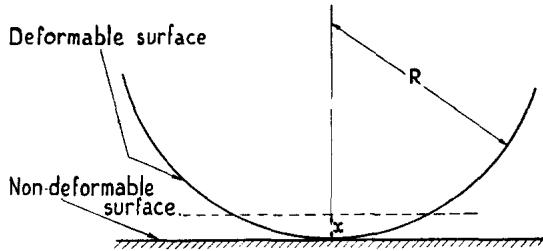
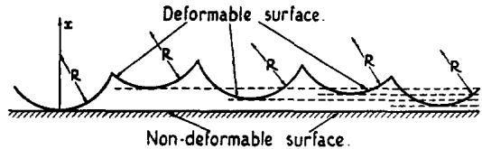
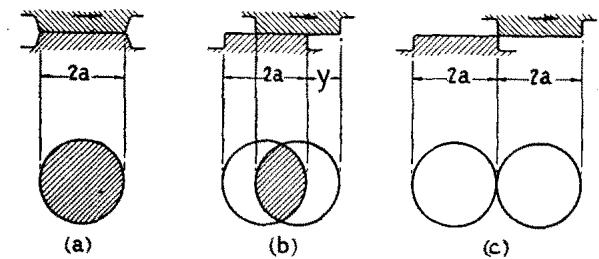
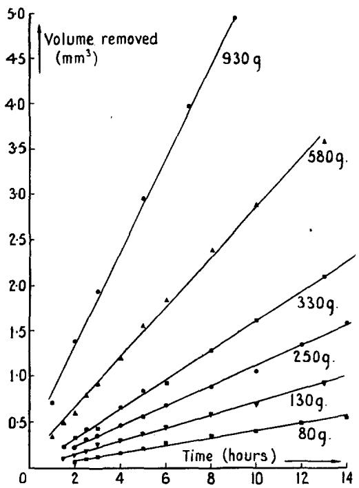
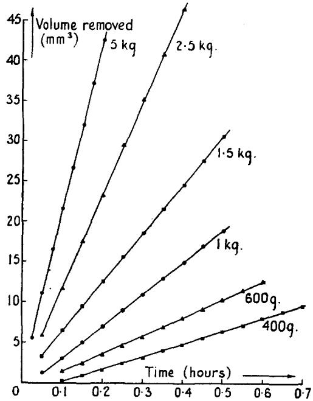
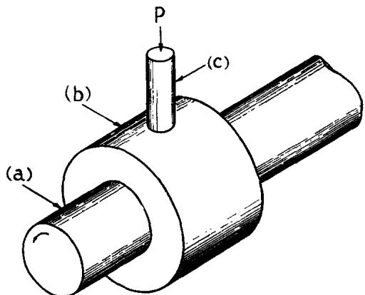
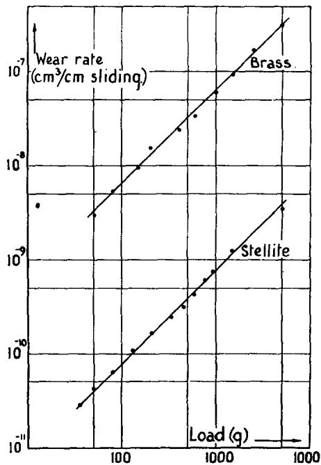

# Contact and Rubbing of Flat Surfaces

Cite as: Journal of Applied Physics 24, 981 (1953); https://doi.org/10.1063/1.1721448   
Submitted: 08 January 1953 . Published Online: 07 June 2004

J. F. Archard

ARTICLES YOU MAY BE INTERESTED IN

On the Empirical Law of Adhesive Wear

Journal of Applied Physics 23, 18 (1952); https://doi.org/10.1063/1.1701970

Single Contacts and Multiple Encounters

Journal of Applied Physics 32, 1420 (1961); https://doi.org/10.1063/1.1728372

Theory of rubber friction and contact mechanics

The Journal of Chemical Physics 115, 3840 (2001); https://doi.org/10.1063/1.1388626

# Contact and Rubbing of Flat Surfaces

J. F. ARCHARD

Research Laboratory, Associated Electrical Industries Limited, Aldermaston, Berkshire, England (Received January 8, 1953)

The interpretation of certain phenomena occuring at nominally flat surfaces in stationary or sliding contact is dependent on the assumed distribution of the real area of contact between the surfaces. Since there is little direct evidence on which to base an estimate of this distribution, the approach used is to set up a simple model and compare the deduced theory (e.g., the deduced dependence of the experimental observables on the load) with the experimental evidence. The main conclusions are as follows. (a) The electrical contact resistance depends on the model used to represent the surfaces; the most realistic model is one in which increasing the load increases both the number and size of the contact areas. (b) In general, mechanical wear should also depend on the model. However, in wear experiments showing the simplest behavior, the wear rate is proportional to the load, and these results can be explained by assuming removal of lumps at contact areas formed by plastic deformation; moreover, this particular deduction is independent of the assumed model. This suggests that a basic assumption of previous theories, that increasing the load increases the number of contacts without affecting their average size, is redundant.

## I. GENERAL INTRODUCTION

together, they touch at the tips of the higher asperities and the total area of intimate contact is determined by the deformation of the material in these regions under the applied load. The real area of contact, which is, in general, a small part of the apparent area of contact, therefore comprises several individual areas, the number, size, and distance of separation of which will influence the results of certain types of experiment. For example, it has been recognized that these factors will affect the contact resistance or the local temperatures caused by frictional heating during sliding (Bowden and Taborl; Holm²) ;\* also the character and magnitude of the transfer of material between rubbing surfaces and their wear rate may show a similar dependence. In many experiments, in order to overcome the uncertainties as to the distribution of the real area of contact, crossed cylinders or a sphere pressed against a flat are used. It is then assumed that the total area of contact is confined to a single circular area and that the experiment represents the conditions occurring at the individual contacts between the mating surfaces. However, in order to apply the results of such experiments to the more general case, it is necessary to make some assumptions about the distribution of the real areas of contact and then to deduce the effect of this on the behavior of mating surfaces. This paper represents an attempt to tackle the problem.

There is little direct evidence on which to base any estimate of the sizes and distribution of the individual areas involved in the contact of mating surfaces. Therefore, the approach used is to set up a simple model to represent the surfaces and to compare the theoretical deductions with the results of experiments. The multiple contact condition will be considered in terms of the contact of two nominally flat surfaces. At the lightest loads, it is assumed that they touch over three small areas. As the load is increased, these areas increase in size; also some of the asperities, hitherto separated approach and touch to form new areas of contact. Thus, it is assumed that an increase in the load increases both the number and size of the contact areas; at the same time it automatically follows that these contact areas have a size distribution. Using a model which incorporates these features, the relationships between the applied load and the contact area or electrical conductance have been deduced and are compared with the corresponding expressions for the single contact condition. Making further simple assumptions as to the nature of the sliding process, simple laws of mechanical wear have been deduced. These theoretical conclusions are discussed in the light of the experimental evidence.

## II. CONTACT AREA AND CONDUCTANCE

## 1. Introduction

The radius a of the circular area of contact formed when a sphere of radius R is pressed against a flat surface under a load P is given by†

$$
a { = } 1 \cdot 1 \bigg \{ \frac { 1 } { 2 } P R \bigg ( \frac { 1 } { E _ { 1 } } { + } \frac { 1 } { E _ { 2 } } \bigg ) \bigg \} ^ { \frac { 1 } { 2 } } ,\tag{1}
$$

when the deformation is elastic, ${ \cal E } _ { 1 }$ and $\pmb { E _ { 2 } }$ being the Young's moduli of the materials of the contacting members, and

$$
a = ( P / \pi p _ { m } ) ^ { \frac { 1 } { 2 } } ,\tag{2}
$$

when the deformation is plastic, $\phi _ { m }$ being the flow pressure (assumed constant) of the deformable member.

The conductance G of such a contact is given by

$$
G = 2 a \sigma ,\tag{3}
$$

  
FiG. 1. Single area of contact model.

when the contact is purely metallic, the resistance of the contact being the "constriction resistance,"and σ is the specific conductivity of the two materials (assumed equal). Also,

$$
G = \pi a ^ { 2 } / \rho ,\tag{4}
$$

when the resistance of the contact is due to a film of resistance ρ per unit area, the “constriction resistance" being negligible.

Equations (1) to (4) will be used to calculate the contact area and conductance as a function of the load both for a single contact (representing a sphere pressed against a flat), and for the multiple areas of contact model (representing two flat surfaces in contact).

## 2. Single Area of Contact

The model assumed is shown in Fig. 1. It consists of a perfectly flat nondeformable surface and a deformable spherical surface of radius of curvature R. Changes in the area of contact $A _ { 1 } ,$ the load $P _ { 1 }$ carried by the conta $\mathbf { c t } ,$ and the contact conductance $G _ { 1 , }$ are considered for a movement of the nondeformable surface through a distance x. $A _ { 1 } , P _ { 1 } ,$ and $G _ { 1 }$ are given by the following general equations:

$$
\left. \begin{array} { l } { A _ { 1 } = b x } \\ { P _ { 1 } = c x ^ { p } } \\ { G _ { 1 } = d x ^ { m } } \end{array} \right\} ,\tag{5}
$$

where, using Eq. (1) to (4) above,

$$
\bar { b } = 2 \pi R , \ddagger
$$

and

for plastic deformation $\pmb { \hat { p } = 1 }$ and $c = 2 \pi R \ p _ { m } ,$ for elastic deformation p = γ and c = 4.25ER', for a film resistance m = 1 and $d = 2 \pi R / \rho _ { ; }$

and

for a constriction resistance $\scriptstyle m = { \frac { 1 } { 2 } }$ and $d = ( 8 R ) ^ { \downarrow } \sigma$

These results give the following generalized relationships between the contact area or conductance and the load:

$$
\left. \begin{array} { c } { { A _ { 1 } = b ( P _ { 1 } / c ) ^ { 1 / p } } } \\ { { } } \\ { { G _ { 1 } = d ( P _ { 1 } / c ) ^ { m / p } } } \end{array} \right\} .\tag{6}
$$

## 3. Multiple Areas of Contact

The model assumed is shown in Fig. 2. It consists of a perfectly flat nondeformable surface and a nominally flat deformable surface containing a large number of spherical asperities of equal radii of curvature R. It is assumed that the asperities are evenly distributed in depth (the x direction); i.e., there is one asperity at each of the x coordinates $x = 0 , \ h , \ 2 h , \ 3 h \ . \ . \ . \ \ \mathrm { e t c . } .$ where h<R. These will be termed the zero, first, second, third . . . etc., levels, respectively. Thus, there are M asperities per unit depth, where

$$
M = 1 / h .
$$

Consider the total contact area $^ { A _ { 2 } , }$ load $P _ { 2 } ,$ and conductance $G _ { 2 }$ resulting from the movement of the nondeformable surface through a distance $\begin{array} { r } { { \pmb x } = N h \ ( \mathrm { i . e . , } } \end{array}$ such as to bring N asperities into contact). Then, if $\delta A .$ , is the contribution to the total contact area $\pmb { A _ { 2 } }$ from the asperity in the rth level, $\pmb { A _ { 2 } }$ is the sum of N such areas, i.e.,

$$
A _ { 2 } { = } \sum _ { r = 0 } ^ { r = N - 1 } \delta A _ { r } { = } b h \sum _ { r = 1 } ^ { r = N } r ,
$$

  
FiG. 2. Multiple areas of contact model.

and for large values of N

$$
\begin{array} { r } { A _ { 2 } = \frac 1 2 { b h } N ^ { 2 } = \frac 1 2 M { b x ^ { 2 } } = B x ^ { 2 } . } \end{array}\tag{7}
$$

Similarly, for the load and conductance,

$$
P _ { 2 } = \frac { c h ^ { p } } { ( 1 + p ) } N ^ { ( 1 + p ) } = \frac { M c } { ( 1 + p ) } x ^ { ( 1 + p ) } = C x ^ { ( 1 + p ) } ,\tag{8}
$$

$$
G _ { 2 } { = } \frac { d h ^ { m } } { ( 1 { + } m ) } N ^ { ( 1 { + } m ) } { = } \frac { M d } { ( 1 { + } m ) } x ^ { ( 1 { + } m ) } { = } D x ^ { ( 1 { + } m ) } .\tag{9}
$$

These results give the following generalized relationships between the contact area or conductance and the load:

$$
\left. \begin{array} { l } { A _ { 2 } = B [ P / C ] ^ { [ 2 / ( 1 + p ) ] } } \\ { \qquad } \\ { G _ { 2 } = D [ P / C ] ^ { [ ( 1 + m ) / ( 1 + p ) ] } } \end{array} \right\} ,\tag{10}
$$

where\_ \_B=½Mb, C=[M/(1+p)]c, and $\pmb { D } \mathbf { = } [ \pmb { M } /$ (1+m)]d.

The detailed conclusions which result from Eqs. (6) and (10) are set out in Table I. This shows the theoretical dependence of the contact area A and conductance G on the load P for the single area and multiple areas cases.

## 4. Discussion

For a single area of contact, as shown in Sec. II.2, the conductance G is related to the load P by a relationship of the form

$$
G = k P ^ { n } ,\tag{11}
$$

where k is a constant for the given set of conditions and n has values 1, 3, 1, or 1, depending on the type of deformation and nature of contact resistance (Table I) ; these relationships have been observed experimentally. When other values of n are found, it has usually been assumed that this is due to a suitable combination of plastic and elastic deformation on the one hand and construction and film resistance on the other. However, when nominally mating surfaces are used this interpretation need not be valid, because the distribution of the total contact area between a number of individual areas introduces another factor which will affect the variation of conductance with load. Thus, it has been demonstrated above that other values of n in Eq. (11) can be deduced, for a given mechanism of deformation and a given type of contact resistance, by using a simple multiple-contacts model. The particular values

TaBLE I. Theoretical relationships between contact area or conductance and the load.
| Deformation | Type of conductance | Single area of contact | Mutiple areas of contact |
| --- | --- | --- | --- |
| Elastic |  | $A \propto \mathbf { \mathscr { P } } ^ { \mathrm { 2 } / 3 }$ | $A \propto P ^ { 4 / 5 }$ |
| Elastic | Film | $G \propto P ^ { 2 / 8 }$ | $G \propto P ^ { 4 / 5 }$ |
| Elastic | Constriction | ${ \dot { G } } \propto P ^ { \parallel 3 }$ | $G \propto P ^ { 3 / 5 }$ |
| Plastic |  | $A \propto P$ | $A \propto { \mathcal { P } }$ |
| Plastic | Film | $G \propto { \mathcal { P } }$ | $G \propto P$ |
| Plastic | Constriction | $G \propto P ^ { 1 / 2 }$ | $G \propto P ^ { 3 / 4 }$ |

of n which have been deduced are related to the model and, therefore, have no special significance; it can be shown that any model for which increasing load causes increases in the number and also in the size of the contact areas will give values of n higher than the corresponding single area case but not exceeding unity.

The few available measurements of the contact resistance of flats suggest that such larger values of n are found in practice. Thus, Holm (E.C.H. p. 84) gives results for clean metal plates of copper and nickel, the conductance/load curves (plotted on a log/log scale) having a slope of 0.6 which happens to be that predicted in Table I for constriction resistance elastic deformation conditions. His curves for clean crossed cylinders of the same metals at comparable and lighter loads have a slope of  corresponding to the same conditions. The results for steel flats given by Bowden and Tabor, which are set out in Table II, give a value of n about 0.75.

From the experimental values of the conductance of flat surfaces, it is possible, assuming N equal circular contact areas each of radius $^ { \dag } a ^ { \dag } \rangle$ (and taking reasonable values of the flow pressure $\phi _ { m } ,$ and the specific conductivity σ) to calculate the size and number of the contact areas involved.§ The results obtained from this type of analysis shown in Table II suggest that an increase in the load does increase both the number and the average size of these areas.

TaBLE II. Estimates of number N and average radius a of the individual areas of contact involved in contact of steel flats (B.T. p. 31).
| Load (g) | $\pmb { a } ( 1 0 ^ { - 3 } \mathrm { c m } )$ | N |
| --- | --- | --- |
| 2000 | 5 | 3 |
| 5000 | 6 | 5 |
| 20 000 | 9 | 9 |
| 100 000 | 12 | 22 |
| 500 000 | 21 | 35 |

The foregoing discussion has been based on an extremely crude model, the surface being represented by a model involving a single scale of structure. A more realistic model would involve at least two scales of structure. For example, a typical well-ground surface may contain asperities of the order of 1 micron high on a base of some tens or hundreds of microns; however, this longer wavelength structure (which is revealed by profilometers and similar instruments) may have superimposed on it smaller asperities, which can be revealed only by instruments of higher resolution such as the electron microscope. The general areas where two such flat surfaces touch will be determined by the longer wavelength structure, but the individual real areas of contact may be formed by the deformation of the smaller asperities (E.C.H. p. 75, Moore,3 1948).

For a group of closely spaced contact areas, the constriction resistance resulting from the individual contacts is negligible compared with the larger constriction resistance of the general contact area of the group. Therefore, for clean metals the contact resistance should be determined primarily by the general contact areas, which are a function of the longer wavelength surface structure. Thus, experiments with crossed cylinders, even when the surface finish is quite rough and it is obvious that a continuous contact is not formed, give values of the conductance which agree quite well with the theoretical values obtained by assuming perfectly smooth contact members.4 Again, for contact resistance measurements with clean metal flats, the deduced values of $^ { \mathfrak { a } } ( a ^ { \mathfrak { , } } )$ (the radius of the average contact area) are of the order of $1 0 ^ { - 2 }$ cm (E.C.H. p. 95, and Table II). This also is consistent with the suggestion that such contact resistance measurements give information about the general areas of contact.

In the process of sliding between nominally mating surfaces the frictional forces arise only from those parts of the surfaces which are within the range of intermolecular forces; this will involve the smaller contact areas. Therefore, as a guide to the interpretation of friction experiments, the evidence of contact resistance measurements should be treated with some reserve; for example, the deformation of the general contact regions might appear to be elastic on the basis of contact resistance measurements, whereas the friction between the same surfaces might be determined by the plastic deformation of the smaller superimposed asperities.

One may conclude that the limited evidence of contact resistance measurements is consistent with a model in which the number and average size of the contact areas increase with the load. Any more detailed discussion of the correct model to represent such surfaces must await further experimental evidence.

## III. MECHANICAL WEAR

## 1. Introduction

In the following sections, the above calculation will be used as a starting point for a discussion of mechanical wear. Other authors have previously discussed this subject in terms of the real area of contact. Holm (E.C.H. p. 214.) assumed that the real area of contact is formed by the plastic deformation of contacting asperities and considered wear as an atomic process. On this basis, he has shown that the worn volume per unit sliding distance W is given by

$$
{ \cal W } { = } Z P / \ p _ { m } ,\tag{12}
$$

where Z is the number of atoms removed per atomic encounter and $\phi _ { m }$ is the flow pressure of the material. Assuming that the total real area of contact consists of N circular "a spots," each of radius ${ \pmb a } _ { \pmb { \mathscr { s } } }$ and considering the worn volume as consisting of ξ-atomic layers removed from contacting "a spots," he shows that

$$
Z { = } \frac { \xi \alpha } { 2 a } ,\tag{13}
$$

where α is the interatomic spacing.

Burwell and Strang have discussed the existence of simple laws of wear (such as those forecast by Holm's theory) in the light of their experiments. They conclude that under their experimental conditions suitable combinations of materials can be found which show a simple wear behavior of the expected type, but that Holm's theory must be modified by replacing the concept of atoms removed at atomic encounters by the removal of wear particles at asperity encounters. Burwell and Strang join with Holm, and Rabinowicz and Tabor,8 in suggesting that the deduction of simple laws of wear is dependent on the use of a model in which the average size of the individual contact area is constant, $\mathbf { i . e . , }$ that increasing the load increases the number of contact areas and wear particles without affecting their average size. However, if this assumption is made, one would expect the wear to be proportional to the load whatever the mechanism postulated to produce the wear; conversely it follows that no theory embracing this assumption can be used to throw light on the mechanism of wear.

On the other hand, the present theory shows that the required relationships can be deduced without making any special assumptions as to the nature of the sliding surfaces. Although the model used in the earlier part of this paper is used as a starting point for the general theory, it is shown later that the more important conclusions are independent of the model used to represent the sliding surfaces.

In comparing the theory with the experimental evidence, two types of experiment have been considered. The first type concerns the transfer of material during the single passage of a slider over a flat surface. Rabinowicz and Tabor⁶ have used a radioactive slider to measure this transfer and have shown that, for a number of metals, the amount of material transferred per unit sliding distance is proportional to the load." In the second, the more usual type of wear experiment, one is concerned with the material completely removed from both rubbing surfaces. In this type of experiment, it is well known that many mechanical and chemical factors may be involved; therefore, the simple theory of wear is not regarded as being applicable generally. However, the results of Burwell and Strang, where an inert lumbricant was used, show a simple behavior in which the wear is proportional to the load. Similar results have been obtained in some experiments not using a lubricant; these are briefly reported in Sec. III.3 below. In these experiments, and in those of Rabinowicz and. Tabor, it seems reasonable to suggest that the wear mechanism may be particularly simple and suitable for theoretical treatment in terms of the real area of contact between the sliding surfaces.

## 2. A Simple Theory of Mechanical Wear

The assumptions which are made in deducing the theory are as follows:

(a) Size and distribution of the total area of contact. The multiple areas of contact distribution deduced in Sec. II.3. is used, but for a realistic model, asperities on both surfaces must be assumed.

(b) Duration of any given contact. The simplifying assumptions employed here are essentially those previously used by Blok and Rabinowicz;8 they also seem to be implicit in Holm's theory. At zero time, the location of the two areas forming a fully established circular contact of radius a are shown in Fig. 3 at (a), while the position a short time later, after a sliding distance y, is shown at (b). After sliding a distance $2 a ,$ the contact area under consideration has been reduced to zero [Fig. 3(c)]; in addition, it is assumed that at this moment a new similar contact area of radius a has just been fully established elsewhere in the surface. An alternative treatment involving the contact and deformation of two spherical asperities results in a similar value for the duration of the contact.

(c) The shape of the worn particles. Assuming that the contacts involved in rubbing the two surfaces are of the type indicated in (b), there are two simple assumptions which can be made regarding the volume δV of a given wear particle.

$$
( 1 ) \mathrm { L a y e r \ r e m o v a l } , \delta V = \beta a ^ { 2 } ,\tag{14}
$$

where $\beta$ is a constant. This implies that the depth of the material removed is constant; more specifically, it is independent of the load or the radius of the contact area.

$$
( 2 ) \mathrm { L u m p ~ r e m o v a l , } \delta V { = } \gamma a ^ { 3 } ,\tag{15}
$$

where $\dot { \gamma }$ is a constant. This implies that the depth to which the material is torn is proportional to the radius of the contact area, i.e., statistically the shape of the wear particles is independent of their size.

(d) The probability factor. Not every contact results in a wear particle. It is assumed that a proportion K (independent of their size) does so. K may therefore be regarded as a probability factor typical of the combination of materials used, applying over a range of experimental conditions where the wear process remains of the same type.

If the wear rate i.e., the total wear per unit sliding distance for the whole surface, is W and the contribution from the areas under consideration is $\delta W _ { ; }$ , then, from assumptions (b), (c), and (d),

$$
\delta W { = } \mathrm { \bf K } \delta V / 2 a ,
$$

and the wear rate W is given by

$$
W = \Sigma \delta W ,
$$

where the summation is carried out for all the individual areas constituting the total area of contact at any time. Using a process similar to that previously employed in Sec. II.3, the wear rate $W$ may be expressed as a function of the load $P ,$ the following expression being obtained:

$$
W { = } \mathrm { K } E [ \bar { P } / C ] ^ { [ ( 1 + q ) / ( 1 + p ) \} } .\tag{16}
$$

C and $\pmb { \hat { p } }$ are as defined in II.3, and $\begin{array} { r } { \pmb { { \cal E } } { = } [ \pmb { M } / ( 1 { + } q ) ] e , } \end{array}$ where, for layer removal, $\scriptstyle q = { \frac { 1 } { 2 } }$ and $e { = } \frac { 1 } { 2 } R ^ { \frac { 1 } { 2 } } \beta$ and for lump removal, q=1 and $\scriptstyle e = R \gamma$ . R is the radius of curvature of the asperities as before.

The theoretical relationships between the wear rate and the load for the four wear mechanisms are set out in Table III. Of these mechanisms the most likely is the removal of lumps from contact areas formed by plastic deformation. This is suggested by the results of friction experiments;1 moreover, on the basis of the foregoing theory, it is this mechanism which gives a wear/load relationship in accord with the experimental evidence. Assuming hemispherical wear particles of the same radius as the contact areas, this mechanism gives the following expression for the wear rate:

  
FIG. 3. Idealized representation of single contact in sliding surfaces. (a) Maximum contact area of radius a. (b) After sliding through distance y. (c) After sliding through a distance 2a; contact area just reduced to zero.

$$
W { \mathop { = } } \mathbf { K } P / 3 a .\tag{17}
$$

This is similar to the equation of Holm [Eq. (12)] and is obtained essentially by replacing Holm's concept of removal of atoms by removal of wear particles.

It should be noted that the detailed "multiple areas of contact model," which has been assumed, is not an essential assumption in deducing Eq. (17); when the deformation is plastic, and wear occurs by the removal of lumps, it is only necessary to make assumptions, such as (b) and (c) above, about the duration of the contact and shape of the wear particle.

The essential argument may be summarized as follows: during sliding one cm, a number of contacts of different sizes will occur. Consider one such contact of radius a. We postulate: worn volume $\propto \ a ^ { 3 }$ and effective sliding distance ${ \propto a } ;$ therefore, the contribution of this contact to the wear per cm of sliding $\propto a ^ { 2 } ;$ also load supported by contact $\propto ~ a ^ { 2 } .$ Therefore, for this contact, the contribution to the wear rate is proportional to the load supported by it. A similar argument applies to all other contacts, and the total wear rate is proportional to the load. For further discussion, see J. T. Burwell [Research (London) 6, 25S (1952)] and J. F. Archard [Research (London) 6, 33S (1952)]. Finally it should also be noted that the only effect of postulating a different shape or size of wear particle (provided the shape is statistically independent of size) or a different duration of contact (provided the duration is proportional to the radius of the contact) is to change Eq. (17) by a constant factor.

TABLE III. Theoretical relationships between the wear rate W and the load P.
|  |  | Relationship between W and P |
| --- | --- | --- |
| Deformation | Particle shape |  |
| Elastic | layer | $W \propto P ^ { 3 / 5 }$ |
| Plastic | lump | $W \propto P ^ { ( i / 5 }$ |
|  | $W \propto P ^ { 3 / 4 }$ |  |
| layer lump | $\dot { W } \propto \mathcal { P }$ |  |
|  |  |  |

  
FiG. 4. Typical wear/time graphs for a stellite pin rubbing on a tool steel ring. These results represent a light type of wear with finely divided wear particles.

  
FiG. 5. Typical wear/time graphs for a 60/40 brass pin rubbing on a tool steel ring. These results represent a heavy type of wear with fairly large wear particles; a film of brass is established on the ring.

## 3. Discussion

Of the four possible mechanisms of wear set out in Table III, only that of lump removal from contact areas formed by plastic deformation represented by Eq. (17) will be considered in detail. The main conclusions which are derived from the theory for this case are :

(a) The wear rate is proportional to the load.

(b) The wear rate is independent of the apparent area of contact.

(c) Provided that K and $\phi _ { m }$ remain constant, the wear rate is independent of the speed of sliding.

(d) The theoretical value of the wear rate is independent of the model used to represent the surfaces.

There appears to be no evidence available for the adequate discussion of (c), but the experimental evidence for (a) and (b) will be considered.

  
FiG. 6. Schematic diagram of pin and ring wear machine. (a) Shaft rotating at approximately 1500 rpm. (b) Ring 2.38 cm diameter. (c) Pin, 0.635-cm diameter, pressed under load P against ring.

Figures 4 and 5 show some results obtained in air with a simple pin and ring machine, the essential details of which are shown in Fig. 6. These wear/time graphs are linear, and it should be borne in mind that in this apparatus the apparent area of contact is not constant, but increases with the total wear. From the slopes of the wear/time graphs for these combina. tions, the wear rates, expressed as wear per unit sliding distance, have been obtained and are plotted against the load on a log/log scale in Fig. 7. The slopes of these wear rate/load graphs are 1.00 for brass and 0.98 for stellite (standard error 0.015 in each case). Thus, these experimental results (together with those of Burwell and Strang) suggest that simple laws such as (a) and (b) above can be found in practice. Similar results have also been found for other combinations of materials, including nonmetals, but in yet other cases simple laws of wear are not found or hold only over a limited range of conditions.

Taking the results shown in Fig. 7, experimental values of the wear rates are shown in Table IV; the theoretical expressions for the wear rates obtained from Eq. (17) are also given, together with the deduced values of the constant K. These two sets of results represent a heavy and light type of wear process which have been termed, respectively, "seizure wear" and "abrasive wear" by Mailander and Dies.9 In the heavier type of wear (brass), Table IV suggests that about 0.2 percent of the contact areas contribute wear particles, whereas in the lighter type of wear (stellite), the figure is of the order of 0.02 percent. The results of Burwell and Strang⁵ suggest that in the presence of an indifferent lubricant, the wear may be reduced by a further factor of 102 or 103.

The same principles which have been applied above to wear may be used to discuss transfer of material during a single run over a surface. In Table $\mathbf { v } ,$ the experimental values of metallic transfer given by Rabinowicz and $\scriptstyle \mathbf { T a b o r } ^ { 6 }$ are compared with the theoretical expressions calculated from their data using Eq. (17). The following comments may be made.

(a) For similar metals, if every junction resulted in transfer, a value of K of 50 percent might be expected,

TABLE IV. Experimental and theoretical wear rates at 1-kg load.
|  |  |  | Wear rate cc/cm Experimental | Deduced value of K, percent |
| --- | --- | --- | --- | --- |
| Pin material | $\pmb { P } _ { m } ~ \mathbf { k g } / \mathrm { c m } ^ { 2 }$ | Theoretical [from Eq. (17)] |  |  |
| Brass | $9 . 5 \times 1 0 ^ { 3 }$ | $3 . 5 \mathbf { K } \times 1 0 ^ { - 5 }$ | $6 . 2 \times 1 0 ^ { - 8 }$ | 0.18 |
| Stellite | ${ 6 . 9 } \times 1 0 ^ { 4 }$ | $4 . 8 \mathbb { K } \times 1 0 ^ { - 6 }$ | $\bf { 0 . 7 7 \check { \times } 1 0 ^ { - 9 } }$ | 0.016 |

since half the junctions would result in transfer in the opposite direction to that being investigated.

(b) In the results for similar metals, the size of the individual particles given by the authors suggests that they are of the same order of size as the expected value of the track width as calculated from the load and the flow pressure. Therefore, the values of K deduced in Table V probably indicate the degree to which the particles are spread out along the length of the track, each particle occupying a large proportion of the track width.

(c) With these provisos, the results suggest that for all cases of similar metals, except zinc, less than 10 percent of the junctions result in transfer; i.e., for over 90 percent of the track, where the load between the surfaces must be supported, no transfer takes place. In the case of dissimilar metals the deduced values of K are about 0.1 percent or less, but the experimental evidence is that this reduction is largely due to the reduced size rather than the number of the particles.

The interpretation of the deduced values of K, as indicating the proportion of contacts resulting in transfer (each particle being assumed hemispherical of the same radius as the contact area concerned), must be accepted with some reserve. As is suggested by the transfer experiments with dissimilar metals, the number of particles may be higher than is indicated by the value of K, but their size smaller. Nevertheless, the values of K indicate the degree to which the transfer or wear is reduced below the maximum expected value and so provide a qualitative basis for the assessment of the experimental results.

  
FiG. 7. Wear rate/load graphs for brass and stellite pins rubbing on tool steel rings.

The position with regard to the various simple theories of wear which have been discussed may now be summarized as follows:

TABLE V. Experimental and theoretical rates of transfer at 2-kg load.
| (a) Similar metals. |  |  |  | Transfer rates μg/cm |  |
| --- | --- | --- | --- | --- | --- |
| Metal | $\underbrace { P _ { \overline { { \mathbf { \Pi } } } } \mathbf { \Pi } _ { \mathbf { k } \mathbf { g } / \mathbf { c } \mathbf { m } ^ { 2 } } } _ { \mathbf { k } \mathbf { g } / \mathbf { c } \mathbf { m } ^ { 2 } }$ | Density $\mathbf { \delta } _ { \mathbf { g } / \mathbf { c } \mathbf { c } }$ | Theoretical | Experi- mental [from Eq. (17)] (R and T) | Deduced value of K, percent |
| Cadmium |  | 8.65 | 2.9 K×10³ | 50 | 1.7 |
| Zinc | 2×103 3.8×103 | 7.14 | 1.25K×103 | 200 | 16.0 |
| Silver | 4.3×103 | 10.5 | 1.62K×10³ | 20 | 1.2 |
| Copper | 9.5×103 | 8.95 | 0.63K×10³ | 20 | 3.2 |
| Platinum | 13.8×10³ | 21.4 | 1.03K×10³ | 40 | 3.9 |
| Mild steel | 15.8×10³ | 7.8 | 0.33K×10³ | 15 | 4.5 |
| Stainless steel | 21.7×10³ | 7.8 | 0.24K×10³ | 5 | 2.1 |

(b) Dissimilar metals {values of pm and density as in (a)].
| Combination | Transfer rates μg/cm |  | Deduced value of K, percent |
| --- | --- | --- | --- |
| Theoretiçal [from Eq. (17)] | Experimental (R and T) |  |  |
| Cadmium on mild steel | 2.9 K×10³ | 0.3 | 0.01 |
| Copper on mild steel | 0.63K×103 | 1.0 | 0.15 |
| Platinum on mild steel | 1.03K×103 | 1.5 | 0.15 |
| Mild steel on copper | 0.55K×10³ | 0.3 | 0.05 |
| Platinum on silver | 3.3 K×10³ | 0.4 | 0.01 |

(1) Holm's first assumption of wear as an atomic process involving the removal of Z atoms per atomic encounter gives a wear rate proportional to the load but must be rejected on the basis of all the experimental evidence available.

(2) Holm's modification of this theory envisaging the worn material as atomic layers removed from the areas of contact is at variance with the experimental evidence, which suggests instead that the material is removed in lumps. This theory gives a wear rate proportional to the load, only if it is assumed that the

JOURNAL OF APPLIED PHYSICS average size of the contact areas and wear particles is constant.

(3) Burwell and Strang's general picture of wear as resulting from the removal of lumps at the contact of asperities is in much better accord with the experimental evidence, but the more detailed theory advanced in this paper shows that it is not necessary to assume that the average size of the contact areas or wear particles is constant.

The author wishes to thank Dr. W. Hirst for his continued interest and advice and his colleagues for many. helpful discussions. The author also thanks Dr. T. E Allibone, F.R.S., for permission to publish this paper.

VOLUME 24, NUMBER 8

AUGUST, 1953

# Measurement of Elastic Constants at Low Temperatures by Means of Ultrasonic Waves Data for Silicon and Germanium Single Crystals, and for Fused Silica

H. J. McSKN

Bell Telephone Laboratories, Murray Hill, New Jersey (Received January 13, 1953)

Ultrasonic waves (shear or longitudinal) in the 10–30 mc range are transmitted down a fused silica rod, through a polystyrene or silicone one-quarter wavelength seal, and into the solid specimen. Measurement of reflections within the specimen yields values for velocities of propagation and elastic constants.

Data obtained over a temperature range of $7 8 ^ { \circ }$ to 300°K for silicon and germanium single crystals, and $1 . 6 ^ { \circ }$ to $3 0 0 ^ { \circ } \mathbf { K }$ for fused silica are listed. For the latter, a high loss is noted, with an indicated maximum near $3 0 ^ { \circ } \mathbf { K }$

## 1. INTRODUCTION

waves for measuring the elastic constants of solids—and in particular single crystals—have been pointed out by numerous investigators.¹-4 In the present paper application of principles outlined in reference 5 will be made to low-temperature measurements in the range $- 1 9 6 ^ { \circ } \mathrm { C } \mathrm { t } _ { 0 } + 2 5 ^ { \circ } \mathrm { C }$ . Results for germanium and silicon single crystals will be listed, also data for fused silica. For the latter, a few attenuation measurements made with the use of liquid helium will be described also.

## 2. METHOD USED

## 2.1 Single Transducer Technique

Ultrasonic waves in the frequency range 10–30 mc can be transmitted readily down a fused silica rod as shown by Fig. 1. Either longitudinal or shear waves may be used.

The specimen is attached to the lower end of the rod with a plastic seal approximately $\scriptstyle { \frac { 1 } { 4 } }$ wavelength in thickness. Details of this seal will be described later.

Only the specimen end need be cooled to the desired temperature; so that at all times the quartz crystal transducer is maintained near room temperature. Failure of the solder bond seal between crystal and rod, with resulting impairment of pulse transmission, is therefore avoided.

Waves entering the specimen through the seal are reflected back and forth, giving rise to a series of transmitted pulses T (Fig. 1), decaying exponentially with time. Because of the impedance transformation properties of the seal, only a small reduction in amplitude occurs for each reflection. Also, near the frequency for which the seal thickness is $\scriptstyle { \frac { \mathbf { I } } { 4 } }$ wavelength, the reflection phase shift error will be small.⁵

## 2.2 Determining the Number of Wavelengths in the Path-Velocity Calculation

At discrete frequencies, the emerging wave trains will be in phase, so that an observed pattern (envelopes only) occurs as shown by Fig. 2(a). The number of wavelengths in the complete path (for twice the specimen thickness) is given without ambiguity by

$$
n _ { 0 } = f _ { 0 } / \Delta f ,\tag{2.1}
$$

where $f _ { 0 }$ is the critical frequency of interest, and $\Delta f$ is
