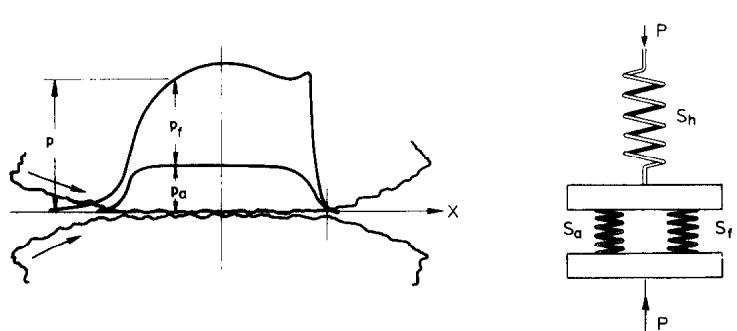
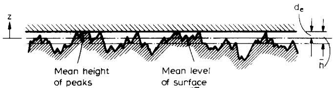
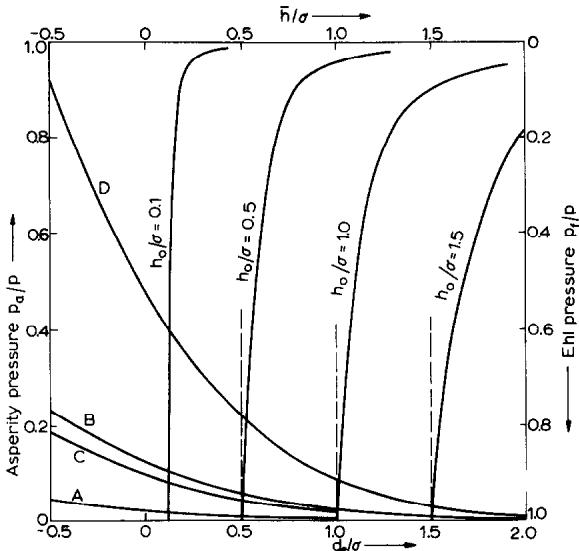
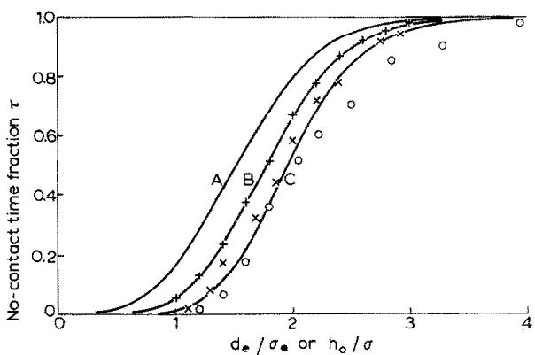
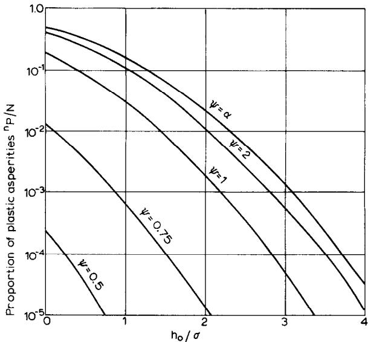
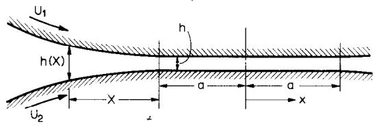
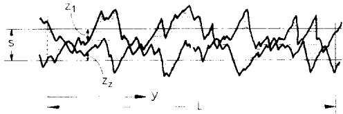

# A SIMPLE THEORY OF ASPERITY CONTACT IN ELASTOHYDRO-DYNAMIC LUBRICATION\*

K. L. JOHNSON, J. A. GREENWOOD AND S. Y. POON University Engineering Laboratory, Cambridge (Gt. Britain) (Received Augur 18, 1971)

## SUMMARY

The Greenwood and Williamson theory of random rough surfaces in contact has been combined with established elastohydrodynamic theory to provide a theoretical approach to highly loaded lubricated contacts in which the load is shared between hydrodynamic pressure and asperity contact. It is shown that, provided a major part of the load is carried by elastohydrodynamic action, the separatīon between the two rough surfaces is given (to a first approximation) by the film thickness which would exist between two smooth surfaces under the same conditions of load, speed and lubricant. It then follows that the asperity pressure, both real and apparent, is determined primarily by the ratio of theoretical film thickness to the combined roughness of the two surfaces $\left( h _ { 0 } / \sigma \right)$ . A corollary of this result is that an increase in total load, which has only a small influence on the film thickness, is carried by an increase in fluid pressure and only gives rise to a small increase in asperity contact pressure.

By way of example the theory has been applied to two questions. Firstly the time fraction in which there is no asperity contact has been deduced with results which compare favourably with the previous theoretical and experimental work on this problem by Tallian.

Secondly, an expression has been found for the number of asperities which become plastic. This is shown to depend upon two parameters: the film thickness to roughness ratio $\left( h _ { 0 } / \sigma \right)$ and also upon Greenwood and Williamson's plasticity index.

## 1. INTRODUCTION

It is clear that the breakdown of a lubricating film must be associated, in some way, with contact between the asperities on the two solid surfaces. In concentrated contacts, where the lubrication is elastohydrodynamic, the nominal film thickness is typically of the same order of magnitude as the height of the surface asperities. In recent years, during which nominal elastohydrodynamic film thickness (i.e. based on the assumption of smooth surfaces) could be reliably calculated, evidence has accumulated that the incidence of surface distress in the forms of wear, fatigue and scuffing are associated with the ratio of the nominal film thickness to a measure of the surface roughness. Dowson¹ has recently made this point in relation to the failure of gears. Tallian and his co-workers² have correlated the wear of hard steel balls with the ratio of nominal film thickness to surface roughness (r.m.s. value). Dawson³ showed that the fatigue (pitting) life of rollers made from a medium-carbon gear-steel correlated with the ratio of film thickness to combined peak to valley height of the two surfaces. Also friction between lubricated surfaces and the process of running-in are clearly influenced by asperity interactions.

To assist in the interpretation of both practical experience and laboratory tests of surface behaviour under conditions of elastohydrodynamic lubrication, we present in this paper a simple theory of asperity contact. In particular, we are concerned with the division of load between the film and the asperities in the circumstances where both contribute to supporting the load—the condition frequently referred to as partial elastohydrodynamic lubrication. Having apportioned the load, it is then possible to investigate such questions as the frequency of asperity contacts, the extent to which asperities are plastically deformed, flash temperatures and so on.

Our approach is based upon the theory of the contact of dry rough surfaces developed by Greenwoord and Williamson⁴. Their theory is combined with the established theory of the elastohydrodynamic lubrication of smooth surfaces by Dowson and Higginson, to apply to conditions of mixed or partial contact.

The situation is illustrated in Fig. 1(a) which may represent either a "line" or “point" contact. We are thinking of highly loaded, non-conforming, metal surfaces lubricated by a typical fluid whose viscosity rises steeply with pressure. The width of the Hertz flat might be 0.5 mm whilst the nominal film thickness is likely to have a magnitude around 1.0 μm. In these circumstances the film will be approximately parallel and the total pressure distribution approximately Hertzian with maximum pressure in the range $\bar { 0 . 2 } { - 2 . 0 K N / \mathrm { m m } ^ { 2 } } ( 2 9 { - } 2 9 \bar { 0 } \times 1 0 ^ { 3 } \mathrm { l b f / \bar { \mathrm { m } } ^ { 2 } } )$ . Of course the fluid pressure is not exactly Hertzian; there is a build-up in pressure in the entry region and a rapid drop in pressure at the exit which is associated with a constriction in the film, but these secondary effects will be ignored in the first instance. The two surfaces are rough with a random distribution of asperity heights, but in most practical cases the surfaces will be hardened and ground with a r.m.s. or c.l.a. value not greater than $2 5 \times 1 0 ^ { - 5 }$ mm. A large number of asperity contacts might be expected within the nominal contact area so that, although the real asperity pressure is exerted discontinuously at the actual contact spots, we can imagine a “smoothed out" continuous distribution of apparent asperity pressure $\pmb { p _ { \mathrm { { a } } } } .$ This pressure, together with the pressure in the lubricant film $p _ { \mathrm { f } } ,$ makes up the total pressure $p ,$ which gives rise to the bulk elastic deformation of the two surfaces. We are concerned with how the division of the total pressure $p$ into fluid pressure ${ p _ { \mathrm { f } } }$ and asperity pressure $\pmb { p _ { \mathrm { a } } }$ is governed by the properties of the surfaces and the conditions of lubrication.

(a)  
  
(b)  
Fig. 1(a) An EHL contact with rough surfaces. The total pressure p is made up of the fluid pressure ${ \pmb p } _ { \pmb { \imath } }$ and the asperity contact pressure ${ \pmb { p } } _ { \mathbf { a } } .$ (b) A diagrammatic representation of the flexible elements in an EHL contact. The spring $\mathsf { \pmb { S _ { \lambda } } }$ represents the bulk Hertz deformation of both bodies; the spring $\mathbb { S } _ { \mathtt { a } }$ represents the elastic stiffness of the asperities and the spring $\mathbf { S _ { f } }$ represents the hydrodynamic action of the oil film. The total load P is shared by $\mathbf { S _ { \mathfrak { s } } }$ and $\mathbf { S _ { f } }$ acting in parallel

The essential features of this problem are shown diagrammatically in Fig. 1(b). The bulk (Hertzian) deformation of the two solids under the applied load P, which gives rise to the nominal contact area $A _ { 0 }$ and total contact pressure ${ p , }$ is represented by the spring $\mathbf { S _ { \mathbf { \lambda } } }$ . The oil film and the asperities are represented by the parallel springs $\mathbf { S _ { f } }$ and $\mathbf { S _ { a } }$ respectively. The proportion of the load carried by each spring depends upon their relative uncompressed length and their relative stiffness. Thus a smooth surface operating with a viscous fluid, would be represented by an “asperity spring" whose uncompressed length does not fill the gap whereupon the whole load is taken by the oil film. Conversely rough surfaces operating in conditions of inadequate or starved lubrication would be represented by an “asperity spring" which carries all the load and a “fluid spring" which hardly fills the gap. The condition of mixed lubrication corresponds to both springs being compressed. As we shall see, all three springs are non-linear; the stiffness of each increases with compression.

## 2. ASPERITY PRESSURE

To calculate the asperity pressure we shall use the model adopted by Greenwood and Williamson⁴. One surface is taken to be smooth, whilst the other has a random distribution of asperities. The asperities themselves are taken to have spherical summits of constant radius $\beta .$ The probability that a particular asperity will have a height between z and z + dz above some reference plane is expressed by probability distribution function φ(z) dz.

In reality both surfaces are rough, but recently Greenwood and Tripp⁵ have shown that the contact of two rough surfaces is similar to that of an “equivalent" single rough surface with a smooth flat plane. The equivalent asperity curvature is taken to be the sum of the individual curvatures; the equivalent standard deviation of the asperity heights is the combined standard deviation of the heights of both surfaces, but the equivalent separation is greater than the actual separation of the two rough surfaces by about half the standard deviation to allow for misalignment of the asperities.

A profile of the equivalent surfaces is illustrated in Fig. 2. A similar random profile is assumed to exist in the cross-section at right angles. The number of effective peaks per unit area of surface is denoted by N. Note that there are two reference planes in the rough surface: the mean height of the peaks and the mean level of the surface. The separation between the contacting smooth surface and these two reference planes is denoted by $d _ { e }$ and $s _ { e }$ respectively.

We shall assume here that the distribution of height of both the surface and the peaks is Gaussian. Measurement of freshly ground surfaces support this assumption, but run-in surfaces clearly will not have a Gaussian distribution. However the theory, which we are developing is not tied to a Gaussian distribution and another distribution function could equally well be employed.

  
Fig. 2. The Greenwood and Williamson model of rough surfaces in contact, in which the two surfaces are represented by a single rough surface in contact with a flat smooth surface having an equivalent separation $d _ { e } .$

Thus the rough surface in Greenwood and Williamson's model is prescribed by three parameters: the asperity density N, the radius of the peaks $\beta$ and the standard deviation of the peak heights $\pmb { \sigma } _ { \ast }$ . More recently an alternative approach to the statistical definition of rough surfaces has been presented by Whitehouse andArchard⁶. Starting from the assumption a Gaussian distribution of surface heights and an exponential autocorrelation function of height with distance along the surface, they show that a given surface can be characterised by two parameters: the standard deviation of the surface height $\sigma _ { * }$ and the correlation length l. The correlation length is a measure of the effective wave length of the main surface texture and hence the asperity density N in the Greenwood model is proportional to ${ { l } ^ { - 2 } }$ . Whitehouse and Archard show that the mean radius of asperity summits is proportional to $l ^ { 2 } / \sigma _ { \ast }$ . It then follows that the three parameters $N , \pmb { \sigma } _ { \ast }$ and $\beta$ are not independent, but are related by

$$
N \sigma _ { * } \beta = \mathrm { c o n s t a n t }
$$

Measurements of freshly ground and bead-blasted surfaces tend to support this relationship and yield a value of about 0.05 for the constant. Whitehouse and Archard also show that the distribution of the height of peaks to that of the surface as a whole is related by

$$
s - d \simeq 0 . 8 \sigma \quad \mathrm { a n d } \quad \sigma _ { \ast } \simeq 0 . 7 \sigma
$$

where $\sigma _ { * }$ and $\pmb { \sigma }$ are the standard deviationsof the peaks and the surface respectively. Returning to the rough surface model, we follow the analysis of Greenwood and Williamson given in ref. 4. Taking the mean of the peaks as datum, contact is made when the height of an asperity z exceeds the separation $d _ { e }$ . Thus the expected number of contacts per unit area is given by

$$
n = N \int _ { d _ { \mathrm { e } } } ^ { \infty } \varphi ( z ) \mathrm { d } z\tag{1}
$$

An individual asperity in contact is compressed by a distance $w = z - d _ { e }$ which gives rise to a contact spot of area

$$
A _ { \mathrm { i } } = \pi \beta w\tag{2}
$$

and a force

Wear, 19 (1972) 91–108

$$
P _ { \mathrm { i } } = { \frac { 2 } { 3 } } E ^ { \prime } \beta ^ { \frac { 1 } { 2 } } \ w ^ { \frac { 3 } { 2 } }\tag{3}
$$

where the effective elastic modulus $E ^ { \prime }$ is defined by

$$
\frac { 1 } { E ^ { \prime } } = \frac { 1 } { 2 } \biggl [ \frac { 1 - \nu _ { 1 } ^ { 2 } } { E _ { 1 } } + \frac { 1 - \nu _ { 2 } ^ { 2 } } { E _ { 2 } } \biggr ]
$$

Hence the expected total load per unit area (i.e. the apparent asperity pressure $\pmb { p _ { \mathrm { { a } } } } )$ is given by

$$
\begin{array} { r } { p _ { \mathrm { a } } = \frac { 2 } { 3 } N E ^ { \prime } \beta ^ { \ddag } \int _ { d _ { \mathrm { e } } } ^ { \infty } ( z - d _ { \mathrm { e } } ) ^ { \ddag } \varphi ( z ) \mathrm { d } z } \end{array}\tag{4}
$$

Note that this pressure is different from the real pressure at any individual contact which is equal to $p _ { \mathrm { i } } / A _ { \mathrm { i } }$ . If we now take the distribution of asperity heights to be Gaussian, with a standard deviation $\sigma _ { * } ,$ and introduce the notation

$$
F _ { n } ( u ) = ( 2 \pi ) ^ { - \frac { 1 } { 4 } } \int _ { u } ^ { \infty } { ( t - u ) ^ { n } \mathrm { e } ^ { - t ^ { 2 } / 2 } \mathrm { d } t }
$$

eqns. (2) and (4) for the number of contacts and asperity pressure become

$$
n = N F _ { 0 } ( d _ { \mathrm { e } } / \sigma _ { \ast } )\tag{5}
$$

and

$$
\begin{array} { r } { p _ { \mathrm { a } } = \frac { 2 } { 3 } E ^ { \prime } ( N \beta \sigma _ { \ast } ) ( \sigma _ { \ast } / \beta ) ^ { \pm } F _ { \frac { 3 } { 2 } } ( d _ { \mathrm { e } } / \sigma _ { \ast } ) } \end{array}\tag{6}
$$

Equation (6) shows how the aşperity pressure ${ \pmb p } _ { \mathbf { a } }$ varies with the separation $d _ { e }$ . It thus represents the characteristic of the “asperity spring". From Fig. 3, it is apparent that the spring is very non-linear : its stiffness (i.e. gradient of curve) is very much less at large separations. Due to the “infinite tail" of the Gaussian probability curve a vanishingly small asperity pressure is predicted however large the separation between the surfaces, but in reality the pressure can be neglected at values of $d _ { \mathrm { e } } / \sigma _ { * }$ greater than about 3. The ratio of the asperity pressure $p _ { \mathfrak { a } }$ to the total pressure $p ,$ is plotted in Fig. 3. The shape of the curve is determined by the function $F _ { \mathrm { * } } ( d _ { \mathrm { e } } / \sigma _ { \mathrm { * } } )$ but the absolute values depend upon $p , E ^ { \prime }$ and the roughness characteristics of the surface. The following values have been used:

  
Fig. 3. Asperity pressure as a function of $d _ { \circ } / \sigma$ [eqn. (6)]. $\mathbf { A } : { \boldsymbol { \sigma } } = 5 \times 1 0 ^ { - 5 }$ mm, $E ^ { \prime } / p = 6 6 0$ B: $\pmb { \sigma } = 5 \times 1 0 ^ { - 5 }$ mm, $E ^ { \prime } / p = 1 7 0 ; \mathbf { C } ; \pmb { \sigma } = 2 5 \times 1 0 ^ { - 5 }$ mm, ${ \pmb E } ^ { \prime } / p { = } 6 6 0$ ; D: $\pmb { \sigma = 2 5 \times 1 0 ^ { - 5 } }$ mm, $E ^ { \prime } / p = 1 7 0$ : Film pressure as a function of $h _ { 0 } / \sigma$ [eqn. (17)].

$$
{ \begin{array} { r l } { E ^ { \prime } \left( { \mathrm { s t e e l } } \right) = 2 3 0 k N / { \mathrm { m m } } ^ { 2 } } & { \left( 3 3 \times 1 0 ^ { 6 } \ { \mathrm { l b f / i n } } ^ { 2 } \right) } \\ { p = 3 5 0 , 1 4 0 0 \ N / { \mathrm { m m } } ^ { 2 } } & { \left( 5 0 \times 1 0 ^ { 3 } , 2 0 0 \times 1 0 ^ { 3 } \ { \mathrm { l b f / i n } } ^ { 2 } \right) } \\ { N = 2 0 0 0 \ { \mathrm { a s p e r i t i e s / m m ^ { 2 } } } } \end{array} }
$$

$$
\begin{array} { c } { { ( N \sigma _ { * } \beta ) = 0 . 0 5 } } \\ { { \sigma _ { * } = 5 \times 1 0 ^ { - 5 } , 2 5 \times 1 0 ^ { - 5 } \mathrm { m m } } } \end{array}
$$

These calculations suggest that, with the high contact pressure and good quality, hard steel surfaces used in many applications of EHL, the total pressure can only be supported by the asperities alone $\left( p _ { \mathrm { a } } / p = 1 \right)$ if they are almost squashed flat, i.e. at large negative values of $d _ { \mathrm { e } } / \sigma _ { \ast }$ . Under these conditions, however, the Greenwood-Williamson theory is not accurate in view of its assumption that individual asperities deform independently. Once the total area of contact becomes an appreciable fraction of the nominal area, the asperities will interact and become stiffer. Hence the true asperity pressure will rise more steeply at small separations than eqn. (6) suggests.

## 3. FILM PRESSURES

This section is based on the Dowson-Higginson theory of elastohydrodynamic lubrication of smooth cylinders. It is generally agreed that the film thickness $h _ { 0 }$ is established by the build-up of pressure in the converging region at entry ; it is controlled by the nominal viscosity $\eta _ { 0 }$ and pressure index α of the lubricant and by the rolling speed U, but is not appreciably affected by the precise shape of the deformed surfaces. In this way a quantity of fluid $Q = h _ { 0 } U$ per unit width is drawn into the nip. The greatly enhanced viscosity of the oil within the nip ensures that this quantity of fluid passes through the nip with almost constant thickness, like a solid sheet, until the pressure is released at exit.

How, then, is this behaviour affected by surface roughness? Two separate effects will be considered : firstly the influence of the rough surface-profile upon the build-up of pressure in the entry region and secondly the influence of asperity contact pressure in the nip upon the elastic deformation of the contact as a whole. As might be expected intuitively, we shall show that both these effects are comparatively small provided that the surfaces are not too rough compared with the nominal film thickness.

Recently Christensen7 has analysed the flow in a hydrodynamic tilted pad slider bearing with rough surfaces. One-dimensional asperities, aligned in both the direction of sliding and perpendicular to it, have been considered taking the distribution of height to be random. Christensen's method has been applied to the flow in the entry region of an EHL contact having (a) longitudinal and (b) transverse roughness (see. Appendix I). The two cases have opposite effects on the film thickness. With longitudinal asperities the mean film thickness in the parallel section (h) is related to the comparable film thickness with smooth surfaces $\left( h _ { 0 } \right)$ by

$$
\frac { \bar { h } } { h _ { 0 } } = 1 - \frac { 7 } { 1 2 } \biggl ( \frac { \sigma } { h _ { 0 } } \biggr ) ^ { 2 }\tag{7}
$$

With transverse asperities the relationship is

$$
\frac { \bar { h } } { h _ { 0 } } = 1 + \frac { 7 } { 6 } \left( \frac { \sigma } { h _ { 0 } } \right) ^ { 2 }\tag{8}
$$

Both these expressions are based on the assumption that $\sigma \ll h _ { 0 }$ . These results may be explained qualitatively when we remember that the quantity passing in Poiseuille flow is proportional to $h ^ { 3 } \partial p / \partial x$ . Thus longitudinal furrows facilitate the flow, since $( \bar { h } ^ { 3 } ) > ( \bar { h } ) ^ { 3 }$ , resulting in a thinner film, whilst transverse ridges resist the flow, since $( \overline { { 1 / h ^ { 3 } } } ) \overset { \cdot } { < } 1 / \bar { h } ^ { 3 }$ , resulting in a thicker film.

What of real rough surfaces? Most practical EHL contacts comprise ground steel surfaces with the lay in the longitudinal direction, so that we would expect the roughness to lead to a thinner film as implied by eqn. (7). On the other hand the asperities of a ground surface are far from being one-dimensional and the grooves will not permit unrestricted longitudinal flow. Restrictions in the grooves will act like transverse asperities leading to films thicker than those given by eqn. (7).

Whilst bearing in mind that longitudinal roughness will probably give rise to some reduction in the film thickness, we suggest that this will be small and for the present purpose propose to neglect the effect of rough surface profiles in the entry region upon the film thickness, i.e. we shall put $\bar { h } = h _ { 0 }$

Within the nip the higher asperîties make contact and only part of the pressure deforming the solids is provided by the fluid pressure ${ p _ { \mathrm { f } } }$ . We wish to find the relation between $\pmb { p _ { \mathrm { f } } }$ and the mean film thickness $\bar { h } .$ The two-dimensional elastohydrodynamic equations are : for the pressure in the film,

$$
e ^ { - \alpha p _ { \mathrm { f } } } { \frac { \mathrm { d } p _ { \mathrm { f } } } { \mathrm { d } x } } = 1 2 \eta _ { \mathrm { 0 } } U \left[ { \frac { h - h _ { \mathrm { m } } } { h ^ { 3 } } } \right]\tag{9}
$$

and for the deformation of the solids

$$
h ( x ) = h ( \boldsymbol { 0 } ) + \frac { x ^ { 2 } } { 2 R } + \frac { 2 } { \pi E ^ { \prime } } \int _ { - \infty } ^ { \infty } p ( \boldsymbol { \xi } ) \ln \bigg ( \frac { \boldsymbol { \xi } } { x - \boldsymbol { \xi } } \bigg ) ^ { 2 } \mathrm { d } \boldsymbol { \xi }\tag{10}
$$

The total load W is then given by

$$
W = \boldsymbol { \mathrm { f } } p ( \boldsymbol { x } ) \boldsymbol { \mathrm { d } } x\tag{11}
$$

Solutions of these equations are established8, for smooth surfaces, for which $p _ { \mathbf { f } }$ in eqn. (9) is identical to p in eqns. (10) and (11). We can make use of these solutions in our present problem if we assume that the addition of the asperity pressure does not appreciably change the distribution of total pressure. The consequences of this assumption are not likely to be serious since it is known that the distribution of pressure does not exert a critical influence upon the build up of pressure in the entry region.

Then we can substitute $p ( x ) = \lambda p _ { \mathrm { f } } ( x )$ in eqns. (10) and (11), where $\lambda$ is a constant greater than unity. Then

$$
h ( x ) = h ( \boldsymbol { 0 } ) + \frac { x ^ { 2 } } { 2 R } + \frac { 2 \lambda } { \pi E ^ { \prime } } \int _ { - \infty } ^ { \infty } p _ { \mathrm { f } } ( \boldsymbol { \xi } ) \ln \biggl ( \frac { \boldsymbol { \xi } } { x - \boldsymbol { \xi } } \biggr ) ^ { 2 } \mathrm { d } \boldsymbol { \xi }\tag{12}
$$

and

$$
W = \lambda \int _ { - \infty } ^ { \infty } p _ { \mathrm { f } } ( x ) \mathrm { d } x\tag{13}
$$

Equations (9), (12) and (13) are now the standard EHL equations for solids having an elastic modulus $E ^ { \prime } / \lambda$ under a load $W / \lambda$ . In the case of smooth surfaces, their solution for film thickness in the parallel section $h _ { 0 }$ can be expressed (see e.g. Johnson9)

$$
\biggl ( \frac { h _ { 0 } W } { \eta _ { 0 } U R } \biggr ) = f \biggl [ \biggl ( \frac { \alpha W ^ { \frac { 3 } { 2 } } } { \eta _ { 0 } ^ { \frac { 1 } { 3 } } U ^ { \frac { 1 } { 2 } } R } \biggr ) , \biggl ( \frac { W } { \eta _ { 0 } ^ { \frac { 1 } { 3 } } U ^ { \frac { 1 } { 2 } } E ^ { \prime \frac { 1 } { 2 } } R ^ { \frac { 1 } { 2 } } } \biggr ) \biggr ]\tag{14}
$$

A graphical plot of the functional relationship is given in ref. 9, but if we are concerned mainly with highly loaded metal contacts we can use Dowson and Higginson's expression

$$
\left( \frac { h _ { 0 } W } { \eta _ { 0 } U R } \right) \simeq 3 . 3 \left( \frac { \alpha W ^ { \frac { 3 } { 2 } } } { \eta _ { 0 } ^ { \frac { 1 } { 3 } } U ^ { \frac { 1 } { 2 } } R } \right) ^ { 0 . 5 4 } \times { \left\{ \frac { W } { ( \eta _ { 0 } U E ^ { \prime } R ) ^ { \frac { 1 } { 2 } } } \right\} } ^ { 0 . 0 6 }\tag{15}
$$

With rough surfaces we replace W by $W / \lambda , E ^ { \prime }$ by $E ^ { \prime } / \lambda$ and $h _ { 0 }$ by $\bar { h } ,$ whence

$$
\left( \frac { 1 } { \lambda } \frac { \dot { R } ~ W } { \eta _ { 0 } U R } \right) \simeq 3 . 3 \bigg ( \frac { 1 } { \lambda ^ { \frac { 3 } { 2 } } } \frac { W ^ { \frac { 3 } { 2 } } } { \eta _ { 0 } ^ { \frac { 3 } { 2 } } U ^ { \frac { 1 } { 2 } } R } \bigg ) ^ { 0 . 5 4 } \times \left\{ \frac { 1 } { \lambda ^ { \frac { 3 } { 2 } } } \frac { W } { ( \eta _ { 0 } U E ^ { \prime } R ) ^ { \frac { 3 } { 2 } } } \right\} ^ { 0 . 0 6 }\tag{16}
$$

Dividing eqn. (16) by eqn. (14) gives

$$
\frac { 1 } { \lambda } \ \frac { \bar { h } } { h _ { 0 } } = \left( \frac { 1 } { \lambda ^ { \frac { 3 } { 2 } } } \right) ^ { 0 . 5 4 } \times \left( \frac { 1 } { \lambda ^ { \frac { 1 } { 2 } } } \right) ^ { 0 . 0 6 }
$$

whereupon the ratio of fluid pressure to total pressure is given by

$$
{ \frac { p _ { \mathrm { f } } } { p } } \equiv { \frac { 1 } { \sqrt [ 3 ] { 3 } } } = \left( { \frac { h _ { 0 } } { \bar { h } } } \right) ^ { 6 . 3 }\tag{17}
$$

Equation (17) gives the required relationship between the fluid pressure ${ p _ { \mathrm { f } } }$ and the mean separation $\bar { h } ,$ in terms of the film thickness $h _ { 0 }$ which would be obtained with smooth surfaces under the same operating conditions.\* Curves representing this relationship have been added to Fig. 3 for different values of $h _ { 0 } / \sigma$ Equation (17) expresses the characteristic of the oil film “spring" ; it is very stiff in the regime where the film is carrying most of the load.

## 4. COMBINED ASPERITY AND FILM PRESSURE

The fraction of the total pressure carried by the asperities $\pmb { ( p _ { \mathrm { { a } } } / p ) }$ , given by eqn. (6), is a function of $( d _ { e } / \sigma _ { * } )$ and the fraction carried hydrodynamically by the film $\left( p _ { \mathrm { f } } / p \right)$ , given by eqn. (17) is a fraction of $( \bar { h } / h _ { 0 } )$ . To combine these two results we require the relation between $d _ { e } ,$ , the separation between the mean peak height and the flat surface in the Greenwood and Williamson model, and $\bar { h } ,$ the mean thickness of the film between the actual two rough surfaces. As mentioned previously, the separation in the single rough surface model is related to the actual separation of the two rough surfaces by

$$
d _ { \mathrm { e } } \simeq d + 0 . 5 \sigma
$$

From Whitehouse and Archard's results, the separation of the surfaces is related to the separation of the peaks by

$$
s - d \simeq 0 . 8 ( \sigma _ { 1 } + \sigma _ { 2 } ) \simeq 1 . 1 ~ \sigma
$$

for surfaces of comparable roughness. Also

$$
\sigma _ { * } \simeq 0 . 7 \sigma
$$

Combining these relationships, we find that

$$
\frac { d _ { \mathrm { e } } } { \sigma _ { \ast } } = 1 . 4 \frac { s } { \sigma } - 0 . 9\tag{18}
$$

The mean film thickness $\pmb { \bar { h } }$ is now related to the mean separation between the surfaces s by the condition of continuity; the space between the two contacting surfaces should accommodate the quantity of oil delivered by the entry region. The mean height of the gap between two rough surfaces h has been calculated in Appendix II with the result :

$$
\frac { \bar { h } } { \sigma } = \frac { s } { \sigma } + F _ { 1 } ( s / \sigma )\tag{19}
$$

where $F _ { 1 } ( s / \sigma )$ is the statistical function defined in Section 2.

The relation between $( s / \sigma ) , ( d _ { \mathrm { e } } / \sigma _ { \ast } )$ , and $( \bar { h } / \sigma )$ can now be found from eqns. (18) and (19). Some numerical values are given in Table I.

TABLE I
| s/σ | 0 | 0.5 | 1.0 | 1.5 | 2.0 | 2.5 | 3.0 |
| --- | --- | --- | --- | --- | --- | --- | --- |
| $d _ { e } / \sigma _ { * }$ | -0.9 | -0.2 | 0.5 | 1.2 | 1.9 | 2.6 | 3.3 |
| $\bar { h } / \sigma$ | 0.4 | 0.7 | 1.1 | 1.5 | 2.0 | 2.5 | 3.0 |

At values above about 1.5 in the important range there is no significant difference between $( s / \sigma ) , ( d _ { \mathrm { e } } / \sigma _ { * } )$ and $( \bar { h } / \sigma )$ ; at lower values there is an appreciable divergence, but in the region of small separations our theory becomes less reliable on various counts. To retain simplicity, therefore, we propose to put

$$
\frac { s } { \sigma } \simeq \frac { d _ { \mathrm { e } } } { \sigma _ { \ast } } \simeq \frac { \bar { h } } { \sigma }\tag{19}
$$

Thus we can plot both asperity pressures and film pressures to a base of $\left( \bar { h } / \sigma \right)$ as shown in Fig. 3. The point of intersection between the appropriate curves of asperity pressure and film pressure determines the division of total pressure between the asperities and the film, and the equilibrium film thickness. In the range where the present analysis is most reliable $( d _ { \mathrm { e } } / \sigma _ { \ast } > 0 )$ we note that the film is very much stiffer than the asperities. This results in the equilibrium film thickness h being only slightly greater than $h _ { 0 }$ . In other words, the actual mean separation of the surfaces $\{ s \}$ is very nearly equal to the oil film thickness between smooth surfaces $\left( h _ { 0 } \right)$ under the same condition of lubricant, speed, load, etc. This is the principal conclusion of this paper. It means that the separation, upon which the asperity contact conditions depend, can be calculated directly from the elastohydrodynamic conditions, independently of the surface roughness.

Since the “rough surface" film thickness (h) is almost identical to the “smooth surface" film thickness $\left( h _ { 0 } \right)$ the asperity pressure becomes approximately a function of $\left( h _ { 0 } / \sigma \right)$ , which explains why this parameter has been found to be of significance in studies of surface deterioration through wear or fatigue.

In the foregoing analysis we assumed that the asperity and fluid pressure distributions were similar and approximately Hertzian, in which case the division into asperity pressure and film pressure, shown in Fig. 3, would be the same at all points within the contact. However, having established that the oil film is stiff and hence that its thickness is virtually unaffected by some degree of asperity contact, we can examine the distribution of asperity pressure in more detail. It follows from eqns. (6) and (19) that ${ \pmb p } _ { \mathbf { a } }$ varies as ${ F _ { \ast } } ( \bar { h } / \sigma )$ . Hence, in well developed EHL contacts, where the film thicknessis approximately uniform, the asperity pressure will beroughly uniform throughout the contact. Both theory and experiment have shown that EHL films between smooth surfaces are not of perfectly uniform thickness. A reduction of about $2 5 \%$ in thickness occurs at the exit to the nip and, with point contacts, the film also shows constrictions at the sides of the contact circle (see Cameron1º). The asperity pressure in these regions where the separation is less will be higher than in the central region, but it is not certain whether the film is sufficiently stiff locally for the reduced separation to increase the asperity pressure to the extent which would be predicted by eqn. (6). In fact, it is probably too much to expect the Greenwood-Williamson theory to give more than a rough indication of the distribution of asperity pressure throughout an EHL contact.

In the foregoing sections of this paper we have established a simple theoretical model of a partial elastohydrodynamic contact. In this model the surfaces undergo a bulk deformation given by the Hertz theory. In the deformed region they are separated by a parallel film of oil whose mean thickness is that given by the Dowson and Higginson theory. Contact is made where the combined random distribution of asperity heights exceeds the mean film thickness. In the sections which follow we shall examine the consequences of this model upon some features of interest in lubricated contacts.

## 5. CONTACT TIME

The most common measurement made in the study of EHL contacts is that of electrical contact resistance. Under an applied voltage of about 100 mV a resistance of less than 0.1 Ω is taken to indicate effective metallic contact whilst the presence of an unbroken oil film leads to a resistance greater than 1 KΩ. It is usual to count the rate at which contact is made and broken and to measure the proportion of the total time during which contact is made or broken. The “no-contact time fraction" has been developed by Tallian et al.11 and used by Haines12,13 as a parameter for correlating measurements of wear in rolling contact bearings.

If $\scriptstyle A _ { 0 }$ is the nominal (Hertzian) area of contact the expected number of asperity contacts within that area is given by eqn. (5), viz :

$$
m { = } n A _ { 0 } { = } A _ { 0 } N F _ { 0 } ( { d _ { \mathrm { e } } } / { \sigma _ { \ast } } ) { \simeq } N A _ { 0 } F _ { 0 } ( h _ { 0 } / \sigma )\tag{20}
$$

For an open-circuit at any given instant there must be no asperity contacts. Provided that m is a fairly small number,we might expect that probability of finding a given number of contacts within the nominal contact area to be given by a Poisson distribution. The probability of finding no contacts is then $\bar { P ( 0 ) } \equiv 0 ^ { - m }$ . During steady rolling contact the fraction of the time during which there is no contact is given by the same probability, i.e.

$$
{ \mathrm { N o - c o n t a c t ~ t i m e ~ f r a c t i o n ~ } } \tau = \mathrm { e } ^ { - m }\tag{21}
$$

The variation of no-contact time with the parameter $\left( { \hbar } _ { 0 } / \sigma \right)$ given by eqns. (20) and (21) is shown in Fig. 4. The change from a no-contact time of less than $5 \%$ to greater than $9 5 \%$ occurs as a result of increasing the film thickness by about 1.5σ. The location of the theoretical curve on the $h _ { 0 } / \sigma$ axis depends upon the rather arbitrary choice of a value for $N ,$ the number of asperities per unit area. In Fig. 4, a value of 200 asperities/ $\mathrm { m } \mathrm { m } ^ { 2 }$ has been used to obtain a reasonable fit with the experimental results. Measurements of the no-contact time fraction by Tallian et $a l . ^ { 2 }$ on a 4-ball apparatus and by Poon and Haines1² on a point contact disc machine are shown for comparison. The observations of τ follow the predicted variation with $\hbar _ { 0 } / \sigma$ remarkably well.

  
Fig. 4. No-contact time fraction. Theoretical curves as a function of $\{ d _ { \mathfrak { e } } / \sigma \}$ for different nominal contact areas : $\mathbf { A } { = } 0 . 0 5 8 ~ \mathbf { m } \mathbf { m } ^ { 2 } ; \mathbf { B } { = } 0 . 0 9 0$ mm²; $\mathrm { C } = 0 . 1 3 4 \mathrm { m m } ^ { 2 }$ . Experimental points as a function of $\{ h _ { 0 } / \sigma \}$ . O Tallian et $a l . ^ { 1 1 } ; \times$ Poon and Haines¹2.

It is instructive to consider the effect of load upon the number of asperity contacts and upon the no-contact time. Since the film thickness $h _ { 0 }$ is almost independent of load the number of asperity contacts increases almost in proportion to the nominal contact area $A _ { \mathfrak { g } } .$ The effect of a change in load in Tallian's 4-ball machine is illustrated by the three theoretical curves in Fig. 3. Tallian et $a l . ^ { 1 1 }$ have made measurements of τ at varying load and, although the data does not permit direct comparison with the theory, the effect of increasing the load is to shift the curve of no-contact time against film thickness to the right by roughly the predicted amount.

## 6. PLASTIC DEFORMATION

The processes of wear and surface fatigue are likely to be related to the extent by which the surface asperities are plastically deformed. For example Dawson³ has shown that the pitting life of soft steels in rolling contact correlates with the parameter $\left( h _ { 0 } / \sigma \right)$ , but it does not appear that this parameter plays such an important role in the pitting failure of hard steel surfaces.

The analysis of asperity pressure presented in Section 2 has assumed that the asperities deform elastically. In most real contacts some asperities, at least, will be plastically deformed. However, as Greenwood and Williamson argue, the compliance relation for an individual spherical asperity, given by eqn. (3), only changes gradually after the elastic limit has been exceeded. The “elastic theory" is not likely to be greatly in error, therefore, provided that only a minority of the asperities have become plastic. From eqns. (2) and (3) the actual pressure sustained by an individual asperity is given by

$$
p _ { \mathbf { i } } \equiv \frac { P _ { \mathbf { i } } } { A _ { \mathbf { i } } } = \frac { 2 } { 3 \pi } E ^ { \prime } \beta ^ { - \frac { 1 } { 2 } } w ^ { \frac { 1 } { 2 } }\tag{22}
$$

A spherical asperity reaches its point of first yield when $p _ { \mathrm { i } }$ reaches a value of about 0.4 H, where H is the hardness of the material. Substituting this value into eqn. (22) and denoting the compression at the elastic limit by $w _ { \mathfrak { p } } ,$ we find

$$
w _ { \mathfrak { p } } \simeq 4 \beta ( H / E ^ { \prime } ) ^ { 2 }
$$

whereupon

$$
\bar { w } _ { \mathfrak { p } } / \sigma = ( \beta / \sigma ) ( H / \frac { 1 } { 2 } E ^ { \prime } ) ^ { 2 }\tag{23}
$$

The non-dimensional parameter $\left( \scriptstyle { \frac { 1 } { 2 } } E ^ { \prime } / H \right) \ \sqrt { \left( \sigma / \beta \right) }$ , which involves material properties and surface topography, is a measure of the probability of plastic deformation of the asperities when two dry rough surfaces are pressed into contact. It has been referred to by Greenwood and Williamson as the plasticity index and denoted by $\psi .$

Greenwood and Williamson used the expected total area of contacts which become plastic as their measure of the extent of plastic deformation. Having criteria for fatigue and possibly wear in mind we shall choose the expected number of asperity contacts which reach yield as a measure of the severity of repeated plastic deformation. From our simple theory the mean separation between the surfaces is approximately equal to the theoretical film thickness $h _ { 0 }$ . Thus the expected number of contacts per unit area in which the stress exceeds the elastic limit i.e. whose height z exceeds $( h _ { 0 } + w _ { \mathfrak { p } } )$ is given by

$$
\begin{array} { r } { n _ { \tt p } = N \int _ { h _ { \tt o } + w _ { \tt p } } ^ { \infty } \varphi ( z ) \mathrm { d } z } \\ { = N F _ { 0 } \left( \frac { h _ { 0 } } { \sigma } + \frac { w _ { \tt p } } { \sigma } \right) } \end{array}\tag{24}
$$

Since $w _ { \mathbf { p } } / \sigma = 1 / \psi ^ { 2 }$ , we see from eqn. (24) that the proportion of asperities which are deformed plastically depends upon both the plasticity index $\psi$ and the film thickness parameter $h _ { 0 } / \sigma .$ The relationship is plotted in Fig. 5 for various values of $\psi .$ It follows from eqn. (24) that for soft rough surfaces $( \psi$ large), the term $w _ { \mathfrak { p } } / \sigma$ is small compared with $h _ { 0 } / \sigma ,$ so that the degree of plastic contact is determined primarily by the film thickness in relation to the roughness. With hard smooth surfaces $( \psi$ small), on the other hand, $w _ { \mathbf { p } } / \sigma$ is large compared with $h _ { 0 } / \sigma$ ; the degree of plastic contact is then small whatever the value of the film thickness.

  
Fig. 5. Proportion of asperities which exceed the elastic limit. Plasticity index $\psi \equiv ( \frac { 1 } { 2 } E ^ { \prime } / H ) \sqrt { ( \sigma / \beta ) }$

This conclusion is consistent with Dawson's findings that the pitting fatigue life of soft gear steels is determined primarily by the parameter $h _ { 0 } / \sigma ,$ whilst the pitting failure of ball and roller bearings seems to be less critically dependent upon surface finish within the normally accepted limits. Values of the plasticity index are compared in Table II for Dawson's gear steel and a typical ball bearing steel. Interpolating these values in Fig. 5 confirms that the degree of plastic deformation of the rough gear steel is determined significantly by the film thickness parameter, whereas the smooth surfaces of both steels undergo a very small proportion of plastic deformation whatever the film thickness.

TABLE II
| $H ( K g / m m ^ { 2 } )$ | 700 |  | 175 |  |
| --- | --- | --- | --- | --- |
| σ (mm) | $5 \times 1 0 ^ { - 5 }$ | $2 5 \times 1 0 ^ { - 5 }$ | $5 \times 1 0 ^ { - 5 }$ | $2 5 \times 1 0 ^ { - 5 }$ |
| ψ | 0.17 | 0.85 | 0.65 | 3.5 |

It would seem likely that the process of “running-in" can be viewed in this context as a progressive reduction in σ and an increase in $\beta$ through the action of plastic deformation and wear.

The influence of load upon asperity stresses is again negligible since the film thickness is virtually independent of load. The increase in nominal contact area due to an increase in load increases the total number of plastic asperities but does not change the fraction of asperities which exceed the elastic limit.

## 7. CONCLUSIONS

Elastohydrodynamic contacts in which the high spots of the two surfaces penetrate the oil film, so that the load is shared between metallic contact and hydrodynamic pressure, have been studied using the Greenwood and Williamson theory of rough surfaces. Some degree of idealisation and approximation has been accepted in order that the theory should remain simple and clear. Our main conclusions may now be summarised.

(1) The influence of surface roughness on the build-up in pressure in the inlet region of an EHL contact is small for random rough surfaces. On the other hand, onedimensional roughness with the furrows aligned with direction of flow leads to a reduction in the pressures developed. For the purpose of this simple theory the effect of roughness in the inlet region is neglected.

(2) The system comprises three flexible elements : the bulk elastic solids, the oil film and the surface asperities. The load applied to the contacting bodies and transmitted between them is shared between the oil film and the surface asperities. Under typical conditions the contacting bodies are much more flexible than either the oil film or the asperities so that for the purposes of a simple theory their deformation and, in particular, the nominal contact area and total pressure distribution can be calculated by the Hertz theory; ignoring both the oil film and the surface roughness.

(3) Provided that the conditions are such that the oil film carries an appreciable proportion of the total load; it has been shown that the film is very stiff compared with the asperities. This means that the average separation between the two rough surfaces is approximately the same as it would be if the film carried the whole load. Thus, in view of conclusion (1), the average separation between the two rough surfaces within the contact can be taken to be equal to the film thickness calculated by established EHL theory for smooth surfaces under identical conditions of lubricant, speed and total load.

(4) The Greenwood and Williamson theory of asperity contacts shows that the number of asperities which make contact per unit nominal area and the effective pressure which they support are influenced primarily by the ratio of mean separation of the surfaces s to the standard deviation of the separation (i.e. the combined surface roughness σ). We have seen that the mean separation s is approximately equal to the film thickness which would be obtained with smooth surfaces $h _ { 0 }$ . Thus the number of contacting asperities and the asperity pressure is determined directly by the parameter $\{ h _ { 0 } / \sigma \}$ . This conclusion explains why the parameter $\{ h _ { 0 } / \sigma \}$ appears to play such an important role in the behaviour of partial EHL contacts.

(5) In the parallel portion of an EHL contact it follows that the asperity pressure is approximately uniform. The hydrodynamic film pressure adjusts itself to make up the difference to the total pressure which is approximately Hertzian.

(6) EHL film thicknesses between smooth surfaces are almost independent of load, hence asperity contact pressures are also virtually independent of load. The total number of asperities in contact merely increases in proportion to the increase in nominal contact area. This conclusion is in direct contrast to Greenwood and

Williamson's result for dry rough surfaces in which the number of contacting asperities per unit area increases in direct proportion to the load.

(7) The theory has been applied to calculate the dependence of the time fraction during which there is no asperity contact upon the parameter $\left( h _ { 0 } / \sigma \right)$ . The form of the theoretical curve agrees well with electrical resistance measurements but an absolute comparison is impossible due to the difficulty of specifying the total number of asperities per unit area of the experimental surfaces.

(8) The theory has also been applied to calculate the proportion of asperities which exceed their yield point. This fraction depends upon two parameters: the film thickness parameter $\left( h _ { 0 } / \sigma \right)$ and the plasticity index $\psi = \textstyle ( { \frac { 1 } { 2 } } E ^ { \prime } / h ) \sqrt { \textstyle ( \sigma / \beta ) }$ . With soft rough surfaces having a low value of $\psi _ { : }$ the proportion of asperities plastically deformed depends primarily on $\left( h _ { 0 } / \sigma \right)$ and is not greatly influenced by the value of $\psi .$ The predicted dependence on $\left( { { h _ { 0 } } / \sigma } \right)$ is consistent with Dawson's correlation of the fatigue life of soft rough discs with $( h _ { 0 } / \sigma )$

(9) Finally it must be remembered that the simple theory presented in this paper is not likely to be satisfactory when the majority of the load is carried by the asperities. In such circumstances the conventional model of rough surfaces with boundary lubrication at the points of real contact is likely to be more realistic.

In common with the Greenwood and Williamson theory of rough surfaces, our theory runs into difficulties at low values of $h _ { 0 } / \sigma$ (less than 0.5 say) due to the elastic interaction between surface asperities which is neglected in their theory.

APPENDIX I: INFLUENCE OF SURFACE ROUGHNESS IN THE ENTRY REGION OF AN EHL CONTACT

This treatment follows the Grubin approach to EHL contacts (see for example Cameron¹⁴, Chapter 8). The contact is shown in Fig. 6. The nip is assumed to be

  
Fig. 6.

parallel with a mean film thickness $\bar { h } .$ The mean thickness in the entry region is given approximately by (Crook¹⁵)

$$
h ( \chi ) \simeq \bar { h } + \frac { 2 ( 2 a ) ^ { \frac { 1 } { 2 } } } { 3 R } \chi ^ { \frac { 3 } { 2 } }\tag{A.1}
$$

We now apply Christensen's stochastic theory7 for lubrication of rough surfaces. The local film thickness H at any point is expressed: $H = h + r$ where $h$ is the mean value and r is the random deviation from the mean. Christensen considers two cases: (a) one-dimensional longitudinal asperities lying parallel to x-axis and (b) one-dimensional transverse asperities lying perpendicular to the x-axis.

(a) Longitudinal asperities

In this case Reynolds' equation for the pressure build-up in the entry region .

may be written (ref. 7, eqn. 32)

$$
\frac { \hat { c } } { \hat { \sigma } x } \bigg [ \frac { \hat { c } q } { \hat { \sigma } x } E ( H ^ { 3 } ) \bigg ] . = 1 2 \eta _ { 0 } U \bigg [ \frac { \hat { \sigma } } { \hat { \sigma } x } E ( H ) \bigg ]\tag{A.2}
$$

where $q$ is the “reduced" pressure, which is related to the actual pressure by $q =$ $( 1 - \exp \alpha p ) / \alpha$ and $E ( H )$ denotes the “expected” value. If the roughness is symmetrically distributed about the mean thickness, then

$$
E ( H ) \equiv E ( h + r ) = h + E ( r ) = h
$$

and

$$
E ( H ^ { 3 } ) = E ( h ^ { 3 } + 3 h ^ { 2 } r + 3 r ^ { 2 } h + r ^ { 3 } ) = h ^ { 3 } + 3 \sigma ^ { 2 } h
$$

where $\sigma$ is the standard deviation of the thickness. Substituting into eqn. (A.2) and using the condition that $\mathrm { d } q / \mathrm { d } x = 0$ in the nip where $h = \bar { n } ,$ one finds

$$
\frac { \mathrm { d } q } { \mathrm { d } x } = 1 2 \eta _ { 0 } U \frac { h - \bar { h } } { h ^ { 3 } + 3 \sigma ^ { 2 } h }
$$

i.e.

$$
\frac { \mathrm { d } q } { \mathrm { d } x } \simeq 1 2 \eta _ { \scriptscriptstyle 0 } U \left[ \frac { h - \bar { h } } { h ^ { 3 } } - \bar { 3 } \sigma ^ { 2 } \frac { h - \bar { h } } { h ^ { 5 } } \right]\tag{A.3}
$$

provided that $\sigma \ll h .$ The second term in eqn. $( \mathsf { A } . 3 )$ accounts for the effect of surface roughness and shows that longitudinal asperities decrease the load carrying capacity.

The mean film shape in the entry region given by eqn. $( \mathsf { A } . 1 )$ is now substituted into eqn. $( \mathsf { A } . 3 )$ and integrated to find the build-up in pressure $q ( \chi )$ . Using the Grubin conditions: at $\chi = \infty , q = 0$ and at $\chi = 0 , q \simeq 1 / \alpha ,$ gives the equation

$$
\frac { 1 } { \alpha } = \frac { 1 2 \eta _ { 0 } U } { \bar { h } ^ { 2 } } \frac { 2 } { 3 } \left\{ \frac { 3 R \bar { h } \ \cdot \bar { \mathbf { \nabla } } ^ { 3 } } { 2 ( 2 a ) ^ { \pm } } \right\} ^ { 2 } \ \int _ { 0 } ^ { \infty } \frac { v ^ { \frac { 2 } { 3 } } \mathrm { d } v } { ( 1 + v ) ^ { 3 } } - \frac { 3 \sigma ^ { 2 } } { \bar { h } ^ { 2 } } \int _ { 0 } ^ { \infty } \frac { v ^ { \frac { 3 } { 3 } } \mathrm { d } v } { ( 1 + v ) ^ { 5 } }\tag{A.5}
$$

where $v = \frac { 2 ( 2 a ) ^ { \frac { 1 } { 2 } } } { 3 R \bar { h } } \chi ^ { \frac { 3 } { 2 } }$

The two integrals have the values $( 2 \pi / 9 \sqrt { 3 } )$ and (7/27) $( 2 \pi / 9 \sqrt { 3 } )$ respectively, whereby

$$
\bar { h } = 2 . 4 8 ( \alpha \eta _ { 0 } U ) ^ { 4 } R ^ { \frac { 1 } { 2 } } a ^ { - \frac { 1 } { 4 } } \biggl [ 1 - \frac { 7 } { 9 } \biggl ( \frac { \sigma } { \bar { h } } \biggr ) ^ { 2 } \biggr ] ^ { \frac { 3 } { 4 } } .\tag{A.6}
$$

When the surfaces are smooth $( \sigma { = } 0 )$ this reduces to the standard Grubin result using Crook's approximation to the film shape, i.e.

$$
h _ { 0 } = 2 . 4 8 ( \alpha \eta _ { 0 } U ) ^ { \frac { 3 } { 4 } } R ^ { \frac { 1 } { 2 } } a ^ { - \frac { 1 } { 4 } }
$$

Hence, provided $\sigma \ll h _ { 0 }$ we can write eqn. $( \mathsf { A } . 6 )$ as

$$
h \simeq h _ { 0 } \left[ 1 - \frac { 7 } { 1 2 } \left( \frac { \sigma } { h _ { 0 } } \right) ^ { 2 } \right]\tag{A.7}
$$

Wear, 19 (1972) 91–108

which shows that the mean film thickness in the nip is reduced by the presence of longitudinal asperities in the entry region.

## (b) Transverse asperities

In pure rolling the asperities on both surfaces move with velocity $\displaystyle { \boldsymbol { \mathbf { \mathit { U } } } } ,$ so we can write

$$
\begin{array} { r } { H ( x , t ) = h ( x ) + r ( x - U t ) } \end{array}\tag{A.8}
$$

From Christensen $^ { 1 ^ { 7 } , }$ eqn. (2) we have

$$
\frac { \mathrm { d } } { \mathrm { d } x } E \left( H ^ { 3 } \frac { \mathrm { d } q } { \mathrm { d } x } \right) = 1 2 \eta _ { 0 } \left[ U \frac { \mathrm { d } } { \mathrm { d } x } E ( H ) + \frac { \mathrm { d } } { \mathrm { d } t } E ( H ) \right]\tag{A.9}
$$

Now

$$
U { \frac { \mathrm { d } } { \mathrm { d } x } } r ( x - U t ) = - { \frac { \mathrm { d } } { \mathrm { d } t } } r ( x - U t )
$$

so that eqn. (A.9) becomes

$$
\frac { \mathrm { d } } { \mathrm { d } x } E \left( H ^ { 3 } \frac { \mathrm { d } q } { \mathrm { d } x } \right) = 1 2 \eta _ { 0 } U \frac { \mathrm { d } h } { \mathrm { d } x }\tag{A.10}
$$

Following Christensen, this gives for the mean pressure gradient

$$
E \frac { \mathrm { d } q } { \mathrm { d } x } = 1 2 \eta _ { 0 } U ( h { - } \bar { h } ) E ( 1 / H ^ { 3 } )
$$

Now

$$
\begin{array} { c } { { E ( 1 / H ^ { 3 } ) = E h ^ { - 3 } ( 1 - 3 ( r / h ) + 6 ( r / h ) ^ { 2 } - . . . ) } } \\ { { \simeq h ^ { - 3 } ( 1 + 6 ( \sigma / h ) ^ { 2 } ) } } \end{array}
$$

Hence

$$
E { \frac { \mathrm { d } q } { \mathrm { d } x } } = 1 2 \eta _ { 0 } U \left[ { \frac { h - { \bar { h } } } { h ^ { 3 } } } + 6 \sigma ^ { 2 } { \frac { h - { \bar { h } } } { h ^ { 5 } } } \right]\tag{A.11}
$$

This equation can be integrated using the Grubin condition in the same manner as eqn. (A.3), giving the result

$$
\bar { h } \simeq h _ { 0 } \left[ 1 \ : + \frac { 7 } { 6 } \left( \frac { \sigma } { h _ { 0 } } \right) ^ { 2 } \right]\tag{A.12}
$$

APPENDIX II: RELATION BETWEEN THE SEPARATION OF TWO ROUGH SURFACES AND THE MEAN FILM THICKNESS

Two rough surfacęs. are shown in Fig. 7. The separation between their mean planes is denoted by s. It is required to find the cross-sectional area of the gap between them and hence the mean height h of the gap. Points of contact cause local deformation of the gap close to the areas of real contact, but, provided that the separation is not too small, a first approximation to h can be obtained by considering the geometry of the undeformed surfaces shown in Fig. 7.

  
Fig. 7.

Cross sectional area ${ \bf \Gamma } = \int _ { 0 } ^ { \bf L } \langle s - ( z _ { 1 } + z _ { 2 } ) \rangle { \bf d } y$

where $\langle \quad \rangle$ is a “Macauley bracket" in which negative values are ignored. The combined roughness $z \equiv z _ { 1 } + z _ { 2 }$ is randomly distributed, so that the expected area is given by

$$
\bar { h } L = L \int _ { \mathrm { ~ - ~ } \infty } ^ { \bullet } ( s - z ) \varphi ( z ) \mathrm { d } z
$$

$$
\bar { h } = \int _ { - \infty } ^ { \infty } \left( s - z \right) \varphi \left( z \right) \mathrm { d } z + \int _ { s } ^ { \infty } \left( z - s \right) \varphi \left( z \right) \mathrm { d } z
$$

If $\varphi ( z )$ is a Gaussian distribution with standard deviation $\sigma ,$

$$
\bar { h } = s + \sigma F _ { 1 } ( s / \sigma )
$$

where $F _ { 1 } \left( s / \sigma \right)$ is the statistical function defined in Section 2.

## REFERENCES

1 D. DowsoN, The role of lubrication in gear design, Proc. Inst. Mech. Engrs. Conference on Gearing, Cambridge, 1970.

2 T. E. TALLIAN, BRADY, McCoOL AND SiBLEY, Lubricant film thickness and wear in rolling point contact, ASLE Trans. 8 (1965) 414.

3 P. H. DAwson, Effect of metallic contact on the pitting of lubricated rolling surfaces, J. Mech. Eng. Soc., 4 (1962) 16.

4 J. A. GREENwooD AND J. B. P. WILLIAMsON, Contact of nominally flat surfaces, Proc. Roy. Soc. (London), 295 A (1966) 300.

5 J. A. GrEENwooD AND J. H. TRIPp, The contact of two nominally flat rough surfaces, Proc. Inst. Mech. Engrs., 185 (1970–71) 625.

6 D. J. WHITEHoUSE AND J. F. ARCHARD, The properties of random surfaces of significance in their contact, Proc. Roy. Soc. (London), 316 A (1970) 97.

7 H. CíRisTENsEN, Stochastic models for hydrodynamic lubrication of rough surfaces, Proc. Inst. Mech Engrs., 184 (1969–70) 1013.

8 D. DowsoN, G. R. HIGGINsON AND A. V. WHITAKER, Elastohydrodynamic lubrication—a survey of isothermal solutions, J. Mech. Eng. Soc., 4 (1962) 121.

9 K. L. JoínsoN, Regimes of elastohydrodynamic lubrication, J. Mech. Eng. Soc., 12 (1970) 9.

10 A. CAMERoN, Optical elastohydrodynamics, Proc. Inst. Mech. Engrs., 184 (1969--70) ?.

11 T. E. TALLiAN, et al. Lubricant films in rolling contact of rough surfaces, ASLE Trans., 7 (1964) 109.

12 S. Y. PooN AND D. J. HaINEs, Frictional behaviour of lubricated rolling-contact elements, Proc. Inst. Mech. Engrs., 181 (1966–67) 339.

13 D. J. HaınEs, Behaviour of lubricated steel balls under aero-engine ball race conditions, Proc. Inst. Mech. Engrs., 185 (1970-71) 373.

14 A. CAMERON, Principles of Lubrication, Longmans, 1966.

15 A. W. Crook, The lubrication of rollers II, Phil. Trans. Roy. Soc. (London) 254 A. (1961) 223.
