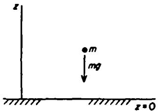
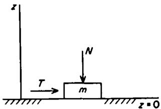
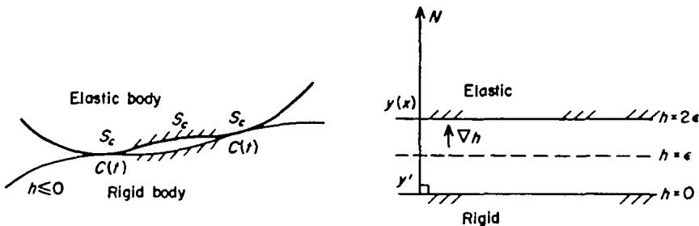

# Variational Principles of Contact Elastostatics

J. J. KALKER

Department of Mathematics, Delft University of Technology, Delft 8, The Netherlands

[Received 5December 1975 and in revised form 5 July 1976]

In this paper, the variational principles of contact elastostatics, which were proposed and proved by Fichera (1964) and Duvaut & Lions (1972) are developed in an engineering fashion without use of functional analysis. The theory contains a number of new elements, but the elegant existence proofs of the French-Italian school are missing. A start is made by extending the principle of virtual work to normal and frictional contact in such a manner that it needs no longer be known beforehand whether—in the case of normal contact—actual contact is or is not established, or—-in the case of frictional contact—slip does or does not occur. Then the principle of minimal potential energy is set up for a non-linear elastic body in contact with a rigid base. Uniqueness and minimality of the solution are proved under certain conditions, the Reissner principle is established, and the principle of minimal complementary energy is derived. Finally the principles are cast in what is termed surface mechanical form, and two examples are given: the variational principle for normal half-space contact problems, and a new principle for time-dependent frictional half-space contact. Upon discretization, these principles provide a quadratic object function to be minimized under linear or quadratic inequality constraints. The positions of the contact area and of the regions of slip and adhesion appear as by-products of the calculation.

## 1. Introduction

AtrEmPTs to solve contact problems by the adaptation of standard analytical tools of classical mechanics often make it necessary to restrict consideration to two-dimensional or axially symmetric geometries. With these simplifications, it is impossible to cover the entire domain of contact mechanics, and a mathematical description is needed which is specific for contact problems. Such a description is to be found in the theory of variational inequalities developed in Italy and France in the last decade, by Signorini (1959), Fichera (1964), Stampacchia (1967), and Duvaut & Lions (1972). This school uses advanced functional analytic tools and lays emphasis on theoretical development: for instance Duvaut & Lions (1972) confine themselves to existence and uniqueness theorems.

By contrast, investigators in the Netherlands and the United States (Kalker, 1966, 1967, 1971a; Kalker & van Randen, 1972; Singh & Paul, 1974; Conry & Seireg, 1971; Engel, 1975; Johns & Leissa, 1975) turned to the variational formulation of contact problems with the purpose of arriving at a numerical treatment. Although such numerical methods are successful and compare with experiments and with solutions obtained by other means, the variational formulation is mostly of an ad-hoc character. A middle position is occupied by investigators in the Soviet Union and Hungary (Fridman & Chernina, 1967; Páczelt, 1974, 1977) who developed finite element methods for the frictionless contact problem on the basis of the variational principles described in the present paper.

The aim of the present paper is to treat the variational principles of the French-Italian school in a manner in which functional analysis is avoided, while the proofs that will be given are of an "engineering"character, i.e. they are rigorous if the functions that occur are sufficiently often piecewise differentiable. The elegant existence proofs of the French-Italian school do not admit such a simplified treatment; but for this existence there is abundant proof in the sense of the engineer in view of the great number of contact problems that have been solved in the 96 years that have elapsed since Hertz initiated the theory of contact elastostatics.

## Notations

The coordinate system is Cartesian with coordinates $\xi _ { i } , \ i = 1$ , 2, 3. Subscripts $i , j , h ,$ k range through these same values, except in Section 2. A tensor is denoted by its basic symbol; these basic symbols can be combined through addition and scalar multiplication. A tensor V may be a function of a variable $W ;$ notation: $V ( W )$ Most tensors V are functions of the variable W indicated in the Appendix; then V denotes V(W). The length of a vector V (= tensor of rank 1) is denoted by |V|. The components of a tensor $V$ of rank 2, say, are given in index notation as $V _ { i j } .$ When two equal indices occur in an expression, summation over them is understood.

When it leads to clearer expressions, matrix-vector notation is used: in Section 6.1 matrices and vectors are partitioned, and in Section 7, Remark 2, rigid displacements are considered. Then, vectors are denoted by small, bold symbols, and matrices by bold capitals, which are mostly identical with the basic symbols of the corresponding tensors. In such a case, $( V )$ is sometimes used for V.

When V is prescribed, the prescribed value is indicated by $\widetilde { V } .$ Differentiation with respect to $x _ { \star }$ is denoted by , (see equation (17)); differentiation with respect to time is denoted by a dot over the symbol.

## 2. Extension of the Principle of Virtual Work

In statics, a system may be characterized by fixing its position by means of the generalized coordinates $\left\{ q _ { i } \right\}$ and the generalized forces $\{ Q _ { i } \}$ associated with them. The virtual work $\delta { W }$ is the work done by the generalized forces when the system undergoes a virtual displacement $\{ \delta \boldsymbol { q } _ { t } \}$

$$
\delta W = Q _ { i } \delta q _ { i } ,\tag{1}
$$

$\{ \delta \pmb q _ { t } \}$ : arbitrary virtual displacement; summation over repeated indices.

When the system is constrained, that is, if a relationship exists between the coordinates $\pmb { q } _ { t }$ or their variations $\delta \boldsymbol { q } _ { i }$ for instance

$$
f _ { J } ( q _ { i } ) = 0 \Rightarrow \frac { \partial f _ { J } } { \partial q _ { i } } \delta q _ { i } = 0 ; \mathrm { o r , ~ m o r e ~ g e n e r a l l y , ~ } a _ { J i } \delta q _ { i } = 0 ,\tag{2}
$$

a kinematically admissible virtual displacement is defined as a virtual displacement $\{ \delta \pmb q _ { t } \}$ satisfying (2). Then, certain combinations of the generalized forces do no work; in particular, when (2) are the constraints, then these combinations are of the form

$$
R _ { J i } = \lambda a _ { J i } , \quad \lambda \colon \mathrm { a ~ m u l t i p l i e r } .\tag{3}
$$

The ${ \pmb R } _ { J i }$ are called reaction forces connected with the jth constraint. These reaction forces may be left out of consideration in the virtual work (1); they do not influence it. The remaining forces are called non-reaction forces; they will, again, be denoted by $Q _ { t } .$ In many cases the non-reaction forces may be derived from a potential $\boldsymbol { V } ,$ in the following manner,

$$
V = V ( q _ { i } ) , Q _ { i } = - \partial V / \partial q _ { i } .\tag{4}
$$

Under these circumstances we speak of monogenic forces.

The variations that are kinematically admissible (kin. adm.) in view of (2) have the property that

$$
\{ \delta q _ { i } \} \ \mathrm { i s \ k i n . \ a d m . } \Rightarrow \ \{ - \delta q _ { i } \} \ \mathrm { i s \ k i n . \ a d m . }\tag{5}
$$

Constraints which possess the property (5) are called bilateral. If the constraints are so that they may be expressed as functions of the coordinates they are called holonomic. The principle of virtual work enunciates that in equilibrium the virtual work of the non-reaction forces vanishes for all bilateral kin. adm. virtual displacements

$$
{ \delta W } \equiv Q _ { i } \delta q _ { i } = 0 , \{ \delta q _ { i } \} \ \mathrm { k i n . \ a d m . } \Leftrightarrow \mathrm { e q u i l i b r i u m }\tag{6}
$$

or, in other terms, that in equilibrium the non-reaction forces are expressible in the reactions. In the case when we have a monogenic system with holonomic constraints, (6) reduces to the demand that V is stationary under the equality constraints (2).

Apart from equality constraints such as (2) there also may be inequality constraints, such as

$$
f _ { j } ( q _ { i } ) \geqslant 0 .\tag{7}
$$

Such an inequality constraint will be investigated with the aid of an example, for which we take a mass point m in a gravity field (see Fig. 1).

  
FIG. 1. A mass point in a gravity field.

Let the potential of the field be given by $V = m g Z ,$ and the inequality constraint is that $z \geqslant 0$ . It is known that equilibrium occurs when the mass point lies on the plane ${ \boldsymbol { Z } } = \mathbf { 0 }$ The contact force is acting upwards, but ceases to exist when contact is broken. Hence the contact force performs no work in a kinematically admissible variation of the coordinate $z ,$ so that we will leave it out of the consideration. The virtual work becomes:

$$
\begin{array} { r l } & { \delta W = - m g \delta Z ; \forall \delta Z \colon \exists \varepsilon _ { 0 } > 0 \colon 0 < \varepsilon < \varepsilon _ { 0 } \Rightarrow ( Z + \varepsilon \delta Z ) \geqslant 0 ; } \\ & { \qquad \Leftrightarrow Z = 0 \Rightarrow \delta Z \geqslant 0 ; Z > 0 \Rightarrow \delta Z \mathrm { ~ i s ~ a r b i t r a r y ~ } } \\ & { \qquad \delta W \leqslant 0 \mathrm { ~ i n ~ e q u i l i b r i u m , s i n c e ~ } Z = 0 . } \end{array}\tag{8}
$$

If, on the other hand, we start from the demand that $\delta W \leqslant 0$ and $Z \geqslant 0$ , we obtain

$$
\delta W = - m g \delta Z \leqslant 0 , Z \geqslant 0 \Rightarrow \exists \varepsilon _ { 0 } : ( Z + \varepsilon \delta Z ) \geqslant 0 \mathrm { ~ i f ~ } 0 < \varepsilon < \varepsilon _ { 0 } .\tag{9a}
$$

$$
( 1 ) \mathrm { ~ L e t } Z > 0 \colon \delta Z \mathrm { ~ i s ~ a r b i t r a r y } ; \mathrm { t a k e } \delta Z < 0 \Rightarrow \mathrm { v i o l a t i o n ~ o f ~ } ( 9 a ) .\tag{9b}
$$

$$
\left( 2 \right) \mathrm { L e t } Z = 0 ; \delta Z \geqslant 0 \Rightarrow \delta W = - m g \delta Z \leqslant 0 \mathrm { ~ s i n c e ~ } m g > 0 ; \mathrm { e q u i l i b r i u m } .\tag{9c}
$$

In this case the equilibrium is described by

$$
\delta W \equiv Q \delta Z \leqslant 0 , Q \mathrm { : n o n - r e a c t i o n ~ f o r c e } ; Z \geqslant 0 .\tag{10}
$$

It is seen from (8), (9c) that the constraint $z \geqslant 0$ is not bilateral when $z = 0$ ; it will be called unilateral. In general, conditions (7) are also unilateral. We arrive, if only from one simple case, at the conclusion that $\delta W$ is non-positive for all kinematically admissible variations of the generalized coordinates. Similar considerations led Fourier (1971) to the conclusion that the principle of virtual work should be extended to the pronouncement that $\delta W \leqslant 0$ for all kinematically admissible virtual displacements. We observe that we saw in (9) that for bilateral constraints $\delta W \leqslant 0$ $\Rightarrow \delta W = 0$ ; indeed,

$$
\delta W = Q _ { i } \delta q _ { i } \leqslant 0 \forall \mathrm { k i n . ~ a d m . ~ } \{ \delta q _ { i } \} \Rightarrow \{ - \delta q _ { i } \} \mathrm { k i n . ~ a d m . } \qquad \rceil
$$

$$
\begin{array} { r } { Q _ { i } ( - \delta q _ { i } ) \leqslant 0 \Rightarrow \delta W = Q _ { i } \delta q _ { i } \geqslant 0 \Rightarrow Q _ { i } \delta q _ { i } = \delta W = 0 \qquad \Bigl \{ \cdot } \end{array}\tag{11}
$$

For monogenic forces and holonomic constraints, the principle reads

Equilibrium $\Leftrightarrow \delta V \geqslant 0$ subject to $f _ { j } = 0 , j = 1 ( 1 ) m ; f _ { j } \geqslant 0 , j = m + 1 ( 1 ) n .$

(12)

  
FIG. 2. An example involving friction.

The example given above was a frictionless contact problem. We will now apply the principle (11)–(12) to an elementary problem involving friction (see Fig. 2). It will appear as an example in which the virtual work itself is unilateral in character, i.e.

$$
\delta W ( \delta q _ { i } ) \neq - \delta W ( - \delta q _ { i } ) .
$$

Consider a particle m subject to the inequality constraint $z \geqslant 0$ An external force Q acts on the particle, with Z-component, $- N ,$ and tangential component T. Coulomb's friction law reads, in terms of the external force Q:

$$
| T | \leqslant \mu N , \mu \colon \mathrm { c o e f f i c i e n t ~ o f ~ f r i c t i o n } .\tag{13a}
$$

If the particle is moved on the plane $z = 0$ over a small shift ${ \pmb S } ,$ Coulomb states that the external force T must be given by

$$
T _ { \iota } = \mu N s _ { \iota } / | s | .\tag{13b}
$$

The work done by the force T is $T _ { i } s _ { i } ;$ the work done by the generated frictional force (no reaction force!) is $( - \mu N | s | )$ . The virtual work and the equilibrium condition

become

$$
\begin{array} { r } { \delta W = - N \delta Z + T _ { i } \delta s _ { i } - \mu N \delta | s | \leqslant 0 , \mathrm { s u b j e c t ~ t o ~ } ( Z + \varepsilon \delta Z ) \geqslant 0 , 0 < \varepsilon < \varepsilon _ { 0 } ; \delta s } \\ { \mathrm { a r b i t r a r y } . } \end{array}\tag{14}
$$

We see whether (14) indeed describes the equilibrium condition by calculating the external force corresponding to all possible configurations.

$$
\begin{array} { r l } & { ( 1 ) \ Z > 0 \Rightarrow \delta Z , \delta s \ \mathrm { a r b i t r a r y . } \ \mathrm { T a k e } \ \delta s = 0 \Rightarrow \delta \vert s \vert = 0 \Rightarrow N = 0 } \\ & { \qquad \Rightarrow \delta W = T _ { i } \delta s _ { i } \leqslant 0 , \delta s \ \mathrm { a r b i t r a r y } \Rightarrow T = 0 . } \end{array}\tag{15a}
$$

That means that equilibrium in free space can only occur when $Q = ( T , - N ) = 0 .$

(2) $Z = 0 \Rightarrow \delta Z \geqslant 0 ,$ δs is arbitrary. Take $\delta s = 0 \Rightarrow \delta | s | = 0 \Rightarrow N \geqslant 0 ;$

$$
\operatorname { t a k e } \delta Z = 0 \Rightarrow \delta W = T _ { t } \delta s _ { t } - \mu N \delta | s | \leqslant 0 .\tag{15b}
$$

(a) Let ${ \pmb s } = { \bf 0 } .$ Then $\delta | \boldsymbol s | = | \delta \boldsymbol s | ;$ , δs arbitrary → since $N \geqslant 0 ; | T | \leqslant \mu N ,$ cf. (13a)

(b) Let $\pmb { \mathscr { s } } \neq \pmb { 0 }$ Then $\delta | s | = s _ { t } \delta s _ { i } / | s |$ , and $\delta W = \ \{ T _ { t } - \mu N s _ { i } / | s | \} \delta s _ { i } \leqslant 0 ,$

(15c)

δs arbitrary; W has now a bilateral character $\Rightarrow T _ { i } = \mu N s _ { i } / | s |$ , cf. (13b).

Hence (13) follows from (14), and vice versa.

## 3. The Principle of Virtual Work in Contact Elastostatics

We wish to find the analogue of the virtual work equilibrium conditions (14) for elastostatics. We consider an elastic body which in the undeformed state (particle $\mathbf { \delta } _ { \mathbf { \lambda } ^ { x , } }$ Cartesian coordinates: $\boldsymbol { x } _ { i } )$ occupies the region $G .$ Since the law of friction acts on the velocity or the shift, an incremental theory is indicated. To construct it, we start from an equilibrium reference state in which the particle x has the coordinates $y _ { i } ; y = y ( x )$ . This reference state is supposed to be the equilibrium state of the body at the time $t ,$ and is assumed to be known. Ordinarily the displacement $( y - x )$ is small; but since little complication is met if we regard $x  y$ as a large deformation, we will assume the latter.

At the time (t+ τ) (τ: an increment of time) the body will be in the deformed state in which the particle x has the coordinates $( y _ { \imath } { + } \eta _ { \imath } ) ; \eta = \eta ( y )$ . The deformation $y  y + \eta$ is assumed to be small enough so that the small displacement gradient theory of linear elasticity is applicable. In particular this means that the inner normal $N = N ( y )$ on the body at the time t almost coincides with the normal $N ( y + \eta )$ at the time (t+τ).

The time increment τ is assumed to be large with respect to a typical response time of the elastic body, but on the other hand small enough for the displacement with respect to the reference state to be linear in time:

$$
{ \mathrm { A t ~ t h e ~ t i m e ~ } } t + \theta \tau ( 0 \leqslant \theta \leqslant 1 ) { \mathrm { ~ t h e ~ d e f o r m a t i o n ~ i s ~ } } y \to y + \theta \eta .\tag{16}
$$

This implies that inertia is neglected.

The body may be inhomogeneous and anisotropic, but its specific energy E must depend on the metric tensor in the deformed state only:

$$
E = E ( [ y _ { i , j } + \eta _ { i , j } ] [ y _ { i , k } + \eta _ { i , k } ] , x ) ; i , j , k { : } 1 , 2 , 3 ; _ { , k } = \partial / \partial x _ { k } .\tag{17}
$$

At the time (t +τ) the displacement η is prescribed on the part of the surface of the body which in the undeformed state is given by $S _ { y } \subset \partial G$ . It is assumed that $S _ { y }$ has a non-zero area, which means that the body is properly supported:

$$
\eta = \widetilde { \eta } = \mathrm { p r e s c r i b e d ~ f o r } \ x \in S _ { u } \subset \partial G ; \mathrm { A r e a } \ ( S _ { u } ) \not = 0 .\tag{18}
$$

On another part $S _ { p } ^ { * } \subset \partial G$ the surface load $( p + \pi ) = ( p ( x ) + \pi ( x ) )$ is prescribed, which, owing to the fact that p, the surface load in the reference state, is known, ${ \pmb p } ,$ amounts to

$$
\pi _ { i } = \tilde { \pi } _ { i } = \mathrm { p r e s c r i b e d ~ o n ~ } S _ { p } ^ { * } \subset \partial G .\tag{19}
$$

On the remainder of the boundary $C \subset \partial G ,$ called the contact area, the body is in contact with a smooth surfaced rigid body which at the time (t+τ) occupies the region

$$
h ( \xi , t + \tau ) \leqslant 0 , \xi _ { i } { : } \mathrm { c o o r d i n a t e s } ; x \in \mathbb { C } \Leftrightarrow h ( y + \eta , t + \tau ) = 0 .\tag{20}
$$

The space derivatives of h are assumed to be of order unity; the time derivative is assumed to be small with respect to the velocity of sound in the elastic body. The contact area is not necessarily connected; it may depend on time, and is one of the unknowns of the problem. Near but outside the contact area the surface of the body will be assumed free of traction, which means that the region ${ \boldsymbol { S } } _ { p } ^ { * }$ completely surrounds the contact area.

  
FiG. 3. An elastic body in contact with a rigid base.

It was stated that the contact area is unknown. It may, however, be embedded in a larger region, called the potential contact area S, which consists of the contact area $\boldsymbol { S } _ { c } ,$ C and part of the region S. The remainder of Sp will be called Sp. This potential $S _ { p } ^ { * } .$ $S _ { p } ^ { * }$ $S _ { p } .$ contact area is chosen a priori by the investigator; it is assumed to have the following properties necessary for contact:

$$
\mathrm { ( a ) } \ C \subset S _ { c } \subset S _ { p } ^ { * } \cup C \subset \partial G ; \quad S _ { c } \cup S _ { p } \cup S _ { u } = \partial G .\tag{21a}
$$

(b) y' is the point of the surface of the rigid body nearest to y (see Fig. 3). $y ^ { \prime }$ The distance $y - y ^ { \prime }$ is assumed to be ${ \cal O } ( \eta )$ when $x \in S _ { c }$ In addition, the inner normal $N ( y )$ on the particle x in the deformed and reference states is assumed to coincide almost with the outer normal on the rigid body at $y ^ { \prime }$

$$
N _ { i } ( y , t ) \simeq N _ { i } ( y + \eta , t + \tau ) \simeq h _ { y \imath } ( y ^ { \prime } , t + \tau ) / | h _ { y } | \simeq h _ { y \imath } ( y , t ) / | h _ { y } | ,\tag{21b}
$$

with $h _ { y _ { i } } \equiv \partial h / \partial y _ { i } ,$ so that $\begin{array} { r } { h _ { y } = | h _ { y } | N . } \end{array}$

(c) The area $s _ { c }$ carries a contact load only.

(21c)

In $\boldsymbol { S } _ { c } ,$ the conditions that govern the contact are:

$$
h ( y + \eta , t + \tau ) \geqslant 0 \quad ( \mathrm { n o ~ p e n e t r a t i o n ~ c o n d i t i o n } )\tag{22a}
$$

with

$$
h ( y + \eta , t + \tau ) = h ( y , t + \tau ) + \eta _ { i } N _ { i } | h _ { y } | .\tag{22b}
$$

In order to define the shift which occurs in the frictional part of the virtual work equation (14), we introduce the following notations. Let V be a vector defined at y or $( y + \eta )$ on the surface of the deformed body, and let N be the inner normal on the body at y in the reference state. Then:

$$
\begin{array} { r l } & { { \cal V } _ { \cal N } \equiv \mathrm { n o r m a l ~ c o m p o n e n t ~ o f ~ } { \cal V } = { \cal V } _ { i } { \cal N } _ { i } \mathrm { ~ ( N ; ~ i n n e r ~ n o r m a l , } { \cal V } _ { \cal N } \mathrm { ; a ~ s c a l a r ) } } \\ & { { \cal V } _ { \cal T } \equiv \mathrm { t a n g e n t i a l ~ c o m p o n e n t ~ o f ~ } { \cal V } ; { \cal V } _ { \cal T _ { i } } = { \cal V } _ { i } - { \cal V } _ { \cal N } { \cal N } _ { i } } \end{array} \biggr \} .\tag{23}
$$

If $\phi = \phi ( \boldsymbol { y } ^ { \prime } )$ is the displacement from t to (t+ τ) of the point $y ^ { \prime }$ (see (21b)) of the rigid surface, then

the shift of the particle x with respect to the rigid surface $\equiv \eta _ { T } - \phi _ { T }$

(24)

We also need an expression for the frictional traction. If $( p + \pi )$ is the traction acting on the surface particle of x of the elastic body at $S _ { c }$ then

$$
{ \mathrm { t r a c t i o n ~ b o u n d } } = \mu ( p _ { N } + \pi _ { N } ) \equiv g ; \mu { \mathrm { : c o e f f i c i e n t ~ o f ~ f r i c t i o n . } }\tag{25}
$$

The well-known principle of virtual work in elastostatics, which is conventionally written in terms of $\delta V = - \delta W \geqslant 0$ , is modified by two elements, see (14):

(1) (22) is added as an auxiliary condition.

(2) A term

$$
\int _ { S _ { \sigma } } g \delta | \eta _ { T } - \phi _ { T } | \ d S
$$

is added to the conventional variation δV.

This term is comparable to the term $- \mu N \delta | s |$ of (14), with the sign reversed since we use $\delta V = - \delta W$ rather than $\delta { W }$ as was done in (14). We have

$$
\begin{array} { l } { { \delta V = - \delta W \equiv \delta \Bigg \{ \displaystyle \int _ { G } ( E - X _ { i } \eta _ { i } ) d G - \int _ { S _ { p } } ( p _ { i } + \tilde { \pi } _ { i } ) \eta _ { i } d S \Bigg \} } } \\ { { \displaystyle \qquad + \int _ { S _ { \sigma } } g \delta | \eta _ { T } - \phi _ { T } | \ d S , } } \end{array}\tag{26}
$$

$X = X ( y )$ is the body force, independent of time; $\delta V \geqslant 0 \forall \delta \eta$ compatible with (27):

$$
\begin{array} { r } { \mathrm { s u b j e c t ~ t o ~ } \eta _ { i } = \tilde { \eta } _ { i } \mathrm { ~ o n ~ } S _ { u } ; \qquad } \\ { h ( y + \eta , t + \tau ) = h ( y , t + \tau ) + \eta _ { N } | h _ { y } | \geqslant \mathrm { ~ 0 ~ i n ~ } S _ { c } . } \end{array}\tag{27}
$$

Since the η are small, the variational inequality (26) may be simplified by expanding the energy E in powers of $\eta _ { i , j } ;$ constant terms are dropped, and only linear and quadratic terms are retained. We define:

$s _ { j t } z = \partial E ( y _ { k , k } ) / \partial y _ { i , j } \mathrm { : }$ the Piola stress tensor in the reference state; $s _ { j l } + \sigma _ { j l } = \partial E ( y _ { h , k } + \eta _ { h , k } ) / \partial y _ { l , j } .$ the Piola stress tensor in the deformed state; $\sigma _ { j l } \mathrm { : }$ increment of the Piola stress;

(28a)

$$
E _ { i j k k } = \partial ^ { 2 } E ( y _ { l , m } ) / \partial y _ { l , j } \partial y _ { h , k } ; \sigma _ { j l } = E _ { i j k k } \eta _ { h , k } .\tag{28b}
$$

When the reference state is so near the undeformed state that linear elasticity is valid, then $s _ { j i }$ reduces to the classical stress and $E _ { i j h k }$ to the elastic constants. The elastic

energy becomes, apart from a term depending on y only:

$$
E = s _ { j i } \eta _ { i , j } + \frac { 1 } { 2 } E _ { i j h k } \eta _ { i , j } \eta _ { h , k } .\tag{29}
$$

We introduce (29) into (26):

$$
\begin{array} { r l } & { \delta V = \delta \Bigg \{ \displaystyle \int _ { G } \left[ s _ { j i } \eta _ { i , j } + \frac { 1 } { 2 } E _ { i j h k } \eta _ { i , j } \eta _ { k , k } - X _ { i } \eta _ { i } \right] d G - \int _ { s _ { p } } \left( p _ { i } + \tilde { \pi } _ { b } \eta _ { i } d S \right\} } \\ & { ~ + \displaystyle \int _ { s _ { c } } g \delta \big | \eta _ { T } - \phi _ { T } \big | d S \geqslant 0 } \\ & { \mathrm { s u b j e c t ~ t o ~ } \eta _ { i } = \tilde { \eta } _ { i } \mathrm { ~ o n ~ } S _ { \ast } ; ~ h ( y , t + \tau ) + \eta _ { N } | h _ { y } | \geqslant 0 \mathrm { ~ o n ~ } S _ { c } . } \end{array}\tag{30}
$$

The variation is performed with the proviso that $\delta \eta _ { t } = 0$ on δG. All such $\delta \eta$ are variations compatible with (27), and the Euler-Lagrange equations are

$$
s _ { j i , j } + \sigma _ { j i , j } + X _ { i } = 0 \mathrm { ~ } \mathrm { \ e q u i l i b r i u m ~ e q u a t i o n s , ~ t i m e : \ } t + \tau .\tag{31a}
$$

Now the reference state was assumed to be in equilibrium. Hence

$$
s _ { j i , j } + X _ { i } = 0 \mathrm { e q u i l i b r i u m , t i m e : } \ t .\tag{31b}
$$

Since X is independent of time, see (26), the $X _ { i }$ in (31a, b) denote one and the same quantity. Hence

$$
\sigma _ { j t , j } = 0 .\tag{31c}
$$

We identify

$$
p _ { i } = s _ { j i } n _ { j } , ~ \pi _ { i } = \sigma _ { j i } n _ { j } , ~ n \colon \mathrm { o u t e r ~ n o r m a l ~ o n ~ } \partial G \mathrm { ~ a t ~ } x\tag{32}
$$

with the surface load in the reference state at the particle $\pmb { x } ,$ and the increment of this load respectively. The loads and stresses are measured with respect to surfaces in the undeformed state.

The term $\pmb { S } _ { j t } \pmb { \eta } _ { i , j }$ in (30) is partially integrated. We find, if (31, 32) are taken into account, and a constant term

$$
\int _ { S _ { u } } \boldsymbol { p } _ { i } \tilde { \eta } _ { i } d S
$$

is dropped:

$$
\begin{array} { l }  { \delta V \equiv \delta \Bigg \{ \displaystyle \int _ { G } \frac { \frac { 1 } { 2 } E _ { i j k k } \eta _ { i , j } \eta _ { h , k } \ d G - \int _ { S _ { p } } \tilde { \pi } _ { i } \eta _ { i } \ d S \Bigg \} } } \\ { { + \displaystyle \int _ { S _ { \sigma } } \left\{ p _ { i } \delta \eta _ { i } + g \delta | \eta _ { T } - \phi _ { T } | \right\} d S , } } \end{array}\tag{33}
$$

subject to (27); $\delta V \geqslant 0 \forall \delta \eta$ compatible with (27).

We recall that $\pmb { g }$ was defined in (25) as $\mu ( p _ { N } + \pi _ { N } )$ , where $\pmb { \mu }$ is the (position dependent) coefficient of friction. However, up to now it has not been proved possible to establish existence and uniqueness of the solution of (33) when $\pmb { \mathscr { s } }$ depends on the deformation η. When $\pmb { g }$ depends on position and time only, existence and uniqueness have been established by Fichera (1964) for the case that $g = \mu = 0$ (the "Signorini Problem", also called "The normal contact problem"), and for ${ \pmb g } > { \pmb 0 }$ by Duvaut & Lions (1972), who, in addition, confine themselves to the case when the non-penetration condition $h \geqslant 0$ is replaced by the condition that $( p _ { N } + \pi _ { N } )$ is prescribed in $s _ { e }$ ; this leads to a variational principle which is given below in (41). Both proofs are restricted to coercivity of the energy, see (39), which holds in the case of classical elasticity. In addition, Duvaut & Lions gave a proof for the case of elastodynamics and viscoelasticity. Regarding uniqueness, an elementary proof, based on Kirchhoff's uniqueness theorem for classical elasticity has been given by Kalker (1971b). In the present paper, existence will not be proved; a uniqueness proof for the case that $g = g ( x , t + \tau )$ will be given in the next section. Simultaneously it will be shown that the potential energy V (which then exists) attains its unique minimum at the solution η.

## 4. The Uniqueness and Minimality Property of the Solution

In order to prove uniqueness it is assumed that the traction bound $\pmb { g }$ is a function of position and time only:

$$
g = g ( x , t + \tau ) .\tag{34}
$$

Then the variational inequality (33) can be written as

$$
V = \int _ { G } \frac { 1 } { 2 } E _ { t j k k } \eta _ { t , j } \eta _ { k , k } d G - \int _ { S _ { p } } \tilde { \pi } _ { t } \eta _ { i } d S + \int _ { S _ { o } } \left\{ p _ { i } \eta _ { i } + g | \eta _ { T } - \phi _ { T } | \right\} d S\tag{35}
$$

V: potential energy; subject to (27); $\delta V \geqslant 0 \forall \delta \eta$ compatible with (27).

Let $\pmb { \eta }$ be a solution of this problem and let $\pmb { \eta } ^ { \prime }$ satisfy the auxiliary conditions (27). $\scriptstyle { \pmb { V } } ^ { \prime }$ is the potential energy connected with $\pmb { \eta } ^ { \prime } .$ Then

(36a)

$$
\begin{array} { l } { { \displaystyle Y ^ { \prime } = \sum _ { \ell } \frac { 1 } { z } E _ { l j k \ell } \eta _ { l , j } ^ { \prime } , \eta _ { k , k } ^ { \prime } d G - \int _ { s _ { p } } \tilde { \tau } _ { l } \eta _ { l } ^ { \prime } d S + \int _ { s _ { c } } \{ p \eta _ { l } ^ { \prime } + g | \eta _ { T } ^ { \prime } - \phi _ { T } | \} d S } } \\ { { \displaystyle \quad = \int _ { a } \frac { 1 } { z } E _ { l j k \ell } \eta _ { l , j } \eta _ { k , k } d G - \int _ { s _ { p } } \tilde { \tau } _ { l } \eta _ { l } d S + \int _ { s _ { c } } \{ p _ { l } \eta _ { l } + g | \eta _ { T } - \phi _ { T } | \} d S + \dots { \cal F } } } \\ { { \displaystyle \int _ { a } E _ { l j k \ell } \eta _ { l , k } ( \eta _ { l , j } ^ { \prime } - \eta _ { l , j } ) d G - \int _ { s _ { p } } \tilde { \tau } _ { \ell } ( \eta _ { l } ^ { \prime } - \eta _ { l } ) d S + } } \\ { { \displaystyle \int _ { s _ { c } } \{ p _ { l } ( \eta _ { l } ^ { \prime } - \eta _ { l } ) + g [ | \eta _ { T } ^ { \prime } - \phi _ { T } | - | \eta _ { T } - \phi _ { T } | ] \} d S + } } \\ { { \displaystyle \int _ { a } \frac { 1 } { z } E _ { l j k \ell } ( \eta _ { l , j } ^ { \prime } - \eta _ { l , j } ) ( \eta _ { k , k } ^ { \prime } - \eta _ { k , k } ) d S } . }  \end{array} ) ~ , \dots ~ { \scriptstyle \beta } { \cal V } \geqslant { 0 }   \\   \displaystyle \int _ { a } \frac { 1 } { z } E _ { l j k \ell } ( { \scriptstyle \eta _ { l , j } ^ { \prime } } - { \scriptstyle \eta _ { l , j } } ) d S  , \quad \scriptstyle \eta _ { l , k } ^ { \prime } =  \scriptstyle \eta _\tag{36b}
$$

The first line of (36b) we identify with V. Regarding the second and third lines we observe that $( \eta ^ { \prime } - \eta )$ is an admissible variation of $\pmb { \eta }$ except possibly on $s _ { \ast }$ and $s _ { e }$ But on $s _ { \ast }$ we have

$$
\eta ^ { \prime } = \tilde { \eta } = \eta \quad \mathrm { o n } \quad S _ { u } { \Rightarrow } \eta ^ { \prime } { - } \eta = 0 ;\tag{37a}
$$

further we have on $\pmb { S _ { c } }$ that

$$
h ( y + \eta ^ { \prime } , t + \tau ) \geqslant 0 , h ( y + \eta , t + \tau ) \geqslant 0
$$

so that by (22b)

$$
\begin{array} { r l r } & { } & { h ( y + \eta + \alpha ( \eta ^ { \prime } - \eta ) , t + \tau ) = h ( y , t + \tau ) + ( 1 - \varepsilon ) \eta _ { N } \lvert h _ { y } \rvert + \varepsilon \eta _ { N } ^ { \prime } \lvert h _ { y } \rvert } \\ & { } & { = \varepsilon h ( y + \eta ^ { \prime } , t + \tau ) + ( 1 - \varepsilon ) h ( y + \eta , t + \tau ) \geqslant 0 \mathrm { ~ i f ~ } 0 \leqslant \varepsilon \leqslant 1 . } \end{array}\tag{37b}
$$

(37a, b) establish that $\left( \eta ^ { \prime } - \eta \right)$ is a feasible variation of $\pmb { \eta }$ when (27) is taken into account. Finally,

$$
\begin{array} { l } { \delta | \eta _ { T } - \phi _ { T } | = \underset { \varepsilon ^ { \downarrow } 0 } { \mathrm { l i m } } \left\{ | \eta _ { T } + \varepsilon ( \eta _ { T } ^ { \prime } - \eta _ { T } ) - \phi _ { T } | - | \eta _ { T } - \phi _ { T } | \right\} / \varepsilon } \\ { = \underset { \varepsilon ^ { \downarrow } 0 } { \mathrm { l i m } } \left\{ | ( 1 - \varepsilon ) ( \eta _ { T } - \phi _ { T } ) + \varepsilon ( \eta _ { T } ^ { \prime } - \phi _ { T } ) | - | \eta _ { T } - \phi _ { T } | \right\} / \varepsilon } \\ { \leqslant | \eta _ { T } ^ { \prime } - \phi _ { T } | - | \eta _ { T } - \phi _ { T } | } \end{array}\tag{37c}
$$

while ${ \pmb g } \geqslant { \bf 0 } ,$ so that the second and third lines of (36b) are $\geqslant \delta V \geqslant 0$ . In the classical theory of elasticity, $( E _ { i j k k } \gamma _ { i j } \gamma _ { h k } )$ (y: linearized strain) is positive definite, so that the fourth line of (36b) is non-negative. Hence

$V ^ { \prime } \geqslant V ;$ V is the (minimal) potential energy attained at η.

(38)

Now, if $\pmb { \eta } ^ { \prime }$ is likewise a solution, we have that $V ^ { \prime } = V ,$ and hence, by the above,

$$
E _ { i j h k } ( \eta _ { i , j } ^ { \prime } - \eta _ { i , j } ) ( \eta _ { h , k } ^ { \prime } - \eta _ { h , k } ) = E _ { i j h k } \gamma _ { i j } \gamma _ { h k } = 0 ,
$$

with γ: linearized strain associated with $( \eta ^ { \prime } - \eta )$

(39)

It follows from the positive definiteness of $( E _ { i j \tt A k } \gamma _ { i j } \gamma _ { h k } )$ that $\gamma = 0 ;$ , and then from the fact that $\eta ^ { \prime } { - } \eta = 0 \mathrm { o n } S _ { u } ,$ which has a non-vanishing area, that $\eta ^ { \prime } = \eta$ throughout the body, which establishes uniqueness.

It is noted that the assumption of the validity of classical elasticity has been used for its property of coercivity only, i.e. the property

$$
E _ { i j \mathbf { i } k } ( \eta _ { i , j } ^ { \prime } - \eta _ { i , j } ) ( \eta _ { h , k } ^ { \prime } - \eta _ { h , k } ) \geqslant a \gamma _ { i j } \gamma _ { i j } , a > 0 , \mathrm { c o n s t a n t }
$$

γ = linearized strain associated with $( \eta ^ { \prime } - \eta )$

If this property is assumed also in the non-classical case, the uniqueness-minimality proof given above continues to hold.

Summarizing, we have found that if the traction bound $\pmb { g }$ is a function of position and time only, see (34), then there exists a potential energy $\nu ,$ defined by (35), which upon minimization, yields the unique displacement $\pmb { \eta } ,$ solution of the problem, if, at any rate the coercivity relation (39) is satisfied.

## 5. Discussion of the Restriction (34) on the Traction Bound

The demand that g is a function of position and time only does not, in many cases, hinder the calculation of contact problems by variational means. Such a situation occurs in the classical theory of elasticity when an incompressible elastic half-space is in contact with a rigid punch, and also when two bodies with equal elastic constants, which, geometrically, are each other's mirror image with respect to a plane through the contact area, are in contact with each other. In this connection it is observed that although in classical elasticity the variational description of two bodies in contact is more complicated than the one which we consider, this complication is not essential.

In the two cases mentioned it may be shown (see, e.g., de Pater, 1962, p. 33) that the normal pressure $( p _ { N } + \pi _ { N } )$ is not affected by the value of ${ \pmb g } .$ Hence $\pi _ { N }$ may be calculated with $\pmb { g } = \pmb { 0 }$ (the normal contact problem); the variational principle is:

$$
\operatorname* { m i n } ! ~ V _ { N } \equiv \int _ { G } \frac { 1 } { 2 } E _ { l j h k } \eta _ { l , j } \eta _ { h , k } \ : d G - \int _ { S _ { p } } \widetilde { \pi } _ { i } \eta _ { l } \ : d S + \int _ { S _ { o } } p _ { i } \eta _ { l } \ : d S , \ : \mathrm { s u b j e c t ~ t o ~ } ( 2 7 ) .\tag{40}
$$

Next, the value of $\pmb { g }$ is set equal to $g = \eta ( p _ { N } + \pi _ { N } )$ , and the final field is calculated with the aid of the variational principle of Duvaut & Lions (1972) in which the no-penetration condition (22) is replaced by prescribing in $S _ { c } \ \pi _ { N } = \tilde { \pi } _ { N }$ , the increment of the normal pressure, calculated from (40):

$$
\begin{array} { r } { \operatorname* { m i n } ! ~ V _ { T } \equiv \displaystyle \int _ { G } \frac { 1 } { 2 } E _ { i j k k } \eta _ { l , j } \eta _ { h , k } ~ d G - \displaystyle \int _ { s _ { p } } \widetilde { \pi } _ { i } \eta _ { l } ~ d S + } \\ { \displaystyle \int _ { s _ { o } } \left\{ p _ { T _ { i } } \eta _ { T _ { i } } - \widetilde { \pi } _ { N } \eta _ { N } + g | \eta _ { T } - \phi _ { T } | \right\} ~ d S } \end{array}\tag{41}
$$

subject to $\pmb { \eta _ { i } } = \tilde { \pmb { \eta } } _ { i }$ in Su, g = µ(Pn+πN).

In the case of asymmetric half-space contact the restriction (34) on $\pmb { g }$ is not very restrictive. The normal contact problem, in which $\begin{array} { r } { \pmb { \mu } = \pmb { g } = \pmb { 0 } , } \end{array}$ is calculated first from (40) or otherwise; from that result an approximation of the traction bound $\pmb { g }$ is taken. Then, two courses are open to the investigator. Either he calculates an approximation of the final field by minimizing $V _ { T } ,$ (see 41); this is Johnson's approximation (1962), which is sufficiently accurate when the coefficient of friction is small enough (say $\mu = 0 { \cdot } 3$ in steel on aluminium contact). Or the problem (35) is solved with $g = \mu ( p _ { N } + \tilde { \pi } _ { N } )$ , where $\tilde { \pi } _ { N }$ is the value of $\pi _ { N }$ just calculated. Then a new value of $\pi _ { N }$ is found, which is used to correct ${ \pmb g } ,$ etc. The question of the convergence of this process, however, is open. It would seem that in half-space contact, which yields already a good approximation of the contact elastic field when the contact is almost flat and the diameter of the contact area is less than one fourth of the diameter of the body (e.g. wheel-rail contact), convergence is assured when, say, $\mu < 1$ , but there is no direct evidence to support this. In many technological applications the symmetry mentioned in the first paragraph of this section is present, as in the contact between a steel rail and a steel wheel (half-space contact, which implies the geometric symmetry, and steel-on-steel, which implies the material symmetry) or when a massive rubber body is in contact with a concrete foundation (again half-space contact, while rubber is almost incompressible, and the foundation is relatively rigid).

It is concluded that for most technological applications the restriction (34) on $\pmb { g }$ leads to acceptable calculating schemes, but it is of great theoretical significance to clarify the general case.

## 6. Dual Theorems: the Variational Principles of Reissner and of Minimum Complementary Energy

We wish to dualize the problem (35). This is done according to the pattern set by Noble & Sewell (1972) and Arthurs (1970). A difficulty arises when the variables η must be eliminated from the form $E _ { i j k } \eta _ { i , j } \eta _ { b , k }$ with the aid of the dual variables $\sigma _ { j i } = E _ { i j k k } \eta _ { k , k } ,$ owing to the fact that the (9 ×9) matrix $( E _ { ( i j ) ( k ) } )$ may be singular. This elimination is studied in Section 6.1. In 6.2, Reissner's principle is proposed and established through the identity of its equivalent local equations with those of (35). Also, a mechanical interpretation is given to these local equations. Finally, in 6.3, the principle of minimum complementary energy is established.

## 6.1. The Dualization of a Quadratic Form

We define:

$$
\begin{array} { r } { \mathbf { d } = \mathrm { E e } , \mathrm { w i t h } \ \mathbf { E } = \biggl ( \mathbf { \mathbf { \mathbf { B } } } ^ { B } \quad \mathbf { E } _ { 1 2 } \biggr ) , } \end{array}
$$

a symmetric matrix. We assume that the last columns, transposed $( \mathbf { E } _ { 1 2 } ^ { T } \mathbf { E } _ { 2 2 } )$ depend upon the first, and that B is a regular symmetric matrix. Owing to this linear dependence there exists a matrix A:

$$
\mathbf { A } \colon { \binom { \mathbf { E } _ { 1 2 } } { \mathbf { E } _ { 2 2 } } } = { \binom { \mathbf { B } } { \mathbf { E } _ { 1 2 } ^ { T } } } \mathbf { A } \Rightarrow { \left\{ \mathbf { E } _ { 1 2 } = \mathbf { B } \mathbf { A } \Rightarrow \mathbf { A } = \mathbf { B } ^ { - 1 } \mathbf { E } _ { 1 2 } \right. }\tag{42}
$$

Hence the matrix E becomes

$$
\mathbf { E } = { \binom { \mathbf { \mathbf { B } } } { \mathbf { \mathbf { A } } ^ { T } \mathbf { \mathbf { B } } } } \quad { \mathbf { \mathbf { B } } } \mathbf { \mathbf { A } }  \\ { \mathbf { A } ^ { T } \mathbf { \mathbf { B } } } \quad \mathbf { A } ^ { T } \mathbf { B } \mathbf { A } ) = { \binom { \mathbf { \mathbf { I } } } { \mathbf { A } ^ { T } } } \ \mathbf { B } \ ( \mathbf { I } , \mathbf { A } ) .\tag{43}
$$

We wish to express the quadratic form ${ \boldsymbol { \mathbf { e } } } ^ { T }$ Ee as a quadratic form involving the d variables (dualization); we will show that if

$$
\begin{array} { r l } & { { \bf C } \equiv \left( \begin{array} { l l } { { \bf B } ^ { - 1 } } & { { \bf 0 } } \\ { { \bf 0 } } & { { \bf 0 } } \end{array} \right) = \left( \begin{array} { l } { { \bf I } } \\ { { \bf 0 } } \end{array} \right) { \bf B } ^ { - 1 } \mathrm {  ~ ( , ~ } { \bf 0 } \mathrm { , ~ } { \bf 0 } \mathrm { ) } \Rightarrow { \bf d } ^ { T } { \bf C } { \bf d } = ( { \bf d } _ { I } ^ { T } , { \bf d } _ { A } ^ { T } ) { \bf C } \left( \begin{array} { l } { { \bf d } _ { I } } \\ { { \bf d } _ { A } } \end{array} \right) = { \bf d } _ { I } ^ { T } { \bf B } ^ { - 1 } { \bf d } _ { I } } \\ & { \qquad = { \bf e } ^ { T } { \bf E } \mathrm { e } . } \end{array}\tag{44}
$$

Indeed,

$$
\begin{array} { r l } & { \mathbf { d } ^ { T } \mathbf { C } \mathbf { d } = \mathrm { e } ^ { T } \mathbf { E } \mathbf { C } \mathbf { E } \mathbf { e } = \mathrm { e } ^ { T } \bigg ( \underset { \mathbf { A } ^ { T } } { \mathbf { B } } ( \mathbf { I } , \mathbf { A } ) \bigg ( \underset { 0 } { \mathbf { I } } \bigg ) \mathbf { B } ^ { - 1 } ( \mathbf { I } , \mathbf { \Phi } 0 ) \bigg ( \underset { \mathbf { A } ^ { T } } { \mathbf { I } } \bigg ) \mathbf { B } ( \mathbf { I } , \mathbf { A } ) \mathrm { e } } \\ & { \qquad = \mathrm { e } ^ { T } \bigg ( \underset { \mathbf { A } ^ { T } } { \mathbf { I } } \bigg ) \mathbf { B } \mathbf { B } ^ { - 1 } \mathbf { B } ( \mathbf { I } , \mathbf { A } ) \mathrm { e } = \mathrm { e } ^ { T } \mathbf { E } \mathrm { e } . } \end{array}
$$

Now, the d's are no longer arbitrary, since the system d = Ee may not be contradictory. We have:

$$
\mathbf { d } = { \binom { \mathbf { d } _ { I } } { \mathbf { d } _ { A } } } = { \binom { \mathbf { \Gamma } \mathbf { I } } { \mathbf { A } ^ { T } } } \mathbf { B } ( \mathbf { I } , \mathbf { \Gamma } , \mathbf { A } ) \mathbf { e } = { \binom { \mathbf { \Gamma } \mathbf { I } } { \mathbf { A } ^ { T } } } \mathbf { B } \mathbf { v } = { \binom { \mathbf { \Gamma } \mathbf { d } _ { I } } { \mathbf { A } ^ { T } \mathbf { d } _ { I } } } \Rightarrow \mathbf { d } _ { A } = { \mathbf { A } ^ { T } } \mathbf { d } _ { I } = \mathbf { E } _ { 1 2 } ^ { T } \mathbf { B } ^ { - 1 } \mathbf { d } _ { I } .\tag{45}
$$

If the components of e are arbitrary, then also the components of v are arbitrary which means that one can freely choose the components of $\begin{array} { r } { \mathbf { d } _ { I } = \mathbf { B } \mathbf { \boldsymbol { \mathsf { v } } } , } \end{array}$ owing to the regularity of B. Then $\mathbf { d } _ { A }$ is completely fixed, according to (45); that is, (45) is equivalent to the fact that E is singular. Hence

$$
\mathbf { e } ^ { T } \mathbf { E } \mathbf { e } = \mathbf { d } ^ { T } \mathbf { C } \mathbf { d } { \mathrm { ~ s u b j e c t ~ t o ~ } } \mathbf { d } _ { A } = \mathbf { E } _ { 1 2 } ^ { T } \mathbf { B } ^ { - 1 } \mathbf { d } _ { I } = \mathbf { A } ^ { T } \mathbf { d } _ { I }
$$

$$
\mathrm { e } ^ { T } \mathbf { E } \mathbf { e } = \mathrm { d } _ { I } ^ { T } \mathbf { B } ^ { - 1 } \mathbf { d } _ { I } .\tag{46}
$$

Example—Classical two-dimensional elasticity.

$$
\begin{array}{c} \begin{array} { r l } & { E _ { i j k k } = E _ { j i k k } = E _ { k i l j } . } \\ & { \mathbf { E } = \begin{array} { l } { \left[ \begin{array} { l l l l l } { E _ { 1 1 ~ 1 1 } } & { E _ { 1 1 ~ 1 2 } } & { E _ { 1 1 ~ 2 2 } } & { E _ { 1 1 ~ 2 1 } } \\ { E _ { 1 2 ~ 1 1 } } & { E _ { 1 2 ~ 1 2 } } & { E _ { 1 2 ~ 2 2 } } & { E _ { 1 2 ~ 2 1 } } \\ { E _ { 2 2 ~ 1 1 } } & { E _ { 2 2 ~ 1 2 } } & { E _ { 2 2 ~ 2 2 } } & { E _ { 2 2 ~ 2 1 } } \end{array} \right] } \end{array} ; \mathbf { B } = \left[ \begin{array} { l l l l } { E _ { 1 1 ~ 1 1 } } & { E _ { 1 1 ~ 1 2 } } & { E _ { 1 1 ~ 2 2 } } \\ { E _ { 1 1 ~ 1 2 } } & { E _ { 1 2 ~ 1 2 } } & { E _ { 1 2 ~ 2 2 } } \\ { E _ { 1 1 ~ 2 2 } } & { E _ { 1 2 ~ 2 2 } } & { E _ { 2 2 ~ 2 2 } } \end{array} \right] } \end{array} ;  \\ & { \begin{array} { r } { E _ { 2 1 ~ 1 1 } } & { E _ { 2 1 ~ 1 2 } } & { E _ { 2 1 ~ 2 2 } } & { E _ { 2 1 ~ 2 2 } } \end{array} } \end{array}
$$

$$
\mathbf { E } _ { 1 2 } = { \left( \begin{array} { l } { E _ { 1 1 } { \mathrm { \mathbf { \sigma } } _ { 1 2 } } } \\ { E _ { 1 2 } { \mathrm { \mathbf { \sigma } } _ { 1 2 } } } \\ { E _ { 2 2 } { \mathrm { \mathbf { \sigma } } _ { 1 2 } } } \end{array} \right) } ; \mathbf { E } _ { 2 2 } = ( E _ { 2 1 } { \mathrm { \mathbf { \sigma } } _ { 1 2 } } ) .
$$

The matrix $\mathbf { E } _ { 1 2 }$ equals the second column of $\mathbf { B } ,$ hence

$$
\begin{array} { r } { \mathbf { A } ^ { T } = ( 0 , 1 , 0 ) ; ~ \mathbf { E } _ { 2 2 } = \mathbf { A } ^ { T } \mathbf { B A } = ( 0 , 1 , 0 ) \mathbf { B } \left( \begin{array} { l } { 0 } \\ { 1 } \\ { 0 } \end{array} \right) = ( E _ { 1 2 } \mathbf { \Omega } _ { 1 2 } ) . } \end{array}
$$

If $\sigma _ { t j } = E _ { t j h k } \eta _ { h , k } ;$ and ${ \pmb { \sigma } } _ { I } ^ { T } = ( \sigma _ { 1 1 } \sigma _ { 1 2 } \sigma _ { 2 2 } ) , { \pmb { \sigma } } _ { A } = ( \sigma _ { 2 1 } ) ,$

we have that $E _ { i j k k } \eta _ { h , k } \eta _ { i , j } = \mathfrak { g } _ { I } ^ { T } \mathbf { B } ^ { - 1 } \mathfrak { e } _ { I }$ , subject to $( { \boldsymbol { \sigma } } _ { 2 1 } ) \equiv { \bf { \sigma } } { \bf { \sigma } } _ { A } = { \bf A } ^ { T } { \bf { \sigma } } _ { I } = ( { \boldsymbol { \sigma } } _ { 1 2 } ) ,$

the familiar symmetry of the stress tensor.

## 6.2. Reissner's Variational Principle. The Equivalent Local Equations

The specific complementary energy is intrcduced:

$$
H = \sigma _ { j i } \eta _ { i , j } - \ddag E _ { i j k k } \eta _ { i , j } \eta _ { k , k } = \ddag S _ { i j h k } ( x ) \sigma _ { j , i } \sigma _ { k , k } ,\tag{47}
$$

$? _ { \sigma _ { j i } } = E _ { i j k k } \eta _ { k , k } ,$ the Piola incremental stress tensor;

$S _ { i j k k }$ is determined with the aid of the theory of Section 6.1. The $\sigma _ { j t }$ are subject to the relations

$$
\begin{array} { r } { \sigma _ { A } = \mathbf { A } ^ { T } \sigma _ { I } , \sec { ( 4 6 ) } . } \end{array}\tag{48}
$$

It will be established that the problem (35) is described by the Reissner principle

$$
\begin{array} { r } { \delta _ { \eta } R \leqslant 0 , \forall \delta \eta ; \delta _ { \gamma ^ { \prime } , \sigma } R \geqslant 0 , \forall \delta \lambda ^ { \prime } , \delta \sigma \mathrm { c o m p a t i b l e ~ w i t h ~ t h e ~ e q u a t i o n s ~ } ( 5 1 ) \bigg \} } \\ { \delta _ { \bot } \cdot \mathrm { v a r i a t i o n ~ w i t h ~ r e s p e c t ~ t o ~ t h e ~ v a r i a b l e ~ ( ) } } \end{array}\tag{49}
$$

$$
\begin{array}{c} \begin{array} { r l } { { } } & { { R = \displaystyle \int _ { G } [ - \sigma _ { j i } \eta _ { i , j } + \frac { 1 } { 2 } S _ { i j k k } \sigma _ { j i } \sigma _ { k h } ] d G + \displaystyle \int _ { S _ { p } } \tilde { \pi } _ { i } \eta _ { i } d S +   _ { S \times } \lambda _ { i } ^ { \prime } ( \eta _ { i } - \tilde { \eta } _ { i } ) d S +  } } \\ { { } } & { {  \displaystyle \int _ { S _ { o } } [ \lambda _ { 4 } ^ { \prime } h ( y + \eta , t + \tau ) - p _ { i } \eta _ { i } - g | \eta _ { T } - \phi _ { T } | ] d S ; \quad g : \mathrm { s e e } \ ( 3 4 ) ; } } \end{array}    \end{array}\tag{50}
$$

subject to

$$
\begin{array} { r } { { \pmb { \sigma } } _ { A } = { \bf A } ^ { T } { \pmb { \sigma } } _ { I } ^ { \parallel } , ~ \lambda _ { 4 } ^ { \prime } \geq 0 . } \end{array}\tag{51}
$$

This is done by identifying the local equations equivalent to (49, 50, 51) with those equivalent to (35).

The equations equivalent to $\delta _ { \lambda ^ { \prime } } R \geqslant 0$ are:

$$
\eta _ { t } = \widetilde { \eta } _ { t } \mathrm { i n } S _ { u }\tag{52a}
$$

$$
h ( y + \eta , t + \tau ) = 0 \mathrm { i f } \lambda _ { 4 } ^ { \prime } > 0 \Big \} _ { \bigtriangleup } \Big \{ h ( y + \eta , t + \tau ) \geqslant 0\tag{52b}
$$

$$
h ( y + \eta , t + \tau ) \geqslant 0 \mathrm { ~ i f ~ } \lambda _ { 4 } ^ { \prime } = 0 \int ^ { \cdots } \mathrm { ~ } \lfloor \lambda _ { 4 } ^ { \prime } h ( y + \eta , t + \tau ) = 0 ;\tag{52c}
$$

(52a, b) coincide with (27), the auxiliary conditions of problem (35). As to the equations equivalent to $\delta _ { \sigma } R \geqslant 0$ we introduce the notation of 6.1, that is

$$
( \eta _ { i , j } ) = ( \mathbf { e } _ { I } ^ { T } , \mathbf { e } _ { A } ^ { T } ) , ( \sigma _ { j l } ) = ( \bar { \mathbf { e } } _ { I } ^ { T } , \bar { \mathbf { e } } _ { A } ^ { T } ) ; \bar { \mathbf { e } } _ { A } = \mathbf { A } ^ { T } \bar { \mathbf { e } } _ { I } .\tag{53}
$$

The variation of R becomes

$$
\begin{array} { r l } & { \delta _ { \sigma } R = \delta _ { \sigma _ { I } } \displaystyle \int _ { G } \left[ - \sigma _ { j i } \eta _ { l , j } + \frac { 1 } { 2 } S _ { l j k k } \sigma _ { j l } \sigma _ { k h } \right] d G } \\ & { \quad \quad \quad = \delta _ { \sigma _ { I } } \displaystyle \int _ { G } \left[ - \sigma _ { I } ^ { T } \boldsymbol { \mathfrak { e } } _ { I } - \boldsymbol { \mathfrak { \sigma } } _ { I } ^ { T } \mathbf { A } \boldsymbol { \mathfrak { e } } _ { A } + \frac { 1 } { 2 } \boldsymbol { \mathfrak { \sigma } } _ { I } ^ { T } \mathbf { B } ^ { - 1 } \boldsymbol { \mathfrak { \sigma } } _ { I } \right] d G \geqslant 0 , \forall \delta \boldsymbol { \mathfrak { \sigma } } _ { I } } \\ & { \quad \quad \quad \Rightarrow \boldsymbol { \mathfrak { e } } _ { I } + \mathbf { A } \boldsymbol { \mathfrak { e } } _ { A } = \mathbf { B } ^ { - 1 } \boldsymbol { \mathfrak { \sigma } } _ { I } \Rightarrow \boldsymbol { \mathfrak { \sigma } } _ { I } = \mathbf { B } ( \boldsymbol { \mathfrak { e } } _ { I } + \mathbf { A } \boldsymbol { \mathfrak { e } } _ { A } ) = \mathbf { B } ( \mathbf { I } , \mathbf { A } ) \binom { \boldsymbol { \mathfrak { e } } _ { I } } { \boldsymbol { \mathfrak { e } } _ { A } } } \end{array}
$$

$$
( \sigma _ { j i } ) = { \binom { \bullet _ { I } } { \bullet _ { A } } } = { \binom { \mathbf { I } } { \mathbf { A } ^ { T } } } \mathbf { B } ( \mathbf { I } , \mathbf { A } ) { \binom { \bullet _ { I } } { \bullet _ { A } } } = \mathbf { E } ( \eta _ { i , j } )
$$

or, in index notation,

$\sigma _ { j \ell } = E _ { i j h k } \eta _ { h , k } ;$ the stress-strain relations (28b) follow from $\delta _ { \sigma } R \leqslant 0$

(54)

Hence, by (44), when $\delta _ { \sigma } R \geqslant 0$ subject to (51),

$$
\begin{array} { r l } & { - \sigma _ { j l } \eta _ { i , j } + \ddag S _ { i j h k } \sigma _ { j t } \sigma _ { k h } = \ - E _ { i j h k } \eta _ { i , j } \eta _ { h , k } + \ddag E _ { i j h k } \eta _ { l , j } \eta _ { h , k } } \\ & { \quad \quad \quad \quad \quad \quad \quad \quad \quad \quad \quad = \ - \frac { 1 } { 2 } E _ { i j h k } \eta _ { l , j } \eta _ { h , k } . } \end{array}\tag{55}
$$

The equations equivalent to $\delta R _ { \parallel } \leqslant 0$ are, as regards $G , S _ { p } , S _ { u }$

$$
G \colon \quad \sigma _ { J t , J } = 0 \quad ( \mathrm { c f . ~ } ( 3 1 ) )\tag{56a}
$$

$$
S _ { p } \colon \quad \pi _ { t } = \tilde { \pi } _ { t } = \mathrm { p r e s c r i b e d }\tag{56b}
$$

$$
S _ { \bf u } \colon \quad \pi _ { i } = \lambda _ { i } ^ { \prime } = \mathrm { f r e e } .\tag{56c}
$$

Regarding $s _ { c }$ we have, if use is made of the representation (22b) of h:

$$
\left\{ - \pi _ { i } + \lambda _ { 4 } ^ { \prime } N _ { i } \big | h _ { y } \big | - p _ { i } \right\} \delta \eta _ { i } - g \delta | \eta _ { T } - \phi { \boldsymbol { r } } | \leqslant 0 .
$$

If we set $\delta \eta _ { T } = 0 ;$ then $\delta | \eta _ { T } - \phi _ { T } | = 0 , \delta \eta _ { i } = N _ { i } \delta \eta _ { N }$ with $\delta \eta _ { N }$ free. Then

$$
- \pi _ { i } N _ { t } + \lambda _ { 4 } ^ { \prime } | h _ { y } | - p _ { i } N _ { t } = 0 \Rightarrow
$$

$$
S _ { c } \colon p _ { N } + \pi _ { N } = \lambda _ { 4 } ^ { \prime } | h _ { y } | \geqslant 0 , ( \mathrm { b y ~ } ( 5 1 ) ) ; \lambda _ { 4 } ^ { \prime } h = 0 \mathrm { ~ ( } \equiv ( 5 2 \mathrm { c } ) ) \Leftrightarrow ( p _ { N } + \pi _ { N } ) h = 0 .\tag{56d}
$$

We are then left with

$$
\begin{array} { r } { ( \pi _ { T _ { i } } + p _ { T _ { i } } ) \delta \eta _ { T _ { i } } + g \delta | \eta _ { T } - \phi _ { T } | \geqslant 0 . } \end{array}
$$

$$
\begin{array} { r l } & { \mathrm { I f ~ } ( \eta _ { T } - \phi _ { T } ) \neq 0 \Rightarrow \delta | \eta _ { T } - \phi _ { T } | = ( \eta _ { T _ { i } } - \phi _ { T _ { i } } ) \delta \eta _ { T _ { i } } / | \eta _ { T } - \phi _ { T } | \forall \delta \eta _ { T } } \\ & { \quad \Rightarrow ( \pi _ { T _ { i } } + p _ { T _ { i } } ) = - g ( \eta _ { T _ { i } } - \phi _ { T _ { i } } ) / | \eta _ { T } - \phi _ { T } | , } \end{array}
$$

which means that $( p _ { T } + \pi _ { T } )$ , the shear traction, has magnitude g and direction opposite to the slip $( \eta _ { T } - \phi _ { T } )$

$$
\mathrm { I f } \left( \eta _ { T } - \phi _ { T } \right) = 0 \Rightarrow \delta | \eta _ { T } - \phi _ { T } | = | \delta ( \eta _ { T } - \phi _ { T } ) | = | \delta \eta _ { T } | , \mathrm { s o ~ t h a t }
$$

$$
( \pi _ { T _ { i } } + p _ { T _ { i } } ) \delta \eta _ { T _ { i } } + g | \delta \eta _ { T } | \geqslant 0 \Leftrightarrow | \pi _ { T } + p _ { T } | \leqslant g ,
$$

which latter inequality is valid throughout $\pmb { S _ { c } }$ Equivalent to the above is

$$
S _ { c } \colon | p _ { T } + \pi _ { T } | \leqslant g , \ ( p _ { T _ { i } } + \pi _ { T _ { i } } ) ( \eta _ { T _ { i } } - \phi _ { T _ { i } } ) + g | \eta _ { T } - \phi _ { T } | = 0 .\tag{56e}
$$

We will now show that the local equations (52, 54, 56) which are equivalent to (49, 50, 51) are identical with the local equations equivalent to (35).

Proof. (1) (52a, b) are identical with (27), the auxiliary conditions in (35); (52c) is discussed in point (5).

(2) (54) is identical with (28) as far as σ is concerned, while s enters neither in (49, 50, 51), nor in (35).

(3) (56a, b) also follow from (35).

(4) (56c) is the identification of a quantity not occurring in (35), and constitutes no restriction.

(5) (56d), which includes (52c), also follows from (35), as we will show now.

According to (35),

$$
( \pi _ { i } + p _ { i } ) \delta \eta _ { i } + g \delta | \eta _ { T } - \phi _ { T } | \geqslant 0 \mathrm { i n } S _ { c }
$$

$$
\mathrm { s u b j e c t ~ t o ~ } h ( y + \eta , t + \tau ) = h ( y , t + \tau ) + \eta _ { N } | h _ { y } | \geqslant 0 .\tag{57}
$$

We set $\delta \eta _ { T } = 0 $ , so that $\delta \eta _ { i } = N _ { i } \delta \eta _ { N }$ , and we obtain

$$
( \pi _ { N } + p _ { N } ) \delta \eta _ { N } \geqslant 0 \mathrm { ~ s u b j e c t ~ t o ~ } h ( y + \eta , t + \tau ) = h ( y , t + \tau ) + \eta _ { N } | h _ { y } | \geqslant 0 .
$$

If $h ( y + \eta , t + \tau ) > 0 \Rightarrow \delta \eta _ { N }$ is free, and $\pi _ { N } + p _ { N } = 0 .$

If h(y+η, t+ τ) = 0 ⇒ δηn ≥ 0, and $\pi _ { N } + p _ { N } \geqslant 0$

$$
\Rightarrow ( \pi _ { N } + p _ { N } ) \geqslant 0 , ( \pi _ { N } + p _ { N } ) h = 0 , { \mathrm { i . e . ~ } } ( 5 6 { \mathrm { d } } ) .
$$

(6) (56e) follows from (57) if (56d) is taken account in the same way as (56e) was established above. Q.E.D.

Hence (35) and (49, 50, 51) are equivalent. Finally we have by (52c), (52a), and (55) that

$$
- V = R { \mathrm { ~ a t ~ t h e ~ c o m m o n ~ s o l u t i o n ~ o f ~ } } ( 3 5 ) { \mathrm { ~ a n d ~ } } ( 4 9 , 5 0 , 5 1 ) .\tag{58}
$$

It is of interest to state the equivalent equations in mechanical terms, from which it is seen that the local equivalent equations coincide with those used in classical contact elastostatics:

((52a): displacement prescribed on $s _ { * }$

$\delta _ { \lambda ^ { \prime } }$ {(52b): no-penetration condition;

((52c) ≡ the second equation (56d);

$\delta _ { \pmb { \sigma } }$ {(54): stress-strain relations for the incremental field;

(56a): equations of equilibrium;

(56b): surface load prescribed on $S _ { p }$

$$
\delta _ { \eta }
$$

(56c): where the surface displacement is prescribed, the surface load is free;

(56d): in contact, the normal component of the load is compressive;

(56e): Coulomb's friction law if $g = \mu ( p _ { N } + \pi _ { N } )$

(56d, e): outside contact, $s _ { c }$ is free of traction.

## 6.3. The Principle of Minimum Complementary Energy

In order to obtain the principle of minimum complementary energy, we integrate the term $( - \sigma _ { f i } \eta _ { t , j } )$ in (50) partially, and we take the equations equivalent to $\delta _ { \eta } R \leqslant 0$ (i.e. (56)) as auxiliary conditions, so that we do not have to vary η. In so doing we eliminate $\lambda ^ { \prime }$ by (56c), (56d). We obtain:

(59)

$$
\begin{array} { r l } & { \delta _ { \sigma } C \geqslant 0 , \mathrm { s u b j e c t ~ t o ~ } \sigma _ { A } = \mathbf { A } ^ { T } \sigma _ { I } ; \sigma _ { J , I , J } = 0 \mathrm { ~ i n ~ } G ; \sigma _ { J } n _ { J } \equiv \pi _ { i } = \widetilde { \pi } _ { i } \mathrm { ~ i n ~ } S _ { p } ; } \\ & { | p _ { T } + \pi _ { T } | \leqslant g , ( p _ { N } + \pi _ { N } ) \geqslant 0 , ( p _ { T _ { i } } + \pi _ { T _ { i } } ) ( \eta _ { T _ { i } } - \phi _ { T _ { i } } ) + g | \eta _ { T } - \phi _ { T } | = 0 \mathrm { ~ i n ~ } S _ { c } ; } \\ & { R = C = \displaystyle \int _ { G } \frac { 1 } { 2 } S _ { i J \ h h } \sigma _ { J i } \sigma _ { k h } d G - \displaystyle \int _ { s _ { u } } \pi _ { i } \widetilde { \eta } _ { i } d S } \\ & { + \displaystyle \int _ { S _ { \sigma } } \left\{ ( p _ { N } + \pi _ { N } ) h ( y + \eta , t + \tau ) / | h _ { \mathbf { y } } | - ( p _ { i } + \pi _ { i } ) \eta _ { i } - g | \eta _ { T } - \phi _ { T } | \right\} d S . } \end{array}\tag{60}
$$

We consider the integral over $s _ { c } ,$ and take into account the second relation of (56e), and (22b):

$$
\begin{array} { l } { { \displaystyle \int _ { s _ { e } } \{ ( p _ { N } + \pi _ { N } ) h ( y + \eta , t + \tau ) / | h _ { \mathfrak { h } } \} - ( p _ { i } + \pi _ { i } ) \eta _ { i } - g | \eta _ { T } - \phi _ { T } | \} d S } } \\ { { \displaystyle = \int _ { s _ { e } } \{ ( p _ { N } + \pi _ { N } ) h ( y , t + \tau ) / | h _ { \mathfrak { h } } | + ( p _ { N } + \pi _ { N } ) \eta _ { N } - ( p _ { N } + \pi _ { N } ) \eta _ { N } - ( p _ { T _ { i } } + \pi _ { T _ { i } } ) \eta _ { T _ { i } } } } \\ { { \displaystyle \quad \quad - g \{ \eta _ { T } - \phi _ { T } | \} ~ d S } } \\ { { \displaystyle = \int _ { s _ { e } } \{ ( p _ { N } + \pi _ { N } ) h ( y , t + \tau ) / | h _ { \mathfrak { h } } | - ( p _ { T _ { i } } + \pi _ { T _ { i } } ) \phi _ { T _ { i } } \} ~ d S } } \end{array}
$$

so that (60) becomes

$$
\begin{array} { l } { { \displaystyle { C = \int _ { G } \frac { 1 } { 2 } S _ { i j h k } \sigma _ { J i } \sigma _ { k h } \ d G - \int _ { S _ { u } } \pi _ { i } \tilde { \eta } _ { i } \ d S + } } } \\ { { \displaystyle \int _ { S _ { o } } \left\{ ( p _ { N } + \pi _ { N } ) h ( y , t + \tau ) / | h _ { y } | - ( p _ { T _ { i } } + \pi _ { T _ { i } } ) \phi _ { T _ { i } } \right\} \ d S } } \end{array}
$$

R = C subject to (59).

(61)

If the coercivity relation (39) holds, then also when $\begin{array} { r } { \pmb { \sigma } _ { A } = \mathbf { A } ^ { T } \pmb { \sigma } _ { I } , S _ { i j k k } \sigma _ { j i } \sigma _ { k h } \geqslant b \sigma _ { j i } \sigma _ { j i } , } \end{array}$ $b > 0 ,$ constant, and it may be established as in Section 4 that C has a unique global minimum at the solution. Since then $\pmb { \sigma }$ is unique it follows that the linearized strains γ are unique; and since $\pmb { \eta }$ equals $\pmb { \tilde { \eta } }$ on $S _ { \bullet }$ it follows that $\pmb { \eta }$ is unique, see Section 4. Thus we have, by (58) and (61):

$$
- V ( \mathrm { a d m i s s } , \eta ) \leqslant - V ( \mathrm { s o l u t i o n } ) = R ( \mathrm { s o l u t i o n } ) = C ( \mathrm { s o l u t i o n } ) \leqslant C ( \mathrm { a d m i s s } , \sigma ) .\tag{62}
$$

## 7. Surface Mechanical Formulation

In surface mechanics we are exclusively interested in the stress and strain on the surface of the elastic body. The literature on contact mechanics is for the most part surface mechanical in nature; for, if the stresses and strains on the surface are known, the determination of the displacement-stress field inside the body is a matter which lacks contact mechanical characteristics. In accordance with this we will formulate the principles of minimum potential and complementary energy (35) and (61, 59) in surface mechanical form.

To that end we observe that in the solution η and σ are an equilibrium displacementstress field which satisfies the stress-strain relations:

$$
\sigma _ { j i , j } = 0 \mathrm { ~ i n ~ } G , \sigma _ { j i } = E _ { i j h k } \eta _ { k , k } , \sigma _ { A } = \mathbf { A } ^ { T } \pmb { \sigma } _ { I } \mathrm { ~ i n ~ } G .\tag{63}
$$

So in order to find the solution of (35) and (61, 59) we may confine ourselves to fields which satisfy (63), but perhaps not the boundary conditions (27), (59). Consider (35). The volume integral is integrated partially, and (63) is taken into account. This gives

$$
\begin{array} { c } { \displaystyle \operatorname* { m i n } _ { \tau , \mathrm { \ t \ o \ t e r } } V = \int _ { s _ { p } } ( \frac { 1 } { 2 } \pi _ { i } - \tilde { \pi } _ { i } ) \eta _ { i } d S + \int _ { s _ { u } } \frac { 1 } { 2 } \pi _ { i } \eta _ { i } d S + \int _ { s _ { e } } \{ ( p _ { i } + \frac { 1 } { 2 } \pi _ { i } ) \eta _ { i } + \varrho | \boldsymbol { \eta } _ { _ T } - \Phi _ { _ T } | \} d S } \\ { \displaystyle \quad \mathrm { s u b j e c t \ t o \ } \eta _ { i } = \tilde { \eta } _ { i } \mathrm { \ i n \ } S _ { u } , h ( y + \eta , t + \tau ) \geqslant 0 \mathrm { \ i n \ } S _ { c } ; ( 6 3 ) . } \end{array}\tag{64a}
$$

(64b)

In (61) we replace $S _ { i j k k } \sigma _ { j t } \sigma _ { k k }$ by its equivalent $E _ { i j k \pmb { \eta } _ { i , j } } \pmb { \eta } _ { b , k } .$ Then it follows from (61, 59, 63) in the same manner

$$
\begin{array} { l } { \displaystyle \operatorname* { m i n } _ { { \boldsymbol { \tau } } , \boldsymbol { \tau } \mathrm { { o g e t h e r } } } = \int _ { s _ { \mathrm { s } } } \pi _ { i } ( \frac { 1 } { 2 } \eta _ { i } - \widetilde { \eta } _ { i } ) d S + \int _ { s _ { p } } \frac { 1 } { 2 } \pi _ { i } \eta _ { i } d S + } \\ { \displaystyle \int _ { s _ { c } } \left\{ \frac { 1 } { 2 } \pi _ { i } \eta _ { i } + ( p _ { N } + \pi _ { N } ) h ( { \boldsymbol { y } } , { \boldsymbol { t } } + { \boldsymbol { \tau } } ) / | h _ { \mathrm { y } } | - ( p \tau _ { i } + \pi _ { T i } ) \phi _ { T i } \right\} d S } \end{array}\tag{65a}
$$

$$
\mathrm { s u b j e c t ~ t o ~ } \pi _ { i } = \tilde { \pi } _ { i } \mathrm { ~ i n ~ } S _ { p } , ( p _ { N } + \pi _ { N } ) \geqslant 0 , | p _ { T } + \pi _ { T } | \leqslant g \mathrm { ~ i n ~ } S _ { c } .\tag{65b}
$$

It should be noted that

$$
\delta \int _ { \vartheta G } \frac { 1 } { 2 \pi _ { i } \eta _ { i } d S } = \int _ { \vartheta G } \pi _ { i } \delta \eta _ { i } d S = \int _ { \vartheta G } \eta _ { i } \delta \pi _ { i } d S .\tag{66}
$$

Remark 1. If we compare (64) with (65), or (35) with (61), it is seen that (64) and (35) contain a term $g | \eta _ { T } - \phi _ { T } |$ , which is not differentiable if $( \eta _ { T } - \phi _ { T } ) = 0$ This causes difficulties when the principles (64)–(35) are implemented numerically by discretizing the integrals and by then applying an optimization algorithm (but see Kalker, 1971a). In the principle of stationary complementary energy such difficulties are conspicuously absent, which renders this principle, stated in (61, 59) and (65), a most fruitful principle upon which to base a numerical implementation.

Remark 2. In the derivation of the principles (35), (61, 59), (64), (65) it has been assumed that h and $\phi _ { T }$ are given. This means in particular, that quantities like the depth of penetration of the rigid body and its rigid motion with respect to the elastic body are given. In many cases this is not realistic: instead of these kinematical quantities the force and the moment that the rigid body exerts on the elastic body are known, that is, in vector notation,

$$
\int _ { s _ { c } } \left( \mathbf { p } + \pi \right) d S = \mathbf { f } = \mathbf { g } \mathrm { i } \mathrm { v e n } , \qquad \int _ { s _ { c } } \mathbf { y } \times \left( \mathbf { p } + \pi \right) d S = \mathbf { m } = \mathbf { g } \mathrm { i } \mathrm { v e n }\tag{67}
$$

$$
{ \mathrm { w i t h ~ p } } = ( p _ { i } ) , \pi = ( \pi _ { i } ) , { \mathrm { y } } = ( y _ { i } ) { \mathrm { , v e c t o r s ; ~ \times : c r o s s ~ p r o d u c t . } }\tag{68}
$$

The conditions (67) are isoperimetric in character, and may be entered in the minimum principles of complementary energy with the aid of constant Lagrange multipliers

$\lambda ^ { f }$ and $\mathbb { A } ^ { \pmb { m } } .$ We will do so in (65). The last integral becomes

$$
\begin{array} { r l r }   { \int _ { s _ { c } } \{ \frac { \pm \pi \mathrm { ~ . ~ } \boldsymbol { \eta } + ( p _ { N } + \pi _ { N } ) [ h ( y , t + \tau ) / \{ h _ { y } \} - \lambda _ { N } ^ { f } - ( \lambda ^ { m } \times \mathbf { y } ) _ { N } ] - } { ( p _ { T } + \pi _ { T } ) \cdot [ \Phi _ { T } + \lambda _ { T } ^ { f } + ( \lambda ^ { m } \times \mathbf { y } ) _ { T } ] \} d S ; } } \end{array}\tag{69}
$$

$$
\begin{array} { r l } & { \mathrm { w i t h ~ } \eta = ( \eta _ { i } ) , \Phi = ( \phi _ { i } ) ; \mathrm { ~ . ~ : ~ i n n e r ~ p r o d u c t } ; } \\ & { \mathrm { s u b s c r i p t ~ } N \mathrm { : ~ n o r m a l ~ c o m p o n e n t ~ ( s c a l a r ) } ; } \\ & { \mathrm { s u b s c r i p t ~ } T \mathrm { : ~ t a n g e n t i a l ~ c o m p o n e n t ~ ( v e c t o r ) } . } \end{array}\tag{70}
$$

This means, in effect, that the surface of the rigid body is now given up to an additive constant $\lambda f$ and the normal component of a rigid rotation about the origin $( { \lambda } ^ { \ m } \times { \bf y } ) _ { N } .$ The shift φ is likewise modified by the arbitrary rigid displacement $x ^ { 5 } + ( \lambda ^ { 5 } \times 5 )$ . The conditions (67) now figure as auxiliary conditions.

One can also require that only the total force in a certain direction is prescribed while in the other two directions orthogonal to it the displacement is given. This means that the complementary energy principle is extremely flexible as regards the global conditions that prevail in a contact.

## 7. Examples

## 7.1. Kalker-van Randen

The first example is the variational principle of Kalker-van Randen (1972) for the normal half-space contact problem. Take

$$
S _ { \ast } = \infty , \tilde { \eta } = 0 ; \tilde { \pi } = 0 \mathrm { o n } S _ { p } , y = x \Rightarrow p _ { i } = s _ { j i } = 0 .
$$

The problem is frictionless, hence ${ \pmb g } = { \bf 0 }$ Surface displacement and normal load are connected by the Boussinesq–Cerrutti integral representation (Love, 1952),

$$
\eta _ { i } ( x ) = \int _ { S _ { c } } K _ { i j } ( q - x ) \pi _ { j } ( q ) d q , \qquad K \colon \mathrm { m a t r i x ~ k e r n e l } .\tag{71}
$$

In this integral representation, the displacement $\pmb { \eta }$ vanishes at infinity, and the traction vanishes on $s _ { p } ,$ the surface of the half-space outside $s _ { c }$ The problem becomes

$$
\operatorname* { m i n } _ { \pi , \eta \mathrm { ~ t o g e t h e r } } \mathbb { C } \equiv \int _ { S _ { o } } \left\{ \frac { 1 } { 2 } \pi _ { i } \eta _ { i } + \pi _ { N } h ( x ) / | h _ { x } | \right\} d S , \qquad \pi _ { T } = 0 .
$$

We introduce (71) in this problem, and find

$$
\left. { \begin{array} { l } { \operatorname* { m i n } ! C \equiv \displaystyle \iint _ { s _ { \alpha } ^ { 2 } } \frac { 1 } { 2 \pi _ { N } } ( x ) K _ { N N } ( q - x ) \pi _ { N } ( q ) d q d x + \int _ { s _ { c } } \pi _ { N } ( x ) h ( x ) / | h _ { x } | d x } \\ { { \mathrm { s u b j e c t ~ t o ~ } } \pi _ { N } \geqslant 0 { \mathrm { ~ i n ~ } } S _ { c } ; K _ { N N } = N _ { l } K _ { i j } N _ { j } . } \end{array} } \right\}\tag{72}
$$

## 7.2. Frictional Contact of a Rigid Body with an Elastic Half-space

The half-space $x _ { N } \geqslant 0$ is fixed at infinity; its surface outside contact is free of traction. Classical elasticity is taken to be valid. The surface traction is denoted by $\pmb { \cal { X } } ,$ the displacement with respect to the undeformed state x is denoted by u. We have:

$$
\left. \begin{array} { c } { { X _ { i } = X _ { i } ( x , t ) ; ~ X _ { i } = 0 \mathrm { i n } S _ { p } ; } } \\ { { u _ { i } = u _ { i } ( x , t ) ; ~ u _ { i } = 0 \mathrm { i n } S _ { u } = \infty ; ~ u _ { i } , u _ { i , j } \mathrm { s m a l l } ; ~ y = x + u . } } \end{array} \right\}\tag{73}
$$

The equation of the surface of the rigid body is given by

$$
\left. \begin{array} { c } { { h ( \xi , t + \tau ) = \xi _ { N } - H ( \xi _ { T } , t + \tau ) , \xi _ { i } \mathrm { c o o r d i n a t e s } , H = O ( u ) \mathrm { i n } S _ { c } ; } } \\ { { \xi _ { N } = 0 \mathrm { : ~ u n d e f o r m e d ~ h a l f \mathrm { - } s p a c e ~ s u r f a c e } ; } } \\ { { h _ { y l } = N _ { i } , | h _ { y } | = 1 . } } \end{array} \right\}\tag{74}
$$

We write

$$
\begin{array} { r } { \dot { { \mathbf { \eta } } } = \partial / \partial t ; \eta _ { t } = \tau \dot { u } _ { i } , \pi _ { i } = \tau \dot { X } _ { t } . } \end{array}\tag{75}
$$

As to the rigid body, let $\pmb { V } = \pmb { V } ( t )$ be the velocity of the rigid body at the origin and $\omega = \omega ( t )$ its angular velocity about the origin. The velocity of the rigid body $\Phi = \Phi ( y ^ { \prime } )$ at $y ^ { \prime }$ is given by

$$
\Phi _ { i } = V _ { t } + \varepsilon _ { i j k } y _ { j } ^ { \prime } \omega _ { k } , \varepsilon _ { i j k } \colon \mathrm { a l t e r n a t i n g ~ s y m b o l }\tag{76}
$$

so that the shift $\phi = \phi ( y ^ { \prime } )$ becomes

$$
\phi _ { i } = ( V _ { i } + \varepsilon _ { i j k } y _ { j } ^ { \prime } \omega _ { k } ) \tau .
$$

Since in the contact area $y ^ { \prime } = y \simeq x = x _ { T }$ , the tangential component of the shift becomes

$$
\phi _ { T _ { i } } = ( V _ { i } + \varepsilon _ { i j k } x _ { T _ { j } } \omega _ { K } ) _ { T } \tau .\tag{77}
$$

In particular, if we take N as the x₃-direction we have

$$
\left. \begin{array} { c } { x _ { T } = ( x _ { 1 } , x _ { 2 } , 0 ) , x _ { N } = x _ { 3 } ; } \\ { \phi _ { T _ { 1 } } = \phi _ { 1 } = ( V _ { 1 } + x _ { 2 } \omega _ { 3 } ) \tau , \phi _ { T _ { 2 } } = \phi _ { 2 } = ( V _ { 2 } - x _ { 1 } \omega _ { 3 } ) \tau , \phi _ { T _ { 3 } } = 0 . } \end{array} \right\}\tag{78}
$$

A number of constant terms are omitted in (65), which thus appears to be equivalent to

$$
\begin{array} { l } { \displaystyle \operatorname* { m i n } _ { \boldsymbol { x } , \mathrm { \# \# } \mathrm { \# } \mathrm { \# } \mathrm { \# } \mathrm { \# } } \mathbb { C } ^ { * } \equiv \int _ { S _ { \boldsymbol { u } } } \pi _ { i } ( \frac { 1 } { 2 } \eta _ { i } - \tilde { \eta } _ { i } ) d S + \int _ { S _ { \boldsymbol { p } } } \frac { 1 } { 2 } \pi _ { i } \eta _ { i } d S + } \\ { \displaystyle \int _ { S _ { c } } \left\{ \frac { 1 } { 2 } \pi _ { i } \eta _ { i } + \pi _ { N } h ( \boldsymbol { y } , t + \tau ) / | h _ { \boldsymbol { y } } | - \pi _ { T _ { i } } \phi _ { T _ { i } } \right\} d S } \end{array}\tag{79}
$$

subject to $\pmb { \pi } = \tilde { \pmb { \pi } }$ in $S _ { p } ; p _ { N } + \pi _ { N } \geqslant 0 , | p _ { T } + \pi _ { T } | \leqslant g \mathrm { ~ i n ~ } S _ { c } .$

Introduction of (73)–(77) into (79) yields:

$$
\begin{array} { l } { \displaystyle \operatorname* { m i n } _ { t _ { i } , \ : u _ { i } \ : \mathrm { t o g } \ : \mathrm { c h e r } } \mathbb { C } ^ { * } \equiv \int _ { s _ { c } } \{ \frac { 1 } { 2 } \dot { X } _ { i } \dot { u } _ { i } \tau ^ { 2 } + \dot { X } _ { N } [ u _ { N } - H ( x _ { T } , t + \tau ) ] \tau -  } \\ { \displaystyle \qquad \dot { X } _ { T _ { i } } ( V _ { i } + \varepsilon _ { i J k } x _ { T _ { j } } \omega _ { k } ) _ { T } \tau ^ { 2 } \} d S } \\ { \displaystyle \mathrm { s u b j e c t ~ t o } \ : X _ { N } + \dot { X } _ { N } \tau \geqslant 0 , \ : | X _ { T } + \tau \dot { X } _ { T } | \leqslant g ; } \\ { \displaystyle \dot { u } _ { i } ( x ) = \int _ { s _ { c } } K _ { i j } ( x - q ) \dot { X } _ { j } ( q ) \ : d q . } \end{array}\tag{80}
$$

Starting from known values of X at the time $t , \dot { X } \tau$ and út are calculated according to a scheme analogous to the one given in Section 5. Then

$$
X ( t + \tau ) = X ( t ) + \tau \dot { X } ( t ) ,
$$

and the time is advanced by a step τ, etc.

Note that a state of steady rolling can only be found with this principle by taking the limit as $t  \infty$ . Although a state of steady rolling is virtually achieved when the roller, under steady state conditions, has traversed approximately one contact width (see Kalker, 1971a), the principle (80) does not seem very suitable for the problem of steady rolling. Variational principles which give the steady state directly are found in Kalker, 1966, 1967 (a non-convex principle) and 1971a (a convex, non-differentiable principle).

## REFERENCES

ARTHURs, A. M. 1970 Complementary variational principles. Oxford: Clarendon Press.

CoNRY, T. F. & SEIREG, A 1971 J. Appl. Mech. 38, 387–392.

DE PATER, A. D. 1962 In Proc. Symp. Rolling contact phenomena (Ed. Bidwell). Elsevier.

DuvAUT, G. & LioNs, J. L. 1972 Les inequations en mécanique et en physique. Paris: Dunod.

ENGEL, P. A. 1975 In Proc. Symp. On the mechanics of contact between deformable bodies (Ed. A. D. de Pater & J. J. Kalker). Delft University Press.

FicHERA, G. 1964 Mem. Accad. Naz. Lincei ser. 8 7, 91–140.

FRIDMAN, V. M. & CHERNINA, V. S. 1967 (In Russian.) Mekhanika Tverdogo Tela AN USSR 1, 116–120.

JoHNs, T. G. & LEIssA, A. W. 1975 In Proc. Symp. On the mechanics of contact between deformable bodies (Ed. A. D. de Pater & J. J. Kalker). Delft University Press.

JoíNsoN, K. L. 1962 In Proc. Symp. Rolling contact phenomena (Ed. Bidwell). Elsevier.

KALKER, J. J. 1966 Wear 9, 20–38.

KALKER, J. J. 1967 Thesis, Delft. Available from the author.

KALKER, J. J. 1971a J. Appl. Mech. 38, 875–887.

KALKER, J. J. 1971b In Kontaktnoe vzaimodeistvie twordikh tel Moscow: Izdatel'stwo Nauka (in Russian). English translation available from the author.

KALKER, J. J. & VAN RANDEN, Y. 1972 J. Engng Math 6, 193–206.

LANczos, C. 1971 The variational principles of mechanics. University of Toronto Press.

LioNs, J. L. & STAmPACCHIA, G. 1967 Comm. Pure Appl. Math. 20, 493–579.

Love, A. E. H. 1952 A treatise on the mathematical theory of elasticity. 4th Edn. Cambridge University Press.

NoBLE, B. & ŠEwELL, M. J. 1972 J. Inst. Maths Applics 9, 123–193.

PÁczeLτ, I. 1974 (In Russian.) Acta Techn. Acad. Sci. Hung. Tom 76, 217–241.

PÁczELT, I. 1977 Acta Techn. Acad. Sci. Hung. (to be published).

SIGNORINI, A. 1959 Rc. Mat. Applic. 18.

SINGH, K. P. & PAUL, B. 1974 J. Appl. Mech. 41, 484–490.

Appendix: List of Symbols
| Symbol | Defined in | Symbol | Defined in |
| --- | --- | --- | --- |
| $a _ { J i }$ | (2) | $\pmb { T }$ | in Section 2: Fig. 2 |
| A | (42) | $\mathsf { s u b s c r i p t } T$ | (23) |
| subscript A | (44) | $\pmb { u } = \pmb { u } ( \pmb { x } , \pmb { t } ) ; \pmb { u } _ { i }$ | (73) |
| B | Section 6.1. above | $V = V ( t ) ; V _ { i }$ | (75) to (76) |
| C | (42) (20); (61) | $V$ | (4), (35) |
| $E = E ( \mathbb { J } y _ { i , j } +$ |  | $V _ { N }$ | (40) |
| $\eta _ { i , j } ] [ y _ { i , k } + \eta _ { i , k } ] , x )$ | (17), (29) |  |  |
| $E _ { i j k k }$ E | (28) | $\underset { \delta V } { V }$ | (41) |
|  | Section 6.1 above (42) |  | (25) to (26) |
| $\mathbf { \Delta } _ { \mathbf { f } } ^ { f _ { j } }$ | (2) | $\delta { W }$ | (1) |
|  | (67) | $x ; x _ { i }$ | Section 3 above (16) |
| g | (25), (34) | $\pmb { X } = \tilde { \pmb { X } } ( \pmb { y } ) ; \pmb { X } _ { t }$ | (26), (31); in Section 7.2: (73) |
| G | Section 3 above (16) | ${ y } = { y } ( { \boldsymbol { x } } ) ; { y } _ { i }$ | Section 3 above (16) |
| $h ( \mathbf { \theta } , \mathbf { \theta } , \mathbf { \alpha } )$ | (20) |  | (21b) Fig. 3 |
| $h _ { y } = h _ { y } ( y , t ) ; h _ { y _ { i } }$ | (21b), (27) | $_ { Z } ^ { y ^ { \prime } ; y _ { i } ^ { \prime } }$ | Fig. 1; (8) |
| H | (47); (74) | $\sum _ { \delta } ^ { \gamma ; \gamma _ { i j } }$ | (39) |
| subscript I | (44) |  | Variation symbol: (37c) |
| $K , K _ { i j } , K _ { N N }$ | (71), (72) | $\varepsilon _ { i j k }$ | (76) |
| mg | (8) | $\lambda _ { 1 } ^ { 1 } , \lambda _ { 1 } ^ { 1 } , \lambda _ { 4 } ^ { 1 }$ | (50), (51) |
| m | (67) | $\lambda ^ { f , \lambda ^ { m } }$ | (69) |
| $N$ | in Section 2: Fig. 2 |  | (13), (25) |
| $N = N ( y ) ; N _ { t }$ | Section 3 above (16) | $\xi ; \xi _ { i }$ | Cartesian |
| subscript N | (23) | $\pi = \pi ( x ) ; \pi _ { i }$ | coordinates (18) to (19), (32) |
| $p = p ( { \boldsymbol { x } } ) ; p _ { t }$ | (18) to (19), (32) | ${ \pmb \sigma } = { \pmb \sigma } ( { \pmb x } ) ; { \pmb \sigma } _ { j i }$ | (28), (31) |
| ${ \pmb q } _ { i } , \pmb Q _ { i }$ | Section 2 | τ | Section 3 above (16) |
| R | (50) | $\phi = \phi ( \boldsymbol { y } ^ { \prime } ) ; \phi _ { i }$ | (23) to (24) |
| $\pmb { R } _ { J i }$ | (3) | $\dot { \Phi } = \dot { \Phi } ( y ^ { \prime } ) ; \dot { \Phi _ { i } }$ | (76) |
| S | Section 2: Fig. 2, (3) | $\omega = \omega ( t ) ; \omega _ { i }$ | (75) to (76) |
| $s = s ( x ) ; s _ { j \iota }$ | (28), (31) |  |  |
| $S _ { c }$ | (21) |  |  |
|  |  |  |  |
|  | (21a) |  |  |
| $\mathbf { \Sigma } _ { S _ { p } } ^ { S _ { p } }$ | (19) |  |  |

