# THE CONTACT OF ELASTIC REGULAR WAVY SURFACES

K. L. JOHNSON, J. A. GREENWOOD and J. G. HIGGINSON Department of Engineering, University of Cambridge, U.K.

(Received 25 July 1984; and in revised form 8 November 1984)

Summary—A complete solution in closed form to the elastic contact of a one-dimensional sinusoidal surface with a flat surface was presented by Westergaard in 1939. This paper is concerned with the elastic contact of a two-dimensional sinusoidal surface with a flat. In this case the stress distribution within the elastic solids is three-dimensional. As the load is increased the contact areas change in shape from being circular to square and finally leave a circular region of no contact when the waves are almost squashed flat. The problem is solved in general using a numerical method due to Kalker, but asymptotic solutions in closed form have been found for light loads and also for heavy loads at which contact is almost complete. The variation of the mean separation with load, which determines the volume of the space trapped between the two surfaces, is also found.

## INTRODUCTION

The problem of the contact of elastic bodies whose nominally flat surfaces possess a onedimensional wave of small amplitude, has received full attention. Westergaard [1], in pioneering the use of complex variables in two-dimensional elasticity, produced solutions for the contact pressure and area from first touch to full contact. Much later Dundurs et al. [2], using Fourier analysis in a stress function approach, produced a series solution to the same problem. In Russia, the complex potential method of Mushkelishvili has been applied to the problem by Kuznetsov [3]. The methods used by Westergaard and Kuznetsov are necessarily two-dimensional and the extension of the Dundurs approach to the three-dimensional problem of the contact of bodies which have two-dimensional waviness is not obvious.

The difficulty of the three-dimensional problem lies in the fact that the shape of the contact area is not known a priori. In the two-dimensional case, contact occurs over a band whose width varies from zero at first touch to one wavelength at full contact and the problem may be inverted to find the stress and deformation associated with a given contact width. However, even for a simple isotropic bi-sinusoidal surface, we are unable to predict the shape of the areas of contact. (The photographs of such contacts in Fig. 9 suggest why.) The contact areas are approximately circular at light load, become approximately square at higher load and eventually only small circular areas remain out of contact. With contact patch shapes varying in such a way an analytical solution to the problem seems improbable.

However, asymptotic solutions can be found for early contact and for nearly full contact. If the loading is light, the small areas of contact behave as independent Hertz contacts, which enables one asymptotic solution to be found. At the other end of the scale, near complete contact, the areas of no-contact, which are approximately circular, behave as independent penny-shaped cracks'. The radius of these circular regions can be calculated using fracture mechanics, which enables a second asymptotic solution to be found.

The numerical procedure we shall adopt is due to Kalker [4, 5], who showed that a unique solution to the pressure distribution and contact area in a frictionless contact can be found by minimising the total complementary energy, subject to the pressure being everywhere greater than or equal to zero. The total complementary energy can be written as

$$
F = C _ { \phantom { } _ { E } } + \int _ { S } p ( h - \delta ) \mathrm { d } S ,\tag{1}
$$

where $C _ { \varepsilon }$ is the internal complementary energy of the two deformed bodies, p is the contact pressure, h the gap between the surfaces before deformation, δ the approach of two bodies and S the surface area. For linear elastic solids the internal complementary energy is numerically equal to the stored elastic strain energy, which is given by

$$
C _ { \phantom { } _ { E } } = U _ { \phantom { } _ { E } } = \frac { 1 } { 2 } \int _ { \mathbb { S } } p ( u _ { z 1 } + u _ { z 2 } ) { \mathrm { d } } S ,\tag{2}
$$

where $\pmb { u } _ { z 1 }$ and $\pmb { u } _ { z 2 }$ are the normal displacements at the surface of each body. In the absence of friction at the interface the displacements $\pmb { u } _ { z 1 }$ and $u _ { z 2 } ,$ under the action of the mutual contact pressure, are in ratio of the reciprocals of the plane-strain moduli of the two bodies $( 1 - \nu _ { 1 } ^ { 2 } ) / E _ { 1 }$ and $( 1 - \nu _ { 2 } ^ { 2 } ) / E _ { 2 }$ . We can therefore simplify equations (2) et seq. by replacing $\boldsymbol { u } _ { z 1 }$ and $\boldsymbol { u } _ { z 2 }$ by $u _ { z } ,$ which may be thought of as the displacement of an elastic body having a planestrain modulus $E ^ { * }$ in contact with a rigid surface, where $E ^ { * }$ is defined by

$$
\frac { 1 } { E ^ { * } } = \frac { 1 - \nu _ { 1 } ^ { 2 } } { E _ { 1 } } + \frac { 1 - \nu _ { 2 } ^ { 2 } } { E _ { 2 } } .
$$

Equations (1) and (2) were proposed by Kalker for the solution of problems in which contact is confined to a small closed region of the surface of an elastic half-space. In our case, where the load extends over the whole surface, the displacements $\pmb { u } _ { z }$ in equations (1) and (2) become unbounded. This difficulty will be overcome by subtracting the mean pressure $\overrightarrow { p }$ from the pressure distribution $p ( { \boldsymbol { x } } , { \boldsymbol { y } } )$ and the mean displacement $\overline { { u } } _ { z }$ from the displacements $u _ { z } \left( x , \mathrm { ~ } y \right)$ This procedure is effective because sinusoidal components of the pressure distributions give rise to sinusoidal components of surface displacement which all have a zero average.

For the case of solids having two-dimensional wavy surfaces we can represent the pressure distribution $p ( x , y )$ by a double Fourier series in x and $y .$ The coefficients of the terms of the series are those which minimise the complementary energy function $\pmb { F }$ of equation (1), subject to $p ( x , y ) \geqslant 0 .$ As F is a quadratic function, minimisation may be carried out by the use of quadratic programming which is now a well developed numerical technique.

In order to check the method and to assess the number of terms in the series required to give an acceptable result, Kalker's method was first applied to a one-dimensional wavy surface in contact with a flat.

The contact of two surfaces, each having one-dimensional waviness but pressed together with the waves at right angles, is equivalent to the contact of a two-dimensional wavy surface and a flat plane. This arrangement has been investigated experimentally, with encouraging agreement between the numerical and experimental results.

## ONE-DIMENSIONAL WAVY SURFACE

We consider here the contact of two semi-infinite solids which, when just touching without load, have a gap between their surfaces given by

$$
h ( x ) = 1 - \cos { \frac { 2 \pi x } { \lambda } } .\tag{3}
$$

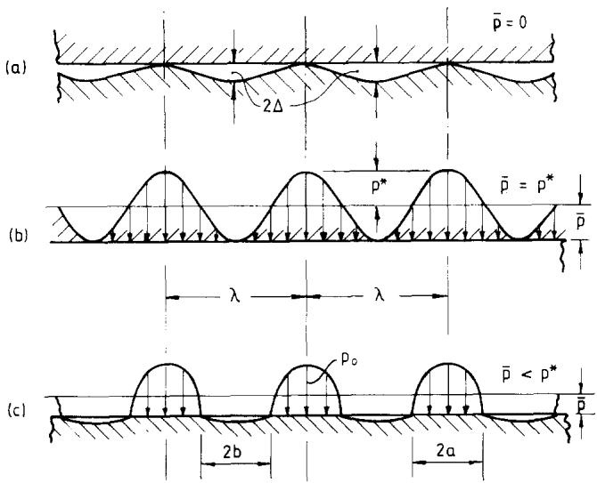  
FiG. 1. Contact between a flat and a wavy surface (a) Unloaded, $\bar { p } = 0 ;$ (b) complete contact, ${ \overleftrightarrow { p } } = p ^ { * }$ (c) partial contact, ${ \widehat { p } } < p ^ { \star }$

This is the situation when one surface is flat and the other, though nominally $\pmb { \hat { \Pi } } \mathbf { a t } ,$ has sinusoidal profile of amplitude ∆ and wavelength $\lambda ( \Delta \ll \lambda ) .$ The surfaces first touch along parallel lines at the crests of the waves. As the surfaces are pressed together by a mean pressure p the lines expand into strips of width 2a (Fig. 1).

The Westergaard solution

Westergaard [1] showed that the periodic pressure distribution

$$
p ( x ) = \frac { 2 { \overline { { p } } } \cos \Psi } { \sin ^ { 2 } \Psi _ { a } } \left[ \sin ^ { 2 } \Psi _ { a } - \sin ^ { 2 } \Psi \right] ^ { 1 / 2 } , ~ \cos \Psi > \cos \Psi _ { a }\tag{4}
$$

gives rise to periodic surface displacements

$$
u _ { z } \left( x \right) = \frac { \left( 1 - \nu ^ { 2 } \right) \overline { { p } } \lambda } { \pi E \sin ^ { 2 } \Psi _ { a } } \cos 2 \Psi + C , \cos \Psi > \cos \Psi _ { a }\tag{5a}
$$

and

$$
\begin{array}{c} u _ { * } ( x ) = \frac { ( 1 - \nu ^ { 2 } ) \bar { p } \lambda } { \pi E \sin ^ { 2 } \Psi _ { a } } \Bigg [ \cos 2 \Psi + 2 \sin \Psi ( \sin ^ { 2 } \Psi - \sin ^ { 2 } \Psi _ { a } ) ^ { 1 / 2 }  \\ { - 2 \sin ^ { 2 } \Psi _ { a } \ln \left\{ \frac { \sin \Psi + ( \sin ^ { 2 } \Psi - \sin ^ { 2 } \Psi _ { a } ) ^ { 1 / 2 } } { \sin \Psi _ { a } } \right\} \Bigg ] + C , \mathrm { c o s } \Psi \leqslant \mathrm { c o s } \Psi _ { a } , } \end{array}\tag{5b}
$$

where $\Psi = \pi x / \lambda , \Psi _ { a } = \pi a / \lambda , \bar$ 5 is the mean pressure over the whole surface and $c$ is a constant related to the datum from which the displacements are measured. Where the two surfaces are in contact, $( 0 \leqslant | x | \leqslant a ) ,$

$$
u _ { z 1 } + u _ { z 2 } \equiv u _ { z } = \delta - h ( x ) .\tag{6}
$$

The displacements of equation (5a) satisfy this relationship for two surfaces whose initial gap is given by equation (3) provided that

$$
\overline { { { p } } } = \frac { \pi E ^ { * } \Delta } { \lambda } \sin ^ { 2 } \Psi _ { a } .\tag{7}
$$

Complete contact will be achieved if $\overline { { p } } \geqslant p ^ { * }$ , where $p ^ { * } = ( \pi E ^ { * } \Delta / \lambda ) .$

Asymptotic solutions

At light loads the deformation at the crests of each wave should be independent and given by the Hertz theory of line contact. The load P carried by unit length of each crest is $\overline { { \pmb { p } } } \lambda$ and the curvature $1 / \pmb { R }$ of a crest is $4 \pi ^ { 2 } \Delta / \lambda ^ { 2 }$ Substituting these values in the Hertz equations for line contact, i.e. into $a ^ { 2 } = 4 P R / \pi E ^ { * }$ , gives

$$
\bar { p } / p ^ { * } = ( \pi a / \lambda ) ^ { 2 } = \Psi _ { a } ^ { 2 } ,\tag{8}
$$

which is the limiting form of $( 7 )$ for $\Psi _ { \pmb { \mathscr { a } } }$ small.

At the other limit, when $\overline { { p } }  p ^ { * }$ , only a small strip of width $2 b ( \leqslant \lambda )$ remains out of contact, where $b = \lambda / 2 - a . \mathrm { A n }$ asymptotic expression for b can be found by regarding the no-contact zone as a pressurised crack of length 2b in an infinite solid. The contact pressure in the no-contact zone is, of course, zero, but it can be thought of as the superposition of the pressure necessary to maintain the surfaces in contact, given by

$$
\displaystyle p ( \boldsymbol { x } ) = p ^ { * } \bigl [ 1 + \cos \left( 2 \pi x / \lambda \right) \bigr ]
$$

and an equal negative pressure acting on the surface of the crack' (a $\leqslant x \leqslant b )$ .Provided $b \leqslant \lambda / 2$ the sinusoidal pressure within the crack may be approximated by the parabolic form:

$$
p ( x ^ { \prime } ) \simeq ( p ^ { * } - \overrightarrow { p } ) - 2 \pi ^ { 2 } ( x ^ { \prime } / \lambda ) ^ { 2 } p ^ { * } ,\tag{9}
$$

where ${ \pmb x } ^ { \prime } = { \pmb x } - \lambda / 2$ .Since the interface has no strength the crack' will open until the stress intensity factor at its ends falls to zero. The stress intensity factor at the ends of a pressurised crack of length 2b is given by (see Paris and Sih [6])

$$
K _ { \cal I } = ( \pi b ) ^ { - 1 / 2 } \int _ { - b } ^ { b } p ( x ^ { \prime } ) \big [ ( b + x ^ { \prime } ) / ( b - x ^ { \prime } ) \big ] ^ { 1 / 2 } \mathrm { d } x ^ { \prime } .\tag{10}
$$

Substituting $p ( \boldsymbol { \mathbf { \mathit { x } } } ^ { \prime } )$ from (9), integrating and equating $\pmb { K } _ { I }$ to zero gives the length of the no-contact zone to be

$$
b / \lambda = ( 1 / \pi ) ( 1 - \bar { p } / p ^ { \ast } ) ^ { 1 / 2 } ,\tag{11}
$$

which is the limit of equation (7) as ${ \overline { { p } } } \to p ^ { * }$

## The numerical method

We first separate the pressure p(x) and the displacement $u _ { z } ( x )$ into their mean values ē and $\widehat { \pmb { u } } _ { z }$ and their deviations from the mean $p ^ { \prime } ( x )$ and $u _ { z } ^ { \prime } ( x )$ . The deviation in pressure from the mean, normalised with respect to $\pmb { p } ^ { * } ,$ is then represented by the Fourier cosine series:

$$
\frac { p ^ { \prime } } { p ^ { * } } \equiv \frac { p - \overline { { p } } } { p ^ { * } } = \sum _ { i = 1 } ^ { n } A _ { i } \cos { ( \mathrm { i } \phi ) } ,\tag{12}
$$

where $\phi = 2 \pi x / \lambda$ and $p ^ { * } = \pi E ^ { * } \Delta / \lambda$ . The corresponding surface displacement is given by

$$
u _ { z } ^ { \prime } \equiv u _ { z } - \overline { { u } } _ { z } = \Delta \sum _ { i = 1 } ^ { \bullet } \left( A _ { i } / i \right) \cos { ( \mathrm { i } \phi ) } ,\tag{13}
$$

where $\overline { { u } } _ { z }$ is the mean displacement. Its value is indeterminate since it depends on the choice of datum for

displacements, but this difficulty can be circumvented as shown below. From equation (2) we get

$$
C _ { E } = U _ { E } = \frac { 1 } { 2 } \overline { { p } } \overline { { u } } _ { z } + U _ { E } ^ { \prime } ,\tag{14}
$$

where

$$
U _ { E } ^ { \prime } = \frac { 1 } { 2 } \int _ { 0 } ^ { \lambda } p ^ { \prime } u _ { z } ^ { \prime } \mathrm { d } x = \frac { \pi E ^ { * } \Delta ^ { 2 } } { 4 } \sum _ { i = 1 } ^ { n } { \left( A _ { i } ^ { 2 } / i \right) } .\tag{15}
$$

For a given value of $\overline { { p } } , \overline { { u } } _ { z }$ is constant and independent of $\mathbf { \dot { \rho } } _ { p ^ { \prime } , \prime }$ so that the term $\frac { 1 } { 2 } \overline { { p } } \overline { { u } } _ { z }$ is constant and can be ignored in the minimisation process. Similarly,

$$
\int _ { 0 } ^ { \lambda } p ( h - \delta ) { \mathrm { d } } x = \int _ { 0 } ^ { \lambda } { \bar { p } } ( h - \delta ) { \mathrm { d } } x - \delta \int _ { 0 } ^ { \lambda } p ^ { \prime } { \mathrm { d } } x + \int _ { 0 } ^ { \lambda } p ^ { \prime } h { \mathrm { d } } x .
$$

The first term in this expression is also constant and the second term is zero. For the profile defined by equation (3) we have

$$
\begin{array} { c } { { { \displaystyle \int _ { 0 } ^ { \lambda } p ^ { \prime } h \mathrm { d } x = p ^ { * } \Delta \displaystyle \frac { \lambda } { 2 \pi } \int _ { 0 } ^ { 2 \pi } \left( 1 - \mathrm { c o s } \phi \right) \sum _ { i = 1 } ^ { n } A _ { i } \mathrm { c o s } \left( \mathrm { i } \phi \right) \mathrm { d } \phi } } } \\ { { = - \displaystyle \frac { \pi } { 2 } \Delta ^ { 2 } E ^ { * } A _ { 1 } . } } \end{array}\tag{16}
$$

Substituting (14) and (16) into equation (1) and ignoring the constant terms associated with  and $\widehat { \pmb { u } } _ { z }$ we obtain a nondimensional object function $f ^ { \prime }$ defined by

$$
f ^ { \prime } \equiv \frac { 2 F ^ { \prime } } { \pi \Delta ^ { 2 } E ^ { * } } = \frac { 1 } { 2 } \sum _ { i = 1 } ^ { n } \ : ( A _ { i } ^ { 2 } / i ) - A _ { 1 } .\tag{17}
$$

The coefficients $A _ { i }$ are required to minimise this function subject to the condition that $p \geqslant 0 ,$ i.e. that

$$
\sum _ { i = 1 } ^ { n } A _ { i } \cos ( \mathrm { i } \phi ) \geqslant - { \overline { { p } } } / p ^ { * } , \quad { \mathrm { f o r ~ a l l ~ v a l u e s ~ o f ~ } } \phi .\tag{18}
$$

The object function $f ^ { \prime }$ can be minimised by quadratic programming. The constraint region', in which the constraint represented by equation (18) applies, is a complete wavelength but, in view of the symmetry about $\phi = 0 , \mathrm { i t }$ may be restricted to the region $0 \leqslant \phi \leqslant \pi$ Both the number of terms n in the Fourier series and the number of constraints m (i.e. the number of points at which equation (18) must be satisfied) must be chosen. If the points of constraint are equally spaced through the region, the highest harmonic $A _ { n }$ cosnφ will be defined by m/n points per half-wavelength which, in general, should not be less than 3. Clearly the running time for the program increases with n and m. The independent variable of the problem is $\overline { { p } } / p ^ { * }$ which varies from zero at first touch to 1.0 at complete contact.

Pressure distributions for different values of $\overline { { p } } / p ^ { * }$ have been computed using a standard quadratic programming routine based on the method of Beale [7]. The influence of varying the values of n and m was investigated (Higginson [8]) and results for $n = 1 0 , m = 2 6$ are shown in Fig. 2. The pressure distribution derived by the method of Dundurs et al. for $\overline { { p } } / p ^ { * } = 0 . 4$ is also shown in Fig. 2. The accuracy is comparable with that obtained by quadratic programming; the main difference lies in the small negative pressures which are not excluded in Dundurs' method.

As the Westergaard solution shows, the pressure gradient is, in fact, discontinuous at the edges of the contact strips. It is inevitable that this discontinuity is not well represented by a truncated Fourier series, so that the numerical method does not lead to an accurate definition of the true contact area. However, if for the number of terms chosen $( n = 1 0 )$ , a line is drawn at $p / p ^ { * } = 0 . 1$ (as shown by the chain line in Fig. 2) its intersection with the numerical pressure curves gives a good estimate of the true position of the edge of contact determined by the Westergaard solution.

## The trapped volume

The variation of the volume of the vacant space between the two surfaces as the load is increased is determined by their mean separation ē and is of interest in connection with lubricated surfaces and with face seals. When the surfaces just touch they have a mean separation ∆. Under load the flat contacting surface moves through a displacement δ equal to the compression $u _ { z } ( 0 )$ of the crests of the waves. At the same time the mean level of the wavy surface displaces by $\widehat { \pmb { u } } _ { z }$ . Thus the mean separation of the surfaces decreases by:

$$
\begin{array} { c } { { \displaystyle \delta ^ { \prime } \equiv \delta - \bar { u } _ { z } = u _ { z } \left( 0 \right) - \bar { u } _ { z } = u _ { z } ^ { \prime } \left( 0 \right) } } \\ { { \displaystyle ~ = \Delta \sum _ { i = 1 } ^ { n } \left( A _ { i } / i \right) . } } \end{array}
$$

Thus the current separation ${ \overline { { g } } } ,$ as a fraction of the original separation ∆, may be expressed by

$$
G \equiv \frac { \overline { { g } } } { \Delta } = 1 - \delta ^ { \prime } / \Delta = 1 - \sum _ { i = 1 } ^ { n } \ ( A _ { i } / i ) .\tag{19}
$$

Integration of equation (5) has been shown by Kuznetsov [3] to lead to the expression:

$$
G = 1 - ( \overline { { p } } / p ^ { * } ) \big [ 1 - \ln { ( \overline { { p } } / p ^ { * } ) } \big ] .\tag{20}
$$

The values of G obtained by the numerical method from equation (19) are compared with this exact result in Fig. 3.   
The agreement is very close.

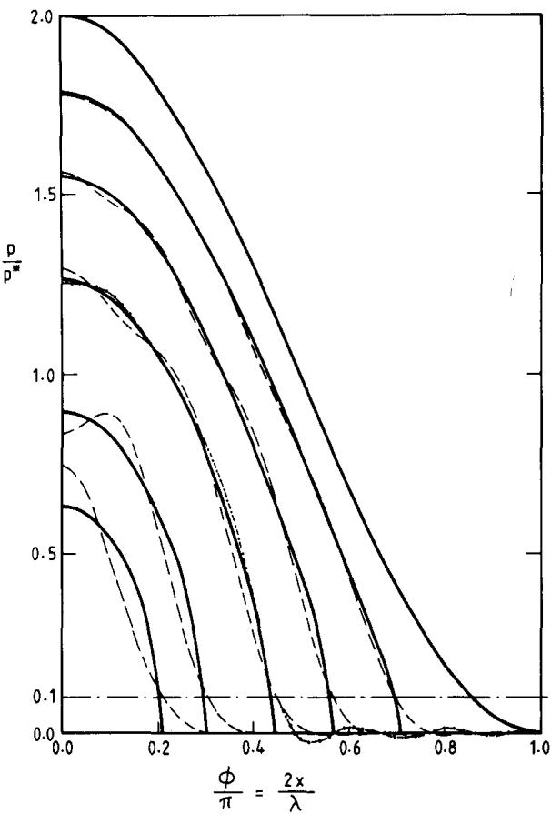

FiG. 2. Pressure distribution between a flat and a one-dimensional wavy surface. (---) Numerical solution by quadratic programming. () Analytical solution, Westergaard [1]. (--) Numerical solution, Dundurs et al $\bar { [ 2 ] } .$  
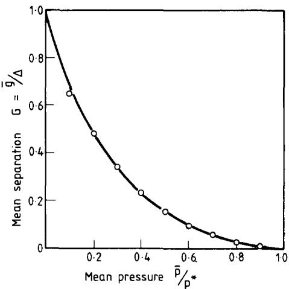  
FıG. 3. Variation in mean separation ē with mean pressure  for a one-dimensional wavy surface of amplitude ∆. () Equation (20), Kuznetsov [3];  numerical solution from equation (19).

## TWO-DIMENSIONAL WAVY SURFACE

In this section we consider the contact of a flat plane with a two-dimensional isotropic wavy surface such that the undeformed gap is given by

$$
h ( x , y ) = \Delta \left[ 1 - \cos \left( 2 \pi x / \lambda \right) \cos \left( 2 \pi y / \lambda \right) \right] .\tag{21}
$$

A unit cell of this surface is shown in Fig. 4. The surfaces first touch at the crests of the waves which are located at points (0, 0) and (λ/2, λ/2). The troughs are at points (λ/2, 0) and (0, λ/2); the mid-point (λ/4, λ/4) is a saddle point. If

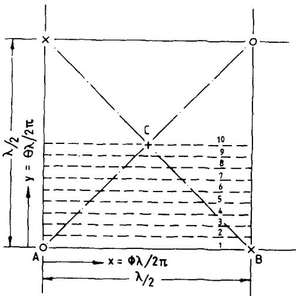  
FiG. 4. Contact of flat with two-dimensional wavy surface: unit cell.  = crest; × = trough; $\bigcirc =$ $\times =$ + = saddle point. From symmetry the constraint region can be restricted to the triangle $\mathbf { A B C }$

the mean pressure p is sufficient to close this gap completely so that the surfaces are in contact everywhere, then the pressure distribution takes the form (see Appendix 1).

$$
\begin{array} { r } { p ( x , y ) = \bar { p } + p ^ { \ast } \cos { ( 2 \pi x / \lambda ) } \cos { ( 2 \pi y / \lambda ) } , } \end{array}\tag{22}
$$

where $p ^ { * } \approx \sqrt { ( 2 ) \pi E ^ { * } } \Delta / \lambda . \mathrm { ~ I f ~ } \bar { p } < p ^ { * }$ only partial contact will occur.

## Asymptotic solutions

Although an exact solution cannot be found for the contact of two-dimensional wavy surfaces, asymptotic solutions may be obtained in the same way as for a one-dimensional wave. At light loads the contact area will be approximately circular and the Hertz theory can be applied. The nominal surface area $\pmb { A _ { 0 } }$ supporting each point of contact is a square of side $\lambda / \sqrt { 2 }$ so that the load carried by each point of contact is $\overline { { p } } \lambda ^ { 2 } / 2$ and the curvature is again $4 \pi ^ { 2 } \Delta / \lambda ^ { 2 }$ , which gives the ratio of actual to nominal area of contact to be

$$
{ \frac { A } { A _ { 0 } } } = { \frac { 2 \pi a ^ { 2 } } { \lambda ^ { 2 } } } = \pi \left\{ { \frac { 3 } { 8 \pi } } { \frac { \overline { { p } } } { p ^ { * } } } \right\} ^ { 2 / 3 } .\tag{23}
$$

When contact is almost complete, the regions of separation are approximately circular and behave like pressurised penny-shaped' cracks of radius $\dot { \pmb { b } } .$ As before the value of b is found from the condition that there should be no singularity in stress at the edge of the crack (see Appendix 2). In this way the real contact area A is found to be given by

$$
1 - \frac { A } { A _ { 0 } } = \frac { 2 \pi b ^ { 2 } } { \lambda ^ { 2 } } = \frac { 3 } { 2 \pi } \left\{ 1 - \frac { \bar { p } } { p ^ { \ast } } \right\} .\tag{24}
$$

These asymptotic solutions are plotted in a graph of $\pmb { A } / A _ { 0 }$ as a function of $\overline { { \pmb { p } } } / \pmb { p } ^ { * }$ in Fig. 7.

## Numerical method

Following the same approach as for a one-dimensional wave we assume that, under general conditions of partial contact, the deviation of the pressure from its mean value can be expressed by the double Fourier cosine series:

$$
\frac { p ^ { \prime } } { p ^ { * } } \equiv \frac { p - \overline { { p } } } { p ^ { * } } = \sum _ { i = 0 } ^ { n } \sum _ { j = 0 } ^ { n } A _ { i j } \cos ( i \phi ) \cos ( j \theta ) ,\tag{25}
$$

where $\phi = 2 \pi x / \lambda , \theta = 2 \pi y / \lambda ; i$ and j are integers and $A _ { 0 0 } = 0 . p ^ { * }$ is the value of mean pressure, given above, which will just bring the surfaces into complete contact. We now apply Kalker's method. It is shown in Appendix 3 that the complementary energy function of equation (1) can be expressed in terms of the Fourier coefficients of equation (25) by

$$
f ^ { \prime } = \frac { 4 F ^ { \prime } } { \lambda ^ { 2 } p ^ { * } \Delta } = \frac { 1 } { \sqrt { 2 } } \sum ^ { * } \frac { A _ { i j } ^ { 2 } } { ( i ^ { 2 } + j ^ { 2 } ) ^ { 1 / 2 } } - A _ { 1 1 } ,\tag{26}
$$

where $\Sigma ^ { * }$ denotes $\Sigma _ { i = 0 } ^ { n } \Sigma _ { j = 0 } ^ { n }$ except that the term $i = j = 0$ (which is represented by the term $\overrightarrow { P } / \overrightarrow { p } ^ { * }$ on the left-hand side of equation 25) is omitted, and the remaining terms in which $\dot { i } \simeq 0 \dot { \bf o r } \dot { j } = 0$ are doubled. Values of the coefficients $A _ { i j }$ are sought to minimise $f ^ { \prime } ,$ subject to the pressure being everywhere positive, i.e. subject to

$$
\sum _ { i = 0 } ^ { n } \sum _ { j = 0 } ^ { n } A _ { i j } \cos { \left( i \phi \right) } \cos { \left( j \theta \right) } \geqslant - { \widetilde { p } } / p ^ { * } , \quad { \mathrm { f o r ~ a l l ~ v a l u e s ~ o f ~ } } \theta \mathrm { ~ a n d ~ } \phi .\tag{27}
$$

(where $A _ { 0 0 } = 0 )$

In practice harmonics up to and including the ninth were used. Referring to the region shown in $\mathfrak { F i g . 4 , }$ the pressure distribution must be symmetrical about the diagonals, so that the coefficients $A _ { i j }$ for which $( i + j )$ is odd must be zero, and $A _ { i j } = A _ { j i }$ . If these requirements are imposed on the unknowns ab initio the number of unknowns becomes 29, and the constraint region over which equation (27) must be satisfied may be restricted to the triangle $A ( 0 , 0 ) , B ( 0 , \pi ) , C ( \pi / 2 , \pi / 2 ) .$ Adopting the same criterion of 3 points per half-wave, the number of constraint points m was chosen to be  × 28 × 28, i.e. 196. The computing time depends on n and m and also upon the number of active constraints in the solution. Earlier results not using the condition $A _ { i j } = A _ { j i }$ required 49 unknowns, 378 constraints and took about twenty-times longer to compute.

Solutions were computed for values of $\overline { { \pmb { p } } } / \pmb { p } ^ { * }$ from 0.1 to 0.9 in steps of 0.1 together with $\overline { { p } } / p ^ { * } = 0 . 0 1 , 0 . 0 5 . \mathbf { A }$ sample of the pressure distributions, computed along the dotted lines in Fig. 4, are shown in $\mathrm { \bf F i g . } 5 .$

The waviness in the pressure distributions in Fig. 5, like those obtained by the numerical method in Fig. 2, is presumably due to truncation of the Fourier series. As expected, these spurious fluctuations become less as contact becomes more complete and the pressure distribution becomes more nearly sinusoidal.

In order to estimate how the contact area varies in shape and size as the load is increased the same procedure has been followed as that shown in Fig. 2 for a one-dimensional wave. The edge of contact is taken to be at the point where pressure falls to 0.1 $\pmb { p } ^ { * } .$ Contact areas determined in this way are drawn for different values of /p\* in Fig. 6. The circular areas of contact and no-contact given by the asymptotic equations (23) and (24) when ${ \overline { { p } } } / p ^ { * } = 0 .$ 1 and 0.9, respectively are shown dotted. The areas of contact measured from Fig. 6 are plotted against $\overline { { p } } / p ^ { * }$ in Fig. 7. The numerical results so found are reasonably consistent with the asymptotic equations for ${ \overline { { p } } } \to 0$ and for $\overline { { p } }  p ^ { * }$

## Trapped volume

As in the case of one-dimensional waves the variation with load of the volume of the space between surfaces is given by the variation in their mean separation. From Appendix 3 we have

so that

$$
\begin{array} { l } { { \delta ^ { \prime } = u _ { z } ^ { \prime } \left( 0 , 0 \right) = \Delta \sqrt { 2 } \sum _ { \stackrel { \mathrm { e x c l u d i n g } } { i = j = 0 } } ^ { n } \frac { A _ { i j } } { ( i ^ { 2 } + j ^ { 2 } ) ^ { 1 / 2 } } , } } \\ { { G = 1 - \sqrt { 2 } \sum \sum \frac { A _ { i j } } { ( i ^ { 2 } + j ^ { 2 } ) ^ { 1 / 2 } } . } } \end{array}\tag{28}
$$

This relationship is plotted in Fig. 8.

At light load the contact conditions at the crest of each wave can be found from the Hertz theory. Contact occurs over an approximately circular area of radius a given by equation (23). The compression of a crest, relative to the

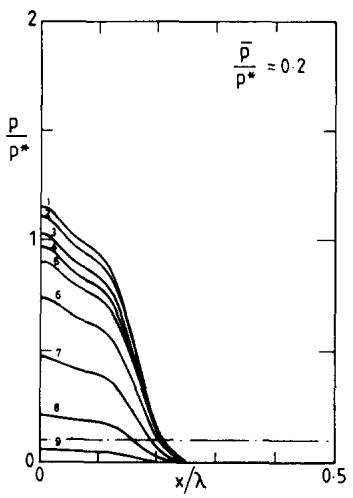

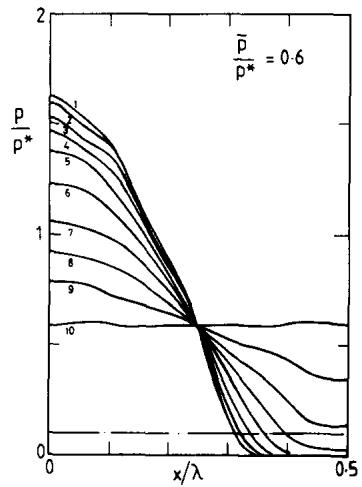

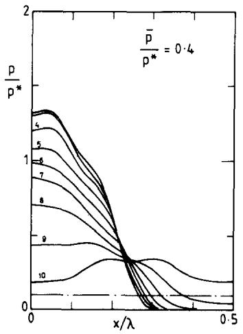

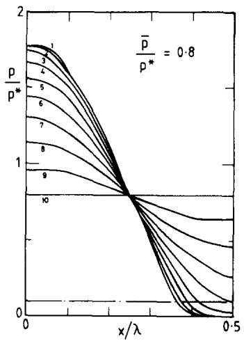  
FiG. 5. Pressure distributions along the dotted lines shown in Fig.4 found by quadratic programming.

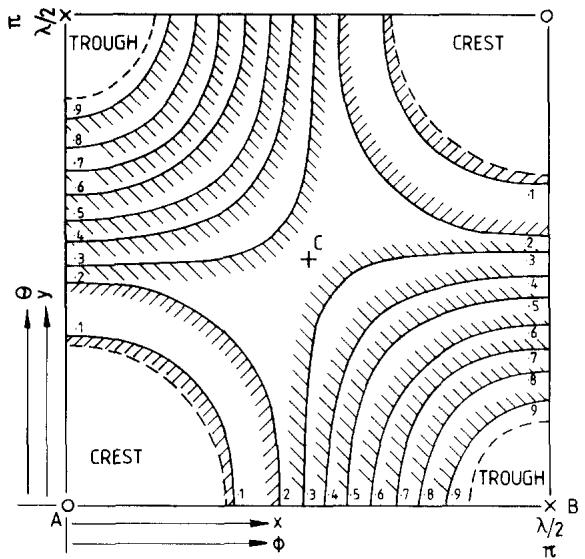  
FiG. 6. Variation of contact areas (shown shaded) with $\overline { { { p } } } / p ^ { * } ,$ found by putting $p / p ^ { * } = 0 . 1$ in Fig. 5. (------) Asymptotic results for $\overline { { p } } / p ^ { * } = 0 . 1$ and 0.9.

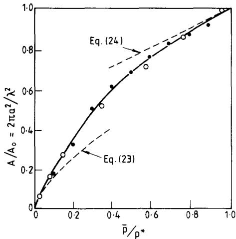  
FiG. 7. Variation of real/apparent contact area. ● Numerical results by quadratic programming; o experimental results; (-----) Asymptotic solutions.

mean level of the surface $\delta ^ { \prime } ( = u _ { z } ^ { \prime } ( 0 ) )$ , can be obtained from the difference between the central compression of a Hertz contact $\delta = a ^ { 2 } / R ,$ , and that due to the average pressure p acting on a square of side $\lambda / { \sqrt { 2 } } .$ In this way an asymptotic expression for G at light load $( \overrightarrow { p }  0 )$ is found to be

$$
G = 1 - { \frac { \delta ^ { \prime } } { \Delta } } = 1 - { \frac { 1 } { 2 } } ( 3 \pi ^ { 2 } \widetilde { p } / p ^ { * } ) ^ { 2 / 3 } + \bigl [ 4 \ln ( \sqrt { 2 } + 1 ) \bigr ] ( \widetilde { p } / p ^ { * } ) .\tag{29}
$$

The asymptotic relationship for $\overline { { p } }  p ^ { * }$ is obtained from the volume of a pressurised crack. It is shown in Appendix 2 that

$$
G = \frac { 1 6 } { 1 5 \pi ^ { 2 } } \left( \frac { 3 } { 2 } \right) ^ { 3 / 2 } \left[ 1 - \overline { { { p } } } / p ^ { * } \right] ^ { 5 / 2 } .\tag{30}
$$

The asymptotic equations (29) and (30) are compared with the numerical solutions obtained from equation (28) in Fig. 8, and it is clear that between them they provide a highly satisfactory description of the computed results.

## EXPERIMENTAL

To observe the variation in shape and size of the contact area when two-dimensional wavy surfaces are in contact, and to obtain an experimental check on the numerical solutions, a simple apparatus was constructed. A block of perspex approximately $8 0 \times 8 0$ mm had a one-dimensional wave of amplitude 0.24 mm and wavelength 40 mm accurately machined on one surface and was subsequently polished. This block then acted as a mould to cast a similar block of silicone rubber. The wavy surfaces of the two blocks were pressed into contact with the waves at right-angles so that the initial gap between the two surfaces was given by equation (21) in which $\Delta = 0 . 4 8$ mm and $\lambda = 4 0 \sqrt { 2 }$ mm. The value of $E / ( \bar { 1 } - v ^ { 2 } )$ for the rubber block was found to be 2.64 N mm-² from measurements of the contact diameter when a spherical lens was pressed into a flat surface. Hence $\begin{array} { r } { p ^ { * } = \sqrt { ( 2 ) \pi E ^ { * } } \Delta / \lambda = 0 . 0 9 9 5 \mathrm { N } } \end{array}$ mm $^ { - 2 } .$ The changing shape and size of the contact area as the mean contact pressure was increased from 0 to $p ^ { * }$ could be viewed through the perspex block and is shown by the photographs in Fig. 9. (The bright spots on the photographs are small holes drilled in the perspex block to release trapped air.) The general agreement between the contact shapes in the photographs and the theoretical shapes drawn in Fig. 6 is very satisfactory. Initially the contact spots are circular; they become approximately square when $\overline { { p } } / p ^ { * } \simeq 0 . 2 5$ and small circular regions of separation remain when $\overline { { p } } / p ^ { * }$ exceeds about 0.6. The photographs were enlarged, the contact areas measured by planimeter and the experimental values added to Fig. 7 where they are seen to compare well with the theoretical curve.

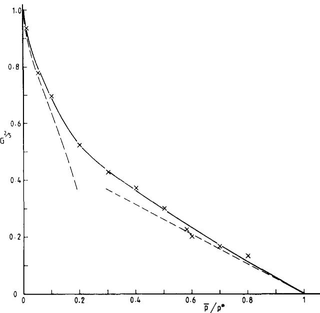  
FiG. 8. Trapped volume ratio: × numerical solutions from equation (28); (--- -) asymptotic solutions, equations (29) and (30).

## CONCLUSIONS

We have examined the contact of two elastic half-spaces one of which has a bi-sinusoidal isotropic wavy surface whose amplitude Δ is small compared with its wavelength λ. The contact pressure distribution was represented by a double Fourier cosine series and a variational principle of minimum complementary energy due to Kalker was used to determine the Fourier coefficients.

The method was applied first to a one-dimensional wavy surface, where the results could be compared with the analytical solution of Westergaard. Taking 10 terms of the Fourier series it was found that a satisfactory representation of the contact pressure and contact area could be obtained.

With a two-dimensional wavy surface a double Fourier series with 100 terms was employed to define the pressure distribution (in fact, symmetry shows that 50 of the coefficients must be zero and that pairs of the others are equal so that the number of unknowns is reduced to 29). The mean pressure p required to bring the two surfaces into complete contact, denoted by $p ^ { * }$ is shown to be $\sqrt { ( 2 ) \pi E ^ { * } \Delta / \lambda }$ . The contact area was found to be circular at light loads, as expected. It becomes almost square when $\overline { { p } } / p ^ { * } \simeq 0 . 2 5$ but, when $\overline { { p } } / p ^ { * }$ exceeds about $0 . 6 ,$ the remaining area of no-contact becomes circular. The mean separation of the two surfaces, which governs the volume of the space between them, is also found by the numerical method.

Equations in closed form have been obtained for the area of contact and the mean separation: (a) when the mean contact pressure is small $\left( \overline { { { p } } } \ll p ^ { * } \right) ;$ and (b) when contact is nearly complete $( \overline { { p } }  p ^ { * } )$ . The numerical results are consistent with these asymptotic solutions.

Measurements of the contact area using a rubber model showed good agreement with the theoretical predictions.

Acknowledgement—The apparatus, with which the experimental measurements of contact shape and size were made, was built by J. R. Buchanan as part of an undergraduate project.

## APPENDICES

Appendix 1

1. Elastic displacements due to a bi-sinusoidal distribution of surface pressure: $\boldsymbol { \mathsf { p } } = \boldsymbol { \mathsf { p } } ^ { \ast }$ cos αx cos ${ \pmb \beta } { \bf y }$ This pressure distribution can be written

$$
p = \frac { 1 } { 2 } p ^ { \ast } \left[ \cos { ( \alpha x + \beta y ) } + \cos { ( \alpha x - \beta y ) } \right] .\tag{A.1}
$$

Consider each term separately. For the first term rotate the axes through an angle $\gamma = \tan ^ { - 1 } \left( \beta / \alpha \right)$ , so that

$$
x ^ { \prime } = x \cos \gamma + y \sin \gamma = ( \alpha x + \beta y ) / \zeta ,
$$

where $\zeta = ( \alpha ^ { 2 } + \beta ^ { 2 } ) ^ { 1 / 2 }$ Similarly, for the second term, rotating the axes through an angle -γ gives

$$
\begin{array} { r } { x ^ { \prime \prime } = ( \alpha x - \beta y ) / \zeta . } \end{array}
$$

From Westergaard [1], one-dimensional variation in pressure $p ^ { \star }$ cos $\zeta { \pmb x } ^ { \prime }$ gives rise to normal elastic displacements of the surface

$$
u _ { z } = \left[ 2 p ^ { \ast } ( 1 - v ^ { 2 } ) / E \zeta \right] \cos \zeta x ^ { \prime } ,
$$

so that, by superposition, the pressure distribution of (A.1) gives

$$
\begin{array} { l } { { u _ { z } = \left[ p ^ { * } ( 1 - { \nu } ^ { 2 } ) / E \zeta \right] ( \cos \zeta x ^ { \prime } + \cos \zeta x ^ { \prime \prime } ) } } \\ { { \ = \left[ 2 p ^ { * } ( 1 - { \nu } ^ { 2 } ) / E ( \alpha ^ { 2 } + \beta ^ { 2 } ) ^ { 1 / 2 } \right] \cos \alpha x \ \cos \beta y . } } \end{array}\tag{A.2}
$$

For isotropic wavy surfaces, whose initial separation $\pmb { h } ( \pmb { x } , \pmb { y } )$ is given by equation (21), $\alpha = \beta = 2 \pi / \lambda$ Hence for complete contact

$$
\left. p ^ { * } \lambda / \sqrt { ( 2 ) \pi E ^ { * } } = \Delta , \right.
$$

so that the pressure distribution is given by

$$
p ( x , y ) = \overline { { { p } } } + \left[ \sqrt { ( 2 ) \pi E ^ { * } } \Delta / \lambda \right] \cos { \left( 2 \pi x / \lambda \right) } \cos { \left( 2 \pi y / \lambda \right) } .\tag{A.3}
$$

Appendix 2

2. Asymptotic solutions for $\widetilde { \mathsf { p } } \to \mathsf { p } ^ { * } \colon$ The pressurised penny-shaped crack

If ${ \overline { { \pmb { p } } } } < { \pmb { p } } ^ { * }$ complete contact can only be maintained by the application of tension in the area where the pressure given by equation (22) is negative. In reality the surfaces will separate and the pressure fall to zero, which may be regarded as the superposition of the tension necessary to keep the surfaces together and an internal pressure pushing them apart. The surfaces will separate such that there is no singularity in stress (tension or compression) at the edge of the contact region. This condition can be formulated mathematically by regarding the separated zone as a pressurised crack and finding the condition that the stress intensity factor ${ \dot { \pmb { K } } } _ { I }$ at its periphery should be zero.

If the separated zone is sufficiently small it will be circular in shape and can therefore be modelled as a pennyshaped crack of radius b in an infinite elastic solid (see Fig. A.1). The bi-sinusoidal pressure distribution of equation (22), in this region, is approximately paraboloidal so that we can write the pressure distribution in the crack as

$$
p ( r ) = ( p ^ { * } - \overline { { p } } ) - 2 \pi ^ { 2 } p ^ { * } r ^ { 2 } / \lambda ^ { 2 } , \quad r \leqslant b .\tag{A.4}
$$

A penny-shaped crack under the action of a pressure $p ( r ) = A _ { n } ( r / b ) ^ { n }$ has been studied by Sneddon [10]who shows that the faces of the crack separate by

$$
g _ { n } \left( \rho \right) = \frac { 2 \left( 1 - \nu ^ { 2 } \right) b A _ { n } } { \sqrt { \left( \pi \right) E } } \frac { \left( \frac { 1 } { 2 } n \right) ! } { \left( \frac { 1 } { 2 } + n / 2 \right) ! } \cdot I _ { n } \left( \rho \right) ,\tag{A.5}
$$

where $\rho = r / b . \ I _ { n } ( \rho )$ is determined by the recurrence relation

$$
( 1 + n ) I _ { n } = ( 1 - \rho ^ { 2 } ) ^ { 1 / 2 } + n \rho ^ { 2 } I _ { n - 2 }
$$

and

$$
I _ { 0 } = ( 1 - \rho ^ { 2 } ) ^ { 1 / 2 } .
$$

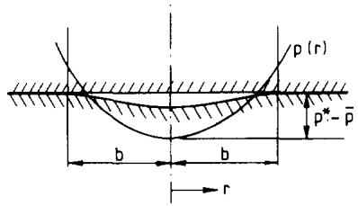  
FiG. A1. Penny-shaped crack of radius b.

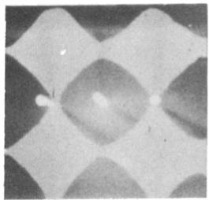  
P/p\* = 0.024

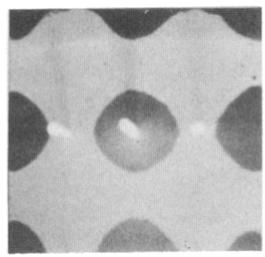  
P/p\* = 0.08

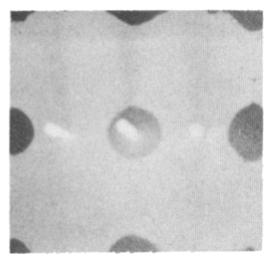  
P/p\* = 0.14

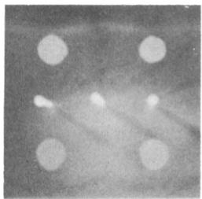  
p/p\* = 0.35

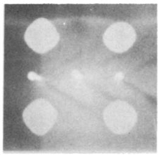  
p/p\* = 0.55

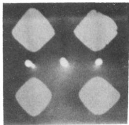  
p/p\* = 0.76

FiG. 9. Experimental contact areas (appearing light). Note that the axes of the photographs are at 45° to the x, y axes shown in Fig. 6.

The pressure distribution of (A.4) comprises two terms $A _ { 0 } = ( p ^ { * } - \overrightarrow { p } )$ and $A _ { 2 } = - 2 \pi ^ { 2 } p ^ { * } b ^ { 2 } / \lambda ^ { 2 }$ . Applying Sneddon's result (A.5) to this case, we find

$$
n = 0 ; 0 ! / ( 1 / 2 ) ! = 2 / \sqrt { \pi } ,
$$

$$
n = 2 ; ~ 1 ! / ( 3 / 2 ) ! = 4 / 3 \sqrt { \pi } .
$$

Therefore,

$$
I _ { 2 } = \frac { 1 } { 3 } ( 1 + 2 \rho ^ { 2 } ) ( 1 - \rho ^ { 2 } ) ^ { 1 / 2 } .
$$

Substituting both these terms nto (A.5) and adding gives the total separation to be

$$
g ( \rho ) = \frac { 2 p ^ { * } b } { E ^ { * } } \left[ 2 ( 1 - \overline { { p } } / p ^ { * } ) - \frac { 8 } { 9 } \left( \frac { \pi b } { \lambda } \right) ^ { 2 } ( 1 + 2 \rho ^ { 2 } ) \right] ( 1 - \rho ^ { 2 } ) ^ { 1 / 2 } .\tag{A.6}
$$

For there to be no singularity in stress at the edge of the contact region, the surfaces must separate smoothly, i.e. dg/dr = 0 as $\pmb \rho  1 . 0 .$ For this condition to be satisfied the term in square brackets in equation (A.6) must vanish when $\pmb { \rho } = 1 ,$ Hence the radius b of the circle of separation is given by

$$
\frac { 4 } { 3 } \left( \frac { \pi b } { \lambda } \right) ^ { 2 } = 1 - \frac { \overline { { { p } } } } { p ^ { * } } .\tag{A.7}
$$

The volume of such small regions of separation may be found by

$$
V = \int _ { 0 } ^ { b } 2 \pi r g \left( r \right) \mathrm { d } r = 2 \pi b ^ { 3 } \int _ { 0 } ^ { 1 } \rho g ( \rho ) d \rho .\tag{A.8}
$$

By substituting from (A.6) and (A.7) into (A.8) and integrating, the trapped volume as a ratio of the initial volume is given by

$$
G = \frac { V } { \Delta { { \lambda } ^ { 2 } } / 2 } = \frac { 1 6 } { 1 5 { \pi } ^ { 2 } } \left\{ \frac { 3 } { 2 } \right\} ^ { 3 / 2 } \left\{ 1 - \frac { \overline { { p } } } { p ^ { * } } \right\} ^ { 5 / 2 } .\tag{A.9}
$$

Appendix 3

3. Complementary energy in terms of Fourier coefficients

The deviation $\pmb { p } ^ { \prime }$ of the pressure from its mean value $\overline { { p } }$ is represented by the double Fourier cosine series of equation (25). It follows from Appendix 1 [equation (A.2)] that the displacement produced by the pressure deviation $\pmb { p } ^ { \prime }$ may be written

$$
u _ { z } ^ { \prime } = \Delta \sqrt { 2 \sum _ { \mathrm { { e x c l u d i n g } } \atop { i = j = 0 } } ^ { n } \sum _ { \mathrm { { } } } ^ { n } \frac { A _ { i j } } { ( i ^ { 2 } + j ^ { 2 } ) ^ { 1 / 2 } } \cos { ( i \phi ) } \cos { ( j \theta ) } } .\tag{A.10}
$$

The strain energy $U _ { \textbf { E } } ^ { \prime }$ is given by

$$
\begin{array} { r l } & { U _ { E } ^ { \prime } = \displaystyle \int _ { 0 } ^ { 1 } \displaystyle \int _ { 0 } ^ { 1 } \frac { 1 } { 2 } p ^ { \prime } u _ { \star } ^ { \prime } \mathrm { d } x \mathrm { d } y } \\ & { \quad = p ^ { \ast } \displaystyle \frac { \displaystyle \Delta } { \displaystyle \sqrt { 2 } } \left( \displaystyle \frac { \lambda } { 2 \pi } \right) ^ { 2 } \displaystyle \int _ { 0 } ^ { 2 \pi } \int _ { 0 } ^ { 2 \pi } \sum _ { i } \sum _ { j } \sum _ { k } \sum _ { l } \displaystyle \frac { A _ { k l } A _ { i j } } { ( i ^ { 2 } + j ^ { 2 } ) ^ { 1 / 2 } } \cos ( k \phi ) \cos ( l \theta ) \cos ( i \phi ) \cos ( j \theta ) \mathrm { d } \phi \mathrm { d } \theta } \\ & { \quad \quad \quad \quad \quad \quad \quad \quad \quad \mathrm { S i n c e } \displaystyle \int _ { 0 } ^ { 2 \pi } \cos { ( k \phi ) } \cos { ( \mathrm { i } \phi ) } \mathrm { d } \phi = 0 \mathrm { f o r } k \neq i } \\ & { \quad \quad \quad \quad \quad \quad = \pi \mathrm { f o r } i = k \neq 0 } \\ & { \quad \quad \quad \quad = 2 \pi \mathrm { f o r } i = k = 0 } \end{array}
$$

(and similarly for the θ integration) we have

$$
U _ { E } ^ { \prime } = p ^ { * } \frac { \Delta } { \sqrt { 2 } } \left( \frac { \lambda } { 2 \pi } \right) ^ { 2 } \pi ^ { 2 } \sum _ { i , j } ^ { * } \frac { A _ { i j } ^ { 2 } } { ( i ^ { 2 } + j ^ { 2 } ) ^ { 1 / 2 } } ,
$$

where $\pmb { \Sigma ^ { \ast } }$ indicates that the term $i = j = 0$ is omitted, while other terms in which $i = 0 \mathrm { o r } j = 0$ are doubled. The second term in Kalker's function is

$$
\int _ { S } p ^ { \prime } ( h - \delta ) \mathrm { d } S
$$

Clearly,

$$
\int p ^ { \prime } \delta { \sf d } s = \delta \int p ^ { \prime } { \sf d } S = 0 ,
$$

which leaves

$$
\begin{array} { r l } { \displaystyle p ^ { * } \Delta \left( \frac { \lambda } { 2 \pi } \right) ^ { 2 } \int _ { 0 } ^ { 2 \pi } \int _ { 0 } ^ { 2 \pi } \displaystyle \sum _ { \vartheta \mathrm { \tiny ~ c r c l u d i n g } } A _ { i j } \cos \left( i \phi \right) \cos \left( j \theta \right) \left( 1 - \cos \phi \cos \theta \right) \mathrm { d } \phi \mathrm { d } \theta } & { } \\ { \displaystyle = - p ^ { * } \Delta \left( \frac { \lambda } { 2 \pi } \right) ^ { 2 } \pi ^ { 2 } A _ { 1 1 } \quad } & { \mathrm { b y ~ o r t h o g o n a l i t y } . } \end{array}
$$

Putting $C _ { E } ^ { \prime } = U _ { E } ^ { \prime } ,$ substituting into equation (1) and ignoring the constant terms associated with p and $\widehat { \pmb u } _ { z }$ gives

$$
f ^ { \prime } \equiv \left( \frac { 2 } { \lambda } \right) ^ { 2 } \frac { F ^ { \prime } } { p ^ { * } \Delta } = \frac { 1 } { \sqrt { 2 } } \sum _ { } ^ { * } \frac { A _ { i j } ^ { 2 } } { ( i ^ { 2 } + j ^ { 2 } ) _ { . } ^ { 1 / 2 } } - A _ { 1 1 } .
$$

Values of the Fourier coefficients $A _ { i j }$ are required which minimise f' subject to the restriction

$$
\sum _ { i = 0 } ^ { n } \sum _ { j = 0 } ^ { n } A _ { i j } \cos \left( i \phi \right) \cos \left( j \theta \right) \geqslant - \frac { \overline { { p } } } { p ^ { * } } \mathrm { e v e r y w h e r e } ,
$$

where as before the term $\pmb { A _ { 0 0 } }$ is excluded.

## REFERENCES

1. H. M. WESTERGAARD, Bearing pressures and cracks. Trans. ASME, J. appl. Mech. 6, 49 (1939).

2. J. DuNDuRs, K. C. TsAI and L. H. KEER, Contact between elastic bodies with wavy surfaces, J. Elasticity 3, 109 (1973).

3. YE A. KuzNETsov, A periodic contact problem accounting for the additional load acting beyond the indenter, Izv. Acad. Nauk SSSR, Mekh. Tverd. Tela 6, 3544 (1978) (in Russian). See also, Kutznetsov, Ye A, 'Effect of fluid lubricant in the contact characteristics of rough elastic bodies in compression', submitted to Wear (1984).

4. J. J. KALKER, Variational principles of contact elastostatics, J. Inst. Math. Appl. 20, 199 (1977).

5. J. J. KALKER, Numerical contact elastostatics. In Contact Problems and Load Transfer in Mechanical Assemblages, Proc. Euromech. Coll. No. 110, Linköping, Sweden (1978)

6. P. C. PARıs and G. C. Sıí, Stress analysis of cracks. In Fracture Toughness Testing and its Applications, ASTM STP 381, 30 (1965).

7. E. M. L. BEALE, On quadratic programming, Naval Res. and Logistics Quart, 6 (1959).

8. J. G. HiGGinsoN, The failure of elastohydrodynamic lubrication, Ph.D. Dissertation, Cambridge University, U.K. (1984).

10. I. N. SNEDDoN, The distribution of stress in the neighbourhood of a crack in an elastic solid, Proc. Roy. Soc. A187, 229 (1946).

9. S. TimoshENKo and J. N. GooDiEr, Theory of Elasticity. McGraw-Hill, New York (1959).
