# On a New Multiaxial Fatigue Limit Criterion: Theory and Application

REFERENCE Dang Van, K., Griveau, B., and Message, O., On a new multiaxial fatigue limit criterion: theory and applications, Biaxial and Multiaxial Fatigue, EGF 3 (Edited by M. W. Brown and K. J. Miller), 1989, Mechanical Engineering Publications, London, pp. 479–496.

ABSTRACT A new version of a three dimensional fatigue limit criterion proposed previously is presented. In this new criterion, local microscopic variables associated with the stabilized state are used. It is shown that they can be evaluated from classical macroscopic stresses. A computation algorithm is presented, and an application of the new criterion to an experimental ball bearing is described. The prediction of the crack initiation point and the critical load are in very good agreement with tests.

## Introduction

For more than a century, much research has been devoted to studying fatigue in metals. Many experimental results have been collected and criteria developed for structures subjected to uniaxial loadings. For example Goodmann and Haigh diagrams appear useful when predicting life under simple tensile or torsional loading with any mean value. Despite the great number of studies which have been made, engineers are still relatively embarrassed when they have to design structures which are subjected to three-dimensional loading, e.g., (1).

This present paper aims to present a new model to calculate fatigue strength when complex multiaxial loadings are involved. The proposed method derives from an original criterion given by Dang Van (2)(3). In France, practical industrial applications have already been successfully analysed by this criterion (4)(5). The most recent developmentof this theory is presented herein, illustrated with one practical application. Let us note that at the present time, the method can only be appliedto high cycle fatigue. More precisely, it is focused on fatigue limit stress levels. Before developing our proposal, multiaxial loadings at various degrees of complexity are first discussed.

## Proportional loading with zero mean load

An example of this type is in-phase tension-torsion with a zero mean value. In this case, a criterion directly derived from tests can be applied, e.g., the Gough-Pollard (6) or the Yokobori (7) criteria that rely on a combination of the peak tension and torsion stresses. They can also be composed in the form of

## BIAXIAL AND MULTIAXIAL FATIGUE

principal stresses because the principal directions remain fixed and the loading is in-phase. These expressions are not very different from the equivalent von Mises stress, or the Tresca stress. Although extrapolation is required, multiaxial loading induced in fillets or notches in a structure subjected to an alternating simple loading can be studied by this approach and the von Mises or Tresca stresses are reasonable approximate values.

## Proportional loading with a non-zero mean load

Some criteria which are multiaxial extensions of Goodmann and Haigh's relations can be applied. The uniaxial stress amplitude is replaced by a measure of the amplitude of the equivalent von Mises or Tresca stresses. An example is Sines criterion (8) which can be written

$$
{ \scriptstyle { \frac { 1 } { 2 } } } \{ ( \Delta X - \Delta Y ) ^ { 2 } + ( \Delta Y - \Delta Z ) ^ { 2 } + ( \Delta Z - \Delta X ) \} ^ { 1 / 2 } + a ( { \overline { { X } } } + { \overline { { Y } } } + { \overline { { Z } } } ) = c\tag{1}
$$

Here $\Delta X , \Delta Y , \Delta Z$ are amplitudes of the principal stresses, and $\textstyle { \overline { { X } } } , { \overline { { Y } } } , { \overline { { Z } } }$ are mean values over a cycle of the principal stresses. The second term in equation (1) is in fact the mean value of hydrostatic tension PH. The Crossland criterion (9) is written in a similar form, but this time PH stands for the maximum hydrostatic tension in the cycle. Many more criteria have been proposed (see reference (1)). Unfortunately, as Garud states, their formulation is often ambiguous and so they are difficult to use.

## General multiaxial loading

In this case, principal directions are not fixed, and so one has to be very careful in formulating criteria. In particular, their range of validity has to be appreciated in the following way.

(i) Their formulation should be intrinsic, that is to say they should not depend on a particular coordinate axis. Many criteria do not fill this requirement in their initial formulation.

(ii) They should be representative of the loading path. Stresses and strains which generate fatigue damage have to be precisely described. In previous approaches, the salient features of the fatigue phenomenon, such as crack growth direction and the development of the parameters with time, t, either do not appear (for instance criteria which only imply a $t ,$ relation between peak values of stresses of strains), or are rather poorly formulated. Most of the ambiguities encountered when trying to apply these criteria, are due to this latter difficulty.

(iii) A multiaxial fatigue criterion should allow correlation of the experimental results, obtained for various loading paths, with sufficient accuracy.

These are the main requirements. However, they are extremely difficult to fulfil in totality. It might be said that none of the existing criteria can answer all these conditions. These difficulties led us to propose another model.

Let us notice that nucleation of fatigue cracks is a microscopic phenomenon which happens at the scale of one or a few grains. At this scale the material is neither homogeneous nor isotropic, and local responses (stresses σ, plastic $\sigma _ { \mathrm { i j } }$ strains $p _ { \mathrm { i j } } )$ can be very different from macroscopic ones (respectively, $\Sigma _ { \mathrm { i j } } , p _ { \mathrm { i j } } )$ calculated or measured by the engineer. What can be perceived has already been somehow 'filtered' by the macrovolume element (corresponding for instance to the dimension of the strain gauge) or by the test sample. That is why a direct approach through correlation of macroscopical test parameters, which is the basis of most of the existing models, is insufficient. 15

To work out rules for fatigue prevention, Dang Van (2)(3) postulated a fatigue criterion using microscopic variables $( \sigma _ { \mathrm { i j } } ( t )$ ), for example) in the apparently stabilized state; this is a state of elastic shakedown if no damage occurs and can be evaluated without ambiguities through a procedure outlined below. The main principle of the criterion is that the usual characterization of the fatigue cycle (for example, $\Sigma _ { \mathrm { m a x } } , \Delta \Sigma _ { \mathrm { e q u i v a l e n t } } , \textrm { -- } . \textrm { ) }$ is replaced by the local loading path at each time, t, of the cycle (e.g., current microscopic stress) and so damaging $t ,$ loads can be distinguished.

## Notation

Q Loadingparameter   
$\boldsymbol { \bar { \Sigma } } \mathrm { o r } \boldsymbol { \Sigma } _ { \mathrm { i j } }$ Macroscopic stress tensor (ordinary stress tensor)   
$\bar { \bar { E } } \mathrm { o r } E _ { \mathrm { i j } }$ Macroscopic deformation tensor   
$\bar { \bar { P } } \mathrm { o r } P _ { \mathrm { i j } }$ Macroscopic plastic deformation tensor   
$P H$ Macroscopic hydrostatic tension   
$T$ Macroscopic shear stress   
$\bar { \bar { S } } \mathrm { o r } S _ { \mathrm { i j } }$ Macroscopic deviatoric stress tensor   
$\bar { \sigma } \mathrm { o r } \sigma _ { \mathrm { i j } }$ Microscopic stress tensor   
$\overline { { \varepsilon } } \mathrm { o r } \varepsilon _ { \mathrm { i j } }$ Microscopic deformation tensor   
$\bar { \bar { p } } \mathrm { o r } p _ { \mathrm { i j } }$ Microscopic plastic deformation tensor   
$_ { p h }$ Microscopic hydrostatic tension Microscopic shear stress   
$\tau$   
$\bar { s } \mathrm { o r } s _ { \mathrm { i j } }$ Microscopic deviatoric stress tensor Normal to a glide plane   
$n$   
m Direction of the glide   
$a _ { \mathrm { i j } } = { \frac { 1 } { 2 } } ( n _ { \mathrm { i } } m _ { \mathrm { j } } + m _ { \mathrm { i } } n _ { \mathrm { j } } )$ Orientation tensor   
Qij Microscopic residual stress tensor Stabilised microscopic residual stress tensor   
$\varrho _ { \mathrm { i j } } ^ { * }$   
deve Microscopic deviatoric residual stress   
$\theta$ Period of the loading cycle

## The proposed model

## Principle of the method

For homogeneous structures the initiation of fatigue cracks takes place in critical zones of stress concentration such as geometric discontinuities, fillets, notches, etc. Moreover, the phenomenon is microscopic and local and usually occurs in some grains which have undergone local plastic deformation in characteristic intracrystalline bands. Local parameters $( \stackrel { = } { \sigma } , \stackrel { = } { \varepsilon } )$ have to be evaluated in these critically oriented grains, as a function of the loading Q(t). The different steps of the calculation are described in Fig. 1.

No fundamental problem is encountered in step 1: using a finite element method, $\Sigma _ { \mathrm { i j } } ( t ) , E _ { \mathrm { i j } } ( t ) , P _ { \mathrm { i j } } ( t )$ can be calculated if the material's constitutive equations are known.

Concerning step 2, which corresponds to the macroscopic to microscopic passage, the problem is solved by the followingmodel. For this purpose two scales have to be distinguished (Fig. 1). A macroscopic scale, characterised by an elementary representative volume V(M), surrounding the pointM. This is the usual scale considered by engineers. Macroscopic variable $\bar { \bar { \Sigma } } ( M , t ) , \bar { \bar { E } } ( M , t )$ are assumed to be homogeneous in $V ( M )$

A smaller microscopic scale of the order of grain size corresponds to a subdivision of $V ( M )$ ). The microscopic quantities $\overline { { \hat { \sigma } } } , \ \overline { { \hat { \varepsilon } } }$ are not homogeneous and differ from $\bar { \bar { \Sigma } } , \bar { \bar { \cal E } }$ E. Even if the mean value of σ equals ∑, the local stress can $\bar { \bar { \sigma } }$ $\hat { \Sigma }$ fluctuate. More precisely, we have at any point P of the volume $V ( M )$

$$
\sigma _ { \mathrm { i j } } ( P , t ) = A _ { \mathrm { i j h k } } ( M , P ) \Sigma _ { \mathrm { h k } } ( M , t ) + \varrho _ { \mathrm { i j } } ( P , t )
$$

In the above equation $A _ { \mathrm { i j h k } } ( M , P )$ is the elastic localisation tensor (10) and $\varrho _ { \mathrm { i j } }$ the local residual stress field. Near the fatigue limit, the applied stresses are rather low and it is reasonable to suppose that σ tends toward a pseudo shake down state (strictly shakedown corresponds to nodamage). Then Melan's theorem states that for time $t \geq t _ { 1 }$ a time independent residual stress field $\varrho ^ { * } ( P )$ exists such as

$$
\sigma _ { \mathrm { i j } } ( P , t ) = A _ { \mathrm { i j h k } } ( M , P ) \Sigma _ { \mathrm { h k } } ( M , t ) + \varrho _ { \mathrm { i j } } ^ { * } ( P )
$$

never violates the local plastic criterion.

In the chosen fatigue criterion, local variables associated with the shakedown state are used. They can be evaluated, as will be shown later, through some assumptions. Hence, as σ is known for any time t, the characteristics of the $\sigma _ { \mathrm { i j } }$ loading path can be precisely taken into account. The fatigue criterion can be stated as follows. Crack initiation will happen in critically oriented grains of volume V(M) which have undergone plastic strains, if, for at least one time t of the stabilized cycle, we have

$$
f \{ \sigma ( P , t ) \} \geqslant 0 \quad \mathrm { f o r } \quad P \in V ( M )
$$

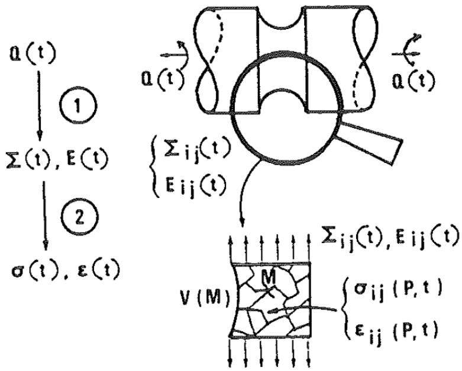  
Fig 1 Different steps of the proposed fatigue calculations: macroscopic and microscopic scale

To give a more explicit form of the criterion, some physical understanding is required, namely as cracks usually occur in intragranular slip bands, the local shear stress acting on these planes is an important parameter. In the same way, hydrostatic tension

$$
p h = { \frac { \operatorname { t r a c e } \sigma } { 3 } }
$$

is an important parameter with regard to the opening of cracks. Taking these remarks into account, one can chose for f(σ) $f ( \sigma )$ ) a relation between τ and ph. The $p h$ simplest criterion is a linear relationship between these parameters; see (2)(3)(5), i.e.

$$
f ( \sigma ) = \tau \pm a p h \mp b
$$

For such a criterion, the endurance domain is delimited by two intersecting straight lines D and D' symmetric with regard to the τ axis; Fig. 2. On this $\mathbf { D ^ { \prime } }$ figure, two paths Γ, and Γ2 have been drawn to illustrate our purpose; one $\Gamma _ { \mathbf { i } }$ $\Gamma _ { 2 }$ $\left( \Gamma _ { 2 } \right)$ is damaging, the other (Γ1) is not. Both show the same shear stress amplitude $\left( \Gamma _ { 1 } \right)$ and the same mean hydrostatic tension. For classical criteria (Sines, for instance) these two paths should predict the same damage. This illustrates the advantage of calculating via a method based on current stress state.

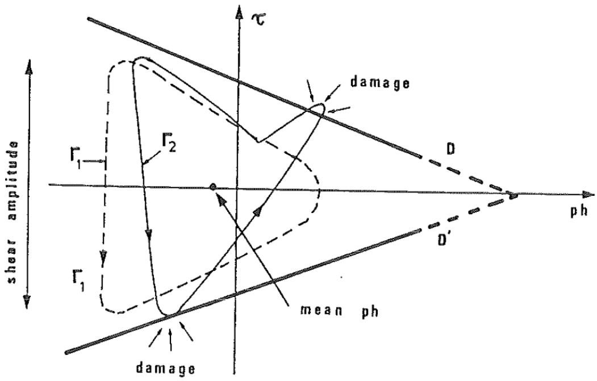  
Fig 2 Endurance domain and two typical local loading paths Γ, and $\Gamma _ { 1 }$ $\Gamma _ { 2 }$

## Evaluating local stresses

Local stresses, ō have to be evaluated as functions of macroscopic stresses, Σ, $\bar { \bar { \sigma } }$ $\overline { { \bar { \Sigma } } } ,$ to apply the method. In the general case this difficult problem of localization has not yet received a mathematical answer. An approximate solution is given here, involving some physical assumptions.

Let us recall that, in 1939, Orowan (11) proposed a unidimensional fatigue model based on an evaluation of the local shear stress cycle in critical elements. The model relied upon the following hypothesis: those elements which undergo plastic deformation are surrounded by an elastic matrix; pure isotropic hardening is assumed. Orowan's reasoning is summed up in the schematic of Fig. 3; point x stands for the limit state of local stresses and is graphically constructed.

Using similar assumptions, Dang Van (2)(3) generalized this method to evaluate the local stresses $\sigma _ { \mathrm { i j } } ( t )$ in the stabilized state. The following supplementary hypotheses are needed:

H1 – only one slip system is activated. This system is defined by n, normal to the slip plane, m the slip direction;

H2 – microscopic strains show isotropic hardening; 0,

H3 – micro elements undergo the macroscopic deformation E, i.e.:

$$
\varepsilon _ { \mathrm { i j } } ^ { \mathrm { c } } + p _ { \mathrm { i j } } = E _ { \mathrm { i j } }
$$

since macroscopic plastic strain P is negligible at the fatigue limit. $P _ { \mathrm { i j } }$

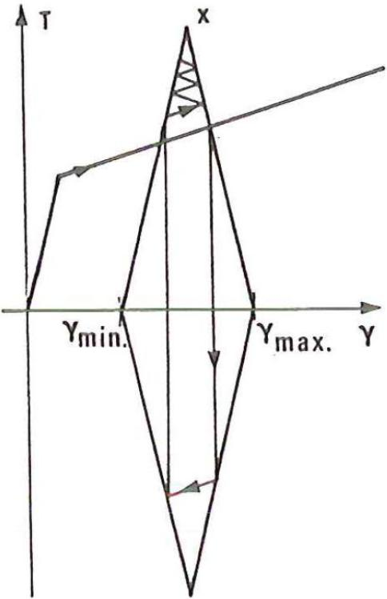  
Fig 3 Orowan's construction for evaluating limit shear stress in the critical element (11)

The following result occurs

$$
\sigma _ { \mathrm { i j } } ( t ) = \Sigma _ { \mathrm { i j } } ( t ) - 2 a _ { \mathrm { i j } } T _ { 0 }
$$

where $a _ { \mathrm { i j } } = { \frac { 1 } { 2 } } ( n _ { \mathrm { i } } m _ { \mathrm { j } } + m _ { \mathrm { i } } n _ { \mathrm { j } } )$ ) and T0 is the mean value of shear stresses in the plane $T _ { 0 }$ where maximum shear amplitude occurs (this plane is defined by n).

Even if some industrial applications of this formula exist,automatic computer analyses are not easy in the case of multiaxial loading. That is why another approach has been derived where the previously stated assumptions are no longer necessary. The only hypothesis will be that grains obey both isotropic and kinematic hardening rules; this sounds more realistic than the H2 hypothesis. The main characteristics of the previous conclusion are found again: in particular,the tendency of local shear to become symmetric.

For a simple understanding of this approach, let us first consider a cyclic loading which induces in the neighbourhood of point M of the structure a pure shear state on a plane normal to the Mz axis. For example, $\bar { \bar { \Sigma } } ( M , t )$ will have $\Sigma _ { \mathrm { X Z } }$ and $\Sigma _ { \mathrm { Y } Z }$ as non-zero components, Mxyz being a fixed coordinate system with respect to the material. Let this cycle (θ is the period) be divided into n parts $t _ { \mathrm { i } } , 1 \leqslant i \leqslant n$ . The stress vector T(t)associated with various time t defines a curve Γ which is divided into (n - 1) parts delimited by the end of vectors $M T _ { \mathrm { i } } = M T ( t _ { \mathrm { i } } )$ ; see Fig. 4. Critically oriented grains in $V ( M )$ will slip. Their initial elastic domain $C _ { \mathrm { o } }$ is featured by the circle of radius R,the centre of $R _ { \mathrm { o } }$ which is O (coinciding with M). As MT follows Γ, let T be the first point outside $T _ { \mathrm { j } }$ $C _ { \mathrm { o } } ,$ , plastic strains have to occur. As a result, the elastic domain is now C.The $C _ { \mathrm { j } }$ translation of the centre from O to O corresponds to kinematic hardening.The $O _ { \mathrm { i } }$ growth of the radius from Roto Rj is for isotropic hardening. $R _ { \mathrm { o } }$ $R _ { \mathrm { j } }$

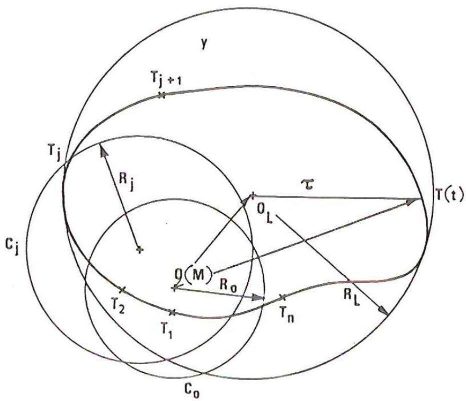  
Fig 4 Illustration of the scheme to compute the stabilized residual stress and the local shear stress

As the loads keep varying, active parts of the loading path will keep the elastic domain changing in the way described above. After some cycles a limit circle $C _ { \mathrm { L } }$ L with centre OL, radius RL, is found. Thus CL encloses the whole curve $O _ { \mathrm { { L } } }$ $R _ { \mathrm { L } }$ $C _ { \mathrm { L } }$ Γ defined from the stress vector $\pmb { T } ( t )$ and elastic shakedown is thus obtained. The term $o _ { \mathrm { L } } M$ corresponds to the stabilized residual stresses ρ\*. But to be more $\varrho ^ { * }$ precise, the following interpretation

$$
T = \tau + \rho ^ { * } \mathrm { c o r r e s p o n d s ~ t o ~ } M T ( t ) = O _ { \mathrm { L } } T - O _ { \mathrm { L } } M
$$

with τ being the local shear vector at time t in the shakedown state.

The algorithm to determine the stabilized limit state as described above is given in Appendix 1. For progressive isotropic hardening the stabilized state occurs for the smallest diameter circle enclosing Γ. We make the assumption that this is a general result. For complex loading, von Mises' norm will be easier to handle. The last result is generalised in the following way: Σ (resp. σ) is divided in deviatoric S (resp., s) and hydrostatic part PH (resp., ph).

$$
\begin{array} { r l } & { \Sigma _ { \mathrm { i j } } = S _ { \mathrm { i j } } + P H \delta _ { \mathrm { i j } } } \\ & { \sigma _ { \mathrm { i j } } = s _ { \mathrm { i j } } + p h \delta _ { \mathrm { i j } } = S _ { \mathrm { i j } } + \mathrm { d e v } \varrho _ { \mathrm { i j } } + P H \delta _ { \mathrm { i j } } } \end{array}
$$

The deviatoric part of stabilized ρ (noted by dev $\varrho ^ { * } )$ is calculated through

$$
\mathrm { M i n } \left[ \mathrm { M a x } J _ { 2 } \{ S _ { \mathrm { i j } } ( t ) - \mathrm { d e v } \varrho _ { \mathrm { i j } } \} \right]
$$

In this expression the maximum is to be taken on time t over a cycle $( 0 \leqslant t \leqslant \theta )$ and the minimum is to be taken on dev $\varrho$

The algorithm used for this problem is given in Appendix 1.

A proposal of Mandel et al. (12) studying elastic shakedown of an elastoplastic structure with combined kinematic and isotropic hardening is now employed. These authors propose the same formula and interpreted it as a measure of the fluctuation of the elastic response at point P in the stabilized state. Our more intuitive physical reasoning gives a better understanding when applied to fatigue.

Results from Mandel et al. allow a more precise description of the method to evaluate local stabilized stresses since they give a necessary condition for elastic shakedown, thus generalizing Melan's theorem. More precisely, let the elastic domain of the material be defined by

$$
g ( \bar { \bar { \sigma } } - \bar { c p } ) = k ^ { 2 } ( a , \theta )
$$

where θ is the temperature, and α a time-increasing hardening variable, for $\theta$ instance

$$
p _ { \mathrm { e q } } = \int _ { 0 } ^ { t } \sqrt { ( \frac { 2 } { 3 } \dot { p } _ { \mathrm { i j } } \dot { p } _ { \mathrm { i j } } ) \ \mathrm { d } t }
$$

and c a positive constant. Mandel et al. demonstrated the following result:

Let k be a strictly increasing function of a, and g a uniform continuous function, a necessary $^ { a , }$ $_ { g }$ condition for elastic shakedown will be that some time t and some fixed stress $t _ { 1 }$ $\sigma _ { 1 } ( x )$ ateach point x should exist such that

$$
\forall t > \mathfrak { t } _ { 1 } , g \{ \sigma ^ { \mathfrak { e l } } ( x , t ) - \sigma _ { 1 } ( x ) \} < k ^ { 2 } \{ a _ { s } , \theta ( x , t ) \}
$$

where a is the highest acceptable value with respect of the small strain condition and ōel is the $\overline { { \widehat { \sigma } } } ^ { \mathrm { e l } }$ stress obtained if purely elastic behaviour is assumed.

In our case $\bar { \bar { \sigma } } ^ { \mathrm { e l } }$ is generally identical to macroscopic stresses Σ. As Mandel et $\bar { \bar { \Sigma } } .$ $a l .$ stated, this condition is of great interest because it is a local property in opposition to the various classical extensions of Melan's theorem. It is thus easier to check. It should be noted that we have the same guide lines in our model.

In discussion the following remarks are important

(1) Macroscopic stresses $\bar { \Sigma }$ are usually the stresses obtained through elastic calculations. However, elastoplastic calculation may be necessary in some cases, especially in a notched structure in which contained plastic strains occur. The macroscopic hydrostatic tension may be different from the result obtained through a simple elastic calculation. Therefore, a simplified method proposed by Zarka et al. (13) could be very useful.

(2) In many applications, the components of the macroscopic stress tensor vary in a sinusoidal way. Then, even if these components are out of phase, the deviatoric stabilizedtensor dev ρ\* $\varrho ^ { * }$ canbe calculated as an ordinary mean value of the stress deviatoric tensor $\bar { \bar { S } } ( t )$ as can be easily shown; see Appendix 2.

dev $\varrho _ { \mathrm { i j } } ^ { * } = \frac { 1 } { \theta } \int _ { 0 } ^ { \theta } S _ { \mathrm { i j } } ( t ) \mathrm { d } t$

## General procedure

Let us sum up the general procedure to perform fatigue calculations.

(1) Evaluate $\Sigma _ { \mathrm { i j } } ( M , t ) \ : \forall \ : t \quad ; \quad \quad 0 \leqslant t \leqslant \theta$

The components of Σ are referenced to a fixed axis with respect to the $\hat { \Sigma }$ material. In each volume element $\Delta V ( M )$ , ∑ is constant $\forall p \in \Delta V ( M )$ The period θ is the smallest time interval such that

$$
\forall t { \bar { \bar { \Sigma } } } ( t + \theta ) = { \bar { \bar { \Sigma } } } ( t )
$$

It is obvious that 2θ, 3θ, and so on can also be taken into account without any change in the final fatigue limit. However, in some practical applications, finding the period could be rather difficult.

(2)Stresses are split between the hydrostatic part $P H ( t )$ and the deviatoric part $S _ { \mathrm { i j } } ( t )$

$$
P H ( t ) = { \frac { \operatorname { t r a c e } { \bar { \bar { \Sigma } } } ( t ) } { 3 } } \quad ; \quad 0 \leqslant t \leqslant \theta
$$

$$
S _ { \mathrm { i j } } ( t ) = \Sigma _ { \mathrm { i j } } ( t ) - P H ( t ) \delta _ { \mathrm { i j } } \quad ; \qquad 0 \leqslant t \leqslant \theta
$$

(3) dev Qj of the stabilized local residual stress \* is searched through $\varrho _ { \mathrm { i j } } ^ { * }$ $\bar { \bar { \varrho } } ^ { * }$

dev ¯\* = Min [Max $J _ { 2 } \{ S _ { \mathrm { i j } } ( t ) - \mathrm { d e v } \varrho _ { \mathrm { i j } } \} ]$

The minimum is to be taken on ρ and the maximum is to betaken on t $( 0 \leqslant t \leqslant \theta )$ with the corresponding algorithm given in Appendix 1.

(4) The deviatoric part of the localized stresses is calculated from

$$
s _ { \mathrm { i j } } ( t ) = S _ { \mathrm { i j } } ( t ) + \mathrm { d e v } ~ \varrho _ { \mathrm { i j } } ^ { * }
$$

(5) $\tau ( t ) = { \frac { 1 } { 2 } } \mathrm { T r e s }$ ca $\{ s _ { \mathrm { i j } } ( t ) \}$ is calculated over the cycle period.

(6) $d = \operatorname { M a x } \left[ { \frac { \tau ( t ) } { b - a p h ( t ) } } \right]$

The maximum is to be taken for $0 \leqslant t \leqslant \theta$ and if $d \geqslant 1$ fatigue failure will occur.

Obviously it is important to note that

$$
\begin{array} { r } { \mathrm { T r e s c a } \left[ \sigma _ { \mathrm { i j } } ( t ) \right] = \mathrm { T r e s c a } \left[ s _ { \mathrm { i j } } ( t ) \right] = \mathrm { M a x } _ { I , J } \left| \sigma _ { \mathrm { I } } ( t ) - \sigma _ { \mathrm { J } } ( t ) \right| } \end{array}
$$

where $\sigma _ { \mathrm { I } } , \sigma _ { \mathrm { J } }$ are principal microscopic stresses. Working this way, all couples $( \tau , P h )$ are situated in the positive part of τ of Fig. 2. All facets which could be involved by the crack initiation criterion are automatically reviewed.Couples $( \tau , p h )$ verifying condition $d \geqslant 1$ are associated with defined facets and so the criterion also gives the direction of crack initiation.

## Application of the method

Classical test results are well correlated through the proposed criterion. Some industrial applications in the multiaxial field also can be found in (4) and (5).

A recent fatigue study on an experimental ball bearing using the proposed method is now presented. This second generation of integrated ball bearing will support directly car wheels, taking the place of the naves. Under high accelerations in curves, the rings of the ball bearings undergo complex triaxial cyclic loadings which may initiate fatigue (Fig. 5) so these pieces are as yet over dimensioned. To obtain mass optimization an experimental ball bearing has been designedon the basis of the proposed criterion and tested against the prediction of the model.

Real service loadings on wheel ball bearings are accurately determined from recordings on vehicles. Analysis of the results by computer shows that these ball bearings are submitted to both radial and axialtensile loads and to a warping moment. The bearings support intermittent heavy loads, especially in curves when the loads due to lateral acceleration are added to the weight of the vehicle. These loads are applied to the tyre (see Fig. 5) and generate a multiaxial distribution of stress on the ball bearings, which varies as the wheel rotates. This whole complex loading is taken into account in the design and viability calculations of the integrated ball bearing. viaumty car

The ball bearing ring analysed has been idealized using the finite element method. Results provided by strain gauges at various points of the structure are compared with calculations. By this means the degree of validity of load description and the assumed boundary conditions can be checked. ucscn

Evolution of principal stresses and their orientation with respect to a radial direction in the critical region is shown in Fig. 6. In Fig. 7, the evaluation of the stress tensor Σ in the critical zone is plotted for one revolution. Note that the $\bar { \Sigma }$ coordinate axes are fixed with respect to the ring.

The loading path in the $( \tau , p h )$ plane at a point near the critical zone is shown in Fig. 8. Figure ${ 8 ( \mathrm { a ) } }$ represents the case where no crack initiation occurs. Figure 8(b) represents the calculated limit case; the loading path intersects the straight line delimiting the fatigue limit. This line has been determined for annealed 100 C6 steel through torsion and tension tests on smooth cylindrical specimens.

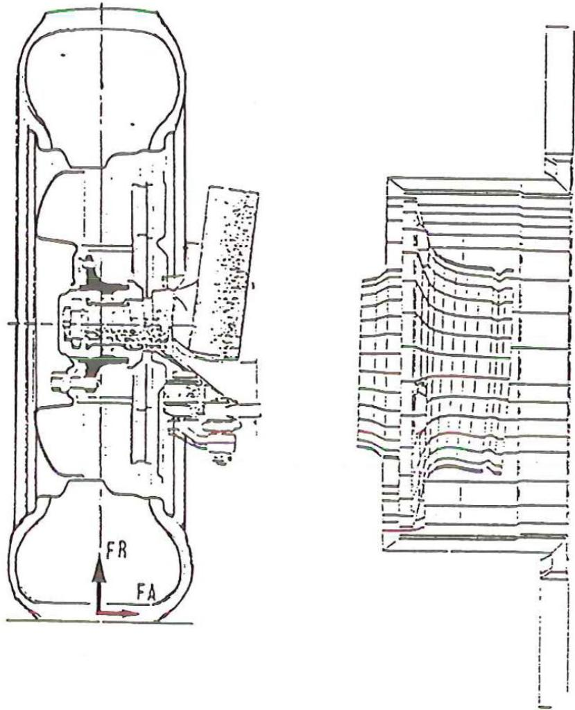  
Fig 5 Schematic of an integrated ball bearing, the ring of which undergoes complex triaxial cyclic loading

In Fig. 9(a) the fatigue iso-criterion curves of the ring are plotted. Critical points (i.e., those which first verify the fatigue criterion) are indicated by an arrow. To allow comparisons, iso-Mises curves are plotted on Fig. 9(b) and these critical points are not the same since they are near the screw holes.

Fatigue experiments on the ball bearing have been performed by The SKF France Laboratory. The experimental results are in complete agreement with the prediction of the model, i.e., the initiation point and calculated critical point are similar (see Fig. 10). Also the predicted load is in close agreement with experimental results. Below thisload, no crackinitiation has been observed (Fig. 8(a)). For the predicted critical load, Fig. 8(b), initiation occurs.

These results should encourage designers of structures that have to resist fatigue and possibly save on costly tests.

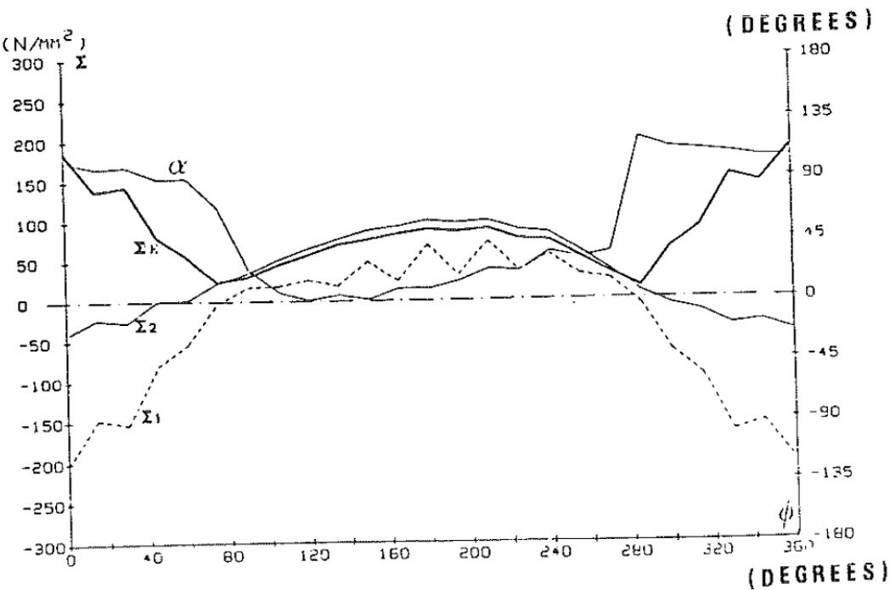  
Fig 6 Evolution over one revołution of principal stresses and their orientation with respect to a radial direction in the critical region

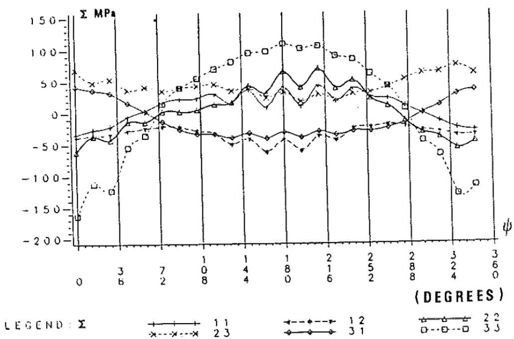  
Fig 7 Evolution over one revolution of the stress tensor ∑ in the critical zone $\vec { \pmb { \Sigma } }$

BIAXIAL AND MULTIAXIAL FATIGUE  
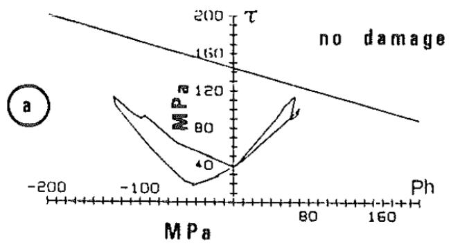

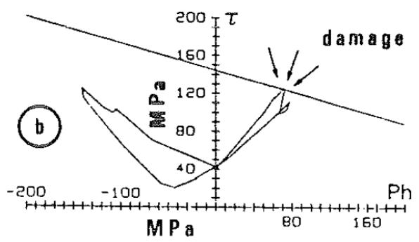  
Fig 8 Loading path in a $( \tau , p h )$ diagram of a point in the critical zone for two cases: (a) no initiation; (b) initiation (see also Fig. 10)

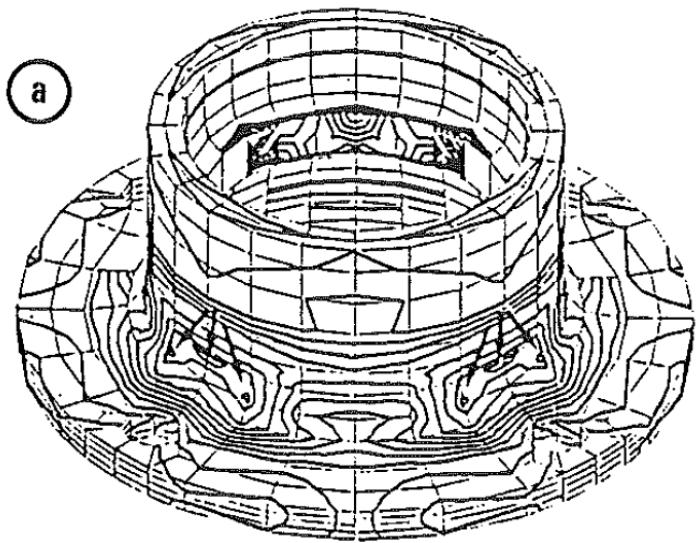  
Fig 9 Component analysis: (a) fatigue isocriterion curves. Critical points are indicated by arrows

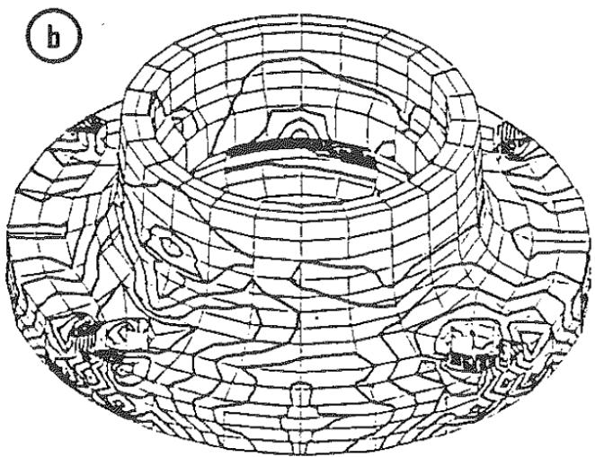  
Fig 9 Component analysis; (b) typical iso-Mises curve

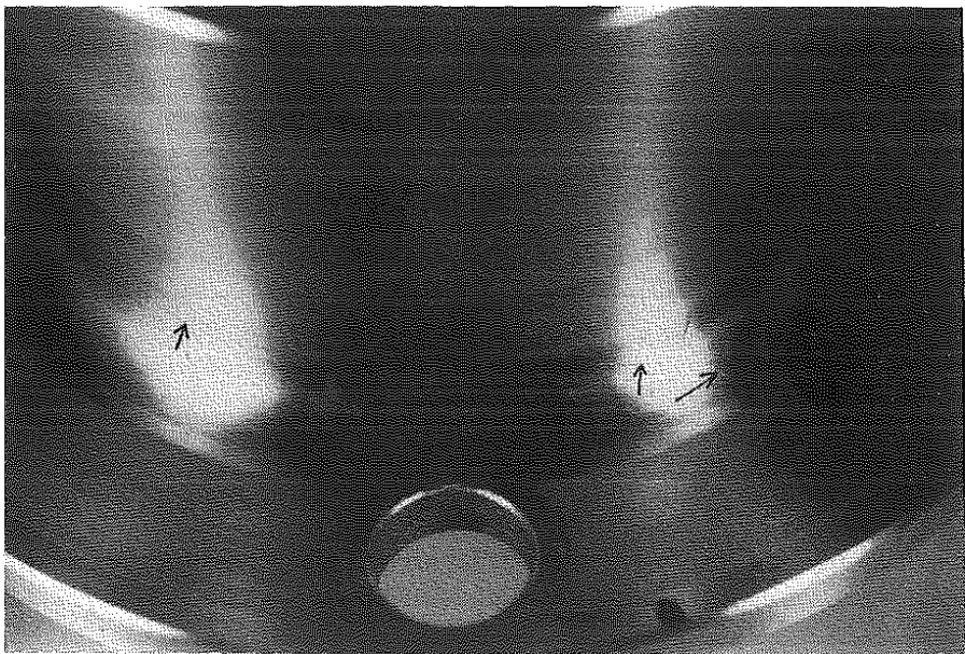  
Fig 10 The tested ball-bearing ring (arrows indicate fatigue crack)

## Appendix 1

## How to determine dev ρ\* in the general case $\varrho ^ { * }$

Cyclic evolution of tensor S is discretized in N tensor  associated with N $\bar { \bar { s } }$ $\boldsymbol { \bar { \bar { s } } } _ { \mathrm { i } }$ different times $t _ { \mathrm { i } }$

$$
1 \leqslant i \leqslant n \stackrel {  } { \quad } 1 \leqslant i \leqslant N\tag{2}
$$

Variations $\bar { \bar { S } } _ { \mathrm { i + 1 } } - \bar { \bar { S } } _ { \mathrm { i } }$ are considered as infinitesimally small. At each time $t _ { \mathrm { i } } ,$ $R _ { \mathrm { i } }$ is the current elastic limit and dev  is the deviatoric part of the local residual $\boldsymbol { \underline { { \underline { { = } } } } } _ { i }$ stresses.

## (a) Iteration principle; see Fig. 11

The question to be solved is how to define state $( i + 1 )$ characterized by $\bar { \bar { S } } _ { \mathrm { i } + 1 }$ and $R _ { \mathrm { i } + 1 }$ , from i characterized by $S _ { \mathrm { i } }$ and $R _ { \mathrm { i } }$

The following process has been chosen, namely that displacement from i to $i + 1$ is infinitesimally small. When going from t; to t+1, kinematic hardening $t _ { \mathrm { i } }$ $t _ { \mathrm { i + 1 } }$ (displacement of the centre of the elastic limit circle – in general, of the elastic limit sphere) and isotropic hardening (growth of the elastic limit – radius of the circle) occur and can be described as follows.

Let us call D the distance' $J _ { 2 } ( S _ { \mathrm { i } + 1 } + \mathrm { d e v } \varrho _ { \mathrm { i } } )$ and P the quantity $D - R _ { \mathrm { i } }$ . If x is the coefficient of isotropic hardening for the grain, «P will be the growth of ${ \boldsymbol { \varkappa } } P$ the elastic limit $R _ { \mathrm { i } }$ . So

$$
R _ { \mathrm { i } + 1 } = R _ { \mathrm { i } } + \varkappa P\tag{3}
$$

As displacements are radial and as the distance between the new origin $O _ { \mathrm { i } + 1 }$ and T+1 has necessarily to be equal to R+1, dev Q+1 is given through $T _ { \mathrm { i } + 1 }$ $R _ { \mathrm { i } + 1 }$ $\varrho _ { \mathrm { i + 1 } }$

$$
\mathsf { d e v } \overset { = } { \underset { \theta _ { \mathrm { i } + 1 } } { \boldsymbol { \bar { \varrho } } } } = \mathsf { d e v } \overset { = } { \underset { \theta _ { \mathrm { i } } } { \boldsymbol { \bar { \varrho } } _ { \mathrm { i } } } } - \frac { D - R _ { \mathrm { i } + 1 } } { D } \overset { = } ( \overline { { \bar { S } } } _ { \mathrm { i } + 1 } + \mathsf { d e v } \overset { = } { \underset { \theta _ { \mathrm { i } } } { \boldsymbol { \varrho } _ { \mathrm { i } } } } )\tag{4}
$$

This calculation is iterated for each step (i) to (i + 1) and the stress cycle is followed as many times as necessary to obtain convergence for dev \* and R. $\stackrel { * } { \hat { \varrho } } { } ^ { * }$ $R .$

## (b) Initialization

The best initial values of R1 and dev  appear to be a nearly zero value and the $R _ { 1 }$ $\ddot { \varrho }$ mean value of S, respectively, or $\bar { \bar { S } } _ { \mathrm { i } }$

$$
\mathrm { d e v } \overset { = } { \underset { \mathrm { \tiny ~ ( 1 ) } } { \mathrm { \tiny ~ ( 1 ) } } } = \frac { 1 } { N } \sum _ { \mathrm { \tiny ~ i } } ^ { N } \bar { \bar { S } } _ { \mathrm { \tiny ~ i } }\tag{5}
$$

## (c) Convergence

It is obvious that convergence toward $O _ { 1 } \{ \mathrm { d e v } \bar { \varrho } ^ { * } \}$ will improve as the radius $R _ { \mathrm { i } }$ grows more slowly. Thus the isotropic hardening coefficient x should be as small as possible. On the other hand, speed of convergence varies in the same way as the coefficient x. Therefore, a compromise between good convergence and duration of the calculation has to be found. For example, for x equal to 0.05, convergence with a relative accuracy of $1 0 ^ { - 3 }$ is obtained after 30 cycles divided rather regularly into 30 points.

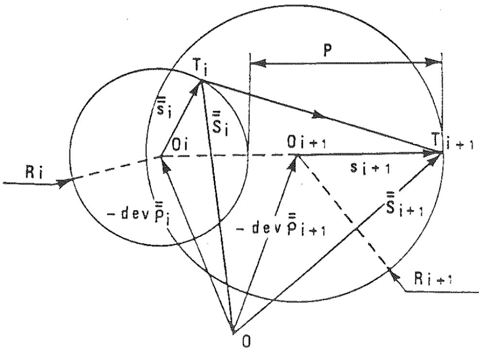  
Fig 11 The iteration procedure: definition of state (i + 1) from state (i)

## Appendix 2

How to determine dev $\bar { \bar { \varrho } } ^ { * }$ for $\Sigma _ { i j }$ varying as a sine wave

In many practical applications, the macroscopic stress tensor $\tilde { \bar { \Sigma } }$ has the particular form

$$
\Sigma _ { \mathrm { i j } } ( t ) = C _ { \mathrm { i j } } + V _ { \mathrm { i j } } \sin { ( \omega t + \varphi _ { \mathrm { i j } } ) }\tag{6}
$$

As constants do not intervene in the calculation, $\bar { \bar { C } }$ is eliminated through a shift of the stress origin. The active part is

$$
\Sigma _ { \mathrm { i j } } = V _ { \mathrm { i j } } \sin { ( \omega t + \varphi _ { \mathrm { i j } } ) }\tag{7}
$$

The hydrostatic part is eliminated and the remaining active part is

$$
S _ { \mathrm { i j } } = S _ { \mathrm { i j } } \sin { ( \omega t + \psi _ { \mathrm { i j } } ) }\tag{8}
$$

As all linear combinations of sines gave a sine wave, all linear combinations of sinusoidal tensors will give a sinusoidal tensor, in particular changes of spatial axes. So whatever the chosen spatial plane, the shear stress in this plane will follow an ellipse.

It is obvious that tensor dev \* has the same symmetries as the loading path. $\bar { \bar { \varrho } } ^ { * }$ In particular, it must have the symmetries of an ellipse (relative to its two axes). The only tensor respecting these symmetries is the null tensor. So the stabilized deviatoric part of local residual stresses dev ρ\* $\bar { \bar { \varrho } } ^ { * }$ is null and stabilized s is equal to S.

The radius is calculated following the general procedure and appears to be equal to the mean value of the fluctuation of macro elastic deviatoric stress.

## References

(1) GARUD, Y. S. (1981) Multiaxial fatigue: a survey of the state of the art, J. Testing Evaluation, 9, 165–178.

(2) DANG VAN, K. (1973) Sur la résistance à la fatigue des métaux, Sciences Technique (0) Armement, 47, 3ème Fasc., Mémorial de l'Artillerie française, Paris, Imprimerie Nationale. vatvnaic,

(3) DANG VAN, K. (1974) Comportement à la fatigue des métaux, Plasticité et viscoplasticité (Edited by RADENKOVIC, D. and SALENÇON, J.), Ediscience/McGraw-Hill, New York, pp. 69–72.

(4) DANG VAN, K., CAILLETAUD, G., FLAVENOT, J. F., LE DOUARON, A., and LIEURADE, H. P. (1984) Critère d'amorçage en fatigue à grands nombres de cycles sous sollicitations multiaxiales, Compte-rend. J. Printemps Soc. Française Métallurgie, 301-337. (E) , 1.

(5) DANG VAN, K., LE DOUARON, A., and LIEURADE, H. P. (1984) Multiaxial fatigue limit: a new approach, Int. Conf. Fract. Mech., ICF 6, New Delhi.

(6) GOUGH, H. J. and POLLARD, H. V. (1935) The strength of metals under combined alternating stresses, Proc. Instn mech. Engrs, 131, 3–54. ()

(7) YOKOBORI, T. and YOSHIMURA, T. (1966) A criterion for fatigue fracture under multiaxial alternating stress state, Report of Research Institute for Strength and Fracture of Materials, Tohoku University, Sendai, Japan.

(8)SINES, G. (1955) Failure of materials under combined repeated stresses with superimposed static stresses, Technical note 3495, Nat. Advisory Council for Aeronautics, Washington, DC.

(9) CROSSLAND, G. (1956) Effect of large hydrostatic pressures on the torsional fatigue strength of an alloy steel, Proc. of the Int. Conf. of Fatigue of Metals, I. MechE., London, pp. 138–149.

(10) MANDEL, J. (1964) Contribution théorique à l'étudede l'’écrouissage et de lois de (11) l'écoulement plastique, Proc. 11th Int. Cong. Appl. Mech., Munich 1964, pp. 502–509. ODOUANLD 1, . J-J.

(11) (12) OROWAN, É. (1939) Theory of the fatigue of metals, Proc. Roy. Soc. London, A, 171, 79. MAMDEI T Lmw 11, 111, 17.

(12) MANDEL, J., ZARKA, J., and HALPHEN, B. (1977) Adaptation d'une structure à écrouissage cinématique, Mech. Res. Comm., 4, 309–314.

(13) ZARKA, J., ENGEL, J. J., and INGLEBERT, G. (1979) On a simplified inelastic analysis of structures, Nucl. Engng Des., 57, 333–368.
