# Macro-Micro Approach in High-Cycle Multiaxial Fatigue

REFERENCE: Dang-Van, K., "Macro-Micro Approach in High-Cycle Multiaxial Fatigue," Advances in Multiaxial Fatigue, ASTM STP 1191, D. L. McDowell and R. Ellis, Eds., American Society for Testing and Materials, Philadelphia, 1993, pp. 120–130.

ABSTRACT: An original methodology for fatigue resistance of mechanical structure is presented. Our approach relies on a “macro-micro" analysis. Here micro stresses in misoriented elements are evaluated when the macroscopic loading path is known. Multiaxial fatigue criteria are then proposed. Some industrial applications are shown.

KEY WORDS: multiaxial fatigue criterion, high-cycle fatigue, fatigue limit, macro-micro approach, micro stress evaluation

## Nomenclature

$A _ { i j h k } ( M , m )$ Elastic localization tensor c Kinematic hardening modulus $E _ { i j }$ Macroscopic strain tensor $k$ Actual yield limit $k ^ { l i m }$ Elastic shakedown limit of $k ^ { * }$ according to Papadopoulos theory $k ^ { * }$ Radius of the stabilized hypersphere surrounding the loading path $\pmb { L } ( t )$ Loading path m Current point of V(M) M Point of the structure where the fatigue analysis is made p Microscopic hydrostatic tension P Macroscopic hydrostatic tension s Microscopic deviatoric stress tensor S Macroscopic deviatoric stress tensor t Time V(M) Characteristic macroscopic volume surrounding Point M € Microscopic strain tensor $\epsilon ^ { e }$ Microscopic elastic strain tensor $\epsilon ^ { p }$ Microscopic plastic strain tensor $\epsilon _ { e q } ^ { p }$ Microscopic equivalent plastic strain μ Shear modulus $\pmb { \rho }$ Microscopic residual stress tensor $\rho ^ { * }$ Stabilized microscopic residual stress tensor σ Microscopic stress tensor Σ Macroscopic stress tensor T Shear stress

1 Laboratoire de Mecanique des Solides, CNRS URA 317, Ecole Polytechnique, 91128 Palaiseau, France.

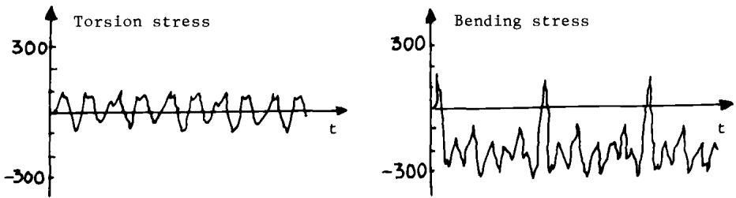  
FIG. 1—Stress cycles on the critical zone of a crankshaft.

## Introduction

During the last four decades, most research efforts have been devoted to low-cycle fatigue. Most industrial applications, however, involve high-cycle fatigue. Many multiaxial fatigue criteria exist. However, the design of structures which have to resist fatigue is still a problem; engineers have to perform difficult, expensive, and time-consuming experiments to find the fatigue limit of a mechanical component. Generally, this is done on the structure itself.

The origin of multiaxiality comes from different factors:

1. External loading.

2. Geometry of the structure: it is well-known that in the vicinity of notches, the stress state is multiaxial even if the loading is uniaxial.

3. Residual stresses which are multiaxial by nature.

For example, the stress cycles on the critical loading of a crankshaft are represented in Fig. 1. They are a combination of out-of-phase torsion and bending. Figure 2 shows the evolution over one revolution of the stress tensor Σ in the critical zone of an integrated ball bearing. From these individual examples, it can be seen that multiaxial loading paths are often encountered. The degrees of complexity of multiaxial loadings were discussed in Ref 1. An original multiaxial fatigue limit criterion is reviewed in this paper based on a macro-micro approach whose latest developments are presented.

## Presentation of the “Macro-Micro" Method in High-Cycle Fatigue

For constant stress or strain range, the concept of fatigue limit corresponds to a stress or strain “level" (amplitude and stress level) just enough to produce the initiation and the propagation of a crack. In this paper, we assume that a fatigue limit exists for complex loadings, too. For homogeneous materials, the initiation of fatigue cracks takes place in critical zones of stress concentration such as geometric discontinuities, fillets, notches. . . . There are still discussions on the concept of initiation itself, depending on the scale at which the phenomenon is observed; it is sometimes considered a micropropagation problem. Care should be exercised when using fracture mechanics at the grain scale because the local stress σ is different from the macroscopic applied stresses Σ. The first fatigue phenomena are microscopic and local and usually occur in grains which have undergone local plastic deformation in characteristic intracrystalline bands. The local (or microscopic) parameters (σ, €) are different from the macroscopic parameters derived by classical engineering computations (Σ, E). The different steps of the calculations are described in Fig. 3. Step 2 corresponds to the macroscopic-tomicroscopic passage. This problem is solved by distinguishing two scales:

Very amplified deformation of the Ball bearing

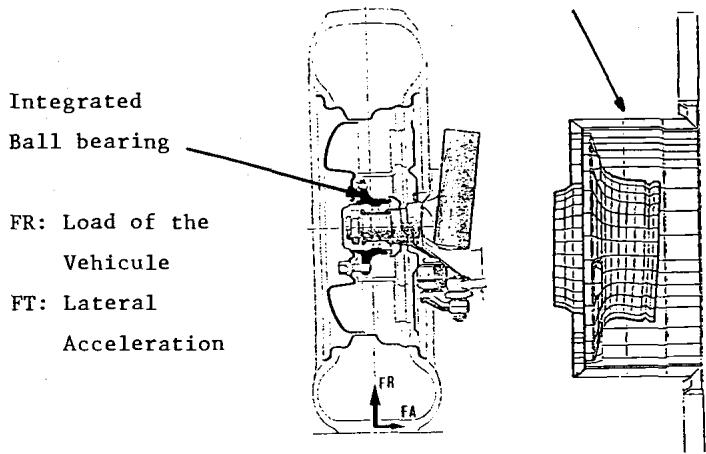

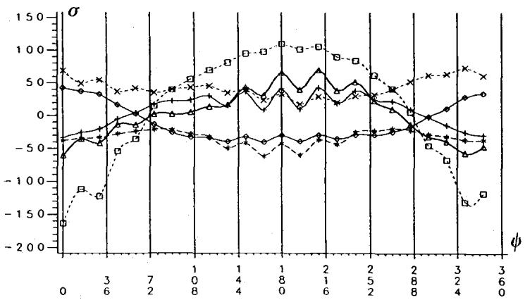  
FIG. 2—Evolution over one revolution of the wheel of the components of the stress tensor of a ball bearing. ↓ = angle of rotation of the wheel.

1. A macroscopic scale characterized by an elementary representative volume $V ( M )$ surrounding the point M where the fatigue analysis is made and representing, for instance, an element of a finite element mesh or corresponding to the dimension of a strain gauge. This is the usual scale considered by engineers; mechanical macroscopic variables $\Sigma ( M , t ) , E ( M , t )$ are assumed to be homogeneous in V(M) at any time, t.

2. A microscopic scale of the order of the grain size (or some grain sizes) corresponding to a subdivision of $V ( M )$ ; the microscopic quantities σ and € are not homogeneous and differ from Σ and E; even if the mean value of σ equals Σ, the local stress σ can fluctuate.

More precisely, σ and Σ are related by the following exact relation

$$
\sigma _ { i j } ( m , t ) = A _ { i j h k } ( M , m ) \Sigma _ { h k } ( M , t ) + \rho _ { i j } ( m , t )\tag{1}
$$

In the above equation $A _ { i j h k } ( M , m )$ is the elastic localization tensor and $\pmb { \rho }$ is the local residual stress field. Let us note that $\boldsymbol { A } _ { i j h k }$ could be correlated with the microstructure of the material.

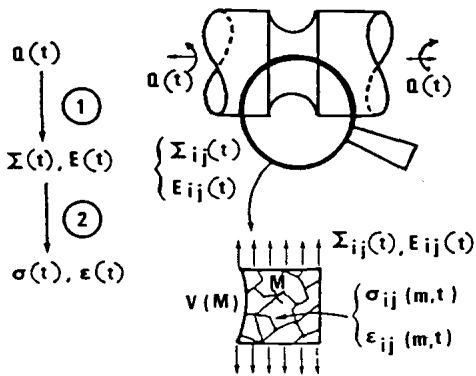  
FIG. 3—Different steps of the proposed fatigue calculations, macroscopic and microscopic scale.

This point, however, is not addressed here. $A _ { i j h k }$ can be obtained in theory by solving six elastic boundary value problems on volume $V |$ [one for each (hk) component]. Near the fatigue limit, the applied stresses are rather low, and it is reasonable to suppose that σ tends toward a pseudoshakedown state (pure shakedown corresponds to no damage). Then Melan's theorem states that beyond a certain time, $t ,$ a time-independent residual stress field $\pmb { \rho } _ { i j } ^ { * } ( m )$ exists such as

$$
\sigma _ { i j } ( m , t ) = A _ { i j h k } ( M , m ) \Sigma _ { h k } ( M , t ) + \rho _ { i j } ^ { * } ( m )\tag{2}
$$

that never violates the local plastic criterion

For example, in the case of an inclusion submitted to uniform plastic strain $\epsilon _ { i j } ^ { p }$ and embedded in an elastic matrix, both having same elastic coefficients, one has

$$
\begin{array} { c } { { \sigma _ { i j } ( t ) = \Sigma _ { i j } ( t ) - 2 \mu \epsilon _ { i j } ^ { p } ( t ) } } \\ { { \rho _ { i j } ( t ) = - 2 \mu \epsilon _ { i j } ^ { p } ( t ) } } \end{array}\tag{3}
$$

(4)

These relations can be obtained if the total strain of the matrix and inclusion are supposed to be the same, i.e.

$$
E = \epsilon ^ { e } + \epsilon ^ { p }\tag{5}
$$

Then, multiplying both sides by the common elastic compliance one obtains Eq 3. (There is no volume change under plastic deformation $\epsilon _ { i i } ^ { p } \neq 0 . )$

The fatigue criterion is then expressed by means of the microscopic stress tensor $\pmb { \sigma } ,$ which is known at each time, $t ,$ if $\dot { } \pmb { \rho }$ is known. It is possible to describe quite precisely the loading path because the local microscopic stress tensor in the stabilized state is known at each time, $t ,$ of the cycle. From Eq 2, the computation of $\sigma _ { i j } ( t )$ is limited to the computation of $\pmb { \rho } ^ { \ast }$ , which is independent of time when shakedown occurs.

## Evaluatíon of the Microscopic Residual Stress

The principle of the method given in Ref I is recalled. This method is based on:

1. Generalized Melan's theorem as given by Mandel et al. [2] studying elastic shakedown of elastoplastic structures with combined kinematic and isotropic hardening.

2. A minimum assumption detailed below.

The elastic domain of the material is defined by

$$
g ( \sigma - c \epsilon ^ { p } ) = k ^ { 2 } ( \epsilon _ { e q } ^ { p } )\tag{6}
$$

where $\epsilon ^ { p }$ is the plastic strain tensor, and c is a positive constant characterizing linear kinematic hardening, and

$$
\epsilon _ { e q } ^ { p } = \sqrt { _ { 2 } ^ { 3 } \left( \epsilon _ { i j } ^ { p } \cdot \epsilon _ { i j } ^ { p } \right) }\tag{7}
$$

k is supposed to be a strictly increasing function of the considered plastic strain range. Then a necessary condition for elastic shakedown is that a certain time $t _ { 1 } ,$ a certain fixed (i.e., independent of t) residual stress field $\rho ^ { * ( x ) }$ and plastic strain field $\epsilon ^ { p } ( x )$ exist such that

$$
\forall ~ t > t _ { 1 } , g [ \sigma ^ { e l } ( x , t ) + \rho ^ { * ( x ) } - c \epsilon ^ { p } ( x ) ] < k ^ { 2 } ( \epsilon _ { e q } ^ { p } )\tag{8}
$$

where $\sigma ^ { e l }$ is the stress obtained if pure elastic behavior is assumed.

In our case the representative volume $V ( M )$ represents the elastoplastic structure, and $\sigma ^ { e l }$ corresponds to A · Σ of Eq 1,2 or to Σ if A could be taken equal to identity. (This simplification is possible when the matrix and the inclusion are of the same nature.)

For the sake of simplicity, the von Mises norm is chosen so that only the deviatoric part of stress intervenes. Splitting the stress tensor Σ (resp. σ) in deviatoric part dev $\Sigma = S$ (resp. s) and hydrostatic part P = trace $\Sigma / 3$ (resp. p)

$$
\Sigma _ { i j } = S _ { i j } + P \delta _ { i j }\tag{9}
$$

Equation 8 is rewritten (A is supposed equal to identity)

$$
\forall ~ t > t _ { 1 } , J _ { 2 } [ S ( t ) - z ] < k ^ { 2 } \operatorname { w i t h } { z } = - \mathrm { ~ d e v ~ } \rho + c \epsilon ^ { p }\tag{10}
$$

z is thus the center and k the radius of an hypersphere which sould contain all the loading path L(t) for any time $\mathbf { t } > \mathbf { t } _ { 1 }$ . However, this condition is not enough to determine z, so that another hypothesis is needed. We make the assumption that the z solution corresponds to the smallest hypersphere that contains all the loading path L(t). Then for a given stress cycle $\mathbf { } L ( t )$ corresponds to a $\mathsf { g i v e n } z .$ This point is illustrated in Fig. 4; $H _ { 1 }$ corresponds to a possible hypersphere and $H _ { 2 }$ is the smallest one. Dev $( \rho ^ { * } )$ can be taken approximately equal to $z ,$

It is important to notice that the precise knowledge of the local elastoplastic constitutive equations, which are impossible to obtain, is not necessary. The proposed method gives an approximate way to characterize the local stress tensor in the pseudo-stabilized state.

The case ofan inclusion embedded in an elastic matrix is important for a better understanding of the method because it is based on the following image: crack initiation near the fatigue limit happens in some critically oriented grains which have undergone plastic deformation. In that case, $z = - ( 2 \mu + c ) \epsilon ^ { p } \simeq - 2 \mu \epsilon ^ { p } ;$ shakedown hypothesis means that $\epsilon ^ { p }$ becomes independent of the time, t. In this example, the local residual stress is directly related to the local plastic strain $\epsilon ^ { p } ,$ so that trace $( \rho ^ { * } ) = 0$ . Thus the macroscopic and the microscopic hydrostatic tension are equal $( P = p )$ . If the inclusion can be considered as spherical or ellipsoidal, it can be proved by Eshelby's method that the plastic strain is uniform in the inclusion. The local residual stress is then also uniform. Outside the inclusion, the stress pattern is more complex. As fatigue cracks appear very often at the surface, it is also interesting to examine surface inclusions. In this case, the residual stress inside an hemispherical inclusion is in general no more uniform even if plastic strain is supposed uniform [3]. However, this variation is not very important and one can neglect it at first approximation. In Fig. 5, the $\sigma _ { x x }$ stress pattern is represented in the case of an inclusion embedded in an infinite media (because of symmetry only half the figure is represented) and in the case of a hemispheric surface inclusion. The uniform plastic strain tensor of the inclusion corresponds to Type B after the terminology of M. Brown and K. Miller [4].

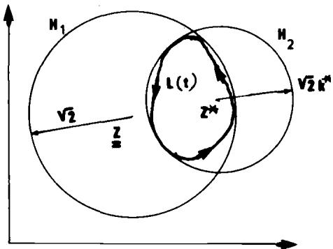  
FIG. 4—Evolution of the local residual stress: construction of the smallest hypersphere $\mathrm { H } _ { 2 }$ containing the loading path L(t).

Let us return to the general problem of determination of local residual stress in the pseudostabilized state. Knowing the stress cycle $S _ { h k } ( t ) , t \in [ t , t + T ] , [ ( h , k )$ must be relative to the fixed axis relative to the material], one discretizes in N tensors $S _ { i }$ associated with N different times, $t _ { i } .$ Variations $( S _ { i + 1 } - S _ { i } )$ are considered as infinitesimally small. Then there are two ways to find $\pmb { \rho } ^ { \ast }$

The first way is to use a mathematical method based on the theorem of Karatheodory as suggested by Papadopoulos [5]. The second way is based on the following “physical" algorithm [1] represented in Fig. 6. The initial elastic domain $C _ { 0 }$ is featured by the circle of radius $R _ { 0 } \left( R _ { 0 } \right.$ corresponds to the initial value of k from Eq 6), the center of which coincides with M. The stress state can be represented by MS. As MS follows the loading path represented by Γ, let $S _ { j }$ be the first point outside $C _ { 0 } ;$ plastic strain has to occur. As a result, the elastic domain is now $C _ { j } .$ The translation from $o$ to $O _ { j }$ corresponds to kinematic hardening. The growth of the radius from $R _ { 0 }$ to $R _ { j }$ is for isotropic hardening. As the load keeps varying, active parts of the loading path will keep the elastic domain changing in the way described above. Numerical simulations on examples show that after some cycles, a limit convex $C _ { l }$ with center $O _ { b }$ radius $R _ { l }$ which encloses the whole curve Γ is found. $O _ { l }$ M corresponds to the stabilized $z ,$ which corresponds approximately to the local residual stress tensor. Details of the algorithm to define the state (i + 1) characterized by $S _ { i + 1 }$ and $R _ { i + 1 }$ from i characterized by $S _ { i }$ and $R _ { i }$ is given in Ref 1. The precision of the method is improved as the radius R grows slower (weak isotropic hardening). Thus the isotropic hardening coefficient $x$ defined by

$$
R _ { i + 1 } = R _ { i } + \chi \epsilon _ { e q } ^ { p }\tag{11}
$$

should be small. On the other hand, speed of convergence varies in the same way as $x .$ Therefore, a compromise between precision and duration of the calculation has to be found.

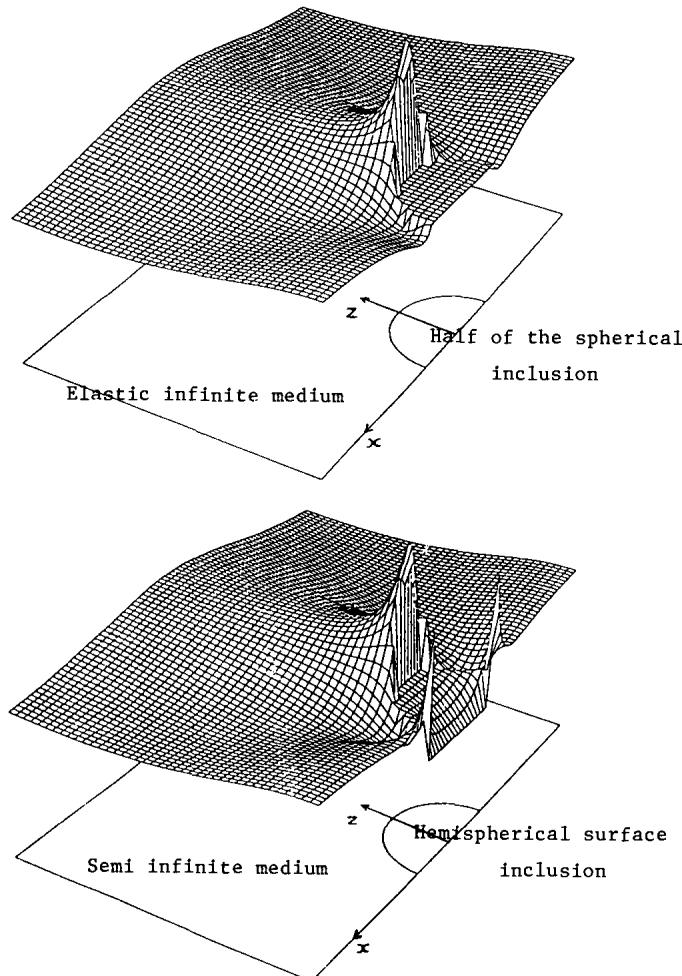  
FIG. 5—Qualitative stress pattern ${ \pmb { \sigma } } _ { \mathbf { x } \mathbf { x } }$ in the neighborhood of a spherical inclusion in an infinite medium and of a hemispherical surface inclusion in a semi-infinite medium and submitted to uniform plastic of Type B.

## Fatigue Limit Criteria

As $\sigma _ { i j }$ is approximatively known at any time, $t ,$ it is natural to try (as in plasticity) to take the loading path into account. Thus a reasonable fatigue criterion could be stated as follows: crack initiation will occur in a critically oriented grain of volume V(M) which has undergone plastic strains, if, for at least one time, $t ,$ of the stabilized cycle, one has

$$
f [ \sigma ( m , t ) ] > O { \mathrm { ~ f o r ~ } } m \in V ( M )\tag{12}
$$

In such a criterion the current stress state is considered and damage happens at a precise instant of the loading path. As cracks usually occur in transgranular slip bands, the local shear acting on these planes is an important parameter. In the same way the hydrostatic tension accelerates damage formation (this parameter is preferred to normal stress because it is easier to use, being an invariant; furthermore, it can be interpreted as the mean value of normal stress). Taking these remarks into account, one can choose for f(σ) a relation between the local shear stress τ and the local hydrostatic tension $p .$ The simplest criterion is a linear relationship between these parameters

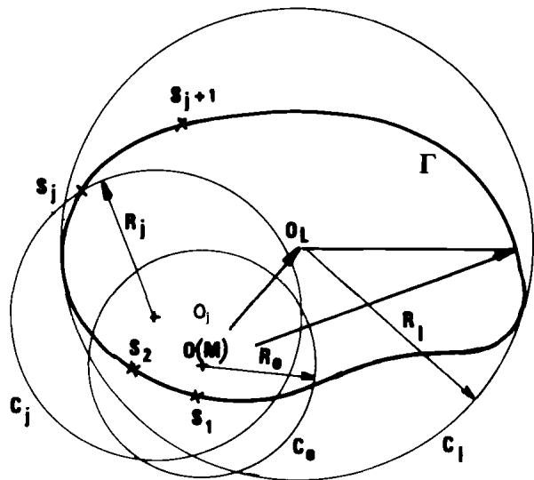  
FIG. 6—Illustration of the scheme to compute the stabilized residual stress and the local shear stress.

$$
f ( \sigma ) = \tau + a p - b\tag{13}
$$

The safety domain is delimited by straight lines. This domain can be determined by uniaxial experiments of tension and torsion on classical fatigue machines. For example, the endurance domain and two typical loading paths are represented in Fig. 7. In this figure, τ is the algebric shear acting on an oriented direction.

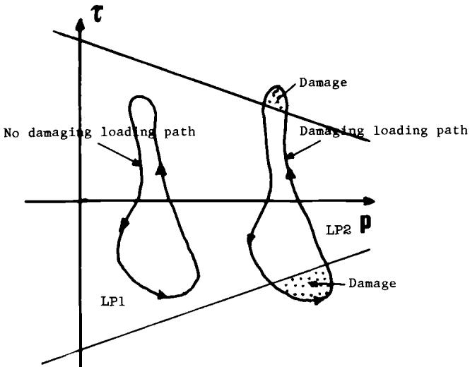  
FIG. 7—Endurance domain of two typical loading paths: LP1 = no damage; LP2 = damage.

To check automatically the fatigue resistance of a structure can be rather difficult because at each point one has to consider the plan on which the loading path $( \tau , p ) ( t )$ is “maximum” relative to the criterion. From Ref 1, this computation can be simplified as follows: $\tau ( t ) =$ Tresca $[ \sigma ( t ) ]$ is calculated over the cycle period. For this, it is important to note that

$$
\mathrm { T r e s c a } \left[ \sigma ( t ) \right] = \mathrm { T r e s c a } \left[ s ( t ) \right] = \mathrm { M a x } _ { I J } \left| \sigma _ { 1 } ( t ) - \sigma _ { J } ( t ) \right|\tag{14}
$$

where $\sigma _ { I ^ { \flat } } \ \sigma _ { J }$ are principal microscopic stresses.

Evaluate the quantity $d ,$ defined by

$$
d = \operatorname* { m a x } \left[ \frac { \tau ( t ) } { b - a p ( t ) } \right]\tag{15}
$$

The maximum is to be taken over the cycle $( 0 < t < T )$ . If $d > 1$ , fatigue failure will occur. Working this way, all couples $( \tau , p )$ are situated in the positive part of τ (Fig. 8). All facets which could be involved by the crack initiation are automatically reviewed. Couples $( \pmb { \tau } , \pmb { p } )$ verifying

A  
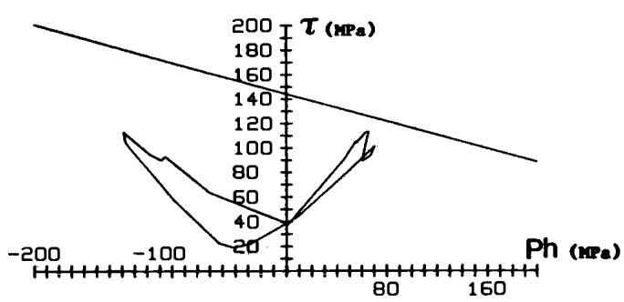

B  
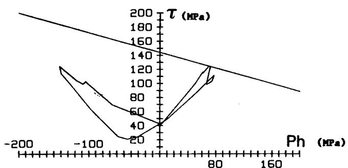  
FIG. 8—Application of the proposed method to predict the fatigue resistance of the ball bearing in $F i g .$ $2 \colon ( \mathbf { A } )$ no crack initiation predicted and found; (B) crack initiation observed.

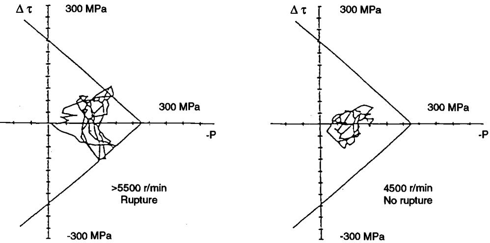  
FIG. 9—Prediction of fatigue behavior of a crankshaft.

condition $d > 1$ are associated with defined facets and so the criterion also gives the direction of the crack initiation.

This method of fatigue computation is widely used in France to predict the fatigue behavior of mechanical structures. For instance, prediction on an integrated ball bearing is recalled in Fig. 8. Prediction on fatigue behavior of a crankshaft by a similar procedure is represented in Fig. 9.

Another alternative is to use the octahedral shear $J _ { 2 } ( \sigma ( t ) )$ instead of τ(t). This method, however, does not give the critical facets.

Alternatively Papadopoulos recently proposed another method based on the macro-micro approach and an original interpretation of fatigue limit [5].

Following Papadopoulos, the fatigue resistance corresponds to stabilization of microscopic strain, i.e.:

1. Elastic shakedown of grains corresponds to endurance.

2. Plastic shakedown will induce damage and fracture because of subsequent cyclic softening.

3. The shakedown analysis as presented (in particular in Eq 10) is used to derive $z ^ { * }$ and $k ^ { * }$

Then Papadopoulos assumes that the grains will shakedown elastically $\mathrm { i f } k ^ { \ast }$ is less than some limit value $K ^ { \mathrm { { i i m } } }$ , which depends of the local hydrostatic tension. For instance

$$
k ^ { \mathrm { I i m } } = \beta - { \boldsymbol { \alpha } } \cdot { \boldsymbol { p } }\tag{16}
$$

The fatigue criterion will be

$$
k ^ { * } + \alpha \cdot p < \beta\tag{17}
$$

α and $\beta$ are two constants which can be identified by two different tests.

By this method, it is not necessary to again describe the whole local loading path once $k ^ { * }$ is determined. In many cases, the obtained predictions are very similar to the first methods.

## Final Remarks

From a metallurgical point of view, cracks initiations have in general many possible origins depending on the nature of the material. For instance, in an homogeneous metal free of residual stresses, cracks initiation in many experiments is observed to occur in persistent slip bands near surface grains. In many other cases they occur near metallurgical singularities like hard inclusions. So it seems difficult to give simple fatigue criteria based on “plastic" analysis. However, in all cases, local plastic deformations are observed, so that the associated microscopic residual stress can modify in an important way the stress pattern in the critical representative volume V (see, for instance, Fig. 5). The proposed methods correspond to attempts to take into account a mean value of the microscopic residual stresses to gain a better description of the local stress state. Thus volume V corresponds more to a “mean" grain than to a precise misoriented grain.

As crystal plasticity is considered, the yield function should be based on resolved shear stress rather than on the von Mises function. However, in relation to the “mean" grain, it is natural to use a mean resolved shear stress, which is known to be equal to J2.

## References

[1] Dang-Van, K., Griveau, B., and Message, O., “On a New Multiaxial Fatigue Limit Criterion: Theory and Application," Biaxial and Multiaxial Fatigue, EGF Publication 3, M. W. Brown and K. Miller, Eds., pp. 479–496.

[2] Mandel, J., Zarka, J., and Halphen, B., “Adaptation d’une structure à écrouissage cinématique," Mech. Res. Comm., Vol. 4, 1977, pp. 309–314.

[3] Deperrois, A. and Dang-Van, K., “Inclusions de Surface et Singularité Epine," Comptes Rendus Academie des Sciences; Paris; tome 311, Série I1, 1990, pp. 1285–1290.

[4] Brown, M. W. and Miller, K. J., “A Theory for Fatigue Failure under Multiaxial Stress-Strain Conditions," Proceedings of the Institution of Mechanical Engineers, Vol. 187, 1973, pp. 65–73.

[5] Papadopoulos, Y., “Fatigue Polycyclique des Métaux, une Nouvelle Approche,"Ph.D. thesis, Ecole Nationale des Ponts et Chaussèes, Paris, 1987.
