# The behaviour of transverse roughness in EHL contacts

J A Greenwood, MA, PhD and G E Morales-Espejel,\* MEng, PhD Department of Engineering, University of Cambridge

By assuming the contact geometry in elastohydrodynamic lubrication (EHL) to be that of an infinitely long contact with given nominal film thickness and mean pressure and considering the elastic displacements of the separate components of the initial roughness, it is possible to extend the Greenwood and Johnson analysis for sinusoidal pressure to any two-dimensional roughness. For typical EHL pressures the viscosity effects are negligible, so the Reynolds equation can be linearized and solved analytically; the solution provides a criterion to relate the amplitudes of the undeformed and deformed roughness to the wavelength, and shows that roughness with a short wavelength is likely to persist after deformation. The linearization of the Reynolds equation is extended to the transient case and it is found that the complete solution is made of two separate parts: the particular integral (steady state solution) and the complementary function (which depends on the entry of the partly deformed roughness into the Hertzian zone).

## 1 INTRODUCTION

Recent advances in computational techniques have enabled a number of authors to study the behaviour of various forms of surface roughness in an elastohydrodynamic lubrication (EHL) contact. It does not yet seem possible to give a simple explanation of the remarkable features of the three-dimensional solutions, but Greenwood and Johnson (1) showed that it was possible to explain most of the features found in the two-dimensional solutions for wavy surfaces when the wavy surface is stationary, not only qualitatively but even quantitatively. In this paper their analysis is justified and extended so that it may be applied to real surface roughnesses and to cases where both surfaces are moving.

In the case of pure sliding with the rough surface stationary, full EHL calculations by, for example, Goglia et al. (2), Kweh et al. (3) and Venner (4) have shown that both a single ridge and sinusoidal waviness can virtually disappear under these conditions, to be replaced by corresponding pressure fluctuations. Greenwood and Johnson (1) suggested replacing the finite parallel film of the ‘Hertzian'region of an EHL contact by an infinite, parallel channel of the same width and with a constant pressure ${ \pmb p _ { 0 } }$ equal to the maximum Hertzian pressure, in order to isolate the behaviour of the roughness from that of the complete contact. Instead of studying a sinusoidal roughness, they assumed sinusoidal pressure variations, and investigated the roughness necessary to produce these. Here it will be demonstrated that the response to a sinusoidal roughness can be deduced from this, and the method is extended to deal with any initial roughness. It is found that the effects of viscosity are consistently negligible, and this permits the problem to be linearized so that simple relations can be found between the amplitude of the roughness and that of the resulting pressure and film thickness variations; it transpires that the significant parameter distinguishing roughness components, which persist from those that disappear, is the ratio of the amplitude to the wavelength.

## 2 STEADY STATE ANALYSIS

The figures presented in references (2), (3) and (4) immediately suggest that the pressure ripples produced when a wavy surface passes through the high-pressure region of an EHL contact are much the same whether they occur near the ends or in the middle, and so perhaps would be unchanged if the high-pressure, parallel film thickness region were extended to become infinitely wide and contain an infinite number of waves. The mean pressure and mean film thickness are assumed to be unchanged (or, at least, to be known), so that we attempt to study the behaviour of the roughness inside the contact in isolation from the processes forming the lubricant film.

The advantage of replacing the finite Hertzian region by an infinitely long contact is the simplicity of the calculation of elastic deformation. The combined deformation of two elastic half-spaces due to a sinusoidal pressure:

$$
p = p _ { 0 } + p _ { 1 } \sin \left( { \frac { 2 \pi x } { \lambda } } \right)\tag{1}
$$

is simply

$$
v = { \frac { 2 \lambda p _ { 1 } } { \pi E ^ { \prime } } } \sin \left( { \frac { 2 \pi x } { \lambda } } \right)\tag{2}
$$

where $2 / E ^ { \prime } = ( 1 - \nu _ { 1 } ^ { 2 } ) / E _ { 1 } + ( 1 - \nu _ { 2 } ^ { 2 } ) / E _ { 2 }$ . In particular, to produce a lubricant channel of constant width when there is an initial sinusoidal roughness of amplitude $\pmb { z _ { 1 } }$ requires pressure ripples of amplitude

$$
p _ { 1 } = \frac { \pi E ^ { \prime } z _ { 1 } } { 2 \lambda }\tag{3}
$$

## 2.1 Real roughness

Since elastic deformation is linear, the above can readily be extended to arbitrary pressures and displacements by using Fourier analysis. The pressures are represented by a Fourier integral or, in practice, by a discrete Fourier transform (FFT) over a length L (very much larger than the width 2b of the real EHL high-pressure zone):

$$
p ( x ) = p _ { 0 } + \sum _ { n = 1 } ^ { N - 1 } p _ { n } \exp \biggl ( \frac { 2 \pi x n i } { L } \biggr )\tag{4}
$$

and the corresponding deflections are, from equation (3):

$$
v ( x ) = \frac { 2 L } { \pi E ^ { \prime } } \sum _ { n = 1 } ^ { N } \frac { p _ { n } } { n } \exp \left( \frac { 2 \pi x n i } { L } \right)\tag{5}
$$

where 2N points along the (large) length L are considered. Hence, an initial roughness z(x), also defined by a Fourier series, will give a film thickness

$$
h ( x ) = h ^ { \ast } + z ( x ) + v ( x )\tag{6}
$$

The pressures causing the deformation will still be assumed to be governed by the Reynolds equation, although when the slopes of the roughness are large the assumptions leading to the Reynolds equation are no longer valid, and the conclusions about the behaviour of real roughness may need some modification. The Reynolds equation for a compressible Newtonian lubricant is

$$
{ \frac { \mathrm { d } p } { \mathrm { d } x } } = 6 u _ { 1 } \eta { \frac { h - h ^ { * } ( \rho ^ { * } / \rho ) } { h ^ { 3 } } }\tag{7}
$$

The density is taken to vary with pressure according to the usual Dowson and Higginson equation:

$$
\frac { \rho } { \rho _ { 0 } } = \frac { 1 + \gamma p } { 1 + \beta p }\tag{8}
$$

with γ = 2.266 × 10-9 Pa−¹ and β = 1.683 × 10−9 Pa⁻¹.

The viscosity follows the Barus law:

$$
\eta = \eta _ { 0 } \exp ( \alpha p )\tag{9}
$$

The initial roughness z(x) may be a single sinusoidal term, but the analysis is equally applicable to any roughness of the form:

$$
z ( x ) = \sum _ { n = 1 } ^ { n _ { \mathrm { m a x } } } z _ { n } \cos \left( { \frac { 2 n \pi x } { \lambda } } + \varepsilon _ { n } \right)\tag{10}
$$

where $\varepsilon _ { n }$ are random phases $( 0 \leqslant \varepsilon _ { n } < 2 \pi ) .$ There is evidence [for example Thomas (5)] that typical engineering surfaces can be represented in this way with $z _ { n } = z _ { 1 } / n ,$ where $z _ { 1 }$ is the amplitude of the fundamental frequency. [J. J. Wu (personal communication) informs us that the spectral density of a worn surface with asymmetric amplitudes is of the same form, although presumably the phases are no longer random.] The r.m.s. value for the selected roughness σ is then

$$
\sigma ^ { 2 } = \frac { 1 } { 2 } \sum _ { n = 1 } ^ { n _ { \operatorname* { m a x } } } z _ { n } ^ { 2 }\tag{11}
$$

## 2.2 Iterative solution

In practice these equations are solved in reverse. Start with an initial guess h(x) = h\*, that is $v ( x ) = - z ( x ) ;$ then equations (1) and (2) give the pressures and hence the pressure gradient, while equation (8) gives the density. The Reynolds equation (7) then becomes simply a cubic in h with an explicit solution (though for stepby-step solution iteration is more convenient), and hence a new v(x) is obtained from equation (6). For higher values of n this scheme may be unstable, but Greenwood and Morales-Espejel (6) and Morales-Espejel (7) show how the convergence can be improved by modifying the sequence described.

## 2.3 Results

Firstly the present theory is applied to sinusoidal roughness cases, where comparison with other authors' results is easier to make. Greenwood and Johnson (1) compare the amplitudes of the pressure ripples with the results of Kweh et al. (3) for two different temperatures (50 and $8 0 ^ { \circ } \mathbf { C } )$ under isothermal conditions; here the results have been taken from the corresponding table in reference (1) and are compared with the results from the present theory in Table 1. The same table also shows a second comparison with the results obtained by Chang et al. (8). All further data of these, and of all other examples considered in the paper, are given in Table 2.

From these comparisons it can be seen that the calculated values agree well with reported results. Figure 1 shows the deformed and undeformed roughness together with the pressures calculated by the present theory by assuming the number of waves to be infinite, arbitrarily plotted over a length 2b representing the example given by Chang et al. (8). Both the pressures and the deformed shape appear to be sinusoidal (although they are not), which confirms the assumption made by Greenwood and Johnson (1).

An initial real-roughness surface can be generated by using equation (10) with $n _ { \mathrm { m a x } } = 1 0 0$ Applying the present scheme, the deformed roughness and pressure distribution are then found; they are displayed in Fig. 2a and b.

Figure 2a shows the scale of the deformation for this example; it can be seen that the low-frequency components of the roughness have been very much flattened while the high-frequency components still remain after deformation. This can be better observed from the Fourier coefficients of Fig. 2c where the amplitudes of the components of the deformed and undeformed shapes diverge more for low values of n.

Table 1 Comparison of amplitudes of pressure and shape ripples by the present theory with Kweh et al. (3), Greenwood and Johnson (1) and Chang et al. (8)
|  | P1 | $\pmb { h _ { 1 } }$ |
| --- | --- | --- |
| Reference | GPa | μm |
| Kweh et al. |  |  |
| 50℃ 80℃ | 0.330 | 0.0400 |
|  | 0.360 | 0.01–0.02 |
| Greenwood and Johnson |  |  |
| 50℃ | 0.379 | 0.0371 |
| 80℃ | 0.408 | 0.0210 |
| Present theory |  |  |
| 50℃ | 0.388 | 0.0331 |
| 80°℃ | 0.413 | 0.0185 |
| Chang et al. | 0.660 | 0.025 |
| Present theory | 0.623 | 0.021 |

The results from Kweh et al. and Chang et al. are estimates from graphs.

Table 2 Complete input data for all the examples
| Example | $\underline { { \pmb { p _ { 0 } } } }$ $\mathbf { G P a }$ | $\pmb { h } ^ { * }$ μm | a $\overline { { G P a ^ { - 1 } } }$ | $\frac { E ^ { \prime } } { G P a }$ | $\frac { \bar { u } } { m s ^ { - 1 } }$ | no $\frac { \cdots } { \mathbb { P } a \ s }$ | R | $\underline { { \pmb { b } } }$ | ${ \underline { { { z _ { \mathrm { m a x } } } } } } \ddagger$ | $1 8$ |
| --- | --- | --- | --- | --- | --- | --- | --- | --- | --- | --- |
|  |  |  |  |  |  |  | m | mm | μm | mm |
| Kweh et al. (3) 50℃ | 1.0 | 1.341 | 14.8 | 227 | 25 | 0.0179 | 0.019 | 0.6 | 0.25 | $2 \lambda = 0 . 4$ |
| ${ \bf 8 0 ^ { \circ } C }$ | 1.0 | 0.698 | 12.3 | 227 | 25 | 0.0075 | 0.019 | 0.6 | 0.25 | $2 \lambda = 0 . 4$ |
| Chang et al. (8) | 1.1 | 0.600 | 15.9 | 220 | 4 | 0.04 | 0.012 | 0.24 | 0.15 | $2 \lambda = 0 . 1 4 3$ |
| Venner (4) |  |  |  |  |  |  |  |  |  |  |
| $P _ { 0 } = 2 2$ | 1.0 | (0.387)† | 22 | 226 | 0.97 | 0.04 | 0.028 | 0.5 | 0.5 | $2 \lambda = 0 . 2 5$ |
| $\bar { P _ { 0 } } = 4 4$ | 2.0 | (0.266) | 22 | 226 | 0.97 | 0.04 | 0.014 | 0.5 | 0.5 | $2 \lambda = 0 . 2 5$ |
| $\check { P _ { 0 } } = 6 6$ Venner and Lubrecht (9) | 3.0 2.0 | (0.218) 0.300 | 22 22 | 226 | 0.97 0.745 | 0.04 0.04 | 0.094 0.014 | 0.5 | 0.5 0.5 | $2 \lambda = 0 . 2 5$ |
| Real-roughness | 1.0 | 0.304 | 9.6 | 220 227 | 25 | 0.0024 |  | 0.5 | 0.062 | ${ \pmb { \mathscr { S } } } { \lambda } = { \pmb { \mathbb { 1 . 2 5 } } }$ 0.7125 |

† The values in parentheses () represent h\* approximated by $h ^ { \ast } \approx h _ { \mathrm { m i n } } / 0 . 8 7 .$  
$\$ 2$ for sinusoidal roughness is equivalent to the amplitude.  
§ L represents the length of the analysed interval in the infinitely long contact.

## 2.4 Deformation criterion

The purpose of this work is not to derive an alternative, approximate, numerical scheme for analysing surface roughness in $\mathbf { E H L } ,$ but to provide a simple theory within which the full numerical results may be readily understood. Therefore it is useful to enquire to what extent this simple model can be further simplified.

Greenwood and Johnson (1) found that the effects of viscosity in their solution were negligible. This is hardly surprising: typical values of ${ \pmb { \alpha } } { \pmb { p } } _ { \mathbf { 0 } }$ will exceed 10, so that a typical film thickness of 1 μm and a pressure ripple of amplitude 0.5 GPa and wavelength 0.1 mm will give

$$
\frac { h ^ { 3 } } { 6 \eta u _ { 1 } } \frac { \mathrm { d } p } { \mathrm { d } x } < 3 \times 1 0 ^ { - 8 }
$$

so that $h - h ^ { \ast } \rho ^ { \ast } / \rho$ is only of this order while h is of order $\mathbf { \delta } _ { \mathbf { 1 0 } ^ { - 6 } }$ Shorter wavelengths have smaller amplitude and tend to generate pressure ripples of smaller amplitude so that dp/dx is no larger; higher mean pressures make the case overwhelming. Accordingly, as suggested by Venner (4), the Reynolds equation reduces to the simple

$$
\rho h = \rho ^ { * } h ^ { * }\tag{12}
$$

Here $\rho ^ { * } h ^ { * }$ is merely a convenient expression for the mass flowrate; now that the viscosity term has been dropped, there is no longer the requirement that $\pmb { \rho } ^ { \ast }$ and $\pmb { h } ^ { * }$ are the values at the pressure maximum. They should, of course, be values of film thickness and density occurring simultaneously, but it may be shown that, to the accuracy of this linearized theory, $\pmb { \rho } ^ { * }$ may be taken as the density at the mean pressure $\rho ( p _ { 0 } )$ and $\hbar ^ { * }$ as the mean film thickness h.

Thus, the density ratio $\pmb { \rho } ( \pmb { p } _ { 0 } ) / \pmb { \rho } ( \pmb { p } )$ can be written as

$$
\frac { 1 + \beta _ { 1 } ( p - p _ { 0 } ) } { 1 + \gamma _ { 1 } ( p - p _ { 0 } ) } \approx 1 - ( \gamma _ { 1 } - \beta _ { 1 } ) ( p - p _ { 0 } )\tag{13}
$$

where $\beta _ { 1 } = \beta / ( 1 + \beta p _ { 0 } )$ and $\gamma _ { 1 } = \gamma / ( 1 + \gamma p _ { 0 } ) ,$ while the film thickness ratio H is

$$
H = \frac { h } { \bar { h } } = 1 + Z + V
$$

where $z$ is the dimensionless roughness $z / \bar { h }$ and P the dimensionless pressure αp. Then equation (12) gives

$$
Z + V = - ( \gamma _ { 1 } - \beta _ { 1 } ) ( p - p _ { 0 } ) = - C ( P - P _ { 0 } )\tag{14}
$$

with $C = ( \gamma _ { 1 } - \beta _ { 1 } ) / \alpha .$ If the pressure is sinusoidal so that the deformation is given by equation (2), then

$$
\frac { P _ { 1 } } { Z _ { 1 } } { = } \frac { - 1 } { C + A }\tag{15}
$$

where $\mathbf { Z } = \mathbf { Z _ { 1 } }$ cos(2πx/λ), ${ \pmb P } = { \pmb P } _ { 0 } + { \pmb P } _ { 1 }$ cos(2πx/λ) and $\pmb { A } = 2 \lambda / ( \pi \alpha \bar { h } \bar { E } ^ { \bar { \prime } } )$ . The film-thickness variations become

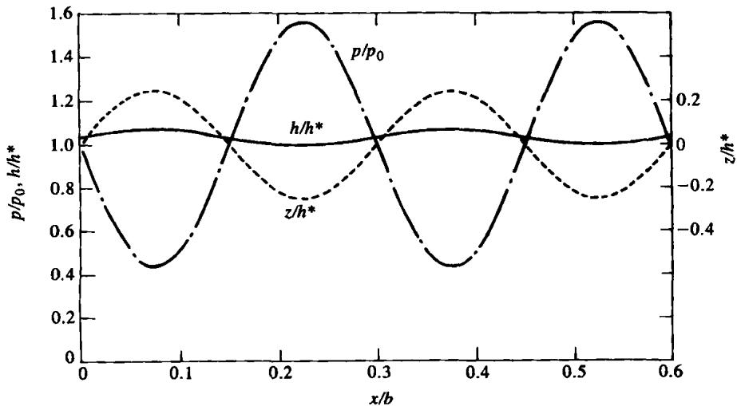  
Fig. 1 Shapes and pressure distributions by the present theory for the example of Chang et al. (8)

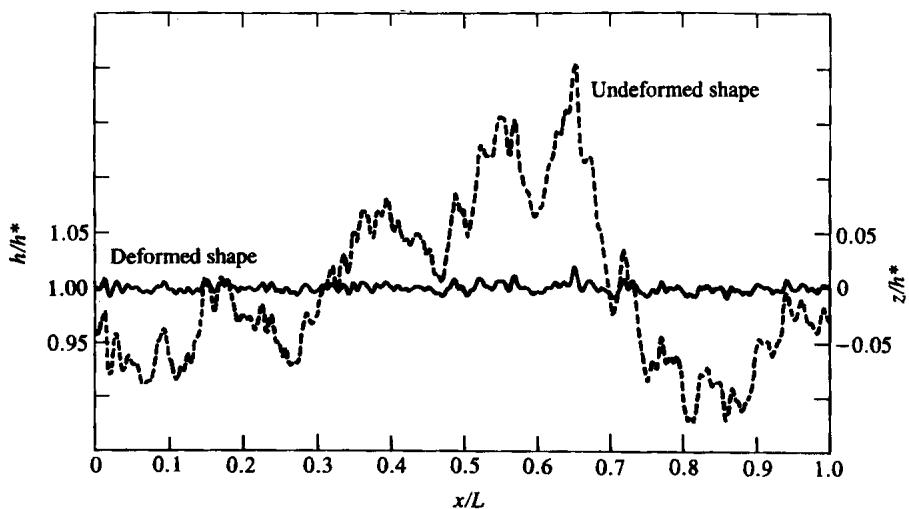  
(a) Undeformed and deformed roughness

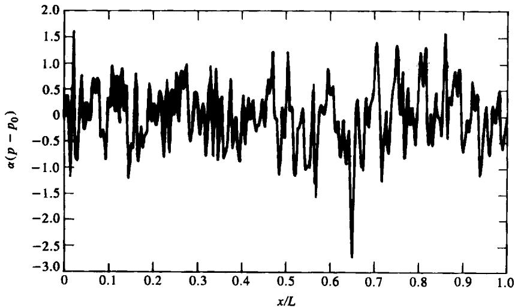  
(b) Pressure distribution

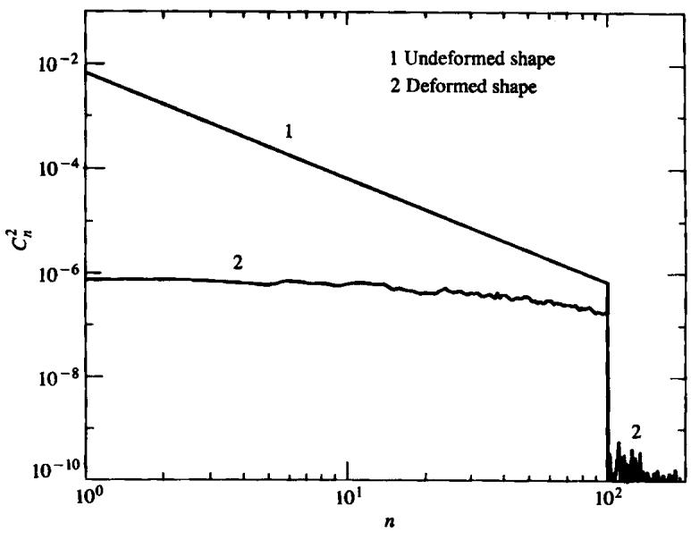  
(c) Square Fourier coefficients  
Fig. 2 Real-roughness example  
Part J: Journal of Engineering Tribology

(b) Shape-arplitude ratio

$\pmb { H } = 1 + \pmb { H } _ { 1 }$ cos(2πx/λ), where

$$
\frac { H _ { 1 } } { Z _ { 1 } } = \frac { C } { C + A }\tag{16}
$$

Equation (16) shows that whether the initial roughness persists or is ironed out depends on the ratio $C / A$

The value of the compressibility term C depends on the mean pressure, falling by a factor 5 as the pressure is raised from 1 to 3 GPa, but the main variable is $\pmb { A } ,$ which varies widely depending on the ratio $\lambda / \tilde { h } .$ When the wavelength $\lambda$ of the roughness decreases, A decreases and therefore ${ \pmb { H } } _ { 1 }$ increases, and from equation (15) so does the amplitude of the pressure ripples. This is clearly observed in the following numerical example where the ratio $\lambda / \bar { h }$ has been varied for three levels of mean pressure $( P _ { 0 } = 2 2 , P _ { 0 } = 4 4$ and $P _ { 0 } = 6 6 )$ and the corresponding amplitudes for pressure and deformed shape ripples have been plotted in Fig. 3; the results of Venner (4) are also shown in Fig. 3a. A comparison between the present numerical and analytical solutions for $P _ { 1 } ,$ for the same example, is shown in Fig. 4, again for the same three values of $\pmb { P _ { 0 } } .$ There is good agreement, both between the full EHL solution and the numerical solution described here, and between the numerical solution described here and the analytical solution [that is equations (15) and (16)]. Note that the horizontal lines on Fig. 4 represent the limiting values of $\pmb { \alpha p _ { 1 } }$ for which the minimum pressure is zero; beyond this point cavitation will occur and the analysis fails. The effects of viscosity would be expected to become important before this point is reached, but there are no signs of any discrepancies between the present numerical solution, which includes the viscosity term, and the analytical one, which does not. It appears that, surprisingly, the analytical solution can be used to predict accurately the roughness amplitude at which the minimum pressure falls to zero.

In real-roughness surfaces when z(x) is given by equation (10), the dependence of $\pmb { P _ { 1 } }$ and $\pmb { H _ { 1 } }$ upon $\lambda / \tilde { h }$ is still governed by equation (15) and (16), which now hold independently for each of the coefficients provided that the basic wavelength λ is replaced by the wavelength $\lambda / n$ of the nth component. Thus, A becomes $A _ { n } = A / n$

(a) Pressure ripples  
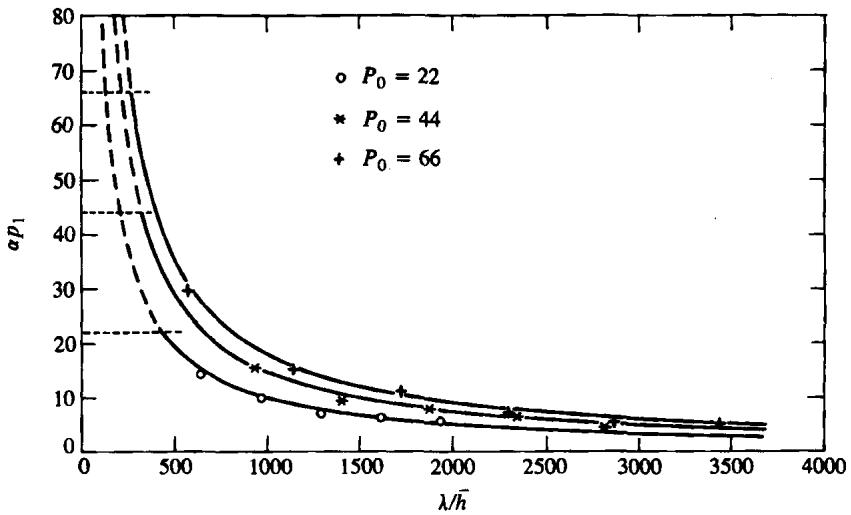

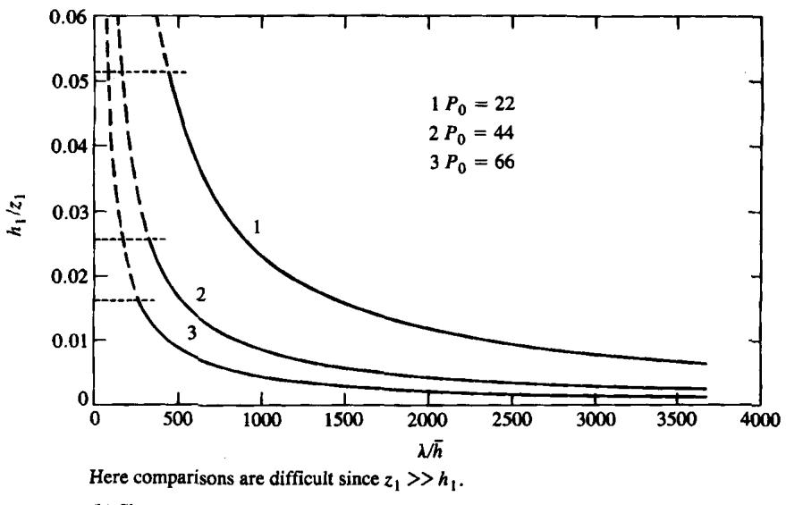  
Fig. 3 Variation of amplitudes of the pressure and shape ripples as a function of λ/h. Points from Venner's numerical solutions; curves from analytical solution

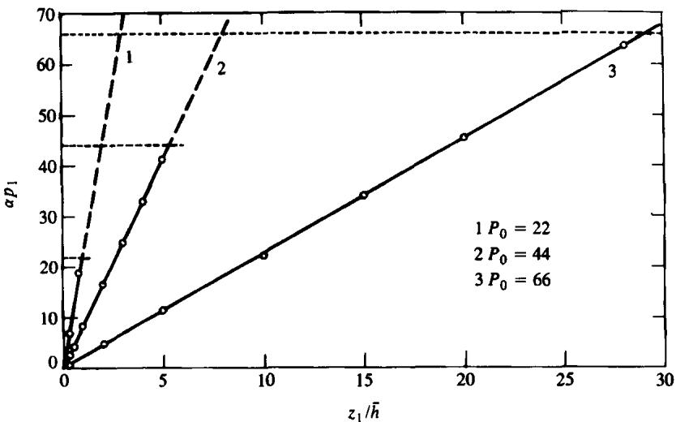  
Fig. 4 Amplitude of pressure ripples comparing the present numerical solution (points) with the analytical solution from equation (15) (lines)

and the equations become

$$
{ \frac { P _ { n } } { Z _ { n } } } = { \frac { - 1 } { C + A / n } } , \frac { H _ { n } } { Z _ { n } } = { \frac { C } { C + A / n } }\tag{17}
$$

The effect of varying the wave number on the attenuation of the roughness is shown in Fig. 5, which indicates how the results of Chang et al. of Table 2 would be modified if the wavelength were changed by a factor n. However, since according to the linear theory the attenuation of the individual roughness components is given by equation (17), Fig. 5 is equally applicable to a surface with real roughness, and its relation to the results shown in Fig. 2c is clear.

## 3 TRANSIENT STATE ANALYSIS

The physical understanding of the kinematic behaviour of surface irregularities in EHL is just beginning to emerge. Venner (4) states that in heavily loaded transient EHL contacts, since the viscosity is very high, the solution of the Reynolds equation reduces to $\begin{array} { r } { \pmb { h } \approx \pmb { h } ( \pmb { x } - \tilde { \pmb { u } } t ) , } \end{array}$ so consequently the film thickness irregularities caused by surface features, that is indentation, bumps, waviness, etc., travel with the average velocity of the lubricant ū regardless of the velocity that the surface feature itself moves.

This has surprising consequences for rolling-sliding situations. For example, consider the case where the two surfaces are moving with different velocities and a dent or a bump is located on the surface moving with the lower velocity. In the Hertzian zone of the contact, since $\pmb { \imath } \approx \pmb { h } ( \pmb { x } - \bar { \pmb { u } } t ) ,$ the changes in the film thickness induced by the feature upon its entrance to the Hertzian zone will be propagated through the contact with the average velocity. This implies that the effects are propagated faster than the feature itself travels through the contact. However, since Venner also concludes that the pressure disturbances travel with the velocity of the feature which generates them, the effect is that the pressure disturbances become completely detached from the film thickness disturbances, so that pressure and film thickness appear to be independent of each other! In fact, it will be shown below that this is not the whole truth: the laws of cause and effect do still operate.

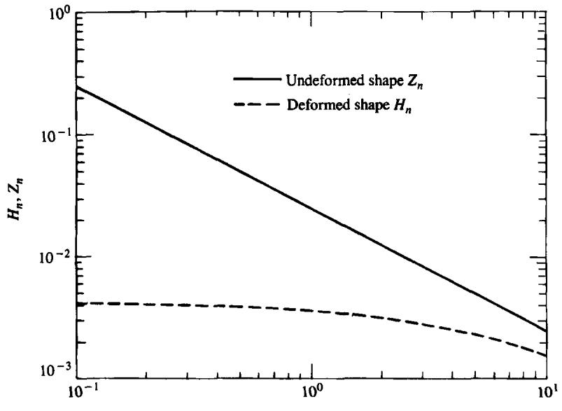  
Fig. 5 Reai-roughness variation of shape-amplitude ratio with the wave number  
Part J: Journal of Engineering Tribology  
© IMechE 1994

## 3.1 The physical phenomenon

Moving roughness in EHL contacts produces modifications in the film thickness and pressures that it is important to understand in order to predict the behaviour. Here, the inlet of the contact plays a major role in the modulation of the amplitude and wavelength of the final shape.

Consider an EHL contact with the upper rough surface moving with velocity ${ \pmb u } _ { 2 }$ and the lower smooth surface moving with velocity ${ \pmb u } _ { 1 } ,$ as shown in Fig. 6. In order to deform the original roughness a pressure distribution has to build up, just as in the steady state situation, and this pressure will travel with the velocity of the original roughness ${ \pmb u } _ { \pmb { 2 } }$ and will modify the film thickness profile which is also travelling with velocity ${ \pmb u } _ { 2 }$ (this is a moving steady state situation). However, the roughness at the inlet of the contact is much less deformed than downstream (because of the lower pressures) and every time that a roughness ripple enters into the contact it will produce a variation in the film thickness at that point, affecting the lubricant flow and generating a film thickness disturbance which will be transported downstream with the average velocity of the lubricant ū (according to the arguments of Venner). Such film thickness disturbances will necessarily generate corresponding pressure disturbances, also travelling with ū. Finally, the pressure and film disturbances will be added to the moving steady state pressures and deformed shape (see Fig. 6). Therefore, it can be stated that the transient solution is made of two separate parts: the steady state solution (particular integral) and a complementary function due to the inlet modulation of film and pressure.

In Fig. 6 the moving steady state solution associates small film thickness ripples with large pressure ripples, while, apparently in contradiction, the inlet disturbances associate large film thickness ripples with small pressure ripples. The large pressure ripples do indeed produce large deformations which largely cancel the original roughness, leaving only the small difference to be seen as a film thickness variation. In contrast, the small pressure ripples of the complementary function produce small deformations, but since there is no corresponding roughness, these are seen in their entirety as film thickness variations. For these cases the transient solution will appear to the eye as having the pressures from the steady state solution (travelling with $\pmb { u } _ { 2 } )$ and the film thickness corresponding to the inlet disturbances (travelling with ū). The situation is demonstrated in literature results [for example Venner (4), Venner and Lubrecht (9), Chang et al. (10)]; however, in cases where the initial roughness is less deformed by the steady state pressures, so that the amplitude of shape is of the same order as the inlet disturbances, the results will be different.

## 3.2 Mathematical model

The one-dimensional transient Reynolds equation for compressible Newtonian fluids reads

$$
\frac { \partial } { \partial x } \left( \frac { \rho h ^ { 3 } } { 1 2 \eta } \frac { \partial p } { \partial x } \right) = \bar { u } \frac { \partial ( \rho h ) } { \partial x } + \frac { \partial ( \rho h ) } { \partial t }\tag{18}
$$

When rough surfaces are in movement, the film thickness h(x, t) is given by the sum of the mean film thickness $\bar { h } ,$ the combined elastic displacements v(x, t) (which vary with the pressures) and the moving initial roughness of the surfaces $z _ { 1 } ( x , t )$ and $z _ { 2 } ( x , t )$

$$
h ( x , t ) = \bar { h } + v ( x , t ) + z _ { 1 } ( x - u _ { 1 } t ) + z _ { 2 } ( x - u _ { 2 } t )
$$

Consider first the case where the lower surface is smooth $( z _ { 1 } = 0$ and $z _ { 2 } = z ) { \mathrm { ; } }$

$$
h ( x , \ t ) = \bar { h } + v ( x , t ) + z ( x - u _ { 2 } t )\tag{19}
$$

Is there a solution which moves at the speed of the roughness, that is at the speed of the upper surface?

Assume that $\begin{array} { r } { p = p ( { \boldsymbol x } - { \boldsymbol u } _ { 2 } t ) ; } \end{array}$ then since viscosity, density and displacements all depend on pressure, they too are functions of $( x - u _ { 2 } t )$ . Introducing a moving x coordinate $\begin{array} { r } { \mathbf { x } ^ { \prime } = \mathbf { x } - u _ { 2 } t , } \end{array}$ equation (18) then becomes

$$
\begin{array} { c } { \displaystyle \frac { \mathrm { d } } { \mathrm { d } x ^ { \prime } } \left( \frac { \rho h ^ { 3 } } { 1 2 \eta } \frac { \mathrm { d } p } { \mathrm { d } x ^ { \prime } } \right) = \frac { u _ { 1 } + u _ { 2 } } { 2 } \frac { \mathrm { d } ( \rho h ) } { \mathrm { d } x ^ { \prime } } - u _ { 2 } \frac { \mathrm { d } ( \rho h ) } { \mathrm { d } x ^ { \prime } } } \\ { \displaystyle = \frac { u _ { 1 } - u _ { 2 } } { 2 } \frac { \mathrm { d } ( \rho h ) } { \mathrm { d } x ^ { \prime } } } \end{array}
$$

and integrating gives

$$
{ \frac { \mathrm { d } p } { \mathrm { d } x ^ { \prime } } } = 6 \eta ( u _ { 1 } - u _ { 2 } ) { \frac { h - h ^ { * } ( \rho ^ { * } / \rho ) } { h ^ { 3 } } }\tag{20}
$$

which is exactly the standard steady state equation (7) with ${ \pmb u } _ { 1 }$ replaced by ${ \pmb u } _ { 1 } - { \pmb u } _ { 2 }$ . Noting that previously the velocity ${ \pmb u } _ { 2 }$ of the rough surface was zero, this is an obvious generalization; the steady state solution is still valid, but depends on the sliding velocity. However, it has already been established that the dependence on ηu is barely detectable, so this result is not significant. The important result is that the conclusions about relative amplitudes of pressures and film thickness [equations (15), (16) and (17)] still hold in the transient case $f o r$ the particular integral; however, this is only a part of the complete solution.

© IMechE 1994  
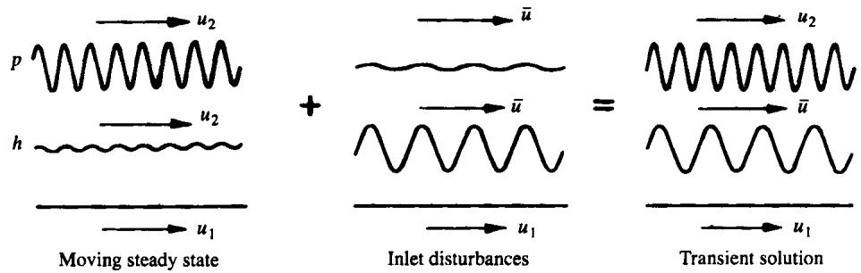  
Fig. 6 Final transient pressures and film thickness

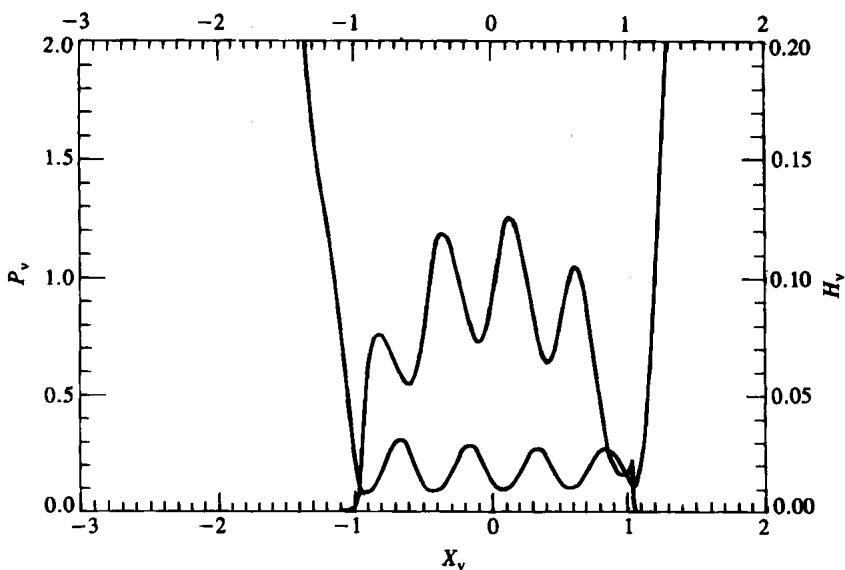  
(a) Venner and Lubrecht results for ${ \pmb u } _ { 1 } = { \pmb u } _ { 2 }$

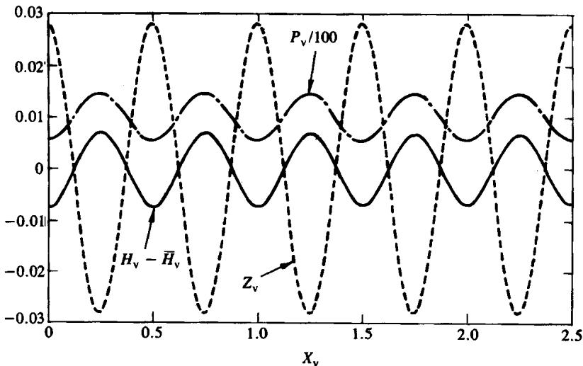  
(b) Present solution for $\pmb { u } _ { 1 } = \pmb { u } _ { 2 }$  
Fig. 7 Transient deformed shape and pressure distributions for pure rolling

Equation (18) is not linear, so its solution cannot be found by adding together a particular integral and a complementary function. However, having found that the linearized equation gives an excellent approximation for the particular integral it may also be used in the transient solution. Thus, first drop the viscosity term in equation (18) to give

$$
\hat { u } \frac { \partial ( \rho h ) } { \partial x } + \frac { \partial ( \rho h ) } { \partial t } = 0\tag{21}
$$

Then linearizing the density gives, for the oil flow $\rho h ,$

$$
r = \frac { \rho h } { \bar { \rho } \bar { h } } \approx 1 + \frac { z } { \bar { h } } + \frac { v } { \bar { h } } + ( \gamma _ { 1 } - \beta _ { 1 } ) ( p - p _ { 0 } )
$$

If the pressure is sinusoidal with wavelength λ then $V = { \cal A } ( \dot { \Delta } P )$ where again $A = 2 \lambda / ( \pi \alpha \bar { h } E ^ { \prime } )$ so that

$$
r = 1 + Z + ( A + C ) \Delta P\tag{22}
$$

Part J: Journal of Engineering Tribology

where $\pmb { Z } = z / \bar { h } , V = v / \bar { h }$ and $\Delta P = \alpha ( p - p _ { 0 } )$ as before.

Equation (22) gives the steady state result $r = 1 ,$ $Z = { \bf \bar { \sigma } } - ( A + C ) \Delta P ,$ which is the particular integral already found, giving the direct response to the roughness $z ( x - u _ { 2 } t )$ . The complementary function satisfies

$$
\bar { \pmb { u } } \frac { \partial \pmb { r } } { \partial \pmb { x } } + \frac { \partial \pmb { r } } { \partial \pmb { t } } = \pmb { 0 }\tag{23}
$$

and the solution is simply

$$
\begin{array} { r } { r = r _ { 2 } \sin \Biggl \{ \frac { 2 \pi } { \lambda ^ { \prime } } \left( x - \bar { u } t \right) \Biggr \} , } \\ { \Delta P _ { 2 } = P _ { 2 } \sin \Biggl \{ \frac { 2 \pi } { \lambda ^ { \prime } } \left( x - \bar { u } t \right) \Biggr \} } \end{array}
$$

where $\lambda ^ { \prime }$ is to be determined and

$$
P _ { 2 } = { \frac { r _ { 2 } } { A + C } }\tag{24}
$$

What determines the amplitudes $\boldsymbol { P } _ { 2 }$ and $\boldsymbol { r } _ { 2 } \boldsymbol { ? }$ In the full solution in which the inlet is considered, the film

©IMechE 1994

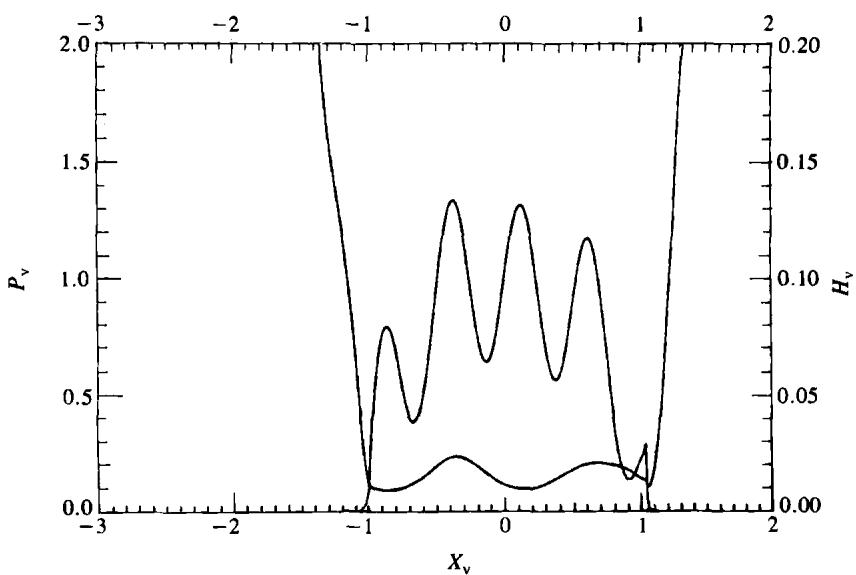  
(a) Venner and Lubrecht results for $u _ { 1 } = 3 u _ { 2 }$

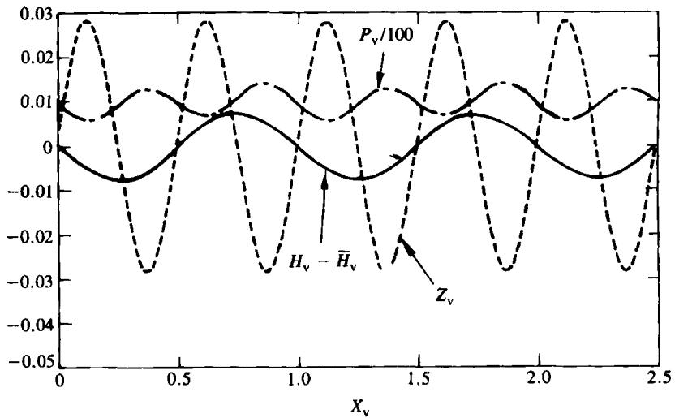  
(b) Present solution for $u _ { 1 } = 3 u _ { 2 }$  
Fig. 8 Transient deformed shape and pressure distributions for the case $u _ { 1 } = 3 u _ { 2 }$ (smooth surface faster)

thickness variation at the end of the inlet will be determined from the inlet solution, and there is effectively a sinusoidal variation of known amplitude and frequency. Equally, the oil flow at entry to the high-pressure region will fluctuate with the frequency at which the original roughness variations arrive there, because in the inlet the roughness will be only partially deformed. Thus, a roughness $z = z _ { 1 } \cos \{ 2 \pi ( x - u _ { 2 } t ) / \lambda \}$ will provide a boundary condition to r:

$$
r ( 0 , t ) = 1 + r _ { 2 } \cos \biggl ( \frac { 2 \pi u _ { 2 } t } { \lambda } \biggr )\tag{25}
$$

and the complementary function will have a wavelength $\lambda \bar { u } / u _ { 2 }$ not equal to that of the roughness.

Although the magnitude of $r _ { 2 }$ cannot be found without analysing the inlet, an approximation can be made by estimating the pumping' of the oil flow from the inlet. Assuming it to be half that due to the undeformed roughness gives fair agreement with Venner and Lubrecht (9).

Note that equations (15) and (24) are slightly misleading. The A in equation (15) is the value based on $\lambda ;$ in equation (24) there is a different value based on $\lambda ^ { \prime } =$ $\lambda \bar { u } / u _ { 2 }$ so $\dot { A } ^ { \prime } = 2 \lambda \bar { u } / ( \pi u _ { 2 }$ αE'h). Only for pure rolling are the two equal.

## 3.3 Results

The solutions given below are numerical solutions to the transient problem with linearized density and including a constant viscosity term corresponding to the Hertzian pressure. The corresponding Reynolds equation can then be written as

$$
\frac { \hat { \ b { o } } r } { \hat { \ b { o } } t } = \ b { B } \bigg ( \frac { \hat { \ b { o } } ^ { 2 } r } { \hat { \ b { o } } { \ b { x } } ^ { 2 } } - \frac { \hat { \ b { o } } ^ { 2 } Z } { \hat { \ b { o } } { \ b { x } } ^ { 2 } } \bigg ) - \bar { \ b { u } } \frac { \hat { \ b { o } } r } { \hat { \ b { o } } { \ b { x } } }\tag{26}
$$

where $B = \{ \bar { h } ^ { 2 } \mathrm { e } ^ { - \alpha p _ { 0 } } / ( 1 2 \alpha \eta _ { 0 } ) \} / ( A + C ) .$ Because of the very high viscosity the constant B is generally very small.

The method used is equivalent to that used by Venner and Lubrecht (9) in their full solution. The steady state solution is taken as an initial condition at t = 0 and its progressive replacement by the transient solution [subject to the boundary condition of equation (25)] is calculated [see Morales-Espejel (7) for details of the implicit finite difference scheme used here].

A numerical example taken from Venner and Lubrecht (9) is chosen, with the input data given in Table 2. To facilitate comparison, the same dimensionless variables as those of Venner and Lubrecht have been used, that is $T = \bar { u } t / b , P _ { \mathrm { v } } = p / p _ { 0 } , H _ { \mathrm { v } } = h R / b ^ { 2 } , Z _ { \mathrm { v } } = z R / b ^ { 2 }$ and $X = x / b .$ where 2b is the length of the equivalent dry Hertzian contact. Figures 7a and 8a show the shape and pressures obtained by the reference for two different slide-roll ratios $\pmb { s = 0 }$ and $s = - 1$ , where $\begin{array} { r } { s = ( { u } _ { 2 } - { u } _ { 1 } ) / \bar { u } . } \end{array}$

The corresponding results obtained by solving equation (26) numerically with $r _ { 2 } = 0 . 4 5$ in the excitation function (25) (chosen to match the shape amplitudes of the reference) are shown in Figs 7b and 8b. The agreement in wavelength with the reference is good. Figure 7b represents the case of pure rolling and it shows the transient film thickness and pressures; they have equal wavelength, just like Fig. 7a. Figure 8b shows the film thickness and pressure for the case of $s = - 1$ that is $\pmb { u } _ { 1 } = 3 \pmb { u } _ { 2 }$ (for a time when the initial shape has been fully replaced by the modified solution). Since in this case the dominant amplitude of shape comes from the inlet modulation and the velocity of the upper rough surface is only a third of the velocity of the smooth lower surface, it is clear that the wavelength of the final shape is twice that of the original roughness and pressure. The inlet modulation also modifies the final pressures, but because the amplitude is small, this modification is not noticeable to the eye.

Figure 9 shows the film thickness and pressure in the case of pure sliding, with the rough smooth surface stationary $( s = 2 )$ Since $u _ { 2 } = 2 \bar { u }$ , for this case the wavelength of the final film thickness has been halved compared with the wavelength of the original roughness. The steady state pressures have been only slightly modified.

So far the examples shown confirm the conclusions pointed out by Venner about the pressure moving with ${ \pmb u } _ { 2 }$ while the film thickness moves with ū. However, there are cases for which the steady state deformation of the roughness is not so great (that is non-Newtonian fluid, shorter λ or a smaller value of $\boldsymbol { r } _ { 2 } )$ ; for those cases the dominant amplitude in the final shape may no longer be the inlet excitation [see Morales-Espejel (7)].

## 4 DISCUSSION

Can viscosity really be ignored in a problem in hydrodynamic lubrication—for this is what has been done in Section 3? In the steady state analysis, there is direct evidence that the linearized analytical solution gives excellent agreement with the present numerical solution in which both the non-linear density and the viscosity are retained. Agreement where the pressure is high (film thickness minima) is hardly surprising. Where is the difference between $\eta ^ { - 1 } = \dot { 1 } \bar { 0 } ^ { - 8 } \mathbf { m } ^ { 2 } / \bar { \Nu } s$ and $\pmb { \eta } ^ { - 1 } = \pmb { 0 } ?$ According to Fig. 3, the pressure ripples have the correct amplitude even when the minimum pressure approaches zero and the viscosity term, locally, certainly cannot be ignored. It appears that no additional criterion restricting the amplitude of the roughness is needed.

The present method has not been used to give a complete solution for the transient case. However, noting that in Venner and Lubrecht's full solution (and in the linearized solution) the pressure is almost entirely that of the particular integral, the next approximation has been investigated in which the viscosity is allowed to vary in accordance with that pressure instead of taking the value at the mean pressure. The differences are negligible unless the minimum pressure is low $( \alpha p _ { \mathrm { m i n } } \leqslant 3 )$ when damping begins to appear.

## 4.1 Damping and numerical damping

The way in which damping appears is of some importance. For pure rolling the pressure (from the particular integral) and the film thickness (from the complementary function) propagate at the same speed ū so that the maximum film thickness always coincides with the minimum pressure. Here, and nowhere else, the film thickness changes (decreases) as it moves downstream. For other cases the propagation speeds differ, so that the film shape and pressure move in and out of phase. Damping now affects the whole film thickness wave, but intermittently. The film thickness changes (slightly) whenever it is in a low-pressure region, but propagates unchanged when the pressure is higher. It is well known that the numerical solution of the transport equation is prone to error; it is very easy to introduce numerical damping into the solution (and, indeed, may be recommended in order to avoid numerical instability). Numerical experiments with the viscosity term omitted show that numerical damping is readily introduced by inappropriate combinations of the space and time intervals ∆X and ∆T. Numerical damping appears to affect the whole wave, so can readily be identified in the case of pure rolling; in other cases the only indicator is whether damping is continuous or intermittent.

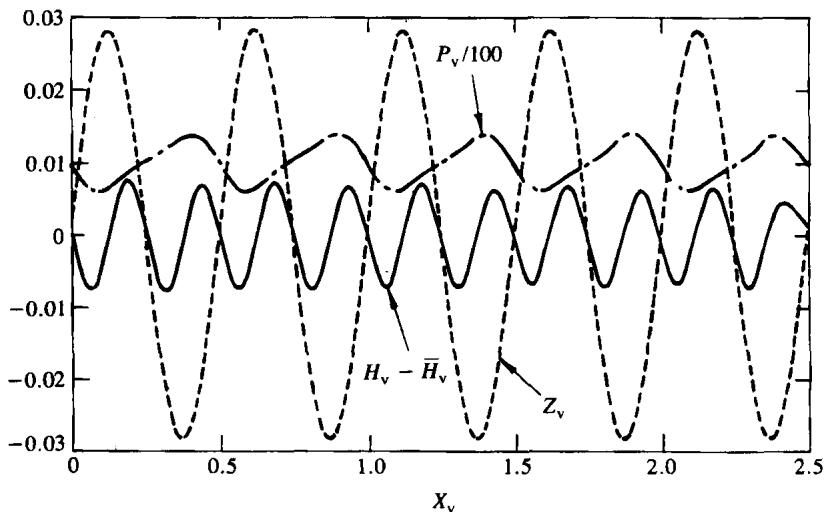  
Part J: Journal of Engineering Tribology  
Fig.9 Transient deformed shape and pressure distributions for the case $u _ { 1 } = 0$ (smooth surface stationary)  
© IMechE 1994

Venner (4) shows transient solutions of wavy surfaces where the film thickness appears to be gradually reduced in amplitude as it moves towards the exit of the contact. Venner and Lubrecht (personal communication) agree that those solutions are the result of numerical damping, and the solutions taken from reference (9) (Figs 7a, 8a and 9a) show no damping.

As a measure of the difficulties of avoiding numerical damping, consider again the example of Figs 7 and ${ \pmb 8 } .$ In order to obtain the shapes shown (no visible damping) it was necessary to use $\Delta X = 0 . 0 0 7 8$ and $\Delta T = { \bar { 0 . 0 0 5 } } .$ The case $s = 2$ (Fig. 9) needed $\Delta X = 0 . 0 0 3 9$ and $\Delta T = 6 . 2 5 \times 1 0 ^ { - 4 } .$ Figure 10 shows the damping appearing when larger values were used.

## 5 SUMMARY AND CONCLUSIONS

By considering an infinitely long contact with known mean pressure and film thickness, as done by Greenwood and Johnson (1), and considering the elastic deformation of the separate Fourier components of the pressures, a simple methodology for studying the behaviour of any transverse one-dimensional roughness in steady state EHL has been introduced. Then, linearizing the Reynolds equation for density and viscosity a simple criterion of persistence/flattening of the roughness highly dependent upon the ratio $\bar { \lambda / h }$ was obtained. This suggests that for large values of this ratio the roughness is ironed out, while for small values the roughness persists. Good agreement between the numerical and analytical (linearized) solutions as well as between the analytical and full EHL solutions has also been found. When the analysis is applied to a sinusoidal initial roughness the basic assumption of Greenwood and Johnson that sinusoidal pressures can be correctly regarded as induced by sinusoidal roughness has been confirmed.

A contribution to the understanding of the kinematic behaviour of transverse roughness in EHL has also been made. The observations made by several authors [for example Venner (4) and Chang et al. (8)] of film thickness variations travelling with speed ū while pressure variations move at ${ \pmb u } _ { 2 }$ have been clarified. It is now believed that the transient solution of the problem is made of two components: the particular integral and a complementary function. The first one represents the moving steady state solution, associated with pressure and shape travelling with the velocity of the rough surface. The second one represents the effect of the variation of flow due to the entering partially deformed roughness at the inlet, which produces variations of film thickness and pressure propagating downstream with the average velocity of the lubricant. The propagation occurs without change of slope or amplitude; it is believed that the gradual reduction of shape amplitude previously reported by some authors [for example Venner (4)] represents only numerical error rather than a real physical damping. Certainly the numerical solution of the transient Reynolds equation is highly affected by the choices of ∆T and ∆X.

This method can readily be extended to the case where both surfaces are wavy and both are moving. The solution then requires two particular integrals, and the complementary function will be excited by the combined pumping effect of the two moving roughnesses. Additional results reported by Lubrecht and Venner (11) for roughnesses of equal amplitude fit this pattern.

What then can be said about the transient behaviour of transverse asperities in EHL? In all cases shown here, it appears that the main pressure ripples are those of the steady state solution, with amplitudes given by equation (16) or, for general roughness, by the equivalent result using Fourier analysis. When the rough surface is stationary, the amplitude of the film thickness variations is given by the corresponding equation (15), but in other cases the main film thickness variations do not correspond to the main pressure variations. Their amplitude is given by $H _ { 2 } / Z _ { 1 } = 0 . 4 5 A _ { 2 } / ( A _ { 2 } + C )$ compared with

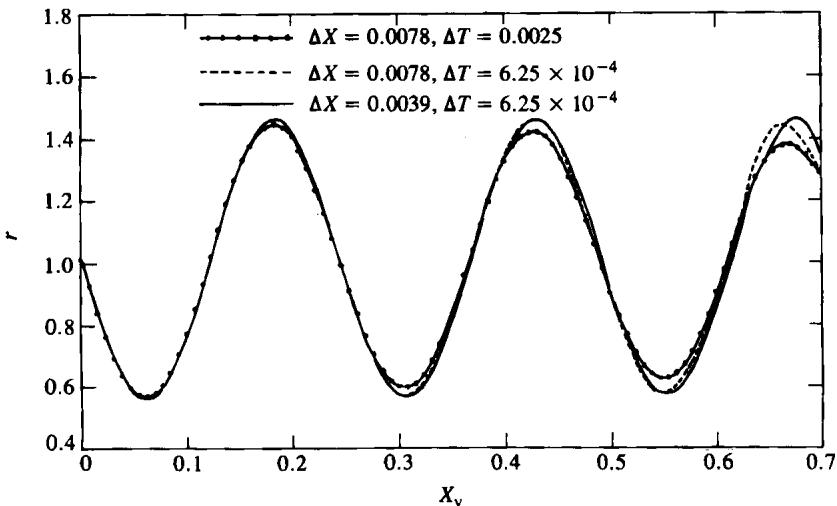  
Fig. 10 Numerical damping in r with different ∆X and $\pmb { \Delta T }$ for the case $\pmb { u } _ { 1 } = \pmb { 0 }$ (smooth surface stationary)

$H _ { 1 } / Z _ { 1 } = C / ( A + C )$ , where the numerical factor may well depend on λ/h although, judging by the agreement with Venner and Lubrecht's calculations, it appears not to vary greatly with the slide-roll ratio. However, the value of the factor is determined by the behaviour of the roughness in the inlet, and the present method is unable to settle this question.

## ACKNOWLEDGEMENTS

The authors are most grateful to Prof. K. L. Johnson for many stimulating discussions and in particular for steering them towards equation (20), and to Drs Venner and Lubrecht for allowing them to reproduce Figs 7a and 8a.

The work was supported by a grant from ITESM and CONACYT, Mexico.

## REFERENCES

1 Greenwood, J. A. and Johnson, K. L. The behaviour of transverse roughness in sliding elastohydrodynamic lubricated contacts. Wear, 1992, 153, 107.

2 Goglia, P. R., Cusano, C. and Conry, T. F. Effects of irregularities on the EHL of sliding line contacts, parts 1 and 2. Trans. ASME, J. Trib., 1984, 106, 104.

3 Kweh, C. C., Evans, H. P. and Snidle, R. W. Micro-EHL of an elliptical contact with transverse and three-dimensional sinusoidal roughness. Trans. ASME, J. Trib., 1980, 111, 577.

4 Venner, C. H. Multilevel solution of the EHL line and point contact problems. PhD thesis, University of Twente, Enschede, The Netherlands, 1991.

5 Thomas, T. R. Rough surfaces, 1982 (Longman, London).

6 Greenwood, J. A. and Morales-Espejel, G. E. The behaviour of real transverse roughness in a sliding EHL contact. Proceedings of Nineteenth Leeds-Lyon Symposium on Tribology, Leeds, 1992.

7 Morales-Espejel, G. E. Elastohydrodynamic lubrication of smooth and rough surfaces. PhD thesis, University of Cambridge, 1993.

8 Chang, L., Webster, M. N. and Jackson, A. On the pressure rippling and roughness deformation in elastohydrodynamic lubrication of rough surfaces. Trans. ASM E, J. Trib., 1993, 115, 439.

9 Venner, C. H. and Lubrecht, A. A. Transient analysis of surface features in an EHL line contact in the case of sliding. Submitted to Trans. ASME, J. Trib., 1993.

10 Chang, L., Cusano, C. and Conry, T. F. Effects of lubricant rheology and kinematic conditions on micro-elastohydrodynamic lubrication of rough surfaces. Trans. ASME, J. Trib., 1989, 111, 344

11 Lubrecht, A. A. and Venner, C. H. Aspects of two-sided surface waviness in an EHL line contact. Proceedings of Nineteenth Leeds-Lyon Conference on Tribology, Leeds, September 1992.
