# A Numerical Three-Dimensional Model for the Contact of Rough Surfaces by Variational Principle

## Xuefeng Tian

Bharat Bhushan Fellow ASME

Computer Microtribology and Contamination Laboratory, Department of Mechanical Engineering, The Ohio State University, Columbus, OH 43210-1107

A new numerical method for the analysis of elastic and elastic-plastic contacts of two rough surfaces has been developed. The method is based on a variational principle in which the real area of contact and contact pressure distribution are those which minimize the total complementary potential energy. The present variational approach guarantees the uniqueness of the solution of the contact problem and significantly reduces the computation time as compared with the conventional matrix inversión method, and thus, makes it feasible to solve 3-D contact problem with large number of contact points. The model is extended to elastic-perfectly plastic contacts. The model is used to predict contact statistics for computer generated surfaces.

## Introduction

Engineering surfaces are rough on a microscopic scale. When two nominally flat surfaces are in contact, generally a small fraction of the nominal contact area is in real contact. It is important to be able to predict the real area of contact which significantly affects the friction and wear of various mechanical sliding systems. The contacts can be either elastic or plastic. The real area of contact is primarily dependent upon the surface roughness, mechanical properties of the contacting surfaces, and the interfacial loading conditions. A contact model, which allows the use of measured or computer generated 3-D rough surface profiles, is of significant interest as the model can be used to predict the real area of contact of two given surfaces. This model can also be used to predict optimum roughness distribution for a minimum contact. This problem is of particular interest in the design of magnetic storage devices (Bhushan, 1990).

Modeling of the contact of rough surfaces is difficult and has been treated in many papers using a number of approaches over the past three decades. Difficulty in the development of a theoretical model is that the surface is a random process and may be anisotropic so that stochastic models must be used. The classical model for a combination of elastic and plastic contacts between rough surfaces is that of Greenwood and Williamson (1966), which assumes the surfaces are composed of hemispherically tipped asperities of uniform radius of curvature with their heights following a Gaussian distribution about a mean plane. (For some modifications of their model, see Whitehouse and Archard, 1970; Onions and Archard, 1973.) Bush et al. (1975, 1979) developed an elastic contact model that treated asperities as elliptical paraboloids with randomly oriented elliptical contact areas. Slight simplifications to these models have been presented in several papers (e.g., see Thomas, 1982; McCool, 1986). Although these models result in simple relationships, the assumptions are unrealistic.

Due to multiscale nature of surfaces, it is found that the surface roughness parameters depend strongly on the resolution of the measuring instrument or any other form of filter, hence are not unique for a surface. Therefore, predictions of the contact models based on conventional roughness parameters may not be unique to a pair of rough surfaces. Majumdar and Bhushan (1990) and Ganti and Bhushan (1995) have shown that the roughness of engineering surfaces can be characterized by fractal geometry. Majumdar and Bhushan (1991) and Bhushan and Majumdar (1992) developed a new fractal theory of elastic and plastic contact between two rough surfaces which uses fractal parameters for surface characterization.

Though statistical models discussed so far can predict important trends on the effect of surface properties on the real area of contact, their usefulness is very limited because of oversimplified assumptions about asperity geometry, the difficulty in the determination of statistical roughness parameters, and the neglecting of interactions between the adjacent asperities. With the advent of computer technology, a measured surface profile can be digitized and be used for computer simulation (Williamson, 1967/68; Bhushan and Cook, 1975; Sayles and Thomas, 1978). Digital maps of pairs of different surfaces can be brought together to simulate contact inside the computer and contours of contacts can be predicted. In computer simulations, the resulting contour maps can be analyzed statistically to give contact parameters for various interplanar separations of the rough surfaces. These analyses do not require assumptions of surface isotropy, asperity shape, and distribution of asperity heights, slopes and curvatures.

Several numerical techniques have been developed and used to numerically solve contact problems of rough surfaces. Finite element methods have been used to solve elastic/plastic contact problems from 2-D to axisymmetric 3-D problems with only a few asperities in contact (e.g., Akyuz and Merwin, 1968; Komvopoulos and Choi, 1992). For 3-D rough surface contact problems with many asperities, requirements of large number of mesh elements make the finite element approach unfeasible. One of the technique provides a deterministic solution to stresses and areas for the approach of two real rough surfaces (Francis, 1983; Lai and Cheng, 1985; Webster and Sayles, 1986; West and Sayles, 1987; Ren and Lee, 1993). This technique takes full account of the interaction of deformation from all contact points and predicts contact geometry of real surfaces under loading. It provides useful information on the number of contacts, their sizes and distributions, and the spacing between contacts. For contacts with moderate number of contact points, both elastic and elastic-plastic analyses of two rough surfaces can be carried out (Poon and Sayles, 1994). For large size of influence matrix (also referred to as flexibility or deformation matrix), Ren and Lee (1993) developed a moving grid method to reduce the size of the computer storage for storing the influence matrix. These authors have used an iterative process with a conventional matrix inversion technique to solve the contact problem for contact pressure and contact area. However, with an increase in contact points of rough surfaces, the so-called influence matrix will become very large, and possibly ill-posed. The large, ill-posed influence matrix will not only require a great deal of time for the conventional matrix inversion method to complete a large number of iteration cycles, but also, in some cases, cause serious nonconverging problems.

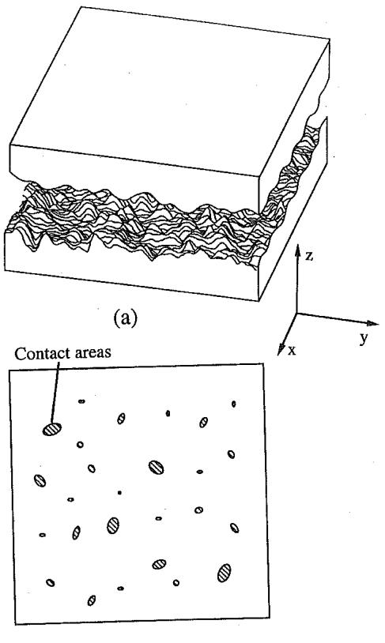  
(b)  
Fig. 1 Schematic of (a) two 3-D rough surfaces in contact, and (b) corresponding contact areas

Instead of using the conventional matrix inversion approach (see Appendix A), the present work utilizes the approach on the basis of variational principle. The use of variational principle leads to a standard quadratic mathematical programming problem after an infinite-to-finite dimension transformation. In the variational method, the real area of contact and contact pressure distributions are those which minimize the total complementary potential energy. The use of variational principle for elastic contact problems was first introduced in early 70s (Conry and Seireg, 1970; Kalker and van Randen, 1971), but the numerical difficulty of using a standard simplex-type algorithm to search for the minimum of the potential energy of contact with large number of contact points has kept the variational approach from general applications in engineering practice. The present variational approach uses a direct quadratic mathematical programming method which guarantees the uniqueness of the solution of rough surface contact problems. It is also able to significantly reduce computing time since it does not need an additional iteration process which has been required by the conventional matrix inversion technique, and makes it feasible to solve the 3- D rough surface contact problem with larger number of contact points. The results of this study are the subject of this paper. The model is developed for both elastic and elastic-perfectly plastic contacts.

## 2 The Variational Principle and Mathematical Formulation

2.1 The Physical Model and Variational Principle. This study develops the physical model of two rough surfaces in elastic contacts. As shown in Fig. 1, the real area of contact between the two bodies occurs at the tips of highest asperities. The contact area is a small fraction of the surface areas of the contacting bodies, therefore, we can assume that the, asperity contacts of each body occur on an elastic half-space. Another assumption used in this study is that the area of individual contact is much smaller than the radii of curvature of contacting asperities. This allows the use of the linear theory of elasticity as well as the approximation of plane surface around the real contact area.

Besides differential equations, a contact mechanics problem can also be governed by minimum potential energy theory. The boundary value problem of the differential equation for a mechanics system is equivalent to the problem of solving a minimum value of an integral equation, i.e., a variational problem. For the variational approach, two minimum energy principles, total elastic strain energy and total complementary potential energy, can be used for solving mechanics problems (Richards, 1977). The definition of strain energy and complementary energy is shown in Fig. 2(a). The minimum total complementary potential energy principle will used in this work since it is more convenient to work in terms of unknown contact pressure (Kalker and van Randen, 1971) for elastic contact problems.

For the minimum total complementary potential energy principle, variational theory states that of all possible equilibrium stress fields for a solid subjected to prescribed loadings and boundary displacements, the true one corresponding to a compatible strain field renders the total complementary energy stationary (Richards, 1977). For a rough surface contact, when the pressure distribution and the real area of contact are unknown, the problem then becomes to find the minimum value of an integral equation which minimizes the total complementary potential energy of the contacting system.

2.2 Mathematical Formulation. For an elastic deformed body, the total complementary potential energy is given by (Richards, 1977)

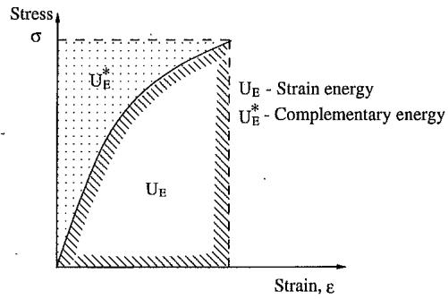  
(a)

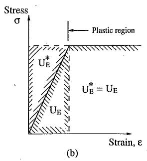  
Fig. 2 (a) Definition of strain energy and complementary energy, (b) relationship between elastic strain energy and internal complementary energy for a linear elastic or a linear elastic-perfectly plastic material

$$
V ^ { * } = \int _ { D } { U _ { 0 } ^ { * } ( \sigma _ { i j } ) d D } - \int _ { \Omega } { u _ { i } ^ { * } T _ { i } d \Omega }\tag{1}
$$

where $V ^ { * }$ is the total complementary potential energy, $U _ { 0 } ^ { * }$ is the internal complementary energy density, D is the domain of deformed body, the Ω is the domain of the contact surface on which the surface tractions (forces), $T _ { i ; \ d }$ act. $T _ { i } , \sigma _ { i j } ,$ and $u _ { i } ^ { * }$ are surface tractions, stresses and prescribed displacements, respectively.

For a contact problem of two rough surfacęs, the total complementary potential energy is given by

$$
\begin{array} { r l r } {  { V ^ { * } =  \boldsymbol { U } _ { \mathrm { E } } ^ { * } - \int _ { \Omega } p ( u _ { z 1 } ^ { * } + u _ { z 2 } ^ { * } ) d \Omega  } } \\ & { } & { =  \boldsymbol { U } _ { \mathrm { E } } ^ { * } - \int _ { \Omega } p \bar { u } _ { z } ^ { * } d \Omega  } \end{array}\tag{2}
$$

where $U _ { \mathrm { E } } ^ { * }$ is the internal complementary energy of the two stressed bodies, $p$ is the contact pressure, $u _ { z } ^ { * }$ and $u _ { z 2 } ^ { * }$ are the prescribed displacements of the two contacting bodies identified as 1 and 2, respectively, and $\overleftrightarrow { u } _ { z } ^ { * }$ is the total prescribed displacement of the two contacting bodies inside the assumed contact zone based on geometrical interference.

For linear elastic materials, the internal complementary energy $U _ { \mathrm { E } } ^ { * }$ is numerically equal to the elastic strain energy $U _ { \mathrm { E } }$ as shown in Fig. 2(b) and can be expressed in terms of the surface tractions and displacements by (Johnson, 1985)

$$
U _ { \mathrm { E } } = \frac { 1 } { 2 } \int _ { \Omega } p ( u _ { z 1 } + u _ { z 2 } ) d \Omega = \frac { 1 } { 2 } \int _ { \Omega } p \overline { { u _ { z } } } d \Omega\tag{3}
$$

where $\overline { { u _ { z } } }$ is the composite surface displacement inside the contact zone to be calculated, and equals total contact deformation of two contacting bodies.

Combining Eqs. (2) and (3), the total complementary potential energy for the two contacting bodies becomes

$$
V ^ { * } = \frac { 1 } { 2 } \int \int \displaylimits _ { \Omega } ^ { \cdot } p \bar { u } _ { z } d x d y - \int \int \displaylimits _ { \Omega } ^ { } p \bar { u } _ { z } ^ { * } d x d y\tag{4}
$$

Now, to relate $\widetilde { u _ { z } }$ with $p ,$ the Boussinesq solution can be used to relate contact pressure with the surface displacement for normal distributed load on the surface of a semi-infinite body (Timoshenko and Goodier, 1970),

$$
u _ { z } ( x , y ) = \frac { 1 - \nu ^ { 2 } } { \pi \mathrm { E } } \int \intop _ { \Omega } \frac { p ( x ^ { \prime } , y ^ { \prime } ) d x ^ { \prime } d y ^ { \prime } } { \sqrt { ( x - x ^ { \prime } ) ^ { 2 } + ( y - y ^ { \prime } ) ^ { 2 } } }\tag{5}
$$

where E is Young's modulus and ν is Poisson's ratio. For two bodies in contact, the composite surface displacement $\widetilde { u _ { z } } ( x , y )$ is given by Eq. (5) after replacing $\mathrm { E } / ( 1 - \nu ^ { \dot { 2 } } )$ by the composite Young's modulus $\mathrm { E ^ { * } }$ given by

$$
\frac { 1 } { \mathrm { E } ^ { * } } = \frac { 1 - \nu _ { 1 } ^ { 2 } } { \mathrm { E } _ { 1 } } + \frac { 1 - \nu _ { 2 } ^ { 2 } } { \mathrm { E } _ { 2 } }
$$

where the subscripts 1 and 2 denote the two contacting bodies, respectively.

Àfter substituting $\widehat { u } _ { z }$ in Eq. (4) by Eq. (5), the contact problem of finding a minimum value of the total complementary potential energy now reduces to solving the minimum value problem of the integral Eq. (4) in terms of contact pressure $p ( x , y )$

## 3 Numerical Procedures

3.1 Discretization of Integral Equation. In order to obtain an approximate value of minimum complementary potential energy, the integral Eq. (4) is discretized into a mesh of small elements over the domain of entire contact area as shown schematically in Fig. 3 and a piecewise interpolation of contact pressure distribution can be used inside each element. The various Lagrange polynomials can be used for piecewise interpolation of contact pressure inside each element. However, when a mesh element is small enough, the contact pressure at each element can be treated as a constant. In this case, Eq. (5) reduces to

$$
\begin{array} { l } { \displaystyle ( \overline { { u _ { z } } } ) _ { l } = \frac { 1 } { \pi \mathrm { { E } } ^ { * } } \displaystyle \int \displaystyle \int \frac { p ( x ^ { \prime } , y ^ { \prime } ) d x ^ { \prime } d y ^ { \prime } } { \Omega } } \\ { = \displaystyle \frac { \cdot } { \pi \mathrm { { E } } ^ { * } } \displaystyle \sum _ { k = 1 } ^ { M } \left\{ \displaystyle \int \int \displaystyle \int \frac { d x ^ { \prime } d y ^ { \prime } } { \Omega _ { k } } \frac { d x ^ { \prime } d y ^ { \prime } } { \sqrt { ( x ^ { \prime } - x ) ^ { 2 } + ( y ^ { \prime } - y ) ^ { 2 } } } \right\} p _ { k } } \\ { = \displaystyle \sum _ { k = 1 } ^ { M } C _ { k l } p _ { k } } \end{array}\tag{6}
$$

where $( \widetilde { u _ { z } } ) _ { l }$ is the surface displacement at the center of the rectangular element of $2 a \times 2 b , \Omega _ { k }$ is the subdomain of contact area of a single element, M is the total number of initial contact points (from a total of $N ^ { 2 }$ elements) where the geometrical interference occurs based on relative rigid body movement of the two rough surfaces, k and l are the two indices representing the contact pressure location and surface displacement location, respectively, and $C _ { k l }$ is the element of the influence matrix and is given by (Love, 1929)

$$
C _ { k l } = \frac { 1 } { \pi \mathrm { E } ^ { * } } . \left\{ ( x + a ) \ln \left[ \frac { ( y + b ) + \sqrt { ( y + b ) ^ { 2 } + ( x + a ) ^ { 2 } } } { ( y - b ) + \sqrt { ( y - b ) ^ { 2 } + ( x + a ) ^ { 2 } } } \right] \right.
$$

$$
+ \ ( y + b ) \ln \ \left[ { \frac { ( x + a ) + { \sqrt { ( y + b ) ^ { 2 } + ( x + a ) ^ { 2 } } } } { ( x - a ) + { \sqrt { ( y + b ) ^ { 2 } + ( x - a ) ^ { 2 } } } } } \right]
$$

$$
+ \ ( x - a ) \ln \ \left[ { \frac { ( y - b ) + { \sqrt { ( y - b ) ^ { 2 } + ( x - a ) ^ { 2 } } } } { ( y + b ) + { \sqrt { ( y + b ) ^ { 2 } + ( x - a ) ^ { 2 } } } } } \right]
$$

$$
+ \ ( y - b ) \ln \left[ \frac { ( x - a ) + \sqrt { ( y - b ) ^ { 2 } + ( x - a ) ^ { 2 } } } { ( x + a ) + \sqrt { ( y - b ) ^ { 2 } + ( x + a ) ^ { 2 } } } \right] \Biggr \}\tag{7}
$$

We note that only Eq. (6) is used for the solution of contact problem using matrix inversion approach (see Appendix A).

After discretization of Eqs. (4) and (5), the total complementary potential energy further reduces to

$$
V ^ { * } = \frac 1 2 \sum _ { l = 1 } ^ { M } p _ { l } \big ( \sum _ { k = 1 } ^ { M } C _ { k l } p _ { k } \big ) - \sum _ { l = 1 } ^ { M } p _ { l } \bar { u } _ { z l } ^ { * }\tag{8}
$$

The total prescribed displacement of the two contacting bodies, u, in Eq. (8) can be determined using the following geometrical interference criterion:

$$
\begin{array} { r l } & { \Vec { u } _ { z } ^ { \mathrm { * } } + f ( x , y ) - \delta = 0 , ( \mathrm { w i t h i n c o n t a c t a r e a } ) } \\ & { } \\ & { \Vec { u } _ { z } ^ { \mathrm { * } } + f ( x , y ) - \delta > 0 , ( \mathrm { o u t s i d e c o n t a c t a r e a } ) } \end{array}
$$

where δ is the rigid-body movement under applied load, and $f ( x , y )$ is the initial separation of the two contact surfaces and equals

$$
f ( x , y ) = | z _ { 1 } ( x , y ) - z _ { 2 } ( x , y ) |
$$

Here we assume that at the initial position, there is no contact between the two surfaces. Thus, within the contact area, the total prescribed displacement of the two contacting bodies, $\bar { u } _ { z } ^ { * }$ , in Eq. (6) equals

$$
\smash { \overleftrightarrow { u } _ { z } ^ { * } = \delta - \{ z _ { 1 } ( x , y ) - z _ { 2 } ( x , y ) \} }\tag{9}
$$

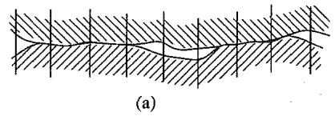

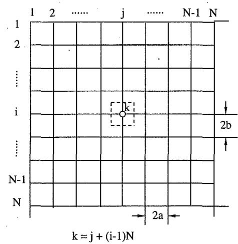  
(b)  
Fig. 3 Discretization of the contacting rough surfaces (a) 2-D profiles and (b) top view

3.2 Direct Quadratic Mathematical Programming. The total complementary potential energy given in Eq. (8) is a standard quadratic function of the contact pressure, and can be solved using mathematical programming methods once all possible contact areas are included in Eq. (8). Since no tension (forces in the direction opposite to motion of the contacting bodies) is allowed at the contact interface, the search for a minimum value of the Eq. (8) is restricted by

$$
p _ { k } \ge 0 , ~ k = 1 , \ldots , M\tag{10}
$$

where M is the total number of initial contact points. We note that the number of final contact points which satisfy the restriction, $p _ { k } \ge 0 ,$ would be smaller than M.

One way to find the minimum value of Eq. (8) under the restriction of Eq. (10) is to use a standard simplex-type algorithm (Wolfe, 1959). Examples of using the standard simplextype algorithm for elastic contact problems can be found in some earlier studies (Conry and Seireg, 1970; Kalker and van Randen, 1971). However, the use of the simplex-type algorithm is limited to an optimization problem which only contains a smaller number of variables. The search for a feasible solution in each step of a simplex algorithm is rather tedious and time consuming when the amount of variables is large. In the present work, a direct quadratic mathematical programming method is used to obtain the minimum value of complementary potential energy and its description follows.

Before proceeding, it is convenient to rewrite the quadratic function of Eq. (8) as

$$
\mathbf { V } ^ { * } ( \mathbf { p } ) = { \textstyle { \frac { 1 } { 2 } } } \mathbf { p } ^ { T } { \cdot } \mathbf { C } { \cdot } \mathbf { p } - \mathbf { p } ^ { T } { \cdot } \mathbf { u }\tag{11}
$$

where $\mathbf { p } ^ { T }$ is the transpose vector of contact pressure, $p _ { k } ,$ and is denoted by

$$
\mathbf { p } ^ { T } = ( p _ { 1 } , p _ { 2 } , \ldots , p _ { k } , \ldots , p _ { M } )\tag{12}
$$

C and u are the influence matrix and displacement vector, respectively, and are denoted as

$$
\mathbf { C } = \frac { 1 } { \pi \mathrm { E } ^ { * } } \left[ \begin{array} { c c c } { C _ { 1 , 1 } } & { \vdots } & { C _ { 1 , M } } \\ { \ldots } & { \ddots } & { \ldots } \\ { C _ { M , 1 } } & { \vdots } & { C _ { M , M } } \end{array} \right]
$$

$$
\mathbf { u } ^ { T } = ( \bar { u } _ { z 1 } ^ { * } , \bar { u } _ { z 2 } ^ { * } , \dots , \bar { u } _ { z k } ^ { * } , \dots , \bar { u } _ { z M } ^ { * } )
$$

If C in Eq. (11) is a positive definite symmetric matrix, the complementary potential energy, $V ^ { * } ( \mathbf { p } )$ has a minimum at the point $\mathbf { p } ^ { * }$ where $\mathbf { p } ^ { * }$ is given by

$$
\begin{array} { c } { { \nabla V ^ { * } ( \mathbf { p } ^ { * } ) = \mathbf { C } \cdot \mathbf { p } ^ { * } - \mathbf { u } = 0 } } \\ { { \phantom { \sum } } } \\ { { \phantom { \sum } } } \end{array}\tag{13}
$$

If all the element values of $\mathbf { p } ^ { * }$ in Eq. (13) satisfy the restriction condition of Eq. (10), $\mathbf { p } ^ { * }$ and its corresponding contact area will be the true solutions of the contact problem. The direct quadratic mathematical programming method is based on this last equation. The search of the minimum value of Eq. (11) starts from solving the linear Eq. (13) using a Gauss-Seidel iterative method (Varga, 1962). The contact pressure values are forced to satisfy the restriction condition of Eq. (10) during the Gauss-Seidel iteration, i.e., the contact pressure whose value is less than zero will be set to zero. By setting the negative pressure value to be zero, this process effectively selects only those contact elements with positive contact pressure as the elements of the influence coefficient matrix. The mathematical expression for this process can be expressed as

$$
\begin{array} { r } { \mathbf p _ { r + 1 } = \left\{ \begin{array} { l l } { - ( \mathbf { L } + \mathbf { D } ) ^ { - 1 } \mathbf { U } \mathbf { p } _ { r } + ( \mathbf { L } + \mathbf { D } ) ^ { - 1 } \mathbf { u } , } & { \mathrm { i f } \quad \mathbf { p } _ { r + 1 } \geq 0 } \\ { ~ } \\ { 0 , } & { \mathrm { i f } \quad \mathbf { p } _ { r + 1 } < 0 } \end{array} \right. } \end{array}
$$

where L is lower triangular matrix of C (has nonzero elements only below the diagonal), D is the diagonal matrix of C (has nonzero elements only along the diagonal) and U is upper triangular matrix of C (has nonzero elements only above the diagonal), and

$$
\mathbf { C } = \mathbf { L } + \mathbf { D } + \mathbf { U }\tag{15}
$$

The superscript (-1) denotes the inverse matrix, and the subscripts, r and $r + 1 ,$ denote the rth and (r + 1)th iterations of the Gauss-Seidel process, respectively.

According to the construction of the influence matrix, we know that the matrix is always symmetric. Since only the elements with positive contact pressure are effectively left inside the influence matrix during this process, the effective influence matrix is always positive definite and symmetric, which guarantees that Eq. (13) gives the true minimum value of total complementary potential energy. At same time, the condition of positive definite, symmetric matrix ensures that the Gauss-Seidel iterative method converges (Varga, 1962). In practice, a successive underralaxation method is used to speed up the rate of convergence of Gauss-Seidel method.

It needs to be pointed out that Eq. (13) is nothing more than the relationship between the surface displacement and contact pressure, which, combined with an iterative process, is the basis of the conventional matrix inversion method. Therefore, the results from the conventional matrix inversion, if it converges, should be identical with those obtained by the present variational approach. However, for contact problems with large number of contact points, the initial influence matrix, which comprises all possible contact points within the geometrical interference area (bearing area), may not be positive definite. If this is the case, the conventional matrix inversion method may fail to converge. Besides, the present variational approach has eliminated an additional iterative process compared with the conventional matrix inversion method and, therefore, is relatively very computationally efficient, which makes it feasible to solve 3-D rough surface contact problems with large number of contact points.

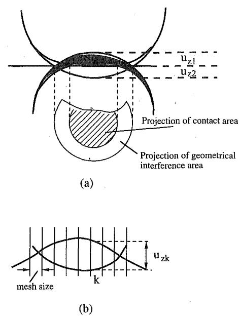  
Fig. 4 (a) Interference area and contact area between two spherical asperities, and (b) determination of the total prescribed displacement from geometrical interference of asperities

3.3 Space-Reduced Matrix Storage Technique and Computer Program. For a nonconformal elastic contact or an elastic rough surface contact, the actual contact region lies inside the interference area or bearing area of the two contact bodies for a given rigid body approach as shown in $\mathrm { F i g . } 4 ( a )$ Note that contact area is smaller than geometrical interference area as a result of deformation. Therefore, for a given rigid body approach the search for a minimum value of the total complementary potential energy can be carried out within the bearing area of the two contact bodies. The prescribed displacements for an asperity interference is determined as shown in Fig. 4(b).

One of the major difficulties for contact problems with a large number of contact points is that the storage of influence matrix usually requires a large amount of computer memory since for M contact node points, the total number of influence matrix elements will be ${ \hat { M } } ^ { 2 }$ . This usually limits the maximum possible contact points which can be solved for an elastic contact problem. To reduce the required storage space for the influence matrix, a space-reduced matrix storage method is developed to compress the entire influence matrix elements in a space-reduced matrix. According to the Boussinesq solution, Eq. (5), the element values of the influence matrix only depend on the geometrical distance between the two concerned node points. For evenly spaced mesh elements, all element values of the influence matrix can be determined according to the distances between the different node points. Therefore, all the nonredundant elements of the influence matrix can be stored in a matrix which has the same dimensions as the mesh grid. It is noted that the element order of the influence matrix for different contact points on the mesh grid follows a special rule as shown in Fig. 5. Thus, any element of the influence matrix can be retrieved according to the rule if the influence matrix elements are stored according to the order of mesh node points. It is noted that the direct quadratic mathematical programming method in the present work does not require one to modify the contents of the influence matrix during the search of minimum; therefore, it can employ the above space-reduced matrix storage scheme. For any numerical method which requires the contents of the influence matrix to be modified, the preceding method may not be applicable.

A computer program has been developed to obtain the minimum value of the total complementary potential energy of Eq.

(8) with restrictions of Eq. (10). In the program, first the 3-D surface profiles of the two surfaces are read in. Contacting surface is discretized into small elements corresponding to the different points of surface heights. For a given rigid body approach (or load) between two rough surfaces, the total surface displacement at the surface of real contact is equal to the interference of two contacting bodies. The elements with finite displacement are included in the formulation. The influence matrix is constructed to relate contact pressure to the given displacements depenent on the location of the pressure element and contact points and an expression for the total complementary potential energy involving displacement and pressure is developed. The minimum value of the total complementary potential energy is obtained using direct quadratic mathematical programming technique. The real area of contact and contact pressure distribution are those which minimize the total complementary potential energy. The analysis solves for contacts with positive pressure.

Figure 6 shows the flow chart of the main program. The main feature of the present program is that the corresponding contact pressure for a given rigid body approach can be obtained directly from a single minimization process, thus it eliminates the additional iteration cycles which the conventional matrix inversion methods often used. By comparison, the elimination of this iteration cycle effectively speeds up the entire process several times as compared to the conventional matrix inversion methods; its evidence will be presented later.

3.4 Elastic-Plastic Contact Model of Rough Surfaces. The elastic contact model presented so far is extended to elasticplastic contact analysis for the case in which material is assumed to deform as an elastic-perfectly plastic material. For elasticperfectly plastic contact analysis, we assume that the region of the plastic deformation is only confined within a very small area and does not significantly alter the geometry of the elastic deformed contact surface. Outside the plastic region, the relationship between contact pressure and elastic deformation (Eq. (5)) still holds. A contact point deforms, plastically once the local contact pressure exceeds the hardness of the softer material. It is noted in Fig. 2(b) that for elastic-perfectly plastic contact, the internal complementary energy $\dot { U } _ { \mathrm { E } } ^ { * }$ is also numerically equal to the elastic strain energy. An easier, but weaker approach is simply to add additional restrictions to Eq. (14) as follows when searching for the minimum value of the total complementary potential energy of equation (8)

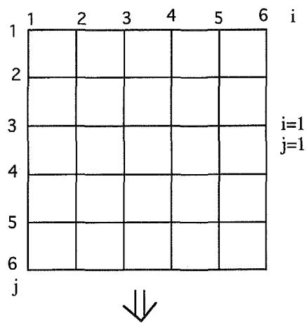

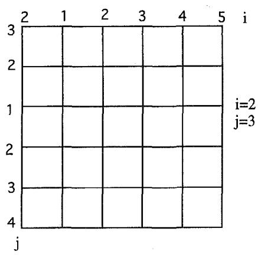  
i and j are the indexes of concerned contact point location  
Fig. 5 A schematic of space-reduced influence matrix storage scheme and the rule of matrix element retrieval according to the order of node point

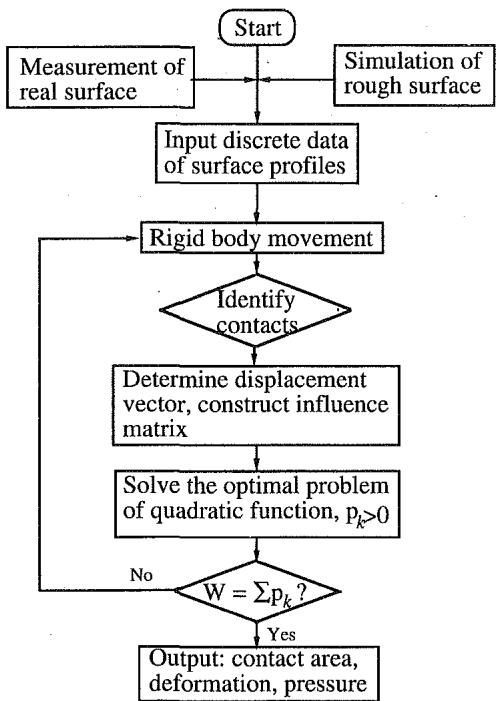  
Fig. 6 Flow chart of the computer program for contact of two rough surfaces

$$
\begin{array} { l } { { p _ { k } \ge 0 , ~ k = 1 , ~ \dot { \textrm { -- } } \dots \dots , M } } \\ { { p _ { k } < H _ { s } , ~ k = 1 , \dots \dots , M } } \end{array}\tag{16}
$$

where $H _ { s }$ is the hardness of the softer contacting material, and $M$ is the total number of contact points. By doing this, we essentially neglect plastic dissipation energy during deformation, therefore, the approach is valid only in the case that plastic deformation occurs only at a small fraction of the total contact area.

For a more robust approach, however, Eqs. (2) and (3) must be modified since dissipation of energy occurs during plastic deformation. In this case, the total complementary potential energy is given by

$$
\begin{array} { l } { V ^ { \ast } = U _ { \mathrm { E } } ^ { \ast } + U _ { p } - \displaystyle \int _ { \Omega } p \dddot { u _ { z } ^ { \ast } } d \Omega } \\ { = U _ { \mathrm { E } } ^ { \ast } + \displaystyle \int _ { \Omega } p _ { m } \Delta u _ { z } ^ { p } d \Omega - \displaystyle \int _ { \Omega } p \dddot { u _ { z } ^ { \ast } } d \Omega } \end{array}\tag{17}
$$

where $U _ { p }$ is plastic energy dissipated in plastic deformation, $p _ { m }$ is the contact pressure which reaches the hardness of the softer material, $\Delta u _ { z } ^ { p }$ is incremental surface displacement in the plastic deformation regime. During the elastic deformation regime, Eq. 3 should still holds if the surface displacements in Eq. (3) are treated as in the limit of elastic deformation. Utilizing the fact that the contact pressure at location of plastic deformation will be constant $( p _ { m } )$ and equals the hardness of the softer material, the Eq. (17) becomes

$$
\begin{array} { r l r } {  { V ^ { * } = \frac { 1 } { 2 } \int _ { \Omega } p _ { e } ( u _ { z 1 } ^ { e } + u _ { z 2 } ^ { e } ) d \Omega + \int _ { \Omega } p _ { m } \Delta u _ { z } ^ { p } d \Omega - \int _ { \Omega } p \tilde { { \boldsymbol { u } } _ { z } ^ { * } } d \Omega } } \\ & { } & { = \frac { 1 } { 2 } \int _ { \Omega } p ( u _ { z 1 } + u _ { z 2 } ) d \Omega + \frac { 1 } { 2 } \int _ { \Omega } p _ { m } \Delta u _ { z } ^ { p } d \Omega - \int _ { \Omega } p \bar { { \boldsymbol { u } } _ { z } ^ { * } } d \Omega } \\ & { } & { = \frac { 1 } { 2 } \int _ { \Omega } p \bar { u } _ { z } d \Omega - \int _ { \Omega } p \bigg ( \bar { u } _ { z } ^ { * } - \frac { 1 } { 2 } \Delta u _ { z } ^ { p } \bigg ) d \Omega \qquad ( 1 8 ) . } \end{array}
$$

where superscripts e and $p$ correspond to elastic and plastic components of displacement, respectively. Note that the Eq. (18) has a structure similar to that of Eq. (4). Therefore, the same rules of discretization of integral equation and direct quadratic mathematical programming described previously in Sections 3.1 and 3.2 also apply to Eq. (18). Following the same procedure, modified Eq. (13) derived from Eq. (18) for elasticperfectly plastic materials is given as,

$$
\mathbf { p } ^ { * } = \mathbf { C } ^ { - 1 } \cdot \mathbf { u } ^ { \prime }\tag{19}
$$

where $\mathbf { u } ^ { \prime }$ is a modified displacement vector u in Eq. (11), and the elements of $\mathbf { u } ^ { \prime }$ are the same as those of u if the contact point is still in elastic deformation regime. In elastic-plastic deformation regime, the elements of $\mathbf { u } ^ { \prime }$ is given by

$$
\begin{array} { r } { u _ { k } = \bar { u } _ { z k } ^ { * } - \frac { 1 } { 2 } \Delta u _ { z } ^ { p } } \end{array}\tag{20}
$$

where $\Delta u _ { z } ^ { p }$ is the incremental surface displacement of plastic deformation and its value is given by

$$
\Delta u _ { z } ^ { p } = \Delta \bar { u } _ { z } ^ { p } \Bigg [ 1 + \frac { \mathrm { E } _ { 1 } ( 1 - \nu _ { 2 } ^ { 2 } ) } { \mathrm { E } _ { 2 } ( 1 - \nu _ { 1 } ^ { 2 } ) } \Bigg ] ^ { - 1 }\tag{21}
$$

where $\Delta \bar { u } _ { z } ^ { p }$ is the total incremental displacement of two contact surfaces where contact pressure reaches the hardness of the softer material.

Iteration has to be used at each incremental rigid body movement between the two contacting rough surfaces, and the incremental surface displacements of plastic deformation are determined whenever the local contact pressure reaches the hardness of the softer material. Corresponding to the local plastic deformation,elements of displacement vector u in Eq. (11) are modified according to Eqs. (20) and (21). Finally, the real area of contact and contact pressure can be obtained by searching for the minimum value of the total complementary potential energy of Eq. (18) under the restrictions of Eq. (16). We note that the modification of displacement vector u in Eq. (20) increases the real area of contact for a given applied load.

## 4 Examples of Application of the Numerical Model

To test the validity of the present numerical contact model, the case of Hertzian contact was computed using the present method. Figure 7(a) shows the relationship between the real area of contact and applied load for the case of a rigid sphere against an elastic half space. In this case, according to the classical Hertzian elastic contact solution, the relationship between the real area of contact and applied load is given by

$$
A _ { r } = \stackrel { \cdot } { \pi } \left( \frac { 3 R } { 4 \mathrm { E } ^ { * } } \right) ^ { 2 / 3 } W ^ { 2 / 3 }\tag{22}
$$

where $A _ { r }$ is the real area of contact, W is applied load, and R is the radius of the sphere.

It can be seen in Fig. 7(a) that there exists a linear relationship between $W$ and $\smash { \dot { A _ { r } ^ { 3 / 2 } } }$ . Comparing the results from the present numerical model with those of Hertzian theory, the relative error of linear slopes is less than 1.3 percent. A comparison of contact pressure obtained using the present numerical model with the Hertzian results is shown in Fig. 7(b). The relative error of maximum contact pressure at the center of the circular contact area between the numerical results and results from Hertzian contact theory is about 2.5 percent.

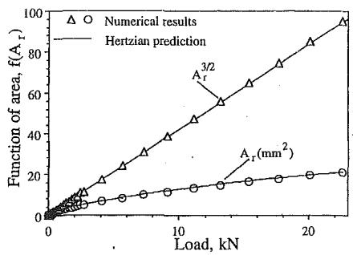

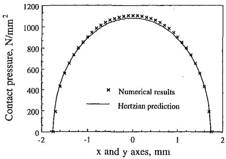  
Fig. 7 Numerical results of (a) contact area versus applied normal load, A, is the real area of contact, (b) numerical results of contact pressure distribution in x and y directions for a Hertzian contact problem (sphere with radius of 100 mm on a flat, E\* = 100 GPa)

As an example of application, the present numerical method has been applied to the cases of a smooth rigid flat or a smooth rigid sphere pressed on an elastic rough surface. A 2-D digital filter technique developed by Hu and Tonder (1992) was used to generate 3-D rough surfaces. The technique considers the heights of a rough engineering surface as a time series of random process and the 3-D random surfaces can be generated through a linear transformation system of a series of random input signals. The 2-D digital filter is defined as

$$
\mathbf { z } ( I , J ) = \sum _ { k = 0 } ^ { n - 1 } \sum _ { l = 0 } ^ { m - 1 } \mathbf { h } ( k , l ) \mathbf { a } ( I - k , J - l )\tag{23}
$$

where a is an input sequence, z is an output sequence of time series random numbers, and h is a filter system function.

After Fourier transform, Eq. (23) becomes

$$
\mathbf { Z } ( \omega _ { x } , \omega _ { y } ) = \mathbf { H } ( \omega _ { x } , \omega _ { y } ) \mathbf { A } ( \omega _ { x } , \omega _ { y } )\tag{24}
$$

where A and Z are Fourier transformations of the input a and output z, respectively; $\mathbf { H } ( x , y )$ is the transfer function of the filter system.

For a linear system, the following relation hold

$$
\mathbf { S } _ { \mathbf { z } } ( \omega _ { x } , \omega _ { y } ) = | \mathbf { H } ( \omega _ { x } , \omega _ { y } ) | ^ { 2 } \mathbf { S } _ { \mathbf { a } } ( \omega _ { x } , \omega _ { y } )\tag{25}
$$

where $\mathbf { S _ { z } }$ and $\mathbf { S _ { a } }$ are the power spectral density (PSD) of input a and output ${ \mathbf { z } } ,$ respectively, and the power spectral density is defined as.

$$
\mathbf { S } _ { \mathbf { z } } ( \omega _ { x } , \omega _ { y } ) = { \frac { 1 } { n m } } \sum _ { k = - n / 2 + 1 } ^ { n / 2 - 1 } \sum _ { l = - m / 2 + 1 } ^ { m / 2 - 1 } \mathbf { R } _ { \mathbf { z } } ( k , l ) e ^ { - j k \omega x } e ^ { - j l \omega y }\tag{26}
$$

where $\mathbf { R } _ { \mathbf { z } }$ is the 2-D discrete autocorrelation function (ACF) of a sequence of random number, z, and is defined as

$$
\mathbf { R } _ { \mathbf { z } } ( k , l ) = \frac { 1 } { N M } \sum _ { I = 0 } ^ { N - 1 } \sum _ { J = 0 } ^ { M - 1 } \mathbf { z } ( I , J ) \mathbf { z } ( I + k , J + l )\tag{27}
$$

For a given autocorrelation function and a sequence of random numbers as an input sequence data, determine the transfer function of the filter system according to Eqs. (25) to (27). Once the transfer function of the filter system is determined, an output sequence of random numbers (as the discrete points of the surface height of rough surface) with specified autocorrelation function and standard deviation of surface heights can be generated according to Eqs. (23) and (24).

By using the preceding 2-D digital filter technique combined with a fast Fourier transform (FFT), rough surfaces with given standard surface heights deviation and autocorrelation function can be generated efficiently by a computer. A computer generated 3-D rough surface profile is shown in Fig. 8. The heights of the surface profile consist of 256 × 256 data points, and the profile data file has the similar data format of measured surface profile from an atomic force microscope or a non-contact optical profiler. An exponential autocorrelation function was used to generate the rough surface. The standard deviation of surface heights of the rough surface in the Fig. 8 is 4.15 nm, the average autocorrelation length at which the autocorrelation value drops to 0.1 of that at origin is about 7.6 µm, and the total size is $1 0 0 \times 1 0 0 ~ \mu \mathrm { m } ^ { 2 }$ for the entire surface. Figure 9(a) shows the computed results of the real area of contact under various applied load for the case of a smooth rigid flat against the rough surface. Figure 9(b) is the bearing area of the same contact surfaces corresponding to the same geometrical interference. Bearing area for a given geometrical interference is given by slicing off the surface for a given interference. We clearly observe that bearing area greatly overestimates the real area of contact because the elastic deformation and the interactions between adjacent asperities are important in the case of elastic rough surface contact.

The computed results of the real area of contact versus applied load for the case of a rigid sphere against a rough surface are shown in Fig. 10 in the left column. The right-hand column of Fig. 10 is the bearing area of the same contact surfaces corresponding to the same geometrical interference. Figure 11 shows the 3-D rough surface under elastic deformation corresponding to the same applied load in Fig. 10(a). The rigid sphere in Fig. 11 is made transparent so that the entire deformation surface can be observed. It can be seen that under a small load, the observation of surface roughness is predominant and the elastic deformation is barely observable. With the increase of the applied load, the crater of the elastic deformation under-

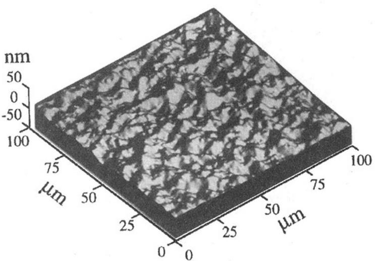  
Fig. 8 Computer generated surface profile: standard deviation = 4.15 nm, autocorrelation length = 7.6 μm, total size = 100 × 100 μm²

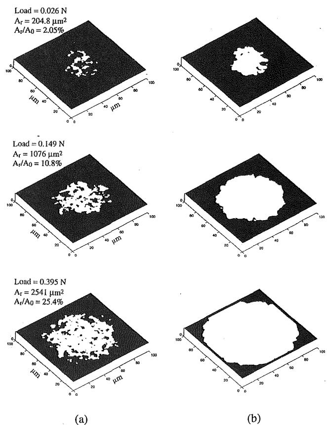

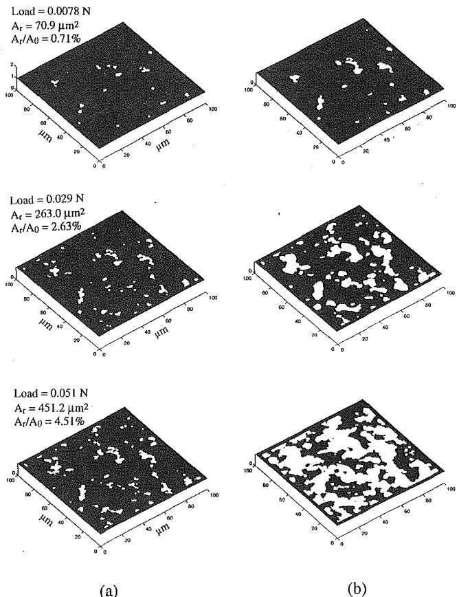  
Fig. 9 2-D images of real area of contact between a rigid flat and the computer generated elastic rough surface (Fig. 8), (a) real area of contact, and (b) overlapped area (bearing area) at different loads $( \mathsf E ^ { \star } = 1 0 0$ GPa)

neath the rigid sphere gradually becomes larger and clearer.   
Under large applied load, significant deformation occurs.

The relationships between the real area of contact and applied load for the above two cases are shown in Fig. 12(a). It can be seen that the real area of contact is linearly proportional to the applied normal load when the normal load is relatively small for both flat surface and sphere contacts. This relationship between the applied normal load and the real area of contact is consistent with what is commonly observed in engineering practice, i.e., the friction is linearly proportional to the applied load. However, the relationship between the contact area and applied load for the case of spherical contact gradually becomes nonlinear with increasing applied load. The departure from the linear relationship for spherical contact at large applied load can be attributed to the influence of spherical contact geometry at large applied load. To show the effect of surface roughness on the spherical contact, the Hertzian solution for a rigid sphere against a smooth elastic plane is also shown in the Fig. 12(a). Obviously, the existence of the rough surface significantly reduces the real area of contact when the applied load is the same. Also for the smooth surface, A, increases with $W ^ { 2 / 3 }$ and for rough surface, A, increases with W at moderate loads.

To compare numerical predictions with the present numerical model to a conventional statistical model, the Greenwood-Williamson (1966) model was selected. The following simplified equation was used to predict the real area of contact for the G-W model (Bhushan, 1990)

$$
A _ { r } \approx 3 . 2 0 \left( \frac { W } { \mathrm { E } ^ { * } } \right) \left( \frac { R _ { p } } { \sigma _ { p } } \right) ^ { 1 / 2 }\tag{28}
$$

where $R _ { p }$ and $\sigma _ { p }$ are the average radius of summits and the standard deviation of summit heights, respectively. For a threshold value for determination of peaks of 0.2 nm, $\sigma _ { p } = 3 . 8 6 5$ nm and $R _ { p } = 1 8 9$ µm. A comparison between the predicted real area of contact by our numerical model with that by Greenwood-Williamson (G-W) is presented in Table 1. Predictions by our model are close to that of the G-W statistical model.

Figures 12(b) and (c) show the number of contact spots and average contact area under different applied loads. Contrary to common belief, we note that number of contacts does not increase linearly and the average contact area does not remain constant with load.

Finally, we compare the computation times using variational principle and the matrix inversion approach (Appendix A) required to solve sphere on flat and flat on flat problems, Table 2. The standard Gauss-Seidel iterative method (Varga, 1962) was used to solve the linear equations in matrix inversion approach. For moderate contact points, the solutions from the two approaches are the same. However, as expected, there is significant saving in computation times with a model using variational principle as compared to the matrix inversion method when the number of contact points is large.

## 5 Discussion and Conclusions

A numerical method for the analysis of elastic and elasticplastic contacts of rough surfaces has been developed. The method is based on a variational principle in which the real area of contact and contact pressure distribution are those which minimize the total complementary potential energy. Contacting surfaces are discretized into small elements corresponding to the different points of surface heights which can be either obtained by direct measurement of engineering surfaces or generated using computer simulation. For a given rigid body approach between two rough surfaces, the total surface displacement at the surface of real contact is equal to the geometrical interfer-

Fig. 10 2-D images of real area of contact between a rigid sphere with radius of 16 mm and an elastic rough surface (a) real area of contact, and (b) overlapped area (E\* = 100 GPa)

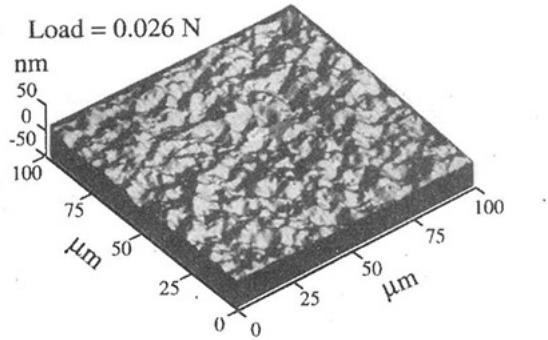

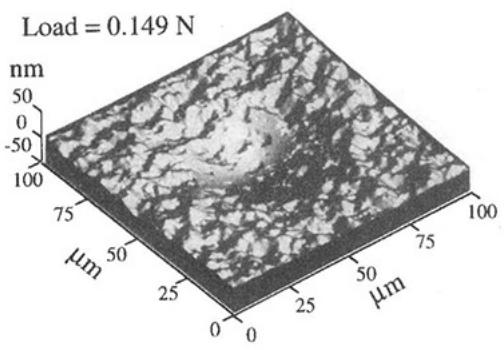

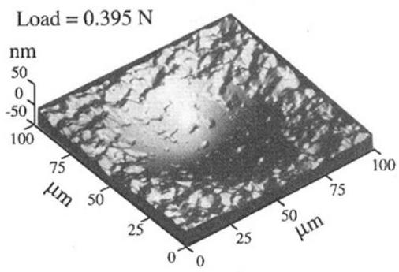  
Fig. 11 3-D images of rough surface during a rigid sphere indentation

ence of two contacting bodies. The elements with finite displacements are included in the formulation. The relationship between surface displacement and contact pressure is determined by using classical elasticity analyses. An influence matrix is constructed to relate pressure to the given displacements dependent on the location of the pressure element and contact points, and an expression for total complementary potential energy including displacement and pressure is obtained. The minimum value of the total complementary potential energy is obtained by using a direct quadratic mathematical programming technique. The real area of contact and contact pressure distribution are those which minimize the total complementary potential energy under the restriction that all contact pressure must not be negative.

The results of real contact area and pressure distribution obtained by using the conventional matrix inversion method, if the method converges, satisfy the condition of minimization of the total complementary potential energy of the contacting systems. However, with the increase of contact points, the influence matrix will become very large, and possibly ill-posed. The large, ill-posed influence matrix will not only require a long computation time to complete a large number of iteration cycles, but, in some cases, may cause a serious nonconvergence problem. The direct quadratic mathematical programming method developed and used in the present work has been proved to be computationally efficient in reaching the condition of minimum complementary potential energy. The present variation approach guarantees the uniqueness of the solution of the contact problem. It significantly reduces the computation time as compared with the conventional matrix inversion method and makes it feasible to solve 3-D contact problem with large number of contact points.

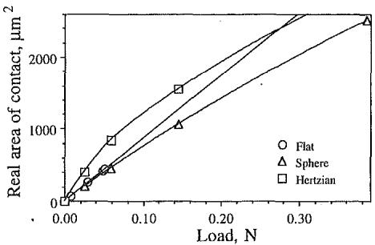

(a)  
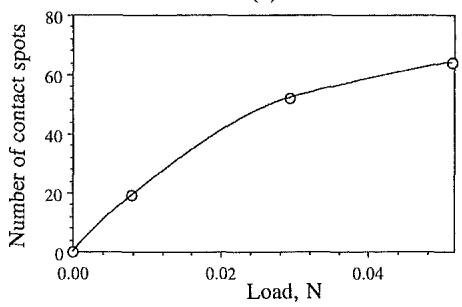

(b)  
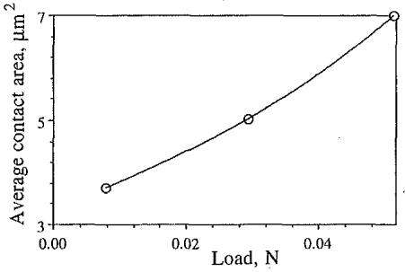  
(c)  
Fig. 12 (a) Predicted real area of contact versus applied normal load for the cases of a rigid smooth sphere against a flat smooth surface (Hertz contact) and against a flat rough surface, and a rigid smooth flat against a flat rough surface (100 μm × 100 μm), (b) the number of contact spots versus applied normal load for the case of a rigid smooth flat against a rough surface (100 µm × 100 µm), and (c) the average contact area versus normal load for the case of a rigid smooth flat against a rough surface (100 μm × 100 μm) shown in Fig. 8

The present variation approach has also been extended to solve elastic-plastic contact problems with a simple assumption that the contacting bodies deform as an elastic-perfectly plastic material within a small plastic deformation region. The same direct quadratic mathematical programming method can also be used for the elastic-plastic contact problem with additional restrictions to limit the maximum contact pressure equal to the material hardness of the softer material.

Table 1 Comparison of the present numerical model with G-W model
| Applied load,N | Contact area, Ar(Numerical), $\scriptstyle { \mathtt { H m } } ^ { 2 }$ | Contact area, Ar(G-W model)μm2 | Relativedifference |
| --- | --- | --- | --- |
| 0.0078 | 70.9 | 55.2 | 22% |
| 0.029 | 263 | 205 | 22% |
| 0.051 | 451 | 361 | 20% |

McCool, J. I., 1986, "Comparison of Models for the Contact of Rough Sur- MaCool I I 10oć "Comnarison of Modols for the Contaot of Dough Sur. faces," Wear, Vol. 107, pp. 37–60.

Table 2 Comparison of computing time between variational approach and matrix inversion approach using a Silicon Graphics Indigo R-4000/ 100 MHz workstation (60.5 SPECfp92)  
(a) Sphere on Flat
|  | Matrix inversion | Variational |
| --- | --- | --- |
| Initial contact points | 65310 | 65310 |
| Final contact points | Did not converge,stopped | 16517 |
| Computing time . |  | 4 days |

(b) Flat on Flat
|  | Matrix inversion | Variational |
| --- | --- | --- |
| Initial contact points | 9717 | 9717 |
| Final contact points | 1711 | 1711 |
| Computing time | 7h | 1h |

A space-reduced matrix storage and retrieval scheme has been developed. The method can significantly reduce the computer space required for the storage of large influence matrix and has been employed in the direct quadratic mathematical programming process.

The present method was applied to the cases of both Hertzian contact and rough surface contact with large number of contact points. The numerical results of Hertzian contact problem are in good agreement with those from analytical solution. The results of rough surface contacts present a clear picture about the size and the distribution of contact spots. These results also demonstrate that the present numerical model has the ability to solve the rough surface contact problem with large number of contact points.

## Acknowledgment

The research reported in this paper was funded by the industrial membership of the Computer Microtribology and Contamination Laboratory at the Ohio State University. The authors wish to acknowledge constructive comments from the reviewers.

## References

Akyuz, F. A., and Merwin, M., 1968, '"Solution of Nonlinear Problems of Elastoplasticity by Finite Element Method," AIAA J., Vol. 6, pp. 1825–1831.

Bhushan, B., 1990, Tribology and Mechanics of Magnetic Storage Devices, Springer-Verlag, NY.

Bhushan, B., and Cook, N. H., 1975, "On the Correlation between Friction Coefficients and Adhesion Stresses," ASME Journal of Engineering Materials and Technology, Vol. 97, pp. 285–287.

Bhushan, B., and Majumdar, A., 1992, "Elastic-Plastic Contact Model of Bifractal Surfaces," Wear, Vol. 153, pp. 53–64.

Bush, A. W., Gibson, R. D., and Thomas, T. R., 1975, 'The Elastic Contact of a Rough Surface," Wear, Vol. 35, pp. 87–111.

Bush, A. W., Gibson, R. D., and Keogh, G. P., 1979, "Strongly Anisotropic Rough Surfaces," ASME JOURNAL OF LUBRICATION TECHNOLOGY, Vol. 101, pp. 15-20.

Conry, T. F., and Seireg, A., 1971, "A Mathematical Programming Method for Design of Elastic Bodies in Contact," ASME Journal of Applied Mechanics, Vol. 38, pp. 387–392.

Francis, H. A., 1983, "The Accuracy of Plane-Strain Models for the Elastic Contact of Three-Dimensional Rough Şurfaces," Wear, Vol. 85, pp. 239–256.

Ganti, S., and Bhushan, B., 1995, 'Generalized Fractal Analysis and its Applications to Engineering Surfaces," Wear, Vol. 180, pp. 17-34.

Greenwood, J. A., and Williamson, J. B. P., 1966, "Contact of Nominally Flat Surfaces," Proc. Roy. Soc. (London), Series A., Vol. 295, pp. 300–319.

Hu, Y. Z., and Tonder, K., 1992, "Simulation of 3-D Random Surface by 2- D Digital Filter and Fourier Analysis," Int. Journal of Mach. Tool Manufact., Vol. 32, pp. 82–90.

Johnson, K. L., 1985, Contact Mechanics, Cambridge University Press

Kalker, J. J., and van Randen, Y., 1972, "A Minimum Principle forFrictionless Elastic Contact with Application to Non-Hertzian Half-Space Contact Problems," Journal of Eng. Math., Vol. 6, pp. 193–206.

Komvopoulos, K., and Choi, D. H., 1992, 'Elastic Finite Element Analysis of Multi-asperity Contact," ASME JOURNAL OF TRIBOLOGY, Vol. 114, pp. 823–831.

Lai, W. T., and Cheng, H. S., 1985, "Computer Simulation of Elastic Rough Contacts," ASLE Trans., Vol. 28, pp. 172–180.

Love, A. E. H., 1929, 'The Stress Produced in a Semi-infinite Solid by Pressure on Part of the Boundary," Phil. Trans. Roy. Soc. (London) Series A., Vol. 228, pp. 377-420.

Majumdar, A., and Bhushan, B., 1990, 'Role of Fractal Geometry in Roughness Characterization and Contact Mechanics of Surfaces," ASME JoURNAL OF TRIBOLOGY, Vol, 112, pp. 204–216.

Majumdar, A., and Bhushan, B., 1991, 'Fractal Model of Elastic-Plastic Contact Between Rough Surfaces," ASME JoURNAL OF TRIBOLOGY, Vol. 113, pp. 1–11.

Onions, R. A., and Archard, J. F., 1973, '"The Contact of Surfaces Having a Random Structure," J. Phys., D.: Appl. Phys., Vol. 6, pp. 289-304.

Poon, C. Y., and Sayles, R. S., 1994, "Numerical Contact Model of a Smooth Ball on an Anisotropic Rough Surface," ASME JoURNAL OF TRIBOLOGY, Vol. 116, pp. 194–201.

Ren, N., and Lee, S. C., 1993, 'Contact Simulation of Three-Dimensional Rough Surfaces Using Moving Grid Method," ASME JOURNAL OF TRIBOLOGY, Vol. 115, pp. 597–601.

Richards, T. H., 1977, Energy Methods in Stress Analysis, Ellis Horwood.

Sayles, R. S., and Thomas, T. R., 1978, 'Computer Simulation of the Contacting Rough Surfaces," Wear, Vol. 49, pp. 273–296.

Thomas, T. R., 1982, Rough Surfaces, Longman, London.

Timoshenko, S. P., and Goodier, J. N., 1970, Theory of Elasticity, 3rd edition, McGraw-Hill, N.Y.

Varga, R. S., 1962, Matrix Iterative Analysis, Prentice-Hall, N.J.

Webster, M. N., and Sayles, R. S., 1986, 'A Numerical Model for the Elastic Frictionless Contact of Real Rough Surfaces,"ASME JoURNAL OF TRIBOLOGY, Vol. 108, pp. 314–320.

West, M. A., and Sayles, R. S., 1987, '"A 3-Dimensional Method of Studying 3-Body Contact Geometry and Stress on Real Rough Surfaces," Proc. 14th Leeds-Lyon Symposium on Tribology, Vol. 12, pp. 195–200.

Whitehouse, D. J., and Archard, J. F., 1970, 'The Properties of Random Surface of Significance in Their Contact," Proc. Roy. Soc. (London), Series A., Vol. 316, pp. 97–121.

Williamson, J. B. P., 1967/68, 'The Microtopography of Surfaces," Proc. Inst. Mech. Engrs., Vol. 182, Part 3k, pp. 21–30.

Wolfe, P., 1959, "The Simplex Method for Quadratic Programming," Econometrica, Vol. 27, pp. 382-395.

## APPENDIX A

## The Matrix Inversion Approach for Rough Surface Contact

The matrix inversion approach starts directly from the relationship between the contact pressure and surface displacement based on Boussinesq's solution of Eq. (5). After discretization, the relationship between the surface displacements and contact pressure for the contact points can be expressed in matrix form as

$$
\mathbf { u } = \mathbf { C } \cdot \mathbf { p }\tag{A-1}
$$

where C, u, and p are the influence matrix, displacement vector and contact pressure vector, respectively, same as in Eq. (11) of the main text.

Since both the contact pressure distribution and the real area of contact are unknown, an iteration process has to be used to solve Eq. (A-1). For a given rigid body normal approach between two rough surfaces, the surface displacements at the contact surface are determined from the geometrical interference of the two bodies. Then, Eq. (A-1) is used to solve for the pressure distribution inside the deformation zone. Those contact elements with negative contact pressure are excluded for next iteration since tensile traction is not permitted at the contact surface. The deformations at the entire contact surface are then computed using Eq. (A-1) to check that no geometrical interference occurs outside the chosen contact area. The iteration is repeated until convergence occurs to a set of surface element with positive or zero contact pressure. These surface elements with positive contact pressure define the real area of contact, and the total applied load is the sum of the contact pressure at those surface elements.
