# An FFT-Based Method for Rough Surface Contact

H. M. Stanley

T. Kato

Elastic contact between a rigid plane and a halfspace whose surface height is described by a bandwidth-limited Fourier series is considered. The surface normal displacements and contact pressures are found by a numerical technique that exploits the structure of the Fast Fourier Transform (FFT) and an exact result in linear elasticity. The multiscale nature of rough surface contact is implicit to the method, and features such as contact agglomeration and asperity interaction—a source of difficulty for asperity-based models—evolve naturally. Both two-dimensional (2-D) and three-dimensional (3-D) contact are handled with equal ease. Finally, the implementation is simple, compact, and fast.

Department of Mechanical Engineering, The University of Tokyo, Tokyo 113, Japan

## 1 Background

The question of the mechanics between contacting rough surfaces is one of long standing. Drawing on the availability of the Hertz solution, Greenwood and Williamson (1966) produced the archetype of asperity-based models, the G-W model, which replaces a continuous description of the contact boundary with a constrained description of only the summits (asperities) These are viewed as spherical and thus obeying the Hertz contact theory. If the deformation at each summit is regarded as independent of the others, and the height distribution of summits is known, then the expected value of various interesting physical quantities can be calculated by simple integration or summation. Thus, the daunting task of finding the solution of a linear elasticity problem with a complicated boundary is avoided.

The development of asperity-based models, although long and distinguished, is not reviewed here, but some important limitations of the G-W model and its variants need to be mentioned in order to motivate what follows. Since the surface is now described only in terms of the summit geometry, the geometry of the rest of the surface is discarded. This loss of information poses a problem if the state of separation of the bodies is needed explicitly. For example, if there is adhesive interaction between noncontacting surfaces (e.g., van der Waals force), the state of separation may be overestimated by assuming a Hertzian geometry, which increases parabolically with radial distance. Furthermore, there is no obvious constraint on the size of the noncontacting integration domain, since each asperity contact is assumed to be independent of its neighbors. If the load is high enough relative to elastic modulus or roughness, a similar "overlap' problem can occur for the contact regions. In this case, regions of contact area are physically close enough and large enough to join"contact agglomeration"—but there is no mechanism in asperity-based models for this to happen. Finally, there is the well-known problem of the correct choice of sampling interval used to identify and characterize summits. There are actually two separate sampling problems in asperity modeling: the first is related to bandwidth sufficiency (i.e., the highest frequency) and the second is related to the multiscale character of rough surfaces (i.e., the spread of frequencies). If the surface is bandwidth limited, it is possible to choose a sampling rate high enough to fully resolve the surface height profile. Accounting for the spread of frequencies is a much more subtle issue. The difficulties are grounded in the idea that a point is either a summit or not a summit, which precludes the notion of multiple curvatures existing at the same point. The above limitations of asperity-based models become more severe if the elastic material is very compliant or the surface is very smooth. Hendricks and Visscher (1995) made accurate measurements of real contact areas for glass on polyurethane (very compliant) for which the agglomeration of and interaction between separate contact áreas is pronounced and found that asperity based models did not describe their observations.

Based on the above considerations, it is henceforth assumed that we seek the solution to the “complete" problem, in the sense that the geometry of the entire boundary is retained. A general analytical solution seems out of the question, so some numerical technique must be employed. In this regard, several methods have been used. Finite element methods can be used (for example, Komvopoulos and Choi, 1992), but if the surface contains high frequencies the mesh must be so fine that it results in extremely large systems of equations—-especially for 3-D.

Another approach is to take advantage of some known halfspace solution (a point load or uniform pressure on a rectangle, for example) and use it to construct the influence coefficient for displacement at a point due to load at another point. With regard to rough surfaces, Webster and Sayles (1986) published a 2-D solution showing the high localized contact pressures caused by surface roughness. Ju and Zheng (1992) used a similar methodology to solve for 3-D contact, although approximations are made for some entries of the influence coefficient matrix in the interest of saving space. In both these cases, an iterative method of guessing the contact region, then modifying it to remove areas where the pressure is calculated to be tensile, then recalculating, etc. is used. For a complicated surface topography, this procedure may require some care, and is not guaranteed to converge.

Johnson et al. (1985) used the exact displacement result for a sinusoidal pressure distribution as the basis for writing the 2-D and 3-D pressure distributions as double Fourier series. Applying a variational principle, they solved for the Fourier coefficients in the cases of sinusoidal and bisinusoidal surfaces by using a quadratic programming technique. Very recently, Ju and Farris (1996) introduced a spectrai analysis for twodimensional contact using the (1-D) FFT, and solved for the partial contact of a simple 2-D surface by means of a trial-anderror method for finding the contacting segment. They note that difficulties can be encountered when applying such a method to a complicated surface.

The aim of this paper is to present a method that takes advantage of both the FFT and the variational formulation, for both 2-D and 3-D elastic contact problems of arbitrary topography.

## 2 Problem Statement

The problem is to find the contact pressure and surface normal displacement when two nominally flat and parallel rough surfaces are pressed together. The surfaces are supported by elastic halfspaces. In the usual way, the amplitude of surface height variation is assumed to be small compared to its wavelength, so it is permissible to restate the problem as the contact between a rigid plane and an elastic halfspace bounded by a combined rough surface. The surfaces are assumed frictioniess, and only the normal tractions on the boundary are considered.

This paper is concerned with periodic surfaces. This is not as severe a constraint as it might appear, even though most rough surfaces are not periodic. The reason is that, in practice, the profile of a rough surface is measured on a finite domain and given a discrete representation—points on a regular grid. If this finite domain is supposed to represent the nature of the rough surface, it is consistent to assume that the neighboring domains have the same essential character, i.e., the surface is periodic. In addition, random surfaces can be considered as long as they are "periodic random surfaces." This means a nominally flat surface whose height is described by a Fourier series with random phase. In such a case, statistical information has to be obtained by calculating multiple realizations of, say, a given power spectrum.

## 3 Exact Results for Sinusoidal and Bisinusoidal Surfaces

Westergaard (1939) found the exact, closed-form solution for the 2-D case of a rigid plane contacting a halfspace whose surface height varied as a pure sinusoid of period L in only the x direction. His solution is valid for all cases of contact, from zero to complete contact, but the complete contact solution is of particular interest, because it provides the basis for the method of this paper. Restating this special case in a convenient form, a sinusoidal pressure variation gives rise to a sinusoidal displacement of the same phase, but with amplitude modified by a frequency-dependent factor.

$$
p ( x ) = \cos ( n 2 \pi x / L )  u ( x ) = \frac { 2 } { E ^ { * } n } \cos ( n 2 \pi x / L )\tag{1}
$$

where

$$
1 / E ^ { * } = ( 1 - \nu _ { 1 } ^ { 2 } ) / E _ { 1 } + ( 1 - \nu _ { 2 } ^ { 2 } ) / E _ { 2 }\tag{2}
$$

and $\nu$ is Poisson's ratio, E is Young's modulus of each contacting body (subscripts 1 and 2).

Johnson et al. (1985) combined two of the solutions of Eq. (1) along different directions to show that it has a simple 3-D analogue

$$
\begin{array} { l } { { p ( x , y ) = \cos ( n 2 \pi x / L ) \cos ( m 2 \pi y / L )  } } \\ { { \displaystyle u ( x , y ) = \frac 2 { E ^ { * } ( n ^ { 2 } + m ^ { 2 } ) ^ { 1 / 2 } } \cos ( n 2 \pi x / L ) \cos ( m 2 \pi y / L ) } } \end{array}\tag{3}
$$

The usefulness of these special cases is clear in the case of periodic random surfaces, since the pressure solution is also periodic and, thus, can also be written as a Fourier (trigonometric) series. Clearly (1) and (3) can be multiplied on both sides by a constant factor, as well as scaled in the lateral dimension(s). It is convenient to set the size of a unit cell to 2π and to use unscaled surface height and pressure for the remainder of the paper.

## Nomenclature

## 4 Variational Statement and Solution

Kalker (1977) showed that, for frictionless elastic contact, the equilibrium solution has an equivalent variational statement, namely, find $p$ to solve

$$
\begin{array} { c } { { \displaystyle \operatorname* { m i n } ~ f = \frac { 1 } { 2 } \int _ { s } p ~ u ( p ) d S + \int _ { s } p ~ g ~ d S . } } \\ { { { } } } \\ { { p \equiv 0 ~ } } \\ { { \displaystyle \frac { 1 } { A } \int _ { s } p ~ d S = p _ { t a r g e t } } } \end{array}\tag{4}
$$

where u is the normal displacement and $g$ is the gap between the rigid plane and undeformed elastic surface. Thus f is total complementary energy. The inequality constraint on contact pressure $p$ means that tensile pressure is not allowed, and the equality constraint is imposed to prescribe the load (or, equivalently, the average pressure $p _ { t a r g e t } )$

In the present case, a discrete representation is assumed, so the variational statement becomes

$$
\begin{array} { c } { \displaystyle \operatorname* { m i n } f = \displaystyle \frac { 1 } { 2 } \sum _ { i = 1 } ^ { n } p _ { i } u _ { i } + \sum _ { i = 1 } ^ { n } p _ { i } g _ { i } } \\ { p _ { i } \geq 0 , i = 1 , 2 , . . . , n } \\ { \displaystyle \frac { 1 } { n } \sum _ { i = 1 } ^ { n } p _ { i } = p _ { t a r g e t } } \end{array}\tag{5}
$$

where the values of p, u, and g are taken only at the sampling points. The nonnegativity constraint on contact pressure is thus enforced only at the sample points. Although this implies that the reconstructed (continuous) pressure function will contain negative pressures, it will be seen that this choice leads to an accurate solution at the sample points themselves, even for very low sampling rates. In contrast, Johnson et al. (1985) imposed this constraint at arbitrary points, leading to a pressure profile that was everywhere positive but that did not as closely coincide with the Westergaard solution.

## 5 FFT Method for Displacement

On the periodic unit cell, each complex-valued component of the FFT characterizes the magnitude and phase of a single frequency (1-D FFT) or pair of frequencies (2-D FFT). Since the displacement solution is known for these cases, the effect of a particular pressure component on the displacement can be succinctly described, and combined as

$$
\mathbf { u } ( \mathbf { p } ) = \mathbf { \mathrm { F F T } } ^ { - 1 } ( \mathbf { w } \mathbf { \mathrm { ~ F F T } } ( \mathbf { p } ) )\tag{6}
$$

Here, the notation w FFT(p) indicates element-by-element multiplication, so the result is an N-vector or matrix. The entries of w contain the numerical factor from Eq. (1) or Eq. (3) appropriate for that element of the FFT, thus for the 1-D FFT used in this study

$$
\begin{array} { c } { w _ { 1 } = 0 , } \\ { w _ { i } = 2 / i , i = 2 , . . . , N / 2 } \\ { w _ { i } = 2 / ( N - i + 1 ) i = N / 2 + 1 , . . . , N } \end{array}\tag{7}
$$

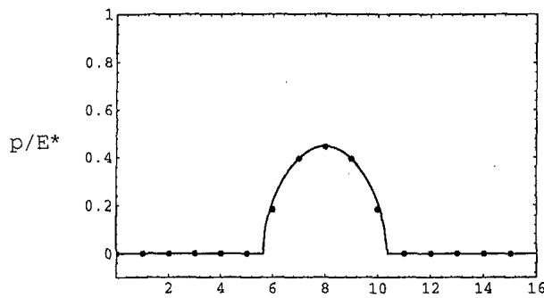

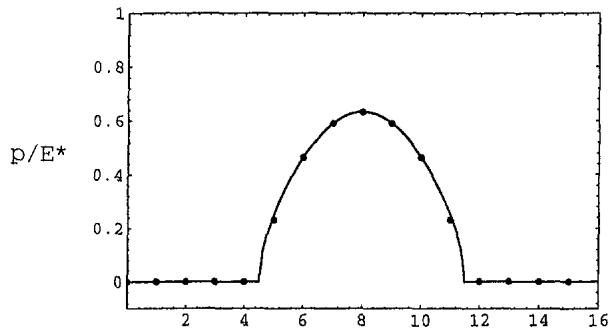

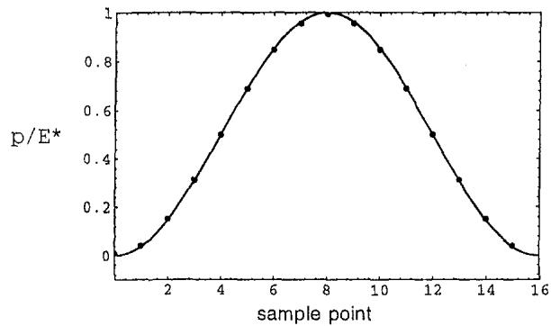  
Fig. 1 Comparison of dimensionless pressure $\pmb { p } / E ^ { \star }$ at the sampling points (solid circles) to analytical solution. Dimensionless mean pressure $\dot { { \mathbf { \zeta } } } = { \mathbf { 0 . 1 } } ,$ 0.2, 0.5 (complete contact). Cell size is 2π.

The actual placement of the numerical factors must take into account the method of representation of the particular FFT algorithm, although the form shown in Eq. (7) is common. Uniform pressure applied to a halfspace results in unbounded normal displacement, so the first component of w is set arbitrarily to zero (see Johnson, et al., 1985), leading to zero mean displacement. Multiplication of the complex-valued FFT element by a real number has the effect of scaling the magnitude and retaining the phase for each frequency, as the solutions of Eqs. (1) and (2) require. Inverting the result recovers the spatial representation of displacement.

Aside from the simplicity of the above formulation, there are well-known computational advantages compared to matrix multiplication if the number of points is large, since the effort to perform the FFT grows as (N log N), while that for matrix multiplication grows as $N ^ { 2 }$

For partial contact, the pressure falls abruptly to zero at the boundary of the contact regions. This implies a discontinuity in the derivative, so the true bandwidth of the pressure is infinite. It is found, however, that the sampling points of the pressure solution are in very good agreement with the analytical solution of Westergaard even for a very low sampling rate. A sampling rate of 8 per shortest wavelength (in the profile) was considered the minimum. There is, of course, unavoidable granularity due to the discretization, so if the true region of contact is small compared to sampling interval, it is not accurately represented.

## 6 Minimization of Energy Functional

If the displacements are found by the above FFT method, there is no Hessian matrix, so some well-developed techniques in quadratic programming cannot be used. Because the gradient is so easy to calculate, however, there are other routes to the minimization of total complementary energy, f. One procedure, which surprisingly never involves the evaluation of f, proceeds as follows. Here “array"’means vector or matrix for 2-D or 3- D, respectively. Beginning with a guess for p that meets the equality and inequality constraints (a uniform pressure $\mathbf { p } _ { t a r g e t }$ is convenient), then

1. Calculate a candidate pressure array $\textbf { p } ^ { \prime } \approx \textbf { p } -$ grad $f ( \mathbf { p } )$ . In general $\mathbf { p ^ { \prime } }$ will violate the constraints. grad $f ( \mathbf { p } ) = \mathbf { u } ( \mathbf { p } ) + \mathbf { g }$ , since f is know to be quadratic.

2. Shift $\mathbf { p ^ { \prime } }$ uniformly up or down so that the sum of the positive pressures equals the target load. In this way, the shape of $\mathbf { p ^ { \prime } }$ does not change, so relative differences imposed by the gradient are retained.

3. Truncate all $p _ { i } ^ { \prime } < 0$ Now $\mathbf { p } ^ { \prime }$ meets all constraints.

4. Set $ { \mathbf { p } } =  { \mathbf { p } } ^ { \prime }$ , and repeat until convergence.

Since all contacting points must lie on a plane, a convenient criterion for convergence is that all points with nonzero pressure be contained within a sufficiently small neighborhood of a plane. Note that, although the procedure is meant to minimize the energy, the energy functional itself is never evaluated. This situation is allowed by the quadratic nature of the functional f and the choice of multiplying the gradient by unity. In practice, the pressure converges to the equilibrium value after a small number (10 to 30) of iterations of the procedure. Some care

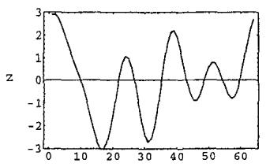

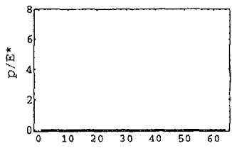

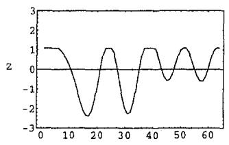

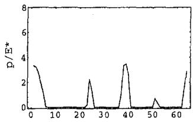

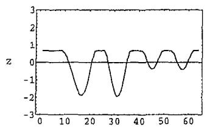

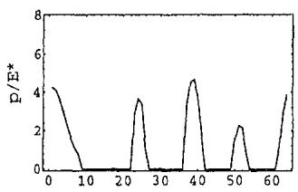

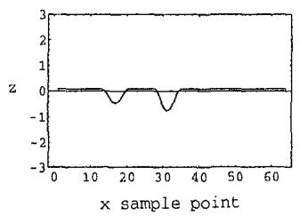

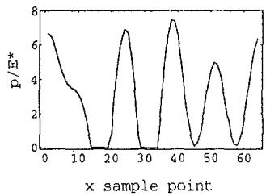  
Fig. 2 Sequence of deformed surface profiles (left column) and pressure solutions (right column) in 2-D. Dimensionless mean pressure = 0.0, 0.5, 1.0, 3.0.

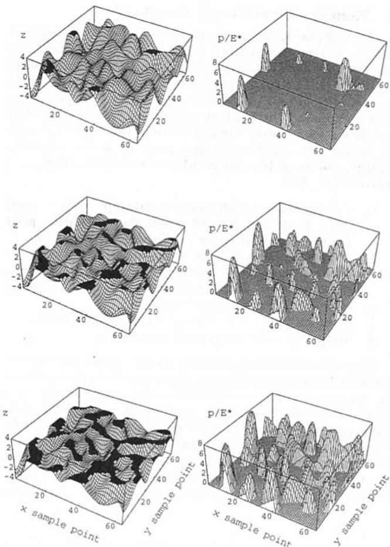  
Fig. 3 Sequence of deformed surface profiles (left column) and pressure solutions (right column) in 3-D. Dimensionless mean pressure = 0.1, 0.5, 1.0.

must be taken that the procedure be applied to "reasonable" mean pressures, namely, those that result in partial contact.

It is also possible to construct a robust minimization procedure by evaluating the energy functional and scaling the gradient appropriately to assure that energy is decreased for each iteration (line search along the gradient direction).

## 7 Validity. Extensions of the Method

Westergaard's solution is exact, and superposition is axiomatic in linear elasticity, so there is no question of the validity of Eq. (6) when the pressure is composed purely from the FFT components. There is some question, however, whether the entries of w derived from Eqs. (1) and (3) lead to an accurate solution for a given finite sampling rate if the true pressure has infinite bandwidth (the case for partial contact). In general we expect some aliasing due to ignored high frequencies, so the problem is to determine a sufficient sampling rate to make aliasing errors small.

For this purpose, the discrete pressure solution is compared to a known solution. The one analytical solution available for comparison is Westergaard's, for which the undeformed profile is a pure sinusoid. Figure 1 plots this solution as well as the calculated discrete pressure p for various levels of load up to complete contact. Agreement is extremely good, even though the sampling rate is very low $( N = 1 6$ per wavelength), indicating that aliasing error is small.

The method can be extended to more complicated geometries. O'Sullivan and King (1988) derive transfer functions (entries of w) for the case of a layered halfspace, including tangential tractions. In this case, the energy functional takes a more complicated form. In addition, nonflat and nonperiodic surfaces can be considered by taking a very large window around the surface of interest, essentially increasing the period to an arbitrarily length. For example, Ju and Farris (1996) solve for Hertzian line contact in this way.

## 8 Examples. 2-D Solutions, 3-D Solutions

Figure 2 shows a sequence of deformed profiles and their associated contact pressure solutions for a limited bandwidth surface. In this case the undeformed profile is given by

$$
z ( x ) = \sum _ { n = 1 } ^ { 5 } \cos { ( n x + \alpha _ { n } ) }\tag{8}
$$

so the implied unit cell size is $2 \pi ,$ although the results can be scaled appropriately, and the maximum frequency content is only 5 times periodic on this cell for clarity of illustration. The phase shift α is drawn from a uniform distribution between 0 and $2 \pi$ . The number of sampling points $N = 6 4$

The extension of the method to 3-D is trivial. In this case, the 2-D FFT is applied to a periodic cell in the x-y plane rather than a periodic segment along x. The quantities u, p, g, and grad f are now matrices rather than vectors, but the solution method and notation is the same. It is emphasized that the contact region evolves along with the pressure solution, so no guesses are required to identify candidate contact regions. Here, the undeformed profile is

$$
\begin{array} { l } { { z ( x , y ) = \displaystyle \sum _ { n = 1 } ^ { 5 } \sum _ { m = 1 } ^ { 5 } e ^ { - ( m ^ { 2 } + n ^ { 2 } ) / 4 0 } } } \\ { { \mathrm { ~ \ ~ \ } \times \ \cos \left( n x + \alpha _ { n } \right) \cos \left( m y + \beta _ { m } \right) } } \end{array}\tag{9}
$$

which is bandwidth limited and random analogous to the 2-D case, above. An exponential decay of amplitude with frequency is chosen arbitrarily. Figure 3 shows a sequence of deformed profiles and their associated contact pressures for a 64 × 64 discretization of the profile $( N = 4 0 9 \bar { 6 } )$ . The agglomeration of contact areas (black) is clearly shown as the load increases, and the associated pressure profiles clearly indicate the transition from isolated, nearly Hertzian profiles to large joined regions of complicated pressure.

## 9 Summary

A numerical method for the elastic contact of periodic random surfaces is presented. The method combines an exact result in linear elasticity with the FFT, leading to a simple formulation for displacement and total complementary energy. This energy is minimized subject to the obvious constraints on pressure, leading to the equilibrium contact pressure and normal displacement solution everywhere on the boundary. Because of the high numerical efficiency of the FFT, this method is suitable for the numerical study of rough surface contact mechanics, especially when the number of sample points is large or when knowledge about the complete surface is needed. A consequence of the ease of calculation is that the power spectrum is a highly useful characterization of surface topography. It is also noted that high level programming languages (e.g. Matlab, Mathematica) and some modern compiled languages support a very compact and elegant notation for this method, which lends itself to efficient vectorization and parallel implementation.

## Acknowledgment

This work was developed during the first author's tenure of the Mitsubishi Special Chair, Advanced Energy Engineering in the Department of Mechanical Engineering at the University of Tokyo, donated by Mitsubishi Heavy Industries, Ltd.

## References

Greenwood, J. A., and Williamson, J. B. P., 1966, “Contact of Nominally Flat Surfaces," Proc. Roy. Soc. London, Vol. A295, pp. 300–319.

Hendricks, C. P., and Visscher, M., 1995, ‘"Accurate Real Area of Contact Measurements on Polyurethane," ASME JoURNAI, OF TRIBOLOGY, Vol. 117, pp. 607-611.

Johnson, K. L., Greenwood, J. A., and Higginson, J. G., 1985, "The Contact of Elastic Regular Wavy Surfaces," Int. J. of Mech. Sci., Vol. 27, No. 6, pp. 383-396.

Ju, Y., and Zheng, L., 1992, "A Full Numerical Solution for the Elastic Contact of Three-Dimensional Real Rough Surfaces," Wear, Vol. 157, pp. 151–161.

Ju, Y., and Farris, T. N., 1996, "Spectral Analysis of Two-Dimensional Contact Problems," ASME JOURNAL. OF TRIBOLOGY, Vol. 118, pp. 320-328.

Kalker, J. J., 1977, "Variational Principles in Contact Elastostatics," J. Inst. Math. Appl., Vol. 20, p. 199.

Komvopoulos, K., and Choi, D. H., 1992, 'Elastic Finite Element Analysis of Multi-asperity Contacts," ASME JOURNAL OF TRIBOI.OGY, Vol. 114, No. 4, pp. 823-831.

O'Sullivan, T. C., and King, R. B., 1988, "Sliding Contact Stress Field Due to a Spherical Indenter on a Layered Elastic Half-Space," ASME JoURNAI. OF TRIBOLOGY, Vol. 110, pp. 235–240.

Webster, M. N., and Sayles, R. S., 1986, “"A Numerical Model for the Elastic Frictionless Contact of Real Rough Surfaces," ASME JoURNAI. OF: TRIBOLOGY, Vol. 108, pp. 314–320.

Westergaard, H. M., 1939, "Bearing Pressures and Cracks," ASME Journal of Applied Mechanics, Vol. 6, pp. A49–A53.
