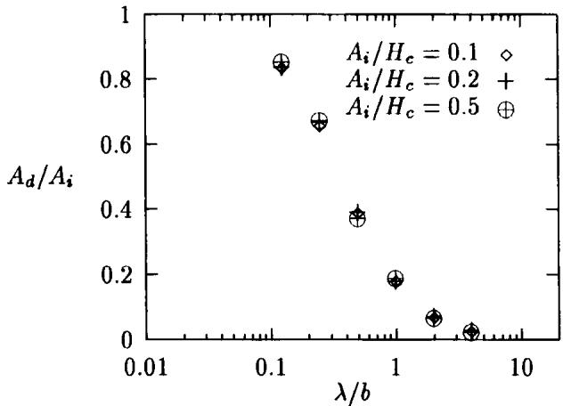
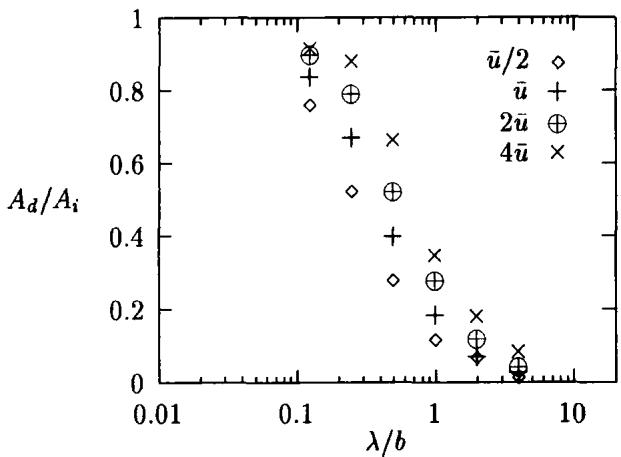
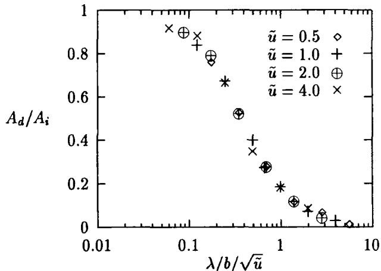
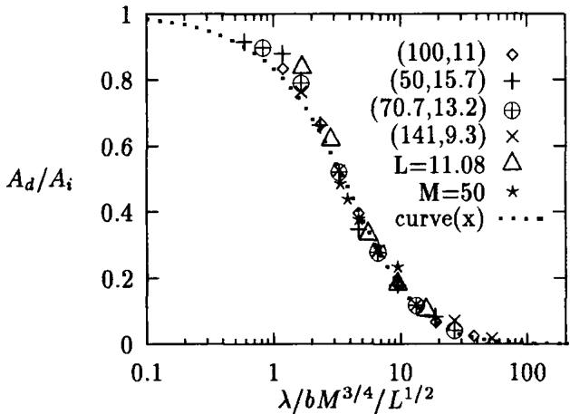
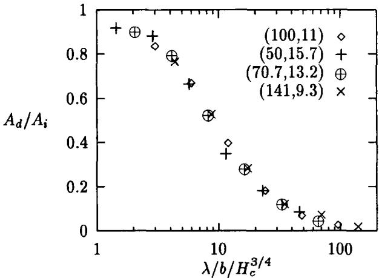
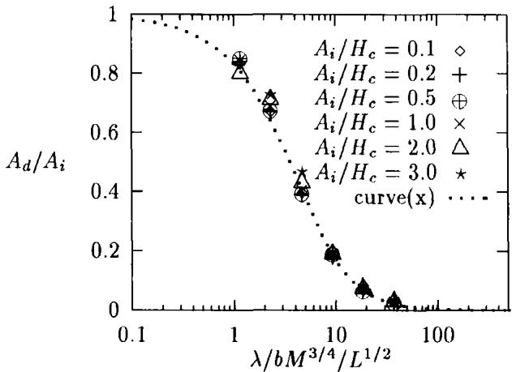
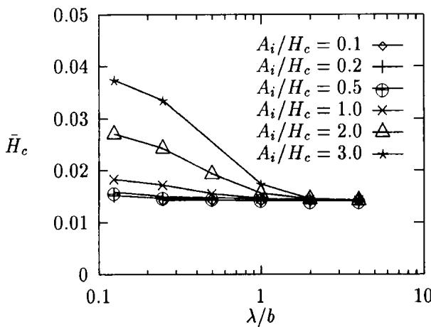
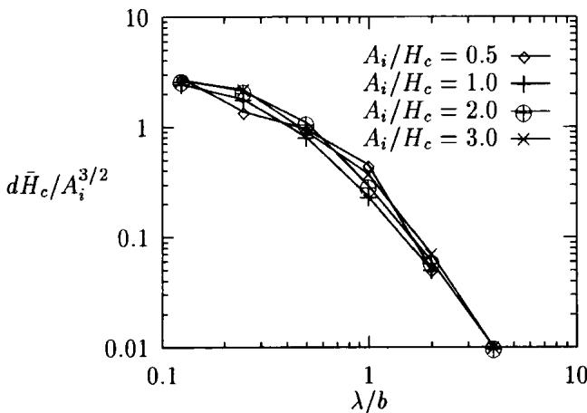
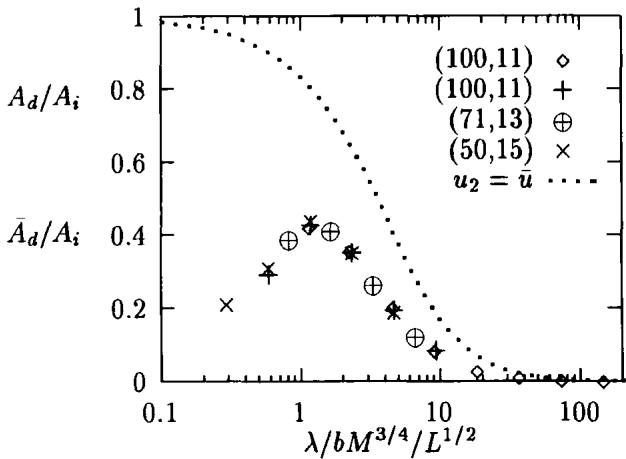

# Amplitude Reduction of Waviness in Transient EHL Line Contacts

C.H. Vennera, F. Couhierb, A.A. Lubrechtb, J.A. Greenwoodc

aUniversity of Twente, Enschede, The Netherlands.

bLaboratoire de Mécanique des Contacts, UMR CNRS 5514, INSA de Lyon, France.

cDepartment of Engineering, University of Cambridge, UK.

The problem of surface waviness in ElastoHydrodynamic Lubrication is commonly considered as a first step towards understanding the lubrication of rough surfaces. Both problems are generally transient. The current paper investigates the deformation of sinusoidal waviness in the contact, more precisely it studies the amplitude reduction of one-sided waviness in a transient EHL line contact. The film thickness amplitude at $X = 0$ is called $A _ { d }$ (deformed amplitude). It is shown that for waviness amplitudes smaller than the film thickness $A _ { i } < H _ { c } ,$ the ratio $A _ { d } / A _ { i }$ is independent of the undeformed amplitude $A _ { i }$ . In other words: for small amplitudes the deformed amplitude depends linearly on the initial amplitude $A _ { i } .$ Rather surprisingly, the same behaviour is found for $A _ { i } > H _ { c }$ The results show that qualitatively waviness with short wavelengths $\lambda / b < 1$ is hardly deformed, thus $A _ { d } \simeq A _ { i }$ . Long wavelengths on the contrary, disappear nearly completely: $A _ { d } < < A _ { i }$ thus $A _ { d } / A _ { i } \simeq 0$ However, quantitatively the amplitude reduction was found to depend also on the contact operating conditions. With a generalized coordinate ∇, instead of $\lambda / b ,$ the relative amplitude $A _ { d } / A _ { i }$ can be described by a single function of ∇ for all operating conditions: $A _ { d } / A _ { i } = F ( \nabla ) , \forall ( M , L )$ . A possible way of expressing ∇ is: $\nabla = \bar { \lambda / b } M ^ { 3 / 4 } / L ^ { 1 / 2 }$

## 1. Introduction

The interest in Elasto Hydrodynamic Lubrication (EHL) has gradually shifted from the steady state smooth surface problem to more complex geometries, i.e. the effect of surface features such as dents, bumps, waviness and roughness. In other words attention has moved from the macro contact to features that cover only a fraction of the contact area: the micro contact, and from the steady state to transient conditions. This change in interest can easily be explained when realizing that engineering surfaces are never perfectly smooth. The current trends in design are towards increased efficiency: higher loads, lower viscosity oils and higher operating temperatures and thus thinner lubricant films. As a result the surface topography becomes increasingly important when describing the performance of lubricated concentrated contacts. Experimental investigations into the influence of surface effects have been carried out using optical interferometry, Wedeven and Cusano (1979), Kaneta and Cameron (1980), and more recently Kaneta (1992) and Kaneta et al. (1992,1993). Also more and more theoretical work is devoted to studying the influence of the surface topography. Most of these studies have been carried out using a steady state analysis see for instance Goglia et al. (1984), Kweh et al (1989), and Lee and Hamrock (1990). However, in general both surfaces move and any feature present on the surface will move through the contact. Hence, in fact such theoretical studies require a transient analysis calculating the pressure and film thickness, see Ai and Cheng (1993, 1994a, 1994b, 1996), Chang (1989, 1992), Osborn and Sadeghi (1992) and Venner et al. (1991). A time step proportional to the spatial discretisation should be used to model the motion of the feature through the contact. In addition, the number of spatial nodes should be sufficiently large to study features on a sub-contact scale. Obviously, a prerequisite for such studies is an algorithm of very low complexity for the computation of the film thickness and pressure in the contact at each time step. Moreover, to simulate situations of practical interest, the algorithm should also be stable, especially since rough surface problems tend to be more difficult to solve from a stability point of view than their smooth surface counterparts.

The introduction and further development of multilevel techniques to solve the EHL problem has yielded algorithms for the steady state line and point contact problem of O(n ln n) complex-$\operatorname { i t } \mathbf { y } ,$ n being the number of discretisation points. As a result these methods allow a fast computation of the pressure profile and film shape using large values of n and are well suited to accomplish the transient calculations.

This method has allowed detailed studies of transient features: Lubrecht et al. (1990, 1992) and Venner et al. (1991, 1994a, 1994b, 1994c, 1996).

A detailed analysis of the change of the wavelength of the waviness in an EHL contact was supplied by Greenwood and Johnson (1992), Greenwood and Morales-Espejel (1994) and Morales-Espejel (1993). The missing part of the puzzle remains the change of amplitude inside the contact; the amplitude reduction as a function of wavelength and operating conditions, which forms the topic of the current paper.

## 2. Nomenclature

$A _ { d }$ dimensionless deformed amplitude $A _ { d } = [ \mathsf { m a x } _ { T } H ( 0 , T ) - \mathsf { m i n } _ { T } H ( 0 , T ) ] / 2$ $_ z$   
$\bar { A } _ { d }$ equivalent dimensionless $\pmb { \alpha }$ deformed amplitude $\bar { \pmb { \alpha } }$ $\begin{array} { r } { \bar { A } _ { d } = [ \mathbf { m } \mathbf { a x } _ { \phi } H ( X = 0 ) - \mathbf { m } \mathbf { i n } _ { \phi } H ( X = 0 ) ] / 2 } \end{array}$ $\Delta \tau$   
$A _ { i }$ dimensionless initial amplitude $\Delta { } _ { X }$ $A _ { i } = a _ { i } R / b ^ { 2 }$ € €   
$\pmb { b }$ half width of Hertzian contact $b = \sqrt { ( 8 \mathbf { w } R ) / ( \pi E ^ { \prime } ) }$ $\lambda$   
$E ^ { \prime }$ reduced modulus of elasticity $\bar { \lambda }$ $2 / E ^ { \prime } = ( 1 - \nu _ { 1 } ^ { 2 } ) / E _ { 1 } + ( 1 - \nu _ { 2 } ^ { 2 } ) / E _ { 2 }$ dimensionless materials parameter $\pmb { \eta }$ $\boldsymbol { G } = \boldsymbol { \alpha } \boldsymbol { E } ^ { \prime }$ $\pmb { \eta } _ { 0 }$   
h film thickness $\bar { \pmb { \eta } }$   
H dimensionless film thickness $\pmb { \rho }$ $H = h R / b ^ { 2 }$ $\pmb { \rho _ { 0 } }$   
$H _ { c }$ dimensionless central film thickness $\bar { \pmb \rho }$ $H _ { c } = h _ { c } R / b ^ { 2 }$   
$\tilde { H } _ { c }$ mean central film thickness over time $\bar { H } _ { c } = ( H _ { c } ^ { + } + H _ { c } ^ { - } ) / 2$   
$d H _ { c }$ central film thickness increase $d H _ { c } = \bar { H } _ { c } - H _ { c }$   
$H _ { 0 }$ integration constant   
$L$ dimensionless material parameter $( \mathbf { M o e s } ) \ L = G ( 2 U ) ^ { 0 . 2 5 }$   
$M$ dimensionless load parameter (Moes) $M = W ( 2 U ) ^ { - 0 . 5 }$   
$\pmb { p }$ pressure   
${ \pmb p } _ { h }$ maximum Hertzian pressure $p _ { h } = ( 2 \mathbf { w } ) / ( \pi b )$   
$P$ dimensionless pressure, $P = p / p _ { b }$   
$R$ reduced radius of curvature $1 / R = 1 / R _ { 1 } + 1 / R _ { 2 }$   
$\textstyle { \pmb { \mathcal { R } } }$ dimensionless deviations from the smooth profile   
$t$ time   
$_ T$ dimensionless time $T = t { \bar { u } } / b$   
${ \pmb u } _ { 1 }$ velocity of lower (smooth) surface   
${ \pmb u } _ { 2 }$ velocity of upper surface   
$\bar { \pmb u }$ mean velocity $\bar { \pmb { u } } = ( \pmb { u } _ { 1 } + \pmb { u } _ { 2 } ) / 2$   
$U$ dimensionless speed parameter $U = \eta _ { 0 } \bar { u } / ( E ^ { \prime } R )$   
$_ { x }$ coordinate   
$X$ dimensionless coordinate, $X = x / b$   
$X _ { a } , X _ { b }$ dimensionless inlet, outlet boundary of the domain $X _ { a } = x _ { a } / b , X _ { b } = x _ { b } / b$   
$X _ { s }$ dimensionless position of waviness start   
$W$ dimensionless load parameter $W = \mathbf { w } / ( E ^ { \prime } R )$ viscosity index (Roelands equation) pressure viscosity index dimensionless parameter, $\bar { \alpha } = \alpha p _ { h }$ dimensionless time increment dimensionless space increment coefficient in Reynolds equation $\epsilon = ( \bar { \rho } H ^ { 3 } ) / ( \bar { \eta } \bar { \lambda } )$ waviness wavelength dimensionless speed parameter $\bar { \lambda } = ( 1 2 \eta _ { 0 } \bar { u } R ^ { 2 } ) \bar { / } ( b ^ { 3 } p _ { h } \bar { ) }$ viscosity viscosity at ambient pressure dimensionless viscosity, $\bar { \eta } = \eta / \eta _ { 0 }$ density density at ambient pressure dimensionless density, $\bar { \pmb { \rho } } = \pmb { \rho } / \pmb { \rho _ { 0 } }$

## 3. Theory

For completeness this section presents the dimensionless equations to be solved.

$$
\frac { \partial } { \partial X } \left( \epsilon \frac { \partial P } { \partial X } \right) - \frac { \partial ( \bar { \rho } H ) } { \partial X } - \frac { \partial ( \bar { \rho } H ) } { \partial T } = 0\tag{1}
$$

The boundary conditions are $\begin{array} { r l } { P ( X _ { a } , T ) } & { { } = } \end{array}$ $P ( X _ { b } , T ) = 0 { \mathrm { . } }$ ∀T where $X _ { a }$ and $X _ { b }$ denote the boundaries of the domain. Furthermore, the cavitation condition $P ( X , T ) \geq 0$ , ∀X, T must be satisfied. € and λ are defined according to:

$$
\epsilon = \frac { \bar { \rho } H ^ { 3 } } { \bar { \eta } \bar { \lambda } } \qquad \bar { \lambda } = \frac { 1 2 \eta _ { 0 } \bar { u } R ^ { 2 } } { b ^ { 3 } p _ { h } }
$$

The density $\rho$ is assumed to depend on the pressure according to the Dowson and Higginson relation (Dowson and Higginson (1966)) and the Roelands viscosity pressure relation (Roelands (1966)) is used.

The film thickness equation is made dimensionless using the same parameters and accounting for a moving surface feature reads:

$$
\begin{array} { r } { \displaystyle H ( X , T ) = H _ { 0 } ( T ) + \frac { X ^ { 2 } } { 2 } - \mathcal { R } ( X , T ) } \\ { \displaystyle - \frac { 1 } { \pi } \int _ { X _ { a } } ^ { X _ { b } } P ( X ^ { \prime } , T ) \ln { | X - X ^ { \prime } | } \ d X ^ { \prime } } \end{array}\tag{2}
$$

where ${ \mathcal { R } } ( X , T )$ denotes the undeformed waviness geometry.

$$
{ \mathcal { R } } ( X , T ) = A ( X , T ) \cos \left[ 2 \pi { \frac { ( X - X _ { s } ) } { ( \lambda / b ) } } \right]
$$

$$
\begin{array} { r } { A ( X , T ) = A _ { i } 1 0 ^ { - 1 0 ( \operatorname* { m a x } ( 0 , \frac { [ X - X _ { * } ] } { ( \lambda / b ) } ) ^ { 2 } ) } } \end{array}
$$

The exponential term in the amplitude smoothly suppresses the waviness for $X - X _ { s } >$ 0, i.e. without introducing any discontinuous derivatives. It allows the waviness to start effectively at $X _ { s } = X _ { s , 0 } + T u _ { 2 } / \bar { u } _ { \mathrm { : } }$ and thus allows the computations to start with the waviness well outside the contact and to move physically correct through the contact, from $T = 0$ onwards.

At all times the force balance condition is imposed, i.e. the integral over the pressure must balance the externally applied contact load. This condition determines the value of the integration constant $H _ { 0 } ( T )$ in equation (2). Expressed in the dimensionless variables it reads:

$$
\int _ { X _ { a } } ^ { X _ { b } } P ( X , T ) d X - { \frac { \pi } { 2 } } = 0 , \quad \forall T\tag{3}
$$

The equations were discretised with second order accuracy with respect to both space and time. Multilevel techniques were used to accelerate the convergence of the relaxation process, and to calculate the deformation integrals rapidly. These techniques are extensively described in Lubrecht (1987) and Venner (1991).

In our study we focus on the behaviour of the amplitude of the film thickness oscillations $A _ { d }$ in the center of the contact:

$$
2 A _ { d } = \operatorname* { m a x } _ { T } H ( 0 , T ) - \operatorname* { m i n } _ { T } H ( 0 , T )\tag{4}
$$

where the maximum and minimum are taken over the period in which the film thickness variations have become periodic, thus excluding the period when the waviness enters the contact. We will refer to $A _ { d }$ as the (dimensionless) deformed amplitude.

## 3.1. Numerical Accuracy

In this section the numerical accuracy of the results is analysed for a specific case $( M = 1 0 0 , L =$ 11). The parameter values are: $\pmb { \alpha } = 2 . 2 \times 1 0 ^ { - 8 }$ $z \stackrel { . } { = } 0 . 6 7 , \eta _ { 0 } = 4 . 0 \times 1 0 ^ { - 2 }$ and $P _ { 0 } = 1 . 9 6 \times 1 0 ^ { 8 }$ The domain was taken $- 2 . 5 \leq X \leq 1 . 5$ .The smooth problem value of the central film thickness is $H _ { c } ~ = ~ 1 . 4 1 7 \times 1 0 ^ { - 2 }$ for level 8, 2048 points. The level 9 (4096 points) value is $H _ { c } =$ $1 . 4 2 2 \times 1 0 ^ { - 2 }$ . The level 10 (8192 points) value is $H _ { c } = 1 . 4 2 3 \times 1 0 ^ { - 2 }$

This indicates that the absolute error on level 9 is of the order of $1 \times 1 0 ^ { - 5 }$ The problem of the determination of the amplitude reduction is, however, more difficult because of three reasons. First of all, one studies the behaviour of a difference between two amplitudes. Secondly, because these amplitudes are an order of magnitude smaller than $H _ { c 1 }$ and finally, because the problem is transient the incremental error per timestep accumulates. This error accumulation can be easily monitored when comparing the waviness amplitude around $X ~ = ~ - 0 . 9$ and $X ~ = ~ 0 . 9$ These should remain identical as long as the pressure remains sufficiently high everywhere in the high pressure zone. For the above case with pure rolling, $\lambda / b = 0 . 5$ and $A _ { i } / H _ { c } = 0 . 1 , \ A _ { d } / A _ { i } =$ 0.395 was obtained with level $^ { 8 , }$ level 9 resulted in $A _ { d } / A _ { i } = 0 . 3 9 4$ , while the level 10 result was $A _ { d } / A _ { i } = 0 . 3 9 3$ . Assuming second order accuracy, the level 9 results reported throughout the work are estimated to have an absolute error of approximately 1%. However, towards larger and smaller values of $A _ { d } / A _ { i } ,$ and for smaller values of $\lambda / \mathfrak { b }$ , the situation is less favourable, and an overall relative error of 2-5% in $A _ { d } / A _ { i }$ seems to be more realistic.

## 4. Pure Rolling $( { \pmb u } _ { 2 } = { \bar { \pmb u } } )$

## 4.1. Linear Behaviour $A _ { i } < < H _ { c }$

The stationary Reynolds equation being already a complicated non-linear equation, the central idea was to study the behaviour of waviness with amplitudes $A _ { i }$ much smaller than the smooth film thickness $H _ { c }$ It was hoped that for these small amplitudes the waviness deformation would be linear, i.e. independent of $A _ { i }$ This linear behaviour is indeed obtained as can be concluded from Table 1. The differences between the columns are thought to be primarily caused by numerical errors.

|  | $\overline { { A _ { i } / H _ { c } } }$ | $\overline { { A _ { i } / H _ { c } } }$ | $\overline { { A _ { i } / H _ { c } } }$ |
| --- | --- | --- | --- |
| λ/b | 0.1 | 0.2 | 0.5 |
| 4.0 | 0.030 | 0.030 | 0.029 |
| 2.0 | 0.073 | 0.073 | 0.073 |
| 1.0 | 0.183 | 0.182 | 0.195 |
| 0.5 | 0.394 | 0.393 | 0.378 |
| 0.25 | 0.660 | 0.670 | 0.679 |
| 0.125 | 0.839 | 0.838 | 0.859 |

Table 1 $A _ { d } / A _ { i }$ for different initial amplitudes $A _ { \mathrm { i } } / H _ { \mathrm { c } }$ : and wavelengths $\lambda / b$ , M = 100, L = 11.

  
Figure 1 Relative amplitude as a function of $\lambda / b _ { i }$ for three different initial amplitudes and pure rolling, $M = 1 0 0$ $L = 1 1$

The same results are plotted in Figure 1, in order to observe the way $A _ { d } / A _ { i }$ depends on $\lambda / b$ This figure shows that long wavelengths like $\lambda / b = 4$ are almost completely deformed (flattened), while shorter wavelengths such as $\lambda / b = 1 / 8$ deform only very little. However, as is demonstrated in the next section, the relative amplitude reduction depends on the specific operating conditions.

## 4.2. Influence of Rolling Speed

Figure 2 shows how the amplitude reduction curve depends on the velocity ū. A series of constant horizontal shifts with respect to the coordinate $\lambda / b$ was obtained. For increasing values of ū the curve tends to be shifted to the right. Since the relative amplitude $A _ { d } / A _ { i }$ is independent of $A _ { \mathfrak { i } } ,$ and since $0 \leq A _ { d } / A _ { i } \leq 1$ , it seems logical to try and reduce the number of parameters by scaling the horizontal coordinate.

It was found that the horizontal shift can be counteracted by introducing a new parameter $\lambda / b / { \sqrt { \tilde { u } } }$ In order to keep the scale of the horizontal axis similar to the ones used before, all velocities are scaled to the velocity ū in Figure 2. Figure 3 shows that the different curves all coincide when the new horizontal coordinate is used $\lambda / b / { \sqrt { \tilde { u } } }$

  
Figure 2 Relative amplitude as a function of $\lambda / b$ for four different speeds and pure rolling.

## 4.3. Influence of Operating Conditions

After this successful attempt, it was logical to try to reduce the curves with respect to load and material parameters as well. Remembering though, that the steady-state EHL problem can be described by two parameters only: $\bar { \alpha } , \bar { \lambda }$ or $M , L ,$ the parameter $\sqrt { \bar { u } }$ was abandoned, in favour of M and L.

Fixing the ratio of M and L to obtain $1 / { \sqrt { U } }$ see above, and staying close to rational fractions for the exponents, the following dimensionless parameter ∇ was obtained: $\nabla \ : = \ : \lambda / b M ^ { 3 / 4 } / L ^ { \dot { 1 } / 2 }$ This parameter allows a single description of $A _ { d } / A _ { i }$ as a function of ∇ irrespective of the operating conditions, see Figure 4. This parameter can be rewritten, up to a constant as: $\nabla =$ $\lambda / b / { \sqrt { { \bar { \alpha } } { \bar { \lambda } } } }$ . Since the two expressions are identical up to a multiplicative constant, their approximation is equally good.

In a slightly different approach the parameter $\boldsymbol { \nabla }$ is made dimensionless with respect to the central film thickness, in dimensionless terms it reads: $\nabla = \lambda / b / H _ { c } ^ { 3 / 4 }$ . The reduction of all results onto a single curve is equally effective, as is shown by Figure 5.

  
Figure 3 Relative amplitude as a function of $\lambda / \bar { b } / \sqrt { \tilde { \mathbf { u } } }$ , for four different speeds and pure rolling.

  
Figure 4 Relative amplitude as a function of $\nabla _ { : }$ for different conditions (M, L) and pure rolling.

  
Figure 5 Relative amplitude as a function of $\nabla _ { \cdot }$ for different conditions (M, L) and pure rolling.

## 4.4. Curve Fit

The single curve that describes the relative amplitude $A _ { d } / A _ { i }$ as a function of ∇, is approximated by the following equation:

$$
\frac { A _ { d } } { A _ { i } } = \frac { 1 } { 1 + 0 . 1 7 \nabla + 0 . 0 3 \nabla ^ { 2 } }\tag{5}
$$

where $\begin{array} { l l l } { \nabla } & { = } & { \lambda / b M ^ { 3 / 4 } / L ^ { 1 / 2 } } \end{array}$ This equation naturally fulfills the two asymptotic values: $\mathrm { l i m } _ { \nabla  0 } A _ { d } / A _ { i } ~ = ~ 1$ and limy $\smash { \to \infty \ A _ { d } / A _ { i } \ = \ 0 }$ This curve, which is plotted in Figures 4 and $6 ,$ closely approximates the computed values for $A _ { d } / A _ { i } \le 0 . 5$ . For larger values, $0 . 5 < A _ { d } / A _ { i } < 1$ however, this curve seems to predict values which are too small. More complex approximations are possible to improve the fit for $0 . 5 < A _ { d } / A _ { i } < 1$ but do not add to the insight.

Greenwood and Morales-Espejel (1994) predict a similar relation between amplitude and dimensionless wavelength, which can be rewritten using the notation of this paper as:

$$
\frac { A _ { d } } { A _ { i } } = \frac { 1 } { 1 + C ^ { * } \bar { \nabla } }\tag{6}
$$

where $\bar { \nabla } = \lambda / b / H _ { c }$ and $C ^ { * } \simeq 3 . 3$ . Since $H _ { c } \simeq$ $0 . 0 1$ , the point $A _ { d } / A _ { i } = 0 . 5$ would be reached around $\lambda / b = 0 . 0 0 3$ , whereas Figure 1 shows that this point occurs around $\lambda / b = 0 . 3$ . Thus, qualitatively (6) gives a similar curve as (5), but as the predictions of (6) are two orders of magnitude lower, we are still left in the dark with respect to the "physical" mechanism determining the observed behaviour.

## 4.5. Non-Linear Behaviour $A _ { i } \simeq H _ { c }$

When the waviness amplitude becomes comparable to the film thickness the above stated linear behaviour is expected to break down. However, an extension of Figure 1, including amplitudes $A _ { i }$ up to three times the film thickness value, show hardly any deviation from the linear behaviour, see Figure 6.

From this Figure it can be concluded that the amplitude reduction remains linear, even for amplitudes $A _ { i }$ much larger than the film thickness. However, for $A _ { i } / H _ { c } \geq 2 . 0$ and $A _ { d } / A _ { i } \geq 0 . 6$ this suggests that $A _ { d } > H _ { c } ,$ and that contact between the two surfaces occurs. Indeed, $A _ { d } > H _ { c }$ , but no contact occurs because the mean central film thickness value $\bar { H } _ { c }$ increases over the smooth surface value $H _ { c }$ , as is shown in Figure 7. In this Figure $\bar { H } _ { \mathrm { c } }$ is dened as $\bar { H } _ { \mathfrak { c } } = ( H _ { c } ^ { \bar { + } } + H _ { c } ^ { - } ) / 2$ , where $H _ { c } ^ { + }$ and $H _ { c } ^ { - }$ are the subsequent maximum and minimum value of $H ( X = 0 , T )$ over time. For deformed amplitudes $A _ { d }$ that are larger than $H _ { c }$ $\bar { H } _ { c }$ tends asymptotically to $A _ { d } ,$ which is logical, since no additional deformation seems to occur.

  
Figure 6 Relative amplitude as a function of $\nabla ,$ for six different initial amplitudes and pure rolling, $M = 1 0 0$ $L = 1 1$

In Figure 8 the increase in the mean central film thickness $d \ddot { H } _ { c }$ is plotted against $\lambda / b , \ d \bar { H } _ { c }$ is defined as d $\bar { H } _ { c } = ( H _ { c } ^ { + } + H _ { c } ^ { - } ) / 2 - H _ { c }$ . The variation of $\bar { d } H _ { c }$ with $A _ { i }$ is not linear, as is shown in Figure 8, it seems as if $d \bar { H } _ { c } \propto A _ { i } ^ { 3 / 2 }$ . A similar non linear behaviour was observed in Venner and Lubrecht 1994a, Figure 9.

## 5. Simple Sliding (u2 = 0)

The same analysis as in section 4 was performed for the stationary case of simple sliding, where the waviness is located on the stationary surface:

$$
{ \mathcal { R } } ( X ) = A _ { i } \cos \left( { \frac { 2 \pi X } { ( \lambda / b ) } } - \phi \right)
$$

  
Figure 7 Mean central film thickness as a function of $\cdot _ { \lambda / b , }$ for six different initial amplitudes and pure rolling, $M = 1 0 0$ $L = 1 1$

  
Figure 8 Mean central film thickness difference as a function of $\lambda / b ,$ for six different initial amplitudes and pure rolling, $M = 1 0 0 , L = 1 1$

In this form the problem has been studied extensively in the past, e.g. over a decade ago by Goglia et al. (1984b). They investigated in detail the effect of the waviness amplitude and faseshift on the pressure profile and film shape. Here we revisit this problem, and investigate if a similar mastercurve exists as for the transient pure rolling problem.

As the problem is stationary $A _ { d }$ according to (4) is not defined. However, instead of $T$ the faseshift may be used to obtain an equivalent deformed amplitude (Couhier 1996):

$$
2 \bar { A } _ { d } = \operatorname* { m a x } _ { 0 \leq \phi \leq 2 \pi } H ( X = 0 ) - \operatorname* { m i n } _ { 0 \leq \phi \leq 2 \pi } H ( X = 0 )\tag{7}
$$

Subsequently the behaviour of the equivalent relative amplitude $\bar { A } _ { d } / A _ { i }$ was studied as a function of the operating conditions, see Figure 9. Firstly it appears that, as for the pure rolling cases, the results obtained for different loading conditions can be mapped on a single curve using the very same dimensionless parameter ∇. However, the behaviour is essentially different. Indeed for $\nabla > 1$ we see a similar behaviour as in Figure 4, however, for $\nabla \textbf { < } 1$ , the quantity $\bar { A } _ { d }$ decreases. This behaviour reflects a fundamental difference between the transient solution and the steady state solution. The reduction of $\scriptstyle { \vec { A } } _ { d }$ for $\nabla < 1$ does not imply that the waviness itself is completely flattened. On the contrary, for small wavelengths the film thickness varies as a function of X with an amplitude that, even though it is small (and for larger wavelengths almost zero), increases with decreasing wavelength.

The reduction of $\bar { A } _ { d }$ for $\nabla \prec 1$ is simply the consequence of its definition as a film thickness difference taken from a series of (uncoupled) solutions. Under pure sliding conditions the waviness in the inlet perturbs the pressure build-up in the transition zone (zone in which the Poiseuille flow term disappears). The extent of this zone is limited, but whenever the wavelength becomes smaller than its size, an averaging effect takes place, resulting in an insensitivity of $H ( X = 0 )$ to a fase-shift.

  
Figure 9 Relative equivalent amplitude as a function of ∇ for different conditions (M, L) and simple sliding. The dotted curve gives the relative amplitude as a function ∇ for pure rolling according to equation (5)

## 6. Discussion and Conclusion

The problem of waviness amplitude reduction in an EHL line contact has been studied in this paper by means of the amplitude $A _ { d }$ of the film thickness oscillations in the center of the contact. It was found that under pure rolling the relative amplitude $A _ { d } / A _ { i }$ can be expressed as a single function of a dimensionless wavelength $\nabla = \mathrm { \lambda } / { b M ^ { 3 / 4 } } / { L ^ { 1 / 2 } }$ . This relation does not depend either on the contact operating conditions, nor on the initial amplitude or wavelength. For large amplitude waviness, the mean central film thickness $d \bar { H } _ { c }$ tends to increase with $A _ { i }$

The same study was carried out for the case of pure sliding. For this steady state problem an equivalent deformed amplitude can be defined using the fase of the wave relative to the contact. It was shown that the relative equivalent deformed amplitude ${ \bar { A } _ { d } } / A _ { i }$ is a function only of the very same dimensionless wavelength ∇. For large ∇ the behaviour of $\bar { A } _ { d } / A _ { i }$ is similar to the behaviour of $A _ { d } / A _ { i }$ for pure rolling. However, for small ∇ the behaviour was quite different as $\bar { A } _ { d } / A _ { i }$ tends to 0 whereas $A _ { d } / A _ { i }$ tends to unity. This different behaviour is a consequence of the definition of $\bar { A } _ { d }$

Further work is required to analyse the amplitude behaviour under general rolling/sliding conditions.

In this paper we studied the deformed amplitude by means of the film thickness oscillations in the center of the contact. Strictly this is not exactly the deformed amplitude as the result includes changes of $H _ { 0 }$ as a function of time. The exact influence of these changes should be investigated. Subsequently attention should be directed to the case of two dimensional roughness in point contacts.

Finally, fast and stable numerical algorithms presently allow detailed studies of the transient effects of surface features on film and pressure in EHL contacts. Indeed, detailed simulations for individual features and load conditions can give much information, but the main question is to translate this knowledge into simple engineering tools for general use. The results presented here can be an important step in this direction. They facilitate computation of (an estimate of) the deformed film profile for pure rolling from the decomposition of the undeformed profile in its Fourier components and the application of equation (5) onto every single component amplitude.

## 7. Acknowledgement

The first author kindly acknowledges the support of the Royal Netherlands Academy of Arts and Sciences.

## 8. References

Ai, X., Cheng, H.S., and Zheng, L., 1993, “A Transient Model for Micro-Elastohydrodynamic Lubrication with Three-Dimensional Irregularities," ASME JOT, 115, pp. 102-110.

Ai, X., and Cheng, H.S., 1994a, "The Influence of Moving Dent on Point EHL Contacts," STLE Trib. Trans., 37, pp. 323-335.

Ai, X., and Cheng, H.S., 1994b, "A Transient EHL Analysis for Line Contacts with a Measured Surface Roughness using Multigrid Technique," ASME JOT, 116, pp. 549-558.

Ai, X., and Cheng, H.S., 1995 "The Effects of Surface Texture on EHL Point Contacts," submitted to ASME JOT.

Chang, L., Cusano, C., and Conry, T.F., 1989, "Effects of Lubrication Rheology and Kinematic Conditions on Micro- Elastohydrodynamic Lubrication," ASME JOT, 111, 344-351.

Chang, L., and Webster, M.N., 1991, "A Study of Elastohydrodynamic Lubrication of Rough Surfaces," ASME JOT, 113, 110-115.

Chang, L., 1992, "Traction in Thermal Elastohydrodynamic Lubrication of Rough Surfaces," ASME JOT, 114, 186-191.

Couhier, F., 1996, "Influence des Rugosites de Surface sur les Mecanismes de Lubrification de Contact Elastohydrodynamique Cylindre-Plan", (in French) Ph.D. Thesis, INSA de Lyon, France.

Dowson, D., and Higginson, G.R., 1966, "Elastohydrodynamic Lubrication, The Fundamentals of Roller and Gear Lubrication," Pergamon Press, Oxford, Great Britain.

Goglia, P.R., Cusano, C., and Conry, T.F., 1984, “The Effects of Surface Irregularities on the Elastohydrodynamic Lubrication of Sliding Line Contacts. Part I - Single Irregularities," ASME JOT, 106, 104-112.

Goglia, P.R., Cusano, C., and Conry, T.F., 1984, "The Effects of Surface Irregularities on the Elastohydrodynamic Lubrication of Sliding Line Contacts. Part II - Wavy Surfaces," ASME JOT, 106, 113-119.

Greenwood, J.A., and Johnson, K.L., 1992, “The Behaviour of Transverse Roughness in Sliding Elastohydrodynamically Lubricated Contacts," WEAR, 153, pp. 107-117.

Greenwood, J.A., and Morales Espejel, G.E., 1994, "The Behaviour of Transverse Roughness in EHL Contacts," Proc. IMechE, 208, pp. 121-132.

Kaneta, M., and Cameron, A., 1980, "Effects of Asperities in Elastohydrodynamic Lubrication," ASME JOLT, 102, 374-379.

Kaneta, M., 1992, "Effects of Surface Roughness in Elastohydrodynamic Lubrication," JSME, III, 35, 4, pp. 535-546.

Kaneta, M., Sakai, T., and Nishikawa, H., 1992, "Optical Interferometric Observations of the Effects of a Bump on Point Contact EHL,"

ASME JOT, 114, pp. 779-784.

Kaneta, M., Sakai, T., and Nishikawa, H., 1993, "Effects of Surface Roughness on Point Contact EHL," STLE Trib. Trans., 36,4, pp. 605- 612.

Kweh, C.C., Evans, H.P., and Snidle, R.W., 1989, "Micro-Elastohydrodynamic Lubrication of an Elliptical Contact with Transverse and Three-Dimensional Roughness,"ASME JOT, 111, 577-583.

Lee, R.T., and Hamrock, B.J., 1990, “A circular non-Newtonian Fluid Model: Part II - used in Micro-Elastohydrodynamic Lubrication," ASME JOT, 112, 497-505.

Lubrecht, A.A., 1987, "Numerical Solution of the EHL Line and Point Contact Problem Using Multigrid Techniques," Ph.D. Thesis, University of Twente, Enschede, The Netherlands, ISBN 90-9001583-3.

Lubrecht, A.A., Venner, C.H., Lane, S., Jacobson, B., and Ioannides, E., 1990, "Surface Damage- Comparison of Theoretical and Experimental Endurance Lives of Rolling Bearings," Proceedings of the 1990 Japan International Tribology Conference, Nagoya, Japan, 1, 185-190.

Lubrecht, A.A., and Venner, C.H., 1992, “Aspects of two-Sided Surface Waviness in an EHL Line Contact," presented at the 1992 Leeds-Lyon Conference on Tribology, Leeds, U.K.

Morales Espejel, G.E., 1993, "Elastohydrodynamic lubrication of smooth and rough surfaces," PhD. Thesis, University of Cambridge, Department of engineering.

Osborn, K.F., and Sadeghi, F., 1992, "Time Dependent Line EHD Lubrication Using the Multigrid/Multilevel Technique", ASME JOT, 114, 68-74.

Roelands, C.J.A., 1966, "Correlational Aspects of the Viscosity-Temperature-Pressure Relationship of Lubricating Oils" Ph.D. Thesis, Technical University Delft, Delft, The Netherlands, (V.R.B., Groningen, The Netherlands).

Venner, C.H., 1991, "Multilevel Solution of the EHL Line and Point Contact Problems," Ph.D. Thesis, University of Twente, Enschede, The Netherlands. ISBN 90-9003974-0.

Venner, C.H., Lubrecht, A.A., and ten Napel, W.E., 1991, "Numerical Simulation of

the Overrolling of a Surface Feature in an EHL Line Contact," ASME JOT, 113, 777-783.

Venner, C.H., and Lubrecht, A.A., 1994a, "Transient Analysis of Surface Features in an EHL Line Contact in the case of Sliding," ASME JOT, 116, Pp. 186-193.

Venner, C.H., and Lubrecht, A.A., 1994b, "Numerical Simulation of a Transverse Ridge in a Circular EHL Contact, under rolling/sliding", ASME JOT, 116, pp. 751-761.

Venner, C.H., and Lubrecht, A.A., 1994c, "Numerical Simulation of Waviness in a Circular EHL Contact, under rolling/sliding", presented at the 1994 Leeds-Lyon Symposium on Tribology.

Venner, C.H., and Lubrecht, A.A., 1996, "Numerical Analysis of the influence of Waviness on the Film Thickness of a Circular EHL Contact", ASME JOT, 118, pp. 153-161.

Wedeven, L.D., and Cusano, C., 1979, "Elastohydrodynamic Film Thickness Measurements of Artificially Produced Surface Dents and Grooves," ASLE Trans., 22, 369-381.
