P. Ehret, D. Dowson and C. M. Taylor

# On lubricant transport conditions in elastohydrodynamic conjuctions

Proc. R. Soc. Lond. A 1998 454, 763-787

doi: 10.1098/rspa.1998.0185

Email alerting service

Receive free email alerts when new articles cite this article - sign up in the box at the top right-hand corner of the article or click here

To subscribe to Proc. R. Soc. Lond. A go to: http://rspa.royalsocietypublishing.org/subscriptions

# On lubricant transport conditions in elastohydrodynamic conjunctions

B y P. Ehret, D. Dowson and C. M. Taylor Institute of Tribology, School of Mechanical Engineering, University of Leeds, Leeds LS2 9JT, UK

Received 16 October 1996; revised 9 July 1997; accepted 18 August 1997

New numerical results, based upon the concept of solidification, are produced which match the intriguing dimple observed by Kaneta in elastohydrodynamic lubrication of point contacts under pure sliding conditions. It is shown that Kaneta’s dimple is consistent with transport conditions of a solidified lubricant in the high-pressure region of the conjunction. The diference of velocity between the average velocity of the solidified core and the mean entraining velocity is referred to as ‘slip’. The value of slip is shown to be related to the stress at the wall, which is deduced from the limiting shear stress.

Keywords: lubricant transport in EHL; solidification/slip in EHL; non-Newtonian EHL; multilevel EHL solutions; unusual EHL profiles; slip in EHL

## 1. Introduction

It is commonly accepted that film thickness in elastohydrodynamic lubricated contacts depends mainly upon the conditions at the entrance of the contact, where pressure is low and hydrodynamic conditions are predominant. In contrast, inside the conjunction, where enormous pressures are developed, the flow can be simply described as a Couette flow, owing to the important increase in viscosity with pressure. As a consequence, it is shown that the film thickness is hardly dependent upon the high-pressure high-shear-rate rheology of the lubricant. Over the years, a Newtonian fluid assumption has thus been used to produce successful predictions of the deformed geometry, although the predicted shear stresses at the bounding surfaces largely overestimate those measured experimentally.

The basic assumptions of this theory have, however, recently been disputed by a succession of intriguing experimental observations presented by Kaneta and coworkers (Kaneta et al. 1990, 1992; Kaneta 1993) in EHL point contacts under pure sliding conditions. Their findings contradict the view that film thickness is essentially dependent on conditions in the inlet region alone. In their experimental conditions, where the lubricant is drawn into the conjunction by only one of the surfaces, Kaneta and co-workers (Kaneta et al. 1990, 1992; Kaneta 1993) have obtained a marked diference in the film thickness and shape compared to the theoretical prediction. Instead of a flat plateau in the centre of the contact, an entrapment of lubricant was created which formed a deep and large dimple. The objective of the present study is to re-address the conditions of flow and rheological behaviour of the lubricant throughout the contact in order to explain Kaneta’s results. The validity of currently assumed lubricant rheology inside the conjunction is questioned; based upon a concept of solidification, it is suggested that the transport of the lubricant cannot only be restricted to a Couette flow in the high-pressure region of the conjunction and thus velocity conditions can occur across the film such that the mean velocity of the lubricant no longer coincides with the entraining velocity.

The tremendous experimental dificulties in obtaining reliable rheological data at high pressure still lead to controversial debates when defining a suitable constitutive equation or, when assessing the complete picture of the physical phenomena which interact when the lubricant flows throughout an elastohydrodynamic contact. In the late 1950s, Smith (1958, 1960, 1962) suggested that the lubricant behaves as an elastic–plastic material in concentrated contacts. Measurements of the shear strength of lubricant in the solid state were performed by Jacobson (1974) under hydrostatic conditions. Jacobson thus concluded that the lubricant had no time to crystallize and must behave as an amorphous solid under EHL conditions. Alsaad et al. (1978) also reported that the lubricant in the high-pressure region is most likely to be in a glassy state, in which the properties are highly dependent on the stress history of the lubricant due to the non-equilibrium thermodynamic state reached. In these circumstances, it is no longer tenable to consider the transport of the lubricant through the central region of the conjunction in a fluid state, governed by Couette and Poiseuille flows alone. By using an analogy with amorphous polymer behaviour, it follows from Briscoe & Tabor’s (1974) conclusions that the shear rate in a glassy state would no longer induce an orientation of the molecules, but would involve fracture mechanisms and interfacial slips.

Although various non-Newtonian models have been extensively studied to match the friction measurements, the condition of Couette flow across the high-pressure area has rarely been discussed. An early approach to the generation of rheological data at high pressure was to consider the EHL contact as a viscometer (Johnson & Tewaarwerk 1977), in which values of average shear stress, and average shear rate were deduced from the kinematics of the surfaces, the contact area, and the friction force measurements. This technique enabled Evans & Johnson (1986a, b) to identify four distinct EHL regimes according to the sliding conditions of the surfaces: linear viscous (Newtonian), non-linear viscous (Ree–Eyring), nonlinear viscoelastic and elastic–plastic. The constitutive equations derived from these experiments are, however, based on some important assumptions: a shear flow across the contact, and the condition that the stress at the wall is representative of the bulk property of the lubricant.

Since the deduction and validation of the constitutive equations in the previous experiments were based upon EHL conditions alone, Bair & Winer (1992a, b, c) explored the independence of these rheological data. Instead of EHL contacts, Bair & Winer employed high-pressure rheometers to measure shear stress and shear modulus of various lubricants in pressure and temperature ranges encountered in EHL conjunctions. Their findings clearly revealed that the shear stress reached an asymptotic value, called ‘the limiting shear stress’, as the shear rate increased. Thereafter, the shear stress became independent of the shear rate. In relation to EHL contact prob lems, Bair & Winer (1992c) suggested that the growth of an area, at the centre of the contact, where the shear stress tends towards the limiting shear stress, explained the variation of the traction curve with the average shear rate obtained experimentally. H¨oglund & Jacobson (1986) also carried out measurements of the limiting shear stress using a high-pressure rheometer. They obtained an almost linear relation between limiting shear stress and pressure at constant temperatures. In these techniques, the lubricant was, however, subjected only to infinitesimal deformations, and thus the efects of high shear rate and stress history could not be observed.

Using a plate impact test, Ramesh & Clifton (1987) and Ramesh (1989) investigated the efects of high shear rate $( 1 0 ^ { 5 } – 1 0 ^ { 6 } \mathrm { s } ^ { - 1 } )$ and high pressure (1.1–5 GPa) on the limiting shear stress. Their results showed good agreement with the values previously measured by Evans & Johnson (1986a) and Bair & Winer (1992b), although there was a huge diference in the period of time during which the lubricant was stressed in these experiments. By performing low-pressure measurements (2–200 MPa) at high shear rates (up to $1 0 ^ { \overset { - } { 4 } } \mathrm { s } ^ { - 1 } )$ , Bair & Winer (1990) showed that the lubricant was also characterized by a limiting shear stress below the glass transition pressure. Their results also revealed that the limiting shear stress remained a linear function of the pressure. In order to complete the range of conditions previously investigated, Zhang & Ramesh (1995) modified a plate impact test to carry out experiments both above and below the glass transition at moderate pressures and high shear rates. Again they concluded that the lubricant rheology depended on a limiting shear stress at high shear rates.

Since the properties of the lubricant in an EHL contact are highly dependent on the stress history, their complete determination also requires the experiments to be carried out in conditions where changes in pressure, temperature and shear rate are in the same time scale and the same amplitude as in EHL contacts. Such approaches were explored by Booth & Hirst (1970a, b) and Paul & Cameron (1979), but have recently been revitalized by new experimental developments such as Feng & Ramesh’s device (1993), the dropping ball viscometer of Wong et al. (1995) and Jacobson’s jumping ball apparatus (1991). More importantly, the recent observations of shear bands in shear and squeeze flows performed by Bair (Bair 1995; Bair et al. 1993b) questioned again the real conditions of the flow and the behaviour of the lubricant at high pressure.

In this paper, transport conditions of the lubricant in the high-pressure regions of conjunctions are explored. The results are divided into two parts. In part one, the predominance of a Couette flow in the high-pressure region of the conjunction is used to consider non-Newtonian efects. In these circumstances, a comparison between the Bair & Winer model, and the Ree–Eyring model clearly shows that the conditions of a limiting shear stress alone lead to unrealistic results in terms of film thickness. In the second part, the concept of solidification and conditions of shear zones around the solidified lubricant are developed. In contrast to part one, it is shown that such a tranport condition provides a fair agreement with Kaneta’s observations.

## 2. Lubricant properties

## (a ) Viscosity at zero shear-rate

Yasutomi et al. (1984) have proposed a free volume model for the viscosity which presents good agreement with experimental data for pressures up to approximately 1 GPa and over a large range of temperatures. This expression is used in this present work. Yasutomi’s equation can be expressed as follows:

$$
\left. \begin{array} { c c } { { l o g _ { 1 0 } ( \eta ) = \log _ { 1 0 } ( \eta _ { g } ) - \displaystyle \frac { C 1 ( T - T _ { \mathrm { g } } ) F } { C _ { 2 } + ( T - T _ { \mathrm { g } } ) F } , } } & { { p \leqslant p _ { g } , } } \\ { { \eta = \eta _ { \mathrm { g } } \mathrm { e } ^ { \alpha _ { \mathrm { g } } ( p - p _ { \mathrm { g } } ) } , } } & { { p > p _ { \mathrm { g } } , } } \end{array} \right\}\tag{2.1}
$$

Proc. R. Soc. Lond. A (1998)

766

## P. Ehret, D. Dowson and C. M. Taylor

where

$$
\begin{array} { r } { T _ { \mathrm { g } } = T _ { \mathrm { g 0 } } + A _ { 1 } \ln ( 1 + A _ { 2 } p ) , } \end{array}\tag{2.2}
$$

$$
p _ { \mathrm { g } } = \frac { 1 } { A _ { 2 } } ( \mathrm { e } ^ { ( 1 / A _ { 1 } ) ( T - T _ { \mathrm { g 0 } } ) } - 1 ) ,\tag{2.3}
$$

$$
F = 1 - B _ { 1 } \ln ( 1 + B _ { 2 } p ) .\tag{2.4}
$$

η is the dynamic viscosity (Pa s), p is the hydrostatic pressure (Pa) and T is the temperature $( ^ { \circ } \mathrm { C } )$ . The subscript $\mathrm { g }$ refers to the glass transition variables. $T _ { \mathrm { g 0 } }$ refers to the glass transition temperature at zero pressure.

## (b ) Density

The variation of density with pressure is given by the Dowson & Higginson relation (1966)

$$
\rho ( p ) = \rho _ { 0 } \left( 1 + \frac { 0 . 6 \times 1 0 ^ { - 9 } p } { 1 + 1 . 7 \times 1 0 ^ { - 9 } p } \right) .\tag{2.5}
$$

## (c ) Constitutive equations

Two rheological equations have been selected to model the behaviour of the lubricant. These are the Ree–Eyring model, and the Bair & Winer model. The viscoelastic behaviour of the lubricant is not taken into account. Only the nonlinear viscous relation which is defined either by the Bair & Winer or the Ree–Eyring model is used. The general form of the constitutive equation is then

$$
[ \tau ] = 2 \frac { \eta } { f ( \tau _ { \mathrm { e } } ^ { * } ) } [ \dot { \gamma } ] ,\tag{2.6}
$$

where [ ˙γ] is the rate of deformation tensor, and [τ] corresponds to the deviatoric stress tensor. $\tau _ { \mathrm { e } } ^ { \ast }$ is the dimensionless equivalent stress $( \tau _ { \mathrm { e } } / \tau _ { \mathrm { c } }$ and $\begin{array} { r } { \tau _ { \mathrm { e } } = \sqrt { \frac { 1 } { 2 } [ \tau ] : [ \tau ] } ) } \end{array}$ $\tau _ { \mathrm { c } }$ is a characteristic shear stress chosen to be equal either to the Eyring stress, for the Ree–Eyring model, or to the limiting shear stress for the Bair & Winer model. η is the zero shear rate viscosity while $f ( \tau _ { \mathrm { e } } ^ { * } )$ is the nonlinear viscous relation.

## (i) Bair & Winer (BW) model

The BW model is expressed by the following equation:

$$
f ( \tau _ { \mathrm { e } } ^ { * } ) = \frac { \mathrm { e } ^ { ( p ^ { * } \tau _ { \mathrm { e } } ^ { * } ) ^ { 3 } } } { \tau _ { \mathrm { e } } ^ { * } } \ln \left( \frac { 1 } { 1 - \tau _ { \mathrm { e } } ^ { * } } \right) ,\tag{2.7}
$$

$$
\tau _ { \mathrm { e } } ^ { * } = \tau _ { \mathrm { e } } / \tau _ { \mathrm { L } } , \quad p ^ { * } = p / p _ { \mathrm { g } } ,\tag{2.8}
$$

where $\tau _ { \mathrm { L } }$ corresponds to the limiting shear stress, which varies with the pressure as follows:

$$
\tau _ { \mathrm { L } } = c _ { 1 } p + c _ { 2 } p ^ { 2 } .\tag{2.9}
$$

## (ii) Ree–Eyring model

The Ree–Eyring (RE) model is given by the following relation:

$$
f ( \tau _ { \mathrm { e } } ^ { * } ) = \frac { \sinh ( \tau _ { \mathrm { e } } ^ { * } ) } { \tau _ { \mathrm { e } } ^ { * } } ,\tag{2.10}
$$

$$
\tau _ { \mathrm { e } } ^ { * } = \tau _ { \mathrm { e } } / \tau _ { 0 } ,\tag{2.11}
$$

where $\tau _ { 0 }$ is the Eyring stress.

Proc. R. Soc. Lond. A (1998)

## 3. Basic equations

In this paper, the ball disc configuration used by Kaneta et al. (1992) is considered. Only pure sliding conditions are investigated: one surface is motionless and the lubricant is entrained in the contact by the motion of the opposite surface. Furthermore the temperature is assumed to be constant throughout the conjunction. The problem is then completely defined by a series of three equations detailed below: the Reynolds equation, the elasticity equation and the force balance equation. This set of equations is solved by a multigrid multi-integration technique, which has been previously described by the authors (Ehret et al. 1996).

## (a ) Reynolds equation

In pure sliding conditions, shear efects dominate and this allows a non-Newtonian Reynolds equation based on a perturbational method to be developed. The main assumption remains that the shear stress due to the Couette flow is dominant compared to that induced by pressure gradients (Poiseuille flow). This approach represents a two-dimensional extension of the work of Myllerup et al. (1994), whose results show good agreement with the direct method (Lee & Hamrock 1990). This perturbational method simplifies the treatment of the Reynolds equation, and enables a change in the non-Newtonian model to be carried out with ease.

For the moment the lubricant is considered to be in a liquid state throughout the conjunction. After integration of the momentum equations, and consideration of the mass conservation, the following Reynolds equation, derived in the Appendix, holds:

$$
\frac { \partial } { \partial x } \left( \frac { \rho h ^ { 3 } } { \eta _ { x } } \frac { \partial p } { \partial x } \right) + \frac { \partial } { \partial y } \left( \frac { \rho h ^ { 3 } } { \eta _ { y } } \frac { \partial p } { \partial x } \right) = 1 2 u _ { \mathrm { e } } \frac { \partial \rho h } { \partial x } ,\tag{3.1}
$$

with

$$
\eta _ { x } = \frac { \eta } { f ( \tau _ { \mathrm { e } } ^ { * } ) + \tau _ { \mathrm { e } } ^ { * } \partial f / \partial \tau ( \tau _ { \mathrm { e } } ^ { * } ) } , \quad \eta _ { y } = \frac { \eta } { f ( \tau _ { \mathrm { e } } ^ { * } ) } ,\tag{3.2}
$$

where

$$
\tau _ { \mathrm { e } } ^ { * } = \frac { \tau _ { x _ { a } } } { \tau _ { \mathrm { c } } } .\tag{3.3}
$$

$f ( \tau _ { \mathrm { e } } ^ { * } )$ is the function previously defined in equation (2.7) or equation (2.10) while $\tau _ { x _ { a } }$ corresponds to the stress due to the component of the Couette flow alone.

The boundary conditions for the Reynolds equation are:

$$
\begin{array} { r l } & { p = 0 , \quad \mathrm { a t ~ t h e ~ e n t r a n c e ~ o f ~ t h e ~ c o n t a c t } , } \\ & { p = 0 , \quad \mathrm { o n ~ e a c h ~ s i d e ~ o f ~ t h e ~ c o n t a c t } , } \\ & { p = \partial p / \partial x = 0 , \quad \mathrm { a t ~ t h e ~ c a v i t a t i o n ~ b o u n d a r y } . } \end{array}
$$

Since $\tau _ { \mathrm { e } } ^ { * } , f ( \tau _ { \mathrm { e } } ^ { * } )$ and ${ \partial f } / { \partial \tau ( \tau _ { \mathrm { e } } ^ { * } ) }$ are all positive, it follows from the derivation of the Reynolds equation that the shear thinning efect tends to reduce the flow of lubricant in the direction of entrainment. On the other hand the flow is increased in the transverse direction. This is shown in the following expressions:

$$
q _ { x } = u _ { \mathrm { e } } h - \frac { h ^ { 3 } } { 1 2 \eta _ { x } } \frac { \partial p } { \partial x } , \quad q _ { y } = - \frac { h ^ { 3 } } { 1 2 \eta _ { y } } \frac { \partial p } { \partial y } .\tag{3.4}
$$

Proc. R. Soc. Lond. A (1998)

## P. Ehret, D. Dowson and C. M. Taylor

Table 1. Lubricant properties
|  |  | HVI650 | 5P4E |
| --- | --- | --- | --- |
| $A _ { 1 }$ | $( ^ { \circ } \mathrm { C } )$ | $3 0 9 . 1$ | $1 3 4 . 2$ |
|  | $ { A _ { 2 } } { \mathrm { ( P a ^ { - 1 } ) } }$ | $0 . 3 0 6 4 \times 1 0 ^ { - 9 }$ | $1 . 9 2 9 \times 1 0 ^ { - 9 }$ |
| $B _ { 1 }$ |  | $0 . 2 1 8 6$ | $4 . 8 1 5$ |
| $B _ { 2 }$ | $( \mathrm { P a } ^ { - 1 } )$ | $2 9 . 9 9 \times 1 0 ^ { - 9 }$ | $0 . 1 6 0 \times 1 0 ^ { - 9 }$ |
|  | $C _ { 1 }$ | $1 0 . 2 6 4$ | $1 6 . 0 1$ |
|  | (°C) | $2 7 . 0 4$ | $2 0 . 6 9$ |
| $C _ { 2 }$ | $\eta _ { \mathrm { { g } } } \qquad \mathrm { { ( P a ~ s ) } }$ | $1 0 ^ { 7 }$ | $1 0 ^ { 1 2 }$ |
|  | $\alpha _ { \mathrm { g } } \mathrm { ( P a } ^ { - 1 } \mathrm { ) }$ | $4 0 ^ { - 9 }$ | $4 0 ^ { - 9 }$ |
|  | $T _ { \mathrm { g 0 } }$ (°C) | $- 3 0 . 4$ | $- 2 8 . 8$ |
| $\tau _ { 0 }$ | (Pa) | $3 . 5 \times 1 0 ^ { 6 }$ | $2 . 0 \times 1 0 ^ { 6 }$ |
|  |  |  |  |
|  | $c _ { 1 }$ $c _ { 2 } \mathrm { ( P a } ^ { - 1 } \mathrm { ) }$ | 0.095 0 | $0 . 0 3 4$ $2 . 1 \times 1 0 ^ { - 1 1 }$ |

## (b ) Elasticity equation

The elastic deflection due to the pressures is given by the following equation:

$$
h ( x , y ) = h _ { 0 0 } + \frac { x ^ { 2 } } { 2 R } + \frac { y ^ { 2 } } { 2 R } + \frac { 2 } { \pi E ^ { \prime } } \int _ { - \infty } ^ { + \infty } \int _ { - \infty } ^ { + \infty } \frac { p ( x ^ { \prime } , y ^ { \prime } ) \mathrm { d } x ^ { \prime } \mathrm { d } y ^ { \prime } } { \sqrt { ( x - x ^ { \prime } ) ^ { 2 } + ( y - y ^ { \prime } ) ^ { 2 } } } .\tag{3.5}
$$

The constant $h _ { 0 0 }$ corresponds to the rigid separation between the two surfaces.

## (c ) Force balance equation

This condition is written as

$$
\int _ { - \infty } ^ { + \infty } \int _ { - \infty } ^ { + \infty } p ( x , y ) \mathrm { d } x \mathrm { d } y - w = 0 ,\tag{3.6}
$$

where w is the load applied to the ball.

## 4. Results with BW and RE models

The mineral oil, HVI650, whose rheological properties are well known (Bair et al. 1993a; Bair 1995) (see table 1) is used in order to compare the solutions obtained by use of the two diferent constitutive equations. The entrainment velocity is $u _ { \mathrm { e } } =$ $0 . 2 5 \mathrm { m } \mathrm { s } ^ { - 1 }$ , the equivalent Young modulus is $E ^ { \prime } = 2 2 7 \mathrm { { G P a } }$ , the radius of the ball is $R = 0 . 0 3 5$ m and the temperature is $8 0 ~ ^ { \circ } \mathrm { C }$

## (a ) BW model

The BW model shows large diferences with the traditional EHL solutions as soon as the Hertzian pressure exceeds 0.4 GPa. At about 0.5 GPa, a bump clearly appears in the film thickness profiles at the centre of the contact as shown in figure 1. The height of this bump increases rapidly with load for Hertzian pressures higher than 0.5 GPa. Figure 2 also shows that pressures in the whole contact are limited to 0.5 GPa, and exceptionally high-pressure gradients exist at the entrance to the contact. Such profiles have also been observed in line contact problems (Myllerup et al. 1994; Lee & Hamrock 1990) with the circular model.

On lubricant transport conditions  
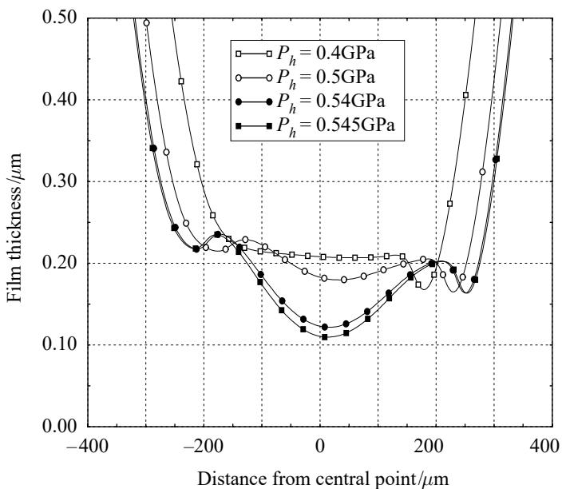  
Figure 1. Film thickness profiles at $y = 0$ for the BW model at diferent loads (HVI650 lubricant, $T = \bar { 8 0 } ^ { \circ } \mathrm { C } , u _ { \mathrm { e } } = 0 . 2 5 \mathrm { m } \mathrm { s } ^ { - 1 } , R = 0 . 0 3 5 \mathrm { m } , E ^ { \prime } = 2 2 7 \mathrm { G P a } )$

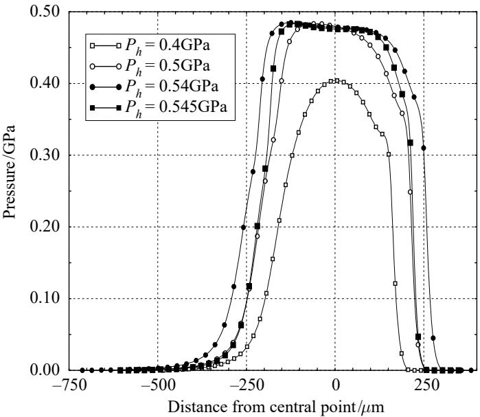  
Figure 2. Pressure profiles at y = 0 for the BW model at diferent loads (HVI650 lubricant, $T = 8 0 \mathrm { ~ } ^ { \circ } \mathrm { C } , \bar { u _ { \mathrm { e } } } = 0 . 2 5 \mathrm { ~ m ~ s ~ } ^ { - 1 } , R = 0 . 0 3 5 \mathrm { ~ m } , E ^ { \prime } = 2 2 7 \mathrm { ~ G P a } ) .$

These changes in film thickness and pressures are a direct consequence of the limiting shear stress. When the shear stress tends towards the limiting value, $\eta _ { x }$ decreases and therefore limits the pressure variations. At about 0.5 GPa, this condition occurs everywhere in the contact; the shear stresses are saturated. In order to balance the load with restricted pressures, the contact area must then increase compared to the traditional cases, and pressures must vary faster at the entrance of the contact. Moreover, since the piezoviscosity efect is less important, the Poiseuille flow efects are no longer negligible, and leakage flows appear in the centre of the contact, which lead to the formation of a bump. For loading conditions characterized by a Hertzian pressure higher than 0.545 GPa, it becomes impossible to find a solution which balances the load and guarantees separation of the surfaces.

P. Ehret, D. Dowson and C. M. Taylor  
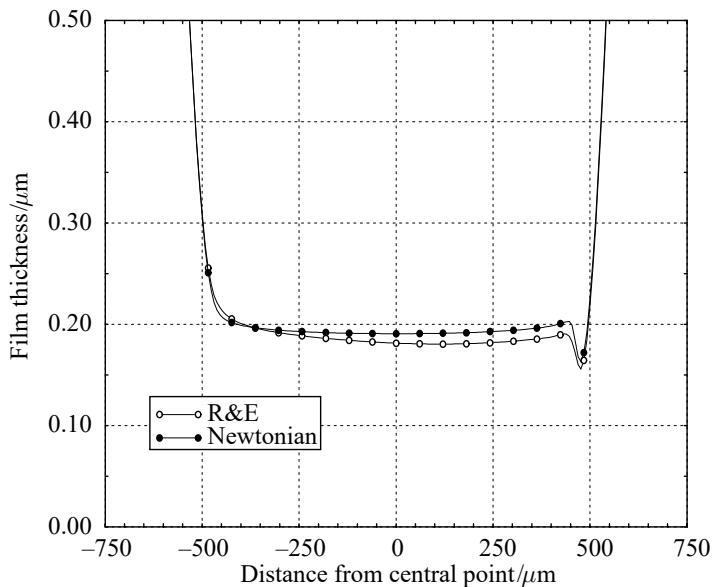  
Figure 3. Film thickness profiles at $y = 0$ for the Ree–Eyring and the Newtonian model (HVI650 lubricant, $T = 8 0 \ { } ^ { \circ } \mathrm { C }$ , ue = 0.25 m s−1, R = 0.035 m, E0 = 227 GPa, w = 491 N, $p _ { \mathrm { { H } } } = 1 . 0 \mathrm { { G P a } }$ $h _ { \mathrm { H } } = 6 . 7 0 ~ \mu \mathrm { m } )$

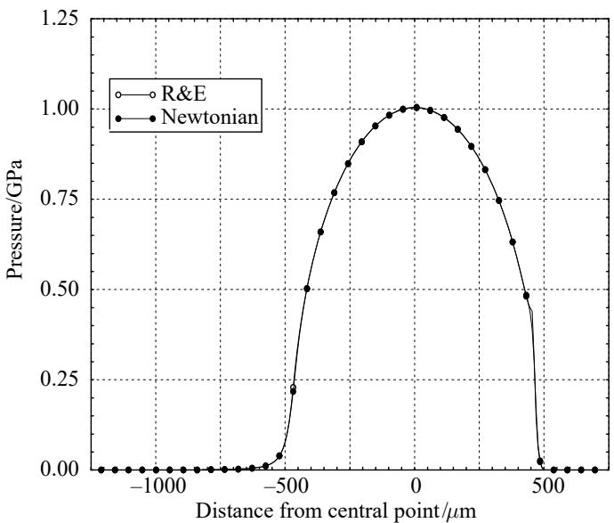  
Figure 4. Pressure profiles at $y = 0$ for the Ree–Eyring and the Newtonian model (HVI650 lubricant, $T = 8 0 \mathrm { } ^ { \circ } \bar { \mathrm { C } } ,$ $u _ { \mathrm { e } } = 0 . 2 5$ m s−1, R = 0.035 m, E0 = 227 GPa, w = 491 N, $p _ { \mathrm { { H } } } = 1 . 0 \mathrm { { G P a } } .$ $h _ { \mathrm { H } } = 6 . 7 0 ~ \mu \mathrm { m } )$

## (b ) RE model

The constraint on the shear stress to a particular yield value does not exist in the RE model. The results then conserve all the traditional attributes of EHL solutions. The flow remains predominantly Couette inside the contact, and full Poiseuille and Couette conditions prevail at the entrance to the conjunction. Only small diferences from the Newtonian case are observed in terms of pressures and film shapes. Figures 3 and 4 show almost the same film thickness and pressure profiles for both RE and Newtonian models, when the Hertzian pressure equals 1 GPa. The film thickness is slightly smaller than the Newtonian case because the RE model permits less lubricant entrainment inside the contact compared to the Newtonian model, due to lower viscosity in the inlet. The RE model also afects the pressure gradient, locally at the exit of the contact where the film thickness constriction leads to high shear rates. The heights of the pressure spikes are then lower than those predicted for a Newtonian fluid. Although the friction tends towards more realistic values with the RE model, the flow of the lubricant through the conjunction remains similar to that for a Newtonian fluid.

## 5. Slip conditions

In a remarkable series of experimental investigations Kaneta and co-workers (Kaneta et al. 1990, 1992; Kaneta 1993) have drawn attention to a feature of elastohydrodynamic lubrication for sliding contacts which significantly departs from those of elastohydrodynamic contacts observed in pure rolling conditions. The discrepancy occurs in the form of a substantial dimple, rather than a film of uniform thickness in the central region of the contact, under sliding conditions in which the disc alone slides and the ball remains stationary. A more conventional film profile was observed when the ball rotated and the disc remained stationary.

The observations made by Kaneta et al. (1990) in their initial paper arose from an extension of their studies of lubricated impact between a ball and a glass plate. It is well known that a central dimple readily develops under these conditions, but the authors were also able to observe the efects of superimposing rolling or sliding conditions upon the solidified lubricant in the dimple within one minute of the impact. Under pure sliding conditions, with the ball stationary, EHL theory predicts that the dimple has to move through the conjunction with the mean velocity of the two surfaces. In contrast Kaneta et al. observed that with lubricants TN320 and 5P4E the dimple moved more slowly than this through the conjunction. Kaneta et al. concluded that slip was occurring between the solidified lubricant in the conjunction and the glass or ball surfaces. Furthermore, the extent of the slip appeared to be dependent upon the nature of the lubricant under otherwise similar conditions.

In further papers presented in 1992 and 1993 by Kaneta and co-workers (Kaneta et al. 1992; Kaneta 1993) found that deep dimples could also be generated during entraining motion. The dimples were formed when the glass disc alone rotated while ball motion alone produced a negligible perturbation to the film and no dimples were detected in pure rolling. It was further observed that the dimples generated by sliding motion of the disc alone moved towards the inlet region with increasing sliding speed and decreasing load. These observations prompted Kaneta et al. to suggest that the dimple may be caused by diferences in elastic moduli of the bounding solids and particularly the low elastic modulus of the glass disc, together with a squeeze film motion parallel to the plane of the nominal contact.

It is dificult to accept this explanation of dimple formation under steady-state conditions, since the geometry of the deformed surfaces does not seriously embarrass the basic assumptions involved in the reduction of the momentum equations to the Reynolds equation. Furthermore, it is dificult to see how the approach of the lubricant to the exit constriction would lead to a dimple so far upstream in the conjunction. The earlier suggestion that the phenomenon of dimple formation is attributable to solidification of the lubricant within the conjunction is therefore explored theoretically in the present paper. It should be recalled that an alternative explanation, that the dimple might possibly be explained by non-Newtonian but essentially fluid behaviour, has already been addressed in the earlier sections. Although the BW and the RE models yielded solutions exhibiting major discrepancies, neither were able to explain the dimple observed by Kaneta. In this section, the behaviour of the lubricant is thus described diferently, depending upon whether it is:

(1) in a low-pressure region, where hydrodynamic conditions control the flow, and the lubricant is in a liquid state; or

(2) in a high-pressure region, where the lubricant is considered as a solid material in a glassy state.

In the low-pressure region, the Reynolds equation previously defined in  3 a remains valid and describes the shear-thinning efect in hydrodynamic conditions, owing to the orientation of the lubricant molecules by high shear rates.

In the high-pressure region, the essential step is to develop the concept of solidification of the lubricant as proposed by Smith (1958, 1960, 1962), Jacobson (1970, 1974) and Alsaad et al. (1978). While the lubricant remains fluid, whether Newtonian or non-Newtonian, the transport of mass is attributable to the two well-known mechanisms of Couette and Poiseuille flow. Under these circumstances slip at the wall has been introduced to limit the shear rate so that the maximum shear stress does not reach the limiting shear stress as described in detail by Jacobson (1991). However, the argument that the lubricant behaves as a fluid in the high-pressure region does not hold; Jacobson (1974) had earlier concluded from his studies of the shear strength of lubricant that the material behaves like an amorphous solid in elastohydrodynamic conjunctions. In terms of flow, this suggests that the bulk of the lubricant is transported through the conjunction as a core of solid material, with the potential for apparent discontinuities in velocities at the interfaces with the bounding solids, or very thin shear zones, to comply with the kinematic conditions. In a section across the film, the lubricant can thus be described as a core in a glassy state sandwiched between thin shear zones, probably of molecular proportions, in which the diference in velocity of the solidified core relative to the mean entraining velocity is accommodated. This diference between the average velocity of the solidified core and the mean entraining velocity will be referred to as ‘slip’ in the rest of the paper. The lubricant in these thin shear zones can be deemed to be in a liquid state since very rapid changes in velocity take place as depicted in figure 5. It should also be noted that, although the two shear zones are expected to be quite thin, there remains the possibility for one or two molecular layers adjacent to the surfaces to act as immobile layers as discussed by Israelachvili et al. (1990), Thompson & Robbins (1990) and Georges et al. (1995).

On lubricant transport conditions

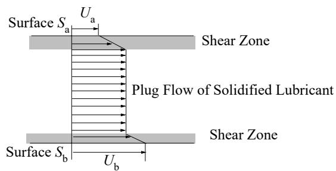  
Figure 5. Velocity profile across the film based on the concept of solidification. Interfacial slip accounts for the rapid change in velocity in the thin molecular layers.

Such a description allows a range of velocity adjustments across the film to occur depending on the rolling/sliding conditions, so that the evidence of slip presented by Kaneta et al. can be explained while accommodating the concept of solidification.

In pure rolling the lubricant core has the common velocity of the two surfaces, with no need for any discontinuity of velocity at either interface. In sliding, the core of the lubricant could be transported through the conjunction at the entraining velocity, which represents the mean of the two surface speeds, with similar results to those for pure rolling, but this would require identical ‘slip’ conditions in the thin shear zones on either side of the core. In any case, if the core remains attached to either surface it is no longer possible to satisfy continuity.

Energy dissipation associated with sliding and the substantial generation of heat is restricted to the shear zones and it is in these regions that the temperature rise ensures fluid, rather than solid, behaviour. Furthermore, since it is well known that very little of the heat generated in elastohydrodynamic conjunctions is convected away in the lubricant, but that conduction to the solid is the primary mode of heat transfer, the diferent thermal properties of the bounding solids (glass and steel) and their kinematic conditions (stationary or moving) lead to diferent temperature rises in the two layers and diferent apparent slip velocities.

It is assumed that the mass of lubricant transported through the conjunction in the very thin shear zones is negligible and that the bulk mass is transported as a glassy solid. Moreover the structure of the glassy lubricant is considered to be strongly anisotropic since the configuration of lubricant molecules lined up in the direction of the entrainment velocity, at the entrance of the contact, will have been frozen by the rapid increase in pressure. This allows events in the entrainment direction to be uncoupled from those in the transverse direction. This aspect enables us to assume that the displacement of a lubricant particle in the high-pressure region remains unidirectional; the direction of motion being dictated by the direction of surface entrainment. Therefore the equation which describes the mass conservation can be expressed as follows

$$
\frac { \partial } { \partial x } ( \rho u h ) = 0 ,\tag{5.1}
$$

where u corresponds to the average velocity of the glassy lubricant.

On the other hand, the normal stress component $\sigma _ { z z } ,$ assumed constant across the film thickness, is related to the elastic deformation, and the film thickness by

$$
h ( x , y ) = h _ { 0 0 } + \frac { x ^ { 2 } } { 2 R } + \frac { y ^ { 2 } } { 2 R } + \frac { 2 } { \pi E ^ { \prime } } \int _ { - \infty } ^ { + \infty } \int _ { - \infty } ^ { + \infty } \frac { \sigma _ { z z } ( x ^ { \prime } , y ^ { \prime } ) \mathrm { d } x ^ { \prime } \mathrm { d } y ^ { \prime } } { \sqrt { ( x - x ^ { \prime } ) ^ { 2 } + ( y - y ^ { \prime } ) ^ { 2 } } } .\tag{5.2}
$$

The understanding of $ { \mathrm { \ s l i p } } ^ {  { \prime } }$ in flow systems is not yet well established, but there Proc. R. Soc. Lond. A (1998)

is some evidence of the phenomenon in relation to flow of viscous liquids (Briscoe & Tabor 1974; Ramamurthy 1987; Kraynik & Schowalter 1981; Piau et al. 1995), in polymers (Toms 1949; Brochard & de Gennes 1992) and in lubricants (Bair 1993a). It is for this reason that we have investigated theoretically the efect of slip upon the solutions to the elastohydrodynamic lubrication problem of the form considered experimentally by Kaneta and co-workers (Kaneta et al. 1990, 1992; Kaneta 1993). This is accommodated by the introduction of the following expression:

$$
u = ( 1 - \xi ) u _ { \mathrm { e } } ,\tag{5.3}
$$

where $u _ { \mathrm { e } }$ is the entrainment velocity and $\xi$ corresponds to a slip coeficient which expresses the diference between the entrainment velocity and the average velocity in the solidified lubricant.

## (a ) Definition of slip

It is natural to expect the slip to be a function of the pressure and temperature, but also to be dependent on the running conditions. An expression for the slip is obtained by considering the velocity profile in each of the layers. The simplest view is to assume that the flow is a Couette flow in each of the liquid layers. The variation of velocity in each liquid layer can then be written as

$$
\varDelta u _ { a } = h _ { a } \frac { \tau ( 0 ) } { \eta } , \quad \varDelta u _ { b } = h _ { b } \frac { \tau ( h ) } { \eta } ,\tag{5.4}
$$

where $h _ { a }$ , and $h _ { b }$ are the thicknesses of the two liquid layers and $\tau ( z )$ is the shear stress profile across the film. The velocities at each liquid/glassy lubricant interface are then

$$
u ( h _ { a } ) = u _ { a } \left( 1 + \frac { \varDelta u _ { a } } { u _ { a } } \right) , \quad u ( h _ { a } + h _ { \mathrm { s } } ) = u _ { b } \left( 1 - \frac { \varDelta u _ { b } } { u _ { b } } \right) ,\tag{5.5}
$$

where $u _ { a }$ and $u _ { b }$ are the surface velocities, with $u _ { b } > u _ { a }$ and $h _ { \mathrm { s } }$ is the thickness of the solidified lubricant core. The average velocity in the solidified lubricant is therefore

$$
u = u _ { \mathrm { e } } \left( 1 - { \frac { \varDelta u _ { b } - \varDelta u _ { a } } { 2 u _ { \mathrm { e } } } } \right) .\tag{5.6}
$$

This relation has to be compared with the expressions given previously in equations (5.3), (5.4). It shows that $\xi$ depends on the shear stresses at the surfaces $\tau ( 0 )$ and $\tau ( h )$ , but also on the ratios $h _ { a } / \eta u _ { \mathrm { e } }$ and $h _ { b } / \eta u _ { \mathrm { e } }$ . The values of $\tau ( h )$ and $\tau ( 0 )$ correspond to the limiting shear stress which is assumed to vary with pressure according to equation (2.9).

If the groups of terms $h _ { a } / \eta u _ { \mathrm { e } }$ and $h _ { b } / \eta u _ { \mathrm { e } }$ are considered constant through the high-pressure area, because the variations in viscosity are balanced by variations in the thicknesses of the thin liquid layers adjacent to the solid boundaries, the slip coeficient, $\xi ,$ can be expressed as a function of pressure similar to that for τL:

$$
\xi = \alpha _ { 1 } p + \alpha _ { 2 } p ^ { 2 } .\tag{5.7}
$$

This relation can also be related to the boundary condition proposed by Oldroyd (1949) in a diferent context, which defines the slip as a function of the shear stress at the wall. Moreover, since the shear stress at the wall is defined as the limiting shear stress, it is important to note that this model should also predict the experimental values of friction.

## On lubricant transport conditions

## (b ) Solving the complete problem

Solutions which consider the high- and low-pressure regions separately can lead to discontinuities in the film thickness and pressure profiles at the boundary between the two regions. It is therefore convenient to solve a continuous form of the Reynolds equation accounting for slip throughout the conjunction. This is achieved by introducing the expression for slip into the Couette term in the Reynolds equation, since such flows dominate the high-pressure region of the conjunction and the correction term becomes negligible in the low-pressure inlet region. The final expression for the Reynolds equation is given below, and is valid throughout the contact

$$
\frac { \partial } { \partial x } \left( \frac { \rho h ^ { 3 } } { \eta _ { x } } \frac { \partial p } { \partial x } \right) + \frac { \partial } { \partial y } \left( \frac { \rho h ^ { 3 } } { \eta _ { y } } \frac { \partial p } { \partial x } \right) = 1 2 u _ { \mathrm { e } } \frac { \partial } { \partial x } ( ( 1 - \xi ) \rho h ) .\tag{5.8}
$$

In the following sections, the rheological model used for the non-Newtonian efects in the low-pressure region of the conjunction corresponds to the Ree–Eyring model.

## 6. Results with slip conditions

We seek to match the experimental findings of Kaneta and co-workers (Kaneta et al. 1990, 1992; Kaneta 1993) and in so doing to establish the corresponding values of slip and the Eyring shear stress. The lubricant chosen was 5P4E, with rheological properties as recorded (Yasutomi et al. 1984) and listed in table 1. Since the limiting shear stress varies linearly with the pressure, only the first term in equation (5.7) is retained, so that

$$
\xi = \alpha _ { 1 } p .\tag{6.1}
$$

Instead of relating the diferent cases to the parameter $\alpha _ { 1 }$ , a new variable, S, is introduced which is defined as the value of slip at Hertzian pressure. $S$ is expressed as follows

$$
S = \alpha _ { 1 } p _ { \mathrm { H } } = \xi ( p = p _ { \mathrm { H } } ) .\tag{6.2}
$$

The appropriate inlet temperature and hence the atmospheric pressure viscosity of the lubricant is determined by matching the experimental and theoretical minimum film thicknesses, based upon the modified Reynolds equation (3.1). The depth of the dimple is primarily determined by slip and the appropriate parameter, S, is thus determined by matching the theoretical and experimental depths. The location of the dimple is influenced by both the slip and the Eyring shear stress and hence final adjustments are made to both these variables to replicate the experimental film profiles most efectively.

Solutions for the specific conditions considered by Kaneta et al. (1992) are now examined in more detail. The characteristics of the contact are given below: the load being $w = 5 8 . 8 \mathrm { N } ;$ the equivalent Young’s modulus, $E ^ { \prime } = 1 1 7 \mathrm { { G P a } ; }$ the radius of the ball, $R = 0 . 0 1 2 7$ m; the entrainment velocity, $u _ { \mathrm { e } } = 0 . 2 0 1 \mathrm { m } \mathrm { s } ^ { - 1 } ;$ the temperature, $3 2 ^ { \circ } \mathrm { C } ;$ the maximum Hertzian pressure, $p _ { \mathrm { H } } ~ = ~ 0 . 6 2 \mathrm { G P a } ;$ the maximum Hertzian elastic deformation, $h _ { \mathrm { H } } = 3 . 5 5 \mu \mathrm { m }$

An illustration of the efect of slip upon dimple formation is shown in figure 8, where a range of theoretical solutions for an Eyring stress of 25 MPa and slip parameter, S, ranging from 0–0.4 are recorded alongside representative experimental film profiles given in figures 6 and 7, which were kindly supplied by Professor Kaneta, for both ball-sliding and disc-sliding situations. The general form of these traces at limiting slip ratios of 0 and 0.4 are in fair accord with the experimental film shapes. The minimum film thickness in rolling is similar in both the experimental and theoretical traces, but experiment records a lower minimum when the disc alone is sliding. The most striking feature of the film shape profiles shown in figure 8 is that the dimple clearly develops in the central region of the conjunction as the slip parameter, $S ,$ increases. The depth of the dimple also increases with the Eyring stress τ0 as shown in figure 9 for a constant slip, given by $S = 0 . 4 2 5$ , or a slip at the Hertzian pressure of 42.5%. These variations are explained by the variations in flow in the high-pressure region, which are caused by the reduction of the shear-thinning efect at the inlet of the conjunction. It is also apparent from figure 10 that the pressure inside the contact increases as the dimple is formed. At $S = 0 . 3$ , the highest value of the maximum pressure is reached which corresponds to nearly twice the Hertzian pressure. Thereafter the maximum pressure decreases slightly and shifts towards the entrance of the contact as the parameter $S$ increases. The efect of this shift can also be observed on the dimple formation which also moves towards the inlet of the conjunction as S increases.

P. Ehret, D. Dowson and C. M. Taylor  
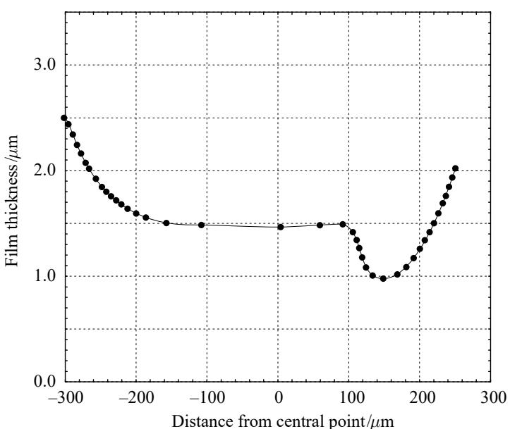

Figure 6. Film thickness profiles at $y = 0 ,$ experimental measurement with ball sliding (private communication) (5P4E lubricant, $u _ { \mathrm { e } } = 0 . 2 0 1$ m $\mathrm { s } ^ { - 1 }$ $R = 0 . 0 1 2 7$ m, E0 = 117 GPa, $w = \mathrm { 5 8 . 8 N }$ $p _ { \mathrm { H } } = 0 . 6 2 \ : \mathrm { G P a } , \ : h _ { \mathrm { H } } = 3 . 5 5 \ : \mu \mathrm { m } )$  
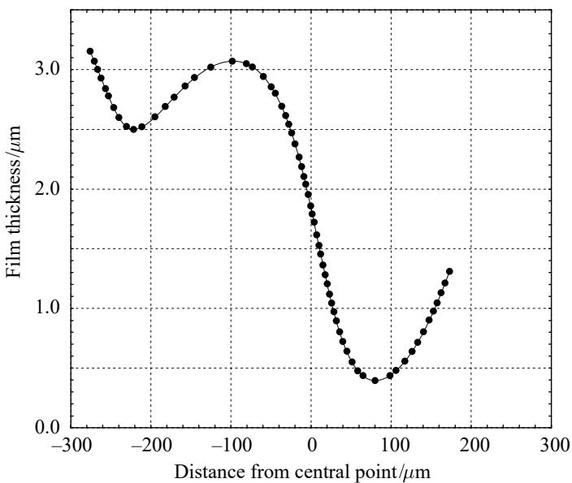  
Figure 7. Film thickness profiles at $y = 0 ,$ , experimental measurement with disc sliding (private communication) (5P4E lubricant, $u _ { \mathrm { e } } = 0 . 2 0 1$ 1 m s−1, ， $R = 0 . 0 1 2 7$ m, E0 = 117 GPa, $w = \mathrm { 5 8 . 8 N } .$ $p _ { \mathrm { H } } = 0 . 6 2 \ : \mathrm { G P a } , h _ { \mathrm { H } } = 3 . 5 5 \ : \mu \mathrm { m } )$

On lubricant transport conditions  
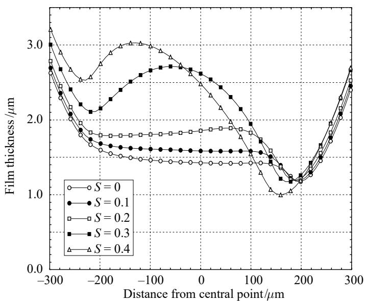  
Figure 8. Film thickness profiles at $y = 0$ for diferent slip conditions, Ree–Eyring model, (5P4E lubricant, $T = 3 2 { \overset { \cdot } { ^ { \mathrm { ~ \circ ~ } } } } \mathrm { C } , u _ { \mathrm { e } } = 0 . { \overset { \cdot } { 2 } } 0 1 \mathrm { ~ m ~ s ~ } ^ { - 1 }$ ， $R = 0 . 0 1 2 7$ m, $E ^ { \prime } = 1 1 7 \mathrm { { G P a } , \tilde { \tau _ { 0 } } = \tilde { 2 } 5 \mathrm { { M P a } } } $ $\dot { w } = 5 8 . 8 \mathrm { N } , p _ { \mathrm { H } } = 0 . 6 2 \mathrm { G P a } , h _ { \mathrm { H } } = 3 . 5 5 \mu \mathrm { m } )$

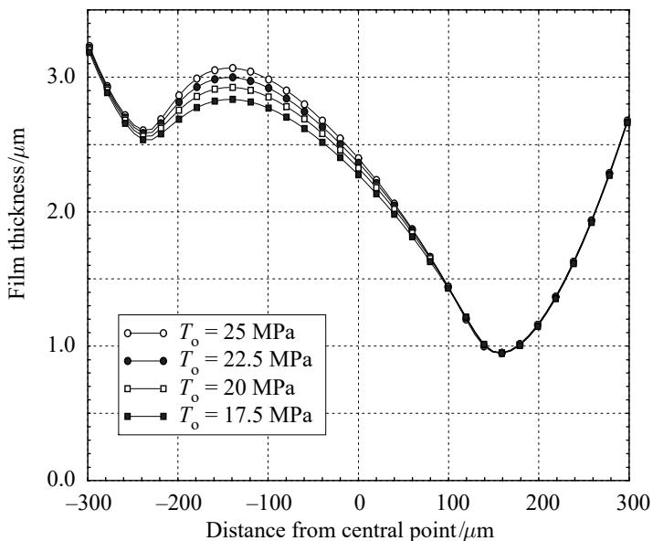  
Figure 9. Film thickness profiles at $y = 0$ for diferent Eyring stress, Ree–Eyring model, slip $S \ : = \ : 0 . 4 2 5$ (5P4E lubricant, $T = 3 \bar { 2 } ^ { \circ } \mathrm { C } ,$ , ue = 0.201 m s−1, R = 0.0127 m, $E ^ { \prime } \ { = } \ 1 1 7 \mathrm { \ G P a } .$ $w = 5 8 . 8 ~ \mathrm { N } , p _ { \mathrm { H } } = 0 . 6 2 ~ \mathrm { G P a } , h _ { \mathrm { H } } = 3 . 5 5 ~ \mu \mathrm { m } )$

P. Ehret, D. Dowson and C. M. Taylor  
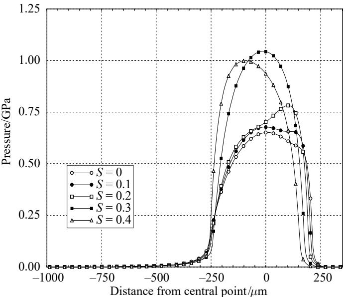  
Figure 10. Pressure profiles at $y = 0$ for diferent slip conditions, Ree–Eyring model $\tau _ { 0 } = 2 5 \mathrm { M P a }$ (5P4E lubricant, $\dot { T ^ { \circ } } = 3 2 ^ { \circ } \mathrm { C } , \dot { u _ { \mathrm { e } } } = 0 . 2 0 1 \mathrm { m } \mathrm { s } ^ { - 1 } , \dot { R } = 0 . 0 1 2 7 \mathrm { m } , E ^ { \prime } = 1 \ddot { 1 } 7 \mathrm { G P a } , w = 5 8 . 8 \mathrm { N m } ,$ $\dot { p } _ { \mathrm { H } } = 0 . 6 2 \ : \mathrm { G P a } , \ : h _ { \mathrm { H } } = 3 . 5 5 \ : \mu \mathrm { m } )$

Figure 11 depicts the film thickness contours for slip parameter, S, equals respectively to 0.1, 0.2, 0.3 and 0.4 and an Eyring stress of 25 MPa. The film shape at $S \ : = \ : 0 . 1$ conforms to the familiar pattern with a relatively flat plateau at the centre of the conjunction. For the same Eyring stress and a slip of 30% at the Hertzian pressure, a clearly defined central dimple emerges. Indeed, for $S = 0 . 4 2 5$ and $\tau _ { 0 } = 2 5 \mathrm { M P a }$ , the location and the shape of the dimple match Kaneta’s experimental results for a sliding disc fairly well, as shown by the comparison between the theoretical and experimental contours recorded in figure 12. A comparison between the experimentally observed film contours of Kaneta et al. (1992) when the ball is sliding and a theoretical solution based upon an assumption of zero slip is also shown on figure 12.

## (a ) Efect of the entraining velocity on slip conditions

The influence of the entraining velocity on the values of the slip parameter, S, is explored in this section and related to a series of experimental film profiles and interferograms provided by Professor Kaneta. The cases discussed correspond to a load $w = 3 9 . 2 \ : \mathrm { N }$ , an equivalent Young’s modulus, $E ^ { \prime } = 1 1 7 \mathrm { G P a }$ , and a radius of the ball, $R = 0 . 0 1 2 7$ m. Comparisons between theory and Kaneta’s interferograms for cases when the disc alone is sliding are presented in figure 13. Three diferent entraining velocities have been selected which are equal, respectively, to $u _ { \mathrm { e } } = 0 . 0 0 5 6 \mathrm { m s ^ { - 1 } }$ $\overline { { u _ { \mathrm { e } } } } ^ { \mathrm { ~ - ~ } } = 0 . 0 6 8 \ : \mathrm { m } \mathrm { s } ^ { - 1 }$ , and $u _ { \mathrm { e } } = 0 . 1 3 4 \mathrm { m } \mathrm { s } ^ { - 1 }$ . For all the cases, a good agreement with the experimental observations has been obtained by adjusting the values of the slip parameter, S, the Eyring shear stress, and the temperature of the lubricant used to determine the viscosity at atmospheric pressure. For low velocity, the slip is negligible. As the speed of the disc increases, a slip parameter of 0.4 allows the experimental traces to be matched. In the same manner, the Eyring shear stress needs to be increased and the inlet viscosity decreased to obtain a good agreement with the film thickness profiles as shown in figures 14 and 15. Fair qualitative agreement is evident in the shapes, but at higher speeds the predicted minimum film thicknesses tend to exceed the experimental values.

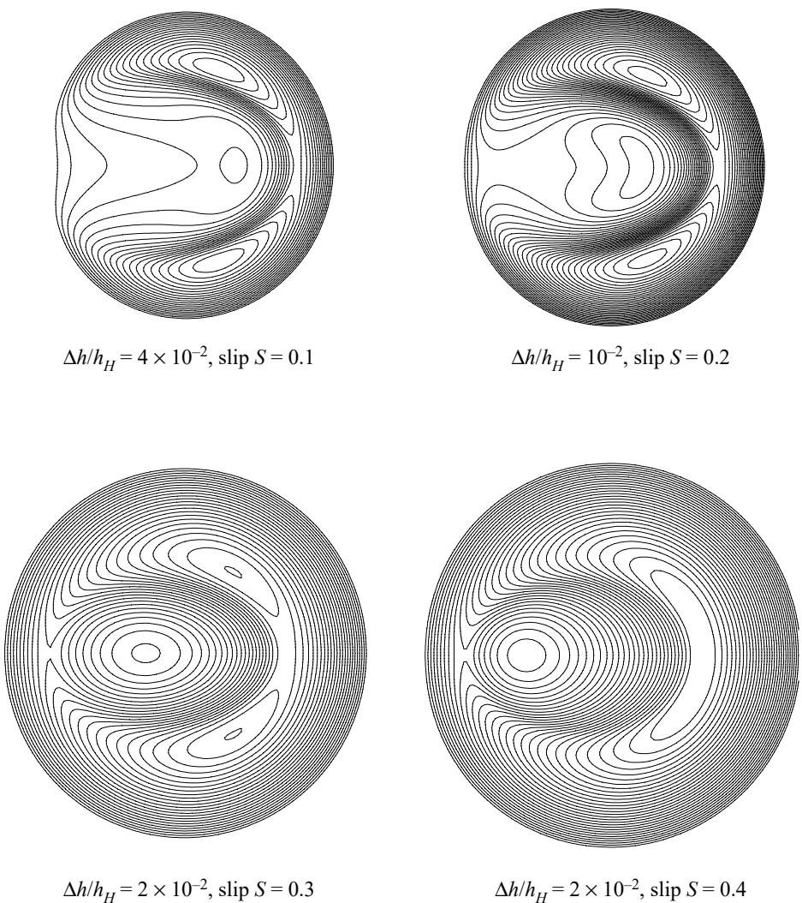  
Figure 11. Film thickness contours, Ree–Eyring model $\begin{array} { r l r } { \tau _ { 0 } } & { { } = } & { 2 5 \mathrm { { M P a } } . } \end{array}$ , (5P4E lubricant, T = 32 ◦C, ue = 0.201 m s−1, R = 0.0127 m, E0 = 117 GPa, w = 58.8 N, pH = 0.62 GPa, $h _ { \mathrm { H } } = 3 . 5 5 ~ \mu \mathrm { m } )$

## (b ) Discussion

The shear-thinning efect in the low-pressure area is taken into account by the Ree–Eyring model. Nevertheless in order to obtain similar shapes of film thickness to Kaneta’s findings, the Eyring stress chosen is considerable compared to the value τ0 of 2 MPa suggested by Evans & Johnson (1986b). In fact the viscosity does not seem to be as nonlinear as that predicted by Evans & Johnson. This diference may be explained by the fact that Evans & Johnson deduced the Eyring stress from friction force measurements. On the contrary, in this analysis, the friction is given in terms of the limiting shear stress, and the Eyring stress is simply used as a parameter to control the shear-thinning efect at the inlet of the conjunction, and thus the flow which passes throughout the contact.

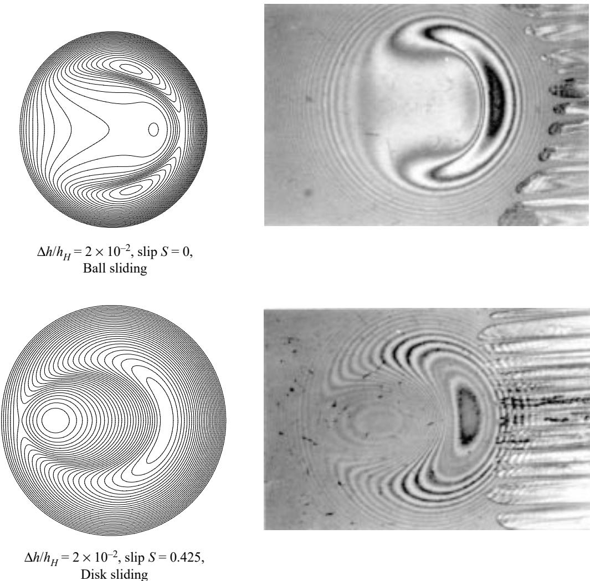  
Figure 12. Comparison between Kaneta’s interferograms (Kaneta et al. 1992) and numerical results. Film thickness contours, Ree–Eyring model $\tau _ { 0 } = 2 5 \mathrm { { M P a } , }$ (5P4E lubricant, $T = 3 2 \mathrm { { } ^ { \circ } C }$ ue = 0.201 m s−1, R = 0.0127 m, E0 = 117 GPa, w = 58.8 N, pH = 0.62 GPa, hH = 3.55 µm).

Discrepancies between the theoretical predictions and the experimental results can be attributed mainly to dificulties in selecting the parameter S, which characterizes the slip at the point of maximum Hertzian pressure. While fair qualitative agreement was found between theoretical and experimental dimple shapes, theory tended to predict higher film thicknesses compared to those measured. A better fit would have required a more rapid decrease in the slip throughout the conjunction after the slip reaches its maximum value. Since the diferences only arise after the dimple is formed, other aspects which have been omitted become relevant to the slip variation. Amongst them, thermal efects are deemed to be important in the central region of the conjunction. Since a rise in temperature leads to a decrease in limiting shear stress, such a variation would have further decreased the slip in this part of the

On lubricant transport conditions

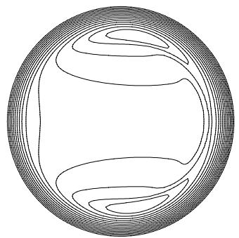  
∆h/h = 2 × 10–2, τ = 6 MPa, slip S = 0.0, T = 26ºC, u = 0.0056 ms–1

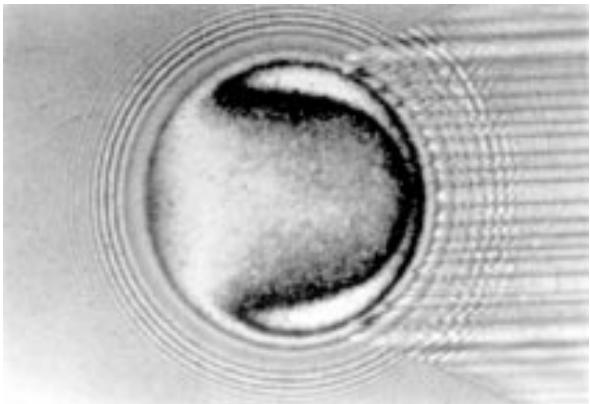

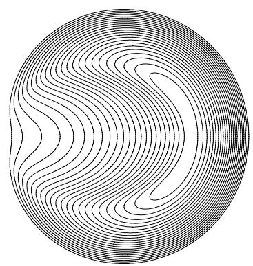

$$
\begin{array} { r } { \Delta h / h _ { H } = 1 0 ^ { - 2 } , \tau _ { 0 } = 6 \mathrm { M P a } , \sin \mathrm { g } S = 0 . 4 , } \\ { T = 2 6 ^ { \circ } \mathrm { C } , u _ { \mathrm { e } } = 0 . 0 6 8 \mathrm { m s } ^ { - 1 } \qquad } \end{array}
$$

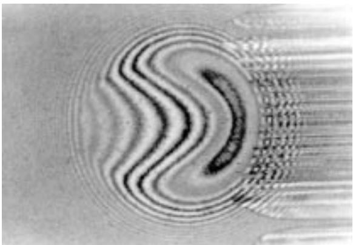

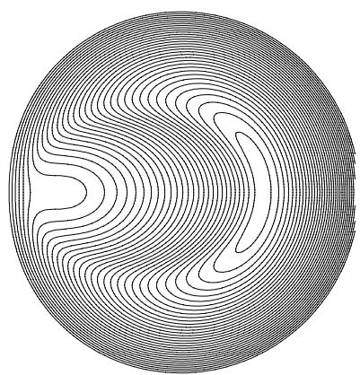  
∆h/h = 10–2, τ = 10 MPa, slip S = 0.4, T = 29ºC, ue = 0.134 ms–1

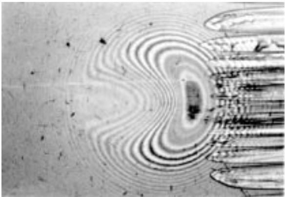  
Figure 13. Comparison between Kaneta’s interferograms (disc sliding) (Kaneta 1993) and numerical results. Film thickness contours, Ree–Eyring model (5P4E lubricant, $R = 0 . 0 1 2 7 { \mathrm { m } } ,$ $E ^ { \prime } = 1 1 7 \mathrm { \ G P a } , w = 3 9 . 2 \mathrm { \ N } , p _ { \mathrm { H } } = 0 . 5 4 \mathrm { \ G P a } , h _ { \mathrm { H } } = \breve { 2 } . 7 0 \breve { \mu } \mathrm { m } )$

Proc. R. Soc. Lond. A (1998)

P. Ehret, D. Dowson and C. M. Taylor  
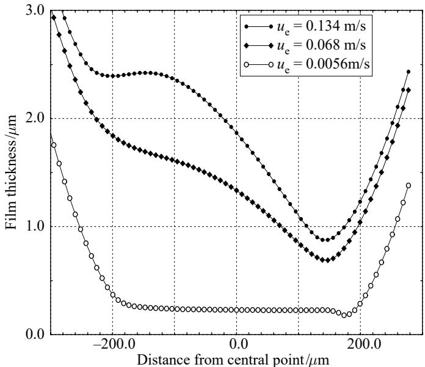  
Figure 14. Film profiles (disc sliding), numerical results for diferent entraining velocities, (5P4E lubricant, ${ \bar { T } } = 3 2 ^ { \circ } \mathrm { C } , R = { \bar { 0 . 0 1 2 7 } }$ m, $E ^ { \prime } = 1 1 7 \mathrm { { G P a } }$ $w = \mathrm { 3 9 . 2 N } _ { \mathrm { ; } }$ $p _ { \mathrm { H } } ~ = ~ 0 . 5 4 \ : \mathrm { G P a }$ $h _ { \mathrm { H } } = 2 . 7 0 ~ \mu \mathrm { m } )$

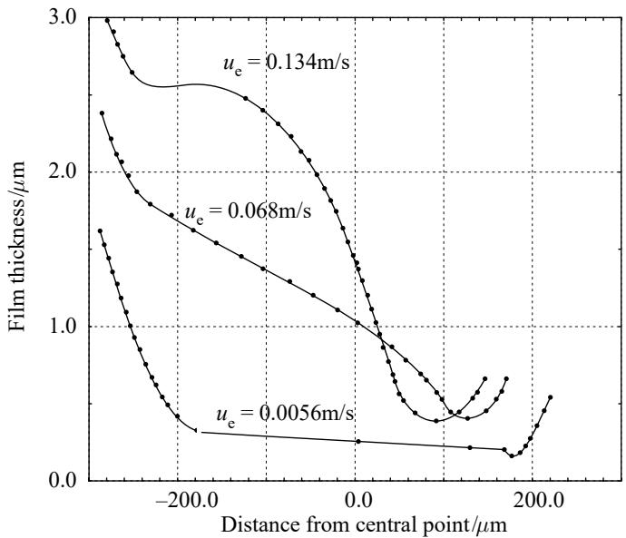  
Figure 15. Film profiles (disc sliding), experimental results (Kaneta 1993) for diferent entraining velocities, (5P4E lubricant, $\mathrm { { \bar { \it R } } = 0 . 0 1 2 7 }$ m, E0 = 117 GPa, w = 39.2 N).

conjunction, and would thus have permitted better agreement between the predicted and measured film shapes.

Kaneta’s results present important diferences depending on which surface is moving. When the steel ball is sliding, no dimple in the film shape occurs, and for this case, it is apparent from figure 12 that Kaneta’s interferograms are thus better approached with a no-slip condition. On the contrary, when the glass disc is sliding,

## On lubricant transport conditions

the present analysis predicts the formation of the dimple very well owing to the slip at the interface between solid and lubricant as shown in figure 12. The abrupt changes in the values of slip parameter depending on which surface is in motion is probably related to the diference in heat difusion between glass and steel. The conductivity of the glass is 0.84 $\mathrm { W } \ ^ { \circ } \mathrm { C } ^ { - 1 } \mathrm { m } ^ { - 1 }$ , and its thermal difusivity is $3 . 8 \times 1 0 ^ { - 7 } \mathrm { ~ m ^ { 2 } ~ s ^ { - 1 } }$ whereas the steel conductivity ranges between 46 and $1 4 . 6 \mathrm { W } ^ { \circ } \mathrm { C } ^ { - 1 } \mathrm { m } ^ { - 1 }$ and its thermal diffusivity is between $4 \times 1 0 ^ { - 6 }$ and $1 . 3 \times 1 0 ^ { - 5 } \mathrm { ~ m } ^ { 2 } \mathrm { ~ s } ^ { - 1 }$ (Agassant et al. 1989). Glass must then be regarded as an insulator compared to steel. When the disc is sliding, higher temperatures in the shear zone between lubricant and the glass disc should occur compared to those reached at the opposite interface due to the steel conduction. Such a diference in temperature may lead in its turn to changes in rheological properties of the lubricant in each of the shear zones. Since the same variation of velocities in each of the shear zones is no longer guaranteed, this tends to explain how the slip is promoted. When the ball is sliding, no slip occurs, and thus more homogeneous temperatures across the film are expected. In this case, the diference in temperature at each interface seems, however, to be more important than when the disc is sliding; the motion of the ball reduces the temperature at the steel–lubricant interface, and the stationary position of the disc increases the temperature at the glass–lubricant interface. When the ball is sliding, the heat difusion across the solidified lubricant and the shear zones should be, therefore, more important than when the disc is sliding in order to obtain lower variations of temperature across the film. A better justification of this argument and of the slip conditions must await the calculation of the temperature profiles across the film.

## 7. Conclusion

An alternative explanation of the lubricant entrapment observed by Kaneta et al. has been proposed and validated by numerical computations.

The arguments which have been advanced are based on the assumption that the lubricant is mainly sheared in a thin shear zone at each wall–lubricant interface in the high-pressure region. The diference of velocity between the core of the film thickness which is considered in a glassy state and the entrainment velocity has induced the notion of slip.

The slip has been related to the rheological properties of the thin shear zones, and thus to the limiting shear stress. A linear variation of slip with pressure has led to good agreement with Kaneta’s unusual observations.

The authors consider that the dimples and associated diferences of film thickness observed in Kaneta and co-workers’s experiments (Kaneta et al. 1992; Kaneta 1993), when either the disc or the ball is sliding, are explained by changes in the profile of temperature across the film. Since the thermal properties of the ball are so diferent from those of the disc, the heat difusion and the characteristics of the thin shear zones will be highly dependent upon thermal situations adjacent to the solids.

A better definition of the thin shear zones at each wall–lubricant interface requires the development of a thermal approach. This causes problems in predicting correctly the heat dissipation in the solidified lubricant, and in each of the thin shear zones. Such developments are, however, deemed to be necessary, since there is clearly a need for EHL theory to obtain solutions which satisfy at the same time the stress measured at the wall and the film thickness visualized in the contact.

The authors thank the EPSRC for funding this work as part of a project to study non-Newtonian lubrication of elastohydrodynamic elliptical contacts with three-dimensional surface roughness. The interferograms shown in figures 12 and 13 and details of the experimental conditions were kindly provided by Professor Kaneta of Kyushu Institute of Technology, Japan.

## Appendix

The fluid is considered to behave as a generalized Newtonian fluid. The constitutive equation can be expressed in a general form as follows:

$$
[ \tau ] = 2 \frac { \eta } { f ( \tau _ { \mathrm { e } } ) } [ \dot { \gamma } ] .\tag{A 1}
$$

The thin film considerations allow us to neglect normal stress components compared to the shear stress components. The previous tensor equation is then reduced to two relations:

$$
\eta \frac { \partial u } { \partial z } = f ( \tau _ { \mathrm { e } } ) \tau _ { x z } , \quad \eta \frac { \partial w } { \partial z } = f ( \tau _ { \mathrm { e } } ) \tau _ { y z } ,\tag{A 2}
$$

where $\tau _ { \mathrm { e } } = \sqrt { \tau _ { x z } ^ { 2 } + \tau _ { y z } ^ { 2 } }$

Following the approach of Myllerup et al. (1994), the previous equation is replaced by the following form:

$$
\eta \frac { \partial u } { \partial z } = \varPi ( \tau _ { x z } , \tau _ { y z } ) , \quad \eta \frac { \partial w } { \partial z } = \varPi ( \tau _ { y z } , \tau _ { x z } ) ,\tag{A 3}
$$

where $\varPi ( X _ { 1 } , X _ { 2 } )$ is a function of two variables, and is defined as $\quad \pi ( X _ { 1 } , X _ { 2 } ) =$ $X _ { 1 } f ( X _ { \mathrm { e } } )$ with $X _ { \mathrm { e } } = \sqrt { X _ { 1 } ^ { 2 } + X _ { 2 } ^ { 2 } }$

The shear stress is linear across the film thickness. By injecting their expression in the constitutive equation, the equations below are obtained. The following dimensionless variables are also introduced: $x = a \bar { x } , y = a \bar { y } , z = h _ { h } \bar { z } , h = h _ { h } \bar { h } , u = u _ { \mathrm { e } } \bar { u } _ { \mathrm { i } }$

$$
w = u _ { \mathrm { e } } \bar { w } , p = p _ { \mathrm { H } } \bar { p } , \eta = \eta ( p _ { \mathrm { H } } ) \bar { \eta } , \tau _ { \mathrm { c } _ { 0 } } = \tau _ { \mathrm { c } } ( p _ { \mathrm { H } } ) \bar { \tau } _ { \mathrm { c } _ { 0 } } , \tau _ { \mathrm { c } } = \tau _ { \mathrm { c } } ( p _ { \mathrm { H } } ) \bar { \tau } _ { \mathrm { c } } ,
$$

$$
\left. \begin{array} { l } { { c \bar { \eta } ( \bar { p } ) \displaystyle { \frac { \partial \bar { u } } { \partial \bar { z } } } = \bar { \tau } _ { \mathrm { c } } ( \bar { p } ) \displaystyle { \cal { I } } \left( \epsilon \frac { \bar { z } } { \bar { \tau } _ { \mathrm { c } } ( \bar { p } ) } \displaystyle { \frac { \partial \bar { p } } { \partial \bar { x } } + \frac { \bar { \tau } _ { x a } } { \bar { \tau } _ { \mathrm { c } } ( \bar { p } ) } } , ~ \epsilon \frac { \bar { z } } { \bar { \tau } _ { \mathrm { c } } ( \bar { p } ) } \displaystyle { \frac { \partial \bar { p } } { \partial \bar { y } } + \frac { \bar { \tau } _ { y a } } { \bar { \tau } _ { \mathrm { c } } ( \bar { p } ) } } \right) , } } \\ { { c \bar { \eta } ( \bar { p } ) \displaystyle { \frac { \partial \bar { w } } { \partial \bar { z } } } = \bar { \tau } _ { \mathrm { c } } ( \bar { p } ) \displaystyle { \cal { I } } \left( \epsilon \frac { \bar { z } } { \bar { \tau } _ { \mathrm { c } } ( \bar { p } ) } \displaystyle { \frac { \partial \bar { p } } { \partial \bar { y } } + \frac { \bar { \tau } _ { y a } } { \bar { \tau } _ { \mathrm { c } } ( \bar { p } ) } } , ~ \epsilon \frac { \bar { z } } { \bar { \tau } _ { \mathrm { c } } ( \bar { p } ) } \displaystyle { \frac { \partial \bar { p } } { \partial \bar { x } } + \frac { \bar { \tau } _ { x a } } { \bar { \tau } _ { \mathrm { c } } ( \bar { p } ) } } \right) , } } \end{array} \right\}\tag{A 4}
$$

where $c = u _ { \mathrm { e } } \eta ( p _ { \mathrm { H } } ) / ( h _ { \mathrm { H } } \tau _ { \mathrm { c } } ( p _ { \mathrm { H } } ) )$ and $\epsilon = p _ { \mathrm { H } } h _ { \mathrm { H } } / ( \tau _ { \mathrm { c } } ( p _ { \mathrm { H } } ) a ) . ~ \bar { \tau } _ { x _ { a } }$ and $\bar { \tau } _ { y _ { a } }$ are the shear stress at the wall at $\bar { z } = 0$ in 0x and 0y direction.

A perturbational approach is then performed. Velocity, pressure and stress components are developed according to the parameter ;

$$
\left. \begin{array} { r l } { \bar { u } } & { = \bar { u } ^ { 0 } + \epsilon \bar { u } ^ { 1 } + O ( \epsilon ^ { 2 } ) , } \\ { \bar { w } } & { = \bar { w } ^ { 0 } + \epsilon \bar { w } ^ { 1 } + O ( \epsilon ^ { 2 } ) , } \\ { \bar { p } } & { = \bar { p } ^ { 0 } + \epsilon \bar { p } ^ { 1 } + O ( \epsilon ^ { 2 } ) , } \\ { \bar { \tau } _ { x _ { a } } = \bar { \tau } _ { x _ { a } } ^ { 0 } + \epsilon \bar { \tau } _ { x _ { a } } ^ { 1 } + O ( \epsilon ^ { 2 } ) , } \\ { \bar { \tau } _ { y _ { a } } = \bar { \tau } _ { y _ { a } } ^ { 0 } + \epsilon \bar { \tau } _ { y _ { a } } ^ { 1 } + O ( \epsilon ^ { 2 } ) , } \end{array} \right\}\tag{A 5}
$$

From equation $\left( \mathrm { A 4 } \right)$ , it follows that the zero-order terms are related to the Couette component of the flow, and the first order terms to the Poiseuille component. By inserting the dimensionless variables in equation (A 4), and arranging the terms of

same order, an approximation of the velocity profiles is deduced,

$$
\left. \begin{array} { l } { { \displaystyle \bar { u } ^ { 0 } + \epsilon \bar { u } ^ { 1 } = \bar { u } _ { a } + \frac { \left( \bar { u } _ { b } - \bar { u } _ { a } \right) } { \bar { h } } \bar { z } + \frac { \epsilon } { c \bar { \eta } \left( \bar { p } ^ { 0 } \right) } \frac { 1 } { 2 } \bar { z } ( \bar { z } - \bar { h } ) \frac { \partial \Pi } { \partial X _ { 1 } } \left( \frac { \bar { \tau } _ { x _ { a } } ^ { 0 } } { \bar { \tau } _ { \mathrm { c } } \left( \bar { p } ^ { 0 } \right) } , 0 \right) \frac { \partial \bar { p } ^ { 0 } } { \partial \bar { x } } , } } \\ { { \displaystyle \bar { w } ^ { 0 } + \epsilon \bar { w } ^ { 1 } = \frac { \epsilon } { c \bar { \eta } \left( \bar { p } ^ { 0 } \right) } \frac { 1 } { 2 } \bar { z } ( \bar { z } - \bar { h } ) \frac { \partial \Pi } { \partial X _ { 1 } } \left( 0 , \frac { \bar { \tau } _ { x a } ^ { 0 } } { \bar { \tau } _ { \mathrm { c } } \left( \bar { p } ^ { 0 } \right) } \right) \frac { \partial \bar { p } ^ { 0 } } { \partial \bar { y } } , } } \end{array} \right\}\tag{A 6}
$$

where $\tau _ { x _ { a } } ^ { 0 }$ is the shear stress due to the only Couette component of the flow whose shear rate is equal to ${ { \left( { { u _ { b } } - { u _ { a } } } \right) } \mathord { \left/ { \vphantom { { \left( { { u _ { b } } - { u _ { a } } } \right) } { h } } } \right. \kern - delimiterspace } { h } }$ . In the dimensional form, the velocity profiles are given by the following expression:

$$
\left. \begin{array} { l } { \displaystyle { u = \frac { 1 } { 2 } \frac { z ( z - h ) } { \eta } \frac { \partial \Pi } { \partial X _ { 1 } } \left( \frac { \tau _ { x _ { a } } } { \tau _ { \mathrm { c } } } , 0 \right) \frac { \partial p } { \partial x } + \frac { u _ { b } - u _ { a } } { h } z + u _ { a } , } } \\ { \displaystyle { w = \frac { 1 } { 2 } \frac { z ( z - h ) } { \eta } \frac { \partial \Pi } { \partial X _ { 1 } } \left( 0 , \frac { \tau _ { x _ { a } } } { \tau _ { \mathrm { c } } } \right) \frac { \partial p } { \partial y } . } } \end{array} \right\}\tag{A 7}
$$

From these equations, it can be deduced that the non-Newtonian efects can be taken into account by introducing non-isotropic coeficients in the Reynolds equation:

$$
\eta _ { x } = \frac { \eta } { \frac { \partial \pi } { \partial X _ { 1 } } \left( \frac { \tau _ { x _ { a } } } { \tau _ { \mathrm { c } } } , 0 \right) } , \quad \eta _ { y } = \frac { \eta } { \frac { \partial \pi } { \partial X _ { 1 } } \left( 0 , \frac { \tau _ { x _ { a } } } { \tau _ { \mathrm { c } } } \right) } .\tag{A 8}
$$

Re-introducing the function, $f ,$ which defines the constitutive equation gives

$$
\eta _ { x } = \frac { \eta } { f \left( \frac { \tau _ { x _ { a } } } { \tau _ { \mathrm { c } } } \right) + \frac { \tau _ { x _ { a } } } { \tau _ { \mathrm { c } } } \frac { \partial f } { \partial \tau _ { x } } \left( \frac { \tau _ { x _ { a } } } { \tau _ { \mathrm { c } } } \right) } , \quad \eta _ { y } = \frac { \eta } { f \left( \frac { \tau _ { x _ { a } } } { \tau _ { \mathrm { c } } } \right) } .\tag{A 9}
$$

Therefore, the Reynolds equation can be expressed by the following expression:

$$
\frac { \partial } { \partial x } \left( \frac { \rho h ^ { 3 } } { \eta _ { x } } \frac { \partial p } { \partial x } \right) + \frac { \partial } { \partial y } \left( \frac { \rho h ^ { 3 } } { \eta _ { y } } \frac { \partial p } { \partial x } \right) = 1 2 u _ { \mathrm { e } } \frac { \partial \rho h } { \partial x } ,\tag{A 10}
$$

where $\begin{array} { r } { u _ { \mathrm { e } } = \frac { 1 } { 2 } ( u _ { a } + u _ { b } ) } \end{array}$

## References

Agassant, J.-F., Avenas, P. & Sergent, J.-Ph. 1989 La mise en forme des matieres plastiques. Tec & Doc Lavoisier, Paris.

Alsaad, M., Bair, S., Sanborn, D. M. & Winer, W. O. 1978 Glass transitions in lubricants: its relation to EHD lubrication. J. Lubr. Technol. F 100, 404–417.

Bair, S. 1995 Recent developments in high-pressure rheology of lubricants. 20th Leeds–Lyon Symp. (Leeds) (ed. D. Dowson, C. M. Taylor, M. Godet & D. Berthe), pp. 169–187.

Bair, S. & Winer, W. O. 1990 The high shear stress rheology of liquid lubricants at pressures of 2 to 200 MPa. J. Lubr. Technol. F 112, 246–748.

Bair, S. & Winer, W. O. 1992a Shear strength measurements of lubricant at high pressure. J. Lubr. Technol. F 101, 251–257.

Bair, S. & Winer, W. O. 1992b A rheological model for elastohydrodynamic contacts based on primary laboratory data. J. Lubr. Technol. F 101, 258–265.

Bair, S. & Winer, W. O. 1992c The high pressure high shear stress rheology of liquid lubricants. J. Trib. F 114, 1–13.

Bair, S., Qureshi, F. & Winer, W. O. 1993a Observations of shear localization in liquid lubricants under pressure. J. Trib. F 115, 507–514.

Proc. R. Soc. Lond. A (1998)

Proc. R. Soc. Lond. A (1998)

Bair, S., Qureshi, F. & Khonsari, M. 1993b Adiabatic shear localization in a liquid lubricant under pressure. Trans. ASME J. Trib. 115, 507–514.

Booth, M. J. & Hirst, W. 1970a The rheology of oils during impact. I. Mineral oils. Proc. R. Soc. Lond. A 316, 391–413.

Booth, M. J. & Hirst, W. 1970b The rheology of oils during impact. II. Silicone fluids. Proc. R. Soc. Lond. A 316, 415–429.

Briscoe, B. J. & Tabor, D. 1974 Rheology of thin organic films. ASLE Trans. 17, 158–165.

Brochard, F. & de Gennes, P. G. 1992 Shear-dependent slippage at a polymer/solid interface. Langmuir 8, 3033–3037.

Dowson, D. & Higginson, G. R. 1966 Elasto-hydrodynamic lubrication, the fundamentals of roller and gear lubrication. Oxford: Pergamon.

Ehret, P., Dowson, D. & Taylor, C. M. 1996 Analysis of isothermal elastohydrodynamic point contacts lubricated by Mewtonian fluids using multigrid methods. Proc. Inst. Mech. Engrs, Pt C, J. Mech. Engng Sci. C7, 211, 493–508.

Evans, C. R. & Johnson, K. L. 1986a The rheological properties of elastohydrodynamic lubricants. Proc. Inst. Mech. Engrs, Pt C, J. Mech. Engng Sci. C5, 200, 303–312.

Evans, C. R. & Johnson, K. L. 1986b Regime of traction in elastohydrodynamic lubrication. Proc. Inst. Mech. Engrs, Pt C, J. Mech. Engng Sci. C5, 200, 313–324.

Feng, R. & Ramesh, R. 1993 The rheology of lubricant at high shear rates. J. Trib. F 115, 640–649.

Georges, J.-M., Tonck, A., Mazuyer, D., Loubet, J. L. & Georges, E. 1995 Friction of absorbed layers of poly-isoprene between cobalt surfaces. Proc. 21st Leeds–Lyon Symp. on Tribology, Lubricants and Lubrication (ed. D. Dowson et al.), pp. 467–477.

Hoglund, E. & Jacobson, B. 1986 Experimental investigation of the shear strength of lubricant subjected to high pressure. J. Lubr. Technol. F 108, 571–578.

Israelachvili, J., McGuiggan, P., Gee, M., Homola, A., Robbins, M. & Thompson, P. 1990 Liquid dynamics in molecularly thin films. J. Phys. Condens. Matter 2, SA89–SA98.

Jacobson, B. O. 1970 On lubrication of heavily loaded spherical surfaces considering surface deformation and solidification of the lubricant. Acta Polytech. Scand., Mech. Engng 54.

Jacobson, B. O. 1974 An experimental determination of the solidification velocity for mineral oils. ASLE Trans 17, 290–294.

Jacobson, B. O. 1991 Rheology and elastohydrodynamic lubrication, Tribology series 19. New York: Elsevier.

Johnson, K. L. & Tewaarwerk, J. L. 1977 Shear behaviour of elastohydrodynamic oil films. Proc. R. Soc. Lond. A 356, 215–236.

Kaneta, M. 1993 Necessity of reconstruction of EHL theory. Jap. J. Tribology 38, 860–868.

Kaneta, M., Kanzaki, Y., Kameishi, K. & Nishikawa, H. 1990 Non-Newtonian response of elastohydrodynamic oil films. Proc. Japan Int. Tribology Conf., pp. 1695–1700.

Kaneta, M., Nishikawa, H., Kameishi, K., Sakai, T. & Ohno, N. 1992 Efects of elastic moduli of contact surfaces in elastohydrodynamic lubrication. Trans ASME J. Trib. F 114, 75–80.

Kraynik, A. M. & Schowalter, W. R. 1981 Slip at the wall and extrudate roughness with aqueous solutions of polyvinyl alcohol and sodium borate. J. Rheology 25, 95–114.

Lee, R.-T. & Hamrock, B. J. 1990 A circular non-Newtonian model. Part I. Used in elastohydrodynamic lubrication. Trans ASME J. Trib. F 112, 386–496.

Myllerup, C. M., Elsharkawy, A. A. & Hamrock, B. J. 1994 Couette dominance used for non-Newtonian elastohydrodynamic lubrication. Trans ASME J. Trib. F 116, 47–55.

Oldroyd, J. G. 1949 The interpretation of observed pressure gradients in laminar flow of non-Newtonian liquids through tubes. Colloid Sci. 4, 333–342.

Paul, G. R. & Cameron, A. 1979 The ultimate shear stress of fluid at high pressures measured by a modified micro-viscometer. Proc. R. Soc. Lond. A 365, 31–41.

Piau, J.-M., Kissi, N. & Mezghani, A. 1995 Slip flow of polybutadiene through fluorinated dies. J. Non-Newtonian Fluid Mech. 59, 11–30.

Ramamurthy, A. V. 1987 Wall slip in viscous fluids and influence of materials of construction. J. Rheology 30, 337–357.

Ramesh, K. T. On the rheology of a traction fluid. Trans. ASME J. Trib. F 111, 614–619.

Ramesh, K. T. & Clifton, R. J. 1987 A pressure shear plate experiment for studying the rheology of the lubricants at high pressures and high shearing rates. J. Trib. F 109, 215–222.

Smith, F. W. 1958 Lubricant behaviour in concentrated contact systems—the castor oil-steel system. Wear 2, 250–263.

Smith, F. W. 1960 Lubricant behaviour in concentrated contact systems—some rheological problems. ASLE Trans. 3, 18–25.

Smith, F. W. 1962 The efect of temperature in concentrated contact lubrication. ASLE Trans. 5, 142–148.

Thompson, P. & Robbins, M. 1990 To slip or not to slip. Phys. World, November, pp. 35–38.

Toms, B. A. 1949 Detection of a wall efect in laminar flow of solutions of linear polymer. J. Colloid. Sci. 4, 511–521.

Wong, P. L., Lingard, S. & Cameron, A. 1995 High pressure viscosity and shear response of oil using the rotating optical micro-viscometer. 21th Leeds–Lyon Symp. (Leeds) (ed. D. Dowson, C. M. Taylor, M. Godet & D. Berthe), pp. 199–205.

Yasutomi, S., Bair, S. & Winer, W. O. 1984 An application of a free volume model to lubricant rheology. I. Dependence of viscosity on temperature and pressure. Trans. ASME J. Trib. F 110, 32–37.

Zhang, Y. & Ramesh, K. T. 1995 The behaviour of an elastohydrodynamic lubricant at moderate pressures and high shear rates. Trans. ASME J. Trib. F 117, 1–7.
