PII: S0301–679X(98)00085–1

# Stress history in rolling–sliding contact of rough surfaces

T. H. Kim\* and A. V. Olver

An investigation into the non-Hertzian, elastic stress history, due to the contact of two rough surfaces is presented. A complex evolution of stress is produced whose magnitude and rate depend strongly upon the roughnesses and speeds of the contacting bodies. The key features of the stress fields are illustrated by plots of stress versus time and horizontal distance, for a range of depths and for various contact conditions. The stresses near the surface are many times higher than in an equivalent smooth contact and the roughness on the counterface generates a moving stress field which, when sliding is present, greatly increases the number of cycles of stress during each passage of the contact. This may account, in part, for the observation that the rolling fatigue life of hard steels declines more rapidly with sliding speed for rough, than for smooth surfaces and suggests that counterface roughness is especially important in determining the fatigue life.  1999 Elsevier Science Ltd. All rights reserved.

Keywords: rolling fatigue rough surfaces sliding stress history gears

## Introduction and background

In a rolling contact, such as those in rolling bearings, or in gears, even though the load is applied continuously, the stress induced is periodic and fatigue is the common mechanism of failure. The fatigue process, in simplest terms, is a crack growth from random defects (weak regions) in the material and hence a statistical approach to the problem is often used. The first fatigue analysis in rolling contact was carried out in the early 1940s by Lundberg and Palmgren1 who based their analysis on the weakest-link theory to assess the probability of survival in terms of the maximum shear stress, the depth at where it occurs, the stress volume and the number of contact cycles. They assumed the maximum orthogonal shear stress, which occurs in the subsurface for an ideal Hertzian contact, as the damaging stress component responsible for the onset of cracks in the material. However, the reason for subsurface initiated failures observed in those days was the large number of significant defects in the material from low quality manufacturing processes. As the quality of steels improved, the failures were observed to initiate from the surface. Ioannides and Harris2 developed a new fatigue life model in 1985 which uses the same principle as the Lundberg and Palmgren’s theory, but accommodates a complete stress distribution due to any distribution of stresses by dividing the stressed volume into small elements. The stress history for individual elements was evaluated and the probability of survival is determined by integrating the stress over the whole stress volume, element by element. This allowed the prediction of failure life without prior presumption of the location of the fatigue origin and can indicate where the failure is most likely to occur.

The significance of the stresses is reflected in their fatigue analysis by raising the stress term to an empirically defined index of approximately 10. A small increment in the stress would lead to a significant reduction in the probability of survival. This implies that an accurate account of the stresses involved in the contact is necessary in order to implement realistic fatigue analysis. It is well known that stresses are very different to an ideal Hertzian contact in most practical cases. Friction induces tangential stresses at the surface which brings the maximum stress towards the surface, depending on the coefficient of friction, and the roughness acts as stress concentration sites and induce stresses many times greater than in a smooth case. Although the effect of the roughness is often very shallow, the magnitude of the stresses involved are considerable so that most damage is found to result from the surface.

Sliding is another significant factor which has been observed to have a detrimental effect on the fatigue life3,4, especially when rough surfaces are involved. Sliding motion creates friction, which in turn gives rise to tensile stresses, but whereas the coefficient of friction generally declines with slide–roll ratios greater than several percent, the fatigue life continues to drop rapidly. It may be conjectured that this is because with rough surfaces, the sliding motion can directly affect the stress history.

## Stress distribution

The stress distribution in smooth line contact was presented by Smith and Liu5 in 1953, who illustrated the importance of both the normal and the tangential contact load. A numerical model to determine the real pressure distribution in rough surface contacts was developed by Webster and Sayles6 in 1986 who illustrated the pressure distribution to consist of many spikes that correspond to individual asperities in the contact and are often several times greater in magnitude than that of the Hertzian pressure. Their method can produce information on individual asperity deformation and geometry within a contact interface without recourse to asperity models or statistical definitions of topography. In 1991, Bailey and Sayles7 developed a numerical model to evaluate the complete subsurface stress field under any arbitrary pressure distribution, such as those produced by the model of Webster and Sayles. Their study has shown local roughness stresses many times greater than the maximum stress in a comparable smooth contact.

If a lubricant is present, the pressures generated by the roughness are, in general, lower than in the elastostatic case, especially if the film thickness greatly exceeds the composite roughness. For this reason, the present analysis which is intended to be relevant to the prediction of fatigue resistance is limited to the most severe condition of dry contact. Nevertheless, it is of interest that recent microelastohydrodynamic analyses show that pressure ripples can be generated by roughness which move through the contact at the mean rolling speed8,9. This contrasts with the features considered here which all move with the speed of the individual surfaces.

## Description of model

A two-dimensional elastic contact model6 has been used to simulate a line contact of a specimen loaded by a counterbody with transverse roughness. For a given set of parameters, i.e. the applied load, geometry of the bodies (radii of curvature), roughness and the material, the model determines the pressure distribution in the contact. The pressure distribution is then used in turn to determine the stresses in the specimen close to the area of contact using the subsurface stress model.

In this paper we present the stress distributions and the stress histories of a specimen loaded by a counterbody rolling–sliding over it (Fig 1). Various contact conditions from smooth-on-smooth, smooth-on-rough, rough-on-smooth and rough-on-rough have been investigated. The profiles of rough surfaces used, which represent typical ground finish of 0.18 mm rms, are shown in Fig 2. In order to generate the full stress history experienced by the material, a series of contacts was made over a small area in the specimen by loading the counterbody across it in sequence. The parameters used in this study were; radius of curvature 5 10 mm, load per unit length 5 0.2 N/mm, Young’s modulus 5 207 GPa and Poisson’s ratio 5 0.3. All the contacts described in this paper have half contact width of 152 mm and the maximum Hertzian pressure of 0.83 GPa.

A prediction of the probability of failure with depth from the surface of a rough-on-rough case is also presented using the method described by Kim and Olver10.

## Instantaneous stress distribution

The instantaneous subsurface stress distributions of the principal shear stress and the direct stress (z direction) in a smooth-on-smooth and in a smooth-on-rough contact are shown in Fig 3 to illustrate the differences in the stress near the surface when a rough surface is involved, as discussed in Section 2. The effect of the roughness, although considerable, can be very shallow in depth as in this example of the surface used.

## Stress history

## Smooth contact

The stress histories of an element near the surface (2 mm from the surface) and one deeper in the subsurface at 100 mm are shown in Fig 4 for pure rolling of smooth surfaces. The histories plotted are those of the orthogonal shear stress (dark line), the hydrostatic pressure (dotted line) and the modified shear stress criterion $\sigma _ { \mathrm { c r i t } }$ (Dang-Van’s multi-axial fatigue criterion11, grey line):

$$
\sigma _ { \mathrm { c r i t } } = \tau _ { z x } \pm 0 . 3 \sigma _ { \mathrm { H } }\tag{1}
$$

where $\sigma _ { \mathrm { c r i t } } =$ modified shear stress criterion, $\begin{array} { r l } { \tau _ { z x } } & { { } = } \end{array}$ orthogonal shear stress, and $\sigma _ { \mathrm { H } } =$ hydrostatic stress. The influence of the hydrostatic stress was found experimentally and the constant of linearity of 0.3 was derived to agree well with the observations12.

The effect of friction is to reduce the (negative) shear stresses which occur during the approach of the contact, but to increase the (positive) shear stress during its recession. This is due to the surface tangential tractions, which for the negative slide–roll ratios considered here, are directed in the negative x direction. In addition, tensile stress is created in front of the approaching contact which also acts to diminish the absolute value of $\sigma _ { \mathrm { c r i t } }$

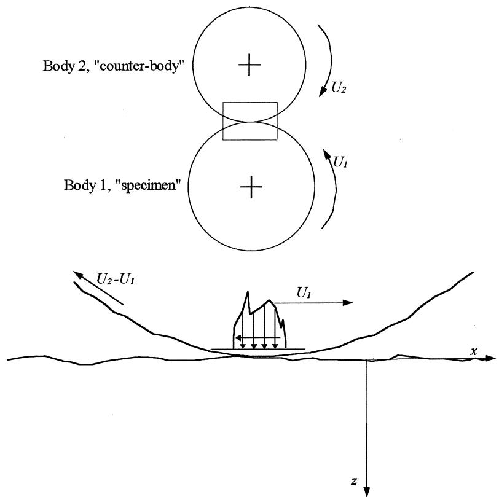  
Fig. 1 Rolling–sliding contact of rough surfaces, showing definition of axes and surface speeds relative to body 1 (the specimen). A diagrammatic representation of the distribution ofpressure and the direction of the tangential traction due to the sliding are also shown. Slide–roll ratio is defined as $\mathrm { ~ s ~ } = \mathrm { ~ } ( \mathrm { U } _ { I } \mathrm { ~ - ~ } \mathrm { U } _ { 2 } ) / ( \mathrm { U } _ { I } \mathrm { ~ + ~ } \mathrm { ~ U } _ { 2 } )$ and has a negative value for all the examples given in this paper

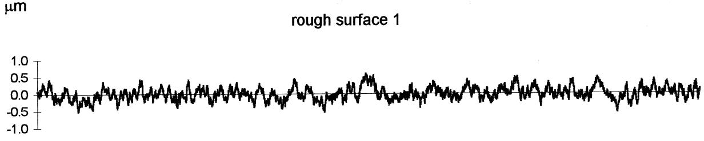

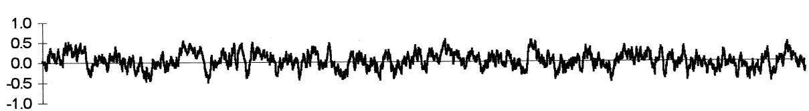  
Fig. 2 Two rough surfaces used in the analysis. These surfaces were generated to represent a typical ground finish of 0.18 mm rms. A third profile of perfectly smooth surface was also used

## Influence of roughness

When rough surfaces are involved in the contact, the stress distribution shows distinctively higher stresses close to the surface, as discussed earlier and illustrated in Fig 3c and d. This is due to the individual asperities on the surface causing localised contacts which reduce the actual contact area and hence give rise to higher local stresses. This implies the stress history of elements close to the surface is dependent on their relative position to the asperities on the surface. In pure rolling, each near-surface element will experience a unique stress history which may be many times greater than in a smooth contact if it lies below a dominant asperity, or negligibly small if it lies below a valley away from any significant asperities. Deeper in the subsurface where the stresses are hardly influenced by the roughness, the stress history is similar to that found in a smooth contact. The stress history is a function only of depth from the surface in a smooth contact, as the same stress distribution passes over every element.

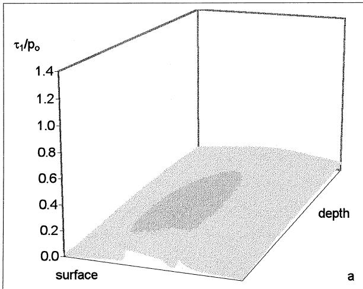

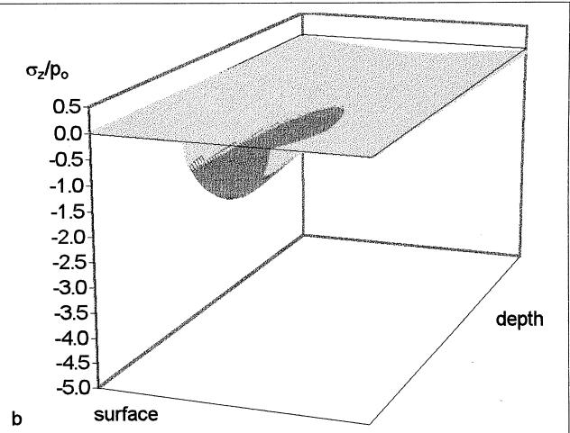

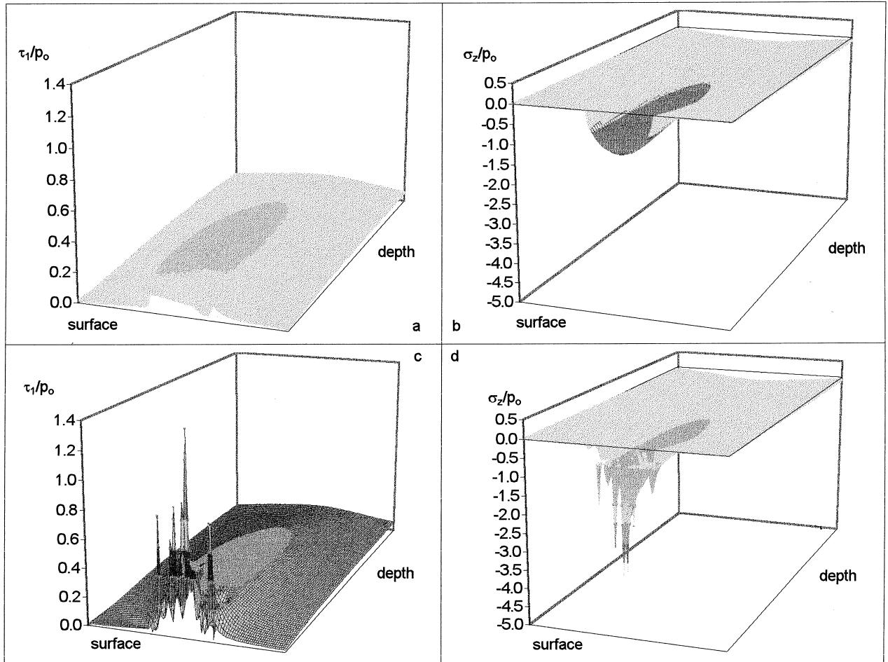

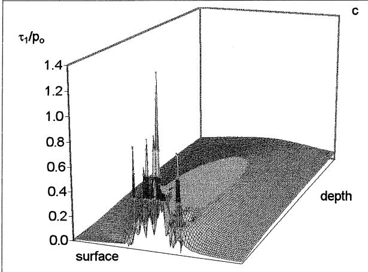

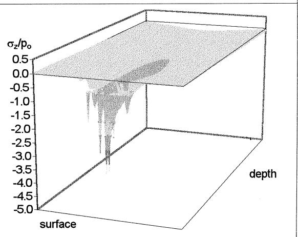  
Fig. 3 Instantaneous stress distributions in a smooth-on-smooth (a and b) and in a smooth-on-rough contact (c and d). The left two plots are of the principal shear stress and the right ones are the direct stress in the z direction normal to the surface. Concentrated stresses near the surface in the rough contact are many times greater in magnitude than in the smooth one under the same contact condition. However, the effect is very shallow in depth (m 5 0.0)

The influence of roughness on the stress history becomes much greater when sliding occurs as the interaction of asperities occur more frequently. A typical random stress history of an element near the surface in a rolling–sliding contact of two rough surfaces is shown in Fig 5.

## Influence of sliding

Sliding has been shown greatly to reduce the fatigue life3,4. To investigate the influence of sliding on the stress history and how the roughness affects the stress in the contact, two rough surfaces and a smooth surface (Fig 2) were used for both the specimen and the counterbody in combination to generate the stress history in various contact conditions.

Fig 6 shows the stress–time $( \sigma _ { \mathrm { c r i t } } )$ plots of a rough body (specimen) loaded by a smooth counterbody. The slide–roll ratio used was 20.28, which is defined as:

$$
s = \frac { U _ { 1 } - U _ { 2 } } { U _ { 1 } + U _ { 2 } } .\tag{2}
$$

Individual elements near the surface experience different shear stress cycles to one another, depending on the topography of the surface directly above them. The shear stress at the surface is mostly in the direction of the tangential traction due to friction. At 20 mm below the surface, the influence of the roughness is still present, but at 100 mm below the surface, the stress history is almost identical to that of the smoothon-smooth case.

Sliding has no influence on the stress history in the smooth-on-rough case. However, when the surfaces are reversed, i.e. a smooth specimen loaded by a rough counterbody, the effect of sliding becomes very significant (Fig 7). High local stresses induced by the individual asperities on the counterbody now move within the contact due to the sliding motion of the counterbody. This causes peaks of stress to move within the contact. For the present example, where the slide–roll ratio is negative, the motion is in the opposite (retrograde) direction to that of the contact. The elements in the specimen now experience higher variation of stress within the same contact period as $U _ { 1 }$ is held constant. As before, the stresses at 20 mm below the surface are less influenced by the roughness and they begin to revert to the Hertzian case beyond this depth.

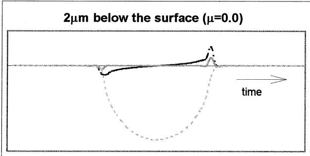

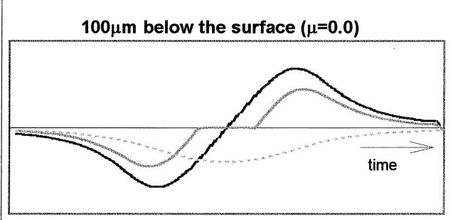

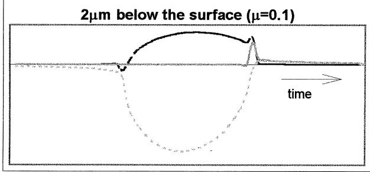

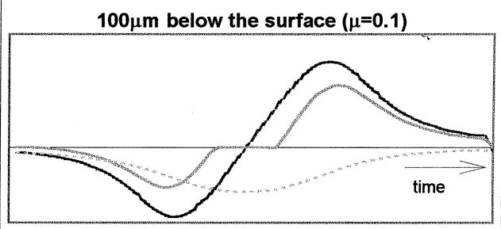  
Fig. 4 Stress history of elements in a smooth-on-smooth pure rolling contact. The figures show the orthogonal shear stress $\tau _ { \mathrm { z x } }$ (black line), the hydrostatic stress $\mathbf { { \sigma } } _ { \mathbf { { \sigma } } } \mathbf { { \sigma } } _ { \mathbf { { \sigma } } } \mathbf { { \sigma } } \mathbf { { \sigma } } \mathbf { { \sigma } } \mathbf { { \sigma } } \sigma _ { \mathbf { { \varepsilon } } } \mathbf { { \sigma } } \mathbf { { \sigma } } _ { H }$ (dotted line), and the fatigue criterion $\mathbf { \sigma } _ { \mathbf { \sigma } _ { c r i t } } 2 , 1 1$ (grey line). Some of the shear stress is suppressed by the hydrostatic pressure. When friction is present, the shear stress cycle is shifted in the direction of the applied tangential traction, especially near the surface

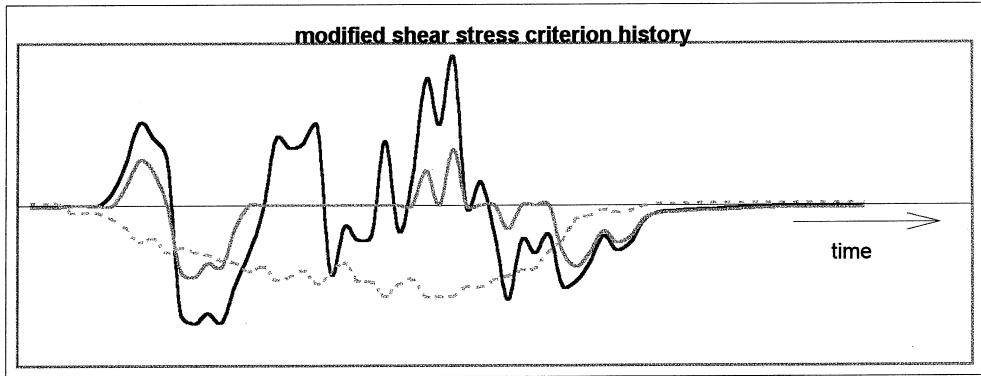  
Fig. 5 Stress history of an element near the surface (2 mm from the surface) in rough-on-rough rolling–sliding contact $\mathrm { ~ \textit ~ { ~  ~ } ~ } = \mathrm { ~ - } 0 . 2 8 )$ . Orthogonal shear stress $\tau _ { \mathrm { z x } }$ (black line), the hydrostatic stress sH (dotted line), and the fatigue criterion $\mathbf { \sigma } _ { \sigma r i t }$ (grey line) are plotted. Several cycles of shear stress are present during the contact

Fig 8 shows a rough specimen loaded by a rough counterbody. In this example, the local stresses caused by the roughness on the specimen and the sliding asperities on the counterbody are combined to generate high stresses that vary rapidly during a passage of contact. In general, stresses due to the roughness on the specimen and the counterbody can be identified separately in the stress–time plot. The stress trajectories moving in the contact with time are the ones associated with the stresses caused by the asperities on the counterbody. This can be identified as a line of stress at an angle to the time axis. Each line represents stress due to individual asperities on the counterbody. The stress line parallel to the time axis represents a stress history of an element in the specimen.

The stress–time plots of rough-on-smooth contact with slide–roll ratios of 20.28 and 20.14 are shown in Fig 9. In the former case, the local stress peaks due to asperity contacts are greater in number and are experienced by more elements as they slide for a longer distance within the contact so that the angle of the stress-trajectory line is greater.

The probability of failure against depth from the surface was determined for the rough-on-rough case at a slide–roll ratio of 20.28, as shown in Fig 10. The fatigue risk is much higher at the surface due to a random stress history with larger amplitudes, but it attenuates rapidly from the surface to that of Hertzian contact in the subsurface.

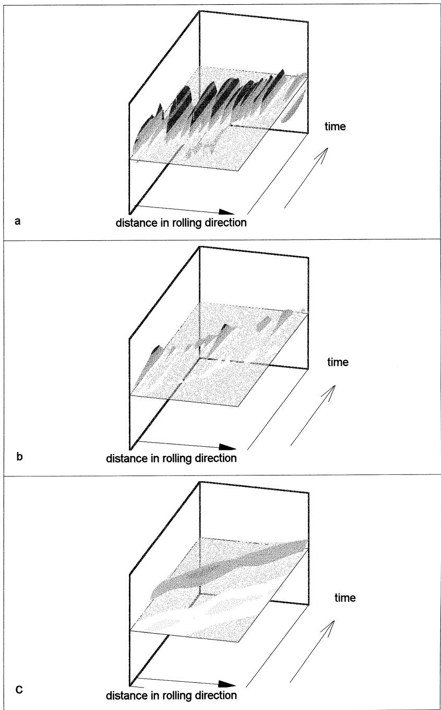  
Fig. 6 $\mathbf { \sigma } _ { \sigma r i t }$ versus time and distance plots of smooth-on-rough contact at 2 mm (a), 20 mm (b) and 100 mm (c) below the surface. Each element near the surface experiences very different shear stress depending on the surface directly above it. The stress history approaches to that of Hertz deeper in the subsurface $\mathbf { \bar { \rho } } ( \mathbf { s } = \mathbf { \bar { \rho } } - 0 . 2 8 )$

## Conclusion

In this paper the elastic stress history due to the contact of two rough surfaces in rolling and sliding contact has been investigated.

The stress history is illustrated by means of threedimensional plots of a modified shear stress (a proposed fatigue criterion) versus time and distance along the contact path.

The results show near-surface stresses many times those due to smooth (Hertzian) contact. Roughness on the specimen gives rise to stationary concentrations of stress near the surface. At greater depths, the stresses approach those due to smooth, Hertzian contact.

In contrast, roughness on the counterface gives rise to a moving stress distribution which greatly increases the number of cycles of stress to which each nearsurface element of the specimen is exposed during the passage of the main contact. Again the effect declines with depth.

When both surfaces are rough, a complex, random stress history is created in which the trajectories of both specimen and counterface asperities can be distinguished.

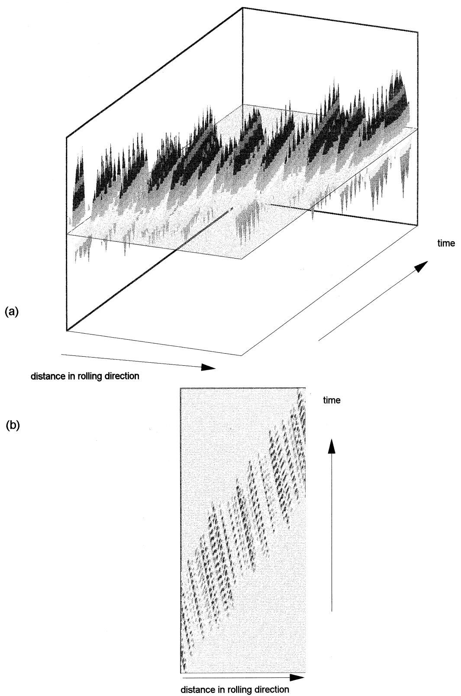  
Fig. 7 Stress–time plots of rough-on-smooth at 2 mm below the surface. The local stress concentration due to the asperities on the counter body sweeps across the material in the opposite direction to that of the contact $( \mathbf { s } \ ) =$ 20.28) (a) three-dimensional plot; (b) contour plot

The analysis provides a possible reason for the experimental observation that sliding reduces fatigue life by a greater margin for a rough, than for a smooth surface. It also suggests that counterface—as opposed to specimen—roughness is especially important in determining fatigue life.

## Acknowledgement

The author gratefully acknowledges the support of the ASETT consortium (BRITE EURAM project).

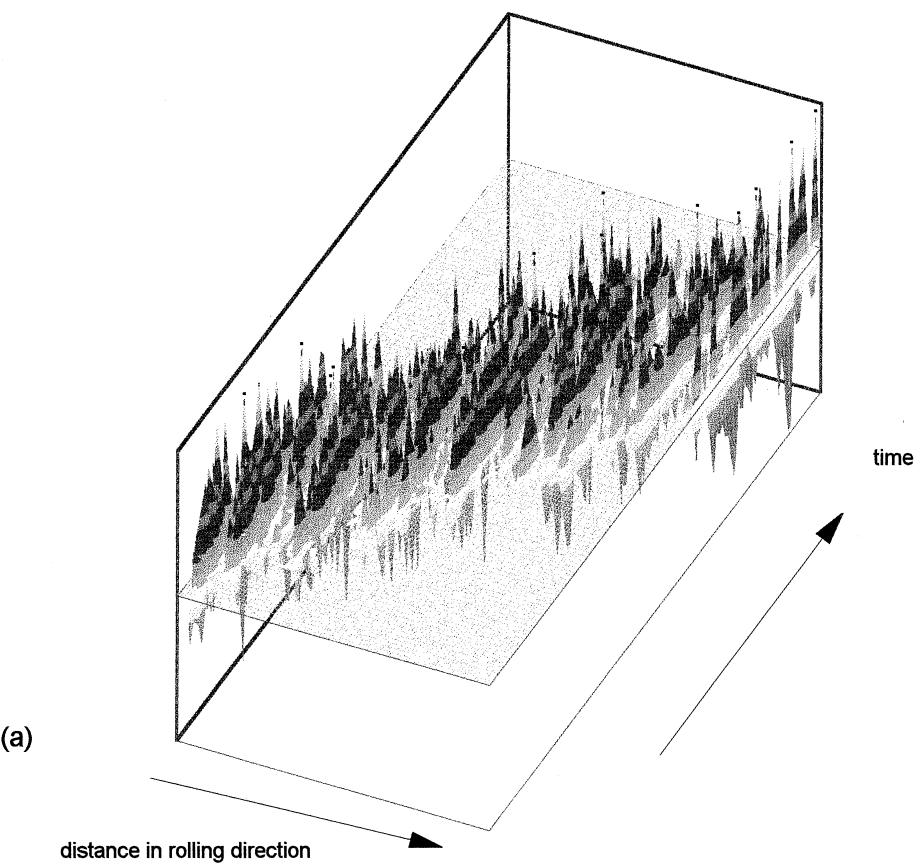  
(b)

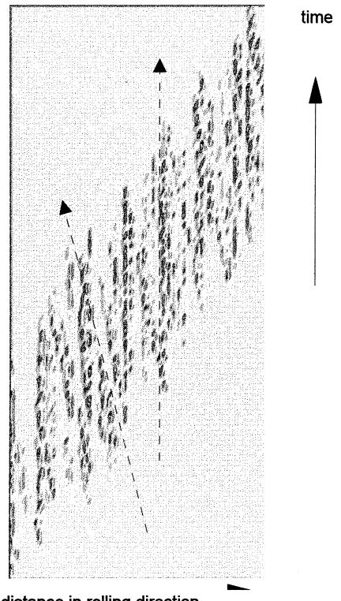  
Fig. 8 The stress–time plot of rough-on-rough contact (2 mm below the surface). The trajectories of the stress peaks due to the roughness on the counterbody (angled arrow) and the roughness on the specimen (vertical arrow) can be distinguished. These combine and give rise to a complex stress history within each passage of the contact $\mathrm { ~  ~ \zeta ~ s ~ } = \mathrm { ~ - } 0 . 2 8 ) ^ { \cdot }$ . (a) three-dimensional plot; (b) contour plot

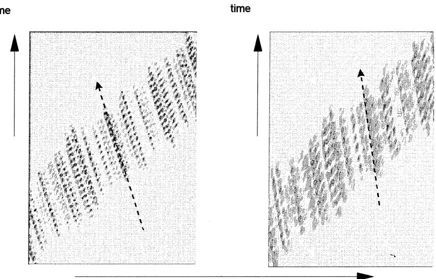  
distance in rolling direction

Fig. 9 Stress–time contour plots of rough-on-smooth with slide–roll ratios of 20.28 (left) and 20.14 (right) at 2 mm below the surface. The arrows indicate a line of stress peaks caused by the sliding asperities on the counterbody. A larger number of stress trajectory lines are present at the higher sliding speed and they sweep across more material (larger angle) during the same contact time  
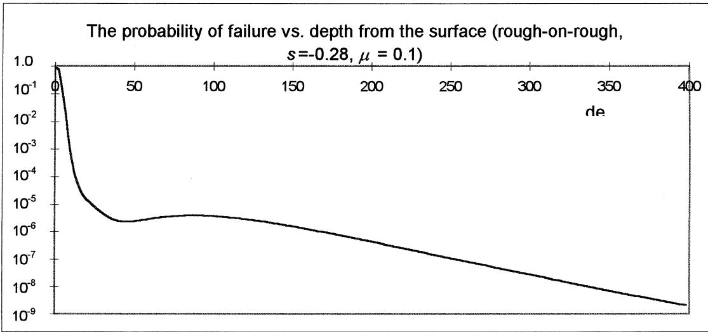  
Fig. 10 The high stress concentration near the surface causes a very high fatigue risk. This decreases rapidly with depth as the effect of roughness is very shallow. For the combination of roughness used here, the fatigue risk rises slightly in the subsurface due to the Hertzian effect and then attenuates to zero (probability offailure after 100 million cycles)

## References

1. Lundberg, G. and Palmgren, A., Dynamic capacity of the rolling bearings. Acta Polytechnica, Mechanical Engineering Series, Royal Swedish Academy of Engineering Series, 1947, 1(3), 7.

2. Ioannides, E. and Harris, T. A., A new fatigue life model for rolling bearings. ASME, J. of Tribology, 1985, 107, 367–378.

3. Graham, R. C., Olver, A. V., Macpherson, P. B. An investigation into the mechanism of pitting in high-hardness caburised steels. Am. Soc. Mech. Engrs. (pamphlet) 80-C2/DET. Presented at the Century 2 International Power Transmissions and Gearing Conference, San Francisco, CA, September 1980.

4. Bailey D. M., Fatigue in helicopter transmissions: Evaluation of the fatigue performance of gear finishing technique. Final Report

for the Department of Trade and Industry, Westland Helicopters Ltd., Yeovil, October, 1989.

5. Smith, J. O. and Liu, C. K., Stresses due to a tangential and normal loads on an elastic solid with application to some contact problems. ASME, J. of Applied Mechanics, 1953, 20, 157–166.

6. Webster, M. N. and Sayles, R. S., A numerical model for the elastic frictionless contact of real rough surfaces. ASME, J. of Tribology, 1986, 108(3), 314–320.

7. Bailey, D. M. and Sayles, R. S., Effects of roughness and sliding friction on contact stresses. ASME, J. of Tribology, 1991, 113, 314.

8. Greenwood, J. A. and Morales-Espejel, G. E., The behaviour of transverse roughness in EHL contacts. Proc. Instn. Mech. Engrs., J. Eng. Trib., 1994, 208J, 227–236.

9. Ai, X. and Cheng, H. S., The effects of surface texture on elastohydrodynamic point contact. J. of Tribology, 1996, 118, 59–66.

10. Kim T. H. and Olver A. V., Fatigue and brittle fracture analysis of surface engineered material in rolling contact, elastohydrodynamics. In Proceedings of 23rd Leeds/Lyon Symposium, Vol. 32, 1996, pp. 37-48.

11. Dang-Van K., Cailletaud G., Flavenot J. F., Douaron A. and Lieurade H. P., Criterion for high cyclic fatigue failures under

multiaxial loading. In Proceedings of 2nd International Conference on Biaxial and Multiaxial Fatigue, Sheffield, ed. M. W. Brown and K. J. Miller. Mechanical Engineering Publications Ltd., London, 1985, pp. 459–478.

12. Ioannides E., Jacobson B. and Tripp J., Prediction of rolling bearing fatigue life under practical operating conditions. In Proceedings of 15th Leeds/Lyon Symposium, Vol. 14, 1988, pp. 797–802.
