# Wear modelling: analytical, computational and mapping: a continuum mechanics approach

J.A. Williams )

Cambridge UniÕersity Engineering Department, Trumpington Street, Cambridge, CB2 1PZ, UK

## Abstract

As a result of its widespread and pervasive economic consequences wear, the almost inevitable companion of friction, has been the subject of much scientific and empirical investigation; the literature is rich with ‘wear equations’ so that, on occasion, the practitioner can seem to have too much information rather than too little. Some guidance and reconciliation between analytical and computational models and empirical observations can be provided by plotting wear maps for specific materials so that the dominant wear mechanism for particular operating conditions can be established and some indication provided on probable wear performance. A challenge facing the research community is the production of a sound theoretical framework to underpin such design aids. However, because of the variety and complexity of the surface conditions it is not straightforward to relate tribological performance to more easily established material parameters. These difficulties are illustrated by looking at the models available for two particular classes of wear involving metallic materials—severe abrasive wear, when surface life is likely to be short, and lubricated mild wear when very much longer component histories can be anticipated. q 1999 Published by Elsevier Science S.A. All rights reserved.

Keywords: Wear; Modelling; Mapping; Abrasion; Severe wear; Mild wear

## 1. Introduction

Wear, the progressive damage and material loss which occurs on the surface of a component as a result of its motion relative to the adjacent working parts, has far reaching economic consequences which involve not only the costs of replacement but also the expenses involved in machine downtime and lost production. As a result, considerable efforts have been expended on the development of theories and deterministic models; for example, Meng and Ludema 1 have identified nearly 200 ‘wear equa- w x tions’ involving an enormous spectrum of material properties and operating conditions. However, despite the best efforts of their authors, there is still no way of predicting, with confidence or certainty, the tribological performance of a loaded pair of surfaces, whether dry or lubricated, even if all of their physical and chemical properties have been independently established.

The response of a material to mechanical loading can be broadly classified as being either ductile or brittle. However, under the peculiar conditions generated under intensely loaded point or line contacts, a material may display very different forms of behaviour from those observed under less arduous testing conditions; in particular, because of the intense local compressive stress fields materials which are usually classified as brittle such asŽ ceramics can show significant plastic deformation while. those that are ductile can show greatly enhanced strains prior to failure. The practical difficulty of simulating the physical environment principally this high containing Ž stress which can be of the order of several GPa within the. zone immediately under a point or line contact under more carefully controlled test conditions has meant that there is a dearth of good material data which can be used with confidence in some of the mechanical models referred to above.

No simple and universal model is applicable to all situations. In the dry, unlubricated or perhaps marginally lubricated sliding of two, usually dissimilar, loaded surfaces, so-called two-body conditions, the rate of surface degradation or damage of each depends at least on the Ž . factors of Table 1.

When a third body is present at the interface wear may be inhibited, though not entirely eliminated for example ifŽ the third body is a lubricant or low shear strength film with a thickness dimension at least comparable with the mean surface roughness or enhanced as in the case of contami-.

Table 3
**Table 1 Factors influencing dry wear rates**

| col1 |
| --- |
| • Normal load • Relative sliding speed |
| • Geometry (both macroscopic and local or topographic) |
| • Initial temperature |
| • Local environment, and |
| • The thermal, mechanical and chemical |
| properties of the materials involved |

nation by entrained dirt or even just the retained debrisŽ from previous wear events . Contamination by debris both. harder and softer than the opposing solid surfaces is likely to be detrimental to the life of the contact though may involve different detailed mechanisms: the distribution of sizes, shapes and mechanical properties of the third bodies are all influential variables.

## 1.1. The Archard wear equation

A common starting point in the analysis of wear is often the Archard or Rabinowicz wear equation 2,3 whichŽ . w x asserts that the wear volume w is directly proportional to the product of the load P on the contact and the sliding distance s but inversely proportional to the surface hardness H of the wearing material, so that

$$
w = K \times { \frac { P s } { H } } .\tag{1Ž .}
$$

The dimensionless constant K is the non-dimensional wear coefficient. When interpreting experimental situations, the hardness of the uppermost layer of material in the contact may not be known with any certainty and, consequently, a rather more useful quantity than the value of K alone is the ratio $K / H ;$ this is known as the dimensional wear coefficient or the specific wear rate and is usually quoted in units of mm3 $\mathrm { N } ^ { - 1 } \mathrm { m } ^ { - 1 }$ . For a material with hardness of 1 GPa, a non-dimensional wear rate of unity is equivalent to a measured wear rate of 1 mm3 $\mathbf { N } ^ { - 1 }$ $\mathbf { m } ^ { - 1 }$ . Some values of K taken from relatively early wear literature, but still characteristic of such unlubricated systems, are shown in Table 2.

Typical values of dimensionless wear coefficients for various materials against tool steel sliding in dry, unlubricated pin-on-disc tests in air: from Ref. 4w x
| Material | K |
| --- | --- |
| Mild steel (on mild steel) | $\overline { { 7 \times 1 0 ^ { - 3 } } }$ |
| $\alpha / \beta$ brass | $6 \times 1 0 ^ { - 4 }$ |
| PTFE | $2 . 5 \times 1 0 ^ { - 5 }$ |
| Copper-beryllium | $3 . 7 \times 1 0 ^ { - 5 }$ |
| Hard tool steel | $1 . 3 \times 1 0 ^ { - 4 }$ |
| Ferritic stainless steel | $1 . 7 \times 1 0 ^ { - 5 }$ |
| Polythene | $1 . 3 \times 1 0 ^ { - 7 }$ |
| PMMA | $7 \times 1 0 ^ { - 6 }$ |

Several points emerge from this elementary table. First, the numerical values of K are always lower than unity, usually very much lower. Secondly, in the tests of Table 2 all the values of the coefficients of friction lay in a comparatively narrow range between 0.18 and 0.8 whereas the range of wear coefficients was very much greater, varying over 4 orders of magnitude. There is no simple correlation between friction and wear: although in a qualitative way it is reasonable to expect situations in which there are higher frictional forces to be also those involving relatively high wear, it is quite possible for material combinations to produce very similar frictional forces but very different wear behaviour.

Whatever the nature of the particular materials involved, the simplest classification of unlubricated surface interactions is into those involving either mild or severe wear. This is not based on any particular numerical value of wear rate but rather on the observation that increasing the severity of the loading e.g., by increasing the normal Ž load, sliding speed or bulk temperature for any pair of . materials leads at some stage to a comparatively sudden jump in the wear rate. The commonly observable differences between the two regimes of mild and severe wear are summarised in Table 3.

Such jumps or nonlinearities in wear behaviour or in material response have significant practical consequences for engineering designers. From a practical engineering point of view, mild wear might well be considered acceptable whereas the transition to severe conditions often represents a change to commercially unacceptable values. The engineer would thus like to know first for a given material pair and particular set of operating conditions, how close to this step change in outcome is the contact operating; secondly, supposing that there is no danger of an abrupt change into catastrophic conditions is it possible to estimate the rate of wear in terms of the operating conditions and readily measured material parameters.

## 1.2. Wear maps

To provide guidance to the first of these questions, the operating point of the design can be located in a map whose coordinates are chosen from the list in Table 1 and which is split into various territories each associated with some dominant mechanism of degradation 5 . Wear ratesw x in successfully operating industrial equipment, as opposed to imposed experimental conditions such as those ofŽ Table 2 can vary greatly from high values under particu-. larly aggressive conditions to very low values in more benign circumstances; for example the designed ‘wear allowance’ in continuously running mechanical seals, which at best run under conditions of marginal lubrication, often permits them to lose material from their operating surfaces at a rate of no more than 1 mm per annum, equivalent to a non-dimensional rate of the order of $1 0 ^ { - 9 } .$ well below any of the values of Table 2. A consequence of wear rates of these very small magnitudes is that in order to achieve dimensionally reliable measurable amounts of wear in laboratory tests these must be run for several hundred hours. Reducing the time scale of wear tests to speed up the production of data, for example by increasing loads or speeds, is a potentially hazardous procedure as there is always the danger of moving from a regime of operation within which one specific form of wear mechanism is dominant to another controlled by different physical phenomena. Such pitfalls can often be prevented, and the way indicated in which changes in service conditions might be expected to influence wear response, by plotting changes of this sort on the appropriate wear map. The simplest imposed variables are clearly load and speed and using these as the ordinate and abscissa gives rise to the now relatively familiar Lim and Ashby maps 6 . The w x challenge, as these authors themselves pointed out, is to extend such plots from those based on empirical observational data and to construct such maps either from theory alone or, more profitably, from theory calibrated against experiment.

Distinction between mild and severe wear
| Mild wear | Severe wear |
| --- | --- |
| Results in extremely | Results in rough, |
| smooth surfaces—often smoother than the original | deeply torn surfaces much rougher than |
| Debris extremly | the original surfaces Large metallic wear |
| small typically less | debris up to 0.01 mm |
| than 100 nm diameter | diameter |
| High electrical contact resistance | Low contact resistance, true metallic |

The Lim and Ashby form of map plots the severity of the load expressed as the applied normal pressure $p \ ( \mathrm { i . e . , }$ the normal load divided by the nominal area of the contact $A _ { \mathrm { n o m } } )$ vs. the sliding speed V. Such a map, which is specific to a particular material surface topography, grain Ž size, hardness etc. has the merit that it also incorporates . regimes of different chemical or surface reaction behaviour which are associated with temperature effects—although this is at the expense of detail on the mechanical forms of wear associated with different states of surface topography and asperity interaction. The general form of such a map for a metal is illustrated by that for medium-low carbon steels shown in Fig. 1. Pressure has been expressed non-dimensionally as $\widetilde { p } = p / H$ where H is the indentation hardness of the softer surface, so that $\tilde { p }$ is always less than 1. Regions of the map associated with different wear mechanisms are traversed by contours of equal wear rate, i.e., values of K. These can be established by extrapolation from test data available in the literature.

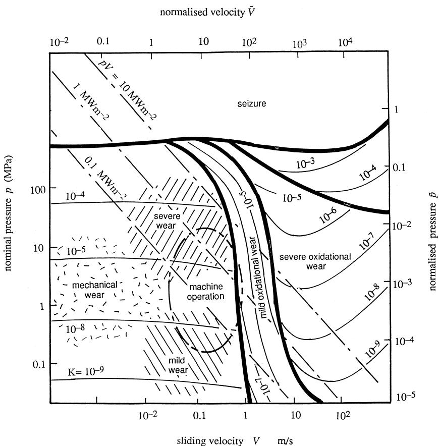  
Fig. 1. A load–speed mechanism wear map for medium carbon steel based largely on pin-and-disc data. Load and speed both normalised as described in the text. Thick lines delineate different wear mechanisms and thin lines are contours of equal wear rates. Chain lines represent constant values of the $p V$ factor.

Characteristically, the map is divided into two regions by a roughly vertical field boundary. To the left of this division, wear is controlled by essentially mechanical processes; here the wear rate depends on the normal pressure Ž . or load but is not greatly dependent on sliding velocity so that contours of wear rate are more or less horizontal. On the other hand, to the right of this division, thermal and chemical effects invariably under normal atmospheric Ž conditions these involve oxidation become the dominant. influence and the contours of wear rate become functions of both load and velocity. For steel, this fundamental mechanism transition corresponds to dry sliding speeds of about 0.1 m $\mathrm { ~ s ~ } ^ { - 1 }$ ; below this, surface heating, and so oxidation, is relatively insignificant.

In the regime dominated by mechanical wear, there are regions within which the spacing between contours of wear rate is equal to that between changes of load of the same factor, for example, as K goes from $1 0 ^ { - 9 } \ \mathrm { t o } \ 1 0 ^ { - 8 }$ or from $1 0 ^ { - 5 } \ \mathrm { t o } \ 1 0 ^ { - 4 }$ , the load also changes by a factor of 10. In each of these cases wear rate and load are directly proportional to each other, i.e., in accord with Eq. 1 . ButŽ . this is not the case throughout the region; the gap between the contours for K equal to $1 0 ^ { - 8 }$ to that for $1 0 ^ { - 5 }$ covering three orders of magnitude corresponds to a load change of only one order. This very rapid increase in wear rate is an example of the transition from ‘mild’, and hence usually acceptable levels, to ‘severe’ usually unaccept-Ž able values brought about by an increase in load. Dry or. marginally lubricated contacts in machines between steel surfaces often operate at nominal pressures of a few megapascals and at sliding speeds of the order of something less than a metre per second; in other words just at this level of wear uncertainty. Note that at a given level of load but at high sliding speeds, surface oxidation can be protective and provide reductions in loss of material, i.e., dips in the contours of K, when the softened oxide film acts as a protective almost lubricant layer over the metallic substrate.

An important design guide to the consequences of dry rubbing is the energy input per unit area, i.e., the product of pressure and sliding speed, the $\mathbf { \zeta } ^ { \bullet } p V ^ { \bullet }$ value. Since the map is drawn on log-log scales constant $p V$ values will plot as straight lines with a negative slope and three such lines are shown in Fig. 1 for specific energies of 0.1, 1 and $1 0  { ~ \mathrm { M W } _ { \mathrm { ~ m ~ } } } ^ { - 2 }$ which are typical of dry running machine contacts. Very often the machine designer will have very little control over the nominal contact pressure and the sliding speed for a particular application. He or she will be obliged by making recommendations about materials and secondary operating conditions to try and ensure that during the initial stages of component history a mild and acceptable wear regime is established.

## 1.3. Mechanical wear maps

An often quoted maxim in tribology is the warning that it makes no sense to speak of the friction of a single material without specifying both the nature of the counterface as well as the operating conditions of the overall contact. At first sight, the Ashby map appears to conflict with this admonition as there is no mention of the material of the counterface. Features of this, the second body, have differing levels of significance depending on the imposed conditions. For example, when the sliding speed is large, so will be the energy input, and the conductivity of both first and second bodies will be influential in controlling the conduction paths of the thermal energy generated at the interface; counterface thermal conductivity thus has a significant effect on interface temperatures. At lower sliding speeds, within the mechanical range of surface interactions, conductivity will be less important but now counterface topography and interfacial shear stress will play more significant roles.

The conventional categories of mechanical wear processes are summarised in Table 4. A surface exposed to hard particulate contamination can deteriorate by both erosion when the particulate have a significant velocityŽ normal to the surface , and abrasion and the latter can. either be of the three-body form if the particles roll andŽ tumble through the constriction , or two-body if they be-. come embedded in the opposing surface, and when the situation will be more akin to the wear by a hard rough counterface. Under these circumstances, an alternative map, of a form suggested by Childs 7 , which gives morew x emphasis to the mechanical aspects of surface damage but less to the thermal since velocity is not considered as anŽ independent variable is more appropriate: such a map is . sketched in Fig. 2. This shows the regimes of wear on axes representing the shear strength of the interface t between the two materials plotted linearly and usually normalisedŽ by k the shear strength of the weaker material vs. the. logarithm of some roughness parameter such as the angle u representing the average slope of asperities on the harder abrading surface. Rough counterfaces, i.e., those with high values of surface slope, lead to severe wear of the softer surface by abrasion; this always involves severe plastic deformation and can take the form of a combination of ploughing in which, although the surface topography is Ž much modified, only a small proportion of the displaced material is actually detached from the surface and micro-. machining or cutting when a much higher proportion of Ž the plastically deforming material is lost as wear debris .. Processes of abrasive machining—grinding, polishing, lapping etc.—can be thought of as being analogous to abrasive wear. Asperity slopes of grinding wheels and abrasive papers are likely to range from a few degrees to $1 0 ^ { \circ }$ or more and so generate wear by a combination of ploughing and cutting mechanisms.

Table 4 The classification of mechanical wear processes  
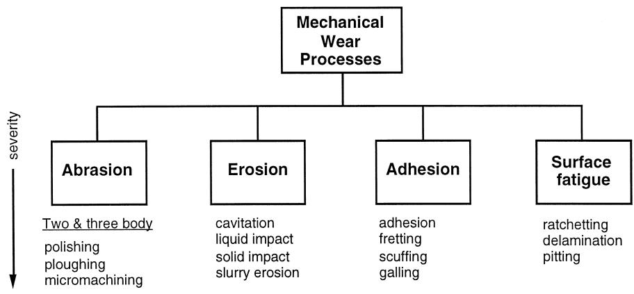

Once significant volumes are lost by micro-machining, reducing the interfacial shear stress has the effect of increasing the volumetric loss because the efficiency of the cutting operation is improved; a situation in which reducing friction enhances wear. This is in contrast to the circumstances over the rest of the map in which reducing the surface shear stress lowers the wear rate. This switch in the effect of local frictional reductions can be used as the defining feature of truly abrasive wear. When the abrading surface is much less rough, so that the value of u is small, elastic deformations cannot be neglected—indeed they may be sufficient to accommodate the applied loads alone so that wear in repeated traversals, which is the usual situation in most tribological devices, depends on some form of fatigue or damage accumulation mechanism. Wear rates are much lower, ‘mild’ rather than ‘severe’, and their prediction, in terms of material and operational parameters, presents a formidable challenge to those working in the field.

Observation by scanning electron microscopy and ferrography have made it apparent that metallic wear particles, other than those generated under relatively severe abrasive conditions or pitting fatigue, commonly take the form of thin platelets. In addition, metallographic sections of wearing surfaces often reveal near-surface cracks lying parallel, or very nearly parallel, to the free surface. This led Suh 8 to introduce the term ‘delamination wear’ andw x to initiate their analysis by the techniques of fracture mechanics: a review of this work is available by Jahanmir w x 9 . However, these cracks present mechanics with a problem in that under contact loadings they appear on planes which carry very large compressive stresses 10 . To over-w x come this difficulty it was suggested that they were, in fact, mode II shear cracks and several analyses wereŽ . carried out on this basis see Ref. 11 . While theseŽ w x. models have been of value in relation to pitting failure in rolling contact fatigue, where the cracks penetrate relatively deeply into the material, it became clear that in shallower cases, the forces of friction at the highly compressed faces of any such defect effectively suppress the local mode II stress intensity factors. It now seems much more likely that in many cases these near-surface failures are of a ductile nature and result from an accumulation of plastic strain very close to the component surface rather than being driven by elastic stress intensity factors. This view of the metallic wear process suggests that in situations of repeated sliding, modelling should concentrate on plastic deformation of the near-surface material.

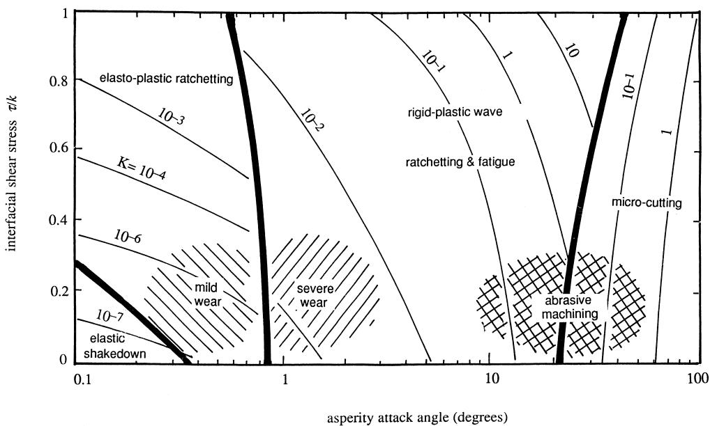  
Fig. 2. Wear mechanism map for a soft surface abraded by a harder, rough counterface. The ratio trk represents the relative strength of the interface and u the mean slope of the rough surface or the attack angle of a single asperity . Thicker lines delineate different wear mechanism and thin lines representŽ . contours of equal wear rate.

## 2. Modelling abrasive wear

## 2.1. Multiple contacts

The classical experimental work on abrasive wear and on the abrasion resistance of metals e.g., Kruschov 12Ž w x and Richardson 13 involved experiments in which speci-w x. mens of each material, usually in the form of cylindrical pins, were rubbed against a ‘standard’ abrasive—conventionally an abrasive paper or cloth carrying silicon carbide or quartz particles; the volume lost from the test samples increased in proportion to both the sliding distance and the normal load applied, as indicated in Fig. 3. This plot also demonstrates that the relative wear resistance that is theŽ ratio of the of the wear volume of some standard material to that of the sample material tested under the same experimental conditions of a wide range of pure metals is. proportional to hardness. However, the relationship becomes more complicated for engineering materials which consist of two or more phases: for example, steels of different alloy compositions which have been heat treated to give a range of hardness values, still give linear plots but of different slopes from that of pure single phase metals. Metallurgical investigations have suggested that as a general rule, the abrasive wear resistance of steels increases with their carbon content but the actual numerical value is very dependent on micro-structural details. In pearlitic steels, for example, considerable improvements in abrasion resistance can be achieved by refining the structure of the pearlite. Martensite, by virtue of its hardness, is very resistant to wear, but even in a martensitic steel the volumes and precise compositions of the carbide phases can be extremely important in determining the value of the relative wear resistance, and careful control of the metallurgy is essential to optimise material performance. Experiments producing data of the sort displayed in Fig. 3 are examples of multiple wear events, i.e., situations in which the resultant abraded surface is formed by the superposition of many interactions between individual abrasive grains or asperities on the harder surface and the wearing surface of the softer specimen.

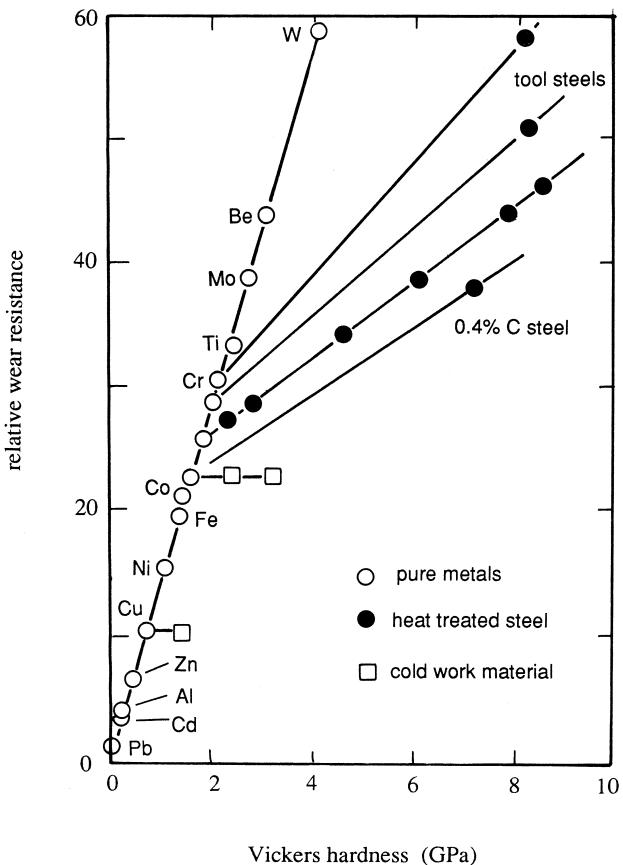  
Fig. 3. The effect of hardness of metals on their abrasion resistance Ž . proportional to the reciprocal of wear rate : from Kruschov 12 .w x

Setting to one side the difficulties encountered with two-or multi-phase materials, it has become conventional to interpret such data in terms of an Archard wear equation, i.e., Eq. 1 , notwithstanding the fact that this was Ž . proposed initially to describe adhesive rather than abrasive wear and that over the course of a complete test or the life Ž of a component linearity between the worn volume and. load may not be maintained, generally being higher both during the initial running-in or break out phase and in theŽ . final stages of component life preceding some form of catastrophic failure. Typical values of the constant K in two-body abrasion lie in the range 0.005 to 0.05; values in three-body abrasion when the abrasive can roll and tum-Ž ble between the sliding surfaces tend to be lower perhaps . down to 0.0005. Most research into abrasive wear see forŽ example the review by Zum Gahr 14 has concentratedw x. on the two extremes of the process. One approach has been to experimentally study multiple asperity contacts of the sort described above. While these can provide much useful data on the relative wear resistance of groups of materials they can give comparatively little information about the actual deformation processes which take place as the worn surface is created: without this sort of detailed information it is difficult to predict likely wear rates for new materials or coatings, or even existing alloys in unconventional circumstances. If the material is brittle then the situation is more complex because material can be lost not only through plastic flow but also by additional mechanisms of inter- or intra-granular fracture. There will be a sensitivity to scale in a way not present in ductile metals and consequently on the geometry or conformity of the contact; the dependence of wear rate upon load is unlikely to accord with the simplicity of Eq. 1 15,16 . Ž . w x

## 2.2. Single contacts

A starting point for most modelling of wear processes is the consideration in more detail of the damage arising from a single isolated asperity moving across a softer previously undeformed surface: the literature contains accounts of a large number of investigations into the mechanical and materials aspects of the formation of single wear grooves, usually in carefully prepared and undamaged metallic surfaces 17–26 . There is an obvious simi-w x larity between these circumstances and those of the scratch hardness test 27 . The interaction between successive wearw x events or their statistical combination to generate observed final surface topographies has been far less well studied.

## 2.2.1. Three-dimensional models

The simplest situation, illustrated in Fig. 4 a , is that ofŽ . a conical asperity with semi-angle $( 9 0 ^ { \circ } - \theta )$ carrying a normal load P ploughing a groove of depth h in a soft and ductile surface. The deforming material is assumed to be homogeneous in composition and isotropic in its properties and thus conform with the classical model of an engineering continuum. The angle u might represent the ‘average’ surface slope or roughness of the abrading surface which carries an array of such asperities and so corresponds toŽ the abscissa in Fig. 2 : it is often known as the attack. angle. The asperity now slides through a unit distance so that the volume of displaced material or the effective wear rate will be given by $h ^ { 2 } \times \cot \theta$ . The depth of penetration h can be related to the indentation hardness of the material H although, since it is only the front half of the asperity that carries the load $P ,$ , the supporting projected area is semi-circular and of radius hcot a, and so $P = \pi / 2 \times$ $( h \cot \theta ) ^ { 2 } \times H$ . This means that

$$
{ \mathrm { w e a r v o l u m e } } { \mathrm { p e r u n i t s l i d i n g d i s t a n c e , ~ } } \frac { w } { s } = \frac { 2 { \mathrm { t a n } } \theta } { \pi } \times \frac { P } { H }\tag{Ž . 3}
$$

Thus, we have an $^ \mathrm { \bullet } _ { \mathrm { \bf A } }$ rchard’ equation with a wear coefficient K equal to 2tan $\theta / \pi$ . Rougher surfaces will have larger values of the angle u and so will be expected to produce more wear damage. Although of the desired form, the non-dimensional constant 2tan $\theta / \pi$ in Eq. 3Ž . greatly over-estimates the wear observed in real circumstances. A rough engineering surface might have a man value of $\theta$ of say $5 ^ { \circ }$ Ž . at most so that the predicted non-dimensional wear constant in this most severe of circumstances is equal to $6 \times 1 0 ^ { - 2 }$ , barely within the range experienced experimentally. One explanation for this overestimate is the assumption that all the material from the groove is lost from the surface: observations show that in general only some of the displaced material is actually detached in the form of a curly slivers or chips by aŽ micro-cutting process while the remainder is simply piled. up at the edges of the resultant groove as ploughed ridges; this can reduce the wear rate very considerably; the other factor is, of course that not all the asperities on the rougher surface in such a multiple encounter are as aggressive as the single event which has been examined.

If the abrading asperity is regarded as having the shape of a simple symmetrical pyramid rather than a cone bothŽ are probably equally reasonable approximations to the shape of real asperities with one of its sloping edges . leading, then the general appearance of the deformation is as indicated in Fig. 4 b with a wedge or prow of deform- Ž . ing material extending ahead of the leading edge of the asperity. The relative volumes appearing in the ridges and the machined chips depends on the geometry of the asperity which can be conveniently described by the two angles shown in Fig. 4 c . The angle between the two leadingŽ . faces of the asperity $2 \psi _ { ; }$ , is known as the dihedral angle. For a given value of the dihedral angle, there is a significant contribution to wear by machining only when the attack angle exceeds some critical value. If the angle of attack is less than this then the process is essentially one of ploughing or rubbing. The dihedral angle can also influence the mode of material response: if $2 \psi$ is small then the asperity is rather like a knife moving through the surface and deformation is principally that of ploughing; as $\psi$ increases so the likelihood of significant wear increases. In the limit $2 \psi$ is equal to $1 8 0 ^ { \circ }$ so that effectively the pyramid is moving with one of its flat faces forward rather than one of its edges.

The effect that both these angles have on the form of the resultant deformation has been investigated on both the comparative macro-scale and in a size regime more comparable to that of real asperity contacts by carrying out small-scale tests within the chamber of a scanning electron microscope; a summary of these and other observations can be usefully displayed on the wear mode diagram suggested by Kato et al. 28 whose general form is shownw x in Fig. 4 d . When a square based pyramid or asperity Ž . moves edge forward $( 2 \psi = 9 0 ^ { \circ } )$ there is a fairly clear transition from cutting or machining to ploughing or rubbing; however, if the indenter moves face forward $( 2 \psi =$ 1808. then, as the angle of attack increases, there is a region of unstable prow or wedge formation before pure ploughing is established.

Most of the attempts to model this apparently simple situation have depended an application of the upper bound method to estimate the rate of plastic working and so the associated force terms. The asperity being modelled as either a pyramided or a cone. The upper bound method assumes that the material, which is characterised as a rigid-perfectly plastic continuum, accommodates the movement of the indenter by moving internally as a series of rigid blocks so creating discontinuities in the tangential components of velocities at the interfaces between them. The number and general form of these blocks is specified in the model chosen: their displacements must be compatible with incompressibility of the material and the imposed boundary conditions, but the exact position of the interfaces, as well as the ploughing component of the force, is found by minimising the rate at which energy is expended at the sliding which takes place at the inter-block boundaries. This method of analysis is based on the upper limit load theorem which states that, provided certain conditions are met, the true velocity field minimises the overall rate of plastic working. Strictly speaking, the application of this theorem requires that the surface configuration of the plastic zone be known ab initio. In the case in question this is not the case, as it is bounded by a stress free surface whose shape is not controlled by the indenter. This means that solutions arrived at on the basis of energy minimisation are not necessarily those that will in fact be favoured; in the terminology of Avitzur and Talbert 29 this is a w x ‘casual’ application of the limit theorem and the predictions are not so much upper bounds as ‘physically reasonable’ solutions. This difficulty has been addressed for this particular geometry recently in a more rigorous analysis which confirms that although these ‘quasi-upper-bound’ solutions can be significantly in error as far as geometric predictions are concerned the values of ploughing forces, and the associated expenditure of energy are likely to be accurate to a few percent 30 . w x

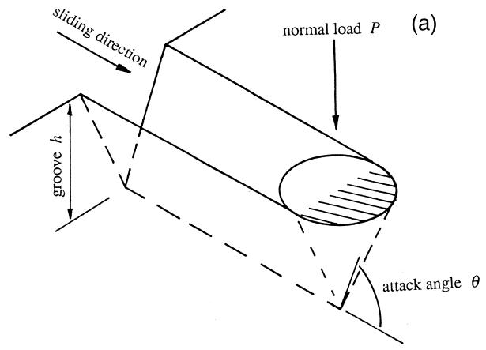

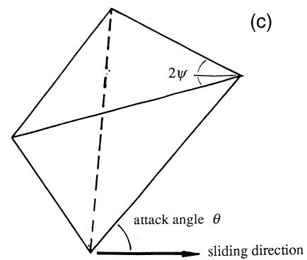

The production of a wear groove in an initially featureless surface is clearly a great simplification of what actually occurs in practice when wear events are superposed upon one another to give a statistically stable but developing surface profile, and there are clearly problems in

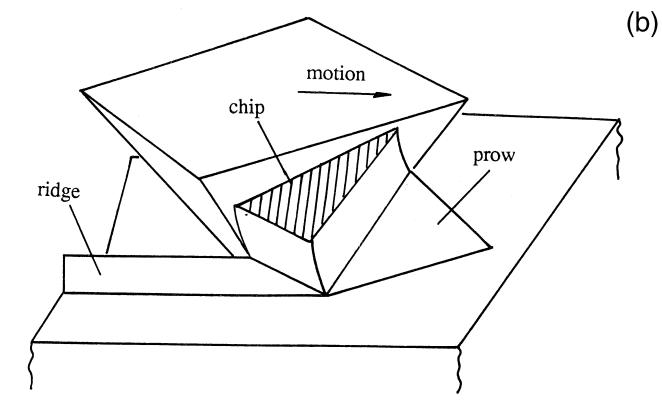

(d)  
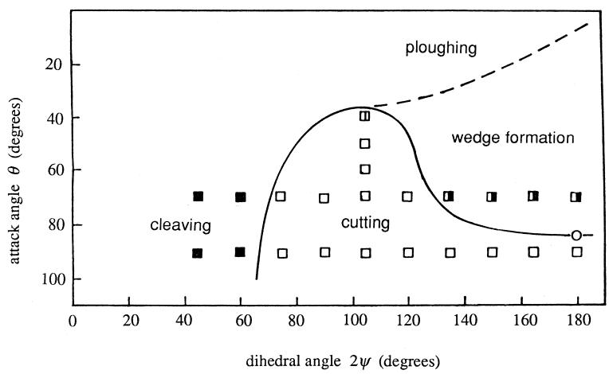  
Fig. 4. a A simple conical wear indenter presenting an attack angle Ž . u and ploughing a groove in a soft material of depth h. b A pyramidal indenter Ž . moving through previously undeformed material. c The geometry of the indenter is described by the two anglesŽ . Ž . c and u. d The wear mode diagram after Ref. 28 , ‘real’ asperities will havew x $9 0 ^ { \circ } < 2 \psi < 1 8 0 ^ { \circ }$ . e i A single 50Ž . Ž . Ž . Ž . mm high diamond asperity produced by deposition ii densely and iii sparsely packed arrays of such model asperities after Gahlin 33 .Ž ˚ w x.

Fig. 4 continued . Ž .

(e)

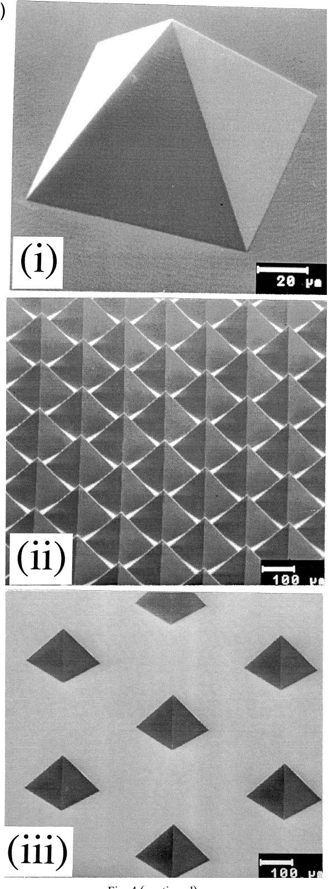

transferring the results of this form of investigation to more practical circumstances involving multiple asperity interactions such as produce the data of Fig. 3. The majority of real surfaces, even very rough ones, have mean values of slope very much less than the critical attack angles found in single wear track investigations which are typically of the order of $2 0 ^ { \circ }$ or more. Consequently, if we consider their asperities to be acting separately and take into account the effect of the critical attack angle minimal wear losses are predicted. A cursory examination of an abrasively worn surface leaves no doubt as to the direction of relative sliding as the original features of the surface are gradually replaced by a series of parallel wear tracks. In a very short time, the load carrying asperities are abrading an already abraded and profiled surface. The problem of allowing for the interaction of later events with the profile left by earlier asperity passes remains unsolved. In their work on the statistical development of surfaces, Jacobson et al. 31 assumed that all the displaced material was lost w x and, not surprisingly, thereby overestimated the resultant wear coefficient. Garrison 32 and Zum Gahr 14 amongstw x w x others have attempted to account for the extent to which ploughed material is removed by subsequent abrasion by the introduction of an empirical factor which depends on Ž the work hardening exponent of the metal and recent . work by Gahlin et al. 33 using artificially abrading ˚ w x surfaces with remarkably precisely controlled geometry Ž Ž .. see Fig. 4 e makes experimental interpretation much easier.

The work by Williams and Xie 34 has shown that thew x proportion of the material displaced by the passage of the hard asperity is affected by its geometry, the ability of the material at the surface to strain harden and the proximity of any near-by pre-existing tracks; these have the effect of reducing the angle of attack at which micro-cutting becomes the preferred mechanism of material response seeŽ Fig. 5 . This analysis was also based on a quasi-upper . bound argument and while comparison of the predicted traction or friction force with that measured showed a good agreement it was, as anticipated, much more difficult to make predictions about the distribution of deformations, and thus the wear rates themselves.

## 2.2.2. Simplified two-dimensional models

Because of the geometric complexities inherent in three-dimensional plasticity solutions, no complete analytical model in the sense of simultaneously satisfying theŽ requirements of equilibrium, compatibility and a plasticity flow rule of the ploughing or micro-machining of a flat . surface by an indenter with the comparatively simple shape of either a cone or a pyramid has yet been produced. To facilitate the analysis, an alternative simplification to the use of an upper bound technique is to consider the analogous two dimensional problem. If the material is again imagined to exhibit perfect plasticity then the problem is tractable by the technique of slip line fields which have the advantage of satisfying both the demands of equilibrium of stresses and compatibility of strains. However, in such two-dimensional or plane strain problem, the asperity is obliged to take the form of an infinitely wide wedge and for steady state conditions to be achieved, some material must either actually be removed by the cutting process or the asperity must ride up vertically during the initial stage of the deformation until its apex is at the same level as the undeformed surface; deformation will now be associated with a plastic wave pushed ahead of it—like a ruck in a carpet. A possible slip line field for this deformation mode, originally suggested by Green 35 but muchw x developed by Petryk 36 and Challen and Oxley 37 , isw x w x illustrated in Fig. 6 a ; a simple possible shear mechanism Ž . for the machining mode is shown in Fig. 6 b . Ž .

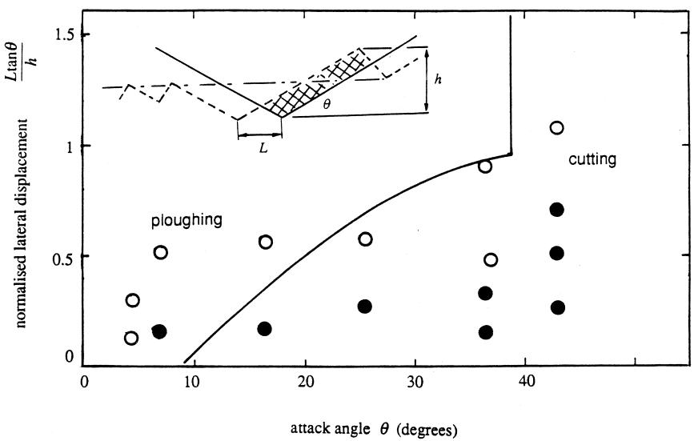  
Fig. 5. a The effect on wear mode of a pre-existing wear track produced in a surface by a previous pass of the asperity; Ž . L is the lateral displacement of the two tracks and h the dimension indicated. The wear map is for such a test on a copper surface comparing predicted and experimentally observed regions of behaviour: open symbols: predominant mechanism ploughing and closed: significant amount of material was lost by cutting. The solid line is the prediction from the upper bound model referred to in the text.

Each field provides, from consideration of the stresses within the plastically deforming material, expressions for the ratio of the tangential or traction force on the asperity to the normal loading, i.e., the overall or global coefficient of friction $\mu ,$ in terms of the attack angle u and the strength of the interface between the deforming material and the indenter expressed as a friction factor f. These are shown in Fig. 6 c ; notice that increasing the value ofŽ . $f$ at a given value of u provides a greater value of overall friction for the wave model but reduces $\mu$ during chip formation. When $f { = } 0$ then $\mu = \tan \theta .$ . It is clear that for the majority of asperities on engineering surfaces for Ž which $\theta < 5 ^ { \circ } )$ the wave mechanism will operate. The lowest value of u for which machining will be preferred is 21.28. For very severe asperities and non-zero friction, i.e., $f > 0 ;$ , it may seem as if there are two possible responses, both cutting and wave formation: however, since the overall coefficient of friction is a measure of the global energy expenditure, in this overlapping region, the mechanism with the lower value of m, i.e., cutting, will be favoured.

The wear rate for the cutting model is relatively easy to establish by evaluating the dimension h in terms of $P$ the normal force per unit length of asperity and the material hardness H as

$$
K = \frac { h H } { P } = \frac { 3 \sqrt { 3 } } { \left\{ 1 + 2 \left( \frac { 1 } { 4 } \pi - \gamma - \theta \right) \right\} \cot ( \gamma - \theta ) - 1 }\tag{Ž . 4}
$$

where g is the shear angle made by the shear plane with the direction of relative motion. Estimating a wear rate for the case of wave propagation is clearly more difficult than for the cutting mode because an inherent feature of steady-state wave formation is that the asperity is taken to ride up during the initial phase of the motion to the level of the undeformed free surface—in one real sense, therefore, it is a ‘no wear’ model.

However, although the slip line field of Fig. 6 a allows Ž . for no immediate loss of material, every element of material which lies at a depth below the free surface of no more than the greatest extent of the arc between points B and C Ž . i.e., dimension h , experiences a sequence of plastic strain increments as it moves through the zone of deformation. Each element is compressed by a direct strain $\Delta \varepsilon _ { x x }$ parallel to the surface and subsequently extended by the same amount since there is no net surface extension but, inŽ . addition, is given a uni-directional increment of shear strain $\Delta \varepsilon _ { \mathrm { z x } }$ : these shear components accumulate with each passage of the indenting wedge. The effective cycle of plastic deformation is thus not closed but has both a reversing component and an incremental, monotonic component—the so-called ratchetting element. These strain components can be related to the geometry of the slip-line field and Fig. 7 shows some typical stain history cycles experienced by materials passing through a slip-line field of this geometry for various values of the roughness or attack angle u. Notice that these strain values are large— even when the asperity attack angle is $2 . 5 ^ { \circ }$ a single pass of the indenter imposes a shear strain of nearly 15%. The generation of wear particles under these circumstances appears to be intimately associated with the magnitude of these strain components although recent literature contains a lively debate about the relative significance of the reversing and the ratchetting components 38 . It may be thatw x some circumstances, e.g. in reciprocal sliding, the reversing component is of most significance, while in uni-directional sliding the ratchetting element is of more relevance.

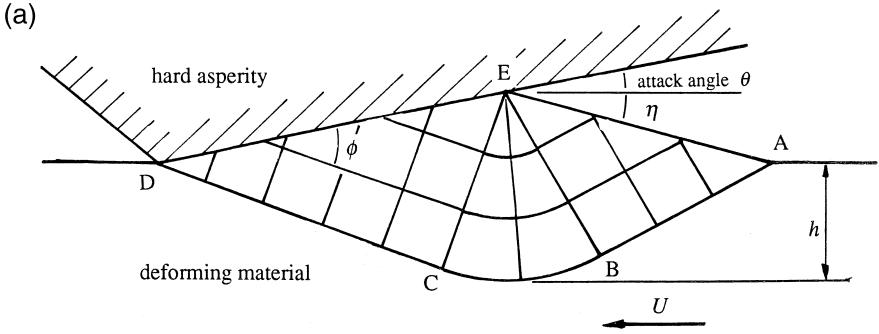

(b)  
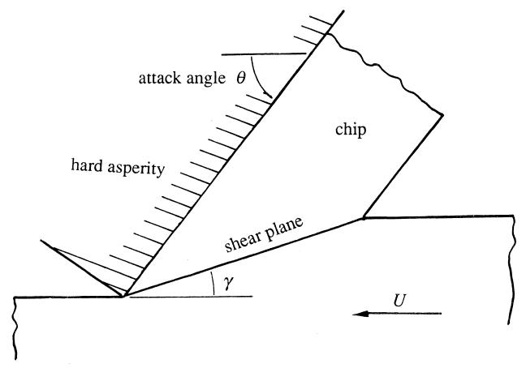

(c)  
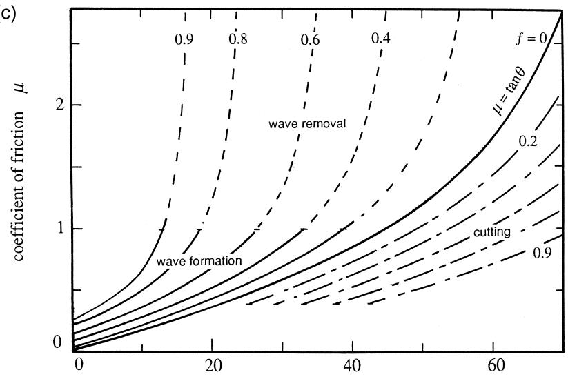  
asperity attack angle θ (degrees)  
Fig. 6. Slip line fields for the interaction of a hard asperity with a soft surface. a Steady-state plastic wave ABCDE whose geometry is defined by thereŽ . Ž . angles u, f and h. b Chip formation or micro-machining at larger values of attack angleŽ . Ž . u. c Resulting map of overall coefficient of friction vs. asperity attack angle for differing values of interface friction factor f Žafter Ref. 37 . w x.

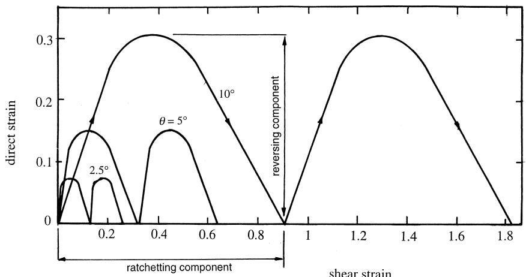  
Fig. 7. Strain cycle imposed by wave slip line field for $f = 0 . 2 5$ and $\alpha = 1 0 ^ { \circ } , 5 ^ { \circ }$ and $2 . 5 ^ { \circ }$ Žfrom Ref. 39 .w x.

On the basis that the rate determining mechanism is that of ratchetting, and that material failure occurs when the accumulated strain reaches some fixed value, the wear rate of the surface will be proportional to $\Delta \varepsilon _ { \mathrm { z x } }$ , the ratchetting strain experienced by an element of material as it passes through the field. An equation for K, equivalent to Eq. 4 ,Ž . but for the plastic wave mechanism has been derived 39w x as

$$
K = \frac { \sqrt { 3 } \left[ \sin \phi - \sin \theta \right] } { A \cos \theta - \sin ( 2 \phi - \theta ) } \times \frac { A \varepsilon _ { \mathrm { z x } } } { C }\tag{Ž . 5}
$$

where $A = 1 + p / 2 + 2 \phi - 2 \eta - 2 \theta$ and the angle f Ž Ž .. shown on Fig. 6 a is related to the friction stress t at the interface between the asperity and the wave by the equation

$$
\phi = 0 . 5 \operatorname { a r c c o s } f .\tag{6Ž .}
$$

There are three contributions to $\Delta \varepsilon _ { \mathrm { z x } }$ , the first when the material enters the plastic zone by crossing the line AB, the second within the fan region BCE and a third as the material leaves the plastic zone across CD and expressions for these, in terms of the angles of the field, are available w x 39 .

We can now begin to plot a wear map, of the form of Fig. 2, for a specific material with known material properties; as an example taking the value C in $\operatorname { E q . }$ 5 to be 2.9Ž . Žas in Ref. 39 generates the right hand section of thew x. map of Fig. 2 with the contours of K as shown. At high asperity angles micro-machining or cutting is preferred to wave formation and, as anticipated, within this zone reducing interfacial friction, i.e., the value of the friction factor $f ,$ increases the wear rate. Within the zone associated with wave formation the reverse is true. Note that at low values of $f ,$ while increasing the asperity attack angle u leads to a transition in the particular mechanism of wear fromŽ ploughing to cutting there is no dramatic change in wear. rate. In theory at least, very high values of $f$ can produce values of K greater than unity, resulting from the increased depth of penetration of the plastic zone into the softer material. In practice, engineering contacts will be restricted to the range $0 < f < 0 . 2$ so that $K < 1$ . Within this range the even spacing of the contours for K Ži.e., $K = 1 0 ^ { - 3 }$ $1 0 ^ { - 2 }$ and $1 0 ^ { - 1 } )$ suggest that to a reasonable approximation K is proportional to the square of the asperity slopes.

However, there is limitation to this wear mode; smooth, well lubricated surfaces with attack angles of less than a few degrees and $f < 0 . 2$ give very much lower wear rates than the extension of this rigid-plastic model would suggest, e.g., values of $1 0 ^ { - 7 }$ or $1 0 ^ { ^ { - 8 } }$ rather than $1 0 ^ { - 4 }$ theŽ ‘severe’ to ‘mild’ transition of Figs. 1 and 2 . One option. is to explain this discrepancy between the predicted and observed values of K in much the same way that Archard reconciled his much earlier estimates of wear rates with observation, namely that in a surface covered with an array of asperities, the statistics will be such that only a very small proportion of the harder asperities are ‘active’—in the sense of being sufficiently aggressive to contribute to a wear mechanism directly. Effectively, this is to say that real asperities are unlikely, at their tips, to be of the angular form the analysis supposes but rather of a more cylindrical profile if we retain the notion of a strictly Ž two-dimensional contact , and thus for those relatively. lightly loaded of a very small effective angle. Under these more benign circumstances of mild wear, we have to begin to consider the elastic as well as or even instead of theŽ . plastic response of the contact. As the proportion of asperity interactions that generate only elastic stresses increases, we expect a very steep reduction in the rate of surface damage and a new mechanism of material loss to be established.

## 3. Mild wear

## 3.1. Effects of elasticity— shakedown

The unit event of interest now becomes the passage of an asperity with a summit which has a curved profile Ž . either cylindrical or spherical sliding over an elastic-plastic half-space. Such a component can respond to the conditions of repeated loading, as will occur in a continuous sliding contact with a harder rough counterface, in a number of different and distinct ways.

At sufficiently small loads where no element within the surface reaches the yield point the stress field beneath the contact is perfectly elastic and so fully reversible. Any damage or wear would be associated with some form of high cycle fatigue and expected wear rates would be very low. Fig. 8 a , for example, illustrates the elastic stressesŽ . Ž . plotted as maximum Tresca values beneath a comparatively lightly loaded cylindrical moving asperity with a local coefficient of friction of 0.3. The peak stress is generated beneath the surface at point C but as the asperity translates, say from left to right, so the elastic field sweeps through the half-space; material behind it is left stress free w x 40 .

At somewhat higher loadings, although plastic deformation may take place on the first passage of the load, the process of elastic unloading leads to the generation of residual stresses and perhaps also an increase in the localŽ value of the strength of the materials through some form of strain hardening . Fig. 8 b shows the Tresca stress con- . Ž . tours for a cylindrical asperity carrying a higher load than in Fig. 8 a and in which the material of the deformingŽ .

half-space has been assumed to be elastic-perfectly plastic with a yield strain equal to 0.01%. The asperity was first loaded to produce a vertical displacement equal to 0.5% of its radius and then has been slid, to the right, through a distance equal to three asperity radii. The surface layer is left with a pattern of residual compressive stresses. If these are sufficient for subsequent applications of the load to be carried entirely elastically then the surface is said to have shaken down and the maximum pressure for which this is possible is known as the shakedown limit or shakedown pressure, $p _ { \mathrm { s } }$ w x 10,41 . In such a case, since the steady-state stresses are again elastic, we also expect very low wear rates.

At loads above the shakedown limit, there will be some plastic deformation at each contact and what happens in the steady-state will be influenced by the way in which the softer surface responds to the imposition of repeated plastic straining, in other words, the way in which it hardens. In the case of linear kinematically hardening material i.e., Ž one with a hardening modulus independent of the mean stress level in the deformation cycle the steady-state. situation will consist of a closed loop of reversed plastic strain; in the more realistic case of a material exhibiting nonlinear kinematic hardening a hardening modulus whichŽ decreases with increasing peak stress ratchetting is ex- . pected. Calculations of the plastic strain cycle at the surface under a sliding cylinder in plane strain for exam-Ž ple by Bower and Johnson 42 show that again thisw x. consists of a combination of reversing and ratchetting components in many ways similar to that arising from the plastic wave described above for rigid-perfectly plastic materials—except that the magnitude of the deformation per cycle is now very much less.

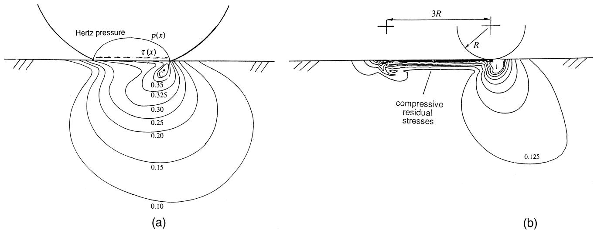  
Fig. 8. Distribution of equivalent Tresca stresses beneath a traversing cylindrical asperity. a Elastic conditions for the case Ž . $\mu = 0 . 3$ . The most heavily loaded element of material is at the depth of point C. b The half-space is now elastic-plastic with a yield strainŽ . $( \mathrm { i } . \mathrm { e } . , Y / E )$ of 0.0001 and the indenter has moved through a distance of 3R under a load which is sufficient to exceed the elastic limit of the material. Local value of $\mu = 0 . 1 . \mathrm { ~ A ~ }$ system of protective $( \mathrm { i . e . , }$ . compressive residual elastic stresses is left in the surface layers of the half-space.

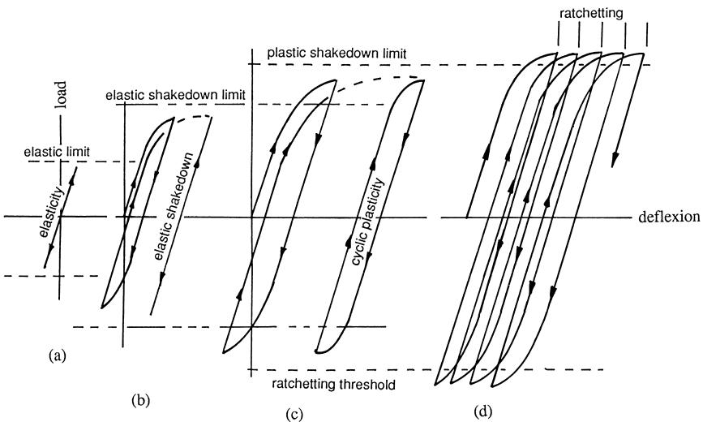  
Fig. 9. The different forms of component response to cyclic loading. a perfectly elastic, b elastic shakedown, c plastic shakedown or cyclic plastici Ž . Ž . Ž . ty, Ž . d incremental collapse or ratchetting failure.

These different responses of a structure, in this case the component surface, are illustrated in Fig. 9. At sufficiently small loads such no element reaches yield the response aŽ . is perfectly elastic and reversible. In Fig. 9 b , althoughŽ . plastic flow takes place in the first cycle, the generation of residual stresses together with strain hardening have en-Ž . abled the structure to shakedown to a purely elastic response in the cyclic steady-state. If the elastic shakedown limit is exceeded, then there will be an element of plastic deformation with each passage of the load though whether of the closed loop form of c or ‘ratchetting’ form of dŽ . Ž . depends on details of the material behaviour.

Under lubricated, and so low friction, sliding conditions involving a harder surface with low values of roughness or slope, a characteristic from of mild wear is often apparent and has been described by, among others, Akagaki and Kato 43 , Kuo and Rigney 44 and Martin et al. 45 .w x w x w x

Very thin slivers or lamellae of material, typically less than a micron in thickness, are extruded from the edges of the contact patches on the softer surface. This behaviour has been termed ‘filmy wear’ and is quite distinct from the much more severe forms of surface damage associated with more aggressive values of u. Kapoor and Johnson w x 46 have explained how such thin slivers can be formed by a mechanism in which a thin surface layer of the softer material is compressed and sheared, or ‘pummelled’, by contact with the asperities on the harder and rougher counterface. When the islands or patches of contact are aligned transversely to the direction of relative sliding, as illustrated in Fig. 10, then the compressed material appears as an extrusion on the downstream side of each asperity contact. If the lay of the harder surface is aligned parallel to the sliding direction i.e., parallel to the Ž x-axis rather than the y-axis in the figure although extrusion in the.

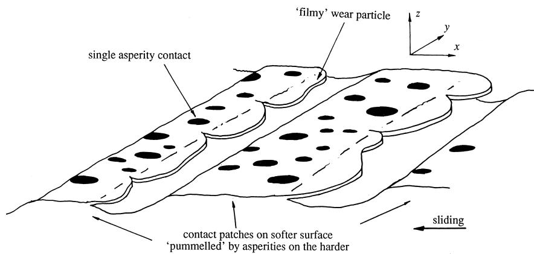  
Fig. 10. A mechanism for the formation of ‘filmy’ wear particles: the surface layer of the contact patches on the softer surface are ‘pummelled’ by the asperities on the harder after Ref. 46 . When the ‘lay’ of the softer surface shown here parallel to theŽ w x. Ž . y-direction is at right angles to the direction of relative motion theŽ .x-direction filmy wear is extruded on their downstream side. If the relative motion were parallel to the lay, i.e., in the y-direction, wear particles are extruded on either side of each of the contact patches.

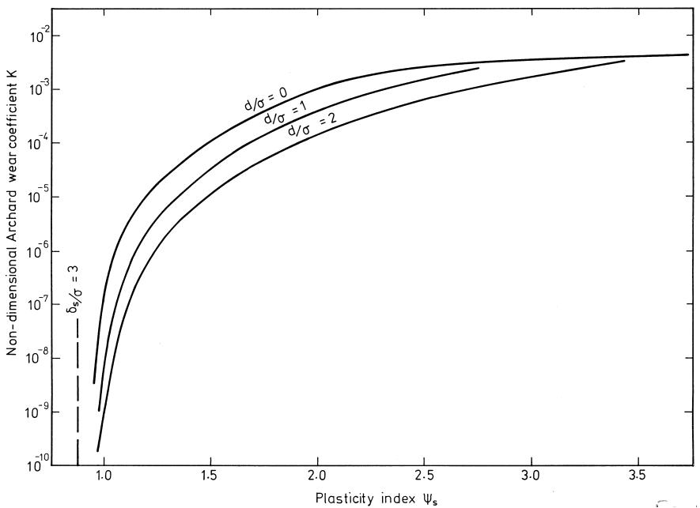  
Fig. 11. The non-dimensional wear coefficient $K$ as a function of the plasticity index for repeated sliding $\psi _ { \mathrm { s } }$ for various values of the mean surface separation $d / \sigma$ for the mild wear regime illustrated in Fig. 10 after Ref. 47 . Ž w x.

sliding direction is prevented, a ratchetting mode of incremental collapse involving lateral extrusion is still possible.

Estimates of wear rates based on this mechanism can be made if the harder, now assumed spherically tipped asperities, of radius R, on the counterface are assumed to have some appropriate distribution of heights. Kapoor et al. 47w x have shown that for a Gaussian distribution with standard deviation $\sigma _ { \mathrm { : } }$ the non-dimensional wear coefficient $K$ is principally dependent on a non-dimensional group $\psi _ { \mathrm { s } }$ defined as

$$
\psi _ { \mathrm { { s } } } = { \frac { E ^ { * } } { p _ { \mathrm { { s } } } } } { \sqrt { \frac { \sigma } { R } } } ;\tag{7Ž .}
$$

$E ^ { * }$ is the elastic contact modulus of the contact conventionally defined as $\{ ( 1 - \nu _ { 1 } ^ { 2 } ) / E _ { 1 } + ( 1 - \nu _ { 2 } ^ { 2 } ) / E _ { 2 } \} ^ { - 1 }$ and $p _ { \mathrm { s } }$ is the shakedown pressure. The group $\psi _ { \mathrm { s } }$ can be thought of as either the ratio of the roughness of the harder surface to the shakedown strain of the softer surface or as a measure of the proportion of the asperity contacts that are responding plastically, by ratchetting, compared to those that have been shaken down elastically. To this extent the group $\psi _ { \mathrm { s } }$ is a ‘plasticity index appropriate for repeated contacts’ 48 analogous to the plasticity index introduced w x by Greenwood and Williamson 49 and Mikic 50 forw x w x static contact.

Fig. 11 shows how the wear coefficient K varies with $\psi _ { \mathrm { s } }$ Ž for a particular case Hs3 GPa, $E ^ { * } = 1 1 5$ GPa other details in Ref. 46 , the three curves representing differentw x. values of mean surface separation. It is clear that $K$ is very dependent on $\psi _ { \mathrm { s } } ;$ as the value of this index varies from 1.0 to 3.5 so the wear coefficients vary over several orders of magnitude from very mild $( < \dot { 1 } 0 ^ { - 8 } )$ to very severe $( > 1 0 ^ { - 2 } )$ . If the value of $\psi _ { \mathrm { s } } < 1$ , then the number of asperity contacts exceeding shakedown is negligibly small as is indicated by the very rapid reduction in the value of $K ;$ this is effectively the shakedown state associated with the region of ultra-low wear rate in Fig. 2. The fact that the model shows some dependence of K on the mean spacing of the two surfaces implies some dependence of this non-dimensional wear parameter on load Ž . approximately proportional to load unlike the Archard ' equation in which K is taken to be independent of load intensity. The hardness of the wearing surface and the coefficient of friction influence the wear rate through their effect on the value of the shakedown pressure $p _ { \mathrm { s } }$ . In principle a model such as this enables values of wear rate to be calculated—although at the moment there remain significant uncertainties in achieving this goal: for example, the wear rate is related to the density of asperities on the hard counterface as well as their radii of curvature and rms heights, but these quantities are known to change with the sampling interval at which they are measured. The wear rate likewise depends on the ratchet strain per cycle but its reliable estimate poses serious problems. Theoretical values relating the rate of damage accumulation to the extent to which shakedown pressures are exceeded at individual asperity contacts are sensitive to strain hardening, and experimental fatigue data, under these very high hydrostatic pressures, when ductility is much enhanced, are scarce 51 . w x

## 4. Conclusions

However measured, wear in conditions of sliding contact can vary over many orders of magnitude. There is no universal mechanism of wear and no simple correlation between rates of wear or surface degradation and values of friction coefficient. Identifying the operating point of a sliding contact in an appropriate wear map can assist in establishing the possible or likely modes of surface damage and how close the operating conditions are to any transition between mild and severe regimes of wear. Quantitative models are restricted to limited areas of any such map and are material-specific. They often require material properties or process ‘constants’ which cannot be established other than in a wear test itself and so are self-referential. Nevertheless, there has been some progress in modelling specific examples of mechanical wear and here we examine recent work in the cases of severe abrasive wear and mild sliding wear.

## 5. Nomenclature

A Area   
C Material constant   
E Elastic modulus   
ε Strain   
, Angles within slip-line field   
γ Shear plane angle   
H Indentation hardness   
h Wear or layer depth   
K Non-dimensional wear coefficient   
k Flow stress in shear   
L Lateral displacement   
μ Coefficient of friction   
ν Poisson’s ratio   
P Normal load   
p Pressure   
p s Shakedown pressure   
θ Asperity attack angle   
R Radius of curvature   
s Sliding distance   
σ Standard deviation   
V Sliding velocity   
w Wear volume   
ψ Dihedral angle   
s Plasticity index   
f Friction factor

## Acknowledgements

I am grateful to those who have contributed to the work described above or with whom I have been able to discuss some of these issues, in particular: Professor K.L. Johnson, Dr. A. Kapoor, Professor A.R.S. Ponter, Dr. I.N. Dyson, Dr. Y. Xie, Dr. A.A. Torrance, Professor T.H.C. Childs and Dr. G.M. Genin.

## References

w x 1 H.C. Meng, K.C. Ludema, Wear models and predictive equations: their form and content, Wear 181 1995 443–457.Ž .

w x 2 J.F. Archard, Contact and rubbing of flat surfaces, J. Appl. Phys. 24 Ž .1953 981–988.

w x 3 E. Rabinowicz, Friction and Wear of Materials, Wiley, 1965.

w x 4 J.F. Archard, W. Hirst, The wear of metals under unlubricated conditions, Proc. R. Soc. A 236 1956 397–410.Ž .

w x 5 S.C. Lim, Recent developments in wear mechanism maps in New Directions in Tribology, I.M. Hutchings Ed. , MEP London, 1997. Ž .

w x 6 S.C. Lim, M.F. Ashby, Wear mechanism maps, Acta Metallurgica 35 1987 1–24.Ž .

w x 7 T.H.C. Childs, The mapping of metallic sliding wear, Proc. Instn. Mech. Engrs. C 202 1988 379–395.Ž .

w x 8 N.P. Suh, An overview of the delamination theory of wear, Wear 44 Ž . 1977 1–16.

w x 9 S. Jahanmir, On the mechanics and mechanisms of laminar wear particle formation, Advances in Mech. and Phys. Surfaces 3 1986 Ž . 261–332.

w x 10 K.L. Johnson, Contact Mechanics, Cambridge Univ. Press, 1985.

w x 11 K.L. Johnson, Contact mechanics and the wear of metals. Proc. Austrib ’94 Int. Trib. Conf. December 1994, Perth, 53–58.

w x 12 M.M. Kruschov, Resistance of metals to wear by abrasion, as related to hardness, Proc. Conference on Lubrication and Wear, Instn Mech. Engrs, London, 1957, 655–659.

w x 13 R.C.D. Richardson, The wear of metals by hard abrasives, Wear 10 Ž . 1967 291.

w x 14 K-H. Zum-Gahr, Micro-structure and wear of materials, Elsevier, Amsterdam, 1987.

w x 15 S.M. Hsu, M.C. Shen, Ceramic wear maps, Wear 200 1996Ž . 154–175.

w x 16 Y.S. Wang, S.M. Hsu, Wear and wear transition mechanisms of ceramics, Wear 195 1996 35–46 and 112–122.Ž .

w x 17 T.O. Mulhearn, L.E. Samuels, The abrasion of metals: a model of the process, Wear 5 1962 478–498.Ž .

w x 18 T. Tsukizoe, T. Sakamoto, Friction in scratching without metal transfer, Bull. Jap. Soc. Mech. Engrs. 18 1975 65–72. Ž .

w x 19 H. Sin, N. Saka, N.P. Suh, Abrasive wear mechanism and the grit size effect, Wear 55 1979 163–190.Ž .

w x 20 K.H. Zum Gahr, Modelling of two-body abrasive wear, Wear 124 Ž . 1988 87–102.

w x 21 R.F. Scrutton, N. Youssef, The action of build-up when scraping with rough conical tools, Wear 15 1970 411–421.Ž .

w x 22 A.A. Torrance, A three dimensional cutting criterion for abrasion, Wear 123 1988 87–96.Ž .

w x 23 T.H.C. Childs, The sliding of rigid cones over metals in high adhesion conditions, Int. J. Mech. Sci. 12 1970 393–403.Ž .

w x 24 P. Gilormini, E. Felder, Theoretical and experimental study of ploughing of rigid-plastic semi-infinite body by a rigid pyramidal indenter, Wear 88 1983 195–206.Ž .

w x 25 Abildgaard, T., Prediction of force components acting on a ploughing cone by means of three-dimensional upper bound theory, in Proc. Int. Conf on Advanced Technology of Plasticity, Tokyo, 1984, 121–126.

w x 26 Abebe, M., Appl, F.C., Theoretical analysis of the basic mechanics of abrasive processes. Wear 126 1988 251–266 and 267–283.Ž .

w x 27 J.A. Williams, Analytical models of scratch hardness, Trib. Int. 29 Ž . Ž .8 1996 675–694.

w x28 K. Kato, K. Hokkirigawa, T. Kayaba, Y. Endo, Three dimensional shape effect on abrasive wear, J. Trib. 108 1986 346–351.Ž .

w x 29 B. Avitzur, S.H. Talbert, in: T. Blazynski Ed. , Plasticity andŽ . Modern Metal Forming, Elsevier, Amsterdam, 1989.

w x 30 A. Azarkhin, O. Richmond, A generalisation of the upper bound method with particular reference to the problem of a ploughing indenter, J. Appl. Mech. 56 1992 10–14.Ž .

w x 31 S. Jacobson, P. Wallen, S. Hogmark, Correlation between groove size, wear rate and topography of abraded surfaces, Wear 115 1987Ž . 83–93.

w x 32 W.M. Garrison, Abrasive wear resistance: the effect of ploughing and the removal of ploughed material, Wear 114 1986 239–247.Ž .

w x 33 R. Gahlin, Micro-scale studies of Wear. PhD Dissertation, Univ. of˚ Upsala, 1998.

w x 34 J.A. Williams, Y. Xie, The generation of wear surfaces through the interaction of parallel grooves. Wear 155, 363–379.

w x 35 A.P. Green, The plastic yielding of metal junctions due to combined shear and pressure, J. Mech. Phys. Solids 2 1954 197–201.Ž .

w x 36 H. Petryk, Slip line field solutions for sliding contact, Proc. Conf. Friction, Lubrication and Wear, Instn of Mech. Engs, London, 1987, 987–994.

w x 37 J.M. Challen, P.L.B. Oxley, An explanation of the different regimes of friction and wear using asperity deformation models, Wear 53 Ž .1979 229–243.

w x 38 A. Kapoor, A re-evaluation of the life to rupture of ductile metals by cyclic plastic strain, Fatigue and Frac. Engng. Mat. and Struct. 17 Ž . 1994 201–219.

w x39 A.A. Torrance, T.R. Buckley, A slip-line field model of abrasive wear, Wear 196 1996 35–45.Ž .

w x 40 J.D. Bressan, G.M. Genin, J.A. Williams, The influence of pressure, boundary film shear strength and elasticity on the friction between a hard asperity and a deforming softer surface, Proc. 24th Leeds-Lyon Symposium on Tribology, in press.

w x 41 K.L. Johnson, The application of shakedown principles in rolling and sliding contact, Eur. J. Mech., ArSolids 11 1992 155–172, Ž . Special Issue.

w x 42 A.F. Bower, K.L. Johnson, The influence of strain hardening on the cumulative plastic deformation in rolling and sliding line contact, J. Mech. Phys. Sol. 37 1980 471–493.Ž .

w x 43 T. Akagaki, K. Kato, Plastic flow processes in flow wear under boundary lubricated conditions, Wear 117 1987 179–196.Ž .

w x 44 S.M. Kuo, D.A. Rigney, Sliding behaviour of aluminium, Mater. Sci. Eng. A 157 1992 131–139.Ž .

w x 45 J.M. Martin, J.L. Mansot, I. Bebezier, H. Dexpert, The nature and origin of wear particles from boundary lubrication with ZDTP, Wear 93 1984 117–125.Ž .

w x 46 A. Kapoor, K.L. Johnson, Plastic ratchetting as a mechanism of metallic wear, Proc. R. Soc. A 445 1994 367–381.Ž .

w x 47 A. Kapoor, K.L. Johnson, J.A. Williams, A model for the mild ratchetting wear of metals, Wear 200 1996 38–44.Ž .

w x 48 A. Kapoor, K.L. Johnson, J.A. Williams, The steady-state sliding of rough surfaces, Wear 175 1994 81–92.Ž .

w x 49 J.A. Greenwood, J.P.B. Williamson, Contact of nominally flat surfaces, Proc. R. Soc. A 295 1966 300–330.Ž .

w x 50 B.B. Mikic, Thermal contact conductance: theoretical considerations, Int. J. Heat and Mass Transfer 17 1974 205–214.Ž .

w x 51 Y. Jaing, H. Sehitoglu, Rolling contact stress analysis with the application of a new plasticity model, Wear 191 1996 35–44.Ž .
