dimensionless load parameter (Moes)

# Multigrid techniques: a fast and efficient method for the numerical simulation of elastohydrodynamically lubricated point contact problems

C H Venner1\* and A A Lubrecht2

1Faculty of Mechanical Engineering, University of Twente, Enschede, The Netherlands

2Laboratoire de Mécanique des Contacts, UMR CNRS 5514, INSA de Lyon, Villeurbanne, France

Abstract: The introduction and further development of algorithms based on multigrid (multilevel) techniques has resulted in fast and efficient solvers for elastohydrodynamically lubricated (EHL) point contact problems. As a result the capability to simulate steady state and transient point contact problems numerically has greatly increased in the past decade. This has led to an increased understanding of the mechanisms controlling film formation and pressure in the contact in relation to the operating conditions. In this article an overview is given of the essential ingredients of an efficient multigrid algorithm for an EHL point contact problem. Results are presented for some characteristic problems that illustrate today's numerical simulation capability.

It is concluded that, with respect to EHL, one of the main questions of the last part of the century has been answered, i.e. how to solve efficiently the modelling equations such that realistic and highly loaded situations can be simulated. The challenge that researchers and engineers now face is how to translate the new insights into simple rules for design and engineering, and to establish clearly the limits of validity of the models that are used in simulations both on the scale of the contact as a whole as well as on a subcontact scale

Keywords: elastohydrodynamic lubrication, point contact, multigrid

## NOTATION

$a$ $\mathrm { H e r t z i a n \ c o n t a c t \ l e n g t h } = ( 3 f R / E ^ { \prime } ) ^ { 1 / 3 }$ $( 2 \kappa \mathbb { E } / \pi ) ^ { 1 / 3 } \left( \mathrm { m } \right)$   
$A$ dimensionless amplitude   
$b$ Hertzian contact width = a/κ (m)   
$c$ Hertzian approach = [a2/(2 R)] (K/E) (m)   
$D$ ratio of reduced radii o $\mathrm { f c u r v a t u r e } = R _ { x } / R _ { y }$   
$\mathcal { D }$ dimensionless elastic deformation   
$E$ modulus of elasticity $( \mathrm { N } / \mathrm { m } ^ { 2 } )$   
$E ^ { \prime }$ reduced modulus of elasticity, $2 / E ^ { \prime } = ( 1 - \nu _ { 1 } ^ { 2 } ) / E _ { 1 } + ( 1 - \nu _ { 2 } ^ { 2 } ) / E _ { 2 } ( \mathrm { N } / \mathrm { m } ^ { 2 } )$   
E ${ \mathrm { e l l i p t i c ~ i n t e g r a i ~ ( s e c o n d ~ k i n d ) } } ^ { - } = \mathbb { E } ( 1 - \kappa ^ { 2 } )$   
$f$ external nominal load (N)   
$F$ dimensionless external force   
$G$ dimensionless materials parameter = αE'   
$h$ film thickness (m)   
$H$ dimensionless film thickness = h/c

$$
h _ { X } , h _ { Y }
$$

$$
h _ { T }
$$

The MS was received on 14 April 1999 and was accepted after revision for publication on 3 August 1999.

$$
\mathbb { K }
$$

Corresponding author: Tribology Group, Faculty of Mechanical Engineering, University of Twente, PO Box 217, 7500 AE Enschede, The Netherlands.

$$
L
$$

$$
X , Y
$$

$$
{ \mathrm { e l l i p t i c ~ i n t e g r a l ~ ( f i r s t ~ k i n d ) } } = \mathbb { K } ( 1 - \kappa ^ { 2 } )
$$

$$
M
$$

$$
p
$$

$$
p _ { \mathrm { H } }
$$

$$
R _ { x }
$$

$$
P
$$

$$
R
$$

$$
R _ { y }
$$

$$
R _ { x 1 } , R _ { x 2 }
$$

$$
R _ { y 1 } , R _ { y 2 }
$$

$$
S
$$

$$
\mathcal { S }
$$

$$
T
$$

$$
G ( 2 U ) ^ { 1 / 4 }
$$

$$
= W ( 2 U ) ^ { - 3 / 4 }
$$

$$
\mathrm { p r e s s u r e } \ ( { \mathrm { N } } / { \mathrm { m } } ^ { 2 } )
$$

$$
= ( 3 f ) / ( 2 \pi a b )
$$

$$
( \mathrm { N } / \mathrm { m } ^ { 2 } )
$$

$$
p / p _ { \mathrm { H } }
$$

$$
1 / R = 1 / R _ { x } + 1 / R _ { y } \left( \mathrm { m } \right)
$$

$$
1 / R _ { x } = 1 / R _ { x 1 } + 1 / R _ { x 2 } \mathrm { ( m ) }
$$

$$
1 / R _ { y } = 1 / R _ { y 1 } + 1 / R _ { y 2 } \mathrm { ( m ) }
$$

$$
\mathrm { s l i p ~ p a r a m e t e r } = u _ { 1 } / \overline { { u } }
$$

$$
= ( \mathbb { E } - \kappa ^ { 2 } \mathbb { K } ) / ( \mathbb { K } - \kappa ^ { 2 } \mathbb { K } )
$$

$$
= \mathrm { \Delta } t u _ { \mathrm { s } } / ( 2 a )
$$

${ \mathrm { \mathbf { a } } } ,$ b inlet, outlet   
$F$ force   
$\mathrm { i } , \mathrm { d }$ undeformed, deformed   
$i , j , k$ at grid point $( X _ { i } , Y _ { j } )$ at time step k   
0 constant, e.g. at ambient pressure   
1,2 surfaces 1, 2

u surface velocity $\mathrm { ( m / s ) }$   
$u _ { \mathrm { s } }$ sum velocity $= u _ { 1 } + u _ { 2 } \ : ( \mathrm { m / s } )$   
$\overline { { u } }$ average velocity $= ( u _ { 1 } + u _ { 2 } ) / 2 ( \mathrm { m / s } )$   
$U$ dimensionless speed parameter   
$= [ \eta _ { 0 } u _ { \mathrm { s } } / ( E ^ { \prime } R _ { x } ) ] / 2$   
$W$ dimensionless load parameter $= F / ( E ^ { \prime } R _ { x } ^ { 2 } )$   
$x , x ^ { \prime }$ coordinates in the direction of rolling (m)   
$X , X ^ { \prime }$ dimensionless coordinates $= x / a$ and $x ^ { \prime } / a$   
respectively   
$y , y ^ { \prime }$ coordinates perpendicular to $x \left( \mathrm { m } \right)$   
$Y , Y ^ { \prime }$ dimensionless coordinates $= y / b$ and $y ^ { \prime } / b$   
respectively   
$z$ pressure viscosity index (Roelands)   
$\alpha$ pressure viscosity index $( \mathrm { m } ^ { 2 } / \mathrm { N } )$   
$\textstyle { \overline { { a } } }$ dimensionless parameter $= a p _ { \mathrm { H } }$   
$\delta$ mutual approach (m)   
$\varDelta$ dimensionless mutual approach $= \delta / c$   
$\epsilon$ coefficient in the Reynolds equation   
$= \overline { { \rho } } H ^ { 3 } / ( \overline { { \eta } } \overline { { \lambda } } )$   
η viscosity $( \mathrm { N } \mathrm { s } / \mathrm { m } ^ { 2 } )$   
$\overline { { \eta } }$ dimensionless viscosity $\tau = \eta / \eta _ { 0 }$   
$\kappa$ ellipticity ratio = $a / b$   
$\overline { { \lambda } }$ dimensionless speed parameter   
$= 6 \eta _ { 0 } u _ { \mathrm { s } } a / ( c ^ { 2 } p _ { \mathrm { H } } )$   
$\lambda _ { x }$ wavelength surface pattern in the $x$ direction   
(m)   
$\lambda _ { y }$ wavelength surface pattern in the $y$ direction   
(m)   
$\nu$ Poisson's ratio   
$\rho$ density $( \mathrm { k g } / \mathrm { m } ^ { 3 } )$   
$\overline { { \rho } }$ dimensionless density $= \rho / \rho _ { 0 }$   
$\varOmega _ { \mathrm { n } }$ dimensionless natural frequency   
$= { \sqrt { ( 4 f a ^ { 2 } ) ( m u _ { \mathrm { s } } ^ { 2 } c ) } } = { \sqrt { ( 8 f R \mathbb { E } ) ( m u _ { \mathrm { s } } ^ { 2 } \mathbb { K } ) } }$   
$\varOmega _ { \mathrm { e } }$ dimensionless force excitation frequency   
$= 2 a \omega / u _ { \mathrm { s } }$

## Subscripts

Relations between dimensionless parameters

$$
= \frac { L } { \pi } \left( \frac { 3 M } { 2 } \right) ^ { 1 / 3 } \left[ \frac { \pi ^ { 2 } \kappa ( 1 - \kappa ^ { 2 } ) ^ { 2 } } { 1 6 ( \mathbb { E } - \kappa ^ { 2 } \mathbb { K } ) ^ { 2 } } \right] ^ { 1 / 3 }
$$

$$
= \left( \frac { 1 2 8 \pi ^ { 3 } } { 3 M ^ { 4 } } \right) ^ { 1 / 3 } \left[ \frac { 1 6 \pi ( \mathbb { E } - \kappa ^ { 2 } \mathbb { K } ) ^ { 5 } } { \kappa ^ { 4 } ( 1 - \kappa ^ { 2 } ) \mathbb { K } ^ { 6 } } \right] ^ { 1 / 3 }
$$

$$
= \frac { \kappa ^ { 2 } ( \mathbb { K } - \mathbb { E } ) } { \mathbb { E } - \kappa ^ { 2 } \mathbb { K } }
$$

Proc Instn Mech Engrs Vol 214 Part J

## 1 INTRODUCTION

The invention and further development of the computer changed almost every aspect of society in the twentieth century. Also in the field of research and development and in many scientific fields its impact has been enormous as it opened the way to what is nowadays referred to as scientific computing: the numerical simulation by computer of physical phenomena based on mathematical models. Such numerical simulations at present play an important role in science and technology. The advantages of these simulations are many, e.g. they are fast and relatively cheap compared with the quite often time consuming and costly experimental research. Furthermore, numerical simulations may give insight into any data, including data that cannot be measured at all or with intrusive measurements only [elastohydrodynamically lubricated (EHL) contacts being an interesting example]. In addition, numerical simulations enable more easily the investigation of the influence of the various external and internal parameters because, as opposed to experimental research, they can be varied independently. Finally, simulations pave the way to an inverse problem formulation which is essential in engineering design and can give new information or design solutions that otherwise would not have been found (shape optimization, e.g. of airfoils).

This does not imply that computer simulations will or should replace experimental research completely. Models are often not available and, even then, the models that are used in the simulations can only be validated by experiments. Nevertheless, numerical simulations can help to design and select very carefully the kind and number of experiments to be performed. For the Wright brothers at the beginning of the century, designing an aircraft was still a process of trial and error, in terms of building prototypes and trying them out. Now, at the end of the century, prototypes (and not only of aircraft) have become so complex and production costs are generally so high that such a process of trial and error can no longer be afforded. Thus, e.g. in the case of design processes (airplanes, cars, etc.), numerical simulations can help to reduce significantly the turn-around time and the cost of the development stage.

However, numerical simulations could never have obtained such an important role in science, research and development without the enormous effort invested in the development of fast and efficient numerical algorithms to perform such simulations. In this respect a major step forward was made in the early 1970s with the introduction of multigrid techniques. These techniques, pioneered by Brandt [1], have the prospect of solving a discrete problem in an amount of work proportional to the number of unknowns in the system. Obviously this efficiency is a prerequisite if complex problems or large-scale problems are to be simulated with an acceptable turn-around time. Multigrid techniques were introduced for scalar elliptic partial differential problems. However, at present multigrid or more generally multilevel algorithms have been developed for a wide range of scientific and technical problems. They were introduced into tribology by Lubrecht and co-workers [2-4] as an alternative method for the numerical simulation of EHL problems which were then very hard to solve due to the inefficiency of the available algorithms and to stability problems, of which the cause was not really understood. Since then the situation has changed drastically. Now fully efficient multigrid solvers are available for EHL problems. In this paper an overview is given of the different problems that had to be overcome to obtain these solvers. Subsequently, by means of some applications the present state of the art in terms of numerical simulations of EHL point contact problems is illustrated. The results demonstrate that one of the main questions in EHL of the past decades has been answered, i.e. how to solve the modelling equations efficiently such that realistic configurations can be considered. Next it should be determined how valid the predictions obtained for different conditions are and, equally important, how to use the numerical simulation capability in such a way that it yields improved rules for engineering and design.

## 2 THEORY

In this section, dimensionless equations are given describing the EHL point contact under fully flooded conditions. The dimensionless equations have been obtained using the Hertzian dry contact parameters (see Notation) and the lubricant viscosity and density at ambient pressure. This gives the following dimensionless variables:

$$
X = \frac { x } { a } , \qquad Y = \frac { y } { b }
$$

$$
H = \frac { h } { c } , \qquad \varDelta = \frac { \delta } { c }
$$

$$
P = { \frac { p } { p _ { \mathrm { { H } } } } } , \qquad T = { \frac { t u _ { \mathrm { { s } } } } { 2 a } }
$$

$$
\overline { { \rho } } = \frac { \rho } { \rho _ { 0 } } , \qquad \overline { { \eta } } = \frac { \eta } { \eta _ { 0 } }
$$

The resulting dimensionless Reynolds equation is

$$
\frac { \partial } { \partial X } \left( \epsilon \frac { \partial P } { \partial X } \right) + \kappa ^ { 2 } \frac { \partial } { \partial Y } \left( \epsilon \frac { \partial P } { \partial Y } \right) - \frac { \partial ( \overline { { { \rho } } } H ) } { \partial X } - \frac { \partial ( \overline { { { \rho } } } H ) } { \partial T } = 0\tag{1}
$$

where

J02099 © IMechE 2000

$$
\epsilon = \frac { \overline { { { \rho } } } H ^ { 3 } } { \eta \overline { { { \lambda } } } } \qquad \mathrm { w i t h ~ } \overline { { { \lambda } } } = \frac { 6 u _ { \mathrm { s } } \eta _ { 0 } a } { c ^ { 2 } p _ { \mathrm { H } } }
$$

and

$$
\kappa = \frac { a } { b }
$$

The boundary conditions are $P ( X _ { \mathrm { a } } , Y ) = P ( X _ { \mathrm { b } } , Y ) =$ $P ( X , Y _ { \mathrm { a } } ) = P ( X , Y _ { \mathrm { b } } ) = 0$ . In addition the cavitation condition should hold: $P ( X , Y , T ) \geqslant 0 .$ The lubricant is assumed to be compressible according to the Dowson-Higginson [5] equation and the viscosity is assumed to depend on the pressure according to the Roelands [6] equation.

Introducing the dimensionless variables as defined above into the film thickness equation gives

$$
\begin{array} { r l } & { H ( X , Y , T ) = - A ( T ) + \mathcal { S } X ^ { 2 } + ( 1 - \mathcal { S } ) Y ^ { 2 } } \\ & { } \\ & { \qquad + \mathcal { R } ( X , Y , T ) + \mathcal { D } ( X , Y ) } \end{array}\tag{2}
$$

with ${ \mathcal { D } } ( X , Y )$ denoting the dimensionless elastic deformation:

$$
\mathcal { D } ( X , Y ) = \frac { 1 } { \pi \kappa } \int \int \frac { P ( X ^ { \prime } , Y ^ { \prime } , T ) \mathop { } \mathrm { d } X ^ { \prime } \mathop { } \mathrm { d } Y ^ { \prime } } { \sqrt { \kappa ^ { 2 } ( X - X ^ { \prime } ) ^ { 2 } + ( Y - Y ^ { \prime } ) ^ { 2 } } }\tag{3}
$$

$\varDelta ( T )$ represents the dimensionless mutual approach’ of two remote points in the solids. By remote it is meant that the elastic deformation at these points is negligible.

The other terms in equation (2) describe the undeformed shape of the gap between the surfaces, where the first part describes the smooth shape, and (X, Y, T) is used to indicate surface features or roughness. $\mathcal { S } = \mathcal { S } ( \kappa )$ is a shape factor depending only on the geometry of the undeformed solids (see Notation).

The value of ∆ in equation (2) is determined by the equation of motion:

$$
\frac { 1 } { \Omega _ { \mathrm { n } } ^ { 2 } } \frac { \mathrm { d } \boldsymbol { A } } { \mathrm { d } T ^ { 2 } } + \frac { 3 } { 2 \pi } \bigg [ P ( \boldsymbol { X } , \boldsymbol { Y } , T ) \mathrm { d } \boldsymbol { X } \mathrm { d } Y = P ( T )\tag{4}
$$

where F(T) describes the oscillations relative to the nominal load. For example, for a harmonically varying load,

$$
F ( T ) = 1 + A _ { F } \sin ( \varOmega _ { \mathrm { e } } T )\tag{5}
$$

$\varOmega _ { \mathrm { n } }$ in equation (4) is the dimensionless natural frequency and $\varOmega _ { \mathrm { e } }$ in equation (5) is the dimensionless excitation

frequency. If the acceleration term in equation (4) is neglected and the external force is constant, this equation reduces to the usual condition of force balance:

$$
\int P ( X , Y , T ) \mathrm { d } X \mathrm { d } Y = \frac { 2 \pi } { 3 }\tag{6}
$$

Different sets of dimensionless parameters are in use to characterize EHL contacts. Here the Moes dimensionless parameters will be used. They are defined as

$$
M = \frac { f } { E ^ { \prime } R _ { x } ^ { 2 } } \left( \frac { E ^ { \prime } R _ { x } } { \eta _ { 0 } u _ { \mathrm { s } } } \right) ^ { 3 / 4 }\tag{7}
$$

$$
L = \alpha E ^ { \prime } \left( \frac { \eta _ { 0 } u _ { \mathrm { s } } } { E ^ { \prime } R _ { x } } \right) ^ { 1 / 4 }\tag{8}
$$

and

$$
D = \frac { R _ { x } } { R _ { y } }\tag{9}
$$

The relationship between $M , L ,$ D and the parameters $\overline { { \alpha } } , \overline { { \lambda } }$ and κ is given in the Notation.

To facilitate numerical solution, the governing equations given here were discretized with second-order accuracy using finite differences on a uniform grid on a rectangular domain. The discrete equations are given in the Appendix.

## 3 NUMERICAL SOLUTION

Multigrid techniques were introduced in the 1970s as a fast and efficient method to solve systems of equations resulting from the discretization of partial differential equations [1]. These techniques have the prospect of solving such a discrete problem in an amount of work proportional to the number of unknowns. Compared with most standard iterative techniques this implies enormous central processing unit (CPU) time reductions for large numbers of nodes, which consequently allows more realistic configurations to be studied. For simple partial differential problems this efficiency is easily obtained. Descriptions of algorithms and even complete codes can be found in the literature [7, 8]. For an introduction to multigrid techniques the reader is referred to reference [9]. A variety of more advanced topics has been treated in detail in references [7], [10] and [11]. In the past two decades, efficient multigrid or more generally multilevel algorithms have been developed for a wide range of problems in many different scientific disciplines.

Unfortunately multigrid techniques can rarely be used as a black-box solver. To obtain fully efficient multigrid solvers for complex problems such as the EHL problem, a careful step-by-step approach, at each step identifying and understanding the characteristic aspects of the problem and their consequences for performance and stability of the solver, needs to be adopted. Multigrid techniques were introduced for EHL problems by Lubrecht and co-workers [2-4]. Further development has been recorded in references [12] and [13] and the various publications based on these studies. In this paper, following a general description of the principle of multigrid techniques, the essential steps that have led to efficient multigrid solvers for the EHL point contact problem are summarized. For simplicity the description is restricted to the steady state situation.

## 3.1 Multigrid solution techniques

Standard iterative algorithms, e.g. Gauss-Seidel or Jacobi relaxation, when applied to the numerical solution of a partial differential problem exhibit rapid convergence on coarse grids but on fine grids the convergence speed after the first few relaxation sweeps becomes impractically slow. Typically for a two-dimensional problem at least $O ( N )$ iterations are needed to reduce the error by a fixed factor. As each iteration itself will require at least $O ( N )$ operations [and, worse, $O ( N ^ { 2 } )$ for an EHL problem due to the elastic deformation integrals] the total CPU time needed to solve the problem will be $O ( N ^ { 2 } )$ [and $O ( N ^ { 3 } )$ for EHL]. Keeping in mind that using a grid with 100 × 100 points is not an exceptional demand, it is obvious that numerical solvers based on these algorithms alone lead to unacceptable computing times, and serious limitations in the size and complexity of problems that can be simulated.

## 3.1.1 Coarse grid correction

The inefficiency of many iterative schemes is caused by their local nature. They are very efficient in reducing error components that are highly oscillatory but smooth error components are hardly affected. Thus after a few relaxations the error is dominated by smooth components and convergence becomes slow. The idea behind multigrid techniques is that such a smooth error can be accurately described on a coarser grid and solved there. Once the error on the coarser grid has been solved, it is interpolated to the finer grid and used as a correction.

The equations from which the error must be solved on the coarse grid are essentially the same as the equations to be solved on the fine grid; hence, the same iterative procedure can be used. However, as the number of points on the coarse grid is smaller, and also the convergence speed of the relaxation larger, solving the error on this grid is computationally cheaper than continuing the iterations on the fine grid. This leads to a coarse grid correction cycle. Such a cycle consists of four steps. First a few relaxations are carried out to smooth the error. Next, an approximation to the remaining smooth error is solved on the coarser grid. Subsequently, this approximation to the error is interpolated to the fine grid used to correct the approximate solution in this grid. Finally a few relaxations are carried out on the fine grid again. The entire process describing the coarse grid correction can be divided into two types. For a linear problem it is referred to as the correction scheme. For non-linear problems the so-called full approximation scheme (FAS) should be used. For details see, for example, references [7] and [12]. Naturally, if the target grid is a very fine grid, the coarser grid will still be a relatively fine grid on which the iterative process converges slowly after the first few initial iterations. This is not a problem as the principle of coarse grid correction can be applied recursively, i.e. using even coarser grids, etc. A flow chart of a typical coarse grid correction cycle that results for the case of four grids can be seen in Fig. 1. This figure shows a so-called V-cycle. An alternative cycle that visits coarse grids more often before returning to the fine grid is the so-called W-cycle. The grids are numbered and referred to as levels. In the present case the finest grid, level 4, has a mesh size h and is the target grid on which the equations are to be solved, and levels 1 to 3 serve for coarse grid correction. As indicated in the figure, each coarser grid has a mesh size that is twice that of the preceding grid, which is the common choice in multigrid solvers.

## 3.1.2 Performance

With a coarse grid correction cycle, each error component is resolved on a grid at which it can efficiently be reduced by the relaxation. As a result a grid-independent convergence speed can be obtained. The error reduction per cycle is determined by the asymptotic smoothing rate ${ \overline { { \mu } } } .$ This is the maximum amplitude multiplication factor of highfrequency components by the relaxation. High frequency means those components that have to be resolved by relaxation on the fine grid. (The other smoother components are solved on the coarser grids.) The error reduction that can be obtained with a coarse grid correction cycle is then $\overline { { { \mu } } } ^ { \nu _ { 1 } + \nu _ { 2 } } \mathrm { i f } \nu _ { 1 }$ and $\nu _ { 2 }$ are the number of pre-relaxations and post-relaxations respectively.

The smoothing effect and $\overline { { \mu } }$ for an iterative process can be quantified with local mode analysis, i.e. by computing the amplitude amplification factor of a given Fourier component of the error [1]. For simple partial differential problems, typically $\overline { { \mu } } = { \cal O } ( 0 . 5 )$ can be obtained. In that case with $\nu _ { 1 } + \nu _ { 2 } = 3$ a reduction in the error by almost an order of magnitude is obtained per cycle. As this reduction is independent of the mesh size, the computing time gained compared with simple single grid iterations is enormous. Let $\mathcal { W }$ denote the work involved in a single relaxation sweep and $\mathcal { W } _ { \mathrm { V } }$ the total work of a coarse grid correction cycle. Assuming a d-dimensional problem the work of a Vcycle as depicted in Fig. 1 can be computed easily. At each grid, $\nu _ { 2 } + \nu _ { 1 }$ relaxations are performed. As each coarser grid has a twice larger mesh size, the number of nodes on each coarser grid, and thereby the work involved in iterations on this grid, decreases by a factor $2 ^ { d } .$ As a result,

$$
\begin{array} { c } { { \mathcal { W } _ { \mathrm { V } } = ( \displaystyle \nu _ { 1 } + \nu _ { 2 } ) \bigg ( 1 + \frac 1 { 2 ^ { d } } + \frac 1 { 2 ^ { 2 d } } + \cdot \cdot \cdot \bigg ) \mathcal { W } } } \\ { { \approx \displaystyle \frac { ( \nu _ { 1 } + \nu _ { 2 } ) \mathcal { W } } { 1 - 2 ^ { - d } } } } \end{array}\tag{10}
$$

For $d = 2$ and $\nu _ { 1 } + \nu _ { 2 } = 3$ , the total work of a cycle is the equivalent of four relaxations on the finest grid. Thus in the equivalent of the amount of four relaxations the error is reduced by a factor of 8. Using only relaxation on the target grid the same error reduction would require $O ( N )$ relaxations.

$$
\nu _ { i }
$$

Fig. 1 Flow chart of a coarse grid correction cycle for four levels of the type $\mathrm { V } ( \nu _ { 1 } , \nu _ { 2 } )$ Level 1 denotes the coarsest grid. A circle with $\nu _ { i }$ stands for v relaxations carried out on the grid (level)

## 3.1.3 Full multigrid

In addition to using coarser grids to accelerate convergence, they can be used to generate an accurate first approximation to the solution on the finest grid. The converged’ solution of a coarser grid can be interpolated to a finer grid to serve as a first approximation on this grid. Subsequently it can be improved by coarse grid correction. This procedure forms the basis of a full multigrid (FMG) algorithm. A graphic representation of this algorithm is given in Fig. 2. With an FMG algorithm with only a few correction cycles per level a problem can be solved to an error that is small compared with the discretization error.

The total work invested to obtain the final solution on the target grid can be analysed in the same way as the work of a cycle. For an FMG algorithm with one V-cycle per refinement as drawn in Fig. 2 the total work will be

$$
\mathcal { W } _ { \mathrm { F M G } } = \Bigg ( 1 + \frac { 1 } { 2 ^ { d } } + \frac { 1 } { 2 ^ { 2 d } } + \cdot \cdot \cdot \Bigg ) \mathcal { W } _ { \mathrm { V } } \approx \frac { ( \nu _ { 1 } + \nu _ { 2 } ) \mathcal { W } } { ( 1 - 2 ^ { - d } ) ^ { 2 } }\tag{11}
$$

For d = 2 and $\nu _ { 1 } + \nu _ { 2 } = 3$ this gives $W _ { \mathrm { F M G } } =$ $1 6 W / 3 \approx 5 W$ . Summarizing an FMG algorithm can give the solution of the problem on the target grid with an error that is small compared with the discretization error in an amount of work that is the equivalent of a small number of fine grid relaxations. Hence, if one relaxation requires O(N) operations, the entire problem is solved in O(N) operations. Moreover, as the algorithm on its way to the target grid generates solutions on coarser grids, it allows a straightforward check that indeed the numerical solution is accurate to the level of the discretization error [7, 12].

In the following paragraphs the different aspects relevant to the development of an efficient FMG algorithm for the EHL point contact problem are described.

## 3.2 Relaxation EHL problem

A prerequisite for an efficient multigrid solver is a stable relaxation scheme that efficiently reduces high-frequency error components. To obtain such a scheme the nature of the problem should be well understood. Because of the exponential viscosity pressure relation the coefficient € in equation (1) varies many orders of magnitude over the domain. In the inlet region, $\epsilon \gg 1$ , whereas in the Hertzian contact region, $\epsilon \ll 1 .$ Because the film thickness depends on the pressure this variation in € causes the character of the problem to change. For large € the pressure flow terms in the Reynolds equation dominate over the wedge term. As a result the Reynolds equation behaves as a differential equation for P with H given. For small € the wedge term dominates. In that case the Reynolds equation forms a differential equation for H which by the elastic deformation integral is coupled to P. As a result the problem behaves as an integral equation for P. This change in behaviour has important consequences for the stability of an iterative scheme.

## 3.2.1 Large €

The behaviour in regions of large € can be analysed by means of the anisotropic Poisson two-dimensional problem:

$$
\frac { \partial ^ { 2 } P } { \partial X ^ { 2 } } + \kappa ^ { 2 } \frac { \partial ^ { 2 } P } { \partial Y ^ { 2 } } = f ( X , Y )\tag{12}
$$

which can be discretized using the usual five-point discretization:

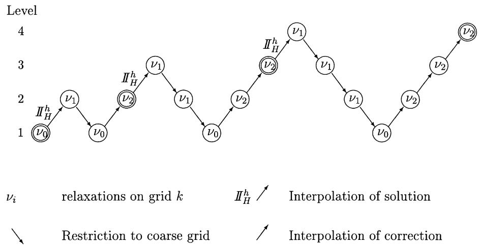  
Fig. 2 FMG flow chart for four levels with one $\mathrm { V } ( \nu _ { 1 } , \nu _ { 2 } )$ cycle per refinement. Level 1 denotes the coarsest grid. A circle with $\nu _ { i }$ stands for $\nu _ { i }$ relaxations carried out on the grid (level). The double circles indicate the final solution at a given level that is interpolated to the next finer grid to serve as a first approximation. Subsequently it is improved by coarse grid correction

$$
\begin{array} { l } { { \displaystyle { \frac { 1 } { h _ { X } ^ { 2 } } } ( P _ { i - 1 , j } - 2 P _ { i , j } + P _ { i + 1 , j } ) + \frac { \kappa ^ { 2 } } { h _ { Y } ^ { 2 } } ( P _ { i , j - 1 } - 2 P _ { i , j } + P _ { i , j + 1 } ) } } \\ { { \displaystyle ~ = f ( X _ { i } , \ : Y _ { j } ) \qquad ( 1 3 ) } } \end{array}
$$

For $\kappa = 1$ , simple one-point Gauss-Seidel relaxation is stable and provides good error smoothing. The so-called asymptotic smoothing rate $\overline { { \mu } } = 0 . 5$ (assuming a coarse grid that has twice the mesh size of the fine grid); therefore a coarse grid correction cycle with $\nu _ { 1 } + \nu _ { 2 } = 3$ already gives an error reduction of almost an order of magnitude. For $\kappa \neq 1$ this is no longer true. As κ determines the relative strength of the coupling between neighbouring equations in the X and Y directions respectively, it effects the smoothing behaviour. For $\kappa \ll 1$ the coupling in the Y direction is small and thus simple one-point relaxation cannot reduce components that are smooth in the X direction and oscillatory in the Y direction. In the same way for $\kappa \gg 1$ the coupling in the Y direction is much stronger than the coupling in the X direction as a result of which components that are smooth in the X direction and oscillatory in the Y direction are not reduced. To obtain good error smoothing for such cases, line relaxation is needed. This implies that, instead of relaxing the points one by one, all equations of one line of the grid are solved simultaneously, line by line. For $\kappa \ll$ 1 this should be done for lines in the X direction, and for $\kappa \gg 1$ for lines in the Y direction. Note that, as the system of equations for one line is a tridiagonal system, it can be solved quickly in many ways and the amount of work per relaxation can be maintained at $O ( N )$ , if N is the number of grid points, as for a point relaxation scheme. Assuming that $\kappa < 1$ , line relaxation in the X direction has an asymptotic smoothing rate $\overline { { \mu } } = 0 . 4 4 7$

## 3.2.2 Small €

A model problem that reflects the behaviour for regions of small € is given by

$$
\epsilon \left( \frac { \partial ^ { 2 } P } { \partial X ^ { 2 } } + \frac { \partial ^ { 2 } P } { \partial Y ^ { 2 } } \right) - \frac { \partial H } { \partial X } = 0\tag{14}
$$

with H given by equation (2). The discrete equations can be constructed as shown in the Appendix. Assuming a uniform grid with $h _ { X } = h _ { Y } = h$ this gives

$$
\begin{array} { l } { { \displaystyle { \frac { \epsilon } { h ^ { 2 } } } ( P _ { i - 1 , j } - 2 P _ { i , j } + P _ { i + 1 , j } ) + \frac { \epsilon } { h ^ { 2 } } ( P _ { i , j - 1 } - 2 P _ { i , j } + P _ { i , j + 1 } ) } } \\ { { \mathrm { } } } \\ { { \displaystyle { } - \frac { 1 } { h } ( 1 . 5 H _ { i , j } - 2 H _ { i - 1 , j } + 0 . 5 H _ { i - 2 , j } ) = 0 \qquad ( 1 5 ) } } \end{array}
$$

$$
H _ { i , j } = - A + \mathcal { S } X _ { i } ^ { 2 } + ( 1 . 0 - \mathcal { S } ) Y _ { j } ^ { 2 } + \sum _ { i ^ { \prime } } \sum _ { j ^ { \prime } } K _ { i i ^ { \prime } , j j ^ { \prime } } ^ { h , h } P _ { i ^ { \prime } , j ^ { \prime } }\tag{16}
$$

For simplicity it is assumed that ∆ is given. Now a relaxation has to be designed for a system of two equations with two unknowns, i.e. solve $P _ { i , j }$ for all $i , j$ from equation (15) with $H _ { i , j }$ given by equation (16). Equation (16) allows straightforward computation of H for a given pressure, and the remaining question is thus how to relax equation (15) for $P _ { i , j } .$ The simplest process would be to scan all grid points in some order at each point computing a change $\delta _ { i , j }$ to be applied to the current approximation to $P _ { i , j }$ such that the discretized equation (15) at the point $( X _ { i } , Y _ { j } )$ is satisfied. Subsequently, after the sweep is completed, the new approximation to $H _ { i , j }$ associated with the new approximation to $P _ { i , j }$ can be computed all at once using equation (16).

For large $\epsilon / h ^ { 2 }$ this relaxation either carried out pointwise or in a line relaxation manner is stable and gives good error smoothing. However, for small $\epsilon / h ^ { 2 }$ and for the limiting case $\epsilon = 0$ the process is unstable. This can be illustrated as follows. A change $\delta _ { i , j }$ applied in point $( i , j )$ will cause a change to $H _ { q , s }$ that is proportional to $K _ { i q , j s } ^ { h , h } .$ As $K \propto 1 / r$ with r being the distance between the points $( i , j )$ and $( q , s )$ , the change in $H _ { q , s }$ will be proportional to $\delta _ { i , j } / r$ The change in $H _ { q , s }$ as a result of the entire relaxation sweep will be the summation of all such changes. It is this accumulation occurring when re-computing the film thicknesses that causes the instability of the entire process. The cure for this instability is distributive relaxation. For example, when relaxing a point $( i , j )$ , changes are applied to the point $( i , j )$ and a few of its neighbours in such a way that the local equation (15) is solved, as usual, but that the resulting changes in the integral (and thus in $H _ { i , j } )$ are essentially local.

Using such distributive changes will take care of the stability problem. However, it still does not provide efficient smoothing. For very small €, equation (14) reduces to

$$
\frac { \partial H } { \partial X } \approx 0\tag{17}
$$

which is an equation in the X direction only. The only coupling between equations in the Y direction is the coupling in the elastic deformation integrals. Consequently, as for the anisotropic two-dimensional Poisson problem, errors that are smooth in the X direction and oscillatory in the Y direction cannot be efficiently reduced by the relaxation. However, good smoothing can be obtained if line relaxation is applied.

Summarizing, good smoothing and stability for small $\epsilon / h ^ { 2 }$ requires a distributive line relaxation along lines in the X direction.

## 3.2.3 Varying €

A stable relaxation with good error smoothing properties for the EHL problem, equation (33) and equation (35) for some given value of ∆, is subsequently obtained by combining the lessons from the two preceding paragraphs. In that case $\epsilon / h ^ { 2 }$ is not a constant on the grid, but it varies over the grid too. However, as relaxation is a local process the variation in the coefficients over the grid should not be too detrimental for the smoothing behaviour. The final result is then as follows:

1. Gauss-Seidel line relaxation is applied in regions of large $\epsilon / h ^ { 2 }$

2. Jacobi distributive relaxation is applied in the regions where $\epsilon / h ^ { 2 }$ is small.

A convenient switch criterion is $\epsilon / h ^ { 2 } \approx 0 . 1$ . Combining the two types of relaxation can be done in a very straightforward manner by constructing one single system of equations for the changes to be applied at all points of a given line, i.e. changes $\delta _ { i }$ for $1 \leqslant i \leqslant n _ { x } - 1$ . Depending on the value of $\epsilon / h ^ { 2 }$ at a point i this change should then be applied either only to the point $i ,$ or to the point i and partly (according to the distribution stencil) to some of its neighbours too.

At this point the cavitation condition $P \geqslant 0$ needs to be addessed. For a point Gauss-Seidel relaxation this can be done straightforwardly. After each change $\delta _ { i , j }$ applied, the resulting new value of $P$ is checked. If it is smaller than zero, it is set to zero. In this way, when relaxing the next neighbour, cavitation of the previous point is already taken into account. However, for a line relaxation the situation is slightly more complex as all changes for a given line are solved simultaneously. The simplest way would be to apply the changes to a given line and to set negative values to zero when needed. However, as the changes were solved simultaneously, within a single line, the change for a point i is computed as if the point i — 1 was not cavitated at all, etc. As a result, convergence may stall due to the switching back and forth between cavitated' and ‘non-cavitated' of a group of points on a line. The alternative is to take cavitation already into account when constructing the system of equations for the line. Whenever for a point i one of its neighbours has a zero pressure, only the central term of the local equation in the system is given a value so that the change for this point is computed as would be done for a pointwise relaxation.

Next, the system of equations should be solved. If the total number of points on the grid is N, the number of points on one line of the grid will be $O ( \sqrt { N } )$ . Solving all changes for one line thus requires solving a system of $O ( \sqrt { N } )$ equations with the same number of unknowns. The matrix of this system, due to the elastic deformation, is a full matrix. Hence direct solution would be rather expensive. Fortunately, because of the distributive changes in regions of small €, and because of the limited importance of the wedge term in regions of large €, without any problem the system of equations can be truncated to a pentadiagonal system. Also, to obtain the line relaxation efficiency it is not necessary to solve the system of equations exactly. Only a crude correction is all that is needed. For details regarding the system of equations that remains to be solved the reader is referred to reference [13]. The pentadiagonal system can be solved quickly with a direct solver, e.g. Gaussian elimination, in an amount of work proportional to the number of points on the line, which ensures that the total work of a relaxation sweep over the entire grid is O(N).

Once the system is solved, the changes are applied to the pressure in all points of the line. Both types of change can be applied with a certain underrelaxation factor to account for the non-linearity in the system, and for optimal smoothing. Taking factors between 0.4 and 0.8 for the Gauss-Seidel relaxation and between 0.2 and 0.6 for the distributive changes gives satisfactory performance over a wide range of load conditions.

Summarizing, one relaxation sweep over the grid then consists of one line relaxation step for each line. Each such step consists in constructing a system of equations for the changes, solving this system and applying these changes. After all lines have been scanned, the second step is to compute the new film thickness associated with the new pressure by means of the discrete film thickness equation.

Finally the direction of the line relaxation is discussed. For $\kappa < 1$ , both model problems indicate that a line relaxation in the X direction should be used. However, for $\kappa > 1$ in regions where the Poisseulle term dominates, a line relaxation in the Y direction should be used whereas, in regions where the wedge term dominates, line relaxation in the X direction would be required. This situation has not been investigated in detail, but the solution may be to apply an alternating line relaxation, i.e. one sweep of lines in the X direction combined with one sweep of lines in the Y direction where this latter sweep could be organized such that changes are only computed in the regions of large $\epsilon / h ^ { 2 }$

## 3.2.4 Force balance condition

For a given value of ∆ in equation (2) the aforementioned relaxation process can be used to solve P and H. The value of ∆ then remains to be found. This unknown is associated with the force balance condition or, more generally, the equation of motion. As there is no direct relation between this equation and the value of ∆, the easiest way to incorporate this equation is by changing ∆ by a small factor multiplied by the residual of this equation. If this is done once after every, say, n relaxations, this will drive the residual of this equation to zero too and ∆ to the appropriate value. However, as ∆ is a global variable, it has a large effect on the solution. Consequently the changes applied to it should not be too large otherwise it will frustrate convergence of the other equations.

## 3.3 Implementation of multigrid solution techniques

Having developed a stable relaxation process that efficiently smooths high-frequency error components the next step is to incorporate it into a coarse grid correction cycle. For good cycle convergence, three aspects need consideration. For details the reader is referred to references [2], [12] and [13]. At this point they are only briefly listed. Firstly, it should be noted that the formulation for non-linear problems should be used, i.e. the coarse grid correction should be computed using the so-called FAS. The FAS formula should be used for all three equations: the Reynolds equation, the film thickness equation and the force balance equation.

Secondly, due to the cavitation condition the intergrid transfers need special attention; i.e. in regions where $P =$ $0 ,$ injection of residuals should be used to construct the right-hand side of the Reynolds equation on the coarse grid. Injection of a fine grid quantity to a coarse grid means that in each coarse grid point the value of the corresponding fine grid point is taken. The alternative is full weighting where the value on the coarse grid is determined by taking a weighted average of the corresponding fine grid point value and some neighbours.

Thirdly, the force balance condition requires special attention. As mentioned in the previous section, this equation can be relaxed by changing the value of the global unknown  every so many relaxations. In the case of multiple grids, something similar can be carried out, i.e. the value of ∆ can be changed after each coarse grid correction cycle. This corresponds to changing ∆ outside' the correction cycle. However, this is not the appropriate way. The force balance equation is a global condition and thus has a large global effect on the solution. The purpose of relaxation in a multigrid solver, and thus in a coarse grid correction cycle, is to smooth the error. Relaxation of the force balance condition on the finest grid may then frustrate this error-smoothing process. In fact, such a global condition should not be treated at all on the fine grid [7, p. 64]. All that should be done is to transfer the residual of this condition to serve as the right-hand side for a similar condition on the next coarser grid. This process is repeated all the way down to the coarsest grid. On this grid the condition should then be relaxed by changing ∆. In that case the force balance equation is relaxed ‘inside’ the coarse grid correction cycle.

Finally, having constructed a working coarse grid correction cycle the last step is to ensure that the first approximation on the grid is sufficiently accurate. The natural way to obtain a good first approximation is by using the solution of a coarser grid. This is what is done in an FMG algorithm as depicted in Fig. 2. Combining all aspects mentioned in this and the previous sections leads to an algorithm that can solve the EHL problem up to the level of discretization error in an FMG cycle with only two coarse grid correction cycles per grid level. For low loads,

V-cycles will exhibit satisfactory performance. However, generally for higher loads, W-cycles are more robust.

## 3.4 Multilevel multi-integration

The work invested to obtain the solution on the target grid using an FMG algorithm is the equivalent of a small number times the amount of work of a single relaxation on this grid (see Section 4.1). For EHL problems, one relaxation will consist of one step to update the pressure which requires O(N) operations. The second step is to recompute or update the film thickness. This requires the evaluation of the discrete elastic deformation integrals [see equations (16) and (35)]. For each point $i , j$ this implies the addition of the product of each $P _ { i ^ { \prime } , j ^ { \prime } }$ with $K _ { i i ^ { \prime } , j j ^ { \prime } } ^ { h _ { X } h _ { Y } }$ . Hence, evaluating the elastic deformation in one point requires O(N) operations, and evaluating the elastic deformation in all points of the grid will require $O ( N ^ { 2 } )$ operations. Consequently one relaxation will require $O ( N ^ { 2 } )$ operations, and an FMG algorithm will be of $O ( N ^ { 2 } )$ complexity too. Comparing this with the $O ( N )$ optimal efficiency of multigrid algorithms mentioned earlier, this result is still disappointing. This problem can be overcome by means of a separate multigrid technique referred to as multilevel matrix multiplication or multilevel multi-integration (MLMI). This is an algorithm for the fast evaluation of multisummations and is briefly described here. The algorithm was first presented in reference [14]. Recent developments can be found in references [15] and [16].

Assume the task given is to evaluate

$$
w _ { i } = \sum _ { j } K _ { i , j } u _ { j }\tag{18}
$$

for all $i = ( i _ { 1 } , . . . , i _ { \mathrm { d } } )$ with $j = ( j _ { 1 } , . . . , j _ { \mathrm { d } } )$ , with $K _ { i , j }$ given coefficients. In the multigrid solution techniques used to solve a discrete problem, coarser grids are employed to improve the convergence speed (of low-frequency error components) of a relaxation process. In this particular case of the evaluation of a multisummation, the aim is again to utilize coarser grids to decrease the computing time without significantly reducing the accuracy of the summation. Now, how can this be achieved? Which function has smoothness properties such that it can accurately be represented on the coarser grid? In classical multigrid techniques the smooth error components are solved on the coarser grids. The function u is not a likely candidate as there is no good reason for assuming that it is smooth. The only candidate left is the kernel K. This indeed proves to be the key to a fast evaluation algorithm.

If the kernel K is sufficiently smooth, it can accurately be interpolated from a coarser grid if the order of interpolation is sufficiently high. The description given below in principle applies to multidimensional problems. However, for simplicity at first reading it may be regarded as a one-dimensional problem.

Let the points of this coarser grid be denoted with the indices I and J respectively. If $K _ { i , j }$ is sufficiently smooth with respect to j,

$$
K _ { i , j } = \sum _ { J } \beta _ { j J } K _ { i , J } + O ( \epsilon _ { p } )\tag{19}
$$

where $\beta _ { j J }$ are the interpolation coefficients and the summation over J extends only over a small subset of points of the coarse grid for a p-order interpolation. $\epsilon _ { p }$ is an error that can be controlled by the order of interpolation. For details see reference [14]. (Note that the symbols € and p only have this meaning in the present section.) Substitution in equation (18) and changing the order of summation show that, with an error of $O ( \epsilon _ { p } )$ 2

$$
\begin{array} { l } { { \displaystyle w _ { i } = \sum _ { j } \sum _ { J } \beta _ { j J } K _ { i , J } u _ { j } = \sum _ { J } K _ { i , J } \sum _ { j } \beta _ { j J } u _ { j } } } \\ { { \displaystyle \quad } } \\ { { \displaystyle \quad = \sum _ { J } K _ { i , J } u _ { J } } } \end{array}\tag{20}
$$

where

$$
u _ { J } = \sum _ { j } \beta _ { j J } u _ { j }\tag{21}
$$

As the coefficents $\beta _ { j J }$ are the coefficients of interpolation, equation (21) represents the transpose of this interpolation. The action of equation (21) is therefore referred to as anterpolation. The summation for each J only extends over a small subset of fine grid points around the coarse grid point J. Summarizing, when $K _ { i , j }$ is smooth as a function of j at the expense of a small error its evaluation can be replaced by anterpolation according to equation (21) followed by a summation over a coarse grid J.

Next, if $K _ { i , j }$ is smooth as a function of $i ,$ its value for a point i can be determined accurately by means of an order $\overline { { p } }$ interpolation from a coarse grid I:

$$
K _ { i , j } = \sum _ { I } \overline { { \beta } } _ { i I } K _ { i , j } + O ( \epsilon _ { \bar { p } } )\tag{22}
$$

where $\overline { { \beta } } _ { i I }$ are interpolation weights and the summation over I only extends over a small subset of coarse grid points around the point i. If the smoothness properties in i and j are the same, ${ \overline { { p } } } = p$ can be used, as will be assumed in the following. This implies that for a given fine grid point i the value of $w _ { i }$ can be obtained from its value in coarse grid points I. Finally, as a result of both steps it thus appears that at the expense of an $O ( \epsilon _ { p } )$ error that can be controlled by the choice of the order $p ,$ the evaluation of equation (18) can be replaced by the evaluation of

$$
w _ { i } = \sum _ { I } \overline { { \beta } } _ { i I } w _ { I }\tag{23}
$$

where

$$
w _ { I } = \sum _ { J } K _ { I , J } u _ { J }\tag{24}
$$

with $u _ { J }$ as defined by equation (21). Thus the fine grid evaluation (18) is replaced by

(a) anterpolation of the function $u _ { j }$ from the target grid to a coarser grid creating a function $u _ { J }$ for all points J of a coarser grid,

(b) evaluation of a coarse grid multisummation for all points I:

$$
w _ { I } = \sum _ { J } K _ { I , J } u _ { J }\tag{25}
$$

(c) and interpolation of the coarse grid summation $w _ { I }$ to the fine grid to obtain $w _ { i }$ for all i.

At this point it is stressed that at no time are properties of u used! The action of anterpolation from fine grid to coarse grid to obtain $u _ { J }$ results from the change in the order of summation in equation (20) where no approximations are involved. The only assumptions made in the algorithm are with respect to the smoothness of the kernel $K _ { i , j }$

The efficiency gain of the algorithm compared with simple summation follows from estimates of the work of each step. The first step and the third step, anterpolation and interpolation, require $O ( p N )$ operations for a fine grid with O(N) points (if they are done one dimension at the time). Now, if the coarse grid multisummation is done on a grid with $O ( \sqrt { N } )$ points, it requires at most $O ( N )$ operations too. The step to this grid can be made directly or alternatively a recursive algorithm can be used each time going to a grid with, for example, a mesh size that is twice larger. As each step in the algorithm then requires at most $O ( N )$ operations, the total work of the evaluation is reduced to O(N) operations. The price paid for the computing time reduction is the error made by interpolating the kernel. The order of interpolation, $p ,$ should thus be chosen such that the resulting error, i.e. the accumulation of all $\epsilon _ { p }$ errors, is small compared with the discretization error that is made anyway.

If the kernel is smooth everywhere as a function of i and $j ,$ the three steps listed above are all that is needed [14]. However, the kernel K found in the elastic deformation problem is not smooth everywhere, as it is singular in $r = 0$ . Also, its smoothness depends on κ. For these types of kernel the error introduced by replacing the kernel by its interpolation from a coarser grid is small for large r but for small r it is too large. Therefore local corrections should be introduced for these contributions. It is most convenient to use a sequence of coarser grids, e.g. each coarser grid having twice the mesh size of the next finer grid. With a detailed optimization minimizing the total work subject to the condition that the error introduced at each step is small compared with the discretization error, the order of interpolation and the size of the correction region as a function of the mesh size and of κ can be determined. With the resulting integration cycle, provided that the correction regions are chosen appropriately (depending on κ), it is possible to obtain the multisummation on the target grid making an error comparable with the discretization error on this grid, in only O[N ln(N)] operations. For further details the reader is referred to references [12] to [14].

The fast evaluation process described above can be used inside the (in fact any) EHL solver to compute the elastic deformation each time that it is needed in a separate routine. However, if it is used in an FMG algorithm, it can also be merged with the multigrid solution algorithm in a very elegant way as both processes require the same structure of a set of coarser grids.

As mentioned above, the algorithm can in principle be used for any multisummation of the type (18). For the case of EHL problems the first obvious choice is to use it for the fast evaluation of the elastic deformation. However, quite often it is not only the pressure and film thickness but also the subsurface stresses that are interesting. These stresses are given by a similar multi-integral with u being the pressure distribution at the surface. Also for the fast evaluation of these stresses the multilevel multi-integration algorithm can be applied [17].

## 4 APPLICATIONS

The multilevel solver described in the previous section can serve as the basis for the analysis of a wide variety of point contact problems. For example, in its most simple form it can be used to determine the variation in the film thickness with load and contact conditions in the steady state case. With relatively minor extensions it can be used for more complex cases, i.e. to investigate the transient effects of surface features, or the effects of starved lubricant supply. In this section some results are presented. First the performance of the steady state solver is demonstrated. Subsequently, some results obtained for more advanced problems are presented.

## 4.1 Steady state elliptic contact

Figure 3 shows pseudo-interference pictures of the film thickness in the contact as a function of the ellipticity parameter D. Also shown are the film thickness and pressure at the centre-line of the contact Y = 0 as a function of X and at the line X = 0 as a function of Y. The operating conditions are $M = 1 0 0 7 . 6$ and $L = 1 2 . 0 5$ . Table 1 gives values of the dimensional parameters for a contact between steel surfaces that would result in these values of M and L. Also given are the values of the Hamrock-Dowson [18] dimensionless parameters for this case. In Fig. 3, results are shown for $D = R _ { x } / R _ { \nu } = 1 . 0 , 0 . 5 0 , 0 . 2 5$ and 0.125. This gives values of the ellipticity parameter κ = 1, 0.63, 0.40 and 0.256 respectively. With $a =$ $2 . 2 \times 1 0 ^ { - 8 } \mathrm { m } ^ { 2 } / \mathrm { N }$ the maximum Hertzian pressure for these cases is $p _ { \mathrm { H } } = 2 . 0 0 , 1 . 6 1$ , 1.33 and 1.11 GPa.

In all four cases the solution was computed on a domain $- 2 . 5 \leqslant X \leqslant 1 . 5 \ \mathrm { a n d } \ - - 2 \leqslant Y \leqslant 2$ with an FMG algorithm with two W (2, 1) cycles per grid level. The coarsest grid (level 1) in the correction cycle contained $3 3 \times 3 3$ nodes and the finest grid (level 6) $1 0 2 5 \times 1 0 2 5$ . Convergence to an error smaller than the discretization error was verified as described in reference [12].

Table 2 gives the minimum and central film thicknesses obtained on the different grids in the FMG process. The results should confirm that the solution with decreasing mesh size exhibits the behaviour characteristic for a second-order discretization. This implies that the discretization error is $O ( h ^ { 2 } )$ and thus, each time that the grid is refined (and the mesh size halves), the difference between the values obtained on grid levels k and $k - 1$ should be four times the difference between the value obtained on grid levels k and k + 1. The results presented in Table 2 do indeed show this tendency. However, it is more clearly observed in the central film thickness results than in the minimum film thickness values. This is due to the minimum film thickness which on coarser grids changes location because of the small size of the side lobes. In addition, Table 2 gives the computing time invested to obtain the solution at each of the grids. Each time that the grid is refined, the number of nodes increases by a factor of 4. As the work involved in the fast evaluation of the elastic deformation integrals is O[N ln(N)], the total work involved in solving the problem should be of this order too. Thus, each time that the mesh is refined, the CPU time should increase by a factor that is slightly larger than 4. Comparing the computing times for the different grids presented in Table 2 shows that the CPU time increases by a factor of roughly 4 each time. In fact, the factor is slightly smaller than 4 due to the relatively high cost of the fast evaluation for the elastic deformation integrals on the coarse grids (and because W-cycles are used as these grids are visited relatively often). In any case, the results show that the ln(N) factor is hardly noticeable and that the problem is solved up to the level of the discretization error in a CPU time that is approximately O(N).

Next consider the case $D \neq 1$ Also in this case the second-order accuracy should show in the results. This is illustrated in Table 3 which gives the dimensionless minimum and central film thickness as a function of the mesh size for D = 0.50, 0.25 and 0.125. Comparing the results obtained for the different values of D shows that with decreasing D both the minimum and the central film thickness increase. This can be explained by the fact that, for the same value of the load parameter M, a smaller D implies a wider contact and thus a lower value of the maximum Hertzian pressure. The film thickness increase with decreasing D is clearly visible in Fig. 3. Note that this increase is not only true in terms of the dimensionless film thickness but in micrometres too. Using the definitions given in the Notation for the parameters as given in Table 1 the minimum and central film thicknesses can be computed in micrometres. With $R _ { x }$ fixed, for $D = 1 . 0 , 0 . 5 0 , 0 . 2 5$ and

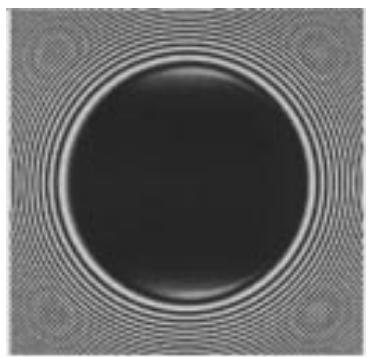

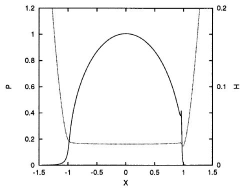

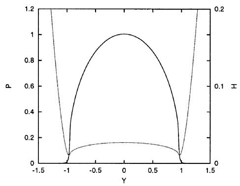

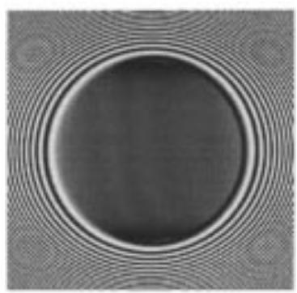

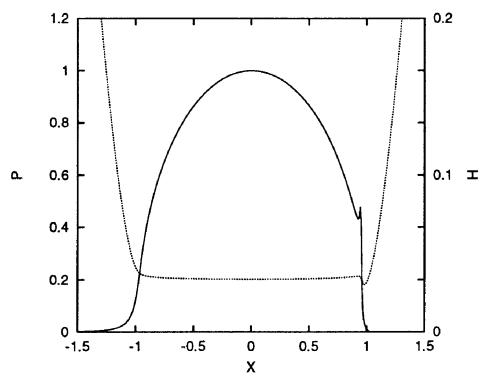

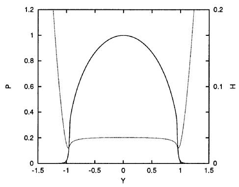

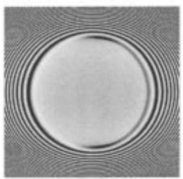

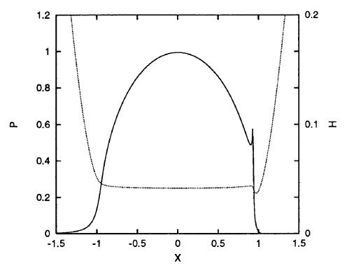

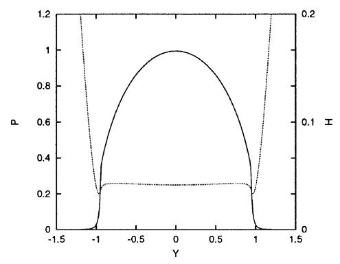

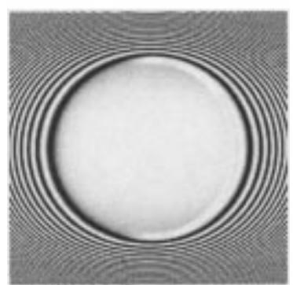

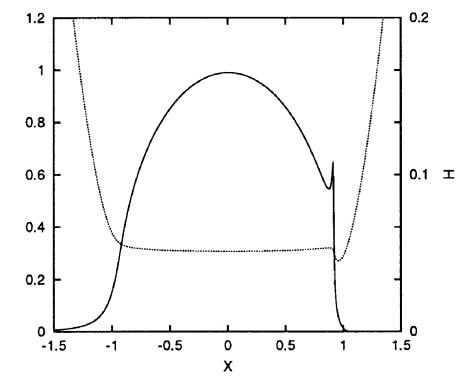

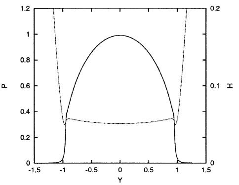  
Fig. 3 Pseudo-interferometric plot of H as a function of X and Y, and plots of P and H at the lines $Y = 0$ and X = 0 (M = 1007.6, L = 12.05 and $D = R _ { x } / R _ { y } = 1 . 0 , 0 . 5 0 , 0 . 2 5$ and 0.125)

Table 1 Values of the problem parameters for the contact between two steel surfaces that give $M = 1 0 0 7 . 6$ and $L = 1 2 . 0 5 .$ W, U and G denote the Hamrock-Dowson dimensionless point contact parameters
| Parameter | Value | Units |
| --- | --- | --- |
| α | $2 . 2 \times 1 0 ^ { - 8 }$ | $\mathrm { m } ^ { 2 } / \mathrm { N }$ |
| η0 | $4 0 . 0 \times 1 0 ^ { - 3 }$ | $\mathrm { N s } / \mathrm { m } ^ { 2 }$ |
| Z | 0.688 |  |
| $R _ { x }$ | $1 . 7 9 8 \times 1 0 ^ { - 2 }$ | $\mathbf { m }$ |
| $E ^ { \prime }$ | $2 . 2 6 \times 1 0 ^ { 1 1 }$ | $\mathrm { m } ^ { 2 } / \mathrm { N }$ |
| $u _ { \mathrm { s } }$ | 3.5 | $\mathrm { m } / \mathrm { s }$ |
| f | $1 0 4 7 . 2$ | $\mathrm { \Delta N }$ |
| W | $1 . 4 3 3 \times 1 0 ^ { - 5 }$ |  |
| U | $1 . 7 7 3 \times 1 0 ^ { - 1 1 }$ |  |
| G | 4972 |  |

0.125, minimum film thicknesses of 0.13, 0.22, 0.33 and 0.42 μm and central film thicknesses of 0.38, 0.42, 0.45 and 0.48 μm respectively are obtained. Also, with decreasing D the side lobes become less pronounced, and eventually for sufficiently small D the minimum film thickness will no longer occur in the side lobes but at the centre-line of the contact as in the infinitely wide line contact case. Finally, note that with decreasing D the film thickness develops a local minimum in the centre of the contact. This is explained by the combination of the decreasing maximum Hertzian pressure and the effect of compressibility [19, 20].

## 4.2 Roughness deformation

Only in ideal situations is lubrication a steady state problem. In many cases its time-dependent aspects cannot be neglected. This is, for example, the case if the operating conditions such as the load, speed or contact geometry vary with time (cam follower). Naturally a transient analysis is also required if the dynamics of the contact, e.g. the stiffness and damping, as a function of the operating conditions are being studied. Finally a transient analysis is needed if the surfaces are rough. The time dependence of the solution adds a dimension to the problem and consequently the resulting numerical simulations are more demanding. Nevertheless, due to its efficiency, the steady state solver described in Section 4 makes numerical simulation of transient point contact problems with sufficiently small mesh sizes and time steps feasible. Note that it can easily be extended to a solver for the transient problem by applying it to the discrete equations at a given time step, where for completeness it is noted that the FMG algorithm should then be modified into an F-cycle algorithm [12]. With this solver some of the aforementioned transient problems have been analysed. For a detailed study of the contact dynamics the reader is referred to reference [13]. Below results are presented related to the second problem, i.e. deformation of surface roughness or surface waviness.

Before presenting these results some aspects of the transient problem are discussed first. The characteristic behaviour explained in Section 4 determines the nature of the transient solution of the EHL problem too. In the highpressure (high-viscosity small-film) region this equation reduces to a simple transport equation:

Table 2 Dimensionless minimum film thickness $H _ { \mathrm { m } }$ and central film thickness $H _ { \mathrm { c } }$ as functions of the mesh size for a circular contact, $M = 1 0 0 7 . 6$ and $L = 1 2 . 0 5 ,$ calculated with an FMG algorithm using two W(2, 1) cycles per refinement. The final column shows the CPU time on an SGI Origin 200 R10.000 computer (single processor)
| K | $n _ { x } \times n _ { y }$ | $H _ { \mathrm { m } }$ | $H _ { \mathrm { c } }$ | CPU time |
| --- | --- | --- | --- | --- |
| 2 | $6 5 \times 6 5$ | $7 . 9 1 8 \times 1 0 ^ { - 4 }$ | $1 . 2 1 3 \times 1 0 ^ { - 2 }$ | 00:15 |
| 3 | $1 2 9 \times 1 2 9$ | $6 . 5 6 6 \times 1 0 ^ { - 3 }$ | $2 . 2 8 1 \times 1 0 ^ { - 2 }$ | 00:55 |
| 4 | $2 5 7 \times 2 5 7$ | $8 . 9 7 5 \times 1 0 ^ { - 3 }$ | $2 . 6 1 3 \times 1 0 ^ { - 2 }$ | 03:24 |
| 5 | $5 1 3 \times 5 1 3$ | $9 . 4 2 4 \times 1 0 ^ { - 3 }$ | $2 . 6 9 0 \times 1 0 ^ { - 2 }$ | 12:47 |
| 6 | $1 0 2 5 \times 1 0 2 5$ | $9 . 5 9 4 \times 1 0 ^ { - 3 }$ | $2 . 7 1 2 \times 1 0 ^ { - 2 }$ | 49:12 |

Table 3 Dimensionless minimum film thickness $H _ { \mathrm { m } }$ and central film thickness $H _ { \mathrm { c } }$ as functions of the mesh size and D for M = 1007.6 and L = 12.05
|  |  | $D = 0 . 5 0$ |  | $D = 0 . 2 5$ |  | $D = 0 . 1 2 5$ |  |
| --- | --- | --- | --- | --- | --- | --- | --- |
| K | $n _ { x } \times n _ { y }$ | $H _ { \mathrm { m } }$ | Hc | $H _ { \mathrm { m } }$ | Hc | $H _ { \mathrm { m } }$ | Hc |
| 2 | $6 5 \times 6 5$ | $6 . 8 1 0 \times 1 0 ^ { - 3 }$ | $2 . 1 3 0 \times 1 0 ^ { - 2 }$ | $1 . 8 8 5 \times 1 0 ^ { - 2 }$ | $3 . 2 5 8 \times 1 0 ^ { - 2 }$ | $3 . 3 2 1 \times 1 0 ^ { - 2 }$ | $4 . 4 3 4 \times 1 0 ^ { - 2 }$ |
| 3 | $1 2 9 \times 1 2 9$ | $1 . 5 5 7 \times 1 0 ^ { - 2 }$ | 3.083 × 10−2 | $2 . 7 7 6 \times 1 0 ^ { - 2 }$ | $3 . 9 6 7 \times 1 0 ^ { - 2 }$ | $4 . 2 5 9 \times 1 0 ^ { - 2 }$ | $4 . 9 7 1 \times 1 0 ^ { - 2 }$ |
| 4 | $2 5 7 \times 2 5 7$ | $1 . 7 4 9 \times 1 0 ^ { - 2 }$ | $3 . 3 1 3 \times 1 0 ^ { - 2 }$ | $2 . 9 6 4 \times 1 0 ^ { - 2 }$ | $4 . 1 2 8 \times 1 0 ^ { - 2 }$ | $4 . 4 3 9 \times 1 0 ^ { - 2 }$ | $5 . 0 9 3 \times 1 0 ^ { - 2 }$ |
| 56 | $5 1 3 \times 5 1 3$ | $1 . 8 1 1 \times 1 0 ^ { - 2 }$ | $3 . 3 7 1 \times 1 0 ^ { - 2 }$ | $3 . 0 2 3 \times 1 0 ^ { - 2 }$ | $4 . 1 7 0 \times 1 0 ^ { - 2 }$ | $4 . 4 8 2 \times 1 0 ^ { - 2 }$ | $5 . 1 2 4 \times 1 0 ^ { - 2 }$ |
|  | $1 0 2 5 \times 1 0 2 5$ | $1 . 8 2 2 \times 1 0 ^ { - 2 }$ | $3 . 3 8 6 \times 1 0 ^ { - 2 }$ | $3 . 0 3 2 \times 1 0 ^ { - 2 }$ | $4 . 1 8 1 \times 1 0 ^ { - 2 }$ | $4 . 4 8 8 \times 1 0 ^ { - 2 }$ | $5 . 1 3 3 \times 1 0 ^ { - 2 }$ |

J02099 © IMechE 2000

$$
\frac { \partial ( \overline { { \rho } } H ) } { \partial X } + \frac { \partial ( \overline { { \rho } } H ) } { \partial T } \approx 0\tag{26}
$$

with the solution $\overline { { \rho } } H \approx \overline { { \rho } } H ( X - T )$ and, as the compressibility is limited, by approximation $H \approx H ( X - T )$ . Consequently, any disturbance in the film thickness created in the inlet region will be propagated through the high-pressure region at the dimensionless speed of unity, which in real terms is the average speed of the surfaces.

Equation (26) allows a straightforward explanation of the phenomena observed in the film thickness solution for the case of single features such as a bump or a dent moving through the contact. Assuming pure rolling, the feature, once inside the contact region, will tend to move through this region relatively unchanged. On the contrary, if sliding occurs, i.e. if the surface feature is located on a surface moving more slowly or more quickly than the average velocity, a propagation phenomenon will be observed [21, 22]. The film thickness change induced upon entering the high-viscosity region travels through this region at a velocity that is lower or higher than the speed at which the feature itself moves through this region. This may give the appearance of a pressure disturbance and film disturbance that are detached. In physical terms the phenomena are the result of mass balance in a sheardominated flow and were shown experimentally by Kaneta et al. [23, 24].

A detailed analysis of the nature of the transient solution was presented by Greenwood and Johnson [25], Morales-Espejel [26] and Greenwood and Morales-Espejel [27, 28]. They showed that transient EHL solutions are made up of two parts: a particular integral (moving steady state solution with the velocity of the rough surface) and a complementary function (excitation coming from the inlet) travelling with the average velocity of the lubricant and thereby resulting in film changes with a wavelength that is larger or smaller than the wavelength of the undeformed waviness. In heavily loaded contacts, the amplitude of the steady state film thickness component is completely flattened and the excitation function dominates the film thickness. However, the pressures are dominated by the steady state component, which explains why film and pressure profiles occur that at first sight appeared to be detached.

Having understood the basic phenomena involved in transient EHL contacts, the necessary step is to generalize the results to obtain tools for practical use in design. A first step in this direction was taken by Couhier [29] and Venner et al. [30]. It was shown that the numerical results of the amplitude reduction of waviness in an EHL line contact under pure rolling could be represented on a master curve’ of a single dimensionless parameter. This parameter can be seen as a dimensionless wavelength, and the results show that, in terms of this dimensionless wavelength, highfrequency roughness is hardly deformed whereas lowfrequency roughness is significantly deformed. Such a curve obviously can form an important tool to estimate deformation of rough surfaces by applying it to each of the Fourier components of the surface, and then by inverse Fourier transform constructing the deformed film thickness. Theoretical support for the observed behaviour was provided by Hooke [31]. As a next step the circular contact problem was studied [32]. Some results of this study are presented below. Let (X, Y, T) be given by

$$
\begin{array} { c } { { \mathcal { R } ( X , Y , T ) = A _ { i } \times 1 0 ^ { - 1 0 \{ \mathrm { m a x } [ 0 , ( X - \overline { { { X } } } ) / ( \lambda _ { x } / a ) ] ^ { 2 } \} } } } \\ { { \times \cos \left( 2 \pi \displaystyle \frac { X - \overline { { { X } } } } { \lambda _ { x } / a } \right) \cos \left( 2 \pi \displaystyle \frac { Y } { \lambda _ { y } / b } \right) } } \end{array}\tag{27}
$$

where $\overline { { X } } = X _ { \mathrm { s } } + S T$ with $S = u _ { 1 } / \overline { { u } }$ Equation (27) represents a harmonic surface pattern with wavelength $\lambda _ { x }$ in the x direction and $\lambda _ { y }$ in the y direction. The pattern is assumed to be located on the surface moving with velocity $u _ { 1 }$ . However, the results will be restricted to the case of pure rolling: $u _ { 1 } = \overline { { u } } \left( S = 1 \right)$

By means of numerical simulations, the deformed amplitude $A _ { \mathrm { d } }$ of the pattern as a function of the operating conditions was studied. $A _ { \mathrm { d } }$ was defined as the amplitude of the film thickness oscillations in the centre of the contact:

$$
2 A _ { \mathrm { d } } = \operatorname* { m a x } _ { T } H ( 0 , 0 , T ) - \operatorname* { m i n } _ { T } H ( 0 , 0 , T )\tag{28}
$$

where the maximum should be taken over the time after which the solution has become periodic. This definition is suitable for all cases, except for the purely longitudinal problem $\lambda _ { x } = \infty ,$ , which requires an extended definition [32].

As a typical example Figs 4 and 5 show (snapshots of) the pressure and film thickness as functions of X and Y for a typical case with an isotropic pattern. The conditions are $M = 1 0 0 7 . 6 , \ L = 1 2 . 0 5 , \kappa = 1$ and $\lambda _ { x } / a = \lambda _ { y } / b = 0 . 2 5$ The simulation was carried out using a domain $- 2 . 5 \leqslant X \leqslant 1 . 5$ and $- 2 \leqslant Y \leqslant 2$ and a grid with $2 5 7 \times 2 5 7$ points, i.e. a mesh size $h _ { X } = h _ { Y } = 1 / 6 4$ . The time step was chosen equal to the mesh size. Figures 4 and 5 shows that both the pressure and the film thickness exhibit an oscillation with the wavelength of the pattern. The undeformed amplitude was taken as $A _ { i } = 5 . 6 \times$ $1 0 ^ { - 3 } \approx 0 . 2 H _ { \mathrm { c } }$ with $H _ { \mathrm { c } }$ the smooth surface central film thickness. The value of $A _ { \mathrm { d } }$ obtained for this case is $A _ { \mathrm { d } } = 4 . 1 3 6 \times 1 0 ^ { - 3 } = 0 . 7 3 9 A _ { i }$

Before the variation in $A _ { \mathrm { d } }$ with the operating conditions was studied, it was first established that the results are linear in $A _ { \mathrm { i } } ,$ i.e. $A _ { i }$ can be fixed and need not be varied separately as long as $A _ { \mathrm { i } } < H _ { \mathrm { m } }$ . Subsequently, the behaviour of $A _ { \mathrm { d } } / A _ { \mathrm { i } }$ as a function of the operating conditions and wavelengths was studied. It was found that this relative reduced amplitude was accurately approximated by the very simple equation

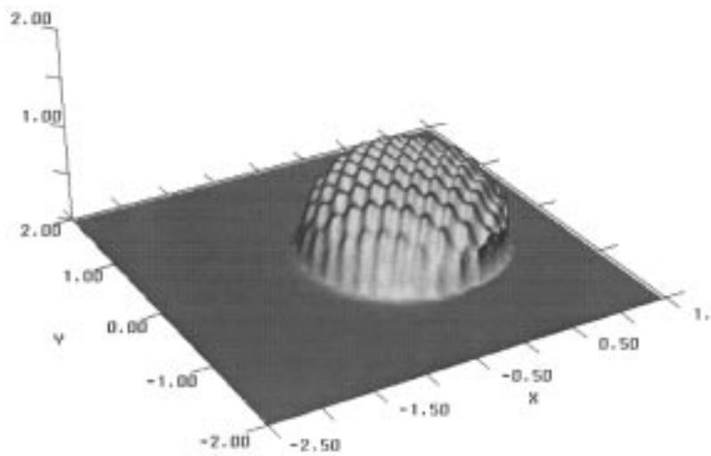  
Fig. 4 Snapshot of P as a function of X and Y, under pure rolling with $\lambda _ { x } = \lambda _ { y } = a / 4 , A _ { \mathrm { i } } = 0 . 2 H _ { \mathrm { c } } , M = 1 0 0 7 . 6$ and L = 12.05

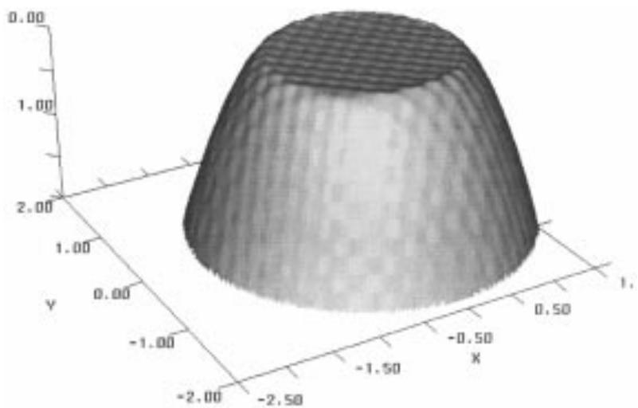  
Fig. 5 Snapshot of H as a function of X and Y, under pure rolling with $\lambda _ { x } = \lambda _ { y } = a / 4 ,$ $A _ { \mathrm { i } } = 0 . 2 H _ { \mathrm { c } }$ $M = 1 0 0 7 . 6$ and L = 12.05

$$
\frac { A _ { \mathrm { d } } } { A _ { \mathrm { i } } } = \frac { 1 } { 1 + 0 . 1 5 \overline { { f } } ( r ) \nabla _ { 2 } + 0 . 0 1 5 [ \overline { { f } } ( r ) \nabla _ { 2 } ] ^ { 2 } }\tag{29}
$$

where

$$
{ \overline { { f } } } ( r ) = { \left\{ \begin{array} { l l } { \mathbf { e } ^ { 1 - 1 / r } \qquad } & { { \mathrm { i f } } \ r > 1 } \\ { 1 \qquad } & { { \mathrm { o t h e r w i s e } } } \end{array} \right. } \qquad { \mathrm { w i t h } } \ r = { \frac { \lambda _ { x } } { \lambda _ { y } } }
$$

and

$$
\nabla _ { 2 } = \frac { \lambda } { a } \frac { M ^ { 1 / 2 } } { L ^ { 1 / 2 } } \qquad \mathrm { w i t h } \lambda = \operatorname* { m i n } ( \lambda _ { x } , \lambda _ { y } )
$$

This is illustrated by Fig. 6 which shows $A _ { \mathrm { d } } / A _ { \mathrm { i } }$ as a J02099 © IMechE 2000

function of $\nabla _ { 2 }$ for transverse patterns and by Fig. 7 which shows the results obtained for longitudinal patterns. The symbols indicate the computed values and the dotted curve represents the predictions of equation (29). The parameter $\nabla _ { 2 }$ can be interpreted as a dimensionless wavelength. Thus Fig. 6 shows that, in terms of this $\nabla _ { 2 }$ , low-frequency roughness tends to be deformed completely whereas highfrequency roughness moves through the contact virtually unchanged. This is exactly the same behaviour as was observed for a line contact [30]. Moreover, $\nabla _ { 2 }$ can be written as $\nabla _ { 2 } = \sqrt { 2 \pi ^ { 3 } / 3 } ( \lambda / a ) ( \bar { \alpha } \bar { p _ { \mathrm { H } } } ) ^ { 3 / 2 } L ^ { - 2 }$ which up to a constant is the same parameter as found in the line contact problem. This suggests that the amplitude reduction of surface features in EHL contacts is governed by a single mechanism for both line and point contact problems.

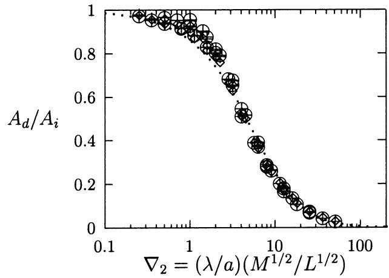  
Fig. 6 $A _ { \mathrm { d } } / A _ { \mathrm { i } }$ as a function of $\nabla _ { 2 }$ with $\lambda = \lambda _ { x }$ (anisotropic; $\lambda _ { y } > \lambda _ { x } )$

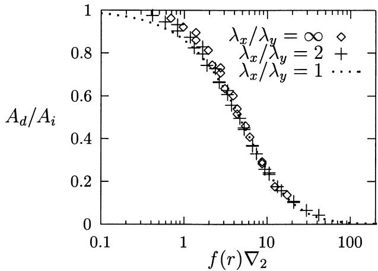  
Fig. 7 $A _ { \mathrm { d } } / A _ { \mathrm { i } }$ as a function of $\nabla _ { 2 }$ with $\lambda = \lambda _ { x }$ (anisotropic; $\lambda _ { y } < \lambda _ { x } )$

## 5 STARVED LUBRICATION

Most of the equations predicting the film thickness in EHL contacts assume that large quantities of oil are available. This is not unrealistic when studying oil bath lubrication but, when studying grease lubrication, this representation becomes dubious. The gain in computing time obtained through the introduction of multilevel methods can be used to add another aspect to the problem: starvation. This can be done by introducing an additional variable θ representing the fractional film content defined as the ratio between the amount of lubricant present at a given location and the gap width:

$$
\theta ( X , Y , T ) = \frac { H _ { 1 } ( X , Y , T ) } { H ( X , Y , T ) }\tag{30}
$$

with the boundary condition $\theta ( X _ { \mathrm { a } } , Y , T ) = H _ { \mathrm { o i l } } ( Y ) /$ $H ( X _ { \mathrm { a } } , Y , T )$ , where $H _ { \mathrm { o i l } }$ is the thickness of the oil layer thickness at the inlet. A modified Reynolds equation can be derived that differs from equation (1) only in the wedge and squeeze terms. Instead of $\overline { { \rho } } H$ these terms now contain $\theta \overline { { \rho } } H$ Since the lubricant is confined within the gap, θ satisfies $0 < \theta ( X , Y , T ) \leqslant 1$ and the modified Reynolds equation should be solved subject to the following complementarity condition:

$$
P ( X , Y , T ) [ 1 - \theta ( X , Y , T ) ] = 0\tag{31}
$$

with

$$
P ( X , Y , T ) \geq 0
$$

and

$$
0 < \theta \leqslant 1
$$

This condition implies that at a given point either the gap is completely filled and the pressure is larger than zero or the gap is only partially filled and the pressure is zero. For details regarding the model and implementation in the solver the reader is referred to references [13] and [33] for example. Below only some results are presented.

Figure 8 represents the pseudo-interference plots of the film thickness distribution and the central cross-sections for different values of inlet oil layer. The Hertzian circle is plotted as a dashed line and the boundary of the pressurized zone as a solid line. On the pseudo-interference plots the inlet meniscus can be observed to move towards the Hertzian circle when the inlet oil film diminishes. This meniscus conserves a simple circular shape concentric with the Hertzian zone. At the outlet, the film rupture location is hardly affected by the supply condition. On each crosssection plot, $H _ { \mathrm { c } }$ is observed to decrease faster than $H _ { \mathrm { m } }$ with $H _ { \mathrm { o i l } }$ . When $H _ { \mathrm { o i l } }$ becomes very small compared with the fully flooded central film thickness $H _ { \mathrm { c f f } }$ the film thickness distribution tends to a flat Hertzian shape. The ratio $H _ { \mathrm { c } } / H _ { \mathrm { m } }$ tends asymptotically to one for all operating conditions, as starvation increases $( H _ { \mathrm { o i l } }$ decreases) [33, 34].

In order to derive an analytical expression predicting the central film thickness $H _ { \mathrm { c } }$ as a function of the amount of oil available on the surface, $H _ { \mathrm { o i l } } .$ , it is beneficial to divide both $H _ { \mathrm { c } }$ and $H _ { \mathrm { o i l } }$ by the fully flooded central film thickness $H _ { \mathrm { c f f } }$ . This results in two asymptotes, $H _ { \mathrm { c } } / H _ { \mathrm { c f f } } = H _ { \mathrm { o i l } } / H _ { \mathrm { c f f } }$ and $H _ { \mathrm { c } } / H _ { \mathrm { c f f } } = 1$ , since the starved central film thickness cannot exceed the thickness of the available oil layer, and secondly it cannot exceed the fully flooded central film thickness. The only way that the operating conditions M and L can influence these curves is to make the transition more gradual or more abrupt. Figure 9 shows that the relative starvation curves for very different operating conditions, ranging from M = 10, L = 2 to $M = 1 0 0 0$ $L = 1 0$ , are almost identical. This is hardly surprising when it is realized that the film thickness profile of the fully flooded contact is accurately represented by the Hertzian distribution, a resemblance that only holds when the contact becomes starved. Consequently it is possible to devise a general equation relating the film thickness reduction $\mathcal { R } = H _ { \mathrm { c } } / H _ { \mathrm { c f f } }$ to the ratio $r = H _ { \mathrm { o i l } } / H _ { \mathrm { c f f } } ;$

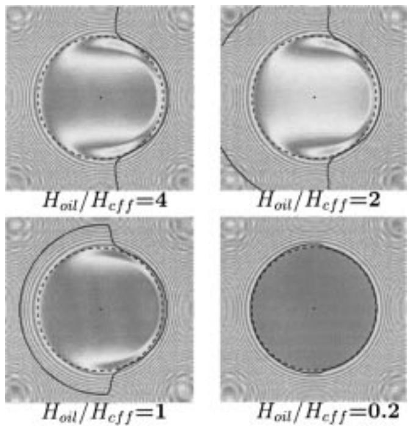

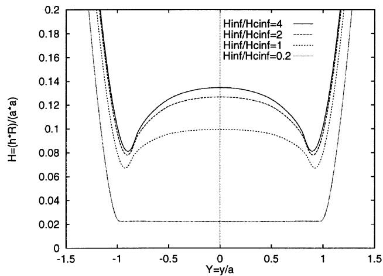  
Fig.8 Pseudo-interference plots, with film formation and cavitation boundaries, and central film thickness distribution as a function of $H _ { \mathrm { o i l } } / H _ { \mathrm { c f f } }$ (M = 100 and L = 10)

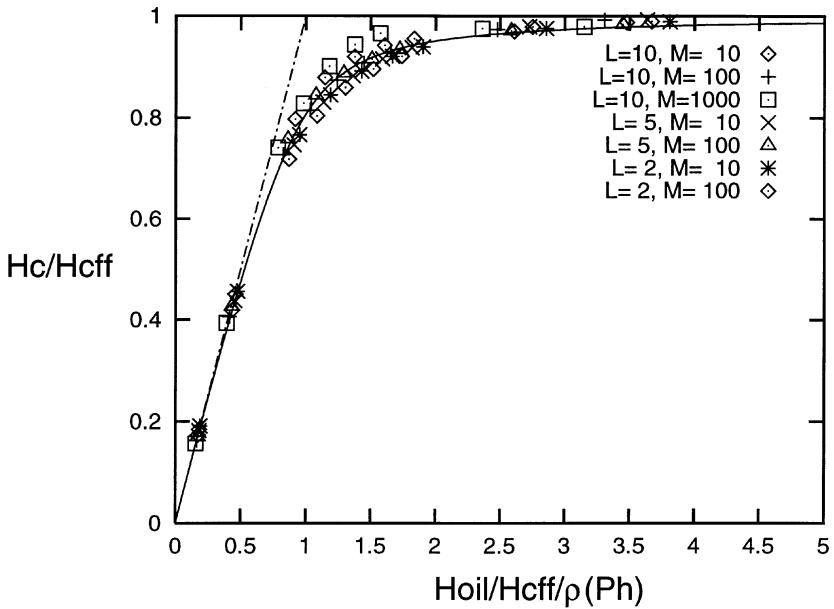  
Fig. 9 Central oil film thickness as a function of the thickness of the oil inlet layer, assuming a constant inlet thickness with respect to Y

$$
\mathcal { R } = \frac { r } { \sqrt [ ] { 1 + r ^ { \gamma } } }\tag{32}
$$

where $H _ { \mathrm { c f f } }$ stands for the central film thickness under fully flooded conditions which can be computed from the classical equations. Using this approach, the film thickness after many overrollings can be obtained, and the reflow necessary to maintain a certain equilibrium level can be calculated [35]. Also the replenishment of local lubricant film defects can be studied, in order to explain certain types of failure [36].

## 6 CONCLUSION

Multigrid techniques have successfully been introduced as a fast method to simulate EHL point contact problems numerically and have gained widespread acceptance in the field. With these techniques the steady state problem can be solved in a computing time of O[N ln(N)] if N is the number of nodes on the grid. This allows the use of dense grids on relatively small computers and workstations. The efficiency with which the basic equations can be solved by means of these algorithms has created room for more complex problems to be studied. For example the fractional film content can be added as a variable to study the effects of starvation and variable lubricant supply. Also, by applying the solver to the equations of each time step, simulation of the transient effects of surface features has become feasible. Alternatively, a transient analysis can give insight into the dynamics such as stiffness and damping, which in its turn can be done including the effects of starvation [37]. These examples illustrate the increased numerical simulation capacity resulting from the algorithms. The numerical simulations have led to a significantly increased level of knowledge of the mechanisms and phenomena that can play a role in EHL contacts. It thus appears that one of the main questions in EHL research of the past decades has been answered, i.e. how to solve the EHL modelling equations efficiently such that realistic conditions can be considered.

The challenge to be faced now by researchers and engineers is to bring the increased understanding of the operation of EHL contacts to the place where it is really needed, i.e. to use the developed numerical tools to determine trends and to derive simple rules for practical use in design. A first step taken into this direction is the amplitude reduction’ curve [equation (29)] which can be used to determine an estimate of the deformation of roughness under the contact for arbitrary given microgeometry. This should lead to an improvement over the $\lambda = h / \sigma$ parameter widely used nowadays that does not account for any roughness deformation.

Finally, the predictions obtained by means of numerical simulations are only as good as the models that are used in these simulations. The increased capability to simulate EHL problems numerically should not lead to numerical trial and error of different models. It is urgently needed that in close cooperation between experimental and theoretical (or numerical) researchers the ranges of validity of the models used in the numerical simulations are established. This requires extensive comparison of numerical and experimental results. Based on observed discrepancies, new models should then be developed, where care should be taken that these new models are supported by physical and empirical evidence.

## REFERENCES

1 Brandt, A. Multi-level adaptive solutions to boundary value problems. Mathematics Comput., 1977, 31, 333–390.

2 Lubrecht, A. A. Numerical solution of the EHL line and point

Proc Instn Mech Engrs Vol 214 Part J

contact problem using multigrid techniques. PhD thesis, University of Twente, Enschede, 1987.

3 Lubrecht, A. A., Breukink, G. A. C., Moes, H., ten Napel, W. E. and Bosma, R. Solving Reynolds' equation for EHL line contacts by application of a multigrid method. In Proceedings of the 13th Leeds-Lyon Symposium on Tribology, Elsevier Tribology Series, Vol. 11 (Eds D. Dowson et al.), 1987, pp. 175–182 (Elsevier, Amsterdam).

4 Lubrecht, A. A., ten Napel, W. E. and Bosma, R. Multigrid, an alternative method of solution for two-dimensional elastohydrodynamically lubricated point contact calculations. Trans. ASME, J. Tribology, 1987, 109, 437–443.

5 Dowson, D. and Higginson, G. R. Elastohydrodynamic Lubrication, The Fundamentals of Roller and Gear Lubrication, 1966 (Pergamon, Oxford).

6 Roelands, C. J. A. Correlational aspects of the viscositytemperature-pressure relationship of lubricating oils. PhD thesis, Technical University Delft, Delft, 1966.

7 Brandt, A. Multigrid techniques: 1984 guide with applications to fluid dynamics, GMD Studien 85, Gesellschaft für Mathematik und Datenverarbeitung MBH, Bonn, Germany, 1984.

8 Press, W. H., Teukolsky, S. A., Vetterling, W. T. and Flannery, B. P. Numerical Recipes in C, 2nd edition, reprinted with corrections 1994 (Cambridge University Press, Cambridge).

9 Briggs, W. L. A Multigrid Tutorial, 1987 (SIAM, Philadelphia, Pennsylvania).

10 McCormick, S. Multigrid Methods: Theory, Applications, and Supercomputing (Ed. S. F. McCormick), 1988 (Marcel Dekker, New York).

11 Hemker, P. W. and Wesseling, P. (Eds) Multigrid Methods IV, Proceedings of the Fourth European Multigrid Conference, Amsterdam, 1993, International Series of Numerical Mathematics, Vol. 116, 1994 (Birkhauser, Basel).

12 Venner, C. H. Multilevel solution of the EHL line and point contact problems. PhD thesis, University of Twente, Enschede, 1991.

13 Wijnant, Y. H. Contact dynamics in the field of elastohydrodynamic lubrication. PhD thesis, University of Twente, Enschede, 1998.

14 Brandt, A. and Lubrecht, A. A. Multilevel matrix multiplication and fast solution of integral equations. J. Comput. Physics, 1990, 90(2), 348–370.

15 Brandt, A. and Venner, C. H. Multilevel evaluation of integral transforms with asymptotically smooth kernels. SIAM J. Scient. Comput., 1998, 19(2), 468–492; also as Internal Report WI/CG-2, Carl F. Gauss Minerva Center for Scientific Computation, 1998.

16 Brandt, A. and Venner, C. H. Fast evaluation of integral transforms on adaptive grids. In Multigrid Methods V, Lecture Notes in Computational Science and Engineering, Vol. 3 (Eds W. Hackbusch and G. Wittum), 1999, pp. 20–44 (Springer-Verlag, Berlin); also in Internal Report WI/CG-5, Carl F. Gauss Minerva Center for Scientific Computation, 1999.

17 Lubrecht, A. A. and Ioannides, E. A fast solution to the dry contact problem and the associated sub-surface stress field, using multilevel techniques. Trans. ASME, J. Tribology, 1991, 113, 128–133.

18 Hamrock, B. J. and Dowson, D. Elastohydrodynamic lubrication of elliptical contacts for materials of low elastic modulus

I: fully flooded conjunction. Trans. ASME, J. Tribology, 1978, 100, 236–245.

19 Venner, C. H. and Bos, J. Effects of lubricant compressibility on the film thickness in EHL line and circular contacts. Wear, 1993, 173, 151–165.

20 Nijenbanning, G., Venner, C. H. and Moes, H. Film thickness in elastohydrodynamically lubricated elliptic contacts. Wear, 1994, 176, 217–229.

21 Venner, C. H. and Lubrecht, A. A. Numerical simulation of a transverse ridge in a circular EHL contact, under rolling/ sliding. Trans. ASME, J. Tribology, 1994, 116, 751–761.

22 Venner, C. H. and Lubrecht, A. A. Numerical simulation of waviness in a circular EHL contact, under rolling/sliding. In Proceedings of the 20th Leeds-Lyon Symposium on Tribology, Elsevier Tribology Series, Vol. 30 (Eds D. Dowson et al.), 1994, pp. 259–272 (Elsevier, Amsterdam).

23 Kaneta, M., Sakai, T. and Nishikawa, H. Optical interferometric observations of the effects of a bump on point contact EHL. Trans. ASME, J. Tribology, 1992, 114, 779–784.

24 Kaneta, M., Sakai, T. and Nishikawa, H. Effects of surface roughness on point contact EHL. STLE Tribology Trans., 1993, 36(4), 605–612.

25 Greenwood, J. A. and Johnson, K. L. The behaviour of transverse roughness in sliding elastohydrodynamically lubricated contacts. Wear, 1992, 153, 107–117.

26 Morales-Espejel, G. E. Elastohydrodynamic lubrication of smooth and rough surfaces. PhD thesis, Department of Engineering, University of Cambridge, 1993.

27 Greenwood, J. A. and Morales-Espejel, G. E. The behaviour of transverse roughness in EHL contacts. Proc. Instn Mech. Engrs, Part J, Journal of Engineering Tribology, 1994, 208(J2), 121–132.

28 Greenwood, J. A. and Morales-Espejel, G. E. The amplitude of the complementary function for wavy EHL contacts. In Proceedings of the 23rd Leeds-Lyon Symposium on Tribology, September 1996, Elsevier Tribology Series, Vol. 32 (Eds D. Dowson et al.), 1997, pp. 307–312 (Elsevier, Amsterdam).

29 Couhier, F. Influence des rugosites de surface sur les mecanismes de lubrification de contact elastohydrodynamique cylindre-plan (in French). PhD thesis, Institut National des Sciences Appliquées de Lyon, 1996.

30 Venner, C. H., Couhier, F., Lubrecht, A. A. and Greenwood, J. Amplitude reduction of waviness in transient EHL line contacts. In Proceedings of the 23rd Leeds-Lyon Symposium on Tribology, September 1996, Elsevier Tribology Series, Vol. 32 (Eds D. Dowson et al.), 1997, pp. 103–112 (Elsevier, Amsterdam).

31 Hooke, C. J. Surface roughness modification in elastohydrodynamic line contacts operating in the elastic piezoviscous regime. Proc. Instn Mech. Engrs, Part J, Journal of Engineering Tribology, 1997, 212(J2), 145–162.

32 Venner, C. H. and Lubrecht, A. A. Amplitude reduction of anisotropic harmonic surface patterns in EHL circular contacts under pure rolling. In Proceedings of the 25th Leeds-Lyon Symposium on Tribology, Lyon, September 1998, Elsevier Tribology Series, Vol. 36 (Eds D. Dowson et al.), 1999, pp. 151–162 (Elsevier, Amsterdam).

33 Chevalier, F. Modélisation des conditions d’alimentation en lubrifiant dans les contacts elastohydrodynamiques ponctuels. PhD thesis, Institut National des Sciences Appliquées de Lyon, 1996.

34 Chevalier, F., Lubrecht, A. A., Cann, P. M. E., Colin, F. and Dalmaz, G. Film thickness in starved EHL point contacts. Trans ASME, J. Tribology, 1998, 120, 126–133.

35 Cann, P. M. E., Chevalier, F. and Lubrecht, A. A. Track depletion and replenishment in a grease lubricated point contact: a qualitative analysis. In Proceedings of the 23rd Leeds-Lyon Symposium on Tribology, September 1996, Elsevier Tribology Series, Vol. 32 (Eds D. Dowson et al.), 1997, pp. 405–413 (Elsevier, Amsterdam).

36 Chevalier, F., Lubrecht, A. A., Cann, P. M. E. and Dalmaz, G. The evolution of film defects in the starved regime. In Proceedings of the 24th Leeds-Lyon Symposium on Tribology, September 1997, 1998, pp. 233–242.

37 Wijnant, Y. H. and Venner, C. H. Contact dynamics of starved EHL contacts. In Proceedings of the 25th Leeds-Lyon Symposium on Tribology, Lyon, September 1998, Elsevier Tribology Series, Vol. 36 (Eds D. Dowson et al.), 1999, pp. 705–716 (Elsevier, Amsterdam).

## APPENDIX

## Discrete equations

The equations are discretized on a uniform grid with mesh sizes $h _ { X }$ and $h _ { Y }$ and time step $h _ { T }$ in time. A straightforward second-order accurate discretization of the Reynolds equation in grid point $i , j$ at time step k is given by

$$
\begin{array} { r l } & { \frac { 1 } { h _ { x } ^ { 2 } } [ \epsilon _ { i - 1 / 2 , j , k } P _ { i - 1 , j , k } - ( \epsilon _ { i - 1 / 2 , j , k } + \epsilon _ { i + 1 / 2 , j , k } ) P _ { i , j , k } } \\ & { \quad \quad + \epsilon _ { i \neq 1 / 2 , j , k } P _ { i + 1 , j , k } ] } \\ & { \quad \quad + \frac { \kappa ^ { 2 } } { h _ { x } ^ { 2 } } [ \epsilon _ { i , j - 1 / 2 , k } P _ { i , j - 1 , k } - ( \epsilon _ { i , j - 1 / 2 , k } + \epsilon _ { i , j + 1 / 2 , k } ) P _ { i , j , k } } \\ & { \quad \quad \quad + \epsilon _ { i , j + 1 / 2 , k } P _ { i , j + 1 , k } ] } \\ & { \quad \quad - \frac { 1 } { h _ { x } } [ ( \overline { { p } } H ) _ { i , j , k } - 2 ( \overline { { p } } H ) _ { i - 1 , j , k } + 0 . 5 ( \overline { { p } } H ) _ { i - 2 , j , k } ] } \\ & { \quad \quad - \frac { 1 } { h _ { x } } [ ( \overline { { p } } H ) _ { i , j , k } - 2 ( \overline { { p } } H ) _ { i , j , k - 1 } + 0 . 5 ( \overline { { p } } H ) _ { j , k - 2 } ] - 0 . } \end{array}\tag{33}
$$

with $P ( X _ { i } , Y _ { j } ) = 0$ for points on the boundary, and the cavitation condition $P ( X _ { i } , Y _ { j } ) \geqslant 0$ $\epsilon _ { i \pm 1 / 2 , j , k } = ( \epsilon _ { i , j , k } +$ $\epsilon _ { i \pm 1 , j , k } ) / 2$ and $\epsilon _ { i , j \pm 1 / 2 , k } = ( \epsilon _ { i , j , k } + \epsilon _ { i , j \pm 1 / 2 , k } ) / 2$ with

$$
\epsilon _ { i , j } = \frac { \overline { { \rho } } ( P _ { i , j , k } ) H _ { i , j , k } ^ { 3 } } { \overline { { \eta } } ( P _ { i , j , k } ) \overline { { \lambda } } }\tag{34}
$$

The film thickness equation can be discretized as

$$
\begin{array} { r l r } {  { H _ { i , j , k } = - A _ { k } + \mathcal { S } X _ { i } ^ { 2 } + ( 1 . 0 - \mathcal { S } ) Y _ { j } ^ { 2 } + \mathcal { R } ( X _ { i } , ~ Y _ { j } , ~ T _ { k } ) } } \\ & { } & \\ & { } & { + \sum _ { i ^ { \prime } } \sum _ { j ^ { \prime } } K _ { i i ^ { \prime } , j j ^ { \prime } } ^ { h x , h _ { Y } } P _ { i ^ { \prime } , j ^ { \prime } , k } } \end{array}
$$

where, for a second-order discretization based on approximation of the pressure by a piecewise constant function on a square $h _ { X } h _ { Y }$ around $X _ { i ^ { \prime } } ^ { \prime } , ~ Y _ { j ^ { \prime } } ^ { \prime }$ , the coefficients $K _ { i i ^ { \prime } , j j ^ { \prime } } ^ { h _ { X } , h _ { Y } }$ are defined by

$$
K _ { i i ^ { \prime } , j j ^ { \prime } } ^ { h _ { X } , h _ { Y } } = \frac { \pi } { \mathbb { K } } \int _ { Y _ { j } - h _ { Y } / 2 } ^ { Y _ { j } + h _ { Y } / 2 } \int _ { X _ { i } - h _ { X } / 2 } ^ { X _ { i } + h _ { X } / 2 } \frac { \mathrm { d } X ^ { \prime } \mathrm { d } Y ^ { \prime } } { \sqrt { \kappa ^ { 2 } ( X _ { i } - X ^ { \prime } ) ^ { 2 } + ( Y _ { j } - Y ^ { \prime } ) ^ { 2 } } }\tag{36}
$$

They can be computed analytically:

$$
\begin{array} { l } { { { \cal K } _ { i _ { i } ^ { \prime } , j ^ { \prime } } ^ { h c h _ { j ^ { \prime } } } = \displaystyle \frac { 1 } { \pi { \mathbb K } } \left[ | X _ { p } | \arcsin \left( \displaystyle \frac { Y _ { p } } { X _ { p } } \right) + | Y _ { p } | \arcsin \left( \displaystyle \frac { X _ { p } } { Y _ { p } } \right) \right. } } \\ { { \left. \qquad - | X _ { m } | \arcsin \left( \displaystyle \frac { Y _ { p } } { X _ { m } } \right) - | Y _ { p } | \arcsin \left( \displaystyle \frac { X _ { m } } { Y _ { p } } \right) \right. } } \\ { { \left. \qquad - | X _ { p } | \arcsin \left( \displaystyle \frac { Y _ { m } } { X _ { p } } \right) - | Y _ { m } | \arcsin \left( \displaystyle \frac { X _ { p } } { Y _ { m } } \right) \right. } } \\ { { \left. \qquad + | X _ { m } | \arcsin \left( \displaystyle \frac { Y _ { m } } { X _ { m } } \right) + | Y _ { m } | \arcsin \left( \displaystyle \frac { X _ { m } } { Y _ { m } } \right) \right] } } \end{array}\tag{37}
$$

with

$$
X _ { p } = X _ { i } - X _ { i } ^ { \prime } + { \frac { h _ { X } } { 2 } }
$$

$$
X _ { m } = X _ { i } - X _ { i } ^ { \prime } - { \frac { h _ { X } } { 2 } }
$$

$$
\begin{array} { l } { { Y _ { p } = \displaystyle \frac { Y _ { j } - Y _ { j } ^ { \prime } + h _ { Y } / 2 } { \kappa } } } \\ { { Y _ { m } = \displaystyle \frac { Y _ { j } - Y _ { j } ^ { \prime } - h _ { Y } / 2 } { \kappa } } } \end{array}\tag{38}
$$

Finally the discretized equation of equilibrium is given by

$$
\frac { 2 \pi } { 3 } h _ { X } h _ { Y } \sum _ { i } \sum _ { j } P _ { i , j , k } = F _ { k }\tag{39}
$$

with

$$
F _ { k } = F ( T _ { k } ) = 1 + A _ { F } \sin ( \Omega _ { \mathrm { e } } T _ { k } )\tag{40}
$$
