# Rolling contact in railways: modelling, simulation and damage prediction

K. DANG VAN and M. H. MAITOURNAM

Laboratoire de M´ecanique des Solides (CNRS UMR 7649), Ecole Polytechnique, 91128 Palaiseau, Cedex, France

Received in final form 4 August 2003

## ABSTRACT

Various kinds of defects are induced by rolling contact on the rail track: kidney-shaped cracking, shelling and nowadays squat and head checking, which are studied under the sponsorship of the French national railways company SNCF. Modelling of such defects requires the development of specific computational tools in order to evaluate, in the vicinity of the wheel–rail contact zone, the mechanical state (stress, plastic strain cycle and residual stress pattern), which is at the origin of the damages. Moreover, since the loadings induce multiaxial stress and strain states, it is necessary to use a multiaxial criterion to predict the occurrence offatigue cracks. This review paper is devoted to the presentation of the main results of this research.

Keywords 3D-mutiaxial fatigue; elastic/plastic shakedown; numerical methods; residual stress; rolling contact

## I N T R O D U C T I O N

## Objectives of the researches

Various types of rail defects are encountered in railheads. They motivated and continued to generate researches supported by the French national railways company SNCF. In the 1960s and until the end of mid-1980s, the main effort was devoted to the understanding of the initiation and propagation of kidney-shaped cracks, which were quite frequently encountered on the track. This problem was at the origin ofthe methods (initiation criterion and computational methods to evaluate the stress and strain cycles) proposed to study contact fatigue. Some attention was also focused on shelling phenomena, which are observed on some curves or on especially heavily loaded lines; shelling is associated with severe superficial plastic deformation. Nowadays, squats and head checks are the major defects that affect the rails and important efforts are made by French industries and research institutions to model the conditions, which govern the occurrence of these contact damages. The aim ofthese researches is to develop simulation tools which permit an optimized maintenance policy in order to preserve passengers’ security and rail integrity. In this paper, we are mainly interested in kidney-shaped cracking, squats and head checks. Some aspects of wear modelling related to the characterization of the surface ratchetting are also discussed. The main characteristics of the studied defects are as follows:

Kidney-shaped cracks (Fig. 1): They initiate in the rail head at a depth of around 7 mm from the running surface and propagate mainly downwards in the rolling direction, in a plane making an angle of about 30◦ from the vertical. The propagation downwards is quite stable in the rolling direction. Two main questions arise.

First, classical approaches in fatigue are based on Mises or Tresca-type criteria. The predicted initiation locus should then be situated at a depth of about 3 mm, where the shear stress (as well as the octahedral shear stress) is maximum. In reality, the initiation site is deeper under the rail surface in a region where these stresses are lower. Second, the propagation of the crack takes place in a very complex and varying stress field; the corresponding situation is then very different from the situation of the laboratory test specimens, which are used to derive fatiguepropagation laws. Direct application of the Paris law is, therefore, difficult and questionable, for different reasons which will be recalled.

Squats (Fig. 2): They are encountered at straight tracks or shallow curves. They initiate in the deformed zone of the running surface. When these cracks reach a certain size (around 5 mm) below the surface, they propagate downwards to form progressively transverse cracks. These cracks then propagate quite fast, because their size is already important. This is the reason why their prevention is necessary.

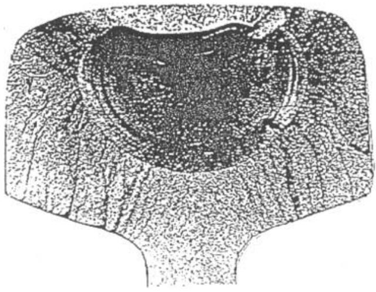

Fig. 1 Kidney-shaped crack (from SNCF).  
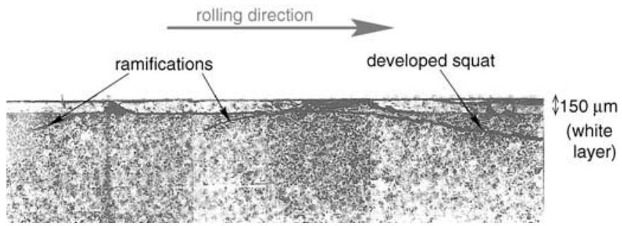

Head checks: These are angle cracks observed on the high rail in curves and on crossing rails. They initiate near the rail gauge corner and can join up to induce a gauge corner breaking.

## Difficulties and proposed solutions

In order to propose appropriate prevention solutions (particularly the maintenance policy) to preserve security conditions and rail life, it is desirable to predict the initiation of squats and head checks in relation to the railway’s traffic parameters and rail physical and mechanical properties. Because squats and head checks occur first very close to the surface, influence of friction on the local stress and strain field must be taken into account. It is clear that the evaluation ofthese quantities is crucial for the understanding of the damage built-up mechanism. It is, however, a very difficult task, because due to load level, plastic deformations occur under repeated rolling contact. As a consequence, the models based on elastic computations, which do not take account of contact-plasticity phenomena are inadequate. Moreover, the simulation ofsuch processes by using classical existing FEM codes is difficult for two main reasons: first, it is necessary to reproduce the motion of the load because the residual stress and strain distribution

Fig. 2 Squat defect in rail head (from IRSID).

cannot be derived from a static elastoplastic calculation (even if it is repeated) as it will be shown hereafter; and second, depending on the load level and the material behaviour, the stabilization may sometimes be obtained only after a great number ofcycles, which is difficult to simulate using classical FEM codes. To evaluate the inelastic mechanical parameters and their evolution under repeated rolling/sliding contact, we have developed a special efficient computational method, the stationary method,1–3 which is capable of determining the current or the stabilized state of any kind of inelastic structure subjected to repeated moving loads with a reasonable computational time.

Another difficulty is the prediction ofdamage; it necessitates the use ofmethods which can be employed in a complete multiaxial situation. Moreover, the stress field generated by the passage ofa wheel is mainly compressive and varies widely (sharp gradients). These two remarks lead to the following conclusion: a pure fracture-mechanics approach based on the use of stress-intensity factors is very difficult from a theoretical as well as a practical point of view. Great effort was devoted to study the propagation of cracks in the presence of multimodal conditions.4–6 Because the stress field under the wheel is mainly compressive, different researchers propose mode II cracking. However, the evaluation of the stress-intensity factors does not take into account the stress redistribution due to plasticity. Moreover, friction on the lips of the fracture, which must be very important, is generally neglected because the influence of friction is difficult to be introduced in the computations. This is the reason why another approach was chosen, which is based on the use of a multiaxial directional stress fatigue criterion. As will be shown, one can predict the conditions for the initiation of cracks and the direction of these cracks in relation to the loading cycles by using the proposed approach. The material constants of this criterion can be determined by simple classical fatigue experiments (tension–compression, bending or torsion tests). The paper starts by recalling the two key points of the proposed modelling: the computational method for evaluating the stabilized mechanical state induced by rolling contact on the rails; and the multiaxial directional stress fatigue criterion. Applications to the prediction ofcracks and damages in rail are then performed.

## E VA L UAT I O N O F T H E M E C H A N I C A L S TAT E U N D E R R E P E AT E D R O L L I N G

Because of the small size of the contact area between the wheel and the rail, the stresses are initially beyond the elastic limit; it is therefore necessary to take account of the plastic deformation and the residual stresses resulting from the sequence of repeated rolling or rolling–sliding contact. Different limit states in the rail are possible, depending on the variable load level: elastic or plastic shakedown, ratchetting. Elastic shakedown corresponds to a stabilization (reached after a certain number of cycles, which could be high) on a purely elastic cycle. A local residual stress pattern arises, due to incompatible plastic deformations resulting from the first loadings. The plastic shakedown corresponds to a stabilization on a plastic cycle. Finally, ratchetting takes place when there is no possible stabilization. Classically, to these different asymptotic states are associated different types of damages: on one hand mild wear or high cycle fatigue are supposed to occur at low load level associated with an elastic shakedown regime; on the other hand, high load level associated with plastic or ratchetting leads to low cycle fatigue or severe wear corresponding to rapid deterioration ofthe rail head. Evaluation ofthe mechanical state due to repeated moving loads by using classical FEM softwares requires incremental translation of the loading. This way of calculating was first used in the late 1980s and is still employed by some researchers; it is time consuming, cumbersome and not sufficiently accurate: in fact, each position of the load corresponds to a sequence of non-linear (iterative) analyses, each cycle to many positions and a great number of cycles are necessary to reach the stabilized state. This number depends on the load level and the material behaviour. In order to overcome these difficulties, we have developed specific computational techniques based on original stationary algorithms. The basic idea is to make the assumption of steady state in the reference frame moving with the load. Thanks to this assumption; the rate derivatives which intervene in the non-linear integration problem are replaced by spatial derivative along the stream lines. The presentation of these methods can be found in Refs [1–3]. In this way, it is possible to determine the stabilized state of any kind of inelastic structures subjected to repeated moving loads by following the evolution of the pass-bypass stationary method PPSM. It is also possible to find directly the limit-stabilized state by the direct stationary method (DSM) using the property of stationarity of the limit state (the stress field is periodic as is the strain in the absence of ratchetting). These methods (PPSM or DSM) were validated by comparison with analytical results obtained in some simple configurations by Johnson.7 These methods are very efficient for the description of strains and stresses due to cyclically or reciprocating moving contacts and for the quick determination of the nature of the stabilized state (elastic or plastic shakedown, ratchet).

## Application to two-dimensional problems

Analyses of repeated moving contacts using the stationary algorithms were first carried out in two dimensions.1,2 In the following, some examples are shown, which demonstrate the wide applicability of the methods to repeated rolling/sliding contact problems. The considered problem first corresponds to the simplest schematization of the wheel–rail contact represented by a semi-elliptical Hertzian pressure distribution moving on a elastoplastic half-space. In Fig. 3, the notations and characteristics of the contact loading are represented. The material is elastoplastic, with the following parameters : E (Young modulus) = 207 GPa, ν (Poisson ratio) = 0.3, k (shear yield limit) = 159 MPa and C (3C/2 is the kinematic hardening modulus) = 0 for perfect elastic–plastic material, C = 69 GPa for the linear kinematic hardening elastic–plastic material.

Calculations of residual stresses after repeated pure rolling (no friction) are performed using the previous methods.

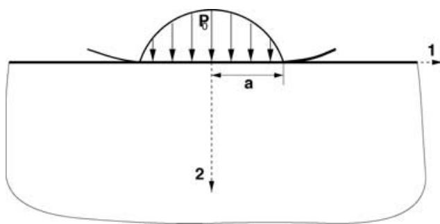  
Fig. 3 Characteristics of the contact loading.

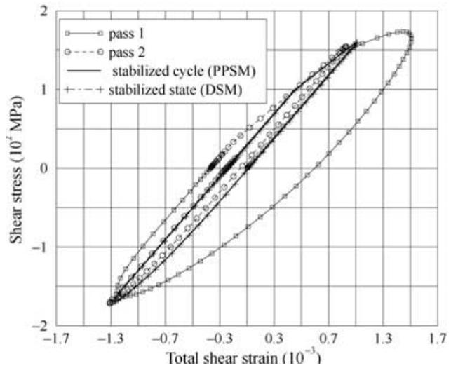

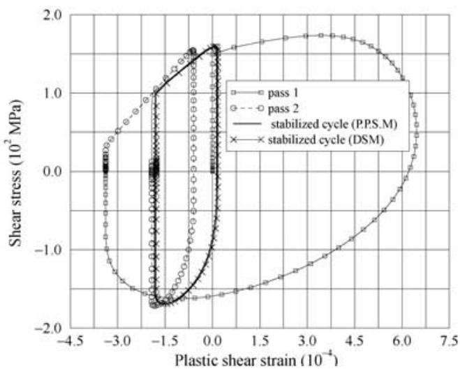  
Fig. 4 Stress–strain cycles induced by successive passes of the Hertzian pressure $( P _ { 0 } / k = 5 )$ at depth $y = 0 . 9 5 a . ^ { 1 }$

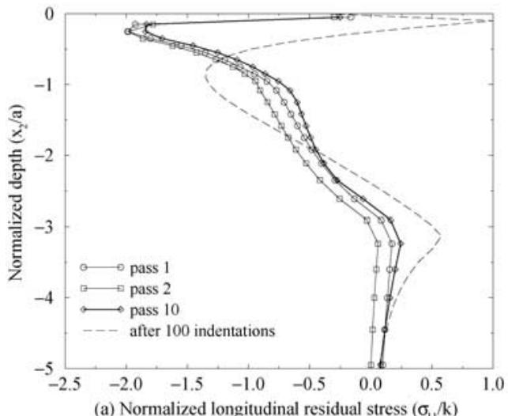  
(a) Normalized longitudinal residual stress $( \sigma _ { 1 1 } / \kappa )$

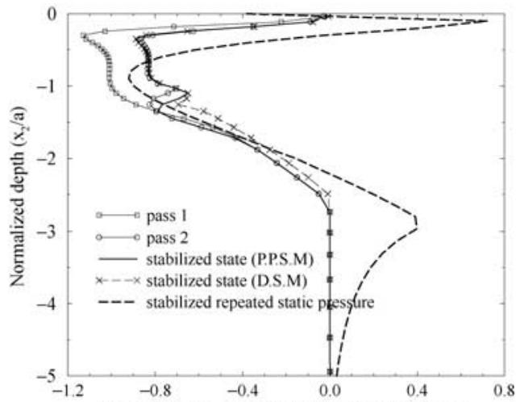  
(b) Normalized longitudinal residual stress $( \sigma _ { 1 1 } \mathcal { K } )$  
Fig. 5 Residual stresses induced by successive passes of the Hertzian pressure $( P _ { 0 } / k = 5 )$ and by repeated applications of a non-moving Hertzian pressure: (a) for perfect plastic material, (b) for a linear kinematic hardening elastic–plastic material.1

In the first example, the rail is considered as a linear kinematic hardening material; for a loading defined by $\hbar { 0 } / k =$ 5 with no friction, the evolution ofshear stress $( \sigma _ { 1 2 } )$ versus shear strain $( \epsilon _ { 1 2 } )$ are represented in Fig. 4. It can be seen that the stabilized shear strain varies but its cycle is closed: plastic shakedown has occurred. In Fig. 5, the distribution in depth of the longitudinal residual stresses $( \sigma _ { 1 1 } )$ obtained after repeated passes of the previous loading are represented. They are compared with the residual stresses obtained along the axis of symmetry of the contact, by repeated application of the same Hertzian pressure acting on a fixed surface (no motion of the load). Two material behaviours are considered. In Fig. 5a, the rail is supposed to be an elastic perfectly plastic material; in Fig. 5b, it is supposed to be a linear kinematic hardening material. In all cases, the residual stress pattern builds up progressively; the convergence towards the asymptotic state is faster for the hardening material. It can be observed that the residual stress distributions induced by rolling contact differ significantly from those resulting from repeated applications of a non-moving load: for the rolling contact the maximum pressure is higher; its distribution is also different. The difference is very important in the case of a single application of the load (not represented in the figure): these results show that it is not possible to estimate mechanical state under rolling contact without taking account of the motion.

Another remark refers to the number ofpasses, which are necessary in order to have a good estimation of the stabilized mechanical asymptotic state. This number depends on the load level (and also of the material constitutive equation as has been mentioned before). For instance, for the previous load level of $P _ { 0 } / k = 5$ and a perfect plastic material, one can see in Fig. 5 the difference between the residual stresses obtained after one pass and 10 passes on the half-space: about 40 cycles are numerically needed to reach the stabilized state. Let us recall that most of the existing rail defect modellings are based on numerical calculations with only a few number of passes, which could not be sufficient. The same methodology can be applied to more a sophisticated constitutive equation in order to evaluate the ratchetting rate observed on a rail head. This effect is associated with severe wear or low cycle fatigue.8 The evaluation ofthe evolution ofthe mechanicalparameter cycles in the vicinity of the rail surface under different conditions of rolling/sliding is particularly interesting from a theoretical as well as practical point of view. Bower and Johnson9 have proposed a method for estimating the ratchetting rate, using a non-linear kinematic hardening constitutive equation. The rail in that case is schematized by a semi-infinite space. However, the mechanical fields cannot be calculated that way. With our computational method, ratchetting rate and the field of mechanical parameters near the surface under the contact can easily be calculated using real rail geometry. As an example, Fig. 6 shows the deformed mesh obtained after more than 1000 rolling-contact passes, which can be compared to a micrography of a section of the running surface of a rail. Such calculations permit first an understanding of the wear mechanisms in the rail head and second a quantitative study this phenomenon.

## Application to three-dimensional problem

The real case of rail–wheel rolling–sliding contact is a three-dimensional problem. In order to make the problem tractable, a technique to reduce the size of the calculations, and therefore the computational cost, is developed. It consists of a combination of two-dimensional finite-element analysis and a Fourier expansion along a longitudinal direction of the rail (z-direction). The 3D problem is solved iteratively, each iteration consisting of a elastic solution and a determination of plastic deformation and internal variables. Fourier expansion allows reduction of the elastic 3D problem to a finite sum of 2D problems over a transverse section of the rail. This reduction introduces a great simplification of the 3D stationary elastoplastic problem and makes tractable the research of a stabilized solution for which many passages are necessary.

Typical examples of results obtained for one pass of the loading and for the stabilized state in the rail are represented in Fig. 7.

## M U LT I A X I A L D I R E C T I O N A L FAT I G U E C R I T E R I O N

To predict crack initiation and propagation induced by the traffic in the rail head is a difficult problem because the stress and strain fields are multiaxial and vary in a complex way (principal stress axes rotate during each loading cycle). Depending on the load level, low or high cycle fatigue may occur. The case of plastic shakedown or ratchetting corresponds to low cycle fatigue. High cycle regime is related to elastic shakedown and a multiaxial fatigue criterion the Dang Van criterion, is used.10 This criterion is based on two ideas: (i) the material is considered as a structure (the microstructure) subjected to cyclic-variable loadings; (ii) it is assumed that an elastic shakedown occurs before crack initiation. Two scales are introduced: (i) a macroscopic scale characterized by an arbitrary representative elementary volume (REV) surrounding the point, where fatigue analysis is done (the REV represents, for instance, an element of finite element mesh or the dimension of a strain gauge; it is the usual scale considered by engineers); (ii) a mesoscopic scale corresponding to the subdivision of the previous volume; the stress tensor at this scale σ(x, t) results from the macroscopic one $\Sigma ( X , t )$ and the local residual stress due to local inelastic deformations ρ(x, t). More precisely:

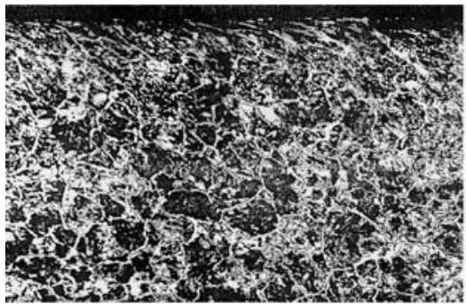

$$
\sigma ( x , t ) = \Sigma ( X , t ) + \rho ( x , t ) .
$$

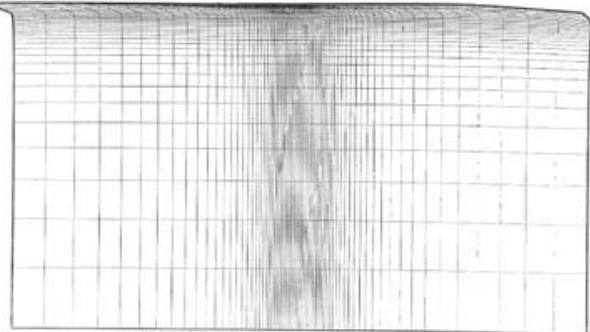  
Fig. 6 Severe surface plastic deformation and its numerical simulation for 1000 passes of the load.2

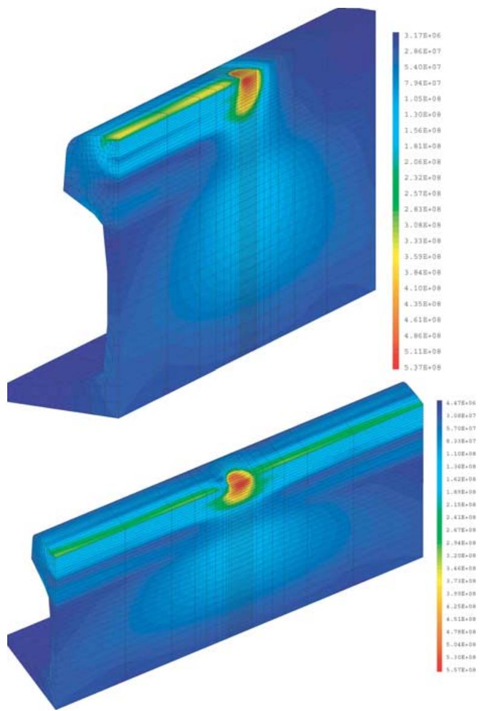

Thanks to the shakedown assumption at all scales of material description, it is possible to estimate the local stress cycle from the macroscopic stress cycles. More precisely,10 in the deviatoric stress space, one constructs the smallest hypersphere surrounding the macroscopic deviatoric stress cycle S = dev, the center of which corresponds approximately $\mathrm { t o } - \rho ( $ ρ is thus also deviatoric). The criterion is then expressed as:

$$
\operatorname* { m a x } _ { t } \{ \tau ( t ) + a p ( t ) \} \leq b ,
$$

where τ(t) andp(t) are the instantaneous mesoscopic shear stress and hydrostatic stress, and a and b are material constants, which can be determined by two different classical fatigue tests, (completely independent of any contact problem on the contrary of some methods used for studying contact fatigue). τ(t) depends on the direction. It is useful to note that the maximum value ofτ(t) corresponds

Fig. 7 Equivalent residual stresses (Pa) for the first pass and the stabilized state.

to Tresca $( \sigma ( t ) ) = \operatorname* { m a x } ( \sigma _ { I } ( t ) - \sigma _ { \mathcal { I } } ( t ) ) / 2 , \sigma _ { I } ( t )$ and $\sigma _ { \mathcal { I } } ( t )$ are the principal mesoscopic stresses at time t. One can define a parameter d that quantifies the danger of fatigue occurrence by:

$$
d ( t ) = \frac { \tau ( t ) } { b - a p ( t ) } ,\tag{1}
$$

where d(t) is calculated over a period and its maximum is to be taken over a cycle. If ${ \bf \ddot { \Phi } } d ( t ) > 1$ for some instant t of the cycle, fatigue should occur. For this instant, the principal axes I, J are known and the plane which realises the maximum of τ(t) = Tresca (σ(t)) is also known: the plane, where the crack is supposed to initiated is determined. The proposed multiaxial fatigue criterion is thus also directional. Practically, the fatigue resistance of the rail is checked point by point. Two different representations are used.

1 The first one is the representation ofthe loading path $\left( \boldsymbol { \phi } ( t ) \right.$ τ(t)) at each point in the (p, τ) diagram. In this diagram, the safety domain is limited by a straight line corresponding to equation $( \tau + a p = b )$ . For the homogeneous material, ifthe loading path at each point is entirely in the safety domain, there is no fatigue crack, otherwise fatigue damage occurs.

2 In the second representation, one evaluates at each point the danger of fatigue d. I $\ f { d _ { \operatorname* { m a x } } } = \operatorname* { m a x } _ { \operatorname { t } } d ( t )$ is greater than 1, it means the occurrence of fatigue cracking.

These representations are useful to visualize the danger of fatigue damages at different depths. If in reality, the rail material is not homogeneous, fatigue properties may vary in the rail head: in that case, the parameters a, b will depend on the position. In the applications presented hereafter they are supposed to be constants.

These two representations are used to predict the high cycle behaviour of rails. The predictions refer to the following points: application of the method permits

 first, to determine systematically the critical load system (Hertzian load characterized by $\displaystyle { \phi _ { 0 } / k } ,$ rolling sliding regime in relation with friction coefficient . . .), which can be damaging;

 second, to find the crack-initiation locus (depths) when the critical load is exceeded;

 third, to predict the crack path at the beginning of the propagation period.

## A P P L I C AT I O N TO T H E M O D E L L I N G O F R A I L D E F E C T S

## Modelling of kidney-shaped defects

The previous methodology was applied to study the kidney-shaped cracking, which was first schematized as a two-dimensional problem. Two-dimensional repeated elastoplastic calculations were performed to evaluate the stabilized state and the residual stress pattern at different depths of the rail. In that way we obtained the local stress cycle for various conditions of traffic. Application of the previous fatigue criterion allows to predict the locus of the crack initiation in relation with the load parameters. The methodology and some results were presented in Refs [2, 3]. For instance, we consider the following problem. An elliptic Hertzian distribution $( P _ { 0 } =$ 790 MPa, contact area of half-minor-axis $b = 6 . 3 2$ mm, and half-major-axis a = 10.1 mm) is repeatedly moving on the centre on a running surface of an UIC60 rail. The rail material is assumed to have a linear kinematic hardening elastic–plastic behaviour, with the following parameters : E (Young modulus) = 210 GPa, ν (Poisson $\mathrm { r a t i o } ) = 0 . 3 , k$ (shear yield limit) = 202 MPa and $C = 1 3 . 3 3 \mathrm { G P a } ( 3 C / 2$ is the kinematic hardening modulus). The use of the stationary method, here in 2D, shows that the stabilized state is obtained after four passes of Hertzian pressure distribution and is an elastic shakedown. Then the application of the Dang Van fatigue criterion $( a = 0 . 3 3 , b = 1 6 0 M \mathrm { P a } )$ is applied. In Fig. 8, these results are represented: residual stresses and loading path at the fatigue critical point located at the depth −0.29a. Moreover, it is also possible, at a given depth, to find the plane which maximizes the damage parameter d defined by Eq. (1).

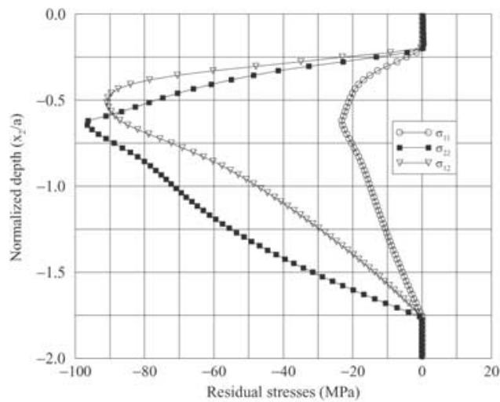  
Fig. 8 Residual stresses and loading path are the most critical points.

Three-dimensional simulations which are more realistic, can be done with a reasonable computational time. As an illustration, we consider the following example: the moving load is characterized by $a = b = 1 0$ mm and $ / 0 / k =$ 4.25. The fatigue limits of the rail are 460 MPa in tension and 270 MPa in torsion. The stabilized mechanical state is an elastic shakedown. Figure 9 shows the results of the application of the Dang Van multiaxial criterion: the most critical point is situated in depth, which is typical of a kidney-shaped crack initiation. Let us note that the region situated at the limit of the rolling track is also critical. However, generally the region situated in the depth of the rail is more critical relative to the danger of fatigue, particularly when friction is negligible. Moreover, the dynamics of wheel–rail is such that the rolling track is not fixed so that fatigue cracks are not observed at the limit of the rolling track. Such type of fatigue cracks can be observed in ball bearings, because in this situation, the rolling is always the same.

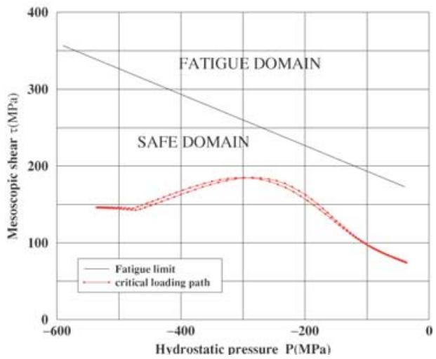

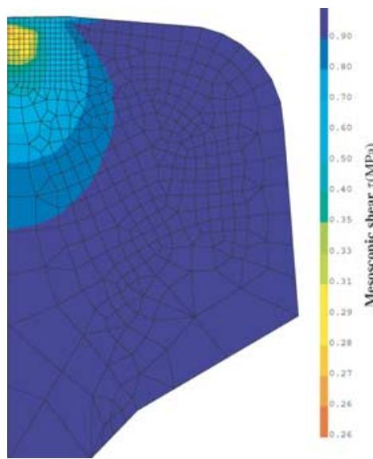

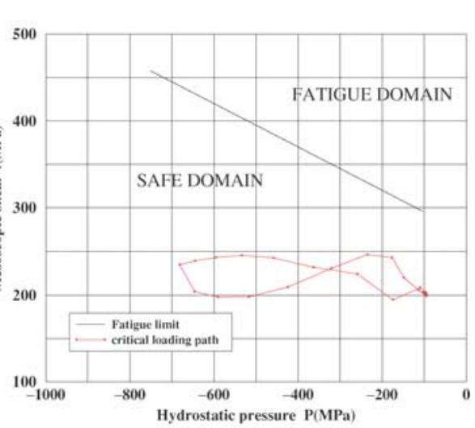  
Fig. 9 Contours of Dang Van criterion $\begin{array} { r } { ( \alpha = \operatorname* { m a x } _ { \mathrm { t } } \frac { \tau ( t ) - a \ p ( t ) - b } { b } ) } \end{array}$ and loading path are the most critical points.

## Two-dimensional rolling/sliding fatigue map

Systematic 2D elastoplastic and fatigue calculations using the previous methods were performed and the numerical results are summarized in the fatigue map presented in Fig. 10.

This map contains two kinds of results: on one hand, the shakedown map, which was already established by Johnson7 for a particular constitutive equation; on the other, the fatigue predictions which were possible due to the knowledge of the whole stress field evolution (which is not possible with Johnson’s method). Depending on the load parameter and the friction coefficient, different types of fatigue can be expected. Region 1 corresponds to high cycle fatigue in the elastic and elastic shakedown zones with crack initiation in the depth. Region 2 corresponds to surface damage; when the plastic shakedown occurs (plastic deformation cycles), this regime leads to shelling, which is relevant to low cycle fatigue.11 In the case of high friction (braking zone, for instance), surface plastic flow may be severe so that wear phenomena are predominant. Generalization to rolling under partial slip conditions or for different types of elastoplastic constitutive equations can be easily obtained using this methodology.

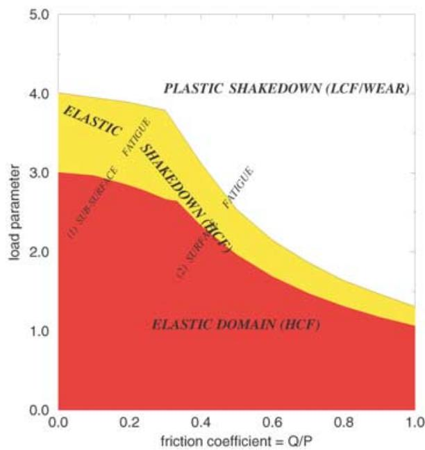  
Fig. 10 Fatigue map in 2D.3

## Modelling of squat

Two-dimensional analysis fails in explaining the occurrence of squat cracking; three-dimensional approaches are necessary. In this case, the microscopic observations show that superficial contact effects have to be taken into account. In Fig. 11 one can observe different fibre orientations (corresponding to severe local superficial plastic flow) depending on the position on the rail head surface: squat damage appears in a precise position.

Dynamic computations of wheel–rail system performed by INRETS in France based on Kalker’s method as in

Ref. [11] show complex evolutions of the rail–wheel contact with different shapes of the contact area, pressure and spin distribution. The contact area changes from one to two separate areas as represented in Ref. [3] To simulate this phenomenon, we choose a simplified scenario consisting of sequences of eight different passes of different contact loading. Each one corresponds to a particular position on the wheel on the rail. The contact– stress distributions consist of normal pressure and important concomitant tangential stresses resulting essentially from spin effects. Three-dimensional numerical calculations using the PPSM are conducted. The method which combines Fourier expansion and finite elements is used. In the calculations performed, the rail steel is considered as a von Mises elastic–plastic material with linear kinematic hardening. The material constants are: $E = 2 1 0 \mathrm { G P a } , \nu =$ $0 . 3 , k = 5 5 0 \ M \mathrm { P a } , C = 2 0 \ G \mathrm { P a } ;$ ; the loading parameters are: $P _ { 0 } = 1 . 6 { \mathrm { G P a } } ; P _ { 0 }$ is the maximum of the Hertzian pressure distribution; tangential stress is as high as 500 MPa. After the numerical determination of the stabilized stress state due to the loading sequences described above, fatigue analysis is performed. The loading path at three different points (gauge side, central zone and field side) on the running surface are shown in Fig. 12. It can be seen that fatigue cracks are likely to occur in the central zone, as observed in service.

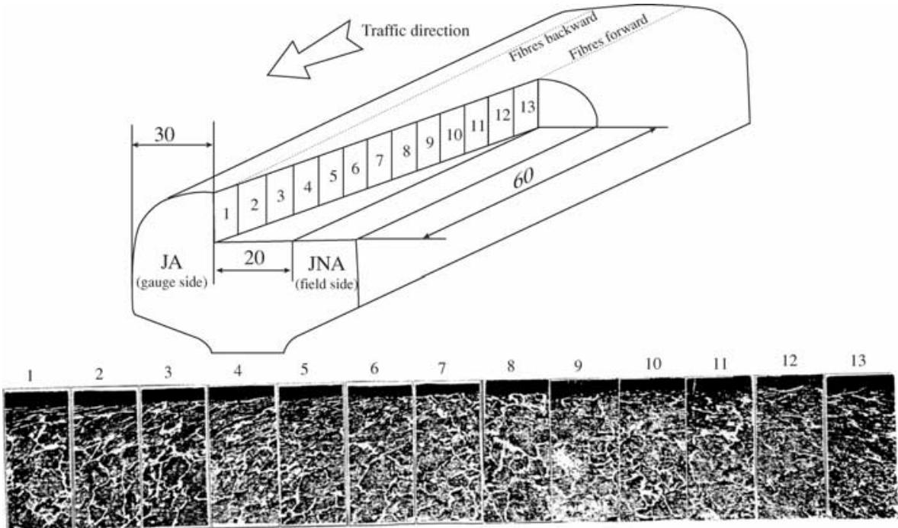  
Fig. 11 Observations of the orientations of the fibres in the running zone: squat appears in the central zone.12

Fig. 12 Fatigue prediction: loading paths at different points of the rail surface.3  
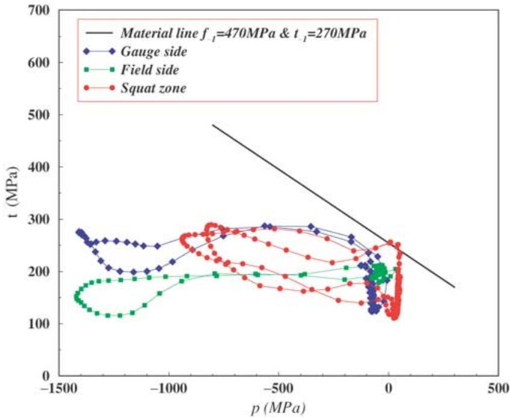

## C O N C L U S I O N

Quantitative modelling of damage induced by wheel–rail contact is an important but difficult problem. It has been studied for some decades in France, but the main progress is more recent. Among other difficulties to be overcome are the onset ofimportant plastic deformation and residual stresses, the complexity ofthe geometries ofthe structures makes the use of elastic approaches inoperative. Therefore, it is necessary to use sophisticated and robust computational methods (based on the stationary elastoplastic algorithm), which were developed recently. The use of a commercial code based on classical methods is generally not suitable nor convenient to evaluate the stabilized mechanical state under repeated rolling contact. These calculations are essential to progress in the correct interpretation of physical phenomena arising near the wheel–rail contact: the prediction of the rail resistance to repeated rolling can be evaluated only if the resulting mechanical field is known (stress, plastic strain cycles, residual stress . . .) with good accuracy. Finally, these parameters must be associated with a relevant multiaxial fatigue criterion. Applications of this methodology to the study of rail defects like kidney-shaped cracking, squats, head checks seem encouraging: the main features of these defects are well described by the computational model. A program is now being undertaken in France for a systematic and rational exploitation of this model in order to propose a guide for rail maintenance management for reducing overall life cycle cost.

## Acknowledgements

The authors gratefully acknowledge the SNCF for supporting this work and all the IDR2 partners.

## R E F E R E N C E S

1 Dang Van, K. and Maitournam, M. H. (1993) Steady-state flow in classical elastoplasticity: Application to repeated rolling and sliding contact. J. Mech. Phys. Solids 41, 1691–1710.

2 Dang Van, K., Maitournam, M. H. and Prasil, B. (1996) Elastoplastic analysis of repeated moving contact: Application to railways damage phenomena. Wear 196, 77–81.

3 Dang Van, K. and Maitournam, M. H. (2002) On some recent trends in modelling of contact fatigue and wear in rail. Wear 253, 219–227.

4 Amestoy, M., Bui, H. D. and Dang Van, K. (1979) Deviation´ infinitesimale d’une fissure dans une direction arbitraire.´ Comptes Rendus Acad´emie des Sciences, Paris, Tome 259, Serie B,´ n◦5.

5 Truchon, M., Amestoy, M. and Dang Van, K. (1981) Experimental study of fatigue crack growth under biaxial loading. Avances in Fracture Research. In: Proceedings ofICF 5, Ed. D. Fran¸cois, Vol. 4, Cannes, 29 March–3 April 1981, pp. 1841–1850.

6 Pinna, C. and Doquet, V. (1999) The preferred fatigue crack propagation mode in a M250 maraging steel loaded in shear. Fatigue Fract. Engng. Mater. Struct. 22, 173–183.

7 Johnson, K. L. (1992) The application of shakedown principles in rolling and sliding contact. Eur. J. Mech. A 11 (Special Issue), 155–172.

8 Franklin, F. J., Widiyarta, I. and Kapoor, A. (2001) Computer simulation of wear and rolling contact fatigue. Wear 251, 949–955.

9 Bower, A. F. and Johnson, K. L. (1979) The influence of strain hardening on cumulative plastic deformation in rolling and sliding line contact. J. Mech. Phys. Solids 37, 471–493.

10 Dang Van, K. (1999) Introduction to fatigue analysis in mechanical design by the multiscale approach. In: High-Cycle Metal Fatigue in the Context ofMechanical Design (Edited by K. Dang Van and I. Papadoupoulos), CISM Courses and Lectures No. 392, Springer Wien, New York, pp. 169–187.

11 Kapoor, A. (1994) A re-evaluation of the life to rupture of ductile metals by cyclic plastic strain. Fatigue Fract. Engng. Mater. Struct. 17, 201–219.

12 Boulanger, D., Girardi, L., Galtier, A. and Baudry, G. (1999) Prediction and Prevention of Rail Contact Fatigue. IHHA, Moscow.

13 Le The Hung (1987) Normal und tangential spanningsberechnung beim Rollen den Kontakt fur¨ Rotationskorper mit Michtelliptischen Kontakt Fl¨ achen.¨ Fortschritts Ber. VDI 12, 87.
