# Efects of Surface Micro-Geometry on the Pressures and Internal Stresses of Pure Rolling EHL Contacts

G. E. Morales-Espejel, P. M. Lugt, J. Van Kuilenburg & J. H. Tripp

# ffects of Surface Micro-Geometry on the Pressures and Internal Stresses of Pure Rolling EHL contactsQ

G. E. MORALES-ESPEJEL and P. M. LUGT

SKF Engineering and Research Centre B.V.

NL 3430 DT Nieuwegein, The Netherlands

and J. VAN KUILENBURG

Eindhoven University of Technology

NL 5600 MB Eindhoven, The Netherlands

and

J. H. TRlPP

University of Twente

NL 7500 AE Enschede, The Netherlands

A fast approach for the calculation of 3-D pressures and subsurface stresses in pure rolling EHL contacts with real (measured) roughness is presented. For the calculation of pressurrs the model uses the analytical work of Greenwood and Morales-Espejel for transverse (to the rolling direction) moving sinusoidal waviness. The model is extended to handle longitudinal waviness as well. By using these two basic components the pressure distribution for real rough surfaces can now be calculated from the 3-D roughness map. From the surface pressures, the sub-surface stress field can then be calculated with a similar technique. The result is the total stress state in a rolling rough EHL contact. In this paper the method for calculating the pressures and stress fields is first described. It is then applied to several types of surface finish.

## KEY WORDS

Elasto-Hydrodynaliiic Lubrication; Surface Roughness Effects

## INTRODUCTION

In recent years the understanding of the behaviour of roughness in elnstohydrodynamic lubrication (EHL) has gained great importance in industry. The demands of higher performance and mechanical components operating with thinner lubricating films have supported research in this area.

Real roughness can be seen as the superposition of waviness with crests running in both directions, transverse (to the contact rolling direction) and longitudinal (along the contact rolling direction). Time dependent effects occur in the contact if there are transverse components and this roughness orientation has recently received much attention.

Many publications have contributed to the understanding of EHL with rough surfaces particularly with transverse orientation. The first analysis of a surface feature moving into an EHL contact was due to Lee and Cheng ( I ) and concluded that the elastic deformation of the features is significant. An important step was later achieved with perhaps the first numerical solution of the EHL problem with moving roughness, due to Chang, et al. (2) Surprisingly the analysis included non-Newtonian fluids. This early work alreadv revealed the com\~lex kinematic behaviour of surface deformation and pressure generation present in EHL with moving roughness. Their main conclusion was that the squeeze term in the Reynolds equation significantly changes the local pressure generation and therefore surface deformation. Other important work was due to Venner (3) who also solved numerically the EHL problem of a rough surface moving over a smooth one and exhibited for the first time the apparent disassociation of pressures and the surface features that produced them, specially when large sliding is present. He observed that the pressure fluctuations travel with the velocity of the rough surface while the film thickness variations travel with the mean velocity of the lubricant. Venner also speculated that in the high pressure zone of the contact, the lubricant viscosity can be so large that the influence of the Poiseuille term in the Reynolds equation simply vanishes, reducing it to the transport equation, which is linear.

Morales-Espejel (4) and Greenwood and Morales-Espejel (5) showed that Venner's observations can be explained by considering just the inlet of the contact. In this region, the pressure is low and so is the roughness deformation; therefore each roughness peak entering the contact will behave as a flow exciter, closing and opening the inlet to allow less or more fluid to enter. This inlet excitation (complementary function) has to be added to the stationary EHL solution (particular integral) to produce the complete EHL transient solution. However, Greenwood and Morales-

**NOMENCLATURE**

|  |  |  | V x | = elastic displacements | [m] |
| --- | --- | --- | --- | --- | --- |
|  | = half-width of the elliptical Hertzian contact, |  |  | = rolling direction coordinate, measured from edge of contact | [m] |
| $A$ | rolling direction = constant $\pmb { A } = 2 \lambda / ( \pi E ^ { \prime } )$ | [m] [m/Pa] | X | = dimensionless rolling direction coordinate, X = x/a | [-] |
| $A _ { d }$ | = dimensionless deformed waviness amplitude | [-] | $y$ | = transverse direction coordinate | [m] |
| $A _ { i }$ | = dimensionless initial waviness amplitude | [-] | $\gamma$ | = dimensionless transverse direction |  |
| $^ { b }$ | = half-width of the elliptical Hertzian contact, |  |  | coordinate, $\mathrm { Y } = { \bf y } / a$ | I-I |
|  | transverse direction | [m] | $z$ | = vertical direction coordinate, roughness height | [m} |
| $C$ | = compressibility constant $\mathrm { C } = ( \gamma _ { \mathrm { \iota } } - \beta _ { \mathrm { \iota } } ) \ \tilde { h }$ | [m/Pa] | $Z _ { I }$ | = dimensionless waviness amplitude, |  |
| $C _ { \Uparrow }$ | = dimensionless compressibility term |  |  | $\scriptstyle { Z _ { 1 } = z _ { 1 } R _ { s } / a ^ { 2 } }$ | [-] |
|  | $\begin{array} { r } { C _ { 0 } = \frac { \pi E ^ { \prime } } { 2 a } M ^ { 0 . 5 } L ^ { - 0 . 5 } ( \gamma _ { 1 } - \beta _ { 1 } ) \bar { h } } \end{array}$ | [-] | $\pmb { \alpha }$ | = pressure-viscosity coefficient | $[ \mathsf { P a } ^ { - 1 } ]$ |
|  | =elasticity modulus of body i | [Pa] | $\beta$ | = constant in the density equation, |  |
| $E ^ { \prime }$ | = reduced elasticity modulus, |  |  | $\beta = 1 . 6 8 3 \mathrm { ~ x ~ } { 1 0 } ^ { - 9 }$ | $| \mathsf { P a } ^ { - 1 } |$ |
|  | $\begin{array} { r } { E ^ { \prime } = \frac { 1 } { 2 } \big ( \frac { 1 - \nu _ { 1 } ^ { 2 } } { E _ { 1 } } + \frac { 1 - \nu _ { 2 } ^ { 2 } } { E _ { 2 } } \big ) ^ { - 1 } } \end{array}$ | [Pa] | $\beta _ { t }$ | = constant in the compressibility term, |  |
| $E _ { c }$ | $\begin{array} { r } { E _ { c } = \frac { E ^ { \prime } a } { 2 p _ { H } R _ { x } } } \end{array}$ = dimensionless constant | [-] |  | $\beta _ { 1 } = \beta / ( 1 + \beta p _ { H } )$ | $[ \mathsf { P a } ^ { - 1 } ]$ |
| $\pmb \varepsilon$ | = full elliptical integral of the 2nd kind | $[ - ]$ | γ | = constant in the density equation, |  |
| $f$ | = frequency,f = ω/2π | $[ \mathbf { m } ^ { \cdot 1 } ]$ |  | $\gamma = 2 . 2 6 6 \mathrm { x } ~ 1 0 ^ { - 9 }$ | $\{ \mathsf { P a } ^ { - 1 } \}$ |
| $F$ | = contact load | [N] | $\gamma _ { t }$ | = constant in the compressibility term, |  |
| $h$ | = film thickness | [m] |  | $\gamma _ { 1 } = \gamma / ( 1 + \gamma p _ { \scriptscriptstyle H } )$ | $\lceil \mathsf { P a } ^ { - 1 } \rfloor$ |
| $\vec { h }$ | = mean film thickness | [m] |  | = correction fa $( \overset { 1 } { \underset { 1 } { 2 } } \overset { 1 } { k } ( 1 - k ^ { 2 } ) ^ { 2 }$ in elliptical |  |
| $\pmb { H }$ | = dimensionless film thickness, $\mathrm { H } = h R _ { s } / a ^ { 2 }$ | [-] |  | $\mathrm { c o n t a c t s } \epsilon = \frac { 1 } { 1 6 ^ { \prime } \varepsilon - \frac { k ^ { 2 } } { k } \vec { K } ) ^ { 2 } }$ | I-1 |
| $H _ { t , 2 }$ | = dimensionless film thickness amplitude, |  | $\eta$ | = lubricant viscosity | (Pas] |
|  | particular integral, complementary function | [-] | $\eta _ { 0 }$ | = lubricant viscosity at ambient pressure | [Pa s] |
| $k$ | = ellipticity ratio k = olh | [-] | $\theta$ | = phase shift of the convected wave | [rad] |
| $\pmb { K }$ | = full elliptical integral of the 1st kind | [-] | $\phi$ | = waviness orientation angle, relative |  |
| $\scriptstyle L$ | = material parameter (circular contacts), |  |  | to y-axis | [rad] |
| ${ \pmb M } _ { c }$ | $\begin{array} { r } { L = \alpha E ^ { \prime } \big ( \frac { \eta _ { 0 } 2 \bar { u } } { E ^ { \prime } R _ { x } } \big ) ^ { 1 / 4 } } \end{array}$ = load parameter (circularcontacts), | [-] | $\lambda$ | = waviness wavelength = Poisson ratio of body i | [m] |
|  | $\begin{array} { r } { \dot { M } _ { c } = \frac { F } { E ^ { \prime } \bar { R } _ { x } ^ { 2 } } \big ( \frac { E ^ { \prime } \dot { R } _ { x } } { 2 \eta _ { o } \ddot { u } } \big ) ^ { 3 / 4 } } \end{array}$ | [-] | $\nu _ { i }$ | = lubricant density | [-] |
| $M _ { e }$ | = loud parameter (ellipticalcontacts), |  | $\rho$ |  | $[ \mathrm { k g } \mathrm { \ m } ^ { - 3 } ]$ |
|  | $\Lambda \prime _ { c } = \epsilon M _ { c }$ | [-] | $\rho _ { \theta }$ | = lubricant density at atmospheric | $[ \mathsf { k g } \mathsf { m } ^ { \bullet ^ { 3 } } ]$ |
| $p$ | = pressure | [Pa] | $\sigma$ | pressure = a normal stress |  |
| $p _ { H }$ | = maximum Hertzian pressure | [Pa] |  | = von Mises stress in tension or | [Pa] |
| $P$ | = dimensionless pressure, $\mathrm { P } = p / p _ { H }$ | [-] | $\sigma _ { \nu M }$ |  |  |
| $P _ { l , 2 }$ | = dimensionless pressure amplitude, |  |  | compression = shear stress | [Pa] |
|  | particular integral, complementary function | [-] | $\pmb { \tau }$ | = von Mises shear stress | [Pa] |
|  |  |  | $\pmb { \tau _ { v M } }$ |  | [Pa] |
|  | = reduced radius of curvature. |  | $\omega$ | = angular frequency, $\omega = 2 \pi / \lambda$ | $\{ \mathrm { r a d ~ m } ^ { \cdot 1 } \}$ |
|  | $\begin{array} { r } { R ^ { \prime } = ( \frac { 1 } { R _ { x } } + \frac { 1 } { R _ { y } } ) ^ { - 1 } } \end{array}$ | [m] | $\boldsymbol { \mathbf { \overline { { V } } } }$ | = dimensionless wavelength parameter, |  |
| $t$ | = time | [s] |  | $\mathrm { V } = ( \lambda / a ) M _ { e } ^ { 0 . 5 } L ^ { - 0 . 5 }$ | [-] |
| $\boldsymbol { \tau }$ | = dimensionless time, T =ūt/a | [-] | $^ { 1 , 2 }$ | = lower, upper surface | [-] |
| $u _ { I }$ | = velocity, lower surface (smooth) | $[ \mathfrak { m } \ : \mathfrak { s } ^ { \cdot 1 } ]$ | $x , y , z$ | = in x, y- or z-direction | [-] |
| $u _ { 2 }$ | = velocity. upper surface (rough) | $[ \pmb { \mathfrak { m } } s ^ { \cdot 1 } ]$ | $\bar { g }$ | = mean of $g$ | [-] |
| $\bar { u }$ | = mean velocity, $\bar { \ i } = ( u _ { 1 } ^ { \phantom { } } + u _ { 2 } ^ { \phantom { } } ) / 2$ | $[ \pmb { \mathfrak { m } } s ^ { \bullet } ]$ |  |  |  |

Espejel were not able to obtain a solution for the amplitude of the excitation function. Their model was based only on the solution of the Couette and squeeze terms (linearised Reynolds equation) which is valid only in the high pressure zone.

Using full numerical solutions Venner, et al. (6) showed that for transverse sinusoidal waviness the ratio between the amplitudes of the original and deformed film thickness fluctuations is determined by a single dinlensionless variable V, producing a universal amplitude reduction curve. Later Venner and Lubrecht (7) extended this concept to any orientation of the harmonic pattern in pure rolling and for elliptical contacts.

Greenwood (8) and Morales-Espejel, et al. (9) used the new amplitude reduction curve to estimate the missing amplitude of the excitation function and with the combination of Fourier analysis they were able to predict film thickness and pressure distributions of contacts with any moving transverse roughness or features in any slide-roll combination, with Newtonian fluid.

However, the complete analytical solution of the problem is due to Hooke (10). He extended a limiting solution for smooth EHL contacts well in the elastic piezoviscous regime to cases with waviness in the inlet and he was able to predict both complete pressure and film thickness distributions for moving transverse roughness. Hooke (1 1) further extended his model to account for compressibility and even non-Newtonian behaviour, Hooke (12). However, the extension requires numerical schemes for its solution. Despite this important step due to Hooke, a compressible closed-form solution is needed to speed-up the solution time in 3- D real roughness problems.

Onc important practical application of the Venner, et al. amplitudc reduction curve is presented by Masen, et al. (13) where the citrvc is used in combination with Fourier decomposition to predict thc 3-D film thickness map i.e. the deformed roughness in the ccntral zonc of pure rolling elliptical contacts and the associated surf;\~cc "lili-oi'f curve." This technique enables engineers to rank surf;\~ccs by their ability to build-up film thickness. However, wlicn the surface is deformed, pressure and therefore subsurface strcss tl\~\~ctuations are generated, which should also be considered in the ranking of surfaces. Presently, the only way to do this is by performing fi111 EHL numerical solutions and multi-integration cnlculations of stresses which, despite the progress in algorithms and computer speed, is still impractical in real applications. One fc;\~sible alternative is the combination of simple analytical solutions with Fourier techniques.

An carlier attempt to calculate pressures fluctuations due to roughness also using Fourier techniques and a fast scheme is due to Flu, ct ol. (14). They used about 50 numerical simulations with wavy surlhccs to obtain a curve-fit scheme that they applied to rcnl surl'l\~ccs by using Fourier decomposition. For 3-D isotropic roughness, however, the error becomes substantial when the rcsults ;trc compared with results from numerical solutions. The ;\~pproacli is time independent, valid only for pure sliding cases with sta\~ionnry roughness.

In thc calculntion of sub-surface stresses an important step was given in Lubrccht and loannides (15) with the application of multilcvcl \~iiulti-integratio

Tlic contribution of the present work is the development of a gcnclnl approach to calculate EHL pressure fluctuations resulting from 3-I) surkiccs in pure rolling, based on the linearisation of the Rcynoltls equation in the central zone due to the high viscosity. Tlic cxisting analytical solution for transverse sinusoidal waviness is i\~sctl and a solution for longitudinal sinusoidal waviness IS incorl\~orotetl into the scheme. Next, by using Fourier analysis, full 3-11 prcss\~wc distributions for the central zone of rolling EHL cllip\~ical contacts are calculated. The sinusoidal components of thc prcssurcs arc then used to calculate analytically the 2-D and 3- I) subsurhce stress field, following the scheme by Tripp, el al. (22). The work of Greenwood and Morales-Espejel (5) and Mascn, ct ol. (13) is used for the film thickness distributions.

'I'hc nioclcl rcprcscnts ;I simple, fast and efficient tool to rank surf\~lccs for their ability to build up lubricant film and to constrain tlie intcrior strcss field. The model has been validated using full \~\~urncricnl solutions for sinusoidal and irregular pattern surfaces. Tlic :\~grccnicnt v s . full numerical solutions is good.

## MATHEMATICAL MODEL FOR PRESSURES

Iluc to difficulties in geometry, analytical solutions for wavy surhccs in EHL presently exist only for line contacts. However, rc;\~l lifc npplic:\~tions frequently involve circular and elliptical contacts. Sincc thc present scheme intends to predict pressures well inside thc contact (in tlie high pressure zone) far away from sideflow and low pressure areas, it is believed that an extension of line contact solutions is possible. This will be described in the following sections.

## EHL Theory for Line Contacts

Solving the EHL problem with 3-D moving roughness using a numerical approach is a complex task. The main challenge is the large number of points needed to represent the roughness accurately. Since the problem is time dependent, the computer time needed for a single solution is impractical, specially for everyday engineering applications. Therefore, a different approach to the problem is needed.

In this paper the solution will be split by using the linearised approach for infinitely long line contacts having waviness with transverse or longitudinal orientation. Fourier decomposition techniques will be used for the surface. Subsequently for every sinusoidal component of roughness the corresponding pressure wave is found. Finally, pressures and deformed waves are reassembled.

Starting with a line EHL contact, the problem is governed by the transient Reynolds equation for a compressible Newtonian fluid:

$$
\frac { \partial } { \partial x } ( \frac { \rho h ^ { 3 } } { 1 2 \eta } \frac { \partial p } { \partial x } ) = \bar { u } \frac { \partial \rho h } { \partial x } + \frac { \partial \rho h } { \partial t }\tag{[1]}
$$

where the film thickness h = h(x, I),

$$
h ( x , t ) = h _ { o } + z ( x , t ) + \frac { x ^ { 2 } } { 2 R }
$$

$$
- \frac { 4 } { \pi E ^ { \prime } } \int _ { - \infty } ^ { \infty } p ( s ) l n | x - s | d s\tag{[2]}
$$

is given as the sum of the integration constant, ${ h _ { o } } ,$ the initial roughness, z(x, I), the curvature of the contact, $\mathrm { x } ^ { 2 } / 2 R$ and the elastic displacement due to the pressures.

The load balance equation is given by:

$$
F = \int _ { - \infty } ^ { \infty } p ( x ) d x\tag{[3]}
$$

the Barus law is used to describe the viscosity-pressure relationship:

$$
\eta ( p ) = \eta _ { 0 } e ^ { \alpha p }\tag{[4]}
$$

and the Dowson and Higginson relationship is used to relate the lubricant density to the pressure:

$$
\frac { \rho ( p ) } { \rho _ { o } } = \frac { 1 + \gamma p } { 1 + \beta p }\tag{[5]}
$$

where $\beta = 1 . 6 8 3 \times { 1 0 ^ { - 9 } } \mathrm { { P a } ^ { - 1 } , \gamma = 2 . 2 6 6 \times { 1 0 ^ { - 9 } } \mathrm { { P a } ^ { - 1 } } }$ -' and $\rho _ { 0 }$ is the lubricant density at atmospheric pressure.

## Reduction of the Reynolds Equation for the Central Zone of the Contact

Greenwood (8) explored the conditions in which the Reynolds equation can be reduced to the simple transport equation; sumrnarised here. In order to justify the use of the Hertzian pressure distribution, Grubin in his solution for a smooth surface contact stated that the pressures in the lubricated contact must be of the same order as the pressures in the same dry contact, typically 1 $G N / m ^ { 2 }$ I \~ . 'The pressure gradients are large, $( 1 \mathrm { ~ \dot { ~ x ~ } } 1 0 ^ { 9 } N / m ^ { 2 } ) / ( 1 \mathrm { ~ x ~ } \mathrm { \dot { 1 } 0 } ^ { - 4 }$ nr), but the film thickness is small $\left( \mathrm { ~ I ~ } \mathrm { ~ x ~ } 1 0 ^ { - 6 } m \right)$ which largely cancels it. Therefore, the ratio of the pressure flow $[ \rho h ^ { 3 } / ( 1 2 \eta ] ) ]$ to the shear flow $\bar { u } ( \rho h - \rho ^ { * } h ^ { * } )$ is of order 1/11 Since the viscosity is very large, which means $\bar { u } ( \rho h - \rho ^ { * } h ^ { * } ) \approx 0 .$ , for an incompressible fluid Grubin correctly concluded that the central zone of the lubricated contact was largely parallel.

In a rough surface contact, the argument can be applied for a sinusoidal pressure variation $p = p _ { \mathrm { _ 1 } } c o s ( 2 \pi \kappa / \lambda )$ the greatest pressure gradient is $( 2 \pi p _ { 1 } / \lambda )$ . Therefore, the steady-state form of $\operatorname { E q } .$ [I 1 with an incompressible fluid,

$$
\lbrack \frac { h ^ { 2 } } { 1 2 \eta \bar { u } } ] ( \frac { d \mathfrak { p } } { \partial x } ) = \frac { h - h ^ { \star } } { h }
$$

will have either term of the order $( \pi { h ^ { 2 } } / 6 \eta \bar { u } ) ( p _ { 1 } / \lambda )$ / h ) . If the h variation in the central zone is to be less that 1% and the mean film thickness is no larger than $( h \simeq 1 \mathrm {  ~ x ~ } { \bf l 0 } ^ { - 6 } m )$ and with typical $0 . 0 4 \gtrsim$ $\eta _ { \mathrm { o } } \bar { u } \mathrm { s } 0 . 1 \ \mathrm { N / m }$ the condition for the linearisation is about,

$$
( \eta _ { o } \eta ) ( p _ { 1 } / \lambda ) < 5 \times 1 0 ^ { 8 }
$$

For $\mathrm { a } = 2 0 \mathrm { ~ x ~ } { 1 0 } ^ { - 9 } m ^ { 2 } / N$ \~ and pressure variations of amplitude 0.5 GPa and $\lambda { = } 5 0 \mathrm { ~ x ~ } | \boldsymbol { 0 } ^ {  { - } 6 } m .$ \~ , the minimum pressure should not exceed 0.5 GPa.

In a real surface, many of the waves are in this situation but combinations of short wavelength and high amplitudes are not. Especial care must be taken in those unfortunate situations.

## Transverse Waviness: Simplifications for the High Pressure Zone

For transverse waviness, it is important to describe the main aspects given by Greenwood and Morales-Espejel(5) since this is the basis of the present work. For the moment the condition of pure rolling, $u _ { 1 } = u _ { 2 }$ will be relaxed.

For typical operating conditions it has been established that the left hand side of Eq. [I] becomes very small compared to the terms on the right hand side. This allows linearisation of the Reynolds equation to the following transport equation,

$$
\bar { u } \frac { d p h } { \partial x } + \frac { \partial \rho h } { \partial t } = 0\tag{[6]}
$$

which can be rewritten as,

$$
\bar { u } \frac { \partial r } { \partial x } + \frac { \partial r } { \partial t } = 0\tag{[7]}
$$

where the oil mass flow per unit of width, ph, is replaced by

$$
r = \frac { \rho h } { \rho ^ { * } h ^ { * } }\tag{[8]}
$$

this linearisation is the crucial step in the present approach.

The upper surface is moving with a velocity $u _ { 2 }$ and with sinusoidal waviness,

$$
z = z _ { 1 } c o s [ \omega ( x - u _ { 2 } t ) ]\tag{[9]}
$$

where $\omega = 2 \pi / \lambda$ (frequency). The lower surface (smooth) is moving with velocity $u _ { 1 }$

Solutions for $r ,$ satisfying Eq. [7], can easily be found. The complete solution is made of a particular integral, $r _ { i } = 1$ , and a complementary function, $r _ { c } = f ( . 1 - \mathrm { G t } )$

## Particular Integral: Steady-State

The particular integral for $\operatorname { E q . }$ [8] represents the solution of the equation in pure sliding (stationary roughness and moving smooth surface): $r _ { i } = \mathrm { I . ~ S o ~ p h } = \mathrm { p ^ { * } } ~ h ^ { * } ,$ , where $\boldsymbol { \mathrm { p } } ^ { * }$ and $\hbar ^ { * }$ should be values of the fluid density and film thickness occurring simultaneously. Hence, $\boldsymbol { \mathrm { p } } ^ { * }$ may be taken as the density at the mean pressure $\rho ( p _ { H } )$ $= \rho _ { H }$ and $\mathrm { h } ^ { * }$ as the film thickness occurring at this pressure. Greenwood and Morales-Espejel (5) have shown that by linearising the Dowson and Higginson Eq. [S] , the density can be related to the pressure as follows

$$
\frac { \rho ( p ) } { \rho ( p _ { H } ) } \approx 1 + ( \gamma _ { 1 } - \beta _ { 1 } ) ( p - p _ { H } )\tag{[10]}
$$

where $\beta _ { \scriptscriptstyle 1 } = \beta / ( 1 + \beta p _ { \scriptscriptstyle H } )$ and $\gamma _ { 1 } = - \gamma / ( 1 + \gamma p _ { H } )$ . The linearisation holds for "small" values of $p \cdot p _ { H } ,$ thus small roughness amplitudes.

They found that the amplitude of the pressure fluctuations for this component is given by,

$$
p _ { 1 } = { \frac { - z _ { 1 } } { C + A } }\tag{[11]}
$$

where

$$
A = \frac { 2 \lambda } { \pi E ^ { \prime } } , C = ( \gamma _ { 1 } - \beta _ { 1 } ) \bar { h }
$$

The pressure fluctuations are moving with the velocity $u _ { 2 } ,$ , s o

$$
\Delta p _ { i } ( { \pmb x } ) = p _ { i } ( { \pmb x } ) - p _ { H } = p _ { 1 } c o s \big [ \omega ( { \pmb x } - u _ { 2 } t ) \big ]\tag{[I 21}
$$

Notice that the pressure amplitude is determined by the relative compressibility of the lubricant and the flexibility of the surface material.

Similarly, the film thickness variation is given as,

$$
h _ { i } ( x ) = h _ { 1 } c o s [ \omega ( x - u _ { 2 } t ) ]\tag{[13]}
$$

with

$$
h _ { 1 } = { \frac { z _ { 1 } C } { C + A } }\tag{[14]}
$$

Complementary Function: Inlet Escitation

The solution of the complementary function is far more coniplex, again Greenwood and Morales-Espejel (5) is followed.

At the inlet, the pressures are low and do not deform the roughness completely, so when the partially deformed anlplitudes enter into the high pressure zone they will produce a fluctuation (in time) of lubricant flow that will be transported down stream with the velocity of the lubricant G, say $r _ { c } = f ( . 1 { - } \widetilde { u } t )$ . Since the initial roughness is sinusoidal, one can also expect a sinusoidal function for thc llow Iluctuation. Thus $r _ { c } = r _ { 2 } \cos [ \omega ^ { \prime } ( x - \bar { u } t ) + \theta ]$ satisfies ELI. 171.

I) now appears as tlic phase-shift between the film thickness variation ant1 tlic original roughness, as introduced by Hooke.

Tlicrcforc

$$
h _ { c } = h _ { 2 } c o s [ \omega ^ { \prime } ( x - \bar { u } t ) + \theta ]\tag{[15]}
$$

$$
\Delta p _ { c } = p _ { 2 } c o s [ \omega ^ { \prime } ( x - \bar { u } t ) + \theta ]\tag{[16]}
$$

For ptlrc rolling the phase shift is almost zero, therefore it will bc tlisrcgnrtled in the pure rolling calculations, although retained i n tlic gcncr;il case.

Grcenwootl and Morales-Espejel (5) also show that the pressure ;\~mplitutlc is related directly to the film thickness amplitude by,

$$
p _ { 2 } = \frac { h _ { 2 } } { C + A ^ { \prime } }\tag{[17]}
$$

whcrc 0 ;IS yct will rcmnin unknown, and $\omega ^ { \prime } = 2 \pi / \lambda ^ { \prime }$ and $\lambda ^ { \prime } =$ $\lambda \tilde { \iota } t / \eta _ { 2 }$ 2, tlicrcfo\~ $A ^ { \prime } = 2 \lambda ^ { \prime } / ( \pi E ^ { \prime } )$ . This shows that the wave-Ict\~gtli of tlic convcctcd wave is a function of the sliding velocity. Ilcl'ining tlic slidc/roll ratio as $\mathrm { S } = ( \mathrm { u } , \textrm { - } u _ { 2 } ) / \bar { u }$ G, then $\bar { u } / u _ { 2 } = 1 / ( 1 \cdot$ S/2) and tlicrcforc $\omega ^ { \prime } = \omega ( 1 - S / 2 )$ . For pure rolling, however, $\overleftrightarrow { u } = u _ { 2 } ,$ , therefore $\lambda ^ { \prime } = \lambda$ and $A ^ { \prime } = A$

Thc cotnplete solution will be obtained by adding the two co\~\~ipo\~i $\boldsymbol { \mathbf { r } } = \boldsymbol { r } _ { i } + \boldsymbol { r } _ { i }$ ;itid $\Delta p = \Delta p _ { i } ^ { \phantom { \dagger } } + \Delta p _ { c } ^ { \phantom { \dagger } }$ , with the inlet excitation omplitutlc All still unknown. The total pressure fluctuation atnplitudc duc to tr:unsverse waviness is,

$$
\begin{array} { r } { \Delta p = \underset { \overline { { C } } ^ { + } \mathrm { { \bar { ~ A } } } ^ { \prime } } { \Delta _ { 2 } } . 0 s [ \omega ( 1 - { S } / { 2 } ) ( x - \bar { u } t ) + \theta ] } \\ { \quad - \frac { z _ { 1 } } { \overline { { C } } + A } { \mathrm { o o s } } [ \omega ( x - u _ { 2 } \mathrm { t } ) ] } \end{array}\tag{[ 181}
$$

Nolicc that Eq. 1181 shows the two pressure components. In solutions whcre sliding is present, frequently the particular integral tlominotcs over the cotnpletnentary function. However, for tlic filni thickness it is in general the opposite. This explains the ;ipparcnt tlisnssociotion of pressure and film thickness shown in Inany numcricnl solutions.

Hooke (10) applied a similar analysis, although incompressiblc. By cxtentling a smooth surface limiting solution scheme, I-lookc is ;\~lso nblc to obtnin a solution for the $h _ { 2 }$ term and the plinsc-shift (I.

Combining Eqs. 1331 and 160) from Hooke (10) it is possible to obtnin tlic final prcssurcs inside the contact. This expression can fur\~licr bc xtluccd by assuming large s (away from the inlet). I Iicn Ilic tcrms $g _ { 2 }$ ;\~n $f _ { 2 }$ given iii the reference will die out quickly Icntling to,

$$
\begin{array} { r } { \displaystyle { \ddot { I } ^ { j } ( \bar { x } ) = \frac { 2 \bar { \omega } } { 3 } \bar { a } c o s [ ( 1 - S / 2 ) \bar { \omega } \bar { x } + \phi + \theta ] } } \\ { \displaystyle { - \frac { 2 \bar { \omega } } { 3 } \bar { A } c o s [ \bar { \omega } \bar { x } + \phi ] } } \end{array}\tag{[19]}
$$

wI1crc $\phi = - \left( 1 - \mathbf { S } / 2 \right) \bar { \omega } \bar { t } .$

$$
\begin{array} { r l } { \mathrm { I . l o o k c ~ u s e d } } & { { } \mathrm { t h e ~ f o l l o w i n g ~ d i m e n s i o n l e s s ~ g r o u p s , } } \\ { \ddot { P } = \frac { P } { E ^ { 7 } } C _ { } ^ { 0 . 2 5 } . } & { { } \ \overline { { A } } = \frac { \mathfrak { s } } { 8 } k z _ { 0 } G ^ { 0 . 7 5 } , \quad \ \overline { { a } } = \frac { \mathfrak { s } } { 8 } k ( \Delta h ) G ^ { 0 . 7 5 } , } \end{array}
$$

$\begin{array} { r } { \bar { \omega } = \frac { \omega } { k G ^ { 0 . 5 } } , \bar { x } = k x G ^ { 0 . 2 5 } , \bar { t } = k \bar { u } t G ^ { 0 . 2 5 } } \end{array}$ O . \~ \~ and the dimensionless constants,

$$
k = \frac { 1 } { \sqrt { 8 \pi } } \frac { 1 } { R ^ { \prime } } [ \frac { W } { E ^ { \prime } R ^ { \prime } } ] , \quad G = \frac { 1 6 } { 2 7 } \frac { 1 } { \alpha \eta _ { o } \bar { u } k }
$$

Equation [I91 (from Hooke) can be written as,

$$
\Delta p = \frac { h _ { 2 } } { A ^ { \prime } } c o s [ \omega ( 1 - S / 2 ) ( x - \mathrm { { s \ t } } ) + \mathrm { { e } } ]\tag{[20]}
$$

Equation [20] is basically the same as Eq. 1181, but without the compressibility term (C). Equations for $h _ { 2 }$ and 8 are given in Hooke (10). By using this scheme the complete solution for pressure and film thickness can be obtained analytically.

Finally, a note about the linearisation used for the density equation. In order to be accurate, such linearisation requires the pressure amplitudes to be small, although the definition of "small" is not precise, because it depends on $p _ { H } .$ . However, with $p _ { H } = 2$ GPa the linearisation works well for $0 . 5 \leq \Delta p \mathrm { \bf ~ s } { \bf ~ 4 } .$ If needed once the pressures have been obtained, a correction can be introduced to the compression constant $C _ { 0 }$ to re-calculate corrected pressures. The constant C, will need to be multiplied by the factor:

$$
k _ { c } = [ \rho ( p ) / \rho ( p _ { H } ) - 1 ] \frac { 1 } { C _ { 0 } ( p - p _ { H } ) }
$$

$$
k _ { i } = [ 1 - \rho ( p _ { H } ) / \rho ( p ) ] \frac { 1 } { C _ { 0 } ( p - p _ { H } ) }
$$

with $k _ { i }$ being the correction constant in the particular integral component and $k _ { c }$ in the complementary function component. The factors are different, because in the first case the linearised quantity is $\rho ( p _ { H } ) / \rho ( p )$ and in the second case it is the reciprocal.

## The Extension to Elliptical Contacts

Hooke and Venner (16) show that there is a single underlying mechanism controlling the behaviour of roughness in all EHL contacts. For a set of comparable conditions they obtained numerical results for amplitude attenuation of waviness in point and line contacts. Slight differences that do exist between the two types of contact are due to side flow effects in point contacts and differences in elastic behaviour of the two conjunctions. Hooke and Venner thus have proved that the use of the line contact scheme for transverse roughness can immediately be extended to point contacts if the observations are done in the center of the contact (away from side-flow, elasticity and low pressure effects).

Pressure and film thickness amplitudes along the center-line of a circular contact have already been successfully predicted using line-contact theory, Greenwood (8).

Now the extension from circular to elliptical contacts is also straightforward as explained by Venner, et al. (17), the only requirement to be added is that the comparisons should be made using the same maximum Hertzian pressure. This needs the replacement of the circular contact parameter $M _ { c }$ with the more general elliptical contact parameter $M _ { e } = \varepsilon M ,$ . Where E is a correction coefficient described in the nomenclature.

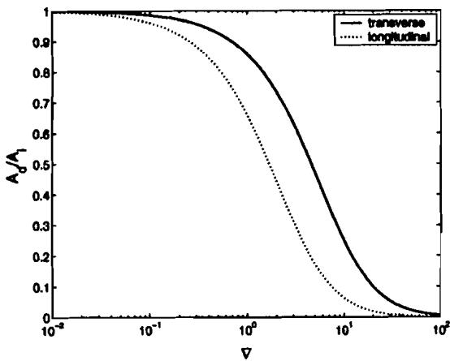  
Fig. 1-Venner and Lubrecht's amplitude reduction curves for circular contacts and pure rolling.

Therefore, Eq. [I 81 can be written in dimensionless form and scaled using dimensionless parameters for either circular or elliptical contacts. 'The following dimensionless groups will be used; X $= x / a , \mathrm { T } = \bar { u } / t / a , \mathrm { Z } = z R _ { . } / a ^ { 2 } , \mathrm { H } = \underbrace { h R / a ^ { 2 } } _ { \sim \sim \sim \sim } , \mathrm { P } = p / p _ { H } .$ For the wavelength the variable $\mathrm { V } \stackrel { \cdot \cdot } { = } ( \lambda / a ) M ^ { 0 . 5 } \mathrm { L } ^ { . 0 . 5 }$ for point contacts, introduced by Venner and Lubrecht $( 7 )$ , will be used. Thus, Eq. [I81 in pure rolling can be rewritten as,

$$
\begin{array} { c c } { { M ^ { - 0 . 5 } L ^ { 0 . 5 } E _ { c } ^ { - 1 } \frac { \Delta P } { Z _ { 1 } } = \frac { \pi } { C _ { 0 } + \nabla } \big ( \frac { H _ { 2 } } { Z _ { 1 } } c o s \big [ \frac { 2 \pi } { \lambda / a } \big ( X - T \big ) + \theta \big ] } } \\ { { - c o s \{ \frac { 2 \pi } { \lambda / a } ( X - Y ) J \} } } & { { [ 2 1 \ : \mathrm { ~ a ~ } } } \end{array}
$$

where

$$
C _ { 0 } = \frac { \pi E ^ { \prime } } { 2 a } M ^ { 0 . 5 } L ^ { - 0 . 5 } ( \gamma _ { 1 } - \beta _ { 1 } ) \bar { h }\tag{[22]}
$$

and $C _ { 0 } { = } 0$ when an incompressible lubricant is assumed. M and L are the Moes parameters for either circular or elliptical contacts, as defined in the nomenclature. Perhaps the reader prefers to use instead of M the more meaningful parameter $\alpha p _ { \ / H } = \hat { ( } L / \pi ) ( \frac { 3 M } { 2 } ) ^ { 1 / 3 }$

## The Amplitude Reduction Curve

In order to complete the scheme for the calculation of pressures due to transverse sinusoidal waviness, Eq. [21] requires as input the amplitude of the convected film thickness $( H _ { 2 } )$ . Here the amplitude reduction curve from Venner and Lubrecht (7) is used.

The amplitude of the lubricant film in the conjunction $( A _ { d } )$ is given as a function of the initial waviness amplitude $( A _ { i } )$ and operating conditions. Venner and Lubrecht give the following approximation for the amplitude ratio,

$$
\frac { A _ { d } } { A _ { i } } = \frac { 1 } { 1 + 0 . 1 5 \bar { f } ( r ) \nabla + 0 . 0 1 5 ( \bar { f } ( r ) \nabla ) ^ { 2 } }\tag{[23]}
$$

where

$$
\begin{array} { r } { \bar { f } ( r ) = \left\{ \begin{array} { l l } { e ^ { 1 - \frac { 1 } { r } } ~ i f ~ r > 1 } \\ { 1 ~ o t h e r w i s e } \end{array} \right. } \end{array}
$$

with $r = \lambda , \lambda _ { y }$ and

$$
\nabla = ( \lambda / a ) M ^ { 0 . 5 } \ L ^ { - 0 . 5 }\tag{[24]}
$$

with h = min $( \lambda _ { x } , \lambda _ { y } )$

Figure I depicts the amplitude reduction curve for both transverse and longitudinal waviness as given in Eq. [23]. The figure shows that for low frequencies (long wavelengths, $\mathrm { ~ V ~ }  \infty )$ the roughness tends to be completely flattened (or simply over-rolled by the contact if its wavelength is about the contact size), where for high frequencies $( \mathrm { V } \to 0 )$ the roughness passes through the contact unaltered. Still one must consider the definition of the parameter V, being not just a wavelength, but also reflecting the operating conditions of the contact.

The physical meaning of the V-parameter is the ratio between the wavelength of the waviness and the entrainment or inlet length. The entrainment length is defined by Hooke as "the distance from the dry contact end to the point where the maximum pressure gradient occurs."

## The Amplitude of the Complementary Function

In pure rolling conditions the two waves travel with the same velocity and it is impossible to distinguish them. Besides, if the particular integral is small, it will seem as if the initial waviness of the gap is fully replaced by the convected wave. Therefore, the amplitude of the complementary function could be deduced directly from observations of the final shape in the center of the contact.

Greenwood (8) and Morales-Espejel, et al. (9) have used the amplitude reduction curve as the attenuation factor in the amplitude of the complementary function, $H _ { 2 } \cdot Z _ { 1 } \ ( A _ { d } / A _ { i } )$ and obtained reasonably good agreement with numerical solutions for dents and waviness. However, their analysis completely disregarded the particular integral. Hooke (10) shows the same scheme.

By a simple analysis of the amplitude of the particular integral as given by Eq. [14],

$$
{ \frac { H _ { 1 } } { Z _ { 1 } } } = { \frac { C } { C + A } }\tag{[25]}
$$

one can clearly see that for very short wavelengths $A  0$ and therefore for compressible $\mathrm { C } > 0$ fluids $\mathrm { H } ,  \mathrm { Z }$ , the particular integral component remains undeformed and will certainly appear in the high pressure zone of the contact. The behaviour of Eq. [25 1 for short wavelengths seem to suggest that perhaps in reality the amplitude of the particular integral is reduced by second order effects for very short wavelengths. In any case, by taking the same assumptions as Greenwood (8) and Morales-Espejel, et al. $( 9 ) ,$ , no difference in results for the pressures are observed for $\nabla \ge 0 . 3$ which covers most practical situations. For smaller values of V, the sum of the two components is greater than Z, (with a limit of $2 Z _ { 1 } )$ and the pressure amplitude will be infinity, as also predicted by the Hooke's incompressible scheme Eq. [20].

Venner and Hooke predict that in pure rolling the fin, ,I I attenuation factor for the amplitude of the waviness (in the high pressure zone) has a limit of $A _ { d } / A _ { i } = 1$ for $\mathrm { V } = 0 .$ Not even the most sophisticated numerical calculations would be able to prove this. The most recent calculations from Venner and Lubrecht (7) cannot get beyond say, $\mathrm { V } = 0 . 2 5$

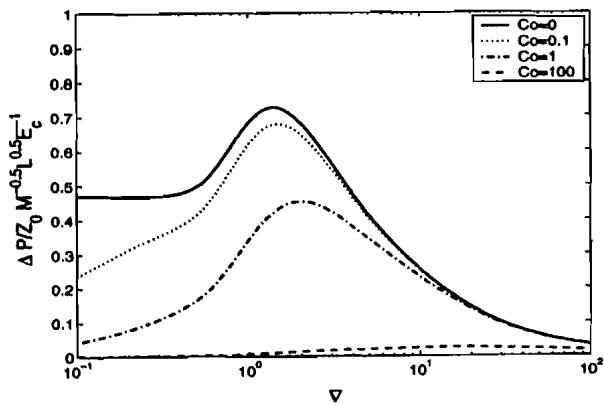  
Flg. 2-Amplitude of the pressure ripples, according to Eqs. [21] and (231 for transverse waviness and different compressibility factors.

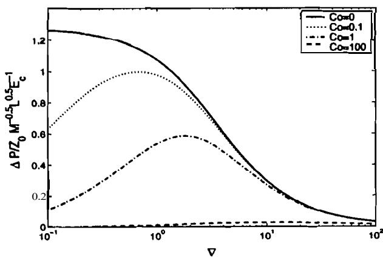  
Fig. 3--Pressure perturbations as a function of V for longitudinal waviness In circuler contacts, as predicted by Eq. [26], varying the compresstbility.

If one accepts this limit, then the corresponding behaviour for tlie comple\~iientary function for the film thickness will not be the onc tlescribcd by the amplitude reduction curve from Venner, but tlic difference between this a\~nplitude reduction curve and the particular integral, which of course, will be important for small valucs of V.

The amplitude reduction curve represents the behaviour of the a\~iiplitude for tlie final shape in the high pressure zone, so this curve must already have the two components. Of course, when sliding is present the11 it is not clear how one can nieasulr this amplitude, since there will be at least two waves with different wavclcngths, unless FFT techniques are used.

I=igure 2 plots $\operatorname { E q . }$ ( 2 1 J with $H _ { 2 } = Z _ { 1 } \ ( A _ { d } / A _ { i } )$ with the attenualion I';\~cto $A _ { \mathcal { N } } A _ { i }$ , as given by Eq. [23) for different values of the compressibility factor $C _ { 0 } .$

## Pressures Due to Longitudinal Waviness Components

To the knowledge of the authors an analytical solution is not nv;\~ilablc for pressures due to longitudinal sinusoidal waviness. Nevertheless, for longitudinal waviness there is no inlet excitation and tlic rclotivc velocities of the two surfaces does not change the rcsults (the slide/roll ratio does not matter) then any steady-state solution for longitudinal roughness can be used. The authors tried a slicing technique with steady-state line contacts along x, with central film thickness varying according to the waviness. However, the approach proved to be numerical and time consuming, thus it was abandoned. Instead, a simpler solution was used.

By observing the amplitude reduction curves from Venner and Lubrecht $( 7 )$ , shown in Fig. 1, it is easy to see that the transverse and longitudinal amplitude reduction curves follow a very similar trend. Besides, $\operatorname { E q . }$ [23] shows that the control variable for the deformation of the roughness is $\bar { f } ( \mathrm { \mathbf { r } } ) \mathrm { \nabla \ V } ,$ which becomes $\nabla _ { x }$ (evaluated using ${ \bf { \omega } } _ { \bf { { u } } } )$ for transverse waviness and $\nabla _ { y }$ (evaluated using ${ \mathfrak { O } } _ { y } )$ for longitudinal waviness. Full steady-state numerical solutions for longitudinal waviness were carried out, their pressure amplitudes have been plotted vs. $\nabla _ { \mathbf y }$ and it will be shown in the following section that they follow a single line. Indeed, if the amplitude reduction curves for transverse and longitudinal roughness follow similar patterns, one could also expect that the pressure ripple amplitude curves look similar. Therefore, any good curve-fit equation for longitudinal roughness must be similar to Eq. [21] for transverse roughness.

Knowing that the pressure perturbations particularly depend on the relative compressibility of the lubricant and the flexibility of the surface material, the following equation was found to correctly predict the amplitudes for pressure ripples due to longitudinal waviness,

$$
M ^ { - 0 . 5 } L ^ { 0 . 5 } E _ { c } ^ { - 1 } \frac { \Delta P _ { y } } { Z _ { 1 } } = \frac { \pi } { C _ { 0 } + \nabla _ { y } } ( \frac { \Delta H _ { y } } { Z _ { 1 } } - 1 )\tag{[26]}
$$

The subscript y emphasizes the situation of longitudinal waviness. The pressure ripples can be expressed in terms of amplitudes, since in longitudinal waviness there is no influence of slip Lubrecht, et al. (18) and the pressures are in phase with the roughness.

Figure 3 shows amplitudes of the pressure perturbations as a function of V and $C _ { 0 } .$

## Fourier Decomposition of a 3-D Surface

A three-dimensional irregular rough surface can be represented by a continuous function z(s,y), where z is the vertical coordinate representing the surface height and .r and y are orthogonal horizontal coordinates. This function z(s, y) in signal processing stands for a two-dimensional signal depending on the independent variables x and y and can be regarded as a combination of series of sinusoidal waves, or Fourier series.

The discrete two-dimensional Fourier transform is given by a series of bi-sinusoidal waviness. This means that a surface roughness can be constructed by superimposing a series of elemental sinusoidal waves, defined by

$$
\begin{array} { r } { z ( x , y ) = z _ { o } c o s ( \omega _ { x } x - \omega _ { y } y ) = } \\ { z _ { 1 } c o s [ \omega ( x c o s \phi - y s i n \phi ) ] } \end{array}\tag{[27]}
$$

The last function can be seen as an elemental component of 3- D roughness, its $\mathbf { Z } , ,$ the principal frequency $\omega = \sqrt { \omega _ { x } ^ { 2 } + \omega _ { y } ^ { 2 } }$ and orientation angle $\phi = \tan ^ { - 1 } { ( \omega \sqrt { \mu _ { \mathrm { x } } } ) } .$ The projection in x (transverse) and y (longitudinal) can be obtained by fixing $\phi = 0$ and $\phi = \pi / 2$ , respectively.

'This decomposition in sinusoidal waves allows the use of any existing solution available for transverse and longitudinal sinusoidal waviness in EHL. Assuming linear behaviour one can calculate the pressure amplitude for every wavelength and orientation.

$$
\frac { \Delta P } { Z _ { 1 } } = ( \frac { \Delta P } { Z _ { 1 } } ) _ { x } c o s \phi + ( \frac { \Delta P } { Z _ { 1 } } ) _ { y } s i n \phi\tag{[28]}
$$

## The Complete Scheme

The 3-D pressures using a real measured surface can now be obtained by the following steps:

I. Apply F R to the undeformed roughness to obtain its sinusoidal components for every frequency.

2. For every frequency o, apply Eq. [211 to calculate the corresponding pressure wave.

3. For every frequency my apply Eq. [26] to calculate the amplitude of the corresponding pressure wave.

4. Apply Eq. [28:)

5. Use IFIT to obtain the complete 3-D pressures.

## SUBSURFACE STRESSES

Rolling contact fatigue, manifested as a flaking off of metallic particles of the surface, is known to depend on the interior stress field. Surfaces such as those of rolling contact bearings and gear teeth are subjected to loads which cause high subsurface stresses.

During rolling, the cyclic nature of these stresses often initiates cracks below the surface, which are propagated to the surface, eventually forming a pit or spall in the load carrying surface.

The load at which plastic yield begins is usually governed by von Mises' shear-stress criterion:

$$
\begin{array} { c } { { \displaystyle \frac { 1 } { 6 } [ ( \sigma _ { 1 } - \sigma _ { 2 } ) ^ { 2 } + ( \sigma _ { 2 } - \sigma _ { 3 } ) ^ { 2 } + ( \sigma _ { 3 } - \sigma _ { 1 } ) ^ { 2 } ] = } } \\ { { { } } } \\ { { k ^ { 2 } = Y ^ { 2 } / 3 } } \end{array}\tag{[29]}
$$

in which $\mathbf { a } , \mathbf { \sigma } _ { 2 }$ and $\mathbf { a } _ { \mathbf { \lambda } }$ are the principal stresses in the state of complex stress and k and Y denote the values of the yield stress of the material in simple shear and simple tension (or compression) respectively.

In terms of Cartesian stresses the von Mises stresses in simple shear can be defined as

$$
\begin{array} { c } { { \tau _ { \nu M } = \{ ( 1 / 6 ) [ ( \sigma _ { x } - \sigma _ { y } ) ^ { 2 } + ( \sigma _ { y } - \sigma _ { z } ) ^ { 2 } + ( \sigma _ { z } - \sigma _ { x } ) ^ { 2 } } } \\ { { { } } } \\ { { + 6 ( \tau _ { x z } ^ { 2 } + \tau _ { y z } ^ { 2 } + \tau _ { x y } ^ { 2 } ) ] \} ^ { 1 / 2 } } } \\ { { { } } } \end{array}
$$

The definition in simple tension (or compression) reads $\sigma _ { \nu M } =$ $= \sqrt { 3 \tau _ { \nu M } }$

Roughness in an elastic contact will show two high value zones in the interior stress field. A maximum shear stress, analogous to the well studied Hertzian shear stress, is located well below the contact surface. The other zone is located very close to the surface and the points of high stress are directly related to the surface roughness. Ai and Sawamiphakdi (19) have applied Fourier techniques before to the calculation of interior field stresses; they separated the pressures in the smooth surface (analytical solution available) and fluctuation component (solved by convolution). Here, convolution is not used. Instead, for the calculation the stresses due to the pressure fluctuation components, the harmonic waviness approach is used once again.

The assumption of an elastic half-space with a large thickness compared to the width of the loaded region, allows the 2-D stresses to be calculated using a plane strain approximation, comprising $\xi _ { y } = \frac { \partial \nu _ { y } } { \partial _ { y } } = 0$ . SO for a line contact the formulae for the subsurface stress due to a given pressure distribution $p = p _ { 0 }$ cos(m), where a is the waviness-frequency, can be found from the stress function given in Johnson (20):

$$
\phi _ { x , z } = \frac { p _ { 0 } } { \alpha ^ { 2 } } ( 1 + \alpha z ) e ^ { - \alpha z } c o s ( \alpha z )\tag{[31]}
$$

Now the following expressions for the 2-D stress components can be obtained:

$$
\begin{array} { l } { { ( \sigma _ { x } ) _ { p } = - p _ { 0 } ( 1 - \alpha z ) e ^ { - \alpha z } c o s ( \alpha x ) } } \\ { { \ } } \\ { { ( a , ) , = - p _ { 0 } ( 1 + \alpha z ) e ^ { - \alpha z } c o s ( \alpha x ) } } \\ { { \ } } \\ { { ( \tau _ { x z } ) _ { p } = - p _ { 0 } ( \alpha z ) e ^ { - \alpha z } s i n ( \alpha x ) } } \end{array}\tag{[32]}
$$

Morales-Espejel (4) and Hooke and Lee (21) successfully applied these equations to a fluctuating pressure distribution using Fourier decomposition.

Knowing that for a given surface traction $q = q _ { 0 }$ cos(ar), where $q _ { 0 }$ might be $\mu p _ { 0 } ,$ the shear stress at $z = 0$ equals $\tau _ { x } { _ { \mathfrak { z } } } = { - } q _ { 0 }$ cos(as). The stress function for traction is then given by

$$
\phi _ { x , z } = \frac { q _ { 0 } } { \alpha } z e ^ { - \alpha z } s i n ( \alpha z )\tag{[33]}
$$

Using this stress function leads to the stress components due to traction:

$$
\begin{array} { l } { { ( a , ) , = - q _ { 0 } ( 2 - \alpha z ) e ^ { - \alpha z } s i n ( \alpha x ) } } \\ { { \ } } \\ { { ( a , ) , = - q _ { 0 } ( \alpha z ) e ^ { - \alpha z } s i n ( \alpha x ) } } \\ { { \ } } \\ { { ( \tau _ { x z } ) _ { q } = - q _ { 0 } ( 1 - \alpha z ) e ^ { - \alpha z } c o s ( \alpha x ) } } \end{array}\tag{[34]}
$$

The Cartesian stresses, $\sigma _ { _ { x } } , \sigma _ { _ { z } }$ and $\tau _ { x z }$ z can now be obtained by adding the components for normal pressure and traction.

If a tangential stress is applied at the contact surface in addition to the normal stress, the maximum von Mises stress will increase and move closer to the surface as the ratio of surface shear to normal stress increases. However, in pure rolling contacts $\mu$ is in general very small, thus surface tractions will be disregarded in the present analysis.

For a 3-D state of the interior stresses with a bi-sinusoidal pressure distribution on the surface, the equations can be obtained from Tripp, et al. (22).

(a) NurnctM eolutioo. p 0.16
**TABLE 1—MAXIMA VON MISES STRESSES AND LOCATION FOR THE HERTZIAN LINE CONTACT PRESSURES**

| METHOD | μ | $\underline { { \sigma _ { \mathfrak { v } M } } } / p _ { H }$ | z/b |
| --- | --- | --- | --- |
| Analytical | 0 | 0.557 | 0.73 |
| 2-D present scheme | 0 | 0.557 | 0.7 |
| 3-D present scheme | 0 | 0.560 | 0.7 |
| Analytical | 0.5 | 0.575 | 0.62 |
| 2-D present scheme | 0.15 | 0.57 | 0.62 |
| Analytical | 0.30 | 0.666 | 0 |
| 2-D present scheme | 0.30 | 0.670 | 0 |

**TABLE 2—DIMENSIONLESS PRESSURE AMPLITUDES FOR ORIENTED AND BI-SINUSOIDAL WAVINESS**

| WAVINESS | $\phi = \pi / 3$ $\phi = \pi / 6$ | BI-SINUSOIDAL |
| --- | --- | --- |
| Ap/pq present | 0.15 | 0.11 0.64 |

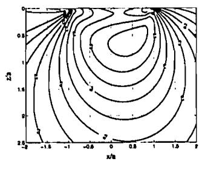

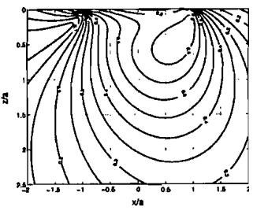  
(b) Nwnrrid dution, p = D.33  
Flg. 4--vOn Mlses stresses, $\sigma _ { v M } / \rho _ { H }$ for a Hertzian pressure distribution wlth friction, uslng the 2-D present scheme.

Thc schclne has been validated using both periodic and nonpcriodic pressure distribution\~. For non-periodic pressures, an crror caused by undesired periodic extension of the contact domain is implicitly introduced. This error is referred to as periodic cxtcnsion error or periodicity error.

A very Inrgc window of 4 to 8 times the contact size is needed to rcducc thc m;\~gnitucle of the periodic extension error, severely rctlucing the computntionnl efficiency of the method. However, the prcscnt application will be used for the pressure fluctuation components only, thcse components have boundaries far away from thc ccntral zone of interest and can be assumed to be periodically repeated beyond these boundaries. If the macroscopic I-lcrtzian stresses necd to be added, analytical solutions can be usetl.

For validation purposes, Hertzian pressure distributions can be usctl togcthcr with a large window of zero-padding pressures. Figure 4 shows the results. To approximate the Hertzian pressures in n linc contact problem using the 3-D scheme, a large window is irsctl in tlic y direction. The numerical results obtained with the present scheme also are shown In Fig. 4. For $\mu = 0 . 1 5$ the subsurktcc stresses are shown in Fig. 4(n) and for $\mu = 0 . 3$ in Fig. 4(b), using a grid previously tested for convergence and a window of 8a x 8n. 'l'hc annly1ic;ll solution (plain strains) found in Johnson (20)

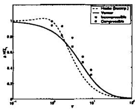  
(a) Ampilltude roduction

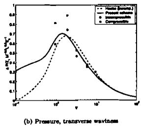

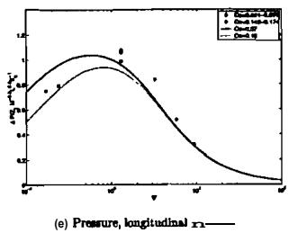  
Fig. %Pressure and gap amplitudes from numerical solutions compared with the predictions of present theory for transverse and longitudinal waviness.

has been used as a comparison. The tabulated results for the maximum von Mises stress, ${ \pmb { \tau } } _ { \nu M } / { \cal p } _ { H } ,$ and the matching depth, zlu, below the surface are given in Table I for the above examples and for two more examples with Hertzian pressures.

## RESULTS

## Surfaces With Sinusoidal Waviness

Full numerical solutions using multigrid techniques (described in e.g. Venner (3)) have been used to validate the model. Single sinusoidal surfaces with transverse, longitudinal, combined orientation, hi-sinusoidal and irregular pattern were used. The full set of data used are given Tables Al and A2 in Appendix A.

The amplitude reduction curves for film thickness from Hooke (incompressible) and the approximation by Venner (compressible), Eq. [23], are compared with results from numerical simulations. The results can be seen in Fig. 5(a). One can see that Eq. [23] predicts the trend of the numerical results rather well. However, when incompressible results are added, the numerically predicted film ripple ratios for incompressible fluids are larger than the compressible ones for all values of V. If Hooke's incompressible curve is also added in the picture, one can see that the two curves cross more or less at $\mathrm { V } = 2 . 5$ , unlike the numerical results. In fact, the reason that incompressible fluids give higher amplitude ratios than compressible ones can be understood, since for the latter the deformation is the combined effect of the roughness deformation and the film reduction for compressibility. In incompressible fluids, it can be expected that the total deformed gap is smaller, since only the roughness is deformed. The crossing of the two curves is not yet understood.

The amplitude of pressure ripples for the transverse cases are given in Fig. 5(b) and for the longitudinal cases in Fig. 5(c). From these figures one can see that again the trend of the numerical results are correctly given by the present model, with a larger error in the central region of the curve for transverse roughness. In gener:rl c\~\~llipressihle luhric:t\~tls w i l l produce lnrger pressure ripples (si\~ice lhe gap is more deformed).

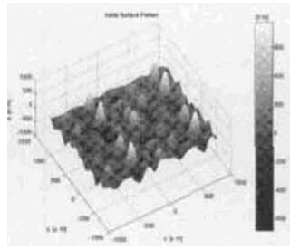

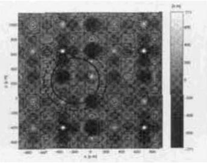  
,., ,,.,l,,U, .,. I I.,,. .-,,.. ,".," L., ,,, ll".."ll.,.\*\~  
Flg. MnRlal mughness wllh l \~ u l s r psnnn. (el lnlllal roughness as ganmlod by Eq. 1351. (b) Solld clrele: Herlzlan wnlacl zone consIdared In the axampla. Donod clrcls: htgh prosouro zone (arbllrarlly set as 70% ot tho conlscl zone radlus).

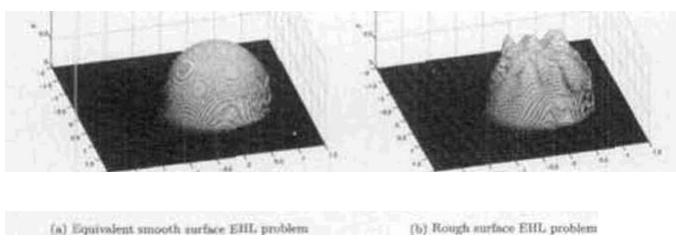  
Flg. 7--Full nvmerlul solulions 01 me EHL pmblm In dlmetutonless variables (129 x 128 polnls). (a) Equlvalenl smooth sumce EHL solullon. (b) Solullons tor the present mample wllh the mugh. moss as descrltmd by Eq. 1351.

## Surfaces Wlth Several Harmonics

Thc rcsulls from the s\~rlutions lirr thc cases 10. 211 :md 21 of Appealix A itre given in Tahle 2 together wilh ;I con\~pariron of result from numerical \*olulions. The lirsl two cases are waviness with wrlre oricntalicm anale and the third m e is a hi-sinusoidal waviness. The results arc re;rscm\~hly g o 4 sp.ci;tlly for thc last two OilScS.

For det;\~iled verilic;\~lio\~i o fl h e ni\~nlel. ;I surrace with a irregular p;llleln mntle 111 5 h;rmionics wilh differenl phase angle i u \~ ampliludc ha\ h e n used, :IS descrikd hy the following ibrmula.

$$
\begin{array} { r l } { z ( r , p ) = 0 . 1 \sum _ { k = 1 } ^ { 5 } \sum _ { r = 1 } ^ { 5 } \epsilon } & { { } \frac { \epsilon ^ { 2 } + \epsilon ^ { 2 } } { 1 0 ^ { k } } c o s ( 6 k / r + \alpha _ { k } ) c o s ( 6 r / t ) + \beta _ { r } \ln ( 6 r / t ) } \end{array}\tag{1351}
$$

wirb .r. ?. in rnm mid .- in inicrons 1!1rnl. IYIC ph;rses ;re: $u = 1 1 : 3$ : ? : S : l l m d / J $\beta = | 0 . 5 : 1 : 4 . 3 : 1 : 2 1$

Thv <\~pcniting c\~xrdili\~vts arc the ccmesinnt\~ling one% to exam ple 24 fro111 Tt\~hlc A 2 (Appesdis A). The R, o f llie inilial surfrtee is 0.148 !tor. n r e gener;\~tc<l 3-11 \* \~ \~ t i : \~ c c pallem is shown in Fig.

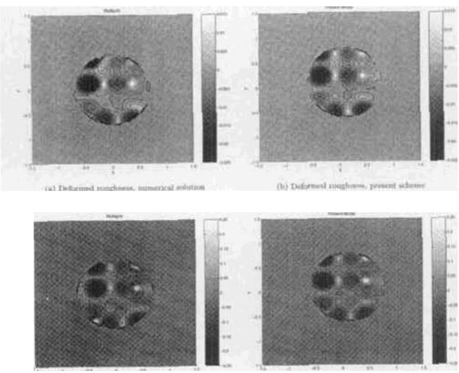  
Flg. 8--Comparison In Ihe hlgh pressure zone of solullons for dlmeb slonless deformed gap and pressure ripples bet- lho prosen1 appmach and the numerical (multlgrid) mothod. Opemllng condltlms lmm example 24.

hla). Since the surface moves towards lhe canract in tinre (pure mllinp along the x direction). llic choice of4 p \~ m i c \~ \~ l a r cpol h r the cantact zone is equivirle\~ll o :I w l w c d snap shot in 1i111e. Figure 61hl shows the sclcclcd spol for the 'lienzisn contacl rnnz'lsolicl circle). thc dotled circle sh<nv\ whit1 might k con\idcred ;IS the high pressure arne in ihe EHL contact for the equiv:\~lcnt srt\~cro surface pmhlcn\~. herc the ndius is arhitnsily chosen as 70 '2 of that of the Henzian circle.

Figure 7 depicts lhe full \~\~urncrical u, uliun rnr pres\un.s in this exmiplc. obt:\~inal using lhe tnaltigrid tcchrik\~t\~c. Figure 7la rlio\vs the eqt\~iv;\~lcnt rmuolh surfacr w>lulinn an11 Fig. 7th) lhe solutior\~ inchtding rtrughncsb correspo\~iding to the \elccwl m r p rho1 i n ri\~nc. This solulian i s r i \~ w corilp;rred u,irh thc solution from Ihe present analyticsl selimre.

In order lo i \~ l l c \~ w c\~xnpsrisons and since lhr presenl sclierre dmls only will1 llie presstire ripples. the numericallq-nhtained smrxtth surlace pressure distrihutiam (Fig. 7(all has Ixen \uhtr;lcled from lhe rough surface ppressure distrihu\~ion (Fig. 7Ih)l 11 ohtairi lhecorresporrling 3-D pressure ripples. reprewnt:trivc I'nsn the numerical solution. Figure X!;I) and X(h) rhow the \~.ompurison of the n\~rmericallg-t\~htaincd \~lef\~>nricd gap map and the present scheme. Figure X(CI :\~nd X(d) show lhc correspondins map of pressure ripples. For this cx\~mplc. the defom\~cd surFace resulted will1 H, = 0.086!1111. One cm ahsewe that 11ie :rgreernes! in f<>rn\~ awl udlucs is very g(x>d. given tlle ri\~llplific;\~tions in Ibe modcl. The maximunl errvr found is Ihrirlctl in the peak% and valleys cllrrc icr the edges of the high pressure xme and it is ah\~lut 2.5 '% (higher vidues) for the defnrmed p p and ?(I ';i (hrwrr values\~ Iirr ihc prebsure ripples. F.Isewhere the ;\~grecmcnt is much hettcr.

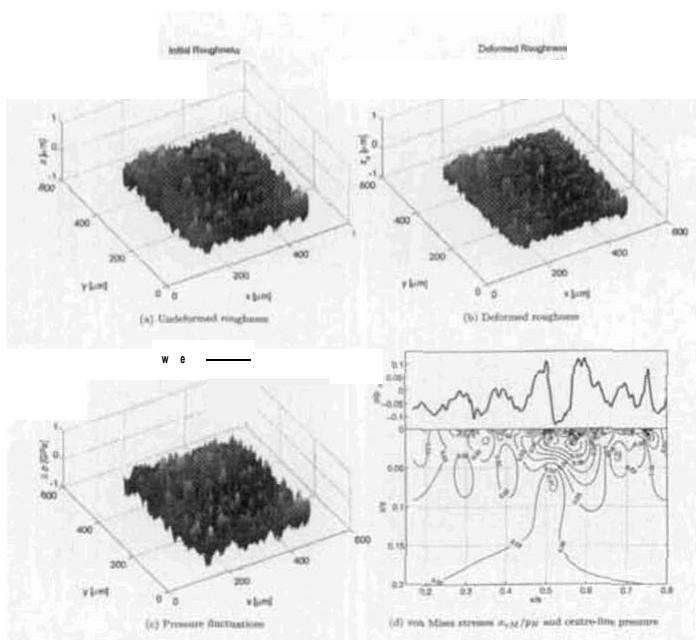  
Fig. 9--Solullon6 lor pressures. delormed gap and von Mlses slresse using the presanl approach. Operallng condillon?l and sudace from examole 22.

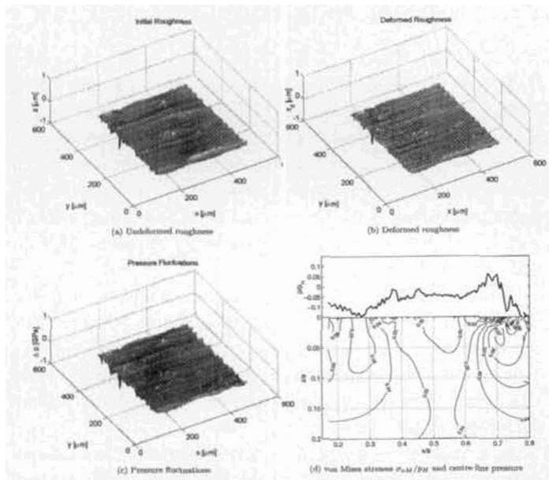  
Fig. ID-Solutlonr lor pressures. delormed gap and won Mlser stresses u\~lng the present approach. Oparatlnp condnlons and aurlace lrom example 23.

## Surfaces With Real Roughness

Raceway surfaces from two rolling bearings ofdifferent size have been used as examplesof real roughness.Theoperating conditions of the elliptical contact are given as examples 22 or 23 of Appendix A (same operating condítions). Samples of the two surfaces of0.430mmn x 0.430 mm have been measured using an optieal profilometer. The first surface (example 22) with $R _ { \ast } = 0 . 1 4 7$ uom is shownin Fig.9(a). Figure 9(b) shows the calculated deformedshape $\lbrace R \ = 0 . 1 . 3 8 \ \mu m \rbrace$ using the amplitude reduction eurve. Eq. [23], Fig. 9(e) shows the caleulated pressure fluctuations to beexpected in the center of thie contact. Finally Fig. 9(d) shows the von Mises subsurface stresses corresponding to the total 3D pressure fluctuations. Comparing the vertical coordinate of Fig. 9 with that of Fig. 4. it is clear that Fig. 9 shows only the subsurface zone close to the surface. where the von Mises stress is dominated hy the pressure ripples. In addition, on the top of the same figure the pressure along x in thecenter of the contact $\iota _ { \downarrow } \cdot =$ 0) is shown. The maximum dimnensionless von Mises stress corresponding to the pressure fluctuations for ihis example is $\tau _ { \mathrm { v J } } / \eta H =$ 0.0961. Figure 10 shows the corresponding plots for the second surface (example 23). with the same operating conditions as example 22.The initialsurface has $R _ { _ { J } } = 0 . 1 1 7 1 1 \mu m$ thecalculated deformed gap has K ≈ 0.064 jomn, which are lower values than the previous surface. The caleulated maximum von Misesstress for this surface is $\tau _ { \nu \times { \it i } } / p _ { \it i / } = 0 . 0 7 2 9 .$ It isclearthat surface2 (example 23) produces lower pressure amplitudes than surface 1 (example 22). In thiscase it is mainlydue to the lower $R _ { \cdot \jmath }$ value. despite the nearly equal maximum height. However, it canbe seen that the present scheme does not consider only one or a few roughness parameters but ihe whole geometry of the surface together with the rofling direction. In this way two real surfaces can be ranked.

## DISCUSSION

In the present work, interesting aspects of the phenomena have been revealed and are further discussed below.

One important observation is the behaviour of the transverse component of the gap and pressure amplitudes for very small values of V. The pressure ripples will have a limiting value for $V \to 0$ that depends on the quantity $h_2$.

For the case where the complementary function is assumed to replace completely the original shape of the surface (thus, the amplitude reduction curve represents the amplitude of the complementary function) then:

The incompressible analytical solution for transverse roughness [20] in pure rolling with $\rho = 0$ should have a limiting value for the pressure amplitudes equal to zero, since the roughness will be completely undeformed and $h_1 = z_1$. In other words, it represents the limiting value of the amplitude reduction curve ($A_d/A_i = 1$). For the case of compressible lubricants, Eq. [18] shows that in the limit ($A \to 0$), when also $h_1 \to z_1$, the compressibility constant $C > 0$ makes the pressure amplitudes reach their zero limiting value faster.

This situation is not completely understood. However, a possible argument, physically understandable, is that when the frequency increases it becomes more difficult to deform the gap. In the limit the frequency is so high that no deformation is possible; therefore no pressure ripples can be generated. In the limit one comes back to a smooth-surface situation.

Now, if the amplitude of the complementary function is taken to represent not one component but the final shape (i.e. the addition of the complementary function and the particular integral) then, in the limit, the particular integral is not deformed and the complementary function has to become zero in order to give the observed shape (amplitude reduction, with a limit equal to 1).

However, since $h _ { 2 } - z _ { 1 }$ will now tend to $Z ,$ the predicted pressure ripples will have a limiting value different from zero, equal to $z _ { 1 } / ( C + \mathsf { A } )$ , as claimed in Morales-Espejel (4) and Greenwood and Morales-Espejel (5). S o for incompressible fluids the limit will tend to infinity and for compressible ones it will tend to $z _ { 1 } / C$ This behaviour now seems to be unrealistic.

One possible reason for the unrealistic behaviour of the second approach was given by Chang and Zhao (23). They removed the assumption of constant viscosity in the high pressures zone (contrary to the present scheme) and for the particular integral they obtained the same results except for very small values of V where they predict again a limiting value coming down towards zero.

As in Greenwood and Morales-Espejel (5), in order to retain the simplicity of the present scheme the assumption of constant viscosity in the high pressure zone is kept. Therefore, it is safer to limit the use of the model to $\mathrm { V } \geq 0 . 3$ where the two variants still agree and numerical solutions exist to validate the amplitude reduction curve.

For longitudinal roughness, it was observed that the numerical solutions predict pressure amplitudes that also depend on V (calculated using the wavelength in t h e y direction). Although in the present work no a rigorous explanation is offered for this, it is straightforward to see that according to the amplitude reduction curve, the deformation of any non-isotropic, transverse and longitudinal waviness is controlled by the parameter f (r) V. With transverse roughness, this becomes $\nabla _ { \boldsymbol { x } }$ and with longitudinal waviness $\nabla _ { \mathbf { y } } .$ Therefore, the pressures should follow a similar dependency in either direction.

## CONCLUSION

By means of the present understanding of sinusoidal waviness in EHL contacts and Fourier decomposition techniques, a full scheme has been developed for the calculation of the pressure fluctuations in rolling EHL contacts with real roughness. The scheme gives results in good agreement with numerical solutions for longitudinal, transverse, combined waviness direction and irregular patterns. The calculation of the interior stress field is also included. The method has useful engineering applications since it can be used to rank surfaces for their bearing performance. For illustration purposes, two different real surfaces in EHL contacts with different $R _ { q }$ values working under the same operating conditions have been ranked.

## ACKNOWLEDGMENTS

The authors would like to thank Dr. H. Wittmeyer, Vice-President of SKF Group Technology Development, for his kind permission to publish this paper. The authors are also grateful to Dr. M. -L. Dumont for providing them with the numerical solution of example 24.

## REFERENCES

( I ) Lee. K. M. and Cheng, H. S. (1973). "Effects of Surface Asperity on Elastohydrodynamic Lubrication." NASA CR-2195. Washington, D.C.

(2) Chang. L., Cusano. C. and Conry, T. F. (1989). "Effects of Lubricant Rheology and Kinematic Conditions on Micro-Elastohydrodynamic Lubrication," ASME Jorrr. of Trih., 11 1, pp 344-35 1.

(3) Venner. C. H. (1991). "Multilevel Solution of the EHL Line and Point Contact Problems," PhD Thesis, University of Twente. Enschede, The Netherlands.

(4) Morales-Espejel, G. E. (1993), "Elastohydrodynamic Lubrication of Smooth and Rough Surfaces," PhD-Thesis. Engineering Department, University of Cambridge, U.K.

(5) Greenwood, J. A. and Morales-Espejel. G. E. (1994). "The Bchaviour of Transverse Roughness in EHL Contacts," in Proc. Insm. Me c l\~ . Et\~grs.. Port J. 208, pp 121-132.

(6) Venner, C. H., Couhier, F., Lubrecht, A. A. and Greenwood, J. A. (1997), "Amplitude Reduction of Waviness in Transient EHL Line Contacts," in Proc. of the 23rh Leeds-Lyon Synzp. on Trih. 1996 Elsevier Trihology Series. 32. Dowson, D. et al., Eds., pp 103-1 12.

(7) Venner. C. H. and Lubrecht. A. A. (1999). "Amplitude Reduction of Non-Isotropic Harmonic Patterns in Circular EHL Contacts, under Pure Rolling," in Proc. of the 251h Leeds-Lyon Synil). on Trih. 1998. El.re\~'ier Trihology Scries, 34, Dowson, D., et al., Eds., pp 15 1 - 162.

(8) Greenwood, J. A. (1999), "Transverse Roughness in Elastohydrodynamic Lubrication," in Proc. Insrn. Merh. Engrs., Parf J, 213, pp 383-396.

(9) Morales-Espejel, G. E., Venner, C. H. and Greenwood, J. A. (2001). "Kinematics of Transverse Real Roughness in Elastohydrodynamicully Lubricated Line Contacts Using Fourier Analysis." in Proc. Instt\~. Mech. Engrs.. Part J. 214. pp 523-534.

(10) Hooke, C. J. (1998), "Surface Roughness Modification in Elastohydrodynamic Line Contacts Operating in the Elastic Piesoviscous Regime," in Proc. Insrr Mech. El\~grs., 212. Pan J, pp 145-162

(11) Hooke, C. A. (1999). "The Behaviour of Low-Amplitude Roughness Under Line Contacts." in Proc. Insm. Mech. Engrs.. 213. Pan J, pp 275-286.

(12) Hooke. C. J. (2000). "The Behaviour of Low-Amplitude Surface Roughness Under Line Contacts: Non-Newtonian Fluids," in Proc. It\~srt\~. Mech. Ertgrs.. 214, Pan J, pp 253-265.

(1 3) Mnsen, M. A,, Venner, C. H., Lugt, P. M . and Tripp, J. H. (2002), "Effects o f Surface MicroGeometry on the Lift-Off Speed of an EHL Contact." Trih. Trans.. 45. I. pp 21 -30.

(14) Yuan-Zhong Hu, Barber, G. C., Zhu, D. and Ai, X. (2001), "A Study on an FFT-Based Approach for Fast Estimation of Pressure Distribution in Point EHL Contacts of Rough Surfaces," Trih. Trat\~s., 44, pp 59-69.

(15) Lubrecht, A. A. and loannides, E. (1991), "A Fast Solution of the Dry Contact Problem and the Associated Sub-surface Stress Field. Using Multileve Techniques," ASME Jorrr. of Trih., 113, pp 128-132.

(16) Hooke, C. J. and Venner. C. H. (2000). "Surface Roughness Attenuation in Line and Point Contacts," in Proc. Ituol. Mech. Engrs., 214, Pan I, pp 439-444.

(17) Venner. C. H.. Kaneta. M. and Lubrecht, A. A. (2000), "Surface Roughness in Elastohydrodynamically Lubricated Contacts." in Proc. of 26th Lrc(1.r-Lyot Syn\~p. on Triholosy. Lee\~1.r. 1999. Elsevier Trihology Series, 38, Dowson. D.. et al. Eds., pp 25-36.

(18) Lubrecht, A. A., ten Napel, W. E. and Bosma, R. (1988). "The Influence of Longitudinal and Transverse Roughness on the Elastohydrodynamic Lubrication of Circular Contacts," ASME Jorrr. of Trih., 110. pp 421-426.

(19) Ai. X. and Sawamiphakdi. K. (1999). "Solving Elastic Contact Between Rough Surfaces as an Unconstrained Strain Energy Minimization by Using CGM and FFTTechniques," ASME Jorrr of Trih., 121, pp 639-647.

(20) Johnson, K. L. (1985). Corlract Mechat\~ics. Cambridge University Press.

(21) Hooke. C. J. and Li, K. Y. (1999), "An Experimcntal Study of the Relationship Between Surface Roughness and Stress in EHL Contacts." in Proc. 26rh Leeds Lyon Syn\~p. on Trih.

(22) Tripp, J. , Kuilenburg. J. Morales-Espejel, G. E. and Lugt, P. M. (2002). "Subsurface Stress Fomiulas Useful in Rough Surface Stress Annlysis." Submitted to Trih. Trutu.. STLE.

(23) Chang, L. and Zhao. W. (1995). "Fundamental Differences Between Newtonian and Non-Newtonian Micro-EHL Results." ASME Jorrr. of Trih.. 117, pp 29-35,

## APPENDIX A

Data Set for All the Examples Used

**TABLE Al—DATA USED IN THE EXAMPLESEXAMPLE**

| PLE |  | GPa-T | Pa |  |  |  | m8-1 |  |  | zmax |  |
| --- | --- | --- | --- | --- | --- | --- | --- | --- | --- | --- | --- |
|  |  | transv. | 22.0 | 0.04 | 220 | 1.4 | 0.55 | 3.0 | 0.014 | 0.24 | 0.110 |
|  | transv. | 22.0 | 0.04 | 220 | 1.2 | 0.69 | 4.0 | 0.012 | 0.206 | 0.137 |  |
|  | transv. | 22.0 | 0.04 | 220 | 0.95 | 0.59 | 3.0 | 0.012 | 0.16 | 0.118 |  |
| 45678 |  | transv. | 22.0 | 0.04 | 220 | 2.0 | 0.54 | 3.0 | 0.014 | 0.40 | 0.108 |
|  | transv. | 14.8 | 0.04 | 220 | 2.0 | 0.42 | 2.5 | 0.018 | 0.51 | 0.084 |  |
|  | transv. | 11.5 | 0.03 | 220 | 2.0 | 0.31 | 2.5 | 0.020 | 0.57 | 0.062 |  |
|  | long. | 15.9 | 0.04 | 220 | 1.1 | 0.59 | 4.0 | 0.012 | 0.189 | 0.118 |  |
|  | long | 15.9 | 0.04 | 220 | 1.13 | 0.58 | 4.0 | 0.012 | 0.194 | 0.058 |  |
| 9 |  | long. | 22.0 | 0.04 | 220 | 1.13 | 0.56 | 2.9 | 0.012 | 0.194 | 0.112 |
| 10 |  | long. | 22.0 | 0.04 | 220 | 2.0 | 0.62 | 4.0 | 0.012 | 0.343 | 0.124 |
| II1213 |  | long. | 22.0 | 0.04 | 220 | 2.0 | 0.54 | 3.0 | 0.014 | 0.40 | 0.108 |
|  | long. | 14.8 | 0.04 | 220 | 2.0 | 0.42 | 2.5 | 0.018 | 0.51 | 0.084 |  |
|  | long. | 22.0 | 0.04 | 227 | 1.7 | 0.68 | 4.8 | 0.010 | 0.24 | 0.136 |  |
| 14 |  | long | 22.0 | 0.04 | 227 | 1.2 | 0.53 | 3.0 | 0.010 | 0.17 | 0.106 |
| 15 |  | long. | 22.0 | 0.03 | 227 | 1.1 | 0.59 | 5.0 | 0.008 | 0.12 | 0.118 |
| 16 |  | long. | 11.5 | 0.03 | 220 | 2.0 | 0.31 | 2.5 | 0.020 | 0.57 | 0.062 |
| 1718 |  | long. | 15.9 | 0.04 | 220 | 0.65 | 0.65 | 4.0 | 0.012 | 0.11 | 0.130 |
| long. | 22.0 | 0.04 | 220 | 0.95 | 0.59 | 3.0 | 0.012 | 0.16 | 0.118 |  |  |
| 19 |  | φ=60° | 15.9 | 0.04 | 220 | 1.1 | 0.59 | 4.0 | 0.012 | 0.189 | 0.1 18 |
| 20 |  | φ= 30° | 18.2 | 0.04 | 220 | 1.4 | 0.50 | 3.0 | 0.012 | 0.240 | 0.099 |
| 21 |  | φ=0-90 | 15.9 | 0.04 | 220 | 2.0 | 0.52 | 4.0 | 0.012 | 0.343 | 0.104 |
| 22 |  | real | 20.0 | 0.048 | 226 | 2.22 | 0.548 | 2.5 | 0.019 | 0.586 | 0.977 |
| 23 |  | real | 20.0 | 0.048 | 226 | 2.22 | 0.548 | 2.5 | 0.019 | 0.586 | 0.932 |
| 24 |  | irregular | 20.0 | 0.096 | 226 | 1.78 | 0.906 | 2.5 | 0.019 | 0.463 | 0.771 |

TABLE A2-DIMENSIONLESS PARAMETERS USED IN THE EXAMPLES
| EXAMPLE |  |  |  |  |  |  |
| --- | --- | --- | --- | --- | --- | --- |
|  |  |  |  |  |  |  |
| 1 | 0.2 | 0.5 | 14.9 | 180.93 | 1.74 | 0.114 |
| 2 | 0.3 | 0.4 | 16.1 | 91.8 | 0.956 | 0.143 |
| 34 | 0.2 | 0.2 | 14.9 | 56.5 | 1.74 | 0.174 |
| 0.2 | 0.5 | 14.4 | 592.2 | 3.21 | 0.072 |  |
| 5 | 0.2 | 0.6 | 8.68 | 819.8 | 5.83 | 0.066 |
| 6 | 0.2 | 0.7 | 6.11 | 1101 | 9.39 | 0.061 |
| 7 | 0.2 | 0.5 | 11.6 | 70.7 | 1.234 | 0.156 |
| 8 | 0.1 | 0.5 | 11.6 | 76.7 | 1.285 | 0.151 |
| 9 | 0.2 | 0.5 | 14.8 | 97.6 | 1.286 | 0.144 |
| 10 | 0.2 | 0.25 | 16.1 | 425.1 | 1.286 | 0.078 |
| 11 | 0.2 | 0.5 | 14.4 | 592.2 | 3.21 | 0.072 |
| 12 | 0.2 | 0.6 | 8.68 | 819.8 | 5.83 | 0.066 |
| 13 | 0.2 | 0.2 | 18.0 | 185.1 | 0.64 | 0.103 |
| 14 | 0.2 | 0.1 | 16.0 | 92.6 | 0.24 | 0.143 |
| 15 | 0.2 | 0.1 | 17.9 | 51.0 | 0.17 | 0.170 |
| 16 | 0.2 | 0.7 | 6.11 | 1101 | 9.39 | 0.061 |
| 17 | 0.2 | 0.5 | 11.6 | 14.6 | 0.56 | 0.256 |
| 18 | 0.2 | 0.2 | 14.9 | 56.5 | 0.39 | 0.174 |
| 19 | 0.2 | 0.5 | 11.6 | 70.7 | $\begin{array} { r } { \overline { { \nabla } } _ { x } = 0 . 6 1 \overline { { 7 } } } \\ { \overline { { \nabla _ { y } = 1 . 0 6 9 } } } \end{array}$ | 0.156 |
| 2021 | 0.2 | 0.5 | 12.4 | 180.9 | $\overline { { \frac { \nabla _ { x } = 1 . 6 5 7 } { \nabla _ { y } = 0 . 9 5 7 } } }$ | 0.114 |
| 0.2 | 1-0.5 | 11.6 | 425.1 | $\overline { { \frac { \nabla _ { x } = 6 . 0 5 2 } { \nabla _ { y } = 3 . 0 2 6 } } }$ | 0.077 |  |
| 222324 | 1.782 | 1 | 959.55 | 12.37 |  | 0.0596 |
| 1.700 | - | 959.55 | 12.37 | - | 0.0596 |  |
| 0.851 | - | 290.95 | 14.77 |  | 0.0893 |  |

