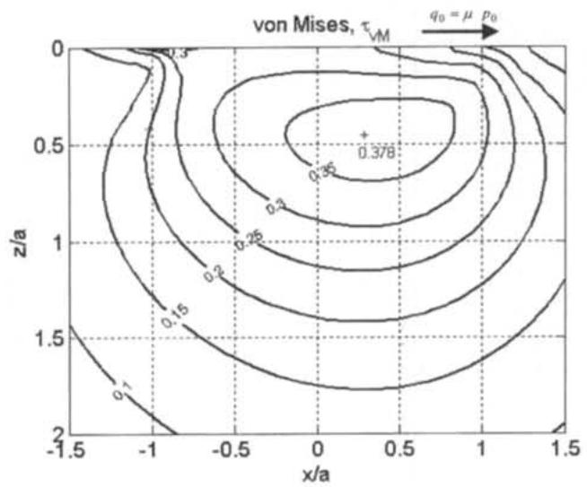
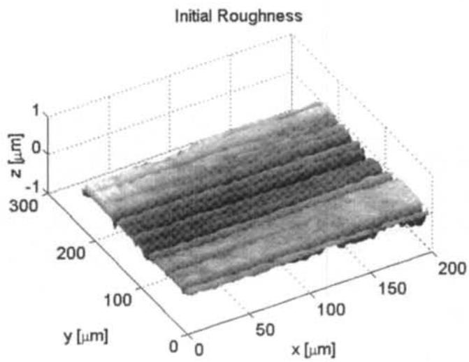
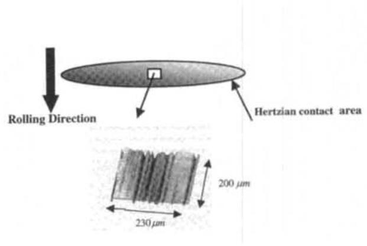
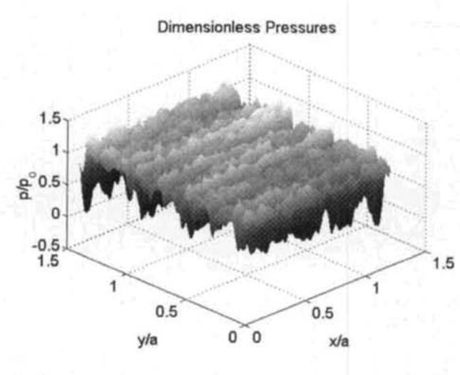
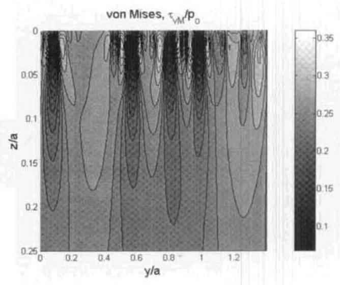
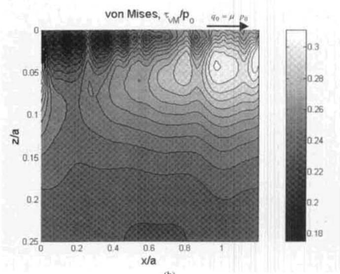

# Frequency Response Functions and Rough Surface Stress Analysis

J. H. Tripp, J. Van Kuilenburg, G. E. Morales-Espejel & P. M. Lugt

submit your article tothis journal

LIArticle views: 126

# Frequency Response Functions and Rough Surface

J. H. TRIPP

Twente University of Technology

7500 AE Enschede, Netherlands

and

J. VAN KUILENBURG

Eindhoven University of Technology

5600 MB Eindhoven, Netherlands

and

G. E. MORALES-ESPEJEL (Member, STLE) and P. M. LUGT

SKF Engineering & Research Centre B.V.

3430 DT Nieuwegein, Netherlands

The simusoidal loading of an elastic 2 and 3-dimensional halfspace is analysed. Such loading arises from the study of rough lubricated contacts. The well-known plane strain solution for internal stresses in the 2-dimensional case is extended to the normal loading 3 dimensional case. However, for full 3-dimensional normal and tangential bi-sinusoidal loading cases a new stress function is proposed. By solving the elasticity equations with this new function the complete internal stress field can be calculated analytically. The method can be extended to any periodic loading case with the use of Fourier decomposition and FFT techniques. In practice the method can also be used for non-periodic loading cases with a sufficiently large window size. The results show good agreement with a known solution.

## KEY WORDS

Internal Stresses; Roughness; Fourier Methods; FFT; Sinusoidal Pressure

## INTRODUCTION

A problem frequently occurring in connection with bearings, gears and other machine elements is how to calculate the subsurface stress fields within the material bodies once the distribution of surface stresses has been obtained as the solution of the contact problem. Knowledge of these stress fields is required in predicting, for example, the development of subsurface cracks, and the evolution of residual stress or fatigue life behaviour. In the last few decades, much attention has been given to the contact stresses between real engineering surfaces which, while having some simple nominal shape, such as flat, cylindrical or spherical, also carry surface texture or roughness, e.g. Refs. (1)-(4).

Surface morphology comes in many different forms, reflecting the many surface finishing processes currently available. It is possible, however, to distinguish two broad classes of surface topography: quasi-one-dimensional surface lay (e.g. turning) and isotropic (e.g. shot-peening). With modern capabilities of measuring surface topography at ever finer scales, it has become apparent that even this broad classification may depend on the size of the surface features of relevance to the problem (5). For present purposes, however, it will be assumed that the details of the topography have been measured at the required scale and that the surface is now represented as an array of numbers giving the height of the real rough surface above the nominal reference surface. Typically, at the scale of interest, this nominal surface may be taken as the plane, $z \ = \ O ,$ so that in Cartesian coordinates the real surface is described by $z _ { i j } = z ( x _ { i } , y _ { j } )$ , where $( x _ { i } , y _ { j }$ ) generally defines a rectangular grid. For topographies in the first class, $z _ { i }$ $\mathbf { \lambda } = \mathbf { \lambda } _ { Z } ( \ v { x } _ { i } )$ may provide a sufficient description.

The elastic contact problem which real surfaces pose is to find the surface stresses producing changes in the nominal shape of the surface and the shape of the roughness features, consistent with both the applied loading of the two bodies and the rheological behaviour of any lubricant present in the interface. The solution yields the separation of the deformed nominal surfaces, $\begin{array} { r } { h ( x _ { i } , y _ { j } , } \end{array}$ and the surface stresses, $\sigma _ { z } ( x _ { i } , y _ { j } ) , \tau _ { x z } ( x _ { i } , y _ { j } )$ and $\pmb { \tau } _ { y z } ( x _ { i } , y _ { j } )$ , from which it is required to calculate the stress components at the general point $( x _ { i } , y _ { j } , z _ { k } )$ within the bodies. On a practical scale these are usually taken to be semi-infinite bodies, $z > 0 ,$ each with an inward pointing normal. For dry contacts the surface stresses may be obtained directly from the surface heights by finding the interference at a given nominal approach and calculating the stress distribution needed to reduce this interference to zero. Iterating the approach then brings the total load or nominal pressure into agreement with the known external loading conditions. In principle, such a method could also be used for lubricated contacts but in practice, particularly for transient (moving roughness) cases, the numerical solution becomes not only unrealistically long but also difficult to characterise in terms of parameters which could be useful for other roughness samples or types. The effort in rough EHL contacts has concentrated instead on calculating the (elasto-) hydrodynamic stresses produced by a simple sinusoidal surface wave passing through a nominal line or point contact, e.g. (13). It has been demonstrated $( 6 ) , ( 7 )$ that the flow problem in the high-pressure region of such contacts can be linearised, enabling Fourier superposition to be used for roughness of general shape. With certain limitations, the same technique is also applicable in the dry case. Since sinusoidal roughness produces sinusoidal surface traction distributions, it becomes of interest to calculate the subsurface stresses arising from such 1- or 2-dimensional sinusoidal distributions, in other words, the frequency response functions. The emphasis of this work then is not to solve for the normal and shear surface traction distributions under dry or lubricated conditions but rather, taking these as known, to derive simple formulas for evaluating stresses at the general point in the subsurface.

```powershell
NOMENCLATURE
a = Hertz radius, semi-minor axis
b = Hertz semi-major axis
$E$ = Young's elastic modulus
$E _ { i } ^ { \prime }$ = plane strain modulus of material $i = E _ { i } / ( 1 - \nu _ { i } ^ { 2 } )$
$E ^ { \prime }$ = composite plane strain modulus $= 2 ( E _ { 1 } ^ { \prime - 1 } + E _ { 2 } ^ { \prime - 1 } ) ^ { - 1 }$
G = E2(1+v) = shear modulus
$h _ { c }$ = mean (smooth) central film thickness
$L$ = non-dimensional window width
$p _ { o }$ = pressure ripple amplitude
$p _ { \rho }$ = Hertz maximum pressure
$q _ { o }$ = shear ripple amplitude
$R$ = reduced contact radius = $( R _ { x 1 } ^ { - 1 } + R _ { y 1 } ^ { - 1 } + R _ { x 2 } ^ { - 1 } + R _ { y 2 } ^ { - 1 } ) ^ { - 1 }$
$R _ { i j }$ = radius of body j in i-z plane
$R _ { q }$ = rms surface height
$\overleftarrow { u }$ = entraining velocity $= \left( u _ { 1 } + u _ { 2 } \right) / 2$
$u _ { x } , u _ { y } , u _ { z }$ = elastic displacements
$u _ { i }$ = x-velocity component of body i
$\therefore x = - x _ { 1 } - y - y _ { 2 } = - 3$ = Cartesian coordinates
$\pmb { \alpha }$ = stress spatial frequency, x-direction
$\beta$ = stress spatial frequency, y-direction
$\gamma _ { i j } = \partial { u _ { i } } / \partial { x _ { j } } + \partial { u _ { j } } / \partial { x _ { i } }$
$( i \neq j )$ = strain component (shear)
```

## PLANE STRAIN

In plane strain problems, stresses and strains are independent of one spatial coordinate, while the corresponding strain component vanishes. Choosing this to be the y-component, it follows that $\tau _ { x y }$ and $\pmb { \tau } _ { y z }$ are automatically zero, while according to Hooke's law, $\sigma _ { \mathrm { v } } = \nu ( \sigma _ { \mathrm { x } } + \sigma _ { \mathrm { z } } )$ is the condition for zero y-strain. The remaining three independent stress components, $\sigma _ { x } , \sigma _ { z }$ and $\pmb { \tau } _ { x z }$ must satisfy the equilibrium of each volume element and must also give the three strain components $\varepsilon _ { x } , \varepsilon _ { z }$ and $\gamma _ { x z }$ according to Hooke's law which can be derived from the two displacements $u _ { x }$ and $u _ { z } .$ The compatibility condition this places on the stresses is automatically satisfied if a stress function x,z), known as the Airy stress function, can be found satisfying the bi-harmonic equation $\nabla ^ { 4 } \phi = \nabla ^ { 2 } ( \nabla ^ { 2 } \phi ) = 0$ , and yielding the stress components according to Eq. [1]:

Δ=ξ+ξ,+ξ = dilatation   
ε(z) = mean relative arithmetic error   
$\varepsilon _ { i } = \partial u _ { i } / \partial x _ { i }$   
= strain component (elongation)   
$z \ = ( \alpha ^ { 2 } + \beta ^ { 2 } ) ^ { l 2 }$   
= radius in the spatial frequency domain   
λ = film parameter = h /Rq   
μ = Coulomb friction coefficient   
ν = Poisson's ratio   
ξ, η = Cartesian coordinates in planes of constant z   
$\sigma _ { i }$ = normal stress component   
$\tau _ { i j }$ = shear stress component   
$\tau _ { _ { v M } } ^ { ^ { y } } = / \{ ( \sigma _ { _ { x } } \cdot \sigma _ { _ { y } } ) ^ { 2 } + ( \sigma _ { _ { y } } \cdot \sigma _ { _ { z } } ) ^ { 2 } + \stackrel {  } { ( } \sigma _ { _ { z } } \cdot \sigma _ { _ { x } } ) ^ { 2 } / / 6 + \tau _ { _ { x y } } ^ { 2 } + \ \tau _ { _ { y z } } ^ { 2 } + \tau _ { _ { z x } } ^ { 2 } / \ ^ { 1 2 }$   
= von Mises shear stress   
φ(x,y,z) = a potential or stress function   
$\phi _ { z } = \partial \phi / \partial z = \mathbf { a }$ first partial derivative   
$\boldsymbol \phi _ { x z } = \boldsymbol \partial ^ { 2 }$ φ/∂x∂z   
= a second partial derivative   
$\phi _ { , x z z } = \partial ^ { 3 } \phi / \partial { , } \kappa \partial ^ { 2 } z$   
= a third partial derivative, etc.   
$\nabla ^ { 2 } = \partial ^ { 2 } / \partial x ^ { 2 } + \partial ^ { 2 } \stackrel { . } { / } \partial z ^ { 2 }$   
= 2-D Laplacian   
$\tilde { \nabla } ^ { 2 } = \partial ^ { 2 } / \partial x ^ { 2 } + \partial ^ { 2 } / \partial y ^ { 2 } + \partial ^ { 2 } / \partial z ^ { 2 }$   
= 3-D Laplacian

$$
\begin{array} { l } { \sigma _ { x } = \phi _ { z z } } \\ { \ } \\ { \sigma _ { z } = \phi _ { x x } } \\ { \ } \\ { \tau _ { x z } = - \phi _ { x z } } \end{array}\tag{[1]}
$$

Any such function describes a physically possible stress state, the particular choice being made to satisfy the known boundary conditions of the problem. Clearly, any solution of $\nabla ^ { 2 } \phi = 0$ also satisfies the compatibility condition but from Eq. [1] it can only describe the state of pure shear, $\sigma _ { x } = . \sigma _ { z }$ The present goal is to find the stress function describing the stress field arising from a one-dimensional sinusoidal distribution either of normal stress or of shear stress.

## Normal Stress

The boundary z = 0 of a semi-infinite elastic body is free of shear stress and subject to the periodic normal stress:

$$
\sigma _ { z } ( x , 0 ) = p _ { 0 } c o s ( \alpha x )\tag{[2]}
$$

By direct substitution, the stress function x,z) given by:

$$
\phi ( x , z ) = - ( p _ { 0 } / \alpha ^ { 2 } ) ( 1 + \alpha z ) e ^ { - \alpha z } c o s ( \alpha x )\tag{[3]}
$$

is seen to satisfy the bi-harmonic equation and further, from $\mathsf { E q . }$ [1], also to yield the given applied stresses on the boundary. The stress components at the general point may thus be written immediately:

$$
\begin{array} { l } { { \sigma _ { x } = p _ { 0 } ( 1 - \alpha z ) e ^ { - \alpha z } c o s ( \alpha x ) } } \\ { { \ } } \\ { { \sigma _ { y } = 2 \nu p _ { 0 } e ^ { - \alpha z } c o s ( \alpha x ) } } \\ { { \ } } \\ { { \sigma _ { z } = p _ { 0 } ( 1 + \alpha z ) e ^ { - \alpha z } c o s ( \alpha x ) } } \\ { { \ } } \\ { { \tau _ { x y } = 0 } } \\ { { \ } } \\ { { \tau _ { y z } = 0 } } \\ { { \ } } \\ { { \tau _ { x z } = p _ { 0 } ( \alpha z ) e ^ { - \alpha z } s i n ( \alpha x ) } } \end{array}\tag{[4]}
$$

## Shear Stress

Here the boundary z = 0 of the semi-infinite elastic body is free of normal stress but subject to the periodic shear stress:

$$
\tau _ { x z } ( x , 0 ) = q _ { 0 } c o s ( \alpha x )\tag{[5]}
$$

This distribution might arise as a result of Coulomb friction during sliding motion of the two contacting bodies of the previous paragraph. Since the elastic equations are linear, the two stress systems may be investigated separately. Again by substitution, the stress function φx,z) given by:

$$
\phi ( x , z ) = - ( q _ { 0 } / \alpha ) z e ^ { - \alpha z } s i n ( \alpha x )\tag{[6]}
$$

may be shown to be bi-harmonie, giving the required distribution of applied stress on the boundary. The stress components at the general point then becone:

$$
\begin{array} { l } { { \sigma _ { x } = q _ { 0 } ( 2 - \alpha z ) e ^ { - \alpha z } \sin ( \alpha x ) } } \\ { { \ } } \\ { { \sigma _ { y } = 2 \nu q _ { 0 } e ^ { - \alpha z } s i n ( \alpha x ) } } \\ { { \ } } \\ { { \sigma _ { z } = q _ { 0 } ( \alpha z ) e ^ { - \alpha z } s i n ( \alpha x ) } } \\ { { \ } } \\ { { \tau _ { x y } = 0 } } \\ { { \ } } \\ { { \tau _ { y z } = 0 } } \\ { { \tau _ { x z } = q _ { 0 } ( 1 - \alpha z ) e ^ { - \alpha z } c o s ( \alpha x ) } } \end{array}\tag{[7]}
$$

This completes the analysis of the plane strain problems of normal and shear stress. In progressing to fully two-dimensional surface stress distributions, the normal stress problem may be solved as the superposition of two one-dimensional distributions (8) according to Eq. [4]. The shear stress problem, however, cannot be treated in this manner. Here it is solved by using the potential method developed by Boussinesq or Cerruti, a method more powerful than needed for the previous problems.

## BI-SINUSOIDAL STRESS DISTRIBUTIONS

To make use of a two-dimensional Fourier decomposition of surface texture in the manner just described for a simple sine

wave, the subsurface stress fields due to the bi-sinusoidal distributions of surface traction given by Eqs. [8] and [9] must be known:

$$
\sigma _ { z } ( x , y , 0 ) = p _ { 0 } c o s ( \alpha x ) c o s ( \beta y )\tag{[8]}
$$

$$
\tau _ { x z } ( x , y , 0 ) = q _ { 0 } c o s ( \alpha x ) c o s ( \beta y )\tag{[9]}
$$

Normal Stress

The trigonometric identity

$$
c o s ( \alpha { x } ) c o s ( \beta y ) \equiv [ c o s ( \alpha { x } + \beta y ) = c o s ( \alpha { x } - \beta y ) ] / 2
$$

may be rewritten as

$$
c o s ( \alpha x ) c o s ( \beta y ) \equiv [ c o s ( \zeta x ^ { \prime } ) + c o s ( \zeta x ^ { \prime \prime } ) ] / 2
$$

where $\zeta = \sqrt { ( \alpha ^ { 2 } + \beta ^ { 2 } ) }$ and $( x ^ { \prime } , y ^ { \prime } , z ^ { \prime } )$ and $( x ^ { \prime \prime } , y ^ { \prime \prime } , z ^ { \prime \prime } )$ are Cartesian coordinate systems rotated respectively through $\theta = t a n ^ { - 1 } ( \beta / \alpha )$ and (—θ) about the z-axis of $( x , y , z )$ . Since the z-direction is common to all three reference frames, it is apparent that the surface traction of Eq. [8] is the sum of two plane strain distributions of the same form as Eq. [2]. The subsurface stresses may correspondingly be written as the sum of primed and double primed fields following Eq. [4], remembering to rotate the primed components through (—θ) and the double primed through θ in order to achieve a common reference frame. For example:

$$
\begin{array} { l } { { \sigma _ { x } = \sigma _ { x ^ { \prime } } c o s ^ { 2 } \theta + \sigma _ { y ^ { \prime } } s i n ^ { 2 } \theta - 2 \tau _ { x ^ { \prime } y ^ { \prime } } s i n \theta c o s \theta } } \\ { { \ } } \\ { { \sigma _ { y } = \sigma _ { x ^ { \prime } } s i n ^ { 2 } \theta + \sigma _ { y ^ { \prime } } c o s ^ { 2 } \theta + 2 \tau _ { x ^ { \prime } y ^ { \prime } } s i n \theta c o s \theta } } \\ { { \ } } \\ { { \sigma _ { z } = \sigma _ { z ^ { \prime } } } } \\ { { \ } } \\ { { \tau _ { x y } = \left( \sigma _ { x ^ { \prime } } - \sigma _ { y ^ { \prime } } \right) s i n \theta c o s \theta + \tau _ { x ^ { \prime } y ^ { \prime } } ( c o s ^ { 2 } \theta - s i n ^ { 2 } \theta ) } } \\ { { \ } } \\ { { \tau _ { y z } = \tau _ { x ^ { \prime } z ^ { \prime } } s i n \theta + \tau _ { y ^ { \prime } z ^ { \prime } } c o s \theta } } \\ { { \ } } \\ { { \tau _ { x z } = \tau _ { x ^ { \prime } z ^ { \prime } } c o s \theta - \tau _ { y ^ { \prime } z ^ { \prime } } s i n \theta } } \end{array}
$$

Carrying out the substitutions from Eq. [4] and making use of various identities for sums and differences of sines and cosines, the two stress fields can be recombined with the following results:

$$
{ \begin{array} { r l } & { \sigma _ { x } = p _ { 0 } | \alpha ^ { 2 } / \zeta ^ { 2 } - \alpha ^ { 2 } z / \zeta + 2 \nu ( \beta / \zeta ) ^ { 2 } | e ^ { - \zeta _ { z } } c o s ( \alpha x ) c o s ( \beta y ) } \\ & { \sigma _ { y } = p _ { 0 } [ \beta ^ { 2 } / \zeta ^ { 2 } - \beta ^ { 2 } z / \zeta + 2 \nu ( \alpha / \zeta ) ^ { 2 } ] e ^ { - \zeta _ { z } } c o s ( \alpha x ) c o s ( \beta y ) } \\ & { \sigma _ { z } = p _ { 0 } ( 1 + \zeta z ) e ^ { - \zeta z } c o s ( \alpha x ) c o s ( \beta y ) } \\ & { \tau _ { z y } = - p _ { 0 } ( \alpha \beta / \zeta ^ { 2 } ) [ ( 1 - 2 \nu ) - \zeta z ] e ^ { - \zeta z } s i n ( \alpha x ) s i n ( \beta y ) } \\ & { \tau _ { y z } = p _ { 0 } ( \beta z ) e ^ { - \zeta z } c o s ( \alpha x ) s i n ( \beta y ) } \\ & { \tau _ { x z } = p _ { 0 } ( \alpha z ) e ^ { - \zeta z } s i n ( \alpha x ) c o s ( \beta y ) } \end{array} }\tag{[10]}
$$

## Shear Stress

While the spatial variation of the traction distribution of Eq. [9] can still be split into the sum of primed and double primed terms as before, this fails to decompose the distribution into two onedimensional systems described by Eq. [7] simply because the traction component is in the direction of x, but not of $x '$ or $x ^ { \prime \prime }$ . This problem thus provides an example of a general traction distribution, to which the potential method of Boussinesq is applicable. Johnson (9) has given an outline of the method, so that here it will suffice to sketch only the particular form it takes for the traction of Eq. [9].

The starting point is the potential function

$$
\phi ( x , y , z ) = \int \int \tau _ { x z } ( \xi , \eta ) \Omega ~ d \xi ~ d \eta\tag{[11]}
$$

where $\Omega = l n ( \rho + z ) \cdot \rho$ and $\rho = \sqrt { } / ( x - \xi ) ^ { 2 } + \left( y - \eta \right) ^ { 2 } + z ^ { 2 } J$ φ is clearly a solution of the Laplace equation $\tilde { \nabla } ^ { 2 } \phi = 0$ In terms of this potential function, the elastic displacements $u _ { i } ( x , y , z )$ are given as follows:

$$
\begin{array} { l } { { u _ { x } = ( 4 \pi G ) ^ { - 1 } [ 2 \phi _ { z z } + 2 \nu \phi _ { x x } - z \phi _ { x x z } ] } } \\ { { \ } } \\ { { u _ { y } = ( 4 \pi G ) ^ { - 1 } [ 2 \nu \phi _ { x y } - z \phi _ { x y z } ] } } \\ { { \ } } \\ { { u _ { z } = ( 4 \pi G ) ^ { - 1 } [ ( 1 - 2 \nu ) \phi _ { x z } - z \phi _ { x z z } ] } } \end{array}\tag{[12]}
$$

Analogous expressions may be written for cases where $\tau _ { x z }$ is replaced by either $\sigma _ { z }$ or $\pmb { \tau } _ { y z }$ in Eq. [11]. Hooke's law, usually giving the elastic strains in terms of the stresses, may equally well give the stresses in terms of the strain components:

$$
\begin{array} { l } { \sigma _ { i } = 2 G [ \varepsilon _ { i } + \nu \Delta / ( 1 - 2 \nu ) ] } \\ { \qquad } \\ { \tau _ { i j } = G \gamma _ { i j } } \end{array}\tag{[13]}
$$

Taking the strain components as appropriate derivatives of $\mathsf { E q } .$ [12] and substituting them in Eq. [13] then yields expressions for the stress components in terms of partial derivatives of φ. Since the elastic displacements Eq. [12] are used directly to give the strain components and hence the stresses, the compatibility of the six stress components with three displacements is now guaranteed. Further, since φ satisfies the Laplace equation, $\phi _ { _ { \scriptstyle x } } + \phi _ { _ { y y } } + \phi _ { _ { z z } } = 0 ,$ the stresses also satisfy the equilibrium conditions. They may be expressed as follows:

$$
\begin{array} { r l } & { \sigma _ { x } = ( 2 \pi ) ^ { - 1 } [ 2 ( 1 + \nu ) \phi _ { x z z } + 2 \nu \phi _ { x x z } - z \phi _ { x x x z } ] } \\ & { \sigma _ { y } = ( 2 \pi ) ^ { - 1 } [ 2 \nu \phi _ { x z z } + 2 \nu \phi _ { x y z } - z \phi _ { x y y z } ] } \\ & { \sigma _ { z } = - ( 2 \pi ) ^ { - 1 } z \phi _ { x z z z } } \\ & { \tau _ { x y } = ( 2 \pi ) ^ { - 1 } [ \phi _ { y z z } + 2 \nu \phi _ { x x y } - z \phi _ { x x y z } ] } \\ & { \tau _ { y z } = - ( 2 \pi ) ^ { - 1 } z \phi _ { x y z z } } \\ & { \tau _ { z z } = ( 2 \pi ) ^ { - 1 } [ \phi _ { z z z } - z \phi _ { x x z z } ] } \end{array}\tag{[14]}
$$

These expressions are noticeably more complicated than the two-dimensional expressions, Eq. [1], involving the Airy stress function. Furthermore, they involve Poisson's ratio in a non-trivial way. Similar, though distinct, expressions may be developed for the stresses arising from surface distributions of $\sigma _ { z } \mathrm { ~ o r ~ } \tau _ { \mathrm { y z } }$

The final step in the derivation of the subsurface stress fields is, of course, to find the appropriate Boussinesq potential function, $\phi ,$ of Eq. [11]. Recalling that $\phi = c o n s t . \ e ^ { - \xi z }$ cos(αx) cos(βy) is a simple solution of the Laplace equation, the last line of Eq. [14] shows that, choosing the constant to be $- ( 2 \pi q _ { 0 } ) / \zeta ^ { 3 }$ will result in $\tau _ { x z }$ $= q _ { 0 } l ^ { \prime } - ( \alpha / \zeta ) ( \alpha z ) J e ^ { - \zeta z }$ cos(αx) cos(βy). In the bounding surface, $z \ = \ 0 ,$ this traction has the required form of Eq. [9], from which it may be concluded that

$$
\phi ( x , y , z ) = - ( 2 \pi q _ { 0 } / \zeta ^ { 3 } ) e ^ { - \zeta z } c o s ( \alpha x ) c o s ( \beta y )\tag{[15]}
$$

is the required potential function for a bi-sinusoidal surface shear stress. It remains only to substitute Eq. [15] in Eq. [14] to find the required subsurface stress components.

$$
\begin{array} { r l } & { \sigma _ { x } = q _ { 0 } ( \alpha / \zeta ) [ 2 + 2 \nu ( \beta / \zeta ) ^ { 2 } - ( \alpha / \zeta ) ( \alpha z ) ] e ^ { - \zeta z } s i n ( \alpha x ) c o s ( \beta y ) } \\ & { \sigma _ { y } = q _ { 0 } ( \alpha / \zeta ) [ 2 \nu ( \alpha / \zeta ) ^ { 2 } - ( \beta / \zeta ) ( \beta z ) ] e ^ { - \zeta z } s i n ( \alpha z ) c o s ( \beta y ) } \\ & { \sigma _ { z } = q _ { 0 } ( \alpha z ) e ^ { - \zeta z } s i n ( \alpha x ) c o s ( \beta y ) } \\ & { \tau _ { x y } = q _ { 0 } ( \beta / \zeta ) [ 1 - 2 \nu ( \alpha / \zeta ) ^ { 2 } - ( \alpha / \zeta ) ( \alpha z ) ] e ^ { - \zeta z } c o s ( \alpha x ) s i n ( \beta y ) } \\ & { \tau _ { y z } = q _ { 0 } ( \beta / \zeta ) ( \alpha z ) e ^ { - \zeta z } s i n ( \alpha x ) s i n ( \beta y ) } \\ & { \tau _ { x z } = q _ { 0 } [ 1 - ( \alpha / \zeta ) ( \alpha z ) ] e ^ { - \zeta z } c o s ( \alpha x ) c o s ( \beta y ) } \end{array}\tag{16]}
$$

The results of Eqs. [10] and [16] agree with the explicit frequency response functions for the homogeneous elastic half-space given, for example, in the Appendix of (2).

## RESULTS

Once the stress distributions resulting from a bi-sinusoidal surface stress field are known, Eqs. [10] and [16], the powerful Fourier decomposition technique can be applied to any periodic surface stress field to obtain the corresponding stress distributions by adding the individual sinusoidal modes. For real surfaces, this process takes affordable computing times with the use of fast Fourier transform (FFT) instead of straightforward discrete Fourier series computation (DFT). In practice, the solution of nonperiodic cases is also possible if a sufficiently large window size is used with zero-padding in the surface stresses. Two examples are given here as illustrations, the first a non-periodic, ideally smooth, dry spherical indenter sliding on a smooth flat and the second a smooth lubricated ball rolling in a rough groove. The roughness of the groove consists of a periodically repeated sample taken from a measured rough surface.

## Dry Smooth Sliding Indenter

The case of a dry smooth spherical indenter sliding on a smooth flat elastic surface with a Coulomb friction coefficient of $\mu \ : = \ : 0 . 2 5$ is considered here. The normal pressure is the wellknown semi-ellipsoidal distribution with maximum $p _ { o } .$ while likewise the shear stress has maximum $q _ { 0 } = \mu p _ { o } ,$ For illustrative purposes, Fig. 1 shows the computed von Mises iso-stress contours in the central plane $y = 0$ for this case. These results were obtained using a square window of dimensionless size $L = 2 0$ which means that the surface tractions are defined within the computational domain $. 1 0 \leq x / a \leq 1 0 , - 1 0 \leq y / a \leq 1 0 ,$ Outside the Hertz contact circle of radius $^ { a , }$ this window is padded with zero values. The computational grid consists of 128 x 128 equal divisions in x and y and 70 equal intervals in $z , 0 \leq z / a \leq 2$ The results are in quite good agreement with the well-known solution, as given for example by Hamilton and Goodman $( I O ) ,$ whose Fig. 3 shows precisely this case. Their analytic result yields a maximum dimensionless von Mises stress of 0.373 at the point (0.27, 0, 0.44), while the present scheme gives a value of 0.378 at (0.29,0, 0.45). In this context it may be recalled that, in many applications, it is indeed the magnitude and depth of this maximum von Mises stress that determine the tribological behaviour. Near the z-axis the computed values of $\tau _ { \nu \ M }$ continue to track the analytic values well. At (0. 0. 1) for example, the calculated result is less than 2% too large. As the distance from the z-axis increases, $\tau _ { \nu M }$ falls off rather less rapidly than the analytic result. At approximately the same depth as the maximum, at (-1,0,12) for example, the value is 0.21 instead of 0.15, while at (+1,0,1/2)the result is 0.31rather than 0.27. Near the point (-1,0,0) in the surface at the front of the contact, the secondary maximum of $\tau _ { , M }$ has a value of 0.31 compared with the Hamilton-Goodman value of 0.334. This is another tribologically important point because of the locally high tensile stress, $\sigma _ { v ^ { \ast } }$ found there. The x-derivative of $\mathbf { o } _ { s }$ becomes very large (and discontinuous) here, necessitating some grid refinement to capture a reliable value.

  
Fig. 1—Dimensionless von Mises stress distribution $( \tau _ { v / l } / p _ { \circ } )$ along the mid plane (y = 0) for a spherical indenter sliding on a flat surface with a friction coefficient μ = 0.25.

  
Fig. 2—Surface roughness sample used in the calculation of the pressure fluctuations in the central zone of the EHL contact, $\pmb { R _ { q } } :$ 0.123 $\mu m _ { * }$ the rolling direction is along x.

  
Fig. 3—Surface sample from the "contact" zone in an elliptical EHL contact as measured with the optical microscope.

In References (11) and (12) extensive analyses are carried out of the efficiency and accuracy of FFT methods in comparison with Multilevel Multisummation (MLMS), also known as Multilevel Multiintegration, methods. While the emphasis of these studies is on solution of the contact problem itself, some attention is given to the evaluation of subsurface stresses once the distributions of surface traction are known, the focus of the present work. As one measure of the precision of a given stress computation, Polonsky and Keer (11) take $\varepsilon ( z ) ,$ the relative arithmetic mean error in $\tau _ { \mathrm { s } \mu }$ for all grid points $( x _ { i } , y _ { j } ,$ z) where $( i , j )$ falls within the contact patch. For the Hertz contact of this example, of course, the error is determined from the analytic solution. One of their findings is that ε(z) is essentially independent of the mesh size provided the window size L is fixed. The error was also found to increase sharply with z. As the window opens, ε(z) was shown to decrease approximately as $L ^ { * }$ Their work implies that the dominant error associated with FFT is the inherent periodicity error, not discretization error. In the present work, with L set equal to10 times the diameter of the Hertz contact, the mean relative error for $z \ =$ $1 / 2$ according to Polonsky and Keer should be about 2 x $1 0 ^ { - 3 }$ well below that found here. Further computations have shown very little improvement with widening of the already large window but have, on the other hand, improved markedly with refinement of the grid. The main source of error then remains uncertain. with the exclusion of the periodicity effect.

**TABLE 1—OPERATING CONDITIONS FOR THE EHL EXAMPLE WITH REAL.ROUGHNESS**

| Entraining velocity. u | 0.875 m/s |
| --- | --- |
| Contact load, W | $1 8 7 6 \mathrm { N }$ |
| Pressure-viscosity coeff., α | $2 \times 1 0 ^ { - 8 } \mathrm { { P a } ^ { - 1 } }$ |
| Viscosity, η | $0 . 0 4 \mathrm { P a } \ s$ |
| Reduced radius, R | 3.8 mm |
| Combined elasticity modulus,E | $2 . 2 6 3 \times 1 0 ^ { 1 1 } \mathrm { P a }$ |


  
Fig. 4—Dimensionless pressures in the central zone of the EHL contact. They are the pressure fluctuations plus the mean pressure in the contact central zone, the rolling direction is along x.

## Rolling in a Rough Lubricated Groove

This example uses the pressure calculated from a ball-ingroove rolling EHL contact with real roughness measured by a WYKO interference microscope. The original roughness, sampled from a groove ground in the circumferential or rolling direction with $R _ { _ q } = 0 . 1 2 3$ μm, is shown in Fig. 2. This may be considered a true periodic loading case since the sample, assumed to be representative of the whole groove, is repeated periodically across the x-ycontact plane. Figure 3shows the location within the Hertz contact ellipse of the selected roughness sample. With this quasione-dimensional surface lay and the operating conditions in the contact given in Table 1, the normal pressure fluctuations shown in Fig. 4 have been calculated using the scheme for pure rolling described in Morales-Espejel, et al. (13). The calculated central film thickness is $h _ { c } = 0 . I 6 \mu m$ giving the low λ-value of 1.3. The Hertz semi-axes in the rolling x-direction and in the transverse ydirection are $a = 0 . I 6 5$ mm and b = 2.2 mm, while the maximum Hertz pressure is $p _ { o } = 2 . 4 3 ~ G P a .$ The Cartesian coordinate axes are normalized to a.

The pressure distribution on the surface is illustrated in Fig. 4. which actually shows the computed pressure ripple added to the mean pressure $p _ { \theta }$ in the centralregion of this rough-surface EHL problem. The surface pressure from which the subsurface stresses are calculated is thus always positive. The surface shear stress in this pure rolling case, the rolling friction, is of course not Coulombic but to simulate the effect of sliding in an EHL contact, a Coulomb friction coefficient μ has been introduced, just as in the previous example. Figures 5(a) and 5(b) show the dimensionless von Mises stress distribution for the case $\mu = 0 . 1$ in, respectively, a transverse and a longitudinal plane. No particular significance attaches to the absolute values of the x or y coordinates. This solution used a uniform mesh of 128 x 128 points for the ranges of x and y shown, with 30 equally distributed points along z, where 0 $\leq z / a \leq 0 . 2 5$ . With this roughness the maximum dimensionless von Mises stress is 0.452, somewhat higher than for the smooth contact of the previous example. The more striking contrast is that this maximum stress now occurs at depths of the same order of magnitude as the dominant wavelength of the roughness pattern. It may be recalled that, for smooth indenters with μ less than about

  
(a)

  
(b)  
Fig. 5(a)—Dimensionless von Mises stress field along the mid-plane (x/a = 0).  
Fig. 5(b)—Dimensionless von Mises stress fieldalong the mid-plane (y/a = 0) corresponding to the pressurefluctuations of Fig. 4 and $\mu = 0 . 1 0$

0.25, the magnitude of the maximum von Mises stress, about 0.4, is insensitive to the ellipticity of the contact patch, while similarly the depth at which it occurs varies only between about one fourth and two fifths of the minor axis as the shape changes from circular to line (rectangular). Consequently, the distance of the maximum stress below the surface in the rough case is reduced, compared to the smooth case, by a factor equal to the number of dominant roughness wavelengths which can be fitted along the minor axis of the macroscopic Hertz contact. A similar situation is demonstrated in Fig. 9 of (2). Clearly, the individual roughness features now play an important role in the tribological behaviour of' the EHL contact.

## DISCUSSION AND CONCLUSION

Comparison of the stress map of Fig. 1 for a smooth dry sliding contact with the earlier published results (/0) lends confidence to the present simple Fourier decomposition approach to the efficient computation of subsurface stress fields from known tractions on the surface of an elastic half-space. Applying this to the stress distribution produced by a rough lubricated contact yields interesting new results. It is clear from Fig. 5 that high stress gradients at the surface are capable of producing regions whcre the von Mises stress achieves values rather greater than in the smooth case. More importantly, these regions lie at depths below the surface comparable to the in-plane dimension of the roughness features, independent of the load or macroscopic size of the Hertz contact patch. In the particular example presented here, the roughness features dominating the stress field are the lincar grinding marks (quasi-one-dimensional linear lay). For features on this scale of size, the depth of maximum $\pmb { \tau } _ { \nu M }$ is of order 5 μ. As the stress level approaches or exceeds the material yield strcss, plastic flow will occur here, leading to a distribution of near-subsurface residual stress. Alternatively, if a crack is initiated in such a region, over-rolling stress cycles will lead to crack growth which can cause early distress upon propagating the short distance to the surface. The proposed method of evaluating the subsurface stress fields is thus of value in predicting potentially damaging lubrication operating conditions for contacting surfaces with known roughness or, from a more active viewpoint, in selecting surface finish for optimal performance.

## ACKNOWLEDGMENTS

The authors would like to thank Dr. H. Wittmeyer, Vice-President of SKF Group Technology Development, for his kind permission to publish this paper. The authors would also like to thank Dr. J. A. Greenwood for his interesting and valuable comments.

## REFERENCES

(/) Webster, M. N. and Sayles, R. S. (1986), “A Numerical Model for the Elastic Frictionless Contact of Real Rough Surfaces," ASME Jour. of Trib., 108. pp 314-320.

(2) Liu, S. and Wang, Q. (2002). “Studying Contact Stress Fields Caused by Surface Tractions with a Discrete Convolution and Fast Fourier Transform Algorithm." ASME Jour. of Trib., 124, pp 36-45.

(3) Ai, X. and Sawamiphakdi, K. (1999), “Solving Elastic Contact Between Rough Surfaces as an Unconstrained Strain Energy Minimization by Using CGM and FFT Techniques," ASME Jour. of Trib., 121, pp 639-647.

(4) Tripp, J. H. and Ioannides, E. (1990), “Effects of Surface Roughness on Rolling Bearing Life," in Proc. of the Japan Int. Trib. Conf., Nagoya, pp 797-802.

(5) Tripp, J. H. (1998), "Rough Surface Characterization." Tribology Issues and Opportunities in MEMS, Bhushan, B., Ed., Kluwer Academic Publishers, pp 135-148.

(6) Greenwood, J. A. and Morales-Espejel, G. E. (1994), "The Behaviour of Transverse Roughness in EHL Contacts," in Proc. Instn. Mech. Engrs.. Part J. Jour. of Eng. Trib., 208, pp 121-132.

(7) Morales-Espejel, G. E., Venner, C. H. and Greenwood, J. A. (2000), "Kinematics of Transverse Real Roughness in Elasto-hydrodynamically Lubricated Line Contacts using Fourier Analysis." in Proc. Instn. Mech. Engrs., Part J. Jour. of Eng. Trib., 214, pp 523-534.

(8) Johnson, K. L., Greenwood, J. A. and Higginson, J. G. (1985), "The Contact of Elastic Regular Wavy Surfaces," Int. Jour. Mech. Scí., 27, pp 383-396.

(9) Johnson, K. L. (1985), Contact Mechanics, Cambridge University Press, Chapter 3.

(10) Hamilton, G. M. and Goodman, L. E. (1966), “The Stress Field Created by a Circular Sliding Contact," ASME Jour. of Applied Mechanics, 33, pp 371-376.

(//) Polonsky, I. A. and Keer, L. M. (2000), “Fast Methods for Solving Rough Contact Problems: A Comparative Study." ASME, Jour. of Trib., 122, pp 36–41.

(12) Colin, F. and Lubrecht, A. A. (2002), “Comparison of FFT-MLMI for Elastic Deformation Calculations," ASME Jour. of Trib., 123, pp 884-887.

(13) Morales-Espejel, G. E., Lugt, P. M.. van Kuilenburg, J. and Tripp, J. H. (2003), “Effects of Surface Micro-Geometry on the Pressures and Internal Stresses of Pure Rolling EHL Contacts," Trib. Trans., 46, pp 260-272.
