# Assessment of the factors influencing micropitting in rolling/sliding contacts

A. Oila∗, S.J. Bull

School of Chemical Engineering and Advanced Materials, University of Newcastle, Newcastle Upon Tyne NE1 7RU, UK

Received 13 January 2004; received in revised form 8 June 2004; accepted 6 October 2004 Available online 25 December 2004

## Abstract

Micropitting is currently a significant failure mechanism in carburised steel gears, but the detailed mechanisms of crack initiation and propagation are not well understood. Experiments have been carried out using a twin disc machine, according to a factorial experimental design in order to assess the influence of seven factors: material, surface finish, lubricant, load, temperature, speed and, slide-to-roll ratio. In order to minimise time, the design adopted was a fractional factorial design 2(7-4). It has been found that load has the biggest effect on micropitting initiation whereas speed and slide-to-roll ratio have the biggest effects on micropitting propagation. Finally it is shown that micropitting is related to the phenomenon of martensite decay. © 2004 Elsevier B.V. All rights reserved.

Keywords: Micropitting; Influencing factors; DOE; Martensite decay

## 1. Introduction

Micropitting is a form of surface contact fatigue encountered in bearings and gears, under lubricating conditions, which leads to their premature failure. It can occur with all heat treatments applied to gears [1] and with both, synthetic and mineral lubricants [2] and after a relatively short period of operation—in some cases, after less than a million cycles, gears need to be replaced due to the increased noise and vibrations caused by the deviation of the tooth profile as a result of micropitting.

Microscopically, micropitting shows similar features (i.e. pits and cracks) as macropitting but these differ in scale. A micropit is characterised by a depth, length and width on the order of a few microns or tens of microns. On the pinion the cracks propagate towards the pitch line meanwhile on the wheel cracks propagate away from the pitch line, which indicate that the direction of propagation depends on that of the sliding. The cracks propagate into the depth of the steel at a shallow angle, usually less than 30◦ and they can merge resulting in a continuous loss of material, which determines profile deviation.

Extensive investigations into micropitting have been carried out during the last decades but the micropitting phenomenon remains unpredictable, difficult to control, and the complete mechanism is unknown. Micropitting research is an interdisciplinary subject and its complexity is due to the numerous factors of influence involved. Investigators are generally inclined to emphasize the importance of one or more parameters that make their research area (i.e., chemists blame the lubricant formulation; metallurgists blame the heat treatment, etc.) but the question “what is the main contributing factor to micropitting” has not yet been answered.

Experimental observations [3–5] show that the rougher a surface is the more prone it is to micropitting. Surface asperities act as stress raisers and surface initiated cracks originate in the asperities. It is believed that the λ ratio has little effect on micropitting initiation but has a strong influence on micropitting propagation [6] and that antiwear (AW) and extreme pressure (EP) additives used to prevent scuffing promote micropitting [7]. Some authors claim that additives based on sulphur and phosphorus prevent micropitting [8], while others [9] find a significant tendency for them to produce micropitting. The detrimental effects ofEP additives on the fatigue life of gears can prevail against the benefits of enhanced steel cleanliness and surface finish [10].

Micropitting can occur at moderate loads, below the pitting endurance limit and, it can cause damage after short running times [11]. The operating temperature mainly affects the lubrication conditions (i.e., the lubricant viscosity and the friction coefficient). An increase in the operating temperature results in a decrease of the lubricant viscosity and the lubricant film thickness and thus, an increase in contact and the probability ofmicropitting occurrence. The temperature also influences the behaviour of the additives. In consequence, an increase in temperature, below a threshold, may improve the lubricant performance due to the action of additives [11]. An increase in the operating speed improves the formation ofthe lubricating film but also increases the operating temperature. Therefore, high operating speeds may promote micropitting. The initiation period of micropitting decreases as the sliding speed is reduced. It was found [12] that micropitting occurs most readily at speeds in the range of 4–10 m/s but micropitting may occur even at low contact stress because of the effect of sliding. The predominant sliding direction in gears is transverse to the direction of surface lay, therefore perpendicular to the direction of lubricant entrainment. In these conditions there is an opportunity for a loss of oil from the contact which leads to thinning of the film and ultimately to film collapse [13].

The role of the steel microstructure in contact fatigue has been widely investigated. While the effect ofretained austenite and carbides is debatable, the effect of non-metallic inclusions is known to be harmful. Little or no attention has been paid to possible effects of phase transformation occurring in gears undergoing micropitting. It is well known that surface contact fatigue phenomena in rolling element bearings, are associated with phase transformations referred to as martensite decay [14–26]. There are only a few cases in which martensite decay has been reported in gears. However it is not clear whether this contributes to the damage of the gear tooth flank. Hoeprich [27] believes that the dark etching effect in gears is due to plastic deformation and dislocation accumulation rather than phase transformation or that it is due to the diffusion of hydrogen from the lubricant to the steel as a result of tribological processes in asperity contacts. White etching areas (but not bands) have been reported in gears [28] but it was assumed they do not cause fatigue damage on tooth flanks. Recently, it has been shown [29] that the decay of martensite also occurs in specimens subjected to rolling/sliding loading (both discs and gears) affected by micropitting. The decay of martensite gives rise to preferential sites for crack nucleation and propagation. The micropitting mechanisms suggested previously are explained in terms of lubricant pressure effects inside the crack [30,31] or slip line field theory [32,33] but with no reference to the steel microstructure.

To date, there is no recognized unified method to assess the factors influencing micropitting. In order to describe the mechanism it is necessary to monitor the factors of influence and to evaluate their effect. The aim ofthis work was to assess statistically the influencing factors in order to identify those that are the most significant. A global approach has been used by taking into account seven factors that have been previously reported in the literature to influence micropitting. The factors considered are material, surface topography, load, lubricant, temperature, speed and, slide-to-roll ratio. The assessment of these factors has been done by a fractional factorial design, which allows for the study of a number of factors simultaneously. The data are analysed by multiple regression and the resulting model relates the factors to the results and it shows which factors have the greatest influence and how they combine in influencing the results.

## 2. Experimental

## 2.1. Gear tooth contact simulation

It has been shown previously [29,34] that the experiments made on roller discs faithfully reproduce micropitting as found in gears. The disc machines reported in the literature are designed to work either with two rollers [29,34,35] or four rollers [33,36,37]. In this work, the experimental study ofmicropitting was carried out using a two-disc machine designed at the University of Newcastle, which is schematically shown in Fig. 1a.

A three-phase motor drives a lower shaft which is connected to the upper shaft via a pair of gears and two pairs of bearings. The disc samples are fitted at the other ends of the two shafts. Different loads can be applied at the extremity of the hanger which incorporates a spring to minimise dynamic loads and the load is transmitted via a pivot to the upper shaft and consequently from the upper shaft to the discs.

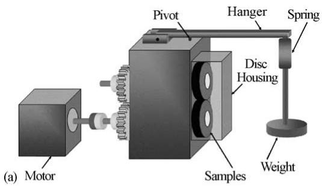

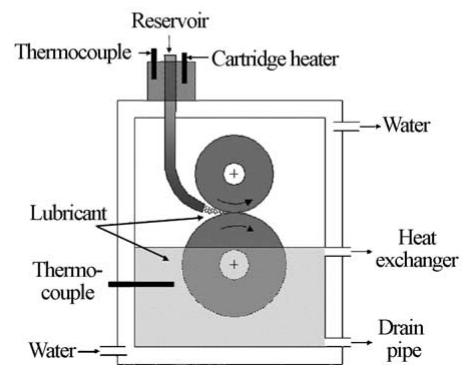  
Fig. 1. The disc machine (a) and the configuration of the disc housing (b).

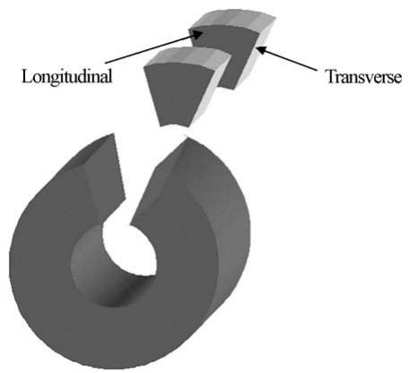  
Fig. 2. Locations of metallographic investigations: longitudinal and transverse.

The discs are enclosed in the disc housing, which contains lubricant and is cooled by water (see Fig. 1b). The lubricant is sprayed in-between the rolling discs by the means ofa tube that comes down from the lubricant reservoir. The temperature ofthe sprayed lubricant is controlled by a cartridge heater situated at the entrance in the disc housing. The temperature of the lubricant in the disc housing is controlled by the water flow through the walls of the disc housing. The disc housing has an orifice where the lubricant can exit the system and flows into a heat exchanger where it is cooled. From the heat exchanger, the lubricant flows into a basin from where it is pumped back to the reservoir.

During testing the discs initially rotate without the application of load. Once the desired speed has been reached the load can be applied. This is done gradually by adding weights on the hanger. Different loads can be achieved by loading the hanger with different weights. Disc samples have an inner diameter of 25 mm to fit on the shafts. The sum of the outer diameters is 120 mm. Different slide-to-roll ratios can be achieved by choosing discs of different diameters but keeping constant the sum of their outer diameters.

Tests were interrupted after $N = n \times 1 . 8 \times 1 0 ^ { 5 }$ cycles where $n = 1 \to 4$ and the surface condition was investigated using light microscopy and optical profilometry. Metallographic investigations were carried out after the tests were stopped on cross-sections obtained by sectioning the disc in longitudinal and transverse direction as shown in Fig. 2.

In addition, after each testing stage, the weight and the radii of curvature of the disc samples were measured. The results presented here refer to the driven disc.

## 2.2. Design of experiments (DOE)

One difficulty with factorial designs is that the number of combinations increases dramatically with the number of factors. In our study, a full factorial design would require $2 ^ { 7 } = 1 2 8$ experiments! The fractional factorial design enables the study of the main (linear) effects of each factor with a small number of experiments [38]. For seven factors, each with two levels, the theoretical minimum number of experiments is eight $( 2 ^ { ( 7 - 4 ) } = 8 )$ . In such a design, some of the factor combinations are excluded and therefore some of the effects will be confounded. Confounded effects cannot be estimated separately and they are said to be aliased. A measure of the aliasing relationships that exist in a design is given by the resolution. $\textbf { A } 2 ^ { ( 7 - 4 ) }$ design with eight experiments has a resolution III which means that no main effect is aliased with another main effect and at least one main effect is aliased with at least one two-factor interaction and two-factor interactions are aliased with each other. The factors considered in this study and their corresponding levels are given in Table 1. The computing for experimental design has been done using Minitab 13 software. The resulting matrix of experimental design is shown in Table 2.

Table 1  
Factors influencing micropitting and their corresponding levels
| Factor · Steel grade · Surface lay | Low level · EN36 · Longitudinal | High level · SAE 8620H · Transverse |
| --- | --- | --- |
| Load, P (N) | 2484 | 4968 |
| Lubricant type | Base oil + EP | OEP-80 |
| Temperature, $T ( ^ { \circ } \mathrm { C } )$ | 60 | 100 |
| Speed, v (rpm) | 1000 | 1200 |
| Slide-to-roll ratio, S | 0.23 | 0.33 |

## 2.3. Samples

The discs were manufactured from two gear steel grades: EN36 and SAE 8620H, which are widely used for gear manufacturing. The chemical compositions of the two steels are given in Table 3. The samples were subjected to standard gear heat treatment procedures (carburising, quenching and tempering), EN36 samples at David Brown Eng. Ltd. and SAE 8620 samples at Bodycote Heat Treatment. The case depth achieved was 1.5 mm.

Following heat treatment the discs were first ground on both flat faces and then on the test surface. Specimen grinding was carried out on a Cincinnati Tool and Cutter Grinder model No. 2 fitted with C-BN grinding discs of a grade used for manufacturing gears. For the axial grinding the abrasive wheel was in the form of an internal cone. A drawing of the arrangement used in grinding is shown in Fig. 3. For studying the influence of surface topography on micropitting four pairs of discs were cylindrically ground and four axially ground. Cylindrical grinding produces longitudinal lay meanwhile axial grinding produces transverse lay. Transverse lay is a better approach to gear contact conditions, considering that, on the gear tooth, the direction of grinding marks and the direction of motion are perpendicular. The surface parameters determined by optical profilometry after grinding

Table 4

Table 2  
The design of micropitting experiments
| Run | Steel | Surface lay | Load (N) | Lubricant | Temperature (°C) | Speed (rpm) | Slide/roll ratio |
| --- | --- | --- | --- | --- | --- | --- | --- |
| 1 | EN36 | Longitudinal | 2484 | Base oil + EP | 60 | 1200 | 0.33 |
| 2 | SAE 8620H | Transverse | 4968 | Base oil + EP | 60 | 1200 | 0.23 |
| 3 | EN36 | Transverse | 2484 | OEP-80 | 60 | 1000 | 0.23 |
| 4 | SAE 8620H | Transverse | 2484 | Base oil + EP | 100 | 1000 | 0.33 |
| 5 | SAE 8620H | Longitudinal | 2484 | OEP-80 | 100 | 1200 | 0.23 |
| 6 | EN36 | Transverse | 4968 | OEP-80 | 100 | 1200 | 0.33 |
| 7 | EN36 | Longitudinal | 4968 | Base oil + EP | 100 | 1000 | 0.23 |
| 8 | SAE 8620H | Longitudinal | 4968 | OEP-80 | 60 | 1000 | 0.33 |

Table 3  
Chemical composition of the two steels
| 항목 | 값1 | 값2 |
| --- | --- | --- |
| wt.% | EN36 | SAE 8620H |
| C | 0.12 | 0.20 |
| Mn | 0.55 | 0.80 |
| $\mathrm { C r }$ | 1.2 | 0.50 |
| Ni | 3.25 | 0.55 |
| Si | 0.28 | 0.25 |
| Mo | 0.12 | 0.20 |
| S | 0.025 | 0.04 |
| P | 0.025 | 0.035 |

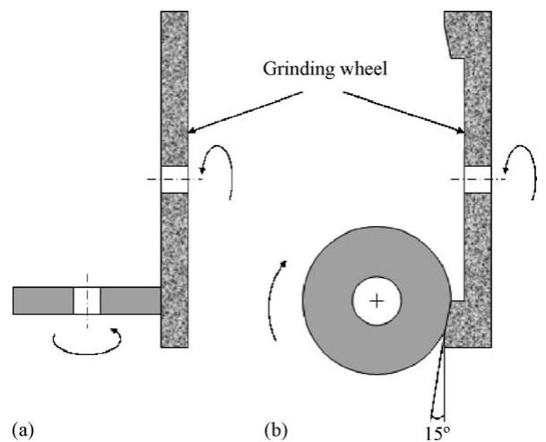  
Fig. 3. The configuration used for grinding: (a) cylindrical grinding; (b) axial grinding.

are given in Table 4. During the eight tests the λ ratio varied from 0.14 to 0.66. The microstructure of the case is similar for both steels and consists of tempered martensite (Fig. 8a). Fig. 4 shows the hardness profiles for the two steels. In order

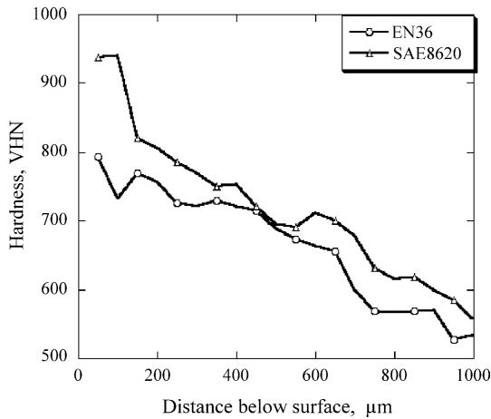  
Fig. 4. Vickers hardness profiles for the two steels (load 300 g).

Surface roughness parameters
| Experiment | Disc | $R _ { \mathfrak { q } }$ (μm) | $R _ { \mathrm { a } }$ (μm) | $R _ { \mathrm { t } }$ (μm) | $\varDelta _ { \mathrm { q x } }$ (mrad) | $\varDelta _ { \mathrm { q y } }$ (mrad) |
| --- | --- | --- | --- | --- | --- | --- |
| Exp1 | Driven | 0.46 | 0.37 | 3.21 | 0.13 | 0.34 |
| Driver | 0.39 | 0.27 | 2.98 | 0.09 | 0.31 |  |
| Exp2 | Driven | 0.25 | 0.19 | 1.92 | 0.17 | 0.08 |
| Driver | 0.29 | 0.22 | 2.11 | 0.21 | 0.12 |  |
| Exp3 | Driven | 0.60 | 0.48 | 4.38 | 0.39 | 0.18 |
| Driver | 0.43 | 0.35 | 3.37 | 0.27 | 0.12 |  |
| Exp4 | Driven | 0.33 | 0.26 | 2.50 | 0.21 | 0.09 |
| Driver | 0.40 | 0.31 | 2.71 | 0.37 | 0.15 |  |
| Exp5 | Driven | 0.47 | 0.38 | 2.68 | 0.07 | 0.21 |
| Driver | 0.45 | 0.32 | 2.49 | 0.11 | 0.27 |  |
| Exp6 | Driven | 0.85 | 0.71 | 4.29 | 0.32 | 0.09 |
| Driver | 0.57 | 0.45 | 3.28 | 0.27 | 0.12 |  |
| Exp7 | Driven | 0.29 | 0.24 | 1.82 | 0.03 | 0.13 |
| Driver | 0.41 | 0.35 | 3.22 | 0.09 | 0.24 |  |
| Exp8 | Driven | 0.38 | 0.30 | 2.82 | 0.09 | 0.22 |
| Driver | 0.52 | 0.39 | 2.15 | 0.07 | 0.18 |  |

to assess the influence of lubricant type, experiments were carried out with two different lubricants, a base oil with 4% EP additives (Anglamol A99) and OEP-80, used for marine gear lubrication.

## 3. Results

## 3.1. Micropitting measurements

The percentage of micropitting (M, %) on the running surface has been measured by processing the surface contour maps captured with an optical profilometer (Micromap 512). The total area of micropitting, the number of pits and the mean area of the pits have been determined using Scion Image software. Fig. 5 shows a sequence of image processing and micropitting measurement. The measurements were performed on images obtained with the optical profilometer from five different locations situated on the wear track. The micropits are sufficiently uniformly distributed on the wear track, that the method described above can be reliably used. The images used in these measurements are the same used for the measurement of the surface roughness parameters. The total area on which the measurements were taken is $1 3 8 \times 1 3 1 = 1 8 0 7 8 { \mu \mathrm { m } } ^ { 2 }$ . We define a micropitting parameter, M, as in the equation given below

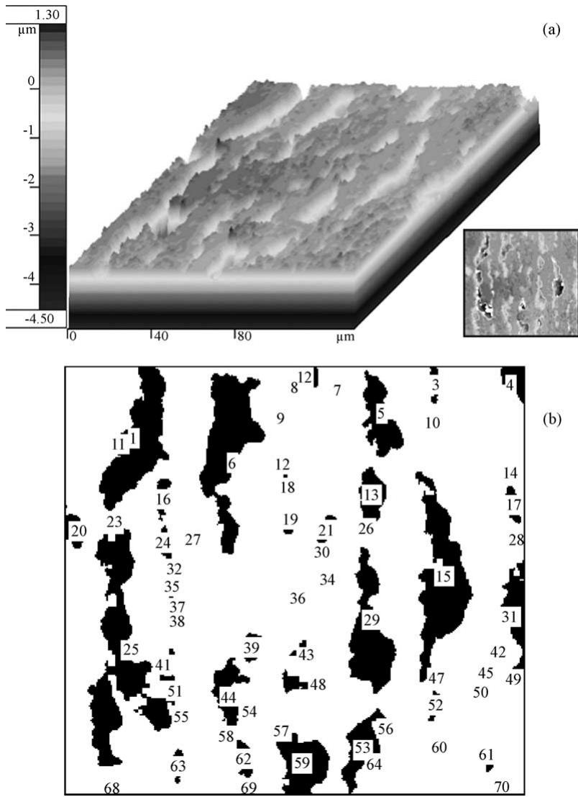  
Fig. 5. Image processing and micropitting measurement. (a) Surface image captured by optical profilometer; (b) analysed image; micropits are counted, measured and labelled using Scion Image. The results are as follows: number of micropits = 70, mean pit $\mathsf { a r e a } = 5 3 . 9 \mu \mathrm { m } ^ { 2 }$ , minimum pit $\mathsf { a r e a } = 0 . 1 9 \mu \mathrm { m } ^ { 2 }$ maximum pit ar $\mathsf { s a } = 6 1 6 \mu \mathrm { m } ^ { 2 }$ , total micropitting area = 20.8%.

$$
M \left( \% \right) = \frac { \mathrm { m i c r o p i t t e d a r e a } } { 1 8 0 7 8 } \times 1 0 0\tag{1}
$$

M(%) has been determined for the discs before test and the average value is $M = 0 . 5 \pm 0 . 3 \%$ . This is because, on one hand randomly distributed small pits, situated on the top of the grinding marks pre-exist due to the surface finishing process and, on the other hand, because of the limitations of the image processing method. These considerations suggest that there is a threshold value for M below which the method is not sensitive. The threshold value was chosen as $M = 1 . 5 \%$ . The micropitting parameter has been plotted versus the number of stress cycles in Fig. 6. These curves show the rate of micropitting progression and they exhibit a similar trend to the mass loss curves in Fig. 7. This suggests that the removal of material from the specimen surface is mainly due to micropitting. The experimental data in Fig. 6 have been fitted to straight lines. The number of cycles, $N _ { 0 } .$ , necessary for micropitting initiation is taken to be the intercept of the micropitting curve with a horizontal line represented by the threshold $M = 1 . 5 \%$ . The slopes, dM/dN, of the lines from Fig. 6 represent the micropittingprogression rates. The number ofcycles for micropitting initiation, $N _ { 0 }$ , and the micropitting progression rates, dM/dN, determined for the eight experiments are given in Table 5.

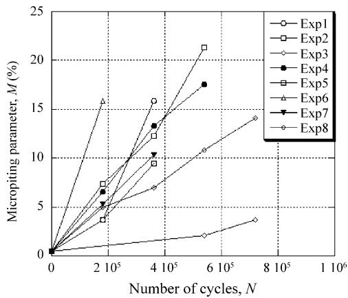  
Fig. 6. Percentage micropitting vs. number of cycles.

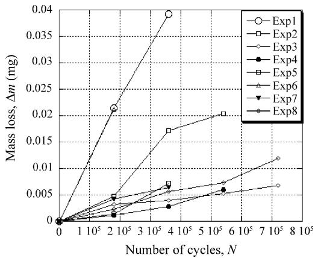  
Fig. 7. Mass loss as a function of number of cycles.

## 3.2. Phase transformations

The microscopic examination of the samples etched with nital has revealed similar microstructural features to those reported in fatigued bearings, namely dark etching regions (DER) and white etching bands (WEB). Fig. 8 shows two cross-sections of the disc tested in experiment 1 taken in longitudinal direction in (b) and, transverse direction in (c). The dark etching regions are clearly seen in both pictures, beneath the specimen surface. These regions appear much darker than the rest of the microstructure. Beneath the dark etching zone, the microstructure is characterised by a preferential oriented texture (see Fig. 8b). The texture consists of white lines (WEB), which lie between 185 and 690 m below the contact surface. In Fig. 8b the white etching bands are inclined to the surface plane to an angle $\alpha = 4 5 ^ { \circ }$ in the direction opposite to the sliding direction. WEB are not observable as inclined bands in the transverse section from Fig. 8c

Table 5  
Micropitting initiation and progression
| Run | Initiation cycles, $N _ { 0 } \ ( M { = } 1 . 5 \% )$ | Progression rate, dM/dN |
| --- | --- | --- |
| 1 | $1 . 4 8 \times 1 0 ^ { 5 }$ | $6 . 8 0 \times 1 0 ^ { - 5 }$ |
| 2 | $4 . 5 5 \times 1 0 ^ { 4 }$ | $3 . 8 7 \times 1 0 ^ { - 5 }$ |
| 3 | $4 . 7 2 \times 1 0 ^ { 5 }$ | $8 . 7 7 \times 1 0 ^ { - 6 }$ |
| 4 | $1 . 0 5 \times 1 0 ^ { 3 }$ | $3 . 0 6 \times 1 0 ^ { - 5 }$ |
| 5 | $1 . 1 2 \times 1 0 ^ { 5 }$ | $3 . 2 1 \times 1 0 ^ { - 5 }$ |
| 6 | $1 . 1 6 \times 1 0 ^ { 4 }$ | $8 . 5 5 \times 1 0 ^ { - 5 }$ |
| 7 | $4 . 6 9 \times 1 0 ^ { 4 }$ | $2 . 8 3 \times 1 0 ^ { - 5 }$ |
| 8 | $6 . 2 4 \times 1 0 ^ { 3 }$ | $1 . 7 4 \times 1 0 ^ { - 5 }$ |

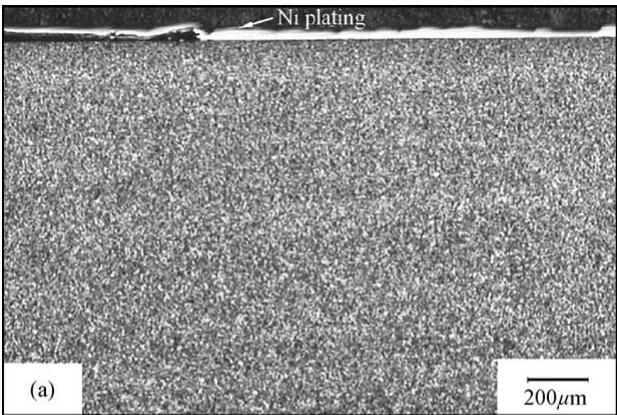

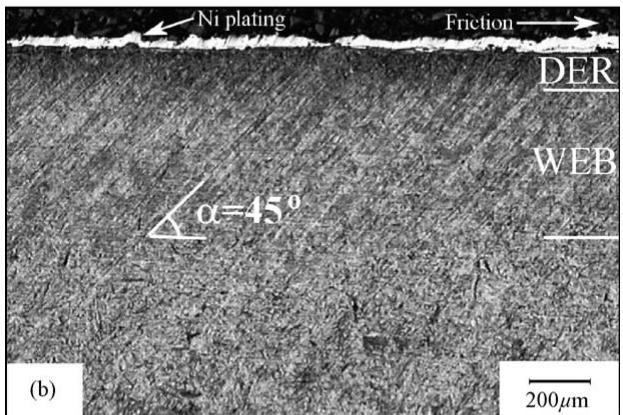

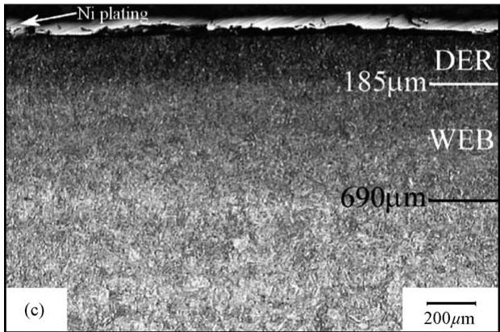  
Fig. 8. Micrographs showing the microstructure before and after test. (a) Longitudinal section before test showing no DER or WEB. (b) DER and WEB in longitudinal section. (c) DER and WEB in transverse section. Experiment 1, driven disc; etch: nital 2%.

but as a zone of fine microstructure, lying beneath the DER, slightly darker than the unaffected microstructure, which extends to a depth approximately equal to the limit of WEB from Fig. 8b. The samples were carefully prepared using state-of-the-art equipments in order to minimise preparation artefacts and similar features are not observed in the samples before running (Fig. 8a). A higher magnification ofthe WEB zone is shown in Fig. 9. In addition to the aforementioned phases, zones that exhibit a non-martensitic microstructure (see Fig. 10) have been found near the tested surface to a depth up to $6 \mu \mathrm { m }$ . This microstructural feature will be referred in this work as the plastic deformation region (PDR). In order to asses the influence of the test conditions on the phase transformations a transformation factor corresponding to each type of transformation has been calculated as the ratio between the width of the new phase (p the width of the PDR, d the width of the DER and w the width of the WEB) and the number of stress cycles, N. The values ofp, d, and w corresponding to each of the eight experiments are given in Table 6.

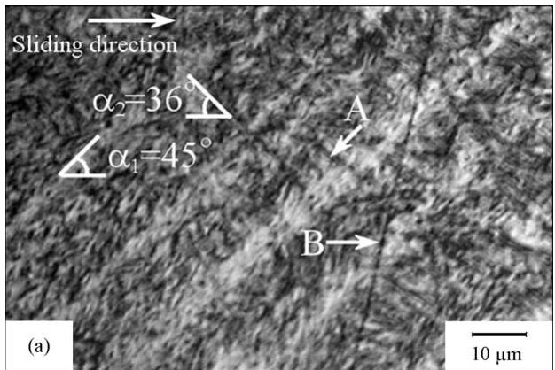

Fig. 9. Higher magnification of the WEB shown in Fig. 8b. A second set of WEB in A and a polishing artefact in B.  
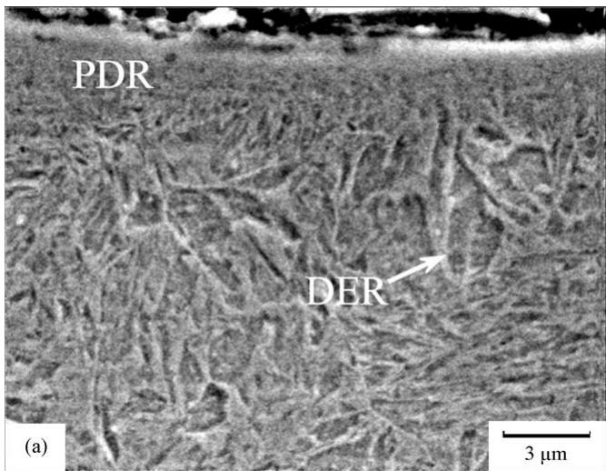  
Fig. 10. SEM image showing PDR bordered by DER grains. Experiment 1, driven disc. Longitudinal section. Etch: nital.

## 3.3. Statistical analysis

In order to assess the effects ofthe factors listed previously they must be represented numerically. It has been shown that micropitting is governed by the plastic deformation ofasperities [29,32]. The most suitable property that characterises the plastic behaviour of the steel in the contact region is its hardness, H (GPa). The hardness measurements were performed on the testing surface, by nanoindentation technique with a Hysitron Triboindenter using 10 mN peak load. The average values, after applying the pile-up correction factor [39] are as follows: $H { = } 8 \pm 0 . 7$ GPa for EN36 and $H { = } 9 . 4 \pm 0 . 9$ GPa for SAE 8620H. The surface lay is best described by the wavelength ratio, Λ, defined as the ratio of the surface roughness wavelength in the direction perpendicular to the direction of the contact motion, $\lambda _ { \perp }$ , and the wavelength in the direction of the contact motion, $\lambda _ { / / . }$ The use of this parameter is also supported by the bidimensional distribution of the micropits described in [29]. The root mean square wavelength in two orthogonal directions, $\lambda _ { \perp }$ and $\lambda _ { / / }$ have been calculated using Eq. (2) where $R _ { \mathfrak { q } }$ and $\varDelta _ { \mathrm { q } }$ are the standard deviations of the profile height and slope, respectively and they were determined by optical profilometry.

Table 6  
The phase transformation factors
| Run | $p \times 1 0 ^ { - 5 }$ $( \mu \mathrm { m } / \mathrm { c y c l e } )$ | $d \times 1 0 ^ { - 5 }$ $( \mu \mathrm { m } / \mathrm { c y c l e } )$ | $w \times 1 0 ^ { - 5 }$ (μm/cycle) |
| --- | --- | --- | --- |
| 1 | 1.25 | 51.38 | 140.28 |
| 2 | 0 | 19.44 | 0 |
| 3 | 0.34 | 4.86 | 0 |
| 4 | 1.11 | 5.37 | 0 |
| 5 | 0 | 1.11 | 0 |
| 6 | 2.22 | 102.78 | 352.78 |
| 7 | 1.38 | 38.88 | 202.78 |
| 8 | 0 | 3.61 | 0 |

$$
\lambda _ { \mathrm { q } } = 2 \pi \frac { R _ { \mathrm { q } } } { \varDelta _ { \mathrm { q } } }\tag{2}
$$

The average values of $\varLambda ,$ before the test are as follows: $\varLambda = 0 . 3 3 5 \pm 0 . 0 8 6$ for longitudinal lay and $\Lambda = 2 . 5 4 7 \pm 0 . 6 3 6$ for transverse lay. The average values of Λ corresponding to the running in conditions are $\Lambda = 0 . 6 4 2 \pm 0 . 0 6 9$ for longitudinal lay and $\varLambda = 1 . 6 7 \pm 0 . 4 2 1$ for transverse lay. The parameter used to characterise the effect of load is the maximum contact pressure, $p _ { 0 }$ . Because the discs are crowned $p _ { 0 }$ has been calculated using the Hertzian equation for elliptical contacts (Eq. (3)).

$$
p _ { 0 } = \frac { 3 P } { 2 \pi a b } = { \left( \frac { 6 P E ^ { \prime 2 } } { \pi ^ { 3 } R _ { \mathrm { e } } ^ { 2 } } \right) } ^ { 1 / 3 } { \left[ F _ { 1 } \left( \frac { R ^ { \prime } } { R ^ { \prime \prime } } \right) \right] } ^ { - 2 / 3 }\tag{3}
$$

where $P$ is the normal load, a and b the major and the minor semi-axis of the contact ellipse, $R _ { \mathrm { e } }$ the effective radius of curvature (Eq. (4)) and $E ^ { \prime }$ the elastic contact modulus given by Eq. (5) and $F _ { 1 }$ a function which depends on ratio $\mathrm { R } ^ { \prime } / \mathrm { R } ^ { \prime \prime }$ [40].

$$
R _ { \mathrm { e } } = \sqrt { R ^ { \prime } R ^ { \prime \prime } }\tag{4}
$$

$$
{ \frac { 1 } { E ^ { \prime } } } = { \frac { 1 - \nu _ { 1 } ^ { 2 } } { E _ { 1 } } } + { \frac { 1 - \nu _ { 2 } ^ { 2 } } { E _ { 2 } } }\tag{5}
$$

In Eqs. (4) and (5) R and $R ^ { \prime \prime }$ are the major and minor relative radii ofcurvature, $E _ { 1 }$ and $E _ { 2 } \left( E _ { 1 } = E _ { 2 } \right)$ the elastic moduli and ν1 and ν2 $( \nu _ { 1 } = \nu _ { 2 } )$ the Poisson’s ratios of the two discs.

The calculated values are $p _ { 0 } { = } 2 . 0 \mathrm { G P a }$ when the load applied is 2484 N and $p _ { 0 } { = } 2 . 2 \mathrm { G P a }$ when the load applied is 4968 N, for the initial conditions and $p _ { 0 } = 1 . 5 \mathrm { G P a }$ for 4968 N load and $p _ { 0 } = 1 . 8 \mathrm { G P a }$ for 4968 N load during the running-in period.

The factorial design matrix for micropitting initiation
| Run · $H ( \mathrm { G P a } )$ | Factors · Λ | Factors · p0 (GPa) | Factors · η0 (Pas) | Factors · $T ( ^ { \circ } \mathbf { C } )$ | Factors · $u \left( \mathbf { m } / \mathbf { s } \right)$ | Factors · S | Factors | Response |
| --- | --- | --- | --- | --- | --- | --- | --- | --- |
| 1 | 8 | 0.335 | 1.8 | 0.169 | 60 | 3.76 | 0.33 | $N _ { 0 }$ $1 . 4 8 \times 1 0 ^ { 5 }$ |
| 2 | 9.4 | 2.547 | 2.2 | 0.169 | 60 | 3.76 | 0.23 | $4 . 5 5 \times 1 0 ^ { 4 }$ |
| 3 | 8 | 2.547 | 1.8 | 0.268 | 60 | 3.13 | 0.23 | $4 . 7 2 \times 1 0 ^ { 5 }$ |
| 4 | 9.4 | 2.547 | 1.8 | 0.169 | 100 | 3.13 | 0.33 | $1 . 0 5 \times 1 0 ^ { 3 }$ |
| 5 | 9.4 | 0.335 | 1.8 | 0.268 | 100 | 3.76 | 0.23 | $1 . 1 2 \times 1 0 ^ { 5 }$ |
| 6 | 8 | 2.547 | 2.2 | 0.268 | 100 | 3.76 | 0.33 | $1 . 1 7 \times 1 0 ^ { 4 }$ |
| 7 | 8 | 0.335 | 2.2 | 0.169 | 100 | 3.13 | 0.23 | $4 . 6 9 \times 1 0 ^ { 4 }$ |
| 8 | 9.4 | 0.335 | 2.2 | 0.268 | 60 | 3.13 | 0.33 | $6 . 2 5 \times 1 0 ^ { 3 }$ |

The most important property of a lubricant is represented by its viscosity. The ambient viscosity (atmospheric pressure and $4 0 ^ { \circ } \mathrm { C } )$ , η0 has been used to assess the effect of lubricant on the micropitting phenomenon. The viscosity values determined with a digital Brookfield viscometer RVTD are $\eta _ { 0 } = 0 . 1 6 9$ Pa s for the base oil and $\eta _ { 0 } = 0 . 2 6 8$ Pa s for the OEP-80 lubricant.

The entraining velocity, $u ,$ is commonly used in the calculations which refer to elastohydrodynamic contacts. The entraining velocities corresponding to 1000 rpm rotation speed is $u = 3 . 1 3$ m/s and to 1200 rpm is $u { = } 3 . 7 6 \mathrm { m } / \mathrm { s }$

## 3.3.1. Micropitting initiation

The initial contact conditions have been used to study the influence of the given factors on the number of cycles $N _ { 0 } .$ necessary for micropitting to initiate. It is considered in this work that micropitting had been initiated when the micropits occupy 1.5% of the disc surface. The matrix of the factorial design is given in Table 7. Fig. 11 shows the main effect plots when the response is $N _ { 0 }$ . The central line represents the mean ofall the values ofthe response $( N _ { 0 } )$ in the experiment. The biggest effect on the number of cycles, $N _ { 0 } ,$ necessary for micropitting to initiate is that of the contact pressure, $p _ { 0 }$ The slope of the effect line shows that micropitting initiates considerably faster when the contact pressure is high. Although the pressure appears to affect $N _ { 0 }$ more than the other factors it is important to analyse the interactions. The interaction plots when the response is $N _ { 0 }$ are shown in Fig. 12. The interaction plots show that the number of cycles, $N _ { 0 } ,$ at high contact pressure $( p _ { 0 } { = } 2 . 2 \mathrm { G P a } )$ is almost independent of the other factors. The only significant interaction is that with surface roughness. This observation is very important. At high contact pressures the means to avoid micropitting are limited and, under the experimental conditions used in this research the only way to retard micropitting initiation is to improve surface finish. At the low setting for contact pressure $( p _ { 0 } = 1 . 8 \mathrm { G P a } )$ micropitting initiation is strongly affected by the other factors. $N _ { 0 }$ increases when EN36 steel and base oil are used, when the wavelength ratio, Λ, the temperature, $T ,$ the speed, $u ,$ and the slide-to-roll ratio, $S ,$ decrease. The second biggest influence on the initiation of micropitting is that of the hardness of the steel. Micropitting initiates earlier on the specimens manufactured from SAE 8620 steel, which is harder than EN36. The interaction plots show that for SAE 8620 steel, $N _ { 0 }$ varies insignificantly when the other factors vary. In conclusion, the SAE 8620 steel is more prone to micropitting initiation. The initiation of micropitting in the EN36 steel is influenced by all the other factors. Better resistance to micropitting initiation is provided by high wavelength ratio (transverse lay), low contact pressure, the OEP-80 lubricant, low temperature, low speed and low slide-to-roll ratio. The slide-to-roll ratio also has a significant influence on micropitting initiation. The lower the ratio the higher the number of cycles for micropitting to occur. Slide-to-roll ratio has no effect when the wavelength ratio is low and also at high speed. The effect of temperature is as expected, at low temperatures the occurrence of micropitting is retarded. Temperature has no influence at high contact pressure and better micropitting performance is provided by the OEP-80 lubricant. Both lubricants act better at low temperatures in the sense that the initiation of micropitting is delayed. The influence of surface roughness and speed are small and they can be neglected.

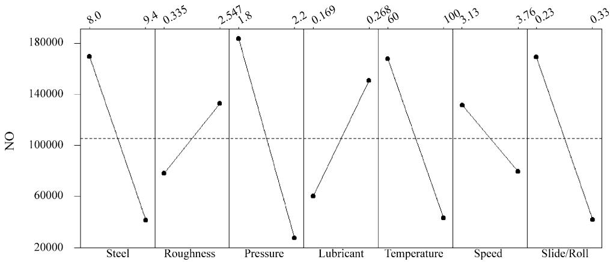  
Fig. 11. The main effects on micropitting initiation. $N _ { 0 }$ is the number of cycles after micropitting occupies 1.5% of the surface.

Table 9  
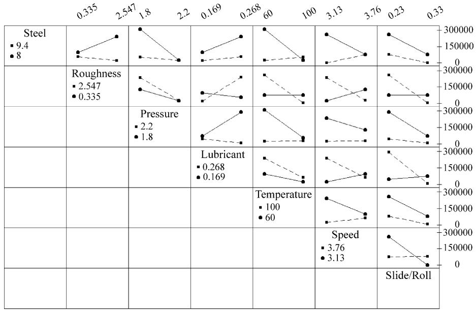  
Fig. 12. The interaction plots for micropitting initiation.  
Table 8

## 3.3.2. Micropitting progression

The variation ofthe surface roughness parameters leads to changes in the operating conditions. The factors affected by these changes are the wavelength ratio, Λ, and the maximum contact pressure,p0. The final conditions after run-in are used to study the stage ofmicropitting progression. The responses used to assess the influence of the factors on the progression of micropitting are: the micropitting progression rate, dM/dN (the slopes of the micropitting progression curves) and the phase transformation factors (i.e., p the PDR factor, d the DER factor and w the WEB factor). The factors and their levels corresponding to each experiment are given in Table 8 and the response columns in Table 9. The main effect plots when the response is the micropitting progression rate, dM/dN, are shown in Fig. 13. The effect of speed, slide-toroll ratio and material are much higher than the other effects and they are significant. Micropitting propagates with high rates at high speed and high slide-to-roll ratio. Although, the micropitting initiation is delayed on EN36 steel, as seen in Fig. 11, the progression rate is much higher than for SAE 8620 steel. From the interaction plots (Fig. 14) it can be seen that all the interactions which involve speed are significant.

The factors and their levels used to study the micropitting progression
| Run · H (GPa) | Factors · Λ | Factors · p0 (GPa) | Factors · η0 (Pas) | Factors · T(°C) | Factors · u (m/s) | Factors · S | Factors |
| --- | --- | --- | --- | --- | --- | --- | --- |
| 1 | 8 | 0.642 | 1.5 | 0.169 | 60 | 3.76 | 0.33 |
| 2 | 9.4 | 1.67 | 1.8 | 0.169 | 60 | 3.76 | 0.23 |
| 3 | 8 | 1.67 | 1.5 | 0.268 | 60 | 3.13 | 0.23 |
| 4 | 9.4 | 1.67 | 1.5 | 0.169 | 100 | 3.13 | 0.33 |
| 5 | 9.4 | 0.642 | 1.5 | 0.268 | 100 | 3.76 | 0.23 |
| 6 | 8 | 1.67 | 1.8 | 0.268 | 100 | 3.76 | 0.33 |
| 7 | 8 | 0.642 | 1.8 | 0.169 | 100 | 3.13 | 0.23 |
| 8 | 9.4 | 0.642 | 1.8 | 0.268 | 60 | 3.13 | 0.33 |

At high speed micropitting propagates with high rate regardless the values of the other factors. This implies that little can be done to stop the progression of micropitting when the operating speed is high. The progression rate increases dramatically when high speed is coupled with high slide-to-roll ratio. The effect of increasing speed and slide-to-roll ratio is more pronounced on EN36 steel.

The plastic deformation zones form more extensively in samples manufactured from EN36 steel as might be expected given its lower hardness. The biggest effect in the main effect plots (Fig. 15) is the effect of hardness. The second biggest effects are exerted by temperature and slide-to-roll ratio. It can be seen from the interaction plots (Fig. 16) that at low load the effect of temperature reduces considerably.

The responses used to study the micropitting progression
| Run · dM/dN | Responses · $p \times 1 0 ^ { - 5 }$ (μm/cycle) | Responses · $d \times 1 0 ^ { - 5 }$ (μm/cycle) | Responses · $w \times 1 0 ^ { - 5 }$ (μm/cycle) | Responses |
| --- | --- | --- | --- | --- |
| 1 | $6 . 8 0 \times 1 0 ^ { - 5 }$ | 1.25 | 51 | 140 |
| 2 | $3 . 8 7 \times 1 0 ^ { - 5 }$ | 0 | 19 | 0 |
| 3 | $8 . 7 7 \times 1 0 ^ { - 6 }$ | 0.34 | 4 | 0 |
| 4 | $3 . 0 6 \times 1 0 ^ { - 5 }$ | 1.11 | 5 | 0 |
| 5 | $3 . 2 1 \times 1 0 ^ { - 5 }$ | 0 | 1 | 0 |
| 6 | $8 . 5 5 \times 1 0 ^ { - 5 }$ | 2.22 | 102 | 352 |
| 7 | $2 . 8 3 \times 1 0 ^ { - 5 }$ | 1.38 | 38 | 202 |
| 8 | $1 . 7 4 \times 1 0 ^ { - 5 }$ | 0 | 3 | 0 |

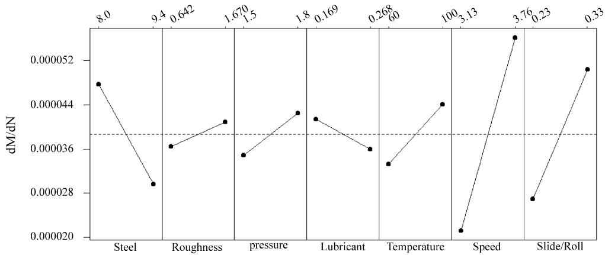  
Fig. 13. The main effects on micropitting initiation. dM/dN represents the micropitting progression rate.

From the main effect plots shown in Fig. 17 results that the development ofdark etching regions depends strongly on the steel; the dark etching regions develop preferentially in EN36 steel. The next significant effects are exerted by speed, contact pressure, slide-to-roll ratio and temperature in this order. The factors that have the biggest influence on micropitting progression, namely speed and slide-to-roll ratio have also a big influence on dark etching region development. This observation confirms the assertion that micropitting and martensite decay are related processes. The DER factor does not vary significantly for SAE 8620 steel, regardless the value of the other influencing factors but the effect of speed, slide-to-roll ratio, temperature and pressure is pronounced for EN36 steel (see the interaction plots in Fig. 18). Although the effect of temperature is not the biggest, high speed and high slide-toroll ratio generate frictional heating and the temperature is actually higher than the values used in this model. The interaction between temperature and pressure is significant. At high temperature and pressure the d factor tends to a maximum value.

The white etching bands have been found in both steels but they developed as continuous bands, and hence were measurable, only in the EN36 steel discs. Therefore, the WEB transformation is not specific only to EN36 steel grade as the main effects plots from Fig. 19 indicate. The significant influences are exerted by temperature, pressure, speed and slide-to-roll ratio, as for the DER factor. The temperature-pressure interaction for w (see Fig. 20) shows the same characteristics as the interaction for d (Fig. 18). The DER transformation and WEB transformation are favoured by high temperatures and high contact pressure. When the load is reduced the effect of temperature attenuates dramatically. This is expected since both phases are products of martensite decay. The effects of speed and slide-to-roll ratio are also significant. The WEB phase is more likely to occur at high speed and high slideto-roll ratio. The interaction between speed and slide-to-roll ratio shows that the DER phase does not occur at low speed and slide-to roll ratio.

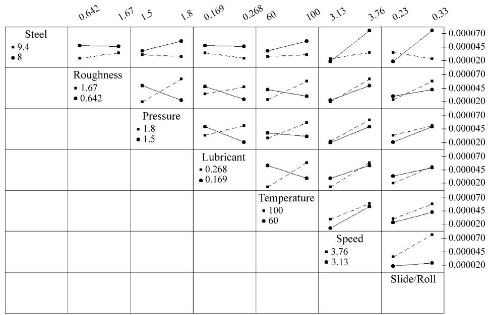  
Fig. 14. The interaction plots for micropitting progression.

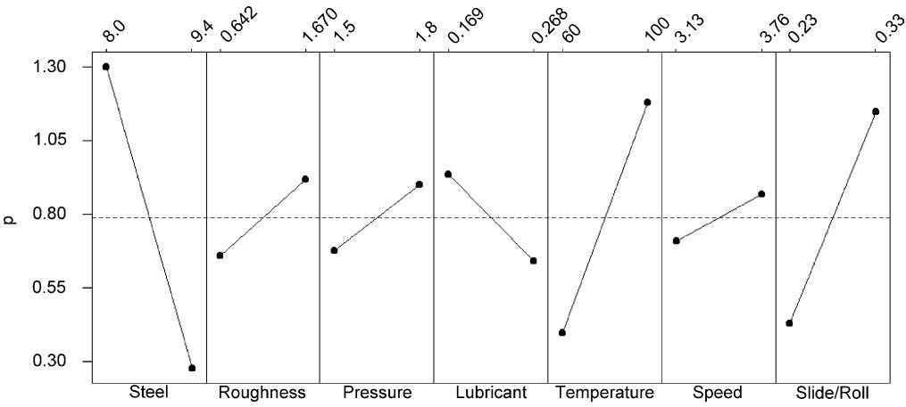  
Fig. 15. The main effects on the development of the plastic deformation regions.

  
Fig. 16. The interaction plots for plastic deformation regions.

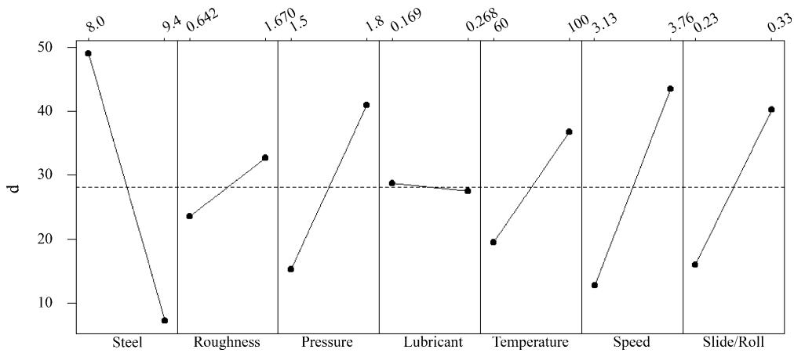  
Fig. 17. The main effects on the development of the dark etching regions.

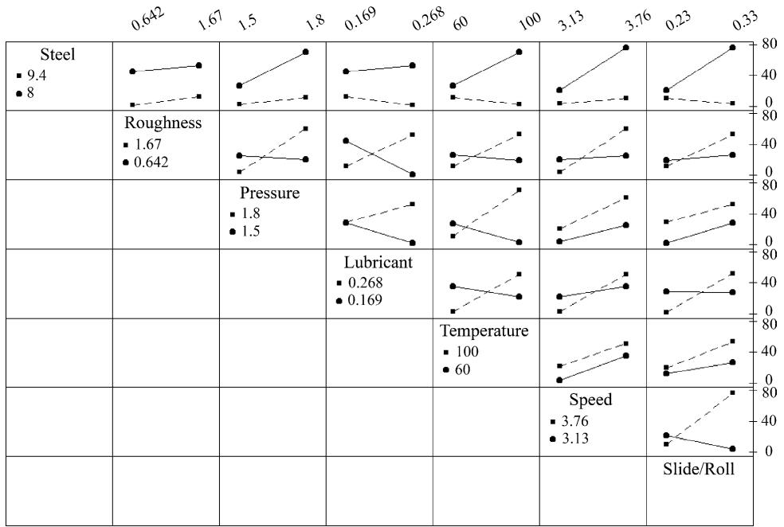  
Fig. 18. The interaction plots for dark etching regions.

## 4. Discussion

The most significant factor that influences micropitting initiation is the contact pressure. At high contact pressure, the number of cycles necessary for micropitting to initiate is almost independent of the other factors. This implies the existence ofa load threshold above which the means to avoid micropitting are limited. Under the experimental conditions used in this work the only way to retard micropitting in such cases is an improvement in surface finish.

The main effects on micropitting progression rate, dM/dN, are those of speed and slide-to-roll ratio. At high speeds micropitting propagates with a high rate regardless the values of the other factors. This implies that little can be done to stop the progression of micropitting when the operating speed is high. Unlike the initiation, where SAE 8620 steel is more prone to micropitting occurrence, the progression rate is significantly higher for EN36 steel.

All the phase transformations strongly depend on the material (steel grade) and hence material is the biggest factor for all forms of martensite decay. The plastic deformation region (PDR), the dark etching regions (DER), and the white etching bands (WEB) are more extensively developed in EN36 steel. Considering that the micropitting progression rate is significantly higher for EN36 steel it can be concluded that micropitting develops faster if martensite decay is more pronounced. This suggests that the mechanism of micropitting and the mechanism of martensite decay are related to each other. Based on this observation it can be assumed that a suitable choice of gear steel, or heat treatment could represent a solution to prevent micropitting.

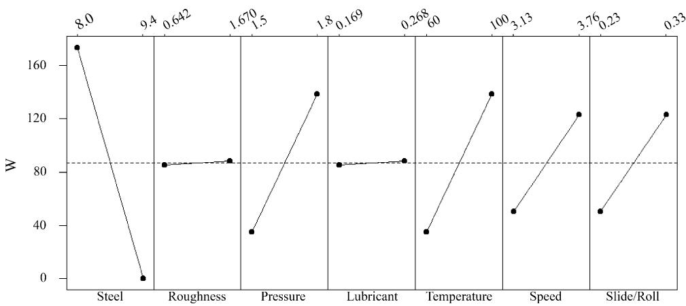  
Fig. 19. The main effects on the development of the white etching bands.

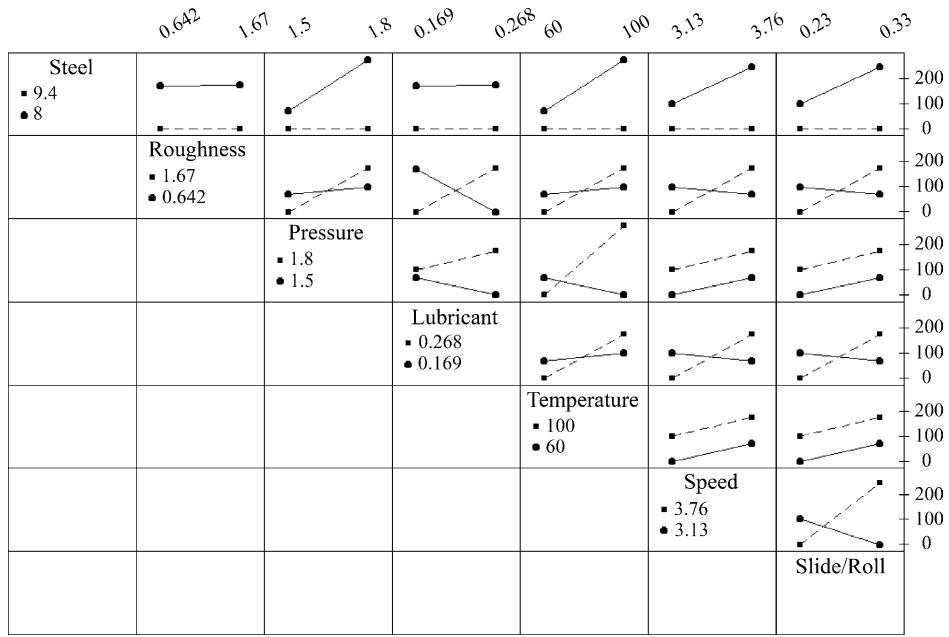  
Fig. 20. The interaction plots for the white etching bands.

The next biggest effects on martensite decay are those of temperature, speed and slide-to-roll ratio. Since high speed and slide-to-roll ratio produce high friction, hence high temperature it can be concluded that the main driving force for martensite decay is the temperature. Progression ofmicropits therefore depends on the frictional power dissipation by the sliding of surface asperities. This results in plastic deformation and heating of the surfaces.

The importance of the temperature generated at the surface during testing cannot be overemphasised. As the asperity temperature increases the contacting materials will be softened if martensite decay occurs and also if the surface temperature rises. In addition the lubricant viscosity and load support is reduced as its temperature rises. All of these will contribute to poor micropitting performance.

Several approaches are possible to reduce frictional heating which should all therefore have an effect on micropitting resistance.

(1) Reduce surface roughness—this will increase the λ value for a given lubricant/contact combination and decrease the metal/metal contact and frictional heating. The success of superfinished gears in micropitting tests depends on this [5,6].

(2) Reduce frictional tractions during rolling/sliding. The use ofEP additives [2,7,9,10] or carbon coatings [41–43] to reduce frictional tractions can reduce micropitting. However, the choice of additive package will be critical as it must operate at the temperatures experienced in the contact and not promote the initiation and propagation of fatigue cracks in the surface (corrosion fatigue). Considerable variation in performance with additive package has been observed and in some cases performance is worse [8,11].

(3) Use a thermally stable surface. Annealing of martensite and martensite decay are both features of high speed contacts in carburised steel, the latter occurring at lower temperatures. The use of a more stable surface (e.g. the white layer in nitrided steel) can greatly reduce micropitting [44].

(4) Use of hard surface. The plastic deformation region of a few microns thickness is a feature ofthe worn surfaces of all the discs tested in this study. The plastic deformation of asperities leads to considerable heat generation and can promote martensite decay—for this reason micropits are observed soon after the test is started. A harder surface layer, such as nitrided white layer [44] or a thin hard carbon coating can improve this in micropitting performance by reducing surface temperatures [43]. However, hard wear debris can cause problems elsewhere in the system so this approach is not recommendable in all uses.

## 5. Conclusions

1. Disc testing produces similar results to full scale gear testing but is quicker to perform and is more suitable for micropitting mechanism assessment and the study of micropitting initiation.

2. Micropitting initiation is mostly controlled by contact pressure.

3. Micropitting progression is mainly controlled by speed and slide-to-roll ratio.

4. Micropitting and martensite decay within the surface contact region are related phenomena. Steels which show low martensite decay are expected to be more resistant to micropitting.

## References

[1] R. Errichello, Selecting and applying lubricants to avoid micropitting of gear teeth, Mach. Lubr. Mag. (2002) 30–36.

[2] B.A. Shotter, Micropitting: its characteristics and implications on the test requirements of gear oils, in: R. Tourret, E.P. Wright (Eds.), Performance and Testing of Gear Oils and Transmission Fluids, Proceedings of the International Symposium, The Institute of Petroleum, London, 1980, pp. 91–103.

[3] Y. Ariura, T. Ueno, T. Nakanashi, An investigation of surface failure of surface hardened gears by scanning electron microscopy observation, Wear 87 (1983) 305–316.

[4] R.D. Britton, C.D. Elcoate, M.P. Alanou, H.P. Evans, R.W. Snidle, Effect of surface finish on gear tooth friction, ASME J. Tribol. 122 (2000) 354–360.

[5] A.C. Batista, A.M. Dias, J.L. Lebrun, J.C. Le Flour, G. Inglebert, Contact fatigue of automotive gears: evolution and effects of residual stresses introduced by surface treatments, Fatigue Fract. Eng. Mater. Struct. 23 (2000) 217–228.

[6] A.V. Olver, Micro-pitting of gear teeth: design solutions, in: IMechE Congress Aerotech 95, Birmingham, 1995.

[7] P. Brechot, A.B. Cardis, W.R. Murphy, J. Theissen, Micropitting resistant industrial gear oils with balanced performance, Ind. Lubr. Tribol. 52 (3) (2000) 125–136.

[8] H. Winter, P. Oster, Influence of lubrication on pitting and micropitting resistance of gears, Gear Technol. (1990) 16–23.

[9] A.B. Cardis, M.N. Webster, Gear oil micropitting evaluation, Gear Technol. 17 (5) (2000) 30–35.

[10] H.P. Nixon, Effects of extreme pressure additives in lubricants on bearing fatigue life, Iron Steel Eng. (1998) 21–26.

[11] B.-R. Hohn, P. Oster, S. Emmert, Micropitting in case-carburized ¨ gears - FZG micropitting test, VDI Berichte 1230 (1996) 331– 344.

[12] H. Winter, T. Weiss, Some factors influencing the pitting, micropitting (frosted areas) and slow speed wear of surface hardened gears, ASME J. Mech. Des. 103 (1981) 499–505.

[13] H.P. Evans, R.W. Snidle, Analysis of micro-elastohydrodynamic lubrication for engineering contacts, Tribol. Int. 29 (8) (1996) 659– 667.

[14] A.B. Jones, Metallographic observations of ball bearing fatigue phenomena, Proc. ASTM 46 (1946) 1–6.

[15] J.J. Bush, W.L. Grube, G.H. Robinson, Microstructural and residual stress changes in hardened steel due to rolling contact, Trans. ASM 54 (1961) 390–412.

[16] A.J. Gentile, E.F. Jordan, A.D. Martin, Phase transformations in high-carbon, high-hardness steels under contact loads, Trans. Met. Soc. AIME 233 (1965) 1085–1093.

[17] J.A. Martin, S.F. Borgese, A.D. Eberhardt, Microstructural alterations of rolling-bearing steel undergoing cyclic stressing, Trans. ASME J. Basic Eng. (1966) 555–567.

[18] J.L. O’Brien, A.H. King, Electron microscopy of stress-induced structural alterations near inclusions in bearing steels, ASME J. Basic Eng. (1966) 568–588.

[19] J. Buchwald, R.W. Heckel, An analysis of microstructural changes in 52100 steel bearings during cyclic stressing, Trans. ASM 61 (1968) 750–756.

[20] H. Swahn, P.C. Becker, O. Vingsbo, Martensite decay during rolling contact fatigue in ball bearings, Met. Trans. 7A (1976) 1099–1110.

[21] A.P. Voskamp, R. Osterlund, P.C. Becker, O. Vingsbo, Gradual¨ changes in residual stress and microstructure during contact fatigue in ball bearings, Met. Technol. (1980) 14–21.

[22] A.P. Voskamp, Material response to rolling contact loading, ASME J. Tribol. 107 (1985) 359–366.

[23] R. Osterlund, O. Vingsbo, Phase changes in fatigued ball bearings, ¨ Met. Trans. 11A (1980) 701–707.

[24] B.Y. Choi, G.W. Bahng, Characterisation of microstructure and its effect on rolling contact fatigue of induction hardened medium carbon bearing steels, Mater. Sci. Technol. 14 (1985) 816–821.

[25] V. Bhargava, G.T. Hahn, C.A. Rubin, Rolling contact deformation, etching effects, and failure of high-strength bearing steel, Met. Trans. 21 (1990) 1921–1931.

[26] A. Muroga, H. Saka, Analysis of rolling contact fatigued microstructure using focused ion beam sputtering and transmission electron microscopy observation, Scripta Metall. Mater. 33 (1) (1995) 151– 156.

[27] M.R. Hoeprich, Analysis of micro-pitting on prototype surface fatigue test gears, in: Proceedings of the 12th International Colloquium Tribology, vol. 3, Plus. Technische Akademic Esslingen, 2000, pp. 2023–2033.

[28] H. Winter, G. Knauer, J.J. Gamel, White etching areas on casehardened gears, Gear Technol. (1989) 18–45.

[29] A. Oila, Micropitting and related phenomena in case carburised gears, PhD Thesis, University of Newcastle, 2003, p. 262.

[30] S. Way, Pitting due to rolling contact, ASME J. Appl. Mech. 2 (1935) A49–A58.

[31] A.F. Bower, The influence of crack face friction and trapped fluid on surface initiated rolling contact fatigue cracks, ASME J. Tribol. 110 (1988) 704–711.

[32] A.V. Olver, Micropitting and asperity deformation, in: Developments in Numerical and Experimental Methods Applied to Tribology, Proceedings of the 10th Leeds-Lyon Symposium on Tribology, Lyon, 1983, pp. 319–323.

[33] A.V. Olver, H.A. Spikes, A.F. Bower, K.L. Johnson, The residual stress distribution in a plastically deformed model asperity, Wear 107 (1986) 151–174.

[34] M.N. Webster, C.J.J. Norbart, An experimental investigation of micropitting using a roller disk machine, Tribol. Trans. 38 (4) (1995) 883–893.

[35] M. Widmark, A. Melander, Effect of material, heat treatment, grinding and shot peening on contact fatigue life of carburised steels, Int. J. Fatigue 21 (1999) 309–327.

[36] D. Berthe, B. Michau, L. Flamand, M. Godet, Effect of roughness ratio and Hertz pressure on micro-pits and spalls in concentrated contacts: theory and experiments, in: D. Dowson (Ed.), Surface Roughness Effects in Lubrication, Proceedings of the Fourth Leeds-Lyon Symposium on Tribology, Mechanical Engineering Publications Ltd., London-Lyon, 1978, pp. 233–238.

[37] A.V. Olver, Wear in rolling contacts, Wear 112 (1986) 121–144.

[38] W.G. Cochran, G.M. Cox, Experimental Designs, Wiley, New York, 1992, p. 611.

[39] A. Oila, S.J. Bull, Nanoindentation testing of gear steels, Zeitschrift fur Metallkunde 94 (7) (2003) 793–797.¨

[40] K.L. Johnson, Contact Mechanics, Cambridge University Press, Cambridge, 1987.

[41] I.A. Polonsky, T.P. Chang, L.M. Keer, W.D. Sproul, An analysis of the effect of hard coatings on near-surface rolling contact fatigue initiation induced by surface roughness, Wear 208 (1997) 204– 219.

[42] A. Nakajima, T. Mawatari, M. Yoshida, K. Tani, A. Nakahira, Effects of coating thickness and slip ratio on durability of thermally

sprayed WC cermet coating in rolling/sliding contact, Wear 241 (2000) 166–173.

[43] K.N. Shapiro, The effect of PVD WC/C coatings on the micropitting resistance of carburised steel, MPhil Thesis, University of Newcastle, 2003, p. 146.

[44] S.J. Bull, J.T. Evans, B.A. Shaw, D.A. Hofmann, The effect of white layer on micro-pitting and surface contact fatigue failure of nitrided gears, Proc. Inst. Mech. Eng. 213 (J) (1999) 305– 313.
