# Roughness in rolling –sliding elastohydrodynamic lubricated contacts

C J Hooke

School of Engineering, University of Birmingham, Edgbaston, Birmingham B15 2TT, UK. email: c.j.hooke@bham.ac.uk

The manuscript was received on 7 September 2005 and was accepted after revision for publication on 26 October 2005.

DOI: 10.1243/13506501JET146

Abstract: A simplified treatment of roughness effects in rolling–sliding elastohydrodynamic lubricated (EHL) contacts was developed by the author [4]. This analysis predicted that the original amplitude would be attenuated under the conjunction and that a decaying, complementary wave would be generated at the inlet. This complementary wave would be carried through the contact at the entrainment velocity and, for sinusoidal roughness, its wavelength would be given by lu/v, where l is the wavelength of the original roughness, u the entrainment velocity, and v the velocity of the rough surface. This simplified analysis predicted the degree of attenuation of the original roughness and the decay rate of the complementary wave but did not determine the amplitude of the complementary wave. This paper presents a more detailed account of this analytical approach including compressibility effects together with a more accurate allowance for the coupling between the decay of the complementary wave and its wavelength. It also extends the work, using a perturbation analysis, determining accurate values for the pressures and clearance variations produced, under rolling–sliding conjunctions, by low-amplitude roughness. The perturbation results are compared with the predictions of the simplified analysis. It will be shown that the analysis is remarkably accurate. In addition, it appears to be relatively straightforward to determine the magnitude of the complementary wave for any given operating condition. The effect of low-amplitude, sinusoidal roughness on EHL contacts can then be expressed in terms of the operating conditions together with a single value for the amplitude of the complementary wave. This simplification suggests that it may be possible to produce a method for the rapid analysis of roughness effects in rolling –sliding conjunctions without the need for any detailed EHL calculations.

Keywords: elastohydrodynamic lubricants, roughness, rolling –sliding, perturbation

## 1 INTRODUCTION

Modern elastohydrodynamic lubrication (EHL) solvers [1–3] enable the pressures and clearances in rough EHL conjunctions to be evaluated with relative ease. However, the process is time-consuming and, at present, appears to be unsuitable for the analysis of different rough surfaces during the design process. It also gives little insight into the reasons why surfaces with apparently similar roughnesses produce significantly differing pressures and clearances and have different lives.

As a response to this, a large number of authors have examined the effect of low-amplitude, sinusoidal roughness in EHL contacts. A fairly full list is given in reference [4]. Most used a multi-grid solver and examined point contacts, but this paper adopted a somewhat different approach using a perturbation analysis of line contacts [5, 6]. It was shown in reference [7] that these two approaches yielded similar results and that the behaviour of surface roughness in line and point contacts was virtually identical.

Recently, it was shown [8, 9] that the results from these analyses of low-amplitude roughness could be used, in conjunction with discrete (fast) Fourier analysis techniques to obtain rapid estimates of the pressures and clearances under rough EHL conjunctions. Typically, an analysis of a general rough surface takes around 2 s allowing different types of surface roughness to be examined in real time.

This linearized approach necessarily introduces errors when the roughness is large compared with the film thickness. However, comparison with available experimental results shows remarkably good agreement even under those conditions [9]. However, the analysis is, at present, limited to contacts operating under purely rolling conditions where the roughness is simply attenuated in the conjunction.

Conditions under rolling–sliding contacts are more complex [10, 11] with the generation of a complementary wave that propagates through the contact at the entrainment velocity, producing complex pressure and clearance waveforms. This process is shown, schematically, in Fig. 1. The upper curve shows the pressures and clearances when the surfaces are smooth. The remaining curves show the changes produced by low-amplitude, sinusoidal roughness. Thus, for example, curve d shows the changes in clearance scaled so that the effects are clearly visible. To obtain the actual clearance, this curve needs to be superimposed on curve a.

As the original roughness passes through the contact, the relative motion of the surfaces generates sinusoidal pressures that tend to reduce the amplitude of the roughness, as shown in curve b. The section outside the contact shows the undeformed roughness, and that inside shows the attenuation due to the relative sliding of the surfaces. At the same time, as the roughness enters the contact, it alters conditions in the inlet, changing the amount of fluid entering the contact. This variation, shown in curve c, propagates at the entrainment velocity, diminishing in amplitude as it moves through the conjunction. The difference between the entrainment velocity and that of the rough surface means that the wavelength of the complementary wave differs from that of the original roughness and, for the case shown, where the rough surface is moving three times faster than the smooth, its wavelength is approximately two-thirds of that of the original profile.

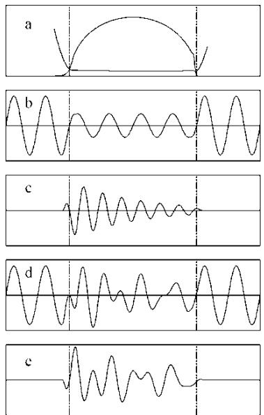  
Fig. 1 Behaviour of roughness under an EHL contact under rolling–sliding conditions: (a) smooth pressures and clearances; (b) attenuation of original roughness; (c) generation of a decaying complementary wave in the inlet; (d) combined clearance under the contact; and (e) pressure ripple under the contact

The complementary wave and the reduced original roughness combine to producing the complex waveform shown in curve d. This waveform changes continuously with time due to the different velocities of the two components. Finally, both the reduction in the amplitude of the roughness and the creation of the complementary wave require corresponding pressure ripples under the contact and these combine, as shown for one instant of time in curve e.

A simplified analysis, for Eyring fluids, was given in reference [4] which predicted that the attenuation of the original surface would depend on a single parameter, Q, that contained only the ratio of the Eyring stress to the effective elastic modulus of the surfaces and the ratio of the roughness wavelength to the clearance. It also predicted that the decay rate of the complementary wave would depend on Q and on the ratio of the velocity of the rough surface to the entrainment velocity. These predictions are shown in Fig. 2.

In developing this result, a number of simplifying assumptions were made. The most important among these were that the fluid was incompressible and that the decay rate was relatively low. This paper will first examine the effect of these assumptions and will develop more accurate expressions for the attenuation of the roughness and for the decay of the complementary wave.

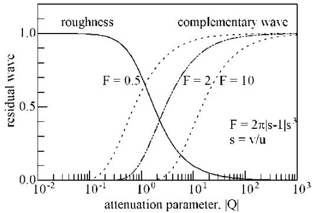  
Fig. 2 Attenuation of original roughness and decay of complementary wave per wavelength of the original roughness. $| Q | = ( 6 / \pi ^ { 2 } ) \tau _ { 0 } \lambda ^ { 2 } / E ^ { \prime } h ^ { 2 }$ From reference [4]

Then the perturbation analysis will be used to calculate the pressures and clearances in line contacts under rolling–sliding conditions. These will be compared with the predictions of the analysis and it will be shown that the analytical predictions are extremely accurate. The results of the perturbation analysis will also be used to estimate the magnitude of the complementary wave. With this determined, the behaviour of low-amplitude, sinusoidal roughness in EHL contacts can be calculated using two simple equations: one for the attenuation of the roughness and the other for the decay rate of the complementary wave, plus the calculated value for the amplitude of the complementary wave. This suggests that it may be possible to develop rapid analysis techniques for rolling –sliding conjunctions as has been done for purely rolling conjunctions.

Although the approach can be easily extended to three-dimensional roughness, this introduces additional complexities and, because of space limitations, this paper will limit the treatment to transverse roughness profiles. Also, although the analyses of the attenuation and decay rate are developed for general non-Newtonian behaviour, comparison with the perturbation analysis is given only for Eyring fluids. This is partly for conciseness but also because comparisons of the calculated attenuation with measured values gave good agreement when using an Eyring model [4], whereas the limit shear stress model predicted that there would be almost no attenuation – a result completely at variance with measurement.

## 2 SIMPLIFIED ANALYSIS

The pressure distribution under EHL line contacts with transverse roughness is governed by Reynolds equation

$$
\frac { \partial } { \partial x } \left( \frac { \rho h ^ { 3 } } { 1 2 \eta _ { \mathrm { e f f } } } \frac { \partial P } { \partial x } \right) = u \frac { \partial ( \rho h ) } { \partial x } + \frac { \partial ( \rho h ) } { \partial t }\tag{1}
$$

where $\eta _ { \mathrm { e f f } }$ is the effective viscosity after allowing for any non-Newtonian effects in the fluid.

In analysing the effects of low-amplitude surface roughness it is convenient to consider the two effects, the attenuation of the surface roughness and the behaviour of the decaying, complementary wave separately. These effects may then be superimposed to obtain the overall behaviour of the roughness under the conjunction.

## 2.1 Attenuation of roughness

Under smooth conditions, the clearance under EHL contacts is approximately constant. Assuming that the roughness wavelength is considerably shorter than the semi-contact width, b, the attenuation of the roughness may be investigated by examining its behaviour in a parallel conjunction with a uniform pressure.

It will be assumed that the undeformed roughness would change the clearance by an amount

$$
\begin{array} { c } { { \delta h = A \cos [ \omega ( x - \nu t ) ] } } \\ { { \mathrm { { o r } } } } \\ { { \delta h = R e \{ A \mathrm { e } ^ { \mathrm { i } \omega ( x - \nu t ) } \} } } \end{array}\tag{2}
$$

where the amplitude A of the roughness is assumed to be small compared with the clearance.

The clearance will be modified inside the conjunction but it will be assumed that the resulting waveform is sinusoidal and has the same wavelength as the original roughness, giving a clearance variation

$$
\delta h = R e \{ a \ \mathrm { e } ^ { \mathrm { i } \omega ( x - \nu t ) } \}\tag{3}
$$

where the amplitude a is complex, reflecting both the difference in amplitude and in phase between the original profile and the attenuated clearance variation.

This variation in clearance will generate small pressure changes and, because of the low clearance amplitude, these also will vary sinusoidally and will have the form

$$
\delta p = R e \{ p { \mathrm { ~ e } } ^ { { \mathrm { i } } \omega ( x - \nu t ) } \}\tag{4}
$$

This pressure ripple will, in turn, produce small changes in density that can be expressed as

$$
\delta \rho = R e \{ d \ \mathrm { e } ^ { \mathrm { i } \omega ( x - \nu t ) } \}\tag{5}
$$

where d is related to the pressure variation by

$$
d = { \frac { \rho } { B } } p\tag{6}
$$

where B is the bulk modulus at the contact pressure defined relative to the density at that pressure. This somewhat unusual definition of bulk modulus is logical when dealing with small perturbations about the density, $\rho ,$ and greatly simplifies the resulting equations.

Substituting these into Reynolds’ equation and ignoring second-order terms gives

$$
i \frac { \rho h ^ { 3 } \omega } { 1 2 \eta _ { \mathrm { e f f } } } p = - ( \nu - u ) \bigg ( \rho a + \frac { \rho h } { B } p \bigg )\tag{7}
$$

In addition, the pressure ripple will deform the surfaces and the combined deformation will have the form

$$
\delta w = R e \{ w \mathrm { e } ^ { \mathrm { i } \omega ( x - \nu t ) } \}\tag{8}
$$

where [12]

$$
w = \frac { 4 } { \omega E ^ { \prime } } p\tag{9}
$$

Finally, the clearance variation is equal to the sum of the original roughness plus the surface deformation

$$
a = A + w\tag{10}
$$

Combining equations (6), (7), (9), and (10) allows the pressure ripple to be found as

$$
{ \frac { p } { A } } = { \frac { \omega E ^ { \prime } } { 4 } } { \frac { \mathrm { i } Q } { 1 - \mathrm { i } Q - \mathrm { i } C Q } }\tag{11}
$$

and the clearance variation as

$$
{ \frac { a } { A } } = { \frac { 1 - \mathrm { i } C Q } { 1 - \mathrm { i } Q - \mathrm { i } C Q } }\tag{12}
$$

where

$$
Q = \frac { 4 8 \eta _ { \mathrm { e f f } } ( \nu - u ) } { E ^ { \prime } h ^ { 3 } \omega ^ { 2 } }\tag{13}
$$

and

$$
C = { \frac { h E ^ { \prime } \omega } { 4 B } }
$$

or expressed in terms of the roughness wavelength rather than the wavenumber

$$
Q = { \frac { 1 2 } { \pi ^ { 2 } } } { \frac { \eta _ { \mathrm { e f f } } ( \nu - u ) } { E ^ { \prime } h } } { \frac { \lambda ^ { 2 } } { h ^ { 2 } } } \quad C = { \frac { \pi E ^ { \prime } } { 2 } } { \frac { h } { B } } { \frac { \ d h } { \lambda } }\tag{14}
$$

Figure 3 shows the relationship between the magnitude of the clearance variation and the parameter, $Q ,$ for an incompressible fluid and for a compressible fluid and it may be seen that at low values of Q the roughness is unaltered. Then, as Q is increased, the amplitude of the clearance variation decreases, falling to zero at large values. The transition is centred around Q 1 but extends over the region from Q  0.1 to 100. For the compressible fluid, an Eyring stress of $\tau _ { 0 } = 4 \mathrm { M P a }$ and a bulk modulus of 10 GPa – a typical value for mineral oils at a pressure of 1 GPa – have been assumed. Derivation of the effective viscosity is given in Appendix 2.

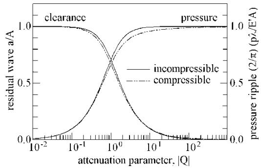  
Fig. 3 Effect of fluid compressibility on the roughness attenuation and the associated pressure ripple. The compressible fluid has an Eyring characteristic with $\tau _ { 0 } = 4 \mathrm { M P a }$ $B = 1 0 \mathrm { G P a }$ E0 228 GPa

It may be seen that this amount of compressibility has relatively little effect on either the roughness attenuation or the pressure ripple. For most practical purposes, therefore, the effect of compressibility can be ignored and equations (11) and (12) simplified by setting C to zero. However, if a high accuracy is required or if a more compressible fluid is used, it will be worth using the fuller form of these equations.

## 2.2 Decay of the complementary wave

As the roughness enters the conjunction, it changes conditions in the inlet and produces variations in the clearance there. These variations propagate through the contact at the entrainment velocity, decaying as they do so. There seems to be no simple way of determining the amplitude of this complementary wave but it is possible to estimate its wavelength and the rate at which it decays as it passes through the conjunction.

The roughness waves enter the inlet at a frequency v and the complementary wave leaves at the entrainment velocity u. In the absence of any modifications inside the conjunction, the wavenumber of the complementary wave would, therefore, be vv/u or $\omega _ { \mathrm { c } } .$ Thus, where the rough surface moves faster than its counterface, the wavelength will tend to be reduced; where it moves slower the wavelength will be increased.

Because of the reduced viscosity due to non-Newtonian effects, the pressures associated with the complementary wave will produce flows that tend to reduce its amplitude as it moves through the contact. This decay will, in turn, alter the sinusoidal waveform, producing additional flows that tend to increase its wavelength.

Denoting the actual wavenumber of the complementary wave as $\omega _ { \mathrm { d } }$ and assuming that the wave decays exponentially with distance at a rate $\alpha ,$ its amplitude may be expressed as

$$
\delta h = R e \{ { \bf a } _ { \mathrm { c } } ~ \mathbf { e } ^ { ( - \alpha + \mathrm { i } \omega _ { \mathrm { d } } ) x } ~ \mathbf { e } ^ { - \mathrm { i } \omega \nu t } \}\tag{15}
$$

or

$$
\delta h = R e \{ a _ { \mathrm { c } } \mathrm { e } ^ { \mathrm { i } \psi x } \mathrm { e } ^ { - \mathrm { i } \omega \nu t } \}
$$

where

$$
\psi = \omega _ { \mathrm { d } } + \mathrm { i } \alpha\tag{16}
$$

This change in clearance will require some associated pressure distribution to deform the contacting surfaces and this pressure will have the form

$$
\delta p = R e \{ p _ { \mathrm { c } } \ : \mathrm { e } ^ { \mathrm { i } \psi x } \ : \mathrm { e } ^ { - \mathrm { i } \omega \upsilon t } \}\tag{17}
$$

Using the result derived in Appendix 3 the ratio of the pressure, $p _ { \mathrm { c } } ,$ to the wave amplitude, $a _ { \mathrm { c } } ,$ will be

$$
{ \frac { p _ { \mathrm { c } } } { a _ { \mathrm { c } } } } = { \frac { \psi E ^ { \prime } } { 4 } }\tag{18}
$$

Substituting these, and the associated changes in density, into Reynolds’ equation produces an expression for the complex wavenumber, c

$$
\begin{array} { r } { \mathrm { i } \frac { h ^ { 3 } \omega _ { \mathrm { c } } ^ { 2 } E ^ { \prime } } { 4 8 \eta _ { \mathrm { e f f } } u } \bigg ( \frac { \psi } { \omega _ { \mathrm { c } } } \bigg ) ^ { 3 } = \bigg ( \frac { \psi } { \omega _ { \mathrm { c } } } - 1 \bigg ) \bigg ( 1 + \frac { h \omega _ { \mathrm { c } } E ^ { \prime } } { 4 B } \frac { \psi } { \omega _ { \mathrm { c } } } \bigg ) } \\ { \mathrm { o r } \quad \frac { \mathrm { i } } { Q _ { \mathrm { c } } } \bigg ( \frac { \psi } { \omega _ { \mathrm { c } } } \bigg ) ^ { 3 } = \bigg ( \frac { \psi } { \omega _ { \mathrm { c } } } - 1 \bigg ) \bigg ( 1 + C _ { \mathrm { c } } \frac { \psi } { \omega _ { \mathrm { c } } } \bigg ) } \end{array}\tag{19}
$$

where

$$
Q _ { \mathrm { c } } = \frac { 4 8 \eta _ { \mathrm { e f f } } u } { h ^ { 3 } \omega _ { \mathrm { c } } ^ { 2 } E ^ { \prime } }\tag{20}
$$

and

$$
C _ { \mathrm { c } } = \frac { h \omega _ { \mathrm { c } } E ^ { \prime } } { 4 B }
$$

or expressed in terms of the wavelength rather than the wavenumber

$$
Q _ { \mathrm { c } } = \frac { 1 2 } { \pi ^ { 2 } } \frac { \eta _ { \mathrm { e f f } } u } { E ^ { \prime } h } \frac { \lambda _ { \mathrm { c } } ^ { 2 } } { h ^ { 2 } } \quad \mathrm { a n d } \quad C _ { \mathrm { c } } = \frac { \pi E ^ { \prime } } { 2 } \frac { h } { B } \frac { } { \lambda _ { \mathrm { c } } }\tag{21}
$$

$Q _ { \mathrm { c } }$ and $C _ { \mathrm { c } }$ are closely related to the variables Q and C defined earlier for the attenuation of the roughness and it is, perhaps, easier to defined them relative to

these as

$$
Q _ { \mathrm { c } } = \frac { Q } { ( \nu / u ) ^ { 2 } ( \nu / u - 1 ) }\tag{22}
$$

and

$$
C _ { \mathrm { c } } = { \frac { \nu } { u } } C
$$

Solution of equation (19) is straightforward. The real part gives a quadratic equation for $\omega _ { \mathrm { d } } / \omega _ { \mathrm { c } }$ the coefficients of which are functions of the decay rate, $\alpha / \omega _ { \mathrm { c } }$ . The imaginary part gives a quadratic equation for $\alpha / \omega _ { \mathrm { c } }$ in terms of the wavenumber $\omega _ { \mathrm { d } } / \omega _ { \mathrm { c } }$ Repeated solution of these, taking $\psi = 1$ as a starting value, converges rapidly. The roots of both quadratic equations are always real, with one positive and one negative root, and the positive roots need to be selected.

Figure 4 shows the frequency ratio, $\omega _ { \mathrm { d } } / \omega _ { \mathrm { c } } ,$ and the change in amplitude per cycle, $\exp ( - 2 \pi \alpha / \omega _ { \mathrm { d } } )$ , as functions of $Q _ { \mathrm { c } }$ . The dotted curve is for a typical compressible fluid, whereas the chain dashed curve shows the effect of neglecting the fluid compressibility. In calculating the compressible curve, an Eyring fluid characteristic has been assumed. With a limit shear stress fluid, the effect of compressibility is far lower. Finally, if the ratio $\alpha / \omega _ { \mathrm { d } }$ is assumed small, equation (19) gives

$$
\frac { \alpha } { \omega _ { \mathrm { d } } } = \frac { 1 } { Q _ { \mathrm { c } } }\tag{23}
$$

whereas the wavenumber remains as $\omega _ { \mathrm { c } }$ and the pressure amplitude relationship of equation (18) simplifies to

$$
{ \frac { p } { a } } = { \frac { \omega _ { \mathrm { c } } E ^ { \prime } } { 4 } }\tag{24}
$$

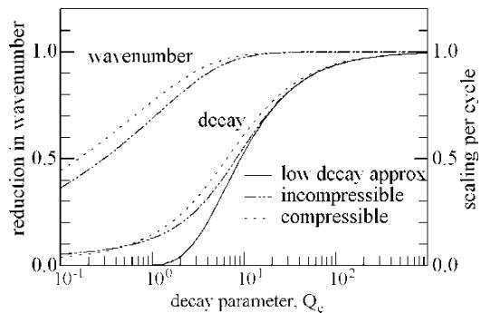  
Fig. 4 Decay rate of the complementary wave and wavenumber ratio. For the compressible fluid, $\tau _ { 0 } = 4 \mathrm { M P a } , B = 1 0 \mathrm { G P a } , E ^ { \prime } = 2 2 8 \mathrm { G P a }$

This approximation, which was used in reference [4], is shown by the full line in the figure. It should be noted that Fig. 2, which is taken from reference [4], gives the decay per wavelength of the original roughness; Fig. 4 gives the decay per wavelength of the complementary wave.

As with the attenuation of the surface roughness, it may, again, be seen that the effect of this level of compressibility is relatively small and compressibility may, possibly, be neglected. Again, however, if high accuracy is required or more compressible fluids are used, the effects of compressibility do need to be included.

It may also be seen that there is little difference between the approximate and accurate solutions provided the amplitude ratio per cycle is above 0.5. Below this value, the approximate solution overestimates the decay rate and also predicts too high a wavenumber. For short wavelength roughness, these effects become significant and the accurate wavenumber and decay rate equations must be used.

## 3 PERTURBATION SOLUTION

The analysis given above provides estimates of the attenuation of the roughness and of the decay rate of the complementary wave. These values need, first, to be checked against accurate solutions of the EHL problem with low-amplitude, sinusoidal roughness and, second, the amplitude of the complementary wave needs to be established. The perturbation analysis provides a rapid way of determining accurate solutions for this purpose.

Full details have been given elsewhere [5–8] and only a very brief explanation will be provided here. First, a solution to the smooth, line EHL problem is obtained. This includes fluid compressibility and any non-Newtonian effects. A typical distribution is shown in Fig. 5 for an Eyring fluid with $\tau _ { 0 } = 4 \mathrm { M P a }$ and a Roelands pressure–viscosity characteristic for the case where the slip is 50 per cent of the entrainment velocity. The effect of the reduced viscosity produced by sliding is apparent in the virtual absence of the pressure spike.

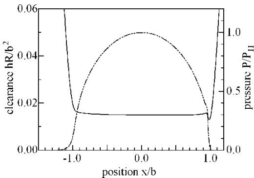  
Fig. 5 Pressures and clearances under smooth contact: Greenwood parameters, $P = 2 0 , S = 5 ,$ $P _ { \mathrm { H e r t z } } = 1 \mathrm { G P a }$ $\nu / u = 0 . 7 5 ,$ Eyring fluid, $\tau _ { 0 } = 4 \mathrm { M P a }$

A low-amplitude, sinusoidal surface roughness will modify the conditions in the conjunction slightly. As the roughness is sinusoidal, the pressures, clearances, etc. at each point will vary sinusoidally with time at a frequency given by vv. These pressure variations may be specified, piecewise, at evenly spaced nodes as complex amplitudes of this sinusoidal variation in the form $\delta _ { p } = \bar { P } { \bf e } ^ { - \mathrm { i } \omega \nu t } .$ . The complex form of P simply defines the phase of the variation.

This enables the clearance, density, and effective viscosity changes to be obtained in a similar form in terms of the nodal pressure perturbations. Substitution into Reynolds’ equation yields a set of linear, complex simultaneous equations for the pressures. Once these have been solved, the clearance changes can be calculated.

For pure rolling, a number of approximations are available to allow very-short-wavelength roughness to be examined. However, under rolling–sliding conditions, these cannot be used and practical limitations such as solution time and rounding errors limit the process to around 2000 nodes. Because at least 30 nodes per wavelength are needed for an accurate solution, this restricts the shortest wavelength that can be examined to around 3 per cent of the semi-contact width.

Figure 6 shows a typical result for the case where the rough surface is moving at 75 per cent of the entrainment velocity. The results are for one instant of time with the pressures and clearances changing in a complex fashion as the attenuated roughness and the complementary wave move through the contact at different velocities.

Inside the conjunction, the clearance variation consists of the attenuated roughness with the same wavelength as the undeformed surface combined with a decaying, complementary wave with a wavelength some 33 per cent longer. The two interact producing the waveform shown with large amplitudes where the two are in phase and low amplitudes where they cancel. The pressure, similarly, consists of these two components but, because the pressure required to deform the surface tends to be greater than that required to produce the complementary wave due to the wavelength difference, the shorter wavelength component is more dominant.

Similar effects are found under all operating conditions and Fig. 7 shows how the behaviour is affected by the wavelength of the roughness for the case where the rough surface velocity is three times that of the smooth. With this velocity ratio, the length of the complementary wave will be around two-thirds of that of the original profile.

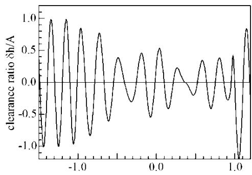

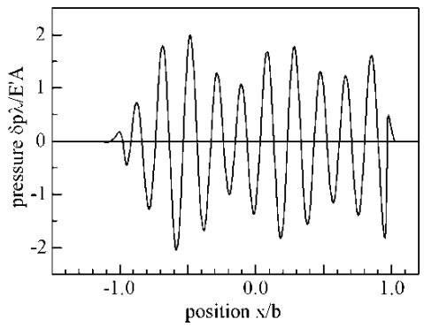  
Fig. 6 Perturbation clearances and pressures: $\lambda / b =$ 0.19. Operating conditions as in Fig. 5

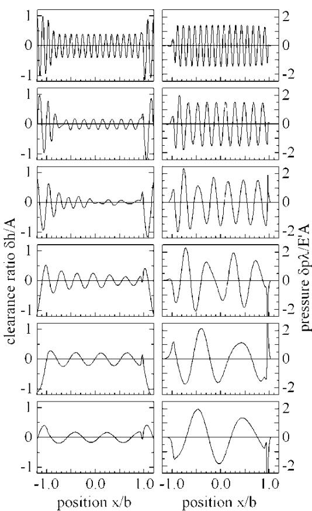  
Fig. 7 Perturbation clearances and pressures. Effect of wavelength. v/u 1.5. Operating conditions are as in Fig. 5. $\lambda / b = 0 . 1 2 , 0 . 2 , 0 . 3 , 0 . 5 , 0 . 8 ,$ , and 1.0

At the shortest wavelength, the original roughness is attenuated to about 40 per cent of its original amplitude. The complementary wave decays rapidly and, over the majority of the contact, has little effect on either the clearance or pressure perturbations. Then, as the wavelength is increased, the original roughness is increasingly attenuated, whereas the decay rate of the complementary wave reduces. This results in the complex clearance waveforms found for $\lambda / b = 0 . 2$ and 0.3. At still longer wavelengths, the original roughness is almost completely flattened but the decay rate of the complementary wave decreases and, at the longer wavelengths, it becomes almost constant in amplitude. Its wavelength is, however, two-thirds of that of the original profile.

For all wavelengths, the pressure perturbation consists of a combination of the pressure required to attenuate the original profile and that required to create the complementary wave. Thus, whenever the complementary wave is present, the pressure profile is complex, consisting of the two wavelength components travelling at different velocities. In examining these curves, it may be noted that the non-dimensional pressure amplitude required to completely flatten the original profile is equal to /2. Figure 8 shows the effect of changing the rough surface velocity for a roughness wavelength of $\lambda / b = 0 . 2$ . The three upper curves are for the rough surface moving faster than its counterface; the three lower curves for it moving more slowly. In the upper curves, the complementary wave has a shorter wavelength than the original roughness, whereas in the lower curves it is longer.

At the highest velocity, $\nu / u = 1 . 5 ,$ the complementary wave decays rapidly and only affects the behaviour adjacent to the inlet. For the remaining curves, the decay rate is lower and the complementary wave affects the clearances and pressures over the whole of the conjunction. At 10 per cent slip $( \nu / u = 1 . 0 5 )$ , the wavelengths of the complementary wave and the original roughness differ by 5 per cent and the effect is to produce an apparent decrease in clearance amplitude across the contact as the phases of the two profiles interact. This profile is further complicated by the decay of the complementary wave with distance.

The two middle curves are for very low slip velocities where the complementary wave has a very similar wavelength to that of the original profile and a low decay rate. Here there are insufficient cycles across the contact for the variation in clearance amplitude to be apparent. However, the interaction between the two components is clearly visible in the pressure profiles with the pressure ripple appearing to increase in amplitude across the conjunction.

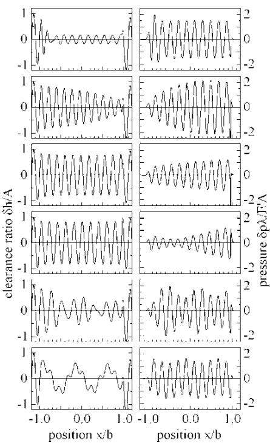  
Fig. 8 Perturbation clearances and pressures. Effect of surface velocity. $\lambda / b = 0 . 2$ . v/u 1.5, 1.05, 1.01, 0.98, 0.75, and 0.25. Operating conditions are as in Fig. 5

Finally, at lower velocities of the rough surface the amplitude of the complementary wave becomes almost constant and the interaction of this with the attenuated roughness is clear. However, because the wavelength of the complementary wave is longer than that of the original surface, the pressure distribution tends to be dominated by the attenuation component.

## 4 COMPARISON WITH THEORY

With a large number of perturbation solutions available, the simple analysis of section 2 can be checked for accuracy and estimates of the amplitude of the complementary wave made. It is convenient to do this as a single process and the procedure is shown in Fig. 9 for the case where $\lambda / b = 0 . 2 4$ and $\nu / u = 1 . 2 5$

The upper curves show the clearances and pressures obtained from the perturbation analysis at one instant of time. It should be emphasized that these are simply the real parts of complex variables and that the values at any other time can be obtained by scaling those variables by $\mathrm { e } ^ { - \mathrm { i } \omega \nu \mathrm { t } }$ before taking the real part. The second curves show the amplitude of the attenuated roughness and its associated pressure distribution calculated using the theory of section 2. On subtracting these values from the total clearances and pressures of curves a, only the complementary wave should remain if the analysis of section 2 is accurate. The full lines in curves c show these residual clearances and pressures obtained by this subtraction, again at one instant of time.

It is then a simple matter to fit complementary waves of the form given by equations (15) and (17) to these curves. The residual clearances obtained by subtracting the attenuated roughness from the perturbation values will be denoted by the complex value $H _ { \mathrm { r } }$ where again the actual clearances may be obtained from $\overline { { R e } } \{ H _ { \mathrm { r } } \ : \mathrm { e } ^ { i \omega \nu t } \}$ . The complementary wave is given by equation (15) and the complex value $a _ { \mathrm { c } }$ represents the amplitude of the wave at the contact centre, whereas the term $\mathrm { e } ^ { \mathrm { i } \psi x }$ gives its distribution. Denoting this latter term by $H _ { \mathrm { c } }$ it is then simply a question of adjusting $a _ { \mathrm { c } }$ so that the difference between $H _ { \mathrm { r } }$ and $a _ { \mathrm { c } } H _ { \mathrm { c } }$ is as small as possible.

The error at any point is given by

$$
H _ { \mathrm { r } } - a _ { \mathrm { c } } H _ { \mathrm { c } }\tag{25}
$$

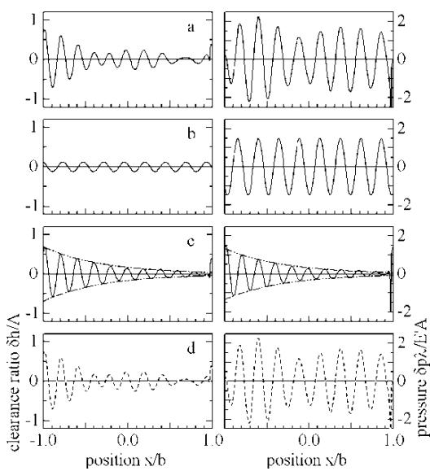  
Fig. 9 Calculation of the amplitude and phase of the complementary wave. $\lambda / b = 0 . 2 4$ $\nu / u = 1 . 2 5$ (a) clearances and pressures from the perturbation analysis; (b) attenuated roughness and its associated pressure ripple from equations (11) and (12); (c) perturbation values after subtraction of attenuated roughness; chain dashed line shows best-fit of amplitude using equation (19) for the decay rate; and (d) combination of best-fit complementary wave and attenuated roughness

and $a _ { \mathrm { c } }$ may be obtained by minimizing

$$
\sum | H _ { \mathrm { r } } - a _ { \mathrm { c } } H _ { \mathrm { c } } | ^ { 2 }\tag{26}
$$

where the summation is taken over the perturbation nodes from the inlet to just before the exit. This gives for $a _ { \mathrm { c } }$

$$
a _ { \mathrm { c } } = \frac { \sum H _ { \mathrm { r } } \bar { H } _ { \mathrm { c } } } { \sum H _ { \mathrm { c } } \bar { H } _ { \mathrm { c } } }\tag{27}
$$

The chain dashed line in the figures shows the amplitude of the resulting ‘best-fit’ complementary wave. It may be noted that it is possible to use the pressure distributions rather than clearances to obtain the value of $a _ { \mathrm { c } } .$ This gave virtually identical results, as did a combination of the two, and the simplest procedure of fitting just the clearances was, therefore, adopted.

Having estimated the best-fit, the complementary wave and the theoretical clearance attenuation were combined to obtain the total clearance and pressure variations. If the simple theory of section 2 is accurate, these should match those obtained from the perturbation analysis.

In the lower curves, the perturbation results are replotted as a faint line, whereas the best-fit results are shown by the dark, dashed curve. It may be seen that the agreement is excellent with the maximum errors being below 1 per cent of the original roughness in the case of the clearances and of (p/2) E0A/l (the pressure required to completely flatten the roughness) in the case of the pressures.

Similar results were obtained for a wide range of slip ratios – 24 in total – including the cases where one surface was stationary and cases where the rough surface was moving 1 per cent faster or slower than the entrainment velocity each for a range of wavelengths from $\lambda / b = 0 . 0 3$ to 1. In some cases, the error rose slightly but, in general, the agreement was similar to that of Fig. 9. This analysis was repeated with the value of the speed parameter, S, increased from 5 to 10 (a 16-fold increase in entrainment velocity or viscosity) and, again, the agreement was excellent.

Figure 10 shows a selection of the results. Again the perturbation results are plotted as a continuous grey line, whereas the fitted curves are shown as dashed black lines. In all cases, the agreement is excellent with the fitted curve lying directly over the perturbation result.

The fitting process was repeated ignoring fluid compressibility and although the accuracy was slightly lower, the agreement appeared adequate for most practical purposes.

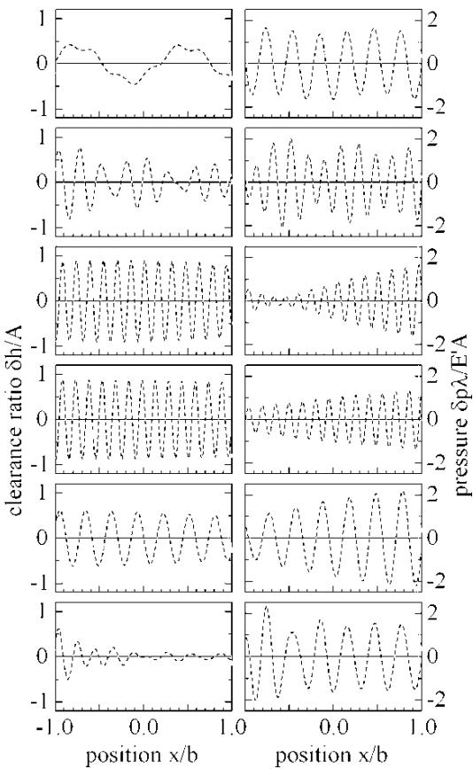  
Fig. 10 Comparison between perturbation solution and results obtained from the analysis of section 2 with the complementary wave amplitude obtained by curve-fitting. From the top downwards: $\lambda / b = 0 . 3 ,$ v/u 0.25; l/ $b = 0 . 2 $ , v/u 0.75; l/b 0.15, $\nu / u = 0 . 9 7 5 ;$ $\lambda / b = 0 . 1 5 ,$ v/u 1.01; $\lambda / b = 0 . 3 ,$ $\nu / u = 1 . 0 5 ;$ $\lambda / b = 0 . 3 ,$ v/u 1.5

## 5 INTERPOLATION

Although the main aims of this paper are to assess the accuracy of the analytical solution and to develop methods for calculating the magnitude of the complementary wave, the ultimate intention is to develop rapid calculation methods for the assessment of roughness effects in rolling–sliding EHL contacts – as was done for rolling contacts in reference [9]. For this, it is necessary to be able to obtain the magnitude of complementary wave rapidly either from an equation or, as appears more probable in the present case, by interpolation from a table of previously calculated results.

For this to be possible, the amplitudes must be defined so that their variation with wavelength and slip ratio is reasonably smooth. Simply plotting the amplitude ratio $ { a _ { \mathrm { c } } } / A$ , which defines the amplitude and phase of the complementary wave at the centre of the contact, produced an extremely oscillatory curve with very low amplitudes when the decay rate was large.

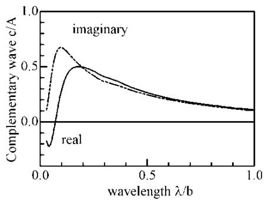  
Fig. 11 Amplitude and phase of the complementary wave at the inlet to the contact. Effect of wavelength. $\nu / u = 0 . 7 5$

A number of alternative ways of defining the amplitude were tried but the most effective appeared to be to specify the amplitude at the entrance to the conjunction, at $x / b = - 1$ . Figs 11 and 12 show the type of behaviour obtained.

In interpreting these curves, it should be noted that the complementary wave is calculated for a roughness given by

$$
\delta r = R e \{ A \mathrm { e } ^ { \mathrm { i } \omega ( x - \nu t ) } \}\tag{28}
$$

and that it has the form

$$
\delta h = R e \{ a _ { \mathrm { c } } \mathrm { e } ^ { ( - \alpha + \mathrm { i } \omega _ { \mathrm { d } } ) x } \mathrm { ~ e ~ } ^ { - \mathrm { i } \omega \upsilon t } \}\tag{29}
$$

At the inlet to the contact $( x / b = - 1 )$ , the ratio of the amplitude complementary wave to that of the original roughness is given by

$$
\frac { \delta h } { \delta r } = R e \left\{ \frac { a _ { \mathrm { c } } } { A } \mathbf { e } ^ { \alpha b } \mathbf { e } ^ { - \mathrm { i } ( \omega _ { \mathrm { d } } - \omega ) b } \right\}\tag{30}
$$

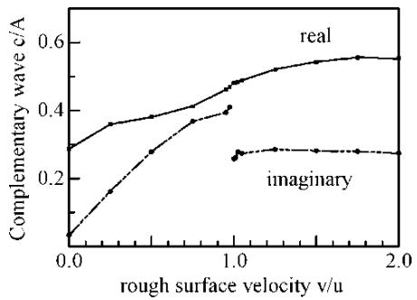  
Fig. 12 Amplitude and phase of the complementary wave at the inlet to the contact. Effect of velocity ratio. $\lambda / b = 0 . 3 1$

or

$$
\frac { \delta h } { \delta r } = R e \left\{ \frac { c } { A } \right\}
$$

where

$$
\frac { c } { A } = \frac { a _ { \mathrm { c } } } { A } \mathrm { e } ^ { \alpha b } \mathrm { e } ^ { - \mathrm { i } ( \omega _ { \mathrm { d } } - \omega ) b }\tag{31}
$$

Once the value of $c / A$ has been obtained, it is a simple matter to correct the amplitude and phase using equation (31) to obtain the amplitude ratio $ { a _ { \mathrm { c } } } / A$

Figure 11 shows the behaviour for a velocity of the rough surface given by $\nu / u = 0 . 7 5$ and it may be seen that, for wavelengths above about $\lambda / b = 0 . 1$ , the amplitude, $c / A ,$ decreases as the wavelength is increased. The real and imaginary parts are nearly equal, implying an almost constant phase between the complementary wave and the original roughness. Below this wavelength, the amplitude decreases rapidly and appears to be decreasing to zero at low wavelengths, albeit in a slightly oscillatory fashion. This change in behaviour around $\lambda / b = 0 . 1$ appears to be associated with the wavelength being longer or shorter than the contact’s inlet and this is confirmed by examining the results obtained for $S = 1 0$ , where the inlet length is considerably longer. Similar curves were obtained for the other velocity ratios.

The effect of varying the slip ratio is shown in Fig. 12 for one particular wavelength, $\lambda / b = 0 . 3 1$ The curves are in two sections: one where the rough surface is slower and the other where it is faster. No results for zero slip $( \nu / u = 1 )$ are given as shear rate effects are absent in that case and the results do not form part of the present sequence. There is a discontinuity in the imaginary part of the curve at zero slip but the real part appears virtually continuous. However, for other wavelengths both curves show a discontinuity at zero slip.

Although there are some oscillations in these two curves, overall they are sufficiently smooth to allow adequate interpolation and it should be possible to interpolate between the present results for any other slip ratio or wavelength for the particular operating conditions considered.

## 6 CONCLUSIONS

As surface roughness passes through rolling –sliding EHL contacts, two effects occur. First the amplitude of the roughness is attenuated by the sliding inside the conjunction. Second, the roughness affects conditions in the inlet, generating a complementary wave that passes through the conjunction at the entrainment velocity, decaying as it does so. This attenuation of the roughness and the creation of the complementary wave generate associated pressure ripples that modify the pressure distribution in the contact.

For low-amplitude roughness, the surface profile can be split into its Fourier components and the behaviour of each sinusoidal component examined separately before the results are recombined to obtain the overall behaviour.

It has been shown that the behaviour of a lowamplitude, sinusoidal roughness can be characterized by three complex quantities containing (a) the amplitude of the attenuated roughness and its phase, (b) the amplitude and phase of the complementary wave at the contact inlet, and (c) its wavelength and decay rate.

The first and last of these can be readily calculated using equations derived from an analysis of the roughness behaviour under a constant pressure, constant clearance conjunction. The remaining value has to be found by other means.

A more accurate version of the analysis given in reference [4] for the behaviour of roughness under a constant clearance, constant pressure conjunction has been developed, including the effects of fluid compressibility. The assumption that the decay rate is relatively small has been removed. This analysis predicts the amount the roughness is attenuated in the conjunction and the magnitude of the associated pressure ripple. It also gives the rate at which the complementary wave decays and defines its wavelength.

Accurate results for the behaviour of low-amplitude, sinusoidal roughness were obtained using the perturbation method for a very wide range of wavelengths and rough surface velocities for two operating conditions. Comparison of these with the analytical solution showed that the solution was extremely accurate over a wide range of wavelengths. Also, by combining the analytical solution with the perturbation results it proved to be simple to calculate the magnitude of the complementary wave.

Thus, for any given operating conditions and roughness wavelength, the behaviour of the roughness can be completely specified in terms of the three complex quantities: the amplitude of the attenuated roughness; the amplitude of the complementary wave; and the complex wavenumber of the complementary wave. The first and the last can be obtained from simple equations. The second has to be obtained either by a perturbation analysis for the particular wavelength required or by interpolation between previously calculated values.

It may be noted that, for Eyring fluids, the behaviour of low-amplitude roughness depends only on the Eyring stress and is not affected by the local fluid viscosity. This means that the behaviour will be insensitive to temperature changes, justifying the isothermal approach used. It is, of course, anticipated that, in applying these results, an estimate will be made of the temperature of the fluid at the centre of the contact and values appropriate to that temperature adopted.

A possible interpolation procedure for this has been suggested. This, then, should allow the behaviour of low-amplitude, sinusoidal roughness to be determined rapidly for any operating conditions. Rapid analysis of any rough surfaces under rolling – sliding conditions without the need for detailed EHL calculations should, thus, become possible.

## REFERENCES

1 Venner, C. H. Multi-level solution ofthe elastohydrodynamic line and point contact problems. Proefschrift, Universiteit Twente, The Netherlands, 1991.

2 Venner, C. H. and Lubrecht, A. A. Multi-level methods in lubrication, 2000 (Elsevier, Amsterdam).

3 Elcoate, C. D., Evans, H. O., and Hughes, T. G. Fully coupled elastohydrodynamic solution techniques for the analysis of real rough line contacts using finite element and finite difference models. In Proceedings of the 23rd Leeds –Lyon Symposium on Tribology, 1997, pp. 27–36 (Elsevier, Amsterdam).

4 Hooke, C. J. The effects of roughness in EHL contacts. In Proceedings of the 31st Leeds –Lyon Symposium on Tribology, Lyon, September 2004, 2005, pp. 31 –46 (Elsevier, Amsterdam).

5 Hooke, C. J. The behaviour of low amplitude surface roughness under line contacts. Proc. Instn Mech. Engrs, Part J: J. Engineering Tribology, 1999, 213, 275–286.

6 Hooke, C. J. The behaviour of low amplitude surface roughness under line contacts: non-Newtonian fluids. Proc. Instn Mech. Engrs, Part C: J. Mechanical Engineering Science, 2000, 214, 253–265.

7 Hooke, C. J. and Venner, C. H. Surface roughness attenuation in line and point contacts. Proc. Instn Mech. Engrs, Part J: J. Engineering Tribology, 2000, 214, 439–444.

8 Hooke, C. J. and Li, K. Y. Rapid calculation of the pressures and clearances in rough EHL contacts. Part 1: low amplitude sinusoidal roughness. Proc. IMechE, Part C: J. Mechanical Engineering, 2006, 220, in press.

9 Hooke, C. J. and Li, K. Y. Rapid calculation of the pressures and clearances in rough EHL contacts. Part 2: general roughness. Proc. IMechE, Part C: J. Mechanical Engineering, 2006, 220, in press.

10 Greenwood, J. A. and Johnson, K. L. The behaviour of transverse roughness in sliding elastohydrodynamically lubricated contacts. Wear, 1992, 153, 107–117.

11 Greenwood, J. A. and Morales-Esperjel, G. E. The behaviour of transverse roughness in EHL contacts.

Proc. Instn Mech. Engrs, Part J: J. Engineering Tribology 1994, 208, 121–132.

12 Johnson, K. L. Contact mechanics, 1985 (Cambridge University Press, Cambridge).

13 Eyring, H. Viscosity, plasticity and diffusion as examples of reaction rates. J. Chem. Phys., 1936, 4, 238.

14 Bair, S. and Winer, W. O. The pressure–viscosity coef ficient at Hertz pressure and its relation to concentrated contact traction. In Proceedings of the 26th Leeds–Lyon Symposium on Tribology, 2000, pp. 433– 443 (Elsevier, Amsterdam).

15 Sokolnikoff, I. S. Mathematical theory of elasticity, 1956, p. 256 (McGraw-Hill, New York).

## APPENDIX 1

## Notation

$^ a$ clearance perturbation under the contact   
$a _ { \mathrm { c } }$ amplitude of complementary wave at the centre of the contact   
$A$ amplitude of the surface roughness   
$^ b$ Hertz semi-contact width   
$B$ bulk modulus $- \ ( \mathrm { d } \rho / \mathrm { d } p = \rho / B )$   
$c$ amplitude of complementary wave at the inlet to the contact   
$C$ compressibility parameter $\scriptstyle ( = ( \pi / 2 )$ (E0/B) (h/l))   
$C _ { \mathrm { c } }$ modified compressibility parameter for the complementary wave $\scriptstyle ( = \mathbf { v } / u C )$   
$d$ density perturbation   
$E ^ { \prime }$ effective elastic modulus $( 2 /$ $E ^ { \prime } = ( 1 - \nu _ { 1 } ^ { 2 } ) E _ { 1 } + ( 1 - \nu _ { 2 } ^ { 2 } ) E _ { 2 }$   
$h$ clearance   
$H$ complex clearance perturbation   
$i$ $\surd ( - 1 )$   
$p$ pressure perturbation   
$p _ { \mathrm { c } }$ pressure perturbation associated with the complementary wave   
$P$ pressure   
$Q$ attenuation parameter (see equations (14) and (38))   
$Q _ { \mathrm { c } }$ decay parameter $( = Q / ( \nu / u ) ^ { 2 } / ( \nu / u - 1 )$   
$t$ time   
$u$ entrainment velocity $( = ( u _ { 1 } + u _ { 2 } ) / 2 )$   
$u _ { x } , u _ { y }$ displacements in x and y directions   
$u _ { 1 } , u _ { 2 }$ surface velocities   
$\nu$ velocity of the rough surface   
$w$ surface displacement perturbation   
$x$ position under the contact   
$y$ distance normal to surface, surface $y < 0$   
$z$ x þ iy   
$\alpha$ decay rate of the complementary wave   
$\gamma$ strain rate   
$\underset { \eta _ { \mathrm { e f f } } } { \eta }$ effective viscosity viscosity   
$\lambda$ roughness wavelength   
$\mu$ elastic constant $( 2 \mu = E / ( 1 { + } \nu ) )$   
$\nu$ Poisson’s ratio   
$\rho$ density   
$\tau _ { x x }$ $\tau _ { y y }$ stress components   
$\tau _ { x y }$   
$\tau _ { 0 }$ Eyring stress   
$\varphi$ stress function   
$\chi$ $3 - 4 \nu$   
$\psi$ complex wavenumber of the complementary wave $( = \omega _ { \mathrm { d } } + \mathrm { i } \alpha )$   
$\Psi$ stress function   
$\omega$ wavenumber of the roughness   
$\omega _ { \mathrm { c } }$ ideal wavenumber of the complementary wave ( vv/u)   
$\omega _ { \mathrm { d } }$ actual wavenumber of the complementary wave

## APPENDIX 2

## Effective viscosity

The value of the effective viscosity in equation (1) will depend on the particular non-Newtonian characteristics of the fluid. For simplicity, only an Eyring model [13] will be examined here but extension to other characteristics such as the limiting shear stress model [14] is straightforward. $\mathrm { A } s$ the Deborah number will generally be low $( h \omega \tau _ { 0 } / G$ for Eyring fluids), elasticity effects can be neglected and the shear strain rate, $\gamma ,$ related directly to the shear stress by

$$
{ \frac { \tau } { \tau _ { 0 } } } = a \sinh \Bigl ( { \frac { \eta \gamma } { \tau _ { 0 } } } \Bigr )\tag{32}
$$

where $\tau _ { 0 }$ is the Eyring stress.

When the pressure gradient is zero, the strain rate will be uniform through the thickness of the fluid film giving

$$
\gamma = \frac { u _ { 2 } - u _ { 1 } } { h }\tag{33}
$$

from which, using equation (32), the shear stress may be obtained. When a small pressure gradient is superimposed, the shear stress will change slightly and induce small changes in the flow. By direct comparison with the Poiseuille flow analysis, the total change in flow per unit width of contact will be equal to $( { \bf d } \gamma / { \bf d } \tau ) \dot { \bf \Delta } ( h ^ { 3 } / 1 2 )$ and the effective viscosity will, therefore, be given by

$$
\eta _ { \mathrm { e f f } } = \frac { d \tau } { d \gamma }\tag{34}
$$

This is readily obtained from equation (32) and gives

$$
\eta _ { \mathrm { e f f } } = \frac { \eta } { \sqrt { 1 + B ^ { 2 } } }\tag{35}
$$

where

$$
B = \frac { \eta ( u _ { 2 } - u _ { 1 } ) } { h \tau _ { 0 } }\tag{36}
$$

and because, for most EHL contacts, B will be large this will be extremely close to

$$
\eta _ { \mathrm { e f f } } = \frac { h \tau _ { 0 } } { | u _ { 2 } - u _ { 1 } | }\tag{37}
$$

and this simplified form will, therefore, be used for the remainder of this paper.

With the value of the shear factor determined, the value of $Q$ may be found, and for Eyring fluids it becomes

$$
Q = \pm \frac { 6 } { \pi ^ { 2 } } \frac { \tau _ { 0 } } { E ^ { \prime } } \frac { \lambda ^ { 2 } } { h ^ { 2 } }\tag{38}
$$

where the sign is selected to match that of $\nu - u$

## APPENDIX 3

Deformation with a decaying, sinusoidal pressure distribution

The stresses and displacements under plane strain conditions can be expressed [15] as

$$
\begin{array} { r l } & { \tau _ { x x } + \mathrm { i } \tau _ { x y } = \varphi ^ { \prime } ( z ) + \overline { { \varphi ^ { \prime } ( \bar { z } ) } } - \{ \bar { z } \varphi ^ { \prime \prime } ( z ) + \varPsi ^ { \prime } ( z ) \} } \\ & { \tau _ { y y } + \mathrm { i } \tau _ { x y } = \varphi ^ { \prime } ( z ) + \overline { { \varphi ^ { \prime } ( \bar { z } ) } } + \{ \bar { z } \varphi ^ { \prime \prime } ( z ) + \varPsi ^ { \prime } ( z ) \} } \\ & { 2 \mu ( u _ { x } - \mathrm { i } u _ { y } ) = \chi \overline { { \varphi ( \bar { z } ) } } - \bar { z } \varphi ^ { \prime } ( z ) - \varPsi ( z ) } \end{array}\tag{39}
$$

where $z = x + \mathrm { i } y$ and $\chi = 3 - 4 \nu .$

It will be assumed that the surface occupies the half-space $y < 0$ and that the shear load on the

surface is zero. Under these conditions, $\Psi ( z ) = \varphi ( z ) ~ - ~$ $z \varphi ^ { \prime } ( z )$ and the equations reduce, on the surface, to

$$
\begin{array} { l } { { \tau _ { x x } = \tau _ { y y } = 2 R e \{ \varphi ^ { \prime } ( x ) \} } } \\ { { 2 \mu u _ { y } = ( \chi + 1 ) \mathrm { I m } \{ \varphi ( x ) \} } } \end{array}\tag{40}
$$

For the present problem

$$
u _ { y } = \mathbf { e } ^ { - \alpha x } \sin ( \omega x )\tag{41}
$$

(selecting a unit amplitude and an appropriate origin) and this gives

$$
\varphi ( z ) = - \frac { 2 \mu } { \chi + 1 } \mathbf { e } ^ { - ( \alpha + \mathrm { i } \omega ) z }\tag{42}
$$

The selection of the negative sign for the ivz term is to ensure that the stress function vanishes at large, negative values of y.

With this, the normal stress on the surface becomes

$$
\tau _ { y y } = \frac { 4 \mu } { \chi + 1 } \mathbf { e } ^ { - \alpha x } [ \alpha \cos ( \omega x ) + \omega \sin \left( \omega x \right) ]\tag{43}
$$

Equations (41) and (43) may then be used to determine the change in pressure required to produce an increase in clearance, $\delta h ,$ , of the form

$$
\delta h = R e \{ a \mathrm { e } ^ { - \alpha x } \mathrm { e } ^ { \mathrm { i } \omega x } \}
$$

as

$$
\delta p = R e \{ p \mathrm { e } ^ { - \alpha x } \mathrm { e } ^ { \mathrm { i } \omega x } \}\tag{44}
$$

where

$$
{ \frac { p } { a } } = { \frac { ( \omega + \mathrm { i } \alpha ) E ^ { \prime } } { 4 } }
$$

This relationship is identical to that for a sinusoidal pressure distribution when the decay rate, $\alpha ,$ is zero.
