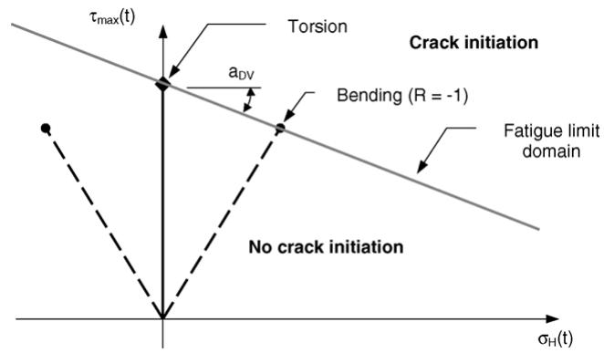
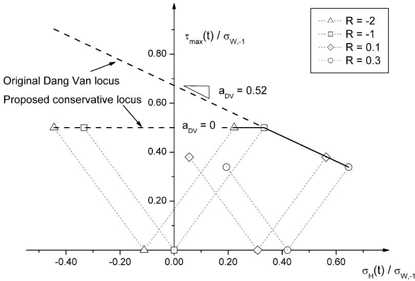
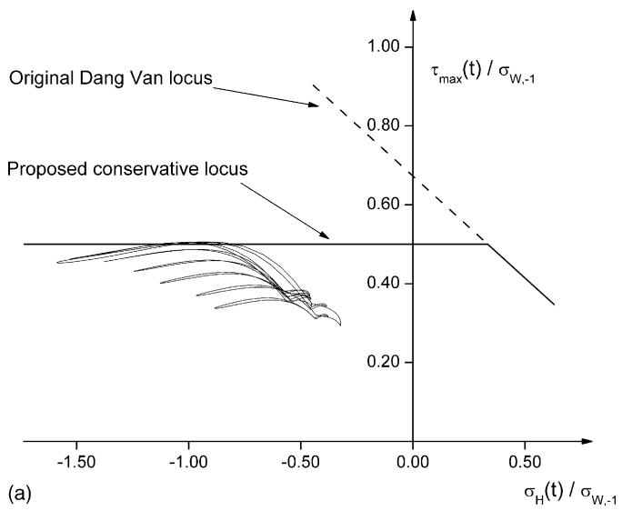
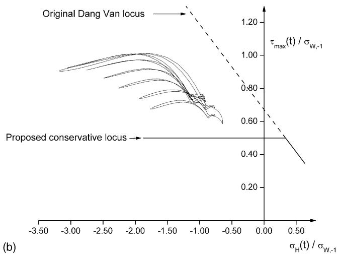
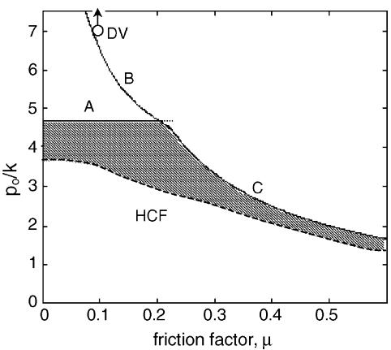
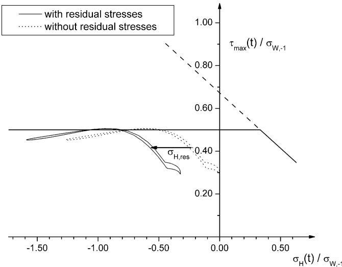

# Short communication

# On the application of Dang Van criterion to rolling contact fatigue

H. Desimone ∗, A. Bernasconi, S. Beretta

Politecnico di Milano, Dipartimento di Meccanica, via La Masa 34, I-20156, Milano, Italy

Received 24 August 2004; received in revised form 18 February 2005; accepted 8 March 2005 Available online 15 April 2005

## Abstract

In this note, the problem of the calibration of the Dang Van multiaxial fatigue criterion is addressed. The discussion is based on uniaxial fatigue tests performed with different stress ratios. Results show that the usual technique for calibrating the constants ofthe Dang Van criterion does not agree with experimental evidence, especially for negative stress ratios. For this reason, a different fatigue failure locus made of two straight line segments is proposed and typical three-dimensional rolling contact stress histories are analyzed using the traditional and proposed methods. Results show that the conventional technique does not agree with knowledge coming from shakedown approaches of rolling contact while the proposed method seems to constitute a more appropriate limit. © 2005 Elsevier B.V. All rights reserved

Keywords: Rolling contact fatigue; Multiaxial fatigue; Shakedown; Residual stresses; Stress ratio

## 1. Introduction

High cycle contact fatigue failure has considerable industrial relevance for those applications where contact loads appear, as for example, gears, cams, rolling bearings and rail– wheel systems. In particular, rolling contact fatigue (RCF) is maybe one of the most difficult problems regarding out-ofphase multiaxial fatigue because all six components of the stress tensor may arise. In recent years, a high number of papers have been dealing with the use of the Dang Van multiaxial criterion for RCF (see, for example, references [1–11]). The aim ofthis note is to discuss the suitability ofthis method to RCF, by verifying its response to several uniaxial tests and extrapolating data to three-dimensional contact stress histories.

## 1.1. Dang Van’s fatigue criterion

Before detailing the calibration of the Dang Van locus, an outline of the practical application of this criterion will be given. The basis of the following relationships is the application of the elastic shakedown principles at the mesoscopic scale, which will be shortly explained in this article. For more theoretical details, the interested reader is referred to [12,13]. The Dang Van criterion can be expressed by:

$$
\tau _ { \mathrm { m a x } } ( t ) + a _ { \mathrm { D V } } \sigma _ { \mathrm { H } } ( t ) = \tau _ { \mathrm { W } }\tag{1}
$$

with aDV being a constant to be determined, τW the fatigue limit in reversed torsion, $\sigma _ { \mathrm { H } } ( t )$ the instantaneous hydrostatic component of the stress tensor and $\tau _ { \operatorname* { m a x } } ( t )$ the instantaneous value of the Tresca shear stress, i.e.,

$$
\tau _ { \mathrm { m a x } } ( t ) = \frac { \hat { s } _ { \mathrm { I } } ( t ) - \hat { s } _ { \mathrm { I I I } } ( t ) } { 2 }\tag{2}
$$

evaluated over a symmetrized stress deviator, which is obtained by subtracting from the stress deviator:

$$
s _ { i j } ( t ) = \sigma _ { i j } ( t ) - \delta _ { i j } \sigma _ { \mathrm { H } } ( t )\tag{3}
$$

a constant tensor, $s _ { i j , \mathrm { m } } , \mathrm { i } . e .$

$$
\hat { s } _ { i j } ( t ) = s _ { i j } ( t ) - s _ { i j , \mathrm { m } }\tag{4}
$$

The constant tensor $s _ { i j , \mathrm { m } }$ is defined by the relationship:

$$
\begin{array} { r l } & { \underset { t } { \operatorname* { m a x } } [ ( s _ { i j } ( t ) - s _ { i j , m } ) ( s _ { i j } ( t ) - s _ { i j , m } ) ] } \\ & { \quad = \underset { s _ { i j } ^ { \prime } } { \operatorname* { m i n } } \underset { t } { \operatorname* { m a x } } [ ( s _ { i j } ( t ) - s _ { i j } ^ { \prime } ) ( s _ { i j } ( t ) - s _ { i j } ^ { \prime } ) ] } \end{array}\tag{5}
$$

The constant tensor $s _ { i j , \mathrm { m } }$ may be regarded as the part of the stress deviator, which has no influence on the fatigue crack nucleation, and therefore, is eliminated through the minimization process of Eq. (5). One of the consequences of this method is the correct prediction of the absence of any effect of a mean shear stress upon the torsional fatigue limit.

In Dang Van’s original proposal, the existence of the constant stress deviator $s _ { i j , m }$ is justified by the assumption that the stress deviator defined by Eq. (4) is the mesoscopic stress deviator, i.e., the stress state found at the grain scale. Close to the fatigue limit, some unfavorably oriented grains may still undergo cyclic plasticity, although the macroscopic behaviour appears elastic. For crack nucleation to be avoided, these grains necessarily have to reach an elastic shakedown state. The presence of the residual stress deviator defined by Eq. (5) allows fulfillment of this condition.

Defined at the mesoscopic scale, these residual stresses are different from those developing as a consequence of a structural elastic shakedown. In this case, the minimization procedure of Eq. (5) would not be enough and the evaluation of residual stresses would require the classical procedures of the theory of plasticity.

If the macroscopic stress state exceeded the yield limit, because of the assumption of the elastic behaviour of the crystalline aggregate surrounding the unfavorably oriented grains, the Dang Van criterion would not be applicable, unless the material shakes down to the elastic state also at the macroscopic level. For this reason, Dang Van criterion can be applied to some rolling contact fatigue problems, provided that the contact conditions allow for the elastic shakedown of the material subjected to contact stresses.

Going back to Eq. (1) because of the symmetrization of the stress deviator, the term $\tau _ { \operatorname* { m a x } } ( t )$ alone cannot account for the effect of normal stresses upon the fatigue limit. For this reason, the effect ofa mean normal stress upon fatigue limits in bending and torsion is taken into account by introducing into Eq. (1) the term αDVσH(t). This term represents the effect ofthe hydrostatic stress on crack nucleation and it can also be demonstrated that macroscopic and mesoscopic hydrostatic stresses are the same [12].

If residual stresses are superimposed on the applied stresses, the term $\tau _ { \operatorname* { m a x } } ( t )$ is not altered because of the minimization process of Eq. (5). However, the term $\alpha _ { \mathrm { D V } } \sigma _ { \mathrm { H } } ( t )$ is modified by the presence of residual stresses through the hydrostatic part ofthe residual stress tensor $\sigma _ { \mathrm { H , r e s } }$ , and therefore, Eq. (1) becomes:

$$
\tau _ { \mathrm { m a x } } ( t ) + a _ { \mathrm { D V } } [ \sigma _ { \mathrm { H } } ( t ) + \sigma _ { \mathrm { H , r e s } } ] = \tau _ { \mathrm { W } }\tag{6}
$$

The constant aDV appearing in the expression of the Dang Van criterion is usually calibrated with two fatigue tests, pure bending (or tension–compression) and pure torsion [1]. In the space constituted by the symmetrized shear $\left( \tau _ { \operatorname* { m a x } } \right)$ and the hydrostatic stress $( \sigma _ { \mathrm { H } } ) _ { \mathrm { \ell } }$ , reversed torsion and alternating bending are represented by a vertical line segment and a $\mathrm { V } -$ shape curve, respectively. As shown schematically in Fig. 1, the fatigue locus is then assumed as the straight line tangent to these two lines, with a constant slope given by the following expression:

  
Fig. 1. The Dang Van diagram: a scheme of typical calibration with bending and torsion fatigue test.

$$
a _ { \mathrm { D V } } = 3 \left( \frac { \tau _ { \mathrm { W } } } { \sigma _ { \mathrm { W } } } - \frac { 1 } { 2 } \right)\tag{7}
$$

Peridas and Hills [14] have recently pointed out the importance ofusing more than these two tests. The first aim oftheir proposal is to obtain a more accurate fatigue limit domain. In fact, as the limit line is tangent to the paths corresponding to pure bending and torsion tests, which are close to each other, small errors may have a profound effect on the slope of the locus line. The second and maybe more important aim oftheir proposal is to confirm, on the basis of a more extended amount of data coming from experiments, the suitability of the Dang Van criterion to reproduce simple experimental cases.

On this context, in this work, the Dang Van criterion is tested with a new data set coming from uniaxial experiments performed at different stress ratios and the results are interpreted in terms of fatigue failure predictions for typical rolling contact stress histories.

## 2. Calibration of Dang Van fatigue failure locus with smooth specimens

In this section, the calibration of Dang Van fatigue failure locus will be performed using smooth specimens. In a previous work [15], bending and axial tests were performed at different stress ratios, either on smooth and notched specimens. The material was a quenched and tempered steel with an ultimate tensile strength of 1350 MPa, and 0.6% elongation at fracture. In this work, we will focus only on the results obtained with smooth specimens. Table 1 summarises these results. It can be observed that the values of the stress amplitude for $R = - 2$ and 1 are the same, in other words, the compressive mean stress seems to have no influence on the alternating fatigue stress.

Summary of normalised (to $\sigma _ { a , R = - 1 } )$ fatigue limit $\sigma _ { a } / \sigma _ { a , R = - 1 }$
| Stress ratio (R) | -2 | -1 | 0.1 | 0.3 |
| --- | --- | --- | --- | --- |
| Normalised fatigue limit | 1 | 1 | 0.76 | 0.68 |

  
Fig. 2. Traditional and proposed locus for the Dang Van criterion for smooth specimens.

Fig. 2 shows the results of the fatigue tests reported onto the ‘Dang $\mathrm { V a n } ^ { \prime } \left( \tau _ { \mathrm { m a x } } , \sigma _ { \mathrm { H } } \right)$ space. The V-shaped curves represent the stress paths corresponding to the stress history (in terms of hydrostatic stress and symmetrized shear) experienced by the specimens. It is possible to observe that, as the fatigue limit is the same for R = 1 and 2, a horizontal segment is expected as the locus for (small) positive values of hydrostatic stress. This horizontal segment means that in the interval of hydrostatic stress (x-axis) values between $\sigma _ { a , R = - 1 } / 4 . 5$ and $\sigma _ { a , R = - 1 } / 3$ , the multiaxial fatigue limit does not depend on hydrostatic stress, and therefore, the Dang Van parameter aDV, which measures this dependence, is close to zero.

If one tries to extrapolate this null slope to the origin $( \sigma _ { \mathrm { H } } = 0 )$ a kind ofcontradiction arises because it would mean that τW/σW is equal to 0.5. This case is far from reality, as appointed by Ekberg et al. [16] because steels generally exhibit ratios of τW/σW larger than 0.5. This also implies that the fatigue limit corresponding to alternating torsion $( \sigma _ { \mathrm { H } } = 0 )$ is larger than the one resulting from the projection of the referred horizontal segment onto the $\tau _ { \mathrm { m a x } }$ axis. Nevertheless, it is always possible to take this horizontal projection as a conservative fatigue limit, as Fig. 2 shows.

Regarding the values of the fatigue limits at stress ratio $R = - 1$ , 0.1 and 0.3, a negative-slope straight line can be drawn between the vertices of the V-shaped curves corresponding to these test results. Then, it is possible to assume a fatigue limit locus made of two different segments, a horizontal one up to the limit given by experiment at $R = - 1$ , and a negative-slope one, passing from the results for R = 1, 0.1 and 0.3. This locus is shown in Fig. 2. Although the contradiction previously mentioned is still present, i.e., the path corresponding to pure torsion fatigue test is likely to fall outside this locus, the limit presented herein seems to be a conservative multiaxial fatigue limit.

The difference with traditional Dang Van literature on RCF [1–11] is that the limit is composed by two straight segments with different slopes instead of a single line whose slope is defined by the unique parameter $a _ { \mathrm { D V } }$ . Logically, if stress histories coming from the problem under consideration fall in the right part of the curve (for the material here considered, for values of $\sigma _ { \mathrm { H } } { > } 0 . 3 \sigma _ { \mathrm { W } , - 1 } )$ , the locus could still be considered as conformed by an unique negative-slope straight line, but this is not the case of RCF, as it will be clarified in next section.

It is worth noting that the fatigue experiments on smooth specimens of a high strength steel reported herein are in agreement with some previous literature about the Haigh diagram. In fact, classical literature about the Haigh diagram usually shows a flat response for the stress amplitude in fatigue when negative stress ratios are considered (see, for example, Heywood [17] or Dalan [18]). The Dang Van criterion does not predict this behavior. In other words, the Dang Van criterion predicts an increase of the stress amplitude to failure, which disagrees with a flat response for negative stress ratios. In this way, the experiments considered herein seem to be consistent with previous knowledge.

Indeed, it would clearly be better to calibrate multiaxial criteria using multiaxial instead of uniaxial tests (although, ofcourse, a multiaxial criterion should be able to predict uniaxial failures). In this sense, one of the authors has recently tested multiaxial criteria with out of phase loading [19], in order to reproduce some of the features of the out-of-phase stresses generated by rolling contact loading. In the referred paper, even if the steel includes some micro-defects (such as inclusions), and therefore, the material cannot be represented as ‘smooth’, some flattening behavior in the fatigue response for negative hydrostatic pressure is observed. This is in agreement with the ideas here proposed.

## 3. Application of the new and original formulations to RCF

In this section, the application ofthe proposed formulation and the original Dang Van criterion are analysed and compared with traditional information coming from the shakedown theories of rolling contact. First of all, Fig. 3a shows an application of the proposed locus to a three-dimensional rolling/sliding point contact (i.e., a sphere rolling on a half space). The radius of the spherical contact is 1 mm. The friction factor $\mu$ was set equal to 0.1. The stresses were computed using the equations proposed by Sackfield and Hills [20]. The residual stresses were approximated following the suggestions of Hills and Sackfield [21]. It is worth noting that for the Dang Van method, it is not necessary to take into account the residual shear stresses as explained previously in the introduction. The contact conditions are summarized by the ratio $p _ { \mathrm { o } } / k { = } 3 . 5 , p _ { \mathrm { o } }$ being the maximum pressure and k the cyclic yield shear stress. It can be observed that, if the proposed conservative locus is used, failure is predicted under these conditions. On the other hand, if the conventional Dang Van formulation is considered, failure would not be predicted.

  
Fig. 3. Application of Dang Van’s criterion to rolling/sliding contact, for a spherical contact of radius 1 mm and friction coefficient $\mu { = } 0 . 1$ ; (a) $\mathrm { \Delta } p _ { \mathrm { o } } / k = 3 . 5 \mathrm { \colon }$ the original Dang Van’s failure locus does not predict failure; $( { \bf b } ) p _ { \bf o } / k = 7 ;$ although this condition corresponds to occurrence of RCF, the stress paths fall below the Dang Van’s limit locus, and therefore, failure would not be predicted.

It is very interesting to compare these results with the ‘shakedown map’. The theory ofshakedown maps for rolling contact is thoroughly described by Johnson [22]. On these maps, available for two- and three-dimensional contacts, $p _ { \mathrm { o } } / k$ values are at the ordinates and the friction coefficient (or the ratio between traction and normal loads) are at the abscissa. For example, in Fig. 4, the shakedown map for elliptical contacts is presented [23]. Lines A and C represent the limit for elastic shakedown. In other words, if for a given friction factor the load $p _ { \mathrm { o } } / k$ is smaller than the one found on the line (A or C), a fully elastic behaviour will be the final material response after a few cycles. During these first cycles, residual stresses and strains could arise. If the $p _ { \mathrm { o } } / k$ is larger than the limit provided by line A $( \mathrm { o r } \mathrm { C } )$ , alternating plasticity (or incremental growth) will take place. It is worth remarking here that a working point in the elastic region does not guarantee that fatigue failure will not take place. In fact, the shakedown limit only guarantees that, up to this level, the final response of the material will be fully elastic. However, a fully elastic response does not guarantee the absence of fatigue failure. In fact, for a normal push–pull axial fatigue test, fatigue failure occurs below the yield stress value. In the same way, one should expect the limit of high cycle fatigue failure for values of $p _ { 0 } / k$ smaller than the ones represented by lines A and C in the shakedown map. This limit is also expressed schematically in Fig. 4, where the shadow region was drawn just for illustration purposes and does not represent any real multiaxial high cycle fatigue limit for this material.

  
Fig. 4. The shakedown map for a general three-dimensional rolling-sliding contact. (A) Upper bound to elastic shakedown limit against alternating plasticity. (B) Upper bound to plastic shakedown limit against incremental growth. (C) Upper bound to elastic shakedown limit against incremental growth ofsurface strain. HCF: just for illustration scope, a line ofhigh cycle fatigue, below curves A and C is shown. The prediction with original Dang Van locus is also shown (identified as DV), whereas shadow region represent the part of the shakedown map where high cycle fatigue may be expected. Lines A, B and C after Ponter et al. [23].

Now, it is very important to point out that with the twoslope locus, failure is predicted for $p _ { \mathrm { o } } / k { = } 3 . 5$ , while with the original approach failure is not predicted. Therefore, the contact load should be increased in order to reach the fatigue locus, but difficulties arise when trying to establish the exact limit of $p _ { 0 } / k$ for the conventional locus. This is because it is difficult to obtain the residual stress distribution for higher values of $p _ { \mathrm { o } } / k$ , mainly because cyclic plastic deformation is likely to occur. Nevertheless, it is possible to estimate the limit above a value of $\mathrm { D } _ { 0 } / k = 7$ . In fact, the stress paths on the Dang Van map corresponding to this load are represented in Fig. 3b. It can be observed that although some small variation could be expected if a more sophisticated method is used in order to determinate the residual stresses, the stress paths are still well below the failure locus. For this reason, it is possible to affirm that the limit tends to fall well over the value $p _ { \mathrm { o } } / k { = } 4 . 7 ,$ , which represents the onset of cyclic plasticity for frictionless contacts, as shown in the shakedown map of Fig. 4, where a value of above $p _ { \mathrm { o } } / k { = } 7$ is indicated.

In this way, if the traditional application of the Dang Van criterion were used, the high cycle fatigue limit would be far over the elastic shakedown limit; a situation that is in contrast with the initial assumptions of both mesoscopic and macroscopic shakedown. Moreover, one might even wonder whether this condition has any physical meaning. This is because when steady cyclic plasticity appears fatigue failure is likely to occur in a number of cycles well below the duration conventionally associated with the high cycle fatigue limit.

## 4. Concluding remarks

As was presented in Section $^ { 2 , }$ axial and bending fatigue tests performed at different stress ratios show that a locus based on one straight line in the $( \tau _ { \mathrm { m a x } } , \sigma _ { \mathrm { H } } )$ plane is not admissible, at least for the material considered herein. Indeed, although the traditional, single negative-slope straight line predicts an increase in the allowable symmetrized shear when compressive stresses are present, the tests show the same limit values for $R = - 1 \mathrm { a n d } - 2$ . This prediction leads to an overestimation offatigue locus for rolling contact fatigue, where either residual either Hertzian compressive stresses are present. In this case, the locus defined by the conventional use of the Dang Van criterion is higher than the limit between the elastic shakedown and alternating plasticity. However, a high cycle fatigue limit greater than the reversed plasticity limit lacks physical interpretation, and would be in conflict with previous knowledge coming from shakedown theories applied to rolling contact fatigue [22–26].

On the other hand, if a locus composed by two straight segments is considered, two improvements are observed: (a) two-slope locus agrees with the fatigue test reported herein and (b) predictions for high cycle fatigue are in general agreement with shakedown theories.

  
Fig. 5. Change of stress histories in the $( \tau _ { \mathrm { m a x } } , \sigma _ { \mathrm { H } } )$ plane when residual stresses are considered.

It is also worth noting one additional issue interesting for computational reasons. Ifa horizontal segment $( \mathrm { w i t h } a _ { \mathrm { D V } } = 0 )$ is assumed as the limit for $\sigma _ { \mathrm { H } } { < } \sigma _ { a , R = - 1 } / 3$ , then the Dang Van criterion may be applied without taking into account residual stresses, provided that both applied and residual stresses are such that the load path in the Dang Van graph falls entirely in the quadrant of negative hydrostatic values. In fact, residual shear stresses are not taken into account in the Dang Van criterion (due to the symmetrization procedure) and residual compressive stresses only translate the stress histories along the $\sigma _ { \mathrm H }$ axis, in the negative direction. Therefore, the distance of the stress histories to the locus may remain the same, with or without residual stresses. The only condition is that the stress history without residual stresses falls in the region of the locus characterized by $a _ { \mathrm { D V } } = 0 .$ . In Fig. 5, a schematization of the influence of residual stresses is shown.

As was observed, the data here reported agrees with previous Haigh diagram data, which usually show a flat response for the stress amplitude in fatigue when negative stress ratios are considered. The Dang Van criterion does not predict this behavior, and therefore, some modifications to the original formulation have been proposed.

Finally, as pointed out by Peridas and Hill [14], experiments have also shown the necessity of a higher number of tests in order to avoid non-accurate extrapolations in the definition of the fatigue locus, as well as it seems necessary to test multiaxial criteria with out-of-phase loading.

## Acknowledgements

This paper has been published with permission of Tenaris Industrial & Automotive Product Development Division, directed by Mario A. Rossi.

The authors also would like to acknowledge reviewers useful comments, which have allowed to improve the final version of the paper.

## References

[1] K. Dang Van, M.H. Maitournam, Rolling contact in railways: modelling, simulation and damage prediction, Fatigue Fract. Eng. Mater. Struct. 26 (2003) 939–948.

[2] T.W. Kim, Y.J. Cho, H.W. Lee, The fatigue crack initiation life prediction based on several high-cycle fatigue criteria under spherical rolling contact, Tribol. Trans. 46 (2003) 76–82.

[3] M. Sraml, J. Flasker, I. Potrc, Critical plane modelling of fatigue initiation under rolling and sliding contact, J. Strain Anal. Eng. Des. 39 (2004) 225–236.

[4] B. Alfredsson, M. Olsson, Applying multiaxial fatigue criteria to standing contact fatigue, Int. J. Fatigue 23 (2001) 533–548.

[5] M. Ciavarella, H. Maitournam, On the cyclic fatigue limit for rolling contact fatigue, in: Proceedings of Seventh International Conference on Biaxial/Multiaxial Fatigue and Fracture, Berlin, Germany, 2004, pp. 637–642.

[6] A. Batista, A. Dias, J. Lebrun, J. Le Flour, G. Inglebert, Contact fatigue of automotive gears: evolution and effects of residual stresses introduced by surface treatments, Fatigue Fract. Eng. Mater. Struct. 23 (2000) 217–228.

[7] K. Dang Van, H. Maitournam, B. Prasil, Elastoplastic analysis of repeated moving contact—application to railways damage phenomena, Wear 196 (1996) 77–81.

[8] A. Ekberg, H. Bjarnehed, R. Lunden, A fatigue life model for general rolling-contact with application to wheel/rail damage, Fatigue Fract. Eng. Mater. Struct. 18 (1995) 1189–1199.

[9] A. Ekberg, E. Kabo, H. Andersson, An engineering model for prediction of rolling contact fatigue of railway wheels, Fatigue Fract. Eng. Mater. Struct. 25 (2002) 899–909.

[10] L. Houpert, Some comments about rolling bearing versus structural fatigue and endurance test strategy, in: S. Beretta, F. Cheli, G. Donzella (Eds.), Rolling Contact Fatigue: Applications and Developments, Politecnico di Milano and Universita degli studi di Brescia,\` Brescia, Italy, ISBN 88-7398-005-8, 2002.

[11] A. Ekberg, Rolling contact fatigue or railway wheels—a parametric study, Wear 211 (1997) 280–288.

[12] K. Dang Van, Macro–micro approach in high-cycle multiaxial fatigue, in: D.L. McDowell, R. Ellis (Eds.), Advances in Multiaxial Fatigue, ASTM STP 1191, Philadelphia, 1993, pp. 120–130.

[13] K. Dang Van, B. Griveau, O. Message, On a new multiaxial fatigue limit criterion: theory and applications, in: M.W. Brown, K.J. Miller (Eds.), EGF 3, Mechanical Engineering Publications, London, 1989, pp. 479–496.

[14] G. Peridas, D.A. Hills, Crack initiation: the choice of tests available to calibrate Dang Van’s criterion, Fatigue Fract. Eng. Mater. Struct. 25 (2002) 321–330.

[15] H. Desimone, A. Bernasconi, S. Beretta, Estimation of rolling contact fatigue strength in presence of defects, in: Proceedings of the 12th International Conference on Experimental Mechanics, Bari, Italy, September 2004.

[16] A. Ekberg, E. Kabo, H. Andersson, Answer to the letter to the editor from M. Ciavarella and H. Maitournam, Fract. Eng. Mater. Struct. 27 (2004) 527–528.

[17] R.B. Heywood, Designing Against Fatigue, Chapman and Hall Ltd., London, 1962.

[18] T.J. Dalan, Stress Range, in: O.J. Horger (Ed.), ASME Handbook, Metals Engineering Design, New York, 1953.

[19] A. Bernasconi, P. Davoli, M. Filippini, S. Foletti, An integrated approach to rolling contact sub-surface fatigue assessment of railway wheels, Wear 258 (7–8) (2005) 973–980.

[20] A. Sackfield, D.A. Hills, Some Useful results in the classical hertz contact problem, J. Strain Anal. 18 (1983) 101–105.

[21] D.A. Hills, A. Sackfield, Yield and shakedown states in the contact of generally curved bodies, J. Strain Anal. 19 (1984) 9–14.

[22] K.L. Johnson, Contact Mechanics, Cambridge University Press, 1987.

[23] A. Ponter, A. Hearle, K. Johnson, Application of the kinematical shakedown theorem to rolling and sliding point contacts, J. Mech. Phys. Solids 33 (1984) 339–364.

[24] K.L. Johnson, J.A. Jefferis, Plastic flow and residual stresses in rolling and sliding contact, in: Proceedings of the Institute of Mechanical Engineers, Symposium on Rolling Contact Fatigue, 1963, pp. 50–61.

[25] K.L. Johnson, Contact mechanics and the wear of metals, Wear 190 (1995) 162–170.

[26] A. Kapoor, J.A. Williams, Shakedown limits in sliding contacts on a surface-hardened half-space, Wear 172 (1994) 197–206.
