# Multiaxial fatigue of a railway wheel steel under non-proportional loading

A. Bernasconi \*, M. Filippini, S. Foletti, D. Vaudo

Dipartimento di Meccanica, Politecnico di Milano, Via La Masa 34, I-20156 Milano, Italy

Received 14 March 2005; received in revised form 30 June 2005; accepted 6 July 2005 Available online 9 December 2005

## Abstract

The results of an experimental investigation of the multiaxial fatigue behaviour of the R7T steel are presented. The R7T steel is currently employed in the production of solid high-speed railway wheels. Wheel failures due to rolling contact fatigue may occur and, on some occasions, fatigue cracks nucleate in the sub-surface region under the contact area between wheel and rail. Here, the stress field is multiaxial and the loading path is non-proportional. Specimens extracted from the rim of railway wheels were subjected to combined out-of-phase alternating torsion and pulsating compressive axial loads, a non-proportional stress state which is similar to that observed under the contact area in the wheel rim. The tests results are discussed in the light of some multiaxial fatigue theories, chosen among those based on the critical plane concept and those implementing an integral approach, with the aim of selecting a fatigue criterion suitable for the sub-surface fatigue assessment of railway wheels. q 2005 Elsevier Ltd. All rights reserved.

Keywords: Multiaxial fatigue; Rolling contact fatigue; Non-proportional stresses; Critical plane; Integral approach

## 1. Introduction

The risk of rolling contact fatigue failures of railways wheels and rails has always been an issue for the design, manufacturing and maintenance of railway systems. It is becoming increasingly important, particularly due to the high velocities that modern high-speed trains attain, and their corresponding high dynamic loads.

Three contact failure mechanisms are typical to railway wheels:

1. Surface cracks: initiated by the severe plastic deformation induced by contact stresses; these plastic strains may evolve, for loads exceeding a certain limit, and accumulate. This mechanism is called ratchetting and it is typical to surface layers of wheels and rails; the dominant driving forces for surface ratchetting are high frictional loads which act parallel to the surface.

2. Sub-surface fatigue: initiated by sub-surface contact stresses, fatigue cracks typically nucleate a few millimetres below the surface of the wheel’s tread where the largest shear stresses occur. In this region where even during the initial load cycles some plasticity occurs, strain hardening and the development of residual stresses may allow for the material to shake down to an elastic state. This may continue as long as the applied loads vary within the boundary of the elastic shakedown domain. Furthermore, the magnitude of the contact sub-surface stresses can still be high enough to initiate fatigue cracks, and the nucleation of these cracks is facilitated by the presence of structural inhomogeneities such as inclusions or defects.

3. Deep defect initiated fatigue: deep defects that act as cracks, if large enough, propagate even in the low stress field far from the contact patch.

For a more complete review of these phenomena see references [1,2], where different assessment methods have been proposed to study each ofthe aforementioned mechanisms.

The sub-surface crack nucleation is often studied by applying high-cycle multiaxial fatigue criteria. The Dang Van [3] mesoscopic approach has been frequently proposed for fatigue life prediction of wheels under operational loads [4–6]. This criterion has also been used for the prediction of the fatigue crack nucleation under fretting contacts [7,8]. Nevertheless the choice of this criterion is seldom justified on the basis of results of multiaxial fatigue tests conducted on specimens subjected to a stress state as close as possible to the sub-surface stresses.

The sub-surface stresses generated by a moving contact are complex and the exact shape of the stress–time histories depends on various parameters, e.g. the type of contact (Hertzian, non-Hertzian) or the distribution of creepage forces (partial slip in rolling, full slip in braking, etc.). Fig. 1 reports the stress distribution for Hertzian static contact of a cylinder of infinite length on an elastic half space, at depth $y = 0$ .8a (a stands for the half-width of the contact patch), where the shear stress reaches the highest value. Provided that no frictional forces are present, this stress distribution can easily be transformed into the stress–time history for all points lying at the considered depth and subjected to a moving contact, by replacing the x coordinate with a time scale. Although, these are simplified rolling contact conditions, it clearly appears that the sub-surface stress state is characterized by pulsating compressive normal stresses combined with out-of-phase alternating shear stresses (in the following paragraphs, normal stresses are considered positive if tensile, negative if compressive).

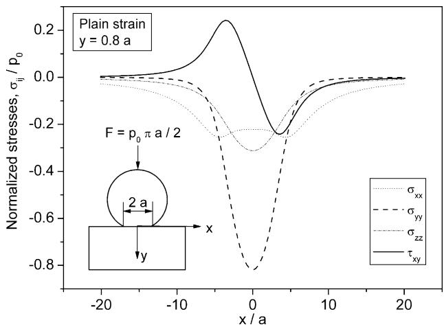  
Fig. 1. Stress state at depth $y = 0 .$ 8a (close to the location of the maximum shear stress) under the contact between a cylindrical roller of infinite length and an elastic half space.

It seems then appropriate to discuss the influence of out-ofphase negative normal stresses upon the fatigue strength in shear of materials usually employed for applications involving the risk of rolling contact fatigue. The effect of a static compressive load on the uniaxial fatigue strength is thoroughly described in classical references [9]. The results for the uniaxial loadings, though scattered, show a slight beneficial influence of a negative static stress component on the fatigue limit in bending or axial loading, which could be neglected for practical purposes. Recent experimental results have confirmed this trend [10]. The effect of static compressive loads on the fatigue limit in fully reversed torsion is examined in Ref. [11]. It is shown that this limit increases under negative static loads. No results are reported in the literature about this effect for multiaxial fatigue under non-proportional loadings, at least not to the authors’ knowledge.

To further investigate the combined effect of negative pulsating axial loads and out of phase alternating torsion on the fatigue strength of a steel currently employed in the manufacturing of railway wheels, multiaxial fatigue tests were performed. Results are first analysed in the light of the Dang Van criterion. This criterion belongs to the class of critical plane approaches, and it is based on a mesoscopic modelling of the fatigue crack initiation process, i.e. it takes into account the difference between stresses evaluated by solid mechanics formulae and stresses acting inside metal grains, where crack nucleation starts.

In addition, criteria based on the integral approach are considered. The predictions of two different criteria of this class are compared to the experimental results: the criterion proposed by Liu [12,13] and the Papadopoulos criterion [14, 15]. The Liu criterion is an updated version of the so-called Shear Stress Intensity Hypothesis (SIH) and is based on the weakest link theory applied to the fatigue damage of metals. The use of the SIH for moving contact fatigue is reported for the fatigue assessment of gear teeth against sub-surface initiated fatigue cracks (pitting) [16]. The Papadopoulos criterion makes use of stresses evaluated at the mesoscopic scale, like the Dang Van approach.

## 2. Experimental

## 2.1. Material

The material investigated is a steel with pearlite-ferrite microstructure, which is usually identified by the commercial name of R7T $( R _ { \mathrm { m } } { = } 8 2 0 { - } 9 4 0 \ : \mathrm { M P a ) }$ and is currently employed in the production of solid high speed train wheels. A detailed study of the tensile and cyclic behaviour of the R7T steel can be found in Ref. [17]. Its typical average chemical composition is reported in Table 1. The relevant fatigue properties of the R7T steel were determined employing specimens taken from the rim of a set of railway wheels taken from the same production batch. The manufacturing process of the wheels under investigation consisted of forging, heat treatment, rim chilling, and annealing. This process is known to introduce residual stresses and a certain degree of anisotropy [17]. Moreover, the tensile and fatigue properties of the specimens vary with radial distance from the wheel tread surface.

Tension–compression and alternating torsion tests were conducted in load control mode on relatively small specimens (with a diameter of the gauge section equal to 5 and 8 mm, respectively). Specimens were extracted in directions parallel and perpendicular to the wheel axis (i.e. perpendicular and parallel to the rolling direction, respectively), at different depths from the wheel tread surface. Further details on the experimental results are reported elsewhere [6]. The corresponding tension–compression and reversed torsion fatigue limit are reported in Table 2. They are denoted as $\sigma _ { \mathrm { { W } } }$ and $\tau _ { \mathbf { W } } .$ respectively. As expected, the fatigue limits decreased with increasing radial distance from the tread surface at which specimens were extracted. It also appears clear that a slight anisotropy of the $\tau _ { \mathrm { W } }$ values is present. The degree of anisotropy is lower but similar to the one reported in Ref. [18] for the torsional fatigue strength of the B92 railway steel. The difference might be explained by the short operation time to which wheels had been submitted before testing in the case of the B92 steel.

Table 1  
Average chemical composition of the R7T steel
| 항목 | 값 |
| --- | --- |
| Element | Weight % |
| C | 0.49 |
| Mn | 0.75 |
| Si | 0.35 |
| Cr | 0.15 |
| Ni | 0.05 |
| Mo | 0.02 |
| $\mathrm { C u }$ | 0.10 |
| S | 0.005 |
| P | 0.10 |

Fatigue limits in fully reversed torsion $\tau _ { \mathrm { W } }$ and tension–compression $\sigma _ { \mathrm { W } }$ of specimens extracted from wheel rims with different orientations and at different radial distances (position of the specimen axis reported between parentheses) from the tread surface
| Specimen position and orientation | $\tau _ { \mathrm { { W } } }$ (MPa) | $\sigma _ { \mathrm { { W } } } ( \mathrm { { M P a } ) }$ | $\tau _ { \mathrm { W } } / \sigma _ { \mathrm { W } }$ |
| --- | --- | --- | --- |
| Axial external (7.5 mm) layer | 312 | 375 | 0.83 |
| Axial middle (19.5 mm) layer | 277 | 340 | 0.81 |
| Circumferential external (7.5 mm) layer | 318 |  |  |
| Circumferential middle (19.5 mm) layer | 289 |  |  |

SEM inspection of the fracture surfaces revealed the presence of small MnS and CaS inclusions on the order of magnitude of $1 0 { - } 2 0 ~ { \mu \mathrm { m } }$ in some specimens. It is worth noting that fatigue limits have been derived using data from all specimens, including those with inclusions. These inclusions considerably lowered the average fatigue strength values in spite of their relative small size, which corresponds to only half the typical grain size. This could partly be explained by observing the elongation of the soft MnS inclusion visible in Fig. 2. The deformation of a soft inclusion and its reshaping into a needle-like inclusion acting as a local stress raiser eventually becoming a crack nucleation site has also been reported by other researchers [19].

Moreover, as a result of the presence of these small defects, a mean value of the $\tau _ { \mathrm { W } } / \sigma _ { \mathrm { W } }$ ratio of 0.82 was obtained, which in general is typical to brittle materials rather than to ductile materials. The $\tau _ { \mathrm { W } } / \sigma _ { \mathrm { W } }$ ratio appears in the expression of many multiaxial fatigue criteria. Ductile steels like the R7T show a $\tau _ { \mathrm { W } } / \sigma _ { \mathrm { W } }$ ratio of approximately 0.6 in their defect free state, which may rise to values up to 0.85 when defects are present. An explanation for the 0.85 theoretical limit value of the $\tau _ { \mathrm { W } } / \sigma _ { \mathrm { W } }$ for ductile materials in terms of the presence of inclusions or defects can be found in Ref. [20].

1.05kX 20kV WD:25mm S:15TM P:5  
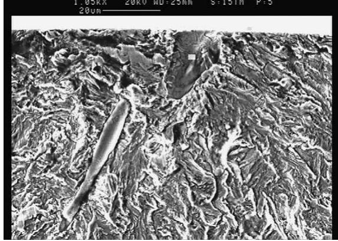  
Fig. 2. SEM observation of a MnS inclusion at the initiation site of a uniaxial fatigue specimen.

It is noticed that the presence of defects does not prevent the use of S–N curves in the fatigue assessment of wheels, provided that the maximum size of defects in the wheels (or at least in the sub-surface region where the highest contact stresses are acting) is comparable with the maximum size of defects found in specimens used to determine the reference curves. This approach allows then to use the concept of ‘virtually defect free’ wheel material introduced in Ref. [18]. Relying on this concept, an analysis using common multiaxial fatigue criteria seems acceptable. The only condition to fulfil is that the criteria constants are evaluated using the fatigue properties found on specimens with defect populations similar to that of the wheel material, as explained above.

## 2.2. Multiaxial fatigue tests

Multiaxial fatigue tests were carried out on specimens taken from the same wheels employed for the axial and torsional tests. Solid specimens (Fig. 3) were extracted from the wheel rim in both the axial and the circumferential direction as shown in Fig. 4. These specimens were larger than those used in the uniaxial and torsional tests. Furthermore, the radial position of the specimen gauge is lower for the circumferential specimen than for the axial ones. Therefore, a post extraction heat treatment consisting of two heat treatments, the first at $8 5 0 ^ { \circ } \mathrm { C }$ followed by oil cooling, the second at $5 0 0 ^ { \circ } \mathrm { C } ,$ , followed by air cooling, were performed to give all specimens homogeneous properties and strength values comparable to those of the specimens of uniaxial tests which were extracted close to the wheel tread surface.

The experiments consisted of biaxial fatigue tests on the aforementioned specimens, which were subjected to alternating torsion and pulsating compression applied with a $9 0 ^ { \circ }$ phase shift.

Under these loads, stresses in the specimens are

$$
\left\{ \begin{array} { l l } { \sigma _ { x } = \sigma _ { \mathrm { m } } + \sigma _ { \mathrm { a } } \cos \omega t , } & { \mathrm { w i t h } \ \sigma _ { \mathrm { m } } = - \sigma _ { \mathrm { a } } } \\ { \tau _ { x y } = \tau _ { a } \sin \omega t } \end{array} \right.\tag{1}
$$

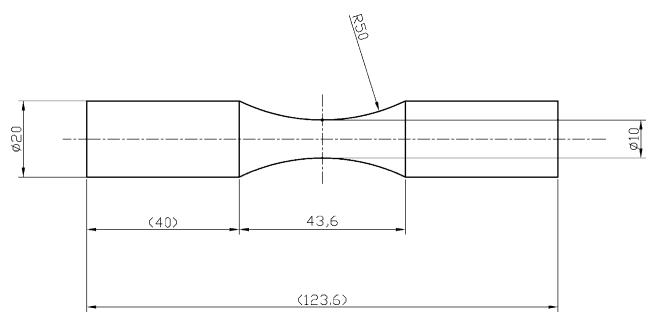  
Fig. 3. Specimen used in the multiaxial fatigue tests.

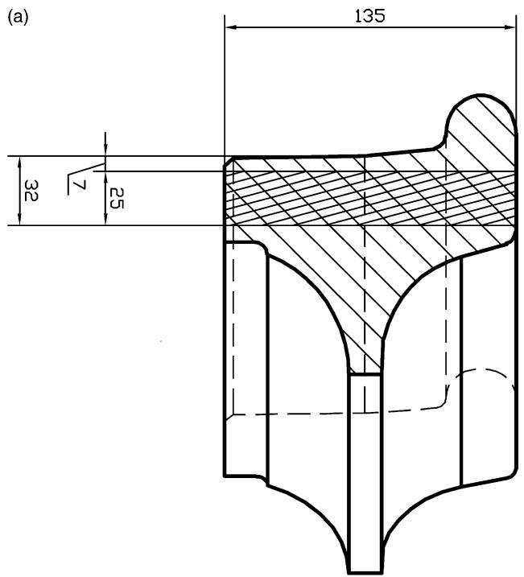

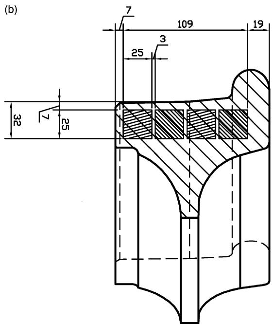  
Fig. 4. Position and orientation of the square section bars extracted from wheels: axial (a) and circumferential (b); bars were then used to manufacture multiaxial fatigue specimens.

Fig. 5 shows the stress–time history and the stress path $\sigma _ { x } -$ $\tau _ { x y }$ corresponding to the loads applied to one specimen. Tests were conducted on an MTS 809 servo hydraulic biaxial rig, equipped with an actuator capable of applying axial loads up to 250 kN and torques up to 2200 Nm. These tests produced in the specimens a non-proportional stress state with rotating principal directions (Fig. 6) which is similar to that observed under the contact area in the wheel rim.

Actually, only two of the six stress tensor components that are present under a rolling contact can be reproduced with solid specimens: the alternating shear stress and one of the pulsating compressive stresses. Furthermore, the magnitude of the compressive stresses developing in the test specimens is not directly comparable with the intensity of any of the normal components of the stress tensor in wheel-rail contact. Moreover, in real contact conditions, the hydrostatic part of the stress tensor corresponds to a real triaxial compression, which is impossible to reproduce on a biaxial test rig. Despite the above mentioned limitations, the use of out-of-phase torsional and compressive axial loads allows to check the accuracy of the predictive capabilities of some multiaxial fatigue criteria under a rather simple loading, which simulates to some extent the more complex loading conditions occurring in the wheel-rail contact state.

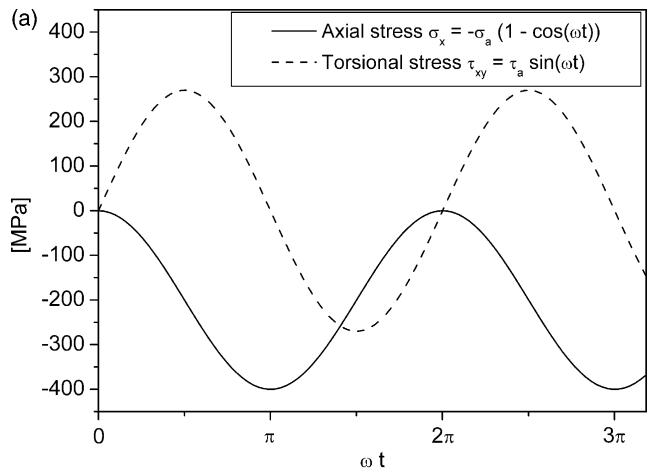

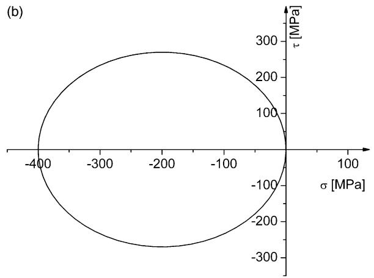  
Fig. 5. The stress–time history (a) and the stress path $\sigma _ { \mathrm { x } } - \tau _ { \mathrm { x y } }$ (b) corresponding to the load applied to one of the specimens.

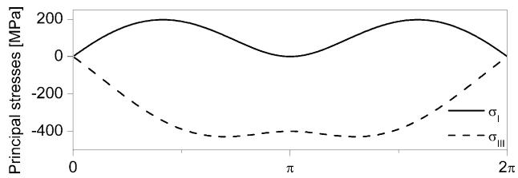

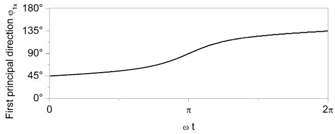  
Fig. 6. The principal stresses and the first principal stress direction with reference to the specimen axis, for the stress path of Fig. 5.

Values of the allowable shear stress amplitude at the fatigue limit with superimposed out-of-phase pulsating compressive normal stresses; the $\tau _ { \mathrm { { W } } }$ value reported within parenthesis because it was evaluated on three test results only
| Axial direction · $\sigma _ { \mathrm { { m } } } ( \mathrm { { M P a } ) }$ | Axial direction · $\sigma _ { \mathrm { a } } \ \mathrm { ( M P a ) }$ | Axial direction · $\tau _ { \mathrm { { W } } } ( \mathrm { { M P a } ) }$ | Axial direction · No. of specimens | Circumferential direction · $\sigma _ { \mathrm { { m } } } ( \mathrm { { M p a } ) }$ | Circumferential direction · $\sigma _ { \mathrm { a } } \left( \mathrm { M P a } \right)$ | Circumferential direction · $\tau _ { \mathrm { { W } } } ( \mathrm { { M P a } ) }$ | Circumferential direction · No. of specimens |
| --- | --- | --- | --- | --- | --- | --- | --- |
| 0 | 0 | (297) | 3 | 0 | 0 | 310 | 5 |
| -100 | 100 | 287 | 5 | -100 | 100 | 301 | 7 |
| -200 | 200 | 267 | 6 | -200 | 200 | 293 | 5 |

Two levels of pulsating negative normal stresses were chosen, with minimum values of K200 and K400 MPa. Thus, the two axial load cycles were negative pulsating (i.e. with stress ratio $R = - \infty )$ sinusoidal stress–time histories of the same frequency as the torsional load, applied with $9 0 ^ { \circ }$ phase shift and of amplitude $\sigma _ { \mathrm { a } } { = } 1 0 0 \mathrm { M P a }$ and $\sigma _ { \mathrm { a } } { = } 2 0 0 \mathrm { M P a }$ . A few specimens were also tested in pure reversed torsion $( \sigma _ { \mathrm { a } } =$ 0 MPa). The torsional loads were varied between 255 and 315 MPa with an increment of $\Delta \tau _ { \mathrm { a } } { = } 1 5 \mathrm { M P a }$ , following the same procedure as if it were a staircase test sequence in pure reversed torsion. Tests were stopped at specimen failure or after $3 \times 1 0 ^ { 6 }$ cycles (run-outs).

## 3. Results and discussion

Following the sequence of applied loads, the allowable shear stress amplitude at the fatigue limit t can be estimated by the short staircase method [21], although the variation of the ${ \sigma _ { \mathrm { a } } } / { \tau _ { \mathrm { a } } }$ ratio could introduce some uncertainties due to the activation of different slip systems. Results are reported in Table 3. It is worth noting that the pure torsion tests on the multiaxial fatigue specimens of 10 mm gauge diameter led to a torsion fatigue limit different from that presented in the previous section referring to smaller specimens of 8 mm gauge diameter. This difference could be due to the stress gradient effect and/or to the variation of the size of the highly stressed volume. From Table 3 it is clear that the allowable shear stress amplitude decreases with increasing out-of-phase compressive loads.

## 3.1. Application of Dang Van’s criterion

$$
\begin{array} { r } { \operatorname* { m a x } _ { t } [ \tau _ { \mathrm { D V } } ( t ) + \alpha \sigma _ { \mathrm { H } } ( t ) ] = \beta } \end{array}
$$

The Dang Van’s criterion is expressed by the relationship:

(2)

where $\tau _ { \mathrm { D V } }$ and $\sigma _ { \mathrm H }$ are the maximum mesoscopic shear stress and hydrostatic stress respectively, both evaluated at each time instant t of the load cycle. For the stress state defined by Eq. (1) these quantities have the following expression (the details on the evaluation of the mesoscopic stresses are provided in

the Appendix)

$$
\left\{ \begin{array} { l l } { \displaystyle \tau _ { \mathrm { D V } } ( t ) = \frac { 1 } { 2 } \sqrt { \sigma _ { a } ^ { 2 } \mathrm { c o s } ^ { 2 } \omega t + 4 \tau _ { a } ^ { 2 } \mathrm { s i n } ^ { 2 } \omega t } } \\ { \displaystyle \sigma _ { \mathrm { H } } = \frac { \sigma _ { \mathrm { a } } } { 3 } ( \cos { \omega t } - 1 ) } \end{array} \right.\tag{3}
$$

Fig. 7 shows the $\tau _ { \mathrm { D V } } ( t )$ and $\sigma _ { \mathrm { H } } ( t )$ corresponding to the stress–time history of Fig. 5. Crack nucleation is predicted to occur when the $\tau _ { \mathrm { D V } } ( t ) { - } \sigma _ { \mathrm { H } } ( t )$ curve intersects the limiting line. This line intercepts the $\tau _ { \mathrm { D V } }$ axis at $\beta$ and has a negative slope a. The value of a and $\beta$ can be determined by fully reversed tension–compression and torsion fatigue tests:

$$
\alpha = 3 \bigg ( \frac { \tau _ { \mathrm { W } } } { \sigma _ { \mathrm { W } } } - \frac { 1 } { 2 } \bigg ) ; \qquad \beta = \tau _ { \mathrm { W } } .\tag{4}
$$

The results of the experiments can be represented on the $\tau _ { \mathrm { D V } } { - } \sigma _ { \mathrm { H } }$ plane as shown in Fig. 8 (a) and (b), for the axial and the circumferential specimens, respectively. The dashed lines are the $\tau _ { \mathrm { D V } } ( t )$ and $\sigma _ { \mathrm { H } } ( t )$ plots corresponding to the experimental limit conditions reported in Table 3. The symbols (i.e. markers) represent the peak values of the $\tau _ { \mathrm { D V } } ( t )$ and $\sigma _ { \mathrm { H } } ( t )$ plots, whose position depends on the magnitude of fatigue loads applied to each specimen. In both cases, these peaks were supposed to fall close to the limiting line (the limiting lines were drawn by evaluating the constant a and $\beta$ on the t values reported in Table 2, thus neglecting the size effect for specimens having different dimensions, and assuming a $\tau _ { \mathrm { W } } / \sigma _ { \mathrm { W } }$ ratio of 0.82 for both axial and tangential specimens). It appears clear that the experimental results cannot be predicted by the Dang Van criterion, as the allowable shear stress amplitude in reality is decreasing with increasing compressive loads.

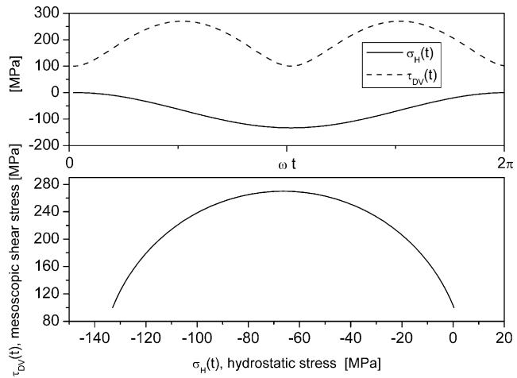  
Fig. 7. Time histories of $\tau _ { \mathrm { D V } }$ and $\sigma _ { \mathrm H }$ and plot of $\tau _ { \mathrm { D V } }$ against $\sigma _ { \mathrm H }$ (Dang Van graph) for the stress–time histories of Fig. 5.

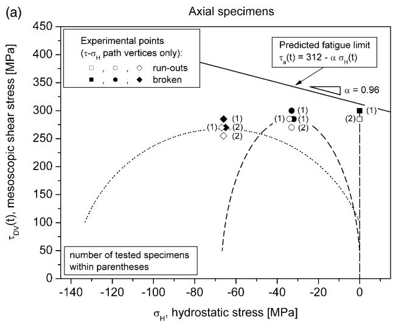

Circumferential specimens  
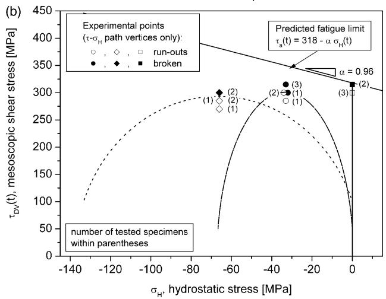  
Fig. 8. The stress paths in the Dang Van graph for axial (a) and circumferential (b) specimens.

## 3.2. Application of Liu and Papadopoulos criteria

The Liu criterion is expressed by the following relationship,

$$
a \tau _ { \mathrm { v a } } ^ { 2 } + b \sigma _ { \mathrm { v a } } ^ { 2 } + m \tau _ { \mathrm { v m } } ^ { 2 } + n \sigma _ { \mathrm { v m } } = \sigma _ { \mathrm { w } } ^ { 2 }\tag{5}
$$

where $\tau _ { \mathrm { v a } } , \sigma _ { \mathrm { v a } } .$ , represents the quadratic average values over all material planes of the amplitude of the shear and the normal stresses, respectively, and are evaluated as surface integrals; the same definition applies to the integral containing the constant values of the shear stresses, i.e. $\tau _ { \mathrm { v m } } ,$ while the mean normal stresses, represented by the term $\sigma _ { \mathrm { v m } } ,$ are summed linearly, in order to take into account the difference between tensile and compressive normal stresses. The expression of these integrals can be found in Ref. [13] and has been evaluated numerically in the current study. The relationship between the four coefficients a, b, m and n and the fatigue limits of the material under alternating $( \sigma _ { \mathrm { W } }$ and $\tau _ { \mathrm { w } } )$ and pulsating stresses $( \sigma _ { \mathrm { W } , 0 }$ and $\tau _ { \mathrm { W } , 0 } )$ are also given in Ref. [13]. The fatigue limit under pulsating tensile stresses $\sigma _ { \mathrm { W } , 0 }$ is evaluated by assuming a mean stress sensitivity factor $M = ( \sigma _ { \mathrm { w } } - \sigma _ { \mathrm { w , 0 } } ) / \sigma _ { \mathrm { w } , 0 } { = } 0 . 2$

The Papadopoulos criterion is expressed by the relationship

$$
M _ { \sigma } + \alpha \sigma _ { \mathrm { H , m a x } } \leq \beta\tag{6}
$$

where, $M _ { \sigma }$ is a surface integral representing an upper bound of the mesoscopic plastic strains accumulated on each material plane (for a complete description see [14]) and $\sigma _ { \mathrm { H , m a x } }$ is the maximum value of the hydrostatic stress over the load cycle. The constants can be evaluated by applying the criterion to alternating torsion and reversed push–pull tests, thus obtaining the following relationships

$$
\left\{ \begin{array} { l l } { \alpha = ( \tau _ { \mathrm { w } } - \sigma _ { \mathrm { w } } / \sqrt { 3 } ) / ( \sigma _ { \mathrm { w } } / 3 ) } \\ { \beta = \tau _ { \mathrm { w } } } \end{array} \right.\tag{7}
$$

In the case of the stresses of Eq. (1), the integral $M _ { \sigma }$ can be solved in closed form [15], thus obtaining

$$
M _ { \sigma } = \sqrt { \frac { \sigma _ { \mathrm { a } } ^ { 2 } } { 3 } + \tau _ { \mathrm { a } } ^ { 2 } }\tag{8}
$$

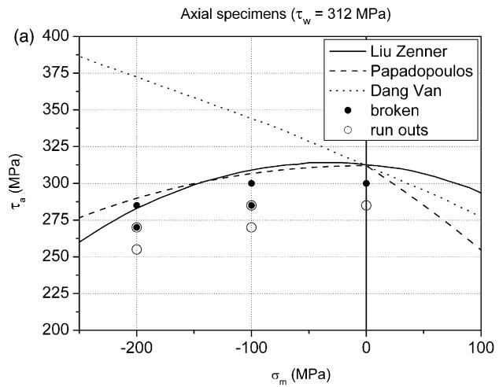

Circumferential specimens $( \tau _ { \mathrm { w } } { = } 3 1 8 \mathsf { M P a } )$  
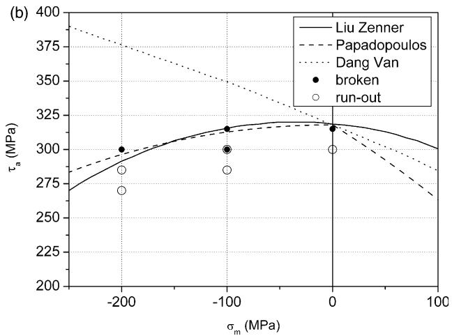  
Fig. 9. Relationship between shear stress amplitude $\tau _ { \mathrm { a } }$ and normal mean stress $\sigma _ { \mathrm { m } } ,$ as predicted by the different criteria with superimposed experimental points: (a) axial specimens, (b) circumferential specimens; graphs were drawn assuming $M { = } 0 . 2 , \tau _ { \mathrm { W } } / \sigma _ { \mathrm { W } } { = } 0 . 8 2$ and the fatigue limits reported in Table 2.

Table 4  
Residual stress values measured on the specimen surface at the end of the test (run-outs only)
| Axial specimens · Specimen ID | Axial specimens · Test conditions · $\sigma _ { \mathrm { m i n } } \left( \mathrm { M P a } \right)$ | Axial specimens · Test conditions · ∆τ/2 (MPa) | Axial specimens · Res. hydr. stress · $\sigma _ { \mathrm { H , r e s } } \mathrm { ~ ( M P a ) }$ | Tangential specimens · Specimen ID | Tangential specimens · Test conditions · $\sigma _ { \mathrm { m i n } } \mathrm { \left( M P a \right) }$ | Tangential specimens · Test conditions · ∆τ/2 (MPa) | Tangential specimens · Res. hydr. stress · $\sigma _ { \mathrm { H , r e s } } \mathrm { ~ ( M P a ) }$ |
| --- | --- | --- | --- | --- | --- | --- | --- |
| A-8 | 0 | 285 | -30 | T-1 | 0 | 300 | -32 |
| A-18 | 0 | 285 | -29 | T-4 | 0 | 300 | -22 |
| A-10 | -200 | 285 | -13 | T-14 | -200 | 300 | +11 |
| A-21 | -400 | 255 | +12 | T-16 | -400 | 270 | +27 |
| A-5 | -400 | 255 | +24 | T-17 | -400 | 285 | +32 |
| A-6 | -400 | 270 | +26 | T-19 | -400 | 285 | +36 |

and finally, for the stress paths considered herein, because $\sigma _ { \mathrm { H , m a x } }$ is equal to zero, the criterion becomes

$$
\sqrt { \frac { \sigma _ { \mathrm { a } } ^ { 2 } } { 3 } + \tau _ { \mathrm { a } } ^ { 2 } } \le \tau _ { \mathrm { W } } .\tag{9}
$$

If the experimental results are reported on the graphs of Fig. 9, where the lines representing the relationship between the allowable shear stress amplitude $\tau _ { \mathrm { a } }$ and the mean axial stress $\sigma _ { \mathrm { m } }$ for the different criteria are drawn, it clearly appears that both the Liu and Papadopoulos criteria show better predictive capabilities than the Dang Van criterion.

## 3.3. Effect of residual stresses

Results were reported and compared with limits predicted by the criteria without considering an initial ratchetting phase as is typical to fatigue tests with smooth specimens in load control mode with non-symmetric stress functions [22]. The evolution of these plastic strains for one specimen during the initial phase of a multiaxial fatigue test is reported in Ref. [6]. This plastic strain accumulation ceased after a certain number of cycles, and it was followed by plastic shakedown in broken specimens. From these observations it appeared that residual stresses were likely to have developed in the specimens.

Residual stresses on the surface of specimens (run-out only) were measured at the end of the tests and values of the corresponding residual hydrostatic stresses are reported in Table 4. The intensity of these residual stresses depends on the levels of the applied load. Residual stresses were measured employing a Stresstech XSTRESS 3000 X-ray diffractometer. It is worth mentioning that high compressive residual stresses had been measured on the surface of the specimens also before fatigue tests. Presumably, these stresses had been introduced by specimen manufacturing and no stress removal technique was employed, in order to avoid surface pitting, which was experienced during electrolytic polishing trials. Nevertheless, it was proven that these stresses relaxed during the first cycles.

Introducing the measured residual stresses in the Dang Van criterion, in some cases the $\tau _ { \mathrm { D V } } ( t ) { - } \sigma _ { \mathrm { H } } ( t )$ paths are shifted towards the positive values of $\sigma _ { \mathrm { H } } ,$ as shown in Fig. 10, but the displacement is not large enough to make the critical instant fall close to the limit line in the quadrant of positive $\sigma _ { \mathrm H }$ values.

The new position of the $\tau _ { \mathrm { D V } } ( t ) { - } \sigma _ { \mathrm { H } } ( t )$ paths may suggest the existence of a change in the slope of the Dang Van’s fatigue locus in the proximity of the negative hydrostatic stress quadrant. This second limit should correspond to the onset of macroscopic cyclic alternating plasticity. The criteria based on the integral approaches present an implicit limitation of this phenomenon. This peculiarity is more evident in the case of the Papadopoulos criterion, for which the integral $M _ { \sigma }$ represents an upper bound of the accumulated plastic strains at the mesoscopic scale and, therefore, could act as a limiting value for the macroscopic plastic strains as well.

A comparison of the equivalent stresses predicted by the three criteria can be performed by assuming that the residual stress at the fatigue limit are equal to the residual stresses found in specimens tested at the stress levels that were closer to the limit condition. Results are presented in Table 5, where it appears that both criteria based on the integral approaches predict an increase of the torsional fatigue limit in presence of compressive residual stresses; however, they still predict allowable stress amplitudes close to experimental results. Moreover, in the case of the Liu criterion, more accurate predictions can be obtained by setting a lower sensitivity on residual normal stresses. This can be obtained thanks to the higher number of material parameters (four for Liu criterion instead of the two of Papadopoulos criterion) which allow for taking into account the effect of mean normal stresses independently on the $\tau _ { \mathrm { W } } / \sigma _ { \mathrm { W } }$ ratio, while for Papadopoulos criterion, by applying Eqs. (6) and (8) to alternating and pulsating axial stresses, the mean stress sensitivity is found to be related to the $\tau _ { \mathrm { W } } / \sigma _ { \mathrm { W } }$ ratio by the relationship

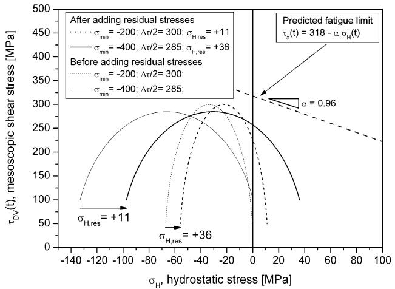  
Fig. 10. The effect of residual stresses upon the position of the $\tau _ { \mathrm { D V } } ( t ) { - } \sigma _ { \mathrm { H } } ( t )$ paths for circumferential specimens.

Comparison between experimental results and criteria predictions, including residual stresses, for circumferential specimens; $\tau _ { \mathrm { { w } } } { = } 3 1 8 \mathrm { { M P a } } .$ $\tau _ { \mathrm { W } } / \sigma _ { \mathrm { W } } { = } 0 . 8 2 ;$ ; mean stress sensitivity MZ0.2; Diff.Z(t Kt /t !100
| Specimen ID · $\tau _ { \mathrm { a } } \left( \mathrm { M P a } \right)$ | Test conditions · $\sigma _ { \mathrm { m i n } } \mathrm { \left( M P a \right) }$ | Test conditions · $\tau _ { \mathrm { { W } } } ( \mathrm { { M P a } ) }$ | Experimental limit · $\tau _ { \mathrm { p r e d i c t e d } } ( \mathbf { M P a } )$ | Papadopoulos · Diff. (%) | Papadopoulos · $\tau _ { \mathrm { p r e d i c t e d } } ( \mathbf { M P a } )$ | Liu · Diff. (%) | Liu |
| --- | --- | --- | --- | --- | --- | --- | --- |
| T-1 | 300 | 0 | 310 | 340 | +9.7 | 324 | +4.5 |
| T-4 | 300 | 0 | 310 | 334 | +7.7 | 323 | +4.2 |
| T-14 | 300 | -200 | 301 | 304 | +1.0 | 313 | +3.0 |
| T-17 | 285 | -400 | 293 | 271 | -7.5 | 284 | -3.1 |
| T-19 | 285 | -400 | 293 | 268 | -8.5 | 283 | -3.4 |

$$
M = 1 - \frac { 1 } { \sqrt { 3 } } \left( \frac { \tau _ { \mathrm { w } } } { \sigma _ { \mathrm { w } } } \right) ^ { - 1 }\tag{10}
$$

Another effect of the presence of defects, which strongly affects the values of the $\tau _ { \mathrm { W } } / \sigma _ { \mathrm { W } }$ ratio, is evidenced in the graph of Fig. 11, where the distribution of the equivalent stresses under a cylindrical elastic contact for the Liu and the Papadopoulos criteria are plotted as a function of the $\tau _ { \mathrm { W } } / \sigma _ { \mathrm { W } }$ ratio. It can be observed that for increasing values of the $\tau _ { \mathrm { W } } / \sigma _ { \mathrm { W } }$ ratio, the highly damaged zone predicted by the Liu criterion shifts towards the surface and the equivalent stress increases. This effect can be explained by the dependence on the $\tau _ { \mathrm { W } } / \sigma _ { \mathrm { W } }$ ratio of the coefficients a and b appearing in Eq. (5). For increasing values of the $\tau _ { \mathrm { W } } / \sigma _ { \mathrm { W } }$ ratio, the coefficient a tends to zero, thus making the equivalent stress depend on the amplitude of the normal stresses only. This corresponds to implicitly assuming the material as a brittle one and not as a ductile one with inhomogeneities and defects. The aforementioned aspects constitute examples of the limitation for the applicability of the ‘virtually defect free’ approach with some multiaxial fatigue criteria.

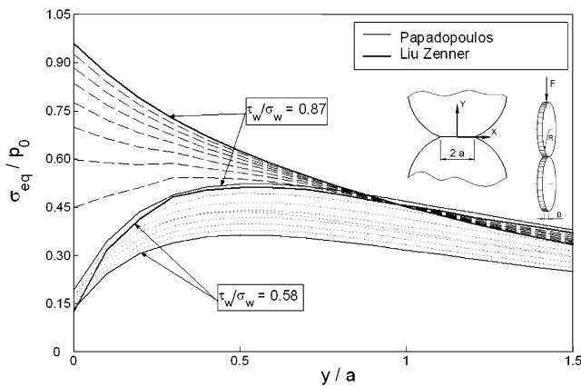  
Fig. 11. Distribution of the equivalent stresses under a cylindrical elastic contact for the Liu and the Papadopoulos criteria, as a function of the tW/sW ratio; equivalent stress values are normalized by dividing by the peak value of the Hertzian pressure $p _ { 0 } .$

Although the criteria based on the integral approach have given good predictions, all fail to take into account the effect of material anisotropy. Finally, for the application of these criteria, the effect of the stress gradient and its relationship with the microstructure has to be further investigated, as already evidenced by other researchers in the field of fretting fatigue [7].

## 4. Concluding remarks

The following conclusions can be drawn:

1. in out-of-phase loading of specimens (combined pulsating negative axial load and torsion with $9 0 ^ { \circ }$ phase shift) extracted from railway wheels, the effect of increasing the absolute value of the negative axial load is a reduction of the allowable shear stress amplitude generated by the torsional load;

2. the Dang Van model, which is often adopted for the fatigue assessment of parts subjected to rolling contacts, is not able to predict this trend; it is believed that when the applied stresses generate negative hydrostatic stress values, the criterion lacks of implicitly limiting the onset of cyclic plasticity: fulfilment of this condition must be assessed before the application of the criterion;

3. the criteria based on the integral approaches can predict the right relationship between the allowable shear stress amplitude and the out-of-phase negative normal stresses, but differences between the predictions of Liu and Papadopoulos criteria are observed when the effect of residual stresses is considered;

4. none of the criteria analysed herein is able to take into account the anisotropy of the material;

5. the ‘virtually defect free’ approach, which is based on the assumption that criteria proposed for defect-free materials can be applied to materials containing defects, provided that the population of defects in the specimens used for the calibration of the criterion is the same as in the component, is difficult to be applied to the multiaxial fatigue criteria analyzed in the present study; in fact, the presence of defects influences the ${ \tau _ { \mathrm { w } } } / { \sigma _ { \mathrm { w } } }$ ratio, which in turn modifies the parameters expressing the effect of static normal stresses on the fatigue limit (Papadopoulos criterion) or the role of normal stresses in the nucleation of fatigue cracks (Liu criterion).

## Acknowledgements

The authors gratefully acknowledge the support of Lucchini Sidermeccanica SpA. Comments and contributions from Dr. Anders Ekberg of Chalmers (Gothenburg, Sweden) and Dr. Ioannis V. Papadopoulos of European Commission (JRC Ispra, Italy) are gratefully acknowledged.

## Appendix A

Given a stress tensor $\sigma \left( t \right) .$ , varying periodically with time, the shear stress appearing in the Dang Van’s criterion is defined as

$$
\tau _ { \mathrm { D V } } ( t ) = \mathrm { T r e s c a } [ \hat { s } ( t ) ] = \frac { \hat { s } _ { \mathrm { I } } ( t ) - \hat { s } _ { \mathrm { I I I } } ( t ) } { 2 }\tag{A.1}
$$

where s^ðtÞ is the mesoscopic stress deviator after elastic shakedown. The transition from the macroscopic stress deviator S(t) and the mesoscopic one is expressed by the relationship

$$
\hat { s } ( t ) = S ( t ) + \rho *\tag{A.2}
$$

where

$$
\rho * = - z *\tag{A.3}
$$

and

$$
z * = z : \operatorname* { m i n } _ { z } \left[ \operatorname* { m a x } _ { t } { \sqrt { ( S ( t ) - z ) : ( S ( t ) - z ) } } \right]\tag{A.4}
$$

For the stress tensor generated by the loads applied to the specimens described in this paper, i.e. for

$$
\sigma ( t ) = \left[ \begin{array} { c c c } { \sigma _ { \mathrm { m } } + \sigma _ { \mathrm { a } } \cos ( \omega t ) } & { \tau _ { \mathrm { a } } \sin ( \omega t ) } & { 0 } \\ { \tau _ { \mathrm { a } } \sin ( \omega t ) } & { 0 } & { 0 } \\ { 0 } & { 0 } & { 0 } \end{array} \right] ,\tag{A.5}
$$

the resulting residual stress tensor is

$$
\rho * = \left[ \begin{array} { c c c } { { - { \displaystyle \frac { 2 } { 3 } } \sigma _ { \mathrm { m } } } } & { { 0 } } & { { 0 } } \\ { { } } & { { } } & { { } } \\ { { 0 } } & { { { \displaystyle \frac { \sigma _ { \mathrm { m } } } { 3 } } } } & { { 0 } } \\ { { } } & { { } } & { { } } \\ { { 0 } } & { { 0 } } & { { { \displaystyle \frac { \sigma _ { \mathrm { m } } } { 3 } } } } \end{array} \right]\tag{A.6}
$$

and, therefore, the mesoscopic stress deviator is

$$
\hat { s } ( t ) = \left[ \begin{array} { c c c } { \displaystyle { \frac { 2 } { 3 } } \sigma _ { \mathrm { a } } \mathrm { c o s } ( \omega t ) } & { \tau _ { \mathrm { a } } \mathrm { s i n } ( \omega t ) } & { 0 } \\ { } & { } & { } \\ { \tau _ { \mathrm { a } } \mathrm { s i n } ( \omega t ) } & { - \frac { \sigma _ { \mathrm { a } } } { 3 } \mathrm { c o s } ( \omega t ) } & { 0 } \\ { } & { } & { } \\ { 0 } & { 0 } & { - \frac { \sigma _ { \mathrm { a } } } { 3 } \mathrm { c o s } ( \omega t ) } \end{array} \right]\tag{A.7}
$$

Finally, the expression of shear stress of the Dang Van criterion is

$$
\tau _ { \mathrm { D V } } ( t ) = \frac { 1 } { 2 } \sqrt { ( \sigma _ { \mathrm { a } } \mathrm { c o s } ( \omega t ) ) ^ { 2 } + 4 ( \tau _ { \mathrm { a } } \mathrm { s i n } ( \omega t ) ) ^ { 2 } }\tag{A.8}
$$

and the hydrostatic stress is

$$
\sigma _ { \mathrm { H } } ( t ) = { \frac { \sigma _ { \mathrm { m } } } { 3 } } + { \frac { \sigma _ { \mathrm { a } } } { 3 } } \mathrm { c o s } \ \omega t\tag{A.9}
$$

which, for $\sigma _ { \mathrm { a } } = - \sigma _ { \mathrm { m } } .$ , becomes

$$
\sigma _ { \mathrm { H } } ( t ) = \frac { \sigma _ { \mathrm { a } } } { 3 } ( \cos { \omega t } - 1 ) .\tag{A.10}
$$

## References

[1] Ekberg A, Kabo E, Andersson H. An engineering model for prediction of rolling contact fatigue of railway wheels. Fatigue Fract Eng Mater Struct 2002;25:899–909.

[2] Ringsberg JW, Loo-Morrey M, Josefson BL, Kapoor A, Beynon JH. Prediction of fatigue crack initiation for rolling contact fatigue. Int J Fatigue 2000;22:205–15.

[3] Dang Van K, Griveau B, Message O. On a new multiaxial fatigue limit criterion: theory and application. In: Brown MW, Miller KJ, editors. Biaxial and multiaxial fatigue, EGF 3; London: Mechanical Engineering Publications; 1989. p. 479–96.

[4] Ekberg A. Rolling contact fatigue of railway wheels—a parametric study. Wear 1997;211:280–8.

[5] Ekberg A, Bjarnehed H, Lunden R. A fatigue life model for general rolling contact with application to wheel/rail damage. Fatigue Fract Eng Mater Struct 1995;18:1189–99.

[6] Bernasconi A, Davoli P, Filippini M, Foletti S. An integrated approach to rolling contact sub-surface fatigue assessment of railway wheels. Wear 2005;258(7–8):973–80.

[7] Araujo JA, Nowell D, Vivacqua RC. The use of multiaxial fatigue models to predict fretting fatigue life of components subjected to different contact stress fields. Fatigue Fract Eng Mater Struct 2004;27:967–78.

[8] Fouvry S, Elleuch K, Simeon G. Prediction of crack nucleation under partial slip fretting conditions. J Strain Anal 2002;37:549–64.

[9] Heywood RB. Designing against fatigue. London: Chapman & Hall; 1962.

[10] Desimone H, Bernasconi A, Beretta S. Estimation of rolling fatigue strength in presence of defects. In: Proceedings of ICEM12-12th international conference on experimental mechanics, 29 August—2 September, Bari, Italy, 2004.

[11] Sines G. Failure of materials under combined repeated stresses with superimposed static stresses. NACA-TN- 3495; 1955.

[12] Liu J. Weakest link theory and multiaxial criteria. In: Proceedings of the fifth international conference on biaxial/multiaxial fatigue, Cracow, Poland; 1997.

[13] Liu J, Zenner H. Fatigue limit of ductile metals under multiaxial loading. In: Carpinteri A, de Freitas M, Spagnoli A, editors. Biaxial/multiaxial fatigue and fracture, vol. 31. Amsterdam: Elsevier; 2003. p. 147–63.

[14] Papadopoulos IV. A high-cycle fatigue criterion applied in biaxial and triaxial out-of-phase stress conditions. Fatigue Fract Eng Mater Struct 1995;18:79–91.

[15] Papadopoulos IV. A new criterion of the fatigue strength for out-of-phase bending and torsion of hard metals. Int J Fatigue 1994;16(6):377–84.

[16] Tobie T, Ho¨hn B-R, Oster P. Case depth and load capacity of casecarburized gears. In: Proceedings of the fourth World congress on gearing and power transmission, vol. 1; 1999. p. 3–14.

[17] Bernasconi A, Davoli P, Filippini M. Fatigue life of railway wheels: residual stresses and LCF. In: Proceedings of the 13th international wheelset congress, Rome; 2001.

[18] Ekberg A, Sotkovszki P. Anisotropy and rolling contact fatigue of railway wheels. Int J Fatigue 2001;23:29–43.

[19] Ahlstro¨m J, Karlsson B. Microstructural evaulation and interpretation of the mechanicallly and thermally affected zone under railway wheel flats. Wear 1999;232:1–14.

[20] Beretta S. Application of multiaxial fatigue criteria to materials containing defects. Fatigue Fract Eng Mater Struct 2003;26:551–9.

[21] Dixon W, Massey F. Introduction to statistical analysis. New York: McGraw-Hill; 1983.

[22] Sonsino CM. Influence of load and deformation-controlled multiaxial tests on fatigue life to crack initiation. Int J Fatigue 2001;23:159–67.
