# 거친 롤링–슬라이딩 EHL 접촉의 압력·간극 신속 계산. Part 1: 저진폭 정현파 거칠기

## 저자 정보

**C. J. Hooke**¹ (교신저자)
e-mail: c.j.hooke@bham.ac.uk

**K. Y. Li**²

**G. Morales-Espejel**³

**소속**:
¹ School of Engineering, The University of Birmingham, Birmingham, UK
² Department of Manufacturing Engineering and Engineering Management, City University of Hong Kong, Hong Kong, P.R. China
³ SKF Engineering and Research Centre, Nieuwegein, The Netherlands

**출처**: Proc. IMechE Vol. 221 Part C: J. Mechanical Engineering Science (2007), pp. 535–550
DOI: 10.1243/0954406JMES519
**접수**: 2006년 10월 11일 / 게재 확정: 2007년 2월 5일

**키워드**: 탄성유체윤활(EHL), 롤링–슬라이딩 접촉(rolling–sliding contacts), 거친 EHL(rough EHL), 섭동 해석(perturbation analysis)

---

## 초록

탄성유체윤활(EHL) 접촉의 표면 거칠기는 부품 수명에 큰 영향을 미치므로, 그 효과를 **신속하게 평가**할 필요가 있습니다. 본 논문은 거칠기 진폭이 비교적 작을 때 정확한 결과를, 큰 진폭에서도 거동의 좋은 지표를 제공하는 **신속 계산법**을 기술합니다. 1부에서는 **저진폭 정현파 거칠기**의 효과를 검토하며, 그 거동이 임의의 파장·거칠기 방향에 대해 **3개의 복소량(complex quantities)** 으로 특성화될 수 있음을 보입니다. 이 중 두 개의 계산은 간단하며, 세 번째는 섭동 해석 결과에 대한 곡선 적합(curve fitting)이 필요합니다. 그 과정을 상세히 제시합니다. 2부에서는 이 결과를 이용해 롤링–슬라이딩 EHL 조건에서 임의의 거친 표면 거동을 예측하는 방법을 논의합니다.

---

## 목차

1. [개요](#1-개요)
2. [종합 요약](#2-종합-요약)
3. [서론](#3-서론)
4. [표면 거칠기와 섭동 해석](#4-표면-거칠기와-섭동-해석)
5. [롤링–슬라이딩 접촉에서의 거동: 감쇠 거칠기와 상보파](#5-롤링슬라이딩-접촉에서의-거동-감쇠-거칠기와-상보파)
6. [접촉 내부 거동: 유효점도와 거칠기 감쇠](#6-접촉-내부-거동-유효점도와-거칠기-감쇠)
7. [상보파의 감쇠·진폭과 입구 길이 효과](#7-상보파의-감쇠진폭과-입구-길이-효과)
8. [결론](#8-결론)
9. [기호 및 참고문헌](#9-기호-및-참고문헌)

---

## 1. 개요

많은 EHL 접촉은 **간극(clearance)과 비슷한 크기의 표면 거칠기**를 가지고 작동합니다. 이 조건에서 압력 분포는 매끄러운 표면 대비 크게 달라지고 최소 유막 두께는 감소합니다. 전자는 표면하 응력을 높여 수명을 단축시키고, 후자는 급격한 고장으로 이어질 수 있습니다.

### 연구의 필요성

거칠기·간극·수명 사이에 간단한 관계는 없으며, 널리 인용되는 **Tallian의 3:1 법칙은 오해의 소지**가 있습니다. 멀티그리드(multi-grid) 솔버로 임의 표면을 해석할 수 있으나, 특히 고하중·단파장 성분 포함 시 **매우 시간이 오래 걸려**(수 시간) 설계 단계에 부적합합니다.

### 본 연구의 목적

- 선행 연구(순수 롤링, [7,8])의 선형화 신속 해석법을 **유의미한 슬라이딩이 있는 경우**로 확장
- 정현파 거칠기(견인 방향·수직 방향 모두 변화)의 3차원 프로파일 거동을 상세 분석
- 거동을 **3개의 복소량**으로 환원하여 1~2초 내 계산 (멀티그리드 대비 수천 배 빠름)

---

## 2. 종합 요약

### ▪ 2.1 연구 핵심 정보

| 항목 | 내용 |
|------|------|
| **연구 대상** | • 거친 롤링–슬라이딩 EHL 접촉의 압력·간극 분포 • 저진폭 정현파 거칠기 (3D, 임의 방향) |
| **주요 목적** | • 멀티그리드 해석을 대체할 **신속 계산법** 개발 • 거동을 소수의 복소 파라미터로 환원 • 설계용 실용 도구화 |
| **검증 방법** | • 섭동 해석(perturbation) 결과와 3-변수 근사 비교 • 광범위 운전조건·속도비·파장 범위 |
| **적용 분야** | • EHL 부품(베어링·기어) 표면 마감 효과 평가 • 표면하 응력·유막·수명 예측의 입력 • Part 2의 일반 거친 표면 해석 기반 |

-------------

### ▪ 2.2 핵심 개념 정리

| 개념 | 설명 |
|------|------|
| **감쇠 거칠기(Attenuated roughness)** | • 상대 슬라이딩이 만든 압력이 거칠기를 변형·감쇠 • 원래 파장 유지, 위상만 변화. **거친 표면 속도 $v$로 이동** |
| **상보파(Complementary wave)** | • 거칠기가 입구(inlet)를 교란해 생성된 간극 변동 • **견인 속도 $u$로 전파**하며 감쇠. $v\neq u$라 파장이 원래와 다름 |
| **3개 복소량** | ① 감쇠 거칠기 진폭, ② 입구의 상보파 진폭, ③ 상보파의 파수·감쇠율 |
| **유효점도(Effective viscosity)** | • 견인 방향 $\eta_x=\partial\tau/\partial\dot\gamma$, 수직 방향 $\eta_y=\tau_m/\dot\gamma_m$ • 저진폭에서 유체 레올로지는 $\tau_m$, $\tau_e$ 두 값으로 환원 |
| **특성 길이 $L$** | • $L=h\sqrt{E'/\tau_e}$. 거칠기 감쇠·상보파 감쇠를 지배 |

-------------

### ▪ 2.3 방법론 개요

| 구성요소 | 세부 내용 |
|---------|----------|
| **선형 중첩** | • 저진폭 → 응답 선형 → 각 푸리에(harmonic) 성분 따로 해석 후 합성 • 양 표면 거칠기도 따로 해석 후 합성 |
| **섭동 해석** | • 라인 접촉 정현파 섭동법(시간진행 불필요, 2D→1D) • 라인·점접촉 거동 거의 동일 → 라인 결과 범용 사용 |
| **평행 간극 근사** | • 거칠기 파장 ≪ 반접촉폭 $b$ → 평행 간극에서 감쇠·감쇠율 해석 • 감쇠 거칠기와 상보파는 비간섭으로 분리 해석 |
| **상보파 진폭 산출** | • Reynolds 식으로 ①·③ 해석식 도출 • ②(입구 진폭)는 섭동해에 최소자승 곡선적합 |

-------------

### ▪ 2.4 핵심 해석식

| 항목 | 식 | 의미 |
|------|-----|------|
| **Eyring 유체** | $\dot\gamma=\dfrac{\tau_0}{\eta}\sinh\left(\dfrac{\tau}{\tau_0}\right)$ | 비뉴턴 거동 (식 1) |
| **유효점도 비** | $V=\dfrac{\eta_x}{\eta_y}=\dfrac{\tau_e}{\tau_m}$ | 견인/수직 방향 점도비 (식 5) |
| **감쇠 거칠기 간극** | $\dfrac{h_a}{A}=\dfrac{1-iCQ}{1-iQ-iCQ}$ | 간극 변동/원거칠기 (식 20) |
| **압력 리플** | $\dfrac{p_a}{A}=\dfrac{\kappa E'}{4}\dfrac{iQ}{1-iQ-iCQ}$ | 거칠기 감쇠 동반 압력 (식 19) |
| **감쇠 파라미터 $Q$** | $Q=\pm\dfrac{6}{\pi^2}\dfrac{\lambda^2}{L^2}\dfrac{\cos\theta}{\cos^2\theta+V\sin^2\theta}$ | $\pm$=빠른/느린 거친면 (식 24) |
| **특성 길이** | $L=h\sqrt{E'/\tau_e}$, $L^*=L\sqrt{|1-v/u|}$ | 감쇠·상보파 지배 (식 23, 31) |

-------------

### ▪ 2.5 검증 결과

| 검증 항목 | 비교 대상 | 결과 |
|----------|----------|------|
| **3-변수 근사** | 전체 섭동 해석 | • 접촉 중앙 90% 영역 **오차 < 2%** • 전 범위 케이스에서 **< 3% 일치** |
| **감쇠 거칠기 식 (①③)** | 섭동해 | • 평행 간극 단순 해석으로 정확 추정 |
| **상보파 진폭 (②)** | 섭동해 곡선적합 | • 입구 파장비 $(\lambda/b)S^{-2}P^{1.5}$가 지배 |
| **출구 압력 스파이크** | 섭동해 | • 유일한 큰 차이 영역(무시 가능, 위치만 이동) |

-------------

### ▪ 2.6 주요 발견사항

| 항목 | 내용 |
|------|------|
| **2-성분 분해** | • 임의 거동 = 감쇠 거칠기($v$로 이동) + 상보파($u$로 이동)의 합 |
| **파장 의존 감쇠** | • 장파장 성분이 슬라이딩으로 더 크게 감쇠, 단파장은 거의 통과 • **정확히 in-line** 거칠기는 감쇠 없음, 약간만 기울어도 큰 감쇠 |
| **상보파 최대** | • $(\lambda/b)S^{-2}P^{1.5}\approx0.5$에서 최대, 최댓값은 $v/u$에 의존 |
| **저슬라이딩 특이성** | • $v/u\approx1$(거의 롤링)에서 상보파 감쇠율 급감 → 영향 지대 |
| **레올로지 환원** | • 저진폭에선 유체 레올로지가 $\tau_m$, $\tau_e$(≈Eyring 응력) 두 값으로 충분 |

-------------

### ▪ 2.7 실무적 함의

| 영역 | 권장사항 |
|------|---------|
| **설계 속도** | • 1~2초 계산으로 다양한 표면 마감의 유막·응력 효과 신속 평가 |
| **거칠기 방향 설계** | • in-line(견인 방향) 거칠기는 감쇠 안 됨 → 압력 리플·응력 주의 |
| **수명 예측 입력** | • 압력 리플 → 표면하 응력 → 수명 모델 입력으로 활용 |
| **한계와 확장** | • 저진폭 가정(진폭 ≪ 유막). 고진폭은 경향만 제시 • 상보파는 Eyring 외 레올로지에 다소 민감 → Part 2에서 일반 프로파일 확장 |

---

## 3. 서론

EHL 접촉이 간극 수준의 거칠기로 작동하면 압력 분포가 크게 변하고 최소 유막이 감소합니다. 선행 연구([2–12])는 지배적 돌기의 길이·종횡비·방향이 압력·간극에 큰 영향을 줌을 보였습니다:
- **장파장** 성분: 접촉 하에서 평탄화되어 큰 압력 변화 없음
- **단파장** 성분: 변화 없이 통과, 큰 압력 변동 없음
- **중간 파장** 성분: 부분적으로만 평탄화 → **큰 압력 리플과 응력 분포 변화** 유발
- 최대 압력 변화는 거칠기 파장 ≈ 입구 압력 스윕 길이일 때 발생, 고하중일수록 증대

### 선행 연구와 본 연구의 차별점

| 연구 | 기여 / 한계 |
|------|------|
| **멀티그리드 솔버 [13,14]** | 임의 프로파일 정확 해석 가능, 단 **수 시간 소요**(설계 부적합) |
| **Hooke & Li [7,8]** | 순수 롤링용 선형화 신속법(1~2초), 실험·해석과 양호. 단 롤링 한정 |
| **Hooke [12]** | 롤링–슬라이딩 2D 거칠기 초기 검토 |
| **본 연구** | **3D 프로파일·유의미한 슬라이딩**으로 확장, 3 복소량 환원 |

### 거동 예시 (섭동 해석)

Greenwood 파라미터 $P=20$, $S=7$, Hertz 압력 1 GPa, Roelands 점도–압력·Dowson-Higginson 밀도–압력·Eyring 모델로 다양한 속도비 $v/u$·파장에 대한 섭동 결과를 도시합니다. (간극·압력 섭동은 한 시점의 분포이며, 실제값은 거칠기 진폭으로 스케일해 매끄러운 EHL 값에 중첩.)

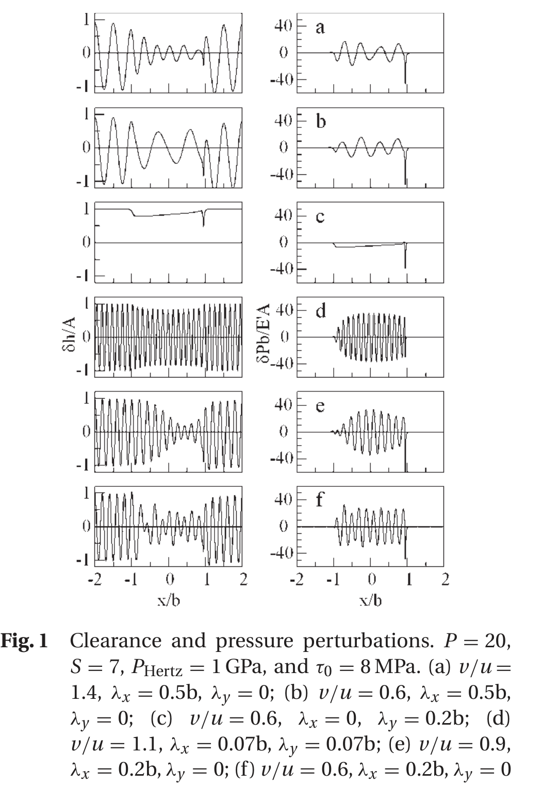
*Figure 1. 간극·압력 섭동(P=20, S=7, P_Hertz=1 GPa, τ₀=8 MPa). (a)~(f) 속도비·파장·방향 조합별 거동. 곡선은 한 시점이며 시간에 따라 빠르게 변함.*

> 순수 롤링에서는 간극·압력 변동이 진폭 일정·원래 파장 유지라 **단일 복소 진폭**으로 정의 가능하나, 롤링–슬라이딩에서는 불가능합니다.

---

## 4. 표면 거칠기와 섭동 해석

임의 표면의 매끄러움으로부터의 편차는 $r(s,y)$로 표현되며($s$=표면과 함께 이동하는 좌표, $y$=견인 수직 방향), 이산 푸리에 변환으로 조화 성분 $A(\omega,\xi)\exp[i(\omega s+\xi y)]$의 집합으로 분해됩니다. 진폭 $A$는 복소수입니다.

**선형성 가정 (저진폭):** 거칠기 진폭이 유막보다 작으면 응답이 선형 → 각 조화 성분을 따로 해석 후 합성, 양 표면도 따로 해석 후 합성합니다.

라인 접촉용 섭동법은 시간진행 문제를 피하고 2D를 1D로 환원하며, 라인·점접촉 거동이 거의 동일해 **타원율마다 별도 해석 불필요**합니다.

---

## 5. 롤링–슬라이딩 접촉에서의 거동: 감쇠 거칠기와 상보파

거칠기가 접촉을 지날 때 상대 슬라이딩이 압력 리플을 만들고, 이것이 간극 변동 진폭을 줄입니다. 거동은 **두 성분**으로 분해됩니다:

1. **감쇠 거칠기**: 슬라이딩 압력이 거칠기를 변형·감쇠(진폭↓, 위상 변화). 원래 파장 유지, **거친 표면 속도 $v$**로 이동. 거친면이 빠르면 원프로파일 왼쪽, 느리면 오른쪽에 위치.
2. **상보파(complementary wave)**: 거칠기가 입구를 교란해 생성, **견인 속도 $u$**로 전파하며 감쇠. Greenwood가 처음 가정. $v<u$면 파장이 길고, $v>u$면 짧음.

두 성분이 다른 속도로 이동해 간극·압력 분포가 시간에 따라 복잡하게 변합니다.

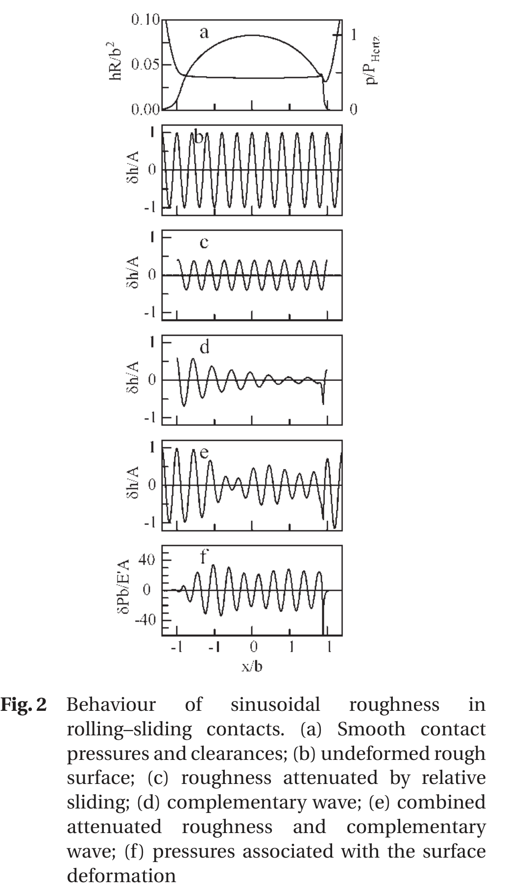
*Figure 2. (a) 매끄러운 압력·간극, (b) 미변형 거칠기, (c) 슬라이딩 감쇠 거칠기, (d) 상보파, (e) 감쇠 거칠기+상보파 합, (f) 표면 변형 동반 압력.*

> 거동은 **3개 복소량**으로 충분히 근사됩니다: ① 감쇠 거칠기 진폭, ② 입구의 상보파 진폭, ③ 상보파 감쇠율·파장. ①③은 접촉 내부, ②는 주로 입구 조건이 결정합니다.

---

## 6. 접촉 내부 거동: 유효점도와 거칠기 감쇠

매끄러운 피에조점성 EHL 접촉의 간극은 거의 일정하므로, 거칠기 파장 ≪ $b$ 가정 하에 **평행 간극**에서 감쇠·상보파를 해석합니다.

### ▪ 6.1 유체의 유효점도

압력 구배가 없을 때 평행 간극의 전단변형률 $\dot\gamma_m=\Delta u/h$. 견인 방향 작은 변동에 대한 유효점도:

$$\eta_x = \frac{\partial\tau}{\partial\dot\gamma} \tag{3}$$

등가 응력 $\tau_e$ 정의: $\eta_x=\tau_e/\dot\gamma_m$. Eyring 유체·고점도 조건에서 **$\tau_e=\tau_0$(Eyring 응력)**. 수직 방향 유효점도:

$$\eta_y = \frac{\tau_m}{\dot\gamma_m} \tag{4}$$

유효점도 비:

$$V = \frac{\eta_x}{\eta_y} = \frac{\tau_e}{\tau_m} \tag{5}$$

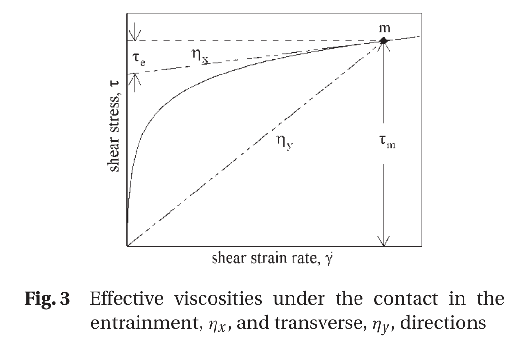
*Figure 3. 전단응력–전단변형률 곡선과 작동점 m. $\eta_x$=m점 접선 기울기, $\eta_y$=원점–m 직선 기울기, $\tau_e$=접선의 응력축 절편.*

> 저진폭 거칠기 거동에는 유체 레올로지 세부가 중요치 않고, **평균 전단응력 $\tau_m$과 응력–변형률 곡선의 기울기**만 중요합니다.

### ▪ 6.2 슬라이딩에 의한 거칠기 감쇠

미변형 거칠기 $\delta r=A\exp[i(\omega s+\xi y)]$에 대해, Reynolds 식에 압력·간극·밀도 섭동을 대입하고 1차항만 남기면 압력 리플과 간극 변동이 도출됩니다(식 19, 20). 감쇠 파라미터:

$$Q = \pm\frac{6}{\pi^2}\frac{\lambda^2}{L^2}\frac{\cos\theta}{\cos^2\theta+V\sin^2\theta}, \quad L=h\sqrt{\frac{E'}{\tau_e}} \tag{24, 23}$$

($+$: 거친면이 빠름, $-$: 느림.) 거칠기 감쇠는 **$\lambda/L$ 비, 방향 $\theta$, 점도비 $V$, 압축성**에만 의존합니다.

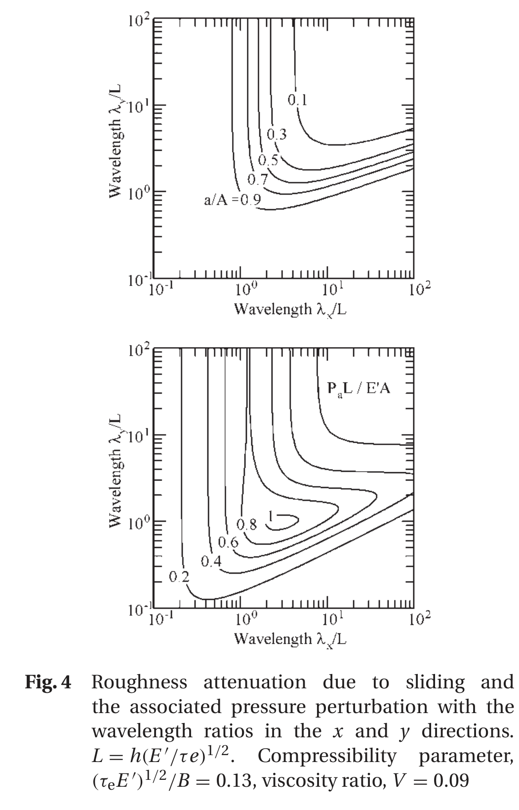
*Figure 4. 거칠기 감쇠(상)·압력 리플(하) vs $x$/$y$ 파장비. $L=h(E'/τ_e)^{1/2}$, 압축성 $(τ_eE')^{1/2}/B$=0.13, $V$=0.09.*

- 단파장(x,y 모두): 거의 감쇠 없이 통과, 압력 리플 작음
- 횡방향(transverse, $\lambda_y\gg\lambda_x$): 파장 증가 시 감쇠 증대, 전이는 $\lambda_x/L\approx1.7$ 중심
- **정확히 in-line**: 압력 리플·감쇠 없음. 단, 약간만 기울어도(예 $\lambda_x=30L,\lambda_y=2L$) 큰 압력 리플과 ~50% 간극 감소

---

## 7. 상보파의 감쇠·진폭과 입구 길이 효과

### ▪ 7.1 상보파의 감쇠

상보파는 입구에서 주파수 $\omega v$로 생성, 견인 속도 $u$로 떠나므로 공칭 파수 $\omega_c=\omega v/u$. 실제 파수 $\omega_d$와 감쇠율 $\beta$를 복소 파수 $\psi=\omega_d+i\beta$로 표현하고 Reynolds 식으로 수치해를 구합니다. 감쇠는 수정 특성 길이에 의존:

$$L^* = L\sqrt{\left|1-\frac{v}{u}\right|} = h\sqrt{\frac{E'}{\tau_e}}\sqrt{\left|1-\frac{v}{u}\right|} \tag{31}$$

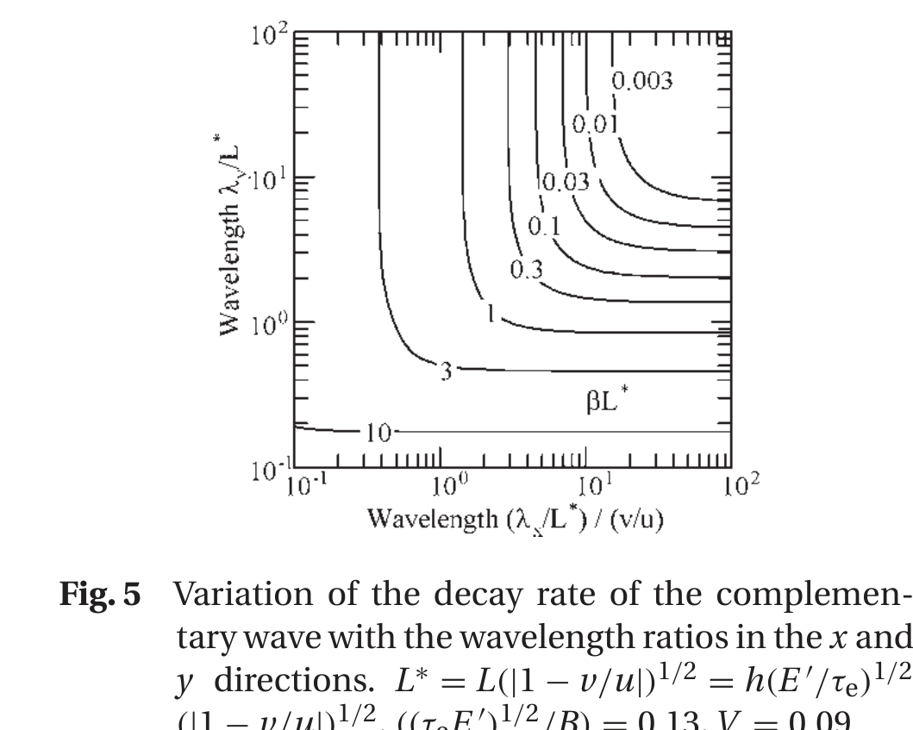
*Figure 5. 상보파 감쇠율 vs 파장비. $L^*=L(|1-v/u|)^{1/2}$. 단파장은 급감쇠, 장파장은 거의 일정.*

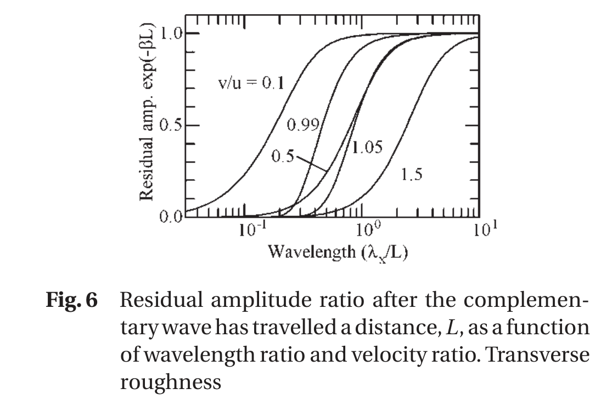
*Figure 6. 길이 $L$ 이동 후 상보파 잔류 진폭비 vs 파장비·속도비. 횡방향(transverse) 거칠기.*

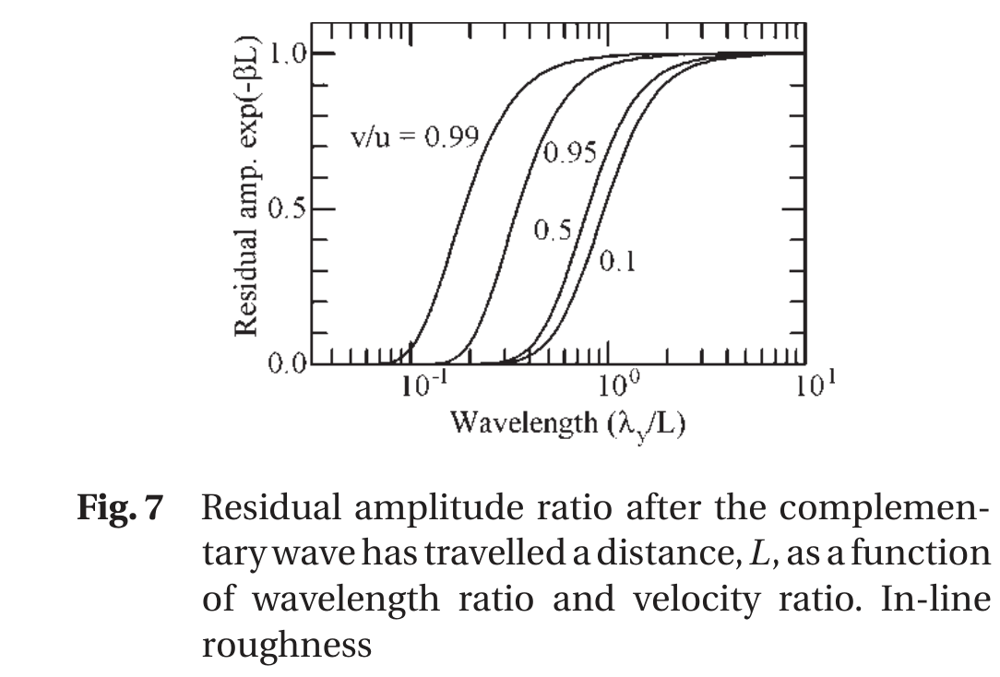
*Figure 7. 길이 $L$ 이동 후 상보파 잔류 진폭비 vs 파장비·속도비. In-line 거칠기(슬라이딩 방향 무관).*

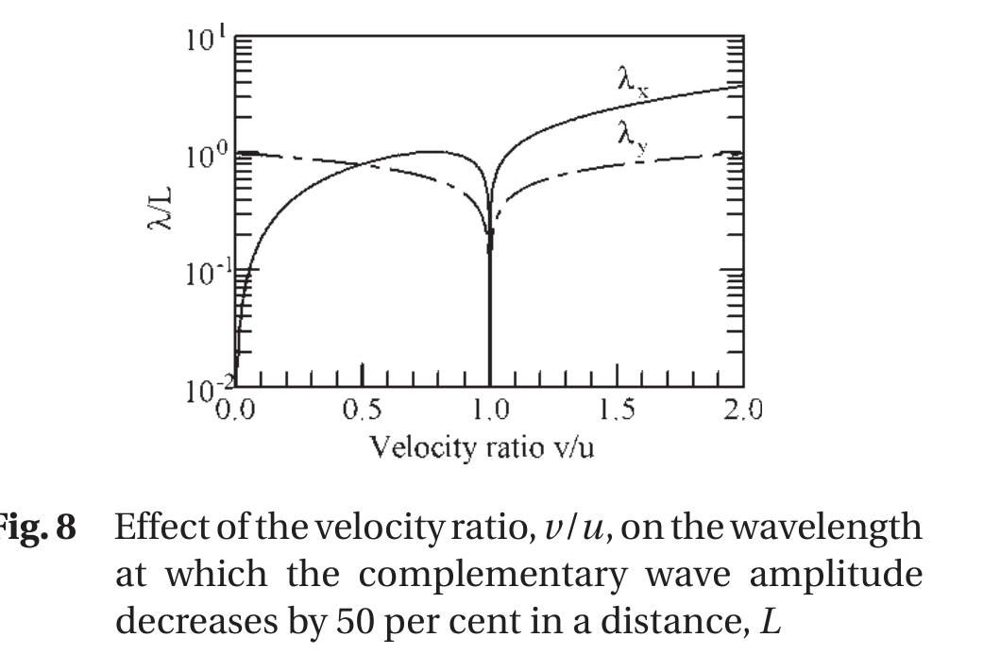
*Figure 8. 길이 $L$에서 상보파 진폭이 50% 감소하는 파장 vs $v/u$. In-line은 $v/u$=1 대칭, 횡방향은 포물선적 관계 + $v/u$→1 급감.*

> **$v/u\approx1$(거의 롤링)에서 상보파 감쇠 급감** → 접촉 내부에서 거의 유지되어 거동에 지대한 영향.

### ▪ 7.2 상보파 진폭과 검증

상보파 진폭 $h_c$는 섭동해에서 감쇠 거칠기를 뺀 잔차에 **최소자승 곡선적합**으로 추정합니다:

$$h_c = \frac{\sum h_r\bar e}{\sum e\bar e}, \quad e(x')=\exp(i\psi x') \tag{37}$$

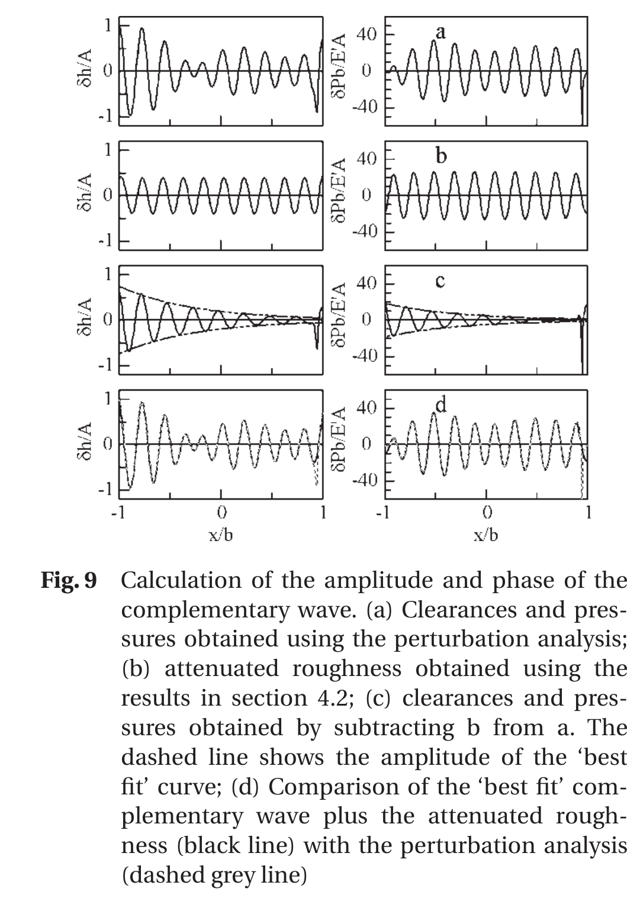
*Figure 9. (a) 섭동해 간극·압력, (b) §4.2 감쇠 거칠기, (c) a−b=상보파(점선=best fit), (d) best-fit 상보파+감쇠 거칠기(흑선) vs 섭동해(회색 점선). 중앙 90%서 오차 <2%.*

3-변수 근사는 전 범위에서 **3% 이내 일치**합니다. 즉 거동이 ① 감쇠 ② 상보파 진폭 ③ 파수·감쇠율의 3 복소량으로 정확히 근사됩니다.

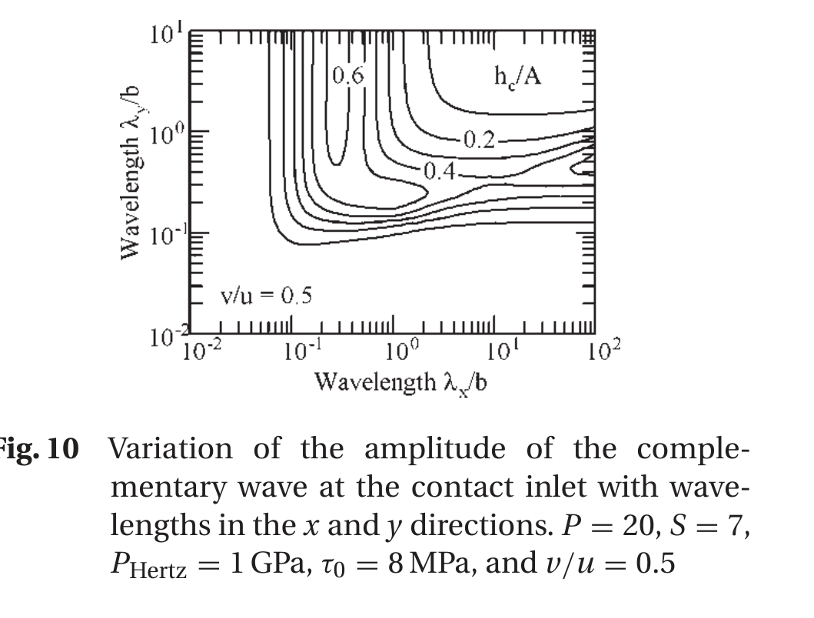
*Figure 10. 입구 상보파 진폭 vs $x$/$y$ 파장(P=20, S=7, P_Hertz=1 GPa, τ₀=8 MPa, v/u=0.5). 항상 원거칠기보다 작고 최대 ~0.6.*

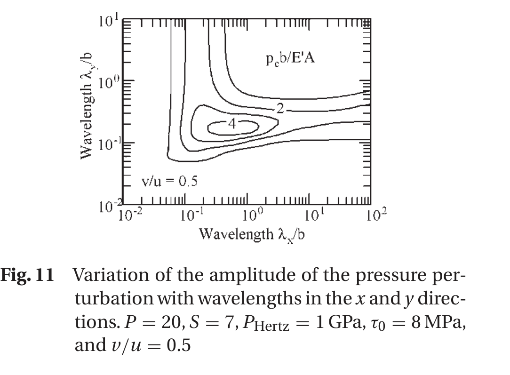
*Figure 11. 상보파 동반 압력 섭동 진폭 vs $x$/$y$ 파장. 식 (28) 변형–압력 관계로 진폭에 직접 비례.*

### ▪ 7.3 입구 길이의 효과

상보파 진폭은 **입구 압력 스윕 길이 대비 파장비 $(\lambda/b)S^{-2}P^{1.5}$** 가 지배하며, 보통 ≈0.5에서 최대입니다.

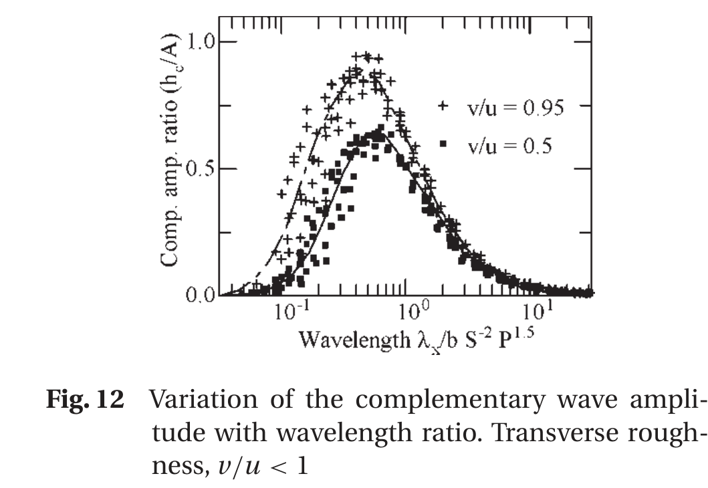
*Figure 12. 상보파 진폭 vs 입구 파장비(횡방향, v/u=0.5·0.95). 광범위 운전조건 데이터가 파장비로 수렴.*

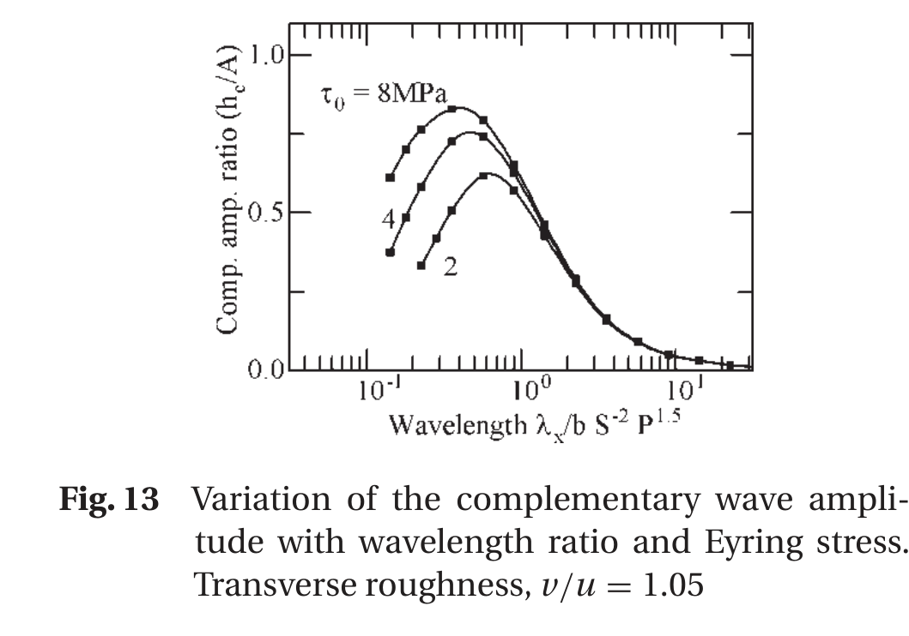
*Figure 13. 상보파 진폭 vs 파장비·Eyring 응력(횡방향, v/u=1.05). τ₀ 2→8 MPa로 최댓값 0.6→0.85 증가 (v/u>1에서 레올로지 민감).*

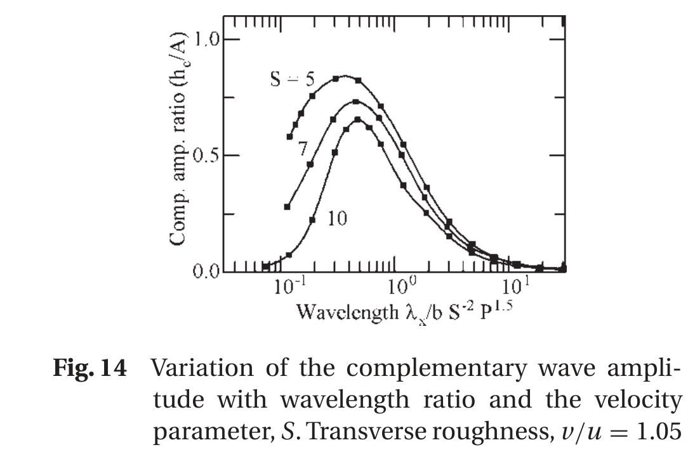
*Figure 14. 상보파 진폭 vs 파장비·속도 파라미터 S(횡방향, v/u=1.05). S↑→간극·$L$↑→상보파 진폭 감소.*

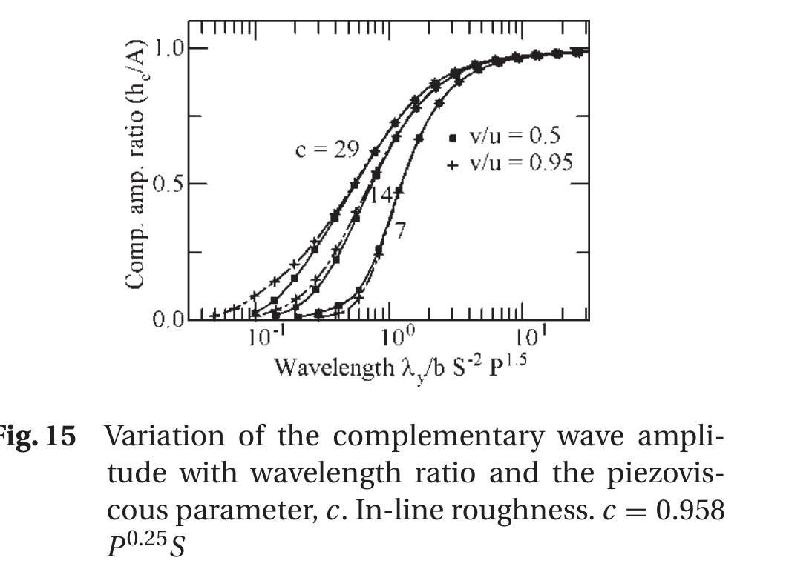
*Figure 15. 상보파 진폭 vs 파장비·피에조점성 파라미터 c(in-line, c=0.958 P^0.25 S). in-line은 c가 지배, 속도비·Eyring 영향 작음.*

- **횡방향, $v/u<1$**: 진폭이 접촉 내부·피에조점성·레올로지에 거의 무관(입구 파장비가 지배)
- **횡방향, $v/u>1$**: 중심 유막·Eyring 응력이 크게 영향
- **in-line**: 피에조점성 파라미터 $c$가 지배. (단, in-line은 감쇠가 없고 상보파가 항상 180° 위상차라 합성 시 간극 변동이 파장에 따라 균일 감소)

---

## 8. 결론

거친 표면이 롤링–슬라이딩 EHL 접촉을 지날 때, 유막 두께는 **① 슬라이딩으로 감쇠된 거칠기**와 **② 입구에서 생성된 상보파**로 결정됩니다. 두 성분은 서로 다른 속도로 이동해 시간에 따라 빠르게 변하는 복잡한 분포를 만듭니다.

### 방법론적 기여

- 저진폭에서 푸리에 성분별 해석·합성으로 임의 표면 거동 도출
- 거동을 **3개 복소 변수**로 정확히 정의: ① 감쇠, ② 입구 상보파 진폭, ③ 상보파 파장·감쇠율
- 압력 리플은 단순 스케일링으로 산출
- 저진폭에선 임의 레올로지를 $\tau_m$, $\tau_e$(≈Eyring 응력) 두 값으로 환원

### 검증 결과

- 3-변수 근사가 정확한 EHL 해와 **3% 이내** 일치
- 감쇠·상보파 감쇠율은 $\lambda/L$($L=h\sqrt{E'/\tau_e}$)에, 상보파 진폭은 입구 파장비 $(\lambda/b)S^{-2}P^{1.5}$에 의존

### 핵심 거동

- 장파장 성분이 더 크게 감쇠, in-line 거칠기는 무감쇠(약간 기울면 큰 감쇠)
- 상보파 최대는 파장비 ≈0.5, 최댓값은 $v/u$ 의존
- **$v/u\approx1$에서 상보파 감쇠 급감 → 특히 중요**

### 한계 및 확장

- 저진폭(진폭 ≪ 유막) 가정. 고진폭은 경향만 제시
- 상보파는 Eyring 외 레올로지에 다소 민감
- Part 2에서 이 결과로 **일반(복합) 거친 표면**의 신속 해석으로 확장

---

## 9. 기호 및 참고문헌

### ▪ 주요 기호 설명 (Notation)

| 기호 | 설명 | 단위 |
|------|------|------|
| $A$ | 표면 거칠기 성분 진폭 | m |
| $b$ | Hertz 반접촉폭 | m |
| $B$ | 체적탄성률 ($d\rho/dp=\rho/B$) | Pa |
| $c$ | 피에조점성 파라미터 ($c=(27/32)^{0.25}P^{0.25}S$) | – |
| $C$ | 압축성 파라미터 (식 21) | – |
| $E'$ | 환산 탄성계수 | Pa |
| $G$ | 재료 파라미터 ($G=\alpha E'$) | – |
| $h$ | 간극(유막 두께) | m |
| $h_a$ | 감쇠 거칠기 진폭 | m |
| $h_c$ | 상보파 진폭 | m |
| $h_r$ | 잔류 진폭 (식 33) | m |
| $L$ | 특성 길이 ($L=h\sqrt{E'/\tau_e}$) | m |
| $L^*$ | 수정 특성 길이 ($L\sqrt{|1-v/u|}$) | m |
| $p_a, p_c$ | 감쇠/상보파 동반 압력 진폭 | Pa |
| $P$ | Greenwood 압력 파라미터 ($\alpha P_{Hertz}$) | – |
| $P_{Hertz}$ | Hertz 압력 | Pa |
| $Q$ | 감쇠 파라미터 (식 21) | – |
| $S$ | Greenwood 속도 파라미터 ($GU^{0.25}$) | – |
| $u$ | 견인 속도 ($(u_1+u_2)/2$) | m/s |
| $\Delta u$ | 표면 속도차 ($u_1-u_2$) | m/s |
| $v$ | 거친 표면 속도 | m/s |
| $V$ | 유효점도 비 ($\eta_x/\eta_y$) | – |
| $w_a$ | 감쇠 동반 표면 변위 | m |
| $\alpha$ | 압력–점도 계수 | Pa⁻¹ |
| $\beta$ | 상보파 감쇠율 | m⁻¹ |
| $\dot\gamma, \dot\gamma_m$ | 전단변형률, 평균 전단변형률 | s⁻¹ |
| $\eta_x, \eta_y$ | 견인/수직 방향 유효점도 | Pa·s |
| $\kappa$ | 거칠기 파수 ($\kappa^2=\omega^2+\xi^2$) | m⁻¹ |
| $\lambda, \lambda_x, \lambda_y$ | 거칠기 파장 (합/x/y) | m |
| $\theta$ | 거칠기 방향 | rad |
| $\tau_0$ | Eyring 응력 | Pa |
| $\tau_e$ | 등가 Eyring 응력 | Pa |
| $\tau_m$ | 평균 전단응력 | Pa |
| $\omega, \xi$ | x/y 방향 거칠기 파수 | m⁻¹ |
| $\omega_c, \omega_d$ | 상보파 공칭/실제 파수 | m⁻¹ |
| $\Omega, \psi$ | 복소 파수 ($\Omega^2=\psi^2+\xi^2$, $\psi=\omega_d+i\beta$) | m⁻¹ |

-------------

### ▪ 핵심 참고문헌 (References)

- **[1]** Liu, Tallian, McCool (1975) — 유막/거칠기 비와 베어링 피로 수명 (3:1 법칙)
- **[5,6]** Hooke C.J. (1999, 2000) — 라인 접촉 저진폭 거칠기 거동(뉴턴/비뉴턴)
- **[7,8]** Hooke & Li (2006) — **순수 롤링** 거친 EHL 신속 계산 Part 1·2 (본 연구의 직접 기반)
- **[10]** Hooke & Venner (2000) — 라인·점접촉 거칠기 감쇠 (거동 동일성)
- **[12]** Hooke C.J. (2006) — 롤링–슬라이딩 EHL 거칠기 (2D 초기 검토)
- **[13,14]** Venner; Venner & Lubrecht — 멀티그리드 EHL 해법
- **[16]** Greenwood & Johnson (1992) — 슬라이딩 EHL 횡방향 거칠기 (상보파 개념)
- **[17]** Greenwood & Morales-Espejel (1994) — EHL 횡방향 거칠기 거동
- **[18]** Johnson K.L. (1985) — Contact Mechanics (정현파 압력–변형 관계)

---

**원본 출처**: Hooke, C.J., Li, K.Y., Morales-Espejel, G., 2007, "Rapid calculation of the pressures and clearances in rough, rolling–sliding elastohydrodynamically lubricated contacts. Part 1: low-amplitude, sinusoidal roughness," *Proc. IMechE Part C: J. Mechanical Engineering Science*, 221, pp. 535–550.
**정리 양식**: [[2012. (Lugt) Thin layer flow and film decay modeling]] 참고
**관련 문헌**: Part 2 (일반 거친 표면 해석)

---

**끝**
