# Rapid calculation of the pressures and clearances in rough, rolling–sliding elastohydrodynamically lubricated contacts. Part 1: low-amplitude, sinusoidal roughness

C J Hooke1,∗, KY Li2, and G Morales-Espejel3

1School of Engineering, The University of Birmingham, Birmingham, UK

2Department of Manufacturing Engineering and Engineering Management, City University of Hong Kong, Hong Kong, People’s Republic of China

3 SKF Engineering and Research Centre, Nieuwegein, The Netherlands

The manuscript was received on 11 October 2006 and was accepted after revision for publication on 5 February 2007.

DOI: 10.1243/0954406JMES519

Abstract: Surface roughness in elastohydrodynamically lubricated (EHL) contacts may have a significant effect on component life and there is a need to be able to assess its effects quickly. This article describes a rapid calculation method, which provides accurate results where the ampli tude of the roughness is relatively low and which gives good indications of the likely behaviour for higher amplitudes. In the first part, the effect oflow-amplitude, sinusoidal roughness is examined, and it is shown that the behaviour can, for any wavelength and roughness orientation, be characterized by three complex quantities. Calculation oftwo ofthese is straightforward; the third requires curve fitting to the results obtained using a perturbation analysis. Details of the process are given. The second part of the article discusses how these results can be used to predict the behaviour of any rough surface under rolling–sliding EHL conditions.

Keywords: elastohydrodynamic lubrication, rolling–sliding contacts, rough elastohydrodynamic lubrication, perturbation analysis

## 1 INTRODUCTION

Many elastohydrodynamically lubricated (EHL) contacts operate with surface roughnesses that are comparable with the clearance. Under these conditions, the pressure distribution can change very significantly from that found with smooth surfaces while the minimum film thickness is reduced. The first of these effects tends to increase the subsurface stresses, reducing the life of the contact, while the reduced clearance may lead to rapid failure.

There appears to be no simple relationship between surface roughness, clearance, and component life, and the widely quoted 3:1 rule of Tallian [1] is known to be misleading. Recent studies [2–12] have shown that details of the surface profile such as the length, aspect ratio, and orientation of the dominant asperities can significantly affect the pressure and clearances. Most of these studies have been concerned with rolling contacts and, in these, long wavelength components of roughness are flattened under the contact without producing significant pressure changes. Similarly, short wavelength components pass through the contact unchanged, again without causing major pressure variations. However, intermediate wavelength components are only partially flattened and may produce very large pressure ripples and changes to the underlying stress distribution. The largest pressure changes appear to occur when the roughness wavelength is approximately equal to the length ofthe inlet pressure sweep and, for a given surface profile, the pressure rippling increases as the contact becomes more highly loaded.

Although it is possible to analyse the effect of any particular surface profile using multi-grid solvers [13, 14], the analysis tends to be very time-consuming, particularly with heavily loaded contacts where short wavelength components of roughness have to be included. The method appears, therefore, to be unsuited to use in design where it would be useful to obtain rapid estimates ofthe effect of different surface finishes on film thickness and stress.

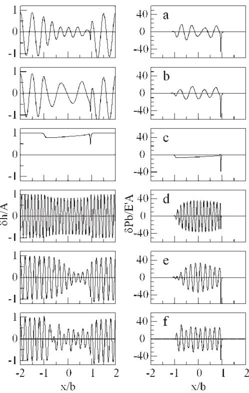

In previous papers [7, 8], two ofthe present authors examined the effect of roughness in rolling contacts and developed a linearized, rapid analysis method that could be used to estimate the pressure and clearance distributions in any rough contact. A typical analysis took one or two seconds compared with the many hours required using multi-grid solvers. Comparison of the predictions of the method, which was based on the behaviour of low-amplitude roughness, with published experimental and analytical solutions of the rough EHL problem showed good estimates of the pressure rippling, even where the roughness was large compared with the clearance. The clearance variations were accurate provided the reduction in clearance was less than half of the film thickness. For rougher surfaces, the overall distribution of film thickness was satisfactory but the linear analysis tended to underestimate the minimum film thickness.

The purpose ofthis article is to extend this approach to a more complex situation where there is significant sliding in the contact. The first part of this article examines, in detail, the behaviour of surfaces where the roughness varies sinusoidally in both the entrainment direction and normal to it. An initial examination of this problem for two-dimensional roughness was given in reference [12], but the present work extends the analysis to three-dimensional profiles. The second part outlines how these results can be used to obtain rapid estimates ofthe clearance and pressure variations in general, rough EHL conjunctions. It will then compare the predicted values with the available experimental measurements.

## 2 SURFACE ROUGHNESS

The deviation from smooth of any real surface moving through an EHL contact may be expressed in the form $r ( s , y )$ , where the coordinate s is convected with the surface as it moves and the y coordinate lies normal to the direction of entrainment. If a typical section of a surface is selected, then discrete (fast) Fourier transforms [15] may be used to convert the profile into a set of harmonic components of the form $A ( \omega , \xi ) \exp [ i ( \omega s + \xi y ) ]$ . The amplitudes $A ( \omega , \xi )$ are complex and are defined for both positive and negative values of ω and ξ.

Provided the roughness amplitude is low compared with the film thickness, the effect ofthe surface profile on the contact will be relativelysmall and the response of the system can be regarded as linear. Under these circumstances, the effect of each harmonic component may be investigated separately, and the results combined to obtain a response to the original profile. Similarly, the effect of roughness on both contacting surfaces may be found by examining the effect of each surface separately and, again, combining the results.

A considerable body of work investigating the effects of sinusoidal surface roughness in EHL contacts [2–12] is available. Initially this was based on the use of a multi-grid solver but later, one of the present authors developed a perturbation process for sinusoidal roughness in line contacts [5–7] that, first, avoided the need to solve time marching problems and, second, reduced the two-dimensional problem to one dimension. The method is applicable only to line contacts but a comparison of the behaviour of roughness in line and point contacts [10] showed that the behaviour of sinusoidal roughness was virtually identical in the two types ofconjunction. This enables the line-contact results to be used for any contact and avoids the need to treat each ellipticity ratio as a separate case.

Fig. 1 Clearance and pressure perturbations. $P = 2 0 ,$ $S = 7 , P _ { \mathrm { H e r t z } } = 1 { \mathrm { G P a } } ,$ and $\tau _ { 0 } = 8 \mathrm { M P a }$ . (a) $\nu / u =$ $1 . 4 , \ \lambda _ { x } = 0 . 5 \mathrm { b } ,$ $\lambda _ { y } = 0 ;$ (b) $\nu / u = 0 . 6 , \lambda _ { x } = 0 . 5 \mathrm { b } ,$ $\lambda _ { y } = 0 ;$ (c) $\nu / u = 0 . 6$ $\lambda _ { x } = 0$ , λy = 0.2b; (d) $\begin{array} { r } { \nu / u = 1 . 1 , \lambda _ { x } = 0 . 0 7 \mathrm { b } , \lambda _ { \gamma } = 0 . 0 7 \mathrm { b } ; \mathrm { ~ ( e ) } \nu / u = 0 . 9 , } \end{array}$ $\lambda _ { x } = 0 . 2 \mathrm { b } , \lambda _ { y } = 0 ; \mathrm { ( f ) } \nu / \dot { u } = 0 . 6 , \lambda _ { x } = 0 . 2 \mathrm { b } , \lambda _ { y } = 0$

Figure 1 shows a number of typical results from the perturbation analysis. A contact with Greenwood parameters, $P = 2 0$ and $S = 7$ , and a Hertz pressure of 1 GPa was used and it was assumed that the fluid followed Roelands’ viscosity–pressure and Dowson’s and Higginson’s density–pressure relationships. In addition, an Eyring relationship between shear strain rate and shear stress was assumed

$$
\dot { \gamma } = \frac { \tau _ { 0 } } { \eta } \sinh \left( \frac { \tau } { \tau _ { 0 } } \right)\tag{1}
$$

Results are given for a range of velocity ratios, $\nu / u ,$ where v is the velocity of the rough surface and u the entrainment velocity, and for a range of roughness wavelengths in the x and y directions.

The curves show the clearance and pressure perturbations at one instant of time and, in order to find the actual clearances and pressures, these need to be scaled by the actual roughness amplitude and superimposed on the smooth EHL values.

A number ofpoints may be noted. First, outside the contact the clearance perturbation consists of just the roughness profile while the pressures are zero. Inside the contact, the clearance and pressure distributions are complex and, although not shown here, may vary rapidly with time.

In the upper curve, curve a, where the rough surface is moving faster than the smooth, the roughness lies along the conjunction and the clearance variation is significantly reduced inside the contact. After decaying from a high value at the inlet, it appears to be nearly constant in amplitude. However, it may be noted that the wavelength inside the conjunction is roughly 70 per cent of that of the original profile. The large spikes in the clearance and pressure perturbations at the exit are associated with slight, cyclic changes in the position of the exit pressure spike. When the perturbations are combined with the smooth pressures and clearances, they do not produce significant changes in the magnitude of the pressure spike nor in the clearance, simply shifting the location of the spike slightly. For this reason they may generally be ignored when considering the effect of surface roughness.

In the second curve, curve b, with the same roughness and slip but with the roughness on the slower moving surface, the amplitude reduction is less and the wavelength inside the conjunction is longer than that of the original surface. The pressure variations in these two cases are similar but this is not typical and changing the surface on which the roughness lies generally produces significant alterations to the pressure.

In the third curve, curve c, the roughness lies in the direction ofentrainment with the clearance and pressure varying cyclically along the contact. Here, there is a slight reduction in amplitude at the start of the contact, decreasing towards the exit. This is matched by a pressure perturbation that decreases in amplitude through the contact. The roughness in the fourth curve, curve d, has equal wavelengths in the x and y directions and can be interpreted as corresponding to a relatively short wavelength roughness lying at 45◦ to the contact. There is a near uniform decrease in amplitude under the conjunction with a pressure ripple of almost constant amplitude, and both the clearance and pressure perturbations have the same wavelengths as the original roughness.

Finally, the two lower curves illustrate other types of behaviour. In curve e, the roughness velocity is 10 per cent below the entrainment velocity and the roughness amplitude first decreases before increasing again towards the rear of the conjunction, whereas in curve f, there appear to be two roughness wavelengths present, which interact to produce a complex waveform.

In all cases, both the clearance and pressure distributions can be explained by the presence of two components with differing wavelengths. The first component has the same wavelength as the undeformed roughness, although it clearly differs in amplitude and phase. The second component has a longer wavelength when the rough surface is the slower moving and a shorter wavelength when it moves faster. In some cases, such as curve f, the interaction of the two waveforms is obvious. In others such as curve e, the difference between the wavelengths is relatively small and the apparent variation in the clearance is primarily the result of the changing phase between the two components. The exception to this is where the roughness lies in the direction of entrainment, curve c, and here the two components have the same wavelength.

With purely rolling contacts, the clearance and pressure variations inside the conjunction are nearly constant in amplitude and always have the same wavelengths as the original surface profile. It is, thus, possible to define the behaviour in terms of a single (complex) amplitude. For rolling–sliding contacts this is clearly not possible.

## 3 SINUSOIDAL ROUGHNESS

Although it would be possible to carry out a perturbation or similar analysis for all the wavenumbers in the Fourier transform of the surface roughness, this would be extremely time-consuming.

For rolling conjunctions, it was found that the amplitudes of the attenuated roughness and of the associated pressure ripple were nearly constant inside the contact. This enabled the behaviour ofany particular roughness under the conjunction to be characterized by a single, complex, number and also allowed approximate expressions to be developed for them. With this, the response of the contact to any roughness component could be rapidly calculated and that allowed the development of rapid analysis methods for general surface profiles.

It was hoped that a similar approach would be possible under rolling–sliding conditions and, in order to examine this possibility, it was necessary to understand, in some detail, the clearance and pressure distributions inside the conjunction and the underlying reasons for the contact’s behaviour.

## 3.1 Clearance and pressure variations

As the roughness passes through the contact, the relative sliding of the surfaces generates pressure ripples, and these tend to reduce the amplitude of the clearance variation inside the conjunction. This is illustrated in Fig. 2 where the upper curve, curve (a), shows a typical smooth pressure and clearance distribution; the second curve, curve (b), the undeformed roughness.

For the sliding direction shown (the smooth surface is moving more rapidly than the rough), the pressure perturbations are positive where the clearance decreases with x; negative where it increases. These pressures deform the surface, reducing the amplitude of the roughness and changing its phase. The resulting clearance variations are shown in curve (c). The roughness amplitude is around half of that of the undeformed surface, and the profile has moved almost $9 0 ^ { \circ }$ to the right. The attenuated roughness will always have the same wavelength as the original profile but will differ in phase, lying to the left of the original profile when the rough surface moves faster than the smooth and to the right when the rough surface is the slower.

As the roughness enters the contact, it disturbs the conditions in the inlet producing a clearance variation there. This variation propagates through the conjunction at the entrainment velocity, decaying in amplitude as is does so. A schematic representation is shown in curve (d). Because the rough surface velocity is lower than the entrainment velocity, the propagating wave has a longer wavelength than the original profile. This wave, termed the complementary wave by Greenwood [16, 17], who first postulated its existence, combines with the attenuated roughness to produce the final clearance distribution, shown in curve e.

Finally, pressure distributions are associated with both the attenuated roughness and the complementary wave. In the first instance, this pressure is related to the change in amplitude of the roughness; in the second, it is required to produce the complementary clearance wave. The lowest curve, curve f, shows the resulting combined pressure distribution.

The profiles shown represent the behaviour at one instant of time and, since the attenuated roughness moves at the velocity of the rough surface and the complementary wave moves at the entrainment velocity, both the clearance and pressure distributions change continuously with time.

It will be shown that it is possible to adequately approximate the clearances and pressures inside the conjunction in terms ofthree complex quantities. The first is the amplitude of the attenuated roughness, the second the amplitude ofthe complementary wave at the inlet, and the third represents the decay rate and wavelength of the complementary wave. The first and third ofthese are determined by conditions inside the conjunction, the second, largely, by conditions in the contact inlet.

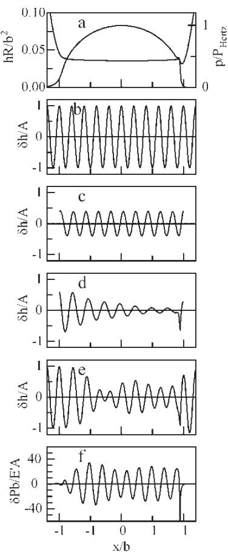  
Fig. 2 Behaviour of sinusoidal roughness in rolling–sliding contacts. (a) Smooth contact pressures and clearances; (b) undeformed rough surface; (c) roughness attenuated by relative sliding; (d) complementary wave; (e) combined attenuated roughness and complementary wave; (f ) pressures associated with the surface deformation

## 4 BEHAVIOUR INSIDE THE CONTACT

Under smooth conditions, the clearance inside piezoviscous EHL contacts is approximately constant. Assuming that the roughness wavelength is considerably shorter than the semi-contact width, $b ,$ the attenuation of the roughness and the decay of the complementary wave may, therefore, be investigated by examining their behaviour in a parallel conjunction.

It will be assumed that the amplitudes of the clearance and pressure variations are low and that the variations due to the attenuated roughness and those produced by the complementary wave do not interact and can be analysed separately.

## 4.1 Fluid behaviour

Before considering the effect of the roughness, the behaviour of the fluid in the conjunction needs to be considered. In the absence of any pressure gradient, the shear strain rate in the parallel conjunction would be uniform across the film thickness and may be written as

$$
\dot { \gamma } _ { \mathrm { m } } = \frac { \Delta u } { h }\tag{2}
$$

where $\Delta u$ is the difference between the surface velocities and h the film thickness. Associated with this strain rate will be some uniform shear stress, $\tau _ { \mathrm { m } } ,$ determined by the particular non-Newtonian characteristic of the fluid. Both the shear stress and the shear strain rate will lie in the direction of entrainment, x (the case where the directions of motion of the two surfaces differ is not considered here).

The underlying smooth pressure gradients and those produced by the roughness will perturb this uniform shear stress slightly. (Typically, in a smooth contact, the shear stress due to the pressure gradient appears to be below 5 per cent of the mean shear stress.) Noting that the viscosity of a fluid is defined as the ratio of the shear stress to shear strain rate, the effective viscosity for small changes of pressure and strain rate in the x direction must be given by

$$
\eta _ { x } = \frac { \partial \tau } { \partial \dot { \gamma } }\tag{3}
$$

and it is this viscosity that will control the flow perturbations in the x direction produced by the surface roughness.

It is useful to define a stress, $\tau _ { \mathrm { e } } ,$ as

$$
\eta _ { x } = \frac { \tau _ { \mathrm { e } } } { \dot { \gamma } _ { \mathrm { m } } } = \frac { \partial \tau } { \partial \dot { \gamma } }
$$

since this considerably simplifies some of the equations derived later. It may be noted that, for Eyring fluids, for the high values of viscosity found under piezoviscous contacts, the stress, $\tau _ { \mathrm { e } } ,$ is equal to the Eyring stress $\tau _ { 0 }$ and it is logical to regard the stress $\tau _ { \mathrm { e } }$ as an equivalent Eyring stress.

When a small pressure gradient, δτ, is introduced in the y direction, the resultant shear stress becomes $( \tau _ { \mathrm { m } } ^ { 2 } + \dot { \delta } \tau ^ { 2 } ) ^ { 1 / 2 }$ and this resultant stress is inclined at an angle, $\delta \tau / \tau _ { \mathrm { m } }$ , to the x axis. The change in the magnitude of the stress is small and the magnitude of the shear strain rate will, therefore, also be almost unaltered. Its direction, however, will coincide with that of the shear stress. The component of the shear strain rate in the y direction, $\delta \dot { \gamma } ,$ , can, thus, be written as $\dot { \gamma } _ { \mathrm { m } } ( \delta \tau / \tau _ { \mathrm { m } } )$ , and it follows that the effective viscosity in the y direction will be given by

$$
\eta _ { y } = \frac { \tau _ { \mathrm { m } } } { \dot { \gamma } _ { \mathrm { m } } }\tag{4}
$$

Again, this viscosity will control the flow perturbations in the y direction.

Finally, the ratio of the effective viscosities in the x and y directions, V, can be written as

$$
V = { \frac { \eta _ { x } } { \eta _ { y } } } = { \frac { \tau _ { \mathrm { e } } } { \tau _ { \mathrm { m } } } }\tag{5}
$$

The process is illustrated in Fig. 3 where the full line represents the shear strain rate characteristic of the fluid and point m is the smooth operating point. The effective viscosity in the x direction is equal to the gradient of curve at the point m while that in the y direction is the gradient of the line from the origin to m. Finally, $\tau _ { \mathrm { e } }$ is given by the intersection of the tangent to the curve with the shear stress axis, with the ratio of the viscosities, V, being given by the ratio of this to $\tau _ { \mathrm { m } }$

It follows from this analysis that, as far as the behaviour oflow-amplitude roughness under an EHL contact is concerned, details ofthe fluid’s rheology are unimportant. All that matters is the value ofthe mean shear stress and the gradient of the stress–strain rate curve.

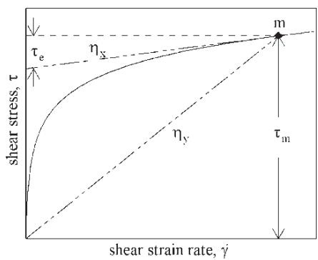  
Fig. 3 Effective viscosities under the contact in the entrainment, $\eta _ { x }$ , and transverse, $\eta _ { y }$ , directions

## 4.2 Attenuation of the roughness by sliding

As a first step, the effect of the relative sliding on the surface roughness will be examined. As noted above, it will be assumed that the effects of roughness attenuation due to sliding and the complementary wave do not interact. Thus, the surface modification produced by the sliding will be considered in isolation. It will be assumed that the undeformed roughness has a wavenumber in the entrainment direction, x, of ω and of ξ along the contact – the y direction

$$
\delta r = A \exp [ \mathrm { i } ( \omega s + \xi y ) ]\tag{6}
$$

The wavenumbers are related to the wavelengths in the x and y directions, $\lambda _ { x }$ and $\lambda _ { y }$ , by

$$
\omega = \frac { 2 \pi } { \lambda _ { x } } \quad \mathrm { a n d } \quad \xi = \frac { 2 \pi } { \lambda _ { y } }\tag{7}
$$

Alternatively, equation (6) can be recast as

$$
\delta r = A \exp [ \mathrm { i } ( \kappa n ) ]\tag{8}
$$

where $\omega = \kappa \cos ( \theta ) , \ \xi = \kappa \sin ( \theta ) , \ \kappa = ( \omega ^ { 2 } + \xi ^ { 2 } ) ^ { 1 / 2 } =$ $2 \pi / \lambda$ and n is a direction inclined at an angle θ to the x axis. Thus, the roughness defined by equation (6) can be regarded either as a series of asperities and hollows with an aspect ratio $\lambda _ { y }$ to $\lambda _ { x }$ or as a sinusoidal roughness inclined at an angle θ to the direction of entrainment.

Noting that the rough surface is moving at a velocity v and that, therefore

$$
x = s + \nu t
$$

the roughness may be re-written as

$$
\delta r = A \exp ( \mathrm { i } \omega x ) \exp ( - \mathrm { i } \omega \nu t ) \exp ( \mathrm { i } \xi y )\tag{9}
$$

As the surfaces slide relative to each other, hydrodynamic pressures will be generated. Provided the amplitude ofthe roughness is low, these pressures wil be sinusoidal and will have the same wavelength as the undeformed roughness but may differ in phase, allowing them to be expressed as

$$
\delta p _ { \mathrm { a } } = p _ { \mathrm { a } } \exp ( \mathrm { i } \omega x ) \exp ( - \mathrm { i } \omega \nu t ) \exp ( \mathrm { i } \xi y )\tag{10}
$$

The amplitude $p _ { \mathrm { a } }$ is complex reflecting the differences in magnitude and phase between the original surface and the pressure variation.

This pressure will deform the surface and, provided the wavelength is considerably shorter than the semi-contact width, b, will produce sinusoidal surface

deformations on the two surfaces. The sum of these deformations may be written as

$$
\delta w _ { \mathrm { a } } = w _ { \mathrm { a } } \exp ( \mathrm { i } \omega x ) \exp ( - \mathrm { i } \omega \nu t ) \exp ( \mathrm { i } \xi y )\tag{11}
$$

where the relationship between pressure and deformation for a sinusoidal pressure ofinfinite extent [18] may be used to relate $w _ { \mathrm { a } }$ and $p _ { \mathrm { a } }$

$$
w _ { \mathrm { a } } = \frac { 4 } { E ^ { ' } \sqrt { \omega ^ { 2 } + \xi ^ { 2 } } } p _ { \mathrm { a } } = \frac { 4 } { \kappa E ^ { ' } } p _ { \mathrm { a } }\tag{12}
$$

This surface deformation will be superimposed on the original profile and produces a clearance variation inside the contact

$$
\delta h _ { \mathrm { a } } = h _ { \mathrm { a } } \exp ( \mathrm { i } \omega x ) \exp ( - \mathrm { i } \omega \nu t ) \exp ( \mathrm { i } \xi y )\tag{13}
$$

where

$$
h _ { \mathrm { a } } = A + w _ { \mathrm { a } }\tag{14}
$$

In addition to deforming the surfaces, the pressure ripple will also change the fluid density, and this change may be written as

$$
\delta \rho _ { \mathrm { a } } = \rho _ { \mathrm { a } } \exp ( \mathrm { i } \omega x ) \exp ( - \mathrm { i } \omega \nu t ) \exp ( \mathrm { i } \xi y )\tag{15}
$$

where $\rho _ { \mathrm { a } }$ is related to the pressure variation by

$$
\rho _ { \mathrm { a } } = \frac { \rho } { B } p _ { \mathrm { a } }\tag{16}
$$

and B is the bulk modulus at the contact pressure defined relative to the density, $\rho ,$ at that pressure.

These pressure, clearance, and density perturbations may be added to the smooth contact values and substituted into the Reynolds’ equation

$$
\frac { \partial } { \partial x } \left( \frac { \rho h ^ { 3 } } { 1 2 \eta _ { x } } \frac { \partial p } { \partial x } \right) + \frac { \partial } { \partial y } \left( \frac { \rho h ^ { 3 } } { 1 2 \eta _ { y } } \frac { \partial p } { \partial y } \right) = u \frac { \partial ( \rho h ) } { \partial x } + \frac { \partial ( \rho h ) } { \partial t }\tag{17}
$$

Then, noting that the smooth pressures and clearances automatically satisfy the Reynolds’ equation, and assuming that the perturbations are small so that the second-order terms can be ignored, this simplifies to

$$
- \frac { \rho h ^ { 3 } \omega ^ { 2 } } { 1 2 \eta _ { x } } p _ { \mathrm { a } } - \frac { \rho h ^ { 3 } \xi ^ { 2 } } { 1 2 \eta _ { y } } p _ { \mathrm { a } } = - \mathrm { i } ( \nu - u ) \omega \left( \rho h _ { \mathrm { a } } + \frac { \rho h } { B } p _ { \mathrm { a } } \right)\tag{18}
$$

It may be noted that the assumption of low pressure gradients and constant clearance in the smooth contact indicates that the variations in the effective

viscosities with pressure and clearance do not need to be considered, and this greatly simplifies the analysis.

Combining equations (12), (14), and (16) with equation (18) allows the pressure ripple to be found as

$$
\frac { p _ { \mathrm { a } } } { A } = \frac { \kappa E ^ { ' } } { 4 } \frac { \mathrm { i } Q } { 1 - \mathrm { i } Q - \mathrm { i } C Q }\tag{19}
$$

and the clearance variation as

$$
{ \frac { h _ { \mathrm { a } } } { A } } = { \frac { 1 - \mathrm { i } C Q } { 1 - \mathrm { i } Q - \mathrm { i } C Q } }\tag{20}
$$

where

$$
Q = \frac { \left( \displaystyle \frac { 4 8 ( \nu - u ) \omega } { E ^ { \prime } h ^ { 3 } \kappa } \right) } { \left( \displaystyle \frac { \omega ^ { 2 } } { \eta _ { x } } + \displaystyle \frac { \xi ^ { 2 } } { \eta _ { y } } \right) }\tag{21}
$$

and

$$
C = { \frac { h E ^ { ' } \kappa } { 4 B } }
$$

Then, using the equations derived in section 4.1 for the effective viscosities, the expression for Q simplifies to

$$
Q = \pm { \frac { 6 } { \pi ^ { 2 } } } { \frac { \tau _ { \mathrm { e } } } { E ^ { \prime } } } { \frac { \lambda ^ { 2 } } { h ^ { 2 } } } { \frac { \cos ( \theta ) } { \cos ^ { 2 } ( \theta ) + V \sin ^ { 2 } ( \theta ) } }\tag{22}
$$

where $\lambda = 2 \pi / \kappa , \cos ( \theta ) = \omega / \kappa$ , and sin $( \theta ) = \xi / \kappa$

The positive sign applies when the rough surface is the faster moving, the negative sign if it is the slower.

Finally, these equations can be simplified further if a characteristic length, L, defined by

$$
L = h { \sqrt { \frac { E ^ { \prime } } { \tau _ { \mathrm { e } } } } }\tag{23}
$$

is introduced, giving

$$
Q = \pm \frac { 6 } { \pi ^ { 2 } } \frac { \lambda ^ { 2 } } { L ^ { 2 } } \frac { \cos ( \theta ) } { \cos ^ { 2 } ( \theta ) + V \sin ^ { 2 } ( \theta ) }\tag{24}
$$

and

$$
C = \frac { \pi } { 2 } \frac { \sqrt { \tau _ { e } E ^ { \prime } } } { B } \frac { L } { \lambda }
$$

Thus, the attenuation of the surface roughness under the contact is solely dependent on the ratio of the roughness wavelength to the characteristic length, L, the orientation of the roughness, the ratio of the effective viscosities, V, and the fluid compressibility. The length L does no depend on the operating conditions (except insofar as they affect the clearance) but only on the effective Eyring stress, the effective elastic modulus of the surfaces, and the clearance in the contact.

For transverse roughness, where ξ is zero, the expression for Q is particularly simple. However, for other roughness orientations, the behaviour is more complex, and Fig. 4 illustrates how the amplitude and pressure ratios vary with wavelength for a typical value of fluid compressibility. For the case shown, the value of V was close to 0.09.

For short wavelengths in either the x or y directions, there is little attenuation of the roughness, and the original surface passes through the contact largely unchanged. There is also little associated pressure rippling. For transverse roughness $( \lambda _ { y }$ much larger than $\lambda _ { x } )$ , the roughness becomes increasingly attenuated as the wavelength increases, with the transition being centred around $\lambda _ { x } / L = 1 . 7$ . The associated pressure ripple first increases as the wavelength is increased, reflecting the expected behaviour of the Reynolds’ equation, which predicts that, for a constant clearance variation, the pressure ripple will be proportional to the wavelength. Then, as the amplitude of the attenuated roughness decreases, there is a corresponding drop in the amplitude of the pressure rippling.

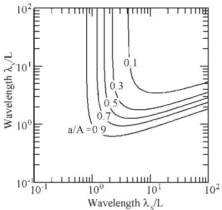

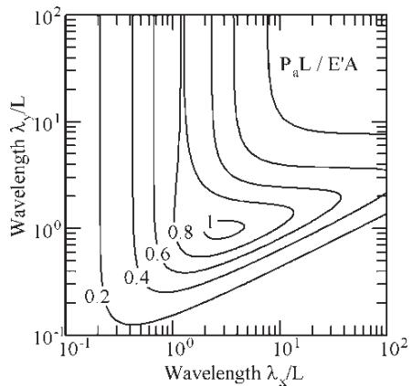  
Fig. 4 Roughness attenuation due to sliding and the associated pressure perturbation with the wavelength ratios in the x and y directions. $L = h ( E ^ { \prime } / \tau e ) ^ { 1 / 2 }$ . Compressibility parameter, $( \tau _ { \mathrm { e } } E ^ { \prime } ) ^ { 1 / 2 } / B = 0 . 1 3$ , viscosity ratio, $V = 0 . 0 9$

Where the roughness varies in the y direction, the behaviour is more complex. For perfectly inline roughness, there is no clearance variation in the x direction, and hence no pressure rippling nor roughness attenuation. However, even very long wavelengths in the x direction produce substantial hydrodynamic pressures and the roughness is attenuated in the conjunction. For example, with $\lambda _ { x } = 3 0 L$ and $\lambda _ { y } = 2 L$ , there is a large pressure ripple and the clearance variation is around 50 per cent of the undeformed roughness.

The change from the relatively simple behaviour when the roughness lies transverse to the contact to the more complicated behaviour when it is largely in-line appears to occur when the wavelengths in the two directions are equal. For $\lambda _ { x }$ below $\lambda _ { y } ,$ the attenuation depends primarily on the wavelength in the x direction. Above that figure, the attenuation and pressure ripple depend, in a complex fashion, on both wavelengths.

The analysis given above applies only where the combined wavelength, λ, is shorter than the total contact width. Where this is not the case, all equations except the elasticity equation still apply but the relationship between pressure and deformation given in equation (12) is no longer valid. However, the pressure and clearance perturbations are low in the long wavelength region, and detailed analysis suggests that the errors involved in applying the current results are relatively small.

The results have been given for one particular value offluid compressibility but its effect is relatively small. Viscosity ratio has more effect with increases in the ratio displacing the curves to shorter values of $\lambda _ { y } ;$ reductions displacing the curves upwards. The general pattern is, however, maintained.

## 4.3 Decay of the complementary wave

As the roughness enters the conjunction, it changes the conditions in the inlet and produces variations in the clearance there. These variations propagate through the contact at the entrainment velocity, decaying as they do so. By examining the behaviour of the complementary wave in a parallel gap, it is possible to estimate both its wavelength and the decay rate. Again, it will be assumed that the attenuated roughness and the complementarywave do not interact and that, therefore, the latter can be examined in isolation.

The roughness enters the inlet at a frequency ωv, and the complementary wave leaves it at the entrainment velocity u. In the absence of any modification inside the conjunction, the wavenumber of the complementary wave would, therefore, be ωv/u or $\omega _ { \mathrm { c } }$ Thus, where the rough surface moves faster than its counterface, the wavelength in the x direction will be reduced; where it moves more slowly the wavelength will be increased.

Because of the reduced viscosity due to non-Newtonian effects, the pressures associated with the complementary wave will produce flows that tend to reduce its amplitude as it moves through the contact. This decay will, in turn, alter the sinusoidal waveform, producing additional flows that tend to increase the wavelength.

Denoting the actual wavenumber of the complementary wave by $\omega _ { \mathrm { d } }$ and assuming that the wave decays exponentially with distance at a rate $\beta ,$ its amplitude may be expressed as

$$
\delta h _ { \mathrm { c } } = h _ { \mathrm { c } } \exp [ ( - \beta + \mathrm { i } \omega _ { \mathrm { d } } ) x ^ { \prime } ] \exp ( - \mathrm { i } \omega \nu t ) \exp ( \mathrm { i } \xi y )
$$

or

$$
\delta h _ { \mathrm { c } } = h _ { \mathrm { c } } \exp ( \mathrm { i } \psi x ^ { \prime } ) \exp ( - \mathrm { i } \omega \upsilon t ) \exp ( \mathrm { i } \xi y )\tag{25}
$$

where $\psi = \omega _ { \mathrm { d } } + \mathrm { i } \beta$ and $x ^ { \prime }$ is measured from the inlet to the contact

$$
x ^ { \prime } = x + b\tag{26}
$$

The position in the contact is measured from the inlet rather than the contact centre since the complementary wave is generated in the inlet, and it is convenient to define its amplitude, $h _ { \mathrm { c } } ,$ , at the point it enters the conjunction rather than at the centre where it has partially decayed.

The change in clearance, $\delta h _ { \mathrm { c } } ,$ will require some associated pressure distribution to deform the contacting surfaces, and this pressure will also have the form

$$
\delta p _ { \mathrm { c } } = p _ { \mathrm { c } } \exp ( \mathrm { i } \psi x ^ { \prime } ) \exp ( - \mathrm { i } \omega \nu t ) \exp ( \mathrm { i } \xi y )\tag{27}
$$

Using the result derived in appendix 1 of reference $[ 7 ]$ , and again making the assumption that the wavelength is considerably shorter than the semicontact width, $b ,$ the ratio of the pressure, $p _ { \mathrm { c } } ,$ to the wave amplitude, $h _ { \mathrm { c } }$ , will be

$$
{ \frac { P _ { \mathrm { c } } } { h _ { \mathrm { c } } } } = { \frac { \Omega E ^ { \prime } } { 4 } }\tag{28}
$$

where $\Omega ^ { 2 } = \psi ^ { 2 } + \xi ^ { 2 }$ . It may be noted that equation (28) is simply an extension, to complex wavenumbers, of the relationship for sinusoidal waveforms given in reference [18].

Substituting these and the associated changes in density into the Reynolds’ equation and collecting the first-order terms produces

$$
\psi = \omega _ { \mathrm { c } } + \mathrm { i } \frac { E ^ { ' } h ^ { 3 } \Omega } { 4 8 u } \frac { [ ( \psi ^ { 2 } / \eta _ { x } ) + ( \xi ^ { 2 } / \eta _ { y } ) ] } { [ 1 + ( E ^ { ' } h \Omega / 4 B ) ] }\tag{29}
$$

Again, using the equations derived in section 4.1 for the effective viscosities, equation (29) becomes

$$
\psi = \omega _ { \mathrm { { c } } } + \mathrm { i } { \frac { E ^ { ' } } { \tau _ { \mathrm { { e } } } } } { \frac { h ^ { 2 } \Omega } { 2 4 } } \left| 1 - { \frac { \nu } { u } } \right| { \frac { [ \psi ^ { 2 } + V \xi ^ { 2 } ] } { [ 1 + ( E ^ { ' } h \Omega / 4 B ) ] } }\tag{30}
$$

There seems no simple, analytical way of solving this but a numerical solution for ψ is readily obtained (by successivelyusing the real part ofequation (30) to estimate the real part of $\psi ;$ the imaginary part to estimate the imaginary part of ψ).

As with the roughness attenuation, the decay of the complementary wave depends on the characteristic length, L, defined in equation (23). However, the velocity ratio, $\nu / u ,$ is also significant and it is useful to introduce a modified length $L ^ { * }$ as

$$
L ^ { * } = L { \sqrt { \left| 1 - { \frac { \nu } { u } } \right| } } = h { \sqrt { \frac { E ^ { \prime } } { \tau _ { \mathrm { e } } } } } { \sqrt { \left| 1 - { \frac { \nu } { u } } \right| } }\tag{31}
$$

This, then, gives

$$
\psi L ^ { * } = \omega _ { \mathrm { { c } } } L ^ { * } + \mathrm { i } \frac { \Omega L ^ { * } } { 2 4 } \frac { [ ( \psi L ^ { * } ) ^ { 2 } + V ( \xi L ^ { * } ) ^ { 2 } ] } { [ 1 + ( \sqrt { E ^ { ' } \tau _ { \mathrm { { E } } } } / B ) ( \Omega L ^ { * } / 4 ) ( L / L ^ { * } ) ] }\tag{32}
$$

Figure 5 shows how the decay rate varies with the ratio of the wavelength to the length L∗. The horizontal, $\lambda _ { x } ,$ , axis includes the term $\nu / u$ and is, effectively, the ratio of the wavelength of the nominal complementary wave in the x direction to the length $L ^ { * }$ . It is thus, the ratios of the wavelengths of the complementary wave to the modified characteristic length

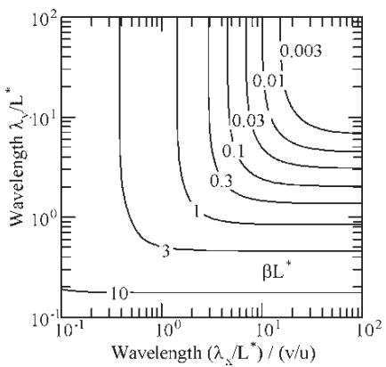  
Fig. 5 Variation of the decay rate of the complementary wave with the wavelength ratios in the x and $y$ directions. $L ^ { * } = L ( | 1 - \bar { \nu / u | } ) ^ { 1 / 2 } = h ( E ^ { \prime } / \tau _ { \mathrm { e } } ) ^ { 1 / 2 }$ $( | 1 - \nu / u | ) ^ { 1 / 2 } , ( ( \tau _ { \mathrm { e } } E ^ { \prime } ) ^ { 1 / 2 } / B ) = 0 . 1 3 , V = 0 . 0 9$

$L ^ { * }$ that completely determines (apart from a very small compressibility effect) the behaviour of the complementary wave inside the conjunction.

For short wavelengths, the complementary wave decays extremely rapidly and, under these conditions, is unlikely to have any significant effect on the clearances under the contact. However, for longer wavelengths, the decay can be small and the complementary wave will appear nearly constant inside the conjunction. The decay rate is approximately inversely proportional to the cube root of the wavelength since, for a given roughness amplitude, the maximum pressure decreases linearly with wavelength and so, for a given maximum pressure, does the flow. The flow volume required to reduce the amplitude by a fixed amount is proportional to the wavelength, giving a cubic relationship.

Again, the results are plotted for one particular compressibility factor and viscosity ratio. Compressibility effects are relatively small but the viscosity ratio is significant with increases in the ratio, shifting the curves downwards.

Although Fig. 5 gives the decay rate for all slip ratios, it is somewhat difficult to interpret and the behaviours for transverse and in-line roughnesses are re-plotted in terms ofthe characteristic length, L, in Figs 6 and 7.

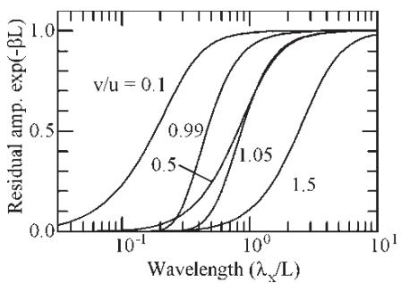  
Fig. 6 Residual amplitude ratio after the complementarywave has travelled a distance, $L ,$ as a function ofwavelength ratio and velocity ratio. Transverse roughness

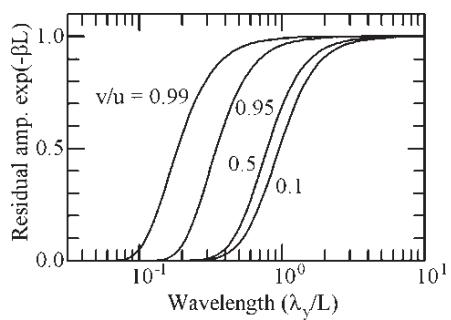  
Fig. 7 Residual amplitude ratio after the complementarywave has travelled a distance, L, as a function of wavelength ratio and velocity ratio. In-line roughness

Rather than giving the decay rate in terms ofβ directly, the fractional residue ofthe amplitude ofthe complementary wave at the end of a length $L , \exp ( - \beta L )$ , has been used. Results are given for five values ofslip ratio, although it may be noted that, for in-line roughness, the direction ofsliding has no effect on the decay rate.

For both orientations of the roughness, the decay decreases as the wavelength is increased with a relatively rapid transition from almost complete decay to almost no decay, as the wavelength increases by a factor of 10. For in-line roughness, the wavelength at which this transition occurs decreases uniformly as the relative sliding is reduced (v/u approaches 1). For transverse roughness, the behaviour is more complicated with the transition wavelength first increasing with v/u until v/u reaches around 0.8 and then decreasing rapidly to zero at $\nu / u = 1$ . After that, there is a steadyincrease in the transitional wavelength with the velocity of the rough surface.

This is shown more clearly in Fig. 8, in which the wavelength at which the complementary wave halves over a length L is plotted against the velocity ratio $\nu / u .$ For in-line roughness, the chained line, the curve is symmetric about $\nu / u = 1$ with an initial slow decrease towards the centre followed bya veryrapid decrease in the transition wavelength, as the relative sliding falls to zero. For transverse roughness, there is an underlying parabolic relationship between the velocity ratio, v/u, and the transitional wavelength. This is modified by the decrease in wavelength, as the relative sliding falls to zero. Thus, the transition occurs at low wavelengths when the velocity of the rough surface is small. Then, as the slip ratio is increased, the transition wavelength also increases more or less uniformly apart from a sharp decrease to zero, as the sliding velocity drops to zero at $\nu / u = 1$

The sharp fall in the transition wavelength at low sliding velocities (v/u close to 1) implies that, under those conditions, the complementary wave will decrease only slowly as it passes through the conjunction and, for near-rolling contacts, is likely to have a major effect on the behaviour.

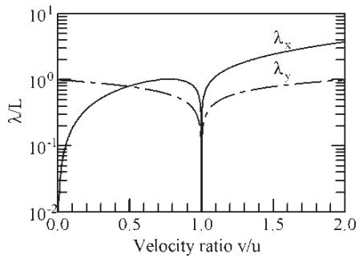  
Fig. 8 Effect of the velocity ratio, $\nu / u ,$ on the wavelength at which the complementary wave amplitude decreases by 50 per cent in a distance, L

## 4.4 Amplitude of the complementary wave

Having estimated the amplitude and phase of the attenuated roughness and the wavelength and decay rate of the complementary wave, the final requirement is to estimate the amplitude of the complementary wave at the inlet to the conjunction. It should then be possible to combine these to obtain an estimate of the clearance and pressure variations inside the contact. Finally, by comparing the results with distributions from the perturbation analysis, it should be possible to determine the errors involved in using the three-variable approximation.

Since the complementary wave is generated in the inlet to the conjunction, its amplitude could be calculated from an examination of the inlet alone using an extension of the process given in references [19] and [20]. However, that analysis is lengthy and will be presented separately. Instead, for the present, the amplitude of the complementary wave will be estimated using results from perturbation analyses ofthe type shown in Fig. 1. There is no essential difference between these two analyses except that the inclusion of the full contact in the present calculations substantially increases the number ofnodes required and hence the calculation time. It does, however, allow the accuracy of the approximate solution to be checked without any further analysis.

The process of estimating the amplitude of the complementary wave for one particular operating condition and roughness wavelength is illustrated in Fig. 9. Starting with the pressure and clearance variations from the perturbation analysis, shown in curves (a), for one instant of time, the attenuated roughness and associated pressures are calculated using equations (19) and (20). These results are shown in curves (b) of the figure. The smooth values of clearance and pressure in this calculation are the clearance at the centre of the smooth contact and the nominal Hertz pressure.

The total clearance and pressure variations, curves (a), should be made up of the sum of this attenuated roughness and the complementary wave. Thus, subtracting the calculated attenuated values from the perturbation results should yield the complementary waves. The results from this subtraction have the form.

$$
\delta h _ { \mathrm { r } } = h _ { \mathrm { r } } ( x ^ { \prime } ) \exp ( - \mathrm { i } \omega \nu t ) \exp ( \mathrm { i } \xi y )\tag{33}
$$

and

$$
\delta p _ { \mathrm { r } } = p _ { r } ( x ^ { \prime } ) \exp ( - \mathrm { i } \omega \nu t ) \exp ( \mathrm { i } \xi y )
$$

where $h _ { \mathrm { r } } ( x ^ { \prime } )$ and $p _ { \mathrm { r } } ( x ^ { \prime } )$ define the variation of the residual clearance and pressure with position.

The full lines of curve (c) show these clearances and pressures, again at one instant of time.

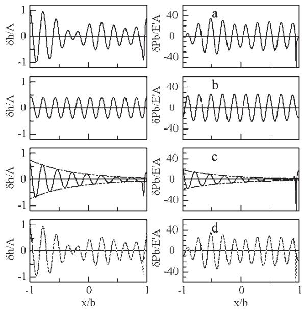  
Fig. 9 Calculation of the amplitude and phase of the complementary wave. (a) Clearances and pressures obtained using the perturbation analysis; (b) attenuated roughness obtained using the results in section 4.2; (c) clearances and pressures obtained by subtracting b from a. The dashed line shows the amplitude of the ‘best fit’ curve; (d) Comparison of the ‘best fit’ complementary wave plus the attenuated roughness (black line) with the perturbation analysis (dashed grey line)

According to the analysis given in section 4.3, the complementary wave should have the form

$$
\delta h _ { \mathrm { c } } = h _ { \mathrm { c } } \exp ( \mathrm { i } \psi x ^ { \prime } ) \exp ( - \mathrm { i } \omega \upsilon t ) \exp ( i \xi y )\tag{34}
$$

with

$$
\delta p _ { \mathrm { c } } = p _ { \mathrm { c } } \exp ( \mathrm { i } \psi x ^ { \prime } ) \exp ( - \mathrm { i } \omega \nu t ) \exp ( i \xi y )
$$

where $h _ { \mathrm { c } }$ and $p _ { \mathrm { c } }$ are related by equation (28). If the analyses given in sections 4.2 and 4.3 are accurate, these pairs of equations should exactly match. By comparing them, therefore, estimates made of the values of $h _ { \mathrm { c } }$ and $p _ { \mathrm { c } }$ and the validity of the simplified analyses may be checked.

In order to estimate $h _ { \mathrm { c } }$ and $p _ { \mathrm { c } }$ , the value of $h _ { \mathrm { c } }$ that gave the best match between the two equations for clearance was determined. Equation (28) was then used to obtain the value of $p _ { \mathrm { c } }$ . To do this, the difference between the amplitudes of the two clearance curves was written as

$$
\varepsilon = h _ { \mathrm { r } } ( x ^ { \prime } ) - h _ { \mathrm { c } } \exp ( \mathrm { i } \psi x ^ { \prime } )\tag{35}
$$

or

$$
\varepsilon = h _ { \mathrm { r } } ( x ^ { \prime } ) - h _ { \mathrm { c } } \mathbf { e } ( x ^ { \prime } )
$$

where ${ \bf e } ( x ^ { \prime } ) = { \bf e x p } ( \mathrm { i } \psi x ^ { \prime } )$ and the value of $h _ { \mathrm { c } }$ selected so as to minimize the difference, $\varepsilon .$ Noting that ε is complex and that the value of $h _ { \mathrm { r } }$ is defined at a number of evenly spaced points through the contact, the best fit may be obtained by minimizing the sum of the squares of the real and imaginary parts of equation (35) with respect to $h _ { \mathrm { c } }$

$$
\frac { \partial \sum \varepsilon \bar { \varepsilon } } { \partial h _ { \mathrm { c } } } = 0\tag{36}
$$

giving

$$
h _ { \mathrm { c } } = { \frac { \sum h _ { \mathrm { r } } \bar { \mathsf { e } } } { \sum \mathrm { e } \bar { \mathsf { e } } } }\tag{37}
$$

Having obtained the value of $h _ { \mathrm { c } } ,$ , it is straightforward to multiply it by the surface stiffness given by equation (28) to determine the value of the complementary pressure wave. The chain dashed line in curve (c) of Fig. 9 shows the amplitudes of the complementary waves obtained by this curve fitting process.

Finally, combining the estimated complementary wave with the estimated attenuated roughness enables estimates of the clearance and pressure perturbations to be found. If the three-variable approximation is accurate, these should be identical to the results obtained using the perturbation analysis. The black line in curve (d) of Fig. 9 shows the estimated clearances and pressures. The results from the perturbation analysis are overplotted as a grey dashed line in order to show the errors in the fitted curves. It can be seen that, as might be expected, there are significant differences in the exit region around the pressure spike. Elsewhere the agreement is excellent. Considering just the central 90 per cent of the contact, the differences were below 2 per cent (compared with the original roughness amplitude and with the pressure required to completely flatten it).

Similar matching, within 3 per cent, was found in all the cases examined, covering a very wide range of operating conditions, velocity ratios, and wavelengths. It appears, therefore, that, first, the behaviour of sinusoidal roughness in rolling–sliding contacts can be accurately approximated using just three complex quantities representing:

(a) the attenuation of the roughness due to sliding (b) the amplitude of the complementary wave

(c) its wavenumber and decay rate. Second, the simplified analysis based on the behaviour of sinusoidal roughness in a parallel gap appears to provide accurate estimates of the first and third of these.

As an illustration of the type of results obtained, Fig. 10 shows the amplitude of the complementary wave for one particular operating condition. The amplitude is always less than that of the original roughness, reaching a maximum of just over 0.6. There is clearly some relationship between the attenuation of the roughness and the amplitude of the complementary wave but, since the roughness is attenuated inside the conjunction while the complementary wave is generated in the inlet zone, the connection is not straightforward. It appears, simply, to arise because both effects are related to the roughness orientation and film thickness in similar ways.

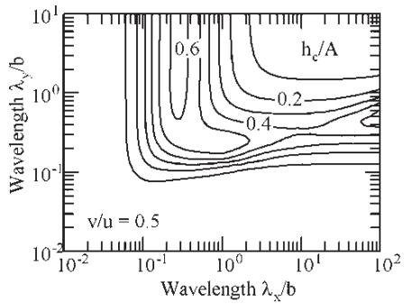  
Fig. 10 Variation of the amplitude of the complementary wave at the contact inlet with wavelengths in the x and y directions. $P = 2 0 , S = 7$ $P _ { \mathrm { H e r t z } } = 1 \mathrm { G P a } , \tau _ { 0 } = 8 \mathrm { M P a }$ , and $\nu / u = 0 . 5$

For transverse roughness, corresponding approximately to $\lambda _ { x } < \lambda _ { y } ,$ the amplitude first increases with wavelength up to a maximum when $\lambda _ { x } = 0 . 3 b$ before decreasing, as the wavelength increases further. For purely in-line roughness, the amplitude ratio increases uniformly with wavelength in the y direction up to a final value of 1. However, even long wavelengths in the x direction have a substantial effect on the amplitude ratio. For example, for the operating conditions shown, the amplitude ratio decreases with wavelength for $\lambda _ { y } > 0 . 5 b$ even when $\lambda _ { x } = 1 0 0 b$ This influence of long wavelengths in the x direction appears to be related to the similar effect found in the roughness attenuation due to sliding (Fig. 4).

There is a pressure ripple associated with the complementary wave, which is shown in Fig. 11. These pressures are directly related to the amplitude of the complementary wave by the deformation–pressure relationship of equation (28). Ignoring the, generally small, effect of the decay rate, the pressure for inline roughness is obtained by scaling the amplitude of the complementary wave by $( \pi / 2 ) ( E ^ { \prime } / \lambda _ { y } )$ and that for transverse roughness by scaling by $( \pi / 2 ) ( E ^ { \prime } / \lambda _ { x } ) ( \nu / u )$ Thus, the maximum pressures tend to occur at somewhat shorter wavelengths than the maximum of the complementary wave and, for the present case where $\nu / u = 0 . 5 ,$ to be somewhat higher for in-line than for transverse roughness.

Although Figs 10 and 11 show the general form of the distribution of the complementary wave and associated pressure ripple, details change with the operating conditions and with variations in the fluid’s rheology and these changes are discussed next.

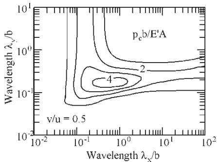  
Fig. 11 Variation of the amplitude of the pressure perturbation with wavelengths in the x andy directions. $P = 2 0 , S = 7 , P _ { \mathrm { H e r t z } } = 1 \mathrm { G P a } , \tau _ { 0 } = 8 \mathrm { M P a }$ and $\nu / u = 0 . 5$

## 4.5 Effect of the inlet length

For pure rolling contacts, the attenuation of the roughness (effectively equivalent to the magnitude of the complementary wave in the rolling–sliding case) has been shown to depend primarily on the ratio of the roughness wavelength to length of the inlet pressure sweep, $( \lambda / b ) S ^ { - 2 } P ^ { 1 . \bar { 5 } }$ . A similar relationship might be expected in the present case, although it will be complicated by the behaviour ofthe roughness inside the conjunction, by the velocity ratio, $\nu / u ,$ and by details of the fluid’s rheology.

In order to investigate this, the amplitude of the complementary wave was plotted against the wavelength ratio, $( \lambda ^ { \cdot } / b ) S ^ { - 2 } P ^ { 1 . 5 }$ , for a wide variety of operating conditions. In all the cases, an Eyring fluid characteristic was adopted, although a range of different values of the Eyring stress was used. Also, it was found that the predominant influence on the amplitude of the complementary wave was the inlet wavelength ratio, although other effects such as the velocity ratio, $\nu / u ,$ the piezoviscous coefficient, $c ,$ $c = ( 2 \dot { 7 } / 3 2 ) ^ { 0 . 2 5 } ~ P ^ { 0 . 2 5 } S$ , the Eyring stress, $\tau _ { 0 } ,$ and the characteristic length, L, inside the contact affected the behaviour.

Figure 12 shows the result for transverse roughness for two slip ratios, $\nu / u = 0 . 5$ and $\nu / u = 0 . 9 5$ The data points are for a very wide range of operating conditions and values of the Eyring stress. It is clear that the dominant effect on the amplitude of the complementary wave is the ratio of the roughness wavelength to the length of the inlet pressure sweep, although, clearly, other factors do affect the behaviour slightly. By careful selection of the operating conditions and the Eyring stress, it was possible to vary the piezoviscous parameter, the Eyring stress, and the characteristic length separately and, although the first two had some influence on the behaviour, the major variations appear to be due to changes in the characteristic length, L. Similar results were obtained for all the cases examined in which the velocity ratio, $\nu / u ,$ , was below 1.

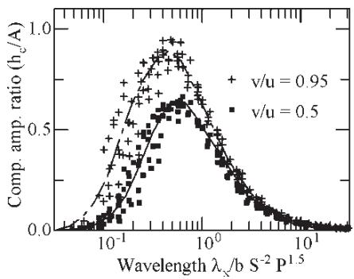  
Fig. 12 Variation of the complementary wave amplitude with wavelength ratio. Transverse roughness, $\nu / u < 1$

For velocity ratios above 1, although the inlet wavelength ratio is still the dominant influence on the complementary wave, the central film thickness and the Eyring stress significantly affect the behaviour. Although the piezoviscous parameter does affect the wave slightly, its influence appears smaller than for the other two parameters. Figure 13 shows the effect of the Eyring stress for a velocity ratio, $\nu / u ,$ of 1.05. In this figure, operating conditions were selected so as to keep the piezoviscous parameter and the characteristic length, $L ,$ constant. Although the effect of wavelength ratio still dominates, changes in the Eyring stress substantially affect the amplitude of the complementary wave with an increase of $\tau _ { 0 }$ from 2 to 8 MPa, increasing the maximum of the curve from around 0.6 to around 0.85. The influence ofthe Eyring stress when the other parameters are fixed suggests that the conditions in the inlet region are dependent on this stress and this, in turn, suggests that the complementary wave may be sensitive to details of the fluid’s non-Newtonian characteristics.

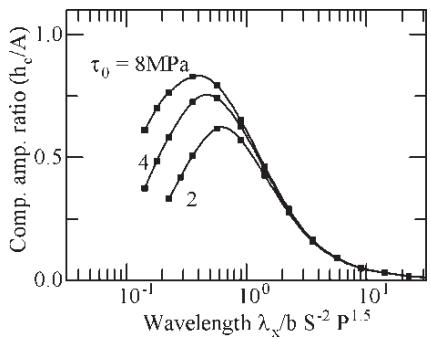  
Fig. 13 Variation of the complementary wave amplitude with wavelength ratio and Eyring stress. Transverse roughness, $\nu / u = 1 . 0 5$

Changes in the characteristic length, L, also influence the amplitude ratio and this effect is shown in Fig. 14. Here, the Greenwood parameters S and P were changed so as to keep the piezoviscous parameter c constant at 14.8 while producing variations in the clearance and hence the characteristic length, L. An Eyring stress of 8 MPa was assumed. Increasing the value of S increases the clearance and the characteristic length, $L ,$ and this reduces the amplitude of the complementary wave.

The difference in behaviour found for transverse roughness when $\nu / u$ is below or above 1 is thought to be due to the changes in the phase of the attenuated roughness with, in the first case, the clearance variation lying to the right (higher x) of the roughness and in the latter case, to the left.

Finally, Fig. 15 shows the behaviour of inline roughness. Here, again, the wavelength ratio, $( \lambda / b ) S ^ { - 2 } \overset { \smile } { P } ^ { 1 . 5 }$ , appears to be the dominant factor. However, calculations with a very wide range of operating conditions and values ofEyring stress suggest that the behaviour is significantly affected by the piezoviscous parameter, $c .$ Other effects such as central clearance and value of the Eyring stress appear relatively unimportant. Similarly, the actual value of the slip ratio has only a minor effect. As the piezoviscous parameter is increased, the film is generated at higher viscosity enhancements and it is thought that the changes observed may be due to the earlier build up of the viscosity ratio, $\eta _ { y } / \eta _ { x }$ . If this is the case, it suggests, again, that details of the fluid’s rheology may affect the amplitude of the complementary wave.

The increase in the complementary wave with wavelength for in-line roughness (Fig. 15) is, perhaps, misleading. For purely in-line roughness, there is no attenuation of the roughness by sliding and the complementary wave is always $1 8 0 ^ { \circ }$ out of phase with the undeformed profile. Thus, when the two are combined, the result is a clearance variation that decreases uniformly with wavelength.

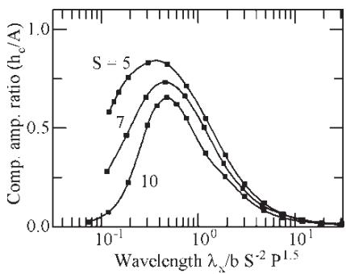  
Fig. 14 Variation of the complementary wave amplitude with wavelength ratio and the velocity parameter, S. Transverse roughness, $\nu / u = 1 . 0 5$

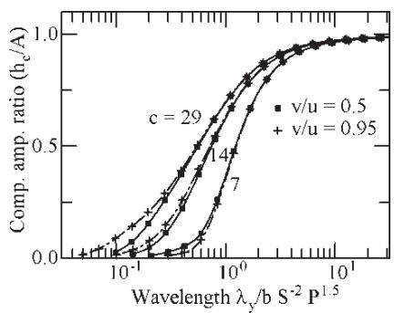  
Fig. 15 Variation of the complementary wave amplitude with wavelength ratio and the piezoviscous parameter, c. In-line roughness. $c = 0 . 9 5 8$ $P ^ { 0 . 2 5 } \bar { S }$

## 5 DISCUSSION AND CONCLUSIONS

As a rough surface passes through a rolling–sliding EHL contact, its amplitude is attenuated by the relative sliding of the surfaces. At the same time, the roughness in the inlet zone disturbs conditions there, generating clearance variations that propagate across the contact at the mean surface velocity. Thus, the film thickness is determined bythe attenuated surface roughness and the complementary wave generated in the inlet. These two components travel at different speeds producing a complex clearance distribution that changes, often rapidly, with time. There are pressure variations associated with both the attenuation of the roughness and with the complementary wave and, again, these change with time.

Where the amplitude of the roughness is low compared with the film thickness, it is possible to split the surface profile into its Fourier components and to examine the behaviour of each component separately before recombining the results, finding the overall behaviour of the surface.

Even for a sinusoidal, low-amplitude roughness, the behaviour is not straightforward, with a wide range of rapidly changing clearance and pressure distributions being produced. However, these may be reduced to two components travelling through the conjunction at different speeds. The first component is simply the original roughness attenuated by the pressures produced by the relative sliding of the surfaces. It moves at the velocity ofthe rough surface. The second component, the complementary wave, is generated in the contact inlet and moves through the contact at the entrainment velocity, decaying as it does so. Because its velocity differs from that of the rough surface, the wavelength of this component differs from that of the original surface. It is longer when the rough surface moves more slowly than its counterface and shorter when the rough surface moves more rapidly.

It has been shown that this behaviour can be accuratelydefined byjust three complexvariables.The first defines the attenuation of the rough surface inside the conjunction due to sliding. The second defines the amplitude of the complementary wave at the inlet to the conjunction and the third defines the wavelength and decay rate of the complementary wave as it is carried through the contact. The complex nature of the first two variables allows both the amplitude and phase of the attenuation and the complementary wave to be defined. Simple scaling enables the pressure ripples associated with both the roughness attenuation and the complementary wave to be calculated.

Comparison of the clearances and pressures generated using these three complex quantities with accurate EHL solutions for a wide range ofconditions suggests that the results should be accurate to within 3 per cent.

The attenuation ofthe roughness inside the contact and the decay rate of the complementary wave are dependent on the ratio of the roughness wavelength to a characteristic length, $\lambda / L$ , where $L = h ( E ^ { \prime } / \tau _ { \mathrm { e } } ) ^ { \top / 2 }$ whereas the amplitude of the complementary wave depends primarily on the ratio of the wavelength to the length of the inlet pressure sweep $( \lambda / b ) S ^ { - 2 } \check { P } ^ { 1 . 5 }$

It has been shown that, inside the contact, for low-amplitude roughness, any fluid rheology can be replaced by just two quantities. The first is the mean shear stress at the contact centre, $\tau _ { \mathrm { m } } ;$ the second is a stress, $\tau _ { \mathrm { e } }$ . This stress corresponds to the gradient of the shear stress–strain rate curve multiplied by the mean strain rate. For Eyring fluids $\tau _ { \mathrm { e } }$ corresponds to the Eyring stress, $\tau _ { 0 } ,$ and it is convenient to regard it as an effective Eyring stress.

Analytic expressions have been derived for the roughness attenuation and for the wavelength and decay rate of the complementary wave. The amplitude of the complementary wave may be found by curve fitting perturbation solutions to the EHL problem.

In general, long wavelength components of roughness are more heavily attenuated by sliding than shorter components. Although sinusoidal roughness lying exactly in-line with the entrainment direction is not attenuated, even slight changes in alignment result in substantial attenuation.

The amplitude of the complementary wave depends on the ratio of the wavelength to the inlet length and typically reaches a maximum when the wavelength ratio $( \lambda \dot { / } b ) S ^ { - 2 } P ^ { 1 . 5 }$ is around 0.5.The actual value of the maximum depends on the ratio of the velocity ofthe rough surface to the entrainment velocity, v/u. For transverse roughness, when this ratio is below 1, the amplitude appears to be largely unaffected by conditions inside the conjunction, by the piezoviscous parameter and by the fluid’s rheology.

Where the velocity ratio is above 1, these other factors appear to have a substantial effect.

The decay of the complementary wave depends on the characteristic length and, in a complex way, on the velocity ratio, v/u. Ofparticular note is the drop in the decay rate for very low values of sliding velocity (v/u close to 1) and this suggests that, under these conditions, the complementary wave will be of particular significance.

In spite of the complexity of the behaviour, a number of broad conclusions can be drawn. For example, when a complex waveform, such as an isolated asperity or a ridge, passes through the contact, the long wavelength features of the profile will be attenuated whereas the shorter components remain unaltered. The complementary wave will, in contrast, at the inlet to the conjunction, tend to consist of components with wavelengths of the order of the length of the inlet pressure sweep. Then, as the wave moves through the conjunction, the shorter of these wavelengths will decay leaving only the longer wavelength components. In many instances, the complementary wave may be almost negligible leaving only the attenuated profile visible in the clearance and, hence, in the pressure distribution.

All the examples in the article were obtained using an Eyring model for the non-Newtonian behaviour of the fluid. It is possible that different models may result in slightly different estimates of the amplitude of the complementary wave.

Having obtained results for low-amplitude, sinusoidal roughness, the results may be used to determine the behaviour ofmore complex profiles and this will be considered in part 2 of this article.

## ACKNOWLEDGEMENTS

The study described in this article was supported by grants from the RGC of the HKSAR, People’s Republic of China [CityU 100901, 102599]. The third author wishes to thank Professor E. Ionnides, SKF Product Technical Director for permission to publish and for partly financing the work.

## REFERENCES

1 Liu, J. Y., Tallian, T. E., and McCool, J. I. Dependence of bearing fatigue life on film thickness to roughness ratio. Trans. ASLE, 1975, 7, 144–152.

2 Venner, C. H. and Lubrecht, A. A. Numerical analysis of the influence of waviness on the film thickness of a circular EHL contact. Trans. ASME, J. Tribol., 1995, 118, 153–161.

3 Venner, C. H., Couhier, F., Lubrecht, A. A., and Greenwood, J. A. Amplitude reduction of waviness in transient EHL line contacts. In Proceedings of the 22nd

Leeds–Lyon Symposium onTribology, ElsevierTribology Series 31, 1996.

4 Venner, C. H. and Lubrecht, A. A. Amplitude reduction of non-isotropic harmonic patterns in EHL circular contacts under pure rolling. In Proceedings of the 24th Leeds–Lyon Symposium on Tribology, Elsevier, 1998.

5 Hooke, C. J. The behaviour of low amplitude surface roughness under line contacts. Proc. Instn Mech. Engrs, Part J: J. Engineering Tribology, 1999, 213, 275–286.

6 Hooke, C. J. The behaviour of low amplitude surface roughness under line contacts: non-Newtonian fluids. Proc. Instn Mech. Engrs, Part C: J. Mechanical Engineering Science, 2000, 214, 253–265.

7 Hooke, C. J. and Li, K. Y. Rapid calculation of the pressures and clearances in rough, elastohydrodynamically lubricated contacts under pure rolling: Part 1 – Low amplitude, sinusoidal roughness. Proc. IMechE, Part C: J. Mechanical Engineering Science, 2006, 220(C6), 901–914.

8 Hooke, C. J. and Li, K. Y. Rapid calculation of the pressures and clearances in rough, elastohydrodynamically lubricated contacts. Part 2: general roughness. Proc. IMechE, Part C: J. Mechanical Engineering Science, 2006, 220(C6), 915–926.

9 Hooke, C. J. Surface roughness modification in EHL line contacts – the effect of roughness wavelength, orientation and operating conditions. In Proceedings of the 25th Leeds–Lyon Symposium on Tribology, Lyon, September 1998.

10 Hooke,C. J. andVenner,C. H. Surface roughness attenuation in line and point contacts. Proc. Instn Mech. Engrs, Part J: J. Engineering Tribology, 2000, 214, 439–444.

11 Venner, C. H. and Morales-Espejel, G. E. Amplitude reduction of small-amplitude waviness in transient elastohydrodynamically lubricated line contacts. Proc. Instn Mech. Engrs, PartJ: J. Engineering Tribology, 1999, 213, 487–504.

12 Hooke, C. J. Roughness in rolling-sliding EHL contacts. Proc. IMechE, Part J: J. Engineering Tribology, 2006, 220, 259–271.

13 Venner, C. H. Multi-level solution of the elastohydrodynamic line and point contact problems, 1991 (Proefschrift, Universiteit Twente, The Netherlands).

14 Venner, C. H. and Lubrecht, A. A. Muti-level methods in lubrication, 2000 (Elsevier, Amsterdam, Oxford).

15 Walker, J. S. Fast Fourier transforms, 1991 (CRC Press, London).

16 Greenwood, J. A. and Johnson, K. L. The behaviour of transverse roughness in sliding elastohydrodynamically lubricated contacts. Wear, 1992, 153, 107–117.

17 Greenwood, J. A. and Morales-Espejel, G. E. The behaviour of transverse roughness in EHL contacts. Proc. Instn Mech. Engrs, 1994, 208, 121–132.

18 Johnson, K. L. Contact mechanics, 1985 (Cambridge University Press, Cambridge).

19 Hooke, C. J. Surface roughness modification in elastohydrodynamic line contacts operating in the elastic piezoviscous regime. Proc. Instn Mech. Engrs, Part J: J. Engineering Tribology, 1998, 212, 145–162.

20 Hooke, C. J. The behaviour of heavily loaded line contacts with transverse roughness. Proc. Instn Mech. Engrs, Part C: J. Mechanical Engineering Science, 1999, 213, 309–320.

| APPENDIX |  | $w _ { \mathrm { a } }$ | surface displacement associated with the roughness attenuation |
| --- | --- | --- | --- |
| Notation |  | $x$ | position across the contact fixed rel- ative to the contact, measured from |
| $A$ | amplitude of the surface roughness com- ponent |  | the contact centre |
| $^ b$ | Hertz semi-width | $x ^ { \prime }$ | position across contact fixed relative to the contact, measured from the |
| $B$ | $\left( { \frac { \mathrm { d } \rho } { \mathrm { d } p } } = { \frac { \rho } { B } } \right)$ bulk modulus $c = ( 2 7 / 3 2 ) ^ { 0 . 2 5 }$ | $y$ | inlet, $x ^ { \prime } = x + b$ position along the contact |
| $c$ | piezoviscous parameter, $\mathbf { \hat { \Pi } } _ { P ^ { 0 . 2 5 } S }$ |  |  |
| $C$ $E ^ { ' }$ | compressibility parameter (see equation (21)) | $\alpha$ $\beta$ | pressure viscosity coefficient decay rate of the complementary |
|  | effective elastic modulus |  | wave |
| $\left( \frac { 2 } { E ^ { \prime } } = \frac { 1 - \nu _ { 1 } ^ { 2 } } { E 1 } + \frac { 1 - \nu _ { 2 } ^ { 2 } } { E 2 } \right)$ | $\varepsilon$ | error in the fitted complementary |  |
|  |  | waves |  |
| $\overline { { = } } \alpha \boldsymbol { E } ^ { \prime }$ | $\dot { \gamma }$ | shear strain rate |  |
| $h _ { \mathrm { a } }$ | clearance | $\dot { \gamma } _ { \mathrm { m } }$ | mean shear strain rate |
|  | amplitude of the attenuated roughness | $\eta$ | viscosity |
| $h _ { \mathrm { c } }$ | amplitude of the complementary wave | $\eta _ { x }$ and $\eta _ { y }$ | effective viscosities in the x and $y$ |
| $h _ { \mathrm { r } }$ | residual amplitude (see equation (33)) |  | directions |
| $i$ | $\sqrt { - 1 }$ | $\kappa$ | roughness wavenumber, $\kappa ^ { 2 } = \omega ^ { 2 } +$ |
| $L$ | characteristic length inside the contact related to the roughness attenuation, $L =$ | $\lambda$ | $\xi ^ { 2 }$ roughness wavelength, $\lambda = 2 \pi / \kappa$ |
| $L ^ { * }$ | $h ( E ^ { ' } / \tau _ { \mathrm { e } } ) ^ { 1 / 2 }$ | $\lambda _ { x }$ | roughness wavelength in the x direc- |
| modified length inside the contact related to the decay of the complementary wave, |  | tion, $\lambda = 2 \pi / \omega$ |  |
| $L ^ { * } = L ( | 1 - \stackrel { \cdot } { \nu } / u | ) ^ { 1 / 2 }$ | $\lambda _ { y }$ | roughness wavelength in the y direc- tion, $\lambda = 2 \pi / \xi$ |  |
| pressure | $\theta$ | roughness orientation |  |
| $p _ { \mathrm { a } }$ | pressure amplitude associated with the | $\rho$ | density |
| $p _ { \mathrm { c } }$ | roughness attenuation pressure amplitude associated with the | $\rho _ { \mathrm { a } }$ | amplitude of the density perturba- tion associated with the comple- |
|  | complementary wave |  | mentary wave |
| $p _ { \mathrm { r } }$ $P$ | residual amplitude (see equation (33)) | $\nu$ | Poisson&#x27;s ratio Shear stress |
|  | Greenwood pressure parameter, | $\tau$ | Eyring stress |
| $P _ { \mathrm { H e r t z } }$ | $P = \alpha P _ { \mathrm { H e r t z } }$ Hertz pressure | $\tau _ { 0 }$ | equivalent Eyring stress |
| $Q$ |  | $\tau _ { \mathrm { e } }$ | mean shear stress |
| $r$ | attenuation parameter (see equation (21)) | $\tau _ { \mathrm { m } }$ | wavenumber of the roughness in the |
| $R$ | surface roughness equivalent radius of the curvature | $\omega$ | x direction |
| $s$ | position across the contact fixed relative to | $\omega _ { \mathrm { c } }$ | ideal wavenumber of the comple- |
|  | the rough surface |  | mentary wave in the x direction, |
| $S$ $t$ | Greenwood speed parameter, $S = G U ^ { 0 . 2 5 }$ time |  | $\omega _ { \mathrm { c } } = \omega \nu / u$ actual wavenumber of the |
| $u$ | entrainment velocity, $u = ( u _ { 1 } + u _ { 2 } ) / 2$ | $\omega _ { \mathrm { d } }$ | complementary wave in the x |
| $\Delta u$ | difference between the surface velocities, |  | direction |
|  | $\Delta u = u _ { 1 } - u _ { 2 }$ | $\Omega$ | complex wavenumber, $\Omega ^ { 2 } = \psi ^ { 2 } + \xi ^ { 2 }$ |
| $U$ |  | $\xi$ | wavenumber of the roughness in the |
|  | $= \frac { \eta _ { 0 } u } { E ^ { ' } R }$ |  | $y$ direction |
| $\nu$ | velocity of the rough surface | $\psi$ | complex wavenumber, $\psi = \omega _ { \mathrm { d } } +$ iα |
| $V$ | ratio of effective viscosities in the x and y |  |  |
|  |  |  | Perturbations are denoted by the prefixδ as, for |
|  | directions, $V = \eta _ { x } / \eta _ { y }$ | example, $\delta h _ { \mathrm { c } }$ | or $\delta p _ { \mathrm { a } }$ |

