# Proceedings of the Institution of Mechanical Engineers, Part C: Journal of Mechanical Engineering Science http://pic.sagepub.com/

Rapid calculation of the pressures and clearances in rough, rolling-sliding elastohydrodynamically lubricated contacts. Part 2: General, non-sinusoidal roughness

Proceedings of the Institution of Mechanical Engineers, Part C: Journal of Mechanical Engineering Science 2007 221: 551 DOI: 10.1243/0954406JMES520

The online version of this article can be found at: http://pic.sagepub.com/content/221/5/551

Published by: SAGE http://www.sagepublications.com

Institution of Mechanical Engineers

Additional services and information for Proceedings of the Institution of Mechanical Engineers, Part C: Journal of Mechanical Engineering Science can be found at:

Email Alerts: http://pic.sagepub.com/cgi/alerts

Subscriptions: http://pic.sagepub.com/subscriptions

Reprints: http://www.sagepub.com/journalsReprints.nav

Permissions: http://www.sagepub.com/journalsPermissions.nav

Citations: http://pic.sagepub.com/content/221/5/551.refs.html

>> Version of Record - May 1, 2007 What is This?

# Rapid calculation of the pressures and clearances in rough, rolling–sliding elastohydrodynamically lubricated contacts. Part 2: general, non-sinusoidal roughness

C J Hooke1,∗, KY Li2, and G Morales-Espejel3

1School of Engineering, The University of Birmingham, Birmingham, UK

2Department of Manufacturing Engineering and Engineering Management, City University of Hong Kong, Hong Kong, People’s Republic of China

3SKF Engineering and Research Centre, Nieuwegein, The Netherlands

The manuscript was received on 11 October 2006 and was accepted after revision for publication on 5 February 2007.

DOI: 10.1243/0954406JMES520

Abstract: Part 1 of this paper [1] described how the behaviour of low amplitude, sinusoidal roughness in elastohydrodynamically lubricated (EHL) contacts could be characterized by three complex quantities: attenuation of original profile, amplitude of complementary wave and its wave number and decay rate. This second part outlines how these results can be used to estimate, rapidly, the clearances and pressures in any rough EHL contact. The method is applied to a number of contacts for which accurate experimental results are available and it is shown that the process gives close estimates of the clearance and pressure distributions where the amplitude of the attenuated roughness is less than 50 per cent of the clearance and good indication of the behaviour of rougher surfaces.

Keywords: elastohydrodynamics, rolling–sliding contacts, rough elastohydrodynamics, Fourier transform

## 1 INTRODUCTION

Part 1 of this paper [1] examined the behaviour of low amplitude, sinusoidal roughness in elastohydrodynamically lubricated (EHL) contacts. It was shown that, inside the conjunction, the roughness is attenuated and its phase changed. At the same time the roughness creates clearance variations in the inlet and these propagate through the contact at the entrainment velocity, decaying as they do so. Because the entrainment velocityand that ofthe rough surface differ, the wavelength ofthis convected, complementary wave is not the same as that of the rough surface. Its interaction with the attenuated roughness produces a complex, rapidly changing, clearance variation. There are also pressure ripples associated with both the attenuation of the rough surface and with the complementary wave and, again, the pressure changes produced by the roughness are complex and may lead to rapidly changing distributions with time.

It was shown that this behaviour can be characterized by just three complex quantities. This is true for any roughness that varies sinusoidally in and normal to the direction ofentrainment.Assuming a unit amplitude of the sinusoidal surface roughness, the first of these complex quantities defines the amplitude of the attenuated roughness inside the conjunction. The complex form is required so that both the magnitude and phase of this clearance component can be specified. The second defines the amplitude of the complementary wave at the inlet to the conjunction and, again, gives the magnitude of the wave and its phase relative to that of the rough surface at that location. The third quantity defines the wave number and decay rate of the complementary wave, with the real part giving the wave number and the imaginary part the decay rate.

The first of these complex quantities may be calculated directly from the operating conditions; the third requires the numerical solution of a complex, non-linear equation – readily accomplished using successive approximations; the second has to be evaluated from a perturbation solution of the EHL problem for sinusoidal roughness but, again, the process is straightforward. In practise, for any particular operating conditions, it is sufficient to evaluate the amplitude ofthe complementary wave for a small number of wavelengths in and inclined to the direction of entrainment and to obtain further values by interpolation.

The pressure ripple may be similarly defined, with the pressure ripple associated with the roughness attenuation being calculated directly from the operating conditions and the ripple associated with the complementary wave being obtained by a suitable scaling of the amplitude of that wave.

This second paper describes how these results, for individual sinusoidal roughnesses, may be combined, using Fourier transforms, to determine the effect of any general roughness distribution. The process estimates the changes from the smooth EHL clearance and pressure distributions that the roughness produces and these need to be superimposed on the smooth EHL values to obtain the overall result. The aim is to present a simple procedure that allows a rapid assessment of the pressures and clearances under rough EHL contacts. From these it is straightforward to calculate the subsurface stresses. It is hoped that this will allow estimates of the effect of different surface roughnesses on component life to be made, in real time, during the design process.

The analysis applies, strictly, only to situations where the surface roughness is small compared to the film thickness but it appears that the results can be used, with reasonable confidence, provided the maximum clearance variation inside the conjunction is below 50 per cent of the smooth clearance and provided that any negative pressure perturbations are less than the contact pressure. Even where these conditions are not satisfied the low amplitude analysis provides good indications of the effect of the roughness on the conjunction.

An initial attempt to use Fourier transform techniques to estimate the behaviour of general rough surfaces was made by Yuan-Zhong et al. [2] for a stationary rough surface. They used a number ofnumerical simulations with sinusoidal rough surfaces and interpolated between these for the amplitude attenuation and pressure coefficients. The method was also used by Morales-Espejel et al. [3] for purely rolling contacts using approximate values for the clearance and pressures produced by sinusoidal roughness.

A similar analysis by Felix-Quiñonez et al. [4] compared experimental results obtained for a rectangular ridge with those predicted using a low amplitude Fourier analysis. The analysis was for pure rolling, and considered only the amplitude reduction of the roughness components and ignored any change in phase. In spite of this, rough agreement was found between the theoretical predictions and the experimental results.

Hooke [5] developed accurate expressions for the amplitude reduction and pressure coefficients for transverse roughness in rolling contacts, including phase changes, and Hooke and Li [6, 7] extended this to three-dimensional profiles. Comparison of the results from a Fourier analysis with available experimental and analytical results showed good agreement.

A preliminary attempt to extend the method to rolling–sliding contacts was made by Hooke [8] and it was shown that the behaviour ofsinusoidal roughness was, primarily, dependent on the shear characteristics of the fluid and that, for transverse roughness, a single master curve based on the Eyring stress of the fluid could be obtained. The Fourier transform method, ignoring the complementary wave, was used to estimate the behaviour ofa number ofsurfaces and gave reasonable agreement with experimental results.

The present paper extends the analysis to threedimensional surface profiles and indicates how the effects of the complementary wave may be included.

In order to check the accuracy and applicability of the results, the low amplitude analysis is applied to a number of cases where experimental results are available and where sufficient details are given for a useful comparison to be made. All these experimental results are for point contacts, while the present analysis applies, strictly, to line contacts. It was shown in [9] that, for rolling contacts there is a close identity between the behaviour of roughness in these two types of conjunction provided conditions in the inlet zone are matched. A similar identity will be assumed to apply under rolling/sliding conditions. It will be shown that the present analysis then produces clearances that closely match those found experimentally. With this it appears that the present analysis can be applied to any type of conjunction whether line, point or elliptical.

## 2 ANALYSIS

In general both surfaces in contact will be rough. However, provided the amplitude of the roughness is low, the effect of each surface on the clearances and pressures can be calculated separately and the results superimposed. This will be done in the present analysis and the effect of a rough surface moving against a smooth counterface determined.

The undeformed surface profile may be expressed as $R ( s , y )$ where s and y are measured from some arbitrary point that moves with the surface. The coordinate, s, is assumed to lie in the direction of entrainment; y along the contact. This profile moves through the conjunction at the velocity of the rough surface, $\nu ,$ and, if the coordinates are defined so that the origin ofthe profile is at inlet to the contact, $x ^ { \prime } = 0$ at time, $t = 0$ , then the profile’s geometry may be written as

$$
R ( x ^ { \prime } - \nu t , y )\tag{1}
$$

A Fourier transform of this waveform then yields components of the form

$$
A \exp [ \mathrm { i } \omega s + \mathrm { i } \xi y ]\tag{2}
$$

where the amplitude A is complex, reflecting the phases of the different components.

Each component of this roughness will produce clearance and pressure variations under the contact and, as explained in reference [1] these variations may, conveniently, be divided into those associated with the attenuation of the roughness due to the relative sliding inside the conjunction and those produced in the inlet and carried through the contact at the entrainment velocity – the complementary wave components.

These effects will be considered separately and the results combined to obtain the overall behaviour of the roughness inside the conjunction.

## 2.1 Roughness attenuation

Due to sliding, the amplitude ofeach roughness component will be attenuated under the contact and its phase will be changed. Equations (19) and (20) obtained in reference [1], give the ratio of the clearance and pressure variations to the magnitude of the roughness component and it is a simple matter to scale equation (2) to obtain the clearance and pressure components as

$$
h _ { \mathrm { a } } \exp [ \mathrm { i } \omega s + \mathrm { i } \xi y ]\tag{3}
$$

and $p _ { \mathrm { a } } \exp [ \mathrm { i } \omega s + \mathrm { i } \xi y ] .$

These have the same form as the transform of the original profile and inverse transforms give the attenuated clearance and pressure variations produced by R as

$$
H _ { \mathrm { a } } ( s , y ) \quad \mathrm { a n d } P _ { \mathrm { a } } ( s , y )\tag{4}
$$

These travel through the contact at the same velocity as the original roughness and, noting that $s = x ^ { \prime } - \nu t ,$ it is straightforward to determine the distributions at any particular instant of time.

In general, there are few problems in calculating the values of $h _ { \mathrm { a } }$ and $p _ { \mathrm { a } }$ for each component of surface roughness for surfaces with transverse roughness. Here only a one-dimensional transform is required and most transform programs will produce values of the roughness coefficients, A, for positive values of $\omega$ only. This enables a simple scaling and inverse transform process to be used. Where the transform program gives values of A for negative ω in addition, it may be noted that equation (21) of reference [1] indicates that the required scaling factors will be the complex conjugates of those for the equivalent positive values of ω.

For two dimensional transforms, the response of the surface for both positive and negative values of ω and ξ may be required. Again, equation (21) of reference [1] indicates that where ω is negative the complex conjugate needs to be used. Where ξ is negative the results for positive ξ need to be substituted.

The upper two curves of Fig. 1 illustrate the calculation of the attenuated roughness for one particular roughness profile. Curve (a) shows the undeformed profile and curve (b) the attenuated roughness. Essentially, the longer wavelengths are attenuated and moved to the right by the sliding while the shorter wavelengths are unaltered. Thus the sharp changes in slope at the ends of the original profile remain while the overall profile is attenuated and distorted.

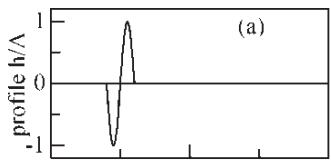

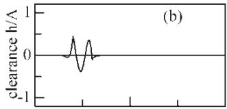

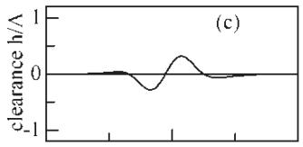

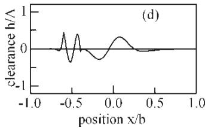  
Fig. 1 Generation of the attenuated roughness and complementary wave for $\nu / u = 0 . 5 , P = 2 0$ $S = 7 , P _ { \mathrm { H e r t z } } = 1 \mathrm { G P a }$ $\tau _ { 0 } = 8 \mathrm { { M P a } ; }$ (a) undeformed profile, (b) attenuated profile, (c) complementary wave, (d) total clearance perturbation

## 2.2 Complementary wave

In addition to directly affecting the clearance, each component of the roughness will alter conditions in the inlet and produce an additional complementary wave that travels through the contact at the entrainment velocity, decaying as it does so. In some cases, the amplitude of the complementary wave may be sufficiently low for it to be ignored. However, in other cases it needs to be included. As will be shown below its inclusion is relatively straightforward and it is, perhaps, easiest always to include it.

For each component of equation (2), the amplitude of the complementary wave is defined at the inlet and its decay rate and wavelength are given by equation (30) of reference [1]. Using these results the corresponding component of the complementary wave can be determined, by scaling equation (2), as

$$
h _ { \mathrm { c } } \exp ( \mathrm { i } \psi x ^ { \prime } ) \exp ( - \mathrm { i } \omega \nu t ) \exp ( \mathrm { i } \xi y )\tag{5}
$$

This may be rewritten as

$$
h _ { \mathrm { c } } \exp [ \mathrm { i } ( \psi - \omega _ { \mathrm { c } } ) x ^ { \prime } ] \exp [ \mathrm { i } \omega s _ { \mathrm { c + } } \mathrm { i } \xi y ]\tag{6}
$$

where $s _ { \mathrm { c } } = x ^ { \prime } \nu / u - \nu t \mathrm { a n d } \omega _ { \mathrm { c } } = \omega \nu / u .$

The term exp $[ \mathrm { i } ( \psi - \omega _ { \mathrm { c } } ) x ^ { \prime } ]$ is equal to exp $ \{ - \beta + \frac { } { }$ $\mathbf { i } ( \omega _ { \mathrm { d } } - \omega _ { \mathrm { c } } ) \} x ^ { \prime } ]$ and, since $\omega _ { \mathrm { d } } - \omega _ { \mathrm { c } }$ is small unless the decay rate is very large, consists primarily ofthe exponential decay of the complementary wave. It may be approximated to a high degree of accuracy by some linear or other interpolation between its values at a number of specific locations, $x _ { j } ^ { \prime }$ giving for the component of the complementary wave

$$
\sum _ { j } N _ { j } ( x ^ { \prime } ) h _ { \mathrm { c } } \exp [ \mathrm { i } ( \psi - \omega _ { \mathrm { c } } ) x _ { j } ^ { \prime } ] \exp [ \mathrm { i } \omega S _ { \mathrm { c } } + \mathrm { i } \xi y ]\tag{7}
$$

where $N _ { j } ( x ^ { \prime } )$ is the interpolation function associated with the point $x _ { j }$

Denoting the inverse transform of $h _ { \mathrm { c } } \exp [ \mathrm { i } ( \psi -$ $\omega _ { \mathrm { c } } ) x _ { j } ^ { \prime } ]$ exp[iωsc + iξy] by $H _ { j } ( s _ { \mathrm { c } } , y )$ the complementary wave may then be closely approximated by

$$
H _ { \mathrm { c } } ( S _ { \mathrm { c } } , y ) = \sum _ { j } N _ { j } ( x ^ { \prime } ) H _ { j } ( S _ { \mathrm { c } } , y )\tag{8}
$$

With this the complementary wave may be found by carrying out inverse transforms for each of the interpolation points $x _ { j } ^ { \prime }$ to obtain the distributions $H _ { j } ( s _ { \mathrm { c } } , y )$ and then combining them to find the wave at some instant of time. A similar process yields the pressures associated with the complementary wave.

For some transform programs for transverse roughness and for all two dimensional roughnesses, values of $h _ { \mathrm { c } }$ are required for negative values of ω and ξ. The rules given above for roughness attenuation apply, also, to the complementary wave.

A number of interpolation schemes were tried but the most efficient appear to be a linear interpolation with the points $x _ { j }$ concentrated towards the contact inlet. Table 1 gives possible locations of the points $x _ { j }$ to achieve maximum accuracy in the interpolation.

It would be time consuming to use the perturbation analysis of part 1 to determine the values of $h _ { \mathrm { c } } / A$ for each component of roughness and, in practise, this is unnecessary. Instead it is sufficient to evaluate $h _ { \mathrm { c } } / A$ for a limited number of wave numbers and to obtain the remainder by interpolation.

Figure 1 again illustrates the process with the complementary wave being shown in curve (c). Because the rough surface moves at half the entrainment velocity it is centred at the contact centre while the original roughness has moved only a quarter of the way through the conjunction. In addition, the original geometryhas been stretched with the wavelengths in the complementary wave being twice those of the original profile. The short wavelength components are absent leaving a generally smooth clearance variation. The extension of the profile to the right reflects the length ofthe contact inlet with the profile producing clearance variations at the inlet as it approaches the conjunction. The extension to the left reflects the time taken for the inlet zone to revert to steady-state conditions.

Table 1 Interpolation points for exp[i(ψ $- \omega _ { c } ) x ]$
| No. of points | Location of points, $x _ { j } / b$ |  |  |  |  |  |  |  |  |  |  |  |  |
| --- | --- | --- | --- | --- | --- | --- | --- | --- | --- | --- | --- | --- | --- |
|  | -1.000 | 1.000 |  |  |  |  |  |  |  |  |  | 92% |  |
|  | -1.000 | -0.882 | 1.000 |  |  |  |  |  |  |  |  | 37% |  |
| 2345 | -1.000 | -0.941 | -0.657 | 1.000 |  |  |  |  |  |  |  | 18% |  |
|  | -1.000 | -0.960 | -0.852 | -0.456 | 1.000 |  |  |  |  |  |  | 10% |  |
| 6 | -1.000 | -0.969 | -0.911 | -0.749 | -0.292 | 1.000 |  |  |  |  |  | 7% |  |
| 7 | -1.000 | -0.975 | -0.936 | -0.848 | -0.641 | -0.153 | 1.000 |  |  |  |  | 5% |  |
| 8 | -1.000 | -0.979 | -0.950 | -0.894 | -0.780 | -0.542 | -0.044 | 1.000 |  |  |  | 3.5% |  |
| 9 | -1.000 | -0.982 | -0.958 | -0.920 | -0.847 | -0.710 | -0.448 | 0.049 | 1.000 |  |  | 2.7% |  |
| 10 | -1.000 | -0.984 | -0.964 | -0.934 | -0.884 | -0.795 | -0.638 | -0.359 | 0.133 | 1.000 |  | 2.2% |  |
| 11 | -1.000 | -0.986 | -0.968 | -0.944 | -0.905 | -0.841 | -0.736 | -0.561 | -0.272 | 0.206 | 1.000 | 1.8% |  |

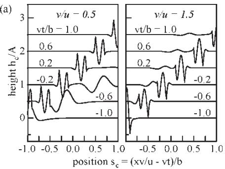

(b)  
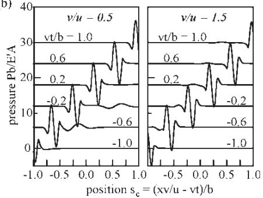  
Fig. 2 Clearance and pressure variations for the profile shown in Fig. 1(a) for $\nu / u = 0 . 5$ and $\nu / a = 1 . 5$ $P = 2 0 , S = 7 , P _ { \mathrm { H e r t z } } = 1 \mathrm { G P a } , \tau _ { 0 } = 8 \mathrm { M P a }$

## 2.3 Overall behaviour

Having calculated the values of the attenuated roughness and the complementary wave at a given time these can be summed to find the clearance and pressure variations inside the conjunction. This is shown in curve (d) of Fig. 1.

A fuller picture of the contact’s behaviour is given in Fig. 2 which shows the clearances and the associated pressure ripples during the passage of the profile of Fig. 1 through the conjunction.

For both slip ratios the major clearance and pressure variations are produced by the attenuated roughness and its associated pressure ripple. This appears to be typical of transverse roughness. These disturbances move through the conjunction at the velocity of the rough surface. Where the rough surface is slower, the complementary wave moves faster than the roughness, producing significant clearance variation ahead of the original profile. For $\nu / u = 1 . 5$ the complementary clearance wave is small, except in the inlet region, and moves more slowly than the roughness.The stretching ofthe profile in the complementary wave for $\nu / u = 0 . 5$ means that the associated pressures are relatively small, around one quarter of those produced by the attenuation of the roughness while the low amplitude of the complementary wave for $\nu / u = 1 . 5$ produces relatively low associated pressures in spite of the profile compression.

## 2.4 Two-dimensional roughness

The example given above was for transverse roughness where the clearance does not vary across the contact. However, the same general procedure can be used to calculate the effects of two-dimensional profiles. The only modification is that a twodimensional Fourier transform is required instead of the one-dimensional transform used for transverse roughness. As an example, Fig. 3 shows the effect of an isolated asperity of 1 µm height and 80 µm passing through a contact. The results are, again, for slip ratios, $\nu / u = 0 . 5$ and 1.5. This result is for a circular contact with a Hertz diameter of 0.37 mm.

The upper curves (a) show the undeformed asperity at one instant of time while curves (b) give the attenuated roughnesses. It may be noted that, because the attenuation analysis assumes an infinite parallel conjunction, there is a substantial ‘wake’ attached to the asperity. For $\nu / u = 0 . 5$ this is on the right of the asperity since the entrainment velocity is greater than the rough surface velocity; for $\nu / u = 1 . 5$ it is on the left. Because the Fourier transform process necessarily involves repeating the roughness pattern at regular intervals there is also a smaller, residual wake present upstream of the asperity. This can be reduced by increasing the interval between the pattern repetitions but, in practise, this is unnecessary. It may be seen that, under the conditions examined, the low amplitude analysis predicts that the asperity will be almost completely removed leaving a reduced clearance zone around it and a slightly increased clearance in its place.

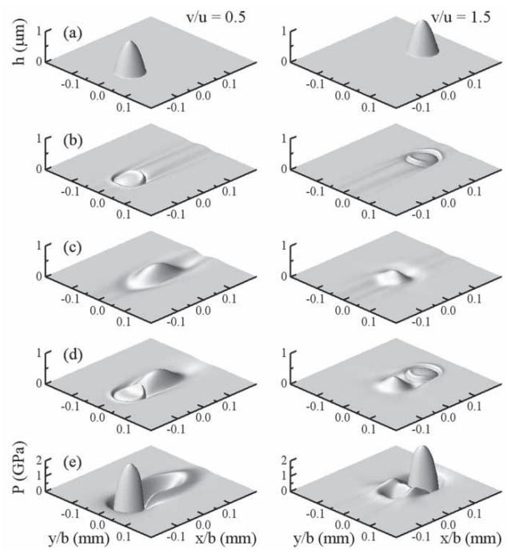  
Fig. 3 Behaviour of 1 µm high spherical asperity: (a) undeformed profil, (b) attenuated roughness, (c) complementary wave, (d) combined clearance variation, (e) pressure ripple

Curves (c) show the complementary waves produced by the interpolation process and, again, areas ofreduced clearance are visible in front ofand behind the convected clearance variation. Because of the differences between the entrainment and rough surface velocities the peak of the complementary wave lies in front of the asperity for $\nu / u = 0 . 5 ;$ behind it for $\nu / u = 1 . 5$ . As with the profile discussed earlier, when the rough surface velocity is less than the entrainment velocity, the clearance variation is stretched in the direction of entrainment; when this velocity is greater than entrainment the clearance variation is compressed.

As before, curves (b) and (c) must be combined to calculate the total clearance variation and the resulting clearance variations are given in curves (d). It may be seen that combining the attenuated roughness and the complementary wave effectively removes the wakes observed in the individual clearances. Finally, the lowest curves, curves (e), show the associated pressure ripples. Each pressure distribution consists of a substantial pressure associated with the attenuation of the asperity. This has a magnitude of around 2 GPa. In addition there are lower, negative pressures associated with the complementary wave.

In obtaining the results given above, results for sinusoidal roughesses were obtained for the range of wavelengths shown in Fig. 10 of part 1 $( \lambda _ { x } = 0 . 0 1$ to $1 0 0 ; \lambda _ { y } = 0 . 0 1 \mathrm { ~ t o ~ } 1 0 )$ , and the coefficients needed for the Fourier analyses of the complementary waves obtained by interpolation. Where results of longer or shorter wavelengths were required, results of the longest (or shortest) available wavelength were substituted. In order for the attenuated roughness and the complementary waves to combine so as to eliminate the wakes shown in Fig. 3, it proved necessary to make the same wavelength substitutions when calculating the attenuated roughness (and associated pressures).

## 2.5 Roughness aligned at an angle to the direction of entrainment

In the development of the rapid analysis procedure and in the examples given above it has been assumed that the coordinate system used to define the roughness coincides with the direction of entrainment. Generally this will be the case but there are a limited number of situations where it is convenient to use separate co-ordinate systems. For example, if a one-dimensional rough surface lies at an angle to the contact it is inconvenient to have to define the profile in two-dimensional form. In addition it greatly increases the calculation time. Also, where a regular array of features is aligned at a small angle to the entrainment direction it is necessary to be able to use a different co-ordinate system to define the roughness.

A straightforward extension to the analysis enables these situations to be examined and details are given in Appendix 2.

## 3 COMPARISONWITH EXPERIMENT

A number of authors have measured the clearance under rough EHL contacts under rolling–sliding conditions. However, only two [10–13] have presented their results in a form that allows direct comparison with analytical solutions and these results will be used to examine the accuracyand limitations ofthe present approach. Both of these used polished steel balls loaded against flat glass counterfaces and before comparing the results from the present analysis, which applies to line contacts, with these it is necessary to consider the relationship between roughness effects in the two types of contact.

## 3.1 Comparison between line and point contacts

In [9] a study of roughness attenuation in line and point contacts by Venner and one of the present authors showed that, under pure rolling conditions, there was virtual identity between the behaviour of these two types of contact and it is thought that this will extend, also, to the behaviour of rolling–sliding contacts. It was noted that, for an accurate match, the inlet conditions in line and point contacts should be the same.

The clearance just outside any dry contact, whatever the contacting geometry, can be expressed [14, 15] as

$$
h = { \frac { 8 \sqrt { 2 } } { 3 \sqrt { b } } } { \frac { P _ { \mathrm { H } } } { E ^ { \prime } } } , n ^ { \mathrm { 1 . 5 } }\tag{9}
$$

where n is measured outwards from the edge of the conjunction.

Assuming that the maximum Hertz pressures and elastic moduli in the two types of contact are equal, it is necessary to ensure that the Hertz semi-width in the line contact and the Hertz radius in the point contact are equal for the clearance distributions to match. To achieve this, the effective radius of curvature in the line contact needs to be set to around 80 per cent $( \pi / 4 )$ of that of the point contact. With this, all other operating conditions can be left unchanged. This has been done in the examples given here and, in all cases, the ball radius of 12.7 mm, has been replaced by an equivalent 10 mm roller radius.

## 3.2 Transverse ridge

Félix-Quiñonez et al. [10, 11] investigated the behaviour ofa single transverse ridge of300 nm height and 90 µm width passing through an EHL contact. They looked at three slide/roll ratios corresponding to $\nu / u = 0 . 5$ , 1 and 1.5. The middle ofthese is the case of pure rolling and is not relevant to the present analysis but has been examined in [6, 7].

The ridge geometry is shown in Fig. 4 and the measured profile has slightly sloping sides with the corners between the slope and the top of the ridge and the base material being somewhat rounded. In practise, the actual profile was slightly rough with a peak-to-peak amplitude around 50 nm and the curve in the figure is drawn through the centre ofthis microroughness. Félix-Quiñonez used a model profile in his numerical study and this has been adopted in the present analysis.

The smooth, line contact EHL problem was first solved for $\nu / u = 0 . 5$ and 1.5 using an Eyring stress of 8 MPa. This is the value given by Félix-Quiñonez. This analysis gave central clearances that closely matched the measured values and those from the numerical study. A perturbation analysis was then carried out to obtain the amplitude of the complementary wave in the inlet for a range of wavelengths.

With these amplitudes calculated, the process outlined above was used to estimate the clearance variation under the conjunction. The times at which the present results were calculated were selected so that the positions of the ridge corners in the analytical results coincided as closely as possible with the experimental locations. The results are shown in Fig. 5. It may be noted that one of Félix-Quiñonez’s numerical results for $\nu / u = 1 . 5$ appeared to place the ridge at a slightly different position to the corresponding experimental curve. The whole clearance curve has been displaced slightly to the left in the figure to allow a clearer comparison between the distortions to be made. Félix-Quiñonez, in his thesis, presented the clearances as changes from the central clearance of the conjunction, and this form has been used for the results calculated from the current analysis. Thus the smooth contact profile has been incorporated in the results. The upper curves in the figure are the experimental clearance changes; the central curve is the multi-grid solution of Félix-Quiñonez while the lower curve is the result obtained by the current, low amplitude analysis. Each of the lower curves is displaced downwards by 100 nm from the one above to show the variations more clearly.

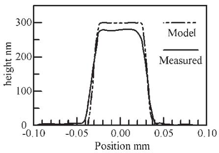  
Fig. 4 Measured and model ridge geometries used for the comparison with the experimental and numerical results of Félix-Quiñonez [10, 11]

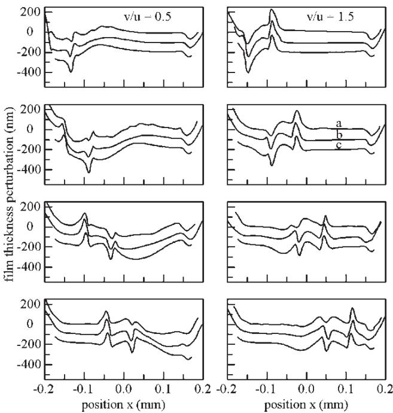  
Fig. 5 Comparison of present analysis with the experimental and numerical results of Félix-Quiñonez [11]: (a) experiment (b) Multi-grid, (c) present analysis

Overall the agreement between the results of the present analysis and the measured and calculated clearances is high, although, as might be expected, there are rather greater differences between the present analysis and the experimental results than with the numerical, multi-grid solution. This may be due to some errors in the underlying assumptions in both the theoretical studies or may simply reflect problems of accurately measuring small clearances under rapidly changing spatial and temporal conditions. It may be noted that an examination was made of the effect of the value of the Eyring stress used and that it was impossible to get a closer match simply be changing this value.

The main effect in all the results is that the ridge has been largely flattened except in the inlet to the conjunction. For example, once the complementary wave has become separated, the reduction in clearance due to the ridge is below 50 nm, compared to its original height of 300 nm. In addition, for $\nu / u = 0 . 5 ,$ the ridge is tilted to the right with larger clearances under its left-hand side; for $\nu / u = 1 . 5$ the behaviour is reversed.

The results for $\nu / u = 0 . 5$ clearly show the effect of the complementary wave, producing a reduction in clearance as the ridge passes through the contact’s inlet. This reduction moves at twice the speed of the ridge giving the lower clearances to the right of it. Thus for the third curve from the top where the ridge is at $x = - 0 . 0 6 \mathrm { m m }$ , there is a marked reduction in clearance around $x = 0 . 0 5$ . For the lowest curve where it is at the contact centre, the clearance is reduced at the exit as the complementary wave leaves the conjunction.

For $\nu / u = 1 . 5 ,$ the complementary wave travels at two-thirds of the speed of the ridge producing the smaller clearance reduction to its left. It would be expected that the clearance reduction due to the complementary wave would be around twice the width of the ridge for $\nu / u = 0 . 5 ;$ slightly less than its width for $\nu / u = 1 . 5$ and this agrees with both the experimental and theoretical results.

There are some areas of disagreement between the present results and the multi-grid solution of Félix-Quiñonez and these are shown in Fig. 6. Here, the upper curve shows the multi-grid solution, the second curve the complementary wave from the low amplitude analysis while the lowest curve gives the attenuation roughness. For the $\nu / u = 0 . 5 \mathrm { c a s e }$ , the amplitude of the complementary wave is greater than the attenuated roughness; for $\nu / u = 1 . 5$ it is slightly smaller. However, in both cases it provides a major contribution to the overall clearance distribution. Comparison of the attenuated roughness and the complementary wave suggests that attenuation component matches the distortions of the numerical analysis that are local to the ridge with reasonable accuracy. However, it appears that the amplitude of the complementary wave has been slightly over-estimated. It is thought that this is partly because of the differences between the flows in the inlet region of the line contact used in the low-amplitude analysis and the point contact of the numerical study and partly because the high amplitude of the ridge relative to the clearance modifies the inlet flow.

However, the actual differences between the clearance curves are relatively minor, and the lowamplitude analysis provides a good indication of the contact’s behaviour. In addition, since the wavelength of the complementary wave is fairly long, the associated pressure distribution will be relatively low and it is probable that the pressure perturbations predicted by the low-amplitude analysis will be accurate.

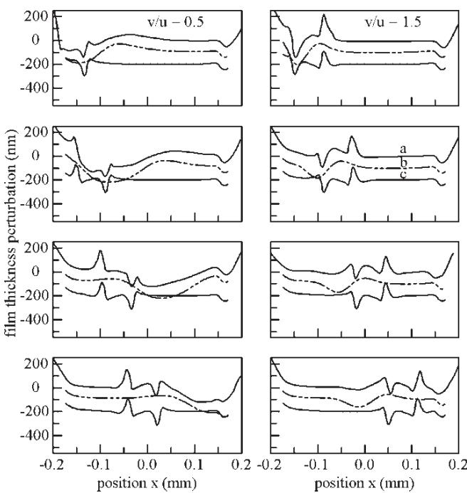  
Fig. 6 Comparison of present analysis with the numerical results of Félix-Quiñonez [11]: (a) Felix- Quiñonez, (b) complementary wave, (c) attenuated roughness

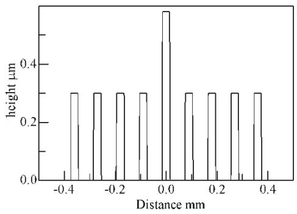  
Fig. 7 Ridge sequence used by Kaneta et al. [12]

## 3.3 Multiple transverse ridges

A somewhat similar set of measurements was made by Kaneta et al. [12] using a set of ridges with the geometry shown in Fig. 7. Nine equally spaced ridges were used with the central ridge having a height of 0.58 µm while the rest were 0.3 µm high. The ridges had a width of $3 0 \mu \mathrm { m }$ and were spaced 90 µm apart. Although the actual asperities had slightly sloping sides and rounded corners, insufficient details were given for the profile to be modelled with any precision and the rectangular geometry shown in the figure was, therefore, used in the analysis.

The analysis process was similar to that given above for a single ridge. However, Kaneta et al. give different values for the film thickness for the two slip ratios and both clearances differed somewhat from the calculated value. It was decided to modify the fluid viscosities used in the calculation so as to match the mean film thickness, enabling the calculated and experimental results to be compared directly. A value of the Eyring stress of 6 MPa was adopted.

Figure 8 shows the resulting calculated clearances for Kaneta et al.’s sliding velocity corresponding to $U = 2 \times 1 0 ^ { - 1 1 }$ at different points in the transition of the ridges through the contact together with experimental values. The solid square symbols in the figure show the location of the central ridge at each time while the diamonds show the position of the complementary wave generated by this ridge. For $\nu / u = 0 . 5$ as before, the complementary wave moves at twice the speed of the ridge for $\nu / u = 1 . 5$ , its velocity is two-thirds of that of the asperity.

The upper curves show the clearances as the large asperity is just entering the conjunction and, at that point, there is close agreement between the calculated and measured clearances. Similar agreement is found as the central ridge passes through the contact except in those locations where the predicted clearance is negative. Here the surface surrounding that location is raised in the experimental results ensuring the clearances remain positive.

The influence of the complementary wave on the clearances may be seen in the left-hand curves where $\nu / u = 0 . 5$ . Here a broad, low clearance zone is created as the central asperity enters the contact and this is convected through the contact at the entrainment velocity. Its centre is shown by the diamond in the figure and its effect on the surrounding region is clearly visible in the second and third curves from the top. For the right-hand curves where $\nu / u = 1 . 5$ the complementary wave is expected to be narrower and to decay more rapidly and, although its presence may possibly be seen in the second curve from the top, over the majority of the conjunction it has little effect on the film thickness.

The curves for $\nu / u = 1 . 5 ,$ , therefore, give a good indication of the attenuation of the ridges due to sliding. The amount of distortion of the ridges is relatively small although there is a marked tilt with the lowest clearances lying on the left of the ridge. It would be expected that the attenuated clearance for $\nu / u = 1 . 5$ would be the mirror image ofthese and this appears to be the case although the actual profiles are somewhat obscured by the complementary waves.

Although the effect of the complementary wave is most apparent when considering the highest asperity, its effect may be noted elsewhere. Considering the contact’s behaviour before this asperity enters the conjunction, the uppermost curves, it may be noted that, for $\nu / u = 1 . 5 ,$ the clearance around each ridge is virtually identical.

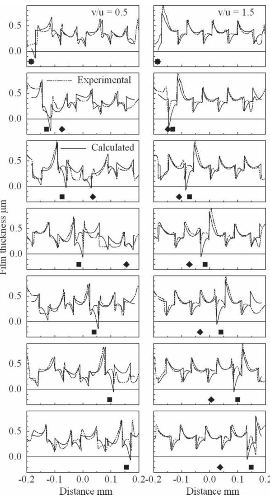  
Fig. 8 Comparison of present analysis with the experimental results of Keneta et al. [12]:  central ridge, - convected position of ridge

This arises because each ridge is attenuated by sliding in an identical fashion while the complementary waves are small. For $\nu / u = 0 . 5$ , the left-hand curve, there are substantial differences in behaviour between the ridges. This difference is due to the complementary wave. In addition the clearance distribution approximately repeats every second ridge and this is because the convected wave travels at twice the velocity of the rough surface.

Without the central ridge, the clearance variation is around 50 per cent ofthe smooth clearance and there is good agreement between the calculated and measured values. Under the central ridge the calculated clearance falls below zero and there are significant differences between the curves. However, even here, the overall distribution predicted by the analysis gives a good indication ofthe actual clearance distribution.

## 3.4 Three dimensional flat topped defects

Félix-Quiñonez etal. [11, 13] examined the behaviour of a regular array of rectangular, flat-topped defects as they passed through an EHL conjunction. Figure 9 shows an idealization of the geometry used – the actual geometry was somewhat more irregular. Essentially the profile consisted of square blocks 0.3 µm high and 90 µm side length, spaced 130 µm apart. The orientation was such that entrainment was across the block diagonals.

Analysis followed the procedure used above with the effective radius of curvature being modified so as to match conditions in the inlet of the line contact to those of the ball. Otherwise no changes were made to the operating conditions. Félix-Quiñonez et al. carried out an analysis of the contact using a multi-grid EHL solver for the idealized geometry. Their calculated clearance was in close agreement with their measured results except for regions where the actual geometry differed from the idealized shape. However, the analysis also predicted the pressure distribution and it was decided, therefore, to use the calculated results for comparison.

Figure 10 shows the clearance and pressure perturbations from the present analysis when a block is at the centre of the contact for the two velocity ratios used. Entrainment is on the left of the figure. The figure shows the complex nature of the clearance distribution with the ridges and the grooves between them being heavily distorted. However, the sharp clearance changes at the edges of the blocks remain virtually unaltered. The calculated pressures follow the block profile with high pressures where the undeformed clearance would be low, and low pressures where it would be high. There are, in addition, increases in pressure around the block edges.

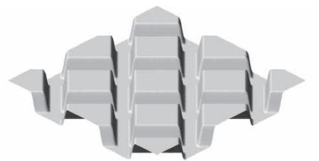

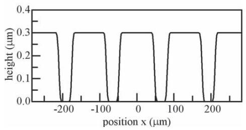  
Fig. 9 Asperity geometry used by Félix-Quiñonez et al. [11, 13]

While Fig. 10 gives an indication ofthe overall distribution of the clearances and pressures at one instant of time, Félix-Quiñonez et al. only presented results for the clearance and pressures on the contact centreline and these are shown in Fig. 11, together with the results from the present analysis. This centre-line coincides with a diagonal through the corners of the asperities shown in Fig. 9. Results are given for a range ofpositions ofthe asperities as they move through the conjunction and the times for which the results were calculated were chosen so that the block corners in

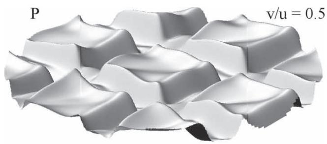

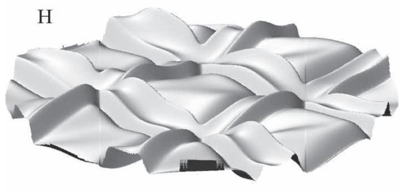

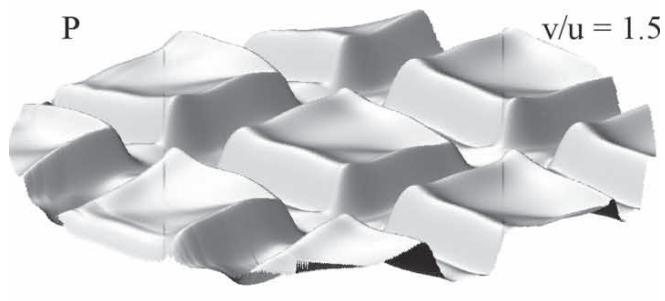

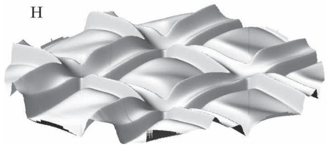  
Fig. 10 Clearance and pressures perturbations for the asperity geometry of Félix-Quiñonez et al. [11, 13]. Entrainment is from left to right

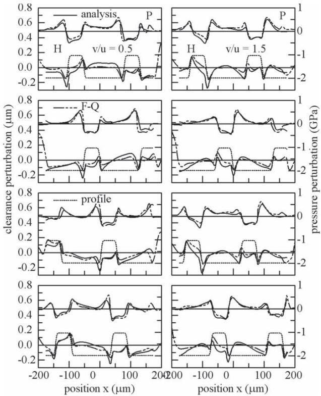  
Fig. 11 Comparison between the present analysis and the calculated results of Félix-Quiñonez et al. [11, 13]. Hertz semi-width  174 µm. Central clearance 0.3 µm, Hertz pressure 0.508 GPa

the present results lay in the same locations as those of Félix-Quiñonez et al.

The results given by Félix-Quiñonez et al. were presented in the form of the changes in film thickness and pressure produced by the asperities and this form has been retained in the present comparison. Under smooth conditions the central clearance was 0.3 µm and the central pressure 0.508 GPa so any clearance perturbations below 0.3 µm would represent contact between the surfaces and any low pressures may imply that there will be cavitation, although this will, of course, depend on their location in the conjunction. One such location occurs in the upper curve for $\nu / u = 1 . 5$ where the present analysis predicts a pressure perturbation of around 0.5 GPa at x 80 µm. This would represent a negative pressure and at that point the pressure perturbation obtained by Félix-Quiñonez et al. is a little less negative. This difference in pressure coincides with a difference in film thickness with the low amplitude analysis predicting lower clearances than the full calculation.

In spite of these minor differences, overall agreement is high with close agreement between the pressures and clearances for both velocity ratios and for all asperity locations.

While the effect of the complementary wave and the amplitude reduction due to sliding cannot be clearlyseparated in either figure, it is apparent that the blocks are heavily distorted and tilted with the lowest clearance occurring on the left for $\nu / u = 0 . 5 ;$ on the right for $\nu / u = 1 . 5 .$ The long wavelength components ofroughness have been almost completelyattenuated leaving just the shorter wavelengths. This is reflected in the fairly uniform clearance over the majority of the contact with just the profiles adjacent to the remaining block corners. At those locations there is an abrupt change in clearance of around 0.2 µm and this produces the lowest clearances found. The complementary wave appears to have a significant effect for $\nu / u = 0 . 5$ with each block producing a wide, reduced clearance wave that propagates at twice the sliding velocity. Thus in the third figure from the top, the centre of the asperity is around 60 µm to the left of the contact centre while there is a zone of reduced clearance centred around 50 µm to its right. This zone is around 200 µm wide – as might be expected from the diagonal length of the block. In contrast, the effect of the complementary wave does not appear to be significant for $\nu / u = 0 . 5$

Although there are some differences between the multi-grid and the present low-amplitude perturbation solutions, they are generally relatively minor. All the main features of the clearance and pressure variations are reproduced, particularly, the degree of deformation of the asperities and the distribution of the pressure changes.

## 4 DISCUSSION AND CONCLUSIONS

The first part of this paper described how the behaviour of low amplitude roughness in EHL contacts could be characterized by three complex quantities and outlined how these could be calculated. This second part extended the analysis to general rough surfaces.

The original roughness is attenuated inside contact by relative motion ofthe surfaces. At the same time, as the roughness passes through the inlet to the conjunction it creates variations in clearance there that propagate through the contact at the mean surface velocity, decaying in amplitude as they do so. This creates a complex, rapidly changing clearance distribution and, because pressure variations are associated with both the clearance attenuation and the convected complementary wave. Fourier transform techniques allow the calculation of the attenuated roughness and its associated pressure ripple directly. Similar, slightly more complex, procedures can be used to find the complementary waves. These may then be combined to obtain the clearance and pressure changes produced by the surface roughness at any instant of time. Finally the calculated changes need to be superimposed on the smooth contact values.

The analysis assumes that only one of the contacting surfaces is rough but, where this is not the case, results may be obtained for the two surfaces separately and added to obtain the overall behaviour.

Analysis of any surface is rapid with transverse, one-dimensional roughness taking around half a second for a surface defined at 8000 points. The two dimensional analysis shown in Fig. 3 took around 20 s when the asperity was defined on a 40 40 mesh with spacings of 6 times the basic mesh between asperity repetitions.

Results from the low amplitude, Fourier-based, analysis have been compared with available experimental measurements. There was good agreement between the results from the present analysis and the published results in the majority of cases.

Strictly, the analysis applies only where the amplitude of the surface roughness is much lower than the film thickness but comparisons of its predictions with the published experimental results suggest that it will be accurate, provided the clearance variations are less than 50 to 75 per cent of the film thickness and the total pressure remains positive. Even outside these limits the present low amplitude analysis still gives clear indications of the behaviour of the surface roughness inside the conjunction.

Thus the present rapid analysis provides a means of estimating the likely behaviour of actual surfaces in a given contact.Where the resulting clearance and pressure variations are relatively small the results will be accurate and can be used directly. Even where this is not the case it should still provide a rapid, and simple way of comparing the behaviour of different surfaces.

## ACKNOWLEDGEMENTS

This paper was supported by grants from the RGC of the HKSAR, China [CityU 100901, 102599]. The third author wishes to thank Professor E. Ionnides, SKF Product Technical Director for permission to publish and for partly financing the work. The authors wish to thank Dr A. Félix-Quiñonez for providing them with measurements and for participating in discussions during the work.

## REFERENCES

1 Hooke, C. J. and Li, K. Y. Rapid calculation of the pressures and clearances in rough, rolling–sliding elastohydrodynamic contacts: Part 1: low amplitude, sinusoidal roughness. Proc. IMechE, Part C: J. Mechanical Engineering Science, 2007, 221(C5), 535–550.

2 Yuan-Zhong, H., Barber, G. C., Zhu, D., and Ai, X. A study on an FFT based approach for fast estimation of pressure distributions in point EHL contacts of rough surfaces. Tribol Trans., 2001, 45, 59–69.

3 Morales-Espejel, G. E., Lugt, P. M., Van Kuilenburg, J., and Tripp, J. H. Effects of surface micro-geometry on the pressures and internal stresses of pure rolling EHL contacts. Tribol Trans., 2003, 46, 260–272.

4 Felix-Quiñonez, A., Ehret, P., Summers, J. L., and Morales-Espejel, G. E. Fourier analysis of a single transverse ridge passing through an elastohydrodynamically lubricated rolling contact: a comparison with experiment. Proc. Instn Mech. Engrs, Part J: J. Engineering Tribology, 2004, 218, 33–43.

5 Hooke, C. J. The effects of roughness in EHL contacts. In Proceedings of the 31st Leeds-Lyon Symposium on Tribology, Leeds, September 2004, pp. 31–46 (Elsevier, 2005).

6 Hooke, C. J. and Li, K. Y. Rapid calculation of the pressures and clearances in rough, elastohydrodynamically lubricated contacts under pure rolling: Part 1 – low amplitude, sinusoidal roughness. Proc. IMechE, Part C: 2006, 220(C6), 901–914.

7 Hooke, C. J. and Li, K. Y. Rapid calculation of the pressures and clearances in rough, elastohydrodynamically lubricated contacts. Part 2: general roughness. Proc. IMechE, Part C, 2006, 220(C6), 915–926.

8 Hooke, C. J. Roughness in rolling–sliding EHL contacts. Proc. IMechE, Part J: J. Engineering Tribology, 2006, 220, 259–271.

9 Hooke, C. J. and Venner, C. H. Surface roughness attenuation in line and point contacts. Proc. Instn Mech. Engrs, PartJ: Engineering Tribology, 2000, 214, 439–444.

10 Felix-Quinonez, A., Ehret, P., and Summers, J. L. New experimental result of a single ridge passing through an EHL conjunction. Trans. ASME, J. Tribol., 2003, 125, 252–259.

11 Felix-Quinonez. An experimental and theoretical study ofelastohydrodynamically lubricated contacts with well defined surface features. PhD thesis, The University of Leeds, 2003.

12 Kaneta, N.,Tani, N., and Nishikawa, H. Optical interferometric observations of the effect of moving transverse asperities on point contact EHL films. In Proceedings of the 29th Leeds-Lyon Symposium on Tribology,Tribology Series, 41, 2003, Elsevier, pp. 101–109.

13 Felix-Quiñonez, A., Ehret, P., and Summers, J. L. On three-dimensional flat-top defects passing through an EHL point contact: a comparison of modelling with experiments. Trans. ASME,J. Tribol., 2005, 127, 51–60.

14 Hooke, C. J. and O’Donoghue, J. P. Elastohydrodynamic lubrication of soft, highly deformed contacts. J. Mech. Eng. Sci., 1972, 14, 34–48.

15 Hooke, C. J. The elastohydrodynamic lubrication of heavily loaded contacts. J. Mech. Eng. Sci., 1977, 19(4), 149–156.

## APPENDIX 1

## Notation

A amplitude of component of surface roughness

b semi-width of Hertz contact

$E ^ { \prime }$ $( 2 / E ^ { \prime } = ( 1 - \nu _ { 1 } ^ { 2 } ) / E _ { 1 } + ( 1 - \nu _ { 2 } ^ { 2 } ) / E _ { 2 } )$ effective elastic modulus   
$h$ clearance   
$h _ { \mathrm { a } }$ amplitude of attenuated roughness component   
$h _ { \mathrm { c } }$ amplitude of complementary wave component   
$H _ { \mathrm { a } }$ attenuated roughness   
$H _ { \mathrm { c } }$ complementary wave   
$\mathrm { i }$ $\sqrt { - 1 }$   
$n$ distance measured outwards from edge of Hertz contact   
$N _ { j } ( x ^ { \prime } )$ interpolation function used in calculating the complementary wave   
$p$ pressure   
$p _ { \mathrm { a } }$ amplitude of pressure component due to roughness attenuation   
$p _ { \mathrm { c } }$ amplitude of pressure ripple component associated with the complementary wave   
$P$ Greenwood load parameter   
$P _ { \mathrm { a } }$ pressure associated with attenuated roughness   
$P _ { \mathrm { H e r t z } }$ Hertz pressure   
$r$ component of surface roughness   
$R$ surface roughness   
$s$ coordinate through contact, convected with rough surface   
$s ^ { \prime }$ inclined coordinate   
$s _ { \mathrm { c } }$ $x \nu / u - \nu t$   
$s _ { \mathrm { c } \omega } , s _ { \mathrm { c } \xi }$ inclined coordinates–see equation (13), Appendix 2   
$S$ Greenwood speed parameter   
$t$ time   
$u$ entrainment velocity $- u = ( u _ { 1 } + u _ { 2 } ) / 2$   
$\nu$ velocity of rough surface   
$x$ coordinate through contact, measured from the contact centre, fixed relative to contact   
$x ^ { \prime }$ coordinate through contact, measured from the contact inlet, fixed relative to contact   
$x _ { j }$ coordinate used to calculate the complementary wave   
$y$ coordinate along contact   
$y ^ { \prime }$ inclined coordinate   
$\lambda$ wavelength   
$\lambda _ { x }$ wavelength in x direction   
$\lambda _ { y }$ wavelength in y direction   
$\xi$ wave number in the y-direction   
$\xi ^ { \prime }$ wave number in inclined direction   
$\psi$ complex wave number of complementary wave component   
$\omega$ wave number in the x-direction

$\omega _ { c }$ nominal wave number of complementary wave $\omega ^ { \prime }$ wave number in inclined direction

## APPENDIX 2

## Roughness aligned at an angle to the direction of entrainment

Where the alignment of the roughness differs from that of the entrainment, the roughness may be expressed as $R ( s ^ { \prime } , y ^ { \prime } )$ where $s ^ { \prime }$ and $\bar { y } ^ { \prime }$ are measured from some arbitrary point that moves with the surface and it will be assumed that $s ^ { \prime }$ is inclined at an angle θ to the entrainment direction, s. This profile moves at the velocity of the rough surface, $\nu ,$ in the direction of entrainment. As before, it will be assumed that the origin of this coordinate system is at the inlet to the contact at time, $t = 0$

A Fourier transform of this waveform yields components of the form

$$
A \exp [ \mathrm { i } \omega ^ { \prime } s ^ { \prime } + \mathrm { i } \xi ^ { \prime } y ^ { \prime } ]\tag{10}
$$

Considering just one component of this, the values of the wave numbers in the x and y directions, ω and ξ , are related to $\omega ^ { \prime }$ and $\xi ^ { \prime }$ by

$$
\begin{array} { l } { \omega = \omega ^ { \prime } \cos ( \theta ) - \xi ^ { \prime } \sin ( \theta ) } \\ { \operatorname { a n d } \xi = \omega ^ { \prime } \sin ( \theta ) + \xi ^ { \prime } \cos ( \theta ) } \end{array}\tag{11}
$$

Then, the roughness attenuation, $h _ { \mathrm { a } }$ and $p _ { \mathrm { a } }$ can be calculated by scaling A by the clearance and pressure ratios obtained using ω and ξ. Inverse transforms give $H _ { \mathrm { a } } ( s ^ { \prime } , y ^ { \prime } )$ and $P _ { \mathrm { a } } ( s , y ^ { \prime } )$ . The value of these at any location and time can be obtained by first calculating $s = x ^ { \prime } - \nu t$ and y and from these determining s- and $y ^ { \prime }$

$$
\begin{array} { l } { { s ^ { \prime } = s \cos ( \theta ) + y \sin ( \theta ) } } \\ { {  } } \\ { { y ^ { \prime } = - s \sin ( \theta ) + y \cos ( \theta ) } } \end{array}\tag{12}
$$

The complementary wave is a little more complicated. Equation (8) gives, for the complementary wave

$$
h _ { \mathrm { c } } \exp [ \mathrm { i } ( \psi - \omega _ { \mathrm { c } } ) x ^ { \prime } ] \exp [ \mathrm { i } \omega ( x ^ { \prime } \nu / u - \nu t ) + \mathrm { i } \xi y )
$$

and replacing ω and ξ by ω- and $\xi ^ { \prime }$ yields

$$
\begin{array} { r l } & { h _ { \mathrm { c } } \exp [ \mathrm { i } ( \psi - \omega _ { \mathrm { c } } ) x ^ { \prime } ] \exp [ \mathrm { i } \omega ^ { \prime } s _ { \mathrm { c } \omega } + \mathrm { i } \xi ^ { \prime } s _ { \mathrm { c } \xi } ] } \\ & { \quad \mathrm { w h e r e } s _ { \mathrm { c } \omega } = ( x ^ { \prime } \nu / u - \nu t ) \cos ( \theta ) + y \sin ( \theta ) } \\ & { \quad \mathrm { a n d } s _ { \mathrm { c } \xi } = - ( x ^ { \prime } \nu / u - \nu t ) \sin ( \theta ) + y \cos ( \theta ) } \end{array}\tag{13}
$$

An inverse transform ofthis for a specific value of $x ^ { \prime } ,$ $x _ { j } ^ { \prime } ,$ in exp $i ( \psi - \omega _ { \mathrm { c } } ) x ^ { \prime } ]$ yields the complementary wave in the form $H _ { \mathrm { c } j } ( s _ { \mathrm { c } \omega } , s _ { \mathrm { c } \xi } )$ . It is then straightforward to evaluate $s _ { \mathrm { c } \omega }$ and $s _ { \mathrm { c } \xi }$ for any given position and time and then to interpolate for the complementary wave.

For one dimensional roughness, where $\xi ^ { \prime }$ is zero, only one dimensional transforms are required but for this and for two dimensional profiles, amplitude ratios may be required for negative values of $\omega ^ { \prime }$ and $\xi ^ { \prime }$ . It is insufficient to take the complex conjugate for negative $\omega ^ { \prime }$ and equation (11) must be used to obtain the appropriate values of ω and $\xi .$ . The rules for negative values of these given in section 2.1 then need to be applied.
