# Effect of lubricants on micropitting and wear

E. Laine´ a,-, A.V. Olver a, T.A. Beveridge b

a Department of Mechanical Engineering, Tribology Section, Imperial College London, South Kensington Campus, Exhibition Road, London SW7 2BX, UK b Caterpillar Inc., Peoria, IL, USA

## a r t i c l e i n f o

Article history:   
Received 31 August 2007 Received in revised form 14 March 2008   
Accepted 31 March 2008   
Keywords:   
Rolling contact fatigue   
Micropitting   
Additives   
Wear

## a b s t r a c t

Micropitting was studied using a three-contact disc machine having a central roller in contact with three harder, annular counter-discs (‘‘rings’’) of precisely controlled roughness. Roughness, running conditions, base stock and additive concentration were varied. The response of the same lubricants in a reciprocating sliding wear test operating in the boundary regime was also studied.

Results of experimental studies of the rolling contact behaviour of carburised steel rollers are reported. All the tests with the additive present led to micropitting. However, severe micropitting wear was only observed when the calculated film thickness exceeded 12% of the centre-line average roughness of the rings.

It was found that there was an approximately inverse correlation between the micropitting damage in the disc machine test and the mild wear in the reciprocating sliding test. This was attributed to the tendency of anti-wear additives to prevent running-in of the rough surface.

& 2008 Elsevier Ltd. All rights reserved.

## 1. Introduction

Research on micropitting may be divided into two main areas: experimental and theoretical. Experimental work has concentrated on the development of test rigs and test procedures in order to reproduce micropitting under controlled conditions. Generally, these tests provided a better understanding on micropitting behaviour and enabled the identification of those parameters which control the problem. The theoretical approach was to study the possible mechanism of micropitting predominately by evaluating pressures and tractions in rough contacts.

The micropitting tests described in the literature have carried out either on gear test rigs or on disc machines. Disc machines have been widely used and have proved to be a controlled way to produce micropitting under controlled conditions. Examples of the use of either two- or three-disc machines are found in various studies [1–11] and examples of the use of gear tests are found in studies by Winter and others [12–14].

The observations made from experimental studies have further helped the understanding of micropitting. In general, the process of micropitting involves the formation of numerous micro-scale cracks that initiate at or very close to the surface. These cracks then propagate from the surface into the material at a shallow angle until rupture occurs to form shallow micropits. Investigations by Berthe et al. [5] suggested that surface roughness was the driving force for the phenomenon and this is now generally accepted. Olver and coworkers [3] also showed that there was plastic deformation and that fatigue cracking occurred during the damage process.

Laboratory tests [1–14] have also shown that the parameters which influence micropitting are roughness, load, hardness, sliding, speed, temperature and lubricant. The main findings from these tests are:

\- Increasing the lambda ratio, either by increasing the film thickness or reducing the surface roughness, could reduce or prevent micropitting.

\- Increasing the slide-to-roll ratio reduces the micropitting initiation life but does not significantly affect the consequent wear rate [3].

\- The difference in hardness between the two surfaces could significantly affect the rate of micropitting, the softer surface being much more prone to micropitting [3].

\- The slower moving surface has a greater tendency to become micropitted.

\- Some additives such as anti-wear for example tend to promote micropitting [7,9,12,13].

A number of theoretical studies [4,15–17] have addressed the possible mechanisms of micropitting. It has been suggested that micro-elastohydrodynamic lubrication (micro-EHL) may control the occurrence of micropitting since this mechanism influences the local pressure and traction. Examples of the analysis of micro-

Table 1
**Nomenclature**

|  |  | $T _ { \mathrm { b } }$ $\bar { V }$ | effective inlet temperature entrainment speed, $\begin{array} { r } { \bar { V } = \frac { 1 } { 2 } ( \nu _ { 1 } + \nu _ { 2 } ) } \end{array}$ |
| --- | --- | --- | --- |
| $h _ { 0 }$ | smooth body central film thickness | $\Delta \nu / \bar { V }$ | slide-to-roll ratio = (v1 − v2) = V |
| $p _ { 0 }$ | Hertz pressure | $\lambda ^ { \prime }$ | ratio of film thickness to composite roughness |
| $R _ { \mathbf { a } }$ | centre-line average roughness height |  | $\left( = h _ { 0 } / R _ { \mathrm { a . R I N G } } \right)$ |

EHL are by Evans et al. [18] and Patching et al. [19]. EHL analyses by Hooke et al. [20,21] and Olver and Dini [22,23] are the simplified views of the effect of roughness passing through the contact and the pressure generated through the lubricated film. These studies are important because they show that contact fatigue is not only related to metal-to-metal contact but can be a result of pressures transmitted by the fluid film.

The present paper covers the experimental study of micropitting using a three-contact disc tester. The concentration of additive in the bulk lubricant was varied and the results and observations are summarised. Reciprocating wear tests were carried out on the same lubricants. There was a nearly inverse correlation between reciprocating wear tests and micropitting wear tests. It is concluded that anti-wear additive promoted micropitting by preventing the wear of the rough surfaces during running-in.

## 2. Test rig

## 2.1. Micropitting rig

The micropitting rig is a three-contact disc tester in which three equal diameter discs (‘‘rings’’) are pressed into contact with a central specimen or roller. The test roller and the rings are driven by independent electric motors allowing the rolling and sliding speeds to be controlled. The configuration allows a rapid accumulation of rolling contact cycles in a short period of testing without generating a very high entrainment speed. The general appearance of the rig and set-up of the contact assembly are shown in Fig. 1, respectively.

## 2.2. High-frequency reciprocating rig

A controlled reciprocating friction and wear test system was used. This provides a fast, repeatable assessment of the performance of lubricants and additives. This test measures the wear of surfaces in relative motion under load. By measuring the wear scar diameter under controlled test conditions, the wear resistance provided by lubricants and additives were compared one to another. The rig is detailed in Fig. 2 and test conditions are listed in Table 1 [27].

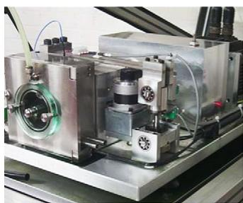

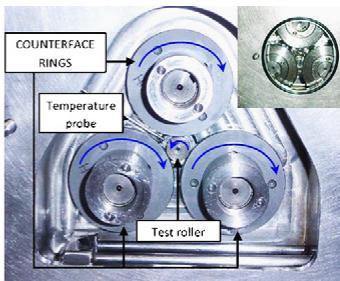  
Fig. 1.

## 3. Experimental method

The micropitting experiments were conducted using three counterface rings and a single roller for each test, and are depicted in Fig. 3. Rollers and rings were manufactured using 16MnCr5 steel to DIN 17210, gas carburised to 0.9 mm case depth. The hardness of the specimens was controlled by tempering so that the counterface rings were slightly harder (750–800 HV) than the test roller (670–720 HV). The rings were also rougher, having a hand-polished circumferential finish with $R _ { \mathrm { a } }$ between 0.50 and 0.52 mm. Some tests were also carried out with rings having a transverse ground finish. All the test rollers had a circumferential ground finish of about $R _ { \mathrm { a } } = 0 . 1 5 \mu \mathrm { m }$

Two lubricant base stocks were used, a synthetic poly-alphaolefin (PAO) and an API Group I mineral oil with dynamic viscosities of 3.21 cP @ 100 1C and 2.72 cP @ 100 1C, respectively. In addition, various concentrations of a secondary, ${ \mathsf { C } } _ { 6 } ,$ zinc dialkyldithio-phosphate (ZDDP) were used as an anti-wear agent.

The PAO is a synthetic hydrocarbon base stock which was used in earlier work [24] whereas API Group I is a mineral oil used in a wide range of automotive, agricultural, plant and transmission systems. ZDDP was chosen as it is an anti-wear additive widely used in transmission lubricants and has been shown to contribute to micropitting formation. The treat rate was 1.3% of the additive solution giving 0.1% phosphorus by weight.

Before all tests, the roller, rings, as well as all the removable parts from the test chamber were ultrasonically cleaned. Then the counterfaces and test specimen were assembled altogether within the chamber as shown in Fig. 1b. The experimental procedure starts with a 5 min step where the load is applied gradually over a period of approximately 2.5 min; the correct slide-to-roll ratio Dn=V¯ and entrainment speed ðV¯ Þ are then applied. At the end of each step, the test was stopped and the roughness parameter, $R _ { \mathbf { a } }$ was measured for each counterface. The loss of diameter on the roller was measured using a stylus instrument.

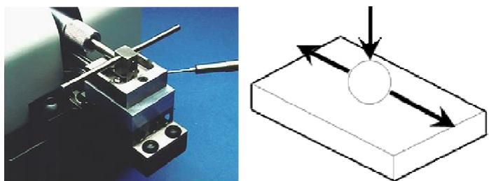  
Fig. 2.

ASTM standard D6079-97 running conditions
| Parameter | Value |
| --- | --- |
| Fluid volume (ml) | 2±0.2 |
| Stroke length (mm) | 1±0.02 |
| Frequency (Hz) | 50±1 |
| Fluid temperature (°C) | 60±2 |
| Test mass (g) | 200±1 |
| Test duration (min) | 75±0.1 |
| Reservoir surface area (mm²) | 600±100 |

All the tests were performed using a slide-to-roll ratio, $( \Delta \nu / \bar { V } ) = 5 . 2 \%$ : The corresponding smooth body minimum film thickness h was calculated using a thermal model proposed by Olver [25] and is listed in Tables 2 and 3.

The tests were stopped at predetermined intervals and the $R _ { \mathbf { a } }$ for the rings was measured after every step, i.e. 5, 35, 95, 185 and 305 min. The roller diameter was measured every 30 min after the first 5 min step. An example of the roller profile highlighting the loss of diameter is shown in Fig. 4.

## 4. Results

## 4.1. Tests with PAO and PAO+ZDDP—geometry study

Four sets of counterfaces were used: two sets with transverse finish and two sets with longitudinal finish. In addition, ZDDP was added to the PAO at a concentration of 1.3 wt% or 0.1%P.

A summary of the experimental conditions is given in Table 2: $( \Delta \nu / \bar { V } ) = 5 . 2 \% , \quad \bar { V } = 3 . 0 5 \mathrm { ~ m ~ } s ^ { - 1 } , \quad p _ { 0 } = 1 . 7 1 \mathrm { ~ G P a }$

The resulting wear curve and the associated wear rate for each experiment are shown in Fig. 5 (wear rate is defined as the loss of diameter per million contact cycles excluding the first 30 min of the test).

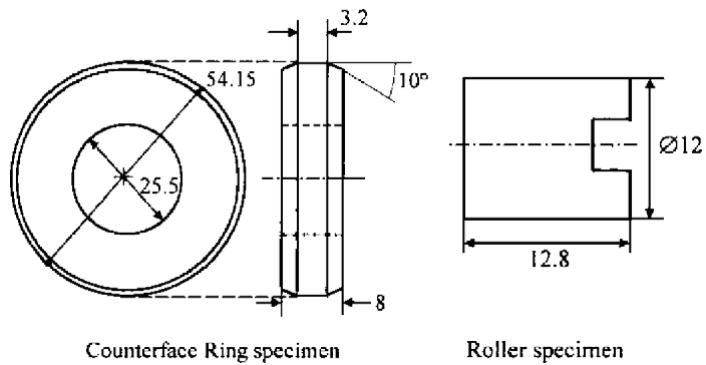  
Fig. 3.

Experimental conditions for geometry study
| Test number | Lubricant | $R _ { \mathrm { a } } \ \mathrm { ( \mu m ) }$ | $T _ { b } ( ^ { \circ } C )$ | $\mathrm { h } _ { 0 } \ : ( \mathrm { n m } )$ | $\lambda ^ { \prime }$ | Surface finish |
| --- | --- | --- | --- | --- | --- | --- |
| 1 | PAO | 0.5 | 76 | 73 | 0.14 | Transverse |
| 2 | PAO | 0.58 | 76 | 73 | 0.12 | Longitudinal |
| 3 | PAO+ZDDP | 0.58 | 76 | 73 | 0.12 | Longitudinal |
| 4 | PAO+ZDDP | 0.55 | 76 | 73 | 0.13 | Transverse |

The general appearance of a roller after 305 min (4.46 million cycles), for tests performed with and without ZDDP, is shown in Fig. 6.

It can be seen that with ZDDP added, the surface of the roller shows numerous cracks and micropits. Without ZDDP the roller shows very little wear and very few micropits over the surface of the worn surface.

From Fig. 5, it can be seen that with ZDDP, the test specimen shows higher loss in diameter resulting in higher micropitting wear, whereas without ZDDP little wear is noticed. Moreover, it can be seen that there is an increase in the wear rate between longitudinal and transverse counterface finish, resulting in higher wear loss for a transverse finish.

## 4.2. Test with PAO and ZDDP—roughness study

A test with PAO containing 1.3 wt% of ZDDP was carried out for different roughness and running conditions which subsequently provided a range of lambda values from which the wear graph was plotted. The counterfaces were with transverse finish and an average roughness parameter $R _ { \mathbf { a } }$ varying between 610 and 185 nm

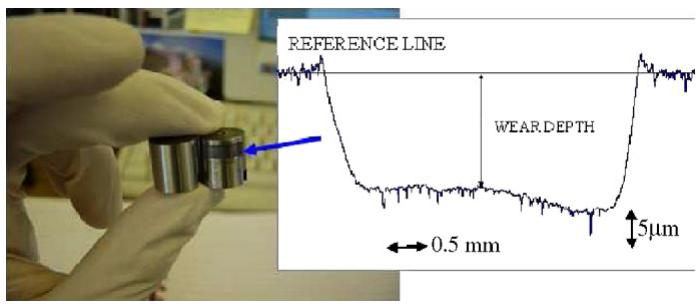  
Fig. 4.

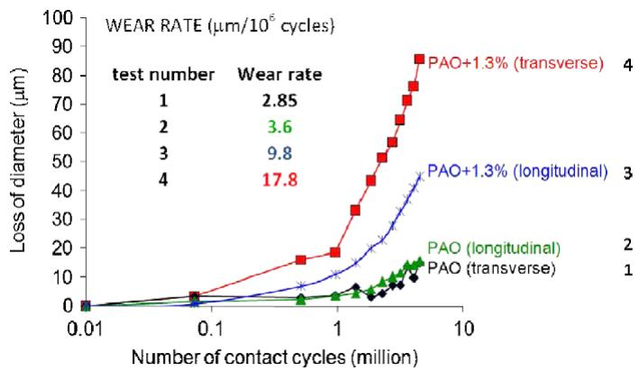  
Fig. 5.

Table 3  
Experimental conditions for roughness study
| Test number | Ra (μm) | Entrainment speed (m/s) | Tb (°C) | Viscosity (cP) | $h _ { 0 } \ \mathrm { ( n m ) }$ | λ' |
| --- | --- | --- | --- | --- | --- | --- |
| 5 | 185 | 3.05 | 76 | 5.47 | 73 | 0.4 |
| 6 | 195 | 2 | 99.7 | 3.39 | 44 | 0.22 |
| 7 | 265 | 2 | 99.7 | 3.39 | 44 | 0.16 |
| 8 | 400-610 | 3.05 | 76 | 5.47 | 73 | 0.12 |

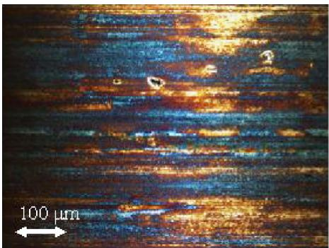  
Fig. 6.

Wear Curve, Loss of diameter vs. contact cycles  
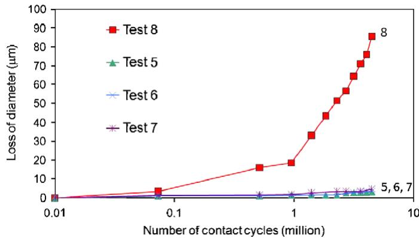  
Fig. 7.

approximately. A summary of the experimental condition is given in Table 3.

The outcome of the test is shown in Fig. 7 where the wear or loss of diameter for the test specimen is plotted against the number of cycles. It can be seen from Fig. 7 that little wear occurred for average roughness values smaller than 265 nm.

Fig. 8 shows optical micrographs of the roller surface where it can be seen that only test 8 showed severe micropitting erosion. Higher lambda values showed no or little wear even after the full duration of the test (4.5 million contact cycles or 5 h of test) but still exhibited micropits concentrated as isolated clusters on the surface of the roller.

Only the rollers tested at $\lambda ^ { \prime } = 0 . 1 2$ (test 8) exhibited both micropitting and associated severe wear.

## 4.3. Group I mineral oil—ZDDP concentration study

All the tests were carried out with six different concentrations of ZDDP and under predefined conditions of temperature, slideto-roll ratio, entrainment speed. A new set of rings and roller were used in each experiment. Each individual ring was uniquely identified and hand finished as described earlier. The longitudinal roughness was in the range of $R _ { \mathrm { a } } = 0 . 5 2 / 0 . 5 0 \mu \mathrm { m }$

The concentration of additives in each test is given in Table 4. All these tests had $( \Delta \nu / \bar { V } ) = 5 . 2 \% , \bar { V } = 3 . 0 5 \mathrm { ~ m ~ } s ^ { - 1 } , p _ { 0 } = 1 . 7 1 \mathrm { ~ G P a } ,$ Group I mineral oil, lubricant temperature $= 7 0 ^ { \circ } \mathrm { C } , R _ { \mathrm { a } } = 5 2 0 \mathrm { n m } .$

The outcome of the test is shown in Fig. 9 where the loss of diameter for the test roller is plotted against the number of cycles. It can be seen that for every concentration of ZDDP except zero, micropitting wear occurs. Nevertheless, the severity of this wear does not increase steadily with increasing concentration. Rather, a maximum occurs at a concentration of about 0.7 wt% or 0.05%P.

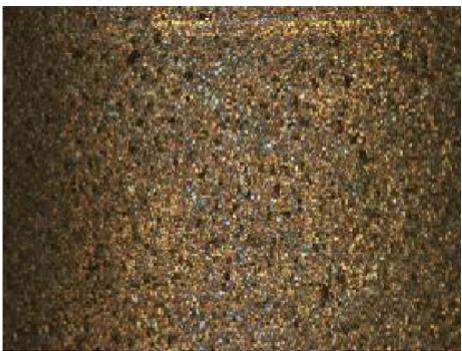

The steady wear rate (loss of diameter per million cycles, excluding the first 5 min of test) is plotted against the number of cycles in Fig. 11.

In order to evaluate the relative anti-wear properties of Group I mineral oil and various concentrations of ZDDP, a reciprocating wear test was performed with the same lubricants as had been used in the micropitting test. The reciprocating wear test was carried out using the ASTM standard D6079-97 [27] except that all the tests reported here were carried out at $8 0 \pm 2 ^ { \circ } { \mathsf { C } } _ { \cdot }$ . The results of these tests are shown in Fig. 10.

Fig. 11 shows optical micrographs of the micropitting test roller after 5 min and 4.5 h for Group I mineral oil with the different ZDDP concentrations.

It can be seen that the specimen shows a general micropitted appearance for concentrations of ZDDP above 0.2%. With no ZDDP added to the lubricant, Group I mineral oil, the same results as with pure PAO were found with no noticeable wear of the roller surface and no micropits over the roller surface. Nevertheless, the roller failed with the appearance of a crack on the wear track.

## 5. Discussion

## 5.1. Effect of geometry

By comparing the results between PAO and PAO+ZDDP it can be seen that under the same condition, PAO+ZDDP tends to generate an increased wear rate, as shown in Fig. 6. The results from this series of experiments are consistent with the previous work carried out by Benyajati et al. [24].

It was found that:

\- ZDDP as an anti-wear additive promotes micropitting.

\- A higher wear rate is found when the additive is present in the bulk lubricant.

The results obtained for PAO without any additive showed a strong correlation with previous studies. Considering the PAO+ZDDP test, a higher wear was obtained for the transversely finished specimen with the same roughness. This could be related, to some extent, to a higher pressure on the asperity crests. Nevertheless, the behaviour is essentially the same, with severe micropitting wear for the cases where ZDDP is present in the bulk lubricant.

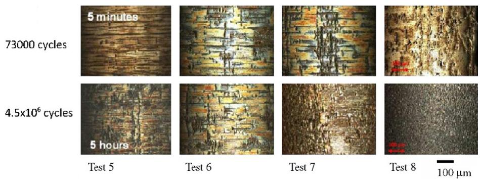  
Fig. 8.

Table 4 Experimental table for ZDDP concentration study
| Test number | wt% of additive | wt% of phosphorus |
| --- | --- | --- |
| 9 | 0.2 | 0.015 |
| 10 | 0.45 | 0.03 |
| 11 | 0.7 | 0.05 |
| 12 | 0.7 | 0.05 |
| 13 | 1 | 0.07 |
| 14 | 1.3 | 0.1 |
| 15 | 0 | 0 |

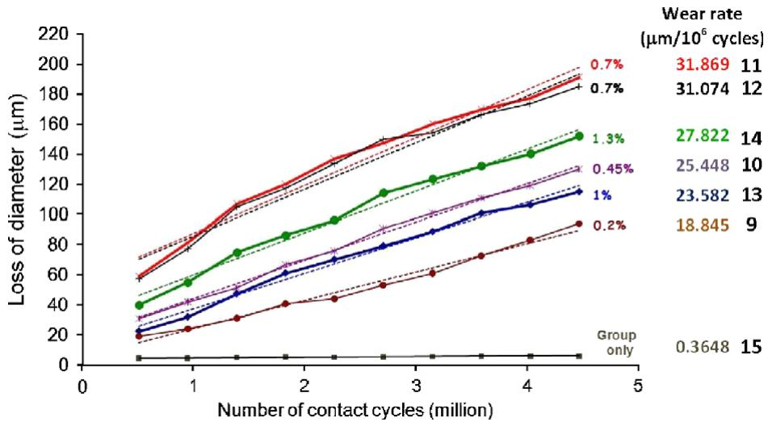  
Fig. 9.

## 5.2. Roughness study

In this study, we have neglected the roughness of the test roller and assumed that the contact condition can be characterised by l0, the ratio of the central film thickness (h ) to the centre-line average roughness (R ) of the ring. This differs from the common practice of including both surfaces in the computation of lambda. We chose to do this because the test roller itself is both smoother and softer than the ring and is therefore unlikely to control the development of surface damage. It will also be appreciated that the test roller surfaces containing micropitting damage cannot easily be characterised by stylus measurement.

It is generally accepted that a higher lambda value will cause the surfaces to interact less (EHL conditions) whereas lower lambda values will cause the counterfaces to interact more and the effect of fluid film lubrication will be less significant. According to Table 3, for the values of l0 of 0.16 and higher there was no significant wear even though some micropits were still found on the roller surface. For the lowest value of l0 (0.12), micropitting formation was accompanied by severe wear. Therefore, there is a very strong relationship between roughness/film thickness and wear/micropitting erosion.

## 5.3. Effect of ZDDP concentration

The reciprocating wear test was used to provide a comparison of the anti-wear properties of each lubricant, with or without ZDDP additive. Fig. 12 shows a comparison between the wear rate during the rolling/sliding micropitting test and the mild wear obtained with the reciprocating wear test.

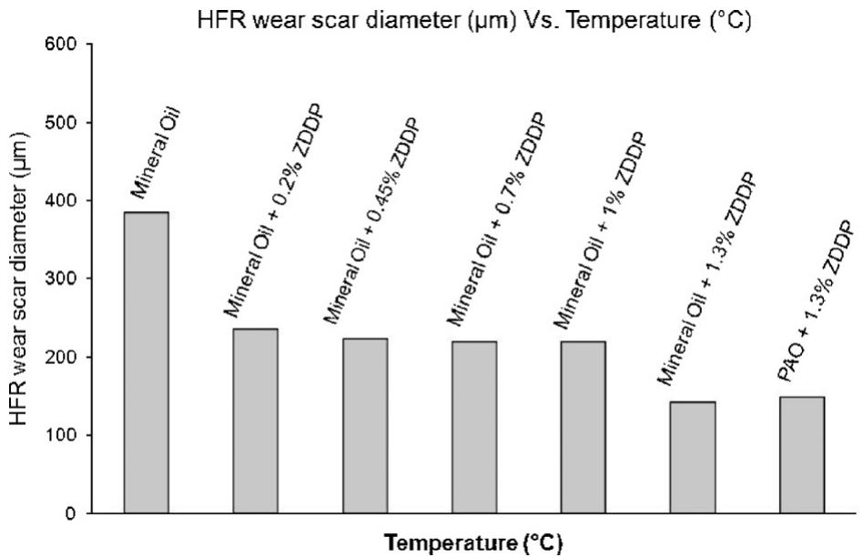  
Fig. 10.

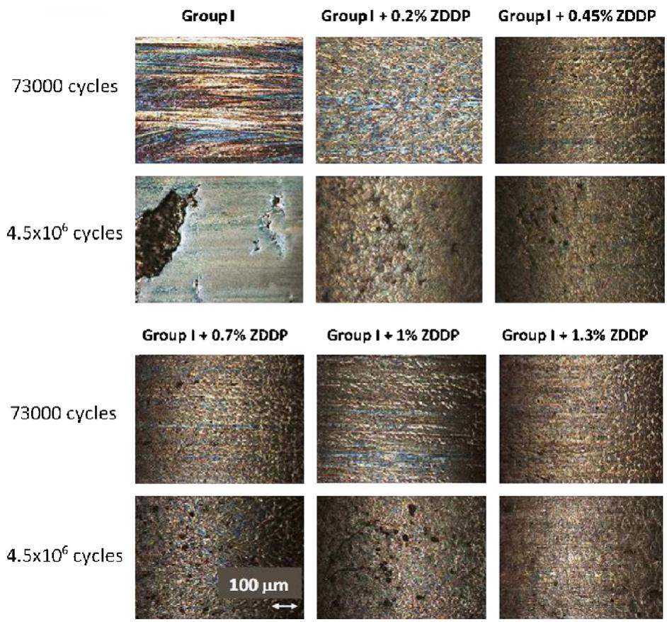  
Fig. 11.

It was found that there was a nearly inverse correlation between the micropitting wear in the disc machine test and the mild wear in the reciprocating sliding test. This was attributed to the tendency of anti-wear additives to prevent running-in of the rough surface.

Studies by Fujita and Spikes [26] suggest that the rate of ZDDP tribofilm formation increases with temperature and with an increase in phosphorus concentration. However, whereas a primary ZDDP showed monotonic increase of the thickness of the solid boundary film with the concentration of ZDDP in the base oil, a secondary ZDDP showed the highest boundary film thickness for an intermediate concentration.

This singular behaviour for the secondary ZDDP might explain why, in the present work, the micropitting wear was found to be

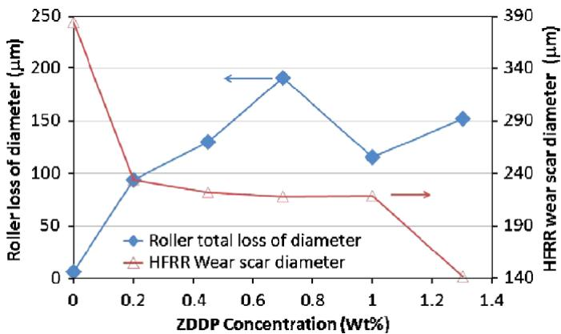  
Fig. 12.  
highest with an intermediate concentration (0.7 wt% ZDDP). The intermediate concentration has the highest rate of film formation and hence gives the greatest protection against sliding wear. (There is a shallow minimum in the sliding wear curve, Fig. 12, at this same concentration.) In the micropitting test, such wear is beneficial, because it leads to a smoothing of the rough counterface. This is confirmed by earlier roughness measurements on the rings [24]; for example the value of $R _ { \mathbf { a } }$ on the ring declined from 0.52 to 0.35 mm after 5 min with pure PAO base stock but only to 0.41 mm when a ZDDP solution was used.

## 6. Conclusions

\- The present study shows that ZDDP influences micropitting formation and that for concentrations as low as 0.2 wt% of a secondary ZDDP additive, significant micropitting erosion occurs. For a transverse finish, the level of micropitting wear was significantly higher than for a longitudinal finish. Nevertheless, the behaviour is essentially the same, with severe micropitting wear for the cases where ZDDP is present.

\- For values of l0 of 0.16 and greater, there was no significant wear even though some micropits were still found on the roller surface. For a value of l0 of 0.12, the micropitting formation was accompanied by severe wear. This suggests a very strong relationship between roughness, film thickness and micropitting wear.

\- It was found that there was a nearly inverse correlation between the micropitting damage in the disc machine test and the mild wear in the reciprocating sliding test. This was attributed to the tendency of anti-wear additives to prevent running-in of the rough surface. The maximum in micropitting wear rate at 0.7% might be related to earlier evidence that the film formation rate and the thickness of the deposited boundary layer are highest at this concentration.

## References

[1] Webster MN, Norbart CJ. An experimental investigation of micropitting using a roller disc machine. Tribol Trans 1995;38:883–93.

[2] Olver AV. Micropitting of gear teeth: design solutions. In: Proceedings of Aerotech’95, Birmingham, October 1995. London: Institute of Mechanical Engineering.

[3] Olver AV, Spikes HA, Macpherson PB. Wear in rolling contacts. Wear 1986;112:121–44.

[4] Way S, Pittsburgh E. Pitting due to rolling contact. J Appl Mech Trans ASME 1935;2:A49–58.

[5] Berthe D, Flamand L, Foucher D, Godet M. Micropitting in Hertzian contacts. J Lubr Technol Trans ASME 1980;102:478–89.

[6] Zhou RS, Cheng HS, Mura T. Micropitting in rolling and sliding contact under mixed lubrication. J Tribol 1989;111:605–13.

[7] Webster MN, Cardis AB. Gear oil micropitting evaluation. Technical paper 99FTM4, American Gear Manufacturers Association (AGMA); 1999.

[8] Graham RC. A study in rolling contact fatigue of hard steel operating under traction in line contact. PhD thesis, Imperial College, University of London; 1976.

[9] Brechot P, Cardis AB, Murphy WR, Theissen J. Micropitting resistant industrial gear oils with balanced performance. Ind Lubr Tribol 2000;52:125–36.

[10] Nakajima A. Effect of asperity interacting frequency on surface durability. In: International symposium on gearing and power transmissions, Tokyo, 1981 [paper b26].

[11] Nakajima A, Ichimaru K, Hirano F. Effects of combination of rolling direction and sliding direction on pitting of rollers. J JSLE 1983;4(4):93–8 [International edition].

[12] Winter H, Oster P. Influence of lubrication on pitting and micropitting resistance of gears. Gear Technol 1990;7(2):16–23.

[13] Hohn BR, Oster P, Emmert S. Micropitting in case-carburised gears—FZG micropitting test. VDI Ber 1996;1230:331–44.

[14] Bull SJ, Evans JT, Shaw BA, Hofmann DA. The effect of the white layer on micropitting and surface contact fatigue failure of nitrided gears. Proc ImechE, Part J 1999;213:305–13.

[15] Bower AF. The influence of crack face friction and trapped fluid on surface initiated rolling contact fatigue cracks. J Tribol Trans ASME 1988;110:704–11.

[16] Murakami Y, Kaneta M, Yatsuzuka H. Analysis of surface crack propagation in lubricated rolling contact. ASLE Trans 1985;28:60–8.

[17] Olver AV. Micropitting and asperity deformation. In: Proceedings of the tenth Leeds–Lyon symposium on tribology, Lyon, September 1983. p. 319–23.

[18] Evans HP, Snidle RW. Analysis of micro-elastohydrodynamic lubrication for engineering contacts. Tribol Int 1996;29(8):659–67.

[19] Patching MJ, Evans HP, Snidle RW. Micro-EHL analysis of ground and superfinished steel discs used to simulate gear tooth contacts. Tribol Trans 1996;39:595–602.

[20] Hooke CJ. The effect of roughness in EHL contacts. In: Proceedings of the 31st Leeds–Lyon symposium on tribology, 2005.

[21] Hooke CJ. Roughness in rolling–sliding elastohydrodynamic lubricated contacts. Proc Inst Mech Eng, Part J: J Eng Tribol 2006;220(3).

[22] Olver AV, Laine´ E, Hili J, Dini D. Application of FFT harmonic surface roughness model to the development of micropitting damage in elastohydrodynamic contacts. Trans Am Soc Mech Eng J Tribol, May 2007, submitted for publication.

[23] Olver AV, Dini D. Roughness in lubricated rolling contact: the dry contact limit. P I Mech Eng J-J Eng 2007;221:787–91.

[24] Benyajati C, Olver AV. The effect of a ZnDTP anti-wear additive on micropitting resistance of carburised steel rollers. AGMA technical paper 04FTM06. Alexandria, VA: American Gear Manufacturers Association; 2004. p. 1–10.

[25] Olver AV. Testing transmission lubricants: the importance of thermal response. Proc Inst Mech Eng, Part G, J Aerosp Eng 1991;206(G1):35–44.

[26] Fujita H, Spikes HA. Study of zinc dialkyldithiophosphate anti-wear film formation and removal process. Part I: experimental. Tribol Trans 2005;48:558–66.

[27] ASTM Standard D6079-97. Standard test method for evaluating lubricity of diesel fuels by the high-frequency reciprocating rig (HFRR). West Conshohocken, PA: American Society for Testing and Materials; 1997.
