## Tribology Transactions

Publication details, including instructions for authors and subscription information: http://www.tandfonline.com/loi/utrb20

# An Experimental Investigation of Micropitting Using a Roller Disk Machine

M. N. Webster ª & C. J. J. Norbart a

a Mobil Research & Development Corporation , Princeton, New Jersey, 08543 Published online: 25 Mar 2008.

## PLEASE SCROLL DOWN FOR ARTICLE

Taylor & Francis makes every effort to ensure the accuracy of all the information (the "Content") contained in the publications on our platform. However, Taylor & Francis, our agents, and our licensors make no representations or warranties whatsoever as to the accuracy, completeness, or suitability for any purpose of the Content. Any opinions and views expressed in this publication are the opinions and views of the authors, and are not the views of or endorsed by Taylor & Francis. The accuracy of the Content should not be relied upon and should be independently verified with primary sources of information. Taylor and Francis shall not be liable for any losses, actions, claims, proceedings, demands, costs, expenses, damages, and other liabilities whatsoever or howsoever caused arising directly or indirectly in connection with, in relation to or arising out of the use of the Content.

This article may be used for research, teaching, and private study purposes. Any substantial or systematic reproduction, redistribution, reselling, loan, sub-licensing, systematic supply, or distribution in any form to anyone is expressly forbidden. Terms & Conditions of access and use can be found at http:// www.tandfonline.com/page/terms-and-conditions

# An Experimental Investigation of Micropitting Using a Roller Disk Machine©

M. N. WEBSTER (Member, STLE) and C. J· J. NORBART Mobil Research & Development Corporation Princeton, New Jersey 08543

Micropitting is a microscopic form of progressive fatigue wear. It is most often associated with case hardened gears although such failures have also been reported for rolling element bearings. This paper reviews the micropitting phenomenon and reports the results of an experimental study conducted using a roller disk machine. Analysis of the micropitted test specimens confirmed that the roller disk machine experiments faithfully reproduce the failure mode as found on full size gears. The effect of various operating parameters was investigated. The results show that increasing load, decreasing specific film thickness and maintaining negative relative sliding all increased the rate of micropitting wear. The authors also found that micropitting is almost completely eliminated at a very low, but non-zero, slide-toroll ratio.

## KEY WORDS

Rolling Contact Fatigue, Gears, Gear Lubricants, Elastohydrodynamic Lubrication, Surface Roughness, Wear/Failure Testing Devices

## INTRODUCTION

Micropitting can be defined as an unexpectedly high uniform rate of rolling contact fatigue wear. It occurs in moderately and heavily loaded rolling/sliding EHL contacts typical of those formed between meshing gear teeth and between the rolling elements and raceways in rolling element bearings.

Micropitting is most frequently associated with case hardened gears (1)-(5). However, a similar failure mode has been identified in rolling element bearings (6)-(8). It is characterized by the formation of numerous micro-scale cracks that initiate at, or very close to, the surface. These subsequently form shallow pits with characteristic depths in the range 2.5-25 μm. These micro pits should not be confused with the much larger pits normally associated with the rolling contact fatigue failure of gear and bearing surfaces.

Although each micro pit is small, the total surface area damaged by micropitting can be large. In more severe cases many thousands of micro pits coalesce to produce an almost continuous damaged zone. This gives a characteristic gray matte appearance to the surface, caused by the scattered reflectance of light from the resulting fracture surfaces, and has given rise to the alternative terms "frosting" and “gray staining." Other names such as "peeling" and “superficial spalling" have been used to describe this type of failure in rolling element bearings. In the AGMA standard 110.04 micropitting is characterized as a type of scoring (9). However, there appears to be little evidence to suggest that it is related to the form of adhesive or scuffing wear that is commonly referred to as scoring.

Although micropitting is sometimes considered a normal running-in wear process most researchers agree that it represents a potentially serious failure mode. Ariura et al. (4) suggest that at best it causes significant modification of gear teeth profiles and at worst can precipitate other surface failures such as spalling. AGMA 110.04 (9) cites micropitting as often being a precursor to scoring failures. Shotter (1) goes as far as to suggest that micropitting may have been a contributing factor to many of the observed surface related gear tooth failure modes including spalling and scuffing.

Previous research in micropitting has been on two fronts. First, the development of laboratory scale tests to reproduce micropitting under controlled conditions in order to study the influence of operating variables, materials and lubricants. Second, a theoretical approach focused on studying the micro scale stresses that are generated during and after the asperity interactions that can take place within EHL contacts.

Experiments reported in the literature have been conducted using both disk machines and gear test machines. However, the majority of the work has favored the use of either twin or three-disk machine apparatus (4), (7), (8), (10)-(17).

Although there is some disparity between the results from individual investigations there are some common conclusions that can be drawn. All investigators agree that increasing the specific film thickness decreases the severity of micropitting damage. However, Berthe et al. (12) still found micropitting at a specific film thickness of 1.6 and Tokuda (17) reports that. micropiuing occurs even at values as high as 6.4. Flamand et al. (11) and Olver et al. (15) conclude that the degree of sliding does not significantly influence the rate of micropitting wear. Both Tokuda et al. (17) and Olver et al. (15) found that micropitting is accelerated if there is a difference in hardness between the contacting surfaces. Berthe et. al. (72) tested a variety of different materials and found scautered micropiuing on both through hardened and nitrided disks compared with severe micropitting that occurred on case-hardened disks.

Similar results have been obtained by those researchers using gear tests (2), (3), (4). Additionally, Winter and Weiss (2) found that flame and induction hardened steels, free from austenite, were more prone to micropitting as the hardness was reduced. However, they found the reverse was true for carburized gears: as the amount of retained austenite was increased, i.e., reduced surface hardness, the degree of micropitting was reduced. Ariura et al. (4) found that polishing of the test gear surfaces completely eliminated micropitting. During his investigation into the failure of coarse, pitched, case-hardened gears, Shipley (18) observed that large arrow headed fatigue pits initiated from micropitted areas in the dedendum of the diving pinion.

Some limited work has been reported on the effect of lubricant composition. Shotter () speculates that lubricant additives may have a significant impact on micropitting by modifying the asperity scale surface traction forces. From their experiments Winter and Oster (3) conclude that additives can play a very significant role in determining micropitting performance, although the mechanism is not discussed. They found that. a base oil doped with a ZDTP additive gave significantly worse performance than the same base oil doped with a sulfur-phosphorus EP additive package. These results appear to form the basis for the reference oils used in the FZG micropitting gear test procedure as described by Schönnenbeck (19). Tokuda et al. (17) conducted an extensive investigation into the micropitting performance of a varicty of both synthetic and mineral oil based lubricants. However, no firm conclusions are presented identifying the effect of lubricant composition. Ariura et al. (4) found that an SAE 90 lubricant containing sulfur-phosphorus based extreme pressure additives gave significantly poorer micropitting performance than both SAE 20 and SAE 30 oils containing no such additives. This is despite the increase in film thickness obtained due to the higher viscosity of the SAE 90 lubricant.

Theoretical work has focused on identifying the stress field that is responsible for generating and propagating the surface cracks. Berthe et al. (12) argue that micropitting and spalling fatigue are driven by different stress fields. They claim that micropitting depends on the local stresses generated during asperity interactions whilst spalling fatigue is related to the macro scale stresses associated with the Hertzian pressure distribution. An alternative driving mechanism relying on hydraulic pressurization of the crack by the lubricant was initially proposed by Way (20). This mechanism was further quantified by Hanson and Keer (21). They argue that on the slower moving surface tensile stresses open the mouth of the crack. Lubricant subsequently flows into the crack and can transmit the high contact pressures to the crack tip as the crack moves through the EHL loaded zone. This mechanism would also expose the crack tip to the lubricant additives where they may affect the crack propagation process. However, Olver (22) points out that this mechanism does not explain the fact that cracks on the faster surface also oppose the surface traction force since in this case the crack tip is subjected to the compressive stresses before the crack mouth and that the traction force acts to close the crack mouth as it enters the EHL loaded zone. Using a slip line field approach he predicts the existence of significant residual tensile stresses that result from the loading of a model asperity above the yield limit and subsequent unloading. Repeated stress cycles would then serve to propagate cracks within the confines of this residual stress distribution. If this mechanism is correct, the orientation of the cracks would be governed to some extent by the magnitude and direction of the surface traction forces generated during asperity interactions.

The purpose of the authors' work was to reproduce the micropitting phenomenon under controlled laboratory conditions and to study the influence of lubricant composition and physical properties on the rate of micropitting damage. Here, the authors report on the initial stages of this work, the development of a test method and some of the preliminary results.

## EXPERIMENTAL APPARATUS AND TEST SAMPLES

The test machine chosen for this study was a Roller Disk Machine (RDM). Figure 1 shows the general layout of the RDM test head. The test specimens were two roller-disks having identical outside diameters. Figure 2 shows the principal dimensions of the roller-disk specimens and tabulates the material and heat treatment specifications. Following the work of Olver (15), the flat profile disks were heat treated to a Rockwell C hardness value two points less than the chamfered disk. This had two purposes, first to promote micropitting on the flat rather than the chamfered disk and second to réduce any scatter associated with specimen to specimen variation of hardness. The value of two points hardness difference was based on an ‘s’-shaped hardncss difference vs. micropitting curve reported by Olver (15) in which the sensitivity of the rate of micropitting wear to changes in hardness difference leveled off once a hardness difference of approximately 2 Rockwell C was reached.

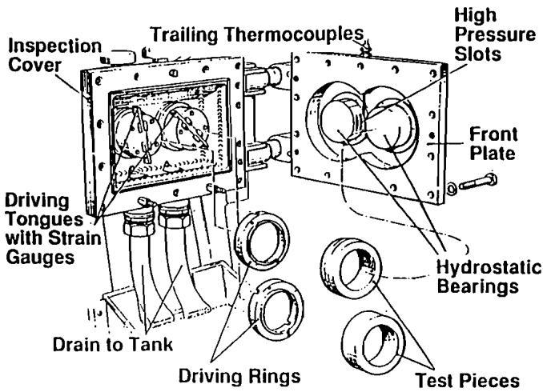  
Fig. 1—Diagram of the roller disk machine (RDM) used for micropitting experiments.

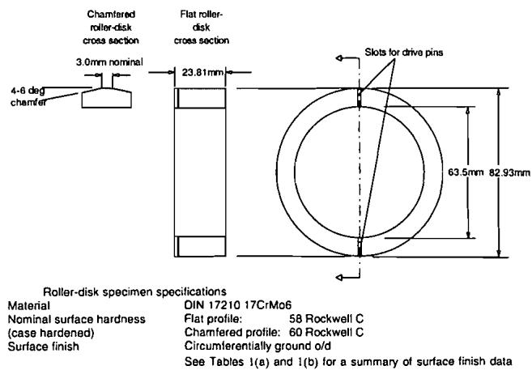  
Fig. 2—Geometry, surface finish, material properties and specifications of the test roller disks used for micropitting experiments.

Tables 1 (a) and 1 (b) contain summaries of the surface finish results obtained from both transverse and circumferential surface profile measurements. The calculation of specific film thickness described later is based on the individual transverse RMS $( R _ { q } )$ roughness values for each pair of disk specimens.

The two roller-disks are loaded against each other using a hydraulic piston that is part of one of the hydrostatic bearing supports. The applied load is monitored using an electronic pressure gauge and controlled using a variable electronic valve. The roller-disks are driven via a drive tongue/drive ring assembly as shown in Fig. 1. The drive tongues are strain gauged and have been calibrated to provide torque readings for each roller-disk. Each roller-disk is independently driven via two electric motors. Thus, the possible range of slide-toroll ratios is infnitely variable. Therocouples are positioned at different locations within the test lubricant system. For these experiments, a trailing thermocouple placed in the inlet region of the EHL contact formed between the roller-disk specimens was used to monitor and control temperature. The lubricant was filtered at two locations. A 20μm filter is used upstream of the nozzle that supplies lubricant to the EHL contact formed between the two disks and a 3μm flter is used upstream of the variable electronic control valve that supplies lubricant to the hydrostatic bearings.

The results reported here were obtained using two different ISO viscosity grade EP gear oils using the same additive package. Table 2 contains the relevant physical properties of the lubricants used.

## EVALUATION OF MICROPITTING

To monitor the progression of micropitting it was necessary to stop the test at predetermined intervals to carry out wear measurements. Three methods of evaluation were used The first was a rating of the percentage of the total contact area that exhibited micropitting. During initial tests this evaluation was estimated from a visual inspection. In later tests, a more rigorous method was used based on eight circumferentially distributed transverse profiles taken using a surface profile measuring instrument. The second and third parameters used were calculated total wear volume and average wear depth. These were calculated directly from the same transverse surface profiles. By design most of the experiments produced micropitting only on the flat profile specimen with no measurable wear occurring on the chamfered profile disk Thus, the authors' assessment of micropitting was confned to monitoring its progress on the flat profile disk. The one exception to this occurred when the authors changed the direction ol the relative sliding and is discussed later.

TABLE 1(a)—SUMMARY OF SPECIMEN SURFACE FINISH CHARACTERISTICS BASED ON FOUR TRANSVERSE SURFACE PROFILE MEASUREMENTS USING 0.25 mm CUT-OFF LENGTH TAKEN ON EACH OF THE DISK SPECIMENS TESTED
| SURFACE ROUGHNESSPARAMETER | $R _ { \alpha }$ CLA | FLAT DISKS · $R _ { q }$ RMS | FLAT DISKS · $R _ { s k }$ SKEWNESS | FLAT DISKS · $R _ { k u }$ KURTOSIS | CHAMFERED DISKS · $R _ { q }$ CLA | CHAMFERED DISKS · $R _ { q }$ RMS | CHAMFERED DISKS · $R _ { s k }$ SKEWNESS | CHAMFERED DISKS · $R _ { k u }$ KURTOSIS |
| --- | --- | --- | --- | --- | --- | --- | --- | --- |
| Mean | 0.431 | 0.543 | -0.200 | 3.229 | 0.519 | 0.651 | -0.250 | 3.093 |
| Standard Deviation | 0.085 | 0.107 | 0.124 | 0.190 | 0.054 | 0.070 | 0.129 | 0.198 |
| DATA FOR POLISHED DISKS USED IN TEST 7 | DATA FOR POLISHED DISKS USED IN TEST 7 | DATA FOR POLISHED DISKS USED IN TEST 7 | DATA FOR POLISHED DISKS USED IN TEST 7 | DATA FOR POLISHED DISKS USED IN TEST 7 | DATA FOR POLISHED DISKS USED IN TEST 7 | DATA FOR POLISHED DISKS USED IN TEST 7 | DATA FOR POLISHED DISKS USED IN TEST 7 | DATA FOR POLISHED DISKS USED IN TEST 7 |
| Mean of Four Readings | 0.224 | 0.317 | -1.2 | 7.4 | 0.186 | 0.258 | -1.1 | 6.8 |

TABLE 1 (b)—SUMMARY OF SPECIMEN SURFACE FINISH CHARACTERISTICS BASED ON FOUR CIRCUMFERENTIAL SURFACE PROFILE MEASUREMENTS USING 0.8 mm CUT-OFF TAKEN ON A SAMPLE OF EIGHT OF THE FLAT AND SEVEN OF THE CHAMFERED DISKS TESTED
| SURFACE ROUGHNESSPARAMETER | $R _ { \mathfrak { a } }$ CLA | FLAT DISKS · $R _ { \mathcal { q } }$ RMS | FLAT DISKS · $R _ { s k }$ SKEWNESS | FLAT DISKS · $R _ { k \mu }$ KURTOSIS | CHAMFERED DISKS · $R _ { a }$ CLA | CHAMFERED DISKS · $R _ { q }$ RMS | CHAMFERED DISKS · $R _ { s k }$ SKEWNESS | CHAMFERED DISKS · $R _ { h u }$ KURTOSIS |
| --- | --- | --- | --- | --- | --- | --- | --- | --- |
| Mean | 0.253 | 0.324 | 0.038 | 4.063 | 0.276 | 0.352 | -0.129 | 3.857 |
| Standard Deviation | 0.055 | 0.076 | 0.213 | 1.144 | 0.040 | 0.054 | 0.229 | 0.702 |
| DATA FOR POLISHED DISKS USED IN TEST 7 | DATA FOR POLISHED DISKS USED IN TEST 7 | DATA FOR POLISHED DISKS USED IN TEST 7 | DATA FOR POLISHED DISKS USED IN TEST 7 | DATA FOR POLISHED DISKS USED IN TEST 7 | DATA FOR POLISHED DISKS USED IN TEST 7 | DATA FOR POLISHED DISKS USED IN TEST 7 | DATA FOR POLISHED DISKS USED IN TEST 7 | DATA FOR POLISHED DISKS USED IN TEST 7 |
| Mean of Four Readings | 0.107 | 0.149 | 0.6 | 8.4 | 0.057 | 0.081 | 0.6 | 5.2 |

**TABLE 2—LIST OF LUBRICANTS USED AND THEIR PROPERTIES**

| 항목 | 값1 | 값2 |
| --- | --- | --- |
| LUBRICANTNUMBER | 1 | 2 |
| KINEMATICVIsCosITY(cS) · 40℃ | 99.1 | 424.7 |
| KINEMATICVIsCosITY(cS) · 100℃ | 11.3 | 30.2 |
| SPECIFICGRAVITY AT23.9℃ | 0.844 | 0.901 |
| BASESTOCKTYPE | Mineral | Mineral |
| ADDITIVE SYSTEM | SP EP Gear Oil | S-P EP Gear Oil |
| TOTAL. SULFURCONTENT(Wt.%) | 1.38 | 1.55 |
| TOTALPHOSPHORUSCONTENT(Wt.%) | 0.32 | 0.32 |

The wear volume was calculated using a multi-reference line option available on thesurface profle instrument. This allows a mean line to be fitted through a surface profile stored in a computer, but omitting a region selected by the operator using the computer's screen cursors. Referring to the profile shown in Fig. 3, the region omitted in the present case was the wear track on the flat profile disk. The resulting mean line then provides a reference that is not affected by the wear track. The roughness average value, $R _ { \mu } ,$ can be sub sequently calculated using this as the reference line. It is easy to show that if one assumes that the major contribution to $R _ { \alpha }$ comes from the wear track portion of the profile cross section then the cross sectional wear area, depicted as the shaded region in Fig. 3, can be approximated by the $R _ { \mathfrak { a } }$ value multiplied by the profile length L.

Referring to Fig. 3, one profile is:

$$
R _ { u } = \frac { 1 } { L } \int _ { \ 0 } ^ { L } |  z | \ d x\tag{[1]}
$$

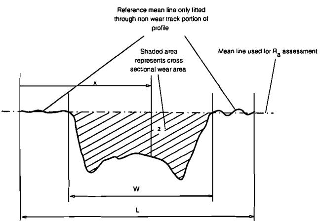  
Fig. 3—Features of the transverse wear profiles used for the assessment of wear volume and average wear track depth.

If the traverse length L is identical for all profiles the authors can use the average $R _ { a }$ value, $R _ { a ( \mathrm { a v c } ) }$ , calculated from all the measurements. The average cross sectional wear area, Vxsection, represented by the shaded area in Fig. 3, can then be approximated by:

$$
V _ { x \mathrm { s c c t i o n } } = R _ { a \left( \mathrm { a v c } \right) } I .\tag{[2]}
$$

The average wear track depth, $W _ { \mathrm { d e p u l } }$ , is then simply this cross sectional area divided by the wear track width W:

$$
W _ { \mathrm { d c p t h } } = \frac { R _ { a ( \mathrm { a v c ) } } { \cal L } } { W }\tag{[3]}
$$

The total wear volume, $W _ { \mathrm { v o l u m e } }$ , around the disk circumference can also be calculated:

$$
W _ { \mathrm { v o l u m c } } \ = \ \pi D ( \ R _ { a ( \mathrm { a v c } ) } \ : I . )\tag{[4]}
$$

where D is the diameter of the disk.

There is a small error associated with this measurement. The $R _ { a }$ value includes a contribution from the surface finish on either side of the wear track. However, this value is small compared with the total value once a significant amount of wear has taken place. To reduce this effect the authors have referenced the $R _ { a }$ results back to measurements taken at the beginning of each test.

## RESULTS

Results have been obtained over a range of conditions. In the following, the slide-to-roll ratio is defined as the sliding speed divided by the average entraining velocity:

$$
{ \mathrm { S l i d e - t o - r o l l ~ r a t i o ~ } } = { \frac { 2 ( u _ { 1 } - u _ { 2 } ) } { ( u _ { 1 } + u _ { 2 } ) } }\tag{[5]}
$$

where $\mathbf { \boldsymbol { \mathscr { u } } } _ { \mathrm { 1 } }$ and u2 are the surface velocities of the two-disk specimens.

The EHL film thickness has been calculated using the method proposed by Cheng (23). The lubricant parameters required for this calculation were obtained from direct elastohydrodynamic lubrication (EHL) film thickness measurements using optical interferometry in the authors' laboratory. The specific film thickness (λ) is defined as the ratio of the central EHL film thickness (h) to combined surface roughness:

$$
\lambda = \frac { h } { R _ { q } }\tag{[6]}
$$

where $R _ { q }$ is the combined root mean square surface finish as defined below:

$$
R _ { q } = \sqrt { R _ { q 1 } + R _ { q 2 } }\tag{[7]}
$$

$R _ { q 1 }$ and $R _ { a 2 }$ correspond to the individual values obtained for the flat and chamfered profile disks. The roughness values were based on the average of four transverse profiles taken before testing using the surface profile instrument using a cut-off length of 0.25mm. The specific film thickness data given here is thus based on the measurement of individual specimen surface finish rather than on nominal values.

Following some initial experiments a series of full length tests was conducted. Details of the operating variables, specimen parameters and summary test results are given in Table 3. A negative value for slide-to-roll corresponds to the case where the flat profile roller-disk is running at lower RPM than the chamfered profile roller-disk. Unless otherwise stated the results reported here were obtained using a negative slide-to-roll ratio. Figure 4 shows the progression of measured average wear track depth for experiments in which the calculated initial specific film thickness was varied between 0.4 to 5.62.

The different specific film thickness values were obtained by either varying the lubricant viscosity grade or the test temperature. However, the highest value of 5.62 was obtained by modifying the ground surface finish. In this case both the roller disk specimens were lightly polished using fine abrasive paper which resulted in a measured combined roughness of 0.409μm $R _ { q } ,$ a little less than half the typical values for the other ground finish specimens.

In Fig. 4 the results obtained for the ground finish specimens show an almost random response to specific flm thickness. The highest specific film thickness test for the ground roller-disks resulted in the second highest wear depth. In contrast, the lightly polished disks did not exhibit any micropitting wear. Under the reduced load corresponding to a Hertzian pressure of 1.8 GPa, and lower slide-to-roll ratio the degree of micropitting was significantly less than obtained under the conditions used for the rest of the tests on ground roller disks.

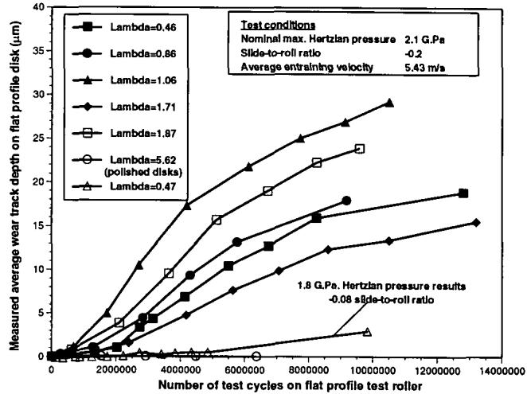  
Fig. 4—Summary of measured average wear depth results obtained for different specific film thickness conditions during initial constant load tests.

A number of the roller disk specimens were studied in detail using both optical and scanning electron microscopy. In addition selected specimens were sectioned and polished to investigate the morphology of the pits and cracks formed as a consequence of micropitting. Nearly all of the damage occurred on the slow speed flat profile roller disk. Often the original machining marks remained present on the faster moving chamfered profile roller disk, even when considerable wear had taken place on the other roller disk. This may be attributed in part to the higher hardness of the chamfered profile specimen, 60 vs. 58 Rockwell C. Figure 5 shows an SEM view of the micropitted surface formed on the flat profile specimen from Test 4. This reveals a large number of transversely oriented surface cracks and associated shallow pits. Figure 6 is an SEM photograph of a sectioned piece cut from the flat profile specimen used for Test 1. Arrows indicate the direction of rolling and of the surface traction force applied to the surface from the relative sliding between the two roller disks. The cracks are aligned at a shallow angle to the surface such that their direction of propagation opposes the applied traction force on the surface. Figures 5 and 6 closely resemble pictures published by other authors who have characterized the failure as micropitting (1), (2), (7), (8), (17). In particular Tokuda et al. (7) show that the subsurface cracks are similarly oriented to the surface and applied traction forces asis shown here in Fig. 6. Close examination of sectioned specimens confirmed that the small number ofcracks generated on the chamfered roller disks also had the same orientation to thesurface traction force.

**TABLE 3SUMMARY DATA FOR CONSTANT LOAD TESTS**

| TESTNUMBER | LUBRICANT | TEMPERATURE(°C) | HERTZPRESSURE(GPa) | CHAMFERED DISKLAND WIDTH $( 1 0 ^ { - 3 } \mathfrak { m } )$ | SLIDE-ROLLRATIO | COMBINED $R _ { q }$ (μm) | SPECIFIC FILMTHICKNESS | END TESTCYCLES $( { \bf l } 0 ^ { 6 } { \bf C y c l e s } )$ | END TESTWEAR DEPTH(μm) | END TESTWEAR VOLUME(mm³) |
| --- | --- | --- | --- | --- | --- | --- | --- | --- | --- | --- |
| 1 | 1 | 92 | 1.80 | 4.19 | -0.08 | 0.715 | 0.47 | 9.83 | 2.87 | 3.47 |
| 2 | 1 | 88 | 2.11 | 2.52 | -0.2 | 0.772 | 0.46 | 12.85 | 18.82 | 15.78 |
| 3 | 1 | 63 | 2.09 | 3.01 | -0.2 | 0.789 | 0.86 | 9.18 | 17.87 | 17.96 |
| 4 | 1 | 81 | 2.11 | 2.87 | -0.2 | 0.849 | 1.06 | 10.54 | 29.19 | 29.65 |
| 5 | 1 | 75 | 2.10 | 2.74 | -0.2 | 0.766 | 1.71 | 13.21 | 15.52 | 14.87 |
| 6 | 2 | 73 | 2.08 | 3.14 | -0.2 | 0.918 | 1.87 | 9.57 | 23.86 | 26.17 |
| 7 | 2 | 65 | 2.09 | 3.19 | -0.2 | 0.409 | 5.62 | 6.37 | 0.00 | 0.00 |

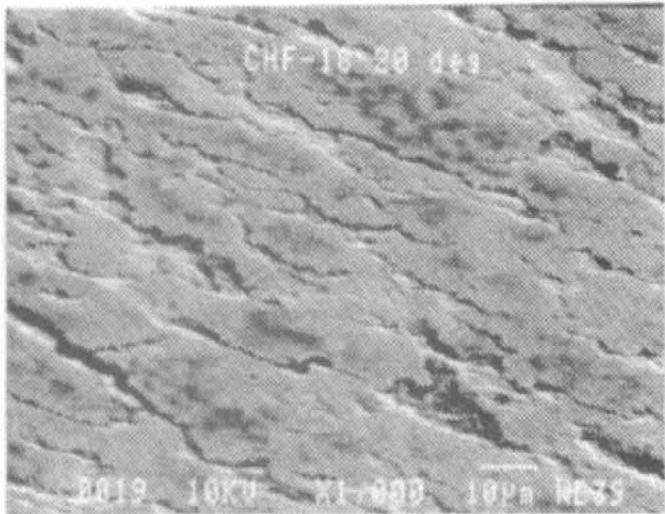  
Fig. 5—SEM photograph taken at 20C to the surface of the flat profile test disk used in Test 4 showing a typical area of micropitting damage.

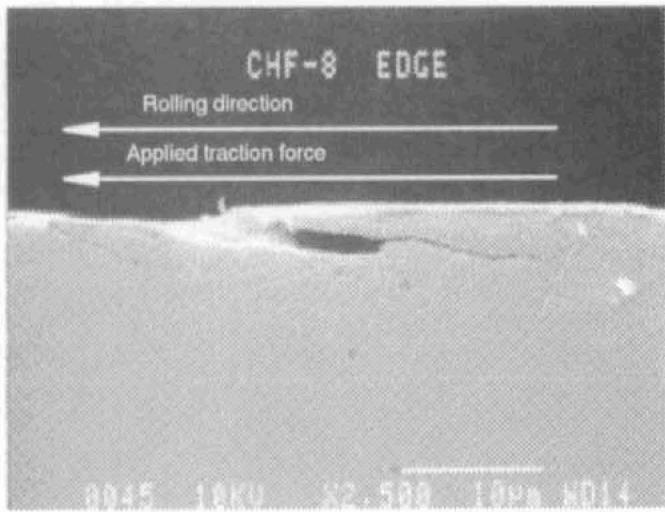  
Fig. 6—SEM photograph showing the size and orientation of the subsurface cracks formed on the flat profile test disk during the micropitting process from Test 1.

Following some further experimentation a variable load stage test has beendeveloped that achieves improved repeatability over the early single load experiments.In this test, the load is increased in six equal increments starting at a load that results in a maximum Hertzian pressure of 1.0 GPa and finishing at 2.0 GPa. The load required to obtain the maximum Hertzian pressure for each load stage was calculated for each pair of disk specimens taking into account any variation in the width of the flat on the chamfered profile disk that forms the contact between it and the flat profile disk. Similarly the specific film thickness was controlled for each specimen by measuring the surface finish of eachtest specimen and making small adjustments to the temperature to obtain the predetermined values. The temperature used for this was that measured at the EHL contact inlet. Table 4 summarizes the maximumHertzianpressure andspecific film thickness for each load stage. The test duration at each load was 20 hours at which point the degree of micropitting was assessed in terms of percentage area, wear volume loss and average wear track depth. This allowed the progression of micropitting to be characterized over the length of the test. In many aspects this procedure is similar to the first load stage part of the FVA micropitting procedure. Table 5 summarizes the test conditions and results for the series of variable load stage experiments reported here.

The results for Test 17 appear to be inconsistent with the main bulk of the results under identical conditions. It was subsequentlv discovered that the applied load had been erroneously calculated and resulted inmaximum Hertzian pressures 2.5% lower than the target values. Also, there is a possibility that some lubricantcarry over from a previous test has influenced this result, therefore Test17 results will not be included in subsequent figures.

## DISCUSSION

Figures 7-9 compare the detailed variable load results obtained for the two different viscosity grade lubricants in terms of the three parameters used to characterize thedegreeof micropitting. The corresponding end of testspecific film thickness values were 0.92 for the ISO 100 lubricant and 2.31 for the ISO 460 lubricant.

Comparing the wear track depth results shown in Fig. 9 with those obtainedin the earlier constant load experiments shown in Fig. 4, the authors observed that the initial rate of micropitting was low but increased at the higher load stages. In contrast, during the constant load experiments the micropitting wear rate reduced a little as the test progressed. These results confirm that micropitting increases with increasing load.

TABLE 4—SUMMARY OF TESTCONDITIONS FOR VARIABLE LOAD STAGETESTS
| LOAD STAGE | MAX. HERTZIANCONTACT PRESSURE(G.Pa) | LUBRICANT 1SPECIFIC FILMTHICKNESS | LUBRICANT 2SPECIFIC FILMTHICKNESS |
| --- | --- | --- | --- |
| 1 | 1.0 | 1.07 | 2.69 |
| 2 | 1.2 | 1,03 | 2.59 |
| 3 | 1.4 | 0.99 | 2.50 |
| 4 | 1.6 | 0.96 | 2.43 |
| 5 | 1.8 | 0.94 | 2.37 |
| 6 | 2.0 | 0.92 | 2.31 |

**TABLE 5—SUMMARY DATA FOR VARIABLE LOAD STAGE TESTS**

| TESTNUMBER | LUBRICANT | TEMPERATURE(°C) | CHAMFERED DISKLAND WIDTH(10-3m) | FLATPROFILEDISK RPM | FLAT PROFILE DISKCYCLES/LOAD STAGE(10º cycles) | SLIDE-ROLLRATIO | COMBINED Rq(μm) | END TESTSPECIFIC FILMTHICKNESS | END TESTMICROPITTING% AREA | END TESTWEAR DEPTH(μm) | END TEST WEARVOLUME(mm³) |
| --- | --- | --- | --- | --- | --- | --- | --- | --- | --- | --- | --- |
| 17 | 1 | 67 | 3.01 | 1225 | 1.47 | -0.2 | 0.742 | 0.92 | 61.5 | 4.450 | 3.660 |
| 22 | 1 | 66 | 2.94 | 1225 | 1.47 | -0.2 | 0.791 | 0.92 | 100 | 10.026 | 7.671 |
| 23 | 1 | 62 | 3.22 | 1500 | 1.80 | 0.2 | 0.886 | 0.92 | 51 | 3.090 | 2.590 |
| 24 | 1 | 63 | 3.14 | 1225 | 1.47 | -0.2 | 0.91 | 0.92 | 100 | 18.920 | 15.470 |
| 27 | 2 | 60 | 3.17 | 1225 | 1.47 | -0.2 | 1.02 | 2.31 | 100 | 6.220 | 5.130 |
| 29 | 一 | 65 | 3.17 | 1356 | 1.63 | -0.0095 | 0.7736 | 0.92 | 23.75 | -0.874 | -0.112 |
| 32 | 1 | 62 | 3.52 | 1300 | 1.56 | -0.0917 | 0.871 | 0.92 | 100 | 8.170 | 7.480 |
|  |  |  |  |  |  |  |  |  |  |  |  |

In terms of the percentage of the micropitted area shown in Fig. 7, there was no significant improvement associated with the higher specific film thickness results. In all three cases the entire contact area had some indication of micropitting wear by the end of the test. However, in terms of both wear volume, shown in Fig. 8, and average wear track depth shown in Fig. 9, the amount of wear at the higher specific film thickness was less than that obtained in either of the two lower specific film thickness tests. These results are consistent with those reported by other researchers (4), (12), (17).

Figures 10–12 show the effect of slide-to-roll ratio on micropitting. The results cover slide-to-roll ratios between + 0.2 to – 0.2 at constant entraining velocity and specific film thickness. Under all of the negative slide-to-roll ratio conditions the authors found that all of the micropitting wear was confined to the flat profile roller disk, with only a very minor modification to the surface finish of the harder chamfered roller disk. Changing to a positive slide-to-roll ratio resulted in a reduction in micropitting on the flat profile roller disk. However, some micropitting was also found to have taken place on the chamfered specimen. In this case the authors estimated that 25 percent of the chamfered profile disk showed the initial signs of micropitting damage. However, the severity of the micropitting on this disk was very limited, such that the authors were unable to obtain a measure of the wear volume loss. The lower degree of micropitting compared with the flat profile disks under identical conditions was attributed to the higher hardness of the chamfered roller disk. This confirms the earlier findings of both Olver (15) and Tokuda et al. (17).

These results also confirm that micropitting is promoted on the slower moving surface since the degree of micropitting on the softer flat profile roller disk was significantly reduced under positive sliding conditions. This is despite the fact that the slower moving surface accumulates stress cycles at a lower rate than the faster surface.

The accelerated rate of micropitting on the slower moving surface lends support to the hydraulic pressurization mechanism proposed by Way (20) and Hanson and Keer (21). However, our earlier observation confirming that any cracks present on the chamfered profile disk also propagate opposing the direction of the applied surface traction force does not. In this case the crack tip is the first to encounter the high compressive stresses associated with the Hertzian contact. Therefore, the hydraulic pressurization mechanism cannot explain the orientation of the cracks since it would favor propagation in the same direction as the traction force for the faster moving roller-disk. However, the observed crack orientations do support the residual stress mechanism proposed by Olver (22). Unfortunately this mechanism does not explain the faster rate of micropitting that occurs on the slower moving surface. Clearly, whilst both of these mechanisms support some of the authors' observations neither offers a complete explanation for the experimental results obtained in this study.

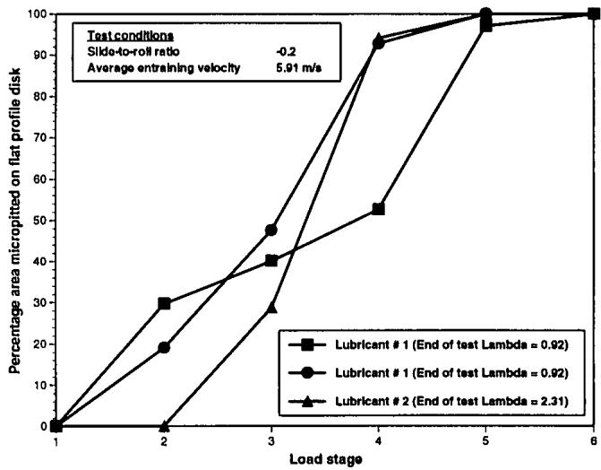  
Fig. 7—Percentage micropitted area results from variable load stage tests showing the effect of increasing the lubricant viscosity.

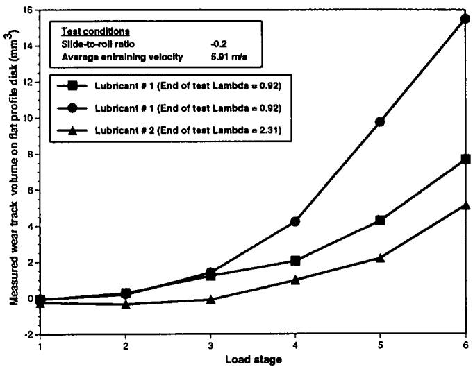  
Fig. 8—Wear track volume results from variable load stage tests showing the effect of increasing the lubricant viscosity.

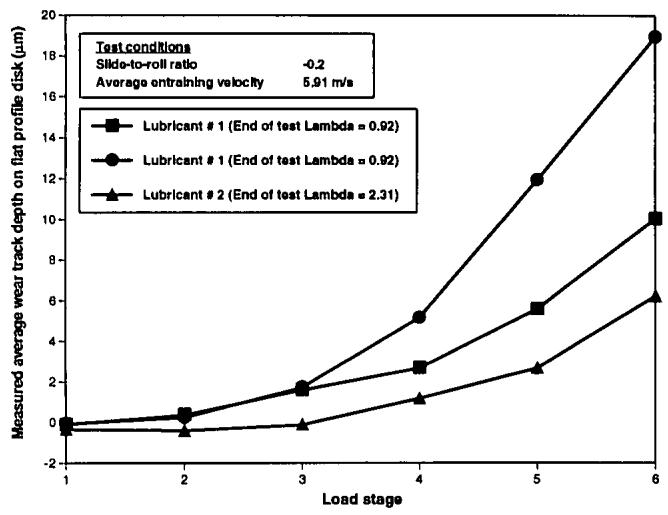  
Fig. 9—Average wear track depth results from variable load stage tests showing the effect of increasing the lubricant viscosity.

Figures 10–12 also show the effect of reducing the degree of relative sliding between the two disks. At a slide-to-roll ratio of -0.0917 the average wear track depth results are just lower than the lowest of those obtained for the two sets of results at a slide-to-roll ratio of —0.2. In terms of both micropitted area and wear volume the results were even closer. At the lowest slide-to-roll ratio of -0.0095 the degree of micropitting was dramatically reduced, if not eliminated. There were some indications of limited micropitting confined to the edges of the wear track on the flat profile disk at the end of the test, which is reflected in the results given in Fig. 10. The amount of wear was so low that the calculated wear volume and wear track depths turned out to be negative. This is an artifact of the method of calculating these parameters rather than indicating any transfer of material to the flat profile disk. With this method, if any significant wear

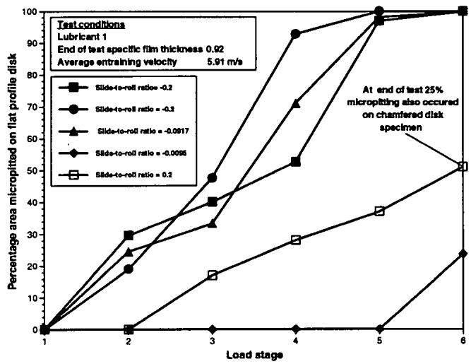  
Fig. 10—Percentage micropitted area results from variable load stage tests showing effect of rolling-sliding conditions.

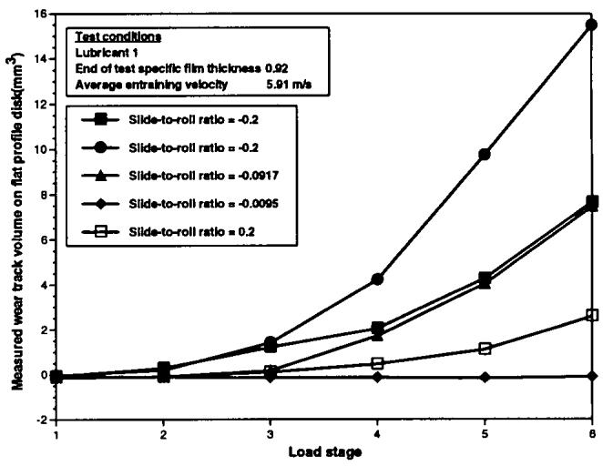  
Fig. 11—Wear track volume results from variable load stage tests showing effect of rolling-sliding conditions.

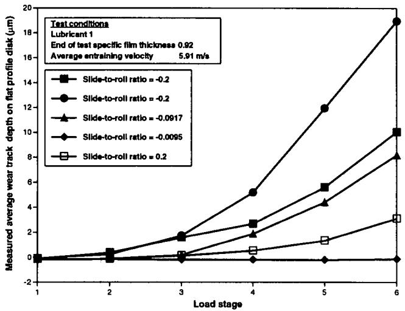  
Fig. 12—Average wear track depth results from variable load stage tests showing the effect of rolling-sliding conditions.

takes place the $R _ { a }$ value is dominated by the wear scar. However, if no significant wear takes place this measurement merely records any modification in surface finish. In this case only modification to the original surface finish occurred resulting in a reduced $R _ { a }$ value, which when referenced back to the initial profile readings yielded negative values.

One possible explanation for the reduced micropitting is that the traction forces developed in the contact are lower at small slide-to-roll ratios. However, the measured traction vs. slide-to-roll ratio curve in Fig. 13 shows that the total traction forces under all three slide-to-roll ratio conditions used in this study are similar. An alternative explanation might be given by assuming that the rate of wear is proportional to sliding distance, and hence sliding speed. This assumption is often used in the analysis of adhesive wear. Figure 14 shows the wear track depth results for the negative slide-to-roll ratio tests normalized by the slide-to-roll ratio. This has the effect of bringing the – 0.0917 slide to ratio results to lie between the two sets of results obtained at - 0.2. Since the original wear volume and wear track depth results at the lowest slideto-roll ratio were negative their normalized values are also negative and cannot be brought into line with the higher slide-to-roll ratio results by any such analysis.

The authors conclude that micropitting is essentially eliminated at a small but sufficiently high slide-to-roll ratio to produce a similar total traction force as measured under higher sliding conditions. These results cannot be accounted for by either decreased sliding distance or change in stress cycles experienced by the roller disk.

The three-dimensional micro-EHL analysis results given in Chang et al. (24) may provide an explanation. One of the transient EHL analyses conducted consisted of investigating the time history response of the local film and pressure distribution for two model rough surfaces under mixed slidingrolling conditions. At a slide-to-roll ratio of 0.5 there was evidence of local asperity interactions, due in part to the formation of local cavitated regions within the EHL contact. Similar analysis at a slide-to-roll ratio of 0.1 predicted no asperity interaction, even when identical asperities had the same alignment as in the previous case. It is also interesting to compare these results with earlier work from the same authors in which no three dimensional effects are included (25). In this case the results are reversed, and greater asperity interaction is predicted at lower slide-to-roll ratios. This suggests that in cases where the lay of the surface is transverse to the sliding direction the response of micropitting to changes in slide-to-roll ratio may be significantly different to the response found in our case. This is important since, for many gear systems, the predominant sliding direction is approximately transverse to the direction of surface lay. Thus, some care may be required in translating results from rollerdisk experiments to gear systems. At this stage no attempt has been made to manufacture test specimens ground in the axial direction due to the difficulties in maintaining a truly cylindrical surface.

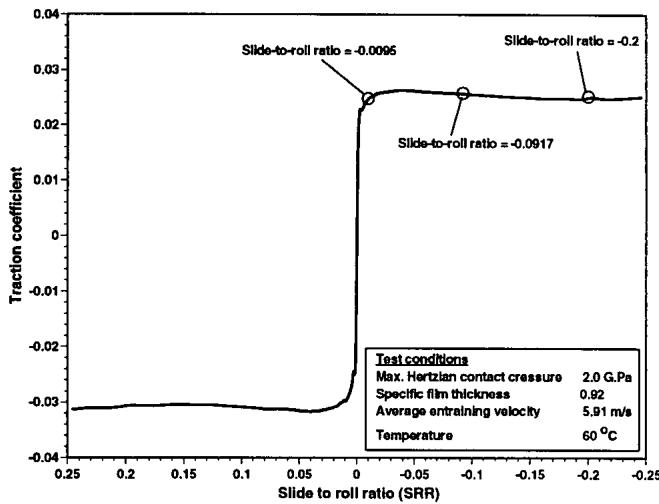  
Fig. 13--Traction curve measurement taken using roller disk machine under load conditions equivalent to Stage 6 in the variable load tests. Marked points indicate slide-to-roll conditions used for results shown in Fig. 12.

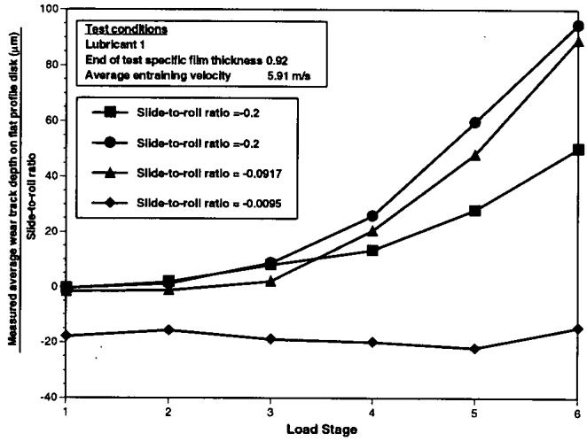  
Fig. 14—Average wear depth results normalized by slide-to-roll ratio obtained under different sliding conditions.

A difference in micro-EHL behavior at low slide-to-roll ratios may also provide an explanation for the surprisingly small response to specific film thickness found in these tests. In the cases where other studies have identified a large influence of specific film thickness muchlower slide-to-roll ratios have been used (15). It is possiblethat the number of asperity interactions reduces at a faster rate with increased specific film thickness under low sliding conditions than it does under higher sliding conditions.

Despite the authors' reservations in translating details of our roller disk machine experiments to gear systems there is evidence gained from the observed pattern of micropitting on failed gears that supports many of the authors' results. Figure 15 shows the distribution of micropitting observed from a full-scale gear test. The major portion of the micropitting is confined to the dedendum of the driving pinion. There is some micropitting at the edge that extends through the pitch line, but this may be associated with significantly higher contact stresses due to edge loading effects. The dedendum of the driving gear is the slower moving surface, so the rolling direction and traction force have the same orientation as the flat profile roller-disk in our experiments under negative slide-to-roll ratios. Once the contact point passes through the pitch line the rolling direction and traction force oppose one another which corresponds to positive sliding in our experiments. Thus the observation that micropitting is confined to the dedendum of the driving gear is consistent with our results in which we have found accelerated micropitting on the slower moving roller-disk.

The authors also observed that the micropitting does not extend all the way to the pitch line, but appears to be confined to thehigher sliding regionof the dedendum. This is despite the fact that the contact pressures developed in this part of the meshing cycle are not normally the highest encountered. This is consistent with our results showing reduced micropitting under low sliding conditions. The authors can therefore conclude that many of the features important to the study of micropitting are simulated accurately in roller-disk-type experiments.

## CONCLUSIONS

Initial results from an experimental program investigating the phenomenon of micropitting have been reported, from which the following conclusions may be drawn.

1. The roller-disk experiments faithfully reproduce the micropitting phenomenon. Microscopic examination of the micropitted surface and sectioned and polished

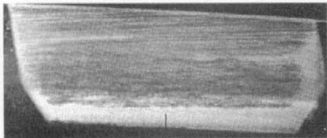  
Micropitting damage shown as light area across dendendum of driving pinion gear.

Fig. 15—Picture of a micropitted gear tooth from full-size gear test.

specimens cut from the test roller-disks show that the micro-scale cracks and pits have the same size and morphology as those reported for micropitted gear specimens.

2. Micropitting preferentially occurs on the slower moving surface within the EHL contact.

3. The subsurface cracks that eventually form the micro pits propagate at a shallow angle to the surface and in the opposite direction to the applied surface traction force.

4. Under the test conditions used, only a moderateimprovement in rate of micropitting was foundbyincreasing the specific film thickness from 0.92 to 2.31.

5. Increasing the specific film thickness to 5.62 by polishing the roller-disks eliminated micropitting.

6. Decreasing the slide-to-roll ratio from 0.2 to 0.0095 eliminated micropitting. However, this result cannot be explained by reductions intotal traction force exerted on the roller-disks since measured traction coefficients were almost identical under these conditions. Changes in micro-EHL. behavior provides a possible explanation.

This experimental method has been subsequently used to evaluate the micropitting performance of a range of lubricants. Results from this work may be the subject of future publications.

## ACKNOWLEDGMENTS

The authors would like to express their gratitude to Russell J. Hausleiter, who conducted many of the experiments reported here, Noel H. Goeke for performing the SEM analysis used to obtain Figs. 5 and 6 and to Dr. Patrick E. Fowles and Dr. Andrew Jackson for their helpful comments on the manuscript. The authors would also like to thank Mobil Research and Development Corporation fortheir permission to publish this work and for supporting one of the authors on an IAESTE fellowship.

## REFERENCES

(1) Shotter, B. A., "Micropitting: Its Characteristics and Implications On The Test Requirements Of Gear Oils," in Proc. of the Institute of Petroleum, 1, London, pp 91–103, (1981).

(2) Winter, H. and Weiss, T., "Some Factors Influencing the Pitting, Micro-Pitting (Frosted Areas) and Slow Speed Wear of Surface Hardened Gears," A.SME Jour. of Mech. Design, 103, 2, pp 499–505, (1981).

(3) Winter, H. and Oster, P., "Influence of Lubrication of Pitting and Micro pitting Resistance of Gears," Gear Tech., 7, 2, pp 16–23, (1990).

(4) Ariura, Y, Ueno, T. and Hakanishi, T., "An Investigation of Surface Failure of Surface Hardened Gear by Scanning Electron Microscopy Observations," Wear, 87, pp 305–316, (1983).

(5) Shipley, E. E.., "Failure Modes in Gears," in Gear Manufacture and Perfor mance, Guichelaar, P. J., Levy, B. S. and Parikh, N. M., eds., ASM, (1974), pp 107-136.

(6) Littmann, W. E., Widner, R. L., Wolfe, J. O. and Stover. J. D., "The Role of Lubrication in Propagation of Contact Fatigue Cracks," ASME four. of Lubr. Tech., 90, 1, pp 89–100, (1968).

(7) Tokuda, M., Ito, S., Muro, H. and Oshima, T., "Evaluation of Lubricants by an Accelerated Peeling Test." in Rolling Contact Fatigue, Performancr Testing of Lubricants, Tourret, R. and Wright, E. P., eds., Heyden and Son Ltd., London, (1977), pp 107–115.

(8) Maeda, K., Tsushima, N. and Muro, H., "The Inclination of Cracking in the Failure of a Ball Bearing Steel and its Relation to the Inclination of the Principal Residual Stress," Wear, 65, pp 175–190, (1980).

(9) Nomenclature of Gear Tooth Failure Modes, AGMA Standard ANSI/AGMA 110.04, (1980).

(10) Berthe, D., Michau, B., Flamand, L. and Godet, M., "Effect of Roughness Ratio and Hertz Pressure on Micro-Pits and Spalls in Concentrated Contacts: Theory and Experiments," in Surface Roughness Effects in Lubrication, Dowson, D., Taylor, C. M., Godet, M. and Berthe, D., eds., MEP Lid., London, (1977), pp 233–238.

(1) Flamand, L. and Berthe, D., "A Brief Discussion of Different Forms of Wear Observed in Hertzian Contacts at Low Slide/Roll Ratios," in Surface Roughness Effects in Lubrication, Dowson, D., Taylor, C. M., Godet, M. and Berthe, D., eds., MEP Ltd., London, (1977), pp 239–243.

(12) Berthe, D., Flamand, L., Foucher, D. and Godet, M., "Micropiuing in

(13) Graham, R. C., Olver, A. and MacPherson, P. B., "An Investigation into the Mechanisms of Pitting in High-Hardness Carburized Steels," ASME Paper No. 80-C2/DET-118, ASME. New York, (1980).

(14) Clarke, T. M., Miller, G. R., Keer, L. M. and Cheng, H. S., "The Role of Near-Surface Inclusions in the Pitting of Gears," ASLE Trans., 28, 1, pp 111–116, (1985).

(15) Olver, A. V., "Wear of Hard Steel in Rolling Lubricated Contact," Ph.D. Thesis, Imperial Colege, London, (1986).

(16) Zhou, R. S., Cheng, H. S., and Mura, T., "Micropiting in Rolling and Sliding Contact under Mixed Lubrication," Jour. of Trib., 111, 4, pp 605-613, (1989).

(17) Tokuda, M., Nagafuchi, M., Tsushima, N. and Muro, H., "Observations of the Peeling Mode of Failure and Surface-Originated Flaking from a

Ring-to-Ring Rolling Contacı Fatigue Test Rig," in Rolling Contact Fatigue Testing of Bearing Steals, Hoo, J·J. C., ed., ASTM Special Technical Publication 771, ASTM, Philadelphia. (1982), pp 150–165.

(8)–Shipley, E. E., "Failure Analysis of Coarse-Pitch Hardened and Ground Gears; A Technical Paper on the Art of Gearing." AGMA Paper No. 229.26, American Gear Manufacturers Assoe., Arlington, VA, (1982).

(19)–Schönnenbeck, G., "Testverfahren zur U'ntersuchung des Schmierstoffeinflusses auf die Entstehung von Grauflecken," Autriebstechuik, 24, 1. pp 31–37, (1985).

(20) Way, S., "Piting Due to Rolling Contact," ASME Jour. Appt. Mech., 2, pp A49–A58, (1935).

(21)– Hanson, M. T. and Keer, L. M., "An Analytical Life Prediction Model for the Crack Propagation Occurring in Contact– Fatigue Failure," Trib. Trans., 35, 3, pp 451–461, (1992).

(22) Olver, A. V.. "Mieropitting and Asperity Deformation." in Ntonerical and Experimental Methods Applied to Tribology, Dowson, D., Taylor, C. M., Godet, M. and Berthe, D., eds., Buuterworth and Co. Lid., London. (1984), pp 319–323.

(23)– Cheng. H. S.. "A Numerical Solution of the EHD Film Thickness in an Elliptical Contact," ASME four. Lubr. Trch., 92, Series F, 1. (1970), pp 155–162.

(24)– Chang, L. M., Jackson, A. and Webster, M. N., "Effects of 3D Surface Topography on the EHL Film Thickness and Film Rupture," Trib. Tran., 37, 3, pp 435–444, (1994).

(25) Chang, L. M., Jackson, A. and Webster, M. N., "A Study of Asperity Interactions in EHL Line Contacts," Trib. Trans., 36, 4, pp 679–685, (1993).
