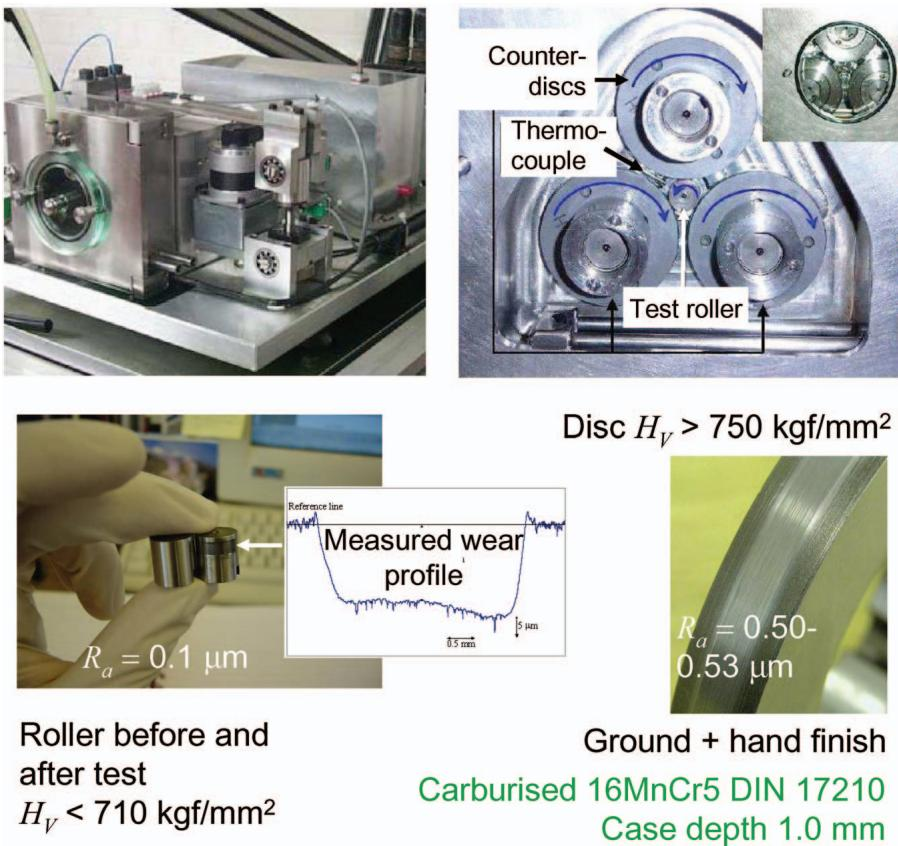
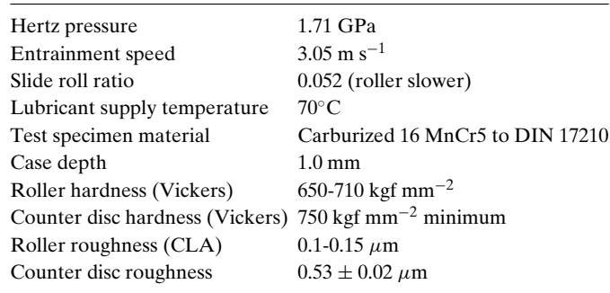
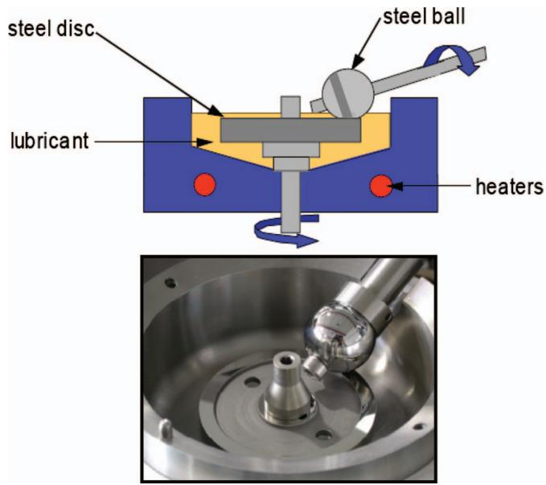
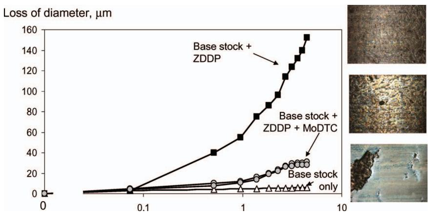
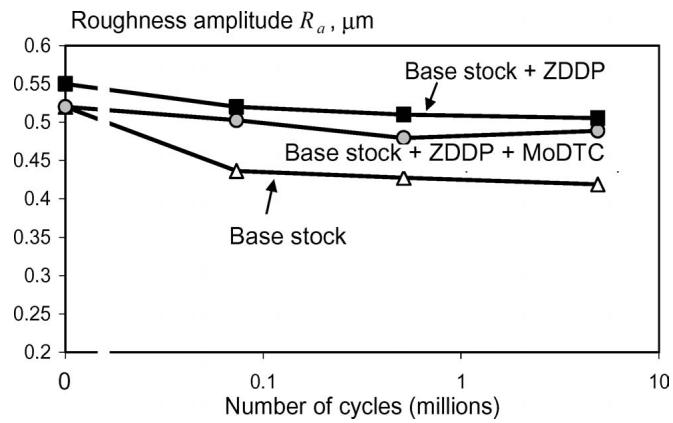
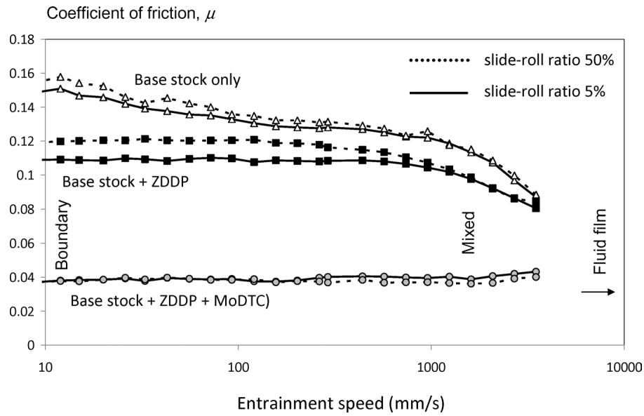
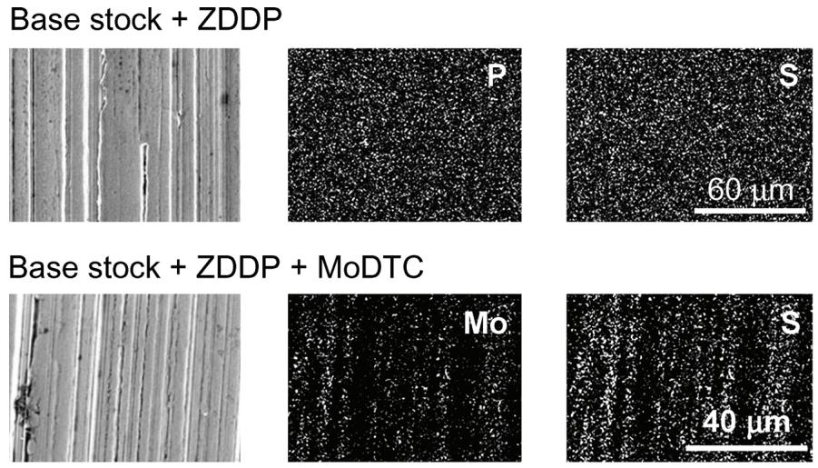
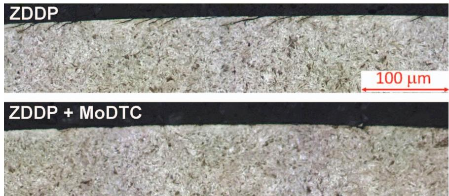
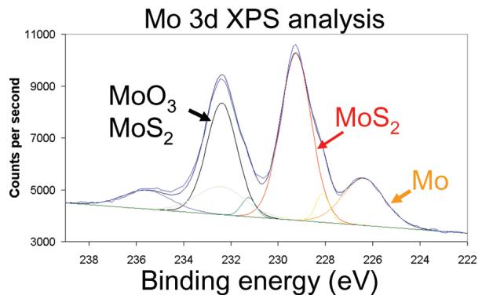
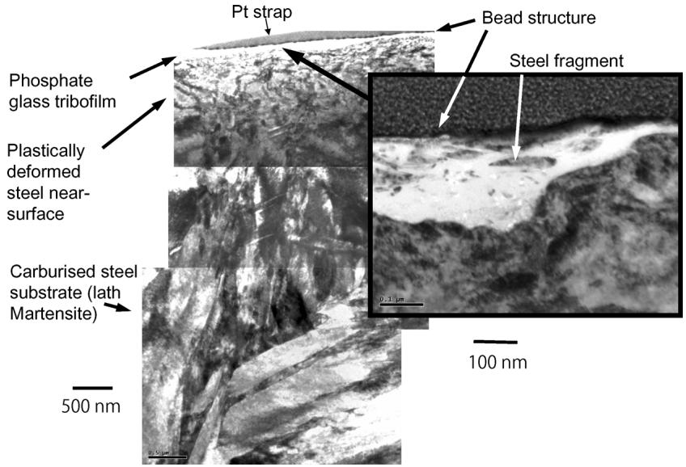

## Tribology Transactions

Publication details, including instructions for authors and subscription information: http://www.tandfonline.com/loi/utrb20

# The Effect of a Friction Modifier Additive on Micropitting

E. Lainé a , A. V. Olver a , M. F. Lekstrom b , B. A. Shollock b , T. A. Beveridge c & D. Y. Hua

a Department of Mechanical Engineering , Imperial College , London, UK

b Department of Materials , Imperial College , London, UK

c Caterpillar Inc , Technical Center , Peoria, Illinois, USA Published online: 15 Feb 2011.

## PLEASE SCROLL DOWN FOR ARTICLE

Taylor & Francis makes every effort to ensure the accuracy of all the information (the “Content”) contained in the publications on our platform. However, Taylor & Francis, our agents, and our licensors make no representations or warranties whatsoever as to the accuracy, completeness, or suitability for any purpose of the Content. Any opinions and views expressed in this publication are the opinions and views of the authors, and are not the views of or endorsed by Taylor & Francis. The accuracy of the Content should not be relied upon and should be independently verified with primary sources of information. Taylor and Francis shall not be liable for any losses, actions, claims, proceedings, demands, costs, expenses, damages, and other liabilities whatsoever or howsoever caused arising directly or indirectly in connection with, in relation to or arising out of the use of the Content.

This article may be used for research, teaching, and private study purposes. Any substantial or systematic reproduction, redistribution, reselling, loan, sub-licensing, systematic supply, or distribution in any form to anyone is expressly forbidden. Terms & Conditions of access and use can be found at http:// www.tandfonline.com/page/terms-and-conditions

# The Effect of a Friction Modifier Additive on Micropitting

E. LAINE, ´ 1 A. V. OLVER,1 M. F. LEKSTROM,2 B. A. SHOLLOCK,2 T. A. BEVERIDGE,3 and D. Y. HUA3

1Department of Mechanical Engineering

Imperial College, London, UK

2Department of Materials

Imperial College, London, UK

3Caterpillar Inc.

Technical Center

Peoria, Illinois, USA

Previous studies have shown that many anti-wear additives have a tendency to aggravate micropitting damage in hard steels subjected to rolling sliding contact at low lambda values. This is apparently because anti-wear additives suppress the gradual smoothing ofthe rough surfaces that takes place when a pure base stock is used under mild conditions. However, in practice, it is common to combine anti-wear and friction modifier additives in formulated oils, a combination that leads to reduced boundary friction. In the work described in this article, we added a common friction modifier agent, a molybdenum bis-diethylhexyl dithio-carbamate (MoDTC), to an oil containing an anti-wear additive, a secondary zinc dialkyldithio-phosphate (ZDDP) in a mineral base-stock. We examined micropitting behavior using a disc tester. The oil with both MoDTC and ZDDP showed initial micropitting that gradually disappeared with continued running, whereas ZDDP alone led to continuing severe damage. Analysis of the counter-discs after the test showed the presence of MoS deposits on the asperity crests. Reduced boundary friction was confirmed using a tribometer test. It is speculated that the improved micropitting behavior resulted from the effect of a reduction in local tensile stress due to reduced asperity friction. This may have reduced the opening of the surface cracks and inhibited their extension.

## KEY WORDS

Micropitting; Antifatigue Additives; Antiwear Additives; Fatigue; Gear Lubricants; Gears; Mineral Base Stocks; Rolling-Contact Fatigue

## INTRODUCTION

This article concerns micropitting (Berthe, et al. (1); Spikes, et al. (2); Olver (3); Olver, et al. (4); Cardis and Webster (5); Oila, et al. (6); Hofmann, et al. (7); Benyajati, et al. (8)), a form of rolling contact fatigue characterized by numerous, small, inclined surface cracks and by progressive wear. It is typically associated with rolling-sliding contact in hard steels and in particular with ground gear teeth, although similar phenomena occur in rolling bearings and in the surfaces of cams and tappets. Micropitting tends to occur when the roughness is comparable to, or larger than, the expected oil film thickness and the resultant wear is recognized as a life-limiting failure mode in gear teeth. It is usually addressed by suitable surface polishing treatments such as “isotropic finishing,” combined with the selection of a lubricant of sufficient viscosity at the operating temperature (Spikes, et al. (2); Olver (3)).

However, in recent years, it has become evident that lubricant additives also have a strong effect on micropitting behavior even when the base stock and the viscosity are held constant. In particular, Cardis and Webster (5) and Benyajati, et al. (8) showed that anti-wear additives could cause micropitting to become more severe and to increase the resultant wear rate compared to that obtained with simple base stocks. This seemed to result from the tendency of anti-wear additives to suppress the gradual decline in roughness of the contacting surfaces (Benyajati, et al. (8)) that occurred when a base stock was used.

However, anti-wear additives are common, and perhaps necessary, components of gear oils, since protection from mild wear and from scuffing are needed. In consequence, there is considerable interest in combinations of additives that might maintain the mild wear protection while restoring the micropitting resistance to that provided by base stocks. In the present article we investigate the effect of a common “friction modifier” additive, molybdenum bis-diethylhexyl dithio-carbamate (MoDTC), on a formulation consisting of a mineral base stock and a zinc dialkyl dithiophosphate (ZDDP). We show here that this combination of additives gives significantly improved micropitting performance compared to ZDDP alone and make suggestions as to the mechanism involved.

## BACKGROUND

## Identification and Characterization of Micropitting

Micropitting is a form of rolling contact fatigue that has been widely studied. The earliest mention in the tribology literature appears to be Berthe, et al. (1), although it is known that the term was in use much earlier in the gear community. It is known that the phenomenon is caused primarily by the roughness of the surfaces (Spikes, et al. (2); Olver (3)) and can be eliminated by sufficiently fine polishing (Cardis and Webster, (5)). Nevertheless, numerous aspects of micropitting have been studied in detail, including mechanical variables (Spikes, et al. (2)), microstructure (Oila, et al. (6); Hofmann, et al. (7)), film thickness (Spikes, et al. (2); Benyajati, et al. (8)), and, recently, oil chemistry (Cardis and Webster (5); Benyajati, et al. (8)).

## Test Methods

Investigators have used either roller or disc testers or gear testers but comparisons tend to show very similar behavior (Wilkinson and Olver (9)) and there is perhaps little to choose between them. Testing a gear pair may involve greater expense and can perhaps introduce some greater uncertainty as to the local contact conditions (e.g., associated with lead or profile relief) but have the advantage of covering a wider range of conditions (low and high slide-roll ratios, for example) in a single test, owing to the steadily changing conditions. Wear measurement also presents more difficulties on a gear flank. Here we have preferred to use a triple-contact disc tester (Benyajati, et al. (8)) to enable comparison with earlier tests and to take advantage of the more rapid evolution of contact cycles.

A further benefit accrues from the careful use of a disc tester. In evaluating the mechanisms by which lubricants affect micropitting, it is desirable to distinguish between factors that influence film thickness and those that do not. The former include rheological effects such as viscosity grade, base stock type, and viscosity index, which all have the ability to change the thickness of the elastohydrodynamic film either directly, by affecting the viscosity or the viscosity-pressure characteristics, or indirectly, by affecting the heat generated in sliding, which, in turn, heats the inlet region and reduces inlet viscosity and hence the film thickness. This thermal feedback is particularly strong if the slide-roll ratio is high and has led us in previous work to use a disc tester at low slide-roll ratio and to use the same lowviscosity base stock so that the coefficient of friction does not strongly influence the film thickness. In this way we are able to isolate the effect of the lubricant chemistry (Benyajati, et al. (8)).

## Additives

Earlier studies have examined a range of lubricant additives (Benyajati and Olver (10); O’Connor (11); Laine, et al. ´ (12)) including those classed as EP (extreme pressure) additives, anti-wear additives, metal passivators, and some classed as combined anti-wear and friction modifiers (O’Connor (11)). Results showed that anti-wear additives were detrimental but that others had little effect. In particular, a zinc dialkyldithiophosphate was found to promote micropitting. However, when the additive was introduced only after an initial period of running (with the base stock only), its detrimental effect was absent. It was found that the initial running in base stock significantly reduced the roughness, leading to reduced local stresses and reduced micropitting (Benyajati and Olver (10); Olver, et al. (13)).

ZDDP and other anti-wear additives are widely used in engine and gear oils. The means by which they reduce wear have been very widely studied (Spikes (14); Barnes, et al. (15); Gellman and Spencer (16)) and involves the formation of a thin ( 100 nm), solid, chemically deposited film (“tribofilm”) on the running surfaces. This film prevents wear, possibly by a process involving sacrificial removal and subsequent reformation (Spikes (14)). Such anti-wear protection is important in devices where the fluid film cannot prevent wear and seems to be effective in low-pressure sliding contacts; for example, in the valvegear and cylinder liners of IC engines lubricated with low-viscosity (energy-saving) lubricants. However, the tribofilm is too thin (100 nm) to prevent micropitting, where the damage may extend to a depth of 100 µm, one thousand times the thickness. There is therefore great interest in finding combinations of additives that may preserve the mild wear protection afforded by ZDDP but may in addition suppress micropitting. One such possibility is examined here.

Friction modifier additives are named for their ability to reduce friction in the boundary regime (no fluid film). They are commonly combined with antiwear additives in formulated oils, one combination being ZDDP and molybdenum dialkyl dithiocarbamate (MoDTC). This additive has also been widely investigated both alone and in combination with ZDDPs (Gellman and Spencer (16); Topolovec-Miklozic, et al. (17); Bec, et al. (18); Mc-Queen, et al. (19); De Barros Bouchet, et al. (20)), with which it is widely held to be “synergistic.” It is a powerful friction modifier that appears to reduce friction in the boundary regime by depositing small regions of MoS2 on the crests of the roughness within the area of contact (Topolovec-Miklozic, et al. (17)). Despite the ubiquity of MoDTC, its effect on micropitting does not seem to have been described in the literature, although it seems completely implausible that additive suppliers have not thought to investigate it. It is perhaps more likely that such work has been left unreported.

Here, we describe the effect of a combined ZDDP MoDTC formulation on micropitting of a carburized, hardened, and ground steel roller. We also characterize its friction behavior in the boundary and mixed regimes and investigate the deposited surface films.

## EXPERIMENTAL DETAILS

## Micropitting (MPR) Tests

The triple contact disc tester fully described in Benyajati, et al. (8) and also used for previous experiments with additives (Olver, et al. (13)) was used. The arrangement is shown in Fig. 1. A central test roller was loaded against three counter-discs and rotated by means of an independently controlled electric motor so that the desired combination of sliding and rolling was achieved. The test roller was ground to a fine finish and heat-treated to be slightly softer than the counter-discs. The discs, used only for a single test, were hand polished with SiC paper to achieve a mean surface roughness amplitude of $R _ { a } = 0 . 5 3 \pm 0 . 0 2 ~ \mu \mathrm { m }$ . All tests were carried out at a Hertz pressure of 1.71 GPa and a slide-roll ratio of 0.052, with the roller surface slower than that of the disc. Table 1 summarizes the mechanical test conditions. The bulk lubricant supply temperature was $7 0 \pm 1 ^ { \circ } \mathrm { C } .$

  
Fig. 1—Micropitting tests using a three-contact disc tester. The specimen is slightly softer and appreciably smoother than the counter-discs

The lubricants used are described in Table 2. The base stock is a low-viscosity grade API Group 1 mineral oil. The effective inlet temperature was estimated to be $7 4 ^ { \circ } \mathrm { C }$ for a coefficient of friction of 0.04 and $7 8 ^ { \circ } \mathrm { C }$ for a coefficient of friction of 0.08. This gives a central elastohydrodynamic film thickness in the range of 61–67 nm. Three lubricant test conditions were examined: base stock only, base stock ZDDP (0.1%P), and base stock ZDDP MoDTC (0.12% Mo).

TABLE 1—SPECIMENS, MATERIALS, AND TEST CONDITIONS  

The tests were interrupted at predetermined intervals for measurement of the wear of the test roller and of the roughness of the counter-disc, both carried out using a stylus instrument. The lubricant was replaced after each measurement of the counter-disc.

  
Fig. 2—Rolling sliding tribometer (Mini traction machine, MTM).

TABLE 2—LUBRICANT FORMULATION AND FILM THICKNESS
| Additive | Wt% Additive | Wt% P | Wt% Mo | η40C (cP) | η100C (cP) | Coeff. of Friction | Inlet Temperature (°C) | Film Thickness (nm) |
| --- | --- | --- | --- | --- | --- | --- | --- | --- |
| None | 一 | 0 | 0 | 12.6 | 2.72 | 0.08 | 78 | 61.97 |
| ZDDP | 1.3 | 0.1 | 0 | 12.6 | 2.82 | 0.08 | 78 | 61.96 |
| ZDDP + M₀DTC | $1 . 3 + 0 . 3 5$ | 0.1 | 0.1235 | 12.78 | 2.73 | 0.04 | 74 | 66.72 |

Base stock API Group I Mineral oil.  
ZDDP  Secondary $\mathrm { C } _ { 6 }$ dialkyl-dithio-phosphate.  
MoDTC Molybdenum bis-diethylhexyl dithiocarbamate.

## Tribometer (MTM) Tests

The three lubricants were characterized in a rolling-sliding tribometer, which is depicted in Fig. 2. For this test, a ball bearing (hardened AISI 52100 steel) rolled with controlled sliding against a softened steel disc (same material). Two slide-roll ratios (0.05 and 0.50) were used at a Hertz pressure of 0.93 GPa and a bulk temperature of 100◦C.

## Surface Analysis

After the micropitting test the test rollers were cleaned in solvent and examined by optical and scanning electron microscopy (SEM), a section was also prepared for metallographic examination.

In addition, specimens were extracted from the surface of the counter-discs using an abrasive wheel lubricated with pure water (to minimize the dissolution of the tribofilm) and subjected to examination by SEM, energy dispersive X-ray analysis (EDX), and X-ray photoelectron spectroscopy (XPS).

Finally, a thin foil was extracted from the surface of a counter-disc that had been tested with the ZDDP MoDTC lubricant using focused ion beam milling (FIB). This enables the examination of the microstructure of the tribofilm and of the immediate substrate. A platinum “strap” was deposited to protect the surface from ion beam damage. The foil was orientated transversely to the finish marks on the steel surface.

## RESULTS

## Micropitting Tests: Wear and Roughness Change

Figure 3 shows the wear of the test roller micropitting tests for each of the three lubricants and optical micrographs of the roller surfaces after testing. All specimens were micropitted but the pure base stock gave very low wear. The ZDDP lubricant led to severe micropitting wear and the ZDDP MoDTC lubricant showed an initially high wear rate, which declined to nearly zero after around an hour (106 cycles) of testing.

The colors in the micrographs in Fig. 3 probably arise from optical interference due to the presence of transparent surface films including boundary films, oxides, and traces of lubricant or solvent. We cannot provide a detailed explanation but it is seen that the three micrographs are each partly blue and partly brown in different areas. The different pattern of colors probably results from the different surface topography.

The changes in the roughness of the counter-discs corresponding to each test are shown in Fig. 4. The roughness amplitudes of the specimens lubricated with pure base stock decline rapidly as the test progresses but those of the specimens tested with the other two lubricants decline much more slowly.

## Tribometer (MTM) Tests: Stribeck Curves

Figure 5 shows the results of the tribometer test for each lubricant for two different values of the side-roll ratio. The friction coefficient is shown as a function of entrainment speed (Stribeck curve). The results clearly show that the friction with the ZDDP

  
Fig. 3—Wear results (left) from micropitting tests and (right) optical micrographs of specimen surfaces after test (image height 1 mm approx). Points for ZDDP MoDTC show values obtained in two repeat tests.

  
Fig. 4—Roughness of the counter discs measured periodically during the test.

MoDTC lubricant is lower in the boundary (low entrainment speed) regime than that of the other two lubricants. There is a slight rise in friction in the mixed regime for the ZDDP MoDTC lubricant; this is similar to previous observations with MoDTC alone.

## Surface Analysis

SEM and optical metallography on the test rollers confirmed the presence of micropitting. The ZDDP roller showed the presence of typical inclined cracks of up to about 50 µm in length (Fig. 6). The rollers lubricated with the base stock alone and with ZDDP MoDTC showed very few cracks.

Figure 7 shows results of the SEM and EDX surface analysis of the counter-discs. The specimen tested with ZDDP alone shows the presence of P on the surface with a fairly uniform distribution. However, the specimen tested with ZDDP MoDTC shows the presence of Mo and/or of S distributed in bands corresponding to the crests of the polishing marks revealed in the secondary electron image. (Since the Mo (L) and S (K) lines are very close, we cannot be sure that both elements are present from this evidence alone.) Also shown is the XPS spectrum that shows peaks identifying Mo in a valence state corresponding to mixed oxides and sulphides. This shows great similarity to earlier findings for lubricants containing MoDTC additives (Topolovec-Miklozic, et al. (17); Morina, et al. (21)).

Figure 8 shows the results of the TEM investigation of the ZDDP MoDTC counter-disc. The microstructure of the steel consists of colonies of high-carbon lath martensite. In a region within a few microns of the surface this structure is much refined and degraded, presumably by plastic deformation. The tribofilm is clearly visible as a light-colored surface deposit with a thickness of 20–120 nm. The outer surface is markedly smoother than the steel substrate, the film being thicker in the valleys of the steel profile. The film had a glassy composition but contained a large number of detached or uplifted steel fragments. The extreme outer surface showed a curious, dark bead-like structure. EDX analysis in the TEM confirmed that this contained Fe and O, whereas the glassy part of the film contained Zn, P, and S. No Mo was found.

## DISCUSSION

The micropitting tests described here show clearly that the MoDTC additive is effective in reducing the micropitting damage that is encountered if ZDDP is used alone. Since it can be seen that the ZDDP MoDTC leads to only a slow decline in roughness (like the ZDDP but in contrast to the base stock alone), it may be concluded that the beneficial mechanism is not related to any influence on the wear protection afforded by ZDDP or on the consequential effect on running-in (Laine, et al. ´ (12)). In addition, it has been shown that the thermal effect on the film thickness is negligible for the test conditions used here.

The results of the friction tests in the boundary regime confirm that MoDTC greatly reduces boundary friction and the surface analysis suggests that this was indeed due to the (now)

  
Fig. 5—Stribeck curves for lubricants used. Hertz pressure: 0.93 GPa, bulk temperature: 100◦C.

  
Fig. 6—Optical micrographs of the roller surfaces after testing $( \sim 4 . 5 \times 1 0 ^ { 6 }$ cycles). The specimen tested with base stock ZDDP contains numerous inclined cracks, typical of severe micropitting damage. Etched 2% nital.

well-described mechanism of $\mathbf { M o S } _ { 2 }$ deposition in the region of contact. It therefore seems likely that the suppression of micropitting after a period of running was itself due to the reduction of friction by MoS .

The TEM results show a number of features not described previously: a tribofilm with a nonuniform thickness distributed so as to smooth the roughness of the substrate, an extensive distribution of fine (2–30 nm) wear particles and a dark bead-like structure at the extreme surface. This last feature needs further investigation, but it seemed to consist principally of iron, perhaps in the form of oxide. Although no Mo was located by EDX on this section, it seems possible that the structure is related to the low-friction domains reported earlier (Topolovec-Miklozic, et al. $( l 7 ) ;$ with the same additive) and may be mild wear debris coated with, or otherwise containing, small quantities of MoS2. The XPS evidence shows that Mo and S are present in the first few nanometers of the surface, so it is likely that the bead-like structure does indeed contain $\mathbf { M o S } _ { 2 }$ even though Mo could not be found by EDX on the TEM sample, a relatively insensitive method.

  
Mo 3d 229.2 M0S2 Mo 3d 232.3 M0S2 Mo 3d 226.4 Mo Mo 3d 228.1 Mo Mo 3d 231.25 Mo4O{1 Mo 3d 232.4 M0O3 Mo 3d 235.55 M0O3  
Fig. 7—Scanning electron microscopy of counter discs. Top left: secondary electron images, center and right: energy-dispersive X-ray image of corresponding area. Bottom: XPS analysis of Mo 3d orbital showing presence of MoS .

  
Fig. 8—Transmission electron micrographs of near surface region of counter-disc tested with the ZDDP MoDTC lubricant. Arrows show the bead-like surface structure believed to consist of MoS and oxidized steel wear particles attached to the glassy ZnSP tribofilm.

A likely mechanism for the improvement in micropitting is that the reduced friction at the asperity level affects the tensile stresses in the damaged surface. Since $\mathbf { M o S } _ { 2 }$ reduces the coefficient of friction in the boundary regime by around two thirds, and since the maximum tensile stress near an isolated asperity in line contact is proportional to the coefficient of sliding friction, we might expect the tensile stress to be reduced by as much as two thirds when the additive takes effect. This would reduce the crack opening and lead to a greater threshold crack size for further propagation (by a factor of 9 if the pressures are unchanged).

However, in micropitting, the possible crack depth is determined by the roughness since the asperity stress field is limited in depth. Thus the friction reduction occasioned by the MoDTC clearly has the potential to suppress crack propagation and hence to limit the crack-related micropitting wear.

The true mechanism might be more complex, however. The observed friction coefficient is so low when MoDTC is present that the process of micro-elastohydrodynamic lubrication, which determines the asperity pressures, might itself be affected; there is the possibility of local slip between the fluid and the solid surface. In turn, this might affect local pressures as well as tangential stresses.

## CONCLUSIONS

A series of micropitting tests has been carried out using a mineral base stock and ZDDP and MoDTC additives. Results show that the micropitting damage encountered with ZDDP can be greatly reduced when MoDTC is also present.

The friction measurement and surface analysis show that boundary friction was reduced by MoDTC by a mechanism involving local deposition of $\mathbf { M o S } _ { 2 }$

It seems likely that the observed improvement in micropitting is itself attributable to the reduced asperity friction, leading to lower tensile stresses and an increase in critical crack size for propagation.

## ACKNOWLEDGEMENTS

The authors are grateful to Caterpillar Inc. for financial support and for permission to publish this article. The XPS work was carried out at the University of Illinois at Champaign–Urbana, whose assistance is gratefully acknowledged.

## REFERENCES

(1) Berthe, D., Flamand, L., Foucher, D. and Godet, M. (1980), “Micropitting in Hertzian Contacts,” Trans. ASME, Journal of Lubrication Technology, 102, pp 478-489.

(2) Spikes, H.A., Olver, A.V. and Macpherson, P.B. (1986), “Wear in Rolling Contacts,” Wear, 112, pp 121-144.

(3) Olver, A.V. (2005), “The Mechanism of Rolling Contact Fatigue: An Update,” Proceedings of the Institution of Mechanical Engineers Part J: Journal of Engineering Tribology, 219, pp 313-330.

(4) Olver, A.V., Tiew, L.K. and Medina, S. (2004), “Direct Observations of a Micropit in an Elastohydrodynamic Contact,” Wear, 256, pp 168-175.

(5) Cardis, A. B. and Webster, M. N. (1999), “Gear Oil Micropitting Evaluation,” American Gear Manufacturers Association (AGMA), Fall Technical Meeting, Paper 99FTM4.

(6) Oila, A., Shaw, B.A., Aylott, C.J. and Bull, S.J. (2005), “Martensite Decay in Micropitted Gears,” Proceedings of the Institution of Mechanical Engineers, Part J: Journal of Engineering Tribology, 219, 2, pp 77-83.

(7) Hofmann, D.A., Bull, S.J., Evans, J.T. and Shaw, B.A. (1999), “The Effect of the White Layer on Micropitting and Surface Contact Fatigue Failure of Nitrided Gears,” Proceedings of the Institution of Mechanical Engineers, Part J: Journal of Engineering Tribology, 213, J4, pp 305- 313.

(8) Benyajati, C., Olver, A.V. and Hamer, J. (2004), “An Experimental Study of Micropitting, Using a New Miniature Test-Rig.” In: Dalmaz, G., Lubrecht, A.A., Dowson, D., Priest, M., Eds., 30th Leeds-Lyon Symposium on Tribology, Lyon, France, September 2-5, 2003, pp 601-610. Elsevier Science: Amsterdam

(9) Wilkinson, C.M.R. and Olver, A.V. (1999), “The Durability of Gear and Disc Specimens,” Tribology Trans, 42, pp 503-510 (Part 1) and pp 610-618 (Part 2).

(10) Benyajati, C. and Olver, A. V. (2004), “The Effect of a ZnDTP Anti-Wear Additive on Micropitting Resistance of Carburized Steel

Rollers,”American Gear Manufacturers Association: Alexandria, VA. AGMA Technical Paper, 04FTM06, pp 1-10.

(11) O’Connor, B. (2005), “The Influence of Oil Additive Chemistry on Micro pitting,” Gear Technology, 5-6, pp 34-41.

(12) Laine, E., Olver, A.V. and Beveridge, T.A. (2008), “The Effect of Lu-´ bricants on Micropitting and Wear,” Tribology International, 41, pp 1049- 1055.

(13) Olver, A.V., Dini, D., Laine, E., Beveridge, T.A. and Hua, D.Y. (2007),´ “Roughness and Lubricant Chemistry Effects in Micropitting,” AGMA Fall Technical Meeting, Detroit, MI, October 2007, American Gear Manufacturers Association: Alexandria, VA, Paper No. 07FTM14.

(14) Spikes, H.A. (2004), “The History and Mechanisms of ZDDP,” Tribology Letters, 17, 3, pp 469-489.

(15) Barnes, A.M., Bartle, K.D. and Thibon, V.R.A. (2001), “A Review of Zinc Dialkyl Dithio-Phosphates (Zddps): Characterisation and Role in the Lu bricating Oil,” Tribology International, 34, p 389.

(16) Gellman A.J. and Spencer, N.D. (2002), “Surface Chemistry in Tribology,” Proceedings of the Institution of Mechanical Engineers, Part J: Journal of Engineering Tribology, 216, pp 443-461.

(17) Topolovec-Miklozic, K., Graham, J. and Spikes, H.A. (2001), “Chemical and Physical Analysis of Reaction Films formed by Molybdenum Dialkyl-Dithiocarbamate Friction Modifier Additive using Raman and Atomic Force Microscopy,” Tribology Letters, 11, 2, pp 71-81.

(18) Bec, S., Tonck, A., Georges J.M. and Roper, G.W. (2004), “Synergistic Effects of MoDTC and ZDTP on Frictional Behavior of Tribofilms at the Nanometer Scale,” Tribology Letters, 17, 4, pp 797-809.

(19) McQueen, J.S., Gao, H., Black, E.D., Gangopadhyay, A.K. and Jensen, R.K. (2005), “Friction and Wear of Tribofilms formed by Zinc Dialkyl Dithiophosphate Antiwear Additive in Low Viscosity Engine Oils,” Tribology International, 38, 3, pp 289-297.

(20) De Barros Bouchet, M.I., Martin, J.M., Le Mogne, T., Bilas, P., Vacher, B. and Yamada, Y. (2005), “Mechanisms of MoS2 Formation by MoDTC in presence of ZnDTP: Effect of Oxidative Degradation,” Wear, 258, pp 1643-1650.

(21) Morina, A., Neville, A., Priest, M. and Green, J.H. (2006), “ZDDP and MoDTC Interactions in Boundary Lubrication: the Effect of Temperature and ZDDP/MoDTC Ratio,” Tribology International, 39, 12, pp 1545- 1557.
