# Probabilistic Stress-Life (P-S-N) Study on Bearing Steel Using Alternating Torsion Life Test

Shigeo Shimizu, Kazuo Tsuchiya & Katsuji Tosha

# Probabilistic Stress-Life (P-S-N) Study on Bearing Steel Using Alternating Torsion Life Test

SHIGEO SHIMIZU, KAZUO TSUCHIYA, and KATSUJI TOSHA

Meiji University

School of Science and Technology

Kawasaki, 214-8571 Japan

Probabilistic stress-life (P-S-N) studies using alternating torsion life test were conducted with the bearing steel JIS SUJ2/AISI 52100 having a hardness range ofRockwell C scale of 58-62 HRC to determine the existence of a fatigue limit for this through-hardened steel. One hundred and fifty (150) alternating torsion tests were performed at six torsion maximum shear stress amplitudes of 0.5, 0.63, 0.76, 0.80, 0.95, and 1.0 GPa. The number of specimens that were run at each stress amplitude varied from 19 to 33. There is no observable fatigue limit for JIS SUJ2/AISI 52100 bearing steel. On log-log plotted data, life is linear and is inversely proportional to shearing stress to a 10.34 exponent. The failure mode of the experiment is due to the conjugate tensile and compressive alternating stresses in accordance with alternating shearing stresses. The three-parameter Weibull life distribution function with a constant value of the Weibull slope $m = 3 / 2$ was found to have the best conformity followed by the lognormal distribution and the two-parameter Weibull distribution function. The shear stress-life exponent (A 10.34) for JIS SUJ2/AISI 52100 bearing steel was independent ofthe Weibull slope.

## KEY WORDS

Alternating Torsion; Bearing Steel; Fatigue Limit; Log-Normal Distribution; P-S-N Curve; Rolling Bearings; Rolling-Contact Fatigue; Weibull Distribution Function; Wohler ¨ Curve

## INTRODUCTION

Although the concept of a fatigue limit for rolling-element bearings was first proposed by Palmgren in 1924 (1), it was apparently abandoned by him again in 1936 (Palmgren (2)) followed by again in association with Lundberg in 1947 (Lundberg and Palmgren (3)). Palmgren’s statement in his 1936 paper about the fatigue limit is depicted as follows:

For a few decades after the manufacture of ball bearings had taken up on modern lines, it was generally considered that ball bearings, like other machine units, were subject to a fatigue limit, i.e. that there was a limit to their carrying capacity beyond which fatigue speedily set in, but below which the bearings could continue to function for infinity. Systematic examination of the results of tests made in the SKF laboratories before 1918, however, showed that no fatigue limit existed within the range covered by the comparatively heavy loads employed for test purposes. It was found that so far as the scope of the investigation was concerned, the employment of a lighter load invariably had the effect of increasing the number of revolutions a bearing could execute before fatigue set in. It was certainly still assumed that a fatigue limit coexisted with a certain low specific load, but tests with light loads finally showed that the fatigue limit for infinite life, if such exists, is reached under a load lighter than all of those employed, and that in practice the life is accordingly always a function of load.

In 1985, Ioannides and Harris (4) came out with their theory by applying Palmgren’s 1924 (1) concept of a fatigue limit in the Lundberg-Palmgren equations (Lundberg and Palmgren (3)), which was later used in the ISO standards (ISO (5), (6); Barnsby (7); ISO (8)) for rolling bearings leading to the limiting stress based on the von Mises stress of $\tau _ { \mathrm { v m } } = 0 . 6 8 4$ GPa corresponding to the Hertz stress $\tau _ { \operatorname* { m a x } } = 1$ .14 GPa (Barnsby (7)) or $\sigma _ { \mathrm { m a x } } =$ 1.5 GPa corresponding to $\sigma _ { \mathrm { v m } } = 0 . 9 \ \mathrm { G P a }$ (ISO (8)) for bearing steel. The result is the inclusion of a life modification factor, aXYZ or aSL or aISO. These fatigue limits are based on Ioannides-Harris (4) as well as the sophisticated work of Ioannides, et al. in 1999 (9) and are evaluated by using a conventional Wohler’s fatigue ¨ limit.

Table 1 shows representative fatigue limits expressed by von Mises stress $\tau _ { \mathrm { v m } } .$ , maximum Hertz stress $\sigma _ { \mathrm { m a x } } ,$ maximum orthogonal subsurface shear stress $\tau _ { 0 } ,$ and alternating torsion specific lives $N _ { 1 0 }$ and $N _ { 5 0 }$ obtained in this research work with Wohler’s fatigue¨ limit as $\tau _ { 0 } .$

In the usual S-N test data, however, for bearing steels heat treated to hardness above 58 HRC, none of the experts in the field including Shimizu (10), (11) and Zaretsky, et al. (12) had mentioned about the tendency of the test data showing a fatigue limit based on the probabilistic stress-life (P-S-N) study of the material and/or the probabilistic force-life (P-F-L) study of the rolling bearing.

According to Tosha, et al. (13), the P-S-N study conducted for rotating bending for the bearing steel (JIS SUJ2/AISI 52100) in a similar manner did not show the fatigue limit. Further, even in the examples of S-N (stress-life) characteristics at very high cycle domain up to giga (109) cycles for rotating bending and axial loading, the bearing steel did not show any fatigue limit (Sakai (14)). These numbers of giga stress cycles for S-N tests correspond to the numbers of contact stress cycles for the rolling bearing raceways and/or the rolling elements, which may be actually assumed above $1 0 ^ { 7 } – 1 0 ^ { 8 }$ revolutions bearing lives.

NOMENCLATURE $N _ { 5 0 }$ Median life   
$N _ { 9 0 }$ 90% failure life   
A Stress life exponent, 1/A slope of P-S-N curve $N _ { n }$ n% failure life   
A- Stress life exponent for γ $N ( \mu , \sigma )$ Normal distribution with mean µ and standard deviation σ   
$a _ { 1 }$ (ln R/ ln $0 . 9 ) ^ { 1 / m }$ reliability factor $N ( 0 , 1 )$ Standardized normal distribution   
B CA fatigue strength coefficient $N _ { S }$ Number of sample size   
$C _ { S }$ $B ^ { 1 / A }$ basic dynamic stress rating for material R 1  n/100  reliability   
$C _ { S } ^ { \prime }$ Basic dynamic stress rating for γ $s$ Stress amplitude   
Exponent related to the stress-life exponent A, where $A = c / m$ $S _ { f }$ Fatigue limit   
$D$ Minimum diameter of specimen $S _ { f } ^ { \prime }$ Fatigue limit fo $\cdot \gamma$   
$E _ { \delta }$ Log base coefficient of variation for population $\gamma$ Minimum life for population   
Number of stress amplitudes δ σ/µ log base coefficient of variation   
j 1, 2, . . . , NS order number η $= ( - \ln 0 . 9 ) ^ { 1 / m } ( L _ { 1 0 } - \gamma )$ scale parameter   
$K _ { n }$ Percentage point for standardized normal distribution N(0, 1) $\mu$ ln $N _ { 5 0 } = \mathrm { l o g }$ base mean or location parameter   
m Weibull slope, depends on stress distribution state in specimen $\sigma$ ln $N _ { 8 4 } - \mu = \delta \times \mu =$ log base standard deviation   
$M _ { t }$ Torsional moment or torque σmax Maximum Hertz stress   
N Number of stress cycles to failures $\tau _ { \nu m }$ von Mises stress   
n Probability of failures, % $\tau _ { 0 }$ Maximum orthogonal subsurface shear stress   
$N _ { 1 0 }$ 10% failure life/90% rating life for material τmax Maximum shearing stress amplitude for torsion

Because of the insertion of an assumed and specifically defined fatigue limit for the bearing steel JIS SUJ2/AISI 52100 into the ISO standards (5), (6), (8), it is important to establish with absolute certainty whether there is a fatigue limit, its characteristic and value, as well as with a stress-life or load-life exponent together. Because, the fatigue limit affects the stress-life or loadlife exponent strongly, they must be reevaluated by using applied stresses or loads minus the fatigue limit or load limit for the P-S-N or P-F-L test data on log-log graph paper at the same time.

exponent. Without both correct values, there is a probability of either over- or underpredicting the life of a bearing for a specific application.

It is the objective of the research work reported to determine if a fatigue limit exists for the most widely used bearing steel JIS SUJ2/AISI 52100. Probabilistic stress-life studies were conducted with the bearing steel JIS SUJ2/AISI 52100 having a hardness range of Rockwell C-scale of 58-62 HRC. One hundred and fifty alternating torsion tests were performed at six torsion stress amplitudes of 0.5, 0.63, 0.76, 0.80, 0.95, and 1.0 GPa. The number of specimens that were run at each stress amplitude varied from 19 to 33.

If a fatigue limit does not exist, then the current ISO standard (8) must be reexamined. Otherwise, it is likely that the user of the standard will undersize a ball or roller bearing for a specific application and/or over-predict the bearing’s life. If, however, a fatigue limit does exist, the question becomes what is the correct value or magnitude of this fatigue limit as well as the load-life

## LIFE DISTRIBUTION FUNCTION

In the statistical treatment of life distribution, which fairly obeys the life test data, conventionally used distribution functions are the lognormal and the Weibull distribution function. In the alternating torsion fatigue test, if the maximum stress amplitude at the external circumference of the test specimen is $\tau _ { \mathrm { m a x } }$ and the life corresponding to n% $( 0 \leq n \leq 1 0 0 \% )$ failure of the test specimens is $N _ { n } ,$ then the probability density function $f ( N _ { n } )$ for the lognormal distribution is given by Eq. [1].

TABLE 1—REPRESENTATIVE FATIGUE LIMITS; $\tau _ { \mathrm { v m } } = \mathrm { V o N }$ MISES STRESS, $\sigma _ { \mathrm { m a x } } =$ HERTZ STRESS, AND $t _ { 0 } = \mathbf { M }$ AXIMUM ORTHOGONAL SUBSUR-FACE SHEAR STRESS (IN GPA; IOANNIDES AND HARRIS (4); (BARNSBY $( 7 ) ) ; ( \mathrm { I S O } \left( 8 \right) )$ CORRESPONDING TO 10% AND 50% FAILURE LIFE $N _ { 1 0 }$ AND $N _ { 5 0 }$ FOR ALTERNATING TORSION LIFE TEST
|  | $\tau _ { \mathrm { v m } }$ | $\sigma _ { \mathrm { m a x } }$ | $\tau _ { 0 } , \mathrm { L } . { \mathrm { C } } . ^ { a }$ | $N _ { 1 0 } ^ { b }$ | $N _ { 5 0 } ^ { b }$ | $\tau _ { 0 } , { \mathrm { C } } . { \mathrm { C } } . ^ { c }$ | $N _ { 1 0 } ^ { b }$ | $N _ { 5 0 } ^ { b }$ |
| --- | --- | --- | --- | --- | --- | --- | --- | --- |
| ASME (7) | 0.684 | 1.14 | 0.285 | $2 . 9 2 \mathrm { E } + 0 9$ | $8 . 1 4 \mathrm { E } + 0 9$ | 0.245 | $1 . 3 7 \mathrm { E } + 1 0$ | $3 . 8 6 \mathrm { E } + 1 0 $ |
| I&amp;H $( 4 ) ^ { d }$ | 0.72/0.78 | 1.2/1.63 | 0.30 | $1 . 7 3 \mathrm { E } + 0 9 $ | $4 . 8 0 \mathrm { E } + 0 9$ | 0.30 | $1 . 7 3 \mathrm { E } + 0 9 $ | $4 . 8 0 \mathrm { E } + 0 9$ |
| I&amp;H $( 4 ) ^ { e }$ | 0.84/0.98 | 1.4/1.63 | 0.35 | $3 . 5 8 \mathrm { E } + 0 8$ | $9 . 8 2 \mathrm { E } + 0 8 $ | 0.35 | $3 . 5 8 \mathrm { E } + 0 8 $ | $9 . 8 2 \mathrm { E } + 0 8 $ |
| ISO281 (8) | 0.9 | 1.5 | 0.375 | $1 . 7 7 \mathrm { E } + 0 8 $ | $4 . 8 3 \mathrm { E } + 0 8 $ | 0.323 | $8 . 2 5 \mathrm { E } + 0 8 $ | $2 . 2 8 \mathrm { E } + 0 9$ |
| Min value | 0.6 | 1.0 | 0.25 | $1 . 1 1 \mathrm { E } + 1 0 $ | $3 . 1 4 \mathrm { E } 1 0$ | 0.215 | $5 . 2 0 \mathrm { E } + 1 0 $ | $1 . 4 8 \mathrm { E } + 1 1$ |

$^ { a } \tau _ { 0 } = 0 . 2 5 \sigma _ { \mathrm { \ m a x } }$ for line contact. $^ { b } N _ { n } = a _ { 1 } ( \tau _ { 0 } / 2 . 2 7 ) ^ { - 1 0 . 3 4 } + ( \tau _ { 0 } / 2 . 2 7 ) ^ { - 9 . 9 } \cdot \cdot \cdot \cdot \cdot$ Eq. [15]. $^ c \tau _ { 0 } = 0 . 2 1 5 \sigma _ { \mathrm { m a x } }$ for circular contact. dBad material. eGood material.

$$
f \left( N _ { n } \right) = \frac { 1 } { \sqrt { 2 \pi } \sigma N _ { n } } \exp \left[ - \frac { 1 } { 2 } \left( \frac { \ln N _ { n } - \mu } { \sigma } \right) ^ { 2 } \right]\tag{[1]}
$$

where $\mu = \ln N _ { 5 0 } =$ log base mean (location parameter), $N _ { 5 0 } =$ exp[µ]  median, σ  ln $N _ { 8 4 } - \mu = \delta \times \mu =$ log base standard deviation, and $\delta = \sigma / \mu =$ log base coefficient of variation.

On the other hand, the three-parameter Weibull distribution function with a probability consideration that the material will not fail, that is to say, with a reliability of $R = 1 - n / 1 0 0 ( 0 \leq R \leq$ 1), can be expressed as shown by Eq. [2] or [2a].

$$
\ln { \frac { 1 } { R } } = \left( { \frac { N _ { n } - \gamma } { \eta } } \right) ^ { m } \eta = \left( \ln { \frac { 1 } { 0 . 9 } } \right) ^ { - 1 / m } \left( N _ { 1 0 } - \gamma \right) , \gamma \geq 0\tag{[2]}
$$

$$
\ln { \frac { 1 } { R } } = m \ln \left( { \frac { N _ { n } - \gamma } { \eta } } \right)\tag{[2a]}
$$

In this equation, $m = \mathrm { W }$ eibull slope, η scale parameter, and $\gamma =$ the minimum strength for a population of material showing no failure, which may be expressed as the minimum life of the material under a stress amplitude $\tau _ { \mathrm { m a x } } .$ For $\gamma = 0$ , this equation will be considered as the two-parameter Weibull distribution function.

For such statistical distribution functions, data analysis can be carried out usually by taking the probability of failure n% on the vertical axis and ln N on the horizontal axis, and then the life distribution data are plotted on the lognormal and/or the Weibul probability paper (see Appendices, Figs. A1 and A2).

Now if these results are successively projected onto the horizontal axis corresponding to ln $\tau _ { \mathrm { m a x } }$ of the life distribution data for various stress amplitudes, one can obtain the P-S-N curve. Therefore, even though the equation formats of both the life distribution and the P-S-N curve may be different from each other, the P-S-N curve should be expressed by an equation given from the same life distribution function.

## REGRESSION EQUATIONS FOR P-S-N STUDY OF THE TEST

Considering A as the stress-life exponent, B as the fatigue strength coefficient of the material, and the newly introduced $C _ { S }$ as the basic dynamic stress rating, the P-S-N curve will be expressed as shown by Eq. [3] for a fatigue limit $\check { \boldsymbol { f } } _ { f } ~ ( \boldsymbol { S } _ { f } \geq 0 )$ and the minimum life $\gamma \left( \gamma \geq 0 \right)$ corresponding to a stress amplitude $\tau _ { \mathrm { m a x } } .$

$$
N _ { n } - \gamma = B ( \tau _ { \mathrm { m a x } } - S _ { f } ) ^ { - A } = \left( \frac { \tau _ { \mathrm { m a x } } - S _ { f } } { C _ { S } } \right) ^ { - A } , C _ { S } = B ^ { 1 / A }\tag{[3]}
$$

Now, for the lognormal distribution in Eq. [3], $C _ { S }$ is conventionally adopted as 50% basic dynamic stress rating with $\gamma = 0$ and $n = 5 0 \%$ . If the expected coefficient of variation for the population is expressed by $E _ { \delta }$ as shown by Eq. [4], the standard deviation for an ith stress amplitude could be put $\sigma = \mu E _ { \delta }$ , and the percentage point of the standardized normal distribution N(0, 1) is given by $K _ { n }$ , then the P-S-N curve can be expressed by Eqs. [5] and [6] (Tosha, et al. (13)).

$$
E _ { \delta } = \frac { 1 } { I } \sum _ { i = 1 } ^ { I } \left( \frac { \sigma } { \mu } \right) _ { i } , \quad I = \mathrm { n u m b e r ~ o f ~ s t r e s s ~ a m p l i t u d e s }\tag{[4]}
$$

$$
N _ { 5 0 } = B ( \tau _ { \mathrm { m a x } } - S _ { f } ) ^ { - A } = \left( \frac { \tau _ { \mathrm { m a x } } - S _ { f } } { C _ { S } } \right) ^ { - A } , \quad S _ { f } \geq 0\tag{[5]}
$$

$$
N _ { n } = N _ { 5 0 } ^ { 1 + E _ { \delta } K _ { n } } = \left( \frac { \tau _ { \mathrm { m a x } } - S _ { f } } { C _ { S } } \right) ^ { - A ( 1 + E _ { \delta } K _ { n } ) }\tag{[6]}
$$

According to this, it is understood that a semi-logarithm regression model (Shimizu (10)) often used for most of the S-N tests for obtaining a regression equation between the fatigue lives and the respective stress amplitudes (both as medians) cannot be employed as a correct numerical equation model.

Subsequently, if $n = 1 0 \%$ , that is to say the reliability $R =$ $0 . 9 , C _ { S }$ is 90% basic dynamic stress rating from the relations of Eqs. [2] and [3], and $a _ { 1 }$ is the reliability factor, then the threeparameter Weibull-based P-S-N curve can be expressed by Eqs. [7] and [8].

$$
N _ { 1 0 } = \bigg ( \frac { \tau _ { \mathrm { m a x } } - S _ { f } } { C _ { S } } \bigg ) ^ { - A } + \gamma , S _ { f } \geq 0\tag{[7]}
$$

$$
N _ { n } = a _ { 1 } \left( \frac { \tau _ { \mathrm { m a x } } - S _ { f } } { C _ { S } } \right) ^ { - A } + \gamma , \quad a _ { 1 } = \left( \frac { \ln R } { \ln 0 . 9 } \right) ^ { 1 / m }\tag{[8]}
$$

Furthermore, the regression equation for the minimum life γ will be given by Eq. [9], considering parameters $S _ { f } ^ { \prime } , C _ { S } ^ { \prime } .$ , and A- as the replacement of $S _ { f } , C _ { S } ,$ , and A.

$$
\gamma = \left( \frac { \tau _ { \mathrm { m a x } } - S _ { f } ^ { \prime } } { C _ { S } ^ { \prime } } \right) ^ { - A ^ { \prime } }\tag{[9]}
$$

Lognormal based S-N curves  Three-parameter Weibull based S-N curves  
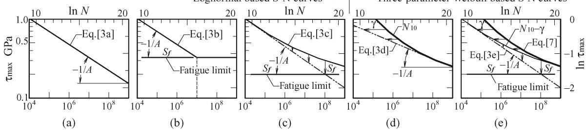  
Number of stress cycles to failures; Life N  
Fig. 1—Fatigue limit concept for lognormal and three-parameter Weibull-based S-N (stress-life) curves with slope 1/A. (a) No fatigue limit. (b) Classic Wohler curve where life is infinite below fatigue limit ¨ Sf . (c) Life is an asymptote to fatigue limit Sf . (d) No fatigue limit $\begin{array} { r } { \pmb { S \mathscr { r } } = \pmb { 0 } , } \end{array}$ the minimum life γ as a function of $\pmb { \tau _ { \mathrm { I m } \hat { \mathbf { a } } \mathbf { x } } } .$ . (e) With fatigue limit $\begin{array} { r } { \pmb { S } _ { f } > \pmb { 0 } , } \end{array}$ most generalized S-N curve.

## FATIGUE LIMIT

From Eq. [3], conventional lognormal based S-N curves can be drawn as shown in Figs. 1(a) and 1(b) in the case where $\gamma = S _ { f } =$ 0, the median life $N _ { 5 0 }$ is inversely related to the power function of the maximum shearing stress amplitude $\tau _ { \mathrm { m a x } }$ as shown by $\operatorname { E q . }$ [3a].

$$
N _ { 5 0 } = \left( \frac { \tau _ { \mathrm { m a x } } } { C _ { S } } \right) ^ { - A } \quad \mathrm { o r } \quad \tau _ { \mathrm { m a x } } = C _ { S } N _ { 5 0 } ^ { - 1 / A }\tag{[3a]}
$$

This relationship when plotted on log-log graph paper will be plotted as illustrated in Fig. 1(a) showing no fatigue limit. The slope of S-N curve is expressed by 1/A, minus the inverse of the stress-life exponent A.

The classic Wohler curve illustrated in Fig. 1(b) introduced the ¨ concept of a fatigue limit where the stress-life relation is that of Eq. [3a] until the stress reaches the value of the fatigue limit $S _ { f }$ at approximately $1 0 ^ { 6 }$ to $1 0 ^ { 7 }$ stress cycles, and that the life is considered infinite as shown by Eq. [3b]. That is, no fatigue failures would be expected to occur.

$$
\begin{array} { l } { { N _ { 5 0 } = \displaystyle ( \frac { \tau _ { \mathrm { m a x } } } { C _ { S } } ) ^ { - A } \mathrm { o r } \tau _ { \mathrm { m a x } } = C _ { S } N _ { 5 0 } ^ { - 1 / A } , \tau _ { \mathrm { m a x } } \geq S _ { f }  \begin{array} { l } { { } } \\ { { } } \end{array} \} } } \\ { { N _ { 5 0 } = \infty , \tau _ { \mathrm { m a x } } \leq S _ { f } } } \end{array}\tag{[3b]}
$$

In practice, fatigue data for those materials showing fatigue limits do not manifest into a straight line on a log-log S-N plot but rather to a curved line shown as an asymptote to a fatigue limit illustrated in Fig. 1(c) (Shimizu $( l O ) , ( l 5 ) )$ . The apparent relationship between the life, the shearing stress, and the fatigue limit is

$$
N _ { 5 0 } = \bigg ( \frac { \tau _ { \mathrm { m a x } } - S _ { f } } { C _ { S } } \bigg ) ^ { - A } \mathrm { o r } \quad \tau _ { \mathrm { m a x } } - S _ { f } = C _ { S } N _ { 5 0 } ^ { - 1 / A }\tag{[3c]}
$$

From Eq. [3c], under an applied stress on a material that shows the existence of a fatigue limit, the resultant life will be longer than that determined from Eq. [3a]. A linear regression is obtained by plotting the data for $\tau _ { \operatorname* { m a x } } - S _ { f }$ . In this figure, the P-S-N curve for an arbitrary probability of failures converges to the fatigue limit as the asymptote shown by Eq. [6].

The three-parameter Weibull-based S-N curves are shown in Figs. 1(d) and 1(e) with a minimum life $\gamma \geq 0$ considered as a function of the shearing stress as shown by Eq. [9]. A linear regression is obtained by plotting $N _ { 1 0 } - \gamma$ as shown by Eq. [3d]. This equation corresponds to the three-parameter Weibull-based S-N curve with fatigue limit $S _ { f } = 0$

$$
N _ { 1 0 } - \gamma = \bigg ( \frac { \tau _ { \mathrm { m a x } } } { C _ { S } } \bigg ) ^ { - A } \mathrm { o r } \tau _ { \mathrm { m a x } } = C _ { S } ( N _ { 1 0 } - \gamma ) ^ { - 1 / A }\tag{[3d]}
$$

The last case is shown in Fig. 1(e) with minimum life $\gamma \geq 0$ and fatigue limit $S _ { f } \ \geq 0 .$ A linear regression is obtained by plotting $N _ { 1 0 } - \gamma$ as shown by Eq. [3e] at first and then plotting $\tau _ { \operatorname* { m a x } } - S _ { f }$ as shown in Fig. 1(e).

$$
N _ { 1 0 } - \gamma = \bigg ( \frac { \tau _ { \operatorname* { m a x } } - S _ { f } } { C _ { S } } \bigg ) ^ { - A } \mathrm { o r } \tau _ { \operatorname* { m a x } } - S _ { f } = C _ { S } ( N _ { 1 0 } - \gamma ) ^ { - 1 / A }\tag{[3e]}
$$

In this figure, the P-S-N curve for an arbitrary reliability converges to the fatigue limit as the asymptote shown by Eq. [8].

Palmgren (1) once proposed a similar equation with the condition where $\gamma < 0 ( \gamma = - \gamma _ { B } : \mathsf { a }$ life constant related to the ultimate strength of material) instead of Eq. [3e] in 1924, but he disregarded $\gamma _ { B }$ as well as $S _ { f }$ in 1936 (2) and 1947 (3) twice from his huge life tests. However, he recognized the existence of a minimum life in 1936 as follows:

The variation is such that there is no pronounced accumu lation of values around a mean value, and the minimum life is clearly not governed by laws to more than a trifling extent. Con sequently, neither the average nor the minimum life provides a satisfactory basis for a definition.

## EXPERIMENTAL DEVICE AND TEST METHOD

Figure 2 shows the front view (a) and side view (b), section A-A of the experimental setup on the test rig manufactured for the alternating torsion life test. The test rig consists of a V-pulley speed reduction ratio of 1/2.5 from a 3.7-kW, 4-pole, 3-phase AC motor with an inverter and a lever crank mechanism capable of applying torque by changing the crank radius (eccentric cam) to various values. The alternating torsion stress amplitude $\tau _ { \mathrm { m a x } }$ is set on the test rig by keeping the torque variation within  0.2% for the torque converter with maximum torque $T _ { \mathrm { m a x } } = 5 0 0 \ : \mathrm { N m }$ . The test speed for varying the stress cycles is set from 350 to 960 rpm for high to low stress amplitudes.

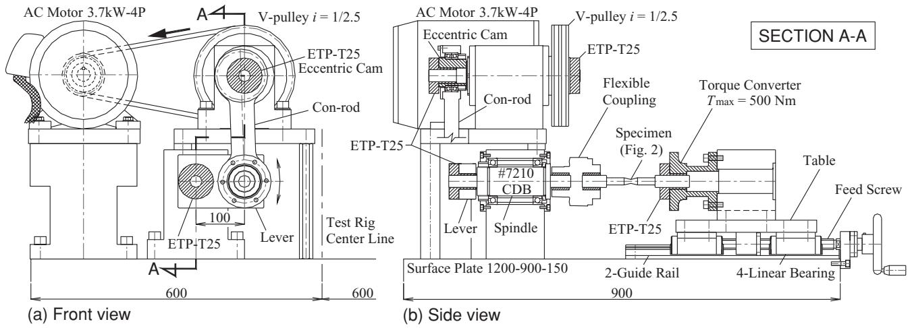  
Fig. 2—Experimental setup on alternating torsion life test rig.

TABLE 2—CHEMICAL COMPOSITIONS FOR BEARING STEEL, JIS SUJ2/AISI 52100, IN WT%, O: PPM
|  | C | Si | Mn | P | S | Cr | M | Ni | Cu | 0 |
| --- | --- | --- | --- | --- | --- | --- | --- | --- | --- | --- |
| Product | 0.98 | 0.18 | 0.37 | 0.016 | 0.003 | 1.42 | 0.03 | 0.07 | 0.12 | 6 |
| JIS | 0.95~1.1 | 0.15~0.35 | $\le 0 . 5$ | ≤0.025 | ≤0.025 | 1.3~1.6 | ≤0.08 | 一 |  |  |

Table 2 shows the chemical composition of the material supplied by the steel manufacturer as per the JIS standard values. According to the steel manufacturer, the retained austenite for SUJ2, 58-62 HRC may be measured as 7-10%.

An alternating torsion fatigue test specimen is shown in Fig. 3. The test specimens made of SUJ2 hardened to 58-62 HRC are ground to $8 \pm 0 . 0 2 5$ mm diameter with surface roughness $R _ { y } <$ 1.6 µm and a radius R30 on the radial portion. The portion D 0.025 is finished to $D = 1 4 . 7 3$ mm or $D = 1 2 . 6 9$ mm on an NC lathe, respectively.

Figure 4 shows the schematics of the test section of Fig. 3. The torsional moment $M _ { t }$ of circular shaft with diameter D and the conjugate tensile and compressive alternating stresses σ1 due to maximum surface shearing stresses $\pm \tau _ { \mathrm { m a x } }$ are shown in Fig. 4(a). The maximum shearing stress amplitude $\tau _ { \operatorname* { m a x } } = 1 6 M _ { t } / \pi D ^ { 3 }$ is obtained from this figure. Mohr’s circle in pure shear is shown in Fig. 4(b).

Figure 5 shows the mechanical properties of the test specimens, which are collected for the distribution of the hardness HRC, the tensile strength $\sigma _ { B } ,$ the torsion strength $\tau _ { B } ,$ and the proportional limit $\tau _ { p }$ for the sample size $N _ { S } = 2 0 – 3 4$ . The resulting distributions followed the normal distributions with mean and standard deviation such as N(60, 0.65) HRC, $\sigma _ { B } = N ( 2 . 1 , 0 . 1 2 )$ , $\tau _ { B } = N ( 1 . 7 , 0 . 0 2 )$ , and $\tau _ { p } = N ( 0 . 8 2 , 0 . 0 9 )$ GPa, respectively.

## TEST RESULT AND DISCUSSION

## Failure Mode

Figure 6 shows a typical example of the broken test piece obtained in this alternating torsion test for the P-S-N study. All specimens were broken like this photo. A closeup of the broken surface is also shown in Fig. 7. The ridge marks are observed to be converging to the top of the small white surface portion, but no fish eye is observed, as was the case in the P-S-N study under rotating bending test (Tosha, et al. (13)). However, neither the fish eye nor the ridge marks were found in the case of JIS S55Cx, 60-64 HRC material equivalent to AISI 1055 steel used for linear bearing rail in alternating torsion fatigue test (Shimizu (11), (15)). An example of the SEM photo for ridge mark (Fig. 7(b)

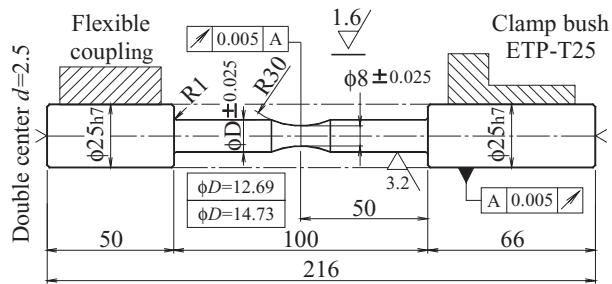  
Fig. 3—Test specimen, SUJ2/AISI 52100, 58-62 HRC.

top point) is shown in Fig. 8. In the photo, there is no nonmetallic inclusion that can be observed at the origin of the failure.

From the above discussions, the failure mode is due to the conjugate tensile and compressive alternating stresses inclined at 45◦ to the test piece centerline in accordance with the torsion surface shearing stresses as shown in Fig. 4. This failure mode was the same as in S55Cx (Shimizu (10)), which was also found in the railcar axle of Wohler’s alternating torsion fatigue test in 1870¨ (Wohler¨ (16)).

## Statistical Treatments

The life test data of six lots corresponding to the standard alternating torsion stress amplitudes $\tau _ { \mathrm { m a x } } = 0 . 5 { \cdot } 1 . 0 \mathrm { G P a }$ are summarized in Table 3. There were no censored test data. All specimens were run until failure. The data in Table 3 are plotted as Benard’s median rank (see Abernethy (17)) shown by Eq. [10] on the lognormal or Weibull probability paper.

$$
n = \frac { j - 0 . 3 } { N _ { S } + 0 . 4 } \times 1 0 0 , \ \%\tag{[10]}
$$

At first, the life test data $( \pm \tau _ { \operatorname* { m a x } } , N _ { j } )$ from Table 3 are plotted on the lognormal probability paper and the estimations for logarithmic based mean µ and standard deviation σ are carried out as shown in the life distribution of Fig. 9(a) (cf. Appendix Fig. A1 for the linear regression). According to this, it is understood that for each one the life distribution on the lognormal probability paper shows a very good fitting and linearity. As a result, the obtained coefficients of variation varied in the range $\delta = \sigma / \mu =$ 0.044-0.070 as arranged in Table 4. Therefore, the coefficient of variation for the population may be estimated by Eq. [4] to be $E _ { \delta } = 0 . 0 5$ by taking the average value of six stress amplitudes.

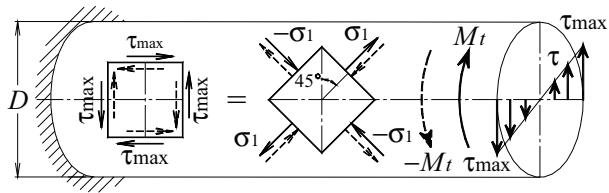  
(a)

(b)  
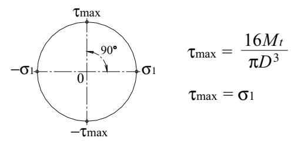  
Fig. 4—Schematic of test section of Fig. 3. (a) Torsional moment of circular shaft showing conjugate tensile and compressive alternating stresses due to surface shearing stresses. (b) Mohr’s circle in pure shear.

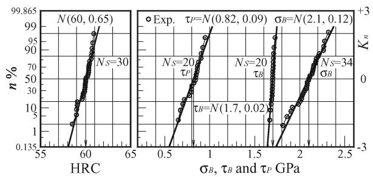  
Fig. 5—Mechanical properties for SUJ2 test specimen.

The P-S-N curve determined from this result and from Eqs. [5] and [6] is also shown in Fig. 9(b). The stress-life exponent A 10.36 and the 50% rating stress $C _ { S } = 2 . 5 8$ GPa are obtained. It is understood that they are constants and independent of the probability of failures n%. Furthermore, from this result it is revealed that when the estimation is carried out with $S _ { f } = 0 ,$ such a material may be said to have no fatigue limit.

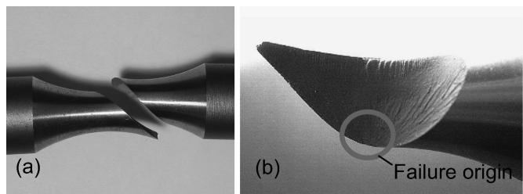  
Fig. 6—Failure mode, broken SUJ2 torsion test specimen. (a) Test section. (b) Surface failure origin.

Figure 10(a) (cf. Appendix Fig. A2(b) for linear regression) shows the result of the test data conforming to the two-parameter Weibull distribution function as a reference. In the life distribution Fig. 10(a), it is found that in the lower and also the higher failure regions, the life values are moving towards the larger deviation side from the theoretical straight line. A variation in the estimated Weibull slopes is found in the range of m 1.7-2.45 with an average value of $E ( m ) = 2 . 0 $ . This variation of the mvalue is not so big compared with the case of S55Cx material, but we cannot treat it as a constant m-value. Here, if Eq. [8] is used for $\gamma = 0 .$ then for the arbitrary values of $n = 1 0 ,$ , 50, 90%, the P-S-N curve in Fig. 10(b) will be obtained with $A = 1 0 . 1 3 , 1 0 . 3 7 .$ 10.56 and $C _ { S } = 2 . 4 4 , 2 . 6 0 , 2 . 7 1$ GPa, by ignoring the variation of m-value as well as the reliability factor. As a result, it is found that the stress-life exponent A and the rating stress $C _ { S }$ cannot be constants for the life $N _ { n }$ corresponding to an arbitrary probability of failure n% in the case of the two-parameter Weibull regression.

TABLE 3—ALTERNATING TORSION FATIGUE TEST DATA FOR JIS SUJ2/AISI 52100 AT SIX SHEARING STRESS AMPLITUDES, $\pm \tau _ { \mathrm { m a x } }$
|  | Life Nj, stress cycles |  |  |  |  |  |
| --- | --- | --- | --- | --- | --- | --- |
| Maximum Shearing Stress Amplitude, ±τmax, GPa (ksi) |  |  |  |  |  |  |
| Order Number j | 0.5 (72.5) | 0.63 (91.4) | 0.76 (110.2) | 0.80 (116) | 0.95 (137.8) | 1.0 (145) |
| 1 | 5.42E + 06 | 8.65E + 05 | 1.23E + 05 | 6.30E + 04 | 1.20E + 04 | 3.28E + 03 |
| 2 | 6.62E + 06 | 9.67E + 05 | 1.34E + 05 | 8.40E + 04 | 1.30E + 04 | 4.58E + 03 |
| 3 | 7.63E + 06 | 1.09E + 06 | 1.78E + 05 | 1.03E + 05 | 1.60E + 04 | 5.77E + 03 |
| 4 | 1.00E + 07 | 1.25E + 06 | 1.86E + 05 | 1.13E + 05 | 1.90E + 04 | 7.61E + 03 |
| 5 | 1.00E + 07 | 1.35E + 06 | 2.30E + 05 | 1.17E + 07 | 2.10E + 04 | 8.20E + 03 |
| 6 | 1.25E + 07 | 1.37E + 06 | 2.37E + 05 | 1.18E + 05 | 2.50E + 04 | 8.29E + 03 |
| 7 | 1.76E + 07 | 1.53E + 06 | 2.51E + 05 | 1.24E + 05 | 2.70E + 04 | 8.89E + 03 |
| 8 | 2.23E + 07 | 1.74E + 06 | 2.57E + 05 | 1.47E + 05 | 2.80E + 04 | 9.56E + 03 |
| 9 | 2.38E + 07 | 1.79E + 06 | 2.65E + 05 | 1.47E + 05 | 2.90E + 04 | 1.17E + 04 |
| 10 | 2.56E + 07 | 2.20E + 06 | 2.70E + 05 | 1.49E + 05 | 3.40E + 04 | 1.22E + 04 |
| 11 | 2.71E + 07 | 2.21E + 06 | 3.08E + 05 | 1.88E + 05 | 3.70E + 04 | 1.29E + 04 |
| 12 | 2.74E + 07 | 2.93E + 06 | 3.26E + 05 | 2.18E + 05 | 3.80E + 04 | 1.36E + 04 |
| 13 | 2.88E + 07 | 3.01E + 06 | 3.35E + 05 | 2.30E + 05 | 3.80E + 04 | 1.39E + 04 |
| 14 | 2.89E + 07 | 3.12E + 06 | 3.43E + 05 | 2.38E + 05 | 4.00E + 04 | 1.40E + 04 |
| 15 | 3.27E + 07 | 4.42E + 06 | 3.63E + 05 | 2.55E + 05 | 4.10E + 04 | 1.42E + 04 |
| 16 | 3.33E + 07 | 4.74E + 06 | 3.68E + 05 | 2.88E + 05 | 4.20E + 04 | 1.52E + 04 |
| 17 | 3.91E + 07 | 5.02E + 06 | 3.68E + 05 | 3.11E + 05 | 4.30E + 04 | 1.57E + 04 |
| 18 | 4.22E + 07 | 5.25E + 06 | 4.22E + 05 | 3.44E + 05 | 4.50E + 04 | 1.76E + 04 |
| 19 20 | 4.45E + 07 | 6.82E + 06 | 4.98E + 05 | 3.72E + 05 | 4.70E + 04 | 1.84E + 04 |
|  | 5.95E + 07 |  | 5.11E + 05 | 4.41E + 05 | 5.10E + 04 | 1.85E + 04 |
| 21 |  |  | 5.60E + 05 | 4.70E + 05 | 5.20E + 04 | 2.10E + 04 |
| 22 |  |  | 5.64E + 05 | 4.97E + 05 | 5.50E + 04 | 2.45E + 04 |
| 23 |  |  | 5.78E + 05 | 5.36E + 05 | 5.70E + 04 | 2.47E + 04 |
| 24 |  |  | 6.08E + 05 | 5.72E + 05 | 6.60E + 04 | 2.76E + 04 |
| 25 26 |  |  | 6.12E + 05 | 7.56E + 05 | 7.00E + 04 | 2.87E + 04 |
|  |  |  | 6.13E + 05 |  |  | 3.78E + 04 |
| 27 |  |  | 6.34E + 05 |  |  | 3.83E + 04 |
| 28 |  |  | 6.49E + 05 |  |  | 4.68E + 04 |
| 29 |  |  | 6.70E + 05 7.00E + 05 |  |  |  |
| 30 |  |  |  |  |  |  |
| 31 |  |  | 8.34E + 05 8.43E + 05 |  |  |  |
| 32 33 |  |  | 9.82E + 05 |  |  |  |

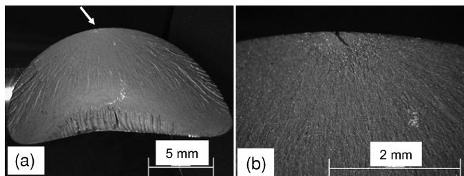  
Fig. 7—Closeup of failure origin of SUJ2/AISI 52100 steel torsion test specimen. (a) Ridge marks showing crack propagation. (b) Point of fatigue crack initiation.

At the same time in the life distribution for S55Cx, 60-64 HRC (Shimizu (11)), the Weibull slope remained as $m = 2 . 8 –$ 6.4 and $E ( m ) = 4 . 3$ . In this P-S-N study test with S55Cx, the m values for the two-parameter Weibull regression have larger values and wider scatter, and the fatigue life is smaller than this SUJ2 experimental test data. It is also revealed that the Weibull slope for the two-parameter Weibull distribution function does not follow the conventional physical meaning (Weibull (18) and Lundberg-Palmgren (Ioannides and Harris (4); (Lundberg and Palmgren (19)), i.e. the Weibull slope depends on the material and will be larger for the material with larger fatigue strength.

In general, in accordance with the method in which the Weibull slope $m = 3 / 2 = \mathbf { a }$ constant (independent of stress amplitudes and also the strength of materials) and taking the estimated values of the scale parameter η and the minimum life $\gamma ,$ the regression result will be as shown in Fig. 11(a) (cf. Appendix Fig.

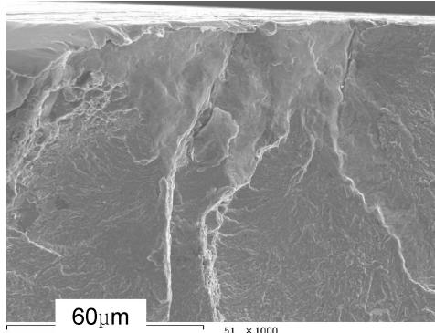  
Fig. 8—SEM photo for ridge mark top point (Fig. 7).

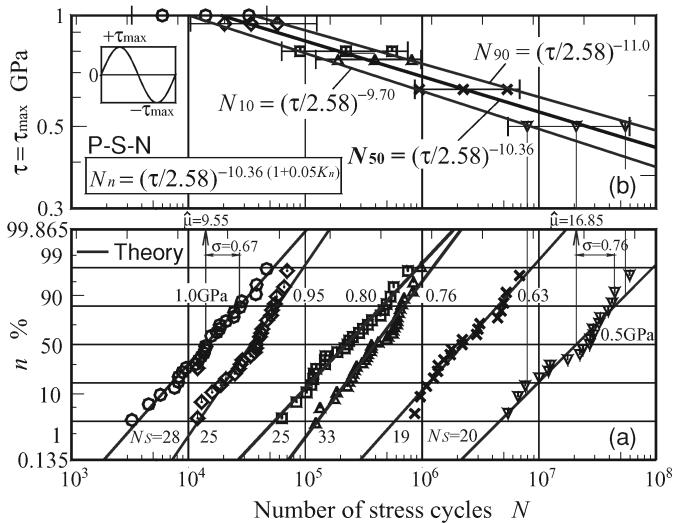  
Fig. 9—Lognormal-based life distribution (a) and P-S-N curve (b) for alternating torsion life test results.

A2(a)). The γ and η estimations are carried out by using Eqs. [11] and [12] with m  3/2 (Shimizu (10)).

$$
\hat { \gamma } = \frac { N _ { 1 0 } - 0 . 2 8 4 8 N _ { 5 0 } } { 0 . 7 1 5 2 } , \mathrm { f o r } m = \frac { 3 } { 2 }\tag{[11]}
$$

$$
\hat { \eta } = \left( \ln \frac { 1 } { 0 . 9 } \right) ^ { - 1 / m } \left( N _ { 1 0 } - \hat { \gamma } \right) = 4 . 4 8 3 \left( N _ { 1 0 } - \hat { \gamma } \right)\tag{[12]}
$$

According to this, the life distribution in Fig. 11(a) obeys extremely well the three-parameter Weibull distribution function with $m = 3 / 2 .$ . Using Eqs. [7]-[9], in any of the cases for the failure probabilities in the $\mathrm { P - S - } ( \mathrm { N - } \gamma )$ curve in Fig. 11(c), the stress-life exponent remains constant at $A = 1 0 . 3 4$ and the basic dynamic stress rating for one cycle also remains at $C _ { S } = 2 . 2 7 \mathrm { G P a }$ . Then the final P-S-N curve is shown in Fig. 11(b) including the γ regression.

However, while comparing with S55Cx, 60-64 HRC (Shimizu $( I I ) , ( I 5 ) ) .$ it is found that the life distributions for both materials can hold the same value $m = 3 / 2 ;$ therefore, it is confirmed that the Weibull slope m does not depend on the fatigue strength of the material. Moreover, in case of S55Cx with $C _ { S } = 2 . 3 3 \mathrm { G P a }$ though not much different from that $( C _ { S } = 2 . 2 7$ GPa) observed for SUJ2, the difference lies in the stress-life exponent; that is, $A = 8 . 3$ . However, in this test with SUJ2 of high fatigue strength as A  10.34, it can be said that the stress-life exponent for materials with higher strength has a higher A value.

TABLE 4—ESTIMATED PARAMETERS FOR LOGNORMAL DISTRIBU-TION FUNCTION IN FIG. $9 , E ( \delta ) = 0 . 0 5$
| Lognormal Estimations, in $1 0 ^ { 3 }$ Stress Cycles |  |  |  |  |  |  |  |
| --- | --- | --- | --- | --- | --- | --- | --- |
| $\tau _ { \operatorname* { m a x } } \operatorname { G P a }$ | μ | σ | δ | $N _ { 1 0 }$ | $N _ { 5 0 }$ | $N _ { 9 0 }$ |  |
| 0.5 | 16.85 | 0.76 | 0.045 | 7,859 | 20,790 | 54,998 |  |
| 0.63 | 14.63 | 0.68 | 0.046 | 946 | 2,258 | 5,392 |  |
| 0.76 | 12.89 | 0.57 | 0.044 | 191 | 396 | 822 |  |
| 0.8 | 12.32 | 0.71 | 0.058 | 90.3 | 224 | 556 |  |
| 0.95 | 10.45 | 0.52 | 0.050 | 17.8 | 34.5 | 67.2 |  |
| 1.0 | 9.55 | 0.67 | 0.070 | 5.96 | 14.0 | 33.1 |  |

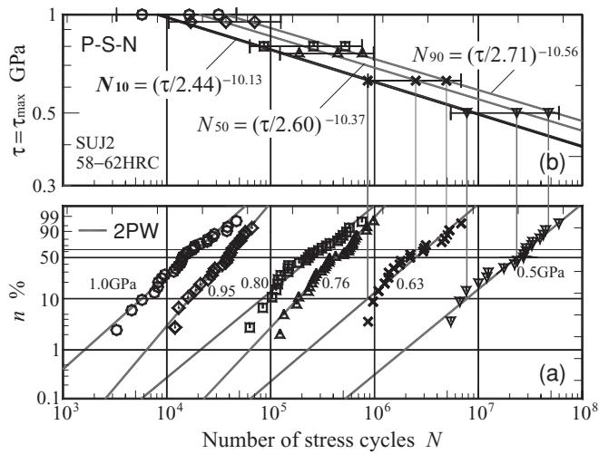  
Fig. 10—Two-parameter Weibull-based life distribution (a) and P-S-N curve (b) for alternating torsion life test results.

Tables 5 and 6 summarize the estimated results for the twoparameter and three-parameter Weibull life distribution function corresponding to each parameter and specific lives $N _ { 1 0 } , N _ { 5 0 }$ , and $N _ { 9 0 }$ in Figs. 10 and 11.

For the comparison of both materials, Figs. 12 and 13 present the 50%-S-N and 10%-S-N curve, respectively, based on the lognormal and the three-parameter Weibull distribution function. From each of these figures, it is made clear that the difference between the material fatigue strength is mainly due to the stress-life exponent A for the region of high cycle fatigue. Further, it is understood that a fatigue limit could not be observed in any materials and any regression functions.

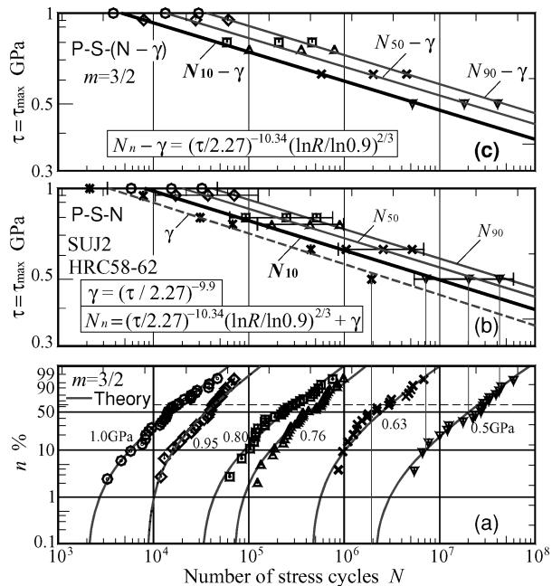  
Fig. 11—Three-parameter Weibull-based life distribution and P-S-N curve for alternating torsion life test results. (a) Three-parameter regression with m 3/2. (b) P-S-N plot. (c) P-S-(N-γ) plot.

TABLE 5—ESTIMATED PARAMETERS FOR TWO-PARAMETER WEIBULL DISTRIBUTION FUNCTION IN FIG. 10, E(m) 2.0
|  | Two-Parameter Weibull Estimations, in $1 0 ^ { 3 }$ Stress Cycles |  |  |  |
| --- | --- | --- | --- | --- |
| $\tau _ { \operatorname* { m a x } } \mathrm { G P a }$ | m | η | $N _ { 1 0 }$ $N _ { 5 0 }$ | $N _ { 9 0 }$ |
| 0.50 | 1.70 | 28,800 | 7,665 23,215 | 47,039 |
| 0.63 | 1.77 | 3,090 | 867 2,512 | 4,950 |
| 0.76 | 2.19 | 508 | 182 430 | 743 |
| 0.80 | 1.71 | 308 | 82.6 | 249 502 |
| 0.95 | 2.45 | 43 | 17.2 37.0 | 60.4 |
| 1.0 | 1.85 | 19.3 | 5.72 | 15.8 30.3 |

From Lundberg and Palmgren (3), the shear stress-life exponent A is a function of the Weibull slope m where $A = c / m .$ From Lundberg and Palmgren (3), m  10/9 for the ball bearing, $m =$ 3/2 for the roller bearing, and $c = 3 1 / 3 .$ . These yield to the values of $A = 9 . 3$ for the ball bearing and $A = 6 . 9$ for the roller bearing. Subsequently, Lundberg and Palmgren (19) changed the value of the Weibull slope for the roller bearings to $m = 9 / 8 .$ . As a result, for roller bearings, $A = 9 . 2 $ . However, as shown in our article, A is independent of the Weibull slope m. Therefore, $A = c = 3 1 / 3$ for the ball and the roller bearings. This value is approximately the same as that shown by us experimentally where $A = 1 0 . 3 4$ for JIS SUJ2/AISI 52100 material.

For reference, the P-S-N regressions corresponding to the lognormal and the three-parameter Weibull distribution function for both materials are shown in the following equations.

 Lognormal-based P-S-N curve regression

$$
\begin{array} { l l } { { N _ { n } = \displaystyle \left( \frac { \tau _ { \mathrm { m a x } } } { 2 . 5 8 } \right) ^ { - 1 0 . 3 6 ( 1 + 0 . 0 5 K _ { n } ) } \nonumber ( \mathrm { J I S ~ S U J 2 / A I S I ~ 5 2 1 0 0 } ) } } & { { [ 1 3 \smallskip \displaystyle } } \\ { { \nonumber } } \\ { { N _ { n } = \displaystyle \left( \frac { \tau _ { \mathrm { m a x } } } { 3 . 5 5 } \right) ^ { - 7 . 4 ( 1 + 0 . 0 3 K _ { n } ) } \nonumber ( \mathrm { J I S ~ S 5 5 C x / A I S I ~ 1 0 5 5 ; ~ S a k a i ~ } ( I 4 ) ) } } \end{array}\tag{[14]}
$$

TABLE 6—ESTIMATED PARAMETERS FOR THREE-PARAMETER WEIBULL DISTRIBUTION FUNCTION WITH m 3/2 IN FIG. 11  
Three-Parameter Weibull Estimations, in $1 0 ^ { 3 }$ Stress Cycles
| $\tau _ { \operatorname* { m a x } } \mathrm { G P a }$ | η | γ | $N _ { 1 0 }$ | $N _ { 5 0 }$ | $N _ { 9 0 }$ |
| --- | --- | --- | --- | --- | --- |
| 0.50 | 23,200 | 1,930 | 7,105 | 20,101 | 42,384 |
| 0.63 | 2,590 | 445 | 1,023 | 2,474 | 4,961 |
| 0.76 | 453 | 68 | 169 | 423 | 858 |
| 0.80 | 264 | 31 | 89.9 | 238 | 491 |
| 0.95 | 36 | 7.8 | 15.8 | 36.0 | 70.6 |
| 1.0 | 17 | 2 | 5.79 | 15.3 | 31.6 |

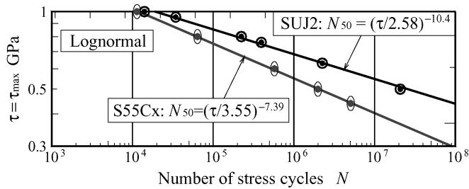

Fig. 12—Lognormal based 50%-S-N curve for comparison of materials .  
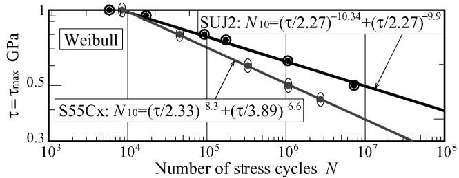  
Fig. 13—Three-parameter Weibull-based 10% S-N curve for comparison of materials (Shimizu (10)).

 Three-Parameter Weibull based P-S-N curve regression

$$
\begin{array} { c } { { N _ { n } = \left( \frac { \tau _ { \mathrm { m a x } } } { 2 . 2 7 } \right) ^ { - 1 0 . 3 4 } \left( \frac { \ln { R } } { \ln { 0 . 9 } } \right) ^ { \frac { 2 } { 3 } } } } \\ { { + \left( \frac { \tau _ { \mathrm { m a x } } } { 2 . 2 7 } \right) ^ { - 9 . 9 } \left( \mathrm { J I S ~ S U J 2 / A I S I ~ 5 2 1 0 0 } \right) } } \end{array}\tag{[15]}
$$

$$
\begin{array} { c } { { N _ { n } = \displaystyle { \left( \frac { \tau _ { \mathrm { m a x } } } { 2 . 3 3 } \right) ^ { - 8 . 3 } \left( \frac { \ln { R } } { \ln { 0 . 9 } } \right) ^ { \frac { 2 } { 3 } } } } } \\ { { + \displaystyle { \left( \frac { \tau _ { \mathrm { m a x } } } { 3 . 8 9 } \right) ^ { - 6 . 6 } \left( { \mathrm { J I S ~ S 5 5 } \mathrm { C x } / \mathrm { A I S I ~ } 1 0 5 5 , \mathrm { ( S h i m i z u ~ } ( I O ) ) } \right. } } } \end{array}\tag{[16]}
$$

Table 7 shows the P-S-N regressions corresponding to the lognormal and the three-parameter Weibull distribution function for both SUJ2 and S55Cx materials. From this, it is clear that the stronger material has a larger A value and also larger $E _ { \delta }$ value than the weaker material. The Weibull slope is independent of the stress-life exponent, the strength of the material, and a constant value m 3/2 for alternating the torsion fatigue life test.

TABLE 7—ESTIMATED PARAMETERS FOR P-S-N CURVES BY LOGNORMAL DISTRIBUTION FUNCTION AND THREE-PARAMETER WEIBULL DISTRIBUTION FUNCTION WITH m 3/2 IN COMPARISON WITH MATERIAL DIFFERENCES IN FIGS. 12 AND 13
| Lognormal |  |  | Three-Parameter Weibull |  |  |  |  |
| --- | --- | --- | --- | --- | --- | --- | --- |
| Mate. | SUJ2 | S55Cx | SUJ2 | S55Cx | γ | SUJ2 | S55Cx |
| $E _ { \delta }$ | 0.05 | 0.03 | m = 3/2 |  |  |  |  |
| $A$ | 10.36 | 7.38 | 10.34 | 8.3 | $A ^ { \prime }$ | 9.9 | 6.6 |
| $C _ { S }$ | 2.58 | 3.5 | 2.27 | 2.33 | $C _ { S } ^ { \prime }$ | 2.27 | 3.89 |

## SUMMARY

Probabilistic stress-life (P-S-N) alternating torsion life test studies were conducted with the bearing steel JIS SUJ2/AISI 52100 having a hardness range of 58-62 HRC to determine the existence of a fatigue limit for this through-hardened steel. One hundred and fifty alternating torsion tests were performed at six torsion stress amplitudes of 0.5, 0.63, 0.76, 0.80, 0.95, and 1.0 GPa. The number of specimens that were run at each stress amplitude varied from 19 to 33. The following results were obtained:

1. There is no observable fatigue limit for JIS SUJ2/AISI 52100 bearing steel heat-treated to a hardness of 58-62 HRC. On loglog plotted data, life is linear and is inversely proportional to shearing stress to a 10.34 exponent.

2. The failure mode for the experiment is due to the surface conjugate tensile and compressive alternating stresses in accordance with the alternating shearing stresses. The ridge marks oriented from the surface are observed, but a fisheye and/or a nonmetallic inclusion is not observed at the top origin point.

3. Corresponding to the life distributions of six stress amplitudes, the three-parameter Weibull life distribution function introducing a minimum life as the third parameter with the Weibull slope m  3/2  constant is found to have the best conformity. This is followed by the lognormal distribution and the twoparameter Weibull distribution function in the decreasing order of conformity. The shear stress-life exponent (A  10.34) for JIS SUJ2/AISI 52100 bearing steel was independent of the Weibull slope.

## ACKNOWLEDGEMENTS

The authors thank E. V. Zaretsky of the NASA Glenn Research Center; Dr. C. S. Sharma of Shinrai Preci-Tech Systems in Mumbai, India; and Dr. K. Hiraoka of Sanyo Special Steel Co., Ltd. This work is supported by the “Academic Frontier” Project for Private Universities: matching fund subsidy from MEXT (Ministry of Education, Culture, Sports, Science and Technology) 2007-2009. The authors would like to extend their heartfelt gratitude to all concerned.

## REFERENCES

(1) Palmgren, A. (1924), “Die Lebensdauer von Kugellagern” [The Service Life of Ball Bearings], Zeitschrift des Vereines Deutscher Ingenieure, 68, 14, pp 339-341 (NASA TT-F-13460, 1971).

(2) Palmgren, A. (1937), “Om kullagrens barformaga och livslangd” [On the Carrying Capacity and Life of Ball Bearings], Teknisk Tidskrift, Mek 1936, h.2, (in Swedish) and The Ball Bearing Journal, 3, pp 34-44.

(3) Lundberg, G. and Palmgren, A. (1947), “Dynamic Capacity of Rolling Bearings,” IVA Handlingar, 196, 13, pp 16-19.

(4) Ioannides, E. and Harris, T.A. (1985), “New Fatigue Life Model for Rolling Bearings,” J. Tribol. Trans. ASME, 107, 3, pp 367-378.

(5) ISO, Amendment 2. (2000), “Rolling Bearings—Dynamic Load Ratings and Rating Life, Life Modification Factor,” ISO 281.

(6) ISO (2002), “Rolling Bearings—Dynamic Load Ratings and Rating Life, Amendment 2,” ISO-281/2.

(7) Barnsby, R. (2003), Life Ratings for Modern Rolling Bearings—A Design Guide for the Application of International Standard ISO 281/2. ASME International and Co-published with STLE, New York,

(8) ISO 281(2007), “Rolling Bearings—Dynamic Load Ratings and Rating Life,” 2nd Ed. 2007-02-15, Ref. No. ISO 281(E).

(9) Ioannides, E., Bergling, G. and Gabelli, A. (1999), “An Analytical Formulation for the Life of Rolling Bearings,” Acta Polytechnica Scandinavica, Mechanical Engineering Series, 137, pp 9-12, 21-24, Finland, 1999.

(10) Shimizu, S. (2005), “Fatigue Limit Concept and Life Prediction Model for Rolling Contact Machine Elements,” STLE, Tribology & Lubrication Technology, 5, pp 32-41.

(11) Shimizu, S. (2005), “P-S-N/P-F-L Curve Approach Using 3-Parameter Weibull Distribution Function for Life and Fatigue Analysis of Structural and Rolling Contact Component,” STLE, Tribology Trans., 48, 4, pp 576- 582.

(12) Zaretsky E.V., Poplawski, J.V. and Root, L.E. (2007), “Reexamination of Ball-Race Conformity Effects on Ball Bearing Life,” STLE, Tribology Trans., 50, 3, pp 336-349.

(13) Tosha, K., Ueda, D., Shimoda, H. and Shimizu, S. (2007), “A Study on P-S-N Curve for Rotating Bending Fatigue Test for Bearing Steel,” STLE, Tribology Trans., 51, 2, pp 166-172.

(14) Sakai, M. (2007), “Review and Prospects for Current Studies on Very High Cycle Fatigue of Metallic Materials for Machine Structural Use,” Proceedings of VHCF-4, TMS (The Minerals, Metals & Materials Society), pp 3-12.

(15) Shimizu S. (2000), “P-S-N Curves Model for Rolling Contact Machine Elements,” JAST, Proceedings ofthe International Tribology Conference, Nagasaki, 3, pp 1767-1772.

(16) Wohler A. (1870), “ ¨ Uber die Festigkeits-Versuche mit Eisen und Stahl,” ¨ Zeitschrift fur Bauwesen, ¨ 20, pp 74-106.

(17) Abernethy B. (1966), The New Weibull Handbook. (1966) 2nd ed. Gulf Publishing Co., Houston, TX.

(18) Weibull, W. (1939), “A Statistical Theory of the Strength of Materials,” IVA Handlinger, 151, pp 2, 28, 95.

(19) Lundberg, G. and Palmgren, A. (1952), “Dynamic Capacity of Roller Bearings,” IVA Handlingar, 210, pp 6.

## APPENDICES

Lognormal Paper and Linear Regression  
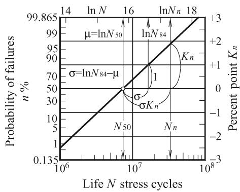  
Fig. A1—Lognormal plot where ordinate is graduated as a probability of failures corresponding to the percentage point $\kappa _ { n }$ for the standardized normal distribution N(0, 1).

## Weibull Paper and Linear Regression

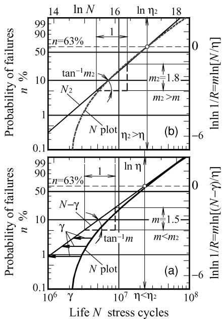  
Fig. A2—Data plot N where Weibull slope or tangent of line is m; probability of failures $\pmb { { n = 6 3 \% } } ,$ , reliability $\pmb { R = 0 . 3 7 }$ at which $\eta = N _ { 6 3 } - \gamma .$ (a) Three-parameter Weibull plots N and N-γ. (b) Two-parameter Weibull approximation $N _ { 2 } ,$ usually $m _ { 2 } > m$
