# A multi-model X-FEM strategy dedicated to frictional crack growth under cyclic fretting fatigue loadings

M.C. Baietto, E. Pierres \*, A. Gravouil

Université de Lyon, CNRS, INSA-Lyon, LaMCoS UMR5259, F-69621, France

## a r t i c l e i n f o

Article history:   
Received 28 July 2009   
Received in revised form 22 January 2010   
Available online 11 February 2010   
Keywords:   
Fretting   
Fatigue crack growth   
X-FEM   
Crack face frictional contact

## a b s t r a c t

A 2D X-FEM/LATIN numerical model (eXtended Finite Element Method/Large Time Increment method) is proposed in this paper for the analysis of fretting fatigue problems and the simulation of the crack propagation under such loadings. The half-analytical two-body contact analysis allows to capture accurately the pressure and the cyclic tractions exerted at the interface that induce non-proportional multi-axial loading. These distributions are then used as input data for determining critical location for crack initiation and crack inclination based on Dang Van’s criterion. The frictional contact conditions of the fretting fatigue cracks have an important impact on the crack behaviour. In this respect, contact with friction between the crack faces is finely modeled within the X-FEM frame. The obtained results are compared and validated with a half-analytical reference model. The numerical simulations reveal the robustness and the efficiency of the proposed approach for a wide range of fretting loadings and friction coefficients values along crack faces. The crack growth directions are then predicted accurately based on the use of criteria adapted to multi-axial non-proportional fatigue. Four cases dealing with crack propagation are then presented. It is shown how the crack length, the tangential loading modify the crack path during the propagation process.

\- 2010 Elsevier Ltd. All rights reserved.

## 1. Introduction

Fretting has long been recognized as a source of wear and premature fatigue failure within mechanical parts. Fretting damage may occur whenever a junction between contacting parts is subjected to cyclic sliding micro-motions, whose characteristic amplitudes are much less than the size of the contact. Such a contact loading can be induced either by vibrations or by the application of bulk fatigue stresses to one or both of the contacting parts. The main initial damage (wear or cracking) is closely linked to the nature of the contact conditions between the contacting bodies, which depends on the contact loading, the material’s bulk mechanical properties and the frictional response of the contact interface. Cracks may initiate at a very early stage and most of the component life incorporates crack growth. A considerable attention has been devoted both experimentally and numerically to predict crack behaviour and propose palliatives to extend the fatigue life.

Identifying the possibility of tribological fatigue at a design stage and integrate it in a predictive approach requires a multi-disciplinary phenomenological understanding which encompasses the interdependency of solid and contact mechanics, fatigue, material, wear and fretting mechanisms. The problem is further strongly multi-scale. Dimensions ranging from the meter (characteristic size of a component), to the mm (two-body contact patch between contacting components, the crack itself) down to the lm (frictional contact zone at the crack interface) are encountered. Moreover 3D cracks located in the contact zone vicinity are submitted to multiaxial non-proportional cyclic loadings and severe stress gradients. Cracks undergo sequences of opening–closure–sticking and sliding contact conditions at interface, governing crack mixity, branching, self-arrest and propagation.

Many models and methods have been proposed to achieve the prediction of fretting crack lifetime. This involves four different steps: (1) the cyclic stress–strain field computation within the safe component, accounting for the structural influence (boundary conditions, etc.) but also the contact conditions arising at the component interface, (2) the prediction of crack initiation locations and angles according to criteria, (3) the crack modeling and (4) the crack growth. The numerical simulation of each of these four steps can be achieved based on different techniques. Step 1 is easily tackled using 2D and 3D finite element techniques as long as the structural problem is relevant. Dealing with the contacting interface where the fretting cracks initiate and requiring thus accurate contact problem solution between the contacting two bodies is not so straightforward. Half-analytical and numerical techniques have been long preferred as they capture accurately and for a negligible computing effort the multi-axial stress and strain fields with severe gradients in the two-body vicinity. This implies to consider simplified geometries like cylinders, spheres and planes. Contact mechanic formulations then coupled with frictional contact algorithms have allowed rapid progress in the understanding of crack occurrence. Step 2 is concerned with multi-axial fatigue criteria either based on the concept of the critical plane like Ruiz et al. (1984) or Dang Van’s criterion (1993) or on the concept of equivalent stress, strain or energy based-fracture criterion. Ruiz criterion reliably predicts the location of crack nucleation along the fretting interface but does not give any information about the orientation of the initial crack while Dang Van’s criterion predicts both. Concerning steps (3) and (4), methods based on distributed dislocations techniques pioneered by Comninou (1977), Hills and Comninou (1985) and Dubourg and Villechaise (1989) have allowed to account for contact and frictional effects at crack interface which govern the crack behaviour and crack path. Dubourg and Villechaise (1992) have combined this technique with unilateral contact algorithm with friction to deal automatically with complex cyclic fretting loading conditions and multiple crack interactions. These models have been developed within the linear elastic fracture mechanics framework and 2D assumptions. These methods address contact fatigue problems at a local scale, dedicated to the interface between the two bodies in contact and the cracks situated in the near vicinity. Methods based on finite element techniques are able to capture the global scale of the structure (complex geometry, more realistic boundary conditions, etc.) but are not accurate enough at the local scale. Further the crack growth simulation is prohibitively computer time and memory consuming as it requires re-meshing (Carter et al., 2000; Neto et al., 2001; Dhondt, 1998). The eXtended Finite Element Method (X-FEM) allows to deal with crack propagation without those drawbacks thanks to significant improvements in crack modeling. X-FEM is a numerical method developed within the standard finite element method framework. Its key properties are due to the partition-ofunity method developed by Babuska and Melenk (1997) combined by Moës et al. (1999) with special enriched functions added locally to finite element approximation. These enriched functions capture the asymptotic near-crack-tip and the discontinuous displacement fields. The initial mesh does not need to conform to the crack geometry, no explicit crack mesh is required and furthermore no re-meshing is necessary as the crack evolves during fatigue crack propagation. This method allows to deal with 3D contact problems and to simulate the crack growth. The following references Sukumar et al. (2008) and Gravouil et al. (2002) are dedicated to the application of X-FEM to 3D crack growth with a level set modeling of the crack with possible multi-scale effects (Rannou et al., 2008). Furthermore, some recent papers give also some details on the implementation of contact and friction with X-FEM (Dolbow et al., 2001; Elguedj et al., 2007; Vitali and Benson, 2008; Liu and Borja, 2008; Géniaut et al., 2007; Béchet et al., 2008). In particular, references Ribeaucourt et al. (2007) and Giner et al. (2008) concern the accurate modeling of tribological fatigue with X-FEM, when possible non-proportional or multi-axial loading occurs in the cracked area.

A methodology to predict fretting fatigue is proposed dealing with the four steps listed above and summarized in the flow chart in Fig. 1. Section 2 presents typical fretting fatigue problems, the corresponding modeling and the two-body contact solution giving rise to cyclic pressure and tractions distributions. Then the crack nucleation damage induced by such small-amplitude oscillatory displacements is predicted in Section 2.2 using Dang Van’s criterion (Dang Van and Maitournam, 2000) both in terms of critical zones and crack orientations. These results are used as input data for the fretting crack analysis performed with the reference crack model based on distributed dislocation theory and unilateral contact analysis and with the X-FEM model. In the latter case, the pressure and cyclic traction distributions are transferred to the X-FEM model as presented in Section 2.3. Section 3 briefly recalls the X-FEM fundamentals and presents the developments enabling a quasi-static incremental description of cyclic fretting fatigue problems accounting for non-linear frictional unilateral contact along crack faces. The methods used for the computation of the stress intensity factors with the X-FEM model and the reference model are also recalled.

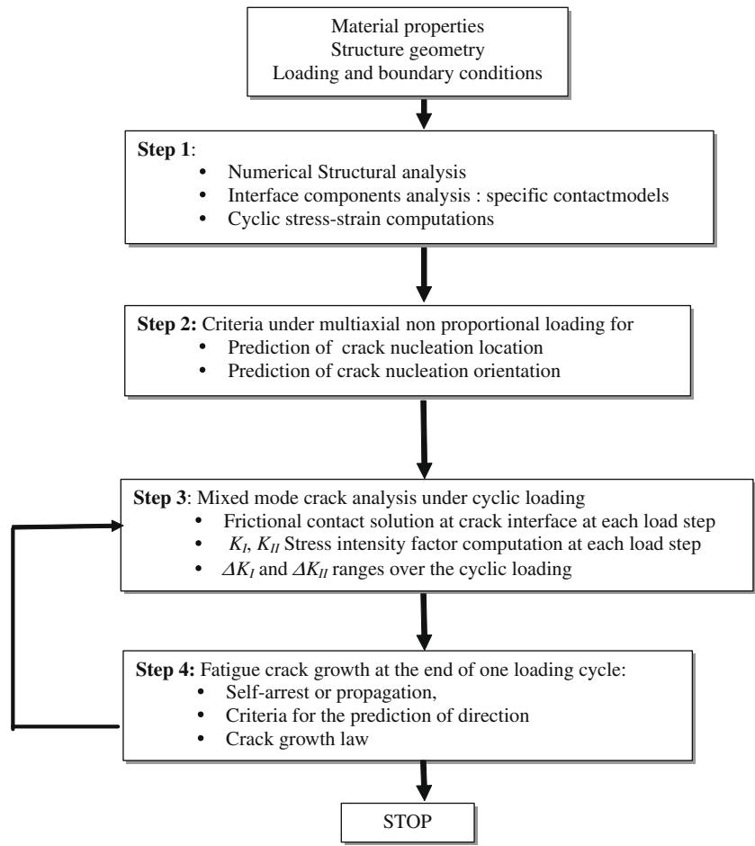  
Fig. 1. Methodology.

2D crack propagation direction criteria adapted to the simulation of crack growth under non-proportional loading such as fretting fatigue are presented in Section 4. Section 5 introduces the fretting simulation and discusses the comparison between previous numerical results, the X-FEM ones and the experimental ones. A parametric study is performed in Section 6 to identify the influence of the friction coefficient between the crack faces and of an additional global pre-stress on the stress intensity factors (SIF) values during the fretting cycle and furthermore on the crack path. Finally in Section 7 crack propagation under fretting loading is realized. The X-FEM based model ability is demonstrated. Some concluding remarks and points for further research are given in Section 8.

## 2. Fretting fatigue problems

Fretting occurs whenever a junction between components is subjected to cyclic loading, with small relative displacements at interface of contacting surfaces typically of 5–50 lm in amplitude. Further cyclic bulk stresses may be superimposed to one or both components. Material degradation responses such as both wear and cracking are induced and, as a consequence, may cause changes in the coefficient of friction. The identification of these changes is of primary importance to set up the boundary conditions for the contact mechanics modeling of the stress field in relation to crack development. A methodology based on a coupled experimental and theoretical approach has been developed to capture the fretting complexity. Controlled devices have been developed to monitor accurately the displacement amplitude between the specimens, to record the frictional forces versus the cycles and to analyze the degradation either with in situ continuous or post-mortem observation. Vincent et al. (1992) have proposed the fretting map concept to rationalize the main degradation response (non-degradation, cracking, particle detachment) and the local fretting regime (sticking, partial slip, gross slip) for normal load–displacement pairings. A close link has been established between the initial dominant degradation response and the contact sliding regime. Crack nucleation is the dominant degradation response under very small displacement amplitude at two-body interface, associated to both partial slip regime and mixed fretting regime.

In this paper, normal load–displacement pairings leading to partial slip regime have been selected. Cracking is thus the main degradation response. Further those loading conditions induce very small wear debris at the surface and as a consequence variations in interfacial coefficient of friction and roughness of the contacting surfaces are negligible during the loading cycles. Monotonic constant amplitude loading conditions are hence supposed.

## 2.1. Contact conditions at two-body interface – fretting tests

Dealing simultaneously with the structural analysis and the contact problem at interface components requires a global–local-multi-scale approach. Finite element analysis is devoted to the first one due to its great generality. Obviously domains of finite dimensions and complex shapes may be considered. It has to be emphasized that if a finite element mesh is designed at the scales of the structure and of the component, it is not designed at the scale of the contact zone between the components. Therefore the contact solution is conducted in this case with very few elements located in the zone of interest whereas a very refined mesh is required to describe accurately contact problems at the interface components. The essence of the problem is to determine the distributions of normal and cyclic tangential tractions over the contact area and the stick/slip repartition whose size and shape are unknown.

The strategy employed here is to combine different numerical methods to use their respective advantages. The assumption that the contacting bodies may be approximated by elastic half-spaces (Kalker, 1990) is retained (the interfacial contact area is small compared to a characteristic dimension of the non-conformal components and the surface slopes are small). The elastic field in the contact part can be determined by replacing the body locally by a half-space. The boundary conditions are those of the real body, the elasticity equations are solved for the half-space. The zone of interest, C, encompassing the actual contact area, $T _ { C }$ and its surrounding, is divided into a number of discrete cells, and the pressure and tractions acting on each element are approximated by a chosen function, here a stepwise. In that case, displacements, stresses and strains in a two-dimensional half-plane due to a constant surface traction applied over an elementary cell $\Delta x _ { i }$ (cf. Fig. 2) are expressed using the Boussinesq– Cerruti relations (Johnson, 1985). They satisfy automatically equilibrium equations, elastic behaviour and small strain assumptions. The use of the Boussinesq–Cerruti relations relating loads and displacements at the surface leads to the system of Eq. (2.1):

$$
\{ \begin{array} { l } { { \displaystyle u _ { z , i } = \sum _ { j = 1 } ^ { n } a _ { i j } p _ { j } + \sum _ { j = 1 } ^ { n } b _ { i j } q _ { j } \sum _ { \mathrm { ~ s i m p l i f i c a t i o n } } ( u _ { z , i } = \sum _ { j = 1 } ^ { n } a _ { i j } p _ { j }  } } \\ { { \displaystyle u _ { x , i } = \sum _ { j = 1 } ^ { n } c _ { i j } q _ { j } + \sum _ { j = 1 } ^ { n } d _ { i j } p _ { j }  \begin{array} { c } { { \displaystyle \overrightarrow { \Rightarrow } } } \\ { { \displaystyle \overrightarrow { \qquad } } } \end{array}  } { \displaystyle \operatorname { d e c o u p l i n g } } } \\ { { \displaystyle u _ { x , i } = \sum _ { j = 1 } ^ { n } c _ { i j } q _ { j } + \sum _ { j = 1 } ^ { n } d _ { i j } p _ { j }  \begin{array} { c } { { \displaystyle \overrightarrow { \Rightarrow } } } \\ { { \displaystyle \overrightarrow { \qquad } } } \end{array}  } { \displaystyle  \sum _ { j = 1 } ^ { n } c _ { i j } q _ { j } } } \end{array}\tag{ð2:1Þ}
$$

where $a _ { i j }$ and $b _ { i j }$ (respectively, $d _ { i j }$ and $c _ { i j } )$ are the influence coefficients that express the displacement along the z (respectively, x) direction at a cell centered at point i due to a unit pressure and shear traction element centered at point j (Hills and Nowell, 1994). The effect upon the normal pressure of the tangential traction is generally neglected and vice-versa. This simplification implies only a very small loss of precision for small values of Dundurs’ constant $\beta ,$ where $\beta$ is a measure of the difference in the elastic constants of the two contacting bodies. The two bodies being here elastically similar, simplified expressions are thus used. The actual distributions of normal and tangential tractions can thus represented by adjacent cells of uniform normal and tangential tractions giving rise to a stepwise distribution. Depending on the number of cells, the approximation to the actual distribution of normal and tangential tractions is quite good. This numerical technique is widely referred as the influence function method (Hills and Nowell, 1994).

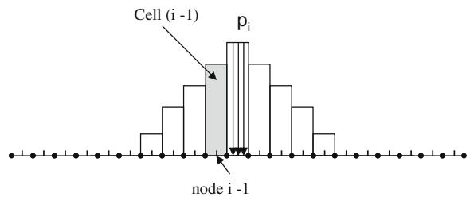  
Fig. 2. Uniform pressure cells representing the pressure distribution over the contact area $T _ { C }$ discretized with n cells of length Dx and n nodes.

The magnitude of these tractions are then adjusted to satisfy the appropriate normal (relationships (2.3), (2.4), (2.5)) and tangential (relationships (2.6), (2.7), (2.8)) boundary conditions inside and outside the a priori unknown contact area $T _ { C }$ with the stick–slip repartition by solving the unilateral frictional contact problem.

The normal gap d between two corresponding surface points is defined by Eq. (2.2), where $h _ { I }$ is the initial distance between the bodies, $u _ { z }$ the resulting normal displacement and $h _ { 0 }$ the normal displacement due to rigid body motions.

$$
d = h _ { I } + u _ { z } - h _ { 0 }\tag{ð2:2Þ}
$$

 Unilateral contact conditions

 within contact zone

$$
d _ { i } = 0 , \quad p _ { i } < 0\tag{ð2:3Þ}
$$

 outside contact zone

$$
d _ { i } > 0 , \quad p _ { i } = 0\tag{ð2:4Þ}
$$

$$
\sum _ { i = 1 } ^ { n } p _ { i } \cdot \Delta x _ { i } = P\tag{ð2:5Þ}
$$

 Tangential frictional contact conditions

 stick zone

$$
s _ { t } = 0 , \quad | q _ { i } | < f | p _ { i } |\tag{ð2:6Þ}
$$

$$
\begin{array} { r l } { \circ } & { { } \mathsf { s l i p \ z o n e } } \end{array}
$$

$$
s _ { t } = u _ { x } - \delta _ { o } | q _ { i } | = f | p _ { i } |\tag{ð2:7Þ}
$$

$$
\sum _ { i = 1 } ^ { n } q _ { i } \cdot \Delta x _ { i } = Q\tag{ð2:8Þ}
$$

where $d _ { i }$ and $S _ { t }$ are, respectively, the normal gap and the component of slip, f the corresponding friction coefficient and $\delta _ { o }$ is the tangential rigid displacement. For n segments of length $\Delta x _ { i } ,$ 2n + 1 equations are written (2n boundary conditions and Eq. (2.5) expressing the loading conservation) for (2n + 1) unknowns $( p _ { i } , q _ { i }$ and d) (Fig. 3).

This frictional contact problem is solved for each load step according to Kombi contact algorithm developed by Kalker (1990) and adapted to both quasi-static fretting and interfacial frictional crack problems (Dubourg and Kalker, 1993). The solution accuracy is dependent on the mesh size, the cell length $\Delta x _ { i }$ and thus on the cell number. A region of interest $\varGamma$ of length 2.5 mm was considered here. The difference between the actual numerical values of the half-contact area a and the maximum hertzian pressure $P _ { 0 }$ with respect to well known Hertz values whose expressions are given by Eq. (2.9) (Johnson, 1985) for the cylinder–plane configuration is therefore plotted in Fig. 4 as a function of the cell number. Errors smaller than 0.5% and 0.002% for the values of the contact size and the maximum hertzian pressure are obtained as soon as the cell number is equal to 250.

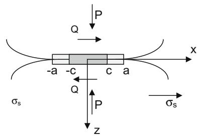  
Fig. 3. Normal and tangential loading. Notations.

$$
a = { \bigg ( } { \frac { 4 P R } { \pi E } } { \bigg ) } ^ { \frac { 1 } { 2 } } ; P _ { 0 } = { \frac { 2 P } { \pi a } }\tag{ð2:9Þ}
$$

Dealing with fretting cycles implies to tackle cyclic variation of the tangential force. Frictional problems being history dependent, the problem is formulated in an incremental manner. A fretting cycle is divided into four periods, each one being itself described with $N _ { \mathrm { L S } }$ load steps (cf. Fig. 5). At the initial point of unloading $( Q = Q _ { \mathrm { m a x } } ) ,$ a symmetrical slip zone located at the contact edges is observed where $q ( x ) = f \cdot p ( x )$ (cf. Fig. 6). As soon as unloading starts, the negative increment in tangential traction generates a reversed slip zone satisfying $q ( x ) = - f \cdot p ( x )$ that grows inwardly from the circumference $( Q = 0 )$ until it reaches the initial size of the slip annulus $( Q = - Q _ { \mathrm { m a x } } )$ while it sticks everywhere else in the contact. The loading stage is the reversal of this event. The tangential traction distributions with the stick/slip evolution are computed for each load step.

The determination of the corresponding interior stress field being performed, the next step is to be able to assess the crack risk.

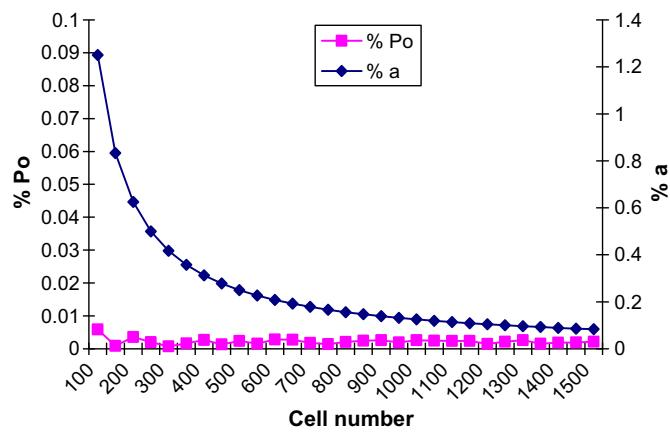  
Fig. 4. Error on $P _ { 0 }$ and a, numerical contact parameters and theoretical ones according to relationship (2-9). $E _ { 1 } = E _ { 2 } = 7 3$ ; 000 MPa;m $_ { 1 } = \nu _ { 2 } = 0 . 3 , R = 5 7 . 6 9$ mm, $P { = } 1 5 7 0 \mathrm { \tilde { N } / m m }$

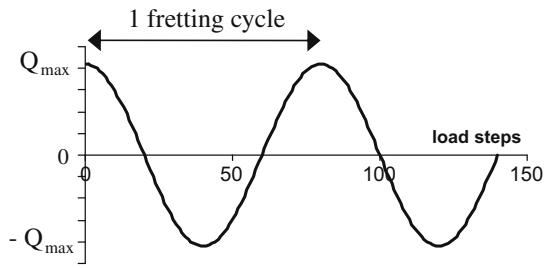  
Fig. 5. Variation of the tangential load Q applied on the two-body contact surface.

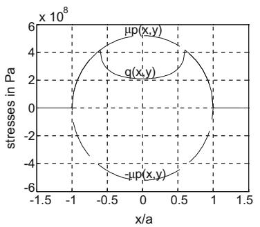  
Q= Qmax

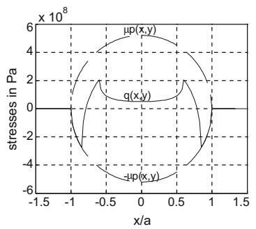  
Q=0

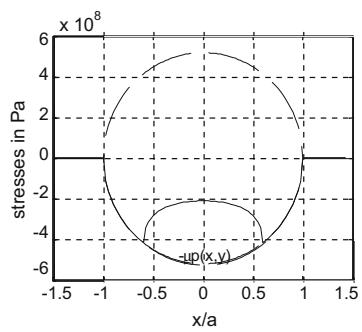  
Q= -Qmax  
Fig. 6. q distribution and stick–slip repartition within contact area versus the step of the fretting cycle.

## 2.2. Crack risk assessment

In order to assess the fatigue strength of the material submitted to a cyclic fretting loading, Dang Van’s stress-based criterion (Dang Van, 1993) has been chosen since it allows the determination of a time loading path, for t varying over a cycle, imposed on a local volume which supports multi-axial fatigue. The critical damage accumulation is based on a combination of the shear stress $\tau ( t )$ acting on the plane of normal n along with the hydrostatic stress $\sigma _ { H } ( t ) .$ The reader is referred to Fouvry et al. (1996) for further details. The characteristic relationship of this critical plane approach is then:

$$
\operatorname* { m a x } _ { \mathbf { n } } \{ \operatorname* { m a x } _ { t } \{ \tau ( \mathbf { n } , t ) + \alpha \sigma _ { H } ( t ) \} \} = \beta\tag{ð2:10Þ}
$$

where a and $\beta$ are:

$$
\alpha = \frac { 6 t _ { - 1 } - 3 f _ { - 1 } } { f _ { - 1 } }\tag{ð2:11Þ}
$$

$$
\beta = 2 t _ { - 1 }\tag{ð2:12Þ}
$$

and f and $t _ { - 1 }$ being the plain fatigue and torsion fatigue limits for a R ratio equal $\mathbf { t o } - 1$ . To observe the fatigue resistance, the couple $( \tau , \sigma _ { H } )$ needs to be calculated during the loading cycle on each point for each plane direction, defined by its normal n (and orientation $\theta ) .$ This process is very long and laborious and has been simplified (Dang Van, 1993) assuming Tresca’s law is valid

$$
\operatorname* { m a x } _ { \mathbf { n } } ( \tau ( \mathbf { n } , t ) ) = \mathrm { T r e s c a } ( t )\tag{ð2:13Þ}
$$

and one obtains the cracking risk parameter d.

$$
d = \operatorname* { m a x } _ { t } \left[ \frac { s \operatorname* { u p } \left\{ \frac { \sigma _ { i } ( t ) - \sigma _ { j } ( t ) } { 2 } \right\} } { \beta - \alpha \sigma _ { H } ( t ) } \right]\tag{ð2:14Þ}
$$

where $\sigma _ { i }$ and $\sigma _ { j }$ are the principal stresses.

It is then possible to plot the crack risk distribution d through the depth of the domain. For d greater than 1, fatigue failure occurs. The couples $( \tau , \sigma )$ verifying $d > 1$ are time defined and associated with a specific plane orientation corresponding to a direction $\beta$ of crack initiation on each point.

## 2.3. Multi-model coupling

The normal and the cyclic tangential traction distribution occurring over a load cycle on the contact surface obtained in Section 2.1 must be transferred accurately to the X-FEM model. The cell discretization of the two-body contact solution is very fine to capture accurately the complex loading variations. The X-FEM mesh is obviously coarser in this area of interest. In the X-FEM model, sets of nodes of the surface called ‘‘load-sets” are defined by the user, where uniform pressures are applied. Those two cell/ load-set discretizations do not necessary match together. Thus, a specific algorithm was developed to integrate the normal and tangential pressure fields and generate equivalent pressure distributions on the load sets, as illustrated in Fig. 7. The pressure $P _ { j }$ on each load set is given by:

$$
\Delta X _ { j } \cdot P _ { j } = \int _ { X _ { i } } ^ { X _ { i + 1 } } p ( x ) d x\tag{ð2:15Þ}
$$

Furthermore, these new pressure and traction distributions are converted into generalized nodal forces on the contacting surface. This allows a rigorous definition of the fretting loading at each load step into the X-FEM model at a prescribed accuracy.

## 3. Contacting and frictional fatigue crack models

Advanced numerical methods such as the eXtended Finite Element Method allow to deal with crack modeling without consuming prohibitive computer time and memory. X-FEM is further able to capture both scales of the crack and the structure at a given level of accuracy. The aim here is to illustrate the ability of the proposed X-FEM model to perform complex frictional contact analysis at the crack interface. A model based on the method of continuous distributions (Dubourg and Villechaise, 1989, 1992) of dislocations and unilateral frictional contact analysis and developed for fretting and rolling problems is used for the validation of the X-FEM model.

## 3.1. X-FEM discretization for 2D contacting frictional crack modeling

The eXtended Finite Element Method is an extension of the finite element method to handle physical surfaces (cracks, interfaces, etc.) which are not meshed and can be introduced inside the elements by appropriate enrichment functions using a local partition-of-unity (Babuska and Melenk, 1997; Moës et al., 1999). When contact or/and friction occurs in the X-FEM framework, some recent works reveal the need to treat carefully the prescribed Dirichlet boundary conditions due to possible contact along the crack faces. Indeed, from the pioneer works of Dolbow et al. (2001), improvements were done in many directions. Contact or/ and friction with X-FEM for static or quasi-static formulation were developed with LATIN or Augmented Lagrangian non-linear solvers (Elguedj et al., 2007; Vitali and Benson, 2008; Liu and Borja, 2008; Ladevèze, 1998). Furthermore, improvements of ‘‘naive” formulations based on Lagrange multipliers were proposed in order to avoid numerical oscillations (locking due to a locally too rich Lagrange multiplier space) (Géniaut et al., 2007; Béchet et al., 2008). A three-field weak formulation has also been proposed for 3D crack growth with contact within the X-FEM framework (Pierres et al., 2010). It allows an intrinsic definition of the crack with its own primal and dual variables, and its own discretization at a given scale. Furthermore, the link between the bulk and the crack primal and dual variables is prescribed in a weak sense and seems a key point in order to have a fine modeling of the possible complex contact state along the crack faces (Ribeaucourt et al., 2007; Pierres et al., 2010) (independently on the bulk discretization). Indeed, for instance for rolling contact fatigue, Ribeaucourt et al. (2007) clearly show the need of a quasi-static formulation with a fine discretization along the crack faces, and a specific local error indicator both for the normal and tangential fields in order to obtain accurate interface fields and stress intensity factors in mixed modes.

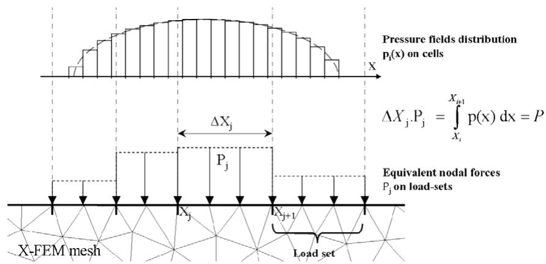  
Fig. 7. Interpolation of the pressure fields on the contact surface from the half-analytical cell discretization to the X-FEM load-set distribution.

We consider here a quasi-static (incremental) three-field weak formulation dedicated to crack growth with contact and friction in the X-FEM framework with the LATIN non-linear solver. The previous local error indicator is used (Ribeaucourt et al., 2007) and stress intensity factors $K _ { \mathrm { I } }$ and $K _ { \mathrm { I I } }$ are calculated with the interaction integral and its extension to possible contact and friction along the crack faces (Ribeaucourt et al., 2007) (see definitions (3.10), (3.11), (3.12)).

Consider an elastic body X subject to constraints and an external cyclic loading along its boundary. Let u, r and e be, respectively, the displacement, stress and strain fields within X for a given load step. Let $\boldsymbol { { \Gamma } } _ { c }$ be the crack surface and n its corresponding normal, with w and t, respectively, the interface displacement and force fields.

The underlying concept of the X-FEM lies in dividing a problem into two parts: the mesh generation for the geometric domain without meshing explicitly the crack faces, and the enrichment of the finite element approximation by additional functions for crack modeling within the framework of the partition-of-unity.

Thus, a discontinuous function and the two-dimensional asymptotic crack tip displacement fields are added to the finite element approximation to account for the crack presence. The X-FEM displacement field approximation uh leads to:

$$
\begin{array} { l } { { \displaystyle { \bf u } ^ { h } ( { \bf x } , t ) = \sum _ { i \in N _ { \mathrm { n o d e s } } } { \bf u } _ { i } ( t ) \varPhi _ { i } ( { \bf x } ) + H ( { \bf x } ) \sum _ { j \in N _ { \mathrm { c r a c k } } } { \bf a } _ { j } ( t ) \phi _ { j } ( { \bf x } ) } } \\ { { \displaystyle ~ + \sum _ { l = 1 } ^ { 4 } { B _ { l } \sum _ { k \in N _ { \mathrm { f r o n t } } } { \bf b } _ { l k } ( t ) \phi _ { k } ( { \bf x } ) } } } \end{array}\tag{ð3:1Þ}
$$

where the first, second and third terms are, respectively, the standard finite element approximation, the crack discontinuity enrichment and the crack front enrichment, see Fig. 8 (Dolbow et al., 2001). One can notice here that the considered asymptotic enrichments are not necessary the ‘‘exact” ones. Indeed, the order of the singularity on the crack tip can be either 0.5 or 0.0 according to possible contact or/and friction along the crack faces. However, previous numerical experiments (Elguedj et al., 2007; Ribeaucourt et al., 2007) have clearly shown that LEFM enrichment is sufficient to obtain a local accurate solution (even in the elastic/plastic case (Elguedj et al., 2007) where no exact asymptotic enrichment is available in the general case). Indeed, it can be pointed out that the X-FEM is not necessary a way to introduce the ‘‘analytical” or ‘‘exact” solution in the displacement field, but only a ‘‘pragmatic” approach to introduce in the displacement field new shapes functions with a strong mechanical content able to ‘‘capture” the solution with a good approximation (in other words with rather coarse meshes compared to the FEM).

Furthermore, this fracture problem is divided in a global problem (linked to the structure) and a local crack problem (Pierres et al., 2010). These two problems are defined by their own set of equations and their own primal and dual variables. On the one hand, the global problem is associated to the quantities ðu; rÞ. It satisfies the equilibrium equation in the bulk and obeys a constitutive law, possibly non-linear. The solution must also fulfill the Dirichlet and Neumann boundary conditions both on u and r. On the other hand, the local crack problem is associated to the quantities (w, t). It obeys an interfacial constitutive law (unilateral contact, frictional contact, etc.) between the crack faces $\Gamma _ { \mathrm { { C + } } }$ and $T _ { C - } .$ Finally, one builds the following quasi-static three-field weak formulation of the fracture problem (Pierres et al., 2010) at a given time t:

$$
\left\{ \begin{array} { l l } { 0 = - \int _ { \Omega } T r [ \pmb { \sigma } ( t ) \pmb { \varepsilon } ( \mathbf { u } ^ { * } ) ] d \Omega + \int _ { r _ { c } } \lambda ( t ) \cdot \mathbf { u } ^ { * } d S } \\ { \quad \quad \quad + \int _ { r _ { c } } [ \mathbf { t } ( t ) - \lambda ( t ) ] \cdot \mathbf { w } ^ { * } d S } \\ { \quad \quad \quad + \int _ { r _ { c } } [ \mathbf { u } ( t ) - \mathbf { w } ( t ) ] \cdot \lambda ^ { * } d S } \\ { \forall \mathbf { u } ^ { * } \in U _ { 0 } ^ { * } , \quad \forall \mathbf { w } ^ { * } \in W ^ { * } , \quad \forall \lambda ^ { * } \in A ^ { * } , \quad \forall t \in [ 0 , T ] } \end{array} \right.\tag{ð3:2Þ}
$$

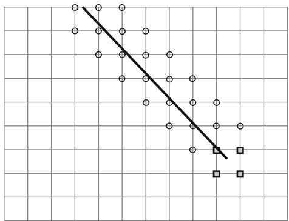  
Fig. 8. Crack located on a regular mesh. Enriched nodes: squares for the local asymptotic enrichment and circles for the discontinuous local enrichment.

where $U _ { 0 } ^ { * } , W ^ { * } , A ^ { * }$ are virtual functional spaces with the good properties of regularity (Béchet et al., 2008; Pierres et al., 2010). This three-field weak formulation is the basis for the X-FEM discretized formulation. Its main specificity resides in the weak link between the primal and dual variables of the bulk and the crack, ensured by the introduction of the Lagrange multipliers field k. In this study, the stress–strain law in the bulk between u and r is assumed to be elastic, linear, homogeneous, and isotropic. Furthermore, expression (3.1) is used for the displacement fields u and u. It can be noticed that the enriched displacement field is defined on the nodes of the mesh of the structure. Concerning the w and t interface fields, specific Gauss points are introduced along the crack faces (Dolbow et al., 2001; Elguedj et al., 2007; Ribeaucourt et al., 2007; Pierres et al., 2010). In this respect, interface elements (cf. Fig. 9) are created at the intersection between the crack geometry and the finite element mesh to deal with the frictional contact along the interface. The integration Gauss points $( G _ { i } ^ { + } , G _ { i } ^ { - } )$ are defined on each interface element on both faces of the crack. These Gauss points are the support of the contact force field t and the interface displacement field w. The a priori unknown contact conditions, dependent on the status of the point, are expressed as follows:

Let n and n be, respectively, the unit outward normal and tangential vectors to $T _ { C } ^ { + }$ . The contact force tþ and the displacement wþ along $T _ { C } ^ { + }$ are expressed in the local frame attached to the crack (respectively, t- and w- along ${ \cal { T } } _ { C } ^ { - } )$ as follows:

$$
\begin{array} { r } { \mathbf { w } = w _ { N } \mathbf { n } _ { C } + w _ { T } \mathbf { n } _ { T } \quad \mathrm { a n d } \quad \mathbf { t } = t _ { N } \mathbf { n } _ { C } + t _ { T } \mathbf { n } _ { T } } \end{array}\tag{ð3:3Þ}
$$

The opening and slip (relative displacements) at crack interface are defined as the evolution of the displacements at a pair of Gauss points during the load incremental process from one step to the next:

$$
[ { \pmb w } _ { N } ] = { \pmb w } _ { N } ^ { + } - { \pmb w } _ { N } ^ { - } \quad \mathrm { a n d } \quad [ { \pmb w } _ { T } ] = { \pmb w } _ { T } ^ { + } - { \pmb w } _ { T } ^ { - }\tag{ð3:4Þ}
$$

The contact with friction conditions for $x \in {  { \cal { T } } } _ { C }$ at a given time t are formulated with the Coulomb’s friction law:

$$
\mathrm { c o n t a c t ~ z o n e ~ } [ w _ { N } ( \mathbf { x } , t ) ] = 0 \quad \mathrm { a n d } \quad t _ { N } ^ { + } ( \mathbf { x } , t ) = - t _ { N } ^ { - } ( \mathbf { x } , t ) \leqslant 0 ;
$$

$$
t _ { T } ^ { + } ( { \bf x } , t ) = - t _ { T } ^ { - } ( { \bf x } , t )\tag{ð3:5Þ}
$$

$$
\mathrm { o p e n ~ z o n e ~ } [ w _ { N } ( \mathbf { x } , t ) ] > 0 \quad \mathrm { a n d } \quad t ^ { + } ( \mathbf { x } , t ) = t ^ { - } ( \mathbf { x } , t ) = 0\tag{ð3:6Þ}
$$

$$
\mathrm { s t i c k ~ z o n e ~ } \| t _ { T } ( \mathbf { x } , t ) \| < \mu _ { C } \| t _ { N } ( \mathbf { x } , t ) \| \Rightarrow \Delta [ w _ { T } ( \mathbf { x } , t ) ] = 0\tag{ð3:7Þ}
$$

$$
\mathrm { s l i p ~ z o n e ~ } \| t _ { T } ( \mathbf { x } , t ) \| = \mu _ { c } \| t _ { N } ( \mathbf { x } , t ) \|
$$

$$
\Rightarrow \exists \lambda > 0 / \Delta [ w _ { T } ( \mathbf { x } , t ) ] = - \lambda t _ { T } ^ { + } ( \mathbf { x } , t )\tag{ð3:8Þ}
$$

where D corresponds to an increment of the considered quantity between two successive time steps and $\mu _ { C }$ the friction coefficient along the crack faces. Indeed, the considered time interval equivalent to one fretting cycle is discretized in successive time steps according to the oscillating fretting load during one cycle (fine time scale). It can be noticed here that no crack propagation is assumed on the fine time scale before the end of the cycle.

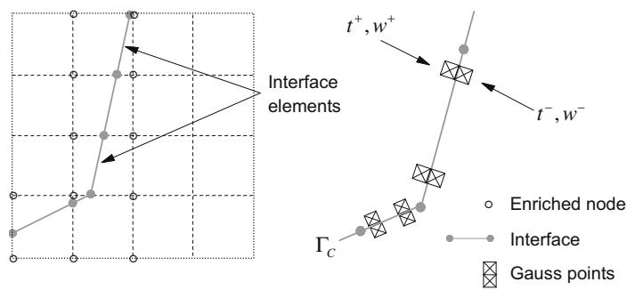  
Fig. 9. Enriched finite element intersected by the crack. Two specific Interface elements along crack profile with two Gauss points each.

Finally, one can obtain the following set of equations (from the weak formulation (3.2)):

$$
\left\{ \begin{array} { l l } { \forall \mathbf { U } ^ { * } \Rightarrow \mathbf { F } _ { \mathrm { i n t } } \cdot \mathbf { U } ( t ) = \mathbf { F } _ { \mathrm { e x t } } \cdot \mathbf { U } ( t ) + \mathbf { L } ^ { T } \mathbf { \Lambda } ( t ) } \\ { \forall \mathbf { W } ^ { * } \Rightarrow \mathbf { T } ( t ) - \mathbf { \Lambda } ( t ) = 0 } \\ { \forall \mathbf { A } ^ { * } \Rightarrow \mathbf { M } _ { 1 } \mathbf { U } ( t ) - \mathbf { M } _ { 2 } \mathbf { W } ( t ) = 0 } \end{array} \right.\tag{ð3:9Þ}
$$

where U, W, T and K correspond to the discretized fields of u, w, t and k, respectively; M1 and M2 are equivalent to ‘‘mortar” operators, which ensure the weak relation between U and W; they are notably used for non-matching finite element meshes or multi-grid mesh applications (Rannou et al., 2008).

In this paper, the Large Time Increment method (LATIN) introduced by Ladevèze (1998) is used in order to solve the non-linear X-FEM contact with friction formulation. A first attempt to apply the LATIN method to such a problem can be found in Dolbow et al. (2001). In the same context, an improved formulation coupled with a specific local error indicator was proposed by Ribeaucourt et al. (2007) in order to ensure the local convergence on the normal problem and the tangential problem both on the crack displacement field w and the load field t. Then, an improved threefield weak formulation was developed by Pierres et al. (2010) with the same error indicator for 3D crack simulations with X-FEM and possible contact/friction along the crack faces. In this work both the LATIN and the Augmented Lagrangian non-linear solvers were implemented. A convergence study was realized and their respective performances compared. Similar convergence rates were obtained and it was shown that the search direction of the LATIN method has a very similar numerical behaviour to the penalty term of the Augmented Lagrangian non-linear solver (Pierres et al., 2010). Indeed, it can be shown that this parameter allows optimizing the convergence rate of the non-linear solver (see also Elguedj et al., 2007). In practice, the optimal search direction is very close to the value of the Young modulus divided by a characteristic length linked to the crack.

From the previous X-FEM calculation of the cracked model, stress intensity factors can be obtained in a post-processing step as an input data for the fatigue crack growth law. In this respect, a 2D domain integral is used to compute the energy release rate at the crack tip and a so-called interaction integral is used to separately compute mode I and mode II stress intensity factors. A general discussion of crack-tip contour integrals and their associated domain integral representations is given in reference Moran and Shih (1987). In this paper, specific domain integrals (J-integral and interaction integral) are used in order to account for possible contact and friction along the crack faces (Fig. 10).

In this context, according to references Ribeaucourt et al. (2007) and Dolbow et al., 2001, the following expressions are used to calculate the energy release rate $G ,$ the interaction integral $I _ { h }$ and the stress intensity factors $K _ { \mathrm { I } }$ and $K _ { \mathrm { I I } }$ in the X-FEM model:

$$
\begin{array} { l } { G = - \displaystyle \int _ { \mathbf { D } } \left( \frac { 1 } { 2 } { \sigma } _ { i j } ^ { h } \varepsilon _ { i j } ^ { h } \delta _ { 1 j } - { \sigma } _ { i j } ^ { h } \frac { \partial u _ { i } ^ { h } } { \partial x _ { 1 } } \right) \frac { \partial q } { \partial x _ { j } } d S } \\ { + t _ { 1 } ^ { h } \cdot B ^ { + } ( u _ { 1 } ^ { h } \cdot B ^ { - } - u _ { 1 } ^ { h } \cdot B ^ { + } ) } \\ { I _ { h } = - \displaystyle \int _ { \mathbf { D } } \left( { \sigma } _ { i j } ^ { h } \varepsilon _ { i j } ^ { a u x } \delta _ { 1 j } - { \sigma } _ { i j } ^ { h } \frac { \partial u _ { i } ^ { a u x } } { \partial x _ { 1 } } - { \sigma } _ { i j } ^ { a u x } \frac { \partial u _ { i } ^ { h } } { \partial x _ { 1 } } \right) \frac { \partial q } { \partial x _ { j } } d S } \\ { - \displaystyle \int _ { [ A ^ { + } B ^ { + } ] \cup [ B ^ { - } A ^ { - } ] } \left( { \sigma } _ { i 2 } ^ { h } \frac { \partial u _ { i } ^ { a u x } } { \partial x _ { 1 } } + { \sigma } _ { i 2 } ^ { a u x } \frac { \partial u _ { i } ^ { h } } { \partial x _ { 1 } } \right) q n _ { 2 } d T } \end{array}\tag{ð3:10Þ}
$$

ð3:11Þ

$$
K _ { h } = \frac { E } { 2 ( 1 - \upsilon ^ { 2 } ) } \cdot I _ { h }\tag{ð3:12Þ}
$$

where exponents h and aux correspond, respectively, to X-FEM numerical quantities and auxiliary fields according to asymptotic Westergaard analytical solutions for pure mode I and pure mode II. Furthermore, the virtual extension field q is assumed to be a sufficiently smooth weighting function which takes a value of unity on an open set containing the crack tip and vanishes on the outer contour C (see Moran and Shih, 1987; Ribeaucourt et al., 2007; Destuynder et al., 1983; Yau et al., 1980). In this respect, $h = 1$ corresponds to $K _ { \mathrm { I } }$ with the pure mode I analytical auxiliary fields, and $h = 2$ corresponds to $K _ { \mathrm { I I } }$ with the pure mode II analytical auxiliary fields, see Ribeaucourt et al. (2007) and Dolbow et al., 2001. In a general point of view, the use of domain energy integrals in the finite element framework provides high accuracy while keeping the implementation rather simple as shown in reference Destuynder et al. (1983).

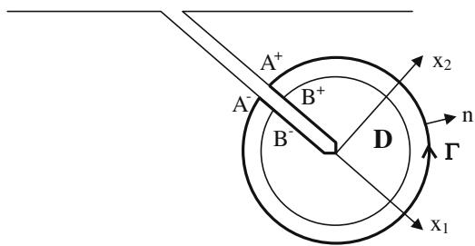  
Fig. 10. Contours and domains used in the J-integral and the interaction integral.

## 3.2. Reference crack model with contact and friction

The contacting frictional fatigue crack model called here the reference model (Dubourg and Villechaise, 1989, 1992) has been presented in details elsewhere and only the main points are recalled here. It is based on the crack modeling with continuous distributions of dislocations with arbitrary Burgers vectors $b _ { x }$ and $b _ { y }$ . This technique was initially employed by Comninou (1977), Hills and Comninou (1985) and others. It is based on the elastic stress field induced by the dislocations provided by the Dundurs and Mura solution (Dundurs and Mura, 1964), the use of powerful numerical quadratures to solve integral equations and the calculation of the stress intensity factors (Krenk, 1975). Dubourg and Villechaise (1989) have proposed a modified model for the crack modeling in terms of the dislocation theory in order to combine it with an algorithm of unilateral and frictional contact solution at the crack interface. Thus the state of cracks is determined with no a priori assumptions, the dislocations densities are calculated. The high level of accuracy of this model enables the computation of the SIF $K _ { 1 }$ and $K _ { \mathrm { I I } }$ directly from the opening and slip displacements at the interface. For a quasi-static loading, an incremental description of the tangential loading is used to account for hysteresis phenomena. Nominal values of $\Delta K _ { \mathrm { I } }$ and $\Delta K _ { \mathrm { I I } }$ are determined corresponding to the slip and opening increments associated to the loading increment and added to the values obtained at the previous load step.

In this respect, the reference model is able to determine and account for interaction between cracks (Dubourg et al., 1992), as well as the closure–opening–locking–sliding sequences along the faces of the cracks during the multi-axial non-proportional loading cycles (fretting fatigue, rolling contact fatigue). Furthermore, this reference model has been validated through the comparison with experimental results conducted under both fretting (Dubourg et al., 2002) and rolling contact conditions (Dubourg and Lamacq, 2002). It can be noticed that such an approach can be extended to the 3D case only with specific geometries and linear behaviour in the bulk. Then, X-FEM can be seen as an alternative method to account for 2D or 3D complex geometries and non-linear behaviour both in the bulk or at the interfaces, or multi-scale effects specific to fatigue crack growth (coupling between boundary effects, crack, confined plasticity, etc.).

## 4. 2D crack growth simulation

As a general rule, a crack kinks under mixed mode at an angle h to the plane of the pre-crack. Under proportional loading, the crack path determination is usually performed using either the MTS maximum tangential stress criterion (Dubourg et al., 2002) the maximum strain energy density (Erdogan and Sih, 1963; Sih, 1974) or the maximum energy rate criterion. A little difference is found between the predictions performed with the different criteria (Suresh, 1998). Under non-proportional loading, the direction where the maximum is reached is time dependent contrary to the proportional loading case. Therefore different extensions of the MTS criterion have been proposed. Hourlier et al. (1985) assumed that crack bifurcates in a direction h where the mode I stress intensity factor on the branched crack $k _ { 1 } ^ { * }$ is maximum, or in the direction where $\Delta k _ { 1 } ^ { * }$ is maximum, or in the direction where the crack growth rate da/dN is maximum. They considered the state of stress induced by an infinitesimal kinked crack emanating from the existing crack in a given direction (Amestoy et al., 1979). The former being an extension of a criterion for monotonic loading is expected to be applicable only at very high growth rates approaching final rupture, the second does not take into account the effect of mean stress which is known to influence the fatigue crack behaviour, the latter requires the crack growth rates estab lished under mixed mode loading. Dubourg and Lamacq (2000) proposed also an extension of the MTS criterion. It is assumed that the crack extension angle is linked to the maximum effective amplitude of the tangential stress at crack tip over a load cycle $\Delta \sigma _ { \theta \theta , \operatorname* { m a x } } ^ { * } .$ . Bower (1988) assumes that the branching of the crack is towards the direction that maximizes $K _ { \sigma } = \sigma _ { \theta \theta } \sqrt { 2 \pi }$ or its amplitude $\Delta K _ { \sigma }$ , where $\sigma _ { \theta \vartheta } = 1 / \sqrt { 2 \pi r }$ cos $\theta / 2 \left( K _ { \mathrm { I } } \cos ^ { 2 } { \frac { \theta } { 2 } } - { \textstyle \frac { 3 } { 2 } } K _ { \mathrm { I I } } \right.$ sin h; h is the angle between the original crack and the branch crack and r is the distance from the crack tip.

The $\Delta k _ { 1 } ^ { * }$ and $\Delta \sigma _ { \theta \theta , \operatorname* { m a x } } ^ { * }$ criteria predict crack path in agreement with experimental observations carried on fretting tests on 7075 aluminum alloy under partial slip regime (Dubourg et al., 2002).

## 5. Numerical simulation of fretting fatigue experiments

Experimental and theoretical work has been undertaken to improve our knowledge of crack initiation and propagation under fretting conditions. Tests were conducted on 7075 aluminum alloy under partial slip regime and mixed fretting regimes to obtain experimental data on crack behaviour (Dubourg and Lamacq, 2000). Modeling of those tests have been performed with the contact and fatigue crack models developed previously (Dubourg and Villechaise, 1992) called here the reference model. The aim here is to conduct this simulation using the X-FEM model. This comparison is used to demonstrate the ability of the X-FEM based model to capture a sequence of complex contact configurations along the crack faces and accurately compute the SIFs.

A spherical indenter is pressed against a planar specimen by a constant normal force and submitted to a reciprocating movement of given amplitude with a constant speed, at a given frequency. The bulk load is fixed during testing. The magnitude of the tangential force Q as a function of the displacement is recorded for each cycle. The evolution of the frictional force is important as it governs the material degradation response and the boundary conditions for the modeling of the experiment. Normal load and displacement amplitude pairings are determined in such a way that (1) linear elasticity assumptions are satisfied, (2) the material degradation response is cracking with no concomitant wear, (3) assumptions of smooth surfaces and constant coefficient of friction are valid during the loading test. The assumed value of local friction coefficient is determined based either on the experimental in situ continuous observation of stick/slip distribution within the contact area or the observation at the end of the test. The material considered for both indenter and specimen is an aluminum alloy 7075. The mechanical properties are displayed in Table 1.

Under those chosen experimental conditions, it was observed experimentally that multiple cracks initiate in the annulus micro-sliding zone at the edges of the contact area. Some cracks intersect with other cracks, leading to spall detachment, while most of the other self-arrest. Two main cracks propagate from this network, along a semi-elliptical trajectory at the two-specimen interface while below the surface they followed a direction ranging from 15 to 35 to the surface before branching along a direction of 65 with respect to the contact surface.

The cracking behaviour is analyzed in the meridian plane $y = 0 .$ An equivalent cylinder on plane problem is defined. As crack initiation is critically linked to the contact patch dimension (Nowell and Hills, 1990), the line contact parameters (normal and tangential loads per unit length, cylinder radius) are defined in order that 3D and 2D contact area size and maximum hertzian pressure $P _ { 0 } ,$ are identical (Hills and Nowell, 1994). Thus the normal and tangential line loading considered are 420 N/mm and the cylinder radius is 239 mm. The mechanical properties are displayed in Table 1. The fatigue properties and the experimental fretting conditions are specified in Table 2.

Table 1  
Mechanical properties of Al 7075.
| 항목 | 값 |
| --- | --- |
| E (GPa) | 73 |
| U | 0.3 |
| Ultimate tensile strength (MPa) | 540 |
| Fatigue limit (MPa) | 230 |
| Hardness Hv | 160 |
| $f _ { - 1 } \ ( \mathbf { M P a } )$ (Wittkowsky et al., 2000) | 175 |
| t_1 (MPa) (Wittkowsky et al., 2000) | 101 |

Table 2  
Experimental fretting conditions.
| 항목 | 값 |
| --- | --- |
| Normal load | 420 N/ mm |
| Tangential load | ±420 N/ mm |
| Frequency | 5 Hz |
| Cylindrical radius (m) | 0.239 |
| Friction coefficient $\mu _ { t b }$ | 1.2 |
| Stick/ slip ratio | 0.408 |

The numerical simulation of this fretting test is organized as described in Fig. 1:

 Step 1: Interface component analysis with dedicated contact models.

The two-body cyclic frictional contact problem is numerically solved using the models described in Section 2. The plane specimen is thus assumed to be a half-space. The dimensions of the potential surface, where the contact solution is computed, is $2 l = 4 . 5 1 5$ mm, discretized with 301 identical cells whose length is 15 lm. Two hundred and one loading steps are considered to capture accurately the hysteresis effect induced by friction. $P _ { 0 }$ is equal to 150 MPa and $2 a = 3 . 5 7$ mm. The traction distributions at some representative load steps are depicted in Fig. 11. Note that those calculations are inexpensive in computer time.

This cyclic loading is then applied as input data to the X-FEM model according to the methodology described in Section 2.3. The transfer is illustrated in Fig. 12 for the tangential distribution obtained at the loading step numbered 16. Three hundred and one cells with mesh size of 15 lm, from $x = - 2 . 2 5$ mm to x = 2.25 mm are considered for the reference model and 100 load sets ranging from $X _ { 1 } = - 2 . 1$ mm to $X _ { 1 0 0 + 1 } = 2 . 1$ mm for the X-FEM model.

 Step 2: Criteria for crack initiation and location.

Dang Van multi-axial stress-based criterion is then computed. The crack risk distribution d on the surface but also within the depth of the domain and the direction h of crack initiation are plotted in Fig. 13 as a function of (x/a) and (z/a). The greatest risk is located in the two slip zones. Maximum values held symmetrically within zones spanning from x/a = 1.12 to 0.7 and from -1.12 to -0.7. At the surface and at x/a = ±1.12 where the risk is the highest and where the crack may initiate, the crack initiation angle h is about 45. It decreases gradually towards the stick limit. Note that the evolution of h with the depth gives an idea of the crack path. Further, this indication is limited for a small depth as the existing crack will modify the stress field and the predicted crack path.

 Step 3: SIF computation at crack tips.

The 7075 specimen is a rectangle elastic domain. The zone corresponding to the maximum risk for crack initiation spans from $x / a = - 1 . 1 2$ to -0.7 and $x / a = 0 . 7$ to 1.12, corresponding to x ranges from -1.992 to -1.2495 mm and from 1.2495 to 1.992 mm. Cracks labeled 1 and 2 are located symmetrically with respect to the indenter center, at $x _ { 1 } = - 1 . 6 5$ mm (i.e. x/ $a = - 9 2 )$ and $x _ { 2 } = 1 . 6 5$ mm (i.e. $x / a = 0 . 9 2 )$ see Fig. 14. They are inclined at $\beta _ { 1 }$ and $\beta _ { 2 }$ equal, respectively, $\mathsf { t o } - 2 9 ^ { \circ }$ and 29 with respect to the free surface (counted positive in the trigonometric direction) and are 88 lm long. This size is of the order of several grains for this material, a required condition for the LEFM applicability. These data have been chosen in order to be in agreement with experimental observations (Dubourg and Lamacq, 2000) and are in agreement with the results obtained according to the Dang Van stress based multi-axial fatigue criterion cf. Fig. 13. Firstly, a friction coefficient $\mu _ { C } = 0 . 2$ is assumed at the crack interface.

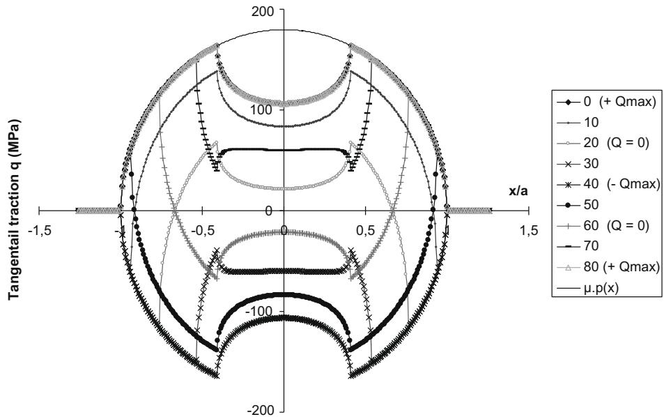  
Fig. 11. Representation of the distribution of the tangential traction q (MPa) along the two-body contact surface for a complete fretting cycle (only nine out of the 80 load steps are shown here).

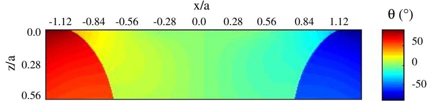

For the reference model, the 7075 specimen is assumed to be a half-plane. The reference model being based on the theory of continuous distributed dislocations, N discretization points $M _ { i }$ distributed along each crack with unknown Burgers values $b _ { x i }$ and $b _ { y i }$ are used to describe the relative displacements at the crack interface. In this case, N = 77 has been chosen.

For the X-FEM model, the 7075 rectangle elastic domain is 100 mm width and 50 mm long, cf. Fig. 15. These dimensions have been determined to fulfill the half-space behaviour inherent to the reference model. The specimen is meshed using 3-nodes linear triangular elements. A local refinement of the mesh is done in the vicinity of the two-body contact surface, the crack and the crack tip, cf. Fig. 16. The smallest element size is 0.5 lm. This ensures (i) to capture the steep

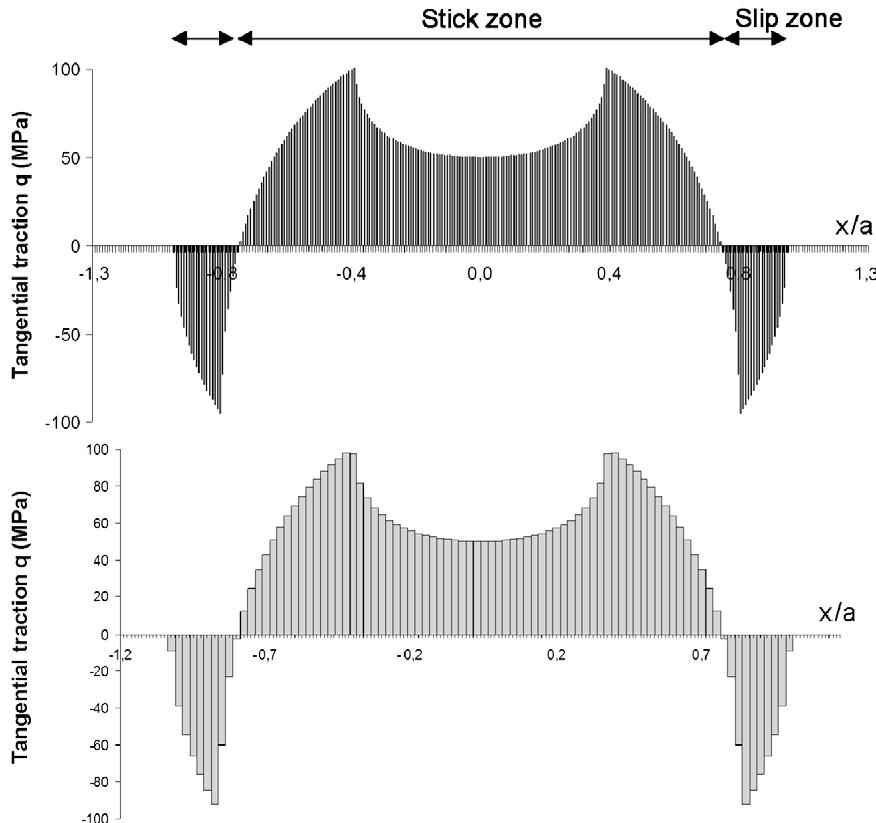  
Fig. 12. Interpolation of the tangential traction distribution obtained at the load step 16: 301 cells; 100 load sets.

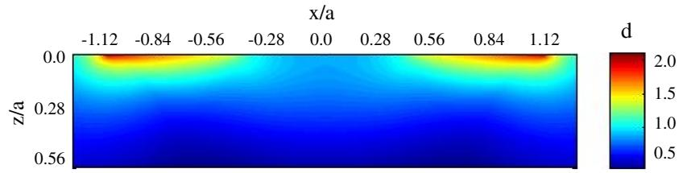

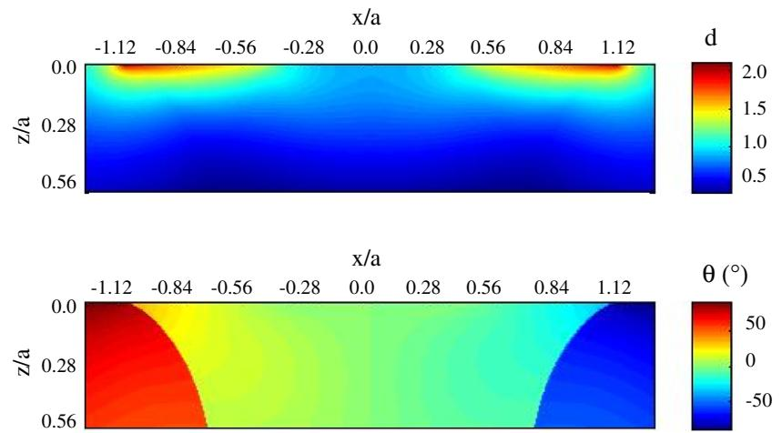  
Fig. 13. Crack risk distribution d and crack initiation angle h in a domain influenced by the fretting loading

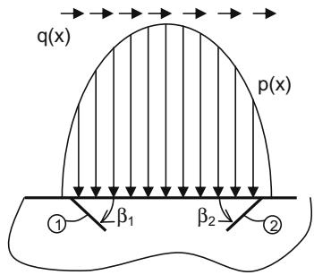  
Fig. 14. Geometry of cracks 1 and 2 under fretting loading for the considered application.

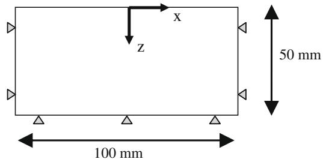  
Fig. 15. Geometry of the rectangle elastic domain used in the X-FEM model, with associated boundary conditions used for the fretting simulation.

stress and strain gradient in the near surface of the contact area and of the stick/slip boundary and (ii) to carry out the complex contact solution along the crack faces with a sufficient accuracy as the number of the interface elements along the crack faces result from the sub-cutting of the elements. Here, each crack is discretized using 122 interface elements with 1 G point each. The computation is done at a level of accuracy for the local convergence criterion of $1 0 ^ { - 4 }$ and the radius of the integration domain around the crack tips for the computation of the SIFs is 5 lm.

The variations of mode I stress intensity factors obtained according to the X-FEM and the reference model at crack tips 1 and 2 are displayed versus Q values during the fretting cycle in Fig. 17. The variations of mode II SIFs obtained according to both models are shown in Fig. 18 for crack 1 and in Fig. 19 for crack 2. Note that the fretting cycle has been described with 201 load steps for the reference model while only 81 load steps have used for the X-FEM model.

The agreement between the results is very good. A difference must nevertheless be underlined. A quite difference in SIF values is obtained for load steps corresponding to frictional locking (or sticking) at crack interface. This occurs for crack 1 at the beginning of the reloading phase when $Q = - Q _ { \mathrm { m a x } }$ and for crack $^ 2$ at the beginning of the unloading when $Q = Q _ { \mathrm { m a x } } .$ . The complex contact states determined at crack 1 and 2 interfaces are the same according to both models.

The determination of the stress intensity factor (see Sections 3.1 and 3.2) for both models rest on different approaches:

 In the reference model, the stress intensity factors are obtained directly from the relative displacement at crack tip whose values are extrapolated from relative displacement values along the crack faces. In case of frictional locking between two load steps, no slip increment and consequently a nil $\Delta K _ { \mathrm { I I } }$ is computed. $K _ { \mathrm { I I } }$ is thus constant from one step to the next.

 In the X-FEM model, $K _ { \mathrm { I I } }$ computation involves stress and relative displacement at the crack interface (Eqs. (3.10) and (3.11)). A stick condition from one step to the next does not involve a nil range for $K _ { \mathrm { I I } }$

Therefore, the comparison between $K _ { \parallel }$ values for crack 1 obtained according to both models is very good up to Q value for which the interface locking occurs. The gap in $K _ { \parallel }$ value is then kept till the end of the fretting cycle. For crack 2, a difference in $K _ { \parallel }$ value occurs from the beginning of the fretting cycle as the interface locking occurs right from the start.

These figures highlight two points:

 Different phases occur during the fretting cycle. Crack 1 experiences mixed mode I and II, then pure mode II and again mixed mode I and II loading conditions while crack 2 experiences pure mode II, then mixed mode I and II and again pure mode II loading conditions. This is illustrated in Fig. 20 where the evolution of the single phase angle $\psi _ { M }$ during the fretting cycle is plotted for both cracks. $\psi _ { M }$ characterizes the near-tip mode mixity (Suresh, 1998) (5.1). $\psi _ { M } = 0$ means pure mode I and $\psi _ { M } = \pi / 2$ means pure mode II.

$$
\psi _ { M } = \left| \arctan \left( \frac { K _ { \mathrm { I I } } } { K _ { \mathrm { I } } } \right) \right|\tag{ð5:1Þ}
$$

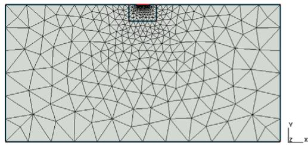

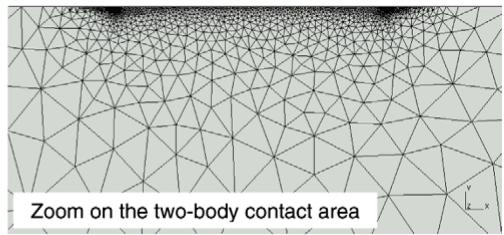

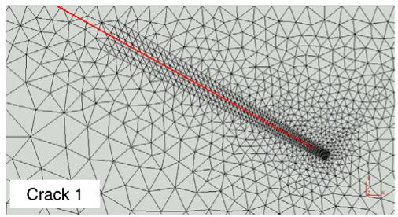

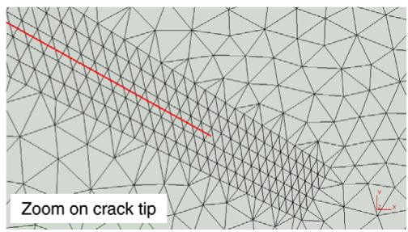  
Fig. 16. Four different views of the mesh of the 2D rectangular specimen used for the fretting simulation.

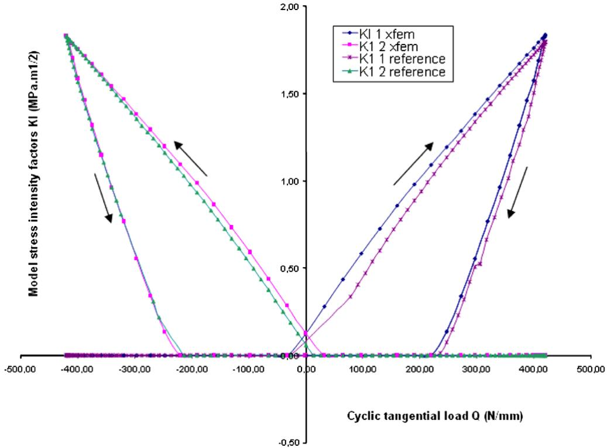  
Fig. 17. Mode I stress intensity factors computed for both cracks with the reference model and the X-FEM model.

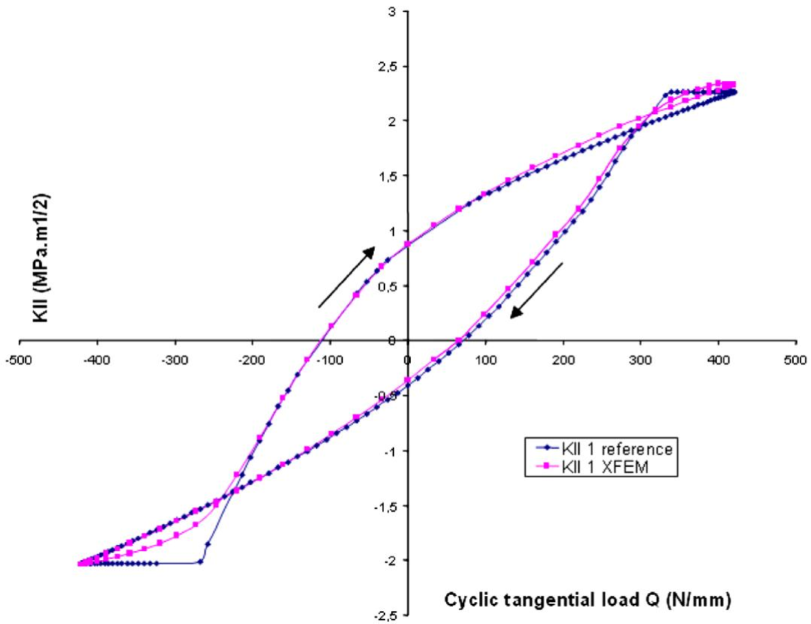  
Fig. 18. Mode II stress intensity factor computed for crack 1 at each load step of one cycle.

 Further $\psi _ { M }$ variation during the loading cycle indicates that both cracks are subjected to non-proportional mixed mode loading.  Step 4: Crack propagation.

The crack extension prediction is performed according to criteria dedicated to proportional and non-proportional loadings as presented in Section 4. These crack growth criteria are based on the evolution of stress intensity factors $\Delta K _ { \mathrm { I } }$ and $\Delta K _ { \mathrm { I I } }$ range during a complete fretting cycle. Subsequently, the crack growth speed and direction (angle h here between the original crack and its extension, positive in the trigonometric direction) are computed for each crack at the end of each fretting cycle, corresponding to a ‘‘coarse” time scale.

Crack growth directions after 3 propagation steps (crack extension = 2 lm) using different criteria are summarized in Table 3. Hourlier’s criterion $( \Delta k _ { 1 } ^ { * } ) _ { \operatorname* { m a x } }$ experimentally revealed to be the most appropriated to the simulation of fretting fatigue crack growth (Dubourg et al., 2002) is chosen here.

The X-FEM model for contacting frictional fatigue crack is validated. It succeeds in capturing the complex frictional contact evolution at the interface of cracks submitted to combined mode I and mode II multi-axial non-proportional loading. It can be recalled here (see Section 3.1) that a specific error indicator coupled with the LATIN non-linear solver is used in order to ensure the local convergence on the normal problem and the tangential problem both on the crack displacement field w and the load field t all along the crack interface. Indeed, in case of complex contact states along the crack faces, an efficient error indicator both on the normal and tangential problem has to be used (Ribeaucourt et al., 2007). The comparison between X-FEM results and the ones obtained according to the reference model shows an excellent agreement. Differences in $K _ { \mathrm { I I } }$ values are linked to a different approach, either displacement or stress-displacement based.

Two parameters having a strong influence on the near tip mixity of a crack submitted to contact loading are analyzed in the next

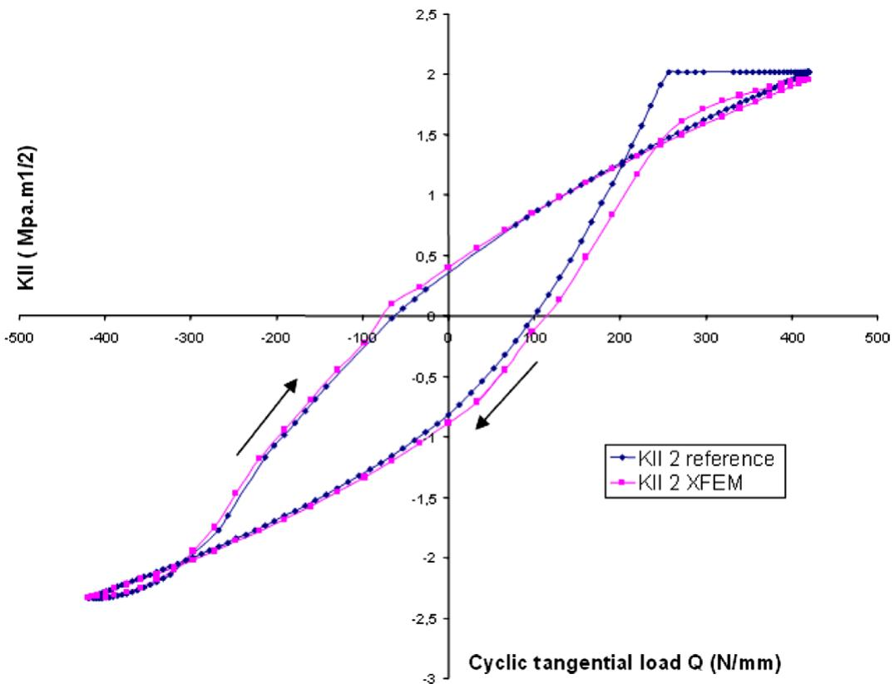  
Fig. 19. Mode II stress intensity factor computed for crack 2 at each load step of one cycle.

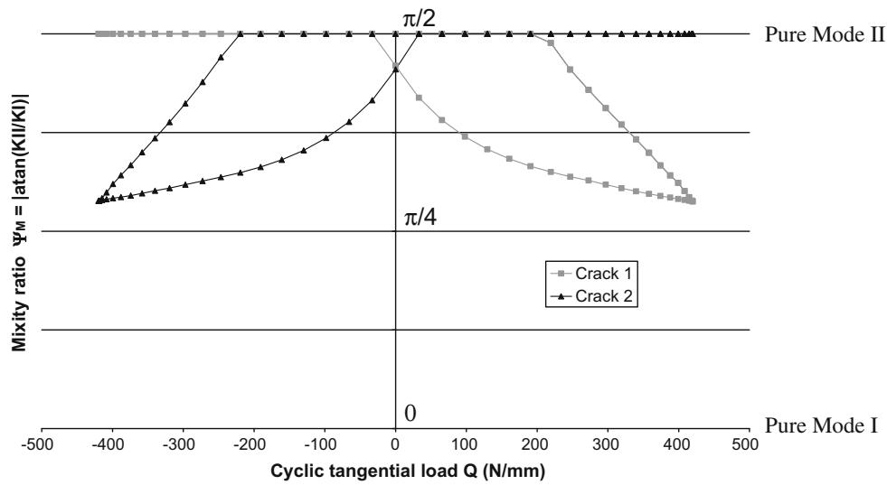  
Fig. 20. Variation of the mixity ratio $\psi _ { M } = | \mathbf { a t a n } ( K _ { \mathrm { I I } } / K _ { \mathrm { I } } ) |$ for a complete fretting cycle.

Cyclic tangential load Q (N/mm)  
Branching angle h corresponding to different criteria.
|  | $( k _ { 1 } ^ { * } ) _ { \operatorname* { m a x } }$ | $( \Delta k _ { 1 } ^ { * } ) _ { \operatorname* { m a x } }$ | $( \sigma _ { \theta \theta } ) _ { \mathrm { m a x } }$ |
| --- | --- | --- | --- |
| Crack 1 | -60° | -49° | -64° |
| Crack 2 | 55° | 45° | 58° |
|  |  |  |  |
|  |  |  |  |
|  |  |  |  |
|  |  |  |  |
|  |  |  |  |
|  |  |  |  |

section. First, the influence of the crack interface friction coefficient is emphasized as it governs $\Delta K _ { \mathrm { I I } }$ ranges and hence crack growth rates and crack path directions. Further the influence of a static bulk stress superimposed to the two-body contact loading is analyzed. This bulk stress favours a transition between the two-body contact influence zone and a plain fatigue zone.

## 6. Parametric studies

In the two next sections, crack simulations are performed with different values of the coefficient of friction between the crack faces $\mu _ { C }$ and with an additional bulk stress $\sigma _ { S } .$ The fretting loading conditions are unchanged and are those defined in Table 2. The $\mathrm { X } -$ FEM mesh of the rectangular domain is also unchanged. The aim is to analyze the influence of those parameters on the mixity of the cracking modes, and furthermore the crack growth path.

## 6.1. The coefficient offriction between the crack faces

$\mu _ { C }$ ranges from 0.2 to 1.2. $K _ { \mathrm { I I } }$ variations over the whole fretting cycle for the different $\mu _ { C }$ values are plotted in Figs. 21 and 22.

Fig. 22 for cracks 1 and 2, respectively. The crack opening being independent on $\mu _ { C } , K _ { \mathrm { l } }$ variations are not presented. Note that no convergence problem is encountered whatever the value of the friction coefficient at crack interface.

The following results were obtained from this analysis:

$\Delta K _ { \mathrm { I I } } = K _ { \mathrm { I I , m a x } } - K _ { \mathrm { I I , m i n } }$ decreases for both cracks as $\mu _ { C }$ increases. More precisely:

For crack 1, $K _ { \mathrm { I I , m a x } }$ is constant versus $\mu _ { C }$ while $K _ { \mathrm { I I , m i n } }$ decreases with increasing $\mu _ { C } . \quad K _ { \mathrm { I I , m a x } }$ at $Q = Q _ { \mathrm { m a x } }$ is unchanged as the crack is completely opened and thus the friction coefficient has no influence on the interfacial contact state, neither the normal and tangential stresses nor the opening and slip displacements. As soon as the crack flanks are contacting, their rubbing is dependent on $\mu _ { C }$ and an increase in $\mu _ { C }$ implies the drop of the slip and hence a drop in $K _ { \mathbb { I } } .$

– For crack 2, $K _ { \mathrm { { I I } , \operatorname* { m i n } } }$ is constant versus $\mu _ { C }$ while $K _ { \mathrm { I I , m a x } }$ decreases with increasing $\mu _ { c } .$

 The near-tip mode mixity $\psi _ { M } = $ j arctan $( K _ { \mathrm { I I } } / K _ { \mathrm { I } } | )$ is independent on $\mu _ { C } .$ Indeed the value of $K _ { \mathrm { I I } }$ is quasi unchanged when $K _ { \mathrm { I } }$ is not nil. Though, mode II predominance is decreasing. Indeed the ratio $\Delta K _ { \mathrm { I } } / \Delta K _ { \mathrm { I I } }$ ranges from 0.42 to 0.89 as $\mu _ { C }$ varies from 0.2 to 1.2. The crack path is influenced by crack face contact mixed mode. One recalls that the crack growth path is determined according to the $\Delta k _ { 1 \operatorname* { m a x } } ^ { * }$ criterion, assuming that the crack advances in the direction in which this value reaches its maximum, $\Delta k _ { 1 } ^ { * } = \Delta k _ { 1 \operatorname* { m a x } } ^ { * } .$ As a consequence, the increase in $\mu _ { C }$ causes a slight increase for crack 2 in the propagation angle h. It ranges from $4 5 ^ { \circ }$ for $\mu _ { C } = 0 . 2 \mathrm { t } 0 5 5 ^ { \circ }$ for $\mu _ { C } = 1 . 2$ relatively to the initial crack orientation (29 from the surface) after three propagation steps, as depicted in Fig. 23 (similar results are obtained for crack 1 and are not presented).

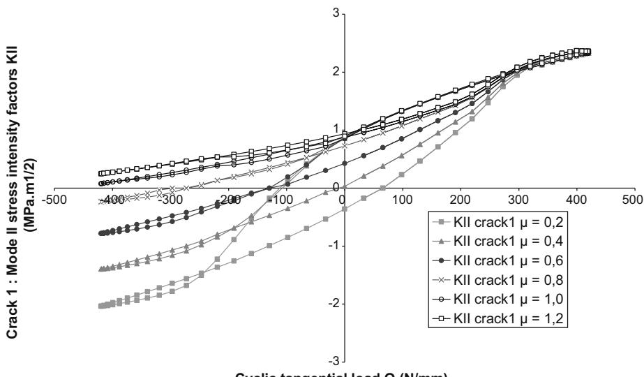  
Fig. 21. Mode II stress intensity factor computed for crack 1 at each load step of one cycle for six different values of the friction coefficient between the crack faces: $\mu _ { c } = 0 . 2 ; \mu _ { c } = 0 . 4 ; \mu _ { c } = 0 . 6 ; \mu _ { c } = 0 . 8 ; \mu _ { c } = 1 . 0 ; \mu _ { c } = 1 . 2 .$

## 6.2. The bulk stress effect

In this section, the effect of an additional constant compressive or tensile bulk stress along the x-axis $\sigma _ { S }$ is studied. The contact loading and the bulk stress have a different influence on the cracks:

 The former produces the fatigue part of the loading and its action decreases with the depth. The driving force for crack growth decreases too. Then, the crack has to branch along a new direction.

 The latter is constant and extends and strengthens the action of the contact at the crack tips. If the crack is long enough to be out of the contact zone influence, the action of the bulk stress prevents the crack self-arrest. Relative slips along the crack faces due to the contact loading are then passed on at the branched open tip of the crack, leading to a varying crack opening.

The friction coefficient between the crack faces is assumed to be $\mu _ { c } = 1 , 2 . \sigma _ { S }$ ranges from - ${ \cdot \sigma _ { D } } / 2$ to $+ \sigma _ { D } / 2$ , where $\sigma _ { D } = 2 3 0 \mathrm { M P a }$ is the fatigue limit of the considered material Al7075.

The crack growth angle $\theta , \ K _ { 1 }$ and $K _ { \mathbb { I } }$ and mixity ratio $\psi _ { M } = | \arctan ( K _ { \mathrm { I I } } / K _ { \mathrm { I } } ) |$ variations over the whole fretting cycle for four different r values are plotted in Figs. 24–27 for cracks 1 (similar results are obtained for crack 2 and are not plotted for brevity). The results from this analysis are:

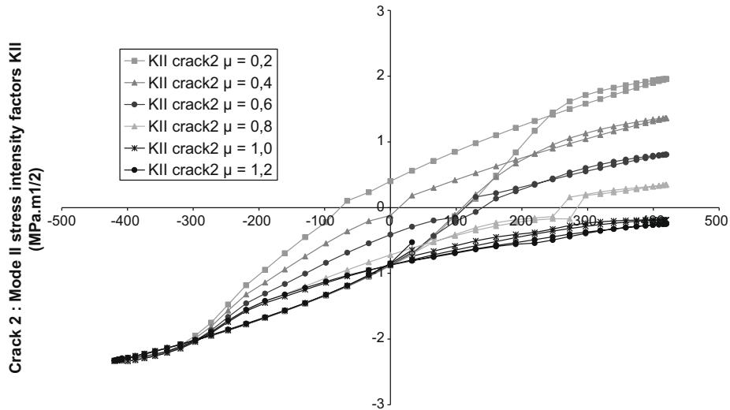  
Cyclic tangential load Q (N/mm)

Fig. 22. Mode II stress intensity factor computed for crack 2 at each load step of one cycle for six different values of the friction coefficient between the crack faces: $\mu _ { c } = 0 . 2 ; \mu _ { c } = 0 . 4 ; \mu _ { c } = 0 . 6 ; \mu _ { c } = 0 . 8 ; \mu _ { c } = 1 . 0 ; \mu _ { c } = 1 . 2 .$  
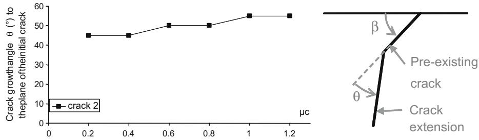  
Fig. 23. Prediction of combined mode I–mode II crack path for crack 2: angle h versus $\mu _ { c }$

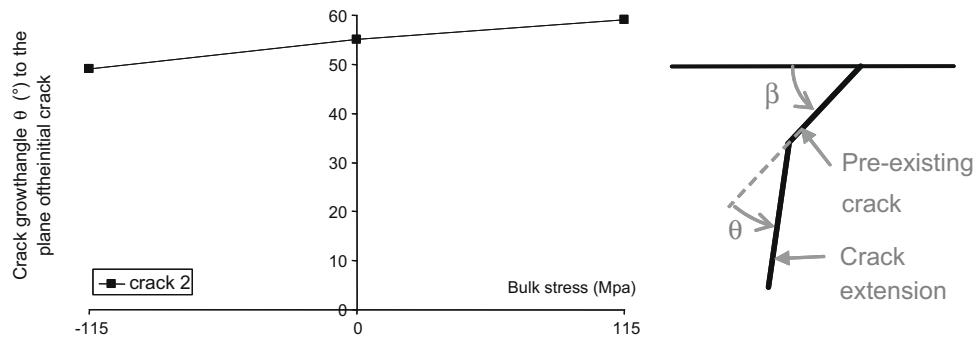  
Fig. 24. Prediction of combined mode I–mode II crack path for crack 2: angle a versus $\sigma _ { S } .$

$\Delta K _ { \mathrm { I } } = K _ { \mathrm { I , m a x } } - K _ { \mathrm { I , m i n } }$ increases for both cracks with increasing $\sigma _ { S } .$ The cracks are not completely open during the whole loading cycle. They are still located in the contact influence zone. Nevertheless, mode I phase increases with increasing $\sigma _ { S } .$

$K _ { \mathrm { I I , m a x } }$ increases for both cracks as $\sigma _ { S }$ increases. Indeed, the tensile bulk stress amplifies the opening of both cracks, favours slip between the crack faces as it is not hindered by the compressive stresses acting normally on crack faces. But as an average sliding is added along crack faces, $\Delta K _ { \mathrm { I I } } = K _ { \mathrm { I I , m a x } } - K _ { \mathrm { I I , m i n } }$ is independent on $\sigma _ { S } .$

 The ratio $\Delta K _ { \mathrm { I } } / \Delta K _ { \mathrm { I I } }$ ranges from 0.52 to 1.22 as $\sigma _ { S }$ varies from -115 MPa $\left( - \sigma _ { D } / 2 \right)$ to 115 MPa $( + \sigma _ { D } / 2 )$ . Mode II predominance drops when a tensile bulk stress is applied, see Fig. 27. As a consequence, the crack growth angle after 3 propagation steps relatively to the initial crack orientation increases from $4 9 ^ { \circ }$ for $\sigma _ { S } = - 1 1 5 \mathrm { M P a }$ to $5 9 ^ { \circ }$ (almost perpendicular to the contact surface) for $\sigma _ { S } = 1 1 5 \mathrm { { M P a } }$ (see Fig. 24).

This parametric study enhanced the dependency of the fretting cracking mixity and furthermore the crack growth path on the tangential contact state and on an additional bulk stress. As a consequence, the crack propagation under fretting fatigue loading can be governed mainly either by the contact loading or by the bulk stress or both. In the following section, crack growth simulation is performed to enhance these phenomena along the crack path.

## 7. Crack growth simulation

In this section, crack growth simulation is performed with the proposed X-FEM model. A special attention is devoted here to the direction of the crack growth during the propagation process in relation with the mechanical conditions such as the evolution of the in-depth stress–strain state due to the contact loading itself. The fretting conditions are unchanged and are those defined in Table 2. Two cracks are considered as defined in Section 5. Note that the friction coefficient between the crack faces is assumed to be equal to $\mu _ { C } = 1 . 2$ . As concluded in Section 6.1, this value induces the highest branching angle equal to 55. Further a tensile bulk stress $\sigma _ { S } = 1 1 5 \mathrm { M P a }$ is superimposed. For this value (see Section 6.2) the cracks are still located within the contact influence zone as the crack tips are not completely open during the whole loading cycle. Crack growth is performed starting from the given crack geometry and a crack increment of a given length is considered. Four cases are presented. Case A is the reference simulation. The initial crack is 88 lm long with an angle of $2 9 ^ { \circ }$ and the crack extension is 2 lm long. The influence of parameters such as the crack length $l _ { C } ,$ (case B: a longer initial crack 150 lm is considered); the tangential loading Q (case C: the tangential fretting load is equal to $Q = 2 1 0  { \mathrm { M P a } }$ instead of 420 MPa) are considered. Finally case D, all the mechanical parameters are identical to those considered in case A except that the length of the crack extension is 5 lm.

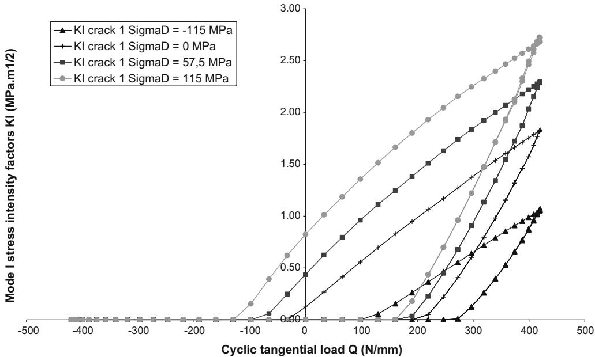  
Fig. 25. Mode I stress intensity factor computed for crack 1 at each load step of a fretting cycle for four different values of additional bulk stress

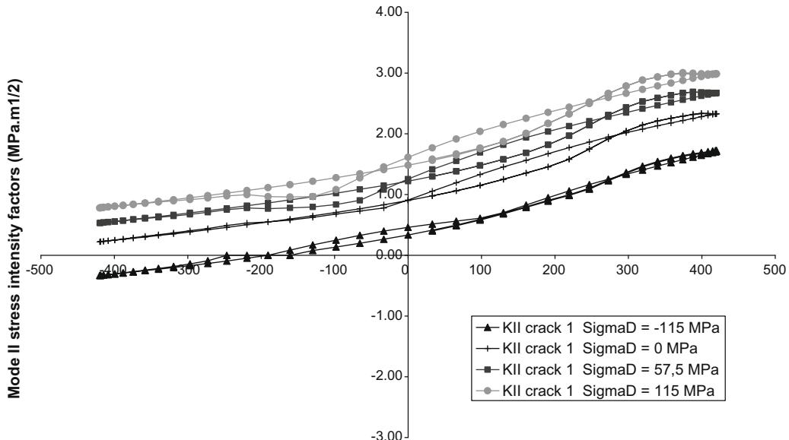  
Cyclic tangential load Q (N/mm)  
Fig. 26. Mode II stress intensity factor computed for crack 1 at each load step of a fretting cycle for four different values of additional bulk stress.

Hourlier’s non-proportional crack growth direction criterion $\Delta k _ { 1 \mathrm { { m a x } } } ^ { * }$ is used. Recall that $k _ { \mathrm { I } }$ is calculated at the tip of an infinitesimal segment inclined at an angle h of the primary crack and is expressed versus $K _ { \mathrm { I } }$ and $K _ { \mathrm { I I } } .$ This criterion accounts therefore for the mode II influence.

As specified previously, neither re-meshing nor field interpolation are needed during the crack growth simulation. The results are presented for crack 2 only.

 Case A: Six propagation steps (2 lm each) are performed. Fig. 29(a) shows the propagation path resulting from the X-FEM simulation for crack 2. The crack growth angle ranges from 59 to $5 ^ { \circ }$ during the propagation (almost coplanar with the initial crack) relatively to the initial crack orientation. The crack is still submitted to the influence of the contact loading and experiences shear at its interface.

 Case B: The length of the initial crack is now $l _ { C } = 1 5 0 \mu \mathrm { m }$ (crack tip at $y = - 7 3 \mu \mathrm { m } )$ . Six propagation steps (2 lm each) are performed. Fig. 29(b) shows the propagation path resulting from the computation. The crack is growing away from the surface, almost perpendicularly to the surface (h ranges from $5 5 ^ { \circ }$ to 60 relatively to the initial crack orientation) and is mostly governed by tensile forces. The crack path is thus different from the

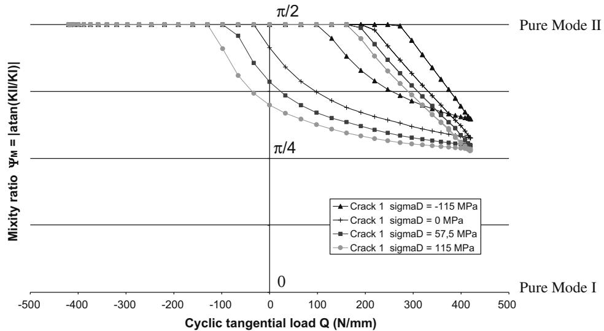  
Fig. 27. Variation of the mixity ratio $\psi _ { M } = | \mathbf { a t a n } ( K _ { \mathrm { I I } } / K _ { \mathrm { I } } ) |$ for a complete fretting cycle for four different values of additional bulk stress.

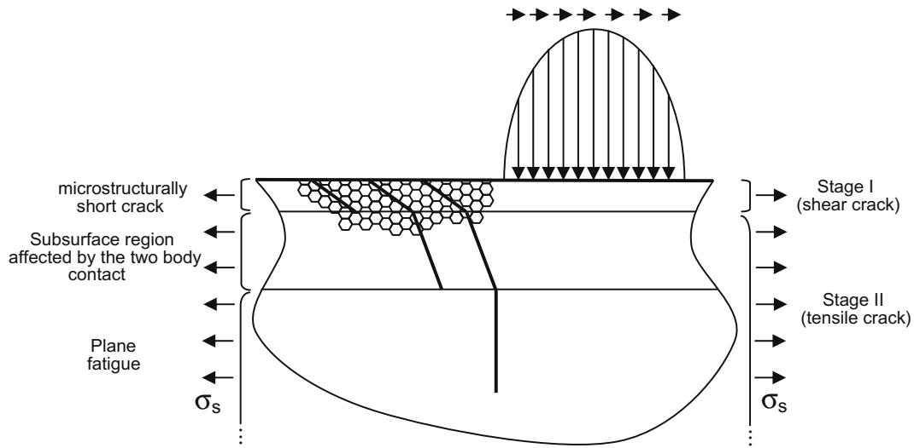  
Fig. 28. Crack growth mechanisms occurring successively with respect to the crack length for pre-stressed fretting fatigue application.

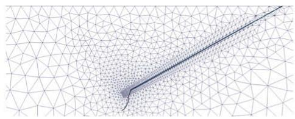

(a) Case A: Q= 420 MPa, Ic= 88 µm. da= 2 µm  
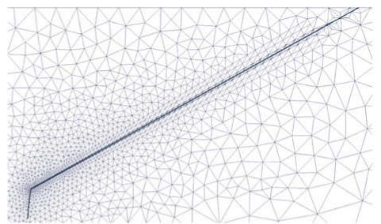  
(b) Case B: Q= 420 MPa, Ic= 150 μm. da= 2μm

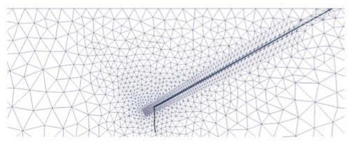  
(c) Case C: Q= 210 MPa, Ic= 88 μm. da= 2 μm

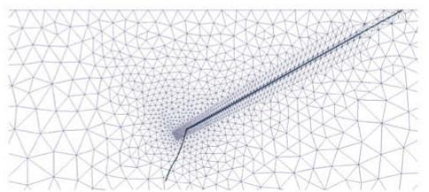  
(d) Case D: Q= 420 MPa, Ic= 88 μm. da= 5 μm  
Fig. 29. Computed crack growth path for different load configuration, initial crack length and crack growth step length.

one computed for case A for a shorter crack. The crack bends out of the subsurface region influenced by the two-body contact. These phenomena are illustrated in Fig. 28 (Miller, 1993).

 Case C: The tangential loading is reduced Q = 210 MPa. Six propagation steps (2 lm each) are performed. The crack grows with an angle of 60 relatively to its initial orientation, bending perpendicularly to the surface. It is governed mainly by a tensile growth mechanism. The crack growth path is similar to the one obtained in case B (see Fig. 29(c)).

 Case D: The data are identical to those considered for case A. The crack growth extension is here considered equal to 5 lm. Four propagation steps are performed (see Fig. 29(d)). Considering a increment size 2.5 times greater has not modified the crack path as compared to the one obtained in case A.

The steep varying stress–strain state under the contact region induces a reorientation of the growing crack. The crack growth direction is thus dependent on the crack length. Further the intensity of the tangential loading, the superimposition of a bulk stress modify the extent of the zones under the contact where shear or tensile mechanisms are predominant and have also a great influence on the crack path.

## 8. Conclusion

In this paper one proposes a global methodology dedicated to frictional fatigue crack analysis submitted to non-proportional cyclic loading. Many components suffer indeed from 3D complex loading combined with contact loading like fretting at their interface. Crack initiation and propagation under fretting loading influence strongly the lifetime of components and it is important to be able to quantify and predict their behaviour.

For that purpose, a first accurate half-analytical model dedicated to the identification of the normal and tangential tractions at the interface of two components, approximated here as halfplanes, where cyclic fretting occurs has been briefly presented. Then a second model is devoted to the determination of the crack initiation based on Dang Van’s criterion. Finally, these normal and tangential external cyclic loads are introduced in a two-dimensional robust and efficient X-FEM/LATIN numerical model dedicated to frictional fatigue cracks. Recall that this finite element based model is thus able to account for complex component geometry and boundary conditions. Mixed mode crack propagation is then simulated and the crack growth path is determined using criteria adapted to multi-axial non-proportional loading conditions.

Compared to standard finite elements approaches, the following improvements are obtained: a rather coarse mesh can be used and is not required to match the crack; neither re-meshing nor field interpolation is required during crack growth; accurate frictional contact solutions are obtained for a wide range of friction coefficient values (from 0.2 to 1.2) based on an adapted local error indicator; the quasi-static formulation of the crack problem allows to account for the history of the contact solution, notably the tangential tractions between the crack faces; finally, robust path independent integrals allow accurate calculation of stress intensity factors.

Validation of the X-FEM model has been performed. A very good agreement is obtained between the results obtained using the X-FEM numerical model and the ones computed according to the reference model. Parametric studies on the influence of the friction coefficient between the crack faces have been conducted. It influences not only the value of the stress intensity factor in mode II but also the crack growth. Finally, crack propagation simulation has been conducted and four different cases performed in order to study the influence of mechanical parameters on the crack propagation path.

Work on 3D crack modeling is in progress. It concerns confined plasticity at crack tip, frictional contact. Experimental tests are also under way to provide additional data for 2D and 3D crack propagation under fretting conditions.

## References

Amestoy, M., Bui, H.D., Dang Van, K., 1979. Déviation infinitésimale d’une fissure dans une direction arbitraire. Comptes Rendus Academy of Sciences Paris B289, 99–102.

Babuska, I., Melenk, J.M., 1997. The partition of unity method. International Journal for Numerical Methods in Engineering 40, 727–758.

Béchet, E., Moës, N., Wohlmuth, B., 2008. A stable Lagrange multiplier space for stiff interface conditions within the extended finite element method. International Journal for Numerical Methods in Engineering. Online.

Bower, A.F., 1988. The influence of crack face friction and trapped fluid on surface initiated rolling contact fatigue cracks. Transactions on American Society of Mechanical Engineering Journal of Tribology 110, 704–711.

Carter, B., Wawrzynek, P., Ingraffea, A., 2000. Automated 3D crack growth simulation. International Journal for Numerical Methods in Engineering 47, 229–253.

Comninou, M., 1977. The interface crack. ASME Journal of Applied Mechanics 44, 631–636.

Dang Van, K., 1993. Macro–micro approach in high cycle multiaxial fatigue. In: Mc Dowell, D.L., Ellis, R. (Eds.), Advances in Multiaxial Fatigue, ASTM STP 1191.

Dang Van, K., Maitournam, M.H., 2000. On a new methodology for quantitative modelling of fretting fatigue. In: Hoeppner, D.W., Chandrasekaran, V., Elliott, C.B. (Eds.), Fretting Fatigue: Current Technology and Practices, ASTM STP 1367. American Society for Testing and Materials, West Conshohocken, PA, pp. 538– 552.

Destuynder, P., Djaoua, M., Lescure, S., 1983. Some remarks on elastic fracture mechanics (quelques remarques sur la mécanique de la rupture élastique). Journal de Mécanique théorique et appliqué 2 (1), 113–135.

Dhondt, G., 1998. Automatic 3-D mode in crack propagation calculations with finite elements. International Journal for Numerical Methods in Engineering 41 (4), 739–757.

Dolbow, J., Moës, N., Belytschko, T., 2001. An extended finite element method for modelling crack growth with frictional contact. Computer Methods in Applied Mechanics and Engineering 53, 6825–6846.

Dubourg, M.C., Villechaise, B., 1989. Unilateral contact analysis of a crack with friction. European Journal of Mechanics – A/Solids 8 (4), 309–319.

Dubourg, M.C., Villechaise, B., 1992. Analysis of multiple fatigue cracks. Part I: Theory. ASME Journal of Tribology 114, 455–461.

Dubourg, M.C., Godet, M., Villechaise, B., 1992. Analysis of multiple fatigue cracks. Part II: Results. ASME Journal of Tribology 114 (3), 462–468.

Dubourg, M.C., Kalker, J.J., 1993. Crack behaviour under rolling contact fatigue. In: Kalker, J.J., Cannon, D.F., Orringer, O. (Eds.), Rail Quality and Maintenance for Modern Railway Operation. Kluwer, Dordrecht, Netherlands, pp. 373–384.

Dubourg, M.C., Lamacq, V., 2000. Stage II propagation direction under fertting fatigue loading: a new approach in accordance with experimental observations. In: Hoeppner, D.W., Chandrasekaran, V., Elliott, C.B. (Eds.), Fretting Fatigue: Current Technology and Practices, ASTM STP 1367. American Society for Testing and Materials, West Conshohocken, PA, pp. 437–450.

Dubourg, M.C., Lamacq, V., 2002. A predictive rolling contact fatigue crack growth model: onset of branching, direction and growth. Role of dry and lubricated conditions on crack patterns. ASME, Journal of Tribology 124, 688.

Dubourg, M.C., Berthier, Y., Vincent, L., 2002. Cracking under fretting fatigue: damage prediction under multiaxial fatigue. Journal of Strain Analysis 37 (6), 519–533.

Dundurs, J., Mura, T., 1964. Interaction between an edge dislocation and a circular inclusion. Journal of the Mechanics and Physics of Solids 12, 177–189.

Elguedj, T., Gravouil, A., Combescure, A., 2007. A mixed augmented Lagrangian extended finite element method for modelling elastic–plastic fatigue crack growth with unilateral contact. International Journal for Numerical Methods in Engineering 71, 1569–1597.

Erdogan, F., Sih, G.C., 1963. On the crack extension in plates under plane loading and transverse shear. Transactions of the ASME, Journal of Basic Engineering 85, 519–527.

Fouvry, S., Kapsa, Ph., Vincent, L., Dang Van, K., 1996. Theoretical analysis of fatigue cracking under dry friction for fretting loading conditions. Wear 195, 21–34.

Géniaut, S., Massin, P., Moës, N., 2007. A stable 3D contact formulation for cracks using X-FEM. Revue européenne de mécanique numérique 16, 259–276.

Giner, E., Sukumar, N., Denia, F.D., Fuenmayor, F.J., 2008. Extended finite element method for fretting fatigue crack propagation. International Journal of Solids and Structures 45 (22–23), 5675–5687.

Gravouil, A., Moës, N., Belytschko, T., 2002. Non-planar 3D crack growth with the extended finite element and level sets – Part2: Level set update. International Journal for Numerical Methods in Engineering 53 (11), 2569–2586.

Hills, D.A., Comninou, M., 1985. An analysis of fretting fatigue cracks during loading phase. International Journal of Solids Structures 21 (4), 399–410.

Hills, D.A., Nowell, D., 1994. Mechanics of fretting fatigue. In: Gladwell, G.M.L. (Ed.), Solid Mechanics and its Applications, vol. 30. Kluwer Academic Publishers, p. 236. ISBN 0792328663.

Hourlier, F., D’Hondt, H., Truchon, M., Pineau, A., 1985. Fatigue crack path behaviour under polymodal fatigue. In: Miller, K.J., Brown, M.W. (Eds.), Multiaxial Fatigue, ASTM STP 853. ASTM, Philadelphia, PA, pp. 228–248.

Johnson, K.L., 1985. Contact Mechanics. Cambridge University Press. Ninth Printing, p. 452.

Kalker, J.J., 1990. Three-dimensional elastic bodies in rolling contact. In: Gladwell, G.M.L. (Ed.), Solids Mechanics and its Applications, vol. 2. Kluwer Academics Publishers. ISBN 0-7923-0712-7, 314 p..

Krenk, S., 1975. On the use of the interpolation polynomial for solutions of singular integral equations. Quarterly of Applied Mathematics 32, 479–484.

Ladevèze, P., 1998. Nonlinear Computational Structural Mechanics. Springer, New York.

Liu, F., Borja, R.I., 2008. A contact algorithm for frictional crack propagation with the extended finite element method. International Journal for Numerical Methods in Engineering 76 (10), 1489–1512.

Miller, K.J., 1993. Material science perspective of metal fatigue resistance. Materials and Science Technology 9, 453–462.

Moës, N., Dolbow, J., Belytschko, T., 1999. A finite element method without remeshing. International Journal for Numerical Methods in Engineering 46, 131–150.

Moran, B., Shih, C., 1987. Crack tip and associated domain integrals from momentum and energy balance. Engineering Fracture Mechanics 127, 615–642.

Neto, J.C., Wawrzynek, P., Carvalho, M., Martha, L., Ingraffea, A., 2001. An algorithm for three-dimensional mesh generation for arbitrary regions with cracks. Engineering with Computers 17, 75–91.

Nowell, D., Hills, D.A., 1990. Crack initiation criteria in fretting fatigue. Wear 135, 329–343.

Pierres, E., Baietto, M.C., Gravouil, A., 2010. A two-scale extended finite element method for modeling 3D crack growth with interfacial contact. Computer Methods in Applied Mechanics and Engineering 199 (17–20), 1165–1177.

Rannou, J., Gravouil, A., Baietto-Dubourg, M.C., 2008. A local multigrid X-FEM strategy for 3-D crack propagation. International Journal for Numerical Methods in Engineering 77, 1641–1669.

Ribeaucourt, R., Baietto-Dubourg, M.C., Gravouil, A., 2007. A new fatigue frictional contact crack propagation model with the coupled X-FEM/LATIN method. Computer Methods in Applied Mechanics and Engineering 196, 3230–3247.

Ruiz, C., Boddington, P.H.B., Chen, K.C., 1984. An investigation of fatigue and fretting in a dovetail joint. Experimental Mechanics 24 (3), 208–217.

Sih, G.C., 1974. Strain-energy-density factor applied to mixed mode crack problems. International Journal of Fracture 10 (3), 305–321.

Sukumar, N., Chopp, D.L., Béchet, E., Moës, N., 2008. Three-dimensional nonplanar crack growth by a coupled extended finite element and fast marching method. Computer Methods in Applied Mechanics and Engineering 76 (5), 727–748.

Suresh, S., 1998. Fatigue of Materials. Cambridge University Press. ISBN 0521578477, 9780521578479, p. 679.

Vincent, L., Berthier, Y., Dubourg, M.C., Godet, M., 1992. Mechanics and materials in fretting. Wear 153, 135–148.

Vitali, E., Benson, D.J., 2008. Contact with friction in multi-material arbitrary Lagrangian–Eulerian formulations using X-FEM. International Journal for Numerical Methods in Engineering 76 (6), 893–921.

Wittkowsky, B.U., Birch, P.R., Dominguez, J., Suresh, S., 2000. An experimental investigation of fretting fatigue with spherical contact in 7075-T6 aluminium alloy. In: Hoeppner, D.W., Chandrasekaran, V., Elliott, C.B. (Eds.), Fretting Fatigue: Current Technology and Practices, ASTM STP 1367. American Society for Testing and Materials, West Conshohocken, PA, pp. 213–227.

Yau, J.F., Wang, S.S., Corten, H.T., 1980. A mixed-mode crack analysis of isotropic solids using conservation laws of elasticity, J. Applied Mechanic 47, 335–341.
