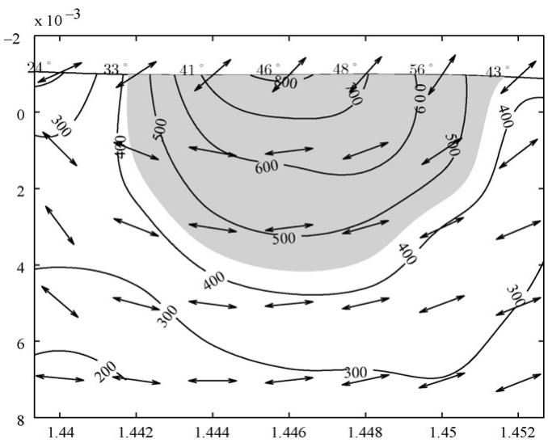
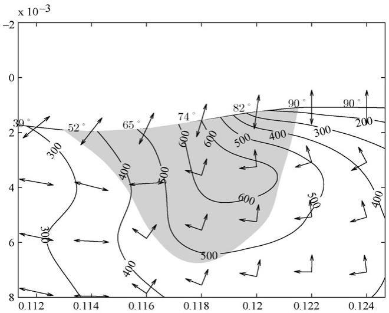
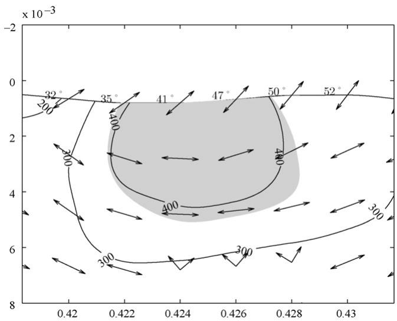
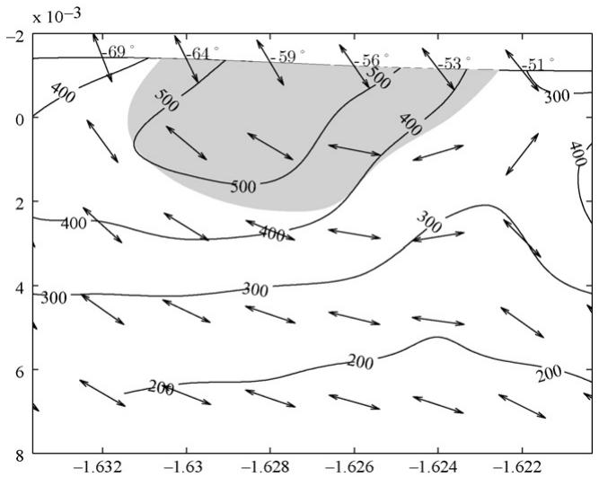

# Surface initiated tooth flank damage. Part II: Prediction of micropitting initiation and mass loss

José A. Brandãoa,∗, Jorge H.O. Seabrab, Jorge Castroc

a Instituto de Engenharia Mecânica e Gestão Industrial, Rua Dr. Roberto Frias, 400, 4200-465 Porto, Portugal

b Faculdade de Engenharia da Universidade do Porto, Departamento de Engenharia Mecânica e Gestão Industrial, Rua Dr. Roberto Frias, s/n, 4200-465 Porto, Portugal c Instituto Superior de Engenharia do Porto, Departamento de Engenharia Mecânica, Rua Dr. António Bernardino de Almeida, 431, 4200-072 Porto, Portugal

## a r t i c l e i n f o

Article history:   
Received 10 July 2008   
Received in revised form 5 June 2009   
Accepted 31 July 2009   
Available online 11 August 2009

Spur gears Gear micropitting Mixed film lubrication Fatigue crack initiation Dang Van fatigue criterion

## a b s t r a c t

Following the first part of this work, where a numerical model of surface initiated fatigue damage was presented, that model is applied here to the prediction of micropitting and mass loss of gear teeth. This is achieved by simulating a real micropitting test and by comparing it to the actual test results. On the way, a possible approximation to the mechanism by which mass is removed from the flank surface is discussed.

© 2009 Elsevier B.V. All rights reserved.

## 1. Introduction

The present document is the continuation of the article [1] already presented, in which a numerical model of surface initiated tooth flank damage was proposed. In the interest of clarity, that first part is summed up here. The model can be described by the diagram in Fig. 1.

It is composed of two major blocks. The first block is used to determine the stresses induced by loading at each instant during the meshing ofgears. This is achieved by using a mixed film lubrication model to determine the approximate surface load distribution. The second block is used to apply the Dang Van fatigue criterion to the gear tooth flanks.

As a result ofapplying the overall model to the simulation ofthe meshing of gears, the material points in the gear tooth where the Dang Van fatigue criterion is violated are identified. Additionally, for each of these points, several values related to the Dang Van criterion are obtained, such as $\beta _ { \mathsf { e q } } ,$ a scalar value that measures the severity of fatigue initiation, the theoretical directions of initiation of fatigue cracks and the mesoscopic residual stress tensor -.

Significantly, it was shown that the points where the Dang Van criterion predicts fatigue initiation are not isolated but are instead agglomerated in patches, as can be seen in Fig. 2.

The purpose ofthis article is to apply the model to the prediction of micropitting initiation and mass loss in a spur gear. Micropitting is mainly defined by the small size of its pits, typically in the order of 10 -m in width and depth [2,3]. While not immediately destructive, the appearance of micropitting on the surface of a gear results in an increase in the noise level and in the geometric inaccuracy of the teeth, causing a loss in efficiency of the transmission. In extreme cases, a crack originating in a micropit may progress in depth with catastrophic consequences. Another possible scenario is that widespread micropitting so weakens the surface that a layer of material is removed all at once [4].

In order to demonstrate the application ofthe surface originated damage model to the prediction of micropitting and mass loss an actual micropitting test is simulated and the results of the simulation are compared to the real ones. This is similar to the approach adopted by Tao et al. [5], although they stopped short ofcomparing their numerical results with actual tests.

As in the case of the previous article [1], this work stems from Brandão’s Master Thesis [6].

## 2. Gear micropitting: test and simulation

In his work [7], whose main findings, along with some additional results, can also be found in [8], Cardoso performed an extensive series oftest in order to characterize the mechanical performance of several gear oils. Of interest to the present work is his micropitting test performed with carburized gears lubricated with a mineral oil, simulated here in order to provide a comparison of the model with a real case.

  
Fig. 1. Diagram of the numerical model.

## 2.1. Description of the test

The gear micropitting test was conducted on an FZG test rig. Cardoso presents in his work a detailed explanation ofthe operation of the machine, which will therefore be omitted here.

  
Fig. 2. A fatigue initiation patch shown as a shaded area, along with the initiation directions in and around the patch. The isocurves of the maximum shear stress of the mesoscopic residual stress tensor are also shown.

Table 1  
Physical properties of the gear material: DIN 20MnCr5 carburizing steel.
| Property · Young's modulus of elasticity | Value · 210 GPa |
| --- | --- |
| Poisson ratio | 0.3 |
| Density | $7 8 5 0 \mathrm { k g } \mathrm { m } ^ { - 3 }$ |
| Thermal conductivity | $4 2 \mathrm { W } \mathrm { m } ^ { - 1 } \mathrm { K } ^ { - 1 }$ |
| Specific heat capacity | $0 . 4 6 \mathrm { k J } \mathrm { k g ^ { - 1 } K ^ { - 1 } }$ |

Table 2  
Geometric and kinematic parameters of an FZG type C gear.
| Parameter | Driving gear | Driven gear |
| --- | --- | --- |
| Face width | $b = 1 4 \mathrm { m m }$ |  |
| Operating centre distance | $a ^ { \prime } = 9 1 . 5 \mathrm { m m }$ |  |
| Number of teeth | $Z _ { 1 } = 1 6$ | $Z _ { 2 } = 2 4$ |
| Rotational speed | $n _ { 1 } = 2 2 5 0 \mathrm { R P M }$ | $n _ { 2 } = 1 5 0 0 \mathrm { R P M }$ |
| Base radius | $R _ { b 1 } = 3 3 . 8 2 9 \mathrm { m m }$ | $R _ { b 2 } = 5 0 . 7 4 3 5 \mathrm { m m }$ |
| Addendum radius | $R _ { a 1 } = 4 1 . 3 1 7 5 \mathrm { m m }$ | $R _ { a 2 } = 5 9 . 2 7 1 5 \mathrm { m m }$ |

More immediately relevant for the present work are the gear material (a DIN 20MnCr5 carburizing steel), whose more relevant physical properties are listed in Table 1, and the geometric parameters of the gears used in the test – FZG type C gears – listed in Table 2.

The gears were carburized, quenched and annealed before the final grinding operation. The heat treatment generated a curburized layer of a depth of approximately 0.8 mm. The surfaces had a very high hardness, typically around 60 HRC, while the core kept a very high strength and a considerably high elongation.

The gear oil used in the test is an ISO VG 150 paraffinic mineral oil that contains additives to increase its resistance to micropitting. Its properties are reproduced from [7] (Table 1.1) in Table 3.

## 2.2. Test and simulation procedure

Table 4 lists the operating conditions for each load cycle. Note that the gears were dip lubricated and the bath temperature of the oil was maintained constant.

The test procedure – based on an FZG specification (DGMK micropitting short test – GFKT – C/8.3/90) – as well as the simulation procedure are described in Table 5.

Gear oil properties.
| Parameter | Method | Desig. | Lubricating oils |
| --- | --- | --- | --- |
| Lubricant maker |  |  | EXXON MOBIL |
| Country |  |  | USA |
| Oil type |  |  | Industrial gear oil |
| Base oil | DIN 51451 |  | Paraffinic mineral oil |
| Chemical content |  |  |  |
| Zinc | ASTM D 4927 | Zn |  |
| Calcium | ASTM D-4927 | Ca | 40 ppm |
| Phosphor | ASTM D-4927 | P | 175 ppm |
| Sulphur | ASTM D-4927 | S | 15,040 ppm |
| Physical properties |  |  |  |
| Density at 15°C | DIN 51757 | ρ15 | 0.894 g cm−³ |
| Kinematic viscosity at 40°C | DIN 51562 | V40 | 153.6 cSt |
| Kinematic viscosity at 100°C | DIN 51562 | V100 | 14.4 cSt |
| Viscosity index | DIN ISO 2909 | VI | 96 |
| Pour point | DIN ISO 3106 |  | -27℃ |
| Wear properties |  |  |  |
| KVA weld load | DIN 51350-2 |  | 2200 N |
| KVA wear scar (1 h/300 N) | DIN 51350-3 |  | 0.32 mm |
| Brugger | DIN 51347-2 |  | 68 N/mm² |
| FZG rating | DIN 51354 | $\mathrm { K } _ { \mathrm { F Z G } }$ | > 12 |

Table 5  
Table 4  
Operating conditions of the micropitting test.
| Load stage | K3 | K6 | K8 | K9 |
| --- | --- | --- | --- | --- |
| Normal load FN | 851 N | 2924 N | 5073 N | 6373 N |
| Oil temperature | 80℃ |  | 90℃ |  |
| Duration | 1h |  | 16h |  |
| Number of cycles undergone by the driving gear | 135 × 10³ |  | 2.16 × 10⁶ |  |
| Angular velocity of the driving gear n1 | 2250 RPM | 2250 RPM | 2250 RPM | 2250 RPM |
| Angular velocity of the driven gear n2 | 1500 RPM | 1500 RPM | 1500 RPM | 1500 RPM |

Gear micropitting test procedure and corresponding simulation procedure.
| Test procedure · Clean the gears in an ultrasonic bath and dry them. | Step | Simulation procedure |
| --- | --- | --- |
| Weigh the gears. | 2 |  |
| Measure the gear flanks roughness. | 3 | Introduce the roughness of the gears into the model. |
| Mount the gears on the test rig and perform load stage K3 during 1 h. |  | Run the simulation of load stage K3. |
| 5 | Predict the mass loss of the driving gear. |  |
| Without removing the gears from the test rig, take a lubricant oil sample. | 6 |  |
| Submit the gears to load stage K6 during 16 h. | 7 |  |
| Dismount the gears, clean them in an ultrasonic bath and dry them. | 8 |  |
| Photograph the gear flanks surfaces. |  |  |
| Weigh the gears and calculate the mass loss. | 9 |  |
| Measure the gear flanks roughness. Mount the gears on the test rig and perform load stage K8 during 16 h. | 10 11 | Introduce the measured roughness into the model. |
| Dismount the gears, clean them in an ultrasonic bath and dry them. | 12 | Run the simulation of load stage K8. |
| Photograph the gear flanks surfaces. |  |  |
| Weigh the gears and calculate the mass loss. | 13 | Predict the mass loss and roughness profile of the driving gear. |
| Measure the gear flanks roughness. | 14 | Introduce the measured roughness into the model. |
| Mount the gears on the test rig and perform load stage K9 during 16 h. | 15 | Run the simulation of load stage K9. |
| Dismount the gears, clean them in an ultrasonic bath and dry them. Photograph the gear flanks surfaces. | 16 |  |
| Weigh the gears and calculate the mass loss. | 17 | Predict the mass loss and roughness profile of the driving gear. |
| Measure the gear flanks roughness. | 18 |  |

Fig. 3 shows the approximate positions where the tooth flank surface roughness measurements were made. Each series of measurements was performed on two distinct teeth. The left image shows the measurements performed before load stage K3. Each of the two teeth was submitted to three separate measurements for a total ofsix. The right side image shows the measurements between successive load cycles (K6–K8 and K8 and K9). Each tooth was measured thrice below the pitch line and thrice above it, for a total of twelve distinct measurements.

## 2.3. Test results

Some results ofthe test are shown in Figs. 4–8, which were taken from [7].

The photographs of a tooth surface shown in Fig. 4 clearly demonstrate that micropits became visible at the end of load stage K8.

At the end of load stage K9, the topography of a 2 mm 2 mm square portion of the driving tooth flank surface was measured by

  
Fig. 3. Positions of roughness measurement. (a) The roughness measurements before stage K3. (b) Roughness measurements between load stages: each position includes one measurement below the pitch line and one above it.

Cardoso. The results are illustrated in Fig. 5, where the dark “stains” are the outlines of the micropits with depths more profound than 5 -m. It is significant that the micropits are longer in the horizontal direction than in the vertical one (the vertical direction corresponds to the xx axis in the model). This is due to the fact that the roughness is much less pronounced in the horizontal – or axial – direction.

Figs. 6 and 7 show the evolution of the $R _ { \nu k }$ roughness parameter at each tooth and each measurement position (see Fig. 3). It is interesting to note that the evolution of the parameter for each tooth is very different: while the roughness oftooth 1 seems stable, that of tooth 2 shows a progressive worsening of the surface finish. Thus it is very difficult to make any conclusions from the roughness parameter.

Fig. 8 shows the mass loss measured at the end of each load stage.

## 2.4. A note on the parameters ofthe simulation

In addition to the parameters already presented, several others must be determined to be able to use the model.

The rheology of the lubricant must be thoroughly described in its dependence from pressure and temperature. In this case, the choice was made to use the Roelands viscosity equation:

$$
\ln \frac { \eta } { \eta _ { 0 } } = ( \ln \eta _ { 0 } + 9 . 6 7 ) \left\{ \left( \frac { T - 1 3 8 } { T _ { 0 } - 1 3 8 } \right) ^ { - S _ { 0 } } \left( 1 + \frac { p } { 1 9 6 } \right) ^ { Z } - 1 \right\}\tag{1}
$$

where $Z$ and $S _ { 0 }$ are non-dimensional parameters of the oil, $T _ { 0 }$ is a reference temperature in K,  is the dynamic viscosity in Pa s at the reference temperature and atmospheric pressure, T is the temperature of the lubricant in K, p is the pressure in GPa and  is the dynamic viscosity in Pa s.

(a) End of K3+K6  

(b) End of K8  
  
(c) End of K9

Fig. 4. Photographs ofa tooth taken after each load stage ofthe micropitting test. The areas were micropitting has occurred are delimited with red lines. The indications of the positions of the root, pitch line an tip are approximate. (a) End of K3 + K6, (b) End of K8 and (c) End of K9 (For interpretation of the references to colour in this figure legend, the reader is referred to the web version of the article.).  
  
Fig. 5. Micropits deeper than 5 -m on a 2 mm  2 mm square portion of the gear flank surface at the end of load stage K9.

  
Fig. 6. Evolution of the $R _ { \nu k }$ roughness parameter below the pitch line of tooth 1 as measured during the test. The shaded boxes show the range of variation of several measurements at different axial positions.

  
Fig. 7. Evolution of the $R _ { \nu k }$ roughness parameter below the pitch line of tooth 2 as measured during the test.

  
Fig. 8. Measured mass loss of the driving gear during the load cycles.

Table 6  
Rheological parameters of the gear oil.
| Roelands viscosity | Bair and Winer viscoplasticity |
| --- | --- |
| $T _ { 0 } = 3 6 3 \mathrm { K }$ | $\tau _ { L _ { 0 } } = 2 5 \mathrm { M P a }$ |
| $\eta _ { 0 } = 1 . 5 6 \times 1 0 ^ { - 2 } \mathrm { P a } s$ | $\alpha _ { \tau _ { I } } ^ { - } { } ^ { - 1 } = 5 8 8 \mathrm { M P a }$ |
| $S _ { 0 } = 1 . 2 8$ | $\beta _ { \tau _ { L } } ^ { ^ { - } } = 0 \kappa$ |
| $Z = 0 . 6 0 8$ |  |

In conjunction with the viscosity equation, a viscoplasticity equation must be established to account for the non-Newtonian behaviour of the oil. The Bair and Winer viscoplasticity equation is used for that purpose:

$$
\dot { \gamma } = - \frac { \tau _ { L } } { \eta } \ln \left( 1 - \frac { \tau } { \tau _ { L } } \right)\tag{2}
$$

where  is the shear stress and $\tau _ { L }$ is the limiting shear stress.

Naturally, the limiting shear stress is not constant across variations of temperature and pressure. These variations can be modelled thus:

$$
\ln \frac { \tau _ { L } } { \tau _ { L _ { 0 } } } = \alpha _ { \tau _ { L } } \cdot p + \beta _ { \tau _ { L } } ( T ^ { - 1 } - T _ { 0 } { } ^ { - 1 } )\tag{3}
$$

where $\tau _ { L _ { 0 } }$ is the limiting shear stress at a reference temperature $T _ { 0 }$ and atmospheric pressure and $\alpha _ { \tau _ { L } }$ and $\beta _ { \tau _ { L } }$ are constant parameters of the oil.

Apart from the rheology of the lubricant, the friction coefficient $\mu ^ { \mathrm { B D R } }$ and the load sharing function $f _ { A }$ must be known.

Since these parameters are not to be found in the literature, they must be determined independently. In order to achieve this, the results of the work by Castro and Seabra [9], where the friction coefficient in a gear power loss test using the same oil are estimated, were used: by performing a simulation of the lubrication of the gears in that test through the mixed regime lubrication model, it is possible to compare the simulated friction coefficient for various values of the desired parameters with those estimated in [9] by least-squares data fitting.

This approach was only partially successful: it was possible to estimate the parameters to introduce into Eqs. $\left( 1 \right) - \left( 3 \right)$ , shown in Table $6 ,$ but it was only possible to associate a load sharing function $f _ { A }$ with each boundary friction coefficient $\mu ^ { \mathrm { B D R } }$ , as shown in Fig. 9.

For the application of the Dang Van criterion, its fatigue parameters $\alpha _ { D V }$ and $\beta _ { D V }$ must be known as well. Of those, only the value of $\alpha _ { D V } ( 0 . 9 8 7 )$ was available in the open literature.

In order to proceed with this work, and in light of the lack of information regarding some ofthe parameters, each load stage was simulated for different combinations of values of $\mu ^ { \mathrm { B D R } }$ and $\beta _ { D V }$ by scanning the values $4 0 0 < \beta _ { D V } < 9 0 0 \mathrm { M P a }$ and $0 . 0 7 < \mu ^ { \mathrm { B D R } } <$ $0 . 1 5 .$

  
Fig. 9. Some load sharing functions $f _ { A }$ and their associated boundary friction coefficients $\mu ^ { \mathrm { B D R } }$

Table 7  
Some simulation cases and their defining parameters.
| Case | $\mu ^ { \mathrm { B D R } }$ | $\beta _ { D V } ( \mathrm { { M P a } ) }$ |
| --- | --- | --- |
| 1 | 0.14 | 440 |
| 2 | 0.11 | 440 |
| 3 | 0.08 | 440 |
| 4 | 0.11 | 480 |
| 5 | 0.11 | 400 |

It must also be said at this point that, because the evolution of two roughness profiles is available for one of the teeth of the driving gear and one evolution for another, each simulation provided results for each of these profiles. It is as if three teeth were dealt with instead of two.

Thus, the simulation ofthe micropitting test is composed ofsimulation cases defined by the values of $\cdot _ { \mu } \mathtt { B D R }$ and $\beta _ { D V }$ arbitrated for each case. These simulation cases are too many to list in the present work, which is why a few are singled out in Table 7.

## 3. Comparison of the simulation with the gear test results

Essentially, two types of data can be – and were – obtained from Cardoso’s experiments: gear mass loss data and roughness evolution data.

This introduces a difficulty in the comparison of experimental data with the results of a numerical simulation based on the model presented here. Indeed, the present model is only intended as an initiation model: it does not tell anything of what might happen in subsequent stages of the history of cracks, namely their propagation and the consequent removal of material from the gear tooth surface.

A second issue that forces itself to one’s attention is that the present model only describes the initiation of high cycle fatigue cracks: at no point is there an inbuilt bias toward the specific mechanism of micropitting formation, the idea being that micropitting should emerge and be recognized as such from the analysis of the results. In part, this is addressed by the fact that the analysis is restricted to a maximum depth of 20 -m. Nevertheless, this means that other surface damage mechanisms may become bundled in the results such as pitting and wear.

The simulation provides at each load stage the values of $\beta _ { \mathsf { e q } } =$ r $\boldsymbol { \mathrm { n a x } } ( \tau _ { \mathrm { m a x } } + \alpha _ { D V } \cdot p _ { H } )$ for each material point near the surface of the tooth. As has already been seen, each of those points where $\beta _ { \mathsf { e q } } > \beta _ { D V }$ should be the origin of a crack. But because these points come in patches (see Fig. 2), the initiation of a crack at one of them should pre-empt the initiation of cracks at other points in the same patch, since the ensuing tension fields inevitably changes a great deal. Which point will actually originate a crack, what its trajectory will be and how much material will be removed are impossible questions to answer within the framework of the Dang Van criterion. Strictly speaking, to go any further than this, a crack propagation model should be used. This is of no help in the present circumstances, since a fatigue crack propagation model is not forthcoming—indeed, it exceeds the ambitions of the present work and is a natural continuation of it.

## 3.1. Rough approximation to a crack propagation model

The problem of obtaining an estimate for the progression of a contact fatigue crack, which would enable us to compare the numerical and experimental results, still remains. An interesting clue is given by the experimental work by Oila and Bull [10] who studied the micropitting phenomenon from a metallographic standpoint. According to them, the ultimate reason for the appearance of micropits is the change in steel microstructure by which new phases appear: the plastic deformation region (PDR), the dark etching region (DER) and the white etching band (WEB), the first located under roughness peaks and caused by the high plastic deformations there occurring, the other two due to martensitic decay. It is their view that the micropitting fatigue cracks propagate along the boundary between the PDR and DER. This is shown in the central picture in Fig. 10.

  
Fig. 10. Approximate mechanism of crack propagation. (left) Photograph of the section of a micropit. (centre) Crack propagation mechanism according to Oila and Bull [10] The crack propagates along the boundary between the plastic deformation region (PDR) and the dark etching region (DER). These, as well as the white etching band (WEB) are phases due to the change in steel microstructure. (right) Approximate crack propagation mechanism adopted here: the crack propagates on the boundary of a Dang Van fatigue initiation patch until the patch is removed from the tooth.

The solution adopted here is exemplified in Fig. 10. On the left is shown a photograph of a micropit section, where the initial direction of propagation is visible. In the centre, the crack propagation mechanism according to Oila and Bull is shown. On the right is displayed the approximate crack propagation mechanism adopted here: the principle is that the crack originates on the surface downstream from the sliding direction and propagates on the boundary of Dang Van fatigue initiation patch. This is tantamount to saying that a fatigue initiation patch corresponds roughly to Oila and Bull’s PDR phase. The identity is not unreasonable in view of the description of the PDR phase as an area of the tooth having undergone heavy plastic deformation, since the fatigue patches correspond to areas of the tooth where the second invariant of the deviatoric tensor of the mesoscopic residual stresses is high, which should match areas of high plastic deformation. This seems to be confirmed by the fact that the shape and size of the initiation patches are similar to those reported by Oila and Bull regarding the PDR.

## 3.2. Mass loss comparison

Using the approximate propagation model adopted and in order to compare the mass loss from the tests with the model results, a predicted mass loss value is defined as follows:

$$
m _ { D V } = Z _ { 1 } \cdot A _ { D V } \cdot b \cdot \rho _ { s \mathrm { t e e l } }\tag{4}
$$

where $m _ { D V }$ is the predicted mass loss for each stage, $Z _ { 1 }$ the number of teeth of the driving gear, $A _ { D V }$ the predicted micropitted area in the xz plane for one tooth (obtained from the average of the three tooth profiles ofroughness measurement positions 1 and 2 on tooth 2 and position 1 on tooth 1) , b the face width of a tooth and $\rho _ { s t e e l }$ the density of the steel.

Table 8 shows the comparison of the measured mass loss in the driving gear at the end ofeach load stage with the predicted one for the simulation case 1. The predicted mass loss values are separated into mass loss below the pitch line and above it, in addition to the values for the whole teeth. Also listed are the specific values ofmass loss (mass loss per surface length on a tooth). Note that, in addition to the load stages at the end of which the weighing was actually performed, load stage K3 was simulated by itself and its predicted mass loss values are listed in Table 8 as well.

Even though there are no actual measurements against which to compare it, the value from the simulation of load stage K3 by itself is plausible, since it falls well below the value measured at the end of the consecutive run of load stages K3 and K6.

Another interesting fact is that the specific predicted mass loss (mass loss per unit length of tooth), while being sensibly the same in stage K9 above and below the pitch line, is far higher below the pitch line than above it at stage K8. This is interesting because Cardoso reports that micropits did appear at stage K8, as can be seen in Fig. 4, mostly below the pitch line (it is well known that micropitting preferentially forms below the pitch line), with only a meager increase in observed micropits at the end of load stage K9.

Notice as well that the predicted specific mass loss above the pitch line in load stages K8 and K9 is nearly constant in simulation case 1 (see Table 7). One may wonder if these values might not measure the amount of wear caused by contact fatigue. Considering that the value of predicted specific mass loss above the pitch line is sensibly 0.6 in both load stages K8 and K9, and supposing an approximately equal degree ofwear above and below the pitch line, the specific mass loss below the pitch line attributable to micropit generation would then be equal to 0.94 0.6 0.34 mg/mm in load stage K8 and none in load stage K9. While this is a debatable conjecture, there is ground for further studies in this direction.

Finally, the most dramatic fact to emerge from the data can be better observed with the help of Figs. 11 and 12, where the values of mass loss for the whole gear are also shown. The fact that the prediction of case 1 are spot-on in load stages K8 and K9 nearly jumps from the page. This should not be taken too literally as meaning that the proper values ofthe boundary friction coefficient, distribution function and Dang Van fatigue properties are those of case 1, too many uncertainties regarding the input data remain for one to be able to make such an assertion. In this regard, it is instructive to observe that the representation of the mass loss in all other simulation cases is nearly parallel to that in case 1, and therefore to the real mass loss in load stages K8 and K9. In fact, while, in Fig. 12, the simulation cases in which $\beta _ { D V }$ is equal to 400 and 440 MPa are less accurate than simulation case 1, it is easy to see that some value between the two should provide a result so good as that of case 1. This advocates strongly for a very direct correlation ofthe Dang Van fatigue initiation area with the mass loss due to micropitting and mild wear.

Comparison of the measured mass loss at the end of each load stage with the predicted one. The predicted mass loss values are separated into mass loss below the pitch line and above it. Also listed are the specific values of mass loss (mass loss per length of tooth).
| Position · Model prediction, case 1, with $\mu ^ { \mathrm { B D R } }$ | K3 · Abs (mg) · Model prediction, case 1, with $\mu ^ { \mathrm { B D R } }$ | K3 · Specific (mg/mm) · Model prediction, case 1, with $\mu ^ { \mathrm { B D R } }$ | K3+K6 · $\mathsf { A b s } \left( \mathrm { m g } \right)$ · Model prediction, case 1, with $\mu ^ { \mathrm { B D R } }$ | K3+K6 · Specific (mg/mm) · Model prediction, case 1, with $\mu ^ { \mathrm { B D R } }$ | K8 · $\mathsf { A b s } \left( \mathrm { m g } \right)$ · Model prediction, case 1, with $\mu ^ { \mathrm { B D R } }$ | K8 · Specific (mg/mm) · Model prediction, case 1, with $\mu ^ { \mathrm { B D R } }$ | K9 · $\mathsf { A b s } \left( \mathrm { m g } \right)$ · Model prediction, case 1, with $\mu ^ { \mathrm { B D R } }$ | K9 · Specific (mg/mm) · Model prediction, case 1, with $\mu ^ { \mathrm { B D R } }$ |
| --- | --- | --- | --- | --- | --- | --- | --- | --- |
| Below pitch line | 0.624 | = 0.14 and βDv = 440 MPa 0.2387 | N/A | N/A | 2.463 | 0.9429 | 1.52 | 0.5821 |
| Above pitch line | 0.750 | 0.1381 | N/A | N/A | 3.309 | 0.609 | 3.403 | 0.6265 |
| Whole tooth | 1.374 | 0.1707 | N/A | N/A | 5.771 | 0.7174 | 4.924 | 0.612 |
| Test measurements | Test measurements | Test measurements | Test measurements | Test measurements | Test measurements | Test measurements | Test measurements | Test measurements |
| Whole tooth | N/A | N/A | 3 ± 0.5 | 0.373 | $6 \pm 0 . 5$ | 0.746 | 5 ± 0.5 | 0.6214 |

From Figs. 11 and 12, it can be observed that in all simulation cases the predicted mass loss curves are always nearly parallel to the measured one and that their position is strongly affected by the value of $\beta _ { D V }$ and much less by that of $\mu ^ { \mathrm { B D R } }$ . One should not read too much into this, because the insensitivity of the results to $\mu ^ { \mathrm { B D R } }$ can simply be a numerical artefact that comes from the particular way in which each $\mu ^ { \mathrm { B D R } }$ is linked with a different load sharing function.

  
Fig. 11. Mass loss of the driving gear in each stage: measured values and predicted ones for several simulation cases in which $\beta _ { D V } = 4 4 0 \mathrm { M P a }$ and $\mu ^ { \mathrm { B D R } }$ can be 14% (case 1), 11% (case 2) or 8% (case 3).

  
Fig. 12. Mass loss of the driving gear in each stage: measured values and predicted ones for several simulation cases in which $\mu ^ { \mathrm { B D R } } = 1 1 \%$ and ˇ can be 480 (case 4), 440 (case 2) or 400 MPa (case 5).

In conclusion, the mass loss comparison, in spite of all the uncertainties regarding the input data and the chosen comparison method, seem to indicate that the model is adequate for the modelling of micropitting. This is a qualitative evaluation of the model. For a quantitative one to be made, a battery of experiments designed for the exclusive study ofmicropitting must be performed, in order to remove all the uncertainties that plagued these simulations.

## 3.3. Roughness evolution comparison

We come now to the section in which the results of the simulation are compared with the tests with regard to the evolution of the teeth flanks roughness.

In the previous section a prediction of the mass loss was evaluated by subtracting the patches of fatigue initiation, such as that shown in Fig. 2, from the surfaces. In the same way, an attempt is made here to predict, for each load stage, the final roughness of the surface of the driving gear.

In Figs. 13–15, the evolution of the roughness parameter $R _ { \nu k }$ below the pitch line for, respectively, tooth 1, tooth 2 position 1 and tooth 2 position 2, is shown.

Acceptable values of roughness parameters should fall within the range of measured roughness shown as shaded boxes. Such is not the case. This seems to indicate that the approximate propagation model adopted here, while good enough for the prediction of a “global” parameter such as the mass loss, is not precise enough when predicting the alteration of the surface profile.

  
Fig. 13. Evolution ofroughness parameter $R _ { \nu k }$ for tooth 1, position 1 below the pitch line. The shaded box show the limits of the measured values for that tooth.

  
Fig. 14. Evolution ofroughness parameter $R _ { \nu k }$ for tooth $^ { 1 2 , }$ position 1 below the pitch line. The shaded box show the limits of the measured values for that tooth.

This disheartening observation must nevertheless be qualified by several observations that must be made at this point.

While the impression was given that the roughness measurement positions shown in Fig. 3 were precisely the same from load stage to load stage. This is not the truth, since the positioning of the gear in the measurement rig is performed by an operator, with the inevitable imprecision that hereby ensues. This means that the model uses one profile at a certain position to predict another profile in a different position.

Another point to be made is that the two teeth where the measurements were made show very different behaviours regarding their evolution, even though their initial roughnesses are very similar. It may be that the roughness of the teeth is too much subject to aleatory factors for their precise evolution to be predictable.

## 3.4. Fatigue initiation directions at the surface ofa gear tooth flank

The surface contact fatigue cracks observed on driving gear tooth flanks always follow the pattern shown in Fig. 16: on either side of the pitch circle the cracks grow from the surface inward toward the pitch circle. It was shown in [1] that the model reproduces this behaviour and an explanation was also proposed for this phenomenon.

  
Fig. 15. Evolution ofroughness parameter $R _ { \nu k }$ for tooth 2, position 2 below the pitch line. The shaded box shows the limits of the measured values for that tooth.

  
Fig. 16. Directions ofcontact fatigue cracks: the directions are symmetric according to the position in relation to the pitch line.

In this section, the inclinations of contact fatigue initiation as predicted by the Dang Van fatigue criterion are presented for two of the simulation cases of Table 7: simulation cases 1 and 5.

Fig. 17 presents data for an area around an initiation patch 1.446 mm below the pitch circle of driving gear 2, roughness measurement position 1 in load stage K8 of simulation case 1. The information shown is:

• The extension of the fatigue initiation patch, shown as a shaded area.

The contour plot of $\tau _ { \operatorname* { m a x } } ( \tilde { \rho } )$ (the maximum shear stress of the mesoscopic residual stress tensor).

The theoretical directions offatigue crack initiation, which correspond to the intersection of the planes of maximum mesoscopic shear stress with the x–z plane.

  
Fig. 17. Simulation case 1, tooth $^ { 2 , }$ roughness measurement position 1, load stage K8, area around a violation patch 1.446 mm below the pitch line: the shaded area shows the initiation patch, the arrows show the intersection of the planes of maximum mesoscopic shear stress with the plane x–z (theoretical crack initiation direction). The angles of the theoretical initiation directions on the surface are also shown. The contour lines correspond to the values of the maximum shear stress of the mesoscopic residual stress tensor.

  
Fig. 18. As in Fig. 18 but for simulation case 1, tooth 2, roughness measurement position 1, load stage K8, area around a violation patch 0.118 mm below the pitch line.

The angles of the initiation directions on the surface of the tooth flank, which range from 33◦ to 56◦ on the surface of the initiation patch.

It is significant that the initiation directions follow the pattern of Fig. 16 and that the values of the angles of these directions with the surface are well within generally accepted ranges of observed fatigue crack inclinations.

The same data is represented in Fig. 18 for the very same circumstances ofFig. 17 but for an initiation patch much closer to the pitch circle, 0.118 mm below it, in fact. While the pattern of Fig. 16 is still followed, it is striking to observe that the angles on the surface are very steep: from 52◦ to 90◦.

So near the pitch circle, the sliding is very slight. In consequence, the friction coefficient drops significantly, which tends to lead, in turn, to higher initiation angles on the surface of initiation patches.

Another consequence of the reduced sliding near the pitch circle is that each material point on the surface has an opportunity to contact with very few material points on the surface of the flank of the opposing tooth (in pure rolling, each material point on the surface of a tooth flank of the driving gear can only make contact with one material point on the surface ofthe opposing tooth flank). From this ensues that if a material point on the flank surface meets with a through in the roughness ofthe opposing tooth flank surface, it will suffer very little loading during the meshing and in consequence the initiation angles in its vicinity will rise significantly. This can be observed in Fig. 18, in which the area immediately to the right of the initiation patch fits this description.

  
Fig. 19. As in Figs. 18 and 17 but for simulation case 5, tooth 1, roughness measurement position 1, load stage K9, area around a violation patch 0.424 mm below the pitch line.

  
Fig. 20. As in Figs. 17–19 but for simulation case 1, tooth 2, roughness measurement position 1, load stage K8, area around a violation patch 1.627 mm above the pitch line.

Thus, the angle of initiation must depend strongly on the distance from the pitch circle, which would explain some of the disagreement in the literature about the reported angles of fatigue cracks.

Fig. 19 is similar to Figs. 17 and 18 but deals with an area around an initiation patch 0.428 mm below the pitch circle ofdriving gear 1, roughness measurement position 1 in load stage K9 of simulation case 5. The inclinations show a behaviour very similar that in Fig. 17, with a range ofinitiation angle of35–50◦ at the surface ofthe patch.

Finally, Fig. 20 deals with precisely the same case as Figs. 17 and 18 but around a patch 1.627 -m above the pitch line. The inclinations of the initiation directions on the surface are symmetric to those obtained below the pitch line. Once more, this is consistent with the pattern of Fig. 16.

## 4. Conclusion

A surface initiated tooth flank surface damage model was applied to the prediction of micropitting and mass loss of a spur gear.

As regards the comparison of the model with a real experimental case:

(1) The mass loss predictions showed a remarkable correlation with the measured mass loss.

(2) The roughness evolution results were not so good, but they are more prone to local error and this is compounded by the fact that the roughness measurements could never be guaranteed to be made exactly on the same spot at the end of each load stage.

(3) The inclinations of the fatigue cracks predicted with the aid of the model is consistent with the pattern of fatigue cracks inclinations generally observed in the case of surface fatigue damage.

## Acknowledgements

The authors wish to thank the “Fundac¸ ão para a Ciência e Tecnologia” from the Portuguese Administration for its financial support to this work through the research contract “PTDC/EME–PME/66185/2006”.

## References

[1] J. Brandão,J.H.O. Seabra, Surface initiated tooth flank damage. Part I: Numerical model, Wear 268 (2009) 13–22.

[2] R. Martins, N. Cardoso, J. Seabra, Influence of lubricant type in gear scuffing, Industrial Lubrication and Tribology 60 (6) (2008) 299–308, doi:10.1108/00368790810918695.

[3] N.F.R. Cardoso, R.C. Martins, J.H.O. Seabra, A. Igartua, X. Fernandez-Pérez, R. Luther, Micropitting performance of nitriding steel gears lubricated with mineral and ester oils, Tribology International (2008), doi:10.1016/j. tri boint.2008.05.010.

[4] L. Faure, Aspect des dentures d’engrenage après fonctionnement, Centre Technique des Industries Mécaniques, 1990.

[5] J. Tao, T.G. Hughes, H.P. Evans, R.W. Snidle, N.A. Hopkinson, M. Talks, J.M. Starbuck, Elastohydrodynamic lubrication analysis of gear tooth surfaces from micropitting tests, Journal of Tribology 125 (2) (2003) 267–274, http://link.aip.org/link/?JTQ/125/267/1.

[6] J. Brandão, Gear micropitting prediction using the Dang Van high-cycle fatigue criterion, Master’s thesis, Faculdade de Engenharia da Universidade do Porto, 2007.

[7] N. Cardoso, Mechanical performance ofbiodegradable, low toxicity ester based industrial oils, Master’s thesis, Faculdade de Engenharia da Universidade do Porto, 2007.

[8] R. Martins, J. Seabra, Micropitting performance of mineral and biodegradable ester gear oils, Industrial Lubrication and Tribology 60 (6) (2008) 286–292, doi:10.1108/00368790810902223.

[9] J. Castro, J. Seabra, Coefficient of friction in mixed film lubrication: Gears versus twin-discs, Proceedings of the I MECH E Part J, Journal of Engineering Tribology 221 (13) (2007) 399–411, http://www.ingentaconnect.com/ content/pep/jet/2007/00000221/00000003/art00024.

[10] A. Oila, S. Bull, Phase transformations associated with micropitting in rolling/sliding contacts, Journal of Materials Science 40 (September (18)) (2005) 4767–4774, http://www.ingentaconnect.com/content/klu/jmsc/ 2005/00000040/00000018/00002017.
