# Surface initiated tooth flank damage Part I: Numerical model

José A. Brandãoa,∗, Jorge H.O. Seabrab, Jorge Castroc

a Instituto de Engenharia Mecânica e Gestão Industrial, Rua Dr. Roberto Frias, 400, 4200-465 Porto, Portugal

b Faculdade de Engenharia da Universidade do Porto, Departamento de Engenharia Mecânica e Gestão Industrial, Rua Dr. Roberto Frias, s/n, 4200-465 Porto, Portugal

c Instituto Superior de Engenharia do Porto, Departamento de Engenharia Mecânica, Rua Dr. António Bernardino de Almeida, 431, 4200-072 Porto, Portugal

## a r t i c l e i n f o

Article history:   
Received 10 July 2008   
Received in revised form 5 June 2009   
Accepted 10 June 2009   
Available online 18 June 2009

Keywords:   
Spur gears   
Gear micropitting   
Mixed film lubrication   
Fatigue crack initiation   
Dang Van fatigue criterion

## a b s t r a c t

A numerical model for the prediction of surface initiated damage on gear tooth flanks (micropitting and mild wear) is presented. This model hinges on a model of the mixed film lubrication regime and on the application of the Dang Van high-cycle multi-axial fatigue criterion. A simulation of the meshing of spur gears is performed in order to gain some understanding of the events associated with contact fatigue surface damage.

© 2009 Elsevier B.V. All rights reserved.

## 1. Introduction

The trend in gear design has ever been to improve the gear materials and surface treatments. This, alongside the improvement in lubricant oils formulation has allowed for ever higher speeds and power density in gear boxes. These improvements have helped in reducing the effect ofthe most destructive kinds offatigue damage. In particular, the sort of progressive, in-depth originated fatigue damages, whose most characteristic example is the spalling damage, have been greatly reduced. As a result, surface originated fatigue damage have gained importance in the determination of the life of a gear [1,2].

These types of damage, and preponderant among them the micropitting damage, come from the propagation ofcracks that initiate at the surface of the gear and progress, first inward and then outward, until a surface pit is produced [3]. A crucial characteristic of these fatigue cracks is that they have a very short propagation time [1]. Thus, in practice, the total life of a crack is almost equal to the initiation time. In this setting, an initiation model is very useful when dealing with such a contact fatigue mechanism.

Because these types of damage develop wholly within the first few tens of micrometers of the depth below the surface of a tooth, the important stress perturbations caused by the interaction of the roughness of the teeth cannot be ignored [4,5]. In practise, this translates itself in the need for the solution of the lubrication problem in the mixed film regime, in which important surface pressure distributions occur due to the interaction ofthe roughness peaks of each tooth with the surface ofthe opposing one, be that interaction through direct metal–metal contact, be it mediated by a very thin, highly pressurized lubricating film [6].

The aim of this work is to provide a numerical model for the prediction of the initiation of micropitting fatigue cracks and mild wear. This model hinges on the solution of the contact problem between gear teeth, characterized by the mixed film regime ofelastohydrodinamic lubrication, and on the application ofthe Dang Van high-cycle multi-axial fatigue criterion, selected for its suitability for the prediction of fatigue crack initiation in complex loading cases.

As a final introductory remark, this work stems from Brandão’s Master Thesis [7]: it is at once a summary of some of its most important findings and an extension of it.

## 2. Numerical mode

The numerical model is based on the assumption, essentially true, that the roughness of a gear tooth flank is negligible in the transversal direction. This permits the use of the theory of the elastic half-space combined with plain strain, which greatly simplifies the calculations.

**Nomenclature**

| a | Hertzian half-width of the contact [m] |
| --- | --- |
| $\tilde { \bar { \mathsf { A } } }$ | fourth order localization elastic tensor |
| $C _ { s }$ | specific heat of the surface material $[ \mathrm { J } \mathrm { k g } ^ { - 1 } \mathrm { K } ^ { - 1 } ]$ |
| $F$ | contact load between the surfaces [N/m] |
| $F ^ { \mathrm { B D R } }$ | portion of the contact load borne by direct surface contact [N/m] |
| $F ^ { \mathrm { E H D } }$ | portion of the contact load borne by the lubricant |
| $K$ | film [N/m] radius of the hyperspherical yield surface [Pa] |
| $K _ { s }$ | thermal conductivity of the surface material [Wm−1K−1] |
| $\mathrm { P T }$ | thermal coefficient of both surfaces defined as $\mathrm { P T } =$ |
| $R _ { q }$ | $\sqrt { \rho _ { s } C _ { s } K _ { s } }$ root mean square roughness parameter [m] |
| $S _ { 0 }$ | thermoviscosity parameter of the Roelands viscosity |
| $T _ { 0 }$ | law reference temperature [K] |
| $T _ { f } ^ { \mathrm { a v g } }$ | average lubricant temperature within the contact |
| $U _ { 1 }$ | [K] tangential velocity of the driving gear tooth surface |
| $U _ { 2 }$ | [m/s] tangential velocity of the driven gear tooth surface |
| $Z$ | [m/s] piezoviscosity parameter of the Roelands viscosity |
| $f _ { \Lambda }$ | law load sharing function of the normal contact pressure between its lubricant film and direct contact borne |
| $h _ { 0 }$ | portions |
| $n _ { 1 }$ | central film thickness [m] driving gear rotational speed [rpm] |
| $n _ { 2 }$ | driven gear rotational speed [rpm] |
| $p ^ { \bar { \mathtt { B } } \mathrm { { D R } . T } }$ | normal contact pressure when supposing that the |
| $p ^ { { \tt B D R } }$ | surfaces are not lubrified and the entirety of the load is borne by direct surface contact [Pa] |
| $p ^ { \mathrm { E H D . T } }$ | portion of the normal contact pressure borne by direct surface contact [Pa] normal contact pressure when supposing that the |
| $p ^ { \mathrm { E H D } }$ | surfaces are ideally smooth and the lubrication is in the full film EHD regime [Pa] |
| $p ^ { \mathrm { { M I X } } }$ | portion of the normal contact pressure borne by the lubricant film [Pa] normal contact pressure (generally in the mixed film |
| $p _ { H }$ | lubrication regime) [Pa] |
|  | hydrostatic stress of the mesoscopic stresses [Pa] |
| Greek letters $\Delta T _ { f } ^ { \mathrm { m a x } }$ | greatest rise of the temperature of the lubricant |
| $\Delta T _ { s } ^ { \mathrm { m a x } }$ | above that of the surfaces [K] |
|  | greatest rise of the temperature of the surfaces above that of the inlet [K] |
| $\Lambda$ | specific lubricant film thickness [m] |
| $\tilde { \Sigma }$ | mesoscopic stress tensor [Pa] |
| $\alpha _ { \mathrm { D V } }$ | Dang Van fatigue material properties oil's pressure dependence parameter of the limiting |
| $\alpha _ { \tau _ { L } }$ | shear stress $[ \mathrm { P a } ^ { - 1 } ]$ |
| $\beta$ | thermoviscosity coefficient of the lubricant $[ \mathsf { K } ^ { - 1 } ]$ |
| $\beta _ { \mathrm { D V } }$ | Dang Van fatigue material properties [Pa] |
| $\beta _ { \mathsf { e q } }$ | equivalent reverse torsion stress [Pa] |
| $\beta _ { \tau _ { L } }$ | oil's temperature dependence parameter of the lim- |
|  | iting shear stress [K] |
|  |  |
| $\dot { \gamma }$ | in-plane shear strain rate $[ s ^ { - 1 } ]$ |
| $\eta$ | dynamic viscosity of the lubricant [Pa s] |

| $\eta _ { 0 }$ | dynamic viscosity at reference temperature $T _ { 0 }$ and atmospheric pressure [Pa s] |
| --- | --- |
| $\mu _ { \mu ^ { \mathrm { B D R } } } ^ { \mu }$ | average friction coefficient within the contact average friction coefficient caused by boundary |
| $\mu ^ { \mathrm { E H D } }$ | lubrication average friction coefficient caused by the lubricating |
| $\tilde { \rho }$ | film stabilized mesoscopic residual stress tensor [Pa] |
| $\rho _ { s }$ | volumic mass of the surface material $[ \mathrm { k g } \mathrm { m } ^ { - 3 } ]$ |
| $\tilde { \sigma }$ $\tau ^ { \mathrm { B D R } }$ | macroscopic stress tensor [Pa] portion of the tangential contact stress borne by |
| $\tau ^ { \mathrm { E H D } }$ | direct surface contact [Pa] portion of the tangential contact stress borne by the |
| $\tau ^ { \mathrm { M I X } }$ | lubricant film [Pa] tangential contact stress (generally in the mixed film |
| $\tau _ { L }$ | lubrication regime) [Pa] limiting shear stress [Pa] |
| $\tau _ { \mathrm { { m a x } } }$ | maximum shear stress of the mesoscopic stresses [Pa] |
| $\tau _ { L _ { 0 } }$ | limiting shear stress at a reference temperature $T _ { 0 }$ and atmospheric pressure [Pa] |

As shown in Fig. 1, where a diagram of the numerical model is shown, the model may be divided into two main parts:

(1) The determination of the elastic stresses at each instant of the cycle.

(2) The application of the contact fatigue criterion.

In the first part ofthe model the geometry ofthe contact—which includes the roughness of the gear teeth flanks—and the contact force are determined, following which the contact loads between the driving and driven gear teeth are obtained through the application of a sub-model, to be later described in greater detail, which deals with mixed film lubrication. After that, it is a simple matter to calculate the stresses at every point under analysis. This procedure must be repeated for every instant of the loading cycle, in this case a meshing of gear teeth. When all the instants have been gone through, the entire history of the stresses induced by contact is known at each point.

In the second part of the model the residual stresses present before the cycle and the elastic stresses induced by the contact cycle are summed to form the macroscopic stresses (the term will be explained later). Based on these stresses, it is then possible to apply the contact fatigue criterion.

## 2.1. Mixedfilm lubrication model

## 2.1.1. Normal contact pressure

The contact between meshing gears is characterized by elastohydrodynamic (EHD) lubrication. In the classification of the several types of oil lubricated contact, the most relevant parameter is the specific lubricant film thickness ():

$$
\Lambda = \frac { h _ { 0 } } { R _ { q } }\tag{1}
$$

where $h _ { 0 }$ is the lubricant film thickness of the same contact but for an ideal smoothness of the surfaces and $R _ { q }$ is the composite RMS roughness of the contacting surfaces:

$$
R _ { q } = \sqrt { \frac { 1 } { \ell } \int _ { 0 } ^ { \ell } { ( y _ { 1 } + y _ { 2 } ) ^ { 2 } } } d x \approx \sqrt { R _ { q 1 } ^ { 2 } + R _ { q 2 } ^ { 2 } }\tag{2}
$$

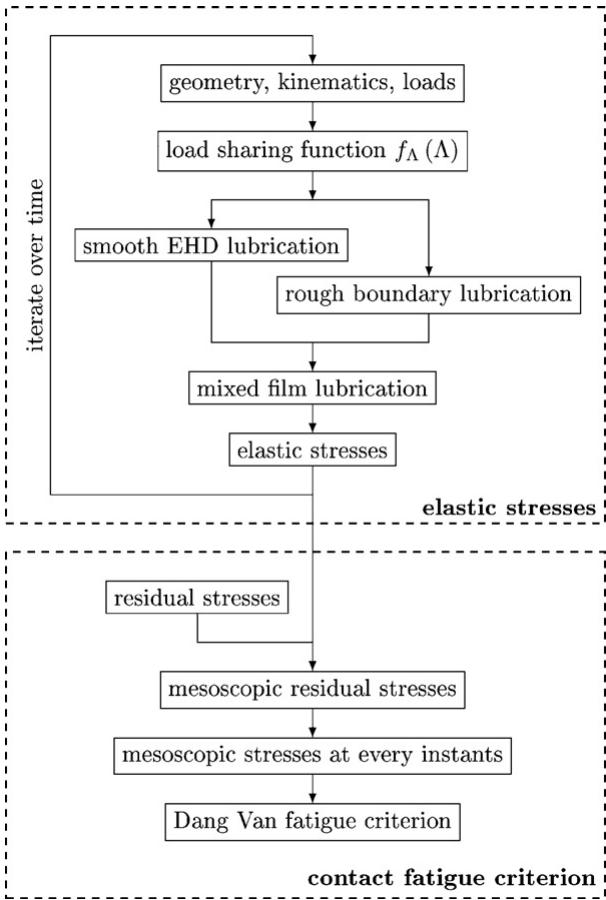  
Fig. 1. Diagram of the numerical model

where $y _ { 1 } + y _ { 2 }$ is the cumulated roughness height of the contacting surfaces and 
 is the measurement length.

Thus, and according to Vergne [8], the lubricated contacts are classified as:

full-film EHD lubrication when $\Lambda > 3$ and the composite roughness of the contacting surfaces is negligible compared to the lubricant oil film thickness;

nearly full-film EHD lubrication when $3 > \Lambda > 2$ and there occurs occasional contact between asperities;

mixed film lubrication when $2 > \Lambda > 1$ and the load is borne partly by direct naked contact between the surfaces and partly by a lubricating film;

boundary lubrication when $1 > \Lambda$ and the load is borne almost exclusively by direct contact, although the friction coefficient is not so high as that found in the case of dry contact because of the presence of lubricant molecules that cling to the surfaces.

In general, the lubrication regime of contacting gears is either mixed film lubrication or boundary lubrication. Thus, it is necessary to be able to solve such problems. Unfortunately, the Reynolds equation becomes quite intractable when factoring in the possibility of direct contact between the surfaces—not to mention such niceties as the temperature variation within the contact and the non-Newtonian rheology of the lubricant oil. Those are all factors that must be taken into account when trying to model realistically the meshing ofgears. For this reason, the model used here for mixed film lubrication is a modified version of that presented by Castro [9,10], which is mathematically much simpler than a direct attack on the integro-differential equations, although such an attack has indeed been made with success by, among others, Tao et al. [6] and Holmes et al. [11]. Nevertheless, this approach is computationally onerous, a fact that imposes a limit to the amount a numerical “experiments” that can be thus attempted.

From the classification of the lubrication regime based on  it is fair to assume that, for the most part, the fraction of the normal contact load borne by a lubricant film depends on . To the function of that represents this fraction is attached the designation ofload sharing function $f _ { \Lambda } ( \Lambda )$ . Thus:

$$
F ( t ) = F ^ { \mathrm { E H D } } ( t ) + F ^ { \mathrm { B D R } } ( t )\tag{3}
$$

$$
F ^ { \mathrm { E H D } } ( t ) = f _ { \Lambda } ( \Lambda ) \cdot F ( t )\tag{4}
$$

$$
F ^ { \mathtt { B D R } } ( t ) = ( 1 - f _ { \Lambda } ( \Lambda ) ) \cdot F ( t )\tag{5}
$$

where F is the normal contact load expressed as a force per unit length, $F ^ { \mathrm { E H D } }$ is the portion of F borne by the lubricating film and $F ^ { \mathrm { B D R } }$ is the portion borne by direct contact between the surfaces.

Thus the load sharing function $f _ { \Lambda } ( \Lambda )$ becomes a property of the system not unlike the Stribeck curves.

From this stems the main idea of the model: that the contact pressure distribution may be conceived to be an interpolation between the individual solutions ofthe perfectly smooth EHD lubrication problem and the rough boundary lubrication one. Thus, each separate individual problem should contribute a fraction ofthe total pressure distribution.

To clarify the reasoning, let $p ^ { \mathrm { E H D . T } }$ be defined as the normal contact pressure ofthe ideally smooth EHD lubrication contact pressure and le $p ^ { \mathtt { B D R . T } }$ be defined as the normal contact pressure ofthe rough boundary lubrication problem and let $p ^ { \mathrm { { M I X } } }$ be the mixed film lubrication normal contact pressure. It is undeniably true that there must exist a function g(x, t) such that:

$$
p ^ { \mathrm { M I X } } ( x , t ) = g ( x , t ) \cdot p ^ { \mathrm { E H D \cdot T } } ( x , t ) + ( 1 - g ( x , t ) ) \cdot p ^ { \mathrm { B D R \cdot T } } ( x , t )\tag{6}
$$

$$
0 \leq g ( x , t ) \leq 1\tag{7}
$$

This is not very helpful but ifone assumes that it is sufficiently accurate for the present purpose to let g only depend on time t —indeed that it ultimately depends only on  and on the oil properties and the type of roughness of the surfa $\mathsf { c e s } - g ( \Lambda )$ must obey the same general restrictions that $f _ { \Lambda } ( \Lambda )$ must—namely:

$$
\operatorname* { l i m } _ { \Lambda  0 } ( g ) = 0\tag{8}
$$

$$
\operatorname* { l i m } _ { \Lambda  + \infty } ( g ) = 1\tag{9}
$$

It is therefore a very short step to accept that $g ( \Lambda )$ and $f _ { \Lambda } ( \Lambda )$ are approximately equal.

Thus, in order to obtain $p ^ { \mathrm { { M I X } } }$ , one needs to know $p ^ { \mathrm { E H D . T } }$ and $p ^ { \mathtt { B D R . T } }$ , which are calculated, as well as $f _ { \Lambda } ,$ which must have been obtained from traction tests. The procedure, illustrated in Figs. 2–4, is thus:

(1) calculate $p ^ { \mathrm { E H D cdot T } } ( x , t ) ;$

(2) calculate $\Lambda$

(3) calculate $p ^ { \mathrm { B D R . T } } ( x , t )$

(4) define the fraction of the mixed film lubrication pressure contributed by $p ^ { \mathrm { E H D . T } }$

$$
p ^ { \mathtt { E H D } } ( x , t ) = f _ { \Lambda } ( \Lambda ) \cdot p ^ { \mathtt { E H D } \cdot \mathtt { T } } ( x , t )\tag{10}
$$

(5) define the fraction of the mixed film lubrication pressure contributed by $p ^ { \mathtt { B D R . T } }$

$$
p ^ { \mathrm { B D R } } ( x , t ) = ( 1 - f _ { \Lambda } ( \Lambda ) ) \cdot p ^ { \mathrm { B D R \cdot T } } ( x , t )\tag{11}
$$

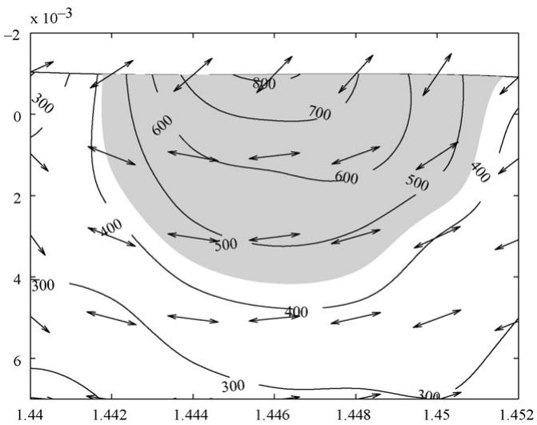  
Fig. 2. Mixed film lubrication model: calculation of the EHD portion of the norma pressure.

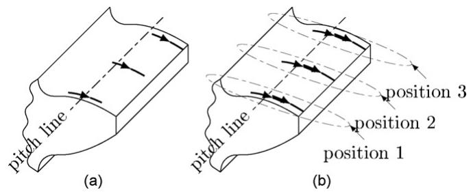  
Fig. 3. Mixed film lubrication model: calculation of the BDR portion of the norma pressure.

(6) sum the fractions to obtain $p ^ { \mathrm { { M I X } } }$ :

$$
p ^ { \mathrm { M I X } } ( x , t ) = p ^ { \mathrm { E H D } } ( x , t ) + p ^ { \mathrm { B D R } } ( x , t )\tag{12}
$$

From the procedure outlined and the approximate equality of $g ( \Lambda )$ and $f _ { \Lambda } ( \Lambda )$ it is easy to deduce that $\bar { p } ^ { \mathrm { E H D } }$ can be taken as an approximation to the actual portion of the mixed film contact pressure borne by the lubricating film and $p ^ { { \tt B D R } }$ as approximation to the portion borne by the direct contact between the surfaces.

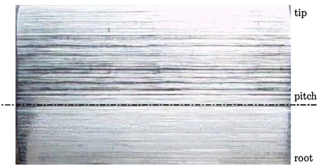  
Fig. 4. Mixed film lubrication model: calculation of the normal pressure.

2.1.1.1. Smooth EHD lubrication normal contact pressure. In order to obtain $p ^ { \mathrm { E H D . T } }$ , one might solve the Reynolds equations. This was not the road taken here since it would defeat one of the purposes of the model: that it be simple and fast. Instead the Grubin solution is used, which advocates that the contact normal pressure in a smooth EHD lubrication contact is sufficiently approximated by the Hertzian pressure distribution. Thus, $p ^ { \mathrm { E H D . T } }$ is:

$$
p ^ { \mathtt { E H D . T } } = p _ { 0 } { \sqrt { 1 - \left( { \frac { x } { a } } \right) ^ { 2 } } }\tag{13}
$$

where $p _ { 0 }$ is the Hertzian maximum pressure and a is the Hertzian half-width.

2.1.1.2. Rough boundary lubrication normal contactpressure. Finding $p ^ { \mathtt { B D R . T } }$ is equivalent to solving the rough dry contact problem at each instant t described mathematically as:

$$
h ( x , t ) = h _ { 0 } ( x , t ) - \frac { 2 } { \pi E _ { \mathrm { e q } } } \int _ { - \infty } ^ { + \infty } \ln \left| \frac { x - x ^ { \prime } } { L ( t ) } \right| p ^ { \mathrm { B D R \cdot T } } ( x , t ) \mathrm { d } x ^ { \prime }\tag{14}
$$

$$
\int _ { - \infty } ^ { + \infty } p ^ { \mathrm { B D R . T } } ( x , t ) \mathrm { d } x = F ( t )\tag{15}
$$

$$
\forall x , t : h ( x , t ) \geq 0 \land p ^ { \mathrm { B D R cdot T } } ( x , t ) \geq 0\tag{16}
$$

where the unknowns are:

● $h ( x , t ) ,$ , the separation between the surfaces;

$p ^ { \mathtt { B D R } \cdot \mathrm { T } } ( x , t ) ,$ the contact pressure;

L(t), an integration constant, which can be interpreted as the distance from an infinitesimal line load at which the vertical displacement vanishes.

and where the parameters have the meaning:

$h _ { 0 } ( x , t )$ , the undeformed separation between the surfaces;

• $E _ { \mathrm { e q } }$ , the equivalent Young’s modulus of the surfaces.

A number ofnumerical algorithms exist for solving this problem [12]. The one used here was proposed in a article by Polonsky and Keer [13].

## 2.1.2. Contact tangential stress

Having determined the mixed film lubrication normal contact pressure $\bar { p } ^ { \mathrm { M I X } }$ , there remains to be determined the contact tangential stress. As before, the final values are obtained as the sum of parcels, as outlined here:

(1) determine the smooth EHD lubrication friction contact stress $\tau ^ { \mathrm { E H D } } ( x , t ) ;$

(2) determine the rough boundary lubrication friction contact stress $\tau ^ { \mathrm { B D R } } ( x , t ) ;$

(3) sum the two parcels to obtain the mixed film lubrication friction contact stress

$$
\tau ^ { \mathrm { M I X } } ( x , t ) = \tau ^ { \mathrm { E H D } } ( x , t ) + \tau ^ { \mathrm { B D R } } ( x , t )\tag{17}
$$

2.1.2.1. Smooth EHD lubrication contact tangential stress. To determine the friction forces within the contact, the thermal equations must be considered. The thermal solution of the EHD lubrication contact presented here is derived from Tevaarvek’s shear plane hypothesis and is described in [14].

The results relevant to the present work are:

$$
\Delta T _ { s } ^ { \mathrm { m a x } } = \frac { 1 } { \sqrt { 2 \pi } } \frac { \mu F ^ { \mathrm { E H D } } } { \operatorname { P T } \sqrt { a } } | U _ { 1 } - U _ { 2 } | \left( \frac { 1 } { \sqrt { U _ { 1 } } } + \frac { 1 } { \sqrt { U _ { 2 } } } \right)\tag{18}
$$

$$
\Delta T _ { f } ^ { \mathrm { m a x } } = \frac { 1 } { \beta } \ln \left( \frac { \beta ( U _ { 1 } + U _ { 2 } ) ^ { 2 } \eta } { 8 K _ { f } } + 1 \right)\tag{19}
$$

$$
T _ { f } ^ { \mathrm { a v g } } = T _ { 0 } + \frac { 4 } { \pi } ( \Delta T _ { s } ^ { \mathrm { m a x } } + \Delta T _ { f } ^ { \mathrm { m a x } } )\tag{20}
$$

where:

$\Delta T _ { s } ^ { \mathrm { m a x } }$ is the greatest rise ofthe temperature ofthe surfaces above that of the inlet,

$\Delta T _ { f } ^ { \mathrm { m a x } }$ is the greatest rise ofthe temperature ofthe lubricant above that of the surfaces,

$T _ { f } ^ { \mathrm { a v g } }$ is the average lubricant temperature in the contact,

$\mu$ is the average friction coefficient within the contact,

PT is the thermal coefficient of both surfaces (in the present work, they are always made of the same material), defined as:

$$
\mathsf { P T } = \sqrt { \rho _ { s } C _ { s } K _ { s } }\tag{21}
$$

where:

$\rho _ { s }$ is the volumic mass of the surfaces,

$C _ { s }$ is the specific heat of the surfaces,

$K _ { s }$ is the thermal conductivity of the surfaces.

a is the Hertzian half-width of the contact,  is the viscosity of the lubricant at the average surface temperature and pressure conditions within the contact,

$\beta$ is the thermoviscosity coefficient of the lubricant at the average surface temperature and pressure conditions within the contact.

It is thus seen that the average lubricant temperature $T _ { f } ^ { \mathrm { a v g } }$ and the average friction coefficient $\mu$ are mutually dependent in the equation and are not known a priori. This deadlock may be broken by the simultaneous consideration of the rheological equation—in the case of the present work, the Bair and Winer viscoplasticity:

$$
\dot { \gamma } = - \frac { \tau _ { L } } { \eta } \ln \left( 1 - \frac { \tau } { \tau _ { L } } \right)\tag{22}
$$

where $\dot { \gamma }$ is the in-plane shear strain rate,  is the in-plane shear stress and $\tau _ { L }$ is the limiting shear stress.

Consider first that the friction coefficient between the gear teeth is:

$$
\mu ^ { \mathrm { E H D } } = \frac { \bar { \tau } ^ { \mathrm { E H D } } \cdot 2 a } { F ^ { \mathrm { E H D } } }\tag{23}
$$

where ¯ is the average shear stress within the lubricant oil.

Thus, a manipulation of Eq. (22) yields:

$$
\mu ^ { \mathrm { E H D } } = \frac { 2 a \tau _ { L } } { F ^ { \mathrm { E H D } } } \left[ 1 - \exp \left( - \frac { \eta \dot { \gamma } } { \tau _ { L } } \right) \right]\tag{24}
$$

where $\eta$ is determined at the average lubricant temperature $T _ { f } ^ { \mathrm { a v g } }$ and the average Hertzian pressure $( \pi / 4 ) p _ { 0 }$

Conjointly with Eq. (20), this is enough to determine the friction coefficient within the contact, albeit in an approximate manner, using an iterative scheme of computation.

Finally $\tau ^ { \mathrm { E H D } }$ can be obtained thus:

$$
\tau ^ { \mathrm { E H D } } ( x , t ) = \mu ^ { \mathrm { E H D } } ( t ) \cdot p ^ { \mathrm { E H D } } ( x , t )\tag{25}
$$

A more sophisticated scheme could be adopted where temperature and friction coefficient would be computed not as averages but at each point in the contact, but this was deemed an unnecessary complication that would yield doubtful improvements on the scheme presented here.

2.1.2.2. Rough boundary lubrication contact tangential stress. The rough boundary lubrication regime has until now been treated as if the lubricant had no effect. While it is true in the case of the pressure distribution, it is very much otherwise when it comes to determining the contact tangential stress. It has been found that, in boundary lubrication, although the lubricant film fails to form, the surfaces are nevertheless coated with lubricant molecules that ease the mutual sliding of the surfaces. Furthermore, it has been found that the resultant friction coefficient $\mu ^ { \mathrm { B D R } }$ is constant over variations ofgeometry, load and velocities. It is typically to be found in the range of values 0.08–0.15 [15].

Thus the boundary coefficient offriction is essentially a property of the lubricant oil and of the roughness of the surfaces and must be determined experimentally.

Therefore the rough boundary lubrication contact tangential stress $\tau ^ { \mathrm { B D R } } \mathrm { i } s \mathrm { : }$

$$
\tau ^ { \mathrm { B D R } } ( x , t ) = \mu ^ { \mathrm { B D R } } ( t ) \cdot p ^ { \mathrm { B D R } } ( x , t )\tag{26}
$$

## 2.2. Contactfatigue criterion

## 2.2.1. Mesoscopic stresses

As outlined by Constantinescu, Dang Van and co-workers [16], three scales must be distinguished when discussing fatigue: the microscopic scale of dislocations within crystals, the mesoscopic scale of crystal grains and the macroscopic scale of the studied component as a whole, with typical distances of:

| Scale | Typical lengths | Typical lengths |
| --- | --- | --- |
| Macroscopic | $1 0 ^ { - 3 } \mathrm { m }$ | Nominal geometry |
| Mesoscopic | $1 0 ^ { - 6 } \mathrm { m }$ | Chrystal grain |
| Microscopic | $1 0 ^ { - 1 0 } \mathrm { m }$ | Interatomic distance |

At the macroscopic scale, the material properties vary smoothly and the material is continuous. At the mesoscopic scale, the material properties cannot be said to vary smoothly because of the difference in orientation of the grains. Nevertheless, the material may still be considered continuous because a grain contains a sufficiently large number of atoms and it thus still makes sense to talk of stresses and strains. At the microscopic scale, the material becomes a discrete aggregate of atoms, and no continuity of any kind exists.

The stresses discussed up to this point are all at the macroscopic scale. On the other hand, the initiation of a fatigue crack is widely held to be a consequence of the nucleation of dislocations within crystal grains. It is therefore necessary to be able to evaluate the mesoscopic stresses. It must be said that the macroscopic stresses may be thought of, in some sense, as an average of the mesoscopic stresses over a representative volume element (RVE) of the size of many grains. Thus, the mesoscopic stresses are the sum of the macroscopic stress and of a perturbation due to the difference in elastic properties caused by the difference in grain orientation.

Dang Van, in an article describing his fatigue criterion [17], proposed a method of obtaining the mesoscopic stresses based on the elastic shakedown concept. While this method was presented as an integral part of the criterion, determining mesoscopic stresses is useful in itself. This is the reason why it is presented here independently of the fatigue criterion.

In the general case, the mesoscopic stress tensor is related to the macroscopic stress tensor thus:

$$
\tilde { \Sigma } = \tilde { \tilde { \mathsf { A } } } : \tilde { \sigma } + \tilde { \rho }\tag{27}
$$

where $\tilde { \Sigma }$ is the mesoscopic stress tensor, ˜ the macroscopic one, $\tilde { \rho }$ is the stabilized mesoscopic residual stress tensor, constant in time, and $\tilde { \bar { \mathsf { A } } }$ is the fourth order localization elastic tensor, that accounts for the differences in the elastic properties of the grains from the macroscopic ones due to their orientation.

As argued by Dang Van, it is possible to eliminate the localization tensor from $\operatorname { E q . }$ (27) by making a few reasonable assumptions. Namely, it is supposed that within the RVE centred on each material point considered, at least one grain is so unfavourably oriented that it will slip under the stresses, and that the material suffers isotropic and kinematic hardening at the mesoscopic level. Finally, it is supposed a priori that at the local mesoscopic level the material around each point will shakedown elastically, in a manner similar to the global elastic shakedown. Thus Eq. (27) reduces to:

$$
\tilde { \Sigma } = \tilde { \sigma } + \tilde { \rho }\tag{28}
$$

This happens because, as the cycle progresses, the yield surface grows and shifts to encompass all the stress states through which the considered material point has travelled. Once more, this is valid because of the assumption that elastic shakedown does occur locally—this is similar to conducting elastic calculations to check for yield—and that the material, at the mesoscopic scale, undergoes isotropic and kinematic hardening—a very general description of the plastic behaviour of a material and therefore a very reasonable one.

The yield criterion used is the Dang Van criterion, and therefore the yield surface is a hypersphere in the axes $s _ { x x } / \sqrt { 2 } , s _ { y y } / \sqrt { 2 } , s _ { z z } / \sqrt { 2 }$ s , s , s , whose radius expands—this is isotropic hardening—and whose centre moves—this is kinematic hardening. The final position and radius of the yield hypersphere is then such that the hypersphere is the smallest one that encompasses all the stress states in the cycle for the point under consideration. The stabilized mesoscopic residual stress associated with the local shakedown ( ˜-) is then the centre of the yield sphere. From this process of obtaining $\tilde { \rho }$ it follows necessarily that it is a purely deviatoric stress tensor. Mathematically, the yield limit is determined by solving the optimization problem:

$$
\begin{array} { r l } & { K ^ { 2 } = \underset { \tilde { \rho } ^ { \prime } } { \operatorname* { m i n } } ( \operatorname* { m a x } _ { t } ( - J _ { 2 } ( \tilde { \sigma } ( t ) + \tilde { \rho } ^ { \prime } ) ) ) } \\ & { \tilde { \rho } : K ^ { 2 } = \operatorname* { m a x } _ { t } ( - J _ { 2 } ( \tilde { \sigma } ( t ) + \tilde { \rho } ) ) } \end{array}\tag{29}
$$

Performing the mapping of the stresses to a six-dimensional space, this becomes the well known geometric problem of the smallest enclosing ball.

As an illustration of the principle, consider a body in which the external loads only induce pure shear stress, with all the stress components null except $\sigma _ { x z }$ and $\sigma _ { y z }$ , at a given point in the body. The macroscopic elastic stress history of the point in the body may be conveniently represented in two dimensions, as in Fig. 5. Because of this the yield surface collapses into a circle.

At the start of the cycle, the stress is equal to an initial stress $\sigma _ { 0 } = - \rho _ { 0 }$ and the yield radius is the initial one. The cycle progresses to instant $t _ { 1 } ,$ at which the elastic stress tensor is $\sigma _ { 1 }$ . Because in reaching this instant, the elastic stress tensor has moved outside the initial yield surface, it has pulled it along so that the yield surface centre has shifted to $\rho _ { 1 }$ and its radius has dilated to $R _ { 1 }$ in order to envelop both $\sigma _ { 0 } , \sigma _ { 1 }$ and every intermediate stress state. The very same thing happens when the cycle progresses to $\sigma _ { 2 }$ . Finally, when the full cycle has been gone through, the yield surface settles into its final shape and position and need no longer change with the application of further cycles.

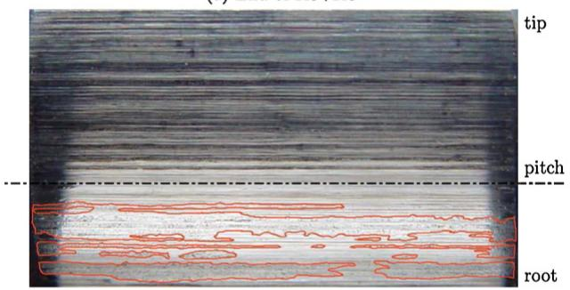  
Fig. 5. Stress cycle and hardening of a material point in pure shear stress.

Dang van et al. proposed in [17] an approximate method for the solution of the smallest enclosing ball problem, a method that is also detailed by Ciavarella et al. in [18]. A more recent algorithm, both faster and more accurate, had been made available by Gärtner [19] in the context of computational geometry. This algorithm was therefore used.

## 2.2.2. Dang Van multi-axial high-cycle fatigue criterion

The mesoscopic stresses evaluated by the method presented in the previous section are those necessary to ensure the existence of elastic shakedown locally—in fact, to ensure near infinite life to fatigue. Whether the material has the capacity to sustain these stresses or not is another matter. The Dang Van criterion is the tool used to check this possibility at each instant after the stabilization of the residual stress.

A fatigue crack in its initial stage usually propagates along a plane of maximum shear strain, which corresponds in the isotropic case to a plane of maximum shear stress. Thus, the maximum shear stress is a relevant parameter of the initiation of a fatigue crack. On the other hand, a negative hydrostatic stress—a hydrostatic pressure—has been observed to benefit the resistance to fatigue of materials. From these considerations, Dang Van formulated [17] the simplest possible law that relates these parameters:

$$
\tau _ { \mathrm { m a x } } + \alpha _ { \mathrm { D V } } \cdot p _ { H } \le \beta _ { \mathrm { D V } }\tag{30}
$$

where $\tau _ { \mathrm { { m a x } } }$ and $p _ { H }$ are the maximum shear stress and the hydrostatic stress—not pressure—of the mesoscopic stress and ˛ and $\beta _ { \mathrm { D V } }$ are fatigue material properties.

The material properties $\beta _ { \mathrm { D V } }$ and $\alpha _ { \mathrm { D V } }$ are obtained respectively by performing reversed torsion and alternating bending tests, in order to obtain two points on the line described by Eq. (30).

Because the maximum shear stress occurs in two mutually perpendicular planes, the orientation of the crack as it initiates can be either one, or even both.

Another interpretation can be given to the criterion, derived from the manner of obtaining $\beta _ { \mathrm { D V } }$ . One can think of the stress cycle at each point as equivalent to a reversed torsion stress cycle such that its maximum shear stress is:

$$
\beta _ { \mathrm { e q } } = \mathrm { m a x } _ { t } ( \tau _ { \mathrm { m a x } } + \alpha _ { \mathrm { D V } } \cdot p _ { H } )\tag{31}
$$

Thus, fatigue cracks do not initiate if this equivalent shear stress is less than the value of $\beta _ { \mathrm { D V } }$

$$
\beta _ { \mathsf { e q } } \leq \beta _ { \mathsf { D V } }\tag{32}
$$

This equation must be verified at each instant in the cycle. Any point at which this is not true must eventually be the origin of a fatigue crack: it passes into the domain of low cycle fatigue or even ratcheting.

As an example, Fig. 6 shows the position ofthe mesoscopic stress state of a material point during a hypothetical load cycle on the p /max plane. It is seen that the path of the stress crosses the straight line delimiting the safety zone.

Numerous papers have been published that apply the Dang Van criterion to rolling contact fatigue—spurred by applications in the railroad and roller bearing industries—such as [20,21,18,22].

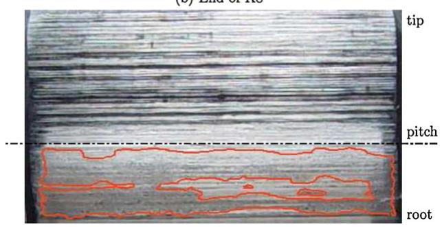  
Fig. 6. Position of the mesoscopic stress state of a material point during a load cycle on thepH $/ \tau _ { \mathrm { m a x } }$ plane. The shaded half-plane represents the area where the Dang Van criterion is violated. Thus, the parts of the cycle placed in the shaded area violate the criterion.

## 3. A simulation of gear meshing

## 3.1. Simulation parameters

In an approach not unlike that of Tao et al. [6], this section presents the results of a simulation of the meshing of gears with a FZG type C geometry made of DIN 20MnCr5 carburizing steel. The driving gear rotational speed is $n _ { 1 } = 2 2 5 0$ rpm and that of the driven gear is $n _ { 2 } = 1 5 0 0 \mathrm { r p m }$ , and the contact load is $F = 5 0 7 3 \mathrm { N }$

The lubricant simulated is an ISO VG 150 paraffinic mineral oil. Some of its properties are listed in Table 1. Those are nevertheless insufficient to model the rheology ofthe oil with the needed rigour, since it does not provide sufficient data to model the variation with pressure and temperature of the relation between the shear stress and the shear rate in the oil. In the present case, it was decided that the Roelands viscosity equation would be used:

$$
\ln \frac { \eta } { \eta _ { 0 } } = ( \ln \eta _ { 0 } + 9 . 6 7 ) \left\{ \left( \frac { T - 1 3 8 } { T _ { 0 } - 1 3 8 } \right) ^ { - S _ { 0 } } \left( 1 + \frac { p } { 1 9 6 } \right) ^ { Z } - 1 \right\}\tag{33}
$$

where $Z$ and $S _ { 0 }$ are non-dimensional parameters of the oil, $T _ { 0 }$ is a reference temperature in K,  is the dynamic viscosity in Pa s at the reference temperature and atmospheric pressure, T is the temperature of the lubricant in K, p is the pressure in GPa and  is the dynamic viscosity in Pa s.

In addition, the Bair and Winer viscoplasticity model of Eq. (22) is used, whose limiting shear stress also is pressure and temperature dependant. These variations can be described by:

$$
\ln \frac { \tau _ { L } } { \tau _ { L _ { 0 } } } = \alpha _ { \tau _ { L } } \cdot p + \beta _ { \tau _ { L } } ( T ^ { - 1 } - T _ { 0 } { } ^ { - 1 } )\tag{34}
$$

where $\tau _ { L _ { 0 } }$ is the limiting shear stress at a reference temperature $T _ { 0 }$ and atmospheric pressure and $\alpha _ { \tau _ { L } }$ and $\beta _ { \tau _ { L } }$ are constant parameters of the oil.

Furthermore, the boundary friction coefficient $\mu ^ { \mathrm { B D R } }$ must be known, as must also the load sharing function $f _ { \Lambda }$

Gear oil properties.
| Parameter | Method | Desig. | Lubricating oils |
| --- | --- | --- | --- |
| Density at 15°C | DIN 51757 | ρ15 | $0 . 8 9 4 \mathrm { g c m } ^ { - 3 }$ |
| Kinematic viscosity at 40°C | DIN 51562 | V40 | 153.6 cSt |
| Kinematic viscosity at 100°C | DIN 51562 | V100 | 14.4 cSt |
| Viscosity index | DIN ISO 2909 | VI | 96 |
| Pour point | DIN ISO 3106 |  | -27°℃ |

Rheological parameters of the gear oil.
| Roelands viscosity | Bair and Winer viscoplasticity |
| --- | --- |
| $T _ { 0 } = 3 6 3 \mathrm { K }$ | $\tau _ { L _ { 0 } } = 2 5 \mathrm { M P a }$ |
| $\eta _ { 0 } = 1 . 5 6 \times 1 0 ^ { - 2 } \mathrm { P a } s$ | $\alpha _ { \tau _ { I } } ^ { - 1 } = 5 8 8 \mathrm { M P a }$ |
| $S _ { 0 } = 1 . 2 8$ | $\beta _ { \tau _ { L } } ^ { ^ { \scriptstyle * } } = 0 \kappa$ |
| $Z = 0 . 6 0 8$ |  |

None of these parameters is available in the open literature, so that they must be obtained independently. This was attempted through a least-square data fitting of the friction coefficients, obtained through the mixed lubrication model already presented, to the estimates of friction coefficient obtained in gear power loss tests using the same lubricant [9]. It was possible to estimate the parameters to introduce into Eqs. (33)–(34). These are displayed in Table 2. This approach was unsuccessful in determining both $\mu ^ { \mathrm { B D R } }$ and $f _ { \Lambda }$

Nevertheless, it was possible to associate a load sharing function to each boundary friction coefficient, as shown in Fig. 7, so that the numerical and experimental friction power loss results fit.

Finally, the gear material parameters to be introduced in the Dang Van criterion (˛ and $\beta _ { \mathrm { D V } } )$ must be known. Unfortunately, only the value of $\alpha _ { \mathrm { D V } } ( 0 . 9 8 7 )$ was available on the open literature.

Thus, the values $\mu ^ { \mathrm { B D R } }$ and $\beta _ { \mathrm { D V } }$ are still missing. For the present goal, that of providing a qualitative understanding of the events associated with surface initiated tooth flank damage it is sufficient to arbitrate likely values, in this case:

$$
\begin{array} { l } { \mu ^ { \tt B D R } = 0 . 1 4 } \\ { \beta _ { \tt D V } = 4 4 0 \mathrm { M P a } } \end{array}\tag{35}
$$

## 3.2. Simulation results

In Fig. 8, the values of $\beta _ { \mathsf { e q } }$ that violate the Dang Van fatigue criterion $( \beta _ { \mathrm { { e q } } } > \beta _ { \mathrm { { D V } } } )$ are shown for the whole pinion tooth flank. The figure was obtained by “stretching” the nominal profile ofthe tooth until it became a straight line while conserving the roughness variations. Thus, the xx coordinates measure the position on the surface ofthe tooth flank and the zz coordinates the depth within the tooth. Notable points in the meshing are marked on the abscissa as B, C and D: the point where the tooth becomes the only one of the driving gear teeth in the meshing is marked as B, the pitch point is marked as C and the point where another pair of teeth initiates contact as D.

It is interesting to note that the points where the fatigue criterion is violated come in patches. It is immediately apparent in the figure that the part of the tooth under the pitch line (from A to C) suffers the most from contact fatigue, according to the Dang Van criterion: it has a greater concentration of violation patches and these tend to have higher values of $\beta _ { \mathsf { e q } }$

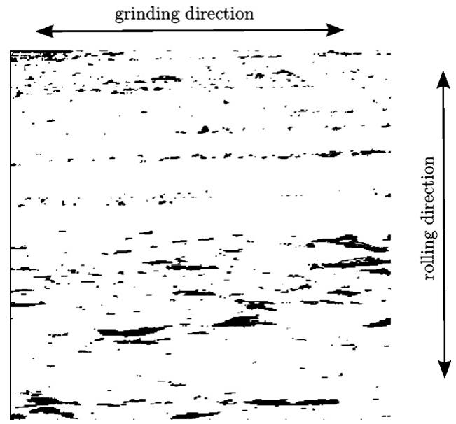  
Fig. 7. Some load sharing functions $f _ { \Lambda }$ and their associated boundary friction coefficients $\mu ^ { \mathrm { B D R } }$ .

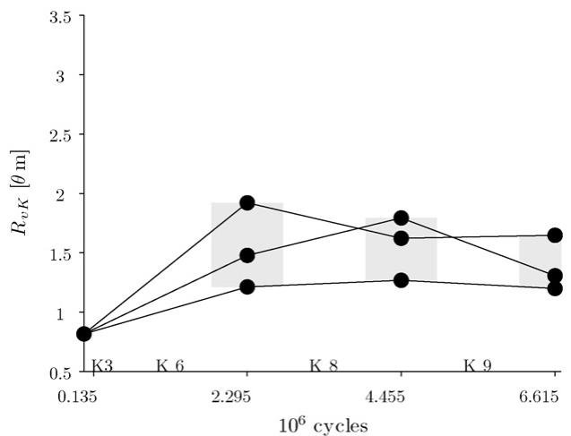  
Fig. 8. Simulation: values of $\dot { \beta } _ { \mathrm { e q } } >$ ˇDV in the xz plane.

Fig. 9 shows the same information but only for the part of the tooth below the pitch line. It is puzzling at first to remark that not all salient roughness peaks give rise to severe contact fatigue initiation, as well as that some valleys do give rise to contact fatigue initiation. To explain this, one has to remember that the opposing driven gear tooth also has a roughness. This means that the film thickness above a driving gear tooth roughness peak is only shallow when a sufficiently salient driven gear tooth roughness feature opposes the driving gear tooth roughness peak. This is essentially a matter of chance, although the probability of fatigue initiation under a roughness peak is much higher than anywhere else, as can be seen in Fig. 9.

Fig. 10 shows with greater detail the patch around the point with higher $\beta _ { \mathsf { e q } } .$ This patch is rather atypical in that it is very wide (around 0, 1 mm). It is composed of a number of patches that coalesced into one, as can be deduced from the fact that a number of local maxima are present on the surface.

In Fig. 11 is shown another patch were the Dang Van criterion is violated. This is a simpler one, were a single maximum is present. This type ofpatch is far more frequent than the one shown in Fig. 10. In fact, from the perusal of Fig. 9, one can conclude that the more complex patches are an agglomeration of several simple patches such as this one caused by the proximity ofseveral roughness peaks. Therefore, the patch shown in Fig. 11, can legitimately be considered typical. It is interesting to note its dimensions: roughly $1 0 \mu \mathrm { m }$ wide by 5 -m deep. This is very similar to the size of a micropit. The points Q and $Q ^ { \prime }$ are singled out for later use.

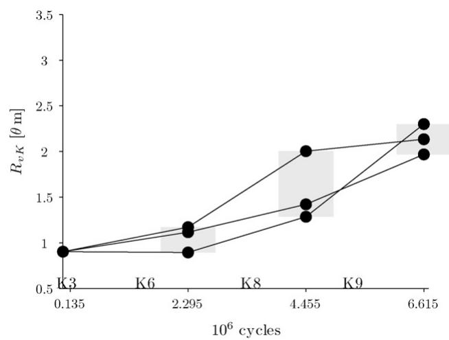  
Fig. 9. Simulation: $\beta _ { \mathrm { { e q } } } >$ ˇ in the part of the driving gear tooth under the pitch line.

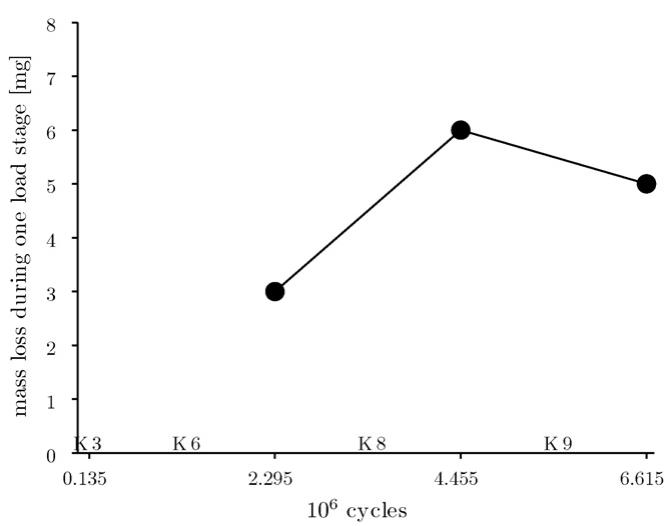  
Fig. 10. Simulation: contour plot of a detail of Fig. 9.

It is most instructive to see what happens in the area ofthe tooth around this typical patch of fatigue initiation, and the remainder of this section will be devoted to this.

The first step is to observe the pressure field when the patch of Fig. 11 undergoes its most intense load. This is shown in Fig. 12, where the outlines of the patches within which $\beta _ { \mathrm { e q } } > \beta _ { \mathrm { D V } }$ are represented along with the pressure distribution on the surface. Note that the tooth surfaces represented in the figure include both the nominal geometry of the teeth and the elastic deformations, unlike those in Figs. 8–11. It is striking that the pressure peak over the patch is very intense (around 8 GPa) and very localized: no more than 10 -m in width. The surface shear is not represented in the figure. It is proportional to the surface pressure and has the same direction as the sliding velocity $U _ { 2 } - U _ { 1 }$ depicted in the figure.

It is interesting to turn ones attention to a single point and see what happens to it during the meshing cycle. The point in question is marked as Qin Fig. 11. The point on the surface ofthe tooth on the vertical of Q is marked $Q ^ { \prime }$ on the same figure. The history of point Q is shown in Figs. 12–14

In Fig. 13, the history of the value of $\tau _ { \mathrm { m a x } } + \alpha _ { \mathrm { D V } } \cdot p _ { H }$ in point Q is shown, as well as two horizontal lines corresponding to the values of $\beta _ { \mathrm { D V } }$ and $\beta _ { \mathsf { e q } }$ . Time is represented here as the non-dimensional position ofthe nominal contact point on the meshing line, and flows from the right of the figure to the left.

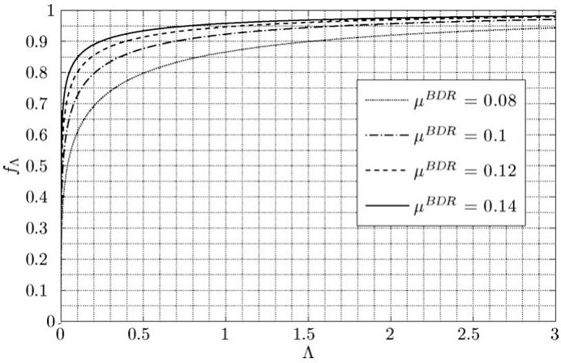  
Fig. 11. Simulation: contour plot of another detail of Fig. 9. Two points are singled out for later reference.

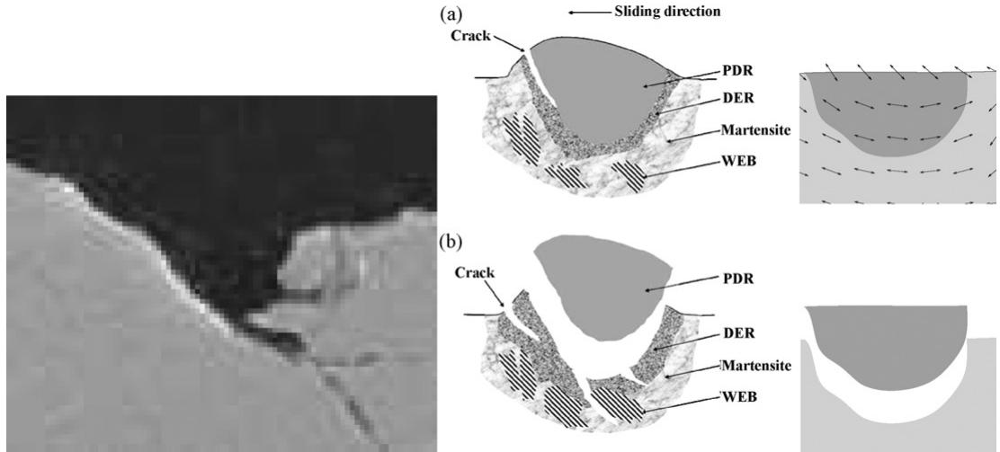  
Fig. 12. Surface pressure field when the patch of Fig. 11 undergoes its most intense load.

It is, at first, surprising to notice that the most severe values of max $+ \alpha _ { \mathrm { D V } } \cdot p _ { H }$ do not occur when point Q is in the contact, but rather when it is outside it. In fact, $\tau _ { \mathrm { m a x } } + \alpha _ { \mathrm { D V } } \cdot p _ { H } = \beta _ { \mathrm { e q } }$ for most of the meshing and only lowers when $Q ^ { \prime }$ enters the contact: it is actually at its lowest when the loads on $Q ^ { \prime }$ are at the highest. Of course, this is due entirely to the beneficial action ofthe hydrostatic pressure, that suffers a surge when $Q ^ { \prime }$ enters the contact. Thus, one could evaluate $\beta _ { \mathsf { e q } }$ with a high degree of certainty using only the sum of the mesoscopic residual stresses with the initial stresses, disregarding entirely the transitory effects of the elastic stresses.

This leads to a further conclusion: the only really beneficial hydrostatic pressure is that of the initial stresses (e.g. residual stresses due to heat treatment and/or grinding operation), since the mesoscopic residual stress tensor is deviatoric and therefore adds no hydrostatic pressure.

All these underline the fact that the residual stresses are the crucial consideration when dealing with fatigue initiation in gear teeth.

Fig. 14 plots the path taken by the stresses in point Q in the $p _ { H } /$ max plane. In the figure are also shown some straight lines that correspond to iso-values of $\tau _ { \mathrm { m a x } } + \alpha _ { \mathrm { D V } } \cdot p _ { H }$ , most notably the line where $\tau _ { \mathrm { m a x } } + \alpha _ { \mathrm { D V } } \cdot p _ { H } = \beta _ { \mathrm { D V } }$ , which divides the plane into a violation (on the right) and non violation (on the left) regions, in regard to the Dang Van criterion.

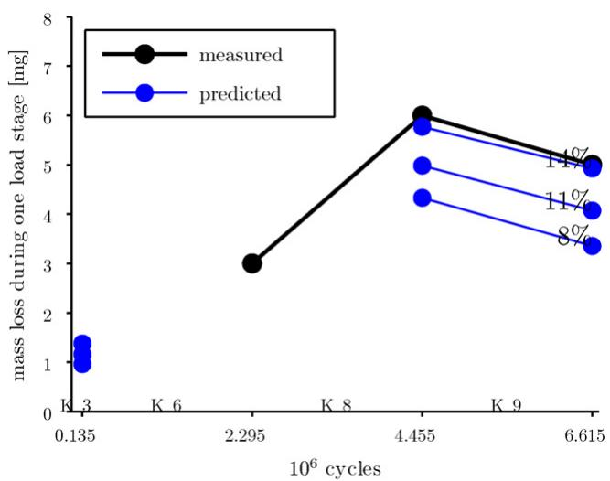  
Fig. 13. History ofthe value of $\tau _ { \mathrm { m a x } } + \alpha _ { \mathrm { D V } } \cdot p _ { H }$ in point Qplotted against the position of the contact in the meshing line. Two horizontal lines corresponding to the values of ˇDV and $\beta _ { \mathrm { { e q } } }$ are also shown.

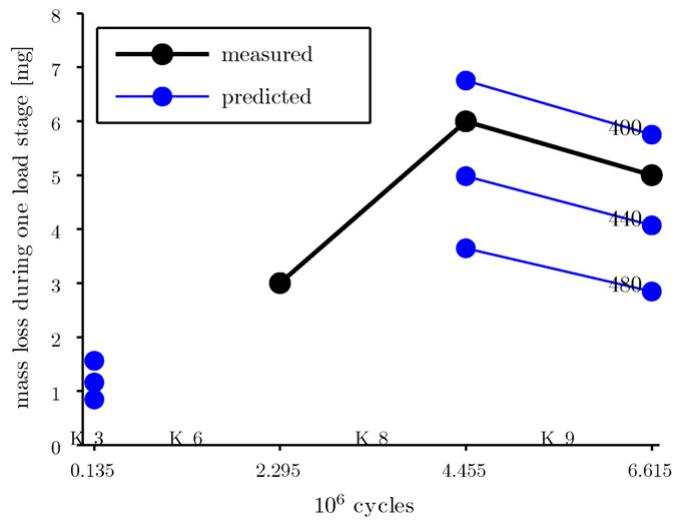  
Fig. 14. Map ofthe cycle undergone by point Qthat plots the mesoscopic maximum shear stress against the hydrostatic stress for the whole meshing cycle.

In Fig. 15, the cycle is shown as in Fig. 14, but this time in true proportion. The line of the Dang Van limit is the dashed line that goes through point T. The line where $\tau _ { \mathrm { m a x } } + \alpha _ { \mathrm { D V } } \cdot p _ { H } = \beta _ { \mathrm { e q } }$ is the dashed line that goes through point M, the most unfavourable point of the cycle. Consequently, $\beta _ { \mathrm { e q } } - \beta _ { \mathrm { D V } } = \overline { { M T } }$ . If the dashed line that goes through M is rotated until it touches another point on the cycle, the dash-dotted line that goes through M and M is obtained. If another dash-dotted line is constructed parallel to the first but going through point T, a virtual Dang Van limit, to which correspond values of $\dot { 7 } \beta _ { \mathrm { ~ D V } } ^ { \prime } = 5 7 8 \mathrm { M P a }$ and $\alpha _ { \mathrm { \tiny ~ D V } } ^ { \prime } = 0 . 2 4 2$ , is arrived at that would yield exactly the same value of $\beta _ { \mathrm { e q } } - \beta _ { \mathrm { D V } }$ . Indeed, this is true of any line that goes through M and has values of $\alpha _ { \mathrm { \tiny ~ D V } } ^ { \prime } \in [ 0 . 2 4 2 , 1 ] .$

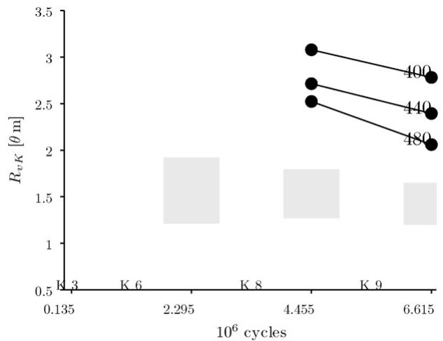  
Fig. 15. The cycle is shown as in Fig. 14. The line ofthe Dang Van limit is rotated until it corresponds to a value of $\alpha _ { \mathrm { D V } } = \alpha _ { \mathrm { ~ D V } } ^ { \prime } = 0 . 2 4 2$ such that $\beta ^ { \prime } _ { \mathrm { e q } } - \beta ^ { \prime } _ { \mathrm { D V } } = \beta _ { \mathrm { e q } } - \beta _ { \mathrm { D V } } .$ The construction lines and points marked illustrate the geometric reasoning.

There is three reasons that make this seemingly pointless argument become significant:

The shape of the cycle path in the plane $\tau _ { \mathrm { m a x } } - ~ p _ { H }$ of a point that suffers, according to the Dang Van criterion, from contact fatigue initiation is always similar to that of Fig. 15—particularly as regards “flatness”.

The worst point in the path is always very close to the point of no contact loads provided that $\alpha _ { \mathrm { D V } \sim } 0 . 2 5$ . Consequently, its hydrostatic stress is nearly the same as the initial hydrostatic stress.

• The initial hydrostatic stress is nearly constant in the first 10 -m of depth—those are, as can be seen in Figs. 8–11, the depths at which initiation occurs. In this particular case, it ranges from

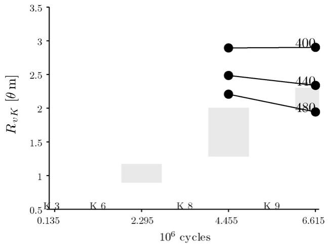

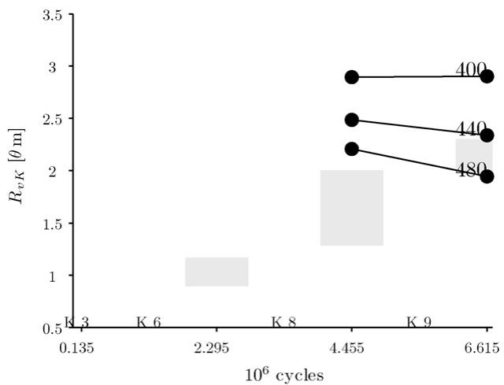

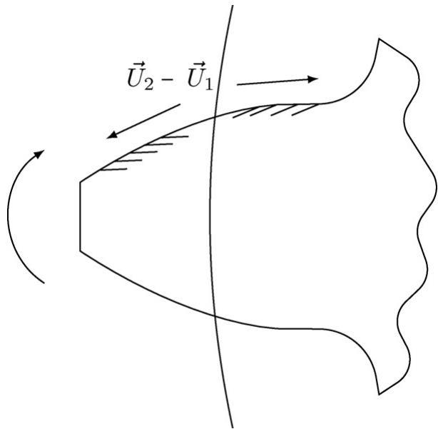  
(c)  
Fig. 16. Comparison of the directions of maximum mesoscopic shear stress associated with $\beta _ { \mathrm { { e q } } }$ computed by the model with the directions of propagation of fatigue cracks above and below the pitch line. (a) A patch above the pitch line and the directions of $\tau _ { \mathrm { { m a x } } } . ( \mathbf { b } ) .$ A patch below the pitch line and the directions of $\tau _ { \mathrm { m a x } } . ( \mathrm { c } )$ The directions of propagation of contact fatigue cracks in a driving gear tooth.

191 to 244 MPa, a very small difference when considering the magnitudes that have been discussed.

As a consequence, in all the points in the first 10 -m below the surface of the tooth flank, the maxima of $\tau _ { \mathrm { m a x } } + \alpha _ { \mathrm { D V } } \cdot p _ { H }$ will correspond to points gathered closely about a vertical line of abscissa $p _ { H } \approxeq - 2 0 0 \left[ \mathrm { M P a } \right]$ in the plane $\tau _ { \mathrm { m a x } } - p _ { H }$

Let $p _ { H } ^ { \mathrm { i n i } }$ be defined as the initial hydrostatic stress at point $Q ,$ Let also $\bar { p } _ { H } ^ { \mathrm { i n i } }$ be defined as an average initial hydrostatic stress for every point on the vertical ofQ(every point above and below $Q ,$ including Q) which are in the first 10 -m of depth.

From these considerations, the Dang Van criterion can be rewritten so:

$$
\beta _ { \mathrm { e q } } - \beta _ { \mathrm { D V } } = \tau _ { \mathrm { m a x } , 0 } + \alpha _ { \mathrm { D V } } \cdot ( p _ { H } ^ { \mathrm { i n i } } - \bar { p } _ { H } ^ { \mathrm { i n i } } ) + \alpha _ { \mathrm { D V } } \cdot \bar { p } _ { H } ^ { \mathrm { i n i } } - \beta _ { \mathrm { D V } } < 0\tag{36}
$$

where $\tau _ { \mathrm { m a x } , 0 }$ is the maximum shear stress of the mesoscopic residual stress tensor in at Q.

Because, generally $p _ { H } ^ { \mathrm { i n i } } - \bar { p } _ { H } ^ { \mathrm { i n i } }$ is small, it can be disregarded and thus the criterion becomes:

$$
\tau _ { \mathrm { m a x , 0 } } < \beta _ { \mathrm { D V } } - \alpha _ { \mathrm { D V } } \cdot \bar { p } _ { H } ^ { \mathrm { i n i } }\tag{37}
$$

In cases where the initial stresses are fairly homogeneous across the surface of the tooth, $\bar { p } _ { H } ^ { \mathrm { i n i } }$ can be said to be an average for the whole tooth and the initiation becomes dependent on only one composite material parameter: $\beta _ { \mathrm { D V } } - \alpha _ { \mathrm { D V } } \cdot \bar { p } _ { H } ^ { \mathrm { i n i } }$ . Thus it is sufficient to vary ˇ while keeping $\alpha _ { \sf D V }$ to get the complete range of possible fatigue responses. That is, of course, provided that $\alpha _ { \mathrm { D V } } \gtrapprox 0 . 2 5$

## 3.3. Planes ofmaximum mesoscopic shear stress andfatigue crack directions

The Dang Van criterion specifies that the plane of initiation of a fatigue cracks should be one of the planes of maximum mesoscopic shear stress associated with $\beta _ { \mathsf { e q } } .$ . In Fig. 16(a) and (b) are shown the intersection of these planes with the x–z plane superimposed on fatigue initiation patches both above and below the pitch line. Fig. 16(c) shows the directions of contact fatigue cracks revealed when the tooth ofa driving gear is cut along the x–z plane. It is striking that, on the surface, where the contact fatigue cracks originate, the correspondence between the directions of initiation predicted by the Dang Van criterion and those always observed on a driving gear tooth is perfect.

This is significant because, “a priori”, the Dang Van criterion does not favour a particular direction since the process of determining the mesoscopic stress tensor is more or less one of “extracting” the mean tendency. Thus one would expect the directions to be aleatory. The reason why they are so regular is because, as was shown in Fig. 15, the worse case is always that where the mesoscopic stress tensor is equal to the mesoscopic residual stress tensor, that is to say, the stress tensor that represents the central tendency ofthe stress cycle. Thus it becomes logical that the fatigue initiation directions should reverse when the contact crosses the pitch line and the tangential shear stress changes its direction. Thus an important aspect ofthe fatigue behaviour ofgears emerges naturally from the model.

## 4. Conclusion

As to the events inside a tooth, the main conclusion to be drawn are:

(1) Within the framework of the Dang Van fatigue criterion, the most unfavourable mesoscopic load state occurs outside of the contact. This shows that the high hydrostatic compressive stresses inside the loading have no lasting beneficial effect. On the contrary, they derive from a stress state that violently distorts the gear so that the maximum shear strain is increased at the mesoscopic level, with the consequent harmful effect to the fatigue behaviour of the gear. In fact, the only really beneficial hydrostatic compressive stress is that provided by the initial residual stresses.

(2) The fact that the most unfavourable mesoscopic stress occurs outside of the contact also demonstrates the enormous importance of the residual stresses, both the initial ones and those resulting from the load cycle, in determining the fatigue damage in the tooth.

(3) Another interesting finding is that the model is able to predict and explain the characteristic orientation of fatigue cracks on each side of the pitch line of a tooth.

## Acknowledgement

The authors wish to thank the “Fundac¸ ão para a Ciência e Tecnologia” from the Portuguese Administration for its financial support to this work through the research contract “PTDC/EME–PME/66185/2006”.

## References

[1] G. Peridas, A.M. Korsunsky, D.A. Hills, The relationship between the Dang Van criterion and the traditional bulk fatigue criteria, The Journal of Strain Analysis for Engineering Design 38 (3) (2003) 201–206.

[2] F. Antoine, J.-M. Besson, Simplified modellization of gear micropitting, Journal of Aerospace Engineering 216 (6) (2002) 291–302.

[3] A. Oila, S. Bull, Phase transformations associated with micropitting in rolling/sliding contacts, Journal of Materials Science 40 (September 18) (2005) 4767–47748(47748), http://www.ingentaconnect.com/content/klu/ jmsc/2005/000.

[4] A. Oila, S.J. Bull, Assessment of the factors influencing micropitting in rolling/sliding contacts, Wear 258 (10) (2005) 1510–1524, http://www. sciencedirect.com/science/article/B6V5B-4F3N.

[5] T.L. Krantz, The influence of roughness on gear surface fatigue, Technical Memorandum NASA TM-2005-213958, ARL-TR-3134, NASA (2005). http://gltrs.grc.nasa.gov/reports/2005/TM-2005-213958.pdf.

[6] J. Tao, T.G. Hughes, H.P. Evans, R.W. Snidle, N.A. Hopkinson, M. Talks, J.M. Starbuck, Elastohydrodynamic lubrication analysis of gear tooth surfaces from micropitting tests, Journal of Tribology 125 (2) (2003) 267–274, http://link.aip.org/link/?JTQ/125/267/1.

[7] J. Brandão, Gear micropitting prediction using the Dang Van high-cycle fatigue criterion, Master’s thesis, Faculdade de Engenharia da Universidade do Porto, 2007.

[8] P. Vergne, Super low traction under EHD and mixed lubrication regimes, in: A. Erdemir, J.-M. Martin (Eds.), Superlubricity, Elsevier B.V., 2007, pp. 429–445.

[9] J. Castro, J. Seabra, Coefficient of friction in mixed film lubrication: Gears versus twin-discs, Proceedings of the I MECH E Part J, Journal of Engineering Tribology 221 (13) (2007) 399–411, http://www.ingentaconnect.com/ content/pep/jet/2007/0000.

[10] J. Castro, J. Seabra, Global and local analysis of gear scuffing tests using a mixed film lubrication model, Tribology International 41 (4) (2008) 244–255.

[11] M.J.A. Holmes, H. Qiao, H.P. Evans, R.W. Snidle, Surface contact and damage in micro-ehl, in: D. Dowson, G. Dalmaz, M. Priest (Eds.), Life Cycle Tribology: 31st Leeds-Lyon Tribology Symposium, Elsevier Science, 2005, pp. 605–616.

[12] J. Seabra, D. Berthe, Influence ofsurface waviness and roughness on the normal pressure distribution in the hertzian contact, Journal of Tribology 109 (1987) 462–470.

[13] I.A. Polonsky, L.M. Keer, A numerical method for solving rough contact problems based on the multi-level multi-summation and conjugate gradient techniques, Wear 231 (2) (1999) 206–219.

[14] A. Campos, A. Sottomayor,J. Seabra, Non-newtonian thermal analysis ofan EHD contact lubricated with MIL-L-23699 oil, Tribology International 39 (12) (2006) 1732–1744.

[15] R.C. Castle, C.H. Bovington, The behaviour offriction modifiers under boundary and mixed EHD conditions, Lubrication Science 15 (3) (2003) 253–263.

[16] A. Constantinescu, K. Dang Van, M.H. Maitournam, A unified approach for high and low cycle fatigue based on shakedown concepts, Fatigue & Fracture of Engineering Materials & Structures 26 (6) (2003) 561–568.

[17] K. Dang Van, B. Griveau, O. Message, On a new multiaxial fatigue limit criterion: theory and application, in: M. Brown, K. Miller (Eds.), Biaxial and Multiaxial Fatigue, EGF 3, Mechanical Engineering Publications, London, 1989, pp. 479–498.

[18] M. Ciavarella, F. Monno, G. Demelio, On the Dang Van fatigue limit in rolling contact fatigue, International Journal of Solids and Structures 28 (8) (2006) 852–863.

[19] B. Gärtner, Fast and robust smallest enclosing balls, in: Proc. 7th annu. European Symposium on Algorithms (ESA), vol. 1643, Lecture Notes in Computer Science, Springer-Verlag, 1999. pp. 325–338.

[20] J.W. Ringsberg, M. Loo-Morrey, B.L. Josefson, A. Kapoor, J.H. Beynon, Prediction of fatigue crack initiation for rolling contact fatigue, International Journal of Fatigue 22 (3) (2000) 205–215.

[21] K. Dang Van, M.H. Maitournam, On some recent trends in modelling of contact fatigue and wear in rail, Wear 253 (1–2) (2002) 219–227.

[22] H. Desimone, A. Bernasconi, S. Beretta, On the application of the Dang Van criterion to rolling contact fatigue, Wear 262 (4–5) (2006) 567–572.
