# Micro-geometry effects on the sliding friction transition in elastohydrodynamic lubrication

G E Morales-Espejel1,2∗, AWWemekamp1, and A Félix-Quiñonez

1SKF Engineering and Research Centre B.V., Nieuwegein, The Netherlands

2INSA-Lyon, CNRS, Université de Lyon, LaMCoS UMR5259, France

The manuscript was received on 20 January 2010 and was accepted after revisionfor publication on 10 March 2010.

DOI: 10.1243/13506501JET787

Abstract: An engineering scheme is proposed to calculate the effects of deterministic microgeometry in sliding friction for the transition between full-film elastohydrodynamic and boundary lubrication regimes. The method combines the concepts of micro-geometry deformation from lubricated and/or dry contact conditions. Pressures are calculated from the elasto-plastic displacements and the load sharing between lubricant and contacts is resolved iteratively in the classical way, i.e. flow balance. Thus, by varying the lubricant entrainment speed in the contact for known values of boundary and full-film friction coefficients, it is then possible to calculate the Stribeck curve. The scheme is semi-analytical and the use of fast Fourier techniques makes it attractive for engineering applications. Theoretical predictions are compared with numerical solutions from the literature and with in-house measurements for different surface topographies and the results are in reasonable agreement with the model.

Keywords: Stribeck curves, sliding friction, roughness, EHL

## 1 INTRODUCTION

The prediction of friction in elastohydrodynamically lubricated (EHL) contacts remains a challenge for engineers because of many unresolved issues. One of them is the understanding of rheological aspects of the lubricant in the conditions of an EHL contact, despite the progress already made [1]. Another aspect modifying friction is the boundary layer bounded to the surface of the contact. This layer provides the surface with lubricity and reduces substantially typical dry contact friction coefficients, i.e. 0.5–0.8 to more modest values in the order of 0.1–0.15. The properties of this layer and therefore its effects on friction depend largely on the chemistry lubricantadditive surface. They are difficult to predict, and in engineering applications, they are mainly measured.

The final important aspect that considerably influences rolling and sliding friction in EHL contacts is the surface topography. Even in an ideal situation where all rheological and boundary layer aspects of the surface-lubricant couple are well known, the calculation of the surface topography effects on friction is still a challenge. The greatest influence is generally found in the transition region from boundary to fullfilm regime. This is the subject of the present paper, which is limited to sliding friction and EHL conditions.

Pioneering experimental work on partial lubrication is due to Tallian et al. [2, 3]. Johnson et al. [4] used the stochastic asperity contact model from Greenwood and Williamson [5] to determine the load balance between the lubricant and the dry contacts. Although, Johnson et al. were only interested on film thickness effects and contact time, the idea was widely used later by many authors for the calculation of friction in partial lubrication regime [6, 7]. Deterministic modelling of partial lubrication has been carried out by several researchers, e.g. Jiang et al. [8], Redlich et al. [9], Wang et al. [10], and more recently Deolalikar et al. [11].

In the present article, it is not the intention of the authors to address the basic physical phenomena of the partial-lubrication regime (e.g. film breakdown, lubricant micro-flow, droplet formation, surface energy effects, etc.), which are fundamental in the understanding and proper modelling of film formation and friction in this regime and would certainly prevent the authors from the use of the Reynolds equation among other things [12]. The objective of the present paper is only to present a fast engineering model capable of capturing the average behaviour of different deterministic surface micro-geometries in the contribution of sliding friction and load carrying aspects of the lubricant and the asperities, once the friction coefficients in the boundary and full-film regimes are known.

The approach used in the present work is based on the assumption of one nominally flat elastic–perfectly plastic rough surface in ‘contact’ with a smooth flat rigid counterpart. This approach allows for the simplification of the geometry and assumes that the mean film thickness and pressure are known (as in the central location of a contact). Therefore, only clearance and pressure fluctuations are calculated. The inlet and outlet of the contact are not fully included in the analysis. For the ‘dry’ contact patches, a contact model with a fast Fourier transform (FFT) approach, as described in Stanley and Kato [13], is used but extended to three-dimensional (3D) geometries. Furthermore, the perfectly plastic behaviour of the asperities at high pressures is introduced. For the lubricated areas an upgraded version ofthe so-called ‘amplitudereduction’ approach described in reference [14] will be justified and used. Finally, the sharing of the load between asperities and lubricant is calculated by using the classical iterative approach of flow balance as described initially by Johnson et al. [4].

The final model avoids the expensive full numerical calculations from previous models. The normalized friction results calculated for real measured surfaces with the present model are compared with experimental measurements from a ball-on-disc machine. The results are encouraging and show that this simple approach is able to capture the overall behaviour of the sliding friction in the transition regime.

Since thermal effects are not included, the model is limited to low sliding values, e.g. raceway contacts in rolling bearings.

## 2 DRY CONTACT MODEL

Stanley and Kato [13] used the work from Kalker [15] to solve the frictionless elastic contact problem, where the equilibrium solution has an equivalent variational statement, namely, find the pressures p to solve

$$
\begin{array} { l } { \operatorname* { m i n } ( f ) = \displaystyle \frac { 1 } { 2 } \int _ { S } p u ( p ) { \bf d } S + \int _ { S } p g { \bf d } S } \\ { \displaystyle \frac { 1 } { A } \int _ { S } p { \bf d } S = p _ { \mathrm { t a r g e t } } \quad p \geqslant 0 } \end{array}\tag{1}
$$

where $f$ is the total complementary energy, u the normal displacement and g the gap between the rigid plane and the undeformed elastic surface. The inequality in equation (1) means that negative pressures are not allowed and the last part of this equation imposes the prescribed load as a mean or target pressure $p _ { \mathrm { t a r g e t } } .$ . It follows the discrete representation of the statement

$$
\begin{array} { l } { \displaystyle \operatorname* { m i n } ( f ) = \frac { 1 } { 2 } \sum _ { i = 1 } ^ { n } p _ { i } u _ { i } + \sum _ { i = 1 } ^ { n } p _ { i } g _ { i } } \\ { \displaystyle p _ { i } \geqslant 0 , \quad i = 1 , 2 , \ldots , n } \\ { \displaystyle \frac { 1 } { n } \sum _ { i = 1 } ^ { n } p _ { i } = p _ { \mathrm { t a r g e t } } } \end{array}\tag{2}
$$

## 2.1 Algorithm for elastic dry contact

The numerical algorithm employed to find the pressures from equation (2) is also described in reference [13] and is as follows. Beginning with a guess for the matrix p which meets the equality and inequality constraints (a uniform pressure $\mathbf { p } _ { \mathrm { t a r g e t } }$ is convenient), then

1. Calculate a candidate pressure matrix $\mathbf { p } ^ { \prime } = \mathbf { p } -$ grad $\{ f ( \mathbf { p } ) \}$ . In general, p will violate the constraints. grad $\{ f ( \mathbf { p } ) \} = \mathbf { u ( p ) } + \mathbf { g }$ , forf quadratic.

2. Shift p uniformly up or down so that the sum ofthe positive pressures equals the target load.

3. Truncate all $p _ { i } ^ { \prime } < 0 .$ , Thus, p meets all constraints.

4. Set $ { \mathbf { p } } =  { \mathbf { p } } ^ { \prime }$ , and repeat until convergence.

## 2.2 Modification for elasto-perfectly plastic material

The above algorithm is modified according to the scheme of Tian and Bushman [16] to introduce the perfectly plastic behaviour of the material. Here it is assumed that the region of plastic deformation is only confined within a very small area, it does not significantly alter the geometry of the elastically deformed contact surface. A contact point deforms plastically once the local contact pressure exceeds the hardness of the material $( p _ { \mathrm { l i m } } )$ . For elastic–perfectly plastic materials, the internal complementary energy is equal to the elastic strain energy; therefore, equation (1) remains valid when the plastic displacements added energy is not very large (small plastic deformations).

Thus, the elastic scheme can be slightly modified.

1. The elastic algorithm (as above) is started. However, after the calculation of pressures (step 1) at every iteration it follows the next steps 2 to 6 instead.

2. The elastic pressures are limited to a threshold value related to the material yield limit by $p _ { \mathrm { l i m } } \approx 1 . 8 \sigma _ { \mathrm { y i e l d } } .$

3. Truncate all $p _ { i } ^ { \prime } < 0 .$

4. Calculate $\Delta \mathbf { p } = \mathbf { p ^ { \prime } } - \mathbf { p } ,$ p being the pressure from the previous iteration.

5. Check for convergence mean $\{ \Delta \mathbf { p } \} / \mathbf { p } _ { \mathrm { t a r g e t } } = \mathrm { e r r o r } ,$ and repeat until convergence.

6. Go back to 3 until convergence.

The plastic displacements can be calculated by simply subtracting the elastic displacements from the total displacements.

## 2.3 Elastic displacements calculation

The numerical schemes described above require the calculation of the elastic normal displacements for a given normal surface pressure. Here the FFT method described in reference [16] will be followed, therefore

$$
\mathbf { u } ( \mathbf { p } ) = \mathrm { I F F T } \left\{ \mathbf { w } \cdot F F T ( \mathbf { p } ) \right\}\tag{3}
$$

where IFFT means inverse FFT, and w FFT(p) refers to element-by-element multiplication, w is a matrix containing numerical factors and it is known as the frequency response function. To calculate w, consider the displacement solution for a bi-sinusoidal pressure distribution as given by Johnson et al. [17]

$$
\begin{array} { l } { \displaystyle p ( x , y ) = \cos \left( \frac { n 2 \pi x } { L _ { x } } \right) \cos \left( \frac { m 2 \pi y } { L _ { y } } \right) } \\ { \displaystyle u ( x , y ) = \frac 2 { ( n ^ { 2 } + m ^ { 2 } ) E ^ { * } } \cos \left( \frac { n 2 \pi x } { \mathrm { L } _ { x } } \right) \cos \left( \frac { m 2 \pi y } { \mathrm { L } _ { y } } \right) } \end{array}\tag{4}
$$

From which the frequency response matrix is

$$
\begin{array} { r l } & { w ( i , j ) = \frac { 1 } { \sqrt { ( i - 1 ) ^ { 2 } + [ ( j - 1 ) ! ] ^ { 2 } } } , } \\ & { \quad \forall i = 1 , \ldots , n / 2 \quad \mathrm { a n d } \ j = 1 , \ldots , m / 2 } \\ & { \quad w ( i , j ) = \frac { 1 } { \sqrt { ( i - 1 ) ^ { 2 } + [ ( m - j + 1 ) ! ] ^ { 2 } } } , } \\ & { \quad \forall i = 1 , \ldots , n / 2 \quad \mathrm { a n d } \ j = m / 2 + 1 , \ldots , m } \\ & { \quad w ( i , j ) = \frac { 1 } { \sqrt { ( m - i + 1 ) ^ { 2 } + [ ( j - 1 ) ! ] ^ { 2 } } } , } \\ & { \quad \forall i = m / 2 + 1 , \ldots , n / 2 \quad \mathrm { a n d } \ j = 1 , \ldots , m / 2 } \\ & { \quad w ( i , j ) = \frac { 1 } { \sqrt { ( m - i + 1 ) ^ { 2 } + [ ( m - j + 1 ) ! ] ^ { 2 } } } , } \\ & { \quad \forall i = n / 2 + 1 , \ldots , n / 2 \quad \mathrm { a n d } \ j = m / 2 + 1 , \ldots , m } \end{array}\tag{5}
$$

for w(1, 1) 0, where $l = L _ { x } / L _ { y }$

## 3 LUBRICATION MODEL

A 3D model for the pressures and clearances induced by low-amplitude micro-geometry in EHL conditions and pure rolling is described in Morales-Espejel et al. [14]. This model is based on the transverse-roughness model described in Greenwood and Morales-Espejel [18] and modified for the longitudinal roughness components of pressure and clearances by using the amplitude reduction curve for isotropic waviness from Venner and Lubrecht [19]. Recently, a truly 3D model which also includes rolling-sliding with an Eyring fluid (non-Newtonian behaviour) has been proposed by Hooke [20] and Hooke et al. [21]. The present model is largely based on this scheme but some modifications have been introduced for the calculation of the amplitude of the complementary function. The general model for rolling–sliding used in the present paper is described as follows.

The Reynolds equation is

$$
\frac { \partial } { \partial x } \left( \frac { \rho h ^ { 3 } } { 1 2 \eta _ { x } } \frac { \partial p } { \partial x } \right) + \frac { \partial } { \partial y } \left( \frac { \rho h ^ { 3 } } { 1 2 \eta _ { y } } \frac { \partial p } { \partial y } \right) = \bar { u } \frac { \partial ( \rho h ) } { \partial x } + \frac { \partial ( \rho h ) } { \partial t }\tag{6}
$$

For an analysis at the centre of the EHL contact, considering a sinusoidal waviness of amplitude $r _ { \mathrm { a } }$ moving along x with speed $u _ { 2 }$

$$
\delta r = r _ { \mathrm { { a } } } \ \exp ( i \omega _ { x } x ) \exp ( - i \omega _ { x } u _ { 2 } t ) \exp ( i \omega _ { y } y )\tag{7}
$$

where $\omega _ { x } = 2 \pi / \lambda _ { x }$ and $\omega _ { y } = 2 \pi / \lambda _ { y }$

As the surfaces move, hydrodynamic pressures will be generated. Provided that the amplitude of the roughness is low, such pressures will be sinusoidal and will have the same wavelength – albeit not necessarily the same phase – as the undeformed roughness. Thus, they can be expressed as

$$
\delta p = p _ { \mathrm { a } } \exp ( i \omega _ { x } x ) \exp ( - i \omega _ { x } u _ { 2 } t ) \exp ( i \omega _ { y } y )\tag{8}
$$

where the imaginary part of the complex representation of the fluctuations $\delta p$ is due to the differences in magnitude and phase between the original surface and the pressure fluctuation. These pressures will deform the elastic surface creating elastic displacements on both surfaces; they can be added and written as

$$
\delta \nu = \nu _ { \mathrm { a } } \exp ( i \omega _ { x } x ) \exp ( - i \omega _ { x } u _ { 2 } t ) \exp ( i \omega _ { y } y )\tag{9}
$$

where the relationship between displacement and pressure amplitude is given by Johnson et al. [17]

$$
\nu _ { \mathrm { a } } = \frac { 4 p _ { \mathrm { a } } } { E _ { \sqrt [ ] { \omega _ { x } ^ { 2 } + \omega _ { y } ^ { 2 } } } }\tag{10}
$$

The surface deformation is superimposed on the original roughness to produce the clearance variation inside the contact

$$
\delta h = h _ { \mathrm { a } } \exp ( i \omega _ { x } x ) \exp ( - i \omega _ { x } u _ { 2 } t ) \exp ( i \omega _ { y } y )\tag{11}
$$

where $h _ { \mathrm { a } } = r _ { \mathrm { a } } + \nu _ { \mathrm { a } }$

The pressure ripple will also change the density of the lubricant, the change may be written as

$$
\delta \rho = \rho _ { \mathrm { a } } \exp ( i \omega _ { x } x ) \exp ( - i \omega _ { x } u _ { 2 } t ) \exp ( i \omega _ { y } y )\tag{12}
$$

where $\rho _ { \mathrm { a } }$ is related to the pressure variation by

$$
\rho _ { \mathrm { a } } = \left( { \frac { \rho } { B } } \right) p _ { \mathrm { a } }\tag{13}
$$

with B being the bulk modulus of the lubricant at a given pressure, $\mathrm { d } \rho / \mathrm { d } p = \rho / B$

Now, since the amplitude of the variations is small, let us assume that the products of fluctuations can be neglected in the Reynolds equation (6) as well as products of derivatives; therefore, the Reynolds equation can be written as

$$
\begin{array} { c } { { \displaystyle \frac { h ^ { 3 } } { 1 2 } \left( \frac { 1 } { \eta _ { x } } \frac { \partial ^ { 2 } p } { \partial x ^ { 2 } } + \frac { 1 } { \eta _ { y } } \frac { \partial ^ { 2 } p } { \partial y ^ { 2 } } \right) } } \\ { { = \displaystyle \frac { 1 } { \rho } \left( \bar { u } h \frac { \partial \rho } { \partial x } + \bar { u } \rho \frac { \partial h } { \partial x } + h \frac { \partial \rho } { \partial t } + \rho \frac { \partial h } { \partial t } \right) } } \end{array}\tag{14}
$$

since $\begin{array} { r } { \mathrm { d } \rho / \mathrm { d } p = \rho / B , } \end{array}$ notice that

$$
{ \begin{array} { l } { { \frac { 1 } { \rho } } { \frac { \partial \rho } { \partial x } } = { \frac { 1 } { B } } { \frac { \partial p } { \partial x } } } \\ { { \frac { 1 } { \rho } } { \frac { \partial \rho } { \partial t } } = { \frac { 1 } { B } } { \frac { \partial p } { \partial t } } } \end{array} }\tag{15}
$$

therefore,

$$
\begin{array} { c } { { \displaystyle { \frac { h ^ { 3 } } { 1 2 } } \left( \frac { 1 } { \eta _ { x } } \frac { \partial ^ { 2 } p } { \partial x ^ { 2 } } + \frac { 1 } { \eta _ { y } } \frac { \partial ^ { 2 } p } { \partial y ^ { 2 } } \right) } } \\ { { = \bar { u } \frac { \partial h } { \partial x } + \frac { \partial h } { \partial t } + \frac { h } { B } \left( \bar { u } \frac { \partial p } { \partial x } + \frac { \partial p } { \partial t } \right) } } \end{array}\tag{16}
$$

Greenwood and Morales-Espejel [18, 22] have shown that the solution of the moving roughness problem is made oftwo components: the particular integral (moving steady-state) travelling with the speed of the rough surface $u _ { 2 }$ and a complementary function describing a propagated wave generated at the inlet, travelling at the average speed for the lubricant $\bar { u } .$

## 3.1 Particular integral

Pressure, clearance, and density variations can be added to the smooth contact and substituted in equation (16), then the equation simplifies to

$$
{ \frac { \rho h ^ { 3 } \omega _ { x } ^ { 2 } } { 1 2 \eta _ { x } } } p _ { \mathrm { a } } + { \frac { \rho h ^ { 3 } \omega _ { y } ^ { 2 } } { 1 2 \eta _ { y } } } p _ { \mathrm { a } } = i ( u _ { 2 } - \bar { u } ) \omega _ { x } \left( \rho h _ { \mathrm { a } } + { \frac { \rho h } { B } } p _ { \mathrm { a } } \right)\tag{17}
$$

solving for $p _ { \mathrm { a } }$ equation (17) leads to

$$
\frac { p _ { \mathrm { a } } } { r _ { \mathrm { a } } } = \frac { \kappa E ^ { \prime } } { 4 } \frac { i Q } { 1 - i Q - i C Q }\tag{18}
$$

where $\kappa = \sqrt { \omega _ { x } ^ { 2 } + \omega _ { y } ^ { 2 } } , C = h E ^ { \prime } \kappa / ( 4 B )$ and

$$
Q = \frac { 4 8 ( u _ { 2 } - \bar { u } ) \omega _ { x } } { E ^ { \prime } h ^ { 3 } \kappa [ ( \omega _ { x } ^ { 2 } / \eta _ { x } ) + ( \omega _ { y } ^ { 2 } / \eta _ { y } ) ] }
$$

For an Eyring fluid $\dot { \gamma } = ( \tau _ { 0 } / \eta )$ sinh $( \tau / \tau _ { 0 } )$ the effective viscosities [23] are

$$
\begin{array} { c } { { \eta _ { x } = \displaystyle \frac { \eta } { \cosh ( \tau _ { m } / \tau _ { 0 } ) } } } \\ { { \eta _ { y } = \displaystyle \frac { \eta ( \tau _ { m } / \tau _ { 0 } ) } { \sinh ( \tau _ { m } / \tau _ { 0 } ) } } } \end{array}\tag{19}
$$

with $\tau _ { m }$ being the mean shear stress.

## 3.2 Complementary function

In the general problem of rolling–sliding, the complementary waves (pressures and clearance fluctuations) will decay in amplitude as they propagate in the contact due to the non-Newtonian effects from sliding. Hooke et al. [21] suggest an exponential decay respect to the inlet $( x ^ { \prime } = x + a )$ location. Besides, the complementary wave, since it propagates with the average speed of the lubricant, effectively will have a wavenumber in x such that $\omega _ { x } ^ { \prime } \approx \omega _ { x } ( u _ { 2 } / \bar { u } )$ . Assuming that the wave decays exponentially with distance at a rate $\beta ,$ the amplitude of the clearance and by consequence the pressure can be expressed as

$$
\begin{array} { r } { \delta h _ { \mathrm { c } } = h _ { \mathrm { c } } \exp ( i \psi x ^ { \prime } ) \exp ( - i \omega _ { x } u _ { 2 } t ) \exp ( i \omega _ { y } y ) } \\ { \delta p _ { \mathrm { c } } = p _ { c } \exp ( i \psi x ^ { \prime } ) \exp ( - i \omega _ { x } u _ { 2 } t ) \exp ( i \omega _ { y } y ) } \end{array}\tag{20}
$$

with $\psi = \omega _ { x } ^ { \prime } + i \beta$

Substituting these equations and the associated changes in density into the linearized Reynolds equation (16) and collecting the first-order terms, Hooke et al. [21] obtained,

$$
\psi = \omega _ { x } ^ { \prime } + i \frac { E ^ { \prime } h ^ { 3 } \sqrt { \psi ^ { 2 } + \omega _ { y } ^ { 2 } } [ ( \psi ^ { 2 } / \eta _ { y } ) + ( \omega _ { y } ^ { 2 } / \eta _ { y } ) ] } { 4 8 \bar { u } \left[ 1 + \left( E ^ { \prime } h \sqrt { \psi ^ { 2 } + \omega _ { y } ^ { 2 } } / ( 4 B ) \right) \right] }\tag{21}
$$

which needs to be solved for ψ at every roughness component. The numerical solution is possible by successively using the real part of equation (21) to estimate the real part of $\psi$ and the imaginary part to estimate the imaginary part of $\psi$

## 3.3 Amplitude of the complementary function

As mentioned before, the amplitude of the complementary function cannot be obtained only from the nominally parallel clearance assumption, here the inlet to the contact needs to be solved. Hooke et al. [21] proposed a curve-fit solution from numerically obtained perturbation solutions for every wave component ofthe roughness. In this paper, however, a different approach will be followed, because it is found to be simpler. Morales-Espejel et al. [14] used the numerically calculated amplitude reduction curves from Venner and Lubrecht [18] to approximate the amplitude of $h _ { \mathrm { c } }$ for Newtonian fluids as a function of the parameter. It follows a modification of this scheme for non-Newtonian fluids.

By solving numerically different sinusoidal patterns with Eyring fluid and rolling–sliding conditions, it is found that the amplitude reduction curves from Venner and Lubrecht can still be used but only with a new definition of the parameter , where the non-Newtonian effects are accommodated. This new parameter will be denoted as $\nabla _ { \mathrm { n n } }$ and it is defined as

$$
\nabla _ { \mathrm { n n } } = 0 . 8 \nabla \left( \frac { 1 + S } { 2 } \right) ^ { 0 . 1 + 0 . 5 K }\tag{22}
$$

with

$$
K = 1 - \operatorname { t a n h } \left( 0 . 2 5 { \frac { | Q | } { \nabla } } \right)\tag{23}
$$

thus

$$
h _ { \mathrm { t } } = { \frac { r _ { \mathrm { a } } } { 1 + 0 . 1 5 \nabla _ { \mathrm { n n } } + 0 . 0 1 5 \nabla _ { \mathrm { n n } } ^ { 2 } } }\tag{24}
$$

The clearance amplitude calculated with this scheme $h _ { \mathrm { t } }$ will include both components; therefore, the amplitude of the particular integral needs to be subtracted at every wave component to obtain $h _ { \mathrm { c } } ,$ leading to $h _ { \mathrm { c } } = h _ { \mathrm { t } } - h _ { \mathrm { a } }$ . This approximation is good enough in most cases as pointed out by C. J. Hooke (personal communication) when compared with the perturbation method. However, for truly universal calculations, the original method of Hooke et al. [21] should be used.

Finally, the complete pressures and clearance fluctuations are calculated by adding together the particular integral and the complementary function.

## 3.4 Other rheological models

As discussed by Hooke [20] and Hooke et al. [21] the scheme can easily be adapted to consider other rheological models different from Eyring. Different expressions for the equivalent viscosities (equation (19)) would need to be obtained, perhaps the only requirement is that they do not become zero (i.e. limiting shear stress model). Finally, the constants in equations (22) to (24) would probably need to be recalculated for the new rheology.

## 3.5 Full-film model verification

An example from Félix-Quiñonez [24] and Félix-Quiñonez et al. [25] is considered. The operating conditions and further data are given in Table 1.

Figure 1 shows the 3D geometry for the initial roughness, the deformed micro-geometry and the corresponding EHL pressure fluctuations for the pure rolling case $S = 0 ,$ , as calculated by the present model. Figure 2 shows the middle-plane profiles for deformed clearances and pressure fluctuations for three different rolling/sliding ratios, as calculated by the present model, they represent snap-shots at different times. These profiles can be compared with Fig. 3 which shows the measurements and numerical calculations as given by Félix-Quiñonez et al. [25], N refers to the consideration of the Newtonian fluid and NN to the non-Newtonian fluid. The comparison is done at the same specific times. The results show very good agreement with both, measurements and numerical solutions.

## 4 COMBINED MODEL

The model for the transition from boundary lubrication to full-film conditions combines the dry contact model described in section 3 and the full-film model described in section 4. Before showing the combination process, it is necessary to justify the use of the approach described in section 4 for the description of clearance and pressure fluctuations in conditions of very thin films and the transition to a dry contact solution.

The authors want to point out that they understand clearly that the Reynolds equation cannot be used to explain any film thickness break-down to produce dry contacts as long as the surface velocity remains different from zero and no lubricant-wall slippage is allowed. However, the present model only attempts to approximate the contact pressures and elastic deformation of the surface for the load sharing part that is important in friction. With this objective in mind, the authors believe that in very small clearance locations, it might result in less error to calculate these parameters using a dry contact model rather than a continuum-mechanics lubrication model. However, this question remains to be resolved and it is a matter of further discussions.

Table 1 Data used in reference [25]
| Parameter | Value | Dimension |
| --- | --- | --- |
| ū | 0.025 | m/s |
|  | 1.36 | Pas |
| η0 |  | GPa -1 |
| α | 27.8 |  |
| 00 E' | 8 | MPa |
|  | 117 | GPa |
| $R _ { x }$ | 12.7 | mm |
| $F$ | 32 | N |
| $p _ { \mathrm { h } }$ | 0.508 | GPa |
| $_ { a }$ | 0.174 | mm |
| $h _ { \mathrm { c } }$ | 0.302 | μm |

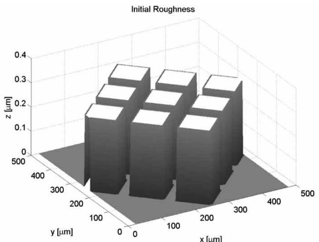  
(a) initial Geometry [25]

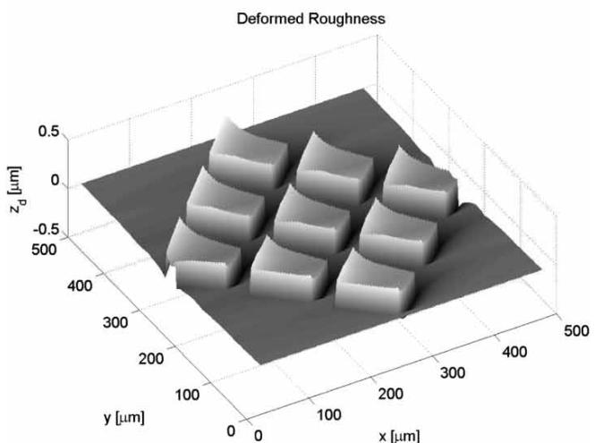  
(b) Deformed Micro-Geometry $s = 0$

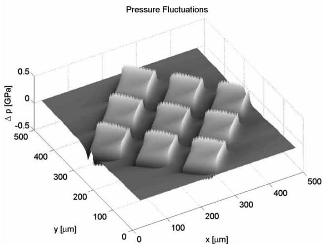  
(c)Pressure Fluctuations, $s = 0$  
Fig. 1 Initial geometry, calculated deformed microgeometry and pressure fluctuations (with present model) for the pure rolling example (flat-top 3D geometry at $4 5 ^ { \circ }$ angle from the rolling direction) given by Félix-Quiñonez et al. [25]

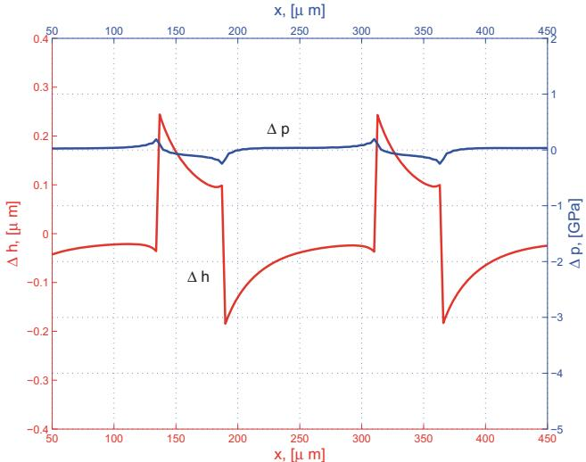  
(a) Middle-plane profile, = 0

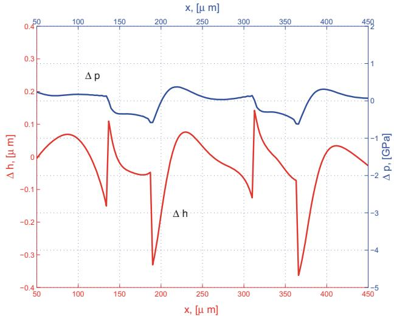  
(b) Middle-plane profile, $S = 1$

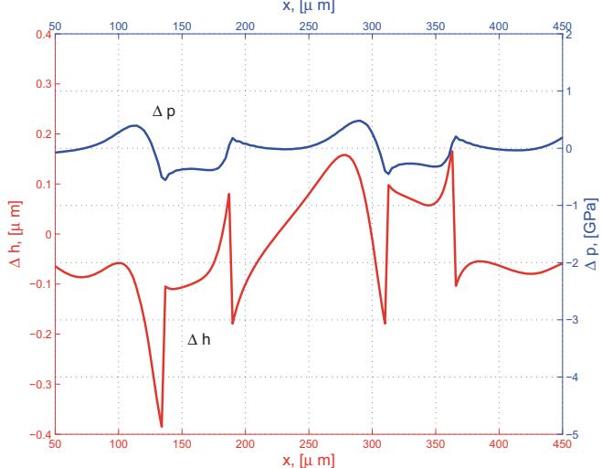  
(c) Middle-plane profile, = 1  
Fig. 2 Calculated (present model) middle-plane profiles $( y = 0 )$ at a particular time (snap-shot) for different rolling-sliding conditions for the flat-top example given by Félix-Quiñonez et al. [25]

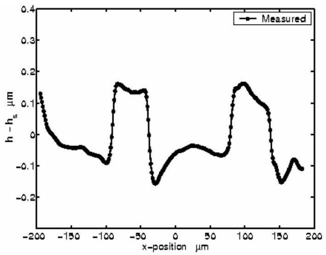

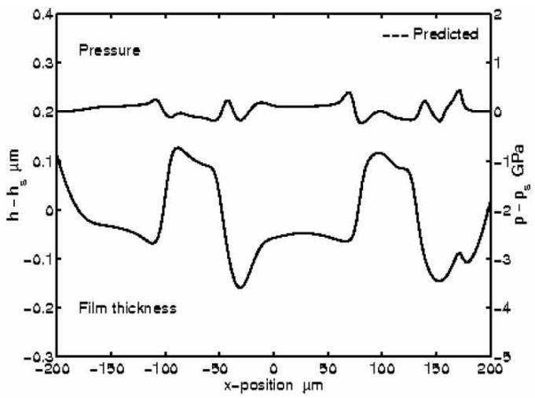  
(a) Middle-plane profile, $S = 0$

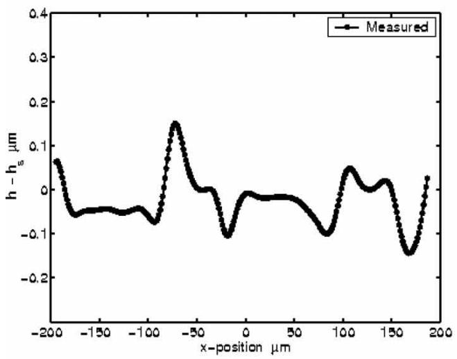

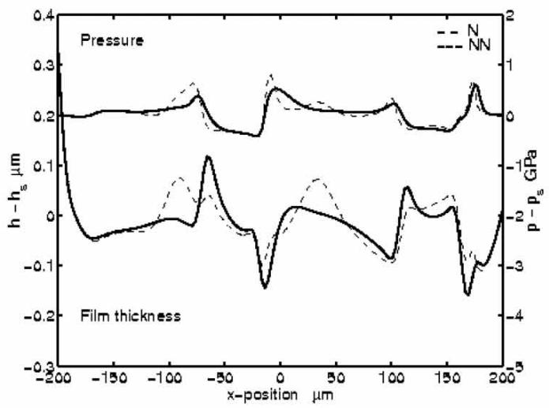  
(b) Middle-plane profile, $S = 1$

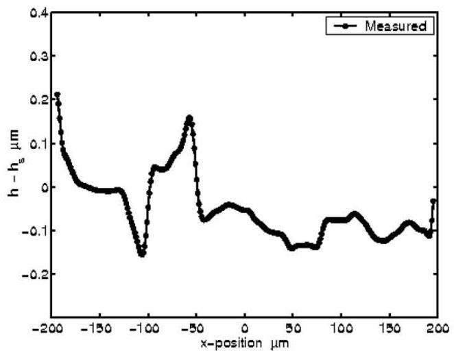

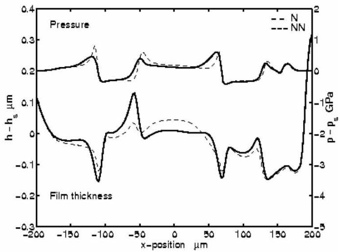  
(c) Middle-plane profile, $S = - 1$  
Fig. 3 Measured and numerically calculated middle-plane profiles $( y = 0 )$ at a particular time (snap-shot) for different rolling-sliding conditions as given by Félix-Quiñonez et al. [25]. The legend NN means non-Newtonian fluid and N Newtonian

## 4.1 Justification for the use of the lubrication model in thin film conditions

The use of the scheme described in section 4 requires some attention given the simplifications made. In particular, the derivation of equation (16). This equation implies that the term in the Poiseuille flow $\rho h ^ { 3 } / ( 1 2 \eta )$ has nearly no variation respect to x (equal to its mean value), so it can be taken out of the derivative. Besides this, it is also assumed that the term in the Couette flow $h / B$ remains constant and equal to its mean value. These assumptions introduce some linearity in the Reynolds equation which allows its solution via the present method. Therefore, some care must be taken in order to remain within the limits of the approximation.

Morales-Espejel et al. [14] concluded that under typical conditions (h 1 10−6 m, $0 . 0 4 ~ \leqslant$ η u  0.1 Pa m, $\alpha = 2 0 \times 1 0 ^ { - 9 } \mathrm { P a } ^ { - 1 } , ~ \lambda _ { x } = 5 0 \times 1 0 ^ { - 6 } \mathrm { m }$ and assuming $h - h ^ { * } \leqslant 1 \times 1 0 ^ { - 9 }$ m) the minimum pressure in the contact required to linearize the Reynolds equation is about 0.5 GPa.To extend the previous analysis, consider the one-dimensional (1D) flow Reynolds equation

$$
\frac { 1 } { \eta \bar { u } } \frac { \mathrm { d } p } { \mathrm { d } x } = 1 2 \frac { h - h ^ { * } ( \rho ^ { * } / \rho ) } { h ^ { 3 } }\tag{25}
$$

where $\eta = \eta _ { 0 } \exp ( \alpha p )$ , assuming a sinusoidal pressure variation with $\mathrm { d } p / \mathrm { d } x = 2 \pi p _ { 1 } / \lambda _ { x }$ . Thus substituting

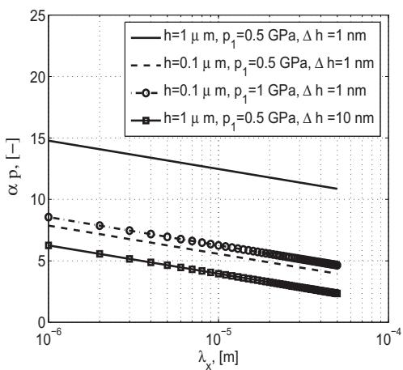  
Fig. 4 Dimensionless minimum pressure as a function of the wavelength of the pressure ripple, required to keep the linear behaviour in the 1D Reynolds equation, as predicted by equation (26) with $\Delta h = h - h ^ { * } ( \rho ^ { * } / \rho )$ . All other variables fixed as reference [14]

and solving for $p ,$ leads to

$$
p \alpha \geqslant \ln \left[ \frac { \pi p _ { 1 } h ^ { 3 } } { 6 \eta _ { 0 } \hat { u } \lambda _ { x } [ h - h ^ { * } ( \rho ^ { * } / \rho ) ] } \right]\tag{26}
$$

being required to maintain the linearity of the Reynolds equation.

Figure 4 plots $\alpha p$ values from equation (26) as a function of the waviness wavelength $\lambda _ { x }$ for different conditions of clearance h, pressure amplitude of the ripple $p _ { 1 }$ and clearance variation in the central zone of the contact $\Delta h = h - h ^ { * } ( \rho ^ { * } / \rho )$ . From this figure, several observations can be made. Large clearance, large pressure ripples and short wavelengths require higher pressures to keep the linearity. It can also be seen from Fig. 4 that the pressure ripple amplitude has a weaker effect, but the larger the ripple the larger the required minimum pressure. When relaxing the allowed h by a factor 10 $( 1 0 \mathrm { n m } = 0 . 1 h )$ , the requirements of the linearity drastically fall down to very reasonable values in all frequency ranges. The above results show that even at very short wavelengths $( \approx 1 \mu \mathrm { m } )$ , the minimum hydrodynamic pressure to ensure linearity should not be lower than 0.5 GPa. Notice that this is an easy requirement to fulfil since short wavelength roughness components have in general very low amplitude. More important, for larger wavelengths (≈ 50 μm) the minimum pressure can be as low as 0.25 GPa without introducing large errors. Finally, of relevance for the present work, small clearances seem to require lower minimum pressures. This conclusion can be deceiving since lower clearances tend to increase the pressure ripple (the two parameters are dependent). The present analysis should cover most cases ofreal tribological surfaces (bearings, gears). However, deep indentations on the surface would require further examination for the use of the present approach [26].

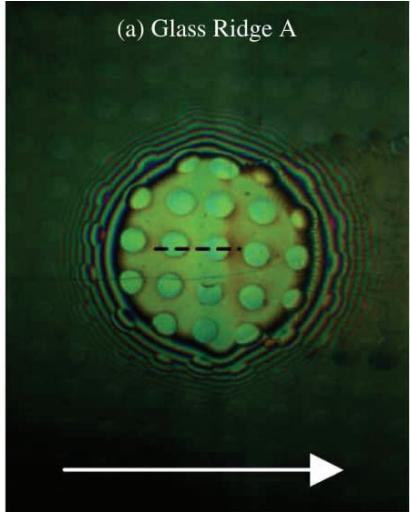  
(a) Interferogram

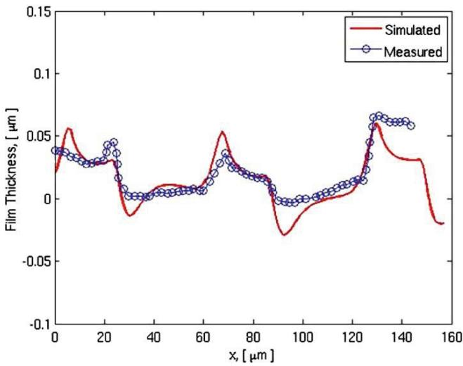  
(b) Clearances  
Fig. 5 (a) Interferogram showing the interaction of two surfaces with artificial surface features as measured by Choo [27]. (b) Comparison between the measurements of the reference and the calculations with the present (still full-film) method

As an example, a very thin film (partial lubrication) case found in the literature Choo [27] and Choo et al. [28] will be used for comparisons with the present (still full-film) approach. The example of Fig. 12 (glass ridge A) of reference [28] is considered. This example shows the interaction of two ‘rough’ surfaces, a steel ball with sputtered hemispherical bumps and a glass disk with a transverse ridge, the reader can find the operating conditions in the references. The measured film thickness varies from around 40 nm in the valleys to 0 nm in the summits (Hertzian pressure being around 0.5 GPa with minimal hydrodynamic pressure in the valleys of nearly zero). This case including the two surfaces was simulated with the present approach and the results for the clearances are plotted in comparison with the measurements of reference [27] in Fig. 5. It can be observed that despite approximations the present scheme reproduces fairly well the measured clearances, except in the areas of contact where the present scheme (full-film) predicts ‘negative’ film thickness.

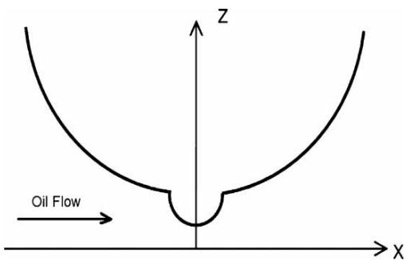  
Fig. 6 Schematics ofthe bump geometry and flow direction used in the numerical example by Deolalikar et al. [11]. Case of $p _ { \mathrm { h } } = 0 . 6 3 \mathrm { G P a }$

Table 2 Data used in reference [11]
| E' (GPa) | η0 (Pas) | α $( \mathrm { G P a ^ { - 1 } } )$ | ū (m/s) | Ph (GPa) |
| --- | --- | --- | --- | --- |
| 219 | 0.075 | 16.7 | 0.15 | 0.63 |

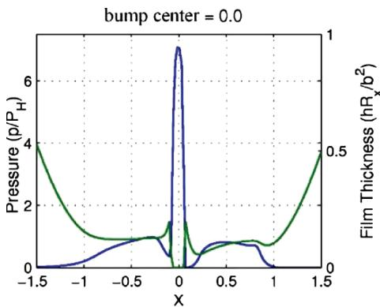  
(a) Deolalikar et al.

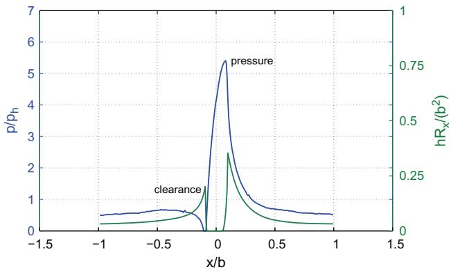  
(b) Present Model

Fig. 7 Pressure and clearances solution for pure rolling conditions: (a) from Deolalikar et al. [11], (b) present model. Case of $p _ { \mathrm { h } } = 0 . 6 3 \mathrm { G P a }$  
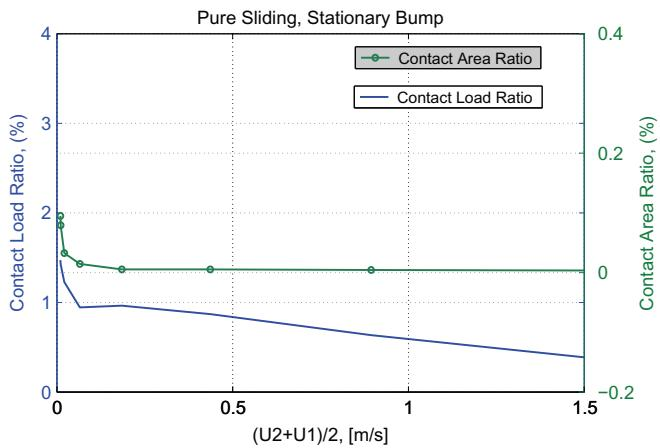  
Fig. 8 Contact load and contact (dry) area ratios as function of speed, calculated with the present model in pure rolling conditions for the bump example of Deolalikar et al. [11] for the case of $p _ { \mathrm { h } } = 1 \mathrm { G P a }$

## 4.2 Load sharing calculation

At very low speeds, the calculation of pressure, deformation and friction is more accurately done by using the dry contact model. On the contrary, at high speeds, when surely conditions of full film take place, this calculation is more accurately done with the full-film model. However, at intermediate speeds, the calculation of the load sharing between the full film and the dry contact models follows the following steps.

1. Surface and operation conditions are entered. The mean clearance $h _ { \mathrm { m e a n } }$ is calculated with the use of any‘central film thickness’ formula for smooth contact (if possible, a correction for roughness can be done). The mean pressure in the contact can be calculated in several ways. It can simply be the mean

(d) $R _ { q } = 0 . 1 2 2 \mu m$  
Table 3 Operating conditions and oils used in the ball-on-disc tribometer
| 항목 | 값 |
| --- | --- |
| E' (GPa) | 226 |
| Ballφ (mm) | 20.6 |
| VG 10, $4 0 ^ { \circ } \mathrm { C }$ · η0 (Pas) | 0.003 20 |
| VG 10, $4 0 ^ { \circ } \mathrm { C }$ · α (GPa−¹) (Pa s) |  |
| $\mathrm { V G } 1 1 0 , 4 0 ^ { \circ } \mathrm { C }$ · η0 | 0.087 25 |
| $\mathrm { V G } 1 1 0 , 4 0 ^ { \circ } \mathrm { C }$ · α $( \mathbf { G P a } ^ { - 1 } )$ |  |
| Slip F (%) (N) | 5 |
| Ph (GPa) | 3001.9 |

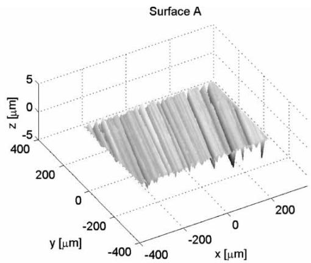

$$
R _ { q } = 0 . 5 2 1 \mu m
$$

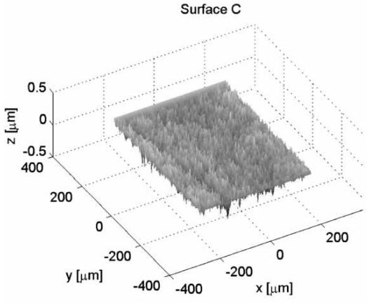

pressure in a Hertzian contact or if the roughness sample is small compared with the Hertzian contact width the maximum Hertzian pressure can be used $p _ { \mathrm { h } }$ , performing the analysis at the centre of the contact. Here the latest is assumed.

2. The iteration process begins by assuming a load sharing fraction $\phi _ { \mathrm { b l } }$ for the dry contribution $( F _ { \mathrm { d r y } } =$ $\phi _ { \mathrm { b l } } F )$

$$
R _ { q } = 0 . 0 5 6 \mu m
$$

3. Using the load $F _ { \mathrm { l u b } } = ( 1 - \phi _ { \mathrm { b l } } ) F$ , solve the lubrication problem and find the pressures $p _ { \mathrm { l u b } }$ and clearances $h _ { \mathrm { l u b } }$ . A correction for the density is applied here. The mean clearance obtained from the film thickness formula incorporates the compression of the lubricant at high load. Depending on the proportion of the load carried by the lubricant film $F _ { \mathrm { l u b } }$ , the lubricant will expand. The mean clearance needs to be multiplied by the correction factor $c _ { \rho }$ obtained by inverting the Dowson–Higginson density law

$$
c _ { \rho } = \frac { 0 . 5 9 + 1 . 3 4 \phi _ { \mathrm { b l } } p _ { \mathrm { m e a n } } } { 0 . 5 9 + \phi _ { \mathrm { b l } } p _ { \mathrm { m e a n } } }
$$

4. Evaluate the elasto-plastic, dry contact pressures $p _ { \mathrm { d r y } }$ and clearances $h _ { \mathrm { d r y } }$ using as input the lubricated clearances $h _ { \mathrm { l u b } }$ and the load $F _ { \mathrm { d r y } }$

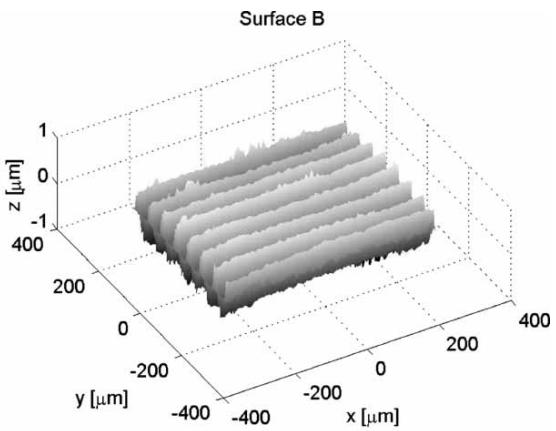

$$
R _ { q } = 0 . 3 4 3 \mu m
$$

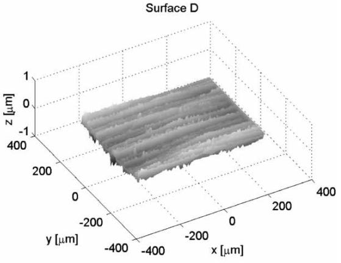  
Fig. 9 Surfaces A to D corresponding to the experiment data set 1. The rolling direction is along the x-axis. Each surface has $1 8 4 \times 1 2 0$ points

5. The calculation of the transition clearances $h _ { \mathrm { t r a n } }$ is done by assuming that in general long wavelength surface features have larger amplitudes that are more likely to make contact. Thus, the two clearances, lubricated and dry, in the frequency domain (after FFT), say $( \tilde { h } _ { \mathrm { l u b } }$ and $\tilde { h } _ { \mathrm { d r y } } )$ are compared for each frequency and the absolute maximum is selected. After the process, the IFFT is calculated to

(e) $R _ { q } = 0 . 0 9 3 \mu m$  
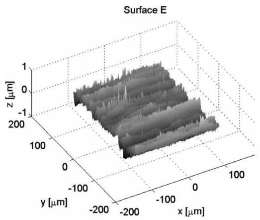

recover $h _ { \mathrm { t r a n } }$

$$
h _ { \mathrm { t r a n } _ { ( i , j ) } } = \mathrm { I F F T } \{ \operatorname* { m a x } ( | \tilde { h } _ { \mathrm { d r y } _ { ( i , j ) } } | , | \tilde { h } _ { \mathrm { l u b } _ { ( i , j ) } } | ) \}
$$

The evaluation in this manner avoids the use of unrealistically smoothered clearances as calculated by the full-film method in the far right end of the amplitude reduction curve. The clearances at very low speeds are to be limited by the dry contact clearances.

(a) $R _ { q } = 0 . 2 2 1 \mu m$  
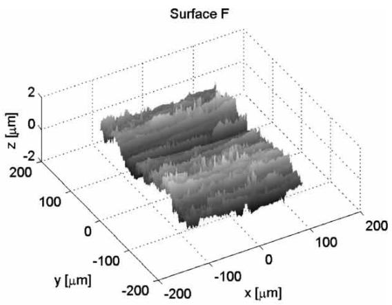

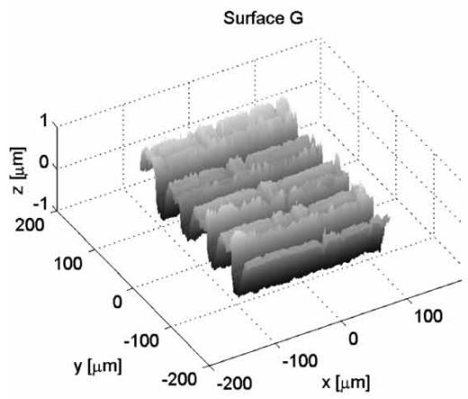  
(c) $R _ { q } = 0 . 3 6 9 \mu m$

(b) $R _ { q } = 0 . 3 9 7 \mu m$  
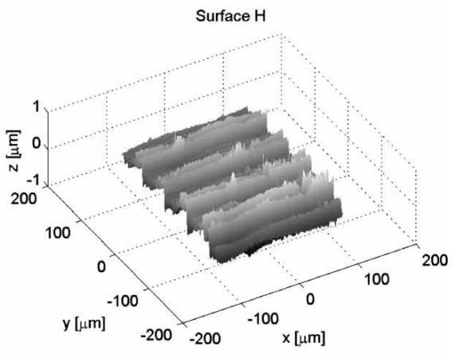

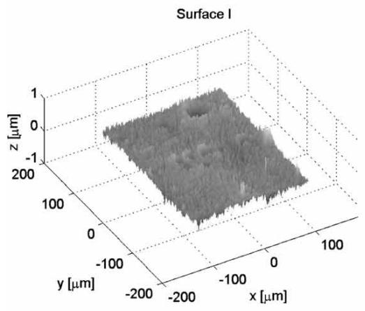

(d) $R _ { q } = 0 . 2 1 5 \mu m$  
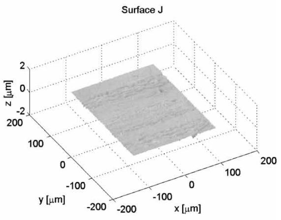  
(f) $R _ { q } = 0 . 0 5 3 \mu m$  
Fig. 10 Surfaces A to D corresponding to the experiment data set 2. The rolling direction is along the x-axis. Each surface has 184  120 points

6. After having calculated the transition clearances $h _ { \mathrm { t r a n } } ,$ the corresponding pressures $p _ { \mathrm { t r a n } }$ can be recovered by using the produced displacements and applying the inverse process to equation (3)

$$
\mathbf p _ { \mathrm { t r a n } } = \mathrm { I F F T } \{ ( \mathbf w ^ { - 1 } ) \cdot \mathrm { F F T } ( \mathbf r - \mathbf h _ { \mathrm { t r a n } } ) \}
$$

where $\mathbf { r } - \mathbf { h } _ { \mathrm { t r a n } } = \mathbf { u } .$ . If plasticity has occurred, the pressures $ { \mathbf { p } } _ { \mathrm { t r a n } }$ will have to be limited to $p _ { \mathrm { l i m } }$

7. The process continues until convergence for $\phi _ { \mathrm { b l } }$ which is obtained once the corrected mean clearance equates the mean line of the deformed clearances $h _ { \mathrm { t r a n } }$ . This is equivalent to assume that the load sharing equilibrium is reached when the volume of oil that goes through the contact $( c _ { \rho } h _ { \mathrm { m e a n } } )$ equates the free space in the deformed clearance $h _ { \mathrm { t r a n } } ,$ which is an assumption considered earlier in stochastic roughness models [4].

## 5 RESULTS

## 5.1 Comparison with numerical solutions from the literature

Deolalikar et al. [11] show solutions with the Newtonian lubricant for a spherical bump on a surface of an EHL contact making contact with the opposite surface. The geometry of the feature is schematically shown in Fig. 6. The height of the bump is 1.2 μm. The radius of the bump is estimated to be 18 μm from the graphs. The operating conditions given in the reference are summarized in Table 2.

Figure 7 shows a mid-plane profile ofthe solution for clearances and pressures given in reference [11], compared with the solution calculated with the present model. From the comparison, it can be said that the maximum pressure value with the present model is somehow lower than the value from the reference. However, this could be due to several factors: small differences in the mean clearance (in the present model the central film thickness is approximated with the smooth surface Hamrock–Dowson equation). Differences in the estimated bump radius $( 1 8 \mu \mathrm { m }$ and the actual value). Besides the reference mentions a mean film thickness five times smaller than the height of the bump. In the present model, a central film thickness about eight times smaller was calculated. In any case, the solutions are not too different for the maximum pressures.

Detailed comparisons show some important differences between the two solutions in Fig. 7. The reference shows a nearly symmetrical clearance around the contact spot and a slight loss of clearance in the leading edge of the deformed bump. On the contrary, the present solution shows an increase of clearance in the leading edge of the bump. The same increase can be seen in the pure-rolling measurements from Kaneta et al. [29] and the pure-rolling calculations from Hooke [30] and Hooke and Li [31] for transverse ridges and bumps. In fact, it is logical to expect that under pure rolling conditions the lubricant pocket entrapped by the surface feature at the inlet will simply be transported unchanged to the end of the contact. In Fig. 7, the solution from the reference shows as well the largest pressure drop in the leading edge of the bump, whereas the present solution shows this drop in the trailing edge, where the lubricant is prevented to go by the moving bump at the inlet. This drop of pressure can also be seen in pure-rolling fullnumerical and linearised calculations from Hooke [30] and Hooke and Li [31]. However, one has to keep in mind that in the present lubrication model there is no way to completely stop the lubricant flow when contact occurs, perhaps this effect is responsible of the local differences in clearances and pressures.

Reference [11] also shows contact load and contact area ratios as function of speed for the case of higher

Measurements Set 1, 300N; 5% slip  
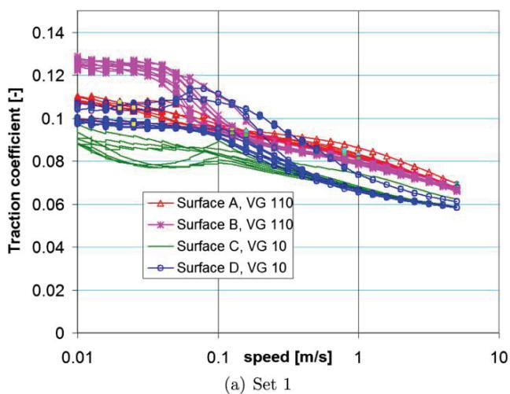

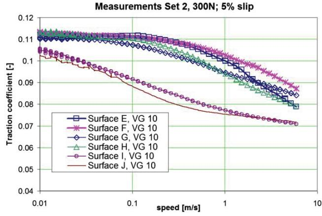  
(b) Set 2  
Fig. 11 Ball-on-disc traction measurements for conditions in Table 3. (a) Experiment set 1 including the running-in measurements. (b) Experiment set 2 after running-in

Hertzian load $( p _ { \mathrm { { h } } } = 1 \mathrm { { G P a } ) }$ . The results have been reproduced with the present model in Fig. 8. When comparing these plots with the corresponding plots in the reference, one can notice that the contact area ratio curves are very similar. However, larger disagreement is found for the contact load ratio, where the present model seems to retain higher values than the reference. However, this could simply be the effect of the use of a thinner central film thickness than that numerically obtained in the reference. The present model results also show a higher slope when increasing the speed, especially for the contact load ratio curve, but this slope (much smaller) is also present in the contact area ratio curve.

## 5.2 Comparison with experiments

In order to verify the model versus measurements, two sets of experiments were prepared using a ball-on-disc commercial tribometer. Stribeck curves for different combinations of a total of 10 surfaces and two oils were measured under fixed sliding conditions and variable entrainment speed. The operating conditions and oil nominal properties for the experiments are summarized in Table 3. The surfaces used in the experiments have been numbered from A to J and measurements have been taken after the experiments with an optical microscope, these data as used in the model are depicted in Figs 9 and 10 for the experiments of set 1 and set 2 respectively. Figure 11 shows the traction measurements for the two sets of experiments. Set 1 (Fig. 11(a)) shows different traction curves for the same condition, this is because the surface is being run-in. Figure 11(b) shows only the traction curves after running-in. For the comparisons with the model, only run-in curves are used and the surface is measured also after the running-in (Figs 9 and 10).

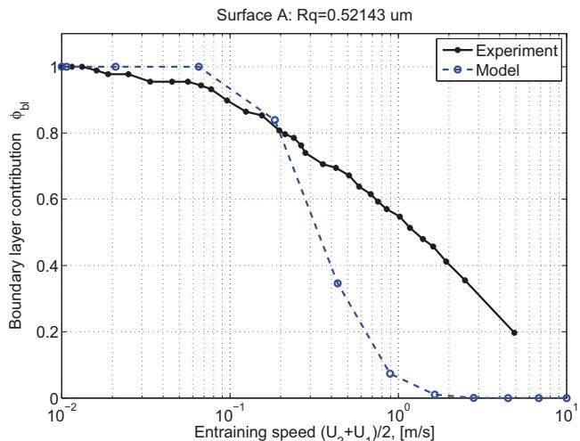  
(a) Surface A, bl = 0.098. ehl = 0.06

The calculations were compared with the experimental data. Since the calculation model only predicts the amount of load carried by the asperities and the oil film (not the actual friction), then the measured Stribeck curves have been transformed into load ratios by considering the following function

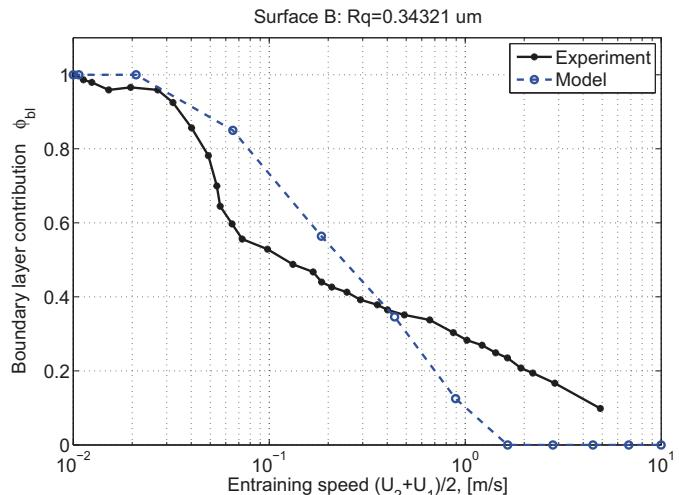  
(b) Surface B, bl = 0.123, ehl = 0.06

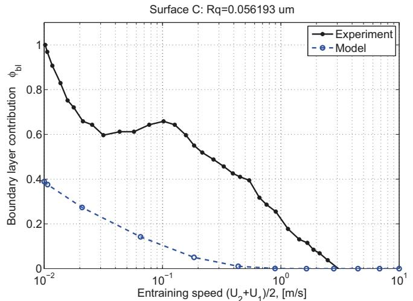  
(c) Surface C, $\mu _ { b l } = 0 . 0 8 8 , \mu _ { e h l } = 0 . 0 6$

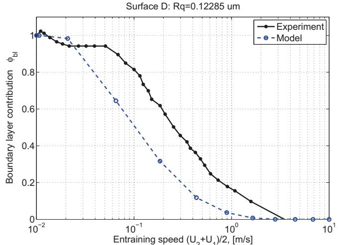  
(d) Surface D, $\mu _ { b l } = 0 . 0 9 7 ,$ ehl = 0.06  
Fig. 12 Comparisons measurements-model with the set 1 ofexperiments for the load distribution function φbl

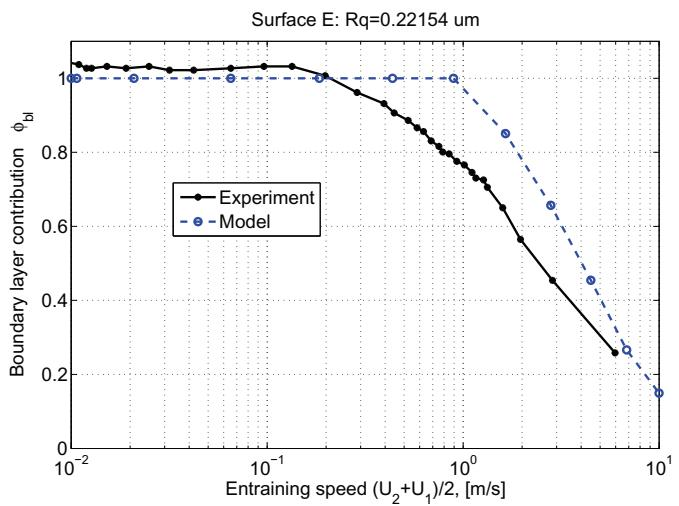  
(a) Surface E

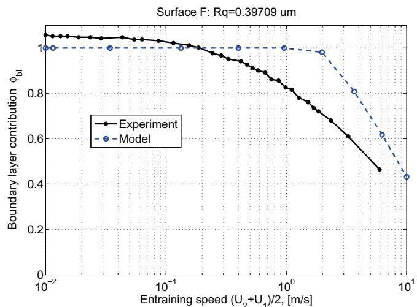  
(b) Surface F

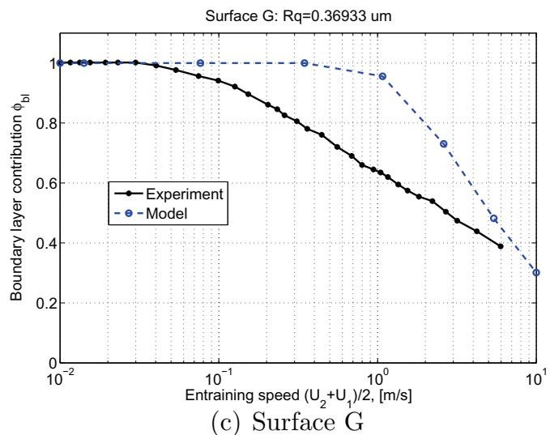

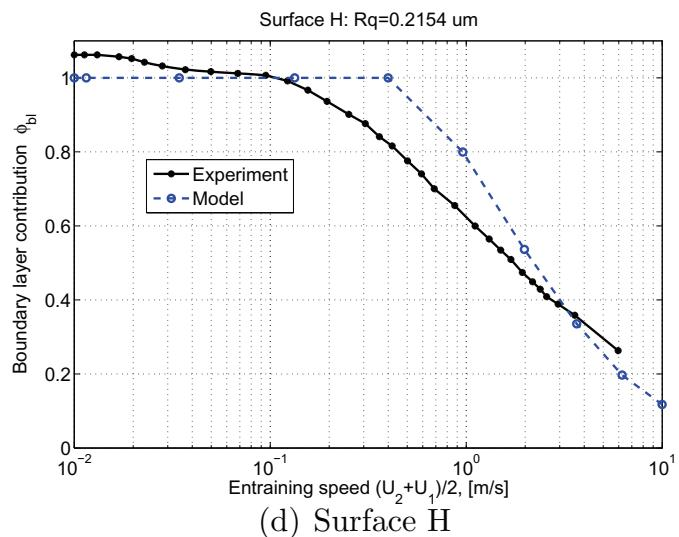

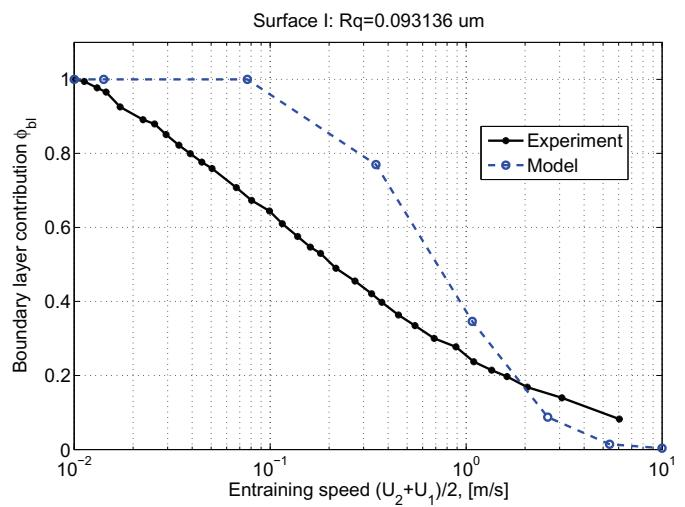  
(e) Surface I

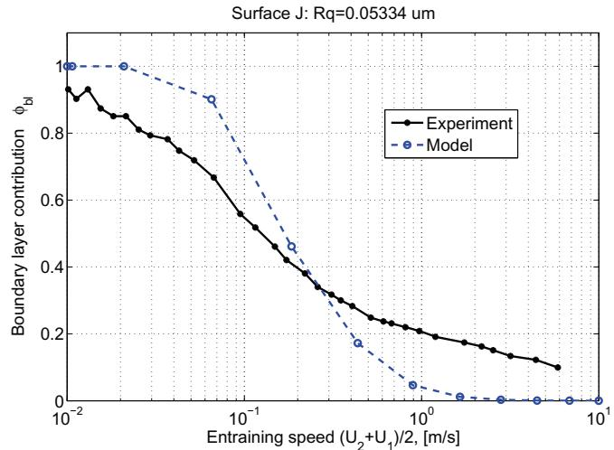  
(f) Surface J  
Fig. 13 Comparisons measurements-model with the set 2 ofexperiments for the load distribution function $\phi _ { \mathrm { b l } } .$ . For surfaces E to H $\mu _ { \mathrm { b l } } = 0 . 1 1$ , for surfaces I to $\dot { \mu } _ { \mathrm { b l } } = 0 . 1 0 5$ and $\mu _ { \mathrm { e h l } } = 0 . 0 6 8$ for all surfaces were considered

$$
\mu = \phi _ { \mathrm { b l } } \mu _ { \mathrm { b l } } + ( 1 - \phi _ { \mathrm { b l } } ) \mu _ { \mathrm { e h l } }\tag{27}
$$

where $\mu _ { \mathrm { b l } }$ is the friction coefficient in the boundary regime and $\mu _ { \mathrm { e h l } }$ is the friction coefficient in the EHL regime. Finally, $\phi _ { \mathrm { b l } }$ represents the load distribution fraction between the dry and the lubricated areas. Therefore, equation (27) can be solved for this function

$$
\phi _ { \mathrm { b l } } = \frac { \mu - \mu _ { \mathrm { e h l } } } { \mu _ { \mathrm { b l } } - \mu _ { \mathrm { e h l } } }\tag{28}
$$

By using equation (28), the measured values of $\mu$ can be normalized into equivalent dry fraction load $\phi _ { \mathrm { b l } }$ and then plotted versus the prediction from the model. For the experiments of set 1, the model has been compared with the latest run (lowest curve) from Fig. 11(a). Figure 11(b) shows already the run-in values; from these two figures, one can estimate the values $\mu _ { \mathrm { b l } }$ and $\mu _ { \mathrm { e h l } }$ . In this way, Figs 12 and 13 are obtained, where comparisons between model predictions and measurements for $\phi _ { \mathrm { b l } }$ are shown for the corresponding experimental sets. The respective values for $\mu _ { \mathrm { b l } }$ and $\mu _ { \mathrm { e h l } }$ are also indicated in the plots. Considering the possible effects of surface running-in variations and temperature control in the experiments, measurements and model show a reasonably good agreement. The largest discrepancies seem to be for surfaces $\mathrm { C } , \mathrm { G } ,$ , and I, where model and experiments seem to have somehow different ‘lift-off’ speeds. In the results of surface C (Fig. 12(c)), the model predicts already some lift-off $( \phi _ { \mathrm { b l } } < 1 )$ , while the experimental curve shows in the lowest speed complete boundary lubrication regime $( \phi _ { \mathrm { b l } } = 1 )$ ; however, the shape of the curve is not conventional. Figures 13(c) and (e) show model predictions with higher lift-off speeds than the experiments for surfaces G and I, respectively. A full explanation for this disagreement has not been found but certainly, apart from any approx imation error introduced by the present method, an underestimation ( 20 per cent) of the central film thickness by the model could explain the results. The central film thickness in the experiments was not measured; thus, only estimations via a Hamrock–Dowson type of equation were used. Temperature variations and indeed roughness can modify the central film thickness in the experiments and this could have an influence in some of the results and in the comparisons. Another possible source of variability, which could affect the calculated curves, is the variability of the roughness along the running track. Several measurements were taken but only one was used in the actual calculation.

## 6 DISCUSSION AND CONCLUSIONS

An engineering scheme has been presented for the calculation of deterministic micro-geometry effects in sliding friction for the transition zone between boundary and EHL regimes. The scheme applies concepts for micro-geometry deformations and pressures from hydrodynamics and dry contact. The present model requires the knowledge of the friction coefficients in fully boundary $( \mu _ { \mathrm { b l } } )$ and fully EHL $( \mu _ { \mathrm { e h l } } )$ regimes, the first one influenced by the tribochemistry ofthe lubricant-surface system and the second mainly determined by the rheology of the lubricant under the operating conditions. The present methodology, however, estimates the influence of the surface topography in the load distribution between the so-called dry contact spots and the lubricated areas $( \phi _ { \mathrm { b l } } )$ . The methodology is very fast (about 2 min in a PC for every traction curve with 12 speed intervals and a surface of 184 120 points).

The results from this engineering scheme have been confronted with numerical solutions from literature and with friction measurements from a ball-on-disc tribometer. Both comparisons show reasonable agreement with the present model, although some differences are present. In the described methodology, the load distribution in the transition area is predicted from a measured roughness sample. Ideally several samples of the rougher surface (the other is assumed smooth) should be measured in order to obtain a ‘representative’ sample ofthe running track, but variations from sample to sample will always exist. Therefore (contrary to the results presented here), a proper calculation of friction in these conditions should include some statistics of the variability of roughness in the raceway. Other source of variability not considered in the model but possibly present in the experiments is the actual central clearance (or film thickness) in the contact. It is well known that roughness, running-in, temperature, and other factors might influence this parameter. Certainly, at high sliding rates, thermal effects have to be considered in the sliding friction calculation. In the results presented here, no consideration of thermal effects has been made since the focus at this point is rolling bearings running at low speed.

The authors have used the term ‘engineering’ scheme or model because its contribution in providing new knowledge is modest. It is meant to help in the calculation of the load share (and friction) in the transition zone and does not attempt to describe the physics of the partial-lubrication regime. It is well known that under the assumptions of the Reynolds equation (including the linear form as presented here) it is impossible to predict real dry contact patches [12].

Therefore, from the above analysis, the following conclusions can be drawn.

1. An engineering scheme for the calculation of the load sharing between lubricant and dry spots in the transition regime for deterministic surfaces seems possible, by using the hydrodynamic deformations limited by the dry contact values. The scheme gives reasonable results when compared with numerical solutions and experiments.

2. The scheme is fast and it shows capabilities of capturing the effects of different deterministic topographies in sliding friction, once the friction coefficients in the boundary and full-film regimes are known.

## ACKNOWLEDGEMENTS

The authors wish to thank Mr A. de Vries, Director SKF Group Product Development, for his kind permission to publish this article. The authors also want to thank Dr C. J. Hooke for his valuable comments and discussions in relation to section 4.

## © Authors 2010

## REFERENCES

1 Bair, S. High-pressure rheology for quantitative elastohydrodynamics. Tribology and Interface Engineering Series, 54, 2007 (Elsevier, Amsterdam, The Netherlands).

2 Tallian, T. E., Chiu, Y. P., Huttenlocher, D. F., Kamenshine, J. A., Sibley, L. B., and Sindlinger, L. E. Lubricant films in rolling contact of rough surfaces. ASLE Trans., 1964, 7, 109–126.

3 Tallian, T. E. The theory of partial elastohydrodynamic contacts. Wear, 1972, 21, 49–101.

4 Johnson, K. L., Greenwood, J. A., and Poon, S. Y. A simple theory of asperity contact in elastohydrodynamic lubrication. Wear, 1972, 19, 91–108.

5 Greenwood,J.A. andWilliamson,J. B. P. Contact ofnominally flat surfaces. Proc. R. Soc. (London), 1966, 295A, 300–319.

6 Gelinck, E. R. M. and Schipper, D. J. Calculations of Stribeck curves for line contacts. In Proceedings of the 5th International Tribology Conference, Australia, 1998, pp. 75–80.

7 Gelinck, E. R. M. Mixed lubrication of line contacts. PhD Dissertation, University ofTwente,The Netherlands, 1999.

8 Jiang, X., Hua, D. Y., Cheng, H. S., Ai, X., and Lee, S. C. A mixed elastohydrodynamic lubrication model with asperity contact. ASME,J. Tribol., 1999, 121, 481–491.

9 Redlich, A. C., Bartel, D., and Deters, L. Calculation of EHL contacts in mixed-lubrication regime. In Tribological research and design for engineering systems (Eds D. Dowson et al.), 2003, pp. 537–547 (Elsevier B.V., Amsterdam, The Netherlands).

10 Wang,J. Q.,Zhu,D.,Cheng,H. S.,Yu,T.,Jiang,X.,and Liu, S. Mixed lubrication analysis by macro–micro approach and a full-scale EHL model. ASME, J. Tribol., 2004, 126, 81–91.

11 Deolalikar, N., Sadeghi, F., and Marble, S. Numerical modelling of mixed lubrication and flash temperature in EHL elliptical contacts. ASME, J. Tribol., 2008, 130, 011004–011023.

12 Morales-Espejel, G. E., Dumont, M. L., Lugt, P. M., and Olver, A.V. A limiting solution for the dependence of film thickness on velocityin EHL contacts with verythin films. Tribol. Trans., 2005, 48, 317–327.

13 Stanley, H. M. and Kato, T. A FFT-based method for rough surface contact. ASME, J. Tribol., 1997, 119, 481– 485.

14 Morales-Espejel, G. E., Lugt, P. M., van Kuilenburg, J., and Tripp, J. H. Effects of surface micro-geometry on the pressures and internal stresses of pure rolling EHL contacts. Tribol. Trans., 2003, 46, 260–272.

15 Kalker, J. J.Variational principles in contact elastostatics. J. Inst. Math. Appl., 1997, 20, 199–219.

16 Tian, X. and Bushman, B. A numerical three-dimensional model for the contact of rough surfaces by variational principle. ASME,J. Tribol., 1996, 118, 33–42.

17 Johnson, K. L., Greenwood, J. A., and Higginson, J. G. The contact of elastic regular wavy surfaces. Int. J. Mech. Sci., 1985, 27(6), 386–396.

18 Greenwood, J. A. and Morales-Espejel, G. E. The behaviour of transverse roughness in EHL contacts. Proc. IMechE, PartJ: J. Engineering Tribology, 1994, 208, 121–132. DOI: 10.1243/PIME\_PROC\_1994\_208\_359\_02.

19 Venner, C. H. and Lubrecht, A. A. Multigrid techniques: a fast and efficient method for the numerical simulation of elastohydrodynamically lubricated point contact problems. Proc. IMechE, Part J: J. Engineering Tribology, 2000, 214, 43–62. DOI: 10.1243/1350650001543007.

20 Hooke, C. J. Roughness in rolling–sliding elastohydrodynamic lubricated contacts. Proc. IMechE, Part J: J. Engineering Tribology, 2006, 220, 259–271. DOI: 10.1243/ 13506501JET146.

21 Hooke, C. J., Li, K. Y., and Morales-Espejel, G. E. Rapid calculation of the pressures and clearances in rough, rolling–sliding elastohydrodynamically lubricated contacts. Part 1: low-amplitude, sinusoidal roughness. Proc. IMechE, Part C: J. Mechanical Engineering Science, 2007, 221, 535–550. DOI: 10.1243/0954406JMES519.

22 Morales-Espejel, G. E. Elastohydrodynamic lubrication ofsmooth and rough surfaces. PhD Dissertation, University of Cambridge, 1993.

23 Ehret, P., Dowson, D., and Taylor, C. M. On lubricant transport conditions in elastohydrodynamic conjunctions. Proc. R. Soc. Lond. A, 1998, 454, 763–787.

24 Félix-Quiñonez, A. An experimental and theoretical study ofelastohydrodynamically lubricated contacts with well defined surface features. PhD Dissertation, University of Leeds, UK, 2003.

25 Félix-Quiñonez, A., Ehret, P., and Summers, J. L. On three-dimensional flat-top defects passing through an EHL point contact: a comparison of modeling with experiments. Trans. ASME,J. Tribol., 2005, 127, 51–60.

26 Biboulet, N., Lubrecht, A. A., and Houpert, L. Contact pressure in indented elastohydrodynamic lubrication contacts. Proc. IMechE, Part J: J. Engineering Tribology, 2008, 222, 415–421. DOI: 10.1243/13506501JET324.

27 Choo, J. W. The influence of surface roughness on the lubrication of concentrated contacts. PhD Dissertation, Imperial College London, 2003.

28 Choo, J. W., Olver, A. V., Spikes, H. A., Dumont, M.-L., and Ioannides, E. Interaction of asperities on opposing surfaces in thin film, mixed elastohydrodynamic lubrication. Trans. ASME, J. Tribol., 2008, 130, 021505- 1–021505-10.

29 Kaneta, M., Sakai,T., and Nishikawa, H. Optical interferometric observations of the effects of a bump on point contact EHL. Trans. ASME,J. Tribol., 2005, 114, 779–784.

30 Hooke, C. H. Engineering analysis of rough elastohydrodynamically lubricated contacts. Proc. IMechE, Part J: J. EngineeringTribology, 2009, 223, 517–528. DOI: 10.1243/ 13506501JET523.

31 Hooke, C. H. and Li, K. Y. Rapid calculation of the pressures and clearances in rough, elastohydrodynamically lubricated contacts under pure rolling. Part 2: general roughness. Proc. IMechE, Part C: J. Mechanical Engineering Science, 2006, 220, 915–925. DOI: 10.1243/ 09544062C03505.

## APPENDIX

## Notation

$^ a$ Hertzian semi-width along the rolling direction (m)   
$B$ bulk modulus of the lubricant, $\mathrm { d } \rho / \mathrm { d } p = \rho / B \left( \mathrm { P a } \right)$   
$C$ compressibility parameter (–)   
$E ^ { \prime }$ effective elastic modulus $( 2 / E ^ { \prime } ) = ( 1 - \nu _ { 1 } ^ { 2 } ) / E _ { 1 } + ( 1 - \nu _ { 2 } ^ { 2 } ) / E _ { 2 } \mathrm { ( P a ) }$   
$E ^ { * }$ dry contact effective elastic modulus $E ^ { * } = E ^ { \prime } / 2 \left( \mathrm { P a } \right)$   
$f$ complementary energy (Nm/s)   
$F$ contact force (N)   
$g$ gap function in the dry contact model (m)   
$h$ clearance (m)   
$h ^ { * }$ clearance in the one-dimensional problem for dp/dx 0 (m)   
$\tilde { h }$ Fourier transform of h (–)   
$h _ { \mathrm { a } }$ amplitude of the clearance ripple (particular integral) (m)   
$h _ { \mathrm { c } }$ amplitude of the clearance ripple (complementary function) (m)   
$h _ { \mathrm { t } }$ amplitude of the clearance ripple (total wave) (m)   
$L$ Moes parameter, point contacts, $L = \alpha \bar { E } ^ { \prime } [ \eta _ { 0 } 2 \bar { u } / ( E ^ { \prime } \bar { R } _ { x } ) ] ^ { 1 / 4 } \ ( - )$   
$L _ { x } , \ L _ { y }$ length of the roughness sample in x and y (m)   
$M$ Moes parameter, point contacts, $M = [ \bar { F } / ( E ^ { \prime } R _ { x } ^ { 2 } ) ] [ \bar { E ^ { \prime } } R _ { x } / ( \eta _ { 0 } 2 \bar { u } ) ] ^ { 3 / 4 } ~ ( - )$   
$p$ pressure (Pa)   
$p _ { \mathrm { a } }$ amplitude of the pressure ripple (particular integral) (m)

$$
p _ { \mathrm { c } }
$$

$$
p _ { \mathrm { h } }
$$

$$
Q
$$

$$
r
$$

$$
r _ { \mathrm { a } }
$$

$$
R _ { x }
$$

$$
S
$$

$$
t
$$

$$
\bar { u }
$$

$$
u _ { 2 }
$$

$$
\nu _ { \mathrm { a } }
$$

$$
x
$$

$$
y
$$

$$
z
$$

amplitude of the pressure ripple   
(complementary function) (m)   
Hertzian pressure (Pa)   
attenuation parameter (–)   
initial roughness function (m)   
amplitude of the initial roughness (m)   
equivalent radius in the x-direction (m)   
sliding to rolling ratio $S = ( u _ { 2 } - u _ { 1 } ) / \bar { u } \left( - \right)$   
time (s)   
mean velocity, $\bar { u } = ( u _ { 1 } + u _ { 2 } ) / 2 ( \mathbf { m } \mathbf { s } ^ { - 1 } )$   
velocity of the rough surface (m)   
amplitude of the displacement ripple   
(particular integral) (m)   
rolling direction coordinate (m)   
transverse direction coordinate (m)   
vertical coordinate (m)   
$\alpha$ viscosity-pressure coefficient $( \mathrm { P a } ^ { - 1 } )$   
$\dot { \gamma }$ shear rate $( \mathbf { S } ^ { - 1 } )$   
$\nabla$ amplitude reduction Venner–Lubrecht parameter, $\nabla = \lambda \sqrt { M } / ( a \sqrt { L } ) \ ( - )$   
$\eta$ lubricant viscosity (Pa s)   
$\eta _ { x } , ~ \eta _ { y }$ lubricant equivalent viscosities in x and y directions for a non-Newtonian fluid (Pa)   
$\eta _ { 0 }$ lubricant viscosity at ambient conditions (Pa s)   
$\lambda _ { x } , \lambda _ { y }$ wavelength of waviness components in x and y (m)   
$\mu$ sliding friction coefficient (–)   
$\mu _ { \mathrm { b l } }$ friction coefficient in the boundary lubrication regime (–)   
$\mu _ { \mathrm { e h l } }$ friction coefficient in the EHL regime (–)   
$\nu$ Poisson ratio (–)   
$\rho$ lubricant density $( \mathrm { k g / m ^ { 3 } } )$   
$\rho _ { \mathbf { a } }$ amplitude of the lubricant density ripple (particular integral) $( \mathrm { k g } / \mathrm { m } ^ { 3 } )$   
$\rho ^ { * }$ lubricant density at $\mathrm { d } p / \mathrm { d } x = 0 ( \mathrm { k g / m ^ { 3 } } )$   
$\tau$ Shear stress (Pa)   
$\tau _ { \mathrm { m } }$ mean shear stress (Pa)   
$\tau _ { 0 }$ Eyring equivalent stress (Pa)   
$\phi _ { \mathrm { b l } }$ dry/lubricated load ratio (–)   
$\omega _ { x } , \omega _ { y }$ wavenumber in x and y directions (m−1)

## Subscripts

a denotes amplitude   
dry corresponding to dry contact   
lub corresponding to lubricated contact   
nn non-Newtonian   
tran transition (full film–dry)   
$x$ x-direction   
$y$ y-direction   
1 smooth surface   
2 rough surface
