# 롤링–슬라이딩 접촉의 마이크로피팅 모델링: 구름 베어링 적용

## 저자 정보

**G. E. Morales-Espejel**¹˒² (교신저자)

**V. Brizmer**¹

**소속**:
¹ SKF Engineering & Research Centre, 3430 DT Nieuwegein, The Netherlands
² Université de Lyon, INSA-Lyon, CNRS, LaMCoS UMR5259, F69621 Lyon, France

**출처**: Tribology Transactions (2011), Vol. 54, No. 4, pp. 625–643, STLE
DOI: 10.1080/10402004.2011.587633
**접수**: 2010년 12월 20일 / 게재 확정: 2011년 5월 9일

**키워드**: 마이크로피팅(Micropitting), 표면 손상(Surface Distress), 표면 기인 피로(Surface-Initiated Fatigue), 경마모(Mild Wear)

---

## 초록

본 논문은 롤링–슬라이딩·고하중 윤활 접촉의 **마이크로피팅(micropitting)** 을 모델링하는 공학적 접근법을 기술합니다. **표면 피로(surface fatigue)와 경마모(mild wear) 사이의 경쟁 메커니즘**과 결정론적 표면 미세형상(거칠기)의 효과를 함께 포착합니다. 피로 모델은 **Dang Van 피로 기준**에, 경마모 모델은 **수정 Archard 접근법**에 기반합니다. 전체 모델링 체계는 먼저 표면 형상·운전조건을 변화시킨 실험실 제어 조건에서 검증한 뒤, 전(full) 베어링 시험 거동 기술에 적용했습니다. 모델 거동은 실험 관찰과 **정성적으로 잘 일치**합니다.

---

## 목차

1. [개요](#1-개요)
2. [종합 요약](#2-종합-요약)
3. [서론](#3-서론)
4. [전체 모델 구조와 부분 윤활](#4-전체-모델-구조와-부분-윤활)
5. [피로·마모 경쟁 모델](#5-피로마모-경쟁-모델)
6. [실험실 조건 검증과 영향 인자](#6-실험실-조건-검증과-영향-인자)
7. [전(full) 베어링 적용](#7-full-베어링-적용)
8. [결론](#8-결론)
9. [기호 및 참고문헌](#9-기호-및-참고문헌)

---

## 1. 개요

마이크로피팅은 기어 산업에서 롤링–슬라이딩 접촉 표면에 나타나는 미세 스폴·균열을 가리키며, ISO 15243은 이를 **표면 손상(surface distress)** 또는 **표면 기인 피로**로 분류합니다. 감소된 윤활 영역·일정 슬라이딩 하에서 표면 돌기가 ① 광택역(burnished/glazed), ② 돌기 미세균열, ③ 돌기 미세스폴을 형성하는 손상입니다.

### 연구의 필요성

베어링·기어·캠 등에서 효율·경량·다운사이징 요구로 **출력 밀도가 크게 증가**(고하중+고온+박막유+경계윤활)하면서 부품이 표면 기인 피로(마이크로피팅)에 취약해졌습니다. 베어링에서 마이크로피팅은 1차 고장모드는 아니나, **이물 압흔·표면 기인 스폴링·시저(seizure) 등 다른 고장을 촉진·가속**할 수 있습니다.

### 본 연구의 목적

- **표면 피로(마이크로피팅)와 경마모의 경쟁 메커니즘**을 반영하는 공학 모델 개발
- 부분 EHL 영역, 실측 형상·롤링–슬라이딩 조건 하에서 마이크로피팅 예측
- 특히 **구름 베어링** 전형 조건에 적용

---

## 2. 종합 요약

### ▪ 2.1 연구 핵심 정보

| 항목 | 내용 |
|------|------|
| **연구 대상** | • 고하중 롤링–슬라이딩 윤활 접촉의 마이크로피팅 • 표면 피로 ↔ 경마모 경쟁, 결정론적 거칠기 효과 |
| **주요 목적** | • 피로+마모 결합 공학 모델 개발 • 베어링·실험실 조건에서 마이크로피팅 예측·검증 |
| **검증 방법** | • 마이크로피팅 시험기(롤러-디스크) 실험실 시험 • 전(full) 베어링(NU 211 ECP) 시험과 비교 |
| **적용 분야** | • 구름 베어링·기어 표면 손상 예측 • 표면 마감·윤활·첨가제 설계, 풍력 베어링 신뢰성 |

-------------

### ▪ 2.2 핵심 개념 정리

| 개념 | 설명 |
|------|------|
| **마이크로피팅** | • 롤링–슬라이딩·저Λ 영역에서 돌기 수준 고마찰·고압에 의한 표면 기인 피로 |
| **피로–마모 경쟁** | • 마모가 피로층을 제거해 피로 손상을 지연 → 마이크로피팅 억제 • 둘의 상호작용이 거동을 좌우 |
| **부분 윤활(Partial lubrication)** | • dry(경계) 패치 + 윤활 패치의 하중분담 • 진폭감소법(amplitude reduction)+FFT로 압력·응력 계산 |
| **Dang Van 기준** | • 다축 고주기 피로 기준, 위험계수 $D$(0~1)로 균열 개시 예측 |
| **수정 Archard 마모** | • 윤활 상태(dry/lub)별 마모계수로 형상 갱신 |
| **Λ-비** | • 상대 유막 두께 $\Lambda=\bar h/R_q$, 윤활 품질 지표 |

-------------

### ▪ 2.3 방법론 개요

| 구성요소 | 세부 내용 |
|---------|----------|
| **부분 윤활 모델** | • 명목 평탄·탄성-완전소성 거친 표면 가정 • Dry: FFT 접촉(Stanley-Kato) + 완전소성($p_{lim}$=4.3 GPa) • Lub: 진폭감소법(비뉴턴, Hooke), 흐름 균형 하중분담 |
| **응력 이력** | • 표면 압력·트랙션을 FFT로 표면하 6 응력성분 산출 • 거칠기 이동 = 미세하중 사이클 생성 |
| **피로** | • Dang Van $D$ → Wöhler($\sigma_f=A\ln N+B$)로 수명 $N$ • Palmgren-Miner로 손상 누적, $d>1$이면 피트 생성 |
| **마모** | • 수정 Archard로 평균 마모층 $\Delta h_w$ 제거, 형상·손상맵 갱신 |
| **계산 효율** | • $\Delta n$ 사이클 묶음마다만 형상 갱신 → 케이스당 0.5~1시간 |

-------------

### ▪ 2.4 핵심 해석식

| 항목 | 식 | 의미 |
|------|-----|------|
| **선형화 Reynolds** | $\dfrac{h^3}{12}\left(\dfrac{1}{\eta_x}\dfrac{\partial^2p}{\partial x^2}+\dfrac{1}{\eta_y}\dfrac{\partial^2p}{\partial y^2}\right)=\bar u\dfrac{\partial h}{\partial x}+\dfrac{\partial h}{\partial t}+\dfrac{h}{B}(\cdots)$ | 미세형상 압력 변동 (식 2) |
| **압력 리플** | $\dfrac{p_a}{r_a}=\dfrac{\kappa E'}{4}\dfrac{iQ}{1-iQ-iCQ}$ | 진폭감소법 특수해 (식 5) |
| **유효점도(Eyring)** | $\eta_x=\dfrac{\eta}{\cosh(\tau_m/\tau_0)}, \quad \eta_y=\dfrac{\eta(\tau_m/\tau_0)}{\sinh(\tau_m/\tau_0)}$ | 비뉴턴 방향별 점도 (식 6) |
| **Dang Van 위험계수** | $D=\max_t\left\{\dfrac{\hat\tau(\vec n,t)}{\tau_f-\alpha\hat p(t)}\right\}$ | $D\ge1$이면 균열 개시 (식 9) |
| **Wöhler 곡선** | $\sigma_f=A\ln(N)+B$ | S–N (식 10) |
| **Archard 마모** | $\dfrac{\Delta h_w}{\Delta n}=k(x,y)\,p(x,y)\,u_s(x,y)/H$ | 경마모 제거율 (식 14) |

-------------

### ▪ 2.5 검증 결과

| 검증 항목 | 비교 대상 | 결과 |
|----------|----------|------|
| **거칠기 방향(lay)** | 시험기(횡/종방향) | • 모델·실험 정성적 일치, **횡방향이 더 취약** |
| **두 거친 표면** | 시험기(smooth/rough 조합) | • **더 매끄러운 표면**에 손상이 더 빨리·심하게 |
| **윤활 품질 Λ** | 모델+실험 | • 무마모는 Λ↑ 시 단조 감소, 마모 포함은 Λ≈1.1서 최대 |
| **슬라이딩 S** | 시험기(S=0.01~0.1) | • **저슬라이딩(S≈0.01)에서 최대**, 고슬라이딩이 꼭↑은 아님 |
| **전 베어링(NU 211 ECP)** | 66/73/98°C 시험 | • SEM 피트 크기(10~20 µm, 깊이 3~4 µm)·온도 경향 일치 |

-------------

### ▪ 2.6 주요 발견사항

| 항목 | 내용 |
|------|------|
| **피로–마모 상호작용 필수** | • 마이크로피팅 모델링에 두 경쟁 기구 결합이 핵심 |
| **마모의 보호 효과** | • 마모율↑ → 피로층 제거 → 마이크로피팅 위험↓ |
| **저슬라이딩 최대 위험** | • 베어링 전형 슬립(0.5~2%)에서 위험 최대, 그 이상은 마모↑·경계마찰 포화로 꼭 증가 안 함 |
| **거친면이 매끈면을 지배** | • 슬라이딩 존재 시 거친 표면이 매끈 표면에 하중 미세사이클을 부과 → 매끈면 손상↑ |
| **경계 마찰의 큰 기여** | • $\mu_{bl}$ 증가가 손상 거의 2배(0.12→0.15서 $A_p$ 2.4→4.56%) |

-------------

### ▪ 2.7 실무적 함의

| 영역 | 권장사항 |
|------|---------|
| **표면 마감 설계** | • 횡방향 거칠기 회피, 매끈면–거친면 조합 주의(매끈면 손상) |
| **윤활 설계** | • Λ 확보가 핵심, 단 저Λ에서 적정 마모가 보호 역할 |
| **첨가제** | • 경계 마찰계수·마모율을 바꾸는 AW/FM 첨가제가 위험에 큰 영향 |
| **베어링 신뢰성** | • 슬립 구간(롤러 단부 등) 마이크로피팅 주의, 풍력 등 가혹조건 적용 |
| **한계** | • 정성적 일치 수준, 열효과·잔류응력·균열전파 미반영 |

---

## 3. 서론

마이크로피팅 연구는 Way(1935)로 거슬러 가며, 디스크 연마가 저항성을 크게 높임을 관찰했습니다. Dawson은 이를 **피팅 피로(pitting fatigue)** 로 부르며 윤활·거칠기 중요성을 인식, 피팅까지 회전수를 **$D$=전체 거칠기/유막두께**(현 Λ의 역수)와 연관시켰습니다($D$↑ → 피팅 회전수↓).

마이크로피팅은 불량 윤활(고국부 마찰·압력)과 연관된 **표면 피로 현상**으로 인정됩니다. 특히:
- **Brandão 등**: 혼합윤활 EHL을 수치해석 + Dang Van 기준으로 기어 질량손실 예측
- **Lainé & Olver**: 마이크로피팅이 **경마모와 경쟁**(런인 변경·피로층 제거)하는 메커니즘 제시 — 슬라이딩·첨가제·런인 역할 이해의 핵심

본 연구는 이 경쟁 기구를 반영하는 공학 모델을 개발하여 베어링 조건에 적용합니다.

---

## 4. 전체 모델 구조와 부분 윤활

계산 시간 최소화를 위해 **진폭감소법(amplitude reduction)** 으로 압력 과도계산을, **FFT** 로 표면/표면하 응력 이력을 계산합니다. 이를 Dang Van 피로 모듈과 Archard 마모 모델이 처리하며, 하중 사이클 진행에 따라 형상을 갱신합니다(케이스당 0.5~1시간).

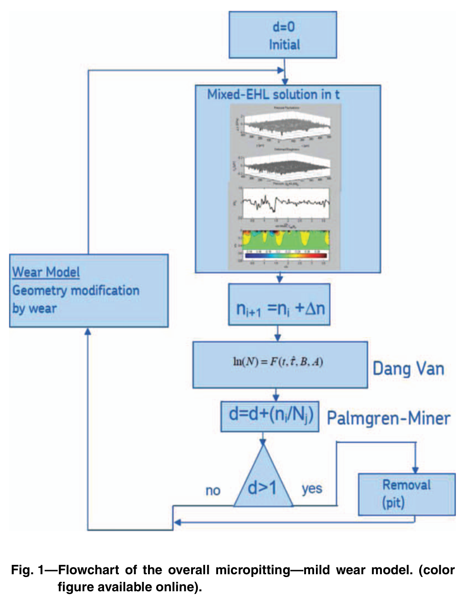
*Figure 1. 전체 모델 흐름도. 부분윤활(Mixed-EHL) → 응력이력 → Dang Van 피로 → Palmgren-Miner 누적($d>1$이면 피트 제거) → 마모로 형상 갱신 → 반복.*

> 형상은 매 사이클이 아니라 **$\Delta n$ 사이클 묶음마다** 갱신($n\approx10^6$ 실험에선 $\Delta n\le10^{-5}$로 충분). $d>1$인 재료 체적과 그 위까지 손실되어 피트 생성.

### ▪ 4.1 부분 윤활 모델

명목 평탄·탄성-완전소성 두 거친 표면 접촉을 가정하고, 평균 유막·평균 압력이 알려진(접촉 중앙) 조건에서 **간극·압력 변동만** 계산합니다.

**Dry 접촉(Stanley-Kato, Kalker 변분원리):** 압력 행렬을 반복 보정. 탄성 변위는 FFT로:

$$u(p) = \text{IFFT}\{w\cdot\text{FFT}(p)\} \tag{1}$$

탄성-완전소성: 국부 압력이 항복압 $p_{lim}$(경화 AISI 52100 = 4.3 GPa) 초과 시 소성. 압력을 $p_{lim}$로 제한.

**윤활 모델(진폭감소법, 비뉴턴):** 접촉 중앙에서 미세형상 변동의 곱·미분곱을 무시한 선형 Reynolds 식(식 2). 거칠기·압력·변위·간극·밀도를 정현파로 가정하면 압력 리플(식 5)이 도출됩니다. Greenwood–Morales-Espejel가 보인 대로 해는 **두 성분** — 거친면 속도 $u_2$로 이동하는 특수해(정상상태)와 입구에서 생성되어 평균속도 $\bar u$로 전파하는 **상보 함수(complementary wave)** — 로 구성됩니다. (이 진폭감소·상보파 이론은 [[2007. (Hooke) Rapid calculation of pressures and clearances in rough rolling-sliding EHL contacts Part 1|Hooke·Li·Morales-Espejel 2007]]에 상세.)

**하중분담:** dry/lub 패치 간 질량보존 반복(Johnson 등). 압축성 보정 $c_\rho$로 중앙 유막 조정. 주파수영역에서 $\max(|\tilde h_{dry}|,|\tilde h_{lub}|)$로 전이 간극 $h_{tran}$ 결정.

---

## 5. 피로·마모 경쟁 모델

### ▪ 5.1 Dang Van 피로 기준

응력 기반 다축 고주기 피로 기준을 채택(국부 체적의 시간 하중경로 표현). 위험계수:

$$D = \max_t\left\{\frac{\hat\tau(\vec n,t)}{\tau_f-\alpha\hat p(t)}\right\} \tag{9}$$

$\hat\tau$=임계면 순간 미시 전단응력 진폭, $\hat p$=순간 정수압, $\tau_f$=교번 전단 피로한도, $\alpha=(\tau_f-\sigma_f/2)/(\sigma_f/3)\approx0.232$(von Mises). Wöhler 곡선 $\sigma_f=A\ln(N)+B$(식 10)를 대입($D=1$)해 수명 $N$ 산출:

$$1 = \max_t\left\{\frac{\hat\tau(\vec n,t)}{\frac{A}{\sqrt3}\ln(N)+\frac{B}{\sqrt3}-\alpha\hat p(t)}\right\} \tag{11}$$

경화 AISI 52100: $A=-43.0$ MPa, $B=1{,}220$ MPa. 수명 $N$으로 Palmgren-Miner 손상맵 갱신.

> **주의(논문 명시):** Dang Van은 제조 잔류 압축응력 중첩 시 수명을 과대평가하는 논쟁이 있으나, 잔류응력 없는 롤링접촉·프레팅에는 성공적으로 사용됨.

### ▪ 5.2 응력 이력 계산 (FFT)

정현파 법선 압력 $p_0\cos(\alpha x)\cos(\beta y)$·표면 트랙션 $q_0\cos(\alpha x)\cos(\beta y)$에 대해 6개 표면하 응력성분을 해석식(식 12, 13)으로 계산($\zeta=\sqrt{\alpha^2+\beta^2}$). 거칠기 이동이 **하중 미세사이클**을 생성하며, 주기적 거칠기 가정 시 마모 스텝마다 한 번만 손상 기여 계산.

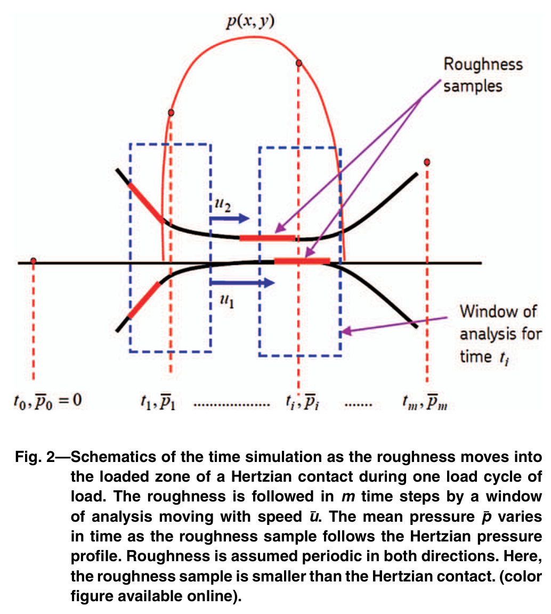
*Figure 2. Hertz 접촉 하중역으로 거칠기가 들어가는 시간 시뮬레이션. 거칠기 시료를 $\bar u$로 이동하는 해석 창에서 $m$ 시간스텝으로 추적, 평균압 $\bar p$는 Hertz 분포를 따라 변화. 거칠기는 양방향 주기적.*

### ▪ 5.3 경마모 모델 (수정 Archard)

$$\frac{\Delta h_w}{\Delta n}=k(x,y)\,p(x,y)\,u_s(x,y)/H \tag{14}$$

거칠기 시료 내 슬라이딩·경도 일정 가정. 마모계수는 윤활 상태 의존: $k_{dry}\approx f_w k_{lub}$ ($1\times10^{-11}\le k_{lub}\le5\times10^{-10}$, $f_w\approx10$). 스텝마다 평균 마모층 $\Delta h_w$를 양 표면에 절반씩 적용해 **손상맵·형상 갱신**(최고 돌기부터 제거). 단순 모델이라 충분한 시간/마모율에선 거칠기를 완전 제거하는 한계 있음.

---

## 6. 실험실 조건 검증과 영향 인자

마이크로피팅 시험기(중앙 롤러 = 구면 베어링 롤러 ⌀≈12 mm, 큰 디스크 3개 = NU209 내륜)로 검증. 최대하중 1,250 N, 최대 135°C, 슬립–롤 비 ±200%까지 제어.

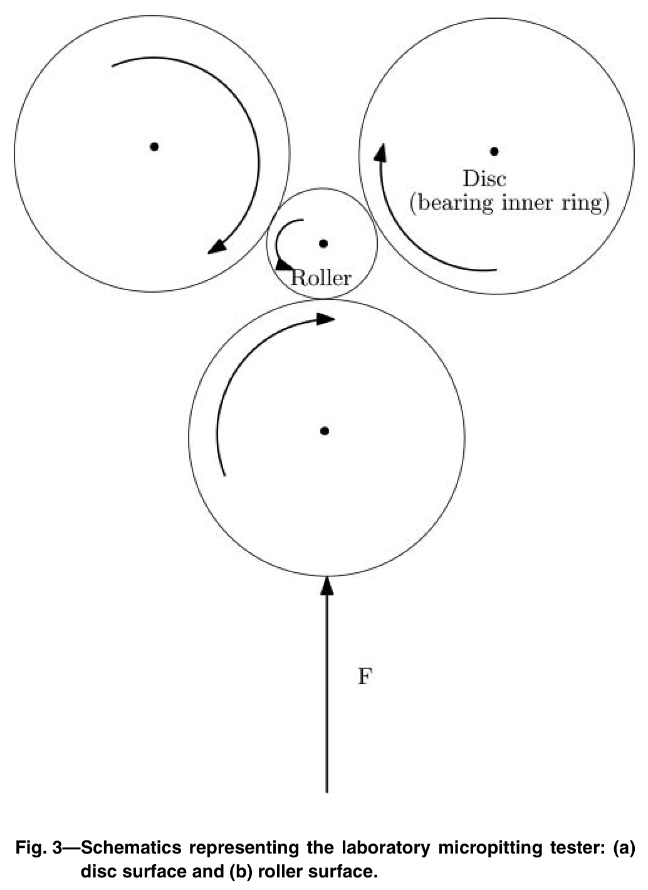
*Figure 3. 시험기 모식도: (a) 디스크 표면, (b) 롤러 표면.*

**Table 1 — 재료물성·롤러-디스크 공칭 접촉조건:**

| $E'$ (GPa) | $\tau_0$ (Pa) | $\mu_{bl}$ | $\mu_{ehl}$ | $\alpha$ (GPa⁻¹) | $S$ | $\bar u$ (m/s) |
|---|---|---|---|---|---|---|
| 231 | 3×10⁶ | 0.12 | 0.05 | 20.78 | 0.02 | 1.0 |

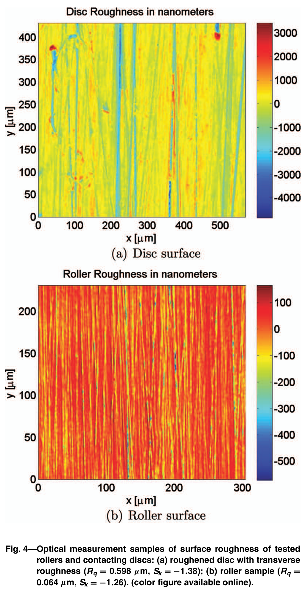
*Figure 4. 표면 거칠기 시료: (a) 횡방향 거친 디스크($R_q$=0.598 µm, $S_k$=−1.38), (b) 롤러($R_q$=0.064 µm, $S_k$=−1.26).*

### ▪ 6.1 거칠기 방향(lay)의 효과

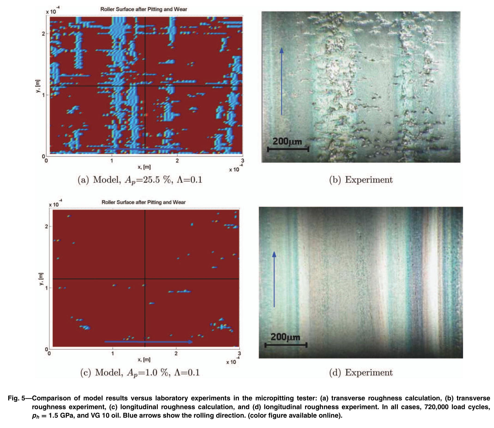
*Figure 5. 모델 vs 실험: (a) 횡방향 계산, (b) 횡방향 실험, (c) 종방향 계산, (d) 종방향 실험. 720,000 사이클, $p_h$=1.5 GPa, VG 10. 파란 화살표=구름 방향.*

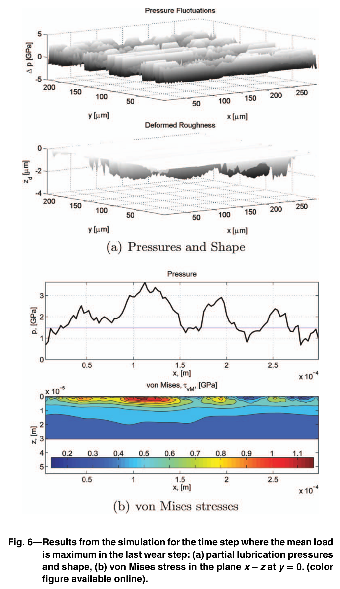
*Figure 6. (a) 부분윤활 압력·형상, (b) $x$–$z$ 평면($y$=0) von Mises 응력. 종방향 거칠기 마모 후 $R_q$ 0.5→0.3 µm로 실측과 일치.*

정성적으로 잘 일치하며 **횡방향 거칠기가 더 취약**합니다.

### ▪ 6.2 두 거친 표면의 효과

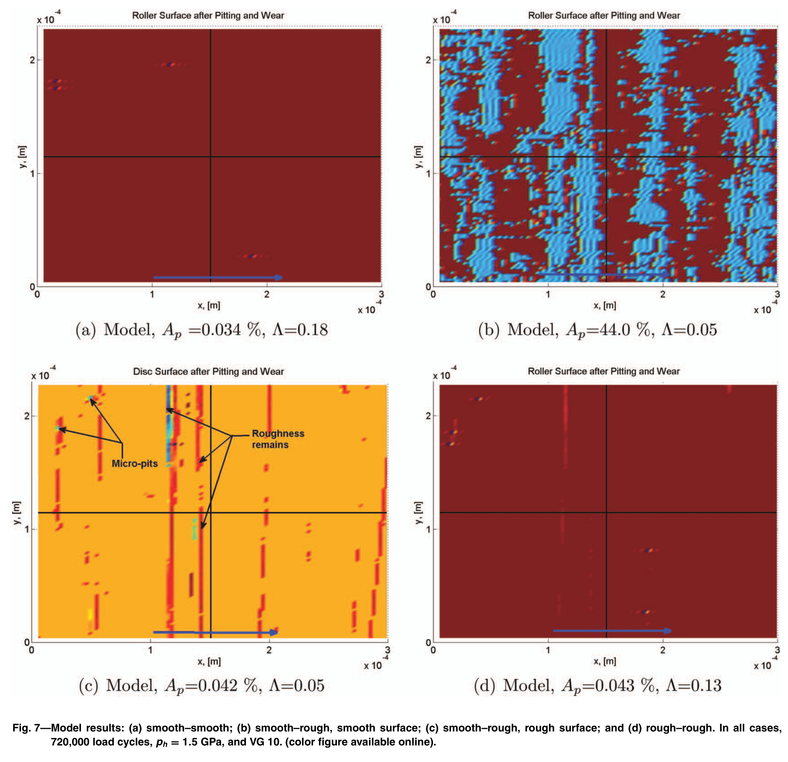
*Figure 7. 모델: (a) 매끈–매끈, (b) 매끈–거침의 매끈면, (c) 매끈–거침의 거친면, (d) 거침–거침. 720,000 사이클, $p_h$=1.5 GPa, VG 10.*

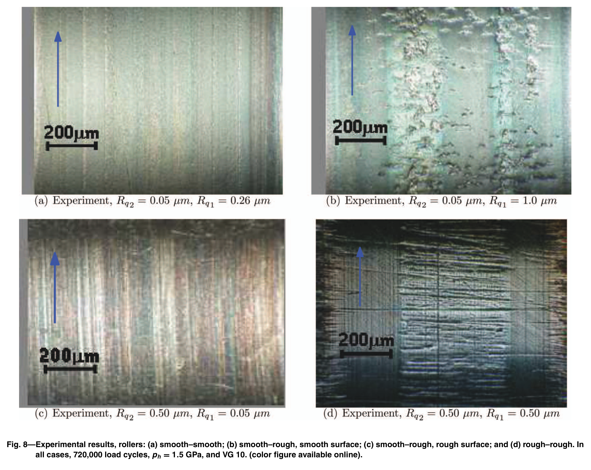
*Figure 8. 실험(롤러): (a) 매끈–매끈, (b) 매끈–거침의 매끈면, (c) 매끈–거침의 거친면, (d) 거침–거침. 조건 동일.*

> **핵심 발견:** 매끈면–거친면 접촉에서 **더 매끈한 표면에 손상이 더 많이** 발생. 슬라이딩이 있으면 거친 표면이 매끈 표면에 하중 미세사이클(피로 사이클)을 부과하기 때문(Kim & Olver).

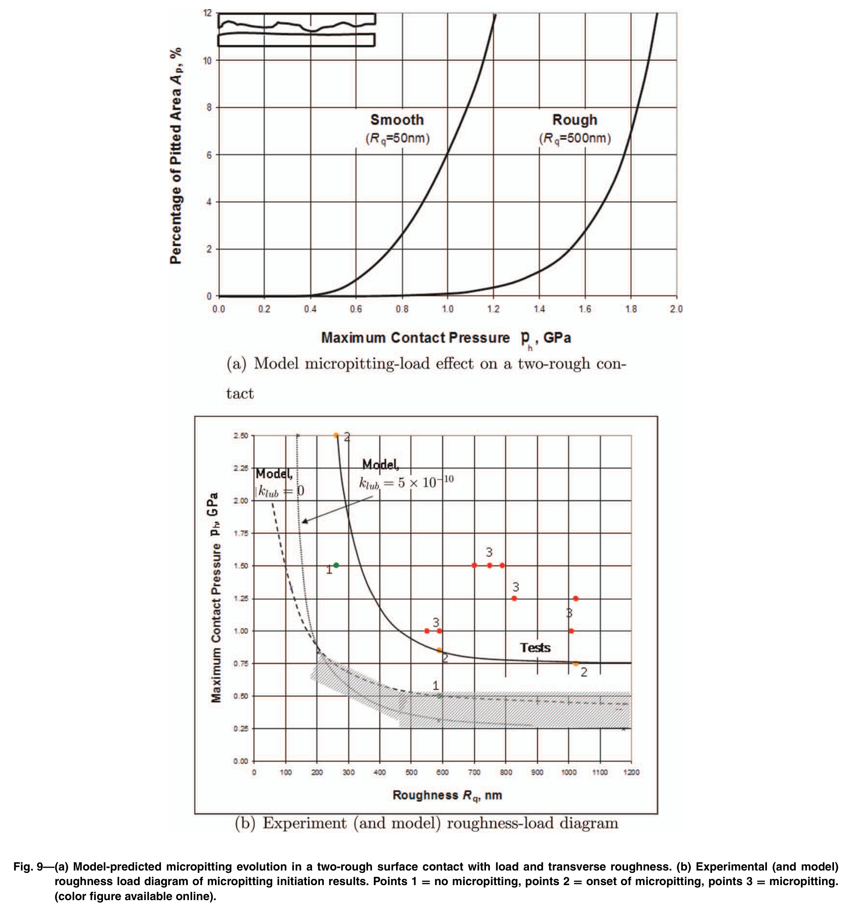
*Figure 9. (a) 하중·횡거칠기에 따른 모델 예측 마이크로피팅 진전, (b) 거칠기–하중 다이어그램(실험+모델). 점1=무피팅, 점2=개시, 점3=피팅.*

### ▪ 6.3 윤활 품질(Λ)의 효과

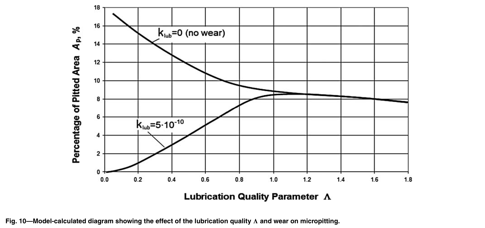
*Figure 10. 피팅 면적률 $A_p$ vs Λ. 무마모($k_{lub}$=0)는 Λ↑ 시 단조 감소, 마모 포함($k_{lub}$=5×10⁻¹⁰)은 저Λ서 마모가 피팅 억제, **Λ≈1.1서 최대** 후 두 곡선 수렴.*

### ▪ 6.4 슬라이딩(S)의 효과

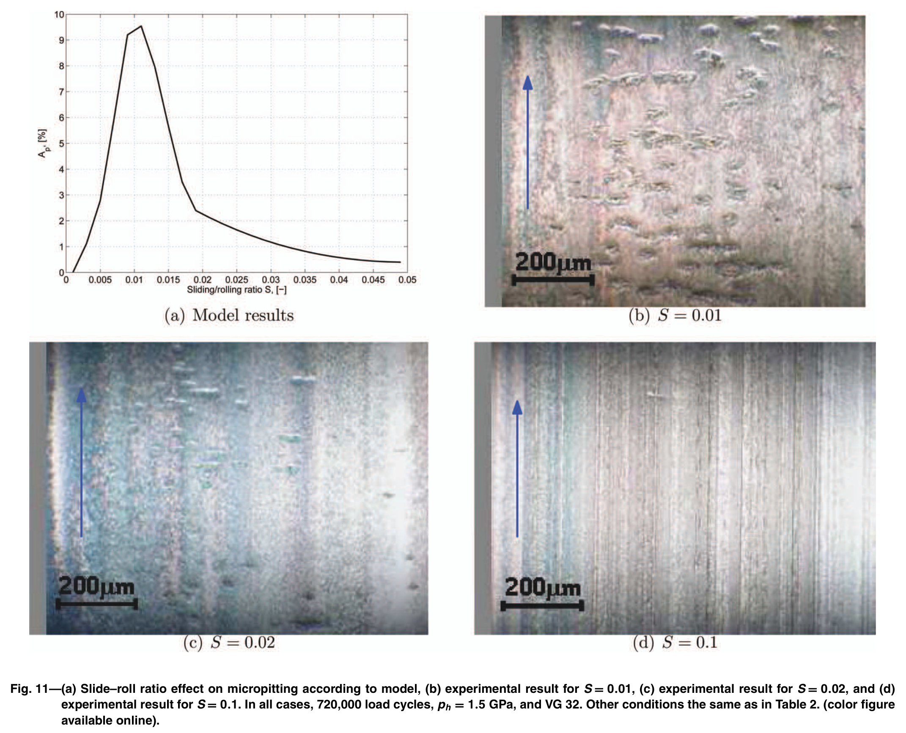
*Figure 11. (a) 모델의 슬라이딩 효과($k_{lub}$=5×10⁻¹⁰), (b) S=0.01, (c) S=0.02, (d) S=0.1 실험. **저슬라이딩(S≈0.01)에서 손상 최대**. 720,000 사이클, $p_h$=1.5 GPa, VG 32.*

> 증가한 슬라이딩이 꼭 마이크로피팅을 늘리지 않음: ① 슬라이딩↑→마모↑→피로층 제거, ② 마찰이 슬라이딩에 비례 증가 안 함(경계=Coulomb 포화, EHL=한계전단응력 근방). 균열 개시 기반 모델은 슬라이딩 **방향**(+/−)에 무관.

### ▪ 6.5 사이클 수의 효과

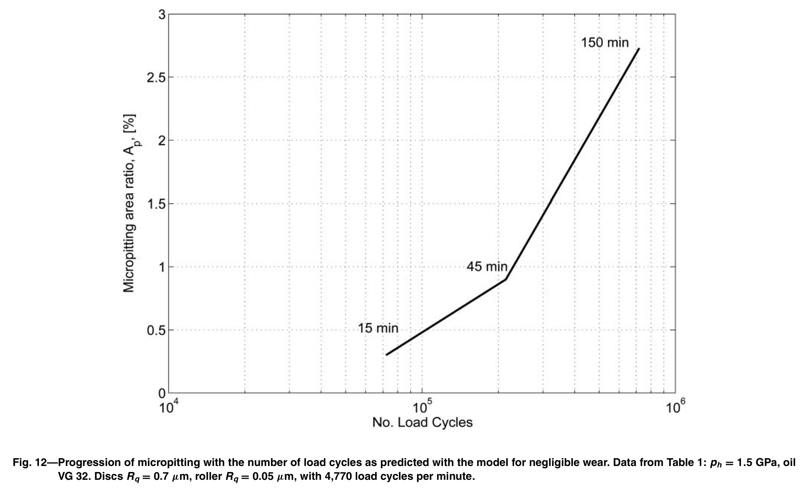
*Figure 12. 마모 무시 시 사이클 수에 따른 마이크로피팅 진전. $p_h$=1.5 GPa, VG 32, 디스크 $R_q$=0.7 µm, 롤러 $R_q$=0.05 µm.*

사이클↑ → 피로 손상↑(피팅↑), 그러나 마모층도↑. 과도한 마모는 피팅 진전을 저해 → 조건 따라 피팅이 나타났다 사라질 수 있음.

### ▪ 6.6 경계 마찰의 효과

경계 마찰은 표면 트랙션을 높이고 dry/lub 경계에 응력 집중을 유발. $\mu_{bl}$ 0.12→**0.15**로 가정 시 $A_p$가 2.4→**4.56%**(거의 2배). 경계 마찰이 마이크로피팅의 큰 인자.

---

## 7. 전(full) 베어링 적용

원통 롤러 베어링 **NU 211 ECP**(인위 거칠기, 반경하중, 내륜 1,500 rpm, ISO VG 68 첨가 유압유)에 적용. 좋은 마모 저항성으로 낮은 $k_{lub}=1\times10^{-11}$ 채택.

**Table 2 — 내륜-롤러 접촉조건:**

| $E'$ (GPa) | $\mu_{bl}$ | $\mu_{ehl}$ | $\alpha$ (GPa⁻¹) | $S$ | $\bar u$ (m/s) | $\Lambda$ | $h_c$ (µm) | $p_h$ (GPa) |
|---|---|---|---|---|---|---|---|---|
| 231 | 0.12 | 0.05 | 20.78 | 0.015 | 3.0 | 0.48 | 0.158 | 1.5 |

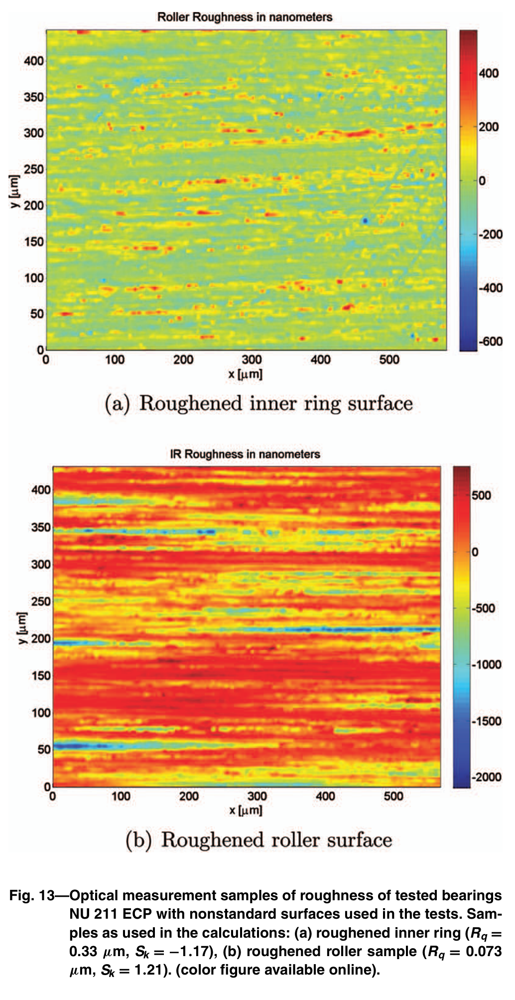
*Figure 13. (a) 거친 내륜($R_q$=0.33 µm, $S_k$=−1.17), (b) 거친 롤러($R_q$=0.073 µm, $S_k$=1.21). 내륜이 롤러보다 거칠어 롤러가 먼저 피팅 예상.*

내륜은 연삭만(호닝 없이), 롤러는 거친 호닝 → 비표준 거친 표면. 마이크로피팅은 주로 **슬라이딩 있는 롤러 단부 근방**(0.015≤|S|≤0.02)에서 발견.

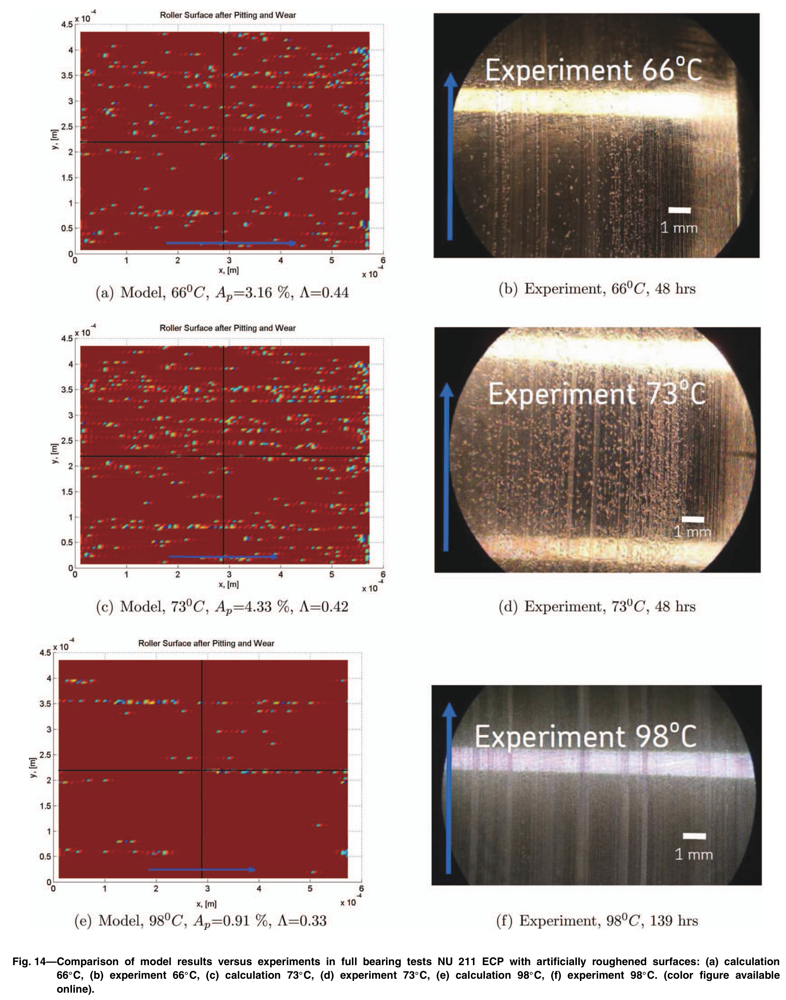
*Figure 14. NU 211 ECP 모델 vs 실험: (a,b) 66°C, (c,d) 73°C, (e,f) 98°C. 66·73°C는 양호한 일치, 98°C는 저Λ로 마모가 우세해 피팅 적음.*

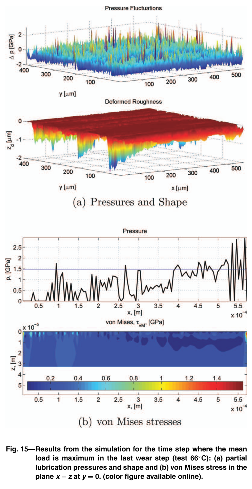
*Figure 15. (a) 부분윤활 압력·형상, (b) $x$–$z$ 평면($y$=0) von Mises 응력. 최대 von Mises 깊이 ≈3~4 µm.*

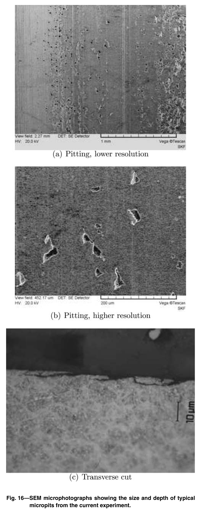
*Figure 16. SEM: 전형적 마이크로피트 크기(직경 10~20 µm)·깊이. 모델 예측(깊이 3~4 µm)과 부합.*

- 66·73°C: 피팅 증가 경향까지 양호한 일치
- 98°C: 긴 시험·불량 윤활(저Λ)로 **마모가 피팅보다 우세** → 모델·실험 모두 낮은 피팅

---

## 8. 결론

표면 피로와 경마모의 상호작용에 기반해 고하중 롤링–슬라이딩 윤활 접촉의 마이크로피팅을 예측하는 모델을 개발했습니다. 결정론적 형상 시료로 윤활 조건을 평가하고, Dang Van 기준으로 응력·피로 손상을 누적($d>1$서 피트 생성), 수정 Archard로 마모를 반영하며, 매 과주행마다 유막을 재계산합니다. 데스크톱 1시간 미만 계산, 실험실·전 베어링 시험으로 검증.

### 주요 결론

- **피로–마모 경쟁 기구의 결합이 필수**
- 마모는 하중 이력 전반에서 마이크로피팅과 상호작용 → **마모율↑이면 마이크로피팅 위험↓**
- 마이크로피팅은 윤활·거칠기에 의존하는 **표면 피로 기구**
- 슬립과 그에 따른 경계 마찰 전단응력이 마이크로피팅 생성에 필요. **베어링 조건 슬립 0.5~2%에서 위험 최대**, 그 이상은 마모↑·경계마찰 포화로 꼭 증가 안 함
- **횡방향 거칠기**가 종방향보다 취약
- 한 표면이 훨씬 거칠면 **더 매끈한 표면**에 피팅이 더 빨리·심하게(거친면이 미세사이클 부과, 상대속도 거의 무관·슬라이딩 필요)
- **경계 마찰**이 큰 기여 → 경계 마찰계수·마모율을 바꾸는 첨가제가 위험에 큰 영향

### 한계

- 정성적 일치 수준, **열효과·잔류응력 미반영**, 균열 전파 미고려(개시 기반)
- 단순 마모 모델(충분 시간 시 거칠기 완전 제거 경향)

---

## 9. 기호 및 참고문헌

### ▪ 주요 기호 설명 (Nomenclature)

| 기호 | 설명 | 단위 |
|------|------|------|
| $A, B$ | Wöhler 곡선 기울기·절편 | Pa |
| $A_p$ | 마이크로피팅 면적률(실피팅/공칭접촉) | – |
| $D$ | Dang Van 손상 파라미터 | – |
| $d$ | Palmgren-Miner 손상 파라미터 | – |
| $E'$ | 환산 탄성계수 | Pa |
| $f_w$ | 경계/완전유막 마모계수 비 ($k_{dry}=f_w k_{lub}$) | – |
| $H$ | 경도 | Pa |
| $h$ | 간극 | m |
| $\bar h$ | 평균(중앙) 유막 두께 | m |
| $h_a, h_c$ | 간극 리플 진폭(특수해/상보함수) | m |
| $\Delta h_w$ | 사이클 묶음당 평균 마모층 | m |
| $k_{dry}, k_{lub}$ | Archard 마모계수(경계/윤활) | – |
| $N$ | Dang Van 추정 수명(하중 사이클) | – |
| $n, \Delta n$ | 하중 사이클 수 / 사이클 묶음 | – |
| $p, \bar p, p_h$ | 압력 / 평균 압력 / Hertz 압력 | Pa |
| $p_{lim}$ | 항복(소성 개시) 압력 | Pa |
| $Q$ | 진폭감소 파라미터 | – |
| $q$ | 표면 트랙션 ($q=\mu p$) | Pa |
| $R_q$ | RMS 거칠기 | m |
| $S$ | 슬립–롤 비 ($(u_2-u_1)/\bar u$) | – |
| $S_k$ | 표면 비대칭도(skewness) | – |
| $u_s$ | 슬라이딩 속도 | m/s |
| $\bar u$ | 평균 속도 | m/s |
| $\alpha$ | (Dang Van) 재료상수 / 점도-압력 계수 | – / Pa⁻¹ |
| $\eta_x, \eta_y$ | 비뉴턴 방향별 등가 점도 | Pa·s |
| $\Lambda$ | 상대 유막 파라미터 ($\bar h/R_q$) | – |
| $\mu_{bl}, \mu_{ehl}$ | 경계/완전유막 국부 마찰계수 | – |
| $\sigma_f, \tau_f$ | 교번 굽힘/전단 피로한도 | Pa |
| $\tau_0, \tau_m$ | Eyring 등가응력 / 평균 전단응력 | Pa |
| $\tau_{vM}$ | von Mises 전단응력 | Pa |
| $\phi_{bl}$ | dry/lub 하중분담 비 | – |

-------------

### ▪ 핵심 참고문헌 (References)

- **(1)** ISO 15243 (2004) — 구름 베어링 손상·고장 (surface distress 정의)
- **(2)** Way S. (1935) — 구름 접촉 피팅 (최초 연구)
- **(3–5)** Dawson P.H. — 금속 접촉·슬라이딩의 피팅 피로, $D$-파라미터
- **(8,9)** Brandão 등 (2010) — 표면 기인 치면 손상 수치모델·마이크로피팅 예측
- **(10,11)** Lainé & Olver 등 — 마이크로피팅 vs 마모 경쟁, 첨가제 효과
- **(13,14)** Dang Van K. 등 — 다축 피로 기준 (피로 모델 기반)
- **(16)** Morales-Espejel 등 (2003) — 순수 롤링 EHL 미세형상 압력·내부응력 (FFT 응력)
- **(17)** Archard J.F. (1953) — 마모 모델
- **(21)** Morales-Espejel 등 (2010) — EHL 미세형상 슬라이딩 마찰 전이 (부분윤활 모델 검증)
- **(22)** Stanley & Kato (1997) — FFT 거친 표면 접촉
- **(27,28)** Hooke 등 (2006, 2007) — 롤링–슬라이딩 거친 EHL 진폭감소·상보파 ([[2007. (Hooke) Rapid calculation of pressures and clearances in rough rolling-sliding EHL contacts Part 1]])
- **(29)** Greenwood & Morales-Espejel (1994) — EHL 횡방향 거칠기 거동
- **(41)** Kotzalas & Doll (2010) — 풍력터빈 신뢰성 트라이볼로지

---

**원본 출처**: Morales-Espejel, G.E., Brizmer, V., 2011, "Micropitting Modelling in Rolling–Sliding Contacts: Application to Rolling Bearings," *Tribology Transactions*, 54(4), pp. 625–643, STLE.
**정리 양식**: [[2012. (Lugt) Thin layer flow and film decay modeling]] 참고
**관련 문헌**: [[2007. (Hooke) Rapid calculation of pressures and clearances in rough rolling-sliding EHL contacts Part 1]]

---

**끝**
