# Thin layer flow and film decay modeling for grease lubricated rolling bearings

C.H. Venner a,n, M.T. van Zoelen b, P.M. Lugt b

a University of Twente, Faculty of Engineering Technology, Engineering Fluid Dynamics, P.O. Box 217, 7500 AE Enschede, The Netherlands b SKF Engineering & Research Centre, P.O. Box 2350, 3430 DT Nieuwegein, The Netherlands

## a r t i c l e i n f o

Article history:   
Received 30 August 2011   
Received in revised form   
21 October 2011   
Accepted 25 October 2011   
Available online 18 November 2011   
Keywords:   
Rolling bearing   
Thin film   
Fluid mechanics   
Elastohydrodynamic lubrication

## a b s t r a c t

A model is presented to predict lubricant supply layer changes on tracks in rolling bearings due to centrifugal forces and elastohydrodynamic contact pressure. Experimental validation is shown for centrifugal force driven free surface flow, and layer thickness (film thickness) decay in single elastohydrodynamically lubricated contacts. The model allows prediction of lubricant migratory trends in bearings. The pressure ejection driven layer/film thickness decay can be predicted without the need to solve rolling element-raceway starved elastohydrodynamic contact problems for millions of overrollings. The model provides worst case estimates of a required (local) resupply interval, and contributes to improved lubricant related bearing life predictions.

& 2011 Elsevier Ltd. All rights reserved.

## 1. Introduction

Most rolling bearings are lubricated with grease. Advantages of grease for lubrication are many, e.g. see [1–5]. Grease is easily confined, protects against corrosion and the grease pushed to the side of the rolling track(s) forms levees of relatively highly viscous material which provide sealing and protect against contamination from the outside.

Accurate models exist for bearing life predictions based on subsurface fatigue life, e.g. [6]. However, when a bearing is correctly installed and there are no external factors such as debris, or material defects, it is often the lubricant that determines the service life. Grease life can loosely be defined as the time during which the grease can ensure the (re)formation of a low shear separation layer between the rolling element and the raceway surfaces. In open bearings the grease may relatively easily be replaced at regular ‘‘re-lubrication’’ intervals determined by the grease life. For the case of sealed bearings the service life of the bearing is often limited by the life of the grease. For both cases accurate prediction of grease life is paramount to bearing service life prediction and control.

Models to predict grease life are much less well developed than fatigue life models and mostly empirical. The first step toward improved models is sufficient understanding of film formation in grease lubricated contacts. Cann and co-workers extensively studied the film thickness behavior of the contact between a single ball and a glass disc using optical interferometry, e.g. see, [1–3], and references therein. Two regimes of operation are distinguished [7]. Firstly, the case referred to as ‘‘fully flooded’’ where grease is continuously pushed back onto the rolling track. The lubricant film in the EHL contacts consists of worked grease (thickener, base oil and additives), varies little as a function of time, and often exceeds the film thickness predicted by models based on single phase (base oil). The second case is referred to as the starved regime. The rolling contact pushes aside the grease in the early overrollings creating grease levees to the side. The film thickness initially decays with time as grease pushed to the side does not flow back onto the track for relubrication. Eventually, the contact is running on a thin layer of worked grease thickener mixed with base-oil, possibly augmented by an elasto-hydrodynamically generated thin layer of base oil. This base oil is supplied from the reservoirs immediately near the contact or released in due time from these reservoirs by shearing [8]. As the amount of oil available for lubrication is often very small the contact is starved and operates at a film thickness level much below the fully flooded limit. In between overrollings very little replenishment from the side of the track can take place as the oil layers on and near the track are too thin and their viscosity is too large for significant reflow by e.g. capillary effects [9].

In this starved regime, grease lubrication is analogous to starvation with a high-viscosity oil [1]. For oil lubricated starved contacts it is indeed shown that rapid flow contributing to film (re)formation occurs only in the immediate vicinity of the contact, see [10], where starvation is shown to be controlled by a nondimensional parameter containing the speed, the viscosity, and the contact radius (width). The starved regime is even more representative for real bearings where the time between overrolling by (wide) contacts is so short that replenishment by the levees can indeed be neglected [11]. However, it should be noted that the degree of starvation of the contacts in a bearing is determined by a delicate balance between several loss and supply mechanisms, including pressure driven ejection by overrolling, evaporation and/or oxidation from the tracks, centrifugal effects redistributing oil layers, replenishment by oil separation (also called ‘‘bleeding’’) from grease located on the cage, side-face or seals [12–14]. Nevertheless, modeling the rollingelement raceway contacts as starved contacts appears to be good starting point for developing a film thickness decay model for bearings to be used for grease life predictions.

| Nomenclature | Nomenclature | $R _ { i , x }$ $R _ { r , x }$ | radius inner raceway in rolling direction (m) radius roller in rolling direction (m) |
| --- | --- | --- | --- |
| a | halfwidth Hertzian contact in direction of flow | $R _ { x }$ | reduced radius of curvature in x direction $1 / R _ { x } =$ |
|  | $a = ( 3 F R / E ^ { \prime } ) ^ { 1 / 3 } ( 2 \kappa \mathcal { E } / \pi ) ^ { 1 / 3 } \ ( \mathrm { m } )$ |  | $1 / R _ { x , 1 } + 1 / R _ { x , 2 } \ \mathrm { ( m ) }$ |
| $a ^ { + } , a ^ { - }$ | location of boundary of pressurized region, see | $R _ { x , i }$ | radius curvature surface i in x direction (m) |
|  | Fig. 6 (m) | $R _ { y }$ | reduced radius of curvature in y direction |
| $b$ | halfwidth Hertzian contact cross-flow direction |  | $1 / R _ { y } = 1 / R _ { y , 1 } + 1 / R _ { y , 2 }$ (m) |
|  | $b = a / \kappa ~ ( \mathrm { m } )$ | $R _ { y , i }$ | radius of curvature surface i in y direction (m) |
| $\mathbf { e } _ { 1 } , \mathbf { e } _ { 2 }$ $E ^ { \prime }$ | unit vector tangential to surface (Fig. 1) | $T$ | time (s) |
|  | reduced elastic modulus $2 / E ^ { \prime } = ( 1 - \nu _ { 1 } ^ { 2 } ) / E _ { 1 } + ( 1 - \nu _ { 2 } ^ { 2 } ) / E _ { 2 }$ |  | temperature (°C) surface velocity (m s−¹) |
| $\varepsilon$ | $( \mathsf { N } \mathsf { m } ^ { - 2 } )$ | $u _ { m }$ | entrainment velocity single contact |
|  | elliptic integral (second kind) |  | $u _ { m } = ( u _ { 1 } + u _ { 2 } )$ $( \mathtt { m } s ^ { - 1 } )$ |
|  | $\begin{array} { r } { \mathcal { E } = \int _ { 0 } ^ { \pi / 2 } \sqrt { 1 - ( 1 - \kappa ^ { 2 } ) \sin ^ { 2 } ( \phi ) } d \phi } \end{array}$ |  | coordinate along the track (m) |
| $F$ | load distribution function (N) |  | coordinate across track (m) |
| $F _ { r }$ | bearing radial load (N) |  | integration coordinate across track (m) |
| $F _ { c }$ | centrifugal force (N) | $\hat { y }$ $z$ | coordinate normal to surface (layer analysis, Fig. 1) |
| $f$ | centrifugal force on fluid per unit volume $( \mathsf { N } \mathsf { m } ^ { - 3 } )$ |  | coordinate along centerline (bearing geometry, |
| $\mathcal { F }$ | function describing side flow variation $( \mathbf { m } ^ { - 2 } s ^ { - 1 } )$ |  | Fig. 4) (m) |
| $\overline { { \mathcal { F } } }$ | averaged over circumference $( \mathrm { m } ^ { - 2 } \mathsf { s } ^ { - 1 } )$ | $z$ | position on symmetry axis (m) |
| $h$ | film thickness (m) | $\gamma$ | roller axis of rotation angle |
| $\tilde { h }$ | layer thickness (m) | $\epsilon$ | height/length ratio oil layer $\epsilon = H / L$ |
| $i$ | index | $\epsilon$ | load distribution factor bearing |
| $H$ | characteristic/initial height (m) | $\eta$ | dynamic viscosity (Pa s) |
| $K _ { n }$ | load deflection factor $\bar { K _ { n } } = ( \bar { K } _ { i } ^ { - 1 / n } + K _ { o } ^ { - 1 / n } ) ^ { - n } ~ ( \mathrm { N } ~ \mathrm { m } ^ { - n } )$ |  | surface curvature parameter $\kappa = \kappa _ { y } + \kappa _ { \theta } ( \mathbf { m } ^ { - 1 } )$ |
| $K _ { i / o }$ | load deflection factor for elliptic and circular contacts |  | (Hertzian) contact ellipticity parameter |
|  | $\begin{array} { r } { K _ { i / o } = \frac { 2 } { 3 } E ^ { \prime } \sqrt { 2 R \pi ^ { 2 } \mathcal { E } / ( 4 \kappa ^ { 2 } \mathcal { K } ^ { 3 } ) \left( \mathrm { N } \mathrm { m } ^ { - n } \right) } } \end{array}$ |  | $R _ { x } / R _ { y } = \kappa ^ { 2 } ( \mathcal { K } - \mathcal { E } ) / ( \mathcal { E } - \kappa ^ { 2 } \mathcal { K } )$ |
| $\kappa$ | elliptic integral (first kind) |  | Poisson ratio $^ { - 3 } )$ |
|  | $\begin{array} { r } { \kappa = \int _ { 0 } ^ { \pi / 2 } ( 1 - ( 1 - \kappa ^ { 2 } ) { \sin } ^ { 2 } ( \phi ) ) ^ { - 1 / 2 } d \phi } \end{array}$ |  | density (kg m dimensionless density |
| $l _ { t }$ | total length of tracks (raceways and rolling |  | $\overline { { \rho } } = \rho / \rho _ { 0 }$ |
|  | elements)(m) | $\rho _ { \kappa }$ | raceway curvature, see Fig. $4 ( \mathrm { \bar { m } } ^ { - 1 } )$ |
| $m _ { r }$ | rolling element mass (kg) |  | surface tension coefficient $( \mathsf { N } \mathsf { m } ^ { - 1 } )$ |
| $n$ | power in load distribution function | $\tau _ { C }$ | characteristic time $\tau _ { c } = \eta _ { 0 } / ( \rho _ { 0 } \varOmega ^ { 2 } H ^ { 2 } ) \ ( s )$ |
| $n _ { s o l i d s }$ | number of objects | $\phi$ | angular integration variable |
| $n _ { r }$ | number of rolling elements in bearing handbooks | $\psi$ | angular location along bearing circumference |
|  | usually indicated with Z | $\psi _ { l }$ $\Omega _ { c a }$ | location boundary load zone |
| $n _ { c }$ | number of EHL contacts on track |  | angular velocity of cage $\Omega _ { c a } = { \textstyle \frac { 1 } { 2 } } \Omega _ { i } R _ { x , i } / ( R _ { x , i } + R _ { x , r } ) \big ( 1 / s \big )$ angular velocity roller relative to cage (1/s) |
| $N$ | Moes dimensionless load parameter elliptic EHL con- tact $N = ( R _ { x } / R _ { y } ) ^ { 1 / 2 } ( F / E ^ { \prime } R _ { x } ^ { 2 } ) \dot { ( } 2 \eta _ { 0 } u _ { m } ) / ( E ^ { \prime } R _ { x } ) ) ^ { - 3 / 4 }$ | $\Omega _ { r o l }$ |  |
| $L$ | characteristic length across track, track width (m) | Sub/superscripts |  |
| $L$ | Moes dimensionless lubricant parameter EHL |  | at ambient pressure at initial time |
|  | $L = ( \alpha E ^ { \prime } ) ( ( 2 \eta _ { 0 } u _ { m } ) / ( E ^ { \prime } R _ { x } ) ) ^ { 1 / 4 }$ | 0 $^ { 1 , 2 }$ | surface 1, surface 2 |
| $p$ | $\mathrm { p r e s s u r e } \ ( \mathrm { N } \ \mathrm { m } ^ { - 2 } )$ |  | averaged over track length |
| $p _ { r }$ | pressure constant in Roelands equation $p _ { r } = 1 . 9 6 \times$ | $\infty$ |  |
|  | $\mathbf { \dot { 1 } 0 ^ { 8 } ~ ( N ~ m ^ { - 2 } ) }$ | $c$ | central value $( x = 0 , y = 0 )$ |
| $p _ { h }$ | maximum Hertzian pressure $( \mathsf { N } \mathsf { m } ^ { - 2 } )$ | $c r$ | critical |
| $P _ { d }$ | diametrial bearing clearance (m) | $c f f$ | central value $( x = 0 , y = 0 ) ,$ fully flooded conditions |
| $q$ | function in $q _ { y } ( y ) ( \mathbf { m } ^ { - 1 } s ^ { - 1 } )$ | $c s$ | central value $( x = 0 , y = 0 ) ,$ starved conditions |
| $q _ { y }$ | mass flow rate in y direction per unit track length | max | associated with maximum value |
|  | (kg m $^ { - 1 } S ^ { - 1 } )$ | $y$ | in y direction |
| $\hat { q }$ | mass flow rate $( \mathrm { k g } s ^ { - 1 } )$ | $z$ | in z direction |
| $r$ | radius function (m) | $k , i$ | index indicating contact or object |
| $R _ { i r w }$ | radius in bearing geometry, see Fig. 4 (m) | $i , o$ | inner raceway, outer raceway |
|  | radius in bearing geometry, see Fig. 4 (m) | $r o l$ | roller |
| $R _ { c r o l }$ |  | $\theta$ | in θ direction |

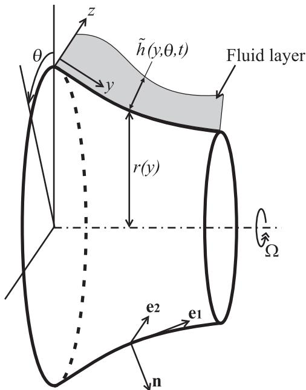  
Fig. 1. Schematic representation of an axisymmetric object parameterized by its radius r as a function of the coordinate along the surface y with a free surface layer of fluid \~h(y,y,t).

The significance of starvation for understanding film formation in rolling bearings was already understood by e.g. Wedeven et al. [15], Kingsbury [16], Chiu [17], Hamrock and Dowson [18], and by Wilson [19]. A drawback of the early theoretical works is that starvation is introduced using the domain boundary as an input variable, whereas in reality the boundary of the pressurized region is a free boundary, which is determined by the amount of lubricant present on the surfaces in the inlet.

A physically correct numerical approach based on the Elrod [20] starvation model was introduced by Chevalier and Lubrecht [21]. They showed that there is a direct relation between the amount of lubricant and its distribution in the inlet (layer thickness) and the film thickness in the high pressurized central region of the contact. For heavily starved contacts a simple engineering formula was presented predicting the central film thickness in relation to the oil layer thickness in the inlet. Assuming a suitable inlet layer distribution, the film thickness results obtained, e.g. meniscus shape, showed good qualitative agreement with the experimental results for grease lubricated contacts thus providing justification to model grease lubricated contacts using a starved EHL approach. The model was extended and extensively used to predict the behavior of starved contacts both under steady state as well as dynamic conditions and successfully used to explain various aspects of bearing and of grease lubrication [22–27].

The starved lubrication model requires input of the (oil) layer distribution in the inlet to the contact. The thickness of such inlet layers is generally determined by the flow around and in the contact. For a single contact the flow around the contact was e.g. studied by Pemberton and Cameron [28]. In a rolling bearing, the layer shape will be determined by different loss, supply, and migration effects as mentioned above. As a first approximation one may consider pressure ejection only and take the central film thickness of a previous contact as layer input to the next contact. In this way Chevalier [21] and Damiens [23] obtained predictions of film thickness decay as a function of the number of overrollings. Film decay rates predicted for a single contact agreed well with results obtained using optical interferometry. Unfortunately, this approach cannot easily be extended to the case of rolling bearings where the number of overrollings is not well defined as the lubricant layers on the inner and outer raceway and the rolling elements are overrolled at a different frequency by multiple contacts.

The authors have developed a model to predict changes in thin layers on surfaces, such as the inlet layers to EHL contacts, induced by various forces such as centrifugal forces based on thin layer free surface flow modeling. The model has been validated experimentally for changes of free surface layers on rotating surfaces (bearing raceways) induced by centrifugal effects. The model also provides a novel way to predict film thickness decay in starved EHL contacts. Moreover, it easily generalizes to multiple contacts and to film thickness decay predictions for real bearings. This is achieved by combining thin layer decay predicted by pressure ejection to the relation between inlet layer and film thickness known for starved EHL contacts.

The predictions of the model were validated experimentally for the case of single circular and elliptic contacts using optical interferometry showing excellent agreement. Finally, the model was extended to actual bearings. In its simplest form, all replenishment ignored, the model yields a worst case film thickness decay prediction. The results can be interpreted as a maximum allowable interval between replenishment events in a bearing, see [5], or be used to determine a required rate of replenishment by e.g. bleeding, to sustain a certain film thickness level. Separate aspects of the study have also appeared in [29–33]. In this paper a concise and rewritten overview is given of the most relevant theory aimed at application in engineering, and a selection of theoretical and experimental results illustrating the remarkable accuracy with which free surface layer flow can be predicted and linked to EHL contact film decay. Finally, the extension to film decay prediction for actual bearings is shown, which has been greatly simplified owing to a simple and accurate formula that has been developed for the amount of lubricant ejected by the pressure in the rolling-element raceway contacts.

## 2. Thin layer flow: single surface axisymmetric flow

The flow of a thin layer of Newtonian fluid on a curved twodimensional surface is explained in detail e.g. by Schwartz et al. [34] and the equations for the case of an arbitrary three-dimensional surface are presented in [35,36]. For applications related to bearings the analysis can be restricted to the case of a thin layer free surface flow on smoothly curved axisymmetric surfaces (rolling elements, raceway), as schematically depicted in Fig. 1. A complete derivation of the equations is given in [29,30]. Below the most relevant aspects are explained. As the layers are subject to ambient pressure, the viscosity and the density are assumed to be constant. In addition it may be assumed that the curvature of the solid surfaces is large compared to the layer thickness. Considering the case of axisymmetrical flow the continuity equation for the layer thickness \~h(y,t) reads

$$
\rho _ { 0 } \frac { \partial \tilde { h } } { \partial t } + \frac { \partial q _ { y } } { \partial y } = 0 ,\tag{(1)}
$$

where $q _ { y } ( y , t )$ is the mass flow rate in y direction per unit length, which, invoking the assumptions mentioned above, is given by

$$
q _ { y } ( y , t ) = \frac { \rho _ { 0 } \tilde { h } ^ { 3 } } { 3 \eta _ { 0 } } \left( \overbrace { f _ { y } + f _ { z } \frac { \partial \tilde { h } } { \partial y } } ^ { C e n t r i f u g a l \ f o r c e } \overbrace { + \sigma \left( \frac { d \kappa } { d y } + \frac { \partial ^ { 3 } \tilde { h } } { \partial y ^ { 3 } } \right) } ^ { S u r f a c e \ t e n s i o n } \right) .\tag{(2)}
$$
> *(추출이 깨진 줄 — 원문 p.3 대조로 복구)*

fwith subscript y and z are the components of the centrifugal forces acting on the fluid layer in the tangential and normal direction

respectively, relative to the solid surface. k is the sum of the normal curvatures of the solid surface in y and y direction

$$
\kappa = \kappa _ { y } + \kappa _ { \theta } = \frac { r ^ { \prime \prime } ( y ) } { \sqrt { 1 - \left( r ^ { \prime } ( y ) \right) ^ { 2 } } } - \frac { \sqrt { 1 - \left( r ^ { \prime } ( y ) \right) ^ { 2 } } } { r ( y ) } .\tag{(3)}
$$

$\eta _ { 0 }$ and $\rho _ { 0 }$ are the dynamic viscosity and density of the fluid at ambient pressure.

Under the assumptions mentioned above

$$
f _ { y } ( y ) = \rho _ { 0 } \Omega ^ { 2 } r ( y ) r ^ { \prime } ( y ) , \quad f _ { z } ( y ) = \rho _ { 0 } \Omega ^ { 2 } r ( y ) \sqrt { 1 - ( r ^ { \prime } ( y ) ) ^ { 2 } } .\tag{(4)}
$$
> *(추출이 깨진 줄 — 원문 p.4 대조로 복구)*

r(y) is the radius of the axisymmetrical surface over which the layer flows and O is the rotational speed. Substitution of Eq. (2) in Eq. (1) results in a fourth-order partial differential equation for $\bar { h } ( y , t )$ which, for a given initial layer on the surface, can be solved numerically.

For a bearing raceway with smooth oil layers a simplified model can be derived. Let $\epsilon = H / L \ll 1$ be a characteristic layer thickness to length ratio. When the geometry of the roller or raceway itself is such that $\epsilon f _ { z } \ll f _ { y } '$ , the normal force term in Eq. (2) will also be small. For the case of smooth oil layers on bearing raceway- and roller-surfaces $( \sigma \kappa / L ) \ll ( \rho \Omega ^ { 2 } r )$ and $( \epsilon \sigma / L ^ { 2 } ) \ll ( \rho \Omega ^ { 2 } r )$ . In that case the surface tension terms in Eq. (2) may be neglected and

$$
q _ { y } ( y , t ) = \frac { \rho _ { 0 } \tilde { h } ^ { 3 } } { 3 \eta _ { 0 } } f _ { y } .\tag{(5)}
$$

For constant density (the layer is subject to ambient pressure), Eq. (1) with Eq. (5) is a quasi-linear partial differential equation. This equation is the key equation in the entire analysis and will prove much more generally useful than only for the case considered here. In its general form it can be written as

$$
\frac { \partial \tilde { h } } { \partial t } + \frac { \partial } { \partial y } \left( \frac { 1 } { 3 } \tilde { h } ^ { 3 } q \right) = 0 ,\tag{(6)}
$$

where, for the particular case discussed above $q = q ( y ) = f _ { y } ( y ) / \eta _ { 0 } .$

For a given initial layer shape the solution can be obtained analytically using the method of characteristics, see [37]

$$
\tilde { h } ( y , t ) = \bigg ( \frac { q ( y _ { 0 } ) } { q ( y ) } \bigg ) ^ { 1 / 3 } \tilde { h } _ { 0 } ( y _ { 0 } ) ,\tag{(7)}
$$

with $\tilde { h } _ { 0 } ( y _ { 0 } ) = \tilde { h } ( y _ { 0 } , 0 )$ standing for the initial distribution of the layer. For a particular position y and time t the value of $y _ { 0 }$ follows from the (numerical) solution of the equation

$$
\int _ { y _ { 0 } } ^ { y } ( q ( \hat { y } ) ) ^ { - 1 / 3 } d \hat { y } = ( q ( y _ { 0 } ) ) ^ { 2 / 3 } ( \tilde { h } _ { 0 } ( y _ { 0 } ) ) ^ { 2 } t .\tag{(8)}
$$

To validate the model it was first applied to the prediction of the evolution in time of a layer of oil on a rotating bearing raceway induced by centrifugal effects. Experiments were carried out in which a layer of a high viscosity oil was applied on a bearing (inner) raceway which was spun at different speeds. Intermittently the layer distribution was measured at different positions across the raceway (see Fig. 2(a)) using optical interferometry. In Fig. 2(b) and (c) results are shown for layer flow on a spherical raceway with a smallest inner radius of 27.5 mm, a length along the raceway $0 < y < L = 1 0 . 6$ mm, and an angle $\beta = 1 6 . 3 ^ { \circ }$ . Fig. 2(b) shows the measured layer evolution as a function of time, and the predictions of the simplified model when the initially measured layer thickness is taken as $\tilde { h } ( y _ { 0 } , 0 ) .$ In Fig. 2(c) the predictions of the simplified model are compared with the predictions obtained from solving the complete fourth order differential equation for the layer thickness.

The results show that the centrifugal effects drive the fluid from the smaller to the larger diameter, i.e. in the pictures from the left to the right edge. The differences between the predictions of the simplified and of the complete model, as well as those between both models and the experimental results are confined to the region near the right hand raceway edge which causes fluid to accumulate. In this region surface tension effects are important. In the experiments the free surface slope increases, until fluid flies of in drops. This effect, by definition, cannot be modeled with the thin layer flow equations. In the simplified model, surface tension effects are neglected altogether, hence only the propagation behavior characteristic for a hyperbolic equation is seen. In the complete thin layer flow model the surface tension effects were taken into account and at (near) the right edge a boundary condition was imposed on the maximum slope of the layer such that effectively fluid is allowed to leave the system. The resulting predictions show similar accumulation and high layer slopes as in the experiments. The region over which these effects are important was seen to decrease with increasing speed, making the predictions of the simplified model more accurate with increasing speed. Additional results can be found in [29].

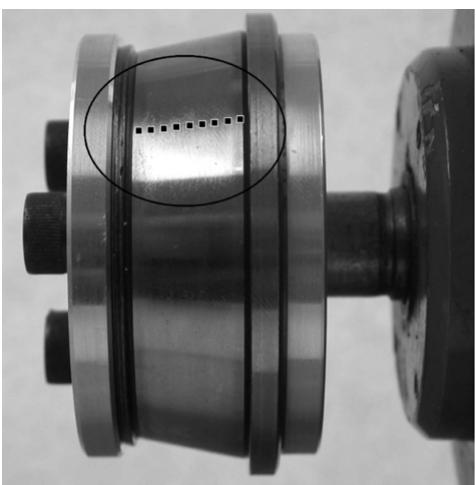  
1000 rpm

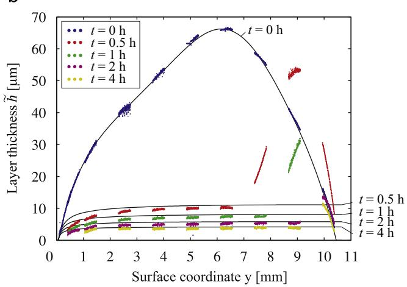

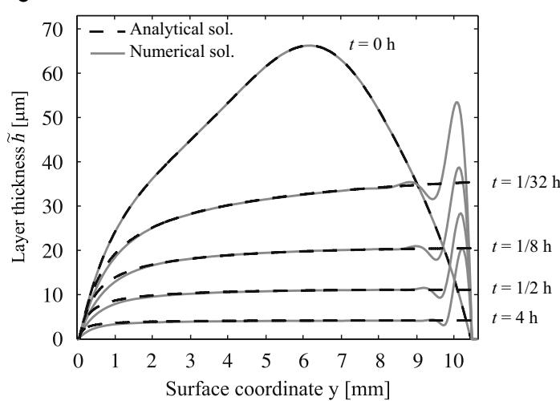  
Fig. 2. Oil layer decay induced by centrifugal effects as a function of time. (a) Raceway used in experiments with indication of position of layer measurements (top). (b) Layer evolution measured for spherical raceway at 1000 rpm and predictions simplified model (center). (c) Comparison of simplified model predictions with full numerical solution of thin layer equations (bottom). Oil viscosity $\eta = 1 . 4 7$ Pa s at $T = 2 2 . 5 ^ { \circ } \mathrm { C } .$

## 3. Thin layer flow: multiple objects

The next step is to extend the single object, single layer, model to the case of multiple objects each with a layer, as is the case in a bearing with layers on the rolling elements and the raceways, or even for a single contact in a ball on disc setup with a layer on the ball and a layer on the disc. In such a case, as a result of the repeated and rapid merging and separation of layers (overrolling) the layers on all objects will tend to vary mainly in the direction across the track, and not in circumferential direction. This is illustrated in Fig. 3. The total length of all the tracks on the surfaces is defined as

$$
l _ { t } ( y ) = \sum _ { i = 1 } ^ { n _ { s o l i d s } } l _ { t , i } ( y ) ,\tag{(9)}
$$

with $ { n _ { s o l i d s } }$ the number of objects, i.e. inner raceway, outer raceway, and number of rolling elements in one row, or ball and disc. $l _ { t , i } ( y )$ is the length of the track on object i. Note that the total track length may vary across the track $l _ { t } ( y ) ,$ e.g. in a tapered roller bearing. Using the thin layer flow theory an equation for the layer thickness averaged in rolling direction over all objects as a function of time and position across the track is obtained by integrating of Eq. (1) over the tracks ½0 lt and dividing by lt

$$
\frac { \partial \tilde { h } _ { \infty } } { \partial t } + \frac { 1 } { \rho _ { 0 } l _ { t } } \frac { \partial \hat { q } _ { y } } { \partial y } = 0 ,\tag{(10)}
$$

where $\rho _ { 0 }$ is the density at ambient pressure and $\tilde { h } _ { \infty } ( y , t )$ represents the layer thickness averaged along the tracks, as a function of the coordinate across the track and time. $\hat { q } _ { y } ( y , t )$ is the total mass flow rate to the side at a position across the track

$$
\hat { q } _ { y } ( y , t ) = \sum _ { i = 1 } ^ { n _ { s o l i d s } } \int _ { 0 } ^ { l _ { t , i } } q _ { y , i } ( x , y , t ) d x ,\tag{(11)}
$$

where $q _ { y , i } ( x , y , t )$ is the local mass flow rate across the track per unit tracklength on solid i and x is the coordinate along the track.

Assume that the inner ring of the bearing is rotating at an angular speed O and the outer ring is stationary. The rolling elements rotate around the central axis of the bearing as well as around their own axis of rotational symmetry. In addition, in many configurations, e.g. spherical and tapered roller bearings, these two axes are not aligned. Therefore the inertia force on the layer on a roller is more involved then on the inner ring (Eq. (4)). Averaged over the roller circumference it reads

$$
\begin{array} { r l r } {  { f _ { y , r o l } ( y ) = \rho _ { 0 } \varOmega _ { c a } ^ { 2 } ( \sin ^ { 2 } ( \gamma ) z _ { r o l } + \sin ( \gamma ) R _ { c r o l } ) \frac { d z _ { r o l } } { d y } } } \\ & { } & { \quad + \rho _ { 0 } ( ( \frac { 1 } { 2 } \cos ^ { 2 } ( \gamma ) + \frac { 1 } { 2 } ) \varOmega _ { c a } ^ { 2 } - 2 \varOmega _ { c a } \varOmega _ { r o l } \cos ( \gamma ) + \varOmega _ { r o l } ^ { 2 } ) r \frac { d r _ { r o l } } { d y } . } \end{array}\tag{(12)}
$$

$\Omega _ { c a }$ denotes the rotational speed of the cage of the bearing relative to the fixed outer raceway, and $\Omega _ { r o l }$ the rotational speed of the roller relative to the cage. A schematic representation of a spherical roller bearing showing the relevant parameters is given in Fig. 4. $r _ { r o l } ( y )$ defines the geometry of the roller with $R _ { r o l }$ the roller radius at the center of roller and $R _ { c r o l }$ the distance between the center of the roller and the rotational axis of the bearing. g is the angle between the axis of rotation of the roller and the cage, see Fig. $4 , z _ { r o l } ( y )$ stands for the distance along the axis of rotation of the roller measured from the center of the roller. Expressed in terms of the coordinate y, which is defined along the surfaces, it is

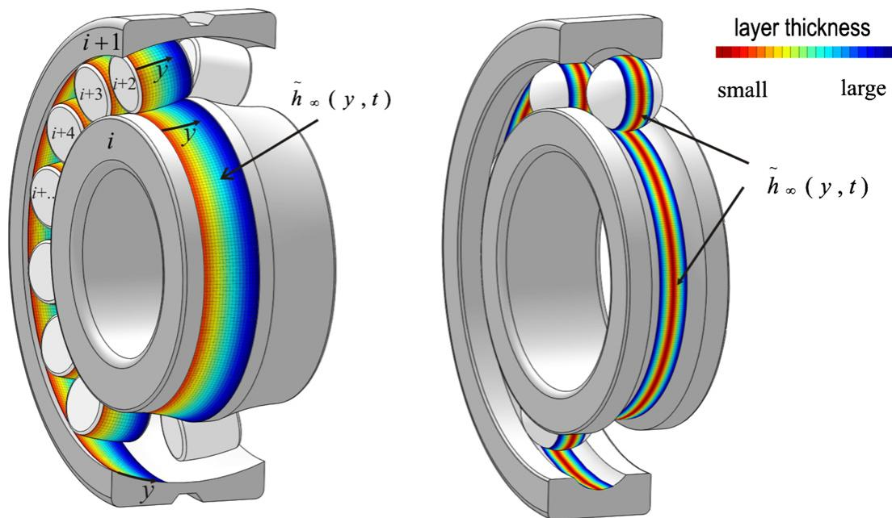  
Fig. 3. Bearing considered as configuration of multiple objects with oil layer distribution varying across the track for thin layer flow analysis. Left: induced by centrifuga effects in a spherical roller bearing. Right: induced by EHL contact pressure ejection in a deep groove ball bearing.

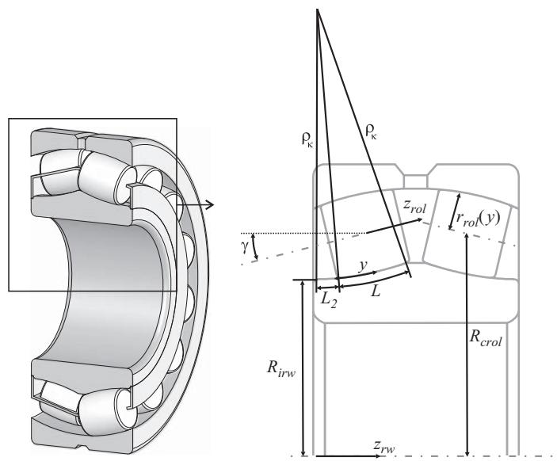  
Fig. 4. Spherical roller bearing (left) and details of geometry used in modeling (right).

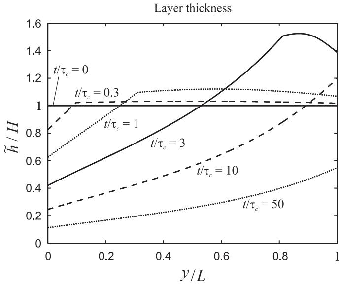

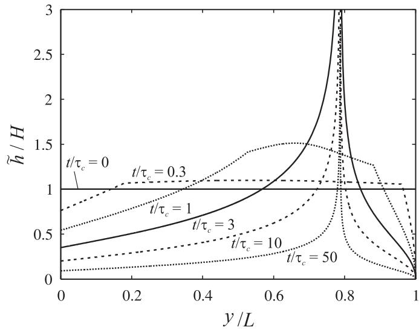  
Fig. 5. Predicted average lubricant layer evolution across the track as a function of time induced by centrifugal effects in bearings 22205 (top) and 24020 (bottom).

given by

$$
z _ { r o l } ( y ) = \int _ { \frac { 1 } { 2 } L } ^ { y } \sqrt { 1 - \left( \frac { d r _ { r o l } } { d y } \right) ^ { 2 } } d \phi .\tag{(13)}
$$

Results of the application of Eq. (10) to the analysis of centrifugal effects in a complete bearing are given in Fig. 5: the variation of the (dimensionless) average layer thickness $\tilde { h } _ { \infty } / H$ as a function of dimensionless time $t / \tau _ { c }$ and position on the track $y / L$ for bearings 22205 and 24020, starting with a uniform layer including a little reservoir of constant thickness in the region left of $y = 0 .$ . The results are scaled on the initial layer H. L is the track width, and the resulting characteristic time $\tau _ { C }$ is defined as

$$
\tau _ { c } = \frac { \eta _ { 0 } } { \rho _ { 0 } \Omega ^ { 2 } H ^ { 2 } } .\tag{(14)}
$$
> *(추출이 깨진 줄 — 원문 p.6 대조로 복구)*

The results shown reflect the two different characteristic solutions that are obtained when varying the bearing geometry parameters. In the first case centrifugal forces drive the fluid in one direction across the track, i.e. away from the inlet $y = 0 ,$ where, in time, the slope decreases because the reservoir is depleted. In the second case fluid is driven from both sides of the domain inwards, i.e. the centrifugal forces cause an accumulation at a certain position on the track. Of course the locally steep slopes in the peak are not realistic for a real bearing. In reality the overrolling and pressure ejection will reduce these slopes. Even for a free surface layer such slopes would be flattened by surface tension effects. However, from the viewpoint of bearing design the model clearly provides a way to analyse lubricant layer enhancing or diminishing migration trends and their relation to the type and size of a bearing and the geometry of its elements.

## 4. Film thickness decay in an EHL contact

Eq. (10) can be used for the prediction of the layer changes due to any lubricant migration effect on the track, provided the appropriate expression for the mass flow rate is used. For example, it can also be applied to the prediction of the layer change due to the pressure ejection by an EHL contact.

Consider the lubricated contact as the case of two objects with layers of fluid that merge in the inlet region to produce a lubricant film, which separates into two layers again in the outlet region. In the region where the layers are merged, a pressure distribution acts on/in the fluid which ejects a certain amount of fluid. The resulting film separating the surfaces is thus formed by the amount that is not ejected and is therefore, by mass conservation, related to the amount of fluid in the layers.

Modeling film thickness decay due to pressure induced ejection in bearings was first attempted by Kingsbury [16]. The main problem is to find an accurate approximation of the side flow induced by the (starved) EHL contacts between the rolling elements and the raceways, and to translate the result to film thickness decay as a function of time. Below it will be shown that this can be done with remarkable accuracy using the thin layer flow theory, combined with characteristic aspects of the behavior of starved EHL contacts known from the theoretical studies [21–25].

In Fig. 6 a schematic representation of an EHL contact on a track is shown as well as a side view of a starved contact where two surface layers in the inlet are merged to form a film thickness. The relevant parameter characterizing the degree of starvation will be the total amount of oil on the surfaces in the inlet, i.e. $( \tilde { h } _ { 1 } + \tilde { h } _ { 2 } ) = h _ { o i l } .$ As explained above, even though initially roller and raceway(s) may have a different distribution along the circumference as well as across the track, under conditions of pure rolling after some time (overrollings), it is justified to assume layers which equally share between the surfaces in the outlet of contacts and merge with equal thickness in the inlet. Separate experiments were conducted to support this equipartition hypothesis, see [30]. Next, as a result of the many overrollings, when there is no replenishment, and the layers have also become sufficiently thin, it is justified to assume that the resulting layer thickness will be constant along the circumference of the track on all objects involved.

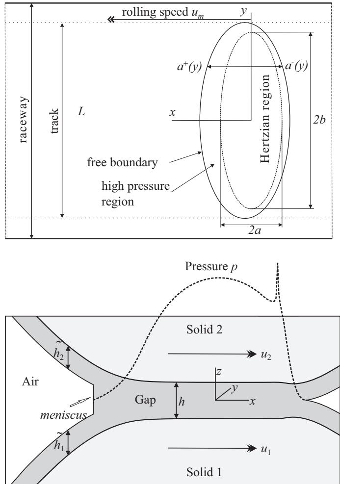  
Fig. 6. Schematic representation of EHL contact region on a track and coordinates used in analysis (top) and cross-section at the centerline of the track showing the characteristics of a starved lubricated EHL contact pressure and film profiles (bottom).

In each contact a Cartesian coordinate is defined with the origin in the center of the Hertzian contact region. The direction of rolling is the x-direction. $a ^ { + } ( y )$ and $a ^ { - } ( y )$ denote the location of the boundaries of the pressurized region on the inlet side (upstream) and the outlet side (downstream). Let $\hat { q } _ { y , k } ( y , t )$ denote the total mass flow rate to the side for contact k at time t at position y across the track. It can be obtained by integration in x direction over the pressurized region

$$
\hat { q } _ { y , k } ( y , t ) = - \left( \int _ { a ^ { - } } ^ { a ^ { + } } \left( \frac { \rho h ^ { 3 } } { 1 2 \eta } \frac { \partial p } { \partial y } \right) d x \right) _ { k } ,\tag{(15)}
$$

which is the integration of the local rate of mass flow expelled to the side at a given position as obtained from the Reynolds equation, where h stands for the EHL film thickness $h = h ( x , y , t )$ and $p = p ( x , y , t )$ for the pressure distribution. In this case the pressure dependence of $\rho$ and Z must be taken into account in this integration, e.g. using the relations proposed by Dowson and

Higginson [38] and Roelands and [39] respectively

$$
\rho = \rho _ { 0 } \frac { 5 . 9 \times 1 0 ^ { 8 } + 1 . 3 4 p } { 5 . 9 \times 1 0 ^ { 8 } + p }\tag{(16)}
$$

and

$$
\eta ( p ) = \eta _ { 0 } \exp { \left( ( \ln { ( \eta _ { 0 } ) } + 9 . 6 7 ) \left( - 1 + \left( 1 + \frac { p } { p _ { r } } \right) ^ { 2 } \right) \right) } ,\tag{(17)}
$$

where $p _ { r } = 1 . 9 6 \times 1 0 ^ { 8 } \mathrm { P a } , \eta _ { 0 }$ is the dynamic viscosity at ambient pressure and z is a pressure viscosity index.

The total rate of mass flow to the side induced by all contacts at position y is now given by

$$
\hat { q } _ { y } ( y , t ) = \sum _ { k = 1 } ^ { n _ { c } } \hat { q } _ { y , k } ( y , t ) ,\tag{(18)}
$$

where $n _ { c }$ denotes the total number of EHL contacts on the track. For the case of a bearing it is the total number of EHL contacts in one row of rolling elements, i.e. twice the number of rolling elements (inner ring and outer ring). For the case of a ball on disc as in an experimental optical interferometry apparatus $n _ { c } = 1$

To solve Eq. (10) for $\bar { h } _ { \infty } ( y , t )$ with Eqs. (15) and (18), a time stepping procedure can be designed, in which $\hat { q } _ { v } ( y , t )$ can be obtained from (numerically) solving the starved EHL problem (for each contact) for p and h with the total inlet supply layer $h _ { o i l } ( y , t ) = 2 \tilde { h } _ { \infty } ( y , t )$ as input. Alternatively, results of precomputed solutions for different load conditions and degrees of starvation can be used.

However, due to the rapid expulsion of lubricant, the contacts will quickly enter the heavily starved regime. An accurate approximation can therefore already be obtained in a much easier way. Chevalier et al. [21] and Damiens et al. [23] have shown that, owing to mass conservation and unidirectional flow in the zero pressure region, in heavily starved contacts the film thickness in the pressurized region is directly related to the supply layer distribution in the inlet according to

$$
h ( x , y , t ) \approx \frac { 2 \tilde { h } _ { \infty } ( y , t ) } { \overline { { \rho } } ( p ) } ,\tag{(19)}
$$

with $\overline { { \rho } } ( p ) = \rho ( p ) / \rho _ { 0 }$ is the density increase due to pressure. Also, for heavily starved contacts the inlet meniscus is very close to the Hertzian contact region so

$$
a ^ { + } = - a ^ { - } \approx a { \sqrt { 1 - \left( { \frac { y } { b } } \right) ^ { 2 } } } ,\tag{(20)}
$$

with the pressure profile closely approximating the Hertzian dry contact profile

$$
p ( x , y ) \approx p _ { h } { \sqrt { 1 - \left( { \frac { x } { a } } \right) ^ { 2 } - \left( { \frac { y } { b } } \right) ^ { 2 } } } .\tag{(21)}
$$

Using (15), ((18)–(21)) one obtains

$$
\hat { q } _ { y } ( y , t ) = \frac { 1 } { 3 } \tilde { h } _ { \infty } ^ { 3 } \rho _ { 0 } l _ { t } y \mathcal { F } ( y ) ,\tag{(22)}
$$

with

$$
\mathcal { F } ( \boldsymbol { y } ) = \sum _ { k = 1 } ^ { n _ { c } } \mathcal { F } _ { k } ( \boldsymbol { y } ) ,\tag{(23)}
$$

where $\mathcal { F } _ { k } ( y )$ for contact k is

$$
\mathcal { F } _ { k } ( y ) = \frac { 2 \rho _ { 0 } ^ { 2 } p _ { h } ^ { 2 } } { l _ { t } b ^ { 2 } } \int _ { a ^ { - } } ^ { a ^ { + } } \left( ( \eta ( p ) ) ^ { - 1 } ( \rho ( p ) ) ^ { - 2 } p ^ { - 1 } \right) d x .\tag{(24)}
$$

For the case of the density pressure relation equation (16) and the viscosity pressure relation equation (17), the function $F _ { k } ( y )$ to a

good approximation is given by

$$
\mathcal { F } _ { k } ( y ) \approx \frac { 2 } { l _ { t } } \frac { p _ { h } } { b ^ { 2 } } \frac { a } { \eta _ { 0 } } \pi \left( \left( 0 . 5 \pi \alpha p _ { h } \sqrt { 1 - \frac { y ^ { 2 } } { b ^ { 2 } } } \right) ^ { 3 / 2 } + 1 \right) ^ { - 2 / 3 } .\tag{(25)}
$$

However, assuming an incompressible lubricant, or a lubricant with similarly steep density increase with pressure, or when using a similar viscosity pressure relation, e.g. purely exponential, Eq. (25) will still be quite accurate, as the sideflow is mainly determined in the (narrow) inlet and outlet region where the pressure is still low. Significant deviations may occur when the behavior in the low pressure range is different. This for example occurs for a linear pressure viscosity law. However, for such cases an alternative approximation can easily be derived too.

The significance of the analysis is that now expressions for the sideflow in the EHL contacts have been obtained in terms of the layer thickness, so that substitution of Eq. (22) into Eq. (10) yields a partial differential equation (PDE) for a single variable. This PDE can be written in the standard form of Eq. (6) using $q ( y ) = y \mathcal { F } ( y )$ and the solution is given by Eq. (7) and Eq. (8).

When the layer thickness $\tilde { h } _ { \infty } ( y , t )$ is symmetrical with respect to the direction of rolling, Eq. (6) can be solved analytically for the track centerline $y = 0$ at time t. Given the initial value $\tilde { h } _ { 0 , \infty }$ at the centerline this analytical solution is

$$
\begin{array} { r } { \tilde { h } _ { \infty } ( 0 , t ) = ( \frac { 2 } { 3 } \mathcal { F } ( 0 ) t + \tilde { h } _ { 0 , \infty } ^ { - 2 } ) ^ { - 1 / 2 } . } \end{array}\tag{(26)}
$$

Using Eqs. (19) and (26) the result can directly be translated to film thickness decay. The film thickness at the center of the track at time t is given by

$$
\begin{array} { r } { h _ { c } ( t ) = ( \frac { 1 } { 6 } \overline { { \rho } } _ { c } ^ { 2 } \mathcal { F } ( 0 ) t + h _ { c , 0 } ^ { - 2 } ) ^ { - 1 / 2 } , } \end{array}\tag{(27)}
$$

where $\overline { { \rho } } _ { c } = \overline { { \rho } } ( p _ { h } )$ and $h _ { c , 0 }$ is the initial film thickness. Note that Eq. (27) with Eq. (25) represents a remarkably simple analytic expression suitable for practical engineering use describing film thickness decay in an EHL contact!

To validate the model i its predictions for a single EHL contact running on a disc can be compared to film thickness decay as a function of time measured using optical interferometry. This was done for a circular and an elliptic contact. To minimize reflow effects, which are not accounted for in the model, only a small amount of oil of high viscosity was used, i.e. the contact runs under starved conditions. Also, for the circular contact measurements the levees formed to the side of the track during the initial overrollings were pushed aside so as to minimize their role in replenishment. This was done by varying the track radius on the disc during the first few rotations. For the elliptic contact measurements this procedure was not needed as reflow was not an issue due to the larger track width. Subsequently, the film thickness decay in time was recorded. The test conditions are listed in Table 1. The results for a circular contact for different rolling speeds are shown in Fig. 7. As the initial film thickness for each measurement series differs, in order to compare results, each series was shifted in time to start on the model curve. This value was used as $h _ { c , 0 }$ to obtain the theoretical predictions using Eq. (27).

It can be seen in the figure that the model quite accurately predicts the film thickness decay. The model predicts a speed independent decay. The decay rate in the experiments is indeed, except for the initial part and the final part of the curves, almost the same for the different speeds. However, the film thickness values are different. In particular the value for the 186 mm/s speed condition is larger than for the other two conditions. This may be explained by a difference in the initial amount of lubricant present to the sides of the track.

Test conditions, values of Hertzian contact dimensions and maximum Hertzian pressure, values of dimensionless numbers N and L, and value of central film thickness under fully flooded conditions.
| Nr. | $u _ { m }$ (mm/s) | F (N) | $p _ { h }$ (GPa) | a (μm) | b (μm) | $T$ (C) | $\eta _ { 0 }$ | $R _ { d i s c }$ (Pa s) (mm) | $h _ { c f f }$ (nm) | N (-) | L (-) |
| --- | --- | --- | --- | --- | --- | --- | --- | --- | --- | --- | --- |
| 1 | 60 | 20 | 0.51 | 136 | 136 | 24.5 | 0.83 | 36.0 | 295 | 65 | 7.0 |
| 2 | 186 | 20 | 0.51 | 136 | 136 | 24.6 | 0.83 | 36.0 | 625 | 28 | 9.3 |
| 3 | 500 | 20 | 0.51 | 136 | 136 | 25.0 | 0.80 | 35.5 | 1159 | 14 | 12 |
| 4 | 60 | 30 | 0.33 | 108 | 398 | 24.2 | 0.85 | 35.8 | 393 | 36 | 7.0 |
| 5 | 186 | 30 | 0.33 | 108 | 398 | 24.2 | 0.85 | 35.8 | 856 | 15 | 9.3 |
| 6 | 500 | 30 | 0.33 | 108 | 398 | 24.2 | 0.85 | 35.8 | 1618 | 7.3 | 12 |
| 7 | 186 | 10 | 0.23 | 74.5 | 276 | 24.4 | 0.84 | 35.8 | 802 | 5.1 | 9.3 |
| 8 | 186 | 50 | 0.40 | 127 | 472 | 24.5 | 0.83 | 35.8 | 801 | 26 | 9.3 |

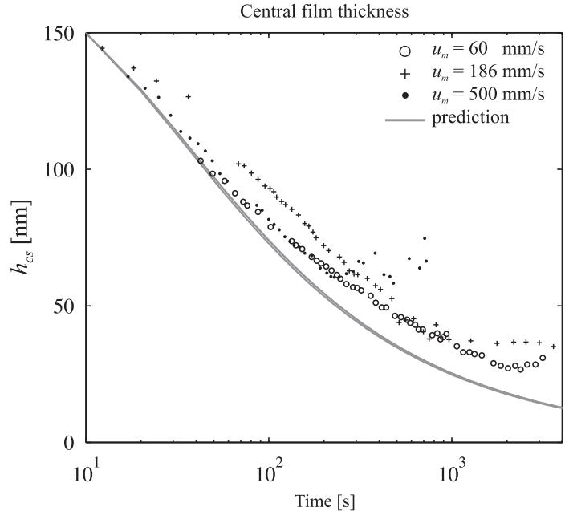  
Fig. 7. Central film thickness decay in EHL circular contact for different entrainment speeds (markers) and predictions obtained from the thin layer flow model. Circular contact, conditions as in Table 1, cases 1–3.

The deviations from theory in the initial region may be ascribed to the fact that at the larger film thickness levels the contact is not yet so heavily starved that the approximations made by Eqs. (19)–(21) are accurate. For larger times the measured film thickness is seen to level off to an equilibrium value indicating resupply taking place balancing the pressure driven ejection. As the equilibrium level is higher for a larger speed this can be ascribed to effects of ball spin or sideward slip which effectively supply lubricant from the levees on the ball.

In Fig. 8 interferometric images of the full contact region are shown associated with the decay. The images show the characteristic butterfly shape of the flooded region characterizing a heavily starved contact. It can also be seen that an asymmetry develops in the experimental results which is obviously not predicted by the model when starting with a symmetric profile. This can be seen comparing film thickness profiles h(y) at different times taken from measurements, with those predicted by the model obtained starting with a numerically computed initial profile $h ( 0 , y )$ , see Fig. 9. This asymmetry may be related to the inflow conditions of the contact, which are not uniform across the track in the experiment. Note that the experimental results exhibit some relatively large very local disturbances in the measured profiles. These are most likely due to errors in the conversion of color to film value in the image analysis.

Starved Elasto -Hydro dynamic Lubricaiton  
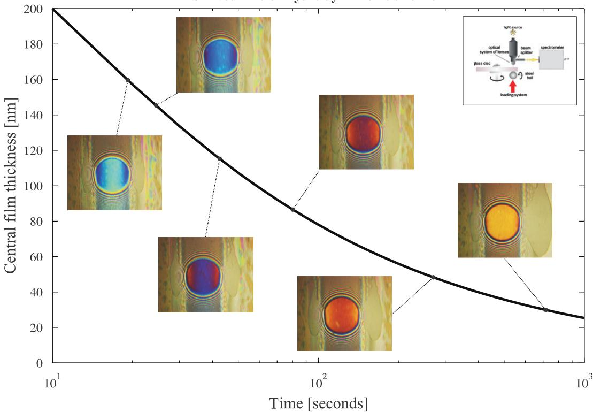  
Fig. 8. Central film thickness decay in a starved circular EHL contact as a function of time. Predictions and associated images of the contact measured using optical interferometry. Circular contact steel on glass: ball radius $R = 9 . 5 2 5$ mm, E0 $= 1 1 3$ GPa, $F = 1 9$ N, $T = 2 2 . 2 ^ { \circ } \mathrm { C }$ , $\eta _ { 0 } = 0 . 9 6$ Pa s (SHF-403 at $2 2 . 2 ^ { \circ } \mathrm { C }$ ), $p _ { h } = 0 . 5 1$ GPa, $a = b = 1 3 4$ mm.

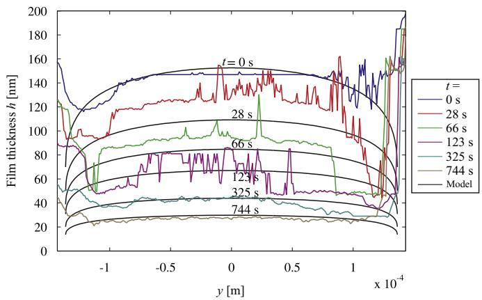  
Fig. 9. Measured profiles h(y) at different times and predicted theoretical profiles from thin layer model starting with initial profile from numerical computation. Circular contact. For conditions, see Fig. 8.

Apart from these disturbances the agreement between numerical and experimental results is very good and the predictions of the film decay based on the thin layer model are remarkably accurate. This is even more the case for an elliptic contact, see Fig. 10. The test conditions for the results shown in Fig. 10 are listed in Table 1. In this case spin is inhibited as the roller is held fixed in position, and the track width is larger so reflow effects must be smaller. Therefore the contact more rapidly starves and the model is already accurate at larger film levels. The predicted speed independence of the decay now clearly shows. Only at larger times the experimental decay is faster than predicted. This is not a flaw in the model but the consequence of the experimental configuration. Due to manufacturing limits there is a (very small)

misalignment of the rolling direction relative to the velocity vector of the disc surface. Therefore a small amount of sidewards slip occurs in the contact resulting in the transport of the layer to one side. As the film thickness is flat in the central region this does not affect the results in the first part of the test. However, in the long run the minimum film thickness at one side of the contact is transported into the central region causing a rapid decay of the film thickness. The sideward slip is proportional with the rotational speed of the disk. Therefore its effect is more pronounced at higher speeds.

Finally, in Fig. 10 results are shown for an elliptic contact at different loads. Quite strikingly, starting at the same film thickness value, the model predicts a decay rate that is faster for the contact operating at a lower load. This is confirmed by the experiments. This phenomenon is explained by the fact that at higher pressures the viscosity is larger and thus the sideflow $q _ { y }$ smaller, see Eq. (25).

## 5. Film thickness decay in bearings

The model presented in the previous section can also be applied to bearings. The result will be a worst case prediction of layer thickness decay (and thereby film thickness decay) as a function of time due to pressure ejection when no replenishment takes place.

The simplest case is an axially loaded thrust bearing. Here all contacts are equally loaded and only the number of contacts needs to be taken correctly in Eq. (23) and $\mathcal { F } _ { k }$ defined by Eq. (24) is the same for each contact. In a radially loaded bearing this is obviously not the case. The contact load F will be a function of the bearing circumference, say with coordinate C. As the Hertzian contact parameters a and b and the pressure $p _ { h }$ are determined by the contact load they vary over the circumference as well, i.e. $a = a ( F ) , b = b ( F )$ and $p _ { h } = p _ { h } ( F )$ with ${ \cal F } = { \cal F } ( { \boldsymbol \Psi } )$ . Next, it will be explained how this variation is implemented in the model. Since $\mathcal { F } _ { k }$ is determined by $a ,$ b, and $p _ { h }$ it will also depend on the load F and thus on the position C. As $\mathcal { F } _ { k }$ is proportional to the layer thickness decrease rate and the time scale of the layer decrease is much larger than the time of one bearing rotation, it is justified to take for each contact $\mathcal { F } _ { k }$ averaged over the circumference of the bearing as input to the model

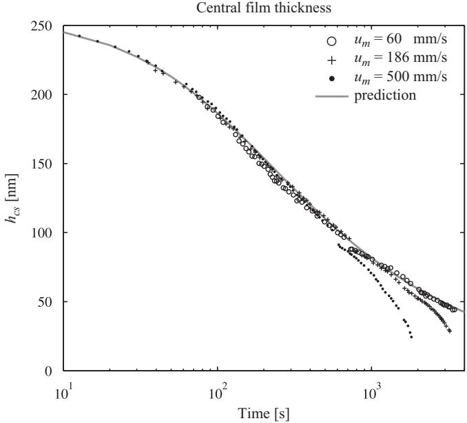

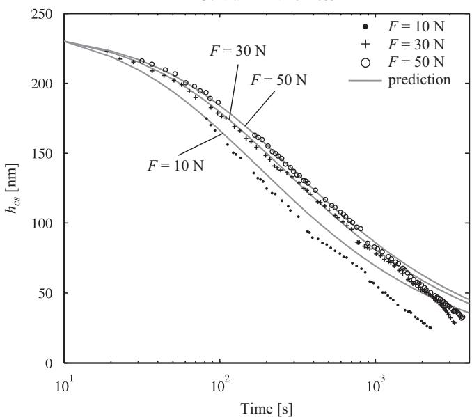  
Fig. 10. Measured central film thickness decay in time compared with theoretical predictions from thin layer model. EHL elliptic contact, conditions as in Table 1. Variation of speed, cases 4–6 (top) and variation of load, cases 5, 7 and 8 (bottom).

$$
\mathcal { F } _ { k } ( y ) = \frac { 1 } { 2 \pi } \int _ { 0 } ^ { 2 \pi } \overline { { \mathcal { F } } } _ { k } ( y , \varPsi ) d \varPsi ,\tag{(28)}
$$

$\overline { { \mathcal { F } } } _ { k } ( y , \Psi )$ is calculated by Eq. (24) using $a = a ( F ) , ~ b = b ( F )$ and $p _ { h } = p _ { h } ( F )$ , with the load distribution $F = F ( \varPsi ) .$ . For efficient numerical computation, precomputed values of the integrands $\overline { { \mathcal { F } } } _ { k } ( y , \Psi )$ for various loads F can be stored and used to interpolate from and most efficient is of course the use of the approximation Eq. (25).

It should be noted that in a bearing there are two load distributions involved, one for the inner raceway and one for the outer raceway, see Appendix A. When the surface geometry and/or the load distribution on the inner ring and outer ring contacts differs the contact parameters a, b and $p _ { h }$ and thus $\mathcal { F } _ { k }$ differ as well. It is also possible to account for different material properties in one or more of the contacts, e.g. when there is a ceramic roller, resulting in a different ${ \mathcal { F } } _ { k } .$ The effect of each individual contact is then added up using Eq. (23) with Eq. (24) or (25), giving a single function ${ \mathcal { F } } ( y ) .$ . This function is used to obtain the layer thickness in the same way as was explained for the single contact. Using this layer thickness the film thickness can be approximated by Eq. (19) where the pressure $p = p ( F )$

a  
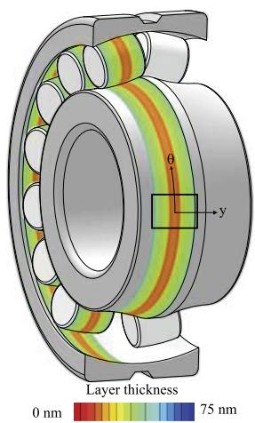

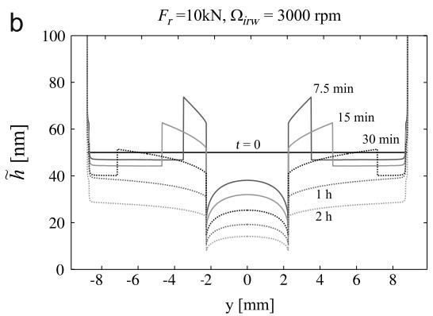

C  
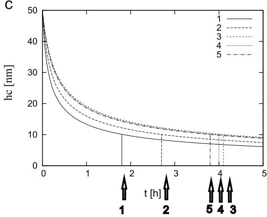  
Fig. 11. Bearing 22317: (a) graphical representation of predicted layer across the track on bearing raceway after running time of 1 h, case 3 (Table 3 (top)), (b) layer variation across track at different times, case 3 (Table 3 (center)), (c) center of track layer variation as a function of time (hours), case 1–5 (Table 3).

Assuming an initially symmetric layer, the analytic solution for the layer thickness at the center $y = 0$ is given by Eq. (26), with the appropriate value of ${ \mathcal { F } } ( 0 )$ . The time for the layer thickness to reduce from its initial value $\tilde { h } _ { \infty , 0 }$ to some critical value $\tilde { h } _ { c r }$ is

$$
t _ { c r } ( \tilde { h } _ { c r } , \tilde { h } _ { \infty , 0 } ) = \frac { 3 } { 2 \mathcal { F } ( 0 ) } \left( \frac { 1 } { \tilde { h } _ { c r } ^ { 2 } } - \frac { 1 } { \tilde { h } _ { \infty , 0 } ^ { 2 } } \right) .\tag{(29)}
$$
> *(추출이 깨진 줄 — 원문 p.11 대조로 복구)*

In Table 3 and Fig. 11 results are presented for bearing 22317 running at five operating conditions of different speeds and loads. For completeness, the relevant parameters are listed in Table 2. In Table 3 are also given the bearing parameters and the computed load distribution parameters as well as the computed value of ${ \mathcal { F } } ( 0 )$ . The results apply to the case of a lubricant with viscosity $\eta _ { 0 } = 0 . 0 2 \ \mathrm { P a } \ s$ and $\alpha { = } 2 . 0 \times 1 0 ^ { - 8 } \mathrm { P a } ^ { - 1 }$

For the case of an initially uniform layer of 50 nm Fig. 11(a) shows the layer distribution across the track for case no. 3 after 1 h projected on the bearing. Fig. 11(b) shows the layer distribution across the track for this case at different times.

Parameters for bearing 22317.
| Outer diameter (mm) |  | 180 |
| --- | --- | --- |
| Inner diameter (mm) Number of rolling elements | $n _ { r }$ | 85 14 |
| Mass rolling element (kg) | $m _ { r }$ | $7 . 9 3 \times 1 0 ^ { - 2 }$ |
| Radius curvature rolling element x (m) | $R _ { x , r }$ | $1 2 . 5 0 \times 1 0 ^ { - 3 }$ |
| Radius curvature rolling element y (m) | $R _ { y , r }$ | $7 9 . 9 6 \times 1 0 ^ { - 3 }$ |
| Radius curvature inner raceway x (m) | $R _ { x , i }$ | $5 5 . 3 3 \times 1 0 ^ { - 3 }$ |
| Radius curvature inner raceway y (m) | $R _ { y , i }$ | $- 8 1 . 5 9 \times 1 0 ^ { - 3 }$ |
| Radius curvature outer raceway x (m) | $R _ { x , o }$ | $- 7 9 . 7 8 \times 1 0 ^ { - 3 }$ |
| Radius curvature outer raceway y (m) | $R _ { y , o }$ | $- 8 1 . 5 9 \times 1 0 ^ { - 3 }$ |
| Reduced modulus of elasticity (N m-²) | $E ^ { \prime }$ | $2 2 7 \times 1 0 ^ { 9 }$ |
| Diametral clearance (mm) | $P _ { d }$ | $0 . 1 0 2$ |
| Total length all tracks (m) | $l _ { t }$ | $1 . 9 5$ |
| Load deflection factor $( \mathsf { N } \thinspace \mathsf { m } ^ { - 3 / 2 } )$ | $K _ { n }$ | $4 . 2 9 \times 1 0 ^ { 1 0 }$ |
| Inner raceway contacts |  |  |
| Ellipticity ratio | K | 0.0250 |
| Elliptic integral first kind | K | 5.077 |
| Elliptic integral second kind | ε | 1.0014 |
| Reduced radius of curvature (m) | R | $1 . 0 2 \times 1 0 ^ { - 2 }$ |
| Load deflection factor $( \mathsf { N } \thinspace \mathsf { m } ^ { - 3 / 2 } )$ | $K _ { i }$ | $1 . 1 9 \times 1 0 ^ { 1 1 }$ |
| Outer raceway contacts |  |  |
| Ellipticity ratio | K | 0.0309 |
| Elliptic integral first kind | K | 4.863 |
| Elliptic integral second kind | ε | 1.0021 |
| Reduced radius of curvature (m) | R | $1 . 4 8 \times 1 0 ^ { - 2 }$ |
|  |  |  |
| Load deflection factor $( \mathsf { N } \thinspace \mathsf { m } ^ { - 3 / 2 } )$ | $K _ { o }$ | $1 . 2 4 \times 1 0 ^ { 1 1 }$ |

The distribution \~h(y) shows a gradual decay of the layer thickness with time. The local variation across the track is explained by the load distribution along the circumference. The contact with the maximum load has the largest width and determines the layer reduction rate near the sides of the track. As for a higher load the viscosity is larger, the sideflow induced by this contact is smaller, hence the decay outside of the track is slower. In the center the decay is faster as in this region sideflow is enforced by all loaded contacts. The width of the furrow in the center reflects the most lowly loaded contact which induces the largest sideflow due to the lower viscosity. The higher decay rate of the lowly loaded contacts induces lubricant transport to the sides in the form of levees. The location of the moving front of a levee is determined by mass conservation, see [30].

It should be noted that the sharp changes of the layer (film) thickness across the track will not occur in reality. They will be softened by surface tension effects and by local pressure flow in the region close to the free inlet boundary, which is not reflected in the asymptotic relations (Eqs. (19)–(21)) used in the simplified model for ${ \hat { q } } _ { y } .$

Finally, in Fig. 11(c) are shown the decay curves of the central layer thickness as a function of time for each of the load cases. Assuming a critical value of 10 nm the decay time for each case is indicated in the figure and listed in Table 3. For the same angular velocity the decay time tends to increase with load. This effect was also observed for single contacts and validated experimentally. It is due to the increase of viscosity with pressure reducing the side flow in each contact. Hence, side flow in a bearing is mostly determined by the lowly loaded zone in a bearing. This also explains the larger effect of the bearing angular velocity. Even though the centrifugal load on the rolling elements is small compared with the maximum load, in the lowly loaded zone of the bearing it is a significant contribution. The trend is the same as for the load, increasing (centrifugal) load leads to decreasing decay rate, so when the angular velocity is increased the side flow decreases and the decay time increases.

## 6. Conclusion

Initiated by the need to accurately predict lubricant life/grease life for bearing applications a model has been developed for the prediction of oil layer changes induced by various effects acting on a layer of fluid. First the model was applied to predict layer changes driven by centrifugal effects and validated using optical interferometry. Next it was extended to predict lubricant migration trends in actual bearings induced by centrifugal forces. It was shown that the model also enables prediction of pressure driven ejection by an EHL contact rolling on a certain track. Moreover, when combined with the known asymptotic behavior of starved EHL contacts the model yields a prediction of film thickness decay as a function of time for the case no replenishment takes place. The results can be obtained easily from a quasi-linear PDE using the methods of characteristics. The model does not require numerical solution of the starved EHL contact itself hence it is computationally very cheap. For engineering use a simple analytical prediction formula has been derived. The film decay predictions were validated using optical interferometry on single ball and roller on disc contacts showing excellent agreement both in terms of central film thickness decay as well as in the variations across the track. Finally, the model was extended to layer/film thickness decay induced by pressure driven ejection on the track in rolling bearings. The presented results can be interpreted as worst case of permissable time in between (local) replenishment events. The model provides an easy way to predict the time in which the layer or film thickness is reduced from a certain value down to a critical value. The model presents a new alternative way to study and optimize lubricant migration, EHL film thickness prediction, and lubricant related bearing life. It provides essential input for grease life models and new challenging possibilities for bearing optimization. In this case the base oil viscosity can be used as input for a worst case estimate as it generally is the component most easily expelled from the track. However, when even in the starved contact still a significant amount of (broken down) thickener enters the contact, the ‘‘effective’’ viscosity may be higher and the decay slower. This will for example depend on the grease constitution and is subject of further research. Nevertheless, some preliminary results of the application to a grease lubricated single contact have already shown encouraging agreement with experiments.

Table 3  
Input parameters, computed load condition data, and central layer decay time from 50 down to 10 nm for bearing 22317.
|  |  | Case nr. | Case nr. | Case nr. | Case nr. | Case nr. |
| --- | --- | --- | --- | --- | --- | --- |
|  | 2 | 3 | 4 | 5 |  |  |
| Radial load (kN) | $F _ { r }$ | 10 | 10 | 10 | 5 | 2.5 |
| Inner raceway rotational speed (rpm) | $\Omega _ { i n w }$ | 750 | 1500 | 3000 | 3000 | 3000 |
| Contact entrainment speed $( \mathbf { m } \thinspace \mathsf { s } ^ { - 1 } )$ | $u _ { m }$ | 2.56 | 5.11 | 10.2 | 10.2 | 10.2 |
| Centrifugal load rolling element (N) | $F _ { c }$ | 5.52 | 22.1 | 88.3 | 88.3 | 88.3 |
| Maximum static load (kN) | $F _ { m a x }$ | 4.98 | 4.98 | 4.98 | 2.82 | 1.62 |
| Load distribution factor | $\epsilon$ | 0.16 | 0.16 | 0.16 | 0.12 | 0.09 |
| Max. Hertzian pressure (GPa) | ${ \tilde { p } } _ { h }$ | 1.23 | 1.23 | 1.23 | 1.02 | 0.85 |
| Max. halflength inner race (mm) | $\tilde { a } _ { i }$ | 0.220 | 0.220 | 0.220 | 0.182 | 0.151 |
| Max. Halfwidth inner race (mm) | $\tilde { b } _ { i }$ | 8.80 | 8.80 | 8.80 | 7.29 | 6.06 |
| Fully flooded central film |  |  |  |  |  |  |
| inner raceway Ψ = 0 (nm) | $h _ { c f f }$ | 122 | 194 9.773 | 309 6.436 | 321 | 333 |
| Layer decay parameter $( 1 0 ^ { 1 1 } \mathrm m ^ { 2 } s ^ { - 1 } )$ Decay time (h) | $\scriptstyle { \frac { 2 } { 3 } } { \mathcal { F } } ( 0 )$ $t _ { 1 0 \mathrm { n m } }$ | 14.52 1.8 | 2.7 | 4.1 | 6.714 4.0 | 6.957 3.8 |

## Acknowledgements

The authors would like to thank H. Koettritch, manager of SKF Development Center Ball Bearings, for his careful review of the manuscript and the constructive suggestions.

Figs. 1 and 2 also appeared in [29] and were reused with permission of ASME Transactions. Fig. 5 (top) and (bottom) also appeared in [32], and Figs. 3 (left), 6 (top), and 11 (center) in [33]. They were reused with permission of STLE Tribology Transactions. Figs. 7 and 10 appeared in [30] and were reused with permission of SAGE Publications Ltd.

The authors acknowledge the permission of A.J.C. de Vries, director of SKF group Product Development for the publication of this work.

## Appendix A. Bearing load distribution

The bearing load distribution is determined as described by Harris [40]. For the sake of completeness some relevant equations are given here. The inner raceway is subject to the static load distribution

$$
F _ { i } ( \Psi ) = F _ { m a x } \biggl ( 1 - \frac { 1 } { 2 \epsilon } ( 1 - \cos ( \Psi ) ) \biggr ) ^ { n } ,\tag{(30)}
$$

where $F _ { m a x }$ is the maximum value and $\epsilon$ the load distribution factor. The power n depends on the roller raceway contact types: $n = 1 . 5$ for circular and elliptic contacts and $n = 1 . 1 1$ for line

contacts. $F _ { m a x }$ is defined as

$$
F _ { m a x } = K _ { n } \bigg ( \frac { P _ { d } \epsilon } { 1 { - } 2 \epsilon } \bigg ) ^ { n } ,\tag{(31)}
$$

where $P _ { d }$ is the diametrical clearance. $K _ { n }$ is the load deflection factor determined by the load deflection factors of inner and outer raceway $K _ { i }$ and $K _ { o }$ according to

$$
K _ { n } = ( K _ { i } ^ { - 1 / n } + K _ { o } ^ { - 1 / n } ) ,\tag{(32)}
$$

with

$$
K _ { i / o } = \frac { 2 } { 3 } E ^ { \prime } \sqrt { 2 R \pi ^ { 2 } \mathcal { E } / ( 4 \kappa ^ { 2 } \mathcal { K } ^ { 3 } ) } .\tag{(33)}
$$

where E0 is the reduced elastic modulus, R the reduced radius of curvature, k the Hertzian contact ellipticity ratio, and E and K are elliptic integrals.

The load distribution factor E is solved from static load equilibrium for the given radial load $F _ { r }$

$$
F _ { r } = \frac { n _ { r } } { 2 \pi } \int _ { - \psi _ { l } } ^ { \psi _ { l } } F _ { i } ( \psi ) { \cos } ( \psi ) d \psi ,\tag{(34)}
$$

with $n _ { r }$ the number of rolling elements (in bearing handbooks usually indicated with $Z )$ and $\psi _ { l }$ the angular location of the boundary of the loaded zones defined by

$$
\begin{array} { r } { \Psi _ { l } = \left\{ \begin{array} { l l } { \operatorname { a c o s } { ( 1 - 2 \epsilon ) } , } & { 0 \leq \epsilon \leq 1 ; } \\ { \pi } & { \epsilon \geq 1 . } \end{array} \right. } \end{array}\tag{(35)}
$$
> *(추출이 깨진 줄 — 원문 p.12 대조로 복구)*

The load distribution on the outer raceway is obtained by adding the centrifugal force $F _ { c }$

$$
F _ { o } ( \Psi ) = F _ { i } ( \Psi ) + F _ { c } ,\tag{(36)}
$$

with

$$
F _ { c } = m _ { r } \Omega _ { c a } ^ { 2 } ( R _ { x , r } + R _ { x , i } ) ,\tag{(37)}
$$
> *(추출이 깨진 줄 — 원문 p.12 대조로 복구)*

with $m _ { r }$ the roller mass, $R _ { x , r }$ and $R _ { x , i }$ are the radii of the rolling element and the inner raceway, and $\Omega _ { c a }$ the cage rotational speed.

## References

[1] Cann PME. Thin-film grease lubrication. Proceedings of the IMechE, Part J: Journal of Engineering Tribology 1999;213:405–16, doi:10.1243/1350650991542776.

[2] Hurley S. Fundamental studies of grease lubrication in elastohydrodynamic contacts. PhD thesis. Imperial College, London, UK; 2000.

[3] Cann PM, Lubrecht AA, Venner CH. Grease lubrication of rolling element bearings—a model future? In: Fifth international tribology conference, Nagasaki, Japan, October 2000. Japanese Society of Tribologists; 2001. p. 87–92.

[4] Lugt PM. A review on grease lubrication in rolling bearings. STLE Tribology Transactions 2009;52(4):470–80, doi:10.1080/10402000802687940.

[5] Lugt PM, Velickov S, Tripp JH. On the chaotic behavior of grease lubrication in rolling bearings. STLE Tribology Transactions 2009;52(5):581–90, doi:10.1080/10402000902825713.

[6] Ioannides E, Harris TA. A new fatigue life model for rolling bearings. ASME Journal of Tribology 107(3), 367–378. Doi: 10.1115/1.3261081.

[7] Hurley S, Cann PM. IR spectroscopic analysis of grease lubricant films in rolling contacts. In: Dowson D, editor. Proceedings of 1998 Leeds-Lyon symposium on tribology. Amsterdam: Elsevier; 1999. p. 589–98, doi:10.1016/S0167-8922 (99)80079-0.

[8] Merieux S, Hurley S, Lubrecht AA, Cann PME. Shear-degradation of grease and base oil availability in starved lubrication. In: Dowson D, editor. Proceedings of 1998 Leeds-Lyon symposium on tribology. Amsterdam: Elsevier; 1999. p. 581–9, doi:10.1016/S0167-8922(00)80162-5.

[9] Jacod BC, Publier F, Cann PME, Lubrecht AA. An analysis of track replenishment mechanisms in the starved regime. In: Dowson D, et al. editors. Proceedings of 1998 Leeds-Lyon symposium on tribology, vol. 36. Elsevier tribology series, pp. 483–92. doi: http://10.1016/S0167-8922(99)80069-8.

[10] Cann PME, Damiens B, Lubrecht AA. The transition between fully flooded and starved regimes in EHL. Tribology International 2004;37:859–64, doi:10.1016/j.triboint.2004.05.005.

[11] Gershuni L, Larson MG, Lugt PM. Replenishment in rolling bearings. STLE Tribology Transactions 2008;5(5):643–51, doi:10.1080/10402000802192529.

[12] Baart P, Van der Vorst B, Lugt PM, Ostayen RAJ. Oil bleeding model for lubricating grease based on viscous flow through a porous microstructure. STLE Tribology Transactions 2010;53(3):340–8, doi:10.1080/10402000903283326.

[13] Cann PME, Doner JP, Webster MN, Wikstrom V, Lugt PM. Grease degradation¨ in ROF bearing tests. STLE Tribology Transactions 2007;50(2):187–97.

[14] Wikstrom V, Jacobson B. Loss of lubricant from oil lubricated near-starved¨ spherical roller bearings. Proceedings of the Institution of Mechanical Engineers. Part J: Journal of Engineering Tribology 1997;21(1):51–5.

[15] Wedeven LD, Evans D, Cameron A. Optical analysis of ball bearing starvation. Transactions on ASME. Journal of Lubrication Technology 1971;93:349–63, doi:10.1115/1.3451591.

[16] Kingsbury E. Cross-flow in a starved EHD contacts. ASLE Tribology Transactions 1973;37(10):276–80.

[17] Chiu YP. An analysis and prediction of lubricant film formation in rolling contact systems. ASLE Tribology Transactions 1974;17:22–35, doi:10.1080/ 05698197408981435.

[18] Hamrock BJ, Dowson D. Isothermal elastohydrodynamic lubrication of point contacts. Part IV—starvation results. ASME Journal of Lubrication Technology 1977;98:15–24.

[19] Wilson AR. The relative film thickness of grease and oil films in rolling bearings. Proceedings of ImechE 1979;193:185–92.

[20] Elrod HG, Adams ML. A computer program for cavitation and starvation problems. In: Proceedings of the first Leeds-Lyon symposium on tribology; 1974. p. 37–41.

[21] Chevalier F, Lubrecht AA, Cann PME, Colin F, Dalmaz G. Film thickness in starved EHL point contacts. ASME Journal of Tribology 1998;120:126–33, doi:10.1115/1.2834175.

[22] Wijnant YH, Venner CH. Contact dynamics in starved elastohydrodynamic lubrication. In: Dowson D, editor. Proceedings of 25th Leeds-Lyon symposium on tribology. Elsevier tribology series, vol. 36; 1999. p. 705–16 1016/S0167-8922(99)80089-3.

[23] Damiens B, Venner CH, Cann PME, Lubrecht AA. Starved lubrication of elliptical EHD contacts. ASME Journal of Tribology 2004;126:105–11, doi:10.1115/1.1631020.

[24] Venner CH, Berger G, Lugt PM. Waviness deformation in starved EHL circular contacts. ASME Journal of Tribology 2004;126(2):248–58, doi:10.1115/ 1.1572514.

[25] Venner CH, Popovici G, Lugt PM. Film thickness modulations in starved elastohydrodynamically lubricated contacts induced by time-varying lubricant supply. ASME Journal of Tribology 2008;130(4):041501–11, doi:10.1115/1.2958069.

[26] Lubrecht AA, Mazuyer D, Cann PME. Starved elastohydrodynamic lubrication theory: application to emulsions and greases. Comptes rendus de l’Acade´mie des Sciences, Paris, t 2, Serie IV 2001:717–72, doi:10.1016/S1296- 2147(01)01208-2.

[27] Damiens B, Lubrecht AA, Cann PME. Influence of cage clearance on bearing lubrication. Tribology Transactions 2004;47(1):2–6, doi:10.1080/ 05698190490279128.

[28] Pemberton J, Cameron A. A mechanism of fluid replenishment in elastohydrodynamic contacts. WEAR 1976;37(1):185–90, doi:10.1016/0043- 1648(76)90190-3.

[29] Zoelen MT, Venner CH, Lugt PM. Free surface thin layer flow on bearing raceways. ASME Journal of Tribology 2008;130:1–10, doi:10.1115/1. 2805433.

[30] van Zoelen MT, Venner CH, Lugt PM. Prediction of film thickness decay in starved EHL contacts using a thin layer flow model. Proceedings of the ImechE; Part J: Journal of Engineering Tribology 2009;223:541–52.

[31] van Zoelen MT. Thin layer flow in rolling element bearings. PhD thesis. University of Twente, Enschede, The Netherlands; 2009, ISBN978-90-365- 2934-1.

[32] van Zoelen MT, Venner CH, Lugt PM. Free surface thin layer flow in bearings induced by centrifugal effects. STLE Tribology Transactions 2010;53(3): 297–307.

[33] van Zoelen MT, Venner CH, Lugt PM. The prediction of contact pressure-induced film thickness decay in starved lubricated rolling bearings. STLE Tribology Transactions 2010;53(6):831–41, doi:10.1080/10402004.2010.492925.

[34] Schwartz LW, Weidner DE. Modeling of coating flows on curved surfaces. Journal of Engineering Mathematics 1995;29(1):91–103, doi:10.1007/ BF00046385.

[35] Myers TG, Charpin JPF, Chapman SJ. The flow and solidification of a thin fluid film on an arbitrary three-dimensional surface. Physics of Fluids 2002;14(8):2788–803, doi:10.1063/1.1488599.

[36] Valery Roy R, Roberts AJ, Simpson ME. A lubrication model of coating flows over a curved substrate in space. Journal of Fluid Mechanics 2002;454:235–61, doi:10.1017/S0022112001007133.

[37] Howell PD. Surface-tension-driven flow on a moving curved surface. Journal of Engineering Mathematics 2003;45(3):283–308.

[38] Dowson D, Higginson GR. Elastohydrodynamic lubrication: the fundamentals of roller and gear lubrication. Oxford, Great Britain: Pergamon Press; 1966. ISBN 00800114725.

[39] Roelands CJA. Correlational aspects of the viscosity-temperature-pressure relationship of lubrication oils. PhD thesis. Technische Hogeschool Delft, The Netherlands; 1966.

[40] Harris TA. Rolling bearing analysis.2nd ed. New York, USA: John Wiley & Sons; 1984.

---

> **추출 문자 손상 복구 기록** — 원문 대조로 19건 복구 (리거처 ð·Þ·¼ 등). 미확인 0건은 주석으로 표시.
