# Film Thickness and Asperity Load Formulas for Line-Contact Elastohydrodynamic Lubrication With Provision for Surface Roughness

M. Masjedi M. M. Khonsari1 e-mail: Khonsari@me.lsu.edu

Department of Mechanical Engineering, Louisiana State University, 2508 Patrick Taylor Hall, Baton Rouge, LA 70803

Three formulas are derived for predicting the central and the minimum film thickness as well as the asperity load ratio in line-contact EHL with provision for surface roughness. These expressions are based on the simultaneous solution to the modified Reynolds equation and surface deformation with consideration of elastic, plastic and elasto-plastic deformation of the surface asperities. Theformulas cover a wide range of input and they are of the form f(W, U, G, r-, V), where the parameters represented are dimensionless load, speed, material, surface roughness and hardness, respectively. [DOI: 10.1115/1.4005514]

Keywords: EHL formulas, line contact, film thickness, asperity load ratio, surface roughness

## 1 Introduction

Lubrication regime in many industrial applications such as gear teeth, rolling element bearings, cam-followers, and the like is governed by the so-called line-contact Elastohydrodynamic lubrication (EHL). Determination of the film thickness in these components at the design stage has always been the subject of interest. Pioneering work on this subject is due to the publications in the tribology community by Dowson and Higginson [1], Dowson and Toyoda [2], Pan and Hamrock [3] and Moes [4] who have reported the film thickness equations that are used extensively in the design practice. However, the existing relationships only pertain to the contact of smooth surfaces.

Within the context of mixed EHL lubrication, Johnson et al. [5] first introduced what is known as the load-sharing concept in which the load is shared between the fluid and the asperities. They used the relationship developed by Greenwood and Williamson [6] to evaluate the role of the asperity contact. Gelinck and Schipper [7] took advantage of this concept and derived a curve-fit equation to calculate the contact pressure of rough surfaces. Subsequently, by using the Moes film thickness equation [4], they obtained expressions for the film thickness and the asperity pressure [8]. In this method, there is no need to directly solve the Reynolds equation and thus the simulation of performance parameters can be carried out quite rapidly. Lu et al. [9] utilized Gelinck and Schipper’s approach [8] to analyze the behavior of Stribeck Curves. They also verified the results of their predictions by doing a set of experiments on a heavily-loaded shaft-bushing test rig. Akbarzadeh and Khonsari [10] utilized a similar approach to investigate the performance of spur gears with a shear-thinning lubricant.

On another front, Patir and Cheng [11,12] modified the generalized Reynolds equation first developed by Dowson [13] to include the effects of the surface roughness. Majumdar and Hamrock [14] used this modified Reynolds equation together with Greenwood-Tripp asperity contact model [15] to investigate how the film thickness and the asperity load changes with the surface roughness. Sadeghi and Sui [16] used a similar approach for compressible EHL of rough surfaces where they used Prakash and Czichos asperity contact formulation [17]. This analysis is restricted to elastic deformation of asperities. Jang and Khonsari [18] solved the compressible non- Newtonian Reynolds equation together with Prakash and Czichos asperity formulation [17] for shear thinning EHL line contact.

Application of the Greenwood-Williamson model has some limitations as it only considers the elastic deformation of the asperities. The elastic-plastic asperity contact model proposed by Chang et al. [19] considered the plastic deformation of the asperities as well. Moraru et al. [20] used this model to investigate the effect of surface roughness in line-contact EHL. Zhao et al. [21] developed a comprehensive asperity contact model which considered the elastic, plastic and elasto-plastic deformation of the asperities. This model is valid for a wider range of load and surface roughness.

In the present paper, the modified Reynolds equation by Patir and Cheng [11] is solved together with the surface deformation and the statistical elasto-plastic asperity micro-contact model by Zhao et al. [21] in a systematic approach. The operating conditions are considered to be steady-state and isothermal. The hydrodynamic, asperity, and total pressure distributions are obtained as well as the film profile. The central and the minimum film thickness as well as the asperity-to-total load ratio (hereinafter referred to as the asperity load ratio) can easily be obtained from these data. The problem is solved in dimensionless form, in which the dimensionless input parameters are functions of the geometry, load, speed, surface material, lubricant properties, surface roughness and surface hardness. The results of an extensive set of simulations are used to develop suitable equations for determining the central and the minimum film thickness as well as the asperity load ratio.

## 2 Model

In order to obtain the pressure profile and the film thickness in elastohydrodynamic lubrication (EHL), the Reynolds equation should be solved together with the deformation of the surfaces.

When the surfaces are rough, the Reynolds equation should be modified to include the roughness effects. Moreover, the roughness changes the load balance. In a rough EHL contact, the load is shared between the fluid and the asperities. While the surfaces deform elastically under load, the asperities can deform elastically, elasto-plastically or plastically. Therefore, additional equations relating the asperity pressure to the separation of the surfaces must also be satisfied. As the load is shared between the lubricant and the asperities, the total pressure at any point is always the sum of the hydrodynamic and the asperity pressures:

$$
p = p _ { h } + p _ { a }\tag{1}
$$

where $p , p _ { h }$ and $p _ { a }$ are the total, hydrodynamic and asperity pressures, respectively.

2.1 EHL Equations. In a line contact EHL, the steady-state Reynolds equation for a Newtonian fluid modified by Patir and Cheng [11] to include roughness is written as follows:

$$
\frac { \partial } { \partial x } \left( \phi _ { x } \frac { \rho h ^ { 3 } } { 1 2 \mu } \frac { \partial p _ { h } } { \partial x } \right) = u \frac { \partial ( \rho h _ { T } ) } { \partial x }\tag{2}
$$

where h is the film thickness, $\mu$ is the fluid viscosity, $\rho$ is the fluid density, and u is the rolling speed. $\phi _ { x }$ is the pressure flow factor in x direction and $h _ { T }$ is the average gap between two surfaces [11]. The effect of fluid compressibility is also considered. Equation (2) can be written as a first order ordinary differential equation (ODE) as follows:

$$
\frac { d p _ { h } } { d x } = 1 2 \mu u \frac { \rho h _ { T } - k _ { r } } { \phi _ { x } \rho h ^ { 3 } }\tag{3}
$$

where $k _ { r }$ is a constant to be determined. Substituting $\phi _ { x }$ for an isotropic surface [11], Eq. (3) can be written as:

$$
\frac { d p _ { h } } { d x } = 1 2 \mu u \big ( h _ { T } - \rho ^ { - 1 } k _ { r } \big ) h ^ { - 3 } \Big ( 1 - 0 . 9 e ^ { - 0 . 5 6 \frac { h } { \sigma } } \Big ) ^ { - 1 }\tag{4}
$$

where r is the standard deviation of the surface heights hereinafter referred to as the surface roughness. For Gaussian distribution of the surface heights, $h _ { T }$ can be written as [22]:

$$
h _ { T } = 0 . 5 h \bigg [ 1 + e r f \bigg ( { \frac { h } { \sqrt { 2 } \sigma } } \bigg ) \bigg ] + { \frac { \sigma } { \sqrt { 2 \pi } } } \mathrm { e x p } \bigg ( { \frac { - h ^ { 2 } } { 2 \sigma ^ { 2 } } } \bigg )\tag{5}
$$

In Eq. (3), both viscosity (l) and density (q) are functions of the hydrodynamic pressure. For pressure-density dependency, equation by Dowson and Higginson [1] is used:

$$
\frac { \rho } { \rho _ { 0 } } = 1 + \frac { 0 . 6 p _ { h } } { 1 + 1 . 7 p _ { h } }\tag{6}
$$

where $\rho _ { 0 }$ is the density at atmospheric pressure. To account for the effect of pressure on viscosity, Roelands [23] pressureviscosity relationship which is commonly used in EHL analyses for moderate pressures is utilized in this study:

$$
\frac { \mu } { \mu _ { 0 } } = \exp \left[ \left( \ln \mu _ { 0 } + 9 . 6 7 \right) \left\{ - 1 + \left( 1 + 5 . 1 \times 1 0 ^ { - 9 } p _ { h } \right) ^ { Z } \right\} \right]\tag{7}
$$

where $\mu _ { 0 }$ is the viscosity at atmospheric pressure, and Z is viscosity- pressure index which is a function of pressure-viscosity coefficient (a) and $\mu _ { 0 } \left[ 2 4 \right]$

Defining dimensionless numbers as:

$$
\begin{array} { r l r } {  { X = \frac { x } { b } , H = \frac { h } { R } , \bar { \mu } = \frac { \mu } { \mu _ { 0 } } , \bar { \rho } = \frac { \rho } { \rho _ { 0 } } , P _ { h } = \frac { 4 R p _ { h } } { E ^ { \prime } b } = \frac { 1 } { E ^ { \prime } } \sqrt { \frac { 2 \pi } { W } } p _ { h } } } \\ & { U = \frac { \mu _ { 0 } u } { E ^ { \prime } R } , W = \frac { w } { E ^ { \prime } R } , G = \alpha E ^ { \prime } , \bar { \sigma } = \frac { \sigma } { R } } & { ( 8 ) } \end{array}
$$

where b is the Hertzian half-width, $E ^ { \prime }$ is the effective modulus of elasticity, R is the equivalent contact radius, and w is the load per contact length, the Reynolds equation can be written in dimensionless form as:

$$
\frac { d P _ { h } } { d X } = 4 8 \bar { \mu } U \big ( H _ { T } - \bar { \rho } ^ { - 1 } K _ { r } \big ) H ^ { - 3 } \Big ( 1 - 0 . 9 e ^ { - 0 . 5 6 \frac { H } { \sigma } } \Big ) ^ { - 1 }\tag{9}
$$

where $H _ { T }$ is the dimensionless average gap and $K _ { r }$ is a constant to be determined. The total load per contact length is obtained by integrating the hydrodynamic and the asperity pressures:

$$
w = \int _ { x _ { \operatorname* { m i n } } } ^ { x _ { \operatorname* { e n d } } } \mathfrak { p } _ { \mathrm { h } } ( \mathrm { x } ) d x + \int _ { x _ { \operatorname* { m i n } } } ^ { x _ { \operatorname* { e n d } } } \mathfrak { p } _ { \mathrm { a } } ( \mathrm { x } ) d x\tag{10}
$$

where $x _ { \mathrm { m i n } }$ and $x _ { \mathrm { e n d } }$ are the inlet and the outlet positions, respectively. Equation (10) is nondimensionalized as:

$$
\frac { \pi } { 2 } = \int _ { X _ { \operatorname* { m i n } } } ^ { X _ { \operatorname* { e n d } } } \mathbf { P _ { \mathrm { h } } } ( \mathbf { X } ) d X + \int _ { X _ { \operatorname* { m i n } } } ^ { X _ { \operatorname* { e n d } } } \mathbf { P _ { a } } ( \mathbf { X } ) d X\tag{11}
$$

where $X _ { \operatorname* { m i n } }$ and $X _ { \mathrm { e n d } }$ are the dimensionless inlet and the outlet positions, respectively. The lubricant film has the following form considering Hertzian geometry and elastic deformation of the surfaces according to Ref. [25]:

$$
h ( x ) = h _ { 0 } + \frac { x ^ { 2 } } { 2 R } - \frac { 2 } { \pi E ^ { \prime } } \int _ { x _ { \mathrm { m i n } } } ^ { x _ { \mathrm { e n d } } } \mathrm { p l n } \left( \mathrm { x } - \mathrm { s } \right) ^ { 2 } d s\tag{12}
$$

where $h _ { 0 }$ is a constant. It should be noted that the surface deformation is caused by the total pressure. Equation (12) can be nondimensionalized as:

$$
H ( X ) = H _ { 0 0 } + \frac { 4 W } { \pi } [ X ^ { 2 } - \frac { 1 } { \pi } ] _ { X _ { \mathrm { m i n } } } ^ { X _ { \mathrm { e n d } } } \mathrm { P l n } ( \mathrm { X } - \mathrm { S } ) ^ { 2 } d \mathrm { S } ]\tag{13}
$$

where $H _ { 0 0 }$ is a constant to be determined.

2.2 Surface Roughness. The asperity micro-contact models are generally categorized into statistical and deterministic approaches. In a deterministic approach, the actual surface profile is required to obtain the pressure and the film profiles, while in a statistical approach the surface parameters can determine the behavior of the system without the knowledge of the actual surface roughness profile. As the goal of the current paper is to develop general applicable formulas, the statistical approach is used.

The most commonly used model for statistical treatment of surface roughness within the context of contact mechanics is due to the work of Greenwood and Williamson [6]. In their model known as GW, they simulated the contact of a rough surface against a flat surface and provided expressions for evaluating the asperity pressure as a function of separation gap and the basic parameters of the surface including the surface roughness, the asperity radius, and the asperity density. Later, Greenwood and Tripp [15] extended the model to consider the contact of two rough surfaces. They also showed that the GW model is valid for the contact of two rough surfaces, but the equivalent surface parameters should be used.

The GW model is based on the elastic deformation of the asperities, so it is applicable to surfaces with mild roughness under light loads. When the roughness increases, the asperities tend to deform plastically even under light loads. In such cases, application of the GW model overestimates the asperity load.

Consideration of elasto-plastic and plastic deformation of asperities has become the subject of much interest in the tribology community. The elastic-plastic asperity model known as CEB was proposed by Chang et al. [19]. They divided the asperity pressure into two terms: one for the elastic and the other for the fullyplastic deformation. They did not consider the transition between the elastic and fully-plastic phases. The elasto-plastic model known as ZMC developed by Zhao et al. [21] considered the elastic, elasto-plastic and fully plastic deformation of the asperities. This model is more accurate than both GW and ZMC models. It fact, the predicted asperity pressure provided by ZMC model lies between GW (higher predicted pressure) and CEB (lower predicted pressure) results.

The elasto-plastic (ZMC) model is written as:

$$
\begin{array} { r l } & { p _ { a } = \displaystyle { \frac { 2 } { 3 } } E ^ { \prime } n ^ { \beta ^ { 1 } . 5 } \sigma ^ { 1 . 5 } ( \frac { \sigma } { \sigma _ { s } } ) \frac { 1 } { \sqrt { 2 \pi } } \Biggl [ \Biggl | _ { h ^ { - 5 } \gamma _ { s } ^ { + } + \nu \nu _ { 1 } ^ { * } } ^ { h ^ { - 2 } \gamma _ { s } ^ { + } + \nu _ { 1 } ^ { * } } w ^ { + 1 . 5 } e ^ { - 0 . 5 ( \frac { \sigma _ { s } } { \sigma _ { s } ^ { 2 } } ) ^ { 2 } } d z ^ { * } } \\ & { \qquad + 2 \pi . h d . n \beta \sigma \frac { 1 } { \sqrt { 2 \pi } } ( \frac { \sigma } { \sigma _ { s } } ) \int _ { h ^ { - 5 } \nu _ { 2 } ^ { * } + \nu _ { 2 } ^ { * } } ^ { h ^ { * } } w ^ { ^ { * } - \sigma 3 . 5 ( \frac { \sigma _ { s } } { \sigma _ { s } ^ { 2 } } ) ^ { 2 } } d z ^ { * } } \\ & { \qquad + \pi . h d . n \beta \sigma \frac { 1 } { \sqrt { 2 \pi } } ( \frac { \sigma } { \sigma _ { s } } ) \int _ { h ^ { - 5 } \nu _ { 4 } ^ { * } + \nu _ { n } ^ { * } } ^ { h ^ { * } - \sigma _ { s } ^ { 1 } } w ^ { * } e ^ { - 0 . 5 ( \frac { \sigma _ { s } } { \sigma _ { s } ^ { 2 } } ) ^ { 2 } } } \\ & { \qquad \times [ 1 - 0 . 6 \frac { 1 1 w \sigma ^ { 2 } ^ { * } - 1 \ln w ^ { * } } { 1 1 w _ { 2 } ^ { * } - 1 \ln w _ { 1 } ^ { * } } ] } \\ &  \qquad \times [ 1 - 2 ( \frac { w ^ { * } - w _ { 1 } ^ { * } } { w _ { 2 } ^ { * } - w _ { 1 } ^ { * } } ) ^ { 3 } + 3 ( \frac  w ^ { * } - w _  \end{array}\tag{14}
$$

where $w ^ { * } = z ^ { * } - h ^ { * } + y _ { s } ^ { ~ * } .$ . The starred variables are normalized by r. It should be mentioned that in a statistical approach, the film thickness h is equal to the separation which is the distance between the mean lines of the two rough surfaces. In above equation, $\beta$ is the asperity radius, n is the asperity density, and hd is the Vickers hardness of the softer material. w is the critical interference at the point of initial yield and w is the critical interference at the point of fully plastic flow which is equal to 54w [21]. $\sigma _ { s }$ denotes the standard deviation of the surface summits, and $y _ { s }$ denotes the distance between the mean line of the surface heights and the mean line of the surface summits. They are written based on McCool’s calculations [26] as follow:

$$
y _ { s } = \frac { 0 . 0 4 5 9 } { n \beta \sigma } \sigma , \quad \sigma _ { s } = \sqrt { 1 - \frac { 3 . 7 1 6 9 \times 1 0 ^ { - 4 } } { \left( n \beta \sigma \right) ^ { 2 } } } \sigma\tag{15}
$$

The elasto-plastic model is utilized in this paper to model the behavior of the asperities under the load. As this model is originally developed for the contact of a rough surface against a flat one, the equivalent surface parameters should be used to evaluate the contact of two rough surfaces. The equivalent surface roughness is the combined roughness obtained as $\sigma = \sqrt { { \sigma _ { 1 } } ^ { 2 } + { \sigma _ { 2 } } ^ { 2 } }$ , and the method of calculating the other parameters can be found in Ref. [26]. For the contact of two identical surfaces, the equivalent surface parameters are: $\sigma = \sqrt { 2 } \sigma _ { 1 } , \beta = \beta _ { 1 } / \sqrt { 2 }$ and $n = n _ { 1 }$ . It should also be mentioned that the product of nbr does not vary too much for different surfaces, and in some studies it is assumed as a constant value. In the present study, it is assumed to be 0.05, which is a reasonable value for the usual range of the surface roughness [5,7]. By using this value, from Eq. (15) $\sigma _ { s } = 0 . 9 2 \sigma$ and $y _ { s } = 0 . 9 2 \sigma$ are obtained.

To be consistent with EHL dimensionless equations, asperity pressure should be converted to dimensionless form. Defining new dimensionless parameters as:

$$
\bar { \beta } = \frac { \beta } { R } , \quad \bar { n } = n R ^ { 2 } , \quad V = \frac { h d } { E ^ { \prime } }\tag{16}
$$

Equation (14) is written in dimensionless form as:

$$
\begin{array} { r l } { P _ { a } = \cfrac { 4 R } { E ^ { \gamma } } p _ { a } = \frac { 2 } { 3 } \overline { { n } } \bar { p } ^ { 0 . 5 } \bar { \sigma } ^ { 1 . 5 } W ^ { - 0 . 5 } ( \frac { \overline { { \sigma } } } { \sigma _ { s } } ) \Bigg | _ { t _ { 1 } } ^ { t _ { 2 } } ( z ^ { * } - I _ { 1 } ) ^ { 1 . 5 } e ^ { - 0 . 5 ( \frac { \sigma _ { s } } { \sigma _ { s } ^ { 2 } } ) ^ { 2 } } d z ^ { * } } \\ { + 2 \pi V \bar { n } \bar { \sigma } \bar { \sigma } W ^ { - 0 . 5 } ( \frac { \sigma } { \sigma _ { s } } ) \Bigg | _ { L _ { b } } ^ { \infty } ( z ^ { * } - I _ { 1 } ) e ^ { - 0 . 5 ( \frac { \sigma _ { s } } { \sigma _ { s } ^ { 2 } } ) ^ { 2 } } d z ^ { * } } \\ { + \pi V \bar { n } \bar { \sigma } W ^ { - 0 . 5 } ( \frac { \overline { { \sigma } } } { \bar { \sigma } _ { s } } ) \Bigg | _ { t _ { 2 } } ^ { b _ { 3 } } ( z ^ { * } - I _ { 1 } ) e ^ { - 0 . 5 ( \frac { \sigma _ { s } } { \sigma _ { s } ^ { 2 } } ) ^ { 2 } } } \\ { \times [ 1 - 0 . 6 \frac { \ln \tilde { w } _ { 2 } - \ln ( z ^ { * } - I _ { 1 } ) } { \ln \tilde { w } _ { 2 } - \ln \tilde { w } _ { 1 } } ] } \\  \times [ 1 - 2 ( \frac { ( \bar { \sigma } ^ { * } - I _ { 1 } ) - \bar { w } _ { 1 } } { \bar { w } _ { 2 } - \bar { w } _ { 1 } } ) ^ { 3 } + 3 ( \frac { ( \bar { \sigma } ^ { * } - I _ { 1 } ) - \bar { w } _ { 1 } } { \bar { w } _ { 2 } - \bar { w } _ { 1 } }  \end{array}
$$

where

$$
\begin{array} { l } { \displaystyle I _ { 1 } = \frac { H - \bar { y } s } { \bar { \sigma } } , \quad \displaystyle I _ { 2 } = \frac { H - \bar { y } _ { s } + \bar { w } _ { 1 } } { \bar { \sigma } } , \quad \displaystyle I _ { 3 } = \frac { H - \bar { y } _ { s } + \bar { w } _ { 2 } } { \bar { \sigma } } , } \\ { \displaystyle \bar { \sigma } _ { s } = \frac { \sigma _ { s } } { R } , \quad \bar { y } _ { s } = \frac { y _ { s } } { R } \quad \bar { w } _ { 1 } = ( 0 . 6 \pi V ) ^ { 2 } \bar { \beta } } \end{array}
$$

and $\bar { w } _ { 2 } = 5 4 \bar { w } _ { 1 }$ . It should be noted that as $\bar { n } \bar { \beta } \bar { \sigma }$ is equal to nbr, one of the input parameters can be eliminated by writing in terms of the others. The asperity density can be written as:

$$
\bar { n } = \frac { 0 . 0 5 } { \bar { \beta } \bar { \sigma } }\tag{18}
$$

Therefore, the input parameters for the EHL problem are: W, U, $G , \bar { \sigma } , \bar { \beta }$ and V.

## 3 Numerical Simulation Procedure

The governing Eq. (9), (11), (13), and (17) are discretized using the finite difference method and solved simultaneously for pressure and film profile. The input dimensionless parameters are: $W ,$ $U , G , { \bar { \sigma } } , { \bar { \beta } }$ and V. For N nodes, the system of equation consists of N equations and N unknowns. N-1 equations come from the Reynolds equation, Eq. (9), and one from the load balance, Eq. (11). N unknowns consist of $H _ { 0 0 } , K _ { r }$ and the hydrodynamic pressure at nodes 2 to N-1 (The pressure is zero at the boundaries, i.e., node number one and $\mathrm { N } )$ . The fully flooded condition is assumed by choosing the inlet as $X _ { \operatorname* { m i n } } = - \dot { 4 }$ . The outlet location is at a few nodes after $X { = } 1$ , where the hydrodynamic pressure and its gradient is zero. To evaluate the elastic deformation integral in Eq. (13), coefficients of influence method is used [27,28]. This method is more accurate than what Okamura used [29]. Forward finite difference is used to solve the equations, and the Newton-Raphson algorithm is applied since the equations are nonlinear.

After assigning initial guess values, the film thickness for each node is obtained from Eq. (13), and the asperity pressure is calculated using Eq. (17). The Jacobian matrix is formed then, and by solving the system of equations, the hydrodynamic pressure at each node as well as $K _ { r }$ and $H _ { 0 0 }$ are calculated. The film thickness is updated by the new value of the total pressure, and the iterations continue until the results converge. The error is defined as (norm $( P _ { i + 1 } { - } P _ { i } ) ) / \mathrm { n o r m } ( P _ { i } )$ where i is the iteration number. The iteration process continues until the error becomes smaller than a specified tolerance value, typically $5 \times 1 0 ^ { - 5 }$

The accuracy of the results is ensured by refining the mesh until the change in the results becomes negligible. If the mesh in not fine enough, the obtained film thickness is smaller than its actual value. Moreover, accurate prediction of the pressure spike and the minimum film thickness require refinement around the spike area, which is just before the outlet. The refinement starts from the inlet to the outlet through an exponential trend to prevent any numerical inaccuracy. It is also important to note that, in general, when dealing with high loads, more number of nodes is required to ensure the convergence and the accuracy. The total number of nodes used in simulations is between around 700 and 1000 depending on the load size. As there is a large number of nodes, an under-relaxation factor is implemented to improve convergence in each step. Also, the effect of the asperity pressure (especially at high surface roughness values) is another source of instability, so another under-relaxation factor is applied to the asperity pressure in each iteration.

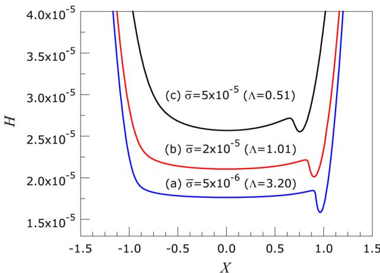  
Fig. 1 Effect of surface roughness on the film thickness (W5 1 3 1024, U5 1 3 10211 G5 4500, V5 0.01)

The final results consist of the hydrodynamic, asperity and total pressure distribution as well as the film profile. Based on these results, the central and the minimum film thickness are determined. Also predicted is the asperity load ratio. This parameter is very important for calculating the friction and the wear.

## 4 Results and Discussions

4.1 Film Thickness and Pressure Profiles. Figure 1 shows film thickness distribution for three different values of surface roughness, while the other input parameters are kept constant at $W \stackrel { \smile } { = } 1 \times 1 0 ^ { - 4 } , U = 1 \times 1 0 ^ { - 1 1 } \stackrel { \cdot } { G } = \stackrel { \cdot } { 4 } 5 0 0 , V = 0 . 0 1 .$ The dimensionless roughness values are $\bar { \sigma } = 5 \times 1 0 ^ { - 6 } , ~ \bar { \sigma } = 2 \times 1 0 ^ { - 5 }$ and $\bar { \sigma } = 5 \times \bar { 1 } 0 ^ { - 5 } . \bar { \beta }$ is chosen in a way that r/b is equal to 0.01 in all cases. The case of $\bar { \sigma } = 5 \times 1 0 ^ { - 6 }$ is closely approximates the EHL behavior of smooth surfaces, because the obtained pressure and film profiles are close to theoretically smooth surface solution results $( \bar { \sigma } = 0 )$

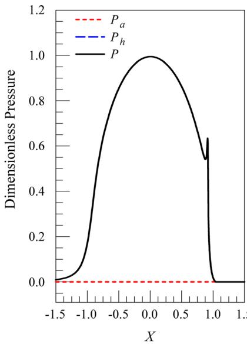

As shown, the film thickness increases as the roughness increases. This can be attributed to contribution of the load carried by the asperities as well as the influence of asperities on the flow as dictated by the flow factors in the modified Reynolds equation. It should be noted that even though the film thickness increases by the surface roughness, the film parameter which is the ratio of the minimum film thickness to the combined roughness $( \Lambda = h _ { \operatorname* { m i n } } /$ $\sigma = H _ { \mathrm { m i n } } / \bar { \sigma } )$ decreases. The film parameter for the approximately smooth surface $( \bar { \sigma } = 5 \times 1 0 ^ { - 6 } )$ is predicted to be 3.20, while it decreases to 1.01 for $\bar { \sigma } = 2 \times 1 0 ^ { - 5 }$ and to 0.51 for ${ \bar { \sigma } } = 5 \times 1 0 ^ { - 5 } .$ It is observed that as the roughness increases, the location of the minimum film thickness approaches the contact center $( X = 0 )$ . It is also interesting to note that the values of the central and the minimum film thickness approach each other as the roughness increases.

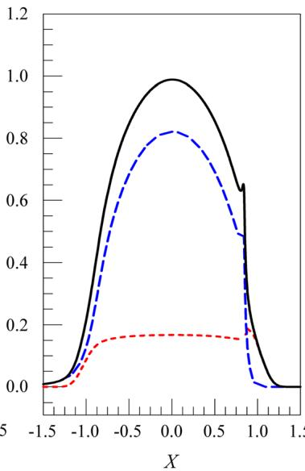

Figure 2 shows the hydrodynamic, asperity and total pressure distribution corresponding to Fig. 1. As shown, the asperity pressure increases by increasing the surface roughness. The asperity load ratio is almost zero for the approximately smooth surface $( \bar { \sigma } = 5 \times 1 0 ^ { - 6 } ) .$ while it is predicted to be 21% for $\bar { \sigma } = 2 \times 1 0 ^ { - 5 }$ and 50% for $\bar { \sigma } = 5 \times 1 0 ^ { - 5 }$

It is important to note that while the hydrodynamic pressure is nil at the outlet, the asperity pressure (which is a function of the separation) still exists after the outlet, and therefore the total pressure is not zero at and after the outlet. The asperity pressure gradually approaches zero as the separation increases at around $X { = } 1 . 2 \bar { 5 }$ for $\bar { \sigma } = 2 \times 1 0 ^ { - 5 }$ and $X = \bar { 1 } . 6 0$ for $\bar { \sigma } = 5 \times 1 0 ^ { - 5 }$

It is observed that by increasing the surface roughness, the pressure spike height decreases. For large surface roughness values, the spike nearly disappears; see Fig. 2. It is also noticed that the location of the pressure spike tends to approach the center as the roughness increases. Simulations also show that the amplitude of the pressure spike is reduced considerably when lubricant compressibility is taken into account. Similar to Hamrock et al. [30], very sharp spikes are predicted when the lubricant is assumed to be incompressible.

As depicted in Fig. 2, the central value of the total pressure decreases as the roughness increases. This is because the pressure profile tends to extend along the X axis when the surface roughness goes up.

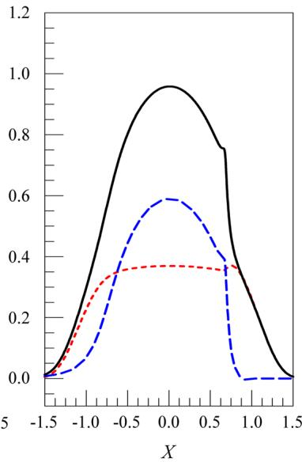  
Fig. 2 Effect of surface roughness on the pressure distribution $( W = 1 \times 1 0 ^ { - 4 } , U = 1 \times 1 0 ^ { - 1 1 } ~ G = 4 5 0 0 , V = 0 . 0 1 )$ (a): r- ¼ 5310-6 (smooth), $( b ) \dot { : } \bar { \sigma } = 2 \times 1 0 ^ { - 5 } , ( \dot { \mathsf { c } } ) \colon \bar { \sigma } = 5 \times 1 0 ^ { - 5 }$

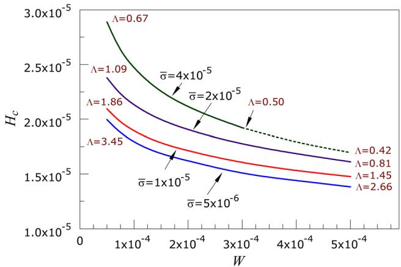  
Fig. 3 Effect of dimensionless load on dimensionless central film thickness $\mathbf { \Lambda } ( U = 1 \times 1 0 ^ { - 1 1 } $ , G5 4500, V5 0.01)

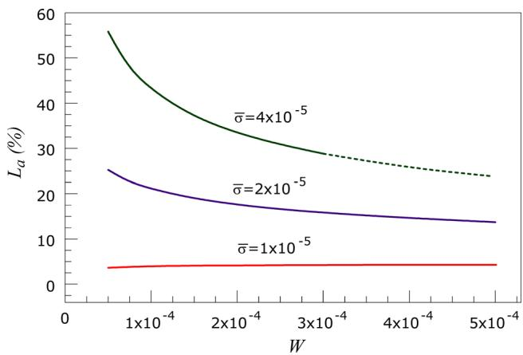  
Fig. 4 Effect of dimensionless load on asperity load ratio (U5 1 3 10211, G5 4500, V5 0.01)

4.2 Effect of Input Parameters on Film Thickness and Asperity Load Ratio. The effect of dimensionless load (W), speed (U) and hardness (V) on the central film thickness and the asperity load ratio is investigated for different dimensionless roughness (r-) values. In each case, two parameters from the set of W, U and V are kept constant, while the third one is varied, and the central film thickness is plotted for four different dimensionless surface roughness values between $5 \times { { 1 0 } ^ { - 6 } }$ and $4 \times 1 0 ^ { - 5 } .$ The dimensionless asperity radius is chosen in a way that $\bar { \sigma } / \bar { \beta }$ is equal to 0.01 in all cases. The asperity load ratio is also plotted for each case. $\bar { \sigma } = 5 \times 1 0 ^ { - 6 }$ is considered as smooth surface in all cases, because its film thickness value is close to that of a theoretically smooth surface solution $( \bar { \sigma } = 0 )$ , and the asperity load ratio is almost zero.

4.2.1 Effect of Load. In Fig. 3, the dimensionless central film thickness is plotted against the dimensionless load for different surface roughness values. The load is varied from $W { = } 5 \times 1 0 ^ { - 5 }$ to $W { = } 5 \times 1 0 ^ { - 4 }$ , while the other parameters $( U = 1 \times 1 0 ^ { - 1 1 }$ $G = 4 5 0 0 , V = 0 . 0 1 )$ are kept constant. As shown, the film thickness decreases by increasing the load. Nevertheless, the film thickness is not very sensitive to the variation of load, especially at higher load values $( W \ge 3 \times 1 0 ^ { - 4 } )$ ). It is also observed that the dependency of the film thickness on the load is more visible at higher surface roughness values. As shown, for the smooth surface $( \bar { \sigma } = 5 \times 1 0 ^ { - 6 } )$ , the film parameter (K) varies from 3.45 to 2.66 within the simulated load range, while for the largest surface roughness value $( \bar { \sigma } = 4 \times 1 0 ^ { - 5 } ) ,$ , it varies from 0.67 to 0.42. As the modified Reynolds equation is not valid for the film parameters below 0.5 [11], the simulation for $\bar { \sigma } = 4 \times 1 0 ^ { - 5 }$ after $\stackrel { \star } { W } = 3 \times 1 0 ^ { - 4 }$ is shown by dashed line, because at this point the film parameter reaches 0.5.

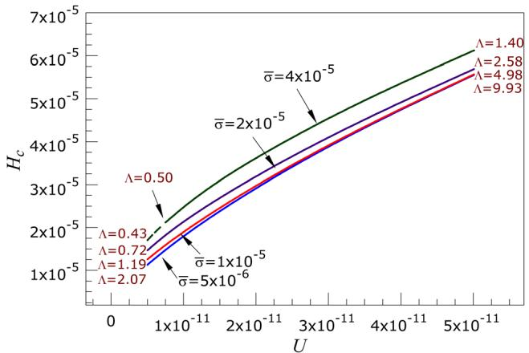  
Fig. 5 Effect of dimensionless speed on dimensionless central film thickness $( \pmb { W } = \pmb { 1 } \times \pmb { 1 0 } ^ { - 4 }$ , G5 4500, V5 0.01)

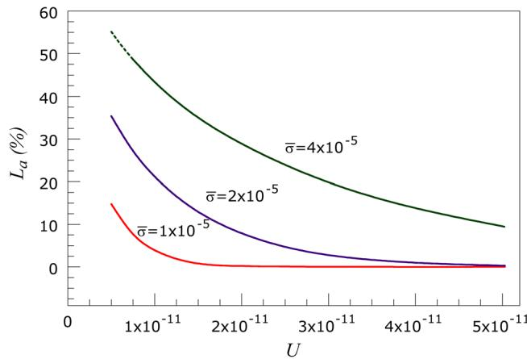  
Fig. 6 Effect of dimensionless speed on asperity load ratio (W5 1 3 1024, G5 4500, V5 0.01)

Figure 4 shows the variation of the asperity load ratio with load. The smooth case $( \bar { \sigma } = 5 \times 1 0 ^ { - 6 } )$ is not plotted here, because the asperity load ratio is always zero for the smooth surface. As shown, the asperity load ratio $L _ { a }$ decreases as the load increases, and it is more noticeable at larger surface roughness values. In fact, the load carried by the asperities $L _ { a }$ always increases with load, since the separation drops. This increase is generally less than the increase in the load, so $L _ { a }$ decreases. Physically, it can be interpreted as the larger deformation of the asperities under the heavier loads.

4.2.2 Effect of Speed. The effect of dimensionless speed on film thickness and asperity load ratio is investigated in Figs. 5 and 6. The speed is varied between $U = \bar { 5 } \times 1 0 ^ { - 1 2 }$ and $U = 5 \times 1 0 ^ { - 1 1 }$ , while the other parameters $( W = 1 \times 1 0 ^ { - 4 } ,$ $G = 4 5 0 0 , V = 0 . 0 1 )$ are kept constant. As depicted in Fig. 5, film thickness is very sensitive to speed, and it increases by increasing the speed. In fact, increasing the rolling speed changes the lubrication regime. By increasing speed, the film parameter K increases from 2.07 to 9.93 for the smooth surface $\stackrel { \star } { ( \sigma } = 5 \times 1 0 ^ { - 6 } )$ , while for the largest roughness $( \bar { \sigma } = 4 \times 1 0 ^ { - 5 } )$ , K changes from 0.43 to 1.40. As the modified Reynolds equation is not valid for the film parameters below 0.5 [11], the simulation for $\bar { \sigma } = 4 \times 1 0 ^ { - 5 }$ below $\stackrel { \star } { U } = 7 \times 1 0 ^ { - 1 2 }$ is shown by dashed lines, because at this speed the film parameter reaches 0.5.

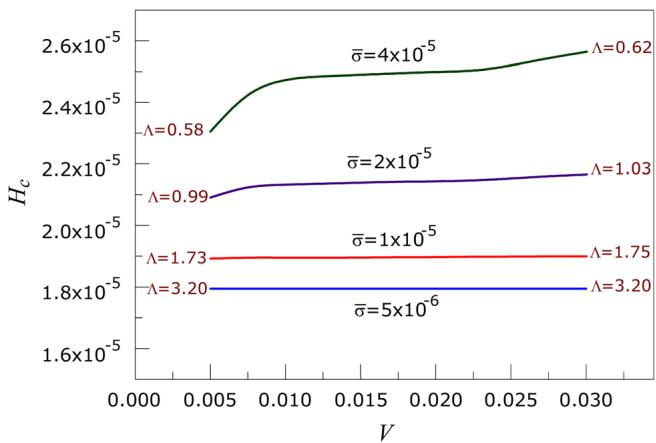  
Fig. 7 Effect of dimensionless hardness on dimensionless central film thickness $( W = 1 \times 1 0 ^ { - 4 } , U = 1 \times 1 0 ^ { - 1 1 }$ , G5 4500)

As shown in Fig. 6, the speed decreases the asperity load ratio, which can also be explained by the change of the lubrication regime. At higher speeds, the asperity load ratio $L _ { a }$ becomes small even for the large values of the surface roughness.

4.2.3 Effect of Hardness. Fig. 7 shows the effect of dimensionless hardness on the film thickness. The dimensionless hardness is varied between $V = 0 . 0 0 5$ and $V { = } 0 . 0 3$ , while the other parameters $( W = 1 \times 1 0 ^ { - 4 } , ~ \mathrm { U } = 1 \times 1 0 ^ { - 1 1 } , ~ G = 4 5 0 0 )$ are kept constant. Examination of Fig. 7 reveals that film thickness is not strongly influenced by the hardness. The hardness has no effect on the film thickness of a smooth surface $( \bar { \sigma } = 5 \times 1 0 ^ { - 6 } ) .$ , and its effect is still negligible for lower amounts of the surface roughness $( \sec \bar { \sigma } = 1 \times \mathrm { { 1 0 ^ { - 5 } } } )$ , because the deformation of the asperities is small. The effect of the hardness becomes more noticeable at higher surface roughness values. As shown, the film parameter remains constant $( \bar { \Lambda } = 3 . 2 )$ for the smooth case, while it varies between 0.58 and 0.62 for the largest roughness value $( \bar { \sigma } = 4 \times 1 0 ^ { - 5 } )$ . The increase in the film thickness is because of the rise in the asperity load ratio. The dependency of the film thickness on the hardness is greater at lower hardness values, because at these values the asperity deformation is fully plastic. Then, film thickness becomes nearly constant when asperities undergo elastoplastic and plastic deformation. At higher hardness values, the deformation is fully elastoplastic and the film thickness increases again.

Figure 8 depicts the asperity load ratio $L _ { a }$ against the dimensionless hardness V. As shown, $L _ { a }$ generally increases with V since the asperities of a harder material are more resistant to deformation. The increase is more noticeable at lower values of the hardness and higher values of the roughness. The asperity deformation trend mentioned above for the film thickness can also explain the behavior of the asperity load ratio in Fig. 8. In fact, the increase in the asperity load ratio causes an increase in the film thickness.

## 5 Film Thickness and Asperity Load Ratio Formulas

Table 1 shows the range of dimensionless parameters selected for simulations, which is obtained using a wide range of input, including contact load, rolling speed, lubricant viscosity, pressureviscosity coefficient, equivalent contact radius, effective modulus of elasticity, surface hardness, surface roughness and asperity radius. These ranges are shown in Table 1.

The defined dimensionless load range is equivalent to the maximum Hertzian pressure $( p _ { \mathrm { m a x } } = E ^ { \prime } \sqrt { W / 2 \pi } )$ of 0.4 to 2.0 GPa for the steel $( E ^ { \prime } = \bar { 2 } 2 8 \mathrm { { G P a } ) }$ . The speed range starts from $1 \times 1 0 ^ { - 1 2 }$ to one hundred times larger $( 1 \times \mathrm { ^ { \circ } 1 0 ^ { - 1 0 } } )$ , however the speed values below $5 \times 1 0 ^ { - 1 2 }$ are only used for the smooth surface solution.

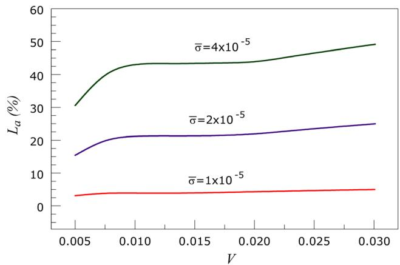  
Fig. 8 Effect of dimensionless hardness on asperity load ratio $( \bar { W } = 1 \times 1 0 ^ { - 4 } , U = 1 \times 1 0 ^ { - 1 1 }$ , G5 4500)

Table 1 Range of dimensionless input parameters selected for simulation
| Parameter | Min | Max |
| --- | --- | --- |
| W | $2 \times 1 0 ^ { - 5 }$ | $5 \times 1 0 ^ { - 4 }$ |
| U | $1 \times 1 0 ^ { - 1 2 }$ | $1 \times 1 0 ^ { - 1 0 }$ |
| G | 2500 | 7500 |
| σ | 0 | $5 \times 1 0 ^ { - 5 }$ |
| β | $5 \times 1 0 ^ { - 5 }$ | $5 \times 1 0 ^ { - 3 }$ |
| V | 0.005 | 0.03 |

The material number (for an average a) covers the Young’s moduli between 0.5 and 1.5 times of that of the steel. The roughness range starts from the theoretically smooth surface $( \bar { \sigma } = 0 )$ The maximum roughness $\bar { \sigma } = 5 \times 1 0 ^ { - 5 }$ is equal to roughness of 1.27 lm for equivalent radius of one inch. In most cases, the results of the roughness values below $5 \times { { 1 0 } ^ { - 6 } }$ are close to those of a smooth surface, and at $\bar { \sigma } = 1 \times { 1 0 ^ { - 6 } }$ it is identical to the smooth surface solution. The maximum hardness (0.03) is equal to Vickers hardnesses of 6.85 GPa for the steel. This is equal to 60 Rockwell C which corresponds to the hardness of the most hardened steels.

Each of the above parameters is varied within the specified range, while the other parameters are kept constant. In each case, the simulation is done and the dimensionless central film thickness, minimum film thickness and the asperity load ratio (as percentage) are obtained.

It is observed from the results that for a specific surface roughness, changing the asperity radius $( \hat { \beta } )$ does not significantly change the film thickness and the asperity load ratio values. Considering $\bar { \sigma } / \bar { \beta } = 0 . 0 1$ is a reasonable assumption within the usual roughness ranges. This ratio is generally smaller for lower surface roughness values, but at those values, the results are very close to smooth case, and therefore independent of the surface parameters. So, $\bar { \sigma } / \bar { \beta }$ is fixed at 0.01 for the whole simulation range. By this assumption, -b will be eliminated from the input data for the curve fitting. Therefore, the data is curve-fitted based on five input parameters W, U, G, r- and V.

In order to derive appropriate curve-fitting equations, over 300 different cases were simulated. Some of the results are tabulated in Tables 2, 3 and 4. For obtaining each curve-fit equation, an appropriate form should be assumed. For the film thickness, without considering the surface roughness, the form of the equation assumed is $c _ { 1 } \breve { W } ^ { \mathrm { c } 2 } U ^ { \mathrm { c } 3 } G ^ { \mathrm { c } 4 }$ , which is similar to most published film thickness equations. This term is multiplied by an additional term as $( 1 \stackrel { \bullet } { + } c _ { 5 } \bar { \sigma } ^ { \mathrm { c 6 } } V ^ { \mathrm { c 7 } } W ^ { \mathrm { c 8 } } U ^ { \mathrm { c 9 } } G ^ { \mathrm { c 1 0 } } )$ to include the effect of the surface roughness and the hardness. Hence, the final equation for the film thickness is of the form $H = c _ { 1 } W ^ { \mathrm { c } 2 } U ^ { \mathrm { c } 3 } G ^ { \mathrm { c } 4 } ( 1 + \bar { c } _ { 5 } \bar { \sigma } ^ { \mathrm { c } 6 }$ $V ^ { \mathrm { c 7 } } W ^ { \mathrm { c 8 } } [ J ^ { \mathrm { c 9 } } G ^ { \mathrm { c 1 0 } } )$ where $c _ { 1 }$ to c10 are unknown constants to be determined. Thus, when $\bar { \sigma } = 0 ,$ the smooth solution is recovered. The best curve-fit results are given as follows.

Table 2 Results of the simulation and the curve-fit equation for the central film thickness
| Input · W | Input · U | Input · G | Input · ōσ | Input · V | $H _ { c }$ · Simulation | $H _ { c }$ · Curve fit | Error% | Λ |
| --- | --- | --- | --- | --- | --- | --- | --- | --- |
| $2 . 0 0 \times 1 0 ^ { - 5 }$ |  |  |  |  | $2 . 7 0 \times 1 0 ^ { - 5 }$ | $2 . 6 7 \times 1 0 ^ { - 5 }$ | 1.17 | 1.20 |
| $7 . 0 0 \times 1 0 ^ { - 5 }$ |  |  |  |  | $2 . 2 6 \times 1 0 ^ { - 5 }$ | $2 . 1 5 \times 1 0 ^ { - 5 }$ | 4.66 | 1.05 |
| $2 . 0 0 \times 1 0 ^ { - 4 }$ | $1 . 0 0 \times 1 0 ^ { - 1 1 }$ | 4500 | $2 . 0 0 \times 1 0 ^ { - 5 }$ | 0.01 | $1 . 9 1 \times 1 0 ^ { - 5 }$ | $1 . 8 1 \times 1 0 ^ { - 5 }$ | 4.90 | 0.94 |
| 3.00 × 10−4 |  |  |  |  | $1 . 7 8 \times 1 0 ^ { - 5 }$ | $1 . 7 0 \times 1 0 ^ { - 5 }$ | 4.36 | 0.89 |
| $5 . 0 0 \times 1 0 ^ { - 4 }$ |  |  |  |  | $1 . 6 1 \times 1 0 ^ { - 5 }$ | $1 . 5 7 \times 1 0 ^ { - 5 }$ | 2.73 | 0.81 |
|  | $1 . 0 0 \times 1 0 ^ { - 1 2 }$ |  | 0 |  | $3 . 4 2 \times 1 0 ^ { - 6 }$ | $3 . 4 8 \times 1 0 ^ { - 6 }$ | 1.70 |  |
|  | $5 . 0 0 \times 1 0 ^ { - 1 2 }$ |  |  |  | $1 . 4 7 \times 1 0 ^ { - 5 }$ | $1 . 3 6 \times 1 0 ^ { - 5 }$ | 7.41 | 0.72 |
| $1 . 0 0 \times 1 0 ^ { - 4 }$ | $1 . 0 0 \times 1 0 ^ { - 1 1 }$ | 4500 | $2 . 0 0 \times 1 0 ^ { - 5 }$ | 0.01 | $2 . 1 3 \times 1 0 ^ { - 5 }$ | $2 . 0 3 \times 1 0 ^ { - 5 }$ | 4.84 | 1.01 |
|  | $5 . 0 0 \times 1 0 ^ { - 1 1 }$ |  |  |  | $5 . 6 8 \times 1 0 ^ { - 5 }$ | $5 . 7 3 \times 1 0 ^ { - 5 }$ | 0.82 | 2.58 |
|  | $1 . 0 0 \times 1 0 ^ { - 1 0 }$ |  |  |  | $9 . 0 2 \times 1 0 ^ { - 5 }$ | $9 . 1 8 \times 1 0 ^ { - 5 }$ | 1.72 | 4.13 |
| $2 . 0 0 \times 1 0 ^ { - 4 }$ | $2 . 0 0 \times 1 0 ^ { - 1 1 }$ | 2500 |  |  | $2 . 2 6 \times 1 0 ^ { - 5 }$ | $2 . 1 3 \times 1 0 ^ { - 5 }$ | 5.79 | 1.06 |
| $1 . 0 0 \times 1 0 ^ { - 4 }$ | $1 . 0 0 \times 1 0 ^ { - 1 1 }$ | 5000 | $2 . 0 0 \times 1 0 ^ { - 5 }$ | 0.01 | $2 . 2 2 \times 1 0 ^ { - 5 }$ | $2 . 1 3 \times 1 0 ^ { - 5 }$ | 4.23 | 1.06 |
| $6 . 6 7 \times 1 0 ^ { - 5 }$ | $6 . 6 7 \times 1 0 ^ { - 1 2 }$ | 7500 |  |  | $2 . 2 3 \times 1 0 ^ { - 5 }$ | $2 . 1 4 \times 1 0 ^ { - 5 }$ | 4.03 | 1.07 |
|  |  |  | 0 |  | $1 . 7 7 \times 1 0 ^ { - 5 }$ | $1 . 7 6 \times 1 0 ^ { - 5 }$ | 0.65 |  |
|  |  |  | $1 . 0 0 \times 1 0 ^ { - 6 }$ |  | $1 . 7 7 \times 1 0 ^ { - 5 }$ | $1 . 7 7 \times 1 0 ^ { - 5 }$ | 0.27 | 15.54 |
| $1 . 0 0 \times 1 0 ^ { - 4 }$ | $1 . 0 0 \times 1 0 ^ { - 1 1 }$ | 4500 | $1 . 0 0 \times 1 0 ^ { - 5 }$ | 0.01 | $1 . 9 0 \times 1 0 ^ { - 5 }$ | $1 . 8 8 \times 1 0 ^ { - 5 }$ | 0.95 |  |
|  |  |  | $3 . 0 0 \times 1 0 ^ { - 5 }$ |  | $2 . 3 2 \times 1 0 ^ { - 5 }$ | $2 . 2 0 \times 1 0 ^ { - 5 }$ | 5.29 | 1.74 |
|  |  |  | $5 . 0 0 \times 1 0 ^ { - 5 }$ |  | 2.59 × 10−⁵ |  | 0.43 | 0.75 |
|  |  |  |  |  |  | $2 . 5 8 \times 1 0 ^ { - 5 }$ |  | 0.51 |
|  |  |  |  | 0.005 0.0075 | $2 . 3 1 \times 1 0 ^ { - 5 }$ | $2 . 3 0 \times 1 0 ^ { - 5 }$ $2 . 3 5 \times 1 0 ^ { - 5 }$ | 0.36 | 0.58 |
| $1 . 0 0 \times 1 0 ^ { - 4 }$ |  | 4500 | $4 . 0 0 \times 1 0 ^ { - 5 }$ |  | $2 . 4 2 \times 1 0 ^ { - 5 }$ | $2 . 4 4 \times 1 0 ^ { - 5 }$ | 3.17 0.65 | 0.60 |
|  | $1 . 0 0 \times 1 0 ^ { - 1 1 }$ |  |  | 0.015 | $2 . 4 6 \times 1 0 ^ { - 5 }$ | $2 . 4 9 \times 1 0 ^ { - 5 }$ |  | 0.60 |
|  |  |  |  | 0.02 | $2 . 4 8 \times 1 0 ^ { - 5 }$ | $2 . 5 6 \times 1 0 ^ { - 5 }$ | 0.33 | 0.61 |
|  |  |  |  | 0.03 | $2 . 5 6 \times 1 0 ^ { - 5 }$ |  | 0.20 | 0.62 |

Table 3 Results of the simulation and the curve-fit equation for the minimum film thickness
| Input · W | Input · U | Input · G | Input · σ | Input · V | $H _ { \mathrm { m i n } }$ · Simulation | $H _ { \mathrm { m i n } }$ · Curve fit | Error% | Λ |
| --- | --- | --- | --- | --- | --- | --- | --- | --- |
| $2 . 0 0 \times 1 0 ^ { - 5 }$ |  |  |  |  | $2 . 4 0 \times 1 0 ^ { - 5 }$ | $2 . 4 1 \times 1 0 ^ { - 5 }$ | 0.50 | 1.20 |
| $7 . 0 0 \times 1 0 ^ { - 5 }$ |  |  |  |  | $2 . 1 1 \times 1 0 ^ { - 5 }$ | $1 . 9 9 \times 1 0 ^ { - 5 }$ | 5.41 | 1.05 |
| $2 . 0 0 \times 1 0 ^ { - 4 }$ | $1 . 0 0 \times 1 0 ^ { - 1 1 }$ | 4500 | $2 . 0 0 \times 1 0 ^ { - 5 }$ | 0.01 | $1 . 8 8 \times 1 0 ^ { - 5 }$ | $1 . 7 4 \times 1 0 ^ { - 5 }$ | 7.55 | 0.94 |
| $3 . 0 0 \times 1 0 ^ { - 4 }$ |  |  |  |  | $1 . 7 8 \times 1 0 ^ { - 5 }$ | $1 . 6 5 \times 1 0 ^ { - 5 }$ | 7.05 | 0.89 |
| $5 . 0 0 \times 1 0 ^ { - 4 }$ |  |  |  |  | $1 . 6 1 \times 1 0 ^ { - 5 }$ | $1 . 5 5 \times 1 0 ^ { - 5 }$ | 3.52 | 0.81 |
|  | $1 . 0 0 \times 1 0 ^ { - 1 2 }$ |  | 0 |  | $3 . 0 2 \times 1 0 ^ { - 6 }$ | $2 . 9 7 \times 1 0 ^ { - 6 }$ | 1.57 | 一 |
|  | $5 . 0 0 \times 1 0 ^ { - 1 2 }$ |  |  |  | $1 . 4 3 \times 1 0 ^ { - 5 }$ | $1 . 3 2 \times 1 0 ^ { - 5 }$ | 7.88 | 0.72 |
| $1 . 0 0 \times 1 0 ^ { - 4 }$ | $1 . 0 0 \times 1 0 ^ { - 1 1 }$ | 4500 | $2 . 0 0 \times 1 0 ^ { - 5 }$ | 0.01 | $2 . 0 3 \times 1 0 ^ { - 5 }$ | $1 . 9 0 \times 1 0 ^ { - 5 }$ | 6.40 | 1.01 |
|  | $5 . 0 0 \times 1 0 ^ { - 1 1 }$ |  |  |  | $5 . 1 6 \times 1 0 ^ { - 5 }$ | $5 . 2 0 \times 1 0 ^ { - 5 }$ | 0.76 | 2.58 |
|  | $1 . 0 0 \times 1 0 ^ { - 1 0 }$ |  |  |  | $8 . 2 5 \times 1 0 ^ { - 5 }$ | $8 . 3 2 \times 1 0 ^ { - 5 }$ | 0.85 | 4.13 |
| $2 . 0 0 \times 1 0 ^ { - 4 }$ | $2 . 0 0 \times 1 0 ^ { - 1 1 }$ | 2500 |  |  | $2 . 1 2 \times 1 0 ^ { - 5 }$ | $1 . 9 0 \times 1 0 ^ { - 5 }$ | 10.41 | 1.06 |
| $1 . 0 0 \times 1 0 ^ { - 4 }$ | $1 . 0 0 \times 1 0 ^ { - 1 1 }$ | 5000 | $2 . 0 0 \times 1 0 ^ { - 5 }$ | 0.01 | $2 . 1 2 \times 1 0 ^ { - 5 }$ | $2 . 0 1 \times 1 0 ^ { - 5 }$ | 5.41 | 1.06 |
| $6 . 6 7 \times 1 0 ^ { - 5 }$ | $6 . 6 7 \times 1 0 ^ { - 1 2 }$ | 7500 |  |  | $2 . 1 4 \times 1 0 ^ { - 5 }$ | $2 . 0 8 \times 1 0 ^ { - 5 }$ | 2.85 | 1.07 |
|  |  |  | 0 |  | $1 . 5 5 \times 1 0 ^ { - 5 }$ | $1 . 5 5 \times 1 0 ^ { - 5 }$ | 0.26 |  |
|  |  |  | $1 . 0 0 \times 1 0 ^ { - 6 }$ |  | $1 . 5 5 \times 1 0 ^ { - 5 }$ | $1 . 5 6 \times 1 0 ^ { - 5 }$ | 0.23 | 一 |
| $1 . 0 0 \times 1 0 ^ { - 4 }$ | $1 . 0 0 \times 1 0 ^ { - 1 1 }$ | 4500 | $1 . 0 0 \times 1 0 ^ { - 5 }$ | 0.01 | $1 . 7 4 \times 1 0 ^ { - 5 }$ | $1 . 7 1 \times 1 0 ^ { - 5 }$ | 1.78 | 15.54 |
|  |  |  | $3 . 0 0 \times 1 0 ^ { - 5 }$ |  | $2 . 2 5 \times 1 0 ^ { - 5 }$ |  |  | 1.74 |
|  |  |  | $5 . 0 0 \times 1 0 ^ { - 5 }$ |  |  | $2 . 1 0 \times 1 0 ^ { - 5 }$ | 6.59 | 0.75 |
|  |  |  |  | 0.005 | $2 . 5 7 \times 1 0 ^ { - 5 }$ $2 . 3 0 \times 1 0 ^ { - 5 }$ | $2 . 5 3 \times 1 0 ^ { - 5 }$ $2 . 2 2 \times 1 0 ^ { - 5 }$ | 1.42 | 0.51 |
|  |  |  |  | 0.0075 | $2 . 3 9 \times 1 0 ^ { - 5 }$ | $2 . 2 7 \times 1 0 ^ { - 5 }$ | 3.56 4.80 | 0.58 |
| $1 . 0 0 \times 1 0 ^ { - 4 }$ | $1 . 0 0 \times 1 0 ^ { - 1 1 }$ | 4500 | $4 . 0 0 \times 1 0 ^ { - 5 }$ | 0.015 | $2 . 4 2 \times 1 0 ^ { - 5 }$ | $2 . 3 7 \times 1 0 ^ { - 5 }$ | 1.76 | 0.60 |
|  |  |  |  |  | $2 . 4 3 \times 1 0 ^ { - 5 }$ | $2 . 4 2 \times 1 0 ^ { - 5 }$ |  | 0.60 |
|  |  |  |  | 0.02 0.03 | $2 . 4 9 \times 1 0 ^ { - 5 }$ | $2 . 4 9 \times 1 0 ^ { - 5 }$ | 0.46 0.00 | 0.61 |

The central film thickness equation is:

The asperity load ratio equation (as percentage) is:

$$
\begin{array} { l } { { \displaystyle { H _ { c } = \frac { h _ { c } } { R } = 2 . 6 9 1 W ^ { - 0 . 1 3 5 } U ^ { 0 . 7 0 5 } G ^ { 0 . 5 5 6 } } } } \\ { { \displaystyle { \qquad \times ( 1 + 0 . 2 \bar { \sigma } ^ { 1 . 2 2 2 } V ^ { 0 . 2 2 3 } W ^ { - 0 . 2 2 9 } U ^ { - 0 . 7 4 8 } G ^ { - 0 . 8 4 2 } ) } } } \end{array}\tag{19}
$$

$$
\begin{array} { r } { L _ { a } = 0 . 0 0 5 W ^ { - 0 . 4 0 8 } U ^ { - 0 . 0 8 8 } G ^ { 0 . 1 0 3 } \phantom { x x x x x x x x x x x x x x x x x x x x x x x x x x x x x x x x x x x x x x x x x x x } } \\ { \times \left[ \ln \left( 1 + 4 4 7 0 \phantom { \frac { 1 } { 0 } } \bar { \sigma } ^ { 6 . 0 1 5 } V ^ { 1 . 1 6 8 } W ^ { 0 . 4 8 5 } U ^ { - 3 . 7 4 1 } G ^ { - 2 . 8 9 8 } \right) \right] } \end{array}\tag{21}
$$

and the minimum film thickness equation is:

$$
\begin{array} { l } { { \displaystyle { \cal H } _ { \mathrm { m i n } } = \frac { h _ { \mathrm { m i n } } } { R } = 1 . 6 5 2 ~ W ^ { - 0 . 0 7 7 } ~ U ^ { 0 . 7 1 6 } { \cal G } ^ { 0 . 6 9 5 } } } \\ { { \displaystyle ~ \times \left( 1 + 0 . 0 2 6 ~ \bar { \sigma } ^ { 1 . 1 2 0 } V ^ { 0 . 1 8 5 } W ^ { - 0 . 3 1 2 } U ^ { - 0 . 8 0 9 } G ^ { - 0 . 9 7 7 } \right) } } \end{array}\tag{20}
$$

We emphasize here again that in statistical asperity contact approaches, the film thickness is equal to the distance between the mean lines of the surfaces. Hence, the above film thickness formulas do not represent the local distances between the asperity tips. Therefore, while the actual minimum film thickness from a deterministic viewpoint can be equal to zero (i.e., when the asperity tips come into an intimate contact), the minimum film thickness in Eq. (20) represents the minimum distance between the mean lines of the surfaces asperities.

Table 4 Results of the simulation and the curve-fit equation for the asperity load ratio
| W | U | G | σ | V | $L _ { a } \left( \% \right)$ · Simulation | $L _ { a } \left( \% \right)$ · Curve fit | Error% | Λ |
| --- | --- | --- | --- | --- | --- | --- | --- | --- |
| $2 . 0 0 \times 1 0 ^ { - 5 }$ |  |  |  |  | 33.08 | 28.48 | 4.61 | 1.20 |
| $7 . 0 0 \times 1 0 ^ { - 5 }$ |  |  |  |  | 23.16 | 20.30 | 2.86 | 1.05 |
| $2 . 0 0 \times 1 0 ^ { - 4 }$ | $1 . 0 0 \times 1 0 ^ { - 1 1 }$ | 4500 | $2 . 0 0 \times 1 0 ^ { - 5 }$ | 0.01 | 17.63 | 15.01 | 2.63 | 0.94 |
| $3 . 0 0 \times 1 0 ^ { - 4 }$ |  |  |  |  | 15.85 | 13.30 | 2.54 | 0.89 |
| $5 . 0 0 \times 1 0 ^ { - 4 }$ |  |  |  |  | 13.71 | 11.40 | 2.31 | 0.81 |
|  | $1 . 0 0 \times 1 0 ^ { - 1 2 }$ |  | 0 |  | 0 | 0 | 0 |  |
|  | $5 . 0 0 \times 1 0 ^ { - 1 2 }$ |  |  |  | 35.37 | 32.45 | 2.92 | 0.72 |
| $1 . 0 0 \times 1 0 ^ { - 4 }$ | $1 . 0 0 \times 1 0 ^ { - 1 1 }$ | 4500 | $2 . 0 0 \times 1 0 ^ { - 5 }$ | 0.01 | 21.17 | 18.35 | 2.82 | 1.01 |
|  | $5 . 0 0 \times 1 0 ^ { - 1 1 }$ |  |  |  | 0.31 | 0.45 | 0.14 | 2.58 |
|  | $1 . 0 0 \times 1 0 ^ { - 1 0 }$ |  |  |  | 0 | 0.03 | 0.03 | 4.13 |
| $2 . 0 0 \times 1 0 ^ { - 4 }$ | $2 . 0 0 \times 1 0 ^ { - 1 1 }$ | 2500 |  |  | 13.13 | 10.54 | 2.59 | 1.06 |
| $1 . 0 0 \times 1 0 ^ { - 4 }$ | $1 . 0 0 \times 1 0 ^ { - 1 1 }$ | 5000 | $2 . 0 0 \times 1 0 ^ { - 5 }$ | 0.01 | 19.64 | 17.12 | 2.52 | 1.06 |
| $6 . 6 7 \times 1 0 ^ { - 5 }$ | $6 . 6 7 \times 1 0 ^ { - 1 2 }$ | 7500 |  |  | 24.46 | 22.54 | 1.92 | 1.07 |
|  |  |  | 0 |  | 0.00 | 0.00 | 0.00 | 一 |
|  |  |  | $1 . 0 0 \times 1 0 ^ { - 6 }$ |  | 0.00 | 0.00 | 0.00 | 15.54 |
| $1 . 0 0 \times 1 0 ^ { - 4 }$ | $1 . 0 0 \times 1 0 ^ { - 1 1 }$ | 4500 | $1 . 0 0 \times 1 0 ^ { - 5 }$ | 0.01 | 3.923 | 2.59 | 1.33 |  |
|  |  |  | $3 . 0 0 \times 1 0 ^ { - 5 }$ |  | 34.16 | 29.80 | 4.36 | 1.74 |
|  |  |  | $5 . 0 0 \times 1 0 ^ { - 5 }$ |  | 50.31 | 44.34 | 5.97 | 0.75 |
|  |  |  |  | 0.005 | 30.54 | 34.16 | 3.62 | 0.51 |
|  |  |  |  | 0.0075 | 39.75 | 36.40 | 3.35 | 0.58 |
| $1 . 0 0 \times 1 0 ^ { - 4 }$ |  | 4500 | $4 . 0 0 \times 1 0 ^ { - 5 }$ | 0.015 | 42.58 | 40.23 | 2.35 | 0.60 |
|  | $1 . 0 0 \times 1 0 ^ { - 1 1 }$ |  |  |  |  | 41.82 | 2.09 | 0.60 |
|  |  |  |  | 0.02 0.03 | 43.91 49.11 | 44.06 | 5.05 | 0.61 |

It is important to note that for the cases where the film parameter $( \Lambda = \operatorname { \hat { h } } _ { \operatorname* { m i n } } / \sigma = H _ { \operatorname* { m i n } } / \bar { \sigma } )$ is smaller than 0.5, the modified Reynolds equation by Patir and Cheng [11] is not valid. In such cases, the lubrication regime is expected to fall in boundary regime rather than EHL. Therefore, after calculating the film thickness, the film parameter should be checked to ensure the accurate results. It is also advised that when the obtained asperity load ratio is very large (like more than 70%), the results should be used with caution, even if the film parameter is larger than 0.5. This is because at these cases, the behavior of the problem becomes close to dry contact. It generally happens at surfaces with very large roughness values under low loads.

In Tables 2, 3, and 4, a part of the simulation results are compared to curve-fit equation results. The error for the film thickness in defined as $1 0 0 \mathrm { \hat { \times } | \it { H _ { ( s i m u l a t i o n ) } } - \it { H _ { ( c u r v e - f i t ) } } | / \it { H _ { ( s i m u l a t i o n ) } } }$ while the error for the asperity load ratio is defined as $| L _ { a ( \mathrm { s i m u l a t i o n } ) } - L _ { a ( \mathrm { c u r v e - f i t } ) } |$ . As shown, the maximum error of the curve fit equations in the table for $H _ { c } , H _ { \operatorname* { m i n } } ,$ and $L _ { a }$ are 7.41%, 10.41%, and 5.97%, respectively. It should be noted that the curve-fitting errors for the smooth surface $( \bar { \sigma } = 0 )$ are generally smaller. When dealing with rough surfaces, the increase in the error is unavoidable, but the results are still acceptable.

Working with Eqs. (19), (20) and (21) is very straightforward. For any line-contact EHL application, based on the problem’s input such as geometry, load, speed, material, and the surface finish, one can easily calculate the dimensionless input parameters W, U, G, r- and V from Eqs. (8) and (16). Then, by substituting into Eqequations (19), (20), and (21), the central and the minimum film thickness are obtained as well as the asperity load ratio.

One benefit of using the present film thickness equations (Eqs. (19) and (20)) is that the term inside the parentheses $( 1 \dot { 1 } + c _ { 5 } \bar { \sigma } ^ { \mathrm { c 6 } } V ^ { \mathrm { c 7 } } W ^ { \mathrm { c 9 } } G ^ { \mathrm { c 1 0 } } )$ can be considered as a correction factor for the effects of surface roughness and hardness. Therefore, if any other smooth-surface film thickness equation is intended to be used, or any other film thickness data is available for specific conditions (for example a specific lubricant), they can be multiplied by this term to include the effects of the surface roughness and hardness.

As an example, consider the contact of two identical steel rollers with the radius of one inch $( R _ { 1 } = R _ { 2 } = 2 5 . 4 \ \mathrm { m m } )$ , and the length of half inch (12.7 mm). The effective Young’s modulus is calculated as $E ^ { \prime } = 2 2 8$ GPa for the steel, while the effective contact radius is $R = 1 2 . 7$ mm. The applied load is 4 KN, so the load per contact lengths is $w = 3 . 1 5 \times \mathrm { { 1 0 } ^ { 5 } { N } } .$ . The linear speed of rollers are 1.5 m/s, and 0.5 m/s, so the rolling speed is ${ \bar { u } } = 1 \ \mathrm { m / s } .$ . The lubricant used is SAE 20W $( \mu _ { 0 } { = } 0 . 0 4 8 \mathrm { P a . } \mathrm { s } , \dot { \alpha } { = } 2 . 0 3 \times 1 0 ^ { - 8 } \mathrm { m } ^ { 2 } / \mathrm { N } ) .$ Both surfaces are ground with $\sigma = 0 . 3$ lm, so the combined roughness is 0.424 lm. The Vickers hardness of the surfaces is 240 Kg/mm2 (2.35 GPa). Therefore, the dimensionless parameters are calculated as $W { = } 1 . 0 9 \times { 1 0 } ^ { - 4 } , U { = } 1 . 6 6 \times { 1 0 } ^ { - 1 1 } , { \bf \dot { \Phi } } G { = } 4 6 2 8 . \nonumber$ $\bar { \sigma } = 3 . 3 4 \times { 1 0 ^ { - 5 } }$ and $V = \ 0 . 0 1 0 3$ . Substituting these values into Eqs. (19) and (20) yields $H _ { c } = 3 . 1 4 \times 1 0 ^ { - 5 }$ and $\bar { H } _ { \operatorname* { m i n } } = 2 . 9 8 \times 1 0 ^ { - 5 } ,$ so $h _ { c } ~ = 0 . 3 9 9$ lm and $h _ { \operatorname* { m i n } } = 0 . 3 7 8$ lm. Also, Eq. (21) gives $L _ { a } = 2 6 . 0 2$ , which means that 26.02% of the total load is carried by the asperities.

## 6 Verification of the Film Thickness Equations

The widely-used film thickness equations like the ones published by Dowson and Higginson [1], Dowson and Toyoda [2], Pan and Hamrock [3] and Moes [4] are all for the smooth surface and do not consider the effect of the roughness, while the effect of surface roughness has been included in the current film thickness equations (Eqs. (19) and (20)). If the roughness is set to zero, the current equations will be converted to simpler equations for smooth surfaces, which is comparable to other published film thickness equations. As an example, for the contact of two identical steel rollers with the radius of 25.4 mm and width of 12.7 mm, with lubricant properties as $\mu _ { 0 } { = } 0 . 0 4 8 \ \mathrm { P a } . \mathrm { s }$ and $\alpha = 2 . 0 3 \times 1 0 ^ { - 8 }$ m2/N, which are subjected to 4 KN normal load, and the rolling speed varies from 0.3 to 3 m/s, the dimensionless input parameters are calculated as $W { = } 1 . 0 9 \times { 1 0 } ^ { - 4 }$ G ¼ 4628 and U ¼ 4.97 $\times 1 0 ^ { - 1 2 } \sim 4 . 9 7 \times 1 0 ^ { - 1 1 }$ . The surface is considered smooth here, so $\bar { \sigma } = 0 .$ The central and minimum film thickness are calculated for different equations and compared to our current equations. Figures 9 and 10 show this comparison. As shown, the results of the present study (Eqs. (19) and (20)) are close to those reported by Pan and Hamrock [3], while the others [1,2,4] generally predict larger film thickness values. This difference is more noticeable in the central film thickness.

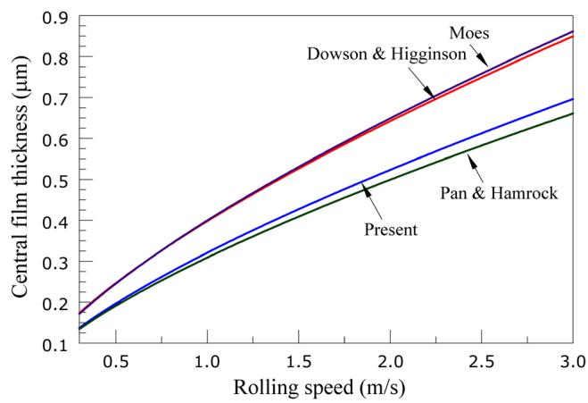  
Fig. 9 Comparison between Pan and Hamrock, Dowson and Toyoda, Moes, and current central film thickness equation (Eq. (19)) for given data

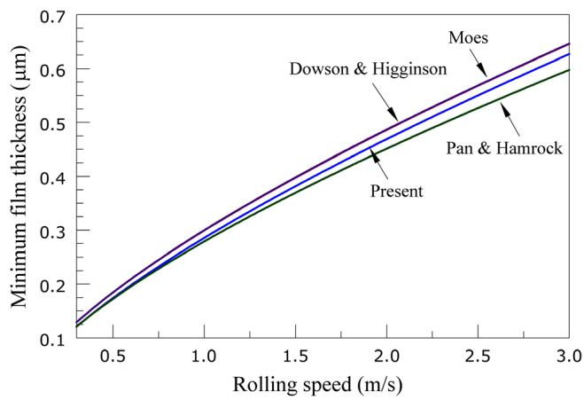  
Fig. 10 Comparison between Pan and Hamrock, Dowson and Higginson, Moes, and current minimum film thickness equation (Eq. (20)) for given data

The close agreement between the present results and the results by Pan and Hamrock is because the systematic approach used in this paper for solving the EHL equations is very similar to their approach. Moreover, Roeland’s pressure-viscosity relationship, and the effect of compressibility are considered in both. However, the small difference between the results $( 2 \sim 5 \%$ for the central film thickness in Figs. 9 and 0  4.5% for the minimum film thickness in Fig. 10) is—other than curve-fitting error—probably because finer mesh is used in the present study.

## 7 Conclusions

In this paper, the results of extensive set of simulations are presented. The modified Reynolds, surface deformation and elastoplastic asperity contact equations are solved together in dimensionless form. The results of over 300 simulations are curve-fitted to obtain useful formulas for the central and the minimum film thickness and the asperity load ratio of the following form:

Central film thickness: $H _ { c } = 2 . 6 9 \overset { \sim } { 1 } W ^ { - 0 . 1 3 5 } U ^ { 0 . 7 0 5 } G ^ { 0 . }$ 556 ð1 þ 0:2 r- 1:222V0:223W-0:229U-0:748G-0:842Þ

Minimum film thickness: $\breve { H _ { \mathrm { m i n } } } = 1 . 6 5 2 W ^ { - 0 . 0 7 7 } U ^ { 0 . 7 1 6 } G ^ { 0 . 6 9 5 }$ $( 1 + 0 . 0 2 6 ~ \bar { \sigma } ^ { 1 . 1 2 0 } V ^ { 0 . 1 8 5 } ~ W ^ { - 0 . 3 1 2 } U ^ { - 0 . 8 0 9 } G ^ { - 0 . 9 7 7 } )$ $\begin{array} { r l r l r } { \mathrm { A s p e r i t y } } & { { } \operatorname { l o a d } } & { } & { { } \operatorname { r a t i o : } } & { \ L _ { a } = 0 . 0 0 5 W ^ { - \mathit { 6 . 4 0 8 } } U ^ { - 0 . 0 8 8 } G ^ { 0 . 1 0 3 } ( \ln \phantom { - } } \end{array}$ $( 1 + \dot { 4 } 4 7 \dot { 0 } \bar { \sigma } ^ { 6 . 0 1 5 } V ^ { 1 }$ :16 $W ^ { 0 . 4 8 5 } U ^ { - 3 . 7 4 1 } G ^ { - 2 . 8 9 8 } ) )$

The film thickness equations can easily be utilized, and have the advantage of considering the surface roughness and hardness over the other published equations. The asperity load ratio equation is also useful for calculating the friction and the wear.

Nomenclature   
b ¼ half Hertzian width, $R ( { 8 W } / { \pi } ) ^ { 0 . 5 } ,$ m   
E0 ¼ effective modulus of elasticity,   
1=E0 ¼ 0:5½ð1 - - 2Þ=E þ ð1 - - 2Þ=E ; Pa   
G ¼ dimensionless material number, E0a   
h ¼ film thickness, m   
h\* ¼ h/r   
$h _ { c }$ ¼ central film thickness, m   
$h _ { \mathrm { m i n } }$ ¼ minimum film thickness, m   
$h _ { T }$ ¼ average gap between two surfaces, m   
$H$ ¼ dimensionless film thickness, h/R   
$H _ { c }$ ¼ dimensionless central film thickness, $h _ { c } / R$   
$H _ { \mathrm { m i n } }$ ¼ dimensionless minimum film thickness, $h _ { \mathrm { m i n } } / R$   
$H _ { T }$ ¼ dimensionless average gap between two surfaces, h /R   
$h d$ ¼ Vickers hardness, Pa   
La ¼ asperity load ratio (percentage)   
n ¼ asperity density, m-2   
n- ¼ dimensionless asperity density, $n R ^ { 2 }$   
p ¼ total pressure, Pa   
p ¼ asperity pressure, Pa   
ph ¼ hydrodynamic pressure, Pa   
P ¼ dimensionless total pressure, $4 R p / E ^ { \prime } b$   
$\mathrm { { P _ { a } } }$ ¼ dimensionless asperity pressure, $\ { 4 R p _ { a } } / { E ^ { \prime } b }$   
P ¼ dimensionless hydrodynamic pressure, $4 R p _ { h } / E ^ { \prime } b$   
R ¼ equivalent contact radius, $[ 1 / \hat { R } _ { 1 } { \pm } 1 / R _ { 2 } ] ^ { - 1 } , \mathrm { ~ i ~ }$ m   
u ¼ rolling speed, $( u _ { 1 } + u _ { 2 } ) / 2 ,$ m/s   
U ¼ dimensionless speed number, $\mu _ { O } u / E ^ { \prime } R$   
V ¼ dimensionless hardness number, hd/E   
w ¼ load per contact length, N/m   
w ¼ critical interference at the point of initial yield, (0.6p.hd/   
$\operatorname { E } ) \phantom { A } ^ { 2 } \beta ,$ m   
w-1 ¼ w1/R   
w \* ¼ w /r   
w2 ¼ critical interference at the point of fully plastic flow, 54w1, m   
w-2 ¼ w2/R   
w \* ¼ w /r   
W ¼ dimensionless load number, $w / E ^ { \prime } R$   
x ¼ coordinate in the moving direction, m   
xmin ¼ inlet position, m   
x ¼ outlet position, m   
X ¼ dimensionless coordinate in the moving direction, x/b   
$X _ { \operatorname* { m i n } }$ ¼ dimensionless inlet position, $x _ { \mathrm { m i n } } / b$   
$X _ { e n d }$ ¼ dimensionless outlet position, $x _ { o u t } / b$   
$y _ { s }$ ¼ distance between the mean line of the surface and the   
mean line of its summits, m   
y-s ¼ y /R   
ys\* ¼ ys/r   
z ¼ height of asperities measured from the mean line of the   
surface, m   
z\* ¼ z/r   
Z ¼ viscosity-Pressure index   
a ¼ pressure-viscosity coefficient, $\mathrm { m } ^ { 2 } / \mathrm { N }$   
b ¼ asperity radius, m   
-b ¼ dimensionless asperity radius, $\beta / R$   
K ¼ film parameter, $\bar { h _ { \operatorname* { m i n } } } / \bar { \sigma }$   
l ¼ lubricant viscosity, Pa.s   
l0 ¼ lubricant viscosity at atmospheric pressure, Pa.s   
l- ¼ dimensionless viscosity, l/l0   
q ¼ lubricant density, kg/m2   
q ¼ lubricant density at atmospheric pressure, $\mathrm { k g } / \mathrm { m } ^ { 2 }$   
q- ¼ dimensionless density, q/q0   
r ¼ standard deviation of the surface heights, m   
r- ¼ dimensionless surface roughness, r/R   
rs ¼ standard deviation of the surface summits, m   
r- ¼ r /R   
$\phi _ { x } =$ pressure flow factor in x direction

## References

[1] Dowson, D., and Higginson, G. R., Elasto-Hydrodynamic Lubrication (Pergamon Press, London, 1977).

[2] Dowson, D., and Toyoda, S., 1978, “A Central Film Thickness Formula for Elastohydrodynamic Line Contacts,” Proceedings of the 5th Leeds-Lyon Symposium on Tribology, London, pp. 60–65.

[3] Pan, P., and Hamrock, B. J., 1989, “Simple Formulas for Performance Parameters Used in Elastohydrodynamically Lubricated Line Contacts,” Trans. ASME, J. Tribol., 111(2), pp. 246–251.

[4] Moes, H., 1992, “Optimum Similarity Analysis with Applications to Elastohydrodynamic Lubrication,” Wear, 159(1), pp. 57–66.

[5] Johnson, K. L. Greenwood, J. A., and Poon, S. Y., 1972, “Simple Theory of Asperity Contact in Elastohydrodynamic Lubrication,” Wear, 19(1), pp. 91–108.

[6] Greenwood, J. A., and Williamson, J. B., 1966, “Contact of Nominally Flat Surfaces,” Proc. R. Soc. London, Ser. A, 295(1442), pp. 300–319.

[7] Gelinck, E. R. M., and Schipper, D. J., 1999, “Deformation of Rough Line Contacts,” Trans. ASME, J. Tribol., 121(3), pp. 449–454.

[8] Gelinck, E. R. M., and Schipper, D. J., 2000, “Calculation of Stribeck Curves for Line Contacts,” Tribol. Int., 33(3–4), pp. 175–181.

[9] Lu, X. B. Khonsari, M. M., and Gelinck, E. R. M., 2006, “The Stribeck Curve: Experimental Results and Theoretical Prediction,” Trans. ASME, J. Tribol., 128(4), pp. 789–794.

[10] Akbarzadeh, S., and Khonsari, M. M., 2008, “Performance of Spur Gears Considering Surface Roughness and Shear Thinning Lubricant,” Trans. ASME, J. Tribol., 130(2), p. 021503.

[11] Patir, N., and Cheng, H. S., 1978, “Average Flow Model for Determining Effects of Three-Dimensional Roughness on Partial Hydrodynamic Lubrication,” ASME J. Lubr. Technol., 100(1), pp. 12–17.

[12] Patir, N., and Cheng, H. S., 1979, “Application of Average Flow Model to Lubrication Between Rough Sliding Surfaces,” ASME J. Lubr. Technol., 101(2), pp. 220–230.

[13] Dowson, D., 1962, “A Generalized Reynolds Equation for Fluid Film Lubrication,” Int. J. Mech. Sci., 4, pp. 159–170.

[14] Majumdar, B. C., and Hamrock, B. J., 1982, “Effect of Surface-Roughness on Elastohydrodynamic Line Contact,” ASME J. Lubr. Technol., 104(3), pp. 401–409.

[15] Greenwood, J. A., and Tripp, J. H., 1971, “The Contact of Two Nominally Flat Rough Surfaces,” Proc. Inst. Mech. Eng., 185, pp. 625–633.

[16] Sadeghi, F., and Sui, P. C., 1989, “Compressible Elastohydrodynamic Lubrication of Rough Surfaces,” Trans. ASME, J. Tribol., 111(1), pp. 56–62.

[17] Prakash, J., and Czichos, H., 1983, “Influence of Surface-Roughness and Its Orientation on Partial Elastohydrodynamic Lubrication of Rollers,” ASME J. Lubr. Technol., 105(4), pp. 591–597.

[18] Jang, J. Y., and Khonsari, M. M., 2010, “Elastohydrodynamic Line-Contact of Compressible Shear Thinning Fluids with Consideration of the Surface Roughness,” Trans. ASME, J. Tribol., 132(3), p. 034501.

[19] Chang, W. R. Etsion, I., and Bogy, D. B., 1987, “An Elastic-Plastic Model for the Contact of Rough Surfaces,” Trans. ASME, J. Tribol., 109(2), pp. 257–263.

[20] Moraru, L., Keith, T. G., and Kahraman, A., 2004, “Aspects Regarding the Use of Probabilistic Models for Isothermal Full Film Rough Line Contacts,” Tribol. Trans., 47(3), pp. 386–395.

[21] Zhao, Y. W., Maietta, D. M., and Chang, L., 2000, “An Asperity Microcontact Model Incorporating the Transition from Elastic Deformation to Fully Plastic Flow,” Trans. ASME, J. Tribol., 122(1), pp. 86–93.

[22] Khonsari, M. M., and Booser, E. R., Applied Tribology : Bearing Design and Lubrication (Wiley, New York, 2008).

[23] Roelands, C. J. A., Correctional Aspects of the Viscosity-Temperature- Pressure Relationship of Lubricating Oils (Druk, V. R. B. Groningen, The Netherlands, 1966).

[24] Hamrock, B. J., Fundamentals of Fluid Film Lubrication (McGraw-Hill, New York, 1994).

[25] Timoshenko, S., and Goodier, J. N., 1969, Theory of Elasticity (McGraw-Hill, New York, 1969).

[26] McCool, J. I., 1987, “Relating Profile Instrument Measurements to the Functional Performance of Rough Surfaces,” Trans. ASME, J. Tribol., 109(2), pp. 264–270.

[27] Houpert, L. G., and Hamrock, B. J., 1986, “Fast Approach for Calculating Film Thicknesses and Pressures in Elastohydrodynamically Lubricated Contacts at High Loads,” Trans. ASME, J. Tribol., 108(3), pp. 411–420.

[28] Venner, C. H., 1991, “Multilevel Solution of the EHL Line and Point Contact Problems,” Ph.D. thesis, University of Twente, Enschede, The Netherlands.

[29] Okamura, H., 1982, “A Contribution to the Numerical Analysis of Isothermal Elastohydrodynamic Lubrication,” Tribology of Reciprocating Engines: Proc. 9th Leeds–Lyon Symp. on Tribology, pp. 313–320.

[30] Hamrock, B. J., Pan, P., and Lee, R. T., 1988, “Pressure Spikes in Elastohydrodynamically Lubricated Conjunctions,” Trans. ASME, J. Tribol., 110(2), pp. 279–284.
