# On the Film Thickness of Grease-Lubricated Contacts at Low Speeds

Hui Cen, Piet M. Lugt & Guillermo Morales-Espejel

# On the Film Thickness of Grease-Lubricated Contacts at Low Speeds

HUI CEN,1 PIET M. LUGT,1,2 and GUILLERMO MORALES-ESPEJEL2,3 1University of Twente, Faculty of Engineering Technology, Enschede, The Netherlands 2SKF Engineering & Research Centre, Nieuwegein, The Netherlands 3Universite de Lyon, INSA-Lyon, Lyon, France ´

The contribution of the thickener to the thickness of the lubricatingfilm in grease-lubricated contacts is investigated. Four different types of greases were tested in a ball/spherical rolleron-disc machine, where the film thickness was measured using the interferometry method, varying the temperature, load, and slip. The test results show that there are two lubrication regimes. Below a transition speed the grease thickener plays an important role where the film thickness increases with decreasing speed. At higher speeds the film thickness is primarily governed by the base oil. This transition speed is a function of the temperature and not of the load and slip. At higher speeds the greasefilm thickness can be calculated using the base oil viscosity. The electrical capacitance method was applied to measure the film thickness at ultralow speed in a real bearing, showing that the single contact results are indeed applicable to a full rolling bearing.

## KEY WORDS

Grease Film Thickness; Ultralow Speed; Single Contact; Full Bearing Test

## INTRODUCTION

About 90% of rolling bearings are lubricated with grease. Its main advantages over oil lubrication are ease in application, natural sealing ability, anticorrosion properties, and, if the bearings are not overlubricated, low friction performance (Lugt (1)). A disadvantage is that grease has a limited life; that is, relative to bearing life, which in some cases can be overcome by relubrication. In sealed-for-life bearings, grease lubrication mostly leads to starved elastohydrodynamic lubrication (EHL) contacts, which could lead to a lack of lubricant in the contacts, which then changes the lubrication conditions from fully flooded to starved lubrication, which again could change the lubrication regime from full-film to mixed/boundary lubrication. This leads to asperity interaction, causing higher contact stresses, which can reduce the bearing life (Lugt (1), (2)). Starvation occurs when the bearing is not sufficiently packed with grease and/or when there is not enough time for replenishment of the running track. This effect is not expected in bearings running at low speed and where lubrication systems provide the bearing with sufficiently large quantities of grease such as in wind turbines. Here it is standard practice to calculate the EHL film thickness by assuming fully flooded contacts lubricated by the grease base oil (Lugt (2)). This is engineering practice but may be conservative.

In 1972, Poon (3) showed in disc machine experiments that grease may provide thicker films than expected based on its base oil. In 1996, Cann (4) measured the grease film thickness between a ball running on a flat disc and clearly showed that the film thickness was composed of a part formed by elastohydrodynamic action and a part formed by a residual layer:

$$
h = h _ { R } + h _ { E H L } ,\tag{[1]}
$$

with residual films of thickness 6 nm $< h _ { R } < 8 0$ nm consisting of significant amounts of thickener (Cann and Spikes (5)). The EHL contribution may be different from that of the base oil due to a difference in rheology.

In another paper, Cann (6) writes that the thickener will not enter the contact at higher speeds but will be pushed to the side. This means that the film thickness at higher speeds could be calculated by using the standard EHL film thickness equations using the base oil viscosity as the viscosity of the lubricant.

There is no consensus on this, probably because the grease viscosity approaches the base oil viscosity only at high shear rates, which would make the difference between grease and base oil film thickness small at higher speeds (Baart, et al. (7)). This means that the definition of high and low speed is governed by the grease rheology and is therefore grease dependent. EHL film thickness models for grease lubrication were established quite some time ago starting with the semi-analytical work of Kauzlarich and Greenwood (8) for line contacts based on the Herschel-Bulkley rheology model from 1972. A few years later (1979), Jonkisz and Krzeminski-Freda (9) developed a full numerical model. Later, in 1994, Cheng (10) developed a numerical model by extending the approach of Kauzlarich and Greenwood.

A film thickness model for elliptical contacts using the Bingham rheology was developed by Yang and Qian (11). Their calculations showed that the grease film thickness is much affected by the plastic viscosity of the grease and not much by the yield stress. They also showed that the relationship between grease film thickness and base oil film thickness is not only related to the Bingham plastic viscosity of grease but also to the base oil viscosity. Dong and Qian (12) found that the yield stress is not as significant as the base oil viscosity in governing grease film thickness. They showed that there is factor of 1–2 between the grease film thickness and that of the base oil for fully flooded, isothermal EHL line contacts. Jonkisz and Krzeminski-Freda (9) found that the grease film thickness is 1.5 times higher than that of the base oil in fully flooded conditions. Similar results can be found in Astrom, et al.˚ (13), Williamson, et al. (14), and Kaneta, et al. (15).

NOMENCLATURE R Reduced radius in the y direction (transverse to rolling) (m)   
u  Surface speed of the bearing (m/s)   
A Area separated by a dielectric material (m2) U Dowson-Higginson dimensionless speed parameter,   
C  Capacitance (F) $U = \bar { u } m / ( E ^ { \prime } R _ { x } )$   
d Ball diameter in the ball bearing (m) ue Entrainment speed (m/s)   
de Bearing pitch diameter (m) W Dowson-Higginson dimensionless load parameter,   
E Reduced Young’s modulus, $W = F / ( E ^ { \prime } \bar { R _ { x } ^ { 2 } } )$   
$2 / E ^ { \prime } = ( 1 - \nu _ { 1 } ^ { 2 } ) / E _ { 1 } + ( 1 - \nu _ { 2 } ^ { 2 } ) / E _ { 2 } \mathrm { ( P a ) }$ α  Viscosity–pressure coefficient $( \mathrm { P a } ^ { - 1 } )$   
E Young’s modulus of the material (Pa) β Contact angle (◦)   
F Applied force (N) $\varepsilon _ { 0 }$ Dielectric constant of vacuum   
G Dowson-Higginson dimensionless material parameter, ε Dielectric constant of the separation material   
$G = E ^ { \prime } \alpha$ η  Dynamic viscosity of the lubricant at ambient pressure   
h  Lubricant film thickness (m) (Pa s)   
hc Lubricant central film thickness (m) $\eta _ { b }$ Dynamic viscosity of the base oil at ambient pressure   
k Grease plastic viscosity derived from Bingham model (Pa s) (Pa·s)   
kd = Ellipticity parameter, $\begin{array} { r } { k _ { d } = 1 . 0 3 ( \frac { R _ { y } } { R _ { x } } ) ^ { 0 . 6 3 } } \end{array}$ $\omega _ { i }$ Angular speed of inner ring (rad/s)   
Rx Reduced radius in the x direction (rolling) (m) $\omega _ { o }$ Angular speed of outer ring (rad/s)

> *(추출이 깨진 줄 — 원문 p.3 대조로 복구)*

For the film thickness at ultralow speed (entrainment velocity less that 0.01 m/s), Hurley and Cann (16) experimentally showed that the film thickness increases with decreasing speed. In this regime, the models that are described above are inaccurate. Not much work has been done on the grease film thickness at ultralow speed after Hurley and Cann. To the authors’ knowledge, only Dong, et al. (17) and Kimura, et al. (18) investigated this regime. Similar to Hurley and Cann (16), they found that the grease film thickness increases with a decrease in speed at low speed in a ball-on-disc configuration. They attributed the observed thick films at low speeds to the agglomeration of thickener material. Kimura, et al. (18) also developed a model to predict the grease film thickness at low speed using the Ertel-Grubin theory. However, the procedures to obtain the input parameters for this model are complicated and not easy in practical situations.

All of the work on determining the grease film thickness mentioned above is based on single contacts but not on real bearings. This is because it is much more difficult to measure the film thickness in full bearings where the optical interferometry technique cannot be applied.

Fortunately, there are other types of film thickness measurement methods, such as the electrical capacitance method, which have been applied to measure the film thickness in lubricated contacts for decades (Furuhama and Sumi (19); Vichard (20); Dowson, et al. (21); Grice, et al. (22)). Recently, a review on electrical methods for the evaluation of lubrication film thickness in elastohydrodynamic contacts was written by Glovnea, et al. (23). They summarized that its advantage over the optical interferometry method is that it can be applied in metallic–metallic contacts or even real machines, and its disadvantage is the difficulty in calibration. A comparison between the optical interferometry and electrical methods was made by Jablonka, et al. (24), who applied both methods in the same test rig. They showed that no significant difference was found in the film thickness measured by the two methods. In the present study, both the single-contact interferometry and a full bearing tester with the capacitance measurement method (Heemskerk, et al. (25)) will be used to evaluate the grease film thickness.

In this article, the results of an extensive experimental program will be described, directed to understand the impact of operating conditions on the film thickness of fully flooded grease lubricated contacts at ultralow speed. First the single contact setup will be used to study the effect of temperature, load, and slip ratio. Next, the grease film thickness will be studied in a full bearing to validate the applicability of the single contact results to full bearings.

All single contact measurements were performed on a ball/roller-on-disc machine (WAM5, Wedeven Associates), and the full bearing tests were on an SKF machine named “Tractor.”

The experimental results shown in this article will be used to develop a model to predict the film thickness of fully flooded grease-lubricated rolling bearings operating at ultralow speed (Morales-Espejel, et al. (26)).

## EXPERIMENTAL

## Equipment

## WAM5

The WAM5 can run in the ball-on-disc or roller-on-disc mode to simulate point contacts and elliptical contacts, respectively, measuring the film thickness varying the temperature, speed, load, and slip rate. The test conditions are shown in Table 1.The tests were run at surface speeds ranging from $1 0 ^ { - 4 }$ to 0.2 m/s. The surface speed was ramped up and down within 15 min. A scoop was used to ensure that the tests were done under fully flooded conditions.

TABLE 1—BALL-ON-DISC RIG TEST CONDITIONS
| 항목 | 값1 | 값2 |
| --- | --- | --- |
| Test Conditions | With ball | With roller |
| Load (N) | $2 0 \pm 2$ | $2 0 \pm 2$ |
| $P _ { \mathrm { { m a x } } } \left( \mathrm { { G P a } \right) }$ | 0.46 | 0.77 |
| Geometry | $R _ { x } = R _ { y } = 1 0 . 3 2 \ : \mathrm { m m }$ | $R _ { x } = 5 . 3 ~ \mathrm { m m } ; R _ { y } = 4 . 2 ~ \mathrm { m m }$ |
| $R _ { q } ,$ Roughness (nm) | ${ < } 1 0$ | ${ < } 1 0$ |
| Temperature (°C) | 0,10, 25,40, 60 | 25 |
| Speed Range (m/s) | $1 0 ^ { - 4 } – 0 . 2$ | $1 0 ^ { - 4 } – 0 . 2$ |

The spacer layer interferometry method (Hartl, et al. (27)) was applied in the test to be able to measure ultrathin films. The setup is shown in Fig. 1. White light travels through the camera into the contact, where part of the light beam is reflected from the semireflective layer, and some can go through both the spacer layer and the lubricant or grease layer formed on the ball surface until it is reflected by the ball surface back into the camera. This will result in an interference image from which the film thickness in the contact is derived.

## Tractor

A full bearing tester was used in this research to study the grease film thickness in the full bearings. An illustration of the setup is shown in Fig. 2. (Jablonka, et al. (24)). This test rig is used to illustrate that the results from the single contacts from the WAM5 can be applied to full bearings.

The test bearing is a deep-groove ball bearing (6306E TN9/C3) with only one steel ball and six ceramic (silicon nitride) balls. Hence, the film thickness is measured in a single inner ring–ball and outer ring–ball contact and will not be the average film thickness of all EHL contacts in the bearing. This is particularly important in the case of a radially loaded bearing where the load and film thickness will be different for each ball along the circumference. The Lubcheck connected to the bearing is used to measure the capacitance between the inner ring and the outer ring, which then can be recorded in the oscilloscope (Storken, et al. (28)).

The capacitance can then be used to calculate the film thickness using Eq. [2]. The system applies to the full bearing; that is, two contacts. It is assumed that the grease film thickness in the inner ring–ball contact and outer ring–ball contact will be equal and that the error made by this assumption is small. A trigger is used to monitor the ball passage at the lowest point of the bearing where the film thickness will be the smallest. Only the film thickness at this position will be used in this article. The capacitance reads:

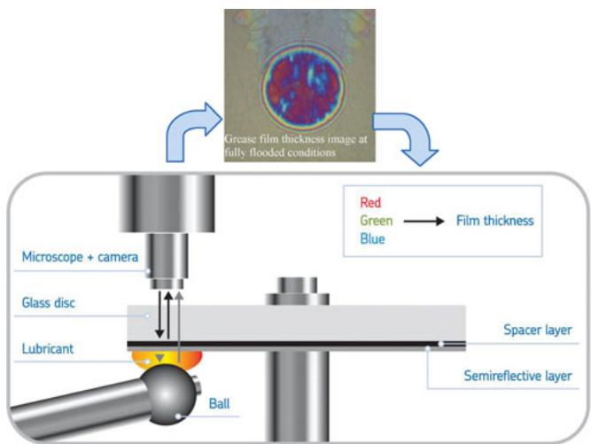  
Fig. 1—Diagram of the ball-on-disc setup.

$$
C = \varepsilon _ { 0 } \varepsilon _ { r } { \frac { A } { h } } ,\tag{[2]}
$$

where C is the capacitance, A is the area separated by a dielectric material with dielectric constant $\varepsilon _ { r } .$ , h is the film thickness, and $\varepsilon _ { 0 }$ is the dielectric constant of vacuum.

Other than with oil, grease does not easily flow and can be pushed away from the contacts in the bearings without significant reflow/replenishment, leading to starvation after a period of service time. To ensure that the bearing is working in fully flooded conditions, the bearing was closed with two plastic shields at both sides. Images of the test rig before and after the test are shown in Fig. 3. Initially the total free space in the bearing was filled with grease, but, although the speeds were low (1 to 5 rpm), some grease was pushed out from the bearing during the test. However, this volume was so small that it was unlikely that starvation would have occurred. Other than in the single-contact tests, only speed sweeps were made by increasing the speed. The test conditions are shown in Table 2. The surface speed of the bearing was calculated using Eq. [3] (Hamrock (29)):

$$
u = \frac { d _ { e } ( \omega _ { i } - \omega _ { o } ) } { 4 } \left( 1 - \frac { d ^ { 2 } \cos ^ { 2 } \beta } { d _ { e } ^ { 2 } } \right) ,\tag{[3]}
$$

where $d _ { e }$ is the pitch diameter (m); d is the diameter of the balls (m); $\omega _ { i }$ and $\omega _ { o }$ are the angular speeds (rad/s) of the inner ring and outer ring, respectively (for this type of bearing, $\omega _ { o } = 0 )$ ; and $\beta$ is the contact angle (for this type of bearing, $\beta = 0 )$

## Rheometer

In order to study the rheological properties of the tested grease, a parallel-plate rheometer (TA Instruments RA 1000) was applied. The gap between the plates was fixed to $2 0 0 \mu \mathrm { { m } }$ during the test. The temperature was controlled in a surrounding test chamber. Flow curves were measured where the maximum shear rate was $6 { , } 0 0 0 \mathbf { s } ^ { - 1 }$

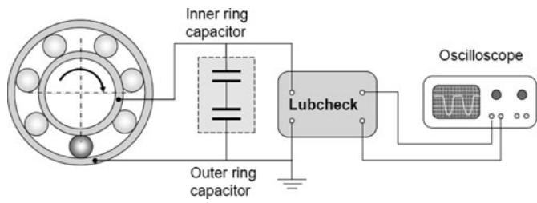  
Fig. 2—Illustration of the full bearing tester (Jablonka, et al. (24)).

TABLE 2—FULL BEARING TEST CONDITIONS WITH DGBB 6306 ETN9/C3
| 항목 | 값1 | 값2 |
| --- | --- | --- |
| Maximum Load in · Radial Load (N) | 1,000 |  |
| Maximum Load in · Contact (N) | 606 |  |
| Maximum Load in · $P _ { \mathrm { { m a x } } } ( \mathrm { { G P a } ) }$ | 1.34 |  |
| Maximum Load in · Temperature (°C) | 60,100 |  |
| Speed Range (rpm) | 1–5 and 160–1,280 |  |
| Speed Range (m/s) | $1 . 2 3 \times 1 0 ^ { - 3 } – 6 . 1 5 \times 1 0 ^ { - 3 }$ | $1 . 9 1 \times 1 0 ^ { - 1 } – 1 . 5 7$ |

## Tested Greases

Several (commercially available) types of greases with different base oil and thickener types were tested as shown in Table 3. Grease B is a high-load grease containing extreme pressure/antiwear additives.

## SINGLE CONTACT TEST RESULTS

In this section, the ball-on-disc test results will be shown first, followed by the spherical roller-on-disc results. At each speed, the central film thickness was recorded as the average of three measurements, denoted as mean film thickness. The measurement sequence on the WAM5 was done by first ramping up the test speed followed by a speed ramp down. Because the results of the speed ramp up and speed ramp down were quite similar for all of the measurements that were done, only the speed ramp down process will be shown here. The measurements are taken from a single point in the center of the contact. This is why there is some scatter at very low speeds. At higher speeds the films are smooth, whereas a low speeds thickener material enters the contact in the form of lumps, giving a nonsmooth film thickness.

## Ball-on-Disc Results

## Effect of Temperature on Grease Film Thickness

Greases A, B, C, and D were tested at different temperatures (0, 10, 25, 40, and 60◦C) at a load of 20 N and speeds from 10−4 to 0.2 m/s under pure rolling conditions. The results of the grease film thickness versus entrainment speed are shown in Figs. 4. to 7 (on log–log scales). Some of the film thickness measurements in the higher speed region are not shown in the figures because the films were too thick to be measured on the rig.

Figures 4 to 7 clearly show that, with increasing speed, the film thickness decreases up to a speed called the transition speed, after which it increases again at a rate that resembles that of oillubricated contacts (straight line on log–log scale). This V-shaped curve was, as described above, earlier reported by Hurley and Cann (16) and Kimura, et al. (18), who attributed the thick film at low speeds to a residual film and the agglomerations of thickener material. The transition speeds for grease D (shown in Fig. 7) at higher temperatures were not so obvious. It is expected that the transition speed will be higher than the maximum speed in the test.

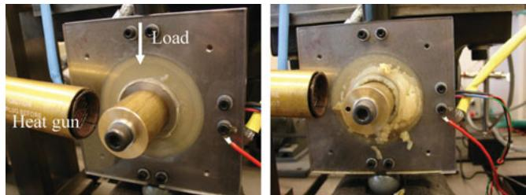  
Fig. 3—Images of the test rig before and after test.

Another important observation is that the transition speed was shifted to higher speeds (the curves were shifted to the righthand side in the figures) with an increase in temperature. Moreover, the film thickness at the transition speed (the minimum film thickness) was not significantly changed. This was because the calcium sulfonate grease (grease D) does not show a pronounced V shape. At higher temperatures, the V shape is no longer visible because a much higher speed is required to enter the regime where the film is determined by the base oil only and because the thickener layer thickness does not increase with increase of temperature.

## Effect of Slide to Roll Ratio on Grease Film Thickness

In this section, grease A was tested at 20 N, 25◦C with a 5% slide-to-roll ratio (SRR), which is typical for rolling bearings. A comparison of the 5% SRR and pure rolling results is shown in Fig. 8. The figure clearly shows that the film thickness was not significantly affected by introducing a 5% SRR. In addition, the transition point speed was not significantly changed by the slip. It is therefore concluded that (small) values of slip will not have a significant impact on the film thickness.

## Effect ofLoad on Grease Film Thickness

In oil-lubricated contacts the load has only a small effect on the film thickness. However, because the lubrication mechanisms for grease-lubricated contacts are clearly different, it was decided to check whether this load dependency is also small for grease lubrication in the current conditions. Therefore, grease A was tested at different loads at 25◦C. The results are shown in Fig. 9. Similar to oil, the grease film thickness is not significantly affected by the load. It is assumed that this will therefore generally apply to grease-lubricated contacts. The average grease film thickness at higher speeds (0.1–0.2 m/s) under a load of 200 N is 0.84 times higher than under the load of 20 N, which is quite close to the 0.86 derived from Eq. [4] $( h { \sim } F ^ { - 0 . 0 7 } )$ , confirming that the load dependence in conventional EHL theory is also applicable to grease.

TABLE 3—INFORMATION ON SAMPLE GREASES
| Sample Grease · Base oil | Grease A Grease B Grease C · Mineral | Grease A Grease B Grease C · Mineral | Grease A Grease B Grease C | Grease D · Mineral Mineral/synthetic |
| --- | --- | --- | --- | --- |
| Viscosity at 40°C (cSt) | 100 | 200 | 115 | 80 |
| Thickener type | Lithium Lithium |  |  | Diurea Calcium sulfonate |

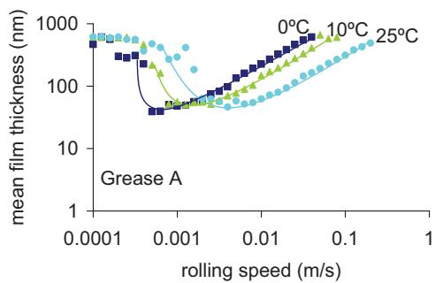  
a)

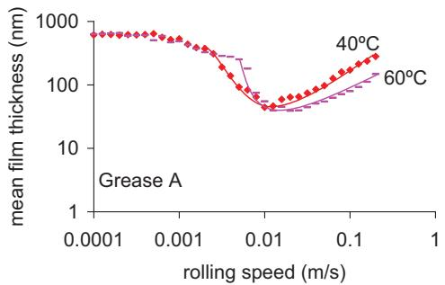  
b)

Fig. 4—Film thickness of grease A at different temperatures: (a) 0, 10, and 25◦C and (b) 40 and 60◦C.  
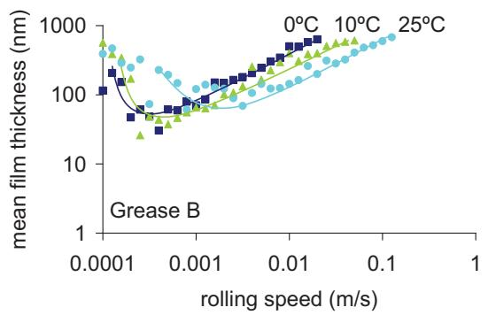  
a)

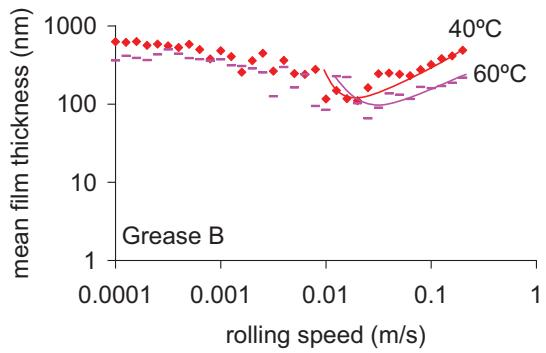  
b)

Fig. 5—Film thickness of grease B at different temperatures: (a) 0, 10, and 25◦C and (b) 40 and 60◦C.  
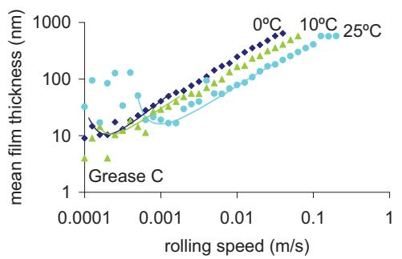  
a)

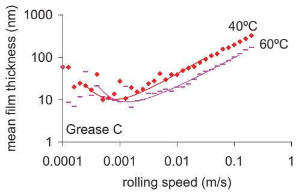  
b)

Fig. 6—Film thickness of grease C at different temperatures: (a) 0, 10, and 25◦C and (b) 40 and 60◦C.  
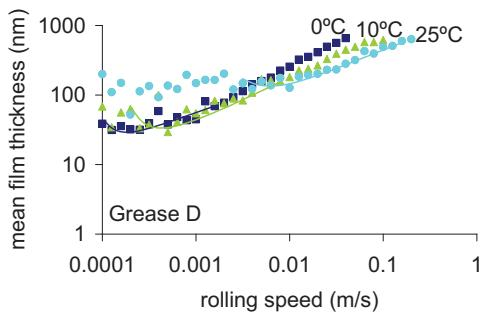  
a)

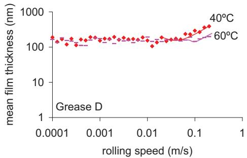  
b)  
Fig. 7—Film thickness of grease D at different temperatures: (a) 0, 10, and 25◦C and (b) 40 and 60◦C.

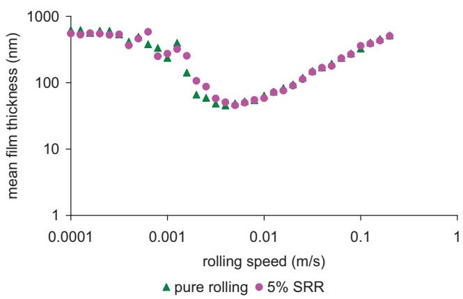  
Fig. 8—Film thickness performance of grease A at pure rolling and 5% SRR test conditions.

## Relationship between Grease Film Thickness and Base Oil Film Thickness

It is engineering practice to assume that the grease films are similar to those generated by the base oil. However, as stated in the Introduction, it was previously reported that deviations from this may occur (Cann (4), (6); Cann and Spikes (5); Astrom, et al.˚ (13); Williamson, et al. (14); Kaneta, et al. (15); Hurley and Cann (16); Dong, et al. (17); Kimura, et al. (18); Cousseau, et al. (30)). In this section, the relationship between grease film thickness and the calculated base oil film thickness will be explored in a wide speed and temperature range. Here the base oil (central) film thickness was calculated by applying the Hamrock and Dowson equation (Hamrock and Dowson (31)), which is shown in Eq. [4]. It is important to point out that the pressure–viscosity coefficient α was calculated following the procedure introduced by Khonsari and Booser (32), who developed this for mineral oils. The α values calculated for the used greases at different temperatures in this article are shown in Table 4.

$$
\frac { h _ { c } } { R _ { x } } = 2 . 6 9 \frac { U ^ { 0 . 6 7 } G ^ { 0 . 5 3 } } { W ^ { 0 . 0 6 7 } } \Big ( 1 - 0 . 6 1 e ^ { - 0 . 7 3 k _ { d } } \Big ) ,\tag{[4]}
$$

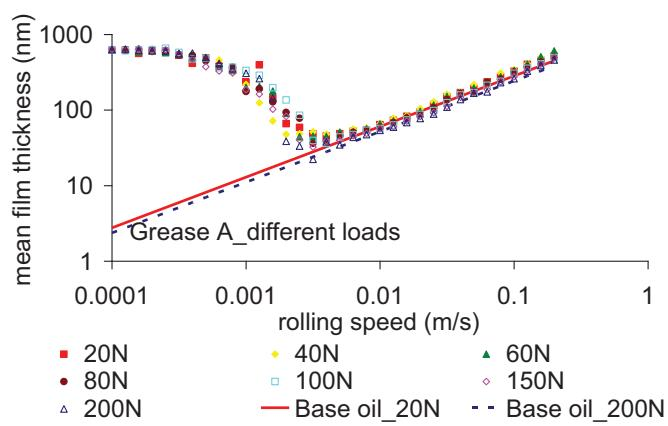  
Fig. 9—Effect of load on the film thickness performance of grease A at 25◦C.

TABLE 4—α VALUES $( ^ { * } 1 0 ^ { - 9 } \mathbf { P } \mathbf { A } ^ { - 1 } )$ FOR THE TESTED GREASES AT DIFFERENT TEMPERATURES
| Temperature (°C) · $\mathbf { A }$ | Grease Type · B C | Grease Type · D | Grease Type |
| --- | --- | --- | --- |
| 0 | 36.4 | 32.5 | 32.9 35.5 |
| 10 | 32.9 29.7 | 30.0 | 32.2 |
| 25 | 29.5 27.1 | 26.4 | 28.1 |
| 40 | 25.4 | 23.4 23.5 | 24.8 |
| 60 | 22.0 | 20.4 20.5 | 21.5 |

where

$$
k _ { d } = 1 . 0 3 \left( \frac { R _ { y } } { R _ { x } } \right) ^ { 0 . 6 3 } , G = \alpha E ^ { ' }
$$

$$
U = \frac { \eta _ { 0 } u _ { e } } { 2 E ^ { \prime } R _ { x } } , W = \frac { F } { E ^ { \prime } R _ { x } ^ { 2 } } .
$$

The comparisons of grease film thickness and calculated base oil film thickness using Eq. [4] for different greases at different test temperatures are shown in Figs. 10–13. The base il viscosity was obtained from the grease data sheets. There is a clear trend that grease generates thicker films than its base oil in the lower speed region (before the transition speed), whereas the two film thicknesses match at higher speeds, confirming the earlier work by Cann (6).

The figures show that not all grease film thickness measurements approach the calculated values using the base oil viscosity at higher speeds. This particularly applies to grease D. There could be several possible reasons for this:

1. The grease film thickness could be affected by the grease rheology, even at higher speeds. Yang and Qian (11) proposed a correction for the grease film thickness h and that of base oil $h _ { b } \colon$

$$
\frac { h } { h _ { b } } = \left( \frac { k } { \eta _ { b } } \right) ^ { 0 . 7 4 } ,\tag{[5]}
$$

where k is the grease plastic viscosity derived from the Bingham model and η is the base oil viscosity.

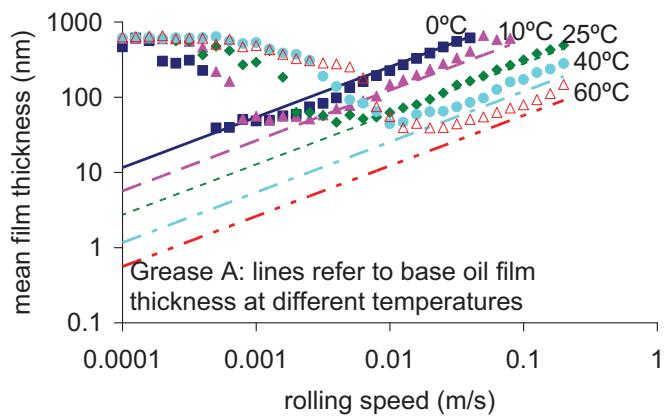  
Fig. 10—Grease film thickness vs. base oil film thickness at different temperatures, grease A.

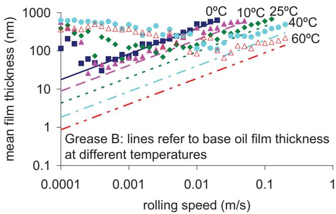  
Fig. 11—Grease film thickness vs. base oil film thickness at different temperatures, grease B.

2. The (fluid) fraction of the grease that forms the EHL film is not only the base oil. Grease consists of a thickener, base oil, and additives. The combination of base oil and additives may give a different viscosity and viscosity–pressure coefficient than that of the base oil specified by the grease manufacturer. This was investigated earlier by Cousseau, et al. (30), who performed measurements with oil that was directly extracted from the grease (also called bled oil).

3. The tested speed is not high enough to observe the match of the grease and base oil film thickness.

Ad 1; Rheology correction. To evaluate the first possible reason for the difference in film thickness, the plastic viscosity of grease k was obtained from a flow curve measured in a parallelplate rheometer, fitted with the Bingham model. The plastic viscosities and the ratio of grease film thickness and base oil film thickness according to Eq. [5] at different temperatures are shown in Table 5. The results of rheology measurements were greatly affected by the measurement procedures (Lugt (2)). Sometimes preshear is applied such as is done in measuring the grease consistency (penetration test). Grease D has also been presheared for 60 strokes in a grease worker but the change in k could be neglected.

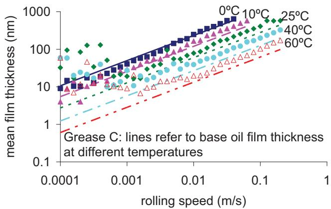  
Fig. 12—Grease film thickness vs. base oil film thickness at different temperatures, grease C.

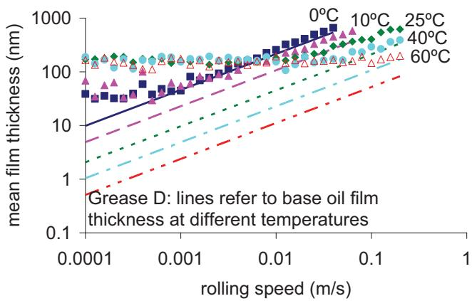  
Fig. 13—Grease film thickness vs. base oil film thickness at different temperatures, grease D.

Figure 14 shows the film thickness measurements of grease D, compared to the film thickness calculations using Eq. [5] (Yang and Qian (11)). Grease D was chosen here because it showed the largest deviation in measured grease film thickness versus calculated film thickness using the base oil viscosity. The figure clearly shows that the correction factor (film thickness ratio $\begin{array} { r } { \left( \frac { k } { \eta _ { b } } \right) ^ { 0 . 7 4 } ) } \end{array}$ is too high to eliminate the sometimes observed difference between grease film thickness and base oil film thickness at higher speeds and therefore does not apply to the greases that were tested in this article.

Ad 2; Bled oil film thickness. Bled oil of greases A and D (obtained after centrifuging at 25◦C for 24 h) was tested at 25◦C in the ball-on-disc rig and the results are shown in Figs. 15 and 16. The figures show that the bled oil film thickness and the calculated base oil film thickness match at higher speeds for both greases A and D. This is different from what was found by Cousseau, et al. (30), who showed that the grease and bled oil film thicknesses are similar and higher than the base oil film thickness. Moreover, the match of bled oil film thickness and calculated base oil film thickness at high speeds for both greases indicates that the calculations to obtain α are correct and that the bled oil viscosity is similar to that of the base oil. Therefore, the second possible explanation for the difference in grease and base oil film thickness at high speeds also does not explain the deviation. This leaves only one explanation, which is that the two film thicknesses will only match at higher speeds. Unfortunately, the WAM5 is not able to measure thick films and it is therefore not possible to confirm this.

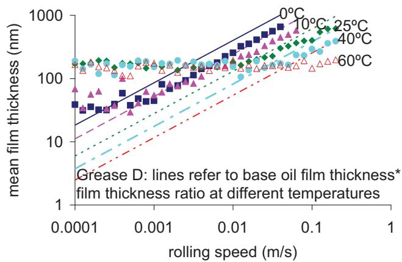  
Fig. 14—Evaluation of the film thickness ratio between grease film thickness and base oil film thickness, grease D.

TABLE 5—PLASTIC VISCOSITY (PA.S) AND FILM THICKNESS RATIO OF THE TESTED GREASES AT DIFFERENT TEMPERATURES
| Temperature (°C) | Grease Type · A · k | Grease Type · A · $\left( \frac { k } { \eta _ { b } } \right) ^ { 0 . 7 4 }$ | Grease Type · B · k | Grease Type · B · $\left( \frac { k } { \eta _ { b } } \right) ^ { 0 . 7 4 }$ | Grease Type · C · k | Grease Type · C · $\left( \frac { k } { \eta _ { b } } \right) ^ { 0 . 7 4 }$ | Grease Type · D · k | Grease Type · D · $\left( \frac { k } { \eta _ { b } } \right) ^ { 0 . 7 4 }$ |
| --- | --- | --- | --- | --- | --- | --- | --- | --- |
| 0 | 3.542 | 1.47 | 9.219 | 1.75 | 3.705 | 1.57 | 4.251 | 1.99 |
| 10 | 1.793 | 1.85 | 4.429 | 2.09 | 2.125 | 2.06 | 2.181 | 2.49 |
| 25 | 0.682 | 2.21 | 1.878 | 2.68 | 0.938 | 2.49 | 0.958 | 3.22 |
| 40 | 0.374 | 2.86 | 1.033 | 3.51 | 0.476 | 3.08 | 0.526 | 4.10 |
| 60 | 0.203 | 3.75 | 0.485 | 4.23 | 0.213 | 3.42 | 0.320 | 5.76 |

Since the present results contradict the results from Cousseau, et al. (30), the bled oils from two more greases were evaluated. In all cases the bled oil film thickness measurements coincided with that calculated using the base oil and the measured grease film thickness at higher speeds. It goes beyond the scope of this article to show all measurement results.

## Spherical Roller on Disc Results

A spherical roller–disc configuration was used to simulate elliptical contacts in roller bearings and measure the grease film thickness at ultralow speeds. The Hertzian contact geometry is listed in Table 1. According to Eq. [4], the film thickness should be proportional to $\frac { 1 - 0 . 6 1 e ^ { - 0 . 7 \overline { { 3 } } k _ { d } } } { R _ { \mathrm { r } } ^ { 0 . 1 6 8 } }$ . Hence, the film thickness from the ball-on-disc configuration should be 0.935 times of that in rolleron-disc setup, quite similar in the two setups at higher speeds where the grease film thickness can again be calculated using Eq. [4].

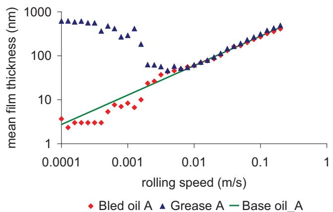  
Fig. 15—Film thickness at ${ \pmb { T } } = 2 5 ^ { \circ } { \pmb { \complement } } ,$ for grease A, its base oil, and bled oil.

Greases A, B, and C were tested at $2 5 ^ { \circ } \mathrm { C }$ and 20 N. The film thickness measurements for circular and elliptical contact are shown in Fig. 17. As expected, the films for circular and elliptical contacts are quite similar at higher speeds. Moreover, the film thickness at low speed is also quite similar, which means that the thickener layer formation will be similar for both contact geometries. Finally, the transition speed was not significantly changed when the ball was replaced by the spherical roller.

## FULL BEARING TEST RESULTS

In order to confirm that the above film thickness–speed behavior (especially the increasing film thickness with decreasing speed in the lower speed region) also applies to full bearings, greases A and B were tested at low speeds in the 6306 bearing—that is, from 1 to 5 rpm—and somewhat higher speeds—that is, from 160 to 1,280 rpm. The test conditions are show in Table 2. In order to calibrate the voltage output of the Lubcheck, a reference oil, TT100, was used. The film thickness as a function of speed was measured for TT100 at 60 and 100◦C, giving a single relation between the voltage output and the calculated film thickness. Subsequently, this relationship was applied to translate the Lubcheck voltage into film thickness for the grease film thickness measurements.

The film thicknesses versus speed and temperature for greases A and B are shown in Figs. 18 and 19, respectively. It is quite clear that with an increase in speed, the grease film thickness for both tested greases first decreases in the lower speed region and subsequently increases in the higher speed region. At higher speeds, the grease film thickness approaches the calculated base oil film thickness (Hamrock-Downson), ultimately giving an almost perfect match. The difference between the grease film thickness and the base oil film thickness can be attributed to the fact that the temperature was measured in the bearing test on the outer ring, which is probably somewhat lower than the temperature at the contact. Thus, the calculated base oil film thickness should use a higher temperature, which will bring down the base oil film thickness to match the grease film thickness. The full bearing results verify the findings from the single-contact measurements in that the grease film thickness development can be divided into two lubrication regimes: below a transition speed, the grease thickener plays an important role where the film thickness increases with decreasing speed, whereas at higher speeds, the film thickness is primarily governed by the base oil.

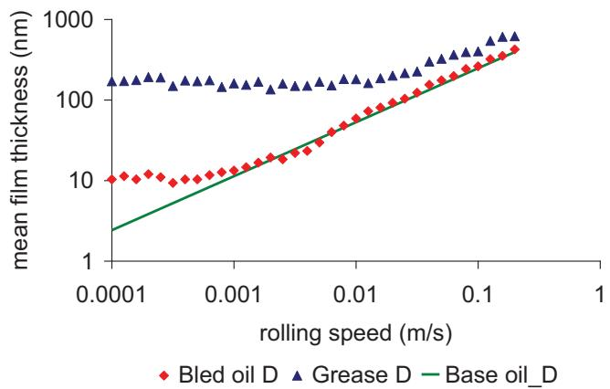  
Fig. 16—Film thickness at ${ \pmb T } = 2 0 ^ { \circ } { \pmb C }$ for grease D, its base oil, and bled oil.

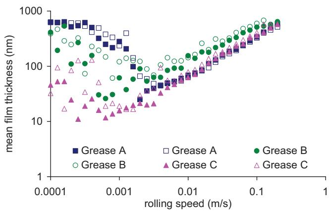  
Fig. 17—Film thickness versus speed for greases A, B, and C. Open symbols: circular contact; closed symbols: elliptical contact.

Because the geometry, load, and materials in the WAM5 and the Tractor tests are different, the film thickness in the two types of tests cannot be compared directly. To compare the film thickness results, the contacts and conditions will need to be scaled by means of a dimensionless film thickness parameter. Johnson (33) proposed the following dimensionless parameters for elastohydrodynamic contacts:

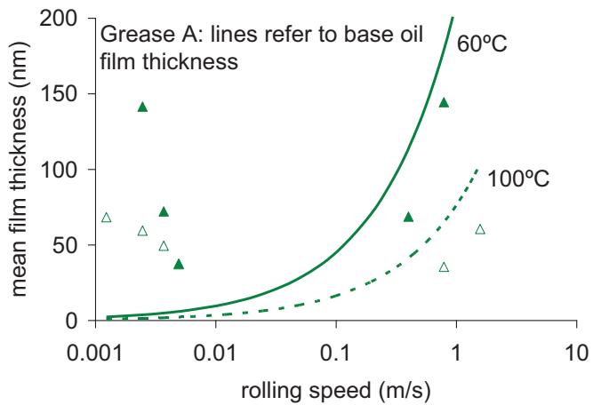  
Fig. 18—Film thicknesses of grease A in full bearing tests at 60◦C (closed symbols) and 100◦C (open symbols).

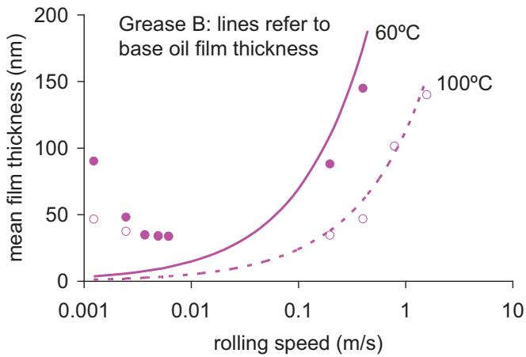  
Fig. 19—Film thicknesses of grease B in full bearing tests at 60◦C (closed symbols) and 100◦C (open symbols).

Dimensionless film thickness parameter:

$$
\hat { H } _ { c } = \frac { h _ { c } } { R _ { x } } \left( \frac { W } { U } \right) ^ { 2 } ,\tag{[6]}
$$

Dimensionless viscosity parameter:

$$
g _ { V } = { \frac { G W ^ { 3 } } { U ^ { 2 } } } ,\tag{[7]}
$$

Dimensionless elasticity parameter:

$$
g _ { E } = \frac { W ^ { 8 / 3 } } { U ^ { 2 } } ,\tag{[8]}
$$

where $\begin{array} { r } { W = { \frac { F } { E ^ { \prime } R _ { x } ^ { 2 } } } , \ U = { \frac { \eta _ { \mathrm { 0 } } u _ { e } } { E ^ { \prime } R _ { x } } } } \end{array}$ , and $G = \alpha E ^ { \prime } , \ h _ { c }$ is the central film thickness (m), F is the load (N), E is the reduced elastic modulus $( \mathrm { P a } ) , u _ { e }$ is the entrainment speed (m/s), and η is the dynamic viscosity at ambient pressure (Pa s).
> *(추출이 깨진 줄 — 원문 p.10 대조로 복구)*

Although Eq. [6] shows the dimensionless film thickness parameter, there is no material parameter included. However, in WAM5 (steel ball on glass disc) and Tractor tests (steel on steel), the materials in contact are different and will play an important role in the film thickness parameter.

Hamrock (29) derived another dimensionless central film thickness parameter for the viscous–elastic lubrication regime shown in Eq. [9].

$$
\hat { H } _ { c } = 3 . 6 1 g _ { V } ^ { 0 . 5 3 } g _ { E } ^ { 0 . 1 3 } \left( 1 - 0 . 6 1 e ^ { - 0 . 7 3 k } \right) .\tag{[9]}
$$

Equation [9] shows that $\hat { H } _ { c }$ is proportional to $g _ { V } ^ { 0 . 5 3 }$ . Then, another dimensionless film thickness parameter $N$ can be derived:

$$
N = \frac { \hat { H } _ { c } } { g _ { V } ^ { 0 . 5 3 } \times ( 1 - 0 . 6 1 e ^ { - 0 . 7 3 k } ) } .\tag{[10]}
$$

By substituting the $\hat { H } _ { c }$ from Eq. [6] into Eq. [9], the dimensionless film thickness parameter N, which includes a speed parameter, a load parameter, and a material parameter, as well

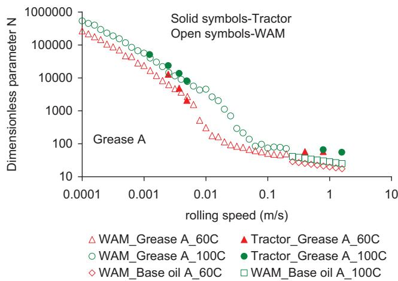  
Fig. 20—Dimensionless film thickness parameter N comparison for grease A.

as the ellipticity, can be determined:

$$
\begin{array} { c } { { N = \displaystyle \frac { \hat { H } _ { c } } { g _ { V } ^ { 0 . 5 3 } \times ( 1 - 0 . 6 1 e ^ { - 0 . 7 3 k } ) } } } \\ { { \ } } \\ { { = h _ { c } \times \displaystyle \frac { W ^ { 0 . 4 1 } } { G ^ { 0 . 5 3 } \times U ^ { 0 . 9 4 } \times R _ { x } \times ( 1 - 0 . 6 1 e ^ { - 0 . 7 3 k } ) } . } } \end{array}\tag{[11]}
$$

The values of the dimensionless parameter N as a function of speed for the two setups for greases A and B at different temperatures are shown in Figs. 20 and 21, respectively.

Clearly, the lines for the single contact and the full bearing at lower speeds (less than 0.01 m/s) collapse into a single curve. The grease film thickness was measured in the WAM only up to 0.2 m/s. At higher speeds, calculated values are plotted using the base oil viscosity. Figures 20 and 21 shows that the dimensionless parameter N is different for the WAM and Tractor at higher speeds (over 0.2 m/s). This can also be attributed to the same reason mentioned for the difference between the grease and base oil film thickness shown in Figs. 18 and 19. The actual higher temperature than that used for the base oil calculation will bring down not only hc but also α and η0, which will have a combined effect to increase the N values for the base oil in the WAM to match with the grease in Tractor.

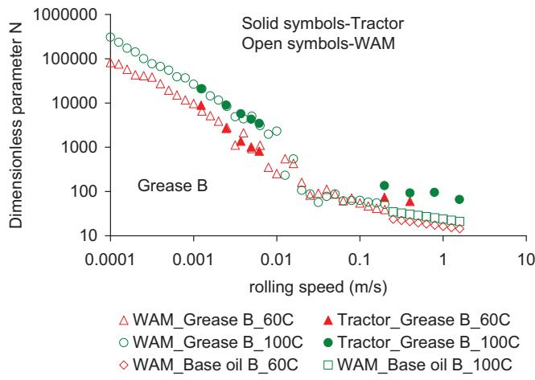  
Fig. 21—Dimensionless film thickness parameter N comparison for grease B.

## DISCUSSION AND CONCLUSION

The film thickness was measured for four different types of greases in a ball/spherical roller-on-flat disc rig under fully flooded conditions. The greases were chosen to be representative of those commonly used in rolling bearings; that is, lithium, urea, and calcium sulfonate thickeners with mineral or synthetic oil.

There is a clear difference in the lubrication mechanism between ultralow speed and medium speeds. At higher speeds, the film thickness versus speed relation follows the conventional EHL behavior; that is, a straight line on a double logarithmic scale. The films are determined by hydrodynamic action where the lubricant can be assumed to behave as a Newtonian fluid. The film thickness can be predicted with the standard EHL film thickness formulae for which the base oil properties can be used. At lower speeds—that is, at speeds lower than a transition speed—the film thickness is not only determined by hydrodynamic effects. In this regime, thickener material contributes to the film thickness. This effect becomes more pronounced with decreasing speed. The result is that below the transition speed, the film thickness increases with decreasing speed, whereas it increases with increasing speed above the transition speed. In other words, the film thickness versus speed curve will be V shaped.

The transition speed moves to higher speeds with an increase in temperature, whereas the minimum film thickness—that is, the film thickness at the transition speed—stays fairly constant. Therefore, there is only a small impact of temperature on the minimum film.

The effects of load and slip ratio on the grease film thickness are limited, similar to what can be expected in oil lubrication. Some experiments have been performed on oil that was separated from the grease using a centrifuge. Other than that reported by Cousseau, et al. (30), there was no general increase in film thickness compared to the calculated film thickness using the base oil viscosity.

Two greases were selected to be tested in a full bearing tester (Tractor). The full bearing results confirmed the V-shaped curve for the relationship between film thickness and speed. Moreover, the grease film thickness at higher speeds can be predicted using base oil properties. A dimensionless film thickness parameter was introduced to compare the results from a single contact and full bearing test.

## ACKNOWLEDGEMENT

Special thanks to J. Storken for performing the “tractor measurements” and Dr. J. H. H. Bongaerts for the discussions on the Lubcheck technology.

## FUNDING

The authors thank A. J. C. de Vries, SKF Director Group Product Development, for financial support and his permission to publish this work.

## REFERENCES

(1) Lugt, P. M. (2009), “A Review on Grease Lubrication in Rolling Bearings,” Tribology Transactions, 52, pp 470–480.

(2) Lugt, P. M. (2013), Grease Lubrication in Rolling Bearings, John Wiley & Sons Ltd.: Chichester, UK.

(3) Poon, S. Y. (1972), “An Experimental Study of Grease in Elastohydrodynamic Lubrication,” Journal ofLubrication Technology, 94(1), pp 27–34.

(4) Cann, P. M. (1996), “Starvation and Reflow in a Grease-Lubricated Elastohydrodynamic Contact,” STLE Tribology Transactions, 39(3), pp 698–704.

(5) Cann, P. M. and Spikes, H. A. (1992), “Film Thickness Measurements of Lubricating Greases under Normally Starved Conditions,” NLGI Spokesman, 56(2), pp 21–27.

(6) Cann, P. M. (1996), “Understanding Grease Lubrication,” Tribology Series, 31, pp 573–581.

(7) Baart, P., Lugt, P. M., and Prakash, B. (2010), “Non-Newtonian Effects on Film Formation in Grease-Lubricated Radial Lip Seals,” Tribology Transactions, 53(3), pp 308–318.

(8) Kauzlarich, J. J. and Greenwood, J. A. (1972), “Elastohydrodynamic Lubrication with Herschel-Bulkley Model Greases,” ASLE Transactions, 15(4), pp 269–277.

(9) Jonkisz, W. and Krzeminski-Freda, H. (1979), “Pressure Distribution and Shape of an Elastohydrodynamic Grease Film,” Wear, 55, pp 81–89.

(10) Cheng, J. (1994), “Elastohydrodynamic Grease Lubrication Theory and Numerical Solution in Line Contacts,” Tribology Transactions, 37(4), pp 711–718.

(11) Yang, Z. and Qian, X. (1987), “A Study of Grease Film Thickness in Elastorheodynamic Rolling Point Contacts,” IMechE Conference Publication, pp 97–104. Paper No. 142/87.

(12) Dong, D. and Qian, X. (1988), “A Theory of Elastohydrodynamic Grease-Lubricated Line Contact Based on a Refined Rheological Model,” Tribology International, 21, pp 261–267.

(13) Astrom, H., Isaksson, O., and H˚ oglund, E. (1991), “Video Recordings of¨ an EHL Point Contact Lubricated with Grease,” Tribology International, 24(3), pp 179–184.

(14) Williamson, B. P., Kendall, D. L. R., and Cann, P. M. (1993), “The Influence of Grease Composition on Film Thickness in EHD Contacts,” NLGI Spokesman, 57(8), pp 13–18.

(15) Kaneta, M., Ogata, T., Takubo, Y., and Naka, M. (2000), “Effects of Thickener Structure on Grease Elastohydrodynamic Lubricant Films,” Proceedings ofInstitution ofMechanical Engineers - Part J: Journal ofEngineering Tribology, 214, pp 327–336.

(16) Hurley, S. and Cann, P. M. (1999), “Grease Composition and Film Thickness in Rolling Contacts,” NLGI Spokesman, 63(4), pp 12–22.

(17) Dong, D., Endo, T., and Kimura, Y. (2009), “Formation of Thick EHL Film with Grease at Low Speeds,” Proceedings of the World Tribology Congress, September 6–11, Kyoto, Japan.

(18) Kimura, Y., Endo, T., and Dong, D. (2010), “EHL with Grease at Low Speeds,” Proceedings of CIST2008 & ITS-IFToMM2008, Advanced Tribology, pp 15–19.

(19) Furuhama, S. and Sumi, T. (1961), “A Dynamic Theory of Piston–Ring Lubrication,” Bulletin ofthe JSME, 4(16), pp 744–752.

(20) Vichard, J. P. (1971), “Transient Effects in the Lubrication of Hertzian Contacts,” Journal ofMechanical Engineering Science, 13, pp 173–189.

(21) Dowson, D., Ruddy, B. L., and Economou, P. N. (1983), “The Elastohydrodynamic Lubrication of Piston Rings,” Proceedings ofthe Royal Society ofLondon A, 386, pp 409–430.

(22) Grice, N., Sherrington, I., Smith, E. H., O’Donnel, S. G., and Springfellow, J. F. (1990), “A Capacitance Based System for High Resolution Measurement of Lubricant Film Thickness,” Proceedings of the 4th Nordic Symposium on Tribology, Lubrication, Friction and Wear, Jacobsen , J., Klarskov, M., Eis, M. (Eds), Lyngby, Technical University of Denmark, pp 349–361.

(23) Glovnea, R., Furtuna, M., Nagata, Y., and Sugimura, J. (2012), “Electrical Methods for the Evaluation of Lubrication in Elastohydrodynamic Contacts,” Tribology Online, 7(1), pp 46–53.

(24) Jablonka, K., Glovnea, R., Bongaerts, J. H. H., and Morales-Espejel, G. E. (2012), “Comparative Measurements of EHD Film Thickness in Ball-on-Flat Rig and Rolling Element Bearing,” STLE 67th Annual Meeting, St. Louis, MO, 6–10 May.

(25) Heemskerk, R. S., Vermeiren, K. N., and Dolfsma, H. (1982), “Measurement of Lubrication Condition in Rolling Element Bearings,” Tribology Transactions, 25(4), pp 519–527.

(26) Morales-Espejel, G. E., Lugt, P. M., Pasaribu, R., and Cen, H. (2014), “Film Thickness in Grease Lubricated Slow Rotating Rolling Bearings,” Tribology International, 74, 7–19.

(27) Hartl, M., Krupka, I., Poliscuk, R., Liska, M., Molimard, J., Querry, M., and Vergne, P. (2001), “Thin Film Colorimetric Interferometry,” Tribology Transactions, 44(2), pp 270–276.

(28) Storken, J., Ippel, H., and Girardin-Humbert, C. (1997), “Lubcheck Mk3 User Manual,” SKF Internal Report NL97T023B.

(29) Hamrock, B. J. (1991), “Fundamentals of Fluid Film Lubrication,” NASA RP-1255.

(30) Cousseau, T., Bjorling, M., Graca, B., Campos, A., Seabra, J., and Lars-¨ son, R. (2012), “Film Thickness in a Ball-on-Disc Contact Lubricated with Greases, Bleed Oils and Base Oils,” Tribology International, 53, pp 53–60.

(31) Hamrock, B. J., and Dowson, D. (1978), “Elastohydrodynamic Lubrication of Elliptical Contacts for Materials of Low Elastic Modulus 1—Fully Flooded Conjunction,” ASME Journal ofTribology, 100, pp 236–245.

(32) Khonsari, M. M., and Booser, B. B. (2008), Applied Tribology: Bearing Design and Lubrication, 2nd ed, Institution of Mechanical Engineers: London, UK.

(33) Johnson, K. L. (1970), “Regimes of Elastohydrodynamic Lubrication,” Journal ofMechanical Engineering Science, 12(1), pp 9–16.
