# A Model for Rolling Bearing Life with Surface and Subsurface Survival—Tribological Efects

Guillermo E. Morales-Espejel, Antonio Gabelli & Alexander J. C. de Vries

Co © 2015 The Author(s). Published with license by Taylor & Francis Group, LLC© Guillermo E. Morales-Espejel, Antonio Gabelli, and Alexander de Vries

# A Model for Rolling Bearing Life with Surface and Subsurface Survival—Tribological Effects

GUILLERMO E. MORALES-ESPEJEL,1,2 ANTONIO GABELLI,1 and ALEXANDER J. C. DE VRIES1 1SKF Engineering & Research Centre, Nieuwegein, The Netherlands 2Universite de Lyon, INSA-Lyon, CNRS, LaMCoS UMR5259, F69621, France

Until now the estimation of rolling bearing life has been based on engineering models that consider an equivalent stress, originated beneath the contact surface, that is applied to the stressed volume of the rolling contact. Through the years, fatigue surface–originated failures, resulting from reduced lubrication or contamination, have been incorporated into the estimation of the bearing life by applying a penalty to the overall equivalent stress of the rolling contact. Due to this simplification, the accounting of some specific failure modes originated directly at the surface of the rolling contact can be challenging. In the present article, this issue is addressed by developing a general approach for rolling contact life in which the surface-originated damage is explicitly formulated into the basic fatigue equations of the rolling contact. This is achieved by introducing a function to describe surface-originated failures and coupling it with the traditional subsurfaceoriginated fatigue risk of the rolling contact. The article presents the fundamental theory of the new model and its general behavior. The ability of the present general method to provide an account for the surface–subsurface competing fatigue mechanisms taking place in rolling bearings is discussed with reference to endurance testing data.

## KEY WORDS

Bearing Life; Surface Damage; Surface Fatigue; Rolling Contact Fatigue

## INTRODUCTION

Since the pioneering work of Lundberg and Palmgren in 1947 (Lundberg and Palmgren (1), (2)), rolling bearing life has been modeled using basic principles of rolling contact fatigue based on an equivalent stress originated beneath the contacting surfaces and affecting the overrolling material volume of the contact. This approach is focused on subsurface spalling fatigue because this was the dominant failure mode at the time the model was developed. In 1967, Tallian (3) found that there are many different competing failure modes leading to fatigue failure of the bearing raceway. This is also the conclusion of a more recent investigation about this topic performed by Olver in 2005 (Olver (4)). In 1971, Chiu, et al. (5), (6), Tallian and McCool (7), and Tallian (8) also attempted to tackle the different failure mechanisms occurring at the surface and in the subsurface of the rolling contact using engineering crack mechanics concepts. The different failure modes that occur in rolling bearings and their effect on rolling bearing life are extensively discussed by Zaretsky (9). An exhaustive and up-to-date categorization and review of rolling contact fatigue models can be found in Sadeghi, et al. (10).

A significant contribution and further extension of the Lundberg and Palmgren (1), (2) theory is provided by Ioannides and Harris (11) and Ioannides, et al. (12) with the introduction of an additional material parameter to characterize the fatigue strength of bearing steel at the very high number of stress cycles (Gabelli, et al. (13)). The new model was found to give a better representation of the load-life performance of modern rolling bearings (Ioannides, et al. (12); Gabelli, et al. (13), (14)). Furthermore, this model provides a consistent methodology to globally derate the life of the rolling contact in case the operating conditions are less than optimal as in case of reduced lubrication or presence of contamination particles (Ioannides, et al. (12); Gabelli, et al. (14)). Currently this approach is well supported by national and international standards (ISO 281:2007 (15)).

In the last few decades, the need to further increase energy efficiency in machines and reduce their environmental impact has created the tendency for rolling bearings to operate at higher rotary speeds, higher temperatures, and reduced lubricant film thicknesses. Furthermore, the presence of contaminants and aggressive additives in the lubricant has also contributed in making surface related failures a very common aspect of current service life of rolling bearings. Because of this, there is an increased need for more versatile or generalized rolling bearing life models, able to adapt and incorporate new developed knowledge about the tribology of surface initiated failures of the rolling contact. Despite the progress achieved in the last few years in the numerical modeling of the tribology and surface performance of rolling contacts (e.g., Epstein, et al. (16), (17); Morales-Espejel and Brizmer (18); Morales-Espejel and Gabelli (19); Brizmer, et al. (20); Warhadpande and Sadeghi (21)), the integration of this new knowledge into an engineering model for bearing life estimation is, to some extent, hindered by the simplicity of present standardized life rating formulation (ISO 281:2007 (15)), which only relies on averaged global de-rating factors. This approach, although sufficient for most common situations, is not designed to give an account and differentiate among surface/subsurface competing failure modes that may occur in a bearing when exposed to a hostile environment and tough operating conditions.

## Objective of the Present Article

The objective of the present article is to describe the basic equations of a probabilistic model for rolling contact fatigue life estimation tailored to better characterize bearing surface– induced damage from the subsurface rolling contact fatigue process of the bearing. This new formulation is designed to facilitate the incorporation into bearing applications of newly developed knowledge gained from testing, advanced numerical modeling, or even engineering field experience of the expected surface and subsurface performance of the rolling contact.

$P _ { u }$ Fatigue load limit in the bearing (N)   
NOMENCLATURE   
p Exponent in the bearing life equation   
A  Damage risk area $( m ^ { 2 } )$ $\Delta p$ Pressure fluctuations due to roughness (Pa)   
A  Constant $p _ { o }$ Maximum Hertzian pressure in the contact (Pa)   
bA Damage constant for volume, damage constant for a Q Contact load (N)   
$R _ { q }$ r.m.s. value of the roughness (m)   
rolling contact   
$a _ { u }$ Fatigue limit load-life modifying factor; see Ioannides, $R _ { s }$ Normalized surface damage function, $R _ { s } = I _ { s } u ^ { e } L ^ { e } { } _ { 1 0 . { B R } } /$   
et al. (12) [KLn(1/0.9)]   
a Hertzian semi-width along the rolling direction (m) S Probability of surviva   
B Damage constant for surface S Sliding/rolling ratio in the contact, $S = u _ { s } / \overline { { u } }$   
b Hertzian semi-width across the rolling direction (m) $S _ { R }$ Ratio of surface damage   
C Dynamic capacity of the bearing (N) u Number of stress cycles per revolution, L N/u   
c Exponent in the bearing life equation u D Mean speed of the contact surfaces (m)   
$d _ { m }$ Mean diameter of the bearing (mm) $u _ { s }$ Sliding speed (m/s)   
e Exponent in the bearing life equation (standardized V  Damage risk volume $( m ^ { 3 } )$   
Weibull slope) w  Exponent in the life equation   
F D Radial bearing load (N) x D Coordinate (rolling direction) (m)   
G(N)  Accumulated material degradation function from 0 to y  Coordinate (transverse to rolling direction) (m)   
N load cycles z  Coordinate (depth from the surface) (m)   
h Thickness of the surface layer (m) h Surface stress concentration reduction factor, h h h ;   
bh D Exponent in the bearing life equation see Gabelli, et al. (14)   
Is D Surface damage integral or surface damage parameter k  Viscosity ratio in the bearing; see ISO 281:2007 (15)   
$I _ { s s }$ Subsurface damage integral L Lubrication quality factor $\Lambda = h _ { c } / R _ { q }$   
K Constant for the surface damage function s Amplitude value of stress-related fatigue criterion (Pa)   
L Rolling contact life, bearing life (MRev) $\sigma _ { u }$ Fatigue limit value of the fatigue criterion used (Pa)   
L10.BR D Basic rating life (MRev) $\tau _ { u }$ Shear stress fatigue limit (Pa)   
$\tau _ { x z }$ Amplitude of the orthogonal shear stress (Pa)   
m Weibull slope for surface failure modes   
N  Number of load cycles $\Psi _ { b r g }$ Bearing-type characteristic number; see Gabelli, et al.   
P  Equivalent load in the bearing (N) (14)   
SUBSCRIPTS   
e Related to outer ring s Related to surface   
i Related to inner ring v Related to volume

The article presents the fundamental theoretical aspects of the new model and its general behavior and does not intend, at this point, to describe an engineering methodology for bearing life calculation in applications; that aspect should come in further publications. The advantages of the present method in providing a specific account for the observed surface/subsurface competing fatigue mechanisms of the rolling contact is illustrated using a simple bearing application operating under various lubrication conditions and endurance test results.

## PROBABILISTIC DAMAGE APPROACH

It is well known that under laboratory conditions, seemingly identical bearings operating under identical conditions have significantly different individual bearing lives. Because of this, the prediction of bearing life requires a probabilistic setting, in order to

1. represent the intrinsic local variability of the material matrix strength, geometrical parameters and stochastic properties resulting from the presence of random inclusions and other inhomogeneities; for example, Ioannides and Harris (11), Lamagnere, et al. (22), Lai, et al. (23), Weibull (24), and

2. provide a simple method for the nominal scaling of the life, conventionally rated at 90% reliability; that is, $L _ { 1 0 } ,$ to a different value of reliability; that is, $L _ { 5 0 }$ (Lundberg and Palmgren (1); ISO 281:2007 (15); Weibull (25)).

The present model will retain the standardized probabilistic approach used in rolling bearing life ratings based on a twoparameter Weibull distribution, as discussed in Blachere and Gabelli (26).

Weibull (24), with the weakest link theory, introduced stochastic concepts in the determination of strength and rupture of structural elements.

If a structure is composed by n elements subjected to different stress states, thus with a different probability of survival $S _ { 1 } \cdot S _ { 2 } \cdot$ $S _ { n }$ following the product law of reliability, the probability that the whole structure will survive is

$$
S _ { 1 } ^ { n } { = } S _ { 1 } \cdot S _ { 2 } \cdots S _ { \mathrm { n } } { = } \prod _ { \mathrm { i } = 1 } ^ { \mathrm { n } } S _ { \mathrm { i } }\tag{[1]}
$$

which can be expressed also in the equivalent form

$$
\ln \left( S _ { 1 } ^ { n } \right) = \ln ( S _ { 1 } ) + \ln ( S _ { 2 } ) + \cdots + \ln ( S _ { \mathrm { n } } ) = \sum _ { \mathrm { i } = 1 } ^ { \mathrm { n } } \ln ( S _ { \mathrm { i } } ) .\tag{[2]}
$$

## Contact Damage Model

Lundberg and Palmgren (1), in their classic original formulation of the dynamic capacity of rolling bearings in 1947, applied the product law of reliability of Weibull Eq. [2] to derive the survival function of a structure made of n independent physical elements accounting for the degradation process from 0 to N load cycles:

$$
\ln \left[ \frac { 1 } { S ( N ) } \right] = \ln \left[ \frac { 1 } { \Delta S _ { 1 } ( N ) } \right] + \ln \left[ \frac { 1 } { \Delta S _ { 2 } ( N ) } \right] + \cdot \cdot \cdot + \ln \left[ \frac { 1 } { \Delta S _ { n } ( N ) } \right] .\tag{[3]}
$$

The volume V can be divided into two or more independent sources of damage risk for the structure; consider that G is a material degradation function accounting for the effect of the accumulation of load cycles (fatigue). Therefore, regions can be characterized by different material degradation functions that could describe different (or a single) degradation processes, $G _ { \nu . 1 }$ $G _ { \nu . 2 } , . . . , G _ { \nu . n } .$ Their combined effect on the survival of the complete structure can be expressed by using Eq. [3], from which the following can be derived:

$$
\begin{array} { l } { { \displaystyle \ln \left[ \frac 1 { S ( N ) } \right] = \sum _ { i = 1 } ^ { n } G _ { \nu . 1 } ( N ) \ \Delta V _ { \nu . 1 . \mathrm { i } } } } \\ { { \displaystyle \qquad + \sum _ { i = 1 } ^ { n } G _ { \nu . 2 } ( N ) \ \Delta V _ { \nu . 2 . \mathrm { i } } + \dotsb + \sum _ { i = 1 } ^ { n } G _ { \nu . n } ( N ) \ \Delta V _ { \nu . n . \mathrm { i } } } ; } \end{array}\tag{[4]}
$$

for an infinitesimal volume $\Delta V \to 0$ this becomes

$$
\begin{array} { l } { { \displaystyle \ln \biggl [ \frac { 1 } { S ( N ) } \biggr ] = \int _ { V _ { \nu . 1 } } G _ { \nu . 1 } ( N ) d V _ { \nu . 1 } + \int _ { V _ { \nu . 2 } } G _ { \nu . 2 } ( N ) d V _ { \nu . 2 } + \cdot \cdot \cdot } } \\ { { \displaystyle \phantom { \frac { 1 } { S ^ { 2 } } } + \int _ { V _ { \nu . n } } G _ { \nu . n } ( N ) d V _ { \nu . n } } , } \end{array}\tag{[5]}
$$

which is a generalized type of survival function for a structure composed of n independent regions subjected to the risks associated to the accumulation of material damage.

## Surface and Subsurface Survival

In the present formulation for a rolling contact life, two independent degradation functions are introduced to express the survival probability of the rolling contact. The first function describes the damage taking place in the bulk volume of the rolling contact; that is, the subsurface damage accumulation function or Gv(N). The second function represents the damage occurring in a thin material layer at the very surface of the rolling contact; that is, the surface damage evolution function or $G _ { s } ( N )$ . Thus, the survival function (Eq. [5]) for a rolling contact can be written as

$$
\ln \left[ \frac { 1 } { S ( N ) } \right] = \int _ { V _ { \nu } } G _ { \nu } ( N ) d V _ { \nu } + \int _ { V _ { s } } G _ { s } ( N ) d V _ { s } .\tag{[6]}
$$

This formulation of the survival of a rolling contact allows the surface to account for the different probabilistic failure modes independently from the subsurface region of the contact. Indeed, surface phenomena such as surface distress, wear, indentations, frictional heating, etc., in general affect the fatigue of a very thin material layer whose mechanical properties may differ from the bulk properties of the Hertzian contact; see Fig. 1. Therefore, it is advantageous to analyze the damage developed in this region separately from the rest of the contact. For instance, surface traction and roughness-induced surface stresses will not, in general, affect the subsurface smooth Hertzian stress or the amplitude of the fatigue stress criterion of the rolling contact (Ioannides, et al. (12)).

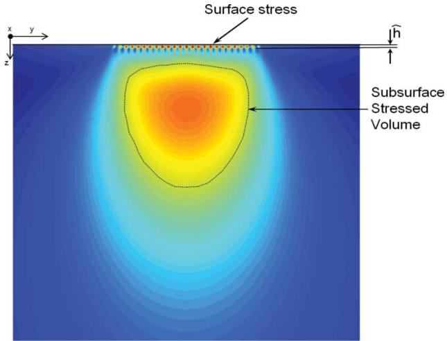  
Fig. 1—Schematics of surface and subsurface von Mises stress fields of a Hertzian contact. Surface stresses are related to surface microgeometry and lubrication conditions of the rolling contact. Typically surface stresses are constrained in a narrow layer at the raceway of depth comparable to the surface roughness.

Furthermore, in situations where surface traction is dominant, the stresses very close to the surface appear to be almost independent of the depth. Therefore, a further approximation is possible; consider a surface material volume $\widehat { V _ { s } } = \widehat { h _ { \mathbf { \lambda } } } \cdot A$ as a thin layer on the raceway, then $G _ { s }$ bapplies to the surface region A, up to a depth $\widehat { h }$ of the order of the depth of the microgeometry maxbimum stress; see Fig. 1. For rolling bearings, raceway microgeometry (see Gabelli, et al. (14); Morales-Espejel, et al. $( 2 7 ) \widehat { h }$ bcan be assumed small and constant for similar classes and types of bearings. The probability of survival (Eq. [6]), can then be rewritten in the following form:

$$
\ln \left[ \frac { 1 } { S ( N ) } \right] = \int _ { V _ { \nu } } G _ { \nu } ( N ) d V _ { \nu } + \widehat h \int _ { A } G _ { s } ( N ) d A .\tag{[7]}
$$

## Material Degradation Functions

## Subsurface Damage

It is well established that subsurface damage in rolling bearings is caused by rolling contact fatigue (Lundberg and Palmgren (1), (2); Sadeghi, et al. (10)). Cumulative fatigue damage models are expressed by a stress power law to account for the portion of life spent in the initiation and the short macropropagation phase of the crack that will ultimately determine the life time of rolling contacts (Lundberg and Palmgren (1); Weibull (24)). Many authors believe that the power function generally used to describe fatigue processes is not a mere empirical equation, but it is recognized as having the characteristics of a general physical law for damage accumulation processes of more universal applicability (Basquin (28); Kun, et al. (29)). A power law for rolling contact fatigue damage can be found in Lundberg and Palmgren (1), Ioannides and Harris $( l l )$ , and Ioannides, et al. (12). Using the approach of Ioannides and Harris $( I I )$ , the power law for subsurface rolling contact fatigue reads

$$
G _ { \nu } = \overline { { { A } } } N ^ { e } \frac { \langle \sigma - \sigma _ { u } \rangle ^ { c } } { z ^ { h } } .\tag{[8]}
$$

More advanced formulations of the same basic model are also available. In Ioannides $( 3 0 ) , \sigma _ { u }$ is not constant but it is assumed to be function of $N ;$ that is, $\sigma _ { u } ( N )$ : A similar methodology can be adopted in case the material undergoes changes of the original fatigue strength due to some extreme thermomechanical conditions during the stress cycling history of the rolling contact. When variable operating conditions are used in a bearing, the damage accumulation can be followed up by using the Palmgren-Miner rule (Miner (31)). Therefore, when the fatigue limit changes due to an extreme event—for example, overloading, overheating etc.— Eq. [8] can still be used with the current, derated fatigue limit.

## Surface Damage

Several surface-related failure modes and related mechanisms can be identified in rolling bearings (e.g., surface distress, indentations, wear-related stress concentrations, micropitting, surface chemistry, etc.). Under severe operating environmental conditions, surface damage leads generally to failures that are quite independent from the subsurface fatigue strength. Contrary to that, surface survival is more related to the operating conditions and raceway microgeometry (e.g., metal-to-metal contact, local friction, film thickness, etc.). It is therefore difficult to generalize all different mechanisms using a single damage function as proposed for the subsurface fatigue case. Specific damage functions should be related to the expected failure modes. Tribological models can be used to derive these damage functions. When several mechanisms are present—for example, surface distress and mild wear—the damage function should account for possible competitive mechanisms (Morales-Espejel and Brizmer (18)) and the statistical treatment should follow (McCool (32)). As an example of surface fatigue (Lubrecht, et al. (33)), the following damage function is considered:

$$
G _ { s } = \overline { { B } } N ^ { e } \langle \sigma - \sigma _ { u } \rangle { } ^ { c } .\tag{[9]}
$$

Generalizing Eq. [7] for various independent surface regions (flanges, raceways, etc.) and/or independent surface damage mechanisms (surface distress, surface chemistry, etc.), one has

$$
\ln \left[ \frac { 1 } { S ( N ) } \right] = \int _ { V _ { \nu } } G _ { \nu } ( N ) d V _ { \nu } + \widehat { h } \int _ { A } G _ { s _ { 1 } } ( N ) d A + \cdot \cdot \cdot + \widehat { h } \int _ { A } G _ { s _ { n } } ( N ) d A .\tag{[10]}
$$

Note that to facilitate the use of the Weibull statistics (Weibull (25)), the survival equation [10] would require the adoption of a common standardized Weibull shape parameter (slope) for all different degradation functions. Failure modes with a tendency to be deterministic (very large Weibull slope) may represent a problem when combined with the more probabilistic classical rolling contact fatigue; for those cases (e.g., severe smearing, very severe wear, or contamination), the current approach may show limitations.

## MODEL BEHAVIOR

Following Ioannides and Harris (11) and Eq. [8], the fatigue damage volume integral can be obtained by using the stress amplitude s originated from the Hertzian stress field:

$$
\int _ { V _ { \nu } } G _ { \nu } ( N ) d V _ { \nu } = \overline { { A } } N ^ { e } \int _ { V _ { \nu } } \frac { \langle \sigma _ { \nu } - \sigma _ { u } \rangle { } ^ { c } } { z ^ { h } } d V _ { \nu } .\tag{[11]}
$$

In a similar manner one can rewrite the surface damage function. If the constant $\widehat { h }$ is included into the surface damage proportionality constant ${ \overline { { B } } } ,$ one obtains

$$
\widehat { h } \int _ { A } G _ { s } ( N ) d A = \overline { { B } } N ^ { m } \int _ { A } \langle \sigma _ { s } - \sigma _ { u } \rangle ^ { c } d A .\tag{[12]}
$$

In the surface damage function [12] the stresses $\sigma _ { s }$ must be obtained from the actual surface geometry of the contact and frictional stresses. Furthermore, for the sake of generality, the fatigue failure distribution of the surface of the rolling contact will be allowed to have a different Weibull slope (m) compared to the fatigue failures distribution of the subsurface volume (e). If different Weibull slopes are introduced when combining surface and subsurface damage models, the resulting statistics will not follow a standard Weibull failure distribution model.

Substituting in $\operatorname { E q . } \left[ 7 \right]$ and rearranging gives

$$
\ln \left( \frac { 1 } { S } \right) = N ^ { e } \left[ \overline { { { A } } } \int _ { V _ { \nu } } \frac { \langle \sigma _ { \nu } - \sigma _ { u , \nu } \rangle ^ { c } } { z ^ { h } } d V _ { \nu } + N ^ { ( m - e ) } \overline { { { B } } } \int _ { A } \langle \sigma _ { s } - \sigma _ { u , s } \rangle ^ { c } d A \right] .\tag{[13]}
$$

Substituting $N = u L$ in $\operatorname { E q . } \left[ 1 3 \right]$ and solving leads to

$$
L ^ { e } = \frac { \ln \left( \frac { 1 } { S } \right) } { u ^ { e } \left[ \overline { { { A } } } \int _ { V _ { \nu } } \frac { \langle \sigma _ { \nu } - \sigma _ { u , \nu } \rangle ^ { c } } { z ^ { h } } d V _ { \nu } + ( u L ) ^ { ( m - e ) } \overline { { { B } } } \int _ { A } \left. \sigma _ { s } - \sigma _ { u , s } \right. ^ { c } d A \right] } .\tag{[14]}
$$

Performing the reciprocal of Eq. [14] provides the following:

$$
\begin{array} { c } { \displaystyle \frac { 1 } { L ^ { e } } = \displaystyle \frac { 1 } { L _ { \nu } ^ { e } } + \displaystyle \frac { 1 } { L _ { s } ^ { e } } = \displaystyle \frac { u ^ { e } \overline { { A } } } { \ln \left( \frac { 1 } { S } \right) } \int _ { V _ { \nu } } \displaystyle \frac { \langle \sigma _ { \nu } - \sigma _ { u . \nu } \rangle ^ { c } } { z ^ { h } } d V _ { \nu } } \\ { \displaystyle + \frac { u ^ { m } L ^ { ( m - e ) } \overline { { B } } } { \ln \left( \frac { 1 } { S } \right) } \int _ { A } \langle \sigma _ { s } - \sigma _ { u . s } \rangle ^ { c } d A . } \end{array}\tag{[15]}
$$

It is easily recognized that in Eq. [15] the reciprocal of the first term (at the right side of the equation) corresponds to the original Lundberg-Palmgren (1) model (basic rating) modified with the additional effect of the fatigue limit $\left( L _ { \nu } \right)$ as introduced in Ioannides and Harris (11), and the reciprocal of the second term (at the right side of the equation) corresponds to any additional effect introduced by damage accumulation at the surface of the rolling contact (Ls).

From [14] it is possible also to derive an expression of the rolling contact life,

$$
L = \frac { \left[ \ln \left( \frac { 1 } { S } \right) \right] ^ { 1 / e } } { u } \left[ \frac { 1 } { \overline { { { d } } } \int _ { V _ { \nu } } \frac { \langle \sigma _ { \nu } - \sigma _ { u , \nu } \rangle ^ { c } } { z ^ { h } } d V _ { \nu } + ( u L ) ^ { ( m - e ) } \overline { { { B } } } \int _ { A } \langle \sigma _ { s } - \sigma _ { u , s } \rangle ^ { c } d A } \right] ^ { 1 / e } .\tag{[16]}
$$

Notice that in order to obtain the calculated life from Eq. [16], a calculation based on an iteration scheme is required because the rolling contact life is also included in the right-hand side of Eq. [16]. However, if $m = e ,$ then the $( u L ) ^ { m - e }$ term reduces to 1 and the solution for the life L becomes fully explicit.

## Surface Model Behavior

In the current formulation, the treatment of the surface stresses and damage can be accomplished by using an advanced surface distress model for elastohydrodynamically lubricated (EHL) rolling–sliding rough contacts developed by Morales-Espejel and Brizmer (18); further description of this model is given below.

In the current section, the use of this model will be limited to the calculation of the stress terms in the integrals of Eq. [11] for the subsurface and [12] for the surface. As a simple indication, consider maximum values of the stress amplitudes. For the case of $m = e$ the ratio of these stress amplitude terms should be proportional to the life ratio surface/subsurface to the power e/c, from which a consistency check and verification of the behavior of the present model can be obtained. With the model, it is possible to calculate the local pressures and stresses from mixed-lubrication conditions using as input a 3D digital map of the surface topographies of the two rolling contact surfaces. The model can also calculate the local surface tractions from the mixed lubrication conditions.

This model was applied to a sample area of the raceway of a single-contact case of a radial ball bearing 6217, shown in Fig. 2. In general, this type of calculation is performed on a statistical significant number of area samples. However, for the present demonstration case, one area sample was found sufficient. The calculations were performed using the set of load cases as given in Table 1 and the roughness topography sample displayed in Fig. 2. In Figs. 3 and 4 some examples of the numerical calculations are shown (at the maximum pressure point in time); the sample area is at the center of the rolling contact; load case $P _ { u } / P = 0 . 5$ and with the assumption of reduced bearing clearance it is found a maximum contact pressure of p 1.66 GPa in the heaviest loaded contact (used as mean pressure in the micro-EHL anslysis). The Hertzian contact semi-widths for this case are 0.24 and 2.4 mm. At this point it is important to introduce a common bearing-related term to describe the lubrication quality of the bearing, named $\kappa ,$ defined as the viscosity ratio between the actual used lubricant viscosity in the bearing and the required viscosity for proper lubrication; see ISO 281:2007 (15). This viscosity ratio can be related to the commonly used L parameter in the lubrication of other machine elements, as discussed in Morales-Espejel, et al. (27). At the top of Figs. 3 and 4 are displayed the distribution of the surface traction resulting from the frictional condition of the contact. In the poor lubrication case, surface traction values are substantially higher as boundary lubrication conditions dominate. In contrast, for the full-film case, values are low and there is no boundary (or dry) contact at all. At the center of Figs. 3 and 4 the contact pressure and the $\tau _ { x z }$ shear stress distribution for $y ~ = ~ 0$ are also shown. Finally, at the bottom of Figs. 3 and 4 the map of $\tau _ { x z }$ at the surface of the sample area is displayed. Also in the case of the shear stress, the poor lubrication condition provides significantly higher stress values compared to the full-film conditions.

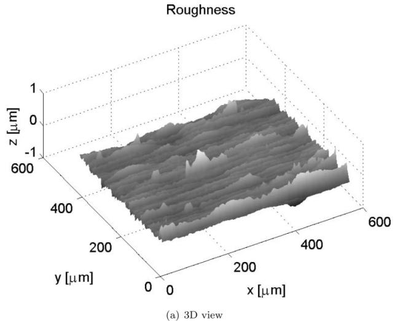

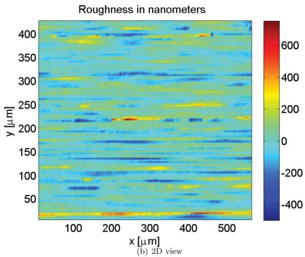  
Fig. 2—Inner ring sample roughness of a radial ball bearing 6217, as used in the calculations. The ball surface was assumed smooth.

TABLE 1—COMPARATIVE SURFACE AND SUBSURFACE STRESS RATIOS FOR THE EXAMPLE OF THE 6217 BEARING, STRESS AMPLITUDE (Pa)
| 항목 | 값1 | 값2 |
| --- | --- | --- |
| $P _ { u } / P$ · 0.005 · 0.05 | 0.2 | 0.5 |
| $p _ { o } , ( \mathrm { G P a } )$ · 7.74 · 3.59 | 2.26 | 1.66 |
| Subsurface Stress Amplitude · $\langle \tau _ { x z } - \tau _ { u } \rangle$ · $1 . 7 \times 1 0 ^ { 9 }$ · $0 . 5 9 9 \times 1 0 ^ { 9 }$ | $0 . 2 5 \times 1 0 ^ { 9 }$ | $0 . 0 9 \times 1 0 ^ { 9 }$ |
| Surface Stress Amplitude, Poor Lubrication · $\langle \tau _ { x z . s } - \tau _ { u . s } \rangle , \kappa = 0 . 1$ · $0 . 4 3 \times 1 0 ^ { 9 }$ · $0 . 4 5 \times 1 0 ^ { 9 }$ | $0 . 4 7 \times 1 0 ^ { 9 }$ | $0 . 4 5 \times 1 0 ^ { 9 }$ |
| Surface/Subsurface Life Ratio, Poor Lubrication · $\left[ \frac { \langle \tau _ { x z , s } - \tau _ { u , s } \rangle } { \langle \tau _ { x z } - \tau _ { u } \rangle } \right] _ { K = 0 . 1 } ^ { c / e }$ · $2 . 8 0 6 \times 1 0 ^ { - 6 }$ · $6 . 9 9 \times 1 0 ^ { - 2 }$ | $3 . 5 4 \times 1 0 ^ { 2 }$ | $3 . 1 6 \times 1 0 ^ { 6 }$ |
| Surface Stress Amplitude, Good Lubrication · $\langle \tau _ { x z . s } - \tau _ { u . s } \rangle , \kappa = 4$ · $0 . 3 2 \times 1 0 ^ { 9 }$ · $0 . 2 5 \times 1 0 ^ { 9 }$ | $0 . 2 0 \times 1 0 ^ { 9 }$ | $0 . 1 4 \times 1 0 ^ { 9 }$ |
| Surface/Subsurface Life Ratio, Good Lubrication · $\left[ \frac { \langle \tau _ { x z . s } - \tau _ { u . s } \rangle } { \langle \tau _ { x z } - \tau _ { u } \rangle } \right] _ { \kappa = 4 } ^ { c / e }$ · $1 . 7 9 8 \times 1 0 ^ { - 7 }$ · $0 . 2 9 4 \times 1 0 ^ { - 3 }$ | 0.125 | 60 |

In Table 1 the results of several calculations are summarized. The calculations were performed using the advanced numerical model for surface distress discussed earlier (Morales-Espejel and Brizmer (18)), the surface roughness sample was subjected to four loads and two lubrication conditions; that is, lubrication conditions, high film $\left( \kappa = 4 \right)$ and low film $( \kappa = 0 . 1 )$ . Furthermore, considering the manufacturing machining of the surface and other chemical absorbtion processes of the material, it can be safely assumed that $\tau _ { u . s } = 0$ (conservative calculation).

Table 1 shows that at very high loads (i.e., low $P _ { u } / P$ values) the subsurface volume stress is dominant, providing a very low value of surface over subsurface damage ratio. As the load is reduced, the surface stress effect becomes more significant in defining the bearing performance. This is indicated in Table 1 by the continuous increase in the life ratio for both poor and good lubrication conditions. Comparing the two cases, it is found, as expected, that in the poor lubrication case the ratio surface over subsurface damage is always significantly larger than in the case of high kappa conditions. The maximum difference of the life ratio between the two lubrication conditions is about of three orders of magnitude, which is consistent with the expected variation of bearing life found in today’s rating standards for the kappa range $0 . 1 < \kappa < 4 .$

## BEARING MODEL FORMULATION

The transformation of the single-contact model equation [16] into a rolling bearing life equation can be done by following the work of Lundberg and Palmgren (1). Starting from Eqs. [44] and [46] of Lundberg and Palmgren (1), after some algebraic manipulation to account for the load distribution and internal geometry in a bearing, Eq. [81] of this reference gives the transformation into bearing load. For a bearing load F applied radially on the rolling bearing, the heaviest loaded contact rolling element (inner ring, RE-IR, subindex i) and for the contact rolling element (outer ring, RE-OR, subindex e), one has

$$
\begin{array} { l } { { \ln ( 1 / S _ { i } ) = k _ { i } m _ { i } ^ { - w } F ^ { w } L ^ { e } } } \\ { { \ln ( 1 / S _ { e } ) = k _ { e } m _ { e } ^ { - w } F ^ { w } L ^ { e } , } } \end{array}\tag{[17]}
$$

where the contact load of the heaviest loaded rolling element (Q) and the bearing load (F) are related by $F = m _ { i } Q _ { i }$ and $F = m _ { e } Q _ { e }$ and the exponent $w = p e = ( c - h + 2 ) / 3$ . The parameters $m _ { i } , m _ { e }$ are internal geometry functions of the bearing and can be calculated from Eqs. [89] and [95] of Lundberg and Palmgren (1). Finally, $k _ { i }$ and $k _ { e }$ are proportionality constants defined according to the reference and with the use of the nomenclature given in the reference; thus:

For point contact:

$$
k = \ln ( 1 / S ) ( A _ { 1 } \phi ) ^ { \frac { - ( c - h + 2 ) } { 3 } } D _ { w } ^ { \frac { - ( 2 c + h - 5 ) } { 3 } } .\tag{[18]}
$$

For line contact:

$$
k = \ln ( 1 / S ) ( B _ { 1 } \psi ) ^ { \frac { - ( c - h + 1 ) } { 2 } } D _ { w } ^ { \frac { - ( c + h - 3 ) } { 2 } } l _ { a } ^ { \frac { - ( c + h - 1 ) } { 2 } } .\tag{[19]}
$$

Combining the probabilities $S = S _ { i } S _ { e }$ leads to

$$
\ln ( 1 / S ) = \bigl ( k _ { i } m _ { i } ^ { - w } + k _ { e } m _ { e } ^ { - w } \bigr ) F ^ { w } L ^ { e } .\tag{[20]}
$$

Solving for L one obtains

$$
L = \left[ \frac { l n ( 1 / S ) } { k _ { i } m _ { i } ^ { - w } + k _ { e } m _ { e } ^ { - w } } \right] ^ { 1 / e } \frac { 1 } { F ^ { p } } .\tag{[21]}
$$

Now, following Ioannides, et al. (12) and Eq. [8], the damage volume integral can be obtained by a mean approximated value

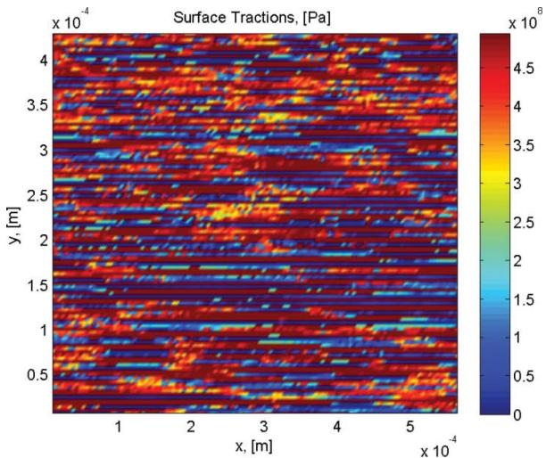  
(a) Surface Traction

Pressure, (p+∆ p)  
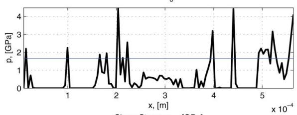

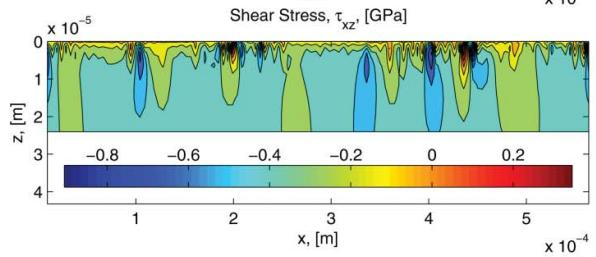  
(b) Pressures

$\tau _ { \infty }$ at Surface, [Pa]  
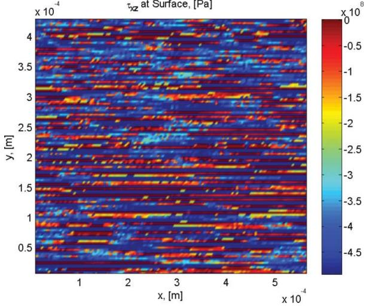  
(c) Orthogonal shear stress  
Fig. 3—Calculated surface traction (along rolling direction), pressure, and stress $\tau _ { x z }$ profile at $\pmb { y } = \pmb { 0 } .$ . Surface stress $\tau _ { x z }$ at overrolling position of maximum mean pressure. Low kappa case, $\kappa = 0 . 1$ Rolling direction from left to right.

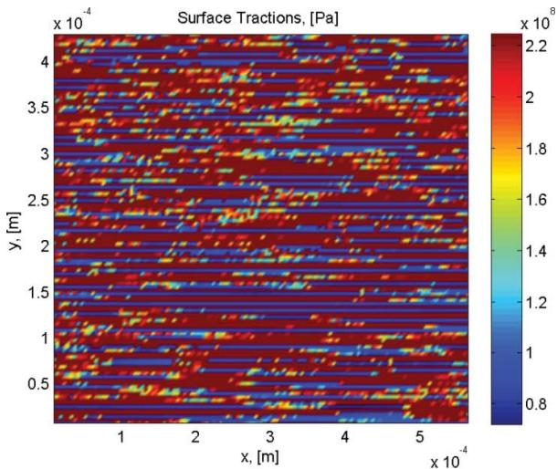  
(a) Surface Traction

Pressure, (p0+Δ p)  
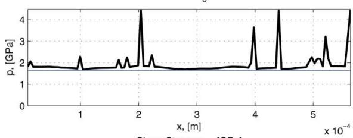

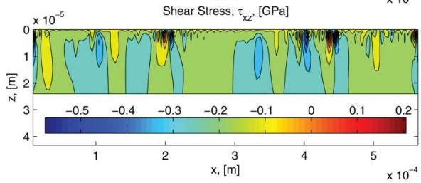  
(b) Pressures

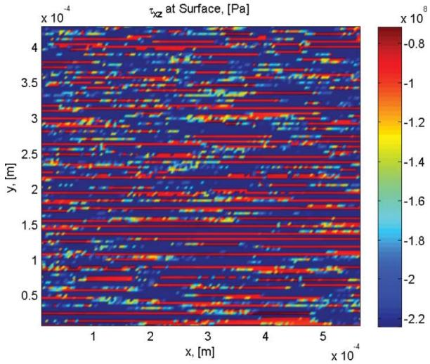  
(c) Orthogonal shear stress  
Fig. 4—Calculated surface traction (along rolling direction), pressure, and stress $\tau _ { x z }$ profile at $\pmb { y } = \pmb { 0 } .$ Surface stress $\tau _ { x z }$ at overrolling position of maximum mean pressure. High kappa case, $\kappa = 4 .$ Rolling direction from left to right.

(avoiding in this way the integration):

$$
\int _ { V _ { \nu } } G _ { \nu } ( N ) d V _ { \nu } \approx \overline { { A } } N ^ { e } \frac { \langle \sigma - \sigma _ { u } \rangle ^ { c } } { z _ { o } ^ { h - 1 } } a b .\tag{[22]}
$$

For the surface the stress integral can be derived from Eq. [12] as

$$
\widehat { h } \int _ { A } G _ { s } d A = \overline { { B } } N ^ { m } \int _ { A } \left. \sigma _ { s } - \sigma _ { u } \right. { } ^ { c } d A = N ^ { m } I _ { s } ,\tag{[23]}
$$

where $I _ { s }$ represents the unknown surface damage integral, which includes a constant layer thickness $\widehat { h }$ in the constant B.

Substituting in $\operatorname { E q . }$ b [7] and rearranging gives

$$
\ln \left( \frac { 1 } { S } \right) - N ^ { m } I _ { s } = \overline { { A } } N ^ { e } \frac { \left. \sigma - \sigma _ { u } \right. ^ { c } } { z _ { o } ^ { h - 1 } } a b .\tag{[24]}
$$

From Eq. [24] it follows that Eq. [21] can be modified with a surface integral by replacing ln 1 by $\ln \left( \frac { 1 } { S } \right) - N ^ { m } I _ { s }$ , so replacing F with the more general bearing notation, $P ,$ and introducing a fatigue limit load-life modifying factor, as described in Ioannides, et al. (12), here it will be named $a _ { u } .$ . Notice that this function becomes $\widehat { A }$ in case of zero fatigue limit.

$$
a _ { u } = \frac { \widehat { A } } { \left[ 1 - \left( \Psi _ { b r g } \frac { P _ { u } } { P } \right) ^ { w } \right] ^ { c / e } } .\tag{[25]}
$$

Therefore, following Eq. [21],

$$
L ^ { e } = \left[ \frac { l n ( 1 / S ) - N ^ { m } I _ { s } } { k _ { i } m _ { i } ^ { - w } + k _ { e } m _ { e } ^ { - w } } \right] ( a _ { u } ) ^ { e } \left( \frac { 1 } { P ^ { p } } \right) ^ { e }\tag{[26]}
$$

and with $N ^ { m } = u ^ { m } L ^ { m }$

$$
L ^ { e } = \bigg [ \frac { l n ( 1 / S ) - u ^ { m } L ^ { m } I _ { s } } { k _ { i } m _ { i } ^ { - w } + k _ { e } m _ { e } ^ { - w } } \bigg ] ( a _ { u } ) ^ { e } \bigg ( \frac { 1 } { P ^ { p } } \bigg ) ^ { e } .\tag{[27]}
$$

Similarly with existing bearing life equations, the square bracket in Eq. [27] without the $I _ { s }$ term and with $S = 0 . 9$ represents the dynamic capacity of the bearing to the power pe; thus,

$$
L _ { 1 0 } ^ { e } = \left[ C ^ { e p } - \frac { u ^ { m } L _ { 1 0 } ^ { m } I _ { s } C ^ { e p } } { \ln ( 1 / 0 . 9 ) } \right] ( a _ { u } ) ^ { e } \biggl ( \frac { 1 } { P ^ { p } } \biggr ) ^ { e } .\tag{[28]}
$$

Finally, solving for $L _ { 1 0 }$ gives

$$
L _ { 1 0 } = \frac { 1 } { \Big [ 1 + \frac { u ^ { m } L _ { 1 0 } ^ { ( m - e ) } I _ { s } } { \ln ( 1 / 0 . 9 ) } \left( \frac { C } { P } \right) ^ { e p } ( a _ { u } ) ^ { e } \Big ] ^ { 1 / e } } a _ { u } \left( \frac { C } { P } \right) ^ { p } .\tag{[29]}
$$

Equation [29] represents a new general semi-analytical form for bearing life calculation, based only on the modifying factor $a _ { u }$ with no surface damage components. It introduces an additional new surface damage function (or integral) $I _ { s }$ to account for only the surface effects in bearing life, calculated from Eq.

[23] or back-calculated with the use of an advanced surface distress models.

## Advanced Surface Distress Model

An advanced surface distress model (fatigue and mild wear) was introduced in the past (Morales-Espejel and Brizmer (18)); this model has been validated with experiments and has been used with success in the description of indentation failures in rolling contacts (Morales-Espejel and Gabelli (19)). The model will not be described here in detail because it is described elsewhere, but for completeness of the current article the key elements of the model are described below; the model will be used later on to illustrate the potential of the current formulation.

Modeling of the surface–fluid interactions (pressure and surface shear stress) is carried out by using a mixed-lubrication model that solves the transient Reynolds equation (with non-Newtonian behavior) for the fluid part and the half-space elasticity for the solid component with a fast fourier transform technique. For every macrocycle (see Fig. 5), the scheme simulates the relative movement in time of the microgeometry inside the contact due to sliding (including moving pressures and stresses) and accumulates the damage via a fatigue criterion. Because at every passage in the contact the local operating conditions and the topography itself may change; thus, a simple damage accumulation law is used. Figure 6 summarizes the general modeling scheme and the computer program flowchart. The process begins with measured virgin 3D surface samples for the two contacting bodies. Once both rough surfaces enter into the contact in the first cycle, the transient mixed-elastohydrodynamic lubrication problem is solved by means of the Reynolds equation for the different time steps until the roughness samples exit the contact. In the neighborhood of the surface the full stress tensor is calculated and used in the fatigue damage criterion (i.e., Dang Van see, (18)), which is applied for the current cycle, then the damage is accumulated according to an accumulation law (i.e., Palmgren-Miner) for the calculated number of cycles. Next, if the accumulated damage parameter exceeds the crack initiation limit, a crack or a micropit will be generated. The surface topographies then are fed into a lubricated wear model (based on a local Archard approach) that will modify the asperities microgeometry. The topography is updated only after a certain number of contact cycles to reduce computer time. The calculation process restarts and continues until the number of desired simulated contact cycles is reached. At the end of the simulation the modified surface topography is obtained together with the accumulated damage map on the surface and near subsurface; the micropitted area can be evaluated at this point as a percentage of the total area.

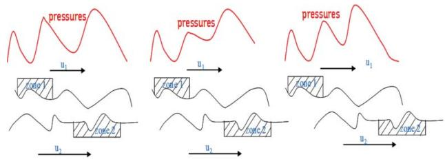  
Fig. 5—Illustration of the roughness relative movement inside the contact; the local analysis of the topography is done by varying the mean pressure following to the local Hertz value; see Morales-Espejel and Brizmer (18).

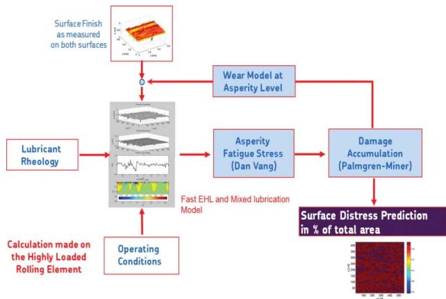  
Fig. 6—Flowchart of the advanced surface distress model used to solve the surface related failure modes; see Morales-Espejel and Brizmer (18).

## Surface Distress Modeling

In a calculation exercise with the advanced surface distress model (Morales-Espejel and Brizmer (18)), several measured bearing topographies including rolling elements and raceways from bearings of different sizes from medium to large-size roller bearings. Lubrication conditions and load in the model were varied, and the range of parameters varied in the model are summarized in Table 2. From the many numerical simulations with the described model it was concluded that the number of load cycles needed to generate surface distress (within 1.5% damage area at the surface of the total simulated area) could be calculated from the following curve-fitted equation:

$$
N _ { 1 . 5 \% } = \exp \Biggl \{ \frac { 1 } { \log _ { 1 0 } e } \left[ \frac { c _ { 1 } } { p _ { o } ^ { 2 } } - ( c _ { 2 } p _ { o } ) ^ { c _ { 3 } } + c _ { 4 } \right] \Biggl \} ,\tag{[30]}
$$

where $c _ { 1 } , c _ { 2 } , c _ { 3 } .$ and $c _ { 4 }$ are curve-fit constants that depend on the lubrication quality parameter of the bearing k and the bearing mean diameter $d _ { m }$

The core of $\operatorname { E q . }$ [30] can be rearranged in terms of bearing load ratio rather than pressure and simplified to represent a

TABLE 2—RANGE OF PARAMETERS USED IN THE ADVANCED MODEL FOR SURFACE DISTRESS FOR THE DERIVATION OF EQ. [31]
| Parameter Mean Bearing Diameter | Minimum Value 87.5 | Maximum Value 400 |
| --- | --- | --- |
| $d _ { m } \left( \mathrm { m m } \right)$ Hertzian contact pressure, (GPa) | 0.3 | 3.55 |
| $p _ { o }$ Lubrication quality parameter κ | 0.1 | 4 |
| Sliding/rolling ratio, S | $0 . 0 2$ | 0.05 |
| Number of loading cycles, N | $1 0 ^ { 5 }$ | $1 0 ^ { 9 }$ |

surface damage function; therefore:

$$
u ^ { m } I _ { s } \approx f _ { 1 } \exp { \left[ \frac { f _ { 2 } } { ( P / P _ { u } ) ^ { f _ { 3 } } } + \frac { f _ { 4 } } { ( P / P _ { u } ) ^ { f _ { 5 } } } \right] } ,\tag{[31]}
$$

where $f _ { 1 } , f _ { 2 } , f _ { 3 } ,$ and $f _ { 4 }$ are curve-fitted constants that depend on the surface stress conditions (e.g., lubrication, contamination, etc.).

Finally, Eq. [31] can be solved for $f s$ using some calculated points of $u ^ { m } I _ { s }$ obtained with the advanced surface distress model with the use of a collocation algorithm by fixing a number of locations in the abscissa $P / P _ { u } .$ An example of the obtained surface fatigue function for no contamination conditions is shown in $\mathrm { F i g . } 7 \left( R _ { s } \right)$ normalized with respect to a constant; it can be seen that for better lubrication conditions (higher k values), the surface fatigue function is substantially reduced. This function is also nearly constant with load at high values of load.

## Ratio of Surface Damage

To further explore the consistency of the new approach, the ratio between the surface and subsurface damage functions is calculated and discussed. Now, with introduction of the definition of the basic rating life (e.g., ISO 281:2007 (15)) $L _ { 1 0 . B R } =$ (C/P)p, this ratio is calculated by

$$
{ \cal S } _ { R } = ( a _ { u } L _ { 1 0 . B R } - L _ { 1 0 } ) / ( a _ { u } L _ { 1 0 . B R } ) .\tag{[32]}
$$

In this equation, $L _ { 1 0 }$ is calculated with the use of $\operatorname { E q . }$ [29] and the proposed surface damage diagram depicted in Fig. 7.

Figure 8 shows the corresponding plots for $S _ { R }$ as a function of load $P / P _ { u }$ and $\kappa .$ From the figure it can be observed that at very low loads the surface damage tends to low values; with an increase in load the surface damage becomes dominant with respect to the subsurface damage. However, with even higher loads the subsurface damage gains importance due to rolling contact fatigue, reducing the dominance of the surface damage. Figure 8 also shows an approximative indication of when the damage is driven by the surface and when by the subsurface, depending on the load and the lubrication conditions, giving this a possible indication of where most likely the failure will occur at the end of the life of the bearing population. It can also be seen that the importance of the surface damage function with respect to the subsurface is reduced when the lubrication conditions are enhanced (higher k values).

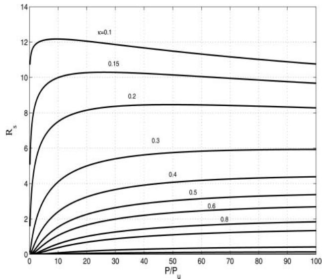  
Fig. 7—Normalized surface damage function $( R _ { s } = I _ { s } u ^ { e } L ^ { e } { } _ { 1 0 . B R } / [ K L n ( 1 /$ 0.9)]) versus bearing load $\scriptstyle ( P I P _ { u } )$ and the lubrication conditions (k) as defined in ISO 281 (15) for conditions of no contamination. Notice that, for higher values of k better lubrication, the surface damage function is reduced, and it is also nearly constant with load.

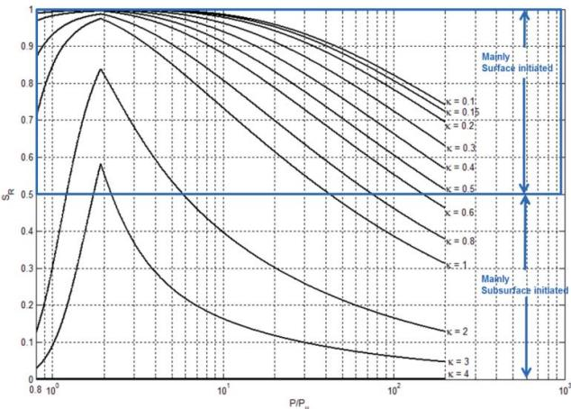  
Fig. 8—Calculated damage function ratio from Eq. [32] for different k values and for variable load $P / P _ { u }$ for a deep-groove ball bearing typical case. The importance of the surface damage function with respect to the subsurface is reduced when the lubrication conditions are enhanced.

## RESULTS AND DISCUSSION

In the present section, some results from the model will be compared with endurance tests carried out in-house; furthermore, a simple ball bearing example will be used to illustrate the methodology. The comparison with endurance tests will focus on the surface model, which is the novel part of the present approach. The subsurface model used here has been compared with endurance tests in the past (e.g., Ioannides and Harris (11); Ioannides, et al. (12)) and will not be repeated here.

Endurance testing practice (Andersson (34); Goss and Ioannides (35)) shows that the rate of bearing failure, either from the surface or from the subsurface (see bearing surface examples in Fig. 9), are distributed in a very similar way (Andersson (34)). This indicates that a common Weibull slope can be used in $\operatorname { E q . }$ [29]. This equation can be used to back-calculate the surface damage parameter $R _ { s } = { u ^ { e } I _ { s } } / [ { K l n ( 1 / 0 . 9 ) } ]$ corresponding to 90% reliability of a bearing populations that are endurance tested.

The methodology used is as follows:

1. Solve Eq. [29] for $I _ { s }$ with known operating conditions and $L _ { 1 0 }$ lives from endurance tests.

2. Calculate the parameter $R _ { s }$ using $I _ { s } .$

3. Repeat the calculation for every endurance test series and plot the results $R _ { s }$ versus $P / P _ { u }$ and h in Fig. 10 (points in the plot). As described in Gabelli, et al. (14), the parameter h is a measure of the stress on the surface caused by poor lubrication and/or contamination conditions; for $\eta = 1$ there is no extra surface stress, for $\eta = 0$ , the stress is maximum; see Ioannides, et al. (12).

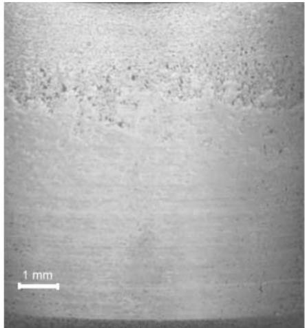  
(a) Surface initiated

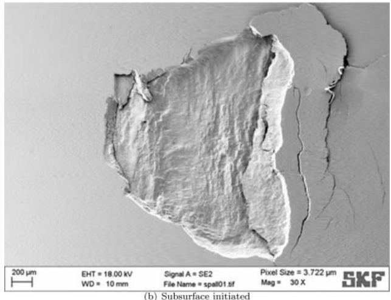  
Fig. 9—Pictures of in-house tested bearing raceways showing surfaceand subsurface-initiated failures. Overrolling direction from left to right.

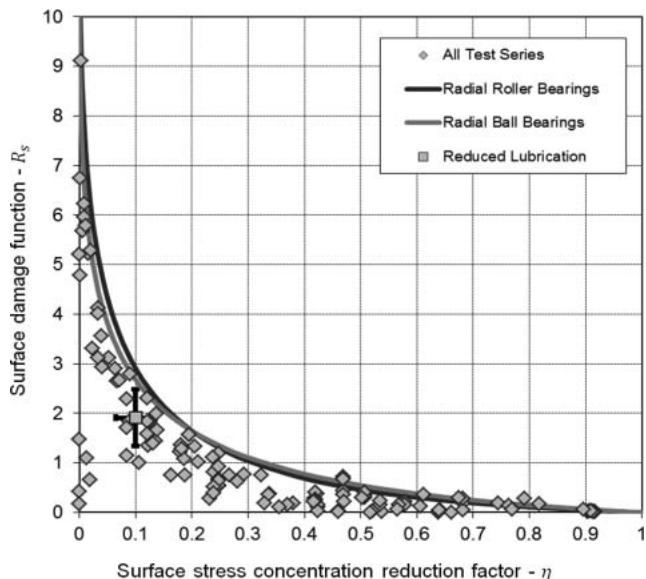  
Fig. 10—Comparison the surface damage limiting curves of the ball and roller bearings; for example, Eq. [31] and the back-calculated surface damage obtained from endurance testing of bearing population samples.

TABLE 3—TEST CONDITIONS USED FOR BEARING LIFE TESTING, AS GIVEN IN (14)
| Bearing Type Deep-Groove Ball Bearings | Designation 6305, 6205, 6206, 6207, 6309, 6220 | Load Ratio, C/P 1, 2.8, 2.4, 2.1, 3.1, 3.5, 4, 6 | Lubrication, κ 4, 3.4, 2.1, 2, 1 |
| --- | --- | --- | --- |
| Cylindrical roller bearings | NU 207 E, NU 309 E | 2.5, 2.77, 2.82 | 4,1, 0.8 |
| Spherical roller bearings | 22220 E, 22220 CC | 2.22, 2.3, 2.5, 2.7, 3, 4.7 | 4, 3.6, 1.8, 0.37, 0.28 |
| Tapered roller bearings | 331274, K-LM11749, K-HM89449, K-580/572 | 1, 1.1, 1.3, 2.5, 3.5 | 4, 2.9, 0.9 |

4. Once the test series are plotted, plot the results of the surface distress model (solid lines) from Eq. [31]. The dependence on h of this equation is implicit in the surface topographies and operating conditions used to obtain this equation. In this case, the extreme conditions of the tests have been used.

Typically a bearing population sample is formed by a set of 25–35 bearings, of which about one third may fail during the test (Leenders (36)). For this evaluation a set of 227 endurance population samples was used including a total of some 6,650 bearings, covering both ball and roller bearing geometries in equal proportion. A detailed description of the test used here is given in Gabelli, et al. (14), but for the sake of completeness a summary of the test conditions is given in Table 3. From the test, the mean point estimation of the $L _ { 1 0 }$ life is derived using Weibull statistics. In Fig. 10 the surface damage parameter R back-calculated from a large set of endurance tests results (dots) is displayed alongside the surface damage parameter obtained from the surface distress model presented in Eq. [31] (lines). The curves of the surface distress model represent the limit conditions of the endurance tests for both roller and ball bearings and are plotted versus the surface stress concentration reduction factor h; see Gabelli, et al. (14) for description. Inspecting the results plot ted in Fig. 10, it is apparent that almost all test results are positioned below the limit curves obtained from Eq. [31]. From Fig. 10 it can be concluded that the model theory provides a safe estimation of the raceway survival. Furthermore, given the large dispersion affecting endurance test results, an additional experimental evaluation was carried out. A more recent group of endurance test results was merged into a sin gle pool of results formed by 445 roller and ball bearings tested under reduced lubrication $( \kappa \approx 0 . 4 – 0 . 5 )$ . This test pool was statistically analyzed in order to gain information regard ing the 90% confidence interval of the surface damage parameter derived from testing. The result of this analysis is indicated with the square symbol and the 90% confidence range is indicated with the error bars. The comparison with the model curves shows that also in this case the surface dam age function has a proper safe setting compared to the statistical data of the survival of the raceway surface. The test series (points) follows very well the behavior of the surface model when the severity at the surface (h) is varied; higher values of h represent endurance tests with good lubrication and little or no contamination (less severity at the surface), and the surface model (lines) shows the corresponding behavior.

## A Full Ball Bearing Example

Despite the fact that the objective of the present article is not to illustrate the use of the proposed model in bearing applications nor in comparison with other models, it is believed that a simple ball bearing example can help the reader to understand the methodology and the behavior of the model.

Consider a standard 6309 deep-groove ball bearing with a dynamic load rating of 55.3 kN and a fatigue load limit of 1.34 kN, working under a radial gravity load of 10 kN. The bearing is operating under constant lubrication and temperature conditions in different rotating speeds; thus, the lubrication parameter k described in ISO 281:2007 (15) can be readily calculated. The bearing works under very clean conditions so, the contamination parameter (see ISO 281:2007 (15)) can be set $e _ { c } = 1$

Using the surface–subsurface rating life calculation method outlined in the present article, the rating life can be estimated using Eq. [29] in conjunction with Eq. [25] and Fig. 7. For this calculation example, the surface–subsurface life rating life model can be set using similar constants and parameters as applied in the ISO 281 model (ISO 281:2007 (15)) and thereby similar results from the two models are expected.

Following this criterion, it is assumed that the surface–subsurface survival distribution is characterized by similar standardized Weibull exponents; thus, the surface Weibull exponent m can be assumed to be equal to the Weibull exponent $e = 1 0 / 9$ as used in ISO 281:2007 (15). Others exponents and constants used in Eqs. [29] and [25] can be taken from Ioannides, et al. (12), leading to the results of Table 4.

By inspecting Table 4 it can be recognized that the surface– subsurface life model (when positioned to the same settings as in ISO 281 (15)) can provide rating lives that are similar to the standard. However, the main ability of the present model is to treat fatigue damage developed at the surface of the raceway separately from the subsurface. This is the motivation behind the development of the present model, as this will open new and better capabilities in representing the performance and damage process taking place in rolling bearings.

TABLE 4—DEEP-GROOVE BEARING EXAMPLE (6309) RESULTS FROM THE PRESENT APPROACH TO ILLUSTRATE THE USE OF THE MODEL
| ISO Viscosity Ratio κ | Surface Damage Function Rs | Contribution of the Surface Eq. [32] (%) | Surface-Subsurface Life Eqs. [29] and [25] L10 (Mrev) |
| --- | --- | --- | --- |
| 0.1 | 12.2 | 100 | 17 |
| 0.4 | 2.2 | 96 | 81 |
| 2.9 | 0.02 | 23 | 1,656 |

## SUMMARY AND CONCLUSIONS

New concepts for bearing life calculation based on the separation of different regions at risk have been investigated. A simple approach is proposed to separate the surface from the subsurface rolling contact fatigue based on the product law of reliability. In this way a more flexible and physical approach can be constructed to describe surface damage mechanisms in rolling bearings considering tribological effects on the surfaces. As an example of the potential of the new approach consisting of the separation of surface and subsurface, the effects of poor lubrication were considered in the current article and an advanced model for surface distress (fatigue and mild wear; Morales-Espejel and Brizmer (18)) was used to describe these effects in a more general bearing life calculation. With similar techniques, it seems possible to include, for example, the effect of additives (Brizmer, et al. (20)), the effect of indentations (Morales-Espejel and Gabelli (19)), and abrasive wear, to be discussed in future publications.

From the development of the model and its behavior, the following observations can be summarized:

1. There are significant gains and increase in flexibility in bearing life modeling when other failure modes or regions in addition to the Hertzian rolling contact fatigue are incorporated into the formulation of the bearing life.

2. The present approach represents a framework where different failure modes can be included for different regions at risk of the bearing contact. This approach allows for the incorporation of knowledge gained from the use of tribological models into bearing life estimation.

3. The current approach can give an indication of the zone at higher fatigue risk in a bearing population.

4. A potential target of the new approach is the physical modeling of several classes of bearing failure mechanisms, such as surface distress (surface fatigue and mild wear), lubricant contamination, lubricant additives, wear-related stress concentrations, etc., capturing some deterministic aspects of bearing surface topography, material properties, and local lubrication conditions.

A new more general model able to account for different failure modes has been proposed, and the surface term of the model is compared with a large set of experimental results of endurance testing of bearing population samples. With the use of advanced tribological models, curve-fitted equations are obtained to describe the surface damage functions (Is) to consider; for example, surface distress effects from poor lubrication. Furthermore, a simple application example of a ball bearing has been used to illustrate the methodology.

From the obtained results the following conclusions can be drawn:

1. In the present work, the separation of the surface and subsurface in bearing life calculations has been demonstrated to be a feasible and convenient way to model particular failure modes in the two separate regions.

2. The proposed surface damage parameter $R _ { s }$ obtained from the advanced surface distress model represents a good conservative limit when compared with endurance tests results.

3. According to the results of Table 1 and the ball bearing example, the subsurface and the surface fatigue models keep a consistent behavior when compared with existing bearing life models.

## ACKNOWLEDGEMENTS

The authors wish to thank the SKF Group for kind permission to publish this article. The authors also want to thank V. Brizmer for his help in the derivation of the surface distress function, Eq. [30].

## REFERENCES

(1) Lundberg, G. and Palmgren, A. (1947), “Dynamic Capacity of Rolling Bearings,” Acta Polytechnica, Mechanical Engineering Series, 1(3), pp 1– 52.

(2) Lundberg, G. and Palmgren, A. (1952), “Dynamic Capacity of Roller Bearings,” Acta Polytechnica, Mechanical Engineering Series, 2(4), pp 96–127.

(3) Tallian, T. E. (1967), “On Competing Failure Modes in Rolling Contacts,” ASLE Transactions, 10(4), pp 418–439.

(4) Olver, A. V. (2005), “The Mechanisms of Rolling Contact Fatigue: An Update,” Proceedings of the Institution of Mechanical Engineers: Part J - Journal of Engineering Tribology, 219, pp 313–330.

(5) Chiu, Y. P., Tallian, T. E., McCool, J. I. and Martin, J. A. (1969), “A Mathematical Model of Spalling Fatigue Failure in Rolling Contact,” Transactions of the ASLE, 12, pp 4106–4116.

(6) Chiu, Y. P., Tallian, T. E. and McCool, J. I. (1971), “An Engineering Model of Spalling Fatigue Failure in Rolling Contact—The Subsurface Model,” Wear, 17, pp 433–446.

(7) Tallian, T. E. and McCool, J. I. (1971), “An Engineering Model of Spalling Fatigue Failure in Rolling Contact—The Surface Model,” Wear, 17, pp 447–461.

(8) Tallian, T. E. (1971), “An Engineering Model of Spalling Fatigue Failure in Rolling Contact Engineering Discussion and Illustrative Examples,” Wear, 17, pp 463–480.

(9) Zaretsky, A. (1999), STLE Life Factors for Rolling Bearings, 2nd ed., Society of Tribologists and Lubrication Engineers, Park Ridge, IL.

(10) Sadeghi, F., Jalalahmadi, B., Slack, T. S., Raje, N., and Arakere, N. K. (2009), “A Review of Rolling Contact Fatigue,” Journal of Tribology, 131, pp 041403-1-15.

(11) Ioannides, E. and Harris, T.A. (1985), “A New Life Model for Rolling Bearings,” Journal of Tribology, 107, pp 367–378.

(12) Ioannides, E., Bergling, G., and Gabelli, A. (1999), “An Analytical Formulation for the Life of Rolling Bearings,” Acta Polytechnica Scandinavica, Mechanical Engineering Series, 137, pp 1–80.

(13) Gabelli, A., Lai, J., Lund, T., Ryden, K., Strandell, I., and Morales-Espejel, G.E. (2012), “The Fatigue Limit of Bearing Steels. Part II: Characterization for Life Rating Standards,” International Journal of Fatigue, 37, pp 155–168.

(14) Gabelli, A., Morales-Espejel, G. E., and Ioannides, E. (2008), “Particle Damage in Hertzian Contacts and Life Ratings of Rolling Bearings,” Tribology Transactions, 51, pp 428–445.

(15) ISO 281 (2007), “International Standard, Rolling Bearings—Dynamic Load Ratings and Rating Life,” Geneva, Switzerland.

(16) Epstein, D., Yu, T., Wang, Q. J., Keer, L. M., Cheng, H. S., Liu, S., Harris, S. J., and Gangopadhyay, A. (2003), “An Efficient Method of Analyzing the Effect of Roughness on Fatigue Life in Mixed-EHL Contact,” Tribology Transactions, 46(2), pp 273–281.

(17) Epstein, D., Keer, L. M., Wang, Q.J., Cheng, H. S., and Zhu, D. (2003), “Effect of Surface Topography on Contact Fatigue in Mixed Lubrication,” Tribology Transactions, 46(4), pp 506–513.

(18) Morales-Espejel, G. E. and Brizmer, V. (2011), “Micropitting Modelling in Rolling–Sliding Contacts: Application to Rolling Bearings,” Tribology Transactions, 54, pp 625–643.

(19) Morales-Espejel, G. E. and Gabelli, A. (2011), “The Behavior of Indentation Marks in Rolling–Sliding Elastohydrodynamically Lubricated Contacts,” Tribology Transactions, 54, pp 589–606.

(20) Brizmer, V., Pasaribu, H. R. and Morales-Espejel, G. E. (2013), “Micropitting Performance of Oil Additives in Lubricated Rolling Contacts,” Tribology Transactions, 56(5), pp 739–748.

(21) Warhadpande, A. and Sadeghi (2013), “Effects of Surface Defects on Rolling Contact Fatigue of Heavily Loaded Lubricated Contacts,” Sadeghi, F. (Ed.), Proceedings of the Institution of Mechanical Engineers: Part J - Journal of Engineering Tribology, 224, pp 1061–1077.

(22) Lamagnere, P., Fougeres, R., Lormand, G., Vincent, A., Girodin, D., Dudragne, G. and Vergne, F. (1998), “A Physically Based Model for Endurance Limit of Bearing Steels,” Journal of Tribology, 120, pp 421– 426.

(23) Lai, J., Lund, T., Ryden, K., Gabelli, A. and Strandell, I. (2012), “The Fatigue Limit of Bearing Steels Part I: A Pragmatic Approach to Predict Very High Cycle Fatigue Strength,” International Journal of Fatigue, 37, pp 155–168.

(24) Weibull, W. (1939), “A Statistical Theory of Strength of Materials,” Proceedings of the Royal Swedish Academy of Engineering Sciences , 151, pp 1–45.

(25) Weibull, W. (1951), “A Statistical Distribution Function of Wide Applicability,” Journal ofApplied Mechanics, 18(3), pp 293–297.

(26) Blachere, S. and Gabelli, A. (2012), “Monte Carlo Comparison of Weibull Two and Three Parameters in the Context of the Statistical Analysis

of Rolling Bearings Fatigue Testing,” Beswick, J. (Ed.), Bearing Steel Technologies, 9th Volume: Advances in Rolling Contact Fatigue, Strength Testing and Related Substitute Technologies, 1548, pp 382–407.

(27) Morales-Espejel, G. E., Gabelli, A. and Ioannides (2010), “Micro-Geometry Lubrication and Life Ratings of Rolling Bearings,” Proceedings of the Institution of Mechanical Engineers: Part C - Journal of Mechanical Engineering Science, 224, pp 1965–1981, London, UK.

(28) Basquin, O.H. (1910), “The Exponential Law of Endurance Tests,” Proceedings ofAmerican Society ofTesting Materials, 10, pp 625–630.

(29) Kun, F., Carmona, H. A., Andrade, J. S. and Hermann, H. J. (2008), “Universality behind Basquin’s Law of Fatigue,” Physical Review Letters, 100(9), p 094301.

(30) Ioannides, E. (1985), “Component Reliability Analysis—A Fatigue Life Model Common to Rolling Bearings and Structural Components,” SEECO 85 Conference Transactions.

(31) Miner, M. A. (1945), “Cumulative Damage in Fatigue,” Journal of Applied Mechanics, 12, pp A159–A164.

(32) McCool, J.I. (1978), “Competing Risk and Multiple Comparison Analysis for Bearing Fatigue Tests,” Tribology Transactions, 21, pp 271–284.

(33) Lubrecht, A. A., Jacobson, B. O. and Ioannides, E. (1990), “Lundberg Palmgren Revisited,” Proceedings of the Japan International Tribology Conference, Nagoya, Japan.

(34) Andersson, T. (1985), “Endurance Testing in Theory,” Ball Bearing Journal, 217, pp 14–23.

(35) Goss, R. and Ioannides, E. (1989), “Performance Testing: Facilities and Opportunities,” Ball Bearing Journal, pp 12–21.

(36) Leenders, P. (1985), “Endurance Testing in Practice,” Ball Bearing Journal, 217, pp 24–31.
