Article

# Effect of Base Oil Type in Grease Composition on the Lubricating Film Formation in EHD Contacts †

Dennis Fischer \*, Georg Jacobs ID , Andreas Stratmann ID and Gero Burghardt

Institute for Machine Elements and System Engineering, RWTH Aachen University, Schinkelstrasse 10, 52062 Aachen, Germany; georg.jacobs@imse.rwth-aachen.de (G.J.);

andreas.stratmann@imse.rwth-aachen.de (A.S.); gero.burghardt@rwth-aachen.de (G.B.)

米 Correspondence: dennis.fischer@imse.rwth-aachen.de; Tel.: +49-241-80-90-898

† This article is an extended version of the conference contribution published on GfT-Fachtagung 2017, 25–27 September 2017 in Göttingen, Germany.

Received: 29 January 2018; Accepted: 23 March 2018; Published: 9 April 2018

Abstract: The service life of rolling bearings is significantly affected by the film formation in elastohydrodynamic (EHD) contacts, which depends on the operating conditions, like rotational speed or temperature. In grease lubricated EHD contacts, the film formation is determined by the grease consistency and composition, i.e., thickener and base oil type as well as properties of the bleed oil, which is released from the grease during operation. Thus, the film formation of grease lubricated contacts as compared to base oil lubricated contacts can be different. With increasing rolling speed, the film thickness of oil lubricated contacts usually grows. However, in case of grease lubricated contacts, which are not fully flooded, the film thickness remains constant or even decreases with further increasing rotational speed. This effect is referred to as starvation. Since the onset of starvation depends on the grease composition, the film formation of two different grease compositions is investigated in this study. The film thickness measurements are performed on a ball-on-disc tribometer for each grease, as well as the corresponding bleed and pure base oils. Thereby, the characteristic rotational speed leading to the onset of starvation has been identified in dependence of the grease composition and the differences in the lubricating film formation of base oil, bleed oil, and grease lubricated EHD contacts have been discussed. The investigations should help to establish an advanced understanding of the physical mechanisms leading to the onset of starvation to encourage future work with focus on a method to predict the film formation in grease lubricated EHD contacts.

Keywords: EHD contact; grease lubrication; starvation; bleed oil; lubricating film formation

## 1. Introduction

The service life of rolling bearings is significantly affected by the lubricant and the lubricating film formation in elastohydrodynamic (EHD) contacts. The film formation is not only affected by parameters, such as pressure and temperature, but significantly by the rolling speed. Grease lubrication offers several advantages in comparison to oil lubrication, such as low maintenance and change intervals, as well as sealing properties against moisture and dirt. Therefore, approx. 90% of all rolling bearings in use are grease lubricated. However, the physical mechanisms affecting the lubricating film formation in grease lubricated rolling bearings are not satisfactorily clarified [1].

Recent work by several authors like Cousseau et al. [2,3], Goncalves et al. [4,5], De Laurentis et al. [6,7], and Cen et al. [8,9] compare the film formation under fully flooded lubrication between grease and oil lubricated contacts. The film thickness measurements were performed on a ball-on-disc tribometer under variation of rolling speed. To achieve a fully flooded grease lubrication during the grease measurements, the contact was continuously re-lubricated, so that the contact area was always completely supplied with grease. The results show, that for low speeds the film thickness first decreases and then increases again, such that it forms a V-shaped curve or plateau with an increasing rolling speed. The rolling speed, where the film thickness starts following the fully flooded base oil curve is called transition speed [8–10]. Since thickener particles can enter the contact zone [11–15], grease lubricated contacts form a higher film thickness than base oil lubricated contacts at the same rolling speed. However, in practice grease lubricated rolling bearings are usually not continuously re-lubricated, so that the contacts are not always fully flooded [12,16]. Therefore, the film formation under starved grease lubrication on a ball-on-disc tribometer has also been studied by some authors [17–22]. The results show, that by variation of rolling speed, the film thickness drops at a certain characteristic rolling speed below the film thickness of the corresponding fully flooded base oil. This film thickness decay due to insufficient lubricant supply is referred to as starvation. By definition according to Wilson [23], the onset of starvation occurs at the above described characteristic rolling speed. This study focuses on measurements under starved grease lubrication and the onset of starvation will be pointed out by following the definition by Wilson [23].

In general it is assumed, that the film formation in grease lubricated contacts is mainly affected by the bleed oil, which is released from the grease during operation [12,16,24]. Therefore, in [2–4] further film thickness measurements with bleed oil were performed and the results were compared to the measurements with grease and base oil. The authors showed, that the film thickness of the bleed oil can be higher than the film thickness of the base oil and even can match the film thickness of the corresponding grease. The difference of the film thickness between bleed oil and base oil is explained by the higher viscosity of the bleed oil. However, the bleed oil properties are dependent on the grease composition, from which it is extracted [2].

Moreover, the onset of starvation can be explained by insufficient lubricant or bleed oil reflow, known as replenishment, which is affected by the rolling speed [17,25,26]. The amount of bleed oil is limited by the bleeding behaviour of the grease, which can be different depending on the grease composition [27]. The bleeding behaviour can be determined by standard methods, such as proposed in DIN 51817 [28]. Thus, in this article, the correlation between the bleeding behaviour and the onset of starvation between two different greases will be investigated. Since the grease compositions contain different base oils, but the same thickener and no additives, the effect of the base oil type on the bleeding behaviour and film formation can be identified. The bleeding behaviour will be determined following the method in DIN 51817 [28] and the film formation will be investigated using a ball-on-disc tribometer. To outline the differences in the film formation of the considered lubricants and lubrication regimes, the results of film thickness measurements of two different grease compositions under both fully flooded and starved lubrication, the corresponding bleed and base oils are compared and discussed.

The investigations should help to establish an advanced understanding of the physical mechanisms leading to starvation to encourage future work with a focus on a method to predict the film formation in grease lubricated EHD contacts.

## 2. Methods and Lubricants

In the following the principle of the film thickness measurement using the ball-on-disc tribometer EHD2 from PCS Instruments is explained for measurements with oil and grease. The procedures of the film thickness measurements with grease under fully flooded and starved lubrication, which allow reproducible measurements, are presented. Furthermore, the process for the bleed oil extraction from the greases is outlined.

## 2.1. Film Thickness Measurements

The ball-on-disc tribometer can be used to measure the central film thickness of the EHD contact with contact pressures in the range of approx. 400 to 700 MPa and lubricant temperatures up to 150 ◦C. A polished steel ball with a diameter of 19.05 mm is loaded against a glass disc to create the EHD contact. Usually, the measurements are performed with oil as lubricant. In this case, the steel ball is positioned in an oil bath and the lubricant is transported by the rotating ball into the EHD contact between the disc and the ball, such that a fully flooded lubrication regime is achieved. Both surfaces have a roughness of approx. $R _ { \mathrm { a } } = 0 . 0 2$ µm, so that the surfaces are completely separated during operation for a wide range of rolling speeds and it can be assumed that the measurements are not performed in a mixed lubrication regime. The rolling speed of the contacting bodies, the so called hydrodynamically effective speed, is particularly relevant for the formation of a lubricating film in the EHD contact. The rolling speed is defined as the mean value of the circumferential speeds at the contact of ball and disk (1). Sliding occurs, if both bodies rotate with different circumferential speeds at the contact (2). The ratio of sliding to rolling speed is referred to as the Slide–Roll-Ratio (SRR, 3). For the measurements in this article, pure rolling (SRR = 0%) is set. Moreover, the measurements are performed with a stepwise increase of rolling speed.

$$
u _ { r o l l i n g } = \frac { \left( u _ { d i s c } + u _ { b a l l } \right) } { 2 }\tag{1}
$$

$$
u _ { s l i d i n g } = u _ { d i s c } - u _ { b a l l }\tag{2}
$$

$$
S R R = \frac { u _ { s l i d i n g } } { u _ { r o l l i n g } }\tag{3}
$$

Figure 1 illustrates a schematic sketch of the ball-on-disc tribometer with an optical measurement device for determining the thickness of the lubricating film. A lens and a light source are positioned over the glass disc. Light rays pass through the lens and are reflected partly by the bottom side of the glass disc and partly by the surface of the steel ball. The difference in the wavelength of the reflected light rays results in a phase shift, and the interference of the light rays is measured by a spectrometer. The information about the phase shift and interferences is used to determine the lubricating film thickness with an accuracy to 1 nm. Using this principle one point in the centre of the EHD contact, i.e., the central film thickness is measured. A detailed explanation of the measurement method is described in [29].

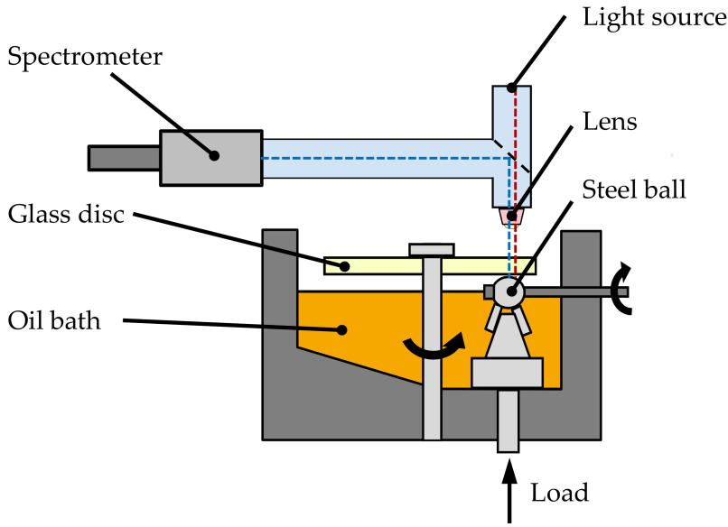  
Figure 1. Schematic sketch of the ball-on-disc tribometer for film thickness measurements.

## 2.2. Preparation of Grease Lubricated Film Thickness Measurements

Film thickness measurements of grease lubricated contacts on a ball-on-disc tribometer can be performed with re-lubrication to obtain fully flooded lubrication or without re-lubrication to obtain starved lubrication. Due to the known chaotic behaviour of grease [30], the reproducibility of measurement results is difficult to achieve. Therefore, the test setup and conditions for each measurement should be hold as similar as possible. In the following, the test setup, in order achieve a good reproducibility of results for both fully flooded lubrication and starved lubrication, will be described.

As described in the introduction, a re-lubrication system can have an effect on the formation of the lubricating film. When measuring under fully flooded lubrication, an additional element, the so-called scoop, is placed directly in front of the EHD contact (see Figure 2). This trapezoidal grease reservoir is pressed against the disc, so that the EHD contact is continuously supplied with grease. In this state, the contact is always fully flooded and the onset of starvation can be prevented.

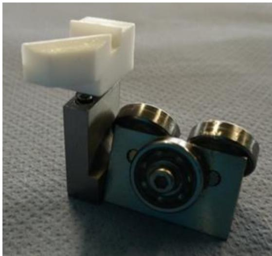  
(a)

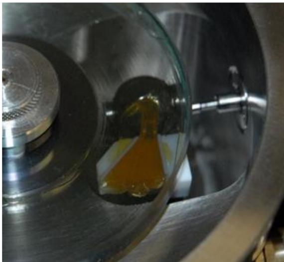  
(b)  
Figure 2. Scoop for film thickness measurement with grease under fully flooded lubrication: (a) scoop mounted at ball carriage; and, (b) scoop supplies elastohydrodynamic (EHD) contact with grease during operation.

For film thickness measurements under starved lubrication, a grease film with a definite height of approx. 0.1 mm is applied to the disc initially before the measurement. This leads to a total mass of approx. 1.0 g grease on the disc for each test. Figure 3 shows the grease distributer, which is used to apply the grease. In order to distribute the grease uniformly on the raceway, the film thickness measurement is preceded by a running-in phase of 15 min with a constant rolling speed of 30 mm/s.

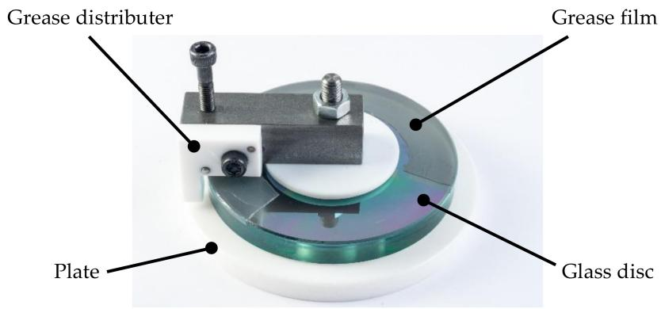  
Figure 3. Grease distributer for preparation of measurements in starved contact regime.

All measurements, under fully flooded and starved lubrication, were performed five times with increasing rolling speed. The mean values of the results were taken and are presented in the diagrams with standard deviation error bars to indicate the scattering of the results (see Section 3). Thus, a representative tendency of the film formation can be seen and the lubrication behaviour among the examined greases can be differentiated.

## 2.3. Lubricants

The examined greases are assigned to the consistency class NLGI 2 and do not contain additives. A polyalphaolephin (PAO) lithium complex (Li) grease and a polyalkylene glycol (PAG) lithium complex grease were used for the investigations. Moreover, the corresponding base and bleed oils PAO and PAG were examined. The kinematic viscosities of both base oils were measured at $4 0 ~ ^ { \circ } \mathrm { C }$ and $8 0 ~ ^ { \circ } \mathrm { C }$ under ambient pressure. Table 1 shows the lubricant properties and designations used in the following.

Table 1. Examined lubricants and kinematic viscosities.
| Thickener | Base Oil | Viscosity ${ \bf 4 0 } ^ { \circ } { \bf C }$ | Viscosity ${ \bf 8 0 } ^ { \circ } { \bf C }$ | Designation |
| --- | --- | --- | --- | --- |
| 22 wt % Lithium Complex | PAO | $9 8 . 0 1 \mathrm { m m } ^ { 2 } / \mathrm { s }$ | $2 2 . 1 4 \mathrm { m m } ^ { 2 } / \mathrm { s }$ | PAO-Li-100 |
| 26 wt % Lithium Complex | PAG | $1 4 1 . 7 1 \mathrm { m m } ^ { 2 } / \mathrm { s }$ | $4 0 . 6 4 \ : \mathrm { m m } ^ { 2 } / \mathrm { s }$ | PAG-Li-140 |

## 2.4. Extraction of Bleed Oil

The expertiments to extract the bleed oil from the grease are carried out following the procedure that was proposed by DIN 51817 [28]. The device is shown in Figure 4 and consists of a conical sieve with a mesh size of $6 3 \ \mu \mathrm { m } ,$ a flange above it, a bowl for collecting the bleed oil and a load weight. The flange is filled with grease and the entire device is stored at a constant temperature of $8 0 ~ ^ { \circ } \mathrm { C }$ for seven days. The bleed oil is collected in the bowl under the sieve. To obtain a sufficient amount of lubricant for the film thickness measurements, the dimensions of the device were enlarged from 44 mm sieve diameter as in DIN 51817 [28] to 100 mm. Furthermore, several devices were used at the same time for the extraction of bleed oil.

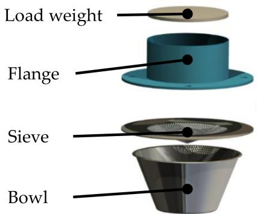  
Figure 4. Schematic structure of the designed bleeding device for bleed oil extraction.

## 3. Results

The results of the extraction of bleed oil for both PAO-Li-100 and PAG-Li-140 grease are outlined in this Section. Furthermore, the results of the film thickness measurements for the greases as well as the corresponding bleed and base oils are compared among each other. The measurements were carried out at 700 MPa HERTZIAN pressure and $4 0 ^ { \circ } \mathrm { C } .$

## 3.1. Results of the Bleeding Tests

Besides the extraction of bleed oil from greases, the bleeding tests give information about the bleeding behaviour of the examined grease. The bleeding behaviour can be represented by the mass fraction (in wt %) of the extracted bleed oil to the initially applied grease mass. The bleeding tests for the investigated greases show that the oil separation from PAO-Li-100 grease with 4.14 wt % is higher in comparison to the PAG-Li-140 grease with 2.20 wt %. The bleeding test for PAO-Li-100 was performed with 21 and for PAG-Li-140 with 14 bleeding devices, so that a sufficient average of the mass fraction, and thus a representative bleeding behaviour could be achieved. Moreover, kinematic viscosities at $4 0 ~ ^ { \circ } \mathrm { C }$ and $8 0 ~ ^ { \circ } \mathrm { C }$ under ambient pressure of the bleed oil were measured and are given in Table 2. The higher viscosity of the bleed oil from PAG-Li-140 grease probably leads to a lower bleed oil release.

Table 2. Mass fraction and kinematic viscosities of extracted bleed oil.
| Grease | Bleed Oil Release at ${ \bf 8 0 } ^ { \circ } { \bf C }$ | Bleed oil Viscosity ${ \bf 4 0 } ^ { \circ } { \bf C }$ | Bleed Oil Viscosity ${ \bf 8 0 } ^ { \circ } { \bf C }$ |
| --- | --- | --- | --- |
| PAO-Li-100 | 4.14 wt % | $9 3 . 2 6 \mathrm { m m } ^ { 2 } / \mathrm { s }$ | 21.57 mm²/s |
| $\mathrm { P A G - L i - 1 } 4 0$ | 2.20 wt % | 140.61 mm²/s | 39.25 mm²/s |

## 3.2. Measurement Results of PAO-Li-100

The results of the film thickness measurement of the PAO-Li-100 grease, its base oil PAO and bleed oil are illustrated in the following. Figure 5 shows the film thickness for grease under fully flooded lubrication, base oil and bleed oil as a function of the rolling speed. The double-logarithmic diagram shows an almost linear increase in the film thickness of the base oil. The scoop was used for the measurement with grease, so that a continuous grease supply was applied and no starvation could occur. This measurement was repeated five times and the mean values of the results were taken. Standard deviation error bars indicate the scattering of the measurement results.

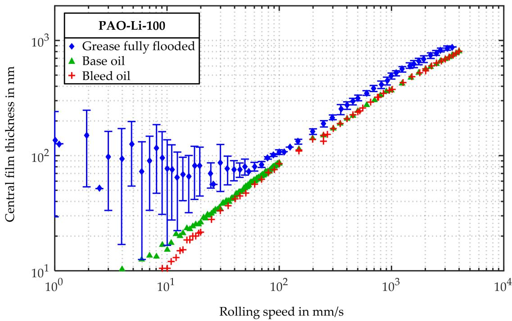  
Figure 5. Film thickness of grease under fully flooded lubrication, bleed and base oil for PAO-Li-100.

For rolling speeds below 50 mm/s, the film thickness shows a high scattering with mean values in a range of approx. 50 to 150 nm. Above 50 mm/s the film thickness increases linearly with a further increase in rolling speed with low scattering. Throughout the entire range, the grease forms a higher film thickness than the base oil. Furthermore, the bleed oil from PAO-Li-100 when compared to the corresponding base oil shows no difference in the film formation for rolling speeds higher than 50 mm/s. For lower speeds the bleed oil forms a slightly lower film thickness than the base oil.

In order to determine the onset of starvation, measurements under starved lubrication were performed following the measurement procedure that is outlined in Section 2.2. Figure 6 compares the film thicknesses of PAO base oil, the grease PAO-Li-100 under fully flooded and starved lubrication. The starved measurements were performed five times and the mean values with standard deviation error bars are presented in Figure 6.

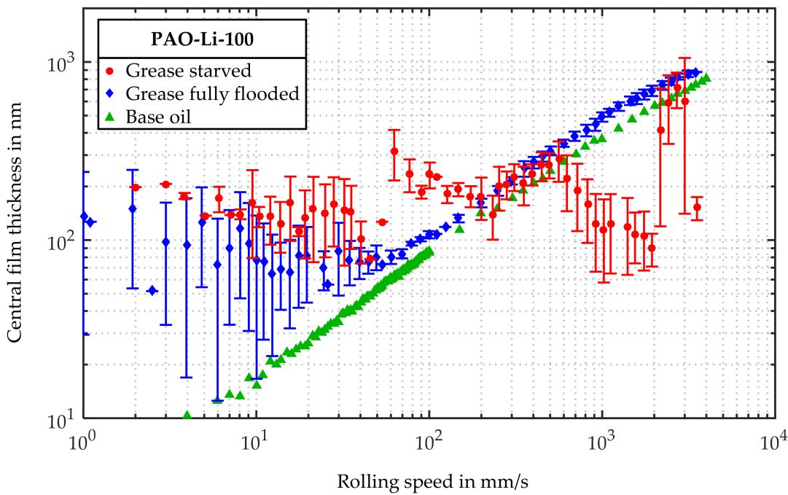  
Figure 6. Film thickness of base oil, grease under fully flooded and starved lubrication for PAO-Li-140.

The mean film thickness of the starved measurement at low rolling speeds below 50 mm/s is in the range of approx. 100 to 200 nm. When compared to the results of the fully flooded measurements, the mean values of the starved measurements are slightly higher, but the scattering ranges overlap. In the range of approx. 200 to 600 mm/s the mean film thickness of the fully flooded and starved measurement are in good accordance. The onset of starvation can be determined at approx. 600 mm/s, where the mean film thickness of the starved grease measurement drops below the film thickness of the base oil. At approx. 2000 mm/s, the lubricating film thickness increases again, but with increasing scattering. Thus, the error bars indicate a high scattering for speeds below 200 mm/s and above 600 mm/s.

## 3.3. Measurement Results of PAG-Li-140

The results of the film thickness measurement with PAG-Li-140 grease, its base oil PAG and the bleed oil are shown below. The measurement under fully flooded lubrication was repeated five times and the mean values of the film thickness with standard deviation error bars are shown in Figure 7. In accordance with the results of PAO-Li-100, the film thickness of PAG-Li-140 grease shows a higher film thickness compared to its base oil throughout the whole range of rolling speeds under fully flooded lubrication. However, in contrast to PAO-Li-100, the error bars of the results for rolling speeds below 50 mm/s indicate a low scattering and the mean film thickness is slightly higher in the range of approx. 100 to 200 nm. Figure 7 also shows the film thickness of bleed oil and similar to the results in Figure 5 for the PAO-Li-100 lubricant, there is also no difference in the film thickness when compared to the base oil.

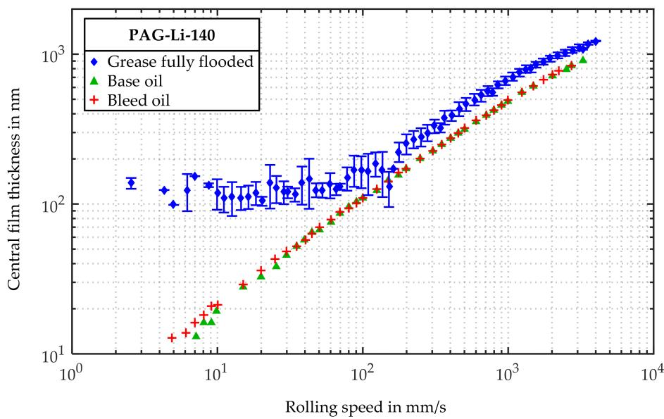  
Figure 7. Film thickness of grease under fully flooded lubrication, bleed and base oil for PAG-Li-140.

Figure 8 shows the film thickness of the PAG base oil, the grease PAG-Li-140 under fully flooded and starved lubrication. The measurement under starved lubrication was also repeated five times. The mean film thickness shows a constant level at first, and a slight decrease from approx. 20 mm/s. Thereby, the mean film thickness is always lower than the mean film thickness of the fully flooded measurement, however the error bars overlap in the rolling speed range between 4 and 20 mm/s. The onset of starvation can be determined at 50 mm $\mathbf { \nabla } _ { \cdot } / \mathbf { s } ,$ where the grease film thickness drops below the base oil film thickness. The error bars indicate a high scattering for speeds below 20 mm/s, from 150 to 200 mm $/ \mathsf { s } ,$ and above 700 mm ${ \bf \nabla } \cdot / { \bf s } .$

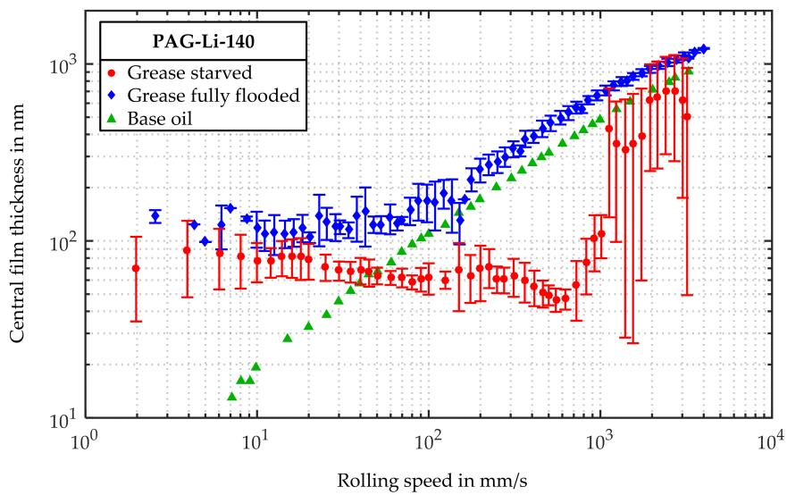  
Figure 8. Film thickness of base oil, grease under fully flooded and starved lubrication for PAG-Li-140.

## 4. Discussion

The results of the film thickness measurements using the scoop for fully flooded grease lubrication show a higher film thickness compared to the film thickness of the corresponding base oil. The EHD contact is probably not only lubricated by the bleed oil, but also by parts of the thickener entering the contact and cause a higher film thickness [11–15]. The appearance of the V-shape of the fully flooded film formation with transition speed is in accordance with measurements in the literature [6–10,14]. Since the contact lubrication for lower speeds is mainly thickener dominated and for higher speeds mainly bleed oil dominated $[ 6 , 8 , 1 4 , 3 1 ] ,$ the film thickness forms a V-shape or plateau with a high gap to base oil film thickness for rolling speeds below the transition speed. Due to the chaotic behaviour of grease lubrication [30], the standard deviation error bars indicate a high scattering, particularly in the thickener dominated low speed range. When comparing the scattering of both examined greases under fully flooded lubrication in this speed range, the low error bars of PAG-Li-140 indicate a better reproducibility and thus, a less chaotic behaviour.

The measurements with bleed oil of PAO-Li-100 and PAG-Li-140 show no significant difference in comparison to their base oils. This correlates to the measured viscosities at $4 0 ~ ^ { \circ } \mathrm { C }$ of the pure base oils (Table 1) and the bleed oils (Table 2), which show no significant difference. Thus, it is assumed that in this case, the properties of the bleed oils differ hardly from those of the base oils. The work by Cousseau et al. and Goncalves et al. [2–4] shows, that bleed oil can form a higher film thickness compared to the base oil. However, the authors point out, that this effect is based on the lubricant properties, such as bleed oil viscosity, which depends on the grease composition. Moreover, the oil extraction method could also affect the bleed oil properties. Goncalves et al. [32] extracted the oil from the grease using a centrifuge, which might lead to different bleed oil properties when compared to the oil extraction under static conditions using an apparatus described in Section 2.

By measurements under starved lubrication, i.e., without re-lubrication using the scoop, it was possible to determine the onset of starvation for PAO-Li-100 at a rolling speed of approx. 600 mm/s and for PAG-Li-140 at approx. 50 mm/s. A possible explanation for the onset of starvation on the ball-on-disc tribometer is shown in Figure 9. After the ball pushed the grease aside and formed a track into the applied grease film, bleed oil will be released from the sideward lying grease bulk and flows towards the contact area [12,16,24]. The available amount of bleed oil in the running track is dependent of the bleeding behaviour of the applied grease [27]. This bleed oil lubricates the EHD contact at the next over rolling of the ball. The part of the bleed oil, which is not passing the EHD contact, is displaced and flows back behind the ball. This mechanism is mainly driven by surface tension forces, which is referred to as replenishment [17,25,26]. With higher rolling speeds, i.e., a higher over rolling frequency, the time for the oil to replenish entirely before the next over rolling is limited. Thus, the lubricant supply decreases, which results in a lower film thickness than under fully flooded lubrication [17,24–26]. This starved lubrication regime leads to a film thickness decay, with a further increase of rolling speed [17–22]. Hence, when the film thickness drops below the film thickness of the fully flooded base oil lubricated contact, the onset of starvation can be determined [12,23]. Furthermore, a part of the available lubricant sticks to the surface of the ball and is transported to adjacent machine elements, like the ball carriage below the steel ball. This effect can additionally reduce the available amount of lubricant for the film formation.

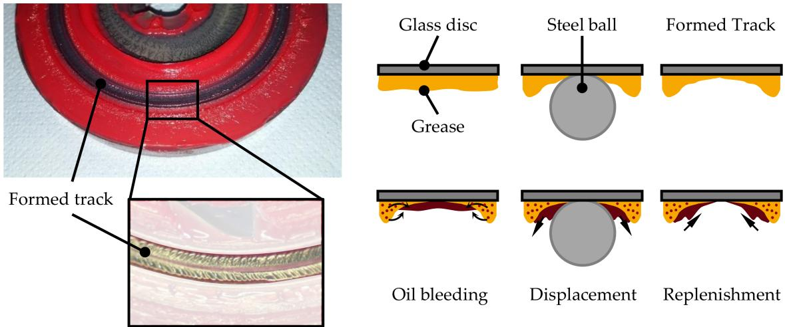  
Figure 9. Model of the procedure leading to starvation.

The results of the measurements with PAG-Li-140 grease show that the film thickness under starved lubrication is lower than the film thickness under fully flooded lubrication for rolling speeds up to approx. 2000 mm/s. Thus, it is assumed, that the contact is not supplied sufficiently with lubricant, even at low rolling speeds. In the range up to 700 mm/s, the film thickness does not increase with increasing rolling speed, but it stays nearly constant. This behaviour and the early onset of starvation can be correlated with the bleeding behaviour of the PAG-Li-140 grease compared to PAO-Li-100 grease. Figure 10 shows the film formation for both greases under starved lubrication and the characteristic rolling speed leading to the onset of starvation for each grease is emphasised. Due to the higher base oil viscosity of PAG, the film thickness of the base oil is slightly higher than of PAO base oil. However, even though the base oil viscosity is higher, the film thickness of PAG-Li-140 is always lower than of PAO-Li-100 up to a rolling speed of approx. 1000 mm/s and shows an earlier onset of starvation. If the onset of starvation of both greases is compared with the results of the bleeding tests in Table 2, the oil release from PAG-Li-140 is significantly lower with approx. 2.20 wt % than the oil release from PAO-Li-100 with approx. 4.14 wt %. Thus, due to the lower oil release, the earlier onset of starvation can be explained for the PAG-Li-140 grease. Since both greases are produced using the same thickener, the differences in the lubricating film formation are probably affected by the different base oil type in the grease composition. The base oil type significantly affects the formation of the thickener structure [7,18,33–35], which probably leads to a different bleeding behaviour and thus to a different lubrication mechanism. As already described, the PAG-Li-140 forms a lower film thickness and shows an earlier onset of starvation in comparison with PAO-Li-100. Thus, the effect of the base oil type in the grease composition on the film formation could be demonstrated and can probably be correlated to the bleeding behaviour and hence the available lubricant supply during operation.

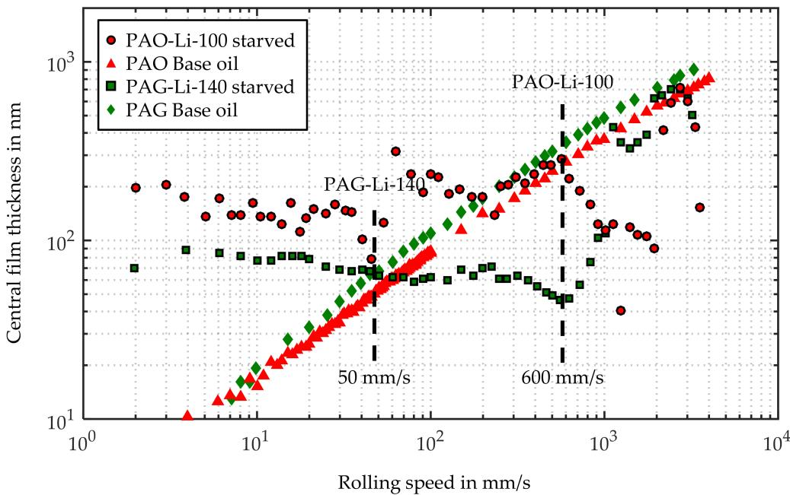  
Figure 10. Comparison of the onset of starvation for PAO-Li-100 and PAG-Li-140.

The standard deviation error bars of the measurement results under starved lubrication in Figures 6 and 8 indicate a high scattering of the film thickness at low rolling speeds below 20 mm/s for PAG-Li-140 and below 50 mm/s for PAO-Li-100 as well as at high rolling speeds above 1000 mm/s for PAG-Li-140 and above 2000 mm/s for PAO-Li-100. However, in the essential range of the onset of starvation, both greases show a lower scattering and thus, reliable measurement results. The scattering in the range of low rolling speeds can be explained by the thickener dominated lubrication [6,8,14,31], which leads to a more chaotic behaviour.

The increase in the film thickness above 2000 mm/s can be referred to a recovery phase [22]. As centrifugal forces are likely to increase with the rolling speed, i.e., the rotational speed of the disc, grease bulk on the disc is being pushed towards the contact area, which leads to a higher lubricant supply. This results to an increasing film thickness until a fully flooded lubrication can be reached. However, the high scattering in this speed range indicates, that this effect is not consistent and can hardly be controlled.

## 5. Conclusions

In this article, the results of film thickness measurements for two different grease compositions, their corresponding bleed and base oils were discussed, and the following achievements can be concluded:

When comparing the investigated greases under fully flooded lubrication, it has been shown that in both cases, the film thickness is higher than the one of the base oil. This is probably encouraged by parts of the thickener, which enter the EHD contact area during operation.

Since the viscosities at $4 0 ^ { \circ } \mathrm { C }$ of the pure base and bleed oils does not significantly differ, a formation of a higher film thickness by the bleed oil in comparison to the base oil could not be identified for the lubricants examined in this study. The bleed oil properties are probably depending on the grease composition and the oil extraction method.

High scattering of the results at low rolling speeds for both greases under fully flooded and starved lubrication indicate a chaotic behaviour, which is probably due to the presence of thickener in the contact. Moreover, high scattering of the results at high rolling speed under starved lubrication is probably referred to centrifugal forces, which lead to a chaotic lubrication behaviour.

When investigating the film thickness under starved lubrication, the onset of starvation for both greases could be determined at different rolling speeds. Thus, it has been emphasised, that the base oil type in the grease composition significantly affects the film formation in EHD contacts under starved lubrication. Furthermore, an early onset of starvation is likely due to a low oil release of the grease, which can be correlated to the results of the bleeding tests.

Acknowledgments: The authors would like to thank the Research Association for Power Transmission Engineering FVA (Forschungsvereinigung Antriebstechnik e. V.) as well as the participating member companies for the support of the IGF project N/1 19027, which is funded by the German Federation of Industrial Research Associations AiF (Arbeitsgemeinschaft industrieller Forschungsvereinigungen) within the framework of the programme for the promotion of the Industrial Collective Research IGF (Industrielle Gemeinschaftsforschung) by the Federal Ministry for Economic Affairs and Energy BMWi (Bundesministerium für Wirtschaft und Energie) based on a resolution of the German Bundestag.

Author Contributions: Dennis Fischer wrote the article, designed and performed the experiments and analysis and analysed the data. Georg Jacobs, Andreas Stratmann and Gero Burghardt supervised the work, discussed the basic design of experiments and provided suggestions for the final discussion.

Conflicts of Interest: The authors declare no conflict of interest.

## References

1. Lugt, P.M. Grease Lubrication in Rolling Bearing; John Wiley & Sons, Ltd.: Chichester, UK, 2013; ISBN 978-1-118-35391-2.

2. Cousseau, T.; Björling, M.; Graça, B.; Campos, A.; Seabra, J.; Larsson, R. Film thickness in a ball-on-disc contact lubricated with greases, bleed oils and base oils. Tribol. Int. 2012, 53, 53–60. [CrossRef]

3. Cousseau, T.; Graça, B.; Campos, A.; Seabra, J. Grease aging effects on film formation under fully-flooded and starved lubrication. Lubricants 2015, 3, 197–221. [CrossRef]

4. Gonçalves, D.; Graça, B.; Campos, A.V.; Seabra, J.; Leckner, J.; Westbroek, R. On the film thickness behaviour of polymer greases at low and high speeds. Tribol. Int. 2015, 90, 435–444. [CrossRef]

5. Gonçalves, D.; Vieira, A.; Carneiro, A.; Campos, V.A.; Seabra, H.J. Film thickness and friction relationship in grease lubricated rough contacts. Lubricants 2017, 5, 34. [CrossRef]

6. De Laurentis, N.; Kadiric, A.; Lugt, P.M.; Cann, P.M. The influence of bearing grease composition on friction in rolling/sliding concentrated contacts. Tribol. Int. 2016, 94, 624–632. [CrossRef]

7. De Laurentis, N.; Cann, P.M.; Lugt, P.M.; Kadiric, A. The influence of base oil properties on the friction behaviour of lithium grease in rolling/sliding concentrated contacts. Tribol. Lett. 2017, 65, 128. [CrossRef]

8. Cen, H.; Lugt, P.M.; Morales-Espejel, G. Film thickness of mechanically worked lubricating grease at very low speeds. Tribol. Trans. 2014, 57, 1066–1071. [CrossRef]

9. Cen, H.; Lugt, P.M.; Morales-Espejel, G. On the Film Thickness of Grease-Lubricated Contacts at Low Speeds. Tribol. Trans. 2014, 57, 668–678. [CrossRef]

10. Morales-Espejel, G.E.; Lugt, P.M.; Pasaribu, H.R.; Cen, H. Film thickness in grease lubricated slow rotating rolling bearings. Tribol. Int. 2014, 74, 7–19. [CrossRef]

11. Scarlett, N.A. Use of grease in rolling bearings. Proc. Inst. Mech. Eng. 1967, 1, 585–624. [CrossRef]

12. Cann, P.M.; Spikes, H. Film thickness measurements of lubrication greases under normally starved conditions. NLGI Spokesm. 1992, 56, 21.

13. Kaneta, M.; Ogata, T.; Takubo, Y.; Naka, M. Effects of a thickener structure on grease elastohydrodynamic lubrication films. Proc. Inst. Mech. Eng. 2000, 4, 327–336. [CrossRef]

14. Cann, P.M. Grease lubrication of rolling element bearings—Role of the grease thickener. Lubr. Sci. 2007, 3, 183–196. [CrossRef]

15. Cyriac, F.; Lugt, P.M.; Bosman, R.; Padberg, C.J.; Venner, C.H. Effect of thickener particle geometry and concentration on the grease EHL film thickness at medium speeds. Tribol. Lett. 2016, 60, 18. [CrossRef]

16. Lugt, P.M. A review on grease lubrication in rolling bearings. Tribol. Trans. 2009, 52, 470–480. [CrossRef]

17. Cann, P.; Chevalier, F.; Lubrecht, A.A. Track depletion and replenishment in a grease lubricated point contact: A quantitative analysis. Tribol. Ser. 1997, 32, 405–413. [CrossRef]

18. Couronné, I.; Vergne, P.; Mazuyer, D.; Truong-Dinh, N.; Girodin, D. Effects of grease composition and structure on film thickness in rolling contact. Tribol. Trans. 2003, 46, 31–36. [CrossRef]

19. Couronné, I.; Vergne, P.; Mazuyer, D.; Truong-Dinh, N.; Girodin, D. Nature and properties of the lubricating phase in grease lubricated contact. Tribol. Trans. 2003, 46, 37–43. [CrossRef]

20. Nagata, Y.; Kalogiannis, K.; Glovnea, R. Track Replenishment by Lateral Vibrations in Grease-Lubricated EHD Contacts. Tribol. Trans. 2012, 55, 91–98. [CrossRef]

21. Chen, J.; Tanaka, H.; Sugimura, J. Experimental study of starvation and flow behavior in grease-lubricated ehd contact. Tribol. Online 2015, 1, 48–55. [CrossRef]

22. Vengudusamy, B.; Kuhn, M.; Rankl, M.; Spallek, R. Film forming behavior of greases under starved and fully flooded EHL conditions. Tribol. Trans. 2016, 59, 62–71. [CrossRef]

23. Wilson, A.R. The Relative thickness of grease and oil films in rolling bearings. Proc. Inst. Mech. Eng. 1979, 193, 185–192. [CrossRef]

24. Cann, P.M. Starvation and reflow in a grease-lubricated elastohydrodynamic contact. Tribol. Trans. 1996, 39, 698–704. [CrossRef]

25. Chiu, Y.P. An analysis and prediction of lubricant film starvation in rolling contact systems. ASLE Trans. 1974, 17, 22–35. [CrossRef]

26. Jacod, B.; Pubilier, F.; Cann, P.M.; Lubrecht, A.A. An analysis of track replenishment mechanisms in the starved regime. Tribol. Ser. 1999, 36, 483–492. [CrossRef]

27. Baart, P.; van der Vorst, B.; Lugt, P.M.; van Ostayen, R.A. Oil-bleeding model for lubricating grease based on viscous flow through a porous microstructure. Tribol. Trans. 2010, 53, 340–348. [CrossRef]

28. Testing of Lubricants—Determination of Oil Separation from Greases under Static Conditions; Beuth Verlag: Berlin, Germany, 2014; DIN-51817.

29. Johnston, G.J.; Wayte, R.; Spikes, H.A. The measurement and study of very thin lubricant films in concentrated contacts. Tribol. Trans. 1991, 34, 187–194. [CrossRef]

30. Lugt, P.M.; Velickov, S.; Tripp, J.H. On the chaotic behavior of grease lubrication in rolling bearings. Tribol. Trans. 2009, 52, 581–590. [CrossRef]

31. Kanazawa, Y.; Sayles, R.S.; Kadiric, A. Film formation and friction in grease lubricated rolling-sliding non-conformal contacts. Tribol. Int. 2017, 109, 505–518. [CrossRef]

32. Gonçalves, D.; Graça, B.; Campos, A.V.; Seabra, J.; Leckner, J.; Westbroek, R. Formulation, rheology and thermal ageing of polymer greases—Part I: Influence of the thickener content. Tribol. Int. 2015, 87, 160–170. [CrossRef]

33. Salomonsson, L.; Stang, G.; Zhmud, B. Oil/thickener interactions and rheology of lubricating greases. Tribol. Trans. 2007, 50, 302–309. [CrossRef]

34. Saatchi, A.; Shiller, P.J.; Eghtesadi, S.A.; Liu, T.; Doll, G.L. A fundamental study of oil release mechanism in soap and non-soap thickened greases. Tribol. Int. 2017, 110, 333–340. [CrossRef]

35. Sakai, K.; Tokumo, Y.; Ayame, Y.; Shitara, Y.; Tanaka, H.; Sugimura, J. Effect of Formulation of Li Greases on Their Flow and Ball Bearing Torque. Tribol. Online 2016, 11, 168–173. [CrossRef]

© 2018 by the authors. Licensee MDPI, Basel, Switzerland. This article is an open access article distributed under the terms and conditions of the Creative Commons Attribution (CC BY) license (http://creativecommons.org/licenses/by/4.0/).
