# A model for hybrid bearing life with surface and subsurface survival

Antonio Gabellia,⁎, Guillermo E. Morales-Espejela,b

a SKF Research and Technology Development, Nieuwegein, the Netherlands

b Université de Lyon, INSA-Lyon, CNRS, LaMCoS UMR5259, F69621, France

## A B S T R A C T

Hybrid bearings have rings made of steel and rolling elements made of bearings grade silicon nitride ceramic. Due to the higher modulus of elasticity of ceramic compared to steel, the ellipse of the Hertzian contact is slightly smaller than that in a conventional bearing. This results in about a 12% increase in the contact pressure between the ceramic ball and the raceway. Following the standard Rolling Contact Fatigue theory, a higher contact pressure leads to a reduction of the dynamic load-carrying capacity and service life of the bearing. However, long experience in the use of hybrid bearings shows that, in most applications, hybrid bearings clearly outperform traditional bearings made entirely out of steel.

This paper addresses this issue by applying a novel approach to Rolling Contact Fatigue. Central to the new method is the survival probability of the raceway surface which is explicitly formulated into the basic life equations of the rolling contact. This allows tailoring the contribution of the stress system close to the rolling surface to better represent the ceramic-steel interaction, which has been proven to be substantially more favourable in the case of a hybrid ceramic-steel contact. The comparison between experimentally obtained hybrid bearings fatigue lives and lives predicted using the new calculation model indicates good agreement.

It is found that an increase of the fatigue resistance of the raceway surface of hybrid bearings can, in most cases, compensate for the additional stress present in the subsurface region of the rolling contact. The new methodology, by providing a direct account of the survival probability of the ceramic-steel interface gives a better representation of the expected performance of hybrid bearings, opening new opportunities for the reliable use of this type of bearing in modern machinery.

## 1. Introduction

Hybrid ceramic bearings are typically used for demanding operating conditions and challenging applications. This is because of the better fatigue performance and reliability that can be achieved using this type of bearing.

For many years hybrid ceramic bearings have been used in highspeed machine tool spindles to exploit the good speed capabilities and high stifness of this type of bearing. In the last few years, the use of hybrid bearings has also grown in many other industrial applications, with a market that is presently outgrowing the traditional machine tool sector. The expectation is that this trend will continue and that many other modern industrial applications will discover and take advantage of the unique capabilities ofered by hybrid ceramic bearings.

Despite the great progress in fatigue performance of ceramics, no clear performance advantage is recognized to hybrid bearings from the traditional Rolling Contact Fatigue methodology used in the bearing industry. A realistic forecast of the expected performance of hybrid bearings is needed for the further growth of the use of this type of bearing throughout the industry.

## 1.1. The development of silicon nitride hybrid bearings

## 1.1.1. Early developments

The use of ceramics, as bearing material, was first proposed in the 1960s for extreme temperature bearings for aero and space applications Zaretsky and Anderson [1], Parker et al. [2].

Using component Rolling Contact Fatigue testing, Baumgartner [3], Parker et al. [4], Delal and Chiu [5], established that fully dense hotpressed silicon nitride $( \mathsf { S } _ { \mathrm { i } 3 } \mathsf { N } _ { 4 } )$ have the best Rolling Contact Fatigue characteristics when compared to other ceramic materials. Significant variations in fatigue performance were also experienced from seemingly identical production batches of silicon nitride balls, Parker et al. [4].

In the 1980s Lorösch et al. [6], performed fatigue life testing of angular contact ball bearings. Lorösch, using the best available quality of silicon nitride balls, found that hybrid bearing Rolling Contact Fatigue resistance is comparable to the one of all-steel bearings tested under the same load. This despite the 12% increase in contact pressure experienced in the hybrid bearings. However, an additional test of a second batch of silicon nitride balls produced poor fatigue life indicating the criticality of the quality of the ceramic balls in achieving good fatigue life performance.

Miner et al. [7], performed functional tests of gas-turbines and

| Nomenclature | Nomenclature | $\pmb { u }$ | Number of stress cycles per revolution [-] |
| --- | --- | --- | --- |
|  |  | ${ \pmb R } _ { { \pmb 1 0 } }$ | Precision of an L10 estimation (ratio L10,95% / L10,5%) [-] |
| A Ã | Surface integration area [m²] | $s$ |  |
|  | Damage integral constant for the volume [-] |  | Reliability [-] |
| B | Damage integral constant for the surface [-] | $s i L$ | Significance Level: Quantitative assessment for compar- |
| $\pmb { c }$ | Exponent in the bearing life equation, and constant [-] |  | ison between parameter estimations from test data sets [-] |
| $c$ | Dynamic load rating (subsurface) [N] | $V _ { \nu }$ | Integration volume [m³] |
| $\pmb { D }$ | External diameter of the bearing [mm] | $z$ $z$ | Coordinate (depth from surface) [m] |
| $\scriptstyle D _ { w }$ $\mathbf { \pmb { d } }$ | Diameter of the rolling element [mm] |  | Number of rolling elements [-] |
| $\pmb { d _ { m } }$ | Bore diameter of the bearing [mm] Mean diameter of the bearing [mm] | Greek Symbols | Greek Symbols |
| $\pmb { e }$ | Exponent in the bearing life equation (standardised |  |  |
|  | Weibull slope) [-] | $\pmb { \alpha }$ | Raceway contact angle [-] |
| $\pmb { h }$ | Damage integral for the surface, Index of surface stress [-] | $\mathbf { \beta }$ | Weibull shape factor [-] |
| $I _ { S u r f } ,$ | $I _ { S }$ Damage integral for the surface, Index of surface stress [-] | $\eta _ { I u b }$ | Lubrication quality factor [-] |
| $\scriptstyle L _ { 1 0 }$ | Bearing life rating with 90% reliability [Mrev] | $\eta _ { c o n t }$ | Contamination factor [-] |
| ${ L } _ { 1 0 , 5 \% }$ | Lower Bound of the 90% two-sided confidence interval on L10 [Mrev] | $\eta _ { e n \nu }$ | Environmental factor [-] |
| ${ L } _ { 1 0 , 9 5 \% }$ | Upper Bound of the 90% two-sided confidence interval on | $\pmb { \kappa }$ $\sigma$ | Viscosity ratio in the bearing [-] Fatigue generating stress [Pa] |
|  | L10 [Mrev] | $\sigma _ { u }$ | Fatigue limit [Pa] |
| ${ L _ { 1 0 , 5 0 \% } }$ $\mathbf { L } _ { 5 0 }$ | Median L10 Estimate [Mrev] Bearing life rating with 50% reliability [Mrev] | Subscripts | Subscripts |
| $\pmb { N }$ | Number of fatigue stress cycles [-] |  |  |
| $\pmb { n }$ | Bearing rotational speed [rpm] | hyb | Refers to hybrid bearing [-] |
| $\mathbf { \delta } _ { \mathbf { { \mathbf { P } } } }$ | Equivalent load in the bearing [N] | steel | Refers to steel-steel bearing [-] |
| $\mathbf { \delta } _ { P _ { u } }$ | Fatigue load limit of the bearing [N] | $\nu , \quad V$ | Refers to volume [-] |
| $\pmb { p }$ | Exponent in the bearing life equation [-] | $s , A$ | Refers to surface [-] |
| PDF | Probability Density Function [-] |  |  |

The inconsistent fatigue test results of hot-pressed silicon nitride balls observed by Parker et al. [4], Delal and Chiu [5] and Lorösch et al. [6], and the conservative approach for the estimation of the expected fatigue life of Zaretsky [10] are to be viewed considering the limitation in material purity and manufacturing technology of silicon nitride balls used in the seventies and eighties.

found that hybrid bearings perform significantly better than the allsteel bearings under lubricant starvation developed during oil shut-of tests. An extensive review of silicon nitride Rolling Contact Fatigue was performed by Bhushan and Sibley (1981) [8]. They found that in general the fatigue performance of hybrid bearings is like the nominal rated life of standard steel bearings used at that time.

The calculation of fatigue life of hybrid bearings for gas turbine engines is discussed by Zaretsky [10]. The paper reviews the experimental data of Baumgartner [3] and Parker et al. [4] and concludes that bearings with silicon nitride rolling elements should be rated at best at 1/10 of their dynamic load rating, (a thousand-fold reduction of their nominal rated life). Chiu and Tallian [10], in the discussion of the Zaretsky's paper, argued that the experimental data used by the author were obsolete and not representative of the current performance of silicon nitride hybrid bearings. Later, Zaretsky et al. [11] revisited the subject of the efect of silicon nitride in the bearing life calculations. In this new paper the authors, applying Weibull [12] and Lundberg-Palmgren [13,14], types of exponential life equations, evaluates the efect on the nominal calculated life, of the higher modulus of elasticity of silicon nitrite. They concluded that the life of hybrid bearings should be penalized by a factor about two in case of ball and a factor about three in case of roller bearings.

Morrison et al. [9] performed four endurance life tests of angular contact bearings with hot-pressed silicon nitride rolling elements. They found that hybrid bearing fatigue life has a higher load-life exponent and failure rate comparable to conventional all-steel bearings. They also observed that the fatigue life was dominated by spalling fatigue of the ceramic balls giving rise to a lower than expected fatigue life for hybrid bearings.

## 1.1.2. Later developments

Silicon nitride ball quality and performance is discussed by Ebert [15] using endurance test results of hybrid bearings with “good” and “poor” quality silicon nitride rolling elements. Ebert found that bearings with “good” quality silicon nitride can provide performance comparable to conventional steel bearings. However, the Rolling Contact Fatigue of “poor” quality (but seemingly identical) silicon nitride balls, were found to be two to three orders of magnitude less reliable. The very large spread of RCF of silicon nitride balls experienced in the eighties is due to two main issues that hampered bearing grade silicon nitride development in the seventies and eighties:

a) the lower fracture toughness of ceramics that makes silicon nitride rolling elements more sensitive to tensile stresses developed near cracks and surface defects.

b) the lack of non-destructive inspection methods to assure uniformity of the material quality and consistent RCF performance of balls and rollers that are produced.

The issue of silicon nitride RCF performance and quality assurance was addressed in the late 1980 and 1990 by Cundill [16]. Cundill developed proprietary non-destructive quality rating technology (Non-Destructive Evaluation, NDE) for bearing grade silicon nitride balls that was introduced in industrial hybrid bearing production in the early 1990s, Cundill [17].

The introduction of Non-Destructive Evaluation NDE methods combined with the continuous progress in silicon nitride material purity and sintering technology finally allowed engineers to develop reliable and consistent RCF performance of silicon nitride balls, see Galbato et al. (1992) [18]. This allowed, in the 1990s, to have a substantial growth in the use of hybrid bearings in high speed machine tool spindles with significant benefits for the speed capability and precision of these mechanical components, Cundill (1993) [17].

Cundill (1990) [16] found that the implementation of NDE had a strong impact on the RCF of the ceramic rolling elements. He shows [16] that silicon nitride ball fatigue strength could outperform the one of steel ball used in aero-engine bearings. Note that the tests were performed under the same load, thus the ceramic balls were subjected to a higher contact pressure compared to the steel variant.

Using the same RCF testing methodology, Cundill [16], found that a presence of porosity and surface defects in the material could strongly afect the RCF of the ceramic rolling elements. These findings further emphasized the need of reliable non-destructive quality assessment of silicon nitride material to be able to fully exploit the performance advantages given by silicon nitride hybrid bearings.

In the 1990s the systematic use of NDE made it possible to have consistent high-quality silicon nitride rolling elements enabling the use of hybrid bearings in several environmentally challenging applications. Chiu et al. [19] reported results of hybrid bearings tested at a contact pressure of 3.5 GPa. The tests provided RCF life well in excess than the rated life of all-steel baseline bearings. Dezzani et al. [20] performed a direct comparison of angular contact hybrid and all-steel bearings tested under the same loading and application-like lubrication conditions. The test results clearly indicated a significant fatigue life advantage for the hybrid variant despite the higher contact pressure developed in hybrid bearings during the test.

A remarkable result of this test was that not even a single ball failure was observed on a population of 180 silicon nitride balls that were endurance-tested for 1200 Million revolutions, (corresponding to 2000 h running time). The Dezzani's tests were performed with angular contact ball bearings, thrust loaded to a contact pressure of 2.6 GPa. Comparison of Dezzani's test results [20] with those of Morrison et al. [9] shows the very significant progress in fatigue performance of silicon nitride balls that occurred between 1984 and 1996. Indeed, in the 60 angular contact ball bearings endurance tested by Morrison et al. [9] practically all failures were caused by spalling of the silicon nitride balls. More specifically in the 2.4 GPa contact pressure test, 7 out of 63 silicon nitride balls failed. All ball failures occurred within 76 Mrev giving a 90% survival probability of just 15 Mrev. Comparing this ball life with Dezzani's ball survival results it is found that the RCF of silicon nitride balls increased more than hundred times, in the period between 1984 and 1996.

More recently, Forster at al. [21], reported endurance test results accumulated after Rosado et al. (2009) [42] publications. Here after, these endurance test results will be referred at as: Rosado-Forster [21,42]. The Rosado-Forster's test results are related to endurance testing of angular contact ball bearings, hybrid and all-steel variants, performed under the same bearing load thus inducing a contact pressure of 3.5 GPa and 3.1 GPa respectively in the two variants. Also, in this case no single silicon nitride ball failure was reported, even though the tests suspension time was extended to 5000 h.

Miner et al. (1996) [22] and Shoda et al. (1997) [23] carried out functional tests of hybrid bearings for aero engine applications. Their results confirmed the ability of hybrid bearings to withstand oil shut-of tests extremely well. The ability of hybrid bearings to be unafected by extreme oil starvation conditions was found to be a unique feature of hybrid bearings. Jeng and Huang [24] (2000) measured the temperature rise of hybrid bearings operating at high speeds with oil-mist lubrication. They found that hybrid ball bearing always had a lower temperature rise compared to the all-steel variant. The performance advantage ofered by hybrid bearings operating under particles contamination is discussed by Wan et al. [25]. The paper presents test results of the measure of wear rate of hybrid and all-steel bearings. Wan found that hybrid bearings have a high wear resistance compared to the diferent all-steel variants that were tested.

In the last twenty years we have seen the increased use of hybrid bearings in challenging applications. This occurs because conventional all-steel bearings solutions are found unable to meet the reliability requirements of certain dificult applications. On the other hand, the use of the hybrid bearing solutions is in general able to resolve the issue. One of such applications is discussed by Morales-Espejel et al. (2004 [26] and Wallin et al. (2011) [27] about the implementation of hybrid bearings in large industrial refrigerant compressors. In this application the bearing operates under very tough lubrication and contamination conditions due to the presence of refrigerant fluid in the bearing. Hybrid bearings were found able to provide the long service life required from this demanding application.

## 1.1.3. Recent developments - tribology of hybrid contacts

To have a better understanding of hybrid bearing performance, researchers have recently concentrated their eforts on the in-depth analysis of the tribology of ceramic-steel contacts. Brizmer et al. [28] investigated the mechanism of micropitting initiation in hybrid rolling contacts. The authors, using the Morales-Espejel et al. (2011) [29] surface fatigue calculation model, found that the high micropitting resistance of the ceramic-steel contact is, for a large extent, the result of the lower friction coeficient developed in the ceramic-steel interface under boundary lubrication conditions. In the investigation, the boundary friction coeficient as measured by Hager et al. (2011) [30] was adopted. The predicted micropitting resistance for both steel-onsteel and hybrid contacts was found to match well the extent of micropitting damage observed in dedicated rolling bearings tests. This work provided a good understanding of the tribology and surface fatigue developed in hybrid contacts and gives a clear explanation of the performance observed in hybrid bearings during aero engine oil shutof tests as reported in [22,23]. Vieillard et al. (2016) [31], following a similar research strategy, performed an extensive investigation of the mechanism of crack initiation near surface defects and dents present in hybrid bearings that are exposed to solid particle contamination. Using advanced numerical simulations [33], and dedicated experiments, [32], Vieillard found the tribological explanation of the improved resistance of hybrid contacts to the initiation of the fatigue damage around surface defects and dents. Vieillard validated the theory by carrying out endurance testing of ball bearings with pre-dented raceways. Vieillard's endurance test results indicated that hybrid bearings surface-initiated spalling is significantly delayed compared to what observed in equivalent tests of bearings made entirely in steel.

## 1.2. Conclusions and scope of the present work

From the review of hybrid bearing development, it is found that the fatigue strength of bearing grade silicon nitride has made tremendous strides during the last twenty years. RCF performance of silicon nitride balls have risen of two orders of magnitude since the early 1980s. Fatigue life testing of hybrid bearings also shows unequivocally that the ceramic rolling element is the most reliable component in a bearing system. Nevertheless, the impact of 12% higher contact pressure present in hybrid bearings is a characteristic that can be observed in current bearing life testing. This particularly under conditions in which subsurface contact fatigue is the predominant damage mechanism controlling the fatigue life of the bearing. Fig. 1 shows the Weibull probability plot of the Rosado-Forster's endurance tests of hybrid and all-steel bearings tested under the same loading conditions. The plot shows that under high load and favourable lubrication conditions, subsurface fatigue dominates the bearing fatigue performance. It follows that hybrid bearings that are subjected to a high contact pressure (3.5 GPa) generate a higher failure probability, for a given running time, compared to the all-steel bearings tested under the same load, but under a lower contact pressure (3.1 GPa).

Fig. 2 shows the Weibull probability plot of the endurance tests performed by Chiu et al. [19] comparing all-steel and hybrid executions under the same test conditions. The tests were performed at a lower load giving rise to a maximum Hertzian contact pressure of 2.6 GPa for the hybrid and 2.3 GPa for the steel variant. The tests were performed under challenging lubrication conditions. High temperature, thin film and raceways run-in with oil contaminated with hard particles to simulate the actual lubrication condition of the application.

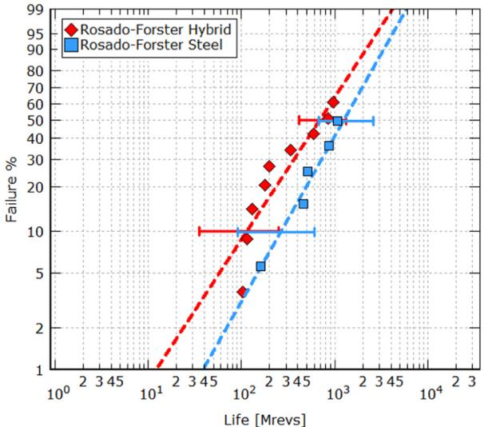  
Fig. 1. Endurance life of hybrid and steel 7208 bearings, tested at a maximum Hertzian pressure of 3.5 GPa and 3.1 GPa respectively, and with good lubrication.

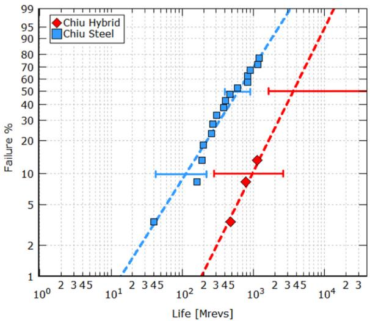  
Fig. 2. Endurance life of hybrid and steel 7208 bearings, tested at maximum Hertzian pressure of 2.6 GPa and 2.3 GPa and under challenging lubrication conditions.

Under the given conditions, bearing life is dominated by surfaceinitiated fatigue. Hybrid bearings of Fig. 2 show a clear performance advantage with a substantial increase of RCF life, even if they were subjected to a higher contact pressure. The statistical confidence of this test result is high.

Chiu's test results cannot be explained with the traditional bearing life models. Traditional methods to predict Rolling Contact Fatigue for conventional all-steel bearings are somehow inadequate to represent the actual performance of hybrid bearings. Standard RCF calculations are ultimately based on subsurface fatigue and would always penalize the life of hybrid bearings due to the 12% increase in contact pressure of the rolling contact. However, this would not provide a fair description of the actual performance of hybrid bearings when they operate under environmental conditions found in many bearing applications. Therefore, what is needed is a fatigue life model that can disclose, and gives full representation, of the superior tribo-properties of the ceramicsteel interface of hybrid bearings, thereby to the unique fatigue life performance observed in many hybrids bearing applications.

Forster et al. (2017) [21], discussing their investigation on hybrid bearing fatigue life recognize the shortcomings of traditional RCF approach. They recommended the development of novel RCF approach able to include, explicitly, the fatigue properties of the raceway surface, as proposed by Morales-Espejel et al. (2015) [34]. The scope of the present paper is to present such new development aimed to improving the calculation of the Rolling Contact Fatigue performance of hybrid bearings.

## 2. Generalized rolling contact fatigue

The detailed description of the Generalized Bearing Life Model (GBLM) is given in [34]. Herewith only a short outline of the method is presented with emphasis to the aspects of the model that are related to hybrid bearings.

## 2.1. Probabilistic fatigue damage

A bearing can be viewed as a system of components, i.e. rolling elements, raceways, cage, that are connected in series. In a series, or chain configuration all components are critical to the reliability of the system and its survival is dictated by the product law of reliability. The survival probability of the complete bearing is therefore provided by the product of the survival probability of each single component part of the bearing system.

This general approach is also used for the calculation of the survival probability of the material stress volume of the rolling contact, [12–14] and [35]. A short summary of this methodology is given below.

The probability of survival of a rolling contact can be related to a structure composed by n elements connected in series configuration. The n elements are subjected to diferent stress states and therefore have diferent probability of survival: $S _ { 1 } , S _ { 2 } , . . . , S _ { n } .$ In such a system all components are critical if one element of the structure fails the entire system fails. As mentioned, in a series configuration the survival probability of the whole structure is given by the product of the survival probability $S _ { 1 } , S _ { 2 } , . . . , S _ { n }$ of each of the n elements of the structure,

$$
S _ { 1 } ^ { n } = S _ { 1 } { \cdot } S _ { 2 } { \cdot } { \cdot } { \cdot } S _ { n }
$$

Similarly, for a rolling contact the survival probability S N( ), to endure N stress cycles, is given by the product of the survival probability Si of each of the n elements constituting the stressed volume V of the rolling contact.

$$
\begin{array} { r } { S ( N ) = \Delta S _ { 1 } ( N ) { \bullet } \Delta S _ { 2 } ( N ) { \bullet } { \bullet } \Delta S _ { n } ( N ) } \end{array}\tag{1}
$$

By rewriting Eq. (1) as a reciprocal function and applying the logarithm rules at both sides of equation, the following equivalent form is obtained,

$$
l n \left[ \frac { 1 } { S ( N ) } \right] = l n \left[ \frac { 1 } { \Delta S _ { 1 } ( N ) } \right] + l n \left[ \frac { 1 } { \Delta S _ { 2 } ( N ) } \right] + . . . + l n \left[ \frac { 1 } { \Delta S _ { n } ( N ) } \right]\tag{2}
$$

Let us consider the volume element $\Delta V _ { v , i }$ suficiently large to contain material defects. We can introduce a material strength degradation function ${ \cal G } _ { v , i } ( { \cal N } )$ to account for the fatigue damage accumulation, at each stress cycle, in the volume element $\Delta V _ { \nu . | }$ .

The survival probability of Eq. (2) can then be expressed in term of the fatigue damage generated by the function ${ \cal G } _ { \nu . i } ( { \cal N } )$ after N stress cycles in the volume $\Delta V _ { \nu . | }$ i. Accordingly, for the stressed volume $\Delta V _ { \nu _ { \mathrm { { } } } }$ 1, the survival probability is:

$$
l n \left[ \frac { 1 } { \Delta S _ { 1 } ( N ) } \right] = G _ { \nu . 1 } ( N ) \bullet \Delta V _ { \nu . 1 }\tag{3}
$$

The combined efect on the survival of the complete material volume can be derived from Eq. (2) as summation of the n elements constituting the stressed volume V of the rolling contact subjected to fatigue cycling. Finally, letting $\Delta V _ { \nu . i } { \longrightarrow } 0$ allows to adopt an equivalent integral form to represent the survival probability of the contact.

$$
l n \left[ \frac { 1 } { S ( N ) } \right] = \sum _ { i = 1 } ^ { n } G _ { \nu . i } ( N ) \Delta V _ { \nu . i } \underset { \Delta V _ { \nu . i } \longrightarrow 0 } { \Rightarrow } \int _ { V _ { \nu } } G _ { \nu } ( N ) d V _ { \nu }\tag{4}
$$

In a hybrid rolling contact, the stressed volume V can be further subdivided into two separate sub regions that are the main sources of independent fatigue damage developed in the rolling contact, see Fig. 3.

Using the notation V (subscript v) for the subsurface region and $\pmb { A }$ (subscript s) for the surface region of the rolling contact, we can rewrite $\mathtt { E q . } \left( 5 \right)$ using two separate terms. The modelling of subsurface fatigue damage can be achieve using the fatigue damage function ${ \bf G } _ { \nu } ( { \bf N } )$ while the tribology and degradation processes taking place at the very surface of the ceramic-steel contact can be achieved using the damage function ${ \cal G } _ { s } ( N )$ that is applied to a very narrow layer, of thickness $\hat { \pmb { h } } ,$ of raceway surface, see Fig. 3. Eq. (4) can then be rewritten as:

$$
\begin{array} { r } { l n \left[ \frac { 1 } { S ( N ) } \right] = \int _ { V _ { v } } G _ { v } ( N ) d V _ { v } + \hat { h } \int _ { A } G _ { s } ( N ) d A } \end{array}\tag{5}
$$

Following Ioannides et al. (1985) [35] the fatigue damage volume integral of Eq. (5) can be expressed as a function of the critical stress amplitude $\sigma _ { \nu }$ (fatigue damaging stress) originated within the Hertzian stress field during over-rolling. The proposed damaging function, according to [35] is:

$$
\begin{array} { r } { \int _ { V _ { \nu } } G _ { \nu } ( N ) d V _ { \nu } = \bar { A } N ^ { e } \int _ { V _ { \nu } } \frac { \langle \sigma _ { \nu } - \sigma _ { u . \nu } \rangle ^ { c } } { z ^ { h } } d V _ { \nu } } \end{array}\tag{6}
$$

In Eq. (6), c and h are experimental constants that characterize the fatigue damage generation at each over-rolling cycle, while e represents the failure-rate of the Weibull statistics for subsurface fatigue. N is the contact life in number of over-rolling load cycles, z represents the depth of analysis, $V _ { \nu }$ is the integration volume, $\sigma _ { u , v }$ is the fatigue limit stress [36] of the material and A is the bearing subsurface constant for Rolling Contact Fatigue.

The above methodology is quite general; thus, a similar approach is followed to represent the surface damage function ${ \cal G } _ { s } ( N )$ . If the surface depth constant $\hat { \pmb { h } } ,$ see Fig. 3, is included into the surface RCF constant $\begin{array} { r } { \pmb { \bar { B } } , } \end{array}$ one obtains:

$$
\begin{array} { r } { \hat { h } \int _ { A } G _ { s } ( N ) d A = \bar { B } N ^ { m } \int _ { A } \langle \sigma _ { s } - \sigma _ { u . s } \rangle ^ { c } d A } \end{array}\tag{7}
$$

Where A is the area of integration, $\sigma _ { u , s }$ is the fatigue limit at the surface stressed layer, B is the surface RCF constant, and m is the characteristic slope of the Weibull statistics of the bearing life for surface originated fatigue failure.

In the surface damage function (7) the surface stress amplitude during over-rolling $\sigma _ { s }$ is obtained from the stress system present in a layer h^ of few micrometres depth below the raceway surface, see Fig. 3. Quantification of these stresses must be obtained from the actual contact surface micro-geometry, i.e. roughness, dents, and frictional stress condition present at the raceway surface of the hybrid rolling contact.

## 2.2. Generalized Bearing Life for hybrid bearings

Combining Eq. (6) of the subsurface and (7) of the surface, with Eq. (5), it is possible to obtain a generalized life equation with separate terms for the surface and the subsurface.

Notice that the life L of the bearing, in number of revolutions, is related to the number of over-rolling stress cycles N by the ratio $\pmb { L } = \pmb { N } / \pmb { u }$ , where u is the number of the over-rolling stress cycles taking place at each revolution.

In bearing life ratings, a standardized failure-rate of the Weibull statistics is generally adopted, then we can set ${ \pmb m } = { \pmb e } .$ . Furthermore, indicating with $\scriptstyle L _ { 1 0 }$ the 10% bearing contact life and setting S equal to 0.9 (for 90% survival), we can rewrite (5) as:

$$
L _ { 1 0 } = u ^ { - 1 } \left[ l n \bigg ( \frac { 1 } { 0 . 9 } \bigg ) \right] ^ { 1 / e } \left[ \bar { A } \int _ { V _ { \nu } } \frac { \langle \sigma _ { \nu } - \sigma _ { u , \nu } \rangle ^ { c } } { z ^ { h } } d V _ { \nu } + \bar { B } \int _ { A } \langle \sigma _ { s } - \sigma _ { u , s } \rangle ^ { c } d A \right] ^ { - 1 / e }\tag{8}
$$

Eq. (8) represents the basis of a Generalized Bearing Life Model that explicitly separates the fatigue damage of the raceway surface from the subsurface fatigue of the rolling contact.

The subsurface term of Eq. (8), (represented by the volume integral), can be solved using established Rolling Contact Fatigue methods, see reference [35]. However, the surface term, given by the area integral of Eq. (8), must be quantified in a radical diferent manner. Its assessment requires the estimation of the damage originated by the actual stress conditions of the raceway surface under a variety of operating conditions that may occur to the bearing.

This task is complex, but it ofers the possibility to consistently consider, in the life estimation of hybrid bearings, the actual tribological phenomena that characterize the performance and endurance characteristics of the ceramic-steel raceway contact as extensively described in Brizmer [28] and Viellard [31].

## 2.3. Surface survival of the ceramic-steel interface

Eq. (8) can be rewritten in a form that clearly indicates the contribution of the raceway surface to the $\mathrm { L } _ { 1 0 }$ life of a rolling bearing contact:

$$
L _ { 1 0 } = \left[ \underbrace { \bar { A } u ^ { e } } _ { l n \left( \frac { 1 } { 0 . 9 } \right) } \int _ { V _ { \nu } } \frac { \langle \sigma _ { \nu } - \sigma _ { u , \nu } \rangle ^ { c } } { z ^ { h } } d V _ { \nu } + \underbrace { \frac { \bar { B } u ^ { e } } { l n \left( \frac { 1 } { 0 . 9 } \right) } \int _ { A } \langle \sigma _ { s } - \sigma _ { u , s } \rangle ^ { c } d A } _ { S u r f a c e } \right] ^ { - \frac { 1 } { e } }\tag{9}
$$

For a given bearing size and excluding constant terms, the surface fatigue damage of Eq. (9) is a direct function of the combined efects of the stress conditions experienced by the raceway surface during the over-rolling of the rolling contact:

$$
\begin{array} { r l } { I _ { s } ^ { * } } & { { } = \int _ { A } \langle \sigma _ { s } - \sigma _ { u . s } \rangle ^ { c } d A } \end{array}\tag{10}
$$

The assessment of the surface damage integral (10) can be accomplished by integrating the surface originated fatigue stress of the raceway resulting from a variety of operating conditions of the bearing.

In the current formulation, following Morales-Espejel [34,37], the surface stressing and damage accumulation can be treated using advanced surface distress modelling for elastohydrodynamic lubricated rolling-sliding rough contacts, i.e. micro-EHL.

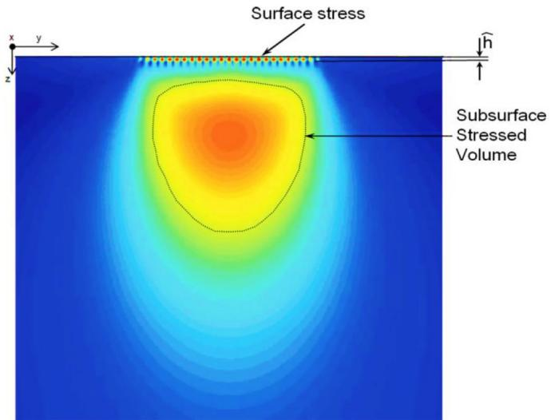  
Fig. 3. Schematics of surface and subsurface von Mises stress of a Hertzian bearing contact.

This numerical approach can handle boundary lubrication conditions and presence of dents and other surface defects, see [37,38,40]. This methodology requires the use of 3D area samples of the raceway roughness, including the presence of possible indentations and surface defects. A schematic flowchart of advanced Micro-EHL calculation, for surface fatigue stress damage, is shown in Fig. 4.

The use of advanced surface stress analyses based on Micro-EHL can be time consuming and can be impractical for typical bearing life calculations. Therefore, a parametric study, was set up, to derive a simplified analytical methodology for the fast estimation of the surface fatigue damage of hybrid bearings operating under a variety of diferent loading and lubrication conditions. For this parametric study surface topographies of hybrid bearing raceways were collected using 3D laser scanning. This work involved the measurements of several raceways of deep groove, angular contact and radial roller bearings. The sampling included bearing raceways that were run-in under diferent environmental conditions ranging from very good lubrication to boundary lubrication and severe contamination.

From the collected surface micro-geometries, several numerical fatigue stress-integration were performed as schematically illustrated in Fig. 4. The details of this type of numerical calculations are explained in [34,37,39,40]. Herewith the methodology is illustrated presenting the results of a typical calculation case.

This calculation regards the stress conditions of the raceway of a hybrid deep groove ball bearing type 6204. Surface roughness samples of the bearing raceway were measured using a 3D laser scanning microscope. The surface roughness sample used in the present calculation is shown in Fig. 5A). Under a nominal Hertzian contact pressure of 2.3 GPa and a film thickness to composite roughness ratio equal to 2.7, the original surface topography undergoes elastic deformation while passing across the rolling contact. The calculated elastically deformed surface topography is presented in Fig. 5B)

During the simulation of the contact over-rolling, the Micro-EHL surface pressures are calculated using the FFT method. The results of these calculations are shown in Fig. 5C). Detailed view of the Micro-EHL surface pressures corresponding to the roughness profile y = 0 is given in Fig. 5D). The von Mises stress originated by the bearing topography just below the raceway is also shown in Fig. 5D).

The above type of calculations of the surface originated pressures and related fatigue stress integration, was performed parametrically. The parameter study involved rolling contacts of diferent raceway topographies that were studied under diferent contact pressures and lubrication conditions. In the numerical simulations, the lubrication conditions of the bearing were modelled performing the transient Micro-EHL calculation of the rolling contact for diferent lubricant film thickness. The efect of lubricant contamination was included by accounting for the presence of dent topographies and local surface tractions as discussed in [31,37,40].

Although all results discussed here are related specifically to hybrid bearings, similar surface stress fatigue calculations were performed also for all-steel rolling contacts, [34,37]. This to have a base line reference model also for standard all-steel bearings.

Under mixed lubrication conditions, there are significant benefits to the stresses developed at the surface of a hybrid bearing raceway, compared to standard all-steel bearing raceways. Detailed evaluation of the reduction of surface originated stress and improvement in surface fatigue provided by hybrid bearings under mixed lubrication conditions are discussed in detail by Brizmer [28] and Viellard [31]. In the present work, this is further extended with the development of surface stress integral for hybrid able to account for these benefits into the L10 fatigue life expectation of the bearings.

## 2.4. Analytical model of the surface stress integral

The numerical results of the parametric study of the surface stress integral of hybrid bearings, discussed in Section 2.3, indicated the possibility to represent this quantity using an analytical formulation. Similarly, as originally described in [34], it was found that all numerical results could be approximated by an exponential function.

This function depends on two main parameters, the relative load $\pmb { P _ { r } } = \pmb { P } / \pmb { P _ { u } }$ and the environmental lubrication factor of the bearing application, $\begin{array} { r l r } { \eta _ { e n v } = } & { { } \ \eta _ { l u b } \cdot } & { \ \eta _ { c o n t } } \end{array}$ . The surface stress integral has the form,

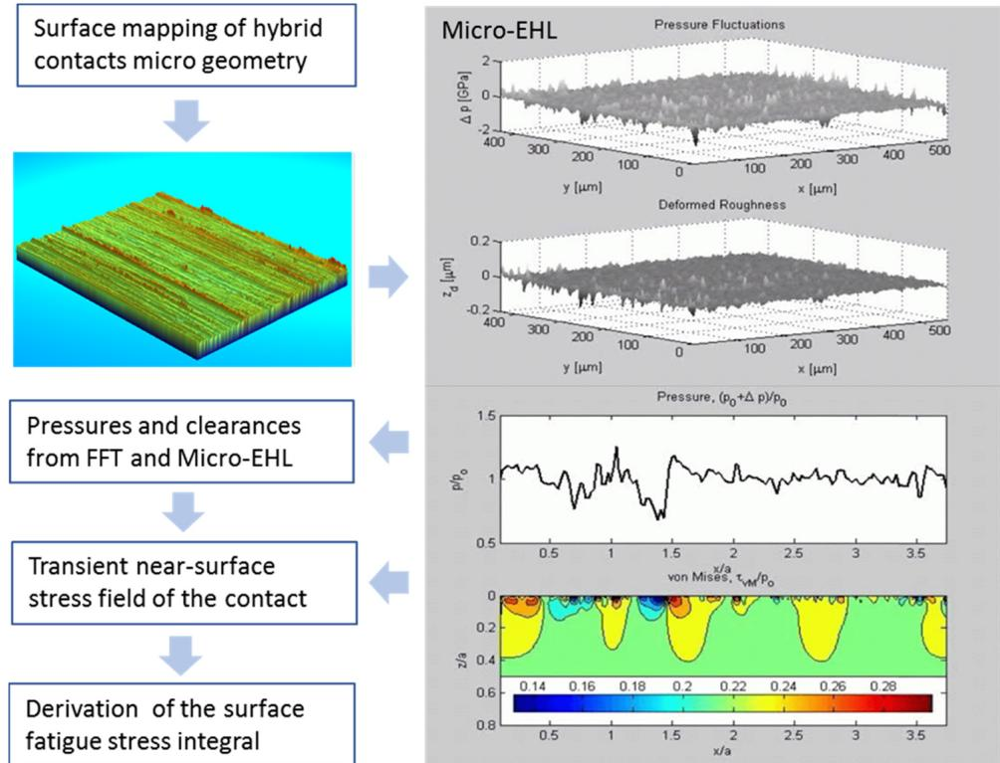  
Fig. 4. Schematic flowchart of advanced Micro-EHL for surface fatigue stress damage evaluation.

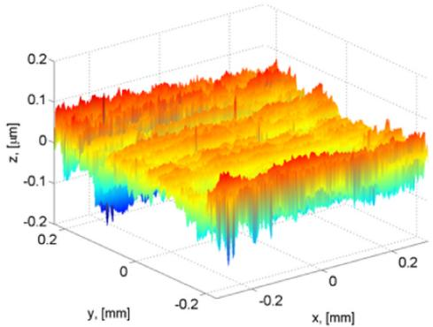  
A) Measured raceway roughness.

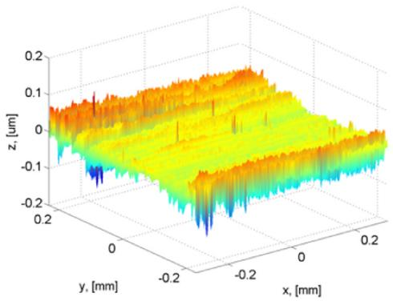  
Fig. 5. Typical Micro-EHL calculation results. Raceway roughness of deep groove ball bearing 6204. Film thickness to composite roughness ratio of the calculation is 2.7. Nominal Hertzian contact pressure 2.3 GPa: A) 3D Measured microgeometry of the bearing raceway, B) Corresponding elastic deformation of the roughness within the EHL contact. C) Calculated FFT Micro-EHL surface pressures, D) a roughness profile and corresponding von Mises stress just below the raceway surface.  
B) EHL elastically deformed roughness

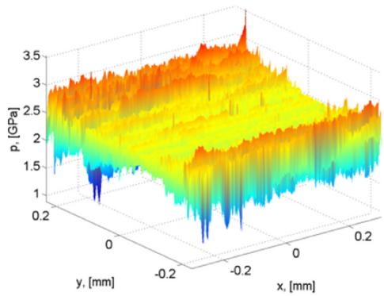

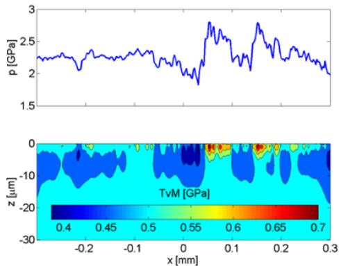  
C) Micro-EHL surface pressures.  
D) Local micro-EHL von Mises stress

$$
I _ { s } ^ { * } = \int _ { A } \langle \sigma _ { s } - \sigma _ { u . s } \rangle ^ { c } d A \approx c _ { 1 } e x p \left[ \frac { c _ { 2 } } { ( P / P _ { u } ) ^ { c _ { 3 } } } + \frac { c _ { 4 } } { ( P / P _ { u } ) ^ { c _ { 5 } } } \right]\tag{11}
$$

In Eq. (11) the parameters c ; c ; c ; c ; c1 2 3 4 5 are determined numerically as data sets that are dependent to the bearing type and environmental lubrication conditions $( \eta _ { e n v } )$ of the bearing. Their values are stored in form of data blocks in the calculation program.

The environmental factor $( \eta _ { e n \nu } )$ used in the derivation of the c parameters of Eq. (11) is obtained from the lubrication $( \eta _ { l u b } )$ and contamination $( \eta _ { c o n t } )$ )factors that are used in bearing engineering practice [39,40].

A plot of the surface stress integral $\begin{array} { r } { I _ { s } = f ( P _ { r } , \eta _ { e n v } ) } \end{array}$ as index of surface stress of the hybrid contact is given in Fig. 6. The plot shows that under good lubrication, free from contamination particles, the expectancy of increased surface stresses, as indicated by the surface stress index, is indeed negligible. Whereas, under condition of severe contamination and/or reduced lubrication, surface stress fatigue damage reaches its maximum value.

Fig. 6 shows also that a reduction of environmentally induced stress for the bearing raceway can be achieved by limiting the applied load of the rolling contact. This efect is significantly reduced in case of a severe deterioration of the lubrication of the bearing, i.e. severe environment $\eta _ { e n v } {  } 0$

## 2.5. GBLM hybrid bearing fatigue life

Similar to [34], the availability of an analytical form of the surface fatigue stress integral for hybrid bearings, Eq. (11), gives the possibility to predict the fatigue life without the use of time consuming numerical simulations. Inserting Eq. (11) in the bearing life model (8) provides a life rating model for a hybrid bearing rolling contact:

$$
\begin{array} { l } { { { \cal L } _ { 1 0 } } } \\ { { { \displaystyle \quad = \frac { \left[ l n \left( \frac 1 { 0 . 9 } \right) \right] ^ { 1 / e } } { u } \left[ \bar { A } \int _ { V _ { \nu } } \frac { \langle \sigma _ { \nu } - \sigma _ { u , \nu } \rangle ^ { c } } { z ^ { h } } d V _ { \nu } + \bar { B } c _ { 1 } e x p \left[ \frac { c _ { 2 } } { ( P / P _ { u } ) ^ { c 3 } } + \frac { c _ { 4 } } { ( P / P _ { u } ) ^ { c 5 } } \right] \right] ^ { - 1 / e } } } } \end{array}\tag{12}
$$

The Generalized Bearing Life Model (GBLM) of Eq. (12), integrates the results of the research work Brizmer [28] and Viellard [31] in its formulation. It allows for the proper consideration of the damaging mechanisms and specific tribology that characterize a ceramic-steel rolling contact. By providing a direct account of the survival probability of the ceramic-steel interface, Eq. (12) gives a good representation of the actual performance of hybrid bearings as it will be discussed in the next section.

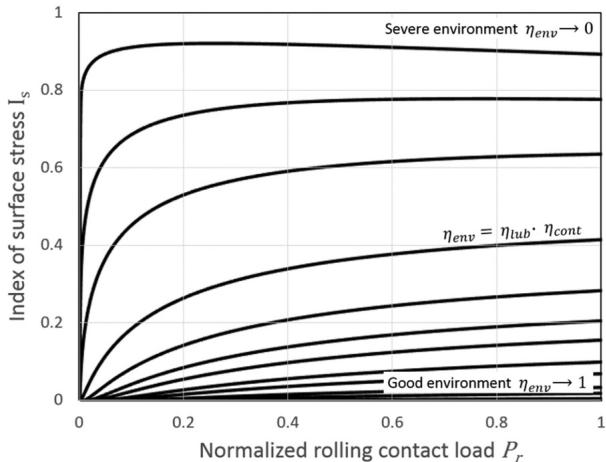  
Fig. 6. Index of surface stress of hybrid bearings as function of load and lubrication environment.

## 3. Application of the model

The Generalized Bearing Life Model of $\operatorname { E q . }$ (12) can be applied to represent the endurance test data of Rosado-Forster [21] and Chiu [19] that were discussed earlier. The tests were performed on a population of 72 angular contact ball bearings. A total of 40 hybrid bearings were tested leading to 12 failures. For the all-steel variant, 32 bearing were tested leading to 21 failures. Geometrical details of the test sample, the loading and stress conditions used in these endurance tests are shown in Table 1.

A main diference between the two tests is related to the loading conditions and lubrication environment in which the tests were conducted. In case of the Rosado-Forster's endurance tests, the load was high, leading to Hertzian contact pressure of 3.5 GPa for the hybrid bearing variant. Furthermore, the lubrication conditions were good with on line oil filtration and a calculated film thickness to composite roughness ratio larger than two. The GBLM environmental factor $\eta _ { e n \nu }$ resulting from the given lubrication conditions is then 0.85. This gives rise to a low value of the index of surface stress. Indeed, under the given loading conditions, subsurface fatigue controls the performance of the rolling contact. Therefore, the Rosado-Forster's test conditions are of advantage to the all-steel bearing variant which operates at a lower Hertzian stress of 3.1 GPa and will generate a lower amount of fatigue damage per over-rolling cycle.

In case of Chiu's endurance testing, the applied load was substantially lower leading to a maximum Hertzian stress of 2.6 GPa for the hybrid variant. The running temperature of the tests was higher (150 °C) providing a thinner oil film to the bearing. Furthermore, the tests were conducted with induced raceway defects to reproduce the typical contamination conditions encountered in many bearing applications. This was achieved by running-in the bearings for 15 min in oil containing 2.5 ppm aluminium oxide particles of 20 µm size.

The resulting GBLM environmental factor $\eta _ { e n v }$ that characterizes the above operating conditions is 0.035 This was obtained with an estimated film thickness to composite roughness ratio of the test 0.675 corresponding to a lubrication factor, according to [40], 0.175 and ISO 281 factor for contamination, 0.2.

In case of Chiu's endurance testing, with the given loading and environmental conditions, the role of the surface fatigue dominates the survival of the bearing. In other words, there is a high index of surface stress for the given test conditions. Thus, surface fatigue will control the fatigue performance of the bearing under test. The surface stress index specifically developed for hybrid bearings will play here in favour for the fatigue performance of the hybrid bearing. It will provide a lower rate of surface fatigue damage for the hybrid raceway, thus compensating for the higher Hertzian stress (2.6 GPa), present in the ceramicsteel contact.

The running conditions of Chiu's tests, discussed above, were introduced into an ad hoc bearing life code with the implementation of the Generalized Bearing Life Model according to Eq. (12) The life performance of the 7208, steel variant, was also computed using a version of the GBLM suitable for all-steel bearings as described in Morales-Espejel [34]. The results of the computed ten percentile fatigue life corresponding to the diferent tests and bearing variants are presented in the Weibull plots of Figs. 7 and 8. The GBLM predicted L10 endurance lives, in millions of revolutions, are shown in the plots with a circular symbol positioned at the 10% failure probability of the Weibull plot. To improve the visual clarity of the plot, a vertical line is added and labelled according to the corresponding bearing variant of the calculation, Figs. 7 and 8.

In the Weibull probability plot of Figs. 7 and $^ { 8 , }$ the test L10 life is shown with its two-sided 90% confidence interval. The notation L10,5 and L10,95 is used to indicate the lower (5%) and upper (95%) bound of L10 confidence interval. The notation L10,50 is used to indicate the median L10 life of the test.

The 90% confidence interval of the Weibull probability plot is related to the Probability Density Function (PDF) that the true (but unknown) L10 is to be found within a given life value. It follows that the experiments will confirm a predicted life value with a statistical significance that is given by the right-side integration of the PDF starting from the life value that is given.

This implies that, if the predicted (given) L10 life is equal or lower than the lower bound of the confidence interval of the test (i.e. L10,5), the model result is confirmed with a high degree of statistical significance. On the other hand, in case the predicted life L10 approaches the median L10 life of the test, that is L10,50 there is a reduction of significance.

Considering the above, the plot presented in Fig. 7 shows that predicted fatigue lives for the hybrid and all-steel variants are set at about the lower end, (i.e. L10,5) of the 90% confidence of the endurance test results. This signifies that the Rosado-Forster's endurance tests confirm the GBLM model results with a high degree of statistical significance.

The model results related to Chiu's endurance tests are presented in Fig. 8. In this case the predictions have a somewhat reduced statistical significance. This may be due to the low number of failures obtained for the hybrid variant and to a one early failure afecting the results of the all-steel test. Nevertheless, the predicted GBLM lives are in all cases lower than the median L10 life of the test, i.e. L10,50, thus are acceptable.

The predicted life results show also good consistency with the overall characteristics of the experimental observations. Indeed, the predicted life results indicated the ability of the model to represent well the substantial longer Rolling Contact Fatigue life of the hybrid variant. This despite the higher contact pressure experienced by this bearing variant, during the life test.

It is to be clarified that the model life predictions and the assessment presented here are based only on the L10 life evaluation. This is because the L10 life is the standard life parameter used to assess bearing reliability. Furthermore, the present life model adopts a standardized Weibull failure rate exponent. Using this standard Weibull exponent, it would possible to extrapolate the L10 life towards other life percentiles. This is not new and not part of the present evaluation.

## 4. Model correlation to endurance data

Further evaluation of the behaviour of the Generalized Bearing Life Model (BLM) for hybrid bearings can be obtained by checking the model predictions versus endurance test results produced throughout the years in an industrial research test facility located in the Netherlands.

## 4.1. Test equipment and method

A general description of this endurance test facility is given in [41]. This bearing testing laboratory is ISO 9000/9001 certified. Thus, full traceability is established, and procedures are in place for the calibration of the measuring equipment and execution of the testing activities.

Bearing size 7208, hybrid and all-steel variants. geometrical details and test loading.
| Parameter | Rosado-Forster [21] | Chiu [19] |
| --- | --- | --- |
| Ball diameter $D _ { w }$ (mm) | 12.7 | 12.7 |
| Number of balls Z (-) | 11 | 9 |
| Pitch diameter 1 $d _ { m }$ (mm) | 60.25 | 60.25 |
| Nominal contact angle α (°) | 22 | 18 |
| Axial load $F _ { a x i a l }$ (kN) | 22.2 | 7.56 |
| Hybrid pressure $P _ { 0 h y b r i d } \ ( \mathbf { G P a } )$ | 3.5 | 2.6 |
| Steel pressure $P _ { 0 \_ s t e e l } \ ( \mathbf { G P a } )$ | 3.1 | 2.3 |
| Environmental factor $\eta _ { e n v } \left( - \right)$ | 0.85 | 0.035 |

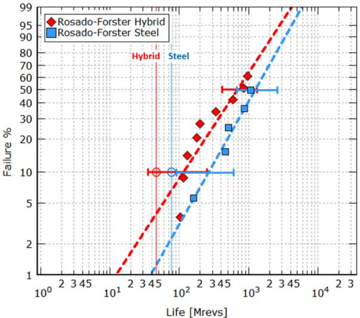  
Fig. 7. Endurance life tested at a maximum Hertzian pressure of 3.5 and 3.1 GPa (hybrid and steel) and good lubrication. Calculated $\mathrm { L } _ { 1 0 }$ lives are indicated with a circular symbol.

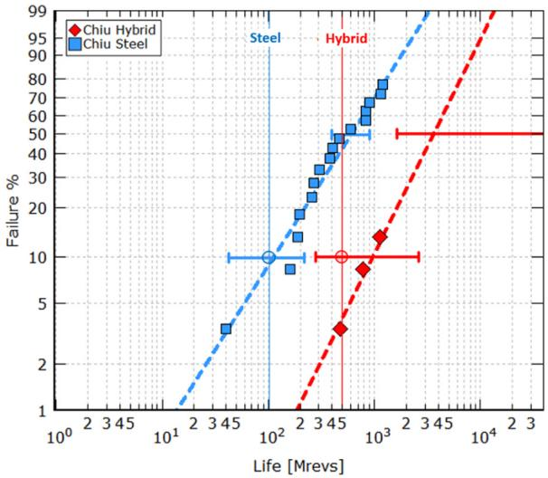  
Fig. 8. Endurance life tested at a maximum Hertzian pressure of 2.6 and 2.3 GPa (hybrid and steel) and challenging lubrication. Calculated $\mathrm { L } _ { 1 0 }$ lives are indicated with a circular symbol.

Most of the tests were executed on specifically design test batteries comprising several SKF-R2 endurance life test rigs, see Fig. 9.

The SKF-R2 test machines have a simple configuration: single centrally driven shaft with two support bearings symmetrically positioned and two test bearings at each shaft end, see the basic design of Fig. 10. The SKF-R2 test machines can operate with radial, axial and combined load conditions. The load during testing is hydraulically applied and monitored using load cells.

Each R2 test battery comprised 10 or 15 SKF-R2-rigs, capable of simultaneously testing a bearing population of twenty to thirty bearing samples. All bearings of each test battery are lubricated from one centralized oil lubrication system to achieve homogeneous conditions for all test bearings. This lubrication system comprises temperature conditioning and oil filtering and a large oil reservoir for up to 600 litres of oil.

The control system of the lubricant flow, and of the temperature of the oil, can provide specific lubrication conditions for the bearing under test, ranging from fully flooded, thick oil film to reduced lubrication, down to very thin oil film boundary conditions. Cleanliness of the lubricant is controlled by the high capacity multi-pass filtration system

down to 3 µm pore size.

Oil contamination levels during test can be monitored with an online automatic particle counters also supported by microscopy and spectrographic analysis.

Post-test investigations of the failed bearings include the microscopic and metrological examination of all failures with categorization of the failure type, origin, and bearing component that is afected. Typically, all failures, either originated from the surface, subsurface or from other critical components of the bearing, are included in the fatigue life analysis,

The tenth percentile fatigue life of the tested bearings, and other statistical parameters of the endurance test are evaluated performing the Weibull statistics using a proprietary Weibull statistic software tool. The method of maximum likelihood is applied to derive the experimentally observed L10 bearing life. The 90% confidence interval for the endurance tests is derived from fast Monte Carlo simulations performed, by the software calculation tool, during the execution of the Weibull analysis of the test data.

## 4.2. Hybrid bearings fatigue life tests

The hybrid bearing endurance tests reported here are related to bearing population samples, that have been tested during the last twenty years. Typically, a test series comprises 20–30 bearings, a total of twenty test series are included in this evaluation amounting to a total of 509 hybrid bearings. These tests have produced a total of 192 bearing failures of which only a very negligible number was related to failures of the ceramic roiling element.

An overview of the diferent hybrid bearing types that were endurance tested and the relevant information of the life tests, is given in Table 2. The correlation between the observed tenth percentile fatigue life (i.e. L10,5 and L10,50) of the tested bearings and the Generalized Bearing Life Model predictions is presented in Fig. 11.

A simple visual inspection of the test data presented in Fig. 11 shows a good degree of correlation between measured and calculated bearing life which indicates the good ability of the model to predict hybrid bearing fatigue. Indeed, the Pearson correlation coeficient between the GBLM predicted life and the experimental L10;50 observations is 0.91, i.e. 91%. This indicates a high degree of correlation between the 10% bearing endurance and the GBLM life results.

The predicted fatigue lives are, in most cases, located within the endurance test confidence interval of L10,5 and L10,50. As discussed earlier, this indicates an adequate degree of experimental statistical significance for the GBLM model. Furthermore, the coeficient of determination (R-square) of the GBLM model derived from test data of Fig. 11 is 98.6%, indicating a high degree of consistency between the model prediction and the test data.

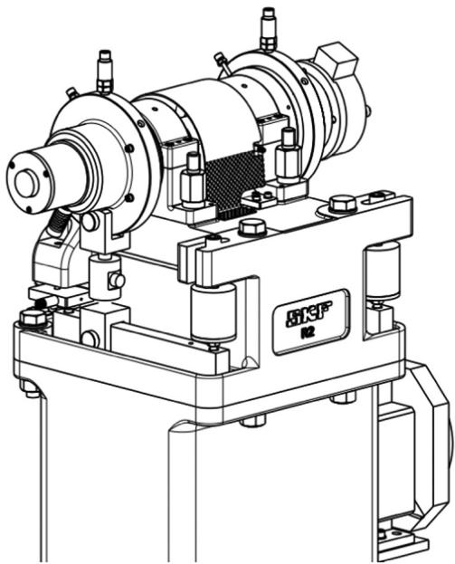  
Fig. 9. Isometric view of SKF-R2 test rig.

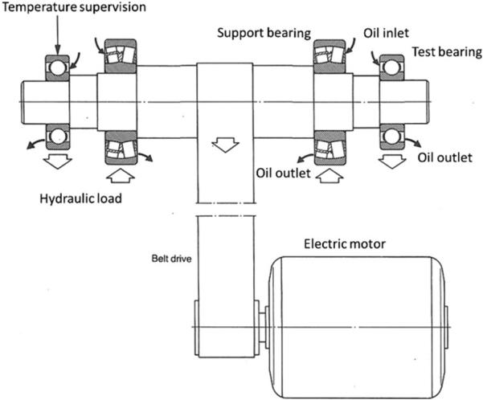  
Fig. 10. Basic design of the SKF-R2 test rig.

It is to be pointed out that the experimental data displayed in Fig. 11 are less in number than the actual test series that were endurance tested. This is because, through the years, some of the test were repeated under the same test conditions. This allows the pooling of the results of two, or more test series, into one single Weibull statistic. This method increases the precision of the statistical evaluation of the life test results.

In few occasions hybrid and all-steel test series were endurance tested under similar test conditions. Examples of this type of test results are given in Figs. 12 and 13. The results of two test series composed of thirty hybrids and standard all-steel angular contact ball bearing are reported in Fig. 12. The bearings were endurance tested under high thrust load, clean and good lubrication.

Under these running conditions subsurface Rolling Contact Fatigue will develop at a faster rate than surface fatigue damage. The standard all-steel bearing which operates at a lower contact pressure, has an advantage in terms of subsurface fatigue life, as it is shown in Fig. 12. The Generalized Bearing Life Model can capture this type of behaviour well. The computed lives, indicated with a circular symbol can consistently predict the tenth percentile fatigue life of the endurance tests for both hybrid and the standard all-steel bearing variants.

An example of test results that are dominated by surface-initiated fatigue is presented in Fig. 13. The plot shows the Weibull statistic of the pooling of two test series, hybrid and steel bearing variants. The pooled population sample was of forty-five bearings for each test series which, (due to the severe contamination conditions in which the test was run), produced many failures. Therefore, the tenth percentile fatigue life of the endurance test is obtained with good precision, i.e.

GBLM vs. Endurance Test Life  
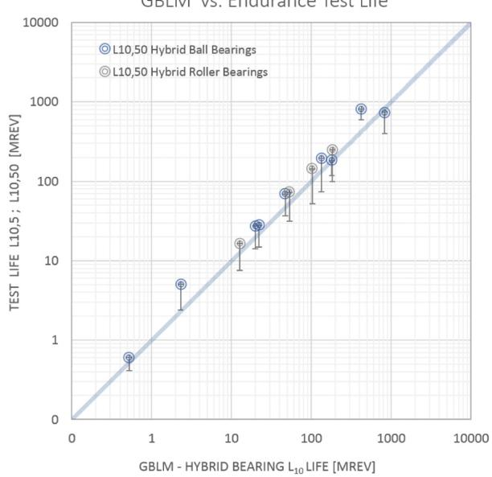  
Fig. 11. Generalized Bearing Life Model (GBLM) results plotted against L10 fatigue life observed in endurance testing of hybrid bearings. Circular symbol indicates the median L10 life of the test, i.e. L10,50. The vertical bar indicates the lower bound of the confidence interval of the test, i.e. L10,5.

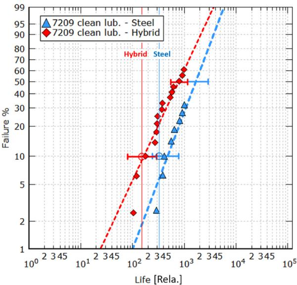  
Fig. 12. Hybrid and all-steel bearings endurance tested under high load, good lubrication and clean conditions. Calculated $\mathrm { L } _ { 1 0 }$ are indicated with a circular symbol.

narrow confidence interval. In this case surface fatigue dominates the performance of the bearing and the advantage, in terms of bearing life, goes in favour to the hybrid bearing variant.

Table 2  
Overview of the test conditions applied for hybrid bearing life testing.
| Hybrid bearing type | Designation # | Test load C/P | Lubrication quality κ | Contamination $\eta _ { c o n t }$ |
| --- | --- | --- | --- | --- |
| Deep groove ball bearing | 6305,6309 | 1, 1.4, 2.1, 2.6 | 0.4, 1.5, 2.6, 3.3 | Clean: 0.8 ÷ 1 Conta.: 0.02 ÷ 0.2 |
| Angular contact ball bearing | 7209,7318 | 1.3, 1.8, 2.5, 2.9 | 0.1, 0.4,1.7, 2.6 | Clean: 0.8÷1 Conta.: 0.02 ÷ 0.2 |
| Cylindrical roller bearing | NU 209 | 1.7, 2.5, 3 | 0.4,3.8 | Clean: 0.8 ÷ 1 Conta.: 0.02 ÷ 0.2 |

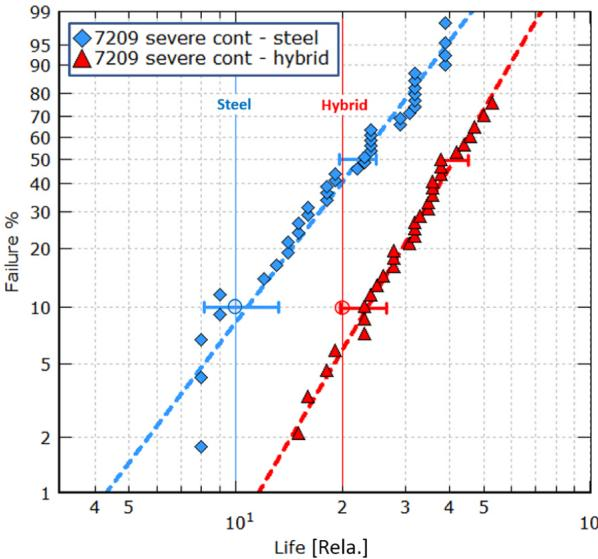  
Fig. 13. Hybrid and all-steel bearings endurance tested under medium loading and severe lubrication conditions. Calculated $\mathrm { L } _ { 1 0 }$ are indicated with a circular symbol.

This is shown quite clearly by the test results presented in Fig. 13 which indicates a statistically significant advantage of hybrid bearing fatigue performance over the all-steel counterpart. Also, in this case the predicted lives of the Generalized Bearing Life Model are well aligned with the experimental observations.

Contrary to traditional Rolling Contact Fatigue that rely only on subsurface fatigue of the rolling contact, the Generalized Bearing Life Model can account for both, surface and subsurface fatigue damage. By computing the fatigue damage rate of the two damaging processes, GBLM can recognize and account for the diferent fatigue processes that are taking place in the rolling contact. This particularly, for the conditions in which the better tribology and fatigue handling capabilities of the ceramic-steel contact will compensate for the higher pressures present in the hybrid contact. This new methodology provides realistic prediction of the expected fatigue performance of hybrid bearings as shown in Figs. 11–13.

## 5. Discussion

The use of hybrid bearings through the industry has developed quite steadily through the years despite the higher cost involved in replacing traditional all-steel with a hybrid bearing solution. Explanation of this market evolution can be found in the ability of hybrid bearings to perform well in many dificult applications in which all-steel bearings are found inadequate to satisfy the requirements.

This long bearing application experience is not always shared by bearing specialists and researchers whose knowledge rely on traditional Rolling Contact Fatigue and life testing that are typically performed under high contact pressures and good lubrication conditions. These test conditions are unable to measure the actual performance of hybrid bearings that are in use. Typical bearing applications are dominated by surface-initiated fatigue. Traditional life test results are generally in contrast with the performance of hybrid bearings used in the field. This issue has puzzled researchers and engineers for years.

The present paper shows a novel approach in dealing with this longstanding problem. This is achieved by developing a GBLM Index of surface fatigue stress for hybrid bearings. This index is tailored to represent the tribology and fatigue mechanisms of hybrid bearing raceway surfaces when the bearing is exposed to an unfavourable and challenging lubrication environment.

The development of a GBLM fatigue damage model specific for the raceway surface of hybrid bearings was helped by the research work of

Brizmer [28] and Viellard [31]. Their work uncovered the mechanisms that distinguish the fatigue performance of a hybrid contact from an equivalent all-steel contact, particularly under conditions of reduced lubrication and the presence of surface defects.

Roller bearings are in general dimensioned to withstand subsurface fatigue. Hence subsurface initiated failures are normally avoided in most applications. Instead, surface-initiated fatigue failures are still an issue in some applications.

The trend in the industry is to increase machine eficiency by reducing frictional losses, (i.e. leading to thinner oil film), and by using higher speeds (i.e. leading to higher temperatures and thinner oil film). The trend is that the environmental conditions of rolling bearings tend to worsen throughout the years. In the meanwhile, the service life and reliability requirements of mechanical systems have risen following increased demand and tougher competition.

Considering all this, hybrid bearing special capabilities for increased resistance to surface fatigue represent an important asset for today's bearing applications. It is expected that many modern industrial bearing applications will discover and take advantage of the unique capabilities ofered by hybrid ceramic bearings particularly once that there is a better understanding of their performance.

## 6. Conclusions

Hybrid bearing fatigue life has been addressed by many authors and researchers. Despite the great progress in fatigue performance of ceramics, no clear performance advantage is recognized to hybrid bearings from the traditional Rolling Contact Fatigue methodology used, up to now, in the bearing industry.

Rolling bearing fatigue life testing is in general performed under high loads and good lubrication conditions which are of advantage for the RCF of standard all-steel bearings. This because this type of life testing targets traditional subsurface fatigue failure-mode. This behaviour is not reflected in the performance of hybrid bearings as observed in field applications. Hybrid bearings are in general used for tough lubrication conditions for which high surface fatigue resistance is required.

In many modern bearing applications, subsurface fatigue is negligible as it is avoided by the proper selection of the bearing size. On the other hand, nowadays surface fatigue caused by a harsh environment can be an issue in some bearing applications. In this case, hybrid bearings have proven to perform better than all-steel bearings.

A new approach to tackle RCF is proposed by the Generalized Bearing Life Model. The new methodology can integrate hybrid bearing specific surface fatigue properties into the calculation of the bearing life. In this way, GBLM can account for the more favourable tribo-fatigue occurring in the ceramic-steel interface. The ability of GBLM to forecast the tenth percentile fatigue life of hybrid bearings is good. This was found after the examination of several endurance life tests of hybrid bearings performed under a variety of loading, lubrication and contamination conditions.

The genialised bearing life methodology provides application engineers with a tool for a realistic forecast of the expected performance of hybrid bearings. This allows a proper account of the cost/benefit advantage of hybrid bearings and the further growth of the use of this type of bearing throughout the industry.

## References

[1] E.V. Zaretsky, W.J. Anderson, Rolling-contact fatigue studies with four tool steels and a crystallized glass ceramic, J. Basic Eng. 83 (1961) 603–612.

[2] R.J. Parker, S.J. Grisafe, E.V. Zaretsky, Rolling-contact studies with four refractory materials up to 2000° F, ASLE Trans. 8 (1965) 208–216.

[3] H.R. Baumgartner, Evaluation of roller bearings containing hot pressed silicon nitride rolling elements, in: J.J. Burke, A.E. Gorum, R.N. Katz (Eds.), Ceramics for High Performance Applications, Brook Hill Publishing Co., Chestnut Hill, Massachusetts, 1973, pp. 713–727.

[4] R.J. Parker, E.V. Zaretsky, with discussion by Bernsby, R. M. and Valori R. fatigue life of high speed ball bearings with silicon nitride balls, Transactions of ASME, J. Lubr. Technol. 97 (1975) 350–355.

[5] H.M. Delal, Y.P. Chiu, E. Rabinowicz, Evaluation of hot pressed silicon nitride as a rolling bearing material, ASLE Trans. 18 (1975) 211–221.

[6] H.K. Lorösch, J. Vay, R. Weigand, E. Gugel, H. Kessel, Fatigue strength of silicon nitride for high-speed rolling bearings," Transactions of ASME, J. of engineering for, Power 102 (1980) 128–131.

[7] Miner, J.R., Grace, W.A., Valori, R., (19810. A demonstration of high-speed gas turbine bearings using silicon nitride rolling elements, Lubr. Eng, vol. 37, 462-464, 473-478.

[8] B. Bhushan, L.B. Sibley, Silicon nitride rolling bearings for extreme operating conditions”, ASLE Trans. 25 (1982) 417–428

[9] F.R. Morrison, J.I. McCool, T.M. Yonushonis, P. Weinberg, The load-life relationship for M50 steel bearings with silicon nitride ceramic balls, Lubr. Eng. 40 (1984) 153–159.

[10] E.V. Zaretsky, Discussion by Y.P. Chiu, T.E. Tallian, Ceramic bearings for use in gas turbine engines, J. Mater. Eng. 11 (1989) 237–253.

[11] E.V. Zaretsky, B.L. Vlcek, R.C. Hendricks, Efect of Silicon Nitride Balls and Rollers on Rolling Bearing Life, Tribology Trans. 48 (3) (2005) 425–435.

[12] W. Weibull, A Statistical Theory of strength of materials, Proc. R. Swed. Acad. Eng. Sci. 151 (1939) 1–45.

[13] G. Lundberg, A. Palmgren, Dynamic capacity of rolling bearings, Acta Polytech., Mech. Eng. Ser. 1 (3) (1947) 1–52.

[14] G. Lundberg, A. Palmgren, Dynamic capacity of roller bearings, Acta Polytech., Mech. Eng. Ser. 2 (4) (1952) 96–127.

[15] Ebert, F. J., (1990). Performance of silicon nitride (Si3N4) components in aerospace bearing applications, ASME Publication No.90-GT-166.

[16] Cundill, R. T., (1990). Material selection and quality for ceramic rolling elements. Proceedings of Mech. Eng. Seminar, Rolling Element Bearings – Towards the 21st Century, pp. 31–40.

[17] R.T. Cundill, High precision silicon nitride balls for bearings, Ball Bear. J. 241 (1993) 26–32.

[18] A.T. Galbato, R.T. Cundill, T.A. Harris, Fatigue Life of Silicon Nitride Balls, Lubr. Eng. 48 (11) (1992) 886–894.

[19] Y.P. Chiu, P.K. Pearson, M. Dezzani, H. Daverio, Fatigue life and performance Testing of hybrid ceramic ball bearings, Lube Eng. 52 (3) (1996) 198–204.

[20] M.M. Dezzani, P.K. Pearson, Hybrid Ceramic Bearings for Dificult Applications, J. Eng. Gas. Turbines Power 118 (2) (1996) 449–452.

[21] N.H. Forster, S.M. Peters, H.A. Chin, J.V. Poplawski, R.J. Homan, Applying Finite Element Analysis to Determine the Subsurface Stress and Temperature Gradient in Highly Loaded Bearing Contacts, in: J.M. Beswick (Ed.), Bearing Steel Technologies: 11th Volume, ASTM STP1600, ASTM, West Conshohocken, PA, 2017, pp. 151–166.

[22] J.R. Miner, J. Dell, A.T. Galbato, M.A. Ragen, F117-PW-100 Hybrid Ball Bearing Ceramic Technology Insertion, J. Eng. Gas. Turbines Power 118 (1996) 434–442.

[23] Y. Shoda, S. Ijuin, H. Aramaki, H. Yui, K. Toma, The Performance of a Hybrid Ceramic Ball Bearing Under High Speed Conditions with the Under-Race Lubrication Method, Tribol. Trans. 40 (4) (1997) 676–684.

[24] Y.R. Jeng, P.Y. Huang, Temperature rise of hybrid ceramic and steel ball bearings

with oil-mist lubrication, Lubr. Eng. 56 (12) (2000) 18–24.

[25] G.T.Y. Wan, A. Gabelli, E. Ioannides, Increased performance of hybrid bearing with silicon nitride balls, Tribol. Trans. 40 (4) (1997) 701–707.

[26] G.E. Morales-Espejel, A. Gabelli, C. Vieillard, Hybrid bearings lubricated with pure refrigerant liquid, Turbomachinery 32 (7) (2004) 387–394.

[27] Wallin, H.H., Morales-Espejel, G.E., (2011). Hybrid bearings in oil-free air conditioning and refrigeration compressors, 〈http://evolution.skf.com〉. Evolution Online.

[28] V. Brizmer, A. Gabelli, C. Vieillard, G.E. Morales-Espejel, An experimental and theoretical study of hybrid bearing micropitting performance under reduced lubrication, Tribol. Trans. 58 (2015) 829–835.

[29] G.E. Morales-Espejel, V. Brizmer, Micropitting modelling in rolling-sliding contacts: application to rolling bearings, Tribol. Trans. 54 (2011) 625–643.

[30] C.H. Hager Jr., G.L. Doll, R.D. Evans, P.J. Shiller, “Minimum Quantity Lubrication of M50/M50 and M50/Si3N4 Tribological Interfaces, Wear 271 (2011) 1761–1771.

[31] C. Vieillard, Y. Kadin, G.E. Morales-Espejel, A. Gabelli, An experimental and theoretical study of surface Rolling Contact Fatigue damage progression in hybrid bearings with artificial dents, Wear 364–365 (2016) 211–223.

[32] Gabelli A., Morales-Espejel G.E., 2017. Improved Fatigue Life Analysis of Pre-Dented Raceways Used in Bearing Material Testing, Bearing Steel Technologies 11th Volume, Progress in Steel Technologies and Bearing Steel Quality Assurance, ASTM STP1600, pp. 167–191.

[33] G.E. Morales-Espejel, A. Gabelli, The behaviour of indentation marks in rollingsliding Elastohydrodynamically lubricated contacts,”, Tribol. T. 54 (4) (2011) 589–606.

[34] G.E. Morales-Espejel, A. Gabelli, A.J.C. de Vries, A model for rolling bearing life with surface and subsurface survival–tribological efects, Tribol. Trans. 58 (2015) 894–906.

[35] E. Ioannides, T.A. Harris, A new life model for rolling bearings, J. Tribology 107 (1985) 367–378.

[36] A. Gabelli, J. Lai, T. Lund, K. Ryden, I. Strandell, G.E. Morales-Espejel, The fatigue limit of bearing steels. Part II: characterization for life rating standards, Int. J. Fatigue 37 (2012) 155–168.

[37] G.E. Morales-Espejel, A. Gabelli, A model for rolling bearing life with surface and subsurface survival: sporadic surface damage from deterministic indentations, Tribology Int. 96 (2016) 279–288.

[38] G.E. Morales-Espejel, A.W. Wemekamp, A. Félix-Quiñonez, Micro-geometry Efects on the sliding friction transition in Elasto-hydrodynamic lubrication, Proc. Inst. Mech. Eng. - Part J. J. Eng. Tribology 224 (2010) 621–637.

[39] G.E. Morales-Espejel, A. Gabelli, E. Ioannides, Micro-geometry lubrication and life ratings of rolling bearings, Proc. Inst. Mech. Eng.: Part C. - J. Mech. Eng. Sci. 224 (2010) 1965–1981 (, London, UK).

[40] A. Gabelli, G.E. Morales-Espejel, E. Ioannides, Particle Damage in Hertzian Contacts and Life Ratings of Rolling Bearings, Tribology Trans. 51 (2008) 428–445.

[41] R. Goss, E. Ioannides, Performance testing facilities and opportunities, Ball Bear. J., Spec. Issue (1989) 12–21.

[42] L. Rosado, N.H. Forster, K.L. Thompson, J.W. Cooke, Rolling contact fatigue life and spall propagation characteristics of AISI M50, M50 nil, and AISI 52100, Part I: Exp. Results, Trib. Trans. 53 (1) (2009) 29–41
