# A stress-based model for general rolling contacts with surface and subsurface survival: Application to gears

Guillermo E. Morales-Espejel a,b,\*, Armando F´elix Quinonez˜ a

a SKF Research and Technology Development, Houten, the Netherlands

b Universit´e de Lyon, INSA-Lyon, CNRS, LaMCoS UMR5259, F69621, France

## A R T I C L E I N F O

Keywords:   
Fatigue   
Rolling contact fatigue   
Gears   
EHL contact   
Life   
Contact mechanics

## A B S T R A C T

The paper describes a model for life prediction of general rolling/sliding contacts in machine elements considering surface and subsurface survival. This is a stress-based model which requires as input the contact stress distribution in time during the contact cycle. For the surface, the lubrication quality is required. The model is general enough to be applied to any heavily loaded lubricated contact but its application here is illustrated for the specific case of spur gears. In current design practices, life calculations for gear contacts require to satisfy a fatigue limit stress, which is further reduced using service penalty factors. In the proposed model the concept of L10 life associated to a 90% reliability for the gear population is applied. Comparison between published experimentally obtained gear endurances and L10 predicted life (using the present theory) indicates the ability of the model to account for the gear endurance and the contribution of the surface to the performance. This new approach is felt to be of advantage for future progress in gear design. Equally applicable in the case of rolling bearings and cam-follower systems.

## 1. Introduction

Machine elements like gears and cam-followers have design methods that rely on the maximum contact stress calculation compared with the fatigue limit of the material, which is normally not exceeded. The calculated stresses are penalised with the use of safety factors, e.g. dynamic effects, lubrication, etc. These design and selection methods have been successfully used over time. However, current industrial trends demand higher energy efficiency, increased power density, higher speeds and poorer lubrication conditions. These new demands cannot easily be satisfied with the use of current machine element design methods. Methods that consider reliability estimations and finer aspects of the machine component selection are required, for example the effect of different materials and heat treatments, lubrication conditions and oil cleanliness. Besides these, stress concentrations due to the real profile of the contacts are required to be considered, so optimisation of shape and operation can be included in the modelling, for instance misalignment, material inhomogeneities, detailed profiles, etc.

For example, the selection and design methods for gears are in general based on the Lewis equation [1] for the bending of beams. AGMA standard [2] introduces safety factors to account for stress concentration in the tooth root, overload and load distribution on the tooth. AGMA also includes the verification of the maximum stress condition developed at the very surface of the tooth contact. For the particular case of gears, many recent works can be cited in relation to surface or subsurface damage prediction methods. For example, micropitting has been investigated and modelled by many authors [3–7]. The influence of misalignment has been investigated by Li [8]. Subsurface fatigue in gears has been studied recently with a continuous damage model by He et al. [9], Wang et al. [10] modelled subsurface damage in gears with a Dang Van fatigue criterion considering graded properties, they accounted for complex stress histories including overloads, however, they used a constant equivalent radius for the contact problem, and it is not clear whether or not the loading conditions changed along the contact path (time-varying). Wang et al. [11] used crystal plasticity to model damage in gears. Ghodrati et al. [12] applied Voronoi tessellation to model the effect of microstructural grains in a wheel-rail contact in rolling contact fatigue with friction. They applied a moving constant Hertz load along the rail. Thus, the contact remained constant in geometry and load, presumably the stresses change due to the microstructure. Park et al. [13], developed a combined model of continuum damage mechanics and crystal plasticity to capture the effect of microstructure of the material. They compared model results with

| Nomenclature | Nomenclature | Nomenclature | tooth [-] |
| --- | --- | --- | --- |
|  | Damage risk area $[ m ^ { 2 } ]$ | V $W$ | Stressed volume $[ m ^ { 3 } ]$ |
| A |  |  | Tangential load on the gear tooth [N] |
| $\overline { { A } }$ | Proportionality constant in subsurface life integral [-] | $W _ { u }$ | Tangential component of the fatigue limit load of the tooth [N] |
| $a _ { 1 }$ | Constant in the curve-fitted surface life equation [-] |  |  |
| $b _ { 1 }$ | Constant in the curve-fitted surface life equation [-] | $w$ | Exponent in the gear life equation, equation (A15) [-] |
| $\overline { B }$ | Proportionality constant in surface life integral [-] | $x$ | Domain coordinate in the rolling/sliding direction [m] Domain coordinate in the transverse direction to rolling |
| $c$ | Exponent in the subsurface life integral [-] Constant in the curve-fitted surface life equation [-] | $y$ | [m] |
| $c _ { 1 }$ $e$ | Exponent in the subsurface life integral (standardized | $\boldsymbol { \mathscr { z } }$ | Domain coordinate in the depth direction from the surface |
| $f _ { 1 } . . . f _ { n }$ | Weibull slope) [-] Constants in original curve-fitted surface life equation [-] | [m] | [m] |
| $h$ | Exponent in the subsurface life integral [-] | Greek Symbols |  |
| $h _ { \operatorname* { m i n } }$ | Minimum lubricating film thickness [m] | $\beta$ | Shape parameter, i.e. slope, of the Weibull distribution [-] |
| $I _ { s }$ | Surface damage integral [-] | $\eta$ | Environmental factor, $\eta = \eta _ { b } \eta _ { c } \ [ - ]$ |
| $\widetilde { I } _ { s }$ | Normalized surface damage integral [-] | $\eta _ { b }$ | Lubrication factor [-] |
| $L$ | Rating life [M revs] | $\eta _ { c }$ | Contamination factor [-] |
| $L _ { 1 0 } \mathrm { , } L _ { 5 0 }$ | Ratinglife with 90 %, and respectively 50% reliability [M | $\Lambda$ | Lubrication quality parameter, $h _ { \operatorname* { m i n } } / R _ { q } ~ [ - ]$ Stress amplitude (maximum – minimum) in the stress- |
| $N$ | revs] Life in number of load cycles [-] | $\sigma$ | based model [Pa] |
| $n$ | Number of teeth in a gear [-] | $\sigma _ { u }$ | Fatigue limit in the stress-based model [Pa] |
| $n _ { x } , n _ { y } , n _ { z } , n _ { t }$ | Number of points in the calculation domain [-] | $\tau _ { x z }$ | Orthogonal shear stress [Pa] |
| $p$ | Contact pressure [Pa] | $\tau _ { \nu M }$ | Von Misses shear stresses, |
| $p _ { H }$ | Maximum Hertz pressure [Pa] |  | $\begin{array} { r } { \sqrt { \frac { \left[ \left( \sigma _ { x } - \sigma _ { y } \right) ^ { 2 } + \left( \sigma _ { y } - \sigma _ { z } \right) ^ { 2 } + \left( \sigma _ { z } - \sigma _ { x } \right) ^ { 2 } \right] } { 6 } + \tau _ { x y } ^ { 2 } + \tau _ { y z } ^ { 2 } + \tau _ { z y x } ^ { 2 } } \ [ \mathrm { P a } ] } \end{array}$ |
| $R _ { x }$ | Reduced (equivalent) contact radius of the bodies, x direction [m] | $\tau _ { u }$ | Fatigue limit (orthogonal shear stress amplitude) Pa |
| $R _ { a }$ | Arithmetical mean deviation of the surface [m] | Subscripts |  |
| $R _ { q }$ | Root mean squared of the surface, $R _ { q } \approx 1 . 2 5 R _ { a }$ [m] | $s , s s$ | Refers to surface and subsurface, respectively [-] |
| $s$ | Reliability [-] | $\nu , s$ | Refers to the stressed volume and stressed area [-] |
| $S _ { R }$ | Surface fatigue indicator [-] | $i , j$ | Refers to two different gears, gear i and gear j [-] |
| $u$ | Conversion factor from gear revolutions to load cycles in a |  |  |

In contrast to gears and cam-followers, rolling bearings have taken advantage, through the years, of unique and specialized features for the modelling and prediction of the expected fatigue life in relation to the operating conditions. The most significant are:

literature RCF experiments and showed Weibull curve predictions, since by varying microstructure properties they can make stochastic predictions of RCF lives. However the solved cases are done under constant Hertz pressure and geometry (time-constant), in this way largely following Golmohammadi et al. [14]. All these models but [13,14] predict deterministic lives, they are a good way to understand the effect of different physical aspects, but they cannot be applied in the calculation of lives with a certain reliability as required by industry in comparison with endurance testing. The last two models which are stochastic are more suited for experimental comparisons with endurance testing, however the results depend largely on the variability of microstructure/metallurgical properties given as input and for industrial use this is still a challenge. Therefore, the need of an engineering life model that can include reliability in the calculation besides the consideration of time-moving and time-varying stresses during the contact cycle. No publications with these features are found in the literature.

• the application of Weibull’s weakest link theory of material strength, [15,16], which takes into consideration the material stress volume at risk.

• statistical approach in the definition of the fatigue endurance, i.e. 90% reliability for the L10 life of a population.

• the application of Ioannides-Harris [17] fatigue stress criterion allowing the consideration of the actual stress distribution in the rolling contact fatigue life and fatigue limit of the material.

Following the generality of the Ioannides-Harris model, recently a new approach for rolling contact fatigue life has been introduced. In this new approach the surface-originated damage is explicitly formulated into the basic fatigue equations of the rolling contact. It introduces the survival probability of the surface as a failure risk that is separated from the overall Hertzian stresses of the subsurface, [18,19]. This idea opens new possibilities for the use of specialized tribology models to describe surface related failures of the lubricated rolling contact.

The methodology as presented in [18,19] describes the basic concepts of the theory to arrive to the very general life equations. These references include proposals and simplifications towards load-based models by introducing concepts like dynamic load rating or dynamic load capacity of bearings and gears. Thus, the load-based models do not treat the real stress fields in the contact, but rather with idealisations derived from the applied load. In general, there is in the literature a lack of studies about rolling contact life estimation directly dealing with contact stresses and reliability. Amongst the few attempts to extend the Ioannides-Harris stress-based approach to gears are the work by Dwyer-Joyce et al. [20] and by Hamer et al. [21].

This article attempts to describe the original methodology [18,19] as general as possible, for any machine element that has heavily loaded lubricated contacting surfaces in rolling/sliding conditions. Thus, the expected failures are of rolling contact fatigue (RCF) nature, from surface or subsurface. It is then used in spur gear contacts as an example (see Fig. 1) to calculate the pitting life.

The idea of having a calculation method that considers directly the time-varying stress field as it moves during the rolling contact cycle is important to determine the influence of stress concentrations as a consequence for example of the rolling profile, misalignment and other time dependent and static stresses. At the same time being able to separate the surface and subsurface survival brings important advantages to capture different failure modes.

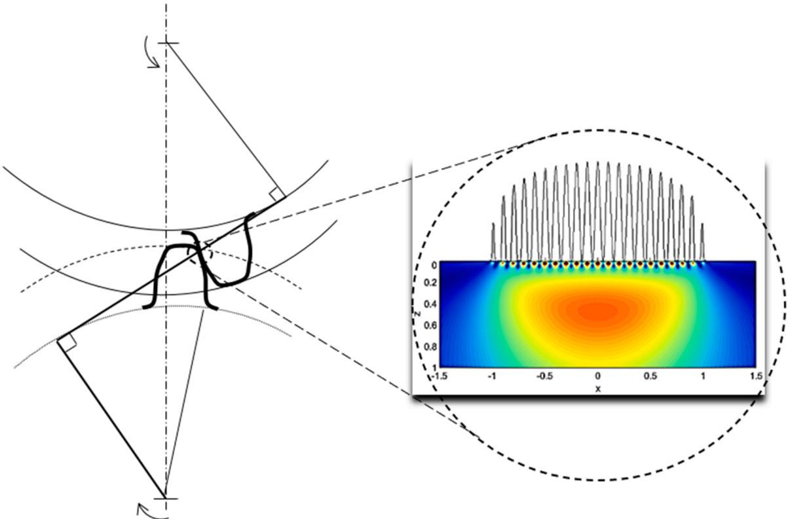  
Fig. 1. Spur gear teeth contact. Enlarged view showing contact pressure distribution and surface and subsurface stresses. Surface stresses are mainly the result of the surface microgeometry and tribology of the gear teeth contact, inspired from [19].

## 1.1. Objective of the present article

Given the above background, the objective of the present paper is to build on the general model described in [18] and present a concept model with specific consideration of solving the subsurface damage integral with time-moving, time-varying stresses for general applicability. Other novelty points are:

(i) The simplification of the surface integral respect to [18]

(ii) The application to a gear meshing example with time-varying stresses including the separation of surface and subsurface survival.

(iii) The demonstration that ignoring the time-varying stresses by a constant stress worst-case scenario, largely under-predicts life.

## 2. Separation of the surface from the subsurface survival

The approach follows the separation of survival for the surface and the subsurface, as introduced in [18] for rolling bearings and [19] for gears. For the subsurface, Ioannides-Harris [17] introduced the following model for fatigue life estimation,

$$
L n \bigg ( \frac { 1 } { S } \bigg ) = N ^ { e } \left[ \overline { { A } } \int _ { V _ { v } } ^ { \langle \sigma _ { v } - \sigma _ { u . v } \rangle ^ { c } } d V _ { \nu } \right]\tag{1}
$$

Wit ${ \mathrm { h } } , z ^ { ' }$ being the stress-weighted average depth.

However, if a survival function for the surface is also considered, references [18,19] show that a modification of Eq. (1) where the probability of survival is obtained by dividing the contributions from the surface and subsurface and assuming equal standardised Weibull slopes is given by:

$$
L n \bigg ( \frac { 1 } { S } \bigg ) = N ^ { e } \left[ \overline { { A } } \int _ { V _ { v } } ^ { \langle \sigma _ { v } - \sigma _ { u . v } \rangle ^ { c } } d V _ { \nu } + \overline { { B } } \int \langle \sigma _ { s } - \sigma _ { u . s } \rangle ^ { c } d A \right]\tag{2}
$$

Where simply the depth z can be used instead of z for the subsurface. Reference [19] shows that when there are several contacts in a revolution (case of rolling bearings), $L = u N ,$ thus from (2) solving for the life:

$$
L = \frac { 1 } { u } \left[ \frac { L n \big ( \frac { 1 } { S } \big ) } { \overline { { A \int _ { V _ { v } } \frac { \langle \sigma _ { v } - \sigma _ { u , v } \rangle ^ { c } } { z ^ { h } } d V _ { \nu } + \overline { { B } } \int _ { A } \langle \sigma _ { s } - \sigma _ { u . s } \rangle ^ { c } d A } } } \right] ^ { 1 / e }\tag{3}
$$

For a methodology based on stresses (and not on load), Eq. (3) is the most general model for the life of any machine element with rolling/ sliding heavily loaded lubricated contacts. This would include the consideration of misalignment, clearances, profile accuracy, potential material inhomogeneities, lubrication, roughness, etc. However, it is certainly laborious to implement such an equation in computer programs, especially because the surface integral would require a numerical method for mixed-lubrication surface stresses like the one described in [7]. Therefore, a first simplification of Eq. (3) would be to introduce a function (derived from the advanced surface distress model [7]) to account for the surface survival, as it was done before [18,19].

## 2.1. Surface survival

In [18,19] an equation for surface survival was curve-fitted for bearings and gears following the same shape. However, this equation requires many constants, at least 5. In Appendix $\mathrm { A } ,$ a simplified function is introduced which requires only 3 constants, here this latest one will be adopted. The surface integral from Eq. (3) is:

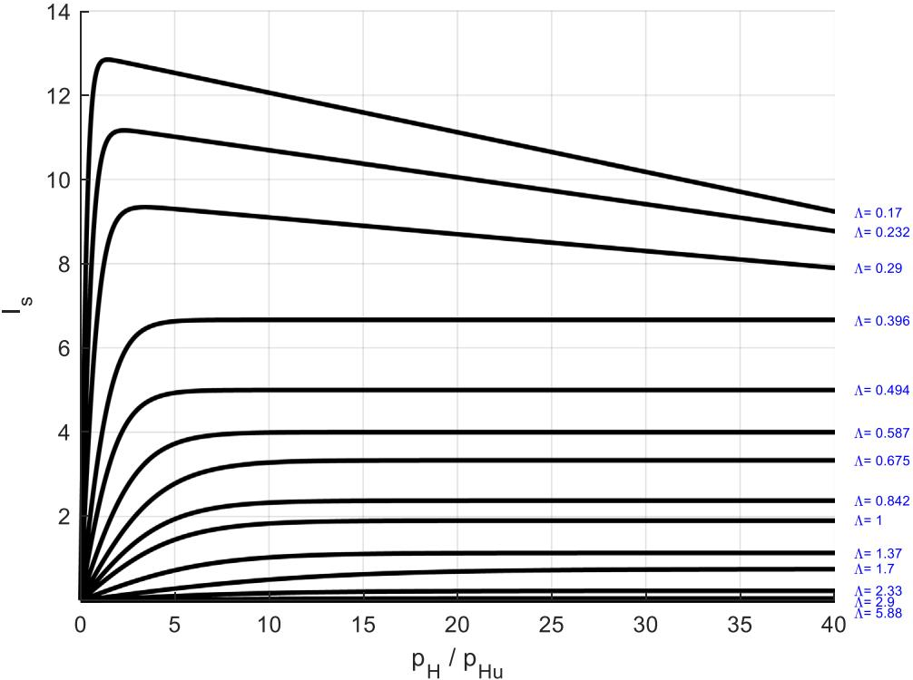  
Fig. 2. Approximation to the surface life integral by Eq. (6).

$$
I _ { s } = \overline { { B } } \int _ { A } \langle \sigma _ { s } - \sigma _ { u . s } \rangle ^ { c } d A\tag{4}
$$

In [18,19] it was demonstrated that it can be curve-fitted with functions based on the applied load (W) of the following form:

$$
u ^ { e } I _ { s } \approx f _ { 1 } \mathrm { e x p } \left[ \frac { f _ { 2 } } { \left( W / W _ { u } \right) ^ { f _ { 3 } } } + \frac { f _ { 4 } } { \left( W / W _ { u } \right) ^ { f _ { 5 } } } + \cdots \right]\tag{5}
$$

With particular values of the constants $f _ { 1 } . . . f _ { n }$ that would depend on the environmental factor $\eta = \eta _ { b } \eta _ { c }$ (lubrication and contamination) in gears, similar to rolling bearings. In $\operatorname { E q . } \left( 5 \right) W _ { u }$ is the fatigue load limit of the gear. However, in Appendix A it is shown that these functions can also be approximated by equations of the form:

$$
\widetilde { I } _ { s } = \frac { a _ { 1 } } { \Lambda ^ { 1 . 3 } } \mathrm { t a n h } \left( { \left[ \frac { p _ { H } } { p _ { H u } } \right] } ^ { 1 / 3 } \frac { b _ { 1 } } { \Lambda ^ { 1 . 3 } } \right) - \frac { c _ { 1 } } { 5 0 } \left[ \frac { p _ { H } } { p _ { H u } } \right] ^ { 1 / 3 }\tag{6}
$$

Where $\begin{array} { r } { \widetilde { I } _ { s } = \frac { I _ { s } } { \overline { { B } } } , } \end{array}$ and it is given directly as a function of the contact pressure ratio $\textstyle { \binom { p _ { H } } { p _ { H u } } }$ and the lubrication quality (Λ). The values of the constants $a _ { 1 } .$ $b _ { 1 } , c _ { 1 }$ are given in Table A1 of Appendix A. For intermediate values, interpolation can be applied. Here pH represents the contact maximum Hertzian pressure and $p _ { H u }$ the maximum Hertzian pressure to exceed the fatigue limit of the sample.

Fig. 2 shows a plot of Eq. (6) for different values of $\textstyle { \binom { p _ { H } } { p _ { H u } } }$ and (Λ).

Therefore, the life $\operatorname { E q . }$ (3) can now be written in the following from:

$$
L = \frac { 1 } { u } \left[ \frac { L n \left( \frac { 1 } { S } \right) } { \overline { { A } } \int _ { V _ { \nu } } \frac { \left. \sigma _ { \nu } - \sigma _ { u , \nu } \right. ^ { c } } { z ^ { h } } d V _ { \nu } + \overline { { B } } \frac { a _ { 1 } } { \Lambda ^ { 1 3 } } \operatorname { t a n h } \left( \left[ \frac { p _ { H } } { p _ { H u } } \right] ^ { 1 / 3 } \frac { b _ { 1 } } { \Lambda ^ { 1 3 } } \right) - \frac { c _ { 1 } } { 5 0 } \left[ \frac { p _ { H } } { p _ { H u } } \right] ^ { 1 / 3 } } \right] ^ { 1 / e }\tag{7}
$$

Eq. (7) is a condensed representation of a stress-based model to be programmed in advanced computer programs for any general heavily loaded rolling/sliding lubricated contact.

## 2.2. Surface fatigue indicator

One important advantage of separating surface and subsurface survival in rolling contact fatigue is the possibility to compare the potential damage in the surface against the total damage in the contact. In this way, it is possible to develop an indicator that can tell engineers what part of the rolling contact is enduring most of the fatigue damage. In a stress-based model this parameter can be calculated locally along the surface if the contact is divided in slices. This is a very convenient way to develop possible mitigation strategies for surface fatigue.

Therefore, to estimate the ratio between the surface-only and the total contact damage following [18,19] one can define:

$$
S _ { R } = \frac { I _ { s } } { I _ { s } + I _ { s s } }\tag{8}
$$

With $I _ { s }$ given by either Eqs. (4) or (6) and $I _ { s s }$ by:

$$
I _ { s s } = \overline { { A } } \int _ { V _ { v } } ^ { \langle \sigma _ { v } - \sigma _ { u . v } \rangle ^ { c } } d V _ { \nu }\tag{9}
$$

In this case the indicator $S _ { R }$ is a global one for the whole contact. It represents the relative fatigue damage taken by the surface in comparison to the total fatigue damage. If this parameter is close to 1, the majority of the fatigue damage is taken by the surface. However, if it is close to zero, then most of the fatigue damage is taken by the subsurface. This parameter alone does not give direct indication that the surface or the subsurface is at imminent risk, but it gives the probability for expected surface failures, especially important when at the same time the calculated life is short.

## 3. Evaluation of the subsurface integral

In a general rolling-sliding contact, the stresses may change in time as the contact moves along the profile of the rolling surfaces, for example in the case of two gear teeth meshing cycle, the contact load and the equivalent contact radii change in time, according to the location of the contact. The same can be expected from a cam-follower contact and even in radially loaded rolling bearing contacts, where the contact stresses in the moving ring changes according to the location in the 360 degrees rotation.

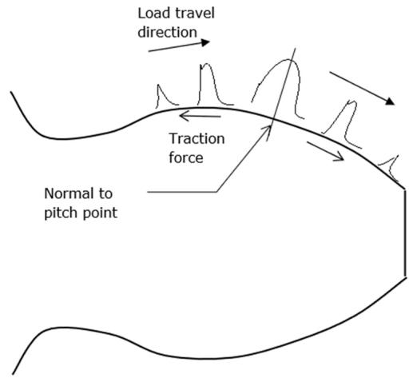  
(a). EHL pressure variation along a gear tooth

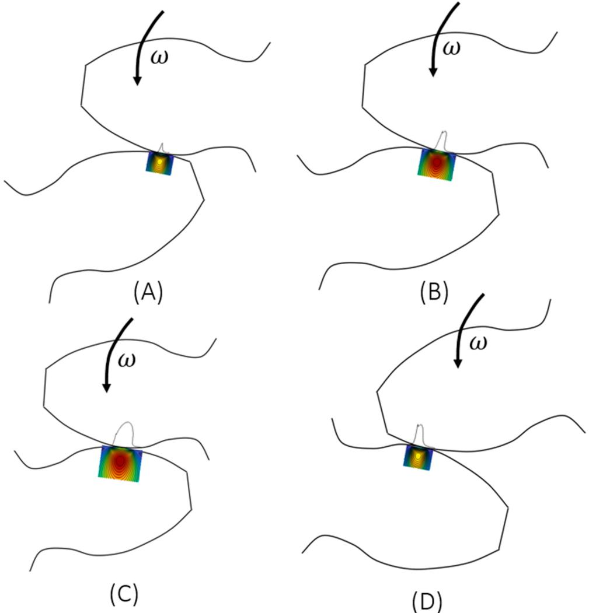  
(b). Four steps in the teeth mesh cycle  
Fig. 3. EHL Pressures and stresses in a meshing cycle of two gear teeth.

In the case of spur gears the elastohydrodynamic lubrication (EHL) pressures change substantially along the meshing cycle as can be seen in

Fig. 3(a). This variation of pressures will induce a large variation of contact stresses as can be seen in Fig. 3(b). Therefore the subsurface life integral has to be assessed covering this variation (stress history) in the whole contact cycle.

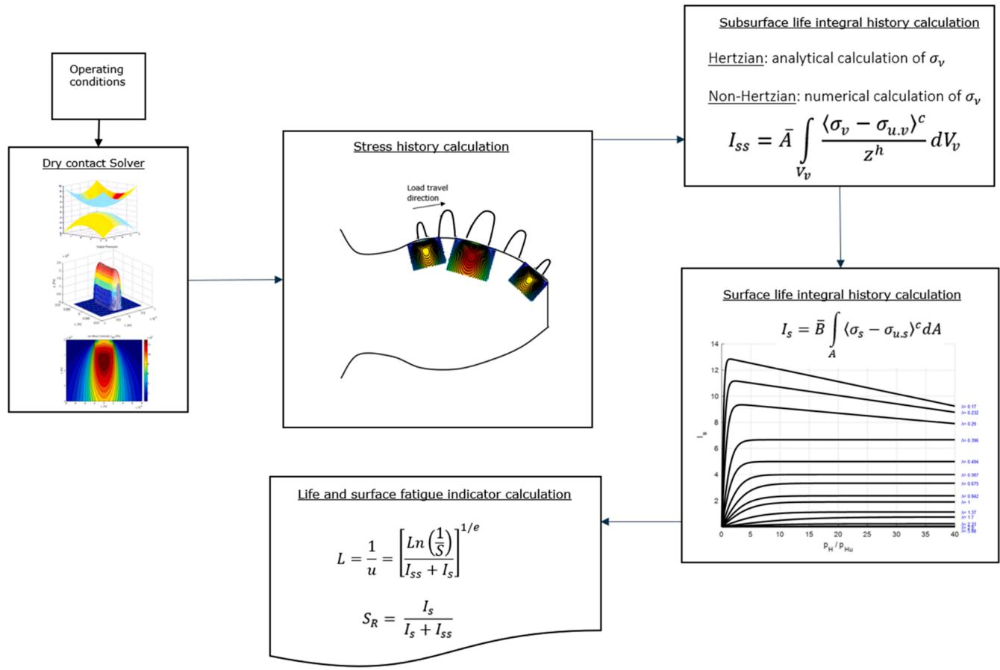  
Fig. 4. Flowchart of the overall model for a tooth life.

## 3.1. Subsurface stress integral in a time-moving, time-varying stress field

Eq. (9) shows the mathematical expression of the subsurface integral, the stress amplitude (maximum – minimum) $\sigma _ { \nu }$ is a function of $\dot { } \sigma _ { \upsilon } ( x , y , z )$ which are the three space dimensions where x, represents the rolling direction, y the transverse direction and z the depth below the surface. In this case is selected fatigue criterion is the amplitude of the orthogonal shear stress $\tau _ { x z }$ during the over-rolling. The stress integral is then calculated obtaining the stress maximum and minimum absolute values (amplitude) in the whole stress volume, rotating $\tau _ { x z }$ to find the most critical angle $\tau _ { x ^ { \prime } z ^ { \prime } }$ . Therefore, in the over rolling problem described in Fig. 3, this stress amplitude is determined by the changes suffered in the stress field over time (stress history). Even if the contact load and contact radii were constant in time, the contact stresses in the subsurface are non-proportional [22]. Due to the fact that the load is over rolling the continuum, the angle of the critical plane, in which fatigue damage is maximum, is also constantly changing, as explained in [23]. The stress history $\sigma _ { \nu } ( x , y , z ) = \operatorname* { m a x } ( \tau _ { x z } ) _ { i }$ t − min $\left( \tau _ { x z } \right) _ { t }$ is built with the amplitude (in time) of the stress $\tau _ { x z }$ found at the critical angle in every time step at every point $( x , y , z )$ of the stressed domain. With this value the integral in (7) can be assessed.

## 4. Solution scheme

The calculation of the component (tooth) life following Eq. (7) is depicted in the flowchart of Fig. 4. It starts by dividing the contact path in a number of time steps $n _ { t } ,$ for each time step the contact problem is solved using a contact solver. Here for the sake of simplicity elastic semiinfinite bodies either a dry contact solver or a Hertzian calculation is proposed, but an EHL solver can equally be used to calculate the pressures.

For each time step in the contact path, the contact problem is solved, pressures are calculated and also subsurface stresses. With this stress history, the subsurface fatigue integral can be calculated, then with the given surface and lubrication conditions the surface life integral can be estimated with the use of Eq. (6) or Fig. 2. Finally the tooth life and the surface fatigue indicator can be calculated and are reported.

## 4.1. Life of a complete gear

As explained in [19], applying the reliability rule, the life of a complete gear (with n equal teeth “i”) can be obtained from:

$$
\left( \frac { 1 } { L } \right) ^ { e } = n \left( \frac { 1 } { L _ { i } } \right) ^ { e }\tag{10}
$$

And for a pair of meshing gears each one with different lives:

$$
\left( \frac { 1 } { L _ { 1 } } \right) ^ { e } = n _ { 1 } \left( \frac { 1 } { L _ { i } } \right) ^ { e }\tag{11}
$$

$$
\left( \frac { 1 } { L _ { 2 } } \right) ^ { e } = n _ { 2 } \left( \frac { 1 } { L _ { j } } \right) ^ { e }\tag{12}
$$

Thus, combining Eqs. (11) and (12), the life of the meshing pair is obtained:

$$
{ \left( \frac { 1 } { L } \right) } ^ { e } = n _ { 1 } { \left( \frac { 1 } { L _ { i } } \right) } ^ { e } + n _ { 2 } { \left( \frac { 1 } { L _ { j } } \right) } ^ { e }\tag{13}
$$

And for a gear ratio equal to one:

$$
\left( \frac { 1 } { L } \right) ^ { e } = 2 n \left( \frac { 1 } { L _ { i } } \right) ^ { e }\tag{14}
$$

From which:

$$
L = \left( 2 n \right) ^ { - 1 / e } L _ { i }\tag{15}
$$

Table 1  
Spur gear geometrical data from [25].
| Parameter | Value |
| --- | --- |
| Module | 3.175 [mm] |
| Tooth width in contact | 2.79 [mm] |
| Tooth width | 6.4 [mm] |
| Number of teeth | 28 [-] |
| Diametrical pitch | 8 [-] |
| Circular pitch | 9.975 [mm] |
| Whole depth | 7.62 [mm] |
| Addendum | 3.18 [mm] |
| Chordal tooth thickness ref. | 4.85 [mm] |
| Pressure angle | 20 [deg] |
| Pitch diameter | 88.9 [mm] |
| Outside diameter | 95.25 [mm] |
| Root fillet | 1.02–1.52 [mm] |
| Measurement over pins | 96.03–96.3 [mm] |
| Pin diameter | 5.49 [mm] |
| Backlash reference | 0.254 [mm] |
| Tip relief | 0.01–0.015 [mm] |

## 5. Numerical examples

Coy et al. [24] carried out endurance tests for case-carburized spur gears made of AISI 9310 gear steel. This gear geometry was also used by the current author in calculations [19]. Krantz et al. [25] describe test results with the same kind of gear geometry and material but with two different surface finishing, ground and superfinished, in order to study the influence of the lubrication quality on the gear life.

The tests by Krantz et al. [25] were carried out using helicopter gearbox oil under the specification DOD-L-85734, reported to be a 5 cSt lubricant of a synthetic poly-ester base stock with anti-wear additive package, with a viscosity of 27.6 cSt at ${ 4 0 } ^ { 0 }$ C and 5.18 cSt at ${ 1 0 0 } ^ { 0 }$ C. The gear ratio was 1, with a transmitted torque that resulted in a normal contact load at the pitch radius of 1610 N/m (giving a maximum Hertzian pressure of 1.71 GPa) and the speed was 10000 rpm. Krantz et al. [25] report a film thickness in the pitch line of 0.54 μm. With the ground surface finish they report a roughness value of $R _ { a } = 0 . 3 8 \mu m$ and for the superfinished gears is $R _ { a } = 0 . 0 7 \mu m$ . Therefore, it can be calculated that for the ground surfaces Λ ≈ 1.13 and for the superfinishing $\Lambda \approx 6 . 1 7 .$

The spur gear data are summarised in Table 1.

## 5.1. Model calibration with endurance tests

In the tests of Krantz et al. [25] mentioned before, they compared lives for ground finished gears versus superfinished surfaces (polished using a process called barrelling) finding a considerable increase in fatigue life for the superfinished gears.

The test data presented in [25] for the ground and superfinished gears have been digitized and replotted in Fig. 5. This figure shows that the confidence intervals nearly overlap and more failures would be required (especially for the superfinished variant) to reduce the uncertainty. In any case a clear differentiation in lives can be observed from the data. Table 2 shows the calculated Weibull maximum likelihood statistics associated to the data of Fig. 5.

Now, using only the test data related to the superfinished variant, the subsurface life integral constant A is varied starting with an initial value to try to predict the gear population life in conditions where there is little or no influence in the life from the surface integral. The aim is to predict $L _ { 1 0 } \approx 2 5 . 0$ Mrevs in order to be between 50% and 10% confidence level of $L _ { 1 0 }$ of Table 2. This process requires several iterations until the target life is achieved. Once this is done, the constant A is fixed and calibrated. After this, similar procedure is followed for the constant B. In this way the model is fully calibrated.

It should be noticed that since the test results were obtained using case-carburized gears, the constants $\overline { { A } }$ and B already consider this material. However, a more descriptive procedure could be to account for a variation of A along the depth z, but for this, much more experimental information will be required. So the current approach is a pragmatic

Weibull maximum likelihood statistics of gear endurance.
| Confidence | Ground · $\mathrm { L } _ { 1 0 }$ | Ground · $\mathrm { L } _ { 5 0 }$ | Ground · β | Superfinish · $\mathrm { L } _ { 1 0 }$ | Superfinish · $\mathrm { L } _ { 5 0 }$ | Superfinish · β |
| --- | --- | --- | --- | --- | --- | --- |
| 50% | 9.9 | 45.8 | 1.2 | 37.1 | 176.2 | 1.2 |
| 10% | 5.6 | 33.5 | 1.0 | 15.6 | 116.7 | 0.8 |
| 90% | 15.9 | 61.7 | 1.5 | 67.8 | 304.9 | 1.7 |

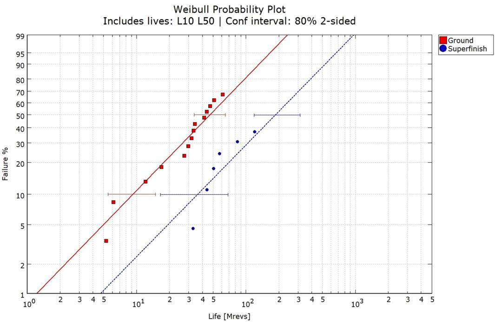  
Fig. 5. Weibull plot for the two test cases, ground and superfinished gears, with calculated confidence intervals as digitised from [25].

Table 3  
Assumed parameters to complete the use of $\operatorname { E q . }$ (3).
| Parameter/Exponent · τu | Value · 360 [MPa] | Comment · As for bearing steel[26] |
| --- | --- | --- |
| c | 31/3 | As[4] |
| h | 7/3 | As[4] |
| e | 1.2 | As per test,Table $2 L _ { 1 0 , 5 0 }$ |
| A | 0.10295E11 | Calibrated |
| B | 0.1169 | Calibrated |

one.

A computer program was used to calculate the equivalent contact radius and the Hertz maximum pressure for 31 locations along the contact path, the details are given in Appendix B. These 31 contact points in time were used to calculate the corresponding subsurface stress field history of the mesh cycle. With this number of locations a good compromise between accuracy and computing time was found for a total path length of 4.4 mm. Such stress history was in turn used to evaluate the subsurface integral in Eq. (3). Notice that the considered stresses in the calculation are assumed to arise from the contact problem only. That is, flexion stresses coming from the teeth root are excluded.

Table 3 gives a summary of the constants and exponents used to assess Eq. (3) including the calibrated values for A and B. Notice that the fatigue limit from the material used in the test [25] is unknown, so it is here assumed a value similar to the bearing steel [26], which could be considered as an upper limit for gear steels.

With these values and the case of superfinished surfaces $( \Lambda = 6 . 1 7 ) _ { \div }$ the calculated tooth life of $L _ { 1 0 i } = 7 3 2 . 9 3 M r e \nu s$ ,which with the use of Eq. (15) and n = 28teeth gives a meshed gear life of $L _ { 1 0 } = 2 5 . 5 6 M r e \nu s$ with $S _ { R } = 0$ and $L _ { 5 0 } ~ = ~ 1 2 2 . 8 4 M r e \nu s ,$ . As discussed in Section 2.2, the parameter SR gives the probability of surface failures, which in this case is zero because the gears are lubricated with good quality $( \Lambda = 6 . 1 7 )$

## 5.2. Effect of mesh and domain size

The results above have been obtained with a simulation domain of x = [ −0.0065, 0.001]m, $y = [ - 0 . 0 0 2 , 0 . 0 0 2 ] m$ and $z = [ 0 ,$ , −0.001]m, notice that the contact “rolls” on the surface only 67.73% of the upper limit in x direction. This covers the full length of the over rolling distance available in the tooth flank according to Table B1 of Appendix B. This domain is divided in $n _ { x } = 2 0 0 , n _ { y } = 3 0 0$ and $n _ { z } = 5 0$ with $n _ { t } = 3 1$ locations $( \mathrm { A p p e n d i x \ : B } )$ . With these values the results are: $I _ { s s } = 3 . 8 4 2 2 \times$ $1 0 ^ { - 5 }$ and $L _ { 1 0 } = 2 5 . 5 8 M r e \nu s ,$ the calculation taking about 30 min in a personal portable computer. The subsurface life integral can be influenced by the mesh density and the size of the domain. However, here a convergence analysis was carried out to reduce this effect as much as possible whilst keeping reasonable computing times. It must be noticed that although for this spur gear example a simple Hertzian solution for the contact problem could have been used, the full numerical drycontact solver described in [27] was used instead. This, in order to obtain a more accurate description of the pressure distribution along the y axis where some edge effects were initially observed. To mitigate this effect a small crowning in the edges of the teeth flank was introduced.

As an example of the mesh accuracy, the same case was calculated but now with a finer mesh of $n _ { x } = 3 0 0 , n _ { y } = 4 0 0$ and $n _ { z } = 5 0 .$ Giving the results $I _ { s s } = 3 . 6 5 6 9 \times 1 0 ^ { - 5 }$ and $L _ { 1 0 } = 2 6 . 6 M r$ evs and with almost twice the computing time as before. The effect of the domain was also explored by using of $\pmb { x } = [ - 0 . 0 0 6 5 , 0 . 0 0 1 ] m , y = [ - 0 . 0 0 2 5 , 0 . 0 0 2 5 ] m$ and z = [0, −0.0015]m with $n _ { x } = 2 0 0 , n _ { y } = 3 7 5$ and $n _ { z } = 7 5 ,$ , keeping the same mesh density as in the reference case above, giving the results $I _ { s s } = 3 . 5 2 9 3 \times 1 0 ^ { - 5 }$ and $L _ { 1 0 } = 2 7 . 4 5 M r e \nu s$

Therefore, in this example small differences are found when varying the mesh density or the domain size. Notice that for this case the pressure fields are “smooth”, which is normal for subsurface stresses in a homogeneous material, since the surface stresses (e.g. roughness,

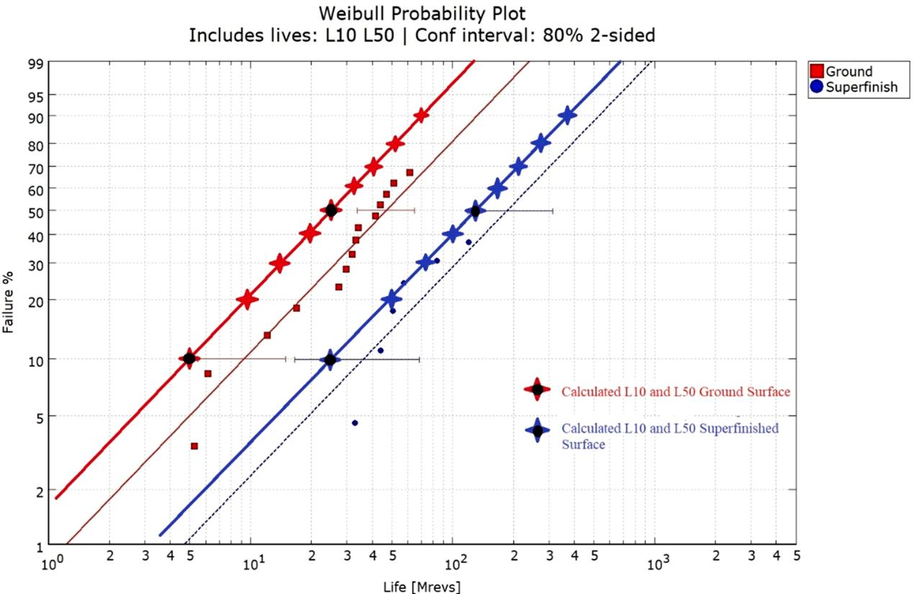  
Fig. 6. Calculated $L _ { 1 0 }$ and $L _ { 5 0 } \mathbf { \Psi }$ values (star symbol with a black dot at the centre) by the model for the Ground surface and Superfinished surface variants of the tests reported in $[ 2 5 ]$ , superposed to the Weibull plot for the two test cases. The rest of the star symbols and lines represent calculated results for reliabilities from $( S =$ $0 . 1 t o S = 0 . 8 )$

Output Pressures  
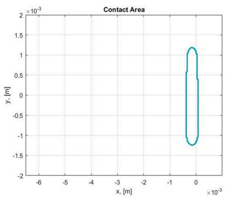  
(a). 1st location in Table B1

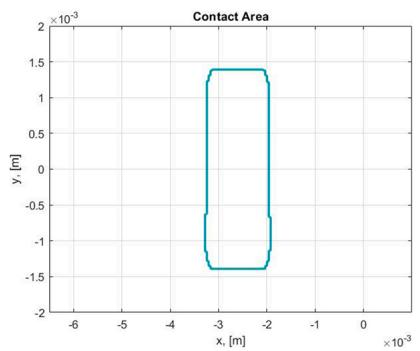  
(b). 16th location in Table B1

Output Pressures  
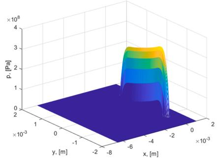  
(c) 1st location in Table B1

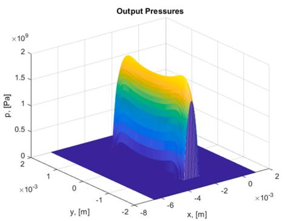  
(d) 16th location in Table B1

  
(e). 1st location in Table B1

  
(f). 16th location in Table B1  
Fig. 7. Calculated contact areas, pressures and von Mises stresses for the case of α = 0.25rad misalignment along the y axis.

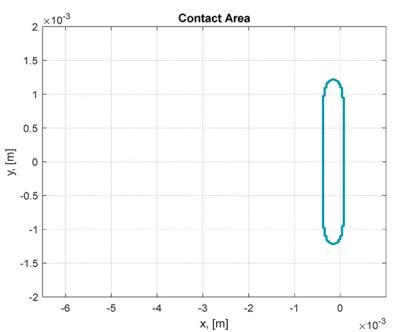  
(a). 1st location in Table B1

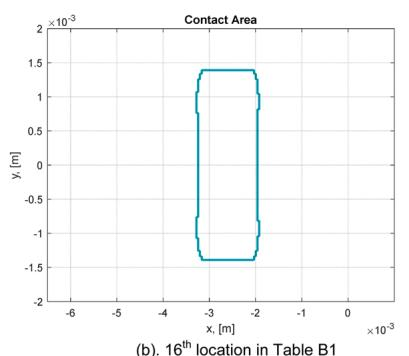

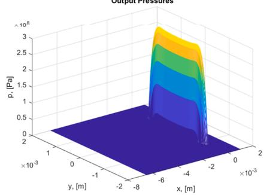  
(c). 1st location in Table B1

  
(d). 16th location in Table B1

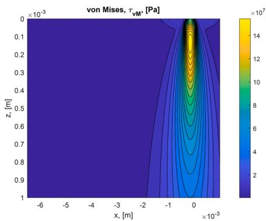  
(e). 1st location in Table B1

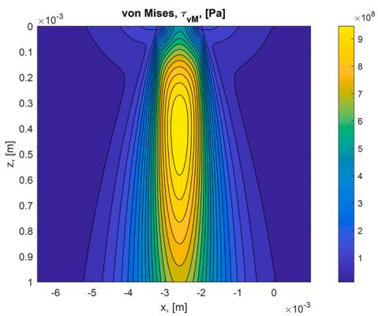  
(f). 16th location in Table B1  
Fig. 8. Calculated contact areas, pressures and von Mises stresses for the case of zero misalignment along the y axis.

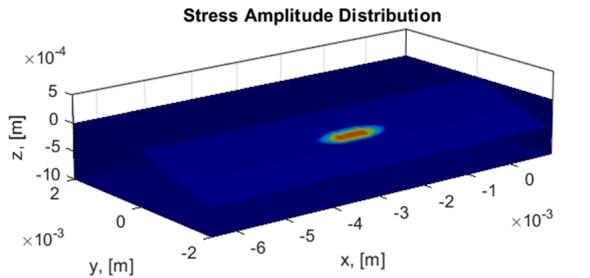  
(a). With misalignment

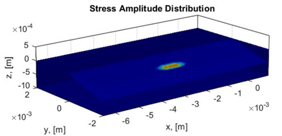

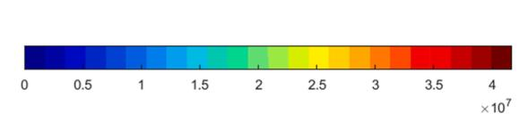  
(b). Without misalignment  
Fig. 9. Calculated shear stress amplitudes along the rolling path in x for the cases with and without misalignment.

Table A1  
Constant values for $\operatorname { E q . } \left( \mathrm { A 1 } \right) .$
| Λ | 0.17 | 0.23 | 0.3 | 0.4 | 0.5 | 0.59 | 0.67 | 0.84 | 1 | 1.37 | 1.7 | 2.33 | 2.9 |
| --- | --- | --- | --- | --- | --- | --- | --- | --- | --- | --- | --- | --- | --- |
| a1 | 1.3 | 1.7 | 1.9 | 2 | 2 | 2 | 2 | 1.9 | 1.9 | 1.7 | 1.5 | 0.7 | 0.2 |
| b1 | 0.04 | 0.1 | 0.2 | 0.5 | 0.8 | 1.5 | 2.5 | 3.5 | 5 | 10 | 25 | 30 | 40 |
| C1 | 4.7 | 3.2 | 2 | 0 | 0 | 0 | 0 | 0 | 0 | 0 | 0 | 0 | 0 |

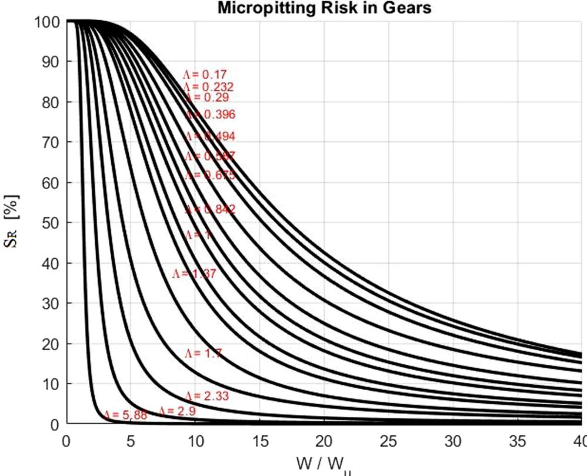  
Fig. A1. Micropitting risk in gears for different values of load and lubrication qualities.

friction, etc) are treated separately in the surface integral. In any case, a mesh convergence analysis is recommended in all cases.

## 5.3. Effect of the lubrication quality

Consider now the case of ground surfaces, where the lubrication conditions are poorer $( \Lambda = 1 . 1 3 )$ , thus the surface integral is expected to have an important influence in the life of the component. The reference mesh is retaken here (beginning of previous section) and the case is calculated adopting the new value of Λ. The results are $I _ { s } = 0 . 2 2 3 9 \times$ $^ { 1 0 ^ { - 3 } } ,$ with a tooth life of $L _ { 1 0 i } = 1 4 7 . 7 4 6 M r e \nu s$ , for which the meshed gear life becomes $L _ { 1 0 } = 5 . 1 5 6 M r e \nu s$ with $S _ { R } ~ = ~ 0 . 8 5 4 _ { \mathrm { { i } } }$ , and $L _ { 5 0 } =$ 24.8Mrevs. In Fig. 6 the predicted lives for the two surface variants are plotted on top of the experimental results for reliabilities from $s = 0 . 9$ until $S = 0 . 1$ with intervals of 0.1. The calculated values for $S = 0 . 9$ and $s = 0 . 5$ are marked with the star symbol and a black dot in the centre. As shown in this figure, the predictions of the model for $L _ { 1 0 } . . .$ . L90 are fairly good and follow the experimental line, displaying conservative estimations, in the same line as the adopted conservative calibration. From this calculation (compared with the superfinished surface) it can be seen that by reducing the lubrication quality from $\Lambda = 6 . 1 7$ to $\Lambda = 1 . 1 3$ it not only reduces the expected life of the gears but also the probability of surface failures moves from zero to 85%. This is very important information for gear designers, which could trigger mitigation actions. It can be noticed that the surface fatigue index $S _ { R }$ goes from zero at high lambda to near 1 for low lambda, this is an indication that the fatigue at the surface becomes very important with reduced lubrication conditions.

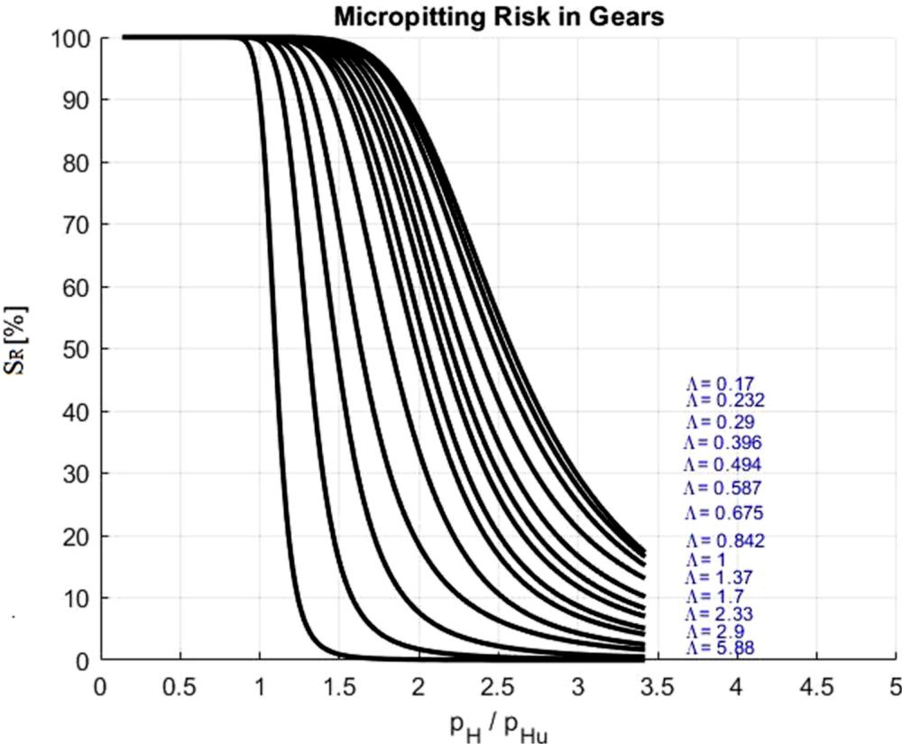  
Fig. A2. Micropitting risk in gears for different values of Hertzian pressure ratios and lubrication qualities.

Table B1  
Calculated contact conditions along the radial position.
| Radial position [mm] | Reduced radius in x, Rx [mm] | Contact $\mathrm { p r e s s u r e } , p \ [ \mathrm { G P a } ]$ |
| --- | --- | --- |
| 42.52404 | 6.175098 | 0.397159 |
| 42.61848 | 6.37614 | 0.676968 |
| 42.71772 | 6.563778 | 0.861379 |
| 42.82172 | 6.738014 | 1.005933 |
| 42.93045 | 6.898847 | 1.127247 |
| 43.04388 | 7.046278 | 1.233112 |
| 43.16199 | 7.180305 | 1.327964 |
| 43.28473 | 7.30093 | 1.41463 |
| 43.41206 | 7.408152 | 1.49505 |
| 43.54396 | 7.501971 | 1.570635 |
| 43.68037 | 7.582388 | 1.642453 |
| 43.82126 | 7.649402 | 1.71 |
| 43.96659 | 7.703013 | 1.704039 |
| 44.1163 | 7.743221 | 1.699609 |
| 44.27036 | 7.770027 | 1.696675 |
| 44.42871 | 7.783429 | 1.695214 |
| 44.5913 | 7.783429 | 1.695214 |
| 44.75808 | 7.770027 | 1.696675 |
| 44.929 | 7.743221 | 1.699609 |
| 45.10399 | 7.703013 | 1.704039 |
| 45.28302 | 7.649402 | 1.71 |
| 45.46601 | 7.582388 | 1.642453 |
| 45.65291 | 7.501971 | 1.570635 |
| 45.84365 | 7.408152 | 1.49505 |
| 46.03817 | 7.30093 | 1.41463 |
| 46.23642 | 7.180305 | 1.327964 |
| 46.43831 | 7.046278 | 1.233112 |
| 46.64378 | 6.898847 | 1.127247 |
| 46.85277 | 6.738014 | 1.005933 |
| 47.0652 | 6.563778 | 0.861379 |
| 47.281 | 6.37614 | 0.676968 |
| 47.5001 | 6.175098 | 0.397159 |

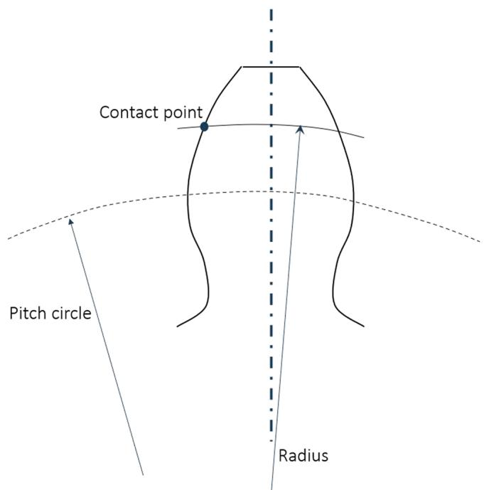  
Fig. B1. Schematics describing the definition of radial position (or radius).

## 5.4. Effect of misalignment

The idea of having a stress-based model for machine component life estimation is that it allows for the calculation of cases with complex stress distributions. In the case of gears it is common to deal with problems where the shaft axis are not perfectly aligned, so resulting in contact pressures and stresses which are non-symmetrical along the y axis, with stress concentrations on one edge respect to the other. With the proposed model, it is possible to find the effect of these situations in the predicted $L _ { 1 0 }$ values. Both surface and subsurface damage integrals will be affected by an uneven load distribution. However, in cases of harsh lubrication conditions it is sufficient to consider only the subsurface stresses since small variations of the already the high EHL pressures at the surface will vary little the damage.

As an example, the reference case with superfinished surfaces is considered, for which the calculated $L _ { 1 0 } = 2 5 . 5 8$ Mrevs. Then a hypothetical case for the same situation is considered but now including a misalignment in the contact of α = 0.25rad along the y axis. With this, the resulting calculated life is $L _ { 1 0 } = 1 6 . 5 \cdot$ 4 Mrevs only, with $I _ { s s } = 6 . 4 0 6 \times$ 10− 5.

Fig. 7 shows plots of the 1st and 16th contact locations of Table B1 for the contact area, contact pressures and resulting von Mises $\tau _ { \nu M }$ stresses to illustrate the effects of the misalignment. For comparison with the reference, Fig. 8 shows the corresponding contact area, pressures and stresses for the same cases but without misalignment. By comparing Figs. 7 and 8 it can be seen that for the first location (low pressures) the misalignment is more clearly seen in the pressures and in the contact area.

Finally, Fig. 9 shows a 3D plot of the shear stress amplitude difference $\langle \sigma _ { \nu } - \sigma _ { u . \nu } \rangle$ in the contact path, which is the main argument of the subsurface integral of Eq. (9) to estimate the subsurface damage. The figure compares the cases with and without misalignment. The two patterns (red areas) shown in the subsurface are very similar, but the case with misalignment shows higher values. Notice that this amplitude is only important (for the current examples) at the middle of the rolling path (point 16th corresponding to the pitch circle), the reminder of the rolling path will show little damage. This result in a way suggests that endurance tests representing gears could be done by testing discs with the conditions of the “red” areas of the figure.

## 6. Discussion

The present concept stress-based model shows potential to account for surface and subsurface failure modes in a general rolling-sliding heavily loaded lubricated contact. The case has been illustrated with spur gears, where more flexibility in the modelling is added compared with the previously published gear load-based model [19]. The present scheme shows the possibility of adding any subsurface stress field, which potentially can include inhomogeneities in the material, edge effects in the contact, EHL pressures, misalignment, geometrical errors, etc. which a simple load-based model cannot account for. The numerical examples shown here were obtained with the use of a general contact model for elastic homogeneous semi-infinite bodies [27]. However, there is no limitation on how the stress history is calculated, it could actually come from sophisticated elastic-plastic FEM schemes, Multigrid, or any other dry and lubricated contact problem solver.

One important aspect to mention is that since this model considers time-moving and time-varying stresses during the contact cycle it can predict more realistic lives than say a worst-case scenario calculation. To demonstrate this, the gear life for the case of good lubrication quality with superfinished surfaces was calculated assuming the highest load conditions in Table B1, with this value the calculated life is $L _ { 1 0 } = 7 . 8 2$ Mrevs, this value is to be compared with the calculated life when the complete load-varying conditions are considered, $L _ { 1 0 } = 2 5$ .56 Mrevs. It can be seen that indeed the worst-case scenario gives very conservative predictions, therefore stressing the need of a model that can deal with time-moving and time-varying stress fields when more realistic predictions are required.

Regarding surface damage, in this case surface fatigue was included with the use of Eqs. (4) and (6) but other mechanisms could be added in the future, like sporadic indentations, thermal damage, etc. The currently used model, Eq. (6) has been obtained from curve-fitting numerical simulations of surface distress (or micropitting) [18,19], which includes the phenomena of fatigue from asperity level and mild wear competing each other. It can be noticed from Table 3 that there was the need to find the subsurface A and surface integral constant B. However, it is possible that in other situations with different materials, lubricants, lubricant cleanliness, coatings and surface finishing the need to recalibrate these constants could become apparent.

The concept model as presented here, shows the potential to model complex phenomena in life prediction of component populations, including the benefits of handling reliability, this is well known and used in rolling bearings but not so much in other machine elements. If widely used, it would offer the same calculation method as rolling bearings in other components working within the same system, like gearboxes. To make this possible, endurance test campaigns would be needed to properly calibrate the model for the other components apart from rolling bearings. Since the examples shown here are only illustrative of the potential, but not necessary applicable in all circumstances. A shortcoming of the current model to be mentioned is the fact that the calibration process needs two endurance tests per material, one at full-film and another at poor lubrication conditions, so that the constants A and B can be calibrated. Of course, this shortcoming is compensated with the fact that this engineering model can be used to predict the effect of different reliabilities in the calculated life in real industrial cases in a similar way as it is done in rolling bearings.

Finally, it must be pointed out that the calibration of the model begins with use of the full-film test to set the value of the constant A, then the test result of the poor lubrication conditions is used to set the value of the constant B. In principle the process could be reversed, however in practice it seems more difficult, because in poor lubrication conditions the experimental life is much shorter, so small errors in the calibration can become important when conditions would predict long lives.

## 7. Conclusion

A concept model to separate the surface and subsurface survival for rolling contact fatigue, initially developed for rolling bearings, has now been extended to any rolling/sliding heavily loaded lubricated contact machine element. The case of spur gears has been illustrated here. Gear endurance test data from literature have been used to calibrate the concept model for illustration purposes and it has been applied to poorer lubrication conditions and also to a hypothetical case of misalignment. The results of the model are consistent with expectations and show the potential that a general life model for rolling-sliding contacts has. Especially because of the consideration of reliability and surface tribology in the life estimations. For instance, the consideration of complex loading conditions in the contacts, different lubrication and roughness situations and the calculation of the surface fatigue indicator $S _ { R }$ is included in the calculation, which gives a probability of expected surface failures.

From the present investigation, the following conclusions can be

drawn:

1. A rolling-sliding contact life model that separates surface from subsurface survival and which is stress-based shows substantial advantages compared to current practices, like the inclusion of reliability, probability of surface failures, lubrication effects, complex loading conditions, etc.

2. Endurance test campaigns of the modelled components are required to calibrate and compare model and test results. Important effort might be required here.

3. The separation of surface from subsurface survival gives excellent opportunities to engineers to trigger mitigation strategies where required.

4. A general stress-based model like the one illustrated here is not bounded to a particular stress history calculation method or computer program, it is flexible enough to plug in any dry or lubricated solver available.

## Declaration of Competing Interest

The authors declare that they have no known competing financial interests or personal relationships that could have appeared to influence the work reported in this paper.

## Data availability

No data was used for the research described in the article.

## Acknowledgments

The authors would like to thank SKF for the permission to publish this paper.

## Appendix A: Surface fatigue indicator

The probability of a gear population with a life $\mathrm { L } _ { 1 0 }$ that will fail on the surface is described by a parameter called surface fatigue indicator $S _ { R }$ introduced in [19]. The potential failure mode targeted is mainly linked to poor lubrication and contamination conditions both triggering micropitting. Thus, the percentage risk of micropitting in a gear tooth contact can be derived also from the surface fatigue indicator $S _ { R } .$ In [19] the calculation of $S _ { R }$ requires the evaluation of the two life integrals, this is in general a numerical procedure that has been simplified already in [19], but somehow still remains tedious.

$$
S _ { R } = \frac { \widetilde { I } _ { s } } { \widetilde { I } _ { s } + 1 0 0 0 \Big [ 1 - \big ( 0 . 1 5 \frac { W _ { u } } { W } \big ) ^ { 0 . 4 } \Big ] ^ { 2 7 . 5 5 } } x 1 0 0\tag{A1}
$$

The numerical method of generating the mixed lubrication stresses, described in [27] which is used in the calculation of the surface integral i laborious to implement. Therefore, a simplification of this scheme would be desirable for simpler calculations. The following equation is a simplified and approximated curve-fitted version of the original:

$$
\widetilde { I } _ { s } = \frac { a _ { 1 } } { \Lambda ^ { 1 . 3 } } \operatorname { t a n h } \left( \frac { W } { W _ { u } } \frac { b _ { 1 } } { \Lambda ^ { 1 . 3 } } \right) - \frac { c _ { 1 } } { 5 0 } \frac { W } { W _ { u } }\tag{A2}
$$

The values of the constants $a _ { 1 } , b _ { 1 } , c _ { 1 }$ are given in Table A1. For intermediate values, interpolation can be applied.

Eq. (A1) can be plotted for different values of load $\frac { W } { W _ { u } }$ and lubrication quality Λ. Fig. A1 shows the results. Now the contact load ratio can easily be converted to pressure ratio as follows:

$$
{ \frac { W } { W _ { u } } } = \left( { \frac { p _ { H } } { p _ { H u } } } \right) ^ { 1 / 3 }\tag{A3}
$$

Therefore $\mathrm { F i g . } \mathrm { A 1 }$ can be converted to a more meaningful pressure ratio. Fig. A2 shows the results.

It must be noticed that in rolling bearing steels $p _ { H u } = 1 . 5 G P a _ { \cdot }$ , according to [26], likely the value for gear steels is somehow similar.

## Appendix B: Radial positions used in the numerical examples

In this Appendix the different radial positions (time steps) along the contact path in the gear meshing cycle are given. A computer program $[ 7 ]$ was used to simulate the meshing cycle of the gears described in Table 1. From the calculation, the reduced (equivalent radius) along the rolling direction $\left( R _ { x } \right)$ for each radial position and the Hertz contact pressure are obtained. Schematics of the definition of radial position (radius measured from the gear centre) is shown in ${ \mathrm { F i g } } .$ . B1 and the 31 calculated numerical values are listed in Table B1. The row with values highlighted in bold and Italic font corresponds to the closest point to the pitch circle.

Notice that at the maximum load the Hertz semi-width is 0.62 mm.

## References

[1] Buckingham E., Analytical Mechanics of Gears, Dover Civil and Mechanical Engineering Series, Dover Publications Inc., reprinted 1988.

[2] AGMA 2001-D4, “Fundamental Rating Factors and Calculation Methods for Involute Spur and Helical Gear Teeth”, American Gear Manufacturing Association, 2001.

[3] Fabre, A., Barrallier, L., Desvignes, M., Evans, H.P., Alanou, M.P., (2011) Microgeometrical Influences on Micropitting Fatigue Damage: Multi-scale Analysis”, Proc. IMechE Vol. 225 Part J: J. Engineering Tribology, pp. 419–

[4] Brand˜ao JA, Seabra JHO, Castro MJD. Surface initiated tooth flank damage part I: numerical model. Wear 2010;268:1–12.

[5] Brandao ˜ JA, Seabra JHO, Castro MJD. Surface initiated tooth flank damage part II: prediction of micropitting initiation and mass loss. Wear 2010;268:13–22.

[6] Li S, Kahraman A. A micro-pitting model for spur gear contacts. Int J Fatigue 2014; 59:224–33.

[7] Morales-Espejel GE, Rycerz P, Kadiric A. Prediction of micropitting damage in gear teeth contacts considering the concurrent effects of surface fatigue and mild wear. 398–399 Wear 2018:99–115.

[8] Li S. An investigation on the influence of misalignment on micro-pitting of a spur gear pair. 60:35 Tribol Lett 2015:1–12.

[9] He H, Liu H, Zhu C, Wei P, Sun Z. Study of rolling contact fatigue behavior of a wind turbine gear based on damage-coupled elastic-plastic model. Int J Mech Sci 2018;141:512–9.

[10] Wang W, Liu H, Zhu C, Bocher P, Liu H, Sun Z. Evaluation of rolling contact fatigue of a carburized wind turbine gear considering the residual stress and hardness gradient. 061401 1-10 ASME, J Tribol 2018;vol. 140. 061401 1-10.

[11] Wang W, Wei P, Liu H, Yu Y, Zhou H. Damage behavior due to rolling contact fatigue and bending fatigue of a gear using crystal plasticity modelling. Fatigue Fract Eng Mater Struct 2021;44:2736–50.

[12] Ghodrati M, Ahmadian M, Mirzaeifar R. Modeling of rolling contact fatigue in rails at the microstructural level. 406–407(January) Wear 2018:205–17.

[13] Park J, Lee K, Kang JH, Kang JY, Hong SH, Kwon SW, Lee MG. Hierarchical microstructure based crystal plasticity-continuum damage mechanics approach: model development and validation of rolling contact fatigue behavior. Int J Plast 2021;143(April):103025.

[14] Golmohammadi Z, Walvekar A, Sadeghi F. A 3D efficient finite element model to simulate rolling contact fatigue under high loading conditions. Tribol Int 2018; 126:258–69.

[15] Weibull, W., A Statistical Theory of Strength of Materials, Proceedings of the Royal Swedish Academy of Engineering Sciences, 151, pp. 1–45, 1939.

[16] Lundberg, G. and Palmgren, A., “Dynamic Capacity of Rolling Bearings,” Acta Polytechnica, Mechanical Engineering Series, 1(3), pp. 1–52, 1947.

[17] Ioannides E, Harris TA. A new life model for rolling bearings. J Tribol 1985;107: 367–78.

[18] Morales-Espejel GE, Gabelli A, de Vries AJC. A model for rolling bearing life with surface and subsurface survival – tribological effects. Tribol Trans 2015;58: 894–906.

[19] Morales-Espejel GE, Gabelli A. A model for gear life with surface and subsurface survival: tribological effects. Wear 2018;404–405:133–42.

[20] Dwyer-Joyce RS, Hamer JC, Hutchinson JM, Ioannides E, Sayles RS. A pitting fatigue life model for gear contacts. Elsevier Tribol Ser 1991;Vol. 18:391–400.

[21] Hamer, J.C., Hutchinson, J.M., Olver, A.V., Sayles, R.S., Ioannides, E., “Fatigue Life Modelling of Gear Contacts”, Proceedings of the British Gear Association, Annual Congress, Sheffield, 1991.

[22] Olver, A.V., “The Mechanism of Rolling Contact Fatigue: an Update”, Proc. IMechE, Part J: J. Engineering Tribology, vol. 219, pp. 313–330, 2005.

[23] Kim TH, Olver AV. Stress history in rolling-sliding contact of rough surfaces. Tribol Int 1998;vol. 31(No. 12):727–36.

[24] Coy, J.J., Townsend, D.P., Zaretsky, E.V., “An Update on the Life Analysis of Spur Gears”, Advanced Power Transmission Technology, George K. Fischer Ed., NASA, CP-2210, pp. 421–433, 1983.

[25] Krantz, T.L., Alanou, M.P., Evans, H.P., Snidle, R.W., Surface Fatigue Lives of Case-Carburized Gears with and Improved Surface Finish, NASA TM-2000–210044, 2000.

[26] Gabelli A, Lai J, Lund T, Ryden K, Strandell I, Morales-Espejel GE. The fatigue limit of bearing steels. Part II: characterization for life rating standards. Int J Fatigue 2012;37:155–68.

[27] Morales-Espejel GE, Wemekamp AW, F´elix-Quinonez ˜ A. Micro-geometry effects on the sliding friction transition in elastohydrodynamic lubrication. Proc IMechE, Part J: J Eng Tribol 2010;vol. 224:621–37.
