# Film Thickness in Grease-Lubricated Deep Groove Ball Bearings—A Master Curve

Pramod Shetty, Robert Jan Meijer, Jude A. Osara, Rihard Pasaribu & Piet M. Lugt

© 2024 The Author(s). Published with license by Taylor & Francis Group, LLC.

∂ OPEN ACCESS

Check for updates

# Film Thickness in Grease-Lubricated Deep Groove Ball Bearings—A Master Curve

Pramod Shettya , Robert Jan Meijera , Jude A. Osaraa, Rihard Pasaribub, and Piet M. Lugta,c

aEngineering Technology, University of Twente, Enschede, Netherlands; bShell Downstream Services International BV, Amsterdam, Netherlands; cSKF Research and Technology Development, Houten, Netherlands

## ABSTRACT

Film thickness in a grease-lubricated bearing is a critical bearing operation parameter, yet there are no models available to predict it. Our recent articles demonstrated that the relative film thickness $( h _ { g } / h _ { f f } )$ can be predicted using the base oil viscosity ($\eta$), half contact width (b), and linear speed (u) for any axially loaded deep groove ball bearing. In this article, we extend this study to include radial loads and combined—axial and radial—loads. Radial load application causes an additional replenishment in the unloaded zone, introducing a new length variable zr and surface tension $\sigma$. A universal power-law relationship between the relative film thickness in a deep groove ball bearing and the nondimensional number $( \eta b u ) / ( z _ { r } \sigma )$ for all loading and grease lubrication conditions is presented for use in predicting film thickness.

ARTICLE HISTORY Received 2 April 2024 Accepted 24 August 2024

## KEYWORDS

Grease film thickness; axial load; radial load; combined load; electrical capacitance method; rolling bearings

## Introduction

Rolling element bearings are some of the most important machine elements. (1) The life of these bearings is mainly determined by the quality of lubrication. The film thickness determines whether the surfaces of the rolling elements will be separated enough to avoid metal-to-metal contact. Film thickness in grease-lubricated bearings is strongly determined by the level of starvation.

There are a few equations to predict film thickness in a ball-disc contact under starved lubrication conditions, proposed by Wedeven et al., (2) Hamrock and Dowson, (3) Damiens et al., (4) and Van Zoelen et al. (5) These equations are either based on the inlet meniscus distance from the contact center, or the thickness of the oil layer on the track. This input parameter required by these models impedes the calculation of the film thickness in actual bearing contacts where the oil layer thickness is not readily obtainable. Currently, the grease film thickness in a bearing is estimated as a fraction of the base oil film thickness. It is evident from experiments that grease film thickness can be larger than the base oil film thickness at low speeds, almost equal to base oil film thickness at moderate speeds, (6,7) and a further increase in speed can result in a lower film thickness than that of the base oil because of lubricant starvation. (8,9) Being able to calculate the film thickness would help in selecting the right lubricant.

In a bearing, the film thickness is a function of the availability of oil in front of the rolling contacts in addition to the operating parameters, lubricant properties and bearing geometry. (4) The availability of lubricant around the contacts is mainly determined by the net lubricant supply toward the contacts via replenishment and loss of lubricant from that region. The loss of lubricant from the contact in severely starved contacts is primarily due to the side flow out of the Hertzian zone, side flow from the front of contact, and partially due to centrifugal forces induced flow. (5,10,11) Replenishment of the contact is considered to be mainly dependent on capillary forces. (9,12–14) Cann et al. (14) studied the replenishment of starved contacts on a ballon-disc machine, proposing an empirical equation for relative film thickness. Their proposed non-dimensional “starvation degree SD” parameter $( \eta b u / h _ { \infty } \sigma )$ to determine the degree of starvation also needs the oil layer thickness $^ \prime h _ { \infty } ^ { \prime }$ : (14) Computational fluid dynamics (CFD) simulation and experimental study on a ball-on-disc machine by Nogi and colleagues (15–17) and Fischer et al. (18,19) showed that the meniscus position, a function of lubricant availabil ity, correlates well with the capillary number. Based on a parametric study, an equation was proposed to find the film thickness—considering re-flow and loss of lubricant—in a starved elastohydrodynamic lubrication (EHL) contact. These models also require the oil layer thickness on the track, an unknown parameter in bearings.

Inspired by the aforementioned research, Cen and Lug (20) studied the film thickness behavior in grease-lubricated 6209 deep groove ball bearings under axial load conditions. They showed that the relative film thickness (the ratio of grease film thickness to the calculated fully flooded base oil film thickness) depends only on the product of base oil

| viscosity-pressure coefficient | viscosity-pressure coefficient | viscosity-pressure coefficient | viscosity-pressure coefficient |
| --- | --- | --- | --- |
| $\mathscr { X }$ $\beta$ | $( \mathrm { P a } ^ { - 1 } )$ $( 1 / ^ { \circ } \mathrm { C } )$ | $G$ | dimensionless material parameter $G = \alpha E ^ { ' } \left( / \right)$ |
| $\bar { \boldsymbol { \beta } } ^ { \prime }$ | temperature-viscosity coefficient | $h _ { g }$ | grease film thickness (m) |
|  | contact angle (deg) | $h _ { c }$ | central film thickness (m) |
| $\delta _ { i }$ | elastic deformation in ball-inner ring contact (m) | $h _ { f f }$ | fully flooded film thickness (m) |
| $\delta _ { o }$ | elastic deformation in ball-outer ring contact (m) | $K$ | thermal conductivity of the lubricant $( { \cal W } m ^ { - 1 } ^ { \circ } C ^ { - 1 } )$ |
| $\eta$ | dynamic viscosity of the base oil (Pas) | $k _ { d }$ | ellipticity parameter $k _ { d } = 1 . 0 3 ( \frac { R _ { y } } { R _ { r } } ) ^ { 0 . 6 3 } \ ( / )$ |
| $\sigma$ $^ a$ | surface tension $( \mathrm { { N m } ^ { - 1 } ) }$ | $P _ { d }$ | diametrical clearance (m) |
| $A _ { l v }$ | half contact along the rolling direction (m) | $\boldsymbol { p _ { m } }$ | maximum Hertzian pressure (Pa) |
|  | experimentally determined constant in Pelofsky's equa- tion $( \mathrm { N m } ^ { - 1 } )$ | $R _ { x }$ | reduced radius in the direction of motion (m) |
| $^ { b }$ | half contact width across the rolling direction (m) | $R _ { y }$ | reduced radius normal to the direction of motion (m) |
| $B _ { l v }$ | experimentally determined constant in Pelofsky's equa- | $\dot { S R R }$ | slip-to-roll ratio (/) |
|  | tion (Pas) | $U$ | dimensionless speed parameter $\begin{array} { r } { U = \frac { \eta u } { 2 E ^ { ' } R _ { x } } \left( { / } \right) } \end{array}$ |
| $B r$ | Brinkman number (/) | $u$ $W$ | entrainment velocity (average velocity) (ms-¹) |
| $C _ { T }$ | non-dimensional thermal correction factor (/) |  | dimensionless load parameter $\begin{array} { r } { W = \frac { \mathbf { \dot { F } } } { E ^ { ' } \left( R _ { x } \right) ^ { 2 } } \left( / \right) } \end{array}$ |
| $E ^ { ' }$ $F$ | reduced elastic modulu (Pa) | $z _ { r }$ | radial distance between the ball top and the outer ring groove (m) |

Cann and Lubrecht (9) simulated the loading and unloading action on a ball-on-disc machine and found that the unloading action helped replenish the starved contacts. They argued that the unloading promotes the reflow of the lubricants from the side unto the track due to surface tension effects. Jablonka et al. (23) measured the film thickness in a radially loaded bearing lubricated with oil in fully flooded conditions using an electrical capacitance method. They showed that the film thickness varies along the circumference of the bearing due to varying load distribution. Thus far, the film thickness in grease-lubricated bearings under radial loads is not yet studied.

In a bearing under a radial load, the load distribution among all the balls is not uniform. In fact, under pure radial load, only a few balls are loaded, while the rest of the balls are unloaded depending on the radial clearance and the magnitude of the applied radial load. This causes the balls to experience cyclic loading and unloading conditions. These dynamic conditions also contribute to oil replenishment in the contacts.

References Cann et al., (14) Nogi, (16) Nogi et al., (17) and Larsson et al. (24) also observed that, in addition to the base oil viscosity, the surface tension of the base oil plays a vital role in determining film thickness. Åstrom et al. (€ 25)

viscosity ($\eta$), half contact width (b), and linear speed (u). (20) Our previous article (21) also showed that after the churning phase, the film thickness does not depend on the initial amount of grease in the bearing. This indicates that the oil layer thickness left on the track after churning will be independent of the initial grease quantity and oil bleed from the side reservoirs. (21) The film thickness immediately after the churning phase depends solely on the oil flow dynamics in and around the contacts. Furthermore, we (22) studied the film thickness in the differently sized 6209, 6206, and 6204 bearings under axial loads and found that the $\eta b u$ concept holds well for any deep groove ball bearing. All these studies were restricted to axially loaded bearings, where the load distribution is uniform among all balls.

write that replenishment probably mainly takes place in the inlet by squeezing the ridges/side bands of oil formed by the preceding ball.

In this study, we measure the film thickness under radial and combined (radial + axial) loads using two different greases. Then, we will show that the product $\eta b u$ is enough to describe the level of starvation for axially loaded bearings as was shown by Cen and Lugt (20) and our recent paper. (22) Surface tension does not vary enough between various lubricating oils and typical temperatures compared to speed, viscosity, and contact size to make it relevant to include it in a film thickness equation for (commonly used) greases. Next, we will show that this is not enough when a radial load is introduced.

## Materials and methods

## Lubricant grease

Two Lithium-thickened greases with similar NLGI consistency are chosen for this study. The grease with base oil viscosity of 100 cSt at $4 0 ^ { \circ } \mathrm { C }$ is named $^ { \mathrm { { e } } } \mathrm { L i M - } 1 0 0 { - } 2 . 5 , ^ { \mathrm { { 3 } } }$ and the one having base oil viscosity of 472.5 cSt at $4 0 ^ { \circ } \mathrm { C }$ is named “LiM-460-3.” More information about these greases is provided in Table 1.

Table 1. Thickener contents of the greases used and their base oil properties. A and B are used in pelofsky’s equation to determine surface tension at various temperatures.
| Property | LiM-100-2.5 | LiM-460-3 |
| --- | --- | --- |
| Kinematic viscosity @ 40°C (cSt) | 102.8 | 474.5 |
| Kinematic viscosity @100°C (cSt) | 10.3 | 31.4 |
| Density @ 15°C (g/cm³) | 0.891 | 0.902 |
| Pressure-viscosity coeff. @ $4 0 ^ { \circ } C \ ( \mathsf { G P a } ^ { - 1 } )$ | 31.8 | 27.4 |
| Surface tension@61°C (N/m) | 0.0171 | 0.0276 |
| Thickener content (% mass) | 13 | 17 |
| A (N/m) | 0.0330 | 0.0327 |
| Bv (Pa.s) | -0.0217 | -0.0219 |

Note: ${ } ^ { \mathsf { a } } A _ { I v }$ and $B _ { I v }$ are used in Pelofsky’s equation to determine surface tension at various temperatures.

## Film thickness measurement

The film thicknesses in specially modified—one ball steel while others ceramic—hybrid bearings are measured using a device called “Lubcheck MK3” developed by Heemskerk et al. (26) It uses an electrical capacitance method to measure the film thickness. The test rig used to measure the film thickness is outlined in our previous paper. (27) In that study, only axial loads were applied. With an all-steel ball bearing under axial load, the film thickness at each ball-ring contact is the same, hence the total measured capacitance is the sum of the capacitance contributions from all the balls. In this study, the film thickness is measured under radial and combined–axial and radial–loads. When a radial load is applied to the bearings, the loads on the rolling elements vary; hence, the capacitance (which is a function of film thickness) will also vary at the rolling element-ring contacts. This variation under radial loads necessitates instantaneous measurement of the film thickness at a single ball-ring contact. For this, we used hybrid bearings, which have steel rings and ceramic balls. Then the capacitive interface was created by replacing one ceramic ball with a steel ball. Because the ceramic balls are nonconductive, the measured capacitance is from this steel ball only, and it varies as the ball rolls from the loaded/heavily loaded zone to the unloaded/slightly loaded zone. We are interested in the film thickness in the heavily loaded zone which is the most susceptible to metal-to-metal contact. The capacitance value corresponding to the highest loaded position is obtained using a peak-finding algorithm, and used for further analysis (see the Radial Load section and the Combined Axial and Radial Load section for details). The film thickness, via the measured capacitance, is recorded at a frequency of 10 kHz in all tests. The procedure to obtain the film thickness from the measured capacitance is explained in our previous publication. (28) The schematic diagram of the special bearing and the electrical connections are shown in Fig. 1.

All the tested bearings are filled up to 30 % of their free volume with grease and run at 4,000 rpm $( u = 6 . 6 \mathrm { m } / \mathrm { s } )$ for about 100 h to finish the churning process. Film thicknesses are measured after the churning phase in a controlled temperature environment. Hot air at appropriate flow rates is used to hold the bearing outer ring temperature at $6 1 \pm 0 . 5 ^ { \circ } \mathrm { C }$ . Instantaneous film thickness is measured for about 10–15 min for each speed. The film thickness becomes stable within 1–2 min after setting new speed/load conditions, similar to our observation in the axially loaded bearings. (21) The time average value of the measured capacitance during this period is considered for further analysis. All measurements are repeated at least twice, and the plotted error bars in the result plots are the standard deviations.

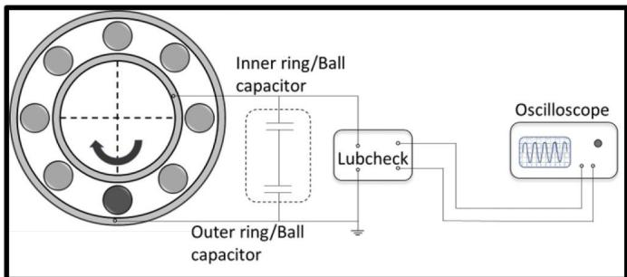  
Figure 1. Hybrid bearing with single steel ball (dark gray) and electrical connections to measure film thickness.

## Surface tension measurement

The surface tension of each base oil is measured with a dynamic contact angles (DCAT) machine, using a Wilhelmy plate method. Here, the oil is heated to a certain temperature, and a clean Wilhelmy plate is immersed in the test lubricant. The force acting on the plate is measured. Using this force, the surface tension of the lubricant can be calculated. A picture of the test rig is shown in Fig. 2. The surface tension of the liquid is measured at different temperatures, and the measurements are repeated at least twice.

## Results

## Surface tension

The surface tension of the base oils $\sigma$ varies with temperature and can be calculated using Pelofsky’s equation (29):

$$
\ln \sigma = \ln A_{lv} + \frac{B_{lv}}{\eta} \tag{[1]}
$$

> *(추출이 깨진 줄 — 원문 p.4 대조로 복구)*

where $\eta$ is the dynamic viscosity. $A _ { l v } ~ \& ~ B _ { l v }$ are constants specific for each liquid and are obtained by curve-fitting Pelofsky’s equation with the experimentally measured surface tension at different temperatures, with the dynamic viscosity calculated using Walther’s equation. (30) The constants used and the estimated surface tension at $6 1 ^ { \circ } \mathrm { C }$ are listed in Table 1. Figure 3 shows the measured surface tension and the estimated surface tension at different temperatures. Notice that the surface tensions of the two base oils are different at all temperatures. It is also evident that the surface tension decreases with temperature.

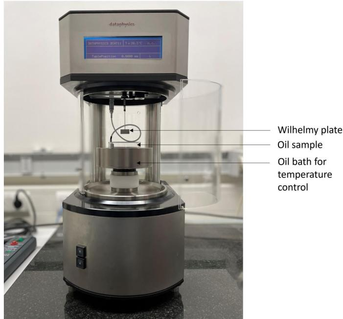  
Figure 2. Dynamic contact angles (DCAT) machine with Wilhelmy plate to measure surface tension at different temperatures.

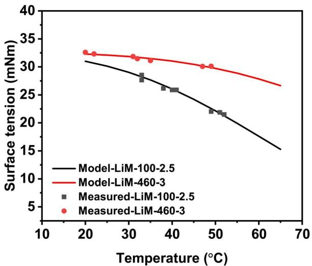  
Figure 3. Surface tension variation with temperature, measured and estimated from pelofsky’s model.

## Film thickness

## Axial load

The film thickness in Shetty et al. (22) was measured in three different deep groove ball bearings of varying sizes under axial load. The same two greases are also used in this article. For completeness, we will now summarize the key findings from our previous axial load film thickness measurements.

It was observed that the film thickness after the churning phase is almost steady. Film thickness increased with speeds similar to the oil-lubricated contacts. Further increase in speed-initiated starvation. The degree of starvation is measured as the ratio of the measured grease film thickness $( h _ { g } )$ to the fully flooded base oil film thickness $( h _ { f f } )$ calculated using Hamrock and Downson’s equation (3,31) (see Eq. [5] in the Appendix). We also consider the inlet shear heating effect on the film thickness and correct it using the correction factor $C _ { T }$ proposed by Gupta et al. (32) (see Eq. [6] in the Appendix). The relative film thicknesses at different speeds, loads, greases, and bearings were found to be dependent only on the base oil viscosity, half-contact width, and entrainment velocity, as shown in Fig. 4. via a curve fit, a power law relation between the relative film thickness and the product $\eta b u$ was obtained as

$$
\frac { h _ { g } } { h _ { f f } } = 0 . 0 5 4 ~ \left( \eta b u \right) ^ { - 0 . 2 9 }\tag{[2]}
$$

with $R ^ { 2 }$ 86%. Figure 4 plots the relative film thickness $h _ { g } / h _ { f f }$ against $\eta b u$ for two different greases in three different bearings at various loads and speeds. The fact that none of the bearing geometry-related parameters are required to define the relative film thickness, indicates the influence of centrifugal force on the loss/replenishment, and the replenishment in between the over-rolling is not significant. Therefore, we concluded from these results that oil replenishment is a local phenomenon. It was shown that the film thickness does not reduce with speed up to moderately high speeds and its dependency on the speed in the starved regime is minimal.

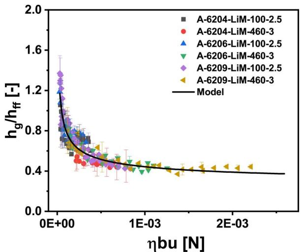  
Figure 4. Variation of relative film thickness with $\eta b u$ for axially loaded 6209, 6206, and 6204 bearings.

## Radial load

Figure 5a shows an example of the calculated normal load distribution and the capacitance variation along the bearing circumference for a radial load of 900 N. It is evident that the capacitance variation follows the load distribution in the bearings. The film thickness is inversely proportional to the measured capacitance, so the point of highest capacitance corresponds to the highest loaded point where the film thickness is lowest. This point is used in subsequent analysis. Figure 5b shows the cyclic profile and the peak values (green star) of capacitance considered. It can also be seen that the capacitance is almost stable at its minimum value (largest ball-outer ring gap) in the unloaded zone.

Figure 6 plots the film thickness for radially loaded bearings lubricated with LiM-100-2.5 and LiM-460-3 greases. The film thickness in the bearing lubricated with LiM-100-2.5 is measured up to 6,000 rpm which corresponds to 0.39 million ndm (ndm is the product of rotational speed n in rpm and pitch circle diameter dm in millimeters). The film thickness in the bearing lubricated with LiM-460-3 grease is measured up to 4,000 rpm corresponding to 0.26 million ndm.

At higher speeds, the temperature could not be lowered to $6 1 \pm 0 . 5 ^ { \circ } \mathrm { C }$ because of the higher heat generation from the high-viscosity base oils. For both grease types, the film thickness is measured under 700 N, 900 N, and 1,200 N applied radial loads. The resulting contact load, half contact widths, and contact pressure for the highest loaded ball is shown in Table 2.

The film thickness increases with speeds up to 2,500 rpm for LiM-100-2.5 grease, and up to 1,000 rpm for the LiM-460-3 grease-lubricated bearing. Then the film thickness becomes almost constant with speed. Similar to what we saw under axial loads, at low speeds, the contacts are still fully flooded hence the film thickness increases with speed. However, as the speed increases, contacts become starved, causing the film thickness to deviate from its fully flooded condition behavior. When an EHL contact is severely starved, the film thickness is primarily determined by the side flow, governed by the residence time and the over-rolling frequency. As the speed increases, these two effects balance each other out, making film thickness almost independent of speed. (10,28) Starvation in the LiM-460-3- greased bearing starts at speeds lower than in the LiM-100- 2.5 grease bearing. This is attributed to the higher viscosity of the base oil. In starved contacts, higher viscosity makes it difficult to replenish the center of the contacts. (14,20) The overall variation of the film thickness with speed under radial loads is similar to the film thickness evolution in axially loaded bearings.

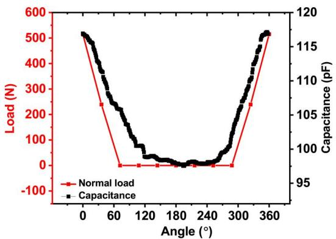  
(a)

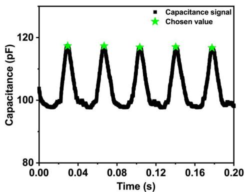  
(b)  
Figure 5. (a) Calculated ball-ring normal load variation and capacitance signal at different angular locations as the steel ball moves along the bearing circumfer ence, (b) cyclic capacitance signal showing the selected peaks for a LiM-100-2.5 grease-lubricated 6209 bearing under 900 N applied radial load.

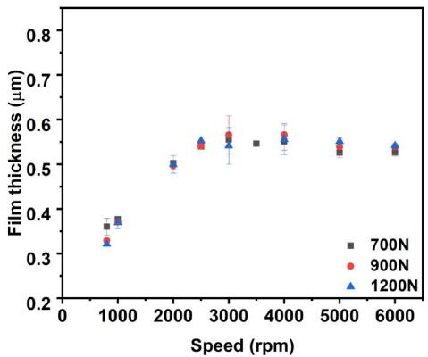  
(a) Lubricated with LiM-100-2.5 grease

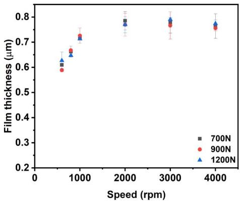  
(b) Lubricated with LiM-460-3 grease  
Figure 6. Film thickness variation with speed for radially loaded 6209 bearings lubricated with (a) LiM-100-2.5 grease and (b) LiM-460-3 grease.

Table 2. Applied radial load on the bearing, the resulting normal load on the highest loaded ball-ring contact, half contact widths across b and along a the running direction (giving ellipticity ratio = 0.0779), and contact pressure for 6209 bearing inner ring-ball contact.
| Radial load | Highest load | a (mm) | b (mm) | Contact pressure (GPa) |
| --- | --- | --- | --- | --- |
| 700 N | 414.8 N | 0.1103 | 1.417 | 1.27 |
| 900 N | 515.3 N | 0.1186 | 1.523 | 1.36 |
| 1,200 N | 662.8 N | 0.1290 | 1.656 | 1.48 |

## Combined axial and radial load

When a ball bearing is subjected to both radial and axial loads, all the balls will be loaded but the magnitude of the load varies for each ball depending on the position of the ball. Figure 7a shows the normal load distribution (red plot) and the capacitance variation (black plot) at various angular positions in the bearing when 900 N axial and 500 N radial loads are applied. The first of the pair of balls carrying the lowest load is located at an angle of ±108° from the ball car rying the highest load. The capacitance in the bearing also varies at different positions, correlating with the load distribution. Figure 7b shows an example capacitance signal showing the selected peak values corresponding to the film thickness at the highest loaded position considered for the analysis, similar to the radial load conditions.

The film thickness is measured for three sets of load combinations: 500 N axial load + 900 N radial load; 900 N axial load + 900 N radial load; and 900 N axial load + 500 N radial load. For each combination, the resulting load on the highest-loaded ball, contact pressure, and contact widths are shown in Table 3.

The resulting film thickness as a function of speed for both greases is shown in Fig. 8. Similar to the axial and radial load results, the film thickness increases with speed and then becomes almost constant. The film thickness of the LiM-460-3 grease is again higher than that of the

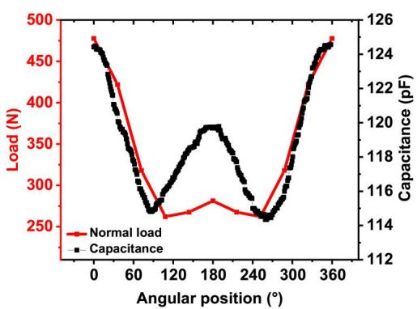  
(a)

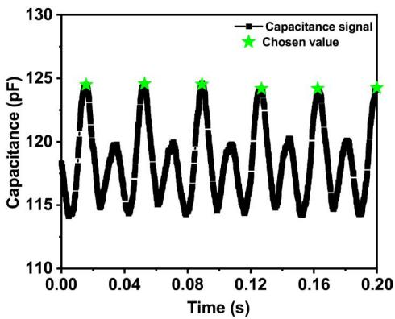  
(b)  
Figure 7. (a) Load distribution and capacitance variation at different angular positions, (b) capacitance signal and the selected peaks for 6209 bearing lubricated with LiM-100-2.5 grease at 4000 rpm under the combined 900 N axial load and 500 N radial load.

Table 3. Applied combined (axial + radial) loads on the bearing, the resulting contact loads on the highest loaded ball, half contact widths across b and along a the running direction (giving ellipticity ratio = 0.078), and contact pressures for 6209 bearing inner ring-ball contact.
| Axial load | Radial load | Highest contact load | a (mm) | b (mm) | Contact pressure (GPa) |
| --- | --- | --- | --- | --- | --- |
| 500N | 900 N | 587 N | 0.124 | 1.590 | 1.42 |
| 900 N | 900 N | 658N | 0.129 | 1.652 | 1.47 |
| 900 N | 500 N | 478N | 0.116 | 1.485 | 1.32 |

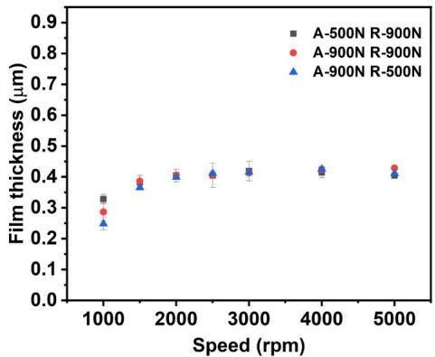  
(a) Lubricated with LiM-100-2.5 grease.

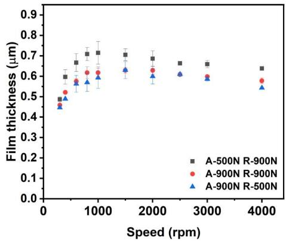  
(b) Lubricated with LiM-460-3 grease.  
Figure 8. Film thickness variation with speed for combined axially and radially loaded 6209 bearings lubricated with (a) LiM-100-2.5 grease and (b) LiM-460-3 grease.

LiM-100-2.5 grease-lubricated bearing because of the higher viscosity of LiM-460-3 base oil. These results show that the overall film thickness trend is the same for all three loading conditions (axial, radial, and combined): After a critical speed, the film thickness becomes constant.

In the next section, we will correlate the relative film thickness with different parameters derived from the base oil properties, operating conditions, and bearing deflections.

## Relative film thickness—Effect of surface tension

Cen and Lugt (20) and our previous article (22) showed that for axially loaded bearings, the relative film thickness $h _ { g } / h _ { f f }$ has a power law relationship with $\eta b u$. Here, we will show that this relation no longer holds for radial and combined loads. Figure 9 plots relative film thickness against $\eta b u$, unlike for axial loads (see Fig. 4), the relative film thicknesses do not merge into a single power law relationship with $\eta b u$ for radial and combined loads. Each grease (LiM-100-2.5 or LiM-460-3) exhibits a distinct power law relationship.

This difference can be explained by the difference in contact loads in the radial and combined load situations. Here, the ball experiences continuous loading and unloading during each ball revolution, unlike in the axially loaded condition where the contact load is constant. Due to this loading and unloading cycle, the oil replenishment due to the capillary action is anticipatorily higher. Observations in the ballon-disc experiments by Cann et al. (9) showed that during unloading, the film thickness reached the fully flooded value. They related the reflow of the lubricant to $\eta b / \sigma .$ With similar considerations, Fig. 10 shows the variation of the relative film thickness when surface tension $\sigma$ is included as an independent variable along with $\eta b u$ for axial, radial, and combined load conditions. Now, for both radial (Fig. 10b) and combined load (Fig. 10c) conditions, the relative film thicknesses of both greases merge into a single power law relationship. In the next section, we will explain the physical mechanism of the surface tension effect under radial loads including oil replenishment in the unloaded zone.

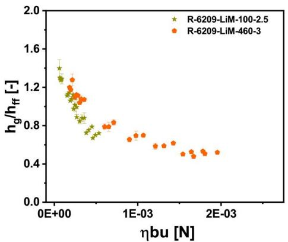  
(a) Radial load

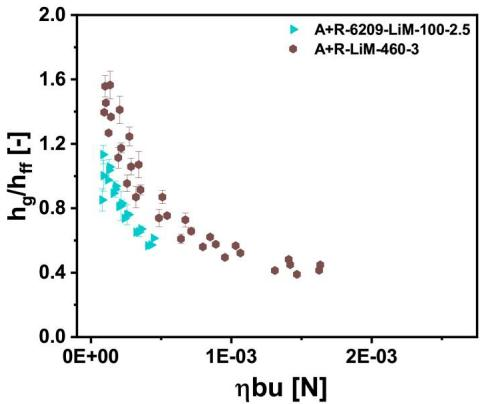  
(b) Combined axial and radial load  
Figure 9. Variation of relative film thickness with $\eta b u$ for (a) radially loaded bearings and (b) combined axially and radially loaded 6209 bearings and lubricated with LiM-100-2.5 grease and LiM-460-3 grease.

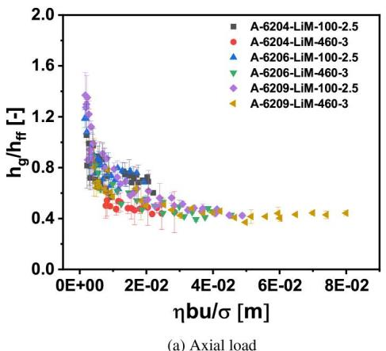

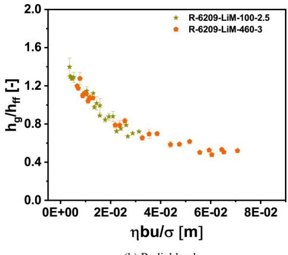  
(b) Radial load

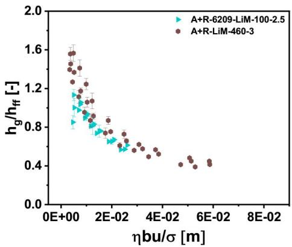  
(c) Combined axial and radial load  
Figure 10. Variation of relative film thickness with $\eta b u / \sigma$ for (a) axially, (b) radially, and (c) combined axially and radially loaded bearings lubricated with LiM-100- 2.5 and LiM-460-3 greases.

## Discussion

The bearing dynamics under radial loads and combined loads are not the same as under axial loads only. In the presence of radial loads, the load carried by each ball along the circumference of the bearing varies depending on the position of the ball. In purely radially loaded bearings, only some of the balls (in the loaded zone) carry the load and the rest of the balls (in the unloaded zone) do not carry any load (see Fig. 5a). In combined load conditions, all the balls are loaded but the load distribution is not uniform (see Fig. 7a). This yields variations in the side flow and replenishment as ring-ball contact width changes along the bearing circumference.

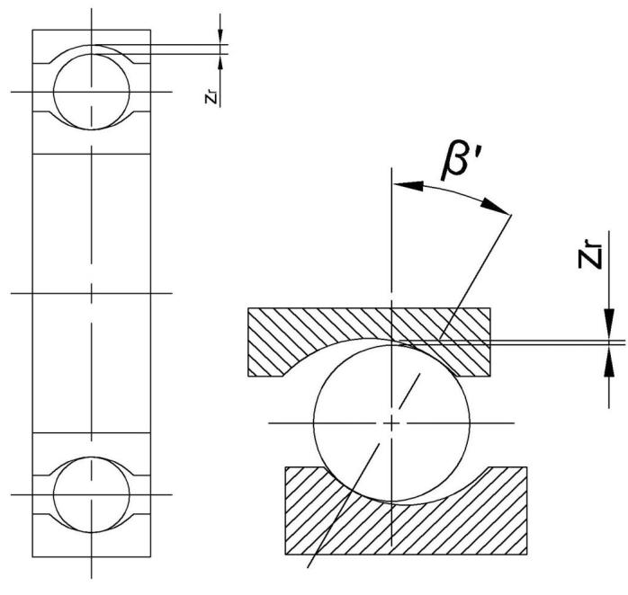

As mentioned in the Introduction section, contact replenishment is given by the capillary pressure and the hydraulic resistance. The capillary pressure is determined by the surface tension of the lubricant and the “fluid curvature,” which is given by the gap between the ball and ring outside the Hertzian contact. In the highest loaded contact, this curvature is expected to be highest due to the smallest gap and the total resistance largest because of the large distance between the side of contact and the center of it but when the ball moves to a position where the contact load is lowest (therefore highest gap), the fluid curvature decreases and the length over which replenishment needs to take place shortest. Therefore, an increase in oil replenishment in this lowest-loaded position is observed. The dependency of the hydraulic resistance on the gap is much higher than that of the capillary pressure. Since all the balls are equally loaded in axially loaded bearings, the gap is constant; hence, the capillary pressure is the same at all the contacts. Therefore, we did not need to include surface tension in determining the level of starvation under axial loads.

To show the difference in behavior we plot all the relative film thicknesses measured thus far—for axial loads (all three bearings), radial loads, combined loads, and both greases— vs. $\eta b u / \sigma$ in Fig. 11.

Three distinct curves are evident, implying that for the same $\eta b u / \sigma$ in the highest loaded contact, the starvation degree is different for different loading types. The starvation degree in axial \$>\$ combined \$>\$ radial loading conditions.

## Radial gap effect

The radial load does not only cause a varying Hertzian contact width b along the circumference but also a varying gap between the ball and the outer ring groove leading to a varying capillary pressure and available oil volume for replenishment. We quantify this effect by defining a gap $\textstyle ( z _ { r } )$ , the radial distance between the apex of the lowestloaded ball and the outer ring groove, as shown in Fig. 12. While other locations could have been chosen, for convenience, we have chosen the apex of the ball as the reference point in determining the radial distance between the ball and the groove.

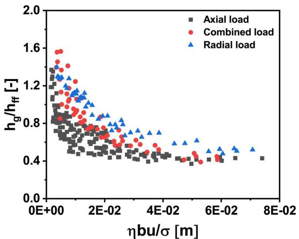  
Figure 11. Relative film thickness $h _ { g } / h _ { f f }$ vs $\eta b u / \sigma$ for all three different loading types.  
Figure 12. Ball-ring diagram showing the gap z between the top of the ball and the outer ring groove.

For radial load conditions, this gap is given by $z _ { r } =$ $P _ { d } + \delta _ { i } + \delta _ { o } ,$ where $P _ { d }$ is the diametrical clearance, $\delta _ { i }$ and $\delta _ { o }$ are the inner ring and outer ring-ball contact deformations, respectively. As the radial load increases, further deforming the contacts, the gap $z _ { r }$ also increases. For axially loaded and “combined” loaded bearings (see Fig. 12b) estimating this gap requires some more parameters. With the application of axial load, the ball shifts axially and its vertical central axis forms an angle with the contact normal, commonly called the contact angle. When combined axial and radial loads are applied, there will be angular, axial and radial displacements of the inner ring. Based on these variables, the ball position with respect to the outer ring groove position can be calculated. A detailed description of this calculation is in reference Harris and Kotzalas (33) and in our previous article. (27) Once the position of the ball is known, the gap can be calculated by assuming that the ball is perfectly spherical away from the Hertzian contact allowing the use of the equation of a circle. The outer ring is stationary while the inner ring moves. For this (static) analysis, centrifugal force is neglected, hence the contact angles in the inner ring-ball contact and the outer ring-ball contact are assumed to be equal.

For purely axial load, $z _ { r }$ is the same for all the balls, whereas, this will vary for combined axial and radial load conditions. We calculated $z _ { r }$ for all the balls along the

(a) Radial load

(b) Axial load and combined loads

bearing circumference considering their contact angles, loads, and elastic deformations, among others, and found that the distance $z _ { r } ( \theta )$ is highest in the radially opposite position to the highest loaded ball, that is, $z _ { r } ( \theta )$ is maximum (in the unloaded zone) at 180 degrees from the highestloaded ball. An example calculation for combined load condition is shown in Fig. 13, for comparison with the load distribution in Fig. 7. Given its significance in replenishment, only the maximum value of $z _ { r }$ is used in subsequent analysis.

Table 4 presents the maximum gap z calculated for all the bearings at different loads. For axial loads, $z _ { r } .$ —which is a function of bearing size via the clearance—does not vary much in each bearing, whereas for radial loads, $z _ { r }$ varies significantly and linearly with load. Recall that the film thickness measurements for radial load conditions showed little to no dependency on load magnitude (see Fig. 6). In the starved lubrication regime, as the load increases, the starvation level also increases proportionally to the contact width: when the contact width grows, the flow of lubricant toward the center of the contact becomes more difficult. However, for radial loads, as the load increases, the gap $z _ { r }$ also increases, facilitating additional replenishment which balances out the adverse effect of increasing contact width, thereby making the film thickness minimally dependent on applied load (as shown in Fig. 6).

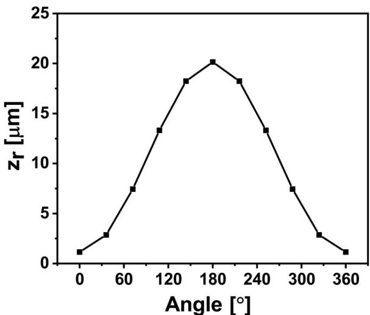  
Figure 13. Vertical distance between the top of the ball and the outer ring groove for all the balls in the bearing for combined load comprising an axial load of 900 N and a radial load of 500 N in a 6209 bearing.

Table 4. Applied loads on different bearings and the calculated ball-outer ring groove gaps zr.
| Bearing | Axial load (N) | Radial load (N) | Zr (µ m) |
| --- | --- | --- | --- |
| 6209 | 513 | 0 | 10.00 |
| 6209 | 700 | 0 | 10.16 |
| 6209 | 900 | 0 | 10.30 |
| 6206 | 310 | 0 | 7.50 |
| 6206 | 460 | 0 | 7.65 |
| 6206 | 620 | 0 | 7.80 |
| 6204 | 300 | 0 | 8.27 |
| 6204 | 400 | 0 | 8.43 |
| 6204 | 500 | 0 | 8.57 |
| 6204 | 600 | 0 | 8.72 |
| 6209 | 0 | 700 | 37.62 |
| 6209 | 0 | 900 | 39.28 |
| 6209 | 0 | 1,200 | 41.52 |
| 6209 | 500 | 900 | 26.95 |
| 6209 | 900 | 900 | 25.31 |
| 6209 | 900 | 500 | 20.15 |

## Film thickness model for radial loads

Increasing $z _ { r }$ allows for more lubricant around the contact, reducing the starvation level, hence, film thickness starts to depend less on the applied load as the severity of starvation decreases. In fully flooded conditions, it is least dependent on the load. Therefore, under radial and combined load conditions (the latter only for LiM-100-2.5 grease-lubricated bearing), we do not see distinct load dependency. To verify this, we remove the load effect by neglecting contact width b as an independent variable. Figure 14 plots relative film thickness against the capillary number $\eta u / \sigma$ (neglecting contact width b which changes with applied load) for three different radial loads and both LiM-100-2.5 and LiM-460-3 greases, with a power law curve fit that yields $R ^ { 2 } = 0 . 9 3$ Comparing this to the $R ^ { 2 } = 0 . 9 2$ obtained from Fig. 10b (which includes load effects via contact width b) shows that we can determine the relative film thickness in radially loaded bearings without including $b .$ The empirical equation of Fig. 14 fit is

$$
\frac { h _ { g } } { h _ { f f } } = 1 . 8 \left( \frac { \eta u } { \sigma } \right) ^ { - 0 . 3 1 } .\tag{[3]}
$$

The fact that, now, the contact width b is not important shows that the replenishment in the radially loaded bearing is dominated in the unloaded region. However, given this does not apply in the presence of axial loads, we next introduce a nondimensional parameter to render a more universal expression including all the active mechanisms in all load conditions, such as the opposing effects of applied load on contact width b and radial gap $z _ { r }$

## Film thickness master curve

The relative film thickness $h _ { g } / h _ { f f }$ is an indicator of the level/ degree of starvation: if the level of starvation is high, $h _ { g } / h _ { f f }$ is low, and vice versa. Starvation is given by the balance of side-flow out from the Hertzian contacts and replenishment by capillary effects. This is given by the viscosity $\eta ,$ speed $u ,$ contact width $^ { b , }$ and surface tension $\sigma$ but also by the available volume, given by the gap parameter $z _ { r } .$

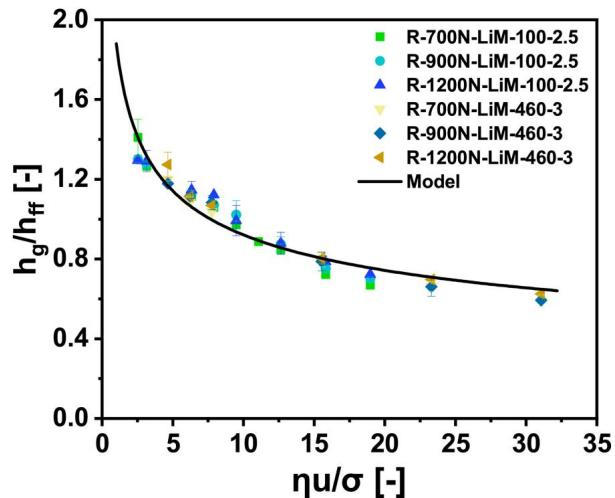  
Figure 14. Relative film thickness as a function of capillary number $( \eta u / \sigma )$ for three different radial loads and two different greases.

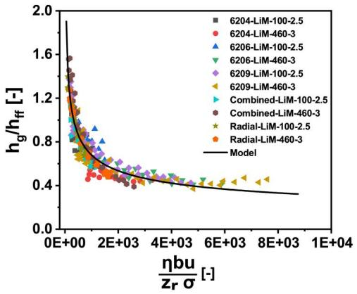  
(a) Linear scale  
Figure 15. Relative film thickness as a function of non-dimensional starvation parameter $\eta b u / ( z _ { r } \sigma )$.  
(b) Log-log scale

Considering the significance of the above effects and mechanisms, we present relative film thickness as a function of non-dimensional starvation parameter $\eta b u / ( z _ { r } \sigma )$ in Fig. 15. This plot includes the film thickness measured on the three different bearings, at the different load magnitudes and types (axial, radial and combined), for both greases tested. A master curve fit yields a power law relation, rendering a universal expression for the relative film thickness as

$$
\frac { h _ { g } } { h _ { f f } } = 7 . 3 0 5 \left( \frac { \eta b u } { z _ { r } \sigma } \right) ^ { - 0 . 3 4 }\tag{[4]}
$$

with $R ^ { 2 } = 8 7 . 7 \%$ These results indicate that the film thickness in a grease-lubricated bearing immediately after the churning phase is primarily determined by the dynamics of the oil flow around the contacts. The film thickness does not depend on the grease bleed rate or the grease rheological properties.

The overall dependency on speed is lower than that under fully flooded conditions as discussed in our recent paper. (22) The film thickness dependency on the applied load magnitude varies with the load type. When the bearings are axially loaded, the relative film thickness decreases with the load since the contact width increases but $z _ { r }$ does not vary considerably. However, for applied radial loads and combined loads, as the radial load increases, the gap $z _ { r }$ also increases, nullifying the load effect on contact width and resulting in the reduced dependency. Figure 16 compares the gap zr with the contact width $^ { b , }$ showing a near-linear relationship. This explains why Eq. [3] does not contain the contact width b but includes surface tension $\sigma$.

## Conclusion

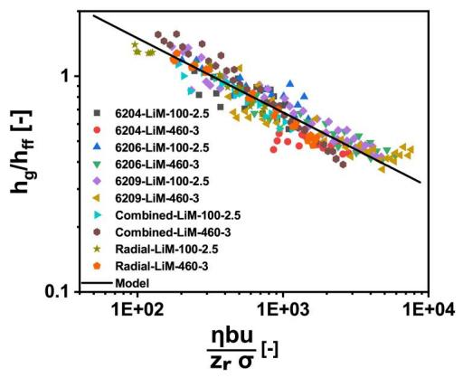

This study showed that the film thickness in grease-lubricated deep groove ball bearings immediately after the churning phase is primarily determined by the dynamics of the oil flow in and around the contacts. In this phase, film thickness does not depend on the oil bleed. The base oil viscosity is the grease property that determines the film thickness for NLGI 2 greases (good quality ball bearing greases). This resulted in a universal relative film thickness model for grease-lubricated deep groove ball bearings under axial, radial and combined loads:

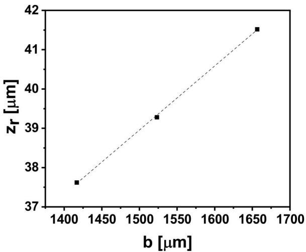  
Figure 16. Radial gap zr vs contact width b showing a linear proportionality for a 6209 bearing under 700 N, 900 N, and 1200 N radial loads.

$$
\frac { h _ { g } } { h _ { f f } } = 7 . 3 0 5 \left( \frac { \eta b u } { z _ { r } \sigma } \right) ^ { - 0 . 3 4 }
$$

This model includes all the identified active mechanisms and applies to both small and medium sized bearings.

For axial loads only, $z _ { r }$ does not vary very much with load and the significance of a varying surface tension is much less relevant. For pure axial load this equation reduces to:

$$
\frac { h _ { g } } { h _ { f f } } = 0 . 0 5 4 ~ \left( \eta b u \right) ^ { - 0 . 2 9 }
$$

For radial loads only, the relative film thickness reads:

$$
\frac { h _ { g } } { h _ { f f } } = 1 . 8 \left( \frac { \eta u } { \sigma } \right) ^ { - 0 . 3 1 } .
$$

Here the ratio of contact width b to radial gap z is excluded because both parameters are linearly dependent on each other.

Some additional conclusions are:

- Film thickness dependency on speed in starved conditions is lower than in fully flooded conditions.

- Film thickness dependency on applied load magnitude is different for axially loaded bearings and bearings with radial loads.

- The starvation level depends on the base oil viscosity and surface tension.

The aforementioned hold for lubrication after the churning phase, prior to commencement of oil bleeding from the grease reservoirs.

## Acknowledgments

We thank Norbert F. Bader for the insightful discussions during the study.

## Disclosure statement

No potential conflict of interest was reported by the author(s).

## Funding

We thank SKF Research and Technology Development and Shell for funding this work and approving this publication.

## ORCID

Pramod Shetty http://orcid.org/0000-0001-6946-2201   
Robert Jan Meijer http://orcid.org/0000-0002-0270-4218   
Piet M. Lugt http://orcid.org/0000-0001-9356-7599

## References

(1) McQueen, A. (2010), “Stathis Ioannides, Devoted to the Fight Against Friction,” Evolution: The Business and Technology Magazine from SKF, pp 18–20.

(2) Wedeven, L. D., Evans, D., and Cameron, A. (1971), “Optical Analysis of Ball Bearing Starvation,” Journal of Lubrication Technology, 93, pp 349–361. doi:10.1115/1.3451591

(3) Hamrock, B. J. and Dowson, D. (1977), “Isothermal Elastohydrodynamic Lubrication of Point Contacts: Part III— Fully Flooded Results,” Journal of Lubrication Technology, 99, pp 264–275. doi:10.1115/1.3453074

(4) Damiens, B., Venner, C. H., Cann, P., and Lubrecht, A. (2004), “Starved Lubrication of Elliptical EHD Contacts,” Journal of Tribology, 126, pp 105–111. doi:10.1115/1.1631020

(5) Van Zoelen, M., Venner, C. H., and Lugt, P. M. (2009), “Prediction of Film Thickness Decay in Starved Elasto-Hydrodynamically Lubricated Contacts Using a Thin Layer Flow Model,” Proceedings of the Institution of Mechanical Engineers, Part J: Journal of Engineering Tribology, 223, pp 541– 552. doi:10.1243/13506501JET524

(6) Morales-Espejel, G. E., Lugt, P. M., Pasaribu, H., and Cen, H. (2014), “Film Thickness in Grease Lubricated Slow Rotating Rolling Bearings,” Tribology International, 74, pp 7–19. doi:10. 1016/j.triboint.2014.01.023

0(7) Cen, H., Lugt, P. M., and Morales-Espejel, G. (2014), “On the Film Thickness of Grease-Lubricated Contacts at Low Speeds,” Tribology Transactions, 57, pp 668–678. doi:10.1080/10402004. 2014.897781

(8) Cann, P. (1996), “Starvation and Reflow in a Grease-Lubricated Elastohydrodynamic Contact,” Tribology Transactions, 39, pp 698–704. doi:10.1080/10402009608983585

0(9) Cann, P. and Lubrecht, A. (2003), “The Effect of Transient Loading on Contact Replenishment with Lubricating Greases,” Tribology Series, ed. G. Dalmaz, A. A. Lubrecht, D. Dowson, and M. Priest, Volume 43, pp 745–750, Elsevier.

(10) van Zoelen, M. T. (2009), Thin Layer Flow in Rolling Element Bearings, PhD Thesis, University of Twente, Enschede, The Netherlands.

(11) Van Zoelen, M., Venner, C. H., and Lugt, P. M. (2010), “The Prediction of Contact Pressure–Induced Film Thickness Decay in Starved Lubricated Rolling Bearings,” Tribology Transactions, 53, pp 831–841. doi:10.1080/10402004.2010.492925

(12) Jacod, B., Pubilier, F., Cann, P., and Lubrecht, A. (1999), “An Analysis of Track Replenishment Mechanisms in the Starved Regime,” In Tribology Series, Volume 36, pp 483–492, Elsevier. doi:10.1016/S0167-8922(99)80069-8

(13) Cann, P. and Lubrecht, A. (2007), “Bearing Performance Limits with Grease Lubrication: The Interaction of Bearing Design, Operating Conditions and Grease Properties,” Journal of Physics D: Applied Physics, 40, pp 5446–5451. doi:10.1088/0022-3727/ 40/18/S05

(14) Cann, P., Damiens, B., and Lubrecht, A. (2004), “The Transition between Fully Flooded and Starved Regimes in EHL,” Tribology International, 37, pp 859–864. doi:10.1016/j.triboint.2004.05.005

(15) Nogi, T. (2015), “An Analysis of Starved EHL Point Contacts with Reflow,” Tribology Online, 10, pp 64–75. doi:10.2474/trol. 10.64

(16) Nogi, T. (2015), “Film Thickness and Rolling Resistance in Starved Elastohydrodynamic Lubrication of Point Contacts with Reflow,” Journal of Tribology, 137, 041502. doi:10.1115/1. 4030203

(17) Nogi, T., Shiomi, H., and Matsuoka, N. (2018), “Starved Elastohydrodynamic Lubrication with Reflow in Elliptical Contacts,” Journal of Tribology, 140, 011501. doi:10.1115/1. 4037135

(18) Fischer, D., von Goeldel, S., Jacobs, G., and Stratmann, A. (2021), “Numerical Investigation of Effects on Replenishment in Rolling Point Contacts Using CFD Simulations,” Tribology International, 157, 106858. doi:10.1016/j.triboint.2021.106858

(19) Fischer, D., von Goeldel, S., Jacobs, G., Stratmann, A., and K€onig, F. (2021), “Investigation of Lubricant Supply in Rolling Point Contacts under Starved Conditions Using CFD Simulations,” IOP Conference Series: Materials Science and Engineering, 1097, 012007. doi:10.1088/1757-899X/1097/1/ 012007

(20) Cen, H. and Lugt, P. M. (2020), “Replenishment of the EHL Contacts in a Grease Lubricated Ball Bearing,” Tribology International, 146, 106064. doi:10.1016/j.triboint.2019.106064

(21) Shetty, P., Meijer, R. J., Osara, J. A., Pasaribu, R., and Lugt, P. M. (2024), “Effect of Grease Filling on the Film Thickness in Deep-Groove Ball Bearings,” Tribology Transactions, 67(1), pp 1–15. doi:10.1080/10402004.2024.2398239

(22) Shetty, P., Meijer, R. J., Osara, J. A., Pasaribu, R., and Lugt, P. M. (2024), “Effect of Bearing Size in a Grease Lubricated Ball Bearings,” Tribology International, 146, 106064.

(23) Jablonka, K., Glovnea, R., and Bongaerts, J. (2018), “Quantitative Measurements of Film Thickness in a Radially Loaded Deep-Groove Ball Bearing,” Tribology International, 119, pp 239–249. doi:10.1016/j.triboint.2017.11.001

(24) Larsson, P.-O., Jacobson, B., and H€oglund, E. (1994), “Oil Drops Leaving an EHD Contact,” Wear, 179, pp 23–28. doi:10. 1016/0043-1648(94)90214-3

(25) Astr€om, H., Ostensen, € J. O., and Hoglund, € E. (1993), “Lubricating Grease Replenishment in an Elastohydrodynamic Point Contact,” Journal of Tribology, 115, pp 501–506.

(26) Heemskerk, R., Vermeiren, K., and Dolfsma, H. (1982), “Measurement of Lubrication Condition in Rolling Element Bearings,” A S L E Transactions, 25, pp 519–527. doi:10.1080/ 05698198208983121

(27) Shetty, P., Meijer, R. J., Osara, J. A., Pasaribu, R., and Lugt, P. M. (2024), “Vibrations and Film Thickness in Deep Groove Ball Bearings,” Tribology Transactions, 193, pp 1–15. doi:10. 1080/10402004.2024.2398239

(28) Shetty, P., Meijer, R. J., Osara, J. A., and Lugt, P. M. (2022), “Measuring Film Thickness in Starved Grease-Lubricated Ball Bearings: An Improved Electrical Capacitance Method,” Tribology Transactions, 65, pp 869–879. doi:10.1080/10402004. 2022.2091067

(29) Pelofsky, A. H. (1966), “Surface Tension-Viscosity Relation for Liquids,” Journal of Chemical & Engineering Data, 11, pp 394– 397. doi:10.1021/je60030a031

(30) Lugt, P. M. (2012), Grease Lubrication in Rolling Bearings, John Wiley & Sons: Chichester, UK.

(31) Hamrock, B. J. and Dowson, D. (1978), “Minimum Film Thickness in Elliptical Contacts for Different Regimes of Fluid Film Lubrication,” Tech. rep., NASA, No. E-9687.

(32) Gupta, P., Cheng, H., Zhu, D., Forster, N., and Schrand, J. (1992), “Viscoelastic Effects in MIL-L-7808-Type Lubricant,

Part I: Analytical Formulation,” Tribology Transactions, 35, pp 269–274. doi:10.1080/10402009208982117

(33) Harris, T. A. and Kotzalas, M. N. (2006), Advanced Concepts of Bearing Technology, CRC Press: New York.

## Appendix

Fully flooded film thickness is calculated using Hamrock and Downson’s film thickness equation

$$
h _ { f f } = 2 . 6 9 C _ { T } R _ { x } U ^ { 0 . 6 7 } G ^ { 0 . 5 3 } W ^ { - 0 . 0 6 7 } \big ( 1 - 0 . 6 1 e ^ { - 0 . 7 3 k _ { d } } \big ) .\tag{[5]}
$$

Here $R _ { x }$ is the reduced radius in the x direction (along rolling direction), $k _ { d }$ is the ellipticity parameter, $G , \ U ,$ and $W$ are dimensionless material, speed, and load parameters, respectively.

$C _ { T }$ is a correction factor for the inlet shear heating effect given by

$$
C _ { T } = \frac { 1 - 1 3 . 2 ( p _ { m } / E ^ { \prime } ) B r ^ { 0 . 4 2 } } { 1 + 0 . 2 1 3 ( 1 + 2 . 2 3 S R R ^ { 0 . 8 3 } ) B r ^ { 0 . 6 4 } } .\tag{[6]}
$$

where $B r$ is the Brinkman number given by $B r \approx - \beta \eta _ { 0 } u ^ { 2 } / K$ . We assumed no slip condition; hence, $S R R = 0 , \beta$ is the temperature-viscosity coefficient obtained from $\eta = \eta _ { 0 } e ^ { - \beta ( T - T _ { 0 } ) }$ $\ b { p _ { m } }$ is the maximum Hertzian pressure, and K is the thermal conductivity of the lubricant.

---

> **추출 글자 소실 복구 기록** — 원문 대조로 51건 복구 (`�` 4건 · 리거처 15건 · 글리프 치환 32건). 미확인 0건.
