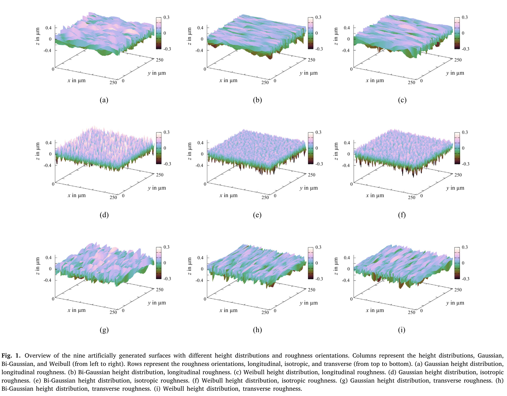
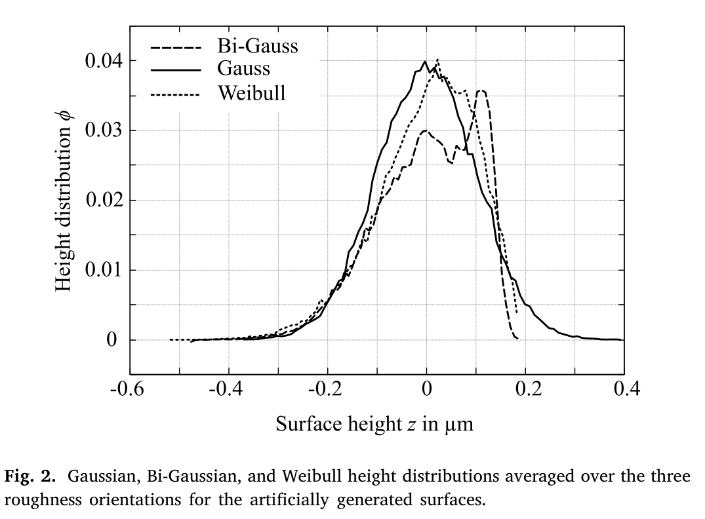
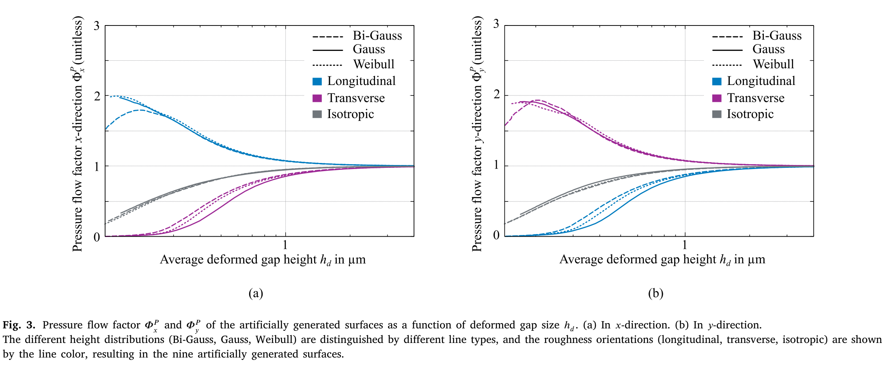
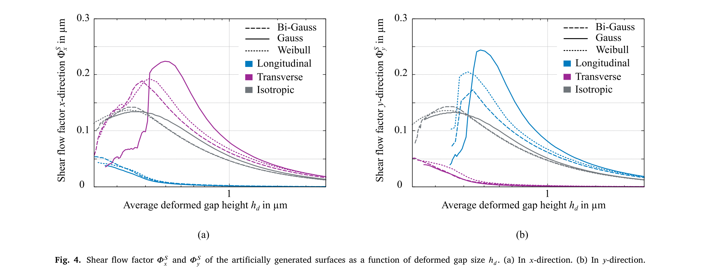
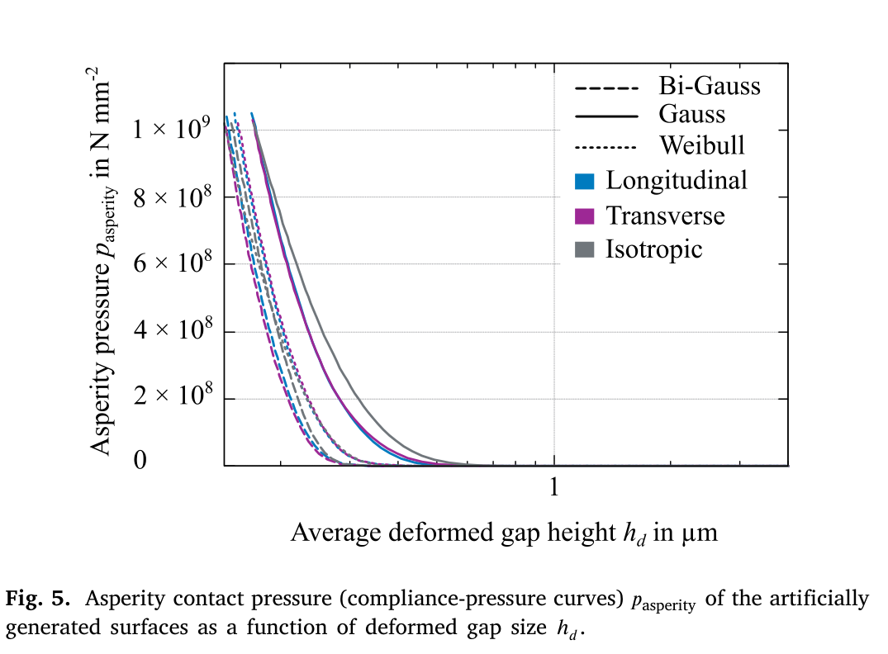
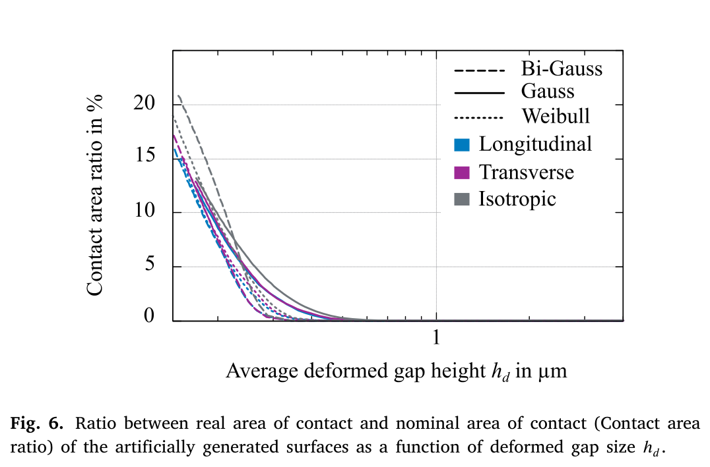
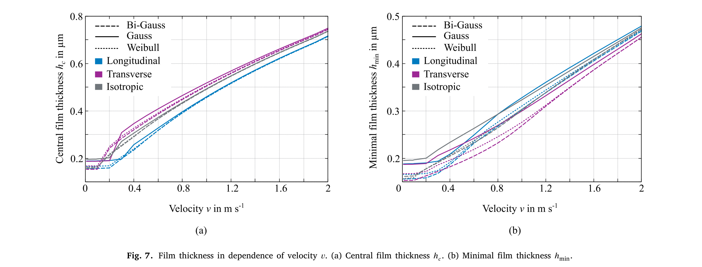
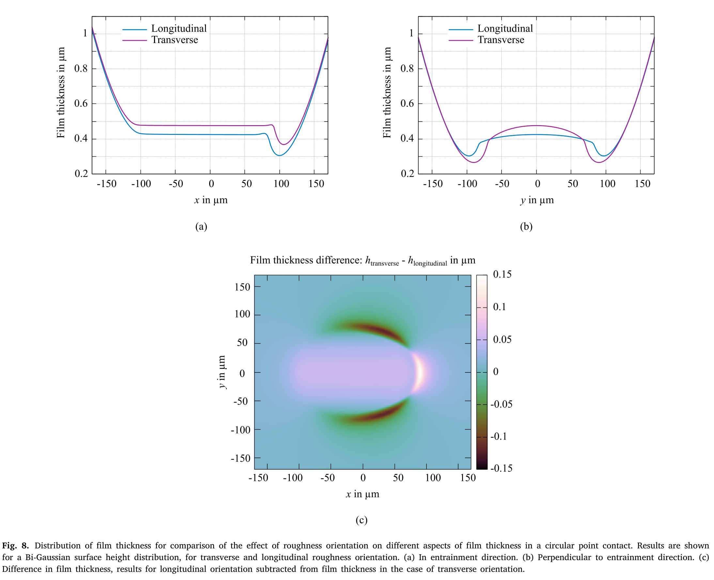
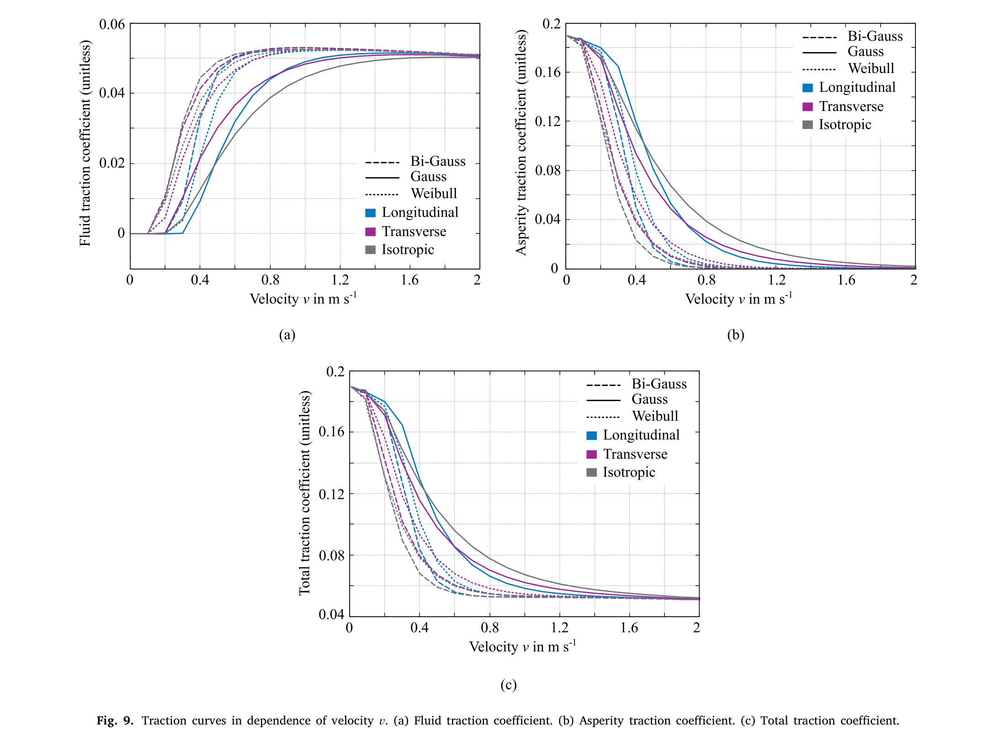
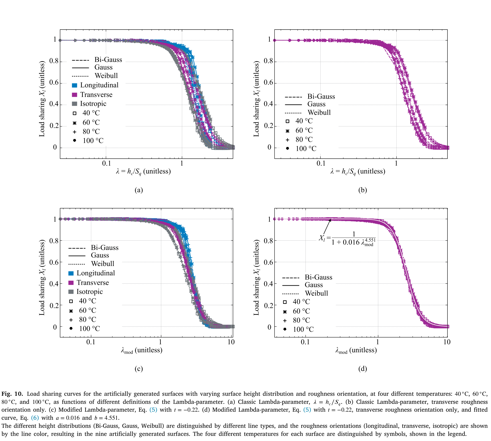

# 혼합 마찰: 람다 파라미터 기반 공학적 하중분담 방정식의 비판적 평가

## 저자 정보

**Charlotte Spies**ᵃ̕ᵇ (교신저자)
e-mail: charlotte.spies@email.uni-freiburg.de

**Yash Parab**ᵇ̕ᶜ

**Arshia Fatemi**ᵇ

**소속**:
ᵃ University of Freiburg, Department of Microsystems Engineering, Georges-Köhler-Allee 103, 79100 Freiburg, Germany
ᵇ Robert Bosch GmbH, Corporate Research and Advance Engineering, Robert-Bosch-Campus 1, 71272 Renningen, Germany
ᶜ University of Kaiserslautern-Landau (RPTU), Gottlieb-Daimler-Straße, 67663 Kaiserslautern, Germany

**출처**: Tribology International 211 (2025) 110812, Elsevier
**접수**: 2025년 2월 19일 / 수정: 2025년 4월 28일 / 게재 확정: 2025년 5월 17일 / 온라인: 2025년 6월 4일
**라이선스**: Open Access (CC BY-NC-ND 4.0)

**키워드**: 하중분담(Load sharing), 혼합 마찰(Mixed friction), 람다 파라미터(Lambda-parameter), 탄성유체윤활(EHL)

---

## 초록

기어나 베어링 등 많은 공학 응용에서 혼합 마찰(mixed friction) 예측을 위해 유체 마찰과 고체 마찰 사이의 **하중분담(load sharing)** 개념이 일반적으로 사용됩니다. 하중 또는 전단응력 분담 방정식은 보통 **람다 파라미터(𝜆-parameter)** — 이론적 유막 두께와 단일 거칠기 척도(roughness metric)의 비 — 의 함수로 정의됩니다. 본 논문의 1부에서는 단일 척도 기반 하중분담법이 혼합 윤활에 대한 표면 품질의 구분, 나아가 마찰 예측에 부적합한 이유를 다양한 관점에서 논의합니다.

2부에서는 **동일한 파워 스펙트럼 밀도(PSD) 파라미터**와 **동일한 RMS 거칠기 $S_q$ 및 평균 거칠기 $S_a$** 를 가지면서도, 3가지 높이 분포(가우시안, 바이-가우시안, 와이블)와 3가지 거칠기 방향성(등방성, 종방향, 횡방향)을 갖는 인공 거칠기 프로파일을 생성했습니다. 동일한 거칠기 척도를 가진 표면이라도 **매우 다른 하중분담과 마찰**을 보임을 입증했습니다. 따라서 새로운 하중분담 개념은 분포와 이방성의 효과를 반영하기 위해 **추가 거칠기 파라미터**를 포함해야 합니다. 비교는 통상적 Mini Traction Machine(MTM) 접촉 형상에 대한 점접촉 열탄성유체윤활(TEHL) 수치코드로 수행되었으며, 마지막에 향후 하중분담 개념에 대한 제안을 제시합니다.

---

## 목차

1. [개요](#1-개요)
2. [종합 요약](#2-종합-요약)
3. [서론](#3-서론)
4. [공학 응용에서의 하중분담 개념 현황](#4-공학-응용에서의-하중분담-개념-현황)
5. [인공 거칠기 표면 설계](#5-인공-거칠기-표면-설계)
6. [거칠기 분포·방향성의 유동인자 영향](#6-거칠기-분포방향성의-유동인자-영향)
7. [혼합 EHL 시뮬레이션 및 수정 람다 파라미터](#7-혼합-ehl-시뮬레이션-및-수정-람다-파라미터)
8. [결론](#8-결론)
9. [기호 및 참고문헌](#9-기호-및-참고문헌)

---

## 1. 개요

고에너지 효율·고출력 밀도 기계요소(기어, 구름 베어링)의 개발 추세는 **저점도 윤활유와 고접촉압력**을 향하고 있으며, 그 결과 이들 접촉부가 점점 더 **혼합 윤활(mixed lubrication) 영역**에서 작동하게 되었습니다. 특히 전동화(전기 구동) 시스템에서는 동력전달 손실 비중이 커서 이 경향이 더욱 두드러집니다.

### 연구의 필요성

혼합 마찰 예측을 위한 실용적 공학 모델의 중요성이 커지고 있습니다. 기어·베어링 설계 소프트웨어에서는 매끄러운 표면 유막 두께와 **단일 거칠기 척도**에 기반한 간단한 람다 파라미터 하중분담식이 광범위하게 사용되지만, **설계자들은 이 모델의 한계를 인식하지 못한 채 사용**하는 경우가 많습니다.

### 본 연구의 목적

- 람다 파라미터 기반 하중분담 정의에 내재된 **물리적 비일관성**을 다양한 관점에서 비판적으로 평가
- 동일 거칠기 척도($S_q$, $S_a$)·동일 PSD를 갖되 **높이 분포와 방향성만 다른** 인공 표면으로 영향을 분리 검증
- 단일 척도의 한계를 입증하고 **2개 이상의 거칠기 파라미터**를 포함하는 새로운 하중분담 개념 제안

---

## 2. 종합 요약

### ▪ 2.1 연구 핵심 정보

| 항목 | 내용 |
|------|------|
| **연구 대상** | • 혼합 마찰의 하중분담(load sharing) 방정식 • 람다 파라미터($\lambda = h/\sigma$)의 물리적 적정성 |
| **주요 목적** | • 단일 거칠기 척도 기반 람다 파라미터의 한계 규명 • 거칠기 분포·이방성이 마찰에 미치는 독립적 영향 검증 • 2-파라미터 수정 람다 모델 제안 |
| **검증 방법** | • 동일 PSD·동일 $S_q/S_a$, 9종 인공 표면(3 분포 × 3 방향) 생성 • 평균유동모델(Patir-Cheng) 기반 유동인자·접촉 해석 • MTM 형상 점접촉 혼합 TEHL 수치 시뮬레이션 |
| **적용 분야** | • 기어·베어링 마찰/효율 설계 소프트웨어 • 마이크로피팅·수명 예측 표준(ISO 6336, ISO 281) • 혼합 마찰 모델링 표준화 |

-------------

### ▪ 2.2 핵심 개념 정리

| 개념 | 설명 |
|------|------|
| **람다 파라미터($\lambda$)** | • 유막 두께 / 단일 거칠기 척도의 비 • 윤활 영역 판별 지표로 출발 → 하중분담·마찰·수명 예측으로 확장 • 단일 척도라 제조 텍스처·런인 상태·방향성 정보 누락 |
| **하중분담(Load sharing)** | • 전체 마찰계수 = 고체분담 + 유체분담 (가중합) • 가중치 $X$ 결정 방식에 따라 면적분담·하중분담·전단응력분담 구분 |
| **거칠기 분포(Height distribution)** | • 가우시안(런인 전), 바이-가우시안·와이블(런인 후) • Abbott-Firestone 곡선 파라미터($S_{pk}$ 등)에 크게 반영 |
| **거칠기 방향성(Anisotropy)** | • 등방성(호닝)/종방향(셰이빙)/횡방향(연삭) • Peklenik 인자 $\gamma=\beta_x/\beta_y$로 특성화 |
| **유동인자(Flow factor)** | • 거친 표면/매끄러운 표면의 유량비(압력유동·전단유동) • 평균 Reynolds 방정식의 보정 인자 |

-------------

### ▪ 2.3 방법론 개요

| 구성요소 | 세부 내용 |
|---------|----------|
| **인공 표면 생성** | • Pérez-Ràfols & Almqvist MATLAB 애플릿 사용 • 자기-아핀 프랙탈(Hurst 지수 0.8), roll-off 영역 포함 • 9종(가우시안·바이가우시안·와이블 × 등방·종·횡), $S_q$=0.10 μm 통일 |
| **유동인자·접촉 해석** | • 평균유동모델(Patir-Cheng) + Lagemann 결정론적 산출 • 경계요소법(BEM)으로 접촉압력·실접촉면적 계산 |
| **혼합 EHL 시뮬레이션** | • 다중격자(multilevel) EHL 솔버, MTM 점접촉 형상 • 정상상태·완전침수 가정, SRR 5%(온도 박막화 최소화) |
| **윤활유 모델** | • 순물질 TOTM(기준 윤활유), 개선 Yasutomi 점도-압력식 • Eyring 모델로 전단박화(shear thinning) 반영 |

-------------

### ▪ 2.4 핵심 해석식

| 항목 | 식 | 의미 |
|------|-----|------|
| **혼합 마찰 가중합** | $\mu_{total}=X\mu_{solid}+(1-X)\mu_{fluid}$ | 하중분담의 기본식 (식 1) |
| **하중분담 가중치** | $X_l=\dfrac{\text{돌기 지지 하중}}{\text{수직 하중}}$ | 하중분담 정의 (식 3) |
| **시뮬레이션 가중치** | $X_l=\dfrac{F_{total}-F_{fluid}}{F_{asperity}-F_{fluid}}$ | 견인력 기반 추출 (식 4) |
| **수정 람다 파라미터** | $\lambda_{mod}=\dfrac{h_c}{S_q}\left(\dfrac{S_{pk}}{S_{pk,ref}}\right)^{t}$ | 분포효과 반영, $t=-0.22$ (식 5) |
| **수정 하중분담 곡선** | $X=\dfrac{1}{1+a\lambda_{mod}^{b}}$ | 피팅식, $a=0.016,\ b=4.551$ (식 6) |

-------------

### ▪ 2.5 검증 결과

| 검증 항목 | 비교 대상 | 결과 |
|----------|----------|------|
| **압력 유동인자** | 9종 표면(분포×방향) | • 방향성(이방성)이 지배적 영향 • 높이 분포는 거의 영향 없음 |
| **전단 유동인자** | 9종 표면 | • 방향성이 지배, 분포는 미미한 영향 |
| **돌기 접촉압력 곡선** | 9종 표면 | • **높이 분포가 지배적** • 와이블·바이가우시안이 가우시안과 크게 다름 |
| **중심 유막 두께 $h_c$** | 속도 의존성 | • **방향성이 지배**, 종방향이 최저 $h_c$ |
| **최소 유막 두께 $h_{min}$** | 속도 의존성 | • **횡방향이 최저** $h_{min}$ (측면 유동 저항 차이) |
| **견인(Stribeck) 곡선** | 온도 40~100°C | • **높이 분포가 마찰에 더 지배적** • 돌기 견인이 전체 마찰을 크게 좌우 |

-------------

### ▪ 2.6 주요 발견사항

| 항목 | 내용 |
|------|------|
| **단일 척도의 부적합성** | • 동일 $S_q/S_a$라도 분포·방향성에 따라 마찰 상이 • 람다 파라미터 단독으로는 표면 품질 구분 불가 |
| **분포 vs 방향성 역할 분리** | • 유막 두께(특히 $h_c$): **방향성**이 지배 • 마찰/견인·돌기압력: **높이 분포**가 지배 |
| **유막 두께의 역설** | • 종방향: 최저 $h_c$ but 최고 $h_{min}$ • 횡방향: 최고 $h_c$ but 최저 $h_{min}$ (측면 유동 저항 기인) |
| **2-파라미터 필요성** | • $S_q$ + Abbott-Firestone 파라미터($S_{pk}$)로 분포 반영 • 수정 람다로 곡선 산포 대폭 축소(마스터 곡선화) |

-------------

### ▪ 2.7 실무적 함의

| 영역 | 권장사항 |
|------|---------|
| **표준·기술규격** | • 유막/거칠기 비를 쓰는 모든 표준은 **유막 종류($h_c$ vs $h_{min}$)·거칠기 척도·측정/필터링법을 명확히 규정**해야 함 |
| **거칠기 측정** | • 측정법(스타일러스·광학·AFM)·팁반경·필터링에 따라 $R_q$ 값이 다중 스케일로 변동 → 통일 필요 |
| **하중분담 개념** | • 면적·하중·전단응력 분담 개념의 비일관성 인지 • 전단응력 분담이 두 측면 모두 반영하는 유망 개념 |
| **마찰 모델링** | • 분포(예: $S_{pk}$, $S_{sk}$) + 방향성 2개 파라미터 동시 반영 • 거칠기 변형(in-contact deformation) 미반영 한계 유의 |

---

## 3. 서론

대부분의 기계요소는 점점 더 혼합 윤활 영역에서 작동합니다. 혼합 마찰 모델의 복잡도는 측정 거칠기를 EHL 압력과 결정론적으로 연성한 정교한 모델부터, 확률론적 혼합 마찰 해석, 매끄러운 표면 유막 두께와 단일 거칠기 척도에 기반한 간단한 공학 방정식(Taylor & Sherrington 정리)까지 다양합니다.

- **결정론적·확률론적 모델**: 복잡도·계산비용·입력 불확실성으로 설계 실무에서는 거의 사용되지 않음
- **간단한 람다 기반 모델**: 모든 기어·베어링 설계 소프트웨어에서 광범위하게 사용 (한계 인식 부족)

람다 파라미터는 원래 윤활 영역 판별을 위한 실용 지표였으나, 최근 기계요소 분야에서 **하중분담 정식화**에 채택되어 혼합 마찰·표면 피로 예측으로 확장되었습니다 (예: 마이크로피팅 ISO 기술규격, 베어링 수명계산 ISO 281:2007).

### 본 논문이 제기하는 문제

람다 파라미터 기반 하중분담 정의는 **본질적인 물리적 비일관성**을 가지며, 이로 인해 서로 다른 실험실·계산 결과의 비교가 불가능해집니다. 람다 파라미터는 제조 거칠기 텍스처(연삭·셰이빙·호닝·폴리싱), 표면 상태(런인), 표면 방향성(lay)에 대한 정보를 전혀 담지 못합니다.

### 선행 연구의 비판적 평가

| 연구자 | 기여 / 지적 |
|--------|------|
| **Cann et al. [12]** | 유막 두께가 거칠기에 비해 작을 때 람다 파라미터 한계 — 돌기 국부 압력변동→탄성변형→방향성·기아 민감성 |
| **Zhu & Wang [13]** | 윤활 영역 경계가 과도하게 부정확. $\lambda$>0.6~1.2면 돌기 접촉 거의 없음(고전적 $\lambda$=3~4와 대조), $\lambda$≈0.05~0.1에서도 유막이 10~15% 이상 하중 지지 |
| **Zhang et al. [14]** | 람다는 등점도 영역엔 적용 가능하나 EHL 영역엔 부적합 → 거칠기 변형 포함 신규 파라미터 제안 |
| **Hansen, Björling, Larsson [15]** | Abbott-Firestone 곡선 + 돌기 peak 반경 기반 수정 람다 $\Lambda^*$ 제안 (런인 민감, 마이크로-EHL 반영). 단 스케일 의존성 문제 |

---

## 4. 공학 응용에서의 하중분담 개념 현황

### ▪ 4.1 유막 두께의 정의 문제

혼합 윤활에서는 실제로 **유막 두께 분포**만 논할 수 있으며, 고체 접촉의 존재로 "실제" 최소 유막 두께는 0입니다.

**중심/최소/평균 유막 두께 혼용 문제:**
- 마찰 예측(람다 파라미터)에서 일부는 중심 유막 $h_c$ [10,23], 일부는 최소 유막 $h_{min}$ [7,24] 사용, 일부는 명시 안 함 [11,25]
- **$h_c$는 $h_{min}$의 1.5~3배** → 람다 평가에 큰 차이
- $h_c$: EHL 접촉 대부분 영역의 대표값 / $h_{min}$: 고체 접촉 하중을 실제 지지하는 영역
- 결정론적 혼합-EHL 모델링 분야에서는 오히려 **평균 유막 $h_{avg}$** 사용

> **이론값 < 거칠기인 경우**: 저속·저점도에서 이론 유막이 RMS 거칠기($R_q$, $S_q$)보다 훨씬 작아지면, 표면 분리는 EHL 물리가 아닌 **거칠기·접촉역학**이 지배 → 모든 하중분담식이 오해 소지. 유막식이 0으로 가지 않는 소수 식만 유효 [18,28].

### ▪ 4.2 거칠기의 정의 문제

| 쟁점 | 내용 |
|------|------|
| **척도 비합의** | RMS($R_q$/$S_q$) [7,30] vs 평균($R_a$/$S_a$, 기어 표준) vs 최대높이($R_z$) [32] 혼용. 단일 표면값 [10] vs 양 표면 평균값 [33] 혼용 |
| **측정법·필터링** | 스타일러스·광학·AFM에 따라 $R_q$가 **다중 스케일로 변동** (Surface-Topography Challenge [36]). 팁 반경·각도, 측정 길이, 필터링이 영향 |
| **거칠기 변형** | 돌기는 고압에서 변형·평탄화 → 작은 $\lambda$에서도 접촉 없이 작동 가능. 긴 파장이 먼저·낮은 압력에서 변형 [29]. 고전 람다 미포착 |

### ▪ 4.3 혼합 윤활 분담 개념

전체 마찰계수는 고체·유체 마찰계수의 가중합:

$$\mu_{total} = X\mu_{solid} + (1-X)\mu_{fluid} \tag{1}$$

가중치 $X$ 결정 방식에 따라 세 가지 개념으로 분류됩니다:

**1) 면적 분담(Area sharing)** — 실접촉면적/공칭접촉면적 [23,42,43]:

$$X_a = \frac{\text{Real area of contact}}{\text{Nominal area of contact}} \tag{2}$$

- 실접촉면적 산출: 다중돌기 모델(Greenwood-Williamson [44], Bush-Gibson-Thomas [46]) 또는 다중스케일 모델(Archard [50], Persson [51])
- 단점: 람다가 작을 때 문제 (경계윤활 시 실접촉≠공칭접촉)

**2) 하중 분담(Load sharing)** — 돌기 지지 하중/수직 하중 [44–48]:

$$X_l = \frac{\text{Load supported by asperities}}{\text{Normal load}} \tag{3}$$

| 모델 | 하중분담비 |
|------|-----------|
| Coy [47] | $X_l = 1-\lambda/3$ ($\lambda<3$), 그 외 0 |
| Greenwood & Williamson [44] | $X_l = F_{3/2}(c\lambda)/F_{3/2}(0)$ |
| Greenwood & Tripp [45] | $X_l = F_{5/2}(c\lambda)/F_{5/2}(0)$ |
| Bush, Gibson & Thomas [46] | $X_l = \text{erfc}(\lambda/\sqrt{2})$ |

- 단점: 실접촉면적 미고려(응력에 영향), 압력에 의한 거칠기 변형 미반영

**3) 전단응력 분담(Shear stress sharing)** [49]:
- 하중분담과 면적분담을 결합, 반복 수치해석 필요
- 두 측면을 모두 반영하는 가장 유망한 개념이나 간단한 해석식 불가

**4) 기타 모델** (마찰력비 기반):

| 모델 | 가중치 |
|------|--------|
| Olver & Spikes [54] | $X = (1+\lambda)^{-m}$ |
| Castro & Seabra [55] | $X = 1-0.84\lambda^{0.23}$ ($\lambda<2.1$) |
| Taylor & Sherrington [7] | $X = 1/(1+\lambda^k)^a$ |

---

## 5. 인공 거칠기 표면 설계

Pérez-Ràfols & Almqvist MATLAB 애플릿 [56,57]으로 **9종 인공 표면**(3 높이분포 × 3 방향성)을 생성했습니다. 모두 자기-아핀 프랙탈(Hurst 지수 0.8)·roll-off 영역을 포함하며, **RMS 거칠기 $S_q$=0.10 μm로 통일**했습니다. (contact.engineering 플랫폼에 공개)

*Figure 1. 9종 인공 표면 개요. 열=높이 분포(가우시안·바이가우시안·와이블), 행=방향성(종·등방·횡). 모두 $S_q$=0.1 μm로 통일.*

### ▪ 5.1 높이 분포 (3종)

| 분포 | 특성 | 대표 |
|------|------|------|
| **가우시안(Gaussian)** | 다수 이론 모델, 좌우대칭 | 런인 전(before running-in) |
| **바이-가우시안(Bi-Gaussian)** | 두 정규분포 합성 | 런인 후(run-in) |
| **와이블(Weibull)** | 비대칭, $z≥0$ | 런인 후(run-in) |

*Figure 2. 3 방향성에 대해 평균한 가우시안·바이가우시안·와이블 높이 분포. 동일 $S_q$이나 분포 형태가 뚜렷이 다름.*

### ▪ 5.2 거칠기 방향성 (3종) — Peklenik 인자 $\gamma=\beta_x/\beta_y$

| 방향성 | $\beta_x$ (μm) | $\beta_y$ (μm) | $\gamma$ | 대표 기어 표면 |
|--------|------|------|------|------|
| **종방향(Longitudinal)** | 40.18 | 0.64 | 63 | 셰이빙(shaved) |
| **등방성(Isotropic)** | 2.60 | 2.65 | 1 | 호닝(honed) |
| **횡방향(Transverse)** | 0.64 | 40.18 | 0.02 | 연삭(ground) |

### ▪ 5.3 거칠기 특성화 (핵심 발견)

| 파라미터 | 거동 |
|----------|------|
| **$S_a$, $S_q$ (진폭)** | 9종 모두 **동일**($S_a$≈0.08, $S_q$=0.10 μm) — 의도적 통제 |
| **Abbott-Firestone($S_{pk}$ 등)** | **높이 분포에 크게 의존** (예: $S_{pk}$ 가우시안 0.089 vs 바이가우시안 0.013) |
| **RMS 기울기($R_{dqx}$, $R_{dqy}$)** | **거칠기 방향성에 의존** |

> **핵심**: 동일한 $S_a$·$S_q$를 갖더라도 높이 분포는 Abbott-Firestone 파라미터로, 방향성은 RMS 기울기로 구분된다. 단일 척도($S_q$)로는 이 차이를 전혀 포착할 수 없음.

---

## 6. 거칠기 분포·방향성의 유동인자 영향

면적·하중 분담과 압력에 의한 거칠기 변형 효과를 모두 고려하기 위해, **평균 Reynolds 방정식**(Patir-Cheng 평균유동모델 [61])의 보정 인자로 유동인자와 컴플라이언스-압력 곡선을 도출했습니다. 접촉압력·실접촉면적은 경계요소법(BEM)으로 계산했습니다.

### ▪ 6.1 압력·전단 유동인자

모든 유동인자는 **변형 간극 $h_d$**(거칠기 변형 후 중심선 간 거리)의 함수로 표현됩니다.

| 유동인자 | 지배 요인 | 거동 |
|----------|----------|------|
| **압력 유동인자 $\Phi^P_x, \Phi^P_y$** | **방향성(이방성)** | 높이 분포 영향 거의 없음. 종방향은 $x$방향 유동 증가, 횡·등방성은 유동 저지(→높은 실유막) |
| **전단 유동인자 $\Phi^S_x, \Phi^S_y$** | **방향성** | 횡방향이 $x$방향 저지. 간극 감소 시 증가 |

> 등방성 표면은 방향 무관: $\Phi^P_x(h_d)=\Phi^P_y(h_d)$, $\Phi^S_x(h_d)=\Phi^S_y(h_d)$. 종·횡방향에서 이방성 명확.

*Figure 3. 압력 유동인자 $\Phi^P_x$(a), $\Phi^P_y$(b) vs 변형 간극 $h_d$. 선종=분포, 색=방향성. 방향성(이방성)이 지배.*

*Figure 4. 전단 유동인자 $\Phi^S_x$(a), $\Phi^S_y$(b) vs 변형 간극 $h_d$. 횡방향이 $x$방향 유동을 저지.*

### ▪ 6.2 돌기 압력 및 접촉면적비

| 항목 | 지배 요인 |
|------|----------|
| **돌기 접촉압력 $p_{asperity}$** | **높이 분포가 지배** (바이가우시안·와이블이 가우시안과 크게 다름) |
| **접촉면적비(실/공칭)** | 분포 영향 덜 명확하나 일반적으로 분포가 더 두드러짐 |

> 식 (1)의 가중치 정의 비일관성과 연결: **하중분담**(돌기압력 곡선)에서는 분포가 큰 역할(와이블·바이가우시안 유사 패턴), **면적분담**에서는 분포·방향성 대비가 불명확. 작은 $h_d$에서 두 접근의 차이가 두드러짐.

*Figure 5. 돌기 접촉압력 $p_{asperity}$ vs 변형 간극 $h_d$. 높이 분포가 지배(바이가우시안·와이블 ≠ 가우시안).*

*Figure 6. 실접촉/공칭접촉 면적비 vs 변형 간극 $h_d$. 분포 영향이 돌기압력만큼 명확하지 않음.*

---

## 7. 혼합 EHL 시뮬레이션 및 수정 람다 파라미터

다중격자(multilevel) EHL 솔버로 **MTM 형상 점접촉**을 시뮬레이션했습니다(볼-디스크, SRR 5%로 온도 박화 최소화). 평균유동모델 + 유동인자(6장)로 거칠기를 반영했고, 정상상태·완전침수를 가정했습니다.

**가상 MTM 파라미터:**

| 파라미터 | 값 |
|----------|-----|
| 수직 하중 | 23 N |
| 탄성계수 / 푸아송비 | 210 GPa / 0.29 |
| 견인 속도(entrainment) | 0.0–2.0 m/s |
| 볼 직경 | 19.50 mm |
| 온도 | 40–100 °C |
| 슬라이드-롤 비(SRR) | 5 % |

**윤활유**: TOTM(Tris(2-ethylhexyl) trimellitate, 순물질 기준유), 개선 Yasutomi 점도-압력식 + Eyring 전단박화 모델. 점도-압력 계수 $\alpha^*$: 40°C 18.2 → 100°C 13.5 GPa⁻¹.

### ▪ 7.1 유막 두께 — 이방성·분포의 영향 (핵심 역설)

| 유막 종류 | 최저값 표면 | 설명 |
|----------|-----------|------|
| **중심 유막 $h_c$** | **종방향(longitudinal)** | 견인 방향 우선 유동·저저항 → 낮은 $h_c$ (기존 문헌 일치) |
| **최소 유막 $h_{min}$** | **횡방향(transverse)** | 측면 유동 저항 차이로 역전 |

> **메커니즘(바이가우시안 예)**: 종방향은 견인 방향 유동 저항이 작아 $h_c$ 낮으나, **측면 유동 저항이 커** $h_{min}$(접촉 측면 위치)은 높음. 횡방향은 반대 — 견인 방향 저항이 커 $h_c$ 높으나 측면 유동 무저항으로 $h_{min}$ 낮음.

*Figure 7. 속도 $v$에 따른 (a) 중심 유막 $h_c$, (b) 최소 유막 $h_{min}$. $h_c$는 종방향 최저, $h_{min}$은 횡방향 최저.*

*Figure 8. 원형 점접촉 유막 두께 분포(바이가우시안). (a) 견인 방향, (b) 견인 수직 방향, (c) 유막 두께 차(횡−종).*

### ▪ 7.2 견인(Stribeck) 곡선

견인계수(유체·돌기·전체)를 속도 $v$의 함수로 산출:
- **전체 견인은 거칠기 분포에 가장 큰 영향**을 받음 (돌기 견인도 동일)
- 돌기 견인이 전체 마찰을 크게 정의
- **마찰에서는 높이 분포가 방향성보다 더 지배적** (유막 두께와 반대) — 점접촉의 측면 유동 의의에서 기인. 선접촉에서는 다를 수 있음.

*Figure 9. 속도 $v$에 따른 견인계수: (a) 유체, (b) 돌기, (c) 전체. 높이 분포가 마찰을 가장 크게 좌우.*

### ▪ 7.3 수정 람다 파라미터 제안 (2-파라미터)

시뮬레이션 견인 곡선으로부터 하중분담 가중치를 추출:

$$X_l = \frac{F_{total}-F_{fluid}}{F_{asperity}-F_{fluid}} \tag{4}$$

고전 람다 $\lambda=h_c/S_q$로 표시 시(Fig. 10a) 9종 표면·4온도 곡선이 **크게 산포**($S_q$ 동일에도 분포·방향성으로 분산). 분포 효과를 반영하기 위해 **정규화 환산 peak 높이**를 추가한 수정 람다 제안:

$$\lambda_{mod} = \frac{h_c}{S_q}\left(\frac{S_{pk}}{S_{pk,ref}}\right)^{t} \tag{5}$$

- $S_{pk,ref}=\max(S_{pk,i})$ (비율 ≤ 1 보장), 본 연구 0.089 μm
- 피팅 파라미터 $t=-0.22$ (데이터셋 고유, 응용별 결정 필요)

수정 람다로 곡선 산포가 **현저히 축소**(특히 단일 방향성 비교 시). 하중분담 곡선은 다음으로 근사:

$$X = \frac{1}{1+a\lambda_{mod}^{b}} \tag{6}$$

- 횡방향 데이터 피팅: $a=0.016$, $b=4.551$
- Taylor-Sherrington 식은 충분히 맞지 않았으나, 식 (6)은 파라미터 2개로 양호한 결과

> **의의**: 수정 람다는 높이 분포 효과를 포착하는 혼합 마찰 모델링의 **프로토타입**(proof of concept). 추가 파라미터는 $S_{pk}$ 외 다른 구분 가능한 파라미터로도 정식화 가능.

*Figure 10. 하중분담 곡선. (a) 고전 $\lambda=h_c/S_q$, (b) 고전(횡방향만), (c) 수정 $\lambda_{mod}$($t{=}-0.22$), (d) 수정(횡방향만)+피팅($a{=}0.016, b{=}4.551$). 수정 람다로 산포 대폭 축소.*

---

## 8. 결론

### 1부: 람다 파라미터의 비판적 평가

- 유막 두께와 **단일 거칠기 척도의 비(람다 파라미터)**는 비일관적 결과를 초래하며 하중분담에 부적합·불충분
- 혼합-EHL 마찰에 대한 거칠기 패턴(연삭 품질 등) 비교에도 부적합
- 표준·기술규격은 **유막 종류·거칠기 척도·필터링·측정법·런인 상태**를 명확히 규정해야 함
- 하중분담 개념(하중·면적·기타)의 비일관성도 향후 연구에서 정리 필요

### 2부: 분포·이방성의 독립 검증

동일 PSD·동일 $S_q/S_a$를 갖되 분포·방향성만 다른 인공 표면으로 검증:

| 항목 | 지배 요인 |
|------|----------|
| **압력 유동인자** | 분포 거의 무관 |
| **전단 유동인자** | 분포 미미 |
| **돌기 하중분담(컴플라이언스-압력)** | **분포가 지배** (와이블·바이가우시안 ≠ 가우시안) |
| **중심 유막 $h_c$** | **이방성이 지배** (종방향 최저) |
| **최소 유막 $h_{min}$** | **횡방향이 최저** (측면 유동 저항) |
| **마찰/견인** | **높이 분포가 지배** |

### 핵심 기여

- **단일 거칠기 척도로는 불충분** — 분포와 이방성 효과를 모두 포함해야 시스템 응답 포착 가능
- 점접촉에서 방향성은 모호하게 발현되어(MTM 시험 해석에 중요한 함의) 객관적 마찰 순위 곤란. 반면 **분포는 명확한 영향 인자**
- 수정 람다 파라미터(정규화 $S_{pk}$ 추가)로 전 온도·횡방향 마찰 곡선을 **하나의 마스터 곡선**으로 통합 가능 입증

### 제언

유막/거칠기 비를 사용하는 모든 표준·기술규격은 기술적 일관성을 위해 **어떤 거칠기 척도를 어떻게 측정·필터링할지, 어떤 유막 두께를 어떤 방법으로 산출할지** 정밀하게 명시해야 합니다.

---

## 9. 기호 및 참고문헌

### ▪ 주요 기호 설명 (Nomenclature)

| 기호 | 설명 | 단위 |
|------|------|------|
| $\lambda$ | 람다 파라미터 (유막/거칠기 비) | – |
| $\lambda_{mod}$ | 수정 람다 파라미터 (식 5) | – |
| $h_c$ | 중심 유막 두께 | m |
| $h_{min}$ | 최소 유막 두께 | m |
| $h_{avg}$ | 평균 유막 두께 | m |
| $h_d$ | 변형 간극 크기 (거칠기 변형 후 중심선 거리) | m |
| $X$ | 혼합 마찰 가중치(weight factor) | – |
| $X_a$ | 면적 분담 가중치 | – |
| $X_l$ | 하중 분담 가중치 | – |
| $\mu_{total}$ | 전체 마찰계수 | – |
| $\mu_{solid}$ | 고체(돌기) 마찰계수 | – |
| $\mu_{fluid}$ | 유체(완전유막) 마찰계수 | – |
| $S_q$ | 면 RMS 거칠기 | μm |
| $S_a$ | 면 평균 거칠기 | μm |
| $S_z$ | 면 최대 높이 | μm |
| $S_{pk}$ | 환산 peak 높이 (Abbott-Firestone) | μm |
| $S_k$ | 코어 높이 (Abbott-Firestone) | μm |
| $S_{vk}$ | 환산 골 깊이 (Abbott-Firestone) | μm |
| $S_{sk}$ | 높이 분포 비대칭도(skewness) | – |
| $R_q$ | 프로파일 RMS 거칠기 | μm |
| $R_{dqx}, R_{dqy}$ | $x$/$y$방향 RMS 기울기 | – |
| $\gamma$ | Peklenik 인자 ($\beta_x/\beta_y$) | – |
| $\beta_x, \beta_y$ | $x$/$y$방향 상관 길이 | μm |
| $\Phi^P_x, \Phi^P_y$ | 압력 유동인자 ($x$/$y$방향) | – |
| $\Phi^S_x, \Phi^S_y$ | 전단 유동인자 ($x$/$y$방향) | – |
| $\phi(z)$ | 높이 확률 분포 | – |
| $H$ | Hurst 지수 (자기-아핀 프랙탈) | – |
| $\alpha^*$ | 점도-압력 계수 | GPa⁻¹ |
| $p_{asperity}$ | 돌기 접촉압력 | Pa |
| $a, b, t$ | 피팅 파라미터 (식 5, 6) | – |

-------------

### ▪ 핵심 참고문헌 (References)

- **[7]** Taylor RI, Sherrington I. — 혼합·경계 마찰 예측 간략화 접근 (람다 기반 하중분담식 정리), *Tribol Int* 2022
- **[12]** Cann PME 등 — 저유막·고거칠기에서 람다 파라미터 한계
- **[13]** Zhu D, Wang Q. — 결정론적 EHL로 람다 영역 경계 부정확성 입증
- **[14]** Zhang 등 — EHL 영역에서 람다 부적합, 거칠기 변형 포함 신규 파라미터
- **[15]** Hansen J, Björling M, Larsson R. — Abbott-Firestone + peak 반경 기반 수정 람다 $\Lambda^*$
- **[44]** Greenwood JA, Williamson JBP. — 다중돌기 접촉 모델(가우시안 가정)
- **[45]** Greenwood JA, Tripp JH. — 다중돌기 하중분담
- **[46]** Bush, Gibson, Thomas — erfc 기반 하중분담
- **[51]** Persson BNJ. — 다중스케일 실접촉면적 이론
- **[56,57]** Pérez-Ràfols F, Almqvist A. — 인공 거칠기 생성 MATLAB 애플릿
- **[61]** Patir N, Cheng HS. — 평균 유동 모델 (유동인자)
- **[62]** Lagemann 등 — 유동인자·접촉압력 결정론적 산출
- **[33]** Dawczyk 등 — MTM 마찰 마스터 곡선 (가중치 정의)

---

**원본 출처**: Spies, C., Parab, Y., Fatemi, A., 2025, "Mixed friction: Critical assessment of engineering load sharing equations based on the Lambda-parameter," *Tribology International*, 211, 110812, Elsevier (Open Access, CC BY-NC-ND 4.0).
**정리 양식**: [[2012. (Lugt) Thin layer flow and film decay modeling]] 참고

---

**끝**
