Full Length Article

# Effect of speed, load, and grease type on the film thickness in grease-lubricated cylindrical roller bearings

Min Gao a , Jude A. Osara a ,∗, Norbert F. Bader a , Marco T. van Zoelen b, Rihard Pasaribu c, Piet M. Lugt a,b

a Engineering Technology, University of Twente, Enschede, The Netherlands

b SKF Research and Technology Development, Houten, The Netherlands

c Shell Downstream Services International B.V., Rotterdam, The Netherlands

## A R T I C L E I N F O

Keywords:   
Film thickness   
Grease lubricated cylindrical roller bearing   
Operating conditions   
Electrical capacitance method

## A B S T R A C T

The lubrication behavior in grease-lubricated cylindrical roller bearings varies with operating conditions. Understanding the influence of speed and load on film thickness—particularly during the early period immediately following the churning phase—can enhance the knowledge of the lubrication mechanisms and support more accurate predictions of grease performance. In this study, the effect of speed and load on the film thickness in a grease-lubricated cylindrical roller bearing is investigated via the electrical capacitance method, using two different greases. Experimentally measured film thickness exhibits different trends with increasing speed at a fixed load for both greases. In addition, at a fixed speed, grease type-dependent dynamics in the film thicknesses are also observed as the load changes.

## 1. Introduction

In bearings, lubricant film thickness is a key indicator of lubrication performance, as insufficient film formation increases the risk of metalto-metal contact and leads to early bearing failure. The fresh grease in a bearing undergoes a running-in process at the beginning of bearing operation, called grease churning during which a portion of the grease is displaced from the swept region by the rolling elements and the cage into the unswept regions in the shoulder and under the cage. Immediately after churning, the lubricating film formed at each rolling element-ring contact is maintained by the remaining bleeding phase ensues during which oil is bled from the grease reservoirs into the contact. This results in lubricant-starved contact conditions [1,2]. While the film thickness under fully flooded oil lubrication can be accurately predicted for a given speed and load (here, film thickness increases with speed and decreases with load) [3,4], predicting the film thickness under starved lubrication—which is prevalent in greased cylindrical roller bearings (CRBs), remains challenging. This is due to the complex nature of the grease-bearing interaction. Grease behavior in a bearing depends on the grease compositional properties such as base oil viscosity, thickener structure, bleeding rate, etc., which interact with the bearing geometry and operating conditions. A clear understanding of how speed and load influence film thickness is critical for developing predictive performance models of grease lubrication in bearings.

Under starved lubrication, the film thickness depends not only on operating parameters (speed, load, and temperature) but also on the amount of lubricant available at the contact inlet [5–8]. During the grease bleeding phase, lubricant availability is governed by the loss-replenishment balance. If lubricant loss from the contact region (due to side flow or degradation) exceeds resupply/replenishment, the film thickness decays continuously, potentially leading to metal-tometal contact within hours [9,10]. However, bearings are known to operate for years on the same initial charge of grease, indicating that replenishment mechanisms are continuously active inside the bearing.

Lubricant replenishment occurs through multiple mechanisms, including oil bleeding from the grease [1], free-surface flow driven by surface tension [11,12], centrifugal and capillary forces [13,14], cage scraping [15], gravity [16], and intermittent operation such as start– stop cycles [17]. The interplay between these mechanisms determines whether the film thickness decays, stabilizes, or even increases. A quasi-steady state is achieved when lubricant loss and replenishment reach equilibrium, resulting in a stable film thickness under constant operating conditions [18–20].

Several modeling studies have attempted to isolate the effects of individual factors. For example, Kingsbury et al. [21] calculated the side flow in an EHL contact by assuming a linear pressure profile in the contact. Van Zoelen et al. developed a model for film thickness decay under severe starvation using a Hertzian dry contact pressure distribution assumption [9,22], and showed that film thickness decay eventually becomes nearly independent of speed and is primarily governed by load. Under mild starvation, however, both speed and load continue to influence film thickness through their effects on side flow [23,24]. Their model was later validated experimentally by Kostal et al. [25]. Zhang et al. [26] included the thickener effect in the side flow calculation in the thickener-rich layer via the porous thin layer assumption, and validated it with ball-on-disc experiments. A subsequent model by Van Zoelen et al. incorporated centrifugal force effects, revealing that higher speeds promote lubricant loss in bearing raceways [27]. Gershuni et al. [13] also demonstrated that centrifugal forces enhance lubricant depletion on the inner ring and promote replenishment on the outer ring in cylindrical roller bearings. As rotational speed increases, the over-rolling frequency and centrifugal forces increase, accelerating base oil migration along free surfaces [28] and enhancing grease bleeding rates [29].

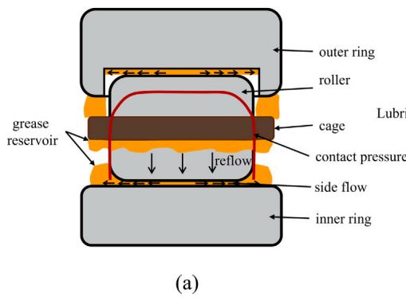

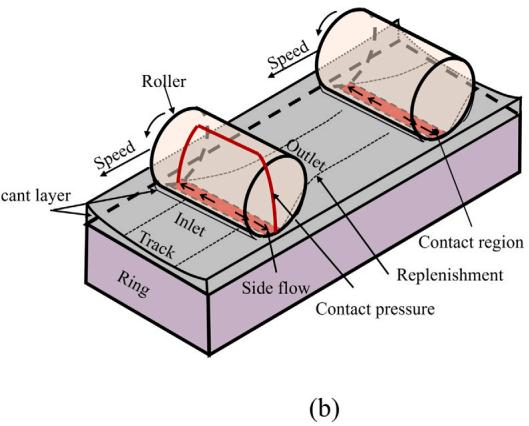  
Fig. 1. A grease-lubricated cylindrical roller bearing segment showing lubricant loss by contact pressure–driven side flow and reflow between two successive rollers. (a) Sectional view illustrating the grease reservoirs beneath the cage and along the sides of the raceway. (b) 3D schematic illustrating lubricant distribution. Note that the visual representations are not to scale; the layers and films are very thin (∼μ) relative to the contact size (∼mm).

Experimental studies on grease-lubricated ball bearings have provided further insights into these competing effects. After the churning phase of a low-speed operation, film thickness initially exceeds base oil predictions due to thickener contributions [30–33]. With increasing speed, the film grows and reaches a plateau, followed by starvation [34]. Load has a more pronounced influence under starved conditions—via contact pressure distribution which dominates the side flow and grease degradation—than under fully flooded regimes [9,22, 35–37].

However, lubrication mechanisms in cylindrical roller bearings (CRBs) differ substantially from those in ball bearings. Fig. 1 shows a schematic of a greased CRB: 1(a) illustrates the grease reservoirs beneath the cage and along the raceway sides, and 1(b) depicts lubricant redistribution due to side flow in the contact and reflow between two successive rollers. The wider line contact area results in reduced side flow within the contact zone [38], suggesting smaller lubricant losses. Small grease reservoirs typically form ahead of the contact, promoting inlet replenishment. Wen et al. [39] showed that in single-line, greaselubricated contacts, film thickness decays rapidly at first and then stabilizes due to the formation of a grease reservoir. Same phenomena were observed by Dyson et al. [18] in disc machine measurements, and by Wilson [40] in a CRB. Misalignment, often involving roller tilting or skewing, further complicates lubrication behavior by increasing local contact temperatures and inducing localized film thinning [41]. The magnitude and frequency of roller skew rise with both load and speed, which can accelerate the film thickness decay [10].

Relatively few studies have addressed the film mechanisms in greased CRBs. To fill this gap, the present work investigates the effects of rotational speed and radial load on the film thickness in a greased CRB during the bleeding phase. Film thickness is measured using the electrical capacitance method with an in-house-built bearing test rig described in Ref. [42]. The findings aim to improve the understanding of grease lubrication mechanisms under starved conditions and contribute to more accurate predictive models for film thickness in CRBs.

## 2. Experiments

## 2.1. Grease

Two lithium-thickened greases are used in this study: Li/M-100-2.5 and Li/SS-40-2.5. Both greases have a simple lithium thickener and different mineral base oils. The Li/SS-40-2.5 base oil is highly synthesized and has properties similar to synthetic oil [43]. Both greases are commercially available rolling bearing greases. Hence, the authors have no information regarding the additives in the greases. The known properties of the greases and their base oils are presented in Table 1. Given both greases have been investigated previously, further characterization details can be found in Refs. [36,43,44].

## 2.2. Measuring film thickness in cylindrical roller bearings

Test bearing: The test bearing is an assembly of an SKF NU206 ECP inner ring, an SKF N206 ECP outer ring, polyamide cage, one steel roller, twelve Si $\phantom { + } _ { 3 } \mathbf { N } _ { 4 }$ ceramic rollers, and two plastic flanges. Micrometer measurements give a radial clearance of 70 μm and an axial clearance between the plastic flanges and roller of 200 μm. 30% of the free volume in the bearing is initially filled with grease.

Test rig: The film thicknesses in the roller-ring contacts of a greaselubricated CRB are measured using an electrical capacitance method in an in-house-built bearing test rig. The method evaluates the film thickness by considering the surfaces in the contact (roller and raceway) as capacitor plates and the lubricant as the dielectric between them. A sectional view of the test rig is shown in Fig. 2. The electrically isolated test bearing is mounted on a shaft supported by two hybrid bearings (deep groove ball bearings with ceramic rolling elements and steel rings). The inner ring of the test bearing rotates with the shaft and is electrically connected to the Lubcheck system [45] via a mercury contact, while the outer ring remains stationary and is directly wired to Lubcheck. A speed encoder measures the shaft rotational speed, with a maximum operating speed of 7000 rpm. The test bearing is radially loaded via an aramid rope which is pulled upward by a pneumatic cylinder, with a maximum achievable radial load of 2000 N. A load sensor positioned in line with the cylinder continuously monitors the applied load.

To estimate lubricant viscosity and permittivity the temperature is needed. Direct measurement of roller-ring contact temperature is currently not feasible on our test rig. Given the high thermal conductivity of bearing steel, the temperature gradient through the rings at steady state is assumed low, hence, we measured the outer ring temperature for our analysis. In addition, for radially loaded cylindrical roller bearing operating at near pure rolling conditions, heat generation rate is relatively low. Higher temperature tests and more detailed thermal characterization will be possible following future improvements to the heating system of the test rig.

Table 1  
Properties of the tested greases and their base oils.
| Property · Viscosity of base oil at 40 °C · Viscosity of base oil at 100 °C · Density of base oil at 15 °C · Pressure-viscosity coefficient of base oil at 40 °C · Pressure-viscosity coefficient of base oil at 60 °C · Thermal conductivity of base oil λ at 22 °C | Li/SS-40-2.5 · 40 cSt · 8 cSt · 900 kg/m³ · 17.2 GPa−1 · 15.6 GPa−1 · 0.13W/m℃ | Li/M-100-2.5 · 102.8 cSt · 10.3 cSt · 891 kg/m³ · 31.8 GPa−1 · 25.4GPa−1 · 0.13W/m°C |
| --- | --- | --- |
| Temperature-viscosity coefficient of base oil β at 22 °C | 0.05 | 0.06 |
| Thickener weight percentage | 17% | 13% |
| NLGI consistency | 2.5 | 2.5 |

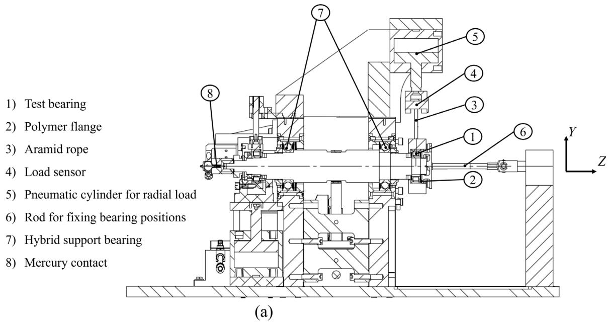  
Fig. 2. Sectional view of the test rig for measuring the film thickness in cylindrical roller bearings.

The outer ring temperature is monitored using two thermocouples, positioned in the loaded and unloaded zones of the outer ring. They are installed using an electrically insulating but thermally conductive gel. Temperature control of the test bearing is achieved by flowing heated air over the bearing housing, enabling test temperatures up to about $4 0 ~ ^ { \circ } \mathrm { C } .$ Cooling is similarly accomplished using laboratory air at room temperature with high flow rates, bringing temperatures down to approximately $2 5 ~ ^ { \circ } \mathrm { C }$ . Due to the practical limitations associated with heating at low bearing speeds for grease with low-viscosity base oil and cooling at high speeds for grease with high-viscosity base oil, all controlled-temperature experiments were conducted at 35 ◦C. This ensures stable and consistent operating conditions across the test matrix presented in Fig. 3.

The detailed construction and working principle of the test rig are in Ref. [42].

The electrical capacitance method: First, the effective relative permittivities of the base oils bled from the tested greases are determined via a calibration method introduced in Ref. [42]. The calibrations (one for each grease) are conducted under speed sweep measurements at different radial loads: 1000 N (C/P = 44), 1500 N $\left( \mathbf { C } / \mathbf { P } \right. = \left. 2 9 \right)$ , and 2000 N (C/P = 22). (Here, C/P is a dimensionless load parameter, where C denotes the basic dynamic load rating of the bearing and P the equivalent dynamic load representing the actual operating conditions. These high C/P values indicate a lightly loaded test bearing). During the calibration process, a large quantity of base oil is supplied to the test bearing to ensure fully flooded lubrication conditions. Under these conditions, the film thickness in the contacts can be estimated using the Dowson–Toyoda film thickness equation [46] corrected with inlet shear heating and compressibility. By correlating the measured capacitance during calibration with the calculated film thickness, and applying a modified Clausius–Mossotti equation [47]—which accounts for the effects of temperature and contact pressure on the relative permittivity—the effective relative permittivity of the base oil is determined. Our results show that the calibrated effective relative permittivity for each grease is independent of radial loads. The effective relative permittivity for Li/SS-40-2.5 is 2.53 for all the loads, and 2.87 for Li/M-100-2.5.

In this method, the bearing capacitance, arising from the contacts between the steel roller and rings, depends on the lubrication conditions. The film thickness is assumed uniform across the roller-ring contact. In addition to the bearing (contact) capacitance, the measured capacitance includes a background (parasitic) capacitance. This background capacitance is determined separately using a hybrid bearing with all ceramic rollers. The theoretical ratio of the film thickness in the roller-inner ring contact to that of the roller-outer ring contact in fully flooded conditions is used. The bearing capacitance consists of a contact capacitance, dependent only on the lubricant film, and an outside capacitance, influenced by both the film and an inlet meniscus that demarcates the lubricant-starved region. Under fully flooded conditions, the meniscus is positioned sufficiently distant from the contact, leaving film thickness as the only unknown, which can be evaluated from the measured capacitance and calibrated lubricant permittivity. Under starved conditions, a single-contact starvation model relates meniscus position to film thickness, reducing the problem to one unknown that is solved numerically.

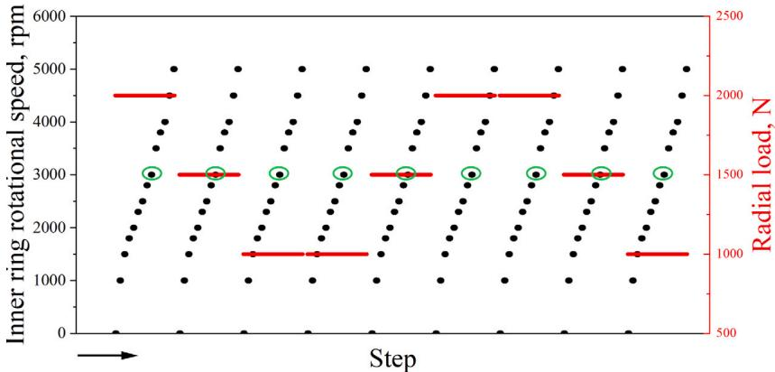  
Fig. 3. Speed and load conditions under which film thickness was measured during the bleed phase, showing the speed sweep (black dots) at each load (red lines). The load first goes stepwise down, then up, then down again. During each step, the conditions (speed and load) are held constant and the film thickness during the last hour of the steady temperature period is recorded. Controlled temperature = 35 ±1 ◦C. The circled points at 3000 rpm will be used to study the effect of load variations in the Results section.

The above is a concise summary of the film thickness measurement method. Given the important implications of the various steps in the approach and the need for accurate interpretation of the measurement results, we dedicated an entire paper to a detailed description of the experimental methodology. As such, we will not delve into further details in this paper. The reader is directly referred to Ref. [42] for more on the methodology.

Running in and grease churning: The test bearing starts up and runs for 90–150 h under 2000 N load and at a speed of either 4000 rpm or 6000 rpm until the film thickness signal becomes stable. The long duration is used to ensure that the initial running-in phase of grease churning has been completed sufficiently. The bearings operate under self-induced temperature during the running in, i. e., no active cooling or heating is used.

Steady-state speed and load sweep: After churning and a stable film thickness has been obtained, the speed and load sweep tests commence. First, the bearing is run at the selected constant load and speed. The bearing temperature–monitored via thermocouples at the top (unloaded zone) and bottom (loaded zone) of the outer ring–is controlled to $3 5 \pm 1 ^ { \circ } \mathrm { C } . \mathrm { A t } 3 5 ^ { \circ } \mathrm { C } ,$ the corresponding base oil viscosities are 0.12 Pa⋅s for Li/M-100-2.5 and 0.04 Pa⋅s for Li/SS-40-2.5. To reduce the dataset (note that the sampling rate is 10 kHz), the median value of film thickness is taken over 1 h. For each of the radial loads—1000, 1500 and 2000 N—the procedure is repeated for speeds in the range of 0-5000 rpm. The upper load limit of 2000 N is determined by the maximum pressure specification of the pneumatic load actuator, see the setup in Section 2.2. The lower load limit is selected to avoid roller-ring skidding at very low loads. The upper speed limit is set to minimize test rig vibrations which could interfere with accurate film thickness determination [48]. The lower speed limit is chosen to ensure full-film contact lubrication. Fig. 3 plots the steady-state operating conditions tested on the Li/SS-40-2.5 grease and the order in which the tests were performed. As lubrication in greased CRBs may be influenced by operating history, this measurement procedure was consistently applied to all the film thickness measurements with both greases.

The bearing rotation is stopped after each speed sweep, and a new speed sweep test is started for the next load step. The new test starts with a 30-minute run at 800/1000 rpm to obtain a steady temperature stabilization. To study the effect of load, the loads are first reduced, then increased, and finally reduced again. Based on our calculations using the numerical slicing technique [49,50] which was validated in our prior work [51], the selected loads correspond to contact forces of 406, 622, and 830 N with peak contact pressures of 0.95, 1.1, and 1.3 GPa, respectively, at the steel roller-inner ring contact in the most heavily loaded circumferential location in the bearing. The film thickness at that location is used in our subsequent analysis. The reported temperatures are the loaded zone temperatures which are slightly different than the unloaded zone temperatures (by about 1 ◦C).

## 3. Results and discussion

In this section, we first analyze the film thickness and temperature profiles during the initial running-in phase for both greases spanning 90 h or more. Then, the evolution and dynamic behavior of the steadystate film thickness are observed for the load sweep at the speed of 3000 rpm which is at the middle of the speed sweep range. After that, the median values of the hour-long steady state datasets are used to study the combined effects of load and speed on the early-life film thickness in a grease-lubricated cylindrical roller bearing after the grease churning phase. The measurements are compared with theoretical base oil film thickness predictions by analytical EHL formulas.

## 3.1. Running in and grease churning

Given the focus of this study on the steady-state behavior of grease lubrication, it is necessary to ensure stable lubrication conditions in the bearing (typically observed via steady temperature and film thickness) before commencing the discrete measurements. At the start of operation of a freshly grease-packed bearing, a large portion of the grease is displaced from the rolling track and accumulated near the edges of the inner and outer rings and around the cage. This is widely called the grease churning phase and it is typically accompanied by increased frictional heat generation which, in turn, increases temperature. The importance of the churning phase and its influence on subsequent steady-state behavior is anticipated, more so for greased CRBs in which lubrication can be strongly history-dependent. This is attributed to the amount and distribution of grease remaining on the raceway and cage at the end of churning, which facilitate the mechanisms that supply lubricant—e.g., via bleed—to the contact in later stages. Hence, we set out to run in at 4000 rpm and 6000 rpm (yielding entrainment speeds of 4.69 m/s and 7.03 m/s, respectively), and 2000 N to further study this behavior. However, during running in at 6000 rpm with Li/SS-40-2.5, the test rig exhibited significant vibration, compromising the measurement reliability. Consequently, this speed was not tested for Li/SS-40-2.5 grease.

Figs. 4 and 5 present the instantaneous film thickness and temperature during the running in period for both greases. The corresponding relative film thickness (a measure of starvation level evaluated as the ratio of the measured film thickness to the theoretical base oil-only film thickness) $h _ { \mathrm { I R , g } } / h _ { \mathrm { I R , c f f } }$ is plotted in Figs. 4b and 5b. Here, the subscript $" \mathrm { I R } , \ g '$ denotes the film thickness measured between the roller and the inner ring with grease, while ‘‘IR, cff’’ refers to the corresponding central film thickness predicted for fully flooded base oil lubrication in the same contact.

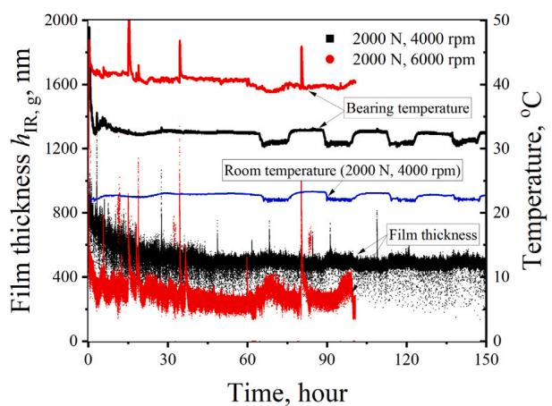

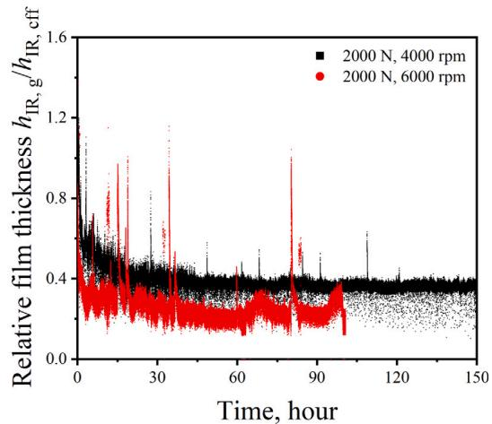  
Fig. 4. Evolution of film thickness, temperature at the highest loaded position and room temperature during grease churning in and continuous running-in of the test bearing lubricated with Li/M-100-2.5 under a radial load of 2000 N and rotational speeds of 4000 rpm and 6000 rpm. At 4000 rpm, the film thickness stabilizes after approximately 30 h.

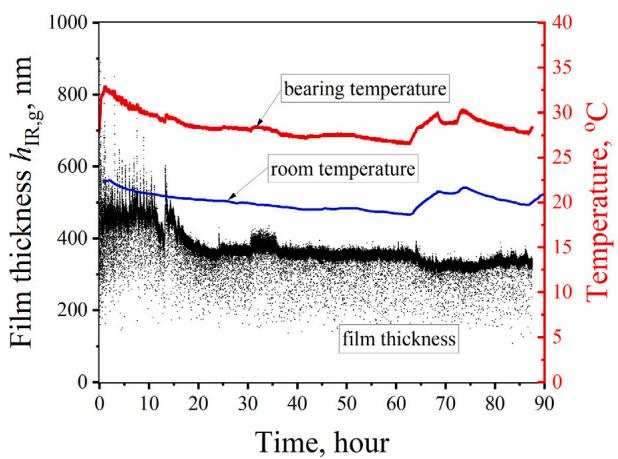

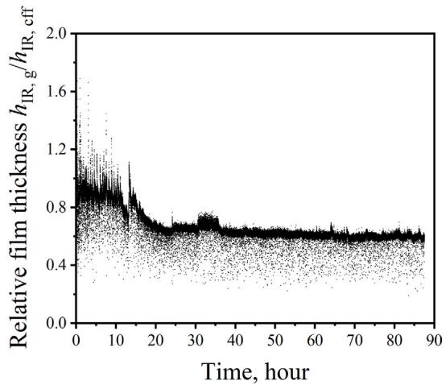  
Fig. 5. Evolution of film thickness, temperature at the highest loaded position and room temperature during grease churning in and continuous running-in of the test bearing lubricated with Li/SS-40-2.5 under a radial load of 2000 N and a rotational speed of 4000 rpm. The film thickness stabilizes after approximately 25 h.

The durations of the running-in tests presented in Figs. 4 and 5, one reaching 150 h and the other two about 90 h, were chosen simply to give sufficient margin after the appearance of churning completion. Unlike in ball bearings where churning has been consistently characterized, the knowledge of how grease churns in CRBs is limited. For ball bearings, a clear indication of churning completion is evident, see Refs. [2,52] in which the authors showed that the end of churning coincides with uniform grease redistribution in the bearing, typically accompanied by the stabilization of temperature and film thickness. As shown in Figs. 4 and 5 under 4000 rpm, both temperature and film thickness stabilized well before the 60th hour, albeit at different times, so the tests could have been stopped at or before 60 h without any impact on subsequent results. With this observation in Fig. 4 for Li/M grease—which was tested first—all subsequent running-in tests were stopped earlier.

As suggested in [53], churning behavior may depend on the ability of the grease microstructure to ‘‘rearrange’’ itself in response to shear.

Greases with good churning characteristics tend to maintain structural integrity and rapidly form channels, resulting in a shorter churning phase. In contrast, greases with poor churning behavior undergo prolonged microstructural degradation, leading to extended churning durations and delayed temperature stabilization.

Here, both greases show an abrupt rise in temperature at the beginning of the test, indicating the onset of the churning phase. Under identical operating conditions (2000 N, 4000 rpm), the peak temperature for Li/M-100-2.5 is approximately 42 ◦C which is higher than the peak temperature of 33 ◦C for Li/SS-40-2.5. Then, the temperatures drop and become stable. For Li/M-100-2.5 grease, both temperature and film thickness (black profiles in Fig. 4(a) appear to stabilize after about 30 h and for Li/SS-40-2.5, they (the red and black profiles in Fig. 5(a) appear to stabilize after about 25 h. Given the running in was performed under self-induced heat which is relatively low in CRBs, room temperature changes (blue lines in both figures)—e.g., during the overnight periods of the tests—impacted the bearing temperatures, as shown in Figs. 4 and 5.

At 6000 rpm, the churning temperature and film thickness profiles of Li/M-100-2.5 grease appear more chaotic and harder to resolve. Room temperature data is not available for that run. Therefore, the definitive churning implications of the peak temperature, temperature rise/drop duration, and film thickness stabilization in cylindrical roller bearings need further investigation.

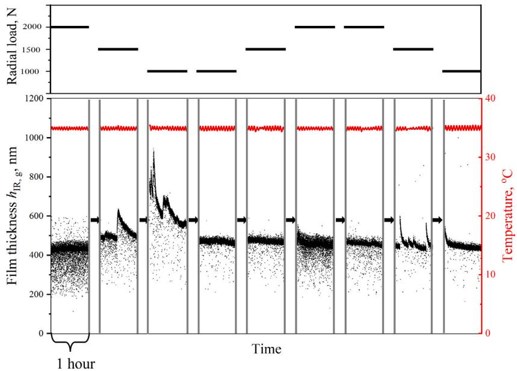  
Fig. 6. Evolution of film thickness and temperature over time as load decreased, increased, and decreased again, at a rotational speed of 3000 rpm. The test bearing was lubricated with Li/M-100-2.5 grease. The applied loads are 1000 N, 1500 N, and 2000 N. Temperature during the tests was $3 5 \pm 1 ^ { \circ } \mathrm { C } .$ Between each hour long load condition shown above, i.e., between one 3000 rpm test and the next (the regions with the black arrows), the bearing underwent the entire rpm range (3500, 3800, . . . , 4000, 0, 1000, . . . ., 2800) as shown in Fig. 3, with each speed condition lasting over an hour. In some cases, the test rig was shut down over night or over the weekend. Hence, the time interval between the load steps varies randomly.

Fig. 4 shows that for Li/M-100-2.5 grease under 2000 N and 4000 rpm, the initial film thickness is around 1000 nm, corresponding to a relative film thickness close to 1, suggesting fully flooded lubrication at start-up. During the first 30 h, the film thickness continuously decreases before reaching a stable value of around 450 nm, yielding a relative film thickness of 0.4, indicating starved lubrication during the post-churning steady-state operation. At 6000 rpm churning, the stabilized steady-state film is thinner, around 300 nm thick, with a corresponding relative thickness of about 0.3.

For Li/SS-40-2.5 grease (Fig. 5), the starting film thickness is around 500 nm with some scattered values reaching over 600 nm. The starting relative film thickness is around 1, similarly suggesting initial fully flooded conditions. The film thickness fluctuates about a median value for the first 15 h. It then drops and stabilizes at approximately 400 nm at the 25th hour, with a corresponding relative film thickness of 0.6, similarly indicating starvation during the post-churning steady-state operation. The similar trend in film thickness was observed in the grease-lubricated single line contact experiments reported by Dyson et al. [18].

For both greases, the initial film generated by the grease is thicker than that of the base oil fully flooding the contact due to the presence of the thickener. Over time, the film gradually thins out to a thickness lower than that of the base oil-only film, after which it remains nearly constant for a period. For the grease formulated with a higher-viscosity base oil, Li/M-100-2.5, the film thickness eventually decreases to about 40% of its initial value. In contrast, the grease based on a lowerviscosity oil, Li/SS-40-2.5, tends to stabilize at a relatively higher film thickness, at about 60% of the initial value.

## 3.2. Film thickness evolution over time with load variations

After post-churning stabilization, the film thickness was measured at various speeds and loads for one-hour intervals following the procedure shown in Fig. 3. Figs. 6 and 7 present the evolution of the time-series film thickness and temperature, at 3000 rpm only (the circled steps in Fig. 3), for Li/M-100-2.5 grease and Li/SS-40-2.5 respectively. It should be noted that our goal is not to investigate transient effects induced by load variation, but to study the film thickness stabilization behavior with different greases following the same measurement procedure. Between each 3000 rpm measurement, a sufficient time interval exists before and after changing the load, including stopping and restarting the bearing, and step-wise increase from the low speeds, each of which stabilized for an hour, before moving to the next speed. In some cases, the test rig was shut down overnight and over the weekend. Hence, the time interval between each 3000 rpm measurement is irregular, as high as 60 h in a few cases, and as low as 12 h in others. Therefore, the transient behavior shown in Figs. 6 and 7 is not due to sudden load transitions. The selection of 3000 rpm for evaluating film thickness evolution is motivated by measurement reliability: At lower speeds, the measured film thickness exhibits significant scatter, arising from factors such as surface roughness, bearing dynamics, and thickener effects, as detailed in Ref. [42]. These mechanisms are relevant but currently out of our intended scope which is to understand the behavior of EHL films in a stable contact. Also, at 3000 rpm and higher, trends are similar.

Fig. 6 shows a relatively stable film thickness at 2000 $N$ with a lot of scatter, similar to the stabilized region of the running-in test in Fig. 4. At 1500 N, the film thickness suddenly rises half-way through the measurement and slowly drops to its original value. At 1000 N the film becomes more unstable. Continuous running at this load eventually leads to a stable film. Subsequent load increases to 1500 N and 2000 N show no considerable shifts in film behavior. Instabilities due to microchurning—occasional jumps in film thickness due to small amounts of grease being redistributed or thrown back onto the track—appear again after the second downward transition in load from 2000 N to 1500 N, dying out at 1000 N. The destabilization appears to coincide with the downward load transitions and are more significant shortly after churning. Excluding the instabilities, the steady-state film thickness appears constant, not changing as load decreases or increases.

For the Li/SS-40-2.5 grease in Fig. 7, the grease is relatively stable in each hour-long steady operation, independent of the load transitions. Unlike the previous grease, this grease shows a consistent steady-state trend with load, increasing as load decreases and vice versa.

## 3.3. Effect of speed and load on film thickness

As the above results show, the film thickness is not constant but fluctuates within a certain range at steady state operating conditions.

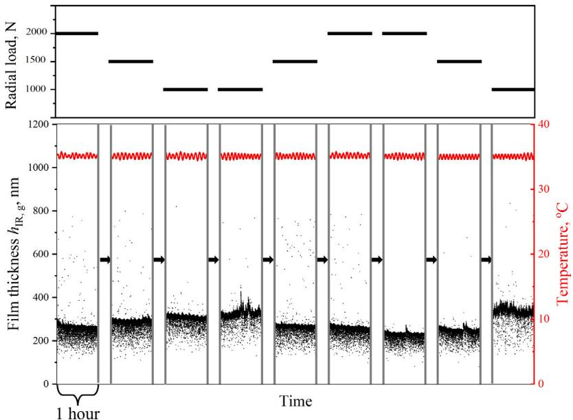  
Fig. 7. Evolution of film thickness and temperature over time as load decreased, increased, and decreased again, at a rotational speed of 3000 rpm. The test bearing was lubricated with Li/SS-40-2.5 grease. The applied loads are 1000 N, 1500 N, and 2000 N. Temperature variations during the tests were within ±1 ◦C. Between each our long load condition shown above, i.e., between one 3000 rpm test and the next (represented with the black arrows), the bearing underwent the entire speed range (3500, 3800, . . . , 5000, 0, 1000, . . . ., 2800) as shown in Fig. 3, with each speed condition lasting over an hour. In some cases, the test rig was shut down over night or over the weekend. Hence, the time interval between the load steps varies randomly.

For each test condition, the median film thickness was extracted from the hour-long data, and the interquartile ranges (25%–75%) are shown as error bars to represent data variability. The use of median values and interquartile ranges is based on prior statistical evaluation [42], which demonstrated that these metrics provide a robust representation of the data, particularly in the presence of variability and outliers (e.g., at low speeds).

Fig. 8a presents the measured film thickness of Li/M-100-2.5 as a function of roller-inner ring contact entrainment speed under radial loads of 1000 N, 1500 N, and 2000 N, alongside the fully flooded predictions calculated using the Dowson–Toyoda film thickness equations, incorporating inlet shear heating and compressibility effects under fully flooded base-oil lubrication conditions. The corresponding relative film thicknesses are shown in Fig. 8b. The measured film thicknesses under different loads almost coincide, particularly at higher speeds, indicating weak load dependence. This is also evident in Fig. 6, excluding the instabilities. As the entrainment speed increases to 1.4 m/s, the film thickness increases, with noticeable scatter. Then it levels off as the speed continues to increase. At 1000 N, the relative film thickness reaches approximately 1.1 at an entrainment speed of 1.4 m/s, suggesting a notable contribution from the thickener to the film thickness at low speeds. Then, it drops below 1 into the starved zone with further increase in speed. The relationship between film thickness and speed deviates from linearity on the log–log scale, showing typical starvation effects at higher speeds. This trend is consistent with observations in deep-groove ball bearings lubricated with the same grease [34]. The relative film thickness exhibits considerable variation at low speeds for all loads, but the data points converge as speed increases, stabilizing at approximately 0.4—close to the value observed during the stable portion of the running in test.

Fig. 9 compares the results obtained for Li/M-100-2.5 grease after different churning conditions: {2000 N, 4000 rpm} and {2000 N, 6000 rpm}. As shown in Fig. 8, the speed sweep results are nearly independent of load. Therefore, the data for the different loads are combined for simplicity. Although the stabilized post-churning film thickness during the running in tests (Fig. 4) differs for both speeds (with 6000 rpm resulting in a lower film thickness than 4000 rpm), the subsequent speed-sweep measurements follow almost identical trends.

This suggests that immediately after churning ends and before bleeding ensues, the film thickness response to changes in load and speed appears independent of the conditions under which the churning was completed. When bleeding starts, the grease reservoirs left on the raceway and cage during churning may contribute to film thickness. In other words, different churning conditions can alter the internal microstructure of the grease and, consequently, the amount of oil available at the onset of and during the bleed phase. This suggests that, even if comparable steady-state film thicknesses are observed initially, differences in churning history may influence the duration of effective lubrication. Supporting evidence from parallel ongoing studies, including ROF+ measurements of oil content under varying speeds, indicates that both oil availability and release behavior are sensitive to prior mechanical working.

Fig. 10a presents the measured steady-state film thickness of Li/SS-40-2.5 grease as a function of speed and load, along with the theoretical predictions using only the (fully flooded) base oil. The corresponding relative film thicknesses are shown in Fig. 10b. Other than for Li/M-100-2.5, for all loads, the film thickness continuously increases with entrainment speed, exhibiting an approximately linear relationship with speed on the log–log scale. For almost all the speeds, film thickness decreases with increasing load, a trend also observed in Fig. 7. The results suggest that the film thickness in the Li/SS-40-2.5 greaselubricated contacts under the influence of load and speed is consistently lower than for Li/M-100-2.5 but increase with increasing speed and decreasing load with a trend that is similar to the theoretical fully flooded prediction. Similarly, the relative film thickness shows smaller variation with speed under a given load compared with the Li/M-100- 2.5 grease. Like Li/M-100-2.5, at 1000 N, the relative film thickness reaches approximately 1.1 at an entrainment speed of 1.2 m/s, suggesting thickener contribution to the film thickness at low speeds. Then, it drops below 1, into the starved zone, at 2 m/s and higher.

## 3.4. Effect of grease properties on film thickness

The observed difference in film thickness between Li/M-100-2.5 and Li/SS-40-2.5 from Figs. 4 and 5, can be attributed to a dynamic balance between lubricant loss and replenishment, see Fig. 1 schematics. In cylindrical roller bearings, the side flow generated by the (line) contact pressure is much less than that in ball bearings with elliptical contacts. At 2000 N and 4000 rpm, the film thickness stabilized at approximately 500 nm for the Li/M-100-2.5 grease and 350 nm for the Li/SS-40- 2.5 grease. At 35 ◦C, Li/M-100-2.5 base oil exhibits a viscosity of about 0.12 Pa⋅s and a pressure–viscosity coefficient $lpha$ of approximately $3 3 . 0 \ \mathrm { G P a } ^ { - 1 }$ , whereas Li/SS-40-2.5 base oil has a lower viscosity of around 0.04 Pa⋅s and a pressure–viscosity coefficient of about 17.6 $\mathrm { G P a ^ { - 1 } }$ . As shown by Gao et al. [10], Van Zoelen’s side flow model is applicable to wide contacts with reasonable accuracy. For the same contact geometry, Van Zoelen’s analysis [9] indicates that the side flow rate scales as $\begin{array} { r l } { Q \ \propto \ } & { { } \frac { h ^ { 3 } } { \alpha \eta _ { 0 } } } \end{array}$ , with $Q$ denoting the side flow rate, ℎ the film thickness, $lpha$ the base oil pressure–viscosity coefficient, and $\eta _ { 0 }$ the dynamic viscosity of the base oil at the corresponding temperatures and ambient pressure. Based on this relationship, the pressure-induced side flow for Li/SS-40-2.5 is approximately twice that of Li/M-100-2.5. This implies that the replenishment must be twice as large for the Li/SS-40- 2.5 grease compared to the Li/M-100-2.5 grease. This replenishment is partly driven by grease bleed from the grease reservoirs under the cage bars, shown in Fig. 11.

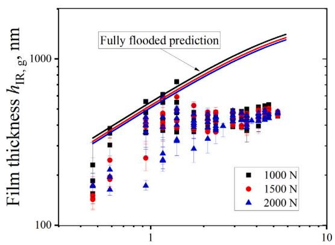  
Entrainment speed, m/s

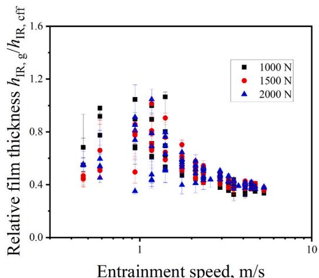  
Entrainment speed, m/s  
Fig. 8. Li/M-100-2.5 grease median film thickness as a function of speed under different loads together with the fully flooded base oil film thickness predictions. Controlled outer ring temperature $= 3 5 \mathrm { \Omega } ^ { \circ } \mathrm { C } .$ Error bars represent the interquartile range (25th–75th percentile) of the measured data. The combined surface roughness is $R _ { \mathrm { a } } = 1 0 9 ~ \mathrm { n m }$

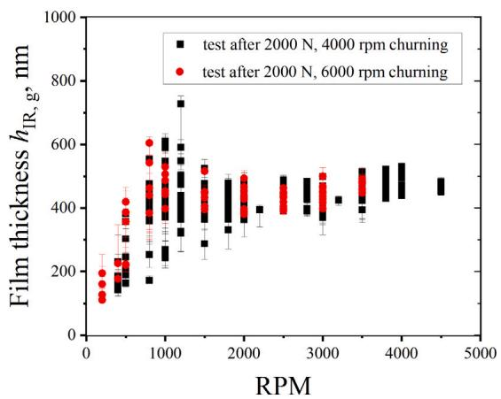

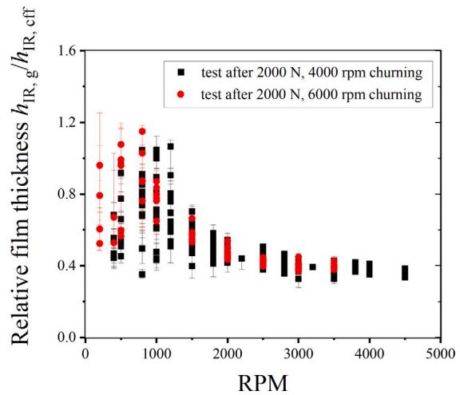  
Fig. 9. Comparison of the speed sweep film thickness results for Li/M-100-2.5 grease after different initial grease churning conditions. The median steady-state film thickness as a function of speed under different loads at 35 ◦C is shown. Error bars represent the interquartile range (25th–75th percentile) of the measured data.

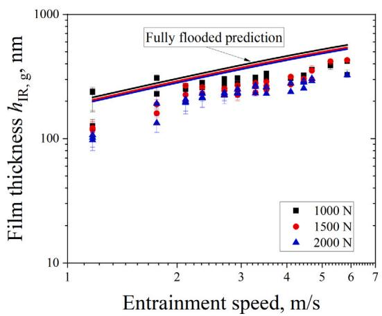

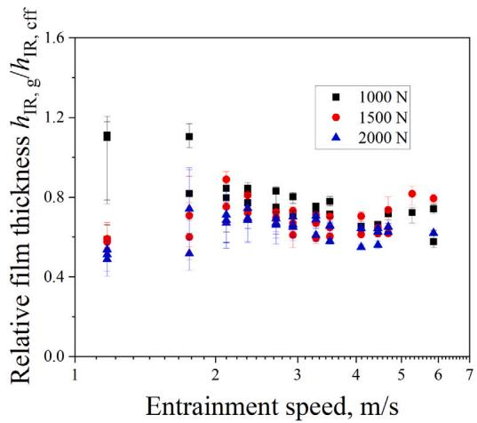  
Fig. 10. Li/SS-40-2.5 grease median film thickness as a function of speed under different loads along with the fully flooded film thickness predictions with base oil only. Controlled outer ring temperature $= 3 5 \mathrm { ~ } ^ { \circ } \mathrm { C } .$ . Error bars represent the interquartile range (25th–75th percentile) of the measured data. The combined surface roughness is $R _ { \mathrm { a } } = 1 0 9 ~ \mathrm { n m } .$

Li/M-100-2.5  
Li/SS-40-2.5  
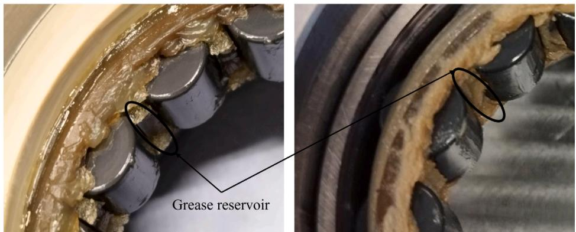  
Fig. 11. Grease distribution in the bearing after the tests with both greases, showing a large amount of grease located on the cage for the Li/SS-40-2.5 and Li/M-100-2.5 greases. For Li/SS-40-2.5, there was more grease accumulated below the cage bars between the rollers. Hence, Li/SS-40-2.5 has a larger grease reservoir for bleeding, compared to Li/M-100-2.5.

The size of the reservoir is determined primarily by the grease stiffness and the centrifugal forces. This explains the difference in film thickness between the 4000 rpm and 6000 rpm running-in of Li/M-100- 2.5 in Fig. 4: higher speed leads to higher centrifugal force and a lower amount of grease on the cage, which might lead to less lubricant supply to the track, leading to thinner films. Note that this does not apply to the effect of speed in the other figures. For the step-wise speed increase in the speed sweeps, the grease reservoir size is given by the volume formed at the highest speed and this volume is anticipated to remain the same when the speed is subsequently lowered. Specifically, during the churning phase, the bearing is operated at a relatively high speed (4000 or 6000 rpm) for an extended period, leading to significant grease migration. The resulting grease reservoir, particularly the grease accumulated under the cage, is governed by the balance between centrifugal forces and the grease’s ability to adhere to the cage surfaces. In the subsequent step-wise speed sweep measurements, the operating speeds are lower than or approximately equal to those applied during the churning phase, with each speed measurement lasting only 1 h. Consequently, in our tests, the centrifugal forces acting on the grease do not exceed those experienced during the reservoir-forming churning phase. As a result, further redistribution of grease on the cage is expected to be minimal, and the reservoir volume established at the highest speed is assumed to remain effectively unchanged during the speed sweep measurements. However, if a much higher speed condition is subsequently tested, the grease reservoirs may redistribute.

Oil bleed from the grease under the cage bars is generally referred to as ’dynamic bleed’ and is measured using a centrifuge [54]. Here, we used grease samples of 35.3 g. Initially, the centrifuge was operated at 6000 rpm and room temperature for 5 min to distribute the grease at the bottom of the container. Then the rotational speed was increased to 13 000 rpm and the temperature to 40 ◦C, and the samples were centrifuged under these conditions for 10 h. The dynamic bleed was assessed by comparing the amount of oil bled out from each grease during this process. Fig. 12 presents the dynamic bleed results for the two greases after 4 and 10 h of centrifugation. For this comparative tests, the percentage of separated oil ($V$ ) [54] is approximately 19% for Li/M-100-2.5 grease and 32% for Li/SS-40-2.5 grease with the time ($H$) of 10 h.

These results show that Li/SS-40-2.5 releases oil at roughly twice the rate of Li/M-100-2.5, appearing to verify the above-predicted replenishment needed to stabilize the thickness of the film formed by Li/SS-40-2.5 at a lower value than that of Li/M-100-2.5. These measurements represent the specific grease bleed, i.e., bleed per unit volume of grease. Recall the earlier suggestion that the volume of grease under the cage is determined by operating speed and grease stiffness (or consistency). This consistency, a measure of the grease mechanical stability and oil content, changes during bearing operation due to shear. Our investigations show that Li/SS-40-2.5 has a higher shear stability than Li/M-100-2.5, the latter softening significantly when sheared in a grease worker [55]. Under the identical working conditions of 60 000 strokes, the grease viscosity decreased from 2.54 to 1.63 Pa⋅s for Li/SS-40-2.5 grease and from 3.40 to 1.54 Pa⋅s for Li/M-100-2.5, corresponding to reductions of 36% and 55%, respectively. The softer the grease, the lower its ability to form stable reservoirs. Fig. 11 shows that the grease reservoirs formed by Li/M-100-2.5 are much smaller than those for Li/SS-40-2.5. This may further explain the apparent better replenishment by Li/SS-40-2.5.

The process of oil bleed/release from the grease reservoirs under the cage after churning (hence, after severe thermo-mechanical work onto the grease) is complex. Thus, the observations, hypotheses, and inferences made here are tentative. However, these measurements and observations are valuable inputs for further research on grease lubrication in rolling element bearings. Future work incorporating a wider range of grease types and operating conditions in CRBs, along with direct comparisons to ball bearings, will improve the understanding of the lubrication mechanisms in greased rolling bearings.

## 4. Summary and conclusions

In this study, the film thickness in a grease-lubricated cylindrical roller bearing was measured at the highest-loaded roller position using the electrical capacitance method. The effects of varying load and rotational speed on the film thickness were investigated. Two greases with the same thickener, different base oil viscosities and different oilbleeding properties were tested. There are a few similarities and many differences in the grease behaviors. The summary and main conclusions are:

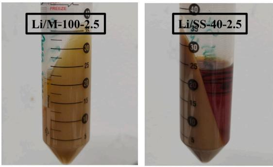  
(a). After 4 hours

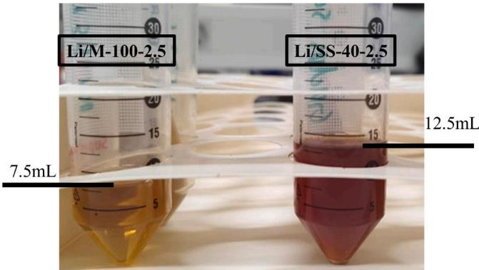  
(b). After 10 hours  
Fig. 12. Oil bled out from Li/M-100-2.5 and Li/SS-40-2.5 greases after (a) 4 h and (b) 10 h of centrifugation at 40 ◦C and 13 000 rpm. The Li/SS-40-2.5 grease shows a bled amount approximately twice that of the Li/M-100-2.5 grease. This behavior is consistent with earlier observations of static bleeding for the same two greases [43].

1. During the churning phase, both the initial temperature rise and the duration required to reach a stable temperature are similar for both greases (accounting for ambient temperature effects).

2. At low entrainment speeds, below 2 m/s, both greases achieved relative film thickness greater than 1, indicating potential thickener contributions.

3. The post-churning film behaviors of both greases mostly differ. The differences are observed in the stabilized film thicknesses and starvation levels: the higher-viscosity Li/M-100-2.5 grease yields a higher film thickness but the contact experiences more severe starvation than the lower-viscosity Li/SS-40-2.5 grease.

4. Shortly after the bearing running-in/grease churning phase, both grease types show different film stabilization responses to load changes, with the higher-viscosity base oil grease yielding more instabilities than the lower-viscosity base oil grease. Over time, both greases yield stable films at steady operating conditions.

5. Shortly after the bearing running-in/grease churning and before the bleeding phase, one grease’s steady-state film thickness response to speed and load changes appears independent of the preceding churning speed and load used to run it in. However, in the subsequent bleeding phase, the churning-created grease reservoirs on the raceways and cage may impact the film formation.

6. The thicknesses of the films formed by both greases exhibit different trends with increasing speed at a fixed load. The trend with load transitions at a fixed speed is also different for both greases.

7. For the grease with a high-viscosity base oil and lower bleeding rate, as speed increases, the film thickness initially rises, similar to its analytical model-predicted fully flooded base oil-only film thickness. However, beyond a certain speed, limited lubricant on the track leads to a plateau in film thickness (in contradistinction to the predicted base oil film thickness). For this grease, the overall influence of load on steady-state film thickness is minimal.

8. The thickness of the film formed by the grease with lower base oil viscosity and higher bleeding rate is close to the fully flooded film thickness. This suggests that the additional supply from the grease reservoirs was relatively large compared to the loss via side flow, leading to a film thickness behavior similar to its predicted base oil-only film thickness under fully flooded conditions. Here, the film thickness increases with speed and decreases with increasing load.

## CRediT authorship contribution statement

Min Gao: Writing – original draft, Visualization, Validation, Methodology, Investigation, Formal analysis, Data curation. Jude A. Osara: Writing – review & editing, Supervision, Project administration, Investigation. Norbert F. Bader: Writing – review & editing, Supervision, Investigation. Marco T. van Zoelen: Writing – review & editing, Supervision, Methodology, Investigation. Rihard Pasaribu: Writing – review & editing, Supervision, Funding acquisition. Piet M. Lugt: Writing – review & editing, Supervision, Methodology, Funding acquisition, Conceptualization.

## Declaration of competing interest

The authors declare that they have no known competing financial interests or personal relationships that could have appeared to influence the work reported in this paper.

## Acknowledgments

We thank SKF Research and Technology Development and Shell Downstream Services International BV, The Netherlands. for funding this work. We also thank Mr. R. J. Meijer for providing the experimental grease worker results for the tested greases.

## Data availability

Data will be made available on request.

## References

[1] Booser ER, Wilcock DF. Minimum oil requirements of ball bearings. Lubr Eng 1953;9(3):140–3.

[2] Chatra K. R S, Lugt PM. The process of churning in a grease lubricated rolling bearing: Channeling and clearing. Tribol Int 2021;153:106661.

[3] Hamrock BJ, Dowson D. Isothermal elastohydrodynamic lubrication of point contacts: Part III—Fully flooded results. J Lubr Technol 1977;99(2):264–75.

[4] Dowson D. Elastohydrodynamic lubrication. Fundam Roll Gear Lubr 1966.

[5] Hamrock BJ, Dowson D. Isothermal elastohydrodynamic lubrication of point contacts: Part IV—Starvation results. J Lubr Technol 1977;99(1):15–23.

[6] Wolveridge PE, Baglin KP, Archard JF. The starved lubrication of cylinders in line contact. Proc Inst Mech Eng 1970;185(1):1159–69.

[7] Wymer DG, Cameron A. Elastohydrodynamic lubrication of a line contact. Proc Inst Mech Eng 1974;188(1):221–38.

[8] Dmytrychenko N, Aksyonov A, Gohar R, Wan G. Elastohydrodynamic lubrication of line contacts. Wear 1991:150(1–2):303–13.

[9] van Zoelen MT. Thin layer flow in rolling element bearings [Ph.D. thesis], The Netherlands: University of Twente; 2009, ISBN 978-90-365-2934-1.

[10] Gao M, van Zoelen MT, Osara JA, Meeuwenoord R, Pasaribu R, Lugt PM. Film thickness decay in grease lubricated wide elliptical contacts. Tribol Int 2025;111137.

[11] Chiu YP. An analysis and prediction of lubricant film starvation in rolling contact systems. ASLE Trans 1974;17(1):22–35.

[12] Jacod B, Pubilier F, Cann PME, Lubrecht AA. An analysis of track replenishment mechanisms in the starved regime. In: Tribology series. vol. 36, Elsevier; 1999, p. 483–92.

[13] Gershuni L, Larson MG, Lugt PM. Lubricant replenishment in rolling bearing contacts. Tribol Trans 2008;51(5):643–51.

[14] Fischer D, von Goeldel S, Jacobs G, Stratmann A. Numerical investigation of effects on replenishment in rolling point contacts using CFD simulations. Tribol Int 2021;157:106858.

[15] Damiens B, Lubrecht AA, Cann PM. Influence of cage clearance on bearing lubrication©. Tribol Trans 2004;47(1):2–6.

[16] Gao M, Liang H, Wang W, Chen H. Oil redistribution and replenishment on stationary bearing inner raceway. Tribol Int 2022;165:107315.

[17] Cen H, Lugt PM. Effect of start-stop motion on contact replenishment in a grease lubricated deep groove ball bearing. Tribol Int 2021;157:106882.

[18] Dyson A, Wilson AR. Film thicknesses in elastohydrodynamic lubrication of rollers by greases. In: Proceedings of the institution of mechanical engineers, conference proceedings. vol. 184, SAGE Publications Sage UK: London, England; 1969, p. 1–11.

[19] Cen H, Lugt PM. Film thickness in a grease lubricated ball bearing. Tribol Int 2019;134:26–35.

[20] Cann PME, Chevalier F, Lubrecht AA. Track depletion and replenishment in a grease lubricated point contact: A quantitative analysis. In: Tribology series. vol. 32, Elsevier; 1997, p. 405–13.

[21] Kingsbury E. Cross flow in a starved EHD contact. Asle Trans 1973;16(4):276–80.

[22] Venner CH, van Zoelen MT, Lugt PM. Thin layer flow and film decay modeling for grease lubricated rolling bearings. Tribol Int 2012;47:175–87.

[23] Chevalier F, Lubrecht AA, Cann PME, Colin F, Dalmaz G. Film thickness in starved EHL point contacts. J Tribol 1998.

[24] Damiens B, Venner CH, Cann PME, Lubrecht AA. Starved lubrication of elliptical EHD contacts. J Tribol 2004;126(1):105–11.

[25] Kostal D, Sperka P, Svoboda P, Krupka I, Hartl M. Influence of lubricant inlet film thickness on elastohydrodynamically lubricated contact starvation. J Tribol 2017:139(5):051503.

[26] Zhang S, Klinghart B, Jacobs G, von Goeldel S, König F. Prediction of bleeding behavior and film thickness evolution in grease lubricated rolling contacts. Tribol Int 2024;193:109369.

[27] van Zoelen MT, Venner CH, Lugt PM. Free surface thin layer flow in bearings induced by centrifugal effects. Tribol Trans 2010;53(3):297–307.

[28] Liang H, Guo D, Ma L, Luo J. Experimental investigation of centrifugal effects on lubricant replenishment in the starved regime at high speeds. Tribol Lett 2015;59:1–9.

[29] Baart P, van der Vorst B, Lugt PM, van Ostayen RAJ. Oil-bleeding model for lubricating grease based on viscous flow through a porous microstructure. Tribol Trans 2010;53(3):340–8.

[30] Cen H, Lugt PM, Morales-Espejel GE. On the film thickness of grease-lubricated contacts at low speeds. Tribol Trans 2014;57(4):668–78.

[31] Morales-Espejel GE, Lugt PM, Pasaribu HR, Cen H. Film thickness in grease lubricated slow rotating rolling bearings. Tribol Int 2014;74:7–19.

[32] Cen H, Lugt PM, Morales-Espejel GE. Film thickness of mechanically worked lubricating grease at very low speeds. Tribol Trans 2014;57(6):1066–71.

[33] Okal M, Kostal D, Osara JA, Lugt PM, Krupka I, Hartl M. Experimental study of the effect of thickener on the film thickness in the contacts of a grease-lubricated ball bearing at low speed. Tribol Trans 2025;68(1):28–38.

[34] Shetty P, Meijer RJ, Osara JA, Lugt PM. Measuring film thickness in starved grease-lubricated ball bearings: An improved electrical capacitance method. Tribol Trans 2022;65(5):869–79.

[35] Cen H, Lugt PM. Replenishment of the EHL contacts in a grease lubricated ball bearing. Tribol Int 2020;146:106064.

[36] Shetty P, Meijer RJ, Osara JA, Pasaribu R, Lugt PM. Film thickness in grease-lubricated deep groove ball bearings—A master curve. Tribol Trans 2024;67(5):1057–68.

[37] Lugt PM. Grease lubrication in rolling bearings. John Wiley & Sons; 2012.

[38] Wheeler J-D, Fillot N, Vergne P, Philippon D, Espejel GEM. On the crucial role of ellipticity on elastohydrodynamic film thickness and friction. Proc Inst Mech Eng J 2016;230(12):1503–15.

[39] Wen S, Ying T. A theoretical and experimental study of EHL lubricated with grease. J Tribol 1988.

[40] Wilson AR. The relative thickness of grease and oil films in rolling bearings. Proc Inst Mech Eng 1979;193(1):185–92.

[41] Liu X, Yang P, Yang P. Analysis of the lubricating mechanism for tilting rollers in rolling bearings. Proc Inst Mech Eng J: J Eng Tribol 2011;225(11):1059–70.

[42] Gao M, Bader N, Osara J, van Zoelen M, Pasaribu R, A. W, Lugt P. Film thickness measurement in grease-lubricated cylindrical roller bearings with electrical capacitance method. Tribol Int 2026;112018.

[43] Dokter J, Osara JA. On the thermal degradation of lubricant grease: Experiments. J Tribol 2025;147(9):091119.

[44] Hogenberk F, Osara JA, van den Ende D, Lugt PM. On the evolution of oilseparation properties of lubricating greases under shear degradation. Tribol Int 2023;179:108154.

[45] Heemskerk RS, Vermeiren KN, Dolfsma H. Measurement of lubrication condition in rolling element bearings. ASLE Trans 1982:25(4):519–27.

[46] Dowson D, Toyoda S. A central film thickness formula for elastohydrodynamic line contacts. elastohydrodynamics and related topics. In: Proc. 5th leeds-lvon symp., 1978. vol. 60, Elsevier; 1978.

[47] Schrader R. Zur schmierfilmbildung von schmierölen und schmierfetten im elastohydrodynamischen wälzkontakt [Ph.D. thesis], Universtait Hannover; 1988.

[48] Shetty P, Meijer RJ, Osara JA, Pasaribu R, Lugt PM. Vibrations and film thickness in grease-lubricated deep groove ball bearings. Tribol Int 2024;193:109325.

[49] Teutsch R, Sauer B. An alternative slicing technique to consider pressure concentrations in non-Hertzian line contacts. J Tribol 2004;126(3):436–42.

[50] Yang H, Cheng G, Deng S, Du H. Analysis of the roller-race contact deformation of cylindrical roller bering using a improved slice method. In: 2011 international conference on mechatronic science, electric engineering and computer. MEC, IEEE; 2011, p. 711–4.

[51] Gao M, Osara JA, van Zoelen M, Meeuwenoord R, Pasaribu R, Lugt PM. Analytical predictions and experimental measurements of EHL film thickness in wide elliptical and line contacts. Tribol Int 2025:110893.

[52] Chatra KS, Osara JA, Lugt PM. The lubrication mechanism behind the transition from churning to bleeding in grease lubricated bearings–experimental characterization. Tribol Int 2023;183:108375.

[53] Chatra SKR, Lugt PM. Channeling behavior of lubricating greases in rolling bearings: Identification and characterization. Tribol Int 2020;143:106061.

[54] Standard test method for oil separation from lubricating grease by centrifuging (Koppers method). 2009, Reapproved 2014.

[55] Meijer RJ, Lugt PM. The grease worker and its applicability to study mechanical aging of lubricating greases for rolling bearings. Tribol Trans 2021;65(1):32–45.
